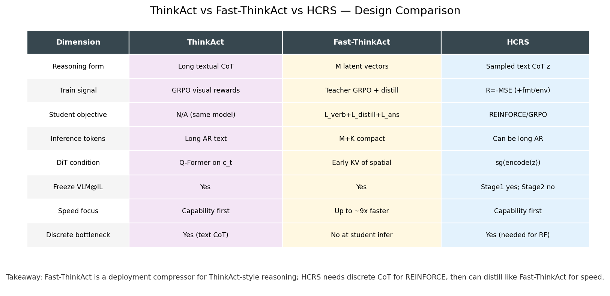
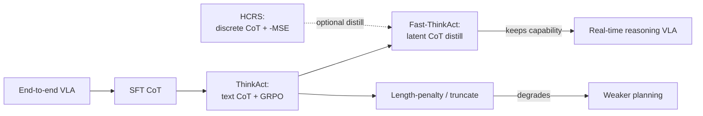
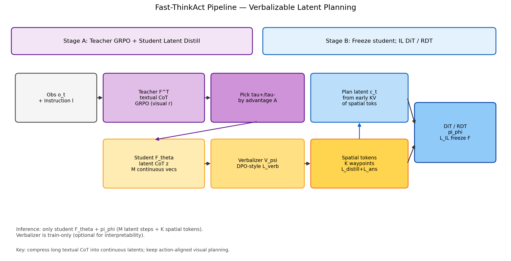
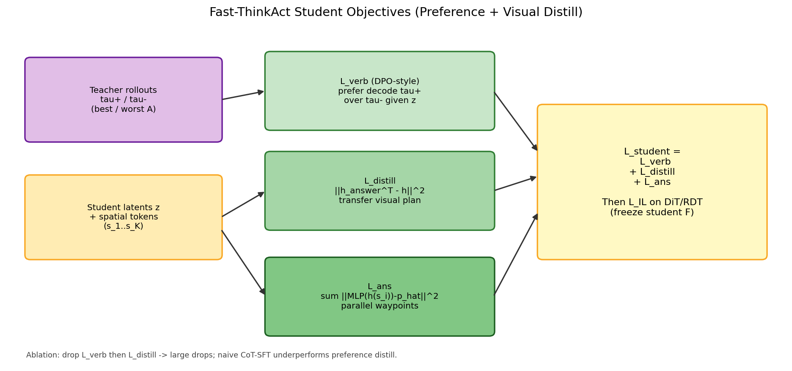
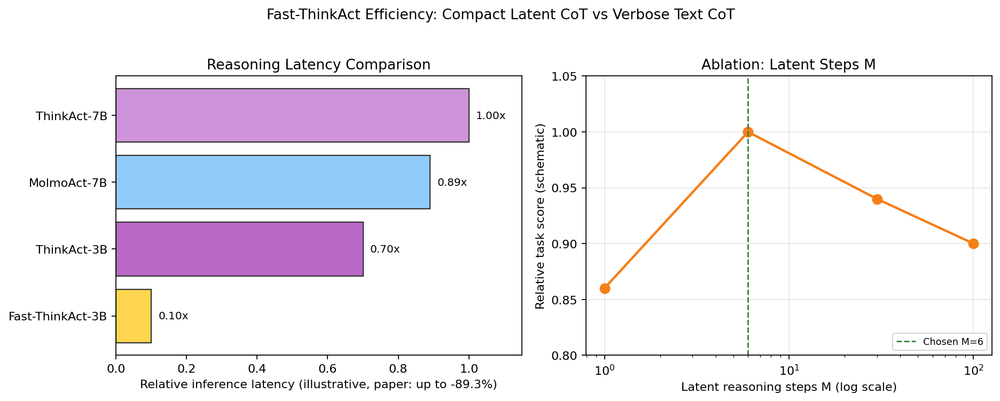
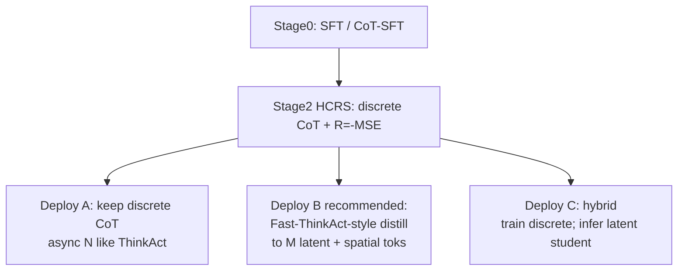
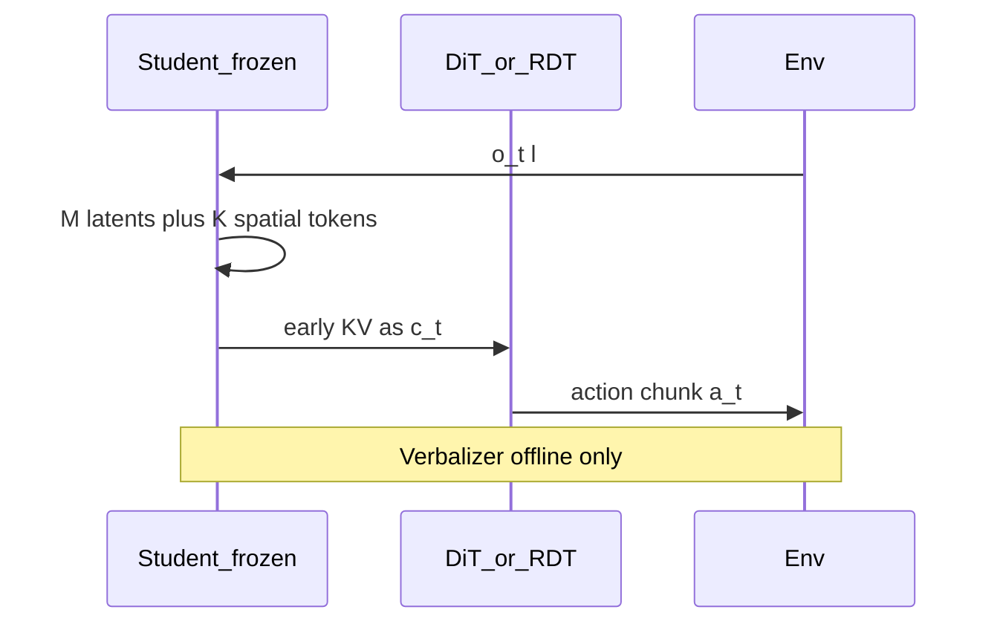
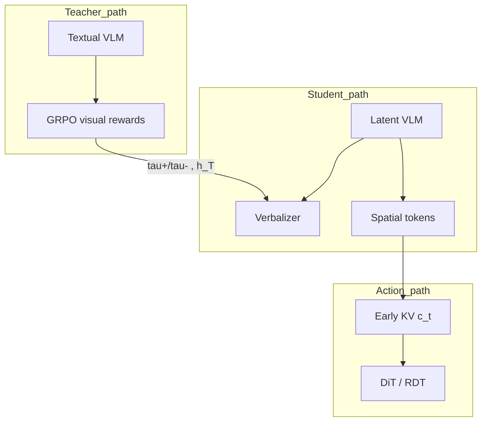

# Fast-ThinkAct 深度解析：Verbalizable Latent Planning 与 CoT+DiT VLA

> **主源**：本地 TeX [`FastThinkAct_TeX_Source/`](FastThinkAct_TeX_Source/)（Huang et al., *Fast-ThinkAct: Efficient Vision-Language-Action Reasoning via Verbalizable Latent Planning*；arXiv:2601.09708；CVPR 2026）。  
> **项目页**：[https://jasper0314-huang.github.io/fast-thinkact/](https://jasper0314-huang.github.io/fast-thinkact/)  
> **前作**：[ThinkAct](https://jasper0314-huang.github.io/thinkact-vla/)（NeurIPS 2025）；本仓库解析见 [`thinkact_1.md`](thinkact_1.md)。  
> **目标**：弄清 Fast-ThinkAct 如何把**冗长文本 CoT**压成**可言语化的连续 latent CoT**，并回答——**对「离散 CoT 采样 + DiT MSE」的 HCRS**（[`../ov/grpo_vla_analyz_1.md`](../ov/grpo_vla_analyz_1.md) §11）哪些可直接借用、哪些必须改写。  
> **配图**：[`asset/`](asset/) 下 matplotlib 脚本生成（图内文字为英文）。

---

## 目录

1. [摘要与问题同构](#1-摘要与问题同构)
2. [纵向演进：从 ThinkAct 文本到 Fast-ThinkAct latent](#2-纵向演进从-thinkact-文本到-fast-thinkact-latent)
3. [核心方法解剖](#3-核心方法解剖)
4. [训练配方与消融（论文证据）](#4-训练配方与消融论文证据)
5. [横向对比：ThinkAct / Fast-ThinkAct / SCST / HCRS](#5-横向对比thinkact--fast-thinkact--scst--hcrs)
6. [对 CoT+DiT VLA 的可迁移清单](#6-对-cotdit-vla-的可迁移清单)
7. [开源代码能否拿来用](#7-开源代码能否拿来用)
8. [动态视图](#8-动态视图)
9. [小结与交叉索引](#9-小结与交叉索引)

---

## 1. 摘要与问题同构

### 1.1 论文在解决什么

Reasoning VLA（ECoT、CoT-VLA、ThinkAct、MolmoAct 等）用显式 CoT 提升长程规划与泛化，但**自回归长文本推理**把决策频率压到亚 Hz，与机器人 1–15 Hz 控制需求冲突。简单砍掉文本长度（ECoT-Lite、length penalty、硬截断）会丢关键空间–时间信息。

Fast-ThinkAct 的回答：

1. **教师** \(\mathcal{F}_\theta^T\)：仍走 ThinkAct 式 **文本 CoT + GRPO（action-aligned visual rewards）**。  
2. **学生** \(\mathcal{F}_\theta\)：把推理压成 \(M\) 个**连续 latent 向量** \(\mathbf{z}=\{z_m\}\)，再用 **verbalizer**（DPO 风格偏好）+ **轨迹隐状态蒸馏** + **并行 spatial tokens 回归 waypoint**。  
3. **动作**：冻结学生，用 spatial token 的 **early-layer KV** 条件化 DiT-Policy / RDT，做 IL。

宣称：相对 ThinkAct-7B / MolmoAct-7B 推理延迟可降约 **89%**；同尺寸相对 ThinkAct-3B 约 **7×** 更快；LIBERO / SimplerEnv / RoboTwin2.0 上仍强。

### 1.2 与「CoT + DiT / HCRS」为何同构、又何处断裂

| 维度 | Fast-ThinkAct | HCRS（提案） |
|------|---------------|--------------|
| 训练期「想」 | 教师离散文本 CoT（GRPO） | VLM 离散采样 CoT \(z\) |
| 部署期「想」 | **连续 latent** \(M\) 步（无可导采样瓶颈） | 仍可为离散 CoT（或再蒸馏） |
| VLM↔动作桥 | spatial KV → DiT/RDT | `sg(encode(z))` → DiT |
| 塑形信号 | 教师 visual reward；学生 preference+L2 | \(R=-\mathrm{MSE}\) 等 |
| DiT 阶段 | **冻** \(\mathcal{F}_\theta\) | Stage1 冻；Stage2 可联合 |
| 核心卖点 | **延迟** | **用动作 MSE 推推理** |

一句话：Fast-ThinkAct 是 ThinkAct 的**部署压缩器**（能力来自教师 GRPO，速度来自 latent 学生）；HCRS 若坚持「对离散 CoT 做 REINFORCE」，则与**学生推理路径**不同构——应把 Fast-ThinkAct 当作 **Stage-Deploy** 或 **并行效率路线**，而非直接替换 HCRS 的 RL 数学。



---

## 2. 纵向演进：从 ThinkAct 文本到 Fast-ThinkAct latent

### 2.1 谱系



| 方法 | 核心想法 | 优点 | 缺点 | 适合场景 |
|------|----------|------|------|----------|
| **ThinkAct** | 文本 CoT + 视觉奖励 GRPO | 推理可解释、接地动作 | 推理慢 | 离线/低频决策 |
| **砍长度 / length-penalty** | 少生成 token | 实现简单 | 论文消融：平均分掉点 | 弱实时折中 |
| **ECoT-Lite** | reasoning dropout | 降延迟 | 信息丢失风险 | 已有冗长 SFT-CoT |
| **Fast-ThinkAct** | 偏好蒸馏 + 轨迹对齐 → latent | **快且往往更强** | 管线重（教师+学生+verbalizer） | 真机高频控制 |
| **HCRS** | 离散 CoT + \(-\mathrm{MSE}\) | 动作拟合闭环 | 部署仍可能慢 | 先能力后速度 |

### 2.2 为何「可言语化 latent」关键

latent 空间没有天然监督。Fast-ThinkAct 用 **verbalizer** \(\mathcal{V}_\psi\) 把 \(\mathbf{z}\) 解码回自然语言，并在 **\(\tau^+/\tau^-\)**（同组最高/最低 advantage）上做 DPO 式偏好——让 latent「说得出」高质量推理、压住低质量模式。同时用 **`<answer>` 隐状态 L2** 与 **waypoint MSE** 保住 ThinkAct 的视觉规划。这比「盲目压缩 token」更有结构。

相对纯连续可微 CoT（ACoT 类）：此处训练仍锚定**离散教师偏好**；推理则切到连续，换速度。

---

## 3. 核心方法解剖

紧贴 [`sections/3_method.tex`](FastThinkAct_TeX_Source/sections/3_method.tex) 与 [`algorithm/train.tex`](FastThinkAct_TeX_Source/algorithm/train.tex)。

### 3.1 问题设定

\[
\mathbf{z},\,c_t=\mathcal{F}_\theta(o_t,l),\qquad
a_t\sim\pi_\phi(\,\cdot\mid o_t,l,c_t).
\]

学生在连续空间做 latent CoT；\(c_t\) 来自 spatial tokens 的规划表示。



### 3.2 教师：文本 GRPO（继承 ThinkAct）

\[
\mathcal{J}_{\mathrm{GRPO}}(\theta)
=\mathbb{E}_{\tau\sim\mathcal{F}_\theta^T}
\Big[\min\big(r_\theta(\tau)A(\tau),\,\mathrm{clip}(r_\theta(\tau),1-\epsilon,1+\epsilon)A(\tau)\big)\Big],
\]

\[
A(\tau)=\frac{R_\tau-\mathrm{mean}(\{R_i\})}{\mathrm{std}(\{R_i\})}.
\]

奖励为 ThinkAct 式 trajectory-level visual rewards（goal + traj）+ QA。每组选：

\[
\tau^+=\arg\max A(\tau),\quad \tau^-=\arg\min A(\tau).
\]

### 3.3 学生：Verbalizable Latent CoT

学生自回归生成 \(M\) 个连续向量 \(z_m\in\mathbb{R}^d\)（默认 \(M=6\)）。Verbalizer（Qwen3-0.6B + 对各层加 cross-attn 条件 \(\mathbf{z}\)）优化：

\[
\mathcal{L}_{\mathrm{verb}}
=-\mathbb{E}\Big[\log\sigma\Big(\beta\big(
\log\tfrac{p_\psi(\tau^+\mid\mathbf{z})}{p_{\mathrm{ref}}(\tau^+)}
-\log\tfrac{p_\psi(\tau^-\mid\mathbf{z})}{p_{\mathrm{ref}}(\tau^-)}
\big)\Big)\Big],
\]

\(\beta=0.1\)。先用 \(\tau^+\) 的 LM loss 暖 verbalizer 3K iter，再切 \(\mathcal{L}_{\mathrm{verb}}\) 并冻 \(\mathcal{V}_\psi\)。

### 3.4 动作对齐的视觉计划蒸馏

教师在 visual plan 上受过轨迹奖励；学生通过 **`<answer>` token 隐状态**对齐：

\[
\mathcal{L}_{\mathrm{distill}}=\|h_t^T-h_t\|_2^2.
\]

另附 \(K\) 个 **learnable spatial tokens**（默认 \(K=5\)），各隐状态经 MLP **并行**预测 waypoint（文本教师则要 AR 生成 60–70 token）：

\[
\mathcal{L}_{\mathrm{ans}}=\sum_{i=1}^{K}\|p_i-\hat{p}_i\|_2^2,\quad
p_i=\mathrm{MLP}(h'(\mathbf{s}_i)).
\]

双臂时 \(p_i\in\mathbb{R}^6\)（single / left / right 坐标掩码）。总学生损失：

\[
\mathcal{L}_{\mathrm{student}}=\mathcal{L}_{\mathrm{verb}}+\mathcal{L}_{\mathrm{distill}}+\mathcal{L}_{\mathrm{ans}}.
\]



### 3.5 Reasoning-Enhanced Policy Learning

从 spatial tokens 的 **较早层 KV cache** 取 \(c_t\)（VLM 层数多于动作模型），与 state encoder 的 KV 拼接；动作模型 cross-attn 同时看规划与状态。冻结 \(\mathcal{F}_\theta\) 与 state encoder，只更新 projector + \(\pi_\phi\)：

\[
\mathcal{L}_{\mathrm{IL}}(\phi)=\ell\big(\pi_\phi(o_t,l,c_t),\,\hat{a}_t\big)
\]

（扩散去噪目标）。SimplerEnv 用 OXE 预训练 DiT-Policy；LIBERO / RoboTwin 用 RDT + OXE/Aloha。

附录消融：early KV **89.7** LIBERO > late KV 88.3 > 直接用输出隐状态 87.1。

### 3.6 推理

只需 \(\mathcal{F}_\theta+\pi_\phi\)：\(M\) latent 步 + \(K\) spatial tokens → \(c_t\) → 动作。**Verbalizer 不参与部署**（仅训练 / 可选解释）。

---

## 4. 训练配方与消融（论文证据）

### 4.1 实现要点

| 项 | 数值 / 选择 |
|----|-------------|
| Backbone | Qwen2.5-VL-**3B**（附录亦报 7B） |
| SFT | 1 epoch，bs 64，lr \(1\mathrm{e}{-5}\)；约 4M 混合数据 |
| CoT-SFT | 15K iter；5% SFT + 165K Video-R1-CoT |
| Teacher–Student | 4500 iter，bs 128，lr \(1\mathrm{e}{-6}\)；GRPO \(N=5\) |
| Verbalizer | Qwen3-0.6B；前 3K LM warm-up，后 1.5K \(\mathcal{L}_{\mathrm{verb}}\) |
| Latent / waypoints | \(M=6\)，\(K=5\) |
| Policy IL | 20K iter，bs 256，lr \(1\mathrm{e}{-4}\)；线性投到 1024/2048 |
| 硬件 | 16×A100 80GB |

### 4.2 主结果（叙事级）

- **LIBERO / SimplerEnv-Google**：全面高于 OpenVLA、CoT-VLA、ThinkAct、MolmoAct；同 3B 上 LIBERO **89.7 vs ThinkAct-3B 83.1**，延迟 **805ms vs 5674ms（~7×）**。  
- **相对 ThinkAct-7B / MolmoAct-7B**：延迟约 **-89.3% / -88.0%**。  
- **RoboTwin2.0**：相对 RDT easy/hard +9.3 / +3.6 pp；相对 ThinkAct +3.3 / +1.7 且更快。  
- **Embodied reasoning**：EgoPlan / RoboVQA / OpenEQA 超开源与部分闭源基线。  
- **RoboFAC** 失败识别/纠正：相对次优大幅领先（文中 +10.9 / +16.4）。  
- **10-shot** 适配：增强 RDT，并压过 \(\pi_0\) / ThinkAct（中长程）。



### 4.3 消融（核心证据）

Embodied reasoning（主文）：

| Method | EgoPlan | RoboVQA | OpenEQA | Avg |
|--------|---------|---------|---------|-----|
| Fast-ThinkAct | **46.4** | **60.8** | **51.2** | **52.8** |
| w/o \(\mathcal{L}_{\mathrm{verb}}\) | 42.1 | 53.8 | 49.5 | 48.5 |
| w/o verb+distill | 41.6 | 52.7 | 48.9 | 47.7 |
| Textual Teacher | 41.7 | 58.2 | 49.4 | 49.8 |
| SFT+CoT-SFT | 40.0 | 46.1 | 48.8 | 45.0 |
| SFT only | 40.5 | 53.6 | 45.3 | 46.5 |

操作基准附录同趋势（LIBERO / Simpler / RoboTwin average：68.2 → 66.9 → 64.9）。

**高效文本基线对比**（附录）：教师推理关思考 / 只生成 6 文本 token / RL length-penalty 平均 **46.5 / 46.3 / 47.8**，均低于教师 49.8；Fast-ThinkAct-3B 用 6 **latent** token 达 **53.3**。  
→ **「少生成文本 token」≠「latent 压缩」**；后者保留连续空间容量。

**\(M\) 消融**：过少（1）容量不够；过多（30/100）冗余噪声；\(M=6\) 最优。

### 4.4 定性洞察

- Verbalized 学生推理比教师文本更短、更聚焦；教师偶有冗长甚至错误步骤。  
- 2D visual trace 可视化支撑长程与双臂协调。  
- 失败恢复仍依赖「推理→重规划」能力，说明压缩未抹掉纠错语义。

---

## 5. 横向对比：ThinkAct / Fast-ThinkAct / SCST / HCRS

| 维度 | ThinkAct | Fast-ThinkAct | SCST | HCRS |
|------|----------|---------------|------|------|
| 策略对象 | 文本 CoT | 教师文本；学生 latent | Caption 词 | 文本 CoT |
| 优化 | GRPO | GRPO + DPO-distill + L2 | REINFORCE+greedy \(b\) | REINFORCE/GRPO |
| 奖励 | goal+traj+fmt | 同教师；学生用偏好对 | CIDEr | \(-\mathrm{MSE}\) |
| 推理成本 | 高 | **低** | N/A | 默认可高 |
| 离散瓶颈（部署） | 有 | **无**（连续 latent） | 有 | **有**（若坚持 RF） |
| DiT | IL，冻 VLM | IL，冻 VLM | 无 | MSE，可联合 |

**关键矛盾（写进设计决策）**：

- HCRS 的 REINFORCE 需要 **离散采样的 \(\log\pi(z)\)**。  
- Fast-ThinkAct **学生推理是连续 latent AR**，部署路径上没有同一套「token logprob × advantage」。  
- 因此：**不能**把 Fast-ThinkAct 学生直接当成 HCRS 的「免费加速版」而不改训练目标。

可行组合见 §6。

---

## 6. 对 CoT+DiT VLA 的可迁移清单

### 6.1 建议直接借用

1. **教师–学生课程序**：先 GRPO 文本教师（或 HCRS Stage2 文本 CoT），再压到紧凑表示做部署。  
2. **偏好蒸馏信号**：用组内 \(A\) 构造 \(\tau^+/\tau^-\)，比均匀模仿教师全部分布更抗噪声。  
3. **并行 spatial / plan tokens**：避免把 waypoint 编成几十个文本 token；对 DiT 条件更友好。  
4. **Early-layer KV 作条件**：比末层隐状态更利动作（论文消融）。  
5. **Verbalizer 仅训练期**：部署零开销可解释性通道（调试用）。  
6. **\(M\) 小而稳**：从 4–8 扫；过大无益。  
7. **冻 VLM 的 IL Stage**：与 ThinkAct / HCRS Stage1 同构，利吞吐。  
8. **效率对照实验**：必须对比「截断文本」——证明 latent 不是假压缩。

### 6.2 对 HCRS 的三条落地路线（写死推荐）



- **路线 A（能力优先）**：完整 HCRS 文本 CoT；用 ThinkAct 异步 \(N\) 降频。  
- **路线 B（推荐作二期）**：HCRS 训好文本策略后，**照 Fast-ThinkAct 蒸馏到 latent 学生**，DiT 条件改 early KV；**不再对部署学生做 REINFORCE**。  
- **路线 C**：训练图保留离散；推理图切学生——需校准分布偏移（verbalizer / distill 损失）。

**不要**：在连续 latent 学生上硬套 \(L=-A\log\pi\)（无离散 \(\log\pi\)）；也不要在可微 latent→DiT 上再叠一层无意义的 REINFORCE。

### 6.3 建议替换 / 警惕

| Fast-ThinkAct | HCRS 注意 |
|---------------|-----------|
| 教师奖励 = visual goal/traj | 可换成 / 混合 \(-\mathrm{MSE}\)；蒸馏对仍可用 \(A\) 排序 |
| 学生无 MSE→VLM 梯度 | HCRS Stage2 要显式打开；蒸馏阶段再冻 |
| Verbalizer + DPO 管线重 | 可先做 \(\mathcal{L}_{\mathrm{distill}}+\mathcal{L}_{\mathrm{ans}}\) 轻量版，再加 \(\mathcal{L}_{\mathrm{verb}}\) |
| RDT / DiT 双骨干 | 与仓库 lingbot / starVLA 条件接口对齐即可 |

### 6.4 映射 RLinf / `_au`（索引，不实现）

- 教师 GRPO：复用 reasoning `adv_type: grpo` + ThinkAct/HCRS 奖励模块。  
- 学生 latent：新模块（连续 token / 特殊 embedding 表 + spatial heads）宜放 `rlinf/_au/models/embodiment/`。  
- DiT 条件：从「文本 embedding」扩展为「spatial KV / pooled latent」。  
- 软件分期：先 HCRS §11.7 Stage0–2；**Fast-ThinkAct 蒸馏列为 P3 Deploy**。

---

## 7. 开源代码能否拿来用

### 7.1 官方状态

- **有**：论文 / CVPR 2026 OA、项目页、与 ThinkAct 同作者叙事。  
- **项目页**（撰写时抓取）：展示方法与结果，**未见可依赖的官方训练仓库链接**（与 ThinkAct 类似）。  
- **结论**：**不能**把 Fast-ThinkAct 当作现成 pip/git 依赖接入 RLinf。

### 7.2 相关开源的分层复用

| 层 | 来源 | 建议 |
|----|------|------|
| 文本 GRPO | RLinf reasoning + ThinkAct 设计 | **首选**教师侧 |
| DPO / preference | TRL / 自实现 \(\mathcal{L}_{\mathrm{verb}}\) | 借公式，勿整仓 |
| Diffusion / RDT / DiT-Policy | 原项目与仓库 embodiment 路径 | 借条件化与 IL |
| Latent CoT / verbalizer | 无官方 | **自研**在 `_au` |
| 轨迹标注 | MolmoAct / CoTracker3 管线 | 仅复现视觉奖励/蒸馏时需要 |

### 7.3 结论

Fast-ThinkAct **开源代码不可直接拿来用**；其价值是**规格**：教师 GRPO → 偏好+轨迹蒸馏 → 紧凑 latent → KV 条件 DiT。工程应以 RLinf + `_au` 重实现；优先把 HCRS 能力做稳，再按 §6.2 路线 B 做延迟。

---

## 8. 动态视图

### 8.1 联合训练一步（算法 1）

```mermaid
sequenceDiagram
  participant Batch as Batch_ol_p
  participant T as Teacher_F_T
  participant S as Student_F
  participant V as Verbalizer
  participant Opt as Optimizers

  Batch->>T: sample N textual rollouts
  T->>T: visual rewards and A_i
  T->>Opt: GRPO update teacher
  T->>S: tau_plus tau_minus and h_answer_T
  Batch->>S: autoregressive latent z
  S->>V: condition on z
  V->>Opt: L_verb on plus vs minus
  S->>Opt: L_distill plus L_ans
```

### 8.2 策略适配与推理



### 8.3 静态组件



---

## 9. 小结与交叉索引

### 9.1 一句话结论

Fast-ThinkAct 证明：**把 ThinkAct 级文本推理蒸馏进固定长度连续 latent + 并行视觉计划，可以在几乎不损（甚至提升）操作/推理指标的同时，把推理延迟砍掉一个数量级。** 对仓库 CoT+DiT，它解决的是 **HCRS / ThinkAct 部署太慢** 的问题，而不是替代「用 \(-\mathrm{MSE}\) 做离散 CoT REINFORCE」的训练数学。推荐：**HCRS 先训离散能力 → Fast-ThinkAct 式蒸馏做部署**。

### 9.2 交叉索引

| 文档 | 关系 |
|------|------|
| [`FastThinkAct_TeX_Source/sections/3_method.tex`](FastThinkAct_TeX_Source/sections/3_method.tex) | 方法原文 |
| [`thinkact_1.md`](thinkact_1.md) | 教师侧视觉奖励 + GRPO |
| [`scst_1.md`](scst_1.md) | 序列 REINFORCE baseline |
| [`../ov/grpo_vla_analyz_1.md`](../ov/grpo_vla_analyz_1.md) §11–§11.7 | HCRS 算法与软件设计 |

### 9.3 配图与脚本

| 脚本 | 图 |
|------|----|
| [`asset/plot_fastthinkact_pipeline.py`](asset/plot_fastthinkact_pipeline.py) | [`asset/fig_fastthinkact_pipeline.png`](asset/fig_fastthinkact_pipeline.png) |
| [`asset/plot_fastthinkact_losses.py`](asset/plot_fastthinkact_losses.py) | [`asset/fig_fastthinkact_losses.png`](asset/fig_fastthinkact_losses.png) |
| [`asset/plot_fastthinkact_vs_hcrs.py`](asset/plot_fastthinkact_vs_hcrs.py) | [`asset/fig_fastthinkact_vs_hcrs.png`](asset/fig_fastthinkact_vs_hcrs.png) |
| [`asset/plot_fastthinkact_efficiency.py`](asset/plot_fastthinkact_efficiency.py) | [`asset/fig_fastthinkact_efficiency.png`](asset/fig_fastthinkact_efficiency.png) |

```bash
cd b/d/cot/asset
python3 plot_fastthinkact_pipeline.py
python3 plot_fastthinkact_losses.py
python3 plot_fastthinkact_vs_hcrs.py
python3 plot_fastthinkact_efficiency.py
```
