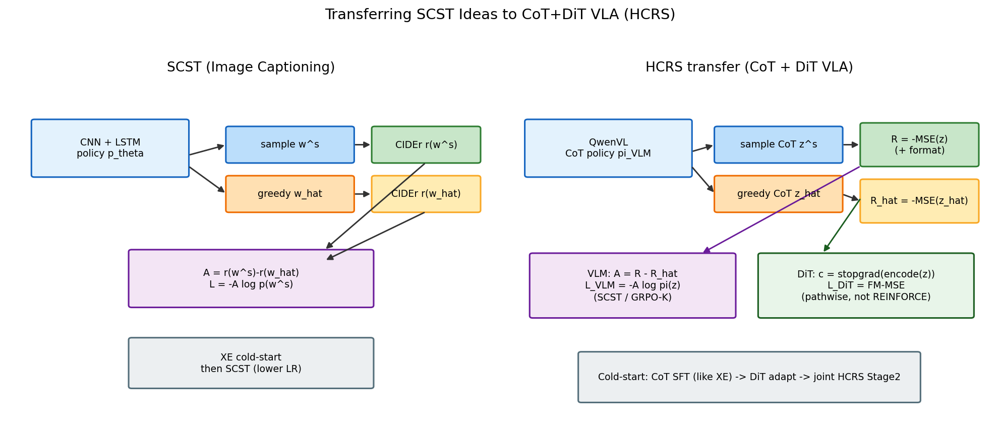
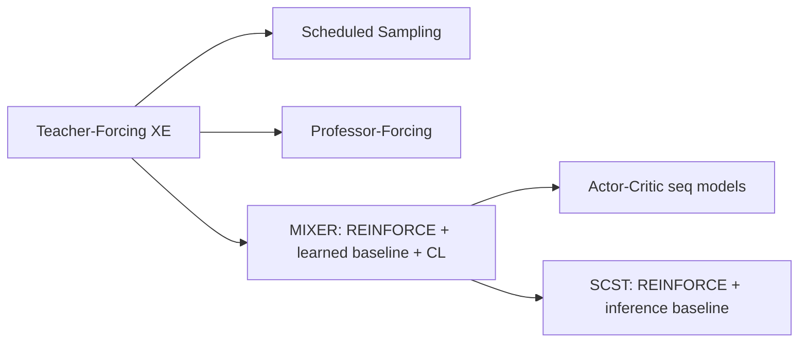
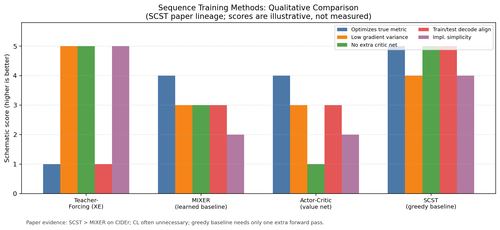
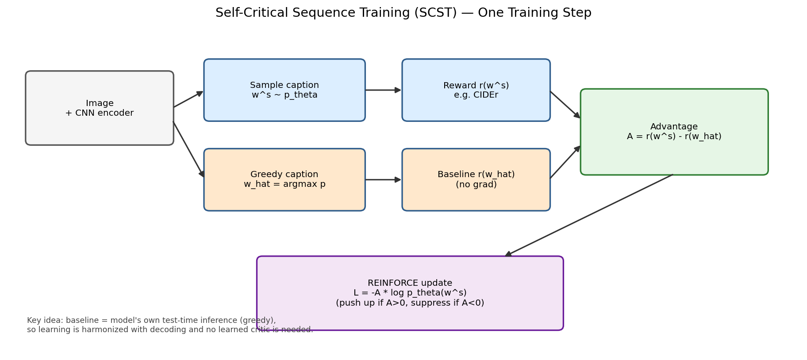
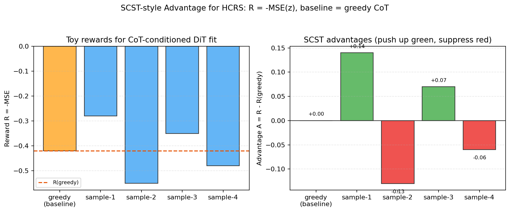
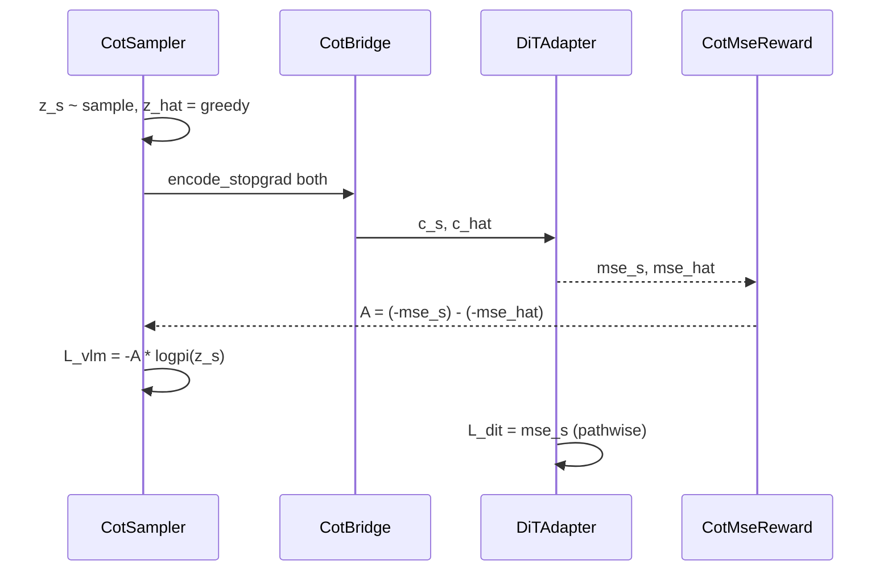

# Self-Critical Sequence Training (SCST) 深度解析：从图像描述到 CoT+DiT VLA

> **主源**：本地 TeX [`SCST_TeX_Source/cap_rl_arxiv_Extended_tables.tex`](SCST_TeX_Source/cap_rl_arxiv_Extended_tables.tex)（Rennie et al., CVPR 2017 / arXiv:1612.00563）。  
> **目标**：弄清 SCST 相对经典 REINFORCE / MIXER / Actor-Critic 的本质改进，并回答——**哪些思路可以直接服务「用 REINFORCE 训 VLM 采样的 CoT、DiT 仍走 MSE」的 HCRS 方案**（见 [`../ov/grpo_vla_analyz_1.md`](../ov/grpo_vla_analyz_1.md) §11–§11.7）。  
> **配图**：本目录 [`asset/`](asset/) 下 matplotlib 脚本生成（图内文字为英文）。

---

## 目录

1. [摘要与问题同构](#1-摘要与问题同构)
2. [纵向演进：从 Teacher-Forcing 到 SCST](#2-纵向演进从-teacher-forcing-到-scst)
3. [核心算法解剖](#3-核心算法解剖)
4. [训练配方与消融（论文证据）](#4-训练配方与消融论文证据)
5. [横向对比：SCST / GRPO / ThinkAct / HCRS](#5-横向对比scst--grpo--thinkact--hcrs)
6. [对 CoT+DiT VLA 的可迁移清单](#6-对-cotdit-vla-的可迁移清单)
7. [开源代码能否拿来用](#7-开源代码能否拿来用)
8. [动态视图](#8-动态视图)
9. [小结与交叉索引](#9-小结与交叉索引)

---

## 1. 摘要与问题同构

### 1.1 论文在解决什么

图像描述（captioning）里有两件「标准监督学习做不好」的事：

1. **Exposure bias**：训练用 Teacher-Forcing（下一词条件于**真值**前文），测试时条件于**自己生成**的前文，误差会累积。
2. **指标不可微**：评测用 BLEU / ROUGE / METEOR / **CIDEr**，与交叉熵（XE）不对齐。

SCST 的回答：把生成器看成策略 \(p_\theta\)，在**整句结束**后拿离散指标当奖励，用 **REINFORCE + 一种特别的 baseline** 直接优化期望奖励；这个 baseline **不是学出来的 critic**，而是 **当前模型在测试时用的推理算法（默认 greedy）给出的句子的奖励**。

论文宣称：在 MSCOCO 上把 CIDEr 从当时最好约 104.9 提升到 **114.7**（abstract）。

### 1.2 与「CoT + DiT VLA」为何同构

| 维度 | SCST（caption） | HCRS（CoT+DiT VLA） |
|------|-----------------|---------------------|
| 随机策略 | LSTM 生成词序列 \(w\) | QwenVL 采样 CoT \(z\) |
| 终局非可微信号 | CIDEr\((w,\text{refs})\) | 例如 \(R=-\mathrm{MSE}(\mathrm{DiT}\mid z)\) 或 env success |
| 不可导瓶颈 | 离散采样词 | 离散采样 CoT token |
| 下游连续模块 | 无（句子即产物） | DiT/flow：**pathwise MSE**，条件 `stopgrad(z)` |
| 需要 baseline | 是（方差） | 是（长 CoT + 标量 MSE 方差更大） |

一句话：**SCST 教的是「对离散序列策略做低方差 REINFORCE」**；HCRS 只是把「句子」换成「CoT」，把「CIDEr」换成「动作拟合/任务回报」，并**额外**给可导的 DiT 一条 MSE 路径。



---

## 2. 纵向演进：从 Teacher-Forcing 到 SCST

### 2.1 谱系



| 方法 | 核心想法 | 优点 | 缺点 | 适合场景 |
|------|----------|------|------|----------|
| **Teacher-Forcing** | 最大化下一词似然 | 稳、易训 | exposure bias；不对齐评测指标 | 冷启动必做 |
| **Scheduled Sampling** | 训练时渐增喂模型自己的词 | 缓解 exposure | 仍优化 XE，不对齐 CIDEr | XE 阶段正则 |
| **MIXER** (Ranzato et al.) | 对指标做 REINFORCE；常配 **学到的 baseline** + curriculum | 直接优化指标 | baseline 要训；方差/不稳；CL 麻烦 | 早期 RL caption |
| **Actor-Critic** | 第二网络估 value | 少采样动作空间 | 双网络耦合、估偏 | 长 horizon / 逐步奖励 |
| **SCST** | baseline = **测试时推理句的奖励** | 无 critic；训测一致；方差通常更低 | 多一次前向；依赖推理算法质量 | **终局序列奖励** 的文本策略 |

### 2.2 为何「自批评」这一步关键

REINFORCE 无 baseline 时，小 batch 上 \(\nabla \propto r\nabla\log p\) 方差极大。任意与动作无关的 \(b\) 不引入偏差但可降方差。MIXER 学 \(b\)；SCST 设

\[
b = r(\hat{w}),\quad \hat{w}=\text{InferenceAlgorithm}(p_\theta),
\]

默认 \(\hat{w}_t=\arg\max_w p_\theta(w\mid h_t)\)（greedy）。于是：

- 比 greedy **更好**的采样句：\(A>0\)，概率被推高；
- 更差的句：被压制；
- 学习目标与**部署时的解码器**对齐（论文强调的 harmonization）。



---

## 3. 核心算法解剖

以下公式按本地 TeX「Reinforcement Learning / Self-critical sequence training」节书写。

### 3.1 序列生成 = RL

- Agent：LSTM（参数 \(\theta\)）
- Action：下一词
- State：隐状态 / attention
- 在 EOS 后得标量奖励 \(r\)（如 CIDEr）

\[
L(\theta)=-\mathbb{E}_{w^s\sim p_\theta}\big[r(w^s)\big].
\]

### 3.2 REINFORCE

\[
\nabla_\theta L(\theta)
=-\mathbb{E}_{w^s\sim p_\theta}\big[r(w^s)\,\nabla_\theta\log p_\theta(w^s)\big]
\approx -r(w^s)\nabla_\theta\log p_\theta(w^s).
\]

带 baseline：

\[
\nabla_\theta L
\approx -\big(r(w^s)-b\big)\nabla_\theta\log p_\theta(w^s),
\]

只要 \(b\) **不依赖被采样的动作** \(w^s\)，期望无偏（TeX 中 \(\mathbb{E}[b\nabla\log p]=0\) 的推导）。

对 softmax 输入 \(s_t\)，常用实现形式（Zaremba et al. 风格，TeX eq.）：

\[
\frac{\partial L}{\partial s_t}
\approx \big(r(w^s)-b\big)\big(p_\theta(w_t\mid h_t)-\mathbf{1}_{w^s_t}\big).
\]

等价地，现代代码多写：

\[
L_{\mathrm{pg}}=-\big(r-b\big)\sum_t\log p_\theta(w^s_t\mid w^s_{<t}).
\]

### 3.3 SCST

令 \(b=r(\hat{w})\)：

\[
\frac{\partial L}{\partial s_t}
=\big(r(w^s)-r(\hat{w})\big)\big(p_\theta(w_t\mid h_t)-\mathbf{1}_{w^s_t}\big).
\]



**工程要点（论文原文意图）**：

1. greedy 前向 **无梯度**（baseline）；
2. sample 路径重算 \(\log p\)（或采样时保存），乘以 \(A=r(w^s)-r(\hat{w})\)；
3. 只需 **多一次** 推理前向，比训 critic 轻。

### 3.4 变体（论文消融结论）

| 变体 | 定义直觉 | MSCOCO 上论文结论 |
|------|----------|-------------------|
| **TD-SCST** | 对时刻 \(t\)，baseline 用「前缀用采样、后缀用 greedy 补全」的奖励 | 无明显额外收益 |
| **True SCST** | 只采样未来 \(n\) 步再用推理补全，作有偏 critic | 无明显额外收益 |
| 学 control-variate 修正 SCST baseline | — | 无效 |

对 HCRS：**先实现基础 SCST（sample vs greedy）即可**；更复杂的 TD/True 不是第一优先级。

---

## 4. 训练配方与消融（论文证据）

### 4.1 标准课程序（TeX Implementation Details）

1. **XE 冷启动**：ADAM \(5\times10^{-4}\)，lr 每 3 epoch \(\times0.8\)；Scheduled Sampling 反馈概率每 5 epoch +0.05 直至 0.25。
2. 按 **验证集 CIDEr** 选 seed 模型。
3. **SCST 阶段**：优化 **CIDEr-D**，ADAM \(5\times10^{-5}\)（更小 lr）。
4. **Curriculum（CL）**：早期 FC 模型用过「逐渐加长 RL 后缀」；作者后来说 **MSCOCO 上 CL 几乎不必要**，attention 模型可对整句直接 SCST。

这对 HCRS 的直接翻译：

- Stage0 CoT SFT ≈ XE 冷启动；
- Stage2 联合 REINFORCE 时 **VLM lr 显著小于 DiT / 小于冷启动**；
- 不要一上来就对随机初始化 VLM 做 SCST。

### 4.2 优化哪个指标

TeX 实验（训练指标 vs 评测）：**训哪个指标，通常该指标最好**；但 **只训 CIDEr** 往往能「抬起」其它指标的综合表现，多指标联合反而不如纯 CIDEr。  
→ HCRS 类比：优先把 **主奖励** 做干净（\(-\mathrm{MSE}\) 或 success），format/语义作小权重辅项，避免多目标撕扯。

### 4.3 SCST vs MIXER / 裸 REINFORCE

- Karpathy test、FC-2K、优化 CIDEr：SCST **106.3** > MIXER **104.9** > MIXER-B **101.9** > XE（约 90+）。
- Att2all、多 seed：SCST 均值优于带学习 baseline 的 REINFORCE；论文称 SCST **梯度方差通常更低**（训练初期可能更高——因为多数采样句远差于 greedy）。

本地 TeX 配图文件（原论文曲线，可对照阅读）：

| 文件 | 含义 |
|------|------|
| `scst_cider_b1.eps` / `scst_cider_b2.eps` | SCST vs MIXER 的 CIDEr（greedy / beam） |
| `scst_gradvar.eps` | 梯度方差 |
| `scst_entropy.eps` | 词后验熵 |

### 4.4 消融结论（对实践的优先级）

| 点 | 有效性（论文语境） | HCRS 启示 |
|----|--------------------|-----------|
| XE → RL 两阶段 | **强必要** | Stage0/1 不可跳 |
| greedy self-critical baseline | **强有效** | \(K=1\) 时默认用 greedy CoT |
| 直接优化评测同构奖励 | **强有效** | \(R\) 尽量贴近真正关心的量 |
| CL | MSCOCO **弱/不必要** | 不必一上来做「逐步加长 CoT RL」 |
| TD-SCST / True SCST | **弱** | 二期再试 |
| 学 baseline / control variate | 弱于 SCST | 优先 SCST/组相对，而非 value head |

---

## 5. 横向对比：SCST / GRPO / ThinkAct / HCRS

| | SCST | GRPO（组相对） | ThinkAct | HCRS（我们的设计） |
|--|------|----------------|----------|-------------------|
| 序列对象 | caption | LLM response / CoT | MLLM plan | VLM CoT \(z\) |
| Advantage | \(r(s)-r(\mathrm{greedy})\) | \((r-\mu)/\sigma\) 同 prompt 组 | GRPO + 视觉奖励 | **SCST 或 GRPO**；\(r\sim-\mathrm{MSE}\) |
| Critic | 无 | 无 | 无 | 无 |
| 下游连续头 | 无 | 常无 | DiT IL，常冻 MLLM | DiT **同步 MSE** + `sg(z)` |
| 冷启动 | XE | 常有 SFT | SFT + GRPO | CoT SFT + DiT adapt |

**关系**：GRPO 可视为「多样本 baseline」；SCST 是「单样本 + 推理算法 baseline」。HCRS 文档推荐：**有算力用 \(K\ge4\) 组相对；\(K=1\) 用 SCST greedy**。

---

## 6. 对 CoT+DiT VLA 的可迁移清单

### 6.1 必须借（高优先级）

1. **Cold-start**：先让 VLM 会写合法 CoT（类 XE），再进 REINFORCE。  
2. **Self-critical baseline**：\(A=R(z^s)-R(z^{\mathrm{greedy}})\)，greedy 路径 `torch.no_grad()`。  
3. **终局序列奖励**：整段 CoT 结束后给一个标量（不要一步一 CIDEr 式逐步伪造）。  
4. **训测一致**：部署若用贪心/短 CoT，baseline 与推理解码对齐。  
5. **RL 阶段更小学习率**。

### 6.2 替换映射

| SCST | HCRS |
|------|------|
| CIDEr | \(R=-\widetilde{\mathrm{mse}}(z)+\beta R_{\mathrm{fmt}}-\eta\mathrm{KL}\) |
| CNN+LSTM | QwenVL `CotSampler` |
| 无下游 | `DiTAdapter.flow_mse(..., c=stopgrad(encode(z)))` |
| 单句 sample | 可选 \(K\) 条 + 组相对（加强版） |

玩具数值直觉（\(R=-\mathrm{MSE}\)）：



### 6.3 慎用 / 不要照搬

- **不要**把 caption 工程（COCO 特征、CIDEr C 扩展）整仓塞进 RLinf。  
- **不要**对 DiT 去噪链再套一层 SCST（除非目标就是训 Flow-SDE \(\log\pi(a)\)；那是另一条线，见 `grpo_vla_analyz_1.md` 主文）。  
- **不要**在无格式约束时纯用 \(-\mathrm{MSE}\)：易 reward hack 出「让当前 DiT 好拟合的空话 CoT」——SCST 只降方差，不自动解决奖励设计。

### 6.4 落到 §11.7 软件点（设计层）

| SCST 概念 | 建议落点（`rlinf/_au/`，尚未实现） |
|-----------|-----------------------------------|
| greedy baseline | `CotSampler` greedy 解码 + `CotMseReward` |
| \(A=r-r_{\hat{}}\) | `advantages.scst_advantage` |
| \(L=-A\log\pi\) | `algorithms.losses` 中 `reinforce` |
| XE→SCST 两阶段 | `hcrs.stage=cot_sft` → `hcrs_joint` |
| 额外前向代价 | Stage2 每 step：K sample + 1 greedy（或 GRPO 免 greedy） |

---

## 7. 开源代码能否拿来用

### 7.1 官方实现

论文作者当时隶属 IBM Watson；**没有成为社区长期维护的官方 GitHub 事实标准**。工程上应以社区复现为准。

### 7.2 社区主实现：`ruotianluo/self-critical.pytorch`

- 地址：<https://github.com/ruotianluo/self-critical.pytorch>  
- 定位：**非官方** PyTorch 复现 + 后续 caption 研究代码库。  
- 用法要点（README）：
  - 先 XE 预训练；
  - `--self_critical_after N` 进入 SCST；
  - CIDEr 需 n-gram cache（`prepro_ngrams.py`）；
  - RL 阶段更小 lr；支持 `train_sample_n` 多样本。
- 后续还有 **new_self_critical** 等变体（组内均值 baseline 等，更接近 GRPO/RLOO 思想）。

**可复用（思想 / 几行公式级）**：

```text
loss = -mean(log_prob) * (reward - reward_baseline)
# reward_baseline = reward(greedy)   # classic SCST
# or mean over K samples             # NSC / GRPO-like
```

**不可复用（不要 vendor）**：

- COCO 特征管线、`caption_model` LSTM/Transformer 整栈；
- CIDEr C 扩展作为 VLA 奖励；
- 与 RLinf FSDP / Hydra / `_au` 包结构不兼容的训练入口。

### 7.3 其它 fork

如 `Wentong-DST/self-critical` 基于旧 PyTorch，价值低于 ruotianluo 主仓。

### 7.4 结论

| 诉求 | 建议 |
|------|------|
| 理解 SCST 损失怎么写 | 读 ruotianluo 的 RL loss 片段即可 |
| 在 RLinf 训 CoT+DiT | **自研** `rlinf/_au/.../hcrs_vla`（§11.7），只移植 baseline 数学 |
| 直接跑 caption SCST | 可另开环境克隆 ruotianluo，与 VLA 训练隔离 |

---

## 8. 动态视图

### 8.1 SCST 一步（caption）

```mermaid
sequenceDiagram
  participant Img as ImageCNN
  participant Pol as Policy_LSTM
  participant Met as CIDEr
  participant Opt as Optimizer

  Img->>Pol: features
  Pol->>Pol: sample w_s
  Pol->>Pol: greedy w_hat no_grad
  Pol->>Met: w_s, w_hat
  Met-->>Pol: r_s, r_hat
  Note over Pol: A = r_s - r_hat
  Pol->>Opt: loss = -A * logp(w_s)
```

### 8.2 嵌入 HCRS Stage2



---

## 9. 小结与交叉索引

**SCST 的核心遗产**不是「又一个 caption 模型」，而是：

> 对**离散序列策略**，用 **测试时推理算法的奖励** 做 REINFORCE baseline，在**无 critic** 的前提下降低方差，并强制训测解码一致。

对 **CoT + DiT VLA**：

- VLM 侧：SCST / GRPO 完全对口；奖励从 CIDEr 换成 \(-\mathrm{MSE}\)（+格式/KL）；
- DiT 侧：保持 pathwise FM-MSE + `stopgrad`，**不要**误用 SCST；
- 工程：XE/CoT-SFT 冷启动 + 小 lr；开源 caption 仓只借公式，不借整栈。

**交叉阅读**：

| 文档 | 内容 |
|------|------|
| 本文 | SCST 论文与开源、迁移清单 |
| [`../ov/grpo_vla_analyz_1.md`](../ov/grpo_vla_analyz_1.md) §11 | HCRS 算法综合方案 |
| 同文档 §11.7 | HCRS 软件落点 `rlinf/_au/` |
| [`../ov/grpo_vlm_analyz_1.md`](../ov/grpo_vlm_analyz_1.md) §12 | 经典 \(L=-A\log\pi\) 提案 |

**本地资产**：

| 路径 | 说明 |
|------|------|
| [`asset/plot_scst_*.py`](asset/) | 配图脚本（可重复运行） |
| [`asset/fig_scst_*.png`](asset/) | 本文插图 |
| [`SCST_TeX_Source/`](SCST_TeX_Source/) | 论文 TeX 与原版 eps 曲线 |

---

*文档版本：基于本地 TeX 与公开复现仓库说明整理；若与原 PDF 排版细节冲突，以 TeX 公式与实验表为准。*
