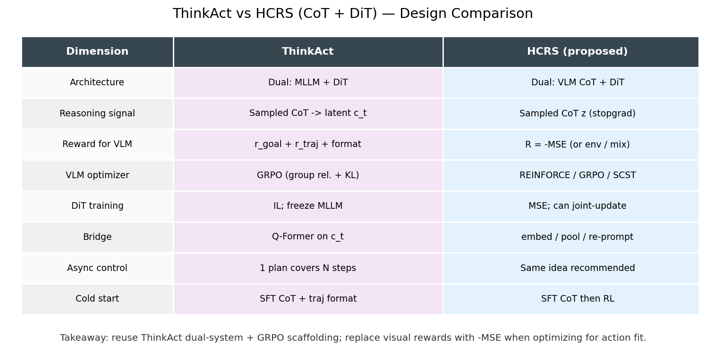
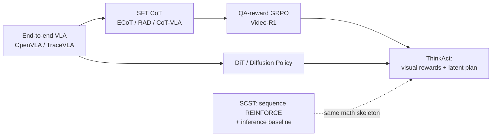
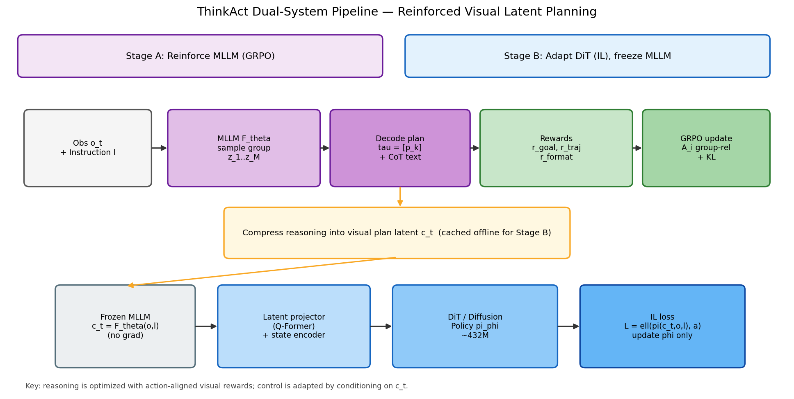
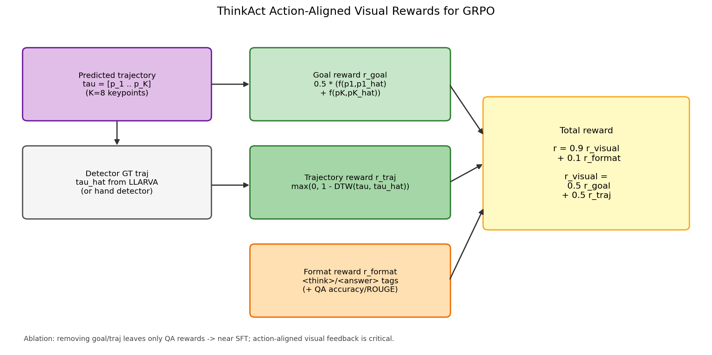
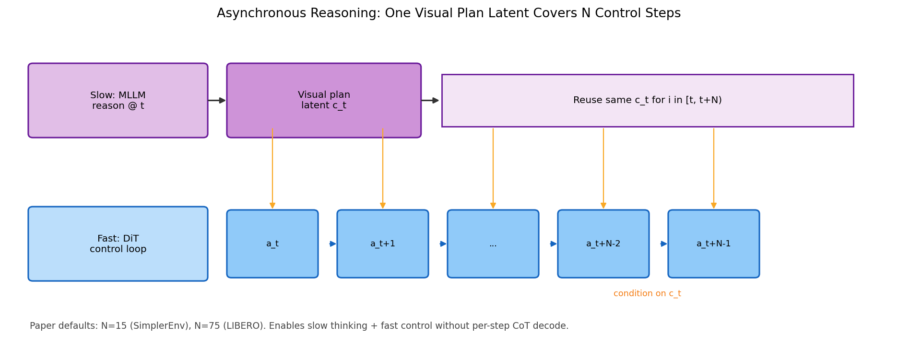
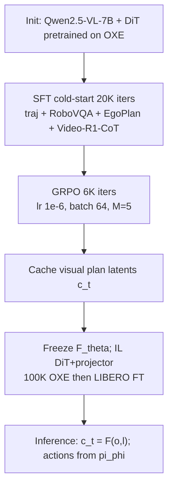
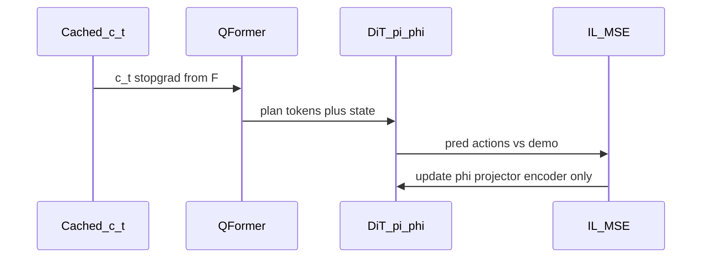
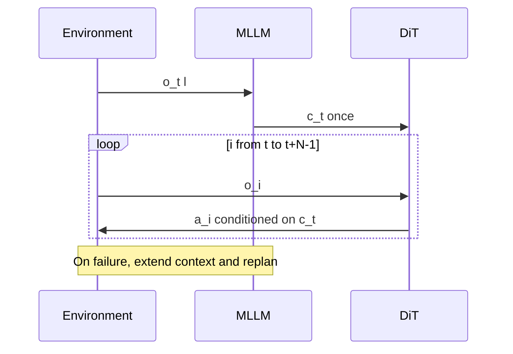
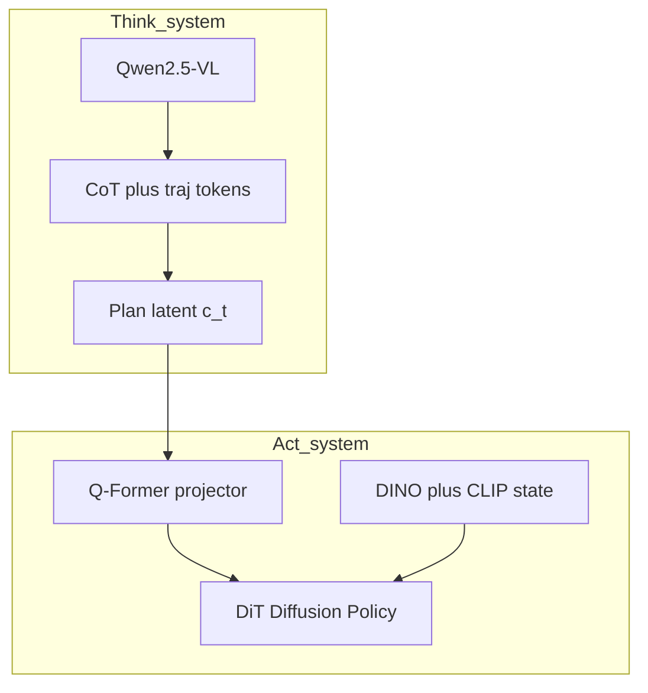

# ThinkAct 深度解析：Reinforced Visual Latent Planning 与 CoT+DiT VLA

> **主源**：本地 TeX [`ThinkAct_TeX_Source/`](ThinkAct_TeX_Source/)（Huang et al., *ThinkAct: Vision-Language-Action Reasoning via Reinforced Visual Latent Planning*；arXiv:2507.16815）。  
> **项目页**：[https://jasper0314-huang.github.io/thinkact-vla/](https://jasper0314-huang.github.io/thinkact-vla/)  
> **目标**：弄清 ThinkAct「双系统 + GRPO 视觉 latent planning」的设计本质，并回答——**哪些思路可直接服务「CoT 采样 + DiT MSE」的 HCRS 方案**（见 [`../ov/grpo_vla_analyz_1.md`](../ov/grpo_vla_analyz_1.md) §11–§11.7）；对照 SCST 见 [`scst_1.md`](scst_1.md)。  
> **配图**：本目录 [`asset/`](asset/) 下 matplotlib 脚本生成（图内文字为英文）。

---

## 目录

1. [摘要与问题同构](#1-摘要与问题同构)
2. [纵向演进：从端到端 VLA 到 ThinkAct](#2-纵向演进从端到端-vla-到-thinkact)
3. [核心方法解剖](#3-核心方法解剖)
4. [训练配方与消融（论文证据）](#4-训练配方与消融论文证据)
5. [横向对比：ThinkAct / SCST / HCRS / Flow-SDE-GRPO](#5-横向对比thinkact--scst--hcrs--flow-sde-grpo)
6. [对 CoT+DiT VLA 的可迁移清单](#6-对-cotdit-vla-的可迁移清单)
7. [开源代码能否拿来用](#7-开源代码能否拿来用)
8. [动态视图](#8-动态视图)
9. [小结与交叉索引](#9-小结与交叉索引)

---

## 1. 摘要与问题同构

### 1.1 论文在解决什么

端到端 VLA（OpenVLA、TraceVLA 等）把 \((o_t, l)\) 直接映射到 \(a_t\)，在短技能上有效，但在**长时程规划、场景变化、失败恢复**上缺乏可塑形的中间推理。纯 SFT 式 CoT（ECoT、RAD）依赖昂贵的推理标注，易过拟合。纯 QA 式 R1/GRPO（Video-R1）能催生长 CoT，但奖励与**物理动作**脱节。

ThinkAct 的回答是一个**双系统**：

1. **慢思考**：用 MLLM \(\mathcal{F}_\theta\)（Qwen2.5-VL-7B）采样 embodied reasoning + **视觉计划**（2D gripper 关键点轨迹 \(\tau\)）；用 **action-aligned visual rewards** + **GRPO** 塑形推理。
2. **快执行**：把推理压成 **visual plan latent** \(c_t\)，经 Q-Former 条件化 **DiT / Diffusion Policy** \(\pi_\phi\)（~432M）；**冻结 MLLM**，用模仿学习适配目标环境。

论文宣称：SimplerEnv / LIBERO 上超过 DiT-Policy 与 CoT-VLA；并展示 few-shot 适配与 self-correction。

### 1.2 与「CoT + DiT VLA / HCRS」为何同构

| 维度 | ThinkAct | HCRS（本仓库提案） |
|------|----------|-------------------|
| 随机策略 | MLLM 采样推理文本 + 轨迹字符串 | QwenVL 采样 CoT \(z\) |
| 不可导瓶颈 | 离散 token 采样 | 同左 |
| 条件桥 | 压成 \(c_t\) → Q-Former → DiT | `sg(encode(z))` → DiT |
| VLM 的 RL 信号 | \(r_{\mathrm{goal}}+r_{\mathrm{traj}}+r_{\mathrm{format}}\) | \(R=-\mathrm{MSE}\)（或 env / 混合） |
| 动作头 | DiT IL，**冻** \(\mathcal{F}_\theta\) | DiT MSE，**可联合**更新 |
| Baseline | 组内相对（GRPO） | 组相对 / SCST greedy |

一句话：**ThinkAct 是目前与「CoT 采样 + DiT」架构最接近的公开双系统 VLA**；HCRS 的差异创新点主要在**奖励改用下游动作 MSE**，以及**是否在 DiT 阶段解冻 VLM**。



---

## 2. 纵向演进：从端到端 VLA 到 ThinkAct

### 2.1 谱系



| 方法 | 核心想法 | 优点 | 缺点 | 适合场景 |
|------|----------|------|------|----------|
| **端到端 VLA** | \(o,l\to a\) | 简单、吞吐高 | 缺显式规划；长程弱 | 短技能、大数据 IL |
| **SFT CoT（ECoT 等）** | 监督中间推理 | 可解释；冷启动好 | 标注贵；易过拟合模式 | 有高质量 CoT 数据时 |
| **QA-GRPO（Video-R1）** | 可验证答案奖励催生 CoT | 无需逐步标注 | 与动作执行脱节 | 纯 VQA / 视频推理 |
| **SCST** | 终局指标 + self-critical baseline | 无 critic；训测一致 | 原域是 caption | 任意离散序列 + 标量奖励 |
| **ThinkAct** | 视觉 goal/traj 奖励 + GRPO；latent 条件 DiT | **推理接地动作**；双系统异步 | 奖励依赖检测器；分阶段冻 MLLM | 长程操作 + 要显式推理 |

### 2.2 为何「视觉对齐奖励」这一步关键

论文明确批评两条捷径：

1. 用 **环境成功率** 当奖励：绑死特定仿真器，且对视觉 grounding 指导弱。  
2. 只用 **QA accuracy / format**：催生「看起来像在想」的文本，却不保证 gripper 计划物理合理。

ThinkAct 因此把高阶计划表示成 **图像平面上的 gripper 轨迹** \(\tau=[p_k]_{k=1}^K\)，用 off-the-shelf 检测器给出 \(\hat{\tau}\)，再构造 goal + DTW trajectory 奖励。这是「把动作语义压进可验证视觉反馈」的工程选择——对 HCRS，若暂时没有可靠检测器，可用 \(-\mathrm{MSE}\) 替代「可验证性」，但应意识到：MSE 优化的是**当前 DiT 拟合**，不等于**任务成功**（奖励黑客风险见 §6）。

---

## 3. 核心方法解剖

以下公式与流程紧贴本地 TeX [`sections/3_method.tex`](ThinkAct_TeX_Source/sections/3_method.tex)。

### 3.1 问题设定

时刻 \(t\)：观测 \(o_t\)、指令 \(l\)，预测动作 \(a_t\)（可为文本命令或 7-DoF 控制量）。ThinkAct 拆成：

\[
c_t=\mathcal{F}_\theta(o_t,l),\qquad
[a_i]_{i=t}^{t+N}\sim\pi_\phi(\,\cdot\mid c_t,o_i,l).
\]

一个 latent plan \(c_t\) 异步覆盖 \(N\) 步控制（慢思考 / 快控制）。



### 3.2 视觉计划与奖励塑形

MLLM 自回归生成推理隐状态 \(v_t\) 与计划隐状态 \(c_t\)；计划解码为归一化 2D 点串：

\[
\tau=[p_k]_{k=1}^{K},\quad p_k\in[0,1]^2,\quad K=8,
\]

其中 \(p_1,p_K\) 为 gripper 起止点。检测器给出 \(\hat{\tau}\)。

**Goal reward**（起止对齐）：

\[
r_{\mathrm{goal}}=\frac12\big(f(p_1,\hat{p}_1)+f(p_K,\hat{p}_K)\big),\quad
f(p,p')=\max\big(0,\,1-\|p-p'\|_2^2\big).
\]

**Trajectory reward**（整条轨迹 DTW）：

\[
r_{\mathrm{traj}}=\max\big(0,\,1-d(\tau,\hat{\tau})\big),\quad d=\mathrm{DTW}.
\]

**总奖励**（含 format，权重写死在论文）：

\[
r=0.9\,r_{\mathrm{visual}}+0.1\,r_{\mathrm{format}},\quad
r_{\mathrm{visual}}=0.5\,r_{\mathrm{goal}}+0.5\,r_{\mathrm{traj}}.
\]

QA 数据则用 accuracy（选择题）或 ROUGE（开放答案）充当可验证项，并入 format / QA 通道。



### 3.3 GRPO 强化视觉 latent planning

对同一 \((o_t,l)\) 从 \(\mathcal{F}_{\theta_{\mathrm{old}}}\) 采 \(M\) 条响应 \(\{z_i\}\)，算 \(\{r_i\}\)，组相对 advantage：

\[
A_i=\frac{r_i-\mathrm{mean}(\{r_j\})}{\mathrm{std}(\{r_j\})}.
\]

目标（论文写法，含 KL）：

\[
\mathcal{J}_{\mathrm{GRPO}}(\theta)
=\frac1M\sum_{i=1}^{M}
\Bigg(
\frac{\mathcal{F}_\theta(z_i\mid o_t,l)}{\mathcal{F}_{\theta_{\mathrm{old}}}(z_i\mid o_t,l)}A_i
-\beta\,D_{\mathrm{KL}}\big(\mathcal{F}_\theta(z_i)\parallel\mathcal{F}_{\theta_{\mathrm{old}}}(z_i)\big)
\Bigg).
\]

附录：\(\beta=10^{-2}\)，rollout temperature \(1.0\)，top-\(p=0.99\)，最大响应长 1024，主文 rollout size \(M=5\)。

这与 RLinf reasoning 路径的 `adv_type: grpo` + clipped IS（`loss_type: actor`）**同族**；差异在奖励定义与「组」定义在 **CoT/轨迹响应** 上，而非数学答案 token。

### 3.4 推理增强的动作适配（冻 MLLM）

动作模型 \(\pi_\phi\) 为 Transformer Diffusion Policy（DiT），状态编码：DINOv2 图像 + CLIP 文本 → 1024-d。用 **Q-Former（32 queries）** 把 \(c_t\) 投到动作模型输入空间。仅更新 state encoder、latent projector、\(\pi_\phi\)：

\[
\mathcal{L}_{\mathrm{IL}}(\phi)
=\mathbb{E}_{(o_i,l,a_i)}\big[\ell(\pi_\phi(c_t,o_i,l),\,a_i)\big].
\]

实现上：**离线缓存** \(c_t=\mathcal{F}_\theta(o_t,l)\)，再 IL，避免每步反传过 MLLM。这是吞吐友好、但切断「MSE → VLM」梯度的关键设计——正是 HCRS 想打开的那条路。

### 3.5 异步 \(N\) 与推理

- SimplerEnv：\(N=15\)；LIBERO：\(N=75\)（按平均任务长度）。  
- 附录消融：\(N\in\{25,50,75,100\}\) 成功率约 \(84.0/84.6/84.4/83.7\)；过稀影响失败检测/重规划，过密费推理。  
- Self-correction：把输入从单帧扩到短视频 \(o_{t-N:t}\)，让 MLLM 发现掉物等失败并重写 plan。



### 3.6 多阶段课程序（论文默认）



SFT 数据规模（附录）：30K 轨迹 + 50K RoboVQA + 50K EgoPlan-IT + 165K Video-R1-CoT。  
RL 混合：12.5K 轨迹（OXE + SSv2）+ 多种 embodied QA。轨迹用 RDP 压到 \(K=8\) 关键点；机器人用 LLARVA 检 gripper，人手用 hand detector。

---

## 4. 训练配方与消融（论文证据）

### 4.1 实现要点（可复现清单）

| 项 | 数值 / 选择 |
|----|-------------|
| MLLM | Qwen2.5-VL-7B（附录亦报 3B） |
| SFT | 20K iter，bs 32，lr \(1\mathrm{e}{-5}\)，ZeRO-3 |
| GRPO | 6K iter，bs 64，lr \(1\mathrm{e}{-6}\)，\(M=5\)，\(\beta=10^{-2}\) |
| DiT | 432M；DDPM 1000 train / DDIM 20 infer |
| Projector | Q-Former，32 queries |
| DiT adapt | OXE 100K samples，120K iter，bs 256，lr \(2\mathrm{e}{-5}\)；LIBERO 再 75K |
| 硬件 | 16×A100 80GB |
| 相对 OpenVLA 延迟 | LIBERO 上约 +17% 执行时间（自回归推理） |

### 4.2 主结果（摘自 tables）

- **SimplerEnv**：相对 DiT-Policy，Google-VM / VA / Bridge-VM 分别约 +15.5 / +16.9 / +11.4 pp；overall **71.5 / 65.1 / 43.8**。  
- **LIBERO overall 84.4**，略高于 CoT-VLA 83.9；Long 子集 **70.9**（长程增益最明显）。  
- Embodied reasoning：EgoPlan-Bench2 / RoboVQA 等上相对次优有稳定增益。

### 4.3 奖励消融（核心证据）

主文（SimplerEnv / EgoPlan / RoboVQA）：

| Method | SimplerEnv | EgoPlan | RoboVQA |
|--------|------------|---------|---------|
| ThinkAct full | **60.1** | **48.2** | **59.8** |
| w/o \(r_{\mathrm{traj}}\) | 59.2 | 47.9 | 58.5 |
| w/o \(r_{\mathrm{goal}}\) | 59.1 | 47.6 | 58.9 |
| w/o both（仅 QA） | 56.9 | 47.2 | 58.3 |
| SFT cold-start | 56.4 | 46.4 | 57.9 |

附录 LIBERO / OpenEQA 同趋势：去掉 goal/traj 后逼近 SFT。  
**消融结论（写进 HCRS 设计）**：

1. **仅有 format/QA 奖励几乎不够** → 需要与动作/物理相关的可验证信号。  
2. **goal 与 traj 都有贡献** → HCRS 若只用标量 MSE，建议至少再加 format / 长度 / KL，必要时加稀疏 env success。  
3. **SFT 冷启动必要但不够** → RL 阶段才拉出可用的长程推理。

### 4.4 能力分析（对产品叙事有用）

- **Few-shot**：每任务 10（及附录 5）条演示微调动作模型，相对 Magma 等有明显优势 → 推理 latent 充当「可迁移意图」。  
- **Self-correction**：时序上下文 + 重规划；这是双系统相对纯端到端的定性优势。  
- **\(N\) 权衡**：既要 amortized 推理成本，又要留失败检测窗口。

---

## 5. 横向对比：ThinkAct / SCST / HCRS / Flow-SDE-GRPO

| 维度 | ThinkAct | SCST | HCRS | RLinf Flow-SDE-GRPO（lingbotvla） |
|------|----------|------|------|----------------------------------|
| 策略对象 | CoT + 视觉轨迹 token | Caption 词序列 | CoT token | **连续动作**（SDE 给 \(\log\pi\)） |
| 奖励 | goal+DTW+format | CIDEr 等 | \(-\mathrm{MSE}\) / env | 任务回报等 |
| Baseline | 组相对 GRPO | Greedy self-critical | 组相对或 SCST | 组相对 GRPO |
| 下游连续模块 | DiT IL（冻 VLM） | 无 | DiT MSE（可联合） | VLM–DiT 常端到端可微 |
| 与 HCRS 关系 | **架构模板** | **REINFORCE 模板** | 目标方案 | 动作层 RL；勿与 CoT logprob 混张量 |

要点：

- ThinkAct **不会**用 DiT 的 MSE 反传更新 MLLM；HCRS 正是要补这条「动作拟合 → 推理塑形」闭环。  
- 若 VLM→DiT **全程可微且无离散采样**，对 VLM 再做 REINFORCE **多余**（见 `grpo_vla_analyz_1.md`）；ThinkAct/HCRS 成立的前提是 **CoT 采样造成不可导瓶颈**。  
- Flow-SDE-GRPO 与 ThinkAct **可叠加为两层**：外层塑形 CoT，内层对动作做 RL——但 logprob 语义必须分开。

---

## 6. 对 CoT+DiT VLA 的可迁移清单

### 6.1 建议直接借用

1. **双系统拆分**：慢 MLLM / 快 DiT；用紧凑条件（latent 或 embedding）而非每控步重解码全文。  
2. **SFT 冷启动**：`<think>…</think><answer>…</answer>`（或仓库统一标签）+ 轨迹/子目标格式；可混 Video-R1-CoT 类数据。  
3. **组相对 advantage**：同观测采 \(M\)（ThinkAct 用 5）条 CoT；与 RLinf `adv_type: grpo` 对齐。  
4. **KL / 小 RL lr**：论文 SFT \(1\mathrm{e}{-5}\) → GRPO \(1\mathrm{e}{-6}\)；\(\beta\sim10^{-2}\)。  
5. **异步 \(N\)**：推理期多步共用一个 plan；按任务长度扫 \(N\)。  
6. **离线缓存 plan**：Stage B 吞吐关键；HCRS Stage1（只训 DiT）同构。  
7. **失败重规划接口**：输入扩成短视频 / 历史，作为 Stage3 online 能力。  
8. **Q-Former / 固定 query 投影**：把变长推理变成固定条件向量，利于 DiT cross-attn。

### 6.2 建议替换或改写

| ThinkAct 做法 | HCRS 建议 |
|---------------|-----------|
| \(r_{\mathrm{goal}}, r_{\mathrm{traj}}\) | \(R=-\mathrm{MSE}\) 为主；有检测器时可作辅助项 |
| DiT 阶段 **冻死** MLLM | Stage1 冻；Stage2 **联合**（`sg(z)` 只挡采样路径，MSE 仍训 DiT） |
| 奖励权重 0.9/0.1 固定 | 对 MSE 做标准化 / 组相对；加 \(\beta R_{\mathrm{fmt}}\) 防空 CoT |
| 轨迹字符串作为 answer | 可保留为辅助头，或改为纯语言子目标（视标注成本） |

### 6.3 奖励黑客与缓解（从 ThinkAct 消融反推）

- 若只用 \(-\mathrm{MSE}\)：VLM 可能学会「短、空、或投机 CoT」让当前 DiT 好拟合。  
- ThinkAct 用视觉物理约束对抗纯语言投机；HCRS 应对齐：  
  - format + 最小长度；  
  - KL 到 SFT ref；  
  - 可选 traj/goal 或 env success 混合；  
  - 组内相对（避免绝对 MSE 尺度漂移）。

### 6.4 映射到 RLinf / `_au` 落地（不实现，仅索引）

详见 [`../ov/grpo_vla_analyz_1.md`](../ov/grpo_vla_analyz_1.md) §11.7：

- 模型：`rlinf/_au/models/embodiment/hcrs_vla/`  
- Worker：`HCRSSftWorker` 编排 Stage0–2  
- 算法：`adv_type: grpo` 或提案 `loss_type: reinforce`  
- ThinkAct 贡献的是 **产品级双系统与课程序**；SCST 贡献的是 **baseline 形态**；用户贡献的是 **\(A\sim-\mathrm{MSE}\)**。

---

## 7. 开源代码能否拿来用

### 7.1 官方状态（截至本文撰写）

- **有**：论文 TeX（本目录）、项目页与 demo 叙述。  
- **无可靠证据表明**：官方完整训练/推理 GitHub 已公开可依赖（检索以项目页与 arXiv 为准；社区转载页偶见，**不建议作为供应链依赖**）。

### 7.2 可复用的「相关」开源（按层拆）

| 层 | 可用来源 | 用法建议 |
|----|----------|----------|
| MLLM + GRPO | RLinf `examples/reasoning/`（QwenVL + `adv_type: grpo`） | **首选**：组相对、logprob、FSDP 已通 |
| Caption REINFORCE 形态 | `ruotianluo/self-critical.pytorch` 等 | **只借公式/baseline 思路**，勿 vendor 整仓（见 `scst_1.md`） |
| DiT / Diffusion Policy | Diffusion Policy、OpenVLA-OFT / starVLA / lingbot 条件化模式 | 借 **条件注入** 与 FM/MSE，不借 ThinkAct 私有权重管线 |
| 轨迹检测 | LLARVA、手部检测、RDP | 仅当要复现 **视觉奖励** 时需要 |
| ThinkAct 整仓 | 无官方 | **不要等、不要 vendor**；按 §6 在 `_au` 重实现 |

### 7.3 结论

**不能「拿 ThinkAct 开源代码直接跑进 RLinf」**——官方代码缺失。  
**能拿的是设计**：双系统、视觉（或 MSE）可验证奖励、GRPO、冻/解冻课程序、异步 \(N\)、Q-Former 式桥。  
工程上应 **以 RLinf 已有 GRPO + 自研 HCRS 桥** 为主路径，把 ThinkAct 当规格说明书而非依赖项。

---

## 8. 动态视图

### 8.1 训练期（Stage A GRPO）

```mermaid
sequenceDiagram
  participant D as Batch_ol
  participant F as MLLM_F_theta
  participant R as Reward_fn
  participant Opt as GRPO_optimizer

  D->>F: sample M responses z_i
  F->>R: decode tau_i and format
  R->>R: r_goal DTW format
  R->>Opt: A_i group relative
  Opt->>F: IS ratio times A minus beta KL
```

### 8.2 训练期（Stage B IL，缓存 \(c_t\)）



### 8.3 推理期（异步）



### 8.4 静态组件关系（对照 HCRS）



---

## 9. 小结与交叉索引

### 9.1 一句话结论

ThinkAct 证明：**用可验证的、与动作对齐的奖励 + GRPO，可以把 MLLM 的长推理压成条件 latent，再驱动 DiT 在操作基准上超过纯 IL / 纯 SFT-CoT**。对仓库内 CoT+DiT（HCRS），它提供了最完整的**双系统蓝图**；我们应保留其课程序与组相对优化，把视觉 goal/traj 奖励换成（或混合）\(-\mathrm{MSE}\)，并在 Stage2 **打开**对 VLM 的 REINFORCE/GRPO 更新——这是相对 ThinkAct 的明确差异化。

### 9.2 交叉索引

| 文档 | 关系 |
|------|------|
| [`ThinkAct_TeX_Source/sections/3_method.tex`](ThinkAct_TeX_Source/sections/3_method.tex) | 方法公式原文 |
| [`scst_1.md`](scst_1.md) | 序列 REINFORCE + self-critical baseline |
| [`../ov/grpo_vla_analyz_1.md`](../ov/grpo_vla_analyz_1.md) §11–§11.7 | HCRS 算法与软件设计 |
| [`../ov/grpo_vlm_analyz_1.md`](../ov/grpo_vlm_analyz_1.md) | RLinf 上 QwenVL GRPO / REINFORCE 事实 |

### 9.3 配图与脚本

| 脚本 | 图 |
|------|----|
| [`asset/plot_thinkact_pipeline.py`](asset/plot_thinkact_pipeline.py) | [`asset/fig_thinkact_pipeline.png`](asset/fig_thinkact_pipeline.png) |
| [`asset/plot_thinkact_rewards.py`](asset/plot_thinkact_rewards.py) | [`asset/fig_thinkact_rewards.png`](asset/fig_thinkact_rewards.png) |
| [`asset/plot_thinkact_vs_hcrs.py`](asset/plot_thinkact_vs_hcrs.py) | [`asset/fig_thinkact_vs_hcrs.png`](asset/fig_thinkact_vs_hcrs.png) |
| [`asset/plot_thinkact_async.py`](asset/plot_thinkact_async.py) | [`asset/fig_thinkact_async.png`](asset/fig_thinkact_async.png) |

重新生成：

```bash
cd b/d/cot/asset
python3 plot_thinkact_pipeline.py
python3 plot_thinkact_rewards.py
python3 plot_thinkact_vs_hcrs.py
python3 plot_thinkact_async.py
```
