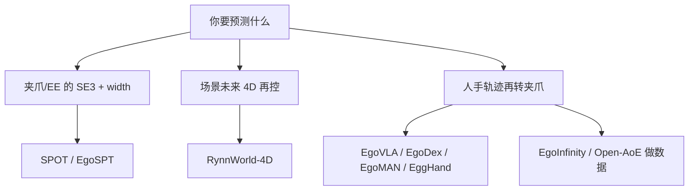

# Multimodal-conditioned 4D Dynamic Scene Forecasting and Generation：Benchmark、数据集与竞赛调研

> 调研时间：2026-07-18  
> 这里的 **4D** 指三维空间随时间演化（3D + time），不是普通二维视频的营销性“4D”。  
> 筛选原则：优先收录 2025–2026 年、顶级会议或头部工业研究机构发布、有公开数据/代码/榜单，并且与“文本、图片或短视频条件下预测/生成未来动态世界”直接相关的资源。

## 一、结论先行

这个领域目前还没有一个像 ImageNet 那样统一、成熟且所有论文都使用的单一 benchmark。原因是不同工作输出的表示差异很大：有的输出动态 NeRF/3D Gaussian/mesh，有的输出未来 3D occupancy 或 agent trajectories，还有大量所谓 world model 只输出二维视频。

如果要搭建一套兼顾“最新、认可度、严格 4D”的评测栈，建议优先采用：

1. **4DWorldBench（CVPR 2026）**：目前与多模态条件 3D/4D 世界生成最直接匹配的新基准。
2. **WorldScore（ICCV 2025）**：目前更成熟、开放程度更高的统一 world-generation benchmark，可横向比较 3D、4D、T2V 和 I2V。
3. **DynamicVerse（NeurIPS 2025）**：当前规模突出的真实动态 4D 多模态训练/测试数据资源。
4. **WorldModelBench（NeurIPS 2025 Datasets & Benchmarks）** 与 **Physics-IQ（WACV 2026）**：补充未来演化的物理正确性和人类偏好评测。
5. 若场景是自动驾驶，再加入 **UniOcc（ICCV 2025）** 和 **Waymo Open Sim Agents Challenge 2025**。
6. 若输出重点是人体动作，再加入 **HumanML3D**；需要全身、手、脸和音频等多模态数据时使用 **Motion-X++**。

需要特别注意：4DWorldBench、WorldScore 等统一基准通常把 3D/4D 模型渲染成视频后测评，因此仍不能完全衡量底层 4D 几何、拓扑、可交互性和任意视角一致性。严格项目最好同时报告底层几何/轨迹指标与渲染视频指标。

---

## 二、核心 4D 世界生成 benchmark 与数据集

### 1. 4DWorldBench

- **定位与地位**：CVPR 2026 正式论文，是目前与本课题定义最吻合的统一基准。直接覆盖 `Image-to-3D/4D`、`Video-to-4D`、`Text-to-3D/4D`，并对 Image-to-4D、Video-to-4D、Text-to-4D 分榜。它非常新，因此“方向代表性”很强，但尚不能声称已经像 VBench 那样被大量后续论文采用。
- **评测方式**：分为四大维度：
  - Perceptual Quality：空间画质、时间质量、3D texture；
  - Condition–4D Alignment：事件、场景、属性、关系和运动是否符合输入；
  - Physical Realism：动力学、光学、热学；
  - 4D Consistency：视点、运动和风格的一致性。
  评测混合使用传统视觉网络指标、光流/运动特征、MLLM-as-judge 和 LLM-as-judge；文本、图像和视频条件会被映射到统一文本语义空间。
- **榜单覆盖**：已评测 DiffusionAsShader、CamI2V、ReCamMaster、TrajectoryCrafter、EX-4D、Vista、4Dfy、dreamin4D 等代表性模型。
- **优点**：真正围绕多模态 3D/4D world generation 设计；维度完整；发布时间最新。
- **限制**：截至调研日，官网提供论文和静态榜单，但未看到像 WorldScore 那样清晰的公开 GitHub evaluator、完整测试集下载及自助提交流程。部分指标依赖 LLM/MLLM judge，可复现性、模型版本漂移和评测成本需要额外控制。
- **资源**：
  - [官网与榜单](https://yeppp27.github.io/4DWorldBench.github.io/)
  - [CVPR 2026 论文页](https://openaccess.thecvf.com/content/CVPR2026/html/Lu_4DWorldBench_A_Comprehensive_Evaluation_Framework_for_3D4D_World_Generation_Models_CVPR_2026_paper.html)
  - [arXiv:2511.19836](https://arxiv.org/abs/2511.19836)

### 2. WorldScore

- **定位与地位**：ICCV 2025；Stanford 团队（包括李飞飞、Jiajun Wu）发布。它是当前最值得作为“通用 world-generation 主指标”的公开基准之一，统一比较 3D、4D、text-to-video 和 image-to-video 模型。相较 4DWorldBench，公开代码、数据、榜单和提交方式更完善。
- **数据规模**：3,000 个测试样例，覆盖静态/动态、室内/室外、写实/风格化世界；Hugging Face 数据约 6.08 GB。
- **评测方式**：将世界生成拆成带显式相机轨迹的连续 next-scene generation；共十余个细分指标，主要归入：
  - Controllability：相机控制、物体控制、内容对齐；
  - Quality：3D consistency、photometric consistency、style consistency、主观质量；
  - Dynamics：motion accuracy、motion magnitude、motion smoothness。
  最终给出 `WorldScore-Static` 和 `WorldScore-Dynamic`。
- **认可度证据**：顶会正式发表；官方已比较 20 余个开源/闭源 3D、4D、I2V、T2V 模型；榜单持续加入 Voyager、Wan2.1 等模型。
- **关键限制**：所有方法最终以渲染/生成视频作为公共输出格式，所以它测得的是“可观察的世界生成能力”，并非完整检查底层 4D 表示。
- **资源**：
  - [官网与 leaderboard](https://haoyi-duan.github.io/WorldScore/)
  - [GitHub](https://github.com/haoyi-duan/WorldScore)
  - [Hugging Face 数据集](https://huggingface.co/datasets/Howieeeee/WorldScore)
  - [ICCV 2025 论文](https://openaccess.thecvf.com/content/ICCV2025/html/Duan_WorldScore_A_Unified_Evaluation_Benchmark_for_World_Generation_ICCV_2025_paper.html)
  - [arXiv:2504.00983](https://arxiv.org/abs/2504.00983)

### 3. DynamicVerse

- **定位与地位**：NeurIPS 2025 正式论文；它主要是大型多模态动态 4D 数据集和数据生产框架，而不是统一生成 leaderboard。对于训练 video-to-4D、动态场景理解、4D reconstruction/world modeling，它是目前规模和标注丰富度都很突出的新资源。
- **数据规模与标注**：100K+ 动态 4D scenes、800K+ masklets、约 10M–13.6M frames；Hugging Face 页面标注整体约 3 TB。提供 metric-scale point maps、相机内外参、物体 mask/类别、动态内容 caption 等。
- **如何使用/评测**：官方 DynamicGen pipeline 从真实视频中进行筛选、度量尺度几何恢复、运动物体恢复、动态 bundle adjustment 和层级 caption 生成。论文主要在 video depth、camera pose、camera intrinsics 等任务验证质量，也通过人类与 GPT 辅助评测验证 caption。
- **认可度证据**：NeurIPS 2025；公开数据与处理 pipeline；规模显著大于传统小型动态 NeRF 数据集。
- **限制**：部分几何和语义标注由基础模型自动生成，不等价于全人工真值；它更适合预训练、数据扩展和 4D reconstruction，不是直接衡量“未来预测是否正确”的封闭测试集。
- **资源**：
  - [官网](https://dynamic-verse.github.io/)
  - [GitHub](https://github.com/Dynamics-X/DynamicVerse)
  - [Hugging Face 数据集](https://huggingface.co/datasets/kairunwen/DynamicVerse)
  - [NeurIPS 2025 论文](https://proceedings.neurips.cc/paper_files/paper/2025/file/9c20f16b05f5e5e70fa07e2a4364b80e-Paper-Conference.pdf)

---

## 三、世界模型/视频未来预测的高认可度代理 benchmark

这组基准通常只要求输出视频，不保证底层是显式 3D/4D。它们不应替代 4D 几何评测，但在物理合理性、动态演化、文本/图像条件遵循方面已形成更活跃的榜单生态。

### 4. WorldModelBench

- **定位与地位**：NeurIPS 2025 Datasets & Benchmarks Track；此前也入选 CVPR 2025 World Model Benchmark workshop oral。作者机构包括 Berkeley、UCSD、MIT、NVIDIA 等。它已是当前“把视频生成模型当 world model 测”的代表性 benchmark。
- **数据规模**：350 个条件样例，覆盖 Robotics、Driving、Industry、Human Activities、Gaming、Animation、Natural 七个领域、56 个子领域；每个样例含文本描述和初始帧。另有约 67K 人工标注用于校准 judge。
- **评测方式**：
  - Instruction Following：物体、主体和动作是否按指令发生；
  - Common Sense：逐帧质量和时间一致性；
  - Physical Adherence：牛顿第一定律、固体形变、流体、不可穿透性、重力五类错误。
  官方训练了 2B human-aligned multimodal judge，并提供自动评测代码；测试问题答案部分隐藏，结果通过邮件提交榜单。
- **认可度证据**：NeurIPS D&B 正式收录；已测 14 个前沿模型；使用大规模人工偏好校准；有公开 leaderboard。
- **限制**：输出是视频而不是显式 4D；样例量只有 350；基于 learned judge 的分数仍可能受 judge 偏差影响。
- **资源**：
  - [官网与 leaderboard](https://worldmodelbench-team.github.io/)
  - [GitHub](https://github.com/WorldModelBench-Team/WorldModelBench)
  - [数据集](https://huggingface.co/datasets/Efficient-Large-Model/worldmodelbench)
  - [NeurIPS 2025 OpenReview](https://openreview.net/forum?id=a3hafrDzuA)
  - [arXiv:2502.20694](https://arxiv.org/abs/2502.20694)

### 5. Physics-IQ

- **定位与地位**：Google DeepMind 发布，WACV 2026 正式论文，并举办过 ICCV 2025 challenge。它是“给定图像或多帧短视频，生成未来视频并检验是否理解物理”的高相关基准。
- **数据规模/任务**：396 个高质量真实视频、66 个物理场景，覆盖 fluid dynamics、optics、solid mechanics、magnetism、thermodynamics。典型任务是用前约 3 秒条件预测后约 5 秒。
- **评测方式**：将生成续写与真实物理演化比较，形成 Physics-IQ Score；官方同时维护普通榜单和更严格的 `Physics-IQ Verified` 榜单，后者修订 prompt 并去除 ground-truth artifacts。
- **认可度证据**：Google DeepMind；正式会议论文；有公开数据/代码/榜单；榜单持续更新到 2026 年，并包含 Sora、Runway、Pika、Lumiere、VideoPoet、Magi-1、Cosmos3 等模型。
- **优点**：输入形式与“短视频 → 未来动作”非常接近；真实参考未来使评测比纯 VLM 打分更扎实。
- **限制**：输出仍是二维视频；场景以受控物理现象为主，不覆盖复杂开放世界的语义与交互。
- **资源**：
  - [官网与 leaderboard](https://physics-iq.github.io/)
  - [GitHub 与 Verified leaderboard](https://github.com/google-deepmind/physics-IQ-benchmark)
  - [论文 arXiv:2501.09038](https://arxiv.org/abs/2501.09038)
  - [WACV 2026 DOI](https://doi.org/10.1109/WACV61042.2026.00099)

### 6. VBench-2.0 / VBench++

- **定位与地位**：VBench 原版为 CVPR 2024 Highlight，GitHub 约 2K stars，是视频生成领域最常见的自动评测套件之一。VBench++ 扩展 T2V、I2V、长视频与 trustworthiness；2025 年发布的 VBench-2.0 进一步从“画面好看”转向 intrinsic faithfulness。严格来说它不是 4D benchmark，但工业模型和论文横向比较时很常用。
- **VBench-2.0 评测方式**：五大类、18 个细分能力：
  - Human Fidelity；
  - Controllability；
  - Creativity；
  - Physics；
  - Commonsense。
  混合 VLM/LLM、专用 anomaly detectors 和人工偏好校准。
- **VBench++ I2V 评测方式**：测 video-image subject/background consistency、画质、动态程度、运动平滑度，以及七类 camera motion（pan、tilt、zoom、static）；相机控制使用 CoTracker 轨迹和启发式判断。
- **认可度证据**：原始 VBench 被大量视频生成论文引用；代码、prompt、图像套件、人类偏好标注和 Hugging Face leaderboard 均公开；榜单同时覆盖开源和闭源模型。
- **限制**：主要评二维视频；早期维度容易被模型“刷分”；VBench-2.0 更新、更贴近 world model，但社区采用量仍在积累。
- **资源**：
  - [VBench GitHub](https://github.com/Vchitect/VBench)
  - [VBench-2.0 官网](https://vchitect.github.io/VBench-2.0-project/)
  - [VBench-2.0 代码](https://github.com/Vchitect/VBench/tree/master/VBench-2.0)
  - [VBench-I2V](https://github.com/Vchitect/VBench/tree/master/vbench2_beta_i2v)
  - [官方 Hugging Face leaderboard](https://huggingface.co/spaces/Vchitect/VBench_Leaderboard)
  - [VBench-2.0 论文](https://arxiv.org/abs/2503.21755)
  - [VBench++ 论文](https://arxiv.org/abs/2411.13503)

### 7. PhyGenBench

- **定位与地位**：ICML 2025，OpenGVLab 发布；是 text-to-video 物理常识评测中较常被引用的专用 benchmark。
- **数据规模**：160 个精心设计的 prompts、27 条物理规律，覆盖 mechanics、optics、thermal、material 四域；原论文对 8 个模型生成了 1,280 个视频。
- **评测方式**：PhyGenEval 使用分层 VLM/LLM 评测物理过程，并评 overall naturalness；官方榜单分四个物理域和人工评分。
- **认可度证据**：ICML 正式发表；数据、代码、榜单齐全；已比较 CogVideoX、Open-Sora、Gen-3、Kling 等。
- **限制**：只支持文本到视频，不测显式 3D/4D 和图像/短视频条件；prompt 量较小。
- **资源**：
  - [官网与 leaderboard](https://phygenbench123.github.io/)
  - [GitHub](https://github.com/OpenGVLab/PhyGenBench)
  - [ICML 2025 论文](https://proceedings.mlr.press/v267/meng25c.html)
  - [arXiv:2410.05363](https://arxiv.org/abs/2410.05363)

### 8. ChronoMagic-Bench

- **定位与地位**：NeurIPS 2024 Datasets & Benchmarks Spotlight。虽然不如 2025–2026 基准新，但它是测试长期变化、时序一致性和大幅状态转变的重要 benchmark。
- **数据规模**：1,649 个 prompt/参考延时视频，分 biological、human-created、meteorological、physical 四大类、75 个子类；另提供便于闭源模型评测的 150 样本版本和 460K 训练数据 ChronoMagic-Pro。
- **评测方式**：`MTScore` 测 metamorphic amplitude，`CHScore` 测 temporal coherence，另使用 UMT-FVD、UMTScore 和 GPT-4o 辅助评分。
- **认可度证据**：NeurIPS D&B Spotlight；公开代码、数据和可提交的 Hugging Face leaderboard。
- **限制**：专注延时/变形视频，不覆盖一般交互式 4D 世界，也不检查三维几何。
- **资源**：
  - [官网](https://pku-yuangroup.github.io/ChronoMagic-Bench/)
  - [GitHub](https://github.com/PKU-YuanGroup/ChronoMagic-Bench)
  - [数据集](https://huggingface.co/datasets/BestWishYsh/ChronoMagic-Bench)
  - [leaderboard](https://huggingface.co/spaces/BestWishYsh/ChronoMagic-Bench)
  - [论文 arXiv:2406.18522](https://arxiv.org/abs/2406.18522)

---

## 四、严格 4D 场景预测：自动驾驶 benchmark 与竞赛

自动驾驶是“观察过去多帧 → 预测未来三维世界”评测协议最成熟的分支。它们通常输出 4D occupancy、voxel flow 或 agent trajectories，而不是可自由渲染的生成式世界。

### 9. UniOcc

- **定位与地位**：ICCV 2025；最新的统一 occupancy prediction/forecasting benchmark 之一。整合 nuScenes、Waymo、CARLA、OpenCOOD 的真实与仿真数据，并支持 cooperative driving。
- **任务与数据**：
  - 历史 occupancy 或相机输入 → 未来 3D occupancy；
  - 单帧相机 → 当前 3D occupancy；
  - voxel-level forward/backward flow。
- **评测方式**：除标准 voxel IoU、类别 IoU 外，还提供不依赖完整 ground truth 的指标：基于 GMM 的物体尺寸/形状合理性、跟踪后的 temporal shape consistency、ego-motion warp 后的静态背景一致性等。
- **认可度证据**：ICCV 正式论文；统一多个工业常用数据源；代码和 Hugging Face 数据已公开。
- **限制**：领域限定自动驾驶；输出是 occupancy/flow，不直接测材质、光照或自然语言控制。
- **资源**：
  - [官网](https://uniocc.github.io/)
  - [GitHub](https://github.com/tasl-lab/UniOcc)
  - [Hugging Face 数据集](https://huggingface.co/datasets/tasl-lab/uniocc)
  - [ICCV 2025 论文](https://openaccess.thecvf.com/content/ICCV2025/html/Wang_UniOcc_A_Unified_Benchmark_for_Occupancy_Forecasting_and_Prediction_in_ICCV_2025_paper.html)

### 10. Cam4DOcc

- **定位与地位**：CVPR 2024，首批专门面向 camera-only 4D occupancy forecasting 的完整 benchmark；当前新颖性不如 UniOcc，但任务定义直接、协议成熟。
- **数据**：基于 nuScenes、nuScenes-Occupancy 和 Lyft-Level5；官方格式含约 23,930 个训练序列，3 帧观察、通常预测未来 4 帧，并提供更长 horizon 设置；体素范围约 `102.4m × 102.4m × 8m`、分辨率 0.2m。
- **评测方式**：评当前与未来 occupancy、general movable objects、semantic classes 以及 3D backward centripetal flow；主要指标含未来 occupancy IoU 等。
- **认可度证据**：CVPR 正式论文；数据、四类 baseline 和 OCFNet 代码全部开源，便于复现实验。
- **限制**：没有当前活跃的大型公共提交榜单；依赖自动驾驶数据和固定体素空间。
- **资源**：
  - [GitHub 与数据说明](https://github.com/haomo-ai/Cam4DOcc)
  - [CVPR 2024 论文](https://openaccess.thecvf.com/content/CVPR2024/html/Ma_Cam4DOcc_Benchmark_for_Camera-Only_4D_Occupancy_Forecasting_in_Autonomous_Driving_CVPR_2024_paper.html)
  - [arXiv:2311.17663](https://arxiv.org/abs/2311.17663)

### 11. Argoverse 2 4D Occupancy Forecasting Challenge

- **定位与地位**：Argo AI/Carnegie Mellon 生态；CVPR 2023 Workshop on Autonomous Driving 官方竞赛。虽然年份较早，但它是真正公开竞赛化的 4D occupancy forecasting 代表，行业认可度高。
- **任务**：输入过去 5 帧 LiDAR/ego-motion，预测未来 3 秒、5 个时刻的空间占用。提交不是完整 voxel grid，而是对官方 query rays 预测 expected depth。
- **评测方式**：L1 depth error、AbsRel、Chamfer Distance、近场 Chamfer 等；官方 eval-kit 可本地生成 ground truth 和复现评测。
- **数据规模**：基于 Argoverse 2 Sensor Dataset，1,000 个序列（常见划分 750/150/150），含多相机、LiDAR、6-DoF pose 和 3D cuboid annotations。
- **认可度证据**：自动驾驶核心公开数据平台、CVPR WAD challenge、EvalAI 提交生态；大量 occupancy/point-cloud forecasting 工作沿用其任务定义。
- **限制**：竞赛主活动在 2023 年，榜单活跃度不如当年；不是文本条件生成。
- **资源**：
  - [官方任务说明](https://argoverse.github.io/user-guide/tasks/4d_occupancy_forecasting.html)
  - [官方/参考 eval-kit](https://github.com/tarashakhurana/4d-occ-forecasting)
  - [Argoverse 2 论文](https://arxiv.org/abs/2301.00493)
  - [竞赛技术报告](https://arxiv.org/abs/2311.15660)

### 12. Waymo Open Sim Agents Challenge 2025

- **定位与地位**：Waymo 官方年度竞赛，是多智能体未来行为生成/场景仿真中工业认可度最高的榜单之一。它不输出稠密 4D 几何，而是生成道路参与者随时间演化的 3D/BEV 轨迹，因此适合作为“未来动作”子任务 benchmark。
- **任务**：根据地图、历史状态和初始场景，联合模拟车辆、行人、自行车等 agent 的多模态未来行为。
- **2025 评测方式**：主排名指标为 `Realism Meta-metric`，综合：
  - Kinematic：线/角速度与加速度；
  - Interactive：最近物体距离、碰撞、time-to-collision；
  - Map-based：路缘距离、off-road；
  - 另报告 minADE、collision rate、offroad rate、traffic-light violation rate。
  2025 版改进了平滑运动估计、capsule collision checking 和交通灯违规指标。
- **认可度证据**：Waymo 官方、年度更新、公开 leaderboard、CVPR 自动驾驶社区广泛参与；2025 榜单有正式技术报告和多支团队结果。
- **限制**：只建模 agent trajectory，不生成完整外观、几何和光照；任务领域限定道路。
- **资源**：
  - [2025 challenge 与 leaderboard](https://waymo.com/open/challenges/2025/sim-agents/)
  - [Waymo Open Dataset GitHub](https://github.com/waymo-research/waymo-open-dataset)
  - [2025 榜单技术报告示例](https://arxiv.org/abs/2506.21618)

---

## 五、人体 3D 动作生成 benchmark 与数据集

如果“未来动作”主要指人类骨架/mesh 动作，而不是完整世界，则人体 motion generation 已有比通用 4D 场景更稳定的协议。

### 13. HumanML3D

- **定位与地位**：CVPR 2022。它不新，但仍是 text-to-3D human motion 论文事实上的主标准之一；大量 T2M-GPT、MDM、MLD、MoMask、MotionGPT 类工作都在该数据集报告结果。没有唯一官方在线 leaderboard，论文表格与统一 test split 构成事实榜单。
- **数据规模**：14,616 个 3D motion clips、44,970 个文本描述、约 28.59 小时；20 FPS，每段约 2–10 秒。
- **评测方式**：
  - FID：生成/真实动作分布距离；
  - R-Precision@1/2/3：文本-动作检索一致性；
  - MM-Dist：文本与动作 embedding 距离；
  - Diversity、Multimodality：跨样本及同 prompt 多样性。
- **认可度证据**：标准化 split 和 evaluator 被大量论文直接复用；官方 GitHub 超过千星。
- **限制**：只覆盖人体骨架运动，不含完整动态环境；原始指标对脚滑、碰撞、接触、动力学正确性不够敏感；数据本身不新。
- **资源**：
  - [官网](https://ericguo5513.github.io/text-to-motion/)
  - [数据与 GitHub](https://github.com/EricGuo5513/HumanML3D)
  - [CVPR 2022 论文](https://openaccess.thecvf.com/content/CVPR2022/html/Guo_Generating_Diverse_and_Natural_3D_Human_Motions_From_Text_CVPR_2022_paper.html)

### 14. Motion-X / Motion-X++

- **定位与地位**：Motion-X 为 NeurIPS 2023 Datasets & Benchmarks；Motion-X++ 于 2025 年扩展为更大规模多模态 3D whole-body 数据集。适合需要身体、手、脸、表情和音频条件的现代动作生成，但它不像 HumanML3D 那样拥有高度统一的 leaderboard。
- **数据规模**：
  - Motion-X：15.6M SMPL-X poses、81.1K motion sequences；
  - Motion-X++：19.5M whole-body poses、120.5K sequences、80.8K RGB videos、45.3K audio，以及 frame-level pose descriptions 和 sequence-level semantic labels。
- **如何使用/评测**：主要用于 text/audio/video-conditioned whole-body motion generation、mesh recovery 和 keypoint estimation；论文通常采用动作 FID、text-motion retrieval/alignment、diversity，以及各下游任务专用指标。
- **认可度证据**：NeurIPS D&B 数据集、全身 SMPL-X 表示、规模大、官方代码和 Hugging Face 数据持续更新。
- **限制**：自动标注比例高；没有单一且持续维护的官方综合 leaderboard；它是数据资源而非封闭测试竞赛。
- **资源**：
  - [Motion-X 官网](https://motion-x-dataset.github.io/)
  - [GitHub](https://github.com/IDEA-Research/Motion-X)
  - [Motion-X NeurIPS 2023 论文](https://papers.nips.cc/paper_files/paper/2023/file/4f8e27f6036c1d8b4a66b5b3a947dd7b-Paper-Datasets_and_Benchmarks.pdf)
  - [Motion-X++ 论文](https://arxiv.org/abs/2501.05098)
  - [Motion-X++ 数据](https://huggingface.co/datasets/YuhongZhang/Motion-Xplusplus)

---

## 六、值得观察，但不要误当生成 benchmark

### 15. Spatial4D-Bench

- **定位**：2026 年发布的 4D spatial intelligence benchmark，约 40K QA、18 个任务、六类认知能力，官网有 leaderboard，包含 action prediction、physical plausibility、route planning、spatiotemporal reasoning 等。
- **为什么值得关注**：很新，直接测试模型是否理解物体如何在 3D 空间中随时间变化，可作为生成模型的语义/推理辅助评测。
- **为什么不能替代前述 benchmark**：被测对象主要是 MLLM 的问答与推理，不要求生成未来 4D 场景。官网发布计划显示部分完整数据/挑战集仍在逐步开放。
- **资源**：
  - [官网、release schedule 与 leaderboard](https://spatial4d-bench.github.io/spatial4d/)
  - [论文 arXiv:2601.00092](https://arxiv.org/abs/2601.00092)

---

## 七、按项目类型选择评测组合

### A. 文本/图片/视频 → 可渲染动态 3D/4D 世界

- 主榜：4DWorldBench；
- 跨模型统一比较：WorldScore；
- 物理续写：Physics-IQ + WorldModelBench；
- 通用视频画质/控制：VBench-2.0 或 VBench++；
- 训练与大规模真实场景：DynamicVerse；
- 自行补充底层指标：新视角 geometry consistency、depth/pose error、scene flow、temporal correspondence、collision/contact、可交互状态一致性。

### B. 过去多帧 → 未来三维道路世界

- 稠密 4D occupancy：UniOcc；
- camera-only 协议：Cam4DOcc；
- LiDAR/ray-based 竞赛协议：Argoverse 2 4D Occupancy Forecasting；
- 多主体动作真实性：Waymo Open Sim Agents；
- 建议同时报告：IoU/mIoU、flow EPE、Chamfer/AbsRel、不同预测 horizon 的误差、collision/offroad/traffic violation。

### C. 文本/图像/视频 → 人体未来 3D 动作

- 社区可比性：HumanML3D；
- 大规模全身多模态训练：Motion-X++；
- 除 FID/R-Precision 外，应补充 foot sliding、ground penetration、self/environment collision、contact consistency、acceleration/jerk、动力学可实现性。

---

## 八、最终推荐排序

按“与目标的直接相关性 × 业界/学界认可 × 新近程度 × 开放可用性”综合排序：

1. **4DWorldBench**：最直接、最新；但生态和复现工具仍在形成。
2. **WorldScore**：目前最适合实际落地为主 benchmark。
3. **Physics-IQ**：短视频/图像条件未来物理预测的强基准，榜单活跃。
4. **WorldModelBench**：世界模型的物理、常识和指令遵循评测成熟。
5. **DynamicVerse**：最值得优先获取的新 4D 多模态数据资源之一。
6. **VBench-2.0 / VBench++**：视频生成论文中认可度高，适合作为通用副榜。
7. **UniOcc**：自动驾驶严格 4D occupancy forecasting 的最新强基准。
8. **Waymo Open Sim Agents 2025**：未来多主体动作生成的工业级竞赛。
9. **Cam4DOcc / Argoverse 2 4D Occupancy**：协议清晰、可复现的严格 4D 预测补充。
10. **HumanML3D / Motion-X++**：人体动作子方向的标准 benchmark 与新型大数据集。
11. **PhyGenBench / ChronoMagic-Bench**：物理和长时变化专项测试。
12. **Spatial4D-Bench**：适合评理解与推理，不应作为生成质量主榜。

## 九、调研判断与风险提示

- **“最新”不等于“已经广泛采用”**：4DWorldBench 是 2026 年最贴题的新 benchmark，但发布时间太近，当前权威性主要来自 CVPR 录用和任务设计，而非大量后续论文复用。
- **“常用”与“严格 4D”目前存在冲突**：VBench、WorldModelBench、Physics-IQ 更常见，但本质是视频输出评测；严格 4D occupancy benchmark 又通常限定自动驾驶。
- **LLM/VLM-as-judge 不是稳定真值**：应固定 judge 模型、版本、prompt、随机种子和 API 日期，并保留人工抽检。
- **单一参考未来会惩罚合理的多模态预测**：未来具有多解性，建议报告 best-of-N、distributional realism、calibration/diversity，而不只报告与唯一 ground truth 的像素/轨迹误差。
- **生成质量与世界可用性不同**：外观逼真不能证明 3D 几何正确、物理可交互、状态可持续或视角自由。实际研究应采用“底层 4D 表示指标 + 渲染视频指标 + 人类/agent task 成功率”三层评测。

---

## 十、2026 年新增重点项目与竞赛（补充检索）

以下项目发布时间很新，尚未积累多年引用，但部分具有官方 challenge、隐藏测试集或持续 leaderboard。它们更适合写成“2026 新兴权威基准”，不宜直接表述为已经稳定的行业标准。

### 16. WorldReasonBench / WorldRewardBench

- **定位**：专门检验生成模型能否正确推演未来世界状态，而不只是生成视觉上合理的视频。
- **规模与评测**：WorldReasonBench 含 436 个测试例、四类推理维度和 22 个子类；WorldRewardBench 含约 6K 专家偏好对、1.4K 视频。评测物理/世界知识、社会行为、逻辑和信息状态演化，并测过程 QA、动态阶段、推理质量、时序一致性和美学。
- **地位判断**：2026 年很有针对性的新压力测试，已比较 11 个生成器；但仍是预印本，样本规模和 learned judge 偏差意味着它适合作为副榜。
- **资源**：[官网](https://unix-ai-lab.github.io/WorldReasonBench/) · [论文](https://arxiv.org/abs/2605.10434) · [GitHub](https://github.com/UniX-AI-Lab/WorldReasonBench)

### 17. WorldOlympiad

- **定位**：阿里达摩院 2026 年发布的长时世界模型评测，覆盖 1,000 条长视频（机器人、游戏和真实世界）。
- **评测方式**：同时测试物理忠实度、3D 几何一致性和交互忠实度；几何部分使用 Gaussian Splatting 重建、跨视角和相机轨迹，交互部分检查分块指令、边界平滑、状态保持与全片流畅性。
- **地位判断**：自动榜与人工排序相关性高，代码和静态榜单公开；但发布极新，尚缺正式会议录和大规模外部提交。
- **资源**：[官网与榜单](https://alibaba-damo-academy.github.io/WorldOlympiad/) · [论文](https://arxiv.org/abs/2606.11129) · [GitHub](https://github.com/alibaba-damo-academy/WorldOlympiad)

### 18. WorldArena / WorldArena 2.0

- **定位与地位**：CVPR 2026 Challenge 关联项目，是当前具身世界模型中较完整的功能性评测生态。它不仅测“生成得像不像”，还测试生成模型是否能充当 data engine、policy evaluator、action planner 和 RL environment。
- **评测方式**：16 项指标覆盖视觉、运动、内容一致性、物理、3D 准确性和可控性；2.0 加入视觉触觉、在线 RL、RoboTwin/LIBERO/真实 ALOHA 跨平台评测。
- **限制**：工程与算力门槛高，部分结果依赖统一策略、机器人平台和模拟器；它是功能性 world model benchmark，不是纯粹的显式 4D reconstruction benchmark。
- **资源**：[官网](https://world-arena.ai/) · [论文](https://arxiv.org/abs/2602.08971) · [GitHub](https://github.com/tsinghua-fib-lab/WorldArena) · [Leaderboard](https://huggingface.co/spaces/WorldArena/WorldArena)

### 19. WorldLens

- **定位与地位**：CVPR 2026 Oral，面向真实道路 world model 的全谱评测；在驾驶垂直领域比仅测画质或 occupancy 的 benchmark 更完整。
- **评测方式**：覆盖 Generation、Reconstruction、Action-Following、Downstream Task、Human Preference；细分视觉/时序真实感、深度、跨视图与几何一致性、可重建性、闭环安全、检测/分割/跟踪/预测效用及行为物理偏好。
- **生态**：Apache-2.0 代码、WorldLens-26K 人工评分与理由、WorldLens-Agent 和 Hugging Face 榜单均公开。
- **限制**：局限驾驶域，完整评测成本较高，结论不能直接外推到通用开放世界。
- **资源**：[官网](https://worldbench.github.io/worldlens) · [CVPR 2026 论文](https://openaccess.thecvf.com/content/CVPR2026/html/Liang_WorldLens_Full-Spectrum_Evaluations_of_Driving_World_Models_in_Real_World_CVPR_2026_paper.html) · [GitHub](https://github.com/worldbench/WorldLens) · [Leaderboard](https://huggingface.co/spaces/worldbench/WorldLens)

### 20. MIND

- **定位**：开放域闭环 video-to-world benchmark，重点考察长期记忆、重复访问区域一致性和动作控制。
- **数据与评测**：250 条 1080p/24fps UE5 视频，含第一/第三人称、共享/变化动作空间和八种场景；测试长时滚动稳定性、动作空间泛化、视角泛化及 revisit consistency。
- **地位判断**：数据、代码和基线开放，是 2026 年交互式 world model 的重要新数据；截至调研时官方榜单仍在建设，因此不能称为成熟 leaderboard。
- **资源**：[官网](https://csu-jpg.github.io/MIND.github.io/) · [论文](https://arxiv.org/abs/2602.08025) · [GitHub](https://github.com/CSU-JPG/MIND) · [数据](https://huggingface.co/datasets/CSU-JPG/MIND)

### 21. WorldSimBench

- **定位与地位**：ICML 2025；较早将下游动作可用性纳入 world simulator 评测的代表作，覆盖具身环境、自动驾驶和机器人操作。
- **评测方式**：
  - Explicit Perceptual：视觉质量、条件一致性和具身合理性；
  - Implicit Manipulative：生成视频能否被 video-to-action 网络还原为正确控制信号。
  使用 35.7K 细粒度人类反馈训练偏好评估器。
- **限制**：缺少成熟的通用提交榜；隐式分数依赖特定逆动力学或策略网络。
- **资源**：[官网](https://iranqin.github.io/WorldSimBench.github.io/) · [论文](https://arxiv.org/abs/2410.18072)

### 22. EWMBench 与 AgiBot World Challenge 2026

- **定位与地位**：EWMBench 为 BMVC 2025 具身 world model 视频生成评测，并被 ICRA 2026 AgiBot World Challenge 的 World Model 赛道采用。
- **评测方式**：机器人初始观测和动作信号 → 未来交互视频；评 scene consistency、trajectory/motion consistency、semantics、diversity，并在竞赛线上使用 PSNR、scene consistency、nDTW 等。
- **业界信号**：竞赛拥有真实机器人数据、官方 baseline、评测代码和实时榜单，是 2026 年较活跃的未来交互视频竞赛。
- **限制**：输出仍是二维视频，而不是可查询的显式 3D+时间世界。
- **资源**：[EWMBench GitHub](https://github.com/AgibotTech/EWMBench) · [BMVC 2025 论文](https://bmvc2025.bmva.org/proceedings/736/) · [竞赛官网](https://agibot-world.com/challenge2026) · [竞赛榜单](https://huggingface.co/spaces/agibot-world/ICRA26WM)

### 23. MBench / ViMoGen-228K

- **定位与地位**：ICLR 2026 的新一代 3D 人体动作生成 benchmark，支持文本到动作以及文本+动作片段条件；相较 HumanML3D 更重视物理和运动缺陷。
- **数据与评测**：ViMoGen-228K 数据；九个维度包括 jitter、ground penetration、floating、foot sliding、dynamic degree、self-collision、pose quality、condition consistency 和 generalization。
- **生态**：官方评测代码、数据及 Hugging Face 托管榜单。它是当前值得跟踪的新动作 leaderboard，但外部采用历史仍短。
- **资源**：[官网](https://motrixlab.github.io/2026_iclr_vimogen) · [论文](https://arxiv.org/abs/2510.26794) · [GitHub](https://github.com/MotrixLab/ViMoGen)

### 24. Kimodo Motion Generation Benchmark

- **定位**：NVIDIA 2026 年发布的强约束可控 3D motion generation benchmark。
- **规模与评测**：22,474 个测试用例；支持文本、时间线文本、3D 位置/旋转约束及组合条件。评测 TMR 相似度/R@k/FID、foot skating/contact，以及 root/end-effector/full-body 位置与旋转误差。
- **地位判断**：机构可信度和测试设计较强、生成到聚合流水线完整，但社区采用仍处早期，暂无开放提交总榜。
- **资源**：[项目页](https://research.nvidia.com/labs/sil/projects/kimodo/) · [文档](https://research.nvidia.com/labs/sil/projects/kimodo/docs/benchmark/introduction.html) · [数据](https://huggingface.co/datasets/nvidia/Kimodo-Motion-Gen-Benchmark)

### 25. OCFBench / Occ4cast

- **定位**：IROS 2024 的严格 4D occupancy completion + forecasting benchmark，补充 Cam4DOcc/UniOcc 的 LiDAR 路线。
- **数据与评测**：以稀疏 LiDAR 历史预测稠密当前 occupancy 和未来十帧 occupancy；支持 nuScenes、Waymo，主要使用逐帧几何 IoU 和时间平均 mIoU。
- **生态与限制**：官方数据、baseline 和评测齐全，数据规模很大；没有持续托管的公共榜单，输入也不是文本/图片。
- **资源**：[官网](https://ai4ce.github.io/Occ4cast/) · [GitHub](https://github.com/ai4ce/Occ4cast) · [IROS 论文 DOI](https://doi.org/10.1109/IROS58592.2024.10801302)

---

## 十一、显式 4D 几何的传统测试集

这些数据通常不直接测试文本语义或“多种合理未来”，但能检查生成结果是否真的具有跨视角、跨时间几何一致性。对于声称输出显式 4D 表示的论文，建议至少选择其中一到两个作为第二层评测。

- **Stereo4D（CVPR 2025 Oral）**：100K+ 真实 VR180 片段，提供伪公制深度、相机位姿、长期 2D/3D 轨迹与动态点云。[官网](https://stereo4d.github.io/) · [GitHub](https://github.com/Stereo4d/stereo4d-code)
- **N3DV / Neural 3D Video**：六个同步多相机真实动态室内场景，是 DyNeRF、4D Gaussian Splatting 等论文最常见的动态新视角合成测试集之一。[官网](https://neural-3d-video.github.io/) · [代码/数据](https://github.com/facebookresearch/Neural_3D_Video)
- **DyCheck iPhone**：14 个手持单目真实动态序列；使用共可见区域的 mPSNR/mSSIM/mLPIPS、PCK-T 和 LiDAR depth，降低伪多视图数据泄漏。[官网](https://kair-bair.github.io/dycheck/) · [GitHub](https://github.com/KAIR-BAIR/dycheck)
- **HyperNeRF / Nerfies**：经典非刚性和拓扑变化动态场景，长期用于动态 NeRF/4DGS 测试。[官网](https://hypernerf.github.io/) · [数据](https://github.com/google/hypernerf/releases/tag/v0.1)
- **D-NeRF**：八个具有精确相机和时间真值的合成动态场景；采用极广，但规模小、背景干净，不能单独证明真实场景泛化。[官网](https://www.albertpumarola.com/research/D-NeRF/index.html) · [GitHub](https://github.com/albertpumarola/D-NeRF)
- **Dynamic Replica**：524 段、约 145K 对立体帧，含相机、深度、实例/前景 mask、光流和长期像素轨迹，适合动态深度与 scene flow 辅助评测。[官网](https://dynamic-stereo.github.io/) · [GitHub](https://github.com/facebookresearch/dynamic_stereo)

## 十二、2026 年可重点跟踪的正式竞赛

1. **WorldArena Challenge @ CVPR 2026**：视频感知质量、数据引擎和策略评估器两类赛道。[官网](https://cvpr2026challenge.world-arena.ai/) · [榜单](https://huggingface.co/spaces/WorldArena/WorldArena)
2. **AgiBot World Challenge @ ICRA 2026 — World Model**：机器人未来交互视频和 EWMBench 指标；官方数据、评测和榜单仍可访问。[官网](https://agibot-world.com/challenge2026) · [榜单](https://huggingface.co/spaces/agibot-world/ICRA26WM)
3. **GigaBrain Challenge @ CVPR 2026 — World Model Track**：八项机器人任务，既评未来生成，也评模型作为 VLA evaluator 的能力。[赛道说明](https://gigaai-research.github.io/GigaBrain-Challenge-2026/guide/world-model.html) · [榜单](https://huggingface.co/spaces/open-gigaai/CVPR-2026-WorldModel-Track-LeaderBoard)

## 十三、更新后的选型建议

- **通用 2D 视频 world model**：VBench-2.0 + WorldModelBench/WorldReasonBench + Physics-IQ；长时状态再加 WorldOlympiad 或 MIND。
- **显式 3D+时间生成**：WorldScore + 4DWorldBench，并用 N3DV/DyCheck/Stereo4D 报告几何真值指标。
- **具身世界模型**：WorldArena；机器人未来视频补 EWMBench/AgiBot challenge。
- **驾驶世界模型**：WorldLens；稠密未来几何补 UniOcc/Cam4DOcc/Argoverse 2。
- **人体 3D 动作**：HumanML3D 保证与历史论文可比，MBench 测现代物理缺陷，Kimodo 测强约束控制，Motion-X++ 用于全身多模态训练。

---

# 第一人称具身 4D 世界建模专题：手–物交互与机器人操作

> 补充调研时间：2026-07-18  
> 本专题在不修改前述通用列表的基础上，聚焦 `Egocentric Embodied 4D World Modeling for Hand–Object and Robot Manipulation Forecasting` 与 `Egocentric 4D Scene Forecasting`。

## 十四、范围与核心结论

这一方向也不存在一个覆盖全部任务的单一标准。当前评测生态分成四条路线：

1. **真正的未来 3D/4D 交互预测**：从第一人称视频预测未来交互位置、人体/手部 3D pose 或轨迹。最直接的是 FIction、EgoH4/EggHand、EgoDex、HoloAssist。
2. **第一人称动作/物体交互 anticipation**：预测下一个物体、动作、time-to-contact 或动作序列。Ego4D STA 和 EPIC-KITCHENS-100 最成熟，但输出主要是标签、2D box 或少量轨迹，并非完整 4D 世界。
3. **机器人视频世界模型**：从初始图像和文本/动作生成夹爪操作未来视频，再检查视觉质量、动作一致性或能否执行。WorldArena、RoboWM-Bench、GigaBrain 和 EWMBench/AgiBot 是 2025–2026 年最值得关注的生态。
4. **4D reconstruction/tracking 代理基准**：不预测未来，但提供逐帧 3D 手、物体、接触、mesh 和相机真值，用于验证生成结果的几何正确性。HOT3D、HOI4D、ARCTIC、H2O 是代表。

推荐的组合评测：

- **人类第一人称未来交互**：FIction + Ego4D STA + EgoDex/EgoH4；
- **机器人夹爪未来视频**：WorldArena + RoboWM-Bench + EWMBench 或 GigaBrain；
- **严格 4D 几何校验**：HOT3D + HOI4D/ARCTIC；
- **动作 anticipation 副榜**：EPIC-KITCHENS-100；
- 不要把仅预测 verb/noun 的 anticipation 结果表述成“完成了 4D scene generation”。

---

## 十五、最直接的第一人称未来 3D/4D 预测基准

### E1. FIction：4D Future Interaction Prediction from Video

- **类别**：严格 4D 未来交互预测；与本专题定义最直接。
- **地位**：CVPR 2025 Highlight（Top 2.5%），Kristen Grauman 团队。它明确提出从历史视频预测未来“与什么交互、在三维哪里交互、以什么身体姿态交互”，而不是停留在二维 action label。
- **数据与任务**：基于 Ego-Exo4D 的 cooking、bike repair、health 等程序性场景构造约 87K train、10.5K val、10.1K test episodes；测试环境与训练环境隔离。输入过去第一人称视频和人体状态，预测未来数分钟内的 3D interaction locations 以及相应 3D human poses。
- **评测方式**：
  - 未来交互位置：Chamfer Distance（voxel unit，越低越好）、PR-AUC（越高越好）；
  - 未来交互姿态：world-coordinate MPJPE、PA-MPJPE；多模态姿态预测采用五次采样中的 best-of-5。
- **认可度判断**：任务定义非常贴题、顶会 Highlight、代码和数据预处理公开；但它是新提出的 benchmark protocol，目前没有持续托管的官方提交 leaderboard。
- **资源**：[官网](https://vision.cs.utexas.edu/projects/FIction/) · [CVPR 2025 论文](https://openaccess.thecvf.com/content/CVPR2025/html/Ashutosh_FIction_4D_Future_Interaction_Prediction_from_Video_CVPR_2025_paper.html) · [GitHub/数据处理](https://github.com/thechargedneutron/FIction)

### E2. Ego4D Forecasting / Short-Term Object Interaction Anticipation

- **类别**：第一人称未来交互 anticipation；部分 3D/轨迹，主体仍是 2D box、类别和时间。
- **地位**：Meta 主导、CVPR 2022 发布，此后连续举办 Ego4D/EgoVis challenge；拥有超过 3,670 小时、900+ 参与者、九个国家的第一人称视频，是目前最有行业/学界认可度的 egocentric benchmark suite 之一。
- **四类 forecasting 任务**：
  - Locomotion Prediction：未来地面轨迹；
  - Hand Movement Prediction：未来手位置；
  - STA：下一活跃物体 box、noun、verb 和 time-to-contact；
  - LTA：未来动作序列。
- **2026 竞赛**：CVPR 2026 EgoVis 使用 Ego4D v2.0 和隐藏测试集，CodaBench 榜单于 2026-03-15 至 05-13 开放。STA 主指标为 `Overall Top-5 mAP`，并报告 noun、noun+verb、noun+TTC；2026 第一名测试分数为 5.40，说明任务仍远未饱和。
- **局限**：STA/LTA 预测的是离散语义和 2D 位置，不是完整 3D 手–物世界；Future Hand/Locomotion 才更接近空间轨迹预测。
- **资源**：[官网](https://ego4d-data.org/) · [Forecasting 文档](https://ego4d-data.org/docs/benchmarks/forecasting/) · [2026 Challenge](https://ego4d-data.org/docs/challenge/) · [GitHub](https://github.com/EGO4D/forecasting) · [2026 STA 冠军报告](https://arxiv.org/abs/2605.20901)

### E3. Ego-Exo4D EgoPose 与 3D Hand Forecasting 协议

- **类别**：大规模第一/第三人称多视角数据和 3D pose benchmark；可构造严格 3D+time forecasting。
- **地位**：CVPR 2024，IJCV 2025；Meta 与多所高校联合建设。包含 1,286.3 小时、740 位 camera wearers、13 个城市的 skilled activities，同时提供第一人称/第三人称视频、音频、眼动、IMU、相机 pose 和 3D point clouds。
- **官方 benchmark/challenge**：EgoPose、Keystep、proficiency、cross-view 等；2026 EgoVis 对 Ego-Pose Body 和 Keystep 使用 CodaBench 隐藏测试。
- **测评方式**：
  - Ego Hand Pose：MPJPE、PA-MPJPE；
  - Body Pose：17 个 3D body joints 的误差；
  - 基于该数据构建的 hand forecasting 协议使用 ADE、FDE、MPJPE、MPJPE-F。
- **EgoH4/EggHand 子协议**：观察约 2 秒，预测未来约 1 秒的双手 3D trajectory 和 articulated pose，包括手移出视野的情况。EgoH4 整理了约 156K train/34K test sequences；CVPR 2026 Foundation Models workshop 的 EggHand 在相同协议上进一步报告结果。
- **局限**：官方 2026 challenge 主要是 pose estimation，不是完整未来预测；hand forecasting split 来自后续研究整理，尚无官方托管总榜。
- **资源**：[Ego-Exo4D 官网](https://ego-exo4d-data.org/) · [文档](https://docs.ego-exo4d-data.org/) · [2026 Challenge](https://docs.ego-exo4d-data.org/challenge/) · [EgoH4 官网](https://masashi-hatano.github.io/EgoH4/) · [EgoH4 GitHub](https://github.com/masashi-hatano/EgoH4) · [EggHand 论文](https://arxiv.org/abs/2605.07642)

### E4. EgoDex

- **类别**：严格第一人称 3D dexterous hand trajectory prediction；大型训练数据兼 benchmark。
- **地位**：Apple 使用 Vision Pro 采集，ICLR 2026；是截至调研日规模最大的第一人称灵巧人手操作数据之一。
- **规模**：829 小时、90M frames、338K demonstrations、194 类桌面操作；30 FPS 1080p 视频，同时记录头部、上身、双手和手指的 3D pose 与自然语言。官方冻结约 725 小时训练、7 小时测试，另有 97 小时追加数据。
- **任务**：
  - Trajectory Prediction：从历史图像、骨架和语言预测未来 3D 手轨迹；
  - Inverse Dynamics：额外给定终点图像预测中间动作。
- **评测方式**：best-of-K 平均/最终 3D Euclidean distance；从 K 次采样中选择最接近真值的轨迹，在两只手的 wrist 与 fingertips 共 12 个关键点和所有未来时刻上求平均。该设计承认未来动作具有多模态性。
- **认可度判断**：Apple 官方、规模大、下载和 evaluator 开放；发布时间很新，尚无集中在线 leaderboard。
- **资源**：[Apple Research](https://machinelearning.apple.com/research/egodex-learning-dexterous-manipulation) · [论文](https://arxiv.org/abs/2505.11709) · [GitHub/数据/evaluator](https://github.com/apple/ml-egodex)

### E5. HoloAssist

- **类别**：第一人称交互式助手与 3D hand pose forecasting benchmark。
- **地位**：Microsoft，ICCV 2023；工业维护、维修和实时 AI assistant 场景的重要多模态数据集。
- **规模与模态**：约 166–169 小时、350 对 instructor–performer、20 类 object-centric manipulation tasks；同步 RGB、depth、head pose、3D hand pose、eye gaze、audio、IMU，并提供动作、错误和干预标注。
- **任务与指标**：
  - 3D hand pose forecasting：输入 3 秒，预测未来 0.5/1.0/1.5 秒，以平均 MPJPE/mean error distance 测量；
  - Mistake Detection、Intervention Type Prediction；
  - Action Recognition/Anticipation。
- **认可度判断**：适合 AR 助手、工业指导和错误预警；数据丰富且来自 Microsoft，但无长期在线 leaderboard，采用度低于 Ego4D/EPIC-KITCHENS。
- **资源**：[官网与数据](https://holoassist.github.io/) · [ICCV 2023 论文](https://openaccess.thecvf.com/content/ICCV2023/html/Wang_HoloAssist_an_Egocentric_Human_Interaction_Dataset_for_Interactive_AI_Assistants_ICCV_2023_paper.html) · [Microsoft Research](https://www.microsoft.com/en-us/research/publication/holoassist-an-egocentric-human-interaction-dataset-for-interactive-ai-assistants-in-the-real-world/)

---

## 十六、第一人称动作 anticipation 的成熟副榜

### E6. EPIC-KITCHENS-100 Action Anticipation

- **类别**：未来 verb/noun/action 分类；不是严格 4D。
- **地位**：第一人称厨房动作理解的长期事实标准之一，连续举办 EPIC/EgoVis challenges；比新数据集拥有更稳定的论文采用和榜单历史。
- **任务与评测**：根据动作发生前的视频预测下一 verb、noun 和 verb+noun action。主指标为 class-mean Top-5 Recall（MT5R），同时分别报告 overall、unseen participants 和 tail classes。
- **2026 状态**：EgoVis 2026 官方 CodaBench 榜单；冠军 overall action MT5R 为 27.95%，第二名 27.91%。
- **局限**：只预测离散动作，不输出手、物体或环境的 3D 未来状态；适合作为语义 anticipation 副榜。
- **资源**：[2026 官网](https://epic-kitchens.github.io/2026) · [CodaBench](https://www.codabench.org/competitions/14471/) · [2026 冠军报告](https://arxiv.org/abs/2605.20904)

### E7. Assembly101 Action Anticipation

- **类别**：多视角装配过程中的细粒度未来动作预测；不是严格 4D。
- **地位**：CVPR 2022；程序性装配和错误/修正研究中较常用。包含 4,321 个长视频、101 种玩具、八个固定视角与四个第一人称视角、超过 100K coarse/1M fine-grained action segments 和约 18M 3D hand poses。
- **任务与指标**：预测一秒后的 fine-grained action，以 class-mean Top-5 Recall 测评，并分别考察 seen/unseen toys、head/tail classes 和 ego/exo 视角。
- **限制**：官方 anticipation 代码已公开，但榜单和生态活跃度不如 Ego4D/EPIC-KITCHENS；主要输出动作类别。
- **资源**：[官网/数据](https://assembly-101.github.io/) · [CVPR 2022 论文](https://openaccess.thecvf.com/content/CVPR2022/html/Sener_Assembly101_A_Large-Scale_Multi-View_Video_Dataset_for_Understanding_Procedural_Activities_CVPR_2022_paper.html) · [Anticipation GitHub](https://github.com/assembly-101/assembly101-action-anticipation)

---

## 十七、机器人夹爪/腕视角世界模型 benchmark 与竞赛

### R1. WorldArena / WorldArena Challenge @ CVPR 2026

- **类别**：机器人 embodied video world model 的综合 benchmark；输出通常是未来视频而非显式 3D mesh。
- **地位**：2026 年最完整、最活跃的具身 world model 官方生态之一；拥有公开代码、测试数据、在线 Arena、Hugging Face leaderboard 和 CVPR 2026 Challenge。
- **输入/输出**：基于 RoboTwin 2.0 Clean-50；给定 initial frame 与文本 instruction 或 robot action/trajectory，生成未来操作视频，包含机器人手臂/夹爪和物体交互。
- **评测方式**：
  - Video Perception：16 个指标，覆盖视觉、运动、内容一致性、物理、3D accuracy、controllability；
  - Functional Utility：world model 作为 data engine、policy evaluator、action planner；
  - Human Evaluation 与聚合 `EWMScore`。
  Track 2 还比较 world model 中的策略成功率与 RoboTwin simulator 真值之间的相关性。
- **限制**：多维总分依赖 VLM、固定策略和仿真器；视频输出不等于严格 4D。
- **资源**：[官网/leaderboard](https://world-arena.ai/) · [CVPR 2026 Challenge](http://cvpr2026challenge.world-arena.ai/) · [GitHub](https://github.com/tsinghua-fib-lab/WorldArena) · [测试数据](https://huggingface.co/datasets/WorldArena/WorldArena_Robotwin2.0)

### R2. RoboWM-Bench

- **类别**：视频世界模型的 embodied executability benchmark；与“生成的手/夹爪动作是否真的可执行”高度相关。
- **地位**：CVPR 2026 Workshop 正式论文；它弥补了只看视频质量而不检查机器人能否完成动作的问题，是非常新的重要补充。
- **评测流程**：
  - 输入 initial scene observation 和 task description，生成 human-hand 或 robot-arm manipulation video；
  - 人类视频通过 3D hand retargeting 转成 robot end-effector action，机器人视频通过 inverse dynamics model 生成 joint actions；
  - 在 real-to-sim 重建环境中执行；
  - 报告 contact/lift/place 等关键节点的 step-level success 和最终 task-level success rate。
- **任务覆盖**：pick、push button、put on plate、pour、stack cups、open/put in drawer、fold towel 等短/长时和刚体/可变形操作。
- **认可度判断**：协议公开且任务直观，但发布于 2026、外部使用仍少；当前更像高质量新 benchmark，而非已稳定的行业标准。
- **资源**：[官网与结果](https://robowm-bench.github.io/RoboWM-Bench/) · [CVPR 2026W 论文](https://openaccess.thecvf.com/content/CVPR2026W/GigaBrainChallenge/html/Jiang_RoboWM-Bench_A_Benchmark_for_Evaluating_World_Models_in_Robotic_Manipulation_CVPRW_2026_paper.html) · [GitHub](https://github.com/fffstrong/RoboWM-Bench)

### R3. GigaBrain Challenge 2026 World Model Track / WMBench

- **类别**：腕视角/高位视角机器人操作未来视频与 policy-evaluator benchmark。
- **地位**：CVPR 2026 官方关联竞赛，代码、数据、三轮提交和 Hugging Face leaderboard 齐全；后续 GigaWorld-1/WMBench 使用 324K+ world-model rollouts 系统研究策略评估能力。
- **数据划分**：
  - Train：GT videos + trajectories + initial states；
  - Video Quality：initial frame + full trajectory，评 action-conditioned future generation；
  - Evaluator：仅 initial frame/state，进行闭环 VLA interaction。
- **评测方式**：generation quality 自动指标，以及 world model 作为 VLA evaluator 的能力；人工按 0–3 分检查动作、最终物体状态和物理/形变问题，三位标注者汇总八项任务，官方榜单分三轮更新。
- **第一人称相关性**：包含 wrist cameras；ray-map 控制用来区分随末端移动产生的视角变化与真实物体运动。
- **资源**：[竞赛官网](https://gigaai-research.github.io/GigaBrain-Challenge-2026/) · [赛道说明](https://gigaai-research.github.io/GigaBrain-Challenge-2026/guide/world-model.html) · [评分标准](https://gigaai-research.github.io/GigaBrain-Challenge-2026/guide/evaluation-rubric.html) · [GitHub/数据](https://github.com/open-gigaai/CVPR-2026-Workshop-WM-Track) · [Leaderboard](https://huggingface.co/spaces/open-gigaai/CVPR-2026-WorldModel-Track-LeaderBoard)

### R4. EWMBench / AgiBot World Challenge @ ICRA 2026

- **类别**：真实机器人 action-conditioned future video benchmark。
- **地位**：EWMBench 为 BMVC 2025；AgiBot 将其用于 ICRA 2026 World Model Track，拥有 30K+ 真实机器人轨迹、官方 baseline、测试服务器和实时榜单，产业信号很强。
- **任务**：给定真实机器人初始观测和 action signals，在十类现实任务中生成未来交互视频；测试包含成功动作和 missed grasp、collision 等失败动作。
- **评测方式**：
  - EWMBench 本地：scene consistency、trajectory consistency、semantics、diversity、PSNR/SSIM；
  - 竞赛线上：PSNR、scene consistency、nDTW。
- **限制**：公开 benchmark 的精选样例规模较小；线上指标仍以二维视频和轨迹代理为主，不能检查完整 3D geometry/contact。
- **资源**：[EWMBench GitHub](https://github.com/AgibotTech/EWMBench) · [论文](https://arxiv.org/abs/2505.09694) · [ICRA 2026 竞赛](https://agibot-world.com/challenge2026) · [Baseline](https://github.com/AgibotTech/AgiBotWorldChallengeICRA2026-WorldModelBaseline) · [Leaderboard](https://huggingface.co/spaces/agibot-world/ICRA26WM)

### R5. VP²：Video Prediction for Visual Planning

- **类别**：经典 action-conditioned video prediction 的控制型 benchmark。
- **地位**：虽然不新，但它直接针对 visual foresight 的核心问题：像素指标是否真的能预测 manipulation planning success。相较 BAIR pushing/RoboNet 只作为数据，它提供完整环境、任务、规划器和统一模型 forward interface。
- **规模与评测**：11 类 simulated manipulation、310 个 task instances；给定模型的 action-conditioned video forward pass，通过 sampling-based planning 执行，最终以控制/任务成功衡量。
- **价值**：适合作为新 world model 的功能性回归测试；已有研究指出 PSNR/FVD 等感知指标与规划表现不总相关。
- **限制**：模拟任务和视觉复杂度已不如 2026 benchmark；没有当前活跃的大型 leaderboard。
- **资源**：[项目页](https://s-tian.github.io/projects/vp2/) · [论文](https://arxiv.org/abs/2203.13803)

---

## 十八、严格 4D 手–物几何的重建/跟踪代理 benchmark

这些项目多数不预测未来，但它们能提供未来生成结果所需的几何真值。若论文声称生成的是“4D 手–物世界”，而不是普通视频，至少应选一项进行 world-space hand/object/contact consistency 测试。

### G1. HOT3D

- **地位**：Meta，CVPR 2025 Highlight，并获 CVPR 2026 EgoVis 2024/2025 Distinguished Paper Award；目前最新、质量最高的 egocentric 3D hand-object tracking 数据集之一。
- **规模**：833 分钟、3.7M+ multi-view images、19 subjects、33 rigid objects；Project Aria 与量产 Quest 3 头显采集。提供手/物/相机 3D pose、MANO/UmeTrack hand、PBR object meshes、eye gaze 和 semi-dense point clouds。
- **官方 benchmark/challenge**：3D hand tracking、6DoF object pose、unknown in-hand object lifting；HOT3D-Clips 用于 BOP Challenge 2024 和 Multiview Egocentric Hand Tracking Challenge。
- **指标**：手部关键点/mesh pose errors，物体 6D pose 采用 BOP 协议；适合额外计算 temporal trajectory、contact 和 world-coordinate consistency。
- **边界**：严格 3D+time tracking/reconstruction，但不是 future forecasting。
- **资源**：[官网](https://facebookresearch.github.io/hot3d/) · [CVPR 2025 论文](https://cvpr.thecvf.com/virtual/2025/poster/34244) · [GitHub](https://github.com/facebookresearch/hot3d) · [HOT3D-Clips](https://huggingface.co/datasets/bop-benchmark/hot3d)

### G2. HOI4D

- **地位**：CVPR 2022；首批大规模、名称和内容都严格对应 4D egocentric human-object interaction 的标准数据集，至今仍常被动态手物重建/分割论文使用。
- **规模**：2.4M RGB-D frames、4,000 sequences、800 object instances、16 categories、610 indoor rooms；提供 panoptic/motion segmentation、3D hand pose、category-level object pose、action、object meshes 和 scene point clouds。
- **官方任务与指标**：
  - Category-level object/part pose tracking：5°/5cm accuracy、rotation/translation error；
  - 4D point-cloud semantic segmentation：mIoU；
  - Fine-grained action segmentation：frame accuracy、Edit、F1@10/25/50。
- **边界**：真正的 4D observation benchmark，但任务是 tracking/segmentation/recognition，不是预测未知未来。
- **资源**：[官网/数据](https://hoi4d.github.io/) · [CVPR 2022 论文](https://openaccess.thecvf.com/content/CVPR2022/html/Liu_HOI4D_A_4D_Egocentric_Dataset_for_Category-Level_Human-Object_Interaction_CVPR_2022_paper.html) · [Semantic Segmentation GitHub](https://github.com/hoi4d/HOI4D_semseg)

### G3. ARCTIC

- **地位**：CVPR 2023，Max Planck/ETH；双手操纵 articulated objects 的物理一致 4D reconstruction 事实标准之一。
- **规模/内容**：约 2.1M video frames，十位参与者、11 个 articulated objects、多固定视角加第一人称视角；提供双手和物体的准确 3D meshes、articulation 与动态 contact。
- **任务与指标**：
  - Consistent Motion Reconstruction；
  - Interaction Field Estimation；
  - CDev（contact）、MDev（temporal contact motion）、ACC、MPJPE、MRRPE、AAE、Success Rate。
- **边界**：非常适合评手–物接触与时序一致性，但不是未来生成 leaderboard。
- **资源**：[官网/数据](https://arctic.is.tue.mpg.de/) · [论文](https://arxiv.org/abs/2204.13662) · [EgoVis benchmark 分析](https://arxiv.org/abs/2403.16428)

### G4. HaWoR / Dyn-HaMR

- **类别**：第一人称动态相机下 world-space 4D hand motion reconstruction 方法与协议。
- **地位**：两者均为 CVPR 2025 Highlight。HaWoR 强调从第一人称视频恢复世界坐标手轨迹与 camera trajectory；Dyn-HaMR 强调动态相机、双手交互、遮挡和 generative infilling。
- **评测数据**：HOT3D、DexYCB、H2O、HOI4D、Ego-Exo4D、FPHA、EgoDexter 等。
- **指标**：PA-MPJPE/AUC、W-MPJPE、WA-MPJPE、root translation error、acceleration error、camera ATE、motion-infill FID 等。
- **边界**：它们不是独立大数据集或未来预测榜，而是适合作为生成结果 4D hand reconstruction quality 的强 baseline/evaluation pipeline。
- **资源**：[HaWoR 官网](https://hawor-project.github.io/) · [HaWoR GitHub](https://github.com/ThunderVVV/HaWoR) · [Dyn-HaMR 官网](https://dyn-hamr.github.io/) · [Dyn-HaMR GitHub](https://github.com/ZhengdiYu/Dyn-HaMR)

### G5. H2O

- **地位**：ICCV 2021，ETH；经典第一人称双手–物体 3D interaction benchmark，规模不及 HOT3D/HOI4D，但标注完整且有历史 challenge。
- **规模/标注**：约 571K synchronized multi-view RGB-D frames，四位 subjects、八类物体；双手 3D/MANO pose、6D object pose、camera pose、interaction labels、object meshes 和 scene point clouds。
- **评测方式**：3D hand PCK、object 2D reprojection/ADD、action recognition；曾用于 ECCV 2022 egocentric hand/body/activity challenges。
- **边界**：动作识别和 pose estimation 为主，不是未来预测。
- **资源**：[官网](https://taeinkwon.com/projects/h2o/) · [数据](https://h2odataset.ethz.ch/) · [论文](https://arxiv.org/abs/2104.11181) · [GitHub](https://github.com/taeinkwon/h2odataset)

### G6. OakInk2

- **地位**：CVPR 2024；复杂长时双手 object manipulation 和 motion synthesis 的重要数据集。
- **规模**：4.01M frames、75 objects、39 affordances、60 primitive types、38 long-horizon goals/150 complex tasks、627 bimanual interaction sequences；提供多视角图像、body/hands/object pose。
- **任务与指标**：Complex Task Completion、Task-aware Motion Fulfillment、hand mesh reconstruction；使用 MPJPE/MPVPE/AUC、Contact Ratio、Solid Intersection Volume、PSKL-J、FID 等。
- **边界**：适合生成双手动作序列和接触质量，但主要为 object-centric multiview，不是纯第一人称，也无活跃总榜。
- **资源**：[官网](https://oakink.net/v2) · [CVPR 2024 论文](https://openaccess.thecvf.com/content/CVPR2024/html/Zhan_OAKINK2_A_Dataset_of_Bimanual_Hands-Object_Manipulation_in_Complex_Task_CVPR_2024_paper.html) · [GitHub](https://github.com/oakink/OakInk2)

### G7. DexYCB

- **地位**：NVIDIA/University of Washington，CVPR 2021；手–物 pose estimation 和 human-to-robot handover 的经典 benchmark，被大量手物重建论文沿用。
- **任务与指标**：2D detection（COCO mAP）、6D object pose（BOP Average Recall）、3D hand pose（MPJPE/PCK-AUC）、safe robot grasp handover（precision–coverage）。
- **边界**：多为固定外部相机和短时抓握，不是第一人称未来预测；在本专题中应定位为几何/抓取迁移辅助基准。
- **资源**：[官网/数据](https://dex-ycb.github.io/) · [CVPR 2021 论文](https://openaccess.thecvf.com/content/CVPR2021/html/Chao_DexYCB_A_Benchmark_for_Capturing_Hand_Grasping_of_Objects_CVPR_2021_paper.html) · [Toolkit](https://github.com/NVlabs/dex-ycb-toolkit)

---

## 十九、最新的大规模统一训练数据

### D1. OpenEgo

- **定位**：2025 年统一整理的第一人称 dexterous manipulation 数据，主要服务 language-conditioned 3D hand trajectory prediction/VLA/world model。
- **规模**：整合 CaptainCook4D、HOI4D、HoloAssist、EgoDex、HOT3D、HO-Cap，合计约 1,107 小时、119.6M frames、290 tasks、344.5K recordings、600+ environments。
- **贡献**：将不同来源统一到 camera-coordinate MANO-21 hand pose，并增加带时间戳、与意图对齐的 language action primitives。
- **地位判断**：规模和统一格式很有价值，但本质是二次汇总数据，2025 预印本、没有官方在线 leaderboard；还必须分别遵守六个源数据集的许可证。
- **资源**：[GitHub/数据接口](https://github.com/ahadjawaid/openego) · [论文](https://arxiv.org/abs/2509.05513)

---

## 二十、第一人称专题的最终推荐排序

按“与本专题直接相关性 × 行业/学界认可 × 新近程度 × 官方评测生态”排序：

1. **FIction**：目前最直接的“第一人称视频 → 未来 3D 交互位置 + 未来人体 pose”协议。
2. **Ego4D Forecasting / STA 2026**：最成熟、持续竞赛化的第一人称未来交互生态，但大部分输出不是严格 4D。
3. **EgoDex**：最新且规模最大的严格第一人称 3D 灵巧手轨迹预测数据/benchmark 之一。
4. **WorldArena**：机器人视频 world model 的综合主榜首选。
5. **RoboWM-Bench**：检查生成的手/夹爪动作能否真正执行，功能性最强。
6. **GigaBrain 2026 / WMBench**：腕视角 action-conditioned generation 与 policy evaluation 的活跃竞赛。
7. **EWMBench / AgiBot 2026**：真实机器人未来视频和产业竞赛生态。
8. **HOT3D**：最新高质量 3D hand/object tracking 与严格几何校验。
9. **Ego-Exo4D + EgoH4/EggHand**：大规模多视角数据和最新 3D hand forecasting 协议。
10. **HOI4D / ARCTIC**：严格 4D 手–物几何、接触、动态分割的常用测试集。
11. **HoloAssist**：工业/AR 助手场景的 3D hand forecasting 与错误预警。
12. **EPIC-KITCHENS-100**：语义 action anticipation 的成熟副榜。
13. **HaWoR / Dyn-HaMR**：world-space 4D hand reconstruction 的强评测 pipeline。
14. **OakInk2 / H2O / DexYCB**：双手动作、接触和 handover 的补充几何基准。
15. **VP² / Assembly101 / OpenEgo**：分别补充经典 visual foresight 控制、装配 anticipation 和大规模统一预训练数据。

### 推荐的最小可发表评测栈

- **人类第一人称模型**：FIction + Ego4D STA + EgoDex；若输出 mesh/pose，再加 HOT3D 或 ARCTIC。
- **机器人夹爪未来视频模型**：WorldArena + RoboWM-Bench；再参加 GigaBrain 或 AgiBot 中至少一项官方 challenge。
- **声称“严格 4D”**：必须额外报告 world-coordinate 3D trajectory/pose、object 6DoF、contact/collision、temporal smoothness 和 camera-motion disentanglement；仅有 FVD、PSNR、CLIP、verb/noun accuracy 不足以支撑该结论。

---

## 二十一、二次核验补充：2026 年新增的严格 6DoF 预测与可执行性协议

下列项目在第一轮按“已有稳定 benchmark/leaderboard”筛选时容易遗漏。它们很新，部分仍是论文自带协议而非社区长期维护的在线榜单，但与“未来 3D/4D 手–物状态”高度直接，建议纳入跟踪列表。

### N1. ObjectForesight / ObjectForesight-EPIC

- **类别**：由短历史第一人称视频预测刚体对象未来 6DoF trajectory；严格对象级 3D+rotation+time。
- **地位**：2026 年非常直接的新协议，显式在 3D object space 建模，而非预测像素或动作标签；目前主要是论文、模型和公开数据，还不是持续托管的社区 leaderboard。
- **数据**：从 EPIC-KITCHENS-100 自动提取 29K+ clips、34K+ object tracks，并在加载时形成 2M+ 的短轨迹窗口；提供 segmentation、depth、mesh、camera 和逐帧 6DoF pose。
- **评测方式**：ADE、FDE、displacement spread、平均/最终/残差 rotation error，并在 HOT3D-Clips 上测 OOD generalization。
- **关键限制**：EPIC 部分的 depth、mesh 与 6DoF pose 由 EgoHOS、SAM 2、SpaTrackerV2、TRELLIS、FoundationPose 等流水线自动产生，属于 pseudo-GT；窗口较短，不能代表长期完整场景演化。
- **资源**：[官网](https://objectforesight.github.io/) · [论文](https://arxiv.org/abs/2601.05237) · [ObjectForesight-EPIC 数据](https://huggingface.co/datasets/raivn/ObjectForesight-EPIC) · [数据构建代码](https://github.com/RustinS/ObjectForesight-Data)

### N2. EgoMAN / EgoMAN-Bench

- **类别**：意图和交互阶段条件下的第一人称 6DoF hand trajectory prediction。
- **地位**：Meta/Facebook Research 公开项目，2025–2026 新协议；规模和语义监督很强，但仍以预印本和项目自带 benchmark 为主，尚无公共在线榜。
- **规模**：219K 条 6DoF hand trajectories、3M structured QA；从 Ego-Exo4D、Nymeria 等构建，并以 HOT3D 作为 OOD benchmark。
- **任务与指标**：输入图像、历史手运动和 intent query，预测 stage-aware 6DoF hand trajectory；报告 ADE、FDE、DTW、rotation error，以及 Contact/Traj-Warp waypoint 指标。
- **开放性限制**：代码、评测器和从原始数据重建的脚本公开；受源数据许可证约束，不能简单视为完整即下即用的数据包。
- **资源**：[官网](https://egoman-project.github.io/) · [GitHub/评测器](https://github.com/facebookresearch/egoman) · [论文](https://arxiv.org/abs/2512.16907)

### N3. EgoFlow

- **类别**：multimodal/goal-conditioned 第一人称 6DoF object motion generation。
- **地位**：CVPR 2026；是最新的物体轨迹生成方法和评测协议之一，强调碰撞、旋转连续性和运动平滑性。
- **数据与任务**：在 HD-EPIC、Ego-Exo4D 和 HOT3D 上，给定历史轨迹、scene geometry、文本语义及目标条件，生成后续物体 6DoF trajectory。
- **评测方式**：ADE、FDE、Fréchet trajectory distance、rotation geodesic error、collision rate；论文报告 gradient-guided inference 可将碰撞率最多降低 79%。
- **关键边界**：它包含 task text、3D scene，且可包含 target/end pose，更接近受约束 trajectory synthesis；若研究问题要求“只根据过去观察预测未知未来”，应列为补充而非主榜。
- **资源**：[官网](https://abhi-rf.github.io/egoflow/) · [CVPR 2026 论文](https://openaccess.thecvf.com/content/CVPR2026/html/Saroha_EgoFlow_Gradient-Guided_Flow_Matching_for_Egocentric_6DoF_Object_Motion_Generation_CVPR_2026_paper.html) · [arXiv](https://arxiv.org/abs/2604.01421)

### N4. H2O-PT / EgoPAT3D-DT（USST）

- **类别**：公制 3D egocentric hand trajectory forecasting。
- **地位**：ICCV 2023；规模和采用度低于 EgoDex/HoloAssist，但协议清晰、代码和权重公开，适合做可复现的补充基线。
- **任务**：在 H2O 与 EgoPAT3D-DT 上根据第一人称观测预测未来 3D hand trajectory，并考察 seen/unseen scenes。
- **指标**：3D ADE、3D FDE，并可投影回二维报告相应误差。
- **资源**：[项目页](https://actionlab-cv.github.io/EgoHandTrajPred/) · [GitHub](https://github.com/oppo-us-research/USST)

### N5. WoW-World-Eval

- **类别**：机器人视频 foundation/world model 的 Embodied Turing Test。
- **地位**：2026 新 benchmark；用真实操作和人类偏好系统检查感知、规划、预测、泛化、执行，比只报 FVD/PSNR 更接近 embodied utility。
- **规模与评测**：609 条精洗机器人 manipulation samples，22 个指标，覆盖 Video Quality、Instruction Understanding、Planning Reasoning、Physical Law 和 Execution Accuracy；聚合分数与 human preference 的 Pearson correlation 报告超过 0.93。
- **执行性测试**：通过 inverse dynamics model 将生成视频转成动作并进行真实执行；论文报告多数模型接近 0% success，而 WoW 为 40.74%。
- **限制**：样本量不大、发布时间新，且部分仓库内容仍在逐步开放；应与 WorldArena/RoboWM-Bench 交叉使用，而非单独作为行业标准。
- **资源**：[论文](https://arxiv.org/abs/2601.04137) · [GitHub](https://github.com/wow-world-model/wow-world-model) · [项目页](https://wow-world-model.github.io/)

### 对最终排序的修订

- 严格未来 3D/4D 的主线应细分为：
  1. **人体–环境长期交互位置与 pose**：FIction；
  2. **未来双手/手指 3D motion**：EgoDex、HoloAssist、EgoH4/EggHand、EgoMAN；
  3. **未来对象 6DoF motion**：ObjectForesight；受目标约束生成再补 EgoFlow；
  4. **机器人生成视频能否执行**：WorldArena、RoboWM-Bench、GigaBrain、WoW-World-Eval。
- Ego-Exo4D、HOT3D、HOI4D 是重要数据底座或 reconstruction/tracking benchmark，但其官方主榜不能被误写为 forecasting leaderboard。

---

## 二十二、严格 4D 手–物数据的最终补充

### N6. TACO

- **类别**：真实双手–工具–对象 4D motion forecasting，包含第一人称视角；是本专题应当纳入的核心项目。
- **地位**：CVPR 2024。相较仅做 pose reconstruction 的数据集，TACO 官方明确设置了 `generalizable hand-object motion forecasting`，并测试 unseen object geometries 与 unseen tool-action-object compositions。
- **规模与标注**：约 2.5K motion sequences、5.2M frames、151 类 tool-action-object triplets、206 个高分辨率 object models；每条序列包含一个 egocentric RGB-D 视角与 12 个 allocentric RGB 视角，以及双手 MANO/mesh、物体 6DoF pose、segmentation、camera parameters 和动作标签。
- **官方任务**：Compositional Action Recognition、Hand-Object Motion Forecasting、Cooperative Grasp Synthesis。
- **边界**：属于真正的手和物体未来 3D motion benchmark，但场景多样性、articulated objects 和数据规模仍有限；官方没有持续在线 leaderboard。
- **资源**：[官网](https://taco2024.github.io/) · [论文](https://arxiv.org/abs/2401.08399) · [GitHub/数据说明](https://github.com/leolyliu/TACO-Instructions)

### N7. SHOW3D

- **类别**：真实野外环境中的 egocentric 3D hand-object reconstruction/tracking 数据底座。
- **地位**：CVPR 2026，Meta；与多数在实验室采集的数据不同，它覆盖室内、室外和移动场景，适合检验真实部署泛化。
- **规模**：约 20 小时、2,137 recordings、4.28M synchronized multi-view frames；38 subjects、21 objects、两个 Quest 3 egocentric views 加八个 exocentric views。
- **标注**：双手 3D pose/MANO meshes、object 6DoF pose 与 models、2D masks、contact regions、自然语言动作描述。
- **边界**：高质量严格 3D+time 数据，但官方下游任务是当前 pose/reconstruction/generalization，不是未来预测；应作为 TACO/EgoDex/ObjectForesight 的 OOD 或现实场景几何测试集。
- **资源**：[官网](https://show3d-dataset.github.io/) · [CVPR 2026 论文](https://arxiv.org/abs/2603.28760) · [Hugging Face 数据](https://huggingface.co/datasets/facebook/show3d-dataset)

### N8. EPIC-Contact / HOPformer

- **类别**：in-the-wild egocentric 3D hand-object pose 与 dense contact benchmark。
- **地位**：ECCV 2026；直接补足 EPIC-KITCHENS 在 3D mesh/contact 监督上的缺口，适合评估生成动作的接触几何。
- **规模**：2,272 clips、62.3K frames、九类常见容器；2,035 train/237 test。提供双手 MANO、object meshes 和双向 hand-object contact correspondences。
- **评测方式**：Success Rate、Contact Deviation 等；HOPformer 同时预测双手 mesh、object pose 与 object class。
- **真值边界**：每个 clip 的 central frame 是人工核验 true GT；其余帧是传播得到的 pseudo-GT，absolute camera placement 近似并带 confidence。它不是未来预测榜，不能与 TACO/ObjectForesight 直接混榜。
- **资源**：[论文](https://arxiv.org/abs/2606.30598) · [GitHub](https://github.com/Sid2697/HOPformer) · [数据](https://huggingface.co/datasets/Sid2697/epic-contact)

### N9. HRDexDB

- **类别**：人手–机器人灵巧手 cross-embodiment 3D grasping、触觉和力觉数据。
- **地位**：2026 新数据集；将同一批对象上的 human dexterity 与多种 robot hand execution 配对，适合 human-to-robot transfer 和 force-aware world modeling。
- **规模/模态**：2.1K grasping sequences、100+ objects、五种 embodiments、23 台同步相机；提供人/机器人手和对象的高精度 3D trajectories，Inspire/Allegro 等还包含 tactile/contact-force signals。
- **边界**：目前主要是数据和 cross-embodiment policy/grasp benchmark，不是未知未来 scene forecasting；可用于训练和检查生成动作的触觉/抓握可行性。
- **资源**：[官网](https://snuvclab.github.io/HRDexDB/) · [论文](https://arxiv.org/abs/2604.14944) · [GitHub](https://github.com/snuvclab/HRDexDB) · [数据](https://huggingface.co/datasets/HRDexDB/HRDexDB)

### N10. Hoi!

- **类别**：force-grounded、cross-view、articulated-object manipulation 数据集。
- **地位**：CVPR 2026；少数同时覆盖人手、腕视角、UMI gripper、自定义机器人 gripper，并同步提供力/扭矩和触觉的数据集。
- **规模/模态**：3,048 sequences、381 articulated objects、38 environments、四类 embodiments；自定义 Hoi! gripper 提供 6-axis force/torque、DIGIT tactile 和 manipulation-centric stereo video。
- **价值**：适合评估从人类第一人称视觉到机器人夹爪运动/force prediction 的跨 embodiment 迁移，补足纯 RGB/pose benchmark 无法测量的接触力。
- **边界**：以数据和 transfer/force understanding 为主，不是未来 4D scene leaderboard。
- **资源**：[官网/数据](https://hoi-dataset.ethz.ch/) · [CVPR 2026 论文入口](https://hoi-dataset.ethz.ch/)

### 更新后的严格 4D 优先级

1. **未来预测主榜**：FIction、TACO、EgoDex、ObjectForesight、HoloAssist；
2. **受条件 6DoF 生成**：EgoMAN、EgoFlow；
3. **高质量几何与接触真值**：HOT3D、SHOW3D、HOI4D、ARCTIC、EPIC-Contact；
4. **人–机器人与力觉迁移**：HRDexDB、Hoi!；
5. **机器人视频功能性**：WorldArena、RoboWM-Bench、GigaBrain、WoW-World-Eval。

# 补充:机器人 egocentric 的夹爪运动4D预测, 有些什么新的SOTA模型或方法

若你关心机器人第一人称,
应另找专用数据（如 Ego4D、Ego-Exo4D、Open X-Embodiment、各类 robot ego 数据集），而不是指望 TrajScene-60K。MoGe4D 的设定更接近：第三方视角下、物体在动的场景级 4D；机器人 egocentric 的自运动–场景耦合是另一类问题。

没有单一「全场统一榜单」上的唯一 SOTA；更准确的说法是：**2025–2026 出现几条并行路线**，分别在「直接预测夹爪/EE 轨迹」「先预测 4D 场景再反推动作」「人手轨迹再重定向到夹爪」上各自报 SOTA。和 MoGe4D 那种**第三人称场景级密集点轨迹**不是同一任务。

## 任务先对齐

机器人 egocentric「夹爪运动 4D」常见三种定义：

| 类型 | 预测什么 | 典型输出 |
|------|----------|----------|
| A. EE/夹爪轨迹 | 未来末端位姿 + 开合 | \(\mathrm{SE}(3)\) 或相对 \(\Delta xyz\) + rot6d + gripper width |
| B. 4D 世界模型 | 未来外观/几何/运动场 | RGB + depth + flow（再反推动作） |
| C. 人手→夹爪 | 未来手/物体 6DoF，再 retarget | 手轨迹 / HOI 4D → 机器人动作 |

---

## 近期值得盯的方法（偏新、偏相关）

### 1. 直接做 egocentric 夹爪/EE 轨迹（最贴近你的问法）

**SPOT / SP-VTP**（[项目页](https://jackyfl.github.io/SP-VTP-project-page/)，[arXiv:2605.20085](https://arxiv.org/abs/2605.20085)）  
- 设定：首帧物体/目标空间 prompt（框）+ 当前 egocentric 观测 → 预测未来相对 EE 轨迹块。  
- 输出：平移 + 6D 旋转 + **gripper width**；flow-matching 头。  
- 数据：**EgoSPT**（改 UMI 采集，[HF](https://huggingface.co/datasets/JackYFL233/EgoSPT)），强调 **scene-aware split**，避免同场景泄漏虚高。  
- 为何重要：把「夹爪 3D 轨迹预测」从一般 VLA 动作预测里**单独形式化**，评测也按轨迹/旋转/夹爪分开报。

### 2. 先做 4D 具身世界模型，再出动作（「4D」字面最近）

**RynnWorld-4D**（[arXiv:2607.06559](https://arxiv.org/abs/2607.06559)）  
- 从单张 RGB-D + 语言，统一扩散生成未来 **RGB + Depth + Optical Flow**（RGB-DF 作为轻量 4D 表示）。  
- **RynnWorld-4D-Policy**：吃内部 4D latent，单次前向出机器人动作（绕过多步去噪），报告真实双臂灵巧操作 SOTA。  
- 数据：**Rynn4DDataset**（约 2.54 亿帧，含 egocentric 人/机器人操作伪标 depth/flow）。  
- 思路：4D 预测空间更接近低层 EE 控制，而不是只在 2D 像素里「做梦」。

### 3. 人手 3D/4D 轨迹预测 → 再映射到夹爪/机器人

这类当前体量最大，常被当作「夹爪运动」的上游或代理：

| 工作 | 要点 |
|------|------|
| **EgoVLA** ([2507.12440](https://arxiv.org/abs/2507.12440)) | 用人 egocentric 视频训 VLA；预测未来双手动作序列，再映射到机器人 |
| **EgoDex** (Apple, [2505.11709](https://arxiv.org/abs/2505.11709)) | 大规模 VR 采集 egocentric + 精确 3D 手关节；**dexterous hand trajectory prediction** benchmark |
| **EgoMAN** ([2512.16907](https://arxiv.org/abs/2512.16907)) | 推理→运动：VLM 推理 + trajectory-token 生成 **3D 手轨迹**；EgoMAN 数据集含大量 6DoF 轨迹 |
| **EggHand** ([2605.07642](https://arxiv.org/abs/2605.07642)) | egocentric **手姿预报** foundation model；强 ego-motion 下在 EgoExo4D 报 SOTA |
| **EgoScaler** ([2506.03605](https://arxiv.org/abs/2506.03605) / EgoTraj) | 从普通 ego 视频抽 **物体 6DoF 操作轨迹**；后续可作 VLA 预训练信号 |

### 4. 数据引擎：把 ego 视频变成可执行的 4D 夹爪/操作轨迹

| 工作 | 要点 |
|------|------|
| **EgoInfinity** ([2606.17385](https://arxiv.org/abs/2606.17385)) | Web 视频 → 度量尺度手–物 4D；**功能重定向**到平行夹爪 / 灵巧手 / 人形等多本体 |
| **EgoAERO** ([2606.08057](https://arxiv.org/abs/2606.08057)) | 单条 ego RGB-D 演示 → 无物体资产的手–物轨迹 → 可执行灵巧策略 |
| **Open-AoE** ([2607.14183](https://arxiv.org/abs/2607.14183)) | ~2000 小时开放 ego 操作数据 + 4D 手物重建 / retarget / VLA·WAM 训练接口 |

---

## 怎么选「你的 SOTA」



- **真机平行夹爪、要直接比轨迹误差** → 优先看 **SPOT + EgoSPT**。  
- **要「4D 场景演化 + 闭环控制」叙事** → **RynnWorld-4D**。  
- **数据规模/泛化、人手可当夹爪代理** → EgoDex / EgoVLA / EgoMAN + EgoInfinity 管线。  
- **和 MoGe4D 对齐（密集场景点轨迹）** → 上述工作大多是 **EE/手/物体稀疏 6DoF 或 RGB-DF**，不是 TrajScene 那种 dense scene trajectories；若强行接 MoGe4D，缺的是 **egocentric + 自运动 + 夹爪状态** 监督，而不是再训一个第三人称场景模型。

## 和 MoGe4D 的本质差别（一句）

MoGe4D：**相机尽量静、物体在动**的场景级密集轨迹；  
机器人 ego 夹爪：**相机跟夹爪一起动**，要预测的是 **末端/夹爪（或手）在度量空间里的未来运动**，往往还带开合与接触——评测协议、数据、表示都不同，不能直接说「把 MoGe4D 换成夹爪就行」。

若你关心的是「平行夹爪闭环」还是「灵巧手」还是「仅离线轨迹预报」，可以收窄一条线，我可以按那条线列更具体的对比指标与开源仓库。

## 截止26H1有哪些开源代码

按上文提到的工作，当前开源情况大致如下（以公开可访问仓库为准）：

### 已开源（代码 / 权重 / 数据至少有一项）

| 工作 | 开源内容 | 链接 |
|------|----------|------|
| **RynnWorld-4D** | 代码 + 模型权重 | [GitHub](https://github.com/alibaba-damo-academy/RynnWorld-4D) · [HF](https://huggingface.co/Alibaba-DAMO-Academy/RynnWorld-4D) |
| **EgoVLA** | 训练/评测代码 + 预训练权重 | [EgoVLA_Release](https://github.com/RchalYang/EgoVLA_Release) · [仿真基准](https://github.com/quincy-u/Ego_Humanoid_Manipulation_Benchmark) |
| **EgoDex** | 数据集 + 加载/可视化/评测示例代码（非完整大规模训练框架） | [apple/ml-egodex](https://github.com/apple/ml-egodex) |
| **EgoMAN** | 完整模型代码 + 数据构建脚本；**权重与处理后数据集因许可未放** | [facebookresearch/egoman](https://github.com/facebookresearch/egoman) |
| **EgoScaler / EgoTraj** | 代码 + 数据 + checkpoint | [Biscue5/EgoScaler](https://github.com/Biscue5/EgoScaler) |
| **EgoInfinity** | 4D 数据引擎代码（含 retarget） | [Rice-RobotPI-Lab/EgoInfinity](https://github.com/Rice-RobotPI-Lab/EgoInfinity) |
| **Open-AoE** | 数据规范 + 可视化 + retarget + 训练适配 toolchain | [ant-research/Open-AoE](https://github.com/ant-research/Open-AoE) |
| **SPOT / EgoSPT** | **数据集已开**；训练脚本写在数据卡里指向 `umi_day/vision_traj`，**未见独立公开的完整 SPOT 模型仓库** | [HF: EgoSPT](https://huggingface.co/datasets/JackYFL233/EgoSPT) · [项目页](https://jackyfl.github.io/SP-VTP-project-page/) |

### 基本未开源 / 未找到正式代码仓

| 工作 | 现状 |
|------|------|
| **EggHand** | 仅有项目页 / arXiv，未见公开 GitHub |
| **EgoAERO** | 仅有 arXiv，未见公开代码仓 |

### 实用建议

- 想直接跑 **4D 世界模型 + 策略**：优先 **RynnWorld-4D**（代码+权重最齐）。  
- 想做人视频 → 机器人动作：**EgoVLA** 最完整；**EgoScaler / EgoInfinity / Open-AoE** 更偏数据与轨迹提取。  
- 想做 **平行夹爪 EE 轨迹预报**：**EgoSPT 数据可用**，SPOT 完整训练代码需再盯项目页或作者后续 release。

## 「直接预测夹爪/EE 轨迹」「先预测 4D 场景再反推动作」「人手轨迹再重定向到夹爪」相关 benchmark 及其SOTA

重要前提：这三条路线**大多没有共用一个社区标准榜**；很多「SOTA」是在**各自新建的 benchmark / 自建真机任务**上相对自己的 baseline 报的。对应关系如下。

---

### 1. 直接预测夹爪 / EE 轨迹

**代表：SPOT / SP-VTP**

| 项 | 内容 |
|----|------|
| Benchmark | **EgoSPT**（作者自建；不是 LIBERO/RLBench 这类老榜） |
| 设定 | 首帧物体/目标框 + egocentric 流 → 未来相对 EE 轨迹块 |
| 划分 | **Scene-aware split**（同场景 episode 不跨 train/val） |
| 规模 | ~3 个 scene、112 tasks、约 1.1 万+ episode 量级（HF 数据卡） |
| 指标 | **FDE**、**Pos. L2**、**Rot. L2**、**Grip. L1**（越低越好） |
| 对比对象 | 无 prompt / 单源 prompt / 不同 trajectory head 等消融与 baseline |

→ 这里的「SOTA」= **在 EgoSPT 上轨迹误差最低**，不是通用机器人操作成功率榜。

---

### 2. 先预测 4D 场景再反推动作

**代表：RynnWorld-4D / RynnWorld-4D-Policy**

分两层评测：

**A. 世界模型质量（held-out 视频）**  
- 数据：从 RoboMIND、RDT、Galaxea 等抽 50 段测试  
- 指标：RGB 生成质量；Depth 的 AbsRel、\(\delta_1\)；Optical Flow 的 AEPE 等  

**B. 策略 / 操作成功（主「SOTA」叙事）**  
| 项 | 内容 |
|----|------|
| Benchmark | **自建真机 Real-world Manipulation Benchmark**（6 个双臂任务） |
| 平台 | TIANJI M6 + WUJI HAND，FPV RealSense |
| 指标 | **Success Rate**（每任务约 35 trials，120s 内完成） |
| 任务类型 | 双臂协调、接触丰富、精度要求不等的 6 类操作 |
| 对比 | 相对其他 world-model / policy baseline 的真机成功率 |

→ 世界模型与策略是两套指标；对外「操作 SOTA」主要指 **真机成功率**，不是公共仿真榜。

---

### 3. 人手轨迹 → 再重定向到夹爪 / 机器人

这条线里「SOTA」落在不同子任务上：

| 工作 | Benchmark | 评什么 | 主指标 |
|------|-----------|--------|--------|
| **EgoVLA** | **Ego Humanoid Manipulation Benchmark**（自建，Isaac Lab） | 人形双臂仿真任务成功率 | 12 任务（短/长程）success；每任务 ~100 demos；Unitree H1 + Inspire 手 |
| **EgoDex** | **EgoDex 自带轨迹预测 / 逆动力学协议** | 未来手部骨骼轨迹 | best-of-K 位置距离等；194 桌面任务、829h 数据 |
| **EgoMAN** | **EgoMAN Benchmark**（自 EgoExo4D / Nymeria / HOT3D 构建） | 3D 手轨迹 + waypoint | ADE、FDE、DTW、ROT；Contact / Traj-Warp；另有 HOT3D-OOD |
| **EggHand** | **EgoExo4D** 上手姿预报协议 | 未来 3D 手姿 | forecasting accuracy（相对既有 ego 手姿预报方法） |
| **EgoScaler** | 训练 EgoTraj（自 Ego-Exo4D）；评测常含 **HOT3D** | 物体 6DoF 轨迹生成 | 轨迹/位姿误差类指标 |

→ 这一路「SOTA」多数是：**人手/腕轨迹误差** 或 **仿真人形任务成功率**；「重定向到夹爪」多是后处理，不一定在平行夹爪公共榜上横比。

---

### 一览：谁在什么榜上说 SOTA

```text
直接 EE/夹爪轨迹     → EgoSPT（自建轨迹误差榜）
4D 世界→动作         → 自建真机 6 任务成功率 + 自建 4D 生成指标
人手→机器人          → Ego Humanoid Bench / EgoDex 协议 / EgoMAN / EgoExo4D / HOT3D …
```

**没有**类似「所有人在 LIBERO-90 上比一个数」的统一夹爪 4D 榜。跨论文比 SOTA 时，至少要对齐：  
是比 **轨迹 L2**、还是 **仿真 success**、还是 **真机 success**——三者不可直接互换。

若你接下来要选一个可复现、可横向对比的入口：**EgoVLA 的仿真基准**和 **EgoDex 的轨迹协议**相对更「像标准 benchmark」；SPOT 与 RynnWorld 则更偏 **作者私有协议/真机套件**。


# 相关问题

## 什么是`第一人称未来交互 anticipation`

> 根据人或机器人第一视角摄像头已经看到的视频，预测接下来将与什么物体、以什么方式、在什么时候发生交互。

例如，观察到佩戴者的手正在靠近杯子，模型预测：

- 交互对象：杯子
- 动作：拿起
- 位置：杯子的二维框或三维位置
- 发生时间：0.8 秒后接触
- 后续序列：拿杯子 → 移动 → 倒水

其中 **anticipation** 通常译为“预判”或“提前预测”。它要求目标动作尚未开始，区别于：

- **Action Recognition**：识别正在发生或已经发生的动作。
- **Forecasting**：更宽泛，可预测轨迹、姿态、视频或场景状态。
- **Generation**：生成完整未来视频或 4D 场景。

Ego4D STA 属于较典型的 anticipation：预测下一个交互物体的二维框、物体类别、动作类别和接触时间，但不生成完整未来 4D 场景。

## 什么是`articulated pose`
**articulated pose（关节化姿态 / 铰接姿态）** 指用一组带关节连接的刚性部件来表示物体或身体的完整姿态，而不只是一个整体的位置和朝向。

核心含义：

- **articulated（铰接的）**：物体由多个通过关节相连、可相对运动的部分组成。
- **pose（姿态）**：每个部分的位置和朝向。

在本文档语境下有两类常见用法：

1. **手部 articulated pose**：人手有腕、掌、每根手指的多个关节。articulated hand pose 就是描述所有这些关节的角度或 3D 位置，比如 MANO 模型的 21 个关键点。它比"手腕在哪里"（单点/轨迹）信息丰富得多，能表达手指是张开、握拳还是捏取。

2. **articulated object pose**：可动物体（如剪刀、笔记本电脑、抽屉、柜门）的姿态。这类物体除了整体 6DoF 位姿，还有内部自由度（剪刀张合角度、笔记本开合角度）。ARCTIC、HOI4D 就专门标注这种 articulated object 的动态状态。

对比几个层次：

| 表示 | 内容 | 例子 |
|------|------|------|
| 轨迹 / 单点 | 只有位置 | 手腕在空间中的移动路线 |
| 6DoF pose | 整体位置 + 朝向 | 把手当作一个刚体 |
| articulated pose | 各关节/部件的位置和朝向 | 每根手指、每个铰接部件的状态 |

所以文档里说 EgoH4/EggHand 预测"双手 3D trajectory 和 articulated pose"，意思是：不仅预测手往哪走（轨迹），还预测未来每个手指关节的三维姿态（手型如何变化）。

## intrinsic faithfulness 什么意思
**intrinsic faithfulness（内在忠实度 / 本质一致性）** 指生成的视频不只是画面漂亮，而是要在**本质层面符合真实世界的规律和输入要求**。

拆开理解：

- **faithfulness（忠实度）**：生成结果是否忠实、正确地反映了应有的内容。
- **intrinsic（内在的）**：关注的是深层、本质的正确性，而不是表面的画质。

具体检查的内容通常包括：

- **物理规律**：物体下落、碰撞、液体流动是否符合常识，会不会出现穿模、悬浮、突然消失。
- **常识与逻辑**：动作因果是否合理，比如"倒水"后杯子里应该有水。
- **时序一致性**：物体、人物在不同帧之间是否连贯，不会忽大忽小、忽有忽无。
- **指令一致性**：生成内容是否真正符合文本 prompt 的要求（数量、属性、关系等）。

对比理解：

| 维度 | 关注点 | 举例 |
|------|--------|------|
| 表面质量（早期 VBench） | 画面清晰、流畅、好看 | 分辨率高、无噪点、运动平滑 |
| intrinsic faithfulness（VBench-2.0） | 内容是否真实合理 | 手指数量正确、物理不违规、动作有因果 |

所以文档那句"从'画面好看'转向 intrinsic faithfulness"是说：VBench-2.0 的评测重点从**"视频看起来质量高不高"**，升级到**"视频内容是否真的符合物理和逻辑、是否可信"**。这也是为什么它对世界模型评测更有意义——一个真正理解世界的模型，生成的内容应当在本质上正确，而不只是好看。

##  metamorphic amplitude 是什么
这个词出现在文档第 151 行，属于 **ChronoMagic-Bench**（专测“延时/变形视频”的基准）的评测指标。

**metamorphic amplitude（变形幅度 / 蜕变幅度）** 指视频中物体或场景随时间发生**状态变化的剧烈程度**。

拆开理解：

- **metamorphic（变形的 / 蜕变的）**：指物体发生了实质性的形态或状态改变，而不只是位置移动。
- **amplitude（幅度）**：变化的大小、强弱。

ChronoMagic-Bench 专门评测 time-lapse（延时摄影）类视频，这类视频的核心特征就是大幅度的状态转变，例如：

- 种子发芽长成植物
- 冰融化成水
- 面团发酵膨胀
- 日出到日落的天空变化
- 建筑从施工到完工

**为什么需要这个指标：** 一个模型如果只生成"画面几乎不动"的视频，可以轻松骗过时序一致性等指标（画面越静止越"连贯"）。metamorphic amplitude 就是用来检查模型**是否真的生成了足够大的、有意义的状态变化**，而不是偷懒生成近乎静止的画面。

对比该 benchmark 的两个主指标：

| 指标 | 测什么 | 含义 |
|------|--------|------|
| `MTScore`（metamorphic amplitude） | 变化幅度 | 状态转变是否足够剧烈、有实质内容 |
| `CHScore`（temporal coherence） | 时序连贯 | 变化过程是否平滑、自然、不跳变 |

两者配合，既要求"变化明显"，又要求"变化合理"。这与前面提到的 dynamic degree（VBench 里测运动量）思路类似，但 metamorphic amplitude 更强调**形态/状态的蜕变**，而不仅是物体的位移运动。

## 4D occupancy 什么意思
**4D occupancy（4D 占据 / 四维占用栅格）** 是自动驾驶感知领域的核心概念，指用**"3D 空间占据 + 时间"**的方式来描述车辆周围环境。文档里第 316、318 行提到的 UniOcc、Cam4DOcc 等就是这个方向的基准。

#### 从基础概念说起

**Occupancy（占据栅格）**：把车辆周围的三维空间切成一个个小立方体（voxel，体素），然后判断每个体素的状态：

- 是否被占据（occupied / free）
- 如果被占据，里面是什么（语义标签：车、人、建筑、植被、路面等）

这就是所谓的 **Occupancy Grid / Semantic Occupancy**，本质是一个 3D 的"体素地图"。相比传统的 3D 检测框（bounding box），它能表达任意形状的物体和不规则障碍物（比如吊臂、异形货物、施工路障），不受"预定义类别框"的限制。

#### 加上时间维度 → 4D

**4D occupancy = 3D 空间占据 + 时间演变**。它不只描述"此刻"每个体素的状态，还要预测**未来一段时间内**这些体素如何变化：

- **4D Occupancy Forecasting（4D 占据预测）**：给定过去几帧的占据状态，预测未来 N 帧（比如未来 3 秒）每个体素被谁占据、如何移动。
- 例如：预测前方那辆车未来会占据哪些体素、行人会走到哪个格子。

所以"4D"里的：

| 维度 | 含义 |
|------|------|
| X, Y, Z | 三维空间中体素的位置 |
| T | 时间（占据状态随时间的演变/预测） |

#### 为什么它在你这个专题里重要

这正是**"严格 4D"** 的典范——它真正建模了**三维几何 + 时间**，而不是像很多视频生成基准那样只输出 2D 画面。所以文档把 UniOcc、Cam4DOcc、Argoverse 2 4D Occupancy 归为"自动驾驶领域严格 4D 预测"的代表：

- **UniOcc**（第 316 行）：统一的 4D occupancy forecasting 基准。
- **Cam4DOcc**（第 318 行）：纯相机输入的 4D 占据预测基准。

#### 评测方式

常见指标：

- **mIoU**（体素级语义分割的交并比）
- **IoU**（几何占据的交并比）
- 对未来每一帧分别计算并取平均，以衡量"预测的未来占据"与真实未来的吻合程度。

简单类比：如果说普通的 3D 检测是"框出周围有哪些车/人"，那么 4D occupancy 就是"用积木块精确还原周围三维空间的每个角落被什么占着，并预测这些积木块接下来会怎么移动变化"。

## voxel-level forward/backward flow 什么意思
这是文档第 173 行（UniOcc 基准的一个任务）里的概念。承接上一个问题的 4D occupancy，这里说的是**体素级别的运动向量场**。

### voxel-level（体素级别）
前面讲过，occupancy 把空间切成一个个小立方体（voxel/体素）。**voxel-level** 就是指这个"流"是**为每一个体素**单独计算的，而不是整帧一个值——每个占据的小格子都有自己的运动信息。

### flow（流 / 运动向量）
这里的 flow 借用了"光流（optical flow）"的思想，但升级到了 3D。它指**一个体素从当前帧移动到另一帧的位移向量** `(dx, dy, dz)`——描述这块空间里的物体往哪个方向、移动了多少。所以也叫 **scene flow / voxel flow（三维场景流）**。

### forward / backward（前向 / 后向）

这是两个方向相反的运动关联：

| 类型 | 含义 | 回答的问题 |
|------|------|-----------|
| **forward flow（前向流）** | 当前帧的体素 → 未来帧的位置 | "现在这个格子里的东西，下一刻会移动到哪里？" |
| **backward flow（后向流）** | 未来帧的体素 → 它来自过去哪个位置 | "未来这个格子里的东西，是从哪儿来的？" |

两者互为逆向。同时提供前向和后向，可以建立**跨时间帧的体素对应关系**（correspondence），从而知道同一个物体在连续时间里对应哪些体素。

### 为什么需要它

光有"每帧哪些体素被占据"还不够——那只是一堆静态快照。**flow 提供了帧与帧之间的运动关联**，让模型知道：

- 哪些体素属于**同一个运动的物体**（比如整辆车一起往前移）
- 物体的**运动方向和速度**
- 从而支持**跟踪、预测、时序一致性**评测

举例：前方一辆车在行驶，forward flow 会为车身占据的每个体素标出"下一帧往前 0.5 米"的向量；backward flow 则从未来帧反推这些体素的来源。这样就能把"离散的占据快照"串成"连续的三维运动"。

第 187 行提到的 Cam4DOcc 用的 **3D backward centripetal flow（三维后向向心流）** 是同一思路的一种变体——让每个体素的运动向量指向所属物体的中心，便于把体素聚合成完整实例。

简单类比：occupancy 是"每一帧的三维快照照片"，而 voxel-level flow 就是标注在每个小方块上的"运动箭头"，把这些快照连接成有方向、可追踪的三维运动。


## optical flow (RGB-DF) 
**RGB-DF** 是 RynnWorld-4D 里用的一种「轻量 4D」表示：把每一帧同时存成三种对齐的信号——

| 字母 | 含义 | 提供什么信息 |
|------|------|----------------|
| **RGB** | 彩色图像 | 外观、纹理、语义 |
| **D** | Depth（深度图） | 几何结构（离相机多远） |
| **F** | optical **Flow**（光流） | 像素级运动（下一点往哪移） |

合起来叫 **RGB-DF**：不是某一种叫 “optical flow (RGB-DF)” 的新传感器，而是 **RGB + Depth + Flow** 的联合表示。

### 光流（optical flow）本身是什么

光流描述的是：相邻两帧之间，**每个像素在图像平面上怎么移动**。

直观例子：夹爪向右伸，图像里夹爪区域的光流向量大致指向右；背景若因相机动而左移，背景光流指向左。  
它是 **2D 运动场**，单位通常是像素/帧，不是直接的 3D 速度。

### 为什么要和 RGB、Depth 绑在一起

- 只有 RGB：好看，但缺几何、运动含糊  
- 加上 Depth：能知道「在哪、有多远」  
- 再加上 Flow：能知道「怎么动」  

RynnWorld-4D 的论点是：这三者一起，比纯 2D 视频更接近机器人要的末端动作空间；再用 Depth + Flow 还可以反推近似的 **3D scene flow**（点在三维里怎么挪）。

一句话：**RGB-DF = 外观 + 深度几何 + 光流运动**，用来表征场景随时间的 4D 演化。