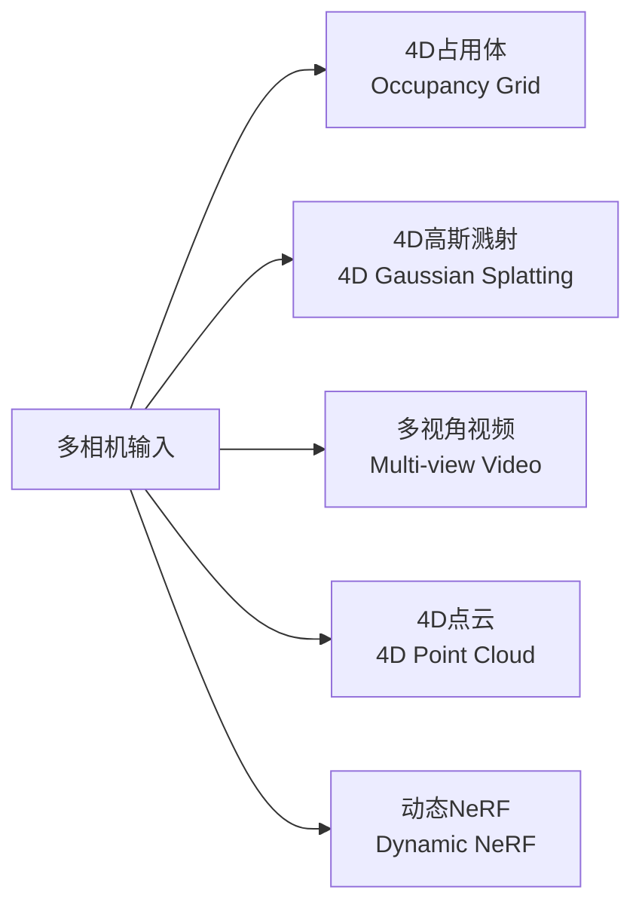
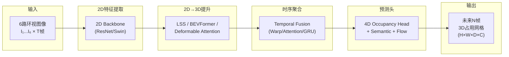
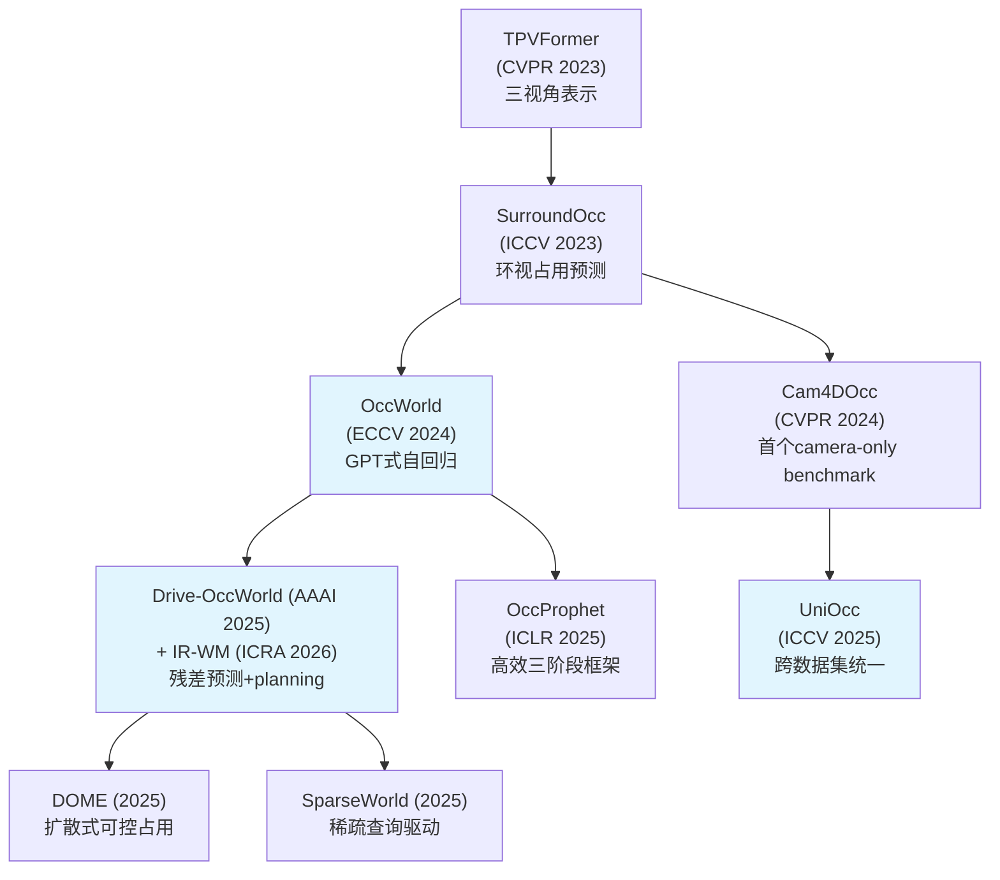
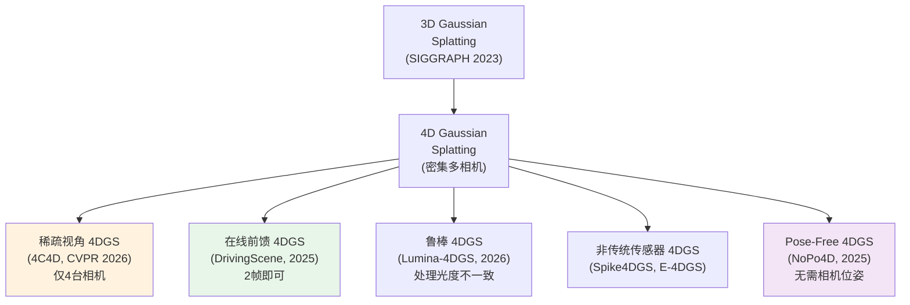
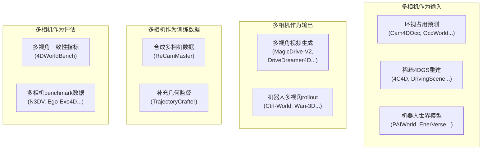

# 基于多相机的4D生成方法：广度分析

> **摘要**：本文系统梳理了基于多相机（multi-camera）的4D动态场景生成与预测方法。经对仓库内43篇已收集论文、现有survey文件及网络最新文献的综合调研，共发现 **30+ 种方法**横跨六大子方向：自动驾驶4D占用预测、驾驶场景多视角视频生成、稀疏多相机4D高斯重建、多相机合成训练数据、机器人多视角世界模型、以及多相机4D数据集。本文按多相机在方法中所扮演的角色进行分类，对每类方法的输入输出、核心架构、演进脉络进行分析，并给出横向对比与关键趋势洞察。

---

## 1. 引言与问题定义

### 1.1 什么是"基于多相机的4D生成"

"4D生成"指的是生成或预测具有三维空间结构且随时间演化的动态场景表示。"基于多相机"则意味着在该过程的某个环节——输入感知、训练数据构建、或输出表示——涉及多台相机提供的多视角信息。

与单目（monocular）4D生成相比，多相机方法的核心优势在于**几何约束的来源不同**：单目方法必须从单张图像或单视角视频中"猜测"三维结构（依赖学到的先验），而多相机方法可以通过**多视角几何（epipolar geometry）** 直接约束三维重建，获得更可靠的深度和空间一致性。

### 1.2 多相机的不同形态

在本文涵盖的方法中，"多相机"以多种形态出现：

| 形态 | 典型配置 | 典型应用 |
|------|---------|---------|
| **环视相机阵列** (surround-view) | 6路（nuScenes）或5路（Waymo）车载相机 | 自动驾驶4D占用预测 |
| **稀疏便携相机** | 4台手持相机（4C4D） | 通用动态场景4DGS重建 |
| **立体/双目相机** | VR180立体对（Stereo4D）、机器人双目 | 深度感知、VR内容 |
| **Ego + Exo 相机** | 头戴(ego) + 多台外部(exo)相机 | 人体活动理解、手物交互 |
| **事件/脉冲相机阵列** | 多视角事件相机（E-4DGS）、脉冲相机（Spike4DGS） | 高速动态场景 |
| **虚拟多相机（合成）** | UE5渲染多虚拟相机（ReCamMaster） | 训练数据生成 |
| **机器人多相机** | 腕部 + 头部/外部相机（PAIWorld） | 机器人操作世界模型 |

### 1.3 4D输出的不同表示

多相机4D生成的输出也呈现多种形式：



---

## 2. 方法分类体系

按**多相机在方法中所扮演的角色**，将现有方法分为六大类：

```mermaid
graph TB
    ROOT["基于多相机的<br/>4D生成方法"]
    
    ROOT --> A["🅐 多相机输入<br/>→ 4D占用预测<br/>(自动驾驶)"]
    ROOT --> B["🅑 多相机条件<br/>→ 4D驾驶视频生成"]
    ROOT --> C["🅒 稀疏多相机<br/>→ 4DGS/NeRF重建"]
    ROOT --> D["🅓 多相机合成数据<br/>→ 训练4D模型"]
    ROOT --> E["🅔 多相机<br/>→ 机器人世界模型"]
    ROOT --> F["🅕 多相机<br/>4D数据集与基准"]
    
    A --> A1[Cam4DOcc]
    A --> A2[OccWorld]
    A --> A3[Drive-OccWorld]
    A --> A4[UniOcc]
    A --> A5[OccProphet]
    A --> A6[DIO / DOME /<br/>SparseWorld /<br/>GenieDrive]
    
    B --> B1[DriveDreamer4D]
    B --> B2[MagicDrive-V2]
    B --> B3[WoVoGen]
    B --> B4[DiST-4D / MiLA /<br/>OmniGen / Epona]
    
    C --> C1["4C4D ⭐"]
    C --> C2[DrivingScene]
    C --> C3[Lumina-4DGS]
    C --> C4[Spike4DGS /<br/>E-4DGS]
    C --> C5[NoPo4D]
    
    D --> D1[ReCamMaster]
    D --> D2[TrajectoryCrafter]
    
    E --> E1[PAIWorld]
    E --> E2[EnerVerse-AC]
    E --> E3[Ctrl-World]
    
    F --> F1[nuScenes / Waymo]
    F --> F2[N3DV / Stereo4D]
    F --> F3["Ego-Exo4D / TACO /<br/>SHOW3D / HRDexDB"]
```



---

## 3. 🅐 多相机输入 → 4D占用预测（自动驾驶）

### 3.1 问题定义

自动驾驶中的4D占用预测（4D Occupancy Forecasting）是该领域最成熟的多相机4D生成子方向。其核心任务是：给定过去和当前的**环视相机图像序列**，预测未来若干时间步的**3D占用网格**（每个体素的占据状态、语义类别和运动流）。

### 3.2 通用架构

该类方法共享一个清晰的处理流程：



**输入格式**：6路环视 RGB 图像，分辨率通常为 $900 \times 1600$（nuScenes），时间步 $T$（历史帧数，通常 2-4 帧）。

**输出格式**：未来 $N$ 帧（通常 4-8 帧）的 3D 占用网格，体素分辨率通常为 $0.2\text{m}$，空间范围约 $[-51.2, 51.2] \times [-51.2, 51.2] \times [-5, 3]\text{m}$，包含语义标签和逐体素前向/后向流。

### 3.3 代表方法详析

#### Cam4DOcc / OCFNet (CVPR 2024, arXiv: 2311.17663)

**定位**：首个 camera-only 4D占用预测 benchmark。

**核心流程**：
1. **环视深度估计**：对6路相机分别估计深度图
2. **射线投射生成点云**：用深度图和相机参数将像素反投影到3D空间
3. **多帧体素 warp 聚合**：利用车辆 ego-motion 将历史帧的体素特征 warp 到当前坐标系并聚合
4. **双任务头**：同时预测占用状态和 3D backward centripetal flow（向心流）

**多相机的作用**：6路环视相机提供 360° 覆盖，每路相机独立估计深度后统一投射到 3D 体素空间。没有多相机就无法实现全向覆盖。

**Benchmark 设置**：
- nuScenes-Occupancy：16类语义，体素范围 $[512 \times 512 \times 40]$
- Lyft-Level5：类似设置
- 评估指标：mIoU（占用语义），VPQ（全景质量）

#### OccWorld (ECCV 2024, arXiv: 2311.16038)

**核心创新**：将 3D 占用表示 token 化，用 GPT 风格的自回归 transformer 预测未来占用 token 序列。

**流程**：多相机 → 3D 占用体 → VQVAE 编码为离散 token → GPT 自回归预测未来 token → 解码为未来占用体。

**关键洞察**：将占用预测问题转化为序列建模问题，让大规模语言模型的训练范式（next-token prediction）可以迁移到 4D 场景预测。

#### Drive-OccWorld (AAAI 2025, arXiv: 2408.14197) / IR-WM (ICRA 2026, arXiv: 2510.16729)

**核心创新**：**隐式残差预测**——不直接预测完整的未来占用体，而只预测相对于当前帧的"变化量"（residual），并以 ego-vehicle 的动作（速度、转向）为条件。

**优势**：
- 减少预测的冗余信息（静态背景无需重新预测）
- 显式引入动作条件，支持 planning
- 计算效率高于全场景预测

**流程**：
$$\hat{O}_{t+k} = O_t + f_\theta(O_t, a_{t:t+k})$$
其中 $O_t$ 为当前占用体，$a_{t:t+k}$ 为 ego 动作序列，$f_\theta$ 为残差预测网络。

#### UniOcc (ICCV 2025)

**核心贡献**：首个跨数据集统一占用预测 benchmark，统一了 nuScenes、Waymo、CARLA 和 OpenCOOD 四个数据集的标注格式（2D/3D 占用 + 前向/后向流），并支持从单车到多车协作的不同场景。

### 3.4 纵向演进脉络



**演进趋势**：从静态占用预测 → 时序占用预测 → 自回归世界模型 → 动作条件残差预测 → 扩散式可控生成。每一步都在增强模型对4D动态世界的理解和可控性。

---

## 4. 🅑 多相机条件 → 4D驾驶场景视频生成

### 4.1 问题定义

该类方法的目标是：给定某种条件输入（BEV layout、3D bounding box、文本描述、动作序列），**生成时空一致的多视角驾驶视频**。与上一类方法（输出占用体）不同，这类方法直接输出 RGB 视频帧，但需要保证多视角间的空间一致性和时间连贯性。

### 4.2 代表方法

#### DriveDreamer4D (CVPR 2025)

**核心思路**：利用世界模型先验来合成新轨迹的多视角驾驶视频，再用这些合成视频改善4D场景重建（4DGS）。

**流程**：
1. 用 DriveDreamer（世界模型）从结构化条件（3D box, HDMap, 文本）生成新轨迹的多视角视频
2. 用生成的视频作为额外训练数据，提升 4D Gaussian Splatting 的重建质量

**多相机角色**：多相机是**输出**——生成的多视角视频用于提供 4DGS 缺失视角的监督信号。

**效果**：相比 PVG/S3Gaussian/Deformable-GS，FID 分别提升 32.1%/46.4%/16.3%，NTA-IoU 分别提升 22.6%/43.5%/15.6%。

#### MagicDrive-V2 (ICCV 2025)

**核心创新**：**MVDiT（Multi-View DiT）block** 和**时空条件编码**，实现高分辨率、长时序的多视角街景视频生成。

**架构要点**：
- MVDiT block：在 DiT transformer 中引入跨视角注意力层，显式建模多相机间的空间关系
- 时空条件编码：将 3D box、BEV map、相机参数编码为逐帧条件，注入到去噪过程
- 渐进训练策略：先训低分辨率短视频，再逐步提升到高分辨率长视频

**输入**：3D bbox + BEV layout + 文本 + 相机参数
**输出**：多视角（通常6路）、高分辨率、长时序的驾驶场景视频

#### WoVoGen (2024)

**核心创新**：**世界体积感知扩散**（World Volume-Aware Diffusion），用显式的3D体积表示来保证跨视角一致性。

**关键思路**：不在2D图像空间直接做多视角一致性约束（容易出现伪影），而是先在3D体积空间中建模场景，再投影到各相机视角。这利用了3D体积表示天然的多视角一致性。

#### 其他重要方法

| 方法 | 会议 | 核心特点 |
|------|------|---------|
| **DriveDreamer-2** | AAAI 2025 | LLM 生成轨迹+HDMap，UniMVM统一多视角模型，用户可定义场景 |
| **DiST-4D** | ICCV 2025 | 解耦时空扩散 + 度量深度，分别建模相机运动和场景动态 |
| **MiLA** | arXiv 2025 | 多视角密集保真长视频生成，强调长时序一致性 |
| **OmniGen** | ACM MM 2025 | 统一多模态传感器生成：同时生成 RGB 图像 + LiDAR 点云 |
| **Epona** | ICCV 2025 | 自回归扩散世界模型，逐帧自回归生成避免长程一致性崩塌 |
| **Vista** | NeurIPS | 通用驾驶世界模型，高保真+多种可控性（动作/布局/语言） |

### 4.3 关键挑战

**多视角时空一致性**是该类方法的核心难题。具体表现为：

1. **几何一致性**：不同视角生成的图像中，同一3D物体的投影位置必须符合多视角几何关系
2. **外观一致性**：同一物体在不同视角下的纹理、光照应一致
3. **时间连贯性**：随时间推移，多视角间的一致性不应退化
4. **动态物体**：运动物体在多视角中的运动方向和速度应物理一致

**解决思路对比**：

| 策略 | 代表方法 | 优点 | 缺点 |
|------|---------|------|------|
| 跨视角注意力 | MagicDrive-V2 | 隐式学习视角关系 | 计算开销大，不保证严格几何一致 |
| 3D体积投影 | WoVoGen | 天然几何一致 | 体积分辨率受限 |
| Epipolar约束 | — | 严格几何约束 | 实现复杂，需精确相机参数 |
| 世界模型先验 | DriveDreamer4D | 利用已有世界知识 | 依赖预训练世界模型质量 |

---

## 5. 🅒 稀疏多相机 → 4D高斯/NeRF重建

### 5.1 问题定义

该类方法的目标是：给定**少量相机**拍摄的同步视频，重建 4D 动态场景的连续表示（4D Gaussian Splatting 或动态 NeRF），使得可以从任意新视角、任意时刻渲染该场景。

这与前两类方法的本质区别在于：
- 🅐类（占用预测）输出离散化的体素网格，分辨率有限
- 🅑类（视频生成）输出像素级视频，但缺乏显式3D结构
- 🅒类输出**连续的3D场景表示**，支持自由视角渲染

### 5.2 代表方法详析

#### 4C4D: 4 Camera 4D Gaussian Splatting (CVPR 2026)

**这是本次调研中发现的最直接的"多相机4D生成"方法**。

**核心贡献**：证明仅用 **4台便携相机**即可实现高质量的4D高斯溅射，将传统方法所需的数十甚至数百台相机大幅降低。

**关键洞察**：在稀疏视角设置下，**几何学习比外观学习困难得多**。传统 4DGS 优化时，外观（颜色）损失容易收敛，但几何（位置、形状）收敛困难，导致"外观正确但几何错误"的退化解。

**核心技术——Neural Decaying Function**：
- 对高斯体的不透明度（opacity）施加神经衰减函数
- 该函数鼓励4DGS梯度更多关注几何学习，缓解几何-外观学习的不平衡
- 直觉理解：通过控制不透明度的衰减行为，迫使优化器不能仅靠堆叠半透明高斯来"作弊"拟合外观，而必须学到正确的几何结构

**输入**：4台便携相机拍摄的同步视频  
**输出**：4D高斯溅射表示，支持自由视角渲染  
**意义**：将4D重建从专业设备（相机阵列）推向消费级设备（几台手机），极大降低了4D内容创建的门槛

#### DrivingScene (arXiv 2025, 2510.24734)

**核心特点**：从**仅2帧环视图像**即可在线前馈（feed-forward）重建3D高斯点云。

**多任务输出**：同时生成高质量的深度图、场景流和3D高斯点云。

**关键设计**：
1. 静态场景先验（static scene prior）：预先学习静态背景的3D结构
2. 轻量残差流网络：在静态先验基础上预测动态物体的非刚体运动
3. 逐相机运动预测：对每个相机独立预测场景流，再统一到全局坐标系

**在 nuScenes 上的验证**：图像质量和动态重建均显著优于 SOTA。

#### Lumina-4DGS (2026)

**核心创新**：解决多相机阵列中**光度不一致**（photometric inconsistency）问题。

**问题根源**：真实多相机阵列（如 Waymo 的5台车载相机）中，各相机的自动曝光（AE）、自动白平衡（AWB）和非线性 ISP 处理不同，导致同一时刻不同相机拍到的同一物体亮度/色调不一致。标准3DGS假设亮度恒定（brightness constancy），因此在这种情况下会产生时间闪烁和漂浮伪影。

**解决方案**：层次曝光补偿策略，在多尺度上校正各相机的光度差异。在 Waymo 数据集上验证。

#### 非传统传感器阵列

| 方法 | 传感器 | 创新点 |
|------|--------|--------|
| **Spike4DGS** (NeurIPS 2025) | 多视角脉冲相机阵列 | 首个脉冲相机4DGS框架，利用脉冲相机的超高时间分辨率（μs级）捕捉高速运动 |
| **E-4DGS** (arXiv 2025) | 多视角事件相机 | 事件流 + 稀疏RGB帧联合重建，适合极端光照和高速场景 |
| **NoPo4D** (arXiv 2025, 2605.22190) | 无位姿多视角视频 | 前馈式，无需相机位姿先验；速度分解 + 双向运动编码 + 视角依赖不透明度 |

### 5.3 纵向演进



**核心演进方向**：
- **相机数量**：数百台 → 数十台 → 4台（4C4D）→ 2帧（DrivingScene）
- **位姿依赖**：需要精确位姿 → pose-free（NoPo4D）
- **处理模式**：逐场景优化 → 前馈推理（DrivingScene, NoPo4D）
- **传感器类型**：RGB相机 → 事件相机 → 脉冲相机

---

## 6. 🅓 多相机合成数据 → 训练4D生成模型

### 6.1 核心思路

该类方法不在推理时使用多相机输入，而是利用多相机设置（真实或合成）来构建大规模训练数据，用于训练能从单目输入生成4D内容的模型。

### 6.2 代表方法

#### ReCamMaster (arXiv: 2503.11647)

**核心贡献**：构建了一个大规模**多相机同步视频数据集**，并用它训练了一个从单视频生成新相机轨迹视频的模型。

**数据集构建**：
- 使用 Unreal Engine 5 渲染
- 规模：**136K 视频 / 13.6K 动态场景 / 40个高质量3D环境 / 122K 相机轨迹**
- 场景类型：城市街道、商场、咖啡馆、乡村等多种室内外环境
- 多相机设置：多台虚拟相机面向同一场景，沿不同轨迹同步拍摄

**训练-推理范式**：
- **训练时**：利用多相机同步视频学习"同一场景不同视角"的对应关系
- **推理时**：输入单个视频 + 目标相机轨迹 → 输出新视角的视频

**效果**：4DWorldBench Video-to-4D Overall 0.685，排名第一。

**关键洞察**：多相机数据的价值在于提供了天然的"多视角对"——同一时刻、同一场景、不同视角的图像对是学习 3D 一致性的理想监督信号。

#### TrajectoryCrafter (arXiv: 2501.14848)

**策略**：混合使用大规模单目网络视频（提供外观多样性）和小规模静态多视角数据集（DL3DV, RealEstate10K，提供几何约束），来训练单目视频的新轨迹生成模型。

**多相机角色**：多视角数据集作为**补充训练数据**，弥补纯单目训练缺少的几何监督。

---

## 7. 🅔 多相机 → 机器人多视角世界模型

### 7.1 问题背景

机器人操作系统通常配备多台相机（腕部相机提供精细操作视角，头部/外部相机提供全局环境视角）。当世界模型要作为机器人策略的模拟器时，必须能**同时生成所有相机视角的未来帧**，且保持 3D 一致性。

### 7.2 代表方法

#### PAIWorld (arXiv: 2606.18375)

**核心论点**：现有世界模型（主要为单视角设计）无法满足多相机机器人系统的需求。

**关键创新**：
1. **Geometry-Aware Cross-View Attention**：在不同相机视角的 token 之间建立跨视角注意力，注入相机几何信息
2. **GeoRoPE（Geometric Rotary Position Embedding）**：将相机外参编码到旋转位置编码中，使模型对相机空间关系有显式感知

**训练规模**：2.5M 多视角视频片段

**输入**：V路相机的当前帧 + 机器人动作序列  
**输出**：V路相机的未来帧序列（保持3D一致）

#### EnerVerse-AC (arXiv: 2505.09723)

**核心特点**：
- 分别处理**静态头部相机**和**动态腕部相机**
- 空间交叉注意力模块 + 射线方向图编码（ray direction map encoding）处理多视角特征
- 从2D视频生成扩展到3D（多视角）视频生成

#### Ctrl-World (arXiv: 2510.10125)

**核心特点**：多视角 + 帧级动作条件 + 位姿记忆，生成的多视角 rollout 用于策略评估和改进。

### 7.3 与驾驶多相机方法的对比

| 维度 | 驾驶多相机方法 | 机器人多相机方法 |
|------|---------------|-----------------|
| 相机数量 | 5-6路环视 | 2-4路（腕部+头部+外部） |
| 相机运动 | 车体运动驱动 | 机械臂运动驱动（腕部相机大幅运动） |
| 主要难点 | 长距离场景一致性 | 近距离精细操作的一致性 |
| 输出用途 | 场景理解/规划 | 策略评估/数据增强 |
| 动作条件 | ego车辆速度/转向 | 机械臂关节角度/末端执行器位姿 |

---

## 8. 🅕 多相机4D数据集与评估基准

### 8.1 数据集全景

| 数据集 | 相机配置 | 领域 | 规模 | 4D标注 | 使用论文 |
|--------|---------|------|------|--------|---------|
| **nuScenes** | 6路环视 + LiDAR | 驾驶 | 1000序列, 2Hz | 3D占用+流 | Cam4DOcc, UniOcc, IR-WM, DrivingScene |
| **Waymo Open** | 5路环视 + LiDAR | 驾驶 | 1150序列, 10Hz | 3D box, 点云 | UniOcc, Lumina-4DGS |
| **Lyft-Level5** | 多路环视 + LiDAR | 驾驶 | — | 3D占用 | Cam4DOcc |
| **N3DV** | 多台同步相机 | 室内动态 | 6个场景 | 多视角同步视频 | 4DGS系列经典测试集 |
| **Stereo4D** | VR180立体对 | 通用动态 | 100K+片段 | 深度+位姿+2D/3D轨迹 | — |
| **Ego-Exo4D** | ego + 多exo | 人类活动 | 1286.3h, 740人 | 3D pose+相机位姿 | 多视角4D预训练数据 |
| **TACO** | 1 ego + 12 allocentric | 手物交互 | — | 双手MANO+物体6DoF | — |
| **SHOW3D** | 2 ego + 8 exo | 全身手物 | 20h, 4.28M帧 | 同步多视角 | — |
| **HRDexDB** | 23台同步相机 | 灵巧抓取 | 2.1K序列 | 多embodiment | — |
| **Assembly101** | 8固定 + 4 ego | 装配 | 4321视频 | 3D手部位姿+动作标签 | — |
| **ARCTIC** | 多固定 + 第一人称 | 手物交互 | 2.1M帧 | — | — |
| **H2O** | 多视角RGB-D同步 | 双手物体 | 571K帧 | 双手+物体位姿 | — |
| **OakInk2** | 多视角 | 物体操作 | 4.01M帧 | body/hands/object pose | — |

### 8.2 评估基准

| 基准 | 评估对象 | 多相机相关 | 论文 |
|------|---------|-----------|------|
| **Cam4DOcc Benchmark** | camera-only 4D占用预测 | 环视相机输入 | arXiv: 2311.17663 |
| **UniOcc** | 统一占用预测 | 跨多相机数据集 | ICCV 2025 |
| **4DWorldBench** | 3D/4D世界生成模型 | 评估多视角一致性 | CVPR 2026 |
| **WorldModelBench** | 视频生成作为世界模型 | 驾驶域专项评估 | NeurIPS 2025 |

---

## 9. 横向对比分析

### 9.1 多相机角色对比



### 9.2 4D表示形式对比

| 表示形式 | 代表方法 | 空间分辨率 | 渲染质量 | 物理可解释性 | 计算成本 |
|---------|---------|-----------|---------|-------------|---------|
| **4D占用体** | OccWorld, Cam4DOcc | 离散（0.2m/体素） | 低（无纹理） | 高（语义+流） | 中 |
| **4D高斯** | 4C4D, DrivingScene | 连续（高精度） | 高（实时渲染） | 中（点基元） | 中-高 |
| **多视角视频** | MagicDrive-V2 | 像素级 | 最高（生成式） | 低（隐式） | 高 |
| **4D点云** | DynamicVerse | 离散（点密度依赖） | 中 | 高（度量） | 低-中 |
| **动态NeRF** | 传统方法 | 连续 | 高 | 中 | 最高 |

### 9.3 多相机数量需求谱

```
2台（立体）─── 4台（稀疏）─── 5-6台（环视）─── 12+台（密集）─── 23+台（极密）
    │              │              │                │               │
 Stereo4D        4C4D        nuScenes/         TACO           HRDexDB
 E-4DGS       NoPo4D        Waymo          Assembly101      Xangle(150)
                          DrivingScene
                          MagicDrive-V2
```

**趋势**：方法正在向**更少相机**的方向发展。4C4D (CVPR 2026) 证明4台即可，DrivingScene 甚至只需2帧环视图。这使得4D重建从专业设备走向消费级。

### 9.4 是否需要相机位姿

| 类别 | 代表方法 | 位姿需求 |
|------|---------|---------|
| 需要精确位姿 | 4C4D, DrivingScene, Lumina-4DGS | 从标定或SfM获取 |
| Pose-free | **NoPo4D**, NeoVerse | 完全不需要位姿输入 |
| 自标定 | 部分SLAM-based方法 | 在线估计位姿 |
| 隐式编码 | PAIWorld (GeoRoPE) | 位姿编码到注意力机制中 |

### 9.5 应用领域覆盖

| 领域 | 多相机输入方法 | 多相机输出方法 | 数据集 |
|------|---------------|---------------|--------|
| **自动驾驶** | Cam4DOcc, OccWorld, Drive-OccWorld, UniOcc, DrivingScene, Lumina-4DGS | DriveDreamer4D, MagicDrive-V2, WoVoGen, DiST-4D, Vista | nuScenes, Waymo, Lyft, CARLA |
| **机器人操作** | — | PAIWorld, EnerVerse-AC, Ctrl-World | DROID, Ego-Exo4D |
| **通用动态场景** | 4C4D, NoPo4D | ReCamMaster, NeoVerse | N3DV, Stereo4D |
| **高速场景** | Spike4DGS, E-4DGS | — | 自建数据集 |
| **手物交互** | — | — | TACO, SHOW3D, HRDexDB, ARCTIC |

---

## 10. 关键趋势与洞察

### 趋势一：从密集到稀疏

传统4D重建需要数十甚至数百台同步相机（如 N3DV 测试集、Xangle 的150台相机阵列）。近期方法大幅降低了相机数量需求：
- **4C4D** (CVPR 2026)：4台便携相机
- **DrivingScene**：2帧环视图像
- **NoPo4D**：无位姿多视角视频

这使得4D内容创建从专业工作室走向日常场景。

### 趋势二：从重建到生成

多相机不仅用于**重建**已有场景（传统 NVS 范式），更用于**生成**从未存在的场景：
- DriveDreamer4D 用合成多视角视频改善 4DGS 重建
- MagicDrive-V2 从条件直接生成多视角视频
- ReCamMaster 用合成多相机数据训练单目生成模型

**生成范式的优势**：不受真实场景限制，可以创造稀有场景（extreme weather, corner cases）。

### 趋势三：从专用到统一

- **UniOcc**：首次统一 nuScenes/Waymo/CARLA/OpenCOOD 的占用预测评估
- **4DWorldBench**：统一评估 Image-to-4D / Video-to-4D / Text-to-4D
- **WorldModelBench**：跨7个领域评估视频生成作为世界模型

统一评估推动了跨方法、跨数据集的公平对比，加速了领域发展。

### 趋势四：从2D视频到4D体积

早期驾驶世界模型（如 GAIA, DriveDreamer）仅生成 2D 视频，缺乏3D几何。近期方法逐步引入4D体积表示：
- OccWorld 系列：输出 4D 占用体
- DriveDreamer4D：生成视频→4D高斯
- UniFuture：同时生成 RGB + 深度 → 4D 点云

### 趋势五：多相机作为训练数据源

即使推理时只需单目输入，多相机数据在训练中也极具价值：
- ReCamMaster 用 UE5 渲染 136K 多相机视频
- TrajectoryCrafter 混合单目+多视角数据训练
- NeoVerse 明确将"避免多相机数据依赖"作为卖点——反面说明多相机数据的稀缺仍是瓶颈

---

## 11. 与仓库现有 Survey 的关系

### 11.1 已覆盖的方法

以下方法已在 `sota_1.md` 或 `sota_1_2.md` 中有条目：
- ReCamMaster, NeoVerse, VerseCrafter, TrajectoryCrafter
- OCFNet/Cam4DOcc, OccWorld, Drive-OccWorld/IR-WM, UniOcc
- EnerVerse-AC, Ctrl-World, PAIWorld (sota_1_2.md)
- 4DWorldBench, WorldModelBench

### 11.2 建议补充收集的论文

以下方法在本次调研中发现但尚未收集到 `b/p/` 中：

| 论文 | arXiv ID | 会议 | 理由 |
|------|---------|------|------|
| **4C4D** | 2604.04063 | CVPR 2026 | 最直接的稀疏多相机4DGS方法 |
| **DriveDreamer4D** | 2410.13571 | CVPR 2025 | 多相机视频→4D重建的范式创新 |
| **MagicDrive-V2** | 2411.13807 | ICCV 2025 | 多视角驾驶视频生成SOTA |
| **DrivingScene** | 2510.24734 | arXiv 2025 | 在线前馈环视3DGS |
| **WoVoGen** | — | 2024 | 体积感知多相机生成 |
| **DiST-4D** | — | ICCV 2025 | 解耦时空4D驾驶生成 |
| **OmniGen** | — | ACM MM 2025 | 多模态传感器统一生成 |
| **Lumina-4DGS** | — | 2026 | 光照鲁棒多相机4DGS |
| **Spike4DGS** | — | NeurIPS 2025 | 脉冲相机阵列4DGS |

---

## 12. 参考来源

- 仓库内论文 LaTeX 源码：`b/p/` 下 Cam4DOcc, UniOcc, IR-WM, ReCamMaster, PAIWorld, EnerVerse-AC, VerseCrafter, NeoVerse, TrajectoryCrafter, DynamicVerse, 4DWorldBench, WorldModelBench 等
- 仓库内 survey 文件：`sota_1.md`, `sota_1_2.md`, `bechmrkls_1.md`
- 仓库内方案设计：`d4a_solutioin_1_c.md`
- [4C4D: 4 Camera 4D Gaussian Splatting (CVPR 2026)](https://arxiv.org/abs/2604.04063)
- [DriveDreamer4D (CVPR 2025)](https://arxiv.org/abs/2410.13571)
- [MagicDrive-V2 (ICCV 2025)](https://arxiv.org/abs/2411.13807)
- [DrivingScene (arXiv 2025)](https://arxiv.org/abs/2510.24734)
- [UniFuture (arXiv 2025)](https://arxiv.org/abs/2503.13587)
- [Awesome World Model (GitHub)](https://github.com/LMD0311/Awesome-World-Model)
- [3D and 4D World Modeling Survey (TPAMI 2026)](https://github.com/worldbench/awesome-3d-4d-world-models)
- [A Survey of World Models for Autonomous Driving](https://arxiv.org/abs/2501.11260)
- [DriveDreamer-2 (AAAI 2025)](https://ojs.aaai.org/index.php/AAAI/article/view/33130)
- [Waymo World Model (2026)](https://www.auganix.org/xr-news-waymo-world-model/)
- [Lumina-4DGS (2026)](https://pmc.ncbi.nlm.nih.gov/articles/PMC12987166/)
- [E-4DGS (arXiv 2025)](https://arxiv.org/abs/2508.09912)
