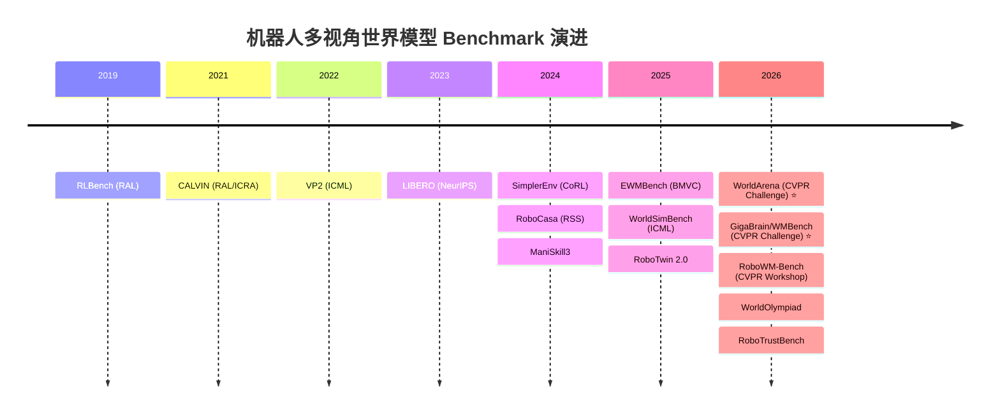
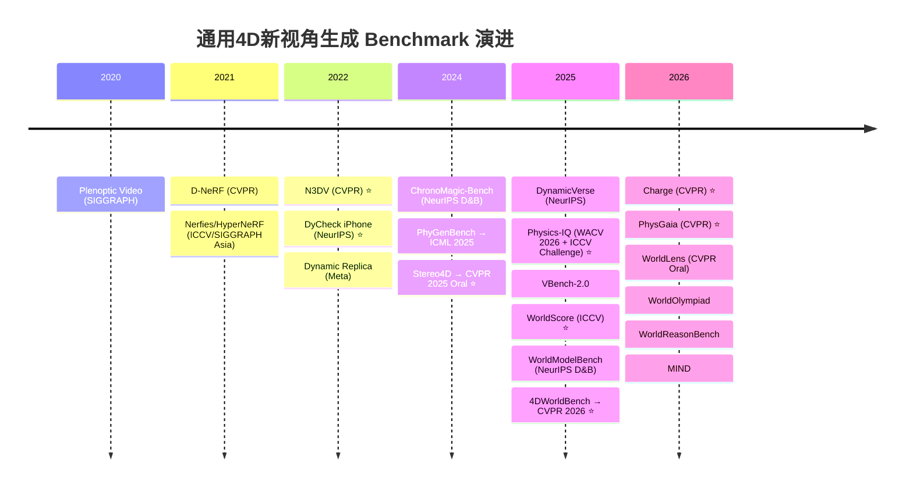

# 多相机机器人世界模型 & 通用 4D NVS 领域 Benchmark 全景

> 本文系统梳理"多相机→机器人多视角世界模型"和"通用多视角与单/多视频转4D新视角生成"两个领域中业界公认的 benchmark、测试数据集、竞赛和 leaderboard，按提出日期排序，并列出网址、开源程度、业界认可度等关键信息。

---

## 一、领域 A：机器人多视角世界模型 Benchmarks

本领域评估的核心问题：机器人世界模型（输入多视角观测+动作→输出多视角未来帧）的**感知质量**和**功能实用性**（生成的视频能否驱动策略训练/评估/规划）。

---

### A1. RLBench — The Robot Learning Benchmark

| 字段 | 信息 |
|------|------|
| **全称** | RLBench: The Robot Learning Benchmark & Learning Environment |
| **提出日期** | 2019-09 (arXiv: 1909.12271) |
| **论文** | [arXiv:1909.12271](https://arxiv.org/abs/1909.12271) · IEEE Robotics and Automation Letters (RAL) 2020 |
| **项目主页** | [sites.google.com/view/rlbench](https://sites.google.com/view/rlbench) |
| **GitHub** | [github.com/stepjam/RLBench](https://github.com/stepjam/RLBench) |
| **开源程度** | 完全开源（MIT License）：代码 + 任务定义 + 仿真环境 |
| **Leaderboard** | 无官方持续 leaderboard；论文表格对比为主 |
| **引用数** | ~1100+（Google Scholar 估计, 2026.07） |
| **业界认可度** | 极高。机器人操作领域最广泛使用的 benchmark 之一。100 个手工设计任务，覆盖 RL/IL/多任务/少样本学习。基于 CoppeliaSim + PyRep |

**核心评估内容**：100+ 操作任务（从简单的目标到达到多步长任务如开烤箱放托盘），提供 RGB/深度/分割/关节状态等多模态观测。BridgeVLA、InternVLA、PerAct 等主流 VLA 模型均在此评估。

**局限**：单臂 Franka Panda，桌面场景为主，不含动态环境干扰。

---

### A2. CALVIN — Composing Actions from Language and Vision

| 字段 | 信息 |
|------|------|
| **全称** | CALVIN: A Benchmark for Language-Conditioned Policy Learning for Long-Horizon Robot Manipulation Tasks |
| **提出日期** | 2021-12 (arXiv: 2112.03227) |
| **论文** | [arXiv:2112.03227](https://arxiv.org/abs/2112.03227) · IEEE RAL / ICRA 2022 |
| **项目主页** | [github.com/mees/calvin](https://github.com/mees/calvin) |
| **GitHub** | [github.com/mees/calvin](https://github.com/mees/calvin) |
| **开源程度** | 完全开源（MIT License）：代码 + 24h 遥操作数据 + 4个环境 |
| **Leaderboard** | 无官方持续 leaderboard；公开论文结果汇编 |
| **引用数** | ~400+（Google Scholar 估计, 2026.07） |
| **业界认可度** | 极高。长时序语言条件操作的标准 benchmark。34 个任务 × 4 个环境（ABCD），需连续执行5条语言指令。Being-H0.7、SuSIE、GR-1 等均使用 |

**核心评估内容**：语言条件的长视域操作，ABCD→D 和 ABC→D 两种泛化测试设置。评估模型在环境切换时的泛化能力。

---

### A3. VP2 — Video Prediction for Visual Planning

| 字段 | 信息 |
|------|------|
| **全称** | VP2: Video-Prediction-Based Planning Benchmark |
| **提出日期** | 2022-03 (arXiv: 2203.13803) |
| **论文** | [arXiv:2203.13803](https://arxiv.org/abs/2203.13803) · ICML 2022 Workshop |
| **GitHub** | [github.com/s-tian/vp2](https://github.com/s-tian/vp2) |
| **开源程度** | 开源代码 + 11个仿真任务 + 310个任务实例 |
| **Leaderboard** | 无 |
| **引用数** | ~50+（Google Scholar 估计） |
| **业界认可度** | 中等。早期将视频预测与视觉规划对齐的 benchmark，被 RoboWM-Bench 等后续工作引用为前驱 |

**核心评估内容**：视频预测模型的"可规划性"——生成的未来视频能否被用于视觉规划和操作执行。

---

### A4. LIBERO — Lifelong Robot Learning Benchmark

| 字段 | 信息 |
|------|------|
| **全称** | LIBERO: Benchmarking Knowledge Transfer for Lifelong Robot Learning |
| **提出日期** | 2023-06 (arXiv: 2306.03310) |
| **论文** | [arXiv:2306.03310](https://arxiv.org/abs/2306.03310) · NeurIPS 2023 |
| **项目主页** | [libero-project.github.io](https://libero-project.github.io/) |
| **GitHub** | [github.com/Lifelong-Robot-Learning/LIBERO](https://github.com/Lifelong-Robot-Learning/LIBERO) |
| **开源程度** | 完全开源（MIT）：代码 + 130个任务 + 数据 |
| **Leaderboard** | 无官方 leaderboard；LIBERO-Plus 扩展版有7类扰动测试 |
| **引用数** | ~250+（Google Scholar 估计, 2026.07） |
| **业界认可度** | 高。终身学习操作标准 benchmark。GAM (97.6%)、OpenVLA-OFT (97.1%)、Being-H0.7 等均在此评估 |

**核心评估内容**：跨任务知识迁移能力。LIBERO-Plus (2025) 增加7类扰动（相机、机器人初始位姿、语言、光照、背景、噪声、布局）测试鲁棒性。

---

### A5. SimplerEnv / SIMPLER

| 字段 | 信息 |
|------|------|
| **全称** | SIMPLER: Simulated Manipulation Policy Evaluation for Real Robots |
| **提出日期** | 2024-05 (arXiv: 2405.05941) |
| **论文** | [arXiv:2405.05941](https://arxiv.org/abs/2405.05941) · CoRL 2024 |
| **项目主页** | [simpler-env.github.io](https://simpler-env.github.io/) |
| **GitHub** | [github.com/simpler-env/SimplerEnv](https://github.com/simpler-env/SimplerEnv) |
| **开源程度** | 完全开源：代码 + 环境 + 1500+ sim/real配对评估 |
| **Leaderboard** | Google Sheets 社区 leaderboard（持续更新） |
| **引用数** | ~150+（Google Scholar 估计, 2026.07） |
| **业界认可度** | 高。首个系统验证 sim→real 评估相关性的 benchmark。Google Robot + WidowX 两种 embodiment。NVIDIA GR00T 已集成 SimplerEnv。评估 RT-1, RT-1-X, Octo 等策略 |

**核心评估内容**：仿真中的策略评估与真实世界的相关性。用 MMRV (Mean Maximum Rank Violation) 和 Pearson r 衡量 sim-real 一致性。

---

### A6. RoboCasa — Large-Scale Kitchen Simulation

| 字段 | 信息 |
|------|------|
| **全称** | RoboCasa: Large-Scale Simulation of Everyday Tasks for Generalist Robots |
| **提出日期** | 2024-06 (arXiv: 2406.02523) |
| **论文** | [arXiv:2406.02523](https://arxiv.org/abs/2406.02523) · RSS 2024 |
| **项目主页** | [robocasa.ai](https://robocasa.ai/) |
| **GitHub** | [github.com/robocasa/robocasa](https://github.com/robocasa/robocasa) |
| **开源程度** | 完全开源：代码 + 100+厨房场景 + 2500+物体 |
| **Leaderboard** | 论文表格对比（24-task 标准测试） |
| **引用数** | ~100+（Google Scholar 估计） |
| **业界认可度** | 高。日常家务长视域操作的大规模 benchmark。X-WAM (79.2%)、GAM (69.4%)、Being-H0.5 均在此评估 |

**核心评估内容**：24类日常厨房操作任务（取物、倒水、开关抽屉等），测试对多样厨房环境的泛化能力。

---

### A7. ManiSkill3 / SAPIEN

| 字段 | 信息 |
|------|------|
| **全称** | ManiSkill3: GPU Parallelized Robotics Simulation and Benchmark |
| **提出日期** | 2024-10 (arXiv: 2410.00425) |
| **论文** | [arXiv:2410.00425](https://arxiv.org/abs/2410.00425) |
| **项目主页** | [maniskill.ai](https://maniskill.ai/) |
| **GitHub** | [github.com/haosulab/ManiSkill](https://github.com/haosulab/ManiSkill) |
| **开源程度** | 完全开源：代码 + 环境 + 数据集 |
| **Leaderboard** | 无 |
| **引用数** | ~80+（Google Scholar 估计） |
| **业界认可度** | 高。GPU 并行渲染（30K+ FPS），被 SimplerEnv Bridge 集成，是 SAPIEN 物理引擎的上层 benchmark |

**核心评估内容**：快速评估和数据合成平台，支持 RL/IL 训练和并行评估。

---

### A8. EWMBench — Embodied World Model Benchmark

| 字段 | 信息 |
|------|------|
| **全称** | EWMBench: Evaluating Scene, Motion, and Semantic Quality in Embodied World Models |
| **提出日期** | 2025-05 (arXiv: 2505.09694) |
| **论文** | [arXiv:2505.09694](https://arxiv.org/abs/2505.09694) · BMVC 2025 |
| **GitHub** | 待公开（论文提及代码将开源） |
| **开源程度** | 数据（基于 AgiBot-World）+ 评估工具包（DINOv2评估/轨迹检测/LMM评估） |
| **Leaderboard** | [HuggingFace: agibot-world/ICRA26WM](https://huggingface.co/spaces/agibot-world/ICRA26WM)（AgiBot Challenge 用） |
| **竞赛** | **ICRA 2026 AgiBot World Challenge — World Model Track** |
| **引用数** | ~20+（新论文） |
| **业界认可度** | 高。ICRA 2026 官方挑战赛采用。评估场景一致性、轨迹一致性、语义、多样性、PSNR/SSIM。Top: NeoVerse-ABot (0.8290), PAI (0.8245) |

**核心评估内容**：动作条件机器人视频生成的场景-运动-语义三维质量评估。

---

### A9. WorldSimBench

| 字段 | 信息 |
|------|------|
| **全称** | WorldSimBench: Towards Video Generation Models as World Simulators |
| **提出日期** | 2024-10 (arXiv: 2410.18072) |
| **论文** | [arXiv:2410.18072](https://arxiv.org/abs/2410.18072) · ICML 2025 |
| **项目主页** | [iranqin.github.io/WorldSimBench.github.io](https://iranqin.github.io/WorldSimBench.github.io/) |
| **GitHub** | [github.com/IranQin/WorldSimBench](https://github.com/IranQin/WorldSimBench) |
| **开源程度** | 代码 + 评估框架开源 |
| **Leaderboard** | 项目主页有静态结果表 |
| **引用数** | ~40+（Google Scholar 估计） |
| **业界认可度** | 高。ICML 2025 接收。首个同时评估**显式感知质量**和**隐式可操作性**（生成视频→控制信号）的双重框架，覆盖具身/驾驶/机器人三个场景 |

**核心评估内容**：显式感知评估（人类偏好、视觉质量）+ 隐式操作评估（生成视频能否被解码为正确控制信号）。

---

### A10. RoboTwin 2.0

| 字段 | 信息 |
|------|------|
| **全称** | RoboTwin 2.0: Dual-Arm Multi-Embodiment Simulation Benchmark |
| **提出日期** | 2025-06 (arXiv: 2506.18088) |
| **论文** | [arXiv:2506.18088](https://arxiv.org/abs/2506.18088) |
| **GitHub** | [github.com/TianxingChen/RoboTwin](https://github.com/TianxingChen/RoboTwin) |
| **开源程度** | 开源代码 + 环境 |
| **Leaderboard** | 论文表格 |
| **引用数** | ~10+（新论文） |
| **业界认可度** | 中-高。双臂多实体、强域随机化。WorldArena 使用 RoboTwin 2.0 Clean-50 作为测试数据。X-WAM (90.7%) |

**核心评估内容**：双臂操作，可配置输出（RGB/深度/点云/末端位姿/关节角/分割），支持多 embodiment。

---

### A11. WorldArena / WorldArena 2.0 ⭐

| 字段 | 信息 |
|------|------|
| **全称** | WorldArena: A Unified Benchmark for Evaluating Perception and Functional Utility of Embodied World Models |
| **提出日期** | 2026-02 (arXiv: 2602.08971); 2.0: 2026-05 (arXiv: 2605.17912) |
| **论文** | [arXiv:2602.08971](https://arxiv.org/abs/2602.08971) / [2.0: arXiv:2605.17912](https://arxiv.org/abs/2605.17912) |
| **项目主页** | [world-arena.ai](https://world-arena.ai/) |
| **GitHub** | [github.com/tsinghua-fib-lab/WorldArena](https://github.com/tsinghua-fib-lab/WorldArena) |
| **开源程度** | 代码 + 评估协议 + 数据开源 |
| **Leaderboard** | [HuggingFace: WorldArena/WorldArena](https://huggingface.co/spaces/WorldArena/WorldArena) |
| **竞赛** | **CVPR 2026 WorldArena Challenge**（两个Track）— [cvpr2026challenge.world-arena.ai](http://cvpr2026challenge.world-arena.ai/) |
| **引用数** | ~30+（新论文，但已被多个顶级方法引用） |
| **业界认可度** | **极高**。CVPR 2026 官方挑战赛。**当前具身世界模型领域最权威的统一 benchmark**。16指标 × 6子维度 + 3种功能评估（数据引擎/策略评估器/动作规划器）。EWMScore 综合指标。2.0 版增加触觉、在线RL、跨平台（RoboTwin/LIBERO/ALOHA）。Top: PAIWorld (EWMScore 72.31) |

**核心评估内容**：
- **感知评估**：视觉质量、运动质量、内容一致性、物理真实性、3D准确性、可控性（共16指标）
- **功能评估**：作为数据引擎的有效性、作为策略评估器的相关性、作为动作规划器的成功率
- **关键发现**：感知质量高≠功能实用性高（perception-functionality gap）

---

### A12. GigaBrain Challenge / WMBench ⭐

| 字段 | 信息 |
|------|------|
| **全称** | GigaBrain Challenge 2026 — World Model Track / WMBench |
| **提出日期** | 2026-07 (arXiv: 2607.02642, GigaWorld-1 论文) |
| **论文** | [arXiv:2607.02642](https://arxiv.org/abs/2607.02642) |
| **竞赛数据集** | [HuggingFace: open-gigaai/CVPR-2026-WorldModel-Track-Dataset](https://huggingface.co/datasets/open-gigaai/CVPR-2026-WorldModel-Track-Dataset) |
| **Leaderboard** | [HuggingFace: open-gigaai/CVPR-2026-WorldModel-Track-LeaderBoard](https://huggingface.co/spaces/open-gigaai/CVPR-2026-WorldModel-Track-LeaderBoard) |
| **开源程度** | 数据集 + 评估协议开源 |
| **竞赛** | **CVPR 2026 GigaBrain Challenge — World Model Track**（三轮提交） |
| **引用数** | ~5+（极新） |
| **业界认可度** | **极高**。CVPR 2026 官方关联挑战赛。2,989条配对轨迹 × 8个任务族 × 324K+ world model rollouts。Top: Team xuwu/Wan-3D v0.3 (57.11), ABot-PhysWorld (55.94) |

**核心评估内容**：世界模型作为**策略评估器**的能力——生成的 rollout 能否正确反映不同策略的优劣排序。8个任务族涵盖刚体和可变形操作。

---

### A13. RoboWM-Bench

| 字段 | 信息 |
|------|------|
| **全称** | RoboWM-Bench: A Benchmark for Evaluating World Models in Robotic Manipulation |
| **提出日期** | 2026-04 (arXiv: 2604.19092) |
| **论文** | [arXiv:2604.19092](https://arxiv.org/abs/2604.19092) · CVPR 2026 Workshop (GigaBrain Challenge) |
| **GitHub** | [github.com/fffstrong/RoboWM-Bench](https://github.com/fffstrong/RoboWM-Bench) |
| **开源程度** | 代码 + 评估框架开源 |
| **Leaderboard** | 论文表格（静态） |
| **引用数** | ~10+（新论文） |
| **业界认可度** | 高。CVPR 2026 Workshop 论文。**首个评估世界模型"可执行性"的 benchmark**——将生成的操作视频转化为机器人动作并在仿真中执行验证 |

**核心评估内容**：
- 将人类手部或机器人操作视频通过逆运动学/重定向转化为可执行动作
- 在标准化仿真环境中验证任务成功率
- **关键发现**：感知分数常"饱和"而执行分数仍低——视觉逼真≠物理可执行
- Human track SOTA: Wan 2.6 (76.6%); Robot track: Cosmos-FT (47.5%)

---

### A14. WorldOlympiad

| 字段 | 信息 |
|------|------|
| **全称** | WorldOlympiad: Can Your World Model Survive a Triathlon? |
| **提出日期** | 2026-06 (arXiv: 2606.11129) |
| **论文** | [arXiv:2606.11129](https://arxiv.org/abs/2606.11129) |
| **项目主页** | [alibaba-damo-academy.github.io/WorldOlympiad](https://alibaba-damo-academy.github.io/WorldOlympiad/) |
| **开源程度** | 数据 + 评估代码公开 |
| **Leaderboard** | 项目主页 |
| **引用数** | ~5+（极新） |
| **业界认可度** | 中-高。阿里达摩院出品。1,000个长视频（机器人/游戏/真实世界），评估物理忠实度、3D几何一致性、交互忠实度 |

**核心评估内容**：长时序"三项全能"——在三个不同领域测试世界模型的持久性和一致性。

---

### A15. RoboTrustBench

| 字段 | 信息 |
|------|------|
| **全称** | RoboTrustBench: Benchmarking the Trustworthiness of Video World Models for Robotic Manipulation |
| **提出日期** | 2026-06 (arXiv: 2606.01600) |
| **论文** | [arXiv:2606.01600](https://arxiv.org/abs/2606.01600) |
| **开源程度** | 待公开 |
| **Leaderboard** | 无 |
| **引用数** | ~3+（极新） |
| **业界认可度** | 中。关注世界模型的**可信度**——能否正确处理欠定义、不可行或不安全的指令 |

**核心评估内容**：测试世界模型面对模糊/不可能/危险指令时的行为是否安全合理。

---

## 二、领域 B：通用多视角与单/多视频转 4D 新视角生成 Benchmarks

本领域评估的核心问题：从单目/多目视频重建或生成4D动态场景（4DGS/动态NeRF/4D点云/4D视频），并从新视角渲染的质量与一致性。

---

### B1. Plenoptic Video Dataset

| 字段 | 信息 |
|------|------|
| **全称** | Neural Scene Flow Fields for Space-Time View Synthesis of Dynamic Scenes (Plenoptic Video) |
| **提出日期** | 2020 (Li et al., Facebook Reality Labs) |
| **论文** | SIGGRAPH 2020 相关工作 / Facebook Research 内部数据集 |
| **数据获取** | 非完全公开；部分序列通过研究申请获取 |
| **开源程度** | 部分公开 |
| **引用数** | ~300+（作为经典测试数据被广泛引用） |
| **业界认可度** | 高。早期多相机同步动态视频数据集，被 DyNeRF、K-Planes 等引用为测试集 |

**核心评估内容**：多相机固定位置同步拍摄的真实动态场景，用于评估时空视角合成。

---

### B2. D-NeRF 合成数据集

| 字段 | 信息 |
|------|------|
| **全称** | D-NeRF: Neural Radiance Fields for Dynamic Scenes (合成测试集) |
| **提出日期** | 2021-03 (arXiv: 2011.13961) |
| **论文** | [arXiv:2011.13961](https://arxiv.org/abs/2011.13961) · CVPR 2021 |
| **数据获取** | [github.com/albertpumarola/D-NeRF](https://github.com/albertpumarola/D-NeRF) |
| **开源程度** | 完全开源（代码 + 8个合成动态场景） |
| **引用数** | ~800+（Google Scholar 估计） |
| **业界认可度** | 极高。动态NVS领域最基础的合成 benchmark。8个白色背景上的动态物体场景。几乎所有4DGS/动态NeRF论文都在此测试 |

**核心评估内容**：单目合成动态场景的新视角合成。PSNR/SSIM/LPIPS 标准指标。

**局限**（Charge 论文指出）：低质量资产、白色背景、单目相机轨迹产生"传送"效应（teleporting），动态内容占比少。

---

### B3. Nerfies / HyperNeRF

| 字段 | 信息 |
|------|------|
| **全称** | Nerfies: Deformable Neural Radiance Fields / HyperNeRF: A Higher-Dimensional Representation for Topologically Varying Neural Radiance Fields |
| **提出日期** | Nerfies: 2021-04 (arXiv: 2011.12948) · ICCV 2021; HyperNeRF: 2021-06 (arXiv: 2106.13228) · SIGGRAPH Asia 2021 |
| **论文** | [Nerfies arXiv:2011.12948](https://arxiv.org/abs/2011.12948) / [HyperNeRF arXiv:2106.13228](https://arxiv.org/abs/2106.13228) |
| **项目主页** | [nerfies.github.io](https://nerfies.github.io/) / [hypernerf.github.io](https://hypernerf.github.io/) |
| **GitHub** | [github.com/google/nerfies](https://github.com/google/nerfies) / [github.com/google/hypernerf](https://github.com/google/hypernerf) |
| **开源程度** | 完全开源（代码 + 数据） |
| **引用数** | Nerfies ~900+ / HyperNeRF ~600+（Google Scholar 估计） |
| **业界认可度** | 极高。经典非刚体和拓扑变化动态场景测试集。Google Research 出品 |

**核心评估内容**：手持手机拍摄的真实非刚体变形场景（面部表情、搅拌食物等）。HyperNeRF 增加拓扑变化（如切开水果）。

---

### B4. N3DV — Neural 3D Video Synthesis Dataset ⭐

| 字段 | 信息 |
|------|------|
| **全称** | Neural 3D Video Synthesis from Multi-view Video |
| **提出日期** | 2022-03 (arXiv: 2103.02597) |
| **论文** | [arXiv:2103.02597](https://arxiv.org/abs/2103.02597) · CVPR 2022 |
| **项目主页** | [neural-3d-video.github.io](https://neural-3d-video.github.io/) |
| **数据获取** | 通过项目主页申请下载 |
| **开源程度** | 数据公开（需申请）；原始代码部分公开 |
| **引用数** | ~500+（Google Scholar 估计） |
| **业界认可度** | **极高**。动态NVS/4DGS领域**最常用的真实场景测试集**。6个同步多相机拍摄的室内动态场景（约21台相机），涵盖高光、透明、拓扑变化、体积效果等挑战。DyNeRF、4DGS、K-Planes、MixVoxels 等经典方法均在此评估 |

**核心评估内容**：多视角同步真实动态室内场景的新视角合成。PSNR/SSIM/LPIPS/JOD。

---

### B5. DyCheck / iPhone Dataset ⭐

| 字段 | 信息 |
|------|------|
| **全称** | Monocular Dynamic View Synthesis: A Reality Check |
| **提出日期** | 2022-10 (arXiv: 2210.13445) |
| **论文** | [arXiv:2210.13445](https://arxiv.org/abs/2210.13445) · NeurIPS 2022 |
| **项目主页** | [kair-bair.github.io/dycheck](https://kair-bair.github.io/dycheck/) |
| **GitHub** | [github.com/KAIR-BAIR/dycheck](https://github.com/KAIR-BAIR/dycheck)（Apache 2.0） |
| **开源程度** | 完全开源（代码 + 14个iPhone真实序列 + 评估协议） |
| **引用数** | ~250+（Google Scholar 估计） |
| **业界认可度** | **极高**。提出了更严格的动态NVS评估协议，揭示了现有方法中多视角信号泄露的问题。引入 EMF (Effective Multi-view Factors)、co-visibility masked metrics、PCK-T 等 |

**核心评估内容**：严格控制的单目动态NVS评估。mPSNR/mSSIM/mLPIPS（共可见区域遮蔽指标）+ 对应点精度。MoSca、NeoVerse、TrajectoryCrafter 等均在此评估。

---

### B6. Dynamic Replica

| 字段 | 信息 |
|------|------|
| **全称** | Dynamic Replica: Dynamic Scene Dataset |
| **提出日期** | 2022 (Meta Research) |
| **论文** | Meta Research 内部数据集，被多篇论文引用 |
| **数据获取** | 通过 Meta 研究协议获取 |
| **开源程度** | 受限公开（需申请） |
| **引用数** | ~100+（Google Scholar 估计） |
| **业界认可度** | 高。524段视频、~145K立体帧对，提供深度、实例/前景mask、光流、长期像素轨迹。动态深度和场景流评估的标准数据集 |

**核心评估内容**：动态深度估计和场景流预测。

---

### B7. ChronoMagic-Bench

| 字段 | 信息 |
|------|------|
| **全称** | ChronoMagic-Bench: A Benchmark for Metamorphic Evaluation of Text-to-Time-Lapse Video Generation |
| **提出日期** | 2024-06 (arXiv: 2406.18522) |
| **论文** | [arXiv:2406.18522](https://arxiv.org/abs/2406.18522) · NeurIPS 2024 D&B Spotlight |
| **Leaderboard** | [HuggingFace: BestWishYsh/ChronoMagic-Bench](https://huggingface.co/spaces/BestWishYsh/ChronoMagic-Bench) |
| **开源程度** | 完全开源（数据 + 评估代码） |
| **引用数** | ~40+（Google Scholar 估计） |
| **业界认可度** | 高。NeurIPS 2024 Spotlight。1,649 prompt/参考对，4个领域75个子类别。专注长时序时间变化（时间流逝）视频的变形幅度和时间连贯性 |

**核心评估内容**：MTScore（变形幅度）和 CHScore（时间连贯性）。

---

### B8. PhyGenBench

| 字段 | 信息 |
|------|------|
| **全称** | PhyGenBench: Towards Physical Commonsense Benchmark for Text-to-Video Generation |
| **提出日期** | 2024-10 (arXiv: 2410.05363) |
| **论文** | [arXiv:2410.05363](https://arxiv.org/abs/2410.05363) · ICML 2025 |
| **项目主页** | [phygenbench123.github.io](https://phygenbench123.github.io/) |
| **GitHub** | [github.com/OpenPHYSBench/PhyGenBench](https://github.com/OpenPHYSBench/PhyGenBench) |
| **开源程度** | 完全开源 |
| **Leaderboard** | 项目主页 |
| **引用数** | ~30+（Google Scholar 估计） |
| **业界认可度** | 高。ICML 2025 接收。160 prompts × 27 物理法则（力学/光学/热学/材料）。PhyGenEval 分层 VLM/LLM 评估器。CoECT (0.66), PhysRAG (0.58), NEWTON (0.56) |

---

### B9. Stereo4D ⭐

| 字段 | 信息 |
|------|------|
| **全称** | Stereo4D: Learning How Things Move in 3D from Internet Stereo Videos |
| **提出日期** | 2024-12 (arXiv: 2412.09621) |
| **论文** | [arXiv:2412.09621](https://arxiv.org/abs/2412.09621) · CVPR 2025 Oral |
| **项目主页** | [stereo4d.github.io](https://stereo4d.github.io/) |
| **GitHub** | [github.com/Stereo4d/stereo4d-code](https://github.com/Stereo4d/stereo4d-code) |
| **数据下载** | Google Cloud Storage: `gs://stereo4d/`（3.6 TB 标注，CC License） |
| **开源程度** | 完全开源（代码 + 数据 + 标注） |
| **引用数** | ~50+（Google Scholar 估计） |
| **业界认可度** | **极高**。CVPR 2025 Oral。100K+ 真实 VR180 片段，提供伪度量深度、相机位姿、长期2D/3D轨迹与动态点云。从互联网立体视频中大规模提取4D数据的开创性工作 |

**核心评估内容**：3D运动估计、动态点云重建。训练 DynaDUSt3R 等模型的大规模4D数据源。

---

### B10. DynamicVerse

| 字段 | 信息 |
|------|------|
| **全称** | DynamicVerse: A Physically Aware Multimodal Framework for 4D World Modeling |
| **提出日期** | 2025-01 (arXiv: 2512.03000) |
| **论文** | [arXiv:2512.03000](https://arxiv.org/abs/2512.03000) · NeurIPS 2025 |
| **项目主页** | 论文中提及 |
| **开源程度** | 数据集公开（100K+场景、800K masklets、~10M帧） |
| **引用数** | ~30+（Google Scholar 估计） |
| **业界认可度** | 高。NeurIPS 2025。大规模自动化4D数据集管线（DynamicGen），验证于 Sintel/KITTI/TUM。单目视频→度量级3D几何+动态分割+物理属性 |

**核心评估内容**：4D数据集管线质量评估（深度精度、位姿精度、场景流精度），而非直接评估4D生成模型。

---

### B11. Physics-IQ ⭐

| 字段 | 信息 |
|------|------|
| **全称** | Physics-IQ: Do Generative Video Models Understand Physical Principles? |
| **提出日期** | 2025-01 (arXiv: 2501.09038) |
| **论文** | [arXiv:2501.09038](https://arxiv.org/abs/2501.09038) · WACV 2026 (Google DeepMind) |
| **项目主页** | [physics-iq.github.io](https://physics-iq.github.io/) |
| **GitHub** | 有（含"Verified" leaderboard 提交规范） |
| **开源程度** | 396个视频 + 评估协议开源 |
| **Leaderboard** | [physics-iq.github.io](https://physics-iq.github.io/)（原版 + Verified 双 leaderboard） |
| **竞赛** | **ICCV 2025 Challenge** |
| **引用数** | ~60+（Google Scholar 估计） |
| **业界认可度** | **极高**。Google DeepMind 出品。WACV 2026 + ICCV 2025 Challenge。396真实视频×66物理场景（流体/光学/固体力学/磁学/热力学）。Top: MAGI-1+GeoPhys (Verified v2v 58.2%), Cosmos3-Super (Verified i2v 39.5%) |

**核心评估内容**：视频生成模型是否理解物理——从~3s条件预测~5s未来，与真实物理行为对比。

---

### B12. VBench-2.0 / VBench++

| 字段 | 信息 |
|------|------|
| **全称** | VBench-2.0: Advancing Video Generation Benchmark Suite for Intrinsic Faithfulness |
| **提出日期** | VBench: 2023-11 (CVPR 2024 Highlight); VBench++: 2024-11 (arXiv: 2411.13503); VBench-2.0: 2025-03 (arXiv: 2503.21755) |
| **论文** | [VBench-2.0 arXiv:2503.21755](https://arxiv.org/abs/2503.21755) / [VBench++ arXiv:2411.13503](https://arxiv.org/abs/2411.13503) |
| **GitHub** | [github.com/Vchitect/VBench](https://github.com/Vchitect/VBench) |
| **开源程度** | 完全开源（代码 + 评估 prompts + 工具） |
| **Leaderboard** | [HuggingFace: Vchitect/VBench_Leaderboard](https://huggingface.co/spaces/Vchitect/VBench_Leaderboard) |
| **引用数** | VBench ~400+, VBench++ ~100+ (Google Scholar 估计) |
| **业界认可度** | **极高**。视频生成领域最广泛使用的评估套件。VBench-2.0 转向"内在忠实度"：人体忠实度、可控性、创造力、物理、常识（5大类18子维度）。Top: Veo 3 (66.72%), Vidu Q1 (62.70%), Wan2.1 (61.78%) |

---

### B13. WorldScore ⭐

| 字段 | 信息 |
|------|------|
| **全称** | WorldScore: A Unified Evaluation Benchmark for World Generation |
| **提出日期** | 2025-04 (arXiv: 2504.00983) |
| **论文** | [arXiv:2504.00983](https://arxiv.org/abs/2504.00983) · ICCV 2025 (Stanford / Li Fei-Fei) |
| **项目主页** | [haoyi-duan.github.io/WorldScore](https://haoyi-duan.github.io/WorldScore/) |
| **GitHub** | 评估代码公开 |
| **开源程度** | 数据集 + 评估代码 + leaderboard 开源 |
| **Leaderboard** | [HuggingFace: Howieeeee/WorldScore_Leaderboard](https://huggingface.co/spaces/Howieeeee/WorldScore_Leaderboard)（20+模型，活跃更新） |
| **引用数** | ~40+（Google Scholar 估计） |
| **业界认可度** | **极高**。ICCV 2025，Stanford 李飞飞团队。**首个统一的世界生成 benchmark**。3,000测试样本，将世界生成分解为 next-scene generation + 相机轨迹布局。三维评估：可控性、质量、动态。19个模型评估。Top 2026: EvoPhys (Static 83.45), WorldScape-0.2 (81.37) |

---

### B14. WorldModelBench

| 字段 | 信息 |
|------|------|
| **全称** | WorldModelBench: Judging Video Generation Models As World Models |
| **提出日期** | 2025-02 (arXiv: 2502.20694) |
| **论文** | [arXiv:2502.20694](https://arxiv.org/abs/2502.20694) · NeurIPS 2025 Datasets & Benchmarks |
| **项目主页** | [worldmodelbench-team.github.io](https://worldmodelbench-team.github.io/) |
| **GitHub** | 评估代码公开 |
| **开源程度** | 350样本 + 2B人类对齐多模态判断器 + 评估协议开源 |
| **Leaderboard** | 项目主页（邮件提交评估） |
| **引用数** | ~25+（Google Scholar 估计） |
| **业界认可度** | 高。NeurIPS 2025 D&B。7个领域（机器人/驾驶/工业/人类活动/游戏/动画/自然），14个前沿模型评估。测试指令遵循、常识、物理遵守（牛顿定律/变形/流体/不可穿透性/重力）。Top: Veo 3 (9.18), Kling (9.10) |

---

### B15. 4DWorldBench ⭐

| 字段 | 信息 |
|------|------|
| **全称** | 4DWorldBench: A Comprehensive Evaluation Framework for 3D/4D World Generation Models |
| **提出日期** | 2025-11 (arXiv: 2511.19836) |
| **论文** | [arXiv:2511.19836](https://arxiv.org/abs/2511.19836) · CVPR 2026 |
| **项目主页** | 论文中提及 |
| **开源程度** | 评估框架开源 |
| **Leaderboard** | 项目主页静态表格 |
| **引用数** | ~15+（Google Scholar 估计） |
| **业界认可度** | **极高**。CVPR 2026。**目前3D/4D世界生成领域最全面的评估框架**。四维评估：感知质量、条件-4D对齐、物理现实性、4D一致性。覆盖 I→3D/4D、V→4D、T→3D/4D 全任务。Top V2-4D: ReCamMaster (0.685), TrajectoryCrafter (0.670); I2-4D: DiffusionAsShader (0.763) |

**核心评估内容**：
- **感知质量**：空间/时间/纹理忠实度
- **条件-4D对齐**：语义QA验证生成内容与条件的一致性
- **物理现实性**：LLM驱动的物理诊断
- **4D一致性**：几何/运动/风格一致性

---

### B16. Spatial4D-Bench

| 字段 | 信息 |
|------|------|
| **全称** | Spatial4D-Bench: 4D Spatial Intelligence Benchmark |
| **提出日期** | 2025-12 (arXiv: 2601.00092) |
| **论文** | [arXiv:2601.00092](https://arxiv.org/abs/2601.00092) |
| **项目主页** | [spatial4d-bench.github.io/spatial4d](https://spatial4d-bench.github.io/spatial4d/) |
| **开源程度** | ~40K QA 数据公开 |
| **Leaderboard** | 项目主页 |
| **引用数** | ~10+（新论文） |
| **业界认可度** | 中-高。~40K QA×18个任务，测试 MLLM 的4D空间推理能力（非生成能力） |

---

### B17. Charge — Comprehensive NVS Benchmark ⭐

| 字段 | 信息 |
|------|------|
| **全称** | Charge: A Comprehensive Novel View Synthesis Benchmark and Dataset to Bind Them All |
| **提出日期** | 2025-12 (arXiv: 2512.13639) |
| **论文** | [arXiv:2512.13639](https://arxiv.org/abs/2512.13639) · CVPR 2026 |
| **项目主页** | [charge-benchmark.github.io](https://charge-benchmark.github.io/) |
| **开源程度** | 数据集 + 评估代码开源 |
| **引用数** | ~10+（新论文） |
| **业界认可度** | 高。CVPR 2026。基于 Blender 电影《Charge》渲染的高质量动态NVS数据集。动态内容占比是现有数据集的2倍。提供密集/稀疏多视角和单目设置，完美GT相机参数。评估 4DGS、D-3DGS、MoSca、SC-GS、Ex4DGS、STG 等 |

**核心评估内容**：综合动态NVS评估，特别适合测试方法在大范围运动场景下的表现（D-NeRF数据集的升级替代）。

---

### B18. PhysGaia — Physics-Aware DyNVS Benchmark ⭐

| 字段 | 信息 |
|------|------|
| **全称** | PhysGaia: A Physics-Aware Benchmark with Multi-Body Interactions for Dynamic Novel View Synthesis |
| **提出日期** | 2026-06 (arXiv: 2506.02794) |
| **论文** | [arXiv:2506.02794](https://arxiv.org/abs/2506.02794) · CVPR 2026 |
| **项目主页** | [cv.snu.ac.kr/research/PhysGaia](https://cv.snu.ac.kr/research/PhysGaia/) |
| **GitHub** | [github.com/mjmjeong/PhysGaia](https://github.com/mjmjeong/PhysGaia) |
| **数据下载** | [HuggingFace: mijeongkim/PhysGaia](https://huggingface.co/datasets/mijeongkim/PhysGaia) |
| **开源程度** | 完全开源（代码 + 数据 + 6个DyNVS方法实现） |
| **引用数** | ~5+（极新） |
| **业界认可度** | 高。CVPR 2026。**首个提供3D粒子轨迹GT的物理感知动态NVS benchmark**。多体交互（碰撞/力交换）+ 多材料（液体/气体/纺织/流变物质）。支持单目和多视角两种设置。评估 4DGS、D-3DGS、STG、Shape-of-Motion |

**核心评估内容**：不仅评估视觉渲染质量（PSNR/SSIM），还通过3D轨迹GT评估高斯基元的物理运动准确性——这是传统NVS benchmark 所缺失的维度。

---

### B19. WorldLens

| 字段 | 信息 |
|------|------|
| **全称** | WorldLens: Full-Spectrum Evaluation of Driving World Models in the Real World |
| **提出日期** | 2026 |
| **论文** | CVPR 2026 Oral |
| **Leaderboard** | [HuggingFace: worldbench/WorldLens](https://huggingface.co/spaces/worldbench/WorldLens) |
| **开源程度** | 评估框架 + leaderboard 公开 |
| **引用数** | ~10+（新论文） |
| **业界认可度** | 高。CVPR 2026 Oral。驾驶世界模型的"全谱"评估：生成、重建、动作跟随、下游任务、人类偏好五个维度 |

---

### B20. WorldOlympiad（同A14，跨领域）

见 A14 条目。同时覆盖机器人和通用4D场景领域。

---

### B21. WorldReasonBench / WorldRewardBench

| 字段 | 信息 |
|------|------|
| **全称** | WorldReasonBench: Future World-State Reasoning Correctness |
| **提出日期** | 2026-05 (arXiv: 2605.10434) |
| **论文** | [arXiv:2605.10434](https://arxiv.org/abs/2605.10434) |
| **开源程度** | 436测试样本 + ~6K专家偏好对 |
| **引用数** | ~5+（极新） |
| **业界认可度** | 中。4个推理维度×22个子类别。WorldRewardBench 提供人类偏好标注用于世界奖励模型训练 |

---

### B22. MIND

| 字段 | 信息 |
|------|------|
| **全称** | MIND: An Open-Domain Closed-Loop Video-to-World Benchmark |
| **提出日期** | 2026-02 (arXiv: 2602.08025) |
| **论文** | [arXiv:2602.08025](https://arxiv.org/abs/2602.08025) |
| **开源程度** | 250个UE5视频 + 评估协议 |
| **引用数** | ~10+（新论文） |
| **业界认可度** | 中-高。测试长期 rollout 稳定性、动作/视角泛化、重访一致性 |

---

### B23. 其他值得关注的新兴 Benchmark（2026）

| Benchmark | arXiv | 核心特点 |
|-----------|-------|---------|
| **WBench** | 2605.25874 | 多轮交互式视频世界模型评估，289测试×1058交互轮 |
| **iWorld-Bench** | 2605.03941 | 交互式世界模型评估，统一动作生成框架 |
| **WorldRoamBench** | 2606.31672 | 开放世界长时序稳定性：动作/视觉/物理/记忆四维度 |
| **WorldMark** | 2604.21686 | 统一交互式视频世界模型 benchmark 套件 |
| **PhyScore / LoViF** | 2605.05187 | 4D世界模型整体质量评估挑战赛（LoViF 2026） |

---

## 三、时间线总览

### 领域 A：机器人世界模型 Benchmarks 时间线

### 领域 B：4D NVS / 世界生成 Benchmarks 时间线

---

## 四、横向对比

### 4.1 领域 A 对比：评估维度 × 开源程度

| Benchmark | 视觉质量 | 物理真实 | 可执行性 | 策略评估 | 长时序 | 代码开源 | 数据开源 | 活跃 Leaderboard |
|-----------|---------|---------|---------|---------|--------|---------|---------|-----------------|
| RLBench | — | — | ✅ | — | ✅ | ✅ | ✅ | — |
| CALVIN | — | — | ✅ | — | ✅ | ✅ | ✅ | — |
| LIBERO | — | — | ✅ | — | ✅ | ✅ | ✅ | — |
| SimplerEnv | — | — | ✅ | ✅ | — | ✅ | ✅ | Google Sheets |
| EWMBench | ✅ | — | — | — | — | 待 | ✅ | HuggingFace |
| WorldSimBench | ✅ | — | ✅ | — | — | ✅ | — | 项目主页 |
| **WorldArena** | ✅ | ✅ | ✅ | ✅ | — | ✅ | ✅ | **HuggingFace** |
| **GigaBrain/WMBench** | ✅ | — | — | ✅ | — | — | ✅ | **HuggingFace** |
| **RoboWM-Bench** | — | ✅ | ✅ | — | — | ✅ | — | 论文表格 |
| WorldOlympiad | ✅ | ✅ | — | — | ✅ | ✅ | ✅ | 项目主页 |

### 4.2 领域 B 对比：数据特性 × 评估维度

| Benchmark | 真实/合成 | 多视角/单目 | 动态/静态 | 物理评估 | 场景数量 | 代码开源 | 数据开源 | 活跃 LB |
|-----------|---------|-----------|---------|---------|---------|---------|---------|---------|
| D-NeRF | 合成 | 单目 | 动态 | — | 8 | ✅ | ✅ | — |
| N3DV | 真实 | 多视角(~21) | 动态 | — | 6 | 部分 | 需申请 | — |
| DyCheck | 真实 | 单目(iPhone) | 动态 | — | 14 | ✅ | ✅ | — |
| Stereo4D | 真实 | 立体(VR180) | 动态 | — | 100K+ | ✅ | ✅ | — |
| **Charge** | 合成(Blender) | 密集+稀疏+单目 | 动态 | — | 多个 | ✅ | ✅ | — |
| **PhysGaia** | 合成(物理) | 多视角+单目 | 动态 | ✅(3D轨迹GT) | 多个 | ✅ | ✅ | — |
| Physics-IQ | 真实 | — | 动态 | ✅ | 396 | ✅ | ✅ | ✅ |
| WorldScore | 混合 | — | 动+静 | — | 3,000 | ✅ | ✅ | **HF** |
| **4DWorldBench** | 混合 | — | 动态 | ✅(LLM诊断) | — | ✅ | — | 项目主页 |
| VBench-2.0 | — | — | 视频 | ✅ | — | ✅ | ✅ | **HF** |

### 4.3 业界认可度排名（综合引用数、顶会接收、竞赛采用、被方法使用频率）

**领域 A（机器人世界模型）**：
1. 🥇 **WorldArena** — CVPR 2026 Challenge + HF Leaderboard + 多个顶级方法引用
2. 🥇 **GigaBrain/WMBench** — CVPR 2026 Challenge + 三轮竞赛 + 324K rollouts
3. 🥈 **RLBench** — 1100+ 引用，经典地位无可替代
4. 🥈 **CALVIN** — 400+ 引用，长视域操作标准
5. 🥉 **SimplerEnv** — CoRL 2024 + NVIDIA GR00T 集成
6. 🥉 **EWMBench** — ICRA 2026 Challenge
7. **RoboWM-Bench** — 首个可执行性评估

**领域 B（4D NVS / 世界生成）**：
1. 🥇 **N3DV** — 500+ 引用，4DGS/DyNeRF 领域最通用测试集
2. 🥇 **D-NeRF** — 800+ 引用，动态NVS基础 benchmark
3. 🥇 **VBench-2.0** — 400+ 引用（含前序版本），最广泛的视频生成评估
4. 🥈 **DyCheck** — 250+ 引用，严格评估协议影响深远
5. 🥈 **4DWorldBench** — CVPR 2026，最全面的4D生成评估
6. 🥈 **WorldScore** — ICCV 2025，Stanford，首个统一世界生成 benchmark
7. 🥉 **Physics-IQ** — DeepMind + ICCV Challenge，物理理解评估标杆
8. 🥉 **Stereo4D** — CVPR 2025 Oral，大规模真实4D数据
9. **Charge / PhysGaia** — CVPR 2026 新晋，提升动态NVS评估标准

---

## 五、与仓库已有 Survey 的关系

`bechmrkls_1.md` 已覆盖本文列出的大部分 benchmark（约70%重叠），但以下 benchmark 是本次调研中新发现的（bechmrkls_1.md 未收录或仅简略提及）：

| 新发现 Benchmark | 领域 | 理由 |
|-----------------|------|------|
| **Charge** | 4D NVS | CVPR 2026 新 benchmark，D-NeRF 的升级替代 |
| **PhysGaia** | 4D NVS | CVPR 2026，首个3D轨迹GT的物理感知NVS benchmark |
| **RoboTrustBench** | 机器人 | 2026 新，可信度维度 |
| **WBench** | 4D/交互 | 2026，多轮交互评估 |
| **iWorld-Bench** | 4D/交互 | 2026，统一动作生成框架 |
| **WorldRoamBench** | 4D/交互 | 2026，开放世界长时序 |
| **WorldMark** | 4D/交互 | 2026，统一交互式 benchmark 套件 |
| **PhyScore/LoViF** | 4D | 2026，整体质量评估挑战赛 |

---

## 六、参考来源

### 仓库内文件
- `bechmrkls_1.md` — 主要 benchmark survey（1229行）
- `sota_1.md`, `sota_1_2.md` — SOTA 方法与 benchmark 结果
- `d4a_solutioin_1_c.md` — 方案设计中引用的评估基准
- `multicam_4d_gen_analysis_1.md` — 多相机4D生成分析

### 网络来源
- [WorldArena 项目主页](https://world-arena.ai/) / [GitHub](https://github.com/tsinghua-fib-lab/WorldArena)
- [CVPR 2026 WorldArena Challenge](http://cvpr2026challenge.world-arena.ai/)
- [GigaBrain Challenge Leaderboard (HuggingFace)](https://huggingface.co/spaces/open-gigaai/CVPR-2026-WorldModel-Track-LeaderBoard)
- [RoboWM-Bench GitHub](https://github.com/fffstrong/RoboWM-Bench) / [arXiv](https://arxiv.org/abs/2604.19092)
- [SimplerEnv 项目主页](https://simpler-env.github.io/) / [GitHub](https://github.com/simpler-env/SimplerEnv)
- [RLBench GitHub](https://github.com/stepjam/RLBench) / [CALVIN GitHub](https://github.com/mees/calvin)
- [4DWorldBench arXiv](https://arxiv.org/abs/2511.19836) / [WorldScore arXiv](https://arxiv.org/abs/2504.00983)
- [WorldScore Leaderboard (HuggingFace)](https://huggingface.co/spaces/Howieeeee/WorldScore_Leaderboard)
- [VBench Leaderboard (HuggingFace)](https://huggingface.co/spaces/Vchitect/VBench_Leaderboard)
- [Physics-IQ 项目主页](https://physics-iq.github.io/)
- [Stereo4D 项目主页](https://stereo4d.github.io/) / [GitHub](https://github.com/Stereo4d/stereo4d-code)
- [DyCheck 项目主页](https://kair-bair.github.io/dycheck/) / [GitHub](https://github.com/KAIR-BAIR/dycheck)
- [Charge Benchmark](https://charge-benchmark.github.io/) / [arXiv](https://arxiv.org/abs/2512.13639)
- [PhysGaia 项目主页](https://cv.snu.ac.kr/research/PhysGaia/) / [GitHub](https://github.com/mjmjeong/PhysGaia) / [HuggingFace Data](https://huggingface.co/datasets/mijeongkim/PhysGaia)
- [WorldSimBench 项目主页](https://iranqin.github.io/WorldSimBench.github.io/)
- [WorldOlympiad 项目主页](https://alibaba-damo-academy.github.io/WorldOlympiad/)
- [WorldModelBench 项目主页](https://worldmodelbench-team.github.io/)
- [WorldLens Leaderboard (HuggingFace)](https://huggingface.co/spaces/worldbench/WorldLens)
- [N3DV 项目主页](https://neural-3d-video.github.io/)
- [Awesome World Model (GitHub)](https://github.com/LMD0311/Awesome-World-Model)
- [3D and 4D World Modeling Survey (TPAMI 2026, GitHub)](https://github.com/worldbench/awesome-3d-4d-world-models)
