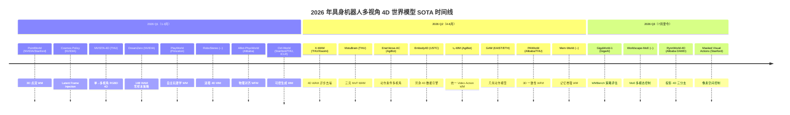

# 2026 年具身机器人多视角 4D 世界模型 SOTA 方法汇编

> **Robotic Multi-View 4D World Models — 2026 SOTA Methods Compendium**
>
> 收录标准：(1) 在公认 benchmark（WorldArena / WMBench / EWMBench / RoboTwin / LIBERO / RoboCasa / GigaBrain Challenge 等）上取得榜首或 top-3；(2) 被 CVPR / ICLR / ICRA 2026 等顶会收录或获奖；(3) 论文中自报 SOTA 且有可比实验支撑。按首次公开日期 **由新到旧** 排列。
>
> 调查日期：2026-07-27

---

## 一、SOTA 方法总表

| # | 方法 | 日期 | arXiv | 多视角 | 4D | 开源 | 代表性 Benchmark 得分 |
|---|------|------|-------|:------:|:---:|:----:|----------------------|
| 1 | Masked Visual Actions | 2026-07-21 | 2607.19343 | — | — | 部分 | 仅 15h 数据微调即实现跨 embodiment forward/inverse 控制 |
| 2 | RynnWorld-4D | 2026-07-08 | 2607.06559 | ✓ | ✓ | ✓ | 双臂灵巧操作 SOTA；Rynn4DDataset 2.54 亿帧 |
| 3 | Worldscape-MoE | 2026-07-04 | 2607.03964 | ✓ | — | 部分 | WorldArena EWMScore 62.84；Instruction Following 0.9348 |
| 4 | GigaWorld-1 | 2026-07-02 | 2607.02642 | — | — | ✓ | WMBench 0.6834（+14.9% vs 基线）；CVPR 2026 Challenge 官方 |
| 5 | Mem-World | 2026-06-26 | 2606.18960 | ✓ | ✓ | 部分 | 4D surfel-indexed 视角记忆；操作遮挡场景 SOTA |
| 6 | PAIWorld | 2026-06-25 | 2606.18375 | ✓ | — | — | WorldArena #1 EWMScore 72.31；AgiBot #2 0.8245 |
| 7 | GAM | 2026-06-24 | 2606.17046 | — | ✓ | ✓ | LIBERO 97.6%；LIBERO-Plus 85.5%；6.9ms 推理 |
| 8 | τ₀-WM | 2026-06-01 | 2606.01027 | ✓ | — | 部分 | 27,300h 异构语料训练；test-time proposal-evaluation-revision |
| 9 | EnerVerse-AC | 2026-05-15 | 2505.09723 | ✓ | — | ✓ | EWMBench SOTA 4.7010；ICRA 2026 Challenge 基线 |
| 10 | Embody4D | 2026-05-03 | 2605.01799 | ✓ | ✓ | 部分 | 30 种 MuJoCo 机械臂跨形态泛化；任意新视角合成 |
| 11 | X-WAM | 2026-04-29 | 2604.26694 | ✓ | ✓ | ✓ | RoboCasa 79.2%；RoboTwin 90.7%；CD 0.0049 |
| 12 | MotuBrain | 2026-04-30 | 2604.27792 | ✓ | — | 部分 | RoboTwin 95.8%/96.1%；WorldArena EWMScore 63.77 |
| 13 | ABot-PhysWorld | 2026-03-24 | 2603.23376 | — | — | ✓ | WorldArena #1；GigaBrain CVPR 2026 #2；PBench 0.8491 |
| 14 | RoboStereo | 2026-03-13 | 2603.12639 | — | ✓ | 部分 | 双塔 DiT + Gaussian Head；TTPA/IEPL/OEPL 策略优化框架 |
| 15 | PlayWorld | 2026-03-09 | 2603.09030 | — | — | 部分 | 自主玩耍数据学习 WM；策略成功率 +65%（RL in WM） |
| 16 | DreamZero | 2026-02-19 | 2602.15922 | — | — | — | RoboArena 1750（vs π0.5 的 1622）；2× 泛化提升 |
| 17 | MVISTA-4D | 2026-02-10 | 2602.09878 | ✓ | ✓ | 部分 | 单视角 RGBD → 任意视角 RGBD 4D 生成；test-time 动作推理 |
| 18 | Cosmos Policy | 2026-01-27 | 2601.16163 | ✓ | — | ✓ | LIBERO 98.5%；RoboCasa 67.1%；ALOHA 93.6% |
| 19 | PointWorld | 2026-01-07 | 2601.03782 | — | ✓ | ✓ | 3D 点云流 WM；CVPR 2026 E2E3D Workshop Best Paper |
| 20 | Ctrl-World | 2025-10→ICLR'26 | 2510.10125 | ✓ | — | ✓ | DROID 上 20s+ 长程一致性；π0.5 策略在 WM 内提升 |

---

## 二、逐篇详细分析（由新到旧）

---

### 1. Masked Visual Actions（2026-07-21）

**全称：** Masked Visual Actions for Unified World Modeling

**机构：** Stanford / Virginia Tech / Adobe / UIUC

| 项目 | 内容 |
|------|------|
| **arXiv** | [2607.19343](https://arxiv.org/abs/2607.19343) |
| **项目网址** | [masked-visual-actions.github.io](https://masked-visual-actions.github.io/) |
| **GitHub** | 待公开 |
| **开源程度** | 部分（项目页有 demo，代码待公开） |

**IDEA 概要：**
提出一种像素空间控制接口——**遮蔽视觉动作（Masked Visual Actions）**——将动作表达为视频中某个实体的部分揭示轨迹。揭示机器人运动时，模型充当正向动力学模型，预测场景对低层动作的响应；揭示目标物体运动时，同一模型恢复与该结果一致的机器人行为（逆向模型）。

**方法要点：**
- 基于视频扩散模型，仅用 **15 小时** 真实+仿真遮蔽样本微调
- 单一 checkpoint 即可实现跨 embodiment（Franka / UR5 / 人手）的 forward 与 inverse 控制
- 正向模型支持规划（N 条候选轨迹排名）和策略评估；逆向模型支持从人类演示到机器人动作的迁移
- 涌现能力：对物体施加 masked visual action，模型自动生成实现该运动的机器人动作

**Benchmark 得分：**
- 正向建模的策略评估与真实世界执行高度相关
- 逆向建模实现了从人类手部动作到机器人动作的零样本迁移

---

### 2. RynnWorld-4D（2026-07-08）

**全称：** RynnWorld-4D: 4D Embodied World Models for Robotic Manipulation

**机构：** Alibaba DAMO Academy / CUHK / Hupan Lab

| 项目 | 内容 |
|------|------|
| **arXiv** | [2607.06559](https://arxiv.org/abs/2607.06559) |
| **项目网址** | [alibaba-damo-academy.github.io/RynnWorld-4D](https://alibaba-damo-academy.github.io/RynnWorld-4D.github.io/) |
| **GitHub** | [alibaba-damo-academy/RynnWorld-4D](https://github.com/alibaba-damo-academy/RynnWorld-4D) |
| **HuggingFace** | [Alibaba-DAMO-Academy/RynnWorld-4D](https://huggingface.co/Alibaba-DAMO-Academy/RynnWorld-4D) |
| **开源程度** | ✓ 完全开源（代码 + 权重，Apache 2.0） |

**IDEA 概要：**
提出轻量级 **投影 4D 表征（Projective 4D Representation）**，通过同步预测 RGB + Depth + Optical Flow（RGB-DF 三元组），使深度将像素提升到 3D 位置、光流提供场景流，从而在保持 2D 对齐格式的同时获得完整 4D 信息。

**方法要点：**
- 基于 **Wan 2.2-TI2V-5B** 扩散 Transformer，扩展为 **三分支（tri-branch）架构**——RGB / Depth / OpticalFlow 各一路
- **联合跨模态注意力（Joint Cross-Modal Attention, JA）** 模块每隔 3 个 Transformer 块插入一次（共 10 个模块）
- **RynnWorld-4D-Policy**：跳过多步去噪，直接消费内部 4D latent，实现 **9 Hz+** 闭环灵巧控制
- 训练数据集 **Rynn4DDataset 1.0**：2.54 亿帧，涵盖自我中心人类视频和机器人操作视频

**Benchmark 得分：**
- 双臂灵巧操作任务 SOTA
- 时空一致的 4D 预测（RGB + Depth + Flow 同步）

---

### 3. Worldscape-MoE（2026-07-04）

**全称：** Worldscape-MoE: A Unified Mixture-of-Experts World Model for Scalable Heterogeneous Action Control

**机构：** 未完全披露（16 位作者）

| 项目 | 内容 |
|------|------|
| **arXiv** | [2607.03964](https://arxiv.org/abs/2607.03964) |
| **项目网址** | [worldscape-moe.com](https://worldscape-moe.com/) |
| **GitHub** | 待公开 |
| **开源程度** | 部分（项目页有可视化，代码待公开） |

**IDEA 概要：**
不同控制模态（行走 / 机械臂操作 / 手部交互）虽然表征不同，但约束的是相同的物理规律和场景动态。利用 **MoE 机制** 将"共享的世界演化规律"与"模态特定的动作接口细节"解耦。

**方法要点：**
- 共享扩散 Transformer 骨干 + 控制依赖的注入路径
- 每个训练样本激活一个 **共享专家**（积累跨控制世界知识）+ 一个 **模态专家**（保持特定动作接口精度）
- 三种主流控制模态：**Locomotion**（轨迹条件导航）、**Manipulation**（机器人动作条件操作）、**Action Map**（手部关节条件自我中心交互）
- **Worldscape-MoE Tuning**：渐进式训练策略，新控制模态可增量吸收，无需从头重训

**Benchmark 得分：**
- WorldArena EWMScore **62.84**
- Instruction Following **0.9348**（SOTA）
- Semantic Alignment **0.9039**（SOTA）
- Perspectivity **0.9686**（接近最优 0.9744）

---

### 4. GigaWorld-1（2026-07-02）

**全称：** GigaWorld-1: A Roadmap to Build World Models for Robot Policy Evaluation

**机构：** GigaAI (Open GigaAI)

| 项目 | 内容 |
|------|------|
| **arXiv** | [2607.02642](https://arxiv.org/abs/2607.02642) |
| **GitHub** | [open-gigaai/giga-world-1](https://github.com/open-gigaai/giga-world-1) |
| **开源程度** | ✓ 完全开源（代码 + 预训练权重 Nano-1.3B/Pro-5B + 数据集 + 工具包） |

**IDEA 概要：**
系统研究世界模型用于**机器人策略评估**的路线图。提出 **WMBench** 基准——基于真实机器人遥操作数据和匹配的策略 rollout 构建。同时作为 **CVPR 2026 GigaBrain Challenge 世界模型赛道** 的官方 benchmark。

**方法要点：**
- 在 WMBench 上进行大规模对照实验：7 个世界模型 × 4 种动作编码方案 × 324,000+ rollout
- 三个核心洞见：(1) 评估器质量由长程动作一致性主导而非短期视觉真实感；(2) 预训练增益来自通用知识与机器人可控性的平衡；(3) 动作编码/记忆设计/评估器后训练显著影响真实行为对齐
- 提供 DeepSpeed ZeRO-2/3 支持

**Benchmark 得分：**
- WMBench **0.6834**（+14.9% vs 竞争基线）
- CVPR 2026 World Model Track 官方排行榜

---

### 5. Mem-World（2026-06-26）

**全称：** Mem-World: Memory-Augmented Action-Conditioned World Models for Persistent Robot Manipulation

**机构：** 未完全披露（10 位作者）

| 项目 | 内容 |
|------|------|
| **arXiv** | [2606.18960](https://arxiv.org/abs/2606.18960) |
| **项目网址** | 待公开 |
| **GitHub** | 待公开 |
| **开源程度** | 部分（论文公开，代码待发布） |

**IDEA 概要：**
针对操作过程中末端执行器频繁遮挡和腕部相机快速运动导致的"遗忘与幻觉"问题，提出 **W-VMem**——一种 **4D 腕部视角中心的 surfel 索引视角记忆**。

**方法要点：**
- 将历史观察锚定到时间演化的表面元素（surfel）上
- 从初始多视角帧构建全局 W-VMem（利用现成点图估计器）
- 自回归生成未来观察时，仅使用腕部视角观察更新 W-VMem
- 每个 surfel 维护：创建时间步、合并时间步、朝向、深度、是否属于被操作物体的标志

**Benchmark 得分：**
- 操作遮挡场景下的视频生成质量 SOTA

---

### 6. PAIWorld（2026-06-25）

**全称：** PAIWorld: A 3D-Consistent World Foundation Model for Robotic Manipulation

**机构：** 阿里巴巴 PAI / 清华大学

| 项目 | 内容 |
|------|------|
| **arXiv** | [2606.18375](https://arxiv.org/abs/2606.18375) |
| **项目网址** | [guhuangai.github.io/PAIWorld-Proj](https://guhuangai.github.io/PAIWorld-Proj/) |
| **GitHub** | 未公开 |
| **开源程度** | — 未开源 |

**IDEA 概要：**
在预训练视频扩散 Transformer（Cosmos-Predict2.5, ~14B 参数）基础上，通过三个核心组件增强 3D 多视角一致性：**几何感知跨视角注意力（Geometry-Aware Cross-View Attention）**、**几何旋转位置编码（GeoRoPE）** 和 **Latent 3D-REPA**（从冻结 3D 基础模型蒸馏 3D 感知特征）。

**方法要点：**
- 基于 Cosmos-Predict2.5 flow-matching DiT，~14B 参数
- 在 250 万多视角机器人操作视频片段上预训练（AgiBot-World 35% / RoboMIND 20% / Galaxea 15% / RoboTwin 15%）
- 支持下游应用：多视角世界生成、世界动作模型、机器人规划、多视角策略后训练
- 训练耗费约 30k H200 GPU-hours

**Benchmark 得分：**
- **WorldArena 总榜 #1**，EWMScore **72.31**（超过 UNIS 72.16、BWM-Fast 72.15）
- **AgiBot-Challenge2026 总榜 #2**，得分 **0.8245**
- 唯一在所有维度上均接近顶端的方法

---

### 7. GAM — Geometric Action Model（2026-06-24）

**全称：** Geometric Action Model for Robot Policy Learning

**机构：** KAIST AI / ETH Zurich

| 项目 | 内容 |
|------|------|
| **arXiv** | [2606.17046](https://arxiv.org/abs/2606.17046) |
| **项目网址** | [cvlab-kaist.github.io/Geometric-Action-Model](https://cvlab-kaist.github.io/Geometric-Action-Model/) |
| **GitHub** | [cvlab-kaist/Geometric-Action-Model](https://github.com/cvlab-kaist/Geometric-Action-Model) |
| **开源程度** | ✓ 完全开源（代码 + 1.4B 权重） |

**IDEA 概要：**
直接复用预训练 **几何基础模型（GFM, DA3-Giant）** 作为感知、时间预测和动作解码的共享基座。在 GFM 中间层"切开"：浅层作为观察编码器，在切分层插入**因果未来预测器**，预测的未来 token 再经剩余 GFM 块传播，同一个骨干同时产生未来几何和动作。

**方法要点：**
- **1.4B 参数**，显著小于 VLM 和视频扩散基线
- 单次前向传递 + KV-cached history，最快 **6.9ms** 模型推理（比扩散策略快最多 55×）
- 预训练于 Open-X Embodiment (72%) + MimicGen (18%) + RoboCasa365 (10%)
- 在结构化几何 latent 空间中预测未来，使策略对视角变化显著更鲁棒

**Benchmark 得分：**

| Benchmark | 得分 |
|-----------|------|
| LIBERO | **97.6%** |
| LIBERO-Plus | **85.5%**（比最佳基线 +9.7%p） |
| LIBERO-Plus Camera Split | **83.1%**（最小退化） |

---

### 8. τ₀-WM（2026-06-01）

**全称：** τ₀-WM: A Unified Video-Action World Model for Robotic Manipulation

**机构：** AgiBot（银河通用机器人）

| 项目 | 内容 |
|------|------|
| **arXiv** | [2606.01027](https://arxiv.org/abs/2606.01027) |
| **项目网址** | [finch.agibot.com/research/tau0-wm](https://finch.agibot.com/research/tau0-wm) |
| **GitHub** | 待公开 |
| **开源程度** | 部分（论文 + 技术报告公开，代码待发布） |

**IDEA 概要：**
将策略学习、视频预测和动作评估统一在单一的未来预测框架中。核心是 **Video Action Model (VAM)**——共享视频扩散骨干接收多视角观察 + 语言指令 + 机器人状态，联合预测未来视觉 latent 和连续动作块。

**方法要点：**
- 异构语料约 **27,300 小时**（真实遥操作 / UMI / 自我中心人类视频 / 失败轨迹）
- 视频分支捕获时间结构化场景动态，动作分支通过逐层交叉注意力获取中间视频表征
- **Test-time proposal–evaluation–revision**：采样多个动作块 → Re-denoising Consistency Score 排名 → 模拟候选未来 → 选最佳 rollout → 二次动作预测

**Benchmark 得分：**
- 在 4 个未见任务上取得最佳平均成功率
- 精度敏感任务上（如 Faucet）最鲁棒

---

### 9. EnerVerse-AC（2026-05-15）

**全称：** EnerVerse-AC: Envisioning Embodied Environments with Action Condition

**机构：** AgiBot / 清华大学

| 项目 | 内容 |
|------|------|
| **arXiv** | [2505.09723](https://arxiv.org/abs/2505.09723) |
| **GitHub** | 已开源（AgiBot 官方） |
| **开源程度** | ✓ 完全开源（ICRA 2026 AgiBot Challenge 官方基线） |

**IDEA 概要：**
在 EnerVerse 基础上加入 **多级动作条件注入机制**，使世界模型能根据预测动作生成未来多视角视觉观察，同时扩展训练数据加入多样失败轨迹以提升泛化。

**方法要点：**
- **末端执行器投影动作图 + delta 动作编码** 的多级注入
- 空间交叉注意力模块 + **射线方向图编码（ray direction map encoding）** 处理多视角特征
- 支持动态腕部相机视角（随机械臂运动）
- 多视角推理限制为 10 chunks（单视角可达 30 chunks）

**Benchmark 得分：**

| Benchmark | 得分 |
|-----------|------|
| EWMBench（综合） | **4.7010**（SOTA） |
| ICRA 2026 AgiBot Challenge | 官方基线 |

---

### 10. Embody4D（2026-05-03）

**全称：** Embody4D: A Generalist Data Engine for Embodied 4D World Modeling

**机构：** USTC 等

| 项目 | 内容 |
|------|------|
| **arXiv** | [2605.01799](https://arxiv.org/abs/2605.01799) |
| **项目网址** | 待公开 |
| **GitHub** | 待公开 |
| **开源程度** | 部分（论文公开，代码待发布） |

**IDEA 概要：**
构建一个专用于具身场景的 **video-to-video 世界模型**，能从单目视频合成任意新视角，解决具身 4D 数据稀缺问题。

**方法要点：**
- **组合式 4D 具身数据合成管线**：从 MuJoCo Menagerie 中组合 **30 种跨形态机械臂** 与多样真实世界背景
- **Latent 置信度感知专家调制**：将 warp 先验的可靠性转换为 latent 空间中的 token-wise 专家路由
- **Warp-then-Inpaint 框架**：重建动态几何 → warp RGB/mask 到目标视角 → 置信度调制生成最终视频
- 基于 TrajectoryCrafter 微调，使用 VGGT 估计相机参数和深度

**Benchmark 得分：**
- 120 个单目视频测试集上的 novel-view synthesis 质量 SOTA
- 跨 30 种机器人形态的泛化能力

---

### 11. X-WAM（2026-04-29）

**全称：** Unified 4D World Action Modeling from Video Priors with Asynchronous Denoising

**机构：** 清华大学 / 小米机器人 / 北京大学 / CASIA

| 项目 | 内容 |
|------|------|
| **arXiv** | [2604.26694](https://arxiv.org/abs/2604.26694) |
| **项目网址** | [sharinka0715.github.io/X-WAM](https://sharinka0715.github.io/X-WAM/) |
| **GitHub** | [sharinka0715/X-WAM](https://github.com/sharinka0715/X-WAM) |
| **开源程度** | ✓ 完全开源 |

**IDEA 概要：**
在单一架构内同时实现四个目标：高保真视频生成、3D 空间重建、高策略成功率、高效动作执行。关键创新是 **异步噪声采样（Asynchronous Noise Sampling, ANS）**——推理时动作用更少步数快速解码实现实时执行，同时视频用完整去噪步骤保证高保真。

**方法要点：**
- 基于预训练视频基础模型（DiT），多视角 RGB 观察 + 机器人状态作为输入
- **轻量深度适配**：复制 DiT 末端块作为交错深度分支
- 预训练数据约 **149 万 episodes / 5874 小时**（AgibotWorld-Beta / DROID / 仿真数据 / RoboCasa / RoboTwin 2.0）
- 真实世界双臂机器人平台上验证（耳机打包任务）

**Benchmark 得分：**

| Benchmark | 得分 | 对比 |
|-----------|------|------|
| RoboCasa | **79.2%** | vs Cosmos Policy 67.1%（+12.1%p） |
| RoboTwin 2.0 Clean | **89.8%** | vs Motus 88.7% |
| RoboTwin 2.0 Randomized | **90.7%** | vs Motus 87.0% |
| 4D Reconstruction (CD) | **0.0049** | — |

---

### 12. MotuBrain（2026-04-30）

**全称：** MotuBrain: An Advanced World Action Model for Robot Control

**机构：** MotuBrain Team（清华大学 Jun Zhu 组）

| 项目 | 内容 |
|------|------|
| **arXiv** | [2604.27792](https://arxiv.org/abs/2604.27792) |
| **项目网址** | 论文内 |
| **GitHub** | 待公开 |
| **开源程度** | 部分（论文公开，代码/权重待发布） |

**IDEA 概要：**
将视频和动作在 **UniDiffuser** 框架下联合建模，采用 **三流 Mixture-of-Transformers（MoT）** 架构。单一模型支持：策略学习、世界建模、视频生成、逆动力学和联合视频-动作预测。

**方法要点：**
- 在 Motus 基础上进一步引入：统一多视角建模、独立文本流增强语言-动作耦合、共享跨 embodiment 动作表征
- 推理栈：步数减少 + 编译 + FP8 量化 + DiT 缓存 + V2A 风格纯动作推理 → **50× 加速**（最高 **11 Hz**）
- 仅需 50–100 条同 embodiment 轨迹即可适配新人形机器人
- 真实世界长程任务（调鸡尾酒、备餐、插花），支持自我纠错

**Benchmark 得分：**

| Benchmark | 得分 | 排名 |
|-----------|------|------|
| RoboTwin 2.0 Clean | **95.8%** | #1 |
| RoboTwin 2.0 Randomized | **96.1%** | #1 |
| WorldArena EWMScore | **63.77** | 具身 WM 类 #1 |

---

### 13. ABot-PhysWorld（2026-03-24）

**全称：** ABot-PhysWorld: Interactive World Foundation Model for Robotic Manipulation with Physics Alignment

**机构：** Alibaba AMAP CV Lab

| 项目 | 内容 |
|------|------|
| **arXiv** | [2603.23376](https://arxiv.org/abs/2603.23376) |
| **GitHub** | [amap-cvlab/ABot-PhysWorld](https://github.com/amap-cvlab/ABot-PhysWorld) |
| **开源程度** | ✓ 完全开源（训练代码 + A2V + DPO + EZS-Bench 评估工具） |

**IDEA 概要：**
14B Diffusion Transformer 世界基础模型，在 300 万操作片段上训练，核心创新是 **物理偏好对齐（Physics Alignment）**——使用基于 DPO 的后训练框架和解耦判别器抑制非物理行为，同时保持视觉质量。

**方法要点：**
- 基于 **Wan2.1-I2V-14B** 微调
- 三阶段数据整理：具身特定过滤 → 层次分布平衡 → 物理感知多级视频字幕
- **解耦 VLM 判别器**：Qwen3-VL 作为 proposer + Gemini 3 Pro 作为 scorer
- **Diffusion-DPO** 强制物理合理性
- **并行上下文块（Parallel Context Block）** 实现精确空间动作注入
- 提出 **EZSbench**：首个训练无关的具身零样本基准

**Benchmark 得分：**

| Benchmark | 得分 | 排名 |
|-----------|------|------|
| WorldArena | — | **#1**（最新） |
| GigaBrain Challenge CVPR 2026 | — | **#2** |
| PBench | **0.8491** | SOTA |
| EZSbench | **0.8030** | SOTA（超越 Veo 3.1 和 Sora v2 Pro） |

---

### 14. RoboStereo（2026-03-13）

**全称：** RoboStereo: Dual-Tower 4D Embodied World Models for Unified Policy Optimization

**机构：** 未完全披露（8 位作者）

| 项目 | 内容 |
|------|------|
| **arXiv** | [2603.12639](https://arxiv.org/abs/2603.12639) |
| **项目网址** | 待公开 |
| **GitHub** | 待公开 |
| **开源程度** | 部分（论文公开） |

**IDEA 概要：**
对称 **双塔 DiT 架构**——分别处理 RGB 和 XYZ pointmap，通过双向交叉注意力（bidirectional cross-attention）实现视觉-几何融合，加上 **Gaussian Head** 支持灵活视角渲染。

**方法要点：**
- 双路径动作条件化时间步嵌入，确保帧级轨迹控制精度
- 建立首个统一的世界模型策略优化框架：**TTPA**（Test-Time Policy Augmentation）、**IEPL**（Imitative-Evolutionary Policy Learning）、**OEPL**（Open-Exploration Policy Learning）
- 在 Bridge V2 上预训练，MimicGen 仿真数据上微调
- 长程操作任务连续生成 12 帧 4D 场景块，约 0.7s/帧

**Benchmark 得分：**
- 首次证明高保真 4D 世界模型可作为 VLA 安全高效持续改进的可扩展基础设施

---

### 15. PlayWorld（2026-03-09）

**全称：** PlayWorld: Learning Robot World Models from Autonomous Play

**机构：** Princeton University

| 项目 | 内容 |
|------|------|
| **arXiv** | [2603.09030](https://arxiv.org/abs/2603.09030) |
| **项目网址** | [robot-playworld.github.io](https://robot-playworld.github.io/) |
| **GitHub** | 待公开 |
| **开源程度** | 部分（论文 + 项目页，代码待发布） |

**IDEA 概要：**
首个完全从 **无监督机器人自主玩耍** 中学习世界模型的系统，无需成功偏向的人类演示。利用 VLM 根据场景提出多样任务指令，由预训练策略执行。

**方法要点：**
- VLM 提出场景基础指令 → 泛化策略执行 → 安全检查 + 自动重置 → 全夜无人值守数据收集
- 自主玩耍数据天然包含复杂的、长尾的物理交互（接触密集行为）
- 支持细粒度失败预测和策略评估（比人类收集数据提升最多 **40%**）

**Benchmark 得分：**
- 策略成功率 **+65%**（在世界模型内进行强化学习后部署到真实世界）

---

### 16. DreamZero（2026-02-19）

**全称：** World Action Models are Zero-shot Policies

**机构：** NVIDIA Research

| 项目 | 内容 |
|------|------|
| **arXiv** | [2602.15922](https://arxiv.org/abs/2602.15922) |
| **项目网址** | [dreamzero0.github.io](https://dreamzero0.github.io/) |
| **GitHub** | 未公开 |
| **开源程度** | — 未开源 |

**IDEA 概要：**
大规模 World Action Model，基于 **Wan 2.1-I2V-14B** 视频扩散骨干，单一 monolithic Transformer 同时去噪视频 token 和动作 token。通过模型和系统优化实现 14B 自回归视频扩散模型的 **7 Hz 实时闭环控制**。

**方法要点：**
- 从异构机器人数据中学习多样技能，不依赖重复演示
- 两种跨 embodiment 迁移：video-only 演示（来自人或其他机器人）在仅 10-20 分钟数据下提升 42%+
- 适配全新机器人（YAM）仅需 30 分钟 play data
- ICLR 2026 Workshop on World Models

**Benchmark 得分：**

| Benchmark | 得分 | 对比 |
|-----------|------|------|
| RoboArena（2026-04） | **1750** | vs π0.5 的 1622 |
| 零样本泛化 | **2× 提升** | vs SOTA VLAs |
| 未见动词泛化 | **49%** task progress | vs 25-32% VLAs |

---

### 17. MVISTA-4D（2026-02-10）

**全称：** MVISTA-4D: View-Consistent 4D World Model with Test-Time Action Inference for Robotic Manipulation

**机构：** 清华大学 / X-Humanoid Robots 等

| 项目 | 内容 |
|------|------|
| **arXiv** | [2602.09878](https://arxiv.org/abs/2602.09878) |
| **项目网址** | [mercerai.github.io/MVISTA-4D](https://mercerai.github.io/MVISTA-4D/) |
| **GitHub** | 待公开 |
| **开源程度** | 部分（论文 + 项目页） |

**IDEA 概要：**
从单视角 RGBD 输入出发，想象其余视角，并回投融合成更完整的 3D 结构。**跨视角 + 跨模态特征融合** 保证 RGB 与 depth 一致性及多视角几何对齐。

**方法要点：**
- 显式设计跨视角和跨模态特征融合
- **Test-time 动作推理**机制解决逆动力学的病态性（多个动作可解释同一转换）
- 在 RoboTwin2 上评估（10 任务 × 16 RGB-D 相机视角/episode）

**Benchmark 得分：**
- 单视角 RGBD → 任意视角 RGBD 4D 生成质量 SOTA
- Test-time action inference 有效缓解逆动力学歧义

---

### 18. Cosmos Policy（2026-01-27）

**全称：** Cosmos Policy: Fine-Tuning Video Models for Visuomotor Control and Planning

**机构：** NVIDIA

| 项目 | 内容 |
|------|------|
| **arXiv** | [2601.16163](https://arxiv.org/abs/2601.16163) |
| **项目网址** | [nvidia-cosmos.github.io/cosmos-cookbook](https://nvidia-cosmos.github.io/cosmos-cookbook/recipes/post_training/predict2/cosmos_policy/post_training.html) |
| **GitHub** | [nvidia-cosmos/cosmos-predict2](https://github.com/nvidia-cosmos/cosmos-predict2) |
| **HuggingFace** | [nvidia/Cosmos-Predict2-2B-Sample-Action-Conditioned](https://huggingface.co/nvidia/Cosmos-Predict2-2B-Sample-Action-Conditioned) |
| **开源程度** | ✓ 完全开源（代码 + 权重 + 训练 recipe） |

**IDEA 概要：**
极简方法——直接将大型预训练视频模型（Cosmos-Predict2）后训练为有效的机器人策略，**无任何架构修改**。将机器人动作编码为视频模型 latent 扩散过程中的 latent 帧。

**方法要点：**
- **Latent Frame Injection**：动作、本体感知和价值目标编码为假帧注入扩散序列
- 直接策略模式：仅使用动作输出执行
- 规划模式：未来状态 + 价值预测用于候选轨迹排名
- 支持多视角相机图像和多模态输入

**Benchmark 得分：**

| Benchmark | 得分 |
|-----------|------|
| LIBERO | **98.5%** |
| RoboCasa | **67.1%** |
| ALOHA | **93.6%** |

---

### 19. PointWorld（2026-01-07）

**全称：** PointWorld: Scaling 3D World Models for In-The-Wild Robotic Manipulation

**机构：** NVIDIA Research / Stanford

| 项目 | 内容 |
|------|------|
| **arXiv** | [2601.03782](https://arxiv.org/abs/2601.03782) |
| **项目网址** | [point-world.github.io](https://point-world.github.io/) |
| **GitHub** | [NVlabs/PointWorld](https://github.com/NVlabs/PointWorld) |
| **HuggingFace** | 数据集（DROID + BEHAVIOR） |
| **开源程度** | ✓ 完全开源（代码 + 数据集） |

**IDEA 概要：**
将状态和动作统一在共享 3D 空间中表征为 **3D 点流（3D Point Flows）**。给定一张或少量 RGB-D 图像和一系列低层机器人动作命令，预测每个像素在 3D 中的位移。

**方法要点：**
- 冻结 **DINOv3** 编码器特征化场景点 + 时间嵌入特征化机器人点
- 骨干为 **PointTransformerV3 (PTv3)**，层次化多头注意力 + 局部聚合
- 训练数据约 **200 万轨迹 / 500 小时**（单臂 Franka + 双臂人形）
- **0.1s 实时推理**，集成到 MPC 框架
- 单个预训练 checkpoint → 刚体推、可变形/铰接物体操作、工具使用，零样本

**Benchmark 得分：**
- **CVPR 2026 E2E3D Workshop Best Paper Award**
- 零演示零后训练的 in-the-wild 操作

---

### 20. Ctrl-World（ICLR 2026）

**全称：** Ctrl-World: A Controllable Generative World Model for Robot Manipulation

**机构：** Stanford University / 清华大学

| 项目 | 内容 |
|------|------|
| **arXiv** | [2510.10125](https://arxiv.org/abs/2510.10125) |
| **会议** | ICLR 2026 Poster |
| **项目网址** | [ctrl-world.github.io](https://ctrl-world.github.io/) |
| **GitHub** | [Robert-gyj/Ctrl-World](https://github.com/Robert-gyj/Ctrl-World) |
| **开源程度** | ✓ 完全开源（PyTorch 实现） |

**IDEA 概要：**
与现代 VLA 策略兼容的动作条件化世界模型，实现 **策略在想象中 rollout**（policy-in-the-loop），用于评估和改进 VLA 的指令遵循能力。

**方法要点：**
- 联合多视角预测（包括腕部视角）
- 帧级条件化实现 **细粒度动作控制**
- **姿态条件化记忆检索** 维持长程一致性
- 在 DROID 数据集上训练，泛化到新场景和相机布局
- 支持 **20 秒+** 的自回归长程 rollout
- 想象中合成成功轨迹可直接改进 π0.5-DROID 策略

**Benchmark 得分：**
- 想象中的评估忠实反映策略在真实世界中的指令遵循能力
- π0.5 策略在想象中提升后，真实世界下游任务性能改善

---

## 三、补充方法（竞赛冠军 / 重要参考）

以下方法虽未独立发表详细论文或不完全符合"多视角 4D"定义，但在相关竞赛中取得顶级成绩或具有重要参考价值：

| 方法 | 来源 | 亮点 |
|------|------|------|
| **Wan-3D v0.3** | GigaBrain CVPR 2026 | WM Track **冠军**，综合得分 **57.11** |
| **NeoVerse-ABot** | ICRA 2026 AgiBot WM Track | **冠军**，EWMScore **0.8290** |
| **Cosmos-Predict2.5** | NVIDIA, 2026 | PAIWorld 等多个方法的预训练骨干，支持 Physical AI |
| **GR-2** | ByteDance, 2024-10 | 早期大规模视频生成世界模型用于机器人，启发 2026 多项工作 |

---

## 四、横向对比分析

### 4.1 时间线

### 4.2 关键维度对比

| 维度 | 方法示例 | 特点 |
|------|---------|------|
| **多视角 3D 一致性** | PAIWorld, X-WAM, Mem-World, MVISTA-4D, EnerVerse-AC | 跨视角注意力 / GeoRoPE / 3D-REPA / surfel 记忆 |
| **显式 4D 表征** | RynnWorld-4D, X-WAM, RoboStereo, PointWorld, MVISTA-4D | RGB-DF 三元组 / 3D 点流 / 双塔 DiT+Gaussian / RGBD 4D |
| **统一 World-Action** | MotuBrain, X-WAM, DreamZero, τ₀-WM, GAM | 同一模型同时输出视频和动作 |
| **物理对齐** | ABot-PhysWorld, Mem-World | DPO 物理偏好 / 4D surfel 约束 |
| **极简架构** | Cosmos Policy, GAM | 无架构修改 / 1.4B 极小模型 |
| **自主数据** | PlayWorld, DreamZero | 自主玩耍 / 跨 embodiment 迁移 |
| **MoE 扩展** | Worldscape-MoE, MotuBrain | 共享+模态专家 / 三流 MoT |

### 4.3 开源程度分布

| 开源程度 | 数量 | 方法 |
|---------|------|------|
| ✓ 完全开源 | 9 | PointWorld, Cosmos Policy, Ctrl-World, X-WAM, EnerVerse-AC, GAM, ABot-PhysWorld, GigaWorld-1, RynnWorld-4D |
| 部分开源 | 8 | Masked Visual Actions, Worldscape-MoE, Mem-World, τ₀-WM, Embody4D, MotuBrain, RoboStereo, MVISTA-4D, PlayWorld |
| 未开源 | 3 | PAIWorld, DreamZero, Wan-3D v0.3 |

### 4.4 Benchmark 交叉对比

| 方法 | WorldArena EWMScore | RoboTwin 2.0 | LIBERO | RoboCasa |
|------|:-------------------:|:------------:|:------:|:--------:|
| PAIWorld | **72.31** (#1) | — | — | — |
| MotuBrain | 63.77 | **95.8%/96.1%** (#1) | — | — |
| Worldscape-MoE | 62.84 | — | — | — |
| ABot-PhysWorld | #1（最新） | — | — | — |
| X-WAM | — | 89.8%/90.7% | — | **79.2%** |
| Cosmos Policy | — | — | **98.5%** | 67.1% |
| GAM | — | — | 97.6% | — |

---

## 五、关键趋势与洞察

### 趋势 1：从视频生成到统一 World-Action Model

2026 年最显著的趋势是将视频世界模型与动作预测统一在同一框架中。MotuBrain、X-WAM、DreamZero、τ₀-WM 等方法都采用了"单一模型同时输出未来视频和机器人动作"的范式。这标志着从"先想象再规划"到"想象即行动"的转变。

### 趋势 2：14B 级视频扩散骨干成为标配

PAIWorld 基于 Cosmos-Predict2.5（~14B），ABot-PhysWorld 基于 Wan2.1-I2V-14B，DreamZero 基于 Wan-14B，RynnWorld-4D 基于 Wan 2.2-5B。大型预训练视频模型的世界知识先验被证明对机器人操作场景的泛化至关重要。

### 趋势 3：多视角 3D 一致性成为核心挑战

PAIWorld 的 GeoRoPE + Cross-View Attention、X-WAM 的轻量深度适配、Mem-World 的 4D surfel 记忆、RynnWorld-4D 的投影 4D 表征——多种技术路线并行探索如何在视频扩散框架中注入 3D 几何约束。

### 趋势 4：物理合理性与可控性受到重视

ABot-PhysWorld 的 Diffusion-DPO 物理对齐和 Mem-World 的 surfel 约束表明，视觉真实感不再是唯一目标——物理合规性（无穿透、正确接触力学、质量守恒）正成为评估和训练的新维度。

### 趋势 5：竞赛驱动的 benchmark 标准化

WorldArena（CVPR 2026 Challenge）、WMBench（GigaBrain Challenge）、EWMBench（ICRA 2026 AgiBot Challenge）三大竞赛 benchmark 的出现，为该领域提供了可比较的评估标准。EWMScore 作为统一指标逐渐被接受，但 perception-functionality gap 仍是待解问题。

---

## 六、参考来源

1. [PAIWorld arXiv](https://arxiv.org/abs/2606.18375) & [Project Page](https://guhuangai.github.io/PAIWorld-Proj/)
2. [X-WAM arXiv](https://arxiv.org/abs/2604.26694) & [GitHub](https://github.com/sharinka0715/X-WAM)
3. [MotuBrain arXiv](https://arxiv.org/abs/2604.27792)
4. [GigaWorld-1 arXiv](https://arxiv.org/abs/2607.02642) & [GitHub](https://github.com/open-gigaai/giga-world-1)
5. [RynnWorld-4D arXiv](https://arxiv.org/abs/2607.06559) & [GitHub](https://github.com/alibaba-damo-academy/RynnWorld-4D)
6. [Worldscape-MoE arXiv](https://arxiv.org/abs/2607.03964) & [Project Page](https://worldscape-moe.com/)
7. [ABot-PhysWorld arXiv](https://arxiv.org/abs/2603.23376) & [GitHub](https://github.com/amap-cvlab/ABot-PhysWorld)
8. [EnerVerse-AC arXiv](https://arxiv.org/abs/2505.09723)
9. [GAM arXiv](https://arxiv.org/abs/2606.17046) & [GitHub](https://github.com/cvlab-kaist/Geometric-Action-Model)
10. [τ₀-WM arXiv](https://arxiv.org/abs/2606.01027) & [AgiBot Blog](https://finch.agibot.com/research/tau0-wm)
11. [Mem-World arXiv](https://arxiv.org/abs/2606.18960)
12. [Embody4D arXiv](https://arxiv.org/abs/2605.01799)
13. [Cosmos Policy arXiv](https://arxiv.org/abs/2601.16163) & [GitHub](https://github.com/nvidia-cosmos/cosmos-predict2)
14. [PointWorld arXiv](https://arxiv.org/abs/2601.03782) & [GitHub](https://github.com/NVlabs/PointWorld)
15. [RoboStereo arXiv](https://arxiv.org/abs/2603.12639)
16. [PlayWorld arXiv](https://arxiv.org/abs/2603.09030) & [Project Page](https://robot-playworld.github.io/)
17. [DreamZero arXiv](https://arxiv.org/abs/2602.15922) & [Project Page](https://dreamzero0.github.io/)
18. [MVISTA-4D arXiv](https://arxiv.org/abs/2602.09878) & [Project Page](https://mercerai.github.io/MVISTA-4D/)
19. [Ctrl-World arXiv](https://arxiv.org/abs/2510.10125) & [GitHub](https://github.com/Robert-gyj/Ctrl-World)
20. [Masked Visual Actions arXiv](https://arxiv.org/abs/2607.19343) & [Project Page](https://masked-visual-actions.github.io/)
21. [WorldArena Benchmark](https://world-arena.ai/) & [CVPR 2026 Challenge](http://cvpr2026challenge.world-arena.ai/)
22. [WMBench / GigaBrain Challenge Leaderboard](https://huggingface.co/spaces/open-gigaai/CVPR-2026-WorldModel-Track-LeaderBoard)
23. [EWMBench arXiv](https://arxiv.org/abs/2505.09694)
24. [RoboWM-Bench arXiv](https://arxiv.org/abs/2604.19092)
25. [NVIDIA WAM Blog](https://developer.nvidia.com/blog/pretrained-to-imagine-fine-tuned-to-act-the-rise-of-world-action-models/)
26. [Awesome-WAM GitHub](https://github.com/OpenMOSS/Awesome-WAM)
27. [Awesome-World-Models GitHub](https://github.com/leofan90/awesome-world-models)
28. [World Model Survey arXiv](https://arxiv.org/abs/2605.00080)
