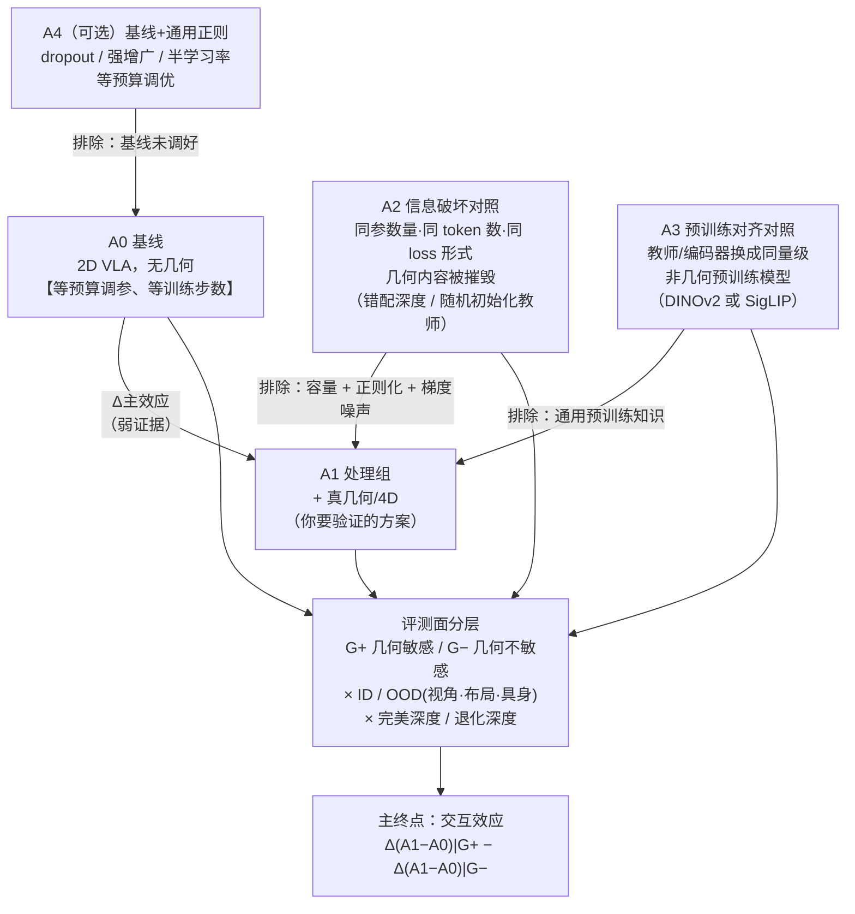

# 对"几何/4D 信息有利于 VLA"命题的对抗性方法学审稿

> 审稿立场：本报告刻意站在**证伪方**。目标不是否定命题，而是保证若命题为真，你得到的是**可信的真**；若命题为假或只在窄条件下为真，你能**及早发现**。
>
> 日期：2026-07-26。所有数字均标注来源；预印本与社区讨论已单独标记。

---

## 0. 结论摘要（先读这一页）

**核心判断：命题在当前证据下是"条件成立"，而不是"普遍成立"。**

| 断言 | 证据强度 | 说明 |
|---|---|---|
| 显式 3D（点云、带 3D 局部性的表示）优于 RGB —— **在 in-distribution 成功率上** | 中，且有反例 | OBSBench 支持；Adapt3R 报告 in-distribution 与 RGB **打平** |
| 把**深度图**塞进 2D 骨干（RGB-D 通道拼接 / 双分支融合 / 逐像素深度回归） | **负** | OBSBench 明确报告"深度模态在所有设置下普遍降低性能"；DreamVLA 报告单独加深度预测**掉到 baseline 以下** |
| 几何/4D 改善**视角、布局、具身的分布外鲁棒性** | **强** | Adapt3R、Point Cloud Models Improve Visual Robustness、LIBERO-Plus（视角是最大失效轴） |
| 几何/4D 改善**数据效率** | 弱/矛盾 | OBSBench：点云**没有**样本效率优势；Spatial Forcing 声称 5.9×，但对照臂用了不同 LR schedule |
| "涨点来自几何"这一**因果归因** | **最弱的一环** | Spatial Forcing 自己的消融显示：对齐到纯 2D 教师（SigLIP/DINOv2）也涨 1.3–1.4pp；DreamVLA 的收益 85% 来自 2D 光流动态区域，深度只占 10% |

**给你的最重要一条建议**：不要把主终点设成"in-distribution 平均成功率的主效应"。在 LIBERO 这类饱和 benchmark 上，几何带来的主效应量级是 2–4pp，而单一种子的 Wilson 置信区间就有 ±2.6pp（500 rollout）、种子间极差可达 29pp（见 §4）。**把主终点改成"几何敏感任务 vs 几何不敏感任务的交互效应"或"视角/布局 OOD 的鲁棒性差值"**——那里效应量是 20–50pp，所需样本量下降一个数量级，而且交互效应天然免疫参数量/正则化这类**任务均匀**的混淆。

---

## 1. 反面证据清单

可信度评级：★★★ = 同行评审 + 大规模系统实验；★★ = 同行评审，或来自主张方自己的消融（自证反面证据，可信度高）；★ = 预印本；☆ = 社区讨论/博客/二手来源。

### 1.1 加入 3D / 深度输入没有提升，甚至有害

**[N1] ★★★ 深度模态在所有融合方式下普遍降低性能**
- Point Cloud Matters / OBSBench，NeurIPS 2024 Datasets & Benchmarks。<https://arxiv.org/html/2402.02500v2> · <https://proceedings.neurips.cc/paper_files/paper/2024/hash/8e5dc5969a6174fcaaececd890c7f59b-Abstract-Datasets_and_Benchmarks_Track.html>
- 设定：ManiSkill2 + RLBench，125 个 contact-rich 任务，标准化 pipeline，ACT 与 Diffusion Policy 两种策略，RGB(ResNet/ViT)、RGB-D(通道拼接 ResNet/ViT、MultiViT 双分支)、点云(PointNet/SpUNet)、depth-only。
- 原文 Finding 2：*"Despite providing geometric information, the depth modality generally degrades performance across all settings. This includes scenarios where only depth data is used, where RGB-D images are stacked channel-wise, or when using specialized architectures like MultiViT to process RGB and depth information separately."* 归因：深度值随物体距离剧烈变化、前景/背景深度分布差异大，造成不稳定的数据分布。
- 原文 Finding（摘要处）另有：点云**在样本效率上没有显著优势**（"point cloud observation spaces do not demonstrate a significant advantage in sample efficiency compared to other modalities"）。
- 原文 Finding 10：pointmap（图像格式的 3D）稳定优于 RGB / RGB-D，但**仍落后于点云**，作者归因于 pointmap 的邻域局部性只在 2D。
- **为什么对你致命**：如果你的方案是"给 2D VLA 额外喂深度图/pointmap"，这正是该论文测出**负效应**的那一类配置。该论文支持的只有"具备真 3D 局部性的显式点云编码器"。

**[N2] ★★ 单独加深度预测掉到 baseline 以下；收益 85% 来自 2D 光流**
- DreamVLA，NeurIPS 2025。<https://proceedings.neurips.cc/paper_files/paper/2025/file/22d4f952efa13970f0b1ffb22170d416-Paper-Conference.pdf>
- 摘要原文：*"predicting dynamic regions alone delivers the greatest gains, while depth and semantic cues offer smaller, roughly equal benefits. Worse, when depth or semantic prediction is used in isolation, it not only fails to help but can actually degrade performance."*
- 累加消融（CALVIN ABC-D，Avg. Len.，1000 rollouts/任务）：Vanilla VLA **3.64** → + 动态区域 **4.32**（+0.68）→ + 深度 **4.40**（+0.08）→ + 语义 **4.44**（+0.04）。
- **量化归因**：总增益 +0.80 中，**85% 来自"动态区域"**（用 CoTracker 光流生成的二值 mask，本质是 2D 运动先验），**深度只占 10%**，语义占 5%。
- 作者对深度单独使用失效的解释：深度回归与高维特征匹配注入"large, noisy losses that dominate the limited model attention budget"，把 backbone 推向次优解。

**[N3] ★ 一篇主张深度有用的论文自己承认前人结果不一致，且逐任务符号翻转**
- QDepth-VLA，arXiv:2510.14836（预印本）。<https://arxiv.org/html/2510.14836v3>
- 原文：*"existing works that employ depth-map-based visual prediction as auxiliary tasks have not achieved consistent performance improvements, and in some cases even indicate that introducing depth prediction as an auxiliary loss can be detrimental to policy learning due to noisy supervision and weak geometric grounding."*
- 其自身 "w/o Depth Loss" 消融（把深度 loss 权重置零，**保持参数量不变**）：平均 68.5% → 65.6%，但 **Carrot −9.6、Eggplant −12.5，而 Spoon +7.2、Block +3.3**——即去掉深度监督后 5 个任务中有 2 个**变好**。作者自己承认"the auxiliary depth objective can occasionally compete with the action policy optimization"。
- **注意**：这是"参数量对齐"消融的一个现成范例，你可以直接复用它的做法（保留分支、loss 权重置零）。

**[N4] ★★ 3D 编码器 in-distribution 只与 RGB 打平，增益全在 OOD**
- Adapt3R，arXiv:2503.04877。<https://arxiv.org/html/2503.04877v1>
- 作者对既有 3D 路线的批评原文：point-cloud diffusion policy 类方法 *"make architectural choices which force the agent to learn to reason about the 3D geometry of the scene, which is difficult to do in low-data regimes like robotics and prone to overfitting to the training distribution."*
- 实机结果：**DP3 表现特别差**（无 RGB 语义 + 真实传感器深度噪声）；3D Diffuser Actor in-distribution 强，但换相机位姿掉 **55.6%**，RGB 掉 44.4%，Adapt3R 掉 <6%。
- 作者/合作者公开总结（LinkedIn，☆）：*"Adapt3R is just as proficient as RGB based baselines in case of in distribution evaluations."*
- **结论**：这是全场对命题最"友好又致命"的证据——它把命题的适用域收窄到 OOD。

**[N5] ★ 标题是"Depth Helps"的论文里也有深度让性能下降的 suite**
- Depth Helps，arXiv:2408.05107。<https://doi.org/10.48550/arxiv.2408.05107>
- 其消融原文：*"adding the Depth-Aware Codebook led to a performance drop in the Object suite."*
- **意义**：即使在正面结论的论文中，几何组件的效应也是逐 suite 变号的。任何单点比较都可能是在挑 suite。

**[N6] ★★ DP3 的"3D 优势"里有一大块其实是人工裁剪先验**
- 3D Diffusion Policy，<https://arxiv.org/html/2403.03954v1>（Table VII 设计选择消融）
- DP3 平均 **63.2** → **w/o cropping 51.3**（−11.9）。裁剪是"用手写 bounding box 把桌面/地面裁掉，只留工作区"。
- **这是特权任务先验，不是几何**：2D baseline 通常拿不到这个 bbox。另外 DP3 把深度转点云要用**相机内外参**（"We then convert depth into point clouds with camera extrinsics and intrinsics"）——这又是 2D 臂通常没有的标定信息。
- **含义**：报告 "3D > 2D" 时，若 3D 臂用了 crop + 标定，则至少三个变量同时变了。

### 1.2 辅助几何监督的收益并非来自"几何"

**[G1] ★ 主张方自己的消融证明：对齐到纯 2D 教师也涨点（这是最关键的一条）**
- Spatial Forcing，arXiv:2510.12276（预印本）。<https://arxiv.org/html/2510.12276v2> Table 2（LIBERO，OpenVLA-OFT，150K iters，1×H100，单次运行，无置信区间）

| 对齐目标 | Spatial | Object | Goal | Long | **平均** | Δ vs baseline |
|---|---|---|---|---|---|---|
| baseline（无对齐） | 96.8 | 94.8 | 92.8 | 86.2 | **92.7** | — |
| SigLIP（纯 2D 图文预训练） | 95.2 | 94.8 | 94.0 | 91.8 | **94.0** | +1.3 |
| DINOv2（纯 2D 自监督） | 93.4 | 95.2 | 93.8 | 93.8 | **94.1** | +1.4 |
| VGGT w/o 位置编码 | 97.8 | 100.0 | 96.6 | **84.4** | **94.7** | +2.0 |
| VGGT（完整） | 97.2 | 99.2 | 96.8 | 94.2 | **96.9** | +4.2 |

- 作者自己的措辞：*"All models with SF alignment get higher success rates compared to the base model, which shows that visual embedding alignment serves as a general paradigm to implicitly enhance visual perception."*
- **反面解读**：+4.2pp 的总增益中，**约 1/3（+1.3~1.4pp）用一个零几何预训练的 2D 教师就能拿到**。剩下部分里，去掉位置编码后只剩 +2.0，而位置编码更像"空间索引"而非"几何知识"。更刺眼的是：在最难的 LIBERO-Long 上，**VGGT w/o PE (84.4) 比 baseline (86.2) 还差**，而纯 2D 的 DINOv2 (93.8) 大幅优于 baseline——排序完全不符合"几何含量越高越好"。
- **可靠性警告**：这张表是单种子、1×H100、与正文 8×H100 主结果不同配置；论文未报告方差或显著性检验（第三方总结也指出"Reported improvements lack confidence intervals/variance estimates; significance testing across random seeds and task splits is missing"）。LIBERO 单 suite 500 rollout 在 p=0.93 处的 Wilson 半宽约 ±2.2pp——**+1.3pp 的差异根本不在噪声之外**。

**[G2] ★★ "重建当下"就能拿到 62% 的收益，"预测未来（4D）"只贡献 38%**
- DreamVLA Table 5（同上 NeurIPS 2025）：Auxiliary（只重建**当前**帧的 RGB/深度/语义）**4.14** vs Prediction（预测**未来**）**4.44**，vanilla 3.64。
- 即：+0.50 来自一个**完全不含时间/未来信息**的普通辅助重建 loss，只有 +0.30 来自"未来预测"。
- **直接回答你的问题 4.2**："预测未来帧的收益是否只是让视觉编码器学到更好的通用表征？"——在 DreamVLA 的数据里，**大约六成是**。

**[G3] ★★★ 辅助自监督 loss 在数据/增广对齐后打不过"只做图像增广"的 baseline**
- Does Self-supervised Learning Really Improve RL from Pixels?，NeurIPS 2022。<https://openreview.net/forum?id=fVslVNBfjd8> · <https://papers.neurips.cc/paper_files/paper/2022/file/c75abb33341363ee874a71f81dc45a3a-Paper-Conference.pdf>
- 摘要原文：*"the existing SSL framework for RL fails to bring meaningful improvement over the baselines only taking advantage of image augmentation when the same amount of data and augmentation is used."* 还做了**进化搜索**找最优 loss 组合，仍打不过纯增广。
- 设定：DMControl + Atari + 真实机器人；20 个随机种子；报告 IQM。真机实验里 SAC-Aug(100) 超过 CURL 与 ELo-SAC，甚至超过 DrQ。
- **含义**：这是"辅助 loss 涨点 ≠ 辅助任务的语义内容有用"这一命题在控制领域最权威的同行评审证据。

**[G4] ★★★ 随机辅助任务也能涨点——所以"aux loss 涨点"不能证明几何知识**
- Lyle, Rowland, Ostrovski, Dabney，AISTATS 2021，*On the Effect of Auxiliary Tasks on Representation Dynamics*。<https://proceedings.mlr.press/v130/lyle21a/lyle21a.pdf> —— **随机 cumulant** 辅助任务能防止表示坍缩，在 Atari 稀疏奖励环境显著改善，*"we expected reduced performance for DDQN+RC in the dense-reward games, but were surprised to observe improved performance here as well."*
- Zheng et al., NeurIPS 2021，*Learning State Representations from Random Deep Action-conditional Predictions*。<https://proceedings.neurips.cc/paper_files/paper/2021/file/c71df24045cfddab4a963d3ac9bdc9a3-Paper.pdf> —— **随机 GVF** 学到的表示在 Atari/DMLab 超过 A2C baseline，并且**超过 pixel control、multi-horizon value prediction 与 CURL**。
- Rafiee et al., CoLLAs 2023。<https://proceedings.mlr.press/v232/rafiee23a/rafiee23a.pdf> —— *"the fixed random auxiliary tasks resulted in significant performance gain over the baseline with no auxiliary tasks."* 同时引用 Wang et al. 2022 指出随机任务也可能产生干扰而**降低**性能。
- **这就是你要的"随机 aux 任务对照"的文献依据**：文献里已经存在"随机、无信息的辅助任务也涨点"的结果。因此**不做随机对照臂，你的 aux-loss 结论没有任何解释力**。

**[G5] ★★★ 2D 骨干可能已经编码了大部分单视图几何——"补几何"可能是冗余**
- Probing the 3D Awareness of Visual Foundation Models，CVPR 2024。<https://openaccess.thecvf.com/content/CVPR2024/papers/Banani_Probing_the_3D_Awareness_of_Visual_Foundation_Models_CVPR_2024_paper.pdf>
- 结论：冻结的 **DINOv2** 特征上训一个探针，深度与法向估计**接近专用 SOTA**；Stable Diffusion 次之；**CLIP 与 MAE 基本不编码深度**（只学到"地板像素较近"这类粗先验）。模型真正失败的地方是**多视图一致性**：*"models are learning representations that are view-consistent, not 3D consistent."*
- **两个可检验推论（我的推理）**：
  1. 你的 VLA 骨干里若含 DINOv2（OpenVLA/OpenVLA-OFT 的 fused backbone = SigLIP + DINOv2），单视图几何本就大量存在，"再喂深度"的边际信息很小 → 预期主效应小。
  2. 若换成纯 CLIP/SigLIP 类骨干，几何注入**应当**显著更有效。**骨干 × 几何的交互效应**是一个极强的机制证据：若几何真的在补短板，这个交互必须存在。若不存在，说明涨点来自别处。
- 注意 Spatial Forcing 用 DPT 探针得出"2D 训练的 VLA 视觉嵌入不含有意义空间结构"，与本文结论存在张力——差异可能来自"VLA 微调后表示漂移"而非"2D 预训练不含几何"。这个张力本身值得你在实验里直接测（对 baseline 骨干在微调前/后各做一次深度探针）。

**[G6] ★★★ "额外大规模预训练"本身不是可靠增益源**
- Hansen et al., ICML 2023，*On Pre-Training for Visuo-Motor Control: Revisiting a Learning-from-Scratch Baseline*。<https://proceedings.mlr.press/v202/hansen23c/hansen23c.pdf>
- 结论：一个**浅层 ConvNet + 强数据增广**的 from-scratch baseline，在多种算法/任务/指标上与冻结的 PVR/MVP/R3M **打平甚至更好**；*"no single frozen pre-trained representation is consistently better across all tasks."*
- **含义**：把 VGGT/DUSt3R 的预训练知识蒸进策略，其增益既可能被高估（因 baseline 未调好增广），也可能根本不来自"3D"。

**[G7] ☆/★ VLM 骨干在标准 benchmark 上的强弱与下游 VLA 性能**无相关**
- 社区报道（Moritz Reuss，ICLR 2026 综述博客）转述匿名投稿 VLM4VLA：*"finds that downstream performance has no correlation with VLM performance on standard benchmarks."* <https://mbreuss.github.io/blog_post_iclr_26_vla.html>
- **可靠性**：☆ 二手来源 + 匿名投稿，仅作为"预训练能力 → 下游收益不单调"的旁证，不可作为论据引用。

### 1.3 2D 与 3D 打平 / 简单基线打败复杂 3D

**[T1] ★ 单目伪 3D 与真点云打平** —— NoReal3D，arXiv:2509.16532：用可学习模块把单目图像变成伪点云特征，*"achieve performance comparable to 3D point cloud-based methods, without the actual point cloud data."* → 真实几何传感器不是有效成分。<https://arxiv.org/html/2509.16532>

**[T2] ★★ 把 2D 基础模型抬到 3D，打败原生 3D 编码器** —— Lift3D，CVPR 2025：用 2D 基础模型的位置编码直接编码点云，*"consistently outperforms previous state-of-the-art methods"*，基线包含 PointNet/PointNet++/PointNeXt 等原生 3D 编码器；其消融显示"防止预训练知识灾难性遗忘"单项贡献 +8。<https://openaccess.thecvf.com/content/CVPR2025/papers/Jia_Lift3D_Policy_Lifting_2D_Foundation_Models_for_Robust_3D_Robotic_CVPR_2025_paper.pdf> → 决定性因素是 **2D 预训练容量**，不是 3D 归纳偏置。

**[T3] ☆ LIBERO 上"调好的 Diffusion Policy"就够 SOTA，不需要 VLA 与大规模预训练** —— Reuss 博客：*"LIBERO is basically solved and showing 99% vs 98% is not very helpful and you don't need VLAs and large-scale pretraining to get competitive results... A properly tuned Diffusion Policy can get you there."*

### 1.4 "更多信息"在模仿学习里可以让性能变差（针对命题的"4D/时间"半边）

**[H1] ★★★ Causal Confusion in Imitation Learning，NeurIPS 2019。<https://arxiv.org/abs/1905.11979>** —— 原文：*"it leads to a counter-intuitive 'causal misidentification' phenomenon: access to more information can yield worse performance... especially when the imitator's inputs include history information."*

**[H2] ★★★ Copycat 问题系列** —— Wen et al., NeurIPS 2020（<https://proceedings.neurips.cc/paper_files/paper/2020/file/1b113258af3968aaf3969ca67e744ff8-Paper.pdf>）：从观测历史做 BC 时，模仿者学会"抄上一步专家动作"；Chuang et al., ECCV 2022（arXiv:2207.09705）：*"surprisingly people find that sometimes imitation from observation histories performs worse than imitation from the most recent observation."*；Seo et al., NeurIPS 2023 形式化了"过去动作信息泄漏"。
- **对你的直接威胁**：任何"4D"方案只要引入多帧历史（4D-VLA 的 memory bank、时序 token、光流/点轨迹），就同时引入了 copycat 捷径。**若你观察到 4D 臂涨点，必须排除"它只是更会抄上一步动作"**。检测方法见 §3 的 A5 与 §2 的 C9。

**[H3] ☆ 社区经验一致** —— Reuss 博客：*"Naively feeding long histories into VLAs often backfires: models overfit to demonstrator-specific trajectories."*

### 1.5 收益到底来自语言还是几何？——在 LIBERO 上，可能两者都不是

**[L1] ★★★ 模型基本忽略语言，最脆弱的轴恰恰是几何轴** —— LIBERO-Plus，CVPR 2026。<https://openaccess.thecvf.com/content/CVPR2026/papers/Fei_LIBERO-Plus_A_Progressive_Robustness_Benchmark_for_Visual-Language-Action_Models_CVPR_2026_paper.pdf> · <https://arxiv.org/html/2510.13626>
- 7 个扰动维度、56K+ 场景、10 个模型。**空指令实验**：语言输入完全置空后，OpenVLA-OFT 在 Object suite 上性能**几乎不变**；*"it degenerates into a form that disregards language, behaving more like a Vision-Action (VA) model."*
- 语言扰动是**倒数第二小**的性能下降（平均 −25.3）；**相机视角与机器人初始状态**是最大失效轴，**95% → <30%**。
- 补充材料：替换指令中的目标物体后，成功率**降到接近 0**，模型仍执行原目标的原轨迹。
- **双刃**：（a）它证伪了"收益主要来自语言/语义"；（b）它也说明 LIBERO 的名义分数在很大程度上度量的是记忆，而非能力——**你在这个分数上做 A/B，测的可能是"哪个臂记得更牢"**。

**[L2] ★ LIBERO-PRO，arXiv:2510.03827** —— 标准 LIBERO >90% 的模型在合理扰动下**崩到 0.0%**；给出乱码 token 后轨迹几乎不变。<https://arxiv.org/abs/2510.03827>

**[L3] ☆ 稀疏自编码器分析**（arXiv:2603.19183，我只见到二手转述，来自 Label Studio 博客 <https://labelstud.io/blog/vla-robot-data-problem/>）：小数据微调的 VLA 大部分特征对应被记住的训练序列。**未核实原文，勿引用为论据。**

### 1.6 关于"2D VLA vs 3D VLA"的系统性对比 / survey

- **没有找到一篇"参数量对齐 + 预训练对齐 + 多种子 + 置信区间"的 2D-vs-3D VLA 严格对照研究。** 这本身是重要发现：这个坑是空的。
- 最接近的系统性工作：**OBSBench**（[N1]，但对象是 policy 而非 VLA，且不含语言条件的大模型）；**SPA**（ICLR 2025，268 任务 / 8 仿真器 / 10+ 表示方法，主张 3D 空间感知预训练最优，<https://proceedings.iclr.cc/paper_files/paper/2025/file/421fcf51a0e243f15f977553a6f482cb-Paper-Conference.pdf>；但它比较的是**不同预训练方法**，各方法的数据/架构/算力并不对齐，因此不能把差异归因到"3D"）。
- 2026 年的评测导向综述：*The Evaluation Bottleneck of VLA Models: An Evaluation-Centric Survey*（preprints.org 202606.0425，★，非同行评审，覆盖 2023–2026/05 共 582 篇）：*"Benchmark choice is concentrated and saturated, with leading models clustering near the ceiling... Simulation scores are widely treated as evidence of real-world capability, yet standard task-centric suites correlate only weakly with real-robot performance unless explicitly calibrated to the target physical setup."*
- *Vision-Language-Action in Robotics: A Survey of Datasets, Benchmarks, and Data Engines*（arXiv:2604.23001，★）：*"the field lacks standardized protocols... which makes it difficult to compare methods or determine whether reported improvements reflect genuine generalization."*

### 1.7 可复现性 / 评测不严谨的批评性文献（这是你最该先读的一组）

| 编号 | 来源 | 关键数字 | 评级 |
|---|---|---|---|
| **[R1]** Seed lottery | arXiv:2606.13856（2026-06 预印本）<https://arxiv.org/html/2606.13856v1> | 同代码同数据跑 13 个种子：12 个 91–94%，**1 个 65.2%**，**29pp 落差，无任何报错**。作者称之为 output collapse；VICReg/Dropout/半学习率均可消除。核心结论是"消除尾部风险"，*"excluding the collapsed seed, Baseline and VICReg are statistically indistinguishable."* | ★ |
| **[R2]** Checkpoint 选择偏差 | robomimic，CoRL 2021 <https://proceedings.mlr.press/v164/mandlekar22a/mandlekar22a.pdf> | *"the best validation policy is 50 to 100% worse than the best performing policy"*；标准做法是"每个 checkpoint 在环境里跑 50 次，**报告训练过程中的最大成功率**，3 个种子平均"。缺 wrist 相机 −10~45pp，缺 pixel-shift 随机化 73.3%→26.7% | ★★★ |
| **[R3]** 协议欠定 + 复现审计 | vla-eval，arXiv:2603.13966 <https://arxiv.org/html/2603.13966v1> | *"papers routinely omit seeds, episode counts, normalization statistics, and physics-settling steps"*；SimplerEnv 的 `terminated` 标志是"瞬时成功事件"，据此提前停会**虚高分数**；CALVIN 需要文档中缺失的隐藏归一化统计。对一个模型的复现偏差：LIBERO-Long **−2.2pp**、Goal −1.0pp、SimplerEnv **+2.77pp**。509+ 个模型中 **81% 只在一个 benchmark 上评测** | ★ |
| **[R4]** 功效计算 | PhAIL，arXiv:2605.29710 <https://arxiv.org/html/2605.29710> | *"the field-modal N=10–20 ... orders of magnitude under-budget: a ±5pp Wilson CI on a single arm needs N≈380, detecting a 5pp paired difference between two policies (McNemar, 80% power, α=0.05) needs **600–1500 paired rollouts**"*；改用 time-to-success CDF + KS 检验则 **~25–45 rollout/格**即可判定 | ★ |
| **[R5]** 二值成功率虚高 | MetaFine，arXiv:2605.19986 <https://arxiv.org/html/2605.19986v1> | 二值成功率*"systematically inflating reported capabilities by up to 70%"*；两个名义成功率 85% vs 79% 的策略，在 L3 光照下变成 **83% vs 11%**；某策略平滑度 0.90 但成功率仅 10% | ★ |
| **[R6]** 少量运行下的统计工具 | rliable，NeurIPS 2021 <https://proceedings.neurips.cc/paper_files/paper/2021/file/f514cec81cb148559cf475e7426eed5e-Paper.pdf> | 反对点估计，主张 **IQM + 分层 bootstrap 置信区间 + performance profile**；*"percentile CIs provide good interval estimates for as few as N = 10 runs"*；median 方差大、mean 易被离群任务支配 | ★★★ |
| **[R7]** 序贯检验省样本 | Snyder et al. arXiv:2503.10966；N-SCORE arXiv:2603.13616 | 序贯/anytime-valid 检验相比批量检验省 **25–70%** 评测量；且*"competing policies can be separated more quickly when using fine-grained task progress than binary success metrics"* | ★/★★ |
| **[R8]** 仿真结论的外部效度 | arXiv:2606.10366；RADAR arXiv:2602.10980 | 建议用 Spearman / Pearson / **MMRV（Mean Maximum Rank Violation）** 量化 sim→real 排序一致性；未针对目标物理装置校准时相关性弱 | ★ |

---

## 2. 混淆因素清单

格式：**混淆源 → 它如何污染结论 → 如何检测 → 如何排除**。（"我的推理"= 我的方法学判断，非文献结论。）

**C1 额外参数量 / 容量**
- 污染：3D 编码器（PointNet 0.14M ~ SpUNet 39.2M ~ VGGT 数亿）本身提供额外容量；在低数据模仿学习里容量与拟合能力直接相关。
- 检测：把新增分支的参数量、可训练参数量、每步 FLOPs、峰值显存全部列表对比。若几何臂参数量 >baseline 5%，就必须做对齐臂。
- 排除：给 baseline 加**同等参数量的无信息模块**（同架构分支但输入是错配/破坏后的几何通道，见 A2）。QDepth-VLA 的 "w/o Depth Loss（保留分支、权重置零）"是一个现成范式 [N3]。

**C2 额外预训练知识（与几何无关的通用视觉特征）**
- 污染：VGGT/DUSt3R/Depth-Anything 自带大规模预训练；蒸馏它们相当于给策略注入通用视觉特征。[G1] 的表格证明纯 2D 教师（SigLIP/DINOv2）也能拿到 1/3 增益；[G5] 证明 DINOv2 本就编码深度。
- 检测：对齐/输入分支换成**同规模、同预训练量级但非几何**的模型（DINOv2 / SigLIP）。若差距大部分消失，归因失败。
- 排除：A3 臂（预训练对齐）+ A2 臂（随机初始化的同架构教师，隔离"结构"与"预训练知识"）。

**C3 预训练数据与评测环境的重叠 / 泄漏**
- 污染：VGGT 的预训练数据可能与仿真资产（ShapeNet/Objaverse 系）重叠。Spatial Forcing 自身的公开局限清单里也列了这一条（*"Potential overlap between VGGT pretraining data and evaluation environments and the implications for fair benchmarking are not discussed"*）。
- 检测：核对仿真资产来源；用**自建/程序生成的新资产**做一组保留评测。
- 排除：在"资产肯定不在任何 3D 基础模型预训练集里"的任务子集上复核主结论。

**C4 任何 aux loss 的正则化 / 梯度噪声效应（我的推理 + [G3][G4] 支持）**
- 污染：多任务 loss 会改变有效学习率、抑制表示坍缩、起 dropout 式作用。文献里随机辅助任务都能涨点。
- 检测：**随机目标对照**（随机初始化教师 / 打乱的目标特征 / 随机 cumulant 式无意义回归目标），loss 量级与梯度范数与真实几何 loss 匹配。
- 排除：A2 臂；并额外给 baseline 一个**等预算调优的普通正则**（dropout / 更强增广 / 半学习率）作为下界参照——注意 [R1] 显示"半学习率"这一条就足以改变 LIBERO 结果分布。

**C5 特权信息泄漏（最容易被忽视，且 [N6] 已实证）**
- 污染：几何臂常额外获得：相机内外参、工作区裁剪 bbox、绝对度量尺度、机器人基座位姿。DP3 去掉裁剪就掉 11.9pp [N6]；4D-VLA 的核心机制"坐标系对齐"本身就依赖标定（其项目页写明 DROID 中 67% 样本机器人基座被遮挡导致坐标系混乱）。
- 检测：逐项列出两臂可访问的信息集合，做差集。
- 排除：把同样的裁剪/标定/尺度信息**以等价形式喂给 baseline**（例如给 2D 臂喂裁剪后的图像 + 相机参数作为额外 token）。

**C6 仿真深度是"完美深度"（我的推理，[N4] 实证支持）**
- 污染：仿真深度无噪声、无空洞、无反光/透明失效、无时间抖动、无标定误差。Adapt3R 在**真机**上观察到 DP3 因"noisy depth estimates from the real sensor"而表现特别差 [N4]。**在仿真里得到的几何增益系统性高估真实增益。**
- 检测：对深度加真实传感器退化（高斯+乘性噪声、量化、随机空洞、边缘飞点、外参扰动 1–3°/5–10mm、时间抖动），看增益衰减曲线。
- 排除：把"退化深度"作为一个必测条件（不是可选消融）。**若增益在轻度退化下就消失，命题在实机上不成立。**

**C7 训练步数 / 收敛速度混淆**
- 污染：Spatial Forcing 报告 **3.8× 更快收敛** [G1]。若你在固定迭代数处评测，几何臂可能只是"跑得更靠前"，而非"能力上限更高"。
- 检测：画完整学习曲线（每个 checkpoint 都评），比较**收敛后平台**而不是某个固定步数。
- 排除：两臂都训到过拟合/平台；额外报告"等算力"与"等步数"两种对齐口径。

**C8 超参调优不对等**
- 污染：新臂调了 loss 权重 α、对齐层号、LR、LoRA rank（SF 自己说 α 必须调，过大会训练不稳）；baseline 用默认值。
- 检测：记录两臂各自的调参试验次数与搜索空间。
- 排除：**等预算调参**——给 baseline 与每个对照臂分配相同次数的超参试验（例如各 8 次随机搜索），并预先登记搜索空间。

**C9 Copycat / 时序捷径（针对 4D，[H1][H2] 实证）**
- 污染：多帧输入让策略学会"抄上一步动作"，训练/离线指标变好、闭环鲁棒性变差。
- 检测：（i）测量策略动作的时间自相关，与专家动作自相关对比（Wen et al. 的诊断法）；（ii）测试时把历史帧替换为重复的当前帧，看性能是否**不降**（不降 = 没在用历史）或**大降**（可能在用捷径）；（iii）在有动作扰动/延迟的闭环设置下重测。
- 排除：加入"仅当前帧 + 同等参数量"的对照臂；报告有/无动作历史泄漏两种设置。

**C10 Checkpoint 选择偏差（[R2] 实证）**
- 污染：robomimic 式"取训练过程中最大成功率"是**乐观极大值估计**；评测点越多、训练越抖，最大值越高。噪声更大的臂系统性占优。
- 检测：同时报告 "最终 checkpoint"、"固定步数 checkpoint"、"验证集选择的 checkpoint"、"max over checkpoints" 四种口径。若结论只在 max 口径下成立，就是选择偏差。
- 排除：**预登记单一选择规则**；用与报告集**不相交**的初始状态验证集选 checkpoint。

**C11 评测协议差异（[R3] 实证）**
- 污染：种子数、初始状态分布、episode 步数上限、termination 语义、动作归一化统计、物理 settling 步数。vla-eval 记录到 SimplerEnv 的 `terminated` 语义会**虚高**分数，CALVIN 的隐藏归一化统计缺失会**降低**性能；单模型复现偏差达 −2.2 ~ +2.77pp。
- 检测：两臂共用一份冻结的评测配置文件（含 docker tag / seed 列表 / episode 数 / 动作空间参数）。
- 排除：**共用随机数（common random numbers）**：两臂在**完全相同的初始状态序列**上评测，逐 episode 配对。这一步免费且能消掉初始状态方差。

**C12 天花板/地板效应与 benchmark 记忆化（[L1][L2][T3][R5] 实证）**
- 污染：LIBERO Spatial/Object/Goal 已在 95–99% 区间；p→1 时二项方差趋零但**可辨识空间也趋零**，任何方法都只剩 1–3pp 可涨，且这 1–3pp 高度依赖记忆。
- 检测：查看 baseline 是否 >95%（天花板）或 <15%（地板）。
- 排除：**换到未饱和的评测面**：LIBERO-Plus / LIBERO-PRO 的扰动集、RoboTwin hard（域随机化）、自建 OOD 视角集。让 baseline 落在 40–75% 区间——这是统计功效最高的区间（见 §4）。

**C13 多重比较与结果挑选**
- 污染：4 个 suite × 10 任务 × 多个变体 × 多个 checkpoint = 上百次隐式比较；总有一个 suite 涨 5pp。[N3][N5][G1] 都出现了逐 suite/逐任务符号翻转。
- 检测：统计你实际看过多少个数。
- 排除：**预登记一个主终点**（单一标量），其余全部标为探索性并做 Holm/BH 校正。

**C14 只在仿真中验证的外部效度（[R8] + [R3] 支持）**
- 污染：仿真排序与实机排序仅弱相关，除非针对目标装置校准。
- 检测：无法在纯仿真内检测。
- 排除：至少在 **2 个物理引擎不同的仿真器**上复现主结论（如 robosuite/MuJoCo + SAPIEN 或 CoppeliaSim），并把结论表述限定为"在仿真中"。

---

## 3. 推荐的最小严格实验设计

设计原则：**用最少的臂拿最强的结论 = 把"主效应"换成"交互效应"，并把"重训练对照"换成"测试时干预"。**

### 3.1 先做两件几乎不花钱、却能一票否决的事

**Step 0（0 次训练）：测试时几何通道干预**
- 拿**已经训好的几何臂 A1**，在推理时破坏几何通道：置零 / 帧内像素置换 / 换成另一 episode 的几何 / 加噪。
- 若成功率下降 <2–3pp（在配对 episode 上用 McNemar 检验），则**策略没有在使用几何信息**，训练期的增益必然来自正则化/容量/优化，命题在你的设置里已被证伪。
- 成本：只是几百次 rollout。**这是整个方案里投入产出比最高的一步，务必先做。**

**Step 0b（1 个小探针）：表示层探针 + baseline 微调前后对比**
- 冻结每个臂的视觉嵌入，训一个小 DPT/线性头预测深度或点图，报告探针误差（Spatial Forcing 已用此法，[G1]；Probing 3D Awareness 是方法学出处，[G5]）。
- 关键补充：对 **baseline 骨干在 VLA 微调前 / 后**各测一次。若微调把原有几何"洗掉"了（[G5] 与 SF 的张力），那么"注入几何"其实是在**修复微调造成的退化**，而不是"补 2D 预训练缺失的几何"——这会彻底改变命题的表述与后续设计。

### 3.2 四个（最多五个）训练臂

**各臂精确定义与所排除的假设**

| 臂 | 与 A1 的唯一差异 | 排除的替代解释 | 若它 ≈ A1，说明 |
|---|---|---|---|
| **A0** 基线 | 无几何通道 | —（锚点） | — |
| **A1** 处理组 | —（真几何/4D） | — | — |
| **A2** 信息破坏 | 几何通道的**信息内容**被摧毁，参数量/token 数/FLOPs/loss 形式/loss 量级全部保持 | 额外参数量（C1）、任何 aux loss 的正则化效应（C4）、梯度噪声、序列长度变化（C5） | 增益与几何内容无关 → **命题证伪** |
| **A3** 预训练对齐 | 几何教师/编码器 → 同量级非几何预训练模型（DINOv2/SigLIP） | 大规模预训练带来的通用视觉特征（C2） | 增益来自"借来的预训练"，不是"几何" → **命题的因果表述证伪** |
| **A4** 基线+正则（可选） | 给 A0 一个等预算调优的通用正则 | 基线未调好（C8）、正则化下界（C4） | 增益可用一行 optimizer 配置复现（[R1] 正是这个结论） |

**A2 的构造要点（这是设计里技术含量最高的一臂）**
- 若几何是**输入**：首选**跨 episode 错配**——把当前帧的深度换成同一任务另一条轨迹同一时刻的深度。它完整保留深度的边缘分布、空间平滑性、局部结构，**只摧毁与当前 RGB 的对应关系**（即"任务相关几何"）。次选**帧内像素置换**（保留直方图、摧毁空间结构）。两者结合可分离"空间结构"与"跨模态对应"两种贡献。
- 若几何是**辅助监督**：首选**随机初始化的同架构教师**（random-init VGGT）。它保证 loss 形状、目标维度、梯度尺度完全一致，几何内容为零。次选"打乱的目标特征"（用另一帧的教师特征当目标）。
- **必须核对**：A2 的 loss 量级与梯度范数要与 A1 同阶。若 random-init 教师的特征尺度不同导致 loss 小两个数量级，A2 就退化成"什么都没做"，对照失效。请报告两臂的 aux loss 曲线与梯度范数比。

### 3.3 评测面：分层设计（这里承载主要结论）

主终点不是某个平均成功率，而是**交互效应**。理由（我的推理）：C1/C2/C4 这些混淆是**任务近似均匀**的——多给 40M 参数不会只在插孔任务上帮忙；而真正的几何机制必须是**任务选择性**的。所以：

**分层 1：几何敏感度**
- **G+（几何关键）**：紧公差插入/装配、堆叠、倒水、抓取不同高度物体、被遮挡/透明物体、需要 6-DoF 姿态的任务。
- **G−（几何不敏感）**：固定高度大容差的平面 pick-and-place、可被 2D 轨迹记忆解决的任务。
- 每层 ≥5 个任务，且两层的 baseline 成功率**尽量接近**（否则天花板差异会伪造出交互）。

**分层 2：分布内 / 分布外**
- ID：训练分布内。
- OOD：相机位姿扰动（LIBERO-Plus 已提供，且这是模型最脆弱的轴，95%→<30% [L1]）、桌面高度/布局扰动、（可选）新具身。
- 依据 [N4]：几何的真实优势很可能**只在这里**。这也是效应量最大、最容易检出的地方。

**分层 3：深度真实性**
- 完美仿真深度 vs 退化深度（噪声/空洞/外参扰动）。依据 C6 与 [N4]。

**主终点（单一标量，需预登记）**

$$\Delta_{\text{interaction}}=\big[\bar{S}_{A_1}^{G^+}-\bar{S}_{A_0}^{G^+}\big]-\big[\bar{S}_{A_1}^{G^-}-\bar{S}_{A_0}^{G^-}\big]$$

若你的主张聚焦鲁棒性，等价地用 OOD 版本：

$$\Delta_{\text{robust}}=\big[\bar{S}_{A_1}^{\text{OOD}}-\bar{S}_{A_0}^{\text{OOD}}\big]-\big[\bar{S}_{A_1}^{\text{ID}}-\bar{S}_{A_0}^{\text{ID}}\big]$$

**关键归因判据**：几何真实有效 ⟺ $\Delta_{\text{interaction}}(A_1\ \text{vs}\ A_0) \gg \Delta_{\text{interaction}}(A_2\ \text{vs}\ A_0)$ 且 $\gg \Delta_{\text{interaction}}(A_3\ \text{vs}\ A_0)$。即：**破坏几何与换成非几何教师后，交互效应必须消失**。这一条比任何主效应比较都强。

### 3.4 样本效率曲线

**回答你的问题**：是，比单点比较强得多，但有三个必须遵守的条件。
1. 在 10%/25%/50%/100% 数据上比较时，**所有臂的 LR schedule、总步数、early-stopping 规则必须完全一致**。Spatial Forcing 的数据效率实验就在这里改了 schedule（*"we use the cosine-annealing rather than a multi-step training scheduler"*，[G1]），这使其 5.9× 的说法无法排除"schedule 更适配小数据"的解释。
2. 报告的统计量应是**"达到同等性能所需的数据倍率"及其置信区间**（横向距离），而不是某个数据量下的纵向差值。横向距离对天花板效应稳健。
3. 曲线必须包含 A2/A3。**如果 A2 的曲线也整体上移，那上移的原因是容量/正则，不是几何。** 这正是曲线证据能被伪造的地方。

### 3.5 臂数-结论强度的取舍

- **3 臂最小版**（A0、A1、A2）：能排除容量 + 正则化，不能排除"借来的预训练"。结论强度：中。
- **4 臂推荐版**（A0、A1、A2、A3）：能同时排除容量、正则化、预训练知识。**这是我建议的最低配置。**
- **加 A4**：主要价值是防审稿人问"你的 baseline 调过吗"。若你的 A0 本来就用了作者原始最优配置 + 等预算调参，可省。
- **省钱技巧**：A2 与 A3 只需在 **G+/G− 分层 + 主终点**上评测，不必跑完整 benchmark 矩阵；它们的作用是"归因",不是"刷榜"。

---

## 4. 统计功效建议

### 4.1 分析单元必须是"训练运行（种子）"，不是"rollout"

这是本节最重要的一句话。Rollout 之间不独立（同一策略、同一权重），rollout 数增加只能压缩**二项误差**，压不掉**种子间误差**。[R1] 实测同配置 13 个种子的极差 **29pp**；即使排除坍缩种子，91–94% 的带宽也意味着种子间 SD 约 1pp 量级。

**方差分解**：单个种子观测到的成功率方差 ≈ $\sigma_s^2 + p(1-p)/N$；$K$ 个种子的均值方差 ≈ $(\sigma_s^2 + p(1-p)/N)/K$。

### 4.2 单臂 Wilson 95% 置信区间半宽（我用标准 Wilson 公式计算）

| N（rollout） | p=0.50 | p=0.80 | p=0.90 | p=0.95 |
|---|---|---|---|---|
| 25 | ±18.2 | ±15.1 | ±12.2 | ±10.0 |
| 50（LIBERO 单任务标准） | ±13.4 | ±10.9 | ±8.5 | ±6.6 |
| 100 | ±9.6 | ±7.8 | ±6.0 | ±4.5 |
| 200 | ±6.9 | ±5.5 | ±4.2 | ±3.1 |
| 500（LIBERO 单 suite 标准） | ±4.4 | ±3.5 | ±2.6 | ±1.9 |
| 1000 | ±3.1 | ±2.5 | ±1.9 | ±1.4 |
| 2000（LIBERO 全部 4 suite） | ±2.2 | ±1.8 | ±1.3 | ±1.0 |

**直接含义**：LIBERO 标准协议下，**单任务级别的 ±8.5pp 不确定度使任何"某任务涨 5pp"的说法毫无意义**；suite 级别 ±2.6pp 恰好与文献报告的几何增益同量级（[G1] 的 +1.3pp 完全落在噪声内）。这与 [R4] 的独立结论一致：*±5pp Wilson CI 需要 N≈380*。

### 4.3 检出给定差值所需的 rollout 数（非配对两比例检验，α=0.05 双侧，power=0.80；我的计算）

| baseline | 检出 +3pp | 检出 +5pp | 检出 +10pp |
|---|---|---|---|
| 60% | 4129/臂 | 1471/臂 | 356/臂 |
| 75% | 3135/臂 | 1094/臂 | 250/臂 |
| 85% | 2036/臂 | 686/臂 | 141/臂 |
| 90% | 1356/臂 | 435/臂 | — |

与 [R4] 的 McNemar 计算（5pp 配对差需 600–1500 配对 rollout）量级一致。**注意 baseline 越接近天花板，同样的 pp 差值越容易检出（方差小），但可涨空间也越小——这是为什么"在饱和 benchmark 上刷 1–2pp"是最坏的实验设计。最佳工作区是 baseline 落在 40–75%。**

### 4.4 把种子方差算进去后的最小可检出差值（MDD，pp；p=0.85，α=0.05，power=0.80；我的计算）

| N/种子 | σ_s | K=2 | K=3 | K=5 | K=8 | K=10 |
|---|---|---|---|---|---|---|
| 500 | 1pp | 5.3 | 4.3 | 3.3 | 2.6 | 2.4 |
| 500 | 2pp | 7.2 | 5.9 | 4.5 | 3.6 | 3.2 |
| 500 | 3pp | 9.5 | 7.8 | 6.0 | 4.8 | 4.3 |
| 500 | 5pp | 14.7 | 12.0 | 9.3 | 7.4 | 6.6 |
| 1000 | 2pp | 6.4 | 5.3 | 4.1 | 3.2 | 2.9 |
| 200 | 2pp | 9.0 | 7.4 | 5.7 | 4.5 | 4.0 |

**读法**：若你预期的几何增益是 3–4pp（文献典型值），而种子间 SD 是 2pp，那么 **3 个种子的 MDD 是 5.9pp——你根本检不出来**；需要 K≥8。若增益是 20pp（OOD 鲁棒性场景），K=3 足够。**这再次指向同一个结论：换终点，别加算力。**

### 4.5 具体推荐配置

| 项目 | 推荐 | 依据 |
|---|---|---|
| 种子数 | **每臂 ≥5，主终点臂（A0/A1）≥8**；能到 10 最好 | [R6]：percentile CI 在 N≈10 runs 起可靠；§4.4 的 MDD 表 |
| rollout 数 | **每种子每任务 ≥200**，任务数宁少而精（10 个精选任务 × 200 > 40 个任务 × 50） | §4.2：50 次/任务的 ±8.5pp 不可用 |
| 配对 | **共用随机数**：所有臂在完全相同的初始状态种子序列上评测，逐 episode 配对 | 免费消除初始状态方差；[R4] 的 McNemar 前提 |
| 主指标 | **不要只用二值成功率**。同时记录 time-to-success、分阶段部分完成度（reach→grasp→transport→place）、轨迹平滑度 | [R5]：二值虚高最多 70%；[R4]：time-to-success CDF + KS 只需 ~25–45/格；[R7]：细粒度进度指标可更快分离策略 |
| 聚合 | 跨任务聚合用 **IQM**，不用 mean/median；配 **分层 bootstrap CI**（对 seed 重采样，task 为层，10k–50k 次重采样） | [R6] |
| 主检验 | 主终点：**seed 级 cluster bootstrap 的百分位 CI**（不是 t 检验，不假设正态）；配对 episode 级：**McNemar 精确检验**；分布级：**KS 检验 on time-to-success CDF** | [R6][R4] |
| 序贯 | 若算力紧张，用 anytime-valid / SAVI 序贯检验合法地提前停止（省 25–70%） | [R7]：arXiv:2503.10966、arXiv:2603.13616 |
| Checkpoint | **预登记单一规则**；用与报告集不相交的初始状态验证集选；同时报告 final / fixed-step / val-selected / max 四种口径 | [R2]：val-loss 选出的策略比最优差 50–100% |
| 多重比较 | 预登记 **1 个**主终点；其余 Holm 或 BH 校正并明确标为探索性 | C13 |
| 报告 | 逐 checkpoint 学习曲线、逐种子散点（不要只给均值±std）、performance profile、完整评测配置（seed 列表、episode 数、termination 规则、归一化统计、docker tag） | [R3][R6] |

### 4.6 关于"要不要专门测一次方差"

**建议先花 5 个种子只跑 baseline，实测你自己环境里的 $\sigma_s$**，再据 §4.4 的表反推所需 K。这比照抄文献数字可靠——[R1] 的 29pp 是 VLA-JEPA 在单 GPU 微调下的结果，不一定是你的架构的方差量级。这一步大约花 5 次训练，但能避免整个实验事后被判定为 underpowered。

---

## 5. 如果命题为假，你会看到什么（证伪信号清单）

按"发现成本从低到高"排序。**任意一条成立，都不允许把结论写成"几何/4D 有利于 VLA"。**

| # | 证伪信号 | 正确的结论表述 |
|---|---|---|
| **F1** | 测试时破坏 A1 的几何通道，成功率下降 <2–3pp（配对 McNemar 不显著） | 策略未使用几何信息；训练期增益来自容量/正则/优化 |
| **F2** | **A2（信息破坏/随机教师）在主终点上与 A1 的 CI 重叠** | 增益与几何**内容**无关。这是最干脆的证伪 |
| **F3** | **A3（DINOv2/SigLIP 非几何教师）与 A1 的 CI 重叠** | 增益来自通用预训练特征，不是 3D。[G1] 的表格显示这在真实数据里已经部分发生 |
| **F4** | 主效应存在但**交互效应 CI 覆盖 0**（几何在 G+ 与 G− 上帮得一样多） | 不是几何机制；是任务无关的容量/正则效应 |
| **F5** | 深度探针改善但成功率不改善（或反之） | 表示-行为解离；"学到了几何"与"用几何完成任务"是两件事 |
| **F6** | 增益只在低训练步数存在，收敛后消失 | 这是收敛加速，不是能力提升。表述必须是"加速训练"而非"提升性能" |
| **F7** | 给 baseline 等预算调参 / 加通用正则（A4）后差距大部分消失 | 原差距是基线未调好。[R1] 显示"半学习率"一行配置就能改变 LIBERO 结论 |
| **F8** | 增益在深度退化（噪声/空洞/外参扰动）下迅速衰减 | 结论只在"完美仿真深度"下成立，**不可外推到实机**。[N4] 已在真机观察到这一模式 |
| **F9** | 逐 suite/逐任务符号翻转，没有一致方向 | 无一致效应。[N2][N3][N5][G1] 都出现了这一模式 |
| **F10** | 种子间极差 ≥ 臂间差值（例如种子范围 88–95%，臂间差 3pp） | Underpowered，无结论。参见 [R1] 的 29pp |
| **F11** | 差异只在 baseline >95% 的饱和 suite 上，且落在 Wilson CI 内 | 噪声。[T3]：LIBERO 上 99% vs 98% 没有信息量 |
| **F12** | 4D 臂的动作时间自相关显著高于专家；把历史帧替换为重复当前帧后性能不降 | Copycat 捷径，不是 4D 理解。[H1][H2] |
| **F13** | 增益只在 in-distribution 出现、OOD 不出现 | 与文献主流反向（[N4] 是相反模式），高度可疑，先排查特权信息泄漏（C5）与记忆化（[L1][L2]） |
| **F14** | 只有 OOD 有增益、ID 无增益 | **这不是证伪，而是命题的正确收窄**：应表述为"几何/4D 主要改善视角/布局/具身的分布外鲁棒性"。这也是我认为最可能为真的版本 |

**自欺的三种典型形态（请贴在显示器上）**
1. *"我们的方法在 LIBERO 平均涨了 2.1pp"* —— 单种子、500 rollout、Wilson ±2.6pp、max-over-checkpoints。这句话在统计上等于什么都没说。
2. *"消融显示去掉几何模块性能下降"* —— 去掉模块同时去掉了参数量和 aux loss，你消融的是三个变量的和。必须做 A2。
3. *"我们用了 VGGT/DUSt3R 的几何先验"* —— 你同时用了它的几何先验和它的大规模通用视觉预训练。必须做 A3。

---

## 6. 我最终会给你的建议（诚实版）

1. **把命题重写成可检验且更可能为真的版本**：
   > "把几何/4D 信息注入 VLA，主要改善的是**视角/布局/具身分布外的鲁棒性与低数据下的效率**，而非饱和 benchmark 上的分布内成功率；且这种改善需要**具备 3D 局部性的显式表示或表示级对齐**，简单的 RGB-D 通道拼接或逐像素深度回归很可能无效甚至有害。"
   支持这个版本的证据是 [N4] + [L1] + Point Cloud Models Improve Visual Robustness；反对原始强版本的证据是 [N1][N2][G1][G2]。

2. **实验顺序**：Step 0（测试时干预，几乎免费）→ Step 0b（探针）→ 实测 baseline 的 $\sigma_s$（5 个种子）→ 4 臂 × 8 种子 × 精选 10 任务 × 200 rollout，在 G+/G− × ID/OOD 分层上评测 → 只有当 A2/A3 都被拉开时才写"几何有效"。

3. **不要在 LIBERO 原版上做主实验**。用 LIBERO-Plus / LIBERO-PRO 的扰动集，或 RoboTwin hard，把 baseline 拉到 40–75%。[L1][L2][T3][R5] 四条独立证据都指向原版 LIBERO 的名义分数主要度量记忆。

4. **换指标就是换算力**：从二值成功率换到 time-to-success / 分阶段进度，按 [R4][R7] 可以把所需 rollout 从数百降到数十。这是唯一"免费"的功效提升。

5. **文献空白**：我没有找到任何一篇做过"参数量对齐 + 预训练对齐 + 信息破坏对照 + 多种子 + 置信区间"的 2D-vs-3D VLA 研究。如果你把上面 4 臂设计做干净，**无论结论正负，本身就是一篇有价值的方法学论文**——负结果在这个方向上尤其稀缺且有用。

---

## 附录：可靠性分级总表

| 类别 | 条目 |
|---|---|
| **同行评审（CVPR/NeurIPS/ICLR/ICML/CoRL/AISTATS/CoLLAs）** | OBSBench (NeurIPS 2024 D&B)、DreamVLA (NeurIPS 2025)、Does SSL Really Improve RL (NeurIPS 2022)、Lyle et al. (AISTATS 2021)、Zheng et al. (NeurIPS 2021)、Rafiee et al. (CoLLAs 2023)、Probing 3D Awareness (CVPR 2024)、Hansen et al. (ICML 2023)、LIBERO-Plus (CVPR 2026)、robomimic (CoRL 2021)、rliable (NeurIPS 2021)、Causal Confusion (NeurIPS 2019)、Wen et al. Copycat (NeurIPS 2020)、Chuang et al. (ECCV 2022)、Seo et al. (NeurIPS 2023)、Lift3D (CVPR 2025)、SPA (ICLR 2025)、DynaRend (NeurIPS 2025)、4D-VLA (NeurIPS 2025) |
| **预印本（未经同行评审）** | Spatial Forcing (2510.12276)、QDepth-VLA (2510.14836)、Adapt3R (2503.04877)、Depth Helps (2408.05107)、NoReal3D (2509.16532)、LIBERO-PRO (2510.03827)、Seed Lottery (2606.13856)、vla-eval (2603.13966)、PhAIL (2605.29710)、MetaFine (2605.19986)、N-SCORE (2603.13616)、Policy Comparison with Near-Optimal Stopping (2503.10966)、Sim-Real Correlation Recipe (2606.10366)、RADAR (2602.10980)、Evaluation Bottleneck Survey (preprints.org 202606.0425)、VLA Datasets Survey (2604.23001)、GaussianDream (2605.20752)、AugVLA-3D (2602.10698) |
| **社区讨论 / 博客 / 二手来源** | Moritz Reuss《State of VLA Research at ICLR 2026》（LIBERO 饱和、VLM4VLA 无相关、历史帧反噬）、Animesh Garg 关于 Adapt3R 的 LinkedIn 总结、Label Studio《What 1,228 VLA Papers Say》（转述 arXiv:2603.19183 的 SAE 记忆化结论——**原文未核实**）、backpropagation.ai《The Perception–Planning Gap》（"3D in 2026 is roughly where 2D was in 2018"） |
| **我的推理（无直接文献，需自行验证）** | 交互效应比主效应更能抗混淆；跨 episode 错配深度作为信息破坏对照的具体构造；骨干（CLIP/SigLIP vs DINOv2）× 几何的交互作为机制判据；仿真完美深度系统性高估实机增益；max-over-checkpoints 对噪声更大的臂有系统性偏好；§4.2–4.4 的全部 Wilson CI / 功效 / MDD 数值（由标准公式计算，非文献引用） |

**未能找到的东西（诚实声明）**
- 没有找到在机器人操作中**明确做过"随机初始化 3D 编码器"或"打乱深度图"对照**的论文。随机辅助任务的证据全部来自 RL 领域（[G4]），迁移到 VLA 需要你自己验证。
- 没有找到 2026 年的**专门立场论文**争论"3D VLA 是否必要"；相关讨论散见于评测导向综述（[E6] 类）与社区博客。
- 没有核实 arXiv:2603.19183（SAE 记忆化）的原文，仅有二手转述。
