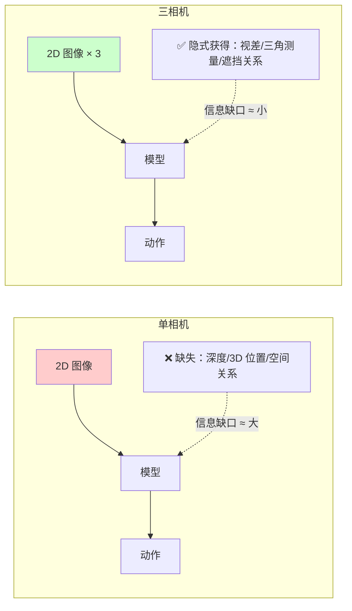
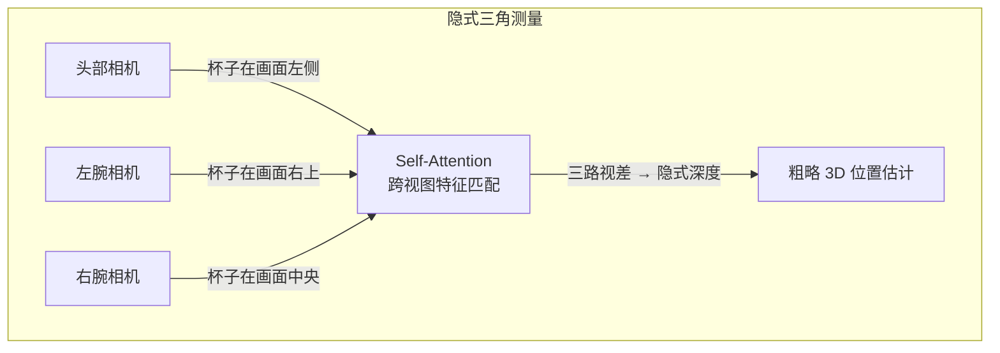
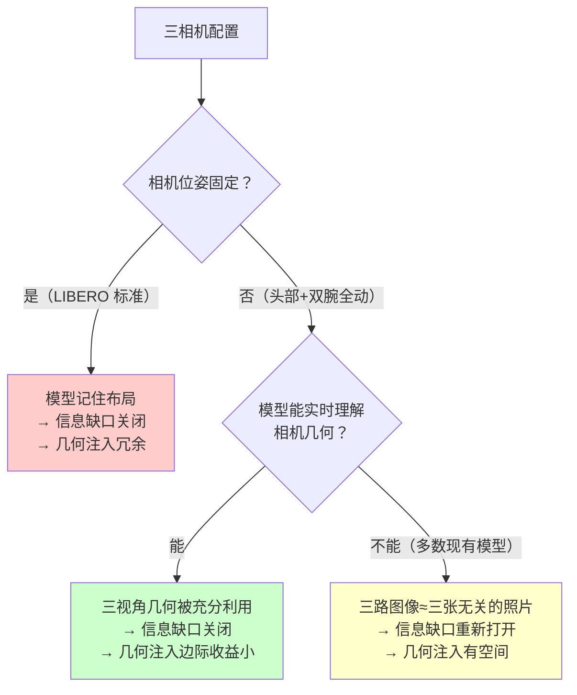
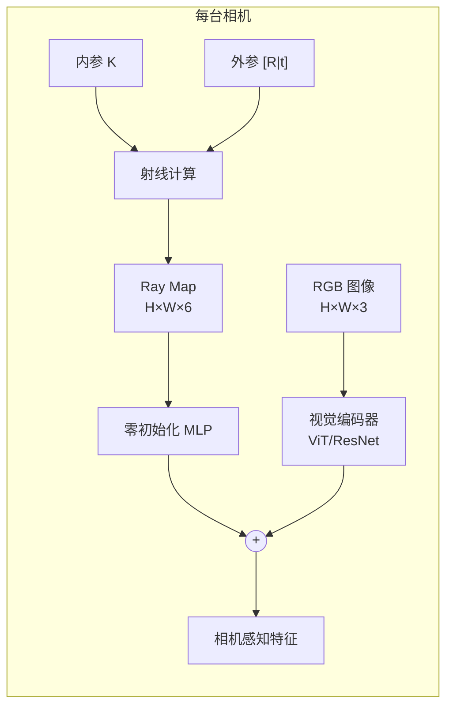
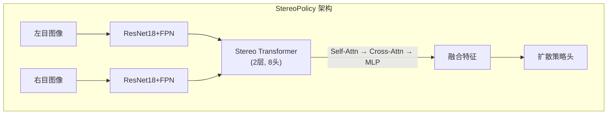
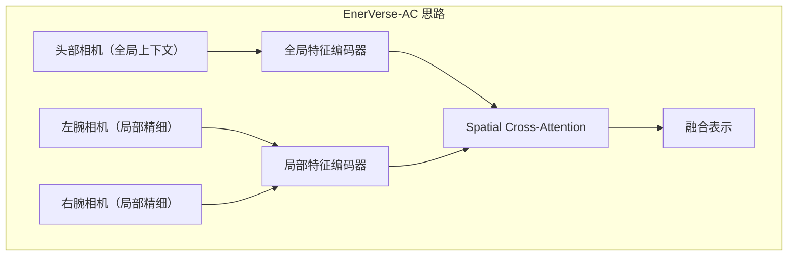
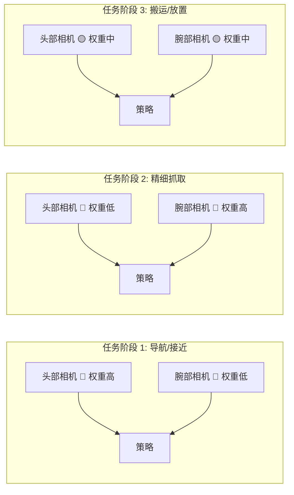
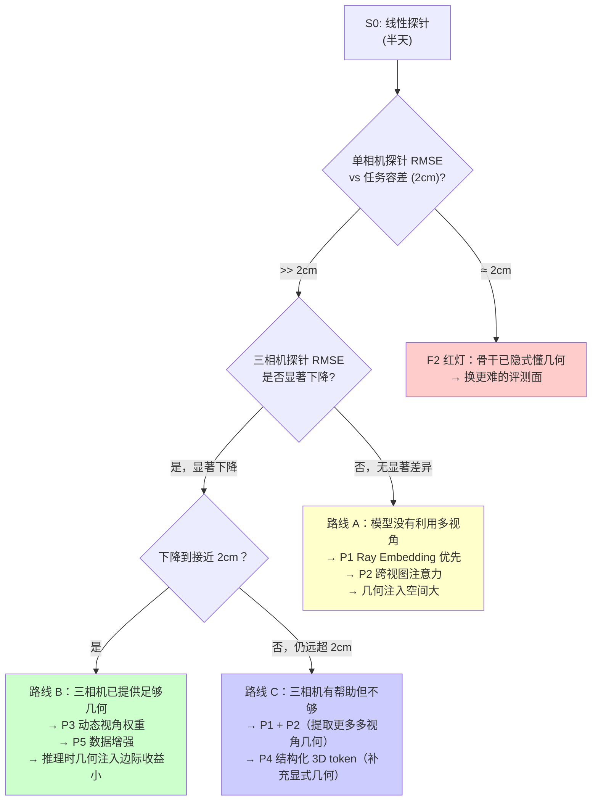

# 三相机配置下的几何利用方案：从"冗余困境"到"结构化优势"

> **背景**：MVPA 方案文档（`d4a_solutioin_1_c_mvpa.md`）§2.2 / 结论 3 指出，Understanding-GFM [1] 发现单相机下 Early Fusion 显著提升（21.5% vs 17.2%, p=0.030），但三相机下差异不显著——多视角本身已提供几何信息，关闭了"信息缺口"。本文分析这一问题的根源，并给出六大策略与具体落地路线，让头部 + 双腕三路相机成为优势而非负担。

---

## 目录

- [1. 问题：为什么三相机反而让几何注入"失效"](#1-问题为什么三相机反而让几何注入失效)
  - [1.1 直觉：信息缺口与边际收益递减](#11-直觉信息缺口与边际收益递减)
  - [1.2 定量证据](#12-定量证据)
  - [1.3 机制解释：隐式三角测量](#13-机制解释隐式三角测量)
- [2. 但你的三相机不一样——动态相机重新打开缺口](#2-但你的三相机不一样动态相机重新打开缺口)
  - [2.1 固定相机 vs 动态相机](#21-固定相机-vs-动态相机)
  - [2.2 AnyCamVLA 的警告：相机一动，几何就崩](#22-anycamvla-的警告相机一动几何就崩)
  - [2.3 动态三相机的双面性](#23-动态三相机的双面性)
- [3. 六大策略：让三相机成为优势而非负担](#3-六大策略让三相机成为优势而非负担)
  - [3.1 策略 A：相机感知编码](#31-策略-a相机感知编码camera-aware-encoding)
  - [3.2 策略 B：跨视图注意力 + 几何约束](#32-策略-b跨视图注意力--几何约束)
  - [3.3 策略 C：相机坐标系动作预测](#33-策略-c相机坐标系动作预测camera-space-action)
  - [3.4 策略 D：结构化 3D 表示](#34-策略-d结构化-3d-表示)
  - [3.5 策略 E：动态视角选择](#35-策略-e动态视角选择)
  - [3.6 策略 F：3D 重建做数据增强](#36-策略-f3d-重建做数据增强)
- [4. 落地方案：头部+双腕三相机的实施路线](#4-落地方案头部双腕三相机的实施路线)
  - [4.1 优先级排序](#41-优先级排序)
  - [4.2 S0 先验测量：量化你的信息缺口](#42-s0-先验测量量化你的信息缺口)
  - [4.3 决策树](#43-决策树)
- [5. 对比总结](#5-对比总结)
  - [5.1 六大策略横向对比](#51-六大策略横向对比)
  - [5.2 与 MVPA 文档的衔接](#52-与-mvpa-文档的衔接)
  - [5.3 开放问题](#53-开放问题)
- [参考文献](#参考文献)

---

## 1. 问题：为什么三相机反而让几何注入"失效"

### 1.1 直觉：信息缺口与边际收益递减

想象你在一个完全黑暗的房间里，只有一个手电筒（= 一台相机）。手电筒照亮了前方一小片区域，但你对房间的 3D 结构几乎一无所知——墙在多远、桌子有多高、杯子离你多近，全都只能靠光影和经验猜测。这时，如果有人递给你一个深度传感器（= 显式几何注入），它的价值是巨大的，因为你缺少的恰恰是它提供的——**3D 空间信息**。

现在换一个场景：你有三个手电筒，从不同角度照亮房间（= 三台相机）。虽然每个手电筒单独看还是 2D 的，但你的大脑可以**从三个角度的视差中恢复出大量 3D 信息**——两个手电筒看到的同一个杯子在各自画面中的位置差异，就足以让你估算杯子的距离。这时再递给你深度传感器，它的**边际收益就小得多**，因为你已经从多视角中"免费"获得了一部分 3D 信息。

这就是**信息缺口**（information gap）的核心逻辑：



**几何注入的价值 ∝ 信息缺口的大小**。缺口越大，注入越有效；缺口越小，注入越冗余。

### 1.2 定量证据

Understanding-GFM [1] 在 GR00T-N1.5 上做了严格的对照实验，用 McNemar 检验评估统计显著性：

| 配置 | 方法 | 成功率 | 与基线差 | p 值 | 显著？ |
|---|---|---|---|---|---|
| **单相机** | 基线 | 17.2% | — | — | — |
| **单相机** | Early Fusion | **21.5%** | **+4.3** | **0.030** | **✅ 是** |
| **三相机** | 基线 | ~60%+ | — | — | — |
| **三相机** | Early Fusion | ~60%+ | ≈0 | >0.05 | ❌ 否 |

> 来源：Understanding-GFM [1] §5.4，arXiv:2605.24642

单相机下 +4.3pp 且统计显著（p=0.030），三相机下差异不显著。论文原文推断：**多视角本身已经提供了几何信息，几何基础模型变得冗余**。

进一步的佐证来自 LIBERO-Plus 的 "3rd-black" 消融（MVPA 文档 §2.2）：遮住第三人称相机只留腕部相机，OpenVLA-OFT 仍有 43.6%、π0 43.0%、π0-FAST 67.3%——**近距离几何与接触线索本身就承担了大量工作**。

### 1.3 机制解释：隐式三角测量

为什么多相机能"免费"提供几何信息？核心原理是**隐式三角测量**（implicit triangulation）。

当同一个物体被两台或更多相机从不同角度拍到时，物体在各相机画面中的位置差异（**视差**，disparity）与物体的深度成反比。用公式表示：

$$z = \frac{f \cdot B}{d}$$

其中 $z$ 是深度，$f$ 是焦距，$B$ 是基线（两相机间距），$d$ 是视差（同一物体在两幅图中的像素位移）。

一个现代 transformer 模型在处理多视角输入时，其 self-attention 机制天然在做**跨视图特征匹配**——这在功能上等价于视差估计。模型不需要显式计算上述公式，它可以从数据中隐式学到"当同一个纹理在两幅图中偏移越大，物体越近"这样的关联。



关键在于：这种隐式几何推理的精度**取决于模型是否被有效引导去做这件事**。如果模型只是把三路图像拼接后丢进 transformer，它可能学到了捷径（比如记住固定相机布局下的背景模式），而非真正利用多视角几何。这就引出了下一节的讨论。

---

## 2. 但你的三相机不一样——动态相机重新打开缺口

### 2.1 固定相机 vs 动态相机

Understanding-GFM 实验中的三相机是 **LIBERO 标准配置**：三台相机的位置和朝向在整个任务过程中**完全不变**。这意味着：

- 模型可以**记住固定的空间布局**——"画面左上角永远对应桌面右后方"
- 不需要真正理解相机几何就能完成任务
- 这是一种**捷径**（shortcut），Know Your Camera [2] 的 ICRA 2026 最佳论文证实了这一点

但你的目标机器人配置完全不同：

| 特性 | LIBERO 标准三相机 | 你的头部+双腕三相机 |
|---|---|---|
| 相机位置 | 固定不动 | **全部在动** |
| 头部相机 | 第三人称固定视角 | 随移动底座旋转平移 |
| 腕部相机 | 固定 or 无 | 随手臂运动**剧烈移动** |
| 模型能记住布局？ | ✅ 可以 | ❌ 不能 |
| 隐式三角测量的基线 $B$ | 固定已知 | **时刻变化** |

这带来了一个根本性的差异：**当基线 $B$ 不断变化时，模型必须真正理解相机几何才能做三角测量——而不是靠记忆布局蒙混**。

用日常经验类比：固定相机就像你坐在固定位置用双眼看桌面，大脑已经记住了"这个距离感对应这个深度"；动态相机就像你一边走路一边左右转头看东西——每一步双眼的基线和朝向都在变，大脑必须实时整合前庭觉（知道头在哪）和视觉才能判断距离。

### 2.2 AnyCamVLA 的警告：相机一动，几何就崩

AnyCamVLA [3] 提供了一个极其生动的失败案例。他们测试了 GeoAwareVLA（一个用 VGGT 替换 RGB 编码器的几何感知 VLA）在相机扰动下的表现：

| 方法 | 正常 agent 相机 | 腕部相机扰动 (±15cm, ±60°) |
|---|---|---|
| π0.5 基线 | 67.9% | 28.6% |
| GeoAwareVLA（几何感知） | **86.1%** | **5.2%** |
| AnyCamVLA | 94.5% | **88.6%** |

> 来源：AnyCamVLA [3] Table II, arXiv:2603.05868

GeoAwareVLA 在正常配置下大幅领先（86.1% vs 67.9%），但腕部相机一扰动就**崩到 5.2%**——比什么几何都不用的 π0.5 基线（28.6%）还差 23.4 个百分点！

**原因**（MVPA 文档 §3.5 分析）：GeoAwareVLA 的 VGGT 3D 表征**隐式锚定在腕部相机坐标系**。训练时腕部相机位姿相对固定，模型学到了"这个 3D 坐标 = 这个抓取位置"的映射。腕部相机一动，整个坐标参考系失配，模型输出的动作指向了完全错误的空间位置。

**教训**：几何信息必须**锚定在相机无关的坐标系**（如机器人基座系），否则相机运动就是灾难。

### 2.3 动态三相机的双面性

MVPA 文档最后一段做了一个精准的判断（§附录最后一段）：

> "你有三路相机，这对 C1 是不利的（多视角冗余会关闭信息缺口）；但你的三路相机全部在动，模型无法靠记住固定布局蒙混过关，这又会把缺口重新打开。"



关键洞察：**问题不在于有几台相机，而在于模型能否有效利用多视角之间的几何关系**。如果模型把三路图像当作三张独立照片处理（当前大多数 VLA 的做法：拼接后输入 transformer），那即使有三台相机，模型也可能没有充分利用它们之间的视差信息——尤其是当相机在动的时候。

因此，**让模型"懂"相机几何，是把三相机从"冗余负担"变成"结构化优势"的关键**。以下六大策略正是围绕这个目标展开的。

---

## 3. 六大策略：让三相机成为优势而非负担

### 3.1 策略 A：相机感知编码（Camera-Aware Encoding）

> **一句话**：让每个像素"知道自己在 3D 世界中的哪个方向"，从而让模型天然理解多视角几何。

这是**成本最低、验证最充分**的策略，ICRA 2026 最佳论文 [2] 就属于这一类。

#### 核心思想

当前多数 VLA 处理多相机输入的方式是：把多路图像拼接成一个 token 序列，用标准位置编码（1D 序号或 2D 行列号）。问题在于：**位置编码只告诉模型"这个 token 在图像的第几行第几列"，但不告诉模型"这个像素对应的射线在 3D 空间中指向哪里"**。

相机感知编码的做法是：对每个像素，根据相机内外参计算它对应的 3D 射线方向（和/或原点），然后把这个 6D 射线信息编码进 token 特征中。这样，即使相机在动，模型也能知道每个像素"看"的是 3D 空间的哪个方向。

#### 方法一：Plücker Ray Conditioning（KYC, ICRA 2026 最佳论文）

**Know Your Camera** [2] 的做法极其简洁：

1. 对每个像素 $(u, v)$，用相机内参 $\mathbf{K}$ 和外参 $[\mathbf{R}|\mathbf{t}]$ 计算其对应的 3D 射线
2. 用 Plücker 坐标表示：$(\mathbf{d}, \mathbf{m})$，其中 $\mathbf{d}$ 是射线方向，$\mathbf{m} = \mathbf{o} \times \mathbf{d}$ 是力矩向量
3. 得到 6D 的 ray map $\in \mathbb{R}^{H \times W \times 6}$
4. 通过一个零初始化的小 MLP 映射后，与图像特征**逐元素相加**

$$\text{raymap}(u,v) = \left[\mathbf{d}(u,v),\; \mathbf{o}(u,v) \times \mathbf{d}(u,v)\right] \in \mathbb{R}^6$$

**结果**：在 ACT、Diffusion Policy、SmolVLA 三种策略 × 6 种任务上测试，增益范围 +0.4 ~ **+34.8**，**无一项为负**。



**为什么对动态三相机特别有效**：

- 每帧实时从当前外参计算 ray map → 相机怎么动都能跟上
- 射线定义在**机器人基座坐标系**（通过 FK 获得当前外参）→ 天然相机无关
- 实现成本极低：只需相机标定参数 + FK，**不需要深度传感器、不需要 3D 重建**

#### 方法二：PRoPE（NeurIPS 2025）

**Cameras as Relative Positional Encoding** [4] 更进一步：不只给每个 token 附加射线信息，而是把相机间的**相对投影变换**编码为跨视图注意力的位置偏置。

- 兼容 FlashAttention（关键工程优势）
- 对 OOD 视角数和未见过的相机内参更鲁棒
- 代码：[github.com/liruilong940607/prope](https://github.com/liruilong940607/prope)

#### 方法三：RayRoPE（ECCV 2026, Apple+CMU）

**RayRoPE** [5] 发现 PRoPE 在大规模训练时会出现训练停滞问题（旋转和平移存储在同一维度导致冲突）。它的解决方案是预测每个 token 沿射线的深度（无需直接监督），从而获得**真正的 3D 位置**而非仅射线方向，并实现 SE(3) 不变的注意力。

- 比 PRoPE 在 LPIPS 上相对改善 **24%**
- 代码：[github.com/Lucas-707/RayRoPE](https://github.com/Lucas-707/RayRoPE)

#### 方法四：G3VLA（2026）— 组合拳

**G3VLA** [6] 把上述方法组合起来：

1. **Ray embeddings**（Plücker rays）注入每个 token
2. **PRoPE** 作为跨视图注意力的位置信号
3. **Frame Attention**（同一相机内）+ **Cross-View Attention**（跨相机）双层注意力
4. 密集 pointmap 蒸馏（从 pi3X 几何教师）

在 π0.5 上：95.85% → **97.0%**。消融：去掉 ray embeddings −2.0%，去掉 PRoPE −1.1%。

> **策略 A 小结**：这一族方法的核心优势是**轻量**（+50~200 行代码）和**通用**（不改骨干、不改动作空间）。对动态三相机尤其适合，因为它从根本上解决了"模型不知道每个像素在 3D 空间中看向哪里"的问题。

---

### 3.2 策略 B：跨视图注意力 + 几何约束

> **一句话**：让不同相机的 token 在注意力层中互相"看见"，并用几何先验（极线约束、相机位姿编码）引导注意力聚焦在有意义的对应关系上。

策略 A 给每个 token 附加了相机信息，但不同相机的 token 之间的交互仍然依赖标准 self-attention 自己去发现。策略 B 更进一步：**显式建立跨视图注意力通道**，并用几何约束引导。

#### StereoPolicy（Stanford, 2025）— 双目交叉注意力

**StereoPolicy** [7] 是一个非常干净的实验，直接比较了"给模型多视角输入"的不同方式对操作策略的影响：

| 输入方式 | 仿真平均 | 真机平均 |
|---|---|---|
| RGB（单相机） | 基线 | 基线 |
| RGB-D（深度图） | 中等 | 中等 |
| 点云（Point Cloud） | **最差** | **最差**（玻璃杯任务完全失败） |
| **立体对（Stereo Pair）+ 交叉注意力** | **最好** | **最好** |

> 来源：StereoPolicy [7], arXiv:2605.09989

架构设计：



- 轻量 Stereo Transformer：仅 2 层、8 头
- 使用 **2D RoPE** 保留空间信息
- 关键发现：**隐式立体推理（通过 cross-attention）优于显式 3D 重建（点云）**

**对你的启示**：你的双腕相机构成天然的"立体对"（虽然基线很大且在变），可以直接用 StereoPolicy 的架构处理；头部相机则作为全局上下文。

#### 极线注意力约束（Epipolar Attention）

更精细的做法是：在跨视图注意力中，**只让每个 token 关注另一视图中几何上有意义的位置**——即极线（epipolar line）上的 token。

数学原理：给定两台相机的基础矩阵 $\mathbf{F}$，相机 1 中的像素 $\mathbf{p}_1$ 在相机 2 中的对应搜索范围被约束为一条线：

$$\mathbf{l}_2 = \mathbf{F} \cdot \mathbf{p}_1$$

如果不做约束，跨视图注意力需要每个 token 与所有其他视图的所有 token 计算相似度（$O(N^2)$）。极线约束把搜索范围从整幅图像压缩到一条线上，**计算量降低一个数量级，同时保证几何一致性**。

Epipolar Attention Field Transformers [8] 在 WACV 2025 上展示了这种方法在自动驾驶 BEV 感知中的效果（+2% mIoU）。Godeke et al. [9] 提出了更温和的"软约束"版本：不硬性限制注意力范围，而是**惩罚偏离极线的注意力权重**，作为辅助损失使用。

**对动态相机的适用性**：极线约束需要精确的相机参数——这在仿真中完全免费（通过 FK 解析计算），在实机上也可以通过手眼标定获得。相机每动一帧，极线就重新计算，天然适配动态配置。

#### PAIWorld GeoRoPE（2026）— 相机外参编码进 RoPE

**PAIWorld** [10]（机器人多相机 world model）提出了 **GeoRoPE**：把相机外参编码进 Rotary Position Embedding（RoPE），让注意力机制天然感知不同视图 token 之间的空间关系。

这比标准 RoPE 多了一层信息：标准 RoPE 只编码 token 在序列中的位置（第几个 token），GeoRoPE 额外编码了"这个 token 来自哪台相机、那台相机在 3D 空间中的位姿是什么"。

#### EnerVerse-AC（2025）— 分离处理头部与腕部

**EnerVerse-AC** [11] 做了一个对你的配置直接有启发的设计决策：**把固定的头部/外部相机和动态的腕部相机分开处理**。

理由：头部相机提供全局场景上下文（物体在哪、桌面布局），变化相对缓慢；腕部相机提供局部精细信息（末端与物体的相对位姿），变化剧烈。两者的信息特性截然不同，分离处理再融合比统一处理更有效。



> **策略 B 小结**：跨视图注意力让多相机从"各自为战"变成"协同感知"。极线约束和 GeoRoPE 提供几何先验引导，避免模型浪费注意力在几何上无意义的对应关系上。对你的头部+双腕配置，EnerVerse-AC 的分离处理思路尤其值得借鉴。

---

### 3.3 策略 C：相机坐标系动作预测（Camera-Space Action）

> **一句话**：不是让模型从图像推断 3D 空间中的动作，而是**直接在图像/相机坐标系中预测动作**——从根上消除观测空间与动作空间的不对齐。

#### 问题的本质

标准 VLA 的工作流程是：

1. 从相机图像中提取视觉特征（在**像素坐标系**中）
2. 预测末端执行器的动作（在**机器人基座坐标系**中）

这两个坐标系之间的映射取决于相机外参——**相机位姿变了，同样的视觉特征对应的基座系动作也变了**。这就是为什么固定相机下训练的模型在相机移动后会崩溃。

Camera-Space Action 的思路是：**把动作预测目标也放到相机坐标系中**，这样观测和动作在同一个空间，映射关系不再依赖相机位姿。

#### OC-VLA（AAAI 2026）

**OC-VLA** [12] 的做法非常直接：

1. 已知相机外参 $\mathbf{T}_{cam}^{base} = [\mathbf{R}|\mathbf{t}]$
2. 把末端执行器位姿从基座系转换到相机系：$\mathbf{p}_{cam} = \mathbf{T}_{cam}^{base} \cdot \mathbf{p}_{base}$
3. 模型预测的是 $\Delta\mathbf{p}_{cam}$（相机系中的增量）
4. 推理时再转回基座系：$\Delta\mathbf{p}_{base} = (\mathbf{T}_{cam}^{base})^{-1} \cdot \Delta\mathbf{p}_{cam}$

**优势**：
- 无需改架构，只需改数据预处理和后处理
- 天然跨视角泛化——同一物体在相机中的外观不变时，预测的相机系动作也不变
- 加速收敛

**风险与注意事项**：
- 对多相机系统：每台相机一个动作预测，还是选一台"主相机"？
- 腕部相机剧烈运动时，相机系中的动作可能数值不稳定（小的基座系移动 → 大的相机系变化）
- 需要准确的实时外参——仿真中免费，实机需标定

#### cVLA（CoRL 2025）

**cVLA** [13] 更激进：直接在**图像帧**（2D 像素坐标）中预测轨迹关键姿态（keypose），然后通过低层规划器转换为关节命令。

- 使用 PaliGemma2 作为骨干
- 只预测两个关键姿态（大幅简化动作空间）
- 实现了良好的 sim-to-real 迁移

> **策略 C 小结**：Camera-Space Action 从数据表示层面解决问题，不需要额外的模型组件。但对你的双腕动态相机场景需要特别注意数值稳定性。最稳妥的做法是**以头部相机为主相机做 camera-space action，双腕相机作为辅助输入**。

---

### 3.4 策略 D：结构化 3D 表示

> **一句话**：把多路 2D 图像"升维"到一个统一的 3D 表示中，然后在 3D 空间提取特征——多视角冗余在这里变成了**重建质量的优势**。

这是最"重"的一族策略，但也是信息最丰富的。与前三种策略不同，它们**显式构建 3D 场景表示**。

#### 关键洞察：多相机是 3D 重建的天然优势

在策略 A-C 中，多相机被视为"冗余"的来源。但如果我们换个视角——把多路图像作为 **3D 重建的输入**而非策略的直接输入——多相机反而成了优势：

- 更多视角 → 更少盲区 → 更完整的 3D 重建
- 更宽的基线 → 更精确的深度估计
- 多视角一致性约束 → 更鲁棒的重建

#### GST-VLA（2026）— 高斯空间 Token

**GST-VLA** [14] 提出了一种特别优雅的结构化 3D 表示：把深度图和语义特征转换为 **128 个各向异性 3D 高斯基元**，每个高斯有：

- **度量残差均值**（3D 位置）
- **对数尺度协方差**（形状和方向 → 编码局部表面朝向）
- **学习的不透明度**（几何置信度）

| 方法 | LIBERO | SimplerEnv |
|---|---|---|
| DepthVLA（密集深度图） | 94.0% | 74.8% |
| **GST-VLA（高斯 token）** | **96.4%** | **80.2%** |
| 差值 | **+2.4** | **+5.4** |

> 来源：GST-VLA [14], arXiv:2603.09079

**为什么结构化 3D token 比密集深度图更好？** 因为 128 个高斯是对整个场景 3D 结构的**压缩摘要**：它保留了关键几何信息（位置、朝向、置信度），丢弃了冗余信息（平坦桌面上每个像素的深度值其实只有一个自由度）。对 transformer 来说，处理 128 个结构化 token 比处理数万个像素级深度值高效得多。

#### RoboUniView（2024）— 统一 3D 表示

**RoboUniView** [15] 用 **UVFormer** 把多视角观测转换为统一的 3D 占用表示：

1. 预训练阶段：用 RGB-D 图像训 UVFormer 做 3D 占用预测任务
2. 部署阶段：UVFormer 把任意视角的多路输入映射到固定的 3D 体素空间
3. 策略在 3D 体素特征上做动作预测

CALVIN 基准：成功率 task1 从 0.824 → **0.942**，平均成功序列长度从 2.47 → **3.647**。

**核心优势**：3D 表示天然是**视角无关的**——无论相机怎么动，物体在 3D 空间中的位置不变。

#### R3D（2026）— 修复 3D 策略的两个 Bug

**R3D** [16] 发现过去 3D 策略不稳定的原因不在于 3D 表示本身，而在于两个工程 bug：

1. **缺少 3D 数据增强**：2D 策略有丰富的增强（裁剪、颜色抖动、翻转），但 3D 策略几乎不做点云增强
2. **Batch Normalization 有害**：在小 batch 的模仿学习中，BN 的统计量估计不准，反而引入噪声

修复这两个问题后，用 Uni3D transformer 编码器 + 扩散解码器，在 RoboTwin 2.0 和 ManiSkill2 上**全面超越 2D、2.5D 和其他 3D 基线**。

**对你的启示**：如果选择 3D 策略路线，记得做 3D 数据增强（随机旋转、平移、dropout 点）并用 LayerNorm 替代 BatchNorm。

> **策略 D 小结**：结构化 3D 表示把"多相机冗余"转化为"3D 重建质量"。成本最高但几何信息最丰富。**关键发现**：结构化 3D token（高斯）> 非结构化深度图 > 原始点云。对三相机配置，推荐 GST-VLA 的高斯 token 路线或 RoboUniView 的统一 3D 表示。

---

### 3.5 策略 E：动态视角选择

> **一句话**：不是所有相机在每个时刻都同等重要——抓取时腕部相机最关键，导航时头部相机最关键。动态调整各视角的权重，而非静态等权融合。

#### 问题：静态融合的浪费

当前多数多相机 VLA 对所有视角一视同仁：把三路图像拼接成一个 token 序列，让 self-attention 自己分配权重。但这意味着：

- 在导航阶段，模型仍然花大量注意力处理腕部相机的特写画面（此时几乎无用信息）
- 在精细抓取阶段，模型仍然平均分配注意力给头部相机的远景（此时缺乏操作所需的细节）

这不仅浪费计算资源，还可能引入噪声——**任务无关的视角信息稀释了任务关键的视角信息**。

#### Selective Perception（2026）

**Selective Perception** [17] 提出了**任务感知自适应路由**：

- 一个轻量的路由网络根据当前任务描述和视觉观测，动态预测每个视角（以及每个感知模态）的**任务相关性权重**
- 高权重的视角 token 被放大，低权重的被抑制
- 计算开销极小（路由网络只有几层 MLP）

#### TVVE（2025）— 任务感知虚拟视角

**TVVE** [18] 更进一步：不仅选择现有视角，还**从 3D 重建的场景中动态渲染最优的虚拟视角**。

- 使用 TaskMoE（Task-aware Mixture-of-Experts）视觉编码器，将不同视角的特征路由到任务专用的专家网络
- 学习"对于当前任务，从哪个角度看最有信息量"

**对你的头部+双腕配置的直觉**：



> **策略 E 小结**：动态视角选择本质上是在做**注意力的注意力**——在决定"关注画面中的什么"之前，先决定"关注哪台相机"。实现简单（MLP 路由器），但能显著减少任务无关信息的干扰。

---

### 3.6 策略 F：3D 重建做数据增强

> **一句话**：不在推理时注入几何，而是在训练时用三相机的 3D 重建能力生成更多、更多样的训练数据——间接发挥三相机优势。

这是一条**正交路线**：前五个策略都在改推理时的模型架构或输入，策略 F 在改训练数据。两者可以叠加。

#### RoboSplat（RSS 2025）— 3DGS 数据增强

**RoboSplat** [19] 是这条路线的标杆：

1. 从少量真实演示中用 3D Gaussian Splatting 重建场景
2. 在 3DGS 场景中直接**操作高斯基元**生成新的训练数据：
   - 高斯替换（换物体外观）
   - 等变变换（旋转、平移物体）
   - 视觉属性编辑（光照、材质）
   - **新视角合成**（从未见过的相机角度渲染）
   - 3D 内容生成（添加新物体）
3. 用增强后的数据训练策略

**结果震撼**：

| 训练数据 | 成功率 |
|---|---|
| 100+ 真实演示 + 2D 增强 | 57.2% |
| **1 次真实演示 + RoboSplat 3D 增强** | **87.8%** |

> 来源：RoboSplat [19], arXiv:2504.13175

**三相机在这里的独特优势**：3DGS 重建质量直接取决于输入视角的数量和多样性。三路相机（头部+双腕）提供了三个大不相同的视角，重建质量远优于单相机——这意味着更高质量的增强数据，进而更好的策略性能。

#### 仿真中的"免费"优势

在仿真环境中，这个优势更加明显：

- 渲染器可以从**任意视角**生成完美图像，不需要 3DGS 重建
- 三路相机的配置可以直接用于生成多视角训练数据
- MVPA 文档 §3.1 P1 路线（视角重渲染）正是利用了这一点

> **策略 F 小结**：三相机在训练时的 3D 重建和数据增强价值，可能比推理时的直接输入价值更大。这条路线不改推理架构、不加推理延迟，且与其他策略完全兼容。

---

## 4. 落地方案：头部+双腕三相机的实施路线

### 4.1 优先级排序

基于**实现成本、验证充分度、与 MVPA 方案的兼容性**，推荐以下优先级：

| 优先级 | 策略 | 改动量 | 推理延迟增加 | 验证级别 | 与 MVPA 的对应 |
|---|---|---|---|---|---|
| **P0**（零成本） | 坐标系统一到机器人基座系 | 数据预处理 | 0 | 文献共识 | §3.5 P4 约束 |
| **P1**（+50 行） | Plücker ray embedding | 射线计算+MLP | ~1ms | ICRA 2026 最佳论文 | §3.5 P4 KYC |
| **P2**（+200 行） | 跨视图注意力 + 头/腕分离 | 注意力层修改 | ~5ms | EnerVerse-AC, StereoPolicy | 新增 |
| **P3**（+500 行） | 动态视角权重 | MLP 路由器 | ~1ms | Selective Perception | 新增 |
| **P4**（+1000 行） | 结构化 3D token | 3D 编码器 | ~10-20ms | GST-VLA, R3D | §3.5 P4 |
| **P5**（训练时） | 3DGS 数据增强 | 离线流程 | 0 | RoboSplat RSS 2025 | §3.1 P1 |

#### P0：坐标系统一（必做前置条件）

无论选择哪条后续路线，**第一步都是确保所有几何信息锚定在机器人基座坐标系**，而非任何相机坐标系。

原因已在 §2.2 详述：AnyCamVLA 的 GeoAwareVLA 因为锚定在腕部相机系，腕部一动就从 86.1% 崩到 5.2%。

具体做法：
- Pointmap 定义在机器人基座系（See like a Robot [20] 路线）：$\mathbf{P}_{base}(u,v) = \mathbf{T}_{base}^{cam} \cdot \text{unproject}(u, v, z(u,v))$
- Ray map 的原点和方向都在基座系中计算
- 通过 FK（正向运动学）实时获取每台相机的 $\mathbf{T}_{base}^{cam}$

#### P1：Plücker Ray Embedding（首选轻量方案）

在 P0 的基础上，对每路相机图像附加 6D ray map，通过零初始化 MLP 与视觉特征逐元素相加。

```python
# 伪代码示意
for cam in [head_cam, left_wrist_cam, right_wrist_cam]:
    T_base_cam = forward_kinematics(joint_angles, cam.link)  # 基座系外参
    ray_dirs = compute_ray_directions(cam.intrinsics, T_base_cam)
    ray_origins = T_base_cam[:3, 3].expand_as(ray_dirs)
    moments = torch.cross(ray_origins, ray_dirs, dim=-1)
    ray_map = torch.cat([ray_dirs, moments], dim=-1)  # H×W×6
    
    visual_features = vision_encoder(cam.image)
    ray_features = zero_init_mlp(ray_map)  # 零初始化保护预训练权重
    cam_aware_features = visual_features + ray_features
```

#### P2：跨视图注意力 + 头/腕分离

在 P1 的基础上，增加显式跨视图注意力层：

1. **Frame Attention**：每台相机的 token 先做独立的 self-attention（保留单视图特征）
2. **Cross-View Attention**：头部 token 和双腕 token 之间做交叉注意力，使用 PRoPE 作为位置偏置
3. 头部相机用全局感受野（大 patch），腕部相机用局部感受野（小 patch）

可选增强：在跨视图注意力中加入极线软约束作为辅助损失。

#### P3-P5：按需选择

- **P3（动态视角权重）**：如果 P1+P2 后发现某些任务阶段仍然被无关视角干扰，加 MLP 路由器
- **P4（结构化 3D token）**：如果需要更强的几何信息（OOD 场景），用 GST-VLA 的高斯 token 或 RoboUniView 的统一 3D 表示
- **P5（3DGS 增强）**：在训练阶段用三路相机重建 3DGS 场景，生成新视角训练数据

### 4.2 S0 先验测量：量化你的信息缺口

在投入工程之前，先用 MVPA 文档 §5.1 S0-2 的线性探针方法量化你的三相机配置的信息缺口是否被关闭：

| 实验 | 做法 | 预期结果 | 含义 |
|---|---|---|---|
| **探针 A** | 冻结 VLA 骨干，单相机输入，回归深度/3D 偏移/yaw | RMSE >> 任务容差 | 单相机下信息缺口大 |
| **探针 B** | 同上，三相机输入 | RMSE 显著下降？ | 三相机提供了多少隐式几何 |
| **探针 C** | 探针 B + Plücker ray embedding | RMSE 进一步下降？ | ray embedding 是否帮助提取多视角几何 |
| **探针 D** | 探针 B + 跨视图注意力 | RMSE 进一步下降？ | 跨视图注意力是否帮助 |

如果探针 B 的 RMSE 已经接近任务容差（~2cm），说明三相机本身已经"关闭"了信息缺口，此时更应该聚焦策略 A/B/E（让模型更好地利用已有信息），而非策略 D（注入更多信息）。

如果探针 B 的 RMSE 仍然远超容差，说明三相机虽然提供了多视角输入，但**模型并没有有效利用**——这正是策略 A-E 的用武之地。

### 4.3 决策树



---

## 5. 对比总结

### 5.1 六大策略横向对比

| 策略 | 核心思想 | 实现复杂度 | 推理延迟 | 代表工作 | 验证级别 | 对动态三相机适用性 |
|---|---|---|---|---|---|---|
| **A 相机感知编码** | 每像素附加 3D 射线信息 | ⭐（最低） | +1ms | KYC [2] (ICRA'26 Best), G3VLA [6] | ⭐⭐⭐ | ⭐⭐⭐（天然支持） |
| **B 跨视图注意力** | 显式建立视图间通信 | ⭐⭐ | +5ms | StereoPolicy [7], PAIWorld [10] | ⭐⭐ | ⭐⭐⭐（需极线实时更新） |
| **C 相机系动作** | 在相机坐标系预测动作 | ⭐ | +0ms | OC-VLA [12], cVLA [13] | ⭐⭐ | ⭐⭐（腕部数值稳定性存疑） |
| **D 结构化 3D** | 升维到 3D 空间提特征 | ⭐⭐⭐ | +10-20ms | GST-VLA [14], R3D [16] | ⭐⭐ | ⭐⭐⭐（视角无关） |
| **E 动态选择** | 任务感知视角权重 | ⭐ | +1ms | Selective Perception [17] | ⭐ | ⭐⭐（未在动态相机验证） |
| **F 数据增强** | 3DGS 训练数据增强 | ⭐⭐（离线） | +0ms | RoboSplat [19] | ⭐⭐⭐ | ⭐⭐⭐（三相机=更好重建） |

**推荐组合**：

- **最小可行方案**：P0（坐标系统一）+ P1（ray embedding）= **+50 行代码，+1ms 延迟**
- **推荐方案**：P0 + P1 + P2（跨视图注意力 + 头/腕分离）= **+250 行，+6ms 延迟**
- **全量方案**：P0 + P1 + P2 + P3（动态权重）+ P4（3D token）= **+1750 行，+27ms 延迟**

### 5.2 与 MVPA 文档的衔接

| 本文策略 | MVPA 路线 | 关系 |
|---|---|---|
| A 相机感知编码 | P4（KYC 条目） | KYC 已在 MVPA P4 扫描列表中 |
| B 跨视图注意力 | 新增 | MVPA 未专门讨论跨视图注意力；可作为 P4 的子变体 |
| C 相机系动作 | 新增 | MVPA 未讨论动作空间变换；与 P5（输出级 SO2 对称正则）方向相关 |
| D 结构化 3D | P4（pointmap 等） | GST-VLA 是 pointmap 的结构化升级版 |
| E 动态选择 | 新增 | MVPA 未讨论视角选择；可作为所有路线的附加模块 |
| F 数据增强 | P1（视角重渲染） | 直接对应 MVPA §3.1 P1 |

**关键补充**：MVPA 文档 §2.2 把"相机数量"作为独立变量（主扫描单相机，确认后三相机复核）。本文档补充了**在三相机下如何最大化利用多视角几何**的具体方案——不仅仅是"跑两遍看对比"，而是"主动让三相机变得更有用"。

### 5.3 开放问题

1. **动态三相机的信息缺口究竟有多大？** MVPA 文档最后一段指出"你的三路相机全部在动"可能重新打开缺口，但目前**没有定量数据**。S0 的线性探针是获取这个数据的最快路径（半天）。

2. **双腕之间的"立体对"有多大价值？** StereoPolicy 在固定双目上验证了立体交叉注意力的优势，但你的双腕基线大且在变——基线越大深度精度越高，但对应关系越难建立。需要实测。

3. **头部/腕部分离处理 vs 统一处理，哪个更好？** EnerVerse-AC 选择了分离，但 G3VLA 选择了统一（Cross-View Attention 处理所有视图）。两者在你的具体配置上的对比是一个有价值的消融实验。

4. **Camera-Space Action 在双腕大运动下的数值稳定性？** OC-VLA 在相对温和的相机变化下验证了效果，但你的腕部相机在抓取过程中可能旋转 90° 以上。需要测试极端情况。

5. **3DGS 增强的收益上界？** RoboSplat 的 87.8% 来自真机单次演示，仿真中能否做得更好？三路相机的更好重建质量能带来多少增量？

---

## 参考文献

### 多相机与几何注入

| # | 论文 | 发表 | 关键贡献 |
|---|---|---|---|
| [1] | [Understanding the Impact of Geometric Foundation Models on VLAs](https://arxiv.org/abs/2605.24642) | arXiv 2026-05 | 单相机 vs 三相机几何注入对照；McNemar 显著性检验 |
| [2] | [Know Your Camera: Do You Know Where Your Camera Is?](https://arxiv.org/abs/2510.02268) | ICRA 2026 **Best Paper** | Plücker ray conditioning；ACT/DP/SmolVLA 全面提升 |
| [3] | [AnyCamVLA: Zero-Shot Camera Adaptation](https://arxiv.org/abs/2603.05868) | arXiv 2026-03 | GeoAwareVLA 腕部扰动 86.1% → 5.2%；前馈 NVS 适配 |
| [4] | [PRoPE: Cameras as Relative Positional Encoding](https://arxiv.org/abs/2507.10496) | NeurIPS 2025 | 相机内外参 → 相对位置偏置；兼容 FlashAttention |
| [5] | [RayRoPE: Projective Ray Positional Encoding](https://arxiv.org/abs/2601.15275) | ECCV 2026 | 预测 token 深度实现 SE(3) 不变；解决 PRoPE 训练停滞 |
| [6] | [G3VLA: Geometric Inductive Bias for VLAs](https://arxiv.org/abs/2606.24472) | arXiv 2026-06 | Ray embedding + PRoPE + Cross-View Attention + pointmap 蒸馏 |

### 跨视图融合与立体视觉

| # | 论文 | 发表 | 关键贡献 |
|---|---|---|---|
| [7] | [StereoPolicy: Improving Robotic Manipulation via Stereo Perception](https://arxiv.org/abs/2605.09989) | arXiv 2025 (Stanford) | 立体交叉注意力 > 点云 > RGBD；2D RoPE 保留空间信息 |
| [8] | [Epipolar Attention Field Transformers](https://arxiv.org/abs/2412.01595) | WACV 2025 | 极线约束 cross-attention；+2% mIoU |
| [9] | Godeke et al. (Epipolar Guidance) | — | 软极线约束：惩罚偏离极线的注意力权重 |
| [10] | [PAIWorld](https://arxiv.org/abs/2606.18375) | arXiv 2026-06 | GeoRoPE：相机外参编码进 RoPE；2.5M 多视图训练 |
| [11] | [EnerVerse-AC](https://arxiv.org/abs/2505.09723) | arXiv 2025-05 | 分离处理固定/动态相机；空间交叉注意力 |

### 相机坐标系动作

| # | 论文 | 发表 | 关键贡献 |
|---|---|---|---|
| [12] | [OC-VLA: Observation-Centric VLA Policy](https://arxiv.org/abs/2508.13103) | AAAI 2026 | 动作目标转到相机系；跨视角泛化；无需改架构 |
| [13] | [cVLA: Camera-Space VLAs](https://arxiv.org/abs/2507.02190) | CoRL 2025 | 图像帧 keypose 预测；PaliGemma2 骨干 |

### 结构化 3D 表示

| # | 论文 | 发表 | 关键贡献 |
|---|---|---|---|
| [14] | [GST-VLA: Gaussian Spatial Tokens](https://arxiv.org/abs/2603.09079) | arXiv 2026-03 | 128 个 3D 高斯 token > 密集深度图 +2.4pp |
| [15] | [RoboUniView: Unified View Representation](https://arxiv.org/abs/2406.18977) | arXiv 2024 | UVFormer 多视角 → 统一 3D 占用；CALVIN +1.18 seq len |
| [16] | [R3D: Revisiting 3D Policy Learning](https://arxiv.org/abs/2604.15281) | arXiv 2026-04 | 修复 3D 策略两个 bug（数据增强 + BN）；Uni3D 编码器 |

### 动态视角与数据增强

| # | 论文 | 发表 | 关键贡献 |
|---|---|---|---|
| [17] | Selective Perception for Robot | arXiv 2026-02 | 任务感知自适应路由；动态视角权重 |
| [18] | [TVVE: Task-Aware Virtual View Exploration](https://arxiv.org/abs/2508.05186) | arXiv 2025 | TaskMoE 视觉编码器；动态虚拟视角选择 |
| [19] | [RoboSplat: 3DGS Data Augmentation](https://arxiv.org/abs/2504.13175) | RSS 2025 | 1 次演示 + 3DGS 增强 87.8% vs 100+ 演示 57.2% |
| [20] | See like a Robot | arXiv 2026 | 基座系 pointmap + 逐元素相加；RoboCasa π0.5 +7.6 |

### 其他参考

| # | 论文 | 发表 | 关键贡献 |
|---|---|---|---|
| [21] | [GP3: 3D Geometry-Aware Policy](https://arxiv.org/abs/2509.15733) | arXiv 2025-09 | RoboVGGT 从 RGB 推断密集空间特征 |
| [22] | [DPPE: Decoupled Pose Positional Encoding](https://arxiv.org/abs/2606.31585) | arXiv 2026-06 | 解耦旋转/平移编码路径；解决 PRoPE 大规模训练停滞 |
| [23] | [102 VLA Models Systematic Review](https://www.sciencedirect.com/science/article/pii/S1566253525011248) | ScienceDirect 2025-12 | 层次/晚融合 > 简单拼接；扩散解码器跨域迁移最优 |
| [24] | ABot-M0 | arXiv 2026-02 | 融合策略对比：单层 Cross-Attention > Concatenation > Q-Former |
| [25] | [ReViWo: View-Invariant World Models](https://openreview.net/pdf?id=vJwjWyt4Ed) | OpenReview 2024-25 | 视角不变 world model；真机 10-90° 视角偏移下鲁棒 |
| [26] | multicam_4d_gen_analysis_1.md（内部参考文档） | — | 多相机 4D 生成方法广度分析；PAIWorld、EnerVerse-AC 等 |
