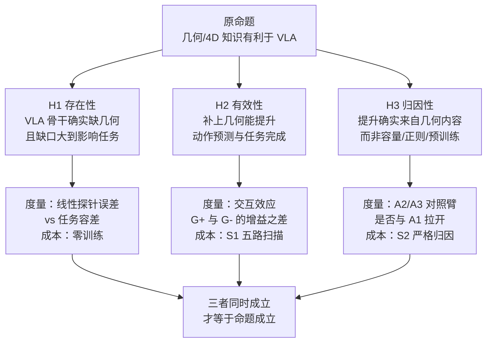
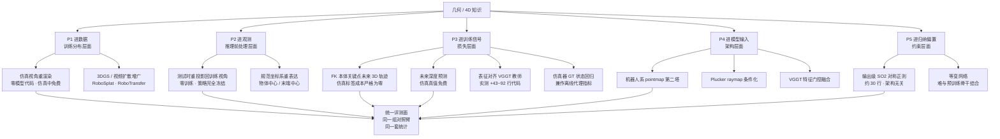
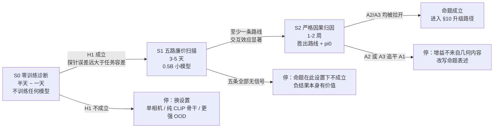
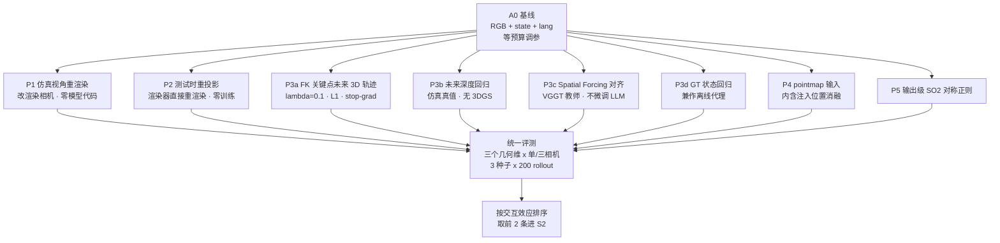
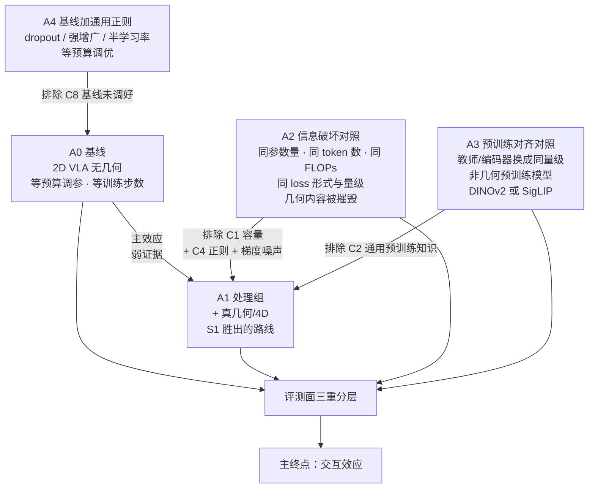
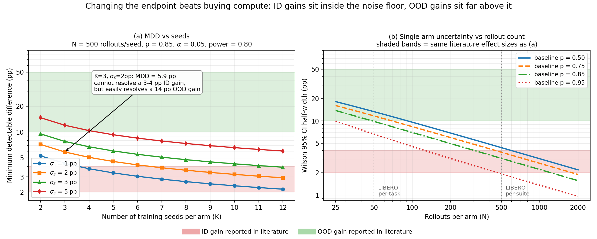
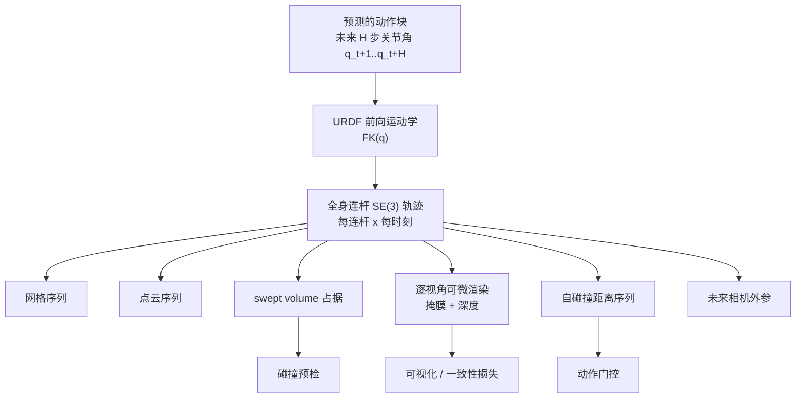
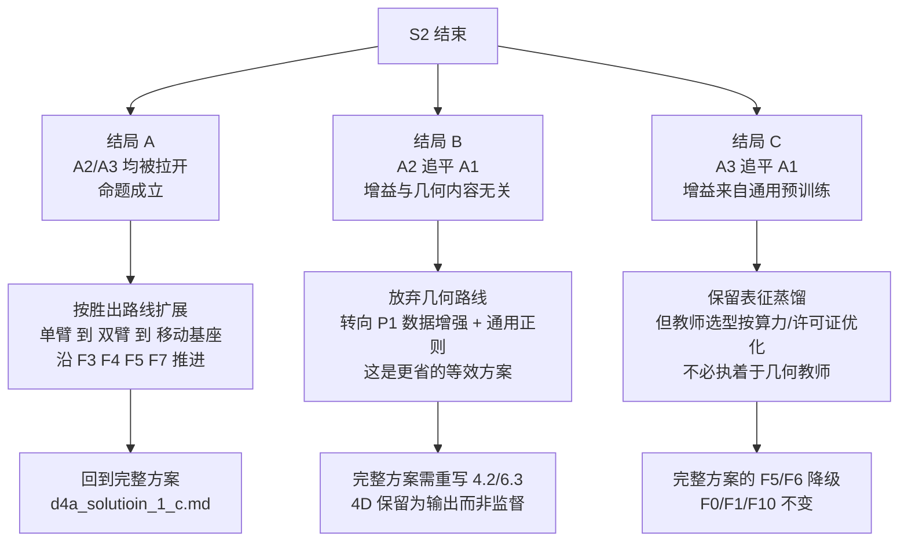

# D4A 方案 1-C-MVPA：几何/4D 命题的最小可验证方案

> 版本：v1.0（2026-07-26）
> **本文的唯一目标**：用最快的路径、最高的统计置信度，判定下面这条命题在你的设置下**是否成立**，以及**以何种形式成立**。
>
> **待验证命题（原始表述）**
> > 把几何与 4D 信息/知识，通过**输入**或通过**训练**让模型学到，有利于模型对动作的预测与任务的完成。
>
> **与 [`d4a_solutioin_1_c.md`](./d4a_solutioin_1_c.md) 的关系**：那份文档假定命题成立，回答"如何造出最好的系统"；本文档不作此假定，回答"如何最快判定它成不成立"。两者不是替代关系——本文档 §10 给出从本方案回到完整方案的升级路径，且本方案的每一个组件在完整方案中都会被复用。
>
> **放宽的约束**：纯仿真 · 固定基座 · 同步执行 · 小模型 · 单臂为主双臂为辅。放宽理由见 §3.4（仿真里几何真值免费）与 §4（基座选型）。
> **不在范围内**：真机部署、移动基座、异步推理、触觉力控、项目管理。

---

## 可靠性标注约定

全文所有数字均标注来源等级。这不是形式主义——§2.7 会说明，本领域相当一部分"几何有效"的声明在统计上不可区分，来源等级是你判断该不该相信它的第一道过滤。

| 标记 | 含义 |
|---|---|
| **[A]** | 同行评审论文（NeurIPS / ICLR / CVPR / ICML / CoRL / RSS / ICRA / ICCV / AISTATS / CoLLAs 等已录用） |
| **[B]** | arXiv 预印本，未见录用记录 |
| **[C]** | 项目主页 / GitHub README / 官方 leaderboard / 博客宣称，未在论文正文交叉核实 |
| **[D]** | 本文档的推断或判断，**非文献陈述** |

三份底层调研报告作为溯源材料保留在同目录：[`geometry_as_input_survey.md`](./geometry_as_input_survey.md)（输入侧）、[`d4a_training_supervision_survey.md`](./d4a_training_supervision_survey.md)（训练侧）、[`d4a_geometry_4d_ab_methodology_review.md`](./d4a_geometry_4d_ab_methodology_review.md)（方法学审稿）。本文档引用的数字都可以在这三份里找到原始出处与原文引语。

---

## 目录

- [0. TL;DR：七条会改变你计划的发现](#0-tldr七条会改变你计划的发现)
- [1. 命题的精确化与可证伪化](#1-命题的精确化与可证伪化)
- [2. 七条硬约束：动手前必须知道的事](#2-七条硬约束动手前必须知道的事)
- [3. 设计空间重构：几何进入模型的五个位置](#3-设计空间重构几何进入模型的五个位置)
- [4. 实验基座选型](#4-实验基座选型)
- [5. 三阶段验证路径](#5-三阶段验证路径)
- [6. 各路线的最小实现规格](#6-各路线的最小实现规格)
- [7. 对照臂设计与因果归因](#7-对照臂设计与因果归因)
- [8. 统计方案](#8-统计方案)
- [9. 4D 输出的最小可演示形态](#9-4d-输出的最小可演示形态)
- [10. 升级路径：从 MVP 回到完整方案](#10-升级路径从-mvp-回到完整方案)
- [11. 风险清单](#11-风险清单)
- [12. 参考资料](#12-参考资料)

---

## 0. TL;DR：七条会改变你计划的发现

这一节的每一条都与"直接开始造系统"这个直觉相冲突。读完这七条，你会理解为什么本方案把**测量**放在**建模**前面。

### 结论 1：命题成立，但只是**条件成立**——而且条件比想象的窄得多

三条互相独立的证据线给出了一致的收窄：

- **Understanding the Impact of Geometric Foundation Models on VLAs** [B] (arXiv:2605.24642，Amazon Personal Robotics + UT Austin + MIT，含 Luca Carlone、Roberto Martín-Martín)：在 GR00T-N1.5 上以一致的底层实现同时做了 Early Fusion / Late Fusion / Spatial Forcing 三种几何注入，配 McNemar 双边检验。原文结论：*"Task-level finetuning of geometric VLAs combining GR00T-N1.5 and VGGT does not lead to a statistically significant increase in the success rate."* 常规微调规模下三种注入方式对基线的 p 值分别是 0.399 / 0.806 / 0.154。
- **Adapt3R** [A] (CoRL 2025)：3D 编码器在分布内只与 RGB 打平，增益全部集中在 OOD。3D Diffuser Actor 换相机位姿掉 55.6%。
- **Point Cloud Matters / OBSBench** [A] (NeurIPS 2024 D&B，125 个 contact-rich 任务)：Finding 2 原文 —— *"the depth modality generally degrades performance across all settings"*，覆盖纯深度、通道拼接、MultiViT 双塔三种最直观的接法。

**命题应当被重写为**（这是本方案的工作定义，见 §1.2）：

> 几何/4D 知识的注入，主要改善的是**视角/布局/初始位姿分布外的鲁棒性**与**低数据下的样本效率**，而非饱和基准上的分布内成功率；且这种改善**高度依赖注入位置与融合方式**，接错位置会主动损害性能。

### 结论 2：「怎么接」的影响比「有没有几何」大一个数量级

这是全文最强的一条主线，由两组互相独立的对照实验支撑：

**3D-Mix** [B] (arXiv:2603.24393) 用**同一份冻结 VGGT 特征**试了九种融合方案，backbone 固定为 Qwen3-VL-4B-Instruct：

| 融合方案 | SIMPLER 平均 | 相对 Base 的变化 |
|---|---|---|
| Base（无 3D） | 57.81 | — |
| AE Fusion（action expert 双 cross-attn） | **3.13** | **−54.68** |
| Visual Fusion | **4.69** | −53.12 |
| Early Fusion（几何 token 拼进 MLLM 输入） | 44.53 | −13.28 |
| Middle Layer Injection | 51.82 | −5.99 |
| 朴素 3D-Tokens | 56.25 | −1.56 |
| CrossAttn Fusion | 56.25 | −1.56 |
| Spatial Forcing（训练侧对齐） | 58.85 | +1.04 |
| Concat Fusion | 60.42 | +2.61 |
| **GatedFusion（= 3D-Mix）** | **68.23** | **+10.42** |

**九种里有七种不如什么都不加。** 同一份几何信息，融合方式的差异造成 65 个百分点的成功率跨度。

**PointACT** [B] (2026) 的 Table III 给出了另一半：**同一份点云**，注入 monolithic VLM 主干让 RLBench 从 73.2% 崩到 **18.6%**；注入 action expert 则升到 82.3%。而同一张表里 LIBERO-Spatial 是 91.8 → 94.0（**上升**）——**只在 LIBERO 上验证会得到假阳性结论**。

**[D] 对方案的直接含义**：旧方案锁定了"基座系 pointmap 逐元素相加"这一个注入方式。在上述证据面前，把注入方式当作**待测变量**而不是**已定设计**，才是更快也更安全的做法。

### 结论 3：你的三相机配置可能让效应测不出来

两条互相独立的证据：

- **Understanding-GFM** [B] §5.4：单相机设置下 Early Fusion 21.5% vs 基线 17.2%（**p = 0.030，显著**）；三相机设置下差异**不显著**。原文推断是多视角本身已经提供了几何信息，几何基础模型变得冗余。
- **LIBERO-Plus** [A] (CVPR 2026) 的 "3rd-black" 消融：遮住第三人称相机只留腕部，OpenVLA-OFT 仍有 43.6%、π0 43.0%、π0-FAST 67.3% —— 近距离几何与接触线索本身就承担了大量工作。

**[D] 处理办法**：把**相机数量作为自变量**，单相机与三相机都跑。这个交互效应本身就是结果，不是需要消除的噪声。如果只在三相机下测得"无效"，你无法区分"几何无用"与"几何被视角冗余稀释"。

### 结论 4：这是一个测量问题，不只是建模问题

**Understanding-GFM** [B] 附录 D 是本方案最应该先读的一页。他们固定场景随机种子、只保留动作专家的扩散噪声，对**同一个 checkpoint** 重复 10 次完整评测：

| 每 episode trials | 10 | 20 | 30 | 50 | 100 |
|---|---|---|---|---|---|
| Epoch 80 均值 | 20.6 | 20.8 | 21.7 | 20.0 | 21.2 |
| **Epoch 80 标准差** | **4.8** | 2.6 | 2.1 | 1.7 | 1.0 |
| Epoch 80 min–max | 12–28 | 15–25 | 19.3–25.3 | 17.2–23.2 | 19.6–22.6 |

原文：*"for the number of trials typically done in related work (10-20), there is a very large fluctuation ... this translates into fluctuations of 8-10% in mean success rate across identical experiments, while often related work claims performance advantages from more modest increases in success rates."*

再叠加种子层面的方差。**Seed lottery** [B] (arXiv:2606.13856) 用同代码同数据跑 13 个种子：12 个落在 91–94%，**1 个 65.2%——29 个百分点的落差，全程无任何报错**。

把两者合起来算最小可检出差值（MDD）：若种子间标准差 $\sigma_s = 2\text{pp}$、每种子 500 rollout、$p=0.85$、$\alpha=0.05$、power$=0.80$，则

| 种子数 K | 2 | 3 | 5 | 8 | 10 |
|---|---|---|---|---|---|
| MDD (pp) | 7.2 | **5.9** | 4.5 | 3.6 | 3.2 |

**文献报告的几何增益典型值是 3–4pp。3 个种子的 MDD 是 5.9pp——你根本检不出来。** 这直接推出本方案最重要的战术选择：**换终点，而不是加算力**。把主终点从"分布内平均成功率"换到"OOD 鲁棒性差值"，效应量从 3–4pp 变成 20–50pp，K=3 就够了。§8.4 的图给出了完整的量化对比。

### 结论 5：命题里「输入 vs 训练」这个二选一，在深度这个模态上已经有答案

**DepthVLA** [B] 的 Table IV 是一个极干净的直接对照，LIBERO 四套件：

| 设置 | Spatial | Object | Goal | Long | 平均 |
|---|---|---|---|---|---|
| 直接输入 ground-truth 深度 | 94.0 | 97.6 | 95.0 | 86.4 | **93.3** |
| 让模型内部预测深度（DepthVLA） | 96.4 | 98.0 | 95.8 | 89.2 | **94.9** |

作者的解释是 **modality competence** —— 联合提供多模态时一个模态会压制其他模态；内部预测深度避免了对外部信号的过度依赖。

同一篇的 Table III 还给出一个漂亮的反证：600M 的深度分支如果**不预训练**，Simpler 只有 51.0%，**比不加它的 π0（58.8%）还低 7.8 个点**。这既反驳了"收益来自参数量"，也警告了"随便加个几何分支就行"。

### 结论 6：最贵的 4D 监督不值得，最便宜的反而最强

**ELAN4D** [B] (arXiv:2605.30484，Oxford TVG，Philip Torr 参与) 做了一个别人都没做的**上界实验**：用仿真器真值物体关键点做"全场景 4D 监督"，对照"只监督机器人自身 FK 关键点"。

| 变体 | LIBERO-Plus SR | Δ |
|---|---|---|
| 基线 π0.5 | 73.6% | — |
| **保留控制分支参数但去掉 4D 损失** | **73.3%** | **−0.3** |
| 4D 预测挂在 VLM 上（track queries） | 66.8% | **−6.8** |
| 4D 预测挂在控制分支（本方法，仅本体 FK） | 78.2% | +4.6 |
| **全场景轨迹（仿真器真值物体关键点）** | **79.3%** | +5.7 |

**全场景真值只比本体 FK 高 1.1 个点，而预处理成本差约 240 倍**（< 1 CPU-分钟/小时数据 vs ~4 GPU-小时/小时数据）。

配套地，**GeoPredict** [A] (CVPR 2026，Apache-2.0，有代码) 的 Table 4：带颜色渲染 49.2% vs **只渲染深度 49.4%** —— **颜色监督零收益**。

**[D] 这两条合起来，把旧方案 §7.2 那条庞大的伪标签流水线的必要性直接推翻了**：在仿真里，FK 本体轨迹 + 真值深度这两个几乎零成本的信号，已经拿到了绝大部分可获得的收益。

### 结论 7：随机辅助任务也涨点——所以"加了 aux loss 就涨"什么也证明不了

这是设计对照实验时最容易忽略的陷阱，但强化学习领域已有多篇同行评审工作证实：

- Lyle et al., **AISTATS 2021**：**随机 cumulant** 辅助任务能防止表示坍缩，作者原话 *"we expected reduced performance for DDQN+RC in the dense-reward games, but were surprised to observe improved performance here as well."*
- Zheng et al., **NeurIPS 2021**：**随机 GVF** 学到的表示超过 A2C 基线，并且超过 pixel control、multi-horizon value prediction 与 CURL。
- Rafiee et al., **CoLLAs 2023**：*"the fixed random auxiliary tasks resulted in significant performance gain over the baseline with no auxiliary tasks."*
- Does SSL Really Improve RL from Pixels?, **NeurIPS 2022**：数据与增广对齐后 SSL 无意义改善，用进化搜索找最优 loss 组合仍打不过纯图像增广。

**[D] 直接推论**：如果你只做"有 4D 辅助头 vs 无 4D 辅助头"的对照，无论结果如何，你都无法区分"几何知识有用"与"任何辅助损失都有正则化效果"。**A2 信息破坏对照臂（§7.2）不是可选项，是必需项。**

### 一句话总结

> 命题在 OOD 与低数据这两个方向上大概率为真，在饱和基准的分布内成功率上大概率测不出来；最强的实现方式是**便宜、精确、挂在 action expert 上的本体 FK 监督 + 仿真真值深度**，而不是稠密 4D 生成；而阻碍你得到可信结论的最大障碍不是模型设计，是评测噪声。

---

## 1. 命题的精确化与可证伪化

### 1.1 原命题为什么需要精确化

原命题"把几何与 4D 信息/知识，通过输入或通过训练让模型学到，有利于模型对动作的预测与任务的完成"包含四个未定义的自由度，每一个都会让实验结论失去意义：

| 自由度 | 未定义之处 | 不定义的后果 |
|---|---|---|
| **几何的形式** | 深度？点云？pointmap？相机位姿？点轨迹？物体位姿？ | OBSBench 证明深度通道拼接有害、点云有益 [A]，两者都叫"几何" |
| **注入的位置** | VLM 主干？action expert？表征对齐？数据？观测？ | 3D-Mix 九种方案跨度 65pp [B]，PointACT 同一份点云差 63.7pp [B] |
| **"有利于"的度量面** | 分布内成功率？OOD 鲁棒性？样本效率？收敛速度？ | ELAN4D 在 LIBERO 上 +0.8、在 LIBERO-Plus 上 +14.0 [B] |
| **对照的锚点** | 对照"不加几何"？还是对照"加等量参数/等量算力/等量数据增强"？ | 随机 aux 任务也涨点 [A]×3 |

**[D] 这四个自由度不收紧，实验做完也无法回答"我的想法对不对"**——因为"我的想法"在不同的自由度组合下有 4×5×4×3 种不同的含义，其中一部分已被文献证伪，另一部分已被证实。

### 1.2 精确化后的三条子命题

本方案把原命题拆成三条**各自可独立证伪**的子命题。它们的证据强度、验证成本、以及对你最终系统的价值都不同。



**H1（存在性）**：VLA 骨干内部的几何信息不足以支撑任务所需的精度。

这一条**已有定量证据支持，但需要在你自己的设置下复核**。Understanding-GFM [B] 的线性探针结果：

| 探针位置 | 深度 RMSE (m) ↓ | δ₁ ↑ |
|---|---|---|
| GR00T-N1.5 视觉编码器输出 | 0.92 | 0.51 |
| GR00T-N1.5 VLM 输出 | 0.73 | 0.63 |
| **VGGT** | **0.41** | **0.89** |

表面法向探针结论一致：GR00T VLM 平均角误差 44.43°，VGGT 39.62°。

但同时存在一条张力：**Probing the 3D Awareness of Visual Foundation Models** [A] (CVPR 2024) 发现冻结 DINOv2 特征上的深度与法向探针**接近专用 SOTA**，模型真正失败的是**多视图一致性**——*"models are learning representations that are view-consistent, not 3D consistent."* 而 CLIP 与 MAE 基本不编码深度。

**[D] 这条张力给出一个极强的机制判据**：如果你的骨干含 DINOv2（OpenVLA/OpenVLA-OFT 的 fused backbone = SigLIP + DINOv2），单视图几何本就大量存在，几何注入的边际收益应当很小；换成纯 CLIP/SigLIP 类骨干，几何注入**应当**显著更有效。**"骨干 × 几何"的交互效应是判断"几何是否真在补短板"的直接证据。** §5.1 的 S0 阶段会测这个。

**H2（有效性）**：补上几何能提升动作预测与任务完成。

这是命题的主体，也是最需要小心度量面的一条。基于 §0 结论 1 和结论 3，本方案把度量面限定为：

$$
\text{主度量面} = \{\text{视角 OOD}, \text{初始位姿 OOD}, \text{布局 OOD}\} \times \{\text{低数据 } 10\%/25\%\} \times \{\text{单相机}, \text{三相机}\}
$$

而不是"饱和基准的分布内平均成功率"。

**H3（归因性）**：提升确实来自几何**内容**，而非额外容量、额外预训练、或任何 aux loss 的正则化效应。

**这是最弱的一环，也是文献里的空白。** 三份调研报告一致确认：**没有找到任何一篇做过"参数量对齐 + 预训练对齐 + 信息破坏对照 + 多种子 + 置信区间"的 2D-vs-3D VLA 研究**。§7 的对照臂设计专门填这个坑。

### 1.3 形式化：主终点是交互效应，不是主效应

设 $S_{a}^{c}$ 为对照臂 $a$ 在评测面分层 $c$ 上的成功率。定义几何敏感层 $G^+$ 与几何不敏感层 $G^-$（划分标准见 §4.5），主终点为：

$$
\Delta_{\text{interaction}}=\big[\bar{S}_{A_1}^{G^+}-\bar{S}_{A_0}^{G^+}\big]-\big[\bar{S}_{A_1}^{G^-}-\bar{S}_{A_0}^{G^-}\big]
$$

若主张聚焦鲁棒性，等价地用 OOD 版本：

$$
\Delta_{\text{robust}}=\big[\bar{S}_{A_1}^{\text{OOD}}-\bar{S}_{A_0}^{\text{OOD}}\big]-\big[\bar{S}_{A_1}^{\text{ID}}-\bar{S}_{A_0}^{\text{ID}}\big]
$$

**为什么用交互效应而不是主效应**（[D]，但由 §0 结论 7 的文献支撑）：容量、正则化、预训练知识这些混淆因素是**任务近似均匀**的——多给 40M 参数不会只在插孔任务上帮忙。而真正的几何机制必须是**任务选择性**的。因此交互效应天然免疫这一整类混淆，而主效应不免疫。

**归因判据**：几何真实有效 $\iff$

$$
\Delta_{\text{interaction}}(A_1 \text{ vs } A_0) \gg \Delta_{\text{interaction}}(A_2 \text{ vs } A_0) \quad\text{且}\quad \gg \Delta_{\text{interaction}}(A_3 \text{ vs } A_0)
$$

即**破坏几何内容（A2）与换成非几何教师（A3）之后，交互效应必须消失**。

### 1.4 证伪信号清单

按发现成本从低到高排序。**任意一条成立，都不允许把结论写成"几何/4D 有利于 VLA"。**

| # | 证伪信号 | 正确的结论表述 | 发现阶段 |
|---|---|---|---|
| **F1** | 测试时破坏几何通道，成功率下降 < 2–3pp（配对 McNemar 不显著） | 策略未在使用几何信息；训练期增益来自容量/正则/优化 | S0 |
| **F2** | 骨干线性探针误差已优于任务容差 | 骨干已隐式懂几何，H1 不成立，需换设置（改单相机、加 OOD、换纯 CLIP 骨干） | S0 |
| **F3** | **A2（信息破坏）与 A1 的置信区间重叠** | 增益与几何**内容**无关。**这是最干脆的证伪** | S2 |
| **F4** | **A3（DINOv2/SigLIP 非几何教师）与 A1 的置信区间重叠** | 增益来自通用预训练特征，不是 3D。Spatial Forcing 自己的消融显示这在真实数据里已部分发生 | S2 |
| **F5** | 主效应存在但**交互效应置信区间覆盖 0** | 不是几何机制，是任务无关的容量/正则效应 | S2 |
| **F6** | 探针误差改善但成功率不改善 | 表示-行为解离；"学到几何"与"用几何完成任务"是两件事 | S1 |
| **F7** | 增益只在低训练步数存在、收敛后消失 | 这是收敛加速，不是能力提升。表述必须改为"加速训练" | S1 |
| **F8** | 给基线等预算调参 / 加通用正则后差距大部分消失 | 原差距是基线未调好。Seed lottery [B] 显示"半学习率"一行配置就能改变 LIBERO 结论 | S2 |
| **F9** | 逐 suite / 逐任务符号翻转，无一致方向 | 无一致效应。DreamVLA、QDepth-VLA、Depth Helps、Spatial Forcing 都出现过这一模式 | S1 |
| **F10** | 种子间极差 ≥ 臂间差值 | Underpowered，无结论。参见 Seed lottery 的 29pp | 全程 |
| **F11** | 差异只在 baseline > 95% 的饱和 suite 上，且落在 Wilson CI 内 | 噪声。这就是为什么 §4.2 排除原版 LIBERO | 全程 |
| **F12** | 增益在深度退化（噪声/空洞/外参扰动）下迅速衰减 | 结论只在"完美仿真深度"下成立，**不可外推到实机**。Adapt3R [A] 已在真机观察到这一模式 | S2 |
| **F13** | **只有 OOD 有增益、ID 无增益** | **这不是证伪，而是命题的正确收窄**。也是本方案认为最可能为真的版本 | S1/S2 |

**三种典型的自欺形态**（[D]，建议贴在显示器上）：

1. *"我们的方法在 LIBERO 平均涨了 2.1pp"* —— 单种子、500 rollout、Wilson 半宽 ±2.6pp、max-over-checkpoints。这句话在统计上等于什么也没说。
2. *"消融显示去掉几何模块性能下降"* —— 去掉模块的同时去掉了参数量和 aux loss，你消融的是三个变量之和。必须做 A2。
3. *"我们用了 VGGT 的几何先验"* —— 你同时用了它的几何先验和它的大规模通用视觉预训练。必须做 A3。

---

## 2. 七条硬约束：动手前必须知道的事

这一节把 §0 的七条结论展开成可操作的约束。每一条都直接决定了 §5–§8 的某个设计。

### 2.1 约束一：注入位置错了会主动损害，而且没有共识

三条 2026 年的工作在"该往哪注入"上**结论互相冲突**，这说明它是真正的开放问题，不是已解决的工程细节：

| 工作 | 主张 | 证据 |
|---|---|---|
| **PointACT** [B] | 必须注入 **action expert** | 点云进 VLM 主干：RLBench 73.2 → 18.6；进 action expert → 82.3 |
| **FALCON** [B] (arXiv:2510.17439) | 注入 VLM 主干会破坏预训练语义空间 | CALVIN ABC→D 零样本 Avg. Len 3.91 → 3.79；element-wise 加法优于 concat |
| **ELAN4D** [B] | 挂 action expert + stop-gradient | 挂 VLM（track queries）→ LIBERO-Plus 66.8%（**−6.8**），CKA 显示表征漂移 |
| **3D-Mix** [B] | AE Fusion（进 action expert 的双 cross-attn）**最差** | SIMPLER 57.81 → **3.13** |
| **Understanding-GFM** [B] | Early Fusion（进 VLM）在真机 approach 阶段最好 | Unitree G1 上 84.44% vs 57.78%，p < 0.001 |

**[D] 调和解释**：3D-Mix 与 PointACT 表面矛盾，但两者的"注入 action expert"实现完全不同——3D-Mix 的 AE Fusion 是给 DiT 加第二个 cross-attention 头与原 MLLM cross-attention 并行；PointACT 是多尺度 point-action 交互 + bottleneck window self-attention，且 point encoder 有 PTv3 预训练。**结论不是"哪个位置对"，而是"融合机制的细节比注入位置更关键，且必须实测"。**

**机制层面的解释**来自 **Knowledge Insulation** [A] (NeurIPS 2025, Physical Intelligence)：

> *"Gradients from the action expert that is trained with flow matching can unfavorably influence the training dynamics of the image encoder and language model backbone; especially when adding a new, randomly initialized, action expert to a pre-trained backbone."*

以及 **VLM4VLA** [A] (ICLR 2026)：在 7 个 embodied 辅助任务（含深度估计、语义分割生成）上微调 VLM 后，*"all models underperform the original baseline"*，且 *"depth and semantic map prediction, did not yield performance benefits"*。

> **→ 对方案的约束**：注入位置必须作为**待测变量**而非既定设计（§5.2 的 P4 路线内含注入位置消融）。同时，所有辅助头默认采用"**挂 action expert + stop-gradient + 零初始化投影**"这一被两篇 2026 年论文独立采用的保守配置（§6.3）。

### 2.2 约束二：相机越多，几何收益越小

见 §0 结论 3。除了 Understanding-GFM 的 p 值对照，还有一条来自 **LIBERO-Plus** [A] 的独立佐证：**OpenVLA-OFT 去掉腕部相机后，Camera 维从 56.4 骤降到 10.4** —— 腕部相机提供了大量"illumination-invariant geometric cues"。

> **→ 对方案的约束**：相机数量必须是自变量。主扫描在**单相机**下做（信噪比最高），确认信号后在三相机下复核。若信号在三相机下消失，这本身是结论，应当报告，而不是当作失败。

### 2.3 约束三：收益几乎全部集中在分布外

这一条有多个独立数据点，而且它们的方向惊人一致：

| 工作 | 分布内增益 | 分布外增益 |
|---|---|---|
| **3D-CAVLA** [B]（去掉深度的消融） | LIBERO-Seen **−1.1** | LIBERO-Unseen **−4.2** |
| **3D-Mix** [B] | LIBERO **+1.55** | SIMPLER **+10.42** |
| **ELAN4D** [B] (π0) | LIBERO **+0.8** | LIBERO-Plus **+14.0** |
| **See like a Robot** [B]（真机） | 已见视角 **+5.0** | 未见视角 **+11.7** |
| **Adapt3R** [A] | 与 RGB 打平 | 换相机位姿：3D Diffuser Actor −55.6%，RGB −44.4%，Adapt3R **< −6** |

> **→ 对方案的约束**：主终点必须是 OOD 或交互效应（§1.3）。这不只是为了"结论更漂亮"——效应量从 3–4pp 变成 20–50pp，所需种子数从 K≥8 降到 K=3，**这是本方案里唯一能一次性把算力需求降一个数量级的决策**。

### 2.4 约束四：随机辅助任务也涨点

见 §0 结论 7。

> **→ 对方案的约束**：A2 信息破坏对照臂是必需项。其构造要点见 §7.2——**必须核对 A2 的 loss 量级与梯度范数与 A1 同阶**，否则 A2 退化成"什么都没做"，对照失效。

### 2.5 约束五：骨干可能已经隐式懂 2.5D

见 §1.2 的 H1 讨论。两个可检验推论：

1. 若骨干含 DINOv2，单视图几何本就大量存在，几何注入边际收益小。
2. 若换成纯 CLIP/SigLIP 类骨干，几何注入**应当**显著更有效。

还有一条来自 Spatial Forcing 自身的张力：它用 DPT 探针得出"2D 训练的 VLA 视觉嵌入不含有意义空间结构"，与 CVPR 2024 的 Probing 结论相反。**[D] 差异可能来自"VLA 微调后表示漂移"而非"2D 预训练不含几何"。**

> **→ 对方案的约束**：S0 阶段必须对 baseline 骨干在 **VLA 微调前 / 后各测一次探针**。若微调把原有几何洗掉了，那"注入几何"其实是在**修复微调造成的退化**，而不是"补 2D 预训练缺失的几何"——这会彻底改变命题的表述与后续设计。

### 2.6 约束六：时序不一致的几何是有毒的，多帧历史会引入捷径

两个独立的失败模式：

**几何本身的时序不一致**。**MotionVLA** [B] (arXiv:2606.08288) 报告伪 RGBD 的 4D-VLA* 变体**路径效率反而更差**（Path Efficiency 1.36/1.32 vs MotionVLA 1.05/1.10，π0 为 1.23/1.19）。归因是逐帧独立估计的几何在时间上不一致，物理上同一个点被映射到漂移的 3D 位置，导致 jittery corrections 和绕路。

**多帧历史的 copycat 捷径**。**Causal Confusion in Imitation Learning** [A] (NeurIPS 2019) 原文：*"access to more information can yield worse performance... especially when the imitator's inputs include history information."* Copycat 系列 [A]（Wen NeurIPS 2020 / Chuang ECCV 2022 / Seo NeurIPS 2023）形式化了"过去动作信息泄漏"。

> **→ 对方案的约束**：(a) 仿真里用**真值深度**而不是逐帧单目估计，从根上避开时序不一致；(b) 任何引入多帧历史的 4D 臂必须做 copycat 诊断——测量动作时间自相关并与专家对比，以及把历史帧替换为重复当前帧看性能是否变化（§7.4）。

### 2.7 约束七：评测噪声地板高于大多数论文声称的提升

见 §0 结论 4。补充几条同行评审级别的方法学证据：

| 来源 | 关键数字 |
|---|---|
| **robomimic** [A] (CoRL 2021) | *"the best validation policy is 50 to 100% worse than the best performing policy"*；领域标准做法是"每个 checkpoint 跑 50 次，**报告训练过程中的最大成功率**"——这是**乐观极大值估计**，系统性偏好噪声更大的臂 |
| **rliable** [A] (NeurIPS 2021) | 反对点估计，主张 **IQM + 分层 bootstrap CI + performance profile**；*"percentile CIs provide good interval estimates for as few as N = 10 runs"* |
| **PhAIL** [B] (arXiv:2605.29710) | 领域常用 N=10–20 *"orders of magnitude under-budget"*；±5pp Wilson CI 单臂需 **N≈380**；McNemar 检出 5pp 配对差需 **600–1500 配对 rollout**；改用 time-to-success CDF + KS 检验只需 **~25–45/格** |
| **vla-eval** [B] (arXiv:2603.13966) | *"papers routinely omit seeds, episode counts, normalization statistics, and physics-settling steps"*；单模型复现偏差 −2.2 ~ +2.77pp——**与文献报告的几何增益同量级**；509+ 个模型中 **81% 只在一个 benchmark 上评测** |
| **MetaFine** [B] (arXiv:2605.19986) | 二值成功率虚高**最多 70%**；名义 85% vs 79% 的两个策略在 L3 光照下变成 **83% vs 11%** |

> **→ 对方案的约束**：§8 的完整统计方案。核心三条是——**配对设计**（共用随机数，逐 episode 配对，能把所需样本量降一个数量级）、**预登记单一 checkpoint 选择规则**、**换指标即换算力**（从二值成功率换到 time-to-success / 分阶段进度，按 PhAIL 可把所需 rollout 从数百降到数十，这是唯一"免费"的功效提升）。

---

## 3. 设计空间重构：几何进入模型的五个位置

### 3.0 这一节为什么是本方案的核心

旧方案 [`d4a_solutioin_1_c.md`](./d4a_solutioin_1_c.md) 把"几何注入"锁定为两条路：pointmap 作为输入（旧方案 §3.2.1）+ 4D 辅助头作为监督（旧方案 §4.2 的 L0–L5 与 §6.3 的损失清单）。这在"假定命题成立、要造最好系统"的前提下是合理的。

但在"要判定命题是否成立"的前提下，这个锁定有两个问题：

1. **它排除了三条成本更低、证据更强的路**（进数据、进观测、进架构）。其中"进数据"在仿真里是**零模型代码**，"进观测"是**零训练**。
2. **文献中没有任何一篇在同一套受控实验里比过这五条**。三份调研报告独立确认了这个空白。这意味着"哪条路最有效"目前**没有答案**——而这恰好是你最想知道的。

**[D] 把五条路一起扫，比深挖一条路更快也更有信息量**：五条里最便宜的两条（P1、P2）加起来不到一条 P4 的成本，而且它们提供了 P4 必需的对照锚点（"几何输入 vs 等预算数据增强"这个对照文献中完全缺失）。

### 3.1 五个位置的全景



### 3.2 P1 进数据：让几何进入训练分布，而不是进入模型

**核心思想**：不改模型、不改推理，只用几何生成更多样的训练数据。

**为什么它是最强的对照锚点**：**LIBERO-Plus** [A] 用 20,000+ 条扰动轨迹做 mix-SFT，**不加任何几何输入或几何监督**，把 OpenVLA-OFT 的 Camera 维鲁棒性从 56.4 做到 **92.8**，Total 从 69.6 做到 79.6 —— 比亚军高 37.2 个百分点。而几何路线的最好公开结果（AnyCamVLA 94.5%）还需要一个 LVSM + 491 场景 × 64 视角的渲染数据集。

**三份调研报告一致指出的关键空白**：**没有任何一篇论文对照过"几何输入 vs 等预算数据增强"**。如果你的几何方案要证明自己的价值，它必须在**同等数据/算力预算**下打赢纯数据增强。

| 代表工作 | 可靠性 | 做法 | 报告收益 |
|---|---|---|---|
| **RoboSplat** | [A] RSS 2025 | 3DGS 从**单条**演示生成 6 类增强（物体位姿/类型/相机视角/场景外观/光照/本体） | 单演示 → 强鲁棒操作 |
| **RoboTransfer** | [B] arXiv:2505.23171 | **几何一致**的多视角视频扩散（深度+法线约束） | DIFF-ALL 设置相对提升 **+251%** |
| **GenSplat** | [B] arXiv:2603.29192 | 3DGS 生成新视角演示 | 大视角扰动下 DP 相对 **+56%** |
| **VISTA** | [A] CoRL 2024 | 零样本 NVS 做视角增强训练 | — |
| **LIBERO-Plus mix-SFT** | [A] CVPR 2026 | 纯扰动数据混合微调，零几何 | Camera **13.8 → 92.8**（π0-class 基线到 OFT+） |

**[D] 对你的场景，这条路的成本近乎为零**：在仿真里做几何一致的视角增强**不需要 3DGS、不需要 NVS、不需要视频扩散**——直接改渲染相机参数重跑同一条轨迹即可。RoboTwin 2.0 和 LIBERO 都支持配置相机位姿。这可能是整个方案里投入产出比最高的单项实验，半天内可完成。

**成本**：低（数据管线改动，零模型代码）。**证据强度**：★★★★☆（有 CVPR 2026 与 RSS 2025 支撑）。**对命题的关系**：如果只加几何增强数据就涨点，说明几何知识确实是策略缺的东西——这是命题最纯净的证据形式，因为它完全不涉及架构混淆。

### 3.3 P2 进观测：用几何把差异抹掉，而不是把几何喂进去

**核心思想**：几何在这里的角色是**坐标变换算子**，不是额外特征。策略完全冻结。

**AnyCamVLA** [B] (arXiv:2603.05868，首尔大学，under review) 的结果是本次调研中最反直觉的一条。做法是在测试时用前馈 NVS（LVSM）把实时观测**重渲染回策略训练时的那个视角**，约 30 Hz。

LIBERO agent 相机大扰动（15 cm 平移、60° 旋转）与 wrist 相机扰动：

| 方法 | Agent 扰动均值 | **Wrist 扰动均值** |
|---|---|---|
| π0.5 baseline | 67.9 | 28.6 |
| π*0.5（数据增强微调） | 87.2 | 83.1 |
| **GeoAwareVLA**（VGGT 替换 RGB 编码器） | 86.1 | **5.2** |
| **AnyCamVLA**（测试时重投影） | **94.5** | **88.6** |

延迟：RTX 4090 上 256×256 合成 2 个新视角 **36.55 ms（≈27 FPS）**。

**这张表里有两条对你极其重要的信息**：

1. **在视角 OOD 这个具体问题上，用几何做重投影 > 用几何做数据增强 > 用几何做特征注入。**
2. **⚠️ GeoAwareVLA 在 wrist 相机扰动下从 86.1 崩到 5.2，比什么都不做的 π0.5（28.6）还低 23.4 个点。** 作者解释：如果 VLA 训练中主要依赖腕部相机特征，VGGT 的 3D 表征会**隐式锚定到腕部相机坐标系**；腕部相机一动，整个几何参考系失配。

**[D] 这条负面证据几乎是为你的硬件配置量身定制的警告**——你的目标机器人有双腕相机，而且腕部相机永远在动（即使基座固定）。它同时解释了为什么 See like a Robot 要把 pointmap 定义在**机器人基座坐标系**而非相机系：机器人系是相机无关的，天然免疫这个失效模式。**旧方案 §3.2.1 的基座系选择因此得到了独立佐证。**

还有一条"几何正确 ≠ 好输入"的证据（AnyCamVLA Table III）：用 GT 深度做点云反投影再重渲染（**几何上完全正确**）得 81.1%，PSNR 18.27；用学习式 NVS（几何上是"猜"的）得 88.6%，PSNR 23.20。原因是点云投影在大视角变化下的非真实感伪影限制了 VLA 的视觉理解。**VLA 主干是在互联网 RGB 上预训练的，输入分布的"自然度"比几何精度更能决定它的表现。**

**成本**：极低（仿真里可直接用渲染器重渲染，连 LVSM 都不需要）。**证据强度**：★★★☆☆（单篇预印本，但对照做得干净）。

### 3.4 P3 进训练信号：仿真里最便宜、证据最强的一族

**核心思想**：几何只在训练时出现，推理时完全丢掉。部署不需要深度传感器。

这一族在**仿真设定下**性价比最高，因为所有几何真值都是免费且无噪声的。§0 结论 6 已给出核心数字，这里补充完整的成本-收益对比。

#### P3a：FK 本体关键点未来 3D 轨迹（ELAN4D 路线）—— 本方案的首选

用 URDF + 正运动学从本体关节角直接算出机器人关键点（7 关节 + 1 末端）的**未来 3D 位移轨迹**，通过 ControlNet 式残差分支 + 轻量 track decoder 监督 action expert，stop-gradient 挡住 VLM，推理时丢掉 decoder。

数学形式（供实现参考）：

$$
p_t^k = \mathrm{FK}_k(q_t), \quad
\Delta P_{t+h} = P_{t+h} - P_t, \quad
Y_t = [\Delta P_{t+1},\dots,\Delta P_{t+H}] \in \mathbb{R}^{H\times K\times 3}
$$

$$
\tilde{u}_t = u_t + \mathrm{Proj}\big(b_\psi(\mathrm{sg}(u_t))\big), \qquad
\mathcal{L} = \mathcal{L}_{\mathrm{act}} + \lambda_{\mathrm{track}}\,\big\|\widehat{\Delta P} - \Delta P\big\|_1
$$

其中 $\mathrm{sg}(\cdot)$ 是 stop-gradient，$\mathrm{Proj}$ 零初始化。超参：$\lambda_{\text{track}} = 0.1$，L1 损失，$K = 8$（单臂：7 关节 + 1 末端）/ $K = 14$（双臂），训练 30K steps。

**为什么排第一**（三条理由）：

1. **仿真中标签成本严格为零**——关节角本来就有，URDF 本来就有，不需要任何伪标签流水线。
2. **拥有本报告中最干净的三重消融**：去损失保参数（73.3 vs 基线 73.6 vs 全量 78.2）、挂载位置对照（VLM 66.8 vs 控制分支 78.2）、更贵监督的上界（全场景 79.3，只高 1.1）。
3. **它恰好就是你原始需求里"输出 4D 信息"的那个头**——不是额外负担，是你本来就要做的东西。

量化收益 [B]：LIBERO-Plus π0 53.6 → **67.6**（+14.0）；π0.5 73.6 → 78.2（+4.6）；RoboTwin 2.0 π0.5 32 → 37；真机空间泛化 15% → **65%**；真机时序推理 5% → **45%**。数据效率：ELAN4D 用 20% 数据 ≈ π0.5 用 30% 数据。

**代码状态**：❌ GitHub 搜索 "ELAN4D" 返回 0 结果，需自行实现。[D] 估 200–400 行，无需 vendor 任何基础模型。

**作者自陈的局限**：稀疏本体关键点轨迹对"成败主要取决于外部物体运动、可变形物体、复杂接触"的任务可能不够。

#### P3b：未来深度预测（GeoPredict 路线）

**GeoPredict** [A] (CVPR 2026，Apache-2.0，[代码已放出](https://github.com/jingjingqian75/geopredict)) 的逐项累加消融（RoboCasa Human-50，24 任务平均 SR）——这是"哪种 4D 表征最划算"的最直接实验证据：

| 历史轨迹 | 未来轨迹 $\mathcal{L}_{track}$ | 未来深度 $\mathcal{L}_{depth}$ | 轨迹引导加密 | 平均 SR |
|---|---|---|---|---|
| ✘ | ✘ | ✘ | ✘ | **42.3**（π0 基线） |
| ✔ | ✘ | ✘ | ✘ | 44.8（+2.5） |
| ✔ | ✔ | ✘ | ✘ | 47.2（+4.9） |
| ✘ | ✘ | ✔ | ✘ | **49.4（+7.1）** ← 深度单独最强 |
| ✔ | ✔ | ✔ | ✘ | 50.5（+8.2） |
| ✔ | ✔ | ✘ | ✔ | **52.4（+10.1）** |

两个极有价值的成本/收益数字（Table 4）：**带颜色渲染 49.2% vs 只渲染深度 49.4%**（颜色零收益）；3DGS 监督使训练时间从 12.0 → 15.7 小时/epoch（**+30%**），粗暴加密到 19.1 小时（+60%）。

**[D] 最小实现建议**：先做"直接回归未来深度图"，跳过 3DGS 与可微渲染，成本降到"一个 DPT-lite 解码器"。确认信号有效后再考虑是否升级到 3DGS 版本。

**⚠️ 一处需要注意的矛盾**：**DreamVLA** [A] (NeurIPS 2025) 报告深度与语义线索**单独使用时会因损失噪声反而降低性能**，其累加消融是 vanilla 3.64 → +动态区域 4.32（+0.68）→ +深度 4.40（**+0.08**）→ +语义 4.44（+0.04），即总增益的 **85% 来自 2D 光流动态区域，深度只占 10%**。

**[D] 最可能的解释**：GeoPredict 用**仿真真值深度 + 可微渲染**，DreamVLA 用**伪标签深度**。这正好落在你的优势区间——在仿真里你拿到的应该更接近 GeoPredict 那一端。这条解释本身值得在 S1 里顺手验证（同一套设置下真值深度 vs Depth-Anything 伪标签深度）。

#### P3c：表征对齐（Spatial Forcing 路线）—— 当免费彩票买，不当支柱

**Spatial Forcing** [A] (ICLR 2026, arXiv:2510.12276, [MIT 许可](https://github.com/OpenHelix-Team/Spatial-Forcing))：在 VLA 的 LLM backbone 中间层取视觉 token，用余弦损失对齐到冻结 VGGT 的几何 token。

**"几十行代码"核实为真**：调研实测了官方仓库两份 diff —— `finetune.py` → `finetune_align.py` 是 **+92/−0 行**，`train_pytorch.py` → `train_align_pytorch.py` 是 **+43/−17 行**。

原论文收益 [B]：LIBERO 97.1% → 98.5%（+1.4）；训练收敛 **3.8×** 更快；数据效率 **5.9×**。消融：对齐权重 α=0.5 最优，对齐目标 **VGGT > DINOv2 > SigLIP**，对齐层选第 24 层（约 backbone 深度 70%）。

**⚠️ 但它是本次调研中唯一被第三方在严格显著性检验下复现失败的方法。** Understanding-GFM [B] 在 GR00T-N1.5 上重新实现，配 McNemar 检验：

| 方法 | RoboCasa 平均 SR | p 值 |
|---|---|---|
| GR00T-N1.5（基线） | **71.7** | — |
| Early Fusion | 69.7 | 0.399 |
| Late Fusion | 71.0 | 0.806 |
| **Spatial Forcing** | **68.3** | **0.154** |

LIBERO 上 91.5 vs 基线 87.9，p=0.295（不显著）。

**⚠️ 第二条红旗**：ELAN4D Table 1 转述的 LIBERO-Plus 成绩中，Spatial Forcing 只有 **29.1**，远低于其任何可能的基线（OpenVLA-OFT 69.6 / π0 53.6）。[D] 这个数字的具体复现实现未能核实，但**必须在自己的实验中亲自验证**——若属实，意味着表征对齐在分布内提升 1.4 个点、在分布外发生灾难性崩塌。

**⚠️ 第三条**：Understanding-GFM 表 A.1 —— Spatial Forcing **不微调 LLM** 时 RoboCasa 68.3%，**同时微调 LLM 时崩到 31.2%**（p < 0.001）。**绝不微调 LLM。**

**更根本的归因问题**（Spatial Forcing 自己的 Table 2，LIBERO，OpenVLA-OFT，单种子无置信区间）：

| 对齐目标 | Spatial | Object | Goal | Long | 平均 | Δ |
|---|---|---|---|---|---|---|
| baseline | 96.8 | 94.8 | 92.8 | 86.2 | **92.7** | — |
| SigLIP（纯 2D 图文） | 95.2 | 94.8 | 94.0 | 91.8 | **94.0** | +1.3 |
| DINOv2（纯 2D 自监督） | 93.4 | 95.2 | 93.8 | 93.8 | **94.1** | +1.4 |
| VGGT w/o 位置编码 | 97.8 | 100.0 | 96.6 | **84.4** | **94.7** | +2.0 |
| VGGT（完整） | 97.2 | 99.2 | 96.8 | 94.2 | **96.9** | +4.2 |

**+4.2pp 中约 1/3 用零几何的 2D 教师就能拿到**；且在最难的 LIBERO-Long 上，VGGT w/o PE (84.4) **比 baseline (86.2) 还差**，而纯 2D 的 DINOv2 (93.8) 大幅优于 baseline —— **排序完全不符合"几何含量越高越好"**。这张表就是 §7.2 中 A3 对照臂的直接动机。

#### P3d：仿真器 GT 状态回归 —— 一个目标干两件事

**Capturing Visual Environment Structure Correlates with Control Performance** [A] (ICLR 2026, arXiv:2602.04880) 提供了本方案里最有杠杆的一个工具。做法：冻结视觉骨干 → 挂轻量 state prediction head → 从单张图回归仿真器完整 GT 状态（物体位置 $p_{\text{pose}}$、旋转 $q_{\text{pose}}$、形状 $s_{\text{shape}}$、材质 $m_{\text{mat}}$、机器人关节 $q_J$、末端位姿 $p_{ee}$、光照 $l$）→ 归一化聚合成 proxy score。

**用途一：不跑 rollout 的离线代理指标**（MMRV 越低越好，Pearson r 越高越好）：

| 环境 | MMRV | r |
|---|---|---|
| MetaWorld | 0.037 | 0.691 |
| RoboCasa | 0.010 | 0.760 |
| **SimplerEnv (Google robot)** | **0.023** | **0.871** |
| SimplerEnv (WidowX+Bridge) | 0.069 | 0.688 |
| **平均** | — | **0.753** |

关键是：这个 policy-free 代理**比需要完整策略训练的特权基线（Few-Shot、Action MSE）相关性还高**，在全部 4 个环境上都最优。

**用途二：同一个目标当辅助损失，5/5 骨干全部涨点**（MetaWorld 成功率）：

| 骨干 | Baseline | + State prediction |
|---|---|---|
| ViT-IN | 0.683 | **0.740** |
| MocoV3 | 0.671 | **0.743** |
| MAE | 0.648 | **0.712** |
| CLIP | 0.765 | **0.801** |
| DINOv2 | 0.767 | **0.795** |

实操细节：离散量（材质、光照、量化后的形状 box）用 one-hot + 交叉熵，连续量（位姿、关节、EE）用标准化 + L2；用 **MMRV（Mean Maximum Rank Violation）** 而非纯 Pearson 评估排序保真度；全量状态比任一单项都更稳。

**[D] 为什么这条对你格外重要**：它把迭代周期从"天"压到"分钟"。在仿真里 GT 状态完全免费，而离线代理指标意味着你可以在不跑 rollout 的情况下筛掉大部分不 work 的变体。注意 **CLIP 骨干的增益（+3.6）小于 ViT-IN（+5.7）与 MocoV3（+7.2）**，而 DINOv2 最小（+2.8）——这与 §2.5 的"骨干已隐式懂 2.5D"预测方向一致。

### 3.5 P4 进模型输入：主流路线，但最脆

这是旧方案选定的路线。它的收益是真实的，但三份调研一致指出它同时是**风险最集中**的一条。

| 代表工作 | 可靠性 | 做法 | 收益 | 代码 |
|---|---|---|---|---|
| **See like a Robot** | [B] 2026 | 机器人基座/末端系 pointmap 第二视觉塔，逐元素相加 | RoboCasa π0.5 **+7.6** / SmolVLA +4.2；真机未见视角 **+11.7** | ❌ 仓库只有项目页 |
| **KYC (Know Your Camera)** | [A] ICRA 2026 | 逐像素 Plücker ray embedding 条件化 | ACT/DP/SmolVLA × 6 任务，+0.4 ~ **+34.8**，**无一项为负** | [C] 项目页声称可用 |
| **3D-Mix** | [B] 2026-03 | 冻结 VGGT + 语义条件门控 | SIMPLER **+10.42**；跨 9 个变体均值 +7.0 | ❌ 未找到仓库 |
| **PointACT** | [B] 2026 | 点云进 action expert，多尺度交互 | RLBench 82.3 vs GR00T-arch 50.8；**仅 300M 可训参数打败 3B** | ❌ 未找到仓库 |
| **Evo-0** | [B] arXiv:2507.00416 | VGGT 3D token 单层 cross-attn 注入 π0 | 5 个真机空间任务平均 **+28.88%** | ⚠️ README "Coming Soon" |
| **BridgeVLA** | [A] NeurIPS 2025 | 点云投影成三张正交 2D 图，输出 2D heatmap | RLBench 81.4 → **88.2**；COLOSSEUM 56.7 → **64.0** | ✅ Apache-2.0，最完整 |
| **SpatialVLA** | [B] | Ego3D PE，无需标定 | LIBERO 平均 78.1%，Spatial 88.2% | ✅ MIT |

**See like a Robot 的融合方式消融**是这一族最有价值的免费先验（RoboCasa SR）：

| 变体 | SR |
|---|---|
| RGB + Plücker + Depth | 31.6% |
| Pointmap + concat | 30.7% |
| 点云 + PTv3 | 32.8% |
| **Pointmap + 逐元素相加（base frame）** | **34.7%** |
| Pointmap + 末端居中（end-effector centering） | **36.9%** |

**[D] 对你的场景**：仿真 + 已知标定 → pointmap 可从 GT depth + 外参**解析算出**，不需要跑 DUSt3R/VGGT，许可证问题整体绕开（DUSt3R/MASt3R/CUT3R/Spann3R 全系 CC BY-NC-SA 不可商用）。而"末端居中"那一项恰好是腕部相机天然受益的——腕部相机的 pointmap 天然是末端中心的。

**三条必须遵守的实现细节**（KYC [A] 原文）：

1. 对**预训练**视觉编码器：用小 CNN 编码 raymap 后与图像特征**相加**，**不要**直接在通道维拼 6 通道（会破坏预训练输入分布）；从零训练的编码器才直接拼接。
2. **random cropping 数据增强是必需的**，缺了它相机条件的收益会打折。
3. 动作空间用 **delta end-effector pose** 效果最好。

**一条需要知道的负面结论**：**PRoPE** [A] (NeurIPS 2025) 原文 —— *"while Plücker Raymap encodes more complete camera information than CAPE and GTA, it consistently underperforms across all settings—even when intrinsics information is critical."* 解释是 raymap 需要定义参考坐标系，而世界系的选择是任意的，会损害泛化。**⚠️ 限定**：这是 NVS / 立体深度 / 空间认知任务，不是 VLA；KYC 在 VLA 上用 Plücker 拿到了全正收益。[D] 两者不矛盾——KYC 的对照组是"完全不给相机信息"，PRoPE 的对照组是"用更好的相机编码方式"。

**PRoPE 还是本次调研中参数量控制做得最严格的一篇**，值得作为实验设计范本：*"We pad images with a fixed embedding when raymaps are not used as input; this lets all experiments use identical input, output, and overall model sizes."*

### 3.6 P5 进归纳偏置：被低估的 30 行代码

**核心思想**：不把几何当信息，而当**约束**。

**EquiBim** [B] (arXiv:2603.08541) 的做法是**输出级对称一致性正则**：对观测施加 SO(2)/SE(2) 变换 $g$，要求策略输出满足 $\pi(g\cdot o) = g\cdot\pi(o)$。即插即用，不改架构。

**为什么它容易被忽略**：等变性通常被打包成"必须用 e3nn/escnn 重写整个网络"（EquiBot [A] CoRL 2024、Equivariant Diffusion Policy [A] CoRL 2024、Diffusion-EDFs [B]、EquivAct [A] ICRA 2024），因此被认为与"用预训练 VLM 骨干"不兼容。**输出级正则版本绕开了这个矛盾**——预训练骨干照用，几何归纳偏置照加。

**[D] 对本命题的贴合度最高**：它是纯粹的"几何**知识**注入"（不是几何**数据**注入），最贴合命题里"通过训练让模型学到"的表述。而且固定基座 + 桌面场景下最自然的对称群是绕重力轴的 SO(2)，不是完整 SE(3)——别过度约束。

**成本**：约 30 行。**证据强度**：★★☆☆☆（单篇预印本）。**[D] 定位**：作为一个几乎免费的第五条腿加进扫描，而不是主力。

### 3.7 五条路线的横向对比

| 位置 | 实现成本 | 推理开销 | 证据强度 | 仿真中额外成本 | 是否改变部署形态 | 与命题的贴合度 |
|---|---|---|---|---|---|---|
| **P1 进数据** | 低（零模型代码） | 零 | ★★★★☆ | 近零（改渲染相机） | 否 | 中（证明几何知识有用，但不证明模型学到了） |
| **P2 进观测** | 极低（零训练） | 中（重渲染） | ★★★☆☆ | 近零（渲染器可直接重渲染） | 是（多一个前处理） | 中（几何作算子而非知识） |
| **P3 进训练信号** | 低–中 | **零** | ★★★★★ | **零**（真值免费） | 否 | **高**（正是"通过训练让模型学到"） |
| **P4 进模型输入** | 中 | 中 | ★★★☆☆（争议大） | 低（pointmap 可解析算） | 是（需要几何输入） | **高**（正是"通过输入"） |
| **P5 进归纳偏置** | 极低（约 30 行） | 零 | ★★☆☆☆ | 零 | 否 | 中高 |

**[D] 本方案的推荐扫描顺序**：P1 → P3a → P3d → P4a → P3c → P5 → P2。理由是按"成本升序 × 证据强度降序"排列，且 P1 必须先做——它是所有其它路线的**等预算对照锚点**。

---

## 4. 实验基座选型

### 4.1 选型的第一原则：基线必须落在可测区间

§8.2 会给出完整的 Wilson 置信区间表，这里先给结论：**baseline 成功率落在 40–75% 区间时统计功效最高**。

- baseline > 95%：天花板效应，任何方法只剩 1–3pp 可涨，而 500 rollout 的 Wilson 半宽就有 ±2.6pp
- baseline < 15%：地板效应，所有方法都是 0 vs 0.5，区分力同样不足

这一条直接淘汰了半数候选基准。

### 4.2 被排除的候选与理由

| 基准 | 当前 SOTA | 排除理由 |
|---|---|---|
| **LIBERO 原版** | π0.5 **96.85** [C]；VLA-Adapter-Pro 98.5；X-VLA 98.1 | **已彻底饱和**。582 篇论文的评测调研 [B] 判定其"失去区分力"。LIBERO-Plus [A] 的空指令实验更狠：语言完全置空后 OpenVLA-OFT 在 Object suite 上性能**几乎不变**，*"it degenerates into a form that disregards language"* —— 名义分数在很大程度上度量的是记忆 |
| **SimplerEnv** | X-VLA WidowX **95.8** [C] | 饱和 + **成功判据本身有问题**。X-VLA README 自述 *"SIMPLER benchmark currently has uncontrollable randomness... our reported numbers are taken from the best rollout"* [C]；issue #129 报告 WidowX 判据过松，物体没放稳也算成功 [C] |
| **CALVIN ABCD→D** | FLOWER **4.67/5.0** [B] | 饱和。ABC→D 尚有余量（π0.5 3.92）但**无显式几何轴**（没有相机位姿扰动 split） |
| **MetaWorld** | MT50 均值 **~90.9%** [B] | 均值饱和，视觉/几何贫乏，动作仅 4-DoF。（worst-5 只有 24.2%，尾部未饱和，但样本太少） |
| **LIBERO-PRO** | position 轴所有模型 **≈0** [B] | **地板效应**。OpenVLA 0.00、π0 0.00、π0.5 0.08–0.38。你的改进很可能是 0 vs 0.5，区分力不足。可作"最难上界"参考，不作主指标 |
| **BEHAVIOR-1K** | 冠军 q-score **0.26** [B] | 单 episode 平均 6.6 分钟（最长 14 分钟），需移动底盘。**绝对不适合快速 A/B** |
| **RoboCasa365** | Xiaomi-Robotics-1 overall 57.4 [C] | 未饱和，但 **220/365 任务需要移动底盘** + 2000+ 小时预训练数据，与"固定基座 + 迭代快"冲突 |
| **ManiSkill3** | — | 仿真最快（4090 上 >30,000 FPS RGBD+seg [B]）、点云原生，但**官方文档明说只支持评测不支持训练** Octo/RDT-1B/RT-X，VLA 生态弱。**降为"几何数据生成工具"** |
| **RLBench / COLOSSEUM** | COLOSSEUM 扰动下退化 30–50% [A] | **几何轴最丰富**（14 轴含 camera pose、物体尺寸）且**唯一有 sim-real 相关性证据（R²=0.614）**，但 PyRep/CoppeliaSim 安装痛苦、VLA 生态弱。**降为第三基准** |
| **VLABench / GenManip / EmbodiedBench** | — | 偏语言推理与 agent workflow，几何不是主轴 |

### 4.3 主基准：LIBERO-Plus，只用三个几何维

**LIBERO-Plus** [A] (CVPR 2026, arXiv:2510.13626)：10,030 task instances，7 个扰动维度 × 21 子维，L1–L5 难度。

**只用 Camera viewpoint / Robot initial state / Layout-displacement 这三维。** 论文自己认定这三维 *"require a high-level understanding of spatial geometry and proprioception"*；而 light / background / texture / sensor-noise 被明说是 *"superficial low-level visual changes"*。

关键分维基线 [A][C]：

| 模型 | 原版 LIBERO | Camera | Robot-init | Layout | Total |
|---|---|---|---|---|---|
| OpenVLA-OFT | 97.1 | **56.4** | **31.9** | 74.2 | 69.6 |
| π0 | 94.2 | **13.8** | **6.0** | — | 53.6 |
| π0-FAST | 85.5 | 65.1 | 21.6 | — | 61.6 |
| OFT+ mix-SFT（纯数据增强） | — | **92.8** | — | — | 79.6 |

**选它的七条理由**：

1. **这三维就是几何维**，且**从未被架构方法攻克过**——论文自己只用 mix-SFT（往训练集里塞扰动数据）把 Camera 做到 92.8，**还没有人用架构层面的几何表征解决它**。这既是余量也是机会。
2. **余量极大**：π0 在 Camera 维只有 13.8、Robot-init 只有 6.0。即使你只做到 40，也是 26 个百分点的提升——远超 §2.7 的噪声地板。
3. **上手成本近零**：`pip install -e .` 直接替换原 `libero` 包，官方称"无需修改你的代码"；LeRobot main 已支持 `--env.type=libero_plus` [C]。
4. **10 个模型的公开分维基线已给全**（OpenVLA/OFT/π0/π0-FAST/NORA/WorldVLA/UniVLA 等）——**你不需要自己跑 baseline**。
5. **有官方 RLDS + LeRobot 双格式训练集（20,000+ 成功轨迹）** —— 这直接支撑了 P1（进数据）这条对照臂，让"几何 vs 等预算数据增强"这个文献空白可以被填上。
6. **迭代最快**：底层 robosuite/MuJoCo。vla-eval [B] 实测 LIBERO 类环境 2000 episodes 从 14 小时压到 **18 分钟**（1×H100，K=50 分片 + batch 16，47× 加速）。
7. **几何真值可得**：robosuite `camera_depths=True` / `camera_segmentations` 重渲染；训练用深度有现成 HF 数据集 `SeonghuJeon/libero-gt-depth-aligned-hide-sites-fast`（146GB，含 metric depth + 内参 + c2w 外参，双路相机）[C]。

**⚠️ 需要避开的坑**：不要报 7 维平均分。light/background 上 OFT 本来就有 88.7/93.3，加几何不会有增益，只会稀释你的平均分。**分维度报，且只把三个几何维作为主终点。**

### 4.4 辅助基准：RoboTwin 2.0，配置与目标机器人同构

**RoboTwin 2.0** [A] (arXiv:2506.18088)：双臂，3 路相机 = `head_camera` + `left_camera` + `right_camera`。

官方 leaderboard [C]：

| 策略 | Easy | Hard |
|---|---|---|
| **DP3**（点云 diffusion policy） | **55.24** | **4.96** |
| **π0** | 46.42 | **16.34** |
| RDT | 34.50 | 13.72 |
| ACT | 29.74 | 1.74 |
| DP | 28.04 | 0.64 |

**选它的四条理由**：

1. **相机配置与你的目标机器人一一对应**（头部 + 双腕），这让 §2.2 的"相机数交互"可以在同构配置下验证。
2. **几何真值最全且原生免费**：`data_type` 可开 `depth`（毫米）、`pointcloud`（含 FPS 下采样与 crop 配置）、`mesh_segmentation`、`actor_segmentation`、`endpose`、`qpos`；Actor API 提供 `contact_point` / `functional_point` / `target_point` / `orientation_point` / `get_pose()`。这是唯一把"物体功能点位姿"作为一等 API 暴露的候选。
3. **域随机化里有 tabletop height** —— 桌面高度变化是最纯粹的"深度必须对"的几何轴，2D 捷径无法绕过。另有 clutter（遮挡）轴。
4. **现成的科学谜题**：**DP3（点云）在 Easy 打赢 π0（+8.8），在 Hard 崩到 4.96（π0 是 16.34）。** [D] 我推测机制是 `pcd_crop` 依赖已知桌面变换，强域随机化后裁剪/分割假设失效。**"几何表征在干净场景有用、在强域随机化下崩掉"本身就是一个待解释的问题**——你的贡献可以定位成"让几何在两种 setting 下都有用"，这比单纯刷分强得多。

**零转换可用**：`lerobot/robotwin_unified` 已是 LeRobotDataset v3.0，100k+ 轨迹，79.6GB，Apache-2.0 [C]；LeRobot 支持 `--env.type=robotwin`。

**⚠️ 最大工程坑**：SAPIEN 光追在 **A100/H100/A800/H800/V100 上有卡死与渲染极慢的已知 bug**（RoboTwin issue #83/#105/#191 + SAPIEN issue #219）[C]。缓解：用 3090/4090 跑仿真，或双卡分离（一张跑 sim、一张跑 policy）；单张 4090 同时跑 π0 + SAPIEN 渲染会 OOM。**为此本方案把 RoboTwin 定位为辅助而非主基准。**

### 4.5 几何敏感 / 不敏感任务的划分

§1.3 的交互效应主终点需要 $G^+$ 与 $G^-$ 两个分层。划分标准（[D]，但每条都有文献依据）：

**$G^+$（几何关键）**：
- 紧公差插入/装配、堆叠、精确对位（RoboTwin 的 insertion / stacking / handover / dual-bottle 类）
- 抓取不同高度物体（RoboTwin 的 tabletop height 随机化轴）
- 被遮挡物体（RoboTwin clutter 轴、LIBERO-Plus Layout 的 confounding objects 子维）
- 需要 6-DoF 姿态判断的任务

**$G^-$（几何不敏感）**：
- 固定高度大容差的平面 pick-and-place
- 可被 2D 轨迹记忆解决的任务

**关键约束**：两层的 baseline 成功率**必须尽量接近**，否则天花板差异会伪造出交互效应。每层 ≥5 个任务。

**⚠️ 必须避开的"2D 捷径可过"任务**：
- LIBERO 原版四个 suite 的标准协议（物体初始位置扰动极小，模型靠记忆化轨迹回放就能 >95%）
- **LIBERO-Object suite 配合空指令测试** —— LIBERO-Plus 实验显示 OpenVLA-OFT 在该 suite 去掉语言指令后性能几乎不变，它学的既不是语言也不是几何
- LIBERO-Plus 的 light / background / texture / sensor-noise 四维

还有一条来自 **EBench** [B] (arXiv:2606.18239) 的反向印证：在 **LIBERO 与 RoboTwin 2.0 上 from-scratch 训练能追平甚至超过预训练模型**，而在 EBench 上不行。**[D] 这说明这两个基准的单任务信号可被"从零记忆"覆盖——你必须靠扰动 split 才能测出表征质量。**

### 4.6 底座模型选型

选型口径是**改架构的方便程度 + 迭代速度**，不是绝对性能。

| 模型 | 参数 | 关键数字 | 改架构友好度 | 判定 |
|---|---|---|---|---|
| **VLA-Adapter** | 0.5B（可训 197.2M） | LIBERO **97.3** avg；CALVIN ABC→D **4.42**；**单张消费级 GPU 8 小时训完全套**；**24.7GB**（vs OFT 62.5GB）；219.2 Hz [B] AAAI 2026 | **高**：Bridge Attention 逐层注入 VLM 条件，天然的额外条件通道入口；**backbone 完全冻结也 work**（Long 仍有 86.4） | ✅ **S1 扫描首选** |
| **SmolVLA** | 450M | 官方 LIBERO 0.90/0.96/0.92/0.71 [C]；⚠️ 社区复现明显偏低（0.73/0.91/0.83/0.43）[C] | **最高**：LeRobot 原生，`input_features`/`output_features` 完全可配，Apache-2.0，文档最全，社区 issue 最多（坑都被踩过） | ✅ **S1 扫描备选** |
| **π0 / π0.5** | — | π0.5 LIBERO **96.85** @30k steps [C]；LoRA **>22.5GB**，全参 >70GB；H100×2 约 2–6h/run [C]；Apache-2.0 | **中高，但先例最多**：Evo-0 / DepthVLA / PointVLA / QDepth-VLA **四套几何注入方案的公共宿主** | ✅ **S2 主结果** |
| **GR00T N1.7** | 3B | Cosmos-Reason2-2B backbone，Apache-2.0（第一个可商用版本）；action_horizon 40 [C] | 中：FLARE (CoRL 2025) 是现成的"给 flow-matching DiT 加辅助头"范式（λ=0.2，EMA ρ=0.995） | ⚠️ 复现困难（issue #308/#413/#251 多人只到 34%/0%/45%）[C]，破坏性变更多 |
| **OpenVLA-OFT** | 7B | LIBERO avg 97.1；**8×A100/H100，50k–150k steps，1–2 天** [C] | 有 FiL M 条件注入机制 | ❌ 迭代太慢 |
| **X-VLA** | 0.9B | LIBERO 98.1（全量）/ 93（PEFT 9M）；已并入 LeRobot | 高（soft prompt） | ⚠️ vla-eval 发现 proprio state 来源写错会从 97.8 掉到 42%（55pp）[B] |
| **MolmoAct** | 7B | SimplerEnv VM zero-shot 70.5%；LIBERO 86.6% | — | ❌ 不作底座，但它的 **depth token 设计值得抄**（VQVAE 量化深度感知 token） |

**推荐组合**：

- **S1 快速扫描用 VLA-Adapter 0.5B**（或 SmolVLA 450M）。理由：单卡 8 小时一轮意味着**一天能跑 3 个变体**，而五路扫描 × 2 相机配置 = 10 个变体在一周内可完成。backbone 冻结也 work 这一点尤其关键——你可以只训注入模块。
- **S2 主结果用 π0 / π0.5**。理由：它是**唯一"证据可比"的底座**——LIBERO-Plus / LIBERO-PRO / RoboTwin 2.0 官方 leaderboard / CALVIN / SimplerEnv 全套公开基线都有 π0 或 π0.5，你的 A/B 天然锚定文献。而且它在几何维基线极低（Camera 13.8 / Robot-init 6.0），信号最强。

**⚠️ π0 的两个已知坑**：EMA 额外吃约 12.5GB 显存，**建议关掉**；需要小心 absolute vs delta action 模式（vla-eval 记录混用会直接 0%）[B]。

### 4.7 复现基线时必查的五项

vla-eval [B] 的踩坑清单，每一条都造成过两位数的分数差异。**在动手改架构之前，必须先把 baseline 复现到文献 ±1pp。**

1. `n_action_steps` 必须与训练一致
2. `control_mode`（relative / absolute）必须与 checkpoint 一致 —— 混用 → **0%**
3. proprio state 来源正确 —— X-VLA 写错 → LIBERO **97.8 → 42%**（55pp）
4. 四元数 → axis-angle 的 antipodal 归一化（应映射到 $[0, 2\pi]$ 以匹配 robosuite）—— OFT 缺这一步 → Goal 97→83、Long 95→56
5. center crop（OpenVLA scale=0.9，论文未写）—— 少 ~3pp

另外：OpenVLA 作者明说**换 GPU 型号分数会变**，建议用训练时同型号 GPU 评测 [C]。**A/B 两组必须在同型号 GPU、同 docker 镜像、同 seed 列表上跑。**

---

## 5. 三阶段验证路径

### 5.0 总览



**设计原则**：把"主效应"换成"交互效应"，把"重训练对照"换成"测试时干预"。前者省样本量，后者省算力。**每个阶段都有一个可以让你停下来的判据**——这是本方案区别于"先造再说"的核心。

### 5.1 S0：零训练诊断（半天到一天，不训练任何模型）

这一阶段的全部目的是：**在投入任何训练之前，判定"此路不通"。** 成本只有几百次 rollout 加一个线性探针。

#### S0-1 基线余量确认

拿现成的 π0 / π0.5 checkpoint，在 LIBERO-Plus 的 Camera / Robot-init / Layout 三维上跑，确认落在文献报告的 6–14% 区间（π0 Camera 13.8、Robot-init 6.0）。

**判据**：
- 若复现值与文献差 > 3pp，**先停下来查 §4.7 的五项**，不要继续。
- 若三维分数 > 60%，说明你的环境配置与 LIBERO-Plus 官方不一致（或用错了 split），复查。

**产出**：一份冻结的评测配置（docker tag、seed 列表、episode 数、termination 规则、归一化统计），后续所有臂共用。

#### S0-2 线性探针：骨干里到底有没有几何

冻结骨干视觉嵌入，训一个小线性头 / DPT-lite 头，回归三类目标：

| 探针目标 | 参考数字 | 任务容差 |
|---|---|---|
| per-patch metric depth | GR00T VLM RMSE **0.73m**；VGGT **0.41m** [B] | 抓取约 **2cm** |
| 目标物相对末端的 3D 偏移 | — | 抓取约 2cm |
| 物体绕重力轴 yaw | — | 约 10° |

**关键补充（§2.5 的约束）**：对 baseline 骨干在 **VLA 微调前 / 微调后各测一次**。

**三种可能的结果与对应动作**：

| 结果 | 含义 | 动作 |
|---|---|---|
| 微调前后都远差于容差 | H1 成立，骨干确实缺几何 | 进入 S1 |
| 微调前接近容差、微调后变差 | **"注入几何"= 修复微调造成的退化**，不是补预训练缺失 | 进入 S1，但命题表述必须改写；优先试 P3c（表征对齐，本质是"防止漂移"） |
| 微调前后都优于容差 | H1 不成立（F2） | **停**。换单相机 / 换纯 CLIP-SigLIP 骨干 / 换更强 OOD，重测 |

**[D] 顺手做的高价值对照**：同时探针 DINOv2、SigLIP、VGGT 三个冻结教师。这直接给出 §7.2 中 A3 对照臂的预期效应量——如果 DINOv2 的探针误差已经接近 VGGT，那 A3 大概率会追平 A1，你可以提前调整设计。

#### S0-3 几何破坏测试：现成模型上的一票否决

拿任何**已经训好的几何 VLA**（SpatialVLA MIT、BridgeVLA Apache-2.0、GeoPredict Apache-2.0、Spatial-Forcing MIT 都有公开 checkpoint），在推理时破坏几何通道：置零 / 帧内像素置换 / 换成另一 episode 的几何 / 加高斯噪声。

**判据**：若成功率下降 **< 2–3pp**（在配对 episode 上用 McNemar 检验），则策略没有在使用几何信息（F1）。

**这个技巧的出处**：3D-Mix [B] Figure 3(b) 就是这么做的——推理时把 VGGT 特征替换为零向量或高斯噪声，两者都造成一致下降，作者据此论证 *"3D-Mix's gains stem from genuine 3D geometric information rather than increased feature dimensionality."* **成本极低（不用重训，只改推理），本方案要求在自己的每一条几何臂上都做。**

#### S0-4 GT 状态探针作为离线代理

按 §3.4 的 P3d，在冻结骨干上训 state prediction head，算 proxy score。用途是给 S1 提供一个**不跑 rollout 的快速筛选器**（SimplerEnv 上 r=0.871，MMRV=0.023）。

**⚠️ 使用边界**：代理指标用于**筛掉明显不 work 的变体**，不能用于宣称结论。所有进入报告的数字必须来自实际 rollout。

#### S0 阶段的整体判据

| 信号 | 判定 |
|---|---|
| 基线三维落在 6–14%，探针误差 >> 容差，几何破坏掉幅 >> 3pp | **绿灯**，进入 S1 |
| 探针误差已优于容差 | **红灯**，改设置重测（F2） |
| 现成几何模型的破坏测试掉幅 < 3pp | **黄灯**，说明该路线的几何是装饰性的；换路线，不换命题 |

### 5.2 S1：五路廉价扫描（3–5 天，0.5B 小模型）

每条路线取最便宜的实现，共用同一套评测协议、同一组种子、同一份初始状态序列。

**统一配置**：底座 VLA-Adapter 0.5B（backbone 冻结）；LIBERO-Plus 三个几何维；**单相机与三相机各跑一遍**（§2.2）；每变体 3 种子；每种子每维 ≥200 rollout。



**P4 路线内部必须做注入位置消融**，这是 S1 里唯一的三分支：

| 子变体 | 注入点 | 预期（基于 §2.1 的冲突证据） |
|---|---|---|
| P4-vlm | pointmap token 拼进 VLM 主干输入 | PointACT / FALCON 预测会掉 |
| P4-ae | pointmap 特征注入 action expert | PointACT 预测最好；3D-Mix 预测最差 |
| P4-align | 不进前向，只做表征对齐 | 3D-Mix 报 +1.04，最保守 |

**[D] 三篇 2026 论文在此结论互相矛盾，因此这不是消融，是本方案的核心实验之一。** 无论结果如何都是有信息量的——若你的结果与三者中任一一致，你就为该争议提供了独立证据。

**S1 的选拔判据**（预登记，避免 §7.5 的多重比较问题）：

1. 主排序量 = $\Delta_{\text{interaction}}$（几何维 vs light/background 对照维）。
2. 进入 S2 的门槛：交互效应的 3 种子 bootstrap 95% CI **不覆盖 0**，且点估计 ≥ 5pp。
3. 若多于 2 条通过，取点估计最大的 2 条 + **成本最低的 1 条**（后者是为了保证 S2 有一条能快速迭代的臂）。
4. 若 0 条通过：**停**。这是命题在此设置下不成立的证据（F5），负结果本身值得写出来——§1.2 已说明这个坑在文献中是空的。

**S1 阶段必须同时记录的东西**（后面 S2 会用到，补录成本很高）：

- 每条臂的参数量、可训练参数量、每步 FLOPs、峰值显存（§7.1 的 C1 检测）
- 每条臂各自的超参试验次数与搜索空间（§7.1 的 C8 检测）
- 完整学习曲线（每个 checkpoint 都评，§7.1 的 C7 检测）
- 辅助损失曲线与梯度范数（§7.2 的 A2 构造需要对齐量级）

### 5.3 S2：严格因果归因（1–2 周，胜出路线 + π0）

S1 回答"哪条路线有信号"，S2 回答"信号是不是来自几何"。

**统一配置**：底座 π0 / π0.5（LoRA）；胜出的 1–2 条路线；**5 条对照臂**（§7.2）；主终点臂 A0/A1 用 8 种子，A2/A3/A4 用 5 种子；每种子每维 ≥200 rollout；共用随机数配对。

**评测面三重分层**：

$$
\underbrace{\{G^+, G^-\}}_{\text{几何敏感度}} \times \underbrace{\{\text{ID}, \text{OOD}\}}_{\text{分布}} \times \underbrace{\{\text{完美深度}, \text{退化深度}\}}_{\text{真实性}}
$$

**第三层（深度真实性）为什么是必测而非可选**：仿真深度无噪声、无空洞、无反光/透明失效、无时间抖动、无标定误差。Adapt3R [A] 在真机上观察到 DP3 因 *"noisy depth estimates from the real sensor"* 表现特别差。**在仿真里得到的几何增益系统性高估真实增益。** 退化方案：高斯 + 乘性噪声、量化、随机空洞、边缘飞点、外参扰动 1–3°/5–10mm、时间抖动。**若增益在轻度退化下就消失（F12），命题在实机上不成立**，这必须写进结论。

**S2 的最终判据**（§1.3 的归因判据）：

$$
\Delta_{\text{interaction}}(A_1|A_0) \gg \Delta_{\text{interaction}}(A_2|A_0) \quad\text{且}\quad \gg \Delta_{\text{interaction}}(A_3|A_0)
$$

三种可能的结局：

| 结局 | 结论表述 |
|---|---|
| A2、A3 均被显著拉开 | **命题成立**（在 OOD 与低数据度量面上）。进入 §10 升级路径 |
| A2 追平 A1 | 增益与几何**内容**无关（F3）。结论：*"额外的 aux loss / 额外容量在此设置下有正则化收益，但与几何无关"* |
| A3 追平 A1 | 增益来自通用预训练特征（F4）。结论：*"表征蒸馏有效，但教师是否含几何不重要"* —— 注意这仍然是有用的工程结论，只是命题的因果表述被证伪 |

### 5.4 三阶段的成本估算

| 阶段 | 训练轮次 | 评测 rollout | 挂钟时间 | 关键前置 |
|---|---|---|---|---|
| **S0** | **0** | ~2,000 + 探针训练（分钟级） | 半天 – 1 天 | 基线复现到 ±1pp |
| **S1** | 8 变体 × 3 种子 × 2 相机配置 ≈ 48 轮（单卡 8h/轮，可并行） | 48 × 3 维 × 200 ≈ 29k | 3–5 天 | S0 绿灯 + 冻结评测配置 |
| **S2** | 5 臂 × (8 或 5) 种子 × 1–2 路线 ≈ 30–60 轮（π0 LoRA，H100×2，2–6h/轮） | 60 × 3 维 × 2 分层 × 200 ≈ 72k | 1–2 周 | S1 至少 1 条通过 |

**[D] 评测吞吐是关键瓶颈，不是训练。** vla-eval [B] 实测 LIBERO 类环境 2000 episodes 从 14 小时压到 **18 分钟**（1×H100，K=50 分片 + batch 16，47× 加速）。**在 S1 之前先把并行评测跑通**，否则 S2 的 72k rollout 会变成主要瓶颈。

---

## 6. 各路线的最小实现规格

这一节给出每条路线的输入/输出/中间处理、超参、以及**已知的坑**。所有超参都标注了出处。

### 6.1 P1 仿真视角重渲染

**输入**：原有演示数据集（LIBERO-Plus 官方 20,000+ 轨迹 RLDS/LeRobot 格式，或自采）。
**处理**：对每条轨迹，采样 $N$ 组新的相机外参（平移 $\pm$15cm、旋转 $\pm$60°，与 LIBERO-Plus Camera 维的扰动范围对齐），用 robosuite 重放同一条动作序列并重渲染。动作标签不变。
**输出**：$N+1$ 倍规模的训练集。
**模型改动**：**零**。

**关键设计**：$N$ 必须与其他臂的**额外算力预算对齐**。若 P4 臂的额外 FLOPs 是基线的 1.3×，则 P1 的数据量应设成让总训练 FLOPs 相同。这是让"几何 vs 等预算数据增强"这个对照成立的前提。

**坑**：
- 重放时必须确认物理确定性。robosuite 在相同 seed + 相同动作序列下应可复现，但**物理 settling 步数不同会导致轨迹分叉**（vla-eval [B] 明确记录了这个协议欠定项）。重放后要校验末态与原轨迹一致。
- 不要同时改光照/材质——那是 LIBERO-Plus 明确划为"superficial"的维度，混进来会污染归因。

### 6.2 P2 测试时重投影

**输入**：当前观测 + 当前相机外参 + 训练时的标准相机外参。
**处理**：仿真里直接用渲染器在标准视角重渲染（**不需要 LVSM/NVS**）；若要模拟真机条件，用 GT 深度做点云反投影 + Telea 补洞。
**输出**：标准视角的 RGB，喂给完全冻结的策略。
**模型改动**：**零训练**。

**参考数字**：AnyCamVLA [B] 在 RTX 4090 上 256×256 合成 2 个新视角 **36.55 ms（≈27 FPS）**，快于 10Hz 控制环。

**坑**：
- AnyCamVLA Table III 显示 **depth 重投影（几何正确）81.1% < 学习式 NVS 88.6%**，原因是点云投影伪影。**在仿真里用渲染器重渲染可以完全绕开这个问题**——这是仿真给你的免费优势，但也意味着**这条路线的仿真结果不能外推到真机**。结论表述必须写明。
- 腕部相机的"训练时标准视角"是随末端移动的，需要定义成相对末端的固定位姿，不是世界系固定位姿。

### 6.3 P3a FK 本体关键点轨迹头

**输入**：action expert 的中间特征 $u_t$（stop-gradient 后）。
**处理**：
1. 从关节角 $q_t$ 与 URDF 用 FK 算 $K$ 个关键点的 3D 位置 $p_t^k$（仿真里可直接读，或用 `pinocchio`/`urdfpy`）。
2. 构造监督目标 $Y_t = [\Delta P_{t+1},\dots,\Delta P_{t+H}] \in \mathbb{R}^{H\times K\times 3}$，其中 $\Delta P_{t+h} = P_{t+h} - P_t$。
3. 残差分支 $b_\psi$（3 个 MLP：point MLP / control MLP / fusion MLP）+ **零初始化投影** $\mathrm{Proj}$。
4. $\tilde{u}_t = u_t + \mathrm{Proj}(b_\psi(\mathrm{sg}(u_t)))$。

**输出**：训练时 $\widehat{\Delta P}$；**推理时整个 decoder 丢掉**。
**损失**：$\mathcal{L} = \mathcal{L}_{\mathrm{act}} + \lambda_{\mathrm{track}}\|\widehat{\Delta P} - \Delta P\|_1$。

**超参**（ELAN4D [B] 与 GeoPredict [A] 独立采用相同配置）：$\lambda_{\text{track}} = 0.1$；**L1** 损失；$K=8$（单臂：7 关节 + 1 末端）/ $K=14$（双臂）/ $K=7$（真机）；$H$ 与 action horizon 对齐。

**四条不可违反的实现细则**（每条都有独立文献依据）：

| 细则 | 依据 |
|---|---|
| 辅助头挂 **action expert**，绝不挂 VLM | ELAN4D −6.8 [B]、VLM4VLA 全线低于基线 [A]、Knowledge Insulation 机制分析 [A] |
| 辅助分支输入处加 **stop-gradient** | ELAN4D [B]、Knowledge Insulation [A] |
| 融合投影 **零初始化** | ELAN4D [B]；Understanding-GFM [B] 实测 attention gate 近零初始化是 Early Fusion 生效的关键（无 gate 时 5–27%，有 gate 时 64–89%） |
| $\lambda$ 取小值并**固定**，不做梯度手术 | ForkMerge [A] (NeurIPS 2023) 反直觉发现：*"negative transfer and gradient conflicts are not strongly correlated"* —— 盯梯度余弦相似度调权重可能是错方向 |

**坑**：ELAN4D 无公开代码，需自行实现（[D] 估 200–400 行）。作者自陈对"外部物体运动主导"的任务信号不足。

### 6.4 P3b 未来深度回归

**输入**：action expert 中间特征（同 P3a 的挂载位置与隔离方式）。
**处理**：DPT-lite 解码器回归未来 $H$ 步的深度图。**先不做 3DGS**。
**输出**：训练时预测深度；推理时丢弃。
**损失**：仅深度，**不带颜色**（GeoPredict Table 4：带颜色 49.2 vs 只深度 49.4）。

**坑**：DreamVLA [A] 报告深度单独使用会因损失噪声降低性能。[D] 本方案的判断是差别在真值 vs 伪标签，因此**顺手加一个对照**：同一设置下 GT 深度 vs Depth-Anything-V2 伪标签深度。这个对照成本几乎为零，但能直接检验一个文献中的公开矛盾。

### 6.5 P3c Spatial Forcing 表征对齐

**输入**：VLA LLM backbone 第 24 层（约深度 70%）的视觉 token。
**处理**：余弦相似度损失对齐到冻结 VGGT 输出的几何 token。
**输出**：训练时的对齐损失；推理零改动。
**超参**：$\alpha = 0.5$。

**四条红线**：
1. **绝不微调 LLM**（Understanding-GFM 表 A.1：68.3% → 31.2%，p < 0.001）。
2. 对齐层号必须按**绝对深度比例**选（原论文第 24 层 ≈ 70%），Understanding-GFM 复现失败的可能原因之一就是按比例选了第 9/13 层。
3. 必须同时跑 **DINOv2 与 SigLIP 教师对照**（这就是 A3 臂）——原论文自己的表显示纯 2D 教师能拿到 1/3 增益。
4. 必须在 **LIBERO-Plus 上验证**，不能只看 LIBERO——ELAN4D 转述的 29.1 分红旗必须自己复核。

**成本**：实测代码增量 +43 ~ +92 行；但需 vendor 整个 VGGT 代码库（~250KB），且训练时每步多一次 VGGT-1B 前向（论文未报告这个开销的绝对数值）。**⚠️ 许可证**：Spatial-Forcing 仓库本身 MIT，但 vendored 的 VGGT 是 Meta 自定义 "VGGT License"（以 Research Materials 为授权对象，含 AUP 与 Trade Control 条款，**非 OSI 许可证**）。商用需法务评估；纯研究验证不受影响。

### 6.6 P3d GT 状态回归

**输入**：冻结骨干的视觉嵌入。
**处理**：轻量 state prediction head 回归仿真器完整 GT 状态。离散量（材质、光照、量化后形状 box）用 one-hot + 交叉熵；连续量（物体位姿、机器人关节、EE 位姿）用标准化 + L2。
**输出**：训练时的状态预测损失 + 一个可聚合的 proxy score。

**两个用途**（§3.4）：辅助损失（5/5 骨干 +2.8 ~ +7.2）与离线代理指标（平均 r=0.753，SimplerEnv 0.871，MMRV 0.023）。

**坑**：用 **MMRV** 而非纯 Pearson 评估排序保真度。全量状态比任一单项都更稳，不要只回归物体位姿。

### 6.7 P4 pointmap 输入

**输入**：RGB + 机器人基座系 pointmap（H×W×3，每像素存该点在机器人系下的 XYZ）。
**处理**：
1. 仿真里从 GT depth + 已知外参**解析算出** pointmap（不需要 DUSt3R/VGGT）。
2. 第二路视觉塔 = RGB 塔的结构复制，用 RGB 编码器权重初始化。
3. token 与 RGB token **逐元素相加**（不是 concat）。

**变体**：base frame vs end-effector centering（后者在 See like a Robot 的消融里高 2.2–3.9 点，且腕部相机天然是末端中心的）。

**必做的三分支注入位置消融**：见 §5.2 的表。

**必做的参数量对照塔**：把第二塔的输入换成**第二份 RGB 图像**（同样的塔、同样的参数量、同样的相加融合）。这是 §7.2 中 A2 臂在 P4 路线下的具体形态。**没有它，所有正收益都可以被质疑成"多加了一个编码器"。**

**坑**：
- ⚠️ **绝不要把几何锚定到相机系**。AnyCamVLA 的 GeoAwareVLA 在腕部扰动下从 86.1 崩到 5.2，就是因为 VGGT 表征隐式锚定到腕部相机系。机器人基座系是相机无关的，天然免疫。
- ⚠️ **绝不要在通道维直接拼 6 通道进预训练编码器**（KYC [A] 明确警告会破坏预训练输入分布）。

### 6.8 P5 输出级对称正则

**输入**：一批观测 $o$ 与其变换版本 $g \cdot o$（$g \in SO(2)$，绕重力轴）。
**处理**：要求 $\pi(g\cdot o) = g\cdot\pi(o)$，作为额外的一致性损失项。
**输出**：正则损失。
**成本**：约 30 行。

**坑**：固定基座 + 桌面场景下的自然对称群是绕重力轴的 SO(2)，**不是完整 SE(3)**。过度约束会损害性能。变换需要同时作用在观测（图像 warp + 相机外参变换）与动作（末端位姿旋转）上，两者必须一致。

### 6.9 各路线的许可证与代码可用性

| 路线 | 参考实现 | 许可证 | 代码状态（2026-07-26 核实） | 是否需自行实现 |
|---|---|---|---|---|
| P1 | RoboSplat / LIBERO-Plus mix-SFT | LIBERO-Plus 数据集公开 [C] | 训练集 RLDS + LeRobot 双格式已放出 | 部分（重渲染脚本自写） |
| P2 | AnyCamVLA | 未核实 | 未核实 | 是（仿真里更简单） |
| P3a | **ELAN4D** | — | ❌ GitHub 搜索返回 0 结果 | **是**（[D] 估 200–400 行） |
| P3b | **GeoPredict** | **Apache-2.0** ✅ | ✅ 推理代码 + checkpoint 已放出（27 stars，2026-07-06） | 部分（最小版更简单） |
| P3c | **Spatial-Forcing** | **MIT** ✅（但 vendored VGGT 非 OSI） | ✅ 完整（268 stars，2026-07-07） | 否 |
| P3d | Capturing Visual Env Structure | 未核实 | 未核实 | 是（探针头很简单） |
| P4 | See like a Robot | 未声明 | ❌ 仓库只有 README + index.html + static/ | **是**（方法简单到不需要参考实现） |
| P4 备选 | **BridgeVLA** | **Apache-2.0** ✅ | ✅ 最完整（预训练/训练/评测/数据/checkpoint 全放出，192 stars） | 否，但动作空间是 keypose 需改 |
| P4 备选 | **SpatialVLA** | **MIT** ✅ | ✅ 已发布，含 SimplerEnv 评测 | 否 |
| P5 | EquiBim | 未核实 | 未核实 | 是（约 30 行） |

**[D] 一条反直觉但重要的观察**：性价比排名最高的几条路线（P3a FK 轨迹、P4 pointmap 第二塔），**代码可获得性恰恰是最差的**。这反过来印证了排名的合理性——它们之所以性价比高，正是因为简单到不需要参考实现。

---

## 7. 对照臂设计与因果归因

### 7.1 十四个混淆因素

格式：**混淆源 → 它如何污染结论 → 如何检测 → 如何排除**。这是 S2 阶段对照臂设计的完整依据。

| # | 混淆源 | 污染机制 | 检测方法 | 排除手段 |
|---|---|---|---|---|
| **C1** | 额外参数量 / 容量 | 3D 编码器（PointNet 0.14M ~ SpUNet 39.2M ~ VGGT 数亿）本身提供容量；低数据模仿学习中容量与拟合能力直接相关 | 列表对比新增分支的参数量、可训练参数量、每步 FLOPs、峰值显存。若几何臂参数量 > baseline 5% 就必须做对齐臂 | **A2 臂**（同架构分支但输入是破坏后的几何）。QDepth-VLA 的"保留分支、loss 权重置零"是现成范式 |
| **C2** | 额外预训练知识 | VGGT/DUSt3R/Depth-Anything 自带大规模预训练；蒸馏它们等于注入通用视觉特征 | 对齐/输入分支换成**同规模、同预训练量级但非几何**的模型 | **A3 臂**（DINOv2 / SigLIP 教师） |
| **C3** | 预训练数据与评测环境重叠 | VGGT 预训练数据可能与仿真资产（ShapeNet/Objaverse 系）重叠。Spatial Forcing 自己的局限清单列了这一条 | 核对仿真资产来源 | 在"资产肯定不在任何 3D 基础模型预训练集里"的任务子集上复核 |
| **C4** | 任何 aux loss 的正则化 / 梯度噪声效应 | 多任务 loss 改变有效学习率、抑制表示坍缩、起 dropout 式作用。文献里随机辅助任务都能涨点 | **随机目标对照**，loss 量级与梯度范数与真实几何 loss 匹配 | **A2 臂** + **A4 臂**（等预算调优的普通正则） |
| **C5** | 特权信息泄漏 | 几何臂常额外获得相机内外参、工作区裁剪 bbox、绝对度量尺度、基座位姿。**DP3 去掉裁剪就掉 11.9pp** [A] | 逐项列出两臂可访问的信息集合，做差集 | 把同样的裁剪/标定/尺度信息**以等价形式喂给 baseline** |
| **C6** | 仿真深度是"完美深度" | 无噪声、无空洞、无反光失效、无时间抖动、无标定误差。Adapt3R 在真机观察到 DP3 因传感器深度噪声表现特别差 | 加真实传感器退化，看增益衰减曲线 | **把退化深度作为必测条件**，不是可选消融（§5.3 第三层分层） |
| **C7** | 训练步数 / 收敛速度混淆 | Spatial Forcing 报告 **3.8× 更快收敛**。固定迭代数处评测会把"跑得更靠前"误认为"上限更高" | 画完整学习曲线，比较**收敛后平台**而非某个固定步数 | 两臂都训到平台；报告"等算力"与"等步数"两种口径 |
| **C8** | 超参调优不对等 | 新臂调了 loss 权重 α、对齐层号、LR、LoRA rank；baseline 用默认值 | 记录两臂各自的调参试验次数与搜索空间 | **等预算调参**：各分配相同次数的超参试验（如各 8 次随机搜索），预先登记搜索空间 |
| **C9** | Copycat / 时序捷径 | 多帧输入让策略学会"抄上一步动作"，训练指标变好、闭环鲁棒性变差 | (i) 测量动作时间自相关并与专家对比；(ii) 把历史帧替换为重复的当前帧；(iii) 在有动作扰动/延迟的闭环下重测 | 加"仅当前帧 + 同等参数量"的对照臂 |
| **C10** | Checkpoint 选择偏差 | robomimic 式"取训练过程中最大成功率"是**乐观极大值估计**；噪声更大的臂系统性占优 | 同时报告 final / fixed-step / val-selected / max **四种口径** | **预登记单一选择规则**；用与报告集**不相交**的初始状态验证集选 |
| **C11** | 评测协议差异 | 种子数、初始状态分布、步数上限、termination 语义、动作归一化统计、物理 settling 步数。vla-eval 实测单模型复现偏差 −2.2 ~ +2.77pp | 两臂共用一份**冻结的**评测配置文件 | **共用随机数**：所有臂在完全相同的初始状态序列上评测，逐 episode 配对。**这一步免费且能消掉初始状态方差** |
| **C12** | 天花板/地板效应与基准记忆化 | LIBERO Spatial/Object/Goal 已在 95–99%；$p\to1$ 时可辨识空间趋零 | 查看 baseline 是否 > 95% 或 < 15% | **换到未饱和的评测面**（§4.3/§4.4），让 baseline 落在 40–75% |
| **C13** | 多重比较与结果挑选 | 多 suite × 多任务 × 多变体 × 多 checkpoint = 上百次隐式比较，总有一个涨 5pp | 统计你实际看过多少个数 | **预登记 1 个主终点**，其余标为探索性并做 Holm/BH 校正 |
| **C14** | 只在仿真中验证的外部效度 | 仿真排序与实机排序仅弱相关，除非针对目标装置校准 | 纯仿真内无法检测 | 至少在 **2 个物理引擎不同的仿真器**上复现主结论（robosuite/MuJoCo + SAPIEN）；结论表述限定为"在仿真中" |

**[D] 本方案的基准选型（§4.3 + §4.4 = MuJoCo + SAPIEN）已经内建了 C14 的缓解。** 这不是巧合——RoboTwin 2.0 之所以被选为辅助基准，一半理由是配置同构，另一半就是物理引擎不同。

### 7.2 五条对照臂



| 臂 | 与 A1 的**唯一**差异 | 排除的替代解释 | 若它 ≈ A1，说明 |
|---|---|---|---|
| **A0** 基线 | 无几何通道 | —（锚点） | — |
| **A1** 处理组 | —（真几何/4D） | — | — |
| **A2** 信息破坏 | 几何通道的**信息内容**被摧毁；参数量/token 数/FLOPs/loss 形式/loss 量级全部保持 | C1 容量、C4 任何 aux loss 的正则化效应、梯度噪声、C5 序列长度变化 | 增益与几何内容无关 → **命题证伪（F3）** |
| **A3** 预训练对齐 | 几何教师/编码器 → 同量级非几何预训练模型 | C2 大规模预训练带来的通用视觉特征 | 增益来自"借来的预训练" → **命题的因果表述证伪（F4）** |
| **A4** 基线+正则 | 给 A0 一个等预算调优的通用正则 | C8 基线未调好、C4 正则化下界 | 增益可用一行 optimizer 配置复现（Seed lottery [B] 正是这个结论） |

#### A2 的构造要点（设计里技术含量最高的一臂）

**若几何是输入**（P4 路线）：
- **首选：跨 episode 错配**。把当前帧的 pointmap 换成同一任务另一条轨迹同一时刻的 pointmap。它完整保留几何的边缘分布、空间平滑性、局部结构，**只摧毁与当前 RGB 的对应关系**（即"任务相关几何"）。
- **次选：帧内像素置换**（保留直方图、摧毁空间结构）。
- 两者结合可分离"空间结构"与"跨模态对应"两种贡献。
- P4 路线还有一个更简单的等价形态：**把第二塔的输入换成第二份 RGB 图像**（§6.7）。

**若几何是辅助监督**（P3 路线）：
- **首选：随机初始化的同架构教师**（random-init VGGT）。保证 loss 形状、目标维度、梯度尺度完全一致，几何内容为零。
- **次选：打乱的目标特征**（用另一帧的教师特征当目标）。
- **现成范式**：QDepth-VLA 的 "w/o Depth Loss"（保留分支、loss 权重置零，**保持参数量不变**）；ELAN4D 的"保留控制分支但删 $\mathcal{L}_{track}$"（73.3% vs 基线 73.6%）。

**⚠️ 必须核对的一件事**：A2 的 **loss 量级与梯度范数要与 A1 同阶**。若 random-init 教师的特征尺度不同导致 loss 小两个数量级，A2 就退化成"什么都没做"，对照失效。**报告两臂的 aux loss 曲线与梯度范数比。**

#### 臂数与结论强度的取舍

| 配置 | 能排除 | 不能排除 | 结论强度 |
|---|---|---|---|
| 3 臂（A0、A1、A2） | 容量 + 正则化 | "借来的预训练" | 中 |
| **4 臂（A0、A1、A2、A3）** | 容量 + 正则化 + 预训练知识 | 基线未调好 | **本方案的最低配置** |
| 5 臂（+ A4） | 全部 | — | 高 |

**省钱技巧**：A2 与 A3 只需在 **$G^+/G^-$ 分层 + 主终点**上评测，不必跑完整基准矩阵。它们的作用是"归因"，不是"刷榜"。

### 7.3 样本效率曲线的三个前提

在 10%/25%/50%/100% 数据上比较，比单点比较强得多，但有三个必须遵守的条件：

1. **所有臂的 LR schedule、总步数、early-stopping 规则必须完全一致。** Spatial Forcing 的数据效率实验就在这里改了 schedule（*"we use the cosine-annealing rather than a multi-step training scheduler"*），这使其 5.9× 的说法无法排除"schedule 更适配小数据"的解释。
2. **报告的统计量应是"达到同等性能所需的数据倍率"及其置信区间**（横向距离），而不是某个数据量下的纵向差值。横向距离对天花板效应稳健。
3. **曲线必须包含 A2/A3。** 如果 A2 的曲线也整体上移，那上移的原因是容量/正则，不是几何。**这正是曲线证据能被伪造的地方。**

参考效应量：ELAN4D [B] 的数据规模扫描（20/40/60/80/100% LIBERO 数据）显示全档位均优于基线，且**数据越少差距越大**——这是本方案预期最容易检出信号的方向之一。

### 7.4 针对 4D / 多帧臂的额外诊断

只要引入多帧历史（memory bank、时序 token、光流/点轨迹），就同时引入了 copycat 捷径（§2.6）。**若观察到 4D 臂涨点，必须排除"它只是更会抄上一步动作"**：

| 诊断 | 做法 | 判据 |
|---|---|---|
| **时间自相关** | 测量策略输出动作序列的时间自相关，与专家动作自相关对比 | 策略自相关**显著高于**专家 → copycat 嫌疑 |
| **历史消融** | 测试时把历史帧全部替换为重复的当前帧 | 性能**不降** → 没在用历史；**大降** → 可能在用捷径，需配合第一项判断 |
| **闭环扰动** | 在有动作扰动/延迟的闭环设置下重测 | 相对基线的优势消失 → 优势只存在于无扰动的理想闭环 |

### 7.5 预登记清单

在 S2 开始之前，把下面这份清单写死并存档。**这是防止 C13（多重比较）与 C10（checkpoint 选择偏差）的唯一有效手段。**

- [ ] **1 个**主终点标量（推荐 $\Delta_{\text{interaction}}$ on LIBERO-Plus 三个几何维）
- [ ] $G^+$ / $G^-$ 的任务清单（在看到任何结果之前确定）
- [ ] checkpoint 选择规则（单一规则，用与报告集不相交的初始状态验证集）
- [ ] 每臂的种子数与 rollout 数
- [ ] 每臂的超参搜索空间与试验次数（等预算）
- [ ] 评测配置的 docker tag / seed 列表 / episode 数 / termination 规则 / 归一化统计
- [ ] 所有次要终点标记为"探索性"，并声明将做 Holm 或 BH 校正

---

## 8. 统计方案

### 8.1 分析单元必须是"训练运行（种子）"，不是 rollout

这是本节最重要的一句话。Rollout 之间不独立（同一策略、同一权重），rollout 数增加只能压缩**二项误差**，压不掉**种子间误差**。

方差分解：单个种子观测到的成功率方差 $\approx \sigma_s^2 + p(1-p)/N$；$K$ 个种子的均值方差 $\approx (\sigma_s^2 + p(1-p)/N)/K$。

其中 $\sigma_s$ 是种子间标准差，$N$ 是每种子的 rollout 数。**Seed lottery** [B] 实测同配置 13 个种子极差 **29pp**；即使排除坍缩种子，91–94% 的带宽也意味着 $\sigma_s$ 在 1pp 量级。

**[D] 强烈建议的第一步**：花 5 个种子只跑 baseline，**实测你自己环境里的 $\sigma_s$**，再据 §8.3 的表反推所需 $K$。这比照抄文献数字可靠——29pp 那个数字来自 VLA-JEPA 单 GPU 微调，不一定是你的架构的方差量级。这一步约花 5 次训练，但能避免整个实验事后被判定为 underpowered。

### 8.2 单臂 Wilson 95% 置信区间半宽

（标准 Wilson 公式计算，[D]）

| N（rollout） | p=0.50 | p=0.80 | p=0.90 | p=0.95 |
|---|---|---|---|---|
| 25 | ±18.2 | ±15.1 | ±12.2 | ±10.0 |
| 50（LIBERO 单任务标准） | ±13.4 | ±10.9 | ±8.5 | ±6.6 |
| 100 | ±9.6 | ±7.8 | ±6.0 | ±4.5 |
| 200 | ±6.9 | ±5.5 | ±4.2 | ±3.1 |
| 500（LIBERO 单 suite 标准） | ±4.4 | ±3.5 | ±2.6 | ±1.9 |
| 1000 | ±3.1 | ±2.5 | ±1.9 | ±1.4 |
| 2000 | ±2.2 | ±1.8 | ±1.3 | ±1.0 |

**直接含义**：
- LIBERO 标准协议下，**单任务级别 ±8.5pp 的不确定度使任何"某任务涨 5pp"的说法毫无意义**。
- suite 级别 ±2.6pp 恰好与文献报告的几何增益同量级——Spatial Forcing 的 +1.3pp 完全落在噪声内。
- 与 PhAIL [B] 的独立结论一致：*±5pp Wilson CI 需要 N≈380*。

### 8.3 检出给定差值所需的 rollout 数

（非配对两比例检验，$\alpha=0.05$ 双侧，power=0.80；[D] 计算）

| baseline | 检出 +3pp | 检出 +5pp | 检出 +10pp |
|---|---|---|---|
| 60% | 4129/臂 | 1471/臂 | 356/臂 |
| 75% | 3135/臂 | 1094/臂 | 250/臂 |
| 85% | 2036/臂 | 686/臂 | 141/臂 |
| 90% | 1356/臂 | 435/臂 | — |

与 PhAIL [B] 的 McNemar 计算（5pp 配对差需 600–1500 配对 rollout）量级一致。

**注意 baseline 越接近天花板，同样的 pp 差值越容易检出（方差小），但可涨空间也越小——这就是为什么"在饱和基准上刷 1–2pp"是最坏的实验设计。最佳工作区是 baseline 落在 40–75%。** 这与 §4.1 的选型第一原则是同一件事的两个说法。

### 8.4 把种子方差算进去后的最小可检出差值（MDD）

（pp；$p=0.85$，$\alpha=0.05$，power=0.80；[D] 计算）

| N/种子 | $\sigma_s$ | K=2 | K=3 | K=5 | K=8 | K=10 |
|---|---|---|---|---|---|---|
| 500 | 1pp | 5.3 | 4.3 | 3.3 | 2.6 | 2.4 |
| 500 | 2pp | 7.2 | 5.9 | 4.5 | 3.6 | 3.2 |
| 500 | 3pp | 9.5 | 7.8 | 6.0 | 4.8 | 4.3 |
| 500 | 5pp | 14.7 | 12.0 | 9.3 | 7.4 | 6.6 |
| 1000 | 2pp | 6.4 | 5.3 | 4.1 | 3.2 | 2.9 |
| 200 | 2pp | 9.0 | 7.4 | 5.7 | 4.5 | 4.0 |

**读法**：若预期几何增益是 3–4pp（文献典型值），种子间 SD 是 2pp，则 **K=3 的 MDD 是 5.9pp——你根本检不出来**，需要 K≥8。若增益是 20pp（OOD 鲁棒性场景），K=3 足够。



> 左图：MDD 随种子数的下降是**次线性**的（$\propto 1/\sqrt{K}$），而且当 $\sigma_s \geq 2\text{pp}$ 时，**无论加到多少种子都无法把 MDD 压进红色带**（文献报告的 ID 增益区间）。右图：单臂 Wilson 半宽在 LIBERO 常用的 50 / 500 rollout 处分别是 ±8.5pp 与 ±2.6pp，同样与红色带重叠。**两张图指向同一个结论：红色带里的任何数字都不可信，而绿色带（OOD 增益）在最小配置下就已经可测。**
>
> 图与本节全部表格由 [`asset/plot_power_analysis.py`](./asset/plot_power_analysis.py) 生成，运行该脚本会同时打印 §8.2 与 §8.4 的表格数值，便于核对。

**这张表是本方案整个战术选择的数学依据**：与其把种子数从 3 加到 8（算力 ×2.7），不如把终点从 ID 平均成功率换到 OOD 交互效应（效应量 ×5，算力不变）。

### 8.5 推荐配置

| 项目 | 推荐 | 依据 |
|---|---|---|
| **种子数** | 每臂 ≥5，主终点臂（A0/A1）≥8；能到 10 最好 | rliable [A]：percentile CI 在 N≈10 runs 起可靠；§8.4 的 MDD 表 |
| **rollout 数** | 每种子每任务 ≥200；任务数宁少而精（10 个精选任务 × 200 > 40 个任务 × 50） | §8.2：50 次/任务的 ±8.5pp 不可用 |
| **配对** | **共用随机数**：所有臂在完全相同的初始状态种子序列上评测，逐 episode 配对 | 免费消除初始状态方差；McNemar 的前提 |
| **主指标** | **不要只用二值成功率**。同时记录 time-to-success、分阶段部分完成度（reach → grasp → transport → place）、轨迹平滑度 | MetaFine [B]：二值虚高最多 70%；PhAIL [B]：time-to-success CDF + KS 只需 ~25–45/格；N-SCORE [B]：细粒度进度指标可更快分离策略 |
| **聚合** | 跨任务聚合用 **IQM**，不用 mean/median；配**分层 bootstrap CI**（对 seed 重采样，task 为层，10k–50k 次重采样） | rliable [A]：median 方差大、mean 易被离群任务支配 |
| **主检验** | 主终点用 **seed 级 cluster bootstrap 的百分位 CI**（不是 t 检验，不假设正态）；配对 episode 级用 **McNemar 精确检验**；分布级用 **KS 检验 on time-to-success CDF** | rliable [A]、PhAIL [B] |
| **序贯** | 算力紧张时用 anytime-valid / SAVI 序贯检验合法地提前停止（省 **25–70%**） | Snyder et al. [B] arXiv:2503.10966；N-SCORE [B] arXiv:2603.13616 |
| **Checkpoint** | 预登记单一规则；用与报告集不相交的初始状态验证集选；同时报告 final / fixed-step / val-selected / max 四种口径 | robomimic [A]：val-loss 选出的策略比最优差 50–100% |
| **多重比较** | 预登记 **1 个**主终点；其余 Holm 或 BH 校正并明确标为探索性 | C13 |
| **报告** | 逐 checkpoint 学习曲线、**逐种子散点**（不要只给均值±std）、performance profile、完整评测配置 | vla-eval [B]、rliable [A] |

### 8.6 换指标就是换算力

这是本节唯一"免费"的功效提升，值得单独强调。

| 指标 | 每格所需 rollout | 依据 |
|---|---|---|
| 二值成功率（检出 5pp @ baseline 75%） | **~1100/臂** | §8.3 |
| 配对 McNemar（检出 5pp） | **600–1500 配对** | PhAIL [B] |
| **time-to-success CDF + KS 检验** | **~25–45/格** | PhAIL [B] |
| 分阶段进度分数 | 显著少于二值 | N-SCORE [B]：*"competing policies can be separated more quickly when using fine-grained task progress than binary success metrics"* |

**[D] 实操建议**：LIBERO-Plus 与 RoboTwin 2.0 都能给出 episode 长度与阶段信息。在评测脚本里**从第一天就记录 time-to-success 与分阶段完成度**——补录的成本远高于一开始就记。

### 8.7 离线代理指标：把迭代周期从天压到分钟

§3.4 的 P3d 给出的 GT 状态回归 proxy 是本方案里最有杠杆的工具：

| 环境 | MMRV ↓ | Pearson r ↑ |
|---|---|---|
| MetaWorld | 0.037 | 0.691 |
| RoboCasa | 0.010 | 0.760 |
| **SimplerEnv (Google robot)** | **0.023** | **0.871** |
| SimplerEnv (WidowX+Bridge) | 0.069 | 0.688 |

而且它**比需要完整策略训练的特权基线（Few-Shot、Action MSE）相关性还高**。

**使用规则**（[D]，必须严格遵守）：
1. 代理指标只用于**筛掉**明显不 work 的变体，绝不用于宣称结论。
2. 所有进入报告的数字必须来自实际 rollout。
3. 在你自己的环境上先验证代理与真实成功率的相关性（至少 6–8 个点），确认 MMRV 落在可接受范围，再开始用它筛选。

---

## 9. 4D 输出的最小可演示形态

### 9.1 为什么这一节存在

严格来说，**验证命题并不需要输出 4D 信息**——§5 的三阶段路径全程只需要 4D 作为**训练监督**（P3a/P3b），推理时全部丢掉。

但你的原始目标里有一半是"输出机器人在某个短时间窗内的 4D 活动信息，越多越好"。本节给出一个**成本近零、零学习、无幻觉**的形态，让 MVP 阶段就能拿出可演示的 4D 产出，而不用等到完整方案的 F6/F9/F11。

**这一节的技术内核与旧方案 [`§4.3 全身 4D 的「解析捷径」`](./d4a_solutioin_1_c.md) 完全一致，只是在固定基座 + 同步执行的放宽约束下大幅简化了。**

### 9.2 解析 4D：从动作块到全身 4D 的零学习通路

你的模型已经在预测未来 $H$ 步的关节角。固定基座意味着基座位姿 $T_{\text{base}}$ 是常量（旧方案需要对基座命令做运动学积分，这一步现在消失了）。因此：



| 4D 产物 | 怎么得到 | MVP 中的用途 |
|---|---|---|
| 每个连杆的 $SE(3)$ 轨迹 | FK | 最基础的全身 4D，直接可视化 |
| 全身未来的三角网格序列 | URDF mesh + 位姿 | 可视化、碰撞检测 |
| 全身未来的点云序列 | mesh 采样 | 与场景点云拼成完整 4D 场景 |
| **swept volume**（未来扫过的体积） | 网格沿时间扫描 | **碰撞预检的核心产物**；与场景占据求交即得预警 |
| 自碰撞距离序列 | 胶囊体最近距离 | 双臂设定下的关键安全量 |
| 每视角本体未来的掩膜与深度 | nvdiffrast / PyTorch3D 可微渲染 | 可视化；以及作为 P3b 深度头的**免费度量锚点** |
| 未来相机外参（腕部相机） | 由预测关节角解析得到 | 腕部相机在动，这一项在固定基座下依然成立 |

**成本**：跑一遍 FK + 一次可微渲染。**精确、免费、可微、零幻觉。**

### 9.3 与验证实验的两个交叉点

这不是一个孤立的"演示模块"——它与 §5 的实验有两处实质性的耦合，把它做出来会顺带提升实验质量。

**交叉点一：解析渲染是 P3b 深度头的免费监督锚点。**

生成/回归出来的深度图，在**机器人像素区域**必须与解析渲染的深度一致：

$$
\mathcal{L}_{\text{robot-consist}} = \big\| \mathrm{render\_depth}(\mathrm{FK}(\hat{q}), K_v, T_v(\hat{q})) \odot M_{\text{robot}} - \hat{D}^{(v)} \odot M_{\text{robot}} \big\|_1
$$

这条损失把动作输出与 4D 输出**硬绑定**，同时消除深度头在机器人本体上的幻觉。**在腕部相机上尤其强**——那里机器人本体常占 30–50% 的像素。

**交叉点二：swept volume 是一个文献空白点。**

三份调研独立确认：**没有找到任何工作把 swept volume 作为 VLA 的训练监督目标或预测头输出**。现有 swept volume 工作（NeuralSVCD 等）都是独立的碰撞检测模块，不在策略回路里。同样地，**没有任何工作把 URDF 自渲染深度当作生成式 4D 的免费度量锚点**。

**⚠️ 但要诚实标注预期**：ELAN4D 的上界实验（全场景真值轨迹只比本体 FK 高 1.1pp）暗示，swept volume 相对于关键点轨迹的**边际信息量可能有限**。[D] 我的判断是它的价值主要在**安全预检与可演示性**，而不在提升成功率。不要把它当作提升成功率的手段来汇报。

### 9.4 MVP 阶段明确不做的 4D

对照旧方案 §4.2 的 L0–L5 六个层次，MVP 只做解析可得的部分：

| 层次 | 内容 | MVP 是否做 | 理由 |
|---|---|---|---|
| **解析全身 4D** | FK 导出的连杆轨迹 / mesh / swept volume / 掩膜深度 | ✅ **做** | 零学习、零幻觉、成本近零 |
| L0 2D trace | 末端在图像上的未来轨迹 | ✅ 顺带 | 解析投影即得 |
| L3 3D 点轨迹（本体部分） | FK 关键点未来 3D 位移 | ✅ **做**（就是 P3a） | 本来就是主验证路线 |
| L3 3D 点轨迹（场景部分） | 物体/场景点的未来轨迹 | ⚠️ 仿真中真值免费，可作 P3a 的上界对照 | ELAN4D 证明上界只高 1.1pp |
| L2 未来 RGB-D-Flow | 稠密未来观测生成 | ⚠️ 只做**深度回归**（P3b），不做 RGB 生成 | GeoPredict Table 4：颜色零收益 |
| L4 4D 占据 / 4D 高斯 | 完整 4D 场景表征 | ❌ **不做** | 训练时间 +30~60%，与"快速验证"直接冲突 |
| L5 real-to-sim 可重放场景 | 数字孪生导出 | ❌ **不做** | 你已经在仿真里，这一层没有意义 |
| 闭环 4D 世界分支 | 慢分支 DiT 生成未来 | ❌ **不做** | §3.4 已论证：世界模型族收益最难归因，成本最高 |

**[D] 一条对"输出 4D 越多越好"这个原始目标的诚实提醒**：调研中最一致的信号之一是"更贵、更稠密、更 4D 的监督并不更有效"（ELAN4D 的 1.1pp 上界、GeoPredict 的颜色零收益、DreamVLA 的深度只占 10%）。**"输出的 4D 信息越多越好"这个目标，在提升任务成功率这个维度上，文献证据是不支持的。** 它在**可解释性、安全预检、演示价值**这三个维度上依然成立——建议把目标表述明确拆成这两半，分别评价。

---

## 10. 升级路径：从 MVP 回到完整方案

### 10.1 MVP 的每个组件都不是一次性投入

本方案刻意让每个组件都是完整方案的真子集，而不是"先搭个原型再推倒重来"。对照旧方案 [`§11 能力分级`](./d4a_solutioin_1_c.md) 的 F0–F13：

| 旧方案能力 | MVP 中的对应物 | 复用程度 |
|---|---|---|
| **F0** 基础设施（数据栈、时间戳对齐、URDF/FK/渲染工具链） | §9.2 的 FK + 可微渲染链路；§5.1 的冻结评测配置 | **完全复用** |
| **F1** 解析层（逐帧外参、本体掩膜与深度、自碰撞、swept volume） | §9.2 全部 | **完全复用**（固定基座下更简单，加基座积分即可扩展） |
| **F2** 伪标签流水线（深度、残差流、点轨迹、分割、接触事件） | ❌ MVP 不需要（仿真真值免费） | 真机阶段才需要；但 §6.4 的"GT vs Depth-Anything 伪标签"对照会告诉你伪标签噪声的代价 |
| **F3** 基线策略（π0.5 + 结构化动作头 + 三层架构） | §4.6 的 π0/π0.5 底座 | 部分复用（动作头需从单臂扩到双臂 + 基座） |
| **F4** 几何注入（ray map / PRoPE / Ego3D PE / 基座系虚拟视角） | §6.7 的 P4 路线 | **完全复用**，且 MVP 已给出注入位置的实测答案 |
| **F5** 轻量 4D（2D trace + 3D 点轨迹 + 一致性损失） | §6.3 的 P3a | **完全复用**，MVP 已验证信号强度 |
| **F6** 稠密 4D（未来 RGB-D-Flow + 本体解析一致性） | §6.4 的 P3b（最小版，只回归深度） | 部分复用，升级 = 加 RGB/flow 分支（但 §9.4 已论证性价比低） |
| **F7** loco/mani 分离 | ❌ MVP 固定基座，不涉及 | 需要移动数据才能开始 |
| **F8** 持久空间记忆 | ❌ MVP 不涉及 | 移动本体专属 |
| **F9** 闭环 4D 世界分支 | ❌ MVP 明确不做 | 只有在 F5→F6 收益明确时才值得上 |
| **F10** 测试时扩展（候选采样 + 解析安全检查） | §9.2 的 swept volume + 自碰撞距离已经是它的一半 | **高度复用**——旧方案已指出 F10 依赖链最短、收益高 |
| **F11–F13** 重型 4D / real-to-sim / 经验强化 | ❌ 不涉及 | 增值能力 |

**[D] 关键判断**：MVP 完整覆盖了 F0、F1、F4、F5、F10 的一半，部分覆盖 F3、F6。**这五项恰好是旧方案 §11 中依赖链最短、收益最确定的部分。** 换句话说，即使命题被证伪，MVP 的工程投入也不会浪费——F0/F1/F10 与几何命题无关，它们是任何版本的系统都需要的地基。

### 10.2 三条互斥的分叉

S2 结束后你会落在三种结局之一（§5.3），每种对应不同的下一步：



**结局 B 与 C 都不是失败。** 结局 B 告诉你可以用 P1（数据增强）以更低成本达到同样效果——LIBERO-Plus 的 mix-SFT 拿到 Camera 92.8 就是明证。结局 C 告诉你表征蒸馏这条工程路径有效，只是不必执着于几何教师（DINOv2 的许可证和推理成本都远优于 VGGT）。

### 10.3 从单臂扩到双臂再扩到移动的顺序

若落在结局 A，扩展顺序应当是：

| 阶段 | 变化 | 需要新增的东西 | 已知的坑 |
|---|---|---|---|
| **单臂 → 双臂** | LIBERO-Plus → RoboTwin 2.0 主导 | 双臂结构化动作头；FK 关键点从 K=8 扩到 K=14 | RoboTwin 的 SAPIEN 在 A100/H100 上有卡死 bug（§4.4）；DP3 在 Hard 崩到 4.96 这个谜题需要先理解 |
| **固定 → 可动基座** | 引入基座命令 + 基座运动学积分 | §9.2 的 FK 链路前面加一层基座积分；持久空间记忆（F8） | 基座一动，几何的参考系问题重新出现；§3.3 的 AnyCamVLA 警告在此加倍适用 |
| **同步 → 异步** | 引入 RTC / 动作块拼接 | 见旧方案关于异步的分析 | 旧方案已论证：同步在 10Hz 下对成功率影响有限，这一步优先级最低 |
| **仿真 → 真机** | 深度真值 → RGB-D 或伪标签 | F2 伪标签流水线 | §7.1 的 C6：**若 S2 的退化深度分层已显示增益消失，这一步不要做** |

**[D] 顺序上的一条硬约束**：**"仿真 → 真机"这一跳必须排在最后，且必须以 S2 的退化深度分层结果作为门禁。** 这是 §7.1 的 C6 与 §1.4 的 F12 共同给出的结论——在完美仿真深度下成立的几何增益，在真实传感器噪声下可能完全消失，Adapt3R [A] 已在真机上观察到这一模式。

### 10.4 需要回填到完整方案的四处修订

无论最终结局如何，本次调研已经推翻或修正了旧方案的四处设计，建议在完整方案中回填：

| 旧方案的表述 | 修订依据 | 建议改法 |
|---|---|---|
| 锁定 pointmap 输入 + 4D 辅助头两条路 | §3 的五位置设计空间；3D-Mix 九种融合跨度 65pp | 把注入位置改成待测变量；补上 P1（数据）与 P5（归纳偏置）两条 |
| 旧方案 §7.2 完整的伪标签流水线（深度/流/点轨迹/分割/接触） | ELAN4D 上界实验（+1.1pp / 240× 成本）、GeoPredict 颜色零收益 | 大幅简化：仿真阶段只需 FK + GT 深度；真机阶段只保留深度 |
| 4D 输出层次越多越好（L0–L5） | §9.4 的证据链 | 明确拆分"提升成功率"与"演示/安全"两个目标，分别评价 |
| 评测以任务成功率为主 | §2.7 与 §8 的全部内容 | 主终点改为交互效应；加入 time-to-success 与分阶段进度；预登记 checkpoint 规则 |

---

## 11. 风险清单

按"会不会让整个实验白做"排序。每条给出触发信号、缓解手段、以及**这条风险实现时应该怎么改结论**。

### 11.1 会让实验白做的风险（必须在 S0/S1 就处理）

| # | 风险 | 触发信号 | 缓解 | 若发生 |
|---|---|---|---|---|
| **R1** | **统计功效不足**，所有结论都在噪声里 | 种子间极差 ≥ 臂间差值；主终点 CI 覆盖 0 但点估计"看起来不错" | §8.1 先花 5 个种子实测 $\sigma_s$；主终点改为交互效应（效应量 ×5）；换 time-to-success 指标（样本量 ÷10） | **不允许报告任何方向性结论**。这不是"差一点显著"，是无结论 |
| **R2** | **baseline 没复现对**，A/B 差异其实是配置差异 | 复现值与文献差 > 3pp | §4.7 的五项检查；共用冻结的评测配置；同型号 GPU + 同 docker | 停下来修 baseline，不要继续 |
| **R3** | **三相机稀释效应**让信号测不出来 | 三相机下所有臂无差异，单相机下有 | §2.2：把相机数作为自变量，单相机与三相机都跑 | 这**不是**失败——报告为"几何收益在多视角冗余下消失"，这是有价值的结论 |
| **R4** | **注入位置选错**导致处理组直接崩溃 | 处理组分数远低于基线（如 3D-Mix 的 57.81 → 3.13） | §5.2 的 P4 三分支消融；先跑 S0-3 的破坏测试确认几何通道确实被使用 | 换注入位置重试，不要下"几何有害"的结论——这是融合方式的问题 |
| **R5** | **天花板/地板效应**让基准失去区分力 | baseline > 95% 或 < 15% | §4.1/§4.2 的排除清单；用 LIBERO-Plus 三个几何维而非原版 LIBERO | 换评测面，不换命题 |

### 11.2 会让结论被误读的风险（S2 必须处理）

| # | 风险 | 触发信号 | 缓解 | 若发生 |
|---|---|---|---|---|
| **R6** | **增益来自容量/正则**而非几何 | A2 追平 A1 | §7.2 的 A2 臂；**核对 loss 量级与梯度范数同阶** | 结论改写为"额外 aux loss 有正则化收益，与几何无关"（F3） |
| **R7** | **增益来自借来的预训练** | A3（DINOv2/SigLIP 教师）追平 A1 | §7.2 的 A3 臂 | 结论改写为"表征蒸馏有效，教师是否含几何不重要"（F4） |
| **R8** | **增益只是收敛加速** | 增益在低步数存在、收敛后消失 | §7.1 的 C7：画完整学习曲线，比较收敛后平台 | 表述必须改为"加速训练"而非"提升性能"（F7） |
| **R9** | **Copycat 捷径**冒充 4D 理解 | 动作时间自相关显著高于专家；历史帧替换为重复当前帧后性能不降 | §7.4 的三项诊断 | 结论改写为"多帧输入引入了时序捷径"（F13 反例） |
| **R10** | **checkpoint 选择偏差**系统性偏好噪声大的臂 | 结论只在 max-over-checkpoints 口径下成立 | §7.5 预登记单一规则；同时报告四种口径 | 以预登记口径为准，其余标为探索性 |
| **R11** | **多重比较**挑出了偶然显著的格子 | 报告里出现"在某某 suite 上涨了 X pp" | §7.5 预登记 1 个主终点；其余 Holm/BH 校正 | 校正后重新判定 |

### 11.3 会让结论无法外推的风险

| # | 风险 | 触发信号 | 缓解 | 若发生 |
|---|---|---|---|---|
| **R12** | **仿真完美深度系统性高估真实增益** | 增益在退化深度分层下迅速衰减 | §5.3 的第三层分层（**必测而非可选**） | 结论必须限定为"在完美仿真深度下"，**且 §10.3 的真机跳跃不得进行**（F12） |
| **R13** | **单一物理引擎的外部效度** | 无法在仿真内检测 | §4.4 的 RoboTwin 2.0（SAPIEN）作为第二引擎复现主结论 | 结论表述限定为"在 MuJoCo 上" |
| **R14** | **预训练数据与仿真资产重叠** | VGGT 预训练数据可能含 ShapeNet/Objaverse 系资产 | 在"资产肯定不在预训练集里"的子集上复核 | 主结论以该子集为准 |
| **R15** | **基准本身度量的是记忆而非能力** | 空指令测试下性能几乎不变 | §4.5 的"2D 捷径可过任务"排除清单 | 换任务，不换命题 |

### 11.4 工程风险

| # | 风险 | 缓解 |
|---|---|---|
| **R16** | RoboTwin 2.0 的 SAPIEN 在 A100/H100/A800/H800/V100 上有卡死与渲染极慢的已知 bug（issue #83/#105/#191 + SAPIEN #219）[C] | 用 3090/4090 跑仿真；双卡分离（一张 sim、一张 policy）。单张 4090 同时跑 π0 + SAPIEN 渲染会 OOM。**这就是 RoboTwin 被定位为辅助而非主基准的原因之一** |
| **R17** | 评测吞吐成为瓶颈（S2 需 ~72k rollout） | **在 S1 之前先把并行评测跑通**。vla-eval [B] 实测 K=50 分片 + batch 16 可达 47× 加速（14 小时 → 18 分钟） |
| **R18** | 主力路线 P3a（ELAN4D）与 P4（See like a Robot）**都没有公开代码** | 两者都简单到不需要参考实现（[D] 各估 200–400 行 / 100 行以内）。可用 GeoPredict（Apache-2.0）的关键点头作为 P3a 的参考实现 |
| **R19** | VGGT 许可证是 Meta 自定义 "VGGT License"（非 OSI，Research Materials + AUP + Trade Control 条款） | 纯研究验证不受影响；若涉及商用需法务评估。**注意：在仿真 + 已知标定下 pointmap 可解析算出，完全不需要 VGGT，许可证问题可整体绕开** |
| **R20** | π0 的 EMA 额外吃约 12.5GB 显存；absolute/delta action 模式混用会直接 0% | 关掉 EMA；§4.7 的五项检查 |

### 11.5 一条元风险

**R21：把 MVP 做成小号的完整方案。**

本方案的价值全部来自"先测量、再建造"这个顺序。最容易发生的偏离是：跳过 S0（因为"探针没什么意思"）、跳过 A2/A3（因为"看起来明显是几何在起作用"）、直接上 π0 + 全套 4D 头。

**这样做的结果是可预测的**：你会得到一个 2–4pp 的正向数字，落在 §8.2 的 Wilson 半宽内，无法区分于噪声，也无法归因。文献里已经有很多这样的数字了——§0 结论 1 引用的三项研究，做的就是逐一拆解这类数字。

**缓解**：把 §7.5 的预登记清单在 S1 开始之前写死并存档。

---

## 12. 参考资料

按用途分五类。可靠性标注见文首约定。**标 [D] 的条目是本文档的推断，不可作为论据引用。**

### 12.1 元研究、评测方法学、统计（最该先读的一组）

| 工作 | 链接 | 可靠性 | 本文用到的关键结论 |
|---|---|---|---|
| **Understanding the Impact of Geometric Foundation Models on VLAs** | [arXiv:2605.24642](https://arxiv.org/html/2605.24642) | [B] Amazon + UT Austin + MIT | 三种几何注入的公平对比 + McNemar 检验；线性探针量化"几何鸿沟"（GR00T VLM RMSE 0.73m vs VGGT 0.41m）；**附录 D 的评测噪声表**（10–20 trials 下标准差 4.8）；多相机稀释效应（单相机 p=0.030，三相机不显著） |
| **rliable** | [NeurIPS 2021](https://proceedings.neurips.cc/paper_files/paper/2021/file/f514cec81cb148559cf475e7426eed5e-Paper.pdf) | **[A]** | IQM + 分层 bootstrap CI + performance profile；percentile CI 在 N≈10 runs 起可靠 |
| **robomimic** | [CoRL 2021](https://proceedings.mlr.press/v164/mandlekar22a/mandlekar22a.pdf) | **[A]** | *"the best validation policy is 50 to 100% worse than the best performing policy"*；max-over-checkpoints 是领域标准做法且是乐观偏差 |
| **PhAIL（功效计算）** | [arXiv:2605.29710](https://arxiv.org/html/2605.29710) | [B] | ±5pp Wilson CI 需 N≈380；McNemar 检出 5pp 需 600–1500 配对；time-to-success CDF + KS 只需 ~25–45/格 |
| **vla-eval（协议欠定与复现审计）** | [arXiv:2603.13966](https://arxiv.org/html/2603.13966v1) | [B] | 复现偏差 −2.2 ~ +2.77pp；81% 模型只在一个基准上评测；§4.7 的五项检查清单；47× 评测加速 |
| **Seed lottery** | [arXiv:2606.13856](https://arxiv.org/html/2606.13856v1) | [B] | 13 个种子极差 **29pp**，无任何报错；半学习率一行配置即可消除 |
| **MetaFine（二值成功率虚高）** | [arXiv:2605.19986](https://arxiv.org/html/2605.19986v1) | [B] | 二值成功率虚高最多 70%；85% vs 79% 在 L3 光照下变成 83% vs 11% |
| **序贯检验** | [arXiv:2503.10966](https://arxiv.org/abs/2503.10966) · N-SCORE [arXiv:2603.13616](https://arxiv.org/abs/2603.13616) | [B] | anytime-valid 检验省 25–70% 评测量；细粒度进度指标分离更快 |
| **Capturing Visual Environment Structure Correlates with Control Performance** | [arXiv:2602.04880](https://arxiv.org/abs/2602.04880) | **[A]** ICLR 2026 | GT 状态回归作离线代理（平均 r=0.753，SimplerEnv 0.871，MMRV 0.023）；同一目标作辅助损失 5/5 骨干涨点 |
| **The Evaluation Bottleneck of VLA Models** | preprints.org 202606.0425 | [B] 非同行评审，覆盖 582 篇 | *"Benchmark choice is concentrated and saturated, with leading models clustering near the ceiling"* |
| **VLA Datasets/Benchmarks/Data Engines Survey** | [arXiv:2604.23001](https://arxiv.org/abs/2604.23001) | [B] | *"the field lacks standardized protocols... difficult to determine whether reported improvements reflect genuine generalization"* |

### 12.2 负面证据与对照实验（本方案设计的直接依据）

| 工作 | 链接 | 可靠性 | 关键负面结论 |
|---|---|---|---|
| **Point Cloud Matters / OBSBench** | [NeurIPS 2024 D&B](https://arxiv.org/html/2402.02500v2) | **[A]** | Finding 2：*"the depth modality generally degrades performance across all settings"*（覆盖纯深度/通道拼接/MultiViT 双塔）；点云无样本效率优势；pointmap 优于 RGB-D 但仍落后点云 |
| **DreamVLA** | [NeurIPS 2025](https://proceedings.neurips.cc/paper_files/paper/2025/file/22d4f952efa13970f0b1ffb22170d416-Paper-Conference.pdf) | **[A]** | 总增益 +0.80 中 **85% 来自 2D 光流动态区域，深度只占 10%**；深度或语义单独使用会降低性能；重建当下贡献 62%、预测未来只贡献 38% |
| **Adapt3R** | [arXiv:2503.04877](https://arxiv.org/html/2503.04877v1) · CoRL 2025 | **[A]** | 3D 编码器 in-distribution 与 RGB 打平，增益全在 OOD；DP3 在真机因传感器深度噪声表现特别差；3D Diffuser Actor 换相机位姿掉 55.6% |
| **AnyCamVLA** | [arXiv:2603.05868](https://arxiv.org/abs/2603.05868) · [项目页](https://heo0224.github.io/AnyCamVLA/) | [B] | **GeoAwareVLA 在腕部扰动下 5.2% vs π0.5 的 28.6%**（相机系锚定的几何特征会崩溃）；几何正确的深度重投影 81.1% < 学习式 NVS 88.6% |
| **PointACT** | — | [B] 2026 | 点云进 monolithic VLM 主干：RLBench **73.2 → 18.6**；进 action expert → 82.3；仅 300M 可训参数打败 3B |
| **3D-Mix for VLA** | [arXiv:2603.24393](https://arxiv.org/abs/2603.24393) | [B] 2026-03 | 九种融合方案 **七种不如什么都不加**，跨度 65pp；特征置零/噪声替换消融 |
| **Spatial Forcing** | [arXiv:2510.12276](https://arxiv.org/abs/2510.12276) · ICLR 2026 · [MIT 代码](https://github.com/OpenHelix-Team/Spatial-Forcing) | **[A]** | 自身 Table 2：**纯 2D 教师（SigLIP/DINOv2）也能拿到 1/3 增益**；VGGT w/o PE 在 LIBERO-Long 比 baseline 还差 |
| **VLM4VLA** | [arXiv:2601.03309](https://arxiv.org/html/2601.03309v1) · ICLR 2026 | **[A]** | 7 个 embodied 辅助任务微调 VLM 后 *"all models underperform the original baseline"*；深度与语义图生成任务无收益 |
| **Knowledge Insulation** | [arXiv:2505.23705](https://arxiv.org/html/2505.23705) · NeurIPS 2025 · Physical Intelligence | **[A]** | 机制解释：随机初始化的动作专家梯度会破坏预训练 VLM 权重 |
| **Probing the 3D Awareness of Visual Foundation Models** | [CVPR 2024](https://openaccess.thecvf.com/content/CVPR2024/papers/Banani_Probing_the_3D_Awareness_of_Visual_Foundation_Models_CVPR_2024_paper.pdf) | **[A]** | 冻结 DINOv2 的深度/法向探针接近专用 SOTA；CLIP/MAE 基本不编码深度；真正的失败是**多视图一致性** |
| **Does Self-supervised Learning Really Improve RL from Pixels?** | [NeurIPS 2022](https://papers.neurips.cc/paper_files/paper/2022/file/c75abb33341363ee874a71f81dc45a3a-Paper-Conference.pdf) | **[A]** | 数据与增广对齐后 SSL 无意义改善；进化搜索找最优 loss 组合仍打不过纯增广 |
| **随机辅助任务三连** | Lyle et al. [AISTATS 2021](https://proceedings.mlr.press/v130/lyle21a/lyle21a.pdf) · Zheng et al. [NeurIPS 2021](https://proceedings.neurips.cc/paper_files/paper/2021/file/c71df24045cfddab4a963d3ac9bdc9a3-Paper.pdf) · Rafiee et al. [CoLLAs 2023](https://proceedings.mlr.press/v232/rafiee23a/rafiee23a.pdf) | **[A]** ×3 | 随机 cumulant / 随机 GVF / 固定随机辅助任务**都能显著涨点** —— A2 对照臂的文献依据 |
| **Causal Confusion in Imitation Learning** | [NeurIPS 2019](https://arxiv.org/abs/1905.11979) | **[A]** | *"access to more information can yield worse performance... especially when the imitator's inputs include history information"* |
| **Copycat 系列** | Wen et al. [NeurIPS 2020](https://proceedings.neurips.cc/paper_files/paper/2020/file/1b113258af3968aaf3969ca67e744ff8-Paper.pdf) · Chuang et al. ECCV 2022 (arXiv:2207.09705) · Seo et al. NeurIPS 2023 | **[A]** ×3 | 从观测历史做 BC 会学会"抄上一步专家动作" |
| **ForkMerge** | NeurIPS 2023 | **[A]** | *"negative transfer and gradient conflicts are not strongly correlated"* —— 盯梯度余弦相似度调权重可能是错方向 |
| **On Pre-Training for Visuo-Motor Control** | [ICML 2023](https://proceedings.mlr.press/v202/hansen23c/hansen23c.pdf) | **[A]** | 浅层 ConvNet + 强增广的 from-scratch baseline 与冻结的 PVR/MVP/R3M 打平甚至更好 |
| **QDepth-VLA** | [arXiv:2510.14836](https://arxiv.org/html/2510.14836v3) | [B] | 承认前人深度辅助结果不一致；自身消融逐任务符号翻转（Carrot −9.6 但 Spoon +7.2）；提供"保留分支、权重置零"的参数对齐范式 |
| **3D Diffusion Policy** | [arXiv:2403.03954](https://arxiv.org/html/2403.03954v1) | [B] | Table VII：**去掉人工裁剪 63.2 → 51.3（−11.9）** —— "3D 优势"里有一大块是特权任务先验 |
| **PointMapPolicy** | NeurIPS 2025 · [MIT 代码](https://github.com/ALRhub/PointMapPolicy) | **[A]** | CALVIN 上反转：PMP-xyz 2.03 vs RGB 版本 3.15 —— 纯几何在需要外观线索的任务上显著更差 |
| **MotionVLA** | [arXiv:2606.08288](https://arxiv.org/abs/2606.08288) | [B] | 伪 RGBD 的 4D-VLA* 变体路径效率反而更差（1.36/1.32 vs π0 的 1.23/1.19）—— **时序不一致的几何是有毒的** |

### 12.3 几何作为输入（P2 / P4 路线）

| 工作 | 链接 | 可靠性 | 代码/许可证 | 关键数字 |
|---|---|---|---|---|
| **See like a Robot（robot-centric pointmap）** | [项目页](https://davian-robotics.github.io/pointmap/) | [B] 2026 | ❌ 仓库只有项目页，无训练代码 | RoboCasa π0.5 +7.6 / SmolVLA +4.2；真机未见视角 +11.7；**融合方式消融**（相加 34.7 > PTv3 32.8 > concat 30.7 > Plücker+Depth 31.6） |
| **Know Your Camera (KYC)** | [项目页](https://ripl.github.io/know_your_camera/) | **[A]** ICRA 2026 | [C] 声称可用 | ACT/DP/SmolVLA × 6 任务，+0.4 ~ +34.8，**无一项为负**；三条实现细则（小 CNN 旁路 / random crop 必需 / delta EE pose） |
| **PRoPE** | [arXiv:2507.10496](https://arxiv.org/abs/2507.10496) · NeurIPS 2025 | **[A]** | [C] | **参数量控制的黄金标准**（*"identical input, output, and overall model sizes"*）；负面：Plücker raymap *"consistently underperforms across all settings"*（⚠️ 非机器人任务） |
| **BridgeVLA** | [GitHub](https://github.com/BridgeVLA/BridgeVLA) | **[A]** NeurIPS 2025 | ✅ **Apache-2.0，最完整**（代码+数据+checkpoint） | RLBench 81.4 → 88.2；COLOSSEUM 56.7 → 64.0。⚠️ 动作空间是 keypose + 运动规划器，与 action chunk 不匹配 |
| **SpatialVLA** | [GitHub](https://github.com/SpatialVLA/SpatialVLA) | [B] | ✅ **MIT** | LIBERO 平均 78.1%。⚠️ DepthVLA 复现其在 Simpler WidowX 只有 34.4%，低于 π0 的 58.8% |
| **DepthVLA** | — | [B] | — | **Table IV：GT 深度输入 93.3 < 内部预测深度 94.9**；Table III：深度分支不预训练时 51.0 **低于 π0 的 58.8** |
| **3D-CAVLA** | [GitHub](https://github.com/vineet2104/3dcavla) | [B] | [C] "will open-source" | 去掉深度：LIBERO-Seen −1.1，**LIBERO-Unseen −4.2** —— 几何价值集中在分布外 |
| **Evo-0** | [arXiv:2507.00416](https://arxiv.org/abs/2507.00416) | [B] | ⚠️ README "Coming Soon" | 5 个真机空间任务平均 +28.88% |
| **SGRv2** | [GitHub](https://github.com/TongZhangTHU/sgr) | **[A]** CoRL 2024 | CC BY 4.0 [C] | 动作局部性归纳偏置；**仅 5 条示范**，RLBench 26 任务中 23 个超过 RVT |
| **Keypoint Action Tokens** | [项目页](https://www.robot-learning.uk/keypoint-action-tokens) | **[A]** RSS 2024 | — | 副产品结论：把观测从图像换成 3D 关键点*"dramatically improves the performance of both Diffusion Policies"* |
| **TraceVLA** | [GitHub](https://github.com/umd-huang-lab/tracevla) | **[A]** ICLR 2025 | 未核实 | 视觉轨迹提示，**零架构改动**（只改输入图像像素）；SimplerEnv +2.4~12.7% |
| **RoboPoint** | [GitHub](https://github.com/wentaoyuan/RoboPoint) | **[A]** CoRL 2024 | Apache-2.0 [C] | 空间可供性点预测；下游成功率 +30.5% |
| **Lift3D** | [CVPR 2025](https://github.com/PKU-HMI-Lab/LIFT3D) | **[A]** | — | 用 2D 基础模型位置编码编码点云，打败原生 3D 编码器 —— 决定性因素是 **2D 预训练容量**而非 3D 归纳偏置 |

### 12.4 几何作为训练监督（P3 路线）

| 工作 | 链接 | 可靠性 | 代码/许可证 | 关键数字 |
|---|---|---|---|---|
| **ELAN4D** ⭐ | [arXiv:2605.30484](https://arxiv.org/html/2605.30484) | [B] Oxford TVG，Philip Torr 参与 | ❌ **未找到公开仓库** | **本报告中最干净的三重消融**：去损失保参数 73.3 vs 基线 73.6 vs 全量 78.2；挂 VLM −6.8；**全场景真值上界只高 1.1pp**。LIBERO-Plus π0 +14.0；真机空间泛化 15% → 65% |
| **GeoPredict** | [arXiv:2512.16811](https://arxiv.org/abs/2512.16811) · [GitHub](https://github.com/jingjingqian75/geopredict) | **[A]** CVPR 2026 | ✅ **Apache-2.0**（推理代码 + checkpoint） | 逐项累加消融 42.3 → 52.4；**未来深度单独 +7.1（最强单项）**；**颜色渲染零收益**（49.2 vs 49.4）；3DGS 训练时间 +30% |
| **Spatial Forcing** | 见 §12.2 | **[A]** ICLR 2026 | ✅ MIT（vendored VGGT 非 OSI） | 代码增量实测 +43~92 行；LIBERO 97.1 → 98.5；⚠️ 第三方复现失败；⚠️ 微调 LLM 会崩到 31.2% |
| **Pri4R** | [arXiv:2603.01549](https://arxiv.org/abs/2603.01549) | [B] | ❌ 仓库只有项目页 | LIBERO-Long +10%、RoboCasa +40%；需要 SpatialTrackerV2 全场景点轨迹（~4 GPU-h/h 数据） |
| **SwiftVLA** | [GitHub](https://github.com/GigaAI-research/SwiftVLA) | **[A]** CVPR 2026 | ⚠️ 无许可证声明 | 4D 特征做辅助输入 + mask-and-reconstruct 蒸馏，推理丢掉 4D 分支；真机 π0 0.61 → 0.80 |
| **Mask World Model** | [arXiv:2604.19683](https://arxiv.org/html/2604.19683v1) | [B] | ❌ 未找到 | 同架构下把预测目标从 RGB 换成语义掩膜：0.675 → 0.810 |
| **3DRS** | [GitHub](https://github.com/Visual-AI/3DRS) | **[A]** NeurIPS 2025 | ✅ Apache-2.0 | 表征对齐用在 MLLM 上（⚠️ 场景理解任务，非动作任务） |
| **ATM / Im2Flow2Act / Track2Act / General Flow** | [ATM](https://github.com/Large-Trajectory-Model/ATM) · [Im2Flow2Act](https://github.com/real-stanford/im2flow2act) · [Track2Act](https://github.com/homangab/Track-2-Act) · [General Flow](https://github.com/michaelyuancb/general_flow) | [A]/[B] | MIT / MIT / NOASSERTION / MIT | ⚠️ **本质是两阶段管线而非辅助头**，推理时仍需跑流生成模型，与"不改推理"的约束冲突 |
| **Seer / VPP / GR-1 / UWM / TesserAct / DINO-WM / V-JEPA 2** | [Seer](https://github.com/OpenRobotLab/Seer) · [VPP](https://github.com/roboterax/video-prediction-policy) · [GR-1](https://github.com/bytedance/GR-1) · [UWM](https://github.com/WEIRDLabUW/unified-world-model) · [TesserAct](https://github.com/UMass-Embodied-AGI/TesserAct) · [DINO-WM](https://github.com/gaoyuezhou/dino_wm) · [V-JEPA 2](https://github.com/facebookresearch/vjepa2) | [A]/[B] | Apache-2.0 / MIT / Apache-2.0 / 无 / MIT / MIT / MIT | 世界模型族。**本方案明确不采用**：收益与大规模视频预训练纠缠无法归因；Seer 自己的消融显示仅前瞻 3.41 vs 组合 3.64 |
| **Dr. Robot（可微机器人渲染）** | [GitHub](https://github.com/cvlab-columbia/drrobot) | [B] | ⚠️ 无许可证声明 | 渲染 swept volume / 本体掩膜的现成工具 |

### 12.5 基准与底座模型

| 项目 | 链接 | 可靠性 | 本方案的定位 |
|---|---|---|---|
| **LIBERO-Plus** ⭐ | [CVPR 2026](https://arxiv.org/html/2510.13626) | **[A]** | **主基准**，只用 Camera / Robot-init / Layout 三维。10,030 instances；`pip install -e .` 替换原 libero 包；LeRobot 已支持；20,000+ 轨迹训练集（RLDS + LeRobot 双格式）；10 个模型的分维基线已给全 |
| **RoboTwin 2.0** | [arXiv:2506.18088](https://arxiv.org/abs/2506.18088) | **[A]** | **辅助基准**。head + 双腕三相机与目标机器人同构；几何真值原生免费；π0 Easy 46.42 / Hard 16.34；`lerobot/robotwin_unified` v3.0 100k+ 轨迹 Apache-2.0。⚠️ SAPIEN 在 A100/H100 上有卡死 bug |
| **LIBERO-PRO** | [arXiv:2510.03827](https://arxiv.org/abs/2510.03827) | [B] | 参考"最难上界"，不作主指标（position 轴所有模型 ≈0，地板效应） |
| **VLA-Adapter** | — | [B] AAAI 2026 | **S1 扫描首选底座**。0.5B，LIBERO 97.3；**单卡 8 小时训完全套**；Bridge Attention 是天然的条件注入入口；**backbone 冻结也 work** |
| **SmolVLA** | LeRobot 原生 | [C] | **S1 扫描备选**。450M，Apache-2.0，`input_features`/`output_features` 完全可配。⚠️ 社区复现明显低于官方数字 |
| **π0 / π0.5** | openpi | [C] | **S2 主结果底座**。唯一"证据可比"的底座（全套公开基线都有它）；几何维基线极低（Camera 13.8 / Robot-init 6.0）信号最强。⚠️ 关掉 EMA（省 12.5GB）；⚠️ absolute/delta action 模式不能混用 |
| **GR00T N1.7** | NVIDIA | [C] | ⚠️ 不推荐（多人复现只到 34%/0%/45%，破坏性变更多）。但 FLARE (CoRL 2025) 是现成的"给 flow-matching DiT 加辅助头"范式 |
| **MolmoAct** | — | [B] | 不作底座，但 **depth token 设计值得参考**（VQVAE 量化深度感知 token） |
| **ManiSkill3 / RLBench / COLOSSEUM** | — | [A]/[B] | ManiSkill3 降为几何数据生成工具（官方明说不支持训练 VLA）；RLBench/COLOSSEUM 几何轴最丰富且唯一有 sim-real 相关性证据（R²=0.614），但生态弱，降为第三基准 |

### 12.6 上游几何基础模型：许可证速查

**[D] 重要提醒：在仿真 + 已知标定下，pointmap 与深度可以直接解析算出，完全不需要下面任何一个模型。** 这张表只在真机阶段或需要单目估计时才相关。

| 模型 | 代码许可证 | 权重许可证 | 商用 |
|---|---|---|---|
| DUSt3R / MASt3R / CUT3R / Spann3R | CC BY-NC-SA 4.0 | 同左 | ❌ 全系不可商用 |
| **VGGT** | 原 checkpoint 非商用；另有 `facebook/VGGT-1B-Commercial` | 见左 | 部分 ✅ |
| π³ (Pi3) | BSD 3-Clause | CC BY-NC 4.0 | 代码 ✅ 权重 ❌ |
| MapAnything | `map-anything-apache` 为 Apache-2.0 变体 | 见左 | 部分 ✅ |
| **OmniVGGT** | MIT | — | ✅ |
| **MoGe / MoGe-2** | Apache 2.0 | — | ✅ |
| **Metric3D** | BSD 2-Clause | — | ✅ 最宽松 |
| Depth Anything V2 | 仓库 Apache-2.0；**Small 为 Apache-2.0，Base/Large/Giant 为 CC-BY-NC-4.0** | 见左 | 仅 Small ✅ |
| Depth Anything 3 | BASE/SMALL/metric/monocular-large 为 Apache 2.0；giant/nested 为 CC BY-NC 4.0 | 见左 | 部分 ✅ |
| UniDepth | CC BY-NC 4.0 | — | ❌ |
| SpatialTrackerV2 | ⚠️ NOASSERTION | — | ❓ |

### 12.7 明确的"未找到"清单

诚实声明。以下事项本次调研未取得可核实结论，**不做任何猜测性陈述**：

1. ❌ **没有任何一篇做过"参数量对齐 + 预训练对齐 + 信息破坏对照 + 多种子 + 置信区间"的 2D-vs-3D VLA 严格对照研究。** 这个坑是空的 —— §7.2 的四臂设计若做干净，无论结论正负本身就有价值，**负结果在这个方向上尤其稀缺**。
2. ❌ **没有任何论文对照过"几何输入 vs 等预算数据增强"。** 这是 §3.2 中 P1 路线存在的核心理由。
3. ❌ **没有任何论文在"头部 + 双腕"三路相机的具体配置下做过几何输入的消融。**
4. ❌ **没有任何工作把 swept volume 作为 VLA 的训练监督目标或预测头输出。**
5. ❌ **没有任何工作把 URDF 自渲染深度当作生成式 4D 的免费度量锚点。**
6. ❌ 没有找到在机器人操作中明确做过"随机初始化 3D 编码器"或"打乱深度图"对照的论文。随机辅助任务的证据全部来自 RL 领域，迁移到 VLA 需要自行验证。
7. ⚠️ Spatial Forcing 在 LIBERO-Plus 上的 **29.1** 分（§3.4 的红旗）来自 ELAN4D Table 1 的转述，**具体复现实现未能核实，必须自行验证**。
8. ⚠️ ELAN4D、Pri4R、3D-Mix、PointACT、Any3D-VLA、See like a Robot、Mask World Model **均未找到可用代码仓库**。

### 12.8 本文档中标 [D] 的推断汇总

以下是本文档的判断而非文献结论，采纳前请自行评估：

- 交互效应比主效应更能抗混淆（§1.3）
- 跨 episode 错配几何作为信息破坏对照的具体构造（§7.2）
- 骨干（CLIP/SigLIP vs DINOv2）× 几何的交互作为机制判据（§2.5）
- 仿真完美深度系统性高估实机增益（§7.1 C6）
- 3D-Mix 与 PointACT 关于注入位置的矛盾，其调和解释是"融合机制的细节比注入位置更关键"（§2.1）
- GeoPredict（深度 +7.1）与 DreamVLA（深度有害）的矛盾源于真值 vs 伪标签（§3.4）
- RoboTwin 2.0 上 DP3 在 Easy 赢、Hard 崩的机制推测（`pcd_crop` 依赖已知桌面变换）（§4.4）
- §8.2–§8.4 的全部 Wilson CI / 功效 / MDD 数值（由标准公式计算，非文献引用）
- 五条路线的推荐扫描顺序与性价比排序（§3.7）
- swept volume 的价值在安全预检与可演示性而非提升成功率（§9.3）

---

## 附录：一页纸执行清单

**动手前**
- [ ] 复现 π0/π0.5 在 LIBERO-Plus 三个几何维的基线到 ±1pp（§4.7 五项检查）
- [ ] 冻结一份评测配置（docker tag / seed 列表 / episode 数 / termination / 归一化统计）
- [ ] 跑通并行评测（目标：2000 episodes < 30 分钟）
- [ ] 花 5 个种子实测 baseline 的 $\sigma_s$，据 §8.4 反推所需 K
- [ ] 写死 §7.5 的预登记清单并存档

**S0（半天–1 天，零训练）**
- [ ] 线性探针：深度 / 目标物相对末端 3D 偏移 / yaw，对照 VGGT、DINOv2、SigLIP
- [ ] 对 baseline 骨干在 VLA 微调**前后各测一次**探针
- [ ] 在现成几何 VLA checkpoint 上做几何破坏测试
- [ ] **判据**：探针误差 >> 任务容差（约 2cm）且破坏掉幅 >> 3pp → 绿灯

**S1（3–5 天，VLA-Adapter 0.5B）**
- [ ] P1 仿真视角重渲染（**先做这条**，它是所有其它路线的等预算对照锚点）
- [ ] P3a FK 关键点轨迹（λ=0.1，L1，K=8，stop-grad，零初始化投影，挂 action expert）
- [ ] P3b 未来深度回归（不带颜色，不上 3DGS）+ GT vs 伪标签深度对照
- [ ] P3c Spatial Forcing（α=0.5，第 24 层，**绝不微调 LLM**）
- [ ] P3d GT 状态回归（兼作离线代理）
- [ ] P4 pointmap 输入 + **三分支注入位置消融** + 参数量对照塔
- [ ] P5 输出级 SO(2) 对称正则
- [ ] P2 测试时重投影（零训练，最后做）
- [ ] 每条都跑单相机与三相机两版
- [ ] **判据**：交互效应 3 种子 bootstrap CI 不覆盖 0 且点估计 ≥ 5pp

**S2（1–2 周，π0/π0.5 LoRA）**
- [ ] 五条对照臂 A0 / A1 / A2 / A3 / A4
- [ ] 核对 A2 的 loss 量级与梯度范数与 A1 同阶
- [ ] 三重分层评测：$G^+/G^-$ × ID/OOD × 完美深度/退化深度
- [ ] 共用随机数配对；A0/A1 用 8 种子，A2/A3/A4 用 5 种子
- [ ] 4D 臂额外做 §7.4 的 copycat 三项诊断
- [ ] **判据**：$\Delta_{\text{interaction}}(A_1) \gg \Delta_{\text{interaction}}(A_2)$ 且 $\gg \Delta_{\text{interaction}}(A_3)$

**报告时**
- [ ] 逐种子散点（不要只给均值±std）
- [ ] 四种 checkpoint 口径都报
- [ ] 主终点 1 个，其余标探索性并做 Holm/BH 校正
- [ ] 结论表述必须包含度量面限定（"在仿真中"、"在完美深度下"、"在 OOD 上"）

---

# 相关知识

## 一. Layout-displacement（物体布局扰动）

### 术语来源

Layout-displacement 来自 [LIBERO-Plus](https://arxiv.org/html/2510.13626)（CVPR 2026）定义的 7 个扰动维度之一，完整名称是 **Objects Layout**（物体布局）。本文档 §4.3 将其与 Camera viewpoint、Robot initial state 并列，作为三个**几何维**的主终点指标。论文原文将这三维归类为 *"require a high-level understanding of spatial geometry and proprioception"*，与 light / background / texture / sensor-noise 等 *"superficial low-level visual changes"* 明确区分。

### 两个子维度

| 子维度 | 名称 | 含义 | 具体实现 |
|---|---|---|---|
| **O1** | **Confounding Objects**（干扰物体） | 在场景中随机添加 $n$ 个**任务无关的陌生物体**，测试模型能否在视觉杂波中仍然关注正确的目标 | 从 416 个预定义干扰物集合中抽取，通过修改 BDDL 任务描述文件注入场景 |
| **O2** | **Target Object Pose / Displacement**（目标物体位姿位移） | 对目标物体的初始位置 $(x, y, z)$ 和朝向 $(pitch, yaw, roll)$ 施加**随机扰动** | 保持与其他物体的语义关系不变（例如"碗在饼干盒旁边"这个空间关系保留，只是碗的具体位置偏移了） |

所以 **Layout-displacement = 干扰物体（O1）+ 目标物体位姿偏移（O2）**。

### 直觉理解

假设桌面上有一个碗和一个饼干盒，任务是"拿起饼干盒旁边的碗"：

- **O1（Confounding Objects）**：桌上多出几个杯子、盘子等无关物品 → 模型需要在杂物中找到正确的碗
- **O2（Displacement）**：碗的位置往左偏了 5cm、旋转了 15° → 模型需要适应目标物体的位姿变化，而不是死记"碗在像素坐标 (320, 240)"

### LIBERO-Plus 在这个维度上的关键发现

- **O1（干扰物体）影响不大**：π0、π0-FAST 等模型都能在杂波中找到目标，成功率只有轻微下降
- **O2（目标位姿偏移）导致成功率大幅下降**：论文将此称为 **positional bias（位置偏见）**——模型并没有真正理解"拿起碗"的任务语义，而是学会了"在训练时碗总在的那个位置伸手"

### 为什么本文档只选这三个几何维

本文档 §4.3 的表格显示了各模型在几何维上的表现：

| 模型 | 原版 LIBERO | Camera | Robot-init | Layout | Total |
|---|---|---|---|---|---|
| OpenVLA-OFT | 97.1 | **56.4** | **31.9** | 74.2 | 69.6 |
| π0 | 94.2 | **13.8** | **6.0** | — | 53.6 |

π0 在 Camera 和 Robot-init 维上分别只有 13.8% 和 6.0%，与原版 LIBERO 的 94.2% 形成巨大落差。这说明当前 VLA 在空间几何变化面前极度脆弱，而 light/background/texture 等维度上模型本来就不太差（OFT 在这些维度有 88–93%），几何注入不会在那些维度上有明显增益。**只报几何维，才能让信号不被非几何维的高分稀释。**

### 与本文档其他章节的关联

| 出处 | 上下文 |
|---|---|
| §4.3 主基准定义 | "只用 Camera viewpoint / Robot initial state / **Layout-displacement** 这三维" |
| §4.3 基线表 | Layout 列：OpenVLA-OFT 74.2，π0 无数据 |
| §4.5 几何敏感任务划分 | $G^+$ 组包含"被遮挡物体（LIBERO-Plus **Layout** 的 confounding objects 子维）" |
| §5.1 S0 阶段 | "在 LIBERO-Plus 的 Camera / Robot-init / **Layout** 三维上跑基线确认" |
| §12.5 参考资料 | "主基准，只用 Camera / Robot-init / **Layout** 三维" |

## 二. 四元数 → axis-angle 的 antipodal 归一化

### 问题背景：为什么旋转表示有"坑"

§4.7 第 4 条提到的这个问题，来自 [vla-eval](https://arxiv.org/html/2603.13966v2) 团队在复现 OpenVLA-OFT 时发现的一个隐蔽 bug。**单独这一步做错，就让 LIBERO-Goal 从 97% 掉到 83%、LIBERO-Long 从 95% 掉到 56%。**

要理解这个问题，需要先回顾三个前置知识。

### 前置知识 1：四元数（quaternion）

四元数 $\mathbf{q} = (x, y, z, w)$（或写成 $(w, x, y, z)$）是表示三维旋转的标准方式之一。一个单位四元数可以与一次绕轴旋转对应：

$$\mathbf{q} = \left(\sin\frac{\theta}{2} \cdot \hat{\mathbf{n}},\ \cos\frac{\theta}{2}\right)$$

其中 $\hat{\mathbf{n}}$ 是旋转轴（单位向量），$\theta$ 是旋转角度。

### 前置知识 2：axis-angle（轴角）

轴角表示把旋转写成一个 3 维向量：

$$\mathbf{a} = \theta \cdot \hat{\mathbf{n}}$$

向量的方向是旋转轴，向量的模是旋转角度。这是 robosuite 中动作空间使用的旋转表示格式。

### 前置知识 3：四元数的双覆盖性质

**$\mathbf{q}$ 和 $-\mathbf{q}$ 表示完全相同的旋转。** 这是因为旋转矩阵 $R = f(\mathbf{q})$ 对 $\mathbf{q}$ 的每一项都是二次的，所以翻转所有分量的符号不影响结果。

直觉理解：绕轴 $\hat{\mathbf{n}}$ 转 $\theta$ 度 = 绕轴 $-\hat{\mathbf{n}}$ 转 $(2\pi - \theta)$ 度。两种描述是同一个物理旋转，但对应不同的四元数。

### 什么是 antipodal 归一化

**Antipodal 归一化**（反足点归一化）是指：当四元数的标量分量 $w < 0$ 时，翻转整个四元数的符号（$\mathbf{q} \leftarrow -\mathbf{q}$），强制 $w \geq 0$。

做了 antipodal 归一化之后：
- $w = \cos\frac{\theta}{2} \geq 0$
- $\Rightarrow \frac{\theta}{2} \in [0, \frac{\pi}{2}]$
- $\Rightarrow \theta \in [0, \pi]$

**不做** antipodal 归一化：
- $w$ 可以是负数
- $\frac{\theta}{2}$ 可以在 $[0, \pi]$ 范围
- $\Rightarrow \theta \in [0, 2\pi]$

### 具体例子

假设有一个旋转，由四元数 $\mathbf{q} = (0, 0, 0.9659, -0.2588)$ 表示（$w = -0.2588 < 0$）。

**做 antipodal 归一化**（翻转符号）：
$$\mathbf{q}' = (0, 0, -0.9659, 0.2588)$$
$$\theta = 2 \arccos(0.2588) = 2 \times 1.309 = 2.618 \text{ rad} \approx 150°$$
$$\hat{\mathbf{n}} = (0, 0, -1)$$
$$\mathbf{a} = 2.618 \times (0, 0, -1) = (0, 0, -2.618)$$

**不做 antipodal 归一化**（保持原样）：
$$\theta = 2 \arccos(-0.2588) = 2 \times 1.833 = 3.665 \text{ rad} \approx 210°$$
$$\hat{\mathbf{n}} = (0, 0, 0.9659) / \sin(1.833) = (0, 0, 1)$$
$$\mathbf{a} = 3.665 \times (0, 0, 1) = (0, 0, 3.665)$$

两种结果代表**同一个物理旋转**，但 axis-angle 向量的**数值完全不同**——方向相反、大小不同。对机器学习模型而言，这是两个完全不同的训练目标。

### robosuite 的约定

robosuite（LIBERO 的底层仿真器）**不做 antipodal 归一化**，axis-angle 的角度范围是 $[0, 2\pi]$。OpenVLA-OFT 的训练数据就是按这个约定生成的。

### bug 的发生机制

| 步骤 | 训练时（正确） | vla-eval 初始实现（错误） |
|---|---|---|
| robosuite 输出四元数 | $\mathbf{q} = (\ldots, w)$，$w$ 可能 $< 0$ | 同左 |
| 是否翻转 | **不翻转** | 看到 $w < 0$ → **翻转** $\mathbf{q} \leftarrow -\mathbf{q}$ |
| 转 axis-angle | $\theta \in [0, 2\pi]$ | $\theta \in [0, \pi]$ |
| 结果 | 模型学到的目标值 | **数值不同**的目标值 |

训练时模型学的是 $[0, 2\pi]$ 范围的 axis-angle；评测时代码多了一步 antipodal 归一化，把角度压到 $[0, \pi]$，导致**约一半旋转（原始 $w < 0$ 的那些）的 axis-angle 数值与模型学到的完全不同**。这不是"小偏差"，而是方向和大小都变了。

### 影响量级

| 基准 | 正确（不做 antipodal） | 错误（做了 antipodal） | 下降 |
|---|---|---|---|
| LIBERO-Goal | **97%** | 83% | **−14pp** |
| LIBERO-Long | **95%** | 56% | **−39pp** |

LIBERO-Long 掉得更多，因为长程任务累积更多旋转步骤，每步的旋转表示错误会被串联放大。

### 为什么这个 bug 极难发现

1. **两种 axis-angle 表示的数学含义相同**——它们描述的是同一个物理旋转，只是走"近路"还是"远路"
2. **7 维动作向量看起来完全正常**——没有 NaN、没有越界、格式正确
3. **只有在 $w < 0$ 的旋转上才会触发**——部分旋转是对的，部分是错的，不会直接报 0%
4. **论文里没有写这个细节**——vla-eval 团队是通过逐步对比中间值与参考实现才发现的

### 正确做法

**匹配训练时的约定。** 如果训练数据来自 robosuite（LIBERO 即是），则四元数转 axis-angle 时**不要做 antipodal 归一化**，保持 $\theta \in [0, 2\pi]$。

```python
# 正确：不做 antipodal 归一化，匹配 robosuite
def quat_to_axis_angle(q):
    # q = (x, y, z, w)，不翻转
    w = q[3]
    theta = 2 * arccos(clip(w, -1, 1))        # θ ∈ [0, 2π]
    sin_half = sin(theta / 2)
    if sin_half < 1e-8:
        return zeros(3)
    axis = q[:3] / sin_half
    return theta * axis

# 错误：做了 antipodal 归一化
def quat_to_axis_angle_WRONG(q):
    if q[3] < 0:
        q = -q                                  # ← 这一步在 robosuite 下是错的
    # ... 后续相同，但 θ 被压到 [0, π]
```

### 更广泛的教训

这个 bug 是 §4.7 "复现基线时必查的五项"之一，与其他四项（`n_action_steps` 不匹配、`control_mode` 混用、proprio state 来源错误、center crop 缺失）并列。它们共同说明：**VLA 评测中，预处理和动作空间约定的微小不一致可以造成两位数的分数差异，而且这些细节往往不写在论文里。**

## 三. 线性探针与任务容差

### 线性探针（Linear Probe）

#### 基本概念

线性探针是一种**诊断工具**，用来回答一个问题：**一个已经训好的神经网络的中间表征里，到底包不包含某种信息？**

做法：

1. **冻结**待测网络的所有权重（比如 VLA 的视觉编码器），不让它再学习
2. 在它的输出特征上接一个**很小的线性层**（一次矩阵乘法 + 偏置，没有非线性激活函数）
3. 用带标注的数据训练这个线性层，让它从冻结特征里回归出目标量（比如深度、3D 位置、角度）
4. 看**回归误差有多大**

```
冻结的视觉编码器                    可训练的线性头
┌─────────────────┐               ┌───────────┐
│  SigLIP / DINOv2 │               │  W·x + b   │
│  / VLM backbone  │──→ 特征 x ──→│ (单层线性) │──→ 预测值（深度 / 位置 / 角度）
│  (全部冻结)       │               │ (唯一可训练)│         ↕
└─────────────────┘               └───────────┘    与真值比较 → 误差
```

**为什么用线性层而不是大网络？** 因为线性层的拟合能力极弱——如果连一个线性层都能从特征里读出深度信息，说明深度**已经显式编码在特征空间里**（信息就在表面，线性可分）；如果线性层读不出来，说明这个信息在特征里不存在，或者埋得太深需要复杂的非线性变换才能提取——对下游任务来说等于没有。

用大网络做探针会"作弊"：它拟合能力太强，几乎总能从任何特征里挤出一些信息，这样就无法区分"信息是编码器已经提取好的"还是"信息是探针自己从像素重新学的"。

#### 在本文档中的具体用法（§5.1 S0-2）

本方案用线性探针来检验 **H1（存在性假设）**："VLA 骨干内部的几何信息不足以支撑任务所需的精度吗？"

具体操作：

```
冻结 π0 / π0.5 的视觉编码器
    ↓
取它输出的 patch-level 视觉 token（比如 [16×16, 768] 维）
    ↓
接一个小线性头（或 DPT-lite 头），训练它回归三个目标：
  1. 逐 patch 的度量深度（单位：米）
  2. 目标物体相对于末端执行器的 3D 偏移（单位：米）
  3. 物体绕重力轴的 yaw 角度（单位：度）
    ↓
看回归误差（RMSE / 平均角误差）
```

参考数字（§1.2，来自 [Understanding-GFM](https://arxiv.org/html/2605.24642) [B]）：

| 探针对象 | 深度 RMSE ↓ | δ₁ ↑ |
|---|---|---|
| GR00T-N1.5 视觉编码器输出 | 0.92 m | 0.51 |
| GR00T-N1.5 VLM 输出 | 0.73 m | 0.63 |
| VGGT（几何基础模型） | 0.41 m | 0.89 |

表面法向探针结论一致：GR00T VLM 平均角误差 44.43°，VGGT 39.62°。

**关键设计（§2.5）**：必须对 baseline 骨干在 **VLA 微调前 / 微调后各测一次探针**。原因：如果微调前探针精度接近容差、微调后变差，那"注入几何"其实是在修复微调造成的表征退化，不是补预训练缺失的几何信息——这会彻底改变命题的表述。

训练成本极低：冻结骨干不需要 GPU 做反向传播，只训线性头，分钟级即可完成。

### 任务容差（Task Tolerance）

#### 基本概念

**任务容差**是指**完成某个具体机器人任务所允许的最大空间/角度误差**。超过这个误差，任务就会失败。它由任务的物理约束决定——夹爪宽度、物体尺寸、接触几何、插入间隙等。

#### 在本文档中的具体数值

§5.1 S0-2 的表格给出了三个探针目标对应的任务容差：

| 探针目标 | 任务容差 | 物理含义 |
|---|---|---|
| 度量深度 | 约 **2 cm** | 典型桌面抓取场景中，如果深度估计误差超过 2cm，机械臂会抓空（伸得不够远）或撞到物体（伸得太远） |
| 目标物相对末端的 3D 偏移 | 约 **2 cm** | 如果不知道目标物体相对于手的位置（误差 > 2cm），手够不到正确位置，抓取失败 |
| 物体绕重力轴 yaw | 约 **10°** | 如果旋转角判断错 > 10°，抓取姿态不对，会抓歪、抓不住、或碰到其他物体 |

这些数值是经验性的，对应典型桌面抓取的物理约束。更精细的任务（如插拔、对孔）容差会更小（可能只有毫米级）。

#### 具体例子

一个抓取杯子的任务：
- 杯子直径约 8cm，夹爪最大张开 10cm
- **深度容差 ~2cm**：手必须到达杯子所在的深度 ±2cm 以内，否则要么抓空要么撞桌面
- **水平位置容差 ~2cm**：夹爪中心必须对准杯子中心 ±2cm 以内，否则夹爪会偏到杯子边缘或错过
- **yaw 容差 ~10°**：杯子有把手时，抓取角度错 10° 以上可能碰到把手或邻近物体

### 两者结合：判据逻辑

线性探针误差与任务容差的比较，是本方案 S0 阶段的**核心判据**——在投入任何训练之前，用几乎零成本决定"此路是否可行"。

**判据公式（§5.1 S0-2）**：

$$\text{探针误差} \stackrel{?}{\gg} \text{任务容差}$$

| 结果 | 含义 | 动作 |
|---|---|---|
| **探针误差 >> 容差**（如深度 RMSE 0.73m vs 容差 0.02m，差 36 倍） | 骨干确实缺几何信息，H1 成立 | **绿灯**，进入 S1 |
| 微调前接近容差、微调后变差 | "注入几何" = 修复微调退化 | 进入 S1，但**命题表述必须改写**；优先试 P3c（表征对齐） |
| **探针误差 ≈ 容差**（微调前后都优于容差） | 骨干已经隐式懂几何，H1 不成立（F2） | **红灯**，停。换单相机 / 换纯 CLIP-SigLIP 骨干 / 换更强 OOD，重测 |

用当前参考数字来看：GR00T VLM 的深度 RMSE = 0.73m，抓取容差 = 0.02m，差了 **36 倍**——这强烈暗示 H1 成立。但必须在**自己的骨干、自己的设置**下复核（§5.1 S0-2 原话："已有定量证据支持，但需要在你自己的设置下复核"）。

**一个容易被忽略的附加价值**（§5.1 S0-2 末尾的 [D] 段）：同时对 DINOv2、SigLIP、VGGT 三个冻结教师做探针，可以**提前预判** §7.2 的 A3 对照臂效果——如果 DINOv2 的探针误差已经接近 VGGT，那 A3（用非几何教师做特征对齐）大概率会追平 A1（用几何教师），这意味着增益不来自几何内容，设计需要提前调整。

### 本文各处出现的汇总

| 出处 | 上下文 | 要点 |
|---|---|---|
| §1.2 H1 讨论 | Understanding-GFM 的线性探针结果：GR00T VLM RMSE 0.73m vs VGGT 0.41m | **线性探针的参考数字**，定量证据 |
| §1.2 H1 张力 | Probing the 3D Awareness [A]：冻结 DINOv2 的深度/法向探针接近专用 SOTA | 骨干含 DINOv2 时单视图几何本就大量存在，边际收益可能小 |
| §1.2 H1 | Spatial Forcing 的 DPT 探针结论与 CVPR 2024 Probing 相反 | **差异可能来自"VLA 微调后表示漂移"**→ 必须微调前后各测一次 |
| §1.3 证伪信号 F2 | "骨干线性探针误差已优于任务容差" → H1 不成立 | **F2 是红灯条件** |
| §1.3 证伪信号 F6 | "探针误差改善但成功率不改善" → 表示-行为解离 | "学到几何"与"用几何完成任务"是两件事 |
| §2.5 约束五 | 必须在 VLA 微调**前后各测一次探针** | 防止把"修复退化"误读为"补缺失" |
| §5.1 S0 流程图 | "探针误差远大于任务容差" → 绿灯进入 S1 | 线性探针是 S0 的**核心判据** |
| §5.1 S0-2 详述 | 冻结骨干 → 线性头 → 回归深度/3D 偏移/yaw → 与任务容差比较 | **线性探针的完整操作流程** |
| §5.1 S0-4 | GT 状态探针作为离线代理（proxy score） | 线性探针的扩展用法 |
| §5.1 S0 整体判据 | "探针误差 >> 容差且破坏掉幅 >> 3pp → 绿灯" | S0 的通过条件 |
| §12.1 参考资料 | Understanding-GFM："线性探针量化几何鸿沟" | 探针方法论的文献来源 |
| §12.2 参考资料 | Probing the 3D Awareness："冻结 DINOv2 的深度/法向探针接近专用 SOTA" | 探针作为反面证据的文献来源 |
| 附录执行清单 S0 | "线性探针：深度/目标物相对末端 3D 偏移/yaw…判据：探针误差 >> 任务容差（约 2cm）" | 执行清单中的探针步骤 |

## 四. VLA 微调后表示漂移与探针矛盾

### 4.1 矛盾的两面

在本文档 §1.2 和 §2.5 中出现了一组看似矛盾的实验证据：

**一方——CVPR 2024 "Probing the 3D Awareness of Visual Foundation Models"**：

这篇论文对多种视觉基础模型做了系统性的 3D 感知力测试。方法是**冻结模型权重**，在其输出特征上接一个轻量解码器（类似 DPT 结构），回归深度图、表面法向等几何量。核心发现：

- 冻结 DINOv2 的深度/法向探针性能**接近专用 SOTA 模型**——DINOv2 虽然只在 2D 图像上做自监督训练，其特征里已经**隐式编码了大量单视图几何信息**
- CLIP 和 MAE 基本不编码深度——探针误差远高于 DINOv2
- DINOv2 真正失败的不是单视图几何，而是**多视图一致性**：*"models are learning representations that are view-consistent, not 3D consistent."*

**另一方——Spatial Forcing (ICLR 2026)**：

Spatial Forcing 提出用余弦相似度损失把 VLA 的 LLM backbone 中间层视觉 token 对齐到冻结 VGGT 的几何 token。在论文的动机论证中，作者用 DPT 探针测了**经过 VLA 微调后的视觉嵌入**，结论是："2D 训练的 VLA 视觉嵌入**不含有意义的空间结构**"。

**对照表**：

| | DINOv2 原始特征 (CVPR 2024) | VLA 微调后的特征 (Spatial Forcing) |
|---|---|---|
| **深度探针结果** | 接近专用 SOTA | 无有意义空间结构 |
| **结论** | 2D 自监督预训练**已编码几何** | 2D 训练的嵌入**不含几何** |

关键：许多 VLA 的视觉骨干包含 DINOv2。例如 OpenVLA/OpenVLA-OFT 的 fused backbone = SigLIP + DINOv2（§1.2）。如果 DINOv2 本身已经编码了几何，那为什么用了 DINOv2 做骨干的 VLA，其视觉嵌入却"不含有意义的空间结构"？

这两个发现如果同时为真，逻辑上只有一种解释：**几何信息在某个环节被破坏了**。

### 4.2 假说 [D]：VLA 微调后表示漂移（Representation Drift）

文档给出的假说（§2.5 [D]）是：差异来自"VLA 微调后表示漂移"，而非"2D 预训练不含几何"。具体机制链如下：

```
┌──────────────┐    VLA 微调     ┌──────────────┐
│  预训练骨干    │───(动作预测目标)──→│  微调后骨干    │
│  DINOv2 等    │   梯度回传       │  特征被重塑    │
│              │                 │              │
│  ✅ 编码深度   │                 │  ❌ 几何被洗掉  │
│  ✅ 编码法向   │                 │  ✅ 更擅长动作  │
│  ✅ 近专用SOTA │                 │  ❌ 探针探不到  │
└──────────────┘                 └──────────────┘
```

1. **预训练阶段**：DINOv2 通过自监督学习，在特征中隐式编码了丰富的单视图几何（深度、法向等）。CVPR 2024 的探针证实了这一点。

2. **VLA 微调阶段**：将预训练骨干接上动作预测头（action expert），用模仿学习数据微调。反向传播的梯度会修改骨干权重。**动作预测任务不直接需要精确的几何表示**——它需要的是"看到红杯子 → 伸手到那个方向"的映射。微调重塑特征空间使其更擅长动作预测，但**可能在此过程中牺牲掉原本编码几何的那些特征维度**。

3. **结果**：微调后的 VLA 视觉嵌入已不是"DINOv2 特征"，而是被动作预测目标重塑后的新特征。DPT 探针在这些特征上探不到几何，不是因为预训练时没学到，而是因为**微调时被洗掉了**。

### 4.3 来自其他工作的佐证

文档中有多条独立证据线支持"微调会破坏骨干表示"这一机制：

| 工作 | 证据 | 文档位置 |
|---|---|---|
| **Knowledge Insulation** [A] (NeurIPS 2025, Physical Intelligence) | *"Gradients from the action expert that is trained with flow matching can unfavorably influence the training dynamics of the image encoder and language model backbone; especially when adding a new, randomly initialized, action expert"*——随机初始化的动作头的梯度会**反向破坏**预训练骨干 | §2.4 |
| **ELAN4D** [B] | 把 4D track queries 注入 VLM 主干（而非 action expert），LIBERO-Plus 从 73.6% 掉到 66.8%（**−6.8**）。CKA 分析**直接观察到表征漂移** | §2.4 |
| **FALCON** [B] | 注入 VLM 主干会破坏预训练语义空间，CALVIN ABC→D 零样本从 3.91 降到 3.79；element-wise 加法优于 concat | §2.4 |
| **PointACT** [B] | 点云注入 VLM 主干：RLBench **73.2 → 18.6**（灾难性崩塌）；改注入 action expert → 82.3 | §2.4 |
| **Spatial Forcing 自身** | 微调 LLM 时 RoboCasa 从 68.3% **崩到 31.2%**（p < 0.001），而不微调 LLM 时是 68.3% | §3.4 P3c |

这些证据共同指向一个结论：**VLA 的微调梯度（尤其是来自随机初始化 action expert 的梯度）会破坏预训练视觉骨干中已有的表示结构**。

### 4.4 命题重新定义的影响

这个假说之所以重要，是因为它**彻底改变了"几何注入"的本质含义**：

**若差异来自"2D 预训练不含几何"**（Spatial Forcing 原文暗示的叙事）：
- 需要从外部**注入全新的几何信息**
- 预训练骨干在几何维度上是"空白"的，几何模块在填补空白
- 任何骨干都应该同等受益

**若差异来自"VLA 微调后表示漂移"**（文档的假说 [D]）：
- 骨干**本来就有几何**，是微调把它洗掉了
- "几何注入"本质上是在**修复微调造成的退化**，不是补预训练缺失
- P3c（表征对齐，余弦损失把视觉 token 拉回 VGGT 方向）的真正作用是**防止几何漂移**，而不是"注入新几何"
- 也许有更直接的方法防止漂移（冻结骨干、LoRA、Knowledge Insulation 的方法），而不需要显式引入几何教师

### 4.5 对实验设计的直接约束

这就是 §5.1 S0-2 要求在 **VLA 微调前/后各测一次探针**的原因。三种可能结果（§5.1 S0-2 表格）：

| 探针结果 | 含义 | 后续动作 |
|---|---|---|
| 微调前后**都远差于**任务容差 | H1 成立：骨干确实缺几何，预训练就没学到 | 正常进入 S1，"几何注入"名副其实 |
| 微调前接近容差、**微调后变差** | **"注入几何"= 修复微调退化** | 进入 S1，但命题表述必须改写；优先试 P3c（Spatial Forcing 路线，本质是"防止漂移"） |
| 微调前后**都优于**任务容差 | H1 不成立（F2 红灯） | **停**。换单相机/换纯 CLIP-SigLIP 骨干/换更强 OOD 设置 |

### 4.6 文档中已有定量探针数据的模型

在文档讨论到的相关论文中，**只有 GR00T-N1.5 有直接的线性探针定量数据**（来自 Understanding-GFM [B]）：

| 探针位置 | 深度 RMSE (m) ↓ | $\delta_1$ ↑ | 与任务容差（0.02m）的比值 |
|---|---|---|---|
| GR00T-N1.5 视觉编码器输出 | 0.92 | 0.51 | **46 倍** |
| GR00T-N1.5 VLM 输出 | 0.73 | 0.63 | **36 倍** |
| VGGT（参照） | 0.41 | 0.89 | 20 倍 |

GR00T-N1.5 的深度 RMSE（0.73m）对比抓取任务容差（0.02m）差了 **36 倍**，明确属于"远差于任务容差"，即 H1 成立的证据。表面法向探针结论一致：GR00T VLM 平均角误差 44.43°，VGGT 39.62°。

**其他 VLA 在文档中没有定量探针数据**——这正是 §5.1 S0-2 要求在自己的设置下实测的核心理由。不过有两条间接信号：

- **Spatial Forcing** 在 OpenVLA-OFT 上用 DPT 探针得出定性结论"不含有意义空间结构"，但未给出 RMSE 数字
- **Capturing Visual Env Structure** [B] 的消融（§3.4 P3d）显示 DINOv2 骨干从 state prediction 辅助任务获益最小（+2.8），间接说明含 DINOv2 的骨干"已部分隐式懂几何"——但这是**未经 VLA 微调**的冻结骨干

### 4.7 文档中各 VLA 的已知架构组件

| 模型 | VLM / 视觉骨干 | Action Expert | 探针数据 | 文档位置 |
|---|---|---|---|---|
| **GR00T-N1.5** | 自有视觉编码器 + VLM | — | RMSE 0.73m（**>> 0.02m**） | §1.2 |
| **GR00T-N1.7** | Cosmos-Reason2-2B | — | 无 | §4.6 |
| **OpenVLA / OFT** | **SigLIP + DINOv2**（fused） | FiLM conditioning，7B | Spatial Forcing 定性"不含空间结构" | §1.2, §4.6 |
| **π0 / π0.5** | —（文档未详述视觉骨干） | **Flow-matching DiT** | 无 | §4.6 |
| **VLA-Adapter** | VLM backbone（可完全冻结） | **Bridge Attention** 逐层注入，0.5B（可训 197.2M） | 无 | §4.6 |
| **SmolVLA** | —（文档未详述） | —，450M，LeRobot 原生 | 无 | §4.6 |
| **3D-Mix** | **Qwen3-VL-4B-Instruct** | — | 无 | §0 表格 |
| **PointACT** | 点云编码器用 **PTv3** 预训练 | 多尺度 point-action 交互，仅 300M | 无 | §2.4, §3.5 |

> **要点**：文档有意将"测探针"留作 S0 的实验任务，而非在调研阶段给出所有模型的探针结果。理由是：(1) Understanding-GFM 只测了 GR00T-N1.5，其他模型的探针数据在公开文献中不存在；(2) 不同的骨干（含 DINOv2 vs 纯 SigLIP vs Cosmos 系列）预期行为不同，必须在统一设置下重测才有对比意义；(3) 微调前后双探针的设计，本身就是为了区分"骨干缺几何"与"微调破坏几何"这两种归因。

### 4.8 本文各处出现位置汇总

| 位置 | 内容 | 要点 |
|---|---|---|
| §1.2 H1（线性探针） | Understanding-GFM 的探针数据表 | GR00T VLM RMSE 0.73m vs VGGT 0.41m |
| §1.2 H1（张力） | CVPR 2024 Probing：冻结 DINOv2 探针接近专用 SOTA；CLIP/MAE 不编码深度 | 与 Spatial Forcing 的结论构成矛盾 |
| §1.2 [D] 判据 | "骨干 × 几何"的交互效应是判断"几何是否真在补短板"的直接证据 | OpenVLA backbone = SigLIP + DINOv2 → 边际收益应小 |
| §1.3 F2 | 骨干线性探针误差已优于任务容差 → H1 不成立 | F2 是红灯条件 |
| §1.3 F4 | A3 对照臂（DINOv2/SigLIP 非几何教师）与 A1 重叠 → 增益来自通用预训练特征 | Spatial Forcing 消融显示这已部分发生 |
| §2.4 注入位置 | ELAN4D CKA 显示表征漂移；Knowledge Insulation 解释机制 | 随机初始化 action expert 梯度破坏骨干 |
| §2.5 约束五 | Spatial Forcing DPT 探针 vs CVPR 2024 Probing 矛盾 | **[D] 差异可能来自"VLA 微调后表示漂移"** |
| §2.5 对方案约束 | S0 阶段必须微调前/后各测一次探针 | 防止把"修复退化"误读为"补缺失" |
| §3.4 P3c | Spatial Forcing 微调 LLM 崩到 31.2% | 微调本身在制造退化的直接证据 |
| §5.1 S0-2 | 冻结骨干 → 线性头 → 回归三类目标 → 与任务容差比较 | **微调前后双探针**的完整操作流程 |
| §5.1 S0-2 三种结果 | 都差 / 前好后差 / 都好 | 前好后差 = "几何注入"= 修复退化 |
| §7.1 C2 | 额外预训练知识混淆 | VGGT/DINOv2 自带大规模预训练 |
| §7.1 C7 | 训练步数/收敛速度混淆 | Spatial Forcing 报告 3.8× 更快收敛 |
| §12.2 参考资料 | Spatial Forcing 条目 | 自身 Table 2：纯 2D 教师也能拿到 1/3 增益 |
| §12.2 参考资料 | Probing the 3D Awareness 条目 | 冻结 DINOv2 探针接近专用 SOTA |

## 五.4D能否提高成功率

看完这些材料后，我的回答是：**不能**。而且不是"证据还不够、再做几个实验就能得到"的那种不能，而是这个命题按当前的表述形式**在逻辑上就拿不到，并且它的强形式已经被现有证据证伪了**。

下面分五层论述。

### 五.一、命题形式：全称命题，一个反例即证伪，而反例不止一个

"让模型学习几何/4D 知识**就一定能**提高成功率"是一个全称量化命题：对任意注入方式、任意任务、任意本体、任意数据规模都成立。这类命题的证伪成本极低，而反例在文献里是成批出现的，且都不是边缘案例：

- **3D-Mix**：同一份冻结的 VGGT 几何特征，九种融合方式在 SIMPLER 上从 3.13 到 68.23，基线 57.81——**九种里有七种不如什么都不加**，最差的 AE Fusion 几乎把策略打到归零。
- **PointACT**：EO1 在 RLBench 上 73.2% → 加点云后 **18.6%**；而同一张表里 LIBERO-Spatial 是 91.8 → 94.0（上升）。
- **Point Cloud Matters**（NeurIPS 2024，125 个任务、标准化管线）：深度模态"在所有设置下普遍降低性能"，覆盖纯深度、通道拼接、双分支三种最直观的接法。
- **AnyCamVLA**：腕部相机扰动下，用 VGGT 替换 RGB 编码器的几何感知版本 5.2%，原始 π0.5 是 28.6%——几何让模型差了 23.4 个点。
- **Spatial Forcing** 自己：同时微调 LLM 时 RoboCasa 从 68.3% 崩到 31.2%（p<0.001）。

更根本的问题是：3D-Mix 那个 **65 个百分点的跨度**说明"几何/4D 知识"根本不是一个能取"有/无"两值的自变量。它至少是（信息类型 × 注入位置 × 融合机制 × 坐标系 × 监督质量）构成的高维配置空间，其中大部分点是负的。**一个没有唯一操作化定义的自变量，不存在"它一定有效"这种断言**——这一层甚至不需要争论证据的可信度。

### 五.二、归因层：即使观察到提升，也推不出"因为学到了几何"

这一层比第一层更致命，因为它攻击的是正面证据。命题要成立，需要因果链"注入几何 → 模型习得几何知识 → 成功率提高"。但现有实验设计下，这条链**普遍不可识别**，至少有六条竞争性解释与它观测等价：

| 竞争解释 | 关键证据 |
|---|---|
| 随机辅助任务也涨点 | 随机 cumulant / 随机 GVF 在 Atari/DMLab 上不仅超过 baseline，还超过 pixel control 与 CURL（AISTATS 2021、NeurIPS 2021） |
| 零几何的 2D 教师也涨点 | Spatial Forcing 自己的消融：SigLIP +1.3、DINOv2 +1.4，占总增益 +4.2 的三分之一；而 VGGT 去掉位置编码后在 LIBERO-Long 上（84.4）**比基线（86.2）还差**，排序不符合"几何含量越高越好" |
| 特权信息泄漏 | DP3 去掉手写工作区裁剪框掉 **11.9pp**，而这个 bbox 加相机内外参是 2D 基线通常拿不到的 |
| 额外参数/预训练 | DepthVLA 的深度 expert 不预训练时 51.0%，反而低于 π0 的 58.8%——600M 参数本身是负贡献，增益来自四个 3D 数据集的预训练 |
| 收敛速度而非上限 | Spatial Forcing 报 3.8× 更快收敛，固定步数处评测会把"跑得靠前"误读成"上限更高" |
| Copycat 捷径 | 任何引入多帧历史的 4D 方案同时引入"抄上一步专家动作"的捷径（Causal Confusion, NeurIPS 2019；Copycat 系列） |

再加一条直击"4D"这半边的：DreamVLA 里只重建**当前帧**的辅助损失拿到 +0.50，而预测**未来**只多贡献 +0.30——所谓"4D/时间"的成分只占总增益的四成，六成是一个不含任何时间信息的普通重建正则。

### 五.三、测量层：即使命题为真，主流协议下也测不出来

- **噪声地板**：Understanding-GFM 对同一 checkpoint 重复 10 次完整评测，Epoch 80、10 trials 时标准差 **4.8**，即同一模型的均值波动 8–10 个点。多数论文声称的提升小于这个数。
- **种子彩票**：同代码同数据跑 13 个种子，12 个在 91–94%，1 个 **65.2%**，无任何报错。
- **样本量欠预算**：单臂 ±5pp 的 Wilson 置信区间需要 N≈380 次 rollout；检出 5pp 的配对差异需 600–1500 次配对 rollout。领域惯例是 N=10–20，欠了几个数量级。
- **第三方严格复现的结果**：Understanding-GFM 在同一底座上实现 Early Fusion / Late Fusion / Spatial Forcing 三种注入并做 McNemar 检验，p 值分别是 0.399 / 0.806 / 0.154，**没有一个显著**，原文结论是"does not lead to a statistically significant increase in the success rate"。
- **基准本身失效**：LIBERO 空指令实验显示模型基本忽略语言，替换指令中的目标物体后成功率降到接近 0——这个分数在很大程度上度量的是记忆而非能力，在它上面做 A/B 测的是"哪个臂记得更牢"。

所以三种失败模式是**彼此独立、同时存在**的：命题的强形式**为假**（第一层），观察到的涨点**不可归因**（第二层），真实效应**不可测**（第三层）。三者中任何一条单独成立，都足以让"一定能提高"这个结论落空。

### 五.四、那能得到什么：一个带四重限定的条件命题

现有证据支持的最强表述是这样一句话——**在分布外或低数据条件下、用与动作分支耦合正确的注入方式、使用真值级而非噪声伪标签的几何监督、且基线没有被多视角冗余信息饱和时，几何/4D 信息大概率能提高成功率；在分布内饱和基准上，其效应量小于评测噪声。** 四条限定各有直接证据：

- **限定在 OOD**：Adapt3R 明确指出 3D 编码器在分布内只与 RGB 打平；换相机位姿时 3D Diffuser Actor 掉 55.6%、RGB 掉 44.4%、Adapt3R 掉不到 6%。3D-CAVLA 去掉深度，域内只掉 1.1、未见任务掉 4.2。3D-Mix 在 OOD 的 SIMPLER 上 +10.42，在域内 LIBERO 上只有 +1.55。ELAN4D 在 LIBERO 上 +0.8（噪声内），在 LIBERO-Plus 上 **+14.0**。
- **限定在注入方式**：ELAN4D 把同一个 4D 目标挂在控制分支是 78.2%，挂在 VLM 上是 66.8%（低于 73.6% 的基线）。机制解释来自 Knowledge Insulation：随机初始化新头的梯度会破坏预训练主干表征。
- **限定在监督质量**：GeoPredict 用仿真真值深度 + 可微渲染，深度单独 **+7.1**；DreamVLA 用伪标签深度，单独使用**降低**性能。同一模态，符号相反。
- **限定在相机冗余**：Understanding-GFM 单相机设置下 Early Fusion 21.5% vs 基线 17.2%（p=0.030，显著），三相机设置下差异不显著——多视角本身已提供几何信息。**这条对你原本的三相机配置是直接的不利条件。**

顺带，这些证据还给出了一个反直觉但很实用的结论：最便宜的那条路反而最强。ELAN4D 的纯 FK 本体监督（零标签成本）拿到 78.2%，而用仿真器真值物体关键点做全场景 4D 监督的**上界**只有 79.3%——高 1.1 个点，预处理成本高 240 倍。

### 五.五、为什么"一定"这个词在原则上也拿不到

即使把 MVPA 方案完整跑完——S0 零训练诊断、S1 五路扫描、S2 的 A0–A4 对照臂、交互效应作主终点、种子级分析单元、预登记——最终得到的仍然是"在某个本体 × 某个基准 × 某个数据规模 × 某个注入方式下，效应量是多少、置信区间多宽"。归纳推理不产生全称必然性，而这个领域的外部效度还格外差：单一物理引擎的结论不保证跨引擎成立，仿真分数与真机相关性弱（除非针对目标装置专门校准），509+ 个模型里 81% 只在一个基准上评测过。

**所以最好的可能结果是一个有条件、有效应量、有不确定度的陈述，而不是"一定"。**

### 五.六、结语：这削弱了这项工作的价值吗

恰恰相反。这些调研做的事情是把一个不可证伪的口号，换成了四个可执行的科学问题：自变量从"要不要几何"变成"哪个注入位置 × 哪种监督质量"；主终点从"平均成功率"变成"几何 × OOD 程度的交互效应"；成本预期从"上一整条伪标签流水线"降到"FK + 真值深度"；风险从"跑三个月发现测不出"提前到"半天的零训练诊断就能一票否决"。

如果一定要我押一个先验：**在视角/布局/初始状态扰动与低数据方向上，命题大概率为真，效应量在 5–15pp 量级；在分布内饱和基准上大概率测不出（是测不出，不是为假）；真实效应量显著小于文献声称值；最强的实现方式是便宜、精确、挂在 action expert 上的本体 FK 监督加真值深度，而不是稠密 4D 生成。** 这个判断本身也是可证伪的——S1 阶段的结果就能推翻它。

上一轮的结论是"一定"拿不到。这一轮的问题实际上是在问：**"一定"这个量词，在什么结构下可以合法地出现？** 我的回答是：只有一种结构能让它字面成立，而那种结构恰恰不是"让模型学几何"，是"用几何否决模型"。学习路径上能拿到的最强形式是"高概率 + 效应量有界",需要五个条件同时成立。

先做一个必要的澄清：**"提高成功率"必须先指定对照系**。相对于"同架构、同参数量、同算力、去掉几何"的自身消融，是一回事；相对于"把同等预算花在数据增广上"，是另一回事（LIBERO-Plus 用 2 万条增强轨迹拿到 92.8% 的相机鲁棒性，比亚军高 37.2 个点，而没用任何几何输入）。下面讨论的都是第一种对照系——这是命题字面的含义，也是唯一能谈"必然性"的那种。

### 五.七、"一定"只有两种可能来源，它们的地位完全不同

| 来源 | 保证类型 | 依赖什么 | 能否说"一定" |
|---|---|---|---|
| **演绎**：几何作为输出端的硬约束，成功的必要条件被显式检查 | 逻辑蕴含 | 只依赖几何计算的正确性，不依赖训练 | **可以**（在明确前提下） |
| **归纳**：几何作为输入或监督，期望模型学到并转化为更好动作 | 统计规律 | 依赖优化、数据、初始化、注入方式 | **不可以**，最强只到"高概率" |

分开这两者是整个问题的关键。命题里"让模型学习"这四个字，把自己锁死在了第二类里——而第二类在原理上就产生不了必然性，因为同代码同数据 13 个种子里就有 1 个掉到 65.2%（另外 12 个在 91–94%），优化过程本身就是随机变量。

### 五.八、可以字面说"一定"的唯一构型：几何作为动作的否决权

**形式化**：设动作专家采样出候选块 $A = \{a_1, \dots, a_N\}$，解析检查 $c: A \to \{0,1\}$（1 = 通过），策略原本按打分从 $A$ 中选。若满足：

- **P1（检查是必要条件、无假阳性拒绝）**：$c(a) = 0 \Rightarrow a$ 必然失败。即被否决的动作确实不可能成功。
- **P2（非空或有回退）**：$A_{\text{safe}} = \{a : c(a) = 1\}$ 非空；为空时回退到原策略的选择。

则 $P(\text{成功} \mid \text{从 } A_{\text{safe}} \text{ 选}) \ \geq\ P(\text{成功} \mid \text{从 } A \text{ 选})$，且**严格大于**当且仅当原策略以正概率选中 $c=0$ 的动作。

这是演绎结论，不依赖任何训练结果、不依赖模型有没有"学到"几何。它成立的原因是：拒绝采样只删除了一个可证明必失败的子集，从一个集合中删掉全是坏元素的子集，最优选择的期望不会变差。

**符合 P1 的解析量清单**（全部来自 URDF + 关节角，属于零误差的解析计算）：

| 检查 | P1 是否严格成立 | 说明 |
|---|---|---|
| 自碰撞（胶囊体最近距离 < 阈值） | **严格成立** | URDF 精确，自碰撞必然导致失败或损坏；不依赖任何外部感知 |
| 关节限位 / 速度限位 | **严格成立** | 纯运动学约束 |
| 闭链一致性（双手抓同一刚体时相对位姿必须恒定） | **严格成立** | 纯运动学，不需要力反馈 |
| IK 可解性（目标位姿是否可达） | **严格成立** | 解析判定 |
| 环境碰撞（swept volume ∩ 场景占据） | **取决于占据的来源** | 见下 |

最后一条是这个保证的边界所在，而且它精确对应 [a4d_inpinf_1.md](a4d_inpinf_1.md) 里的分类：swept volume 本身是 3a 解析（零误差，仿真真机通用），但**场景占据**在仿真里是问题一（渲染器真值），在真机里是状态估计（TSDF 融合，有噪声与漂移）。因此：

- **在仿真中，P1 严格成立**，"一定不降低成功率"是一个真正的定理。
- **在真机中**，占据估计会产生假障碍，可能误杀唯一的好动作，P1 破坏，保证退化为"高概率不降低"。

**提升幅度有明确上界**：设总失败中由碰撞/自碰撞/不可达导致的比例为 $f$，则这套门控最多提升 $f$。它消除的是一类硬失败，不会让模型在"抓偏了 2 厘米"这类失败上变好。这就是"一定能提高、但提高多少有上界"的精确表述。

**注意这个结论的反讽之处**：能给出确定性保证的机制，恰恰是**不让模型学几何**——几何在这里是外部裁判，不是内部知识。它也不需要任何监督、任何伪标签、任何额外训练。

### 五.九、学习路径：五个必要条件，联合起来接近充分

如果坚持走"让模型学"这条路，能给出的最强表述是条件概率意义上的。以下五条每一条都是**必要**的（缺一条则增益消失或变号），联合起来在经验上接近充分。

**C1 信息缺口存在**：$I(G;\ A^* \mid \Phi(o)) > 0$——几何信息 $G$ 相对于基线表征 $\Phi(o)$ 对最优动作还有增量信息量。若基线骨干已经隐式编码了该几何，边际价值上界就是零。

> 判据与证据：冻结 DINOv2 上训线性探针，深度与法向估计已接近专用 SOTA（CVPR 2024 的 3D-awareness 探测），而 CLIP/MAE 基本不编码深度——所以骨干选型直接决定 C1 是否成立。多相机也会关闭这个缺口：Understanding-GFM 单相机下 Early Fusion 21.5% vs 17.2%（p=0.030 显著），三相机下不显著。

**C2 瓶颈对齐**：任务的主要失败模式必须是几何受限的，而非外观、语义或精细操作受限的。

> 证据：LIBERO-Plus 中相机视角与机器人初始状态是最大失效轴（95% → <30%），几何在这些轴上确实是瓶颈；反过来，PointMapPolicy 在需要外观线索的可形变物体任务上纯几何 2.03 vs RGB 3.15，差一个多任务。3D-CAVLA 去掉深度，域内只掉 1.1、未见任务掉 4.2——同一个模型，瓶颈是否对齐决定了效应量差 4 倍。

**C3 注入不破坏既有能力**：梯度不得反传进预训练主干；新头必须零初始化 + stop-grad + 独立参数子集；辅助损失权重小（ELAN4D 用 λ=0.1）。

> 证据：这是负面证据最集中的一条。同一份 VGGT 特征，九种融合方式跨度 65 个点；ELAN4D 同一个 4D 目标挂控制分支 78.2%、挂 VLM 66.8%（低于 73.6% 的基线）；Spatial Forcing 同时微调 LLM 时从 68.3% 崩到 31.2%。机制解释来自 Knowledge Insulation：随机初始化头的梯度会破坏预训练权重的训练动力学。

**C4 信号保真，且参照系正确**：几何信号的误差必须远小于任务容差；表达坐标系必须对被测扰动不变。

> 证据的两个侧面：**质量侧**——GeoPredict 用仿真真值深度 +7.1，DreamVLA 用伪标签深度单独使用反而降低性能，同一模态符号相反。**参照系侧**——AnyCamVLA 里几何表征隐式锚定到腕部相机系，腕部一动整个参考系失配，成功率 5.2% vs 原始 π0.5 的 28.6%；而 See like a Robot 把 pointmap 定义在机器人基座系，视角随机化下只掉 2.0，末端系只掉 0.3。**同样的几何信息，换个坐标系，从 −23 个点变成 −0.3 个点。**

**C5 效应可测**：基线有余量（不在 99% 天花板上），且样本量足以让效应量超过噪声地板。

> 这一条不影响增益是否"存在"，但影响它是否"可被确认"。同一 checkpoint 重复评测在 10 trials 时标准差就有 4.8；单臂 ±5pp 置信区间需要 N≈380。若不满足 C5，命题在实践意义上不可判定。

### 五.十、这五条为什么接近充分：所有已知反例都违反其中至少一条

这是支持"五条接近充分"的经验论证——如果存在一个反例满足全部五条却仍然无效，五条就不充分。目前语料里找不到这样的反例：

| 反例 | 违反的条件 |
|---|---|
| Point Cloud Matters：深度在所有设置下降低性能 | C3（通道拼接/双分支，无隔离设计）+ C2（固定相机、分布内评测） |
| 3D-Mix 九种融合里七种为负 | C3（唯一变化的就是融合机制） |
| PointACT：EO1 加点云 73.2 → 18.6 | C3（3D token 直接注入预训练 VLM 主干） |
| AnyCamVLA：几何感知版 5.2% vs 28.6% | C4（几何锚定在腕部相机系，扰动下参照系失效） |
| Spatial Forcing 微调 LLM：68.3 → 31.2 | C3（梯度进入 LLM） |
| DreamVLA：深度单独使用降低性能 | C4（伪标签噪声主导损失） |
| Understanding-GFM 三相机下不显著 | C1（多视角已提供几何，信息缺口关闭） |
| LIBERO 上 99% vs 98% | C5（无余量、低于噪声地板）+ C2（饱和的分布内基准） |

而正面证据全部满足五条：ELAN4D 的 FK 本体监督（C1 未来轨迹不在观测里、C2 在 LIBERO-Plus 上测、C3 挂控制分支加 stop-grad、C4 FK 解析零误差、C5 +14.0 远超噪声）；GeoPredict 的真值深度 +7.1；3D-Mix 的 GatedFusion 在 OOD 的 SIMPLER 上 +10.42。

**这个映射的意义在于**：五条不是拍脑袋列的清单，而是能把全部已知负面结果"解释掉"的最小条件集。它同时也是可证伪的——只要出现一个"五条全满足但无效"的案例，这套框架就要修正。

### 五.11、为什么五条全满足仍不是"一定"

三个不可消除的残余风险：

1. **优化的随机性**：种子彩票现象（13 个种子里 1 个掉 29 个点）说明单次训练结果本身是随机变量，任何单次运行的"提升"都不构成必然性。
2. **多任务干扰的不可预测性**：ForkMerge（NeurIPS 2023）证明负迁移与梯度冲突不相关，甚至"梯度高度一致时负迁移可能更严重"——意味着没有可靠的**事前**指标能预判辅助损失会不会伤害主任务，只能事后测。
3. **外部效度**：单一引擎、单一基准的结论不保证跨设定成立。

所以最强的合法表述是：**在 C1–C5 同时成立的条件族内，几何/4D 信息带来正向效应的概率高，且效应量可预估在 OOD 上 5–15 个百分点量级；但对任意单次训练运行，不存在必然性保证。**

### 五.12、把五条变成半天可执行的判定流程

这五条不是纸面条件，MVPA 方案的 S0 阶段（零训练，半天到一天）逐条对应：

| 条件 | S0 诊断 | 不通过意味着 |
|---|---|---|
| C1 | 冻结骨干上训线性探针，测深度/位姿的可解码性 | 探针精度已高 → 别注入了，去改 C2 或换骨干 |
| C2 | 几何破坏测试（现成模型上打乱深度/替换几何），看性能是否掉 | 不掉 → 该任务的成功不依赖几何，命题在此任务上无从谈起 |
| C3 | 五个注入位置的小规模扫描（S1） | 直接决定符号，不能靠先验挑 |
| C4 | 同一设置下真值深度 vs 伪标签深度对照 | 差距大 → 真机迁移前必须先解决信号质量 |
| C5 | 用 MDD 公式反算所需种子数与 rollout 数 | 算出来做不起 → 换基准或换指标，不要硬跑 |

### 五.13、结论

严格回答你的问题，可以给出保证的前提集有两个层次：

**能说"一定"的前提集（演绎，仿真中严格成立）**：把几何用作**动作输出端的硬约束**而非内部知识——解析 swept volume + 自碰撞 + 限位 + 闭链 + IK 可解性构成检查 $c$，满足 P1（被否决的动作确实必失败）与 P2（有回退）。此时成功率单调不降，提升上界等于碰撞类失败在总失败中的占比。代价接近零（动作本来就要预测，FK 本来就要算）。

**能说"高概率"的前提集（归纳）**：C1 信息缺口存在（骨干探针测得出）、C2 瓶颈对齐（在视角/布局/初始状态扰动或低数据设定上评测）、C3 注入隔离（挂 action expert、零初始化、stop-grad、小 λ、不碰 LLM）、C4 信号保真且表达在机器人基座系/末端系（真值级监督，参照系对扰动不变）、C5 有余量且有功效。五条缺一不可，联合起来在现有全部证据上找不到反例。

最后指出一点你的配置特有的张力：你有三路相机，这对 C1 是不利的（多视角冗余会关闭信息缺口）；但你的三路相机**全部在动**，模型无法靠记住固定布局蒙混过关，这又会把缺口重新打开。这两股力量谁占上风，现有文献没有答案——**这恰好是 S0 的线性探针能在半天内直接测出来的第一个数**。