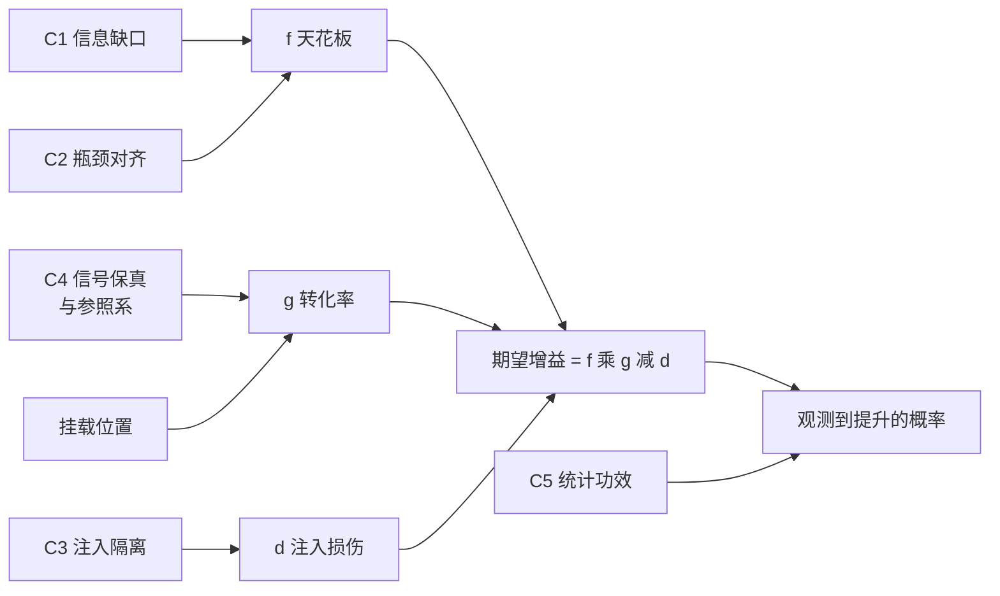
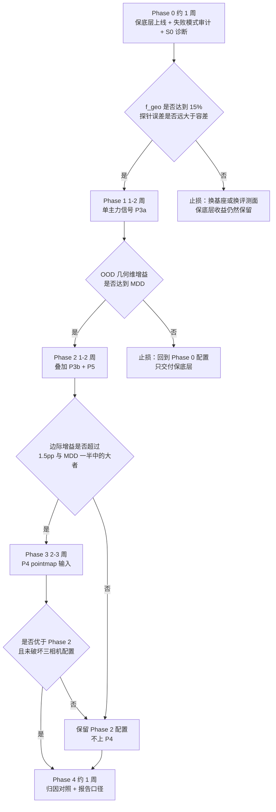
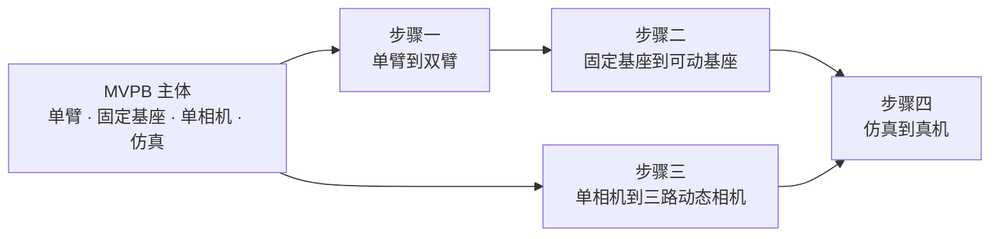

# D4A 方案 1-C-MVPB：几何/4D 命题的收益最大化方案

> **与 [MVPA](./d4a_solutioin_1_c_mvpa.md) 的关系**：MVPA 是**证伪导向**，目标是"得到可信结论"；本文档是**收益导向**，目标是"拿到提升"。两者共用同一批证据、同一套 S0 诊断与统计基础设施，但实验设计在多处相反（§0.2）。
>
> **本文档回答的问题**：在什么前提下，让模型学习几何/4D 知识能**最大概率**地提高成功率？以及据此给出的落地方案。
>
> **不回答**："命题是否成立"（那是 MVPA 的任务）、"能否得到必然性结论"（见 MVPA 相关知识 五，结论是不能）。

## 可靠性标注约定

沿用 MVPA：**[A]** 同行评审或大规模系统实验；**[B]** 预印本或主张方自证；**[C]** 工程事实/仓库实测；**[D]** 本文档的推断，非文献结论。

## 目录

- [0. TL;DR 与目标函数的切换](#0-tldr-与目标函数的切换)
- [1. 形式化：期望增益的三因子分解](#1-形式化期望增益的三因子分解)
- [2. 抬 f：把天花板做高](#2-抬-f把天花板做高)
- [3. 抬 g：把转化率做高](#3-抬-g把转化率做高)
- [4. 压 d：黑名单与白名单](#4-压-d黑名单与白名单)
- [5. 保底层：解析否决权（非学习路径）](#5-保底层解析否决权非学习路径)
- [6. 组合策略：确定下界 + 高上界](#6-组合策略确定下界--高上界)
- [7. 落地方案：五个 Phase](#7-落地方案五个-phase)
- [8. MVPB 特有的实现规格](#8-mvpb-特有的实现规格)
- [9. 度量与判据](#9-度量与判据)
- [10. 第二段：扩到目标本体](#10-第二段扩到目标本体)
- [11. 失败模式与止损](#11-失败模式与止损)
- [12. 与 MVPA / 主方案的关系](#12-与-mvpa--主方案的关系)

---

## 0. TL;DR 与目标函数的切换

### 0.1 一句话结论

**最大概率配置 = 解析否决权保底层（确定性下界）+ 单主力信号 P3a（FK 本体关键点未来 3D 轨迹）+ 严格执行注入黑名单 + 只在 OOD 几何维上评测 + 先用失败模式审计实测天花板。** 这个组合的每一项都不是"最先进"，但每一项都在把 $\mathbb{E}[\Delta] = f\cdot g - d$ 里的某个乘子往有利方向推，且没有一项踩在已知的崩塌记录上。

### 0.2 证伪导向与收益导向在做法上是相反的

这不是措辞差别。同一件事在两个目标下的正确做法经常相反，混用会两头落空：

| 事项 | MVPA（证伪导向） | MVPB（收益导向） |
|---|---|---|
| **变量数** | 单变量，一次只动一处 | 同时拧动所有有利杠杆 |
| **算力预算** | 严格等预算（否则归因不成立） | 不要求等预算，允许几何臂多花 |
| **特权信息** | 必须做差集并对齐（C5 泄漏） | 仿真里能拿的都用满 |
| **对照臂** | A0–A4 五条，是主要成本 | 只在最后一个 Phase 借 A0/A2/A4 三条 |
| **失败的价值** | 负结果本身是产出 | 负结果只是止损信号 |
| **调参** | 两臂等预算调优 | 主力臂充分调优 |
| **评测面** | 几何敏感 + 不敏感双分层（求交互效应） | 只在几何敏感 + OOD 面上（求最大效应） |
| **主终点** | $\Delta_{\text{interaction}}$ | $\Delta$ 绝对值（但仍需过噪声地板） |
| **先做什么** | S0 诊断（判定此路不通） | 保底层 + 失败模式审计（先拿确定收益、再实测天花板） |

**[D] 一条重要的顺序建议**：如果只能做一个，先做 MVPB 的 Phase 0–1。理由是保底层的收益是确定的、不依赖任何训练结果；而 MVPA 的严格对照臂只有在你需要对外声称因果结论（发论文、说服他人）时才是必需的。**拿到提升和证明提升来自几何，是两件可以分开做、且应该按这个顺序做的事。**

### 0.3 五条会直接改变配置的判断

1. **天花板要先测，不能猜。** 基线失败里有多少是几何相关的，这个数（$f$）决定了任何几何方法的上界。仿真里可以用 GT 状态**自动**归因失败原因（§8.1），成本约一天，却能避免在 $f$ 很小的基座上白干几周。
2. **参照系比信号本身更重要。** 同样的几何信息，锚定到相机系在腕部扰动下从 86.1 崩到 5.2 [B]，锚定到机器人基座系在视角随机化下只掉 2.0、末端系只掉 0.3 [B]。**这一项是纯配置选择，零成本，却决定 $g$ 的符号。**
3. **注入位置的方差比信号选择的方差大一个数量级。** 同一份冻结 VGGT 特征，九种融合方式跨度 65 个百分点（3.13 到 68.23，基线 57.81）[B]。所以"压 $d$"这条杠杆的边际收益高于"换更好的几何信号"。
4. **最便宜的信号就是最强的信号。** ELAN4D 的纯 FK 本体监督 78.2%，用仿真真值物体关键点做全场景 4D 监督的**上界**只有 79.3%，高 1.1pp、成本高 240 倍 [B]。收益最大化在这里与成本最小化恰好同向。
5. **保底层是唯一有确定性保证的一层，而且它不需要模型学任何东西。** 解析 swept volume + 自碰撞 + 限位 + IK 可解性的拒绝采样，在仿真中可证明成功率单调不降（§5.2），提升上界等于碰撞类失败占比。它与学习层的失败模式不相关，因此组合起来方差更小。

---

## 1. 形式化：期望增益的三因子分解

### 1.1 分解

把"注入几何后的成功率变化"分解成三个可分别优化的量：

$$
\mathbb{E}[\Delta] \;=\; \underbrace{f}_{\substack{\text{可寻址失败占比}\\ \text{（天花板）}}} \cdot \underbrace{g}_{\substack{\text{转化率}\\ \text{（信号}\to\text{动作）}}} \;-\; \underbrace{d}_{\substack{\text{注入损伤}\\ \text{（下行风险）}}}
$$

$$
P(\text{观测到提升}) \;=\; \underbrace{P(f\cdot g > d)}_{\text{效应真实存在}} \times \underbrace{P(\text{检出} \mid \text{效应存在})}_{\text{统计功效}}
$$

各项定义：

| 量 | 定义 | 取值范围 | 决定它的因素 |
|---|---|---|---|
| $f$ | **全部 rollout 中**，因几何信息缺失而失败的比例 | $[0, 1]$ | 评测面、任务子集、数据规模、骨干、相机数 |
| $g$ | 注入的几何信息被**实际转化**为正确动作的比例 | 可为负 | 信号质量、参照系、挂载位置、目标形式 |
| $d$ | 注入过程对**既有能力**的破坏 | $\geq 0$ | 注入机制、是否碰主干、loss 权重与形式 |

其中 $f$ 可进一步拆成两个可分别测量的因子：

$$
f \;=\; \underbrace{(1 - \mathrm{SR}_0)}_{\text{基线失败率}} \times \underbrace{f_{\text{geo}}}_{\text{失败中几何相关的占比}}
$$

前者从基线评测直接读出，后者由 §8.1 的失败模式审计给出。**这是把一个抽象上界变成一个可以在一天内测出来的数的关键一步。**

**这个分解与上一轮论证的五个必要条件是同构的**（见 MVPA 相关知识 五.九）：



### 1.2 为什么这个分解是可操作的

三个乘子**由不同的决策决定，几乎不耦合**，因此可以分别优化：

- $f$ 由**评测面与基座选型**决定，在训练开始之前就已经锁死，且可以**直接测量**（§8.1 的失败模式审计）。
- $g$ 由**信号与坐标系选择**决定，与 $f$ 无关——同一个信号在不同评测面上 $g$ 大致不变，变的是 $f$。
- $d$ 由**注入机制**决定，与信号内容无关——这正是 3D-Mix 那个实验证明的：固定信息内容、只换融合方式，结果跨度 65pp [B]。

**[D] 由此得到一个反直觉的优先级**：多数人的直觉是先挑"更好的几何信号"（优化 $g$ 的分子），但证据显示 $d$ 的方差最大、$f$ 的上界最硬。**正确的顺序是：先测 $f$ → 再压 $d$ → 最后才调 $g$。**

### 1.3 四个杠杆的收益-成本速查

| 杠杆 | 典型可动幅度（证据） | 成本 | 何时做 |
|---|---|---|---|
| **抬 $f$** | 同一方法 ID +1.55 vs OOD +10.42（3D-Mix [B]）；ID +0.8 vs OOD +14.0（ELAN4D [B]） | 近零（换评测面/任务子集） | **最先** |
| **压 $d$** | 3.13 ↔ 68.23（3D-Mix 九种融合 [B]）；73.2 → 18.6 vs → 82.3（PointACT 换注入点 [B]） | 近零（遵守规则表） | 第二 |
| **抬 $g$** | 真值深度 +7.1 vs 伪标签为负（GeoPredict [A] / DreamVLA [A]）；基座系 34.7 vs 末端系 36.9（See like a Robot [B]） | 低 | 第三 |
| **保功效** | 10 trials 时标准差 4.8，即 8–10pp 波动（Understanding-GFM [B]） | 高（评测吞吐） | 全程 |

### 1.4 一个数值算例：为什么优先级是 f → d → g

**[D] 以下 $g$ / $d$ 的具体数值是为说明量级关系而设的示意值，不是实测**；但它们的相对大小都对齐了 §1.3 表里的真实证据跨度。

设定：OOD 几何维上基线成功率 $\mathrm{SR}_0 = 20\%$（对齐 π0 在 LIBERO-Plus Camera 13.8 / Robot-init 6.0 的量级 [C]），故失败率 0.80。审计得到 $f_{\text{geo}} = 0.30$、$f_{\text{collision}} = 0.20$，于是：

$$
f = 0.80 \times 0.30 = 0.24, \qquad F_{\text{col}} \equiv 0.80 \times 0.20 = 0.16
$$

（$F_{\text{col}}$ 是保底层的提升上界，定义见 §5.3。）

| 配置 | $g$ | $d$ | $\mathbb{E}[\Delta]$ | 对应的真实证据 |
|---|---|---|---|---|
| 几何 token 拼进 VLM 主干 | 0.30 | 0.55 | **−47.8 pp** | PointACT 73.2 → 18.6 [B] |
| 几何锚定到相机系 | 0.20 | 0.30 | **−25.2 pp** | AnyCamVLA 86.1 → 5.2 [B] |
| 白名单注入 + **伪标签**信号 | 0.15 | 0.02 | **+1.6 pp** | DreamVLA 深度单独使用为负 [A] |
| 白名单注入 + **真值**信号（Phase 1） | 0.40 | 0.02 | **+7.6 pp** | ELAN4D 73.6 → 78.2 [B] |
| 上一行 + 保底层（捕获率 0.6） | — | — | **+17.2 pp** | 两层可加，失败模式不相关 |

三条读数：

1. **$d$ 的杠杆最长**。从"踩黑名单"到"守白名单"，同一份信息带来的结果从 −47.8 摆到 +7.6，跨度 55pp。而在守白名单的前提下，把 $g$ 从 0.15 提到 0.40（伪标签换真值，已经是能拿到的最大改善）也只带来 6pp。**所以先压 $d$、再调 $g$。**
2. **$f$ 决定一切的上界**。即使 $g = 1$、$d = 0$，这个设定下的学习层也不会超过 24pp。若审计发现 $f_{\text{geo}}$ 只有 0.10，上界立刻降到 8pp——已经接近评测噪声地板（10 trials 时标准差 4.8 [B]），此时无论怎么调都不可能拿到可确认的结论。**这就是 Phase 0 必须先做审计的量化理由。**
3. **保底层贡献了总量的一半以上**，且它的那一半不依赖任何训练结果。

**⚠️ 算例的边界**：$f_{\text{geo}}$ 与 $f_{\text{collision}}$ 之和小于 1，剩下的是语义类与控制类失败——**这部分几何方法完全够不着**，任何声称"几何注入解决大部分失败"的说法都应该先要求对方出示这张分解表。

---

## 2. 抬 f：把天花板做高

$f$ 是硬上界。**若 $f = 0.1$，即使 $g = 1$ 且 $d = 0$，提升也不会超过 10 个百分点。** 这一节的每一条都是在训练开始之前就能锁定的选择。

### 2.1 评测面：只在几何维上评测

| 选择 | 做 | 不做 | 依据 |
|---|---|---|---|
| 基准 | LIBERO-Plus 的 **Camera / Robot-init / Layout-displacement** 三维 | 原版 LIBERO 四 suite | 原版基线 >95%，99% vs 98% 无信息量 [C]；π0 在几何维上 Camera 13.8 / Robot-init 6.0，余量极大 [C] |
| 排除维 | — | light / background / texture / sensor-noise 四维 | LIBERO-Plus 把它们划为 superficial，几何对它们没有作用机理 |
| 辅助基准 | RoboTwin 2.0（tabletop height / clutter 两轴） | — | 与目标本体同构；tabletop height 是最纯粹的"深度必须对"的轴，2D 捷径无法绕过 |

### 2.2 任务子集：排掉 2D 捷径可解的任务

沿用 MVPA §4.5 的 $G^+$ 划分，但 MVPB **只用 $G^+$**（证伪需要 $G^-$ 做交互对照，收益最大化不需要）：

- **保留**：紧公差插入/装配、堆叠、精确对位、不同高度物体抓取、被遮挡物体、需要 6-DoF 姿态判断的任务。
- **排掉**：固定高度大容差平面 pick-and-place、可被 2D 轨迹记忆解决的任务、LIBERO-Object suite（空指令测试下性能几乎不变，说明学的既不是语言也不是几何 [A]）。

### 2.3 数据规模：低数据档是第二个放大轴

ELAN4D 在 20/40/60/80/100% LIBERO 数据上扫描，**全档位均优于基线，且数据越少差距越大** [B]。

**[D] 建议**：主力实验跑 **40% 数据档**，同时保留 100% 档作为对照。理由是低数据档同时放大 $f$（模型更缺信息）并降低训练成本，但太低（<20%）会让基线本身崩到不可比。

### 2.4 骨干选型：必须实测，不能靠先验

这里有一组**互相矛盾但都可信**的证据，因此不能凭先验决定：

| 证据 | 指向 |
|---|---|
| CVPR 2024 3D-awareness 探针 [A]：冻结 DINOv2 的深度/法向探针接近专用 SOTA；CLIP/MAE 基本不编码深度 | 含 DINOv2 的骨干信息缺口小 → 换纯 CLIP/SigLIP 骨干可抬 $f$ |
| P3d 的 5 骨干消融 [A]：CLIP +3.6、DINOv2 +2.8 是最小的两个增益 | 表面上一致——但它们的**基线也是最高的两个**（0.765 / 0.767），"已懂几何"与"天花板效应"无法从这张表区分 |
| Spatial Forcing 的 DPT 探针 [B]：VLA 微调**之后**的视觉嵌入"不含有意义空间结构" | 缺口可能是微调**制造**出来的，与预训练骨干无关 |
| Understanding-GFM [B]：GR00T-N1.5 视觉编码器深度 RMSE 0.73m，任务容差 0.02m，差 36 倍 | 至少在这个骨干上缺口是真实且巨大的 |

**结论**：骨干选型交给 **S0-2 探针实测**（MVPA §5.1），且必须在 **VLA 微调前后各测一次**。三种可能结果各对应一个不同的行动，其中"微调前接近容差、微调后变差"这一种意味着你要做的不是"注入几何"而是"防止漂移"，主力路线要换成 P3c（表征对齐）。

### 2.5 相机数：这是与目标本体直接冲突的一条

Understanding-GFM §5.4 [B]：**单相机**设置下 Early Fusion 21.5% vs 基线 17.2%（p = 0.030，显著）；**三相机**设置下差异不显著。原因是多视角本身已提供几何信息。

**[D] 对 MVPB 的处置**：Phase 1–3 的主力实验**用单相机**，把效应先做出来；三相机配置作为**必测的第二条件**（不是可选消融），因为目标本体是三相机。两者的差值本身就是一个有价值的产出——它直接量化了"多视角冗余吃掉多少几何收益"，这个数在文献里没有。

**[D] 一条对目标本体有利的对冲**：Understanding-GFM 的三相机大概率是固定相机。你的三路相机**全部在动**，模型无法靠记住固定布局蒙混，信息缺口可能重新打开（这正是主方案 §3.4 论证 ray map 在动态相机下价值放大的同一逻辑）。**这两股力量方向相反，谁占上风只能实测**——用探针在"三路固定"与"三路动态"两种设置下各测一次即可判定。

### 2.6 直接测量 f：失败模式审计

以上五条都是在**间接**抬 $f$。MVPB 相对 MVPA 的独立动作是**直接测出 $f$**：跑基线、对每一条失败轨迹自动归因、统计几何相关失败的占比。

实现方法见 §8.1。**这一步是整个方案里投入产出比最高的一件事**：约一天成本，却决定后面几周该不该投。

---

## 3. 抬 g：把转化率做高

### 3.1 信号优先级：按"误差量级"而不是"信息丰富度"排序

| 优先级 | 信号 | 误差特性 | 证据 |
|---|---|---|---|
| **1** | FK 本体关键点未来 3D 轨迹 | **零误差**（解析，URDF + 关节角） | ELAN4D 73.6 → 78.2；LIBERO-Plus +14.0；全场景真值上界只高 1.1pp [B] |
| **2** | 仿真真值深度（未来深度回归） | **零误差**（渲染器直出） | GeoPredict 深度单独 +7.1 [A] |
| **3** | 仿真真值物体轨迹/分割 | 零误差但边际信息量小 | ELAN4D 上界实验：+1.1pp / 240× 成本 [B] |
| **4** | 伪标签深度/光流/点轨迹 | 有噪声 | DreamVLA：深度单独使用**降低**性能 [A] |

**关键判断**：GeoPredict 的 +7.1 与 DreamVLA 的负收益是**同一模态、相反符号**，最可能的解释就是真值 vs 伪标签的差别 [D]。**在仿真阶段这意味着 $g$ 可以做到接近上限；也意味着仿真里得到的 $g$ 系统性高估真机的 $g$**（这一点在 §10.4 的迁移步骤里必须重新测）。

**明确不做的信号**（性价比为负）：
- RGB 颜色重建：GeoPredict Table 4，带颜色 49.2 vs 只深度 49.4 [A]，**零收益**。
- 稠密 4D 生成 / 4D 高斯 / 4D 占据：训练时间 +30–60%，与快速拿收益直接冲突。
- 全场景点轨迹伪标签流水线：约 4 GPU-小时/小时数据，换 1.1pp 上界 [B]。

### 3.2 参照系：零成本、决定 $g$ 符号的一条

| 参照系 | 视角随机化下的掉幅 | 判定 |
|---|---|---|
| 相机系（隐式锚定） | GeoAwareVLA 从 86.1 崩到 **5.2** [B] | **禁止** |
| 纯 RGB（无几何） | −9.6 [B] | 基线 |
| 机器人基座系 pointmap | **−2.0** [B] | **主路** |
| 末端执行器系 pointmap | **−0.3** [B] | **腕部相机专用** |

绝对分数上，基座系 pointmap 34.7 vs 末端居中 36.9（+2.2）[B]。**腕部相机的 pointmap 天然就是末端中心的**，这项加固是免费的。

### 3.3 挂载位置：挂 action expert，不碰 VLM

| 挂载点 | 结果 | 来源 |
|---|---|---|
| VLM 主干（3D token 拼入） | RLBench 73.2 → **18.6** | PointACT [B] |
| VLM 主干（4D track query） | LIBERO-Plus 73.6 → **66.8**，CKA 观察到表征漂移 | ELAN4D [B] |
| VLM 主干（同时微调 LLM） | RoboCasa 68.3 → **31.2**（p<0.001） | Understanding-GFM [B] |
| **action expert / 控制分支** | **78.2**（ELAN4D）；**82.3**（PointACT 改注入点后，仅 300M 打败 3B） | [B] |

机制解释来自 Knowledge Insulation [A]：随机初始化的动作头/辅助头的梯度会破坏预训练主干的训练动力学。

### 3.4 目标形式：预测未来 > 重建当下，但差距没有想象的大

| 目标 | 结果 | 来源 |
|---|---|---|
| 无重建 | 0.48 / 0.60 | UWM [B] |
| 重建**当前** | 0.70 / 0.66 | UWM [B] |
| 预测**未来** | **0.86 / 0.76** | UWM [B] |
| 交叉印证：Auxiliary（重建当前）4.14 vs Prediction（预测未来）4.44，vanilla 3.64 | 未来只多贡献 38% | DreamVLA [A] |

**[D] 含义**：选"未来"是对的，但要知道其中约六成的收益来自一个**不含时间信息**的普通重建正则。这直接影响你对"4D 的价值"的预期校准——不要把 $g$ 的全部归给"4D"。

### 3.5 叠加顺序与停止规则

GeoPredict 的逐项累加消融 [A]：$42.3 \to 44.8 \to 47.2 \to 49.4 \to 50.5 \to 52.4$。**累加有效，但边际明显递减**（前三步各 +2.5/+2.4/+2.2，后两步 +1.1/+1.9）。

**MVPB 的停止规则**：

$$
\text{继续叠加} \iff \Delta_{\text{marginal}} > \max\left(1.5\ \text{pp},\ \tfrac{1}{2}\,\text{MDD}\right)
$$

其中 MDD 按 MVPA §8.4 的公式算。**理由**：低于这个阈值的边际收益无法与噪声区分，继续叠加只会增加 $d$ 的累积风险与工程复杂度，却拿不到可确认的收益。

---

## 4. 压 d：黑名单与白名单

这一节可以直接当作代码评审检查表使用。**每一条黑名单都有实证崩塌记录，不是理论担忧。**

### 4.1 黑名单：有崩塌记录的做法

| 禁止事项 | 崩塌记录 | 来源 |
|---|---|---|
| 3D/几何 token 拼进 VLM 主干输入 | RLBench 73.2 → 18.6 | PointACT [B] |
| 辅助头挂 VLM、梯度进主干 | LIBERO-Plus 73.6 → 66.8 | ELAN4D [B] |
| 做表征对齐的同时微调 LLM | RoboCasa 68.3 → 31.2（p<0.001） | Understanding-GFM [B] |
| 深度在通道维直接拼进预训练编码器 | "在所有设置下普遍降低性能" | Point Cloud Matters [A]；KYC 明确警告会破坏预训练输入分布 [A] |
| 另开一路点云编码器分支 | 点云 + MLP 分支 24.2，比纯 RGB 还低 3.7 | See like a Robot [B] |
| 几何表征锚定到相机系 | 腕部扰动下 86.1 → 5.2 | AnyCamVLA [B] |
| 伪标签深度作为单独监督信号 | 单独使用降低性能 | DreamVLA [A] |
| 用梯度余弦相似度做动态权重手术 | 负迁移与梯度冲突不相关，可能是错方向 | ForkMerge [A] |

**⚠️ 一条会让你误以为自己没踩雷的观察**：PointACT 的同一张表里，那份让 RLBench 从 73.2 崩到 18.6 的点云注入，在 **LIBERO-Spatial 上是 91.8 → 94.0，是上升的** [B]。**也就是说，黑名单上的错误在 LIBERO 类基准上可能表现为轻微正收益。** 这条对 MVPB 的直接含义是：**不要用"在 LIBERO 上没掉分"作为架构合规的证据**——合规靠的是遵守规则表，不是靠事后测出来。这也是 §2.1 坚持只在 LIBERO-Plus 几何维评测的又一个理由。

### 4.2 白名单：有正面记录的做法

| 必须做 | 依据 |
|---|---|
| 辅助头挂 action expert / 控制分支 | ELAN4D 78.2 [B]、PointACT 82.3 [B] |
| 辅助分支输入处加 stop-gradient | ELAN4D [B]、Knowledge Insulation [A] |
| 融合投影**零初始化** | Understanding-GFM 实测：无 gate 时 5–27%，近零初始化 gate 时 64–89% [B] |
| token 融合用**逐元素相加**，不用 concat | 34.7（相加）vs 30.7（concat）[B] |
| $\lambda$ 取小值并固定（0.1） | ELAN4D 与 GeoPredict 独立采用同一配置 [A][B] |
| raymap 用小 CNN 编码后相加，不直接拼通道 | KYC [A] |
| 训练时开 random cropping 增强 | KYC 明确：缺了它相机条件的收益会打折 [A] |
| 动作空间用 delta end-effector pose | KYC [A] |
| 推理时丢掉辅助 decoder | ELAN4D / GeoPredict 均如此，推理零开销 [A][B] |

### 4.3 一条容易被忽略的 d：训练时间与收敛速度

Spatial Forcing 报告 **3.8× 更快收敛** [B]。这在收益导向下是**好事**（同样墙钟时间跑得更远），但在报告时必须写清口径——否则你自己会误判"上限提高了"，而实际只是"跑得更靠前"。**两臂都训到平台再比较，同时记录"等步数"与"等算力"两个口径。**

---

## 5. 保底层：解析否决权（非学习路径）

> **⚠️ 定位声明**：这一层的机制是**用几何否决模型**，不是"让模型学几何"。它严格来说不在原命题的范围内，但它是唯一能给出**确定性下界**的构型，且与学习层的失败模式不相关，因此纳入本方案作为保底层。做学术表述时必须与学习层的贡献分开报告。

### 5.1 形式化

设动作专家采样出候选块 $A = \{a_1, \dots, a_N\}$（best-of-N），解析检查 $c: A \to \{0, 1\}$（1 = 通过），$A_{\text{safe}} = \{a \in A : c(a) = 1\}$。若：

- **(P1) 检查是成功的必要条件**：$c(a) = 0 \Rightarrow a$ 必然失败；
- **(P2) 非空或有回退**：$A_{\text{safe}} \neq \varnothing$，为空时回退到原策略的选择；

则

$$
P\big(\text{成功} \mid a \sim \text{select}(A_{\text{safe}})\big) \;\geq\; P\big(\text{成功} \mid a \sim \text{select}(A)\big)
$$

**严格大于**当且仅当原策略以正概率选中 $c(a) = 0$ 的动作。

**证明草图**：由 P1，被删除的子集 $A \setminus A_{\text{safe}}$ 中每个元素的成功概率均为 0。从候选集中删除一个成功概率恒为 0 的子集，不会降低"按打分选择"的期望成功率；由 P2，删除后仍有可选元素。∎

**这是演绎结论，不依赖任何训练结果、不依赖模型是否"学到"几何。**

### 5.2 各项检查的 P1 成立强度

| 检查 | P1 是否严格成立 | 依赖的信息（对照 [a4d_inpinf_1.md](./a4d_inpinf_1.md) 分类） |
|---|---|---|
| 自碰撞（胶囊体最近距离 < 阈值） | **严格** | 3a 解析：URDF + 关节角，两端零误差 |
| 关节 / 速度限位 | **严格** | 直接可得 + 常量比较 |
| IK 可解性 | **严格** | 3a 解析 |
| 闭链一致性（双手抓同一刚体时相对位姿恒定） | **严格**（双臂阶段启用） | 3a 解析，纯运动学，不需要力控 |
| 环境碰撞（swept volume ∩ 场景占据） | **取决于占据来源** | swept volume 是 3a 解析；**场景占据在仿真是真值（问题一），真机是状态估计（有漂移）** |

**由此得到一个干净的结论**：

- **在仿真中，P1 对全部五项严格成立**，"成功率单调不降"是一个定理。
- **在真机中**，占据估计会产生假障碍（假阳性拒绝），P1 对最后一项破坏，保证退化为"高概率不降低"。缓解手段是把占据的膨胀半径调小 + 保留 P2 回退。

### 5.3 提升幅度的上界

设总失败中碰撞 / 自碰撞 / 不可达类的占比为 $f_{\text{collision}}$，沿用 §1.1 的记法把它换算到全 rollout 尺度：

$$
0 \;\leq\; \Delta_{\text{gate}} \;\leq\; F_{\text{col}} \;\equiv\; (1 - \mathrm{SR}_0)\cdot f_{\text{collision}}
$$

**这一层消除的是一类硬失败，不会让模型在"抓偏 2 厘米"这类失败上变好。** $f_{\text{collision}}$ 的实测值来自 §8.1 的失败模式审计——这也是审计必须先做的第二个理由。

**上界之所以是上界而非等号**，有两个折损来源：候选集里可能**全部** $N$ 个动作都被否决（触发 P2 回退，该次失败保留）；以及碰撞发生在门控无法预见的时刻（如物体被推动后的二次碰撞）。**实测的"捕获率" $\Delta_{\text{gate}} / F_{\text{col}}$ 应当记录下来**，它是判断 $N$ 是否需要调大的直接依据。

### 5.4 成本

动作块本来就要预测，FK 本来就要算（MVPA §9.2 的解析 4D 通路已经产出全部所需量）。**边际成本 = 一次体素化并集 + N 次几何查询**，主方案 §6.5 估算约 20 ms / N 个候选，纯几何无学习开销。

---

## 6. 组合策略：确定下界 + 高上界

### 6.1 两层的期望收益

$$
\mathbb{E}[\Delta_{\text{total}}] \;\approx\; \underbrace{\Delta_{\text{gate}}}_{\in\, [0,\ F_{\text{col}}],\ \text{确定非负}} \;+\; \underbrace{f \cdot g - d}_{\text{概率性，可正可负}}
$$

两项的量纲一致（均为全 rollout 尺度的百分点），因此可以直接相加；两个上界 $F_{\text{col}}$ 与 $f$ 也来自同一次审计的互斥类别，不会重复计数。

### 6.2 为什么组合优于任一单层

| 性质 | 保底层 | 学习层 | 组合 |
|---|---|---|---|
| 下界 | **$\geq 0$（仿真中可证）** | 可为负 | $\geq 0$ |
| 上界 | $F_{\text{col}}$（较小） | $f$（较大） | 两者之和 |
| 失败模式 | 场景占据估计错误 | 注入损伤 / 信号无效 | **不相关** |
| 依赖训练 | 否 | 是 | 部分 |
| 可独立验证 | 是（冻结策略上直接测） | 是 | 是 |

**失败模式不相关这一点是组合的核心价值**：保底层失效（占据估计差）不会带走学习层的收益，学习层失效（注入无效）不会带走保底层的收益。因此组合的方差小于任一单层，而这在"评测噪声地板 8–10pp"的环境里比期望值本身更重要。

### 6.3 两层的独立验证方式

- **保底层**：在**完全冻结**的基线策略上开/关门控，配对比较。不需要训练，一天内可完成，且结论不受任何训练随机性影响。
- **学习层**：常规 A/B，但基线必须是**已开启保底层**的版本——否则学习层的收益会被保底层已经吃掉的那部分污染（这是一个容易踩的归因坑）。

---

## 7. 落地方案：五个 Phase



### Phase 0：先拿确定收益，再实测天花板（约 1 周）

| 项 | 内容 |
|---|---|
| **输入** | 复现到文献 ±1pp 的基线 checkpoint（必查 MVPA §4.7 五项）；冻结的评测配置 |
| **动作** | ① 实现保底层（FK + swept volume + 自碰撞 + 限位 + IK，best-of-N=16，带 P2 回退）并在**冻结策略**上开关对照；② 失败模式审计（§8.1），产出 $f_{\text{geo}}$ 与 $f_{\text{collision}}$；③ S0 四项诊断（MVPA §5.1）：基线余量、微调前后双探针、几何破坏测试、GT 状态 proxy |
| **产出** | 保底层的确定性增益实测值；$f$ 的分解表；骨干选型决策；一份冻结的评测协议 |
| **Go 判据** | $f_{\text{geo}} \geq 15\%$ **且** 探针误差远大于任务容差（参考 GR00T-N1.5 的 36 倍 [B]） |
| **回退** | $f_{\text{geo}} < 15\%$ → 换更强的 OOD 面或换任务子集重测；仍不达标 → 只交付保底层，命题在此基座上没有可观测空间 |
| **时间** | 保底层 2–3 天（含并行评测打通）；审计 1 天；S0 1–2 天 |

> **[D] 为什么把保底层放在最前面**：它的收益不依赖后续任何一步，先做等于先把下界锁住。而且它产出的解析 4D 通路（MVPA §9.2）是 Phase 1 的 P3a 的**直接前置**——FK 关键点轨迹就是同一条通路的副产品，两者共用代码。

### Phase 1：单主力信号（1–2 周）

| 项 | 内容 |
|---|---|
| **输入** | Phase 0 的配置 + 保底层已开启的基线 |
| **动作** | 只上 **P3a**（FK 本体关键点未来 3D 轨迹）。规格严格照 MVPA §6.3：挂 action expert、stop-grad、零初始化投影、$\lambda = 0.1$、L1、$K=8$、$H$ 与 action horizon 对齐、推理丢弃 decoder |
| **产出** | 单相机与三相机两种配置下的 $\Delta$；学习曲线；辅助 loss 与梯度范数记录（Phase 4 要用） |
| **Go 判据** | 单相机配置下 OOD 几何维的 $\Delta \geq$ MDD（按 MVPA §8.4 计算，3 种子 × 200 rollout 下约 5–8pp） |
| **回退** | 无信号 → 先检查是否踩了 §4.1 黑名单；确认无误后只交付保底层 |
| **为什么只上一个信号** | 一次上多个会让"哪个在起作用"不可分，而 Phase 2 的叠加规则需要一个干净的单信号基准点 |

### Phase 2：按边际规则叠加（1–2 周）

| 项 | 内容 |
|---|---|
| **动作** | 按顺序叠加：① **P3b** 未来深度回归（仿真真值、DPT-lite、不带颜色、不上 3DGS）；② **P5** 输出级 SO(2) 对称正则（约 30 行）。每加一项评测一次 |
| **顺带的零成本对照** | P3b 上线时同时跑一次 **GT 深度 vs Depth-Anything-V2 伪标签深度**——这个对照直接检验文献中 GeoPredict 与 DreamVLA 的公开矛盾，成本几乎为零，且是 Phase 4 迁移评估的必需输入 |
| **停止规则** | $\Delta_{\text{marginal}} \leq \max(1.5\text{pp},\ \frac{1}{2}\text{MDD})$ 即停，不再叠加 |
| **Go 判据** | 至少一项叠加通过停止规则的阈值 |
| **回退** | 两项都不过阈 → 保留 Phase 1 配置，直接进 Phase 4 |

### Phase 3：P4 pointmap 输入（2–3 周，可选）

| 项 | 内容 |
|---|---|
| **为什么放最后** | 上限最高（See like a Robot 在 π0.5 上 55.3 → 62.9 [B]）但**最脆**：它是黑名单条目最集中的一族，且它**改变部署形态**（推理时需要几何输入，前面三个 Phase 都是推理零改动） |
| **动作** | 基座系 pointmap 第二视觉塔（RGB 塔结构复制、RGB 权重初始化、逐元素相加），腕部相机加末端居中变体；仿真里从 GT depth + 外参解析算出 pointmap，不跑 DUSt3R/VGGT（顺带绕开 CC BY-NC-SA 许可证问题） |
| **必做的内部对照** | 参数量对照塔：把第二塔输入换成第二份 RGB 图像（MVPA §6.7）。**没有它，正收益无法排除"多了一个编码器"** |
| **Go 判据** | 优于 Phase 2 配置 ≥ MDD，**且**在三相机配置下不劣化（因为目标本体是三相机） |
| **回退** | 保留 Phase 2 配置。**注意 P4 失败不影响前面的成果**——这是把它放最后的另一个理由 |

### Phase 4：归因与报告口径（约 1 周）

收益导向不需要 MVPA 的五条对照臂，但**有三条必须借**，否则你自己也不知道拿到的是什么：

| 臂 | 作用 | 不做的后果 |
|---|---|---|
| **A0** 等预算调优的基线 | 锚点 | 无法排除"基线没调好" |
| **A2** 信息破坏对照（同参数量/同 token 数/同 loss 量级，几何内容摧毁） | 排除容量与正则化效应 | 随机辅助任务也涨点 [A]，不做这条则结论无解释力 |
| **A4** 基线 + 等预算通用正则（dropout / 强增广 / 半学习率） | 排除"一行 optimizer 配置就能复现" | Seed lottery [B] 显示半学习率这一条就足以改变 LIBERO 结果分布 |

**A2 的构造要点**（MVPA §7.2）：P3 路线用随机初始化的同架构教师或打乱目标特征；**必须核对 loss 量级与梯度范数与主力臂同阶**，否则 A2 退化成"什么都没做"。

**报告口径**：保底层增益与学习层增益**分开报告**，不合并成一个数。合并会让读者（包括未来的你）无法判断哪一层在起作用。

### 总成本

| Phase | 训练轮次 | 评测 rollout | 挂钟时间 |
|---|---|---|---|
| Phase 0 | **0** | ~3,000（含保底层开关对照与审计） | 约 1 周 |
| Phase 1 | 3 种子 × 2 相机配置 = 6 轮 | ~7,200 | 1–2 周 |
| Phase 2 | 2 变体 × 3 种子 × 2 配置 = 12 轮 | ~14,400 | 1–2 周 |
| Phase 3 | 3 变体（含对照塔）× 3 种子 = 9 轮 | ~10,800 | 2–3 周 |
| Phase 4 | 3 臂 × 5 种子 = 15 轮 | ~18,000 | 约 1 周 |

**[D] 瓶颈是评测吞吐，不是训练。** vla-eval [B] 实测 LIBERO 类环境 2000 episodes 从 14 小时压到 18 分钟（1×H100，K=50 分片 + batch 16，47× 加速）。**Phase 0 必须包含"把并行评测跑通"这一项**，否则后面每个 Phase 都会被评测卡住。

---

## 8. MVPB 特有的实现规格

其余路线的规格全部复用 MVPA §6，不重复。这一节只写 MVPB 新增的三件事。

### 8.1 失败模式审计：用仿真 GT 自动归因

**核心思路**：仿真里能直接读到物体位姿、末端位姿、接触事件、分割掩膜的真值（[a4d_inpinf_1.md](./a4d_inpinf_1.md) 分类中的"问题一：仅仿真可得 GT"），因此**不需要人工看视频**就能对失败自动归因。

**归因分类法**（六类，互斥且穷尽）：

| 类别 | 判定规则（全部基于仿真 GT） | 计入 |
|---|---|---|
| **F-geo-depth** | 抓取时刻末端与目标物中心的**沿视线方向**误差 > 容差，横向误差正常 | $f_{\text{geo}}$ |
| **F-geo-pose** | 位置误差在容差内，但末端**姿态**与目标抓取姿态夹角 > 阈值（如 15°） | $f_{\text{geo}}$ |
| **F-geo-occ** | 目标物体在整个 episode 中从未进入任何相机视锥，或被遮挡比例 > 80% | $f_{\text{geo}}$ |
| **F-collision** | 出现非目标接触事件：自碰撞、撞到障碍、撞翻非目标物体、超限位 | $f_{\text{collision}}$ |
| **F-semantic** | 末端稳定接近/抓取了**非指令目标**的物体 | 语义类，几何无关 |
| **F-control** | 接触已建立但物体滑脱（接触后物体位姿回落）、抖动、超时未完成 | 控制类，几何无关 |

**产出**：

$$
f_{\text{geo}} = \frac{N_{\text{geo-depth}} + N_{\text{geo-pose}} + N_{\text{geo-occ}}}{N_{\text{fail}}}, \qquad f_{\text{collision}} = \frac{N_{\text{collision}}}{N_{\text{fail}}}
$$

**实现规模**：[D] 估约 150–300 行，依赖已有的仿真 GT 接口（RoboTwin 的 `actor.get_pose()` / `contact_point`，或 robosuite 的物体状态）。

**⚠️ 两个坑**：
- 判定顺序有讲究。碰撞与几何误差常同时出现，规则应按 **F-semantic → F-collision → F-geo-* → F-control** 的顺序判定，先判"抓错了什么"再判"怎么抓错的"。
- 容差阈值必须与任务一致（抓取约 2cm、姿态约 10–15°，参考 MVPA §5.1 的任务容差表），阈值取错会让分类结果完全变形。

### 8.2 保底层：拒绝采样与回退逻辑

```
输入: 动作专家采样的 N 个候选块 {a_1..a_N} 与其打分 {s_1..s_N}
1. 对每个候选 a_i:
     q_traj = a_i 的未来 H 步关节角
     FK(q_traj) -> 全身连杆 SE(3) 序列
     c_self  = 自碰撞检查（胶囊体最近距离 > margin_self）
     c_limit = 关节/速度限位检查
     c_ik    = IK 可解性（若动作是末端位姿形式）
     c_env   = swept_volume(q_traj) ∩ occupancy == 空（膨胀半径 margin_env）
     c_i = c_self AND c_limit AND c_ik AND c_env
2. A_safe = {a_i : c_i = 1}
3. 若 A_safe 非空: 返回 argmax_{a_i ∈ A_safe} s_i
   否则:           返回 argmax_i s_i        # P2 回退，绝不空手
4. 记录: 每步的拒绝率、各检查项的触发次数、回退次数
```

**参数建议**：$N = 16$（主方案 §5.5.2 论证 best-of-N 优于完整 MPC，宽度型扩展在并行下墙钟时间几乎不变）；$\text{margin}_{\text{self}}$ 取 1–2 cm；$\text{margin}_{\text{env}}$ 在仿真里可取 0（占据是真值），真机需按占据误差调大。

**必须记录第 4 步的统计量**：若回退率很高（如 > 20%），说明 margin 设得过严，正在系统性误杀好动作——这时 P1 已经被破坏，保证不再成立。

### 8.3 叠加阈值的实现

每次叠加后，按 MVPA §8.4 用当前的种子数与 rollout 数算出 MDD，与实测边际增益比较。**阈值必须在看到结果之前算好并记录**，否则会退化成"看到多少算多少"的事后合理化。

---

## 9. 度量与判据

### 9.1 统计配置

| 项 | 配置 | 依据 |
|---|---|---|
| 分析单元 | **训练运行（种子）**，不是 rollout | MVPA §8.1 |
| 种子数 | Phase 1–3 用 3 种子；Phase 4 的 A0/主力臂用 5 种子 | 成本与 MDD 的折中 |
| 每种子每维 rollout | ≥ 200 | 单臂 ±5pp Wilson CI 需 N≈380 [B]，200 是配对检验下的折中 |
| 聚合统计量 | **IQM + 分层 bootstrap CI**，不用均值/中位数点估计 | rliable [A] |
| 配对检验 | McNemar（配对二元数据），共用初始状态序列 | Understanding-GFM [B] |
| GPU 一致性 | A/B 必须同型号 GPU、同 docker 镜像、同 seed 列表 | OpenVLA 作者明说换 GPU 型号分数会变 [C] |

### 9.2 离线代理：把迭代周期从天压到分钟

用 P3d 的 GT 状态回归 proxy score 做**预筛**：冻结骨干 + 轻量 state prediction head，回归仿真器完整 GT 状态，归一化聚合成分数。相关性 [A]：SimplerEnv r = 0.871 / MMRV = 0.023，四环境平均 r = 0.753，**比需要完整策略训练的特权基线还高**。

**⚠️ 使用边界**：只用于筛掉明显不 work 的变体，**不能用于宣称结论**。进入报告的数字必须来自实际 rollout。

### 9.3 换指标可以省一半以上评测量

二值成功率是信息效率最低的指标。三个替代：

| 替代 | 节省幅度 | 来源 |
|---|---|---|
| **time-to-success CDF + KS 检验** | 约 **25–45 rollout/格**，对比 McNemar 检出 5pp 需 600–1500 配对 rollout | PhAIL [B] |
| **anytime-valid / SAVI 序贯检验** | 合法地提前停止，省 **25–70%** 评测量 | Snyder et al. / N-SCORE [B] |
| **任务进度分数** | 细粒度进度比二值成功更快分离策略 | [B] |

**[D] 建议**：Phase 1–3 的迭代用 time-to-success CDF 做快速判定并配序贯停止，Phase 4 的最终报告仍用二值成功率（文献可比性在这里）。**⚠️ 序贯检验必须预先声明停止规则**，否则就退化成 p-hacking。

---

## 10. 第二段：扩到目标本体

主体方案落在"单臂 / 固定基座 / 仿真"上。本节给出四步扩展路径，每步标明**前提、变化的量、风险、以及不满足就别走的红线**。



**步骤三与步骤一、二相互独立**（前者只改感知侧，后两者只改本体侧），可以并行推进；步骤四必须最后做，因为它同时改变保底层与学习层的前提。

### 10.1 步骤一：单臂 → 双臂

| 项 | 内容 |
|---|---|
| **前提** | 主体方案至少通过 Phase 1（P3a 有信号） |
| **变化的量** | $f_{\text{collision}}$ **上升**——双臂本体的自碰撞是全新的失败来源，而示教数据里几乎没有自碰撞正样本；$f_{\text{geo}}$ 大致不变 |
| **需要新增** | ① 保底层加入**闭链一致性检查**（双手抓同一刚体时 $T^{\text{ee,L}\leftarrow\text{ee,R}}$ 恒定，纯运动学，不需要力控）；② P3a 的关键点数 $K$ 从 8 改到 14；③ 动作头改为共享+残差结构（主方案 §4.1.2 的 SAE + LAC + 三个辅助损失，**必须整套一起用**，只抄 SAE 会从 63% 掉到 57% [B]） |
| **风险** | 采集规范陷阱：不要为了"看起来更协同"而要求两手同时动。Co-Motion 悖论——并发式演示让 π0 从 76% 掉到 50%、Co-VLA 从 82% 掉到 56%（主方案 §7.3） |
| **红线** | 若保底层的自碰撞检查在双臂下拒绝率 > 30%，说明动作专家本身在大量输出自碰撞动作，应先修动作头再谈几何 |

### 10.2 步骤二：固定基座 → 可动基座

| 项 | 内容 |
|---|---|
| **前提** | 步骤一完成；有可靠的基座运动学模型 |
| **变化的量** | 保底层的 P1 **退化**：swept volume 需要对基座命令做运动学积分，轮式打滑会引入误差；场景占据从"基座系静态"变成"需要里程计维护" |
| **需要新增** | ① 基座运动学积分（主方案 §4.3）；② 4D 表达拆成 ego 支（解析）与 scene 支（学习），scene 支的参照系固定在**动作块起点的基座帧**，避免基座运动被建模两遍 |
| **风险** | 里程计漂移使持久空间记忆错位，进而使环境碰撞检查产生假阳性 |
| **红线** | 若里程计在单个 episode 尺度内的漂移 > 环境碰撞的 margin，环境碰撞检查必须关闭（只保留自碰撞/限位/IK 这三项 P1 严格成立的检查） |

### 10.3 步骤三：单相机 → 三路动态相机

这一步是**唯一方向不确定**的一步，必须实测：

| 方向 | 机制 | 证据 |
|---|---|---|
| **压低 $f$** | 多视角本身提供几何，信息缺口关闭 | Understanding-GFM：单相机 p=0.030 显著，三相机不显著 [B] |
| **抬高 $f$** | 三路相机全部在动，模型无法靠记住固定布局蒙混，每帧都要重新推断空间关系 | 主方案 §3.4 论证 ray map 在动态相机下价值放大的同一逻辑 [D] |

**测法**：用 S0-2 的线性探针，在"三路固定"与"三路动态"两种设置下各测一次深度/位姿的可解码性。**探针误差在动态设置下显著变大 = 第二种力量占上风**，几何注入在目标本体上仍有空间。

**若第一种力量占上风**（三路动态下探针误差仍小于容差），则目标本体不适合走几何注入路线，应把资源转向保底层与数据增广（LIBERO-Plus 用 2 万条增强轨迹拿到 92.8% 相机鲁棒性，比亚军高 37.2pp [A]，这是几何路线必须打赢的对照）。

### 10.4 步骤四：仿真 → 真机

| 组件 | 迁移损耗 | 说明 |
|---|---|---|
| **保底层的自碰撞/限位/IK/闭链** | **近零** | 全部是 3a 解析量，只依赖 URDF 与关节角编码器，两端零误差（[a4d_inpinf_1.md](./a4d_inpinf_1.md)） |
| **保底层的环境碰撞** | **大** | 场景占据从真值降为 TSDF 融合估计，P1 破坏，需调大 margin 并接受假阳性 |
| **P3a FK 关键点监督** | **近零** | 同样是解析量，真机上标签成本仍 < 1 CPU-分钟/小时数据 [B] |
| **P3b 深度监督** | **大** | 真值深度 → RGB-D 硬件（有噪声）或伪标签（DreamVLA 证明单独使用会掉分） |
| **P4 pointmap 输入** | **大** | 同上，且叠加标定误差 |

**必须先跑的评估**：MVPA §5.3 的第三层分层——把仿真深度做退化（高斯 + 乘性噪声、量化、随机空洞、边缘飞点、外参扰动 1–3°/5–10mm、时间抖动），画出增益随退化程度的衰减曲线。

**红线**：**若增益在轻度退化下就消失，不要做真机迁移的深度相关部分**，只迁移解析部分（保底层 + P3a）。这就是 MVPA §5.3 列为 F12 的失败模式，这里再次强调是因为它是整个迁移里最容易被乐观情绪跳过的一步。

---

## 11. 失败模式与止损

### 11.1 每个 Phase 的失败信号与动作

| Phase | 失败信号 | 最可能的原因 | 动作 |
|---|---|---|---|
| 0 | $f_{\text{geo}} < 15\%$ | 评测面选错，或任务被 2D 捷径覆盖 | 换更强 OOD 面 / 换任务子集；仍不达标则只交付保底层 |
| 0 | 探针误差已优于容差 | 骨干已隐式懂几何（C1 缺口关闭） | 换纯 CLIP-SigLIP 骨干 / 换单相机 / 换更强 OOD |
| 0 | 保底层拒绝率 > 20% 或回退率高 | margin 过严，P1 被破坏 | 调小 margin；重新验证单调不降 |
| 1 | P3a 无信号 | 踩了黑名单 / $\lambda$ 过大 / 挂载点错 | 逐条核对 §4.1；确认后止损 |
| 1 | 训练不稳定、loss 震荡 | 未加 stop-grad 或投影未零初始化 | 核对 §4.2 白名单 |
| 2 | 叠加后反而下降 | 多目标干扰；注意梯度手术不是解法 [A] | 回退到单信号，按 §3.5 停止规则执行 |
| 3 | P4 在三相机下劣化 | 多视角冗余 + 第二塔的容量代价 | 保留 Phase 2 配置，不上 P4 |
| 4 | A2 追平主力臂 | 增益与几何内容无关 | 结论改写为"aux loss 的正则化收益"，不可声称几何 |
| 4 | A4 追平主力臂 | 基线没调好 | 一行 optimizer 配置就能复现，几何路线的价值被推翻 |

### 11.2 三条会让结论被误读的风险

| 风险 | 表现 | 处置 |
|---|---|---|
| **两层收益混淆** | 把保底层与学习层的增益合并成一个数 | 分开报告，且学习层的基线必须是"已开保底层"的版本 |
| **收敛速度当成上限** | 固定步数处评测，把"跑得靠前"读成"上限更高" | 两臂都训到平台；报告等步数与等算力两个口径 [B] |
| **仿真增益外推到真机** | 仿真深度是完美深度，系统性高估 | 退化深度分层为**必测**，不是可选消融 |

### 11.3 一条元风险

**收益导向允许同时拧动所有杠杆，这意味着最终配置里哪一项在起作用是不可分的。** 这在工程上完全可以接受（你要的是提升），但一旦需要对外声称"几何有用"，就必须补 Phase 4 的对照臂，甚至回到 MVPA 的完整设计。**在 Phase 0 就想清楚你要的是哪一种产出**——这个决定影响是否需要预登记、是否需要保留全部中间 checkpoint 与日志。

---

## 12. 与 MVPA / 主方案的关系

### 12.1 共用组件

| 组件 | 出处 | MVPB 中的用法 |
|---|---|---|
| S0 四项零训练诊断 | MVPA §5.1 | 完整复用，作为 Phase 0 的一部分 |
| 各路线最小实现规格 | MVPA §6 | 完整复用，不重复描述 |
| 对照臂 A0/A2/A4 | MVPA §7.2 | 只在 Phase 4 借三条 |
| 统计方案（Wilson / MDD / IQM） | MVPA §8 | 完整复用 |
| 解析 4D 通路（FK → 网格 → swept volume → 渲染） | MVPA §9.2 | 保底层的技术内核就是它 |
| 信息来源三分类 | [a4d_inpinf_1.md](./a4d_inpinf_1.md) | 用于判定保底层各检查的 P1 强度与迁移损耗 |
| 全身 4D 解析捷径、swept volume、双臂动作头 | [主方案](./d4a_solutioin_1_c.md) §4.1–4.3 | 扩展到双臂/移动基座时的依据 |

### 12.2 差异一览

| 维度 | MVPA | MVPB |
|---|---|---|
| 目标 | 得到可信结论 | 拿到提升 |
| 主终点 | $\Delta_{\text{interaction}}$ | $\Delta$ 绝对值（过噪声地板） |
| 阶段 | S0 / S1 / S2 三阶段 | Phase 0–4 五阶段 |
| 路线 | 五路并行扫描（P1–P5） | 单主力 + 按边际规则叠加 |
| 对照臂 | 五条（A0–A4），核心成本 | 三条（A0/A2/A4），最后一个 Phase |
| 保底层 | 不在范围内（4D 只作监督） | **核心组成部分**，先做 |
| 失败模式审计 | 不需要 | **必做，且最先做** |
| 总时长 | 约 3–4 周 | 约 7–9 周（含可选的 Phase 3） |

### 12.3 什么时候该切回 MVPA

三种情形：

1. **需要对外声称因果结论**（论文、技术报告、说服他人）——MVPB 的三条对照臂不足以排除全部十四个混淆因素（MVPA §7.1）。
2. **Phase 4 出现 A2 或 A4 追平主力臂**——这时问题从"怎么拿更多提升"变成"提升到底来自哪"，那是 MVPA 的问题。
3. **打算把结论外推到未测过的本体或基准**——外部效度问题需要 MVPA 的分层设计与预登记。

---

> **一句话收尾**：这份方案不追求证明命题，只追求在命题可能为真的那一小片条件区域里，把每一个可控变量都调到有利方向，同时用一层不依赖学习的解析否决权把下界锁在零以上。**如果最终提升很小，那也是一个有信息量的结果——它说明在这个基座上，$f$ 本来就不大，而这一点你在 Phase 0 花一周就能知道，不必等到几周之后。**
