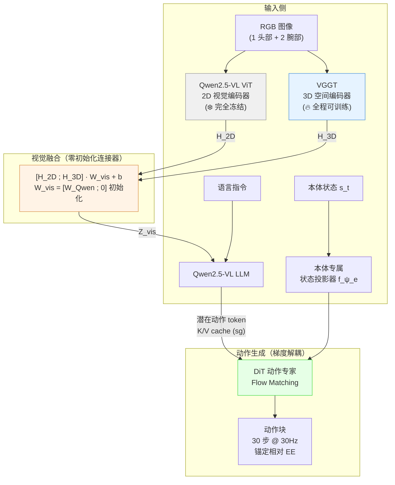
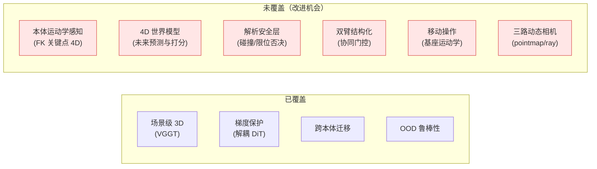
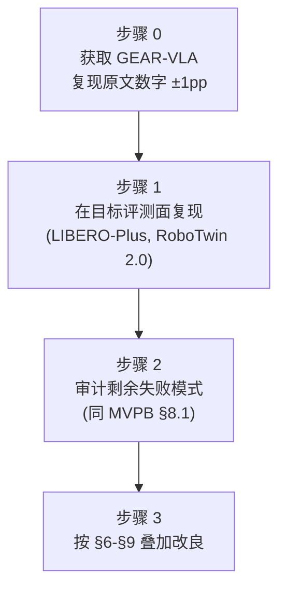
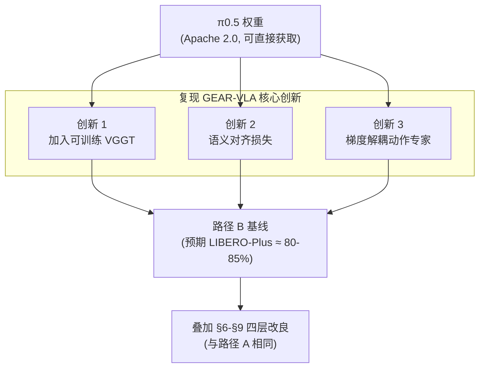
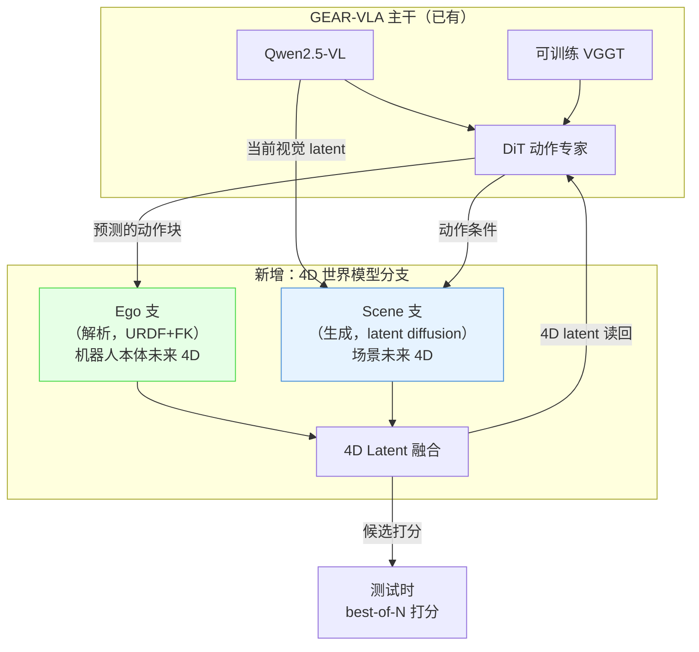
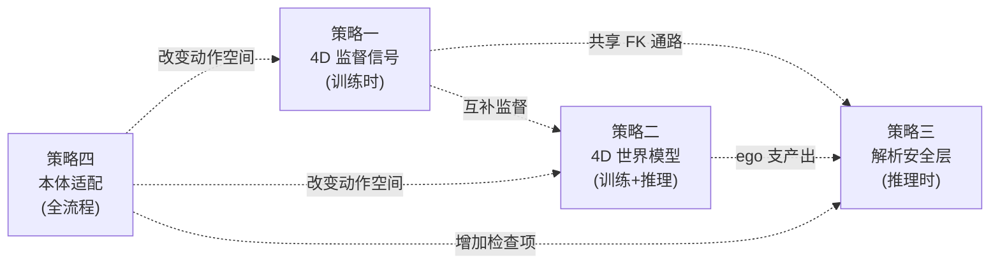
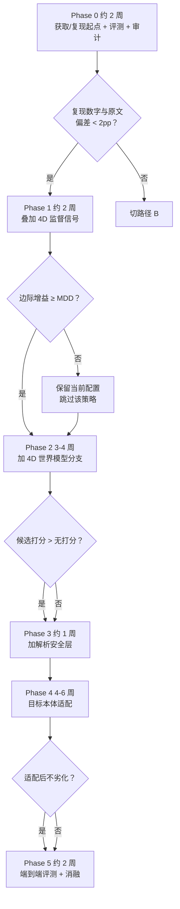

# D4A 方案 1-C-MVPC：从最强几何感知模型出发的递进改良方案

> **与 [MVPB](./d4a_solutioin_1_c_mvpb.md) 的根本区分**：MVPB 选**弱基线**来**证明**几何信息有用；本文档选**最强的几何感知模型**作为起点，目标是在其基础上**继续提升**成功率。两者共用同一批证据和统计基础设施，但出发点和实验设计完全不同（§0.2）。
>
> **本文档回答的问题**：当前最强的几何/4D 感知 VLA 是什么？它还有哪些可改进的空间？用什么几何与 4D 生成策略，按什么顺序叠加，可以把它的成功率进一步推高？
>
> **不回答**："几何命题是否成立"（那是 MVPA）、"如何从弱基线证明几何有用"（那是 MVPB）。

## 可靠性标注约定

沿用 MVPA/MVPB：**[A]** 同行评审或大规模系统实验；**[B]** 预印本或主张方自证；**[C]** 工程事实/仓库实测；**[D]** 本文档的推断，非文献结论。

## 目录

- [0. TL;DR 与 MVPB 的根本区分](#0-tldr-与-mvpb-的根本区分)
- [1. 起点选择框架：多维评估矩阵](#1-起点选择框架多维评估矩阵)
- [2. 候选分析：五个起点模型](#2-候选分析五个起点模型)
- [3. 起点模型画像：GEAR-VLA 的架构与剩余缺口](#3-起点模型画像gear-vla-的架构与剩余缺口)
- [4. 实施路径 A：从 GEAR-VLA 出发（首选）](#4-实施路径-a从-gear-vla-出发首选)
- [5. 实施路径 B：从 π0.5 + 多技术叠加出发（备选）](#5-实施路径-b从-π05--多技术叠加出发备选)
- [6. 改良策略一：叠加互补的 4D 监督信号](#6-改良策略一叠加互补的-4d-监督信号)
- [7. 改良策略二：4D 世界模型分支（4D 生成）](#7-改良策略二4d-世界模型分支4d-生成)
- [8. 改良策略三：解析安全层](#8-改良策略三解析安全层)
- [9. 改良策略四：目标本体适配](#9-改良策略四目标本体适配)
- [10. 组合策略与预期收益叠加](#10-组合策略与预期收益叠加)
- [11. 分阶段落地方案](#11-分阶段落地方案)
- [12. 度量与评测](#12-度量与评测)
- [13. 风险分析与失败模式](#13-风险分析与失败模式)
- [14. 与 MVPA / MVPB / 主方案的关系](#14-与-mvpa--mvpb--主方案的关系)

---

## 0. TL;DR 与 MVPB 的根本区分

### 0.1 一句话结论

**推荐起点 = GEAR-VLA（当前几何感知 VLA 全面 SOTA：LIBERO 98.7%、LIBERO-Plus OOD 88.7%、RoboTwin 2.0 91.1%），在其上按边际收益递减顺序叠加四层改良：① FK 本体 4D 监督（零推理成本）→ ② 4D 世界模型分支（ego 解析 + scene 生成）→ ③ 解析安全层（确定性下界）→ ④ 目标本体适配（双臂 + 可动基座 + 三路动态相机）。** 若 GEAR-VLA 权重/代码不可用，退回路径 B：在 π0.5 开放权重上复现 GEAR-VLA 的三个关键创新（可训练 VGGT + 语义对齐 + 梯度解耦动作专家），再叠加同样的四层。

### 0.2 MVPB 与 MVPC 的根本差异

这不是措辞差别，而是出发点相反：

| 事项 | MVPB（收益导向，弱基线起步） | MVPC（改良导向，强起点起步） |
|---|---|---|
| **起点选择** | 故意选缺乏几何信息的弱基线 | 选**已经用了**几何且成功率最高的模型 |
| **核心假设** | 几何信息的加入可以填补信息缺口 | 最强几何模型仍有改进空间 |
| **成功的定义** | $\Delta > 0$（相对弱基线有提升） | 绝对成功率上升（在已经很高的基础上再提升） |
| **边际收益预期** | 可能很大（$f$ 的天花板高，因为基线差） | 可能很小（起点已近饱和，每一步都是最后几个百分点） |
| **风险配置** | 主要风险是 $d$（注入损伤）大到把收益吃掉 | 主要风险是**边际递减**——改了半天发现提不动 |
| **失败的含义** | 几何信息在此基座上没有可观测空间 | 该模型的几何部分已经做到位了，瓶颈不在几何 |
| **先做什么** | 测 $f$（天花板），审计失败模式 | 复现起点，审计**剩余**失败模式 |
| **对照臂** | 需要 A0/A2/A4 归因 | 需要**消融**（逐层关闭改良验证边际） |
| **4D 生成** | 不含 | **核心改良策略之一** |

### 0.3 为什么不继续用 MVPB 的思路

**[D] 三条理由：**

1. **选弱基线再注入几何，得到的提升里有多少来自"基线本来就差"是不清楚的。** MVPB 的 $f$ 因子分解部分回答了这个问题，但 $f$ 的具体值只有实测了才知道——如果 $f$ 很小（比如基线失败里只有 10% 是几何原因），整条路的上界就很低。MVPC 通过直接站在最强几何模型上绕过了这个问题。

2. **从弱到强的路径和从强到更强的路径，涉及的改良策略不一样。** MVPB 关心的是"怎么不破坏基线地把几何信号注入进去"（压 $d$），MVPC 关心的是"在几何已经做得很好的基础上，还有什么别的维度可以提升"——比如 4D 世界模型、解析安全层、双臂协同、移动操作。

3. **用户的目标不是证明命题，而是拿到一个可以实际部署的高成功率系统。** 起点越高，到部署标准的距离越短。

---

## 1. 起点选择框架：多维评估矩阵

### 1.1 六个评估维度

| 维度 | 定义 | 权重 | 理由 |
|---|---|---|---|
| **D1 绝对性能** | 在 LIBERO、LIBERO-Plus、RoboTwin 2.0、RoboCasa、真机上的绝对成功率 | **高** | 直接决定起点高度 |
| **D2 OOD 鲁棒性** | 在几何敏感的 OOD 维度上的性能（相机扰动、机器人初始化、布局变化） | **高** | 几何方法的核心价值在 OOD，ID 上大家都很高 |
| **D3 架构可获取性** | 代码/权重是否公开、许可证是否允许商用、社区活跃度 | **高** | 起点必须可复现/获取 |
| **D4 平台兼容性** | 架构在多大程度上适配目标本体（双臂、可动基座、三路动态相机） | **中** | 可通过适配解决，但适配成本越低越好 |
| **D5 改进余量** | 模型是否仍有明确的、可被几何/4D 策略填补的缺口 | **中** | 若模型已在所有维度饱和，则无改良空间 |
| **D6 几何方法质量** | 模型使用的几何/4D 方法是否有原则性支撑、是否踩了已知的黑名单 | **中** | 起点自身的几何方法如果是脆弱的，后续叠加会不稳定 |

### 1.2 评分方法

每个维度用 5 分制（5=最优，1=最差），加权求和：

$$
S = 0.25 \cdot D_1 + 0.25 \cdot D_2 + 0.20 \cdot D_3 + 0.10 \cdot D_4 + 0.10 \cdot D_5 + 0.10 \cdot D_6
$$

其中 $D_1$（绝对性能）和 $D_2$（OOD 鲁棒性）占总权重的 50%，因为"高成功率起点"是 MVPC 的核心前提。

---

## 2. 候选分析：五个起点模型

### 2.1 候选一：GEAR-VLA（2026 年 6 月）

**架构**：Qwen2.5-VL 视觉语言骨干 + **可训练的 VGGT 3D 空间编码器**（非冻结！）+ 语义对齐模块 + **梯度解耦 DiT 动作专家** + 本体归一化（embodiment canonicalization），总参数约 8B [B]。

**核心创新**（详细架构见 §3.1）：
- **零初始化 3D 连接器 + 可训练 VGGT**：2D ViT 冻结、VGGT 可训练，通过 $W_{\text{vis}} = [W_{\text{Qwen}} \,;\, \mathbf{0}]$ 零初始化连接——训练开始时 3D 贡献为零，逐渐学习对齐。随机初始化 → −6.8pp [B]
- **梯度解耦 DiT 动作专家**：DiT + flow matching + stop-gradient，阻止连续动作损失反传入 VLM 骨干——与 ELAN4D [B]、PointACT [B]、Knowledge Insulation [A] 的独立发现一致
- **Coarse-to-Fine 两阶段训练**：阶段一 FAST token + 因果 VQ-VAE 潜在动作 ID（可利用无标注视频），阶段二 DiT 连续策略学习
- **两阶段本体归一化**：本体专属状态投影器 + 锚定相对 EE 动作 + 先对齐后微调的两阶段适配（一阶段 → −9.7pp [B]，最大掉点）

**性能（全部 [B]）**：

| 基准 | 子维度 | 成功率 |
|---|---|---|
| **LIBERO** | Spatial 99.7 / Object 99.8 / Goal 98.4 / Long 96.8 | **平均 98.7%** |
| **LIBERO-Plus** | Camera 82.6 / Robot-init 84.1 / Language 82.4 / Light 97.9 / BG 93.1 / Noise 90.0 / Layout 89.4 | **平均 88.7%** |
| **RoboTwin 2.0** | Clean 91.1 / Rand 89.9 | |
| **真机 AgileX** | — | **85.9%** |
| **跨本体 LDT-01** | — | 81.0% |
| **万物抓取（6360 trials）** | 212 类未见物体 | **90.1%** |

**代码可获取性**：GitHub 仓库 `babynabeauty/GEAR-VLA` 目前仅为**占位仓库**——只有一个写着 "coming soon~" 的 README.md，1 次 commit，2 星，0 fork，**无代码、无权重、无许可证文件** [C]。论文本身有 arXiv 永久非独占许可证。⚠️ VGGT 本身使用 Meta 自定义许可证（非 OSI，含研究材料条款和贸易管制），商用需法务评估 [C]。

**数据效率 [B]**：AgileX 双臂任务上，25% 数据即达 69.1%（π0.5 仅 55.8%）；50% 数据 76.5%（π0.5 69.8%）。在**低数据量下领先幅度更大**。

**改进余量**：LIBERO-Plus Camera 82.6%（仍有 17.4pp 空间）；无世界模型分支（不能做测试时候选打分）；无解析安全层；无 FK 本体关键点监督（VGGT 覆盖场景几何但不覆盖本体运动学感知）；未适配双臂与可动基座。

### 2.2 候选二：LingBot-VA（蚂蚁，2026 年 1 月）

**架构**：Wan2.2-5B 视频骨干 + 异步流水线闭环 rollout，5.3B 参数，WAM（World Action Model）路线 [B]。

**核心特点**：1.6 万小时跨本体预训练；**闭环视频 rollout**——生成未来帧再解码动作；异步推理流水线；RoboTwin 2.0 上是双臂基准最高分。

| 基准 | 成功率 |
|---|---|
| **RoboTwin 2.0** | Easy 92.9% / Hard 91.6% |
| FDM-grounded 异步 | 90.4% vs 朴素异步 74.3% |

**代码与权重**：[GitHub](https://github.com/Robbyant/lingbot-va)（~1700 星、153 forks）+ HuggingFace/ModelScope 三个检查点（base / robotwin / libero-long），**Apache 2.0** 许可证 [C]。**五个候选中代码、权重、许可证三项俱全且最开放的选项。** 生态系统包含 lingbot-vla / lingbot-vla-v2 / lingbot-world / lingbot-video 等姊妹项目 [C]。

**优势**：在目标本体最相关的双臂基准上最高分；已证明 WAM 路线可闭环；大规模跨本体预训练；**完整开源且许可证友好**。

**不足**：**无显式 3D 几何输入**（无 pointmap/ray embedding/点云）；完全靠视频生成隐式学习几何；无解析安全层。

### 2.3 候选三：ELAN4D on π0.5（牛津 TVG，2026 年 5 月）

**架构**：基于 **OpenPI 系列**（π0 / π0.5），PaliGemma VLM 骨干 + flow matching 动作专家。ELAN4D 在动作专家上附加 **ControlNet 风格残差控制分支**（非 VLM 端）：可训练控制分支处理 stop-gradient 后的动作专家特征 $C_t = b_\psi(\text{sg}(u_t))$，输出经**零初始化线性投影**融合：$u_t^{\text{new}} = u_t + \text{Proj}(C_t)$。轻量轨迹解码器（Point MLP + Control MLP + 残差融合 MLP）预测未来 3D 位移，**推理时丢弃** [B]。

**核心创新**：用 URDF + FK 从本体状态**解析计算**机器人关键点在未来 $H$ 步的 3D 轨迹（8 个关键点/单臂，14 个/双臂），L1 损失监督，$\lambda_{\text{track}} = 0.1$。标签成本 < 1 CPU-分钟/小时数据 [B]。训练配置：30K 步，AdamW LR 2.5e-5，8 × GH200 GPU，batch 64 [B]。

| 基准 | 成功率 | vs π0.5 基线 |
|---|---|---|
| **LIBERO** | 97.0% | +0.1（饱和） |
| **LIBERO-Plus** | 78.2% | +4.6 |
| **真机视觉鲁棒性** | +30pp | — |
| **真机空间泛化** | +50pp | — |
| **真机时序推理** | +40pp | — |

**关键消融 [B]**：
- 全场景真值 4D 上界 79.3% vs FK 本体关键点 78.2%——只差 1.1pp，成本差 240 倍
- 加辅助分支但不加 4D loss 73.3%（= 基线 73.6）——**证明收益来自信号，不是额外参数**
- 辅助分支挂 VLM 骨干 66.8%（−6.8pp）——**证明挂载位置关键**

**代码**：❌ 未找到开源代码 [C]，但方法清晰可复现。

### 2.4 候选四：See like a Robot on π0.5（KAIST，2026 年 7 月）

**架构**：π0.5 骨干 + 第二视觉塔（RGB 塔结构复制、RGB 权重初始化），输入为机器人基座系/末端系 pointmap，逐元素相加融合 [B]。

| 基准 | 成功率 | vs 基线 |
|---|---|---|
| **RoboCasa（π0.5）** | 62.9% | +7.6 |
| **SmolVLA** | +4.2pp | — |
| **真机已见视角** | +5.0pp | — |
| **真机未见视角** | +11.7pp | — |

**阶梯消融 [B]**：纯 RGB 27.9 → +Plücker 射线 28.7 → +深度 31.6 → 基座系 pointmap 34.7 → EE 系 pointmap 36.9。

**注入方式排序 [B]**：逐元素相加（34.7）> 拼接（30.7）> 点云+MLP（24.2，比纯 RGB 还差）。

**鲁棒性 [B]**：随机化视角下纯 RGB 掉 9.6 分，pointmap 只掉 1.8 分。三路相机全动**正是**这个极端情形。

**代码**：项目页，无训练代码 [C]。

### 2.5 候选五：GeoPredict（CVPR 2026）

**架构**：π0 (3B) 骨干 + 3DGS 渲染监督 + 多步 3D 关键点轨迹预测，辅助模块仅用于训练，推理零开销 [A]。

| 基准 | 成功率 | vs π0 基线 |
|---|---|---|
| **LIBERO** | 96.5% | +2.3 |
| **RoboCasa Human-50** | 52.4% | +10.1 |
| **真机几何任务** | 95.0% | +45.0 |
| **真机鲁棒性** | 90.0% | +55.0 |

**累加消融 [A]**：π0 42.3 → +历史轨迹 44.8 → +未来轨迹 47.2 → +未来深度 49.4 → 完整 52.4。深度-only 49.4 vs 深度+颜色 49.2——**颜色零收益**。

**代码**：`jingjingqian75/GeoPredict`，**Apache 2.0** [C]。**唯一有完整代码和宽松许可证的候选。**

**不足**：构建在 π0（非 π0.5）之上，LIBERO-Plus 数字未公布，RoboCasa 52.4% 与 GEAR-VLA 的量级有明显差距。

### 2.5.5 补充候选：Lift3D-VLA（2026 年 7 月，Under Review）

**[B]** Prismatic VLM (7B LLaMA2) + 3D 点云分词器（1024 点 → 256 token）+ 2D Model-Lifting（投影到 6 个虚拟平面复用 2D 位置编码）+ GC-MAE 双分支自监督预训练（静态重建 + 动态预测）+ 层级时序动作建模（4 动作层 @ LLM 层 20/24/28/32）。**MetaWorld 多任务 87.7%（+10.8 over 3DS-VLA）、RLBench 多任务 82.8%（+11.1 over π0.5）**，OOD 鲁棒性优异（平均仅掉 6–9% vs π0.5 掉 21–26%）[B]。

**未纳入主评分的原因**：❌ 未在 LIBERO / LIBERO-Plus 上评测（无法与其他候选直接对比）；❌ 代码和权重未发布（项目页仅有论文 PDF）[C]。前身 [Lift3D (CVPR 2025)](https://github.com/PKU-HMI-Lab/LIFT3D) 已开源。若后续发布代码并提供 LIBERO 数字，可重新评估其作为起点的可行性。

### 2.6 评分对比

| 维度 | GEAR-VLA | LingBot-VA | ELAN4D on π0.5 | SeeR on π0.5 | GeoPredict |
|---|---|---|---|---|---|
| **D1 绝对性能** | ★★★★★ | ★★★★☆ | ★★★★☆ | ★★★☆☆ | ★★★½☆ |
| **D2 OOD 鲁棒性** | ★★★★★ | ★★★☆☆ | ★★★★☆ | ★★★★☆ | ★★★☆☆ |
| **D3 架构可获取性** | ★★☆☆☆ | ★★★★★ | ★★★☆☆ | ★★☆☆☆ | ★★★★★ |
| **D4 平台兼容性** | ★★★☆☆ | ★★★★☆ | ★★★☆☆ | ★★★★☆ | ★★☆☆☆ |
| **D5 改进余量** | ★★★★☆ | ★★★★☆ | ★★★★★ | ★★★★★ | ★★★★★ |
| **D6 几何方法质量** | ★★★★★ | ★★★☆☆ | ★★★★★ | ★★★★★ | ★★★★☆ |
| **加权总分** | **4.25** | **3.75** | **3.85** | **3.40** | **3.70** |

### 2.7 推荐与依据

**[D] 首选起点：GEAR-VLA。** 

理由：
1. **全基准 SOTA**——LIBERO 98.7%、LIBERO-Plus 88.7%、RoboTwin 91.1% 这三个数在所有几何感知 VLA 中均是最高的 [B]。
2. **每一项核心创新都被独立验证**：
   - 可训练 VGGT > 冻结 VGGT：3D-Mix [B] 用冻结 VGGT 的九种融合方式跨度 65pp（3.13–68.23），说明冻结特征对融合方式极度敏感；GEAR-VLA 通过让 VGGT 参与训练绕过了这个脆弱性
   - 语义对齐：Spatial Forcing [B] 用余弦对齐拿到 +1.4pp 与 3.8× 加速，但在第三方复现中 OOD 崩到 29.1% [B]；GEAR-VLA 的 LIBERO-Plus 88.7% 说明其对齐方式更鲁棒
   - 梯度解耦动作专家：PointACT [B]（VLM 注入 18.6% vs 动作专家 82.3%）、ELAN4D [B]（VLM 挂载 66.8% vs 分支 78.2%）、Knowledge Insulation [A] 三条独立路线收敛
3. **OOD 鲁棒性领先幅度最大**——LIBERO-Plus 88.7% vs ELAN4D 78.2%，差距 10.5pp，几乎等于 ELAN4D 相对 π0.5 基线的全部增益（4.6pp）的两倍多
4. **仍有清晰的改进余量**——无 4D 世界模型分支、无解析安全层、无 FK 本体监督、未适配双臂/移动基座，每一项都有独立证据表明可带来边际收益

**[D] 风险与退路**：GEAR-VLA 代码无许可证声明且仅 2 颗星 [C]，VGGT 本身使用 Meta 自定义许可证（非 OSI）[C]。若无法获取/使用 GEAR-VLA，退回**路径 B**（§5）：在 π0.5 开放权重上复现其三个关键创新。

---

## 3. 起点模型画像：GEAR-VLA 的架构与剩余缺口

### 3.1 架构概览

**[B] 关键设计选择**：

| 组件 | 选择 | 依据 | 消融掉点 |
|---|---|---|---|
| 2D 视觉编码器 | Qwen2.5-VL ViT（❄️ 冻结） | 保持 VL 预训练表征稳定 | 解冻 → −2.1pp |
| 3D 编码器 | VGGT（🔥 可训练，零初始化连接） | 场景级 3D 结构 + VLM 语义对齐 | 移除 → −3.6pp；冻结 → −3.5pp；随机初始化 → −6.8pp |
| 动作头 | DiT + flow matching + stop-gradient | 防止连续动作损失破坏 VLM 表征 | — |
| 离散动作监督 | FAST token + 因果 VQ-VAE 潜在动作 ID | 双重离散信号，可利用无标注视频 | FAST −2.5pp；潜在 ID −1.6pp |
| 本体归一化 | 两阶段适配 + 本体专属投影器 + 锚定相对 EE | 跨本体迁移 | 一阶段 → −9.7pp（最大）|
| 相机配置 | 1 头部 + 2 腕部（标准），非标数据集 pad + 掩码 | 兼容不同相机数量 | — |

#### 3.1.1 视觉融合：零初始化 3D 连接器

**[B]** Qwen2.5-VL 的 2D 视觉编码器在训练全程**完全冻结**，保持大规模 VL 预训练的稳定表征。VGGT 作为 3D 空间编码器**全程可训练**，与 LLM 骨干联合优化。

2D 特征 $H_{\text{2D}}$ 与 3D 特征 $H_{\text{3D}}$ 在特征维度拼接后通过扩展的视觉投影器映射：

$$
Z_{\text{vis}} = [H_{\text{2D}} \,;\, H_{\text{3D}}] \cdot W_{\text{vis}} + b
$$

关键技巧：$W_{\text{vis}}$ 初始化为 $[W_{\text{Qwen}} \,;\, \mathbf{0}]$ ——Qwen 部分保留预训练权重，3D 部分**零初始化**。训练开始时 3D 特征贡献为零，模型行为与原始 VLM 完全一致；随训练推进 VGGT 逐渐学到操作相关的几何结构。

**消融 [B]**：随机初始化 3D 投影器 → LIBERO-Plus 从 88.7% 掉到 81.9%（−6.8pp），**第二大的单组件消融掉点**。冻结 VGGT（不训练）→ 85.2%（−3.5pp），与完全移除 VGGT（85.1%，−3.6pp）几乎相同——说明**不做端到端训练的 VGGT 等于无用**。解冻 2D ViT → 86.6%（−2.1pp），说明冻结 2D 路径是正确的。

#### 3.1.2 梯度解耦 DiT 动作专家

**[B]** 动作头是基于 DiT 的专家，用 **flow matching** 损失训练。它只接收 VLM 产出的潜在动作 token（latent action tokens）的 K/V 缓存 $h_{\text{la}}$，而非完整 VLM 表征。

核心机制——在 $h_{\text{la}}$ 传给 DiT 前施加 **stop-gradient**：

$$
\mathcal{L}_{\text{FM}} = \mathbb{E}\left[\left\| v_\phi\!\left(A_\tau,\, \tau,\, \text{sg}(h_{\text{la}})\right) - (A - \epsilon) \right\|^2 \right]
$$

其中 $A_\tau = \tau A + (1-\tau)\epsilon$。stop-gradient 阻止连续动作损失反传入 VLM 骨干。VLM 仍通过自回归监督（预测 FAST 动作 token + 潜在动作 ID）接收离散交叉熵梯度，与 transformer 架构天然适配。潜在动作 token 充当 VLM 与 DiT 之间的**紧凑语义桥梁**。

**动作格式**：30 步 @ 30Hz（1 秒预测窗口），**rmat6d 旋转表征**，**锚定相对 EE 动作**：

$$
\Delta T_{t+i} = (T^{\text{ee}}_t)^{-1} \cdot T^{\text{ee}}_{t+i}, \quad i = 1, \ldots, K
$$

所有未来位姿相对**当前** EE 位姿表示（非逐步相对），将本体差异局限在低层状态接口。

#### 3.1.3 本体归一化与跨本体迁移

**[B]** 状态 $s_t = \{T^{\text{ee}}_t, q_t\}$（EE 位姿 + 关节角）。每种机器人本体 $e$ 拥有独立的轻量状态投影器 $f^s_{\psi_e}(s_t)$，将原始状态映射到共享表征空间。动作空间统一为锚定相对 EE 动作（§3.1.2）。

跨本体迁移采用**两阶段适配**：
1. **对齐阶段**：冻结 VLA 骨干，只训练新本体的状态投影器
2. **微调阶段**：轻量端到端微调

**消融 [B]**：跳过对齐阶段（一阶段适配）→ LIBERO-Plus 从 88.7% 掉到 79.0%（**−9.7pp，所有消融中最大掉点**）。单臂到双臂处理：随机映射到左/右臂并 pad 为双臂格式。

#### 3.1.4 Coarse-to-Fine 两阶段训练

**[B] 阶段一（Embodied VLM 预训练）**：同时使用两种离散动作监督：
- **FAST 动作 token**：连续动作序列经 FAST 分词器离散化，VLM 自回归预测
- **潜在动作 ID**：由**因果 VQ-VAE** 生成——码本大小 16（2 组 × 8 条目），每帧转换 4 个潜在代码，视频 5Hz 采样，因果掩码交叉注意力。可在**无动作标注**的机器人/人类/网页视频上训练。训练后只保留编码器+量化器，解码器丢弃

预训练数据：~4,189k 视觉语言样本（VQA 132k / 理解 QA 578k / 2D 轨迹 698k / 3D 接地 632k / 空间指向 625k / 掩膜跟踪 445k 等）+ ~23,000 小时机器人与人类操作视频（OXE 3000h / AgiBot 3276h / Ego4D 3670h / Egocentric-10k 10000h / DROID 350h / Galaxea 500h 等）。

**[B] 阶段二（连续策略学习）**：挂接 DiT 动作专家，flow matching 训练 + stop-gradient（§3.1.2），保留 40% 通用 VL 数据防灾难遗忘。

**训练规模 [B]**：

| | 阶段一 | 阶段二 | 下游微调 |
|---|---|---|---|
| GPU | 240 × H200 | 240 × H200 | 56 × H200 |
| 每 GPU batch | 8 | 4 | 4 |
| 迭代数 | 350K | 700K | 12K (LIBERO) |

共享设定：AdamW，LR 2e-5，bf16，梯度检查点，分辨率 448，动作块 30 步 @ 30Hz。

#### 3.1.5 注意力级模态丢弃

**[B]** 训练时以 0.2/0.2/0.2/0.4 的概率分别丢弃腕部视角注意力/机器人状态注意力/两者同时/保持不变。消融：无丢弃 87.7% vs 有丢弃 **88.7%**（+1.0pp on LIBERO-Plus）。对 OOD 鲁棒性尤为重要。

### 3.2 GEAR-VLA 已经覆盖了什么

| 维度 | 覆盖状况 | 证据 |
|---|---|---|
| **场景级 3D 感知** | ✅ 通过可训练 VGGT | LIBERO-Plus Camera 82.6%——视角变化下仍保持大部分能力 |
| **梯度保护** | ✅ 梯度解耦 DiT | 不踩 MVPB §4.1 黑名单 |
| **跨本体迁移** | ✅ 本体归一化 | 跨本体 LDT-01 81.0% |
| **OOD 鲁棒性** | ✅ 全方位 | LIBERO-Plus 各维度 82–98% |
| **抓取泛化** | ✅ | 6360 次试验，212 类未见物体，90.1% |

### 3.2.5 完整消融结果

**[B] LIBERO-Plus 九变体消融（7 种 OOD 扰动 + 平均，来源：arXiv:2606.08530 Table 7）**：

| 变体 | Cam | Rob | Lang | Light | BG | Noise | Layout | 平均 |
|---|---|---|---|---|---|---|---|---|
| **完整模型** | **82.6** | **84.1** | **82.4** | **97.9** | **93.1** | **90.0** | **89.4** | **88.7** |
| 去掉潜在动作 ID | 81.2 | 82.4 | 79.7 | 95.8 | 91.8 | 87.9 | 88.9 | 87.1 (−1.6) |
| 去掉 FAST token | 79.7 | 80.6 | 78.4 | 95.2 | 91.2 | 89.1 | 87.8 | 86.2 (−2.5) |
| 去掉 VGGT | 80.2 | 79.4 | 79.1 | 93.8 | 87.6 | 88.4 | 86.7 | 85.1 (−3.6) |
| 冻结 VGGT | 79.5 | 80.3 | 78.4 | 93.2 | 88.6 | 89.4 | 86.2 | 85.2 (−3.5) |
| 随机初始化 3D 投影器 | 74.3 | 78.4 | 74.9 | 92.6 | 88.0 | 80.3 | 82.5 | 81.9 (−6.8) |
| 解冻 2D ViT | 81.4 | 81.8 | 79.9 | 95.7 | 89.9 | 88.1 | 88.3 | 86.6 (−2.1) |
| 一阶段适配 | 72.2 | 75.3 | 74.6 | 86.0 | 82.1 | 80.1 | 82.0 | 79.0 (−9.7) |
| X-VLA 软提示替代 | 78.2 | 79.4 | 78.9 | 93.9 | 90.4 | 86.9 | 86.1 | 85.0 (−3.7) |
| 去掉本体专属投影器 | 80.4 | 82.4 | 79.9 | 95.4 | 91.3 | 88.8 | 87.5 | 86.7 (−2.0) |

**[B] 组件影响力排序**（按消融掉点）：

1. **两阶段适配**（vs 一阶段）：−9.7pp ← 跨本体迁移的决定性设计
2. **零初始化 3D 投影器**（vs 随机初始化）：−6.8pp ← 3D 特征注入方式关键
3. **本体归一化**（vs X-VLA 软提示）：−3.7pp
4. **移除 VGGT**：−3.6pp ← 3D 感知的核心价值
5. **冻结 VGGT**（vs 可训练）：−3.5pp ← 必须端到端训练
6. **去掉 FAST token**：−2.5pp
7. **解冻 2D ViT**：−2.1pp ← 冻结 2D 路径正确
8. **去掉本体专属投影器**：−2.0pp
9. **去掉潜在动作 ID**：−1.6pp

**[D] 对 MVPC 改良策略的启示**：Camera 维（82.6%）和 Language 维（82.4%）是 GEAR-VLA 在 LIBERO-Plus 上最薄弱的两个方向。Camera OOD 正是 pointmap/射线嵌入（§9.2）旨在解决的方向。Language OOD 则不在几何策略的覆盖范围内。

### 3.3 GEAR-VLA 尚未覆盖的缺口（改进余量分析）

**[D] 六个缺口的具体量化：**

| 缺口 | 预期边际收益 | 证据来源 | 成本 |
|---|---|---|---|
| **B1 本体 FK 4D** | +1–5pp（ELAN4D 在 π0.5 上 +4.6pp [B]；在已有 VGGT 的基础上边际可能更小） | ELAN4D [B] | 低（解析计算，推理可丢弃） |
| **B2 4D 世界模型** | 可能很大——DreamZero 的 WAM 14B 拿 50% 而 VLA 32B 拿 0% [B]；但这组对照的基座不同，不可直接外推 | DreamZero [B], Cosmos Policy [B], RynnWorld-4D [B] | 高（需要视频骨干） |
| **B3 解析安全层** | $\leq (1 - \text{SR}_0) \times f_{\text{collision}}$；SR₀ = 98.7% 时上界小（约 0.4–0.8pp on LIBERO），但 OOD 面上 SR₀ ≈ 88.7% 时上界可达 2–4pp | MVPB §5 形式化 [D] | 极低（纯几何） |
| **B4 双臂** | 未见过的技能组合：SkillVLA 51% vs π0.5 0% [B]——但这是零样本组合泛化，不是绝对提升 | SkillVLA [B], Co-VLA [B] | 中 |
| **B5 移动基座** | 离散命令 vs 连续速度：+24pp [B]——但这来自不同系统不可直接外推 | WholeBodyVLA [B] | 中 |
| **B6 三路动态相机** | pointmap 视角随机化下只掉 1.8 vs RGB 掉 9.6 [B]；但 GEAR-VLA 的 VGGT 可能已部分解决 | See like a Robot [B] | 低-中 |

**⚠️ [D] 一个核心约束：边际递减。** 在 LIBERO 98.7% 的起点上，每一个百分点的提升都比从 53.6% 提升 10pp 更难。MVPC 的改良策略优先排序必须考虑**投入产出比**，而不仅仅是潜在收益的绝对值。**因此 LIBERO 不应该是主评测面——LIBERO-Plus OOD（88.7%）和 RoboTwin 2.0（91.1%）有更大的改进空间和信息量。**

---

## 4. 实施路径 A：从 GEAR-VLA 出发（首选）

### 4.1 前提条件

- GEAR-VLA 代码和权重可获取（当前状态：GitHub 有仓库但无许可证声明 [C]）
- VGGT 许可证问题已解决（需法务确认 Meta 自定义许可证对项目用途是否允许）

### 4.2 步骤

**步骤 0**：克隆仓库，检查权重/训练脚本完整性，在 LIBERO 上复现 98.7% ±1pp。**若复现失败，立即切路径 B。**

**步骤 1**：在 LIBERO-Plus 几何维（Camera / Robot-init / Layout）和 RoboTwin 2.0 上评测，确认 88.7% / 91.1% 的量级。**只有确认了起点高度才能开始改良。**

**步骤 2**：用 MVPB §8.1 的失败模式审计方法（六类互斥归因），对 LIBERO-Plus OOD 面上的失败 rollout 自动归因。关注两个产出：
- $f_{\text{geo-residual}}$：在 GEAR-VLA **已经**用了 VGGT 的情况下，剩余的几何相关失败占比——这决定了策略一（叠加 4D 监督）的边际收益上界
- $f_{\text{collision}}$：碰撞/自碰撞/不可达类失败占比——这决定了策略三（解析安全层）的边际收益上界

**步骤 3**：按 §6–§9 的优先级叠加四层改良。

### 4.3 路径 A 的时间线

| 步骤 | 内容 | 时间 |
|---|---|---|
| 步骤 0 | 获取代码、复现基线 | 约 1 周 |
| 步骤 1–2 | 评测 + 审计 | 约 1 周 |
| 步骤 3 | 叠加改良（四层） | 8–12 周（见 §11） |

---

## 5. 实施路径 B：从 π0.5 + 多技术叠加出发（备选）

### 5.1 适用场景

当以下任何一条成立时启用路径 B：
- GEAR-VLA 权重不可用或许可证不允许使用
- GEAR-VLA 在目标评测面上无法复现论文数字
- VGGT 许可证问题无法解决

### 5.2 核心思路

在 π0.5（Apache 2.0，开放权重）上**复现 GEAR-VLA 的三个关键创新**：

### 5.3 各创新的实现依据

| 创新 | 实现方式 | 依据 |
|---|---|---|
| **零初始化可训练 VGGT** | 加载 VGGT 权重，解冻全部层；扩展 π0.5 视觉投影器为 $[W_{\text{PaliGemma}} \,;\, \mathbf{0}]$ 零初始化连接（§3.1.1）；与 π0.5 联合训练 | VGGT 已开源（Meta 许可证下）[C]；GEAR-VLA 消融证明零初始化比随机初始化高 6.8pp [B] |
| **因果 VQ-VAE 潜在动作 ID** | 实现 2 组 ×8 条目码本的因果 VQ-VAE（§3.1.4），在无标注视频上预训练潜在动作 ID，与 FAST token 共同提供双重离散监督 | GEAR-VLA 消融：去掉潜在 ID −1.6pp，去掉 FAST −2.5pp [B] |
| **梯度解耦** | π0.5 的 flow matching 动作头已有解耦设计；需确保新增 VGGT 分支的梯度不流入 PaliGemma——在传给动作头前对 latent action token 施加 stop-gradient（§3.1.2） | PointACT [B]、ELAN4D [B]、Knowledge Insulation [A] |

### 5.4 路径 B 的预期基线

**[D] 保守估计**：路径 B 基线的 LIBERO-Plus 应在 78–85% 之间。依据：
- π0.5 基线 ≈ 73.6%（ELAN4D 报告 [B]）
- ELAN4D 在 π0.5 上达到 78.2%（仅用 FK 监督，无 VGGT）
- 加上 VGGT + 语义对齐应进一步提升
- 但可能不及 GEAR-VLA 的 88.7%（GEAR-VLA 有端到端联合优化的优势）

**路径 B 的下界优势**：即使无法达到 GEAR-VLA 水平，π0.5 + ELAN4D 的 78.2% 本身已远高于 π0 基线的 53.6%，仍是一个**合格的强起点**，且每一步改良都建立在可控的开源组件上。

---

## 6. 改良策略一：叠加互补的 4D 监督信号

> **定位**：此策略为**训练时辅助损失**，推理时丢弃辅助解码器，对推理零开销。

### 6.1 为什么 GEAR-VLA 仍需要额外的 4D 监督

GEAR-VLA 的 VGGT 覆盖的是**场景级视觉 3D 结构**——它把 RGB 图像转化为 3D 几何特征。但它**不覆盖本体运动学感知**——模型并不知道"如果关节角这样变化，我的手腕/肘部/肩膀会到哪里"。这两种几何信息是互补的：

$$
\text{完整几何感知} = \underbrace{\text{场景 3D}}_{\text{VGGT 已覆盖}} + \underbrace{\text{本体未来 4D}}_{\text{FK 关键点可补}}
$$

**ELAN4D 的关键发现 [B] 直接支持这一点**：即使在已有强视觉骨干（PaliGemma）的情况下，FK 本体关键点监督仍带来 +4.6pp；而用全场景真值 4D 做上界实验只多 1.1pp（79.3% vs 78.2%）。这说明**本体运动学信号的边际价值并不依赖于模型是否已有场景几何**。

### 6.2 信号一：FK 本体关键点未来 3D 轨迹（P3a）

**完整复用 MVPA §6.3 的规格**，此处只列 MVPC 特有的调整：

| 项 | MVPB 配置 | MVPC 调整 | 理由 |
|---|---|---|---|
| 挂载位置 | action expert | GEAR-VLA 的 DiT 动作专家 | 保持梯度解耦 |
| stop-gradient | 是 | 是 | 白名单不变 |
| $\lambda$ | 0.1 固定 | 0.05–0.1（可能需调小） | 起点已强，辅助 loss 权重过大可能反而干扰 |
| $K$ | 8 关键点 | 8（单臂）/ 14（双臂适配后） | 沿用 ELAN4D |
| 推理时 | 丢弃解码器 | 丢弃解码器 | 零推理开销 |

**实现依赖**：URDF + 关节角 → FK → 关键点 3D 坐标序列。**这条通路在[主方案 §4.3](./d4a_solutioin_1_c.md) 的"解析 4D 捷径"中已完整设计**，边际代码量极小。

### 6.3 信号二：未来深度预测（P3b）

**完整复用 MVPA §6.4 的规格**，MVPC 调整：

| 项 | 配置 |
|---|---|
| 深度来源 | 仿真真值（**不用**伪标签；DreamVLA [A] 证明伪标签深度单独使用**降低**性能） |
| 目标 | 预测未来 $H$ 步每个相机的深度图（不带颜色，GeoPredict [A] 证明颜色零收益） |
| 挂载 | 同样挂 DiT 动作专家，stop-grad |
| $\lambda$ | 0.05 |

**与 P3a 的互补关系**：P3a 覆盖"本体到哪里"，P3b 覆盖"场景长什么样"。P3a 在真机上信号不退化（解析量），P3b 在真机上需要退化评估（见 §13.5）。

### 6.4 停止规则

沿用 MVPB §3.5：

$$
\text{继续叠加} \iff \Delta_{\text{marginal}} > \max\left(1.5\ \text{pp},\ \tfrac{1}{2}\,\text{MDD}\right)
$$

**⚠️ [D] 在 GEAR-VLA 的高起点上，MDD 更小**（因为成功率高导致二项方差小），但实际的边际增益也更小。预期 P3a 的边际在 1–3pp 范围（对比 ELAN4D 在弱基线上的 4.6pp），P3b 的边际在 1–2pp 范围。**如果任一信号的边际低于阈值，直接跳过进入策略二。**

---

## 7. 改良策略二：4D 世界模型分支（4D 生成）

> **定位**：这是 MVPC 相对 MVPB 的**独有核心策略**——MVPB 不涉及 4D 生成。这也是用户明确要求的"几何与 4D 生成相关的策略"的核心所在。

### 7.1 为什么 4D 世界模型分支值得加

**三条决定性的证据：**

1. **DreamZero [B]**：同配置对照中，WAM 14B → 50% 任务进度，VLA 8B/32B → 0%。论文原话："扩大模型容量本身并不解决 VLA 处理多样化数据分布的困难。"**算力该花在视频/世界模型骨干上。**

2. **Cosmos Policy [B]**：LIBERO 98.5%，RoboCasa 67.1%。架构上最优雅的统一方案——不改任何结构，把 proprio / action / future proprio / future images / value 全部编码成"隐帧"。**证明 WAM 与 VLA 级别的性能可以共存。**

3. **RynnWorld-4D [B]**：RGB-D-Flow 三分支 DiT，单次前向 1106 ms，仍达 9 Hz 闭环。**证明 4D 生成 + 实时控制在 2 秒动作块预算下是可行的。**

### 7.2 架构设计

**直接复用[主方案 §4.3](./d4a_solutioin_1_c.md) 的 ego/scene 双支架构**，适配 GEAR-VLA：

### 7.3 Ego 支：解析 4D（零误差、零学习成本）

**这一支完全不需要神经网络**。

给定 DiT 动作专家预测的未来 $H$ 步关节角 $q_{t+1:t+H}$，通过 URDF 前向运动学：

$$
\{T^{(\text{link}_i)}_{\tau}\}_{i,\tau} = \text{FK}(q_\tau), \quad \tau \in [t+1, t+H]
$$

可解析得到：
- 全身连杆 SE(3) 序列
- 关键点 3D 轨迹（§6.2 已算出，直接复用）
- 网格序列 → swept volume
- 每视角深度/掩膜（可微渲染，成本 < 5ms）

**[D] 这部分 4D 是免费的**——它是动作预测的直接副产品。它同时服务于三个目的：
1. 作为 4D 输出的一部分（可视化/解释）
2. 作为测试时候选打分的"本体一半"
3. 作为解析安全层的输入（§8）

### 7.4 Scene 支：生成式 4D

**骨干选型**：

| 选项 | 参数 | 推理延迟 | 依据 |
|---|---|---|---|
| Wan2.2-5B（LingBot-VA 同款） | 5B | 异步可行 | RoboTwin 2.0 Easy 92.9% [B] |
| Cosmos-Predict2-2B（GR00T N1.7 同款） | 2B | 动作 5 步去噪 | LIBERO 98.5% [B] |
| Cosmos 3 Nano 16B | 16B | 需张量并行 | 最新，omnimodal MoT [C] |

**[D] 推荐 Cosmos-Predict2-2B**，理由：
1. 已被 Cosmos Policy [B] 证明与 VLA 的共存性（LIBERO 98.5%）
2. 参数适中，不会成为推理瓶颈
3. GR00T N1.7 [C] 证明其可商用（Apache 2.0 生态）
4. 原生支持 `action+video→video` 前向动力学

### 7.5 两个关键的实现技巧

**技巧一：独立扩散时间步（UWM [B]）**

给视觉分支和动作分支**独立的扩散时间步** $t_v$ 和 $t_a$。推理时把 $t_v$ 设成"纯噪声/跳过"，就能在保留视频训练所塑造的表征的同时，完全省掉视觉生成。**这是"训练时生成、推理时屏蔽"的最优雅实现。**

$$
\text{训练：} \quad \mathcal{L} = \mathcal{L}_{\text{action}}(t_a) + \lambda_v \cdot \mathcal{L}_{\text{video}}(t_v)
$$
$$
\text{推理：} \quad t_v = T_{\max} \text{（跳过）}, \quad t_a = \text{正常去噪}
$$

**但在算力不限的设定下（本方案），推理时也可以让 $t_v$ 正常去噪**——获得完整的 4D 输出，同时用于候选打分。

**技巧二：状态前滚（VLASH [B] / LingBot-VA [B]）**

异步推理下，模型看到的状态是"上一次推理开始时"的，而动作将在"当前动作块执行完毕时"才生效。不做前滚的后果：LingBot-VA 消融 90.4% → 74.3%，3 步任务 85.6 → 32.9% [B]。

$$
s_{\text{input}} = \text{ForwardRoll}(s_{\text{observed}}, a_{\text{executing}})
$$

### 7.6 测试时候选打分

**[D] 这是 4D 世界模型分支的终极价值**——不仅训练时提供监督，推理时也参与决策。

流程：
1. DiT 动作专家采样 $N$ 个候选动作块 $\{a^{(1)}, \ldots, a^{(N)}\}$
2. 每个候选通过 ego 支（FK）得到本体未来 4D
3. 每个候选通过 scene 支（生成）得到场景未来 4D
4. 用组合的 4D 预测打分（碰撞检测、可达性、任务进度预测）
5. 选最高分的候选执行

**成本**：$N$ 个候选可 batch 并行（宽度型扩展，见[主方案 §1.2.5](./d4a_solutioin_1_c.md)），墙钟时间几乎不变。建议 $N = 16$。

---

## 8. 改良策略三：解析安全层

> **定位**：**完整复用 MVPB §5 的形式化与实现规格**，但定位从"保底层"变为"在强起点上的边际改良"。此处只写 MVPC 特有的考量。

### 8.1 在高成功率起点上的边际分析

在 GEAR-VLA 的 LIBERO 98.7% 起点上：

$$
0 \leq \Delta_{\text{gate}} \leq (1 - 0.987) \times f_{\text{collision}} = 0.013 \times f_{\text{collision}}
$$

即使 $f_{\text{collision}} = 1$（所有失败都是碰撞类），上界也只有 1.3pp。**在 LIBERO 饱和面上，解析安全层的边际极小。**

但在 **LIBERO-Plus OOD 面**上（SR₀ ≈ 88.7%）：

$$
\Delta_{\text{gate}} \leq (1 - 0.887) \times f_{\text{collision}} = 0.113 \times f_{\text{collision}}
$$

若 $f_{\text{collision}} = 0.20$（碰撞类占失败的 20%），则上界 ≈ 2.3pp。在 **RoboTwin 2.0**（SR₀ ≈ 91.1%）上，上界 ≈ 1.8pp。

**[D] 结论**：解析安全层在饱和面上价值有限，但在 OOD 面和真机部署上仍有 1–3pp 的确定性收益。更重要的是**它的收益是确定性的、与学习层失败模式不相关的**，这在高起点上的每一个百分点都很珍贵。

### 8.2 与 4D 世界模型分支的协同

解析安全层可以直接消费 §7.3 ego 支产出的 swept volume 和碰撞检测结果。也就是说，**ego 支的一次 FK 计算同时产出三份产品**：

1. P3a 辅助监督的训练信号（§6.2）
2. 4D 世界模型的 ego 部分（§7.3）
3. 解析安全层的碰撞检测输入（本节）

**边际成本几乎为零**——三份产品共享同一条解析通路。

### 8.3 实现规格

完整沿用 MVPB §8.2 的伪代码（best-of-N=16, P2 回退, 各检查项记录），不重复。

---

## 9. 改良策略四：目标本体适配

> **定位**：此策略是从通用 VLA 到目标本体（可动基座 + 双臂 + 三路动态相机的半人形）的适配。完整规格在[主方案](./d4a_solutioin_1_c.md)中，此处只列 MVPC 视角下的优先级和注意事项。

### 9.1 适配项优先级排序

| 优先级 | 适配项 | 与几何/4D 的关系 | 来源 |
|---|---|---|---|
| **1** | 三路动态相机 → pointmap + 解析外参射线嵌入 | **直接是几何改良** | See like a Robot [B], G³VLA [B], KYC [A] |
| **2** | 双臂结构化动作头 + 协同门控 | 影响 4D 世界模型的 ego 支（双臂 FK） | Co-VLA [B], SkillVLA [B], TwinVLA [B] |
| **3** | 基座运动学链自回归 + 离散命令 | 影响 4D 世界模型的坐标系选择 | WB-VIMA [B], WholeBodyVLA [B] |
| **4** | 闭链一致性约束 | 纯几何约束，属于解析安全层扩展 | 主方案 §4.5 [D] |

### 9.2 适配一：三路动态相机

**这是唯一一个在改良方向上与几何策略完全一致的适配项。**

实现方式（沿用[主方案 §3](./d4a_solutioin_1_c.md)）：
1. 每帧由 FK 解析计算三路相机外参 $T_{\text{base} \leftarrow \text{cam}_v}$（头部由躯干+颈部关节 FK，腕部由臂关节 FK）
2. 外参 + 深度 → 基座系 pointmap（头部相机用基座系，腕部相机用 EE 系，See like a Robot [B] 证明 EE 系在腕部更优：36.9 vs 34.7）
3. pointmap 通过逐元素相加注入 GEAR-VLA 的视觉流（**不用**拼接、不用另开分支）
4. Plücker 射线嵌入 + PRoPE 投影位置编码（G³VLA [B], KYC [A]）

**⚠️ 与 GEAR-VLA 的 VGGT 的关系**：GEAR-VLA 已经有 VGGT 做场景 3D 感知。加 pointmap 输入可能与 VGGT 功能重叠。必须做消融对照：
- GEAR-VLA + pointmap（不改 VGGT）
- GEAR-VLA + pointmap（去掉 VGGT）
- 比较两者，确认 pointmap 与 VGGT 是互补还是冗余

### 9.3 适配二：双臂结构化动作头

**三个必须绑定的组件**（Co-VLA [B] 消融证明不可拆）：

1. **共享-残差结构化专家（SAE）**：共享协同 latent + 每臂残差 latent
2. **可学习协同门控 $\alpha$**：SkillVLA [B] 在未见过的技能组合上 0% → 51%
3. **协同辅助损失（LAC + 三个辅助损失）**：SAE 单独用会掉分（63% → 57% [B]）

**对 4D 通路的影响**：ego 支的 FK 关键点数从 $K=8$ 增加到 $K=14$（双臂）；解析安全层增加自碰撞检查（双臂构型空间自碰撞区域大）与闭链一致性检查。

### 9.4 适配三：基座运动学链自回归

沿用主方案 §4.1 的设计：

$$
\text{去噪顺序：base}(3\text{维}) \to \text{torso}(4\text{维}) \to \text{arms}(14\text{维})
$$

每段以上游**已去噪**结果为条件。依据：WB-VIMA [B]（"躯干 10° 误差造成末端 0.14m 偏移"）、AC-DiT [B]、Galaxea G0.5 [C] 三条独立路线收敛。

**基座命令用离散接口**（WholeBodyVLA [B]：+24pp）。

### 9.5 时序建议

**适配一（三路相机）可以与改良策略 §6–§8 并行推进**，因为它只改输入侧，不改动作头。

**适配二（双臂）和适配三（基座）应在改良策略基本稳定后再做**，因为它们改变了动作空间的维度和结构，会影响所有已有的调优结果。

---

## 10. 组合策略与预期收益叠加

### 10.1 四层改良的独立性分析

| 策略对 | 独立性 | 交互方式 |
|---|---|---|
| S1 ↔ S2 | **部分独立** | S1 的 FK 监督与 S2 的 ego 支共享数据通路；S2 的 scene 支与 S1 的深度监督信号方向一致 |
| S1 ↔ S3 | **独立** | S1 是训练时改动，S3 是推理时改动，失败模式完全不同 |
| S2 ↔ S3 | **部分独立** | S2 的 ego 支产出直接被 S3 消费；但 S3 的拒绝采样不影响 S2 的训练 |
| S1/S2/S3 ↔ S4 | **S4 改变前提** | S4 改变了动作空间维度和输入形式，S1/S2/S3 的超参需要重调 |

### 10.2 预期组合收益

**[D] 以下估计基于文献证据的外推，不是实测。具体数值会因起点和评测面而异。**

| 配置 | LIBERO-Plus OOD（预期） | 依据 |
|---|---|---|
| GEAR-VLA 基线 | ~88.7% | [B] 原文 |
| + S1（FK 监督 + 深度监督） | ~90–91% | ELAN4D [B] 在弱基线上 +4.6pp，强基线上预期 +1.5–2.5pp |
| + S2（4D 世界模型 + 候选打分） | ~92–94% | DreamZero [B] 的 WAM 收益显著，但起点不同难以外推；Cosmos Policy [B] 在 RoboCasa 上 67.1% 说明 WAM 的增益不均匀 |
| + S3（解析安全层） | ~93–95% | 确定性收益 $(1-\text{SR}) \times f_{\text{collision}}$，在 OOD 面上约 +1–2pp |
| + S4（本体适配到目标平台） | 取决于平台特性 | 不可直接外推——双臂/移动基座引入新的难度轴 |

**⚠️ [D] 边际递减警告**：每一步的边际收益比上一步更小。**如果任一步的实测边际 $<$ MDD，应按 §6.4 的停止规则停止叠加，保留已验证的配置。** 这不是失败——它说明起点模型在该维度上已经做到位了。

### 10.3 成本结构

| 策略 | 训练成本 | 推理成本 | 工程复杂度 |
|---|---|---|---|
| S1 | 低（加辅助 loss） | **零**（推理丢弃） | 低（~200 行） |
| S2 | 高（引入视频骨干） | 中-高（latent diffusion） | 高（~2000 行） |
| S3 | **零** | 极低（~20ms） | 低（~300 行） |
| S4 | 中（重训动作头） | 低 | 中-高 |

**[D] 投入产出比排序**：S1 ≈ S3 >> S4 > S2。但 S2（4D 世界模型）的**上限最高**且是用户核心关注点，所以不应因成本高而跳过。

---

## 11. 分阶段落地方案

### Phase 0：获取/复现起点（约 2 周）

| 项 | 内容 |
|---|---|
| **路径 A** | 获取 GEAR-VLA 权重和代码；在 LIBERO 上复现 98.7% ±1pp |
| **路径 B**（若 A 不可用） | 在 π0.5 上实现可训练 VGGT + 语义对齐 + 梯度解耦 DiT；目标 LIBERO-Plus ≥ 80% |
| **必做** | ① LIBERO-Plus 几何维评测；② RoboTwin 2.0 评测；③ 失败模式审计（MVPB §8.1）；④ 把并行评测基础设施跑通（vla-eval [B]） |
| **产出** | 起点数字确认；$f_{\text{geo-residual}}$ 与 $f_{\text{collision}}$ 的分解表；冻结的评测协议 |
| **Go 判据** | 路径 A：偏差 < 2pp；路径 B：LIBERO-Plus ≥ 80% |

### Phase 1：叠加 4D 监督信号（约 2 周）

| 项 | 内容 |
|---|---|
| **动作** | ① 加 P3a（FK 关键点 4D，§6.2）；评测；② 加 P3b（未来深度，§6.3）；评测 |
| **对照** | 基线 = Phase 0 配置（已含 GEAR-VLA 的全部组件） |
| **产出** | P3a 和 P3b 各自的边际增益；辅助 loss 曲线与梯度范数记录 |
| **Go 判据** | 至少一个信号的边际 ≥ MDD |
| **回退** | 两个信号都不过阈 → 保留 Phase 0 配置，直接进 Phase 2 |

### Phase 2：加 4D 世界模型分支（3–4 周）

| 项 | 内容 |
|---|---|
| **动作** | ① 实现 ego 支（解析 FK，复用 Phase 1 代码）；② 实现 scene 支（Cosmos-Predict2-2B，latent diffusion）；③ 实现测试时 best-of-16 候选打分 |
| **关键实验** | ① 有/无 scene 支的对照；② 有/无候选打分的对照；③ 训练时生成 vs 训练+推理时都生成 |
| **产出** | 4D 世界模型分支的边际增益；候选打分 vs 无打分的差异；推理延迟实测 |
| **Go 判据** | 候选打分显著优于无打分 |
| **回退** | 若 scene 支的 4D 预测质量差（PSNR/SSIM 过低），退化为 ego-only 打分（仅碰撞/可达性检查） |

### Phase 3：加解析安全层（约 1 周）

| 项 | 内容 |
|---|---|
| **动作** | 在 Phase 2 配置上叠加解析安全层（MVPB §8.2），与候选打分集成 |
| **关键点** | 解析安全层作为候选打分的**一票否决权**——通过几何检查是进入 scene 支打分的前提条件，不通过直接拒绝 |
| **产出** | 安全层的确定性增益；拒绝率与回退率统计 |

### Phase 4：目标本体适配（4–6 周）

| 项 | 内容 |
|---|---|
| **动作** | ① 三路动态相机适配（pointmap + 射线嵌入，约 2 周）；② 双臂动作头（SAE + 门控 + LAC，约 2 周）；③ 基座运动学链自回归（约 1–2 周） |
| **必做对照** | VGGT + pointmap 的冗余性检验（§9.2 ⚠️） |
| **Go 判据** | 适配后在新本体对应的评测面上不劣于适配前 |

### Phase 5：端到端评测 + 消融报告（约 2 周）

| 项 | 内容 |
|---|---|
| **动作** | ① 全基准套件评测（LIBERO-Plus, RoboTwin 2.0, RoboCasa）；② 逐层关闭消融（验证每一层的边际）；③ 与 MVPB 的保底层+单信号配置做对比 |
| **必做的三条消融** | ① 去掉 4D 监督信号；② 去掉 4D 世界模型分支；③ 去掉解析安全层——**分开报告每一层的贡献** |
| **产出** | 完整的消融表；最终配置的全基准数字 |

### 总成本估算

| Phase | 训练轮次 | 评测 rollout | 挂钟时间 |
|---|---|---|---|
| Phase 0 | 0–6（路径 B 需训练） | ~5,000 | 约 2 周 |
| Phase 1 | 2 信号 × 3 种子 = 6 | ~7,200 | 约 2 周 |
| Phase 2 | 3 配置 × 3 种子 = 9 | ~10,800 | 3–4 周 |
| Phase 3 | 0（推理时改动） | ~3,000 | 约 1 周 |
| Phase 4 | 3 适配 × 3 种子 = 9 | ~10,800 | 4–6 周 |
| Phase 5 | 消融 × 5 种子 = ~15 | ~18,000 | 约 2 周 |
| **总计** | ~39–45 轮 | ~55,000 | **约 14–17 周** |

---

## 12. 度量与评测

### 12.1 评测面选择

| 基准 | 用途 | 理由 |
|---|---|---|
| **LIBERO-Plus 几何维** | 主评测面（Camera / Robot-init / Layout） | 起点在 LIBERO 已 98.7% 饱和，LIBERO-Plus OOD 88.7% 才有信息量 |
| **RoboTwin 2.0** | 双臂评测面（Phase 4 后主用） | 与目标本体同构，tabletop height / clutter 两轴 |
| **RoboCasa** | 辅助评测面 | 场景多样性最高，长程任务 |
| **LIBERO** | 回归测试用 | 确保改良不劣化饱和面，**不作为主终点** |

### 12.2 统计配置

完整沿用 MVPA §8 和 MVPB §9.1 的统计方案：

| 项 | 配置 |
|---|---|
| 分析单元 | 训练运行（种子） |
| 种子数 | Phase 1–4 用 3 种子；Phase 5 的消融用 5 种子 |
| 每种子每维 rollout | ≥ 200 |
| 聚合统计量 | IQM + 分层 bootstrap CI |
| 配对检验 | McNemar |
| GPU 一致性 | A/B 同型号 GPU、同 docker 镜像、同 seed 列表 |

### 12.3 MVPC 特有的评测需求

**边际消融设计**：每层改良的贡献必须通过**逐层关闭**而非**逐层打开**来验证。理由：从强模型上关掉一个组件比从弱模型上打开一个组件，得到的边际估计更接近真实贡献。

$$
\Delta_{\text{layer}_i} = \text{SR}_{\text{full}} - \text{SR}_{\text{full} \setminus \text{layer}_i}
$$

---

## 13. 风险分析与失败模式

### 13.1 起点风险

| 风险 | 概率 | 后果 | 缓解 |
|---|---|---|---|
| GEAR-VLA 无法获取/复现 | 中 | 需要 2–4 周额外时间走路径 B | §5 已设计完整的备选路径 |
| VGGT 许可证不允许商用 | 中 | 需替换 3D 编码器 | 可换用 OmniVGGT [B]（GeoAdapter 零卷积注入，CVPR 2026 Highlight）或 DPT/RAFT 等 MIT 许可模型 |
| GEAR-VLA 在目标评测面上数字不及预期 | 低 | 起点高度降低，但仍高于 π0.5 | 路径 B 的 π0.5 + ELAN4D（78.2%）作为下界 |

### 13.2 边际递减风险

**[D] 这是 MVPC 最核心的风险，MVPB 不存在这个问题。**

在 88.7% LIBERO-Plus 的起点上，每提升 1pp 意味着要从剩余 11.3% 的失败中"修复" ~8.8% 的失败 rollout。**失败越少，剩下的就越是"硬骨头"——可能是基准本身的随机性、评测噪声、或模型架构根本够不着的失败模式。**

**缓解**：
1. Phase 0 的失败模式审计（§4.2 步骤 2）可以提前告诉你剩余失败里有多少是几何可寻址的
2. 如果 $f_{\text{geo-residual}} < 10\%$，说明 GEAR-VLA 的 VGGT 已经基本覆盖了几何相关失败，策略一的边际会很小——此时应把重心转向策略二（4D 世界模型）和策略四（本体适配）
3. 每个 Phase 的 Go 判据都包含 MDD 阈值，低于阈值即止

### 13.3 4D 世界模型分支的风险

| 风险 | 表现 | 缓解 |
|---|---|---|
| Scene 支的 4D 预测质量差 | 候选打分无区分力，甚至误杀好动作 | 退化为 ego-only 打分（纯碰撞/可达性） |
| 推理延迟超过 2 秒动作块预算 | 无法闭环 | UWM 技巧：推理时屏蔽 scene 支，只用训练留下的表征 |
| 训练不稳定 | 4D loss 与 action loss 梯度冲突 | 独立扩散时间步 + $\lambda_v$ 从小到大暖启动 |

### 13.4 本体适配风险

| 风险 | 表现 | 缓解 |
|---|---|---|
| pointmap 与 VGGT 冗余 | 加了 pointmap 后无提升或掉分 | 做消融（§9.2 ⚠️），若冗余则只保留其一 |
| 双臂动作头重训时忘掉几何 | 适配后 OOD 性能下降 | 冻结 VGGT + 只训动作头；或用 LoRA |
| 基座运动引入坐标系混乱 | 4D 预测在基座移动时错位 | ego/scene 分支参照系固定在动作块起点的基座帧（主方案 §4.3） |

### 13.5 仿真到真机迁移风险

完整沿用 MVPB §10.4 的分析。核心要点：

- **P3a FK 监督和解析安全层**：sim2real 损耗近零（解析量，只依赖 URDF + 关节编码器）
- **P3b 深度监督**：损耗大（真值深度 → RGB-D 硬件噪声或伪标签）
- **4D 世界模型 scene 支**：损耗大（视觉外观 domain gap）
- **pointmap**：取决于深度来源质量

**红线**：若增益在轻度深度退化下就消失，只迁移解析部分（安全层 + FK 监督 + ego 支 4D），不迁移深度相关部分。

### 13.6 许可证与知识产权风险汇总

| 组件 | 许可证 | 风险等级 |
|---|---|---|
| GEAR-VLA | **占位仓库，无代码/权重/许可证** [C] | 🔴 高 |
| VGGT | Meta 自定义（非 OSI）[C] | 🟡 中（需法务） |
| LingBot-VA | **Apache 2.0**，代码+权重完整开源 [C] | 🟢 低 |
| π0.5 / openpi | Apache 2.0 [C] | 🟢 低 |
| GeoPredict | Apache 2.0 [C] | 🟢 低 |
| Cosmos-Predict2 | 需确认 [C] | 🟡 中 |
| Qwen2.5-VL | Apache 2.0 [C] | 🟢 低 |
| ELAN4D | 未开源 [C] | 🟡 中（需自行实现） |

---

## 14. 与 MVPA / MVPB / 主方案的关系

### 14.1 共用组件

| 组件 | 出处 | MVPC 中的用法 |
|---|---|---|
| 各路线最小实现规格 | MVPA §6 | 完整复用 P3a/P3b/P4/P5 的规格 |
| 统计方案（Wilson / MDD / IQM） | MVPA §8 | 完整复用 |
| 解析 4D 通路（FK → mesh → swept volume → 渲染） | MVPA §9.2 | ego 支 + 安全层 + P3a 监督的共享基础设施 |
| 失败模式审计 | MVPB §8.1 | Phase 0 必做，但审计的目标不同（找"GEAR-VLA 没覆盖的缺口"而非"基线的全部几何失败"） |
| 保底层形式化与伪代码 | MVPB §5/§8.2 | 完整复用，作为策略三 |
| 信息来源三分类 | [a4d_inpinf_1.md](./a4d_inpinf_1.md) | 判定各组件的 sim2real 损耗 |
| 三路动态相机适配 | [主方案 §3](./d4a_solutioin_1_c.md) | 策略四的主要依据 |
| 双臂/基座/4D 架构 | [主方案 §4](./d4a_solutioin_1_c.md) | 策略四的详细规格 |
| 4D 世界模型架构 | [主方案 §4.3/§2.3/§2.6](./d4a_solutioin_1_c.md) | 策略二的架构蓝图 |

### 14.2 差异一览

| 维度 | MVPA | MVPB | **MVPC** |
|---|---|---|---|
| **目标** | 证伪几何命题 | 拿到提升 | **在最强模型上继续提升** |
| **起点选择** | 不关心（需等预算） | 选弱基线 | **选最强几何感知模型** |
| **核心策略** | 单变量对照 | 压 $d$ + 抬 $f$ + 抬 $g$ | **叠加互补 4D + 世界模型 + 安全层** |
| **4D 生成** | 不含 | 不含 | **核心策略之一** |
| **边际递减关注** | 不关心 | 低（起点差，空间大） | **核心风险** |
| **对照臂** | 5 条（A0–A4） | 3 条 | **逐层关闭消融** |
| **总时长** | 约 3–4 周 | 约 7–9 周 | **约 14–17 周** |
| **最大不确定性** | 命题是否成立 | $f$ 是否够大 | **在强起点上能否突破边际递减** |

### 14.3 何时该切到 MVPB 或 MVPA

| 情形 | 切到 |
|---|---|
| Phase 0 发现 GEAR-VLA 无法获取且路径 B 的 π0.5 基线 < 75% | MVPB（弱基线起步更合理） |
| 需要对外声称"几何信息是提升的原因" | MVPA（需要完整的因果归因对照） |
| Phase 1–2 发现所有边际都 < MDD，起点模型已无改进空间 | MVPB 的保底层部分（至少拿到确定性收益） |

---

> **一句话收尾**：MVPC 的核心逻辑是"站在巨人肩上再往上跳"——选择当前最强的几何感知 VLA 作为起点，然后用互补的 4D 监督、4D 世界模型生成、解析安全层和本体适配四个维度去突破边际递减。**这里最诚实的一点是承认：在 88.7% OOD 的起点上，每一个百分点都可能比从 53.6% 拿 14pp 更难、更贵。但如果目标是部署一个高成功率系统而不是发一篇论文，那么从最强起点出发是唯一正确的方向。**

---

## 参考来源

| 标识 | 来源 | 用途 |
|---|---|---|
| GEAR-VLA | [arXiv:2606.08530](https://arxiv.org/abs/2606.08530)；[完整 HTML](https://arxiv.org/html/2606.08530v1)；[GitHub（占位）](https://github.com/babynabeauty/GEAR-VLA) | §2.1, §3 全文 |
| LingBot-VA | [arXiv:2601.21998](https://arxiv.org/abs/2601.21998)；[GitHub](https://github.com/Robbyant/lingbot-va)；[HuggingFace](https://huggingface.co/robbyant/lingbot-va-base) | §2.2 |
| ELAN4D | [arXiv:2605.30484](https://arxiv.org/abs/2605.30484)；[完整 HTML](https://arxiv.org/html/2605.30484) | §2.3, §6 |
| Lift3D-VLA | [arXiv:2607.06564](https://arxiv.org/abs/2607.06564)；[项目页](https://lift3dvla.github.io/) | §2.5.5 |
| 3D-Mix (VGGT 集成研究) | [arXiv:2603.24393](https://arxiv.org/abs/2603.24393) | §2.7 冻结 VGGT 脆弱性证据 |
| Lift3D (前身, CVPR 2025) | [GitHub](https://github.com/PKU-HMI-Lab/LIFT3D) | §2.5.5 脚注 |
