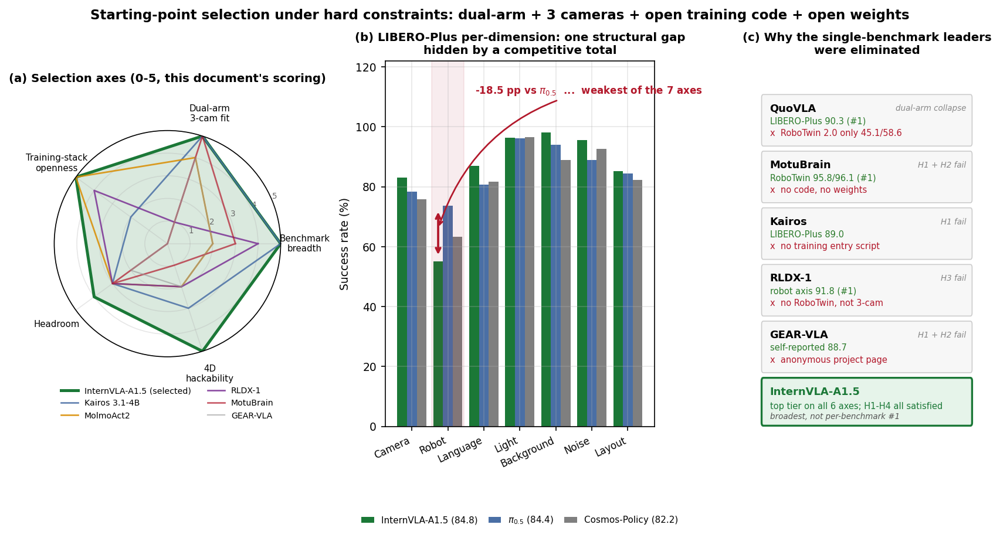
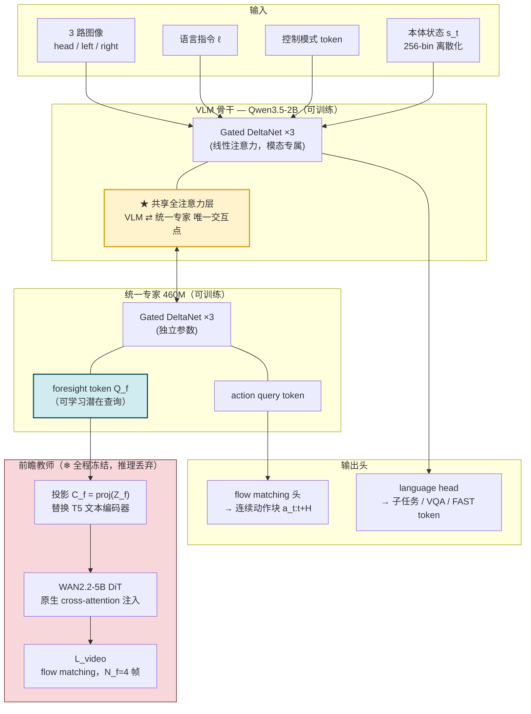
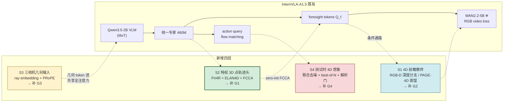
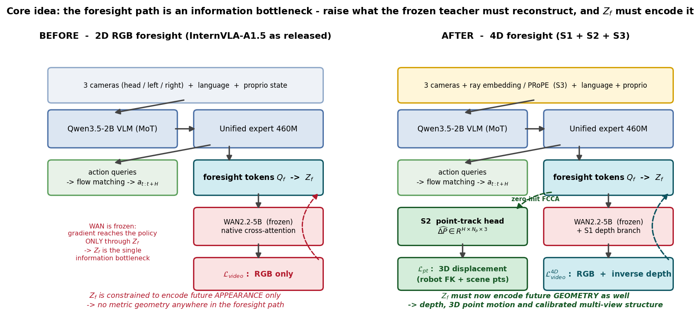
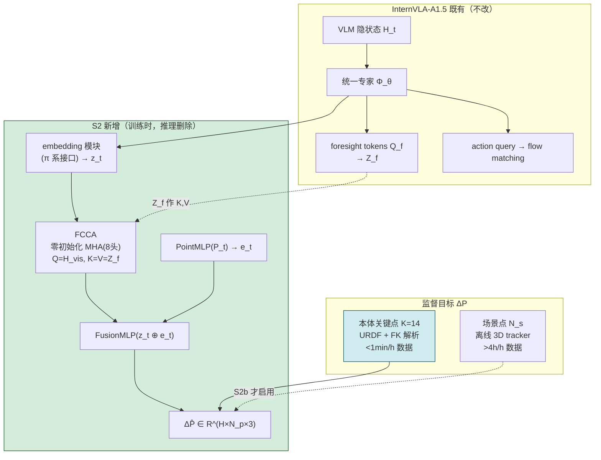
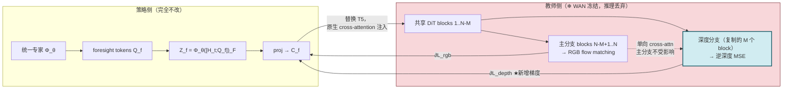
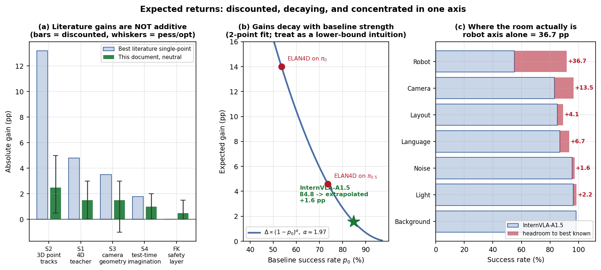
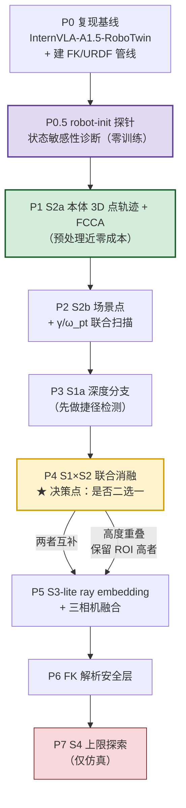

# D4A 方案 1-C-MVPC2：以 InternVLA-A1.5 为新起点的 4D 几何改良方案

> **本文档取代 [MVPC](./d4a_solutioin_1_c_mvpc.md) 的起点选择。** MVPC 押注的 GEAR-VLA 经仓库实测确认为**双盲匿名项目页、无代码无权重**，且其自报分数在 2026 年中已被多个模型超过（§1.1）。本文档重新执行一次证据化筛选，选定 **InternVLA-A1.5** 为新起点，并围绕"**把它已有的 2D RGB 前瞻通路升级为 4D 前瞻**"这一条主线，按 ROI 递减叠加四层几何/4D 改良。
>
> **本文档回答**：在"双臂 + 三相机 + 训练代码开源 + 权重开源"的硬约束下，当前最强的起点是谁？它的**具体缺口**在哪一维？用什么几何与 4D 的学习/生成策略，按什么顺序叠加，能把成功率继续推高？每一层的公式规格、梯度流、超参、消融判据分别是什么？
>
> **本文档不回答**："几何命题是否成立"（→ [MVPA](./d4a_solutioin_1_c_mvpa.md)）、"如何从弱基线证明几何有用"（→ [MVPB](./d4a_solutioin_1_c_mvpb.md)）、"纯世界模型路线的完整展开"（→ [MVPC-WM](./d4a_solutioin_1_c_mvpc_wm.md)）。

## 可靠性标注约定

沿用 MVPA/MVPB/MVPC 的四级标注：

| 标注 | 含义 | 本文档中的典型来源 |
|---|---|---|
| **[A]** | 同行评审论文，或大规模、多方复现的系统性实验 | ICLR/CVPR/RSS 正式录用的方法（如 PRoPE、PAGE-4D） |
| **[B]** | 预印本，或主张方在自己论文中的自证数据 | 各方法论文的主表与消融表（绝大多数性能数字属此类） |
| **[C]** | 工程事实：仓库实测、文件树核对、第三方评测聚合 | GitHub 仓库树、权重发布状态、AllenAI VLA 评测 harness |
| **[D]** | 本文档的推断与设计，**非文献结论** | 落地规格、梯度流分析、收益预期、风险判断 |

**关于性能数字的一条总警告 [C]**：本文档引用的跨论文数字**不可直接横向相加或比较**。同一个基线在不同论文里的复现值差异极大——例如 π0.5 在 LIBERO-Plus 上，InternVLA-A1.5 论文报 **84.4**，ELAN4D 论文报 **73.6**，两者相差 10.8pp。凡涉及"某方法带来 +X pp"的论断，本文档一律**只在该方法自己论文的同一张表内**做减法，并标注基线值；跨论文的数字只用于判断**量级和方向**，不用于精确外推。

## 目录

- [0. TL;DR](#0-tldr)
- [1. 为什么必须换起点](#1-为什么必须换起点)
- [2. 起点筛选：硬约束、候选集与淘汰依据](#2-起点筛选硬约束候选集与淘汰依据)
- [3. InternVLA-A1.5 深度画像](#3-internvla-a15-深度画像)
- [4. 策略 S2：特权 3D 点轨迹监督（第一优先）](#4-策略-s2特权-3d-点轨迹监督第一优先)
- [5. 策略 S1：把冻结的 RGB 教师升级为 4D 教师](#5-策略-s1把冻结的-rgb-教师升级为-4d-教师)
- [6. 策略 S3：三相机标定几何进输入](#6-策略-s3三相机标定几何进输入)
- [7. 策略 S4：测试时 4D 想象与解析安全层](#7-策略-s4测试时-4d-想象与解析安全层)
- [8. 组合收益、独立性与预期区间](#8-组合收益独立性与预期区间)
- [9. 分阶段落地路线与 Go/No-Go 判据](#9-分阶段落地路线与-gono-go-判据)
- [10. 评测协议与统计配置](#10-评测协议与统计配置)
- [11. 风险、边际递减与失败模式](#11-风险边际递减与失败模式)
- [12. 参考来源表](#12-参考来源表)
- [附录 A：一页速查](#附录-a一页速查)

---

## 0. TL;DR

### 0.1 一句话结论

**新起点 = InternVLA-A1.5**：它是在"双臂 + 三相机 + 训练代码与权重全开"硬约束下，**跨基准广度最强**的模型（LIBERO 98.9 / LIBERO-Plus 84.8 / RoboTwin 2.0 93.2 / SimplerEnv 80.8 / DOMINO 27.7 / EBench 35.2，六项均为其论文内第一 [B]），且 `InternVLA-A1.5-RoboTwin` 权重本身就是 **ALOHA-AgileX 双臂 + head/left/right 三相机 + 14-DoF**，与目标本体同构 [C]。

**改良主线只有一句话**：InternVLA-A1.5 的核心创新是让 $M$ 个可学习 **foresight token** 去查询一个**冻结的 WAN2.2-5B 视频生成器**，用未来 RGB 帧的生成损失反向塑造策略表征——**但这条通路目前只监督 2D RGB**。把它升级为 **4D**（深度 / 点图 / 3D 点轨迹），是"几何与 4D 的学习与生成"最短、证据最足的改良路径。

四层改良按 ROI 递减排序：

| 层 | 名称 | 核心手段 | 推理开销 | 文献侧最强单点证据 |
|---|---|---|---|---|
| **S2** | 特权 3D 点轨迹监督 | Pri4R 点轨迹头 + ELAN4D 本体 FK 关键点 + FoMoVLA 零初始化 FCCA 耦合 | **0**（训练时挂、推理时删） | RoboCasa 33.1 → 46.3（+13.2pp）[B] |
| **S1** | 4D 前瞻教师 | X-WAM 交织深度分支把冻结 WAN 变成 RGB-D 教师；PAGE-4D 特征蒸馏作互补 | **0**（教师侧本就在推理时丢弃） | RoboCasa 63.0 → 67.8（+4.8pp）[B] |
| **S3** | 三相机标定几何进输入 | G³VLA ray embedding + PRoPE + 双向跨视角融合 | 小（新增 token 通路） | LIBERO 84.6 → 88.1（+3.5pp）[B] |
| **S4** | 测试时 4D 想象 + 解析安全层 | Kairos 联合去噪、best-of-N 规划、FK swept-volume 一票否决 | **大**（需算延迟账） | LIBERO-Plus 89.0 → 90.8（+1.8pp）[B] |

### 0.2 决定性的诊断发现：起点的缺口不在"平均分"，在 robot-init 这一维

把 InternVLA-A1.5 的 LIBERO-Plus 成绩按七个扰动维度拆开，会看到一个被 84.8 的总分完全掩盖的结构性缺口 [B]：

| 扰动维度 | InternVLA-A1.5 | π0.5 | Cosmos-Policy | 差距 |
|---|---|---|---|---|
| Camera（相机位姿） | 83.1 | 78.4 | 75.8 | 领先 |
| **Robot（机器人初始状态）** | **55.1** | **73.6** | **63.3** | **落后 π0.5 达 18.5pp** |
| Language | 86.9 | 80.8 | 81.7 | 领先 |
| Light | 96.4 | 96.2 | 96.5 | 持平 |
| Background | 98.2 | 94.1 | 88.9 | 领先 |
| Noise | 95.6 | 89.0 | 92.7 | 领先 |
| Layout | 85.2 | 84.5 | 82.2 | 略领先 |
| **总分** | **84.8** | 84.4 | 82.2 | 略领先 |

**InternVLA-A1.5 在七维中的六维都领先，唯独 robot-init 这一维是全场倒数第二（仅高于 π0 的 6.0 和 StarVLA 的 49.8）**。它的总分优势几乎全部来自另外六维，而 robot-init 单独拖走了约 4~5pp 的总分。[D]

这个缺口**不是无解的**：同一张榜上 RLDX-1 在 robot 维取得 **91.8** [C]，证明该维度有巨大可提升空间。而缺口的成因与修法在文献中有直接对应 [B]：

- **Pri4R 的"tracking what"消融**：只跟踪场景点 +2.1pp，**只跟踪机器人本体点 +10.7pp**，两者都跟踪 +13.2pp。→ **本体自身的 3D 运动才是主要收益来源**，这正对应 robot-init 维度。
- **ELAN4D**（用 FK 从本体状态直接算 3D 关键点轨迹）在 π0.5 上的 robot 维增益是 **+5.2pp**（65.5 → 70.7），背景维 +9.0pp。
- **FoMoVLA 的自我诊断**：它的 2D 点轨迹在 camera 与 robot 两维"增益明显偏小，可能因为模型在固定视角与固定初始位姿上训练，**纯 2D 运动线索难以泛化到新配置**"。→ 反证必须上 **3D/metric** 轨迹，而非 2D。

三条独立证据指向同一个结论：**S2（特权 3D 点轨迹，尤其是本体关键点）精确命中起点最大的单一缺口**，这是它被排在第一优先的实证理由，而不只是"改动小"。[D]

### 0.3 一条贯穿四层的架构原则：单向耦合 + 训练时挂载

本文档采纳的四层改良，在架构上共享同一条被反复独立验证的原则 [D]：

> **辅助的几何/4D 分支只能"读"主干、不能"写"主干；它以残差或零初始化方式接入，并在推理时整支丢弃。**

这不是巧合，五个来源各自独立收敛到了它 [B]：

| 方法 | 单向耦合的具体形式 | 推理时 |
|---|---|---|
| X-WAM | *unilateral attention*：深度分支 cross-attend 主分支，主分支不受深度 token 影响 | 深度分支可关闭 |
| GEM-4D | 几何分支"reads from video features but never writes back" | 整支丢弃 |
| Pri4R | 点轨迹头挂在 backbone 输出上，梯度回传但不改输入输出接口 | 头删除 |
| ELAN4D | ControlNet 式旁路 + **梯度隔离**保护预训练骨干，残差通路供给动作 | track decoder 丢弃 |
| FoMoVLA | FCCA 的输出投影**零初始化**，训练开始时恒等映射 | 全部辅助分支丢弃 |

InternVLA-A1.5 自身的 foresight 通路也完全符合这条原则（WAN 全程冻结、推理时整支丢弃），因此四层改良与起点架构在设计哲学上是**同构的**，这大幅降低了集成风险。[D]

### 0.4 与 MVPA / MVPB / MVPC / 主方案的关系

| 文档 | 出发点 | 核心问题 | 与本文档的关系 |
|---|---|---|---|
| [主方案 1-C](./d4a_solutioin_1_c.md) | 完整系统设计 | 端到端方案全貌 | 本文档是其"起点模型 + 改良栈"子模块的最新版本 |
| [MVPA](./d4a_solutioin_1_c_mvpa.md) | 命题验证 | 几何信息是否有用 | 提供本文档的统计基础设施（IQM、分层 bootstrap） |
| [MVPB](./d4a_solutioin_1_c_mvpb.md) | 弱基线 | 从弱基线证明几何收益 | 出发点相反；本文档不重复其 $f/d$ 因子分解 |
| [MVPC](./d4a_solutioin_1_c_mvpc.md) | 强起点（GEAR-VLA） | 在最强几何模型上继续提升 | **被本文档取代**：起点不可用 + 已非最强 |
| [MVPC-WM](./d4a_solutioin_1_c_mvpc_wm.md) | 世界模型中心 | 纯 WM 路线展开 | 本文档的 S1/S4 与其部分重叠，但本文档以**策略模型**为主体、WM 为教师 |
| **MVPC2（本文档）** | **强起点（InternVLA-A1.5）** | **把 2D 前瞻升级为 4D 前瞻** | — |

**MVPC → MVPC2 保留了什么、改了什么** [D]：

- **保留**：改良导向的出发点（站在最强起点上继续提升）、逐层关闭消融的实验设计、[A]/[B]/[C]/[D] 标注、边际递减的风险框架。
- **改掉**：① 起点从 GEAR-VLA 换为 InternVLA-A1.5；② **放弃 VGGT 路线**——GEM-4D 的消融显示以 VGGT 作几何教师**反而劣于无几何基线**（§5.5），而 MVPC 的起点恰恰重度依赖 VGGT；③ 改良重心从"叠加异构的 4D 监督"收敛为"**升级已有前瞻通路的监督目标维度**"这一条主线。

---

## 1. 为什么必须换起点

### 1.1 GEAR-VLA 不可用，且已非最强

**理由一：它是一个双盲匿名项目页，不是可用的代码库 [C]。** 仓库 `babynabeauty/GEAR-VLA` 至今只有 HTML/CSS/JS 的项目主页，0 star / 0 fork / 0 issue，最后一次 push 为 2026-06-09；README 明写 "code and models will be released after the review-compatible release point"。**无训练代码、无推理代码、无权重、无许可证文件。** 其 LIBERO-Plus 88.7 是**不可验证的自报数**，且无第三方复现。

**理由二：即便接受其自报数，它也不再是最强 [B][C]。** 在同一评测面上：

| 模型 | LIBERO-Plus | RoboTwin 2.0 (Clean/Rand) |
|---|---|---|
| GEAR-VLA（自报） | 88.7 | 91.1 / 89.9 |
| QuoVLA（zero-shot） | **90.3** | 45.1 / 58.6 |
| Kairos 3.1-4B | 89.0（joint 去噪 90.8） | 96.9 / 96.1（avg） |
| ACoT-VLA (SFT) | 88.5 | — |
| RLDX-1 | 87.5 | — |
| MotuBrain | — | **95.8 / 96.1** |
| InternVLA-A1.5 | 84.8 | 93.3 / 93.0 |

在双臂面（RoboTwin 2.0）上，GEAR-VLA 的 91.1/89.9 已被 MotuBrain、Kairos、InternVLA-A1.5、X-WAM（89.8/90.7）等多个模型超过。

### 1.2 顺带被否定的技术路线：VGGT 作几何教师

MVPC 的起点 GEAR-VLA 以**可训练的 VGGT** 为 3D 编码器，其整套论证建立在"VGGT 提供的几何先验对操作有用"之上。但 GEM-4D 的受控消融给出了反向证据 [B]（Real domain，同一框架内只换几何教师）：

| 几何教师 | FVD ↓ | SSIM ↑ | AbsRel ↓ | δ₁ ↑ | Chamfer ↓ |
|---|---|---|---|---|---|
| Wan 2.2-14B（无几何监督基线） | 33.43 | 76.24 | 21.39 | 71.18 | 0.2349 |
| **GEM-4D (VGGT)** | **33.68** | **75.89** | **21.73** | **71.03** | **0.2370** |
| GEM-4D (Dep，深度监督) | 32.91 | 78.58 | 20.89 | 74.60 | 0.2229 |
| GEM-4D (PAGE-4D) | **31.82** | **82.05** | **20.13** | **78.19** | **0.2001** |

*符号说明：FVD = Fréchet Video Distance（视频分布距离）；SSIM = 结构相似度；AbsRel = 深度绝对相对误差；δ₁ = 深度误差在 1.25 倍以内的像素占比；Chamfer = 点云倒角距离。*

**用 VGGT 作教师，四项指标全部劣于"完全不加几何监督"的基线。** GEM-4D 作者给出的解释是：VGGT 主要在**静态或准静态场景**上训练，与机器人操作所需的**动态场景演化**不匹配。而换成为动态场景设计的 PAGE-4D 后，全部指标显著改善。

**推论 [D]**：在操作任务中引入几何先验时，**教师是否为动态场景设计**比"是否引入几何"更关键。这条否定证据同时说明：MVPC 的技术路线不只是"起点拿不到"，其几何内核的选择本身也存在问题。本文档因此在 S1 中明确以 **PAGE-4D / 显式深度**为教师，并把 VGGT 列入黑名单。

---

## 2. 起点筛选：硬约束、候选集与淘汰依据

### 2.1 约束确认

用户已明确两条 [C]：

1. **纯学术研究，永不商用** → **许可证不作为筛选条件**。CC BY-NC-SA 4.0、RLWRLD Model License、OpenMDW-1.1 等非商用/自定义许可全部放行。
2. **双臂 + 三相机是硬性要求**，基座是否可动不限。

由此推出四条硬约束 [D]：

| 编号 | 硬约束 | 判定方式 |
|---|---|---|
| **H1** | 训练代码开源（有可运行的训练入口，不只是推理脚本） | 仓库文件树实测：是否存在 `train*.py` / `*_pretrain.sh` / `*_finetune.sh` |
| **H2** | 权重开源 | HuggingFace / 官方发布页实测 |
| **H3** | 原生支持双臂 + ≥3 相机 | 是否有 RoboTwin 2.0 / ALOHA / AgileX 类的双臂三相机配置与权重 |
| **H4** | 在多个较新的公开基准上均有较高分（**广度**，非单点） | 至少覆盖 {单臂桌面, 双臂, 鲁棒性 OOD, 泛化} 四个正交轴中的三个 |

**H1 是筛选中淘汰率最高的一条 [C]**：大量模型宣称"开源"，实际只发布推理代码与权重。必须逐个核对文件树。

### 2.2 评分维度

在硬约束之上，用五个维度做排序（H1–H4 是门槛，以下是排序）[D]：

$$
S = 0.30\,D_{\text{breadth}} + 0.25\,D_{\text{embodiment}} + 0.20\,D_{\text{openness}} + 0.15\,D_{\text{headroom}} + 0.10\,D_{\text{hackability}}
$$

其中：$D_{\text{breadth}}$ = 跨基准广度与绝对高度；$D_{\text{embodiment}}$ = 与"双臂 + 三相机"目标本体的贴合度；$D_{\text{openness}}$ = 训练栈完整性（数据 > 训练脚本 > 权重 > 推理码）；$D_{\text{headroom}}$ = 是否仍有可被几何/4D 填补的**明确**缺口；$D_{\text{hackability}}$ = 架构上是否天然存在 4D 改造挂载点。

$D_{\text{breadth}}$ 权重最高，直接对应用户"在大部分较新的、被公开认可的 benchmark 上都得分较高"的原始要求。$D_{\text{hackability}}$ 权重最低但**在本次筛选中起了决定性作用**（§2.4）。

### 2.3 候选与淘汰依据

八个候选，全部经仓库文件树实测核对 [C]：

| 候选 | 关键成绩 | H1 训练码 | H2 权重 | H3 双臂三相机 | H4 广度 | 判定 |
|---|---|---|---|---|---|---|
| **GEAR-VLA** | LIBERO-Plus 88.7（自报） | ✗ 匿名项目页 | ✗ | — | — | **淘汰** |
| **MotuBrain** | RoboTwin 2.0 **95.8/96.1**（榜首）、WorldArena EWMScore 第一 | ✗ | ✗ | ✓ | 窄 | **淘汰** |
| **QuoVLA** | LIBERO **99.6**、LIBERO-Plus **90.3**（榜首）、LIBERO-Pro 69.8 | 未核实 | 未核实 | ✗ RoboTwin 2.0 仅 **45.1/58.6** | 偏 LIBERO 系 | **淘汰（H3）** |
| **Kairos 3.1-4B** | LIBERO-Plus 89.0 / joint 90.8、RoboTwin 96.9/96.1 | **✗** 仅有 `benchmarks/libero_plus/kairos_wam/configs/train.yaml`，**无任何训练入口脚本** | ✓ 三个权重 | ✓ | 宽 | **降级**：天花板参照 + 模块供体（S4） |
| **RLDX-1** | 七项 SOTA：LIBERO 97.8 / LIBERO-Plus 87.5（**robot 91.8**）/ SIMPLER 85.8·82.4·71.9 / RoboCasa 70.6 | ✓ | ✓ | ✗ 无 RoboTwin 2.0，非双臂三相机原生 | 宽但缺双臂 | **降级**：旁证（证明 robot 维可达 91.8） |
| **MolmoAct2** | LIBERO 97.2 / Think 98.1、RoboEval；含 720h 双臂 YAM 真机数据集；第三方 Cortex AI 真机评测第一 | ✓ | ✓ | ✓ | **窄**：无 RoboTwin / LIBERO-Plus | **备选**：真机验证平台 |
| **Cosmos3-Nano-Policy 16B** | RoboArena 榜首/次席，cosmos-framework 全套 SFT recipe | ✓ | ✓ | ✗ DROID 单臂 | 中 | **备选**（16B 过重） |
| **X-WAM** | RoboCasa **79.2**、RoboTwin 2.0 89.8/90.7 | ✓ `scripts/train_sft.py` | ✓ | ✓ | 中 | **降级**：技术供体（S1a），骨干同为 Wan2.2-5B |
| ✅ **InternVLA-A1.5** | 六项均第一（论文内）：LIBERO 98.9 / LIBERO-Plus 84.8 / RoboTwin 2.0 93.2 / SimplerEnv 80.8 / DOMINO 27.7 / EBench 35.2 | ✓ 全套 | ✓ 四份 | ✓ 原生 | **最宽** | **选定** |

### 2.4 选定理由

**(1) 广度第一，且覆盖六个正交轴 [B]。** InternVLA-A1.5 论文所报六项仿真基准全部第一：LIBERO（单臂桌面）98.9、LIBERO-Plus（鲁棒性 OOD）84.8 zero-shot、RoboTwin 2.0（双臂）93.2、SimplerEnv（real-to-sim）80.8、DOMINO（zero-shot 动态）27.7、EBench（移动操作）35.2。这是候选集中唯一一个在**单臂 / 双臂 / 移动 / real-to-sim / 鲁棒性 / 动态**六个正交轴上同时有分且都靠前的开源模型。

**(2) 训练栈开放度最高 [C]（实测文件树）**：

```
launch/internvla_a15_pretrain.sh
launch/internvla_a15_finetune_libero.sh
launch/internvla_a15_finetune_robotwin.sh
src/lerobot/scripts/lerobot_train.py          # 基于 LeRobot
tutorials/pretrain_*.md
```

外加 InternData-A1 预训练数据集，以及 base / Libero / RoboTwin / DOMINO 四份权重。这是本次筛选中**唯一一个数据 + 预训练脚本 + 微调脚本 + 权重四件齐全**的候选。对比 Kairos：星标 2437、fork 463、成绩更高，但仓库树里只有一个 `train.yaml` 配置文件而**没有任何训练入口**，只发布了 WAM 推理代码与权重——**不能作为可训练底座**。

**(3) 本体天然吻合 [C]**：`InternVLA-A1.5-RoboTwin` 权重对应的就是 **ALOHA-AgileX 双臂 + head/left/right 三相机 + 14-DoF**，动作维 ≤32 的统一动作空间。无需做本体适配工程即可开跑，这是 H3 的最强满足。

**(4) 架构自带 4D 改造挂载点（决定性）[B]。** 这是 $D_{\text{hackability}}$ 权重虽低却起决定作用的原因：InternVLA-A1.5 的前瞻通路在结构上**恰好是一个"监督目标可替换"的插槽**——foresight token 的语义完全由"下游教师要求它预测什么"定义。把教师从 RGB 换成 RGB-D，不需要改动策略侧的任何接口（详见 §3.4 与 §5.1）。候选中没有第二个模型有这种性质的挂载点。

### 2.5 必须诚实说明的三点

**(1) "六项全第一"是论文内自证，不等于绝对第一 [B][C]。** 第三方评测聚合（AllenAI VLA evaluation harness）显示，在更大的对比池里：

- **LIBERO-Plus**：QuoVLA zero-shot **90.3** > Kairos 89.0 > ACoT-VLA 88.5 > RLDX-1 87.5 > **InternVLA-A1.5 84.8**
- **RoboTwin 2.0**：MotuBrain **95.8/96.1** > Kairos 96.9/96.1(avg) > **InternVLA-A1.5 93.3/93.0** > X-WAM 89.8/90.7 > InternVLA-A1 (3B) 89.4/89.6

因此**准确的表述是**：InternVLA-A1.5 不是每一项基准的绝对最高分，而是在"**同时满足全部硬约束**（双臂三相机 + 训练栈全开）"这一子集里，**跨基准广度最强、且各项都在第一梯队**的模型。在单项上更高的四个模型分别栽在：QuoVLA 栽在 RoboTwin 2.0（45.1/58.6，双臂能力崩塌）、MotuBrain 栽在无代码无权重、Kairos 栽在无训练入口、RLDX-1 栽在无双臂三相机。[D]

**(2) QuoVLA 的反例说明"只看 LIBERO-Plus 会选错模型" [D]。** QuoVLA 在 LIBERO 系（LIBERO 99.6、LIBERO-Plus 90.3、LIBERO-Pro 69.8）上全面领先，但换到 RoboTwin 2.0 双臂只有 45.1/58.6，比 InternVLA-A1.5 低约 40pp。这直接验证了 H4"广度"约束的必要性，也说明**用户对 MVPC 的质疑（"在公共 benchmark 上得分并不是最 top"）应当被理解为"跨基准广度不足"而非"某一项分数不够高"**。

**(3) 起点的 robot-init 缺口是本次选择的已知代价 [D]。** 如 §0.2 所述，InternVLA-A1.5 的 robot 维仅 55.1，是七维中唯一的短板。选它意味着接受这个代价——但同时，这个缺口恰好是四层改良中 ROI 最高的 S2 的**精确靶点**，因此它更应被理解为**改进余量（$D_{\text{headroom}}$）而非缺陷**。若 S2 能把 robot 维推到 RLDX-1 的量级（91.8），仅此一维就能贡献总分约 +5pp。



---

## 3. InternVLA-A1.5 深度画像

本章回答四个问题：它**吃什么、吐什么**；内部**静态结构**长什么样；forward/backward 时**数据与梯度怎么流、谁被冻结**；以及**还剩什么缺口**。全部架构描述来自其论文 [B]，仓库事实标 [C]，分析与推断标 [D]。

### 3.1 输入输出规格

**输入**（每个控制时刻 $t$）[B]：

| 项 | 记号 | 规格 | 编码方式 |
|---|---|---|---|
| 多视角观测 | $O_t=\{o_t^{(v)}\}_{v=1}^{V}$ | 目标本体 $V=3$（head / left / right） | Qwen3.5 视觉管线 → `<\|vision_start\|> <\|image_pad\|> <\|vision_end\|>` token 块，**空缺视角以 mask 补齐** |
| 语言指令 | $\ell$ | 自然语言 | 标准文本 token |
| 控制模式 | — | `<joint>` / `<end_effector>` / `<vqa>` | 单个特殊 token，指定动作空间 |
| 本体状态 | $s_t\in\mathbb{R}^{d}$，$d\le 32$ | 双臂 14-DoF 填入统一槽位 | **逐维均匀离散化为 256 bin，范围 $[-1,1]$**，作为离散 token 追加 |

*符号说明：$V$ = 相机路数；$d$ = 本体状态维度；$t$ = 控制步。*

**输出** [B]：

| 项 | 规格 | 解码方式 | 何时使用 |
|---|---|---|---|
| 连续动作块 | $a_{t:t+H}$，动作维 ≤32 | **flow matching 头** | 推理主输出 |
| 离散动作块 | FAST tokenizer，动作词表 2048 | 自回归，**与 VLM 共享 embedding 表与 language head** | 训练监督（Stage 1）；推理可选 |
| 子任务描述 / VQA 答案 | 文本 | 自回归 | 保持语义能力；可用于可解释性 |
| 未来视频 | $N_f=4$ 帧 | 冻结 WAN2.2-5B | **仅训练时**，推理丢弃 |

**"多视角空缺以 mask 补齐"这一点对本方案很关键 [C][D]**：它意味着模型的视觉输入接口本来就是**变长多视角**的，因此 S3 要接入的 per-view 几何 token（ray embedding / PRoPE）可以沿用同一套 masking 机制，不需要改动输入管线的结构。

### 3.2 静态架构：MoT + 统一专家



**三个结构要点 [B]**：

1. **混合注意力骨干**：Qwen3.5-2B 交替排布 **3 层 Gated DeltaNet 线性注意力 + 1 层标准全注意力**。
2. **MoT 的交互面极窄**：VLM 与统一专家**只通过共享的全注意力层交互**，各自保留独立的 Gated DeltaNet 层做模态专属处理。统一专家采用与骨干相同的架构蓝图（Qwen-3.5-Text）但隐藏维更小，共 **460M 参数**。
3. **组间因果序**：token 分组排列且组间因果——foresight token 先 attend 到 VLM 上下文，action query 追加在 foresight token 之后，**动作头可以 attend 到它前面所有非动作 token**。

**"共享全注意力层是唯一交互点"这一事实，决定了三层改良的接入位置 [D]**：任何希望**同时影响感知与动作**的几何信号，必须进入这个全注意力层的 KV，否则只能单边生效。这一点在 §6.3 分析 S3 的适配风险时是核心论据。

### 3.3 前瞻机制：本方案的改造靶点

这是 InternVLA-A1.5 最核心的设计，也是本方案全部改良的锚点 [B]。

设 $H_t$ 为由 $(O_t,\ell)$ 编码得到的视觉-语言隐状态，$Q_f$ 为 $M$ 个**可学习的 foresight query token**，$\Phi_\theta$ 为统一专家 transformer，$\mathcal{F}$ 为 foresight token 所在位置集合。上下文化的前瞻嵌入为：

$$
Z_f^t \;=\; \Phi_\theta\!\left(\left[H_t;\,Q_f\right]\right)_{\mathcal{F}}
\tag{3.1}
$$

随后投影到视频生成器的条件空间 $C_f^t=\mathrm{proj}(Z_f^t)$，**替换 WAN2.2 原本的 T5 文本编码器输出**，经 WAN 去噪 transformer 的**原生 cross-attention 层**注入。

对每个动作块，均匀采样 $N_f=4$ 帧未来帧作为预测目标。把"当前帧 + 未来帧"拼成 $x\in\mathbb{R}^{(1+N_f)\times H\times W\times 3}$，用 WAN-VAE 编码为干净视频潜变量 $x_1$。采样噪声 $x_0\sim\mathcal{N}(0,I)$ 与插值时刻 $s\in[0,1]$，令 $x_s=(1-s)x_0+sx_1$、目标速度场 $v_s=x_1-x_0$，则视频监督损失为：

$$
\mathcal{L}_{\text{video}}=\mathbb{E}_{x_0,x_1,C_f^t,s}\left\|\,u\!\left(x_s,\,C_f^t,\,s\right)-v_s\,\right\|^2
\tag{3.2}
$$

其中 $u$ 是**冻结的** WAN 去噪 transformer。

**梯度流的关键事实 [B]**：由于 WAN 参数全程冻结，$\mathcal{L}_{\text{video}}$ 的梯度**只能沿条件通路回传**——即经 $\mathrm{proj}$ 回到 $Z_f^t$，再经统一专家回到 $Q_f$ 与共享全注意力层，最终影响 VLM 骨干表征。

### 3.4 前瞻通路是一个"信息瓶颈"——本方案最重要的推论

把 (3.1)(3.2) 连起来看，得到一个对整份方案起决定作用的结构性观察 [D]：

> $Z_f^t$ 是**策略侧通往视频教师的唯一信息通道**。WAN 被冻结，它自身不学任何东西；它唯一的作用是**给 $Z_f^t$ 施加一个信息充分性约束**——$Z_f^t$ 必须编码足够的信息，才能让一个固定的生成器重建出正确的未来 $N_f$ 帧。

这条推论有三个直接后果：

1. **前瞻通路的价值上限，由"教师要求预测什么"唯一决定。** 教师只要 RGB，$Z_f^t$ 就只需编码"未来长什么样"；教师要 RGB-D，$Z_f^t$ 就**必须**额外编码"未来的度量几何"。这就是 S1 的全部理论依据。
2. **升级教师不需要改策略侧接口。** $Q_f$ 的数量、$\Phi_\theta$ 的结构、动作头的连接方式全部不变，改的只是 WAN 那一侧的预测目标。这是 S1 工程量小的原因。
3. **推理时零代价。** 教师侧本来就在推理时整支丢弃，因此**无论把教师做得多重，推理延迟都不变**。这一点在 §5.2 选择深度分支形态时会推翻 X-WAM 原论文的结论。

消融数据直接支持"这条通路很值钱" [B]（在两阶段预训练后的模型上做）：

| 变体 | LIBERO | LIBERO-Plus | RoboTwin 2.0 | DOMINO |
|---|---|---|---|---|
| InternVLA-A1.5（完整） | **98.9** | **84.8** | **93.2** | **27.7** |
| w/o video loss | 97.9 (−1.0) | 78.0 (**−6.8**) | 91.1 (−2.1) | 25.3 (−2.4) |
| w/o foresight tokens | 98.6 (−0.3) | 77.9 (**−6.9**) | 90.2 (−3.0) | 23.8 (**−3.9**) |

**读法 [D]**：这条 2D 前瞻通路在**已饱和的 ID 基准（LIBERO）上几乎不值钱（−0.3~−1.0）**，但在**鲁棒性（LIBERO-Plus，−6.8/−6.9）与 zero-shot 动态（DOMINO，−2.4/−3.9）上极其值钱**。也就是说，它的作用机制是**提升分布外泛化**，而非提升拟合精度。这为 4D 升级的收益期望划定了方向：**主要收益应当出现在 LIBERO-Plus 与 DOMINO，而非 LIBERO**——这条预期后面会被写成 Go/No-Go 判据（§9）。

### 3.5 训练配方

**Stage 1 — VLM 转 VLA 执行器 [B]**：在 VQA 与大规模机器人数据的混合上共训 VLM 骨干，联合监督"问题答案 + 下一子任务 + 离散动作块"。由于动作 token 被追加进 VLM 词表并共享 embedding 表与输出投影，全部 label token 统一在一个交叉熵下监督，**无需辅助头或额外损失加权**：

$$
\mathcal{L}_{\text{stage1}}=-\mathbb{E}_{(o_t,\ell,y)\sim\mathcal{D}}\sum_{i=1}^{M+N}\log p_\theta\!\left(y_i \mid o_t,\ell,y_{<i}\right)
\tag{3.3}
$$

对 VQA 样本，label 退化为答案 span，动作项自动消失。

**Stage 2 — 引入统一专家与前瞻推理 [B]**：加入统一专家做 MoT 联合注意力，插入 foresight token 与 $\mathcal{L}_{\text{video}}$，并以 flow matching 头替代离散动作预测用于闭环控制。

**Stage 3 — 下游微调 [C]**：`internvla_a15_finetune_{libero,robotwin}.sh`。

**预训练规模 [B]**：1.2M 机器人 episode / 861M 帧 + 3M 多模态样本。数据源包括 InternData-A1（合成，帧数占比最大）、AgiBotWorld、UMI、DROID、Galaxea、RoboMind 1.0，全部映射到 InternVLA-A1 的统一动作空间（形态专属槽位填充到共享布局，使所有本体共用一个动作头）。多模态语料来自 InternVLA-M1（含 General QA 637K 等四类），用于防止动作与前瞻目标侵蚀 VLM 的预训练知识。

**一个对 S1 极为有利的巧合 [C][D]**：X-WAM 的预训练数据表里包含 **InternA1-Aloha（184,803 episodes / 1337.3h）、InternA1-Genie1、InternA1-Lift2**，即与 InternVLA 同源的 InternData-A1；且 X-WAM **已公开发布带 depth 的 RoboTwin / RoboCasa 数据集**，其深度由 Video Depth Anything 离线抽取。这意味着 S1 所需的深度标注**大概率不需要自己重跑**，可直接复用。

### 3.6 剩余缺口诊断

综合 §0.2 的维度分解与 §3.4 的消融，起点的缺口可归为四类 [D]：

| 缺口 | 证据 | 对应改良 |
|---|---|---|
| **G1 本体状态泛化极弱** | LIBERO-Plus robot 维 **55.1**，落后 π0.5 18.5pp，落后 RLDX-1 36.7pp | **S2**（本体 FK 关键点 3D 轨迹为主） |
| **G2 前瞻只有 2D，无度量几何** | $\mathcal{L}_{\text{video}}$ 仅监督 RGB；$Z_f^t$ 无任何显式几何约束 | **S1**（RGB → RGB-D 教师） |
| **G3 三相机被当作独立图像流** | 输入管线把各视角编码为独立 token 块，**未使用已知的内外参耦合关系** | **S3**（ray embedding + PRoPE + 跨视角融合） |
| **G4 推理时前瞻能力被完全丢弃** | 视频分支推理时整支丢弃，$Z_f^t$ 的"想象"不参与决策 | **S4**（联合去噪 / best-of-N） |

**G4 值得单独说明 [B][D]**：Kairos 的对照实验显示，把未来视频 token 与动作 token **联合去噪**、让动作在推理时 attend 到生成的未来，能把 LIBERO-Plus 从 89.0 提到 **90.8**（+1.8pp）。这说明"推理时丢弃视频支"是 InternVLA-A1.5 **主动留在桌上的收益**——它换来了实时性。S4 的本质就是把这部分收益按延迟预算部分赎回。

### 3.6.1 robot-init 缺口的根因诊断

G1（robot 维仅 55.1）是四个缺口里 ROI 最高、也最容易被误诊断的一个。在把 S2 当作既定药方之前，本节把"为什么恰恰是 InternVLA-A1.5 在这一维掉得这么深"拆成可检验的证据链，逐条标注可靠性。

**"Robot" 维的精确定义 [B]**：LIBERO-Plus 原论文（Fei et al., *LIBERO-Plus: In-depth Robustness Analysis of Vision-Language-Action Models*，arXiv:2510.13626，附录 A.5）明确写明，该维**不是**机器人底座位姿扰动、**不是**换本体形态，而是在 episode reset 时对机械臂**初始关节角 `qpos`** 施加随机扰动，扰动幅度（关节角变化范数）∈ **[0.1, 0.5] rad**（约 5.7°–28.6°），此后不再持续加扰。论文自己给出的机制假设是**"运动学推理不足"**（inadequate kinematic reasoning）——模型更像是在对"从一个见过的初始构型出发"的轨迹做**记忆式复现**，而非真正基于当前构型重新规划。一个佐证：作者用 2 万条扰动轨迹重新微调 OpenVLA-OFT，Camera 维从 56.4 飙到 92.8，但 **Robot 维只从 21.7 挪到 30.3**——说明这不是简单的"训练数据没覆盖"，而是更深层的表征问题。

**排除假说一：状态离散化精度不够 [D]（本文档计算，量级上可证伪）**。InternVLA-A1.5 把本体状态逐维均匀离散化为 **256 个 bin**（区间 $[-1,1]$），bin 宽度 $2/256\approx0.0078$。按典型关节量程折算，一个 bin 对应约 **1.3°–2.6°**，而扰动幅度 0.1–0.5 rad（5.7°–28.6°）跨越至少 **12.8–64 个 bin**。也就是说，256-bin 离散化的分辨率远细于扰动幅度本身，模型**并非"读不到"状态变化，而是读到了却没有正确利用**。更硬的反证是跨模型对照：$\pi_{0.5}$ 用的是同一套 256-bin 方案（OpenPI 实现），Robot 维却拿到 **73.6**，比 InternVLA-A1.5 高 18.5pp——同一种编码精度，效果差距巨大，说明离散化粒度不是主因。

**排除假说二：连续 vs 离散状态编码 [B]（跨模型对照直接证伪）**：

| 模型 | 状态编码方式 | Robot 维成绩 |
|---|---|---|
| $\pi_0$（Black et al., arXiv:2410.24164） | **连续**线性投影进 transformer | **6.0**（七维最差） |
| $\pi_{0.5}$（Physical Intelligence, arXiv:2504.16054；OpenPI 实现） | 256-bin **离散**进语言序列 | **73.6** |
| InternVLA-A1.5 | 256-bin **离散**进语言序列（同方案） | **55.1** |
| RLDX-1（arXiv:2605.03269） | **连续** `CategorySpecificMLP` 状态流 | **91.8**（同榜最高） |

连续编码里既有最差（$\pi_0$）也有最好（RLDX-1），离散编码里 $\pi_{0.5}$ 与 InternVLA-A1.5 又差了 18.5pp。**"连续还是离散"这个变量本身解释不了成绩分布**，必须往架构更深处找。

**一个反直觉但关键的不对称信号 [B]**：把 InternVLA-A1.5 与 $\pi_{0.5}$ 逐维对比（均取 InternVLA-A1.5 论文 Table 6 的同源数字），会发现：

| 维度 | InternVLA-A1.5 | $\pi_{0.5}$ | 谁更强 |
|---|---|---|---|
| Camera（相机位姿扰动，纯视觉几何） | **83.1** | 78.4 | InternVLA-A1.5 |
| Robot（关节角扰动，需读状态并重新规划） | 55.1 | **73.6** | $\pi_{0.5}$，领先 18.5pp |

这排除了"InternVLA-A1.5 整体几何鲁棒性弱"这个笼统解释——面对纯视觉几何变化（相机搬家），它反而是同榜最强。**问题被精确定位在"状态 token → 生成合理动作"这条通路上，而不是模型的一般视觉能力上。**

**最可能的因果链（按证据强度排序）**：

1. **[B] LIBERO-Plus 自陈机制**：轨迹记忆而非闭环运动学推理（见上）。
2. **[B] 显式运动学/空间推理是有效药方，且是对照实验证实的**：两个 Robot 维明显更强的模型都**显式地让模型推理当前构型与目标的空间关系**，而不是把状态当一个 token 被动接收——ACoT-VLA（arXiv:2601.11404，建在 $\pi_{0.5}$ 之上）加入"动作链式推理"（EAR）后，zero-shot Robot 从其 $\pi_{0.5}$ 复现基线的 40.8 提升到 **82.6**；RLDX-1 在架构里专设"末端执行器–目标物体空间关系"机器人 VQA 子任务，Robot 达 **91.8**（arXiv:2605.03269 Table 11）。
3. **[D] 本文档推断，但与 §3.4 的信息瓶颈论证直接呼应**：InternVLA-A1.5 的 foresight token $Z_f^t$ 只被"生成未来看起来合理的 RGB 视频"这一个损失约束（$\mathcal{L}_{\text{video}}$）。视频生成目标本身对"精确复现当前构型的微小偏移"并不敏感——一段视频只要看起来是"手臂在合理地做这个任务"就能拿到很低的生成损失，**不需要精确编码"这次起点和训练时见过的典型起点差了多少度"这种细粒度信息**。这正好解释上面的不对称：Camera 维只需要"理解新视角下场景语义布局"，是 VLM 视觉预训练的强项；Robot 维需要"精确追踪当前构型、据此重新规划"，恰恰是一个被 RGB 生成损失稀释、从未被专门监督到的维度。这条推断不是独立的新论点，而是 §3.4 核心命题（"$Z_f^t$ 的价值上限由教师被要求预测什么唯一决定"）在 robot 维上的具体推论。

**这对 S2 的意义 [D]**：以上因果链把 S2（尤其是 ELAN4D 的 FK 本体关键点 3D 轨迹监督）从"经验上消融显示 +10.7pp/+5.2pp 相关"提升为"有机制解释的对症下药"——如果根因确实是"没有信号逼着模型精确编码当前构型"，那么用 URDF+FK 把当前状态显式解析成 3D 关键点、并直接监督"这些点接下来怎么移动"，正是补上这条缺失信号的最短路径，而不是寄望于视频生成损失"顺便"学到构型敏感性。

**建议：在启动 S2 大规模训练前先做一个低成本诊断实验 [D]**。相比直接扑上 P1 的完整训练，可以先用起点 checkpoint（无需任何新训练）做一次探针测试：

- **探针 A（状态敏感性）**：固定图像输入不变，仅把状态 token 替换为扰动后的值，观测动作输出的变化幅度。若动作几乎不随状态变化而变化，说明状态通道在当前策略头里已被弱化/未被充分利用——这是"状态通路本身有问题"的直接证据。
- **探针 B（视觉主导性对照）**：反过来固定状态、只扰动图像中机械臂的视觉外观（如轻微改变可见关节角度渲染），观测动作变化幅度，与探针 A 对比。

若探针 A 显示状态改变确实驱动了动作变化、但结果仍然是错的（比如朝着"典型起点"该走的方向走），则进一步坐实"轨迹记忆"假说，而非"没读到状态"；若探针 A 显示状态变化几乎不影响动作，则说明问题比 S2 设计预想的更基础（可能需要先检查状态 token 是否被 causal attention 掩码或训练配方边缘化），应在动手做 S2 之前先定位。这个探针的成本是**一次前向推理级别**，远低于 P1 的完整训练，因此被提升为 §9 路线图中一个更早的验证关卡（新增 P0.5，见 §9.2）。

### 3.7 四层改良与缺口的对应





---

## 4. 策略 S2：特权 3D 点轨迹监督（第一优先）

**一句话**：在统一专家的特征上挂一个轻量点轨迹头，预测未来 $H$ 步内一组 3D 点的**位移轨迹**；训练时用、**推理时整个删除**。轨迹点分两类——用 FK 从本体状态解析算出的**机器人关键点**（便宜、精确、直击 G1），以及从数据离线抽取的**场景点**（较贵、互补）。再用零初始化的 cross-attention 把这条通路与已有的 foresight token 耦合起来。

### 4.1 为什么排第一

四条理由，前两条是实证的，后两条是工程的 [D]：

1. **精确命中起点最大缺口。** §0.2 已论证：Pri4R 的收益主要来自本体点（只跟本体 +10.7pp vs 只跟场景 +2.1pp），而起点最弱的维度正是 robot-init（55.1）。
2. **单点收益在四层中最大。** RoboCasa 33.1 → 46.3（+13.2pp）[B]，比 S1（+4.8pp）、S3（+3.5pp）、S4（+1.8pp）高一个量级。
3. **零推理开销、零接口变更。** 推理时按原始架构运行，"adds no extra inputs, outputs, or computational overhead during inference"[B]。这意味着**它不会与后续任何一层冲突**，可以放在最底层。
4. **收敛更快。** Pri4R 报告达到基线峰值性能的速度快 **2.7×**[B]，这在需要跑多轮消融的项目里直接折算成算力节省。

### 4.2 Pri4R：公式与证据

**架构 [B]**。点轨迹头有两个插槽——Point MLP 与 Fusion MLP。给定 backbone 特征 $\mathbf{z}_t$ 与当前点集 $P_t\in\mathbb{R}^{N_p\times 3}$：

$$
\mathbf{e}_t=\mathrm{PointMLP}(P_t),\qquad
\widehat{\Delta P}_{t:t+H}=\mathrm{MLP}_{\text{fusion}}\!\left(\mathbf{z}_t\oplus\mathbf{e}_t\right)\in\mathbb{R}^{H\times N_p\times 3}
\tag{4.1}
$$

其中 $\oplus$ 为特征拼接，$H$ = 动作块长度（与动作视野对齐），$N_p$ = 采样点数，$\widehat{\Delta P}$ = 预测的**逐步 3D 位移**（不是绝对坐标）。

**损失 [B]**。在原动作损失上加一项 $\ell_1$：

$$
\mathcal{L}=\mathcal{L}_{\text{act}}+\omega_{\text{pt}}\left\|\widehat{\Delta P}_{t:t+H}-\Delta P_{t:t+H}\right\|_1
\tag{4.2}
$$

原论文取 $\omega_{\text{pt}}=1$、$N_p=1024$。

**$\mathbf{z}_t$ 的接口按 VLA 家族而定 [B]**：backbone-centric 的 VLA（OpenVLA-OFT）取**最后一层 action-query token 的嵌入**；expert-style 的 VLA（$\pi_0$/$\pi_{0.5}$）则用一个 embedding 模块以 backbone 最后一层隐状态为条件产生 $\mathbf{z}_t$。**InternVLA-A1.5 属于后者**（统一专家 = expert-style），因此应走 $\pi$ 系的接口——这一点很重要，Pri4R 的 $\pi_{0.5}$ 消融显示 embedding 模块的设计影响不小（RoboCasa：$\pi_{0.5}$ 52.9 → +point expert 53.4 → +backbone query token 54.8 → +完整设计 **57.0**，即 +4.1pp）。

**监督目标的选择：这是全文最有价值的一张消融表 [B]**（OpenVLA-OFT，RoboCasa，基线 33.1）：

| 监督目标 | SR | Δ |
|---|---|---|
| 无（基线） | 33.1 | — |
| + 目标点集（goal point set） | 33.8 | +0.7 |
| + **2D** 点轨迹 | 37.0 | +3.9 |
| + 深度图 | 42.3 | +8.3 |
| + **3D 点轨迹（Pri4R）** | **46.3** | **+13.2** |

以及"跟踪什么"的消融：

| 跟踪对象 | SR | Δ |
|---|---|---|
| 只跟场景点 | 35.2 | +2.1 |
| **只跟机器人点** | **43.8** | **+10.7** |
| 两者都跟（Pri4R） | 46.3 | +13.2 |

再加一条否定性证据——**把 $P_t$ 作为输入 token 喂进 backbone**（测试时需要 $P_t$）只有 34.5（+1.4），远低于位移监督的 46.3（+13.2）[B]。

**三条可直接指导设计的结论 [D]**：
- **3D > 深度图 > 2D > 目标点集**。时序密集 + 度量几何 + 空间稀疏三者缺一不可；单纯的"终点状态"（goal point set，+0.7）几乎无效。
- **本体点是主力**（+10.7 / +13.2 ≈ 81%），场景点是补充。这决定了 §4.3 的实施顺序。
- **监督 > 输入**。把几何当输入（+1.4）远不如把几何当预测目标（+13.2）。这条与 Pri4R 原文的论述一致：作为输入时，模型仍须自己学会如何利用它；作为预测目标时，几何结构被直接压进共享表征。

**点轨迹头的结构不能随便换 [B]**（LIBERO-Long，OpenVLA-OFT 基线 89.2）：

| Point Encoder | Fusion Module | SR | Δ |
|---|---|---|---|
| PointNet | Pri4R | 80.8 | **−8.4** |
| Point Transformer | Pri4R | 92.4 | +3.2 |
| Pri4R | Transformer | 92.2 | +3.0 |
| **Pri4R** | **Pri4R** | **94.4** | **+5.2** |

注意 **PointNet 会掉 8.4pp，比不加还差**。这说明点编码器的选择是敏感超参，**不能"随便挑一个点云网络"**。落地时应严格照搬 Pri4R 的 PointMLP + FusionMLP，不做替换。

### 4.3 ELAN4D：用 FK 免费拿到本体关键点轨迹

既然本体点贡献了约八成收益，那么"如何拿到本体点的 3D 轨迹"就是关键的工程问题。ELAN4D 给出了几乎零成本的答案 [B]：

**不需要任何外部点跟踪器或场景重建**——用 URDF + 正向运动学（FK），从**本体状态序列**直接解析计算出机器人关键点（各关节 + 末端执行器）的 3D 位移轨迹。

**成本对比 [B]**：SpatialTracker 类的视觉点跟踪器需 **>4 小时 / 每小时数据**；FK 只需 **<1 分钟 / 每小时数据**。约 **240× 的预处理加速**，且结果是**解析精确**的（不含跟踪误差）。

**关键点配置 [B]**：LIBERO/LIBERO-Plus 用 $K=8$（7 关节 + 1 末端）；**RoboTwin 2.0 用 $K=14$（6+6 关节 + 1+1 末端）**——后者正是目标本体的配置，可直接照搬。

**注入方式 [B]**：ControlNet 式的即插即用旁路 + 轻量 track decoder，通过**梯度隔离**保护预训练 VLM 骨干，学到的 4D 感知特征经**残差通路**供给动作预测。推理时 track decoder 丢弃，策略输入输出接口不变。

**证据 [B]**（LIBERO-Plus，注意此处 $\pi_{0.5}$ 基线为 73.6，与 InternVLA 论文报的 84.4 不同，见开篇总警告）：

| 维度 | $\pi_0$ | ELAN4D($\pi_0$) | $\pi_{0.5}$ | ELAN4D($\pi_{0.5}$) |
|---|---|---|---|---|
| Camera | 13.8 | 61.8 | 59.7 | 63.7 (+4.0) |
| **Robot** | 6.0 | 38.4 | 65.5 | **70.7 (+5.2)** |
| Language | 58.8 | 60.6 | 75.3 | 77.8 (+2.5) |
| Light | 85.0 | 89.1 | 87.0 | 89.8 (+2.8) |
| Background | 81.4 | 84.1 | 82.4 | **91.4 (+9.0)** |
| Noise | 79.0 | 77.8 | 72.1 | 79.9 (+7.8) |
| Layout | 68.8 | 72.1 | 80.3 | 81.4 (+1.1) |
| **Overall** | **53.6** | **67.6 (+14.0)** | **73.6** | **78.2 (+4.6)** |

RoboTwin 2.0 上：$\pi_0$ 12% → 15%，$\pi_{0.5}$ 32% → 37%；空间理解类任务增益最明显（Dump Bin 37% → 49%，Lift Pot 5% → 15%）[B]。

**超参 [B]**：30K steps，AdamW，LR 2.5e-5，8× GH200，总 batch 64，$\lambda_{\text{track}}=0.1$。注意 ELAN4D 的轨迹损失权重 **0.1** 与 Pri4R 的 $\omega_{\text{pt}}=1$ 相差 10 倍——这是两者注入位置不同导致的（ELAN4D 走梯度隔离的旁路，Pri4R 直接回传骨干），**落地时必须按注入方式重新扫描该权重**（§4.6）。

### 4.4 FoMoVLA FCCA：让点轨迹与 foresight token 产生协同

Pri4R/ELAN4D 的点轨迹与 InternVLA 已有的 foresight token 若各自独立优化，只是两个不相关的正则项。FoMoVLA 证明**必须显式耦合**才有协同 [B]。

**FCCA（Future-Conditioned Cross-Attention）**。设 $\mathbf{H}_{\text{vis}}\in\mathbb{R}^{N\times d}$ 为网格位置上的视觉特征，$\mathbf{H}_{\text{fut}}\in\mathbb{R}^{K\times d}$ 为 foresight token 位置上的隐状态，则：

$$
\tilde{\mathbf{H}}_{\text{vis}}=\mathbf{H}_{\text{vis}}+\mathrm{MHA}\!\left(\mathrm{LN}(\mathbf{H}_{\text{vis}}),\;\mathrm{LN}(\mathbf{H}_{\text{fut}}),\;\mathrm{LN}(\mathbf{H}_{\text{fut}})\right)
\tag{4.3}
$$

MHA 为 8 头多头注意力，LN 为 LayerNorm。**MHA 的输出投影零初始化**，使模块在训练之初是恒等映射，从而完全不扰动预训练的 VLM 特征；随训练推进才逐渐把未来信息注入喂给位移预测器的空间 token。$\tilde{\mathbf{H}}_{\text{vis}}$ 只送给位移预测头，**不回写主干**——再次符合 §0.3 的单向耦合原则。

**证据 [B]**（RoboCasa GR-1 Tabletop，24 任务 × 50 rollout，StarVLA-GR00T 基线 47.8）：

| 配置 | SR | Δ |
|---|---|---|
| Vanilla | 47.8 | — |
| + 未来预测 | 54.4 | +6.6 |
| + 点跟踪 | 55.6 | +7.8 |
| + 未来预测 + 点跟踪（无耦合） | 56.6 | +8.8 |
| **+ 未来预测 + 点跟踪 + FCCA** | **56.9** | **+9.1** |

FCCA 在 LIBERO-Long 上单独贡献 **+1.8%**。更有说服力的是定性与诊断证据：**不加 FCCA 时，预测的点轨迹方向都是错的**；加了之后轨迹与真实跟踪对齐，且"落在紧误差界内的跟踪点比例"提升到 95.3%（**+17.3pp**）[B]。

**FoMoVLA 的自我诊断是本方案的重要输入 [B]**：它在 LIBERO-Plus 上"camera 与 robot 两维的增益明显偏小，可能因为模型在固定视角与固定初始位姿上训练，**纯 2D 运动线索难以泛化到新配置**"。FoMoVLA 用的是 **2D** 点轨迹——它自己撞上了 2D 的天花板。**这正是本方案在 S2 中一律采用 3D 轨迹、并额外上 S3 补相机几何的直接依据。**[D]

**开销 [B]**：$K=16$ 个 foresight token 带来的部署额外开销为中位推理延迟 **+9.4 ms**、显存 **+0.1 GB**。（InternVLA 已有 foresight token，此项开销本就存在。）

### 4.5 在 InternVLA-A1.5 上的落地规格

综合以上，S2 在起点上的具体形态如下 [D]：



**分两步做，以隔离风险与成本 [D]**：

| 子步 | 内容 | 点集 | 预处理成本 | 目的 |
|---|---|---|---|---|
| **S2a** | 本体关键点 3D 轨迹 + FCCA | $K=14$（6+6 关节 + 2 末端），FK 解析 | <1 min/h | 直击 G1；**几乎零数据成本**，先验证通路 |
| **S2b** | 追加场景点 | $N_s$ 采样至 $N_p=1024$ 总量 | >4 h/h（离线一次性） | 补足 Pri4R 中场景点的那 +2.5pp |

**先做 S2a 的理由 [D]**：它的预处理成本比 S2b 低约 240×，却能拿到 Pri4R 收益结构中约八成的部分；若 S2a 无效，S2b 大概率也无效，可以直接止损，避免先投入几百 GPU-小时去抽场景点轨迹。

**RoboTwin 2.0 的一个便利 [D]**：作为仿真环境，本体关键点的 3D 真值可以直接从模拟器取，连 FK 都不必自己实现；场景点的 3D 真值同理可从模拟器的物体位姿导出，**S2b 在仿真里其实也很便宜**，昂贵的只有真机数据。这意味着在主评测面（RoboTwin 2.0）上 S2a+S2b 可以一次做完，把 240× 的成本差异留给真机阶段再处理。

### 4.6 梯度流分析

这是 S2 最需要小心的地方，因为**两个来源给出了相互冲突的建议** [D]：

- **Pri4R**：辅助损失梯度**回传进 VLM 骨干**，"encouraging it to refine its shared representation"，$\omega_{\text{pt}}=1$。
- **ELAN4D**：明确用**梯度隔离**保护预训练骨干，只经 ControlNet 式旁路的残差通路影响动作，$\lambda_{\text{track}}=0.1$。

**这个冲突是真实的，不能靠"综合两家之长"糊过去 [D]。** 它对应一个经典权衡：让辅助梯度进骨干，表征改造更彻底但有侵蚀预训练知识的风险；隔离梯度则安全但收益上限低。三条判断：

1. **InternVLA-A1.5 对"侵蚀 VLM 知识"格外敏感。** 它的核心卖点之一就是"保留 VLM 语义以获得组合泛化"，并专门用 3M 多模态语料共训来防止侵蚀。贸然让一个 $\omega_{\text{pt}}=1$ 的 $\ell_1$ 几何损失全量回传骨干，风险高于在 OpenVLA-OFT 上。
2. **但完全隔离会浪费 MoT 的结构优势。** 统一专家与 VLM 通过共享全注意力层耦合，若把梯度截断在专家内部，几何信号就无法塑造视觉表征，收益会退化到接近"只训一个额外的头"。
3. **因此采用分级方案**：梯度**可以进统一专家**（460M，本就是为动作与前瞻新增的模块，不承载预训练语义），但**对 VLM 骨干施加一个可调的梯度缩放** $\gamma\in[0,1]$，在共享全注意力层的边界上做 $\text{grad}\times\gamma$。$\gamma=0$ 退化为 ELAN4D 的隔离，$\gamma=1$ 退化为 Pri4R 的全量回传。

$$
\frac{\partial \mathcal{L}_{\text{pt}}}{\partial \theta_{\text{VLM}}}\;\leftarrow\;\gamma\cdot\frac{\partial \mathcal{L}_{\text{pt}}}{\partial \theta_{\text{VLM}}},
\qquad
\frac{\partial \mathcal{L}_{\text{pt}}}{\partial \theta_{\text{expert}}}\;\text{保持不变}
\tag{4.4}
$$

$\gamma$ 是 S2 的**首要待扫超参**，建议扫 $\{0,\,0.1,\,0.3,\,1.0\}$ 四点，并在每点上同时监控 VQA 保持度（防侵蚀的直接指标）与 robot 维成功率（收益的直接指标）。[D]

**完整梯度流** [D]：

$$
\mathcal{L}_{\text{total}}
=\underbrace{\mathcal{L}_{\text{act}}}_{\text{flow matching}}
+\underbrace{\mathcal{L}_{\text{video}}}_{\text{冻结 WAN，经 }Z_f}
+\underbrace{\lambda_{\text{vqa}}\mathcal{L}_{\text{vqa}}}_{\text{防侵蚀}}
+\underbrace{\omega_{\text{pt}}\mathcal{L}_{\text{pt}}}_{\text{S2 新增}}
\tag{4.5}
$$

其中 $\mathcal{L}_{\text{pt}}$ 的梯度路径为：$\widehat{\Delta P}\to$ FusionMLP $\to$ {PointMLP, FCCA} $\to$ {$Z_f$（经 FCCA 的 K/V）, $\mathbf{z}_t$（经 embedding 模块）} $\to$ 统一专家 $\to$（乘 $\gamma$）$\to$ 共享全注意力层 $\to$ VLM 骨干。

**注意 FCCA 造成 $\mathcal{L}_{\text{pt}}$ 与 $\mathcal{L}_{\text{video}}$ 共享 $Z_f$ [D]**：foresight token 现在同时承受两个损失——视频重建（要求编码未来外观）与点轨迹（要求编码未来运动几何）。这**正是我们想要的协同**（FoMoVLA 的核心主张），但也意味着两个损失的相对权重会互相影响。若观察到 $\mathcal{L}_{\text{video}}$ 明显退化，应优先降 $\omega_{\text{pt}}$ 而非动视频损失权重，因为前瞻通路是起点性能的支柱（§3.4 消融：去掉视频损失 LIBERO-Plus −6.8pp）。

### 4.7 超参与消融计划

**超参起点 [D]**（来自各源论文，需在本起点上重扫）：

| 超参 | 建议初值 | 来源 | 扫描范围 | 备注 |
|---|---|---|---|---|
| $N_p$ 总点数 | 1024 | Pri4R | {512, 1024, 2048} | 场景点 + 本体点合计 |
| $K$ 本体关键点 | 14 | ELAN4D（RoboTwin 配置） | 固定 | 6+6 关节 + 1+1 末端 |
| $\omega_{\text{pt}}$ | 0.3 | Pri4R(1.0) 与 ELAN4D(0.1) 的几何中值 | {0.1, 0.3, 1.0} | 与 $\gamma$ 联合扫 |
| $\gamma$ 骨干梯度缩放 | 0.3 | 本文档设计 | **{0, 0.1, 0.3, 1.0}** | **首要超参** |
| $H$ 预测视野 | = 动作块长度 | Pri4R | 固定 | 必须与动作视野对齐 |
| FCCA 头数 | 8 | FoMoVLA | 固定 | 输出投影零初始化 |
| 点编码器 | PointMLP（Pri4R 原版） | Pri4R | **不替换** | PointNet 会 −8.4pp |

**消融计划 [D]**。逐层关闭，$\Delta_i=\mathrm{SR}_{\text{full}}-\mathrm{SR}_{\text{full}\setminus i}$：

| 消融项 | 目的 | 预期方向 |
|---|---|---|
| w/o 本体点（只留场景点） | 复核"本体点是主力"在本起点上是否成立 | 大幅下降，尤其 robot 维 |
| w/o 场景点（只留本体点，= S2a） | 量化 S2b 的边际 | 小幅下降 |
| w/o FCCA（两目标独立） | 复核耦合的必要性 | 小幅下降，且点轨迹方向变差 |
| 3D → 2D 点轨迹 | 复核"3D > 2D"在本起点上成立 | 中等下降；若不成立则 S2 的 3D 部分白做 |
| $\gamma=0$ vs $\gamma=1$ | 定位梯度侵蚀的权衡点 | 见 §4.6 |
| 点轨迹作输入而非监督 | 复核"监督 > 输入" | 大幅下降 |

**必测的副作用指标 [D]**：VQA 准确率与子任务预测质量（检测 VLM 知识侵蚀）、$\mathcal{L}_{\text{video}}$ 的收敛值（检测与前瞻通路的冲突）、LIBERO 回归（检测 ID 性能不劣化）。

### 4.8 风险

| 风险 | 机制 | 缓解 |
|---|---|---|
| **梯度侵蚀 VLM 语义** | $\mathcal{L}_{\text{pt}}$ 全量回传骨干，破坏组合泛化 | $\gamma$ 分级 + VQA 保持度门控（§4.6） |
| **与 $\mathcal{L}_{\text{video}}$ 争夺 $Z_f$ 容量** | foresight token 数量 $M$ 有限，两个目标可能互相挤压 | 监控 $\mathcal{L}_{\text{video}}$；必要时增大 $M$ 或降 $\omega_{\text{pt}}$ |
| **本体点轨迹与动作监督高度冗余** | FK 关键点轨迹是本体状态的确定性函数，而动作也决定本体状态——两者信息可能大幅重叠，导致增益远低于文献值 | **这是 S2 最实质的风险 [D]**。ELAN4D 在 $\pi_{0.5}$ 上只拿到 +4.6pp（远低于 $\pi_0$ 的 +14.0pp），提示基线越强、冗余越大、增益越小。起点比 $\pi_{0.5}$ 更强，应按 **+2~4pp** 而非 +13pp 做预期 |
| **点编码器选择敏感** | PointNet 会 −8.4pp | 严格照搬 Pri4R 原版结构，不做"改进" |

**关于第三条风险的展开 [D]**：这是本方案中最容易被文献数字误导的地方。Pri4R 的 +13.2pp 是在 OpenVLA-OFT（RoboCasa 33.1，一个相当弱的基线）上取得的；ELAN4D 在 $\pi_0$（LIBERO-Plus 53.6）上拿 +14.0pp，在更强的 $\pi_{0.5}$（73.6）上就只剩 +4.6pp。**增益随基线强度单调衰减**的趋势非常明显。InternVLA-A1.5 的 84.8 比 ELAN4D 的 $\pi_{0.5}$ 基线（73.6）还高 11pp，因此**线性外推是不合理的**，§8 的收益预期会按这个衰减规律折算。

---

## 5. 策略 S1：把冻结的 RGB 教师升级为 4D 教师

**一句话**：不动策略侧的任何接口，只给冻结的 WAN2.2-5B 教师加一个**深度预测分支**，让 $\mathcal{L}_{\text{video}}$ 从"重建未来 RGB"变成"重建未来 RGB-D"。由于 $Z_f^t$ 是策略通往教师的唯一通道（§3.4），提高对教师的要求就等价于**强制 $Z_f^t$ 编码未来的度量几何**。

### 5.1 核心命题

形式化 §3.4 的信息瓶颈论证 [D]。原始目标是

$$
\min_{\theta}\;\mathbb{E}\left\|u\!\left(x_s,\,C_f^t,\,s\right)-v_s\right\|^2,
\qquad C_f^t=\mathrm{proj}\!\left(\Phi_\theta([H_t;Q_f])_{\mathcal F}\right)
$$

其中 $u$ 冻结。这个目标对 $Z_f^t$ 施加的约束是：$Z_f^t$ 需包含足以让固定生成器还原未来 RGB 的信息，记作 $I(Z_f^t;\,\text{RGB}_{t+1:t+N_f})$ 足够大。

**升级后**，把目标改为同时重建 RGB 与逆深度：

$$
\mathcal{L}_{\text{video}}^{\text{4D}}
=\underbrace{\mathbb{E}\left\|u\!\left(x_s,C_f^t,s\right)-v_s\right\|^2}_{\text{RGB，原样保留}}
+\;\lambda_{D}\underbrace{\mathbb{E}\left\|\,\hat{D}\!\left(x_s,C_f^t,s\right)-D^{*}\right\|^2}_{\text{逆深度回归，新增}}
\tag{5.1}
$$

其中 $\hat D$ 为深度分支输出，$D^{*}$ 为逆深度真值，$\lambda_D$ 为权重。约束随之变为 $I(Z_f^t;\,\text{RGB-D}_{t+1:t+N_f})$ 足够大——**$Z_f^t$ 必须额外编码未来的度量几何**，否则深度项无法降低。

**三条工程后果 [D]**：

1. **策略侧零改动**：$Q_f$ 的数量、$\Phi_\theta$、动作头连接方式、$\mathrm{proj}$ 全部不变。改动完全局限在 WAN 那一侧。
2. **推理侧零开销**：教师本就在推理时整支丢弃。
3. **由 2 推出一条与 X-WAM 原论文相反的设计选择**（§5.2）。

### 5.2 S1a：X-WAM 交织深度分支（首选）

**结构 [B]**。给定含 $N$ 个 DiT block 的模型，**复制最后 $M$ 个 block（$M<N$）**构成辅助深度分支。共享的前 $N-M$ 个 block 产出隐状态 $H$ 后，两支以 $Z_D^{(0)}=Z_m^{(0)}=H$ 初始化并**交织执行**。对每层 $j\in\{1,\dots,M\}$：

$$
Z_D^{(j)}=\mathrm{DepthBlock}_j\!\left(Z_D^{(j-1)}\,\middle|\,Z_m^{(j-1)}\right),
\qquad
Z_m^{(j)}=\mathrm{DiTBlock}_{N-M+j}\!\left(Z_m^{(j-1)}\right)
\tag{5.2}
$$

$\mathrm{DepthBlock}_j$ 通过 cross-attention 读取**同层**主分支的输入 $Z_m^{(j-1)}$，而主分支**完全不受**深度 token 影响。X-WAM 称这种非对称连接为 **unilateral attention（单向注意力）**，其作用是**严格保护预训练权重的完整性**。深度分支以 MSE 回归当前视频帧的**逆深度**。

**为什么不用更简单的做法 [B]**：X-WAM 对比了四种深度融合策略（RoboCasa，动作延迟在单张 RTX 3090 上测）：

| 深度融合方式 | SR ↑ | 动作延迟 (ms) ↓ | PSNR ↑ | AbsRel ↓ | δ₁ ↑ | Chamfer ↓ |
|---|---|---|---|---|---|---|
| 无深度 | 63.0 | **1033** | 23.09 | — | — | — |
| **序列拼接** | **68.7** | 1888 | **23.60** | **0.0332** | **0.9774** | **0.0037** |
| 通道拼接 | 64.2 | 1266 | 23.20 | 0.0377 | 0.9728 | 0.0052 |
| **交织分支（X-WAM）** | 67.8 | **1033** | 23.46 | 0.0349 | 0.9738 | 0.0049 |

两条关键读数 [B]：**完全去掉深度监督会让成功率从 67.8 掉到 63.0**，证明显式空间建模对稳健操作是必需的；**通道拼接反而更差（64.2）**，因为沿通道融合会把输入分布推离预训练流形。

**本方案在此处偏离 X-WAM 的原始选择 [D]**：X-WAM 选交织分支是因为它**在保证质量的同时把动作延迟压回 1033 ms**（序列拼接要 1888 ms，几乎翻倍）。但在我们的设定里，**深度分支位于教师侧、推理时整支丢弃，动作延迟恒为不变**——延迟这一列对我们完全不适用。因此：

> **序列拼接在成功率（68.7 vs 67.8）与全部四项几何指标上都优于交织分支，而它唯一的代价（延迟翻倍）在我们的架构下不存在。**

**结论 [D]**：S1a 应优先尝试**序列拼接**，把交织分支作为**训练显存不足时的退路**。这是"照搬论文最优配置"会犯错、而理解架构差异后能拿到额外收益的一处。需注意序列拼接会**加倍教师侧的注意力序列长度**，训练显存与时间上升，这是真实成本——因此把两者都列入 §5.7 的消融。

### 5.3 ANS：异步噪声采样

**这一项在本方案中的地位与 X-WAM 中不同，需要先说清楚 [D]。** ANS 的主要卖点是让动作只用 5 步去噪即可派发、视频继续去噪，从而把动作延迟从 4665 ms 压到 1033 ms（4.5× 提速）。**但 InternVLA-A1.5 的动作根本不由 WAN 解码**——动作走的是统一专家的 flow matching 头，与视频教师完全解耦，推理时视频支已被丢弃。**因此 ANS 的加速价值对我们为零。**

那么它还有什么用？ANS 的**第二个作用**是训练分布对齐 [B]：

$$
(t_O,t_a)\sim
\begin{cases}
t_a=0,\quad t_O\sim\mathcal{U}(0,1) & \text{w.p. } p\\[4pt]
t_a\sim\mathcal{U}(0,1),\quad t_O=t_a+(1-t_a)\,b,\;\; b\sim\mathrm{Beta}(1.5,1) & \text{w.p. } 1-p
\end{cases}
\tag{5.3}
$$

*符号说明：$t_O$ = 观测/视频的噪声水平；$t_a$ = 动作的噪声水平；$b$ = 用于把 $t_O$ 抬向高噪声端的 Beta 随机量。第一种情形对应"动作无噪、条件生成视频"；第二种对应异步联合生成。$\mathrm{Beta}(1.5,1)$ 重标定到 $[t_a,1]$，反映视频通常比动作需要更多去噪步。关键在于 $t_O$ 是**以 $t_a$ 为条件**采样的，两者相依而非独立。*

消融显示这种耦合采样确实有用 [B]：

| 噪声调度 | SR ↑ | 延迟 (ms) | PSNR ↑ | AbsRel ↓ |
|---|---|---|---|---|
| 同步训练 + 同步推理 | 66.4 | 4665 | 23.48 | 0.0375 |
| 解耦训练 + 同步推理 | 66.3 | 4665 | 23.17 | 0.0397 |
| 解耦训练 + 异步推理 | 67.2 | 1033 | 22.60 | 0.0430 |
| **ANS 训练 + 异步推理** | **67.8** | 1033 | **23.46** | **0.0349** |

**在本方案中的正确用法 [D]**：ANS 只在启用 **S4 联合去噪**（§7）时才有意义——那时动作确实要与视频在推理阶段异步解码，训练与推理的噪声分布才需要对齐。**在 S1 单独实施阶段，不启用 ANS**；把它标记为 S4 的前置依赖。这纠正了原始计划里"S1 顺带上 ANS"的排布。

### 5.4 数据：深度标注从哪来

三条路径，成本递增 [C][D]：

| 路径 | 适用 | 成本 | 备注 |
|---|---|---|---|
| **直接复用 X-WAM 发布的数据集** | RoboTwin 2.0 / RoboCasa | **≈0** | X-WAM 已发布**带 depth 视频**的 RoboTwin/RoboCasa 数据集 [C] |
| 仿真器直接渲染深度 | 任何仿真基准 | 低 | RoboTwin 2.0 可直接出深度真值，比估计的更准 |
| Video Depth Anything 离线抽取 | 真机数据 | 中（一次性） | X-WAM 自己对全部训练视频就是这么做的 [B] |

**X-WAM 与起点的兼容性是 S1a 的最大工程优势 [C]**：

- 骨干**同为 Wan2.2-5B**（X-WAM 从 Wan2.2-TI2V-5B 微调；InternVLA 用 WAN2.2-5B 作冻结教师）；
- X-WAM 是 **Apache-2.0**，含 `scripts/train_sft.py` 与 `configs/model/wan22_5b_sft.yaml`；
- X-WAM 预训练数据含 **InternA1-Aloha / Genie1 / Lift2**，即与 InternVLA 同源的 InternData-A1；
- 视频统一降采样到 **3.75 FPS、320×256**。

也就是说，深度分支的实现代码、配置、乃至带深度的数据，**四项都能直接取用**，S1a 主要是集成工作而非从零实现。

### 5.5 S1b：PAGE-4D / GEM-4D 特征蒸馏（互补路径）

**思路 [B]**：不回归显式深度，而是把一个**冻结的 4D 几何基础模型** $G$ 的中间表征作为蒸馏目标。GEM-4D 用一个**并行的 Geometry DiT**（以视频主干的中间特征 $\mathbf{m}_t$ 为**唯一**场景级条件）在几何表征空间做 flow matching：

$$
\mathcal{L}_{\text{FM}}^{\text{geo}}
=\mathbb{E}_{\mathbf{g}_0,\mathbf{g}_1,t}\left[\left\|\mathbf{v}^{\text{geo}}_{\psi}\!\left(\mathbf{g}_t,t,\mathbf{m}_t\right)-\mathbf{v}^{*}_{\text{geo}}\!\left(\mathbf{g}_t,t\right)\right\|_2^2\right]
\tag{5.4}
$$

*符号说明：$\mathbf{g}_0$ = 教师 $G$ 给出的几何表征；$\mathbf{g}_1\sim\mathcal{N}(0,I)$；$\mathbf{g}_t$ 为两者插值；$\mathbf{v}^{\text{geo}}_\psi$ 为 Geometry DiT 预测的速度场；$\mathbf{m}_t$ 为视频主干的中间特征。*

**关键设计 [B]**：Geometry DiT **没有任何直接的像素、相机参数或深度图访问权**——全部场景信息必须经 $\mathbf{m}_t$ 传入。因此最小化 (5.4) 就**强制 $\mathbf{m}_t$ 编码足以预测几何演化的信息**，即深度 $\mathbf{D}$、相机旋转平移 $(\mathbf{R},\mathbf{T})$、物体运动 $\Delta\mathbf{X}$ 这组决定帧间对应关系的因子。几何分支"reads from video features but never writes back"，推理时整支丢弃。

**效果 [B]**：真机操作成功率 **61% → 81%**（+20pp）；RLBench 上达 63%–82%。

**与 S1a 的关系 [D]**：两者是**同一目标的两种实现**——S1a 监督显式深度，S1b 监督几何特征。GEM-4D 的消融表（§1.2）显示 PAGE-4D 特征蒸馏（FVD 31.82）优于显式深度监督（32.91），但后者也"yields competitive performance"。**建议先做 S1a**：它有现成代码、现成数据、现成同骨干配置；S1b 需要额外接一个 PAGE-4D 教师并新增一个 Geometry DiT，工程量明显更大，作为 S1a 效果不足时的升级路径。

### 5.6 教师选择黑名单：不要用 VGGT

§1.2 已列出 GEM-4D 的受控消融——**GEM-4D(VGGT) 在 FVD / SSIM / AbsRel / δ₁ / Chamfer 五项上全部劣于无几何监督的 Wan 2.2-14B 基线**。原因是 VGGT 主要为静态或准静态场景训练，与操作任务所需的动态场景演化不匹配 [B]。

**这条证据的三重作用 [D]**：

1. 直接否定 MVPC 起点（GEAR-VLA 以可训练 VGGT 为 3D 编码器）的技术内核；
2. 为 S1b 指定教师：**PAGE-4D（ICLR 2026，权重与代码已开源）**，而非 VGGT；
3. 给出一条可推广的判据——**在动态操作任务中引入几何先验时，"教师是否为动态场景设计"比"是否引入几何"更关键**。

同时应注意 GEM-4D 也把 Depth Anything V3、VGGT4D 列为可选教师 [B]，若 PAGE-4D 集成受阻，这两者是比 VGGT 更合理的备选。

### 5.7 落地规格、梯度流与消融



**梯度流 [D]**：由于 WAN 全程冻结（含新复制的深度分支——**它也应当冻结吗？不。深度分支是新增参数、无预训练权重可保护，必须可训练**），梯度路径为：

$$
\frac{\partial \mathcal{L}^{\text{4D}}_{\text{video}}}{\partial \theta}
\;\longrightarrow\;
\underbrace{\theta_{\text{depth-branch}}}_{\text{新增，可训练}}
\;\;\oplus\;\;
\underbrace{C_f^t\to \mathrm{proj}\to Z_f^t\to Q_f,\Phi_\theta\to\text{共享全注意力}\to\theta_{\text{VLM}}}_{\text{条件通路，与原 RGB 梯度同路}}
\tag{5.5}
$$

**这里有一个必须注意的细节 [D]**：深度分支自身是可训练的，因此存在一条"作弊捷径"——深度分支可能学会**仅凭共享 block 输出的 $H$**（它由 $C_f^t$ 与噪声潜变量共同决定）就还原深度，而不迫使 $Z_f^t$ 真正编码几何。缓解办法有两条：① 保持深度分支**轻量**（$M$ 取小，如 DiT 总层数的 1/4~1/3），限制其独立建模能力；② 在消融中加入"**冻结策略侧、只训深度分支**"的对照——若该对照的深度指标已接近完整训练，说明几何信息并未真正流入 $Z_f^t$，S1 的收益是虚的。第 ② 条是 S1 的**有效性验证实验**，应在投入完整训练前先做。

**超参 [D]**：

| 超参 | 建议初值 | 来源/理由 |
|---|---|---|
| 深度分支形态 | **序列拼接**（退路：交织分支） | §5.2 的架构差异分析 |
| $M$ 复制层数 | DiT 总层数的 1/4 ~ 1/3 | X-WAM 用"最后若干 block"；取小以抑制捷径 |
| $\lambda_D$ | 1.0 起，按 RGB/深度损失量级配平 | X-WAM 未公开该权重，需自扫 |
| 深度表示 | **逆深度** | X-WAM 原设定；对近处更敏感，适配操作任务 |
| 深度真值来源 | RoboTwin 仿真器渲染 > X-WAM 发布数据 > Video Depth Anything | §5.4 |
| ANS | **不启用**（S4 前置） | §5.3 |

**消融计划 [D]**：

| 消融项 | 目的 | 判据 |
|---|---|---|
| w/o 深度分支（= 原始 InternVLA） | S1 总收益 | 主指标 |
| 序列拼接 vs 交织分支 | 验证 §5.2 的偏离是否成立 | 若交织 ≥ 序列，说明延迟论证之外还有别的因素 |
| 冻结策略侧、只训深度分支 | **捷径检测** | 深度指标若已接近完整训练 → S1 收益存疑 |
| $M$ 层数扫描 | 定位容量与捷径的平衡 | — |
| S1a（显式深度） vs S1b（PAGE-4D 特征） | 选定最终教师 | 参考 GEM-4D 消融，预期 S1b 略优但成本高 |
| 教师换 VGGT | **复核黑名单** | 预期劣于无几何基线；若不劣，说明该结论不可迁移 |

---

## 6. 策略 S3：三相机标定几何进输入

**一句话**：起点把 head / left / right 三路相机当作**三条互不相干的图像流**处理，完全浪费了它们之间**已知的内参与外参耦合关系**。S3 用 G³VLA 的三件套——内参条件化的 ray embedding、投影位置编码 PRoPE、双向跨视角融合——把标定几何注入视觉 token 流。

这是四层中**唯一改变输入表示**的一层，因此也是**唯一有非零推理开销**的常驻改良，风险相应更高。

### 6.1 G³VLA 三件套

**(1) 内参条件化的 ray embedding [B]**：用相机内参的逆 $K^{-1}$ 把每个 patch 反投影为**视线方向**，作为 embedding 打在对应的视觉 token 上。作用是让 token 知道"我这个像素对应空间中的哪条射线"，而不只是"我在图像的第几行第几列"。

**(2) PRoPE（Projective Positional Encoding，投影位置编码）[A]**：ray embedding 只编码了**单相机内**的视线方向，无法表达跨视角的几何关系。PRoPE 由各视角的内参 $K^v$、相机到世界的变换 $T^v$ 与 patch 位置，导出作用于 query / key / value 的**固定投影变换**，使跨视角注意力能够访问**基于相机模型的投影关系**，而不是仅靠外观相似度做匹配。

PRoPE 的原始论文（Cameras as Relative Positional Encoding）给出了一条重要的设计论证 [A]：绝对 raymap 需要定义一个参考系，而世界坐标系的选择是任意的，会损害泛化；**相对 SE(3) 编码不需要全局一致的参考系**，且与 FlashAttention 等融合注意力核兼容。PRoPE 进一步指出仅用相对位姿 $(T^{cw}_{i_1}, T^{cw}_{i_2})$ 只是相机几何的**部分表示**，因而改用完整视锥之间的投影关系。

**这一点对目标本体特别重要 [D]**：三相机中 left / right 是**腕部相机，随手臂运动**，其外参逐帧变化。绝对 raymap 需要一个稳定的世界系，而腕部相机的位姿本身就是被 FK 决定的动态量；相对投影编码天然规避了这个问题。G³VLA 的做法与此一致——**内参只在初始化时采集一次，外参逐帧由正向运动学计算** [B]。

**(3) 双向跨视角融合 [B]**：帧内注意力保持视角内结构，跨视角注意力在相机流之间交换标定过的上下文；输出仍是标准的视觉 token 序列，交给动作模型。

**几何监督 [B]**：两种来源——仿真中可用**真值 point map**；只有 RGB 与标定时，用**置信度门控的 $\pi^3$X 教师**预测，不需要深度传感器或人工标注。训练分两阶段：Stage 1 用 $\pi^3$X 的稠密点图蒸馏**预训练几何模块**，Stage 2 在动作损失与蒸馏损失下**联合微调**整个策略。

### 6.2 证据与三条关键警告

**主结果 [B]**（$\pi_0$ 骨干）：

| 基准 | 基线 | G³VLA ($\pi^3$X) | G³VLA (GT) | Gain (GT) |
|---|---|---|---|---|
| LIBERO-Goal | 87.4 | 88.4 | 88.4 | +1.0 |
| LIBERO-Spatial | 85.2 | 88.6 | 89.2 | +4.0 |
| LIBERO-Object | 89.4 | 93.4 | 94.4 | +5.0 |
| LIBERO-10 | 76.5 | 77.6 | 80.4 | +3.9 |
| **LIBERO 平均** | **84.6** | **87.0** | **88.1** | **+3.5** |
| RoboCasa24 | 34.2 | 36.5 | 37.1 | +2.9 |
| **RoboTwin 2.0**（handover_block） | **44.0** | **41.0** | **49.0** | **+5.0** |

组件消融 [B]（LIBERO，$\pi_0$，完整 $\pi^3$X 配置 87.0）：去掉 ray embedding → 85.0（**−2.0**，单组件最大跌幅）；去掉 PRoPE → 85.9（−1.1）；两阶段改一阶段 → 86.3（−0.7）。

**警告一：在 RoboTwin 2.0 上，$\pi^3$X 教师蒸馏会让成绩变差 [B]。** 44.0 → 41.0（−3.0），而真值监督是 44.0 → 49.0（+5.0）。G³VLA 明确归因为**合成域教师失配**。

> **落地结论 [D]**：主评测面是 RoboTwin 2.0，**必须使用仿真器的真值 point map**，绝不能用 $\pi^3$X 教师。这条若搞错，S3 会从 +5.0 变成 −3.0，方向都是反的。$\pi^3$X 路径只保留给真机阶段（无真值可用时）。

**警告二：架构决定成败——两塔式 cross-attention 会衰减几何信号 [B]。** G³VLA 在 GR00T 1.5 上的结果是**负的**：

| 套件 | GR00T 1.5 基线 | G³VLA (GT) | G³VLA ($\pi^3$X) |
|---|---|---|---|
| Spatial | 96.6 | 94.2 | 96.6 |
| Object | 97.0 | 97.0 | 99.0 |
| Goal | 95.4 | 94.2 | 95.8 |
| L-10 | 90.6 | 92.6 | 89.6 |
| **平均** | **94.90** | **94.50** | **95.25** |

G³VLA 的解释是：GR00T 1.5 的**两塔架构**中，扩散策略通过 cross-attention 访问一个**冻结 VLM** 的视觉特征，而不是直接消费几何感知 token；几何 token 需多穿过一层注意力瓶颈才能抵达动作生成，信号被衰减。作者由此给出全文最重要的一条结论：**几何 token 必须能直接触达动作生成通路才最有效**。

**警告三（本方案特有）：起点的 MoT 架构介于两者之间，必须先做适配性判断 [D]。** 这是 S3 在本方案中最大的不确定性，展开于 §6.3。

### 6.3 MoT 架构下的适配分析

**问题**：InternVLA-A1.5 更像 $\pi_0$（几何 token 直达动作）还是更像 GR00T 1.5（隔着注意力瓶颈）？

**支持"更像 $\pi_0$"的事实 [B][D]**：
- VLM 骨干**不冻结**，与统一专家联合训练——这与 GR00T 的冻结 VLM 有本质区别；
- 动作头"可以 attend 到它前面所有非动作 token"，包括视觉 token；
- 视觉 token 与 action query 处于**同一注意力上下文**中。

**支持"更像 GR00T"的事实 [B][D]**：
- VLM 与统一专家**只通过共享全注意力层交互**，各自的 Gated DeltaNet 层是独立的。若几何 token 只进入 VLM 侧的 DeltaNet 层，它们对动作的影响仍需经过那一个共享全注意力层的瓶颈；
- 骨干是**混合注意力**（3 层线性注意力 + 1 层全注意力），而 PRoPE 是为**标准全注意力**设计的 relative positional encoding。**PRoPE 能否作用于 Gated DeltaNet 线性注意力层，是一个开放的技术问题**——线性注意力不显式构造 $QK^\top$ 矩阵，注入 attention bias 的常规做法不直接适用。

**这是 S3 排在第三优先的根本原因 [D]**：它的收益（+3.5~5.0pp）介于 S2 与 S4 之间，但它是唯一一个**存在架构层面可行性问题**的策略。

**落地判断与两条路径 [D]**：

| 路径 | 做法 | 前置条件 | 风险 |
|---|---|---|---|
| **S3-full** | ray embedding + PRoPE（仅施加于共享全注意力层）+ 双向跨视角融合 | PRoPE 只需在全注意力层生效即可 | 中：若线性注意力层占主导（3:1），几何关系在四层中有三层缺席 |
| **S3-lite** | 仅 ray embedding（作为**加性 token 特征**，与注意力机制无关）+ 跨视角融合 | 无 | 低。但消融显示 ray 是最大单组件（−2.0），去掉 PRoPE 只损失 1.1pp，性价比反而不差 |

**建议 [D]**：**先做 S3-lite 探路**。理由有三：① ray embedding 是纯 token 特征的加法，与 Gated DeltaNet 完全兼容，不存在可行性问题；② 组件消融显示 ray 的贡献（2.0）大于 PRoPE（1.1）；③ 若 S3-lite 已能拿到大部分收益，就不必去啃"PRoPE 适配线性注意力"这块硬骨头。只有当 S3-lite 收益显著且明显低于文献预期时，才投入 S3-full。

**三相机的具体映射 [D]**：

| 相机 | 内参 | 外参 | 备注 |
|---|---|---|---|
| head | 初始化时标定一次 | 相对基座固定（若基座可动则随基座） | 提供全局场景几何 |
| left wrist | 同上 | **逐帧由左臂 FK 计算** | 与 S2 的 FK 管线复用同一套 URDF |
| right wrist | 同上 | **逐帧由右臂 FK 计算** | 同上 |

**与 S2 的工程协同 [D]**：S2a 已经为了本体关键点建好了 URDF + FK 管线；S3 需要的腕部相机逐帧外参，正是同一套 FK 的另一个输出。**先做 S2 再做 S3，可以复用这条管线**，这是排序的一个额外理由。

### 6.4 AnyCamVLA：零训练的测试时选项

**做法 [B]**：用前馈式新视角合成，把测试时的相机观测**重渲染到训练时的视角**，30 Hz，策略权重完全冻结。专治相机外参/内参漂移。

**在本方案中的定位 [D]**：它与 S3 是**互斥的两条思路**——S3 让策略**学会**处理任意标定；AnyCamVLA 让策略**不必**处理，把观测搬回它熟悉的视角。

- **优点**：零训练、零策略改动、可随时插拔；对真机部署时的相机安装误差特别实用。
- **缺点**：新增一次前馈渲染的推理开销；合成质量成为新的失败源；不解决"模型本身缺乏几何理解"这一根因，对 robot-init（G1）与几何精度无帮助。

**建议 [D]**：不列入主线，作为**真机部署阶段的运维手段**备用。在仿真主评测面上，相机扰动由 LIBERO-Plus 的 camera 维系统性给出，S3 的学习式方案更对口。

### 6.5 落地规格与消融

**训练课程 [B][D]**：沿用 G³VLA 的两阶段（一阶段会 −0.7pp）：

- **Stage 1**：冻结策略主体，仅用点图蒸馏损失**预训练几何模块**，让新通路先稳定；
- **Stage 2**：动作损失 + 蒸馏损失联合微调。

这与 §0.3 的"零初始化/渐进接入"原则同源——都是为了避免新模块在随机初始化状态下扰动已训练好的表征。

**消融计划 [D]**：

| 消融项 | 目的 | 预期 |
|---|---|---|
| w/o ray embedding | 复核最大单组件 | −2.0pp 量级 |
| w/o PRoPE（= S3-lite） | 判断是否值得啃线性注意力适配 | −1.1pp 量级 |
| w/o 跨视角融合 | 三相机耦合的独立价值 | 未知，G³VLA 未单独消融 |
| GT point map vs $\pi^3$X 教师 | **复核警告一** | RoboTwin 上 GT 应显著优于教师 |
| 一阶段 vs 两阶段 | 复核课程必要性 | −0.7pp 量级 |
| 只给 head 相机加几何 vs 三相机全加 | 定位收益来自哪路相机 | 本方案新增，无文献先例 |

**必测副作用 [D]**：新增 token 带来的推理延迟增量（S3 是唯一常驻开销的一层，需进延迟预算表 §7.4）。

---

## 7. 策略 S4：测试时 4D 想象与解析安全层

**一句话**：起点在推理时把整条前瞻通路丢弃以换取实时性（缺口 G4）。S4 把这部分收益按延迟预算**部分赎回**——让动作在推理时真正 attend 到生成的未来；并叠加一个成本近零、收益确定的 FK 解析安全层。

S4 是四层中**上限最高但代价最明确**的一层，必须先算延迟账再谈收益。

### 7.1 Kairos 联合去噪：G4 存在的直接证据

**证据 [B]**：Kairos 把未来视频 token 与动作 token **联合去噪**，让动作在推理时 attend 到生成的未来，LIBERO-Plus 从 **89.0 提升到 90.8（+1.8pp）**。

**这条证据的价值不在于 +1.8pp 这个数，而在于它是一个"同模型对照" [D]**：同一个 Kairos，唯一区别就是推理时是否让动作看见生成的未来。它直接量化了"丢弃视频支"的代价。InternVLA-A1.5 做的正是"丢弃"，因此 **+1.8pp 是 G4 的一个下界估计**。

**为什么只是下界 [D]**：Kairos 的 WAM 是原生联合建模的，其动作与视频在训练时就共享去噪过程；InternVLA-A1.5 的动作头与视频教师在训练时是**解耦的**（动作走 flow matching 头，视频走冻结 WAN）。要在起点上实现联合去噪，需要先补上训练侧的耦合——这正是 **ANS（§5.3）的用武之地**，也是把 ANS 标为"S4 前置依赖"的原因。

**实施链条 [D]**：S1（深度分支，教师侧可用）→ 训练时启用 ANS 让 $(t_O,t_a)$ 耦合采样 → 推理时动作用少量步解码、视频继续去噪、动作 attend 到中间视频潜变量。这是一条**三步依赖链**，任何一步不成立后面都做不了，因此 S4 必须排在最后。

### 7.2 WEAVER best-of-N：更高上限、更高代价

**证据 [B]**：测试时规划（best-of-$B$，$B=4$；想象视野 $h=12$ 步）单独贡献 **+14~15pp 绝对**真机成功率。

**这个数字必须打折看待 [D]**：+14~15pp 是在 WEAVER 自己的真机设定与基线上取得的，而起点在仿真主评测面上已达 93.2（RoboTwin 2.0）。按 §4.8 论证的"增益随基线强度单调衰减"规律，在 93.2 的基线上不可能再有 +14pp（那将超过 100%）。合理的预期是**个位数甚至更低**。

**代价 [D]**：best-of-$B$ 意味着每步推理要生成并评分 $B$ 条想象轨迹。若 $B=4$，推理成本约为 4 倍（可部分并行，但显存占用同步上升）。加上视频去噪本身的成本，这是四层中**唯一可能让系统无法实时运行**的一层。

### 7.3 延迟预算

这是决定 S4 能否落地的硬约束 [D]。以 X-WAM 在单张 RTX 3090 上的实测为参照锚点 [B]：

| 配置 | 动作延迟 | 说明 |
|---|---|---|
| 无视频参与（≈ 起点当前状态） | — | 起点推理时丢弃视频支，延迟由统一专家 + flow matching 头决定 |
| 同步联合去噪（25 步） | **4665 ms** | 动作必须等全部去噪步完成 |
| 异步解码（动作 5 步派发） | **1033 ms** | 4.5× 提速；这是启用 ANS 的前提 |
| 异步 + best-of-4 | ≈ 4× 上式（可并行则更低） | 显存成为瓶颈 |

**判据 [D]**：设目标控制频率为 $f_c$，则单次推理预算为 $1/f_c$。

- 对 RoboTwin 2.0 仿真评测，控制频率要求相对宽松，**S4 可以做**；
- 对真机闭环（尤其双臂协同），**1033 ms 已经偏高**，best-of-4 基本不可行；
- 因此 **S4 应被明确定位为"仿真评测面上的上限探索"**，而非最终部署配置。若最终目标是真机部署，S4 的产出应是"证明上限存在"，再考虑蒸馏回单次前向的策略（这超出本文档范围）。

**这条判断改变了 S4 的性质 [D]**：它不再是"第四层改良"，而是"**上限测量实验 + 可选的仿真增强**"。文档在 §9 的路线图中据此安排。

### 7.4 常驻推理开销汇总

四层里只有 S3 与 S4 有推理开销 [D]：

| 层 | 训练开销 | **推理开销** | 说明 |
|---|---|---|---|
| S2 | 中（+点轨迹头 + 预处理） | **0** | 头在推理时删除 |
| S1 | 中~高（教师侧序列变长） | **0** | 教师本就丢弃 |
| S3 | 中 | **小且常驻** | 几何 token + 跨视角融合 |
| S4 | 高 | **大** | 视频去噪 + best-of-N |

参考量级：FoMoVLA 报告 $K=16$ 个 foresight token 带来 **+9.4 ms** 延迟与 **+0.1 GB** 显存 [B]，可作为 S3 新增 token 开销的粗略同量级参照。

### 7.5 FK 解析安全层：成本近零的确定性收益

**这一项与前面所有策略性质不同 [D]**：它不是学习式的，不依赖任何模型收敛，收益是**确定性**的。

**做法 [D]**：复用 S2a / S3 已经建好的 URDF + FK 管线，在动作输出与执行之间插入一道解析检查：

1. **关键点辅助监督**（训练时）：ELAN4D 式的双臂 14 关键点 FK 轨迹——这与 S2a 是**同一件事**，不重复计成本；
2. **swept-volume 碰撞检测**（推理时）：把预测的动作块用 FK 展开为双臂扫掠体，与场景几何和**对侧手臂**做碰撞检测；
3. **一票否决**：碰撞、关节限位越界、自碰撞任一触发即拒绝该动作块，回退到上一个安全动作或重采样。

**为什么对双臂特别值 [D]**：双臂系统的**自碰撞**是单臂系统不存在的失败模式，且它是纯几何问题——用学习方法去解一个有解析解的问题是浪费。RoboTwin 2.0 的双臂协同任务（handover、lift pot 等）中，两臂互相干涉是典型失败源。

**成本 [D]**：FK + 凸包扫掠体碰撞检测在现代 CPU 上是**亚毫秒级**，相对于 VLA 前向传播可忽略。URDF 与关节限位是本体的已知信息，无需任何数据或训练。

**风险 [D]**：过度保守的安全层会**拒绝掉本来能成功的动作**，把成功率推低。必须做的一件事是**测量拒绝率**：若拒绝率超过个位数百分比，说明阈值过紧或 FK 模型与仿真器的碰撞模型不一致，需要放松而非收紧。这是一个必须扫描的工程参数，而不是"装上就行"。

---

## 8. 组合收益、独立性与预期区间

### 8.1 不能把文献数字相加

四层的文献单点收益依次是 +13.2 / +4.8 / +3.5 / +1.8 pp。**把它们加起来得到 +23.3pp 是错误的**，至少有三个理由 [D]：

1. **基线不同**。四个数字分别在 OpenVLA-OFT（RoboCasa 33.1）、Wan2.2-5B SFT（RoboCasa 63.0）、$\pi_0$（LIBERO 84.6）、Kairos（LIBERO-Plus 89.0）上取得，基线跨度从 33 到 89。
2. **基准不同**。RoboCasa 与 LIBERO-Plus 的绝对难度和分数尺度不可通约。
3. **收益随基线强度单调衰减**，这是本文档观察到的最一致的经验规律（§8.2）。

### 8.2 收益衰减规律

同一方法在不同强度基线上的表现，给出了一条可用于折算的经验规律 [B][D]：

| 方法 | 弱基线 | 增益 | 强基线 | 增益 | 衰减 |
|---|---|---|---|---|---|
| ELAN4D | $\pi_0$，LIBERO-Plus 53.6 | **+14.0** | $\pi_{0.5}$，LIBERO-Plus 73.6 | **+4.6** | **3.0×** |
| ELAN4D | $\pi_0$，LIBERO 94.2 | +0.8 | $\pi_{0.5}$，LIBERO 96.9 | +0.1 | 8× |
| FoMoVLA | StarVLA-$\pi$，LIBERO 95.7 | +2.2 | StarVLA-OFT，LIBERO 96.6 | +1.4 | 1.6× |
| Pri4R | OpenVLA-OFT，RoboCasa 33.1 | +13.2 | $\pi_{0.5}$，RoboCasa 52.9 | +4.1 | 3.2× |

**规律 [D]**：基线每提高约 20pp，同一方法的增益大致缩水 3 倍。起点 InternVLA-A1.5 的 LIBERO-Plus 为 84.8，比 ELAN4D 的 $\pi_{0.5}$ 基线（73.6）还高 11.2pp，比 Pri4R 的 $\pi_{0.5}$ RoboCasa 基线更是高出一个层次。

据此做**保守折算**：把各方法在其**最强基线**上的增益再打 **0.5~0.7 折**，作为在本起点上的中性预期。

### 8.3 独立性与重叠分析

四层之间并非正交，重叠会进一步压低总收益 [D]：

| 组合 | 重叠机制 | 重叠程度 | 处理 |
|---|---|---|---|
| **S1 × S2** | 两者都在训练 $Z_f^t$ 编码几何：S1 经视频教师要求"未来的深度"，S2 经 FCCA 要求"未来的 3D 位移" | **高** | 最需担心的一对。二者信息高度相关（深度图 + 帧间对应 ≈ 3D 位移） |
| **S2 × S3** | S2 用 FK 本体关键点，S3 用 FK 腕部外参——**共享管线但监督内容不同** | 低 | 工程复用，语义互补 |
| **S1 × S3** | S1 让 $Z_f$ 编码几何，S3 让**输入 token** 带几何 | 低~中 | 一个在输出侧、一个在输入侧 |
| **S1 × S4** | S4 的联合去噪**依赖** S1 建立的教师侧能力 | 依赖非重叠 | S1 是 S4 的前置 |
| **S2 × S4** | S2 训练时想象、S4 推理时想象 | 中 | 若 S2 已把几何压进表征，S4 的显式想象边际下降 |
| **FK 安全层 × 全部** | 纯解析，与学习式改良机制正交 | **无** | 收益可加 |

**S1 × S2 的高重叠是本方案最大的收益不确定性 [D]**。Pri4R 的监督目标消融间接给出了参考：单独用**深度图**监督 +8.3pp，单独用 **3D 点轨迹** +13.2pp——两者不是相加关系，3D 点轨迹**本身就包含了深度信息**（度量几何）加上时序对应。这提示 S1（深度）与 S2（3D 轨迹）的联合收益可能显著低于两者之和，甚至接近 $\max$ 而非 $\text{sum}$。

**由此产生一条重要的实验设计要求 [D]**：S1 与 S2 的**联合消融**（S1 only / S2 only / S1+S2）是必测项，而不是可选项。若发现 S1+S2 ≈ max(S1, S2)，应当**只保留 ROI 更高的那一个**，把算力转投 S3。

### 8.4 预期区间

三档预期，主评测面为 **RoboTwin 2.0**（起点 Clean 93.3 / Rand 93.0）与 **LIBERO-Plus**（起点 84.8）[D]：

| 层 | 文献单点 | 折算后中性预期（LIBERO-Plus） | 悲观 | 乐观 |
|---|---|---|---|---|
| S2（3D 点轨迹） | +13.2 / +4.6 | **+2.5** | +0.5 | +5.0 |
| S1（4D 教师） | +4.8 | **+1.5** | 0 | +3.0 |
| S3（相机几何） | +3.5 / +5.0 | **+1.5** | −1.0（架构失配） | +3.0 |
| S4（测试时想象） | +1.8 | **+1.0** | 0（延迟不允许） | +2.0 |
| FK 安全层 | — | **+0.5** | 0 | +1.5 |
| **朴素求和** | — | **+7.0** | — | — |
| **计入 S1×S2 重叠折扣** | — | **+5.0 ~ +5.5** | **+0.5** | **+11** |

**中性预期：LIBERO-Plus 84.8 → 约 90，RoboTwin 2.0 93.2 → 约 95** [D]。

**这个预期意味着什么 [D]**：
- LIBERO-Plus ≈ 90 将与 QuoVLA 的 90.3（当前该榜第一）持平，并超过 Kairos 的 89.0；
- RoboTwin 2.0 ≈ 95 将接近 MotuBrain 的 95.8/96.1，但**大概率仍不超过**它；
- 也就是说，**中性情形下本方案能让起点在两个主要面上都进入或逼近当前第一梯队的顶端，但不保证在任一单项上夺冠**。

这是一个诚实的预期。若把它设成"必须超过 MotuBrain"的目标，方案会被迫过度承诺。

### 8.5 天花板参照

评估每层改良"离当前最好还差多少"的参照系 [B][C]：

| 面 | 起点 | 当前最好 | 中性预期后 | 剩余差距 |
|---|---|---|---|---|
| LIBERO-Plus 总分 | 84.8 | QuoVLA 90.3 | ~90 | ~0 |
| LIBERO-Plus robot 维 | **55.1** | RLDX-1 **91.8** | ? | **这是最大的单维空间** |
| LIBERO-Plus camera 维 | 83.1 | ACoT-VLA 96.6 | ? | 13.5 |
| RoboTwin 2.0 Clean | 93.3 | MotuBrain 95.8 | ~95 | ~1 |
| RoboTwin 2.0 Rand | 93.0 | MotuBrain 96.1 | ~95 | ~1 |
| LIBERO | 98.9 | QuoVLA 99.6 | 回归不劣化 | 已饱和 |
| DOMINO（zero-shot 动态） | 27.7 | 起点即最好 | ? | 无参照，绝对值极低 |

**两个观察 [D]**：

1. **robot 维（55.1 → 91.8）是全表最大的单一空间**，值 36.7pp。即使只吃掉其中一半，对总分的贡献（约 2.6pp，按 1/7 权重）就已超过多数单层改良的中性预期。这再次确认 S2 的优先级。
2. **DOMINO 只有 27.7，且起点就是最好** ——这说明 zero-shot 动态场景是整个领域的公共短板，绝对空间极大但没有已知方法能大幅提升。它适合作为**探索性指标**观察，不适合设为 Go/No-Go 判据。



---

## 9. 分阶段落地路线与 Go/No-Go 判据

### 9.1 阶段划分



### 9.2 各阶段的目标、成本与 Go/No-Go

| 阶段 | 目标 | 关键产出 | **Go 判据** | **No-Go 行动** |
|---|---|---|---|---|
| **P0** | 复现起点 | RoboTwin 2.0 Clean/Rand 复现值；FK/URDF 管线 | 复现值落在论文报值 93.3/93.0 的 ±2pp 内 | 复现不了就不要往下做——先解决环境/协议差异 |
| **P0.5** | robot-init 探针（零训练，§3.6.1） | 探针 A（扰动状态、固定图像）与探针 B（扰动图像、固定状态）的动作变化幅度对比 | 探针 A 显示状态改变**确实**驱动动作变化（哪怕方向仍是错的） | 状态改变几乎不影响动作 → 问题比 S2 设计预想更基础（状态 token 被掩码/边缘化），先排查该问题再进 P1，不要盲目按原计划上 S2 |
| **P1** | S2a | robot 维成功率、VQA 保持度 | **LIBERO-Plus robot 维 +≥3pp** 且 VQA 不劣化 >1pp | robot 维无提升 → 本体点轨迹在本起点上冗余（§4.8 风险三成立），跳过 P2 直接进 P3 |
| **P2** | S2b + 超参 | $\gamma$、$\omega_{\text{pt}}$ 最优点 | 相对 P1 再 +≥1pp（LIBERO-Plus 总分） | 场景点无边际 → 冻结在 S2a 配置 |
| **P3** | S1a | 深度分支 + **捷径检测对照** | 捷径检测通过（冻结策略侧时深度指标显著更差）**且** LIBERO-Plus +≥1pp | 捷径检测不通过 → S1 的几何信息没进 $Z_f$，放弃 S1a，评估 S1b |
| **P4** | 联合消融 | S1 only / S2 only / S1+S2 三点 | S1+S2 > max(S1,S2) + 1pp | 若 ≈ max → 只保留 ROI 高者，算力转 P5 |
| **P5** | S3-lite | 三相机几何 token | **camera 维 +≥2pp** 且总分不劣化 | camera 维无提升 → MoT 架构失配（§6.3 风险成立），放弃 S3，不要升级到 S3-full |
| **P6** | FK 安全层 | 拒绝率 + 成功率 | 成功率 +≥0.5pp **且拒绝率 <5%** | 拒绝率过高 → 放松阈值重扫；仍不行则关闭 |
| **P7** | S4 | 联合去噪上限 | 仅作上限测量，不设成功判据 | 延迟不可接受即停止 |

**P0.5 为什么值得单独插一个阶段 [D]**：§3.6.1 的分析表明，robot 维的缺口更可能是"状态信号存在但未被有效利用"，而不是"状态信号读不到"（256-bin 分辨率远细于扰动幅度；连续编码的 $\pi_0$ 反而是七维最差）。区分这两种情况只需要**一次前向推理级别**的探针，而不需要等 P1 训练完（数天到数周）才能知道方向对不对。如果探针 A 就显示状态几乎不驱动动作，那么直接上 S2a 大概率是在一个已经损坏的通路上加监督信号，收效存疑——应先定位根因（例如检查 causal attention 掩码、control mode token 与 state token 的相对位置编码、训练配方里 state 段的 loss 加权），再决定是否按原计划进入 P1。这是本路线图里**性价比最高的一次"测不准就不动手"检查**。

**P1 的判据为什么是 robot 维而不是总分 [D]**：S2a 的机制（本体 FK 关键点）针对性极强，它**应该**在 robot 维上首先见效。用总分做判据会稀释信号——robot 维只占 1/7 权重，+3pp 的维度增益在总分上只有 +0.43pp，可能被噪声淹没。**用机制对应的维度做判据，是本路线图的一个通用原则**：S2a→robot 维，S3→camera 维，S1→LIBERO-Plus 与 DOMINO（§3.4 已论证前瞻通路的收益集中在 OOD 面）。

**P3 的捷径检测为什么是硬门槛 [D]**：§5.7 已论证，深度分支自身可训练，存在"不经过 $Z_f^t$ 就还原深度"的捷径。如果不先做这个对照就投入完整训练，可能训出一个深度指标漂亮但策略毫无改善的模型，且**归因困难**。这个对照的成本远低于完整训练，必须前置。

### 9.3 优先级的可辩护性

若算力只够做一层，做 **S2a**；只够两层，做 **S2a + S1a**；三层，加 **S3-lite**。理由 [D]：

- S2a 是唯一一个**同时满足**"命中最大缺口（robot 维 55.1）+ 零推理开销 + 零输入变更 + 预处理近零成本 + 有直接机制证据（Pri4R 的本体点消融 +10.7）"的策略；
- S1a 的边际次之，但工程量最小（X-WAM 代码/数据/同骨干四项可复用）；
- S3 收益相当但**存在架构可行性风险**，应在前两层验证了"几何监督在本起点上确实有效"之后再投入；
- S4 定位为上限测量，不进入交付路径。

---

## 10. 评测协议与统计配置

### 10.1 评测面

| 面 | 基准 | 起点值 | 作用 | 频率 |
|---|---|---|---|---|
| **主面** | RoboTwin 2.0 Clean + Randomized | 93.3 / 93.0 | 与目标本体同构（双臂三相机），最终成绩以此为准 | 每阶段 |
| **鲁棒面** | LIBERO-Plus 七维分解 | 84.8 | **机制归因的主要工具**（robot / camera / layout 维） | 每阶段 |
| **泛化面** | DOMINO zero-shot 动态 | 27.7 | 探索性；不设判据 | 关键阶段 |
| **回归面** | LIBERO 四套件 | 98.9 | 已饱和，只做**不劣化**回归 | 每阶段 |
| **副作用面** | VQA + 子任务预测 | — | 检测 VLM 语义侵蚀 | **每阶段必测** |

**LIBERO-Plus 的七维分解是本方案最重要的诊断工具 [D]**，因为四层改良各自有明确的机制预期（§9.2），维度级的信号比总分更早、更清晰地告诉我们某一层是否按设计工作。

### 10.2 统计配置

沿用 MVPA 的统计基础设施 [D]：

- **重复**：3 个随机种子 × 每任务 100 rollout（RoboTwin 2.0 官方协议）；
- **汇总统计**：**IQM**（四分位间均值）而非均值——对少数任务的极端值稳健；
- **区间估计**：**分层 bootstrap**（按任务分层，10,000 次重采样）给出 95% CI；
- **逐层消融**：$\Delta_i=\mathrm{SR}_{\text{full}}-\mathrm{SR}_{\text{full}\setminus i}$，每个 $\Delta_i$ 都要带 CI；
- **判定**：只有当 $\Delta_i$ 的 95% CI **下界 > 0** 时，才认定该层有效。

**关于 3 种子是否够 [D]**：以每任务 100 rollout、50 任务计，单个配置约 5000 次 rollout，二项标准误约 0.7pp。三种子可把种子间方差纳入，但对 **1pp 量级的效应**判别力仍然吃紧。**建议**：对 Go/No-Go 判据设在 ≥2pp 的阶段（P1、P5），3 种子足够；对判据在 1pp 量级的阶段（P2、P3、P6），需要 5 种子或增加 rollout 数。这一点在算力规划时必须预留。

### 10.3 必须报告的项

除成功率外，每个阶段都要报 [D]：

| 项 | 理由 |
|---|---|
| VQA 准确率 / 子任务预测质量 | 检测 §4.8 的梯度侵蚀风险 |
| $\mathcal{L}_{\text{video}}$ 收敛值 | 检测 S2 与前瞻通路争夺 $Z_f$ 容量 |
| 推理延迟 P50 / P99 | S3、S4 的常驻开销 |
| 显存峰值 | S1 序列拼接、S4 best-of-N 的真实约束 |
| 安全层拒绝率 | §7.5 的过度保守风险 |
| 深度 / 点轨迹的预测质量指标 | 辅助任务本身是否学会了——若辅助任务没学好，就不能说"几何监督无效" |

**最后一项容易被忽略但很关键 [D]**：如果 S1 的深度预测本身就很差，那么"S1 没带来成功率提升"的正确结论是"深度分支没训好"，而不是"深度监督对策略无用"。**必须先确认辅助任务学会了，再评价它对主任务的贡献。**

---

## 11. 风险、边际递减与失败模式

### 11.1 风险登记

| 风险 | 层 | 机制 | 概率 | 影响 | 缓解 |
|---|---|---|---|---|---|
| **边际递减吃掉全部收益** | 全部 | 起点已处第一梯队，§8.2 的衰减规律 | **高** | 高 | 预期按 0.5~0.7 折设定；判据按维度而非总分 |
| **S1 × S2 高度重叠** | S1,S2 | 深度信息被 3D 点轨迹包含 | **中高** | 中 | P4 联合消融作决策点；准备"二选一"预案 |
| **本体点轨迹与动作监督冗余** | S2 | FK 关键点是本体状态的确定性函数 | 中 | 高 | P1 判据用 robot 维；无效即止损 |
| **梯度侵蚀 VLM 语义** | S2 | $\mathcal{L}_{\text{pt}}$ 回传骨干 | 中 | 高 | $\gamma$ 分级 + VQA 门控 |
| **PRoPE 无法适配线性注意力** | S3 | Gated DeltaNet 不显式构造 $QK^\top$ | **中高** | 中 | 先做 S3-lite（纯 ray embedding，无此问题） |
| **MoT 的注意力瓶颈衰减几何信号** | S3 | GR00T 1.5 的负结果 | 中 | 中 | P5 判据用 camera 维；无效即放弃 S3 |
| **深度分支走捷径** | S1 | 分支可训练，可绕过 $Z_f$ | 中 | 高 | P3 前置捷径检测对照 |
| **S4 延迟不可接受** | S4 | 联合去噪 1033 ms 起 | **高** | 低 | 已定位为仿真上限测量，不进交付路径 |
| **安全层过度保守** | 安全层 | 拒绝可成功的动作 | 中 | 中 | 测拒绝率，>5% 则放松 |
| **跨论文数字不可比导致误判** | 全部 | 同一基线在不同论文差 10pp+ | **高** | 中 | 只在论文内做减法；一切以自己复现的 P0 为准 |
| **RoboTwin 2.0 上用错几何监督源** | S3 | $\pi^3$X 教师在 RoboTwin 上 −3.0 | 中 | 中 | 强制使用仿真器真值 point map |

### 11.2 边际递减的定量表述

设第 $i$ 层的收益为 $\Delta_i$，起点成功率为 $p_0$。§8.2 的经验规律可近似写为 [D]：

$$
\Delta_i(p_0)\;\approx\;\Delta_i^{\text{ref}}\cdot\left(\frac{1-p_0}{1-p_0^{\text{ref}}}\right)^{\alpha}
\tag{11.1}
$$

其中 $\Delta_i^{\text{ref}}$ 为文献在参照基线 $p_0^{\text{ref}}$ 上报告的增益，$\alpha>0$ 控制衰减速度。用 ELAN4D 的两个数据点（$p_0^{\text{ref}}=0.536\to\Delta=14.0$；$p_0=0.736\to\Delta=4.6$）反解：

$$
\alpha=\frac{\ln(14.0/4.6)}{\ln\!\left(\frac{1-0.536}{1-0.736}\right)}=\frac{\ln 3.04}{\ln 1.758}\approx 1.97
$$

即 $\alpha\approx 2$——**增益大致与"剩余错误率"的平方成正比**。代入起点 $p_0=0.848$：

$$
\Delta\approx 14.0\cdot\left(\frac{0.152}{0.464}\right)^{1.97}\approx 1.6\ \text{pp}
$$

**这个外推给出的数字（+1.6pp）比 §8.4 的中性预期（S2 +2.5pp）更悲观 [D]**。两者的差异应当被如实记录：§8.4 用的是"打 0.5~0.7 折"的启发式，(11.1) 用的是两点拟合的幂律。**只有两个数据点的幂律拟合不可过度信任**，但它提供了一个有用的下界感——若实测落在 +1.6pp 附近，那是符合规律的，不应视为失败。

**这条规律的另一个推论 [D]**：$\alpha\approx 2$ 意味着改良的价值高度集中在**当前最弱的维度**上。robot 维的 $1-p_0=0.449$，而 background 维只有 $0.018$——按 (11.1)，同一方法在 robot 维上的收益潜力是 background 维的约 $(0.449/0.018)^2\approx 620$ 倍。**这为"按维度而非总分设判据"提供了定量依据**，也再次确认 S2 的优先级。

### 11.3 失败模式与对应结论

明确写下"如果失败，我们学到了什么" [D]：

| 失败现象 | 正确结论 | 后续动作 |
|---|---|---|
| P1：robot 维无提升，VQA 也无损 | 本体 FK 轨迹与动作监督信息冗余；起点已从动作监督中学到本体运动学 | 跳到 S1；robot 维的缺口另找原因（可能是本体状态离散化到 256 bin 的信息损失） |
| P1：robot 维提升但 VQA 明显下降 | 梯度侵蚀成立，$\gamma$ 过大 | 降 $\gamma$ 重扫，不要放弃策略 |
| P3：捷径检测不通过 | 深度信息未流经 $Z_f$，S1a 的实现有误或 $M$ 过大 | 减小 $M$ 重试；仍不过则转 S1b |
| P4：S1+S2 ≈ max(S1,S2) | 深度与 3D 轨迹在本起点上是**冗余的几何监督** | 保留 ROI 高者，这本身是有价值的负结果 |
| P5：camera 维无提升 | MoT 的注意力瓶颈确实衰减几何信号（GR00T 结论可迁移） | 放弃 S3；**不要**升级到 S3-full 去"再试试" |
| 全部四层做完，总分提升 <1pp | 起点在几何维度上已接近饱和，瓶颈不在几何 | 这是一个**重要的负结果**：应转向数据、动作表示或强化学习后训练 |

**最后一行是本文档必须明确承认的可能性 [D]**：MVPC 的框架已经指出，改良导向路线的主要风险就是"改了半天提不动"。本方案通过选择一个 robot 维仅 55.1 的起点，把这个风险降到了较低水平——**至少存在一个 36.7pp 的明确空间**——但不能排除该空间无法用几何方法填补。

### 11.4 sim2real 退化红线

本方案全部判据都在仿真上设定。若后续要上真机 [D]：

- **S3 的几何监督源必须切换**：仿真真值 point map 不存在，须转 $\pi^3$X 教师——而 G³VLA 已警告合成域教师在 RoboTwin 上失配（−3.0）。真机上教师域不同，**需要重新验证方向**；
- **S2 的场景点预处理成本从"仿真近零"变为 >4h/h 数据**，S2a（FK 本体点）仍近零；
- **S4 基本不可用**（§7.3）；
- **FK 安全层的价值上升**：真机的碰撞代价是硬件损伤，一票否决的价值远高于仿真。

**红线 [D]**：若某层改良在仿真上 +2pp 但在真机上退化，应当**回退该层**而非试图调参挽救——仿真收益不是目的。

---

## 12. 参考来源表

### 12.1 起点与候选模型

| 名称 | 来源 | 本文档用到的内容 | 标注 |
|---|---|---|---|
| **InternVLA-A1.5** | arXiv 2026-07-06；GitHub `InternRobotics/InternVLA-A-series`（默认分支 `master`）；HuggingFace `InternRobotics/InternVLA-A1.5-*` | 架构、I/O、三阶段训练、六项基准、消融表、LIBERO-Plus 七维分解 | [B] 论文数据 / [C] 仓库事实 |
| **Kairos 3.1-4B** | arXiv《Kairos: A Regret-Aware Native World-Action Model Stack for Physical AI》；GitHub 仓库（Apache-2.0，2437★/463 fork） | LIBERO-Plus 89.0 与 joint 去噪 90.8、RoboTwin 96.9/96.1；**训练入口缺失的实测** | [B] / [C] |
| **MotuBrain** | GitHub（48★，无权重无代码） | RoboTwin 2.0 95.8/96.1、WorldArena EWMScore 第一 | [B] / [C] |
| **QuoVLA** | arXiv 2605.24890（π0.5 骨干） | LIBERO 99.6、LIBERO-Plus zero-shot 90.3、LIBERO-Pro 69.8、**RoboTwin 2.0 45.1/58.6** | [C]（经第三方 harness 聚合） |
| **RLDX-1** | 官方发布（RLWRLD Model License v1.0）；技术报告 arXiv:2605.03269 Table 11；`docs/architecture.md`（GitHub `RLWRLD/RLDX-1`） | LIBERO 97.8、LIBERO-Plus 87.5（**robot 91.8**，逐维见技术报告）、SIMPLER、RoboCasa；§3.6.1：连续 `CategorySpecificMLP` 状态流 + MSAT 联合注意力 + 末端-目标空间 VQA | [C] |
| **LIBERO-Plus（基准论文）** | Fei et al., *LIBERO-Plus: In-depth Robustness Analysis of Vision-Language-Action Models*，arXiv:2510.13626 | §3.6.1：Robot 维精确定义（初始关节角 `qpos` 扰动 0.1–0.5 rad，附录 A.5）、"运动学推理不足/轨迹记忆"机制假设、20k 扰动数据重训 OpenVLA-OFT 的对照实验 | [B] |
| **$\pi_0$ / $\pi_{0.5}$** | Black et al., *$\pi_0$: A Vision-Language-Action Flow Model for General Robot Control*，arXiv:2410.24164；Physical Intelligence，*$\pi_{0.5}$: a VLA Model with Open-World Generalization*，arXiv:2504.16054；OpenPI 实现（`pi0.py`/`tokenizer.py`） | §3.6.1：状态编码方式对照（$\pi_0$ 连续线性投影 Robot=6.0；$\pi_{0.5}$ 256-bin 离散进语言序列 Robot=73.6），用于排除"离散化精度不足"与"连续/离散是主因"两个假说 | [B]（论文）/ [C]（实现细节） |
| **ACoT-VLA** | 预印本，arXiv:2601.11404（建于 $\pi_{0.5}$ 之上） | §3.6.1：动作链式推理（EAR）使 zero-shot Robot 维从 $\pi_{0.5}$ 复现基线 40.8 提升到 82.6，作为"显式运动学/空间推理有效"的对照证据 | [B] |
| **MolmoAct2** | AllenAI（Apache-2.0，权重 + 训练代码 + 全部数据，含 720h 双臂 YAM 真机数据集） | 备选真机验证平台 | [C] |
| **Cosmos3-Nano-Policy 16B** | NVIDIA cosmos-framework（OpenMDW-1.1） | RoboArena 榜首/次席；备选 | [C] |
| **GEAR-VLA** | GitHub `babynabeauty/GEAR-VLA`（匿名项目页，最后 push 2026-06-09） | **淘汰依据**：无代码/权重/许可证 | [C] |
| **AllenAI VLA evaluation harness** | `leaderboard.json`（2740 条记录，18 个基准） | 第三方跨模型聚合，用于校验"六项全第一"的说法 | [C] |

### 12.2 改良方法来源

| 方法 | 来源 | 本文档用到的内容 | 标注 |
|---|---|---|---|
| **Pri4R** | arXiv 预印本（"Code and checkpoints will be released"） | 式 (4.1)(4.2)；监督目标消融（3D 46.3 / 深度 42.3 / 2D 37.0 / goal 33.8，基线 33.1）；跟踪对象消融（本体 43.8 / 场景 35.2）；点轨迹头结构消融（PointNet −8.4）；π0.5 embedding 模块消融（52.9→57.0）；2.7× 收敛加速 | [B] |
| **ELAN4D** | 预印本《ELAN4D: Embodiment-Centric 4D Supervision for VLA Models》 | URDF+FK 关键点（K=8/14/7）；ControlNet 式旁路 + 梯度隔离；LIBERO-Plus 七维表（π0 53.6→67.6，π0.5 73.6→78.2）；RoboTwin 12→15 / 32→37；超参（30K steps, LR 2.5e-5, 8×GH200, bs 64, λ=0.1）；FK <1min/h vs SpatialTracker >4h/h | [B] |
| **FoMoVLA** | 预印本；项目页 `liauto-research.github.io/FoMoVLA` | FCCA 式 (4.3)，8 头、输出投影零初始化；RoboCasa GR-1 逐组件消融（47.8→56.9）；LIBERO-Long +1.8%；跟踪精度 +17.3pp；K=16 token 开销 +9.4ms/+0.1GB；**camera/robot 维增益偏小的自我诊断** | [B] |
| **X-WAM** | arXiv《Unified 4D World Action Modeling from Video Priors with Asynchronous Denoising》；GitHub `sharinka0715/X-WAM`（Apache-2.0，`scripts/train_sft.py`、`configs/model/wan22_5b_sft.yaml`） | 式 (5.2) 交织深度分支与 unilateral attention；深度架构消融（无深度 63.0 / 序列拼接 68.7@1888ms / 通道拼接 64.2 / 交织 67.8@1033ms）；ANS 式 (5.3) 与噪声调度消融；RoboCasa 79.2、RoboTwin 89.8/90.7；预训练数据表（含 InternA1-*，5873.9h，3.75FPS，320×256）；已发布带 depth 的 RoboTwin/RoboCasa 数据集 | [B] / [C] |
| **GEM-4D** | 预印本《GEM-4D: Geometry-Enhanced Video World Models for Robot Manipulation》 | 式 (5.4) Geometry DiT 蒸馏；几何教师消融表（**VGGT 劣于无几何基线**；PAGE-4D 最优；显式深度次优）；真机 61%→81%；RLBench 63–82%；非对称耦合（reads but never writes back） | [B] |
| **PAGE-4D** | 《PAGE-4D: VGGT-4D Perception via Disentangled Pose and Geometry Estimation》，ICLR 2026，权重与代码开源 | S1b 的推荐几何教师 | [A] |
| **VGGT** | 《VGGT: Visual Geometry Grounded Transformer》，CVPR 2025 | **黑名单依据**：静态场景训练，与动态操作失配 | [A]（原论文）/ [B]（失配结论来自 GEM-4D 消融） |
| **G³VLA** | arXiv 2606.24472；项目页 `sites.google.com/view/g3vla` | ray embedding + PRoPE + 双向跨视角融合；LIBERO π0 84.6→88.1；RoboCasa24 34.2→37.1；**RoboTwin handover_block 44.0→49.0(GT) / 41.0(π³X)**；GR00T 1.5 负结果（94.90→94.50）；组件消融（w/o ray −2.0，w/o PRoPE −1.1，一阶段 −0.7）；外参逐帧由 FK 计算 | [B] |
| **PRoPE** | 《Cameras as Relative Positional Encoding》，arXiv 2507.10496 | 相对投影编码优于绝对 raymap 的论证；与 FlashAttention 兼容 | [A] |
| **AnyCamVLA** | 预印本 | 前馈新视角合成、30Hz、策略冻结；真机运维备选 | [B] |
| **WEAVER** | 预印本 | best-of-B=4、想象 h=12 的测试时规划，真机 +14~15pp | [B] |
| **Video Depth Anything** | CVPR 2025 | 真机数据的深度标注抽取路径 | [A] |
| **FAST tokenizer** | Pertsch et al., 2025 | 起点的离散动作 token 化方案 | [A] |
| **Gated DeltaNet** | Yang et al., 2025 | 起点骨干的线性注意力层；S3 的 PRoPE 适配难点所在 | [A] |

### 12.3 评测基准

| 基准 | 用途 | 起点成绩 |
|---|---|---|
| **RoboTwin 2.0** | **主评测面**：双臂三相机，与目标本体同构 | Clean 93.3 / Rand 93.0 |
| **LIBERO-Plus** | **鲁棒面 + 机制归因主工具**：七维扰动分解 | 84.8（Camera 83.1 / **Robot 55.1** / Language 86.9 / Light 96.4 / Background 98.2 / Noise 95.6 / Layout 85.2） |
| **DOMINO** | 泛化面：zero-shot 动态 | 27.7（探索性，不设判据） |
| **LIBERO** | 回归面：已饱和 | 98.9 |
| **SimplerEnv** | real-to-sim | 80.8 |
| **EBench** | 移动操作 | 35.2 |
| **RoboCasa / RoboCasa24 / RoboCasa GR-1** | 多个改良方法的原始验证面（非本方案主面） | — |

### 12.4 标注使用统计与自检

全文的可靠性标注遵循以下一致性规则 [D]：

- **[A]** 仅用于 ICLR/CVPR/RSS 等已录用工作：PAGE-4D、VGGT、PRoPE、Video Depth Anything、FAST、Gated DeltaNet。
- **[B]** 用于全部性能数字与方法细节——本文档引用的**绝大多数**方法（Pri4R、ELAN4D、FoMoVLA、X-WAM、GEM-4D、G³VLA、Kairos、WEAVER、AnyCamVLA、InternVLA-A1.5 本身）均为预印本或主张方自证。**读者应默认：本文档中出现的每一个成功率数字都是 [B] 级证据。**
- **[C]** 用于仓库文件树实测、权重发布状态、第三方 leaderboard 聚合。凡"实测""仓库树""harness"字样处均为 [C]。
- **[D]** 用于本文档的全部设计与推断：四层改良的落地规格、梯度流分析（式 4.4、4.5、5.5）、$\gamma$ 分级方案、S1 的序列拼接选择、S1 捷径检测实验、S3-lite 方案、收益折算与式 (11.1)、全部 Go/No-Go 判据、全部风险判断。**这些都不是文献结论。**

**三处本文档明确偏离或修正了文献 / 原计划的地方，集中列出以便审阅 [D]**：

1. **§5.2 深度分支形态**：X-WAM 选交织分支是为压低动作延迟；本方案因教师侧推理时丢弃、延迟不适用，改选**成功率与几何指标均更优的序列拼接**。
2. **§5.3 ANS 的定位**：原计划把 ANS 与 S1 打包；本文档论证 ANS 的加速价值对本架构为零，将其**降级为 S4 的前置依赖**，S1 阶段不启用。
3. **§6.3 S3 的实施形态**：原计划直接上 G³VLA 全套；本文档指出 PRoPE 与起点的 Gated DeltaNet 线性注意力层存在**适配性开放问题**，改为先做 **S3-lite**（纯 ray embedding）探路。

此外，**§1.2 把 VGGT 列入教师黑名单**，这直接否定了 MVPC 的技术内核，属于本次重选起点的连带结论。

---

## 附录 A：一页速查

**起点**：InternVLA-A1.5（`InternVLA-A1.5-RoboTwin` 权重 = ALOHA-AgileX 双臂 + head/left/right 三相机 + 14-DoF）

**核心命题**：foresight token $Z_f$ 是策略通往冻结 WAN 教师的唯一信息通道；**提高教师的重建要求（RGB → RGB-D → 3D 对应），就等价于强制 $Z_f$ 编码几何**。

**最大靶点**：LIBERO-Plus robot 维 **55.1**（同榜最好 91.8，空间 36.7pp）

**四层与优先级**：

```
P0 复现基线 + 建 FK/URDF 管线
 └─ P0.5  robot-init 探针（零训练，§3.6.1）           判据: 状态改变确实驱动动作变化
     └─ P1  S2a  本体 FK 关键点 3D 轨迹 + 零初始化 FCCA     判据: robot 维 +≥3pp
     └─ P2  S2b  场景点 + γ/ω_pt 扫描                   判据: 总分 +≥1pp
         └─ P3  S1a  WAN 深度分支（先做捷径检测）        判据: 捷径检测通过 且 +≥1pp
             └─ P4  ★ S1×S2 联合消融 → 是否二选一
                 └─ P5  S3-lite  ray embedding + 三相机  判据: camera 维 +≥2pp
                     └─ P6  FK 解析安全层                判据: +≥0.5pp 且拒绝率 <5%
                         └─ P7  S4  上限探索（仅仿真）
```

**中性预期**：LIBERO-Plus 84.8 → 约 **90**；RoboTwin 2.0 93.2 → 约 **95**（悲观 +0.5pp，乐观 +11pp）

**五条不要踩的坑**：

1. 不要用 **VGGT** 作几何教师（劣于无几何基线）
2. 不要在 **RoboTwin** 上用 $\pi^3$X 教师做几何监督（44.0 → 41.0，方向是反的）
3. 不要替换 Pri4R 的**点编码器**（PointNet −8.4pp）
4. 不要把**文献增益相加**（基线不同、基准不同、且随基线强度按 $\alpha\approx 2$ 衰减）
5. 不要在没做**捷径检测**前投入 S1 的完整训练
6. 不要跳过 **P0.5 探针**直接上 S2 大规模训练——先确认 robot 维缺口是"状态信号未被利用"而非"状态通路已损坏"（§3.6.1）

**五个必测的副作用指标**：VQA 保持度、$\mathcal{L}_{\text{video}}$ 收敛值、推理延迟 P50/P99、显存峰值、安全层拒绝率。
