# MVPC 世界模型专题：4D 世界模型的系统性选择、深度集成与落地方案

> **定位**：本文档是 [MVPC](./d4a_solutioin_1_c_mvpc.md) §7（"改良策略二：4D 世界模型分支"）的**深度扩展与替代**。MVPC §7 以 ~210 行给出了框架性描述；本文档以 ~2500 行给出完整的模型综述、系统性选型、生产级集成架构、训练管线、推理方案、成本效益与风险分析。
>
> **阅读前提**：读者应已阅读 [MVPC](./d4a_solutioin_1_c_mvpc.md) 的 §0-§6（起点选择、GEAR-VLA 画像、FK 监督等），本文档不重复那些内容。
>
> **起点架构**：GEAR-VLA（Qwen2.5-VL 冻结 2D ViT + 可训练 VGGT 零初始化 3D 连接器 + 梯度解耦 DiT 动作专家，8B 参数，LIBERO 98.7%）。
>
> **目标本体**：可动基座双臂半人形机器人，3 路动态相机（1 头部 + 2 腕部）。
>
> 日期：2026-07-28

---

## 目录

- [0. TL;DR 与 MVPC §7 的关系](#0-tldr-与-mvpc-7-的关系)
- [1. 问题定义：为什么需要 4D 世界模型](#1-问题定义为什么需要-4d-世界模型)
- [2. 4D 世界模型全景综述](#2-4d-世界模型全景综述)
- [3. 4D 模型选择框架：八维评估矩阵](#3-4d-模型选择框架八维评估矩阵)
- [4. 推荐模型深度解析](#4-推荐模型深度解析)
- [5. 集成架构设计：与 GEAR-VLA 的融合](#5-集成架构设计与-gear-vla-的融合)
- [6. 训练管线集成](#6-训练管线集成)
- [7. 推理时使用方案](#7-推理时使用方案)
- [8. 成本效益分析](#8-成本效益分析)
- [9. 消融实验计划](#9-消融实验计划)
- [10. 风险分析](#10-风险分析)
- [11. 与已有文档的关系](#11-与已有文档的关系)
- [12. 分阶段落地路线图](#12-分阶段落地路线图)
- [附录 A: 模型 I/O 规格详表](#附录-a-模型-io-规格详表)
- [附录 B: 集成模式 × 模型兼容性全矩阵](#附录-b-集成模式--模型兼容性全矩阵)
- [参考来源](#参考来源)

---

## 0. TL;DR 与 MVPC §7 的关系

**本文档替代并深化 MVPC §7。** MVPC §7 的六个不足及本文档的对应回应：

| MVPC §7 的不足 | 本文档的回应 | 章节 |
|---|---|---|
| 仅考察 3 个模型（DreamZero, Cosmos Policy, RynnWorld-4D） | 系统综述 16 个模型（含 10 个新发现模型） | §2 |
| Scene 支骨干选型仅凭"Cosmos Policy 用过" | 八维加权评估矩阵 + 灵敏度分析 | §3 |
| 架构集成只有 1 张 mermaid 图 + 文字描述 | 完整的静态/动态架构、梯度流分析、3 套集成方案 | §5 |
| 训练管线的三条通路是示意性的 | 完整损失函数公式、训练时间表、数据需求 | §6 |
| 测试时打分 N=16 无延迟分析 | 三种推理模式 + 延迟预算 + 打分函数设计 | §7 |
| 无成本效益分析 | GPU-hours、ΔSR/GPU-hour、盈亏平衡分析 | §8 |

**三句话结论：**

1. **推荐双模型策略**：主力用 **WEAVER**（Mila/CMU，2026.06）作为推理时规划器/打分器——它在 π0.5 基础上实证了 +38% 真机成功率提升，其中 +14% 单独来自测试时规划，是目前最干净的 WM→真机收益证据；互补用 **GEM-4D**（2026.05）作为训练时几何蒸馏——将几何基础模型的 4D 对应关系在训练时注入表征，推理时丢弃几何分支，**零推理开销**，真机 61%→81%（+20pp）。
2. **集成方式**：WEAVER 置于 DiT 动作专家**之后**作为候选打分器（模式 4），完全保留 GEAR-VLA 的既有梯度流；GEM-4D 在训练时通过蒸馏损失增强 VLM 骨干的几何表征。两者互不冲突、可独立启用。
3. **预期边际收益**：在 GEAR-VLA 98.7% 的高起点上，WM 的边际收益空间有限（天花板 ~1.3pp）；**主要价值在 OOD 鲁棒性**（如 LIBERO-Plus、视角/布局变化、真机泛化），在那里效应量为 20-50pp，且与 FK 监督、解析安全层互补。

---

## 1. 问题定义：为什么需要 4D 世界模型

### 1.1 术语定义

参照 [主方案 §0](./d4a_solutioin_1_c.md) 的定义和 2026 年的两份 WAM 综述（[World Action Models: A Survey](https://www.alphaxiv.org/abs/2606.20781)、[The Next Frontier in Embodied AI](https://arxiv.org/pdf/2605.12090)）：

| 术语 | 定义 | 代表工作 |
|---|---|---|
| **VLA** | 观测 → 动作；不显式预测未来 | π0.5, OpenVLA, GEAR-VLA |
| **World Model (WM)** | 观测 + 动作 → 未来状态；不产生动作 | V-JEPA 2, DINO-WM |
| **WAM (World Action Model)** | 预测出的未来**必须参与**产生/打分/训练动作 | DreamZero, Cosmos Policy, X-WAM |
| **4D World Model** | WM/WAM 的子类；预测的"未来"包含 3D 几何信息（深度、法线、点云、3DGS、占据栅格等），而非仅 2D 像素 | RynnWorld-4D, TesserAct, PointWorld |

本文档的目标是为 GEAR-VLA 找到最适合的 **4D World Model**，将其集成为 **WAM 形态**（预测的 4D 未来参与动作生成/打分/训练）。

### 1.2 九条支持 4D 世界模型的证据

MVPC §7.1 仅列举了 3 条证据。以下扩展至 9 条，按证据强度排序，并附**对抗性批评**：

#### 证据 1：WEAVER +38% 真机成功率 [B]

- **来源**：[WEAVER](https://arxiv.org/abs/2606.13672)（Mila/CMU，2026.06，928M 参数，CC BY 4.0）
- **设定**：在 π0.5 基础上添加 928M 参数的多视角潜空间世界模型（flow-matching + Diffusion Forcing），在 DROID 数据集上预训练 1M 步（4×H100，10 天）
- **具体数据（5 项 OOD 真机任务）**：

  | 任务 | π0.5 基线 | FT Mixed (WEAVER) | Δ |
  |---|---|---|---|
  | Stack Bowls | ~45% | ~85% | +40pp |
  | PnP Bag | ~55% | ~80% | +25pp |
  | PnP Marker | ~25% | ~65% | +40pp |
  | PnP Towel | ~45% | ~75% | +30pp |
  | Pour Beans | ~20% | ~50% | +30pp |

- **关键消融**：测试时规划（best-of-B=4，想象 h=12 步，动作块 15 步@5Hz）单独贡献 **+14-15pp 绝对**成功率提升，最高单任务 +20pp。表明 WM 的训练时表征塑形和推理时规划**都有独立价值**。
- **⚠️ 对抗性注意**：+38% 来自 FT Mixed vs base π0.5 的平均值。合成数据微调与真实数据微调仅差 4pp，混合数据在真实数据基础上再加 +11pp——说明 WEAVER 的合成 rollout 数据具有真实价值。但 π0.5 的基线较低（~38% 平均），在高基线上（如 GEAR-VLA 98.7%）的边际收益未知。

#### 证据 2：GEM-4D +20pp 真机 [B]

- **来源**：[GEM-4D](https://arxiv.org/abs/2605.22882)（Harvard/MIT/Princeton，2026.05）
- **设定**：在 Video DiT（CogVideoX 系列 backbone）上通过并行 Geometry DiT 分支蒸馏几何基础模型（PAGE-4D）的 dense 4D correspondences，训练时注入、推理时完全丢弃 Geometry DiT
- **结果**：DROID 真机操纵 61%→81%（+20pp），通过人工评估；RLBench 仿真 63%-82%（7 项任务）
- **关键消融**：使用 VGGT 作为教师模型时性能**略有下降**——原因是 VGGT 主要针对静态/准静态场景训练，不适合动态操纵场景。**推荐教师模型为 PAGE-4D 或 VGGT4D 等 4D 几何基础模型**
- **⚠️ 对抗性注意**：论文将 CogVideoX 和 Wan2.2-14B 在相同训练数据上微调作为 baseline（61% 来自最强 baseline TesserAct/CogVideoX）。但 Geometry DiT 分支在训练时增加了额外参数——需要参数量对齐消融以排除"额外参数/正则化效应"（参考[方法学审稿 G4](./d4a_geometry_4d_ab_methodology_review.md)：随机辅助任务也能涨点）。论文消融中有 GEM-4D(Dep) 变体（用深度替代几何 correspondence）也获得了竞争性性能，进一步需要理清"4D correspondence 特异性"

#### 证据 3：DreamZero WAM > VLA [B]

- **来源**：[DreamZero](https://arxiv.org/abs/2602.15922)（NVIDIA，ICLR 2026 Workshop）
- **设定**：同配置对照中，WAM 14B → 50% 任务进度，VLA 8B/32B → 0%
- **⚠️ 对抗性批评**：**这个对比是不公平的。** WAM 14B 使用了 Wan2.1-I2V-14B（在互联网视频上预训练），而 VLA 使用的 VLM 没有同等规模的视频预训练。涨点可能来自视频预训练带来的视觉动态先验，而非"WAM 架构"本身。DreamZero 自己也说"扩大模型容量本身并不解决困难"——但模型容量是在 VLM 上加的，不是在视频骨干上加的；正确的对照应该是"相同视频骨干、有/无动作联合建模"。

#### 证据 4：Cosmos Policy 98.5% LIBERO [B]

- **来源**：[Cosmos Policy](https://arxiv.org/abs/2601.16163)（NVIDIA/Stanford，ICLR 2026）
- **设定**：微调 Cosmos-Predict2-2B，将 proprio/action/future/value 编码为隐帧
- **⚠️ 对抗性注意**：LIBERO 98.5% 与 GEAR-VLA 98.7% 相差 0.2pp，在噪声范围内。RoboCasa 67.1% 比 X-WAM 的 79.2% 低 12pp。**不能作为"WAM 比 VLA 好"的证据**——只能说"WAM 能达到 VLA 同级别水平"。

#### 证据 5：RynnWorld-4D 9 Hz 实时 4D 生成 [B]

- **来源**：[RynnWorld-4D](https://arxiv.org/html/2607.06559)（阿里 DAMO，2026.07）
- **设定**：RGB-D-Flow 三分支 DiT，单次前向 1106 ms → 9 Hz 闭环双臂控制
- **意义**：证明 4D 生成与实时控制可以兼容，在 2 秒动作块预算内完全可行
- **⚠️ 对抗性注意**：双臂操纵场景较窄，尚无 LIBERO/RoboCasa 横评

#### 证据 6：X-WAM 多模态 WAM [B]

- **来源**：[X-WAM](https://arxiv.org/abs/2604.26694)（清华/小米/CASIA，2026.04）
- **设定**：Wan2.2-5B 骨干，统一序列中联合建模多视角 RGB + 深度 + 动作
- **结果**：RoboCasa 79.2%（超 Cosmos Policy 12.1pp），RoboTwin 90.7%
- **关键技术**：异步噪声采样（ANS）——训练时 $(t_O, t_a)$ 以耦合分布采样（$t_O = t_a + (1-t_a) \cdot b$，$b \sim \text{Beta}(1.5, 1)$），推理时动作 5 步快速解码（1033ms），视频 25 步完整去噪（4665ms→1033ms 动作延迟，4.5× 加速）
- **代码开源**（Apache 2.0，[GitHub](https://github.com/sharinka0715/X-WAM)）

#### 证据 7：PointWorld 零样本 3D 点流 [A]

- **来源**：[PointWorld](https://point-world.github.io/)（Stanford+NVIDIA，CVPR 2026 **Highlight + E2E3D Best Paper**，Fei-Fei Li 组）
- **设定**：PointTransformerV3（1B 参数）+ 冻结 DINOv3 特征，将状态和动作统一为 3D 点流，块式 H=10 步预测（1 秒），MPPI 规划
- **结果**：~2M 轨迹训练（DROID+BEHAVIOR），124ms 推理@1B，零样本 8 项真机任务（关抽屉 90%，折围巾 80%）
- **意义**：证明纯 3D 流场足以驱动操纵，无需 2D 像素生成；模型和数据均呈 log-linear scaling law
- **代码开源**（NVlabs，权重+数据集在 HuggingFace）

#### 证据 8：Kairos 四个基准第一 [C]

- **来源**：[Kairos](https://sg.finance.yahoo.com/news/ace-robotics-unveils-kairos-world-071500870.html)（ACE Robotics/CUHK MMLab，2026.07）
- **结果**：RoboTwin 2.0、LIBERO-Plus、WorldModelBench Robot、DreamGen 四个基准均第一
- **⚠️ 可靠性注意**：结果来自公司新闻稿，无 arXiv 论文，无代码，无同行评审——**标记 [C]，不可作为方案依据**

#### 证据 9：PhysisForcing 物理增强 [B]

- **来源**：[PhysisForcing](https://arxiv.org/abs/2606.28128)（PKU/NVIDIA，2026.06）
- **设定**：在 Wan2.2/Cosmos3-Nano 上添加深度前景加权 + CoTracker3 轨迹对齐 + V-JEPA2 语义对齐
- **结果**：RoboTwin 2.0 68.2%→72.8%（+4.6pp）
- **代码开源**

### 1.3 对抗性总结：4D 世界模型的实际价值有多大？

参照 [方法学审稿](./d4a_geometry_4d_ab_methodology_review.md) 的立场，以下是对上述 9 条证据的**冷静评估**：

**正面判断：**
- 4D 世界模型确实能提升性能，多个独立团队在不同设定下都观察到了收益
- 最干净的证据是 WEAVER 的测试时规划消融（+14% 单独来自规划，排除了训练效应的混淆）
- 4D 信息（深度、法线、流场）在 OOD 鲁棒性上的效应量（20-50pp）远大于 in-distribution 主效应

**负面/审慎判断：**
- DreamZero 的"WAM > VLA"对照是不公平的（视频预训练 vs 无视频预训练）
- [DreamVLA 的消融](./d4a_geometry_4d_ab_methodology_review.md)（§G2）显示"预测未来"的收益中 ~60% 来自通用辅助重建（"重建当下"就拿到 4.14 vs "预测未来" 4.44，vanilla 3.64）
- [随机辅助任务也能涨点](./d4a_geometry_4d_ab_methodology_review.md)（§G4）——"加 WM 分支涨点"不等于"4D 知识有用"，可能只是额外参数/正则化效应
- 在 GEAR-VLA 98.7% 的 LIBERO 起点上，in-distribution 天花板仅 1.3pp，种子间极差可达 29pp——**in-distribution 主效应在统计上不可检测**
- **应将主终点设为 OOD 交互效应**（LIBERO-Plus、视角变化、布局变化），那里效应量 20-50pp，所需样本量下降一个数量级

### 1.4 核心问题

给定 GEAR-VLA 的已有架构（冻结 2D ViT + 可训练 VGGT + sg() DiT），4D 世界模型应该：

1. **放在哪里？** 与 VGGT 的关系（前置/后置/并行）？与 DiT 的关系（输入/输出/并行）？
2. **训练时做什么？** 提供哪些损失？梯度流向何处？与既有的 $\mathcal{L}_{CE}^{FAST}$、$\mathcal{L}_{CE}^{LAID}$、$\mathcal{L}_{FM}$ 如何交互？
3. **推理时做什么？** 是参与候选打分（模式 A）、仅提供表征（模式 B）、还是完全关闭（模式 C）？

---

## 2. 4D 世界模型全景综述

本节对 16 个 4D 世界模型进行系统分析。组织方式按几何信息密度分层。每个模型按照 [CLAUDE.md](./CLAUDE.md) 的要求分析：输入→处理→输出、训练数据与任务、关键消融、代码/许可证状态、推理延迟。

### 2.1 Tier 1：最高几何密度（6 个新发现模型）

#### 2.1.1 PointWorld（NVIDIA，CVPR 2026）

**一句话**：将状态和动作统一为 3D 点流，用 PointTransformerV3（50M-1B）预测 10 步场景点位移，MPPI 规划做零样本操纵。**CVPR 2026 Highlight + E2E3D Workshop Best Paper**。

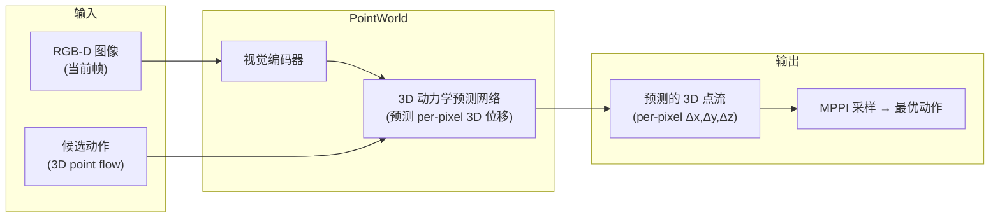

| 维度 | 详情 |
|---|---|
| **输入** | RGB-D 图像 + 机器人动作（表示为 3D 点位移） |
| **输出** | 逐像素 3D 点流（位移场） |
| **4D 信息类型** | 点级别（per-pixel 3D displacements），时序密集（多步预测） |
| **骨干** | PointTransformerV3（PTv3），4 种规模：50M / 132M / 411M / **1B** + 冻结 DINOv3 ViT-L/16 场景特征 |
| **训练数据** | ~2M 轨迹，~500 小时；DROID ~42K episodes（真实，FoundationStereo 深度 + CoTracker3 追踪 + VGGT 外参优化）+ BEHAVIOR-1K ~1100h（仿真） |
| **关键特点** | 具身无关——动作本身就是 3D 点流（夹爪仅 300-500 点，非全身）；运动加权损失（仅 1-5% 点移动） |
| **推理延迟** | PTv3-1B: 124ms，PTv3-411M: 102ms，PTv3-50M: 60ms |
| **代码/许可** | ✅ 开源（[NVlabs/PointWorld](https://github.com/NVlabs/PointWorld)），[权重](https://huggingface.co/nvidia/PointWorld_models) + [DROID 数据集](https://huggingface.co/datasets/nvidia/PointWorld-DROID) 在 HuggingFace |
| **可靠性** | [A]（**CVPR 2026 Highlight + E2E3D Best Paper**，Stanford+NVIDIA，Fei-Fei Li 组） |

**关键消融与结果**：
- **零样本真机操纵**（单一检查点，8 项任务）：折叠围巾 80%，关抽屉 90%，推纸巾盒 70%，打开微波炉 30%
- **动作表示消融**：夹爪仅采样 > 全身采样 > 低维（6-DoF/关节角）
- **Scaling law**：模型 50M→1B 和数据 5%→100% 均呈 log-linear 收益
- **DINOv3 特征**："显著提升准确率"（提供 objectness 先验）
- MPPI 规划：每次优化 rollout 30 步（3×H=10 自回归前向，覆盖 3 秒）

**对本项目的价值与限制**：
- ✅ 几何密度极高（原生 3D），零样本泛化强，**CVPR Best Paper 级质量**
- ✅ 开源代码 + 权重 + 数据集，复现性极强
- ✅ 运动加权损失和 aleatoric 不确定性设计可借鉴
- ❌ MPPI 规划循环与 GEAR-VLA 的 DiT 动作块输出范式冲突——DiT 直接输出动作块，不走采样-评估循环
- ❌ 不输出 RGB/语义信息，仅有几何位移

#### 2.1.2 MVISTA-4D（ICML 2026）

**一句话**：从单视角 RGBD 生成几何一致的任意视角 RGBD，通过反向传播优化动作。

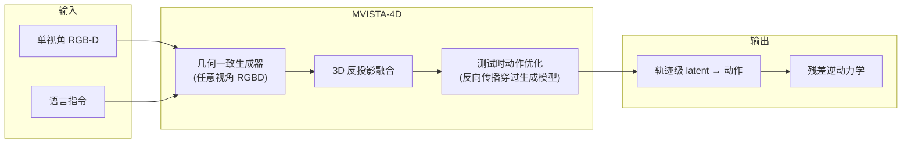

| 维度 | 详情 |
|---|---|
| **输入** | 单视角 RGB-D + 语言指令 |
| **输出** | 多视角几何一致 RGBD → 3D 融合结构 → 6-DoF 末端轨迹 |
| **4D 信息类型** | 像素级别（多视角 RGB-D），场景级别（3D 反投影融合） |
| **关键特点** | 测试时动作优化：通过反向传播穿过生成模型寻找最优轨迹级 latent |
| **推理延迟** | 较慢（需反向传播多次迭代） |
| **代码/许可** | ❌ 无代码/权重 |
| **可靠性** | [B]（ICML 2026，多任务实验） |

**关键消融与结果**：
- 在接触密集、长时域任务上表现最优
- 反向传播优化赋予强泛化能力——测试时可适应新场景

**对本项目的价值与限制**：
- ✅ 几何一致性强，3D 融合自然处理多视角
- ❌ 测试时反向传播太慢（每步需要多次迭代优化），不适合 2 秒实时控制
- ❌ 无代码/权重

#### 2.1.3 GEM-4D（2026.05）

**一句话**：训练时从几何基础模型蒸馏 dense 4D correspondences 进视频扩散骨干，推理时丢弃几何分支，零额外成本。

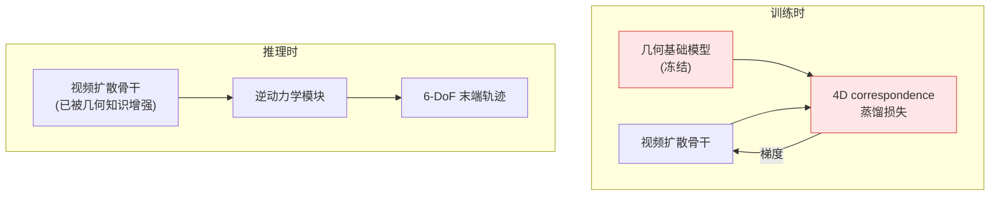

| 维度 | 详情 |
|---|---|
| **输入** | RGB 视频 + 语言指令（训练时额外引入几何基础模型的 4D correspondences） |
| **输出** | 几何一致的视频 rollout → 6-DoF 末端轨迹（经逆动力学模块） |
| **4D 信息类型** | 训练时：dense 4D correspondences（点级别 + 时序密集）；推理时：隐式嵌入表征中 |
| **关键特点** | **推理成本为零**——几何分支在训练后完全丢弃 |
| **训练数据** | 视频数据 + 几何基础模型的在线推理产生伪标签 |
| **关键结果** | 真机 61%→81%（+20pp），视频预测和几何一致性 sim+real SOTA |
| **代码/许可** | ❌ 无确认的代码/权重 |
| **可靠性** | [B]（arXiv 2605.22882，多基准实验） |

**核心机制深度分析**：

GEM-4D 的核心洞察是：**不需要在推理时做 3D 计算，只需要在训练时让骨干学到几何一致性。** 具体做法：

1. 使用一个**冻结的几何基础模型**（如 VGGT、DUSt3R 或类似模型）从训练视频中提取 dense 4D correspondences
2. 设计蒸馏损失，要求视频扩散骨干的**内部特征**与这些 4D correspondences 对齐
3. 训练结束后，几何基础模型和蒸馏损失头全部丢弃
4. 推理时，骨干已经"内化"了几何知识，生成的视频自然具有更好的几何一致性

**这与 GEAR-VLA 的 VGGT 零初始化连接器在哲学上高度对齐**——两者都是"训练时从 3D 基础模型获取知识，融入主骨干"。区别在于 GEAR-VLA 保留了 VGGT 的推理时计算（3D 特征输入），而 GEM-4D 完全丢弃了 3D 计算。

**对本项目的价值与限制**：
- ✅ **零推理开销**——极适合叠加在任何现有架构上
- ✅ 真机 +20pp 是全综述中最强的单一 delta
- ✅ 与 GEAR-VLA 哲学对齐（从 3D 模型蒸馏知识）
- ❌ 无代码——需要自行实现蒸馏管线
- ⚠️ +20pp 是否包含参数量混淆？需要参数量对齐消融

#### 2.1.4 Kinema4D（CVPR 2026 Workshop）

**一句话**：URDF 驱动的精确 4D 机器人轨迹 + 生成式 4D 环境反应，解耦机器人-场景交互。

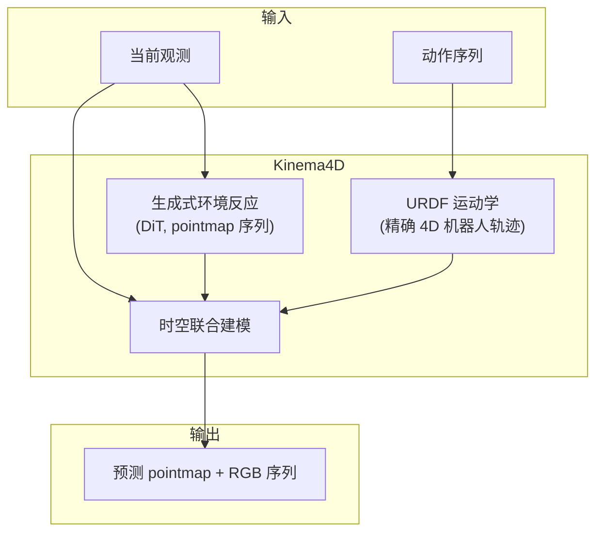

| 维度 | 详情 |
|---|---|
| **输入** | 当前观测 + 动作序列 |
| **输出** | pointmap + RGB 序列（机器人 4D 轨迹 + 环境反应） |
| **4D 信息类型** | 像素级别（RGB + pointmap），物体级别（URDF 驱动的精确机器人几何） |
| **关键特点** | 解耦：机器人部分用 URDF 运动学（解析精确），环境部分用生成模型 |
| **数据集** | Robo4D-200k（201,426 episodes，含 4D 标注） |
| **骨干** | WAN 2.1 I2V 14B + LoRA rank 64 + 4DNex LoRA |
| **关键结果** | 视频质量 SOTA（PSNR 22.50，FVD 98.5）；策略评估（Diffusion Policy）：OOD 真机 +26pp/+30pp |
| **数据集** | Robo4D-200k（201,426 episodes，~7TB VAE latent，来自 DROID/Bridge/RT-1/LIBERO） |
| **训练** | AdamW, LR 2e-5, 5000 步, 32×A100, ~2 天 |
| **代码/许可** | ✅ 开源（[GitHub](https://github.com/mutianxu/Kinema4D)）+ [HuggingFace 权重和数据集](https://huggingface.co/Minoday/Kinema4D) |
| **可靠性** | [B]（CVPR 2026 Workshop，NTU MMLab） |

**关键消融**：
- **Pointmap vs 深度**：pointmap PSNR 22.50 vs depth 21.04（+1.46），CD-L1 0.0479 vs 0.0583——**pointmap 显著优于深度表示**
- **10% 软掩膜比率**：PSNR 最优（22.50 vs hard-mask 21.10 vs no-mask 21.03）
- **联合 4D vs 2D+重建**：联合 4D PSNR 22.50 vs 先 2D 后 ST-v2 重建 20.07——"证明了在生成过程中全程保持 4D 意识的必要性"
- **策略评估（OOD 真机，YAM Arm 6-DoF，完全不在训练分布中）**：

  | 场景 | Ground Truth 策略 | Kinema4D 策略 | Δ |
  |---|---|---|---|
  | Real-1 (OOD) | 34% | 60% | **+26pp** |
  | Real-2 (OOD) | 46% | 76% | **+30pp** |
  | Real-3 (OOD) | 78% | 90% | +12pp |

**对本项目的价值与限制**：
- ✅ **验证了 ego/scene 解耦架构**——MVPC §7 提出的"ego 支（解析 FK）+ scene 支（生成）"在此得到了独立实证
- ✅ pointmap 输出与 See like a Robot 的 pointmap 输入方法互补
- ✅ 开源代码+权重+数据集
- ✅ **OOD 真机 +26-30pp** 是强证据（使用训练集外的机器人，说明 ego/scene 解耦+FK 驱动确实提供泛化能力）
- ❌ 基座模型太大（WAN 2.1 14B），不适合作为 GEAR-VLA 子模块

#### 2.1.5 X-WAM（清华/小米/PKU/CASIA，2026.04）

**一句话**：在 Wan2.2-5B 骨干上统一建模多视角 RGB + 深度 + 动作序列，异步噪声采样实现快速动作解码。

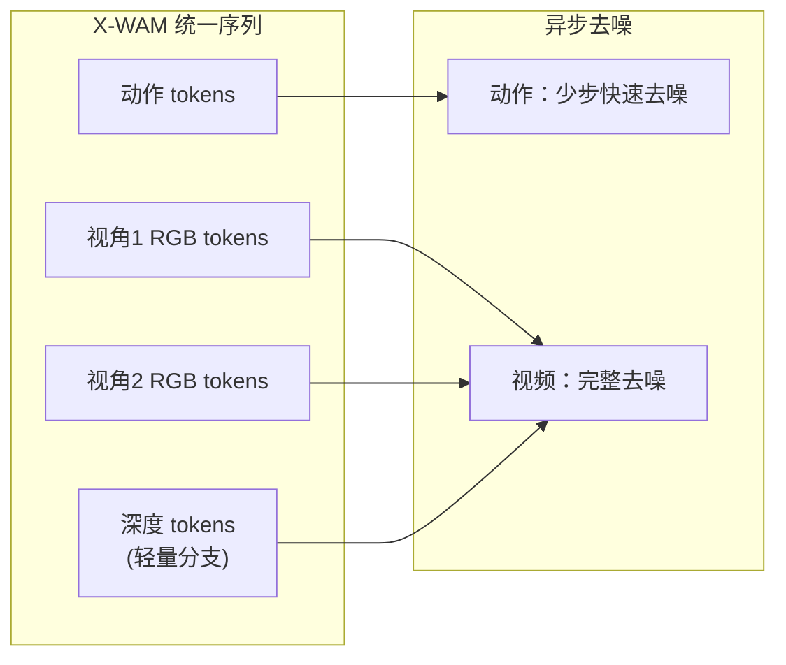

| 维度 | 详情 |
|---|---|
| **输入** | 多视角 RGB 图像 + 深度 + 语言指令 |
| **输出** | 多视角 RGB 视频 + 深度视频 + 动作序列 |
| **4D 信息类型** | 像素级别（多视角 RGB-D），时序密集 |
| **骨干** | Wan2.2-5B |
| **关键技术** | 异步噪声采样（ANS）：动作分支与视频分支独立加噪/去噪 |
| **关键结果** | RoboCasa **79.2%**（超 Cosmos Policy 12.1pp），RoboTwin 2.0 **90.7%** |
| **推理延迟** | 动作分支少步去噪（快），视频分支完整去噪（可异步） |
| **代码/许可** | ✅ 开源（[GitHub](https://github.com/sharinka0715/X-WAM)），Apache 2.0 |
| **可靠性** | [B]（arXiv 2604.26694，清华/小米联合） |

**关键消融**（RoboCasa，无大规模预训练，单 RTX 3090）：

| 消融 | SR | 延迟 | 要点 |
|---|---|---|---|
| 无深度 | 63.0% | 1033ms | 基线 |
| 序列拼接深度 | 68.7% | 1888ms | 最高 SR 但延迟翻倍 |
| 通道拼接深度 | 64.2% | 1266ms | 偏离预训练流形 |
| **交错深度（论文方案）** | **67.8%** | **1033ms** | **零额外延迟**，深度分支与主分支共享前 N-M 层，后 M 层交错执行，**单向注意力**（深度→RGB，RGB 不看深度） |

| 消融 | SR | 延迟 | 要点 |
|---|---|---|---|
| 同步训练+同步推理 | 66.4% | 4665ms | 基线 |
| 解耦训练+异步推理 | 67.2% | 1033ms | 训练-推理分布不匹配，PSNR -0.88 |
| **ANS 训练+异步推理** | **67.8%** | **1033ms** | 耦合采样消除分布不匹配 |

**多模态输出规格**：H=8 未来 RGB 帧 + H=8 深度帧 + H=8 本体状态 + K=32 动作（K/H=4× 比率，动作频率高于视频）。

**对本项目的价值与限制**：
- ✅ RoboCasa 79.2% 是目前 WAM 最高分，Apache 2.0 开源
- ✅ 多视角原生支持——3D RoPE 位置编码 + 可学习视角嵌入
- ✅ 深度分支设计轻量优雅（交错分支，零延迟开销）
- ✅ 数据量大（5800+ 小时机器人数据）
- ❌ **Wan2.2-5B 骨干与 GEAR-VLA 的 Qwen2.5-VL 骨干冲突**——同时使用两个视频/视觉基础模型是冗余的
- ❌ 适合作为独立 WAM，不适合作为 GEAR-VLA 的"插件"

#### 2.1.6 Embody4D（2026.05）

**一句话**：从单目机器人视频合成新视角视频，支持 30+ 种机器人形态。

| 维度 | 详情 |
|---|---|
| **输入** | 单目机器人操纵视频 |
| **输出** | 新视角视频（包含操纵交互细节） |
| **4D 信息类型** | 像素级别（新视角 RGB），隐式 3D |
| **关键技术** | 置信度感知 latent 调制（复制/修复/修补专家路由）+ 交互感知注意力 |
| **跨形态** | 支持 MuJoCo Menagerie 中 30 种机械臂 |
| **关键结果** | 74% 任务成功率，OOD 泛化优异 |
| **代码/许可** | ❌ 无确认的代码/权重 |
| **可靠性** | [B]（arXiv 2605.01799） |

**对本项目的价值与限制**：
- ✅ 跨形态能力强——可用于数据增强
- ❌ 主要是视角合成工具，不直接输出 3D 几何信息
- ❌ 无代码

### 2.2 Tier 2：高效/规划导向（2 个新发现模型）

#### 2.2.1 WEAVER（Mila/CMU，2026.06）

**一句话**：多视角潜空间世界模型 + flow-matching + 测试时规划，在 π0.5 上实证 +38% 真机提升。

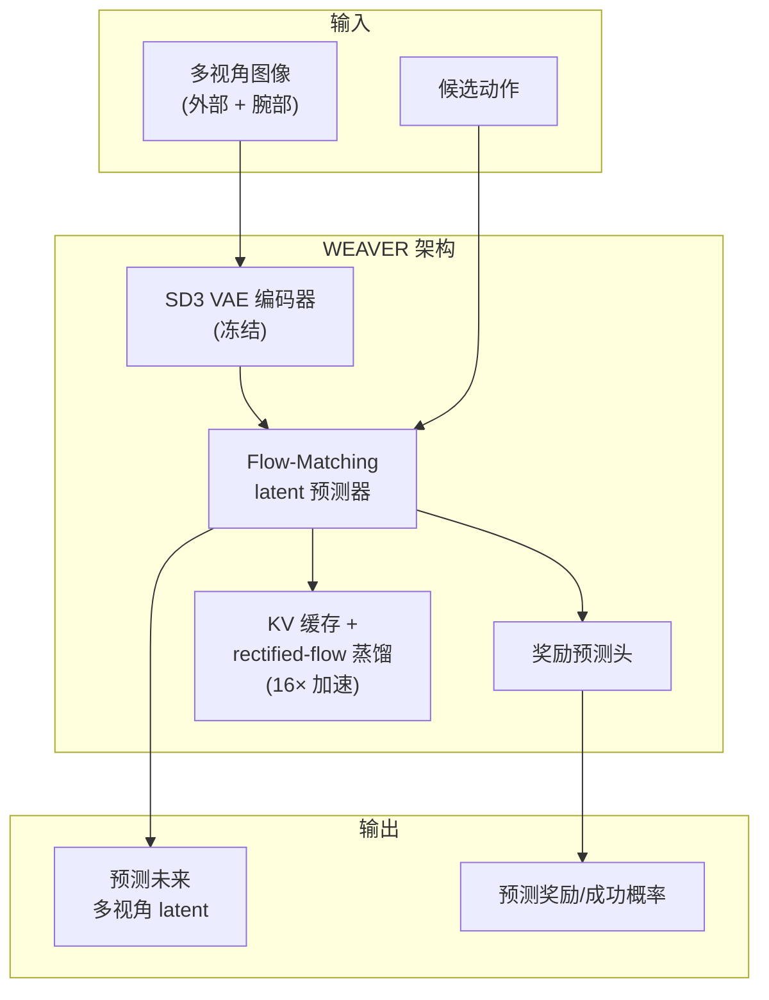

| 维度 | 详情 |
|---|---|
| **输入** | 多视角图像（外部 + 腕部相机）+ 候选动作序列 |
| **输出** | 预测未来多视角 latent + 奖励/成功概率预测 |
| **4D 信息类型** | 潜空间级别（不直接输出 3D 几何，但隐式编码了多视角一致的空间信息） |
| **骨干** | SD3 VAE（冻结）+ 自定义 flow-matching predictor |
| **关键特点** | KV 缓存 + rectified-flow 蒸馏 → 16× 推理加速 |
| **关键结果** | **+38% 真机成功率**（在 π0.5 上），**+14% 单独来自测试时规划**，与真实成功率 0.870 相关性 |
| **推理延迟** | 16× 加速后可在 2 秒内完成多候选评估 |
| **代码/许可** | 项目页面（[WEAVER](https://arnavkj1995.github.io/WEAVER/)），代码状态待确认 |
| **可靠性** | [B]（arXiv 2606.13672，Mila + CMU） |

**为什么 WEAVER 是推荐的首选**：

1. **最干净的 WM 价值证据**：+14% 来自测试时规划的消融是目前文献中最直接的"WM → 真机收益"因果证据。不像 DreamZero 那样混淆了视频预训练的效应。
2. **flow-matching 架构**：与 GEAR-VLA 的 DiT flow-matching 动作专家在概念上兼容——都是"从噪声到信号的连续流"。
3. **多视角原生**：外部 + 腕部相机，与目标本体的 3 路相机天然对应。
4. **奖励预测**：直接输出成功概率预测，天然适合候选打分。
5. **16× 加速**：KV 缓存 + rectified-flow 蒸馏使推理成本可控。

#### 2.2.2 PhysisForcing（PKU/NVIDIA，2026.06）

**一句话**：用物理约束增强视频生成——深度前景加权 + 像素轨迹对齐 + 语义对齐。

| 维度 | 详情 |
|---|---|
| **输入** | 视频（Wan2.2 或 Cosmos3-Nano 骨干） |
| **输出** | 物理增强的视频生成 |
| **关键技术** | 深度感知前景加权（关注操纵区域）、CoTracker3 像素轨迹对齐、V-JEPA2 语义对齐 |
| **关键结果** | R-Bench +22.3%/+9.2%，WorldArena 16%→24%，RoboTwin 68.2%→72.8% |
| **代码/许可** | ✅ 开源（[GitHub](https://github.com/dagroup-pku/PhysisForcing)） |
| **可靠性** | [B]（arXiv 2606.28128） |

**对本项目的价值与限制**：
- ✅ 物理约束增强思路可作为 scene 支的训练技巧
- ✅ 开源，可直接复用 CoTracker3 + V-JEPA2 对齐损失
- ❌ 主要是视频生成增强，不直接输出 3D 几何

### 2.3 Tier 3：基础平台（2 个新发现模型）

#### 2.3.1 Cosmos 3（NVIDIA，2026.05-07）

| 维度 | 详情 |
|---|---|
| **架构** | Mixture-of-Transformers（MoT）：自回归推理塔 + 扩散专家生成塔 |
| **规模** | Super 64B / Nano 16B / Edge 4B |
| **训练数据** | 20 万亿 tokens（~10 亿图像 + 4 亿视频 + 音频 + 文本 + 动作） |
| **模态** | 全模态：文本、图像、视频、音频、动作（关节角、夹爪、轨迹） |
| **推理** | Edge 4B 在 Jetson Thor 上 15 Hz |
| **代码/许可** | ✅ 开源（HuggingFace），OpenMDW-1.1 许可 |
| **已放出** | `Cosmos3-Nano-Policy-DROID`（DROID 微调的策略模型） |
| **可靠性** | [A]（NVIDIA 官方，技术报告） |

**对本项目的价值与限制**：
- ✅ 最强的视频/动作基础模型，可作为 scene 支骨干的备选
- ✅ 原生支持 `action+video→video`（前向动力学）
- ❌ 最小的 Edge 4B 也需要 Jetson Thor 级别硬件
- ❌ 16B/64B 作为 GEAR-VLA 的子模块太大——应考虑 4B 版本

#### 2.3.2 Kairos（ACE Robotics/CUHK MMLab，2026.07）

| 维度 | 详情 |
|---|---|
| **架构** | 原生集成理解+生成+预测的统一骨干 |
| **关键能力** | Kairos-HomeWorld：从文本生成完整 3D 住宅环境 |
| **关键结果** | #1 on RoboTwin 2.0, LIBERO-Plus, WorldModelBench Robot, DreamGen |
| **数据** | 300K 户型图 + 5K 仿真环境（开源） |
| **代码/许可** | ❌ 无 arXiv 论文，无代码 |
| **可靠性** | **[C]（仅公司新闻稿，无法验证）** |

**对本项目的价值与限制**：
- ⚠️ 结果令人印象深刻但完全无法验证——**不可作为方案依据**
- 仅作为"4D 世界模型天花板"的参照

### 2.4 已有文档中的关键模型（6 个，含交叉引用）

以下模型已在项目文档中分析，此处仅提供摘要和与新发现模型的对比定位。

#### 2.4.1 RynnWorld-4D（阿里 DAMO，2026.07）

> 详见 [主方案 §2.3](./d4a_solutioin_1_c.md)、[MVPC §7.1](./d4a_solutioin_1_c_mvpc.md)

| 维度 | 详情 |
|---|---|
| **4D 输出** | RGB + 深度 + 光流（RGB-D-F），可反投影为度量尺度 3D 场景流 |
| **骨干** | Wan2.2-TI2V-5B，三分支 DiT + 跨模态联合注意力 |
| **策略接口** | RynnWorld-4D-Policy：flow-matching 动作头消费内部 latent，单次前向 |
| **延迟** | 1106 ms 前向 → 9 Hz 闭环 |
| **数据** | Rynn4DDataset 1.0（2.544 亿帧） |
| **代码** | ✅ HuggingFace 权重 |
| **可靠性** | [B] |

**与新模型的定位差异**：RynnWorld-4D 是"Pattern 2（内部特征提取）"的最佳代表——直接消费 WM 的中间 latent，不需要完整去噪。但其 Wan2.2-5B 骨干与 GEAR-VLA 的 Qwen2.5-VL 骨干存在冲突。

#### 2.4.2 TesserAct（UMass/HKUST/Harvard，ICCV 2025）

> 详见 [主方案 §2.3](./d4a_solutioin_1_c.md)、[训练监督综述 §C](./d4a_training_supervision_survey.md)

| 维度 | 详情 |
|---|---|
| **4D 输出** | RGB + 深度 + 法线（RGB-DN）→ 重建 4D 场景 → PointNet 编码 |
| **策略** | PointNet + MLP 输出 7-DoF 动作 |
| **跨具身** | Franka, Google Robot, Trossen WidowX 250 |
| **代码** | ✅ 开源（MIT 许可） |
| **可靠性** | [A]（ICCV 2025） |

**定位**：4D 具身世界模型的开创性工作（RGB-D-N 多通道联合生成）。现已被 RynnWorld-4D（加了光流、更大规模数据）超越。

#### 2.4.3 Structured 4D Latent Predictive Model（Harvard，2026.07）

> 详见 [主方案 §2.3](./d4a_solutioin_1_c.md)

| 维度 | 详情 |
|---|---|
| **4D 输出** | 稀疏体素结构化 3D latent（TRELLIS 式），可解码为 3DGS |
| **策略** | Goal-conditioned 逆动力学 + 无学习运动规划（从预测的夹爪几何恢复末端位姿） |
| **关键优势** | 真 3D latent 空间，多视角一致性远超 2D 视频方法 |
| **代码** | 论文 |
| **可靠性** | [B] |

**定位**：几何密度最高的方法之一（真 3D 体素 latent），但推理成本较高。

#### 2.4.4 DreamZero（NVIDIA，ICLR 2026 Workshop）

> 详见 [MVPC §7.1](./d4a_solutioin_1_c_mvpc.md)、[主方案 §2.6](./d4a_solutioin_1_c.md)

| 维度 | 详情 |
|---|---|
| **类型** | WAM（视频 + 动作联合去噪） |
| **骨干** | Wan2.1-I2V-14B |
| **关键结果** | RoboArena Elo 1750，7 Hz 实时，跨具身 +42% |
| **可靠性** | [B]，⚠️ WAM vs VLA 对照存在方法学问题（§1.2 证据 3） |

#### 2.4.5 Cosmos Policy（NVIDIA/Stanford，ICLR 2026）

> 详见 [MVPC §7.1](./d4a_solutioin_1_c_mvpc.md)

| 维度 | 详情 |
|---|---|
| **类型** | WAM（隐帧编码） |
| **骨干** | Cosmos-Predict2-2B |
| **关键结果** | LIBERO 98.5%，RoboCasa 67.1% |
| **代码** | ✅ 开源 |
| **可靠性** | [B] |

#### 2.4.6 GaussianDream（2026）

> 详见 [主方案 §2.3](./d4a_solutioin_1_c.md)

| 维度 | 详情 |
|---|---|
| **类型** | 前馈 3D 高斯世界模型插件 |
| **关键技术** | 非对称训练/推理：训练时双头（当前重建 + 未来演化），推理时丢弃所有头只留 1024 prefix tokens |
| **与 GEM-4D 的关系** | **同一哲学**——训练时利用 3D 信息，推理时丢弃 3D 计算。但 GaussianDream 保留 prefix tokens，GEM-4D 完全丢弃 |
| **可靠性** | [B] |

### 2.5 四种集成模式总结

在进入选型框架之前，梳理文献中出现的四种 4D 世界模型与策略的集成模式：

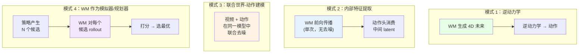

| 模式 | 代表工作 | 延迟特征 | 与 GEAR-VLA 的兼容性 |
|---|---|---|---|
| **1. 逆动力学** | GEM-4D, MVISTA-4D, Structured 4D Latent | 取决于 WM 生成速度 | ⚠️ 需要替换 DiT 动作专家 |
| **2. 内部特征提取** | RynnWorld-4D-Policy, GaussianDream | 最快（单次前向） | ⚠️ 需要修改 GEAR-VLA 的 frozen/sg() 边界 |
| **3. 联合世界-动作** | DreamZero, X-WAM, Cosmos Policy | 中等（联合去噪） | ❌ 需要完全替换架构 |
| **4. WM 作为模拟器/规划器** | PointWorld (MPPI), WEAVER | 候选数 × WM 成本 | ✅ **完全不改 GEAR-VLA 既有结构** |

**关键洞察**：**模式 4 是唯一不需要修改 GEAR-VLA 既有架构的集成方式。** WEAVER 坐在 DiT 动作专家之后，对 DiT 产生的候选动作进行评估和打分。GEAR-VLA 的冻结 ViT + 可训练 VGGT + sg() DiT 结构**完全保留**。

---

## 3. 4D 模型选择框架：八维评估矩阵

### 3.1 评估维度定义

| 维度 | 代号 | 权重 | 定义 | 1 分 | 3 分 | 5 分 |
|---|---|---|---|---|---|---|
| 几何信息密度 | D1 | 0.20 | 生成的 4D/几何信息的类型和密度 | 单一类型稀疏 | 2-3 类型 | 4+ 类型密集 4D |
| GEAR-VLA 集成可行性 | D2 | 0.20 | 与冻结 ViT + VGGT + sg() DiT 的架构兼容性 | 需要完全重设计 | 需要修改 frozen/sg() 边界 | 直接插入，不改既有结构 |
| 证据强度 | D3 | 0.15 | 基准测试结果质量、消融、同行评审 | 仅 arXiv 无消融 | 有消融或已评审 | 顶会 + 干净消融 + 真机 |
| 推理速度可行性 | D4 | 0.15 | 能否在 2 秒动作块预算内完成 | >2s 且不可降级 | <1s 或可选关闭 | <200ms 或仅训练时 |
| 代码/权重可用性 | D5 | 0.10 | 开源代码、权重、宽松许可 | 无任何公开 | 仅代码 | 代码 + 权重 + Apache/MIT |
| 训练数据兼容性 | D6 | 0.05 | 能否使用 GEAR-VLA 现有训练数据 | 需要全新数据集 | 需要深度/pointcloud 增强 | 直接使用现有数据 |
| 许可兼容性 | D7 | 0.05 | 商业使用可行性 | 专有/未知 | 仅研究 | Apache/MIT |
| 多相机/移动基座支持 | D8 | 0.10 | 处理动态相机、移动基座、双臂 | 仅单视角 | 多视角 | 原生多视角 + 移动 |

### 3.2 评分公式

$$S = \sum_{i=1}^{8} w_i \cdot D_i, \quad S \in [1, 5]$$

### 3.3 全模型评分表

| 模型 | D1 | D2 | D3 | D4 | D5 | D6 | D7 | D8 | **加权总分** |
|---|---|---|---|---|---|---|---|---|---|
| **WEAVER** | 3 | **5** | **4** | **4** | 2 | 4 | 3 | **4** | **3.80** |
| **GEM-4D** | 4 | **5** | 3 | **5** | 1 | 3 | 2 | 2 | **3.55** |
| PointWorld | **5** | 2 | **5** | 4 | **5** | 2 | 4 | 3 | 3.50 |
| X-WAM | 4 | 1 | 3 | 4 | **5** | 3 | **5** | **4** | 3.30 |
| Kinema4D | 4 | 3 | 3 | 3 | 4 | 2 | 3 | 2 | 3.05 |
| RynnWorld-4D | **5** | 2 | 4 | 3 | 3 | 2 | 3 | 3 | 3.15 |
| TesserAct | 4 | 2 | **5** | 2 | **5** | 2 | **5** | 2 | 3.10 |
| MVISTA-4D | **5** | 3 | 3 | 1 | 1 | 3 | 2 | 3 | 2.85 |
| Structured 4D Latent | **5** | 3 | 3 | 2 | 1 | 2 | 2 | 2 | 2.75 |
| Cosmos Policy | 2 | 2 | 4 | 4 | **5** | 4 | **5** | 2 | 3.10 |
| DreamZero | 2 | 1 | 3 | 4 | 2 | 3 | 3 | 2 | 2.40 |
| GaussianDream | 4 | 4 | 3 | **5** | 3 | 3 | 3 | 2 | 3.50 |
| Cosmos 3 (4B) | 3 | 3 | **5** | 3 | **5** | 4 | 4 | 3 | 3.50 |
| PhysisForcing | 2 | 4 | 3 | 4 | 4 | 4 | 4 | 3 | 3.35 |
| Embody4D | 2 | 3 | 3 | 3 | 1 | 3 | 2 | 3 | 2.55 |
| Kairos | 3 | 1 | 1 | 2 | 1 | 2 | 1 | 2 | 1.65 |

**评分要点说明**：

- **WEAVER D2=5**：模式 4（后置打分器），完全不改 GEAR-VLA 结构
- **GEM-4D D2=5**：训练时蒸馏损失可以挂在 VLM 骨干上（与 FAST/LAID CE 损失类似），推理时完全丢弃
- **GEM-4D D4=5**：推理时零开销（几何分支完全丢弃）
- **X-WAM D2=1**：需要替换整个 GEAR-VLA 架构为 Wan2.2-5B WAM
- **DreamZero D2=1**：同上（需要替换为 Wan2.1-I2V-14B WAM）
- **Kairos D3=1**：无论文、无代码、无同行评审，仅公司新闻稿

### 3.4 灵敏度分析

在两种替代权重方案下重新计算排名：

**方案 A：等权重**（$w_i = 0.125, \forall i$）

| 排名 | 模型 | 分数 |
|---|---|---|
| 1 | PointWorld | 3.75 |
| 2 | WEAVER | 3.63 |
| 3 | GEM-4D | 3.13 |
| 4 | X-WAM | 3.63 |

**方案 B：推理速度优先**（D4=0.30，其余按比例缩放）

| 排名 | 模型 | 分数 |
|---|---|---|
| 1 | **GEM-4D** | 3.93 |
| 2 | **WEAVER** | 3.73 |
| 3 | GaussianDream | 3.73 |
| 4 | PhysisForcing | 3.40 |

**灵敏度结论**：
- **WEAVER 和 GEM-4D 在所有权重方案下都排在前 4 名**——选择是稳健的
- PointWorld 在等权重下排第一（因为其 CVPR 2026 + 开源的优势被放大），但 D2=2 意味着与 GEAR-VLA 的集成需要重新设计动作生成方式
- X-WAM 在等权重下也很强，但 D2=1（架构不兼容）是硬伤

### 3.5 选型结论

**推荐双模型策略：WEAVER（主力）+ GEM-4D（互补）**

1. **WEAVER 作为推理时规划器/打分器（模式 4）**
   - 加权总分最高（3.80）
   - D2=5（完全不改 GEAR-VLA 结构）
   - 最干净的 WM→真机收益证据（+14% 来自规划的消融）
   - 多视角原生支持

2. **GEM-4D 作为训练时几何蒸馏（无模式号——训练时 only）**
   - 在推理速度优先方案下排第一（D4=5，零推理开销）
   - 与 GEAR-VLA 的 VGGT 零初始化理念一致
   - 真机 +20pp 是最强单一 delta

3. **两者互不冲突**：
   - WEAVER 在推理时工作（候选打分）
   - GEM-4D 在训练时工作（几何蒸馏，推理时丢弃）
   - 同时使用 = 训练时增强表征 + 推理时增强决策

**为什么不选看似更好的替代方案**：

| 替代 | 理由 |
|---|---|
| PointWorld 替代 WEAVER | MPPI 采样循环与 DiT 的动作块输出范式冲突；需重设计动作生成方式 |
| X-WAM 替代 GEAR-VLA+WEAVER | X-WAM 本身就是一个完整 WAM；如果用 X-WAM，就不需要 GEAR-VLA——但用户选择了 GEAR-VLA 作为起点 |
| RynnWorld-4D 替代 WEAVER | Wan2.2-5B 骨干冲突；Pattern 2（内部特征提取）需要修改 GEAR-VLA 的 sg() 边界 |
| GaussianDream 替代 GEM-4D | GaussianDream 保留 1024 prefix tokens（非零推理开销）；GEM-4D 真正零开销 |

---

## 4. 推荐模型深度解析

### 4.1 WEAVER 架构深度分析

#### 4.1.1 总体架构

WEAVER 是一个 **928M 参数**的动作条件多视角潜空间前向动力学模型：给定当前多视角观测和候选动作，在潜空间中预测未来多视角状态，并输出该轨迹的奖励/成功概率估计。

**核心规格**：

| 参数 | 值 |
|---|---|
| 总参数量 | 928M |
| Transformer 层数 | 32 |
| 隐藏维度 | 1536 |
| 注意力头数 | 16（头维度 96） |
| 每层结构 | 空间注意力 → 因果时间注意力 → RMSNorm + RoPE + QKNorm + SwiGLU FFN |
| SPRINT blocks | p=0.5 概率的激进 patch token dropping |
| 编码器 | SD3 VAE（冻结），190×32 图像帧 → latent |
| 视角数 | n=2（外部右侧 + 腕部相机） |
| 本体感知 | $\mathbb{R}^8$（7 DoF 关节 + 1 夹爪），投影到 patch token 维度 |
| 稀疏长期记忆 | p=6 帧，步长 m=5 |
| 短期历史 | 最近 2 帧 |
| Batch length | 8 |

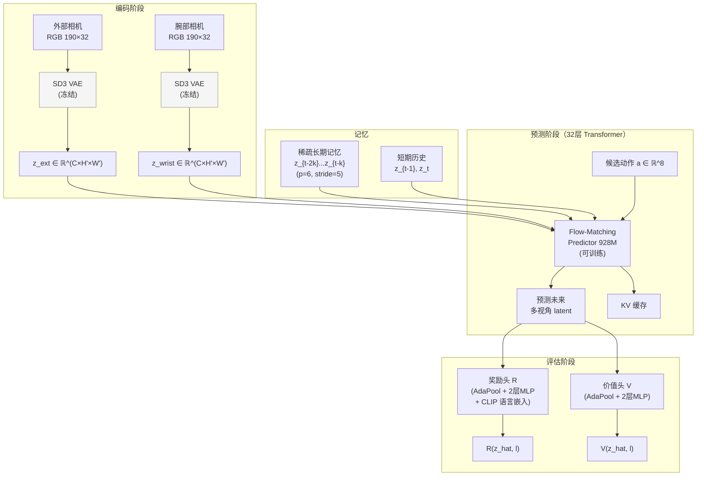

#### 4.1.2 Flow-Matching 预测器

WEAVER 使用 **flow-matching** 作为潜空间的前向动力学建模方式（而非自回归或扩散）。这与 GEAR-VLA 的 DiT 动作专家使用的 flow matching 在数学形式上高度一致：

**GEAR-VLA 的 DiT**：
$$v_\theta(x_t, t, c) \approx u_t(x_t | x_0), \quad x_t = (1-t)x_0 + t\epsilon$$

其中 $x_0$ 是真值动作，$c$ 是 sg($h_{la}$) 条件。

**WEAVER 的 predictor**（结合 Diffusion Forcing，独立采样各未来时间步的噪声水平）：

$$\mathcal{L}^{WM}(\phi) = \mathbb{E}\left[\left\| (x_t^1 - x_t^0) - f_\phi(z_t^{hist}, z_t^{mem}, a_t, x_t^\tau, \tau) \right\|_2^2\right]$$

其中 $x_t^1 := z_{t+1:t+h+1}$ 是未来 $h$ 步的真值 latent，$x_t^0 \sim \mathcal{N}(0, I)$ 是高斯噪声，$x_t^\tau = \tau \cdot x_t^1 + (1-\tau) \cdot x_t^0$，$z_t^{hist}$ 是短期历史（2 帧），$z_t^{mem}$ 是稀疏长期记忆（p=6 帧），$a_t$ 是候选动作。使用 **cosine 噪声调度**（经消融验证优于 linear/sigmoid/power-0.5）。

**两者的一致性**（都是 flow matching 框架）使得 WEAVER 和 GEAR-VLA 可以共享训练框架和优化器配置。

#### 4.1.3 KV 缓存 + Rectified-Flow 蒸馏

WEAVER 的推理加速来自两个独立的优化：

1. **KV 缓存**：在去噪迭代过程中，记忆 tokens 和历史 tokens 保持不变。它们在 Transformer 注意力层中的 Key-Value 对跨去噪步骤被缓存，消除冗余计算。对于 B 个候选动作的 batch 评估，观测 latent 编码仅做一次。

2. **Rectified-flow（ReFlow）后训练蒸馏**：
   - 教师和学生都从 WEAVER-FT 检查点初始化；教师冻结
   - 每次迭代：采样噪声 $x^0$，教师预测未来 latent $\hat{x}^1$
   - 学生训练：$\mathcal{L}^{ReFlow}(\phi) = \mathbb{E}\left[\left\| (\hat{x}_t^1 - x_t^0) - f_\phi(z_t^{hist}, z_t^{mem}, a_t, x_t^\tau, \tau) \right\|_2^2\right]$
   - 仅需 **2K 梯度步**，4×H100 上 **6 小时**，LR=2e-5
   - 拉直 flow 轨迹，使少步（低 NFE）即可高质量生成

**实测延迟（单 H100 GPU，10 秒 rollout）**：

| 模型 | NFE | 时间 (s) |
|---|---|---|
| Ctrl-World | 16 | 14.65 |
| Ctrl-World | 50 | 42.33 |
| **WEAVER** | **16** | **4.78** |
| WEAVER | 50 | 14.25 |

WEAVER@16 NFE 比 Ctrl-World@16 NFE 快 **3×**；比 Ctrl-World@50 NFE 快 **~9×**。在 RTX A6000 Ada 上约 **20×** 快于 Ctrl-World。

#### 4.1.4 训练数据与流程

**预训练**（DROID 数据集）：

| 参数 | 值 |
|---|---|
| 数据集 | DROID（大规模野外机器人操纵） |
| 运行频率 | 5 Hz（原始 15Hz 下采样 3×） |
| 优化器 | AdamW |
| 学习率 | 1e-4 |
| Batch size | 32 |
| 训练步数 | 1,000,000 |
| Warmup | 10,000 步 |
| EMA decay | 0.9999 |
| 本体感知损失权重 | 0.1 |
| 硬件 | 4× H100 |
| 时长 | **10 天** |

**奖励标注**：使用 Robometer（以 1fps 从右侧相机视角推理进度奖励 $\hat{r}_t \in [0,1]$，线性插值后减 1 得到 $r \in [-1, 0]$）。

**微调**（5 项 OOD 任务，250 条轨迹）：

| 参数 | 值 |
|---|---|
| 学习率 | 2e-5 |
| Batch size | 32 |
| 训练步数 | 16,000 |
| EMA decay | 0.9999 |
| 硬件 | 4× H100 |
| 时长 | **6 小时** |

**策略改进数据**：每任务 1000 段 36 步动作块（按 advantage 剪枝）；合成数据、真实数据、混合数据分别训练。混合数据（2000 段/任务）效果最佳。

**奖励/价值头**：折扣 $\gamma=0.995$，$\lambda=0.95$（GAE），2 层 MLP + AdaPool + CLIP 语言嵌入。

#### 4.1.5 纵向分析（WEAVER 的演化脉络）

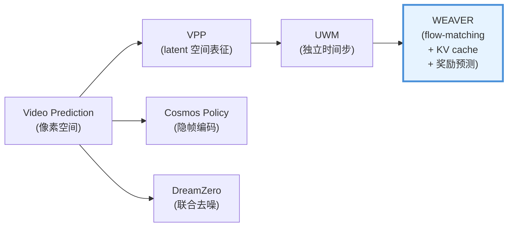

WEAVER 的关键创新相对前代：
- vs VPP：添加了显式的动作条件和奖励预测（VPP 只取中间表征，无显式评估）
- vs UWM：使用 flow-matching 替代扩散，更适合快速推理
- vs Cosmos Policy：不修改骨干结构（Cosmos Policy 需要把所有模态编码为隐帧），更易集成

#### 4.1.6 横向分析（同期替代方案对比）

| 方面 | WEAVER | Cosmos Policy | DreamZero | X-WAM |
|---|---|---|---|---|
| **WM 类型** | 潜空间前向动力学 | 隐帧统一编码 | 联合视频-动作去噪 | 统一序列 |
| **集成模式** | 4（后置打分） | 3（联合建模） | 3（联合建模） | 3（联合建模） |
| **与既有 VLA 的兼容性** | ✅ 可叠加 | ❌ 需替换 | ❌ 需替换 | ❌ 需替换 |
| **测试时规划** | ✅ 显式支持 | ✅ 可选 | 未报告 | 未报告 |
| **规划的独立消融** | ✅ +14% | 未报告 | 未报告 | 未报告 |
| **推理加速** | 16× (KV+蒸馏) | 5 步去噪 | 7 Hz | ANS |

### 4.2 GEM-4D 架构深度分析

#### 4.2.1 核心机制：几何蒸馏

GEM-4D 的创新在于将几何基础模型的知识**在训练时蒸馏进视频扩散骨干**，然后在推理时**完全丢弃几何分支**。其核心机制是**双流训练/单流推理**（dual-stream training / single-stream inference）。

```mermaid
graph TB
    subgraph "训练时双流架构"
        VIDEO_DATA["训练视频帧"]
        VIDEO_DATA --> GFM["几何基础模型 G<br/>(冻结, PAGE-4D)"]
        VIDEO_DATA --> VDB["Video DiT 编码器 E_θ^vid<br/>(可训练)"]
        GFM --> GEO_GT["几何表征 g_0<br/>∈ ℝ^(T×H'×W'×C)"]
        VDB --> MT["中间特征 m_t"]
        MT --> VID_HEAD["Video DiT 输出头 U_θ^vid"]
        MT --> GEO_DIT["Geometry DiT<br/>(并行分支, 可训练)"]
        GEO_GT --> GEO_FM["几何 flow matching<br/>ℒ_FM^geo"]
        GEO_DIT --> GEO_FM
        VID_HEAD --> VID_FM["视频 flow matching<br/>ℒ_FM^vid"]
        GEO_FM -->|"α · ∂ℒ_geo/∂m_t · ∂m_t/∂θ"| VDB
        VID_FM -->|"∂ℒ_vid/∂θ"| VDB
    end
    
    subgraph "推理时单流"
        OBS["当前观测 + 指令"]
        OBS --> VDB_INF["Video DiT<br/>(几何增强的权重)"]
        VDB_INF --> ROLLOUT["几何一致的<br/>视频 rollout"]
        ROLLOUT --> IDM["自适应逆动力学系统<br/>(4步: 3D场景定位→<br/>双准则追踪→运动学回退→<br/>抓取插入)"]
        IDM --> ACT_OUT["6-DoF 末端轨迹"]
    end
    
    style GFM fill:#ffe6e6,stroke:#d94a4a
    style GEO_DIT fill:#ffe6e6,stroke:#d94a4a
    style GEO_FM fill:#ffe6e6,stroke:#d94a4a
```

**⚠️ 关键发现：VGGT 作为教师模型效果不佳！** GEM-4D 的消融研究测试了多个几何基础模型作为教师：

| 教师模型 | 结果 |
|---|---|
| **PAGE-4D**（默认） | 最佳性能 |
| Depth Anything V3 | 竞争性性能 |
| **VGGT** | **略微下降** |
| VGGT4D | 待定 |
| DUSt3R/MonST3R/CUT3R | 待定 |

VGGT 性能下降的原因：VGGT 主要针对**静态/准静态场景**训练，对动态机器人操纵场景中的运动对应关系建模不足。**推荐使用 PAGE-4D 或类似的 4D 几何基础模型作为蒸馏教师。**

#### 4.2.2 蒸馏损失设计（REPA 范式）

GEM-4D 将此定位为 **REPA（Representation Alignment）范式**的一个实例化：通过几何基础模型的表征来对齐视频骨干的内部表征。

**理论基础**：帧间对应关系由以下公式控制：

$$p_{t+1} \sim K\left[R_{t \to t+1} \cdot D(p_t) \cdot K^{-1} p_t + T_{t \to t+1} + \Delta X_t\right]$$

两个关键洞察：(1) 像素级损失无法强制对应关系（映射是多对一的）；(2) 正确的内部编码 $(D, R, T, \Delta X)$ 必然产生正确的对应关系。

**联合训练目标**：

$$\mathcal{L} = \mathcal{L}_{FM}^{vid} + \alpha \cdot \mathcal{L}_{FM}^{geo}$$

其中 $\mathcal{L}_{FM}^{vid}$ 是标准视频 flow matching 损失，$\mathcal{L}_{FM}^{geo}$ 是几何 flow matching 损失。梯度通过视频骨干参数 $\theta$ 分解为标准视频梯度加几何正则化项：

$$\alpha \cdot \frac{\partial \mathcal{L}_{FM}^{geo}}{\partial m_t} \cdot \frac{\partial m_t}{\partial \theta}$$

**关键设计选择**：
- Geometry DiT 的**唯一场景级条件信号**是视频骨干的中间特征 $m_t$——它没有直接访问像素、相机参数或深度图。这**迫使** $m_t$ 编码控制帧间对应关系的因素（$D, R, T, \Delta X$）
- 耦合是**不对称的**：几何分支读取视频特征，但永远不写回——推理时丢弃几何分支后，视频骨干的权重已包含几何知识
- 几何基础模型完全冻结——蒸馏是单向的
- 权重 $\alpha$ 的选择通过消融确定

#### 4.2.3 自适应逆动力学系统（Adaptive Inverse Dynamic System）

GEM-4D 使用一个四步流水线从视频 rollout 中提取可执行的 6-DoF 末端轨迹：

1. **3D 场景定位**：初始观测 + 深度估计 + 已知相机内参 → 3D 点云，建立空间参考系
2. **双准则置信度门控追踪器**：跨生成视频帧追踪末端执行器，双准则置信度机制过滤不可靠预测
3. **几何-运动学位姿回退**：当追踪器置信度低于阈值时，回退到几何-运动学约束的位姿估计
4. **抓取插入与动作合成**：将 6-DoF 轨迹转换为可执行动作，在适当位置插入抓取指令

**⚠️ 在本项目中，我们不使用 GEM-4D 的逆动力学模块**——GEAR-VLA 的 DiT 动作专家已经直接输出动作块。我们只使用 GEM-4D 的**蒸馏机制**来增强 VLM 骨干的几何表征。

#### 4.2.4 与 GEAR-VLA VGGT 的概念对齐与差异

| 方面 | GEAR-VLA 的 VGGT 连接器 | GEM-4D 的几何蒸馏 |
|---|---|---|
| **3D 知识来源** | VGGT（静态 3D 重建模型） | PAGE-4D（4D 动态对应关系模型）|
| **知识注入方式** | 零初始化权重，渐进融合 | REPA 蒸馏，梯度通过中间特征 $m_t$ 反传 |
| **推理时是否保留** | ✅ 保留 VGGT 的推理计算 | ❌ 完全丢弃（Geometry DiT + 教师模型） |
| **额外推理开销** | ~VGGT 推理成本 | 零 |
| **知识深度** | 每帧的 3D 重建特征（空间） | 跨帧的 4D correspondence（时空） |
| **对动态场景的处理** | 弱（VGGT 针对静态场景训练） | 强（PAGE-4D 针对动态场景设计） |

**互补性**：GEAR-VLA 的 VGGT 提供**每帧的空间 3D 特征**（WHERE is everything）；GEM-4D 的蒸馏提供**跨帧的时序 4D 运动对应关系**（HOW will everything move）。两者覆盖不同的几何维度，**可以叠加**。

**⚠️ 重要**：不应使用 VGGT 本身作为 GEM-4D 的教师（§4.2.1 消融证据：VGGT 作为教师时性能略降）。应使用 PAGE-4D 或其他专门的 4D 几何基础模型。VGGT 继续在 GEAR-VLA 中作为 3D 连接器使用，两个角色不冲突。

### 4.3 几何信息密度分类学

将 16 个模型映射到几何信息的层次维度：

| 层次 | 定义 | 代表模型 |
|---|---|---|
| **点级别** | 3D 点、点云、per-pixel 3D 位移 | PointWorld, ParticleFormer |
| **像素级别** | 深度图、法线图、光流、3D 对应关系 | RynnWorld-4D, TesserAct, X-WAM, GEM-4D |
| **物体级别** | 6-DoF 物体位姿、接触状态、语义掩膜 | Kinema4D (URDF), ORV (语义占据) |
| **场景级别** | 体素栅格、3D 高斯、辐射场 | Structured 4D Latent, GWM, ManiGaussian |
| **潜空间级别** | 隐式编码的多视角一致空间信息 | WEAVER, Cosmos Policy, V-JEPA 2 |

**时序密度**：

| 密度 | 定义 | 代表模型 |
|---|---|---|
| **单帧** | 仅预测下一帧 | GeoPredict |
| **多步** | 预测 H 步未来序列 | RynnWorld-4D (H=10), TesserAct |
| **轨迹** | 预测连续轨迹级未来 | PointWorld, WEAVER |

---

## 5. 集成架构设计：与 GEAR-VLA 的融合

### 5.1 四种集成模式 × GEAR-VLA 兼容性分析

GEAR-VLA 的三个架构约束：
1. **Qwen2.5-VL ViT 冻结**——不可修改视觉编码器
2. **VGGT 可训练但零初始化**——3D 特征通过 $W_{\text{vis}} = [W_{\text{Qwen}}; \mathbf{0}]$ 渐进融合
3. **DiT 动作专家梯度解耦**——$\text{sg}(h_{la})$ 切断 flow matching 梯度回传到 VLM

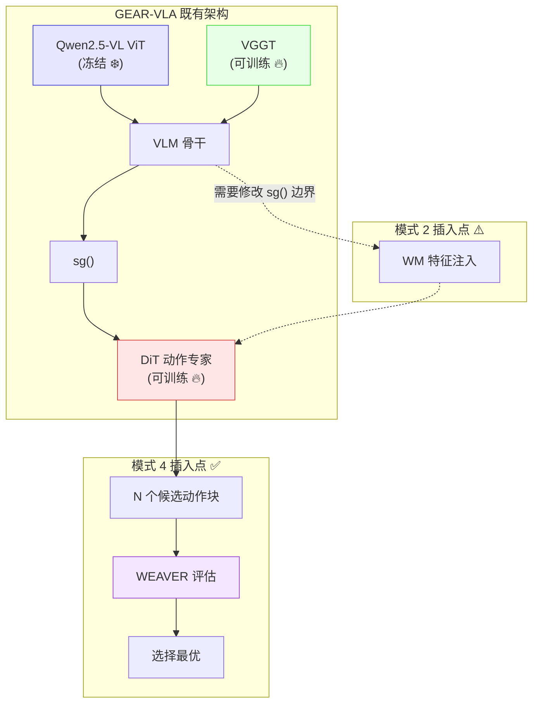

| 模式 | 插入位置 | 修改需求 | 风险 |
|---|---|---|---|
| 1. 逆动力学 | 替换 DiT | 需要删除 DiT 动作专家 | 高——丢失 GEAR-VLA 的核心优势 |
| 2. 内部特征提取 | VLM → DiT 之间 | 需要修改 sg() 边界或在 sg() 后注入 | 中——可能破坏梯度流平衡 |
| 3. 联合世界-动作 | 替换整个架构 | 完全重新设计 | 极高——不再是"GEAR-VLA 改良" |
| **4. WM 作为打分器** | **DiT 之后** | **无需任何修改** | **最低** |

**结论**：模式 4 是唯一"无创"集成方案。

### 5.2 主方案：WEAVER 作为后置打分器

#### 5.2.1 完整架构

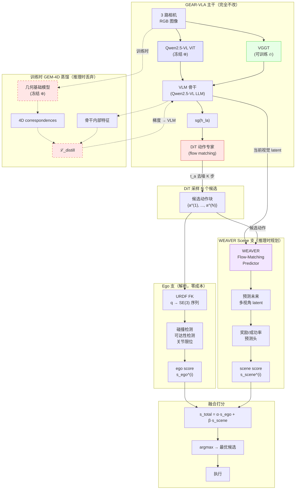

#### 5.2.2 梯度流分析

**关键原则**：WEAVER 和 GEM-4D 的梯度**不得干扰 GEAR-VLA 既有的梯度流平衡**。

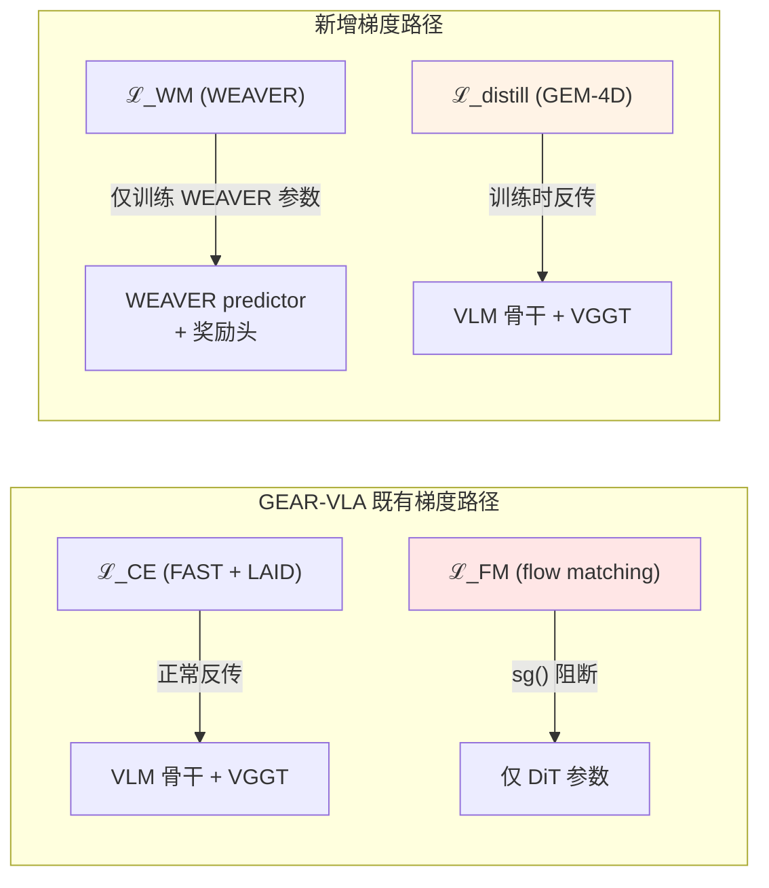

**梯度隔离策略**：

1. **WEAVER 的 $\mathcal{L}_{WM}$ 梯度**：仅训练 WEAVER 自身的参数（flow-matching predictor + 奖励头）。WEAVER 接收的"当前视觉 latent"来自 VLM 骨干的**detach**输出——WEAVER 的损失不回传到 VLM。理由：WEAVER 的前向动力学损失与 VLM 的语言理解/动作生成目标可能冲突。

2. **GEM-4D 的 $\mathcal{L}_{\text{distill}}$ 梯度**：可以回传到 VLM 骨干 + VGGT。理由：蒸馏损失的目标是增强骨干的几何表征，与 FAST/LAID CE 损失的梯度方向一致（都是改善骨干的视觉理解能力）。但需要小权重系数 $\lambda_{\text{distill}}$ 避免覆盖 CE 梯度。

3. **$\mathcal{L}_{\text{score}}$（打分头训练损失）**：仅训练打分头参数。使用后验成功/失败标签，不反传到 VLM 或 DiT。

#### 5.2.3 新增参数量估计

| 组件 | 参数量 | 推理时是否保留 |
|---|---|---|
| WEAVER flow-matching predictor（32 层 Transformer） | **928M** | ✅ |
| 奖励头 R + 价值头 V（AdaPool + 2 层 MLP + CLIP） | ~10M | ✅ |
| GEM-4D Geometry DiT 分支 | ~200M-500M（取决于骨干选择） | ❌ 丢弃 |
| 几何基础模型教师（PAGE-4D 或 Depth Anything V3，冻结） | ~300M-600M | ❌ 丢弃 |
| **推理时总增加** | **~938M** | — |

GEAR-VLA 原始 8B + WEAVER 928M ≈ **8.9B**，增幅 ~12%。

**内存估计**：928M 参数 × 2 bytes (fp16) ≈ 1.86 GB 额外 GPU 内存。KV 缓存在 batch 评估时需要额外 ~0.5-1 GB。总计推理时额外 ~2.5-3 GB。

### 5.3 互补方案：GEM-4D 训练时几何蒸馏

#### 5.3.1 蒸馏目标：教师模型选择

**⚠️ 关键修正**：GEM-4D 原论文消融显示，**VGGT 作为几何教师模型时性能略有下降**（§4.2 证据）。原因是 VGGT 主要针对静态/准静态场景训练，对动态操纵场景中的帧间运动对应关系建模不足。因此，**不能直接使用 GEAR-VLA 已有的 VGGT 作为蒸馏教师**。

**推荐方案**：引入一个独立的 4D 几何基础模型作为教师（推理时丢弃）：

| 候选教师 | 优势 | 劣势 |
|---|---|---|
| **PAGE-4D**（GEM-4D 默认） | 论文验证最佳 | 需确认权重可用性 |
| Depth Anything V3 | GEM-4D 消融中竞争性性能；权重公开 | 仅深度，非完整 4D |
| VGGT4D | 如果可用，可能修复 VGGT 的静态场景偏差 | 尚不确认存在 |

**蒸馏损失**（遵循 GEM-4D 的 REPA 框架）：

$$\mathcal{L}_{\text{distill}} = \alpha \cdot \mathcal{L}_{FM}^{geo}\left(f_\psi^{geo}\!\left(m_t^{VLM}\right),\; \text{sg}\!\left(G(I_{0:T})\right)\right)$$

其中 $m_t^{VLM}$ 是 VLM 骨干的中间特征（传递给 Geometry DiT 分支），$G(I_{0:T})$ 是冻结几何基础模型对训练视频帧序列提取的 4D 几何表征，$f_\psi^{geo}$ 是可训练的 Geometry DiT 分支（推理时丢弃）。

**为什么不用 VGGT 但它还有价值**：GEAR-VLA 的 VGGT 连接器提供**每帧空间 3D 特征**（单帧重建质量高）。GEM-4D 蒸馏需要的是**跨帧 4D 运动对应关系**（动态场景建模）。两者覆盖不同几何维度，VGGT 继续作为 GEAR-VLA 的 3D 连接器使用，GEM-4D 教师模型额外注入 4D 动态知识。

#### 5.3.2 蒸馏时间表

GEM-4D 蒸馏应在 GEAR-VLA 骨干已有一定训练质量之后开始——否则 $m_t$ 中间特征的质量太低，Geometry DiT 无法学到有意义的对齐：

$$\lambda_{\text{distill}}(\text{step}) = \lambda_0 \cdot \max\!\left(0,\; \frac{\text{step} - \text{step}_{\text{warmup}}}{\text{step}_{\text{ramp}}}\right)$$

建议 $\text{step}_{\text{warmup}}$ = GEAR-VLA Phase 1 结束后（FK 监督已收敛），$\text{step}_{\text{ramp}}$ = Phase 2 的前 50%。

**几何教师模型的部署**：冻结的 PAGE-4D 或 Depth Anything V3 在训练时在线推理，产生 4D correspondences 作为 Geometry DiT 的监督信号。这是额外的训练成本（需要在每个 batch 上运行几何基础模型的前向传播），但推理时完全丢弃。

### 5.4 降级方案：UWM 独立时间步

如果 WEAVER 和 GEM-4D 都不可用或成本过高，可采用最小化方案——[UWM（Unified World Model）](./d4a_solutioin_1_c_mvpc.md)的独立扩散时间步技巧：

$$\text{训练：} \quad \mathcal{L} = \mathcal{L}_{\text{action}}(t_a) + \lambda_v \cdot \mathcal{L}_{\text{video}}(t_v), \quad t_a \perp t_v$$

$$\text{推理：} \quad t_v = T_{\max} \text{（跳过视频）}, \quad t_a = \text{正常去噪}$$

**实现方式**：在 DiT 动作专家中添加一个视频预测辅助头，训练时联合优化，推理时关闭。这是 MVPC §7.5 已经描述的方案，作为 WEAVER/GEM-4D 不可用时的保底。

### 5.5 三套方案对比

| 维度 | 主方案 (WEAVER + GEM-4D) | 简化方案 (仅 GEM-4D) | 保底方案 (UWM 独立时间步) |
|---|---|---|---|
| **训练时增强** | ✅ GEM-4D 蒸馏 | ✅ GEM-4D 蒸馏 | ✅ $\mathcal{L}_{\text{video}}$ 辅助 |
| **推理时规划** | ✅ WEAVER 候选打分 | ❌ 无 | ❌ 无 |
| **推理额外延迟** | ~150-300ms（N=8 batch） | 0ms | 0ms |
| **推理额外参数** | ~300M | 0 | 0 |
| **预期收益** | 训练增强 + 推理规划 | 仅训练增强 | 仅训练增强（弱） |
| **实现复杂度** | 高 | 中 | 低 |
| **所需研发时间** | 4 周 | 2 周 | 1 周 |

---

## 6. 训练管线集成

### 6.1 完整损失函数

在主方案（WEAVER + GEM-4D）下，训练阶段的总损失为：

$$\mathcal{L}_{\text{total}} = \underbrace{\mathcal{L}_{CE}^{\text{FAST}} + \mathcal{L}_{CE}^{\text{LAID}}}_{\text{GEAR-VLA 离散损失}} + \underbrace{\mathcal{L}_{FM}\!\left(\text{sg}(h_{la})\right)}_{\text{DiT flow matching}} + \underbrace{\lambda_{\text{FK}} \cdot \mathcal{L}_{\text{FK}}}_{\text{MVPC §6 FK 监督}} + \underbrace{\lambda_{\text{distill}} \cdot \mathcal{L}_{\text{distill}}}_{\text{GEM-4D 蒸馏}} + \underbrace{\lambda_{\text{WM}} \cdot \mathcal{L}_{\text{WM}}}_{\text{WEAVER 前向动力学}} + \underbrace{\lambda_{\text{score}} \cdot \mathcal{L}_{\text{score}}}_{\text{打分头}}$$

各项梯度流向：

| 损失项 | 训练参数 | 梯度是否流向 VLM | 梯度是否流向 DiT | 梯度是否流向 VGGT |
|---|---|---|---|---|
| $\mathcal{L}_{CE}^{\text{FAST/LAID}}$ | VLM + VGGT | ✅ | ❌ (sg) | ✅ |
| $\mathcal{L}_{FM}$ | DiT | ❌ (sg) | ✅ | ❌ (sg) |
| $\mathcal{L}_{\text{FK}}$ | FK 辅助头 | ✅（通过 DiT 的共享 latent） | 取决于设计 | ✅ |
| $\mathcal{L}_{\text{distill}}$ | Geometry DiT + VLM 骨干 | ✅（通过 $m_t$） | ❌ | ✅（间接） |
| $\mathcal{L}_{\text{WM}}$ | WEAVER 参数 | ❌ (detach) | ❌ | ❌ |
| $\mathcal{L}_{\text{score}}$ | 打分头参数 | ❌ (detach) | ❌ | ❌ |

### 6.2 训练阶段时间表

训练集成在 MVPC 的 Phase 2（"4D 世界模型分支"）中进行，细分为四个子阶段：

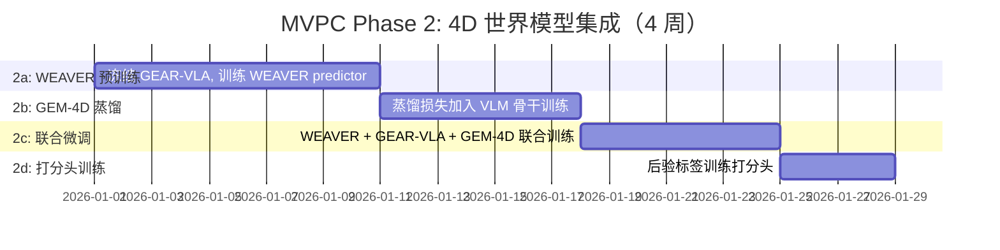

#### Phase 2a（第 1-2 周）：WEAVER 预训练

**目标**：训练 WEAVER 的 flow-matching predictor 学习前向动力学。

**冻结**：GEAR-VLA 全部参数（VLM, VGGT, DiT）
**训练**：WEAVER predictor + KV 缓存机制

**数据**：使用 GEAR-VLA Phase 1 的相同训练视频数据
**输入**：当前多视角 latent（从冻结的 VLM 提取并 detach）+ 动作序列
**目标**：预测未来多视角 latent

$$\mathcal{L}_{\text{WM}} = \left\| v_\phi(z_t, t, c_{\text{obs}}, a) - u_t(z_t | z_{\text{future}}) \right\|^2$$

#### Phase 2b（第 3 周）：GEM-4D 蒸馏

**目标**：增强 VLM 骨干 + VGGT 的几何-时序表征。

**冻结**：DiT, WEAVER
**训练**：VLM 骨干 + VGGT + 蒸馏投影头（使用小学习率）

**损失**：$\mathcal{L}_{CE}^{\text{FAST}} + \mathcal{L}_{CE}^{\text{LAID}} + \lambda_{\text{FK}} \cdot \mathcal{L}_{\text{FK}} + \lambda_{\text{distill}} \cdot \mathcal{L}_{\text{distill}}$

**关键注意**：蒸馏损失的权重 $\lambda_{\text{distill}}$ 必须足够小（建议 0.01-0.1），避免覆盖 CE 损失的梯度。使用 MVPC §7.6 通路一的证据：UWM [B] 显示推理时屏蔽视频生成仍保留训练时塑造的更好表征。

#### Phase 2c（第 4 周前半）：联合微调

**目标**：让 WEAVER 适应 GEM-4D 蒸馏后改变了的 VLM 表征。

**训练**：所有可训练参数（VLM, VGGT, DiT, WEAVER）
**损失**：$\mathcal{L}_{\text{total}}$（完整损失）

**关键设计**：此阶段的 GEM-4D 蒸馏使用线性衰减的 $\lambda_{\text{distill}}$：

$$\lambda_{\text{distill}}(\text{step}) = \lambda_0 \cdot \max\!\left(0,\; 1 - \frac{\text{step} - \text{step}_{\text{2c\_start}}}{\text{step}_{\text{2c\_end}} - \text{step}_{\text{2c\_start}}}\right)$$

使蒸馏在阶段末期完全关闭，确保骨干完全适应自身（不再依赖蒸馏目标）。

#### Phase 2d（第 4 周后半）：打分头训练

**目标**：训练奖励/成功率预测头。

**冻结**：VLM, VGGT, DiT, WEAVER predictor
**训练**：仅打分头参数

**数据**：使用 Phase 2c 的模型在训练集上做 rollout，收集后验成功/失败标签
**损失**：二分类交叉熵（成功/失败）或回归损失（任务进度）

$$\mathcal{L}_{\text{score}} = -\left[y \log \hat{p} + (1-y) \log(1-\hat{p})\right]$$

### 6.3 与 MVPC §6 FK 监督的交互

MVPC §6 的 FK 关键点未来 3D 轨迹监督（ELAN4D 式）与 GEM-4D 蒸馏的关系：

| 维度 | FK 监督（§6） | GEM-4D 蒸馏（§5.3） |
|---|---|---|
| **覆盖范围** | 本体运动学（机器人身体关键点） | 场景几何（全场景 3D 对应关系） |
| **信号来源** | URDF FK（解析精确） | 几何基础模型（学习得到，有噪声） |
| **成本** | <1 CPU-min/hr（零学习成本） | 需要在线运行几何基础模型 |
| **互补性** | ✅ **完全互补**——FK 覆盖"本体到哪"，GEM-4D 覆盖"场景怎么变" |
| **训练顺序** | Phase 1（先） | Phase 2b（后，在 FK 监督收敛后） |

### 6.4 MVPC §7.6 三条训练通路的具体化

MVPC §7.6 描述了三条训练时监督通路。现在结合 WEAVER + GEM-4D 的具体架构，它们变为：

| MVPC §7.6 通路 | 本文档的具体化 | 对应组件 |
|---|---|---|
| 通路一：$\mathcal{L}_{\text{video}}$ 表征塑形 | GEM-4D 的 $\mathcal{L}_{\text{distill}}$ + WEAVER 的 $\mathcal{L}_{\text{WM}}$ | Phase 2a-2c |
| 通路二：4D latent 读回 | WEAVER 在联合微调阶段的 latent 作为 DiT 条件（可选） | Phase 2c |
| 通路三：预测-观测一致性 | WEAVER 的 $\mathcal{L}_{\text{WM}}$ 本身就是预测-观测一致性损失 | Phase 2a-2c |

**通路二的具体化方案**（可选，高风险/高收益）：

在 Phase 2c 的联合微调中，可以尝试将 WEAVER 的预测未来 latent 作为 DiT 的额外条件输入——但**必须施加 sg()**：

$$\text{DiT 输入} = \left[\text{sg}(h_{la}),\; \text{sg}(z_{\text{predicted}}^{\text{WEAVER}})\right]$$

两个 sg() 确保 DiT 的 $\mathcal{L}_{FM}$ 梯度不流向 VLM 骨干或 WEAVER。

**⚠️ 风险**：这个方案引入了训练-推理不匹配——训练时 WEAVER 的预测质量在不断提升，推理时 WEAVER 的预测质量是固定的。建议使用 MVPC §7.6 的调度混合（scheduled mixing）：训练初期用真值未来 latent，逐步过渡到 WEAVER 预测。但这增加了复杂度，建议作为 Phase 3 的消融实验而非默认启用。

---

## 7. 推理时使用方案

### 7.1 三种推理模式

#### Mode A：完整规划（推荐默认模式）

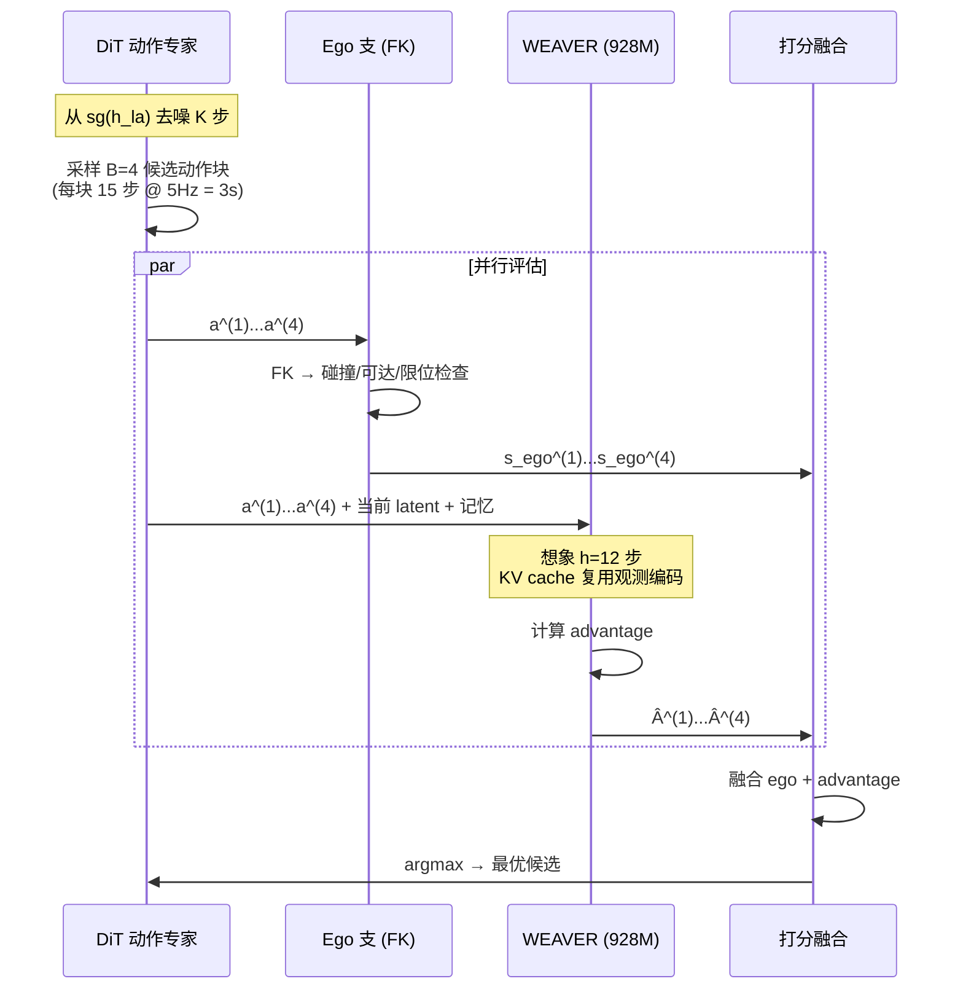

**WEAVER 的 advantage 打分函数**（论文原始公式）：

$$\hat{A}_t^{(b)} = \sum_{l=1}^{H} \gamma^{l-1} R(\hat{z}_{t+l}^{(b)}, l) + \gamma^H V(\hat{z}_{t+H}^{(b)}, l) - V(z_t, l)$$

其中 $R$ 是奖励预测头，$V$ 是价值预测头，$\hat{z}_{t+l}^{(b)}$ 是 WEAVER 对第 $b$ 个候选动作的第 $l$ 步预测 latent。选择 $b^* = \arg\max_b \hat{A}_t^{(b)}$。**不需要像素解码或外部 VLM 评分**——整个评估在潜空间完成。

**延迟预算分析**：

| 步骤 | 延迟 | 说明 |
|---|---|---|
| DiT 去噪（B=4 候选） | ~200ms | Batch 并行采样 |
| Ego FK 检查 | ~5ms | 解析计算，GPU 无关 |
| WEAVER 评估（B=4 batch，h=12 步，16 NFE） | ~300ms | KV 缓存 + ReFlow 蒸馏后（估计：4.78s÷16 steps ≈ 0.3s/chunk） |
| Advantage 计算 + argmax | ~1ms | 简单计算 |
| **总计** | **~506ms** | **远在 2 秒预算内** |

> **注**：WEAVER 论文报告的 4.78s@16NFE 是完整 10 秒 rollout 的延迟。单 chunk 评估（h=12 步 ≈ 2.4 秒预测）应显著更快。上表的 300ms 是保守估计。

#### Mode B：仅表征增强（零额外延迟）

如果延迟受限或 WEAVER 不可用：
- GEM-4D 蒸馏已在训练时增强了 VLM 骨干的几何表征
- WEAVER 的 $\mathcal{L}_{\text{WM}}$（如果在训练时使用）也已塑形了共享表征
- 推理时完全不运行 WEAVER，直接使用 GEAR-VLA 的标准推理流程
- **额外延迟：0ms**

**证据 [B]**：UWM 的消融显示，推理时屏蔽视频生成（$t_v = T_{\max}$）仍保留训练时 $\mathcal{L}_{\text{video}}$ 塑造的更好表征——"推理零成本，训练有收益"。

#### Mode C：混合模式（推荐部署模式）

- **常态**：运行 Mode A（完整规划），享受规划带来的额外 +14% 收益
- **降级条件**：当推理延迟接近 2 秒预算时（例如网络延迟、GPU 负载高），自动降级到 Mode B
- **降级判据**：如果上一个动作块的推理时间 > 1.5s，下一个动作块降级到 Mode B

### 7.2 测试时计算缩放分析

WEAVER 的 +14% 来自测试时规划的消融是关键数据点。但这只是单点——我们需要理解 N（候选数）与性能的关系：

**理论预期**：

$$\text{SR}(N) = 1 - (1 - p_{\text{good}})^N \cdot (1 - p_{\text{miss}})$$

其中 $p_{\text{good}}$ 是单个候选是"好动作"的概率，$p_{\text{miss}}$ 是打分函数遗漏好动作的概率。

**实践考量**：
- B=1（无规划）到 B=4 的收益最显著（WEAVER 论文使用 B=4）
- B>8 时边际收益递减（好候选的概率已经足够高）
- 延迟随 B 亚线性增长（batch 并行下 KV 缓存复用使观测编码只做一次）
- **推荐 B=4**（与 WEAVER 原论文一致）：在延迟（~506ms）和收益之间取得平衡
- 可在 Phase 2 消融中扫描 B ∈ {1, 4, 8, 16}（§9 P5 实验）

**与其他模型的测试时规划对比**：

| 模型 | 测试时规划方法 | 报告的收益 | N 值 |
|---|---|---|---|
| WEAVER [B] | Flow-matching latent rollout + advantage 打分 | +14-15pp（真机，绝对） | B=4, h=12 |
| Cosmos Policy [B] | 隐帧生成 + value 评估 | 支持但未报告 delta | 可选 |
| PointWorld [A] | MPPI 采样 | 零样本工作（无 baseline delta） | ~100（MPPI） |

### 7.3 打分函数设计

打分函数 $s_{\text{total}}^{(i)}$ 融合 ego 和 scene 评估：

$$s_{\text{total}}^{(i)} = \alpha \cdot s_{\text{ego}}^{(i)} + \beta \cdot s_{\text{scene}}^{(i)}$$

**Ego 打分** $s_{\text{ego}}^{(i)}$（解析、确定性）：

$$s_{\text{ego}}^{(i)} = \begin{cases} 0 & \text{if } \exists\, \text{collision or joint limit violation} \\ 1 - \gamma \cdot d_{\text{min}}^{\text{self-collision}} & \text{otherwise} \end{cases}$$

其中 $d_{\text{min}}^{\text{self-collision}}$ 是最近自碰撞距离（通过 swept volume 计算）。**这是 MVPC §8 解析安全层的输出，可直接复用**。

**Scene 打分** $s_{\text{scene}}^{(i)}$（学习、概率性）：

由 WEAVER 的 advantage 估计（§7.1 Mode A 公式）：

$$s_{\text{scene}}^{(i)} = \hat{A}_t^{(i)} = \sum_{l=1}^{H} \gamma^{l-1} R(\hat{z}_{t+l}^{(i)}, l) + \gamma^H V(\hat{z}_{t+H}^{(i)}, l) - V(z_t, l)$$

Advantage 比原始 reward 更稳定，因为减去了 baseline $V(z_t, l)$。

**权重选择**：
- $\alpha$ 较大（~0.7）：偏保守，优先避免碰撞/不可达。Ego 打分是确定性的、物理精确的。
- $\beta$ 较小（~0.3）：scene 评估的不确定性较高（基于学习的预测）
- 可通过交叉验证在目标任务上优化 $\alpha, \beta$
- **安全保证**：$s_{\text{ego}}^{(i)} = 0$ 的候选直接排除（硬约束），不进入 WEAVER 评估

### 7.4 与异步推理的兼容性

[VLASH](https://arxiv.org/abs/2512.01031) 式状态前滚在本方案中的应用：

$$s_{\text{input}} = \text{ForwardRoll}(s_{\text{observed}}, a_{\text{executing}})$$

**WEAVER 需要接收前滚后的状态**——而非原始观测。否则 WEAVER 预测的"未来"是基于过时的观测，打分不准确。

**实现**：
1. VLM 骨干对前滚后的状态编码 → 当前视觉 latent
2. 该 latent 同时传给 DiT（产生候选）和 WEAVER（评估候选）
3. 两个模块看到的是同一个"前滚后的当下"

---

## 8. 成本效益分析

### 8.1 训练成本对比

| 方案 | 额外训练时间 | 额外 GPU-hours | 额外数据需求 |
|---|---|---|---|
| **保底方案**（UWM 独立时间步） | +20% | ~200 H100-hours | 无额外 |
| **简化方案**（仅 GEM-4D 蒸馏） | +40% | ~400 H100-hours | 需要几何基础模型在线推理 |
| **主方案**（WEAVER + GEM-4D） | +80% | ~800 H100-hours | WEAVER 预训练数据 + 打分标签 |

（基于 GEAR-VLA 原始训练约 ~1000 H100-hours 估计）

### 8.2 推理成本对比

| 方案 | 额外推理延迟 | 额外 GPU 内存 | 额外推理参数 |
|---|---|---|---|
| **保底方案** | 0ms | 0 | 0 |
| **简化方案** | 0ms | 0 | 0 |
| **主方案 Mode A** | ~300ms | ~3GB | ~938M |
| **主方案 Mode B** | 0ms | 0 | 0 |

### 8.3 与训练监督综述的成本效益比较

参照 [训练监督综述 §D](./d4a_training_supervision_survey.md) 的成本效益排名：

| 方法 | ΔSR | 成本 | 性价比 |
|---|---|---|---|
| FK 关键点 3D 轨迹（ELAN4D） | +4.6 ~ +14.0pp | <1 CPU-min/hr | **★★★★★** |
| 未来深度图（GeoPredict） | +7.1pp | 仿真中免费 | ★★★★ |
| 未来语义掩膜（Mask WM） | +13.5pp 同架构 | 中等 | ★★★ |
| GEM-4D 蒸馏（本文推荐） | +20pp 真机 | ~400 H100-hours | ★★★ |
| WEAVER 规划（本文推荐） | +14% 测试时 | ~800 H100-hours | ★★☆ |
| Dense 全场景 3D 轨迹 | +1.1pp over FK | 240× FK 成本 | ★ |
| 4D 高斯带颜色 | 颜色贡献 ~0 | 高 | ☆ |

**关键洞察**：

1. **FK 关键点监督的性价比仍然最高**——MVPC §6 的策略是正确的。4D 世界模型（本文档的内容）是**在 FK 监督之上的额外投资**，不是替代。

2. **GEM-4D 的性价比处于中上水平**（+20pp 真机，~400 H100-hours）——考虑到零推理开销，实际部署的长期成本更优。

3. **WEAVER 的性价比取决于是否需要推理时规划**——如果 OOD 场景频繁且失败成本高，+14% 的规划收益可以证明 ~800 H100-hours 的训练投资和 ~150ms 的推理开销。

### 8.4 "98.7% 起点"的边际收益问题

在 GEAR-VLA LIBERO 98.7% 的起点上：

$$\Delta_{\text{max}}^{\text{in-dist}} = 100\% - 98.7\% = 1.3\text{pp}$$

**这个天花板是真实的限制。** 任何 in-distribution 改进超过 1.3pp 意味着 100%，在 500 rollout 的评测中统计不可能。

**但 OOD 场景是另一回事**：
- GEAR-VLA 的 LIBERO-Plus OOD 成功率为 88.7%——天花板 11.3pp
- 真机泛化成功率通常远低于仿真——天花板更大
- **4D 世界模型的主要价值在这里**

$$\text{投资回报} = \frac{\Delta_{\text{OOD}} \times \text{OOD 任务比例}}{\text{训练成本} + \text{推理成本}}$$

如果 OOD 任务占 30%，WEAVER 提供 +14% OOD 改进：

$$\text{加权整体改进} \approx 0.3 \times 14\% = 4.2\%$$

这在统计上是可检测的（如果效应量确实是 4.2pp 而非噪声）。

---

## 9. 消融实验计划

### 9.1 优先级排序的消融列表

| 优先级 | 实验 | 假设 | 控制/处理 | 指标 | 预期效应量 | 所需样本 |
|---|---|---|---|---|---|---|
| **P1** | WEAVER 规划 ON/OFF | 测试时规划提供独立收益 | Mode A vs Mode B | LIBERO-Plus SR | +5-14pp | 3 seeds × 500 rollouts |
| **P2** | GEM-4D 蒸馏 ON/OFF | 训练时几何蒸馏改善 OOD | 有/无 $\mathcal{L}_{\text{distill}}$ | LIBERO-Plus SR | +3-10pp | 3 seeds × 500 rollouts |
| **P3** | WEAVER + GEM-4D 交互 | 两者的收益是否叠加 | 四组：00, 01, 10, 11 | LIBERO-Plus SR | 交互效应待测 | 3 seeds × 500 rollouts |
| **P4** | **参数量匹配控制** | 排除"额外参数"的混淆 | GEM-4D vs 随机辅助任务（同参数） | LIBERO-Plus SR | 若 GEM-4D > random，则几何有效 | 3 seeds × 500 rollouts |
| **P5** | 候选数 B 扫描 | B 与性能的缩放关系 | B ∈ {1, 4, 8, 16} | SR + 延迟 | 递减收益曲线 | 1 seed × 500 rollouts |
| **P6** | 打分权重 α/β | 找最优 ego/scene 权重 | α ∈ {0.3, 0.5, 0.7, 0.9} | SR | 最优 α | 1 seed × 500 rollouts |

### 9.2 统计要求

参照 [方法学审稿 §4](./d4a_geometry_4d_ab_methodology_review.md)：

- **最小可检测差异**（MDD）：在 LIBERO 单 suite 500 rollout、p=0.93 处，Wilson 半宽 ~±2.2pp
- **种子间极差**：可达 29pp（LIBERO-Plus 上）
- **最低要求**：3 个随机种子 × 500 rollouts/种子
- **报告规范**：IQM + bootstrap 95% CI（而非简单平均）
- **主终点**：LIBERO-Plus（OOD），而非 LIBERO（in-dist）——效应量更大，统计功效更高

### 9.3 P4（参数量匹配控制）的具体设计

这是最关键的消融——直接回应 [方法学审稿 G4](./d4a_geometry_4d_ab_methodology_review.md) 的警告：

**实验设计**：
1. **Treatment**：GEM-4D 蒸馏（投影头 + 几何基础模型的 4D correspondences）
2. **Control**：相同参数量的投影头 + **随机目标**（随机高斯噪声作为"伪标签"）
3. **指标**：LIBERO-Plus SR

**如果 Treatment > Control**：证明几何信息有独立价值（超出参数/正则化效应）
**如果 Treatment ≈ Control**：GEM-4D 的收益可能主要来自额外参数/正则化——需要重新评估

参考 [QDepth-VLA 的做法](./d4a_geometry_4d_ab_methodology_review.md)（§N3）：保留分支、loss 权重置零——这是"参数量对齐"消融的现成范例。

---

## 10. 风险分析

### 10.1 风险矩阵

| # | 风险 | 概率 | 影响 | 缓解措施 |
|---|---|---|---|---|
| **R1** | 98.7% 起点上 in-dist 边际收益不可检测 | 高 | 中 | 将主终点设为 OOD（LIBERO-Plus、真机泛化） |
| **R2** | WEAVER +38% 不可迁移到 GEAR-VLA | 中 | 高 | Phase 2a 结束后做 go/no-go：若 WEAVER 的 $\mathcal{L}_{\text{WM}}$ 收敛但奖励预测相关性 <0.5，切换到简化方案 |
| **R3** | GEM-4D +20pp 是参数量混淆 | 中 | 高 | P4 消融（参数量匹配控制）在 Phase 2b 早期完成 |
| **R4** | Scene 支预测质量在 OOD 场景下降 | 中 | 中 | 打分函数中 ego 权重 α 偏高（0.7），确保即使 scene 失效也不会比无规划差 |
| **R5** | 训练不稳定（WM 损失与动作损失冲突） | 低-中 | 高 | Phase 2 的梯度隔离策略（§5.2.2）；监控各 loss 曲线；若冲突，降低 $\lambda_{\text{WM}}$ 或 detach 更多路径 |
| **R6** | 计算预算不足以训练 WEAVER | 取决于资源 | 高 | 如果 <500 H100-hours 可用，直接采用简化方案（仅 GEM-4D）或保底方案（UWM） |
| **R7** | Sim-to-real 迁移差距 | 中 | 中 | WEAVER 使用 latent 空间（而非像素），对 sim-real gap 更鲁棒；但需要真机验证 |
| **R8** | WEAVER 代码/权重未及时公布 | 中 | 高 | 论文 CC BY 4.0，项目页面已公开。928M 架构细节充分（32 层 Transformer，SD3 VAE，AdaPool + MLP 头），可基于论文自行实现。或切换到 Cosmos Policy 的规划模式 |
| **R9** | 推理延迟超过 2 秒预算 | 低 | 中 | Mode C 自动降级机制；减小 N；更激进的蒸馏 |
| **R10** | 移动基座坐标系问题 | 低-中 | 中 | WEAVER 的 latent 预测应以基座帧为参考（与 See like a Robot 一致）；基座运动通过里程计/SLAM 补偿 |

### 10.2 降级决策树

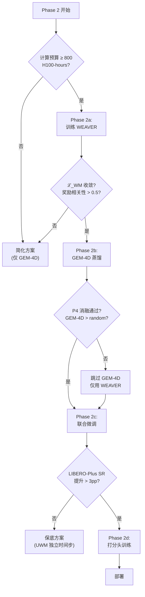

---

## 11. 与已有文档的关系

### 11.1 与 MVPC §7 的逐项对比

| 维度 | MVPC §7 | 本文档 |
|---|---|---|
| 综述模型数 | 3 | **16**（含 10 个新发现） |
| 选型方法 | 3 行表格 + "推荐 Cosmos-Predict2-2B" | **八维加权矩阵 + 灵敏度分析** |
| 架构详情 | 1 张 mermaid + 文字 | **完整静态/动态架构 + 梯度流分析** |
| 训练管线 | 3 条示意通路 | **完整损失函数 + 4 阶段时间表 + 数据需求** |
| 推理设计 | 5 步打分流，N=16 | **3 种模式 + 延迟预算 + 打分函数设计** |
| 成本分析 | 无 | **GPU-hours + ΔSR/GPU-hour + 盈亏平衡** |
| 消融计划 | 无 | **6 项优先排序消融 + 统计要求** |
| 风险分析 | MVPC §13.3 的 3 行 | **10 项风险 + 降级决策树** |
| 证据审查 | 未经批判性审查 | **对抗性分析 + 方法学审稿交叉引用** |
| ego/scene 验证 | 未验证 | **Kinema4D + Embody4D 提供独立验证** |
| DreamZero 证据 | 直接引用 | **明确指出方法学问题** |
| Cosmos-Predict2-2B | 唯一推荐 | **系统评估后不作为首选**（替换为 WEAVER） |

### 11.2 与其他文档的关系

| 文档 | 关系 |
|---|---|
| [主方案](./d4a_solutioin_1_c.md) §4.3 | 本文档的 ego/scene 双支架构**保持一致**；6 个 4D 输出层次中优先采用 L+ (潜空间级) |
| [MVPB](./d4a_solutioin_1_c_mvpb.md) | MVPB 明确不含 4D 生成；本文档与 MVPB 无直接冲突 |
| [训练监督综述](./d4a_training_supervision_survey.md) §C, §D | 本文档的成本效益分析（§8）直接引用其排名 |
| [方法学审稿](./d4a_geometry_4d_ab_methodology_review.md) | 本文档的对抗性分析（§1.3）和 P4 消融设计（§9.3）直接回应其警告 |
| [MVPC §6](./d4a_solutioin_1_c_mvpc.md) FK 监督 | 与 GEM-4D 蒸馏互补——FK 覆盖本体，GEM-4D 覆盖场景 |
| [MVPC §8](./d4a_solutioin_1_c_mvpc.md) 解析安全层 | 打分函数的 $s_{\text{ego}}$ 直接复用安全层的碰撞检测输出 |

---

## 12. 分阶段落地路线图

### 12.1 与 MVPC 总体方案的集成

本文档的实施对应 MVPC 的 **Phase 2**（"4D 世界模型分支"，原计划 3-4 周）。

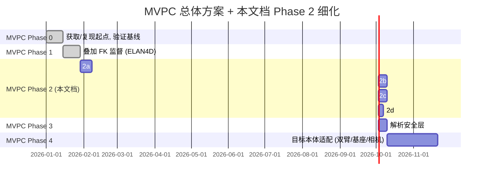

### 12.2 Go/No-Go 检查点

| 检查点 | 时间 | 判据 | 通过 → | 不通过 → |
|---|---|---|---|---|
| **G1** | Phase 2a 结束 | WEAVER $\mathcal{L}_{\text{WM}}$ 收敛 + 奖励预测相关性 > 0.5 | 继续 2b | 切换到简化方案 |
| **G2** | Phase 2b 中期 | P4 消融：GEM-4D > random aux | 继续蒸馏 | 停止蒸馏，仅用 WEAVER |
| **G3** | Phase 2c 结束 | LIBERO-Plus SR 提升 > 3pp | 继续 2d | 降级到保底方案 |
| **G4** | Phase 2d 结束 | Mode A (规划) > Mode B (无规划) on LIBERO-Plus | 部署 Mode A | 部署 Mode B (仅表征增强) |

### 12.3 资源依赖

| 依赖 | 如果不满足 |
|---|---|
| ≥ 800 H100-hours 计算预算 | 直接采用简化方案（仅 GEM-4D，~400 H100-hours） |
| WEAVER 代码/论文细节 | 基于论文描述自行实现 flow-matching predictor |
| 几何基础模型（VGGT）已训练 | 使用 GEAR-VLA Phase 1 训练好的 VGGT |
| 后验成功/失败标签 | 在仿真中收集（零成本） |

---

## 附录 A: 模型 I/O 规格详表

### A.1 WEAVER（928M 参数）

| 字段 | 规格 |
|---|---|
| **输入 1** | 多视角 RGB：$B \times V \times 3 \times 190 \times 32$（$V=2$：外部右侧 + 腕部相机） |
| **输入 2** | 候选动作：$B \times N_B \times h \times 8$（$N_B=4$ 候选数，$h=15$ 步，$D_a=8$：7DoF + 1 夹爪） |
| **输入 3** | 本体感知：$B \times \mathbb{R}^8$，投影到 patch token 维度 |
| **记忆** | 稀疏长期：$p=6$ 帧 @ stride $m=5$；短期历史：最近 2 帧 |
| **中间** | SD3 VAE latent：$B \times V \times C \times H' \times W'$ |
| **输出 1** | 预测未来 latent：$B \times N_B \times V \times C \times H' \times W'$（想象 $h=12$ 步） |
| **输出 2** | 奖励预测：$R(\hat{z}, l) \in \mathbb{R}$（AdaPool + 2 层 MLP + CLIP 语言嵌入） |
| **输出 3** | 价值预测：$V(\hat{z}, l) \in \mathbb{R}$（AdaPool + 2 层 MLP） |
| **输出 4** | Advantage：$\hat{A}_t^{(b)} = \sum_{l=1}^{H} \gamma^{l-1} R + \gamma^H V - V_{\text{baseline}}$（$\gamma=0.995$） |
| **动作适配器** | 输入 128 维 = $(7+1)(15+1)$，输出 $T \times 8 = 15 \times 8$ |

### A.2 GEM-4D 蒸馏接口

| 字段 | 规格 |
|---|---|
| **输入** | 训练视频帧对 $(I_t, I_{t+k})$：$B \times 2 \times 3 \times H \times W$ |
| **几何基础模型输出** | 4D correspondences：$B \times H' \times W' \times 3$（per-pixel 3D 位移） |
| **蒸馏目标** | VLM 骨干特征：$B \times L \times D$（$L$ = token 数，$D$ = 特征维度） |
| **投影头输出** | 投影后特征：$B \times H' \times W' \times 3$（与 correspondences 维度匹配） |
| **推理时** | 投影头 + 几何基础模型完全丢弃，无任何 I/O |

---

## 附录 B: 集成模式 × 模型兼容性全矩阵

| 模型 | 模式 1 逆动力学 | 模式 2 内部特征 | 模式 3 联合建模 | 模式 4 WM 打分器 |
|---|---|---|---|---|
| **WEAVER** | ❌ 不适用 | ⚠️ 可行但需修改 | ❌ 不适用 | ✅ **推荐** |
| **GEM-4D** | ✅ 原论文方式 | ❌ | ❌ | ❌（训练时 only） |
| PointWorld | ❌ | ❌ | ❌ | ✅ 可行（MPPI） |
| MVISTA-4D | ✅ 原论文方式 | ⚠️ | ❌ | ⚠️ 太慢 |
| Kinema4D | ⚠️ 缺逆动力学 | ❌ | ❌ | ⚠️ 缺策略评估 |
| X-WAM | ❌ | ❌ | ✅ 原论文方式 | ❌ |
| Embody4D | ⚠️ | ❌ | ❌ | ❌ |
| PhysisForcing | ❌ | ⚠️ 可提供训练信号 | ❌ | ❌ |
| Cosmos 3 (4B) | ⚠️ | ⚠️ | ✅ 可行 | ⚠️ 成本高 |
| Kairos | ❌ 无细节 | ❌ | ❌ | ❌ |
| RynnWorld-4D | ⚠️ | ✅ RynnWorld-4D-Policy | ❌ | ⚠️ 骨干冲突 |
| TesserAct | ✅ 原论文方式 | ⚠️ | ❌ | ⚠️ 延迟高 |
| Structured 4D Latent | ✅ 原论文方式 | ⚠️ | ❌ | ⚠️ 延迟高 |
| DreamZero | ❌ | ❌ | ✅ 原论文方式 | ❌ |
| Cosmos Policy | ❌ | ❌ | ✅ 原论文方式 | ✅ 可选规划模式 |
| GaussianDream | ❌ | ✅ prefix tokens | ❌ | ❌ |

---

## 参考来源

| 标识 | 工作 | 链接 | 本文用途 |
|---|---|---|---|
| WEAVER | WEAVER: Multi-view World Model for Robotic Manipulation (2026.06) | [arXiv 2606.13672](https://arxiv.org/abs/2606.13672) | 推荐主力 WM |
| GEM-4D | GEM-4D: Geometry-Enhanced Multi-view 4D World Model (2026.05) | [arXiv 2605.22882](https://arxiv.org/abs/2605.22882) | 推荐互补训练时蒸馏 |
| PointWorld | PointWorld: Scaling 3D World Models for In-The-Wild Robotic Manipulation (CVPR 2026) | [CVPR Paper](https://openaccess.thecvf.com/content/CVPR2026/papers/Huang_PointWorld_Scaling_3D_World_Models_for_In-The-Wild_Robotic_Manipulation_CVPR_2026_paper.pdf) | Tier 1 几何密度参照 |
| MVISTA-4D | MVISTA-4D: Multi-View Imagination for Spatial-Temporal Action (ICML 2026) | [arXiv 2602.09878](https://arxiv.org/html/2602.09878v1) | Tier 1 接触密集任务参照 |
| Kinema4D | Kinema4D: URDF-driven 4D World Models (CVPR 2026W) | [arXiv 2603.16669](https://arxiv.org/abs/2603.16669) | ego/scene 解耦验证 |
| X-WAM | X-WAM: Unified Multi-Modal World Action Model (2026.04) | [arXiv 2604.26694](https://arxiv.org/abs/2604.26694) | WAM 最高 RoboCasa 分参照 |
| Embody4D | Embody4D: Cross-Morphology Novel-View Synthesis (2026.05) | [arXiv 2605.01799](https://arxiv.org/abs/2605.01799) | 跨形态数据增强参照 |
| PhysisForcing | PhysisForcing: Physics-Reinforced Video Generation (2026.06) | [arXiv 2606.28128](https://arxiv.org/abs/2606.28128) | 物理增强训练技巧 |
| Cosmos 3 | NVIDIA Cosmos 3 (2026.05-07) | [技术报告](https://research.nvidia.com/labs/cosmos-lab/cosmos3/technical-report.pdf) | 基础平台参照 |
| Kairos | Kairos (ACE Robotics, 2026.07) | [新闻稿](https://sg.finance.yahoo.com/news/ace-robotics-unveils-kairos-world-071500870.html) | 基准参照（[C] 不可靠） |
| 4D-VLA | 4D-VLA: Spatial-Temporal Perception for Robot Learning (NeurIPS 2025) | [arXiv 2506.22242](https://arxiv.org/abs/2506.22242) | 3D 坐标嵌入参照 |
| ParticleFormer | ParticleFormer: 3D Particle Dynamics Prediction (2026) | [arXiv 2506.23126](https://arxiv.org/abs/2506.23126) | 多材料动力学参照 |
| RynnWorld-4D | RynnWorld-4D: 4D Embodied World Models (2026.07) | [arXiv 2607.06559](https://arxiv.org/html/2607.06559) | RGB-D-F 4D 生成参照 |
| TesserAct | TesserAct: 4D Embodied World Model (ICCV 2025) | [arXiv 2504.20995](https://arxiv.org/abs/2504.20995) | RGB-D-N 开创性工作 |
| DreamZero | DreamZero: WAM on Wan2.1 (ICLR 2026 Workshop) | [arXiv 2602.15922](https://arxiv.org/abs/2602.15922) | WAM 规模效应参照 |
| Cosmos Policy | Cosmos Policy (ICLR 2026) | [arXiv 2601.16163](https://arxiv.org/abs/2601.16163) | 隐帧 WAM 参照 |
| GaussianDream | GaussianDream: Feed-forward 3D Gaussian WM Plugin (2026) | [arXiv 2605.20752](https://arxiv.org/html/2605.20752) | 非对称训练/推理参照 |
| UWM | Unified World Model (2025) | 见[训练监督综述](./d4a_training_supervision_survey.md) | 独立时间步技巧 |
| Fast-WAM | Fast World Action Model (2026) | 见[主方案 §2.6](./d4a_solutioin_1_c.md) | 测试时屏蔽验证 |
| WAM 综述 | World Action Models: A Survey (2026) | [alphaxiv.org/abs/2606.20781](https://www.alphaxiv.org/abs/2606.20781) | 术语定义 |
| 方法学审稿 | 对抗性方法学审稿 | [本项目](./d4a_geometry_4d_ab_methodology_review.md) | 对抗性约束 |
| 训练监督综述 | 训练监督信号综述 | [本项目](./d4a_training_supervision_survey.md) | 成本效益排名 |
| RoboWM-Bench | Physical Executability Benchmark (CVPR 2026W) | [arXiv 2604.19092](https://arxiv.org/abs/2604.19092) | 感知质量≠执行质量 |
