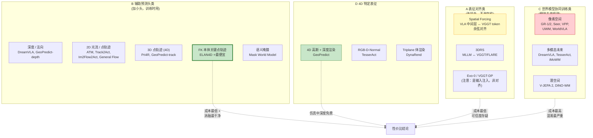
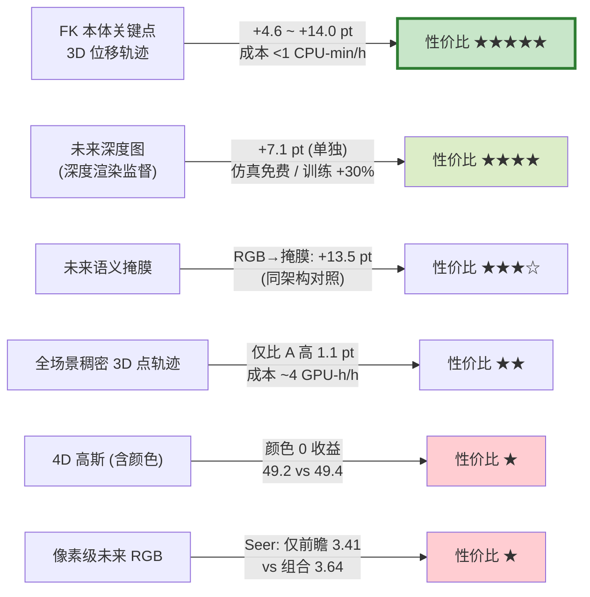
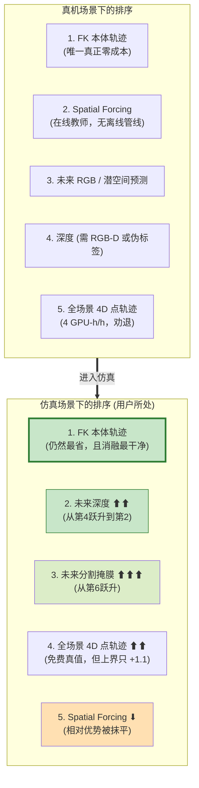
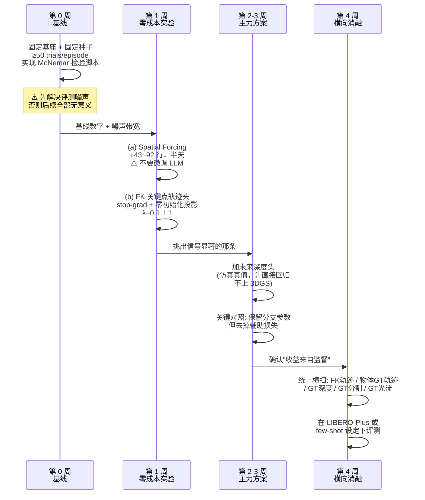

# 几何 / 4D 信息作为 VLA **训练监督信号** 的文献调研报告

> **调研范围界定**：本报告只覆盖命题的「训练」这一半 —— 把几何 / 3D / 4D 信息作为**训练时的监督信号、辅助任务、或表征对齐目标**，推理时**不需要**额外输入。作为输入的 3D VLA（PointVLA、SpatialVLA、GeoVLA、RVT-2 等）不在本报告主线内，仅在对照时提及。
>
> **调研日期**：2026-07-26
>
> **可靠性标注约定**（贯穿全文）：
> - 🟢 **同行评审**：已被 ICLR / CVPR / NeurIPS / CoRL / ICML / RSS / ICCV 等录用
> - 🟡 **arXiv 预印本**：仅 arXiv，未见录用信息
> - 🔵 **项目页 / 仓库宣称**：来自 GitHub README 或项目主页，未在论文正文核实
> - ⚪ **本报告推测 / 推断**：我的判断，非文献陈述

---

## 0. 执行摘要（先看这个）

本次调研最重要的四个发现，与用户的直觉有相当大的偏差，请优先阅读：

1. **最便宜的 4D 监督信号就是机器人自己的正运动学（FK）轨迹，而且它几乎不比"全场景真值点轨迹"差。** ELAN4D 🟡 用仿真器真值物体关键点做"上界实验"，发现全场景轨迹只比"只监督机器人自身关键点"高 **1.1 个点**（79.3% vs 78.2%），而预处理成本差 **~240 倍**（<1 CPU-分钟/小时数据 vs ~4 GPU-小时/小时数据）。这直接回答了用户的方向 5：**本体解析监督不仅有人做过，而且是目前性价比最高的一档。**

2. **"辅助监督到底带来多少收益"这个问题，目前只有极少数论文做了干净的消融，而做了的那几篇结论一致：收益来自监督信号本身，不来自额外参数。** ELAN4D 🟡 的关键消融：保留完整 ControlNet 分支但**去掉 4D 损失** → 73.3%，与基线 π0.5 的 73.6% 持平；加上 4D 损失 → 78.2%。GeoPredict 🟢（CVPR 2026）给出了逐项累加消融：π0 42.3% → +历史轨迹编码 44.8% → +未来轨迹预测 47.2% → +未来深度渲染 49.4%（单独）→ 全量 52.4%。

3. **表征对齐类（Spatial Forcing）"不改架构、不改推理、几十行代码"基本属实（我实测代码 diff 为 +43 ~ +92 行），但它是本报告中唯一被第三方严格复现失败的方法。** Amazon + MIT (Luca Carlone 组) 的 2026 年研究 🟡 在 GR00T-N1.5 上重新实现 Spatial Forcing，配合 McNemar 显著性检验，得到 RoboCasa 68.3% vs 基线 71.7%（p=0.154，**数值上更差**）、LIBERO 91.5% vs 87.9%（p=0.295，**不显著**）。同一篇论文还证明：VLA 论文常见的 10–20 次 trial 评测下，**仅动作专家的扩散噪声就能造成 8–10 个点的成功率波动**（Epoch 80 时标准差 4.8）。

4. **把 4D 预测任务挂到 VLM backbone 上会主动损害性能；必须挂到 action expert 上并做梯度隔离。** 三条独立证据链：ELAN4D 🟡 的"VLM + track queries"变体掉到 66.8%（**-6.8**），CKA 分析显示 VLM 表征漂移严重；VLM4VLA 🟢（ICLR 2026）发现在 7 个 embodied 辅助任务（含深度估计、语义分割生成）上微调 VLM 后，**几乎全部低于原始基线**；Knowledge Insulation 🟢（NeurIPS 2025，Physical Intelligence）从机制上解释了为什么随机初始化模块的梯度会破坏预训练 VLM 权重。

---

## 1. 方法族分组详表

### 1.1 方法族总览图

---

### 1.2 【族 A】表征对齐类 —— 最轻量，但可信度最需打折

#### A-1. Spatial Forcing（本族代表，用户点名要的数字都在这里）

| 项目 | 内容 |
|---|---|
| **论文** | Spatial Forcing: Implicit Spatial Representation Alignment for Vision-Language-Action Model, [arXiv:2510.12276](https://arxiv.org/abs/2510.12276) |
| **可靠性** | 🟢 **同行评审 — ICLR 2026**（该录用信息由 ELAN4D 论文参考文献 [39] 佐证：*"In The Fourteenth International Conference on Learning Representations (ICLR), 2026"*） |
| **核心做法一句话** | 在 VLA 的 LLM backbone 某一中间层取出视觉 token，用余弦相似度损失把它对齐到冻结 VGGT 输出的几何 token，迫使 VLA 内部隐式携带 3D 信息。 |
| **代码** | https://github.com/OpenHelix-Team/Spatial-Forcing |
| **许可证** | **MIT**（仓库级，GitHub API 实测）。⚠️ **但仓库内 vendored 了整份 VGGT 源码**（`openvla-SF/vggt/`，40+ 文件），而 VGGT 自身是 **Meta 自定义 "VGGT License"**（我实测拉取 LICENSE.txt：以 "Research Materials" 为授权对象，含 Acceptable Use Policy 与 Trade Control Laws 条款，**非 OSI 许可证**）。商业用途必须自行评估。 |
| **实现复杂度** | **低**。我实测了官方仓库的两份 diff（PowerShell `Compare-Object`）： • `openvla-SF/vla-scripts/finetune.py` (1153 行) → `finetune_align.py` (1244 行)：**+92 / -0 行** • `openpi-SF/scripts/train_pytorch.py` (632 行) → `train_align_pytorch.py` (658 行)：**+43 / -17 行** 👉 **"几十行代码"这个说法核实为真**（就训练脚本增量而言）。 |
| **隐藏成本（重要）** | ⚪ 但"几十行"是**你自己写的代码**的量。你还必须：(a) vendor 整个 VGGT 代码库（~250 KB 源码）；(b) 训练时每步跑一次 VGGT-1B 的前向（教师），这是**显存与训练吞吐的实打实开销**，论文未报告该开销的绝对数值。 |
| **是否需要伪标签流水线** | **不需要离线流水线**（VGGT 在线前向即可），这是它最大的吸引力。 |

**报告的量化收益**（🟡 数字来自论文正文/表格）：

| 指标 | 基线 | Spatial Forcing | 提升 |
|---|---|---|---|
| LIBERO 四套件平均成功率 | OpenVLA-OFT 97.1% | **98.5%** | +1.4 pt |
| 训练收敛速度 | 1× | **3.8×** 更快 | — |
| 数据效率 | 1× | **5.9×** | — |

**消融要点**（🟡）：对齐权重 α = 0.5 最优；对齐目标 **VGGT > DINOv2 > SigLIP**（即"几何"基础模型优于纯语义自监督模型，这是支持"几何信息有用"的直接证据）；对齐层选第 24 层（约 backbone 深度 70%）最好。

> ⚠️ **本方法的负面证据非常强，请务必阅读第 3 节 §3.1。**

#### A-2. 3DRS（把同一思路用在 MLLM 上，作为旁证）

| 项目 | 内容 |
|---|---|
| **论文** | 3DRS / Learning from Videos for 3D World: Enhancing MLLMs with 3D Vision Geometry Priors |
| **可靠性** | 🟢 **同行评审 — NeurIPS 2025**（由 Understanding-GFM 论文参考文献 [53] 佐证） |
| **核心做法** | 用 VGGT / FLARE 作为教师，对 MLLM 特征做 3D-aware 表征监督。 |
| **收益** | 🟡 在 visual grounding / captioning / QA 多个 benchmark 上一致提升；**推理零额外开销**。⚠️ 但这是**场景理解任务，不是动作任务**，不能直接外推到 VLA。 |
| **代码 / 许可证** | https://github.com/Visual-AI/3DRS ，**Apache-2.0**（实测），158 stars |
| **实现复杂度** | 低 | 
| **伪标签流水线** | 不需要 |

#### A-3. 本族的一个关键"负面"发现：几何信息确实丢失了，但补回来不等于动作变好

🟡 **Understanding the Impact of Geometric Foundation Models on VLAs**（[arXiv:2605.24642](https://arxiv.org/html/2605.24642)，2026-05-23，Amazon Personal Robotics + UT Austin + MIT，含 Luca Carlone）用**线性探针**首次定量了"几何鸿沟"：

| 探针位置 | 深度 RMSE (m) ↓ | δ₁ ↑ |
|---|---|---|
| GR00T-N1.5 视觉编码器输出 | 0.92 | 0.51 |
| GR00T-N1.5 VLM 输出 | 0.73 | 0.63 |
| **VGGT** | **0.41** | **0.89** |
| Early Fusion（注入 VGGT token 后） | 0.44 | 0.88 |
| Late Fusion | 0.45 | 0.87 |

表面法向探针（附录 A.6）结论一致：GR00T VLM 平均角误差 44.43°，VGGT 39.62°。

**这半个结论强力支持用户命题的前提**（VLA 确实缺几何理解，且几何信息在视觉编码器之后就丢了）。**但后半段不支持结论**——见 §3.1。

---

### 1.3 【族 B】辅助预测头类

#### B-1. ⭐ ELAN4D —— 用户方向 5 的直接答案，也是本报告的第一推荐

| 项目 | 内容 |
|---|---|
| **论文** | ELAN4D: Embodiment-Centric 4D Supervision for Vision-Language-Action Models via Plug-and-Play Adaptation, [arXiv:2605.30484](https://arxiv.org/html/2605.30484)（2026-05-28，Oxford TVG / CUHK-SZ / 清华 / 上交，Philip Torr 参与） |
| **可靠性** | 🟡 **arXiv 预印本**（0 citations，作者 h-index 普遍偏低，但机构与资深作者可信；写作与实验规范度高） |
| **核心做法一句话** | 用 URDF + 正运动学从本体关节角直接算出机器人关键点（7 关节 + 1 末端）的**未来 3D 位移轨迹**，通过一个 ControlNet 式残差分支 + 轻量 track decoder 监督 action expert，**stop-gradient 挡住 VLM**，推理时丢掉 decoder。 |
| **代码** | ❌ **未找到公开仓库**（我在 GitHub 搜索 "ELAN4D" 返回 0 结果）。需自行实现。 |
| **许可证** | N/A |
| **实现复杂度** | **低–中**。FK 部分在仿真里就是几行（直接读关节角 + `pinocchio`/`urdfpy`/仿真器 API）；模型侧是 3 个 MLP（point MLP / control MLP / fusion MLP）+ 一个零初始化投影 + stop-gradient。⚪ 我估计 **200–400 行**，无需 vendor 任何基础模型。 |
| **是否需要伪标签流水线** | ✅ **完全不需要**。论文明确对比：本体关键点轨迹 **< 1 CPU-分钟 / 小时数据**；对照 SAM + SpatialTrackerV2 的全场景点轨迹 **~4 GPU-小时 / 小时数据**。 |

**量化收益**（🟡 全部来自论文表 1/2、图 3/4、表 5a）：

| Benchmark | 基线 | ELAN4D | 提升 |
|---|---|---|---|
| **LIBERO-Plus**（OOD 压力测试）| π0 = 53.6% | **67.6%** | **+14.0 pt** |
| LIBERO-Plus | π0.5 = 73.6% | **78.2%** | +4.6 pt |
| LIBERO（已饱和）| π0 = 94.2% | 95.0% | +0.8 pt（其中 LIBERO-Long **+6.6**）|
| LIBERO | π0.5 = 96.9% | 97.0% | +0.1 pt |
| RoboTwin2.0（双臂 OOD）| π0 = 12% | 15% | +3 pt |
| RoboTwin2.0 | π0.5 = 32% | 37% | +5 pt |
| 真机 AgileX Piper — 视觉鲁棒 | π0.5 = 50% | **80%** | +30 pt |
| 真机 — 空间泛化 | π0.5 = 15% | **65%** | +50 pt |
| 真机 — 时序推理（两阶段装配）| π0.5 = 5% | **45%** | +40 pt |
| 数据效率 | π0.5 @100% 数据 | ELAN4D @20% 数据 = 75.0% | 用 20% 数据 ≈ π0.5 用 30% 数据 |

**这篇论文的消融是本报告中最干净的**（🟡，表 5a，全部在 LIBERO-Plus 上）：

| 变体 | SR | Δ | 说明 |
|---|---|---|---|
| 基线 π0.5 | 73.6% | — | |
| **+ 控制分支但去掉 4D 损失** | **73.3%** | **-0.3** | ⭐ **证明收益不来自额外参数** |
| 4D 预测挂在 VLM 上（track queries）| 66.8% | **-6.8** | ⭐ **证明挂错位置会主动伤害** |
| 4D 预测挂在控制分支（本方法）| 78.2% | +4.6 | |
| **全场景轨迹**（仿真器真值物体关键点）| **79.3%** | +5.7 | ⭐ **上界只比本体高 1.1 pt** |

**超参**：λ_track = 0.1，L1 损失，K = 8（LIBERO）/ 14（双臂）/ 7（真机），训练 30K steps，8× GH200。

数学形式（供实现参考）：

$$
p_t^k = \mathrm{FK}_k(q_t), \quad
\Delta P_{t+h} = P_{t+h} - P_t, \quad
Y_t = [\Delta P_{t+1},\dots,\Delta P_{t+H}] \in \mathbb{R}^{H\times K\times 3}
$$

$$
\tilde{u}_t = u_t + \mathrm{Proj}\big(b_\psi(\mathrm{sg}(u_t))\big), \qquad
\mathcal{L} = \mathcal{L}_{\mathrm{act}} + \lambda_{\mathrm{track}}\,\big\|\widehat{\Delta P} - \Delta P\big\|_1
$$

其中 $\mathrm{sg}(\cdot)$ 是 stop-gradient，$\mathrm{Proj}$ 零初始化。

**ELAN4D 自陈的局限**（🟡，第 6 节）：稀疏本体关键点轨迹**对"成败主要取决于外部物体运动、可变形物体、复杂接触"的任务可能不够**。

#### B-2. GeoPredict —— 同族中**唯一同行评审 + 有代码**的

| 项目 | 内容 |
|---|---|
| **论文** | GeoPredict: Leveraging Predictive Kinematics and 3D Gaussian Geometry for Precise VLA Manipulation, [arXiv:2512.16811](https://arxiv.org/abs/2512.16811) / [项目页](https://jingjingqian75.github.io/GeoPredict-Page/) |
| **可靠性** | 🟢 **同行评审 — CVPR 2026**（仓库 README 标注 `[CVPR2026]`，🔵） |
| **核心做法一句话** | 双路训练期监督：(a) 预测机器人关键点（K=8：7 关节 + 1 末端）多步 3D 轨迹；(b) 预测**未来 3D 高斯场景几何**，并**仅用未来深度图渲染**（不建模颜色）来监督，且沿预测轨迹自适应加密高斯。推理时不做任何 3D 解码。 |
| **代码** | https://github.com/jingjingqian75/geopredict（**已放出推理代码 + checkpoint**，27 stars，最后推送 2026-07-06）|
| **许可证** | **Apache-2.0**（实测）|
| **实现复杂度** | **中–高**（3DGS 模块 + 体素化 + 可微深度渲染）|
| **伪标签流水线** | 关键点轨迹：不需要（FK）。深度监督：**仿真中免费**；真机需 RGB-D 或深度模型。 |

**逐项累加消融**（🟢/🟡 表 3，RoboCasa Human-50，24 任务平均 SR）—— 这是"哪种 4D 表征最划算"的最直接实验证据：

| 历史轨迹 | 未来轨迹 $\mathcal{L}_{track}$ | 未来深度 $\mathcal{L}_{depth}$ | 轨迹引导加密 | 平均 SR |
|---|---|---|---|---|
| ✘ | ✘ | ✘ | ✘ | **42.3**（π0 基线）|
| ✔ | ✘ | ✘ | ✘ | 44.8（+2.5）|
| ✔ | ✔ | ✘ | ✘ | 47.2（+4.9）|
| ✘ | ✘ | ✔ | ✘ | **49.4（+7.1）** ← 深度单独最强 |
| ✔ | ✔ | ✔ | ✘ | 50.5（+8.2）|
| ✔ | ✔ | ✘ | ✔ | **52.4（+10.1）** |

**两个极有价值的成本/收益数字**（🟡 表 4）：
- **带颜色渲染 49.2% vs 只渲染深度 49.4%** → **颜色监督毫无收益，深度足够**。这对用户"哪种 4D 表征性价比最高"是关键答案。
- 全局高斯 $N_G$ 4→8：51.4%，但训练时间 **12.0 → 19.1 小时/epoch**；轨迹引导加密方案 52.4% 只需 **15.7 小时/epoch**。→ ⚪ 也就是说：3DGS 监督的训练时间开销约 **+30%**，粗暴加密约 **+60%**。

LIBERO：π0 基线 93.9 ± 0.4% → GeoPredict **96.5 ± 0.6%**（🟡，报告了标准差，这点比大多数论文规范）。

#### B-3. Pri4R —— 结论好，但**没有代码**

| 项目 | 内容 |
|---|---|
| **论文** | Pri4R: Learning World Dynamics for VLA Models with Privileged 4D Representation, [arXiv:2603.01549](https://arxiv.org/abs/2603.01549)（2026-03-02，v2 2026-03-10）|
| **可靠性** | 🟡 arXiv 预印本 |
| **核心做法** | 加一个轻量 point track head，把 VLA 内部特征喂进去，联合预测未来 **3D 点轨迹**；推理时丢弃，架构完全不变。 |
| **量化收益** | 🟡 LIBERO-Long **+10%**、RoboCasa **+40%**、学习速度 **2.7×**。LIBERO 四套件平均 96.3%（ELAN4D 表 2 转述）。 |
| **代码** | ❌ **实测 `github.com/jiiiisoo/Pri4R` 只有 `index.html` / `style.css` / `image/` / `video/` —— 那是项目页，不含任何代码**。ELAN4D 论文亦明确指出 GeoPredict 与 Pri4R *"do not release code or models"*（GeoPredict 已于 2026-07 补放）。 |
| **许可证** | 无声明 |
| **伪标签流水线** | ⚠️ **需要**。依赖 SpatialTrackerV2 提取全局稠密点轨迹（ELAN4D 批评其"预处理开销膨胀"）。 |
| **消融要点** | 🟡 3D 点轨迹预测比其他监督目标更有效；**同时跟踪机器人点与场景点很关键**；$P_t$ **只喂给 head、不喂 backbone** 是关键设计（与 ELAN4D 的梯度隔离结论一致）。 |

#### B-4. 2D 光流 / 点轨迹族（ATM、Track2Act、Im2Flow2Act、General Flow、P3-PO）

⚠️ **重要定性判断（⚪）**：这一族**大多不是"辅助头"，而是"两阶段管线"** —— 先训一个轨迹/流生成模型，再训一个**以流为条件输入**的策略。它们的收益数字**不能当作"加辅助损失"的收益**来读，因为推理时仍然需要跑流生成模型。对用户"不改推理"的目标而言，这一族的可移植性显著低于 B-1/B-2。

| 工作 | 可靠性 | 收益 | 代码 | 许可证 | 是否需伪标签 |
|---|---|---|---|---|---|
| **ATM** (Any-point Trajectory Modeling) | 🟡（会议信息未在本次核实）| LIBERO 平均 **37% → 63%**（约 +80% 相对提升）🟡 | [Large-Trajectory-Model/ATM](https://github.com/Large-Trajectory-Model/ATM) | **MIT** ✅ | ✅ 需要（CoTracker 类点跟踪）|
| **Im2Flow2Act** | 🟢 **CoRL 2024** | 4 个真机任务平均 **81%**（无任何真机机器人数据）🟢 | [real-stanford/im2flow2act](https://github.com/real-stanford/im2flow2act) | **MIT** ✅ | ✅ 需要（TAPIR）|
| **Track2Act** | 🟡 | 泛化分档成功率 70%（轻微）/ 60%（标准）/ 55%（组合）/ 40%（类型）🟡 | [homangab/Track-2-Act](https://github.com/homangab/Track-2-Act) | ⚠️ **NOASSERTION**（无标准许可证）| ✅ 需要 |
| **General Flow** | 🟡 | 未在本次核实具体数字 | [michaelyuancb/general_flow](https://github.com/michaelyuancb/general_flow) | **MIT** ✅ | ✅ 需要 |
| **P3-PO** | 🟡 | 未在本次核实具体数字 | [mlevy2525/P3PO](https://github.com/mlevy2525/P3PO) | ⚠️ **无许可证声明** | ✅ 需要 |

**ATM 消融要点**（🟡）：轨迹长度 16 步通常最优；**移除 late fusion 造成最大性能下降**；masked image patch 重建有正向作用。

#### B-5. Mask World Model —— 语义掩膜作为监督（2026 新作）

| 项目 | 内容 |
|---|---|
| **论文** | Mask World Model: Predicting What Matters for Robust Robot Policy Learning, [arXiv:2604.19683](https://arxiv.org/html/2604.19683v1) |
| **可靠性** | 🟡 arXiv 预印本（正文出现 `Machine Learning, ICML` 模板标记，🔵 疑为 ICML 投稿，未确认录用）|
| **核心做法** | 世界模型不预测 RGB 像素，而是预测**未来语义掩膜**（机器人臂 + 夹爪 + 任务相关物体）的 latent，形成"几何信息瓶颈"；**掩膜标签只在训练时离线使用**（真机用 RoboEngine 标注），部署时只吃原始多视角 RGB。 |
| **收益** | 🟡 LIBERO 平均 **98.3%**；RLBench 6 任务平均 **68.3%** vs FiS-VLA 50.0% / GE-ACT 30.8% / π0 33.3%；真机 Franka 4 任务平均 67.5%。 最有价值的**同源对照**：MWM-C1 vs Cosmos w/ IDM **0.675 → 0.810**（LIBERO-10 子集 0.488 → 0.704）；MWM-C2 vs Cosmos w/ Latent IDM **0.873 → 0.918**。即**同架构下把预测目标从 RGB 换成语义掩膜，长时程任务收益最大**。 |
| **代码 / 许可证** | ❌ 本次未找到公开仓库 |
| **实现复杂度** | 高（视频扩散 + 两阶段训练）|
| **伪标签流水线** | ✅ 真机需要（RoboEngine/SAM）；**仿真中掩膜是免费真值** |

---

### 1.4 【族 C】世界模型 / 未来预测协同训练类

> ⚪ **总体判断：这一族收益数字最亮眼，但混淆因素最严重，实现成本最高，对用户"快速验证"的目标性价比最差。** 详见第 4 节。

| 工作 | 可靠性 | 核心做法 | 报告收益（基线 → 结果）| 代码 | 许可证 | 复杂度 | 伪标签 |
|---|---|---|---|---|---|---|---|
| **GR-1** | 🟢 ICLR 2024 | 大规模视频生成预训练 + 未来图像预测联合动作 | CALVIN 88.9% → **94.9%**；零样本 53.3% → **85.4%** 🟡 | [bytedance/GR-1](https://github.com/bytedance/GR-1) | **Apache-2.0** ✅ | 高 | 不需要（RGB 自监督）|
| **GR-2** | 🟡 | 同上，规模更大 | 平均成功率 **97.7%** 🟡 | ❌ 未开源 | — | 高 | — |
| **Seer** | 🟡（🔵 疑 ICLR 2025）| 预测式逆动力学：条件视觉前瞻 + 逆动力学 | CALVIN ABC-D 平均长度 **+21%**（→ 4.28）；真机 **+43%** 🟡 ⭐**消融**：前瞻+逆动力学 3.64；**仅前瞻 3.41**（说明单靠"预测未来图像"收益有限）| [OpenRobotLab/Seer](https://github.com/OpenRobotLab/Seer) | **Apache-2.0** ✅ | 中–高 | 不需要 |
| **VPP** (Video Prediction Policy) | 🟢 ICML 2025 | 用视频扩散模型的预测性视觉表征驱动策略 | CALVIN ABC-D 平均长度 **4.33**（相对 SOTA +41.5%）；真机 **+31.6%** 🟡 | [roboterax/video-prediction-policy](https://github.com/roboterax/video-prediction-policy) | **MIT** ✅ | 高 | 不需要 |
| **UWM** (Unified World Model) | 🟡 | 视频扩散 + 动作扩散耦合预训练 | ⭐**关键消融**：未来观测重建 **0.86 / 0.76**；当前观测重建 0.70 / 0.66；无重建 **0.48 / 0.60** 🟡 → "预测未来"确实优于"重建当前" | [WEIRDLabUW/unified-world-model](https://github.com/WEIRDLabUW/unified-world-model) | ⚠️ **无许可证声明** | 高 | 不需要 |
| **DreamVLA** | 🟢 NeurIPS 2025 | 同时"梦见"动态区域 / 深度 / DINO 语义三类未来世界知识 | CALVIN ABC-D **4.44**；真机 **76.7%** 🟡 ⭐**关键负面消融**：**动态区域单独收益最大；深度与语义线索收益小，且单独使用时因损失噪声反而降低性能** | [Zhangwenyao1/DreamVLA](https://github.com/Zhangwenyao1/DreamVLA) | ⚠️ **无许可证声明**（364 stars）| 高 | 需要（光流/DINO/深度伪标签）|
| **WorldVLA** | 🟡 | 自回归动作–世界模型统一 | ⚠️ **第三方 OOD 评测极差**：LIBERO-Plus 总分 **25.0%**（ELAN4D 表 1）🟡 | [alibaba-damo-academy/WorldVLA](https://github.com/alibaba-damo-academy/WorldVLA) | ⚠️ **无许可证声明**（1.1k stars）| 高 | 不需要 |
| **TesserAct** | 🟡 | 4D 具身世界模型：预测未来 **RGB + Depth + Normal** | RLBench 平均成功 **64.9%**，优于 UniPi 🟡 | [UMass-Embodied-AGI/TesserAct](https://github.com/UMass-Embodied-AGI/TesserAct) | **MIT** ✅（403 stars）| 高 | 需要（深度+法向伪标签，仿真免费）|
| **EnerVerse / Genie Envisioner / RynnWorld / UVA** | 🟡 | — | ⚠️ **本次调研未能核实到可靠的对动作收益的量化数字**；EnerVerse 与 Genie Envisioner 的我所猜测的仓库路径均 404。**如实报告：未找到。** | — | — | — | — |

#### C-3 潜空间世界模型 vs 像素空间

| 工作 | 可靠性 | 结论 |
|---|---|---|
| **DINO-WM** | 🟢 同行评审（OpenReview `D5RNACOZEI`）| 用**冻结 DINOv2 patch 特征**作为唯一状态空间，ViT 自回归预测未来 patch 特征，**完全不做像素重建**；测试时 CEM/MPC 零样本规划。收益：在最难的导航与操作任务上比先前 SOTA（IRIS）**平均 +45% 成功率**，LPIPS 视觉重建 +56% 🟡。代码 [gaoyuezhou/dino_wm](https://github.com/gaoyuezhou/dino_wm)，**MIT** ✅（533 stars）|
| **V-JEPA 2 / V-JEPA 2-AC** | 🟡 arXiv（Meta）| Franka 抓放**零样本** 72.5% 平均（杯子 80% / 盒子 65%），无任务特定训练 🟡。代码 [facebookresearch/vjepa2](https://github.com/facebookresearch/vjepa2)，**MIT** ✅（4.4k stars）|

⚪ **我的判断**：潜空间路线（DINO-WM / V-JEPA 2 / Spatial Forcing 本质上都是"在特征空间对齐/预测"）**训练成本显著低于像素空间视频扩散**（无需 VAE + 扩散 U-Net + 多步采样），且 DINO-WM 明确论证了"跳过像素重建"是可行的。**但请注意一个方向性偏差**：DINO-WM 的目标（DINOv2 特征）是**语义**先验，不是**几何**先验；而 Spatial Forcing 的消融恰好显示 **VGGT > DINOv2**。⚪ 因此对用户的几何/4D 命题，"潜空间 + 几何教师"（VGGT/π³/MoGe 类）比"潜空间 + 语义教师"（DINOv2）更对题。

---

### 1.5 【族 D】4D 特定表征：哪种最划算？

综合三篇有干净对照的论文，我给出如下排序（🟡 + ⚪）：

**关键结论（每条都有实验支撑）**：
1. **颜色/RGB 监督在 4D 监督中是纯浪费**：GeoPredict 表 4 —— 带颜色 49.2% vs 只渲染深度 49.4% 🟡。
2. **稠密全场景点轨迹相对本体关键点的边际收益仅 1.1 pt，成本高 ~240 倍**：ELAN4D 表 5a 🟡（且用的是仿真器真值，即**上界**）。
3. **深度是"单点收益最高"的稠密几何目标**：GeoPredict 表 3，单独加未来深度 +7.1 pt，高于单独加未来轨迹 +4.9 pt 🟡。
4. **但 DreamVLA 给出反例**：深度与语义线索单独使用时因损失噪声**反而降低性能** 🟡。⚪ 我认为这两者不矛盾——GeoPredict 用的是**仿真真值深度 + 可微渲染**，DreamVLA 用的是**伪标签深度**，这恰好是第 5 节要讨论的核心分歧点。

**3D 点跟踪工具箱（若确实需要全场景轨迹）**：

| 工具 | 可靠性 | 代码 / 许可证 |
|---|---|---|
| SpatialTrackerV2 | 🟢 ICCV 2025 | [henry123-boy/SpaTrackerV2](https://github.com/henry123-boy/SpaTrackerV2)，⚠️ **NOASSERTION**（984 stars）|
| VGGT | 🟡 arXiv（CVPR 2025 best paper，🔵）| [facebookresearch/vggt](https://github.com/facebookresearch/vggt)，⚠️ **Meta "VGGT License"，非 OSI，Research Materials 条款**（14k stars）|
| TAPIP3D / DELTA / SceneTracker | — | ⚪ 本次未逐一核实许可证，不做陈述 |

---

### 1.6 【族 E】本体解析监督（URDF + FK）—— 用户方向 5 的完整答案

**结论：有人做过，而且是 2026 年的热点。** 我找到四条不同路线：

| 工作 | 可靠性 | URDF/FK 用在哪 | 关键数字 |
|---|---|---|---|
| **ELAN4D** ⭐ | 🟡 arXiv 2605.30484 | **FK → 未来关键点 3D 位移，作为辅助监督**（正是用户设想）| LIBERO-Plus +14.0 pt (π0)；真机总分 23% → 63% |
| **GeoPredict** | 🟢 CVPR 2026 | FK → 机器人关键点轨迹（K=8）作为训练期监督 | RoboCasa 42.3% → 52.4% |
| **iMaC** | 🟡 [arXiv:2606.09813](https://arxiv.org/html/2606.09813)（2026-06）| **URDF + FK 渲染未来"motion images"作为世界模型的条件输入**（不是监督），另用预测深度做辅助信号 + 点云构造"contact images" | 8 个长时程真机任务；世界模型成功率估计与真实策略表现强正相关（用于**策略评估**，非策略训练）|
| **RoDyn / iMoWM** | 🟡 [arXiv:2510.09036](https://arxiv.org/html/2510.09036) | 世界模型输出 **RGB + 深度 + 机器人臂掩膜** 三模态 | 报告了视频生成质量与下游 RL/IL 收益（本次未提取具体数字）|
| **Dr. Robot**（differentiable robot rendering）| 🟡 | 可微机器人渲染（用于把视觉梯度反传到关节角）| [cvlab-columbia/drrobot](https://github.com/cvlab-columbia/drrobot)，⚠️ **无许可证声明**（187 stars，最后推送 2025-03）⚪ 与"辅助监督"是不同用途，但是渲染 swept volume / 掩膜的现成工具 |

⚪ **我未找到**明确以"**swept volume**（扫掠体）作为 VLA 训练监督目标"的工作。这可能是一个真正的空白点，但也可能因为它相对于关键点轨迹的边际信息量有限（ELAN4D 的 1.1 pt 上界实验暗示了这一点）。

**相关但不同的路线（供参考）**：**DynaRend** 🟢（NeurIPS 2025）—— 通过可微体渲染做掩膜重建 + 未来预测，学 3D-aware 且 dynamics-informed 的 triplane 特征，在 RLBench / Colosseum 上报告显著提升。属于"预训练表征"而非"辅助头"，成本更高。

---

## 2. 性价比排序：如果只能实现 3 种

排序依据 $(\text{收益} \times \text{可信度}) / \text{实现成本}$。

### 🥇 第一名：FK 本体关键点未来 3D 轨迹预测（ELAN4D 路线）

| 维度 | 评估 |
|---|---|
| **收益** | ★★★★★ OOD 场景 +4.6 ~ +14.0 pt；真机三类任务 +30 ~ +50 pt；LIBERO-Long +6.6 |
| **可信度** | ★★★☆ 🟡 单篇预印本，但**拥有本报告中最干净的三重消融**（去损失保参数 / 挂载位置 / 全场景上界），且"挂 action expert + 梯度隔离"的设计与 🟢 NeurIPS 2025 Knowledge Insulation 的机制解释一致 |
| **成本** | ★（极低）**仿真中标签成本严格为零**（关节角本来就有，URDF 本来就有）；模型侧 3 个 MLP + 零初始化投影 + stop-gradient |
| **伪标签流水线** | ✅ **完全不需要** |
| **风险** | 无公开代码需自己写（⚪ 估 200–400 行）；对"外部物体运动主导"的任务信号不足（作者自陈）|

**为什么排第一**：它同时命中了用户的三个硬约束 —— 用户**已经想输出 4D 信息**（这正是它的辅助头）、用户**不想要伪标签流水线**（FK 零成本）、用户**要轻量易复现**（无需 vendor 任何基础模型）。而且它有一个别人都没做的实验：**用仿真真值证明了"更贵的全场景监督"只能多带来 1.1 个点**，这直接为用户省掉整条点跟踪管线。

### 🥈 第二名：未来深度图预测（GeoPredict 的 $\mathcal{L}_{depth}$ 部分，仿真中用真值深度）

| 维度 | 评估 |
|---|---|
| **收益** | ★★★★ 单独加入即 42.3% → 49.4%（**+7.1 pt**，RoboCasa Human-50 few-shot）|
| **可信度** | ★★★★☆ 🟢 CVPR 2026 + 逐项累加消融 + 报告了标准差 + **代码 Apache-2.0 已开源** |
| **成本** | ★★ 仿真中深度真值免费；若沿用 GeoPredict 的 3DGS 渲染路径则复杂度中–高（训练时间 +30%）。⚪ **但用户可以先做最简版本：直接回归未来深度图**，跳过 3DGS，成本降到"一个 DPT-lite 解码器" |
| **伪标签流水线** | 仿真 ✅ 不需要；真机需 RGB-D 或深度模型 |
| **风险** | ⚠️ DreamVLA 🟢 报告"深度线索单独使用时可能降低性能"；⚠️ VLM4VLA 🟢 报告"深度生成任务微调 VLM 无收益" → **务必挂在 action expert 侧，不要挂 VLM** |

**为什么排第二**：它是唯一"同行评审 + 有 Apache-2.0 代码 + 干净累加消融 + 明确证明颜色无用"的稠密几何监督方案。对用户的仿真设定，深度真值是白送的。

### 🥉 第三名：Spatial Forcing 式表征对齐（VGGT 教师）

| 维度 | 评估 |
|---|---|
| **收益** | ★★★ 原论文 LIBERO 97.1% → 98.5%，训练 3.8× 加速，数据效率 5.9× |
| **可信度** | ★★ 🟢 ICLR 2026 录用，**但被第三方严格复现失败**（详见 §3.1）。这是本报告中可信度被打折最多的方法 |
| **成本** | ★（最低）**实测代码增量 +43 ~ +92 行**，推理零改动 |
| **伪标签流水线** | ✅ 不需要（在线 VGGT 前向）|
| **风险** | ⚠️ 需 vendor VGGT（Meta 非 OSI 研究许可）；⚠️ 训练时多一次 VGGT-1B 前向；⚠️ **绝对不要同时微调 LLM** —— 复现研究实测 SF + LLM 微调会从 68.3% 崩到 **31.2%**（p < 0.001）|

**为什么仍在前三**：因为它的实现成本实在太低（半天工作量），**适合作为"零成本 A/B 实验"先跑一遍**，而不适合作为项目的主要技术赌注。⚪ 我的建议：把它当作免费彩票买，不要当作支柱。

### 落选说明

| 方法 | 为什么不推荐给用户当前阶段 |
|---|---|
| 像素空间视频/世界模型（GR-1/2、VPP、UWM、WorldVLA）| 实现成本高（视频扩散/VAE/多步采样），混淆因素最严重（收益与"大规模视频预训练"纠缠），且 Seer 自己的消融显示**仅靠未来图像前瞻收益有限**（3.41 vs 组合 3.64）|
| 全场景稠密 3D 点轨迹（Pri4R）| 需要 ~4 GPU-小时/小时数据的伪标签管线，而 ELAN4D 证明其上界只高 1.1 pt；且**无公开代码** |
| 4D 高斯（GeoPredict 完整版）| 3DGS + 体素化 + 可微渲染，复杂度高；⚪ 建议先用"直接回归深度"验证信号有效性，再考虑是否升级 |
| 2D 光流/轨迹两阶段管线（ATM、Im2Flow2Act 等）| ⚪ 本质是"以流为输入的策略"，改变了推理接口，与用户"不改推理"的约束冲突 |

---

## 3. 负面证据专节

> 这一节是本次调研最有价值的部分。用户的命题在文献中**并非无争议**。

### 3.1 ⚠️ 最强负面证据：Spatial Forcing 在严格统计检验下的第三方复现失败

**来源** 🟡：*Understanding the Impact of Geometric Foundation Models on Vision-Language-Action Models*，[arXiv:2605.24642](https://arxiv.org/html/2605.24642)，2026-05-23，Amazon Personal Robotics Group + UT Austin + MIT（Luca Carlone、Roberto Martín-Martín 参与）。

该文在 GR00T-N1.5 上以尽可能一致的底层实现，同时实现了 Early Fusion / Late Fusion / Spatial Forcing 三种几何注入策略，并**用双边 McNemar 检验计算 p 值**（RoboCasa 每任务 75 trials，全体 600 trials）。

**RoboCasa 结果**（🟡 表 2，p 值均对 GR00T-N1.5 基线计算）：

| 方法 | 平均 SR | p 值 |
|---|---|---|
| GR00T-N1.5（基线）| **71.7** | — |
| Early Fusion | 69.7 | 0.399 |
| Late Fusion | 71.0 | 0.806 |
| **Spatial Forcing** | **68.3** | **0.154** |

**LIBERO 结果**（🟡 表 A.3）：

| 方法 | Spatial | Object | LIBERO-10 | LIBERO-90 | 平均 | p 值 |
|---|---|---|---|---|---|---|
| GR00T-N1.5 | 96.7 | 95.3 | 78.0 | 81.8 | 87.9 | — |
| Early Fusion | 94.0 | 94.0 | 76.0 | 82.2 | 86.6 | 0.138 |
| Late Fusion | 93.3 | 96.0 | 83.3 | 91.1 | 90.9 | 0.561 |
| Spatial Forcing | 95.3 | 96.0 | 84.7 | 90.0 | 91.5 | 0.295 |

**该文的核心结论原文**（🟡）：
> *"Task-level finetuning of geometric VLAs combining GR00T-N1.5 and VGGT does not lead to a statistically significant increase in the success rate."*
>
> *"basic finetuning of geometric VLAs does not fundamentally change success rate in simulated benchmarks."*

⚪ **重要的公平性说明**：这**不等于** Spatial Forcing 的原始结果造假。差异的可能来源包括：(a) 基座不同（GR00T-N1.5 vs OpenVLA-OFT/π0）；(b) 该文只微调"视觉编码器→LLM 的线性投影"，冻结其余部分；(c) 该文自己承认部分 benchmark 已饱和，改进空间有限；(d) 该文未消融对齐层的选择（原论文第 24 层最优，该文按比例选了第 9/13 层）。**但它确实说明：Spatial Forcing 的收益对基座与训练配方高度敏感，不是一个"插上就有"的方法。**

### 3.2 ⚠️ Spatial Forcing 的 OOD 鲁棒性存疑

🟡 ELAN4D 表 1 转述的 LIBERO-Plus（OOD 压力测试）成绩中：

| 方法 | LIBERO-Plus 总分 |
|---|---|
| OpenVLA-OFT | 69.6 |
| DreamVLA | 69.9 |
| GuidedVLA | 75.4 |
| π0.5 | 73.6 |
| **Spatial Forcing** | **29.1** |
| WorldVLA | 25.0 |
| OpenVLA | 15.6 |

⚪ Spatial Forcing 的 29.1 分**远低于**其任何可能的基线（OpenVLA-OFT 69.6 / π0 53.6）。若该数字无误，意味着**表征对齐在分布内提升了 1.4 个点，却在分布外发生了灾难性崩塌**。⚪ 我必须标注不确定性：我未能核实这个数字的具体来源实现（可能来自 LIBERO-Plus 官方 leaderboard 的第三方复现），也无法排除是复现配置问题。**但这是一个必须在自己的实验中亲自验证的红旗。**

### 3.3 ⚠️ 在 VLM 上做几何/深度辅助任务：多条独立证据显示无益甚至有害

**证据 1** 🟢 **VLM4VLA**（ICLR 2026，[arXiv:2601.03309](https://arxiv.org/html/2601.03309v1)）：
在 Qwen2.5-VL 上用 7 种 embodied 辅助数据集微调，再转成 VLA 评测。原文（🟢）：
> *"Overall, all models underperform the original baseline, with most exhibiting a slight degradation in performance and an obvious increase in variance."*
>
> *"It is also worth noting that finetuning with generation tasks (i.e., Omni-Generation on Qwen2.5VL-7B), such as **depth and semantic map prediction, did not yield performance benefits**. This may indicate that simply introducing generation tasks or dense 3D-aware tasks into VLM finetuning process does not provide a tangible advantage for the VLA."*

⚪ **必须注意的边界**：VLM4VLA 测的是**顺序式**（先在辅助任务上微调 VLM，再转 VLA），**不是联合协同训练**。这两种设定不等价，不能直接把它当作"联合辅助损失无效"的证据。但它足以证明"给 VLM 灌几何能力"这条路不通。

**证据 2** 🟡 **ELAN4D 表 5a**：把 4D 预测挂到 VLM（编码机器人关键点为 3D token + 追加可学习 track query token）→ LIBERO-Plus **66.8%（-6.8）**。CKA 逐层分析显示该变体相对微调后的 π0.5 VLM 表征相似度**显著更低**，即发生了大幅表征漂移。

**证据 3** 🟢 **Knowledge Insulation**（NeurIPS 2025，Physical Intelligence，[arXiv:2505.23705](https://arxiv.org/html/2505.23705)）从机制上给出解释：
> *"Gradients from the action expert that is trained with flow matching can unfavorably influence the training dynamics of the image encoder and language model backbone; especially when adding a new, randomly initialized, action expert to a pre-trained backbone."*
>
> *"results strongly support the hypothesis that gradients from randomly initialized robotics-specific adapters unfavorably interact with the pre-trained VLM weights"*

⚪ **三条证据的一致结论**：任何**随机初始化的新头**（包括几何/4D 辅助头）的梯度，若直接反传进预训练 VLM，都会破坏其表征。**这是"辅助头有没有用"之外的一个独立失败模式，而且它解释了族 B 内部的巨大差异。**

**证据 4** 🟡 **Spatial Forcing 自身也踩了这个坑**：Understanding-GFM 表 A.1 —— Spatial Forcing 不微调 LLM 时 RoboCasa 68.3%，**同时微调 LLM 时崩到 31.2%**（p < 0.001，逐任务几乎全部 p < 0.001）。

### 3.4 ⚠️ DreamVLA：深度与语义辅助目标单独使用时降低性能

🟢 DreamVLA（NeurIPS 2025）消融：**动态区域（dynamic regions）单独带来最大收益；深度与语义（DINO）线索收益小得多，且单独使用时会因损失信号带噪而降低性能。**

⚪ 这与 GeoPredict 的"深度单独 +7.1"看似矛盾。我的解读：差别在**监督信号的质量与形式** —— GeoPredict 用**可微渲染 + 仿真真值深度**，DreamVLA 用**伪标签深度**。这正是第 5 节的核心。

### 3.5 ⚠️ 几何 VLA 在多相机充足时收益消失

🟡 Understanding-GFM §5.4：单相机设置下，Early Fusion 21.5% vs 基线 17.2%（**p = 0.030，显著**）；三相机设置下，差异不显著。原文推断：多视角本身已提供几何信息，GFM 变得冗余。

⚠️ **这对用户是直接的警告**：用户的设定是**头部 + 双腕共三路相机**。这恰好落在"几何监督收益可能被多视角几何稀释"的区间。

### 3.6 ⚠️ 关于"辅助任务一定有害"的常见误解，也要纠正

🟢 **ForkMerge**（NeurIPS 2023）反直觉发现：
> *"negative transfer and gradient conflicts are not strongly correlated, and negative transfer might be severer when the task gradients are highly consistent."*
>
> **Finding 1**: *"Negative transfer is not necessarily caused by gradient conflicts and gradient conflicts do not necessarily lead to negative transfer."*

⚪ 也就是说：**盯着梯度余弦相似度调权重可能是错的方向**。ForkMerge 主张按**目标任务验证误差**动态搜索 λ。

🟢 **Adapting Auxiliary Losses Using Gradient Similarity**（Du et al.）给出的方法与其理论边界：用梯度余弦相似度作自适应权重可**保证不发散**，但*"guarantees to drop the 'worst-case scenarios' by ignoring the auxiliary loss when it is hurting the main loss, but does not guarantee positive transfer."*

⚪ **对用户的实操建议**：与其做梯度手术，不如照 ELAN4D 的做法 —— **架构层面隔离**（stop-gradient + 零初始化投影 + 独立参数子集），并把 λ 固定在小值（ELAN4D 用 λ=0.1，GeoPredict 全部损失权重 1.0）。**这是"结构性隔离"而非"优化器层面调和"，工程上简单且被两篇 2026 年论文独立采用。**

---

## 4. 混淆因素专节：收益到底来自哪里？

### 4.1 最严重的混淆因素：评测噪声本身就大于大多数论文声称的提升

🟡 **Understanding-GFM 附录 D** 是本报告最应该让用户读的一页。他们在**固定场景随机种子、只保留动作专家扩散噪声**的条件下，对同一 checkpoint 重复 10 次完整评测：

| 每 episode trials | 10 | 20 | 30 | 40 | 50 | 100 |
|---|---|---|---|---|---|---|
| Epoch 20 均值 | 38.2 | 38.5 | 39.1 | 38.6 | 39.0 | 38.4 |
| Epoch 20 标准差 | 2.2 | 1.2 | 1.0 | 1.1 | 0.8 | 0.8 |
| Epoch 80 均值 | 20.6 | 20.8 | 21.7 | 19.9 | 20.0 | 21.2 |
| **Epoch 80 标准差** | **4.8** | 2.6 | 2.1 | 1.9 | 1.7 | 1.0 |
| Epoch 80 min–max | 12–28 | 15–25 | 19.3–25.3 | 16–22 | 17.2–23.2 | 19.6–22.6 |

原文（🟡）：
> *"for the number of trials typically done in related work (10-20), there is a very large fluctuation in the experimental results, with a standard deviation of 4.8 at Epoch 80; this translates into **fluctuations of 8-10% in mean success rate across identical experiments**, while often related work claims performance advantages from more modest increases in success rates."*
>
> *"the randomness in the success rate of VLAs based on diffusion policies cannot be fully tamed by just increasing the number of trials"*

⚠️ **直接推论**：
- Spatial Forcing 的 **+1.4 pt**（LIBERO 97.1 → 98.5）**在这个噪声水平下不可区分**。
- ELAN4D 在 LIBERO 上的 **+0.8 / +0.1 pt** 同样落在噪声内 —— 但它在 LIBERO-Plus 上的 **+14.0** 和真机上的 **+30~+50** 远超噪声，**这才是它可信的原因**。
- ⚪ **对用户的建议**：不要在已饱和的 LIBERO 上做验证。**在 LIBERO-Plus / RoboTwin2.0 这类 OOD benchmark 上做，或者在 few-shot 设定（RoboCasa Human-50）下做**，那里信噪比高得多。并且**报告 p 值**（McNemar 检验，配对二元数据）。

### 4.2 谁做了严格对齐的消融？（这是用户最需要的清单）

| 消融类型 | 做了的工作 | 具体设计 | 可靠性 |
|---|---|---|---|
| **保留辅助分支参数、只去掉辅助损失** | ⭐ **ELAN4D** | 控制分支保留但删 $\mathcal{L}_{track}$ → 73.3% vs 基线 73.6% vs 全量 78.2%。**这是"收益不来自参数量"的黄金对照** | 🟡 |
| **逐项累加（4 个组件独立开关）** | ⭐ **GeoPredict** | 42.3 → 44.8 → 47.2 → 49.4 → 50.5 → 52.4，6 种组合 | 🟢 CVPR 2026 |
| **同一 mid-training 协议下比较** | ⭐ **Understanding-GFM** | 表 A.4：**mid-trained** Early Fusion 75.2% vs **mid-trained** GR00T 72.2% → 排除"mid-training 本身带来的收益"这个混淆 | 🟡 |
| **统计显著性检验** | ⭐ **Understanding-GFM** | 双边 McNemar 检验 + 固定种子 + 不调种子 | 🟡 |
| **辅助信号挂载位置对照** | **ELAN4D** | VLM+query 66.8% vs 控制分支 78.2%，附 CKA 表征漂移分析 | 🟡 |
| **"更贵的监督"上界实验** | ⭐ **ELAN4D** | 用仿真器真值物体关键点做全场景轨迹 = 79.3%，仅比本体 78.2% 高 1.1 | 🟡 |
| **重建目标：当前 vs 未来 vs 无** | **UWM** | 未来 0.86/0.76、当前 0.70/0.66、无 0.48/0.60 | 🟡 |
| **前瞻 vs 逆动力学分解** | **Seer** | 组合 3.64、仅前瞻 3.41 | 🟡 |
| **数据规模扫描** | **ELAN4D** | 20/40/60/80/100% LIBERO 数据，全档位均优于基线，且**数据越少差距越大** | 🟡 |

### 4.3 尚未被排除的混淆因素（诚实清单）

1. ⚪ **训练时间/FLOPs 未对齐**：几乎所有辅助头论文都没有报告"给基线相同的额外 FLOPs/训练步数"的对照。GeoPredict 显示 3DGS 模块使训练时间从 12.0 → 15.7 小时/epoch（+31%）—— 若把这 31% 算力给基线多训，会怎样？**没有论文回答。**
2. ⚪ **教师模型的额外知识**：Spatial Forcing 的收益中有多少来自"VGGT 在大规模 3D 数据上学到的知识蒸馏"，而非"几何这个概念"本身？Spatial Forcing 自己的消融（VGGT > DINOv2 > SigLIP）**部分**回答了这个问题（同样规模的语义教师更差），但没有隔离"数据规模"这个维度。
3. ⚪ **mid-training 与 4D 监督的交互**：Understanding-GFM §5.3 发现 Early Fusion **只有在 mid-training 之后**才变得优于基线（69.7% → 75.2%）。⚪ 这暗示几何监督可能需要"足够的训练量才能被利用"，而用户的小模型/快速验证设定恰好是相反方向。**这是一个对用户不利的因素，必须提前知道。**
4. ⚪ **世界模型族的收益基本无法归因**：GR-1 的 88.9% → 94.9% 中，究竟多少来自"未来图像预测这个辅助任务"，多少来自"在 Ego4D 等海量视频上做了生成式预训练"？GR-1 的消融称两者都关键，但没有"同等视频预训练、只去掉未来预测头"的对照。⚪ **这是我不推荐用户走世界模型路线的核心原因。**

---

## 5. 仿真真值 vs 伪标签：这会如何重排性价比？

### 5.1 成本对比表

| 监督目标 | 仿真中的成本 | 真机中的成本 | 成本比 |
|---|---|---|---|
| **本体关键点 3D 轨迹（FK）** | **0**（关节角 + URDF 本来就有）| **~0**（< 1 CPU-分钟 / 小时数据，🟡 ELAN4D）| 1 : 1 |
| **深度图** | **0**（渲染器直出）| 需 RGB-D 相机，或跑 Depth-Anything-V2 / VGGT 伪标签 | 1 : ~50+ |
| **表面法向** | **0**（渲染器直出）| 需法向估计模型（噪声更大）| 1 : ~50+ |
| **实例/语义分割掩膜** | **0**（渲染器直出 segmentation mask）| 需 SAM / RoboEngine 标注（🟡 MWM 的做法）| 1 : ~100+ |
| **物体 3D 关键点轨迹（全场景 4D）** | **0**（仿真器可直接读物体位姿，🟡 ELAN4D 就是这么做上界实验的）| **~4 GPU-小时 / 小时数据**（SAM + SpatialTrackerV2，🟡）| 1 : ~240 |
| **光流 / 场景流** | **0**（渲染器可直出）| 需 RAFT/TAPIR/CoTracker | 1 : ~30+ |
| **未来 RGB 图像** | 0（本来就是数据）| 0 | 1 : 1 |

### 5.2 仿真真值如何重排排序

**结论 1：仿真中"几乎零成本"的方法**（标签成本严格为 0）
- ✅ FK 本体关键点轨迹（ELAN4D）
- ✅ 未来深度 / 法向（GeoPredict-depth、TesserAct 式）
- ✅ 未来分割掩膜（Mask World Model 式）
- ✅ 未来光流 / 场景流
- ✅ **全场景物体 3D 关键点轨迹** —— ⚠️ 注意：这个在仿真中也免费！用户可以**直接做 ELAN4D 表 5a 的上界实验**，成本约等于零。

**结论 2：仿真真值最大的受益者是"深度/掩膜/分割"这一档。** 它们在真机中需要 RGB-D 硬件或伪标签模型（且 DreamVLA 证明了伪标签噪声会伤害性能），在仿真中变成免费且**完全无噪声**的真值。⚪ 我认为**GeoPredict 的 +7.1 pt（深度）与 DreamVLA 的"深度有害"之间的矛盾，最可能的解释就是真值 vs 伪标签的差别** —— 这意味着用户在仿真里做深度监督，拿到的应该更接近 GeoPredict 那一端。

**结论 3：Spatial Forcing 的相对优势在仿真中被削弱。** 它唯一的成本优势是"不需要离线伪标签管线"；一旦所有几何真值都免费，这个优势就消失了，而它的复现风险（§3.1、§3.2）仍然在。⚪ 但它的**代码量优势（+43~92 行）依然是所有方法中最低的**，所以仍值得当 A/B 跑。

**结论 4（对用户最重要的推论）**：仿真给了用户一个别人做不到的实验机会 ——
> ⚪ **在仿真中把所有 4D 监督目标（本体 FK 轨迹 / 物体 GT 轨迹 / GT 深度 / GT 分割 / GT 光流）都用免费真值实现，做一次统一基座、统一算力、统一 trial 数（≥50/episode）、带 McNemar p 值的横向消融。**
>
> 这件事目前**文献中没有任何一篇做过**（各家都只做自己那一种，且基座各异）。⚪ 这不仅是验证用户命题的最快路径，本身就是一篇有价值的论文。

---

## 6. 实施建议（工程路线）

**关键实施细则（全部有文献依据）**：

| 细则 | 依据 |
|---|---|
| 辅助头挂 **action expert**，不挂 VLM | 🟡 ELAN4D（-6.8）、🟢 VLM4VLA、🟢 Knowledge Insulation |
| 辅助分支输入处加 **stop-gradient** | 🟡 ELAN4D、🟢 Knowledge Insulation |
| 融合投影 **零初始化** | 🟡 ELAN4D、🟡 Understanding-GFM（attention gate 近零初始化是 Early Fusion 生效的关键：无 gate 时 5–27%，有 gate 时 64–89%）|
| 辅助损失权重取小值（λ ≈ 0.1），用 **L1** | 🟡 ELAN4D |
| 若做 Spatial Forcing，**绝不微调 LLM** | 🟡 Understanding-GFM 表 A.1（68.3% → 31.2%，p<0.001）|
| 深度监督**不要带颜色** | 🟡 GeoPredict 表 4（49.2 vs 49.4）|
| 不要只在饱和的 LIBERO 上评测 | 🟡 Understanding-GFM 附录 D |
| 用 **McNemar 检验**报 p 值，≥50 trials/episode | 🟡 Understanding-GFM 附录 C/D |
| 关键点数量：单臂 K=8（7 关节 + 1 末端），双臂 K=14 | 🟡 ELAN4D、🟢 GeoPredict（独立采用相同配置）|

---

## 7. 许可证与代码可用性总表（全部经 GitHub API 实测）

| 项目 | 仓库 | 许可证 | Stars | 最后推送 | 备注 |
|---|---|---|---|---|---|
| Spatial Forcing | OpenHelix-Team/Spatial-Forcing | **MIT** ✅ | 268 | 2026-07-07 | ⚠️ vendored VGGT（Meta 研究许可）|
| GeoPredict | jingjingqian75/geopredict | **Apache-2.0** ✅ | 27 | 2026-07-06 | 🟢 CVPR 2026，含推理代码+checkpoint |
| 3DRS | Visual-AI/3DRS | **Apache-2.0** ✅ | 158 | 2025-12-09 | |
| ATM | Large-Trajectory-Model/ATM | **MIT** ✅ | 279 | 2025-06-19 | |
| Im2Flow2Act | real-stanford/im2flow2act | **MIT** ✅ | 161 | 2024-10-17 | 🟢 CoRL 2024 |
| General Flow | michaelyuancb/general_flow | **MIT** ✅ | 70 | 2024-12-20 | |
| Track2Act | homangab/Track-2-Act | ⚠️ NOASSERTION | 105 | 2024-07-31 | |
| P3-PO | mlevy2525/P3PO | ⚠️ 无声明 | 20 | 2025-01-31 | |
| Seer | OpenRobotLab/Seer | **Apache-2.0** ✅ | 311 | 2025-07-08 | |
| VPP | roboterax/video-prediction-policy | **MIT** ✅ | 408 | 2025-05-17 | 🟢 ICML 2025 |
| GR-1 | bytedance/GR-1 | **Apache-2.0** ✅ | 310 | 2024-04-22 | 🟢 ICLR 2024 |
| DreamVLA | Zhangwenyao1/DreamVLA | ⚠️ 无声明 | 364 | 2026-01-06 | 🟢 NeurIPS 2025 |
| UWM | WEIRDLabUW/unified-world-model | ⚠️ 无声明 | 247 | 2025-10-08 | |
| WorldVLA | alibaba-damo-academy/WorldVLA | ⚠️ 无声明 | 1100 | 2025-12-02 | |
| TesserAct | UMass-Embodied-AGI/TesserAct | **MIT** ✅ | 403 | 2025-08-04 | |
| DINO-WM | gaoyuezhou/dino_wm | **MIT** ✅ | 533 | 2025-03-24 | 🟢 同行评审 |
| V-JEPA 2 | facebookresearch/vjepa2 | **MIT** ✅ | 4392 | 2026-03-23 | |
| Dr. Robot | cvlab-columbia/drrobot | ⚠️ 无声明 | 187 | 2025-03-16 | |
| SpatialTrackerV2 | henry123-boy/SpaTrackerV2 | ⚠️ NOASSERTION | 984 | 2026-02-27 | 🟢 ICCV 2025 |
| VGGT | facebookresearch/vggt | ⚠️ **Meta "VGGT License"**（非 OSI，Research Materials + AUP + Trade Control）| 14002 | 2026-05-19 | 商用需法务评估 |
| SwiftVLA | GigaAI-research/SwiftVLA | ⚠️ 无声明 | 65 | 2025-12-04 | 🟢 CVPR 2026 |
| **ELAN4D** | ❌ **未找到** | — | — | — | 🟡 需自行实现 |
| **Pri4R** | jiiiisoo/Pri4R | — | 0 | 2026-03-03 | ⚠️ **实测只有 index.html/style.css/image/video，是项目页，无代码** |
| **Mask World Model** | ❌ 未找到 | — | — | — | |
| **GEAR-VLA** | babynabeauty/GEAR-VLA | ⚠️ 无声明 | 2 | 2026-06-10 | 🟡 |
| EnerVerse / Genie Envisioner | ❌ 我猜测的路径 404 | — | — | — | 未找到，如实报告 |

---

## 8. 2026 年最新进展汇总（用户方向 7）

| 工作 | arXiv / 日期 | 归属族 | 一句话 | 可靠性 |
|---|---|---|---|---|
| **ELAN4D** | 2605.30484 / 2026-05-28 | B（FK 本体 4D）| FK 关键点未来轨迹 + ControlNet 分支 + 梯度隔离 | 🟡 |
| **Understanding the Impact of GFMs on VLAs** | 2605.24642 / 2026-05-23 | 元研究 | 首次定量"几何鸿沟"；三种注入策略公平对比；McNemar 检验 | 🟡 |
| **Pri4R** | 2603.01549 / 2026-03-02 | B（全场景 3D 点轨迹）| privileged 4D 监督，推理零开销 | 🟡 |
| **GeoPredict** | 2512.16811 | B+D | 关键点轨迹 + 预测 3DGS 深度渲染 | 🟢 CVPR 2026 |
| **SwiftVLA** | CVPR 2026 | B（4D 特征重建）| 4D 特征做辅助**输入** + mask-and-reconstruct 蒸馏，推理丢掉 4D 分支；真机 π0 0.61 → 0.80，参数仅 π0 的 ~15%，边端快 18× | 🟢 CVPR 2026 |
| **VLM4VLA** | 2601.03309 | 元研究 | 7 种 embodied 辅助任务微调 VLM 全部低于基线；视觉编码器是瓶颈 | 🟢 ICLR 2026 |
| **Mask World Model** | 2604.19683 | B（掩膜）| 预测未来语义掩膜代替像素；LIBERO 98.3%、RLBench 68.3% | 🟡 |
| **iMaC** | 2606.09813 / 2026-06 | E（URDF/FK）| URDF+FK 渲染 motion images 作为世界模型条件 + 深度辅助 + contact images | 🟡 |
| **G³VLA** | — | A/输入 | 注入标定结构（ray embedding + PRoPE）；LIBERO π0 84.6% → 88.1%；⚠️ RoboTwin2.0 上伪标签深度尺度误差 **132.4×** 导致失败；GR00T 1.5 上结果混杂 | 🟡 |
| **GEAR-VLA** | — | A/输入 | 几何感知动作表征，coarse-to-fine + 语义对齐 3D | 🟡 |
| 其它线索（本次未深挖）| FutureVLA 2603.10712、Future-VLA 2602.15882、GuidedVLA 2605.12369、Any3D-VLA 2602.00807、ESCAPE 2604.13633、OmniVGGT 2511.10560、VGGT4D 2511.19971、AMB3R 2511.20343 | — | ⚪ 均为 ELAN4D / Understanding-GFM 参考文献中出现的 2026 年相关工作，本次未逐一核实数字 | 🟡 |

---

## 9. 未找到 / 不确定的事项（诚实清单）

1. ❌ **ELAN4D 的开源代码** —— GitHub 搜索 "ELAN4D" 返回 0 结果。
2. ❌ **Pri4R 的代码** —— 仓库只有项目页文件，无代码。
3. ❌ **EnerVerse、Genie Envisioner、RynnWorld、UVA、GR-3** 的可靠量化数字与仓库 —— 我猜测的仓库路径 404，且未找到可核实的"几何监督对动作收益"的隔离数字。**未找到就是未找到。**
4. ❌ **General Flow、P3-PO 的具体成功率数字** —— 未在本次核实。
5. ❌ **"swept volume 作为 VLA 训练监督目标"** —— 未找到明确工作。⚪ 可能是空白点。
6. ❌ **TAPIP3D / DELTA / SceneTracker 的许可证** —— 未逐一核实。
7. ⚠️ **Spatial Forcing 在 LIBERO-Plus 上的 29.1 分**（§3.2）—— 我未能核实其具体复现实现，该数字来自 ELAN4D 表 1 的转述。**需用户自行验证。**
8. ⚠️ **Mask World Model 与 Understanding-GFM 的会议归属** —— 前者正文有 ICML 模板标记但未见录用确认；后者为 2026-05 预印本，0 citations。
9. ⚠️ **VGGT 许可证的商用可行性** —— 我读到的是 Meta 自定义许可，以 "Research Materials" 为对象。**这需要法务判断，我不做结论。**
10. ⚠️ **Seer 的会议归属** —— 我记忆中是 ICLR 2025，但本次未核实，故标 🟡。

---

## 10. 一句话总结

> 用户命题的「训练」这一半，在 2026 年的文献中**成立，但成立的方式与直觉相反**：真正被干净消融证实有效的不是"更贵、更稠密、更 4D"的监督（全场景稠密点轨迹相对 FK 本体轨迹的上界只有 **+1.1 pt**，颜色渲染相对深度渲染是 **0 pt**），而是"**便宜、精确、并且挂在正确位置**"的监督 —— **用 URDF + FK 从关节角直接算出的机器人自身未来 3D 关键点轨迹，通过零初始化 + stop-gradient 的旁路挂到 action expert 上**。它在仿真里的标签成本严格为零，在 OOD 与 few-shot 场景带来 4.6–14 个点、真机 30–50 个点的提升，且是本报告中唯一同时通过了"去损失保参数"、"挂载位置对照"和"更贵监督上界"三重消融的方案。反过来，**把几何/4D 任务挂到 VLM backbone 上，有三条独立证据（ELAN4D -6.8 pt、VLM4VLA 全线低于基线、NeurIPS 2025 Knowledge Insulation 的机制分析）表明它会主动损害性能**；而最轻量的表征对齐（Spatial Forcing，实测仅 +43~92 行代码）虽已被 ICLR 2026 录用，却是唯一被第三方在严格显著性检验下复现失败的方法（RoboCasa p=0.154 且数值更差）。最后，同一篇复现研究还指出：**在 10–20 trials 的常规评测下，仅扩散噪声就能造成 8–10 个点的成功率波动 —— 这意味着本领域相当一部分"几何监督有效"的声明，在统计上根本不可区分**。用户手握仿真环境这个别人没有的优势，最该做的第一件事不是选方法，而是**先把评测的信噪比建立起来**。
