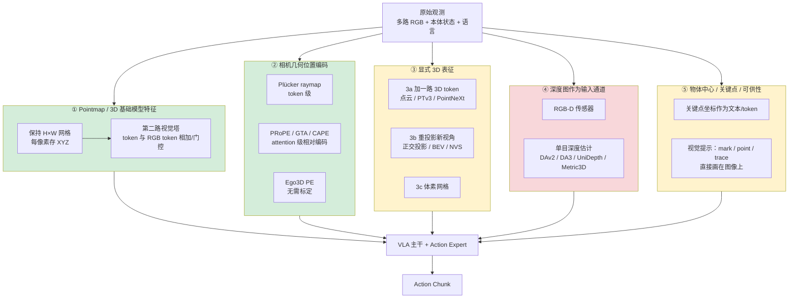
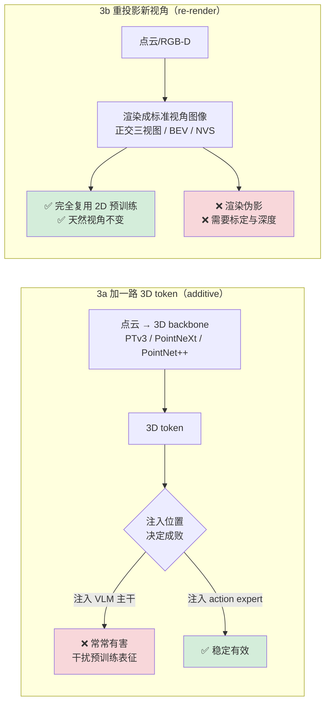
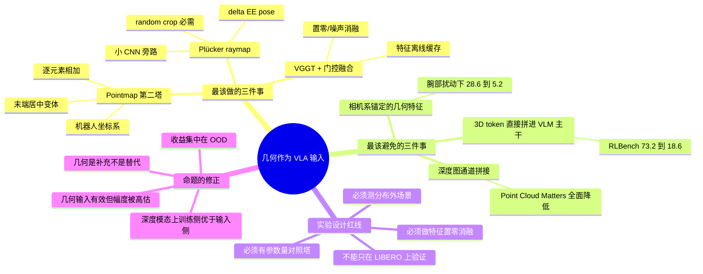

# VLA 中「几何 / 3D / 4D 信息作为**输入**」的文献调研报告

> 调研日期：2026-07-26
> 调研范围：仅覆盖命题的「输入」半边 —— 把几何信息**显式喂进模型**（而非只作为训练监督目标）。
> 命题：*把几何与 4D 信息/知识，通过输入或通过训练让模型学到，有利于模型对动作的预测与任务的完成。*

---

## 0. 可靠性标注体系（全文通用）

| 标记 | 含义 |
|---|---|
| **[A]** | 同行评审论文（已被 NeurIPS / CoRL / ICLR / ICRA / IROS / CVPR / RSS 等接收） |
| **[B]** | arXiv 预印本（未见接收记录，或明确标注 under review） |
| **[C]** | 项目主页 / GitHub README / 博客宣称（未在论文正文中交叉核实） |
| **[D]** | 本报告作者的推断或判断，**非文献陈述** |

**本报告的自我约束**：所有数字均标注来源论文的具体表格/章节。凡是我没有从原文取到数字的，一律写「未取得可核实数字」，不做估计。

---

## 1. 全局地图：几何信息注入 VLA 的六条技术路线

绿色 = 本报告推荐优先验证；黄色 = 收益明确但成本高或有条件；红色 = 负面证据最多、最需要小心。

**贯穿全文的一条主线结论**（[D] 我的综合判断，但由下文 §5 的多篇论文交叉支撑）：

> 决定「几何输入是否有用」的，**不是几何信息本身，而是注入位置（where）与融合方式（how）**。
> 同一份 VGGT 几何特征，用错融合方式可以让 SIMPLER 成功率从 57.81% 掉到 **3.13%**；用对方式可以升到 68.23%（3D-Mix Table 1，[B]）。
> 同一份点云，注入 VLM 主干让 RLBench 从 73.2% 掉到 **18.6%**；注入 action expert 则升到 82.3%（PointACT Table III，[B]）。

---

## 2. 方法族逐一分析

### 族① Pointmap / 3D 基础模型特征作为输入

这一族的共性：**保留 H×W 的图像网格结构**，只把每个像素的值从 RGB 换成/扩充为 3D 坐标。这样可以直接复用 ViT 结构与 2D 预训练权重，是所有路线里实现成本最低的。

#### ①-1 See like a Robot: Robot-Centric Pointmaps for VLA ★ 头号推荐

- **来源标记**：[B] arXiv 预印本（2026）；单位 DAVIAN Robotics / KAIST AI
- **项目页**：https://davian-robotics.github.io/pointmap/ （GitHub Pages 源：https://github.com/DAVIAN-Robotics/pointmap）
- **核心做法一句话**：不把点云喂给点云网络，而是把观测重表达成**机器人基座（或末端）坐标系下的 pointmap** —— 一张 H×W 图，每个像素存该像素对应的 3D 点在机器人坐标系里的 (X, Y, Z) —— 然后用一路与 RGB 编码器同构、由 RGB 编码器权重初始化的视觉塔编码，token 与 RGB token **逐元素相加**。

- **报告的量化收益**（均来自论文实验章节，[B]）：

| 实验 | 基线 | 加 pointmap | 增益 |
|---|---|---|---|
| RoboCasa | $\pi_{0.5}$ | — | **+7.6 pts** |
| RoboCasa | SmolVLA | — | **+4.2 pts** |
| RoboCasa（融合消融） | RGB + Plücker + Depth = 31.6% SR | RGB + Pointmap = 34.7% SR | **+3.1 pts** |
| RoboCasa（表征消融） | 点云 + PTv3 = 32.8% SR | Pointmap + 逐元素相加 = 34.7% | +1.9 |
| RoboCasa（融合方式） | Pointmap + concat = 30.7% | Pointmap + 相加 = 34.7% | +4.0 |
| RoboCasa（坐标系） | base-frame 34.7% / 32.7%（固定/随机视角） | end-effector centering 36.9% / 36.6% | +2.2 / **+3.9** |
| 真机（已见视角） | 73.3% | 78.3% | +5.0 |
| 真机（未见视角） | 55.0% | 66.7% | **+11.7** |

- **代码仓库**：`https://github.com/DAVIAN-Robotics/pointmap`
  **⚠️ 已实测核实（2026-07-26，GitHub Contents API）**：该仓库当前只包含 `README.md`（225 字节）、`index.html`（52 KB，项目页）和 `static/` 目录，**没有任何训练/推理代码**。也就是说，这个仓库目前是 GitHub Pages 站点，**方法代码尚未发布**。
- **许可证**：仓库未声明许可证；论文未提及。**[D] 判断：目前不可直接复用其代码，需自行复现。**
- **实现复杂度**：**低**。
  理由：(1) 不需要引入任何新的网络结构类型，第二路塔就是 RGB 塔的复制；(2) 融合是逐元素相加，零新增可学习融合参数；(3) 在仿真里 pointmap 可以直接从 GT depth + 已知外参解析计算，不需要跑 DUSt3R/VGGT。**这一点对用户的场景（仿真 + 固定基座 + 已知标定）尤其重要——几何输入的"制备成本"接近于零。**

- **[D] 我的判断**：这是与用户场景最贴合的一篇。用户有头部 + 双腕多路相机、固定基座、已知标定，正好能算出机器人坐标系 pointmap；而论文中"末端执行器居中"那一项恰好是双腕相机能天然受益的（腕部相机的 pointmap 天然是末端中心的）。

#### ①-2 3D-Mix for VLA ★ 最有价值的「融合方式」对照实验

- **来源标记**：[B] arXiv:2603.24393（2026-03）
- **链接**：https://arxiv.org/abs/2603.24393
- **核心做法一句话**：冻结 VGGT-1B 提取几何特征，用**语义条件自适应门控（GatedFusion）**与 MLLM 隐状态融合，做成不改动 MLLM / action expert 源码的即插即用模块。

- **最有价值的部分——九种融合方案的对照实验**（Table 1，backbone = Qwen3-VL-4B-Instruct，VGGT-1B 冻结，[B]）：

| 融合方案 | SIMPLER 平均 (%) | LIBERO 平均 (%) | 相对 base 的 SIMPLER 变化 |
|---|---|---|---|
| Base（无 3D） | 57.81 | 96.50 | — |
| + AE Fusion（action expert 双 cross-attn） | **3.13** | 97.40 | **−54.68** 💀 |
| + Visual Fusion（与视觉 token cross-attn 后进 MLLM） | **4.69** | 73.40 | **−53.12** 💀 |
| + Early Fusion（几何 token 直接拼进 MLLM 输入） | 44.53 | 86.45 | **−13.28** ❌ |
| + Middle Layer Injection | 51.82 | 97.82 | −5.99 ❌ |
| + 3D-Tokens | 56.25 | 97.64 | −1.56 ❌ |
| + CrossAttn Fusion | 56.25 | 83.45 | −1.56 ❌ |
| + Spatial Forcing（训练侧对齐） | 58.85 | 97.72 | +1.04 |
| + Concat Fusion | 60.42 | 97.75 | +2.61 ✅ |
| **+ GatedFusion（= 3D-Mix）** | **68.23** | **98.05** | **+10.42** ✅ |

- **跨 backbone 验证**（Table 2/3，[B]）：GR00T-style 架构上 9 个变体平均 **+7.0% SIMPLER**；单点最大 RynnBrain-8B **+12.51%**、RoboBrain2.0-7B **+11.39%**、MimoEmbodied-7B **+10.41%**、Qwen3-VL-4B **+10.42%**。$\pi$-style 上增益较小：RoboBrain2.5-4B +2.60%、Qwen3-VL-4B +6.77%、Qwen3-VL-2B +5.38%。
- **关键消融**（Figure 3，[B]）：
  - (a) 冻结 VGGT ≥ 微调 VGGT；
  - (b) **推理时把 VGGT 特征替换为零向量或高斯噪声，性能一致下降** → 作者据此论证收益来自真实几何信息，而非"特征维度变大"；
  - (c) 稀疏层融合（每隔 k 层注入）与全层融合相当甚至更好，显存更省。
- **代码仓库**：**未找到公开仓库**。论文未给出 GitHub 链接，我的搜索也未定位到。
- **许可证**：不适用（无代码）。上游 VGGT 的许可证见 §2.①-7。
- **实现复杂度**：**中**。需要跑一个 1B 的 VGGT（可冻结、可离线缓存特征），加一个门控 MLP。门控本身只有几层线性层。

#### ①-3 Evo-0

- **来源标记**：[B] arXiv:2507.00416
- **核心做法**：用 VGGT 从纯 RGB 抽 3D token（不需要深度传感器），轻量 cross-attention fuser 与 2D 视觉 token 融合，注入 $\pi_0$。
- **量化收益**：5 个"空间挑战性"真机操作任务上，平均成功率相对 $\pi_0$ 基线 **+28.88%**（论文摘要，[B]）。
- **代码仓库**：https://github.com/MINT-SJTU/Evo-VLA（原名 MINT-SJTU/Evo-0）
- **许可证**：MIT（GitHub 仓库元数据）。**⚠️ 但 README 正文写的是 "Coming Soon"，实际代码尚未发布**（核实于 2026-07-26）。
- **实现复杂度**：中。

#### ①-4 PointMapPolicy（含重要负面证据）

- **来源标记**：[A] NeurIPS 2025
- **核心做法**：把点云表达为**不下采样的结构化点图网格**（XYZ 规则网格），从而能直接用标准 CV 编码器；主干用 xLSTM，条件化 diffusion policy。
- **量化收益**（[A]）：
  - RoboCasa：PMP-xyz **49.12%**，比 3D 基线（DP3、3D Diffuser Actor）高近 **20 个点**，比 2D 基线（BC、GR00T-N1）高约 **13 个点**；PMP（xyz+rgb 6 通道变体的对照）47.22%。
  - **CALVIN 上出现反转**：PMP-xyz 平均完成 **2.03** 个任务，而 RGB 版本 **3.15** 个任务 —— 纯几何输入在此显著更差，作者归因于可形变物体任务（Folding、Sweeping）缺乏外观线索。
- **代码仓库**：https://github.com/ALRhub/PointMapPolicy
- **许可证**：MIT（[C] 来自 GitHub README/元数据）
- **实现复杂度**：中。

#### ①-5 ReMAP-DP

- **来源标记**：[A]/[B] 标注为 IROS 2026
- **核心做法**：多相机 RGB-D 重投影到一个 canonical、像素对齐的工作空间 PointMap；双流（冻结 DINOv2 出语义 + 自定义 ViT 出稠密度量 PointMap），多模态 transformer 融合。
- **量化收益**：RoboTwin 2.0 平均成功率 **59.3%**（相对 DP3 **+6.6**）；ManiSkill 3 的 Stack Cube 上相对 DP3 **+28%**。
- **代码仓库**：https://github.com/ICR-Lab/ReMAP-DP
- **许可证**：**未核实到明确声明**。
- **实现复杂度**：中高（需要多相机标定 + canonical 空间定义 + 两条编码流）。

#### ①-6 Lift3D-VLA（2026-07，最新，但混淆因素巨大）

- **来源标记**：[B] arXiv:2607.06564（2026 年 7 月）
- **项目页**：https://lift3dvla.github.io/
- **核心做法**：延续前作 Lift3D（[A] CVPR 2025），把 3D 点投影到**多个虚拟平面**（cube 六面），从而复用预训练 2D 位置编码来编码点云；本作进一步用相机外参把"前虚拟平面"对齐到观测相机以减小畸变。加上 GC-MAE（重建当前点云 + 预测未来几何演化）与 layer-wise 时序动作建模。
- **量化收益**（论文摘要，[B]）：22 个仿真任务 + 8 个真机任务；MetaWorld **+10.8%**、RLBench **+11.1%** 平均成功率（相对此前最好 VLA 方法）；真机相对最强基线 **+4 个百分点**。
- **⚠️ 混淆因素**：GC-MAE 自监督用了 **140K 条轨迹**，机器人预训练用了 **400K 条轨迹**；LLM 主干是 7B LLaMA2；伪点云由 VGGT 生成。**几何贡献与超大规模预训练完全纠缠，无法分离。**
- **代码仓库**：前作 https://github.com/PKU-HMI-Lab/LIFT3D（181 stars）；本作代码在项目页，**未核实是否已发布**。
- **实现复杂度**：**高**。

#### ①-7 上游 3D 基础模型：许可证与可用性速查表（**已逐一核实**）

| 模型 | 代码许可证 | 权重许可证 | 商用 | 核实来源 |
|---|---|---|---|---|
| **DUSt3R** | CC BY-NC-SA 4.0 | 同左 | ❌ | naver/dust3r LICENSE 原文 [A] |
| **MASt3R** | CC BY-NC-SA 4.0 | 同左（且需另行同意 mapfree 等训练集许可，其中 mapfree 极严格） | ❌ | naver/mast3r README 原文 |
| **CUT3R** | CC BY-NC-SA 4.0 | 同左 | ❌ | CUT3R/CUT3R LICENSE 原文 |
| **Spann3R** | CC BY-NC-SA 4.0 | 同左 | ❌ | [C] 搜索综述 |
| **VGGT** | 原 checkpoint 非商用；另发布 `facebook/VGGT-1B-Commercial` 为商用友好许可（排除军事用途） | 见左 | 部分 ✅ | facebookresearch/vggt README |
| **π³ (Pi3)** | **BSD 3-Clause（商用允许）** | **CC BY-NC 4.0（严格非商用）** | 代码✅ 权重❌ | yyfz/Pi3 README 双许可表 |
| **MapAnything** | `facebook/map-anything-apache` 为 Apache-2.0 变体；研究版 CC-BY-NC 4.0 | 见左 | 部分 ✅ | [C] 搜索综述 |
| **OmniVGGT** | MIT | — | ✅ | [C] `Livioni/OmniVGGT-official` |
| **MoGe** | Apache 2.0 | — | ✅ | microsoft/MoGe LICENSE 原文 |
| **StreamVGGT** | **未核实到明确许可证声明** | — | ❓ | 未找到 |

**性能参考**（[B] π³ 论文自报）：π³ 推理 **57 FPS**，VGGT 43.2 FPS，DUSt3R 1.2 FPS；π³ 在 Sintel 上的视频深度与相机位姿估计优于 VGGT。π³ 的关键设计是**消除参考视图偏置**（每帧预测相对自身相机系的 scale-invariant local pointmap + affine-invariant pose）。

**[D] 对用户的直接建议**：如果目标是仿真快速验证且不涉及商用发布，许可证不是障碍；但**如果这条路线最终要进产品，DUSt3R/MASt3R/CUT3R/Spann3R 这一系全部不可商用**，能用的只有 VGGT-Commercial、MapAnything-Apache、OmniVGGT(MIT)、MoGe(Apache)、Metric3D(BSD-2)。更重要的是：**在用户的仿真 + 已知标定场景下，pointmap 可以直接从 GT depth 解析算出，完全不需要这些模型**，许可证问题可以整体绕开。

---

### 族② 相机几何的位置编码注入

#### ②-1 Know Your Camera（KYC）★ 唯一有干净 VLA 数字的 Plücker 工作

- **来源标记**：[A] 已被 **ICRA 2026** 接收
- **项目页**：https://ripl.github.io/know_your_camera/
- **核心做法一句话**：把相机外参编码成**逐像素 Plücker ray embedding**，与图像一起送进策略；对预训练视觉编码器用一个小 CNN 编码 raymap 后相加，对从零训练的编码器直接在通道维拼接。
- **量化收益**（RoboSuite + ManiSkill 仿真，"加 vs 不加相机条件"的成对比较，[A]）：

| 任务 | ACT | DP | SmolVLA |
|---|---|---|---|
| Lift | **+27.0** | **+22.0** | **+34.8** |
| Pick Place Can | +4.2 | +16.2 | +14.0 |
| Assembly Square | +7.9 | +0.4 | +4.4 |
| Push | +7.6 | +10.3 | +4.8 |
| Lift Upright | +11.7 | +11.2 | +9.8 |
| Roll Ball | +1.0 | +3.8 | +2.8 |

- **论文给出的实践要点**（[A]，对复现极重要）：
  1. **random cropping 是关键的数据增强**，缺了它相机条件的收益会打折；
  2. **delta end-effector pose 作为动作空间效果最好**；
  3. 对预训练编码器不能直接把 6 通道拼进去（会破坏预训练权重的输入分布），要走小 CNN 旁路。
- **代码仓库**：项目页声明代码与项目材料可用（[C]）；未在本次调研中核实到 GitHub 仓库的许可证文件。
- **实现复杂度**：**中**。需要已知标定（用户满足），Plücker 计算是几十行代码，但需要按上面三条要点调参。

#### ②-2 PRoPE: Cameras as Relative Positional Encoding ★ 方法学最严谨的对照

- **来源标记**：[A] **NeurIPS 2025**
- **链接**：https://arxiv.org/abs/2507.10496 ｜ 项目页 https://www.liruilong.cn/prope/
- **⚠️ 重要限定**：**这篇论文没有做 VLA / 机器人操作实验**。任务是前馈新视角合成、立体深度估计、空间认知判别。**任何把它的数字直接搬到 VLA 上的说法都是外推。**
- **核心做法一句话**：不在 token 层面加 raymap，而是在**注意力层面**用两个相机完整视锥之间的相对投影变换 $\tilde{P}_{i_1}\tilde{P}_{i_2}^{-1}$ 作为相对位置编码（同时含内参与外参，且天然全局坐标系无关）。

- **量化结果**：

Table 1（LVSM 框架，场景内内参恒定，[A]）：

| 相机条件方式 | RealEstate10K PSNR↑ | Objaverse PSNR↑ |
|---|---|---|
| Plücker Raymap | 20.48 | 21.44 |
| Näive Raymap | 20.54 | 21.59 |
| CAPE | 21.11 | 19.68 |
| GTA | 22.51 | 23.70 |
| **PRoPE** | **22.80** | **23.70** |

Table 5（DL3DV 空间认知：检测被错配的 image-camera 对，[A]）：

| 方法 | 5 views | 9 views | 17 views |
|---|---|---|---|
| Plücker | 69.1% | 76.9% | 74.6% |
| PRoPE + Plücker | 81.1% | 90.5% | 91.8% |
| **PRoPE + CamRay** | **86.1%** | **93.0%** | **94.3%** |

- **⭐ 这篇论文对用户最有价值的两点**：
  1. **它是本报告中参数量控制做得最严格的一篇**。原文：*"We pad images with a fixed embedding when raymaps are not used as input (CAPE, GTA, PRoPE); this lets all experiments use identical input, output, and overall model sizes."* 且 Table 5 的表注明确写 *"without introducing additional model parameters"*。PRoPE 加进 CAT3D 时也是"零额外参数、可忽略计算开销"。**所以这条路线的收益不可能来自参数量。**
  2. **它给出了一条对 Plücker 的负面结论**：*"while Plücker Raymap encodes more complete camera information than CAPE and GTA, it consistently underperforms across all settings—even when intrinsics information is critical."* 作者的解释是 raymap 需要定义一个参考坐标系，而世界坐标系的选择是任意的，会损害泛化。
  3. 附带负面：把 CamRay 加到 PRoPE 上**反而损害**内参外推性能。
- **工程量参考**（[A] 原文）：把 PRoPE 接进 UniMatch 官方代码只改了 **约 50 行**。
- **代码仓库**：项目页链接 GitHub（[C]）。
- **实现复杂度**：**中**。数学不难但要改 attention（与 FlashAttention 兼容）。

#### ②-3 SpatialVLA — Ego3D Position Encoding

- **来源标记**：[B] arXiv:2501.15830（IPEC-COMMUNITY）
- **核心做法一句话**：Ego3D Position Encoding 把 3D 空间上下文注入视觉表征，**不需要相机标定**；配合 Adaptive Action Grids 做动作离散化。
- **量化收益**：LIBERO 平均成功率 **78.1%**，其中 LIBERO-Spatial **88.2%**（[B]）。
- **代码仓库**：https://github.com/SpatialVLA/SpatialVLA
- **许可证**：**MIT**（README 原文核实："This project is released under the MIT license"）
- **实现复杂度**：中。
- **⚠️ 交叉验证的负面信号**：DepthVLA 论文（[B]）在 Simpler WidowX 上报告 SpatialVLA 只有 **34.4%**，而它们复现的 $\pi_0$ 有 **58.8%** —— SpatialVLA 的 Ego3D PE 在这个 setting 下明显不敌一个好的 2D 基线。**这说明 Ego3D PE 的收益高度依赖具体 setting，不是稳健的。**

#### ②-4 4D-VLA

- **来源标记**：[A] NeurIPS 2025
- **核心做法**：把深度导出的 3D 位置编码 + 历史帧一起注入，明确针对两个问题："坐标系混乱"（同一动作在不同相机系下标签不一致）与"状态混乱"（单帧观测不足以确定当前阶段）；用 memory bank sampling 挑信息量大的历史帧。
- **量化收益**：相对 OpenVLA 在仿真与真机上成功率显著提升；在自建的 MV-Bench 多视角仿真基准上超过现有方法。**消融给出了一个有用的拆分：坐标编码主要利好短程任务（Task 1、3），memory bank 采样主要利好长程任务（Task 2、4）。**
- **⚠️ 本次调研未从原文取到逐项的百分点数字**，上述为定性描述。
- **实现复杂度**：中高（要引入历史帧管理）。

---

### 族③ 显式 3D 表征作为输入

这一族内部必须严格区分两条子路线，它们的收益结构和代价完全不同：

#### 3a 加一路 3D token

##### ③-1 PointACT ★ 提供了本报告最关键的「注入位置」对照实验

- **来源标记**：[B] arXiv 预印本（2026）
- **核心做法**：双系统 VLA —— 冻结的 Qwen2.5-VL 主干 + 专门的点云 action expert（PTv3-Large 初始化），通过**多尺度 point-action 交互 + bottleneck window self-attention**，让演化中的 action token 稠密地 attend 到局部几何细节与全局场景结构。可训练参数仅 **300M**。

- **⭐ Table III：3D 注入策略对照**（[B]，这张表值得用户逐行读）：

| 架构 | 方法 | 可训练参数 | LIBERO-Spatial | RLBench-10Tasks |
|---|---|---|---|---|
| Monolithic | EO1 | 3B | 91.8 | 73.2 |
| Monolithic | **EO1 + Point** | 3B | 94.0 | **18.6** 💀 |
| Dual-system | GR00T(arch) | 1B | 87.0 | 50.8 |
| Dual-system | GR00T(arch) + Point | 1B | 92.0 | 69.7 |
| Dual-system | **PointACT** | **300M** | **97.4** | **82.3** |

  作者原文解释：*"For monolithic VLAs, injecting point cloud features does not achieve consistent improvements across benchmarks. It significantly decreases the performance on more challenging RLBench... This suggests that directly augmenting pretrained VLMs with 3D tokens does not effectively translate geometric information into improved action generation and may interfere with learned representations in VLM."*

- **Table IV：多尺度特征的朴素拼接反而更差**（RLBench SR，[B]）：GR00T(arch) 50.8 → +Point(final layer) 69.7 → +Point(多尺度朴素拼接, K=64) **65.2** / (K=128) **65.6** → PointACT 82.3。
- **Table V：2D 图像不可省**（[B]）：去掉图像条件 LIBERO-Spatial 94.2 / RLBench 79.8；保留 97.4 / 82.3。**几何不能取代语义。**
- **参数量方面的正面信号**：PointACT 用 300M 可训练参数打败了 3B 的 EO1 和 1B 的 GR00T(arch)，**这是本报告中少数「几何收益不能用参数量解释」的直接证据**。
- **代码仓库**：项目页可用，**未核实到公开代码仓库**。
- **实现复杂度**：中（PTv3 + 自定义交互模块）。

##### ③-2 GeoVLA

- **来源标记**：[B] arXiv 预印本
- **核心做法**：Point Embedding Network (PEN) 出 3D 嵌入 + 3D-enhanced Action Expert (3DAE)，与 2D 视觉输入并行。
- **量化收益**（[B]）：LIBERO 平均 **97.7%**（CogACT 93.2%、OpenVLA-OFT 95.3%）；ManiSkill2 **77%**（CogACT 69%、Dita 66%）；真机 8 任务平均 **86.3%**（相对 $\pi_0$ **+28.8%**）。
- **消融**（[B]）：PEN 97.7 > MLP 95.8 > PointNet 95.2；末端执行器 pooling 与 RoPE 均有益；static-routing MoE 97.7 > dynamic routing 97.3 > no MoE 96.0。
- **实现复杂度**：中高。

##### ③-3 SGRv2 ★ 样本效率路线的代表

- **来源标记**：[A] CoRL 2024
- **核心做法**：引入**动作局部性（action locality）归纳偏置** —— 点级特征编码、预测相对目标位置而非绝对位置。
- **量化收益**（[A]）：RLBench 上**仅用 5 条示范**，26 个任务中 **23 个**超过 RVT 基线；ManiSkill2 与 MimicGen 上 SGRv2 成功率是 SGR 的 **2.54 倍**。
- **代码仓库**：https://github.com/TongZhangTHU/sgr
- **许可证**：CC BY 4.0（[C]）
- **实现复杂度**：中。
- **[D] 为什么值得关注**：用户要"快速验证"，**5 条示范就能出结论**的方法在实验周期上极有价值。

##### ③-4 Any3D-VLA

- **来源标记**：[B] arXiv 预印本（2026）
- **核心做法**：即插即用管线 —— 把 RGB(D) 提升为压缩点云，3D backbone 编码后与 2D 特征融合；关键在于**混合数据集训练**（仿真点云 + 真实传感器点云 + 模型估计点云），以缩小 point cloud 的域间隙。
- **量化收益**（[B]）：真机 zero-shot 操作总成功率 **62.5%**（Setting 2 + Depth Anything 3），SpatialVLA 为 33.3%；LIBERO 相对 GraspVLA **+13.9%**；CALVIN **+0.71** 个任务。
- **pilot study 的一条重要判断**（[B] 原文大意）：显式提升为点云得到的表征，比 VGGT 那种隐式/重建式空间先验，更能与 2D 表征互补；VGGT 类先验"在处理细粒度空间关系时仍不精确"。
- **实现复杂度**：中高。

##### ③-5 Adapt3R

- **来源标记**：[A] CoRL 2025
- **核心做法**：用预训练 2D 基础模型抽语义特征，再把它们**相对末端执行器**在 3D 空间中定位，形成域迁移友好的 3D 观测编码器，支持 zero-shot 迁移。
- **代码仓库**：https://github.com/pairlab/Adapt3R
- **量化收益**：**本次调研未取得可核实的百分点数字。**
- **实现复杂度**：中。

#### 3b 重投影成新视角

##### ③-6 BridgeVLA ★ 重投影路线的最强开源代表

- **来源标记**：[A] **NeurIPS 2025**
- **代码仓库**：https://github.com/BridgeVLA/BridgeVLA （192 stars，**Apache License 2.0**，已核实；预训练代码、RLBench/COLOSSEUM/GemBench 训练评测代码、预训练数据、checkpoint 全部已发布）
- **项目页**：https://bridgevla.github.io/
- **核心做法一句话**：把 3D 点云投影成 **top / front / right 三张正交 2D 图**，让 VLM 的输入输出都落在同一个 2D 空间里；输出是 2D heatmap 来定位末端执行器的平移分量。
- **量化收益**（[A]）：

| 基准 | 基线 | BridgeVLA | 增益 |
|---|---|---|---|
| RLBench | 81.4% | **88.2%** | +6.8 |
| COLOSSEUM | 56.7% | **64.0%** | +7.3 |
| 真机 | SOTA | — | 平均 **+32%** |
| 真机小样本 | — | 3 条轨迹/任务，10+ 任务 **95.4%** | — |

- **实现复杂度**：**中**。需要点云 → 正交投影渲染 + heatmap 头，但代码完整开源，工程风险最低。
- **[D] 注意**：BridgeVLA 的动作空间是 keypose（关键位姿）+ 运动规划器，**与用户想要的"多时间步关节角/末端位姿 action chunk"不是同一种输出形式**。要迁移需要改动动作头。

##### ③-7 OG-VLA

- **来源标记**：[B] arXiv 预印本
- **核心做法**：多视角 RGB-D 反投影后渲染成 canonical 正交视图（获得输入视角不变性），再用视觉主干 + LLM + 图像扩散模型生成动作。
- **量化收益**（[B]，注意都是**相对提升**）：Arnold 上 Novel Pose 相对 **+10.8%**；泛化 split 相对 **+20.0%**（30k iter）/ **+46.5%**（100k iter）；Colosseum 相对 PerAct、RVT 等基线 **+45.8%**。
- **⚠️ 必须注意**：Colosseum 上的**绝对**成功率只有 **10.5%**。相对 45.8% 的提升是在一个极低的绝对水平上取得的。
- **实现复杂度**：中高。

##### ③-8 AnyCamVLA ★ 2026 最新，且构成对本命题的重要反例

- **来源标记**：[B] arXiv:2603.05868（2026-03，标注 under review）；单位首尔大学
- **项目页**：https://heo0224.github.io/AnyCamVLA/
- **核心做法一句话**：**策略完全冻结、不改架构、不加数据**，只在测试时用前馈新视角合成模型（LVSM）把实时观测**重渲染回策略训练时的那个视角**，再喂给 VLA；约 30 Hz，快于 10 Hz 的控制环。
- **量化收益**（LIBERO，[B]）：agent camera 大扰动（15 cm 平移、60° 旋转）下平均成功率 **94.5%**，基线最低跌到 39.9%。
- **⭐⭐ Table II（wrist camera 扰动）—— 本报告最强的一条负面证据**：

| 方法 | Small | Medium | Large | Average |
|---|---|---|---|---|
| $\pi_{0.5}$ | 40.8 | 39.8 | 5.2 | 28.6 |
| $\pi^*_{0.5}$（数据增强微调） | 84.0 | 84.0 | 81.2 | 83.1 |
| **GeoAwareVLA**（用 VGGT 替换 RGB 编码器抽 3D-aware 特征） | **1.6** | **5.0** | **9.0** | **5.2** 💀 |
| Ours-$\pi$（NVS 重渲染） | 91.8 | 89.6 | 84.4 | **88.6** |

  **几何感知表征在这里不仅没帮上忙，还比什么都不做的 $\pi_{0.5}$ 差了 23.4 个点。**
  作者解释（[B] 原文大意）：如果 VLA 在训练中主要依赖腕部相机特征，那么 VGGT 的 3D 表征会隐式地锚定在腕部相机坐标系上；**一旦腕部相机被扰动，整个几何参考系失配，3D 特征失去一致性，策略彻底崩溃。**

- **Table III（视角适配方式对照，[B]）**，同时也是"几何正确 ≠ 好输入"的证据：

| 方法 | Small | Medium | Large | Average | PSNR |
|---|---|---|---|---|---|
| $\pi_{0.5}$（原视角上界） | — | — | — | 92.4 | — |
| $\pi_{0.5}$（不适配） | 85.6 | 46.8 | 14.6 | 49.0 | 13.64 |
| Homography | 74.6 | 9.6 | 10.8 | 31.7 | 14.72 |
| **Depth 重投影**（GT 深度 + 点云重投影 + Telea 补洞） | 85.2 | 84.6 | 73.4 | **81.1** | 18.27 |
| Ours-$\pi$（未微调 LVSM） | 65.4 | 20.0 | 14.2 | 33.2 | 16.54 |
| Ours-$\pi$ | 91.0 | 88.6 | 86.2 | **88.6** | 23.20 |

  作者结论：depth 重投影虽然**几何上是正确的**，但点云投影在大视角变化下的非真实感伪影限制了 VLA 的视觉理解；而学习式 NVS 生成的照片级真实图像更符合策略的输入分布。**"几何正确"和"符合预训练分布"是两回事，后者在 VLA 上更重要。**

##### ③-9 HAMSTER 中的 3D 低层策略（见族⑤）

#### 3c 体素 / 早期经典工作

**PerAct、Act3D、ChainedDiffuser、RVT / RVT-2、GNFactor、DNAct、RoboUniView、3D-VLA、PointVLA、Lift3D（原版）**

- **本次调研的诚实交代**：这批工作我**没有从原文逐一取到量化数字**，因此**不在本报告中给出它们的具体百分点**，以免编造。
- 已核实的部分事实：
  - **RoboUniView** 官方实现 https://github.com/liufanfanlff/RoboUniview，**MIT 许可证**。
  - **Lift3D**（原版，[A] CVPR 2025）https://github.com/PKU-HMI-Lab/LIFT3D，181 stars。
  - **PointVLA** 的代码在 See like a Robot 论文中被提及为**未发布**（[B] 转述）。
  - PerAct（体素 + Perceiver）、RVT/RVT-2（多视角虚拟渲染 + heatmap）在本报告的多篇论文中反复作为基线出现，被 BridgeVLA、OG-VLA、SGRv2 等超越。
- **[D] 判断**：这批 2022–2024 的工作在方法论上已被 BridgeVLA / OG-VLA / SGRv2 等继承并超越，**对用户的验证目标而言不是最优起点**。它们的历史价值在于确立了"重投影"与"体素"两条范式。

---

### 族④ 深度图直接作为输入通道 ⚠️ 本报告中负面证据最集中的一族

#### ④-1 DepthVLA ★ 提供了「预测深度 > 输入深度」的直接对照

- **来源标记**：[B] arXiv 预印本
- **核心做法**：mixture-of-transformers —— VLM + **深度 transformer** + action expert，三者共享全注意力。深度 expert 编码器是 DINOv2-L（由 Depth Anything V2 初始化），解码器 300M，与 action expert 同规模。
- **成本明细**（[B] 原文）：相对 $\pi_0$ **额外 600M 参数**（300M 编码器 + 300M 解码器）；显存 8.0 GB vs 6.7 GB；单步延迟 210 ms vs 190 ms。作者强调与 $\pi_0$ 的唯一差别就是加了深度 expert。
- **量化收益**（[B]）：

| 基准 | $\pi_0$（复现） | DepthVLA |
|---|---|---|
| Simpler WidowX（zero-shot） | 58.8% | **74.8%** |
| LIBERO（单模型联合训练四套件） | 93.6% | **94.9%** |
| 真机（progress） | 65.0% | **78.5%** |

  Simpler 分任务：Put Spoon 81.7→75.8（**下降**）、Put Carrot 64.2→71.7、Stack Block 30.0→62.5、Pick Eggplant 59.2→89.2。

- **⭐⭐ Table IV：直接吃 GT 深度 vs 内部预测深度**（LIBERO，[B]）：

| 设置 | Spatial | Object | Goal | Long | Average |
|---|---|---|---|---|---|
| (v) 直接输入 ground-truth depth | 94.0 | 97.6 | 95.0 | 86.4 | **93.3** |
| DepthVLA（内部预测深度） | 96.4 | 98.0 | 95.8 | 89.2 | **94.9** |

  作者解释原文：*"the model performs better when predicting depth than when consuming ground-truth depth directly. We hypothesize this is due to **modality competence**, where one modality can dominate others when jointly provided. By learning to predict depth internally, DepthVLA avoids over-reliance on external signals."*

  **这是对用户命题的一个精细但重要的修正：同样的几何信息，做成「训练目标」比做成「输入通道」更好。** 用户命题里"通过输入或通过训练"这两条路，在深度这个具体模态上，**训练侧赢了**。

- **⭐ Table III：深度 expert 的预训练是决定性的**（Simpler，[B]）：

| 消融设置 | Average |
|---|---|
| (i) 深度 expert **不预训练** | **51.0** ← 低于 $\pi_0$ 的 58.8！ |
| (ii) 去掉 VLA 训练期的深度 loss | 56.9 |
| (iii) VLA 训练时冻结深度 expert | 71.9 |
| (iv) 去掉 VLM/depth token 间的 block-wise mask | 55.6 |
| DepthVLA 完整 | **74.8** |

  **一个 600M 参数的深度分支，如果没有在 WildRGB-D / ScanNet / ScanNet++ / HyperSim 上预训练过，会让模型比不加它更差（51.0 < 58.8）。** 这同时是对"收益来自参数量"这一质疑的有力反驳，也是对"随便加个几何分支就行"这一想法的警告。
- **实现复杂度**：**中高**。

#### ④-2 3D-CAVLA

- **来源标记**：[B] arXiv 预印本
- **核心做法**：微调框架，结合 chain-of-thought 推理、基于深度的点云嵌入、任务导向的 ROI pooling。
- **量化收益**（[B]）：LIBERO 域内平均 **98.1%**；未见任务 **+8.8 个绝对百分点**；真机未见任务 **+25%**，收敛快 **3 倍**。
- **消融**（[B]）：移除深度特征造成的性能下降最大（LIBERO-Seen −1.1，LIBERO-Unseen **−4.2**）。**注意这个数量级：域内只值 1.1 个点，泛化场景才值 4.2 个点 —— 几何输入的价值集中在分布外。**
- **代码仓库**：https://github.com/vineet2104/3dcavla
- **许可证**：论文称"will open-source our code"（[C]）。
- **实现复杂度**：中。

#### ④-3 Point Cloud Matters ★ 最直接的深度负面证据

- **来源标记**：[A] **NeurIPS 2024**（Datasets & Benchmarks）
- **核心做法**：系统性地在多个 setting 下对比 RGB / RGB-D / 点云三种观测空间。
- **⭐ Finding 2 原文**：*"Despite providing geometric information, **the depth modality generally degrades performance across all settings**. This includes scenarios where only depth data is used, where RGB-D images are stacked channel-wise, or when using specialized architectures like MultiViT to process RGB and depth information separately."*
- **作者的解释**：深度输入导致**数据分布不稳定**，使学习过程复杂化。
- **⚠️ 诚实交代**：本次调研**未从原文取到逐项的百分点下降幅度**，只取到了这条定性结论。但这条结论覆盖了三种最常见的深度接法（纯深度、通道拼接、双塔），**恰好是用户最可能第一时间尝试的三种**。

#### ④-4 单目深度估计模型：许可证速查表（**已逐一核实**）

| 模型 | 许可证 | 商用 | 核实来源 |
|---|---|---|---|
| **Depth Anything V2** | 仓库 Apache-2.0；**Small 模型 Apache-2.0，Base/Large/Giant 为 CC-BY-NC-4.0** | 仅 Small ✅ | DepthAnything/Depth-Anything-V2 README 原文 |
| **Depth Anything 3** | BASE / SMALL 及 metric、monocular-large 为 **Apache 2.0**；giant / nested 为 CC BY-NC 4.0 | 部分 ✅ | [C] 搜索综述 |
| **Metric3D** | **BSD 2-Clause** | ✅ 最宽松 | YvanYin/Metric3D LICENSE 原文 |
| **UniDepth** | CC BY-NC 4.0 | ❌ | [C] 搜索综述 |
| **MoGe / MoGe-2** | Apache 2.0 | ✅ | microsoft/MoGe LICENSE 原文 |
| **Depth Pro**（Apple） | 仓库自定义许可 | ❓ | **未核实到许可证正文** |

**[D] 建议**：用户在仿真中有 GT 深度，**第一轮验证完全不需要单目深度估计模型**。引入单目深度只会同时引入"深度估计误差"这个新的混淆变量，让"几何是否有用"的结论变得不可解释。真机阶段再考虑，届时 Metric3D（BSD-2）和 MoGe（Apache）是许可证最干净的选择。

---

### 族⑤ 物体中心 / 关键点 / 可供性 / 视觉提示作为输入

这一族与前四族有本质区别：**注入的不是稠密几何，而是稀疏的、任务相关的空间语义**。因此它不受"分布偏移"和"模态竞争"的困扰，往往能直接复用 VLM 的预训练能力。

#### ⑤-1 RoboPoint

- **来源标记**：[B]/[A] arXiv + CoRL 2024
- **项目页**：https://robo-point.github.io/
- **核心做法一句话**：指令微调一个 VLM，让它从语言指令直接预测**图像上的关键点可供性**（一串归一化像素坐标），训练数据由自动合成管线生成。
- **量化收益**（[B]）：空间可供性预测精度比 SOTA VLM（GPT-4o）与视觉提示方法（PIVOT）高 **21.8%**；下游任务成功率高 **30.5%**；真机相对最强基线平均 **+39.5%**。
- **代码仓库**：https://github.com/wentaoyuan/RoboPoint
- **许可证**：**Apache-2.0**（[C] 搜索综述，未核实 LICENSE 文件正文）
- **实现复杂度**：中（需要构建合成数据管线，或直接用已发布的 checkpoint 做推理）。

#### ⑤-2 TraceVLA（Visual Trace Prompting）

- **来源标记**：[B]/[A] arXiv + ICLR 2025
- **核心做法一句话**：用 Co-Tracker 抽稠密点轨迹，**直接把轨迹画在视觉观测上**作为提示图输入。
- **量化收益**（[B]）：SimplerEnv 上提升 **2.4% ~ 12.7%**；7B TraceVLA 相对 OpenVLA **+7.5%**；4B TraceVLA-Phi3 相对自身基线 **+4.1%**；环境变化条件下平均提升 **>20%**。
- **代码仓库**：https://github.com/umd-huang-lab/tracevla
- **许可证**：**未核实**。
- **实现复杂度**：中。**优点：零架构改动 —— 只改输入图像的像素。**

#### ⑤-3 HAMSTER

- **来源标记**：[A] **ICLR 2025**（NVIDIA + University of Washington）
- **项目页**：https://hamster-robot.github.io/
- **核心做法一句话**：分层 VLA —— 高层 VILA-1.5-13B 从 RGB + 指令预测**粗糙的 2D 末端路径**，把这条路径**画到观测帧上**，低层紧凑的 3D 输入策略读这些 path-drawn 图产生精确动作。
- **量化收益**（[A] OpenReview 摘要）：真机上跨 **7 个泛化轴**平均成功率相对 OpenVLA **+20 个百分点**，相对增益 **50%**。
- **一条对用户有用的对照结论**（[C] 项目页）：*"Unlike HAMSTER, OpenVLA does not improve when pre-trained with RLBench simulation data."* —— **分层结构是让仿真数据能迁移到真机的关键**，单体 VLA 吃不到这个红利。
- **代码仓库**：https://github.com/liyi14/HAMSTER_beta
- **许可证**：README 中写的是字面的 **"[Your License Here]"**，即**未指定许可证**（已核实）。**[D] 无明示许可 = 默认保留全部版权，法律上不可安全复用。**
- **实现复杂度**：高（两阶段训练 + 13B VLM）。

#### ⑤-4 Keypoint Action Tokens (KAT)

- **来源标记**：[A] **RSS 2024**
- **项目页**：https://www.robot-learning.uk/keypoint-action-tokens
- **核心做法一句话**：把视觉观测转成 3D 关键点 token、把动作轨迹转成 action token，全部转成文本塞进 GPT-4 Turbo 的 prompt，**完全不训练**，纯 in-context 学习。
- **⭐ 对用户最有价值的不是 KAT 本身，而是它的一个副产品结论**（[A] 原文）：*"our novel representation of observations and actions as 3D points, **dramatically improves the performance of both Diffusion Policies** over the original image-based Diffusion Policy method, and also makes a simple MLP baseline perform better than end-to-end Diffusion Policies."*
  也就是说：**把观测从图像换成 3D 关键点，就能大幅提升 Diffusion Policy** —— 这是一个非常干净的"几何输入有用"的证据，而且实现成本极低。
- **规模效应的边界**（[A] Fig. 5/6）：KAT 在 ≤20 条示范时优于 diffusion policy，但到 **40 条示范时 KeyAct-DP 反超 KAT** —— in-context learning 不随数据量 scale，而"3D 关键点作为输入"的收益是持续的。
- **实现复杂度**：低到中（依赖一个关键点检测/对应模块）。

#### ⑤-5 VoxPoser / ReKep / MOKA / Set-of-Mark

- **诚实交代**：这四项工作我**本次没有取到可核实的、可直接用于本命题对比的量化数字**。
- 定性定位（[D] 我的理解，基于它们在其他论文中被引用的方式）：
  - **VoxPoser**：LLM + VLM 合成 3D **价值图（value map）**，再用运动规划器在价值图上做轨迹优化 —— 严格说这是"几何作为规划中间量"，不是"几何作为策略网络输入"。
  - **ReKep**：把任务表达成关系式**关键点约束**，转成优化问题求解 —— 同上，偏规划而非端到端策略输入。
  - **MOKA**：标记式关键点可供性 + VLM 视觉提示。
  - **Set-of-Mark**：通用视觉提示技术（在图上打编号标记），非机器人专用。
- **[D] 建议**：VoxPoser 和 ReKep 与用户"端到端 VLA 输出 action chunk"的设定**范式不匹配**（它们本质是 LLM 规划 + 传统优化/规划器执行），**不建议作为本命题的验证对象**。MOKA / Set-of-Mark 属于视觉提示，与 TraceVLA / HAMSTER 同类但证据更弱。

---

### 族⑥ 2026 年最新进展汇总

| 工作 | 时间/场合 | 路线 | 一句话 | 是否有明确增益数字 |
|---|---|---|---|---|
| **See like a Robot** | 2026 [B] | ① robot-centric pointmap | 观测重表达为机器人坐标系 pointmap，逐元素相加融合 | ✅ RoboCasa +7.6 / +4.2 |
| **3D-Mix for VLA** | 2026-03 [B] | ① VGGT + 门控 | 九种融合方案对照，门控最优 | ✅ SIMPLER +10.42 / 跨 9 变体均值 +7.0 |
| **AnyCamVLA** | 2026-03 [B] | ③b NVS 重渲染 | 冻结策略，测试时把视角渲染回训练视角 | ✅ 大扰动 94.5%；**同时给出几何表征路线的反例** |
| **Lift3D-VLA** | 2026-07 [B] | ①/③a 虚拟平面投影 | 复用 2D PE 编码点云 + GC-MAE + 时序动作 | ✅ MetaWorld +10.8 / RLBench +11.1（预训练混淆重） |
| **PointACT** | 2026 [B] | ③a 点云进 action expert | 多尺度 point-action 交互 | ✅ RLBench 82.3 vs 50.8；**给出注入位置的关键对照** |
| **Any3D-VLA** | 2026 [B] | ③a 多样点云 | 混合来源点云训练缩小域间隙 | ✅ 真机 zero-shot 62.5% vs 33.3% |
| **ReMAP-DP** | IROS 2026 | ①/③b canonical pointmap | 多相机重投影 + 双流 | ✅ RoboTwin2.0 +6.6 over DP3 |
| **KYC (Know Your Camera)** | ICRA 2026 [A] | ② Plücker | 逐像素 Plücker 条件化 | ✅ ACT/DP/SmolVLA 三策略六任务全面提升 |
| **LIBERO-Plus** | CVPR 2026 [A] | 基准 | 系统评测 VLA 鲁棒性 | ✅ **提供了最强的"为什么需要几何"的动机数据** |
| **OmniVGGT** | CVPR 2026 Highlight | 上游 3D 基础模型 | 可接受任意辅助几何模态（深度/内外参），GeoAdapter | 上游模型，MIT |

**另有以下 2026 关键词命中但本次未深入核实的工作**（[D] 仅记录名字，不做任何性能陈述）：`ST-VLA`、`ConsisVLA-4D`、`StemVLA`、`MotionVLA`、`Pri4R`、`MV-VDP`（BridgeVLA 团队 2026-04 发布的时空感知视频动作模型，用了类似的投影/反投影策略）。

---

## 3. 性价比排序：如果只能实现 3 种，选哪 3 种

评分口径：$\text{性价比} = \dfrac{\text{报告收益幅度} \times \text{证据可信度} \times \text{与用户场景的契合度}}{\text{实现成本}}$

### 🥇 第 1 名：机器人坐标系 Pointmap 第二视觉塔（See like a Robot 路线）

| 维度 | 评估 |
|---|---|
| 收益 | RoboCasa +7.6（$\pi_{0.5}$）/ +4.2（SmolVLA）；未见视角真机 +11.7 |
| 可信度 | [B] 预印本，但**做了同架构对照**（RGB+Plücker+Depth 31.6 vs RGB+Pointmap 34.7），不是"我的方法 vs 别人的方法" |
| 契合度 | ★★★★★ 用户有固定基座 + 已知标定 + 仿真 GT 深度 → **pointmap 可解析算出，零推理开销、零许可证问题**；用户有腕部相机 → 天然支持"末端居中"这个额外 +2.2~+3.9 的技巧 |
| 成本 | **低**。复制一份 RGB 编码器权重 → 输入换成 3-channel XYZ → token 逐元素相加。改动量约在 100 行以内 |
| 风险 | 官方代码未发布（已核实仓库只有项目页），需自行复现；但方法本身简单到不需要参考实现 |

**为什么排第一**：它是唯一一个「几何信息制备成本 ≈ 0 + 融合方式零新增参数 + 有同架构对照」的组合。而且它的消融表直接告诉你别的做法会差多少（concat 差 4 个点、PTv3 点云差 1.9 个点、Plücker+Depth 差 3.1 个点），**等于免费送了三组对照实验的先验**。

**建议的最小验证设计**：
1. Baseline：RGB + state + language → action chunk
2. +Pointmap（base frame）：加第二塔，逐元素相加
3. +Pointmap（end-effector centered）
4. **参数量对照组**：把第二塔换成第二份 RGB 图像（同样的塔、同样的参数量、同样的相加融合），这样能干净地分离"参数量"与"几何信息"

---

### 🥈 第 2 名：Plücker Ray Map 相机条件化（KYC 路线）

| 维度 | 评估 |
|---|---|
| 收益 | 6 个任务 × 3 种策略（ACT / DP / SmolVLA），提升范围 +0.4 ~ +34.8，**没有一项是负的** |
| 可信度 | **[A] ICRA 2026 已接收**，是本清单中同行评审等级最高的、且直接在策略学习上做的 |
| 契合度 | ★★★★☆ 需要已知标定（用户满足）；对多路相机（头部 + 双腕）尤其自然 —— 每路相机自带不同的 raymap，模型能区分"这是哪只手看到的" |
| 成本 | **中低**。Plücker 计算几十行；但有三个必须遵守的实现细节（见下） |
| 风险 | PRoPE（[A] NeurIPS 2025）明确报告 **Plücker raymap 在 NVS/深度/空间认知上一致地劣于 attention 级相对编码**。不过那是非机器人任务，且 KYC 在机器人任务上确实拿到了正收益 |

**必须遵守的三条实现细节**（[A] KYC 原文）：
1. 对**预训练**视觉编码器：用一个小 CNN 编码 raymap 后与图像特征相加，**不要**直接在通道维拼 6 通道（会破坏预训练输入分布）；对**从零训练**的编码器才直接拼接。
2. **random cropping 数据增强是必需的**。
3. 动作空间用 **delta end-effector pose** 效果最好。

**为什么排第二而不是第一**：单看"实现成本"它甚至比 pointmap 更低，但它注入的信息量更少（只有相机位姿，没有场景几何），而且 PRoPE 那条负面结论悬在头上。**[D] 我的建议：把它当作 pointmap 的低成本对照组一起做**，两者可以共用同一套多塔/多输入基础设施。

---

### 🥉 第 3 名：VGGT 特征 + 语义条件门控融合（3D-Mix 路线）

| 维度 | 评估 |
|---|---|
| 收益 | SIMPLER +10.42（单点最大 +12.51）；跨 6 个 MLLM 系列 9 个变体平均 +7.0 |
| 可信度 | [B] 预印本，但**做了本报告中第二严格的因果消融**：推理时把 VGGT 特征置零 / 换高斯噪声 → 一致下降，证明收益来自几何而非维度 |
| 契合度 | ★★★☆☆ 不需要深度传感器、不需要标定（纯 RGB 进 VGGT）；但引入 1B 冻结模型 |
| 成本 | **中**。VGGT 可冻结、特征可**离线预计算并缓存**（这一点很关键：训练时就不再有 VGGT 的前向开销）；门控模块只有几层线性 |
| 风险 | 无公开代码；上游 VGGT 原 checkpoint 非商用（需用 VGGT-1B-Commercial） |

**为什么值得排进前三，即使它不是收益最大的**：它是唯一一篇**系统性回答了"融合方式怎么选"**的工作。那张九行的表本身就是用户最需要的东西 —— 它告诉你 **AE Fusion 和 Visual Fusion 会让模型直接报废（3.13% / 4.69%）**。哪怕用户最后不采用 3D-Mix，**读这张表也能避免踩掉两个能毁掉整个实验的坑**。

---

### 三个方案的组合建议

```mermaid
gantt
    title 建议的验证顺序（几何作为输入）
    dateFormat X
    axisFormat %s
    section 第 1 阶段：地基
    Baseline VLA（RGB+state+lang）          :done, b1, 0, 2
    参数量对照塔（复制第二路 RGB）           :crit, b2, 2, 3
    section 第 2 阶段：低成本几何
    Plücker raymap 条件化（KYC）             :active, p1, 3, 5
    Pointmap 第二塔（base frame）            :crit, p2, 3, 6
    Pointmap + 末端居中                      :p3, 6, 7
    section 第 3 阶段：外部几何先验
    VGGT 特征离线缓存                        :v1, 7, 8
    GatedFusion 融合                         :v2, 8, 10
    section 第 4 阶段：鲁棒性拷问
    视角扰动评测（LIBERO-Plus 式）           :crit, r1, 10, 12
```

**[D] 关键提醒**：第 1 阶段的「参数量对照塔」不能省。没有它，后面所有的正收益都可以被质疑成"多加了一个编码器"。这是本报告 §5 反复强调的问题。

---

## 4. 负面证据专节 ⚠️

按"负面程度"从强到弱排列。**这一节是本报告对用户最有价值的部分。**

### N1. 把 3D token 注入 VLM 主干可能造成灾难性崩溃

**证据 1 — PointACT Table III**（[B]，2026）：EO1（monolithic VLA，3B）在 RLBench-10Tasks 上 **73.2% → 加点云后 18.6%**。
作者解释：直接用 3D token 增强预训练 VLM，**不能有效地把几何信息转化为更好的动作生成，反而会干扰 VLM 中已学到的表征**；可能需要在预训练阶段就整合 3D 才行。
注意同一张表里 LIBERO-Spatial 是 91.8 → 94.0（**上升**）—— **在简单的域内基准上看不出问题，只有在训练/测试摆放差异更大的 RLBench 上才暴露**。这一点对用户的实验设计极其重要：**只在 LIBERO 上验证会得到假阳性结论**。

**证据 2 — 3D-Mix Table 1**（[B]，2026）：同一份冻结 VGGT 特征，
- AE Fusion（注入 action expert 的双 cross-attention）：SIMPLER **57.81 → 3.13**
- Visual Fusion（与视觉 token cross-attn 后进 MLLM）：**57.81 → 4.69**
- Early Fusion（几何 token 拼进 MLLM 输入序列）：**57.81 → 44.53**
- Middle Layer Injection：57.81 → 51.82
- 朴素 3D-Tokens：57.81 → 56.25
- CrossAttn Fusion：57.81 → 56.25

**九种方案里有七种不如什么都不加。** 只有 GatedFusion（68.23）和 Concat Fusion（60.42）是正收益。

**注意 N1 内部还有一个矛盾**：3D-Mix 说 AE Fusion（注入 action expert）最差，PointACT 说注入 action expert 才稳定、注入 VLM 主干才差。**[D] 我的调和解释**：两者的"注入 action expert"实现不同 —— 3D-Mix 的 AE Fusion 是给 DiT 加第二个 cross-attention 头，与原 MLLM cross-attention 并行；PointACT 是多尺度 point-action 交互 + bottleneck window self-attention，且 point encoder 有 PTv3 预训练。**结论不是"哪个位置对"，而是"融合机制的细节比注入位置更关键，且必须实测"。**

### N2. 几何感知表征在视角扰动下可能比不用几何更糟

**AnyCamVLA Table II**（[B]，2026）：腕部相机扰动下，GeoAwareVLA（用 VGGT 替换 RGB 编码器）平均成功率 **5.2%**，而原始 $\pi_{0.5}$ 是 **28.6%** —— **几何感知让模型差了 23.4 个点**。
作者解释：如果策略在训练中主要依赖腕部相机特征，VGGT 的 3D 表征会**隐式锚定到腕部相机坐标系**；腕部相机一动，整个几何参考系失配，3D 特征失去一致性，策略彻底失效。
**[D] 对用户的直接含义**：用户有双腕相机。**这条负面证据几乎是为用户的硬件配置量身定制的警告。** 而它同时也解释了为什么 See like a Robot 要把 pointmap 定义在**机器人基座坐标系**而不是相机坐标系 —— 机器人坐标系是相机无关的，天然免疫这个失效模式。

### N3. 深度模态"在所有设置下普遍降低性能"

**Point Cloud Matters, [A] NeurIPS 2024, Finding 2** 原文：
> *"Despite providing geometric information, the depth modality generally degrades performance across all settings. This includes scenarios where only depth data is used, where RGB-D images are stacked channel-wise, or when using specialized architectures like MultiViT to process RGB and depth information separately."*

解释：深度导致**数据分布不稳定**，使学习复杂化。
覆盖的三种接法（纯深度 / 通道拼接 / 双塔分开处理）**正是最直观的三种做法**。

### N4. 同样的几何信息，做「训练目标」比做「输入通道」更好

**DepthVLA Table IV**（[B]）：LIBERO 上，直接输入 ground-truth 深度 = **93.3%**，让模型内部预测深度 = **94.9%**。
作者解释：**modality competence** —— 联合提供多模态时，一个模态会压制其他模态；内部预测深度避免了对外部信号的过度依赖，把几何推理更好地整合进共享表征空间。
**[D] 这一条直接切中用户命题的核心分歧**：命题说"通过输入**或**通过训练"，而这个实验说在深度这个模态上，**训练侧严格优于输入侧**。用户如果同时在做"训练"那一半，这是一个必须纳入的对照。

### N5. 纯几何输入在需要外观线索的任务上显著更差

**PointMapPolicy**（[A] NeurIPS 2025）：CALVIN 上 PMP-xyz 平均完成 **2.03** 个任务，RGB 版本 **3.15** 个 —— 差了一个多任务。
作者归因：可形变物体任务（Folding、Sweeping）缺乏外观线索时纯几何不够用。

**PointACT Table V**（[B]）佐证同一点：去掉图像条件后，LIBERO-Spatial 97.4→94.2，RLBench 82.3→79.8。**几何是补充，不是替代。**

### N6. 「几何正确」不等于「好输入」

**AnyCamVLA Table III**（[B]）：用 GT 深度做点云反投影再重渲染（几何上完全正确），成功率 81.1%，PSNR 18.27；用学习式 NVS（几何上是"猜"的）成功率 88.6%，PSNR 23.20。
原因：点云投影在大视角变化下产生非真实感伪影，**限制了 VLA 的视觉理解**，尽管视图在几何上是正确的。
**[D] 含义**：VLA 主干是在互联网 RGB 上预训练的，**输入分布的"自然度"比几何精度更能决定它的表现**。这也从另一个角度解释了为什么 See like a Robot 用"复制 RGB 编码器 + 逐元素相加"这种保守做法能赢过更"3D 原生"的 PTv3。

### N7. Plücker raymap 在非机器人任务上一致地劣于相对编码

**PRoPE**（[A] NeurIPS 2025）原文：*"while Plücker Raymap encodes more complete camera information than CAPE and GTA, it consistently underperforms across all settings—even when intrinsics information is critical."*
另附：把 CamRay 加到 PRoPE 上**反而损害**内参外推性能。
**⚠️ 限定**：这是 NVS / 立体深度 / 空间认知任务，**不是 VLA**。而 KYC（[A] ICRA 2026）在 VLA 上用 Plücker 拿到了全正的收益。**[D] 两者不矛盾：KYC 的对照组是"完全不给相机信息"，PRoPE 的对照组是"用更好的相机编码方式"。**

### N8. VLA 对视角扰动的脆弱性本身（这是"为什么需要几何"的动机，也是"几何还没解决问题"的证据）

**LIBERO-Plus**（[A] CVPR 2026）：VLA 对相机视角变化"显著脆弱"，成功率常从 **>95% 崩到 <30%**；OpenVLA 在相机扰动下降到 **0.8%**，WorldVLA 降到 **0.1%**。模型依赖固定视觉视角而非真正的 3D 空间推理。**腕部相机提供了更好的鲁棒性。**
但同时：用 20,000+ 条轨迹做混合微调（纯数据增强，**不加任何几何输入**）能达到总成功率 **79.6%**，相机视角鲁棒性 **92.8%**，比亚军高 **37.2 个百分点**。
**[D] 这对用户是一个尖锐的对照**：如果"几何输入"要证明自己的价值，它必须在**同等数据预算**下打赢"纯数据增强"。目前我没找到任何一篇做了这个对照的论文。

---

## 5. 混淆因素专节

### 5.1 这些论文的收益里，有多少可能来自「额外参数量 / 额外预训练 / 额外数据」？

| 工作 | 额外参数 | 额外预训练 | 额外数据 | 有无参数对齐消融 | 净几何贡献的可信度 |
|---|---|---|---|---|---|
| **PRoPE** [A] | **零** | 无 | 无 | ✅ **有，且是最严格的** | ★★★★★ |
| **3D-Mix** [B] | 冻结 VGGT-1B + 门控 MLP | VGGT 的大规模 3D 预训练 | 无 | ⚠️ 无参数对齐组，但**有特征置零/噪声替换消融** | ★★★★☆ |
| **PointACT** [B] | 300M（**少于**对照的 1B / 3B） | PTv3-Large 点编码器预训练 | 无 | ✅ 事实上的反向参数对齐（更少参数赢了） | ★★★★☆ |
| **See like a Robot** [B] | 一整路视觉塔（与 RGB 塔同规模） | 无（由 RGB 编码器初始化） | 无 | ⚠️ 无严格参数对齐组，但**有同架构的 Plücker+Depth 对照** | ★★★☆☆ |
| **DepthVLA** [B] | **+600M** | WildRGB-D + ScanNet + ScanNet++ + HyperSim | 深度伪标签（DAv2 + UniDepth V2） | ✅ **有关键消融：不预训练时 51.0 < $\pi_0$ 的 58.8** | ★★★★☆（但归因于**预训练**而非参数） |
| **KYC** [A] | 一个小 CNN（很小） | 无 | 无 | ⚠️ 未见明确的参数对齐组 | ★★★☆☆ |
| **Lift3D-VLA** [B] | 7B LLaMA2 + 点云 tokenizer | GC-MAE 140K 轨迹 + robotic pretraining 400K 轨迹 | 极大 | ❌ | ★☆☆☆☆ |
| **GeoVLA** [B] | PEN + 3DAE | 未明确 | 未明确 | ⚠️ 有编码器选择消融（PEN vs MLP vs PointNet），非参数对齐 | ★★☆☆☆ |
| **BridgeVLA** [A] | 相当于换了输入表征 | **有专门的 2D heatmap 预训练** | 预训练数据已发布 | ❌ | ★★☆☆☆ |
| **3D-CAVLA** [B] | CoT + 点云嵌入 + ROI pooling | 未明确 | 未明确 | ✅ 有逐组件消融（去深度 −1.1/−4.2） | ★★★☆☆ |

### 5.2 三个做了严格对照的工作 —— 用户应该模仿的实验设计

**① PRoPE（[A] NeurIPS 2025）—— 参数量对齐的黄金标准**
原文两处关键设计：
- *"We pad images with a fixed embedding when raymaps are not used as input (CAPE, GTA, PRoPE); this lets all experiments use **identical input, output, and overall model sizes**."*
- Table 5 表注：*"Both CamRay and PRoPE significantly help with performance, **without introducing additional model parameters**."*
- Table A.1 的消融同样注明：*"ablating one term means using all feature channels to encode the remaining one — result a fair comparison with **constant number of model parameters**."*

**② 3D-Mix（[B]）—— 因果性对齐（不是参数对齐，但同样有力）**
Figure 3(b)：推理时把 VGGT 特征替换为 (1) 零向量 (2) 随机高斯噪声，两者都造成一致的性能下降。原文结论：*"confirming that 3D-Mix's gains stem from genuine 3D geometric information rather than increased feature dimensionality."*
**[D] 这个技巧成本极低（不用重训，只改推理），用户应该在自己的实验里必做。**

**③ DepthVLA（[B]）—— 无意中做出的"参数量有害"证明**
消融 (i)：深度 expert 不预训练时，Simpler 平均 **51.0%**，而不加深度 expert 的 $\pi_0$ 是 **58.8%**。
**[D] 这等于说：600M 的额外参数，如果里面没有装进真正的几何知识，会让模型净亏 7.8 个点。** 这既反驳了"收益来自参数量"，也警告了"随便加个几何分支"。

### 5.3 [D] 我对整体可信度的判断

1. **"几何作为输入有正收益"这个方向性结论，我认为是可信的** —— 因为它有 PRoPE（零参数、严格对齐）、PointACT（更少参数赢）、3D-Mix（特征扰动消融）三条互相独立的因果证据支撑。
2. **但报告的收益幅度普遍是被高估的**。多数论文的对照组是"另一篇论文的模型"而非"自己模型去掉几何分支且补齐参数"。以 DepthVLA 为例，它的 +16 个点里，有多少来自 600M 参数、多少来自四个大型 3D 数据集的预训练、多少来自深度本身，论文自己也只能拆到"预训练很关键"这一层。
3. **收益高度集中在分布外场景**。3D-CAVLA 的消融最能说明问题：去掉深度，域内只掉 1.1 个点，未见任务掉 4.2 个点。3D-Mix 也是 OOD 的 SIMPLER 增益（+10.42）远大于域内 LIBERO（+1.55）。**[D] 如果用户只在 LIBERO 这类域内基准上验证，很可能得到"几何没什么用"的假阴性结论。**
4. **最大的未回答问题**：没有任何一篇论文回答"**在相同的额外算力/数据预算下，几何输入 vs 纯数据增强，哪个更划算**"。LIBERO-Plus 用 20,000+ 条增强轨迹拿到 92.8% 的视角鲁棒性，而几何输入路线的最好结果（AnyCamVLA 94.5%）还需要一个 LVSM + 491 个场景 × 64 视角的渲染数据集。**这是一个开放的研究空白，也可能是用户这项工作的差异化价值所在。**

---

## 6. 明确的「未找到」清单

以下方向我**没有**取得可核实的量化数字，特此声明，不做任何猜测性陈述：

| 项目 | 未找到的内容 |
|---|---|
| PerAct / Act3D / ChainedDiffuser / RVT / RVT-2 / GNFactor / DNAct | 本次未从原文取到量化数字 |
| 3D-VLA / PointVLA / RoboUniView | 本次未从原文取到量化数字（仅核实 RoboUniView 代码为 MIT） |
| VoxPoser / ReKep / MOKA / Set-of-Mark | 未取到可与本命题直接对比的量化数字 |
| 4D-VLA | 只有定性结论，未取到逐项百分点 |
| Adapt3R | 未取到量化数字 |
| Point Cloud Matters | 只取到定性 Finding 2，未取到逐项下降幅度 |
| StreamVGGT | 未核实到明确许可证 |
| Depth Pro | 未核实到许可证正文 |
| ReMAP-DP / Any3D-VLA / PointACT / 3D-Mix / Evo-0 / See like a Robot | **代码要么未发布、要么未找到可用仓库** |
| ST-VLA / ConsisVLA-4D / StemVLA / MotionVLA / Pri4R / MV-VDP | 只在搜索中命中名字，未做任何核实 |
| **关键空白** | **没有任何论文做过「几何输入 vs 等预算数据增强」的对照** |
| **关键空白** | **没有任何论文在"头部 + 双腕"三路相机的具体配置下做过几何输入的消融** |

---

## 7. 代码与许可证总表（可复现性视角）

按「**现在就能拿来跑**」的程度排序：

| 工作 | 仓库 | 许可证 | 代码状态（2026-07-26 核实） | 可直接用？ |
|---|---|---|---|---|
| **BridgeVLA** | github.com/BridgeVLA/BridgeVLA | **Apache-2.0** | 预训练/训练/评测代码 + 数据 + checkpoint 全部已发布 | ✅✅ |
| **SpatialVLA** | github.com/SpatialVLA/SpatialVLA | **MIT** | 已发布，含 SimplerEnv 评测 | ✅✅ |
| **PointMapPolicy** | github.com/ALRhub/PointMapPolicy | MIT [C] | 已发布 | ✅ |
| **RoboPoint** | github.com/wentaoyuan/RoboPoint | Apache-2.0 [C] | 已发布 | ✅ |
| **TraceVLA** | github.com/umd-huang-lab/tracevla | 未核实 | 已发布 | ✅ |
| **SGRv2** | github.com/TongZhangTHU/sgr | CC BY 4.0 [C] | 已发布 | ✅ |
| **Adapt3R** | github.com/pairlab/Adapt3R | 未核实 | 已发布 | ✅ |
| **RoboUniView** | github.com/liufanfanlff/RoboUniview | **MIT** | 已发布 | ✅ |
| **Lift3D**（原版） | github.com/PKU-HMI-Lab/LIFT3D | 未核实 | 已发布（181 stars） | ✅ |
| **3D-CAVLA** | github.com/vineet2104/3dcavla | "will open-source" [C] | 未核实 | ⚠️ |
| **ReMAP-DP** | github.com/ICR-Lab/ReMAP-DP | 未核实 | 未核实 | ⚠️ |
| **PRoPE** | 项目页 liruilong.cn/prope 链接 GitHub | 未核实 | [C] 声称可用 | ⚠️ |
| **KYC** | 项目页 ripl.github.io/know_your_camera | 未核实 | [C] 声称可用 | ⚠️ |
| **HAMSTER** | github.com/liyi14/HAMSTER_beta | **"[Your License Here]"（未指定）** | 已发布但依赖 VILA 特定 commit | ⚠️ 法律风险 |
| **Evo-0** | github.com/MINT-SJTU/Evo-VLA | MIT | **README 写 "Coming Soon"，无实际代码** | ❌ |
| **See like a Robot** | github.com/DAVIAN-Robotics/pointmap | 未声明 | **只有 README + index.html + static/（项目页），无训练代码** | ❌ |
| **3D-Mix** | — | — | **未找到任何仓库** | ❌ |
| **PointACT** | — | — | **未找到任何仓库** | ❌ |
| **Any3D-VLA** | — | — | **未找到任何仓库** | ❌ |
| **AnyCamVLA** | 项目页 heo0224.github.io/AnyCamVLA | 未核实 | 未核实 | ⚠️ |

**[D] 一条很反直觉但重要的观察**：性价比排名最高的三种方法（Pointmap 第二塔、Plücker 条件化、VGGT + 门控），**代码可获得性恰恰是最差的**。而代码最完整的 BridgeVLA，其动作空间（keypose + 运动规划器）与用户想要的 action chunk 不匹配。
**这反过来印证了排名的合理性 —— 前两名之所以性价比高，正是因为它们简单到不需要参考实现。**

---

## 8. 一页纸总结

**对用户核心命题的最终回答**（[D]，基于全部上述证据）：

> **命题的「输入」这一半，方向上成立，但需要三处限定。**
>
> 1. **成立的条件是融合方式正确**。同一份几何信息，融合方式的差异可以造成 65 个百分点的成功率差距（3D-Mix：3.13% vs 68.23%）。「加了几何输入」这个描述本身不足以预测结果。
> 2. **收益主要兑现在分布外**。域内基准上几何输入往往只值 1–2 个点（3D-CAVLA −1.1、3D-Mix LIBERO +1.55），到了视角变化、未见任务、真机迁移场景才值 5–12 个点（3D-CAVLA −4.2、See like a Robot 未见视角 +11.7、3D-Mix SIMPLER +10.42）。
> 3. **几何的表达坐标系比几何本身更重要**。机器人基座坐标系的 pointmap 稳健（See like a Robot），相机坐标系锚定的几何特征在相机扰动下会彻底崩溃（AnyCamVLA 的 GeoAwareVLA：5.2%）。**对有双腕相机的用户，这一条是最关键的设计约束。**
>
> 另外，命题里「输入 vs 训练」这个二选一，在深度模态上已经有了明确答案：**DepthVLA 的 Table IV 显示，让模型内部预测深度（94.9%）优于直接输入 ground-truth 深度（93.3%）**。用户如果两边都在做，这是一个必须纳入的关键对照。

---

## 参考文献索引

| # | 工作 | 链接 | 标记 |
|---|---|---|---|
| 1 | See like a Robot: Robot-Centric Pointmaps for VLA | davian-robotics.github.io/pointmap | [B] 2026 |
| 2 | 3D-Mix for VLA | arxiv.org/abs/2603.24393 | [B] 2026-03 |
| 3 | Evo-0: VLA with Implicit Spatial Understanding | arxiv.org/abs/2507.00416 | [B] |
| 4 | PointMapPolicy | github.com/ALRhub/PointMapPolicy | [A] NeurIPS 2025 |
| 5 | ReMAP-DP | github.com/ICR-Lab/ReMAP-DP | IROS 2026 |
| 6 | Lift3D-VLA | arxiv.org/abs/2607.06564 ｜ lift3dvla.github.io | [B] 2026-07 |
| 7 | Any3D-VLA | — | [B] 2026 |
| 8 | Know Your Camera (KYC) | ripl.github.io/know_your_camera | [A] ICRA 2026 |
| 9 | Cameras as Relative Positional Encoding (PRoPE) | arxiv.org/abs/2507.10496 ｜ liruilong.cn/prope | [A] NeurIPS 2025 |
| 10 | SpatialVLA | github.com/SpatialVLA/SpatialVLA | [B] |
| 11 | 4D-VLA | — | [A] NeurIPS 2025 |
| 12 | PointACT | — | [B] 2026 |
| 13 | GeoVLA | — | [B] |
| 14 | SGRv2 | github.com/TongZhangTHU/sgr | [A] CoRL 2024 |
| 15 | Adapt3R | github.com/pairlab/Adapt3R | [A] CoRL 2025 |
| 16 | BridgeVLA | github.com/BridgeVLA/BridgeVLA | [A] NeurIPS 2025 |
| 17 | OG-VLA | — | [B] |
| 18 | AnyCamVLA | arxiv.org/abs/2603.05868 ｜ heo0224.github.io/AnyCamVLA | [B] 2026-03 |
| 19 | DepthVLA | — | [B] |
| 20 | 3D-CAVLA | github.com/vineet2104/3dcavla | [B] |
| 21 | Point Cloud Matters | — | [A] NeurIPS 2024 |
| 22 | RoboPoint | github.com/wentaoyuan/RoboPoint | [A] CoRL 2024 |
| 23 | TraceVLA | github.com/umd-huang-lab/tracevla | [A] ICLR 2025 |
| 24 | HAMSTER | hamster-robot.github.io ｜ github.com/liyi14/HAMSTER_beta | [A] ICLR 2025 |
| 25 | Keypoint Action Tokens | robot-learning.uk/keypoint-action-tokens | [A] RSS 2024 |
| 26 | LIBERO-Plus | — | [A] CVPR 2026 |
| 27 | OmniVGGT | github.com/Livioni/OmniVGGT-official | CVPR 2026 Highlight |
| 28 | DUSt3R / MASt3R | github.com/naver/dust3r ｜ /mast3r | [A] |
| 29 | CUT3R | github.com/CUT3R/CUT3R | [A] |
| 30 | π³ (Pi3) | github.com/yyfz/Pi3 ｜ yyfz.github.io/pi3 | [B] |
| 31 | VGGT | github.com/facebookresearch/vggt | [A] CVPR 2025 Best Paper |
| 32 | MoGe | github.com/microsoft/MoGe | [A] |
| 33 | Depth Anything V2 | github.com/DepthAnything/Depth-Anything-V2 | [A] |
| 34 | Metric3D | github.com/YvanYin/Metric3D | [A] |
| 35 | RoboUniView | github.com/liufanfanlff/RoboUniview | [B] |
| 36 | Lift3D (原版) | github.com/PKU-HMI-Lab/LIFT3D | [A] CVPR 2025 |
