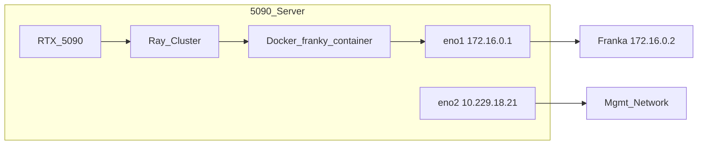

# 单臂 Franka franky 改造方案（5090 实机 · 扩展优先 · Docker 隔离）

> **目标环境：** Franka Emika Panda · 固件 **5.10.0** · libfranka **0.19.0** · Franka Hand（原生夹爪）  
> **目标能力：** 在 RLinf 上跑通单臂真机控制链——臂 + 夹爪 + env（第一阶段无相机）；后续再接入数据采集、SFT、RLPD 等工作流  
> **本机：** 5090 服务器 · `172.16.0.2`（eno1）· PREEMPT_RT 内核  
> **修订说明：** 相对 [`franka_2.md`](franka_2.md) 的重写——绑定本机真实软硬件、**Docker 优先**（不污染宿主机 Python）、**扩展大于修改**（不改 `FrankaEnv` 等核心文件）、**逐步改逐步测**

---

## 目录

1. [相对 franka_1 / franka_2 的变化](#1-相对-franka_1--franka_2-的变化)
2. [本机 5090 软硬件基线](#2-本机-5090-软硬件基线)
3. [Docker 环境（首选，避免污染宿主机）](#3-docker-环境首选避免污染宿主机)
4. [固件 5.10.0 与版本锁定](#4-固件-5100-与版本锁定)
5. [现状分析（代码实查）](#5-现状分析代码实查)
6. [总体架构：扩展优先](#6-总体架构扩展优先)
7. [b/d 目录结构与禁止修改清单](#7-bd-目录结构与禁止修改清单)
8. [分步实施 Step 0–6（逐步改、逐步测）](#8-分步实施-step-06逐步改逐步测)
   - [8.0 真机依赖总览](#80-真机依赖总览)
9. [相机 Phase（后续，与 Step 0–6 解耦）](#9-相机-phase后续与-step-06-解耦)
10. [工作流 Step 7+（逐个接入）](#10-工作流-step-7逐个接入)
11. [扩展代码设计要点（参考实现）](#11-扩展代码设计要点参考实现)
12. [测试与验收](#12-测试与验收)
13. [风险与里程碑](#13-风险与里程碑)
14. [附录](#14-附录)

---

## 1. 相对 franka_1 / franka_2 的变化

### 1.1 franka_1 的主要问题（仍成立）

- 提议复制整个 `franka_env.py`（933 行）为 `franky_env.py`——维护成本极高，已废弃。

### 1.2 franka_2 纠正了架构，但仍有两类偏差

| 偏差 | franka_2 做法 | franka_3 做法 |
|------|--------------|--------------|
| **环境绑定** | 占位符 `<FRANKA_NIC>`、`eth0`、泛化多节点 | 写死本机：`eno1` / `eno2` / `172.16.0.2` / 单节点 |
| **运行环境** | 宿主机 `install.sh --env franka-franky` → `.venv` | **Docker** `agentic-rlinf0.4-franka` + `switch_env franky-0.19.0` |
| **代码策略** | 改 `FrankaEnv._setup_hardware` 工厂、改 `FrankaConfig.controller_backend` | **不改**上述文件；新建 `b/d/franky_ext/` + 新 Gym ID |
| **测试粒度** | 6 Phase / 周级 | **Step 0–6** 每步一个脚本 + 独立验收 |
| **第一阶段范围** | 含相机工作流 | **仅臂 + 夹爪 + env**，无相机 |

### 1.3 franka_3 三条铁律

1. **Docker 优先**：franky / libfranka 只在容器 venv 内使用，不在宿主机 `pip install`。
2. **扩展大于修改**：参照 `DualFrankaEnv` 模式——双臂 franky 从未改 `FrankaEnv`，单臂同样新建 env 基类。
3. **一次只改一个功能**：每 Step 有独立脚本、验收标准、回滚方式；通过后再进下一步。

---

## 2. 本机 5090 软硬件基线

以下数据已在 **`a20073-System-Product-Name`** 上实测或确认（2026-08-14）。

| 项目 | 实测值 | 方案影响 |
|------|--------|----------|
| CPU | AMD Ryzen Threadripper 7970X，64 逻辑核 | franky RT 可绑 dedicated core |
| 内存 | 93 GiB | 单 env + 后续 RL 足够 |
| 内核 | `5.15.0-1032-realtime` **PREEMPT_RT** | 已满足 franky RT 要求，**无需换内核** |
| GPU | RTX 5090 | Step 7+ actor/rollout；Step 0–6 可选 |
| 宿主机 Python | 3.10.12 | Step 0–6 **不依赖**宿主机 Python 装 franky |
| 机器人 IP | **`172.16.0.2`** | 写死 |
| 机器人网卡 | **`eno1`**（本机 `172.16.0.1/24`，ping ~0.075 ms） | RT 调优、`ethtool` 均针对 eno1 |
| 管理/外网网卡 | **`eno2`**（`10.229.18.21/24`，default route） | `RLINF_COMM_NET_DEVICES=eno2`（**非**模板 `eth0`） |
| 夹爪 | Franka Hand（原生） | `FRANKA_GRIPPER_TYPE=franka` |
| 相机 | USB 未见 RealSense | **Step 0–6 跳过相机/视觉** |
| franky 环境 | 宿主机未安装 | 使用 Docker `/opt/venv/franky-0.19.0` |

### 2.1 网络拓扑



### 2.2 路由确认

```bash
# 宿主机执行：机器人走 eno1
ip route get 172.16.0.2
# 期望：172.16.0.2 dev eno1 src 172.16.0.1

ping -c 3 172.16.0.2
# 期望：0% packet loss，< 1 ms
```

**注意：** 不要让机器人流量走 `eno2` default route；`172.16.0.0/24` 已由 `eno1` kernel route 覆盖。

---

## 3. Docker 环境（首选，避免污染宿主机）

### 3.1 代码库实查：镜像已含 franky-0.19.0

[`docker/Dockerfile`](../docker/Dockerfile) 第 349–369 行（`embodied-franka-image`）：

```dockerfile
# ROS 栈 venv（固件 < 5.9.0 用，本机 5.10.0 不用）
RUN for v in 0.10.0 0.13.3 0.14.1 0.15.0 0.18.0 0.19.0; do \
        LIBFRANKA_VERSION="$v" FRANKA_ROS_VERSION=0.10.0 \
        bash requirements/install.sh ... --venv "franka-$v" --env franka; \
    done

# Franky 栈 venv（wheel 内置 libfranka，无 ROS）——本方案用这个
RUN for v in 0.15.0 0.19.0; do \
        LIBFRANKA_VERSION="$v" \
        bash requirements/install.sh ... --venv "franky-$v" --env franka-franky; \
    done
```

| 项 | 值 |
|----|-----|
| 构建目标 | `BUILD_TARGET=embodied-franka` |
| 已发布 tag | `rlinf/rlinf:agentic-rlinf0.4-franka` |
| 国内镜像 | `docker.1ms.run/rlinf/rlinf:agentic-rlinf0.4-franka` |
| Franky venv | `/opt/venv/franky-0.19.0` |
| 切换命令 | `source switch_env franky-0.19.0` |
| 基础 OS | `ubuntu:20.04`（**无 CUDA**） |
| 容器默认 venv | `franka-0.15.0`（ROS）——**勿用**，必须切 `franky-0.19.0` |

**文档滞后：** [`docs/source-zh/rst_source/examples/embodied/franka.rst`](../docs/source-zh/rst_source/examples/embodied/franka.rst) 正文仅列 ROS libfranka 至 `0.18.0`，**未写** `franky-0.19.0`。**以 Dockerfile 为准**；拉取镜像后务必验证 venv 存在。

### 3.2 镜像内 venv 清单（embodied-franka）

| venv 名 | 用途 | 本机 5.10.0 |
|---------|------|-------------|
| `franka-0.10.0` … `franka-0.18.0` | ROS + serl | ❌ 不可用 |
| `franka-0.19.0` | ROS 路径（仍依赖 Noetic） | ❌ 5.10.0 应走 franky |
| `franky-0.15.0` | libfranka 0.15 wheel | ❌ 固件不匹配 |
| **`franky-0.19.0`** | **libfranka 0.19.0 + franky-control** | **✅ 唯一推荐** |
| `franka-dexhand` | 灵巧手 ROS 依赖 | 后续 Phase，非 Step 0–6 |

### 3.3 Step 0：拉取与验证（不装宿主机 venv）

**宿主机：**

```bash
docker pull rlinf/rlinf:agentic-rlinf0.4-franka
# 国内：
# docker pull docker.1ms.run/rlinf/rlinf:agentic-rlinf0.4-franka
```

**验证 franky-0.19.0 存在且可 import：**

```bash
docker run --rm \
  --privileged \
  --network host \
  -v /home/nvidia/bt/s/RLinf:/workspace/RLinf \
  -w /workspace/RLinf \
  rlinf/rlinf:agentic-rlinf0.4-franka \
  bash -lc '
    ls /opt/venv/ | grep franky
    source switch_env franky-0.19.0
    python -c "import franky; print(\"franky OK:\", franky.__file__)"
  '
```

**期望输出：** 列出 `franky-0.15.0` 和 `franky-0.19.0`；`import franky` 无报错。

### 3.4 镜像过旧时的本地构建（仍不污染宿主机）

若官方镜像无 `franky-0.19.0`（旧版 CI 产物）：

```bash
cd /home/nvidia/bt/s/RLinf
docker build -f docker/Dockerfile \
  --build-arg BUILD_TARGET=embodied-franka \
  --build-arg NO_MIRROR=1 \
  -t rlinf:embodied-franka-local .
```

后续将下文所有 `rlinf/rlinf:agentic-rlinf0.4-franka` 替换为 `rlinf:embodied-franka-local`。

### 3.5 长期开发容器（Step 1–6 的工作环境）

[`b/d/configs/docker_run_franky_5090.sh`](configs/docker_run_franky_5090.sh)（待创建）内容要点：

```bash
#!/bin/bash
REPO=/home/nvidia/bt/s/RLinf
IMAGE="${RLINF_FRANKA_IMAGE:-rlinf/rlinf:agentic-rlinf0.4-franka}"

docker run -it --rm \
  --privileged \
  --network host \
  --name rlinf-franky-5090 \
  -v "${REPO}:/workspace/RLinf" \
  -w /workspace/RLinf \
  "${IMAGE}" \
  bash
```

**容器内首次执行：**

```bash
source /workspace/RLinf/b/d/configs/setup_before_ray_5090.sh
```

### 3.6 宿主机 vs 容器职责划分

| 操作 | 执行位置 | 原因 |
|------|----------|------|
| `tune_eno1.sh`（CPU governor、ethtool） | **宿主机** | 网卡/CPU 属 host namespace |
| `/etc/security/limits.d/` rtprio/memlock | **宿主机** | 容器 `--privileged` 继承 ulimit |
| `ping 172.16.0.2`、Desk 浏览器 | **宿主机或容器**（host network 均可） | — |
| `import franky`、Ray、RLinf env | **容器内** `switch_env franky-0.19.0` | 隔离 Python 依赖 |
| `b/d/franky_ext/` 扩展代码 | 宿主机编辑，容器内运行 | bind mount |

### 3.7 Step 7+ 双容器说明（5090 单节点 GPU RL）

`embodied-franka` 基于 **ubuntu:20.04，无 CUDA**，无法在容器内跑 GPU actor/rollout。

| 组件 | 推荐环境 |
|------|----------|
| env / FrankyController / 机器人 | `agentic-rlinf0.4-franka` + `franky-0.19.0` |
| actor / rollout（GPU） | `agentic-rlinf0.4-maniskill_libero` 或 openpi 相关镜像 |
| Ray 组网 | 两容器均 `--network host`，同一 `ray start --head` 地址 |

Step 7 **dummy SAC**（`is_dummy=True`）可先在 franky 容器内 CPU 验证；含 GPU 的实机 RL 作为独立 Step，不在 Step 0–6 范围。

### 3.8 明确不做的事

- ❌ 宿主机 `bash requirements/install.sh embodied --env franka-franky`
- ❌ 宿主机 `source .venv/bin/activate` 跑 franky
- ❌ 使用容器默认 venv `franka-0.15.0` 或 `switch_env franka-0.19.0`（ROS 路径）

---

## 4. 固件 5.10.0 与版本锁定

### 4.1 兼容矩阵

| 项目 | 5.10.0 取值 |
|------|-------------|
| Robot System Version | **5.10.0**（`>= 5.9.0` 区间） |
| 最低 libfranka | **>= 0.18.0** |
| Robot / Gripper Server | **10 / 3** |
| **RLinf 选用** | **libfranka 0.19.0**（Docker：`franky-0.19.0`） |
| **明确禁用** | **0.18.0**（阻抗控制 bug，[RLinf#1012](https://github.com/RLinf/RLinf/issues/1012)） |
| ROS / serl 路径 | **不可用**（`serl_franka_controllers` + libfranka 0.15 仅支持 `< 5.9.0`） |

### 4.2 Desk 侧检查

1. 浏览器 `http://172.16.0.2/desk` → Settings → Dashboard：Control **5.10.0**
2. FCI 已激活，无 safety violation
3. 宿主机 `ping -c 3 172.16.0.2`

### 4.3 实时内核与权限（宿主机）

本机已有 PREEMPT_RT。仍需确认 limits（容器内 franky 受益）：

```bash
# 检查
uname -r | grep -o PREEMPT_RT
ulimit -r    # 期望 >= 80 或 unlimited
ulimit -l    # 期望 unlimited

# 若不足，创建 /etc/security/limits.d/99-rlinf-franka.conf：
#   nvidia  -  rtprio  99
#   nvidia  -  memlock unlimited
# 重新登录后生效
```

---

## 5. 现状分析（代码实查）

### 5.1 两条控制栈对比

```
┌────────────────────────────────────────────────────────────────────────┐
│  Runner（collect / SFT / RLPD / …）                                     │
└───────────────────────────────┬────────────────────────────────────────┘
                                │ env.step(action)
                                ▼
┌────────────────────────────────────────────────────────────────────────┐
│  FrankaEnv (franka_env.py) — 单臂 ROS 路径                              │
│  └─ _setup_hardware() → 硬编码 FrankaController                         │
│  子类：PegInsertionEnv / FrankaBinRelocationEnv / BottleEnv / DexpnpEnv │
└───────────────────────────────┬────────────────────────────────────────┘
                                │
                 ┌──────────────┴─────────────────┐
                 ▼                                ▼
  FrankaController (ROS)              FrankyController (libfranka)
  固件 < 5.9.0 ✅                      固件 >= 5.9.0 ✅ (5.10.0)
  单臂 ✅                              双臂 DualFrankaEnv ✅
  Franka Hand ✅                       Franka Hand ❌ NotImplementedError
```

**franka_3 切入点：** 新建 `FrankySingleFrankaEnv(FrankaEnv)`，仅 override `_setup_hardware`，使用 `FrankyControllerExtended`；**不修改** `FrankaEnv` 源码。

### 5.2 FrankyController API 缺口

**文件：** `rlinf/envs/realworld/franka/franky_controller.py`

| 方法 | FrankyController | FrankaEnv 是否调用 | franka_3 处理 |
|------|:---:|:---:|------|
| `launch_controller` | ✅（签名不同） | 是 | 扩展 env 内适配参数 |
| `is_robot_up` / `get_state` / `clear_errors` | ✅ | 是 | 继承 |
| `reset_joint` / `open_gripper` / `close_gripper` | ✅ | 是 | 继承 |
| `move_tcp_pose` | ✅ | 否（env 用 `move_arm`） | — |
| **`move_arm`** | **❌** | **是** | `FrankyControllerExtended` 新增 |
| **`reconfigure_compliance_params`** | **❌** | **是（reset）** | 扩展类新增 |
| **`move_gripper`** | **❌** | 否（smoke test） | 扩展类新增 |
| `_build_gripper(franka)` | **NotImplementedError** | 是 | 扩展类 override |
| `command_end_effector` | ❌ | 灵巧手 | stub（本方案不用） |

### 5.3 launch_controller 签名差异

```python
# FrankaController（ROS）— FrankaEnv 当前调用方式
FrankaController.launch_controller(
    robot_ip, env_idx, node_rank, worker_rank,
    end_effector_type=..., end_effector_config=..., gripper_connection=...,
)

# FrankyController（libfranka）
FrankyController.launch_controller(
    robot_ip, env_idx, node_rank, worker_rank,
    gripper_type="robotiq",  # 默认 robotiq；本机需 "franka"
    gripper_connection=None,
)
```

**franka_3：** 在 `FrankySingleFrankaEnv._setup_hardware` 中调用 `FrankyControllerExtended.launch_controller(..., gripper_type="franka")`，不传 ROS 的 `end_effector_*` 参数。

### 5.4 Gripper 要点

- ROS 版 `FrankaGripper.open()` 使用 `width=0.09`（非 0.08）
- `FrankaEnv` **从不**调用 `move_gripper`；仅用 `open_gripper()` / `close_gripper()`
- `FrankyController._build_gripper` 对 `gripper_type=franka` 当前 `raise NotImplementedError`——Step 2/3 在扩展类解决

### 5.5 可复用资产（只读，不修改）

| 组件 | 路径 |
|------|------|
| FrankyController 骨架 | `rlinf/envs/realworld/franka/franky_controller.py` |
| FrankaEnv 业务逻辑 | `rlinf/envs/realworld/franka/franka_env.py` |
| 任务 env 子类 | `rlinf/envs/realworld/franka/tasks/*.py` |
| DualFranka 参考模式 | `rlinf/envs/realworld/franka/dual_franka_env.py` |
| Smoke test 参考 | `toolkits/realworld_check/test_franky_controller.py` |
| Docker franky venv | `/opt/venv/franky-0.19.0` |

---

## 6. 总体架构：扩展优先

### 6.1 设计原则

1. **对标 DualFrankaEnv：** 双臂 franky 用独立 `DualFrankaEnv`，未改 `FrankaEnv`；单臂同样新建 env，不往 `FrankaEnv` 塞工厂分支。
2. **新 Gym ID 区分栈：** 如 `FrankyFrankaEnv-v1`、`FrankyPegInsertionEnv-v1`；现有 `PegInsertionEnv-v1` 保持 ROS 语义不变。
3. **扩展包隔离：** 所有新代码在 `b/d/franky_ext/`，验证稳定后再评估 upstream 合入。
4. **Controller 扩展：** `FrankyControllerExtended(FrankyController)` 放扩展包，补齐 API；**优先不改** upstream `franky_controller.py`。
5. **配置隔离：** YAML 放 `b/d/configs/`，不改 `examples/embodiment/config/` 官方文件。

### 6.2 架构图（franka_3）

```
  b/d/configs/*.yaml          init_params.id: FrankyPegInsertionEnv-v1
         │
         ▼
  RealWorldEnv ── gym.make ──► FrankyPegInsertionEnv
                                    │
                                    ├─ 奖励/任务逻辑 ← PegInsertionEnv（继承）
                                    └─ _setup_hardware ← FrankySingleFrankaEnv（override）
                                              │
                                              ▼
                                    FrankyControllerExtended.launch_controller
                                    (gripper_type=franka, robot_ip=172.16.0.2)
                                              │
                                              ▼
                                    franky / libfranka 0.19.0（Docker venv）
                                              │
                                              ▼ eno1
                                    Franka Panda 172.16.0.2
```

### 6.3 相对 franka_2 架构的差异

| 维度 | franka_2 | franka_3 |
|------|----------|----------|
| 切换栈方式 | YAML `controller_backend: franky` + 改 `FrankaEnv` | 换 Gym ID + 扩展 env 类 |
| 修改 `franka_env.py` | 是（~30 行） | **否** |
| 修改 `franka.py` scheduler | 是（+3 行） | **否** |
| 新 Gym ID | 不需要 | **需要**（扩展包 register） |
| 代码位置 | `rlinf/` 内联修改 | `b/d/franky_ext/` |

---

## 7. b/d 目录结构与禁止修改清单

### 7.1 目标目录树

```
b/d/
├── franka_3.md                          # 本文档
├── franky_ext/                          # 本地扩展包（Step 2 起逐步创建）
│   ├── __init__.py
│   ├── franka_libfranka_gripper.py      # Step 2
│   ├── controller_extended.py           # Step 3
│   ├── franky_single_franka_env.py    # Step 4
│   ├── tasks/
│   │   ├── peg_insertion.py             # Step 6
│   │   └── register.py                  # gym.register
│   └── README.md
├── configs/
│   ├── docker_run_franky_5090.sh        # Step 1
│   ├── setup_before_ray_5090.sh         # Step 1（容器内 source）
│   ├── tune_eno1.sh                     # Step 0（宿主机）
│   └── realworld_franky_smoke.yaml      # Step 5–6
└── scripts/
    ├── step0_check_env.sh
    ├── step2_test_gripper.py
    ├── step3_test_controller.py
    ├── step4_test_env_dummy.py
    └── step5_test_env_robot.py
```

### 7.2 禁止修改的 RLinf 文件

| 文件 | 原因 |
|------|------|
| `rlinf/envs/realworld/franka/franka_env.py` | ROS 单臂基类，改则影响所有现有用户 |
| `rlinf/envs/realworld/franka/franka_controller.py` | ROS 控制器 |
| `rlinf/envs/realworld/franka/tasks/__init__.py` | 官方 Gym 注册 |
| `rlinf/scheduler/hardware/robots/franka.py` | 调度器硬件配置 |
| `examples/embodiment/config/*` | 官方示例 YAML |
| `ray_utils/realworld/setup_before_ray.sh` | 上游模板；本机用 `b/d/configs/` 副本 |

### 7.3 允许的最小 upstream 触碰（仅当扩展类方案失败）

| 条件 | 可考虑的 upstream PR |
|------|---------------------|
| Ray 无法使用 `FrankyControllerExtended` 子类 | 向 `franky_controller.py` **纯新增**方法（不改 ROS 路径） |
| 扩展包稳定 2 周无问题 | 将 `b/d/franky_ext/` 迁入 `rlinf/envs/realworld/franka/franky_single/` |

**当前策略：先走扩展包，不提交 upstream PR。**

---

## 8. 分步实施 Step 0–6（逐步改、逐步测）

> **规则：** 每 Step 完成后打勾、记录日志，**未通过不进入下一步**。  
> **环境：** 标注「宿主机」或「容器内」。容器内先 `source b/d/configs/setup_before_ray_5090.sh`。

### 8.0 真机依赖总览

各 Step 的测试/验收是否必须动到 Franka 真机，用下列标记区分：

| 标记 | 含义 | 典型操作 |
|------|------|----------|
| **`[服务器]`** | 仅宿主机 / Docker / Ray，**不连 FCI、臂不动** | `import franky`、`ray status`、dummy env |
| **`[连通]`** | 需机器人**上电且网络可达**，但**不发运动/夹爪指令** | `ping 172.16.0.2`、Desk 查固件 |
| **`[真机]`** | **必须占用 libfranka 会话**，臂或夹爪**会运动**；需 FCI 激活、操作员在场、Desk 急停可用 | 夹爪开合、`home`、`nudge`、env reset/step |
| **`[相机]`** | 除真机外还需 RealSense 等（本方案第一阶段不含） | 采集图像、视觉 obs |

**汇总表（Step 0–12）：**

| Step | 名称 | 真机依赖 | 脚本/入口 | 需真机运动的验收项 |
|------|------|----------|-----------|-------------------|
| **0** | 环境摸底 | `[服务器]` + `[连通]` | `b/d/scripts/step0_check_env.sh` | 无（ping/Desk 仅连通，不控制） |
| **1** | 容器与 Ray | `[服务器]` | `setup_before_ray_5090.sh` | 无 |
| **2** | 夹爪独立测试 | **`[真机]`** | `b/d/scripts/step2_test_gripper.py` | open/close、width 读数 |
| **3** | Controller smoke | **`[真机]`** | `b/d/scripts/step3_test_controller.py` | home、nudge、open/close、grip、impedance |
| **4** | Dummy env | `[服务器]` | `b/d/scripts/step4_test_env_dummy.py` | 无（`is_dummy=True`） |
| **5** | 实机 env smoke | **`[真机]`** | `b/d/scripts/step5_test_env_robot.py` | reset、zero-action step、夹爪 |
| **6** | 任务 env | **`[真机]`** | YAML + `FrankyPegInsertionEnv-v1` | reset、reward 计算（臂会动） |
| **7** | dummy SAC | `[服务器]` | `realworld_franky_dummy_sac.yaml` | 无（配置层 `is_dummy=True`） |
| **8** | 数据采集 | **`[真机]`** + **`[相机]`** | collect 工作流 | 遥操作/采集 episode |
| **9–12** | SFT / RLPD / DAgger 等 | **`[真机]`**（+ Step 9+ 常需 GPU） | 各 YAML | 部署/训练 loop 中的 env step |

**真机测试前置（Step 2 起每次跑 `[真机]` 前）：**

1. Desk：`http://172.16.0.2/desk` → FCI 已激活、无 fault、固件 5.10.0  
2. 宿主机：`bash b/d/configs/tune_eno1.sh`  
3. **同一时刻仅一个 libfranka 客户端**（smoke 与 env 勿并行）  
4. 操作员在场，Desk 急停可用  

**可在无真机时先完成的 Step：** 0（除 ping/Desk 外）、1、4、7（dummy SAC）。

---

### Step 0 — 环境摸底（无扩展代码） `[服务器]` + `[连通]`

**目标：** 确认本机 RT/网络/Desk/Docker franky 可用。

| 步骤 | 位置 | 真机 | 命令 |
|------|------|------|------|
| RT 内核 | 宿主机 | 否 | `uname -r \| grep PREEMPT_RT` |
| ulimit | 宿主机 | 否 | `ulimit -r; ulimit -l` |
| 网卡调优 | 宿主机 | 否 | `bash b/d/configs/tune_eno1.sh` |
| 机器人连通 | 宿主机 | **连通** | `ping -c 3 172.16.0.2` |
| Desk | 浏览器 | **连通** | `http://172.16.0.2/desk` → 5.10.0 |
| Docker pull | 宿主机 | 否 | `docker pull rlinf/rlinf:agentic-rlinf0.4-franka` |
| import franky | 容器内 | 否 | 见 §3.3 验证命令 |
| GPU（可选） | 宿主机 | 否 | `nvidia-smi` |

**[`b/d/configs/tune_eno1.sh`](configs/tune_eno1.sh) 要点：**

```bash
#!/bin/bash
# 宿主机执行，每次开机后
sudo bash -c 'for g in /sys/devices/system/cpu/cpu*/cpufreq/scaling_governor; do
    echo performance > "$g"
done'
sudo sysctl -w kernel.sched_rt_runtime_us=-1
sudo ethtool -C eno1 rx-usecs 0 tx-usecs 0 2>/dev/null || true
```

**验收：**

- [ ] 容器内 `import franky` 成功 — `[服务器]`
- [ ] 宿主机 ping 172.16.0.2 通 — `[连通]`
- [ ] Desk 显示 5.10.0 — `[连通]`
- [ ] **宿主机无** `RLinf/.venv` 或 franky pip 安装 — `[服务器]`

**回滚：** 无代码改动，无需回滚。

---

### Step 1 — 容器与 Ray 启动脚本 `[服务器]`

**目标：** 固定 Docker 启动方式与环境变量；容器内 Ray head 正常。

**新建文件：**

- `b/d/configs/docker_run_franky_5090.sh`（§3.5）
- `b/d/configs/setup_before_ray_5090.sh`：

```bash
#!/bin/bash
export REPO_PATH=/workspace/RLinf
export PYTHONPATH="${REPO_PATH}:${PYTHONPATH}"
export RLINF_NODE_RANK=0
export RLINF_COMM_NET_DEVICES=eno2
export FRANKA_ROBOT_IP=172.16.0.2
export FRANKA_NIC=eno1
export FRANKA_GRIPPER_TYPE=franka
source switch_env franky-0.19.0
cd "${REPO_PATH}"
```

**容器内验证：**

```bash
source b/d/configs/setup_before_ray_5090.sh
which python   # 期望 /opt/venv/franky-0.19.0/bin/python
ray start --head --port=6379
ray status
ray stop
```

**验收：**

- [ ] `switch_env franky-0.19.0` 后 Python 路径正确 — `[服务器]`
- [ ] `ray start --head` / `ray status` 正常 — `[服务器]`

---

### Step 2 — Franka Hand 夹爪（独立脚本，无 Ray/env） **`[真机]`**

**目标：** 验证 `franky.Gripper` + `FrankaLibfrankaGripper` 对本机 Franka Hand 可用。

> **真机说明：** 本 Step **会驱动夹爪开合**，占用 libfranka 会话；臂不动，但需 FCI 与 Franka Hand 在线。

**新建：** `b/d/franky_ext/franka_libfranka_gripper.py`  
**新建：** `b/d/scripts/step2_test_gripper.py`

**容器内执行：**

```bash
source b/d/configs/setup_before_ray_5090.sh
python b/d/scripts/step2_test_gripper.py
```

**实现要点：**

- `open()` 目标宽度 **0.09 m**（与 ROS 版对齐）
- `close()` 宽度 **0.01 m**，force **130 N**
- 先 `python -c "import franky; print([x for x in dir(franky) if 'rip' in x.lower()])"` 确认 API

**验收：**

- [ ] open 后 width ~0.08–0.09 m — **`[真机]`** 夹爪动
- [ ] close 后 width ~0.0–0.02 m — **`[真机]`** 夹爪动
- [ ] 无 ROS、无 Ray — `[服务器]`

**回滚：** 删除 `b/d/franky_ext/franka_libfranka_gripper.py` 即可。

---

### Step 3 — Controller 扩展 + Smoke **`[真机]`**

**目标：** `FrankyControllerExtended` 补齐 `move_arm` / `reconfigure_compliance_params` / `move_gripper` / `_build_gripper(franka)`。

> **真机说明：** 本 Step **臂与夹爪均会运动**（home、nudge、阻抗切换等）；测试前确认工作空间无障碍物。

**新建：** `b/d/franky_ext/controller_extended.py`  
**新建：** `b/d/scripts/step3_test_controller.py`（基于 `toolkits/realworld_check/test_franky_controller.py`）

**容器内执行：**

```bash
source b/d/configs/setup_before_ray_5090.sh
export FRANKA_ROBOT_IP=172.16.0.2
export FRANKA_GRIPPER_TYPE=franka
python b/d/scripts/step3_test_controller.py
```

**交互命令验收序列：**

```
home → getpos → nudge 0 0.1 → open → close → grip 128 → impedance 2000 150 → nudge 2 0.05 → shutdown
```

**compliance 映射（`reconfigure_compliance_params`）：**

| ROS key | franky CartesianImpedanceTracker | 映射 |
|---------|-------------------------------|------|
| `translational_stiffness` | `translational_stiffness` | 直接传递 |
| `rotational_stiffness` | `rotational_stiffness` | 直接传递 |
| `translational_damping` | 无直接对应 | `gains_time_constant ≈ 2*damping/stiffness` |
| `rotational_damping` | 同上 | 同上 |
| `Ki` | 无积分项 | 忽略并 log warning |

**`move_arm` dtype：** `FrankaEnv._move_action` 传 float32，`move_tcp_pose` 需 float64——在 alias 内 `np.asarray(..., dtype=np.float64)`。

**验收：**

- [ ] 上述 smoke 命令无 AttributeError / 无连接超时 — **`[真机]`**
- [ ] 仅一个 libfranka 客户端（勿同时开 env） — 流程要求

---

### Step 4 — Dummy Env（无真机、无相机） `[服务器]`

**目标：** 扩展 env 类 + Gym 注册；dummy 模式可 make/reset/step。

> **真机说明：** `is_dummy=True`，**不创建** `FrankyController`，**不连** 172.16.0.2；可在镜像拉取完成后、无机器人时执行。

**新建：**

- `b/d/franky_ext/franky_single_franka_env.py`
- `b/d/franky_ext/tasks/register.py`
- `b/d/scripts/step4_test_env_dummy.py`

**容器内：**

```bash
source b/d/configs/setup_before_ray_5090.sh
python b/d/scripts/step4_test_env_dummy.py
```

**要点：**

- `is_dummy=True` 时 `FrankaEnv` 跳过 `_setup_hardware`（现有行为）
- 验证 config 字段不破坏初始化；obs/action space 与 `FrankaEnv-v1` 一致

**验收：**

- [ ] `gym.make("FrankyFrankaEnv-v1", override_cfg={"is_dummy": True, ...})` 成功 — `[服务器]`
- [ ] `reset()` / `step()` 不 crash — `[服务器]`

---

### Step 5 — 实机 Env Smoke（无相机） **`[真机]`**

**目标：** Ray + 真机 172.16.0.2；无相机条件下跑通 reset/step。

> **真机说明：** `is_dummy=False`，经 Ray 启动 `FrankyControllerExtended`；**reset 会回 rest、step 可能驱动臂/夹爪**（即使 zero-action 也可能有 reset 阶段运动）。

**修改：** `FrankySingleFrankaEnv` 增加 `_open_cameras` override（空操作或返回 dummy 帧）  
**新建：** `b/d/scripts/step5_test_env_robot.py`

**容器内：**

```bash
# 宿主机先 tune_eno1.sh
source b/d/configs/setup_before_ray_5090.sh
ray start --head --port=6379
python b/d/scripts/step5_test_env_robot.py
ray stop
```

**验收：**

- [ ] Env worker 连接 172.16.0.2 — **`[真机]`** / `[连通]`
- [ ] reset 后臂回 rest pose — **`[真机]`** 臂动
- [ ] binary gripper open/close 正常 — **`[真机]`** 夹爪动
- [ ] 10 个 zero-action step 无 exception — **`[真机]`**（若 reset 已动臂，step 期间保持连接）

**安全：** 随时准备 Desk 急停；首次低速、小范围。

---

### Step 6 — 首个任务 Env（FrankyPegInsertionEnv-v1） **`[真机]`**

**目标：** 任务级 env + 本机 YAML smoke。

> **真机说明：** 继承 PegInsertion 的 reset/reward 逻辑，**真机 reset 与任务相关运动**；仍无相机（`RLINF_SKIP_CAMERA=1`）。

**新建：**

- `b/d/franky_ext/tasks/peg_insertion.py`
- `b/d/configs/realworld_franky_peg_smoke.yaml`

**Gym 注册：**

```python
# b/d/franky_ext/tasks/register.py
register(
    id="FrankyPegInsertionEnv-v1",
    entry_point="b.d.franky_ext.tasks.peg_insertion:create_franky_peg_insertion_env",
)
```

**YAML 核心片段：**

```yaml
cluster:
  num_nodes: 1
  component_placement:
    actor: 0-0
    rollout: 0-0
    env: 0-0

env:
  train:
    init_params:
      id: FrankyPegInsertionEnv-v1
    override_cfg:
      robot_ip: 172.16.0.2
      gripper_type: franka
      is_dummy: false
      skip_camera: true   # 扩展字段：Phase 1 无相机
```

**入口脚本需在 `gym.make` 前 import 注册：**

```python
import b.d.franky_ext.tasks.register  # noqa: F401
```

**验收：**

- [ ] 任务 env reset 正常 — **`[真机]`**
- [ ] reward 计算不 crash（无相机时 reward 可为占位） — **`[真机]`**（逻辑在真机 obs 上跑）
- [ ] 官方 `PegInsertionEnv-v1` 未改动 — 代码审查

---

## 9. 相机 Phase（后续，与 Step 0–6 解耦） **`[真机]`** + **`[相机]`**

Step 0–6 ** deliberately 不含相机**。待臂+夹爪+env 稳定后再做：

| 子 Step | 内容 | 真机 | 相机 |
|---------|------|------|------|
| C0 | `lsusb` / RealSense SDK 摸底 serial | 否 | 摸底 |
| C1 | 去掉 `skip_camera`，恢复 `_open_cameras` | 否 | 否 |
| C2 | 单帧采集验证 | **是** | **是** |
| C3 | 接入 `realworld_collect_data.yaml` 副本 | **是** | **是** |
| C4 | Pi0 SFT / eval 副本 | **是** | **是** |

相机 env 仍用 `Franky*` Gym ID，仅 YAML 增加 `camera_serials`。

---

## 10. 工作流 Step 7+（逐个接入）

每步：**复制官方 YAML → `b/d/configs/` → 改 `init_params.id` → 独立分支测试**。

| Step | 工作流 | 真机依赖 | 基于官方配置 | 环境要求 |
|------|--------|----------|-------------|----------|
| 7 | dummy SAC | `[服务器]` | `realworld_dummy_franka_sac_cnn.yaml` | franky 容器，CPU；**不连真机** |
| 8 | 数据采集 | **`[真机]`** + **`[相机]`** | `realworld_collect_data.yaml` | Step 6 + 相机 Phase |
| 9 | Pi0 SFT 部署 | **`[真机]`** + **`[相机]`** | `realworld_eval.yaml` | GPU 双容器 + 真机 rollout |
| 10 | RLPD | **`[真机]`** + **`[相机]`** | `realworld_peginsertion_rlpd_cnn_async.yaml` | GPU 双容器 + 持续 env step |
| 11 | HG-DAgger | **`[真机]`** + **`[相机]`** | `realworld_pnp_dagger_openpi.yaml` | GPU + openpi + 遥操作/干预 |
| 12 | RLT / RTC | **`[真机]`** + **`[相机]`** | 各对应 YAML | 按需 |

**Step 7 启动示例（容器内）：**

```bash
source b/d/configs/setup_before_ray_5090.sh
import b.d.franky_ext.tasks.register  # 写入入口 wrapper
python examples/embodiment/train_embodied_agent.py \
  --config-path b/d/configs \
  --config-name realworld_franky_dummy_sac
```

**双容器 GPU（Step 9+ 参考）：**

```bash
# 终端 1：franky 容器 — env + 控制
bash b/d/configs/docker_run_franky_5090.sh
source b/d/configs/setup_before_ray_5090.sh && ray start --head --port=6379

# 终端 2：GPU 容器 — actor/rollout
docker run -it --rm --gpus all --network host \
  -v /home/nvidia/bt/s/RLinf:/workspace/RLinf \
  rlinf/rlinf:agentic-rlinf0.4-maniskill_libero bash
source switch_env openpi  # 或 cnn 对应 venv
ray start --address=127.0.0.1:6379
# 仅在 head 容器执行 train 入口
```

---

## 11. 扩展代码设计要点（参考实现）

### 11.1 FrankySingleFrankaEnv._setup_hardware（核心 override）

```python
# b/d/franky_ext/franky_single_franka_env.py
class FrankySingleFrankaEnvMixin:
    """Mixin: 将 FrankaEnv 的控制器从 ROS 换为 FrankyExtended。"""

    def _setup_hardware(self):
        from b.d.franky_ext.controller_extended import FrankyControllerExtended
        from rlinf.scheduler import FrankaHWInfo

        assert isinstance(self.hardware_info, FrankaHWInfo)
        # ... 从 hardware_info 填充 robot_ip / gripper_type（同 FrankaEnv 逻辑）...

        controller_node_rank = getattr(
            self.hardware_info.config, "controller_node_rank", self.node_rank
        )
        self._controller = FrankyControllerExtended.launch_controller(
            robot_ip=self.config.robot_ip,
            env_idx=self.env_idx,
            node_rank=controller_node_rank,
            worker_rank=self.env_worker_rank,
            gripper_type=self.config.gripper_type or "franka",
            gripper_connection=self.config.gripper_connection,
        )


class FrankySingleFrankaEnv(FrankySingleFrankaEnvMixin, FrankaEnv):
    """单臂 franky 基类。"""

    def _open_cameras(self):
        if getattr(self.config, "skip_camera", False):
            return  # Step 5：无相机
        super()._open_cameras()
```

### 11.2 FrankyControllerExtended 要点

```python
# b/d/franky_ext/controller_extended.py
class FrankyControllerExtended(FrankyController):
    def move_arm(self, position):
        self.move_tcp_pose(np.asarray(position, dtype=np.float64))

    def move_gripper(self, position: int, speed: float = 0.3):
        assert 0 <= position <= 255
        self._gripper.move(position=float(position), speed=speed)

    def reconfigure_compliance_params(self, params: dict):
        # 存参数 + self._stop_cart_tracking_motion()；详见 franka_2 §6.2
        ...

    def _build_gripper(self, gripper_type, gripper_connection, robot_ip):
        if (gripper_type or "").lower() == "franka":
            from b.d.franky_ext.franka_libfranka_gripper import FrankaLibfrankaGripper
            return FrankaLibfrankaGripper(robot_ip=robot_ip)
        return super()._build_gripper(gripper_type, gripper_connection, robot_ip)
```

### 11.3 任务 env 继承（Step 6）

```python
# b/d/franky_ext/tasks/peg_insertion.py
from rlinf.envs.realworld.franka.tasks.peg_insertion_env import PegInsertionEnv
from b.d.franky_ext.franky_single_franka_env import FrankySingleFrankaEnvMixin

class FrankyPegInsertionEnv(FrankySingleFrankaEnvMixin, PegInsertionEnv):
    pass
```

---

## 12. 测试与验收

### 12.1 Step 0–6 检查清单

| Step | 验收项 | 真机依赖 |
|------|--------|----------|
| 0 | Docker `import franky` | `[服务器]` |
| 0 | ping 172.16.0.2 | `[连通]` |
| 0 | Desk 5.10.0 | `[连通]` |
| 0 | 宿主机无 franky venv | `[服务器]` |
| 1 | `switch_env franky-0.19.0` | `[服务器]` |
| 1 | Ray head 正常 | `[服务器]` |
| 2 | 夹爪 open/close width 合理 | **`[真机]`** |
| 3 | smoke 全命令通过 | **`[真机]`** |
| 4 | dummy env make/reset/step | `[服务器]` |
| 5 | 实机 env 10 step 无 exception | **`[真机]`** |
| 6 | FrankyPegInsertionEnv reset/reward | **`[真机]`** |

### 12.2 工作流验收（Step 7+，后续）

| 工作流 | 通过标准 | 真机依赖 |
|--------|----------|----------|
| dummy SAC | 训练 loop 跑通，loss 有限 | `[服务器]` |
| collect_data | >= 10 成功 episode | **`[真机]`** + **`[相机]`** |
| Pi0 deploy | >= 100 step 无 exception | **`[真机]`** + **`[相机]`** |
| RLPD | >= 100 env steps | **`[真机]`** + **`[相机]`** |

### 12.3 负向测试

```bash
# 容器内：错误 venv 应连接失败（若存在 franka-0.15.0 ROS venv）
source switch_env franka-0.15.0
# 不应于 5.10.0 固件上使用 ROS 路径做实机控制
```

---

## 13. 风险与里程碑

### 13.1 风险

| 风险 | 影响 | 缓解 |
|------|------|------|
| 官方 Docker 镜像过旧、无 `franky-0.19.0` | Step 0 阻塞 | 本地 `docker build BUILD_TARGET=embodied-franka` |
| franky wheel 未暴露 `Gripper` 类 | Step 2 阻塞 | 实查 `dir(franky)`；回退 ctypes/libfranka |
| `FrankyControllerExtended` 与 Ray 子类不兼容 | Step 3 阻塞 | 再评估最小 upstream patch |
| libfranka 单连接独占 | smoke 与 env 不能并行 | 文档强调；测完关 smoke |
| libfranka 0.18 阻抗 bug | 臂不动 | **固定 franky-0.19.0** |
| embodied-franka 无 CUDA | GPU RL 需双容器 | Step 7+ 单独规划 |
| compliance 阻尼映射近似 | 手感与 ROS 略异 | 实机阶跃响应调 `gains_time_constant` |
| 灵巧手 | franky 栈不支持 | 本方案不用；stub 即可 |

### 13.2 里程碑

| 里程碑 | 交付 | 真机 | 预估 |
|--------|------|------|------|
| M0 | Step 0–1 Docker + Ray 就绪 | 否 | 1–2 天 |
| M1 | Step 2–3 夹爪 + controller smoke | **是** | 3–5 天 |
| M2 | Step 4–5 dummy + 实机 env | 4 否 / 5 **是** | 3–5 天 |
| M3 | Step 6 任务 env smoke | **是** | 2–3 天 |
| M4 | 相机 Phase | **是** + 相机 | 按需 |
| M5 | Step 7+ 工作流 | 7 否 / 8+ **是** | 按需 |
| M6 | upstream 合入评估 | — | M3 稳定 2 周后 |

---

## 14. 附录

### 14.1 franka_1 / franka_2 / franka_3 对比

| 维度 | franka_1 | franka_2 | franka_3 |
|------|----------|----------|----------|
| 核心架构 | 复制 FrankaEnv | 改 FrankaEnv 工厂 | **新 env 类 + 新 Gym ID** |
| 运行环境 | 宿主机 venv | 宿主机 venv | **Docker franky-0.19.0** |
| 修改 rlinf/ 核心 | 多文件 | franka_env + franka.py 等 | **零修改**（扩展包） |
| 本机绑定 | 无 | 无 | **eno1/eno2/172.16.0.2** |
| 第一阶段 | 含相机 | 含相机 | **无相机** |
| 测试粒度 | 粗 | 6 Phase | **Step 0–6 独立脚本** |

### 14.2 控制器 API 对齐总表（扩展后目标）

| 方法 | FrankyControllerExtended | 实现方式 |
|------|--------------------------|----------|
| `move_arm` | ✅ | alias → `move_tcp_pose` + float64 |
| `move_gripper` | ✅ | → `self._gripper.move` |
| `reconfigure_compliance_params` | ✅ | 停 tracker + 存参 + 下次重建 |
| `open/close_gripper` | ✅ | 继承 |
| `_build_gripper(franka)` | ✅ | `FrankaLibfrankaGripper` |
| `command_end_effector` | stub | `NotImplementedError` |

### 14.3 工作流配置映射（Step 7+）

| 工作流 | 官方配置 | b/d 副本（待建） | Gym ID |
|--------|----------|-----------------|--------|
| dummy SAC | `realworld_dummy_franka_sac_cnn.yaml` | `realworld_franky_dummy_sac.yaml` | `FrankyFrankaEnv-v1` |
| collect | `realworld_collect_data.yaml` | `realworld_collect_data_franky.yaml` | `FrankyPegInsertionEnv-v1` |
| Pi0 eval | `realworld_eval.yaml` | `realworld_eval_franky.yaml` | `FrankyFrankaEnv-v1` |
| RLPD | `realworld_peginsertion_rlpd_cnn_async.yaml` | `..._franky_async.yaml` | `FrankyPegInsertionEnv-v1` |

### 14.4 常见问题

**Q: 为什么不用 `controller_backend: franky` YAML 开关？**  
A: 那需要改 `FrankaEnv` 和 scheduler config。franka_3 用新 Gym ID 在扩展层区分，upstream 零改动。

**Q: 能否在宿主机装 franky 方便调试？**  
A: 不推荐。若必须，用独立 venv 路径且勿与系统 Python 混用；Team 标准仍是 Docker。

**Q: `import franky` 失败？**  
A: 确认 `source switch_env franky-0.19.0`；确认镜像含 `/opt/venv/franky-0.19.0`；必要时本地 build。

**Q: smoke test 与 env 同时连机器人？**  
A: libfranka 单客户端，会失败。先停 smoke 再启 env。

**Q: 文档写 switch_env franka-0.15.0？**  
A: 那是 ROS 路径 + 固件 < 5.9.0。本机 5.10.0 用 **`switch_env franky-0.19.0`**。

**Q: RLINF_COMM_NET_DEVICES 用 eno1 还是 eno2？**  
A: **eno2**（管理网/集群通信）。机器人流量走 eno1 内核路由，与 Ray 通信用网卡无关。

---

*文档版本：franka_3 · 2026-08-14 · 5090 实机方案 · 下一步：按 Step 0 执行并创建 `b/d/configs/tune_eno1.sh`*
