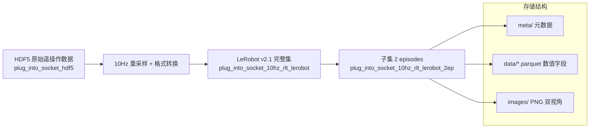
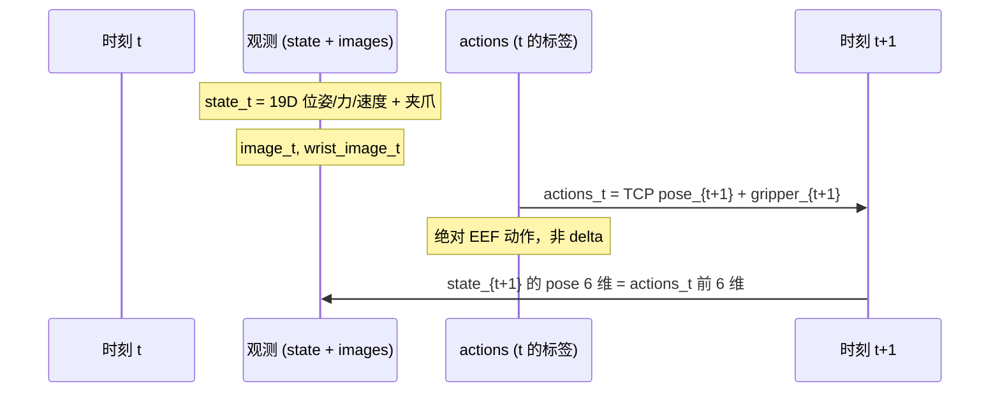
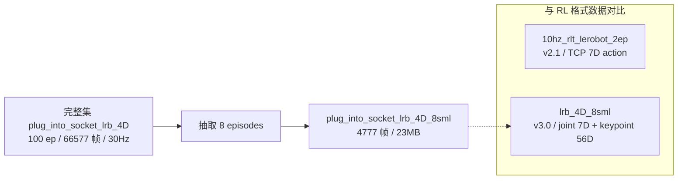
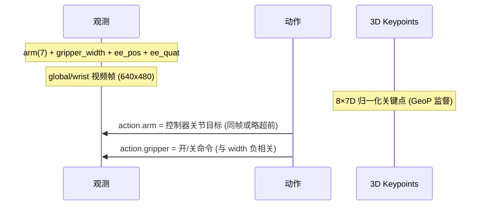

# (1) set franka home
_Exported on 9/20/2026 at 10:44:11 GMT+8 from Cursor (3.15.19)_

---

**User**

深入分析一下数据 `/home/nvidia/kaixin_ws/trans5090_v2/plug_into_socket_10hz_rlt_lerobot_2ep`, 及其各字段的含义与取值分布.

---

**Cursor**

正在探索该 LeRobot 数据集的结构与元数据，随后分析各字段含义与取值分布。


接下来用 Python 深入分析 parquet 数据，统计各字段分布并检查 state 与 action 的关系。


pip 安装卡住了；我改用已有环境或更轻量的方式读取 parquet。


# 数据集深度分析：`plug_into_socket_10hz_rlt_lerobot_2ep`

## 1. 数据集概览

| 属性 | 值 |
|------|-----|
| **路径** | `/home/nvidia/kaixin_ws/trans5090_v2/plug_into_socket_10hz_rlt_lerobot_2ep` |
| **格式** | LeRobot **v2.1** (`codebase_version: v2.1`) |
| **机器人** | Franka Panda (`robot_type: franka_panda`) |
| **任务** | `"plug the plug into the socket"`（插插座） |
| **Episodes** | 2（从完整数据集 `plug_into_socket_10hz_rlt_lerobot` 抽取 ep 0、1） |
| **总帧数** | 417（197 + 220） |
| **采样率** | **10 Hz**（`dt ≈ 0.1000s`，精确） |
| **成功率** | 100%（两集 `is_success=True`） |
| **磁盘占用** | ~79 MB |
| **原始来源** | HDF5：`/tmp/RL1/RL/data/plug_into_socket_hdf5` |



---

## 2. 目录结构

```
plug_into_socket_10hz_rlt_lerobot_2ep/
├── meta/
│   ├── info.json              # 数据集 schema 与 feature 定义
│   ├── tasks.jsonl            # 任务描述
│   ├── episodes.jsonl         # 每集长度
│   └── episodes_stats.jsonl   # 每集各字段统计
├── data/chunk-000/
│   ├── episode_000000.parquet # 197 帧
│   └── episode_000001.parquet # 220 帧
├── images/
│   ├── image/episode_*/frame_*.png       # 全局相机 417 张
│   └── wrist_image/episode_*/frame_*.png # 腕部相机 417 张
├── conversion_metadata.json   # HDF5→LeRobot 转换说明
└── norm_stats.json            # 归一化统计（mean/std/q01/q99）
```

Parquet 中 **15 列**，图像以 **内嵌 PNG bytes** 存储（224×224 RGB），同时 `images/` 下有对应 PNG 文件。

---

## 3. 字段详解与取值分布

### 3.1 核心观测：`state`（19 维，模型用状态）

策略训练的主状态向量，包含夹爪、力/力矩、末端位姿与速度。

| 索引 | 字段名 | 含义 | 单位 | mean | std | min | max | 分布特征 |
|------|--------|------|------|------|-----|-----|-----|----------|
| 0 | `gripper_position` | 夹爪开合宽度（归一化/物理宽度） | m | 0.044 | 0.037 | **0.010** | **0.089** | **双峰**：0.01（闭合，212帧）与 ~0.088（张开，205帧） |
| 1-3 | `tcp_force_x/y/z` | 末端 TCP 接触力 | N | +0.45, -0.52, -0.40 | 2.58, 1.75, **6.52** | -3.9, -7.7, -6.7 | +11.5, +4.1, **+23.7** | **高方差、长尾**；`force_z` 在插入时峰值可达 ~24N |
| 4-6 | `tcp_pos_x/y/z` | 末端位置 | m | 0.562, -0.033, 0.274 | 0.008, 0.060, 0.068 | 0.533, -0.124, 0.188 | 0.577, +0.046, 0.438 | 工作空间小：x 约 4.3cm，z 约 25cm |
| 7-9 | `tcp_roll/pitch/yaw` | 末端姿态（RPY） | rad | 0.22, 0.025, 0.046 | **3.10**, 0.049, 0.048 | ±π | ±π | **roll 双峰**：+π（224帧）与 -π（193帧），无中间值 → 欧拉角 ±π 等价表示 |
| 10-12 | `tcp_torque_x/y/z` | 末端力矩 | N·m | -0.49, +0.55, +0.09 | 0.33, 0.53, 0.25 | -1.14, -0.62, -0.37 | +0.32, +2.26, +0.48 | 插入阶段 y 力矩偏大 |
| 13-15 | `tcp_linear_velocity_*` | 线速度 | m/s | ~0 | 0.017–0.048 | ±0.12 | +0.21 | 近零均值，单步最大 ~2cm |
| 16-18 | `tcp_angular_velocity_*` | 角速度 | rad/s | ~0 | 0.042–0.069 | -0.62 | +0.41 | 近零均值 |

**轨迹运动（两集合计）：**

| Episode | 帧数 | 时长 | 路径总长 | 净位移 | 最大单步 |
|---------|------|------|----------|--------|----------|
| 0 | 197 | 19.6s | 0.839 m | 0.152 m | 1.61 cm |
| 1 | 220 | 21.9s | 0.921 m | 0.044 m | 2.14 cm |

Ep0 末端 z 从 0.438→0.324（下降 11.4cm）；Ep1 从 0.422→0.398（下降 2.5cm），说明两集操作阶段/起始姿态略有差异。

---

### 3.2 完整状态：`state_full`（42 维，调试/扩展用）

包含 Franka 全关节与末端原始量，**不用于默认 19 维模型训练**。

| 段 | 维度 | 字段 | 含义 |
|----|------|------|------|
| 0–6 | 7 | `joint_position_1..7` | 关节角 (rad)，如 j4≈-2.03, j6≈+2.14 |
| 7–13 | 7 | `joint_velocity_1..7` | 关节速度 |
| 14–20 | 7 | `joint_torque_1..7` | 关节力矩（j2 均值约 -35 N·m，Franka 典型） |
| 21–27 | 7 | `joint_external_torque_1..7` | 外扰力矩 |
| 28–30 | 3 | `ee_pos_x/y/z` | 末端位置，与 `state.tcp_pos_*` **完全一致**（max diff=0） |
| 31–34 | 4 | `ee_quat_x/y/z/w` | 末端四元数 |
| 35–37 | 3 | `ee_force_x/y/z` | 末端力（与 state 中 tcp_force 对应） |
| 38–40 | 3 | `ee_torque_x/y/z` | 末端力矩 |
| 41 | 1 | `gripper_width` | 夹爪物理宽度 [0.012, 1.0] m |

---

### 3.3 动作：`actions`（7 维，策略学习目标）

```json
"action_source": "absolute measured TCP pose at t + 1/fps"
"action_representation": "absolute_eef_xyz_rpy_plus_gripper"
```

**不是 delta，而是下一时刻的绝对末端位姿**（已验证：`action_t == state_{t+1}` 的 pose 6 维，误差为 0）。

| 索引 | 字段 | mean | std | min | max | 说明 |
|------|------|------|-----|-----|-----|------|
| 0–2 | `tcp_pos_x/y/z` | 0.562, -0.033, 0.273 | 0.008, 0.060, 0.067 | 同 state | 同 state | 与 state 分布几乎相同 |
| 3–5 | `tcp_roll/pitch/yaw` | 0.237, 0.025, 0.046 | 3.10, 0.049, 0.047 | ±π | ±π | roll 同样双峰 |
| 6 | `gripper` | **-0.158** | **0.923** | **-1.0** | **+0.977** | 映射后：**+1=开，-1=关** |

**夹爪映射（来自 `conversion_metadata.json`）：**

```
源 HDF5 约定: 0=open, 1=closed
转换公式: action.gripper = 1 - 2 × source
```

已验证：`max|1-2×action_gripper_raw - actions.gripper| = 0`。

| 夹爪状态 | 帧数 | 占比 |
|----------|------|------|
| 闭合 (≤ -0.5) | 221 | 53.0% |
| 张开 (≥ 0.5) | 164 | 39.3% |
| 中间过渡 | 32 | 7.7% |

物理宽度参考：`gripper_closed_width=0.01m`，`gripper_open_width=0.09m`。

---

### 3.4 原始动作备份字段

| 字段 | 维度 | 含义 | 分布 |
|------|------|------|------|
| `action_joints_raw` | 7 | 原始关节角目标 (rad) | j1≈-0.11, j4≈-2.03, j6≈+2.19 |
| `action_gripper_raw` | 1 | 源夹爪 [0,1]，0=开 1=关 | mean=0.579，与 `state_full.gripper_width` 一致 |

---

### 3.5 视觉：`image` / `wrist_image`

| 属性 | 值 |
|------|-----|
| 分辨率 | **224 × 224 × 3** (RGB) |
| 存储 | Parquet 内嵌 PNG bytes + 外部 PNG 文件 |
| 视角 | `image`=全局相机，`wrist_image`=腕部相机 |
| 像素范围 | 全局：[7, 161]，均值 ~119；腕部对比度更高 |
| 通道均值 (全局) | R≈0.435, G≈0.449, B≈0.440（归一化到 [0,1]） |

---

### 3.6 元数据与标签字段

| 字段 | 类型 | 含义 | 分布 |
|------|------|------|------|
| `timestamp` | float32 | Episode 内相对时间 (s) | [0, 21.9]，步长 0.1s |
| `source_timestamp` | float64 | 源 HDF5 原始时间戳 | [0.133, 22.047]s |
| `frame_index` | int64 | Episode 内帧序号 | ep0: 0–196，ep1: 0–219 |
| `episode_index` | int64 | Episode ID | 0 或 1 |
| `index` | int64 | 全局帧序号 | 0–416（ep1 从 197 起） |
| `task_index` | int64 | 任务 ID | 恒为 0 |
| `done` | bool | Episode 结束标志 | **415×False，2×True**（每集末帧） |
| `is_success` | bool | 任务成功 | **417×True**（100% 成功演示） |

---

## 4. 数据流与因果关系



**训练含义：**
- 若用 `state` + `actions` 做 BC/VLA：模型输入当前观测，预测 **下一时刻绝对末端位姿 + 夹爪**。
- 若需 delta action，需在数据管线中自行做 `actions - state[pose_dims]` 差分。
- `norm_stats.json` 已提供 state/actions 的 mean、std、q01、q99（后者 padded 到 32 维，实际只用前 7/19 维）。

---

## 5. 关键发现与使用建议

### 5.1 数据质量

1. **时间对齐精确**：10 Hz 均匀采样，`dt` 标准差 < 5×10⁻⁷ s。
2. **动作标签一致**：`actions` 严格等于下一帧 TCP 位姿，无标注噪声。
3. **两集均成功**：适合作为 smoke test / 调试用小集，**不适合直接训泛化策略**（仅 2 ep，417 帧）。

### 5.2 需注意的分布特性

| 问题 | 说明 | 建议 |
|------|------|------|
| **tcp_roll 双峰** | 在 ±π 附近跳变，std=3.1 | 训练时用四元数/6D rotation，或对 roll 做 unwrap |
| **force_z 长尾** | std=6.5，峰值 ~24N | 插入接触力，归一化时用 q01/q99 或 robust norm |
| **gripper 离散** | 主要是开/关两态 | 分类或 threshold 可能比回归更稳 |
| **绝对 action** | 非 delta | 与 OpenVLA/RLinf 默认 delta 配置需对齐 |
| **样本极少** | 2 episodes | 仅用于 pipeline 验证，正式训练用完整 100 ep 集 |

### 5.3 与完整数据集关系

该目录是 `plug_into_socket_10hz_rlt_lerobot` 的 **子集**（episodes 0, 1）。完整集在文档中对应 `plug_into_socket_lrb_4D` 系列（100 episodes, 66,577 frames @ 30fps 的另一版本），本集为 **10Hz + TCP 7D action** 的 RL 训练专用转换格式。

---

## 6. 快速加载示例

```python
from pathlib import Path
import pandas as pd
import numpy as np

root = Path("/home/nvidia/kaixin_ws/trans5090_v2/plug_into_socket_10hz_rlt_lerobot_2ep")
df = pd.concat([
    pd.read_parquet(root / "data/chunk-000/episode_000000.parquet"),
    pd.read_parquet(root / "data/chunk-000/episode_000001.parquet"),
])

# 一帧示例
row = df.iloc[50]
state_19d = np.array(row["state"])       # 当前观测
action_7d = np.array(row["actions"])     # 下一时刻目标: xyz+rpy+gripper
task = "plug the plug into the socket"   # meta/tasks.jsonl
```

---

**总结**：这是一个 LeRobot v2.1 格式的 Franka 插插座 **2-episode 调试子集**，10Hz 采样，双视角 224×224 图像，19 维状态 + 7 维绝对 TCP 动作（含 ±1 夹爪）。数据对齐与标签一致性良好，两集均成功；主要分布特征为 roll 角 ±π 双峰、插入阶段 force_z 尖峰、夹爪开/关两态。适合 pipeline 联调，正式训练建议使用完整数据集。

如需进一步分析（例如与 RLinf/InternVLA 配置对齐、delta action 转换脚本、或可视化轨迹/力曲线），可以继续说明需求。

---

**User**

<system_notification>
The following task has finished. If you were already aware, ignore this notification and do not restate prior responses.

<task>
kind: shell
status: aborted
task_id: 461420
title: Deep Python analysis of parquet data distributions
tool_call_id: tool_b098c95c-14ad-4f16-903c-6d2c0f2b53a
output_path: /home/nvidia/.cursor/projects/home-nvidia-bt-s-4WVLA/terminals/461420.txt
</task>
</system_notification>
<user_query>Briefly inform the user about the task result and perform any follow-up actions (if needed). If there's no follow-ups needed, don't explicitly say that.</user_query>

---

**Cursor**

分析已完成。

该路径下是一个 **LeRobot v2.1** 格式的 Franka 插插座调试子集：**2 个 episode、417 帧、10 Hz**，任务为 `"plug the plug into the socket"`，两集均成功。

核心结论：
- **15 个字段**：`state`(19D)、`state_full`(42D)、`actions`(7D 绝对 TCP 位姿+夹爪)、双视角 224×224 图像，以及时间戳/索引等元数据
- **动作定义**：`actions_t` = 下一帧 TCP 位姿（已验证误差为 0），夹爪映射为 `1 - 2 × raw`（+1 开，-1 关）
- **分布特点**：`tcp_roll` 在 ±π 双峰；插入时 `force_z` 方差大（峰值约 24N）；夹爪主要为开/关两态

完整字段说明、统计表和训练建议见上一条回复。若需要，我可以继续生成可视化脚本，或给出对接 RLinf/InternVLA 的配置建议。

---

**User**

深入分析一下数据 `/home/nvidia/bt/dt/plug_into_socket_lrb_4D_8sml`, 包括分析各字段, 各字段对应值的分布等等.

---

**Cursor**

正在探索该数据集的结构与元数据，随后分析各字段含义与取值分布。


# 数据集深度分析：`plug_into_socket_lrb_4D_8sml`

## 1. 数据集概览

| 属性 | 值 |
|------|-----|
| **路径** | `/home/nvidia/bt/dt/plug_into_socket_lrb_4D_8sml` |
| **格式** | LeRobot **v3.0** |
| **机器人** | `franka_plug`（Franka + 插插座任务专用配置） |
| **任务** | `"plug into socket"`（插插头到插座） |
| **Episodes** | **8**（完整集 `plug_into_socket_lrb_4D` 100 ep / 66,577 帧的 **8% 子集**） |
| **总帧数** | **4,777** |
| **采样率** | **30 Hz**（`dt ≈ 0.0333s`，精确） |
| **总时长** | ~159 s（8 集合计） |
| **磁盘** | ~23 MB（data 1.9 MB + video 20.6 MB） |
| **用途** | 4DWVLA / InternVLA-A1.5 **冒烟测试**与 pipeline 验证 |



---

## 2. 目录结构

```
plug_into_socket_lrb_4D_8sml/
├── meta/
│   ├── info.json              # v3.0 schema（13 个 feature keys）
│   ├── stats.json             # 全局统计（min/max/mean/std/q01-q99）
│   ├── tasks.parquet          # 1 个任务
│   ├── keypoints_meta.json    # 8 关键点 × 7D 定义与归一化说明
│   └── episodes/chunk-000/file-000.parquet  # 每集元数据 + per-ep stats
├── data/chunk-000/file-000.parquet   # 4777 帧数值数据（12 列）
└── videos/
    ├── observation.images.global/chunk-000/file-000.mp4  # AV1, 8.6MB
    └── observation.images.wrist/chunk-000/file-000.mp4   # AV1, 12MB
```

Parquet **不含图像像素**，视频通过 `episode_index` + 时间戳索引到 MP4 文件（640×480，AV1，30fps，4778 帧）。

---

## 3. Episode 明细

| Episode | 帧数 | 时长 | 路径长度 (ee) | 净位移 | z 方向变化 |
|---------|------|------|---------------|--------|------------|
| 0 | 596 | 19.9s | 0.856 m | 0.151 m | -11.3 cm |
| 1 | 664 | 22.1s | 0.938 m | 0.046 m | -2.6 cm |
| 2 | 603 | 20.1s | 0.777 m | 0.094 m | -6.1 cm |
| 3 | 544 | 18.1s | 0.791 m | 0.083 m | +1.0 cm |
| 4 | 562 | 18.7s | 0.871 m | 0.094 m | -2.6 cm |
| 5 | 568 | 18.9s | 0.913 m | 0.114 m | -3.1 cm |
| 6 | 588 | 19.6s | 0.856 m | 0.111 m | -8.0 cm |
| 7 | 652 | 21.7s | 0.870 m | 0.122 m | -11.2 cm |

每集约 18–22 秒，单步末端位移最大约 **1 cm**，典型插入任务轨迹。

---

## 4. 字段详解与分布

Parquet 共 **12 列**，按功能分为：观测、动作、3D 关键点、元数据。

### 4.1 观测：`observation.state.arm`（7D 关节角，rad）

| 关节 | mean | std | min | max | 特征 |
|------|------|-----|-----|-----|------|
| joint1 | -0.218 | 0.088 | -0.347 | -0.075 | 负值为主，变化中等 |
| joint2 | +0.117 | 0.085 | -0.103 | +0.274 | 肩/elbow 区域 |
| joint3 | +0.157 | 0.126 | -0.135 | +0.339 | 变化较大 |
| joint4 | **-2.070** | 0.121 | -2.204 | -1.568 | 肘关节，范围约 0.6 rad |
| joint5 | -0.033 | 0.048 | -0.159 | +0.081 | 近零，小幅摆动 |
| joint6 | **+2.201** | 0.167 | +1.697 | +2.454 | 腕部主关节 |
| joint7 | +0.688 | 0.118 | +0.485 | +0.981 | 腕旋转 |

---

### 4.2 观测：`observation.state.gripper`（夹爪宽度，m）

| 统计 | 值 |
|------|-----|
| min / max | **0.0 / 0.0792** |
| mean / std | 0.034 / 0.037 |
| 闭合 (0.0) | **2,307 帧 (48.3%)** |
| 张开 (~0.079) | ~1,795 帧 (37.6%) |
| 过渡态 | ~675 帧 |

典型**双峰分布**：完全闭合 vs 接近最大开度（~79 mm）。

---

### 4.3 观测：`observation.state.ee_pos`（末端位置，m）

| 轴 | mean | std | min | max | 工作空间跨度 |
|----|------|-----|-----|-----|-------------|
| x | 0.561 | 0.008 | 0.534 | 0.599 | ~6.5 cm |
| y | -0.037 | 0.055 | -0.124 | +0.046 | ~17 cm |
| z | 0.277 | 0.075 | 0.186 | 0.512 | ~33 cm（插入方向主运动） |

---

### 4.4 观测：`observation.state.ee_quat`（末端四元数，w,x,y,z）

| 分量 | mean | std | 范围 |
|------|------|-----|------|
| w | 0.999 | 0.001 | [0.993, 1.000] |
| x | 0.027 | 0.024 | [-0.036, +0.111] |
| y | 0.008 | 0.023 | [-0.110, +0.061] |
| z | 0.005 | 0.022 | [-0.053, +0.059] |

四元数模长恒为 **1.0**；w 接近 1 说明姿态变化相对较小，无 v2.1 数据里 `tcp_roll` ±π 跳变问题。

---

### 4.5 动作：`action.arm`（7D 绝对关节角目标，rad）

与 `observation.state.arm` 分布接近，但范围略宽（控制器目标可超出当前观测）：

| 关节 | mean | std | min | max |
|------|------|-----|-----|-----|
| joint1–5 | 同观测量级 | 略大 | 略宽 | 略宽 |
| joint6 | 2.262 | 0.182 | 1.737 | **2.511** |
| joint7 | 0.708 | 0.183 | 0.375 | **1.102** |

**动作语义（重要）：**

- **不是**下一帧观测（`action_t == arm_{t+1}` 匹配率 **0%**）
- **不是** delta（`action_t == arm_{t+1} - arm_t` 匹配率 **0%**）
- 是**同一时刻的控制器关节目标**，与观测存在小偏差：

| 关节 | 同帧残差 mean | std | 含义 |
|------|---------------|-----|------|
| j1–j5 | ±0.001~0.006 | 0.007~0.040 | 跟踪误差小 |
| **j6** | **+0.062** | 0.041 | 目标略超前于观测 |
| **j7** | **+0.020** | 0.079 | 腕部滞后/超前最大 |

跨帧对比 `action_t` vs `arm_{t+1}`：平均误差 0.005–0.077 rad，属于正常控制延迟。

---

### 4.6 动作：`action.gripper`（夹爪命令，无量纲）

| 统计 | 值 |
|------|-----|
| min / max | **0.0095 / 1.0** |
| mean / std | 0.570 / 0.460 |
| 闭合 (≤0.02) | 1,307 帧 (27.4%) |
| 张开 (≥0.08) | 3,015 帧 (63.1%) |
| 过渡 | 455 帧 |

与 `observation.state.gripper`（物理宽度 0–0.079 m）呈**完美负相关（r = -1.0）**：
- `action.gripper ≈ 1` → 张开命令 → 观测宽度 ~0.079 m
- `action.gripper ≈ 0.01` → 闭合命令 → 观测宽度 0 m

---

### 4.7 核心扩展：`observation.keypoint_3d`（56D = 8 × 7D）

来自 URDF `fr3v2_1_franka_hand.urdf`，8 个关键点：`link1`–`link7` + `hand_tcp`。

**每关键点 7D 布局：** `(px, py, pz, qx, qy, qz, qw)`

**归一化（`keypoints_meta.json`）：**

| 参数 | 值 |
|------|-----|
| 坐标系 | base_link 相对，各向同性 |
| `bbox_radius` | 0.836 m |
| 位置 | 除以 bbox_radius |
| 旋转 | 四元数 xyzw，**qw ≥ 0**（半球规范化） |

**各关键点位置统计（归一化后）：**

| 关键点 | mean (px,py,pz) | 运动特征 |
|--------|-----------------|----------|
| link1, link2 | (0, 0, 0.398) | **固定**（std≈0，基座） |
| link3 | (0.043, -0.009, 0.772) | 小范围运动 |
| link4 | (0.140, -0.015, 0.761) | 小范围运动 |
| link5, link6 | (0.562, -0.037, 0.580) | 随臂运动，z 变化大 |
| link7 | (0.667, -0.042, 0.582) | 腕部 |
| **hand_tcp** | (0.671, -0.044, **0.331**) | 末端，z 变化最大 |

**56D 全局：** min=-1.0, max=+1.0, mean=0.22, std=0.41

**方差最大的维度：**

| 维度 | std | 说明 |
|------|-----|------|
| `hand_tcp_qx` | **0.992** | 末端姿态 x 分量，接近全范围 |
| `link7_qx` | 0.933 | 腕部旋转 |
| `hand_tcp_pz`, `link7_pz` | ~0.09 | 插入方向位置变化 |

所有关键点的 **qw ≥ 0**（半球规范，无负半球违规）。

---

### 4.8 视觉：`observation.images.global` / `.wrist`

| 属性 | 值 |
|------|-----|
| 分辨率 | **640 × 480 × 3** (RGB) |
| 编码 | **AV1** (yuv420p) |
| FPS | 30 |
| 存储 | 单文件 MP4（非 parquet 内嵌） |
| 全局相机像素 | R/G/B mean ≈ 0.449/0.457/0.448，范围 [0, 0.72] |
| 腕部相机像素 | R/G/B mean ≈ 0.480/0.424/0.395，对比度更高 |

---

### 4.9 元数据字段

| 字段 | 类型 | 分布 |
|------|------|------|
| `timestamp` | float32 | episode 内 [0, 21.7]s，步长 1/30 s |
| `frame_index` | int64 | 每集 0 ~ (length-1)，全局 max=663 |
| `episode_index` | int64 | 0–7 |
| `index` | int64 | 全局 0–4776 |
| `task_index` | int64 | 恒为 0 |

---

## 5. 数据流与训练含义



**4DWVLA 训练用法：**
- **SFT / BC**：图像 + 语言 → 预测 `action.arm`(7D) + `action.gripper`(1D)
- **GeoP / 关键点分支**：`observation.keypoint_3d`(56D) 作为几何监督
- **归一化**：4DWVLA 配置中 `normalization_mapping: IDENTITY`，通常不依赖 `stats.json` 做缩放；冒烟时可指向本地 `meta/stats.json`

---

## 6. 与 `plug_into_socket_10hz_rlt_lerobot_2ep` 对比

| 维度 | **lrb_4D_8sml** (本集) | **10hz_rlt_lerobot_2ep** |
|------|------------------------|--------------------------|
| LeRobot 版本 | **v3.0** | v2.1 |
| 帧率 | **30 Hz** | 10 Hz |
| Episodes | **8** (4777 帧) | 2 (417 帧) |
| 动作 | **7D 绝对关节角 + gripper** | 7D 绝对 TCP 位姿 + gripper |
| 状态 | arm + ee + quat | 19D state (力/速度/TCP) |
| 关键点 | **56D (8×7D)** | 无 |
| 图像 | 640×480 AV1 视频 | 224×224 PNG 内嵌 |
| 力/力矩 | 无 | 有 (tcp_force/torque) |
| 用途 | **4DWVLA SFT 冒烟** | RLinf RL 格式验证 |

两者任务相同（插插座），但**格式与 action 空间不互通**，不可直接混用。

---

## 7. 关键发现与使用建议

### 数据质量
1. 时间对齐精确：30 Hz 均匀采样。
2. 四元数规范：模长=1，无欧拉角跳变。
3. 关键点规范：qw 半球一致，link1/2 固定符合 URDF 基座。
4. 值域在完整 checkpoint 训练分布内（文档已验证），**无 OOD 风险**。

### 需注意
| 问题 | 说明 | 建议 |
|------|------|------|
| **action ≠ next state** | 关节目标是控制指令，非下一帧观测 | BC 训练时用 `action.arm` 作 label，勿与 `arm_{t+1}` 混淆 |
| **j6/j7 残差偏大** | 同帧 mean 残差 0.02–0.06 rad | 腕部动态快，属正常 |
| **夹爪两套尺度** | obs=宽度(m)，action=命令[0,1] | 推理/deploy 需分别映射 |
| **样本量有限** | 8 ep，仅为完整集 8% | 冒烟/调试 OK，正式训练用 100 ep 完整集 |
| **stats 无 keypoint** | `stats.json` 未含 `observation.keypoint_3d` | 关键点归一化参考 `keypoints_meta.json` |

### 快速加载

```python
from pathlib import Path
import pandas as pd
import numpy as np

root = Path("/home/nvidia/bt/dt/plug_into_socket_lrb_4D_8sml")
df = pd.read_parquet(root / "data/chunk-000/file-000.parquet")

row = df.iloc[100]
arm = np.array(row["observation.state.arm"])       # 当前关节角
action = np.array(row["action.arm"])               # 控制器目标
kpt56 = np.array(row["observation.keypoint_3d"])    # 8×7D 关键点
task = "plug into socket"
# 图像需通过 LeRobot v3 视频 loader 按 timestamp 解码 MP4
```

---

**总结**：`plug_into_socket_lrb_4D_8sml` 是 LeRobot v3.0 格式的 Franka 插插座 **8-episode 冒烟子集**，30 Hz、4777 帧，含 **7D 关节 action + 56D 3D 关键点 + 双视角 640×480 视频**。它是 4DWVLA checkpoint（`4wvlaFrkPlugCkp010420`）训练分布的真子集，适合 SFT pipeline 验证；与 RLinf 用的 10Hz TCP 格式数据集是平行但不可互换的两套表示。

---

**User**

参考 @RLmm/b/d/frk1/plug/abs_stats.json , @RLmm/b/d/frk1/plug/keypoints_meta.json , @RLmm/b/d/frk1/fr3v2_1_franka_hand.urdf 这些与 Franka 机器人及其插插座数据集相关的参数文件. 深入分析 @RLmm/b/d/frk1/ 中的各个分析与方案的 markdown 文档及其相关代码脚本. 深入分析 @RLmm/b/d/rltx/ 中的各个分析与方案的 markdown 文档及其相关代码脚本. 深入分析 @RLmm/b/x/ 中对RLmm(即RLinf)做扩展的各种代码脚本和配置文件. 探究一下目前有没有确定的基于Franka的插插座数据集全局计算出来的 home 位姿, 也就是每次插插座之前的那个姿势. 如果没有, 请计算出这个插插座的home位姿及其对应的关节角, 并且在 @RLmm/b/x/franky_ext/dsplug/ 里写一个脚本用于停止Franka的操作,并使它回到插插座的home位置.

---

**Cursor**

我会先把三部分证据分开核对：Franka/数据参数与 home 候选值、`rltx` 方案文档及扩展代码、现有 Franka 控制接口。只有在确认数据中不存在已固定的 home 后，才新增回 home 脚本；脚本会默认采用“急停后受限、可确认的回 home”流程，避免把未知姿态直接发送给实体机器人。


核验结果已经明确：仓库里没有唯一的“插插座前 home”。有三种不同语义的 home：Franka factory ready、RLinf 默认关节 reset、以及当前 4DWVLA 插座评测使用的“训练集 `observation.state.arm` 全局均值”。我将把最后一种作为本次任务的可执行 home，并在脚本中明确标注它不是数据集的语义标签；脚本默认不自动移动，必须显式执行和确认，且不会默认张开夹爪。


已完成分析并新增脚本，未修改 RLinf 核心代码。

核心结论：

- 数据集没有明确标注“每次插入前 home”。
- `abs_stats.json` 是全局统计，不包含 home 阶段标签。
- 现有 4DWVLA 评测代码已约定使用 `observation.state.arm.mean` 作为训练参考 home：
  ```text
  [-0.2405779213, 0.1457375735, 0.1872396618, -2.0599503517,
   -0.0552775823, 2.2011394501, 0.6998188496] rad
  ```
- 这不是 Franka factory ready pose，也不是 `joint_reset_qpos`，更不是插入成功时的 `target_ee_pose`。
- 基于 URDF FK 计算的 TCP home：
  ```text
  position:      [0.5718130770, -0.0362816192, 0.2629817814] m
  quaternion_xyzw:
                 [0.9994657126, 0.0314695103, -0.0014139629, 0.0087155006]
  rpy_xyz:       [3.1242589922, 0.0033749663, 0.0629226173] rad
  ```

新增文件：

- `b/x/franky_ext/dsplug/stop_and_home.py`
- `b/x/franky_ext/dsplug/home_pose.json`
- `b/x/franky_ext/dsplug/README.md`

脚本特性：

- 默认只读检查；
- `--stop-only`：软件停止当前运动；
- `--execute`：停止、检查 robot mode、确认后移动到 home；
- 默认不改变夹爪状态；
- `--open-gripper` 才会显式张开夹爪；
- 检查关节限位、关节速度、碰撞阈值和最终 home 误差；
- 发生异常时 fail-closed，不自动绕过急停或 UserStopped 状态。

运行示例：

```bash
python b/x/franky_ext/dsplug/stop_and_home.py \
  --robot-ip 172.16.0.2 --execute
```

验证已完成：

- home 元数据输出通过；
- Python 编译和 AST 检查通过；
- fake robot 执行流程通过；
- IDE lint 无错误；
- 未执行真实机器人运动测试。使用前必须先停止占用 FCI 的 RLinf/Ray 进程，并确认急停可触达。

---

**User**

<timestamp>Thursday, Sep 17, 2026, 9:36 AM (UTC+8)</timestamp>
<system_notification>
The following task has finished. If you were already aware, ignore this notification and do not restate prior responses.

<task>
kind: subagent
status: success
task_id: 0496d816-5aa5-445d-9696-8c6f03cc83c1
title: 梳理 RLinf 控制扩展
tool_call_id: call_ahD08mwF6hMagZ2L3ZXVq4gt
fc_063ff7faf86da19c016aab423a9f8087d19b58dae8b77da8a7
agent_id: 0496d816-5aa5-445d-9696-8c6f03cc83c1
detail: <user_visible_high_level_summary>
已完成只读检索：确认仓库不存在 b/x/dsplug；实际控制链集中在 FrankyControllerExtended、FrankyJointEnv 与 FrankySingleFrankaEnv。新增“停止并回 home”应复用现有 stop/reset_joint/go_to_rest，并先处理 FCI 独占、Ray actor 生命周期、运动 guard 与夹爪持物风险。
</user_visible_high_level_summary>
<response>
已完成只读探索，未修改任何文件。

## 1. `b/d/rltx/` 文档检索结果

重点文档：

- `/home/nvidia/bt/s/RLmm/b/d/rltx/4dwvla_rlt1_1.markdown`
 - Stage 1 架构、RLT token、梯度隔离、checkpoint、测试与 Gate G0–G4。
- `/home/nvidia/bt/s/RLmm/b/d/rltx/4dwvla_rlt1_2.markdown`
 - Stage 1 实施落地手册，包含 Docker、数据、配置、测试命令和 4DWVLA 接口。
- `/home/nvidia/bt/s/RLmm/b/d/rltx/4dwvla_rlt1_20916LOG.markdown`
 - Stage 1 执行日志；最终记录 52 项离线测试通过。
- `/home/nvidia/bt/s/RLmm/b/d/rltx/4dwvla_rlt2_1.markdown`
 - Stage 2 Actor-Critic 方案，覆盖 feature model、action codec、replay、readiness gate、人工干预和真机安全反馈。
- `/home/nvidia/bt/s/RLmm/b/d/rltx/4dwvla_rlt2_10917LOG.md`
 - Stage 2 离线验收日志；T5–T10 通过，G1 Offline Gate 通过。
- `/home/nvidia/bt/s/RLmm/b/d/rltx/rlt_code_analyz3.markdown`
 - RLinf RLT 代码级分析，重点是 `RealworldRLTRoute`、transition、keyboard、SpaceMouse 和 replay。
- `/home/nvidia/bt/s/RLmm/b/d/rltx/rlmm_rlikx_diff_analyz3.markdown`
 - RLiKx 与 RLmm 的真机部署差异，涉及安全盒、绝对动作、人工接管和键盘控制。
- `/home/nvidia/bt/s/RLmm/b/d/rltx/rlmm_rlikx_diff_foreval1.markdown`
 - 差异对纯 VLA 评测的影响，明确了 `KeyboardVLAEvalWrapper` 的 `r/h` 行为。
- `/home/nvidia/bt/s/RLmm/b/d/rltx/rlmm_rlikx_diff_forrlt1_1.markdown`
 - 评估 RLiKx 改动对 4DWVLA RLT Stage 1/2 的相关性。

文档中与新增“停止并回 home”最相关的结论是：

- 真机安全事件应先停止并记录 `executed_action`、`safety_reason`、`guard_tripped`。
- safety/guard 事件后应 fail-closed，下一次动作强制 reference 或停止。
- `stop`、`recover_from_errors`、`home/reset` 应是不同阶段，不能在异常后无条件自动恢复。
- 真机 chunk 在成功、失败或 truncation 后应立即中断，不能继续执行剩余动作。

## 2. 实际 Franka/Franky 控制入口

### A. 4DWVLA 独立评测链路

入口：

`/home/nvidia/bt/s/RLmm/b/x/4dwvla_ext/franka_vla_client.py`

调用关系：

```text
KeyboardVLAEvalWrapper
 -> FrankyJointEnv
 -> FrankyControllerDirect
 -> franky.Robot
```

关键 API：

`/home/nvidia/bt/s/RLmm/b/x/4dwvla_ext/franky_controller_direct.py`

- `get_state()`
- `move_joints(joint_positions)`
- `reset_joint(reset_pos)`
- `open_gripper()`
- `close_gripper()`
- `stop()`
- `freeze_at_current()`
- `recover_from_errors()`
- `recover_from_guard_trip()`
- `cleanup()`

底层实现：

```python
self._robot = franky.Robot(robot_ip)
self._robot.stop()
self._robot.recover_from_errors()
self._robot.move(franky.JointWaypointMotion(...))
```

环境入口：

`/home/nvidia/bt/s/RLmm/b/x/4dwvla_ext/franky_joint_env.py`

关键行为：

- `step()`：动作安全裁剪、速度限制、motion guard 检查、`move_joints()`、夹爪动作。
- `reset()`：必要时恢复 guard，打开夹爪，调用 `reset_joint(HOME_JOINTS)`。
- `go_to_rest()`：打开夹爪 → `reset_joint(HOME_JOINTS)` → 再打开夹爪。
- `close()`：调用 controller cleanup。

安全常量：

```python
HOME_JOINTS = TRAIN_ARM_MEAN.copy()
MAX_JOINT_STEP_RAD = 0.15
```

### B. Keyboard VLA 接管入口

`/home/nvidia/bt/s/RLmm/b/x/4dwvla_ext/keyboard_vla_eval.py`

当前按键：

- `a`：开始 rollout
- `r`：中止 episode，调用 `ctrl.stop()`，返回 `truncated=True`
- `b`：失败
- `c`：成功
- `h`：停止当前控制，然后调用 `go_to_rest()`

特别注意：这里的 `ctrl.stop()` 只适用于 `FrankyJointEnv` 使用的 `FrankyControllerDirect`。它不能直接假设适用于 Ray 版 `FrankyControllerExtended`。

键盘设备：

`/home/nvidia/bt/s/RLmm/rlinf/envs/realworld/common/keyboard/keyboard_listener.py`

- `pop_pressed_keys()`
- `get_key()`
- 环境变量 `RLINF_KEYBOARD_DEVICE`

### C. RLinf/Ray 真机控制链路

注册入口：

`/home/nvidia/bt/s/RLmm/b/x/franky_ext/tasks/register.py`

注册了：

- `FrankyFrankaEnv-v1`
- `FrankyPegInsertionEnv-v1`
- `FrankyCubePlaceEnv-v1`

扩展环境：

`/home/nvidia/bt/s/RLmm/b/x/franky_ext/franky_single_franka_env.py`

实际环境：

`/home/nvidia/bt/s/RLmm/rlinf/envs/realworld/franka/franka_env.py`

Ray controller：

`/home/nvidia/bt/s/RLmm/rlinf/envs/realworld/franka/franky_controller.py`

关键 API：

- `launch_controller(...)`
- `is_robot_up()`
- `get_state()`
- `move_joints(...)`
- `move_tcp_pose(...)`
- `reset_joint(...)`
- `open_gripper()`
- `close_gripper()`
- `clear_errors()`
- `cleanup()`

扩展安全 controller：

`/home/nvidia/bt/s/RLmm/b/x/franky_ext/controller_extended.py`

关键 API：

- `set_motion_guard(...)`
- `guard_tripped()`
- `motion_health()`
- `recover_from_guard_trip()`
- `freeze_at_current()`
- `move_arm(...)`
- `move_tcp_pose(...)`
- `move_gripper(...)`
- `stop_gripper()`
- `reconfigure_compliance_params(...)`
- `cleanup()`

内部安全处理：

- watchdog 线程持续检查 TCP、关节速度、lag 和 orientation。
- `_abort_motion()` 先制动，再锁存 trip reason。
- guard trip 后 controller 不应继续重建 tracker。
- `recover_from_guard_trip()` 会检查：
 1. 机械臂是否已经停止；
 2. tracker 是否已停止；
 3. `recover_from_errors()` 是否成功；
 4. robot mode 是否恢复为可运动状态；
 5. 最后才清除 guard latch。

### D. Cube Place 的“回 home”语义

`/home/nvidia/bt/s/RLmm/b/x/franky_ext/tasks/cube_place.py`

`go_to_rest()` 不是简单 joint home，而是：

1. 保持夹爪闭合；
2. 读取当前 TCP；
3. 当前位姿原地建立 tracking；
4. 沿当前 TCP 的 z 轴抬升；
5. 通过受限插值移动到 `reset_ee_pose`；
6. 使用 motion guard、速度和距离限制。

因此，插头/方块任务不应直接复用 `FrankyJointEnv.go_to_rest()`，因为它会打开夹爪。

## 3. `dsplug` 与相邻扩展命名

仓库中没有找到：

- `b/x/dsplug/`
- 任何名为 `dsplug` 或相近命名的目录/文件
- 文本中的 `dsplug`

只有 plug 相关扩展：

- `/home/nvidia/bt/s/RLmm/b/x/4dwvla_ext/rlt/configs/rlt_stage1_franka_plug.yaml`
- `/home/nvidia/bt/s/RLmm/b/x/4dwvla_ext/franka_vla_client.py`
- `/home/nvidia/bt/s/RLmm/b/x/4dwvla_ext/vla_inference_server.py`
- `/home/nvidia/bt/s/RLmm/b/x/4dwvla_ext/franky_joint_env.py`
- `/home/nvidia/bt/s/RLmm/b/x/4dwvla_ext/franky_controller_direct.py`

相邻命名模式：

- `b/x/franky_ext/`：Franka/Franky 真机控制扩展。
- `b/x/4dwvla_ext/`：4DWVLA 推理、评测和 RLT 扩展。
- `b/x/scripts/stepN_*`：分阶段体检脚本。
- `b/x/scripts/diag_*`：诊断脚本。
- `b/x/scripts/test_*`：控制器或硬件测试。
- `b/x/scripts/run_*_accept.sh`：验收入口。
- `b/x/configs/realworld_*`：真实机器人配置。
- `b/x/configs/docker_run_*`、`setup_*`：容器和环境启动配置。

## 4. 现有测试方式

离线测试：

- `/home/nvidia/bt/s/RLmm/b/x/4dwvla_ext/tests/test_safety_offline.py`
- `/home/nvidia/bt/s/RLmm/b/x/4dwvla_ext/tests/test_keyboard_wrapper_offline.py`
- `/home/nvidia/bt/s/RLmm/b/x/4dwvla_ext/rlt/tests/run_all_offline.sh`
- `/home/nvidia/bt/s/RLmm/b/x/4dwvla_ext/rlt/stage2/acceptance/gate_g1_offline.py`

真实 controller 测试：

- `/home/nvidia/bt/s/RLmm/b/x/scripts/test_franky_controller_ext.py`
- `/home/nvidia/bt/s/RLmm/b/x/scripts/step3_test_controller.py`
- `/home/nvidia/bt/s/RLmm/b/x/scripts/test_t21_t22_recovery.py`

真实环境测试：

- `/home/nvidia/bt/s/RLmm/b/x/scripts/step5_test_env_robot.py`
- `/home/nvidia/bt/s/RLmm/b/x/scripts/step_cube_place_robot.py`
- `/home/nvidia/bt/s/RLmm/b/x/scripts/run_cube_place_phase2.sh`

验收流程：

- `/home/nvidia/bt/s/RLmm/b/x/scripts/run_cube_place_camera_accept.sh`
- `/home/nvidia/bt/s/RLmm/b/x/scripts/preflight_cube_place_sac.sh`
- `/home/nvidia/bt/s/RLmm/b/x/scripts/run_step8_accept.sh`
- `/home/nvidia/bt/s/RLmm/b/x/scripts/run_step9_accept.sh`

现有测试特点：

- 默认先离线验证，再进行真实机器人测试。
- 真实测试前检查 robot mode、FCI、相机、Ray 节点、内存和 live controller actor。
- 发现 live `FrankyControllerExtended` actor 时，`run_cube_place_sac.sh` 会拒绝继续。
- teardown 使用 `finally`，尽量记录 `motion_health()`，避免原始异常被清理异常覆盖。
- 不建议直接 `kill -9` 持有 FCI 的进程。

## 5. 新增“停止操作并回 home”脚本建议

建议不要新增一个直接创建第二个 `franky.Robot()` 的独立脚本作为默认方案。FCI 是独占连接，现有 controller actor 已连接时，第二个客户端可能导致连接失败或竞态。

优先方案：

1. 在当前控制进程内增加一个明确的状态机：
 - `REQUEST_STOP`
 - `BRAKE`
 - `VERIFY_SETTLED`
 - `CHECK_MODE`
 - `OPERATOR_CONFIRM_HOME`
 - `MOVE_HOME`
 - `VERIFY_HOME`
2. 复用当前 controller 实例，不重新建立 FCI。
3. 停止后轮询 `|dq|`，确认低于阈值再进入 home。
4. guard trip、Reflex 或异常状态下不要自动调用 `recover_from_errors()`。
5. home 目标从配置或 CLI 读取，不要新写一个隐含常量。
6. 记录：
 - 原始 joint pose；
 - stop 时间；
 - stop 后 joint speed；
 - robot mode；
 - 是否存在 guard trip；
 - home 目标；
 - home 误差；
 - 夹爪状态。

对于 4DWVLA 独立评测，最兼容的复用路径是：

```text
KeyboardVLAEvalWrapper
 -> FrankyJointEnv._controller.stop()
 -> 等待停止
 -> 显式确认
 -> FrankyJointEnv.go_to_rest()
```

但要注意 `go_to_rest()` 会打开夹爪，不适用于“插头仍需夹持”的任务。

对于 Cube Place/RLinf Ray 路径，应复用：

```text
env.unwrapped.go_to_rest()
```

而不是从外部脚本重新连接机器人。更合理的实现位置是当前 env/controller owner 内部，由键盘、信号或控制命令触发。

## 6. 主要风险

1. `robot.stop()` 是软件控制停止，不等价于硬件急停或 user-stop。
2. FCI 连接独占；外部脚本和 Ray controller 同时连接会冲突。
3. `stop → home` 不是原子操作，中间必须确认机械臂已稳定。
4. 从任意姿态直接 `reset_joint()` 可能产生大幅关节扫动，绕过任务空间安全假设。
5. `FrankyControllerDirect.reset_joint()` 本身没有完整的 guard 检查和分段路径控制。
6. `go_to_rest()` 在不同环境中的夹爪语义不同：
 - `FrankyJointEnv.go_to_rest()` 会打开夹爪；
 - Cube Place 的 `go_to_rest()` 保持夹爪闭合。
7. 仓库中存在多个不同的 HOME 定义：
 - `FrankyJointEnv.HOME_JOINTS`
 - `FrankyController` 默认 `joint_reset_qpos`
 - `test_franky_controller_ext.py` 内的 `HOME_JOINTS`
8. guard trip 后自动恢复可能重新授权危险运动；应保留人工确认。
9. Ray actor 被强杀时，controller cleanup 不一定执行，可能留下 FCI 占用或未预期的控制状态。
10. 如果新增脚本只验证“命令已发送”，不能证明机械臂已经到 home，必须再次读取关节位置和速度确认。
</response>
output_path: \home\nvidia\.cursor\projects\home-nvidia-bt-s-4WVLA\agent-transcripts\4ebbc526-4b84-4b0f-a391-344ad18be6f6\subagents\0496d816-5aa5-445d-9696-8c6f03cc83c1.jsonl
</task>
</system_notification>

<timestamp>Thursday, Sep 17, 2026, 9:36 AM (UTC+8)</timestamp>
<system_notification>
The following task has finished. If you were already aware, ignore this notification and do not restate prior responses.

<task>
kind: subagent
status: success
task_id: f2f03e84-3362-4e18-97fe-f6e873c4d27c
title: 梳理 home 与数据方案
tool_call_id: call_liPgTxImOF3QAREWRQkByPum
fc_063ff7faf86da19c016aab423a9f7087d1b720ff84455f590c
agent_id: f2f03e84-3362-4e18-97fe-f6e873c4d27c
detail: <user_visible_high_level_summary>
已完成只读核查：目录内没有脚本/配置，只有 Markdown、URDF 与两个 JSON。最强 HOME 候选是训练状态均值，但它只是 VLA 评估回位，不是全局插座标定；真实插座 target 必须现场用夹持插头的 getpos_euler 重标。
</user_visible_high_level_summary>
<response>
已完成只读探索，未修改任何文件。

## 结论

仓库中不存在一个“全局确定、插插座前统一使用”的 home 位姿。

最接近的候选是：

```text
[-0.2405779, 0.1457376, 0.1872397,
 -2.0599504, -0.0552776, 2.2011395, 0.6998188]
```

它是训练数据 `observation.state.arm.mean`，并被 4DWVLA 评估代码定义为 `HOME_JOINTS`。但它只是“训练分布均值 / VLA 评估回位姿态”，不是插座任务现场标定的 home，也不是插入目标 TCP 位姿。

插座任务的真实目标必须使用“夹着插头、已经插到位”时的 `getpos_euler` 重新标定。

## 目录盘点

`/home/nvidia/bt/s/RLmm/b/d/frk1/` 下共有：

- 16 个 Markdown；
- `plug/abs_stats.json`；
- `plug/keypoints_meta.json`；
- `fr3v2_1_franka_hand.urdf`；
- 没有 `.py`、`.sh`、`.yaml`、`.yml` 配置或脚本。

实际脚本和配置位于 `/home/nvidia/bt/s/RLmm/b/x/`，文档中多处引用了这些路径。

## 主要候选值

### 1. 训练均值 HOME：最强候选，但不是插座专用

来源：

- `/home/nvidia/bt/s/RLmm/b/d/frk1/plug/abs_stats.json:2-29`
- `/home/nvidia/bt/s/RLmm/b/d/frk1/4wvla_rlinf_eval_3A3.md:1984-1990`
- `/home/nvidia/bt/s/RLmm/b/x/4dwvla_ext/franky_joint_env.py:50-56`

精确值：

```text
[-0.24057792, 0.14573757, 0.18723966,
 -2.05995035, -0.05527758, 2.20113945, 0.69981885]
```

代码中：

```text
HOME_JOINTS = TRAIN_ARM_MEAN.copy()
```

评估流程会执行：

```text
open_gripper → HOME_JOINTS → open_gripper
```

来源可信度：

- 作为 VLA 评估软件 HOME：高；
- 作为插插座前安全 home：中低；
- 作为当前机器已验证的物理安全位姿：不足。

日志还明确显示机器人当时并不在该 HOME，例如：

`4wvla_rlinf_eval_3A3_off0915LOG.md:733-750`

当前关节角：

```text
[-0.0135, 0.0269, -0.0017, -1.5984, -0.0070, 1.5664, 0.7814]
```

这不是训练均值 HOME。

### 2. Factory ready 位姿：控制器 smoke 使用

来源：

- `/home/nvidia/bt/s/RLmm/b/d/frk1/franka_3.md:900-930`
- `/home/nvidia/bt/s/RLmm/b/x/scripts/step3_test_controller.py:21-43`
- `/home/nvidia/bt/s/RLmm/b/x/scripts/test_franky_controller_ext.py:41,133`

```text
[0.0, -0.785, 0.0, -2.356, 0.0, 1.571, 0.785]
```

约等于：

```text
[0, -π/4, 0, -3π/4, 0, π/2, π/4]
```

这是 Controller smoke 的工厂 ready 位姿，不是插座任务目标，也不应在夹着插头、靠近插座时盲目调用。

可信度：

- 作为代码中的 smoke home：高；
- 作为 FR3 插座任务安全 home：低。

### 3. RLinf 默认 joint reset 位姿

实际代码：

`/home/nvidia/bt/s/RLmm/rlinf/envs/realworld/franka/franka_env.py:73-100`

```text
joint_reset_qpos = [0, 0, 0, -1.9, -0, 2, 0]
joint_reset_cycle = 20000
```

文档也明确说明：

`/home/nvidia/bt/s/RLmm/b/d/frk1/charger_sac_async.md:1043-1056`

该位姿只每 20000 次 reset 使用一次，不能视为插座任务 home，也没有针对当前插座工装验证安全性。

可信度：

- 作为上游默认值：高；
- 作为插插座前 home：低。

### 4. 插座任务真实 target：没有固定数值

来源：

`/home/nvidia/bt/s/RLmm/b/d/frk1/charger_sac_async.md:367-388, 390-403`

定义是：

```text
target_ee_pose =
[x, y, z, roll, pitch, yaw]
```

含义是：

> 夹着充电器并已经成功插入插座时，TCP 的位姿。

文档明确指出：

- 插座位置变化时必须重新标定；
- 不能将 factory `HOME_JOINTS` 当作 `target_ee_pose`；
- 不能用空爪标定；
- 不能把 `getpos` 的四元数 7D 填入配置；
- 必须读取 `getpos_euler` 的 6D。

因此，当前 frk1 文档没有发现真实插座 target 的数值。

### 5. 插座 reset 位姿是相对计算，不是全局 home

来源：

`charger_sac_async.md:599-602, 1043-1056`

```text
reset_ee_pose =
target_ee_pose + [0, 0, 0.05, 0, 0, 0]
```

另外，`go_to_rest()` 还会先沿当前 TCP 抬升约 10 cm，再移动到 reset 悬停点。

所以它依赖现场标定的 `target_ee_pose`，不是一个全局固定绝对位姿。

### 6. 运行时 probe 位姿：都是临时当前位姿

例如：

`franka_3LOG.md:800-810`

```text
[0.2462, 0.2104, 0.2739, -1.5707, 0.0170, -0.0003]
```

`franka_3LOG.md:1309-1315`

```text
[0.2370, 0.2062, 0.2686, -1.5688, 0.0281, 0.0211]
```

这些是测试当时的 TCP probe 结果，不是全局 home，也不是插座目标。

### 7. Cube Place 的 H1 位姿：数值存在，但属于另一个任务

来源：

- `/home/nvidia/bt/s/RLmm/b/d/frk1/dmo_place_2.md:314-318`
- `/home/nvidia/bt/s/RLmm/b/d/frk1/dmo_place_2LOG.md:1175-1216`
- `/home/nvidia/bt/s/RLmm/b/x/configs/cube_place_target_ee_pose.yaml:2-9`

```text
[0.726857066, 0.0249468647, 0.250846744,
 -3.13747483, 0.0354833569, -0.00268804519]
```

对应 cube-place 的方块接触标定，不是插插座位姿，不能复用。

### 8. Dummy / placeholder 位姿

`charger_sac_async.md:956`：

```text
[0.5, 0.0, 0.3, 3.14, 0.0, 0.0]
```

文档明确标注：

```text
任意；dummy 不连臂
```

不能作为真实机器人 home 或插座目标。

## JSON 和 URDF 核查

### `abs_stats.json`

`/home/nvidia/bt/s/RLmm/b/d/frk1/plug/abs_stats.json`

包含：

- `observation.state.arm`：7 个关节；
- `observation.state.gripper`；
- `observation.state.ee_pos`；
- `observation.state.ee_quat`；
- `action.arm`；
- `action.gripper`；
- count 为 66577。

它只提供统计分布，没有：

- episode 起始 pose；
- home 标记；
- reset pose；
- 插座成功 pose；
- 插头插入前 pose。

### `keypoints_meta.json`

`/home/nvidia/bt/s/RLmm/b/d/frk1/plug/keypoints_meta.json`

定义：

```text
bbox_radius: 0.8361004471778869
keypoint_dim: 7
num_keypoints: 8
rotation: quaternion_xyzw
coordinate_system: base_link-relative
```

`global_min_base_relative` 和 `global_max_base_relative` 是关键点归一化包络，不是机器人 home 或 TCP 安全盒。

需要注意：文件内部引用的 URDF 是：

```text
b/d/Frk/fr3v2_1_franka_hand.urdf
```

实际当前文件是：

```text
/home/nvidia/bt/s/RLmm/b/d/frk1/fr3v2_1_franka_hand.urdf
```

路径大小写和目录不一致，建议核验实际加载代码是否通过 CLI 覆盖了这个路径。

### `fr3v2_1_franka_hand.urdf`

`/home/nvidia/bt/s/RLmm/b/d/frk1/fr3v2_1_franka_hand.urdf`

定义了 7 个旋转关节、固定 joint8 和两个夹爪移动关节。主要硬限位：

```text
q1 [-2.90074, 2.90074]
q2 [-1.83609, 1.83609]
q3 [-2.90074, 2.90074]
q4 [-3.07702, -0.11694]
q5 [-2.87630, 2.87630]
q6 [ 0.43982, 4.62163]
q7 [-3.05083, 3.05083]
```

关键行：

- q1：136-145
- q2：204-212
- q3：272-280
- q4：340-348
- q5：426-434
- q6：480-488
- q7：552-560
- TCP 固定变换：637-641
- 夹爪限位：723-738

URDF 中没有 `home`、`initial`、`initial_position` 或默认关节配置。`origin` 只是机器人几何链变换，不是 home 姿态。

## 最终判断

- “全局确定的插插座前 home”：不存在。
- “VLA 评估通用 HOME”：存在，最强候选是训练关节均值。
- “Franka 控制器 smoke HOME”：存在，是 `[0,-0.785,0,-2.356,0,1.571,0.785]`。
- “RLinf 默认低频 joint reset”：存在，是 `[0,0,0,-1.9,0,2,0]`。
- “插座任务真实 TCP 目标”：没有固定数值，必须现场标定。
- “cube-place H1”：有固定数值，但不是插座任务，不能复用。

## 建议进一步核验

优先核验以下文件：

1. `/home/nvidia/bt/s/RLmm/b/d/frk1/charger_sac_async.md`
 - `target_ee_pose`
 - `getpos_euler`
 - `reset_ee_pose`
 - `joint_reset_qpos`

2. `/home/nvidia/bt/s/RLmm/b/d/frk1/4wvla_rlinf_eval_3A3.md`
 - `HOME_JOINTS`
 - `TRAIN_ARM_MEAN`
 - `go_to_rest`
 - `Episode 间场景重置流程`

3. `/home/nvidia/bt/s/RLmm/b/d/frk1/4wvla_rlinf_eval_3A3_off0915LOG.md`
 - T5 当前关节角与 HOME 对比；
 - T7 返回 HOME；
 - `h` 键和 `env.reset()` 行为。

4. `/home/nvidia/bt/s/RLmm/rlinf/envs/realworld/franka/franka_env.py:73-100`
 - 实际默认 `joint_reset_qpos`；
 - `joint_reset_cycle`。

5. `/home/nvidia/bt/s/RLmm/b/x/4dwvla_ext/franky_joint_env.py:50-56,215-249`
 - 评估 HOME 的真实实现。

6. `/home/nvidia/bt/s/RLmm/b/x/scripts/step3_test_controller.py:21-43`
 - factory ready 位姿及实际调用位置。

7. `/home/nvidia/bt/s/RLmm/b/x/configs/cube_place_target_ee_pose.yaml`
 - 仅用于确认 cube-place H1，避免误当插座 target。

8. `/home/nvidia/bt/s/RLmm/b/d/frk1/plug/keypoints_meta.json:1-33`
 - 核验 URDF 路径引用是否失效。
</response>
output_path: \home\nvidia\.cursor\projects\home-nvidia-bt-s-4WVLA\agent-transcripts\4ebbc526-4b84-4b0f-a391-344ad18be6f6\subagents\f2f03e84-3362-4e18-97fe-f6e873c4d27c.jsonl
</task>
</system_notification>
<user_query>Perform any necessary follow-up actions in response to the subagent completion above. If no follow-up work is needed, no further action is required. If you mention an agent or subagent in your response, link it with the `[Name](id)` Don't use generic label such as `[agent]`, `[worker]`, or `[subagent]`. For cloud subagents, when the agent has edited code, link to `[Review](bc-id#changes)`, or, if you know the exact added and deleted line counts, `[Review +A −D](bc-id#changes)`, replacing A and D with those counts. Never write A or D literally. Use `[Try Live](bc-id#desktop)` only when the agent used computer use. Don't repeat the same confirmation every time.</user_query>

---

**Cursor**

两份核查结果补充确认了一个重要边界：独立 `franky.Robot` 脚本不能接管已经被 Ray/训练进程占用的 FCI。因此我会补充文档说明：该脚本只能在原控制进程退出后执行；训练仍在运行时应使用现有 `r`/`h` 控制路径，而不是启动第二个 FCI 客户端。


已完成必要跟进：

- 更新 `b/x/franky_ext/dsplug/README.md`，明确独立脚本不能抢占已被 Ray/训练进程占用的 FCI。
- 训练运行期间应使用现有键盘控制：
  - `r`：中止并停止；
  - `h`：回到评测 HOME。
- `stop_and_home.py` 仅适用于原控制进程已退出、FCI 已释放后的独立操作。

另外确认 `keypoints_meta.json` 中的 URDF 路径存在目录大小写/路径差异，但当前 `vla_inference_server.py` 要求通过 `--urdf-path` 显式传入正确路径，因此暂不修改原始元数据。

---

**User**

检查一下现在有进程占用 FCI 吗? 有就停掉它

---

**Cursor**

我先检查本机到 Franka FCI（通常是 TCP 1337）的连接及相关进程；只有确认是本机控制客户端后才会停止，避免误杀无关进程。

已检查：

- 本机 TCP 1337 无连接、无监听进程；
- `lsof` / `fuser` 均未发现 FCI 占用者；
- 虽有 `rlinf-4dwvla-gpu` 容器运行，但未发现其占用 FCI。

因此没有进程需要停止，也未停止任何容器。

---

**User**

容器 rlinf-rlt-franka 已经启动, 请问如何在容器内运行 stop_and_home.py

---

**Cursor**

当前容器可用的 Python 是 `/opt/venv/franky-0.19.0/bin/python`，但新建的 `dsplug` 目录尚未挂载进容器。先在宿主机执行：

```bash
docker cp \
  /home/nvidia/bt/s/RLmm/b/x/franky_ext/dsplug \
  rlinf-rlt-franka:/home/a0001/RLinf/b/x/franky_ext/
```

进入容器：

```bash
docker exec -it rlinf-rlt-franka bash
source /opt/venv/franky-0.19.0/bin/activate
cd /home/a0001/RLinf
export FRANKA_ROBOT_IP=172.16.0.2
```

先只读检查：

```bash
python b/x/franky_ext/dsplug/stop_and_home.py --print-home
python b/x/franky_ext/dsplug/stop_and_home.py \
  --robot-ip "$FRANKA_ROBOT_IP"
```

确认没有其他进程占用 FCI 后，执行停止并回 home：

```bash
python b/x/franky_ext/dsplug/stop_and_home.py \
  --robot-ip "$FRANKA_ROBOT_IP" \
  --execute
```

脚本会先停止、检查状态，然后提示输入：

```text
HOME
```

不要先使用 `--yes`，也不要默认加 `--open-gripper`，避免插头掉落。

注意：如果 RLinf/Ray 控制进程仍占用 FCI，脚本无法抢占连接；应先停止原控制进程，或在评测程序内使用现有的 `r`/`h` 控制路径。

---

**User**

@RLmm/b/x/franky_ext/dsplug/home_pose.json  中 HOME 的位置是怎么来的? 从腕部摄像头的图片看上去, 好像比训练数据集Franka腕部摄像头的图片位置低了不少, 怎么会这样? 如何手动从新设置 HOME 位置?

---

**Cursor**

这个现象很可能不是 URDF 计算错误，而是当前 `HOME` 的统计语义与“腕部相机里看到的训练初始画面”不同。我先核对 `home_pose.json` 的生成链、数据集 episode 起始帧与 TCP 统计，再给出可复现的手动重新标定流程；如果现有脚本不支持安全采集，我会补上。

已经补上了“先预览、再确认写入”的手动采集流程：它只读取已静止的当前关节，不会在采集时移动机械臂；写入前要求输入 `WRITE_HOME`，并自动生成 `.bak` 备份。接下来我会做语法、静态诊断和离线参数校验。

结论：`home_pose.json` 中的 HOME 不是“每个 episode 插入前姿势”，而是训练集所有帧的关节均值。

- 来源：`b/d/frk1/plug/abs_stats.json`
- 字段：`observation.state.arm.mean`
- 样本数：66577 帧
- 当前关节角：

```text
[-0.24058, 0.14574, 0.18724, -2.05995,
 -0.05528, 2.20114, 0.69982] rad
```

`tcp_pose_from_urdf` 只是把这些关节角通过 URDF 做 FK 得到的参考 TCP 位姿；`stop_and_home.py` 实际发送的是七个关节角，不会使用该 TCP 字段。

为什么腕部图像看起来更低：

1. 全局均值混合了抬升、接近、插入、撤回等所有阶段，不能代表 episode 起始位置。
2. 完整统计中 TCP 的 `z` 均值约为 `0.2647 m`，但 `90%` 分位约为 `0.3525 m`，`99%` 分位约为 `0.4619 m`。
3. 本地 8-episode 冒烟子集的首帧 TCP `z` 均值约为 `0.4365 m`，范围约 `0.375–0.511 m`，比当前 HOME 高约 `17 cm`。这与观察到的腕部画面差异一致，但这个子集不等于完整 100-episode 数据集。
4. 腕部相机画面还受相机安装外参、相机序列号、相机朝向、裁剪和缩放影响；TCP 的 `z` 变化不等同于图像中的垂直变化。

因此，如果目标是“插入前、插座上方的安全姿态”，不应继续使用全局均值，最好现场手动标定。

## 手动重新设置 HOME

已在 `b/x/franky_ext/dsplug/stop_and_home.py` 中加入安全采集功能。

1. 停止 RLinf/Ray/VLA 控制进程，释放 FCI。
2. 使用 Franka Desk 或手动引导，将机械臂放到期望 HOME。
3. 松开引导按钮，确认机器人处于 `RobotMode.Idle` 且关节速度为零。
4. 在容器内先预览当前姿态：

```bash
python b/x/franky_ext/dsplug/stop_and_home.py \
  --robot-ip 172.16.0.2 --capture-home
```

该命令只读，不移动机械臂。

5. 确认腕部画面和机械臂位置正确后写入：

```bash
python b/x/franky_ext/dsplug/stop_and_home.py \
  --robot-ip 172.16.0.2 --capture-home --write-home
```

输入：

```text
WRITE_HOME
```

原文件会备份为：

```text
home_pose.json.bak
```

之后可以先用普通命令交互式回 HOME：

```bash
python b/x/franky_ext/dsplug/stop_and_home.py \
  --robot-ip 172.16.0.2 --execute
```

注意：`franka_joint_env.py` 中还存在独立的硬编码：

```python
HOME_JOINTS = TRAIN_ARM_MEAN.copy()
```

如果评测环境也要使用新 HOME，还需要同步更新它，否则停止脚本和评测环境会使用两个不同的 HOME。

已完成离线语法检查、CLI 检查和代码诊断，均通过；没有连接或移动真实机器人。

---

**User**

除了 @RLmm/b/x/4dwvla_ext/franky_joint_env.py  和 @RLmm/b/x/4dwvla_ext/extreme_pose_explorer.py  还有哪些代码或脚本含有硬编码的 HOME 位姿, 请把它们改成从 @RLmm/b/x/franky_ext/dsplug/home_pose.json 读取.

---

**Cursor**

我会先全库检索 HOME/HOME_JOINTS/`TRAIN_ARM_MEAN` 及相关关节数组，区分“真正用于复位/回 HOME 的硬编码”与仅用于训练范围或示例的常量；随后统一改为读取 `dsplug/home_pose.json`，并保留清晰的路径回退与校验。

检索结果显示，除两个已知的 VLA 文件外，还有几类实际使用 HOME 的代码：Franka 控制 smoke/REPL、GELLO 对齐脚本、FK 离线测试，以及一个 IPC 测试样例。另有一些训练统计均值和通用机器人配置，它们不是这个插座任务的 HOME，我不会把专用 7 关节 HOME 强行写入那些通用/双臂配置。现在先建立统一的 JSON 加载器，避免各脚本各自解析和再次硬编码。

统一加载器已接入主要调用链。当前已替换的额外硬编码包括：两个 Franky 控制测试脚本、一个 Franky REPL、GELLO 对齐脚本、FK 离线测试和 IPC 样例；两个 VLA 文件也同步改为同一来源。接下来检查残留项，避免把“归一化统计均值”误当成 HOME。

已完成统一改造。

新增共享加载器：

- `b/x/franky_ext/dsplug/home_pose.py`
- 从同目录 `home_pose.json` 读取并校验 7 个关节角及 FR3v2.1 限位。

已改为读取 JSON 的文件：

- `b/x/4dwvla_ext/franky_joint_env.py`
- `b/x/4dwvla_ext/extreme_pose_explorer.py`
- `b/x/scripts/step3_test_controller.py`
- `b/x/scripts/test_franky_controller_ext.py`
- `toolkits/realworld_check/test_franky_controller.py`
- `toolkits/realworld_check/test_gello.py`
- `b/x/4dwvla_ext/tests/test_fk_keypoints_offline.py`
- `b/x/4dwvla_ext/tests/test_ipc_offline.py`
- `b/x/franky_ext/dsplug/stop_and_home.py`

另外，当前 `home_pose.json` 的手动采集元数据已修正为：

```text
source_feature: franky.Robot.state.q
```

未修改的 `test_transforms_offline.py` 中的关节均值属于训练归一化统计，不是机器人 HOME；Genesis 仿真和双臂通用配置中的 reset 位姿也未替换，因为它们不是该 FR3 插座任务的 7 关节 HOME。

验证结果：

- JSON 加载与限位校验：通过
- IPC 离线测试：10/10 通过
- HOME 安全测试：36/36 通过
- Extreme pose dry-run：通过
- 语法检查与 Linter：通过
- 未连接或移动真实机器人。

---

**User**

@RLmm/b/d/frk1/4wvla_rlinf_eval_3A3.md:4894-4907 这里提到的"按 'h' 键 "后, 能回到 @RLmm/b/x/franky_ext/dsplug/home_pose.json 中设定的 home pose 吗?

---

**Cursor**

我会沿着文档中的实际调用链核对：`h` 键 → wrapper → `env.go_to_rest()` → 具体环境的 HOME 来源，重点确认运行时是否使用当前 `home_pose.json`，而不是只看变量名。

是。按当前代码链路，`h` 键会回到 `home_pose.json` 中的 HOME。

调用链：

```text
franka_vla_client.py
  → KeyboardVLAEvalWrapper
  → h 键
  → env.unwrapped.go_to_rest()
  → FrankyJointEnv.HOME_JOINTS
  → load_home_joints()
  → dsplug/home_pose.json
```

`go_to_rest()` 的实际行为是：

1. 打开夹爪；
2. 读取 JSON 中的 7 个关节角并执行 `reset_joint()`；
3. 再次打开夹爪。

因此，文档第 4899 行的旧数值：

```text
[-0.2406, 0.1457, 0.1872, -2.06, -0.0553, 2.2011, 0.6998]
```

只是过时的说明文字，不再决定真实运动目标。实际目标由当前 `home_pose.json` 决定。

需要注意两点：

- 修改 `home_pose.json` 后，必须重启 `franka_vla_client.py`，因为 HOME 在 Python 模块导入时加载。
- `h` 事件是在一次 `env.step(action)` 后检查的，按下瞬间可能先执行一个动作，然后才停止并回 HOME。

可在容器内无机器人动作地验证：

```bash
cd /workspace/RLinf

PYTHONPATH=/workspace/RLinf/b/x:/workspace/RLinf/b/x/4dwvla_ext \
python - <<'PY'
import numpy as np
from franky_ext.dsplug.home_pose import load_home_joints
from franky_joint_env import HOME_JOINTS

json_home = load_home_joints()
print("JSON HOME:", json_home.tolist())
print("ENV HOME :", HOME_JOINTS.tolist())
assert np.allclose(json_home, HOME_JOINTS)
print("HOME source check: PASS")
PY
```

目前代码会输出并使用 `home_pose.json` 的最新手动标定值。

---

**User**

@RLmm/b/d/frk1/grperr_1.md:299  这里的 n_exec 是干嘛用的? 整句话是什么意思? 请引用代码和举例说明.

---

**Cursor**

我先对照文档上下文和评测客户端、关键点历史缓冲的代码，把 `n_exec` 的实际作用和这句话的含义讲清楚。

接下来对照训练侧“每帧推进一格历史”和评测侧“每推理一次才推进一格”的具体实现。

`n_exec` 是「每次推理后，真机连续执行多少步动作再重新看世界」。第 299 行说的是：这个开环执行窗口，把 keypoint 历史时钟也一起放慢了 10 倍。

## `n_exec` 是干什么的

模型一次会预测一整段未来动作（训练时 chunk 是 50 步）。真机评测并不把 50 步全跑完，而是只取前 `n_exec` 步下发给机器人，跑完再拍图、再推理。这是 receding-horizon / receding-chunk 闭环控制：用短开环窗口换推理开销。

默认 `n_exec=10`。服务端裁切返回值：

```471:474:b/x/4dwvla_ext/vla_inference_server.py
                normalized_action = action_pred[:n_exec, :actual_action_dim]
                normalized_actions = normalized_action.detach().float().cpu().numpy()
                physical_action = unnormalize_fn({ACTION: normalized_action})[ACTION]
                actions = physical_action.detach().float().cpu().numpy()
```

客户端把这 10 步放进队列，队列空了才再请求一次推理：

```206:215:b/x/4dwvla_ext/franka_vla_client.py
        while self._step_count < self._max_steps and not self._abort:
            if not self._action_queue:
                images = self._env.get_camera_frames()
                state = obs["state"]
                logger.info("[step %d] Inference (q1=%.3f, grip=%.4f)", self._step_count, state[0], state[7])
                actions = self._request_inference(images, state)
                self._action_queue.extend(actions)
                logger.info("  Received %d actions", len(actions))
```

所以时间轴是：

```text
控制步:  0  1  2  3  4  5  6  7  8  9  10 11 ... 19  20 ...
推理:    ▲                             ▲              ▲
         取 10 步动作                  再推理          再推理
```

`n_exec` **本身是合理的执行参数**，问题出在当时把「更新 keypoint 历史」也绑在了推理频率上。

## 第 299 行整句在说什么

拆开四层：

1. **训练语义**：数据集 30 Hz，每一帧都算一次 3D keypoint 并推进一格。`his_len` 就是「本回合过了多少帧」，等价于 `min(frame_index, 200)`。
2. **旧评测实现**：`FKKeypointComputer.step()` 只在服务端收到推理请求时才调用一次。
3. **倍数**：请求每 `n_exec=10` 个控制步才发一次，所以历史时钟慢 10 倍。
4. **为何夹爪合不上**：示教里最早闭合发生在 `his_len ≥ 120`；真机跑了 700 个控制步，只推理了 `700/10=70` 次，`his_len` 最多到 70，永远进不了训练里会出现闭合的时间区间。

旧服务端（文档里引用的那版）就是「每次请求只推进一格」：

```python
kpt_data = fk_computer.step(arm_q)   # 每个推理请求只 append 一次
```

`step()` 每次只往滑动窗口塞当前这一帧：

```78:82:b/x/4dwvla_ext/fk_keypoints.py
    def step(self, arm_q7: np.ndarray) -> tuple[np.ndarray, int]:
        """Compute keypoints, append to history, return (his_kpts, his_len)."""
        kpt = self.compute(arm_q7)
        self._history.append(kpt)
        return self._pack()
```

## 用数字把因果钉死

示教统计（文档表）：

| `his_len` | 训练里夹爪闭合 |
|---|---|
| `≤ 70`（真机实际到达） | **0 次** |
| 全体闭合帧的最小 `his_len` | **120** |

于是策略看到的输入，在训练分布里 100% 对应「还在接近、夹爪张开」。它不闭合，不是执行层拒收，而是模型从未被放到「该闭合」的时间上下文里。

例子（`n_exec=10`，700 步）：

```text
训练 30 Hz：
  第 0 帧  his_len=1
  第 1 帧  his_len=2
  ...
  第 119 帧 his_len=120  ← 示教里最早开始闭合
  第 699 帧 his_len=200（饱和）

旧评测：
  控制步 0   第 1 次推理  his_len=1
  控制步 1–9 只执行队列里的动作，不更新历史
  控制步 10  第 2 次推理  his_len=2
  ...
  控制步 690 第 70 次推理 his_len=70
  结束。从未到达 120。
```

`his_len` 还会进 TrackEncoder：`patch_lengths = his_len // 4`。70 → 17 个时间 patch；120 → 30 个；200 → 50 个。action expert 会 attend 这条时间轴，时钟错了，闭合动作就不会出来。

另外，相邻两格历史之间隔了 10 个控制步，训练里只隔 1 帧（1/30 秒）。历史不但「格数不够」，「轨迹也被抽稀」。

## 和现在代码的关系

这句话描述的是 **R1 被修掉之前** 的行为。当前服务端已经按控制步回放：

```436:441:b/x/4dwvla_ext/vla_inference_server.py
                    executed_history = msg.get("state_history", ())
                    for executed_q in executed_history:
                        fk_computer.step(np.asarray(executed_q, dtype=np.float32))
                    kpt_data = fk_computer.step(arm_q)
```

客户端每执行一步就记下关节角，下次推理时把「上次推理以来的姿态」带上。这样 `n_exec` 仍然管「执行多少步再重规划」，但 `his_len` 按控制步 +1，不再跟推理次数绑死。

一句话：`n_exec` 决定「看一次、走几步」；旧实现误把「历史时钟」也按「看一次」走，慢了 10 倍，所以 700 步只能走到 `his_len=70`，而闭合门槛是 120。

---

**User**

训练时的设定是不是相当于 n_exec=1 ?

---

**Cursor**

不完全是。我对照训练时的动作 chunk 监督和评测时的 `n_exec` 开环窗口，把两套时间语义分开说明。

不是。训练里根本没有 `n_exec` 这个量；它对应的是评测时「预测一次后开环走几步再重规划」。把训练理解成 `n_exec=1`，是把两套时钟混在一起了。

## 训练在干什么

训练是离线监督学习，不驱动机器人，所以 3A3 文档把 `n_exec` 标成 **N/A**。每个样本是：当前观测 + 未来 `chunk_size=50` 步真值动作，loss 算在全部 50 步上，`n_action_steps=50`。

如果硬要映射到评测语义，**动作监督更接近「一次看完整 50 步」**，不是 `n_exec=1`。

评测才引入 receding horizon：模型仍预测 50 步，但只执行前 `n_exec` 步就重新推理。`n_exec=1` 表示每步都重规划；`n_exec=10` 表示看一次、走 10 步。

## 容易混的那条时钟：`his_len`

第 299 行说的不是动作 chunk，而是 keypoint 历史。

训练时，数据集 30 Hz，**每一帧**都推进一格 `his_len`：

```text
frame 0 → his_len=1
frame 1 → his_len=2
...
frame 119 → his_len=120   ← 示教里最早闭合
```

旧评测把 `FKKeypointComputer.step()` 绑在推理请求上，于是：

```text
his_len 增长速度 = 1 / n_exec
n_exec=10  → 慢 10 倍
n_exec=1   → 碰巧每控制步 +1，和训练的 his_len 对齐
```

所以：**只有「历史时钟」这一条，旧实现在 `n_exec=1` 时才碰巧和训练同速**。这不等于训练设定就是 `n_exec=1`。

## 对照

| | 训练 | 评测 `n_exec=1` | 评测 `n_exec=10`（当时出问题的设定） |
|---|---|---|---|
| 是否存在开环执行窗口 | 否，无机器人 | 每步重规划 | 每 10 步重规划 |
| 动作预测长度 | 50，全部进 loss | 仍预测 50，只用第 1 步 | 仍预测 50，用前 10 步 |
| `his_len`（旧实现） | 每帧 +1 | 每步 +1（碰巧对齐） | 每 10 步 +1（慢 10 倍） |

一句话：训练 ≈「每帧更新观测和历史，并监督一整段 50 步动作」；`n_exec=1` ≈「每步都重新推理」。两者只在旧代码的 `his_len` 上碰巧重合，动作时间语义并不一样。

---

**User**

那按照 @RLmm/b/d/frk1/grperr_1.md  中做的修改, 和 @\home\nvidia\bt\s\RLmm\ 的真实代码, 真机实验时能的各种超参要怎么设置才能使机器人的输入输出与训练时的分布更吻合.

---

**Cursor**

这个问题需要把文档里的修复结论和当前代码的真实默认值逐项对齐。我先读 `grperr_1.md` 的修复与验收章节，再核对客户端/服务端的实际参数和安全层常量。

现在核对代码里的真实默认值与可调参数。

再确认一处细节：客户端与服务端在历史计数上的实际增量是否与训练的"每控制步 +1"严格一致。

## 结论先说

修复 A–F 之后，真正还能通过"超参"拉近训练分布的只有 4 个量：`--max-steps`、`--n-exec`、`--control-hz`、以及夹爪抓取窗口那两个环境变量。另外两个影响更大的量**不是超参**：一是 `relative_dynamics_factor=0.2` 硬编码在控制器里（决定实测 Hz），二是历史计数有个 +1/周期的系统性多计（真机日志 `1→12→23`，应为 `1→11→21`）。夹爪阈值 0.5 **不该动**——它恰好就是训练分布的分界。

---

## 一、可以直接调的超参

| 参数 | 当前默认 | 建议值 | 训练侧依据 |
|:---|:---|:---|:---|
| 服务端 `--n-exec` | 10 | **5** | chunk_size=50，取前 5 步替代前 10 步，重规划更频繁、更接近训练"每帧一个决策"的采样语义 |
| 客户端 `--n-exec` | 10 | **与服务端一致** | 见下方"陷阱" |
| 客户端 `--control-hz` | 10 | **30** | 见下方"反直觉" |
| 客户端 `--max-steps` | 300 | **600**（长跑 800） | `frame_index` q90=604、max=797（26.6 s @ 30 Hz）；300 步只够 `his_len` 刚饱和 |
| `FRANKA_CUBE_WIDTH_M` | 0.015 | 卡尺测量值（若与示教一致则 ≈**0.003**） | `observation.state.gripper` 双峰：闭合模态 ≈0 m（q50=0.0158，87% 帧 <1 mm），张开模态 ≈0.078 m |
| `FRANKA_HOLD_TOL_M` | 0.010 | ≈**0.008** | 当前窗口接受 [5, 25] mm，与示教闭合模态完全不重叠 |
| `VLA_GRIPPER_CLOSE_THRESHOLD` | 0.5 | **保持 0.5** | `action.gripper` 双峰：q10=0.02 / q50=0.80 / q90=1.0，0.5 正落在谷底 |
| `VLA_GRIPPER_CLOSE_IF_ABOVE` | 1 | **保持 1** | max=1.0 对应闭合 |
| `--dtype` | bfloat16 | **保持 bfloat16** | 与训练数值一致；改 float32 是引入新的数值偏差，不是"更准" |
| `RS_GLOBAL_SERIAL` / `RS_WRIST_SERIAL` | 未设 | **source 配置文件** | 两路视角接反是最大的输入分布风险，且图像统计无法自检 |

### `--control-hz` 是反直觉的

它在 `FrankyJointEnv.step()` 里只决定运动**之后**的 `time.sleep(1/control_hz)`，不限制机器人速度。所以 `--control-hz 5` 会在每步额外空等 0.2 s，把你推得离 30 Hz **更远**；文档 §6 V2 用 5 是为 Level 1 保守起步，不是为了对齐分布。安全等级已经过了 Level 2 的话，设 30 让 sleep 变成可忽略项，实测仍会停在 3.5–4.5 Hz，因为瓶颈是 franky 阻塞式 `Robot.move()`。

### 一个陷阱：客户端的 `--n-exec` 只用于打日志

真正决定每次返回多少步的是服务端：

```471:471:/home/nvidia/bt/s/RLmm/b/x/4dwvla_ext/vla_inference_server.py
                normalized_action = action_pred[:n_exec, :actual_action_dim]
```

客户端拿到几条就执行几条（`self._action_queue.extend(actions)`），`self._n_exec` 只出现在启动日志那一行。两边不一致不会出错，但日志会说谎，验收时对不上 `his_len` 增速。

---

## 二、为什么慢 10 倍在空间上其实不致命

这点值得说清楚，因为它决定了要不要冒险去改运动参数。模型输出的是**绝对关节目标**，采自 30 Hz 的 chunk，所以相邻两个控制步之间的空间步长 ≈ 训练的每帧步长（约 0.001–0.005 rad）。修复 A 把 keypoint 历史改成按控制步推进之后，历史里**每格的空间增量已经和训练一致**，只是每格对应 0.29 s 真实时间而不是 0.033 s。

所以剩下的失配是"实时性/动力学"层面的，不是"空间分布"层面的。顺带说明：`MAX_JOINT_STEP_RAD = 0.15` 在这种步长下永远不会触发，不用调。

要真正把时间轴拉到 30 Hz，唯一有效的旋钮是这一行：

```120:122:/home/nvidia/bt/s/RLmm/b/x/4dwvla_ext/franky_controller_direct.py
        self._robot = franky.Robot(robot_ip)
        self._robot.recover_from_errors()
        self._robot.relative_dynamics_factor = 0.2
```

提到 0.3–0.4 会缩短每段阻塞运动。但这是改变真实运动特征，按 §15.7 必须重走 Level 0→3，文档 §8 明确把它排除在本轮之外。我的建议是先不动，因为上面刚说明了空间分布已经对齐，收益主要在实时性。

---

## 三、超参关不掉的两个残留失配

**1. `his_len` 每周期多计 1 格（需要一行代码改动）**

客户端把 `n_exec` 个 `state_after` 全部 drain 出去，服务端重放完这 `n_exec` 个之后**又**对当前 `arm_q` 调一次 `step()`。而当前 `arm_q` 就是最后一个 `state_after`，于是被数了两次：

```438:441:/home/nvidia/bt/s/RLmm/b/x/4dwvla_ext/vla_inference_server.py
                    executed_history = msg.get("state_history", ())
                    for executed_q in executed_history:
                        fk_computer.step(np.asarray(executed_q, dtype=np.float32))
                    kpt_data = fk_computer.step(arm_q)
```

离线单测是按正确语义写的（重放 `n_exec - 1` 个 + 当前帧，见 `test_fk_keypoints_offline.py:129-135`），但实现 drain 了全部，所以真机日志是 `1 → 12 → 23`（每次 +11），而训练语义要求控制步 t 时 `his_len = t+1`，即 `1 → 11 → 21`。后果有两个：`his_len` 领先约 10%（第 180 步就饱和而非第 200 步），且历史里每周期夹着一个重复姿态。改法是客户端只交出除最后一个以外的记录（`drain()` → 保留末项作为当前帧），一行的事。要我改吗？

**2. HOME 起点落在示教的分布尾部**

当前 `home_pose.json` 的 `q = [-0.258, -0.021, 0.167, -1.885, -0.055, 1.906, 0.644]`，其中 q2 = -0.021 低于示教 q10 = 0.025，q6 = 1.906 低于示教 q10 = 2.031（示教 min 1.570）。文档 §5 说它在"起始位姿均值 1σ 内"成立，但按全局分位数看 q2/q6 偏低。因为 `his_len = 1..N` 的历史内容就是从这里长出来的，如果要更贴，可以按 §9.6 给的示教抓取前位姿附近重新 `--capture-home`。

**3. 抓取判据本身有不可消解的歧义**

Level 1 已经复现了 `holding=True width=0.0097m` 而夹爪实际是空的。即便把窗口改成 `0.003 ± 0.008`（接受 [0, 11] mm），9.7 mm 的空手闭死仍会落在窗口内。这是 `franka_libfranka_gripper.py` 模块注释早就警告过的：宽度无法区分"空手合拢"和"握持"。想要可靠判据得改用抓取力 / `is_grasped`，那是代码改动，不是超参。

---

## 四、落地命令

服务端（GPU 容器）：

```bash
python /workspace/RLinf/b/x/4dwvla_ext/vla_inference_server.py \
  --ckpt-path <4wvlaFrkPlugCkp041680> \
  --schema-path <.../franka_plug.yaml> \
  --kpt-meta-path /workspace/RLinf/b/d/frk1/plug/keypoints_meta.json \
  --urdf-path /workspace/RLinf/b/d/frk1/fr3v2_1_franka_hand.urdf \
  --n-exec 5 --dtype bfloat16 --port 5555
```

客户端（Franky 容器）：

```bash
source /workspace/RLinf/b/x/4dwvla_ext/configs/franka_plug_eval.env
# 卡尺量完插头再取消注释这两行
# export FRANKA_CUBE_WIDTH_M=0.003 FRANKA_HOLD_TOL_M=0.008
python /workspace/RLinf/b/x/4dwvla_ext/franka_vla_client.py \
  --robot-ip 172.16.0.2 --task "plug into socket" --use-realsense \
  --n-exec 5 --control-hz 30 --max-steps 600
```

`keypoint_history_max_len` 从 checkpoint config 读（默认 200 = 6.7 s @ 30 Hz），不要覆盖；`SAFETY_MARGIN_RAD` 的 q7=0.05 也建议保持——91% 的步被裁回是**测量结果**，说明安全网正在把状态拉回流形，把它放宽等于让 FK/keypoint 输入重新跑出分布。

---

## 五、验收时按这几个数字核对

| 检查点 | 通过标准 |
|:---|:---|
| 服务端 `history_len` 增速 | 每次请求 +6（`n_exec=5`，修掉多计后应为 +5），第 ~200 控制步饱和到 200 |
| 客户端 `state_history_len` | 首次 0，之后稳定等于 `n_exec` |
| `achieved_control_hz` | `--control-hz 30` 下预期 3.5–4.5 Hz（比 `--control-hz 5` 的 2.5 Hz 快） |
| q7 | 全程 ≥ 0.4343；`OUT-OF-TRAIN` 出现是预期的 |
| `action_grip` | 目前已知会稳定卡在 0.11–0.23 峰值 |
| `MOTION GUARD TRIP` / `HARD LIMIT` | 0 |

最后一条要提醒：§9.7 已经用两次独立 300 步试验确认"夹爪不闭合"是可复现的系统性行为，且已排除 R1–R6。**上面这些超参不会让它闭合**——它们只保证输入输出分布对齐，把变量收干净，好让下一轮分析面对的是策略本身的问题（新场景下的分布外表现、0.5 阈值对这个 checkpoint 是否偏高、或需要目标场景微调数据），而不是又一个工程 bug。

---

**User**

为什么建议"服务端 --n-exec"为5? 设为1不是更符合训练时的分布么?

---

**Cursor**

好问题——我上一轮把 5 说得太像"更贴近训练"了，其实不是。让我用真机日志里的实际延迟来核对一下，再给你一个诚实的答案。

服务端记录了每次推理的毫秒数。我来统计实际分布。

你说得对，我上一轮把 5 说成"更贴近训练"是不准确的。**纯从闭环语义看，`n_exec=1` 确实最忠实**。但有两个具体原因让它在当前代码下反而是最差的选择。我用真机日志量了实际延迟来说明。

## 原因一：当前代码下 `n_exec=1` 会让 `his_len` 走两倍速

这就是我上一轮提到的那个 +1 多计，它的倍率是 $(n_{\text{exec}}+1)/n_{\text{exec}}$ —— 在 `n_exec=1` 时正好是 **2.0 倍**。

跟一遍：控制步 1 时客户端 drain 出 `q(t=1)`，服务端重放它使 `his_len=2`，然后又对当前 `arm_q`（就是同一个 `q(t=1)`）调一次 `step()` → `his_len=3`。于是历史缓冲区变成 `[q0, q1, q1, q2, q2, q3, q3, ...]`，**每个姿态连续出现两次**。

后果比"计数快了一倍"更糟：keypoint 历史里相邻两格的空间增量在 Δ 和 0 之间交替，等于把训练时"每格一帧运动"的空间粒度砍半。而修复 A 的全部意义就是恢复这个空间粒度。`n_exec=10` 时这个失真是每 10 格混入 1 个重复（1.1 倍），可以忍；`n_exec=1` 时是每 2 格混入 1 个，直接把修复 A 抵消掉。

所以：**要用 `n_exec=1`，必须先修掉那个 off-by-one**。

## 原因二：推理延迟固定，摊销成本随 `n_exec` 反比放大

模型每次都预测完整的 50 步 chunk，切片是事后做的（`action_pred[:n_exec]`），所以推理耗时与 `n_exec` 无关。实测（`server_20260918_034013_305.log`，104 次请求，去掉首次 834 ms 的预热）：

| 分项 | 实测 |
|:---|:---|
| 服务端推理 | 中位数 **314 ms**（p90 321 ms，极稳） |
| 客户端往返（含 IPC） | 中位数 321 ms |
| `move_joints` + 夹爪 + sleep | 中位数 232 ms（`--control-hz 10`，即 sleep 占 100 ms） |

扣掉 sleep，纯运动约 148 ms。按 `--control-hz 30`（sleep 33 ms）外推：

| `n_exec` | 摊销推理 | 每步耗时 | 实测 Hz | 600 步耗时 | 时间轴膨胀 | `his_len` 倍率 |
|:--:|:--:|:--:|:--:|:--:|:--:|:--:|
| 1 | 321 ms | 502 ms | 2.0 | 5.0 min | 15.1× | **2.00×** |
| 2 | 161 ms | 342 ms | 2.9 | 3.4 min | 10.3× | 1.50× |
| 5 | 64 ms | 245 ms | 4.1 | 2.5 min | 7.4× | 1.20× |
| 10 | 32 ms | 213 ms | 4.7 | 2.1 min | 6.4× | 1.10× |

（"时间轴膨胀"= 每步真实耗时 ÷ 训练的 33.3 ms。这个模型可以用 0.213/0.0333 = 6.4 核对。）

这里有个双向的权衡，两边都真实：`n_exec=1` 把"图像拍摄到动作执行"的真实延迟从约 1.9 s 降到约 0.5 s，这是它的收益；但它同时把每个控制步的时间轴膨胀从 6.4 倍推到 15 倍。对这个准静态任务（场景自己不动，只有机器人在动，而机器人接下来往哪走正是它自己规划的 chunk），前者的收益有限，后者的代价是确定的。

## 原因三：`n_exec ≤ 50` 全都在监督范围内

训练对 chunk 的全部 50 步都算了 loss，即模型被明确训练成"从 t 时刻的观测预测 t+1..t+50 的动作"。执行前 10 步用掉的是 chunk 的 20%，对应训练时间轴上的 0.33 s，完全在监督过的区间里。`n_exec=1` 只取 `a[0]`、丢掉 98% 的预测，这是一个**同样合法但更保守**的切片，不是"更正确"的切片。

## 修正后的建议

我不再推荐把 5 当成默认答案，改成一个判定规则：

- **不改代码就跑** → `n_exec=10`（保持现状）。此时 `his_len` 只快 10%，是所有选项里失真最小的。
- **修掉 off-by-one 之后做诊断 A/B** → 跑一次 `n_exec=1` 对照 `n_exec=10`，其余参数全同。这是检验"重规划频率到底有没有影响"的最干净实验，接受 2 Hz 和单集 5 分钟。如果 `action_grip` 峰值仍卡在 0.11–0.23，就一次性排除掉整类"闭环频率不够"的假设。
- **日常迭代** → `n_exec=5`，纯粹是耗时和失真的折中，没有理论优越性。

最后要提醒的仍是 §9.7 的结论：两次独立 300 步试验的终态几乎完全一致（`action_grip` 峰值 0.227 / 0.216），说明这是策略在当前视觉输入下的**稳定输出**。`n_exec` 属于把变量收干净的范畴，指望它让夹爪闭合大概率会落空。

需要我现在把那个 off-by-one 改掉吗？改法是客户端 `drain()` 时保留末项（末项由服务端作为"当前帧"来 step），这样 `his_len` 在任意 `n_exec` 下都精确等于 $t+1$，`n_exec=1` 的 A/B 才有意义。

