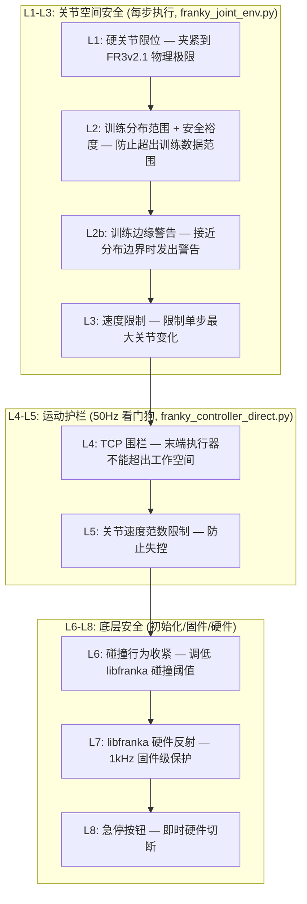

# franka_vla_client 及相关代码对机器人的运行时约束全面分析

> 分析对象：`franka_vla_client.py` → `KeyboardVLAEvalWrapper` → `FrankyJointEnv` → `FrankyControllerDirect` → `franky_ext/motion_limits.py`
>
> 参考来源：
> - `b/x/4dwvla_ext/franka_vla_client.py` — 客户端主程序
> - `b/x/4dwvla_ext/franky_joint_env.py` — Gym 环境层，L1-L3 安全检查
> - `b/x/4dwvla_ext/franky_controller_direct.py` — 底层控制器，L4-L6 安全检查
> - `b/x/franky_ext/motion_limits.py` — 安全常量定义中心
> - `b/x/4dwvla_ext/keyboard_vla_eval.py` — 键盘控制层
> - `b/x/4dwvla_ext/configs/franka_plug_eval.env` — 运行时参数覆盖
> - `b/d/frk1/4debug/cursor_experiment.md` — 实验记录

---

## 约束架构总览

系统采用 **8 层安全层级**（L1-L8），从最高层（软件逐步检查）到最底层（硬件急停），每一层都是独立的防线：



---

## 第一层级：L1 — 硬关节限位 (Hard Joint Limits)

**代码位置**: `franky_joint_env.py:226-234`, 常量来自 `franky_controller_direct.py:96-98`

**作用**: 将每个关节角度截断到 FR3v2.1 机器人的物理关节极限内。

**约束值** (单位: rad):

| 关节 | 下限 | 上限 | 说明 |
|------|------|------|------|
| q1 (肩旋转) | -2.8973 | 2.8973 | ±166° |
| q2 (肩俯仰) | -1.7628 | 1.7628 | ±101° |
| q3 (肘旋转) | -2.8973 | 2.8973 | ±166° |
| q4 (肘俯仰) | -3.0718 | -0.0698 | 注意：始终为负，范围 -176° ~ -4° |
| q5 (腕旋转) | -2.8973 | 2.8973 | ±166° |
| q6 (腕俯仰) | -0.0175 | 3.7525 | -1° ~ 215° |
| q7 (腕滚转) | -2.8973 | 2.8973 | ±166° |

**为什么**: 这些是 Franka Emika FR3v2.1 数据手册规定的物理机械限位。超出会导致硬件损坏。这是最基本的安全网。

**触发行为**: 超出时直接 `np.clip` 截断，并记录 `HARD LIMIT` 警告。

---

## 第二层级：L2 — 训练分布范围约束 (Training Range + Safety Margin)

**代码位置**: `franky_joint_env.py:54-89, 237-245`

**作用**: 将关节角度限制在训练数据的分布范围（来自 `abs_stats.json`）加上安全裕度 (safety margin) 之内。

### 训练数据范围 (TRAIN_ARM_MIN / TRAIN_ARM_MAX):

| 关节 | 训练最小值 | 训练最大值 | 实际含义 |
|------|-----------|-----------|---------|
| q1 | -0.4842 | 0.0452 | 训练示范中肩的活动范围 |
| q2 | -0.1030 | 0.3120 | |
| q3 | -0.2025 | 0.4789 | |
| q4 | -2.2044 | -1.5347 | |
| q5 | -0.2041 | 0.0806 | |
| q6 | 1.5702 | 2.4536 | |
| q7 | 0.4843 | 0.9807 | 腕滚转范围较窄 |

### 非对称安全裕度 (SAFETY_MARGIN):

| 关节 | 下限裕度 (rad) | 上限裕度 (rad) | 设计理由 |
|------|------------|------------|---------|
| q1-q6 | 0.15 | 0.15 | 通用裕度 |
| q7 下限 | **0.0** | — | **关键设计**: grperr_1.md R3/修复 C 发现 q7 漂移到 0.40 (训练下限 0.4843 以下) 时预测方向反转 (cosine -0.273)，严格到 0 禁止任何越界 |
| q7 上限 | — | **0.08** | A2_1_6 实验发现模型在插入阶段主动要求 q7≈1.04-1.05，但被 0.9807 截断导致 ~1mm 插头偏移和插入失败，放宽到 +0.08 rad |

### 生效的 ACTION_LIMIT (最终约束):

$$\text{ACTION\_LIMIT\_LOWER}[i] = \max(\text{TRAIN\_ARM\_MIN}[i] - \text{MARGIN\_LOWER}[i],\ \text{JOINT\_LIMITS\_LOWER}[i])$$

$$\text{ACTION\_LIMIT\_UPPER}[i] = \min(\text{TRAIN\_ARM\_MAX}[i] + \text{MARGIN\_UPPER}[i],\ \text{JOINT\_LIMITS\_UPPER}[i])$$

| 关节 | 生效下限 | 生效上限 |
|------|---------|---------|
| q1 | -0.6342 | 0.1952 |
| q2 | -0.2530 | 0.4620 |
| q3 | -0.3525 | 0.6289 |
| q4 | -2.3544 | -1.3847 |
| q5 | -0.3541 | 0.2306 |
| q6 | 1.4202 | 2.6036 |
| q7 | **0.4843** | **1.0607** |

**为什么**: VLA 模型在训练分布之外的预测是不可靠的。特别是 q7 (腕滚转)，实验证明超出训练范围时动作方向完全反转，导致机器人"原地振荡"无法完成任务。非对称裕度是因为上下限越界的物理后果不同。

### L2b: 训练边缘警告 (TRAIN_EDGE_WARN)

**代码位置**: `franky_joint_env.py:95, 248-259`

**仅对 q7 生效**，阈值 `TRAIN_EDGE_WARN_RAD[6] = 0.03 rad`。

当 q7 在训练范围 [0.4843, 0.9807] 之内但距离边界不足 0.03 rad 时发出 `TRAIN-EDGE` 警告。不截断动作，只记录日志。

**为什么**: q7 在边界处 cosine 仅 +0.343（vs 边界内 0.03 rad 处的 +0.6），模型虽未反转但已明显变弱。警告让运维者知道模型正在"边缘挣扎"。

---

## 第三层级：L3 — 单步速度限制 (Velocity Limiting)

**代码位置**: `franky_joint_env.py:90, 262-268`

**约束值**: `MAX_JOINT_STEP_RAD = 0.15 rad`

**含义**: 任意关节在一个控制步内的变化量不能超过 0.15 rad（约 8.6°）。

**触发行为**: 如果任一关节的 `|delta|` 超过 0.15 rad，则按比例缩放整个 delta 向量:

$$\text{scale} = \min\left(1.0,\ \frac{0.15}{\max_i |delta_i|}\right)$$

$$\text{clipped} = \text{current\_joints} + \text{delta} \times \text{scale}$$

这是**等比缩放**而非逐关节截断，保持了动作方向不变。

**为什么**: 防止推理服务器返回跳变式动作（如从 HOME 直接跳到目标位置）。在 10 Hz 控制频率下，0.15 rad/step = 1.5 rad/s，低于 Panda 关节速度限制 (2.075-2.51 rad/s)，留有余量。

---

## 第四层级：L4 — TCP 围栏 (Motion Guard — TCP Fence)

**代码位置**: `franky_controller_direct.py:180-206, 252-278`

**运行频率**: 50 Hz 后台看门狗线程 (`_watchdog_loop`)

**约束值**: 基于训练数据的 TCP (Tool Center Point) 空间范围加裕度:

### 训练 TCP 范围 (TRAIN_TCP_MIN / TRAIN_TCP_MAX):

| 轴 | 最小值 (m) | 最大值 (m) | 含义 |
|----|-----------|-----------|------|
| X | 0.534 | 0.602 | 前后 (距基座) |
| Y | -0.140 | 0.053 | 左右 |
| Z | 0.178 | 0.517 | 上下 |

### 围栏裕度:

| 参数 | 默认值 | 可配置范围 | 说明 |
|------|--------|-----------|------|
| `GUARD_MARGIN_M` | 0.050 m | [0.01, 0.15] m | XY 和 Z 上方的通用裕度 |
| `GUARD_FLOOR_MARGIN_M` | 0.010 m | [0.002, 0.05] m | **Z 下方裕度远小于通用裕度**——下面就是桌面 |

### 实际生效的围栏边界:

| 轴 | 下限 (m) | 上限 (m) |
|----|---------|---------|
| X | 0.484 | 0.652 |
| Y | -0.190 | 0.103 |
| Z | **0.168** (仅 1cm 裕度) | 0.567 |

**为什么**: LOG-019 事件中，机器人手臂在无任何防护的情况下越过安全框 26cm，最终靠人工按急停才停下。TCP 围栏是事后加入的核心防线。Z 下方裕度特别小是因为"下方是实体桌面"，5cm 裕度就意味着允许以 5cm 的力压进桌面。

**触发行为**: 越界时立刻执行 `robot.stop()` (fence 类型) 或缓制动 (其它类型)，设置 `_guard_trip_reason`，episode 被标记为 `truncated=True`。

---

## 第五层级：L5 — 关节速度范数限制

**代码位置**: `franky_controller_direct.py:280-284`, 常量来自 `motion_limits.py:231`

**运行频率**: 与 L4 同在 50 Hz 看门狗中

**约束值**: `GUARD_MAX_DQ_RAD_S = 1.2 rad/s` (可配置范围 [0.5, 3.0])

**含义**: 7 个关节角速度的 L2 范数不能超过 1.2 rad/s。

**实测校准依据** (来自 `motion_limits.py` 注释):
- 0.379 rad/s — 正常旋转阶梯测试中的最大峰值
- 0.81 rad/s — 悬停位姿下全速命令的需求
- **1.2 rad/s — 阈值（设定点）**
- 2.03 / 2.69 rad/s — LOG-036 / LOG-034 事件中的实际故障速度

**为什么**: LOG-034 和 LOG-036 事件中，机器人在接近奇异构型时关节速度失控。1.2 rad/s 在"已知正常"(0.81) 和"已知危险"(2.03) 之间留有间距。

---

## 第六层级：L6 — 碰撞行为收紧 (Collision Behavior Tightening)

**代码位置**: `franky_controller_direct.py:162-176`, 阈值来自 `motion_limits.py:576-598`

**执行时机**: 控制器初始化时一次性设置

### 关节力矩碰撞阈值 (N·m):

| q1 | q2 | q3 | q4 | q5 | q6 | q7 |
|----|----|----|----|----|----|----|
| 20.0 | 20.0 | 18.0 | 18.0 | 16.0 | 14.0 | 12.0 |

### 笛卡尔碰撞阈值:

由 `cartesian_collision_thresholds()` 计算：

$$\text{force\_threshold} = \text{force\_norm\_ceiling\_n()} = 40.0\ \text{N}$$

$$\text{torque\_threshold} = \text{torque\_norm\_ceiling\_nm()} = 12.0\ \text{N·m}$$

生效值: `[40.0, 40.0, 40.0, 12.0, 12.0, 12.0]` (前 3 为力/N，后 3 为力矩/N·m)

**对比原 libfranka 默认值**: `[100, 100, 100, 25, 25, 25]` — 力降低 60%，力矩降低 52%。

**为什么**: libfranka 的默认碰撞阈值太高（100N），是软件安全层能给的力的 5 倍。如果只靠 Python 50Hz 看门狗而硬件反射从不触发，一次 GIL 卡顿 100ms 机械臂就能位移 ~2.6cm。收紧后硬件反射（1kHz）能在 Python 来不及反应时先行制动。

---

## 第七、八层级：L7 — libfranka 硬件反射 & L8 — 急停

- **L7**: libfranka 固件以 1kHz 持续监控，超过 L6 设置的碰撞阈值时立即触发硬件反射 (reflex)，将机器人锁入 `RobotMode.Reflex`。这是最后一道**自动**防线。
- **L8**: 物理急停按钮，直接切断电机驱动，无任何软件参与。

---

## 夹爪约束 (Gripper Constraints)

**代码位置**: `franky_joint_env.py:98-193, 408-508`

夹爪有三种运行模式，由 `VLA_GRIPPER_MODE` 环境变量选择：

### 模式 1: `binary_abs` (当前实验 A3_2 使用)

| 参数 | 环境变量 | 当前值 | 说明 |
|------|---------|--------|------|
| 关闭阈值 | `VLA_GRIPPER_CLOSE_THRESHOLD` | **0.013** | action_grip ≥ 0.013 时触发关闭 |
| 阈值极性 | `VLA_GRIPPER_CLOSE_IF_ABOVE` | `1` (True) | action_grip ≥ 阈值 → 关闭 (InternVLA 约定: 1.0=close, 0=open) |

**逻辑**: `action_grip >= 0.013` → close, 否则 → open。使用 `gripper_is_open()` 去重，避免重复发送 open/close 命令。

### 模式 2: `binary_delta` (未在当前实验使用)

| 参数 | 环境变量 | 默认值 | 说明 |
|------|---------|--------|------|
| 关闭触发阈值 | `VLA_GRIPPER_CLOSE_DELTA_M` | 0.001 m | delta_w ≥ 阈值 → 关闭 |
| 打开滞回阈值 | `VLA_GRIPPER_OPEN_DELTA_M` | 0.004 m | delta_w < -阈值 → 打开 |

其中 `delta_w = w_meas - W0 * (1 - action_grip)`，`W0 = 0.08 m` 是训练归一化常数。

### 模式 3: `continuous` (之前实验使用)

| 参数 | 环境变量 | 当前值 | 说明 |
|------|---------|--------|------|
| 力控抓取切换阈值 | `VLA_GRIPPER_GRASP_HANDOFF_A` | **0.40** | action_grip ≥ 0.40 → 从位置控制切换到力控抓取 |
| 收窄死区 | `VLA_GRIPPER_DEADBAND_M` | 0.0015 m | 收窄方向的命令死区 |
| 张开死区 | `VLA_GRIPPER_WIDEN_DEADBAND_M` | 0.006 m | 张开方向的命令死区（更大，避免抓取中的抖动） |
| 抓取重试冷却 | `VLA_GRASP_RETRY_COOLDOWN_S` | 1.0 s | 力控抓取失败后最少等 1 秒再重试 |
| 宽度上限 | `FRANKA_GRIPPER_MAX_WIDTH_M` | 0.080 m（配置值） | 实际使用 `min(配置值, 手报告值)` |

**continuous 模式的决策流程**:

```
action_grip >= GRASP_HANDOFF_A (0.40)?
  ├─ YES → "grasp_handoff": 调用 close_gripper() 力控抓取
  │         (受 holding 检查和 cooldown 保护)
  └─ NO → 计算 w_cmd = 0.08 * (1 - action_grip)
           ├─ |w_cmd - last_cmd_w| < DEADBAND → "hold": 不发命令
           ├─ w_meas - w_cmd ≥ DEADBAND → "move_width": 收窄
           ├─ w_meas - w_cmd ≤ -WIDEN_DEADBAND → "move_width": 张开
           └─ 否则 → "hold"
```

### 夹爪宽度上限防护

**代码位置**: `franky_joint_env.py:154-161, 303-327`

`resolve_gripper_max_width_m()` 将配置的 `FRANKA_GRIPPER_MAX_WIDTH_M` 和手实际报告的 `max_width` 取较小值。

**当前实际值**: 配置 0.080 m vs 手报告 0.0683 m → 生效 **0.0683 m**

**为什么**: grperr_1.2.md Q1 发现手的 homing 偏移已过时——卡尺量 80mm 开口但手只报告 66.4mm。如果用物理 80mm 作上限，发送 w_cmd=77.3mm 会超过手的能力，导致每个控制步都发一个手永远完不成的"张得更开"命令，把控制频率从 3.58 Hz 拖到 2.28 Hz。

### 抓取验证窗口

| 参数 | 环境变量 | 当前值 | 说明 |
|------|---------|--------|------|
| 物体宽度 | `FRANKA_CUBE_WIDTH_M` | 0.002 m | 插头的实测宽度基准 |
| 容差 | `FRANKA_HOLD_TOL_M` | 0.001 m | 抓取验证窗口 [0.001, 0.003] m |
| 抓取力 | `FRANKA_GRASP_FORCE` | 20 N | |

**为什么**: `close_gripper()` 后 libfranka 通过测量夹爪宽度判断是否抓到物体。训练数据中 87% 的抓取关闭到 <1mm（均值 2.6mm），所以验证窗口设在 [1mm, 3mm] 以匹配实际抓取行为。窗口太大（如默认 15mm±10mm）会让空手（0mm）误判为"抓到了"。

---

## 运动动力学约束

**代码位置**: `franky_controller_direct.py:122`

| 参数 | 值 | 说明 |
|------|------|------|
| `relative_dynamics_factor` | 0.2 | 控制运动的加速度/速度比例因子。0.2 = 最大能力的 20%，显著减慢运动 |
| 重置时的 dynamics_factor | 0.1 | `reset_joint()` 时更保守，仅 10% |

**为什么**: 降低动力学因子使所有运动更慢更柔和，给安全系统更多反应时间。但也意味着 `Robot.move()` 是阻塞调用——机器人到达目标位姿后才返回，实际控制频率 (~3 Hz) 远低于请求的 10 Hz。

---

## 近奇异性警告

**代码位置**: `franky_controller_direct.py:288-291`, `motion_limits.py:319-328`

| 参数 | 值 | 说明 |
|------|------|------|
| `PANDA_MAX_REACH_M` | 0.855 m | Panda 最大伸展距离 |
| `PANDA_SHOULDER_Z_M` | 0.333 m | 肩关节高度 |
| `REACH_WARN_FRACTION` | 0.88 | 达到最大伸展的 88% 时警告 |

**为什么**: 当末端执行器接近最大伸展时，Jacobian 的条件数恶化，同样的笛卡尔空间命令会产生极大的关节空间速度需求。LOG-034 / LOG-036 事件均发生在近奇异构型附近。

---

## 运动护栏恢复预算 (Guard Recovery Budget)

**代码位置**: `franky_controller_direct.py:329-345`, `motion_limits.py:285-298`

| 参数 | 默认值 | 可配置范围 | 说明 |
|------|--------|-----------|------|
| `GUARD_RECOVERY_BUDGET` | 10 | [0, 100] | 一个环境实例可从 guard trip 自动恢复的最大次数 |

**为什么**: "触发 → 恢复 → 继续" 如果无限次数，就等于安全机制被完全旁路——一个在工作空间边缘反复撞围栏的策略会无限运行下去。10 次够应付偶发越界，但系统性问题会在预算耗尽时终止实验。

---

## 控制循环时序约束

**代码位置**: `franky_joint_env.py:510`, `franka_vla_client.py:70-71, 134-156`

| 参数 | 来源 | 当前值 | 说明 |
|------|------|--------|------|
| `control_hz` | CLI `--control-hz` | 10.0 Hz | 每步后 `time.sleep(1/control_hz)` = 100ms |
| `n_exec` | CLI `--n-exec` | 5 | 每次推理执行前 5 个动作，其余丢弃 |
| `max_steps` | CLI `--max-steps` | 600 | 最大控制步数 |
| 实际控制频率 | 测量 | ~3.0-3.1 Hz | `Robot.move()` 阻塞 + sleep 叠加导致实际远低于 10 Hz |
| Hz 警告阈值 | `_HZ_WARN_RATIO` | 0.5 | 实际频率低于请求的 50% 时发出警告 |

**为什么**: `n_exec=5` 意味着模型的 50 步 action chunk 中只有前 5 步被执行。这控制了"开环执行"的长度——太长则环境变化后模型无法修正，太短则推理开销占比太高。实验 A2_1_4 中 `n_exec=2` 导致模型完全失效（夹爪 grip 从未超过 0.050），因为模型把高 grip 预测放在了 chunk 的后段。

---

## 推理响应验证

**代码位置**: `franka_vla_client.py:183-186`

| 检查 | 条件 | 触发 |
|------|------|------|
| 形状检查 | `actions.shape[1] != 8` | `ValueError` |
| 有限性检查 | `not np.isfinite(actions).all()` | `ValueError` — 拒绝含 NaN/Inf 的动作 |

**为什么**: 模型推理可能因数值不稳定产生 NaN，直接发给机器人会造成不可预测的运动。

---

## 键盘控制层约束

**代码位置**: `keyboard_vla_eval.py`

| 按键 | 功能 | 约束行为 |
|------|------|---------|
| `a` | 开始 rollout | `reset()` 后阻塞等待，直到操作员确认场景就绪 |
| `r` | 中止 episode | 立即 `robot.stop()` + `truncated=True`，清空动作队列 |
| `h` | 回 HOME | 执行 `go_to_rest()`: open → HOME joints → open |
| `b` | 标记失败 | `terminated=True, reward=0` |
| `c` | 标记成功 | `terminated=True, reward=1` |

防抖: `PEDAL_DEBOUNCE_S = 0.2 s`，同一按键在 200ms 内的重复按压被忽略。

**为什么**: 人工操作员是最终的安全裁判。强制要求 `a` 键启动确保操作员已检查场景并就位。`r` 键提供即时中止能力，不需要等当前动作执行完。

---

## 约束层次交互总结

下图展示了一个动作从模型输出到最终执行所经过的全部约束检查:

```
VLA Server 输出 50 步 action chunk (shape [50, 8])
    │
    ▼
Client: 取前 n_exec=5 步, 验证 shape 和 finiteness
    │
    ▼ (逐步执行)
Client: 记录 state_history, 发送 action 到 env.step()
    │
    ▼
KeyboardVLAEvalWrapper: 检查 abort 标志, 转发到底层 env
    │
    ▼
FrankyJointEnv.step():
    ├─ L1: clip to JOINT_LIMITS
    ├─ L2: clip to ACTION_LIMIT (训练范围 + margin)
    ├─ L2b: warn if near TRAIN_EDGE
    ├─ L3: scale if any |delta| > 0.15 rad
    ├─ L4 pre-check: guard_tripped()? → truncate if yes
    ├─ move_joints(): 发送到 franky
    │   └─ 内部: clip to JOINT_LIMITS (再次)
    │   └─ Robot.move(): 阻塞直到到达 (dynamics_factor=0.2)
    ├─ 夹爪: binary_abs / binary_delta / continuous 逻辑
    ├─ sleep(1/control_hz)
    └─ L4 post-check: guard_tripped()? → truncate if yes
    │
    ▼ (并行, 50Hz 看门狗线程)
L4: TCP 围栏检查 (训练 TCP 范围 + margin)
L5: |dq| < 1.2 rad/s 检查
    │
    ▼ (1kHz, libfranka 固件)
L6/L7: 碰撞力 < 阈值检查 (40N force, 12Nm torque)
    │
    ▼ (硬件)
L8: 急停按钮
```

### 当前实验 A3_2 的具体参数汇总

| 约束 | 值 | 来源 |
|------|------|------|
| 关节硬限位 | FR3v2.1 datasheet | `franky_controller_direct.py` |
| 训练范围 q7 下限裕度 | 0 rad | `franky_joint_env.py` L86 |
| 训练范围 q7 上限裕度 | 0.08 rad | `franky_joint_env.py` L87 |
| 单步最大关节变化 | 0.15 rad | `franky_joint_env.py` L90 |
| TCP 围栏裕度 (XY/Z上) | 0.050 m | `motion_limits.py` |
| TCP 围栏裕度 (Z下,桌面) | 0.010 m | `motion_limits.py` |
| 关节速度范数上限 | 1.2 rad/s | `motion_limits.py` |
| 碰撞力阈值 | 40 N / 12 N·m | `motion_limits.py` |
| 动力学因子 | 0.2 | `franky_controller_direct.py` |
| 夹爪模式 | binary_abs | `franka_plug_eval.env` |
| 夹爪关闭阈值 | 0.013 | `franka_plug_eval.env` |
| 力控抓取切换阈值 | 0.40 | `franka_plug_eval.env` |
| 夹爪宽度上限 | 0.0683 m (手报告值) | 运行时取 min |
| 抓取验证窗口 | [0.001, 0.003] m | `franka_plug_eval.env` |
| n_exec | 5 | CLI arg |
| max_steps | 600 | CLI arg |
| control_hz (请求) | 10.0 Hz | CLI arg |
| control_hz (实际) | ~3.0 Hz | Robot.move() 阻塞 |
| 恢复预算 | 10 次 | `motion_limits.py` |
