# 4DWVLA 模型整合到 RLinf 框架 -- 设计与实施落地方案

> **目标**: 将 4DWVLA (含 GeoPredict 7D 关键点) 模型整合进 RLinf 框架，使其能在 RLinf 的 FSDP SFT 训练管线中完成微调训练，并加载已有的 4WVLA checkpoint
> **数据集**: Franka 插插座 (`plug_into_socket_lrb_4D`) -- 100 episodes, 66,577 frames, 30fps, 8D action (abs joint), 56D keypoint
> **现有 Checkpoint**: Phase 1 Warmup (`003126`) 和 Phase 2 SFT (`4wvlaFrkPlugCkp010420`, `020840`, ..., `052100`) -- safetensors 格式, 单文件 5.89 GiB (1303 weight keys, 不含 WAN)
> **日期**: 2026-09-08

---

## 目录

- [1. 背景与动机](#1-背景与动机)
- [2. 架构分析: 4WVLA vs RLinf](#2-架构分析-4wvla-vs-rlinf)
- [3. 整体集成方案概览](#3-整体集成方案概览)
- [4. 静态架构设计](#4-静态架构设计)
- [5. 动态架构设计](#5-动态架构设计)
- [6. 详细实施步骤与代码差异](#6-详细实施步骤与代码差异)
- [7. Checkpoint 加载设计](#7-checkpoint-加载设计)
- [8. 数据管线设计](#8-数据管线设计)
- [9. 配置体系设计](#9-配置体系设计)
- [10. 依赖与安装](#10-依赖与安装)
- [11. Docker 容器方案](#11-docker-容器方案)
- [12. 操作手册](#12-操作手册)
- [13. 测试方案](#13-测试方案)
- [14. 验收方案](#14-验收方案)
- [15. 故障排查](#15-故障排查)
- [16. 配置变量全表](#16-配置变量全表)
- [17. 命名映射与不改名清单](#17-命名映射与不改名清单)
- [18. 附录](#18-附录)

---

## 1. 背景与动机

### 1.1 4DWVLA 模型简介

4DWVLA（论文: [InternVLA-A1.5: Unifying Understanding, Latent Foresight, and Action for Compositional Generalization](https://arxiv.org/abs/2607.04988)）是一个统一了视觉理解、潜在视频预测和连续动作生成的 Vision-Language-Action (VLA) 模型。其核心架构特点:

1. **Qwen3.5-2B VLM 主干**: 提供视觉-语言理解能力
2. **Action Expert**: 轻量级动作专家网络 (~460M 参数)，通过 Mixture-of-Transformers (MoT) 与 VLM 共享注意力层
3. **WAN2.2-TI2V-5B 视频分支**: 冻结的视频生成模型，训练时提供前瞻 (foresight) 监督信号
4. **Flow Matching 动作生成**: 通过线性流匹配 ODE 求解器生成连续动作
5. **GeoPredict 3D 关键点**: 可选的 Keypoint Expert + TrackEncoder，预测未来 3D/7D 关键点轨迹

**关键指标**:

| 属性 | 值 |
|:---|:---|
| VLM 参数量 | ~2B (Qwen3.5-2B) |
| Action Expert 参数量 | ~460M |
| Keypoint Expert 参数量 | ~460M |
| WAN DiT 参数量 | ~5B (训练时冻结) |
| 总参数量 | ~8B (action_loss_only=false 时) |
| 可训练参数量 | ~3B (Phase 2 SFT, WAN 冻结) |
| 动作块大小 (chunk_size) | 50 |
| 推理去噪步数 | 10 (flow matching) |
| 精度 | bfloat16 |

### 1.2 为什么要整合到 RLinf

RLinf 提供了一套完整的 embodied AI 训练与评估框架:

- **分布式训练**: 基于 FSDP/FSDP2 的高效分布式训练，支持 gradient checkpointing、mixed precision
- **统一的模型注册与管理**: `SupportedModel` + `_MODEL_REGISTRY` 双层注册机制
- **统一的数据管线**: LeRobot 格式数据集，支持混合数据集训练
- **真机评估管线**: 完善的 Franka 机器人评估基础设施 (ROS 控制器、相机系统、安全边界)
- **RL 后训练**: SAC/CrossQ/DAgger 等 RL 算法，可在 SFT 后进一步优化策略
- **统一运维**: 集中的 checkpoint 管理、TensorBoard 日志、实验管理

将 4DWVLA 整合进 RLinf，可以复用这些基础设施，避免重复开发，并获得 RL 后训练能力。

### 1.3 服务器环境

| 组件 | 规格 |
|:---|:---|
| CPU | AMD Ryzen Threadripper 7970X 32-Core |
| GPU | 1x NVIDIA GeForce RTX 5090 D (32 GiB VRAM) |
| RAM | 93 GiB |
| 磁盘 | 3.6 TB NVMe, ~919 GB 可用 |
| OS | Ubuntu 22.04.5 LTS, kernel 5.15.0-1032-realtime |
| Docker | 两容器架构: `rlinf-rlt-franka` (ROS Noetic, Python 3.8) + `rlinf-rlt-gpu` (Python 3.10, torch 2.11.0+cu128) |

**VRAM 估算** (基于实际 checkpoint 分析):
- `model.safetensors` 权重文件: 5.89 GiB (bf16 精度, 不含 WAN 的 ~5B 参数)
- 推理时 (`action_loss_only=true`): 权重 ~6 GiB + KV cache + 激活 ~6 GiB = **约 12 GiB**, 可在 RTX 5090 D 32 GiB 上运行
- Phase 1 Warmup 训练 (`action_loss_only=true`, 小 batch): ~25-35 GiB/GPU, RTX 5090 D 勉强可跑 batch_size=1-2
- Phase 2 完整 SFT 训练 (`action_loss_only=false`, 加载 WAN ~5B): ~100 GB/GPU, **必须** 8x H200

**重要限制**: 本地 RTX 5090 D (32 GiB) **不适合** Phase 2 完整 SFT 训练。本地环境仅适用于:
- 代码集成与 smoke test (action_loss_only=true, 小 batch)
- 推理验证 (action_loss_only=true, inference_backend=optimized, ~12 GiB)
- Phase 2 训练需在 8x H200 集群执行

### 1.4 参考文档

| 文档 | 路径 | 内容 |
|:---|:---|:---|
| RLinf 新模型 SFT 指南 | `docs/source-en/rst_source/extending/new_model_sft.rst` | 官方集成文档 |
| 4WVLA Phase 2 SFT 方案 | `4WVLA/b/d/Frk/plug_p2sft.md` | Franka 插座任务微调方案 |
| 4WVLA Phase 1 Warmup 方案 | `4WVLA/b/d/Frk/plug_p1warmup.md` | Warmup 预热方案 |
| 4WVLA 代码库 | `/home/nvidia/bt/s/4WVLA/` | 4DWVLA 源码 |
| 4WVLA 参考安装 | `/home/nvidia/shijia_ws/InternVLA-A/` | 已有可工作的安装环境 |
| Franka 数据集 | `/B/Dta/plug_into_socket_lrb_4D/` | 插座任务数据 |
| Checkpoint 下载路径 | `/home/nvidia/bt/ckp/4wvlaFrk/plug/` | 模型权重存放 (含 `4wvlaFrkPlugCkp010420` 等子目录) |

---

## 2. 架构分析: 4WVLA vs RLinf

### 2.1 训练管线对比

```mermaid
graph TB
    subgraph "4WVLA 原始训练管线"
        A1["accelerate launch"] --> A2["lerobot_train.py"]
        A2 --> A3["draccus CLI Config"]
        A3 --> A4["make_dataset() -> LeRobotDataset"]
        A4 --> A5["TransformedLeRobotDataset<br/>(ChatProcessor + Keypoint + Delta)"]
        A5 --> A6["InternVLAA15Policy.forward()"]
        A6 --> A7["loss_action + loss_video +<br/>loss_vqa + loss_fast +<br/>loss_kpt_cur + loss_kpt_fut"]
    end

    subgraph "RLinf 训练管线"
        B1["Hydra Config + Ray"] --> B2["train_vla_sft.py"]
        B2 --> B3["SFTRunner + FSDPVlaSftWorker"]
        B3 --> B4["build_dataloader()"]
        B4 --> B5["Model-specific Dataset + Transforms"]
        B5 --> B6["model(forward_type=SFT, data=batch)"]
        B6 --> B7["vla_loss scalar"]
    end
```

**关键差异**:

| 维度 | 4WVLA | RLinf |
|:---|:---|:---|
| 分布式后端 | HuggingFace Accelerate (DDP) | Ray + FSDP/FSDP2 |
| 配置系统 | draccus dataclass CLI | Hydra + OmegaConf YAML |
| 数据加载 | `make_dataset()` -> `cycle(DataLoader)` | Worker 内 `build_dataloader()` 分发 |
| 模型接口 | `PreTrainedPolicy.forward()` -> `(loss, output_dict)` | `BasePolicy.forward(forward_type=SFT)` -> `dict{"loss": scalar}` |
| Checkpoint 格式 | `safetensors` (排除 WAN 权重) | FSDP DCP 或 `full_weights.pt` |
| 优化器 | AdamW (per-parameter lr_scale) | Adam/AdamW (单一 LR, 但支持 param_groups) |
| 混合精度 | Accelerate AMP (bf16) | FSDP mixed precision (bf16) |

### 2.2 模型接口对比

**4WVLA `InternVLAA15Policy`** (继承 `PreTrainedPolicy`):

源码位置: `4WVLA/src/lerobot/policies/internvla_a1_5/modeling_internvla_a1_5.py`, line 2144

```python
class InternVLAA15Policy(PreTrainedPolicy):
    config_class = InternVLAA15Config
    name = "internvla_a1_5"

    def forward(self, batch: dict) -> tuple[Tensor, dict]:
        # 返回 (total_loss, {loss_action, loss_video, loss_vqa, ...})
        ...  # line 2405

    def select_action(self, batch: dict) -> Tensor:
        # 推理: 返回单步动作 [action_dim]
        ...  # line 2278

    def state_dict(self, *args, **kwargs):
        # 排除 "model.wan_video_model." 前缀的 key
        ...  # line 2202

    def get_optim_params(self) -> dict:
        # 返回 per-module lr_scale 参数组
        ...  # line 2215
```

**RLinf `BasePolicy`** (抽象基类):

源码位置: `rlinf/models/embodiment/base_policy.py`, line 32

```python
class BasePolicy(ABC):
    def forward(self, forward_type=ForwardType.DEFAULT, **kwargs):
        # 按 forward_type 分发 (line 51)
        if forward_type == ForwardType.DEFAULT:
            return self.default_forward(**kwargs)
        else:
            raise NotImplementedError

    @abstractmethod
    def default_forward(self, **kwargs): ...   # line 78

    @abstractmethod
    def predict_action_batch(self, **kwargs): ...  # line 81
```

`ForwardType` 枚举 (line 19):
```python
class ForwardType(Enum):
    DEFAULT = "default"
    SFT = "sft"
    SAC = "sac"
    SAC_Q = "sac_q"
    CROSSQ = "crossq"
    CROSSQ_Q = "crossq_q"
    IQL_ACTOR = "iql_actor"
    IQL_CRITIC = "iql_critic"
    IQL_VALUE = "iql_value"
    NFT = "nft"
```

### 2.3 Worker 调用接口

SFT 训练时，`FSDPVlaSftWorker.get_train_model_output()` (line 82-101) 调用模型:

```python
def get_train_model_output(self, batch: Any) -> tuple[torch.Tensor, dict[str, Any]]:
    with self.amp_context:
        output = self.model(forward_type=ForwardType.SFT, data=batch)

    if isinstance(output, torch.Tensor):
        loss = output
    else:
        loss = output["loss"]

    step_metrics = {"loss": loss.detach().item()}
    if isinstance(output, dict):
        for key, value in output.items():
            if key == "loss":
                continue
            if torch.is_tensor(value):
                if value.numel() == 1:
                    step_metrics[key] = value.detach().item()
            elif isinstance(value, (float, int)):
                step_metrics[key] = value
    return loss, step_metrics
```

**关键洞察**: Worker 已经支持 dict 输出中的额外 metric key。4WVLA 的 `loss_dict` (含 `loss_action`, `loss_video`, `loss_kpt_current` 等) 可直接透传给 TensorBoard 日志。

### 2.4 数据格式对比

**4WVLA 训练 batch 格式** (经 `InternVLAA15ChatProcessorTransformFn` 处理后):

```python
{
    "observation.pixel_values": Tensor[B, N_patches, C_hidden],  # Qwen3VLProcessor 输出
    "observation.image_grid_thw": Tensor[B, N_images, 3],        # 图像网格
    "observation.input_ids": Tensor[B, L],                       # tokenized prompt
    "observation.attention_mask": Tensor[B, L],                  # 注意力掩码
    "observation.fast_token_mask": Tensor[B, L],                 # FAST token 位置
    "observation.state": Tensor[B, max_state_dim=32],            # 机器人状态
    "action": Tensor[B, chunk_size=50, max_action_dim=32],       # 目标动作序列
    "observation.video_frames": Tensor[B, T, C, H, W],           # WAN GT frames
    "observation.his_kpts": Tensor[B, 200, 8, 7],                # 关键点历史 (GeoPredict)
    "observation.his_len": Tensor[B],                            # 有效历史长度
    "observation.kpt_t": Tensor[B, 8, 7],                        # 当前帧关键点 GT
    "observation.kpt_future": Tensor[B, 50, 8, 7],               # 未来关键点 GT
    "observation.kpt_mask": Tensor[B],                           # 关键点有效掩码
}
```

**RLinf VLA SFT batch 格式** (以 DreamZero 为例):

```python
{
    "video": ndarray[B, T, H, W, C],      # 多帧视频
    "state": ndarray[B, state_dim],        # 机器人状态
    "actions": ndarray[B, action_horizon, action_dim],  # 动作序列
    "language": list[str],                 # 任务描述文本
    "embodiment_tag": Tensor[B],           # 具身体标签
}
```

**桥接策略**: 在 RLinf 侧实现专门的 dataloader builder，将 LeRobot 格式数据经 4WVLA 原有的 transform chain 处理后，直接产出 4WVLA 模型期望的 batch 格式。这样避免了两次格式转换的损耗，并确保与已有 checkpoint 完全兼容。

---

## 3. 整体集成方案概览

### 3.1 设计原则

1. **最小侵入**: 通过 RLinf 的扩展机制（模型注册、worker 分发）接入，对 RLinf 核心代码仅添加分支，不修改已有逻辑
2. **复用原有代码**: 直接复用 4WVLA 的模型定义 (`modeling_internvla_a1_5.py`)、配置 (`configuration_internvla_a1_5.py`)、数据变换 (`transform_internvla_a1_5.py`) 代码
3. **配置驱动**: 所有环境差异（路径、GPU 数、batch size 等）通过 YAML 配置文件参数化
4. **渐进式集成**: 先实现 SFT 训练管线，验收后再扩展 RL 后训练和真机评估
5. **向后兼容**: 所有改动为纯增量添加，不影响现有模型的注册和训练

### 3.2 总体架构

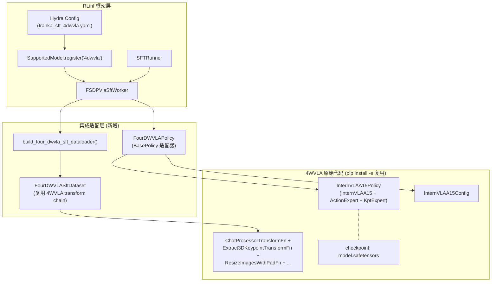

### 3.3 改动清单总览

| # | 改动位置 | 类型 | 说明 |
|:---:|:---|:---:|:---|
| 1 | `rlinf/config.py` (line 119, line 145) | **修改** | 注册 `SupportedModel.FOUR_DWVLA` 并加入 `EMBODIED_MODEL` |
| 2 | `rlinf/models/__init__.py` (line ~157, ~290) | **修改** | 添加 `_build_four_dwvla` builder 和 `register_model` 调用 |
| 3 | `rlinf/models/embodiment/four_dwvla/__init__.py` | **新增** | `get_model()` -- 构建并加载模型 |
| 4 | `rlinf/models/embodiment/four_dwvla/policy_adapter.py` | **新增** | `FourDWVLAPolicy(BasePolicy)` -- RLinf 接口适配器 |
| 5 | `rlinf/data/datasets/four_dwvla/dataloader.py` | **新增** | `build_four_dwvla_sft_dataloader()` |
| 6 | `rlinf/data/datasets/four_dwvla/dataset.py` | **新增** | `FourDWVLASftDataset` -- 复用 4WVLA transform chain |
| 7 | `rlinf/workers/sft/fsdp_vla_sft_worker.py` (line 72) | **修改** | 添加 `FOUR_DWVLA` 分支到 `build_dataloader()` |
| 8 | `rlinf/workers/rollout/hf/huggingface_worker.py` (line 491) | **修改** | 添加 `FOUR_DWVLA` 到 predict kwargs 列表 |
| 9 | `examples/sft/config/model/4dwvla.yaml` | **新增** | 模型默认配置 |
| 10 | `examples/sft/config/franka_sft_4dwvla.yaml` | **新增** | Franka 插座任务 SFT 配置 |
| 11 | `requirements/embodied/models/4dwvla.txt` | **新增** | 依赖清单 |

---

## 4. 静态架构设计

### 4.1 类图

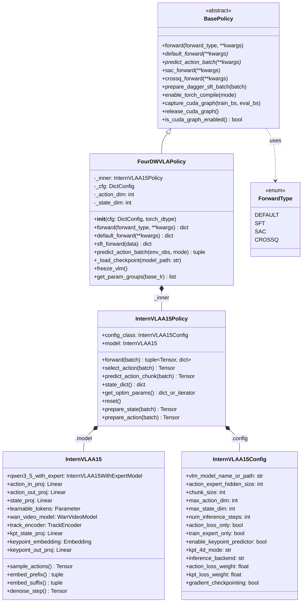

### 4.2 组件图

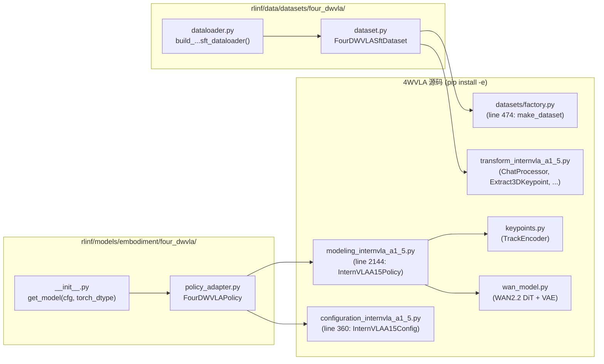

### 4.3 模型内部组件交互 (SFT forward)

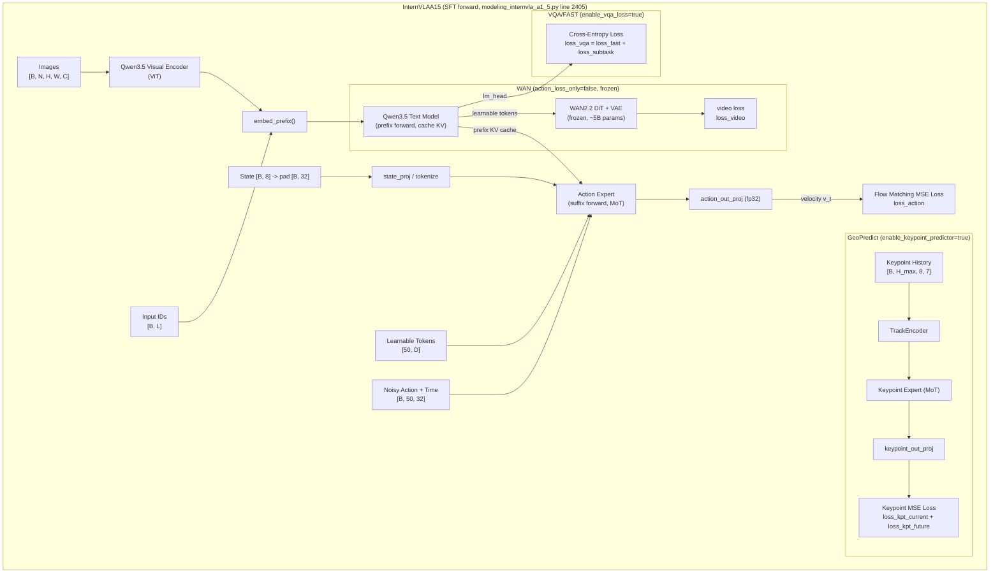

**Loss 公式**:

当 `enable_vqa_loss=true` 时:

$$\mathcal{L}_{\text{total}} = \alpha \cdot \mathcal{L}_{\text{fm\_action}} + \lambda_{\text{vqa}} \cdot \mathcal{L}_{\text{vlm}} + w_{\text{video}} \cdot \mathcal{L}_{\text{video}} + \mathcal{L}_{\text{kpt}}$$

其中:
- $\alpha$ = `action_loss_weight` (默认 10.0)
- $\lambda_{\text{vqa}}$ = `lambda_vqa` (默认 1.0)
- $w_{\text{video}}$ = `video_loss_weight` (默认 1.0)
- $\mathcal{L}_{\text{kpt}} = \beta \cdot (\mathcal{L}_{\text{kpt\_cur}} + \gamma \cdot \mathcal{L}_{\text{kpt\_fut}})$
  - $\beta$ = `kpt_loss_weight` (默认 1.0)
  - $\gamma$ = `kpt_future_loss_weight` (默认 1.5)

当 `enable_vqa_loss=false` 时:

$$\mathcal{L}_{\text{total}} = \alpha \cdot \mathcal{L}_{\text{fm\_action}} + w_{\text{video}} \cdot \mathcal{L}_{\text{video}} + \mathcal{L}_{\text{kpt}}$$

---

## 5. 动态架构设计

### 5.1 SFT 训练启动流 (全过程)

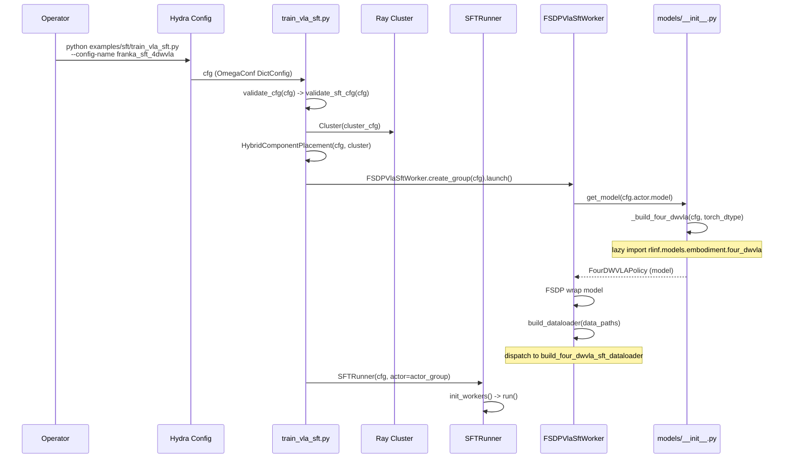

### 5.2 SFT 训练数据流 (单步)

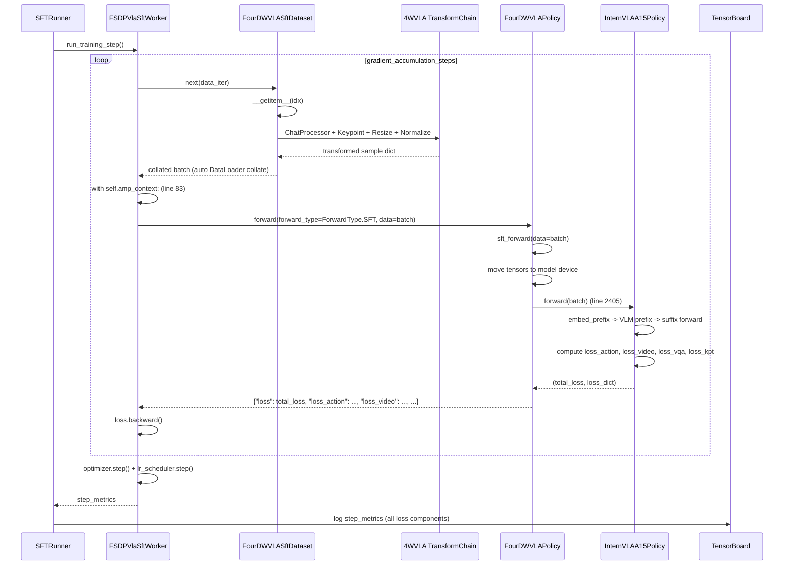

### 5.3 Checkpoint 加载流

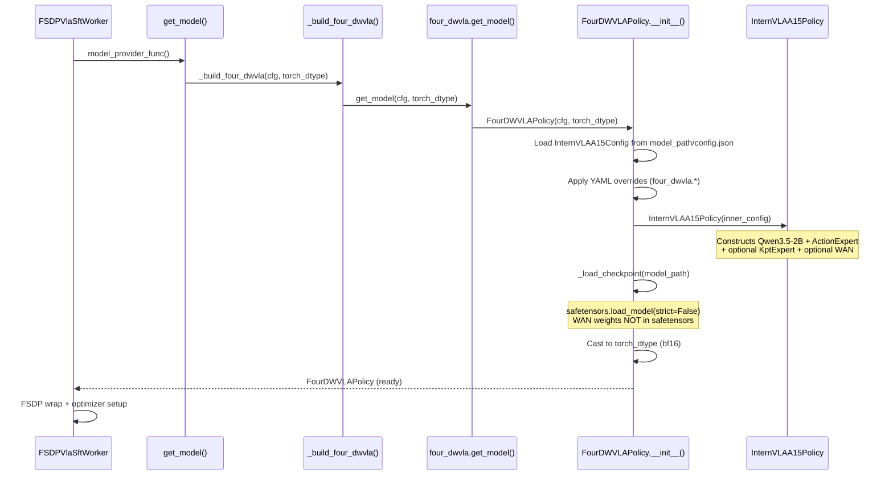

### 5.4 推理动作预测流 (评估/Rollout 时)

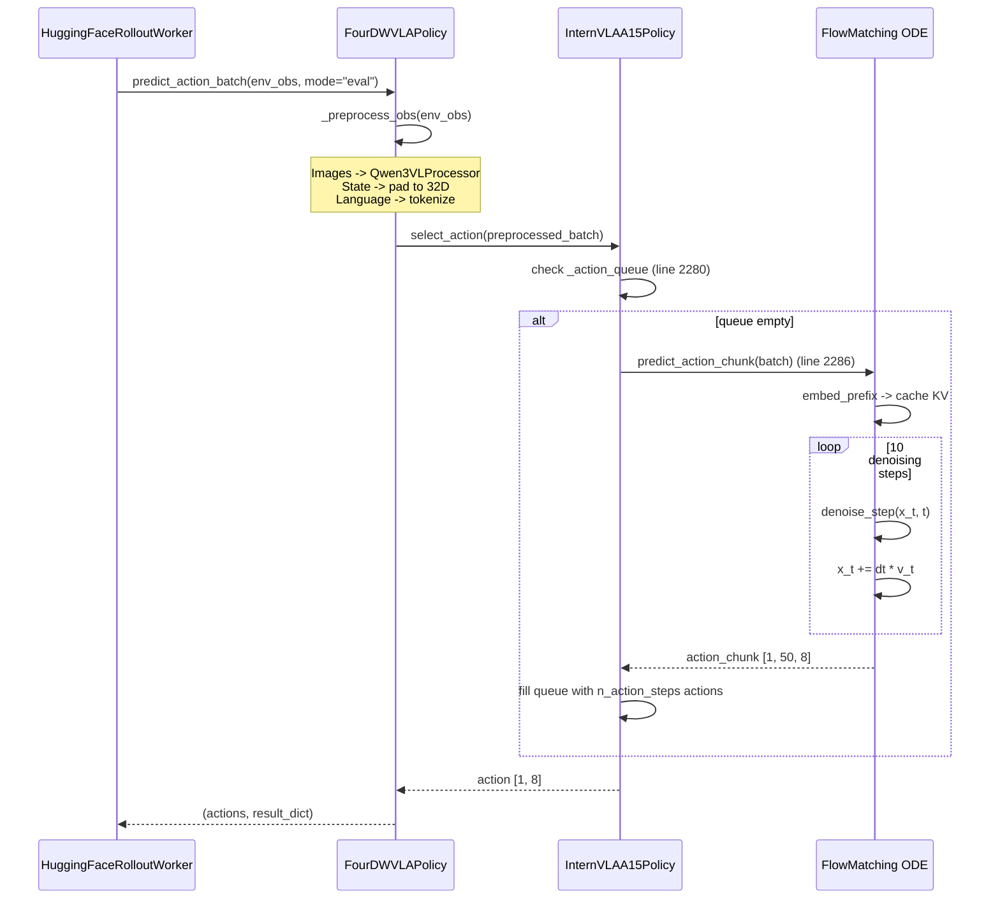

---

## 6. 详细实施步骤与代码差异

### 6.1 步骤一: 注册模型类型

**文件**: `rlinf/config.py`

**改动 1a**: 在 SupportedModel 注册行末尾 (line 118 之后) 添加:

```diff
--- a/rlinf/config.py
+++ b/rlinf/config.py
@@ -118,6 +118,7 @@
 SupportedModel.EVO1 = SupportedModel.register("evo1", force=True)
+SupportedModel.FOUR_DWVLA = SupportedModel.register("4dwvla", force=True)
```

**改动 1b**: 在 EMBODIED_MODEL 集合 (line 144, `SupportedModel.EVO1` 之后) 添加:

```diff
--- a/rlinf/config.py
+++ b/rlinf/config.py
@@ -144,6 +144,7 @@
         SupportedModel.EVO1,
+        SupportedModel.FOUR_DWVLA,
     }
 )
```

**验证**: 添加后, `SupportedModel.get("4dwvla")` 应返回非 None, 且在 `EMBODIED_MODEL` 集合中。

### 6.2 步骤二: 注册模型 Builder

**文件**: `rlinf/models/__init__.py`

**改动 2a**: 在 `_register_builtin_models()` 函数内, builder 闭包定义区 (line ~157, 在最后一个 `_build_*` 定义之后) 添加:

```diff
+    def _build_four_dwvla(cfg: DictConfig, torch_dtype):
+        from rlinf.models.embodiment.four_dwvla import get_model
+        return get_model(cfg, torch_dtype)
```

**改动 2b**: 在 `register_model` 调用区 (line ~290, 在最后一个 register_model 调用之后) 添加:

```diff
+    register_model(
+        SupportedModel.FOUR_DWVLA.value,
+        _build_four_dwvla,
+        category="embodied",
+        force=True,
+    )
```

**说明**: 遵循现有模式 -- 每个 builder 是一个三行闭包，延迟导入子模块并调用 `get_model()`。`register_model` 在注册时会自动将模型加入 `EMBODIED_MODEL`（因为 `category="embodied"`），但由于 config.py 中已经手动添加了，所以 `force=True` 确保不冲突。

### 6.3 步骤三: 实现模型包

#### 6.3.1 `rlinf/models/embodiment/four_dwvla/__init__.py`

**新增文件**。完整代码:

```python
# Copyright 2026 The RLinf Authors.
#
# Licensed under the Apache License, Version 2.0 (the "License");
# you may not use this file except in compliance with the License.
# You may obtain a copy of the License at
#
#     https://www.apache.org/licenses/LICENSE-2.0
#
# Unless required by applicable law or agreed to in writing, software
# distributed under the License is distributed on an "AS IS" BASIS,
# WITHOUT WARRANTIES OR CONDITIONS OF ANY KIND, either express or implied.
# See the License for the specific language governing permissions and
# limitations under the License.

"""4DWVLA model integration for RLinf SFT."""

from __future__ import annotations

import logging
from typing import Optional

import torch
from omegaconf import DictConfig

logger = logging.getLogger(__name__)


def get_model(cfg: DictConfig, torch_dtype: Optional[torch.dtype] = None):
    """Build a 4DWVLA policy wrapped for RLinf.

    cfg fields consumed (from actor.model in YAML):
      - model_path: str            pretrained checkpoint directory (4WVLA format)
      - precision: str             "bf16" | "fp32"
      - action_loss_only: bool     skip WAN loading (default True for SFT without video loss)
      - enable_keypoint: bool      enable GeoPredict keypoint branch
      - kpt_4d_mode: str           "pos_only" | "pos_rot"  (default "pos_rot")
      - vlm_model_name: str        Qwen3.5 model name (default "Qwen/Qwen3.5-2B")
      - train_expert_only: bool    freeze VLM backbone
      - four_dwvla: DictConfig additional model config overrides
    """
    from rlinf.models.embodiment.four_dwvla.policy_adapter import (
        FourDWVLAPolicy,
    )

    model = FourDWVLAPolicy(cfg, torch_dtype=torch_dtype)
    logger.info(
        "4DWVLA model loaded from %s (action_loss_only=%s, keypoint=%s)",
        cfg.model_path,
        cfg.get("action_loss_only", True),
        cfg.get("enable_keypoint", False),
    )
    return model
```

#### 6.3.2 `rlinf/models/embodiment/four_dwvla/policy_adapter.py`

**新增文件**。完整代码:

```python
# Copyright 2026 The RLinf Authors.
#
# Licensed under the Apache License, Version 2.0 (the "License");
# you may not use this file except in compliance with the License.
# You may obtain a copy of the License at
#
#     https://www.apache.org/licenses/LICENSE-2.0
#
# Unless required by applicable law or agreed to in writing, software
# distributed under the License is distributed on an "AS IS" BASIS,
# WITHOUT WARRANTIES OR CONDITIONS OF ANY KIND, either express or implied.
# See the License for the specific language governing permissions and
# limitations under the License.

"""RLinf BasePolicy adapter wrapping the original 4DWVLA policy."""

from __future__ import annotations

import logging
from pathlib import Path
from typing import Any, Optional

import torch
import torch.nn as nn
from omegaconf import DictConfig, OmegaConf
from safetensors.torch import load_model

from rlinf.models.embodiment.base_policy import BasePolicy, ForwardType

logger = logging.getLogger(__name__)


class FourDWVLAPolicy(BasePolicy, nn.Module):
    """Adapter that wraps ``InternVLAA15Policy`` to satisfy RLinf's ``BasePolicy`` API.

    Key responsibilities:
      1. Load 4WVLA checkpoint via ``from_pretrained`` or manual ``safetensors``
      2. Translate ``forward(forward_type=SFT, data=...)`` -> 4WVLA's ``forward(batch)``
      3. Translate ``predict_action_batch(env_obs)`` -> 4WVLA's ``select_action(batch)``
      4. Provide per-parameter lr_scale groups for FSDP optimizer

    Design decisions:
      - Inherits both BasePolicy (RLinf interface) and nn.Module (PyTorch model)
      - The original InternVLAA15Policy is stored as self._inner and its code is
        never modified
      - sft_forward() directly calls 4WVLA's forward() and converts
        (total_loss, loss_dict) to RLinf's {"loss": scalar, ...} format
      - predict_action_batch() calls select_action() for inference
      - get_param_groups() provides per-component lr_scale support for
        Phase 1 Warmup (Action Expert uses lower learning rate) scenarios
      - Checkpoint loading uses safetensors.load_model() for 4WVLA format compat
    """

    def __init__(self, cfg: DictConfig, torch_dtype: Optional[torch.dtype] = None):
        nn.Module.__init__(self)

        from lerobot.policies.internvla_a1_5.configuration_internvla_a1_5 import (
            InternVLAA15Config,
        )
        from lerobot.policies.internvla_a1_5.modeling_internvla_a1_5 import (
            InternVLAA15Policy,
        )

        model_path = str(cfg.model_path)
        overrides = OmegaConf.to_container(
            cfg.get("four_dwvla", OmegaConf.create({})), resolve=True
        )

        # Build config from checkpoint or defaults
        try:
            inner_config = InternVLAA15Config.from_pretrained(model_path)
        except Exception:
            inner_config = InternVLAA15Config()
            logger.warning("No config.json in %s; using defaults.", model_path)

        # Apply nested overrides from YAML (four_dwvla.* keys)
        for key, val in overrides.items():
            if hasattr(inner_config, key):
                setattr(inner_config, key, val)

        # Apply top-level cfg overrides (convenience shortcuts)
        _top_level_mappings = {
            "action_loss_only": "action_loss_only",
            "enable_keypoint": "enable_keypoint_predictor",
            "kpt_4d_mode": "kpt_4d_mode",
            "vlm_model_name": "vlm_model_name_or_path",
            "train_expert_only": "train_expert_only",
        }
        for cfg_key, config_attr in _top_level_mappings.items():
            val = cfg.get(cfg_key)
            if val is not None:
                setattr(inner_config, config_attr, val)

        # Construct the inner policy (this builds the full model graph)
        self._inner = InternVLAA15Policy(inner_config)

        # Load checkpoint weights (safetensors format)
        self._load_checkpoint(model_path)

        # Cast to desired dtype
        if torch_dtype is not None and torch_dtype != torch.float32:
            self._inner.to(torch_dtype)

        self._cfg = cfg
        self._action_dim = cfg.get("action_dim", 8)
        self._state_dim = cfg.get("state_dim", 8)

    def _load_checkpoint(self, model_path: str):
        """Load 4WVLA checkpoint from safetensors.

        Supports both single-file (model.safetensors, e.g. 5.89 GiB / 1303 keys)
        and multi-shard (model-00001-of-NNNNN.safetensors) formats.

        Key prefix handling:
          - All safetensors keys are prefixed with ``model.`` (e.g.
            ``model.qwen3_5_with_expert.action_expert.layers.0...``)
          - ``safetensors.load_model(self._inner, ...)`` matches these keys
            to ``InternVLAA15Policy.model`` (which is ``self._inner.model``),
            so the ``model.`` prefix maps naturally to the ``InternVLAA15``
            submodule.
          - WAN weights (``model.wan_video_model.*``) are NOT in the
            safetensors file -- they are excluded by ``state_dict()`` at
            save time and loaded separately from ``wan_checkpoint_path``.
          - ``strict=False`` is required because the WAN keys are missing.
        """
        ckpt_dir = Path(model_path)
        safetensors_files = sorted(ckpt_dir.glob("model*.safetensors"))
        if safetensors_files:
            for sf in safetensors_files:
                load_model(self._inner, str(sf), strict=False)
            logger.info(
                "Loaded checkpoint from %s (%d shard(s)).",
                model_path,
                len(safetensors_files),
            )
        else:
            logger.warning(
                "No safetensors found in %s; model uses random init.", model_path
            )

    # ---- BasePolicy interface ----

    def forward(self, forward_type=ForwardType.DEFAULT, **kwargs):
        """Dispatch by ForwardType. SFT path calls sft_forward()."""
        if forward_type == ForwardType.SFT:
            return self.sft_forward(**kwargs)
        elif forward_type == ForwardType.DEFAULT:
            return self.default_forward(**kwargs)
        else:
            raise NotImplementedError(f"Forward type {forward_type} not supported.")

    def default_forward(self, **kwargs):
        """Default forward delegates to sft_forward."""
        return self.sft_forward(**kwargs)

    def sft_forward(self, data: dict[str, Any] = None, **kwargs) -> dict:
        """Run 4WVLA SFT forward: compute multi-component loss.

        Receives a batch dict already prepared by FourDWVLASftDataset
        (same format as 4WVLA's native training batch).

        Returns:
            dict with "loss" (scalar Tensor for backprop) and detached
            per-component loss floats for logging.
        """
        if data is None:
            data = kwargs.get("batch", kwargs)

        # Move tensors to model device (FSDP may have moved params)
        device = next(self._inner.parameters()).device
        batch = {
            k: v.to(device) if isinstance(v, torch.Tensor) else v
            for k, v in data.items()
        }

        total_loss, loss_dict = self._inner.forward(batch)

        # Return format compatible with FSDPVlaSftWorker.get_train_model_output():
        # - "loss" key must be a scalar Tensor (for .backward())
        # - All other keys are logged to TensorBoard as step_metrics
        return {
            "loss": total_loss,
            **{
                k: v.detach() if isinstance(v, torch.Tensor) else v
                for k, v in loss_dict.items()
                if k != "loss"  # avoid duplicate "loss" key
            },
        }

    def predict_action_batch(
        self,
        env_obs: dict[str, Any] = None,
        mode: str = "eval",
        **kwargs,
    ) -> tuple[torch.Tensor, dict]:
        """Predict actions for real-robot rollout evaluation.

        Returns:
            (actions, result_dict) where actions has shape [B, action_dim]
            and result_dict is empty for now (placeholder for future DAgger support).
        """
        self._inner.eval()
        with torch.no_grad():
            action = self._inner.select_action(env_obs)
        return action, {}

    # ---- Helpers ----

    def freeze_vlm(self):
        """Freeze the VLM backbone for expert-only training (Phase 1)."""
        self._inner.model.qwen3_5_with_expert.qwen3_5.requires_grad_(False)
        logger.info("VLM backbone frozen.")

    def get_param_groups(self, base_lr: float) -> list[dict]:
        """Return per-component parameter groups with lr_scale.

        This enables different learning rates for VLM vs Action Expert vs
        Keypoint Expert vs TrackEncoder, as required by the 4WVLA training
        protocol (see InternVLAA15Policy.get_optim_params at line 2215).
        """
        return self._inner.get_optim_params()
```

**设计说明**:

- `FourDWVLAPolicy` 同时继承 `BasePolicy` (RLinf 接口) 和 `nn.Module` (PyTorch 模型)
- 内部包裹原始的 `InternVLAA15Policy`，不修改其任何代码
- `sft_forward()` 直接调用 4WVLA 的 `forward()`，将 `(total_loss, loss_dict)` 转换为 RLinf 期望的 `{"loss": scalar, ...}` 格式
- Worker 的 `get_train_model_output()` (line 82-101) 已经支持从 dict output 中提取额外 metric key，因此 `loss_action`, `loss_video`, `loss_kpt_current` 等会自动出现在 TensorBoard 日志中
- `predict_action_batch()` 返回 `(actions, result_dict)` 元组，与 `huggingface_worker.py` line 524 的调用约定一致
- Checkpoint 加载直接使用 `safetensors.load_model(strict=False)`，与 4WVLA 的格式兼容。`strict=False` 因为 WAN 权重不在 safetensors 中

### 6.4 步骤四: 实现数据管线

#### 6.4.1 `rlinf/data/datasets/four_dwvla/dataset.py`

**新增文件**。完整代码:

```python
# Copyright 2026 The RLinf Authors.
#
# Licensed under the Apache License, Version 2.0 (the "License");
# you may not use this file except in compliance with the License.
# You may obtain a copy of the License at
#
#     https://www.apache.org/licenses/LICENSE-2.0
#
# Unless required by applicable law or agreed to in writing, software
# distributed under the License is distributed on an "AS IS" BASIS,
# WITHOUT WARRANTIES OR CONDITIONS OF ANY KIND, either express or implied.
# See the License for the specific language governing permissions and
# limitations under the License.

"""4DWVLA SFT dataset -- wraps LeRobot dataset with 4WVLA transform chain."""

from __future__ import annotations

import logging
from pathlib import Path
from typing import Any

import torch
from omegaconf import DictConfig, OmegaConf
from torch.utils.data import Dataset

logger = logging.getLogger(__name__)


class FourDWVLASftDataset(Dataset):
    """Dataset that loads LeRobot-format data and applies the 4WVLA transform chain.

    This class directly constructs the 4WVLA ``TransformedLeRobotDataset`` under the hood,
    reusing the exact same data loading and transform logic used in standalone 4WVLA training.
    This ensures bit-exact data preprocessing compatibility with existing checkpoints.

    The transform chain (from configuration_internvla_a1_5.py line 44-72):
        1. DeltaActionTransformFn (only if action_mode="delta")
        2. ResizeImagesWithPadFn (224x224)
        3. RemapImageKeyTransformFn
        4. ExtractVideoFramesTransformFn
        5. NormalizeTransformFn (uses external stats.json)
        6. ComposeFieldsTransform
        7. Extract3DKeypointTransformFn (if enable_keypoint_predictor)
        8. FASTInternVLAA15ActionTokenizerTransformFn
        9. InternVLAA15ChatProcessorTransformFn (Qwen3VLProcessor)
        10. PadStateAndActionTransformFn
        11. ReorderStateActionTransform
        12. UnifyInternVLAA15InputsTransformFn
    """

    def __init__(self, cfg: DictConfig, data_path: str, is_eval: bool = False):
        from lerobot.configs.default import DatasetConfig
        from lerobot.configs.policies import PreTrainedConfig
        from lerobot.datasets.factory import make_dataset
        from lerobot.policies.internvla_a1_5.configuration_internvla_a1_5 import (
            InternVLAA15Config,
            InternVLAA15DatasetConfig,
        )

        self.cfg = cfg
        self.is_eval = is_eval

        # Build the 4WVLA policy config from checkpoint or YAML overrides
        model_path = str(cfg.actor.model.model_path)
        try:
            policy_config = InternVLAA15Config.from_pretrained(model_path)
        except Exception:
            policy_config = InternVLAA15Config()

        # Apply overrides from YAML (actor.model.four_dwvla.* keys)
        model_overrides = OmegaConf.to_container(
            cfg.actor.model.get("four_dwvla", OmegaConf.create({})),
            resolve=True,
        )
        for key, val in model_overrides.items():
            if hasattr(policy_config, key):
                setattr(policy_config, key, val)

        # Apply top-level model shortcuts
        if cfg.actor.model.get("enable_keypoint") is not None:
            policy_config.enable_keypoint_predictor = cfg.actor.model.enable_keypoint
        if cfg.actor.model.get("action_loss_only") is not None:
            policy_config.action_loss_only = cfg.actor.model.action_loss_only

        # Build the dataset config
        dataset_cfg_overrides = OmegaConf.to_container(
            cfg.data.get("dataset", OmegaConf.create({})), resolve=True
        )

        repo_id = dataset_cfg_overrides.get("repo_id", Path(data_path).name)
        action_mode = dataset_cfg_overrides.get("action_mode", "abs")

        ds_config = InternVLAA15DatasetConfig(
            repo_id=repo_id,
            action_mode=action_mode,
        )

        # Apply dataset config overrides from YAML
        for key, val in dataset_cfg_overrides.items():
            if hasattr(ds_config, key):
                setattr(ds_config, key, val)

        # Handle external stats
        stats_path = cfg.data.get("external_stats_path", None)
        if stats_path:
            ds_config.use_external_stats = True
            ds_config.external_stats_path = stats_path

        # Enable keypoint if the model uses it
        if getattr(policy_config, "enable_keypoint_predictor", False):
            ds_config.enable_keypoint_predictor = True
            ds_config.num_keypoint_joints = policy_config.num_keypoint_joints
            ds_config.keypoint_history_max_len = policy_config.keypoint_history_max_len
            ds_config.kpt_4d_mode = policy_config.kpt_4d_mode

        # Sync tokenize_state between policy and dataset configs
        ds_config.tokenize_state = getattr(policy_config, "tokenize_state", True)
        ds_config.use_fast_action_tokens = getattr(
            policy_config, "use_fast_action_tokens", True
        )

        # Construct the dataset via 4WVLA's factory
        # make_dataset() expects a config object with .dataset and .policy attributes
        class _CfgShim:
            """Minimal shim to satisfy make_dataset() signature."""
            def __init__(self, ds_cfg, pol_cfg, batch_size):
                self.dataset = ds_cfg
                self.policy = pol_cfg
                self.batch_size = batch_size

        shim_cfg = _CfgShim(
            ds_config,
            policy_config,
            cfg.actor.micro_batch_size,
        )

        self._inner_dataset = make_dataset(
            cfg=shim_cfg,
            split="train",
        )

        logger.info(
            "FourDWVLASftDataset: %d samples from %s (action_mode=%s, keypoint=%s)",
            len(self._inner_dataset),
            data_path,
            action_mode,
            getattr(policy_config, "enable_keypoint_predictor", False),
        )

    def __len__(self):
        return len(self._inner_dataset)

    def __getitem__(self, idx) -> dict[str, Any]:
        return self._inner_dataset[idx]
```

#### 6.4.2 `rlinf/data/datasets/four_dwvla/dataloader.py`

**新增文件**。完整代码:

```python
# Copyright 2026 The RLinf Authors.
#
# Licensed under the Apache License, Version 2.0 (the "License");
# you may not use this file except in compliance with the License.
# You may obtain a copy of the License at
#
#     https://www.apache.org/licenses/LICENSE-2.0
#
# Unless required by applicable law or agreed to in writing, software
# distributed under the License is distributed on an "AS IS" BASIS,
# WITHOUT WARRANTIES OR CONDITIONS OF ANY KIND, either express or implied.
# See the License for the specific language governing permissions and
# limitations under the License.

"""Dataloader builder for 4DWVLA SFT training in RLinf."""

from __future__ import annotations

import logging

from omegaconf import DictConfig
from torch.utils.data import DataLoader, DistributedSampler

logger = logging.getLogger(__name__)


def build_four_dwvla_sft_dataloader(
    cfg: DictConfig,
    world_size: int,
    rank: int,
    data_paths: str | list[str],
    eval_dataset: bool = False,
) -> DataLoader:
    """Build a PyTorch DataLoader for 4DWVLA SFT.

    The dataset internally uses 4WVLA's own LeRobot dataset + transform chain,
    so we only need to wrap it with a sampler and DataLoader.

    Args:
        cfg: Full Hydra config (contains actor.model, data.* etc.)
        world_size: Total number of FSDP workers
        rank: Current worker rank
        data_paths: Path(s) to LeRobot dataset root
        eval_dataset: Whether this is an evaluation dataloader
    """
    from rlinf.data.datasets.four_dwvla.dataset import FourDWVLASftDataset

    if isinstance(data_paths, (list, tuple)):
        data_path = data_paths[0]
    else:
        data_path = data_paths

    dataset = FourDWVLASftDataset(cfg, data_path, is_eval=eval_dataset)

    sampler = DistributedSampler(
        dataset,
        num_replicas=world_size,
        rank=rank,
        shuffle=not eval_dataset,
        drop_last=not eval_dataset,
    )

    num_workers = cfg.data.get("num_workers", 4)
    batch_size = cfg.actor.micro_batch_size

    dataloader = DataLoader(
        dataset,
        batch_size=batch_size,
        sampler=sampler,
        num_workers=num_workers,
        pin_memory=True,
        drop_last=not eval_dataset,
        prefetch_factor=2 if num_workers > 0 else None,
    )

    logger.info(
        "4DWVLA dataloader: %d samples, batch_size=%d, num_workers=%d, "
        "world_size=%d, rank=%d",
        len(dataset),
        batch_size,
        num_workers,
        world_size,
        rank,
    )
    return dataloader
```

### 6.5 步骤五: 扩展 Worker 分发

**文件**: `rlinf/workers/sft/fsdp_vla_sft_worker.py`

**改动位置**: `build_dataloader()` 方法, line 72 (在现有 `else: raise KeyError(...)` 之前插入)

```diff
--- a/rlinf/workers/sft/fsdp_vla_sft_worker.py
+++ b/rlinf/workers/sft/fsdp_vla_sft_worker.py
@@ -70,6 +70,15 @@
             return build_evo1_sft_dataloader(
                 self.cfg, self._world_size, self._rank, data_paths
             )
+        elif model_type == SupportedModel.FOUR_DWVLA:
+            from rlinf.data.datasets.four_dwvla.dataloader import (
+                build_four_dwvla_sft_dataloader,
+            )
+
+            return build_four_dwvla_sft_dataloader(
+                self.cfg, self._world_size, self._rank, data_paths, eval_dataset
+            )
         else:
             raise KeyError(
                 f"not support such model type {self.cfg.actor.model.model_type} for SFT right now."
```

### 6.6 步骤六: 扩展 Rollout Worker 分发 (可选, 用于评估)

**文件**: `rlinf/workers/rollout/hf/huggingface_worker.py`

**改动位置**: `predict()` 方法, line 478-491 的模型列表中添加 `SupportedModel.FOUR_DWVLA`

```diff
--- a/rlinf/workers/rollout/hf/huggingface_worker.py
+++ b/rlinf/workers/rollout/hf/huggingface_worker.py
@@ -478,6 +478,7 @@
         if SupportedModel(self.model_cfg.model_type) in [
             SupportedModel.OPENPI,
             SupportedModel.OPENPI_RLINF,
+            SupportedModel.FOUR_DWVLA,
             SupportedModel.EVO1,
             SupportedModel.MLP_POLICY,
             SupportedModel.GR00T,
```

---

## 7. Checkpoint 加载设计

### 7.1 4WVLA Checkpoint 结构

#### 7.1.1 Checkpoint 目录与文件

以 Phase 2 SFT 检查点 `4wvlaFrkPlugCkp010420` 为实例 (路径: `/home/nvidia/bt/ckp/4wvlaFrk/plug/4wvlaFrkPlugCkp010420/`):

```
4wvlaFrkPlugCkp010420/
+-- config.json          # 122 行, 3735 bytes -- InternVLAA15Config 序列化
+-- model.safetensors    # 5.89 GiB (6,320,933,212 bytes) -- 1303 weight keys
+-- stats.json           # 38,970 bytes -- franka_plug 归一化统计量
+-- train_config.json    # 12,901 bytes -- 完整训练管线配置 (draccus dump)
```

#### 7.1.2 Weight Key 结构 (model.safetensors, 1303 keys)

**所有 key 均以 `model.` 前缀开头**, 这是因为 `InternVLAA15Policy` 将内部 `InternVLAA15` 模型存储为 `self.model` 属性，PyTorch 的 `state_dict()` 自动为子模块添加此前缀。

| 分类 | Key 数量 | Key 前缀 | 说明 |
|:---|:---:|:---|:---|
| VLM (language_model) | 319 | `model.qwen3_5_with_expert.qwen3_5.model.language_model` | Qwen3.5-2B 文本模型 |
| VLM (visual) | 297 | `model.qwen3_5_with_expert.qwen3_5.model.visual` | 视觉编码器 (ViT) |
| VLM (lm_head) | 1 | `model.qwen3_5_with_expert.qwen3_5.lm_head` | 语言模型头 |
| Action Expert | 319 | `model.qwen3_5_with_expert.action_expert.layers.{0-23}` | 24 层, 混合 14-key 和 11-key 层 |
| Keypoint Expert | 319 | `model.qwen3_5_with_expert.keypoint_expert.layers.{0-23}` | 24 层, 结构同 Action Expert |
| Track Encoder | 28 | `model.track_encoder` | GeoPredict TrackEncoder |
| Action 投影 | 8 | `model.action_in_proj`, `model.action_out_proj`, `model.action_time_mlp_in/out` | Flow matching 投影层 |
| Learnable tokens | 3 | `model.learnable_tokens`, `model.learnable_tokens_in_proj` | 50 个 foresight tokens |
| Keypoint 投影 | 5 | `model.keypoint_embedding`, `model.keypoint_out_proj`, `model.kpt_state_proj`, `model.future_kpt_pos_embed` | 关键点嵌入与投影 |
| WAN bridge | 3 | `model.learnable_to_wan_proj`, `model._wan_grid_sizes` | 仅 WAN 桥接投影, 不含 WAN 模型本身 |

#### 7.1.3 关键维度 (从 weight shape 验证)

| Weight Key | Shape | 推导的维度含义 |
|:---|:---|:---|
| `model.action_in_proj.weight` | `[1024, 32]` | action_expert_hidden=1024, max_action_dim=32 |
| `model.action_out_proj.weight` | `[32, 1024]` | 输出 max_action_dim=32 |
| `model.learnable_tokens` | `[50, 1024]` | num_learnable_tokens=50, hidden_dim=1024 |
| `model.keypoint_out_proj.weight` | `[7, 1024]` | keypoint_dim=7 (pos_rot 模式: pos3+quat4) |
| `model.keypoint_embedding.weight` | `[8, 1024]` | num_keypoint_joints=8 |
| `model.future_kpt_pos_embed` | `[50, 1024]` | chunk_size=50 (与 action chunk 一致) |
| `model.learnable_to_wan_proj.weight` | `[3072, 1024]` | WAN hidden dim=3072 |

#### 7.1.4 WAN 权重排除机制

**重要特性** (源码 `modeling_internvla_a1_5.py` line 2202-2213):
- `model.safetensors` **不包含** WAN 视频模型权重 -- `InternVLAA15Policy.state_dict()` 在保存时过滤掉所有 `model.wan_video_model.*` 前缀的 key
- WAN 权重从独立路径加载: `config.wan_checkpoint_path` (默认 `${HF_HOME}/hub/Wan2.2-TI2V-5B/`)
- 关键点权重 (TrackEncoder, Keypoint Expert) 包含在 safetensors 中
- 保存的仅有 WAN 桥接投影 `model.learnable_to_wan_proj` (用于将 learnable tokens 投影到 WAN 输入空间)

#### 7.1.5 config.json 关键值与推理覆盖

`config.json` 中的以下字段在推理/评估时 **必须覆盖**:

| 字段 | config.json 中的值 | 推理时必须覆盖为 | 原因 |
|:---|:---|:---|:---|
| `inference_backend` | `"standard"` | `"optimized"` | 使用低延迟动作预测路径 |
| `action_loss_only` | `false` | `true` | 跳过 WAN 加载, 节省 ~5B 参数的显存 |
| `pretrained_path` | `"/home/a26113/b/Ckp/..."` | 本地有效路径 | 训练服务器上的**过期路径**, 本地不存在 |
| `wan_checkpoint_path` | `"/B/VENV/..."` | (不需要, 因为 action_loss_only=true) | 训练服务器上的**过期路径**, 本地不存在 |

其他关键配置值 (无需覆盖):

| 字段 | 值 | 含义 |
|:---|:---|:---|
| `type` | `"internvla_a1_5"` | Checkpoint 类型标识 |
| `keypoint_track_input_dim` | `7` | Franka 7D 关键点 (pos+quaternion) |
| `kpt_4d_mode` | `"pos_rot"` | 关键点模式: 位置+旋转 |
| `tokenize_state` | `true` | 状态 token 化已启用 |
| `gradient_checkpointing` | `true` | 训练时使用梯度检查点 |
| `normalization_mapping` | `{"VISUAL": "IDENTITY", "STATE": "IDENTITY", "ACTION": "IDENTITY"}` | **无归一化** -- 数据不做 min-max/z-score 变换 |

> **关于过期路径的处理**: config.json 中的 `pretrained_path`, `wan_checkpoint_path`, `wan_config_path`, `vae_path` 均指向训练服务器上的绝对路径, 在本地环境中不存在。`FourDWVLAPolicy` 的加载流程通过 YAML 配置覆盖机制 (`four_dwvla.*` keys) 或 `action_loss_only=true` 跳过 WAN 加载来规避这些过期路径。加载 `config.json` 时这些字段会被读取但不会导致立即失败 -- 只有在实际尝试加载 WAN 模型时才会报错, 因此 `action_loss_only=true` 是推理时的必要设置。

#### 7.1.6 stats.json 结构

`stats.json` 包含 Franka 插座任务数据集的归一化统计量 (尽管 `normalization_mapping` 设为 IDENTITY, stats 仍用于 FAST token 离散化等):

- **Robot type key**: `"franka_plug"`
- **每个特征的统计量**: min, max, mean, std, count, q01, q10, q50, q90, q99

| 特征 | 维度 | 说明 |
|:---|:---:|:---|
| `observation.state.arm` | 7 | 关节角度 |
| `observation.state.gripper` | 1 | 夹爪开合 |
| `observation.state.ee_pos` | 3 | 末端执行器位置 |
| `observation.state.ee_quat` | 4 | 末端执行器四元数 |
| `action.arm` | 7 | 关节动作 |
| `action.gripper` | 1 | 夹爪动作 |
| `observation.keypoint_3d` | 56 | 8 joints x 7D (pos3+quat4) |
| `observation.images.global` | 3 | 全局相机图像 (通道数) |
| `observation.images.wrist` | 3 | 腕部相机图像 (通道数) |

> **注意**: 由于 `normalization_mapping` 全部为 `IDENTITY`, 模型训练和推理时 **不对输入做归一化变换**。stats.json 的值主要被 FAST action tokenizer 使用, 用于将连续动作值离散化到 token 空间。

### 7.1.7 train_config.json 关键训练参数

`train_config.json` 记录了产生此 checkpoint 的完整训练配置 (来自 `4wvlaFrkPlugCkp010420`):

| 参数 | 值 | 说明 |
|:---|:---|:---|
| `dataset.repo_id` | `"plug_into_socket_lrb_4D"` | Franka 插座数据集 |
| `dataset.action_mode` | `"abs"` | 绝对动作模式 |
| `batch_size` | `16` | 每卡 batch size |
| `steps` | `52100` | 总训练步数 |
| `save_freq` | `10420` | 保存频率 (此 ckpt 对应第 1 个保存点) |
| `seed` | `42` | 随机种子 |
| `wandb.project` | `"internvla_a1_5"` | WandB 项目名 |
| `wandb.run_id` | `"c0lo1b70"` | WandB 运行 ID (可用于查找训练曲线) |
| `output_dir` | `"/home/a26113/b/Ckp/itvlagpFrkPlug0907/..."` | 训练服务器上的输出目录 (**过期路径**) |

### 7.2 加载流程

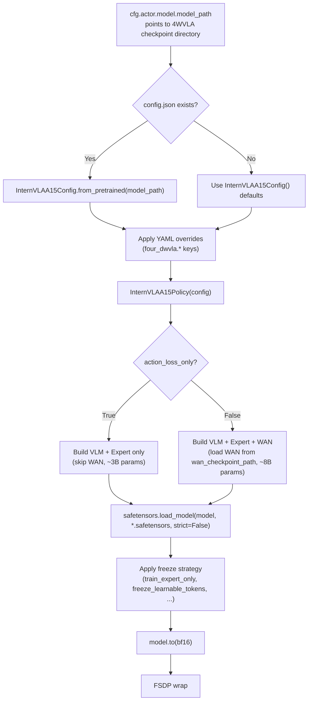

### 7.3 与 RLinf FSDP Checkpoint 的互操作

**加载 4WVLA -> RLinf**: 通过 `get_model()` 在 FSDP wrap 之前加载 safetensors，然后 FSDP 自动分片。

**保存 RLinf -> 4WVLA**: RLinf 保存的 FSDP checkpoint (`full_weights.pt` 格式) 需要提取后转换回 safetensors 格式才能被 4WVLA 原始代码加载。转换脚本:

```python
#!/usr/bin/env python3
"""rlinf_ckpt_to_4wvla.py -- Convert RLinf FSDP full_weights to 4WVLA safetensors.

Usage:
    python rlinf_ckpt_to_4wvla.py \
        --input /path/to/rlinf/full_weights.pt \
        --output /path/to/output/model.safetensors

The script removes the "_inner." prefix that the FourDWVLAPolicy adapter
adds, making the state_dict compatible with 4WVLA's direct InternVLAA15Policy loading.
"""
import argparse
import torch
from safetensors.torch import save_file


def main():
    parser = argparse.ArgumentParser()
    parser.add_argument("--input", required=True, help="Path to RLinf full_weights.pt")
    parser.add_argument("--output", required=True, help="Output safetensors path")
    args = parser.parse_args()

    full_weights = torch.load(args.input, map_location="cpu", weights_only=True)

    # Remove RLinf adapter prefix "_inner."
    state_dict = {}
    for k, v in full_weights.items():
        clean_key = k.replace("_inner.", "", 1) if k.startswith("_inner.") else k
        # Also skip WAN weights if they somehow got saved
        if "wan_video_model" in clean_key:
            continue
        state_dict[clean_key] = v

    save_file(state_dict, args.output)
    print(f"Converted {len(state_dict)} keys -> {args.output}")


if __name__ == "__main__":
    main()
```

### 7.4 Checkpoint 权重 key 前缀对照

基于 `4wvlaFrkPlugCkp010420/model.safetensors` 实际分析 (1303 keys, 5.89 GiB):

| 前缀 (4WVLA safetensors) | 前缀 (RLinf FSDP) | 组件 | Key 数量 | Phase 2 状态 | 参数量 (approx) |
|:---|:---|:---|:---:|:---|:---|
| `model.qwen3_5_with_expert.qwen3_5.model.language_model` | `_inner.model.qwen3_5_with_expert.qwen3_5.model.language_model` | Qwen3.5 LM | 319 | 训练 | ~1.5B |
| `model.qwen3_5_with_expert.qwen3_5.model.visual` | `_inner.model.qwen3_5_with_expert.qwen3_5.model.visual` | Qwen3.5 ViT | 297 | 训练 | ~0.5B |
| `model.qwen3_5_with_expert.qwen3_5.lm_head` | `_inner.model.qwen3_5_with_expert.qwen3_5.lm_head` | LM Head | 1 | 训练 | ~76M |
| `model.qwen3_5_with_expert.action_expert.layers.{0-23}` | `_inner.model.qwen3_5_with_expert.action_expert.layers.{0-23}` | Action Expert | 319 | 训练 | ~460M |
| `model.qwen3_5_with_expert.keypoint_expert.layers.{0-23}` | `_inner.model.qwen3_5_with_expert.keypoint_expert.layers.{0-23}` | Keypoint Expert | 319 | 训练 | ~460M |
| `model.track_encoder` | `_inner.model.track_encoder` | TrackEncoder | 28 | 训练 | ~2M |
| `model.action_in_proj`, `model.action_out_proj`, `model.action_time_mlp_in/out` | `_inner.model.action_in_proj` 等 | Action 投影 | 8 | 训练 | ~2M |
| `model.learnable_tokens`, `model.learnable_tokens_in_proj` | `_inner.model.learnable_tokens` 等 | Learnable tokens (50个) | 3 | 冻结 (Phase 2) | ~1M |
| `model.keypoint_embedding`, `model.keypoint_out_proj`, `model.kpt_state_proj`, `model.future_kpt_pos_embed` | `_inner.model.keypoint_embedding` 等 | Keypoint 投影 | 5 | 训练 | ~60K |
| `model.learnable_to_wan_proj`, `model._wan_grid_sizes` | `_inner.model.learnable_to_wan_proj` 等 | WAN bridge | 3 | 训练 | ~3M |
| `model.wan_video_model.*` | (不保存) | WAN DiT + VAE | 0 | **不在 safetensors 中** | ~5B |

> **关于 `model.` 前缀**: RLinf 的 `FourDWVLAPolicy` 将 `InternVLAA15Policy` 存储为 `self._inner`。当 FSDP 保存 full_weights 时, key 前缀变为 `_inner.model.*`。使用 `rlinf_ckpt_to_4wvla.py` 转换时会移除 `_inner.` 前缀, 恢复为原始的 `model.*` 前缀格式。加载时 `safetensors.load_model(self._inner, ...)` 自动匹配 `model.*` 前缀到 `InternVLAA15Policy` 的 `self.model` 属性下的子模块。

---

## 8. 数据管线设计

### 8.1 Franka 插座数据集概要

| 属性 | 值 | 来源 |
|:---|:---|:---|
| repo_id | `plug_into_socket_lrb_4D` | 目录名 |
| 路径 | `/B/Dta/plug_into_socket_lrb_4D/` | 服务器磁盘 |
| 格式 | LeRobot v3.0 | meta/info.json |
| Episodes | 100 | meta/info.json |
| Frames | 66,577 | meta/info.json |
| FPS | 30 Hz | meta/info.json |
| State 维度 | 8D (arm7 + gripper1) | franka_plug.yaml |
| Action 维度 | 8D (arm7 + gripper1), abs 模式 | franka_plug.yaml |
| 相机 | 2 (global 480x640, wrist 480x640) | franka_plug.yaml image_mapping |
| 关键点 | 56D = 8 joints x 7D (pos3 + quat4) | kpt_4d_mode=pos_rot |
| 任务 | "plug into socket" | 数据集描述 |

**Franka 数据集 Schema 配置** (`4WVLA/b/s/Frk/cfg/franka_plug.yaml`):

```yaml
robot_type: franka_plug
action_mask_spec: [7, -1]
# [7, -1] meaning: first 7 dims (arm joints) use delta in delta mode,
# last 1 dim (gripper) stays absolute
feature_mapping:
  observation.state:
    - observation.state.arm
    - observation.state.gripper
  action:
    - action.arm
    - action.gripper
image_mapping:
  observation.images.global: observation.images.image0
  observation.images.wrist: observation.images.image1
```

### 8.2 Transform 链 (复用 4WVLA)

4WVLA 的 transform 链在 `configuration_internvla_a1_5.py` line 44-72 定义, `__post_init__()` (line 74) 中根据配置动态调整:

```mermaid
graph LR
    RAW["LeRobot Raw Sample<br/>(images, state, action, kpt)"] --> R0["DeltaActionTransformFn<br/>(only if action_mode=delta)"]
    R0 --> R1["ResizeImagesWithPadFn<br/>(224x224 with padding)"]
    R1 --> R1b["RemapImageKeyTransformFn<br/>(global/wrist -> image0/image1)"]
    R1b --> R2["ExtractVideoFramesTransformFn<br/>(WAN GT frames)"]
    R2 --> R3["NormalizeTransformFn<br/>(uses external stats.json)"]
    R3 --> R3b["ComposeFieldsTransform<br/>(merge sub-fields)"]
    R3b --> R4["Extract3DKeypointTransformFn<br/>(split his_kpts/kpt_t/kpt_future)"]
    R4 --> R4b["FASTActionTokenizerTransformFn<br/>(discretize actions to FAST tokens)"]
    R4b --> R5["InternVLAA15ChatProcessorTransformFn<br/>(Qwen3VLProcessor -> pixel_values,<br/>input_ids, attention_mask)"]
    R5 --> R5b["PadStateAndActionTransformFn<br/>(pad to max_dim=32)"]
    R5b --> R5c["ReorderStateActionTransform"]
    R5c --> R6["UnifyInternVLAA15InputsTransformFn<br/>(unify video_frames, kpt fields)"]
    R6 --> BATCH["Training Batch Dict"]
```

**复用策略**: `FourDWVLASftDataset` 直接调用 4WVLA 的 `make_dataset()` 工厂函数 (位于 `datasets/factory.py` line 474)，该函数内部会构建完整的 transform chain。这确保了数据预处理与已有 checkpoint 完全一致。

### 8.3 数据流 (从磁盘到模型)

```
/B/Dta/plug_into_socket_lrb_4D/
+-- data/chunk-000/episode_000000.parquet  ->  [state, action, keypoint_3d]
+-- videos/chunk-000/observation.images.global/episode_000000.mp4  ->  [480x640 RGB]
+-- videos/chunk-000/observation.images.wrist/episode_000000.mp4   ->  [480x640 RGB]

         | LeRobotDataset.__getitem__()

{ "observation.images.global": [480,640,3],      <- video frame decode
  "observation.images.wrist":  [480,640,3],
  "observation.state.arm":     [7],               <- parquet read
  "observation.state.gripper": [1],
  "action.arm":                [chunk_size, 7],    <- action sequence
  "action.gripper":            [chunk_size, 1],
  "observation.keypoint_3d":   [251, 56] }         <- keypoint history+future

         | TransformPipeline (12 transforms)

{ "observation.pixel_values":   [N_patches, C_hidden],   <- Qwen3VLProcessor output
  "observation.image_grid_thw": [N_images, 3],
  "observation.input_ids":      [L],                     <- tokenized prompt
  "observation.attention_mask":  [L],
  "observation.fast_token_mask": [L],                    <- FAST token positions
  "observation.state":           [32],                    <- padded to max_state_dim
  "action":                      [50, 32],                <- padded to max_action_dim
  "observation.video_frames":    [4, 3, 224, 224],        <- WAN GT frames
  "observation.his_kpts":        [200, 8, 7],             <- history keypoints
  "observation.his_len":         scalar,
  "observation.kpt_t":           [8, 7],                  <- current GT
  "observation.kpt_future":      [50, 8, 7],              <- future GT
  "observation.kpt_mask":        scalar }                  <- validity flag

         | DataLoader collate (auto)

Batched dict with [B, ...] tensors -> model.forward(forward_type=SFT, data=batch)
```

---

## 9. 配置体系设计

### 9.1 模型默认配置

**新增文件**: `examples/sft/config/model/4dwvla.yaml`

```yaml
# 4DWVLA model defaults for RLinf SFT
model_type: "4dwvla"
precision: "bf16"

# Checkpoint path (MUST be overridden by top-level config)
model_path: null

# High-level switches
action_loss_only: false        # Set true to skip WAN (faster, less VRAM)
enable_keypoint: true          # Enable GeoPredict keypoint branch
train_expert_only: false       # Freeze VLM backbone

# Action/state dimensions (Franka defaults)
action_dim: 8
state_dim: 8
num_action_chunks: 50

# is_lora is required by get_model() registry
is_lora: false

# Model architecture overrides (passed to InternVLAA15Config)
four_dwvla:
  vlm_model_name_or_path: "Qwen/Qwen3.5-2B"
  action_expert_hidden_size: 1024
  action_expert_intermediate_size: 3072
  chunk_size: 50
  n_action_steps: 50
  max_state_dim: 32
  max_action_dim: 32
  num_inference_steps: 10
  image_resolution: [224, 224]
  num_learnable_tokens: 50
  inference_action_type: "fm"
  tokenize_state: true
  use_fast_action_tokens: true
  kpt_4d_mode: "pos_rot"
  num_keypoint_joints: 8
  keypoint_history_max_len: 200

  # Phase 2 SFT defaults
  gradient_checkpointing: true
  knowledge_insulation: false
  freeze_learnable_tokens: true
  freeze_wan_dit: true
  video_micro_batch_size: 1
  enable_vqa_loss: true

  # Loss weights
  action_loss_weight: 10.0
  kpt_loss_weight: 1.0
  kpt_future_loss_weight: 1.5
  kpt_rot_loss_weight: 1.0

  # Per-component LR scales
  vlm_lr_scale: 1.0
  action_expert_lr_scale: 1.0
  kpt_expert_lr_scale: 1.0
  track_encoder_lr_scale: 1.0
```

### 9.2 Franka 插座任务 Phase 2 SFT 配置

**新增文件**: `examples/sft/config/franka_sft_4dwvla.yaml`

```yaml
defaults:
  - hybrid_engines/fsdp@actor.fsdp_config
  - model/4dwvla@actor.model
  - override hydra/job_logging: stdout

hydra:
  run:
    dir: .
  output_subdir: null

cluster:
  num_nodes: 1
  component_placement:
    actor: all

runner:
  task_type: sft
  logger:
    log_path: "../results"
    project_name: rlinf_4dwvla
    experiment_name: "franka-plug-phase2-sft"
    logger_backends: ["tensorboard"]
  max_epochs: -1
  max_steps: 52100
  val_check_interval: -1
  save_interval: 10420
  log_interval: 10
  resume_dir: null

data:
  train_data_paths: /B/Dta/plug_into_socket_lrb_4D
  external_stats_path: /B/Dta/plug_into_socket_lrb_4D/meta/stats/abs/stats.json
  num_workers: 12
  dataset:
    repo_id: plug_into_socket_lrb_4D
    action_mode: abs

actor:
  group_name: "ActorGroup"
  training_backend: "fsdp"
  micro_batch_size: 16
  global_batch_size: 128   # 16 * 8 GPUs
  seed: 42

  model:
    model_path: /home/nvidia/bt/ckp/4wvlaFrk/plug/warmup/003126/pretrained_model
    precision: "bf16"
    action_loss_only: false     # Load WAN for video loss
    enable_keypoint: true       # Enable GeoPredict
    train_expert_only: false    # Train full model
    four_dwvla:
      gradient_checkpointing: true
      knowledge_insulation: false
      freeze_learnable_tokens: true
      enable_vqa_loss: true
      wan_checkpoint_path: /path/to/Wan2.2-TI2V-5B
      wan_config_path: /path/to/Wan2.2-TI2V-5B
      vae_path: /path/to/Wan2.2-TI2V-5B/Wan2.2_VAE.pth
      action_loss_weight: 10.0
      kpt_loss_weight: 1.0
      kpt_future_loss_weight: 1.5

  optim:
    lr: 5.0e-5
    adam_beta1: 0.9
    adam_beta2: 0.95
    adam_eps: 1.0e-08
    weight_decay: 1.0e-4
    clip_grad: 1.0
    lr_scheduler: "cosine"
    lr_warmup_steps: 1000
    total_training_steps: 52100
    lr_min: 5.0e-6

  fsdp_config:
    strategy: "fsdp2"
    gradient_checkpointing: true
    use_orig_params: true
    reshard_after_forward: false
    forward_prefetch: true
    backward_prefetch: "pre"
    limit_all_gathers: false
    save_full_model_weights: true
    grad_scaler:
      enabled: false
    mixed_precision:
      param_dtype: bf16
      reduce_dtype: fp32
      buffer_dtype: bf16
    amp_autocast:
      enabled: false
```

### 9.3 Phase 1 Warmup 配置

**新增文件**: `examples/sft/config/franka_warmup_4dwvla.yaml`

```yaml
defaults:
  - franka_sft_4dwvla

runner:
  experiment_name: "franka-plug-phase1-warmup"
  max_steps: 3126
  save_interval: 1563

actor:
  model:
    model_path: /path/to/InternVLA-A1.5-base/pretrained_model
    action_loss_only: true      # Skip WAN
    train_expert_only: true     # Freeze VLM
    four_dwvla:
      gradient_checkpointing: false
      knowledge_insulation: true
      freeze_learnable_tokens: true
      enable_vqa_loss: false
      action_loss_weight: 2.0
      kpt_loss_weight: 10.0
      kpt_future_loss_weight: 2.0
      action_expert_lr_scale: 0.04
```

### 9.4 配置关键参数说明

| 参数 (YAML 路径) | 含义 | Phase 1 值 | Phase 2 值 | 源文件:行号 |
|:---|:---|:---|:---|:---|
| `actor.model.action_loss_only` | 跳过 WAN 视频模型加载 | `true` | `false` | `configuration_internvla_a1_5.py:454` |
| `actor.model.train_expert_only` | 冻结 VLM 主干 | `true` | `false` | `configuration_internvla_a1_5.py:417` |
| `actor.model.four_dwvla.gradient_checkpointing` | 激活梯度检查点 | `false` | `true` | `configuration_internvla_a1_5.py:398` |
| `actor.model.four_dwvla.knowledge_insulation` | 阻断 action expert 对 prefix KV 的梯度 | `true` | `false` | `configuration_internvla_a1_5.py:429` |
| `actor.model.four_dwvla.enable_vqa_loss` | 启用 VQA/FAST 语言 loss | `false` | `true` | `configuration_internvla_a1_5.py:420` |
| `actor.model.four_dwvla.action_loss_weight` | Action flow matching loss 权重 ($\alpha$) | `2.0` | `10.0` | `configuration_internvla_a1_5.py:466` |
| `actor.model.four_dwvla.kpt_loss_weight` | 当前帧关键点 loss 权重 ($\beta$) | `10.0` | `1.0` | `configuration_internvla_a1_5.py:467` |
| `actor.model.four_dwvla.kpt_future_loss_weight` | 未来关键点 loss 权重 ($\gamma$) | `2.0` | `1.5` | `configuration_internvla_a1_5.py:468` |
| `actor.model.four_dwvla.action_expert_lr_scale` | Action Expert LR 缩放系数 | `0.04` | `1.0` | `configuration_internvla_a1_5.py:484` |
| `actor.model.four_dwvla.freeze_learnable_tokens` | 冻结可学习 foresight tokens | `true` | `true` | `configuration_internvla_a1_5.py:455` |
| `actor.model.four_dwvla.freeze_wan_dit` | 冻结 WAN DiT | N/A | `true` | `configuration_internvla_a1_5.py:445` |
| `actor.model.four_dwvla.video_micro_batch_size` | WAN 微批次 (节省显存) | N/A | `1` | `configuration_internvla_a1_5.py:451` |

---

## 10. 依赖与安装

### 10.1 Python 依赖

**新增文件**: `requirements/embodied/models/4dwvla.txt`

```txt
# 4DWVLA dependencies
# The main package installs as `internvla-a1-5` from 4WVLA repo
# Install via: pip install -e /path/to/4WVLA
torch>=2.10.0
torchvision>=0.25.0
transformers==5.2.0
safetensors>=0.5.0
flash-attn>=2.8.3
flash-linear-attention>=0.5.0
causal-conv1d>=1.6.1
draccus>=0.8.0
```

**重要版本冲突**:

| 包 | RLinf GPU 容器当前版本 | 4WVLA 要求 | 影响 |
|:---|:---|:---|:---|
| transformers | 4.57.6 | 5.2.0 | **冲突**: 4WVLA 需要 Qwen3.5 模型代码和 patch |
| torch | 2.11.0+cu128 | >=2.10.0 | 兼容 |
| flash-attn | 未安装 | >=2.8.3 | 需额外安装 |

**解决方案**: 需要为 4DWVLA 创建独立的 Python 虚拟环境 (venv)，避免与 RLinf 现有的 GPU 容器环境冲突。

### 10.2 安装步骤

```bash
# ========================================================================
# Step 1: Create isolated virtual environment
# ========================================================================
cd /home/nvidia/bt/s/RLinf
python3.11 -m venv .venvs/4dwvla
source .venvs/4dwvla/bin/activate

# ========================================================================
# Step 2: Install PyTorch (CUDA 12.8)
# ========================================================================
pip install torch==2.10.0 torchvision==0.25.0 --index-url https://download.pytorch.org/whl/cu128

# ========================================================================
# Step 3: Install transformers 5.2.0 (4WVLA requires)
# ========================================================================
pip install transformers==5.2.0

# ========================================================================
# Step 4: Install RLinf (editable mode)
# ========================================================================
pip install -e /home/nvidia/bt/s/RLinf

# ========================================================================
# Step 5: Install 4WVLA (editable mode)
# ========================================================================
pip install -e /home/nvidia/bt/s/4WVLA

# ========================================================================
# Step 6: Install Flash Attention suite (compile from source)
# ========================================================================
pip install flash-attn==2.8.3 flash-linear-attention==0.5.0 causal-conv1d==1.6.1 --no-build-isolation

# ========================================================================
# Step 7: Install tilelang (needed for FLA backward on Hopper/Blackwell)
# ========================================================================
pip install tilelang==0.1.13

# ========================================================================
# Step 8: Patch transformers (CRITICAL STEP)
# Inject Qwen3.5 custom model code into transformers package
# ========================================================================
TRANSFORMERS_DIR=$(python -c "import transformers; print(transformers.__path__[0])")
FORVLA=/home/nvidia/bt/s/4WVLA
cp -r ${FORVLA}/src/lerobot/policies/pi0/transformers_replace/models ${TRANSFORMERS_DIR}/
cp -r ${FORVLA}/src/lerobot/policies/pi05/transformers_replace/models ${TRANSFORMERS_DIR}/
cp -r ${FORVLA}/src/lerobot/policies/internvla_a1_5/transformers_replace/models ${TRANSFORMERS_DIR}/

# ========================================================================
# Step 9: Verify installation
# ========================================================================
python -c "from lerobot.policies.internvla_a1_5.modeling_internvla_a1_5 import InternVLAA15Policy; print('4WVLA OK')"
python -c "from transformers.models.qwen3_5 import Qwen3_5ForConditionalGeneration; print('Transformers patch OK')"
python -c "from rlinf.config import SupportedModel; print(SupportedModel.get('4dwvla')); print('RLinf OK')"
```

### 10.3 `install.sh` 扩展

在`requirements/install.sh`中添加以下函数 (在 `install_dreamzero_model()` 之后, 约 line 1944):

```bash
install_four_dwvla_model() {
    # 4DWVLA requires transformers==5.2.0 which conflicts with
    # most other RLinf models, so it always gets its own venv.
    create_and_sync_venv
    install_common_embodied_deps

    # Override transformers version
    uv pip install transformers==5.2.0

    # Install 4WVLA package
    local ITVLA_PATH="${FOUR_DWVLA_PATH:-/home/nvidia/bt/s/4WVLA}"
    if [ -d "${ITVLA_PATH}" ]; then
        uv pip install -e "${ITVLA_PATH}"
    else
        log_warn "4WVLA path ${ITVLA_PATH} not found; skipping editable install."
        log_warn "Set FOUR_DWVLA_PATH env var to the 4WVLA repo root."
    fi

    # Install Flash Attention suite
    pushd ~ >/dev/null
    install_flash_attn
    popd >/dev/null

    # Install tilelang for Hopper/Blackwell GPUs
    uv pip install tilelang==0.1.13 2>/dev/null || true

    # Patch transformers with Qwen3.5 model files
    if [ -d "${ITVLA_PATH}" ]; then
        local TRANSFORMERS_DIR
        TRANSFORMERS_DIR=$(python -c "import transformers; print(transformers.__path__[0])")
        cp -r "${ITVLA_PATH}/src/lerobot/policies/pi0/transformers_replace/models" "${TRANSFORMERS_DIR}/"
        cp -r "${ITVLA_PATH}/src/lerobot/policies/pi05/transformers_replace/models" "${TRANSFORMERS_DIR}/"
        cp -r "${ITVLA_PATH}/src/lerobot/policies/internvla_a1_5/transformers_replace/models" "${TRANSFORMERS_DIR}/"
        log_info "Patched transformers with Qwen3.5 model files"
    fi
}
```

---

## 11. Docker 容器方案

### 11.1 版本冲突分析

| 包 | `rlinf-rlt-gpu` 容器 | 4WVLA 要求 | 是否兼容 |
|:---|:---|:---|:---|
| Python | 3.10 | 3.11 (推荐) | 可能兼容但未验证 |
| torch | 2.11.0+cu128 | >=2.10.0 | 兼容 |
| transformers | 4.57.6 | 5.2.0 | **不兼容** |
| flash-attn | 未安装 | >=2.8.3 | 需安装 |

### 11.2 方案: 新增 Docker 构建阶段

在 `docker/Dockerfile` 中添加新的构建阶段 (在 `embodied-franka-image` stage 之后):

```dockerfile
##################################################################################################
# Embodied: 4DWVLA for Franka
##################################################################################################
FROM embodied-common-image AS embodied-4dwvla-image

# Install 4DWVLA with its own venv (transformers==5.2.0 conflicts with default)
RUN bash requirements/install.sh ${INSTALL_MIRROR_OPTION} --platform ${RLINF_PLATFORM} \
    embodied --venv 4dwvla --model 4dwvla

# Set default env
RUN echo "source ${UV_PATH}/4dwvla/bin/activate" >> ~/.bashrc
```

并在 `base-image` 分发区添加:

```dockerfile
FROM base-image-platform-${PLATFORM} AS base-image-embodied-4dwvla
```

### 11.3 现有服务器上的替代方案

由于本地服务器已有 `rlinf-rlt-gpu` 容器 (transformers 4.57.6) 和 4WVLA 参考安装 (`/home/nvidia/shijia_ws/InternVLA-A/`)，推荐:

1. **开发验证**: 在宿主机上使用独立 conda/venv 环境 (见 10.2)
2. **生产训练**: 在 H200 集群上使用新的 Docker 镜像 `embodied-4dwvla-image`
3. **本地推理**: 可在 RTX 5090 D 上用 `action_loss_only=true` + optimized backend 做推理验证

---

## 12. 操作手册

### 12.1 前置准备检查清单

| # | 检查项 | 命令/方法 | 预期结果 |
|:---:|:---|:---|:---|
| 1 | 数据集存在 | `ls /B/Dta/plug_into_socket_lrb_4D/meta/info.json` | 文件存在 |
| 2 | Checkpoint 下载 | `ls /home/nvidia/bt/ckp/4wvlaFrk/plug/` | 包含 warmup/003126 等 |
| 3 | 4WVLA 源码 | `ls /home/nvidia/bt/s/4WVLA/src/lerobot/` | 目录存在 |
| 4 | RLinf 源码 | `ls /home/nvidia/bt/s/RLinf/rlinf/config.py` | 文件存在 |
| 5 | GPU 可用 | `nvidia-smi` | 显示 GPU 信息 |
| 6 | Franka at 172.16.0.2 | `ping -c 1 172.16.0.2` | 可达 (推理评估时需要) |
| 7 | 磁盘空间 | `df -h /home/nvidia/` | > 100 GB 可用 |

### 12.2 环境搭建 (首次)

```bash
# ========================================================================
# A. Create Python environment
# ========================================================================
# Option 1: Conda (recommended)
conda create -y -n rlinf_4dwvla python=3.11
conda activate rlinf_4dwvla

# Option 2: venv
python3.11 -m venv /home/nvidia/bt/s/RLinf/.venvs/4dwvla
source /home/nvidia/bt/s/RLinf/.venvs/4dwvla/bin/activate

# ========================================================================
# B. Install dependencies (in order)
# ========================================================================
pip install torch==2.10.0 torchvision==0.25.0 --index-url https://download.pytorch.org/whl/cu128
pip install transformers==5.2.0

# RLinf (editable)
cd /home/nvidia/bt/s/RLinf && pip install -e .

# 4WVLA (editable)
cd /home/nvidia/bt/s/4WVLA && pip install -e .

# Flash Attention
pip install flash-attn==2.8.3 flash-linear-attention==0.5.0 causal-conv1d==1.6.1 --no-build-isolation
pip install tilelang==0.1.13

# ========================================================================
# C. Patch transformers
# ========================================================================
TRANSFORMERS_DIR=$(python -c "import transformers; print(transformers.__path__[0])")
FORVLA=/home/nvidia/bt/s/4WVLA
cp -r ${FORVLA}/src/lerobot/policies/pi0/transformers_replace/models ${TRANSFORMERS_DIR}/
cp -r ${FORVLA}/src/lerobot/policies/pi05/transformers_replace/models ${TRANSFORMERS_DIR}/
cp -r ${FORVLA}/src/lerobot/policies/internvla_a1_5/transformers_replace/models ${TRANSFORMERS_DIR}/

# ========================================================================
# D. Verify
# ========================================================================
python -c "
from lerobot.policies.internvla_a1_5.modeling_internvla_a1_5 import InternVLAA15Policy
from transformers.models.qwen3_5 import Qwen3_5ForConditionalGeneration
from rlinf.config import SupportedModel, EMBODIED_MODEL
m = SupportedModel.get('4dwvla')
assert m in EMBODIED_MODEL
print('ALL CHECKS PASSED')
"
```

### 12.3 Code Changes Implementation

```bash
# ========================================================================
# Step 1: Create directory structure
# ========================================================================
RLINF=/home/nvidia/bt/s/RLinf

mkdir -p ${RLINF}/rlinf/models/embodiment/four_dwvla
mkdir -p ${RLINF}/rlinf/data/datasets/four_dwvla
mkdir -p ${RLINF}/requirements/embodied/models

# Create __init__.py files (Python package markers)
touch ${RLINF}/rlinf/data/datasets/four_dwvla/__init__.py

# ========================================================================
# Step 2: Apply code changes
# ========================================================================
# Change 1: rlinf/config.py -- add SupportedModel and EMBODIED_MODEL entries
# Change 2: rlinf/models/__init__.py -- add builder and registration
# Changes 3-6: Create new files (see Section 6 for full code)
# Change 7: rlinf/workers/sft/fsdp_vla_sft_worker.py -- add elif branch
# Change 8: rlinf/workers/rollout/hf/huggingface_worker.py -- add to list

# ========================================================================
# Step 3: Create configuration files
# ========================================================================
# Copy or manually create:
#   examples/sft/config/model/4dwvla.yaml (see 9.1)
#   examples/sft/config/franka_sft_4dwvla.yaml (see 9.2)
#   examples/sft/config/franka_warmup_4dwvla.yaml (see 9.3)
#   requirements/embodied/models/4dwvla.txt (see 10.1)
```

### 12.4 Smoke Test (Local 1 GPU)

```bash
# ========================================================================
# Environment variables
# ========================================================================
export HF_HOME=/home/nvidia/.cache/huggingface
export HF_LEROBOT_HOME=${HF_HOME}/lerobot
export TOKENIZERS_PARALLELISM=false
export TRITON_CACHE_DIR=/tmp/triton-cache-0

# ========================================================================
# Smoke Test: action-only (no WAN, fits RTX 5090 D)
# ========================================================================
cd /home/nvidia/bt/s/RLinf

python examples/sft/train_vla_sft.py \
    --config-name franka_sft_4dwvla \
    runner.max_steps=2 \
    runner.save_interval=2 \
    actor.micro_batch_size=2 \
    actor.global_batch_size=2 \
    actor.model.model_path=/home/nvidia/bt/ckp/4wvlaFrk/plug/warmup/003126/pretrained_model \
    actor.model.action_loss_only=true \
    actor.model.train_expert_only=true \
    data.train_data_paths=/B/Dta/plug_into_socket_lrb_4D \
    cluster.num_nodes=1

# ========================================================================
# Expected output:
# - Model successfully loads checkpoint
# - 2 training steps complete
# - loss values are non NaN/Inf
# - TensorBoard logs generated in ../results/
# ========================================================================
```

### 12.5 Phase 1 Warmup Training (8x H200)

```bash
# ========================================================================
# Execute on H200 cluster
# ========================================================================
export MASTER_PORT=36701
export PROC_PER_NODE=8
export CUDA_VISIBLE_DEVICES=0,1,2,3,4,5,6,7
export HF_HOME=/path/to/shared/hf_home
export NCCL_TUNER_PLUGIN=libnccl-tuner-disabled.so
export TRITON_CACHE_DIR=/tmp/triton-cache-${RANK}

python examples/sft/train_vla_sft.py \
    --config-name franka_warmup_4dwvla \
    actor.model.model_path=/path/to/InternVLA-A1.5-base/pretrained_model \
    data.train_data_paths=/path/to/plug_into_socket_lrb_4D

# Expected:
# - 3126 steps, ~30 minutes
# - ~25-35 GB per GPU
# - Initial loss_action ~0.3, final ~0.03
```

### 12.6 Phase 2 SFT Training (8x H200)

```bash
# ========================================================================
# Continue from Phase 1 checkpoint
# ========================================================================
export MASTER_PORT=36702

python examples/sft/train_vla_sft.py \
    --config-name franka_sft_4dwvla \
    actor.model.model_path=/path/to/phase1-warmup/003126/pretrained_model \
    actor.model.four_dwvla.wan_checkpoint_path=/path/to/Wan2.2-TI2V-5B \
    actor.model.four_dwvla.wan_config_path=/path/to/Wan2.2-TI2V-5B \
    actor.model.four_dwvla.vae_path=/path/to/Wan2.2-TI2V-5B/Wan2.2_VAE.pth \
    data.train_data_paths=/path/to/plug_into_socket_lrb_4D

# Expected:
# - 52100 steps, ~60 hours
# - ~100-110 GB per GPU
# - Initial loss ~6.8
# - loss_action, loss_video, loss_vqa, loss_kpt_current, loss_kpt_future all present
```

### 12.7 Checkpoint Conversion and Export

```bash
# ========================================================================
# RLinf checkpoint -> 4WVLA safetensors
# ========================================================================
python rlinf_ckpt_to_4wvla.py \
    --input /path/to/rlinf/checkpoint/full_weights.pt \
    --output /path/to/output/model.safetensors

# Also copy config.json and stats.json
cp /path/to/original/config.json /path/to/output/
cp /path/to/original/stats.json /path/to/output/

# ========================================================================
# Verify the converted checkpoint
# ========================================================================
cd /home/nvidia/bt/s/4WVLA
python tests/openloop_internvla_a1_5.py \
    --ckpt-path /path/to/output/ \
    --dataset-root /B/Dta/plug_into_socket_lrb_4D
```

---

## 13. 测试方案

### 13.1 单元测试

#### T1: 模型注册测试

```python
# tests/test_4dwvla_registration.py
import pytest


def test_model_type_registered():
    """SupportedModel.get('4dwvla') should succeed."""
    from rlinf.config import SupportedModel

    model = SupportedModel.get("4dwvla")
    assert model is not None
    assert model.value == "4dwvla"


def test_model_in_embodied_set():
    """4dwvla should be in EMBODIED_MODEL set."""
    from rlinf.config import EMBODIED_MODEL, SupportedModel

    model = SupportedModel.get("4dwvla")
    assert model in EMBODIED_MODEL


def test_model_builder_registered():
    """_MODEL_REGISTRY should contain '4dwvla'."""
    from rlinf.models import _MODEL_REGISTRY

    assert "4dwvla" in _MODEL_REGISTRY
    assert callable(_MODEL_REGISTRY["4dwvla"])
```

**验收条件**: 全部 3 个 assert 通过, 0 failures。

#### T2: Config 加载测试

```python
# tests/test_4dwvla_config.py
def test_config_from_checkpoint():
    """Config should load from a valid checkpoint directory."""
    from lerobot.policies.internvla_a1_5.configuration_internvla_a1_5 import (
        InternVLAA15Config,
    )

    ckpt_path = "/home/nvidia/bt/ckp/4wvlaFrk/plug/warmup/003126/pretrained_model"
    config = InternVLAA15Config.from_pretrained(ckpt_path)

    assert config.chunk_size == 50
    assert config.max_action_dim == 32
    assert config.max_state_dim == 32
    assert config.vlm_model_name_or_path == "Qwen/Qwen3.5-2B"


def test_config_defaults():
    """Default config should have sane defaults."""
    from lerobot.policies.internvla_a1_5.configuration_internvla_a1_5 import (
        InternVLAA15Config,
    )

    config = InternVLAA15Config()
    assert config.num_inference_steps == 10
    assert config.image_resolution == (224, 224)
```

#### T3: 适配器构建测试

```python
# tests/test_4dwvla_adapter.py
import torch
from omegaconf import OmegaConf
from rlinf.models.embodiment.base_policy import ForwardType


def test_adapter_construction():
    """Adapter should construct without errors."""
    cfg = OmegaConf.create({
        "model_type": "4dwvla",
        "model_path": "/home/nvidia/bt/ckp/4wvlaFrk/plug/warmup/003126/pretrained_model",
        "precision": "bf16",
        "action_loss_only": True,
        "enable_keypoint": True,
        "train_expert_only": True,
        "action_dim": 8,
        "state_dim": 8,
        "is_lora": False,
        "four_dwvla": {"kpt_4d_mode": "pos_rot"},
    })
    from rlinf.models.embodiment.four_dwvla.policy_adapter import (
        FourDWVLAPolicy,
    )

    model = FourDWVLAPolicy(cfg, torch_dtype=torch.bfloat16)
    assert hasattr(model, "_inner")
    assert hasattr(model, "forward")


def test_adapter_forward_dispatch():
    """forward() should dispatch SFT to sft_forward()."""
    # Verify method resolution
    from rlinf.models.embodiment.four_dwvla.policy_adapter import (
        FourDWVLAPolicy,
    )

    assert hasattr(FourDWVLAPolicy, "sft_forward")
    assert hasattr(FourDWVLAPolicy, "default_forward")
    assert hasattr(FourDWVLAPolicy, "predict_action_batch")
```

### 13.2 集成测试

#### T4: Smoke Train (1 GPU, 2 steps)

```bash
#!/bin/bash
# tests/smoke_test_4dwvla.sh
set -euo pipefail

export HF_HOME=${HF_HOME:-/home/nvidia/.cache/huggingface}
export TOKENIZERS_PARALLELISM=false
export TRITON_CACHE_DIR=/tmp/triton-cache-smoke

cd /home/nvidia/bt/s/RLinf

echo "=== T4: Smoke Train (action_loss_only=true, 1 GPU, 2 steps) ==="

python examples/sft/train_vla_sft.py \
    --config-name franka_sft_4dwvla \
    runner.max_steps=2 \
    runner.save_interval=2 \
    runner.experiment_name="smoke-test-$(date +%s)" \
    actor.micro_batch_size=2 \
    actor.global_batch_size=2 \
    actor.model.model_path=/home/nvidia/bt/ckp/4wvlaFrk/plug/warmup/003126/pretrained_model \
    actor.model.action_loss_only=true \
    actor.model.train_expert_only=true \
    data.train_data_paths=/B/Dta/plug_into_socket_lrb_4D \
    data.num_workers=2 \
    cluster.num_nodes=1

echo "=== T4: PASSED ==="
```

**验收条件**:
- [ ] 无 ImportError
- [ ] 模型成功加载 checkpoint (日志: "Loaded checkpoint from ...")
- [ ] 2 步训练完成无报错
- [ ] loss 值非 NaN/Inf
- [ ] TensorBoard 日志产生

#### T5: Keypoint 功能验证

```bash
#!/bin/bash
# tests/smoke_test_keypoint.sh
set -euo pipefail

echo "=== T5: Keypoint Smoke Train ==="

python examples/sft/train_vla_sft.py \
    --config-name franka_sft_4dwvla \
    runner.max_steps=2 \
    runner.save_interval=2 \
    actor.micro_batch_size=2 \
    actor.global_batch_size=2 \
    actor.model.model_path=/home/nvidia/bt/ckp/4wvlaFrk/plug/warmup/003126/pretrained_model \
    actor.model.action_loss_only=true \
    actor.model.enable_keypoint=true \
    actor.model.four_dwvla.kpt_loss_weight=10.0 \
    data.train_data_paths=/B/Dta/plug_into_socket_lrb_4D \
    data.num_workers=2 \
    cluster.num_nodes=1

echo "=== T5: PASSED ==="
```

**验收条件**:
- [ ] `loss_kpt_current` 和 `loss_kpt_future` 在 step_metrics 中出现
- [ ] 两个 kpt loss 值均非零

#### T6: Checkpoint 加载验证

```bash
#!/bin/bash
# tests/test_checkpoint_load.sh
set -euo pipefail

echo "=== T6: Checkpoint Load Verification ==="

python -c "
from omegaconf import OmegaConf
cfg = OmegaConf.create({
    'model_type': '4dwvla',
    'model_path': '/home/nvidia/bt/ckp/4wvlaFrk/plug/warmup/003126/pretrained_model',
    'precision': 'bf16',
    'action_loss_only': True,
    'enable_keypoint': True,
    'train_expert_only': True,
    'action_dim': 8,
    'state_dim': 8,
    'is_lora': False,
    'four_dwvla': {'kpt_4d_mode': 'pos_rot'},
})
from rlinf.models import get_model
model = get_model(cfg)
n_params = sum(p.numel() for p in model.parameters())
n_trainable = sum(p.numel() for p in model.parameters() if p.requires_grad)
print(f'Total parameters: {n_params:,}')
print(f'Trainable parameters: {n_trainable:,}')
assert n_params > 1_000_000_000, f'Expected > 1B params, got {n_params}'
print('=== T6: PASSED ===')
"
```

#### T7: Multi-GPU FSDP (8 GPU, 100 steps)

```bash
#!/bin/bash
# tests/test_multi_gpu.sh -- Execute on 8x H200 cluster
set -euo pipefail

export MASTER_PORT=36799
export NCCL_TUNER_PLUGIN=libnccl-tuner-disabled.so

echo "=== T7: Multi-GPU FSDP (8 GPU, 100 steps) ==="

python examples/sft/train_vla_sft.py \
    --config-name franka_sft_4dwvla \
    runner.max_steps=100 \
    runner.save_interval=50 \
    actor.model.model_path=/path/to/warmup/003126/pretrained_model \
    actor.model.action_loss_only=true \
    data.train_data_paths=/path/to/plug_into_socket_lrb_4D

echo "=== T7: PASSED ==="
```

**验收条件**:
- [ ] 8 GPU 均参与训练 (nvidia-smi 验证)
- [ ] Gradient accumulation 正确 (global_batch_size / (micro_batch_size * 8))
- [ ] Checkpoint 在 step 50 正确保存
- [ ] 可从 step 50 恢复训练并继续到 step 100

#### T8: Checkpoint Roundtrip (4WVLA -> RLinf -> 4WVLA)

```bash
#!/bin/bash
# tests/test_checkpoint_roundtrip.sh
set -euo pipefail

echo "=== T8: Checkpoint Roundtrip ==="

# Step 1: Train 2 steps in RLinf, saving checkpoint
python examples/sft/train_vla_sft.py \
    --config-name franka_sft_4dwvla \
    runner.max_steps=2 \
    runner.save_interval=2 \
    actor.micro_batch_size=2 \
    actor.global_batch_size=2 \
    actor.model.action_loss_only=true \
    actor.fsdp_config.save_full_model_weights=true

# Step 2: Convert RLinf checkpoint to 4WVLA format
python rlinf_ckpt_to_4wvla.py \
    --input ../results/franka-plug-phase2-sft/checkpoints/step_2/full_weights.pt \
    --output /tmp/roundtrip_test/model.safetensors

# Step 3: Verify keys
python -c "
from safetensors import safe_open
with safe_open('/tmp/roundtrip_test/model.safetensors', framework='pt') as f:
    keys = list(f.keys())
    print(f'Total keys: {len(keys)}')
    assert not any('wan_video_model' in k for k in keys), 'WAN keys should be excluded'
    assert any('qwen3_5_with_expert' in k for k in keys), 'VLM keys missing'
    assert not any('_inner.' in k for k in keys), 'RLinf prefix should be removed'
print('=== T8: PASSED ===')
"
```

---

## 14. 验收方案

### 14.1 验收矩阵

| # | 验收项 | 通过条件 | 优先级 | 测试ID |
|:---:|:---|:---|:---:|:---:|
| A1 | 模型注册 | `SupportedModel.get("4dwvla")` 不抛异常且在 `EMBODIED_MODEL` 中 | P0 | T1 |
| A2 | Builder 注册 | `_MODEL_REGISTRY["4dwvla"]` 可调用 | P0 | T1 |
| A3 | Checkpoint 加载 | 从 4WVLA safetensors 加载, 参数数量 > 1B | P0 | T6 |
| A4 | Smoke Train (action only) | 1 GPU 2 steps, loss 非 NaN, TensorBoard 有日志 | P0 | T4 |
| A5 | Keypoint Loss | `loss_kpt_current` 和 `loss_kpt_future` 非零 | P0 | T5 |
| A6 | Worker 分发 | `build_dataloader()` 正确路由到 `build_four_dwvla_sft_dataloader` | P0 | T4 |
| A7 | Multi-GPU FSDP | 8 GPU 100 steps 正常训练 | P1 | T7 |
| A8 | Checkpoint 保存/恢复 | 断点续训 loss 连续 | P1 | T7 |
| A9 | Checkpoint 互操作 | RLinf ckpt 可导出为 4WVLA safetensors 并被 4WVLA 加载 | P1 | T8 |
| A10 | Loss 收敛 | 1000 steps 后 loss 明显下降 | P1 | - |
| A11 | 推理预测 | `predict_action_batch()` 返回正确形状 | P2 | - |
| A12 | Warmup 配置 | Phase 1 Warmup 配置可正常训练 | P2 | - |

### 14.2 性能基线

基于 4WVLA 原始训练的参考数据 (8x H200):

| 指标 | Phase 1 Warmup | Phase 2 SFT |
|:---|:---|:---|
| 每步时间 | ~3.5 s | ~4.2 s |
| 速度 (iter/s) | ~0.29 | ~0.24 |
| 每卡显存 | ~25-35 GB | ~100-110 GB |
| 总训练时间 | ~30 分钟 | ~60 小时 |
| 初始 loss_action | ~0.3 | (从 warmup 接续) |
| 最终 loss_action | ~0.03 | 待定 |

**验收标准**: RLinf FSDP 训练的性能应与上述数据在 +-15% 范围内。若差异超过 20%, 需排查 FSDP sharding 策略或 gradient accumulation 设置。

---

## 15. 故障排查

### 15.1 常见问题与解决

| # | 问题 | 可能原因 | 解决方案 |
|:---:|:---|:---|:---|
| 1 | `ImportError: No module named 'lerobot'` | 4WVLA 未安装 | `pip install -e /home/nvidia/bt/s/4WVLA` |
| 2 | `KeyError: 'qwen3_5'` in transformers | transformers 未 patch | 执行 10.2 步骤 8 |
| 3 | `ModuleNotFoundError: transformers.models.qwen3_5` | transformers 版本不对 | `pip install transformers==5.2.0` |
| 4 | CUDA OOM (Phase 2) | WAN + 全模型训练显存不足 | `gradient_checkpointing=true`, `video_micro_batch_size=1` |
| 5 | CUDA OOM (Phase 1) | RTX 5090 D 32GB 不够 | 减小 `micro_batch_size` 到 1-2 |
| 6 | `GeoPredict shape mismatch` 警告 | 7D kpt vs 3D TrackEncoder checkpoint | 正常: TrackEncoder 从随机初始化需 warmup |
| 7 | `NCCL tuner` crash | GCP 环境 NCCL 调优插件不兼容 | `export NCCL_TUNER_PLUGIN=libnccl-tuner-disabled.so` |
| 8 | Triton 缓存锁冲突 | 多进程写同一缓存目录 | `export TRITON_CACHE_DIR=/tmp/triton-cache-$RANK` |
| 9 | FLA backward 失败 (Hopper) | flash-linear-attention backward 依赖 tilelang | `pip install tilelang==0.1.13` |
| 10 | `not support such model type 4dwvla for SFT` | Worker 分发缺少分支 | 检查 fsdp_vla_sft_worker.py 改动 (6.5) |
| 11 | `SupportedModel: 4dwvla not supported` | config.py 未注册 | 检查 config.py 改动 (6.1) |
| 12 | Loss = 0 for all components | Batch 格式不匹配 | 检查 dataset.py transform chain 是否正确初始化 |
| 13 | `_inner` prefix in checkpoint keys | FSDP 保存包含 adapter prefix | 使用 rlinf_ckpt_to_4wvla.py 转换 |

### 15.2 调试命令

```bash
# ========================================================================
# Verify 4WVLA is importable
# ========================================================================
python -c "from lerobot.policies.internvla_a1_5.modeling_internvla_a1_5 import InternVLAA15Policy; print('OK')"

# ========================================================================
# Verify transformers patch
# ========================================================================
python -c "from transformers.models.qwen3_5 import Qwen3_5ForConditionalGeneration; print('OK')"

# ========================================================================
# Verify RLinf registration
# ========================================================================
python -c "
from rlinf.config import SupportedModel, EMBODIED_MODEL
m = SupportedModel.get('4dwvla')
print(f'Registered: {m.value}')
print(f'In EMBODIED_MODEL: {m in EMBODIED_MODEL}')
from rlinf.models import _MODEL_REGISTRY
print(f'Builder registered: {\"4dwvla\" in _MODEL_REGISTRY}')
"

# ========================================================================
# Inspect checkpoint contents (SFT step 10420)
# ========================================================================
python -c "
from safetensors import safe_open
import os
ckpt = '/home/nvidia/bt/ckp/4wvlaFrk/plug/4wvlaFrkPlugCkp010420/model.safetensors'
size_gb = os.path.getsize(ckpt) / (1024**3)
with safe_open(ckpt, framework='pt') as f:
    keys = list(f.keys())
    print(f'File size: {size_gb:.2f} GiB')
    print(f'Total keys: {len(keys)}')  # Expected: 1303
    print(f'All prefixed with model.: {all(k.startswith(\"model.\") for k in keys)}')
    print(f'Has WAN model weights: {any(\"wan_video_model\" in k for k in keys)}')  # Expected: False
    print(f'Has WAN bridge: {any(\"learnable_to_wan_proj\" in k for k in keys)}')  # Expected: True
    print(f'Has kpt: {any(\"keypoint\" in k for k in keys)}')
    print(f'Has track_encoder: {any(\"track_encoder\" in k for k in keys)}')
    # Verify key dimensions
    print(f'action_in_proj: {f.get_tensor(\"model.action_in_proj.weight\").shape}')  # [1024, 32]
    print(f'learnable_tokens: {f.get_tensor(\"model.learnable_tokens\").shape}')  # [50, 1024]
    print(f'keypoint_out_proj: {f.get_tensor(\"model.keypoint_out_proj.weight\").shape}')  # [7, 1024]
"

# ========================================================================
# Check dataset
# ========================================================================
python -c "
import json
with open('/B/Dta/plug_into_socket_lrb_4D/meta/info.json') as f:
    info = json.load(f)
    print(f'Total frames: {info[\"total_frames\"]}')
    print(f'FPS: {info[\"fps\"]}')
    print(f'Total episodes: {info.get(\"total_episodes\", \"N/A\")}')
"

# ========================================================================
# Verify dataset loading
# ========================================================================
python -c "
from omegaconf import OmegaConf
cfg = OmegaConf.create({
    'actor': {
        'micro_batch_size': 2,
        'model': {
            'model_path': '/home/nvidia/bt/ckp/4wvlaFrk/plug/warmup/003126/pretrained_model',
            'action_loss_only': True,
            'enable_keypoint': True,
            'four_dwvla': {'kpt_4d_mode': 'pos_rot'},
        },
    },
    'data': {
        'external_stats_path': '/B/Dta/plug_into_socket_lrb_4D/meta/stats/abs/stats.json',
        'dataset': {'repo_id': 'plug_into_socket_lrb_4D', 'action_mode': 'abs'},
    },
})
from rlinf.data.datasets.four_dwvla.dataset import FourDWVLASftDataset
ds = FourDWVLASftDataset(cfg, '/B/Dta/plug_into_socket_lrb_4D')
print(f'Dataset size: {len(ds)}')
sample = ds[0]
print(f'Sample keys: {list(sample.keys())}')
print('Dataset load: OK')
"
```

---

## 16. 配置变量全表

本节列出所有与 4DWVLA 集成相关的可配置变量,包含其 YAML 路径、含义、默认值、有效值范围,以及源码中的定义位置。

### 16.1 模型配置 (`actor.model.*`)

| YAML 路径 | 含义 | 默认值 | 有效值 | 源文件:行号 |
|:---|:---|:---|:---|:---|
| `actor.model.model_type` | 模型类型标识 | `"4dwvla"` | 固定 | `config.py:119` |
| `actor.model.model_path` | Checkpoint 目录路径 | `null` (必填) | 有效目录 | `policy_adapter.py:85` |
| `actor.model.precision` | 模型精度 | `"bf16"` | `"bf16"`, `"fp32"` | `models/__init__.py:300` |
| `actor.model.action_loss_only` | 跳过 WAN 加载 | `false` | bool | `configuration_internvla_a1_5.py:454` |
| `actor.model.enable_keypoint` | 启用 GeoPredict | `true` | bool | `configuration_internvla_a1_5.py:462` |
| `actor.model.train_expert_only` | 冻结 VLM | `false` | bool | `configuration_internvla_a1_5.py:417` |
| `actor.model.action_dim` | 动作维度 | `8` | int > 0 | `policy_adapter.py:131` |
| `actor.model.state_dim` | 状态维度 | `8` | int > 0 | `policy_adapter.py:132` |
| `actor.model.is_lora` | 是否使用 LoRA | `false` | bool | `models/__init__.py:314` |

### 16.2 模型架构配置 (`actor.model.four_dwvla.*`)

| YAML 路径 (省略前缀) | 含义 | 默认值 | 源文件:行号 |
|:---|:---|:---|:---|
| `vlm_model_name_or_path` | Qwen3.5 VLM 权重路径 | `"Qwen/Qwen3.5-2B"` | `configuration_internvla_a1_5.py:362` |
| `action_expert_hidden_size` | Action Expert 隐藏层维度 | `1024` | `configuration_internvla_a1_5.py:365` |
| `action_expert_intermediate_size` | Action Expert FFN 维度 | `3072` | `configuration_internvla_a1_5.py:366` |
| `chunk_size` | 动作块大小 | `50` | `configuration_internvla_a1_5.py:371` |
| `n_action_steps` | 推理时使用的动作步数 | `50` | `configuration_internvla_a1_5.py:372` |
| `max_state_dim` | 状态 padding 维度 | `32` | `configuration_internvla_a1_5.py:374` |
| `max_action_dim` | 动作 padding 维度 | `32` | `configuration_internvla_a1_5.py:375` |
| `num_inference_steps` | Flow matching 去噪步数 | `10` | `configuration_internvla_a1_5.py:378` |
| `image_resolution` | 图像分辨率 [H, W] | `[224, 224]` | `configuration_internvla_a1_5.py:386` |
| `num_learnable_tokens` | 可学习 foresight token 数 | `50` | `configuration_internvla_a1_5.py:438` |
| `tokenize_state` | 状态 token 化 | `true` | `configuration_internvla_a1_5.py:422` |
| `use_fast_action_tokens` | FAST 离散动作 token | `true` | `configuration_internvla_a1_5.py:424` |
| `gradient_checkpointing` | 梯度检查点 | `true` | `configuration_internvla_a1_5.py:398` |
| `knowledge_insulation` | 知识隔离 | `false` | `configuration_internvla_a1_5.py:429` |
| `freeze_learnable_tokens` | 冻结可学习 token | `true` | `configuration_internvla_a1_5.py:455` |
| `freeze_wan_dit` | 冻结 WAN DiT | `true` | `configuration_internvla_a1_5.py:445` |
| `enable_vqa_loss` | 启用 VQA loss | `true` | `configuration_internvla_a1_5.py:420` |
| `video_micro_batch_size` | WAN 微批次大小 | `1` | `configuration_internvla_a1_5.py:451` |
| `action_loss_weight` | Action loss 权重 | `10.0` | `configuration_internvla_a1_5.py:466` |
| `kpt_loss_weight` | Keypoint loss 权重 | `1.0` | `configuration_internvla_a1_5.py:467` |
| `kpt_future_loss_weight` | Future keypoint loss 权重 | `1.5` | `configuration_internvla_a1_5.py:468` |
| `kpt_rot_loss_weight` | Rotation keypoint loss 权重 | `1.0` | `configuration_internvla_a1_5.py:502` |
| `vlm_lr_scale` | VLM 学习率缩放 | `1.0` | `configuration_internvla_a1_5.py:483` |
| `action_expert_lr_scale` | Action Expert LR 缩放 | `1.0` | `configuration_internvla_a1_5.py:484` |
| `kpt_expert_lr_scale` | Keypoint Expert LR 缩放 | `1.0` | `configuration_internvla_a1_5.py:485` |
| `track_encoder_lr_scale` | TrackEncoder LR 缩放 | `1.0` | `configuration_internvla_a1_5.py:486` |
| `kpt_4d_mode` | 关键点维度模式 | `"pos_rot"` | `configuration_internvla_a1_5.py:501` |
| `num_keypoint_joints` | 关键点关节数 | `8` | `configuration_internvla_a1_5.py:463` |
| `keypoint_history_max_len` | 关键点历史最大长度 | `200` | `configuration_internvla_a1_5.py:499` |
| `wan_checkpoint_path` | WAN 权重路径 | `${HF_HOME}/hub/Wan2.2-TI2V-5B` | `configuration_internvla_a1_5.py:440` |
| `wan_config_path` | WAN 配置路径 | `${HF_HOME}/hub/Wan2.2-TI2V-5B` | `configuration_internvla_a1_5.py:441` |
| `vae_path` | VAE 权重路径 | `${HF_HOME}/hub/.../Wan2.2_VAE.pth` | `configuration_internvla_a1_5.py:442` |

### 16.3 数据配置 (`data.*`)

| YAML 路径 | 含义 | 默认值 | 源文件 |
|:---|:---|:---|:---|
| `data.train_data_paths` | 训练数据集路径 | (必填) | YAML config |
| `data.external_stats_path` | 归一化统计量 JSON | (必填) | YAML config |
| `data.num_workers` | DataLoader worker 数 | `12` | YAML config |
| `data.dataset.repo_id` | 数据集 repo ID | `"plug_into_socket_lrb_4D"` | dataset.py |
| `data.dataset.action_mode` | 动作模式 | `"abs"` | `InternVLAA15DatasetConfig:30` |

### 16.4 训练配置 (`actor.optim.*`)

| YAML 路径 | 含义 | 默认值 | 源文件 |
|:---|:---|:---|:---|
| `actor.optim.lr` | 基础学习率 | `5e-5` | YAML config |
| `actor.optim.adam_beta1` | Adam beta1 | `0.9` | YAML config |
| `actor.optim.adam_beta2` | Adam beta2 | `0.95` | YAML config |
| `actor.optim.weight_decay` | 权重衰减 | `1e-4` | YAML config |
| `actor.optim.clip_grad` | 梯度裁剪 | `1.0` | YAML config |
| `actor.optim.lr_scheduler` | 学习率调度器 | `"cosine"` | YAML config |
| `actor.optim.lr_warmup_steps` | 预热步数 | `1000` | YAML config |
| `actor.optim.total_training_steps` | 总训练步数 | `52100` | YAML config |

### 16.5 环境变量

| 变量 | 含义 | 推荐值 | 何时需要 |
|:---|:---|:---|:---|
| `HF_HOME` | HuggingFace 缓存根目录 | `/home/nvidia/.cache/huggingface` | 始终 |
| `HF_LEROBOT_HOME` | LeRobot 数据目录 | `${HF_HOME}/lerobot` | 始终 |
| `TOKENIZERS_PARALLELISM` | 禁用 tokenizer 并行 | `false` | 始终 |
| `NCCL_TUNER_PLUGIN` | NCCL 调优插件 | `libnccl-tuner-disabled.so` | 多 GPU |
| `TRITON_CACHE_DIR` | Triton 编译缓存 | `/tmp/triton-cache-${RANK}` | 多 GPU |
| `MASTER_PORT` | 分布式训练端口 | `36701`/`36702` | 多 GPU |
| `CUDA_VISIBLE_DEVICES` | 可见 GPU | `0,1,...,7` | 多 GPU |
| `FOUR_DWVLA_PATH` | 4WVLA 源码路径 (install.sh) | `/home/nvidia/bt/s/4WVLA` | install.sh |

---

## 17. 命名映射与不改名清单

### 17.1 命名映射表

以下列出本方案中从 InternVLA-A1.5 原始命名到 RLinf 集成层命名的所有映射关系。

| 旧名称 | 新名称 (RLinf 集成层) | 说明 |
|:---|:---|:---|
| `InternVLAA15ForRLPolicy` | `FourDWVLAPolicy` | RLinf BasePolicy 适配器类名 |
| `InternVLAA15SftDataset` | `FourDWVLASftDataset` | RLinf SFT 数据集类名 |
| `build_internvla_a1_5_sft_dataloader` | `build_four_dwvla_sft_dataloader` | RLinf dataloader 构建函数 |
| `_build_internvla_a1_5` | `_build_four_dwvla` | RLinf 模型 builder 闭包 |
| `SupportedModel.INTERNVLA_A15` | `SupportedModel.FOUR_DWVLA` | RLinf 模型类型枚举值 |
| `INTERNVLA_A15` (枚举/env var) | `FOUR_DWVLA` | 独立使用的枚举标识 |
| `INTERNVLA_A15_PATH` | `FOUR_DWVLA_PATH` | 环境变量: 4WVLA 源码路径 |
| `franka_sft_internvla_a1_5.yaml` | `franka_sft_4dwvla.yaml` | Phase 2 SFT Hydra 配置文件 |
| `franka_warmup_internvla_a1_5.yaml` | `franka_warmup_4dwvla.yaml` | Phase 1 Warmup Hydra 配置文件 |
| `model/internvla_a1_5.yaml` | `model/4dwvla.yaml` | 模型默认 Hydra 配置文件 |
| `models/internvla_a1_5.txt` | `models/4dwvla.txt` | pip 依赖清单文件 |
| `rlinf_internvla_a1_5` | `rlinf_4dwvla` | WandB/TensorBoard 项目名 |
| `install_internvla_a1_5_model` | `install_four_dwvla_model` | install.sh 安装函数 |
| `embodied-internvla-a15-image` | `embodied-4dwvla-image` | Docker 镜像名 |
| `test_internvla_a1_5_*.py` | `test_4dwvla_*.py` | RLinf 测试文件名 |
| `smoke_test_internvla_a1_5.sh` | `smoke_test_4dwvla.sh` | Smoke test 脚本 |
| `internvla_a1_5.get_model()` | `four_dwvla.get_model()` | RLinf 模型包入口函数引用 |
| `rlinf/models/embodiment/internvla_a1_5/` | `rlinf/models/embodiment/four_dwvla/` | RLinf 模型包目录 |
| `rlinf/data/datasets/internvla_a1_5/` | `rlinf/data/datasets/four_dwvla/` | RLinf 数据集包目录 |
| `rlinf.models.embodiment.internvla_a1_5` | `rlinf.models.embodiment.four_dwvla` | RLinf 模型 Python 导入路径 |
| `rlinf.data.datasets.internvla_a1_5` | `rlinf.data.datasets.four_dwvla` | RLinf 数据集 Python 导入路径 |
| `SupportedModel.register("internvla_a1_5")` | `SupportedModel.register("4dwvla")` | RLinf SupportedModel 注册字符串 |
| `model_type: "internvla_a1_5"` | `model_type: "4dwvla"` | YAML 模型类型值 |
| `internvla_a1_5:` (YAML 配置段) | `four_dwvla:` | YAML 模型架构配置段键名 |
| `cfg.actor.model.internvla_a1_5.*` | `cfg.actor.model.four_dwvla.*` | Hydra 配置访问路径 |
| `InternVLA-A1.5` (标题/描述文本) | `4DWVLA` | 文档中的模型简称 |

### 17.2 不改名清单

以下列出所有保留原始命名的上游 4WVLA 标识符及其原因。

| 原名称 | 所在文件 | 不改名原因 |
|:---|:---|:---|
| `InternVLAA15Policy` | `modeling_internvla_a1_5.py` (line 2144) | 上游 4WVLA 源码类名，修改会导致 checkpoint 不兼容 |
| `InternVLAA15Config` | `configuration_internvla_a1_5.py` (line 360) | 上游 4WVLA 配置类，checkpoint 的 config.json 依赖此类名反序列化 |
| `InternVLAA15` (内部模型) | `modeling_internvla_a1_5.py` | 上游 4WVLA 内部模型类，权重 key 前缀为 `model.*` |
| `InternVLAA15WithExpertModel` | `modeling_internvla_a1_5.py` | 上游 4WVLA 内部组件类 |
| `InternVLAA15Optimized` | `modeling_internvla_a1_5_optimized.py` (line 38) | 上游 4WVLA 优化推理后端类 |
| `InternVLAA15DatasetConfig` | `configuration_internvla_a1_5.py` (line 23) | 上游 4WVLA 数据集配置类，`make_dataset()` 依赖此类 |
| `InternVLAA15ChatProcessorTransformFn` | `transform_internvla_a1_5.py` | 上游 4WVLA 数据变换类，transform chain 依赖此注册名 |
| `modeling_internvla_a1_5.py` | `4WVLA/src/lerobot/policies/internvla_a1_5/` | 上游源码文件名，pip install -e 后不可更改 |
| `configuration_internvla_a1_5.py` | `4WVLA/src/lerobot/policies/internvla_a1_5/` | 上游源码文件名 |
| `transform_internvla_a1_5.py` | `4WVLA/src/lerobot/policies/internvla_a1_5/` | 上游源码文件名 |
| `modeling_internvla_a1_5_optimized.py` | `4WVLA/src/lerobot/policies/internvla_a1_5/` | 上游源码文件名 |
| `from lerobot.policies.internvla_a1_5.*` | 适配器和数据集代码中的 import | 上游 Python 包路径，由 pip install -e 决定 |
| `src/lerobot/policies/internvla_a1_5/` | 4WVLA 源码目录 | 上游目录结构，不属于 RLinf 管辖 |
| `name = "internvla_a1_5"` | `InternVLAA15Policy` 类属性 | 上游 4WVLA 的 `@PreTrainedConfig.register_subclass` 注册名 |
| `tests/openloop_internvla_a1_5.py` | `4WVLA/tests/` | 上游测试脚本 |
| `internvla-a1-5` | pip package name | pip 包名由 4WVLA 的 `pyproject.toml` 定义 |
| `InternVLA-A1.5: Unifying Understanding...` | 论文标题 | 学术论文正式标题，不可修改 |
| `InternRobotics/InternVLA-A1.5-base` | HuggingFace 模型路径 | HuggingFace Hub 上的模型仓库 ID |
| `InternVLA-A1.5-base` | checkpoint 路径 | HuggingFace 模型名称 |

---

## 18. 附录

### 18.1 文件结构清单

```
rlinf/
+-- config.py                                          # [MODIFY] L119: register SupportedModel
|                                                       #          L145: add to EMBODIED_MODEL
+-- models/
|   +-- __init__.py                                    # [MODIFY] L157: _build_four_dwvla
|   |                                                   #          L290: register_model
|   +-- embodiment/
|       +-- base_policy.py                             # [NO CHANGE] ForwardType, BasePolicy
|       +-- four_dwvla/                                # [NEW]
|           +-- __init__.py                            # get_model()
|           +-- policy_adapter.py                      # FourDWVLAPolicy
+-- data/
|   +-- datasets/
|       +-- four_dwvla/                                # [NEW]
|           +-- __init__.py                            # (empty, Python package)
|           +-- dataset.py                             # FourDWVLASftDataset
|           +-- dataloader.py                          # build_...sft_dataloader()
+-- workers/
    +-- sft/
    |   +-- fsdp_vla_sft_worker.py                     # [MODIFY] L72: add elif branch
    +-- rollout/
        +-- hf/
            +-- huggingface_worker.py                  # [MODIFY] L491: add to predict list

examples/
+-- sft/
    +-- train_vla_sft.py                               # [NO CHANGE] entry script
    +-- config/
        +-- model/
        |   +-- 4dwvla.yaml                             # [NEW] model defaults
        +-- franka_sft_4dwvla.yaml             # [NEW] Phase 2 config
        +-- franka_warmup_4dwvla.yaml          # [NEW] Phase 1 config
        +-- hybrid_engines/
            +-- fsdp.yaml                              # [NO CHANGE] FSDP defaults

requirements/
+-- embodied/
    +-- models/
        +-- 4dwvla.txt                                 # [NEW] dependency list
+-- install.sh                                         # [MODIFY] add install_four_dwvla_model()

docker/
+-- Dockerfile                                         # [MODIFY] add embodied-4dwvla-image stage
```

### 18.2 改动行数估算

| 文件 | 类型 | 改动行数 (approx) |
|:---|:---|:---|
| `rlinf/config.py` | 修改 | +2 |
| `rlinf/models/__init__.py` | 修改 | +8 |
| `rlinf/models/embodiment/four_dwvla/__init__.py` | 新增 | ~45 |
| `rlinf/models/embodiment/four_dwvla/policy_adapter.py` | 新增 | ~180 |
| `rlinf/data/datasets/four_dwvla/__init__.py` | 新增 | 0 (空) |
| `rlinf/data/datasets/four_dwvla/dataset.py` | 新增 | ~130 |
| `rlinf/data/datasets/four_dwvla/dataloader.py` | 新增 | ~70 |
| `rlinf/workers/sft/fsdp_vla_sft_worker.py` | 修改 | +9 |
| `rlinf/workers/rollout/hf/huggingface_worker.py` | 修改 | +1 |
| `examples/sft/config/model/4dwvla.yaml` | 新增 | ~55 |
| `examples/sft/config/franka_sft_4dwvla.yaml` | 新增 | ~70 |
| `examples/sft/config/franka_warmup_4dwvla.yaml` | 新增 | ~25 |
| `requirements/embodied/models/4dwvla.txt` | 新增 | ~10 |
| `requirements/install.sh` | 修改 | ~30 |
| `docker/Dockerfile` | 修改 | ~10 |
| **Total** | | **~645** |

### 18.3 4WVLA Source Key Line Numbers

| 文件 (relative to `4WVLA/src/lerobot/`) | 类/函数 | 行号 |
|:---|:---|:---|
| `policies/internvla_a1_5/configuration_internvla_a1_5.py` | `InternVLAA15DatasetConfig` | 23 |
| `policies/internvla_a1_5/configuration_internvla_a1_5.py` | `InternVLAA15Config` | 360 |
| `policies/internvla_a1_5/modeling_internvla_a1_5.py` | `InternVLAA15Policy` | 2144 |
| `policies/internvla_a1_5/modeling_internvla_a1_5.py` | `InternVLAA15Policy.state_dict()` | 2202 |
| `policies/internvla_a1_5/modeling_internvla_a1_5.py` | `InternVLAA15Policy.get_optim_params()` | 2215 |
| `policies/internvla_a1_5/modeling_internvla_a1_5.py` | `InternVLAA15Policy.select_action()` | 2278 |
| `policies/internvla_a1_5/modeling_internvla_a1_5.py` | `InternVLAA15Policy.predict_action_chunk()` | 2286 |
| `policies/internvla_a1_5/modeling_internvla_a1_5.py` | `InternVLAA15Policy.forward()` | 2405 |
| `policies/internvla_a1_5/modeling_internvla_a1_5_optimized.py` | `InternVLAA15Optimized` | 38 |
| `datasets/factory.py` | `make_dataset()` | 474 |
| `policies/internvla_a1_5/transform_internvla_a1_5.py` | Transform classes | 1+ |

### 18.4 RLinf Source Key Line Numbers

| 文件 (relative to `RLinf/`) | 类/函数 | 行号 |
|:---|:---|:---|
| `rlinf/config.py` | `SupportedModel` class | 42-78 |
| `rlinf/config.py` | Model registrations | 81-118 |
| `rlinf/config.py` | `EMBODIED_MODEL` set | 120-146 |
| `rlinf/config.py` | `validate_sft_cfg()` | 1272-1307 |
| `rlinf/config.py` | `validate_cfg()` | 1446-1557 |
| `rlinf/models/__init__.py` | `_MODEL_REGISTRY` | 23 |
| `rlinf/models/__init__.py` | `register_model()` | 26-45 |
| `rlinf/models/__init__.py` | `_register_builtin_models()` | 48-291 |
| `rlinf/models/__init__.py` | `get_model()` | 296-358 |
| `rlinf/models/embodiment/base_policy.py` | `ForwardType` | 19-30 |
| `rlinf/models/embodiment/base_policy.py` | `BasePolicy` | 32-107 |
| `rlinf/workers/sft/fsdp_vla_sft_worker.py` | `build_dataloader()` | 31-76 |
| `rlinf/workers/sft/fsdp_vla_sft_worker.py` | `get_train_model_output()` | 82-101 |
| `rlinf/workers/rollout/hf/huggingface_worker.py` | `predict()` | 468-553 |
| `examples/sft/train_vla_sft.py` | `main()` | 34-58 |

### 18.5 Key Path Variables Summary

| 用途 | 路径 | 配置方式 |
|:---|:---|:---|
| 4WVLA 源码 | `/home/nvidia/bt/s/4WVLA/` | `FOUR_DWVLA_PATH` env var |
| RLinf 源码 | `/home/nvidia/bt/s/RLinf/` | Working directory |
| 训练数据集 | `/B/Dta/plug_into_socket_lrb_4D/` | `data.train_data_paths` |
| 归一化统计 | `/B/Dta/plug_into_socket_lrb_4D/meta/stats/abs/stats.json` | `data.external_stats_path` |
| Warmup checkpoint | `/home/nvidia/bt/ckp/4wvlaFrk/plug/warmup/003126/pretrained_model` | `actor.model.model_path` |
| SFT checkpoint (step 10420) | `/home/nvidia/bt/ckp/4wvlaFrk/plug/4wvlaFrkPlugCkp010420` | `actor.model.model_path` |
| Base model | HuggingFace `InternRobotics/InternVLA-A1.5-base` | `actor.model.model_path` |
| Qwen3.5 VLM | HuggingFace `Qwen/Qwen3.5-2B` | `four_dwvla.vlm_model_name_or_path` |
| WAN video model | `${HF_HOME}/hub/Wan2.2-TI2V-5B/` | `four_dwvla.wan_checkpoint_path` |
| Training output | `../results/<experiment_name>/` | `runner.logger.log_path` + `experiment_name` |
| Franka data schema | `4WVLA/b/s/Frk/cfg/franka_plug.yaml` | Built into dataset |
| Reference install | `/home/nvidia/shijia_ws/InternVLA-A/` | Reference only |
