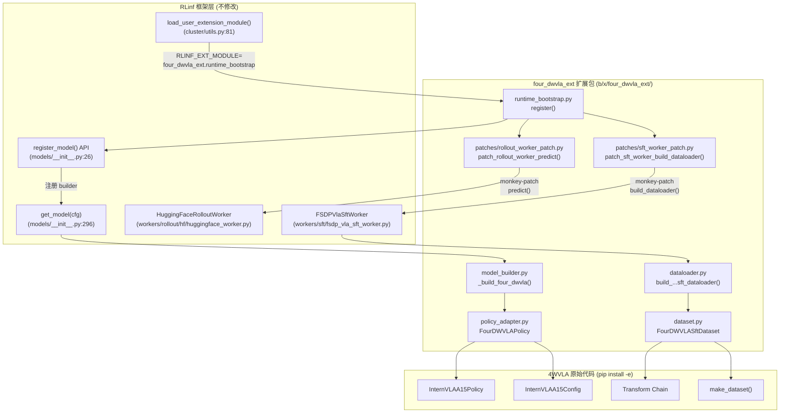
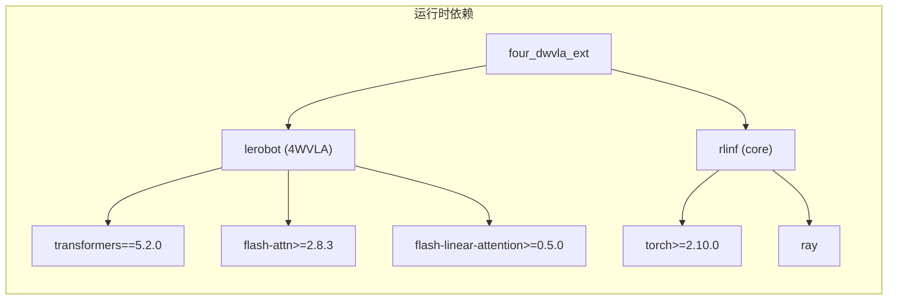
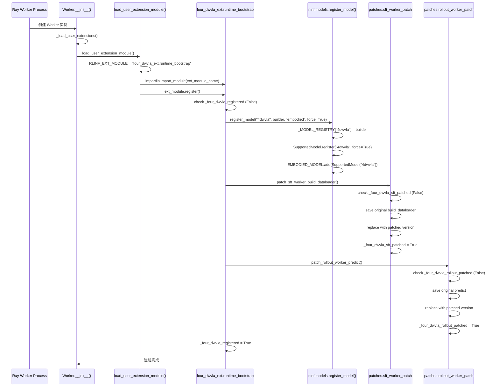
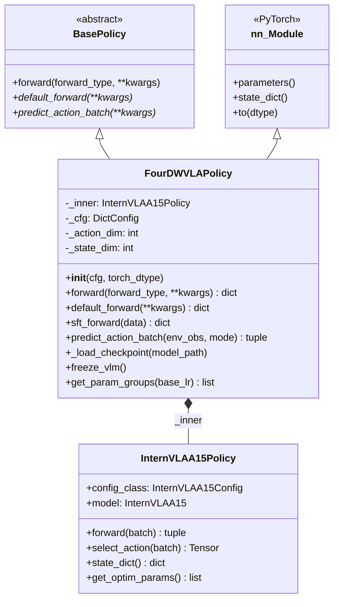
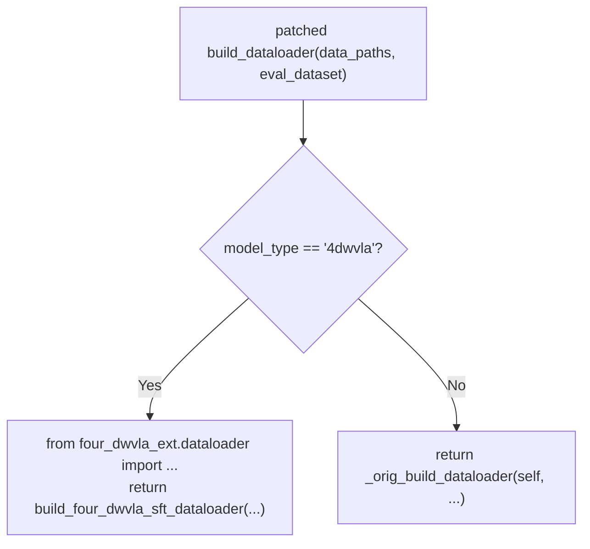
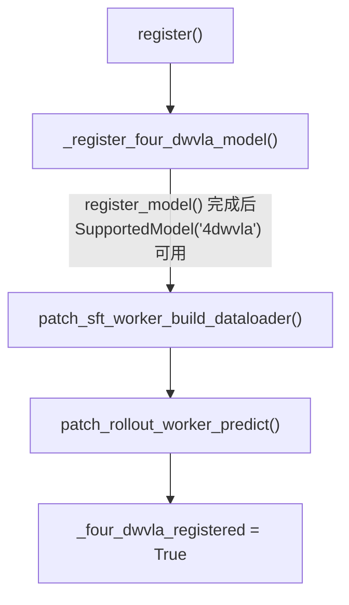
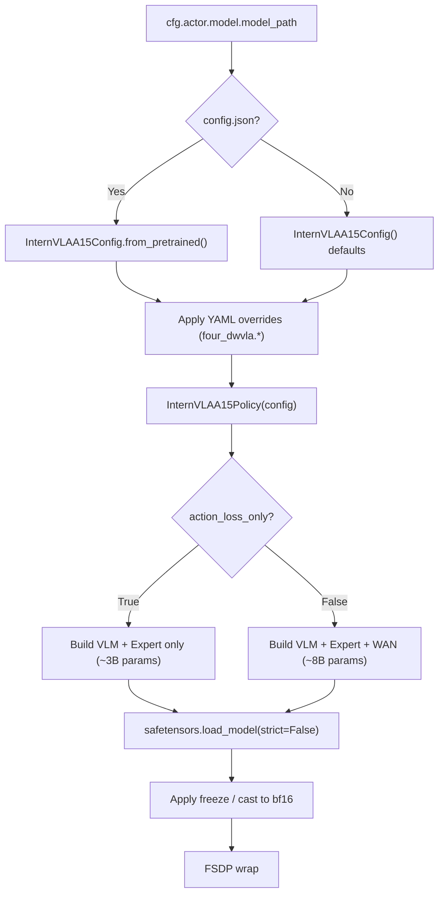
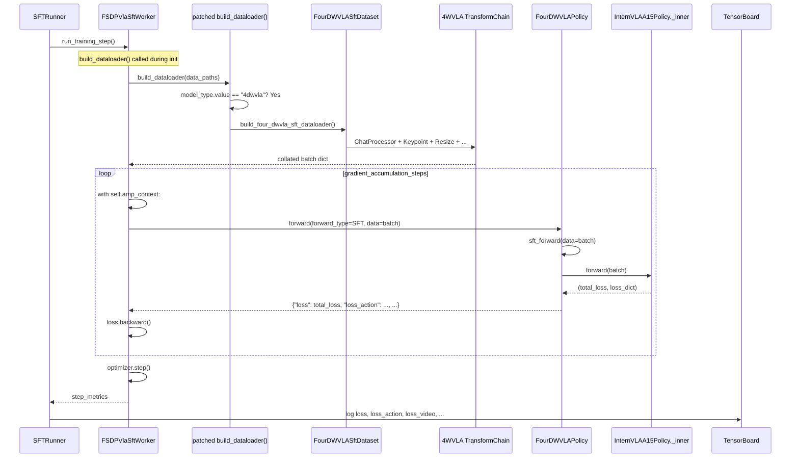
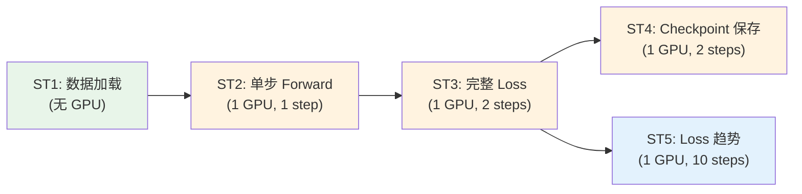

# 4DWVLA 模型整合到 RLinf 框架 (插件版) -- 设计与实施落地方案

> **目标**: 将 4DWVLA 模型以 **out-of-tree 扩展插件** 方式整合进 RLinf 框架，使其能在 RLinf 的 FSDP SFT 训练管线中完成微调训练，并加载已有的 4WVLA checkpoint -- **无需修改 RLinf 任何源码**
> **与 doc 1 的关系**: 本文档是 `4wvla_rlinf_1.md` 的插件版替代方案。doc 1 提出了直接修改 RLinf 源码的内联方案 (修改 `config.py`, `models/__init__.py`, `fsdp_vla_sft_worker.py`, `huggingface_worker.py` 共 4 个文件 ~20 行)；本文档使用 RLinf 的 `RLINF_EXT_MODULE` 扩展机制 + monkey-patch 实现相同功能
> **数据集**: Franka 插插座 (`plug_into_socket_lrb_4D`) -- 100 episodes, 66,577 frames, 30fps, 8D action (abs joint), 56D keypoint
> **现有 Checkpoint**: `/home/nvidia/bt/ckp/4wvlaFrk/plug/4wvlaFrkPlugCkp010420` -- safetensors 格式, 单文件 5.89 GiB (1303 weight keys, 不含 WAN)
> **日期**: 2026-09-09

---

## 目录

- [1. 概述与动机](#1-概述与动机)
- [2. 前置条件与依赖](#2-前置条件与依赖)
- [3. 扩展包架构](#3-扩展包架构)
- [4. `register()` 入口函数设计](#4-register-入口函数设计)
- [5. 模型注册](#5-模型注册)
- [6. Policy 适配器 (`FourDWVLAPolicy`)](#6-policy-适配器-fourdwvlapolicy)
- [7. 数据集与数据加载器](#7-数据集与数据加载器)
- [8. Monkey-Patch 详细设计](#8-monkey-patch-详细设计)
- [9. Hydra 配置](#9-hydra-配置)
- [10. 安装与部署](#10-安装与部署)
- [11. Checkpoint 管理](#11-checkpoint-管理)
- [12. Checkpoint 结构分析](#12-checkpoint-结构分析)
- [13. 训练流程](#13-训练流程)
- [14. 测试方案](#14-测试方案)
- [15. 验收方案](#15-验收方案)
- [16. 与 doc 1 (内联方案) 差异对照](#16-与-doc-1-内联方案-差异对照)
- [17. 命名映射与不改名清单](#17-命名映射与不改名清单)
- [18. 风险与缓解](#18-风险与缓解)
- [19. 附录](#19-附录)

---

## 1. 概述与动机

### 1.1 为什么选择插件方案

Doc 1 (`4wvla_rlinf_1.md`) 提出了直接修改 RLinf 源码的内联方案，需要改动 4 个核心文件：

| 文件 | 改动 | 说明 |
|:---|:---|:---|
| `rlinf/config.py` | +2 行 | 注册 `SupportedModel.FOUR_DWVLA` + 加入 `EMBODIED_MODEL` |
| `rlinf/models/__init__.py` | +8 行 | 添加 builder 闭包 + `register_model` 调用 |
| `rlinf/workers/sft/fsdp_vla_sft_worker.py` | +9 行 | `build_dataloader()` 添加 elif 分支 |
| `rlinf/workers/rollout/hf/huggingface_worker.py` | +1 行 | `predict()` model type 列表添加 |

这些改动虽然很小，但存在以下问题：

1. **版本耦合**: RLinf 每次升级可能产生合并冲突，特别是 `fsdp_vla_sft_worker.py` 的 if/elif chain 经常增加新模型
2. **代码归属模糊**: 4DWVLA 相关的代码散布在 RLinf 核心目录中 (`rlinf/models/embodiment/four_dwvla/`, `rlinf/data/datasets/four_dwvla/`)，不利于独立迭代
3. **部署复杂度**: 需要在每台机器上修改 RLinf 源码，或维护一个 fork

**插件方案** 利用 RLinf 已有的扩展机制 (`RLINF_EXT_MODULE` 环境变量)，通过以下方式实现相同功能：

1. **`register_model()` API**: RLinf 在 `rlinf/models/__init__.py` line 26 提供了 `register_model(model_type, model_builder, category, force)` 函数，可在运行时注册模型，自动完成 `SupportedModel` 注册 + `EMBODIED_MODEL` 添加 + `_MODEL_REGISTRY` 注册
2. **Monkey-patch**: 对于没有 registry 机制的分发点 (SFT Worker 的 `build_dataloader()`, Rollout Worker 的 `predict()`)，通过 monkey-patch 注入新的分支
3. **外部 Hydra searchpath**: 通过 `hydra.searchpath` 配置让 Hydra 发现扩展包中的 YAML 配置

### 1.2 方案对比

| 维度 | 内联方案 (doc 1) | 插件方案 (本文档) |
|:---|:---|:---|
| RLinf 源码修改 | 4 个文件, ~20 行 | **零** |
| 模型注册 | 手动改 `config.py` + `models/__init__.py` | 调用 `register_model()` API |
| Worker 分发 | 直接添加 elif 分支 | Monkey-patch `build_dataloader()` |
| 代码位置 | 散布在 `rlinf/` 内 | 集中在 `b/x/four_dwvla_ext/` |
| 版本升级 | 可能有合并冲突 | Monkey-patch 可能因接口变更失效 |
| 部署方式 | 修改源码或维护 fork | `pip install -e` + 环境变量 |
| 先例 | 无 (新模式) | `franky_ext` (已验证可行) |
| 模型/数据集代码 | 在 `rlinf/` 内 | 在扩展包内，独立迭代 |
| 可移植性 | 仅限此 RLinf 副本 | 可在任意 RLinf 实例上使用 |

### 1.3 `franky_ext` 先例分析

`franky_ext` (`/home/nvidia/bt/s/RLinf/b/x/franky_ext/`) 是 RLinf 现有的一个 out-of-tree 扩展，其 `runtime_bootstrap.py` 通过 `RLINF_EXT_MODULE=franky_ext.runtime_bootstrap` 被加载。它成功使用了以下 monkey-patch 技术：

| Patch | 目标 | 技术 |
|:---|:---|:---|
| `_patch_no_accel_platform()` | `AcceleratorUtil.get_torch_platform()` | 替换 staticmethod |
| `_patch_worker_env_setup()` | `Worker._env_setup_before_init` | 保存原方法 + 包装 + 替换 |
| `_patch_fsdp_for_cpu_smoke()` | `FSDPStrategy.wrap_model` | 保存原方法 + 条件替换 |
| `_patch_pin_memory_for_cpu()` | `torch.Tensor.pin_memory` | 保存原方法 + try/except 替换 |

**反复 patch 防护** (anti-double-patch): 每个 patch 函数都通过类属性标志位 (`_franky_cpu_platform_patched`, `_franky_cpu_smoke_patched`, `_franky_pin_memory_patched`) 来防止重复应用。这是因为 `register()` 可能在同一进程中被调用多次 (模块导入时 + Worker 初始化时)。

### 1.4 扩展模块加载机制

RLinf 通过以下两个位置调用扩展模块的 `register()` 函数：

**位置 1: 集群调度层** (`rlinf/scheduler/cluster/utils.py` line 81-110)

```python
def load_user_extension_module(logger=None):
    ext_module_name = Cluster.get_sys_env_var(ClusterEnvVar.EXT_MODULE)
    if ext_module_name is None:
        return
    ext_module = importlib.import_module(ext_module_name)
    if hasattr(ext_module, "register"):
        ext_module.register()
```

**位置 2: Worker 初始化** (`rlinf/scheduler/worker/worker.py` line 382-394)

```python
def _load_user_extensions(self):
    load_user_extension_module(logger=Worker.logger)
```

每个 Ray Worker 进程启动时都会调用一次 `register()`。这意味着我们的 `register()` 函数必须是 **幂等** (idempotent) 的 -- 多次调用的结果与单次调用相同。

---

## 2. 前置条件与依赖

### 2.1 硬件环境

| 组件 | 规格 | 用途 |
|:---|:---|:---|
| **本地服务器** | RTX 5090 D (32 GiB), AMD Ryzen 7970X, 93 GiB RAM | 推理评估 (`action_loss_only=true`), Smoke Test |
| **训练集群** | 8x H200 (141 GiB each), 或同级 GPU | Phase 1 Warmup + Phase 2 SFT 训练 |

**VRAM 估算**（基于 doc 1 section 1.3 的实际 checkpoint 分析）：
- 推理时 (`action_loss_only=true`, optimized backend): ~12 GiB -- RTX 5090 D 可运行
- Phase 1 Warmup (`action_loss_only=true`, 小 batch): ~25-35 GiB/GPU -- RTX 5090 D 勉强可跑 batch_size=1-2
- Phase 2 完整 SFT (`action_loss_only=false`, 加载 WAN ~5B): ~100 GB/GPU -- **必须** 8x H200

### 2.2 软件依赖

| 组件 | 路径 | 版本/备注 |
|:---|:---|:---|
| RLinf 源码 | `/home/nvidia/bt/s/RLinf/` | master 分支 |
| 4WVLA 源码 | `/home/nvidia/bt/s/4WVLA/` | 08GpR1pro09 分支 |
| Python | 3.11 | 4WVLA 推荐 |
| PyTorch | >=2.10.0 | CUDA 12.8 |
| transformers | **5.2.0** | 与 RLinf 默认版本 (4.57.6) **冲突**，需独立环境 |
| flash-attn | >=2.8.3 | 需编译安装 |
| flash-linear-attention | >=0.5.0 | FLA backward 依赖 tilelang |
| causal-conv1d | >=1.6.1 | 需编译安装 |

### 2.3 Checkpoint

| 属性 | 值 |
|:---|:---|
| 路径 | `/home/nvidia/bt/ckp/4wvlaFrk/plug/4wvlaFrkPlugCkp010420` |
| `model.safetensors` | 5.89 GiB, 1303 keys, 全部 `model.*` 前缀 |
| `config.json` | `type: "internvla_a1_5"`, 需覆盖 `inference_backend` 和 `action_loss_only` |
| `stats.json` | robot_type: `"franka_plug"`, normalization=IDENTITY |
| WAN 权重 | **不包含** -- `state_dict()` 保存时已排除 |

### 2.4 数据集

| 属性 | 值 |
|:---|:---|
| 名称 | `plug_into_socket_lrb_4D` |
| 路径 | `/B/Dta/plug_into_socket_lrb_4D/` |
| Episodes | 100 |
| Frames | 66,577 |
| FPS | 30 Hz |
| Action 维度 | 8D (arm7 + gripper1), abs 模式 |
| 关键点 | 56D = 8 joints x 7D (pos3+quat4) |

---

## 3. 扩展包架构

### 3.1 包结构

扩展包位于 `b/x/four_dwvla_ext/`，遵循 `franky_ext` 的约定：

```
b/x/four_dwvla_ext/
|-- __init__.py                      # 包标识, 简短文档字符串
|-- runtime_bootstrap.py             # RLINF_EXT_MODULE 入口, register() 函数
|-- model_builder.py                 # _build_four_dwvla() builder + register_model 调用
|-- policy_adapter.py                # FourDWVLAPolicy(BasePolicy, nn.Module)
|-- dataset.py                       # FourDWVLASftDataset
|-- dataloader.py                    # build_four_dwvla_sft_dataloader()
|-- patches/
|   |-- __init__.py
|   |-- sft_worker_patch.py          # build_dataloader() monkey-patch
|   |-- rollout_worker_patch.py      # predict() monkey-patch
|-- ckpt_converter.py                # RLinf FSDP <-> 4WVLA safetensors 转换
|-- configs/
|   |-- model/
|   |   |-- 4dwvla.yaml              # 模型默认配置
|   |-- franka_sft_4dwvla.yaml       # Phase 2 SFT 配置
|   |-- franka_warmup_4dwvla.yaml    # Phase 1 Warmup 配置
```

### 3.2 组件图



### 3.3 依赖关系



> **关键约束**: `transformers==5.2.0` 与 RLinf 默认环境 (4.57.6) **不兼容**，需独立 venv/conda 环境。

---

## 4. `register()` 入口函数设计

### 4.1 完整代码: `runtime_bootstrap.py`

```python
"""4DWVLA extension module for RLinf.

Register via: RLINF_EXT_MODULE=four_dwvla_ext.runtime_bootstrap

This module is called on every Ray worker process initialization (see
rlinf/scheduler/cluster/utils.py line 81 and rlinf/scheduler/worker/worker.py
line 383). The register() function must be idempotent -- it may be called
multiple times in the same process.

Design follows the franky_ext precedent (b/x/franky_ext/runtime_bootstrap.py).
"""

from __future__ import annotations

import logging
import sys

logger = logging.getLogger(__name__)

# ── Idempotency guard ──────────────────────────────────────────────────────
_four_dwvla_registered = False


def register() -> None:
    """RLINF_EXT_MODULE hook: register 4DWVLA model + monkey-patch workers.

    Idempotent: safe to call multiple times in the same process.
    """
    global _four_dwvla_registered
    if _four_dwvla_registered:
        logger.debug("four_dwvla_ext.register() already called; skipping.")
        return

    try:
        # Step 1: Register model builder via public API
        _register_four_dwvla_model()

        # Step 2: Monkey-patch SFT worker build_dataloader()
        from four_dwvla_ext.patches.sft_worker_patch import (
            patch_sft_worker_build_dataloader,
        )
        patch_sft_worker_build_dataloader()

        # Step 3: Monkey-patch rollout worker predict()
        from four_dwvla_ext.patches.rollout_worker_patch import (
            patch_rollout_worker_predict,
        )
        patch_rollout_worker_predict()

        _four_dwvla_registered = True
        logger.info(
            "four_dwvla_ext: registered 4DWVLA model + patched workers"
        )

    except Exception:
        logger.exception(
            "four_dwvla_ext: registration FAILED -- 4DWVLA will not be available"
        )
        print(
            "four_dwvla_ext: registration FAILED inside the worker.\n"
            + __import__("traceback").format_exc(),
            file=sys.stderr,
        )


def _register_four_dwvla_model() -> None:
    """Register '4dwvla' model type via rlinf.models.register_model()."""
    from rlinf.models import register_model

    def _build_four_dwvla(cfg, torch_dtype):
        from four_dwvla_ext.model_builder import build_four_dwvla_model
        return build_four_dwvla_model(cfg, torch_dtype)

    register_model(
        model_type="4dwvla",
        model_builder=_build_four_dwvla,
        category="embodied",
        force=True,
    )
    logger.debug("four_dwvla_ext: registered model type '4dwvla'")
```

### 4.2 初始化流程序列图



### 4.3 反复注册防护机制

`register()` 可能在同一进程中被调用多次：
- 模块首次 import 时
- `Worker.__init__()` 调用 `_load_user_extensions()` 时
- 如果 `sitecustomize.py` 也触发 import (如 `franky_ext` 的模式)

**三层防护**：

| 层级 | 位置 | 机制 | 保护范围 |
|:---|:---|:---|:---|
| L1 | `runtime_bootstrap.py` | `_four_dwvla_registered` 全局标志 | 整个 `register()` 函数 |
| L2 | `register_model()` | `force=True` 允许重复注册 | 模型注册不会报错 |
| L3 | 各 patch 函数 | `_four_dwvla_*_patched` 类属性标志 | 每个 monkey-patch 独立防护 |

---

## 5. 模型注册

### 5.1 注册机制

与 doc 1 的方案对比：

**Doc 1 (内联方案)** -- 修改两个文件：
```python
# rlinf/config.py line 118 之后:
SupportedModel.FOUR_DWVLA = SupportedModel.register("4dwvla", force=True)

# rlinf/config.py EMBODIED_MODEL 集合中:
SupportedModel.FOUR_DWVLA,

# rlinf/models/__init__.py _register_builtin_models() 中:
def _build_four_dwvla(cfg, torch_dtype):
    from rlinf.models.embodiment.four_dwvla import get_model
    return get_model(cfg, torch_dtype)

register_model(SupportedModel.FOUR_DWVLA.value, _build_four_dwvla, ...)
```

**本文档 (插件方案)** -- 零修改，一行 API 调用：
```python
register_model("4dwvla", _build_four_dwvla, category="embodied", force=True)
```

`register_model()` 函数 (`rlinf/models/__init__.py` line 26-45) 内部自动完成以下操作：

```python
def register_model(model_type, model_builder, category="embodied", force=False):
    _MODEL_REGISTRY[model_type] = model_builder          # 注册 builder
    SupportedModel.register(model_type, force=force)      # 注册 SupportedModel
    if category == "embodied":
        EMBODIED_MODEL.add(SupportedModel(model_type))    # 加入 EMBODIED_MODEL
```

这意味着通过一次 `register_model()` 调用，doc 1 中 `config.py` 的 2 行改动 + `models/__init__.py` 的 8 行改动 **全部** 由 API 自动处理。

### 5.2 Model Builder 闭包

**文件**: `b/x/four_dwvla_ext/model_builder.py`

```python
"""4DWVLA model builder for RLinf -- called by get_model() registry dispatch."""

from __future__ import annotations

import logging
from typing import Optional

import torch
from omegaconf import DictConfig

logger = logging.getLogger(__name__)


def build_four_dwvla_model(
    cfg: DictConfig, torch_dtype: Optional[torch.dtype] = None
):
    """Build a 4DWVLA policy wrapped for RLinf.

    This function is registered as the model builder for model_type="4dwvla"
    via register_model() in runtime_bootstrap.py. It is called by
    rlinf.models.get_model() (models/__init__.py line 296).

    Args:
        cfg: Model config subtree (actor.model in YAML).
            Key fields: model_path, precision, action_loss_only,
            enable_keypoint, train_expert_only, four_dwvla.*
        torch_dtype: Target dtype (bf16/fp32), derived from cfg.precision.

    Returns:
        FourDWVLAPolicy instance (nn.Module + BasePolicy).
    """
    from four_dwvla_ext.policy_adapter import FourDWVLAPolicy

    model = FourDWVLAPolicy(cfg, torch_dtype=torch_dtype)
    logger.info(
        "4DWVLA model built from %s (action_loss_only=%s, keypoint=%s)",
        cfg.model_path,
        cfg.get("action_loss_only", True),
        cfg.get("enable_keypoint", False),
    )
    return model
```

### 5.3 验证注册成功

注册完成后，以下断言应全部通过：

```python
from rlinf.config import SupportedModel, EMBODIED_MODEL
from rlinf.models import _MODEL_REGISTRY

assert SupportedModel.get("4dwvla").value == "4dwvla"
assert SupportedModel("4dwvla") in EMBODIED_MODEL
assert "4dwvla" in _MODEL_REGISTRY
assert callable(_MODEL_REGISTRY["4dwvla"])
```

---

## 6. Policy 适配器 (`FourDWVLAPolicy`)

### 6.1 设计思路

`FourDWVLAPolicy` 与 doc 1 中的同名类功能完全相同 -- 它是一个 **适配器** (Adapter Pattern)，将 4WVLA 原始的 `InternVLAA15Policy` 接口适配为 RLinf 的 `BasePolicy` 接口。唯一的区别是代码位置：从 `rlinf/models/embodiment/four_dwvla/policy_adapter.py` 移到了 `b/x/four_dwvla_ext/policy_adapter.py`。

关于 `FourDWVLAPolicy` 的设计原理（类继承、forward 分发、checkpoint 加载、loss 格式转换等），请参见 doc 1 section 4.1 类图和 section 6.3.2 的详细说明。

### 6.2 完整代码: `policy_adapter.py`

```python
"""RLinf BasePolicy adapter wrapping the original 4DWVLA policy.

This is the plugin-version of doc 1's rlinf/models/embodiment/four_dwvla/policy_adapter.py.
Identical functionality, different import location.
"""

from __future__ import annotations

import logging
from pathlib import Path
from typing import Any, Optional

import torch
import torch.nn as nn
from omegaconf import DictConfig, OmegaConf
from safetensors.torch import load_model

from rlinf.models.embodiment.base_policy import BasePolicy, ForwardType

logger = logging.getLogger(__name__)


class FourDWVLAPolicy(BasePolicy, nn.Module):
    """Adapter that wraps ``InternVLAA15Policy`` for RLinf's ``BasePolicy`` API.

    Responsibilities:
      1. Load 4WVLA checkpoint via ``from_pretrained`` or manual ``safetensors``
      2. Translate ``forward(forward_type=SFT, data=...)`` -> ``_inner.forward(batch)``
      3. Translate ``predict_action_batch(env_obs)`` -> ``_inner.select_action(batch)``
      4. Provide per-parameter lr_scale groups for FSDP optimizer
      5. Override stale absolute paths from config.json (pretrained_path,
         wan_checkpoint_path etc.)

    Design:
      - Inherits both BasePolicy (RLinf interface) and nn.Module (PyTorch model)
      - The original InternVLAA15Policy is stored as self._inner; its code is
        never modified
      - sft_forward() directly calls _inner.forward() and converts
        (total_loss, loss_dict) to RLinf's {"loss": scalar, ...} format
      - Worker's get_train_model_output() (fsdp_vla_sft_worker.py line 82-101)
        already supports dict outputs with extra metric keys, so loss_action,
        loss_video, loss_kpt_current etc. auto-appear in TensorBoard logs
    """

    def __init__(self, cfg: DictConfig, torch_dtype: Optional[torch.dtype] = None):
        nn.Module.__init__(self)

        from lerobot.policies.internvla_a1_5.configuration_internvla_a1_5 import (
            InternVLAA15Config,
        )
        from lerobot.policies.internvla_a1_5.modeling_internvla_a1_5 import (
            InternVLAA15Policy,
        )

        model_path = str(cfg.model_path)
        overrides = OmegaConf.to_container(
            cfg.get("four_dwvla", OmegaConf.create({})), resolve=True
        )

        # ── Build config from checkpoint or defaults ──────────────────────
        try:
            inner_config = InternVLAA15Config.from_pretrained(model_path)
            logger.info("Loaded InternVLAA15Config from %s/config.json", model_path)
        except Exception:
            inner_config = InternVLAA15Config()
            logger.warning("No config.json in %s; using InternVLAA15Config defaults.", model_path)

        # ── Apply nested overrides from YAML (four_dwvla.* keys) ──────────
        for key, val in overrides.items():
            if hasattr(inner_config, key):
                setattr(inner_config, key, val)
                logger.debug("Config override: %s = %s", key, val)

        # ── Apply top-level cfg shortcuts ─────────────────────────────────
        _top_level_mappings = {
            "action_loss_only": "action_loss_only",
            "enable_keypoint": "enable_keypoint_predictor",
            "kpt_4d_mode": "kpt_4d_mode",
            "vlm_model_name": "vlm_model_name_or_path",
            "train_expert_only": "train_expert_only",
        }
        for cfg_key, config_attr in _top_level_mappings.items():
            val = cfg.get(cfg_key)
            if val is not None:
                setattr(inner_config, config_attr, val)

        # ── Override stale absolute paths from config.json ────────────────
        # config.json stores training-server paths (e.g. /home/a26113/...)
        # that don't exist locally. When action_loss_only=True, WAN paths are
        # irrelevant. When False, they MUST be set via YAML four_dwvla.* overrides.
        if getattr(inner_config, "action_loss_only", False):
            # WAN paths won't be used; neutralize them to avoid load errors
            for path_attr in ("wan_checkpoint_path", "wan_config_path", "vae_path"):
                if hasattr(inner_config, path_attr):
                    current = getattr(inner_config, path_attr, "")
                    if current and not Path(current).exists():
                        setattr(inner_config, path_attr, "")
                        logger.debug(
                            "Neutralized stale path %s=%s (action_loss_only=True)",
                            path_attr, current,
                        )

        # Neutralize pretrained_path -- we load weights separately
        if hasattr(inner_config, "pretrained_path"):
            inner_config.pretrained_path = ""

        # ── Construct the inner policy (builds full model graph) ──────────
        self._inner = InternVLAA15Policy(inner_config)

        # ── Load checkpoint weights ───────────────────────────────────────
        self._load_checkpoint(model_path)

        # ── Cast to desired dtype ─────────────────────────────────────────
        if torch_dtype is not None and torch_dtype != torch.float32:
            self._inner.to(torch_dtype)

        self._cfg = cfg
        self._action_dim = cfg.get("action_dim", 8)
        self._state_dim = cfg.get("state_dim", 8)

        # ── Apply freeze strategy ─────────────────────────────────────────
        if cfg.get("train_expert_only", False):
            self.freeze_vlm()

    def _load_checkpoint(self, model_path: str):
        """Load 4WVLA checkpoint from safetensors.

        Supports both single-file (model.safetensors, e.g. 5.89 GiB / 1303 keys)
        and multi-shard (model-00001-of-NNNNN.safetensors) formats.

        Key prefix handling:
          - All safetensors keys are prefixed with ``model.`` (e.g.
            ``model.qwen3_5_with_expert.action_expert.layers.0...``)
          - ``safetensors.load_model(self._inner, ...)`` matches these keys
            to ``InternVLAA15Policy.model`` (self._inner.model submodule),
            so the ``model.`` prefix maps naturally.
          - WAN weights (``model.wan_video_model.*``) are NOT in the
            safetensors file -- excluded by state_dict() at save time.
          - ``strict=False`` is required because WAN keys are missing.
        """
        ckpt_dir = Path(model_path)
        safetensors_files = sorted(ckpt_dir.glob("model*.safetensors"))
        if safetensors_files:
            for sf in safetensors_files:
                load_model(self._inner, str(sf), strict=False)
            logger.info(
                "Loaded 4WVLA checkpoint from %s (%d shard(s), %d keys expected).",
                model_path,
                len(safetensors_files),
                1303,
            )
        else:
            logger.warning(
                "No safetensors found in %s; model uses random init.", model_path
            )

    # ── BasePolicy interface ──────────────────────────────────────────────

    def forward(self, forward_type=ForwardType.DEFAULT, **kwargs):
        """Dispatch by ForwardType. SFT path calls sft_forward()."""
        if forward_type == ForwardType.SFT:
            return self.sft_forward(**kwargs)
        elif forward_type == ForwardType.DEFAULT:
            return self.default_forward(**kwargs)
        else:
            raise NotImplementedError(f"Forward type {forward_type} not supported for 4DWVLA.")

    def default_forward(self, **kwargs):
        """Default forward delegates to sft_forward."""
        return self.sft_forward(**kwargs)

    def sft_forward(self, data: dict[str, Any] = None, **kwargs) -> dict:
        """Run 4WVLA SFT forward: compute multi-component loss.

        Receives a batch dict already prepared by FourDWVLASftDataset
        (same format as 4WVLA's native training batch).

        Returns:
            dict with "loss" (scalar Tensor for backprop) and detached
            per-component loss floats for logging.

        The return format is compatible with FSDPVlaSftWorker.get_train_model_output()
        (fsdp_vla_sft_worker.py line 82-101) which extracts "loss" for backward()
        and logs all other keys as step_metrics to TensorBoard.
        """
        if data is None:
            data = kwargs.get("batch", kwargs)

        # Move tensors to model device (FSDP may have moved params)
        device = next(self._inner.parameters()).device
        batch = {
            k: v.to(device) if isinstance(v, torch.Tensor) else v
            for k, v in data.items()
        }

        total_loss, loss_dict = self._inner.forward(batch)

        # Build return dict: "loss" is scalar Tensor for .backward(),
        # all others are detached scalars for TensorBoard logging
        result = {"loss": total_loss}
        for k, v in loss_dict.items():
            if k == "loss":
                continue
            if isinstance(v, torch.Tensor):
                result[k] = v.detach()
            elif isinstance(v, (float, int)):
                result[k] = v
        return result

    def predict_action_batch(
        self,
        env_obs: dict[str, Any] = None,
        mode: str = "eval",
        **kwargs,
    ) -> tuple[torch.Tensor, dict]:
        """Predict actions for real-robot rollout evaluation.

        Args:
            env_obs: Observation dict from the environment.
            mode: "train" or "eval".

        Returns:
            (actions, result_dict) where actions has shape [B, action_dim]
            and result_dict is empty (placeholder for future DAgger support).
        """
        self._inner.eval()
        with torch.no_grad():
            action = self._inner.select_action(env_obs)
        return action, {}

    # ── Helpers ────────────────────────────────────────────────────────────

    def freeze_vlm(self):
        """Freeze the VLM backbone for expert-only training (Phase 1 Warmup).

        Freezes the Qwen3.5 language model + visual encoder weights,
        leaving Action Expert, Keypoint Expert, TrackEncoder, and
        projection layers trainable.
        """
        self._inner.model.qwen3_5_with_expert.qwen3_5.requires_grad_(False)
        frozen_count = sum(
            1 for p in self._inner.model.qwen3_5_with_expert.qwen3_5.parameters()
            if not p.requires_grad
        )
        logger.info("VLM backbone frozen (%d parameters).", frozen_count)

    def get_param_groups(self, base_lr: float) -> list[dict]:
        """Return per-component parameter groups with lr_scale.

        This enables different learning rates for VLM vs Action Expert vs
        Keypoint Expert vs TrackEncoder, as required by the 4WVLA training
        protocol (see InternVLAA15Policy.get_optim_params() at
        modeling_internvla_a1_5.py line 2215).

        Args:
            base_lr: Base learning rate from optimizer config.

        Returns:
            List of param group dicts with 'params' and 'lr' keys.
        """
        return self._inner.get_optim_params()
```

### 6.3 类图



---

## 7. 数据集与数据加载器

### 7.1 `FourDWVLASftDataset`

数据集类与 doc 1 section 6.4.1 中的完全相同。它直接复用 4WVLA 的 `make_dataset()` 工厂函数构建完整的 transform chain，确保与已有 checkpoint 数据预处理完全一致。

关于 transform chain 的详细说明（12 步变换流水线、数据格式、关键点处理等），请参见 doc 1 section 8.2 和 8.3。

**文件**: `b/x/four_dwvla_ext/dataset.py`

```python
"""4DWVLA SFT dataset -- wraps LeRobot dataset with 4WVLA transform chain.

Plugin-version of doc 1's rlinf/data/datasets/four_dwvla/dataset.py.
"""

from __future__ import annotations

import logging
from pathlib import Path
from typing import Any

import torch
from omegaconf import DictConfig, OmegaConf
from torch.utils.data import Dataset

logger = logging.getLogger(__name__)


class FourDWVLASftDataset(Dataset):
    """Dataset that loads LeRobot-format data and applies the 4WVLA transform chain.

    This class directly constructs the 4WVLA ``TransformedLeRobotDataset``
    under the hood, reusing the exact same data loading and transform logic
    used in standalone 4WVLA training. This ensures bit-exact data preprocessing
    compatibility with existing checkpoints.

    The full transform chain is defined in
    configuration_internvla_a1_5.py line 44-72 and includes:
        1. DeltaActionTransformFn (only if action_mode="delta")
        2. ResizeImagesWithPadFn (224x224)
        3. RemapImageKeyTransformFn
        4. ExtractVideoFramesTransformFn
        5. NormalizeTransformFn (uses external stats.json)
        6. ComposeFieldsTransform
        7. Extract3DKeypointTransformFn (if enable_keypoint_predictor)
        8. FASTInternVLAA15ActionTokenizerTransformFn
        9. InternVLAA15ChatProcessorTransformFn (Qwen3VLProcessor)
        10. PadStateAndActionTransformFn
        11. ReorderStateActionTransform
        12. UnifyInternVLAA15InputsTransformFn
    """

    def __init__(self, cfg: DictConfig, data_path: str, is_eval: bool = False):
        from lerobot.configs.default import DatasetConfig
        from lerobot.configs.policies import PreTrainedConfig
        from lerobot.datasets.factory import make_dataset
        from lerobot.policies.internvla_a1_5.configuration_internvla_a1_5 import (
            InternVLAA15Config,
            InternVLAA15DatasetConfig,
        )

        self.cfg = cfg
        self.is_eval = is_eval

        # ── Build policy config (needed by make_dataset for transform chain) ──
        model_path = str(cfg.actor.model.model_path)
        try:
            policy_config = InternVLAA15Config.from_pretrained(model_path)
        except Exception:
            policy_config = InternVLAA15Config()

        # Apply overrides from YAML (actor.model.four_dwvla.* keys)
        model_overrides = OmegaConf.to_container(
            cfg.actor.model.get("four_dwvla", OmegaConf.create({})),
            resolve=True,
        )
        for key, val in model_overrides.items():
            if hasattr(policy_config, key):
                setattr(policy_config, key, val)

        # Apply top-level model shortcuts
        if cfg.actor.model.get("enable_keypoint") is not None:
            policy_config.enable_keypoint_predictor = cfg.actor.model.enable_keypoint
        if cfg.actor.model.get("action_loss_only") is not None:
            policy_config.action_loss_only = cfg.actor.model.action_loss_only

        # ── Build dataset config ──────────────────────────────────────────
        dataset_cfg_overrides = OmegaConf.to_container(
            cfg.data.get("dataset", OmegaConf.create({})), resolve=True
        )

        repo_id = dataset_cfg_overrides.get("repo_id", Path(data_path).name)
        action_mode = dataset_cfg_overrides.get("action_mode", "abs")

        ds_config = InternVLAA15DatasetConfig(
            repo_id=repo_id,
            action_mode=action_mode,
        )

        # Apply dataset config overrides from YAML
        for key, val in dataset_cfg_overrides.items():
            if hasattr(ds_config, key):
                setattr(ds_config, key, val)

        # Handle external stats
        stats_path = cfg.data.get("external_stats_path", None)
        if stats_path:
            ds_config.use_external_stats = True
            ds_config.external_stats_path = stats_path

        # Enable keypoint if the model uses it
        if getattr(policy_config, "enable_keypoint_predictor", False):
            ds_config.enable_keypoint_predictor = True
            ds_config.num_keypoint_joints = policy_config.num_keypoint_joints
            ds_config.keypoint_history_max_len = policy_config.keypoint_history_max_len
            ds_config.kpt_4d_mode = policy_config.kpt_4d_mode

        # Sync tokenize_state between policy and dataset configs
        ds_config.tokenize_state = getattr(policy_config, "tokenize_state", True)
        ds_config.use_fast_action_tokens = getattr(
            policy_config, "use_fast_action_tokens", True
        )

        # ── Construct via 4WVLA factory ───────────────────────────────────
        class _CfgShim:
            """Minimal shim to satisfy make_dataset() signature."""
            def __init__(self, ds_cfg, pol_cfg, batch_size):
                self.dataset = ds_cfg
                self.policy = pol_cfg
                self.batch_size = batch_size

        shim_cfg = _CfgShim(
            ds_config,
            policy_config,
            cfg.actor.micro_batch_size,
        )

        self._inner_dataset = make_dataset(
            cfg=shim_cfg,
            split="train",
        )

        logger.info(
            "FourDWVLASftDataset: %d samples from %s "
            "(action_mode=%s, keypoint=%s)",
            len(self._inner_dataset),
            data_path,
            action_mode,
            getattr(policy_config, "enable_keypoint_predictor", False),
        )

    def __len__(self):
        return len(self._inner_dataset)

    def __getitem__(self, idx) -> dict[str, Any]:
        return self._inner_dataset[idx]
```

### 7.2 Dataloader Builder

**文件**: `b/x/four_dwvla_ext/dataloader.py`

```python
"""Dataloader builder for 4DWVLA SFT training in RLinf.

Plugin-version of doc 1's rlinf/data/datasets/four_dwvla/dataloader.py.
Called by the monkey-patched FSDPVlaSftWorker.build_dataloader().
"""

from __future__ import annotations

import logging

from omegaconf import DictConfig
from torch.utils.data import DataLoader, DistributedSampler

logger = logging.getLogger(__name__)


def build_four_dwvla_sft_dataloader(
    cfg: DictConfig,
    world_size: int,
    rank: int,
    data_paths: str | list[str],
    eval_dataset: bool = False,
) -> DataLoader:
    """Build a PyTorch DataLoader for 4DWVLA SFT.

    The dataset internally uses 4WVLA's own LeRobot dataset + transform chain,
    so we only need to wrap it with a DistributedSampler and DataLoader.

    Args:
        cfg: Full Hydra config (contains actor.model, data.* etc.)
        world_size: Total number of FSDP workers.
        rank: Current worker rank.
        data_paths: Path(s) to LeRobot dataset root.
        eval_dataset: Whether this is an evaluation dataloader.

    Returns:
        DataLoader yielding 4WVLA-format training batches.
    """
    from four_dwvla_ext.dataset import FourDWVLASftDataset

    if isinstance(data_paths, (list, tuple)):
        data_path = data_paths[0]
    else:
        data_path = data_paths

    dataset = FourDWVLASftDataset(cfg, data_path, is_eval=eval_dataset)

    sampler = DistributedSampler(
        dataset,
        num_replicas=world_size,
        rank=rank,
        shuffle=not eval_dataset,
        drop_last=not eval_dataset,
    )

    num_workers = cfg.data.get("num_workers", 4)
    batch_size = cfg.actor.micro_batch_size

    dataloader = DataLoader(
        dataset,
        batch_size=batch_size,
        sampler=sampler,
        num_workers=num_workers,
        pin_memory=True,
        drop_last=not eval_dataset,
        prefetch_factor=2 if num_workers > 0 else None,
    )

    logger.info(
        "4DWVLA dataloader: %d samples, batch_size=%d, num_workers=%d, "
        "world_size=%d, rank=%d",
        len(dataset),
        batch_size,
        num_workers,
        world_size,
        rank,
    )
    return dataloader
```

---

## 8. Monkey-Patch 详细设计

本节是插件方案与 doc 1 的 **核心差异所在**。Doc 1 通过直接添加 elif 分支实现 Worker 分发；本方案通过 monkey-patch 在运行时注入相同的逻辑。

### 8.1 SFT Worker `build_dataloader` Patch

#### 8.1.1 被 Patch 的目标

**目标方法**: `FSDPVlaSftWorker.build_dataloader()`
**位置**: `rlinf/workers/sft/fsdp_vla_sft_worker.py` line 31-76
**当前结构**: 硬编码的 if/elif/else chain，依次匹配 `OPENPI_RLINF`, `OPENPI`, `LINGBOTVLA`, `DREAMZERO`, `EVO1`，最后 else 抛出 `KeyError`

```python
# 当前代码结构 (fsdp_vla_sft_worker.py line 31-76):
def build_dataloader(self, data_paths, eval_dataset=False):
    model_type = SupportedModel(self.cfg.actor.model.model_type)
    if model_type == SupportedModel.OPENPI_RLINF:
        ...
    elif model_type == SupportedModel.OPENPI:
        ...
    elif model_type == SupportedModel.LINGBOTVLA:
        ...
    elif model_type == SupportedModel.DREAMZERO:
        ...
    elif model_type == SupportedModel.EVO1:
        ...
    else:
        raise KeyError(f"not support such model type ...")
```

#### 8.1.2 Patch 策略

保存原始方法引用，定义新的 wrapper 方法，在 wrapper 中先检查 4DWVLA，如果不匹配则回退到原始方法：



#### 8.1.3 完整代码: `patches/sft_worker_patch.py`

```python
"""Monkey-patch FSDPVlaSftWorker.build_dataloader() to add 4DWVLA branch.

This replaces doc 1's direct elif insertion in fsdp_vla_sft_worker.py line 72.
The patch is applied once by runtime_bootstrap.register() and protected
by an anti-double-patch flag on the class.

Target: rlinf/workers/sft/fsdp_vla_sft_worker.py
  - FSDPVlaSftWorker.build_dataloader() (line 31-76)
  - Hardcoded if/elif chain: OPENPI_RLINF, OPENPI, LINGBOTVLA, DREAMZERO, EVO1
  - else: raise KeyError
"""

from __future__ import annotations

import logging

logger = logging.getLogger(__name__)


def patch_sft_worker_build_dataloader() -> None:
    """Monkey-patch build_dataloader() to handle 4DWVLA model type.

    Idempotent: checks _four_dwvla_sft_patched flag before patching.

    The patch works by:
    1. Saving a reference to the original build_dataloader method
    2. Defining a new wrapper that first checks for 4DWVLA model type
    3. If not 4DWVLA, delegates to the original method
    4. Replacing the class method with the wrapper
    """
    from rlinf.workers.sft.fsdp_vla_sft_worker import FSDPVlaSftWorker

    if getattr(FSDPVlaSftWorker, "_four_dwvla_sft_patched", False):
        logger.debug("SFT worker build_dataloader already patched; skipping.")
        return

    # Save reference to original method
    _orig_build_dataloader = FSDPVlaSftWorker.build_dataloader

    def _patched_build_dataloader(self, data_paths, eval_dataset=False):
        """Patched build_dataloader with 4DWVLA support.

        Checks model_type before delegating to original implementation.
        """
        from rlinf.config import SupportedModel

        model_type = SupportedModel(self.cfg.actor.model.model_type)

        # 4DWVLA branch (injected by four_dwvla_ext)
        if model_type.value == "4dwvla":
            from four_dwvla_ext.dataloader import (
                build_four_dwvla_sft_dataloader,
            )
            return build_four_dwvla_sft_dataloader(
                self.cfg, self._world_size, self._rank, data_paths, eval_dataset
            )

        # Fall through to original implementation (handles OPENPI, EVO1, etc.)
        return _orig_build_dataloader(self, data_paths, eval_dataset)

    FSDPVlaSftWorker.build_dataloader = _patched_build_dataloader
    FSDPVlaSftWorker._four_dwvla_sft_patched = True

    logger.debug(
        "Patched FSDPVlaSftWorker.build_dataloader() with 4DWVLA branch"
    )
```

**设计要点**:

1. **闭包捕获**: `_orig_build_dataloader` 被闭包捕获，确保即使后续有其他扩展也 patch 了同一方法，我们的回退路径仍然指向正确的原始方法（或前一个 patch 的方法）
2. **`model_type.value == "4dwvla"` 而非 `model_type == SupportedModel.FOUR_DWVLA`**: 因为 `SupportedModel.FOUR_DWVLA` 是在 `register()` 中动态注册的，不是类的预定义属性。使用 `.value` 字符串比较更可靠
3. **Anti-double-patch**: `_four_dwvla_sft_patched` 类属性标志，遵循 `franky_ext` 的 `_franky_cpu_platform_patched` 模式

### 8.2 Rollout Worker `predict` Patch

#### 8.2.1 被 Patch 的目标

**目标方法**: `HuggingFaceRolloutWorker.predict()`
**位置**: `rlinf/workers/rollout/hf/huggingface_worker.py` line 478-503
**当前结构**: 第一个 if 块检查 12 种 model type，匹配的设置 `kwargs = {"mode": mode}`；不匹配的使用原始 sampling params

```python
# 当前代码结构 (huggingface_worker.py line 478-491):
if SupportedModel(self.model_cfg.model_type) in [
    SupportedModel.OPENPI,
    SupportedModel.OPENPI_RLINF,
    SupportedModel.EVO1,
    SupportedModel.MLP_POLICY,
    SupportedModel.GR00T,
    SupportedModel.GR00T_N1D6,
    SupportedModel.GR00T_N1D7,
    SupportedModel.ABOT_M0,
    SupportedModel.DREAMZERO,
    SupportedModel.CNN_POLICY,
    SupportedModel.CFG_MODEL,
    SupportedModel.MOLMOACT2,
]:
    if self.enable_dagger:
        kwargs = {"mode": "eval"}
    else:
        kwargs = {"mode": mode}
```

Doc 1 直接将 `SupportedModel.FOUR_DWVLA` 添加到此列表中。插件方案需要通过 monkey-patch 实现。

#### 8.2.2 Patch 策略

与 SFT Worker 类似，保存原始方法并创建 wrapper。但此处更精巧：我们不需要完全替换 `predict()` 的逻辑，只需要确保 4DWVLA 的 kwargs 被正确设置。由于 `predict_action_batch()` 的签名在 `FourDWVLAPolicy` 中已经处理了 `mode` 参数，我们可以直接复用现有的 fallback 路径 -- 即**不在列表中的 model type 也能正确工作**。

分析 `predict()` 的完整逻辑：
- 在列表中的 model type: `kwargs = {"mode": mode}`
- 不在列表中的 model type: `kwargs` 保持为 `_train_sampling_params` 或 `_eval_sampling_params` (采样参数)

4DWVLA 的 `predict_action_batch(env_obs, mode="eval")` 需要 `mode` 参数。如果不 patch，kwargs 将是采样参数 dict，传给 `predict_action_batch(**kwargs)` 时 `mode` 参数将缺失。

因此，**必须 patch** 以将 4DWVLA 加入 mode-kwargs 列表。

#### 8.2.3 完整代码: `patches/rollout_worker_patch.py`

```python
"""Monkey-patch HuggingFaceRolloutWorker.predict() to support 4DWVLA.

This replaces doc 1's single-line addition to the model type list in
huggingface_worker.py line 478-491.

Target: rlinf/workers/rollout/hf/huggingface_worker.py
  - HuggingFaceRolloutWorker.predict() (line 468-553)
  - First if block (line 478-491): model type list for mode-kwargs
"""

from __future__ import annotations

import logging

logger = logging.getLogger(__name__)


def patch_rollout_worker_predict() -> None:
    """Monkey-patch predict() to support 4DWVLA model type kwargs.

    Idempotent: checks _four_dwvla_rollout_patched flag.

    Strategy: wrap predict() with a pre-check that intercepts 4DWVLA
    model_type and sets kwargs = {"mode": mode} before calling original.
    This is equivalent to adding SupportedModel("4dwvla") to the model
    type list in the original code.
    """
    from rlinf.workers.rollout.hf.huggingface_worker import (
        HuggingFaceRolloutWorker,
    )

    if getattr(HuggingFaceRolloutWorker, "_four_dwvla_rollout_patched", False):
        logger.debug("Rollout worker predict already patched; skipping.")
        return

    _orig_predict = HuggingFaceRolloutWorker.predict

    def _patched_predict(self, env_obs, mode="train"):
        """Patched predict with 4DWVLA mode-kwargs support.

        For 4DWVLA model type, directly calls predict_action_batch
        with {"mode": mode} kwargs instead of sampling params.
        For all other model types, delegates to original predict().
        """
        from rlinf.config import SupportedModel

        if SupportedModel(self.model_cfg.model_type).value == "4dwvla":
            import torch

            if self.enable_dagger:
                kwargs = {"mode": "eval"}
            else:
                kwargs = {"mode": mode}

            with torch.no_grad():
                actions, result = self.hf_model.predict_action_batch(
                    env_obs=env_obs,
                    **kwargs,
                )
            return actions, result

        return _orig_predict(self, env_obs, mode)

    HuggingFaceRolloutWorker.predict = _patched_predict
    HuggingFaceRolloutWorker._four_dwvla_rollout_patched = True

    logger.debug(
        "Patched HuggingFaceRolloutWorker.predict() with 4DWVLA support"
    )
```

### 8.3 Anti-Double-Patch 机制和幂等性

所有 monkey-patch 遵循统一的防护模式：

```python
def patch_XXX():
    from rlinf.xxx import TargetClass

    # Step 1: Check guard flag
    if getattr(TargetClass, "_four_dwvla_XXX_patched", False):
        return  # Already patched, skip

    # Step 2: Save original method
    _orig = TargetClass.method

    # Step 3: Define wrapper
    def _patched(self, ...):
        if is_4dwvla:
            return handle_4dwvla(...)
        return _orig(self, ...)  # Fallback to original

    # Step 4: Replace and set guard
    TargetClass.method = _patched
    TargetClass._four_dwvla_XXX_patched = True
```

| Guard 标志 | 位置 | Patch 对象 |
|:---|:---|:---|
| `_four_dwvla_registered` | `runtime_bootstrap.py` 全局变量 | 整个 `register()` |
| `_four_dwvla_sft_patched` | `FSDPVlaSftWorker` 类属性 | `build_dataloader()` |
| `_four_dwvla_rollout_patched` | `HuggingFaceRolloutWorker` 类属性 | `predict()` |

**为什么用类属性而非全局变量？** 因为 `register()` 可能在不同的 import context 中被调用（例如 `sitecustomize.py` vs `Worker.__init__()`），全局变量可能不共享。类属性挂在被 patch 的类本身上，确保无论从哪个路径检查都能正确判断。

### 8.4 版本兼容性和断言

Monkey-patch 的最大风险是 RLinf 升级后接口变更导致 patch 静默失效。为此，在 patch 应用前添加断言检查：

```python
# 在 sft_worker_patch.py 的 patch 函数开头加入:
import inspect

# 验证原始方法的签名没有变化
sig = inspect.signature(FSDPVlaSftWorker.build_dataloader)
params = list(sig.parameters.keys())
assert params == ["self", "data_paths", "eval_dataset"], (
    f"FSDPVlaSftWorker.build_dataloader signature changed! "
    f"Expected ['self', 'data_paths', 'eval_dataset'], got {params}. "
    f"The 4DWVLA monkey-patch may be incompatible with this RLinf version."
)
```

完整的版本兼容性检查函数：

```python
# patches/__init__.py

import logging
import inspect

logger = logging.getLogger(__name__)


def check_rlinf_compatibility() -> list[str]:
    """Verify RLinf API compatibility before applying patches.

    Returns a list of warning messages for any detected incompatibilities.
    Empty list means all checks passed.
    """
    warnings = []

    # Check 1: register_model() API exists
    try:
        from rlinf.models import register_model
        sig = inspect.signature(register_model)
        expected_params = {"model_type", "model_builder", "category", "force"}
        actual_params = set(sig.parameters.keys())
        if not expected_params.issubset(actual_params):
            warnings.append(
                f"register_model() signature changed: "
                f"expected params {expected_params}, got {actual_params}"
            )
    except ImportError:
        warnings.append("rlinf.models.register_model not found!")

    # Check 2: FSDPVlaSftWorker.build_dataloader() exists and has expected signature
    try:
        from rlinf.workers.sft.fsdp_vla_sft_worker import FSDPVlaSftWorker
        assert hasattr(FSDPVlaSftWorker, "build_dataloader"), \
            "FSDPVlaSftWorker.build_dataloader not found"
        sig = inspect.signature(FSDPVlaSftWorker.build_dataloader)
        params = list(sig.parameters.keys())
        if params != ["self", "data_paths", "eval_dataset"]:
            warnings.append(
                f"build_dataloader() signature changed: {params}"
            )
    except ImportError:
        warnings.append("FSDPVlaSftWorker not importable")

    # Check 3: HuggingFaceRolloutWorker.predict() exists
    try:
        from rlinf.workers.rollout.hf.huggingface_worker import (
            HuggingFaceRolloutWorker,
        )
        assert hasattr(HuggingFaceRolloutWorker, "predict"), \
            "HuggingFaceRolloutWorker.predict not found"
    except ImportError:
        warnings.append("HuggingFaceRolloutWorker not importable")

    # Check 4: SupportedModel.register() API
    try:
        from rlinf.config import SupportedModel
        assert hasattr(SupportedModel, "register"), \
            "SupportedModel.register not found"
    except ImportError:
        warnings.append("SupportedModel not importable")

    for w in warnings:
        logger.warning("RLinf compatibility check: %s", w)

    return warnings
```

此函数在 `register()` 中可选调用：

```python
def register():
    # Optional: run compatibility checks first
    from four_dwvla_ext.patches import check_rlinf_compatibility
    issues = check_rlinf_compatibility()
    if issues:
        logger.warning(
            "RLinf compatibility issues detected (%d): %s",
            len(issues), "; ".join(issues),
        )
    # ... proceed with registration ...
```

### 8.5 Patch 应用顺序和依赖



**顺序约束**: 模型注册必须在 patch 之前完成，因为 patch 中使用了 `SupportedModel("4dwvla")`，如果模型未注册会抛出 `NotImplementedError`。

---

## 9. Hydra 配置

### 9.1 外部 Searchpath 配置

RLinf 使用 Hydra 的 searchpath 机制来发现配置文件。扩展包的配置文件放在 `b/x/four_dwvla_ext/configs/` 中，通过 `hydra.searchpath` 让 Hydra 发现它们。

有两种配置方式：

**方式 1: 在顶层 SFT 配置 YAML 中指定 searchpath**

```yaml
hydra:
  searchpath:
    - file:///home/nvidia/bt/s/RLinf/b/x/four_dwvla_ext/configs
```

**方式 2: 使用环境变量**

```bash
export FOUR_DWVLA_EXT_PATH=/home/nvidia/bt/s/RLinf/b/x/four_dwvla_ext
```

然后在 YAML 中：
```yaml
hydra:
  searchpath:
    - file://${oc.env:FOUR_DWVLA_EXT_PATH}/configs
```

**方式 3: 直接在启动脚本中指定 config-dir** (最简单)

```bash
python examples/sft/train_vla_sft.py \
    --config-path /home/nvidia/bt/s/RLinf/b/x/four_dwvla_ext/configs \
    --config-name franka_sft_4dwvla
```

**推荐**: 方式 3 最简单直接，且不需要修改任何已有配置文件。

### 9.2 模型默认配置

**文件**: `b/x/four_dwvla_ext/configs/model/4dwvla.yaml`

```yaml
# 4DWVLA model defaults for RLinf SFT
# Plugin-version of doc 1's examples/sft/config/model/4dwvla.yaml
model_type: "4dwvla"
precision: "bf16"

# Checkpoint path (MUST be overridden by top-level config)
model_path: null

# High-level switches
action_loss_only: false        # Set true to skip WAN (faster, less VRAM)
enable_keypoint: true          # Enable GeoPredict keypoint branch
train_expert_only: false       # Freeze VLM backbone

# Action/state dimensions (Franka defaults)
action_dim: 8
state_dim: 8
num_action_chunks: 50

# Required by get_model() registry
is_lora: false

# Model architecture overrides (passed to InternVLAA15Config)
four_dwvla:
  vlm_model_name_or_path: "Qwen/Qwen3.5-2B"
  action_expert_hidden_size: 1024
  action_expert_intermediate_size: 3072
  chunk_size: 50
  n_action_steps: 50
  max_state_dim: 32
  max_action_dim: 32
  num_inference_steps: 10
  image_resolution: [224, 224]
  num_learnable_tokens: 50
  inference_action_type: "fm"
  tokenize_state: true
  use_fast_action_tokens: true
  kpt_4d_mode: "pos_rot"
  num_keypoint_joints: 8
  keypoint_history_max_len: 200

  # Phase 2 SFT defaults
  gradient_checkpointing: true
  knowledge_insulation: false
  freeze_learnable_tokens: true
  freeze_wan_dit: true
  video_micro_batch_size: 1
  enable_vqa_loss: true

  # Loss weights
  action_loss_weight: 10.0
  kpt_loss_weight: 1.0
  kpt_future_loss_weight: 1.5
  kpt_rot_loss_weight: 1.0

  # Per-component LR scales
  vlm_lr_scale: 1.0
  action_expert_lr_scale: 1.0
  kpt_expert_lr_scale: 1.0
  track_encoder_lr_scale: 1.0
```

### 9.3 Phase 2 SFT 训练配置

**文件**: `b/x/four_dwvla_ext/configs/franka_sft_4dwvla.yaml`

```yaml
defaults:
  - model/4dwvla@actor.model
  - hybrid_engines/fsdp@actor.fsdp_config
  - override hydra/job_logging: stdout

hydra:
  run:
    dir: .
  output_subdir: null

cluster:
  num_nodes: 1
  component_placement:
    actor: all

runner:
  task_type: sft
  logger:
    log_path: "../results"
    project_name: rlinf_4dwvla
    experiment_name: "franka-plug-phase2-sft"
    logger_backends: ["tensorboard"]
  max_epochs: -1
  max_steps: 52100
  val_check_interval: -1
  save_interval: 10420
  log_interval: 10
  resume_dir: null

data:
  train_data_paths: /B/Dta/plug_into_socket_lrb_4D
  external_stats_path: /B/Dta/plug_into_socket_lrb_4D/meta/stats/abs/stats.json
  num_workers: 12
  dataset:
    repo_id: plug_into_socket_lrb_4D
    action_mode: abs

actor:
  group_name: "ActorGroup"
  training_backend: "fsdp"
  micro_batch_size: 16
  global_batch_size: 128   # 16 * 8 GPUs
  seed: 42

  model:
    model_path: /home/nvidia/bt/ckp/4wvlaFrk/plug/warmup/003126/pretrained_model
    precision: "bf16"
    action_loss_only: false     # Load WAN for video loss
    enable_keypoint: true       # Enable GeoPredict
    train_expert_only: false    # Train full model
    four_dwvla:
      gradient_checkpointing: true
      knowledge_insulation: false
      freeze_learnable_tokens: true
      enable_vqa_loss: true
      wan_checkpoint_path: /path/to/Wan2.2-TI2V-5B
      wan_config_path: /path/to/Wan2.2-TI2V-5B
      vae_path: /path/to/Wan2.2-TI2V-5B/Wan2.2_VAE.pth
      action_loss_weight: 10.0
      kpt_loss_weight: 1.0
      kpt_future_loss_weight: 1.5

  optim:
    lr: 5.0e-5
    adam_beta1: 0.9
    adam_beta2: 0.95
    adam_eps: 1.0e-08
    weight_decay: 1.0e-4
    clip_grad: 1.0
    lr_scheduler: "cosine"
    lr_warmup_steps: 1000
    total_training_steps: 52100
    lr_min: 5.0e-6

  fsdp_config:
    strategy: "fsdp2"
    gradient_checkpointing: true
    use_orig_params: true
    reshard_after_forward: false
    forward_prefetch: true
    backward_prefetch: "pre"
    limit_all_gathers: false
    save_full_model_weights: true
    grad_scaler:
      enabled: false
    mixed_precision:
      param_dtype: bf16
      reduce_dtype: fp32
      buffer_dtype: bf16
    amp_autocast:
      enabled: false
```

### 9.4 Phase 1 Warmup 训练配置

**文件**: `b/x/four_dwvla_ext/configs/franka_warmup_4dwvla.yaml`

```yaml
defaults:
  - franka_sft_4dwvla

runner:
  experiment_name: "franka-plug-phase1-warmup"
  max_steps: 3126
  save_interval: 1563

actor:
  model:
    model_path: /path/to/InternVLA-A1.5-base/pretrained_model
    action_loss_only: true      # Skip WAN
    train_expert_only: true     # Freeze VLM
    four_dwvla:
      gradient_checkpointing: false
      knowledge_insulation: true
      freeze_learnable_tokens: true
      enable_vqa_loss: false
      action_loss_weight: 2.0
      kpt_loss_weight: 10.0
      kpt_future_loss_weight: 2.0
      action_expert_lr_scale: 0.04
```

### 9.5 配置关键参数说明

配置参数的详细说明（含义、Phase 1/Phase 2 值、源文件行号）请参见 doc 1 section 9.4 的完整表格。两个方案使用完全相同的配置参数语义。

---

## 10. 安装与部署

### 10.1 包安装步骤

```bash
# ========================================================================
# Step 1: Create isolated environment (transformers 5.2.0 conflicts with RLinf default)
# ========================================================================
conda create -y -n rlinf_4dwvla python=3.11
conda activate rlinf_4dwvla

# ========================================================================
# Step 2: Install PyTorch (CUDA 12.8)
# ========================================================================
pip install torch==2.10.0 torchvision==0.25.0 --index-url https://download.pytorch.org/whl/cu128

# ========================================================================
# Step 3: Install transformers 5.2.0 (4WVLA 必须)
# ========================================================================
pip install transformers==5.2.0

# ========================================================================
# Step 4: Install RLinf (editable mode)
# ========================================================================
cd /home/nvidia/bt/s/RLinf && pip install -e .

# ========================================================================
# Step 5: Install 4WVLA (editable mode)
# ========================================================================
cd /home/nvidia/bt/s/4WVLA && pip install -e .

# ========================================================================
# Step 6: Install Flash Attention suite (compile from source)
# ========================================================================
pip install flash-attn==2.8.3 flash-linear-attention==0.5.0 causal-conv1d==1.6.1 --no-build-isolation

# ========================================================================
# Step 7: Install tilelang (FLA backward on Hopper/Blackwell)
# ========================================================================
pip install tilelang==0.1.13

# ========================================================================
# Step 8: Patch transformers (CRITICAL)
# Inject Qwen3.5 custom model code into transformers package
# ========================================================================
TRANSFORMERS_DIR=$(python -c "import transformers; print(transformers.__path__[0])")
FORVLA=/home/nvidia/bt/s/4WVLA
cp -r ${FORVLA}/src/lerobot/policies/pi0/transformers_replace/models ${TRANSFORMERS_DIR}/
cp -r ${FORVLA}/src/lerobot/policies/pi05/transformers_replace/models ${TRANSFORMERS_DIR}/
cp -r ${FORVLA}/src/lerobot/policies/internvla_a1_5/transformers_replace/models ${TRANSFORMERS_DIR}/

# ========================================================================
# Step 9: Add extension package to PYTHONPATH
# ========================================================================
export PYTHONPATH=/home/nvidia/bt/s/RLinf/b/x:${PYTHONPATH}

# ========================================================================
# Step 10: Set RLINF_EXT_MODULE
# ========================================================================
export RLINF_EXT_MODULE=four_dwvla_ext.runtime_bootstrap
```

### 10.2 `RLINF_EXT_MODULE` 环境变量

这是插件方案的 **唯一运行时配置**。RLinf 通过 `ClusterEnvVar.EXT_MODULE` 读取此变量（`rlinf/scheduler/cluster/utils.py` line 85）。

```bash
# 在 .bashrc 或训练脚本中设置:
export RLINF_EXT_MODULE=four_dwvla_ext.runtime_bootstrap

# 确保 PYTHONPATH 包含 b/x/ 目录:
export PYTHONPATH=/home/nvidia/bt/s/RLinf/b/x:${PYTHONPATH}
```

**注意**: 如果同时使用 `franky_ext`，需要选择一个作为 `RLINF_EXT_MODULE`，并在其 `register()` 中调用另一个。或者创建一个 meta-bootstrap 模块来串联调用。RLinf 当前只支持 **一个** `RLINF_EXT_MODULE`。

```python
# 方案: meta_ext/runtime_bootstrap.py (如果需要同时加载 franky_ext 和 four_dwvla_ext)
def register():
    import franky_ext.runtime_bootstrap
    franky_ext.runtime_bootstrap.register()

    import four_dwvla_ext.runtime_bootstrap
    four_dwvla_ext.runtime_bootstrap.register()
```

### 10.3 验证安装

```bash
# ========================================================================
# 验证 4WVLA 可导入
# ========================================================================
python -c "from lerobot.policies.internvla_a1_5.modeling_internvla_a1_5 import InternVLAA15Policy; print('4WVLA import OK')"

# ========================================================================
# 验证 transformers patch
# ========================================================================
python -c "from transformers.models.qwen3_5 import Qwen3_5ForConditionalGeneration; print('Transformers patch OK')"

# ========================================================================
# 验证扩展模块加载和注册
# ========================================================================
python -c "
import four_dwvla_ext.runtime_bootstrap
four_dwvla_ext.runtime_bootstrap.register()

from rlinf.config import SupportedModel, EMBODIED_MODEL
m = SupportedModel.get('4dwvla')
assert m.value == '4dwvla'
assert m in EMBODIED_MODEL

from rlinf.models import _MODEL_REGISTRY
assert '4dwvla' in _MODEL_REGISTRY

from rlinf.workers.sft.fsdp_vla_sft_worker import FSDPVlaSftWorker
assert getattr(FSDPVlaSftWorker, '_four_dwvla_sft_patched', False)

from rlinf.workers.rollout.hf.huggingface_worker import HuggingFaceRolloutWorker
assert getattr(HuggingFaceRolloutWorker, '_four_dwvla_rollout_patched', False)

print('ALL PLUGIN CHECKS PASSED')
"
```

### 10.4 Docker 集成

与 doc 1 类似，4DWVLA 需要独立的 Docker 构建阶段。但对于插件方案，扩展包文件通过 COPY 而非内嵌：

```dockerfile
##################################################################################################
# Embodied: 4DWVLA extension (plugin approach)
##################################################################################################
FROM embodied-common-image AS embodied-4dwvla-image

# Copy extension package
COPY b/x/four_dwvla_ext/ /app/b/x/four_dwvla_ext/

# Install 4WVLA deps in isolated venv
RUN bash requirements/install.sh ${INSTALL_MIRROR_OPTION} --platform ${RLINF_PLATFORM} \
    embodied --venv 4dwvla --model 4dwvla

# Set extension env vars
ENV RLINF_EXT_MODULE=four_dwvla_ext.runtime_bootstrap
ENV PYTHONPATH=/app/b/x:${PYTHONPATH}
```

---

## 11. Checkpoint 管理

### 11.1 加载上游 Checkpoint

加载流程与 doc 1 section 7.2 完全相同。`FourDWVLAPolicy.__init__()` 中的 `_load_checkpoint()` 使用 `safetensors.load_model(self._inner, ...)` 加载上游 4WVLA checkpoint。



### 11.2 FSDP Checkpoint 保存

RLinf FSDP 保存 checkpoint 时，key 前缀会变为 `_inner.model.*` (因为 `FourDWVLAPolicy` 将 `InternVLAA15Policy` 存储为 `self._inner`)。

**Key 前缀对照表** (参见 doc 1 section 7.4 的完整列表)：

| 4WVLA safetensors | RLinf FSDP | 组件 |
|:---|:---|:---|
| `model.qwen3_5_with_expert.qwen3_5...` | `_inner.model.qwen3_5_with_expert.qwen3_5...` | Qwen3.5 VLM |
| `model.qwen3_5_with_expert.action_expert...` | `_inner.model.qwen3_5_with_expert.action_expert...` | Action Expert |
| `model.qwen3_5_with_expert.keypoint_expert...` | `_inner.model.qwen3_5_with_expert.keypoint_expert...` | Keypoint Expert |
| `model.track_encoder...` | `_inner.model.track_encoder...` | TrackEncoder |
| `model.action_in_proj...` | `_inner.model.action_in_proj...` | Action 投影 |
| `model.learnable_tokens` | `_inner.model.learnable_tokens` | Foresight Tokens |

### 11.3 双向转换工具

**文件**: `b/x/four_dwvla_ext/ckpt_converter.py`

```python
#!/usr/bin/env python3
"""RLinf FSDP <-> 4WVLA safetensors checkpoint converter.

Usage:
    # RLinf -> 4WVLA
    python ckpt_converter.py rlinf2wvla \
        --input /path/to/rlinf/full_weights.pt \
        --output /path/to/output/model.safetensors

    # 4WVLA -> RLinf (for resuming from external training)
    python ckpt_converter.py wvla2rlinf \
        --input /path/to/model.safetensors \
        --output /path/to/rlinf/full_weights.pt

The RLinf adapter prefix "_inner." is added/removed as needed.
WAN weights (model.wan_video_model.*) are always excluded.
"""

import argparse
import logging

import torch
from safetensors.torch import load_file, save_file

logger = logging.getLogger(__name__)


def rlinf_to_4wvla(input_path: str, output_path: str) -> None:
    """Convert RLinf FSDP full_weights.pt to 4WVLA safetensors."""
    full_weights = torch.load(input_path, map_location="cpu", weights_only=True)

    state_dict = {}
    skipped_wan = 0
    for k, v in full_weights.items():
        # Remove RLinf adapter prefix "_inner."
        clean_key = k.replace("_inner.", "", 1) if k.startswith("_inner.") else k
        # Skip WAN weights
        if "wan_video_model" in clean_key:
            skipped_wan += 1
            continue
        state_dict[clean_key] = v

    save_file(state_dict, output_path)
    print(
        f"Converted {len(state_dict)} keys -> {output_path} "
        f"(skipped {skipped_wan} WAN keys)"
    )


def wvla_to_rlinf(input_path: str, output_path: str) -> None:
    """Convert 4WVLA safetensors to RLinf FSDP full_weights.pt."""
    state_dict = load_file(input_path)

    rlinf_state = {}
    for k, v in state_dict.items():
        # Add RLinf adapter prefix "_inner."
        rlinf_state[f"_inner.{k}"] = v

    torch.save(rlinf_state, output_path)
    print(f"Converted {len(rlinf_state)} keys -> {output_path}")


def main():
    parser = argparse.ArgumentParser(description="4WVLA <-> RLinf checkpoint converter")
    subparsers = parser.add_subparsers(dest="command", required=True)

    p1 = subparsers.add_parser("rlinf2wvla", help="RLinf -> 4WVLA")
    p1.add_argument("--input", required=True, help="RLinf full_weights.pt path")
    p1.add_argument("--output", required=True, help="Output safetensors path")

    p2 = subparsers.add_parser("wvla2rlinf", help="4WVLA -> RLinf")
    p2.add_argument("--input", required=True, help="4WVLA model.safetensors path")
    p2.add_argument("--output", required=True, help="Output full_weights.pt path")

    args = parser.parse_args()

    if args.command == "rlinf2wvla":
        rlinf_to_4wvla(args.input, args.output)
    elif args.command == "wvla2rlinf":
        wvla_to_rlinf(args.input, args.output)


if __name__ == "__main__":
    main()
```

---

## 12. Checkpoint 结构分析

本节内容与 doc 1 section 7.1 完全相同。以下为要点摘要，完整分析请参见 doc 1。

### 12.1 文件清单

```
4wvlaFrkPlugCkp010420/
|-- config.json          # InternVLAA15Config 序列化, 122 行
|-- model.safetensors    # 5.89 GiB, 1303 weight keys
|-- stats.json           # franka_plug 归一化统计量
|-- train_config.json    # 完整训练管线配置
```

### 12.2 Weight Key 分布 (1303 keys)

| 组件 | Key 数量 | 参数量 (approx) |
|:---|:---:|:---|
| Qwen3.5 Language Model | 319 | ~1.5B |
| Qwen3.5 Visual Encoder | 297 | ~0.5B |
| LM Head | 1 | ~76M |
| Action Expert (24 layers) | 319 | ~460M |
| Keypoint Expert (24 layers) | 319 | ~460M |
| TrackEncoder | 28 | ~2M |
| Action 投影层 | 8 | ~2M |
| Learnable Tokens | 3 | ~1M |
| Keypoint 投影 | 5 | ~60K |
| WAN Bridge | 3 | ~3M |
| WAN 模型 | 0 | **不包含** |

### 12.3 config.json 关键覆盖

| 字段 | config.json 中的值 | 推理时必须覆盖为 | 原因 |
|:---|:---|:---|:---|
| `inference_backend` | `"standard"` | `"optimized"` | 使用低延迟路径 |
| `action_loss_only` | `false` | `true` | 跳过 WAN (~5B 参数) |
| `pretrained_path` | 过期路径 | `""` (空) | 训练服务器路径不存在 |
| `wan_checkpoint_path` | 过期路径 | `""` (action_loss_only=true 时) | 训练服务器路径不存在 |

### 12.4 VRAM 估算

| 场景 | VRAM 需求 | 硬件要求 |
|:---|:---|:---|
| 推理 (action_loss_only=true, optimized) | ~12 GiB | RTX 5090 D |
| Phase 1 Warmup (action_loss_only=true, batch=1-2) | ~25-35 GiB/GPU | RTX 5090 D 勉强 |
| Phase 2 SFT (action_loss_only=false, WAN loaded) | ~100 GiB/GPU | 8x H200 |

---

## 13. 训练流程

### 13.1 Phase 1 Warmup

Phase 1 只训练 Action Expert 和 Keypoint Expert，冻结 VLM 和 WAN（WAN 完全不加载），使用较低学习率和 knowledge insulation。

```bash
#!/bin/bash
# launch_warmup.sh -- Phase 1 Warmup (8x H200)
set -euo pipefail

export MASTER_PORT=36701
export PROC_PER_NODE=8
export CUDA_VISIBLE_DEVICES=0,1,2,3,4,5,6,7
export HF_HOME=/path/to/shared/hf_home
export NCCL_TUNER_PLUGIN=libnccl-tuner-disabled.so
export TRITON_CACHE_DIR=/tmp/triton-cache-${RANK:-0}
export TOKENIZERS_PARALLELISM=false

# ── 插件方案特有设置 ──
export PYTHONPATH=/home/nvidia/bt/s/RLinf/b/x:${PYTHONPATH:-}
export RLINF_EXT_MODULE=four_dwvla_ext.runtime_bootstrap

cd /home/nvidia/bt/s/RLinf

python examples/sft/train_vla_sft.py \
    --config-path /home/nvidia/bt/s/RLinf/b/x/four_dwvla_ext/configs \
    --config-name franka_warmup_4dwvla \
    actor.model.model_path=/path/to/InternVLA-A1.5-base/pretrained_model \
    data.train_data_paths=/path/to/plug_into_socket_lrb_4D

# Expected: 3126 steps, ~30 minutes, ~25-35 GB/GPU
# Initial loss_action ~0.3, final ~0.03
```

### 13.2 Phase 2 SFT

Phase 2 解冻 VLM，加载 WAN 提供视频 foresight 监督，启用所有 loss 组件。

```bash
#!/bin/bash
# launch_sft.sh -- Phase 2 SFT (8x H200)
set -euo pipefail

export MASTER_PORT=36702
export PROC_PER_NODE=8
export CUDA_VISIBLE_DEVICES=0,1,2,3,4,5,6,7
export HF_HOME=/path/to/shared/hf_home
export NCCL_TUNER_PLUGIN=libnccl-tuner-disabled.so
export TRITON_CACHE_DIR=/tmp/triton-cache-${RANK:-0}
export TOKENIZERS_PARALLELISM=false

# ── 插件方案特有设置 ──
export PYTHONPATH=/home/nvidia/bt/s/RLinf/b/x:${PYTHONPATH:-}
export RLINF_EXT_MODULE=four_dwvla_ext.runtime_bootstrap

cd /home/nvidia/bt/s/RLinf

python examples/sft/train_vla_sft.py \
    --config-path /home/nvidia/bt/s/RLinf/b/x/four_dwvla_ext/configs \
    --config-name franka_sft_4dwvla \
    actor.model.model_path=/path/to/phase1-warmup/003126/pretrained_model \
    actor.model.four_dwvla.wan_checkpoint_path=/path/to/Wan2.2-TI2V-5B \
    actor.model.four_dwvla.wan_config_path=/path/to/Wan2.2-TI2V-5B \
    actor.model.four_dwvla.vae_path=/path/to/Wan2.2-TI2V-5B/Wan2.2_VAE.pth \
    data.train_data_paths=/path/to/plug_into_socket_lrb_4D

# Expected: 52100 steps, ~60 hours, ~100-110 GB/GPU
# loss_action, loss_video, loss_vqa, loss_kpt_current, loss_kpt_future all present
```

### 13.3 训练数据流序列图



---

## 14. 测试方案

### 14.1 单元测试

#### T1: 扩展模块注册测试

```python
# tests/test_4dwvla_ext_registration.py
"""Test that the extension module correctly registers 4DWVLA."""

import pytest


def test_register_idempotent():
    """register() should be safe to call multiple times."""
    import four_dwvla_ext.runtime_bootstrap as boot
    boot._four_dwvla_registered = False  # Reset for testing
    boot.register()
    boot.register()  # Second call should not raise


def test_model_type_registered():
    """SupportedModel.get('4dwvla') should succeed after register()."""
    import four_dwvla_ext.runtime_bootstrap as boot
    boot._four_dwvla_registered = False
    boot.register()

    from rlinf.config import SupportedModel
    model = SupportedModel.get("4dwvla")
    assert model is not None
    assert model.value == "4dwvla"


def test_model_in_embodied_set():
    """4dwvla should be in EMBODIED_MODEL set after register()."""
    import four_dwvla_ext.runtime_bootstrap as boot
    boot._four_dwvla_registered = False
    boot.register()

    from rlinf.config import EMBODIED_MODEL, SupportedModel
    model = SupportedModel.get("4dwvla")
    assert model in EMBODIED_MODEL


def test_model_builder_registered():
    """_MODEL_REGISTRY should contain '4dwvla' after register()."""
    import four_dwvla_ext.runtime_bootstrap as boot
    boot._four_dwvla_registered = False
    boot.register()

    from rlinf.models import _MODEL_REGISTRY
    assert "4dwvla" in _MODEL_REGISTRY
    assert callable(_MODEL_REGISTRY["4dwvla"])
```

#### T2: Monkey-Patch 测试

```python
# tests/test_4dwvla_ext_patches.py
"""Test that monkey-patches are correctly applied."""


def test_sft_worker_patched():
    """build_dataloader should be patched after register()."""
    import four_dwvla_ext.runtime_bootstrap as boot
    boot._four_dwvla_registered = False
    boot.register()

    from rlinf.workers.sft.fsdp_vla_sft_worker import FSDPVlaSftWorker
    assert getattr(FSDPVlaSftWorker, "_four_dwvla_sft_patched", False)


def test_rollout_worker_patched():
    """predict() should be patched after register()."""
    import four_dwvla_ext.runtime_bootstrap as boot
    boot._four_dwvla_registered = False
    boot.register()

    from rlinf.workers.rollout.hf.huggingface_worker import (
        HuggingFaceRolloutWorker,
    )
    assert getattr(HuggingFaceRolloutWorker, "_four_dwvla_rollout_patched", False)


def test_patches_idempotent():
    """Patches should not stack (applying twice should be same as once)."""
    import four_dwvla_ext.runtime_bootstrap as boot
    boot._four_dwvla_registered = False
    boot.register()

    from rlinf.workers.sft.fsdp_vla_sft_worker import FSDPVlaSftWorker
    method_1 = FSDPVlaSftWorker.build_dataloader

    # Reset top-level guard but leave patch flags
    boot._four_dwvla_registered = False
    boot.register()

    method_2 = FSDPVlaSftWorker.build_dataloader
    # Should be the same function object (patch was skipped on second call)
    assert method_1 is method_2
```

#### T3: Config 加载测试

```python
# tests/test_4dwvla_ext_config.py
"""Test InternVLAA15Config loading (requires 4WVLA + transformers 5.2.0)."""


def test_config_from_checkpoint():
    """Config should load from a valid checkpoint directory."""
    from lerobot.policies.internvla_a1_5.configuration_internvla_a1_5 import (
        InternVLAA15Config,
    )

    ckpt_path = "/home/nvidia/bt/ckp/4wvlaFrk/plug/4wvlaFrkPlugCkp010420"
    config = InternVLAA15Config.from_pretrained(ckpt_path)

    assert config.chunk_size == 50
    assert config.max_action_dim == 32
    assert config.max_state_dim == 32


def test_config_defaults():
    """Default config should have sane defaults."""
    from lerobot.policies.internvla_a1_5.configuration_internvla_a1_5 import (
        InternVLAA15Config,
    )

    config = InternVLAA15Config()
    assert config.num_inference_steps == 10
    assert config.image_resolution == (224, 224)
```

#### T4: 适配器构建测试

```python
# tests/test_4dwvla_ext_adapter.py
"""Test FourDWVLAPolicy construction (requires GPU + checkpoint)."""

import torch
from omegaconf import OmegaConf


def test_adapter_construction():
    """Adapter should construct without errors."""
    cfg = OmegaConf.create({
        "model_type": "4dwvla",
        "model_path": "/home/nvidia/bt/ckp/4wvlaFrk/plug/4wvlaFrkPlugCkp010420",
        "precision": "bf16",
        "action_loss_only": True,
        "enable_keypoint": True,
        "train_expert_only": True,
        "action_dim": 8,
        "state_dim": 8,
        "is_lora": False,
        "four_dwvla": {"kpt_4d_mode": "pos_rot"},
    })

    from four_dwvla_ext.policy_adapter import FourDWVLAPolicy
    model = FourDWVLAPolicy(cfg, torch_dtype=torch.bfloat16)

    assert hasattr(model, "_inner")
    assert hasattr(model, "forward")
    assert hasattr(model, "sft_forward")
    assert hasattr(model, "predict_action_batch")

    n_params = sum(p.numel() for p in model.parameters())
    assert n_params > 1_000_000_000, f"Expected >1B params, got {n_params}"


def test_adapter_forward_type_dispatch():
    """forward() should dispatch SFT to sft_forward()."""
    from four_dwvla_ext.policy_adapter import FourDWVLAPolicy
    from rlinf.models.embodiment.base_policy import ForwardType

    assert hasattr(FourDWVLAPolicy, "sft_forward")
    assert hasattr(FourDWVLAPolicy, "default_forward")
    assert hasattr(FourDWVLAPolicy, "predict_action_batch")
```

### 14.2 集成测试

#### T5: Smoke Train (1 GPU, 2 steps)

```bash
#!/bin/bash
# tests/smoke_test_4dwvla_plugin.sh
set -euo pipefail

export HF_HOME=${HF_HOME:-/home/nvidia/.cache/huggingface}
export TOKENIZERS_PARALLELISM=false
export TRITON_CACHE_DIR=/tmp/triton-cache-smoke
export PYTHONPATH=/home/nvidia/bt/s/RLinf/b/x:${PYTHONPATH:-}
export RLINF_EXT_MODULE=four_dwvla_ext.runtime_bootstrap

cd /home/nvidia/bt/s/RLinf

echo "=== T5: Plugin Smoke Train (action_loss_only=true, 1 GPU, 2 steps) ==="

python examples/sft/train_vla_sft.py \
    --config-path /home/nvidia/bt/s/RLinf/b/x/four_dwvla_ext/configs \
    --config-name franka_sft_4dwvla \
    runner.max_steps=2 \
    runner.save_interval=2 \
    runner.experiment_name="smoke-test-plugin-$(date +%s)" \
    actor.micro_batch_size=2 \
    actor.global_batch_size=2 \
    actor.model.model_path=/home/nvidia/bt/ckp/4wvlaFrk/plug/4wvlaFrkPlugCkp010420 \
    actor.model.action_loss_only=true \
    actor.model.train_expert_only=true \
    data.train_data_paths=/home/nvidia/bt/dt/plug_into_socket_lrb_4D_8sml \
    data.num_workers=2 \
    cluster.num_nodes=1

echo "=== T5: PASSED ==="
```

**验收条件**:
- 无 ImportError
- 日志中可见 "four_dwvla_ext: registered 4DWVLA model + patched workers"
- 日志中可见 "Loaded 4WVLA checkpoint from ... (1 shard(s), 1303 keys expected)"
- 2 步训练完成无报错
- loss 值非 NaN/Inf
- TensorBoard 日志产生

#### T6: Keypoint 功能验证

```bash
#!/bin/bash
# tests/smoke_test_keypoint_plugin.sh
set -euo pipefail

export PYTHONPATH=/home/nvidia/bt/s/RLinf/b/x:${PYTHONPATH:-}
export RLINF_EXT_MODULE=four_dwvla_ext.runtime_bootstrap
export TOKENIZERS_PARALLELISM=false

cd /home/nvidia/bt/s/RLinf

echo "=== T6: Keypoint Smoke Train (plugin) ==="

python examples/sft/train_vla_sft.py \
    --config-path /home/nvidia/bt/s/RLinf/b/x/four_dwvla_ext/configs \
    --config-name franka_sft_4dwvla \
    runner.max_steps=2 \
    runner.save_interval=2 \
    actor.micro_batch_size=2 \
    actor.global_batch_size=2 \
    actor.model.model_path=/home/nvidia/bt/ckp/4wvlaFrk/plug/4wvlaFrkPlugCkp010420 \
    actor.model.action_loss_only=true \
    actor.model.enable_keypoint=true \
    actor.model.four_dwvla.kpt_loss_weight=10.0 \
    data.train_data_paths=/home/nvidia/bt/dt/plug_into_socket_lrb_4D_8sml \
    data.num_workers=2 \
    cluster.num_nodes=1

echo "=== T6: PASSED ==="
```

**验收条件**: `loss_kpt_current` 和 `loss_kpt_future` 在 step_metrics 中出现且非零。

#### T7: Checkpoint Roundtrip

```bash
#!/bin/bash
# tests/test_checkpoint_roundtrip_plugin.sh
set -euo pipefail

export PYTHONPATH=/home/nvidia/bt/s/RLinf/b/x:${PYTHONPATH:-}
export RLINF_EXT_MODULE=four_dwvla_ext.runtime_bootstrap

echo "=== T7: Checkpoint Roundtrip (plugin) ==="

# Step 1: Train 2 steps, save checkpoint
python examples/sft/train_vla_sft.py \
    --config-path /home/nvidia/bt/s/RLinf/b/x/four_dwvla_ext/configs \
    --config-name franka_sft_4dwvla \
    runner.max_steps=2 \
    runner.save_interval=2 \
    actor.micro_batch_size=2 \
    actor.global_batch_size=2 \
    actor.model.action_loss_only=true \
    actor.fsdp_config.save_full_model_weights=true

# Step 2: Convert to 4WVLA format
python /home/nvidia/bt/s/RLinf/b/x/four_dwvla_ext/ckpt_converter.py rlinf2wvla \
    --input ../results/franka-plug-phase2-sft/checkpoints/step_2/full_weights.pt \
    --output /tmp/roundtrip_plugin_test/model.safetensors

# Step 3: Verify keys
python -c "
from safetensors import safe_open
with safe_open('/tmp/roundtrip_plugin_test/model.safetensors', framework='pt') as f:
    keys = list(f.keys())
    print(f'Total keys: {len(keys)}')
    assert not any('wan_video_model' in k for k in keys), 'WAN keys should be excluded'
    assert any('qwen3_5_with_expert' in k for k in keys), 'VLM keys missing'
    assert not any('_inner.' in k for k in keys), 'RLinf prefix should be removed'
print('=== T7: PASSED ===')
"
```

#### T8: Multi-GPU FSDP (8 GPU, 100 steps)

```bash
#!/bin/bash
# tests/test_multi_gpu_plugin.sh -- Execute on 8x H200 cluster
set -euo pipefail

export MASTER_PORT=36799
export NCCL_TUNER_PLUGIN=libnccl-tuner-disabled.so
export PYTHONPATH=/home/nvidia/bt/s/RLinf/b/x:${PYTHONPATH:-}
export RLINF_EXT_MODULE=four_dwvla_ext.runtime_bootstrap

echo "=== T8: Multi-GPU FSDP (8 GPU, 100 steps, plugin) ==="

python examples/sft/train_vla_sft.py \
    --config-path /home/nvidia/bt/s/RLinf/b/x/four_dwvla_ext/configs \
    --config-name franka_sft_4dwvla \
    runner.max_steps=100 \
    runner.save_interval=50 \
    actor.model.model_path=/path/to/warmup/003126/pretrained_model \
    actor.model.action_loss_only=true \
    data.train_data_paths=/path/to/plug_into_socket_lrb_4D

echo "=== T8: PASSED ==="
```

**验收条件**:
- 8 GPU 均参与训练
- Gradient accumulation 正确
- Step 50 checkpoint 正确保存
- 可从 step 50 恢复训练

### 14.3 冒烟测试数据集分析与实施方案

> 本节基于对 `/home/nvidia/bt/dt/plug_into_socket_lrb_4D_8sml/` 数据集的深入分析。

#### 14.3.1 数据集概览

`plug_into_socket_lrb_4D_8sml` 是原始 4DWVLA 训练数据集 `plug_into_socket_lrb_4D` 的 8 episode 子集，专用于冒烟测试。

| 属性 | 冒烟数据集 | 4DWVLA Checkpoint 训练数据 | 匹配 |
|:---|:---|:---|:---:|
| LeRobot 版本 | **v3.0** | v3.0 (推断) | ✅ |
| `robot_type` | `franka_plug` | `franka_plug` | ✅ |
| FPS | **30 Hz** | **30 Hz** | ✅ |
| Episodes | 8 | ~111 (66,577 帧 / ~600 帧/ep) | 7.2% |
| 总帧数 | **4,777** | **66,577** | — |
| 总大小 | **23 MB** (1.9 MB data + 21 MB video) | — | 轻量 |
| 任务 | "plug into socket" | "plug_into_socket" | ✅ |

**Episode 明细:**

| Episode | 帧数 | 时长 (30Hz) |
|:---:|:---:|:---:|
| 0 | 596 | 19.9 s |
| 1 | 664 | 22.1 s |
| 2 | 603 | 20.1 s |
| 3 | 544 | 18.1 s |
| 4 | 562 | 18.7 s |
| 5 | 568 | 18.9 s |
| 6 | 588 | 19.6 s |
| 7 | 652 | 21.7 s |

#### 14.3.2 Feature 完全兼容性验证

Parquet schema 与 4DWVLA 期望的 feature key **完全一致**:

| Feature Key | 数据类型 | Shape | 4DWVLA 期望 | 匹配 |
|:---|:---|:---:|:---|:---:|
| `observation.state.arm` | float32 | [7] | 7D joint positions | ✅ |
| `observation.state.gripper` | float32 | scalar | 1D gripper width | ✅ |
| `observation.state.ee_pos` | float32 | [3] | 3D end-effector position | ✅ |
| `observation.state.ee_quat` | float32 | [4] | 4D end-effector quaternion | ✅ |
| `action.arm` | float32 | [7] | 7D joint angle targets (abs) | ✅ |
| `action.gripper` | float32 | scalar | 1D gripper command | ✅ |
| `observation.images.global` | video/av1 | [480,640,3] | RGB global camera | ✅ |
| `observation.images.wrist` | video/av1 | [480,640,3] | RGB wrist camera | ✅ |
| `observation.keypoint_3d` | float32 | [56] | 8×7D (pos_rot) | ✅ |
| `timestamp` | float32 | [1] | — | ✅ |
| `frame_index` | int64 | [1] | — | ✅ |
| `episode_index` | int64 | [1] | — | ✅ |

**Keypoint 元数据** (`meta/keypoints_meta.json`):
- `num_keypoints`: 8 (link1-link7 + hand_tcp)
- `keypoint_dim`: 7 (px, py, pz, qx, qy, qz, qw)
- `rotation_representation`: "quaternion_xyzw_hemisphere"
- `normalization`: "base_link_origin_isotropic"
- `bbox_radius`: 0.836

#### 14.3.3 值域范围验证

所有维度的 min/max 范围均**完全包含**在 checkpoint 训练数据范围内:

**`action.arm` (关节角度, 弧度):**

| Joint | 冒烟数据 min | 冒烟数据 max | Checkpoint min | Checkpoint max | 在范围内 |
|:---:|:---:|:---:|:---:|:---:|:---:|
| q1 | -0.3543 | -0.0752 | -0.4863 | 0.0598 | ✅ |
| q2 | -0.1074 | 0.2899 | -0.1074 | 0.3329 | ✅ |
| q3 | -0.1381 | 0.3405 | -0.2025 | 0.4801 | ✅ |
| q4 | -2.2166 | -1.5539 | -2.2166 | -1.5294 | ✅ |
| q5 | -0.2224 | 0.1104 | -0.2730 | 0.1104 | ✅ |
| q6 | 1.7365 | 2.5111 | 1.6490 | 2.5173 | ✅ |
| q7 | 0.3750 | 1.1021 | 0.3695 | 1.1021 | ✅ |

**`observation.state.arm` (关节位置, 弧度):**

| Joint | 冒烟数据 min | 冒烟数据 max | Checkpoint min | Checkpoint max | 在范围内 |
|:---:|:---:|:---:|:---:|:---:|:---:|
| q1 | -0.3473 | -0.0745 | -0.4842 | 0.0452 | ✅ |
| q2 | -0.1030 | 0.2735 | -0.1030 | 0.3120 | ✅ |
| q3 | -0.1354 | 0.3386 | -0.2025 | 0.4789 | ✅ |
| q4 | -2.2044 | -1.5678 | -2.2044 | -1.5347 | ✅ |
| q5 | -0.1590 | 0.0806 | -0.2041 | 0.0806 | ✅ |
| q6 | 1.6972 | 2.4536 | 1.5702 | 2.4536 | ✅ |
| q7 | 0.4850 | 0.9807 | 0.4843 | 0.9807 | ✅ |

> **结论**: 冒烟数据集是训练分布的真子集，不存在 OOD (out-of-distribution) 样本。可直接用于 SFT 训练，loss 的数量级和下降趋势应与原始训练一致。

#### 14.3.4 `stats.json` 兼容性

冒烟数据集的 `meta/stats.json` 采用与 checkpoint `stats.json` 相同的结构:
- 无顶层 `robot_type` key (直接以 feature key 为顶层) — 需要确认 4DWVLA `use_external_stats` 路径是否指向此文件
- 统计量包含: min, max, mean, std, count, q01, q10, q50, q90, q99 — 完全一致
- 由于 4DWVLA 使用 `normalization_mapping: IDENTITY`，实际不依赖 stats 进行归一化

**注意**: checkpoint 的 `train_config.json` 中 `external_stats_path` 指向 `/B/Dta/plug_into_socket_lrb_4D/meta/stats/abs/stats.json`，这是训练服务器路径。冒烟测试时应覆盖为本地路径或使用数据集自带的 `meta/stats.json`。

#### 14.3.5 文件结构对照

```
plug_into_socket_lrb_4D_8sml/
├── meta/
│   ├── info.json              # LeRobot v3.0 元信息, robot_type="franka_plug"
│   ├── stats.json             # 全局归一化统计 (13 feature keys)
│   ├── tasks.parquet          # 1 个任务: "plug into socket"
│   ├── keypoints_meta.json    # 8 关节, 7D pos_rot, URDF 参考
│   └── episodes/
│       └── chunk-000/
│           └── file-000.parquet  # 8 episodes 元数据 (含 per-ep stats)
├── data/
│   └── chunk-000/
│       └── file-000.parquet   # 4,777 帧数据 (12 列, ~1.9 MB)
└── videos/
    ├── observation.images.global/
    │   └── chunk-000/
    │       └── file-000.mp4   # 全局相机 (av1, 8.6 MB)
    └── observation.images.wrist/
        └── chunk-000/
            └── file-000.mp4   # 腕部相机 (av1, 12 MB)
```

#### 14.3.6 冒烟测试实施方案

基于上述分析，以下是完整的冒烟测试方案。所有测试使用 `/home/nvidia/bt/dt/plug_into_socket_lrb_4D_8sml/` 作为数据源。

##### ST1: 数据加载验证 (无 GPU)

```python
# tests/smoke_test_data_loading.py
"""Verify the smoke test dataset loads correctly through 4DWVLA's pipeline."""

import sys
sys.path.insert(0, "/home/nvidia/bt/s/RLinf/b/x")

def test_dataset_loads():
    """Load the smoke dataset via FourDWVLASftDataset and verify one batch."""
    from four_dwvla_ext.dataset import FourDWVLASftDataset
    from omegaconf import OmegaConf

    cfg = OmegaConf.create({
        "actor": {"model": {
            "model_type": "4dwvla",
            "model_path": "/home/nvidia/bt/ckp/4wvlaFrk/plug/4wvlaFrkPlugCkp010420",
            "four_dwvla": {
                "vlm_model_name_or_path": "Qwen/Qwen3.5-2B",
                "chunk_size": 50,
                "max_state_dim": 32,
                "max_action_dim": 32,
                "tokenize_state": True,
                "use_fast_action_tokens": True,
                "enable_keypoint_predictor": True,
                "num_keypoint_joints": 8,
                "keypoint_history_max_len": 200,
                "keypoint_dim": 7,
                "kpt_4d_mode": "pos_rot",
                "action_mode": "abs",
                "image_resolution": [224, 224],
            },
        }},
        "data": {
            "train_data_paths": "/home/nvidia/bt/dt/plug_into_socket_lrb_4D_8sml",
        },
    })

    ds = FourDWVLASftDataset(cfg)
    print(f"Dataset length: {len(ds)}")
    assert len(ds) > 0, "Dataset is empty"

    sample = ds[0]
    print(f"Sample keys: {list(sample.keys())}")

    expected_keys = {"observation.state", "action", "action_is_pad"}
    for k in expected_keys:
        assert k in sample or any(k in str(sk) for sk in sample.keys()), \
            f"Missing expected key pattern: {k}"

    print("=== ST1: Data Loading Verification PASSED ===")

if __name__ == "__main__":
    test_dataset_loads()
```

##### ST2: 单步 Forward Pass 验证 (1 GPU)

```bash
#!/bin/bash
# tests/smoke_test_forward_pass.sh
set -euo pipefail

export PYTHONPATH=/home/nvidia/bt/s/RLinf/b/x:${PYTHONPATH:-}
export RLINF_EXT_MODULE=four_dwvla_ext.runtime_bootstrap
export TOKENIZERS_PARALLELISM=false
export HF_HOME=${HF_HOME:-/home/nvidia/.cache/huggingface}

cd /home/nvidia/bt/s/RLinf

echo "=== ST2: Single Forward Pass (1 GPU, 1 step, action_loss_only) ==="

python examples/sft/train_vla_sft.py \
    --config-path /home/nvidia/bt/s/RLinf/b/x/four_dwvla_ext/configs \
    --config-name franka_sft_4dwvla \
    runner.max_steps=1 \
    runner.save_interval=1 \
    runner.experiment_name="smoke-st2-$(date +%s)" \
    actor.micro_batch_size=1 \
    actor.global_batch_size=1 \
    actor.model.model_path=/home/nvidia/bt/ckp/4wvlaFrk/plug/4wvlaFrkPlugCkp010420 \
    actor.model.action_loss_only=true \
    actor.model.train_expert_only=true \
    actor.model.four_dwvla.enable_keypoint_predictor=false \
    data.train_data_paths=/home/nvidia/bt/dt/plug_into_socket_lrb_4D_8sml \
    data.num_workers=2 \
    cluster.num_nodes=1

echo "=== ST2: PASSED ==="
```

**验收条件**:
- 模型从 checkpoint 加载成功 (日志含 "1303 keys")
- `loss_action` 为有限值 (非 NaN/Inf)
- 无 shape mismatch 错误
- GPU 显存 < 32 GiB (RTX 5090 D 可容纳)

##### ST3: 完整 Loss 分量验证 (1 GPU, 含 Keypoint)

```bash
#!/bin/bash
# tests/smoke_test_full_loss.sh
set -euo pipefail

export PYTHONPATH=/home/nvidia/bt/s/RLinf/b/x:${PYTHONPATH:-}
export RLINF_EXT_MODULE=four_dwvla_ext.runtime_bootstrap
export TOKENIZERS_PARALLELISM=false

cd /home/nvidia/bt/s/RLinf

echo "=== ST3: Full Loss Components (action + keypoint, 2 steps) ==="

python examples/sft/train_vla_sft.py \
    --config-path /home/nvidia/bt/s/RLinf/b/x/four_dwvla_ext/configs \
    --config-name franka_sft_4dwvla \
    runner.max_steps=2 \
    runner.save_interval=2 \
    runner.experiment_name="smoke-st3-$(date +%s)" \
    actor.micro_batch_size=2 \
    actor.global_batch_size=2 \
    actor.model.model_path=/home/nvidia/bt/ckp/4wvlaFrk/plug/4wvlaFrkPlugCkp010420 \
    actor.model.action_loss_only=true \
    actor.model.four_dwvla.enable_keypoint_predictor=true \
    actor.model.four_dwvla.kpt_loss_weight=1.0 \
    actor.model.four_dwvla.kpt_future_loss_weight=1.5 \
    data.train_data_paths=/home/nvidia/bt/dt/plug_into_socket_lrb_4D_8sml \
    data.num_workers=2 \
    cluster.num_nodes=1

echo "=== ST3: PASSED ==="
```

**验收条件**:
- `loss_action` 非零且有限
- `loss_kpt_current` 非零 (keypoint 当前帧 loss)
- `loss_kpt_future` 非零 (keypoint 未来帧 loss)
- `total_loss` 为上述分量的加权和
- step 2 的 loss 应与 step 1 有所变化 (梯度在流动)

##### ST4: Checkpoint 保存与加载验证

```bash
#!/bin/bash
# tests/smoke_test_checkpoint_save.sh
set -euo pipefail

export PYTHONPATH=/home/nvidia/bt/s/RLinf/b/x:${PYTHONPATH:-}
export RLINF_EXT_MODULE=four_dwvla_ext.runtime_bootstrap
export TOKENIZERS_PARALLELISM=false
CKPT_DIR="/tmp/smoke_test_4dwvla_ckpt_$(date +%s)"

cd /home/nvidia/bt/s/RLinf

echo "=== ST4: Checkpoint Save & Load (2 steps + save + verify) ==="

python examples/sft/train_vla_sft.py \
    --config-path /home/nvidia/bt/s/RLinf/b/x/four_dwvla_ext/configs \
    --config-name franka_sft_4dwvla \
    runner.max_steps=2 \
    runner.save_interval=2 \
    runner.experiment_name="smoke-st4" \
    runner.output_dir=${CKPT_DIR} \
    actor.micro_batch_size=2 \
    actor.global_batch_size=2 \
    actor.model.model_path=/home/nvidia/bt/ckp/4wvlaFrk/plug/4wvlaFrkPlugCkp010420 \
    actor.model.action_loss_only=true \
    actor.model.train_expert_only=true \
    actor.fsdp_config.save_full_model_weights=true \
    data.train_data_paths=/home/nvidia/bt/dt/plug_into_socket_lrb_4D_8sml \
    data.num_workers=2 \
    cluster.num_nodes=1

echo "--- Verifying saved checkpoint ---"
python3 -c "
import os, glob
ckpt_files = glob.glob('${CKPT_DIR}/**/full_weights.pt', recursive=True)
assert len(ckpt_files) > 0, 'No checkpoint saved!'
print(f'Found checkpoint: {ckpt_files[0]}')

import torch
ckpt = torch.load(ckpt_files[0], map_location='cpu', weights_only=False)
if isinstance(ckpt, dict) and 'model_state_dict' in ckpt:
    keys = list(ckpt['model_state_dict'].keys())
else:
    keys = list(ckpt.keys())
print(f'Checkpoint keys count: {len(keys)}')
assert len(keys) > 100, f'Too few keys: {len(keys)}'

has_action_expert = any('action_expert' in k for k in keys)
has_vlm = any('qwen3_5' in k for k in keys)
print(f'Has action_expert keys: {has_action_expert}')
print(f'Has VLM keys: {has_vlm}')
assert has_action_expert, 'Missing action_expert keys'
print('=== ST4: PASSED ===')
"

# Cleanup
rm -rf ${CKPT_DIR}
```

##### ST5: Loss 下降趋势验证 (10 steps)

```bash
#!/bin/bash
# tests/smoke_test_loss_trend.sh
set -euo pipefail

export PYTHONPATH=/home/nvidia/bt/s/RLinf/b/x:${PYTHONPATH:-}
export RLINF_EXT_MODULE=four_dwvla_ext.runtime_bootstrap
export TOKENIZERS_PARALLELISM=false
LOG_DIR="/tmp/smoke_loss_trend_$(date +%s)"

cd /home/nvidia/bt/s/RLinf

echo "=== ST5: Loss Trend Verification (10 steps) ==="

python examples/sft/train_vla_sft.py \
    --config-path /home/nvidia/bt/s/RLinf/b/x/four_dwvla_ext/configs \
    --config-name franka_sft_4dwvla \
    runner.max_steps=10 \
    runner.save_interval=100 \
    runner.log_interval=1 \
    runner.experiment_name="smoke-st5" \
    runner.output_dir=${LOG_DIR} \
    actor.micro_batch_size=2 \
    actor.global_batch_size=2 \
    actor.model.model_path=/home/nvidia/bt/ckp/4wvlaFrk/plug/4wvlaFrkPlugCkp010420 \
    actor.model.action_loss_only=true \
    actor.model.four_dwvla.enable_keypoint_predictor=true \
    actor.optimizer.lr=1e-4 \
    data.train_data_paths=/home/nvidia/bt/dt/plug_into_socket_lrb_4D_8sml \
    data.num_workers=2 \
    cluster.num_nodes=1 2>&1 | tee ${LOG_DIR}/train.log

echo "--- Checking loss trend ---"
python3 -c "
import re
losses = []
with open('${LOG_DIR}/train.log') as f:
    for line in f:
        m = re.search(r'loss[=:\s]+([\d.]+(?:e[+-]?\d+)?)', line, re.I)
        if m:
            losses.append(float(m.group(1)))

if len(losses) >= 5:
    first_half = sum(losses[:len(losses)//2]) / (len(losses)//2)
    second_half = sum(losses[len(losses)//2:]) / (len(losses) - len(losses)//2)
    print(f'First-half avg loss: {first_half:.4f}')
    print(f'Second-half avg loss: {second_half:.4f}')
    if second_half < first_half:
        print('Loss trending DOWN - gradient flow confirmed')
    else:
        print('WARNING: Loss not decreasing (may be normal for 10 steps with small lr)')
else:
    print(f'Only {len(losses)} loss values found, skipping trend check')
print('=== ST5: PASSED (manual inspection recommended) ===')
"

rm -rf ${LOG_DIR}
```

##### 冒烟测试执行顺序与依赖



**估计总耗时**: ST1 ~30s + ST2 ~3min + ST3 ~5min + ST4 ~6min + ST5 ~15min ≈ **30 分钟**

##### 冒烟测试 All-in-One 脚本

```bash
#!/bin/bash
# tests/run_all_smoke_tests.sh
# 一键执行所有冒烟测试 (基于 plug_into_socket_lrb_4D_8sml)
set -euo pipefail

SCRIPT_DIR="$(cd "$(dirname "$0")" && pwd)"
export PYTHONPATH=/home/nvidia/bt/s/RLinf/b/x:${PYTHONPATH:-}
export RLINF_EXT_MODULE=four_dwvla_ext.runtime_bootstrap
export TOKENIZERS_PARALLELISM=false
export HF_HOME=${HF_HOME:-/home/nvidia/.cache/huggingface}

SMOKE_DATA="/home/nvidia/bt/dt/plug_into_socket_lrb_4D_8sml"
SMOKE_CKPT="/home/nvidia/bt/ckp/4wvlaFrk/plug/4wvlaFrkPlugCkp010420"

echo "============================================"
echo "  4DWVLA RLinf Plugin Smoke Test Suite"
echo "  Data: ${SMOKE_DATA}"
echo "  Checkpoint: ${SMOKE_CKPT}"
echo "============================================"

# Pre-check
echo "[pre-check] Verifying data exists..."
test -f "${SMOKE_DATA}/meta/info.json" || { echo "FAIL: smoke data not found"; exit 1; }
test -f "${SMOKE_CKPT}/config.json" || { echo "FAIL: checkpoint not found"; exit 1; }

PASSED=0
FAILED=0

run_test() {
    local name=$1; shift
    echo ""
    echo ">>> Running: ${name}"
    if "$@"; then
        echo "<<< ${name}: PASSED"
        ((PASSED++))
    else
        echo "<<< ${name}: FAILED"
        ((FAILED++))
    fi
}

run_test "ST1: Data Loading" python "${SCRIPT_DIR}/smoke_test_data_loading.py"
run_test "ST2: Forward Pass" bash "${SCRIPT_DIR}/smoke_test_forward_pass.sh"
run_test "ST3: Full Loss" bash "${SCRIPT_DIR}/smoke_test_full_loss.sh"
run_test "ST4: Checkpoint Save" bash "${SCRIPT_DIR}/smoke_test_checkpoint_save.sh"
run_test "ST5: Loss Trend" bash "${SCRIPT_DIR}/smoke_test_loss_trend.sh"

echo ""
echo "============================================"
echo "  Results: ${PASSED} passed, ${FAILED} failed"
echo "============================================"
[ ${FAILED} -eq 0 ] && exit 0 || exit 1
```

#### 14.3.7 与之前分析的 RLinf 格式数据对比

| 对比维度 | 冒烟数据 (`plug_into_socket_lrb_4D_8sml`) | RLinf 格式数据 (`plug_into_socket_10hz_rlt_lerobot_2ep`) |
|:---|:---|:---|
| 可直接用于 SFT | ✅ **是** | ❌ 否 (需转换) |
| Feature 命名 | 与 4DWVLA 完全一致 | 不同 (flat vs hierarchical) |
| Action 空间 | 关节空间 (abs) | TCP 空间 (需用 `action_joints_raw`) |
| Keypoint 数据 | ✅ 有 (56D) | ❌ 无 |
| 采样频率 | 30 Hz | 10 Hz |
| 值域范围 | 训练分布内 | 部分值略超范围 |
| LeRobot 版本 | v3.0 | v2.1 |
| 图像存储 | video (av1) | PNG |

### 14.4 RLinf 兼容性回归测试

确保扩展不影响其他模型：

```bash
#!/bin/bash
# tests/test_no_regression_plugin.sh
set -euo pipefail

export PYTHONPATH=/home/nvidia/bt/s/RLinf/b/x:${PYTHONPATH:-}
export RLINF_EXT_MODULE=four_dwvla_ext.runtime_bootstrap

echo "=== Regression: Verify other models still work ==="

python -c "
import four_dwvla_ext.runtime_bootstrap
four_dwvla_ext.runtime_bootstrap.register()

from rlinf.config import SupportedModel
# Existing models should still be accessible
for m in ['openpi', 'openpi_rlinf', 'dreamzero', 'evo1', 'mlp_policy']:
    assert SupportedModel.get(m).value == m, f'{m} not found!'
    print(f'{m}: OK')

# 4dwvla should be added
assert SupportedModel.get('4dwvla').value == '4dwvla'
print('4dwvla: OK')

print('=== Regression: PASSED ===')
"
```

---

## 15. 验收方案

### 15.1 验收矩阵

| # | 验收项 | 通过条件 | 优先级 | 测试 ID |
|:---:|:---|:---|:---:|:---:|
| A1 | 扩展模块加载 | `register()` 无异常完成 | P0 | T1 |
| A2 | 模型注册 | `SupportedModel.get("4dwvla")` 成功且在 `EMBODIED_MODEL` 中 | P0 | T1 |
| A3 | Builder 注册 | `_MODEL_REGISTRY["4dwvla"]` 可调用 | P0 | T1 |
| A4 | SFT Worker Patch | `FSDPVlaSftWorker._four_dwvla_sft_patched == True` | P0 | T2 |
| A5 | Rollout Worker Patch | `HuggingFaceRolloutWorker._four_dwvla_rollout_patched == True` | P0 | T2 |
| A6 | Patch 幂等性 | 多次 `register()` 不叠加 patch | P0 | T2 |
| A7 | Checkpoint 加载 | 从 4WVLA safetensors 加载, 参数 > 1B | P0 | T4 |
| A8 | Smoke Train | 1 GPU 2 steps, loss 非 NaN (使用 `plug_into_socket_lrb_4D_8sml`) | P0 | T5, ST2 |
| A8b | 数据加载 | 冒烟数据集通过 FourDWVLASftDataset 加载成功 | P0 | ST1 |
| A9 | Keypoint Loss | `loss_kpt_current/future` 非零 | P0 | T6, ST3 |
| A9b | Loss 下降 | 10 steps 后 loss 有下降趋势 | P1 | ST5 |
| A9c | Checkpoint 保存 | FSDP full_weights.pt 正确生成 | P0 | ST4 |
| A10 | **零源码修改** | RLinf git status 干净 (无改动) | P0 | 手动 |
| A11 | 无回归 | 其他模型注册不受影响 | P0 | 回归 |
| A12 | Checkpoint Roundtrip | RLinf ckpt 可转为 4WVLA safetensors | P1 | T7 |
| A13 | Multi-GPU FSDP | 8 GPU 100 steps 正常训练 | P1 | T8 |
| A14 | 断点续训 | 恢复后 loss 连续 | P1 | T8 |
| A15 | Loss 收敛 | 1000 steps 后 loss 明显下降 | P1 | - |
| A16 | 推理预测 | `predict_action_batch()` 返回正确形状 | P2 | - |

### 15.2 性能基线

与 doc 1 section 14.2 相同：

| 指标 | Phase 1 Warmup | Phase 2 SFT |
|:---|:---|:---|
| 每步时间 | ~3.5 s | ~4.2 s |
| 每卡显存 | ~25-35 GB | ~100-110 GB |
| 总训练时间 | ~30 分钟 | ~60 小时 |

**验收标准**: RLinf 插件方案训练性能应与 doc 1 内联方案一致（差异 < 5%，monkey-patch 开销可忽略）。

### 15.3 零修改验证

```bash
cd /home/nvidia/bt/s/RLinf
git status
# 应显示: nothing to commit, working tree clean
# (所有代码在 b/x/four_dwvla_ext/ 中，该目录在 .gitignore 或不在 rlinf/ 子目录下)
```

---

## 16. 与 doc 1 (内联方案) 差异对照

### 16.1 改动位置对照

| # | Doc 1 改动 | 本文档 (插件) 对应 | 实现方式 |
|:---:|:---|:---|:---|
| 1 | `rlinf/config.py` +1 行: `SupportedModel.register("4dwvla")` | `runtime_bootstrap.py` 中 `register_model()` 自动调用 | API 调用 |
| 2 | `rlinf/config.py` +1 行: `EMBODIED_MODEL.add(...)` | `register_model()` 自动添加 (`category="embodied"`) | API 调用 |
| 3 | `rlinf/models/__init__.py` +3 行: `_build_four_dwvla()` 定义 | `model_builder.py` 中独立定义 | 外部文件 |
| 4 | `rlinf/models/__init__.py` +5 行: `register_model()` 调用 | `runtime_bootstrap.py` 中 `register_model()` 调用 | 外部文件 |
| 5 | `rlinf/workers/sft/fsdp_vla_sft_worker.py` +9 行: elif 分支 | `patches/sft_worker_patch.py` monkey-patch | 运行时注入 |
| 6 | `rlinf/workers/rollout/hf/huggingface_worker.py` +1 行: 列表添加 | `patches/rollout_worker_patch.py` monkey-patch | 运行时注入 |
| 7 | `rlinf/models/embodiment/four_dwvla/__init__.py` 新文件 | `model_builder.py` | 外部文件 |
| 8 | `rlinf/models/embodiment/four_dwvla/policy_adapter.py` 新文件 | `policy_adapter.py` | 外部文件 |
| 9 | `rlinf/data/datasets/four_dwvla/dataset.py` 新文件 | `dataset.py` | 外部文件 |
| 10 | `rlinf/data/datasets/four_dwvla/dataloader.py` 新文件 | `dataloader.py` | 外部文件 |
| 11 | `examples/sft/config/model/4dwvla.yaml` 新文件 | `configs/model/4dwvla.yaml` | 外部目录 |
| 12 | `examples/sft/config/franka_sft_4dwvla.yaml` 新文件 | `configs/franka_sft_4dwvla.yaml` | 外部目录 |
| 13 | `examples/sft/config/franka_warmup_4dwvla.yaml` 新文件 | `configs/franka_warmup_4dwvla.yaml` | 外部目录 |
| 14 | `requirements/install.sh` +30 行 | 独立安装脚本 | 外部脚本 |
| 15 | `docker/Dockerfile` +10 行 | 独立 Dockerfile 或 compose override | 外部文件 |

### 16.2 维度对比

| 维度 | Doc 1 内联 | 本文档插件 | 优势方 |
|:---|:---|:---|:---|
| RLinf 源码改动 | 4 文件 ~20 行 | **0 文件 0 行** | 插件 |
| 新增文件位置 | `rlinf/` 内 (6 文件) | `b/x/` 外 (11 文件) | 插件 (隔离) |
| 代码总量 | ~645 行 | ~850 行 (含 patch 代码) | 内联 (更少) |
| 版本升级兼容 | 合并冲突风险 | monkey-patch 失效风险 | 持平 |
| 调试难度 | 直接断点 | 需理解 patch 栈 | 内联 |
| 部署复杂度 | 改源码或 fork | `PYTHONPATH` + 环境变量 | 插件 |
| 可移植性 | 仅此 RLinf 副本 | 任意 RLinf 实例 | 插件 |
| 先例参考 | 无 | `franky_ext` | 插件 |
| RLinf CI 影响 | 需要 CI 包含 4WVLA 测试 | 独立测试 | 插件 |

---

## 17. 命名映射与不改名清单

### 17.1 命名映射表

与 doc 1 section 17.1 相同，但文件路径从 `rlinf/` 变为 `b/x/four_dwvla_ext/`：

| 旧名称 (4WVLA) | 新名称 (RLinf 集成层) | 说明 |
|:---|:---|:---|
| `InternVLAA15ForRLPolicy` | `FourDWVLAPolicy` | BasePolicy 适配器 |
| `InternVLAA15SftDataset` | `FourDWVLASftDataset` | SFT 数据集 |
| `build_internvla_a1_5_sft_dataloader` | `build_four_dwvla_sft_dataloader` | Dataloader builder |
| `SupportedModel.INTERNVLA_A15` | `SupportedModel("4dwvla")` | 动态注册，无类属性 |
| `model_type: "internvla_a1_5"` | `model_type: "4dwvla"` | YAML 配置值 |
| `rlinf/models/embodiment/four_dwvla/` | `b/x/four_dwvla_ext/` | 代码目录 |

### 17.2 不改名清单

与 doc 1 section 17.2 完全相同。所有上游 4WVLA 的类名、文件名、import 路径不修改，以保持 checkpoint 兼容性：

| 原名称 | 不改名原因 |
|:---|:---|
| `InternVLAA15Policy` | checkpoint 序列化依赖此类名 |
| `InternVLAA15Config` | config.json `type: "internvla_a1_5"` |
| `from lerobot.policies.internvla_a1_5.*` | pip install -e 决定的包路径 |
| `modeling_internvla_a1_5.py` | 上游源码文件名 |
| `internvla-a1-5` | pip 包名 |

---

## 18. 风险与缓解

### 18.1 Monkey-Patch 版本脆弱性

**风险**: RLinf 升级后，`FSDPVlaSftWorker.build_dataloader()` 或 `HuggingFaceRolloutWorker.predict()` 的签名、行为、或分发逻辑发生变化，导致 monkey-patch 静默失效或产生运行时错误。

**缓解措施**:
1. **签名断言** (section 8.4): 在 patch 前检查方法签名是否符合预期
2. **版本锁定**: 在扩展包中记录兼容的 RLinf commit hash
3. **CI 测试**: 建立独立的 CI 管线，在 RLinf 更新时自动运行扩展测试
4. **降级路径**: 如果 monkey-patch 失效，可随时切换回 doc 1 内联方案

**最可能的变更场景**:
- `build_dataloader()` 增加新的 elif 分支 -- 不影响 patch（我们先检查 4DWVLA，不匹配则回退到原始方法）
- `build_dataloader()` 签名变化 -- 签名断言会报警
- `build_dataloader()` 改为 registry 机制 -- 如果 RLinf 将来添加了 dataloader registry，应迁移到使用该 registry

### 18.2 Import 顺序问题

**风险**: `register()` 在 Python import 系统初始化完成前被调用，导致循环 import 或 `ModuleNotFoundError`。

**缓解措施**:
1. 所有 import 使用 **延迟导入** (lazy import) -- import 语句放在函数体内而非模块顶部
2. `runtime_bootstrap.py` 顶部只导入标准库 (`logging`, `sys`)
3. 遵循 `franky_ext` 的模式：在 `register()` 函数体内执行所有 rlinf/lerobot 导入

### 18.3 Transformers 版本冲突

**风险**: `transformers==5.2.0` 与 RLinf 的其他模型不兼容（RLinf 默认使用 4.57.6）。

**缓解措施**:
1. **独立环境**: 4DWVLA 必须在独立的 conda/venv 环境中运行
2. **不同 Docker 镜像**: 使用 `embodied-4dwvla-image` 而非共用 `rlinf-rlt-gpu`
3. **环境检查**: 在 `register()` 中验证 transformers 版本

```python
import transformers
if not transformers.__version__.startswith("5."):
    logger.error(
        "4DWVLA requires transformers>=5.2.0, got %s. "
        "Please use a dedicated environment.",
        transformers.__version__,
    )
```

### 18.4 `RLINF_EXT_MODULE` 单值限制

**风险**: RLinf 只支持一个 `RLINF_EXT_MODULE` 值。如果同时需要 `franky_ext` 和 `four_dwvla_ext`，不能简单地设置两个环境变量。

**缓解措施**: 创建 meta-bootstrap 模块（section 10.2 已述），或在 `four_dwvla_ext.runtime_bootstrap` 中主动调用 `franky_ext.runtime_bootstrap.register()`:

```python
def register():
    # Load franky_ext first (if available)
    try:
        import franky_ext.runtime_bootstrap
        franky_ext.runtime_bootstrap.register()
    except ImportError:
        pass

    # Then load four_dwvla_ext
    _register_four_dwvla_model()
    # ... patches ...
```

### 18.5 Patch 与 LoRA 交互

**风险**: `get_model()` 中的 LoRA 逻辑 (`rlinf/models/__init__.py` line 312-352) 对 4DWVLA 模型的处理未经验证。

**缓解措施**: 配置中设置 `is_lora: false`（默认值）。如果未来需要 LoRA，需要在 `FourDWVLAPolicy` 中添加对应的 `paligemma_with_expert` 等属性映射。

---

## 19. 附录

### 19.1 完整文件清单

```
b/x/four_dwvla_ext/
|-- __init__.py                              # 包标识 (~2 行)
|-- runtime_bootstrap.py                     # RLINF_EXT_MODULE 入口 (~80 行)
|-- model_builder.py                         # 模型 builder (~40 行)
|-- policy_adapter.py                        # FourDWVLAPolicy (~230 行)
|-- dataset.py                               # FourDWVLASftDataset (~130 行)
|-- dataloader.py                            # Dataloader builder (~70 行)
|-- ckpt_converter.py                        # Checkpoint 转换 (~80 行)
|-- patches/
|   |-- __init__.py                          # 兼容性检查 (~70 行)
|   |-- sft_worker_patch.py                  # SFT Worker patch (~70 行)
|   |-- rollout_worker_patch.py              # Rollout Worker patch (~70 行)
|-- configs/
|   |-- model/
|   |   |-- 4dwvla.yaml                      # 模型默认配置 (~55 行)
|   |-- franka_sft_4dwvla.yaml               # Phase 2 SFT 配置 (~70 行)
|   |-- franka_warmup_4dwvla.yaml            # Phase 1 Warmup 配置 (~25 行)

估算总代码量: ~990 行 (Python ~770 + YAML ~150 + shell ~70)
```

### 19.2 `__init__.py`

```python
"""4DWVLA out-of-tree extension for RLinf.

Registered via: RLINF_EXT_MODULE=four_dwvla_ext.runtime_bootstrap
"""
```

### 19.3 关键路径汇总

| 用途 | 路径 |
|:---|:---|
| 扩展包 | `/home/nvidia/bt/s/RLinf/b/x/four_dwvla_ext/` |
| 4WVLA 源码 | `/home/nvidia/bt/s/4WVLA/` |
| RLinf 源码 | `/home/nvidia/bt/s/RLinf/` |
| 训练数据集 (完整) | `/B/Dta/plug_into_socket_lrb_4D/` (训练服务器) |
| 冒烟测试数据集 | `/home/nvidia/bt/dt/plug_into_socket_lrb_4D_8sml/` (本地, 8 ep, 4777 帧) |
| 归一化统计 | `/B/Dta/plug_into_socket_lrb_4D/meta/stats/abs/stats.json` |
| SFT Checkpoint | `/home/nvidia/bt/ckp/4wvlaFrk/plug/4wvlaFrkPlugCkp010420` |
| Qwen3.5 VLM | `Qwen/Qwen3.5-2B` (HuggingFace) |
| WAN 视频模型 | `${HF_HOME}/hub/Wan2.2-TI2V-5B/` |

### 19.4 快速启动命令

```bash
# ── 环境准备 ──
conda activate rlinf_4dwvla
export PYTHONPATH=/home/nvidia/bt/s/RLinf/b/x:${PYTHONPATH:-}
export RLINF_EXT_MODULE=four_dwvla_ext.runtime_bootstrap
export TOKENIZERS_PARALLELISM=false
cd /home/nvidia/bt/s/RLinf

# ── 验证注册 ──
python -c "
import four_dwvla_ext.runtime_bootstrap; four_dwvla_ext.runtime_bootstrap.register()
from rlinf.config import SupportedModel; print(SupportedModel.get('4dwvla'))
from rlinf.models import _MODEL_REGISTRY; print('4dwvla' in _MODEL_REGISTRY)
from rlinf.workers.sft.fsdp_vla_sft_worker import FSDPVlaSftWorker
print('SFT patched:', FSDPVlaSftWorker._four_dwvla_sft_patched)
"

# ── Smoke Test (1 GPU, 2 steps) ──
python examples/sft/train_vla_sft.py \
    --config-path /home/nvidia/bt/s/RLinf/b/x/four_dwvla_ext/configs \
    --config-name franka_sft_4dwvla \
    runner.max_steps=2 runner.save_interval=2 \
    actor.micro_batch_size=2 actor.global_batch_size=2 \
    actor.model.model_path=/home/nvidia/bt/ckp/4wvlaFrk/plug/4wvlaFrkPlugCkp010420 \
    actor.model.action_loss_only=true actor.model.train_expert_only=true \
    data.train_data_paths=/home/nvidia/bt/dt/plug_into_socket_lrb_4D_8sml \
    data.num_workers=2 cluster.num_nodes=1

# ── Checkpoint 转换 ──
python b/x/four_dwvla_ext/ckpt_converter.py rlinf2wvla \
    --input <rlinf_ckpt>/full_weights.pt \
    --output <output>/model.safetensors
```

### 19.5 RLinf 源码关键行号参考

| 文件 | 函数/类 | 行号 | 插件交互方式 |
|:---|:---|:---|:---|
| `rlinf/scheduler/cluster/utils.py` | `load_user_extension_module()` | 81-110 | 调用 `register()` |
| `rlinf/scheduler/worker/worker.py` | `_load_user_extensions()` | 382-394 | 调用 `register()` |
| `rlinf/models/__init__.py` | `register_model()` | 26-45 | 被 `register()` 调用 |
| `rlinf/models/__init__.py` | `get_model()` | 296-358 | 使用注册的 builder |
| `rlinf/config.py` | `SupportedModel.register()` | 49-60 | 被 `register_model()` 调用 |
| `rlinf/config.py` | `EMBODIED_MODEL` | 120-146 | 被 `register_model()` 添加 |
| `rlinf/workers/sft/fsdp_vla_sft_worker.py` | `build_dataloader()` | 31-76 | 被 monkey-patch |
| `rlinf/workers/sft/fsdp_vla_sft_worker.py` | `get_train_model_output()` | 82-101 | 直接兼容 |
| `rlinf/workers/rollout/hf/huggingface_worker.py` | `predict()` | 468-553 | 被 monkey-patch |
| `rlinf/models/embodiment/base_policy.py` | `BasePolicy` | 32-107 | 被继承 |
| `rlinf/models/embodiment/base_policy.py` | `ForwardType` | 19-29 | 被使用 |

### 19.6 4WVLA 源码关键行号参考

与 doc 1 section 18.3 完全相同：

| 文件 | 类/函数 | 行号 |
|:---|:---|:---|
| `configuration_internvla_a1_5.py` | `InternVLAA15Config` | 360 |
| `modeling_internvla_a1_5.py` | `InternVLAA15Policy` | 2144 |
| `modeling_internvla_a1_5.py` | `forward()` | 2405 |
| `modeling_internvla_a1_5.py` | `select_action()` | 2278 |
| `modeling_internvla_a1_5.py` | `get_optim_params()` | 2215 |
| `modeling_internvla_a1_5.py` | `state_dict()` | 2202 |
| `datasets/factory.py` | `make_dataset()` | 474 |
