# 4DWVLA (4WVLA) 在 RLinf 框架中的 Franka 真机评估 -- 设计与实施落地方案

> **目标**: 基于 RLinf 的真机评估管线, 对 4DWVLA 微调后的 checkpoint 进行 Franka 单臂机器人插座插拔任务的真机评估
> **前序依赖**: `4wvla_rlinf_1.md` -- 4DWVLA 模型已整合进 RLinf 并可加载 checkpoint
> **模型 Checkpoint**: Phase 2 SFT 输出 (safetensors 格式) 或 RLinf FSDP 训练输出, 位于 `/home/nvidia/bt/ckp/4wvlaFrk/plug/4wvlaFrkPlugCkp010420/`
> **机器人**: Franka Emika Panda 单臂 + 2x RealSense D435I 相机 (global + wrist)
> **服务器**: AMD Ryzen Threadripper 7970X, 1x RTX 5090 D (32 GiB), Ubuntu 22.04.5 LTS, kernel 5.15.0-1032-realtime (PREEMPT\_RT)
> **日期**: 2026-09-08

---

## 目录

- [1. 背景与目标](#1-背景与目标)
- [2. 服务器环境与 Docker 架构](#2-服务器环境与-docker-架构)
- [3. 架构分析: 管线适配挑战](#3-架构分析-管线适配挑战)
- [4. 整体评估方案](#4-整体评估方案)
- [5. 静态架构设计](#5-静态架构设计)
- [6. 动态架构设计](#6-动态架构设计)
- [7. 关键设计点: 动作空间桥接](#7-关键设计点-动作空间桥接)
- [8. 详细实施步骤与代码 Diff](#8-详细实施步骤与代码-diff)
- [9. 配置体系设计](#9-配置体系设计)
- [10. 观测与动作接口适配](#10-观测与动作接口适配)
- [11. 安全机制设计](#11-安全机制设计)
- [12. 操作手册: 分步执行指南](#12-操作手册-分步执行指南)
- [13. 测试方案](#13-测试方案)
- [14. 验收方案](#14-验收方案)
- [15. 故障排查](#15-故障排查)
- [16. 命名映射与不改名清单](#16-命名映射与不改名清单)
- [17. 附录](#17-附录)

---

## 1. 背景与目标

### 1.1 评估任务描述

**任务**: Franka 单臂机器人将插头插入插座 (plug into socket).

| 属性 | 值 |
|:---|:---|
| 机器人 | Franka Emika Panda (7-DOF + 1 gripper) |
| 控制模式 | **关节位置控制 (Joint Position)** |
| 动作空间 | 8D: 7 个关节目标角度 + 1 个 gripper 指令 |
| 动作模式 | **绝对 (abs)**: 直接输出目标关节角度 |
| 控制频率 | 30 Hz (与训练数据一致) |
| 相机 | 2 个: global (外部固定) + wrist (腕部) |
| 图像分辨率 | 训练时 224x224 (pad resize), 原始采集 480x640 |
| 状态维度 | 8D: arm\_joint(7) + gripper\_width(1) |
| 推理 chunk\_size | 50 (模型预测 50 步动作, 逐步执行) |
| 评估 episodes | >= 20 (统计显著性) |
| 参考工作实现 | `/home/nvidia/shijia_ws/InternVLA-A/` |
| Checkpoint 路径 | `/home/nvidia/bt/ckp/4wvlaFrk/plug/4wvlaFrkPlugCkp010420/` |

### 1.2 核心挑战

4DWVLA 的 Franka 微调模型与 RLinf 现有 Franka 评估管线存在一个 **根本性差异**:

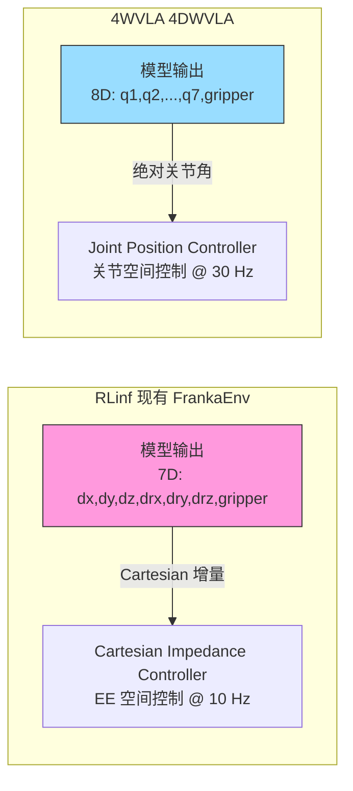

| 维度 | RLinf FrankaEnv (现有) | 4WVLA Franka (需要) |
|:---|:---|:---|
| 动作空间 | 7D Cartesian delta (EE 增量) | 8D Joint absolute (关节绝对角) |
| 控制器 | Cartesian Impedance (笛卡尔阻抗) | Joint Position (关节位置) |
| 坐标系 | 末端执行器 (EE) 空间 | 关节 (Joint) 空间 |
| Gripper | 二值 (open/close) 或连续 | 连续 [0, 0.08] 米 |
| 控制频率 | 10 Hz (默认) | 30 Hz |
| Wrapper 链 | 需要 `RelativeFrame` + `Quat2Euler` | 不需要 (直接关节空间) |
| 状态表示 | tcp\_pose(7)+tcp\_vel(6)+gripper(1)+force(3)+torque(3) = 20D | arm\_joint(7)+gripper(1) = 8D |
| 源文件 | `rlinf/envs/realworld/franka/franka_env.py` L46-L370 | 新建 `franka_joint_env.py` |

**设计决策**: 新建 `FrankaJointEnv` 环境, 继承 `FrankaEnv` 基础设施 (相机, gripper, 安全恢复), 重写动作执行逻辑为关节位置控制. 同时在 `FrankaController` 中添加非阻塞的 `move_joints()` 方法.

### 1.3 已有先例

RLinf 中已存在关节空间控制环境 `DualFrankaJointEnv` (用于双臂), 其特征:
- 使用 `FrankyController.move_joints()` 进行流式关节位置控制
- 16D 绝对关节动作 (双臂各 7 + 2 gripper)
- 注册时 **不添加** `RelativeFrame` 和 `Quat2Euler` wrapper
- 使用 `apply_dual_franka_joint_wrappers()` 而非 `apply_single_arm_wrappers()`

本方案遵循同样的模式, 但针对单臂 8D 关节空间控制.

### 1.4 参考来源

| 来源 | 路径/URL | 内容 |
|:---|:---|:---|
| RLinf FrankaEnv | `rlinf/envs/realworld/franka/franka_env.py` | Franka 环境基类 |
| RLinf FrankaController | `rlinf/envs/realworld/franka/franka_controller.py` | Franka ROS 控制器 |
| RLinf 环境注册 | `rlinf/envs/realworld/franka/tasks/__init__.py` | Gym 环境注册 |
| RLinf RealWorldEnv | `rlinf/envs/realworld/realworld_env.py` | 真机环境基类 |
| RLinf 评估 Runner | `rlinf/runners/embodied_eval_runner.py` | 评估循环 |
| RLinf EnvWorker | `rlinf/workers/env/env_worker.py` | 环境 Worker |
| RLinf HF Worker | `rlinf/workers/rollout/huggingface_worker.py` | 推理 Worker |
| RLinf 真机评估配置 | `evaluations/realworld/realworld_eval.yaml` | Pi0 真机评估模板 |
| RLinf franky\_ext | `b/x/franky_ext/` | 扩展模式示范 |
| RLinf franka\_3.md | `b/d/frk1/franka_3.md` | 扩展模式设计文档 |
| 4WVLA 优化推理 | `4WVLA/src/lerobot/policies/internvla_a1_5/modeling_internvla_a1_5_optimized.py` | 优化推理后端 |
| 4WVLA 推理策略 | `4WVLA/src/lerobot/policies/internvla_a1_5/modeling_internvla_a1_5.py` | 主策略类 |
| 4WVLA 配置 | `4WVLA/src/lerobot/policies/internvla_a1_5/configuration_internvla_a1_5.py` | 配置数据类 |
| 4DWVLA 论文 | https://arxiv.org/abs/2607.04988 | 算法细节 |
| 4DWVLA GitHub | https://github.com/InternRobotics/InternVLA-A-series | 官方代码 |
| Franka 控制参数 | https://frankaemika.github.io/docs/control_parameters.html | 关节限位 |

### 1.5 Checkpoint 结构分析

**Checkpoint 路径**: `/home/nvidia/bt/ckp/4wvlaFrk/plug/4wvlaFrkPlugCkp010420/`

#### 1.5.1 文件组成

| 文件 | 大小 | 内容 |
|:---|:---|:---|
| `model.safetensors` | 5.89 GiB | 1303 个权重 key, 全部以 `model.` 为前缀 |
| `config.json` | 3735 bytes | 模型超参数, `"type": "internvla_a1_5"` |
| `train_config.json` | 12901 bytes | 完整训练管线配置 |
| `stats.json` | 38970 bytes | 归一化统计信息, 机器人类型 `"franka_plug"` |

#### 1.5.2 权重结构 (1303 keys)

| 模块 | Key 数量 | 说明 |
|:---|:---:|:---|
| VLM (Qwen3.5-2B) | 617 | language\_model 319 + visual 297 + lm\_head 1 |
| Action Expert | 319 | 24 层 lightweight transformer |
| Keypoint Expert | 319 | 24 层 (若 `enable_keypoint=false` 则不使用) |
| Track Encoder | 28 | 轨迹编码器 |
| Projections | 20 | action\_in/out\_proj, time\_mlps, learnable\_tokens, keypoint modules, learnable\_to\_wan\_proj |
| **WAN 视频模型** | **0** | **不包含** -- 训练时 frozen, state\_dict 排除 |

**Key 前缀模式**: 所有权重 key 以 `model.` 开头, 例如:
```
model.qwen3_5_with_expert.qwen3_5.model.language_model.layers.0.self_attn.q_proj.weight
model.qwen3_5_with_expert.action_expert.layers.0.self_attn.q_proj.weight
```

这意味着 `load_state_dict()` 时 key 已包含 `model.` 前缀, 无需额外映射.

#### 1.5.3 config.json 关键字段与推理覆盖

Checkpoint 中的 `config.json` 保存的是训练时的配置, 其中部分字段在推理时**必须覆盖**:

| 字段 | config.json 中的值 (训练时) | 推理时需设为 | 原因 |
|:---|:---|:---|:---|
| `inference_backend` | `"standard"` | **`"optimized"`** | 使用优化推理后端, 跳过 WAN 模型加载 |
| `action_loss_only` | `false` | **`true`** | 训练时联合训练 video+action, 推理时只需 action 分支 |
| `pretrained_path` | `"/home/a26113/..."` | **忽略/覆盖** | 训练服务器路径, 本地不存在 (stale path) |
| `wan_checkpoint_path` | `"/B/VENV/..."` | **忽略/覆盖** | WAN 模型路径, 本地不存在; `action_loss_only=true` 时不需要 |
| `gradient_checkpointing` | `true` | `false` (可选) | 推理无需梯度检查点, 关闭可减少开销 |

**归一化映射** (不需要覆盖, 仅供确认):
```json
"normalization_mapping": {"VISUAL": "IDENTITY", "STATE": "IDENTITY", "ACTION": "IDENTITY"}
```
所有通道均为 IDENTITY, 表示训练数据**未做归一化**, 模型直接在原始值空间 (弧度制关节角度) 上训练. 推理时无需反归一化.

#### 1.5.4 Stale 路径问题与解决方案

`config.json` 中的 `pretrained_path` 和 `wan_checkpoint_path` 指向训练服务器上的路径, 在本地推理环境中**不存在**:

```
pretrained_path:      /home/a26113/...  (训练服务器用户目录)
wan_checkpoint_path:  /B/VENV/...       (训练服务器虚拟环境)
```

**RLinf 加载代码必须在 `InternVLAA15Config.from_pretrained()` 之后、模型实例化之前, 通过编程方式覆盖这些字段**:

```python
config = InternVLAA15Config.from_pretrained(ckpt_path)

# 覆盖推理配置 (解决 stale 路径问题)
config.inference_backend = "optimized"
config.action_loss_only = True
config.gradient_checkpointing = False
# pretrained_path 和 wan_checkpoint_path 无需显式设置 --
# action_loss_only=True 时, 模型 __init__ 不会加载 WAN 模型

model = InternVLAA15Policy(config)  # 此时使用 InternVLAA15Optimized 后端
state_dict = safetensors.torch.load_file(ckpt_path / "model.safetensors")
model.load_state_dict(state_dict)
```

这一覆盖逻辑应在 `FourDWVLAPolicy.__init__()` 中实现, 确保每次加载 checkpoint 都自动处理 stale 路径.

#### 1.5.5 stats.json 分析

`stats.json` 记录训练数据的归一化统计信息:

| 特征 | 维度 | 含义 |
|:---|:---|:---|
| `observation.state.arm` | 7 | 关节角度 (rad) |
| `observation.state.gripper` | 1 | 夹爪宽度 |
| `action.arm` | 7 | 目标关节角度 (rad) |
| `action.gripper` | 1 | 目标夹爪指令 |
| `observation.keypoint_3d` | 56 | 8x7D 关键点 (若启用) |

**机器人类型**: `"franka_plug"` -- 表明训练数据来自 Franka 插座插拔任务采集.

**训练数据关节角度范围** (来自 `stats.json`):

| 关节 | 训练数据最小值 (rad) | 训练数据最大值 (rad) | 范围宽度 (rad) | 范围宽度 (deg) |
|:---:|:---:|:---:|:---:|:---:|
| q1 | -0.484 | 0.045 | 0.529 | 30.3 |
| q2 | -0.103 | 0.312 | 0.415 | 23.8 |
| q3 | -0.202 | 0.479 | 0.681 | 39.0 |
| q4 | -2.204 | -1.535 | 0.669 | 38.3 |
| q5 | -0.204 | 0.081 | 0.285 | 16.3 |
| q6 | 1.570 | 2.454 | 0.884 | 50.6 |
| q7 | 0.484 | 0.981 | 0.497 | 28.5 |

这些范围**远窄于 Franka 硬件限位** (对比 7.3 节), 说明训练数据仅覆盖了插座插拔任务所需的有限工作空间. 模型在良好泛化条件下, 输出值应基本落在这些范围附近, 不会远超训练分布.

#### 1.5.6 VRAM 估算

| 组件 | 显存占用 |
|:---|:---|
| 模型权重 (bf16, `model.safetensors`) | 5.89 GiB |
| 权重 bf16 -> fp32 上转 (action path 部分计算) | ~1 GiB 额外 |
| KV Cache + 推理时激活值 | ~3-5 GiB |
| **总计** | **~12 GiB** |

RTX 5090 D (32 GiB) 可轻松容纳, 利用率约 37.5%, 留有充裕余量用于 CUDA Graph 优化和偶发峰值.

---

## 2. 服务器环境与 Docker 架构

### 2.1 硬件环境

| 组件 | 规格 |
|:---|:---|
| CPU | AMD Ryzen Threadripper 7970X 32-Core |
| GPU | 1x NVIDIA GeForce RTX 5090 D (32 GiB VRAM) |
| OS | Ubuntu 22.04.5 LTS |
| Kernel | 5.15.0-1032-realtime (PREEMPT\_RT, 用于机器人实时控制) |
| Robot | Franka Emika Panda @ 172.16.0.2 (via NIC eno1 @ 172.16.0.1/24) |
| Camera 1 | Intel RealSense D435I, serial 420122070525 (global) |
| Camera 2 | Intel RealSense D435I (wrist) |

### 2.2 Docker 双容器架构

RLinf 采用 Docker 双容器架构, 通过 `rlinf-ray` Docker bridge 网络连接:

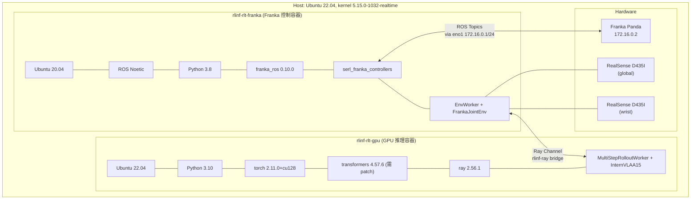

**关键约束**:

| 约束 | rlinf-rlt-franka | rlinf-rlt-gpu |
|:---|:---|:---|
| GPU 访问 | 无 | 有 (RTX 5090 D) |
| ROS 版本 | Noetic (Python 3.8) | 无 ROS |
| Python 版本 | 3.8 | 3.10 |
| torch 版本 | 无 | 2.11.0+cu128 |
| transformers | 无 | 4.57.6 (需 patch) |
| 实时性 | PREEMPT\_RT 实时控制 | 非实时 (推理) |

### 2.3 transformers 版本问题

4WVLA 模型需要 `transformers==5.2.0` (支持 Qwen3.5 VL), 而 GPU 容器当前安装的是 `4.57.6`. 解决方案:

**方案 A (推荐)**: 在 GPU 容器中仅 patch Qwen3.5 模型代码到 transformers 4.57.6, 与 4WVLA 安装流程一致:
```bash
# 在 rlinf-rlt-gpu 容器内
TRANSFORMERS_DIR=$(python -c "import transformers; print(transformers.__file__.rsplit('/',1)[0])")
cp -r /path/to/4WVLA/src/lerobot/policies/internvla_a1_5/transformers_replace/models ${TRANSFORMERS_DIR}/
```

**方案 B**: 升级 GPU 容器的 transformers 到 5.2.0 (可能引起其他模型兼容性问题).

---

## 3. 架构分析: 管线适配挑战

### 3.1 RLinf 真机评估管线概览

RLinf 的真机评估采用 **双 Worker 架构** (EnvWorker + RolloutWorker), 通过 Ray Channel 异步通信:

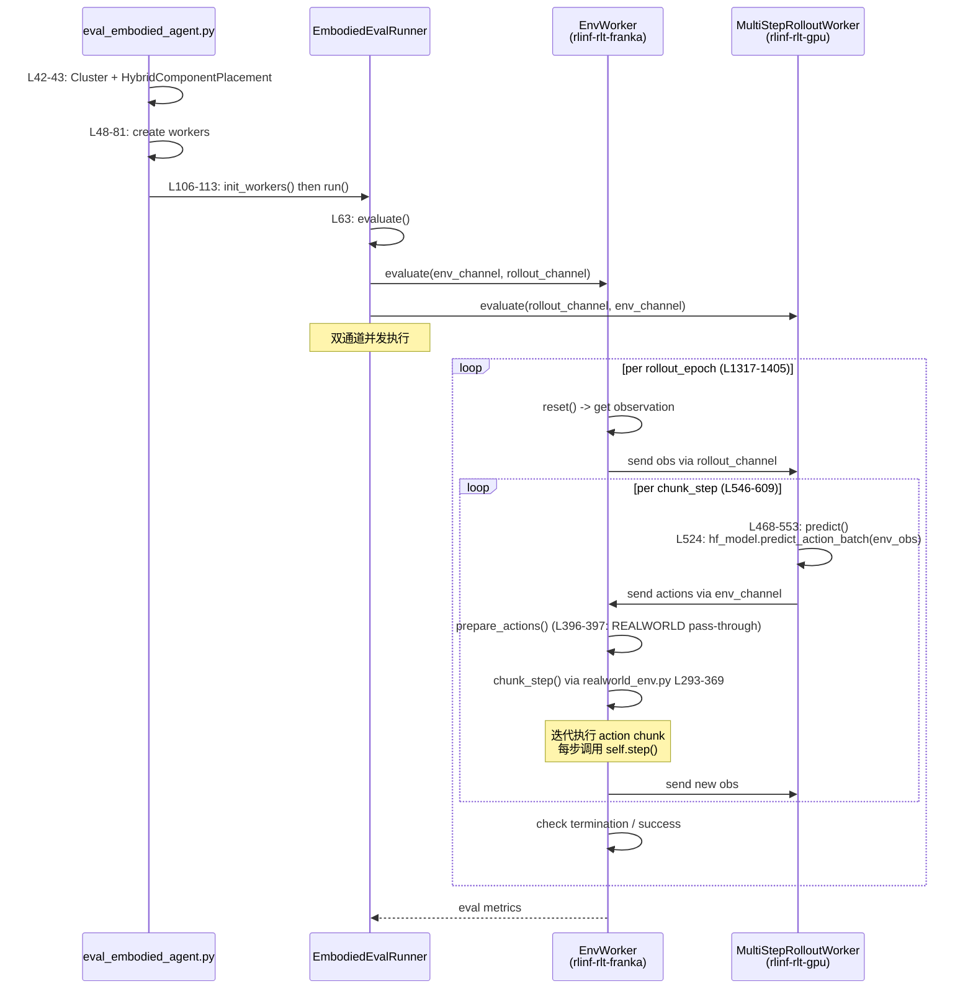

### 3.2 管线中的关键代码路径 (含行号)

| 组件 | 文件 | 行号 | 职责 |
|:---|:---|:---|:---|
| 入口脚本 | `evaluations/eval_embodied_agent.py` | L42-113 | 创建 Cluster, Worker, Runner |
| 评估 Runner | `rlinf/runners/embodied_eval_runner.py` | L63-91 | 双通道并发: env\_channel + rollout\_channel |
| EnvWorker.evaluate() | `rlinf/workers/env/env_worker.py` | L1317-1405 | 外层 epoch 循环, 内层 chunk\_step 循环 |
| env\_evaluate\_step() | `rlinf/workers/env/env_worker.py` | L546-609 | prepare\_actions() -> eval\_env.chunk\_step() |
| action\_utils (REALWORLD) | `rlinf/envs/action_utils.py` | L396-397 | REALWORLD 环境动作直通 (无变换) |
| RealWorldEnv.\_wrap\_obs() | `rlinf/envs/realworld/realworld_env.py` | L208-232 | 输出 {states, main\_images, extra\_view\_images, task\_descriptions} |
| RealWorldEnv.chunk\_step() | `rlinf/envs/realworld/realworld_env.py` | L293-369 | 迭代 action chunk, 每步调用 self.step() |
| RealWorldEnv (num\_envs) | `rlinf/envs/realworld/realworld_env.py` | L36-37 | 强制 num\_envs==1 |
| FrankaEnv.step() | `rlinf/envs/realworld/franka/franka_env.py` | L301-370 | Cartesian delta -> move\_arm() |
| FrankaEnv.\_get\_observation() | `rlinf/envs/realworld/franka/franka_env.py` | L878-907 | 返回 state + frames |
| FrankaRobotConfig | `rlinf/envs/realworld/franka/franka_env.py` | L46-139 | robot\_ip, camera\_serials, step\_frequency=10.0 等 |
| FrankaController.move\_arm() | `rlinf/envs/realworld/franka/franka_controller.py` | L325-341 | PoseStamped -> /cartesian\_impedance\_controller |
| FrankaController.reset\_joint() | `rlinf/envs/realworld/franka/franka_controller.py` | L287-323 | 阻塞式 FollowJointTrajectory |
| FrankaController.get\_state() | `rlinf/envs/realworld/franka/franka_controller.py` | L244-253 | 返回 FrankaRobotState |
| FrankaController.start\_impedance() | `rlinf/envs/realworld/franka/franka_controller.py` | L255-275 | roslaunch impedance.launch |
| 环境注册 | `rlinf/envs/realworld/franka/tasks/__init__.py` | L158-191 | 7 个 Gym ID 注册 |
| 单臂 Wrapper | `rlinf/envs/realworld/common/wrappers/apply.py` | L97-155 | RelativeFrame + Quat2Euler |
| 关节 Wrapper | `rlinf/envs/realworld/common/wrappers/apply.py` | L158-209 | 无 RelativeFrame/Quat2Euler |
| HF Worker.init\_worker() | `rlinf/workers/rollout/huggingface_worker.py` | L139-191 | get\_model() 加载模型 |
| HF Worker.predict() | `rlinf/workers/rollout/huggingface_worker.py` | L468-553 | predict\_action\_batch(env\_obs) |

### 3.3 节点拓扑

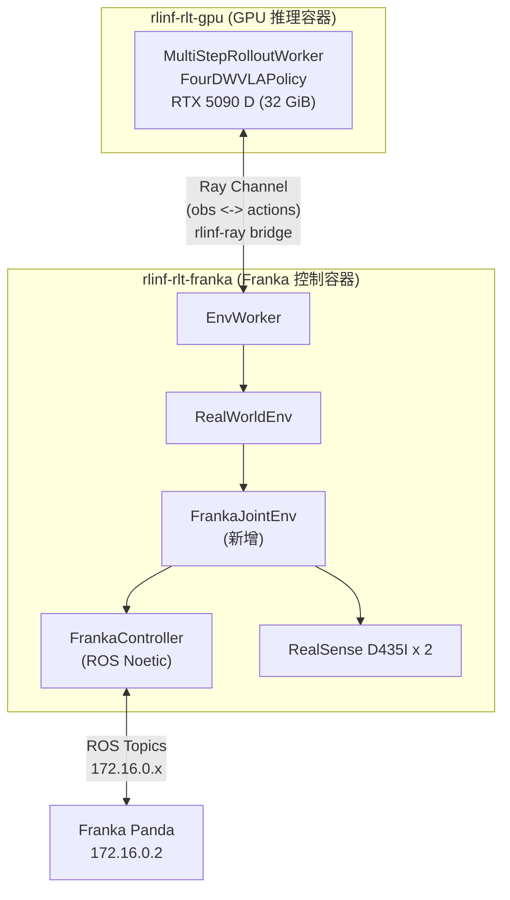

### 3.4 观测流适配

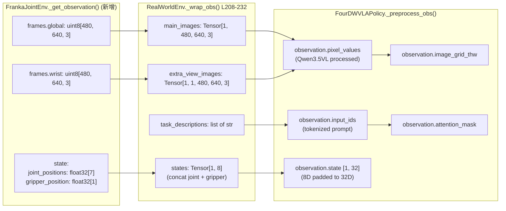

---

## 4. 整体评估方案

### 4.1 设计原则

1. **安全优先**: 关节位置控制直接操作关节角度, 必须有多层安全限制 (角度范围 + 速度限制 + 力矩监测 + E-stop)
2. **扩展优于修改**: 通过新增 Gymnasium 环境 `FrankaJointEnv-v1` 实现, 遵循 `franky_ext` 扩展模式 (参见 `b/d/frk1/franka_3.md`), 最小化对现有代码的修改
3. **复用基础设施**: 复用 `FrankaEnv` 的相机系统, `FrankaController` 的 ROS 通信层和安全恢复机制
4. **频率匹配**: 保持 30 Hz 控制频率, 与训练数据一致
5. **Docker 感知**: 环境运行在 rlinf-rlt-franka (无 GPU), 推理运行在 rlinf-rlt-gpu (有 GPU)
6. **向后兼容**: 所有现有环境 (FrankaEnv-v1, DualFrankaJointEnv-v1, PegInsertionEnv-v1 等 7 个) 不受影响

### 4.2 改动清单

| # | 改动位置 | 类型 | 运行容器 | 说明 |
|:---:|:---|:---:|:---:|:---|
| 1 | `rlinf/envs/realworld/franka/franka_joint_env.py` | **新增** | franka | 关节位置控制环境 |
| 2 | `rlinf/envs/realworld/franka/tasks/__init__.py` | **修改** | franka | 注册 `FrankaJointEnv-v1`, 添加 `create_franka_joint_env()` |
| 3 | `rlinf/envs/realworld/franka/franka_controller.py` | **修改** | franka | 添加 `move_joints()` 非阻塞接口 |
| 4 | `rlinf/models/embodiment/four_dwvla/obs_adapter.py` | **新增** | gpu | 观测格式适配器 |
| 5 | `rlinf/models/embodiment/four_dwvla/policy_adapter.py` | **修改** | gpu | 添加 `predict_action_batch()` 关节空间后处理 |
| 6 | `examples/embodiment/config/env/realworld_franka_joint_env.yaml` | **新增** | 两者 | 环境配置 |
| 7 | `evaluations/realworld/realworld_plug_eval_4wvla.yaml` | **新增** | 两者 | 评估任务配置 |
| 8 | `tests/test_franka_joint_env.py` | **新增** | franka | 单元测试 |
| 9 | `tests/test_4wvla_obs_adapter.py` | **新增** | gpu | 适配器测试 |
| 10 | `scripts/preflight_4wvla_franka.sh` | **新增** | 两者 | Pre-flight 检查脚本 |

### 4.3 总体流程

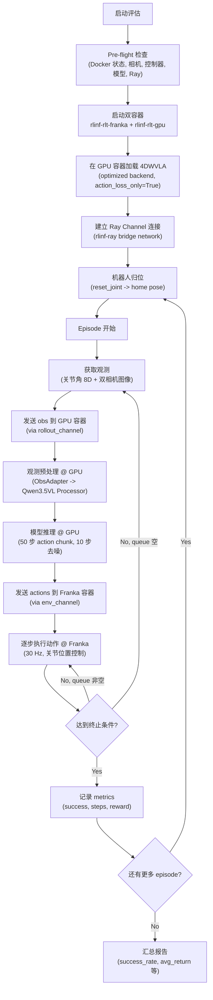

---

## 5. 静态架构设计

### 5.1 类图

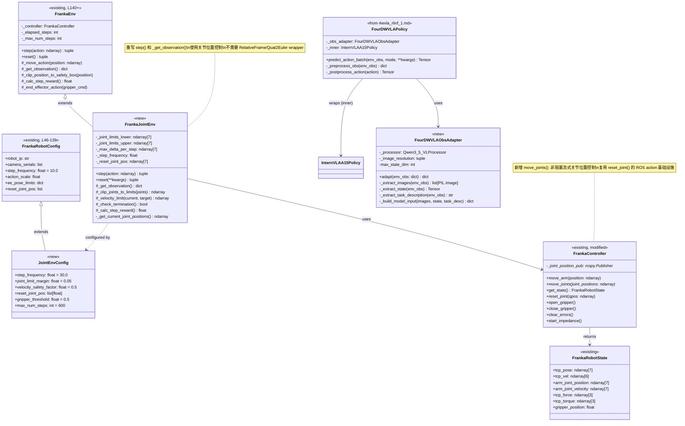

### 5.2 组件依赖图

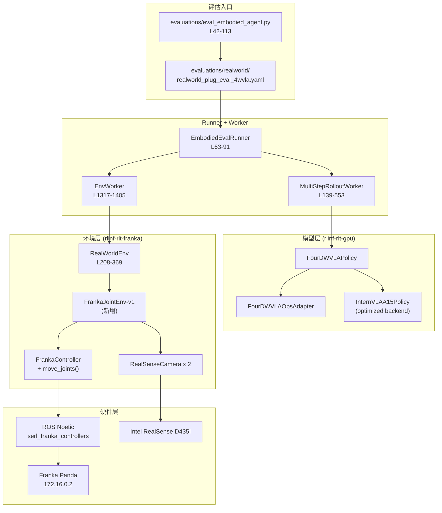

---

## 6. 动态架构设计

### 6.1 完整评估调用序列

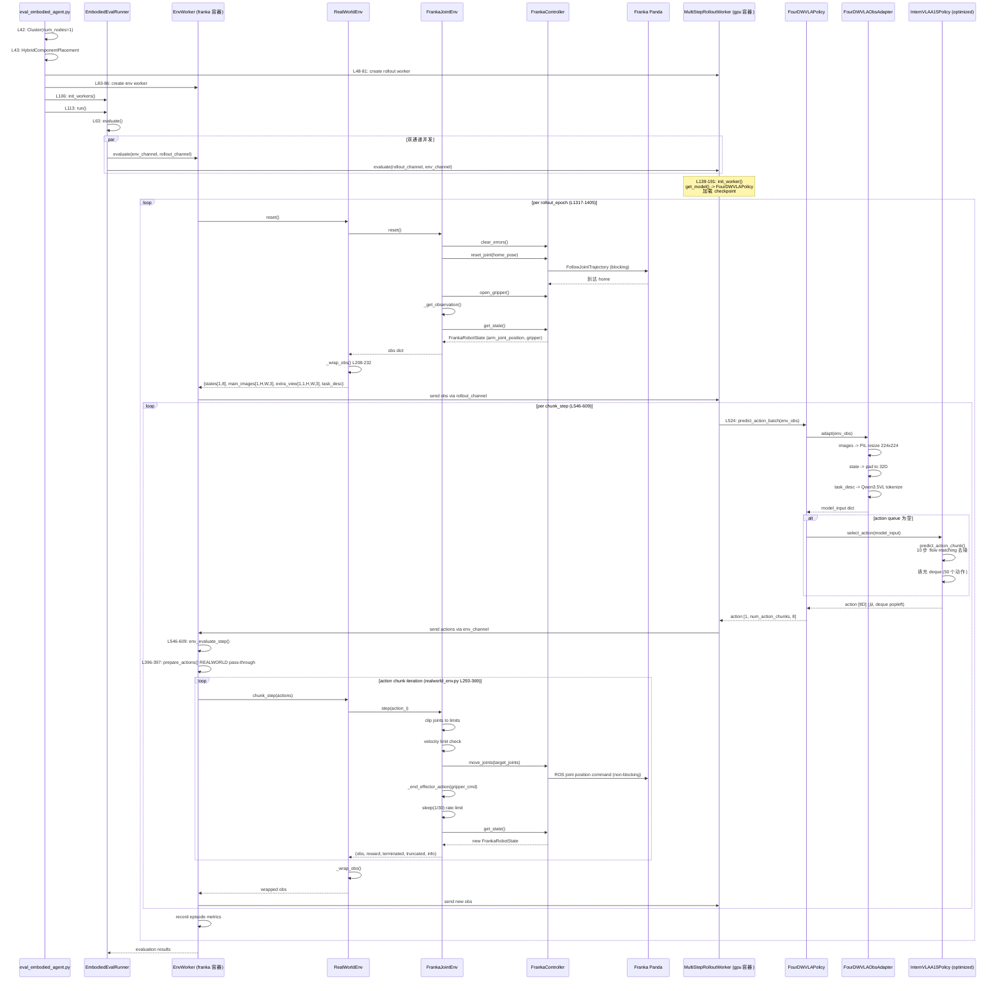

### 6.2 单步动作执行细节

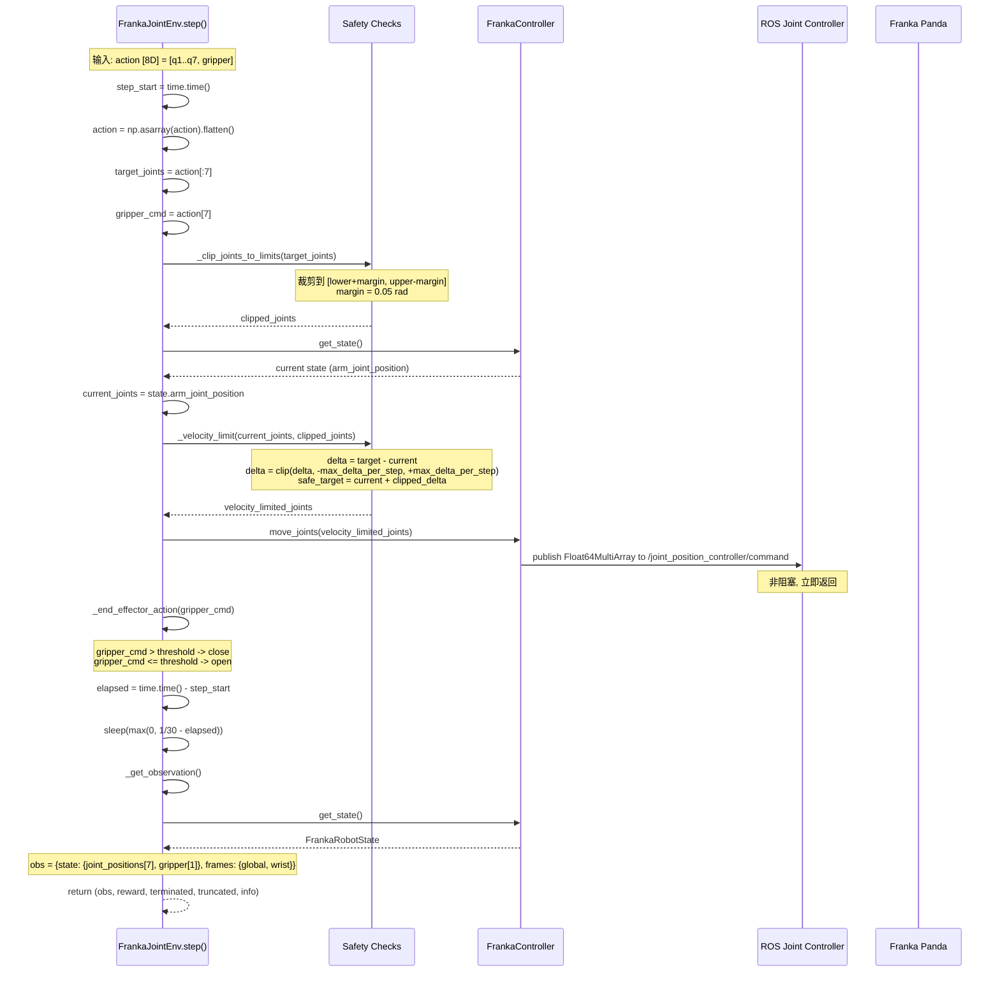

### 6.3 Action Queue 管理

4DWVLA 使用 **action chunking** (chunk\_size=50), 一次推理生成 50 步动作:

```
                    |<------ chunk_size = 50 ------>|
Time: ---------------------------------------------------------------
     t_0            t_1  t_2  ...  t_49     t_50 (new inference)
      |              |   |         |         |
      +-- infer ---+ |   |         |         +-- infer again ---+
      |-- a_0 --> exec|   |         |                           |
                 |-- a_1 --> exec   |                           |
                          ...      |                           |
                         |-- a_49 --> exec                      |
                                          |-- a_50 --> exec     |
```

在 RLinf 评估中:

- **4DWVLA 内部**: `select_action()` (modeling\_internvla\_a1\_5.py L2278) 通过 `deque` 管理 50 步动作队列. 仅当 queue 为空时触发新一轮推理 (`predict_action_chunk()` L2286).
- **RLinf 外部**: `num_action_chunks` 控制每次从 GPU 取多少动作后再请求新观测. 建议设置为 10, 表示每 10 步重新发送一次观测给 GPU.
- **实际行为**: 前 5 次 `predict_action_batch()` 调用 (10 x 5 = 50 步) 都从同一次推理的 queue 中取, 第 6 次会触发新推理.

### 6.4 Episode 状态机

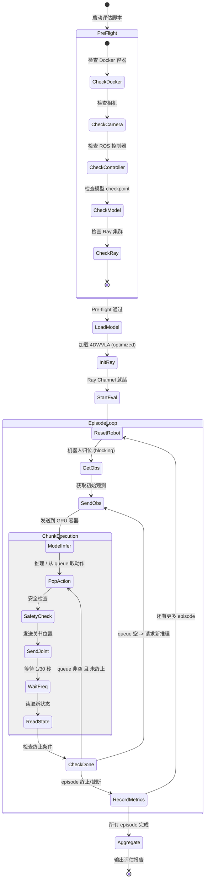

---

## 7. 关键设计点: 动作空间桥接

### 7.1 问题分析

这是整个评估方案最核心的设计挑战. 让我们详细对比两条动作路径:

**现有 FrankaEnv 的动作路径** (`franka_env.py` L301-370):
```
模型输出 [dx, dy, dz, drx, dry, drz, gripper] (7D Cartesian delta)
  -> RelativeFrame wrapper (EE -> base 坐标变换)
    -> Quat2Euler wrapper (四元数 -> 欧拉角)
      -> FrankaEnv.step() L301
        -> current_tcp_pose[:3] + xyz_delta * action_scale
        -> R.from_euler("xyz", rpy_delta * action_scale) * current_R
        -> FrankaController.move_arm(target_ee_position) L325
          -> ROS PoseStamped -> /cartesian_impedance_controller/equilibrium_pose
```

**4WVLA 需要的动作路径** (本方案):
```
模型输出 [q1, q2, q3, q4, q5, q6, q7, gripper] (8D Joint absolute)
  -> 无 wrapper (直接关节空间, 无需坐标变换)
    -> FrankaJointEnv.step()
      -> _clip_joints_to_limits(target_joints)
      -> _velocity_limit(current_joints, target_joints)
      -> FrankaController.move_joints(safe_target_joints)
        -> ROS Float64MultiArray -> /joint_position_controller/command
```

### 7.2 方案: FrankaJointEnv

继承 `FrankaEnv` 的基础设施, 重写动作执行逻辑:

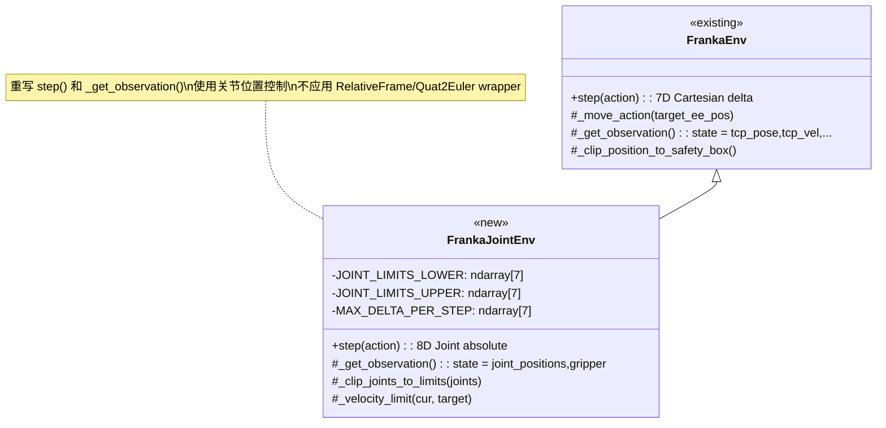

**关键设计决策**:

| 决策点 | 选择 | 理由 |
|:---|:---|:---|
| 继承 vs 组合 | 继承 FrankaEnv | 复用相机系统, gripper 控制, 安全恢复, ROS 初始化 |
| Wrapper 链 | 跳过 RelativeFrame + Quat2Euler | 关节空间动作无需 EE 坐标变换 |
| 控制器接口 | 新增 move\_joints() 到 FrankaController | 与 DualFrankaJointEnv 模式一致 |
| ROS 控制器 | 使用 joint\_position\_controller 或 position\_joint\_trajectory\_controller | 复用 reset\_joint() 的 FollowJointTrajectory 基础设施 |
| 状态表示 | arm\_joint\_position[7] + gripper[1] = 8D | 匹配训练数据格式 |

### 7.3 关节限制 (Franka Emika Panda 官方参数)

来源: [Franka Emika 官方控制参数文档](https://frankaemika.github.io/docs/control_parameters.html)

| 关节 | 下限 (rad) | 上限 (rad) | 最大速度 (rad/s) | 最大扭矩 (Nm) |
|:---:|:---:|:---:|:---:|:---:|
| q1 | -2.8973 | 2.8973 | 2.1750 | 87 |
| q2 | -1.7628 | 1.7628 | 2.1750 | 87 |
| q3 | -2.8973 | 2.8973 | 2.1750 | 87 |
| q4 | -3.0718 | -0.0698 | 2.1750 | 87 |
| q5 | -2.8973 | 2.8973 | 2.6100 | 12 |
| q6 | -0.0175 | 3.7525 | 2.6100 | 12 |
| q7 | -2.8973 | 2.8973 | 2.6100 | 12 |

### 7.4 安全速度检查的数学推导

在控制频率 $f = 30$ Hz 下, 控制周期:

$$\Delta t = \frac{1}{f} = \frac{1}{30} \approx 0.0333 \text{ s}$$

对于关节 $i$, 安全速度 (使用安全因子 $\alpha$, 默认 0.5):

$$v_{safe,i} = \alpha \cdot v_{max,i}$$

其中:
- $v_{max,i}$ 是关节 $i$ 的官方最大速度 (rad/s)
- $\alpha$ 是安全因子, 范围 [0, 1], 默认 0.5 (50% 最大速度)

每步最大允许角度变化:

$$\Delta q_{max,i} = v_{safe,i} \cdot \Delta t = \frac{\alpha \cdot v_{max,i}}{f}$$

具体数值 ($\alpha = 0.5$, $f = 30$ Hz):

| 关节 | $v_{max}$ (rad/s) | $v_{safe}$ (rad/s) | $\Delta q_{max}$ (rad/step) | $\Delta q_{max}$ (deg/step) |
|:---:|:---:|:---:|:---:|:---:|
| q1-q4 | 2.175 | 1.0875 | 0.03625 | 2.08 |
| q5-q7 | 2.610 | 1.305 | 0.04350 | 2.49 |

速度限制算法 (伪代码):
```
function velocity_limit(current[7], target[7]) -> safe_target[7]:
    delta = target - current
    for i in 0..6:
        delta[i] = clip(delta[i], -max_delta_per_step[i], +max_delta_per_step[i])
    return current + delta
```

### 7.5 ROS 控制器选择

**现状**:
- `serl_franka_controllers` 包含 `cartesian_impedance_controller` (用于 FrankaEnv)
- `FrankaController.reset_joint()` 已使用 `FollowJointTrajectory` action (阻塞式)
- `DualFrankaJointEnv` 使用 `FrankyController.move_joints()` (非阻塞流式)

**方案**: 在 `FrankaController` 中添加非阻塞的 `move_joints()`, 使用 ROS Topic 发布关节位置命令. 控制器选项:

| 方案 | 接口 | 优点 | 缺点 |
|:---|:---|:---|:---|
| A: `position_joint_trajectory_controller` + JointTrajectory Topic | ROS Topic (非阻塞) | 与 reset\_joint() 复用控制器 | 需要构造 trajectory msg |
| B: 自定义 joint\_position controller + Float64MultiArray Topic | ROS Topic (非阻塞) | 接口最简单, 延迟最低 | 需要 serl 中有此控制器 |
| C: FollowJointTrajectory action (短 trajectory) | ROS Action (可阻塞/非阻塞) | 已有代码基础 | action 有开销 |

**推荐方案 B**: 使用 Float64MultiArray 发布到 `/joint_position_controller/command`, 与 DualFrankaJointEnv 中的 `move_joints()` 模式一致. 如果 `serl_franka_controllers` 中没有 joint position controller, 则回退到方案 A.

---

## 8. 详细实施步骤与代码 Diff

### 8.1 步骤一: 新增 FrankaJointEnv

**文件**: `rlinf/envs/realworld/franka/franka_joint_env.py` (新增)

**说明**: 关节空间控制环境, 继承 `FrankaEnv`, 重写 `step()`, `reset()`, `_get_observation()`.

```python
"""Franka joint-space control environment for policies trained on absolute joint angles.

This environment is designed for VLA policies (e.g., 4DWVLA) that output
absolute joint position targets at 30Hz, as opposed to the standard FrankaEnv
which expects Cartesian delta actions at 10Hz.

Key differences from FrankaEnv:
    - Action space: 8D absolute joint angles [q1..q7, gripper] (not 7D Cartesian delta)
    - Control: Joint position control via move_joints() (not Cartesian impedance)
    - State: arm_joint_position[7] + gripper[1] (not tcp_pose + tcp_vel + ...)
    - Frequency: 30 Hz (not 10 Hz)
    - Wrappers: No RelativeFrame or Quat2Euler (already in joint space)
"""

from __future__ import annotations

import logging
import time
from typing import Optional

import gymnasium as gym
import numpy as np

from rlinf.envs.realworld.franka.franka_env import FrankaEnv

logger = logging.getLogger(__name__)

# ---------------------------------------------------------------------------
# Franka Emika Panda official joint limits (rad)
# Source: https://frankaemika.github.io/docs/control_parameters.html
# ---------------------------------------------------------------------------
PANDA_JOINT_LIMITS_LOWER = np.array(
    [-2.8973, -1.7628, -2.8973, -3.0718, -2.8973, -0.0175, -2.8973],
    dtype=np.float64,
)
PANDA_JOINT_LIMITS_UPPER = np.array(
    [2.8973, 1.7628, 2.8973, -0.0698, 2.8973, 3.7525, 2.8973],
    dtype=np.float64,
)

# Official max joint velocities (rad/s)
PANDA_MAX_JOINT_VELOCITY = np.array(
    [2.1750, 2.1750, 2.1750, 2.1750, 2.6100, 2.6100, 2.6100],
    dtype=np.float64,
)


class FrankaJointEnv(FrankaEnv):
    """Franka environment with joint-space absolute position control.

    The action space is 8D: [q1, ..., q7, gripper].
    - q1..q7: target joint angles in radians (absolute, not delta)
    - gripper: continuous command; > threshold => close, <= threshold => open

    Designed for policies like 4DWVLA trained on absolute joint angle
    targets collected at 30Hz.
    """

    def __init__(self, override_cfg: Optional[dict] = None, **kwargs):
        super().__init__(override_cfg=override_cfg, **kwargs)

        cfg = override_cfg or {}

        # --- Joint-space specific configuration ---
        self._step_frequency = float(cfg.get("step_frequency", 30.0))
        joint_limit_margin = float(cfg.get("joint_limit_margin", 0.05))
        velocity_safety_factor = float(cfg.get("velocity_safety_factor", 0.5))
        self._gripper_threshold = float(cfg.get("binary_gripper_threshold", 0.5))
        self._max_num_steps = int(cfg.get("max_num_steps", 600))

        # Reset pose (default: Franka home)
        default_home = [0.0, -0.785, 0.0, -2.356, 0.0, 1.571, 0.785]
        self._reset_joint_pos = np.array(
            cfg.get("reset_joint_pos", default_home), dtype=np.float64
        )

        # Compute effective joint limits with safety margin
        self._joint_lower = PANDA_JOINT_LIMITS_LOWER + joint_limit_margin
        self._joint_upper = PANDA_JOINT_LIMITS_UPPER - joint_limit_margin

        # Compute max allowed joint angle change per step:
        # delta_q_max = alpha * v_max / f_control
        self._max_delta_per_step = (
            velocity_safety_factor * PANDA_MAX_JOINT_VELOCITY / self._step_frequency
        )

        # Override action space for joint control (8D)
        self.action_space = gym.spaces.Box(
            low=np.concatenate([self._joint_lower, [0.0]]).astype(np.float32),
            high=np.concatenate([self._joint_upper, [1.0]]).astype(np.float32),
            shape=(8,),
            dtype=np.float32,
        )

        self._elapsed_steps = 0
        self._episode_joint_trajectory = []  # For debugging/logging

        logger.info(
            "FrankaJointEnv initialized: freq=%.1fHz, margin=%.3frad, "
            "vel_factor=%.2f, max_steps=%d",
            self._step_frequency, joint_limit_margin,
            velocity_safety_factor, self._max_num_steps,
        )

    # ------------------------------------------------------------------
    # Core interface overrides
    # ------------------------------------------------------------------

    def step(self, action: np.ndarray):
        """Execute one joint-space control step.

        Args:
            action: [8] array -- [q1..q7 (rad, absolute), gripper_cmd]

        Returns:
            (obs, reward, terminated, truncated, info)
        """
        step_start = time.time()
        action = np.asarray(action, dtype=np.float64).flatten()
        assert action.shape == (8,), f"Expected 8D action, got {action.shape}"

        # Split into joint targets and gripper command
        target_joints = action[:7]
        gripper_cmd = action[7]

        # --- Safety Layer 1: clip to joint limits ---
        safe_joints = self._clip_joints_to_limits(target_joints)

        # --- Safety Layer 2: velocity limiting ---
        current_joints = self._get_current_joint_positions()
        safe_joints = self._velocity_limit(current_joints, safe_joints)

        # --- Execute joint position command (non-blocking) ---
        try:
            self._controller.move_joints(safe_joints)
        except Exception as e:
            logger.error("Joint move failed: %s", e)
            self._controller.clear_errors()
            obs = self._get_observation()
            return obs, 0.0, True, False, {"error": str(e)}

        # --- Execute gripper action ---
        self._end_effector_action(gripper_cmd)

        # --- Rate limiting to step_frequency ---
        elapsed = time.time() - step_start
        sleep_time = max(0.0, 1.0 / self._step_frequency - elapsed)
        if sleep_time > 0:
            time.sleep(sleep_time)

        # --- Get new observation ---
        obs = self._get_observation()
        reward = self._calc_step_reward()
        terminated = self._check_termination()
        self._elapsed_steps += 1
        truncated = self._elapsed_steps >= self._max_num_steps

        info = self._get_step_info(
            target_joints, safe_joints, current_joints,
            time.time() - step_start,
        )

        # Log trajectory for debugging
        self._episode_joint_trajectory.append(safe_joints.copy())

        return obs, reward, terminated, truncated, info

    def reset(self, *, seed=None, options=None, **kwargs):
        """Reset environment: move robot to home position."""
        self._controller.clear_errors()
        logger.info("Resetting to joint pose: %s", self._reset_joint_pos)
        self._controller.reset_joint(self._reset_joint_pos)
        self._elapsed_steps = 0
        self._episode_joint_trajectory = []

        # Open gripper for pick tasks
        self._controller.open_gripper()
        time.sleep(0.5)

        obs = self._get_observation()
        info = {"reset_joint_pos": self._reset_joint_pos.tolist()}
        return obs, info

    def _get_observation(self) -> dict:
        """Get joint-space observation.

        Returns:
            dict with keys:
                state.joint_positions: float32[7] arm joint angles (rad)
                state.gripper_position: float32[1] gripper width (m)
                frames.{camera_name}: uint8[H, W, 3] RGB images
        """
        state = self._controller.get_state()
        frames = self._get_camera_frames()

        return {
            "state": {
                "joint_positions": np.array(
                    state.arm_joint_position[:7], dtype=np.float32
                ),
                "gripper_position": np.array(
                    [state.gripper_position], dtype=np.float32
                ),
            },
            "frames": frames,
        }

    # ------------------------------------------------------------------
    # Safety methods
    # ------------------------------------------------------------------

    def _clip_joints_to_limits(self, joints: np.ndarray) -> np.ndarray:
        """Clip joint targets to safe limits (with margin)."""
        clipped = np.clip(joints, self._joint_lower, self._joint_upper)
        if not np.allclose(joints, clipped, atol=1e-6):
            logger.warning(
                "Joint targets clipped: original=%s, clipped=%s",
                np.round(joints, 4), np.round(clipped, 4),
            )
        return clipped

    def _velocity_limit(
        self, current: np.ndarray, target: np.ndarray
    ) -> np.ndarray:
        """Apply velocity limiting: constrain per-step joint angle change.

        delta_q_i = clip(target_i - current_i,
                         -max_delta_per_step_i, +max_delta_per_step_i)
        safe_target_i = current_i + delta_q_i
        """
        delta = target - current
        delta_clipped = np.clip(
            delta, -self._max_delta_per_step, self._max_delta_per_step
        )
        safe_target = current + delta_clipped

        if not np.allclose(delta, delta_clipped, atol=1e-6):
            logger.debug(
                "Velocity limited: requested_delta=%s, clipped_delta=%s",
                np.round(delta, 4), np.round(delta_clipped, 4),
            )
        return safe_target

    def _get_current_joint_positions(self) -> np.ndarray:
        """Read current joint positions from robot state."""
        state = self._controller.get_state()
        return np.array(state.arm_joint_position[:7], dtype=np.float64)

    # ------------------------------------------------------------------
    # Task-specific (override in subclass or configure)
    # ------------------------------------------------------------------

    def _check_termination(self) -> bool:
        """Check if episode should terminate (task-specific).
        Override in subclass for task-specific success detection."""
        return False

    def _calc_step_reward(self) -> float:
        """Calculate step reward (task-specific).
        Override in subclass for task-specific reward."""
        return 0.0

    def _get_step_info(
        self,
        requested_joints: np.ndarray,
        actual_joints: np.ndarray,
        current_joints: np.ndarray,
        step_time: float,
    ) -> dict:
        """Build info dict for debugging."""
        return {
            "requested_joints": requested_joints.tolist(),
            "actual_command_joints": actual_joints.tolist(),
            "pre_step_joints": current_joints.tolist(),
            "step_time_ms": step_time * 1000,
            "effective_freq_hz": 1.0 / max(step_time, 1e-6),
            "elapsed_steps": self._elapsed_steps,
        }

    def _end_effector_action(self, gripper_cmd: float):
        """Execute gripper action based on command value."""
        if gripper_cmd > self._gripper_threshold:
            self._controller.close_gripper()
        else:
            self._controller.open_gripper()
```

### 8.2 步骤二: 修改 FrankaController -- 添加 move\_joints()

**文件**: `rlinf/envs/realworld/franka/franka_controller.py`

**改动**: 在 `FrankaController` 类中添加 `move_joints()` 方法. 插入位置: `reset_joint()` 方法 (L287-323) 之后.

**Diff** (在 L323 之后插入):
```python
    def move_joints(self, joint_positions: np.ndarray):
        """Send non-blocking joint position command for streaming control.

        Unlike reset_joint() which blocks until the robot reaches the target,
        this method publishes the target joint positions and returns immediately,
        enabling 30Hz streaming joint position control.

        This follows the same pattern as FrankyController.move_joints() used by
        DualFrankaJointEnv for dual-arm joint-space control.

        Args:
            joint_positions: [7] target joint angles in radians.
                Must be within Panda joint limits.
        """
        import rospy
        from std_msgs.msg import Float64MultiArray

        # Lazy-init publisher on first call
        if not hasattr(self, '_joint_position_pub'):
            topic = rospy.get_param(
                "~joint_position_topic",
                "/joint_position_controller/command",
            )
            self._joint_position_pub = rospy.Publisher(
                topic, Float64MultiArray, queue_size=1,
            )
            # Allow publisher to connect
            rospy.sleep(0.1)
            logger.info("Initialized joint position publisher on %s", topic)

        msg = Float64MultiArray()
        msg.data = list(joint_positions.astype(np.float64))
        self._joint_position_pub.publish(msg)
```

**向后兼容性**: 此方法是纯新增, 不修改任何现有方法. `_joint_position_pub` 仅在首次调用 `move_joints()` 时创建, 不影响现有 Cartesian 控制路径.

### 8.3 步骤三: 注册环境

**文件**: `rlinf/envs/realworld/franka/tasks/__init__.py`

**改动**: 在现有环境注册块 (L158-191) 之后添加新环境注册. 不修改现有注册.

**Diff** (在文件现有 `gym.register()` 块之后追加):
```python
# ---------------------------------------------------------------------------
# Joint-space control environments (for VLA policies with absolute joint actions)
# ---------------------------------------------------------------------------

def create_franka_joint_env(**kwargs):
    """Create single-arm Franka joint-space env (no Cartesian wrappers).

    Joint-space envs do NOT apply RelativeFrame or Quat2Euler wrappers.
    The action is already in joint space -- no EE coordinate transform needed.
    This follows the same pattern as DualFrankaJointEnv.
    """
    from rlinf.envs.realworld.franka.franka_joint_env import FrankaJointEnv
    env = FrankaJointEnv(**kwargs)
    # Optionally apply keyboard wrapper for manual intervention
    from rlinf.envs.realworld.common.wrappers.keyboard import KeyboardWrapper
    env = KeyboardWrapper(env, **kwargs)
    return env


gym.register(
    id="FrankaJointEnv-v1",
    entry_point=create_franka_joint_env,
)
```

**关键点**:
- 使用 `KeyboardWrapper` 仅用于人工干预 (按 'q' 终止).
- **不使用** `apply_single_arm_wrappers()` (它会添加 `RelativeFrame` + `Quat2Euler`).
- **不使用** `apply_dual_franka_joint_wrappers()` (它包含双臂特定逻辑).

### 8.4 步骤四: 观测适配器

**文件**: `rlinf/models/embodiment/four_dwvla/obs_adapter.py` (新增)

**说明**: 将 RealWorldEnv 的观测格式转换为 4DWVLA 模型的输入格式. 运行在 GPU 容器.

```python
"""Observation adapter: converts RLinf env observations to 4DWVLA model input format.

This adapter bridges the gap between RLinf's RealWorldEnv observation format
and 4DWVLA's expected input format (Qwen3.5 VL processor).

RLinf env observation (from RealWorldEnv._wrap_obs() at L208-232):
    {
        "states":              Tensor[1, state_dim],       # 8D for joint env
        "main_images":         Tensor[1, H, W, 3],         # global camera
        "extra_view_images":   Tensor[1, N_extra, H, W, 3], # wrist camera
        "task_descriptions":   list[str],                   # e.g., ["plug into socket"]
    }

4DWVLA expected batch (from predict_action_chunk() at L2286):
    {
        "observation.pixel_values":     Tensor[1, N_patches, C_hidden],
        "observation.image_grid_thw":   Tensor[N_images, 3],
        "observation.input_ids":        Tensor[1, L],
        "observation.attention_mask":   Tensor[1, L],
        "observation.state":            Tensor[1, max_state_dim],  # padded to 32D
    }
"""

from __future__ import annotations

import logging
from typing import Any

import numpy as np
import torch
from PIL import Image

logger = logging.getLogger(__name__)


class FourDWVLAObsAdapter:
    """Converts RealWorldEnv observations to 4DWVLA batch format."""

    def __init__(
        self,
        vlm_model_name_or_path: str,
        image_resolution: tuple[int, int] = (224, 224),
        max_state_dim: int = 32,
        device: torch.device = torch.device("cuda"),
    ):
        """Initialize the observation adapter.

        Args:
            vlm_model_name_or_path: Path to Qwen3.5 VL model for processor.
            image_resolution: Target image size (H, W) for model input.
            max_state_dim: Maximum state dimension (padded with zeros).
            device: Target device for tensors.
        """
        self.device = device
        self.max_state_dim = max_state_dim
        self._image_resolution = image_resolution

        # Initialize Qwen3.5 VL processor
        from transformers import AutoProcessor
        self._processor = AutoProcessor.from_pretrained(vlm_model_name_or_path)

        self._system_prompt = "You are a helpful robot assistant."

        logger.info(
            "ObsAdapter initialized: img_res=%s, max_state=%d, device=%s",
            image_resolution, max_state_dim, device,
        )

    def adapt(self, env_obs: dict[str, Any]) -> dict[str, torch.Tensor]:
        """Convert env observation dict to model input dict.

        Args:
            env_obs: Observation from RealWorldEnv._wrap_obs()

        Returns:
            Dict with keys matching 4DWVLA predict_action_chunk() input.
        """
        images = self._extract_images(env_obs)
        state = self._extract_state(env_obs)
        task_desc = self._extract_task_description(env_obs)
        batch = self._build_model_input(images, state, task_desc)
        return batch

    def _extract_images(self, env_obs: dict) -> list[Image.Image]:
        """Extract, convert, and resize images from env observation."""
        images = []

        # main_images -> global camera (first image)
        if "main_images" in env_obs:
            img = env_obs["main_images"]
            if isinstance(img, torch.Tensor):
                img = img.squeeze(0).cpu().numpy()
            if img.dtype != np.uint8:
                img = (np.clip(img, 0, 1) * 255).astype(np.uint8)
            pil_img = Image.fromarray(img).resize(
                (self._image_resolution[1], self._image_resolution[0]),  # PIL uses (W, H)
                Image.BILINEAR,
            )
            images.append(pil_img)

        # extra_view_images -> wrist camera (first extra view)
        if "extra_view_images" in env_obs:
            extra = env_obs["extra_view_images"]
            if isinstance(extra, torch.Tensor):
                extra = extra.squeeze(0)  # remove batch dim
                if extra.dim() == 4:
                    extra = extra[0]  # take first extra view [H, W, 3]
                extra = extra.cpu().numpy()
            if extra.dtype != np.uint8:
                extra = (np.clip(extra, 0, 1) * 255).astype(np.uint8)
            pil_img = Image.fromarray(extra).resize(
                (self._image_resolution[1], self._image_resolution[0]),
                Image.BILINEAR,
            )
            images.append(pil_img)

        if len(images) == 0:
            logger.warning("No images found in env observation")

        return images

    def _extract_state(self, env_obs: dict) -> torch.Tensor:
        """Extract state and pad to max_state_dim.

        Input state is 8D: [joint_positions(7), gripper_position(1)]
        Output is padded to max_state_dim (32D) with zeros.
        """
        if "states" in env_obs:
            state = env_obs["states"]
            if isinstance(state, torch.Tensor):
                state = state.squeeze(0).float()
            else:
                state = torch.tensor(state, dtype=torch.float32).flatten()
        else:
            state = torch.zeros(8, dtype=torch.float32)

        # Pad to max_state_dim
        actual_dim = state.shape[-1]
        if actual_dim < self.max_state_dim:
            pad = torch.zeros(
                self.max_state_dim - actual_dim, dtype=torch.float32
            )
            state = torch.cat([state, pad])
        elif actual_dim > self.max_state_dim:
            state = state[:self.max_state_dim]

        return state.unsqueeze(0).to(self.device)  # [1, max_state_dim]

    def _extract_task_description(self, env_obs: dict) -> str:
        """Extract task description string."""
        if "task_descriptions" in env_obs:
            descs = env_obs["task_descriptions"]
            if isinstance(descs, list) and len(descs) > 0:
                return descs[0]
            elif isinstance(descs, str):
                return descs
        return "plug into socket"  # Fallback default

    def _build_model_input(
        self,
        images: list[Image.Image],
        state: torch.Tensor,
        task_desc: str,
    ) -> dict[str, torch.Tensor]:
        """Build the full model input using Qwen3.5 VL processor."""
        # Build chat messages (Qwen3.5 VL format)
        content = []
        for img in images:
            content.append({"type": "image", "image": img})
        content.append({"type": "text", "text": task_desc})

        messages = [
            {"role": "system", "content": self._system_prompt},
            {"role": "user", "content": content},
        ]

        # Process through Qwen3.5 VL processor
        inputs = self._processor.apply_chat_template(
            messages,
            add_generation_prompt=True,
            tokenize=True,
            return_tensors="pt",
        )

        # Build batch dict with "observation." prefix
        batch = {}
        for key in ["input_ids", "attention_mask", "pixel_values", "image_grid_thw"]:
            if key in inputs:
                batch[f"observation.{key}"] = inputs[key].to(self.device)

        # Add state (already padded to max_state_dim)
        batch["observation.state"] = state

        return batch
```

### 8.5 步骤五: 更新 Policy Adapter

**文件**: `rlinf/models/embodiment/four_dwvla/policy_adapter.py` (已存在, 来自 4wvla\_rlinf\_1.md)

**改动**: 在 `FourDWVLAPolicy` 类中修改 `predict_action_batch()` 方法, 添加 `ObsAdapter` 集成.

**Diff** (修改 `predict_action_batch` 方法):
```python
    def predict_action_batch(
        self,
        env_obs: dict[str, Any] = None,
        mode: str = "eval",
        **kwargs,
    ) -> torch.Tensor:
        """Predict actions for real-robot rollout evaluation.

        Called by MultiStepRolloutWorker.predict() at L524 of huggingface_worker.py.

        Args:
            env_obs: Observation dict from RealWorldEnv._wrap_obs().
                Keys: states, main_images, extra_view_images, task_descriptions.
            mode: "eval" for inference mode.

        Returns:
            Tensor [1, num_action_chunks, action_dim] -- action chunk to execute.
        """
        self._inner.eval()

        # Lazy-init observation adapter on first call
        if not hasattr(self, "_obs_adapter"):
            from rlinf.models.embodiment.four_dwvla.obs_adapter import (
                FourDWVLAObsAdapter,
            )
            device = next(self._inner.parameters()).device
            self._obs_adapter = FourDWVLAObsAdapter(
                vlm_model_name_or_path=self._config.vlm_model_name_or_path,
                image_resolution=tuple(self._config.image_resolution),
                max_state_dim=getattr(self._config, "max_state_dim", 32),
                device=device,
            )

        # Convert env observation to model input format
        model_input = self._obs_adapter.adapt(env_obs)

        # Run inference (select_action manages internal action queue)
        with torch.no_grad():
            action = self._inner.select_action(model_input)
            # action shape: [action_dim] (single action from deque)

        # Reshape: [action_dim] -> [1, 1, action_dim]
        action = action.unsqueeze(0).unsqueeze(0)

        # Truncate to configured action_dim (8 for joint env)
        action_dim = getattr(self._config, "action_dim", 8)
        action = action[:, :, :action_dim]

        return action.cpu()
```

### 8.6 步骤六: 环境配置 YAML

**文件**: `examples/embodiment/config/env/realworld_franka_joint_env.yaml` (新增)

```yaml
# Environment configuration for FrankaJointEnv-v1
# Used with 4DWVLA joint-space control policies
# Source: rlinf/envs/realworld/franka/franka_joint_env.py

env_type: realworld

total_num_envs: 1
auto_reset: False
ignore_terminations: False
reward_mode: raw
wrap_obs_mode: simple
seed: 0
group_size: 1
use_fixed_reset_state_ids: False
max_steps_per_rollout_epoch: 600   # 20 seconds at 30Hz
max_episode_steps: 600
use_spacemouse: False
no_gripper: False
main_image_key: global

video_cfg:
  save_video: True
  info_on_video: True
  video_base_dir: ${runner.logger.log_path}/video/eval

init_params:
  id: "FrankaJointEnv-v1"
  num_envs: null

override_cfg:
  is_dummy: false
  task_description: "plug into socket"

  # --- Joint-space control parameters ---
  step_frequency: 30.0
  joint_limit_margin: 0.05
  velocity_safety_factor: 0.5
  max_num_steps: 600

  # --- Reset position (Franka home pose) ---
  reset_joint_pos: [0.0, -0.785, 0.0, -2.356, 0.0, 1.571, 0.785]

  # --- Gripper configuration ---
  binary_gripper_threshold: 0.5
  end_effector_type: "gripper"

  # --- Camera configuration ---
  camera_type: "realsense"
  camera_resolution: [480, 640]
  robot_ip: "172.16.0.2"
```

### 8.7 步骤七: 评估任务配置 YAML

**文件**: `evaluations/realworld/realworld_plug_eval_4wvla.yaml` (新增)

```yaml
# Evaluation configuration for 4DWVLA on Franka plug insertion task
# Based on: evaluations/realworld/realworld_eval.yaml (Pi0 baseline)
#
# Usage (single node):
#   python evaluations/eval_embodied_agent.py \
#       --config-name realworld_plug_eval_4wvla \
#       rollout.model.model_path=/path/to/checkpoint \
#       cluster.node_groups.0.hardware.configs.0.robot_ip=172.16.0.2 \
#       'cluster.node_groups.0.hardware.configs.0.camera_serials=["420122070525","WRIST_SERIAL"]'

defaults:
  - env/realworld_franka_joint_env@env.eval
  - model/4dwvla@rollout.model
  - override hydra/job_logging: stdout

hydra:
  run:
    dir: .
  output_subdir: null
  searchpath:
    - file://${oc.env:EMBODIED_PATH}/config/

# -----------------------------------------------------------------------
# Cluster: single node (GPU + Franka on same machine via Docker)
# -----------------------------------------------------------------------
cluster:
  num_nodes: 1
  component_placement:
    rollout:
      node_group: franka
      placement: 0
    env:
      node_group: franka
      placement: 0
  node_groups:
    - label: franka
      node_ranks: 0
      hardware:
        type: Franka
        configs:
          - robot_ip: "172.16.0.2"
            node_rank: 0
            camera_serials:
              - "420122070525"
              - "WRIST_CAMERA_SERIAL"

# -----------------------------------------------------------------------
# Runner
# -----------------------------------------------------------------------
runner:
  task_type: embodied_eval
  logger:
    log_path: "../results"
    project_name: rlinf_4dwvla
    experiment_name: "franka-plug-eval-4wvla"
    logger_backends: ["tensorboard"]
  max_epochs: 1
  max_steps: 1
  only_eval: True
  val_check_interval: -1

# -----------------------------------------------------------------------
# Environment
# -----------------------------------------------------------------------
env:
  group_name: "EnvGroup"
  enable_offload: False
  eval:
    rollout_epoch: 20

# -----------------------------------------------------------------------
# Rollout (model inference)
# -----------------------------------------------------------------------
rollout:
  group_name: "RolloutGroup"
  backend: "huggingface"
  recompute_logprobs: False
  enable_offload: False
  pipeline_stage_num: 1
  collect_transitions: False
  collect_prev_infos: False
  model:
    model_path: "/home/nvidia/bt/ckp/4wvlaFrk/plug/4wvlaFrkPlugCkp010420/"
    precision: "bf16"
    action_loss_only: true
    enable_keypoint: false
    num_action_chunks: 10
    action_dim: 8
    state_dim: 8
    max_state_dim: 32
    image_resolution: [224, 224]
    four_dwvla:
      # CRITICAL: these override stale training-time values in config.json
      # config.json has inference_backend="standard" and action_loss_only=false
      # which would attempt to load WAN model from non-existent paths
      inference_backend: "optimized"   # config.json: "standard" -> must override
      action_loss_only: true           # config.json: false -> must override
      gradient_checkpointing: false    # config.json: true -> not needed for inference
      num_inference_steps: 10
      chunk_size: 50
      n_action_steps: 50
```

**双节点配置** (GPU 和 Franka 分离时, 作为 override):

```yaml
cluster:
  num_nodes: 2
  component_placement:
    rollout:
      node_group: gpu
      placement: 0
    env:
      node_group: franka
      placement: 0
  node_groups:
    - label: gpu
      node_ranks: 0
    - label: franka
      node_ranks: 1
      hardware:
        type: Franka
        configs:
          - robot_ip: "172.16.0.2"
            node_rank: 1
            camera_serials:
              - "420122070525"
              - "WRIST_CAMERA_SERIAL"
```

---

## 9. 配置体系设计

### 9.1 全量可配置变量表

#### 9.1.1 环境配置 (`override_cfg`)

| 变量名 | 含义 | 默认值 | 有效范围 | 来源文件 + 行号 |
|:---|:---|:---|:---|:---|
| `step_frequency` | 控制频率 (Hz) | 30.0 | [1, 100] | `franka_joint_env.py` \_\_init\_\_() |
| `joint_limit_margin` | 关节限位安全余量 (rad) | 0.05 | [0, 0.2] | `franka_joint_env.py` \_\_init\_\_() |
| `velocity_safety_factor` | 安全速度因子 | 0.5 | [0.1, 1.0] | `franka_joint_env.py` \_\_init\_\_() |
| `max_num_steps` | 单 episode 最大步数 | 600 | [1, 10000] | `franka_joint_env.py` \_\_init\_\_() |
| `reset_joint_pos` | 复位关节角度 [7] (rad) | [0,-0.785,0,-2.356,0,1.571,0.785] | Panda joint limits | `franka_joint_env.py` \_\_init\_\_() |
| `binary_gripper_threshold` | gripper 开合阈值 | 0.5 | [0, 1] | `franka_joint_env.py` \_\_init\_\_() |
| `robot_ip` | Franka 机器人 IP | "172.16.0.2" | IPv4 | `franka_env.py` FrankaRobotConfig L46 |
| `camera_serials` | RealSense 序列号 | [] | list[str] | `franka_env.py` FrankaRobotConfig L46 |
| `camera_type` | 相机类型 | "realsense" | ["realsense"] | `franka_env.py` FrankaRobotConfig L46 |
| `camera_resolution` | 相机分辨率 [H, W] | [480, 640] | valid resolution | `franka_env.py` FrankaRobotConfig L46 |
| `is_dummy` | dummy 模式 (无真机) | false | bool | `franka_env.py` FrankaRobotConfig L46 |
| `task_description` | 任务描述文本 | "plug into socket" | str | env yaml |
| `end_effector_type` | 末端执行器类型 | "gripper" | ["gripper"] | `franka_env.py` FrankaRobotConfig L46 |

#### 9.1.2 模型推理配置 (`rollout.model`)

| 变量名 | 含义 | 默认值 | 有效范围 | 来源文件 |
|:---|:---|:---|:---|:---|
| `model_path` | Checkpoint 路径 | 无 (必填) | 目录路径 | `huggingface_worker.py` L145 |
| `precision` | 推理精度 | "bf16" | ["bf16","fp16","fp32"] | `huggingface_worker.py` |
| `action_loss_only` | 跳过 WAN 视频分支 | true | bool (推理必须 true) | `configuration_internvla_a1_5.py` |
| `enable_keypoint` | 启用关键点检测 | false | bool | `configuration_internvla_a1_5.py` |
| `num_action_chunks` | 每次观测后执行步数 | 10 | [1, 50] | eval yaml |
| `action_dim` | 动作维度 | 8 | [7, 8, 14, 16] | `configuration_internvla_a1_5.py` |
| `state_dim` | 状态维度 | 8 | [8, 14, 20] | `configuration_internvla_a1_5.py` |
| `max_state_dim` | 最大状态维度 (padding) | 32 | [8, 64] | `configuration_internvla_a1_5.py` |
| `image_resolution` | 模型输入图像分辨率 | [224, 224] | [224, 336, 448] | `configuration_internvla_a1_5.py` |
| `inference_backend` | 推理后端 | "optimized" | ["default","optimized"] | `modeling_internvla_a1_5_optimized.py` L38 |
| `num_inference_steps` | Flow matching 去噪步数 | 10 | [1, 50] | `configuration_internvla_a1_5.py` |
| `chunk_size` | Action chunk 大小 | 50 | [1, 100] | `configuration_internvla_a1_5.py` |
| `n_action_steps` | 实际执行步数 | 50 | [1, chunk\_size] | `configuration_internvla_a1_5.py` |

> **Checkpoint config.json 与推理配置的关系**: 上表中的 "默认值" 是 RLinf 评估 YAML 中应设定的值. Checkpoint 的 `config.json` 中保存的是训练时配置, 其中 `inference_backend="standard"` 和 `action_loss_only=false` **必须**在加载后覆盖为 `"optimized"` 和 `true`. 此外, `config.json` 中的 `pretrained_path` 和 `wan_checkpoint_path` 指向训练服务器路径 (本地不存在), 但 `action_loss_only=true` 时模型不会加载 WAN 权重, 因此无需手动修正这两个路径. 详见 1.5.3 节和 1.5.4 节.

#### 9.1.3 评估配置

| 变量名 | 含义 | 默认值 | 有效范围 | 来源 |
|:---|:---|:---|:---|:---|
| `env.eval.rollout_epoch` | 评估 episode 数 | 20 | [1, 100] | eval yaml |
| `max_steps_per_rollout_epoch` | 每 epoch 最大步数 | 600 | [1, 10000] | env yaml |
| `video_cfg.save_video` | 是否保存视频 | True | bool | env yaml |
| `cluster.num_nodes` | 集群节点数 | 1 | [1, 2] | eval yaml |
| `runner.logger.log_path` | 日志输出路径 | "../results" | 目录路径 | eval yaml |
| `runner.logger.experiment_name` | 实验名称 | "franka-plug-eval-4wvla" | str | eval yaml |

### 9.2 配置文件关系图

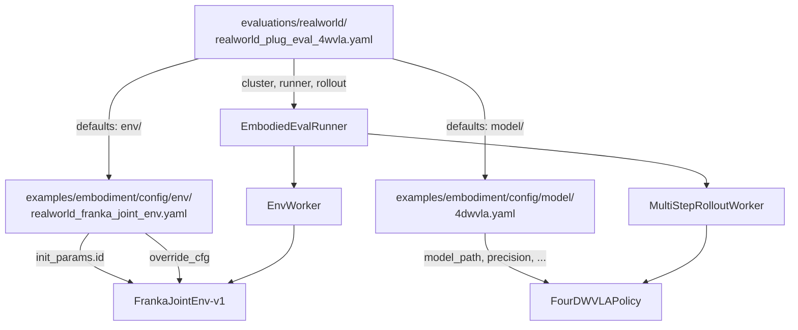

---

## 10. 观测与动作接口适配

### 10.1 完整数据流图

```mermaid
graph TD
    subgraph "rlinf-rlt-franka 容器"
        ROBOT_STATE["Franka Panda State<br/>(FrankaController.get_state() L244-253)"]
        CAM_FRAME["RealSense Cameras<br/>(global + wrist)"]

        ROBOT_STATE --> JOINT_OBS["FrankaJointEnv._get_observation()"]
        CAM_FRAME --> JOINT_OBS

        JOINT_OBS -->|"state.joint_positions[7]<br/>state.gripper_position[1]<br/>frames.global[480,640,3]<br/>frames.wrist[480,640,3]"| WRAP_OBS

        WRAP_OBS["RealWorldEnv._wrap_obs() L208-232"]
        WRAP_OBS -->|"states[1,8]<br/>main_images[1,480,640,3]<br/>extra_view_images[1,1,480,640,3]<br/>task_descriptions"| RAY_SEND

        RAY_SEND["Ray Channel (rollout_channel)"]
    end

    RAY_SEND -->|"rlinf-ray bridge"| RAY_RECV

    subgraph "rlinf-rlt-gpu 容器"
        RAY_RECV["Ray Channel (receive obs)"]
        RAY_RECV --> HF_PREDICT["MultiStepRolloutWorker.predict() L468-553"]
        HF_PREDICT --> OBS_ADAPT["FourDWVLAObsAdapter.adapt()"]

        OBS_ADAPT -->|"images -> PIL resize 224x224<br/>state -> pad to 32D<br/>task_desc -> tokenize"| MODEL_INPUT

        MODEL_INPUT["observation.pixel_values<br/>observation.image_grid_thw<br/>observation.input_ids<br/>observation.attention_mask<br/>observation.state[1,32]"]

        MODEL_INPUT --> SELECT_ACTION["InternVLAA15Policy.select_action() L2278"]
        SELECT_ACTION -->|"queue empty"| PREDICT_CHUNK["predict_action_chunk() L2286<br/>10-step flow matching"]
        PREDICT_CHUNK --> FILL_QUEUE["Fill deque (50 actions)"]
        FILL_QUEUE --> POP["deque.popleft() -> action[8D]"]
        SELECT_ACTION -->|"queue non-empty"| POP

        POP --> POST["postprocess: clip, reshape<br/>[1, num_action_chunks, 8]"]
        POST --> RAY_SEND_ACT["Ray Channel (env_channel)"]
    end

    RAY_SEND_ACT -->|"rlinf-ray bridge"| RAY_RECV_ACT

    subgraph "rlinf-rlt-franka 容器 (执行)"
        RAY_RECV_ACT["Ray Channel (receive actions)"]
        RAY_RECV_ACT --> PREPARE["prepare_actions() L396-397 pass-through"]
        PREPARE --> CHUNK_STEP["RealWorldEnv.chunk_step() L293-369"]
        CHUNK_STEP -->|"per action in chunk"| STEP["FrankaJointEnv.step(action)"]
        STEP --> SAFETY["clip joints + velocity limit"]
        SAFETY --> MOVE_JOINTS["FrankaController.move_joints() non-blocking"]
        MOVE_JOINTS --> GRIPPER["_end_effector_action(gripper_cmd)"]
        GRIPPER --> RATE["sleep(1/30)"]
        RATE --> NEW_OBS["_get_observation()"]
    end
```

### 10.2 观测映射表

| 训练特征 | 维度 | 评估来源 | 转换方式 |
|:---|:---|:---|:---|
| `observation.state.arm` | [7] | `FrankaRobotState.arm_joint_position` | 直接读取, float32 |
| `observation.state.gripper` | [1] | `FrankaRobotState.gripper_position` | 直接读取, float32 |
| `observation.images.global` | [480,640,3] | RealSense D435I (global, serial 420122070525) | PIL resize 224x224 |
| `observation.images.wrist` | [480,640,3] | RealSense D435I (wrist) | PIL resize 224x224 |
| `observation.state` (padded) | [32] | 拼接 arm[7] + gripper[1] + zeros[24] | Padding to max\_state\_dim |
| Task description | string | `override_cfg.task_description` | Qwen3.5 VL tokenize |

### 10.3 动作后处理

```python
# Model output from select_action(): Tensor[action_dim]
# action[:7] = absolute joint angles (radians)
# action[7]  = gripper command (continuous)

# For 4DWVLA with abs joint-space training:
# - NormalizationMode.IDENTITY (confirmed from stats.json, see section 1.5.5)
#   normalization_mapping: {"VISUAL": "IDENTITY", "STATE": "IDENTITY", "ACTION": "IDENTITY"}
# - Model directly outputs raw joint angles in radians
# - NO denormalization needed at inference time
# - Training data joint ranges are narrow (see section 1.5.5), e.g.:
#   q1: [-0.484, 0.045], q4: [-2.204, -1.535], q6: [1.570, 2.454]

# The only conversion needed:
# 1. Truncate to action_dim (8)
# 2. Reshape to [1, num_action_chunks, 8] for RLinf
# 3. Transfer to CPU for Ray serialization
```

### 10.4 状态维度对比

| 字段 | FrankaEnv (Cartesian) | FrankaJointEnv (Joint) |
|:---|:---|:---|
| tcp\_pose | [7] (x,y,z + quat) | not used |
| tcp\_vel | [6] (v\_xyz + omega) | not used |
| arm\_joint\_position | [7] (exists in state but not exported) | **[7] (primary state)** |
| arm\_joint\_velocity | [7] (exists but not exported) | optional |
| gripper\_position | [1] | **[1]** |
| tcp\_force | [3] | not used |
| tcp\_torque | [3] | not used |
| **Total** | 20D | **8D** |

---

## 11. 安全机制设计

### 11.1 多层安全防护架构

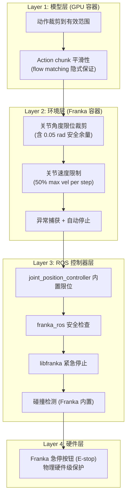

### 11.2 Layer 2 安全检查流程

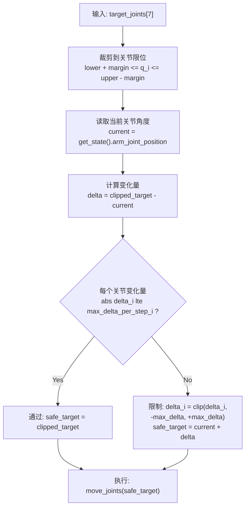

### 11.3 关节限位具体数值 (含安全余量)

默认 `joint_limit_margin = 0.05` rad:

| 关节 | 物理下限 | 有效下限 | 有效上限 | 物理上限 | 每步最大变化 |
|:---:|:---:|:---:|:---:|:---:|:---:|
| q1 | -2.8973 | **-2.8473** | **2.8473** | 2.8973 | 0.03625 rad |
| q2 | -1.7628 | **-1.7128** | **1.7128** | 1.7628 | 0.03625 rad |
| q3 | -2.8973 | **-2.8473** | **2.8473** | 2.8973 | 0.03625 rad |
| q4 | -3.0718 | **-3.0218** | **-0.1198** | -0.0698 | 0.03625 rad |
| q5 | -2.8973 | **-2.8473** | **2.8473** | 2.8973 | 0.04350 rad |
| q6 | -0.0175 | **0.0325** | **3.7025** | 3.7525 | 0.04350 rad |
| q7 | -2.8973 | **-2.8473** | **2.8473** | 2.8973 | 0.04350 rad |

### 11.4 训练数据范围 vs 硬件限位 -- 安全分析

模型在训练数据覆盖的关节角度范围内学习, 该范围远窄于 Franka 硬件限位. 下表对比了硬件有效限位 (含 0.05 rad 余量) 与训练数据实际覆盖范围 (来自 `stats.json`):

| 关节 | 有效下限 | 训练最小值 | 训练最大值 | 有效上限 | 训练范围宽度 | 硬件范围宽度 | 覆盖率 |
|:---:|:---:|:---:|:---:|:---:|:---:|:---:|:---:|
| q1 | -2.8473 | **-0.484** | **0.045** | 2.8473 | 0.529 | 5.695 | 9.3% |
| q2 | -1.7128 | **-0.103** | **0.312** | 1.7128 | 0.415 | 3.426 | 12.1% |
| q3 | -2.8473 | **-0.202** | **0.479** | 2.8473 | 0.681 | 5.695 | 12.0% |
| q4 | -3.0218 | **-2.204** | **-1.535** | -0.1198 | 0.669 | 2.902 | 23.1% |
| q5 | -2.8473 | **-0.204** | **0.081** | 2.8473 | 0.285 | 5.695 | 5.0% |
| q6 | 0.0325 | **1.570** | **2.454** | 3.7025 | 0.884 | 3.670 | 24.1% |
| q7 | -2.8473 | **0.484** | **0.981** | 2.8473 | 0.497 | 5.695 | 8.7% |

**安全含义**:
1. **正常推理输出**: 模型应输出接近训练数据范围的值. 如果模型输出远超训练范围 (例如 q1 > 1.0 或 q1 < -1.0), 说明推理异常, 即便在硬件限位内也应引起警觉.
2. **软限位建议**: 可考虑在硬件限位基础上增加一层 "训练分布限位", 例如训练范围外扩 50%, 作为 warning 阈值. 超出该范围的动作虽然安全执行, 但应记录 warning 日志以便事后分析.
3. **关键关节 q4**: 训练范围 [-2.204, -1.535] 全在负值区域, 与 Franka q4 的物理特性一致 (肘关节). 如果模型输出 q4 > 0, 几乎可以确定是推理错误.

### 11.5 异常处理策略

```python
# 在 FrankaJointEnv.step() 中的异常处理:
try:
    self._controller.move_joints(safe_joints)
except Exception as e:
    logger.error("Joint move failed: %s", e)
    # 1. 清除控制器错误状态
    self._controller.clear_errors()
    # 2. 返回当前观测, terminated=True
    obs = self._get_observation()
    return obs, 0.0, True, False, {"error": str(e), "type": "joint_move_failed"}
```

### 11.6 人工干预接口

| 干预方式 | 触发条件 | 效果 | 配置 |
|:---|:---|:---|:---|
| Keyboard 'q' | 按 'q' 键 | 终止当前 episode | KeyboardWrapper |
| Keyboard 'r' | 按 'r' 键 | 重置机器人到 home | KeyboardWrapper |
| Spacemouse | 推动 spacemouse | 人工引导机器人 | `use_spacemouse: True` |
| E-stop | 按下 Franka 急停按钮 | 硬件级紧急停止 | 始终可用 |

### 11.7 Pre-flight 安全清单

在每次评估前必须完成的安全检查:

- [ ] Franka E-stop 按钮在手边, 操作者熟悉位置
- [ ] 工作区域内无障碍物, 机器人运动范围畅通
- [ ] 插座固定稳固, 插头已放置在 gripper 可达范围
- [ ] ROS 控制器正常启动, 无错误状态
- [ ] 首次运行使用 `velocity_safety_factor=0.3` (30% 速度)
- [ ] 首次运行使用 `max_num_steps=30` (仅 1 秒)
- [ ] 观察机器人运动是否平滑, 无异常抖动
- [ ] 逐步提高 `velocity_safety_factor` 到 0.5

---

## 12. 操作手册: 分步执行指南

本节为不熟悉系统的工程师提供完整的操作指南.

### 12.1 前置条件

```
需要准备:
1. RLinf 代码库已 clone 且在 master 分支
2. Docker 双容器 (rlinf-rlt-franka + rlinf-rlt-gpu) 已构建
3. Franka 机器人已上电, 在 FCI 模式
4. 2 个 RealSense D435I 相机已连接 USB
5. 4DWVLA checkpoint 已下载到 /home/nvidia/bt/ckp/4wvlaFrk/plug/4wvlaFrkPlugCkp010420/
6. transformers patch 已应用 (Qwen3.5 模型代码已复制到 GPU 容器的 transformers 目录)
```

### 12.2 步骤 0: 应用代码改动

```bash
# 在宿主机上操作
cd /home/nvidia/bt/s/RLinf

# 1. 创建新文件: FrankaJointEnv
# 将 8.1 节的代码写入:
#   rlinf/envs/realworld/franka/franka_joint_env.py

# 2. 修改 FrankaController: 添加 move_joints()
# 在 rlinf/envs/realworld/franka/franka_controller.py 的
# reset_joint() 方法 (L323) 之后添加 8.2 节的代码

# 3. 注册环境
# 在 rlinf/envs/realworld/franka/tasks/__init__.py 末尾添加 8.3 节的代码

# 4. 创建观测适配器
# 将 8.4 节的代码写入:
#   rlinf/models/embodiment/four_dwvla/obs_adapter.py

# 5. 更新 Policy Adapter
# 按 8.5 节修改 policy_adapter.py

# 6. 创建配置文件
# 将 8.6 节写入: examples/embodiment/config/env/realworld_franka_joint_env.yaml
# 将 8.7 节写入: evaluations/realworld/realworld_plug_eval_4wvla.yaml
```

### 12.3 步骤 1: 启动 Docker 容器

```bash
# 终端 1: 启动 Franka 控制容器
docker start rlinf-rlt-franka
docker exec -it rlinf-rlt-franka bash

# 在 rlinf-rlt-franka 内:
source /opt/ros/noetic/setup.bash
source ~/catkin_ws/devel/setup.bash
echo $ROS_MASTER_URI   # 应为 http://localhost:11311

# 启动 roscore (如果未启动)
roscore &
sleep 2

# 确认 Franka 控制器可用
rostopic list | grep franka
# 应看到 /franka_state_controller/franka_states 等 topic
```

```bash
# 终端 2: 启动 GPU 推理容器
docker start rlinf-rlt-gpu
docker exec -it rlinf-rlt-gpu bash

# 在 rlinf-rlt-gpu 内:
nvidia-smi  # 应看到 RTX 5090 D

# 确认 transformers patch
python -c "from transformers.models.qwen3_5_vl import Qwen3_5_VLForConditionalGeneration; print('OK')"

# 确认 checkpoint
python -c "
import os
ckpt_dir = '/home/nvidia/bt/ckp/4wvlaFrk/plug/4wvlaFrkPlugCkp010420/'
files = os.listdir(ckpt_dir)
print('Checkpoint files:', files)
assert any(f.endswith('.safetensors') for f in files), 'No safetensors found!'
print('Checkpoint OK')
"
```

### 12.4 步骤 2: Pre-flight 检查

```bash
# 在 rlinf-rlt-franka 容器内:

# T1: 检查相机
python toolkits/realworld_check/test_franka_camera.py \
    --serial 420122070525 \
    --serial WRIST_CAMERA_SERIAL
# 验收: 两个相机均能获取图像

# T2: 检查 Franka 控制器
python -c "
from rlinf.envs.realworld.franka.franka_controller import FrankaController
ctrl = FrankaController(robot_ip='172.16.0.2')
state = ctrl.get_state()
print('Joint positions:', state.arm_joint_position[:7])
print('Gripper position:', state.gripper_position)
print('TCP pose:', state.tcp_pose)
print('Controller OK')
"
# 验收: 能获取关节角度和 gripper 状态

# T3: 检查 FrankaJointEnv 注册
python -c "
import gymnasium as gym
import rlinf.envs.realworld.franka.tasks
env_spec = gym.spec('FrankaJointEnv-v1')
print('Environment registered:', env_spec.id)
print('Entry point:', env_spec.entry_point)
"
# 验收: FrankaJointEnv-v1 已注册
```

```bash
# 在 rlinf-rlt-gpu 容器内:

# T4: 检查模型加载和推理速度
python -c "
import torch, time, numpy as np
from omegaconf import OmegaConf

# ... (model loading -- see T7 in section 13) ...
print('Model loaded successfully')
print('GPU memory:', torch.cuda.memory_allocated() / 1e9, 'GB')
"
# 验收: 模型加载成功, GPU 显存 ~12 GiB (5.89 GiB 权重 + 运行开销)

# T5: 检查 Ray 网络
python -c "
import ray
ray.init(address='auto')
print('Ray initialized:', ray.cluster_resources())
ray.shutdown()
"
# 验收: Ray 集群可连接
```

### 12.5 步骤 3: Dummy 测试 (无真实机器人)

```bash
python evaluations/eval_embodied_agent.py \
    --config-name realworld_plug_eval_4wvla \
    env.eval.override_cfg.is_dummy=true \
    env.eval.rollout_epoch=2 \
    env.eval.max_episode_steps=30 \
    rollout.model.model_path=/home/nvidia/bt/ckp/4wvlaFrk/plug/4wvlaFrkPlugCkp010420/
```

**验收条件**:
- 2 个 episode 完整运行无报错
- 日志中可见推理耗时和动作值 (8D)
- 动作值在合理范围 (关节角度 +/- 3 rad, gripper 0-1)

### 12.6 步骤 4: 真机 Smoke 测试 (单 Episode, 保守参数)

**重要: 确保 E-stop 在手边!**

```bash
# 先手动将机器人移到安全位置
python -c "
from rlinf.envs.realworld.franka.franka_controller import FrankaController
import numpy as np
ctrl = FrankaController(robot_ip='172.16.0.2')
ctrl.clear_errors()
home = np.array([0.0, -0.785, 0.0, -2.356, 0.0, 1.571, 0.785])
ctrl.reset_joint(home)
print('Robot at home position')
"

# 首次真机测试: 1 episode, 30 步 (1 秒), 30% 速度
python evaluations/eval_embodied_agent.py \
    --config-name realworld_plug_eval_4wvla \
    cluster.node_groups.0.hardware.configs.0.robot_ip=172.16.0.2 \
    'cluster.node_groups.0.hardware.configs.0.camera_serials=["420122070525","WRIST_SERIAL"]' \
    env.eval.rollout_epoch=1 \
    env.eval.max_episode_steps=30 \
    env.eval.override_cfg.velocity_safety_factor=0.3 \
    rollout.model.model_path=/home/nvidia/bt/ckp/4wvlaFrk/plug/4wvlaFrkPlugCkp010420/
```

**观察要点**:
1. 机器人是否平滑运动, 无突然跳动
2. 运动方向是否合理 (趋向插座方向)
3. 关节角度是否在安全范围内
4. 控制频率是否稳定 (看日志中的 step\_time\_ms)
5. 操作者随时准备按 E-stop

**验收条件**:
- 机器人平滑运动, 无抖动或突变
- 日志中 `effective_freq_hz` 在 28-32 Hz 范围
- 无 ROS 错误或 Franka 错误状态
- 可通过键盘 'q' 正常终止

### 12.7 步骤 5: 逐步提高安全参数

```bash
# 第二次: 增加步数到 60 (2 秒)
python evaluations/eval_embodied_agent.py \
    --config-name realworld_plug_eval_4wvla \
    env.eval.rollout_epoch=1 \
    env.eval.max_episode_steps=60 \
    env.eval.override_cfg.velocity_safety_factor=0.3 \
    rollout.model.model_path=/home/nvidia/bt/ckp/4wvlaFrk/plug/4wvlaFrkPlugCkp010420/

# 第三次: 提高速度到 40%
python evaluations/eval_embodied_agent.py \
    --config-name realworld_plug_eval_4wvla \
    env.eval.rollout_epoch=1 \
    env.eval.max_episode_steps=120 \
    env.eval.override_cfg.velocity_safety_factor=0.4 \
    rollout.model.model_path=/home/nvidia/bt/ckp/4wvlaFrk/plug/4wvlaFrkPlugCkp010420/

# 第四次: 正式安全参数 (50% 速度, 完整 episode)
python evaluations/eval_embodied_agent.py \
    --config-name realworld_plug_eval_4wvla \
    env.eval.rollout_epoch=1 \
    env.eval.max_episode_steps=600 \
    env.eval.override_cfg.velocity_safety_factor=0.5 \
    rollout.model.model_path=/home/nvidia/bt/ckp/4wvlaFrk/plug/4wvlaFrkPlugCkp010420/
```

### 12.8 步骤 6: 完整评估 (20 Episodes)

```bash
# 确认前面所有步骤均通过后执行
python evaluations/eval_embodied_agent.py \
    --config-name realworld_plug_eval_4wvla \
    env.eval.rollout_epoch=20 \
    rollout.model.model_path=/home/nvidia/bt/ckp/4wvlaFrk/plug/4wvlaFrkPlugCkp010420/
```

**预计时间**: 约 10-15 分钟 (20 episodes, 每 episode 约 20s + reset 约 10s)

### 12.9 步骤 7: 收集结果

```bash
# 查看评估结果
cat ../results/franka-plug-eval-4wvla/eval_metrics.json

# 查看评估视频
ls ../results/franka-plug-eval-4wvla/video/eval/

# 汇总报告
python -c "
import json
with open('../results/franka-plug-eval-4wvla/eval_metrics.json') as f:
    m = json.load(f)
print(f'Success rate: {m.get(\"success_rate\", \"N/A\")}')
print(f'Avg return:   {m.get(\"avg_return\", \"N/A\")}')
print(f'Avg episode len: {m.get(\"avg_episode_length\", \"N/A\")}')
print(f'Total episodes: {m.get(\"total_episodes\", \"N/A\")}')
"
```

---

## 13. 测试方案

### 13.1 测试分类

| 类别 | 测试 ID | 名称 | 容器 | 需要机器人 |
|:---:|:---:|:---|:---:|:---:|
| Pre-flight | T1 | 相机连接测试 | franka | 否 |
| Pre-flight | T2 | 控制器连接测试 | franka | 是 |
| Pre-flight | T3 | 环境注册测试 | franka | 否 |
| Unit | T4 | 关节限位裁剪测试 | any | 否 |
| Unit | T5 | 速度限制测试 | any | 否 |
| Unit | T6 | 观测适配器测试 | gpu | 否 |
| Unit | T7 | 模型推理速度测试 | gpu | 否 |
| Integration | T8 | move\_joints() ROS 测试 | franka | 是 |
| Integration | T9 | Dummy 端到端测试 | both | 否 |
| System | T10 | 真机单 Episode 安全测试 | both | 是 |
| System | T11 | 真机 20 Episodes 完整评估 | both | 是 |
| Regression | T12 | FrankaEnv-v1 回归测试 | franka | 否 |

### 13.2 T4: 关节限位裁剪测试

```python
# tests/test_franka_joint_env.py

import numpy as np
import pytest


def test_clip_joints_to_limits():
    """Verify joint position clipping with safety margin."""
    from rlinf.envs.realworld.franka.franka_joint_env import (
        FrankaJointEnv,
        PANDA_JOINT_LIMITS_LOWER,
        PANDA_JOINT_LIMITS_UPPER,
    )

    # Create env with minimal setup (no real robot needed)
    env = FrankaJointEnv.__new__(FrankaJointEnv)
    margin = 0.05
    env._joint_lower = PANDA_JOINT_LIMITS_LOWER + margin
    env._joint_upper = PANDA_JOINT_LIMITS_UPPER - margin

    # Test 1: within limits -> no change
    safe_joints = np.array([0.0, 0.0, 0.0, -1.5, 0.0, 1.0, 0.0])
    result = env._clip_joints_to_limits(safe_joints)
    np.testing.assert_array_almost_equal(result, safe_joints)

    # Test 2: exceeds upper limit -> clipped
    over_limit = np.array([3.0, 2.0, 3.0, 0.0, 3.0, 4.0, 3.0])
    result = env._clip_joints_to_limits(over_limit)
    for i in range(7):
        assert result[i] <= env._joint_upper[i], f"Joint {i} exceeds upper limit"

    # Test 3: exceeds lower limit -> clipped
    under_limit = np.array([-3.0, -2.0, -3.0, -3.2, -3.0, -1.0, -3.0])
    result = env._clip_joints_to_limits(under_limit)
    for i in range(7):
        assert result[i] >= env._joint_lower[i], f"Joint {i} below lower limit"

    # Test 4: q4 range (negative range only: [-3.0718, -0.0698])
    q4_test = np.array([0.0, 0.0, 0.0, 0.5, 0.0, 1.0, 0.0])
    result = env._clip_joints_to_limits(q4_test)
    assert result[3] <= PANDA_JOINT_LIMITS_UPPER[3] - margin, \
        f"q4 should be clipped to upper={PANDA_JOINT_LIMITS_UPPER[3] - margin}"

    print("T4 PASSED: Joint limit clipping works correctly")
```

**验收**: 所有 4 个断言通过, q4 的特殊范围 (全负值) 被正确处理.

### 13.3 T5: 速度限制测试

```python
def test_velocity_limit():
    """Verify per-step velocity limiting."""
    from rlinf.envs.realworld.franka.franka_joint_env import (
        FrankaJointEnv,
        PANDA_MAX_JOINT_VELOCITY,
    )

    env = FrankaJointEnv.__new__(FrankaJointEnv)
    freq = 30.0
    safety_factor = 0.5
    env._max_delta_per_step = safety_factor * PANDA_MAX_JOINT_VELOCITY / freq

    current = np.array([0.0, 0.0, 0.0, -1.5, 0.0, 1.0, 0.0])

    # Test 1: small change -> no limiting
    small_target = current + 0.01  # 0.01 rad < max_delta (0.036 for q1-q4)
    result = env._velocity_limit(current, small_target)
    np.testing.assert_array_almost_equal(result, small_target)

    # Test 2: large change -> limited
    large_target = current + 1.0  # 1.0 rad >> max_delta
    result = env._velocity_limit(current, large_target)
    delta = result - current
    for i in range(7):
        assert abs(delta[i]) <= env._max_delta_per_step[i] + 1e-10, \
            f"Joint {i}: delta={delta[i]:.4f} > max={env._max_delta_per_step[i]:.4f}"

    # Test 3: verify direction preserved
    neg_target = current - 0.5
    result = env._velocity_limit(current, neg_target)
    delta = result - current
    for i in range(7):
        assert delta[i] <= 0, f"Joint {i}: direction should be negative"

    # Test 4: verify exact max delta value for q1
    # max_delta_q1 = 0.5 * 2.175 / 30.0 = 0.03625
    expected_max = 0.5 * 2.175 / 30.0
    assert abs(env._max_delta_per_step[0] - expected_max) < 1e-10, \
        f"q1 max_delta should be {expected_max}"

    print("T5 PASSED: Velocity limiting works correctly")
    print(f"  Max delta per step: {env._max_delta_per_step}")
```

**验收**: 小变化不被限制, 大变化被裁剪, 方向保持, q1 max\_delta = 0.03625 rad/step.

### 13.4 T6: 观测适配器测试

```python
# tests/test_4wvla_obs_adapter.py

def test_obs_adapter():
    """Verify observation adapter produces correct shapes and keys."""
    import torch
    import numpy as np
    from rlinf.models.embodiment.four_dwvla.obs_adapter import (
        FourDWVLAObsAdapter,
    )

    adapter = FourDWVLAObsAdapter(
        vlm_model_name_or_path="/home/nvidia/bt/ckp/4wvlaFrk/plug/4wvlaFrkPlugCkp010420/",
        image_resolution=(224, 224),
        max_state_dim=32,
        device=torch.device("cuda" if torch.cuda.is_available() else "cpu"),
    )

    # Mock env observation (as produced by RealWorldEnv._wrap_obs())
    env_obs = {
        "states": torch.randn(1, 8),
        "main_images": torch.randint(0, 255, (1, 480, 640, 3), dtype=torch.uint8),
        "extra_view_images": torch.randint(0, 255, (1, 1, 480, 640, 3), dtype=torch.uint8),
        "task_descriptions": ["plug into socket"],
    }

    model_input = adapter.adapt(env_obs)

    # Check required keys
    required_keys = [
        "observation.pixel_values",
        "observation.input_ids",
        "observation.attention_mask",
        "observation.state",
    ]
    for key in required_keys:
        assert key in model_input, f"Missing key: {key}"

    # Check state padding: [1, 32] with last 24 zeros
    assert model_input["observation.state"].shape == (1, 32), \
        f"State shape should be [1, 32], got {model_input['observation.state'].shape}"

    state = model_input["observation.state"][0]
    assert torch.allclose(state[8:], torch.zeros(24, device=state.device)), \
        "Padded state values should be zero"

    # Check pixel_values is on correct device
    assert model_input["observation.pixel_values"].device.type == adapter.device.type

    print("T6 PASSED: Observation adapter produces correct output")
    print(f"  Keys: {list(model_input.keys())}")
    print(f"  State shape: {model_input['observation.state'].shape}")
    print(f"  Pixel values shape: {model_input['observation.pixel_values'].shape}")
```

**验收**: 所有必需 key 存在, state padded 到 [1, 32], pixel values 形状合理.

### 13.5 T7: 模型推理速度测试

```python
def test_inference_speed():
    """Verify optimized inference meets 30Hz real-time requirement."""
    import time
    import torch
    import numpy as np

    # Load model (code from step 12.4)
    # model = get_model(cfg)

    # Create mock observation
    mock_obs = {
        "states": torch.randn(1, 8),
        "main_images": torch.randint(0, 255, (1, 480, 640, 3), dtype=torch.uint8),
        "extra_view_images": torch.randint(0, 255, (1, 1, 480, 640, 3), dtype=torch.uint8),
        "task_descriptions": ["plug into socket"],
    }

    # Warmup (3 calls: first fills queue, next two pop from queue)
    for _ in range(3):
        model.predict_action_batch(mock_obs, mode="eval")

    # Benchmark: 50 calls (will trigger ~1 full inference + 49 queue pops)
    times = []
    for i in range(50):
        start = time.perf_counter()
        action = model.predict_action_batch(mock_obs, mode="eval")
        torch.cuda.synchronize()
        elapsed = time.perf_counter() - start
        times.append(elapsed)

    times_ms = [t * 1000 for t in times]
    avg_ms = np.mean(times_ms)
    max_ms = np.max(times_ms)
    p99_ms = np.percentile(times_ms, 99)

    print(f"Inference latency over 50 calls:")
    print(f"  Average: {avg_ms:.1f} ms")
    print(f"  Max:     {max_ms:.1f} ms  (likely the full inference call)")
    print(f"  P99:     {p99_ms:.1f} ms")
    print(f"  Min:     {np.min(times_ms):.3f} ms  (queue pop)")

    # 30Hz budget: 33.3ms per step; amortized over 50 steps should be well under
    assert avg_ms < 10.0, f"Amortized inference too slow: {avg_ms:.1f}ms"
    assert max_ms < 500.0, f"Single inference too slow: {max_ms:.1f}ms"

    print("T7 PASSED: Inference speed meets 30Hz requirement")
```

**验收**: 均摊 < 10 ms/step, 单次完整推理 < 500 ms.

### 13.6 T8: move\_joints() ROS 测试

```python
# tests/test_move_joints.py
# WARNING: This test moves the real robot!

def test_move_joints_streaming():
    """Test streaming joint position control at 30Hz."""
    import time
    import numpy as np
    from rlinf.envs.realworld.franka.franka_controller import FrankaController

    ctrl = FrankaController(robot_ip="172.16.0.2")
    ctrl.clear_errors()

    # Read current position
    state = ctrl.get_state()
    q_current = np.array(state.arm_joint_position[:7])
    print(f"Current joints: {q_current}")

    # Small sinusoidal motion on q1 only (0.5 Hz, +/- 0.05 rad = 2.86 deg)
    n_steps = 90  # 3 seconds at 30Hz
    amplitude = 0.05  # rad
    freq_hz = 0.5

    print(f"Starting gentle sinusoidal motion on q1 for {n_steps/30:.1f}s...")
    print("Press E-stop if anything looks wrong!")

    step_times = []
    for i in range(n_steps):
        step_start = time.time()
        t = i / 30.0
        q_target = q_current.copy()
        q_target[0] += amplitude * np.sin(2 * np.pi * freq_hz * t)
        ctrl.move_joints(q_target)
        elapsed = time.time() - step_start
        time.sleep(max(0, 1.0/30.0 - elapsed))
        step_times.append(time.time() - step_start)

    # Return to original position
    ctrl.reset_joint(q_current)

    avg_step = np.mean(step_times) * 1000
    print(f"Step times: avg={avg_step:.1f}ms")
    print(f"Effective freq: {1000/avg_step:.1f} Hz")
    assert avg_step < 40, f"Step time too long: {avg_step:.1f}ms"
    print("T8 PASSED: Streaming joint control works at ~30Hz")
```

**验收**: 机器人 q1 平滑小幅振荡 3 秒, 平均步时间 < 40 ms.

### 13.7 T12: FrankaEnv-v1 回归测试

```python
def test_backward_compatibility():
    """Confirm all existing Franka environments still register correctly."""
    import gymnasium as gym
    import rlinf.envs.realworld.franka.tasks

    existing_envs = [
        "FrankaEnv-v1",
        "DualFrankaJointEnv-v1",
        "PegInsertionEnv-v1",
    ]
    new_envs = ["FrankaJointEnv-v1"]

    for env_id in existing_envs + new_envs:
        try:
            spec = gym.spec(env_id)
            print(f"{env_id}: registered (entry_point={spec.entry_point})")
        except gym.error.NameNotFound:
            raise AssertionError(f"{env_id}: NOT FOUND - REGRESSION!")

    print("T12 PASSED: All environments still registered")
```

**验收**: 所有原有环境 + 新环境均已注册.

---

## 14. 验收方案

### 14.1 验收矩阵

| # | 验收项 | 通过条件 | 优先级 | 对应测试 |
|:---:|:---|:---|:---:|:---:|
| V1 | 环境注册 | `FrankaJointEnv-v1` 可通过 `gym.spec()` 查询 | P0 | T3 |
| V2 | 关节限位 | 所有输出关节角在限位范围内 (含余量) | P0 | T4 |
| V3 | 速度限制 | 每步关节角变化不超过 max\_delta\_per\_step | P0 | T5 |
| V4 | move\_joints() | 非阻塞流式关节位置控制可在 30Hz 工作 | P0 | T8 |
| V5 | 观测适配 | env obs -> model input 格式转换正确 | P0 | T6 |
| V6 | 模型推理 | 均摊推理延迟 < 10ms | P0 | T7 |
| V7 | Dummy 端到端 | dummy 模式下完整评估流程通过 | P0 | T9 |
| V8 | 向后兼容 | 原有 Franka 环境仍然正常注册和工作 | P0 | T12 |
| V9 | 真机单 Episode | 单 episode 安全运行, 机器人平滑运动 | P0 | T10 |
| V10 | 真机 20 Episodes | 20 episodes 完整评估, metrics 正确记录 | P1 | T11 |
| V11 | 视频录制 | 评估过程视频正确保存到配置目录 | P1 | T11 |
| V12 | 成功率统计 | 正确报告 success\_rate, avg\_return, avg\_episode\_len | P1 | T11 |

### 14.2 性能指标

| 指标 | 目标值 | 测量方式 | 说明 |
|:---|:---|:---|:---|
| 控制频率 | 30 +/- 2 Hz | `info["effective_freq_hz"]` | 匹配训练数据 |
| 推理延迟 (首次) | < 300 ms | `time.perf_counter()` around predict | Queue 为空时 |
| 推理延迟 (均摊) | < 10 ms | 50 次调用平均 | 50 步 chunk 均摊 |
| Queue 弹出延迟 | < 1 ms | 非首次调用 | deque.popleft() |
| 单 Episode 时间 | ~20 s | 600 steps / 30 Hz | 不含 reset |
| Reset 时间 | ~5-10 s | reset\_joint() 阻塞时间 | FollowJointTrajectory |
| GPU 显存 (推理) | ~12 GiB | `torch.cuda.memory_allocated()` | 5.89 GiB 权重 (bf16) + ~6 GiB 运行开销, RTX 5090 32 GiB 轻松容纳 |
| 评估完成时间 | ~10-15 min / 20 ep | wall clock | 含 reset + 推理 + 执行 |

### 14.3 推理延迟分析

```
+--- 首次推理 (queue 为空) -------------------------------------------+
|                                                                       |
|  1. ObsAdapter.adapt() (CPU+GPU)                                      |
|     - PIL resize (2 images)               ~3 ms                       |
|     - Qwen3.5VL Processor tokenize        ~5 ms                       |
|     - state padding + device transfer     ~0.5 ms                     |
|                                                                       |
|  2. InternVLAA15Policy.select_action() L2278                          |
|     - predict_action_chunk() L2286:                                   |
|       - embed_prefix (Visual Encoder)     ~15 ms                      |
|       - prefix KV cache (VLM forward)     ~25 ms                      |
|       - Denoising loop (10 steps):        ~100 ms                     |
|         per step:                                                     |
|           embed_suffix                    ~3 ms                       |
|           action_expert forward           ~5 ms                       |
|           action_out_proj                 ~0.5 ms                     |
|           Euler step                      ~0.1 ms                     |
|       - Post-process + queue fill         ~0.5 ms                     |
|                                                                       |
|  Total first inference:                   ~150-200 ms                 |
+-----------------------------------------------------------------------+

+--- 后续调用 (queue 非空) -------------------------------------------+
|                                                                       |
|  1. ObsAdapter.adapt() (may be skipped)     ~0 ms                    |
|  2. deque.popleft()                         ~0.001 ms                |
|  3. tensor slice + cpu transfer             ~0.05 ms                 |
|                                                                       |
|  Total cached call:                         ~0.05 ms                 |
+-----------------------------------------------------------------------+

Amortized over 50 steps: (200 + 49 * 0.05) / 50 = 4.05 ms/step
30Hz budget: 33.3 ms/step -> OK (headroom: 29.25 ms)
```

### 14.4 成功指标 (任务相关)

插座插拔任务的成功判定:

| 判定方式 | 实现位置 | 说明 |
|:---|:---|:---|
| 人工标注 | 评估后人工审核视频 | 最可靠, 首选 |
| 基于力/力矩 | `FrankaJointEnv._check_termination()` | 检测插入时的特征力信号 |
| 基于位置 | `FrankaJointEnv._check_termination()` | EE 到达目标位姿阈值 |
| 基于视觉 | 后处理 | 分析录制视频判定成功 |

---

## 15. 故障排查

### 15.1 常见问题及解决方案

| # | 问题 | 可能原因 | 解决方案 |
|:---:|:---|:---|:---|
| 1 | `roscore` 未启动 | RealWorldEnv 清理了旧进程 | `roscore &` 手动重启, 等待 2s |
| 2 | joint\_position\_controller 未找到 | ROS 控制器未加载 | `roslaunch serl_franka_controllers joint_position.launch robot_ip:=172.16.0.2` |
| 3 | `FrankaJointEnv-v1` 未注册 | tasks/\_\_init\_\_.py 未更新 | 检查环境注册代码 |
| 4 | 图像全黑 | RealSense 未初始化 | 检查 USB 连接, `realsense-viewer` 测试 |
| 5 | 推理 OOM (CUDA) | 未使用 optimized backend | 确保 `action_loss_only=true`, `inference_backend="optimized"` |
| 6 | 推理异常慢 | 未使用 CUDA Graph | 检查 `inference_backend` 配置 |
| 7 | 动作突变/抖动 | 速度限制未生效 | 降低 `velocity_safety_factor` 到 0.3 |
| 8 | 机器人不动 | move\_joints() publisher 未连接 | `rostopic echo /joint_position_controller/command` |
| 9 | Ray 连接失败 | Docker 网络隔离 | `docker network inspect rlinf-ray` |
| 10 | transformers 导入失败 | Qwen3.5 patch 未应用 | 重新复制 transformers\_replace 目录 |
| 11 | 关节角超限报警 | 模型输出异常值 | 检查 checkpoint, 检查 action\_dim |
| 12 | Franka 错误状态 (红灯) | 碰撞/超力矩/超速 | `ctrl.clear_errors()`, 降低安全参数 |
| 13 | 复位失败 | 目标 joint pose 不可达 | 检查 `reset_joint_pos` 在限位范围内 |
| 14 | 观测格式不匹配 | \_wrap\_obs() 输出变化 | 检查 state\_dim=8, image shape |

### 15.2 调试命令

```bash
# --- 在 rlinf-rlt-franka 容器内 ---

# 1. 检查 ROS 话题
rostopic list | grep -E "(joint|franka)"
rostopic echo /joint_position_controller/command -n 1
rostopic echo /franka_state_controller/franka_states -n 1

# 2. 检查当前关节角度
python -c "
from rlinf.envs.realworld.franka.franka_controller import FrankaController
import numpy as np
ctrl = FrankaController(robot_ip='172.16.0.2')
state = ctrl.get_state()
q = np.array(state.arm_joint_position[:7])
print('Joint positions (rad):', np.round(q, 4))
print('Joint positions (deg):', np.round(np.degrees(q), 2))
print('Gripper:', state.gripper_position)
"

# 3. 手动复位到 home
python -c "
from rlinf.envs.realworld.franka.franka_controller import FrankaController
import numpy as np
ctrl = FrankaController(robot_ip='172.16.0.2')
ctrl.clear_errors()
home = np.array([0.0, -0.785, 0.0, -2.356, 0.0, 1.571, 0.785])
ctrl.reset_joint(home)
ctrl.open_gripper()
print('Reset complete')
"

# 4. 检查相机
python -c "
import pyrealsense2 as rs
ctx = rs.context()
devices = ctx.query_devices()
for d in devices:
    print(f'Camera: {d.get_info(rs.camera_info.serial_number)}, '
          f'Name: {d.get_info(rs.camera_info.name)}')
"
```

```bash
# --- 在 rlinf-rlt-gpu 容器内 ---

# 5. 检查 GPU 状态
nvidia-smi
python -c "import torch; print('CUDA:', torch.cuda.is_available()); print('Device:', torch.cuda.get_device_name(0))"

# 6. 检查 transformers patch
python -c "
import transformers
print('Version:', transformers.__version__)
try:
    from transformers.models.qwen3_5_vl import Qwen3_5_VLForConditionalGeneration
    print('Qwen3.5 VL: OK')
except ImportError as e:
    print('Qwen3.5 VL: MISSING -', e)
"

# 7. 检查 Ray 状态
python -c "
import ray
ray.init(address='auto')
print('Nodes:', ray.nodes())
print('Resources:', ray.cluster_resources())
ray.shutdown()
"
```

---

## 16. 命名映射与不改名清单

本节记录将 4WVLA 上游代码中的 `InternVLA-A1.5` 系列命名映射到 RLinf 内部 `4DWVLA` 系列命名的完整对照, 以及因属于上游代码而刻意保留原名的标识符清单.

### 16.1 命名映射表 (旧名 -> 新名)

| # | 旧名 (InternVLA-A1.5 系列) | 新名 (4DWVLA 系列) | 适用范围 |
|:---:|:---|:---|:---|
| 1 | `InternVLAA15ForRLPolicy` | `FourDWVLAPolicy` | RLinf 策略适配器类名 |
| 2 | `InternVLAA15ObsAdapter` | `FourDWVLAObsAdapter` | RLinf 观测适配器类名 |
| 3 | `rlinf/models/embodiment/internvla_a1_5/` | `rlinf/models/embodiment/four_dwvla/` | RLinf 模型目录路径 |
| 4 | `rlinf.models.embodiment.internvla_a1_5` | `rlinf.models.embodiment.four_dwvla` | RLinf Python 模块导入路径 |
| 5 | `model/internvla_a1_5@rollout.model` | `model/4dwvla@rollout.model` | Hydra defaults 配置引用 |
| 6 | `internvla_a1_5.yaml` (config/model/) | `4dwvla.yaml` | RLinf 模型配置 YAML 文件名 |
| 7 | `rlinf_internvla_a1_5` | `rlinf_4dwvla` | WandB/TensorBoard 项目名 |
| 8 | `internvla_a1_5:` (YAML section key) | `four_dwvla:` | 评估 YAML 中的模型子配置节 |
| 9 | `InternVLA-A1.5` (散文/标题/注释) | `4DWVLA` | 文档描述性文本 |
| 10 | `4WVLA InternVLA-A1.5` (mermaid 标签) | `4WVLA 4DWVLA` | 架构图标签 |

### 16.2 保留原名清单 (上游 4WVLA 代码引用)

以下标识符属于 4WVLA 上游代码库 (`4WVLA/src/lerobot/policies/internvla_a1_5/`), 在本文档中作为外部引用出现, 不做重命名.

| # | 保留名称 | 出现位置 (文件:行号) | 保留原因 |
|:---:|:---|:---|:---|
| 1 | `InternVLAA15Policy` | 5.1 类图, 5.2 组件图, 6.1 序列图, 10.1 数据流图, 14.3 延迟分析 | 上游策略类, 定义于 `modeling_internvla_a1_5.py` |
| 2 | `InternVLAA15` | 2.2 Docker 架构图 (GPU\_ROLLOUT 节点) | 上游模型简称, 指 `InternVLAA15Policy` |
| 3 | `modeling_internvla_a1_5.py` | 1.4 参考来源, 6.3 Action Queue 说明 | 上游模型文件名 |
| 4 | `modeling_internvla_a1_5_optimized.py` | 1.4 参考来源, 9.1.2 配置表, 17.5 推理架构图 | 上游优化推理文件名 |
| 5 | `configuration_internvla_a1_5.py` | 1.4 参考来源, 9.1.2 配置表 | 上游配置文件名 |
| 6 | `4WVLA/src/lerobot/policies/internvla_a1_5/` | 1.4 参考来源, 2.3 transformers patch 命令 | 上游代码目录路径 |
| 7 | `/home/nvidia/shijia_ws/InternVLA-A/` | 1.1 评估任务表 | 参考工作实现的实际文件系统路径 |
| 8 | `https://github.com/InternRobotics/InternVLA-A-series` | 1.4 参考来源 | 官方 GitHub 仓库 URL |

---

## 17. 附录

### 17.1 文件结构清单

```
rlinf/
+-- envs/
|   +-- realworld/
|   |   +-- franka/
|   |   |   +-- franka_joint_env.py               # [新增] 关节空间控制环境
|   |   |   +-- franka_controller.py               # [修改] 添加 move_joints()
|   |   |   +-- franka_env.py                      # [不变]
|   |   |   +-- tasks/
|   |   |       +-- __init__.py                    # [修改] 注册 FrankaJointEnv-v1
|   |   +-- realworld_env.py                       # [不变]
|   +-- action_utils.py                            # [不变]
+-- models/
|   +-- embodiment/
|       +-- four_dwvla/
|           +-- obs_adapter.py                     # [新增] 观测格式适配器
|           +-- policy_adapter.py                  # [修改] predict_action_batch()
+-- runners/
|   +-- embodied_eval_runner.py                    # [不变]
+-- workers/
    +-- env/
    |   +-- env_worker.py                          # [不变]
    +-- rollout/
        +-- huggingface_worker.py                  # [不变]

examples/
+-- embodiment/
    +-- config/
        +-- env/
            +-- realworld_franka_joint_env.yaml    # [新增]

evaluations/
+-- realworld/
    +-- realworld_plug_eval_4wvla.yaml             # [新增]
    +-- realworld_eval.yaml                        # [不变]

tests/
+-- test_franka_joint_env.py                       # [新增]
+-- test_4wvla_obs_adapter.py                      # [新增]
+-- test_move_joints.py                            # [新增]

scripts/
+-- preflight_4wvla_franka.sh                      # [新增]
```

### 17.2 与 RLinf 现有真机评估方案的对比

| 维度 | RLinf Pi0 PnP (现有) | 4WVLA Franka Plug (本方案) |
|:---|:---|:---|
| 模型 | Pi0/Pi0.5 | 4DWVLA |
| 动作空间 | 7D Cartesian delta | **8D Joint absolute** |
| 控制器 | Cartesian impedance (move\_arm) | **Joint position (move\_joints)** |
| 环境类 | `FrankaEnv-v1` | **`FrankaJointEnv-v1`** (新增) |
| Wrapper 链 | RelativeFrame + Quat2Euler | **无** (关节空间) |
| 控制频率 | 10 Hz (default L62) | **30 Hz** |
| Action chunks | 4 (realworld\_eval.yaml) | **10** (内部 queue 50) |
| 图像处理 | OpenPI / Pi0 transforms | **Qwen3.5 VL Processor** |
| 推理后端 | Pi0 standard | **Optimized + CUDA Graph** |
| GPU 显存 | ~4 GB | **~12 GiB** (5.89 GiB 权重 + ~1 GiB fp32 上转 + ~5 GiB KV/激活) |
| 状态维度 | 20D (tcp\_pose+vel+force+torque) | **8D** (joint+gripper) |
| 归一化 | 需反归一化 | **不需要** (IDENTITY mode) |

### 17.3 Franka Panda DH 参数 (参考)

| Link | $d$ (m) | $a$ (m) | $\alpha$ (rad) | $\theta$ offset |
|:---:|:---:|:---:|:---:|:---:|
| 1 | 0.333 | 0 | 0 | 0 |
| 2 | 0 | 0 | $-\pi/2$ | 0 |
| 3 | 0.316 | 0 | $\pi/2$ | 0 |
| 4 | 0 | 0.0825 | $\pi/2$ | 0 |
| 5 | 0.384 | -0.0825 | $-\pi/2$ | 0 |
| 6 | 0 | 0 | $\pi/2$ | 0 |
| 7 | 0.107 | 0.088 | $\pi/2$ | 0 |
| Flange | 0.1034 | 0 | 0 | $-\pi/4$ |

来源: Franka Emika 官方文档

### 17.4 评估指标定义

| 指标 | 定义 | 计算方式 |
|:---|:---|:---|
| `success_rate` | 成功完成任务的 episode 比例 | `n_success / n_total` |
| `avg_return` | 平均累积奖励 | $\frac{1}{N}\sum_{i=1}^{N}\sum_{t=0}^{T_i} r_t^{(i)}$ |
| `avg_episode_len` | 平均 episode 长度 (步) | $\frac{1}{N}\sum_{i=1}^{N} T_i$ |
| `success_once` | 至少成功过一次 | $\exists i: \text{success}(i) = True$ |
| `intervened_rate` | 人工干预比例 | `n_intervened / n_total` |
| `avg_step_time_ms` | 平均步执行时间 | 从 `info["step_time_ms"]` 聚合 |
| `ctrl_freq_hz` | 实际控制频率 | 从 `info["effective_freq_hz"]` 聚合 |

### 17.5 4DWVLA 推理架构简图

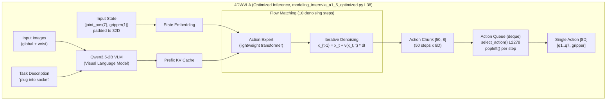

### 17.6 Pre-flight 检查脚本

**文件**: `scripts/preflight_4wvla_franka.sh` (新增)

```bash
#!/bin/bash
# Pre-flight check for 4DWVLA Franka evaluation
# Usage: bash scripts/preflight_4wvla_franka.sh [robot_ip] [ckpt_path]

set -e

ROBOT_IP="${1:-172.16.0.2}"
CKPT_PATH="${2:-/home/nvidia/bt/ckp/4wvlaFrk/plug/4wvlaFrkPlugCkp010420/}"
PASS=0
FAIL=0

echo "============================================"
echo "Pre-flight Check: 4DWVLA Franka Eval"
echo "============================================"
echo "Robot IP: $ROBOT_IP"
echo "Checkpoint: $CKPT_PATH"
echo ""

# Check 1: Docker containers
echo "[1/7] Checking Docker containers..."
if docker ps | grep -q rlinf-rlt-franka; then
    echo "  rlinf-rlt-franka: RUNNING"; PASS=$((PASS+1))
else
    echo "  rlinf-rlt-franka: NOT RUNNING"; FAIL=$((FAIL+1))
fi
if docker ps | grep -q rlinf-rlt-gpu; then
    echo "  rlinf-rlt-gpu: RUNNING"; PASS=$((PASS+1))
else
    echo "  rlinf-rlt-gpu: NOT RUNNING"; FAIL=$((FAIL+1))
fi

# Check 2: Docker network
echo "[2/7] Checking Docker network..."
if docker network inspect rlinf-ray > /dev/null 2>&1; then
    echo "  rlinf-ray bridge: EXISTS"; PASS=$((PASS+1))
else
    echo "  rlinf-ray bridge: NOT FOUND"; FAIL=$((FAIL+1))
fi

# Check 3: Checkpoint
echo "[3/7] Checking checkpoint..."
if [ -d "$CKPT_PATH" ]; then
    SAFETENSOR_COUNT=$(find "$CKPT_PATH" -name "*.safetensors" | wc -l)
    if [ "$SAFETENSOR_COUNT" -gt 0 ]; then
        echo "  Checkpoint: $SAFETENSOR_COUNT safetensor files"; PASS=$((PASS+1))
    else
        echo "  WARNING: No safetensor files found!"; FAIL=$((FAIL+1))
    fi
else
    echo "  Checkpoint dir: NOT FOUND"; FAIL=$((FAIL+1))
fi

# Check 4: Robot network
echo "[4/7] Checking robot network..."
if ping -c 1 -W 2 "$ROBOT_IP" > /dev/null 2>&1; then
    echo "  Robot at $ROBOT_IP: REACHABLE"; PASS=$((PASS+1))
else
    echo "  Robot at $ROBOT_IP: UNREACHABLE"; FAIL=$((FAIL+1))
fi

# Check 5: GPU
echo "[5/7] Checking GPU..."
if nvidia-smi > /dev/null 2>&1; then
    GPU_NAME=$(nvidia-smi --query-gpu=gpu_name --format=csv,noheader | head -1)
    GPU_MEM=$(nvidia-smi --query-gpu=memory.total --format=csv,noheader | head -1)
    echo "  GPU: $GPU_NAME ($GPU_MEM)"; PASS=$((PASS+1))
else
    echo "  GPU: NOT AVAILABLE"; FAIL=$((FAIL+1))
fi

# Check 6: Camera devices
echo "[6/7] Checking RealSense cameras..."
USB_CAM_COUNT=$(lsusb 2>/dev/null | grep -ci "RealSense" || echo 0)
echo "  RealSense USB devices: $USB_CAM_COUNT"
if [ "$USB_CAM_COUNT" -ge 2 ]; then
    PASS=$((PASS+1))
else
    echo "  WARNING: Expected 2 cameras"; FAIL=$((FAIL+1))
fi

# Check 7: Environment registration
echo "[7/7] Checking environment registration..."
if python -c "
import gymnasium as gym
import rlinf.envs.realworld.franka.tasks
gym.spec('FrankaJointEnv-v1')
print('  FrankaJointEnv-v1: REGISTERED')
" 2>/dev/null; then
    PASS=$((PASS+1))
else
    echo "  FrankaJointEnv-v1: NOT REGISTERED"; FAIL=$((FAIL+1))
fi

echo ""
echo "============================================"
echo "Results: $PASS passed, $FAIL failed"
echo "============================================"
if [ "$FAIL" -gt 0 ]; then
    echo "SOME CHECKS FAILED. Fix issues before proceeding."
    exit 1
else
    echo "ALL CHECKS PASSED. Ready for evaluation."
    exit 0
fi
```

### 17.7 快速参考: 常用命令

```bash
# === 启动评估 (完整, 20 episodes) ===
python evaluations/eval_embodied_agent.py \
    --config-name realworld_plug_eval_4wvla \
    env.eval.rollout_epoch=20 \
    rollout.model.model_path=/home/nvidia/bt/ckp/4wvlaFrk/plug/4wvlaFrkPlugCkp010420/

# === 启动评估 (单 episode, 保守) ===
python evaluations/eval_embodied_agent.py \
    --config-name realworld_plug_eval_4wvla \
    env.eval.rollout_epoch=1 \
    env.eval.max_episode_steps=30 \
    env.eval.override_cfg.velocity_safety_factor=0.3 \
    rollout.model.model_path=/home/nvidia/bt/ckp/4wvlaFrk/plug/4wvlaFrkPlugCkp010420/

# === Dummy 测试 ===
python evaluations/eval_embodied_agent.py \
    --config-name realworld_plug_eval_4wvla \
    env.eval.override_cfg.is_dummy=true \
    env.eval.rollout_epoch=2 \
    rollout.model.model_path=/home/nvidia/bt/ckp/4wvlaFrk/plug/4wvlaFrkPlugCkp010420/

# === 手动复位机器人 ===
python -c "
from rlinf.envs.realworld.franka.franka_controller import FrankaController
import numpy as np
ctrl = FrankaController(robot_ip='172.16.0.2')
ctrl.clear_errors()
ctrl.reset_joint(np.array([0.0, -0.785, 0.0, -2.356, 0.0, 1.571, 0.785]))
ctrl.open_gripper()
print('Done')
"

# === 检查关节状态 ===
python -c "
from rlinf.envs.realworld.franka.franka_controller import FrankaController
import numpy as np
ctrl = FrankaController(robot_ip='172.16.0.2')
s = ctrl.get_state()
q = np.array(s.arm_joint_position[:7])
print('Joints (rad):', np.round(q, 4))
print('Joints (deg):', np.round(np.degrees(q), 1))
print('Gripper:', round(s.gripper_position, 4))
"

# === Pre-flight ===
bash scripts/preflight_4wvla_franka.sh 172.16.0.2 /home/nvidia/bt/ckp/4wvlaFrk/plug/4wvlaFrkPlugCkp010420/
```

### 17.8 术语表

| 术语 | 英文 | 含义 |
|:---|:---|:---|
| VLA | Vision-Language-Action | 视觉-语言-动作模型 |
| 4DWVLA | 4D World-model VLA (InternVLA-A1.5) | 本文评估的 VLA 模型, RLinf 内部代号 |
| EE | End Effector | 末端执行器 (机器人手爪) |
| DOF | Degrees of Freedom | 自由度 |
| FCI | Franka Control Interface | Franka 机器人控制接口 |
| Action Chunking | - | 一次推理生成多步动作 |
| Flow Matching | - | 连续动作生成的迭代去噪方法 |
| PREEMPT\_RT | - | Linux 实时内核补丁 |
| CUDA Graph | - | NVIDIA GPU 计算图优化, 减少 kernel launch 开销 |
| SDPA | Scaled Dot-Product Attention | PyTorch 原生注意力加速 |
| KV Cache | Key-Value Cache | Transformer 推理缓存机制 |
