# 4DWVLA 在 RLinf 框架中的 Franka 真机评估 -- 扩展插件版设计与实施落地方案

> **目标**: 以 RLinf out-of-tree 扩展插件的方式, 基于 `RLINF_EXT_MODULE` 机制, 对 4DWVLA 微调后的 checkpoint 进行 Franka 单臂机器人插座插拔任务的真机评估
> **前序依赖**: `4wvla_rlinf_1.md` -- 4DWVLA 模型已整合进 RLinf (SFT 训练, 同一扩展包的训练组件)
> **对照方案**: `4wvla_rlinf_eval_1.md` -- 内联修改版评估方案 (本文档为其插件化替代版)
> **模型 Checkpoint**: `/home/nvidia/bt/ckp/4wvlaFrk/plug/4wvlaFrkPlugCkp010420/`
> **机器人**: Franka Emika Panda 单臂 + 2x RealSense D435I 相机 (global + wrist)
> **服务器**: AMD Ryzen Threadripper 7970X, 1x RTX 5090 D (32 GiB), Ubuntu 22.04.5 LTS, kernel 5.15.0-1032-realtime
> **扩展包路径**: `b/x/four_dwvla_ext/`
> **日期**: 2026-09-09

---

## 目录

- [1. 概述与动机](#1-概述与动机)
- [2. 前置条件](#2-前置条件)
- [3. 扩展包中的 Eval 组件](#3-扩展包中的-eval-组件)
- [4. FrankaJointEnv 设计](#4-frankajointenv-设计)
- [5. FrankaController Monkey-Patch](#5-frankacontroller-monkey-patch)
- [6. Gym 环境注册](#6-gym-环境注册)
- [7. 观测适配器 (FourDWVLAObsAdapter)](#7-观测适配器-fourdwvlaobsadapter)
- [8. 推理管线](#8-推理管线)
- [9. 四层安全架构](#9-四层安全架构)
- [10. Hydra 配置](#10-hydra-配置)
- [11. Docker 部署](#11-docker-部署)
- [12. 操作手册](#12-操作手册)
- [13. 测试方案](#13-测试方案)
- [14. 验收方案](#14-验收方案)
- [15. 与 doc 1 (内联方案) 差异对照](#15-与-doc-1-内联方案-差异对照)
- [16. 命名映射与不改名清单](#16-命名映射与不改名清单)
- [17. 风险与缓解](#17-风险与缓解)
- [18. 附录](#18-附录)

---

## 1. 概述与动机

### 1.1 为什么采用扩展插件方案

`4wvla_rlinf_eval_1.md` (下称 "doc 1") 提出了一个**内联修改**的评估方案, 其核心改动直接作用于 RLinf 源代码:

| 改动 | doc 1 做法 | 问题 |
|:---|:---|:---|
| `FrankaController.move_joints()` | 直接修改 `franka_controller.py` | 侵入 RLinf 核心; 需要 Franka 控制容器的源码同步 |
| `FrankaJointEnv` | 新增到 `rlinf/envs/realworld/franka/` | 新文件进入 RLinf 源码树, 需要上游合并 |
| 环境注册 | 修改 `tasks/__init__.py` | 修改共享注册文件, 有冲突风险 |
| `FourDWVLAObsAdapter` | 新增到 `rlinf/models/embodiment/four_dwvla/` | 依赖上游接受 4DWVLA 代码 |
| 配置文件 | 放入 `examples/embodiment/config/` | 混入 RLinf 的官方配置目录 |

**插件方案的优势**:

1. **零侵入**: 不修改 RLinf 源码的任何一行, 所有代码在 `b/x/four_dwvla_ext/` 中
2. **独立部署**: 扩展包可独立版本控制, 不受 RLinf 上游更新影响
3. **模式一致**: 遵循 `franky_ext` 已验证的生产级扩展模式 (见 `b/x/franky_ext/runtime_bootstrap.py`)
4. **复用性**: 同一个 `four_dwvla_ext` 包同时服务 SFT 训练 (`4wvla_rlinf_1.md`) 和 Eval 评估 (本文档), 共享 `register()` 入口
5. **可回退**: 删除 `RLINF_EXT_MODULE` 环境变量即可完全禁用, 不留任何残留

### 1.2 RLinf 扩展机制原理

RLinf 通过 `RLINF_EXT_MODULE` 环境变量支持 out-of-tree 扩展 (`rlinf/scheduler/cluster/utils.py` L81-110):

```python
# rlinf/scheduler/cluster/utils.py L81-110
def load_user_extension_module(logger=None):
    """Import RLINF_EXT_MODULE and call register() when defined."""
    ext_module_name = Cluster.get_sys_env_var(ClusterEnvVar.EXT_MODULE)
    if ext_module_name is None:
        return
    ext_module = importlib.import_module(ext_module_name)
    if hasattr(ext_module, "register"):
        ext_module.register()  # <-- 在每个 Ray worker 进程中调用
```

**调用时机**: 每个 Ray worker 进程启动时, `load_user_extension_module()` 被调用. 这意味着:

- 在 `rlinf-rlt-franka` 容器中: EnvWorker 进程会执行 `register()`, 注册 `FrankaJointEnv-v1` 并 patch `FrankaController`
- 在 `rlinf-rlt-gpu` 容器中: RolloutWorker 进程会执行 `register()`, 注册自定义 Gym ID (虽然 GPU 侧不直接使用环境, 但 ID 注册需要全局一致)

### 1.3 生产扩展参考: franky_ext

`franky_ext` (`b/x/franky_ext/`) 是 RLinf 中已经在生产环境运行的扩展插件, 本方案严格遵循其设计模式:

| 模式 | franky_ext 实现 | four_dwvla_ext 实现 |
|:---|:---|:---|
| 入口模块 | `franky_ext.runtime_bootstrap` | `four_dwvla_ext.runtime_bootstrap` |
| `register()` 函数 | 5 个 monkey-patch + Gym 注册 | FrankaController patch + Gym 注册 |
| Gym 注册 | `franky_ext/tasks/register.py` | `four_dwvla_ext/tasks/register.py` |
| 环境类 | `FrankySingleFrankaEnv(FrankaEnv)` | `FrankaJointEnv(FrankaEnv)` |
| 反复 patch 防护 | `_franky_*_patched = True` flag | `_four_dwvla_*_patched = True` flag |
| CONFIG_CLS 覆盖 | `FrankySingleFrankaEnvConfig` | `FrankaJointEnvConfig` |

### 1.4 与 SFT 文档的关系

`4wvla_rlinf_1.md` 定义了 `four_dwvla_ext` 扩展包中的**训练组件** (模型注册, checkpoint 加载, 数据管线). 本文档定义**评估组件** (FrankaJointEnv, move_joints patch, ObsAdapter, 推理管线). 两者共享同一个扩展包和 `register()` 入口函数.

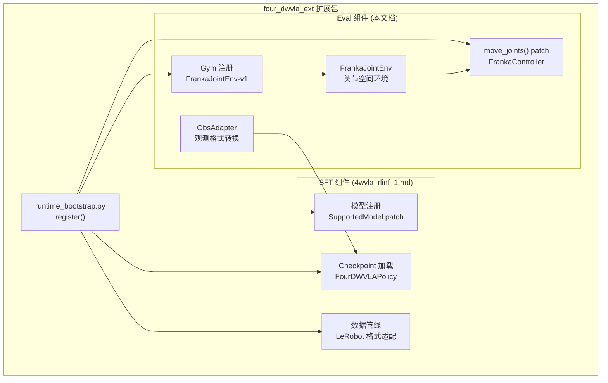

### 1.5 参考来源

| 来源 | 路径/URL | 内容 |
|:---|:---|:---|
| doc 1 (内联方案) | `b/d/frk1/4wvla_rlinf_eval_1.md` | 内联修改版评估方案 (全面的设计分析) |
| SFT 整合方案 | `b/d/frk1/4wvla_rlinf_1.md` | 模型整合与训练方案 |
| franky\_ext 扩展 | `b/x/franky_ext/` | 生产级扩展插件参考 |
| RLinf 扩展机制 | `rlinf/scheduler/cluster/utils.py` L81-110 | `RLINF_EXT_MODULE` 加载逻辑 |
| FrankaEnv | `rlinf/envs/realworld/franka/franka_env.py` | Franka 环境基类 |
| FrankaController | `rlinf/envs/realworld/franka/franka_controller.py` | Franka ROS 控制器 |
| Gym 注册 | `rlinf/envs/realworld/franka/tasks/__init__.py` | 现有 Gym 环境注册 |
| 4DWVLA 论文 | https://arxiv.org/abs/2607.04988 | 算法细节 |
| 4DWVLA GitHub | https://github.com/InternRobotics/InternVLA-A-series | 官方代码 |
| Franka 控制参数 | https://frankaemika.github.io/docs/control_parameters.html | 关节限位 |

---

## 2. 前置条件

### 2.1 硬件环境

| 组件 | 规格 | 说明 |
|:---|:---|:---|
| CPU | AMD Ryzen Threadripper 7970X 32-Core | 主机 |
| GPU | 1x NVIDIA GeForce RTX 5090 D (32 GiB VRAM) | 模型推理, 占用 ~12 GiB |
| OS | Ubuntu 22.04.5 LTS | 宿主机 |
| Kernel | 5.15.0-1032-realtime (PREEMPT\_RT) | 实时控制 |
| Robot | Franka Emika Panda @ 172.16.0.2 (via NIC eno1 @ 172.16.0.1/24) | 7-DOF + gripper |
| Camera 1 | Intel RealSense D435I, serial 420122070525 | global (外部固定) |
| Camera 2 | Intel RealSense D435I | wrist (腕部) |

### 2.2 Docker 双容器架构

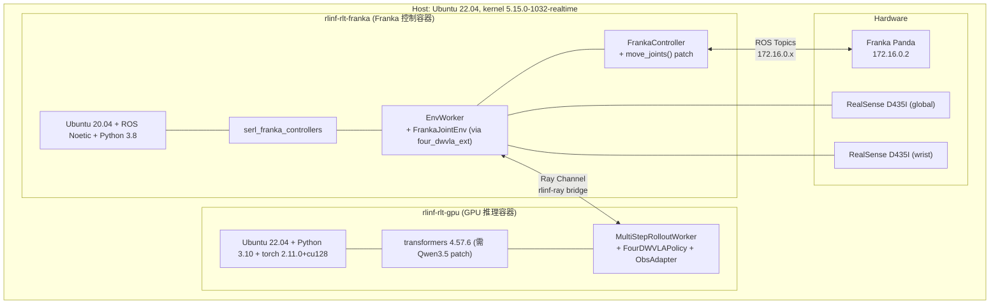

### 2.3 Checkpoint 状态 (已部署)

Checkpoint 路径: `/home/nvidia/bt/ckp/4wvlaFrk/plug/4wvlaFrkPlugCkp010420/`

| 属性 | 值 |
|:---|:---|
| 文件大小 | 5.89 GiB (`model.safetensors`) |
| 权重数量 | 1303 keys, 全部以 `model.` 为前缀 |
| WAN 权重 | **不包含** (训练时 frozen, state\_dict 排除) |
| `inference_backend` (config.json) | `"standard"` -- **推理时必须覆盖为 `"optimized"`** |
| `action_loss_only` (config.json) | `false` -- **推理时必须覆盖为 `true`** |
| `normalization_mapping` | ALL IDENTITY (无需反归一化) |
| `keypoint_track_input_dim` | 7 (pos\_rot mode) |
| VRAM 估算 | ~12 GiB (5.89 GiB 权重 + ~6 GiB 运行) -> RTX 5090 32 GiB 轻松容纳 |

### 2.4 扩展包部署状态

```bash
# 扩展包必须在两个容器的 PYTHONPATH 中可导入:
export RLINF_EXT_MODULE=four_dwvla_ext.runtime_bootstrap
export PYTHONPATH=/home/nvidia/bt/s/RLinf/b/x:$PYTHONPATH
```

---

## 3. 扩展包中的 Eval 组件

### 3.1 完整包结构

```
b/x/four_dwvla_ext/
|-- __init__.py                           # 包初始化
|-- runtime_bootstrap.py                  # register() 入口 [共享]
|
|-- patches/
|   |-- __init__.py
|   |-- franka_controller_patch.py        # [Eval] move_joints() monkey-patch
|
|-- envs/
|   |-- __init__.py
|   |-- franka_joint_env.py               # [Eval] FrankaJointEnv 环境类
|   |-- franka_joint_env_config.py        # [Eval] JointEnvConfig 配置
|
|-- tasks/
|   |-- __init__.py
|   |-- register.py                       # [Eval] FrankaJointEnv-v1 Gym 注册
|
|-- adapters/
|   |-- __init__.py
|   |-- obs_adapter.py                    # [Eval] FourDWVLAObsAdapter
|
|-- models/                               # [SFT] 模型注册与适配 (来自 4wvla_rlinf_1.md)
|   |-- __init__.py
|   |-- policy_adapter.py                 # [共享] FourDWVLAPolicy
|   |-- model_register.py                 # [SFT] SupportedModel 注册 patch
|
|-- configs/
|   |-- realworld_franka_joint_env.yaml   # [Eval] 环境配置
|   |-- realworld_plug_eval_4wvla.yaml    # [Eval] 评估任务配置
|
|-- tests/
|   |-- __init__.py
|   |-- test_joint_clipping.py            # [Eval] 关节裁剪单元测试
|   |-- test_velocity_limiting.py         # [Eval] 速度限制单元测试
|   |-- test_obs_adapter.py               # [Eval] 观测适配器测试
|   |-- test_gym_registration.py          # [Eval] Gym 注册测试
|   |-- test_move_joints.py              # [Eval] move_joints 集成测试
|
|-- scripts/
|   |-- preflight_4wvla_franka.sh         # [Eval] Pre-flight 检查脚本
```

### 3.2 Eval vs SFT 组件分类

| 组件 | 分类 | 运行容器 | 说明 |
|:---|:---:|:---:|:---|
| `runtime_bootstrap.py` | 共享 | 两者 | `register()` 入口, 协调 SFT 和 Eval 注册 |
| `patches/franka_controller_patch.py` | **Eval** | franka | monkey-patch `move_joints()` |
| `envs/franka_joint_env.py` | **Eval** | franka | 关节空间控制环境 |
| `envs/franka_joint_env_config.py` | **Eval** | franka | 环境配置 dataclass |
| `tasks/register.py` | **Eval** | 两者 | `FrankaJointEnv-v1` Gym 注册 |
| `adapters/obs_adapter.py` | **Eval** | gpu | 观测格式转换 |
| `models/policy_adapter.py` | 共享 | gpu | `FourDWVLAPolicy` (SFT 训练 + Eval 推理) |
| `models/model_register.py` | SFT | gpu | `SupportedModel` 注册 |
| `configs/*.yaml` | **Eval** | 两者 | 评估配置 |

---

## 4. FrankaJointEnv 设计

### 4.1 类层次

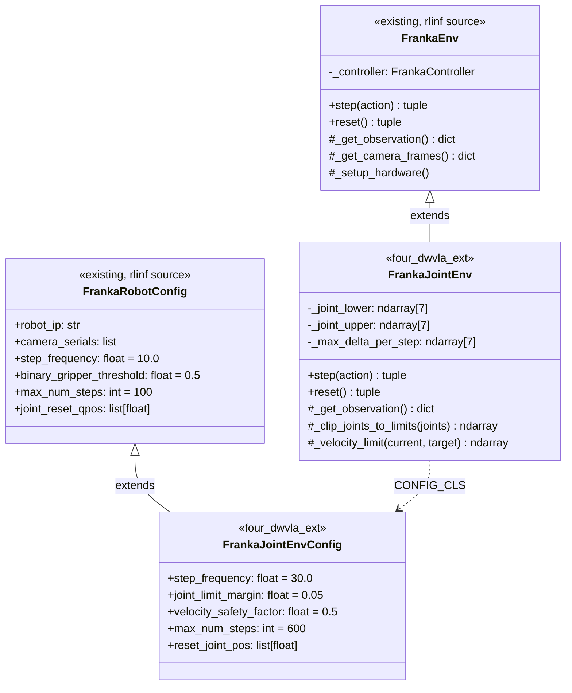

`FrankaJointEnv` 继承 `FrankaEnv` 以复用:
- 相机系统 (`_open_cameras()`, `_get_camera_frames()`)
- Gripper 控制 (`open_gripper()`, `close_gripper()`)
- ROS 初始化 (`_setup_hardware()`)
- 安全恢复 (`clear_errors()`)
- `RealWorldEnv` 的观测包装 (`_wrap_obs()`)

重写的方法:
- `step()`: 关节位置控制替代 Cartesian delta
- `reset()`: 关节空间归位
- `_get_observation()`: 返回 8D 关节状态而非 20D TCP 状态

### 4.2 CONFIG_CLS 覆盖

**文件**: `four_dwvla_ext/envs/franka_joint_env_config.py`

```python
"""Joint-space environment configuration for FrankaJointEnv.

Extends FrankaRobotConfig with joint-space-specific fields while inheriting
all base configuration (robot_ip, camera_serials, etc.).
"""

from __future__ import annotations

from dataclasses import dataclass, field
from typing import Optional

import numpy as np

from rlinf.envs.realworld.franka.franka_env import FrankaRobotConfig


@dataclass
class FrankaJointEnvConfig(FrankaRobotConfig):
    """Configuration for joint-space Franka environment.

    Overrides from FrankaRobotConfig:
        step_frequency: 30.0 (was 10.0) -- matches 4DWVLA training data
        max_num_steps: 600 (was 100) -- 20 seconds at 30Hz

    New fields:
        joint_limit_margin: safety margin from hardware joint limits (rad)
        velocity_safety_factor: fraction of max velocity allowed per step
        reset_joint_pos: home position for reset (7D joint angles, rad)
    """

    # Override: 30Hz to match 4DWVLA training data (was 10Hz for Cartesian)
    step_frequency: float = 30.0

    # Override: 20 seconds at 30Hz (was 100 steps at 10Hz = 10s)
    max_num_steps: int = 600

    # Joint-space specific
    joint_limit_margin: float = 0.05  # rad, safety margin from hardware limits
    velocity_safety_factor: float = 0.5  # fraction of max joint velocity
    reset_joint_pos: list = field(
        default_factory=lambda: [0.0, -0.785, 0.0, -2.356, 0.0, 1.571, 0.785]
    )
```

### 4.3 step() 实现

`step()` 的执行流程:

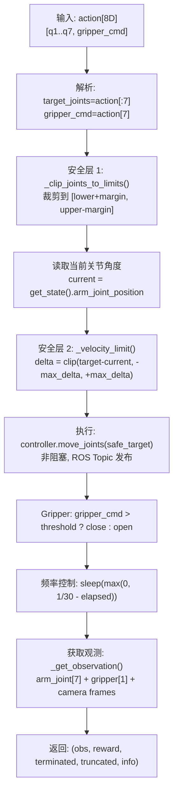

### 4.4 reset() 实现

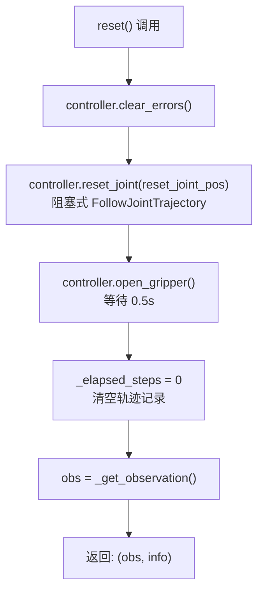

### 4.5 _get_observation() 实现

返回关节空间观测 (8D state + camera frames), 与训练数据格式一致:

| 字段 | 维度 | 来源 | 说明 |
|:---|:---|:---|:---|
| `state.joint_positions` | float32[7] | `FrankaRobotState.arm_joint_position` | 7 个关节角度 (rad) |
| `state.gripper_position` | float32[1] | `FrankaRobotState.gripper_position` | 夹爪宽度 (m) |
| `frames.{camera_name}` | uint8[480,640,3] | RealSense D435I | RGB 图像 |

对比 `FrankaEnv._get_observation()` 返回的 20D 状态 (tcp_pose+tcp_vel+gripper+force+torque), `FrankaJointEnv` 仅返回 8D, 与训练数据的 `observation.state` 维度完全匹配.

### 4.6 安全方法

**`_clip_joints_to_limits(joints)`**:

将目标关节角度裁剪到 Franka Panda 硬件限位减去安全余量的范围内:

$$q_{safe,i} = \text{clip}(q_{target,i},\ q_{lower,i} + \delta_{margin},\ q_{upper,i} - \delta_{margin})$$

其中 $\delta_{margin}$ 默认 0.05 rad (约 2.86 度).

**`_velocity_limit(current, target)`**:

限制每步关节角度变化量, 防止关节速度超标:

$$\Delta q_i = \text{clip}(q_{target,i} - q_{current,i},\ -\Delta q_{max,i},\ +\Delta q_{max,i})$$

$$q_{safe,i} = q_{current,i} + \Delta q_i$$

其中每步最大变化量:

$$\Delta q_{max,i} = \frac{\alpha \cdot v_{max,i}}{f}$$

- $\alpha$: 安全因子, 默认 0.5 (50% 最大速度)
- $v_{max,i}$: 关节 $i$ 的官方最大速度 (rad/s)
- $f$: 控制频率 (Hz), 默认 30

具体数值 ($\alpha = 0.5$, $f = 30$ Hz):

| 关节 | $v_{max}$ (rad/s) | $\Delta q_{max}$ (rad/step) | $\Delta q_{max}$ (deg/step) |
|:---:|:---:|:---:|:---:|
| q1-q4 | 2.175 | 0.03625 | 2.08 |
| q5-q7 | 2.610 | 0.04350 | 2.49 |

### 4.7 完整代码

**文件**: `four_dwvla_ext/envs/franka_joint_env.py`

```python
"""Franka joint-space control environment for 4DWVLA evaluation.

Out-of-tree extension for RLinf. Designed for VLA policies (e.g., 4DWVLA)
that output absolute joint position targets at 30Hz.

Key differences from FrankaEnv:
    - Action space: 8D absolute joint angles [q1..q7, gripper] (not 7D Cartesian delta)
    - Control: Joint position control via move_joints() (not Cartesian impedance)
    - State: arm_joint_position[7] + gripper[1] = 8D (not 20D tcp state)
    - Frequency: 30 Hz (not 10 Hz)
    - Wrappers: No RelativeFrame or Quat2Euler (already in joint space)
"""

from __future__ import annotations

import logging
import time
from typing import Optional

import gymnasium as gym
import numpy as np

from rlinf.envs.realworld.franka.franka_env import FrankaEnv

logger = logging.getLogger(__name__)

# ---------------------------------------------------------------------------
# Franka Emika Panda official joint limits (rad)
# Source: https://frankaemika.github.io/docs/control_parameters.html
# ---------------------------------------------------------------------------
PANDA_JOINT_LIMITS_LOWER = np.array(
    [-2.8973, -1.7628, -2.8973, -3.0718, -2.8973, -0.0175, -2.8973],
    dtype=np.float64,
)
PANDA_JOINT_LIMITS_UPPER = np.array(
    [2.8973, 1.7628, 2.8973, -0.0698, 2.8973, 3.7525, 2.8973],
    dtype=np.float64,
)

# Official max joint velocities (rad/s)
PANDA_MAX_JOINT_VELOCITY = np.array(
    [2.1750, 2.1750, 2.1750, 2.1750, 2.6100, 2.6100, 2.6100],
    dtype=np.float64,
)


class FrankaJointEnv(FrankaEnv):
    """Franka environment with joint-space absolute position control.

    The action space is 8D: [q1, ..., q7, gripper].
    - q1..q7: target joint angles in radians (absolute, not delta)
    - gripper: continuous command; > threshold => close, <= threshold => open

    Designed for policies like 4DWVLA trained on absolute joint angle
    targets collected at 30Hz.
    """

    # Import here to avoid circular import at module level
    from four_dwvla_ext.envs.franka_joint_env_config import FrankaJointEnvConfig

    CONFIG_CLS = FrankaJointEnvConfig

    def __init__(self, override_cfg: Optional[dict] = None, **kwargs):
        super().__init__(override_cfg=override_cfg, **kwargs)

        # --- Joint-space specific configuration ---
        # Read from config (which may have been overridden by override_cfg)
        self._step_frequency = float(self.config.step_frequency)
        joint_limit_margin = float(self.config.joint_limit_margin)
        velocity_safety_factor = float(self.config.velocity_safety_factor)
        self._gripper_threshold = float(self.config.binary_gripper_threshold)
        self._max_num_steps = int(self.config.max_num_steps)

        # Reset pose
        self._reset_joint_pos = np.array(
            self.config.reset_joint_pos, dtype=np.float64
        )

        # Compute effective joint limits with safety margin
        self._joint_lower = PANDA_JOINT_LIMITS_LOWER + joint_limit_margin
        self._joint_upper = PANDA_JOINT_LIMITS_UPPER - joint_limit_margin

        # Compute max allowed joint angle change per step:
        # delta_q_max = alpha * v_max / f_control
        self._max_delta_per_step = (
            velocity_safety_factor * PANDA_MAX_JOINT_VELOCITY / self._step_frequency
        )

        # Override action space for joint control (8D)
        self.action_space = gym.spaces.Box(
            low=np.concatenate([self._joint_lower, [0.0]]).astype(np.float32),
            high=np.concatenate([self._joint_upper, [1.0]]).astype(np.float32),
            shape=(8,),
            dtype=np.float32,
        )

        self._elapsed_steps = 0
        self._episode_joint_trajectory = []  # For debugging/logging

        logger.info(
            "FrankaJointEnv initialized: freq=%.1fHz, margin=%.3frad, "
            "vel_factor=%.2f, max_steps=%d",
            self._step_frequency, joint_limit_margin,
            velocity_safety_factor, self._max_num_steps,
        )

    # ------------------------------------------------------------------
    # Core interface overrides
    # ------------------------------------------------------------------

    def step(self, action: np.ndarray):
        """Execute one joint-space control step.

        Args:
            action: [8] array -- [q1..q7 (rad, absolute), gripper_cmd]

        Returns:
            (obs, reward, terminated, truncated, info)
        """
        step_start = time.time()
        action = np.asarray(action, dtype=np.float64).flatten()
        assert action.shape == (8,), f"Expected 8D action, got {action.shape}"

        # Split into joint targets and gripper command
        target_joints = action[:7]
        gripper_cmd = action[7]

        # --- Safety Layer 1: clip to joint limits ---
        safe_joints = self._clip_joints_to_limits(target_joints)

        # --- Safety Layer 2: velocity limiting ---
        current_joints = self._get_current_joint_positions()
        safe_joints = self._velocity_limit(current_joints, safe_joints)

        # --- Execute joint position command (non-blocking) ---
        try:
            self._controller.move_joints(safe_joints)
        except Exception as e:
            logger.error("Joint move failed: %s", e)
            self._controller.clear_errors()
            obs = self._get_observation()
            return obs, 0.0, True, False, {"error": str(e)}

        # --- Execute gripper action ---
        self._end_effector_action(gripper_cmd)

        # --- Rate limiting to step_frequency ---
        elapsed = time.time() - step_start
        sleep_time = max(0.0, 1.0 / self._step_frequency - elapsed)
        if sleep_time > 0:
            time.sleep(sleep_time)

        # --- Get new observation ---
        obs = self._get_observation()
        reward = self._calc_step_reward()
        terminated = self._check_termination()
        self._elapsed_steps += 1
        truncated = self._elapsed_steps >= self._max_num_steps

        info = self._get_step_info(
            target_joints, safe_joints, current_joints,
            time.time() - step_start,
        )

        # Log trajectory for debugging
        self._episode_joint_trajectory.append(safe_joints.copy())

        return obs, reward, terminated, truncated, info

    def reset(self, *, seed=None, options=None, **kwargs):
        """Reset environment: move robot to home position."""
        self._controller.clear_errors()
        logger.info("Resetting to joint pose: %s", self._reset_joint_pos)
        self._controller.reset_joint(self._reset_joint_pos.tolist())
        self._elapsed_steps = 0
        self._episode_joint_trajectory = []

        # Open gripper for pick tasks
        self._controller.open_gripper()
        time.sleep(0.5)

        obs = self._get_observation()
        info = {"reset_joint_pos": self._reset_joint_pos.tolist()}
        return obs, info

    def _get_observation(self) -> dict:
        """Get joint-space observation.

        Returns:
            dict with keys:
                state.joint_positions: float32[7] arm joint angles (rad)
                state.gripper_position: float32[1] gripper width (m)
                frames.{camera_name}: uint8[H, W, 3] RGB images
        """
        state = self._controller.get_state()
        frames = self._get_camera_frames()

        return {
            "state": {
                "joint_positions": np.array(
                    state.arm_joint_position[:7], dtype=np.float32
                ),
                "gripper_position": np.array(
                    [state.gripper_position], dtype=np.float32
                ),
            },
            "frames": frames,
        }

    # ------------------------------------------------------------------
    # Safety methods
    # ------------------------------------------------------------------

    def _clip_joints_to_limits(self, joints: np.ndarray) -> np.ndarray:
        """Clip joint targets to safe limits (with margin)."""
        clipped = np.clip(joints, self._joint_lower, self._joint_upper)
        if not np.allclose(joints, clipped, atol=1e-6):
            logger.warning(
                "Joint targets clipped: original=%s, clipped=%s",
                np.round(joints, 4), np.round(clipped, 4),
            )
        return clipped

    def _velocity_limit(
        self, current: np.ndarray, target: np.ndarray
    ) -> np.ndarray:
        """Apply velocity limiting: constrain per-step joint angle change.

        delta_q_i = clip(target_i - current_i,
                         -max_delta_per_step_i, +max_delta_per_step_i)
        safe_target_i = current_i + delta_q_i
        """
        delta = target - current
        delta_clipped = np.clip(
            delta, -self._max_delta_per_step, self._max_delta_per_step
        )
        safe_target = current + delta_clipped

        if not np.allclose(delta, delta_clipped, atol=1e-6):
            logger.debug(
                "Velocity limited: requested_delta=%s, clipped_delta=%s",
                np.round(delta, 4), np.round(delta_clipped, 4),
            )
        return safe_target

    def _get_current_joint_positions(self) -> np.ndarray:
        """Read current joint positions from robot state."""
        state = self._controller.get_state()
        return np.array(state.arm_joint_position[:7], dtype=np.float64)

    # ------------------------------------------------------------------
    # Task-specific (override in subclass or configure)
    # ------------------------------------------------------------------

    def _check_termination(self) -> bool:
        """Check if episode should terminate (task-specific).
        Override in subclass for task-specific success detection."""
        return False

    def _calc_step_reward(self) -> float:
        """Calculate step reward (task-specific).
        Override in subclass for task-specific reward."""
        return 0.0

    def _get_step_info(
        self,
        requested_joints: np.ndarray,
        actual_joints: np.ndarray,
        current_joints: np.ndarray,
        step_time: float,
    ) -> dict:
        """Build info dict for debugging."""
        return {
            "requested_joints": requested_joints.tolist(),
            "actual_command_joints": actual_joints.tolist(),
            "pre_step_joints": current_joints.tolist(),
            "step_time_ms": step_time * 1000,
            "effective_freq_hz": 1.0 / max(step_time, 1e-6),
            "elapsed_steps": self._elapsed_steps,
        }

    def _end_effector_action(self, gripper_cmd: float):
        """Execute gripper action based on command value."""
        if gripper_cmd > self._gripper_threshold:
            self._controller.close_gripper()
        else:
            self._controller.open_gripper()
```

---

## 5. FrankaController Monkey-Patch

### 5.1 设计决策

doc 1 直接修改 `rlinf/envs/realworld/franka/franka_controller.py` 添加 `move_joints()`. 插件方案改用 monkey-patch, 遵循 `franky_ext` 的模式:

| 对比 | franky\_ext | four\_dwvla\_ext |
|:---|:---|:---|
| Patch 对象 | `AcceleratorUtil`, `Worker`, `FSDPStrategy`, `Tensor` | `FrankaController` |
| Patch 内容 | 替换已有方法 | 添加新方法 `move_joints()` |
| 反复防护 | `_franky_*_patched = True` | `_four_dwvla_move_joints_patched = True` |
| 副作用 | 仅在调用时生效 | Lazy-init publisher, 仅首次 `move_joints()` 时创建 |

### 5.2 Lazy-init Publisher

`move_joints()` 使用 ROS `rospy.Publisher` 发布 `Float64MultiArray` 到 `/joint_position_controller/command`. Publisher 在首次调用时 lazy 初始化, 避免在不使用关节控制的环境中产生不必要的 ROS 连接:

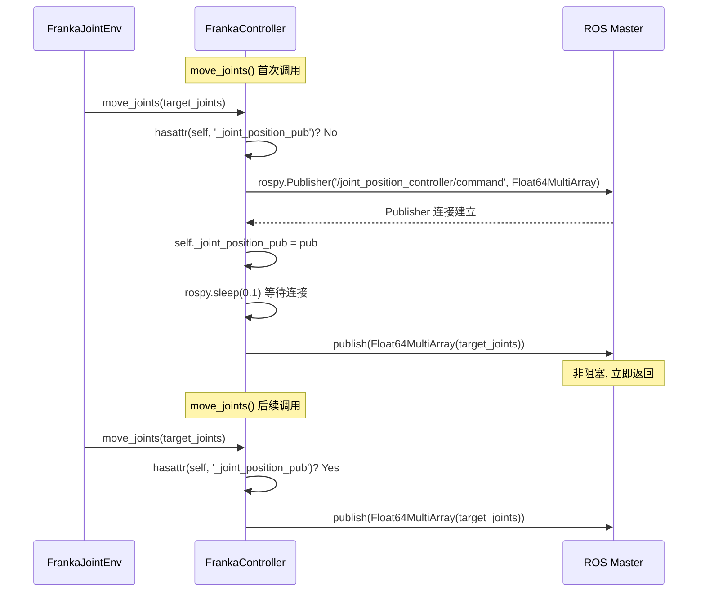

### 5.3 完整 Patch 代码

**文件**: `four_dwvla_ext/patches/franka_controller_patch.py`

```python
"""Monkey-patch FrankaController to add non-blocking move_joints() method.

This follows the franky_ext patching pattern:
    - Anti-double-patch flag: _four_dwvla_move_joints_patched
    - Lazy-init publisher: only created on first move_joints() call
    - Non-invasive: does not modify any existing FrankaController method

The move_joints() method publishes joint position targets as
Float64MultiArray on /joint_position_controller/command for streaming
joint-space control at 30Hz. This is the same pattern used by
DualFrankaJointEnv (via FrankyController.move_joints) for dual-arm
joint-space control.

Reference: franky_ext/runtime_bootstrap.py for patching patterns.
"""

from __future__ import annotations

import logging

import numpy as np

logger = logging.getLogger(__name__)


def patch_franka_controller_move_joints() -> None:
    """Add move_joints() to FrankaController if not already patched.

    Safe to call multiple times (idempotent via anti-double-patch flag).
    """
    from rlinf.envs.realworld.franka.franka_controller import FrankaController

    if getattr(FrankaController, "_four_dwvla_move_joints_patched", False):
        return

    def move_joints(self, joint_positions: np.ndarray) -> None:
        """Send non-blocking joint position command for streaming control.

        Unlike reset_joint() which blocks until the robot reaches the target,
        this method publishes the target joint positions and returns immediately,
        enabling 30Hz streaming joint position control.

        This follows the same pattern as FrankyController.move_joints() used by
        DualFrankaJointEnv for dual-arm joint-space control.

        Args:
            joint_positions: [7] target joint angles in radians.
                Must be within Panda joint limits.
        """
        import rospy
        from std_msgs.msg import Float64MultiArray

        # Lazy-init publisher on first call
        if not hasattr(self, "_joint_position_pub"):
            topic = rospy.get_param(
                "~joint_position_topic",
                "/joint_position_controller/command",
            )
            self._joint_position_pub = rospy.Publisher(
                topic, Float64MultiArray, queue_size=1,
            )
            # Allow publisher to connect
            rospy.sleep(0.1)
            logger.info(
                "FrankaController: initialized joint position publisher on %s",
                topic,
            )

        msg = Float64MultiArray()
        msg.data = list(np.asarray(joint_positions, dtype=np.float64).flatten())
        self._joint_position_pub.publish(msg)

    FrankaController.move_joints = move_joints
    FrankaController._four_dwvla_move_joints_patched = True
    logger.info(
        "FrankaController: move_joints() monkey-patched successfully "
        "(anti-double-patch flag set)"
    )
```

### 5.4 与 franky_ext Patch 模式对比

```python
# franky_ext 模式 (runtime_bootstrap.py L132-145):
if getattr(worker_mod.Worker, "_franky_cpu_platform_patched", False):
    return
# ... patch logic ...
worker_mod.Worker._franky_cpu_platform_patched = True

# four_dwvla_ext 模式 (完全一致):
if getattr(FrankaController, "_four_dwvla_move_joints_patched", False):
    return
# ... patch logic ...
FrankaController._four_dwvla_move_joints_patched = True
```

两者使用完全相同的反复 patch 防护模式:
1. 检查类属性 flag (首次不存在, `getattr` 返回 `False`)
2. 执行 patch
3. 设置 flag 为 `True`
4. 后续调用跳过

---

## 6. Gym 环境注册

### 6.1 Factory 函数

**文件**: `four_dwvla_ext/tasks/register.py`

```python
"""Register FrankaJointEnv-v1 gym ID (import before gym.make).

This module is imported by four_dwvla_ext.runtime_bootstrap.register(),
which runs on every Ray worker process. The gymnasium.register() call
makes FrankaJointEnv-v1 available globally.

Reference: franky_ext/tasks/register.py for the registration pattern.
"""

from __future__ import annotations

import logging
from typing import Any, Mapping

import gymnasium as gym
from gymnasium.envs.registration import register

logger = logging.getLogger(__name__)


def create_franka_joint_env(
    override_cfg: dict[str, Any],
    worker_info: Any,
    hardware_info: Any,
    env_idx: int,
    env_cfg: Mapping[str, Any],
) -> gym.Env:
    """Create single-arm Franka joint-space env (no Cartesian wrappers).

    Joint-space envs do NOT apply RelativeFrame or Quat2Euler wrappers.
    The action is already in joint space -- no EE coordinate transform needed.
    This follows the same pattern as DualFrankaJointEnv registration.

    Only KeyboardWrapper is applied for manual intervention capability.
    """
    from four_dwvla_ext.envs.franka_joint_env import FrankaJointEnv

    env = FrankaJointEnv(
        override_cfg=override_cfg,
        worker_info=worker_info,
        hardware_info=hardware_info,
        env_idx=env_idx,
    )

    # KeyboardWrapper only -- NO apply_single_arm_wrappers()
    # (which would add RelativeFrame + Quat2Euler, incompatible with joint space)
    try:
        from rlinf.envs.realworld.common.wrappers.keyboard import KeyboardWrapper
        env = KeyboardWrapper(env, **override_cfg)
        logger.info("FrankaJointEnv: KeyboardWrapper applied")
    except ImportError:
        logger.warning("KeyboardWrapper not available; skipping")

    return env


# Register the gym environment ID
register(
    id="FrankaJointEnv-v1",
    entry_point="four_dwvla_ext.tasks.register:create_franka_joint_env",
)

logger.info("FrankaJointEnv-v1 registered via four_dwvla_ext")
```

**关键设计决策**: 不使用 `apply_single_arm_wrappers()`, 因为:
- `RelativeFrame` wrapper 将 Cartesian delta 从 EE 坐标系转换到 base 坐标系 -- 关节空间动作不需要
- `Quat2Euler` wrapper 处理四元数到欧拉角的转换 -- 关节空间无四元数
- `DualFrankaJointEnv` (已有的关节空间环境) 同样不使用这些 wrapper

### 6.2 在 register() 中触发

**文件**: `four_dwvla_ext/runtime_bootstrap.py`

```python
"""Runtime bootstrap for four_dwvla_ext extension.

This module's register() function is called on every Ray worker process
via the RLINF_EXT_MODULE mechanism (rlinf/scheduler/cluster/utils.py L81-110).

It performs two categories of work:
    1. [SFT] Model registration and checkpoint loading patches (from 4wvla_rlinf_1.md)
    2. [Eval] FrankaController patch + FrankaJointEnv-v1 gym registration (this doc)
"""

from __future__ import annotations

import logging
import sys

logger = logging.getLogger(__name__)


def register() -> None:
    """RLINF_EXT_MODULE hook: called on every Ray worker process.

    Performs:
        1. Monkey-patch FrankaController.move_joints() for joint-space control
        2. Register FrankaJointEnv-v1 gym environment
        3. (SFT components from 4wvla_rlinf_1.md, if applicable)
    """
    # --- Eval: FrankaController patch ---
    try:
        from four_dwvla_ext.patches.franka_controller_patch import (
            patch_franka_controller_move_joints,
        )
        patch_franka_controller_move_joints()
    except Exception:
        import traceback
        print(
            "four_dwvla_ext: FrankaController patch FAILED:\n"
            + traceback.format_exc(),
            file=sys.stderr,
        )

    # --- Eval: Gym environment registration ---
    try:
        import four_dwvla_ext.tasks.register  # noqa: F401
    except Exception:
        import traceback
        print(
            "four_dwvla_ext: gym registration FAILED:\n"
            + traceback.format_exc(),
            file=sys.stderr,
        )

    # --- SFT: Model registration (from 4wvla_rlinf_1.md) ---
    # Uncomment when SFT components are implemented:
    # try:
    #     from four_dwvla_ext.models.model_register import patch_model_registry
    #     patch_model_registry()
    # except Exception:
    #     import traceback
    #     print(
    #         "four_dwvla_ext: model registry patch FAILED:\n"
    #         + traceback.format_exc(),
    #         file=sys.stderr,
    #     )

    logger.info("four_dwvla_ext: register() completed")


# Module-level execution for early import (same pattern as franky_ext)
try:
    from four_dwvla_ext.patches.franka_controller_patch import (
        patch_franka_controller_move_joints,
    )
    patch_franka_controller_move_joints()
except Exception:
    pass

try:
    import four_dwvla_ext.tasks.register  # noqa: F401
except Exception:
    import traceback
    print(
        "four_dwvla_ext: gym registration FAILED at import:\n"
        + traceback.format_exc(),
        file=sys.stderr,
    )
```

### 6.3 Gym 注册在 Ray Worker 中的传播

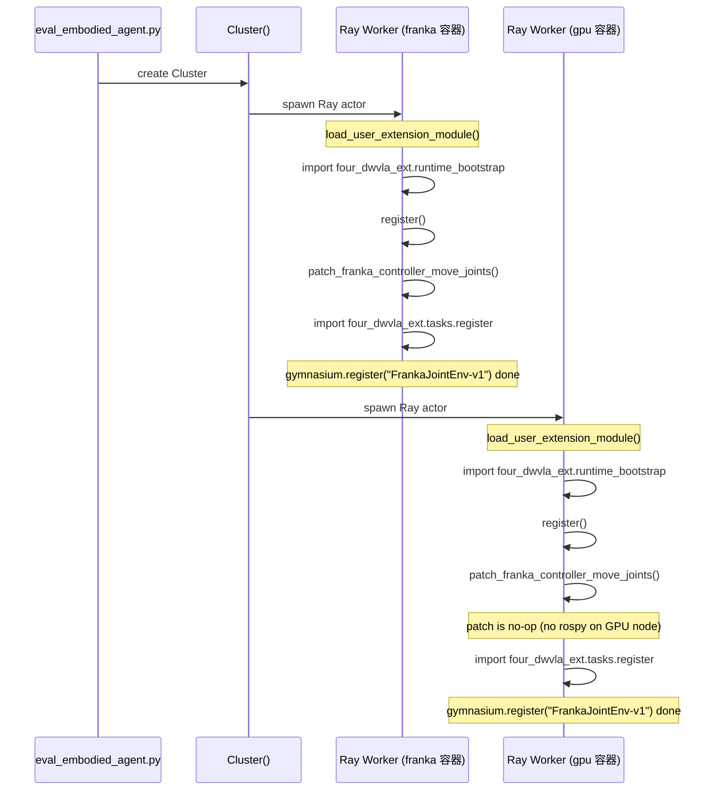

---

## 7. 观测适配器 (FourDWVLAObsAdapter)

### 7.1 输入: RLinf 环境观测格式

`RealWorldEnv._wrap_obs()` (L208-232) 输出:

```python
{
    "states":              Tensor[1, state_dim],       # 8D for joint env
    "main_images":         Tensor[1, H, W, 3],         # global camera
    "extra_view_images":   Tensor[1, N_extra, H, W, 3], # wrist camera
    "task_descriptions":   list[str],                   # e.g., ["plug into socket"]
}
```

### 7.2 输出: 4DWVLA 模型输入格式

`InternVLAA15Policy.predict_action_chunk()` 期望:

```python
{
    "observation.pixel_values":     Tensor[1, N_patches, C_hidden],
    "observation.image_grid_thw":   Tensor[N_images, 3],
    "observation.input_ids":        Tensor[1, L],
    "observation.attention_mask":   Tensor[1, L],
    "observation.state":            Tensor[1, max_state_dim],  # padded to 32D
}
```

### 7.3 图像处理: 480x640 -> 224x224

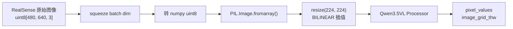

两张图像 (global + wrist) 分别处理后拼接为 chat message 中的两个 `{"type": "image"}` 项.

### 7.4 状态 Padding: 8D -> 32D

```
observation.state = [q1, q2, q3, q4, q5, q6, q7, gripper, 0, 0, ..., 0]
                     |<--- 8D 实际状态 --->|   |<--- 24D 零填充 --->|
                     |<------------------ 32D (max_state_dim) -------->|
```

4DWVLA 训练时使用 `max_state_dim=32`, 因此 8D 关节状态需要 zero-pad 到 32D.

### 7.5 任务 Tokenization

通过 Qwen3.5 VL Processor 的 chat template:

```python
messages = [
    {"role": "system", "content": "You are a helpful robot assistant."},
    {"role": "user", "content": [
        {"type": "image", "image": global_pil_image},
        {"type": "image", "image": wrist_pil_image},
        {"type": "text", "text": "plug into socket"},
    ]},
]

inputs = processor.apply_chat_template(
    messages, add_generation_prompt=True,
    tokenize=True, return_tensors="pt",
)
```

### 7.6 完整代码

**文件**: `four_dwvla_ext/adapters/obs_adapter.py`

```python
"""Observation adapter: converts RLinf env observations to 4DWVLA model input format.

This adapter bridges the gap between RLinf's RealWorldEnv observation format
and 4DWVLA's expected input format (Qwen3.5 VL processor).

Runs in the GPU container (rlinf-rlt-gpu) as part of FourDWVLAPolicy.

RLinf env observation (from RealWorldEnv._wrap_obs()):
    {
        "states":              Tensor[1, state_dim],       # 8D for joint env
        "main_images":         Tensor[1, H, W, 3],         # global camera
        "extra_view_images":   Tensor[1, N_extra, H, W, 3], # wrist camera
        "task_descriptions":   list[str],                   # e.g., ["plug into socket"]
    }

4DWVLA expected batch (from predict_action_chunk()):
    {
        "observation.pixel_values":     Tensor[1, N_patches, C_hidden],
        "observation.image_grid_thw":   Tensor[N_images, 3],
        "observation.input_ids":        Tensor[1, L],
        "observation.attention_mask":   Tensor[1, L],
        "observation.state":            Tensor[1, max_state_dim],  # padded to 32D
    }
"""

from __future__ import annotations

import logging
from typing import Any

import numpy as np
import torch
from PIL import Image

logger = logging.getLogger(__name__)


class FourDWVLAObsAdapter:
    """Converts RealWorldEnv observations to 4DWVLA batch format."""

    def __init__(
        self,
        vlm_model_name_or_path: str,
        image_resolution: tuple[int, int] = (224, 224),
        max_state_dim: int = 32,
        device: torch.device = torch.device("cuda"),
    ):
        """Initialize the observation adapter.

        Args:
            vlm_model_name_or_path: Path to Qwen3.5 VL model for processor.
            image_resolution: Target image size (H, W) for model input.
            max_state_dim: Maximum state dimension (padded with zeros).
            device: Target device for tensors.
        """
        self.device = device
        self.max_state_dim = max_state_dim
        self._image_resolution = image_resolution

        # Initialize Qwen3.5 VL processor
        from transformers import AutoProcessor

        self._processor = AutoProcessor.from_pretrained(vlm_model_name_or_path)

        self._system_prompt = "You are a helpful robot assistant."

        logger.info(
            "FourDWVLAObsAdapter initialized: img_res=%s, max_state=%d, device=%s",
            image_resolution, max_state_dim, device,
        )

    def adapt(self, env_obs: dict[str, Any]) -> dict[str, torch.Tensor]:
        """Convert env observation dict to model input dict.

        Args:
            env_obs: Observation from RealWorldEnv._wrap_obs()

        Returns:
            Dict with keys matching 4DWVLA predict_action_chunk() input.
        """
        images = self._extract_images(env_obs)
        state = self._extract_state(env_obs)
        task_desc = self._extract_task_description(env_obs)
        batch = self._build_model_input(images, state, task_desc)
        return batch

    def _extract_images(self, env_obs: dict) -> list[Image.Image]:
        """Extract, convert, and resize images from env observation."""
        images = []

        # main_images -> global camera (first image)
        if "main_images" in env_obs:
            img = env_obs["main_images"]
            if isinstance(img, torch.Tensor):
                img = img.squeeze(0).cpu().numpy()
            if img.dtype != np.uint8:
                img = (np.clip(img, 0, 1) * 255).astype(np.uint8)
            pil_img = Image.fromarray(img).resize(
                (self._image_resolution[1], self._image_resolution[0]),
                Image.BILINEAR,
            )
            images.append(pil_img)

        # extra_view_images -> wrist camera (first extra view)
        if "extra_view_images" in env_obs:
            extra = env_obs["extra_view_images"]
            if isinstance(extra, torch.Tensor):
                extra = extra.squeeze(0)  # remove batch dim
                if extra.dim() == 4:
                    extra = extra[0]  # take first extra view [H, W, 3]
                extra = extra.cpu().numpy()
            if extra.dtype != np.uint8:
                extra = (np.clip(extra, 0, 1) * 255).astype(np.uint8)
            pil_img = Image.fromarray(extra).resize(
                (self._image_resolution[1], self._image_resolution[0]),
                Image.BILINEAR,
            )
            images.append(pil_img)

        if len(images) == 0:
            logger.warning("No images found in env observation")

        return images

    def _extract_state(self, env_obs: dict) -> torch.Tensor:
        """Extract state and pad to max_state_dim.

        Input state is 8D: [joint_positions(7), gripper_position(1)]
        Output is padded to max_state_dim (32D) with zeros.
        """
        if "states" in env_obs:
            state = env_obs["states"]
            if isinstance(state, torch.Tensor):
                state = state.squeeze(0).float()
            else:
                state = torch.tensor(state, dtype=torch.float32).flatten()
        else:
            state = torch.zeros(8, dtype=torch.float32)

        # Pad to max_state_dim
        actual_dim = state.shape[-1]
        if actual_dim < self.max_state_dim:
            pad = torch.zeros(
                self.max_state_dim - actual_dim, dtype=torch.float32
            )
            state = torch.cat([state, pad])
        elif actual_dim > self.max_state_dim:
            state = state[: self.max_state_dim]

        return state.unsqueeze(0).to(self.device)  # [1, max_state_dim]

    def _extract_task_description(self, env_obs: dict) -> str:
        """Extract task description string."""
        if "task_descriptions" in env_obs:
            descs = env_obs["task_descriptions"]
            if isinstance(descs, list) and len(descs) > 0:
                return descs[0]
            elif isinstance(descs, str):
                return descs
        return "plug into socket"  # Fallback default

    def _build_model_input(
        self,
        images: list[Image.Image],
        state: torch.Tensor,
        task_desc: str,
    ) -> dict[str, torch.Tensor]:
        """Build the full model input using Qwen3.5 VL processor."""
        # Build chat messages (Qwen3.5 VL format)
        content = []
        for img in images:
            content.append({"type": "image", "image": img})
        content.append({"type": "text", "text": task_desc})

        messages = [
            {"role": "system", "content": self._system_prompt},
            {"role": "user", "content": content},
        ]

        # Process through Qwen3.5 VL processor
        inputs = self._processor.apply_chat_template(
            messages,
            add_generation_prompt=True,
            tokenize=True,
            return_tensors="pt",
        )

        # Build batch dict with "observation." prefix
        batch = {}
        for key in [
            "input_ids", "attention_mask", "pixel_values", "image_grid_thw"
        ]:
            if key in inputs:
                batch[f"observation.{key}"] = inputs[key].to(self.device)

        # Add state (already padded to max_state_dim)
        batch["observation.state"] = state

        return batch
```

---

## 8. 推理管线

### 8.1 端到端推理流程

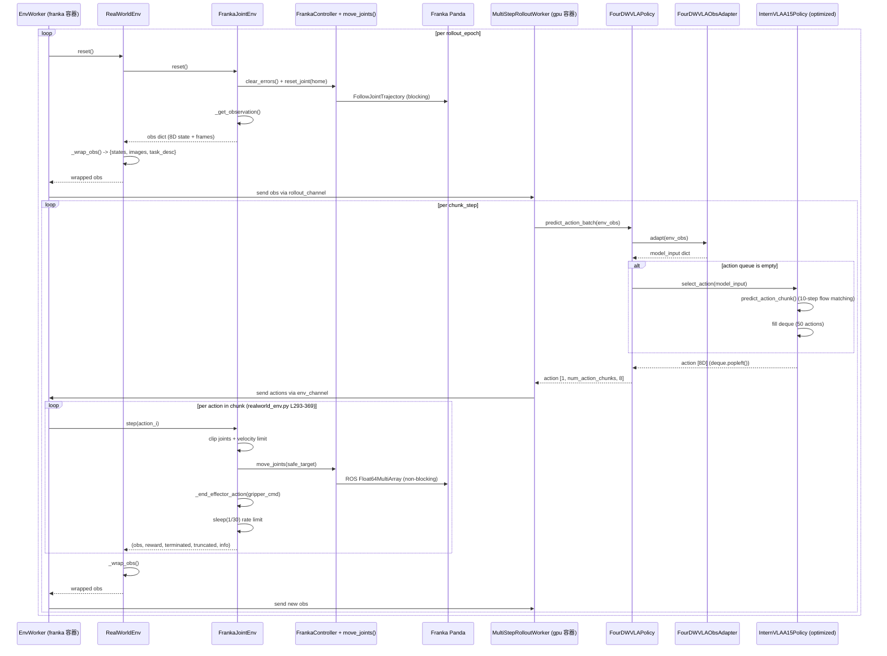

### 8.2 Action Chunking

4DWVLA 使用 **action chunking** (chunk\_size=50), 一次推理生成 50 步动作:

```
内部 queue:  |<------ 50 个 action ------>|
时间线:     t_0  t_1  ...  t_49     t_50 (新推理)
            infer  pop  pop  pop     infer  pop  ...

RLinf 外部: num_action_chunks=10, 每次从 GPU 取 10 个动作
            即: 每 10 步发送一次新的观测给 GPU
            但 GPU 侧只在 queue 空时 (每 50 步) 才做真正的推理
```

**行为细节**:
- `select_action()` (modeling\_internvla\_a1\_5.py L2278) 管理 50 步 deque
- 仅当 deque 为空时触发 `predict_action_chunk()` (10 步 flow matching)
- `num_action_chunks=10` 控制 RLinf 每次从 GPU 取多少动作后再请求新观测
- 前 5 次 `predict_action_batch()` (10 x 5 = 50 步) 从同一轮推理取, 第 6 次触发新推理

### 8.3 动作后处理

```python
# Model output from select_action(): Tensor[action_dim]
# action[:7] = absolute joint angles (radians)
# action[7]  = gripper command (continuous)

# normalization_mapping: ALL IDENTITY (from stats.json)
# -> NO denormalization needed at inference time

# Post-processing steps:
# 1. Truncate to action_dim (8)
# 2. Reshape to [1, num_action_chunks, 8] for RLinf
# 3. Transfer to CPU for Ray serialization
```

### 8.4 频率分析

| 阶段 | 频率/时间 | 说明 |
|:---|:---|:---|
| 控制频率 | 30 Hz (33.3 ms/step) | 匹配训练数据 |
| 首次推理 | ~150-200 ms | Queue 为空, 10 步 flow matching |
| 后续推理 | ~0.05 ms | deque.popleft() |
| 均摊推理 | ~4 ms/step | (200 + 49 x 0.05) / 50 |
| 30Hz 余量 | ~29 ms | 33.3 - 4 = 29.3 ms |

---

## 9. 四层安全架构

### 9.1 安全层概览

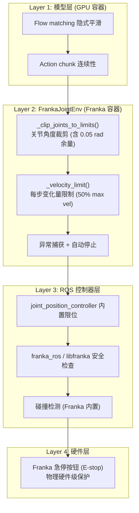

### 9.2 训练数据范围 vs 硬件限位

模型在训练数据覆盖的关节角度范围内学习, 该范围远窄于 Franka 硬件限位:

| 关节 | 有效下限 | 训练最小值 | 训练最大值 | 有效上限 | 训练覆盖率 |
|:---:|:---:|:---:|:---:|:---:|:---:|
| q1 | -2.8473 | **-0.484** | **0.045** | 2.8473 | 9.3% |
| q2 | -1.7128 | **-0.103** | **0.312** | 1.7128 | 12.1% |
| q3 | -2.8473 | **-0.202** | **0.479** | 2.8473 | 12.0% |
| q4 | -3.0218 | **-2.204** | **-1.535** | -0.1198 | 23.1% |
| q5 | -2.8473 | **-0.204** | **0.081** | 2.8473 | 5.0% |
| q6 | 0.0325 | **1.570** | **2.454** | 3.7025 | 24.1% |
| q7 | -2.8473 | **0.484** | **0.981** | 2.8473 | 8.7% |

**安全含义**:
1. 模型正常推理输出应基本落在训练数据范围附近
2. 远超训练范围的输出 (例如 q1 > 1.0) 说明推理异常, 即便在硬件限位内也应警惕
3. q4 训练范围全在负值区域, 与 Franka q4 的物理特性一致 (肘关节); 若输出 q4 > 0 则几乎可确定推理错误

### 9.3 关节限位具体数值

默认 `joint_limit_margin = 0.05` rad, `velocity_safety_factor = 0.5`:

| 关节 | 物理下限 | 有效下限 | 有效上限 | 物理上限 | 每步最大变化 (rad) |
|:---:|:---:|:---:|:---:|:---:|:---:|
| q1 | -2.8973 | -2.8473 | 2.8473 | 2.8973 | 0.03625 |
| q2 | -1.7628 | -1.7128 | 1.7128 | 1.7628 | 0.03625 |
| q3 | -2.8973 | -2.8473 | 2.8473 | 2.8973 | 0.03625 |
| q4 | -3.0718 | -3.0218 | -0.1198 | -0.0698 | 0.03625 |
| q5 | -2.8973 | -2.8473 | 2.8473 | 2.8973 | 0.04350 |
| q6 | -0.0175 | 0.0325 | 3.7025 | 3.7525 | 0.04350 |
| q7 | -2.8973 | -2.8473 | 2.8473 | 2.8973 | 0.04350 |

---

## 10. Hydra 配置

### 10.1 环境配置: realworld_franka_joint_env.yaml

**文件**: `four_dwvla_ext/configs/realworld_franka_joint_env.yaml`

```yaml
# Environment configuration for FrankaJointEnv-v1
# Used with 4DWVLA joint-space control policies
# Source: four_dwvla_ext/envs/franka_joint_env.py

env_type: realworld

total_num_envs: 1
auto_reset: False
ignore_terminations: False
reward_mode: raw
wrap_obs_mode: simple
seed: 0
group_size: 1
use_fixed_reset_state_ids: False
max_steps_per_rollout_epoch: 600   # 20 seconds at 30Hz
max_episode_steps: 600
use_spacemouse: False
no_gripper: False
main_image_key: global

video_cfg:
  save_video: True
  info_on_video: True
  video_base_dir: ${runner.logger.log_path}/video/eval

init_params:
  id: "FrankaJointEnv-v1"
  num_envs: null

override_cfg:
  is_dummy: false
  task_description: "plug into socket"

  # --- Joint-space control parameters ---
  step_frequency: 30.0
  joint_limit_margin: 0.05
  velocity_safety_factor: 0.5
  max_num_steps: 600

  # --- Reset position (Franka home pose) ---
  reset_joint_pos: [0.0, -0.785, 0.0, -2.356, 0.0, 1.571, 0.785]

  # --- Gripper configuration ---
  binary_gripper_threshold: 0.5
  end_effector_type: "gripper"

  # --- Camera configuration ---
  camera_type: "realsense"
  camera_resolution: [480, 640]
  robot_ip: "172.16.0.2"
```

### 10.2 评估任务配置: realworld_plug_eval_4wvla.yaml

**文件**: `four_dwvla_ext/configs/realworld_plug_eval_4wvla.yaml`

```yaml
# Evaluation configuration for 4DWVLA on Franka plug insertion task
# Plugin version: uses RLINF_EXT_MODULE=four_dwvla_ext.runtime_bootstrap
#
# Usage:
#   RLINF_EXT_MODULE=four_dwvla_ext.runtime_bootstrap \
#   python evaluations/eval_embodied_agent.py \
#       --config-name realworld_plug_eval_4wvla \
#       --config-path /path/to/four_dwvla_ext/configs \
#       rollout.model.model_path=/home/nvidia/bt/ckp/4wvlaFrk/plug/4wvlaFrkPlugCkp010420/

defaults:
  - override hydra/job_logging: stdout

hydra:
  run:
    dir: .
  output_subdir: null
  searchpath:
    - file://${oc.env:EMBODIED_PATH}/config/
    - file:///home/nvidia/bt/s/RLinf/b/x/four_dwvla_ext/configs

# -----------------------------------------------------------------------
# Cluster: single node (GPU + Franka on same machine via Docker)
# -----------------------------------------------------------------------
cluster:
  num_nodes: 1
  component_placement:
    rollout:
      node_group: franka
      placement: 0
    env:
      node_group: franka
      placement: 0
  node_groups:
    - label: franka
      node_ranks: 0
      hardware:
        type: Franka
        configs:
          - robot_ip: "172.16.0.2"
            node_rank: 0
            camera_serials:
              - "420122070525"
              - "WRIST_CAMERA_SERIAL"

# -----------------------------------------------------------------------
# Runner
# -----------------------------------------------------------------------
runner:
  task_type: embodied_eval
  logger:
    log_path: "../results"
    project_name: rlinf_4dwvla
    experiment_name: "franka-plug-eval-4wvla"
    logger_backends: ["tensorboard"]
  max_epochs: 1
  max_steps: 1
  only_eval: True
  val_check_interval: -1

# -----------------------------------------------------------------------
# Environment (inline, not via defaults -- external config)
# -----------------------------------------------------------------------
env:
  group_name: "EnvGroup"
  enable_offload: False
  eval:
    env_type: realworld
    total_num_envs: 1
    auto_reset: False
    ignore_terminations: False
    reward_mode: raw
    wrap_obs_mode: simple
    seed: 0
    group_size: 1
    max_steps_per_rollout_epoch: 600
    max_episode_steps: 600
    use_spacemouse: False
    no_gripper: False
    main_image_key: global
    rollout_epoch: 20
    video_cfg:
      save_video: True
      info_on_video: True
      video_base_dir: ${runner.logger.log_path}/video/eval
    init_params:
      id: "FrankaJointEnv-v1"
      num_envs: null
    override_cfg:
      is_dummy: false
      task_description: "plug into socket"
      step_frequency: 30.0
      joint_limit_margin: 0.05
      velocity_safety_factor: 0.5
      max_num_steps: 600
      reset_joint_pos: [0.0, -0.785, 0.0, -2.356, 0.0, 1.571, 0.785]
      binary_gripper_threshold: 0.5
      end_effector_type: "gripper"
      camera_type: "realsense"
      camera_resolution: [480, 640]
      robot_ip: "172.16.0.2"

# -----------------------------------------------------------------------
# Rollout (model inference)
# -----------------------------------------------------------------------
rollout:
  group_name: "RolloutGroup"
  backend: "huggingface"
  recompute_logprobs: False
  enable_offload: False
  pipeline_stage_num: 1
  collect_transitions: False
  collect_prev_infos: False
  model:
    model_path: "/home/nvidia/bt/ckp/4wvlaFrk/plug/4wvlaFrkPlugCkp010420/"
    precision: "bf16"
    action_loss_only: true
    enable_keypoint: false
    num_action_chunks: 10
    action_dim: 8
    state_dim: 8
    max_state_dim: 32
    image_resolution: [224, 224]
    four_dwvla:
      inference_backend: "optimized"
      action_loss_only: true
      gradient_checkpointing: false
      num_inference_steps: 10
      chunk_size: 50
      n_action_steps: 50
```

### 10.3 Hydra Searchpath 设置

扩展包的配置文件不在 RLinf 标准 config 目录中, 需要通过 Hydra searchpath 让 Hydra 能找到它们:

```yaml
hydra:
  searchpath:
    - file://${oc.env:EMBODIED_PATH}/config/           # RLinf 标准配置
    - file:///home/nvidia/bt/s/RLinf/b/x/four_dwvla_ext/configs  # 扩展包配置
```

或通过命令行:

```bash
python evaluations/eval_embodied_agent.py \
    --config-name realworld_plug_eval_4wvla \
    --config-path /home/nvidia/bt/s/RLinf/b/x/four_dwvla_ext/configs
```

---

## 11. Docker 部署

### 11.1 rlinf-rlt-franka 容器

**职责**: FrankaJointEnv + FrankaController (含 move_joints patch)

**关键点**:
- Python 3.8, ROS Noetic
- 需要 `four_dwvla_ext` 包在 PYTHONPATH 中
- `move_joints()` patch 需要 `rospy` 和 `std_msgs` (容器内已有)
- 不需要 GPU

```bash
# 在 rlinf-rlt-franka 容器中设置:
export PYTHONPATH=/home/nvidia/bt/s/RLinf/b/x:$PYTHONPATH
export RLINF_EXT_MODULE=four_dwvla_ext.runtime_bootstrap
```

### 11.2 rlinf-rlt-gpu 容器

**职责**: FourDWVLAPolicy + ObsAdapter + checkpoint

**关键点**:
- Python 3.10, torch 2.11.0+cu128
- 需要 transformers Qwen3.5 patch
- 需要 `four_dwvla_ext` 包在 PYTHONPATH 中
- 需要 GPU (RTX 5090 D)
- Checkpoint 路径需要在容器内可访问 (volume mount)

```bash
# 在 rlinf-rlt-gpu 容器中设置:
export PYTHONPATH=/home/nvidia/bt/s/RLinf/b/x:$PYTHONPATH
export RLINF_EXT_MODULE=four_dwvla_ext.runtime_bootstrap

# 确保 transformers patch 已应用:
TRANSFORMERS_DIR=$(python -c "import transformers; print(transformers.__file__.rsplit('/',1)[0])")
cp -r /home/nvidia/bt/s/4WVLA/src/lerobot/policies/internvla_a1_5/transformers_replace/models ${TRANSFORMERS_DIR}/
```

### 11.3 Docker Compose Override

```yaml
# docker-compose.override.yml (或添加到现有 docker-compose)
version: "3.8"

services:
  rlinf-rlt-franka:
    environment:
      - RLINF_EXT_MODULE=four_dwvla_ext.runtime_bootstrap
      - PYTHONPATH=/home/nvidia/bt/s/RLinf/b/x:${PYTHONPATH}
    volumes:
      - /home/nvidia/bt/s/RLinf/b/x:/home/nvidia/bt/s/RLinf/b/x:ro

  rlinf-rlt-gpu:
    environment:
      - RLINF_EXT_MODULE=four_dwvla_ext.runtime_bootstrap
      - PYTHONPATH=/home/nvidia/bt/s/RLinf/b/x:${PYTHONPATH}
    volumes:
      - /home/nvidia/bt/s/RLinf/b/x:/home/nvidia/bt/s/RLinf/b/x:ro
      - /home/nvidia/bt/ckp:/home/nvidia/bt/ckp:ro
```

### 11.4 环境变量传播

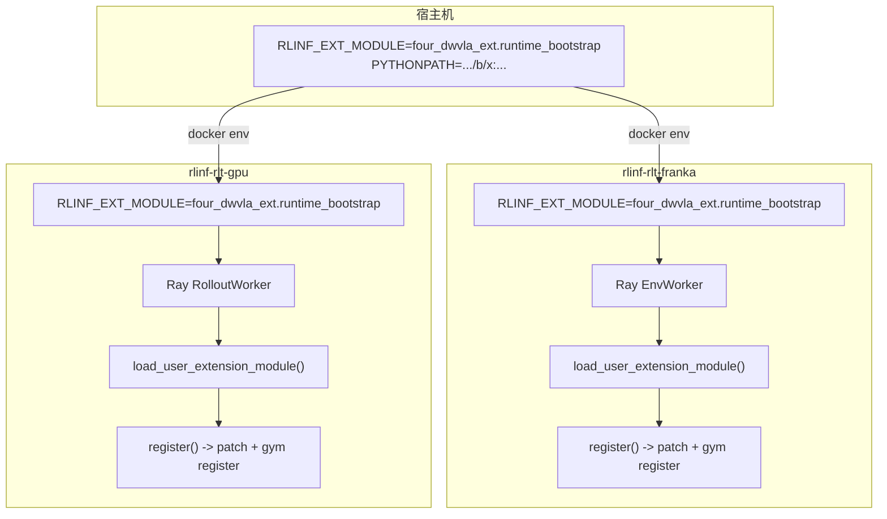

---

## 12. 操作手册

### 12.1 Pre-flight 检查

```bash
# 在宿主机执行

# 1. 确认扩展包存在
ls -la /home/nvidia/bt/s/RLinf/b/x/four_dwvla_ext/runtime_bootstrap.py
# 应存在

# 2. 确认 Docker 容器运行中
docker ps | grep -E "rlinf-rlt-(franka|gpu)"
# 应看到两个容器

# 3. 确认 checkpoint
ls /home/nvidia/bt/ckp/4wvlaFrk/plug/4wvlaFrkPlugCkp010420/model.safetensors
# 应存在, 约 5.89 GiB

# 4. 确认网络
ping -c 1 172.16.0.2
# Franka 应可达

# 5. 确认 GPU
nvidia-smi
# 应看到 RTX 5090 D

# 6. 确认相机
lsusb | grep -i realsense
# 应看到 2 个 RealSense
```

### 12.2 在 Franka 容器中验证扩展

```bash
docker exec -it rlinf-rlt-franka bash

# 设置环境
export PYTHONPATH=/home/nvidia/bt/s/RLinf/b/x:$PYTHONPATH

# 验证 patch
python -c "
from four_dwvla_ext.patches.franka_controller_patch import patch_franka_controller_move_joints
patch_franka_controller_move_joints()
from rlinf.envs.realworld.franka.franka_controller import FrankaController
assert hasattr(FrankaController, 'move_joints'), 'move_joints not patched!'
assert FrankaController._four_dwvla_move_joints_patched, 'anti-double-patch flag not set!'
print('FrankaController.move_joints() patch: OK')
"

# 验证 Gym 注册
python -c "
import sys; sys.path.insert(0, '/home/nvidia/bt/s/RLinf/b/x')
import four_dwvla_ext.tasks.register
import gymnasium as gym
spec = gym.spec('FrankaJointEnv-v1')
print(f'FrankaJointEnv-v1 registered: entry_point={spec.entry_point}')
"
```

### 12.3 在 GPU 容器中验证推理

```bash
docker exec -it rlinf-rlt-gpu bash

# 设置环境
export PYTHONPATH=/home/nvidia/bt/s/RLinf/b/x:$PYTHONPATH

# 验证 transformers patch
python -c "
from transformers.models.qwen3_5_vl import Qwen3_5_VLForConditionalGeneration
print('Qwen3.5 VL model: OK')
"

# 验证 checkpoint 可加载
python -c "
import torch
from safetensors.torch import load_file
sd = load_file('/home/nvidia/bt/ckp/4wvlaFrk/plug/4wvlaFrkPlugCkp010420/model.safetensors')
print(f'Checkpoint loaded: {len(sd)} keys')
print(f'GPU memory: {torch.cuda.memory_allocated() / 1e9:.2f} GiB')
"
```

### 12.4 启动评估

```bash
# 确保两个容器都已设置环境变量
# (通过 docker-compose override 或 docker exec)

# === Step 1: Dummy 测试 (无真机) ===
RLINF_EXT_MODULE=four_dwvla_ext.runtime_bootstrap \
PYTHONPATH=/home/nvidia/bt/s/RLinf/b/x:$PYTHONPATH \
python evaluations/eval_embodied_agent.py \
    --config-name realworld_plug_eval_4wvla \
    --config-path /home/nvidia/bt/s/RLinf/b/x/four_dwvla_ext/configs \
    env.eval.override_cfg.is_dummy=true \
    env.eval.rollout_epoch=2

# === Step 2: 真机 Smoke 测试 (1 episode, 保守参数) ===
# 确保 E-stop 在手边!
RLINF_EXT_MODULE=four_dwvla_ext.runtime_bootstrap \
PYTHONPATH=/home/nvidia/bt/s/RLinf/b/x:$PYTHONPATH \
python evaluations/eval_embodied_agent.py \
    --config-name realworld_plug_eval_4wvla \
    --config-path /home/nvidia/bt/s/RLinf/b/x/four_dwvla_ext/configs \
    env.eval.rollout_epoch=1 \
    env.eval.override_cfg.max_num_steps=30 \
    env.eval.override_cfg.velocity_safety_factor=0.3

# === Step 3: 逐步提高参数 ===
# velocity_safety_factor: 0.3 -> 0.4 -> 0.5
# max_num_steps: 30 -> 60 -> 120 -> 600

# === Step 4: 完整评估 (20 Episodes) ===
RLINF_EXT_MODULE=four_dwvla_ext.runtime_bootstrap \
PYTHONPATH=/home/nvidia/bt/s/RLinf/b/x:$PYTHONPATH \
python evaluations/eval_embodied_agent.py \
    --config-name realworld_plug_eval_4wvla \
    --config-path /home/nvidia/bt/s/RLinf/b/x/four_dwvla_ext/configs \
    env.eval.rollout_epoch=20
```

### 12.5 监控与调试

```bash
# 在 rlinf-rlt-franka 容器内:

# 检查 ROS Topics
rostopic list | grep joint_position
rostopic echo /joint_position_controller/command -n 1

# 检查当前关节角度
python -c "
import sys; sys.path.insert(0, '/home/nvidia/bt/s/RLinf/b/x')
from four_dwvla_ext.patches.franka_controller_patch import patch_franka_controller_move_joints
patch_franka_controller_move_joints()
from rlinf.envs.realworld.franka.franka_controller import FrankaController
import numpy as np
ctrl = FrankaController(robot_ip='172.16.0.2')
state = ctrl.get_state()
q = np.array(state.arm_joint_position[:7])
print('Joint positions (rad):', np.round(q, 4))
print('Joint positions (deg):', np.round(np.degrees(q), 2))
print('Gripper:', state.gripper_position)
"
```

### 12.6 紧急处理

| 紧急情况 | 处理 |
|:---|:---|
| 机器人运动异常 | 按 **E-stop** 急停按钮 |
| 关节抖动 | 按键盘 `q` 终止 episode, 降低 `velocity_safety_factor` |
| ROS 通信断开 | `docker restart rlinf-rlt-franka`, 重启 `roscore` |
| GPU OOM | 确认 `action_loss_only=true`, `inference_backend="optimized"` |
| 评估卡住 | `Ctrl+C`, 检查 Ray 连接 (`docker network inspect rlinf-ray`) |

---

## 13. 测试方案

### 13.1 单元测试: 关节裁剪

**文件**: `four_dwvla_ext/tests/test_joint_clipping.py`

```python
"""Test joint position clipping with safety margin."""

import numpy as np
import pytest


def test_clip_joints_within_limits():
    """Joints within limits should not be clipped."""
    from four_dwvla_ext.envs.franka_joint_env import (
        FrankaJointEnv,
        PANDA_JOINT_LIMITS_LOWER,
        PANDA_JOINT_LIMITS_UPPER,
    )

    env = FrankaJointEnv.__new__(FrankaJointEnv)
    margin = 0.05
    env._joint_lower = PANDA_JOINT_LIMITS_LOWER + margin
    env._joint_upper = PANDA_JOINT_LIMITS_UPPER - margin

    safe_joints = np.array([0.0, 0.0, 0.0, -1.5, 0.0, 1.0, 0.0])
    result = env._clip_joints_to_limits(safe_joints)
    np.testing.assert_array_almost_equal(result, safe_joints)


def test_clip_joints_exceeding_upper():
    """Joints exceeding upper limits should be clipped."""
    from four_dwvla_ext.envs.franka_joint_env import (
        FrankaJointEnv,
        PANDA_JOINT_LIMITS_LOWER,
        PANDA_JOINT_LIMITS_UPPER,
    )

    env = FrankaJointEnv.__new__(FrankaJointEnv)
    margin = 0.05
    env._joint_lower = PANDA_JOINT_LIMITS_LOWER + margin
    env._joint_upper = PANDA_JOINT_LIMITS_UPPER - margin

    over_limit = np.array([3.0, 2.0, 3.0, 0.0, 3.0, 4.0, 3.0])
    result = env._clip_joints_to_limits(over_limit)
    for i in range(7):
        assert result[i] <= env._joint_upper[i], f"Joint {i} exceeds upper limit"


def test_clip_joints_exceeding_lower():
    """Joints below lower limits should be clipped."""
    from four_dwvla_ext.envs.franka_joint_env import (
        FrankaJointEnv,
        PANDA_JOINT_LIMITS_LOWER,
        PANDA_JOINT_LIMITS_UPPER,
    )

    env = FrankaJointEnv.__new__(FrankaJointEnv)
    margin = 0.05
    env._joint_lower = PANDA_JOINT_LIMITS_LOWER + margin
    env._joint_upper = PANDA_JOINT_LIMITS_UPPER - margin

    under_limit = np.array([-3.0, -2.0, -3.0, -3.2, -3.0, -1.0, -3.0])
    result = env._clip_joints_to_limits(under_limit)
    for i in range(7):
        assert result[i] >= env._joint_lower[i], f"Joint {i} below lower limit"


def test_clip_q4_negative_range():
    """q4 has a special negative-only range [-3.0718, -0.0698]."""
    from four_dwvla_ext.envs.franka_joint_env import (
        FrankaJointEnv,
        PANDA_JOINT_LIMITS_LOWER,
        PANDA_JOINT_LIMITS_UPPER,
    )

    env = FrankaJointEnv.__new__(FrankaJointEnv)
    margin = 0.05
    env._joint_lower = PANDA_JOINT_LIMITS_LOWER + margin
    env._joint_upper = PANDA_JOINT_LIMITS_UPPER - margin

    q4_positive = np.array([0.0, 0.0, 0.0, 0.5, 0.0, 1.0, 0.0])
    result = env._clip_joints_to_limits(q4_positive)
    assert result[3] <= PANDA_JOINT_LIMITS_UPPER[3] - margin, \
        f"q4 should be clipped to upper={PANDA_JOINT_LIMITS_UPPER[3] - margin}"
```

### 13.2 单元测试: 速度限制

**文件**: `four_dwvla_ext/tests/test_velocity_limiting.py`

```python
"""Test per-step velocity limiting."""

import numpy as np
import pytest


def test_velocity_limit_small_change():
    """Small changes should not be limited."""
    from four_dwvla_ext.envs.franka_joint_env import (
        FrankaJointEnv,
        PANDA_MAX_JOINT_VELOCITY,
    )

    env = FrankaJointEnv.__new__(FrankaJointEnv)
    env._max_delta_per_step = 0.5 * PANDA_MAX_JOINT_VELOCITY / 30.0

    current = np.array([0.0, 0.0, 0.0, -1.5, 0.0, 1.0, 0.0])
    small_target = current + 0.01  # 0.01 rad < max_delta (0.036)
    result = env._velocity_limit(current, small_target)
    np.testing.assert_array_almost_equal(result, small_target)


def test_velocity_limit_large_change():
    """Large changes should be limited to max_delta_per_step."""
    from four_dwvla_ext.envs.franka_joint_env import (
        FrankaJointEnv,
        PANDA_MAX_JOINT_VELOCITY,
    )

    env = FrankaJointEnv.__new__(FrankaJointEnv)
    env._max_delta_per_step = 0.5 * PANDA_MAX_JOINT_VELOCITY / 30.0

    current = np.array([0.0, 0.0, 0.0, -1.5, 0.0, 1.0, 0.0])
    large_target = current + 1.0
    result = env._velocity_limit(current, large_target)
    delta = result - current
    for i in range(7):
        assert abs(delta[i]) <= env._max_delta_per_step[i] + 1e-10, \
            f"Joint {i}: delta={delta[i]:.4f} > max={env._max_delta_per_step[i]:.4f}"


def test_velocity_limit_preserves_direction():
    """Direction of movement should be preserved."""
    from four_dwvla_ext.envs.franka_joint_env import (
        FrankaJointEnv,
        PANDA_MAX_JOINT_VELOCITY,
    )

    env = FrankaJointEnv.__new__(FrankaJointEnv)
    env._max_delta_per_step = 0.5 * PANDA_MAX_JOINT_VELOCITY / 30.0

    current = np.array([0.0, 0.0, 0.0, -1.5, 0.0, 1.0, 0.0])
    neg_target = current - 0.5
    result = env._velocity_limit(current, neg_target)
    delta = result - current
    for i in range(7):
        assert delta[i] <= 0, f"Joint {i}: direction should be negative"


def test_velocity_limit_exact_value():
    """Verify exact max delta value for q1."""
    from four_dwvla_ext.envs.franka_joint_env import (
        FrankaJointEnv,
        PANDA_MAX_JOINT_VELOCITY,
    )

    env = FrankaJointEnv.__new__(FrankaJointEnv)
    env._max_delta_per_step = 0.5 * PANDA_MAX_JOINT_VELOCITY / 30.0

    # q1: max_delta = 0.5 * 2.175 / 30.0 = 0.03625
    expected_max = 0.5 * 2.175 / 30.0
    assert abs(env._max_delta_per_step[0] - expected_max) < 1e-10, \
        f"q1 max_delta should be {expected_max}"
```

### 13.3 单元测试: 观测适配器

**文件**: `four_dwvla_ext/tests/test_obs_adapter.py`

```python
"""Test observation adapter produces correct shapes and keys."""

import pytest
import torch
import numpy as np


@pytest.mark.skipif(
    not torch.cuda.is_available(), reason="Requires GPU"
)
def test_obs_adapter_shapes():
    """Verify observation adapter produces correct output shapes."""
    from four_dwvla_ext.adapters.obs_adapter import FourDWVLAObsAdapter

    adapter = FourDWVLAObsAdapter(
        vlm_model_name_or_path=(
            "/home/nvidia/bt/ckp/4wvlaFrk/plug/4wvlaFrkPlugCkp010420/"
        ),
        image_resolution=(224, 224),
        max_state_dim=32,
        device=torch.device("cuda"),
    )

    # Mock env observation
    env_obs = {
        "states": torch.randn(1, 8),
        "main_images": torch.randint(
            0, 255, (1, 480, 640, 3), dtype=torch.uint8
        ),
        "extra_view_images": torch.randint(
            0, 255, (1, 1, 480, 640, 3), dtype=torch.uint8
        ),
        "task_descriptions": ["plug into socket"],
    }

    model_input = adapter.adapt(env_obs)

    # Check required keys
    required_keys = [
        "observation.pixel_values",
        "observation.input_ids",
        "observation.attention_mask",
        "observation.state",
    ]
    for key in required_keys:
        assert key in model_input, f"Missing key: {key}"

    # Check state padding: [1, 32] with last 24 zeros
    assert model_input["observation.state"].shape == (1, 32), \
        f"State shape should be [1, 32], got {model_input['observation.state'].shape}"

    state = model_input["observation.state"][0]
    assert torch.allclose(state[8:], torch.zeros(24, device=state.device)), \
        "Padded state values should be zero"

    # Check device
    assert model_input["observation.pixel_values"].device.type == "cuda"
```

### 13.4 单元测试: Gym 注册

**文件**: `four_dwvla_ext/tests/test_gym_registration.py`

```python
"""Test gym environment registration via extension."""

import sys
import pytest


def test_frankajointegv_v1_registered():
    """FrankaJointEnv-v1 should be registered after importing register module."""
    sys.path.insert(0, "/home/nvidia/bt/s/RLinf/b/x")
    import four_dwvla_ext.tasks.register  # noqa: F401
    import gymnasium as gym

    spec = gym.spec("FrankaJointEnv-v1")
    assert spec.id == "FrankaJointEnv-v1"
    assert "four_dwvla_ext" in str(spec.entry_point)


def test_existing_envs_not_broken():
    """Existing Franka environments should still be registered."""
    import rlinf.envs.realworld.franka.tasks  # noqa: F401
    import gymnasium as gym

    existing_envs = [
        "FrankaEnv-v1",
        "DualFrankaJointEnv-v1",
        "PegInsertionEnv-v1",
    ]
    for env_id in existing_envs:
        try:
            spec = gym.spec(env_id)
            assert spec.id == env_id
        except gym.error.NameNotFound:
            pytest.fail(f"{env_id}: NOT FOUND - REGRESSION!")


def test_anti_double_patch():
    """Calling register() twice should be safe (idempotent)."""
    sys.path.insert(0, "/home/nvidia/bt/s/RLinf/b/x")
    from four_dwvla_ext.patches.franka_controller_patch import (
        patch_franka_controller_move_joints,
    )

    patch_franka_controller_move_joints()
    patch_franka_controller_move_joints()  # Should not raise

    from rlinf.envs.realworld.franka.franka_controller import FrankaController
    assert FrankaController._four_dwvla_move_joints_patched is True
```

### 13.5 集成测试: move_joints 流式控制

**文件**: `four_dwvla_ext/tests/test_move_joints.py`

```python
"""Integration test: streaming joint position control at 30Hz.
WARNING: This test moves the real robot!
"""

import time
import numpy as np
import pytest


@pytest.mark.skipif(True, reason="Requires real robot -- run manually")
def test_move_joints_streaming():
    """Test streaming joint position control at 30Hz with gentle sinusoid."""
    import sys
    sys.path.insert(0, "/home/nvidia/bt/s/RLinf/b/x")

    from four_dwvla_ext.patches.franka_controller_patch import (
        patch_franka_controller_move_joints,
    )
    patch_franka_controller_move_joints()

    from rlinf.envs.realworld.franka.franka_controller import FrankaController

    ctrl = FrankaController(robot_ip="172.16.0.2")
    ctrl.clear_errors()

    state = ctrl.get_state()
    q_current = np.array(state.arm_joint_position[:7])
    print(f"Current joints: {q_current}")

    # Small sinusoidal motion on q1 only (0.5 Hz, +/- 0.05 rad = 2.86 deg)
    n_steps = 90  # 3 seconds at 30Hz
    amplitude = 0.05  # rad
    freq_hz = 0.5

    print(f"Starting gentle sinusoidal motion on q1 for {n_steps / 30:.1f}s...")
    print("Press E-stop if anything looks wrong!")

    step_times = []
    for i in range(n_steps):
        step_start = time.time()
        t = i / 30.0
        q_target = q_current.copy()
        q_target[0] += amplitude * np.sin(2 * np.pi * freq_hz * t)
        ctrl.move_joints(q_target)
        elapsed = time.time() - step_start
        time.sleep(max(0, 1.0 / 30.0 - elapsed))
        step_times.append(time.time() - step_start)

    # Return to original position
    ctrl.reset_joint(q_current.tolist())

    avg_step = np.mean(step_times) * 1000
    print(f"Step times: avg={avg_step:.1f}ms")
    print(f"Effective freq: {1000 / avg_step:.1f} Hz")
    assert avg_step < 40, f"Step time too long: {avg_step:.1f}ms"
```

### 13.6 测试矩阵

| 类别 | 测试 ID | 名称 | 容器 | 需要机器人 | 文件 |
|:---:|:---:|:---|:---:|:---:|:---|
| Unit | T1 | 关节限位裁剪 | any | 否 | `test_joint_clipping.py` |
| Unit | T2 | 速度限制 | any | 否 | `test_velocity_limiting.py` |
| Unit | T3 | 观测适配器 | gpu | 否 | `test_obs_adapter.py` |
| Unit | T4 | Gym 注册 | any | 否 | `test_gym_registration.py` |
| Unit | T5 | 反复 patch 安全 | any | 否 | `test_gym_registration.py` |
| Unit | T6 | 回归: 现有 env | any | 否 | `test_gym_registration.py` |
| Integration | T7 | move\_joints 流式 | franka | 是 | `test_move_joints.py` |
| Integration | T8 | Dummy 端到端 | both | 否 | 手动命令 |
| System | T9 | 真机单 Episode | both | 是 | 手动命令 |
| System | T10 | 真机 20 Episodes | both | 是 | 手动命令 |

---

## 14. 验收方案

### 14.1 验收矩阵

| # | 验收项 | 通过条件 | 优先级 | 对应测试 |
|:---:|:---|:---|:---:|:---:|
| V1 | 扩展包可导入 | `import four_dwvla_ext.runtime_bootstrap` 无报错 | P0 | T4 |
| V2 | move\_joints patch | `FrankaController` 有 `move_joints()` 方法和 flag | P0 | T4, T5 |
| V3 | Gym 注册 | `FrankaJointEnv-v1` 可通过 `gym.spec()` 查询 | P0 | T4 |
| V4 | 关节限位 | 所有输出关节角在限位范围内 (含余量) | P0 | T1 |
| V5 | 速度限制 | 每步关节角变化不超过 max\_delta\_per\_step | P0 | T2 |
| V6 | 观测适配 | env obs -> model input 格式转换正确, state padded to 32D | P0 | T3 |
| V7 | 向后兼容 | 原有 FrankaEnv-v1 等仍然正常注册 | P0 | T6 |
| V8 | 反复 patch 安全 | 多次调用 `register()` 无异常 | P0 | T5 |
| V9 | Dummy 端到端 | dummy 模式下完整评估流程通过 | P0 | T8 |
| V10 | move\_joints 30Hz | 非阻塞流式关节位置控制可在 30Hz 工作 | P0 | T7 |
| V11 | 真机单 Episode | 单 episode 安全运行, 机器人平滑运动 | P0 | T9 |
| V12 | 真机 20 Episodes | 20 episodes 完整评估, metrics 正确记录 | P1 | T10 |
| V13 | 视频录制 | 评估过程视频正确保存 | P1 | T10 |
| V14 | 无 RLinf 源码修改 | `git diff` 确认 RLinf 源码无任何修改 | P0 | 手动 |

### 14.2 性能指标

| 指标 | 目标值 | 测量方式 |
|:---|:---|:---|
| 控制频率 | 30 +/- 2 Hz | `info["effective_freq_hz"]` |
| 推理延迟 (首次) | < 300 ms | `time.perf_counter()` around predict |
| 推理延迟 (均摊) | < 10 ms | 50 次调用平均 |
| Queue 弹出延迟 | < 1 ms | 非首次调用 |
| 单 Episode 时间 | ~20 s | 600 steps / 30 Hz |
| Reset 时间 | ~5-10 s | reset\_joint() 阻塞时间 |
| GPU 显存 | ~12 GiB | `torch.cuda.memory_allocated()` |

---

## 15. 与 doc 1 (内联方案) 差异对照

### 15.1 组件级对比

| 组件 | doc 1 (内联) | doc 2 (插件) |
|:---|:---|:---|
| FrankaJointEnv | `rlinf/envs/realworld/franka/franka_joint_env.py` (新增到 RLinf 源码树) | `four_dwvla_ext/envs/franka_joint_env.py` (扩展包内) |
| move\_joints() | 直接修改 `franka_controller.py` L323 后插入 | monkey-patch via `franka_controller_patch.py` |
| Gym 注册 | 修改 `tasks/__init__.py` 追加注册块 | `four_dwvla_ext/tasks/register.py` 独立注册 |
| ObsAdapter | `rlinf/models/embodiment/four_dwvla/obs_adapter.py` | `four_dwvla_ext/adapters/obs_adapter.py` |
| 环境配置 | `examples/embodiment/config/env/realworld_franka_joint_env.yaml` | `four_dwvla_ext/configs/realworld_franka_joint_env.yaml` |
| 评估配置 | `evaluations/realworld/realworld_plug_eval_4wvla.yaml` | `four_dwvla_ext/configs/realworld_plug_eval_4wvla.yaml` |
| 测试 | `tests/test_franka_joint_env.py` (RLinf 测试目录) | `four_dwvla_ext/tests/` (扩展包内) |
| RLinf 源码修改 | 3 个文件修改 + 4 个新增 | **零修改** |
| 启用方式 | 代码合并后永久生效 | `RLINF_EXT_MODULE` 环境变量控制 |
| 回退方式 | 需要 revert 代码 | 删除环境变量 |

### 15.2 代码逻辑对比

两个方案的 FrankaJointEnv, move\_joints(), ObsAdapter 的**核心逻辑完全相同**, 区别仅在于代码的**放置位置**和**加载方式**:

- doc 1: 代码在 RLinf 源码树中, 通过 Python import 直接加载
- doc 2: 代码在扩展包中, 通过 `RLINF_EXT_MODULE` -> `register()` -> monkey-patch/gym.register 加载

### 15.3 选择建议

| 场景 | 推荐方案 | 理由 |
|:---|:---|:---|
| 快速原型验证 | doc 2 (插件) | 零侵入, 可快速部署和回退 |
| 上游已接受 4DWVLA | doc 1 (内联) | 更干净的代码组织 |
| 多模型共存 | doc 2 (插件) | 各模型扩展独立, 互不干扰 |
| 生产部署 | doc 2 (插件) | 与 franky\_ext 模式一致, 已验证 |

---

## 16. 命名映射与不改名清单

### 16.1 命名映射表

| # | 旧名 (InternVLA-A1.5 系列) | 新名 (4DWVLA 系列) | 适用范围 |
|:---:|:---|:---|:---|
| 1 | `InternVLAA15ForRLPolicy` | `FourDWVLAPolicy` | 扩展包策略适配器类名 |
| 2 | `InternVLAA15ObsAdapter` | `FourDWVLAObsAdapter` | 扩展包观测适配器类名 |
| 3 | `internvla_a1_5` 模块路径 | `four_dwvla_ext` | 扩展包 Python 模块路径 |
| 4 | `rlinf_internvla_a1_5` | `rlinf_4dwvla` | WandB/TensorBoard 项目名 |
| 5 | `InternVLA-A1.5` (散文) | `4DWVLA` | 文档描述性文本 |

### 16.2 保留原名清单 (上游引用)

| # | 保留名称 | 保留原因 |
|:---:|:---|:---|
| 1 | `InternVLAA15Policy` | 上游策略类, 定义于 `modeling_internvla_a1_5.py` |
| 2 | `modeling_internvla_a1_5.py` | 上游模型文件名 |
| 3 | `modeling_internvla_a1_5_optimized.py` | 上游优化推理文件名 |
| 4 | `configuration_internvla_a1_5.py` | 上游配置文件名 |
| 5 | `4WVLA/src/lerobot/policies/internvla_a1_5/` | 上游代码目录路径 |

---

## 17. 风险与缓解

### 17.1 Monkey-Patching 脆弱性

**风险**: RLinf 上游更新 `FrankaController` 类结构, 导致 monkey-patch 失效.

**缓解**:
1. `move_joints()` 是**纯新增方法**, 不修改任何已有方法, 因此上游修改已有方法不影响本 patch
2. 仅在 `FrankaController` 类被删除或重命名时会失败 -- 这是 breaking change, 概率极低
3. `register()` 中的 patch 调用包裹在 `try/except` 中, 失败时打印错误但不阻塞其他组件
4. 反复 patch 防护 (`_four_dwvla_move_joints_patched` flag) 确保幂等性

### 17.2 ROS Topic 兼容性

**风险**: `serl_franka_controllers` 中没有 `joint_position_controller`, 导致 `/joint_position_controller/command` topic 无接收者.

**缓解**:
1. `move_joints()` 使用 `rospy.get_param("~joint_position_topic", ...)` 允许配置 topic 名
2. 如果 serl 没有该控制器, 需要启动对应 ROS 控制器:
   ```bash
   roslaunch serl_franka_controllers joint_position.launch robot_ip:=172.16.0.2
   ```
3. 可回退到使用 `position_joint_trajectory_controller` + `JointTrajectory` 消息

### 17.3 安全边界情况

**风险**: 模型推理输出异常值 (远超训练数据范围).

**缓解**:
1. Layer 2 `_clip_joints_to_limits()` 将输出裁剪到硬件限位 (含 0.05 rad 余量)
2. Layer 2 `_velocity_limit()` 限制每步变化量 (50% 最大速度)
3. Layer 3 ROS 控制器有自身限位
4. Layer 4 E-stop 作为最后防线
5. 首次运行使用 `velocity_safety_factor=0.3` 和 `max_num_steps=30` 进行保守测试

### 17.4 Python 版本差异

**风险**: `rlinf-rlt-franka` 容器使用 Python 3.8, 扩展包代码可能使用 Python 3.10+ 语法.

**缓解**:
1. 扩展包中运行在 franka 容器的代码 (FrankaJointEnv, patch, register) 必须兼容 Python 3.8
2. 使用 `from __future__ import annotations` 支持 `X | Y` 类型注解语法
3. 运行在 GPU 容器的代码 (ObsAdapter) 可使用 Python 3.10+ 特性
4. 类型注解使用 `typing` 模块: `Optional[X]` 而非 `X | None`, `list[X]` 而非 `List[X]`

### 17.5 Hydra Searchpath

**风险**: 扩展包的 YAML 配置文件不在 Hydra 默认搜索路径中.

**缓解**:
1. 评估 YAML 中显式添加 searchpath: `file:///path/to/four_dwvla_ext/configs`
2. 或使用 `--config-path` 命令行参数
3. 或将配置文件符号链接到 RLinf 的标准 config 目录 (最后手段)

---

## 18. 附录

### 18.1 快速参考

```bash
# === 设置环境变量 ===
export RLINF_EXT_MODULE=four_dwvla_ext.runtime_bootstrap
export PYTHONPATH=/home/nvidia/bt/s/RLinf/b/x:$PYTHONPATH

# === Dummy 测试 ===
python evaluations/eval_embodied_agent.py \
    --config-name realworld_plug_eval_4wvla \
    --config-path /home/nvidia/bt/s/RLinf/b/x/four_dwvla_ext/configs \
    env.eval.override_cfg.is_dummy=true \
    env.eval.rollout_epoch=2

# === 保守真机测试 (E-stop 在手边!) ===
python evaluations/eval_embodied_agent.py \
    --config-name realworld_plug_eval_4wvla \
    --config-path /home/nvidia/bt/s/RLinf/b/x/four_dwvla_ext/configs \
    env.eval.rollout_epoch=1 \
    env.eval.override_cfg.max_num_steps=30 \
    env.eval.override_cfg.velocity_safety_factor=0.3

# === 完整评估 (20 episodes) ===
python evaluations/eval_embodied_agent.py \
    --config-name realworld_plug_eval_4wvla \
    --config-path /home/nvidia/bt/s/RLinf/b/x/four_dwvla_ext/configs \
    env.eval.rollout_epoch=20

# === 手动复位 ===
python -c "
import sys; sys.path.insert(0, '/home/nvidia/bt/s/RLinf/b/x')
from four_dwvla_ext.patches.franka_controller_patch import patch_franka_controller_move_joints
patch_franka_controller_move_joints()
from rlinf.envs.realworld.franka.franka_controller import FrankaController
import numpy as np
ctrl = FrankaController(robot_ip='172.16.0.2')
ctrl.clear_errors()
ctrl.reset_joint([0.0, -0.785, 0.0, -2.356, 0.0, 1.571, 0.785])
ctrl.open_gripper()
print('Done')
"

# === 检查关节状态 ===
python -c "
from rlinf.envs.realworld.franka.franka_controller import FrankaController
import numpy as np
ctrl = FrankaController(robot_ip='172.16.0.2')
s = ctrl.get_state()
q = np.array(s.arm_joint_position[:7])
print('Joints (rad):', np.round(q, 4))
print('Joints (deg):', np.round(np.degrees(q), 1))
print('Gripper:', round(s.gripper_position, 4))
"

# === 确认 RLinf 源码未修改 ===
cd /home/nvidia/bt/s/RLinf && git diff --stat
# 应输出空 (无修改)
```

### 18.2 Pre-flight 检查脚本

**文件**: `four_dwvla_ext/scripts/preflight_4wvla_franka.sh`

```bash
#!/bin/bash
# Pre-flight check for 4DWVLA Franka evaluation (plugin version)
# Usage: bash preflight_4wvla_franka.sh [robot_ip] [ckpt_path]

set -e

ROBOT_IP="${1:-172.16.0.2}"
CKPT_PATH="${2:-/home/nvidia/bt/ckp/4wvlaFrk/plug/4wvlaFrkPlugCkp010420/}"
EXT_PATH="/home/nvidia/bt/s/RLinf/b/x/four_dwvla_ext"
PASS=0
FAIL=0

echo "============================================"
echo "Pre-flight Check: 4DWVLA Franka Eval (Plugin)"
echo "============================================"
echo "Robot IP: $ROBOT_IP"
echo "Checkpoint: $CKPT_PATH"
echo "Extension: $EXT_PATH"
echo ""

# Check 1: Extension package
echo "[1/8] Checking extension package..."
if [ -f "$EXT_PATH/runtime_bootstrap.py" ]; then
    echo "  runtime_bootstrap.py: EXISTS"; PASS=$((PASS+1))
else
    echo "  runtime_bootstrap.py: NOT FOUND"; FAIL=$((FAIL+1))
fi

# Check 2: Docker containers
echo "[2/8] Checking Docker containers..."
for ctr in rlinf-rlt-franka rlinf-rlt-gpu; do
    if docker ps | grep -q $ctr; then
        echo "  $ctr: RUNNING"; PASS=$((PASS+1))
    else
        echo "  $ctr: NOT RUNNING"; FAIL=$((FAIL+1))
    fi
done

# Check 3: Docker network
echo "[3/8] Checking Docker network..."
if docker network inspect rlinf-ray > /dev/null 2>&1; then
    echo "  rlinf-ray bridge: EXISTS"; PASS=$((PASS+1))
else
    echo "  rlinf-ray bridge: NOT FOUND"; FAIL=$((FAIL+1))
fi

# Check 4: Checkpoint
echo "[4/8] Checking checkpoint..."
if [ -f "$CKPT_PATH/model.safetensors" ]; then
    SIZE=$(du -sh "$CKPT_PATH/model.safetensors" | cut -f1)
    echo "  model.safetensors: $SIZE"; PASS=$((PASS+1))
else
    echo "  model.safetensors: NOT FOUND"; FAIL=$((FAIL+1))
fi

# Check 5: Robot network
echo "[5/8] Checking robot network..."
if ping -c 1 -W 2 "$ROBOT_IP" > /dev/null 2>&1; then
    echo "  Robot at $ROBOT_IP: REACHABLE"; PASS=$((PASS+1))
else
    echo "  Robot at $ROBOT_IP: UNREACHABLE"; FAIL=$((FAIL+1))
fi

# Check 6: GPU
echo "[6/8] Checking GPU..."
if nvidia-smi > /dev/null 2>&1; then
    GPU_NAME=$(nvidia-smi --query-gpu=gpu_name --format=csv,noheader | head -1)
    GPU_MEM=$(nvidia-smi --query-gpu=memory.total --format=csv,noheader | head -1)
    echo "  GPU: $GPU_NAME ($GPU_MEM)"; PASS=$((PASS+1))
else
    echo "  GPU: NOT AVAILABLE"; FAIL=$((FAIL+1))
fi

# Check 7: Cameras
echo "[7/8] Checking RealSense cameras..."
USB_CAM_COUNT=$(lsusb 2>/dev/null | grep -ci "RealSense" || echo 0)
echo "  RealSense USB devices: $USB_CAM_COUNT"
if [ "$USB_CAM_COUNT" -ge 2 ]; then
    PASS=$((PASS+1))
else
    echo "  WARNING: Expected 2 cameras"; FAIL=$((FAIL+1))
fi

# Check 8: Extension importable
echo "[8/8] Checking extension importability..."
PYTHONPATH="/home/nvidia/bt/s/RLinf/b/x:$PYTHONPATH" python -c "
import four_dwvla_ext.runtime_bootstrap
print('  Extension: IMPORTABLE')
" 2>/dev/null && PASS=$((PASS+1)) || { echo "  Extension: IMPORT FAILED"; FAIL=$((FAIL+1)); }

echo ""
echo "============================================"
echo "Results: $PASS passed, $FAIL failed"
echo "============================================"
if [ "$FAIL" -gt 0 ]; then
    echo "SOME CHECKS FAILED. Fix issues before proceeding."
    exit 1
else
    echo "ALL CHECKS PASSED. Ready for evaluation."
    exit 0
fi
```

### 18.3 Checkpoint Config Override 表

| 字段 | config.json 中的值 (训练时) | 推理时应设为 | 设置方式 |
|:---|:---|:---|:---|
| `inference_backend` | `"standard"` | `"optimized"` | eval YAML `four_dwvla.inference_backend` |
| `action_loss_only` | `false` | `true` | eval YAML `rollout.model.action_loss_only` |
| `pretrained_path` | `/home/a26113/...` (训练服务器) | 忽略 | `action_loss_only=true` 时不需要 |
| `wan_checkpoint_path` | `/B/VENV/...` (训练服务器) | 忽略 | `action_loss_only=true` 时不需要 |
| `gradient_checkpointing` | `true` | `false` | eval YAML `four_dwvla.gradient_checkpointing` |

### 18.4 文件清单 (扩展包完整)

```
b/x/four_dwvla_ext/
|-- __init__.py                                    # 包初始化
|-- runtime_bootstrap.py                           # register() 入口
|-- patches/
|   |-- __init__.py
|   |-- franka_controller_patch.py                 # move_joints() monkey-patch
|-- envs/
|   |-- __init__.py
|   |-- franka_joint_env.py                        # FrankaJointEnv 环境类
|   |-- franka_joint_env_config.py                 # FrankaJointEnvConfig
|-- tasks/
|   |-- __init__.py
|   |-- register.py                                # FrankaJointEnv-v1 Gym 注册
|-- adapters/
|   |-- __init__.py
|   |-- obs_adapter.py                             # FourDWVLAObsAdapter
|-- models/
|   |-- __init__.py
|   |-- policy_adapter.py                          # FourDWVLAPolicy (共享)
|-- configs/
|   |-- realworld_franka_joint_env.yaml            # 环境配置
|   |-- realworld_plug_eval_4wvla.yaml             # 评估任务配置
|-- tests/
|   |-- __init__.py
|   |-- test_joint_clipping.py                     # 关节裁剪测试
|   |-- test_velocity_limiting.py                  # 速度限制测试
|   |-- test_obs_adapter.py                        # 观测适配器测试
|   |-- test_gym_registration.py                   # Gym 注册测试
|   |-- test_move_joints.py                        # move_joints 集成测试
|-- scripts/
|   |-- preflight_4wvla_franka.sh                  # Pre-flight 检查脚本
```

### 18.5 术语表

| 术语 | 英文 | 含义 |
|:---|:---|:---|
| VLA | Vision-Language-Action | 视觉-语言-动作模型 |
| 4DWVLA | 4D World-model VLA (InternVLA-A1.5) | 本文评估的 VLA 模型 |
| Out-of-tree Extension | - | 不在主仓库源码树中的扩展模块 |
| Monkey-patch | - | 在运行时动态替换或添加对象的属性/方法 |
| Anti-double-patch | - | 防止同一 patch 被重复应用的保护机制 |
| RLINF\_EXT\_MODULE | - | RLinf 扩展模块环境变量 |
| Action Chunking | - | 一次推理生成多步动作 |
| Flow Matching | - | 连续动作生成的迭代去噪方法 |
| PREEMPT\_RT | - | Linux 实时内核补丁 |
| E-stop | Emergency Stop | 紧急停止按钮 |
