# 4DWVLA 在 RLinf 框架中的 Franka 真机评估 -- 扩展插件版设计与实施落地方案 (v2.1)

> **目标**: 以 RLinf out-of-tree 扩展插件的方式, 基于 `RLINF_EXT_MODULE` 机制, 对 4DWVLA 微调后的 checkpoint 进行 Franka 单臂机器人插座插拔任务的真机评估
> **前序依赖**: `4wvla_rlinf_2.md` -- 4DWVLA 模型已整合进 RLinf (SFT 训练, 同一扩展包的训练组件)
> **对照方案**: `4wvla_rlinf_eval_1.md` -- 内联修改版评估方案; 本文档 v2.0 -- ROS 版插件方案 (本文档为其 franky\_ext 替代版)
> **模型 Checkpoint**: `/home/nvidia/bt/ckp/4wvlaFrk/plug/4wvlaFrkPlugCkp010420/`
> **机器人**: Franka Research 3 v2.1 (FR3v2.1) 单臂 + 2x RealSense D435I 相机 (global + wrist)
> **服务器**: AMD Ryzen Threadripper 7970X, 1x RTX 5090 D (32 GiB), Ubuntu 22.04.5 LTS, kernel 5.15.0-1032-realtime
> **扩展包路径**: `b/x/four_dwvla_ext/`
> **日期**: 2026-09-11
> **版本历史**: v2.0 (2026-09-09, ROS 版) → v2.1 (2026-09-10, franky\_ext 版) → v2.1.2 (2026-09-10, +详细操作手册) → v2.1.3 (2026-09-10, +机器人复位设计) → v2.1.4 (2026-09-11, +键盘中断复位, 本文档)

---

## 目录

- [1. 概述与动机](#1-概述与动机)
- [2. 前置条件](#2-前置条件)
- [3. 训推一致性分析](#3-训推一致性分析)
- [4. 扩展包中的 Eval 组件](#4-扩展包中的-eval-组件)
- [5. FrankyJointEnv 设计](#5-frankyjointenv-设计)
- [6. Gym 环境注册](#6-gym-环境注册)
- [7. 观测适配器 (FourDWVLAObsAdapter)](#7-观测适配器-fourdwvlaobsadapter)
- [8. 推理管线](#8-推理管线)
- [9. 安全架构](#9-安全架构)
- [10. Hydra 配置](#10-hydra-配置)
- [11. Docker 部署](#11-docker-部署)
- [12. 操作手册](#12-操作手册)
  - [12.5 插座插拔任务真机评估详细操作手册](#125-插座插拔任务真机评估详细操作手册)
- [13. 测试方案 -- 不需要连真机](#13-测试方案----不需要连真机)
- [14. 测试方案 -- 需要连真机](#14-测试方案----需要连真机)
- [15. 验收方案](#15-验收方案)
- [16. 与 v2.0 (ROS 版) 差异对照](#16-与-v20-ros-版-差异对照)
- [17. 风险与缓解](#17-风险与缓解)
- [18. 键盘中断复位功能 (Keyboard Abort-Reset)](#18-键盘中断复位功能-keyboard-abort-reset)
- [19. 附录](#19-附录)

---

## 1. 概述与动机

### 1.1 v2.0 (ROS 版) 的问题

v2.0 文档设计了一套基于 ROS 的关节控制方案, 存在以下根本性问题:

| 问题 | v2.0 的做法 | 实际情况 |
|:---|:---|:---|
| `move_joints()` | 通过 monkey-patch 添加 ROS `rospy.Publisher`, 发布 `Float64MultiArray` 到 `/joint_position_controller/command` | `FrankyController` **已经有** `move_joints()` 方法 (`franky_controller.py:256`), 使用原生 `JointImpedanceTracker` + dq feedforward |
| Franka 容器 | 假设 Python 3.8 + ROS Noetic | 生产 franky 容器使用 Python 3.10+ + franky/libfranka, **无 ROS** |
| 安全架构 | 仅依赖关节裁剪和速度限制 | 缺失 franky\_ext 的 motion guard, watchdog 线程, 软关节限位反推力, trip recovery 等已在生产中验证的安全机制 |
| 图像预处理 | `PIL.Image.resize(224, 224)` 直接拉伸 | 训练时使用 `resize_with_pad` (保持纵横比 + 零填充), 直接 resize 会导致训推不一致 |
| 训推一致性 | 未分析 | 缺少 bbox, 归一化, 状态 tokenization 的一致性分析 |
| 测试方案 | 未区分真机/非真机测试 | 不便于无机器人的开发迭代 |

**关键发现**: `FrankyController.move_joints()` 的原生实现 (`franky_controller.py:256-275`):

```python
def move_joints(self, joint_positions: np.ndarray) -> None:
    assert len(joint_positions) == 7
    q = np.clip(np.asarray(joint_positions, dtype=np.float64),
                JOINT_LIMITS_LOWER, JOINT_LIMITS_UPPER)
    now = time.perf_counter()
    if self._prev_target_q is not None:
        dt = max(now - self._prev_target_ts, _DQ_MIN_DT_S)
        dq_ff = np.clip((q - self._prev_target_q) / dt,
                        -JOINT_VEL_LIMITS, JOINT_VEL_LIMITS)
    else:
        dq_ff = None
    self._ensure_tracking_motion()
    self._tracker.set_target(q, dq=dq_ff)
    self._prev_target_q = q
    self._prev_target_ts = now
```

该方法通过 franky 的 `JointImpedanceTracker` 直接控制关节, 带 dq feedforward 减少 10Hz PD 延迟. **不需要任何 monkey-patch**.

### 1.2 v2.1 的改进

| 维度 | v2.0 | v2.1 (本文档) |
|:---|:---|:---|
| 控制方式 | ROS Publisher monkey-patch | `FrankyController.move_joints()` 原生调用 |
| 控制器 | `FrankaController` (无安全扩展) | `FrankyControllerExtended` (motion guard + watchdog + trip recovery) |
| 环境基类 | 直接继承 `FrankaEnv` | 通过 `FrankySingleFrankaEnvMixin` 继承, 复用生产安全机制 |
| 安全层数 | 2 层 (关节裁剪 + 速度限制) | 5 层 (关节裁剪 + 速度限制 + motion guard + watchdog + 硬件反射) |
| 图像预处理 | PIL resize (拉伸) | `resize_with_pad` (保持纵横比, 与训练一致) |
| 训推一致性 | 未分析 | 完整分析: 图像/状态/动作/关键点 |
| 测试方案 | 混合 | 明确分为"不需要连真机"和"需要连真机"两类 |
| Franka 容器 | Python 3.8 + ROS Noetic | Python 3.10+ + franky/libfranka (与生产一致) |
| Monkey-patch | 需要 (添加 `move_joints()`) | **不需要** (`move_joints()` 已存在) |

### 1.3 RLinf 扩展机制原理

RLinf 通过 `RLINF_EXT_MODULE` 环境变量支持 out-of-tree 扩展 (`rlinf/scheduler/cluster/utils.py` L81-110):

```python
def load_user_extension_module(logger=None):
    """Import RLINF_EXT_MODULE and call register() when defined."""
    ext_module_name = Cluster.get_sys_env_var(ClusterEnvVar.EXT_MODULE)
    if ext_module_name is None:
        return
    ext_module = importlib.import_module(ext_module_name)
    if hasattr(ext_module, "register"):
        ext_module.register()
```

**调用时机**: 每个 Ray worker 进程启动时调用. 在 franky 容器中的 EnvWorker 进程会执行 `register()`, 注册 `FrankyJointEnv-v1`; 在 GPU 容器中的 RolloutWorker 进程也会执行 `register()`, 注册同一 Gym ID.

### 1.4 生产扩展参考: franky\_ext

`franky_ext` (`b/x/franky_ext/`) 是在生产环境中已验证的扩展插件 (经历 LOG-008 到 LOG-040 的迭代加固). 本方案严格遵循其设计模式:

| 模式 | franky\_ext | four\_dwvla\_ext (本文档) |
|:---|:---|:---|
| 入口模块 | `franky_ext.runtime_bootstrap` | `four_dwvla_ext.runtime_bootstrap` |
| `register()` | CPU/NO\_ACCEL patch + Gym 注册 | Gym 注册 (无需额外 patch) |
| Gym 注册 | `franky_ext/tasks/register.py` | `four_dwvla_ext/tasks/register.py` |
| 环境 Mixin | `FrankySingleFrankaEnvMixin` | **复用** `FrankySingleFrankaEnvMixin` |
| 控制器 | `FrankyControllerExtended` | **复用** `FrankyControllerExtended` |
| CONFIG\_CLS | `FrankySingleFrankaEnvConfig` | `FrankyJointEnvConfig` (继承之) |

### 1.5 与 SFT 文档的关系

`4wvla_rlinf_2.md` 定义了 `four_dwvla_ext` 扩展包中的**训练组件** (模型注册, checkpoint 加载, 数据管线). 本文档定义**评估组件** (FrankyJointEnv, ObsAdapter, 推理管线). 两者共享同一个扩展包和 `register()` 入口函数.

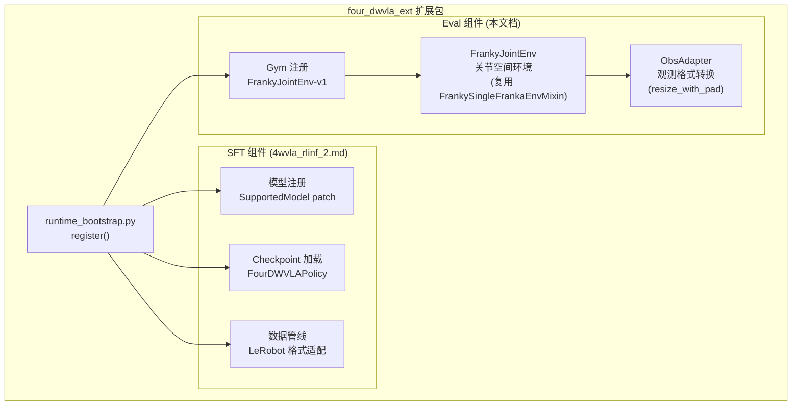

### 1.6 参考来源

| 来源 | 路径/URL | 内容 |
|:---|:---|:---|
| v2.0 (ROS 版) | `b/d/frk1/4wvla_rlinf_eval_2.md` v2.0 | 被替代的 ROS 版方案 |
| SFT 整合方案 | `b/d/frk1/4wvla_rlinf_2.md` | 模型整合与 SFT 训练 |
| franky\_ext 扩展 | `b/x/franky_ext/` | 生产级扩展插件参考 |
| 真机 RL 方案 | `b/d/frk1/franka_3.md`, `dmo_place_1.md`, `dmo_place_2.md` | 双容器部署, franky 控制模式 |
| 训练数据方案 | `4WVLA/b/d/Frk/dta_4dtrj_plan.md` | 数据处理, bbox, 归一化 |
| 训练方案 | `4WVLA/b/d/Frk/plug_p1warmup.md`, `plug_p2sft.md` | 训练参数, 损失权重 |
| FrankyController | `rlinf/envs/realworld/franka/franky_controller.py:256` | `move_joints()` 原生实现 |
| FrankyControllerExtended | `b/x/franky_ext/controller_extended.py` | 安全扩展控制器 |
| FrankySingleFrankaEnvMixin | `b/x/franky_ext/franky_single_franka_env.py` | 环境 Mixin |
| 关键点元信息 | `b/d/frk1/plug/keypoints_meta.json` | bbox\_radius, 关键点链接, 归一化约定 |
| 归一化统计量 | `b/d/frk1/plug/abs_stats.json` | 训练数据各字段 min/max/mean/std/分位数 |
| FR3v2.1 URDF | `b/d/frk1/fr3v2_1_franka_hand.urdf` | 关节限位, 最大速度, FK 链 |
| 4DWVLA 论文 | https://arxiv.org/abs/2607.04988 | 算法细节 |
| 4DWVLA GitHub | https://github.com/InternRobotics/InternVLA-A-series | 官方代码 |

---

## 2. 前置条件

### 2.1 硬件环境

| 组件 | 规格 | 说明 |
|:---|:---|:---|
| CPU | AMD Ryzen Threadripper 7970X 32-Core | 主机 |
| GPU | 1x NVIDIA GeForce RTX 5090 D (32 GiB VRAM) | 模型推理, 占用 ~12 GiB |
| OS | Ubuntu 22.04.5 LTS | 宿主机 |
| Kernel | 5.15.0-1032-realtime (PREEMPT\_RT) | 实时控制 |
| Robot | Franka Research 3 v2.1 (FR3v2.1) @ 172.16.0.2 (via NIC eno1 @ 172.16.0.1/24) | 7-DOF + gripper, firmware 5.10.0, FCI port 1337 |
| Camera 1 | Intel RealSense D435I, serial 420122070525 | global (外部固定), 480x640 |
| Camera 2 | Intel RealSense D435I | wrist (腕部), 480x640 |
| 网络 | eno1: 172.16.0.1/24 (机器人), eno2: 10.229.18.21 (Ray 通信) | 控制和通信分离 |

### 2.2 Docker 双容器架构

> **v2.1 关键变更**: 不再使用 ROS Noetic + Python 3.8 的 Franka 容器. 改为使用与真机 RL 生产部署完全一致的 franky 容器.

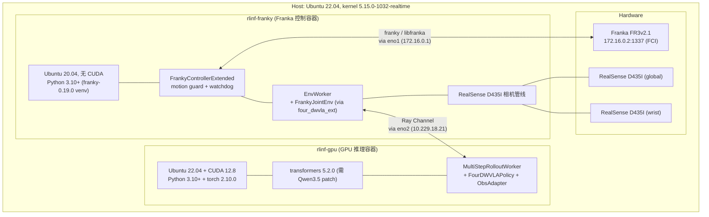

**与 v2.0 的对比**:

| 维度 | v2.0 (ROS 版) | v2.1 (franky\_ext 版) |
|:---|:---|:---|
| Franka 容器基础镜像 | ROS Noetic + Python 3.8 | `rlinf/rlinf:agentic-rlinf0.4-franka` |
| Python 版本 | 3.8 | 3.10+ (`/opt/venv/franky-0.19.0/bin/python`) |
| 机器人通信 | ROS Topics (`rospy.Publisher`) | franky / libfranka FCI (port 1337) |
| 控制器 | `FrankaController` + monkey-patch | `FrankyControllerExtended` (原生) |
| 安全机制 | 无 (仅关节裁剪) | motion guard, watchdog, trip recovery |
| 容器启动 | `docker-compose` | `docker_run_franky_5090.sh` / `docker_run_gpu_5090.sh` |
| 网络模式 | docker bridge | `--privileged --network host` |

**FCI 排他性约束**: 只有一个 libfranka 客户端可以同时持有 FCI session. 标定 REPL、smoke 测试脚本、训练/评估进程互斥.

### 2.3 Checkpoint 状态

Checkpoint 路径: `/home/nvidia/bt/ckp/4wvlaFrk/plug/4wvlaFrkPlugCkp010420/`

| 属性 | 值 |
|:---|:---|
| 文件大小 | 5.89 GiB (`model.safetensors`) |
| 权重数量 | 1303 keys, 全部以 `model.` 为前缀 |
| WAN 权重 | **不包含** (训练时 frozen, state\_dict 排除) |
| `inference_backend` (config.json) | `"standard"` -- **推理时必须覆盖为 `"optimized"`** |
| `action_loss_only` (config.json) | `false` -- **推理时必须覆盖为 `true`** |
| `normalization_mapping` | ALL IDENTITY (无需反归一化) |
| `chunk_size` | 50 |
| `n_action_steps` | 50 |
| `image_resolution` | [224, 224] |
| `tokenize_state` | `true` |
| `max_state_dim` | 32 |
| `enable_keypoint_predictor` | `true` |
| `kpt_4d_mode` | `pos_rot` |
| `num_keypoint_joints` | 8 |
| `keypoint_history_max_len` | 200 |
| VRAM 估算 | ~12 GiB -> RTX 5090 32 GiB 轻松容纳 |

### 2.4 扩展包部署状态

```bash
# 两个容器中均需设置:
export RLINF_EXT_MODULE=four_dwvla_ext.runtime_bootstrap
export PYTHONPATH=/home/nvidia/bt/s/RLinf/b/x:$PYTHONPATH

# franky 容器额外需要 franky_ext 的设置 (已有):
# source b/x/configs/setup_before_ray_5090.sh
```

---

## 3. 训推一致性分析

> **v2.1 新增章节**. 训推一致性是 VLA 策略部署的核心要求. 训练时的数据预处理管线和推理时的观测预处理管线必须完全一致, 否则模型将接收到分布外的输入.

### 3.1 一致性总览

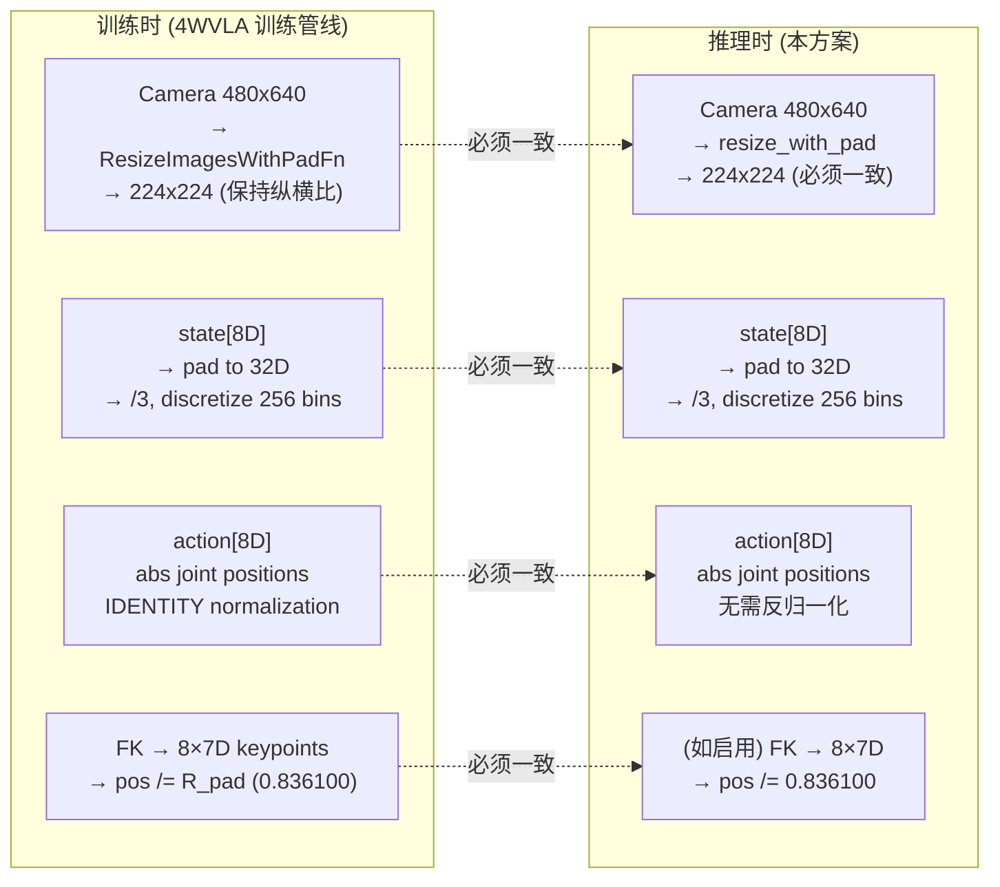

### 3.2 图像处理一致性

**训练时的图像管线** (`lerobot/transforms/core.py:ResizeImagesWithPadFn` + `lerobot/transforms/utils.py:resize_with_pad`):

1. 输入: `torch.Tensor [3, 480, 640]`, 值域 `[0, 1]`
2. 计算 scale: $s = \min(224/480,\ 224/640) = \min(0.4667,\ 0.35) = 0.35$
3. 缩放后尺寸: $h_{new} = \text{round}(480 \times 0.35) = 168$, $w_{new} = \text{round}(640 \times 0.35) = 224$
4. 双线性插值: `F.interpolate(image, (168, 224), mode='bilinear')`
5. 零填充: $\text{pad\_top} = (224 - 168) / 2 = 28$, $\text{pad\_bottom} = 28$
6. 输出: `torch.Tensor [3, 224, 224]`, 其中上下各 28 像素为黑色填充

```
+--224--+
|  28px | <- 黑色填充 (零值)
|  黑色 |
+-------+
|       |
| 168px | <- 原图按纵横比缩放
| 图像  |
|       |
+-------+
|  28px | <- 黑色填充 (零值)
|  黑色 |
+--224--+
```

**v2.0 的错误做法** (`PIL.Image.resize((224, 224), Image.BILINEAR)`): 直接拉伸到 224x224, 改变纵横比 (4:3 → 1:1), 产生形变, 导致训推不一致.

**v2.1 的正确做法**: 在 ObsAdapter 中调用 `resize_with_pad`, 与训练管线完全一致.

```python
# 错误 (v2.0):
pil_img = Image.fromarray(img).resize((224, 224), Image.BILINEAR)

# 正确 (v2.1):
from lerobot.transforms.utils import resize_with_pad
import torch
tensor = torch.from_numpy(img).permute(2, 0, 1).float() / 255.0  # [3, 480, 640]
tensor = resize_with_pad(tensor, 224, 224, mode='bilinear')         # [3, 224, 224]
pil_img = tensor_to_pil_image(tensor)
```

### 3.3 状态处理一致性

**状态组成** (来自 `franka_plug.yaml` schema):
- `observation.state.arm` [7]: 7 个关节角度 (rad)
- `observation.state.gripper` [1]: 夹爪宽度 (m, 范围 0.0 ~ 0.0794, 来自 `abs_stats.json`)
- 拼接顺序: `[arm[0], ..., arm[6], gripper]` = 8D

**状态 Tokenization** (`transform_internvla_a1_5.py:_encode_state()` L95-102):

$$\text{state\_np} = \frac{\text{state}}{3}$$

$$\text{discretized}[i] = \text{digitize}(\text{state\_np}[i],\ \text{bins}=\text{linspace}(-1, 1, 257)[:-1]) - 1$$

- 先 zero-pad 到 `max_state_dim=32`
- 除以 3 (硬编码常量)
- 量化到 256 bins ([-1, 1] 范围内等间距)
- 编码为字符串: `"State: 127 128 ..."` 插入 user prompt

**推理时**: Qwen3.5 VL Processor 内部自动处理 state tokenization, 前提是 `tokenize_state=True` 且 `max_state_dim=32` 与训练一致.

**状态 Padding**: 8D → 32D

```
observation.state = [q1, q2, q3, q4, q5, q6, q7, gripper, 0, 0, ..., 0]
                     |<--- 8D 实际状态 --->|   |<--- 24D 零填充 --->|
                     |<------------------ 32D (max_state_dim) -------->|
```

### 3.4 动作处理一致性

| 属性 | 训练时 | 推理时 |
|:---|:---|:---|
| `action_mode` | `abs` (绝对关节位置) | `abs` (模型直接输出绝对关节位置) |
| `normalization_mapping` | ALL IDENTITY | ALL IDENTITY → **无需反归一化** |
| 动作维度 | 8D = `action.arm[7]` + `action.gripper[1]` | 8D = `q1..q7` + `gripper_cmd` |
| `chunk_size` | 50 | 50 (一次推理生成 50 步动作) |
| 关节角度范围 | 原始弧度值 (e.g., q4 ∈ [-2.217, -1.529], 来自 `abs_stats.json`) | 原始弧度值, 直接发送给 `move_joints()` |
| 夹爪指令 | 范围 [0.007, 1.0] (来自 `abs_stats.json` `action.gripper`) | > threshold → close, ≤ threshold → open |

**关键**: 由于 `normalization_mapping` 全部为 IDENTITY, 模型输出的动作可以直接使用, 不需要任何反归一化或后处理 (除了关节限位裁剪和速度限制这些安全措施).

### 3.5 关键点处理一致性

> **注意**: checkpoint 的 `enable_keypoint_predictor=True`, 但推理时如果设置 `action_loss_only=True`, 关键点预测不会被使用. 此节仅在需要启用关键点预测时适用.

**关键点归一化参数** (来自 `b/d/frk1/plug/keypoints_meta.json`):

| 参数 | 值 | 说明 |
|:---|:---|:---|
| `bbox_radius` ($R_{\text{pad}}$) | **0.8361004471778869** m | 等尺度缩放因子 |
| `bbox_margin` ($\alpha$) | 0.15 (15%) | 安全裕量 |
| `global_min` | [-0.03220, -0.14015, +0.17816] m | Pass 1 全局最小值 (base\_link 系) |
| `global_max` | [+0.60326, +0.06160, +0.72704] m | Pass 1 全局最大值 (base\_link 系) |
| 关键点数量 | 8 | FR3v2.1 单臂 |
| 关键点链接 | `fr3v2_1_link1` ~ `fr3v2_1_link7`, `fr3v2_1_hand_tcp` | 按 URDF link 名称 |
| 每关键点维度 | 7 (`pos_rot` mode): $[p_x, p_y, p_z, q_x, q_y, q_z, q_w]$ | 位置 + 四元数 |
| 四元数约定 | `quaternion_xyzw_hemisphere`, $q_w \geq 0$ | 半球约束, negate if $q_w < 0$ |
| 坐标系说明 | `"base_link-relative, position divided by bbox_radius, quaternion hemisphere-normalized"` | 与 `keypoints_meta.json` 一致 |
| URDF | `b/d/frk1/fr3v2_1_franka_hand.urdf` | FK 计算用 |
| Stats | `b/d/frk1/plug/abs_stats.json` (`observation.keypoint_3d`) | 关键点统计 |

**实际文件路径**:

| 文件 | 路径 |
|:---|:---|
| 关键点元信息 | `/home/nvidia/bt/s/RLinf/b/d/frk1/plug/keypoints_meta.json` |
| 归一化统计量 | `/home/nvidia/bt/s/RLinf/b/d/frk1/plug/abs_stats.json` |
| URDF | `/home/nvidia/bt/s/RLinf/b/d/frk1/fr3v2_1_franka_hand.urdf` |

**位置归一化**:

$$\mathbf{p}_{\text{norm}} = \frac{\mathbf{p}_{\text{base}}}{R_{\text{pad}}}$$

**四元数归一化**: 半球约束 ($q_w \geq 0$), 顺序 $[q_x, q_y, q_z, q_w]$ (Pinocchio 约定).

如果推理时需要启用关键点预测, 必须使用相同的 URDF 和 $R_{\text{pad}}$ 进行在线 FK 计算.

**FR3v2.1 URDF 运动链结构** (来自 `b/d/frk1/fr3v2_1_franka_hand.urdf`):

```
base → base_joint (fixed) → link0
    → joint1 (revolute, z) → link1       [关键点 0]
    → joint2 (revolute, z) → link2       [关键点 1]
    → joint3 (revolute, z) → link3       [关键点 2]
    → joint4 (revolute, z) → link4       [关键点 3]
    → joint5 (revolute, z) → link5       [关键点 4]
    → joint6 (revolute, z) → link6       [关键点 5]
    → joint7 (revolute, z) → link7       [关键点 6]
    → joint8 (fixed) → link8
    → hand_joint (fixed) → hand
    → hand_tcp_joint (fixed, z+0.1034) → hand_tcp  [关键点 7]
```

**FR3v2.1 URDF 各关节参数** (与经典 Panda 差异显著):

| URDF joint | lower (rad) | upper (rad) | velocity (rad/s) | effort (Nm) |
|:---|:---:|:---:|:---:|:---:|
| `fr3v2_1_joint1` | -2.9007 | +2.9007 | 2.62 | 87.0 |
| `fr3v2_1_joint2` | -1.8361 | +1.8361 | 2.62 | 87.0 |
| `fr3v2_1_joint3` | -2.9007 | +2.9007 | 2.62 | 87.0 |
| `fr3v2_1_joint4` | -3.0770 | -0.1169 | 2.62 | 87.0 |
| `fr3v2_1_joint5` | -2.8763 | +2.8763 | 5.26 | 12.0 |
| `fr3v2_1_joint6` | +0.4398 | +4.6216 | 4.18 | 12.0 |
| `fr3v2_1_joint7` | -3.0508 | +3.0508 | 5.26 | 12.0 |
| `fr3v2_1_finger_joint1` | 0.0 | 0.04 | 0.2 | 100.0 |

> **经典 Panda 的区别**: Panda 的 q6 范围约 [-0.02, 3.75], FR3v2.1 为 [0.44, 4.62]; q5/q7 最大速度 Panda 约 2.61 rad/s, FR3v2.1 为 5.26 rad/s. 代码中的常量必须使用 FR3v2.1 的值.

### 3.6 Checkpoint 配置覆盖表

| 字段 | config.json 中的值 | 推理时应设为 | 设置方式 | 原因 |
|:---|:---|:---|:---|:---|
| `inference_backend` | `"standard"` | `"optimized"` | YAML `four_dwvla.inference_backend` | 跳过 WAN 加载, 使用低延迟路径 |
| `action_loss_only` | `false` | `true` | YAML `rollout.model.action_loss_only` | 不加载 WAN 5B 参数 |
| `gradient_checkpointing` | `true` | `false` | YAML `four_dwvla.gradient_checkpointing` | 推理不需要 |
| `pretrained_path` | 训练服务器路径 | 忽略 | `action_loss_only=true` 时不需要 | 无 WAN |
| `wan_checkpoint_path` | 训练服务器路径 | 忽略 | `action_loss_only=true` 时不需要 | 无 WAN |

### 3.7 训练数据范围 vs 推理安全边界

> **数据来源**: 训练数据统计量取自 `/home/nvidia/bt/s/RLinf/b/d/frk1/plug/abs_stats.json`, 关节限位取自 `/home/nvidia/bt/s/RLinf/b/d/frk1/fr3v2_1_franka_hand.urdf`, 有效限位 = URDF 限位 ± `joint_limit_margin` (0.05 rad).

模型在训练数据覆盖的关节角度范围内学习, 该范围远窄于 FR3v2.1 硬件限位:

**关节角度 (观测状态 `observation.state.arm`)**:

| 关节 | URDF 下限 | 有效下限 | 训练 min | 训练 mean | 训练 max | 有效上限 | URDF 上限 | 训练覆盖率 |
|:---:|:---:|:---:|:---:|:---:|:---:|:---:|:---:|:---:|
| q1 | -2.9007 | -2.8507 | **-0.4842** | -0.2406 | **+0.0452** | 2.8507 | 2.9007 | 9.3% |
| q2 | -1.8361 | -1.7861 | **-0.1030** | +0.1457 | **+0.3120** | 1.7861 | 1.8361 | 11.3% |
| q3 | -2.9007 | -2.8507 | **-0.2025** | +0.1872 | **+0.4789** | 2.8507 | 2.9007 | 11.9% |
| q4 | -3.0770 | -3.0270 | **-2.2044** | -2.0600 | **-1.5347** | -0.1669 | -0.1169 | 22.6% |
| q5 | -2.8763 | -2.8263 | **-0.2041** | -0.0553 | **+0.0806** | 2.8263 | 2.8763 | 5.0% |
| q6 | 0.4398 | 0.4898 | **+1.5702** | +2.2011 | **+2.4536** | 4.5716 | 4.6216 | 21.1% |
| q7 | -3.0508 | -3.0008 | **+0.4843** | +0.6998 | **+0.9807** | 3.0008 | 3.0508 | 8.1% |

**动作 (`action.arm`) 的范围** (比状态略宽, 因为动作包含目标位置):

| 关节 | 动作 min | 动作 mean | 动作 max | 动作范围宽度 |
|:---:|:---:|:---:|:---:|:---:|
| q1 | -0.4863 | -0.2381 | +0.0598 | 0.546 rad |
| q2 | -0.1074 | +0.1417 | +0.3329 | 0.440 rad |
| q3 | -0.2025 | +0.1886 | +0.4801 | 0.683 rad |
| q4 | -2.2166 | -2.0560 | -1.5294 | 0.687 rad |
| q5 | -0.2730 | -0.0617 | +0.1104 | 0.383 rad |
| q6 | +1.6490 | +2.2639 | +2.5173 | 0.868 rad |
| q7 | +0.3695 | +0.7208 | +1.1021 | 0.733 rad |

**夹爪** (来自 `abs_stats.json`):

| 字段 | min | mean | max |
|:---|:---|:---|:---|
| `observation.state.gripper` | 0.0 m | 0.0337 m | 0.0794 m |
| `action.gripper` | 0.0074 | 0.5785 | 1.0 |

**末端执行器位置** (base\_link 系, 来自 `observation.state.ee_pos`):

| 轴 | min | mean | max |
|:---|:---|:---|:---|
| x | +0.5336 m | +0.5653 m | +0.6023 m |
| y | -0.1402 m | -0.0355 m | +0.0526 m |
| z | +0.1782 m | +0.2647 m | +0.5166 m |

**安全含义**:
- q4 训练范围全在负值区域 ([-2.217, -1.529]), 若输出 q4 > -0.12 几乎可确定推理错误
- q6 训练范围 [1.649, 2.517] 远低于 URDF 上限 4.622, 但高于 URDF 下限 0.440
- q7 训练范围 [0.370, 1.102] 仅覆盖正值区域, 不应出现大幅负值
- 末端执行器工作区间: x ∈ [0.53, 0.60], y ∈ [-0.14, 0.05], z ∈ [0.18, 0.52] — 可作为 motion guard 围栏参考

---

## 4. 扩展包中的 Eval 组件

### 4.1 完整包结构

> **v2.1 关键变更**: 移除 `patches/` 目录 (不需要 monkey-patch), 环境类改用 franky\_ext 模式.

```
b/x/four_dwvla_ext/
|-- __init__.py                           # 包初始化
|-- runtime_bootstrap.py                  # register() 入口 [共享]
|
|-- envs/
|   |-- __init__.py
|   |-- franky_joint_env.py               # [Eval] FrankyJointEnv (使用 FrankyControllerExtended)
|   |-- franky_joint_env_config.py        # [Eval] FrankyJointEnvConfig
|
|-- tasks/
|   |-- __init__.py
|   |-- register.py                       # [Eval] FrankyJointEnv-v1 Gym 注册
|
|-- wrappers/
|   |-- __init__.py
|   |-- keyboard_abort_reset_wrapper.py   # [Eval] KeyboardAbortResetWrapper (按 r 中断+复位)
|
|-- adapters/
|   |-- __init__.py
|   |-- obs_adapter.py                    # [Eval] FourDWVLAObsAdapter (resize_with_pad)
|
|-- models/                               # [SFT] 模型注册与适配 (来自 4wvla_rlinf_2.md)
|   |-- __init__.py
|   |-- policy_adapter.py                 # [共享] FourDWVLAPolicy
|   |-- model_builder.py                  # [SFT] build_four_dwvla_model
|
|-- configs/
|   |-- realworld_franka_joint_env.yaml   # [Eval] 环境配置
|   |-- realworld_plug_eval_4wvla.yaml    # [Eval] 评估任务配置
|
|-- tests/
|   |-- __init__.py
|   |-- test_joint_clipping.py            # [Eval] 关节裁剪 (不需要真机)
|   |-- test_velocity_limiting.py         # [Eval] 速度限制 (不需要真机)
|   |-- test_obs_adapter.py              # [Eval] 观测适配器 (不需要真机)
|   |-- test_gym_registration.py          # [Eval] Gym 注册 (不需要真机)
|   |-- test_image_consistency.py         # [Eval] 图像预处理一致性 (不需要真机)
|   |-- test_state_consistency.py         # [Eval] 状态处理一致性 (不需要真机)
|   |-- test_inference_pipeline.py        # [Eval] 推理管线 (不需要真机, 需 GPU)
|   |-- test_abort_reset_wrapper.py       # [Eval] 键盘中断复位 (不需要真机)
|   |-- test_franky_joint_streaming.py    # [Eval] 关节流式控制 (需要真机)
|   |-- test_motion_guard.py             # [Eval] Motion guard 集成 (需要真机)
|   |-- test_abort_reset_realrobot.py    # [Eval] 键盘中断复位 (需要真机)
|
|-- scripts/
|   |-- preflight_4wvla_franka.sh         # [Eval] Pre-flight 检查脚本
```

### 4.2 与 v2.0 的包结构对比

| v2.0 | v2.1 | 变化原因 |
|:---|:---|:---|
| `patches/franka_controller_patch.py` | **删除** | `move_joints()` 已存在, 无需 monkey-patch |
| `envs/franka_joint_env.py` (直接继承 FrankaEnv) | `envs/franky_joint_env.py` (通过 Mixin 继承) | 复用 franky\_ext 安全机制 |
| `tests/test_move_joints.py` (ROS 集成测试) | `tests/test_franky_joint_streaming.py` (franky 集成测试) | 控制方式变更 |
| 无 | `tests/test_image_consistency.py` | 新增训推一致性测试 |
| 无 | `tests/test_state_consistency.py` | 新增状态处理一致性测试 |

### 4.3 Eval vs SFT 组件分类

| 组件 | 分类 | 运行容器 | 说明 |
|:---|:---:|:---:|:---|
| `runtime_bootstrap.py` | 共享 | 两者 | `register()` 入口 |
| `envs/franky_joint_env.py` | **Eval** | franky | 关节空间控制环境 |
| `envs/franky_joint_env_config.py` | **Eval** | franky | 环境配置 |
| `tasks/register.py` | **Eval** | 两者 | `FrankyJointEnv-v1` Gym 注册 |
| `wrappers/keyboard_abort_reset_wrapper.py` | **Eval** | franky | 键盘中断复位 (按 `r` 中止 episode + 归位) |
| `adapters/obs_adapter.py` | **Eval** | gpu | 观测格式转换 (含 `resize_with_pad`) |
| `models/policy_adapter.py` | 共享 | gpu | `FourDWVLAPolicy` |
| `models/model_builder.py` | SFT | gpu | `build_four_dwvla_model` |
| `configs/*.yaml` | **Eval** | 两者 | 评估配置 |

---

## 5. FrankyJointEnv 设计

### 5.1 类层次

> **v2.1 关键变更**: 通过 MRO (Method Resolution Order) 组合 `FrankyJointEnvMixin` + `FrankySingleFrankaEnvMixin` + `FrankaEnv`, 复用生产安全机制.

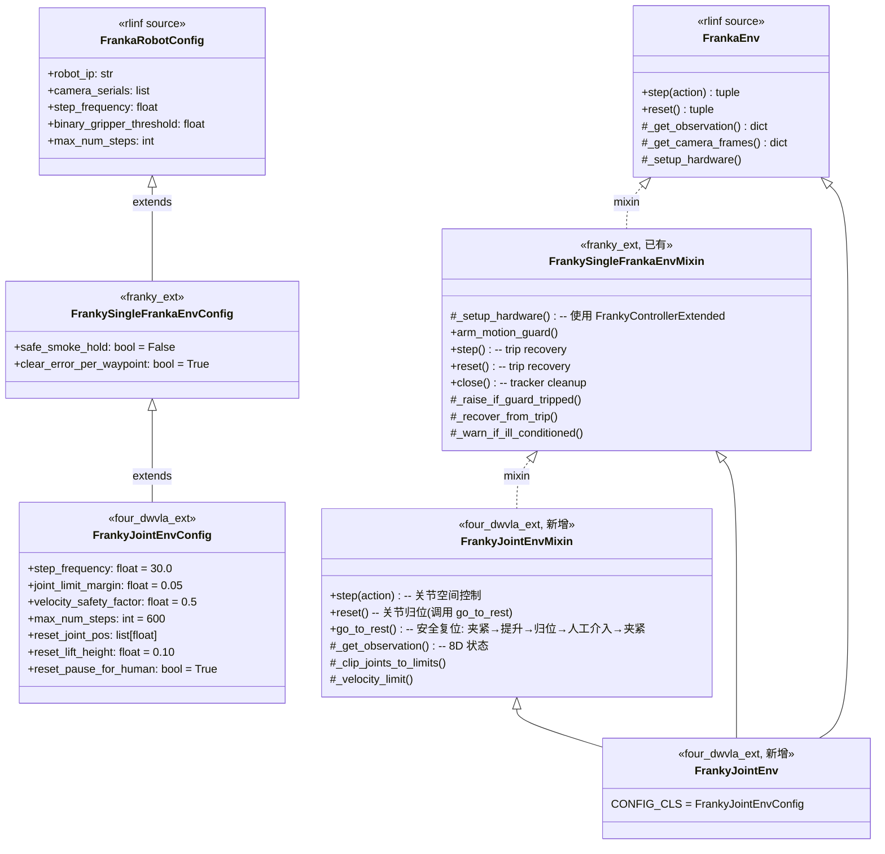

**MRO**: `FrankyJointEnv` → `FrankyJointEnvMixin` → `FrankySingleFrankaEnvMixin` → `FrankaEnv`

各层职责:

| 层 | 提供 | 来源 |
|:---|:---|:---|
| `FrankyJointEnvMixin` | 关节空间 step/reset/\_get\_observation, 关节裁剪, 速度限制 | 本文档新增 |
| `FrankySingleFrankaEnvMixin` | `_setup_hardware()` (FrankyControllerExtended), motion guard, trip recovery, close() | franky\_ext 已有 |
| `FrankaEnv` | 相机系统, gripper 基类方法, `_wrap_obs()`, `RealWorldEnv` 基础 | rlinf 源码 |

### 5.2 CONFIG\_CLS

**文件**: `four_dwvla_ext/envs/franky_joint_env_config.py`

```python
"""Joint-space env config for FrankyJointEnv.

Extends FrankySingleFrankaEnvConfig (which extends FrankaRobotConfig)
with joint-space-specific fields. Inherits:
    - safe_smoke_hold (from FrankySingleFrankaEnvConfig)
    - clear_error_per_waypoint (from FrankySingleFrankaEnvConfig)
    - robot_ip, camera_serials, etc. (from FrankaRobotConfig)
"""

from __future__ import annotations

from dataclasses import dataclass, field

from franky_ext.franky_single_franka_env import FrankySingleFrankaEnvConfig


@dataclass
class FrankyJointEnvConfig(FrankySingleFrankaEnvConfig):
    # Override: 30Hz to match 4DWVLA training data (was 10Hz for Cartesian)
    step_frequency: float = 30.0

    # Override: 20 seconds at 30Hz (was 100 steps at 10Hz = 10s)
    max_num_steps: int = 600

    # Joint-space specific
    joint_limit_margin: float = 0.05  # rad, safety margin from hardware limits
    velocity_safety_factor: float = 0.5  # fraction of max joint velocity

    # Reset: home position = training data joint angle mean (abs_stats.json)
    reset_joint_pos: list = field(
        default_factory=lambda: [-0.2406, 0.1457, 0.1872, -2.0600, -0.0553, 2.2011, 0.6998]
    )
    # Reset: lift arm this much (m) before moving to home, to clear socket
    reset_lift_height: float = 0.10
    # Reset: pause for operator to reposition plug between episodes
    reset_pause_for_human: bool = True
```

### 5.3 step() 实现

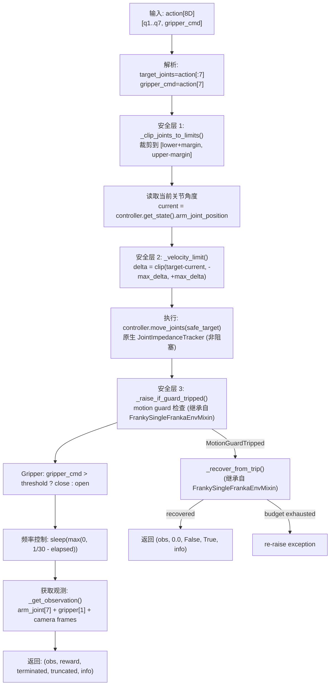

### 5.4 reset() 与 go\_to\_rest() 实现

> **v2.1.3 新增**: 完整的 Episode 间复位流程, 包含安全提升→关节归位→操作员介入→夹爪闭合的全流程.

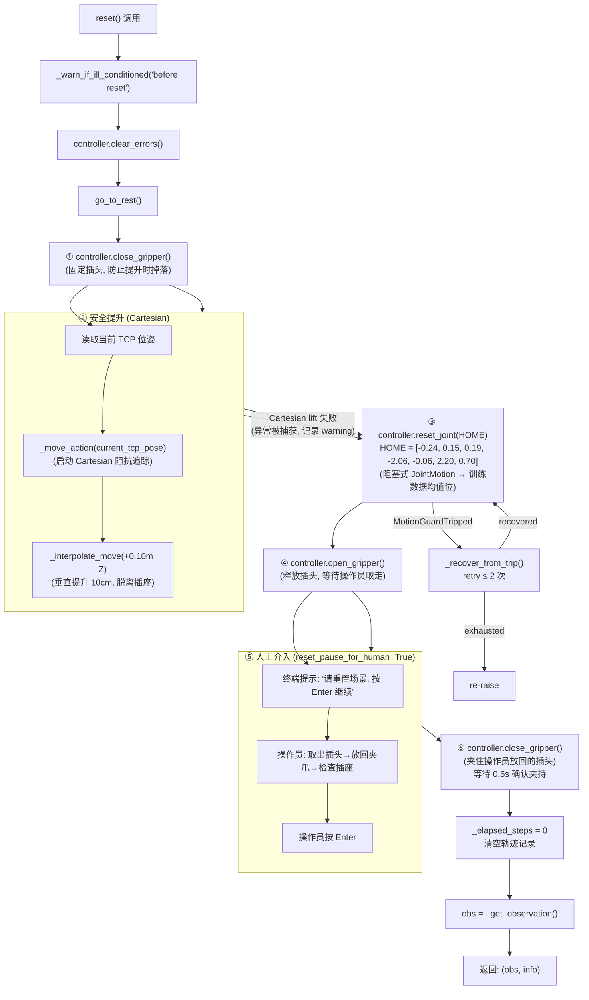

**关键设计决策**:

| 决策 | 理由 |
|:---|:---|
| 提升前先 close\_gripper | 如果上一 Episode 插头还在夹爪中或半插入插座, 先夹紧才能安全提升, 否则插头可能掉落 |
| Cartesian 提升 10cm (非关节空间) | 关节空间直接到 HOME 的轨迹不保证 TCP 先向上运动, 可能横向刮蹭插座; Cartesian 垂直提升保证安全脱离 |
| Cartesian 失败时降级为直接关节归位 | 如果阻抗追踪器未就绪 (如上一 Episode 异常结束), 捕获异常并降级; `reset_joint()` 的 S 曲线轨迹规划器通常也能安全执行 |
| HOME 取训练数据均值 | 每个 Episode 的起始关节角应尽量接近训练数据的分布中心, 减少 OOD 输入; 均值来自 `abs_stats.json` 的 `action.arm.mean` |
| 人工介入在归位之后 | 机器人先回到安全位置, 操作员才进入工作区操作; 避免人机同区域运动的安全风险 |
| 人工介入后 close\_gripper | 操作员将插头放入张开的夹爪后, 系统自动夹紧, 确保下一 Episode 开始时插头被可靠夹持 |

### 5.5 \_get\_observation() 实现

返回关节空间观测 (8D state + camera frames), 与训练数据格式一致:

| 字段 | 维度 | 来源 | 说明 |
|:---|:---|:---|:---|
| `state.joint_positions` | float32[7] | `FrankaRobotState.arm_joint_position` | 7 个关节角度 (rad) |
| `state.gripper_position` | float32[1] | `FrankaRobotState.gripper_position` | 夹爪宽度 (m) |
| `frames.{camera_name}` | uint8[480,640,3] | RealSense D435I | RGB 图像 |

### 5.6 安全方法

**`_clip_joints_to_limits(joints)`**:

$$q_{safe,i} = \text{clip}(q_{target,i},\ q_{lower,i} + \delta_{margin},\ q_{upper,i} - \delta_{margin})$$

**`_velocity_limit(current, target)`**:

$$\Delta q_i = \text{clip}(q_{target,i} - q_{current,i},\ -\Delta q_{max,i},\ +\Delta q_{max,i}), \quad q_{safe,i} = q_{current,i} + \Delta q_i$$

$$\Delta q_{max,i} = \frac{\alpha \cdot v_{max,i}}{f}, \quad \alpha = 0.5,\ f = 30 \text{ Hz}$$

| 关节 | $v_{max}$ (rad/s) | $\Delta q_{max}$ (rad/step) | $\Delta q_{max}$ (deg/step) |
|:---:|:---:|:---:|:---:|
| q1 | 2.62 | 0.04367 | 2.50 |
| q2 | 2.62 | 0.04367 | 2.50 |
| q3 | 2.62 | 0.04367 | 2.50 |
| q4 | 2.62 | 0.04367 | 2.50 |
| q5 | 5.26 | 0.08767 | 5.02 |
| q6 | 4.18 | 0.06967 | 3.99 |
| q7 | 5.26 | 0.08767 | 5.02 |

> **注意**: FR3v2.1 的 q5 和 q7 最大速度 (5.26 rad/s) 远高于经典 Panda (2.61 rad/s), q6 也更高 (4.18 vs 2.61). 因此每步允许的最大变化量也更大. 这些数值来自 URDF 文件 `b/d/frk1/fr3v2_1_franka_hand.urdf` 中各 `<joint>` 元素的 `velocity` 属性.

### 5.7 完整代码

**文件**: `four_dwvla_ext/envs/franky_joint_env.py`

```python
"""Franka joint-space control environment for 4DWVLA evaluation.

Uses FrankyControllerExtended (via FrankySingleFrankaEnvMixin) for:
    - Native move_joints() via JointImpedanceTracker
    - Motion guard (geometric fence on measured TCP)
    - Watchdog thread (continuous 50 Hz safety monitoring)
    - Trip recovery (continues run after guard trip)
    - Soft joint-limit repulsion

Key differences from FrankaEnv:
    - Action space: 8D absolute joint angles [q1..q7, gripper]
    - Control: Joint position via move_joints() (not Cartesian impedance)
    - State: arm_joint_position[7] + gripper[1] = 8D (not 20D tcp state)
    - Frequency: 30 Hz (not 10 Hz)
    - No RelativeFrame or Quat2Euler wrappers
"""

from __future__ import annotations

import logging
import time
from typing import Optional

import gymnasium as gym
import numpy as np

from rlinf.envs.realworld.franka.franka_env import FrankaEnv
from franky_ext.franky_single_franka_env import FrankySingleFrankaEnvMixin

logger = logging.getLogger(__name__)

# FR3v2.1 joint limits from b/d/frk1/fr3v2_1_franka_hand.urdf
FR3V2_JOINT_LIMITS_LOWER = np.array(
    [-2.9007, -1.8361, -2.9007, -3.0770, -2.8763, 0.4398, -3.0508],
    dtype=np.float64,
)
FR3V2_JOINT_LIMITS_UPPER = np.array(
    [2.9007, 1.8361, 2.9007, -0.1169, 2.8763, 4.6216, 3.0508],
    dtype=np.float64,
)
FR3V2_MAX_JOINT_VELOCITY = np.array(
    [2.62, 2.62, 2.62, 2.62, 5.26, 4.18, 5.26],
    dtype=np.float64,
)


class FrankyJointEnvMixin:
    """Joint-space control overlay for FrankySingleFrankaEnvMixin.

    MRO: FrankyJointEnv -> FrankyJointEnvMixin -> FrankySingleFrankaEnvMixin -> FrankaEnv

    FrankySingleFrankaEnvMixin provides:
        - _setup_hardware() with FrankyControllerExtended
        - motion guard arming
        - trip recovery in step/reset
        - close() with tracker cleanup

    This mixin overrides step/reset/_get_observation for joint-space control.
    """

    def __init__(self, *args, **kwargs):
        super().__init__(*args, **kwargs)

        self._step_frequency = float(self.config.step_frequency)
        joint_limit_margin = float(self.config.joint_limit_margin)
        velocity_safety_factor = float(self.config.velocity_safety_factor)
        self._gripper_threshold = float(self.config.binary_gripper_threshold)
        self._max_num_steps = int(self.config.max_num_steps)

        self._reset_joint_pos = np.array(
            self.config.reset_joint_pos, dtype=np.float64
        )
        self._joint_lower = FR3V2_JOINT_LIMITS_LOWER + joint_limit_margin
        self._joint_upper = FR3V2_JOINT_LIMITS_UPPER - joint_limit_margin
        self._max_delta_per_step = (
            velocity_safety_factor * FR3V2_MAX_JOINT_VELOCITY / self._step_frequency
        )

        # Log per-joint velocity limits for diagnostics
        logger.info(
            "Max delta/step (rad): %s",
            np.round(self._max_delta_per_step, 5),
        )

        self.action_space = gym.spaces.Box(
            low=np.concatenate([self._joint_lower, [0.0]]).astype(np.float32),
            high=np.concatenate([self._joint_upper, [1.0]]).astype(np.float32),
            shape=(8,),
            dtype=np.float32,
        )

        self._elapsed_steps = 0
        self._episode_joint_trajectory = []

        logger.info(
            "FrankyJointEnv initialized: freq=%.1fHz, margin=%.3frad, "
            "vel_factor=%.2f, max_steps=%d",
            self._step_frequency, joint_limit_margin,
            velocity_safety_factor, self._max_num_steps,
        )

    def step(self, action: np.ndarray):
        step_start = time.time()
        action = np.asarray(action, dtype=np.float64).flatten()
        assert action.shape == (8,), f"Expected 8D action, got {action.shape}"

        target_joints = action[:7]
        gripper_cmd = action[7]

        safe_joints = self._clip_joints_to_limits(target_joints)
        current_joints = self._get_current_joint_positions()
        safe_joints = self._velocity_limit(current_joints, safe_joints)

        try:
            self._controller.move_joints(safe_joints)
        except Exception as e:
            logger.error("Joint move failed: %s", e)
            self._controller.clear_errors()
            obs = self._get_observation()
            return obs, 0.0, True, False, {"error": str(e)}

        self._raise_if_guard_tripped()
        self._end_effector_action(gripper_cmd)

        elapsed = time.time() - step_start
        sleep_time = max(0.0, 1.0 / self._step_frequency - elapsed)
        if sleep_time > 0:
            time.sleep(sleep_time)

        obs = self._get_observation()
        self._elapsed_steps += 1
        truncated = self._elapsed_steps >= self._max_num_steps

        info = {
            "requested_joints": target_joints.tolist(),
            "actual_command_joints": safe_joints.tolist(),
            "pre_step_joints": current_joints.tolist(),
            "step_time_ms": (time.time() - step_start) * 1000,
            "effective_freq_hz": 1.0 / max(time.time() - step_start, 1e-6),
            "elapsed_steps": self._elapsed_steps,
        }

        self._episode_joint_trajectory.append(safe_joints.copy())
        return obs, 0.0, False, truncated, info

    def go_to_rest(self, joint_reset=False):
        """Episode 间复位: close gripper → lift 10cm → move to HOME → open gripper → wait for operator."""
        # ① 夹紧 — 固定可能仍在夹爪中或半插入插座的插头
        self._controller.close_gripper()
        time.sleep(0.3)

        # ② 垂直提升 10cm — Cartesian 阻抗插值, 安全脱离插座
        try:
            state = self._controller.get_state()
            if hasattr(state, "wait"):
                state = state.wait()[0]
            current_tcp = list(state.tcp_pose)
            self._move_action(current_tcp)
            lifted_tcp = current_tcp.copy()
            lifted_tcp[2] += self.config.reset_lift_height
            self._interpolate_move(lifted_tcp, timeout=2.0)
            logger.info("Cartesian lift +%.0fmm OK", self.config.reset_lift_height * 1000)
        except Exception as e:
            logger.warning("Cartesian lift failed (%s); falling through to joint reset", e)

        # ③ 关节归位 — 阻塞式 JointMotion 到训练数据均值位
        logger.info("Moving to HOME joints: %s", np.round(self._reset_joint_pos, 4))
        self._controller.reset_joint(self._reset_joint_pos.tolist())
        time.sleep(0.3)

        # ④ 张开夹爪 — 释放插头, 等待操作员取走并重新放置
        self._controller.open_gripper()
        time.sleep(0.3)

        # ⑤ 人工介入 — 操作员重置场景后按 Enter
        if self.config.reset_pause_for_human:
            input(
                "\n[人工操作] 机器人已归位, 夹爪已张开.\n"
                "  → 请将插头放回夹爪中 (与训练数据起始位一致)\n"
                "  → 确认插座位置正确\n"
                "  → 准备好后按 Enter 继续下一 Episode...\n"
            )

        # ⑥ 夹紧插头 — 操作员放入后自动夹持
        self._controller.close_gripper()
        time.sleep(0.5)
        logger.info("go_to_rest complete: arm at HOME, plug grasped")

    def reset(self, *, seed=None, options=None, **kwargs):
        self._warn_if_ill_conditioned("before reset")
        self._controller.clear_errors()
        self.go_to_rest(joint_reset=True)
        self._elapsed_steps = 0
        self._episode_joint_trajectory = []
        obs = self._get_observation()
        return obs, {"reset_joint_pos": self._reset_joint_pos.tolist()}

    def _get_observation(self) -> dict:
        state = self._controller.get_state()
        if hasattr(state, 'wait'):
            state = state.wait()[0]
        frames = self._get_camera_frames()
        return {
            "state": {
                "joint_positions": np.array(
                    state.arm_joint_position[:7], dtype=np.float32
                ),
                "gripper_position": np.array(
                    [state.gripper_position], dtype=np.float32
                ),
            },
            "frames": frames,
        }

    def _clip_joints_to_limits(self, joints: np.ndarray) -> np.ndarray:
        clipped = np.clip(joints, self._joint_lower, self._joint_upper)
        if not np.allclose(joints, clipped, atol=1e-6):
            logger.warning(
                "Joint targets clipped: original=%s, clipped=%s",
                np.round(joints, 4), np.round(clipped, 4),
            )
        return clipped

    def _velocity_limit(
        self, current: np.ndarray, target: np.ndarray
    ) -> np.ndarray:
        delta = target - current
        delta_clipped = np.clip(
            delta, -self._max_delta_per_step, self._max_delta_per_step
        )
        safe_target = current + delta_clipped
        if not np.allclose(delta, delta_clipped, atol=1e-6):
            logger.debug(
                "Velocity limited: requested_delta=%s, clipped_delta=%s",
                np.round(delta, 4), np.round(delta_clipped, 4),
            )
        return safe_target

    def _get_current_joint_positions(self) -> np.ndarray:
        state = self._controller.get_state()
        if hasattr(state, 'wait'):
            state = state.wait()[0]
        return np.array(state.arm_joint_position[:7], dtype=np.float64)

    def _end_effector_action(self, gripper_cmd: float):
        if gripper_cmd > self._gripper_threshold:
            self._controller.close_gripper()
        else:
            self._controller.open_gripper()


from four_dwvla_ext.envs.franky_joint_env_config import FrankyJointEnvConfig


class FrankyJointEnv(FrankyJointEnvMixin, FrankySingleFrankaEnvMixin, FrankaEnv):
    """Joint-space Franka env with FrankyControllerExtended safety.

    MRO: FrankyJointEnv -> FrankyJointEnvMixin -> FrankySingleFrankaEnvMixin -> FrankaEnv

    Inherits from FrankySingleFrankaEnvMixin:
        - _setup_hardware() with FrankyControllerExtended.launch_controller()
        - arm_motion_guard() (geometric fence)
        - _raise_if_guard_tripped() / _recover_from_trip()
        - _warn_if_ill_conditioned()
        - close() with tracker cleanup

    FrankyJointEnvMixin provides:
        - Joint-space step/reset/_get_observation
        - Joint clipping and velocity limiting
    """

    CONFIG_CLS = FrankyJointEnvConfig
```

---

## 6. Gym 环境注册

### 6.1 Factory 函数

> **v2.1 关键变更**: 不使用 `apply_single_arm_wrappers()` (关节空间不需要 `RelativeFrame` / `Quat2Euler`), 也不需要 `move_joints()` monkey-patch.

**文件**: `four_dwvla_ext/tasks/register.py`

```python
"""Register FrankyJointEnv-v1 gym ID (import before gym.make).

Follows the franky_ext registration pattern (b/x/franky_ext/tasks/register.py).
Joint-space envs do NOT use RelativeFrame or Quat2Euler wrappers.
"""

from __future__ import annotations

import logging
from typing import Any, Mapping

import gymnasium as gym
from gymnasium.envs.registration import register

logger = logging.getLogger(__name__)


def create_franky_joint_env(
    override_cfg: dict[str, Any],
    worker_info: Any,
    hardware_info: Any,
    env_idx: int,
    env_cfg: Mapping[str, Any],
) -> gym.Env:
    """Create single-arm Franka joint-space env with FrankyControllerExtended.

    No apply_single_arm_wrappers() -- joint-space actions need no
    RelativeFrame or Quat2Euler transforms.

    Wrapper stack (inner → outer):
        FrankyJointEnv → KeyboardAbortResetWrapper
    """
    from four_dwvla_ext.envs.franky_joint_env import FrankyJointEnv

    env = FrankyJointEnv(
        override_cfg=override_cfg,
        worker_info=worker_info,
        hardware_info=hardware_info,
        env_idx=env_idx,
    )

    # 键盘中断复位: 按 'r' 中止当前 Episode 并安全归位
    try:
        from four_dwvla_ext.wrappers.keyboard_abort_reset_wrapper import (
            KeyboardAbortResetWrapper,
        )
        env = KeyboardAbortResetWrapper(env)
        logger.info("FrankyJointEnv: KeyboardAbortResetWrapper applied (press 'r' to abort+reset)")
    except ImportError:
        logger.warning("KeyboardAbortResetWrapper not available; skipping")

    return env


register(
    id="FrankyJointEnv-v1",
    entry_point="four_dwvla_ext.tasks.register:create_franky_joint_env",
)

logger.info("FrankyJointEnv-v1 registered via four_dwvla_ext")
```

### 6.2 在 register() 中触发

**文件**: `four_dwvla_ext/runtime_bootstrap.py`

> **v2.1 变更**: 移除 `patch_franka_controller_move_joints()` 调用.

```python
"""Runtime bootstrap for four_dwvla_ext extension.

register() is called on every Ray worker process via RLINF_EXT_MODULE.
Unlike v2.0, no FrankaController monkey-patch is needed -- move_joints()
already exists in FrankyController (franky_controller.py:256).
"""

from __future__ import annotations

import logging
import sys

logger = logging.getLogger(__name__)


def register() -> None:
    """RLINF_EXT_MODULE hook: called on every Ray worker process."""
    # --- Eval: Gym environment registration ---
    try:
        import four_dwvla_ext.tasks.register  # noqa: F401
    except Exception:
        import traceback
        print(
            "four_dwvla_ext: gym registration FAILED:\n"
            + traceback.format_exc(),
            file=sys.stderr,
        )

    # --- SFT: Model registration (from 4wvla_rlinf_2.md) ---
    try:
        from four_dwvla_ext.models.model_builder import build_four_dwvla_model  # noqa: F401
    except Exception:
        pass

    logger.info("four_dwvla_ext: register() completed")


# Module-level execution for early import
try:
    import four_dwvla_ext.tasks.register  # noqa: F401
except Exception:
    pass
```

### 6.3 与 franky\_ext register() 的协作

当 `RLINF_EXT_MODULE` 需要同时加载 franky\_ext 和 four\_dwvla\_ext 时, 可以使用组合入口:

```bash
# 方案 A: 仅加载 four_dwvla_ext (它在 register() 中自行导入 franky_ext.tasks.register)
export RLINF_EXT_MODULE=four_dwvla_ext.runtime_bootstrap

# 方案 B: 使用 franky_ext 的 register(), four_dwvla_ext 通过 PYTHONSTARTUP 加载
export RLINF_EXT_MODULE=franky_ext.runtime_bootstrap
export PYTHONSTARTUP=/home/nvidia/bt/s/RLinf/b/x/four_dwvla_ext/ray_register_startup.py
```

推荐使用方案 A, 在 `four_dwvla_ext.runtime_bootstrap.register()` 中显式导入 franky\_ext 的注册:

```python
# 在 register() 中追加:
try:
    import franky_ext.tasks.register  # noqa: F401
except Exception:
    pass
```

---

## 7. 观测适配器 (FourDWVLAObsAdapter)

### 7.1 输入: RLinf 环境观测格式

`RealWorldEnv._wrap_obs()` 输出:

```python
{
    "states":              Tensor[1, state_dim],       # 8D for joint env
    "main_images":         Tensor[1, H, W, 3],         # global camera
    "extra_view_images":   Tensor[1, N_extra, H, W, 3], # wrist camera
    "task_descriptions":   list[str],                   # e.g., ["plug into socket"]
}
```

### 7.2 输出: 4DWVLA 模型输入格式

`InternVLAA15Policy.predict_action_chunk()` 期望:

```python
{
    "observation.pixel_values":     Tensor[1, N_patches, C_hidden],
    "observation.image_grid_thw":   Tensor[N_images, 3],
    "observation.input_ids":        Tensor[1, L],
    "observation.attention_mask":   Tensor[1, L],
    "observation.state":            Tensor[1, max_state_dim],  # padded to 32D
}
```

### 7.3 图像处理: resize\_with\_pad

> **v2.1 关键变更**: 使用 `resize_with_pad` 替代 `PIL.Image.resize`, 与训练管线一致.

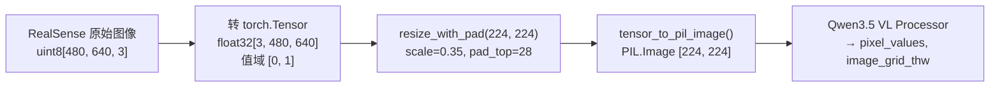

两张图像 (global + wrist) 分别处理后拼接为 chat message 中的两个 `{"type": "image"}` 项.

### 7.4 完整代码

**文件**: `four_dwvla_ext/adapters/obs_adapter.py`

```python
"""Observation adapter: converts RLinf env observations to 4DWVLA model input.

v2.1: Uses resize_with_pad (from lerobot.transforms.utils) to match
the training pipeline's image preprocessing. v2.0 used PIL.Image.resize()
which stretched the aspect ratio and caused train-inference inconsistency.
"""

from __future__ import annotations

import logging
from typing import Any

import numpy as np
import torch
import torch.nn.functional as F
from PIL import Image

logger = logging.getLogger(__name__)


def _resize_with_pad(
    image: torch.Tensor, target_h: int, target_w: int
) -> torch.Tensor:
    """Resize tensor [3, H, W] to [3, target_h, target_w] preserving aspect ratio.

    Mirrors lerobot.transforms.utils.resize_with_pad exactly.
    """
    if image.ndim == 3:
        image = image.unsqueeze(0)
        squeeze = True
    else:
        squeeze = False

    _, _, H, W = image.shape
    scale = min(target_h / H, target_w / W)
    new_h, new_w = int(round(H * scale)), int(round(W * scale))

    resized = F.interpolate(
        image, size=(new_h, new_w), mode="bilinear", align_corners=False
    )

    pad_top = (target_h - new_h) // 2
    pad_bottom = target_h - new_h - pad_top
    pad_left = (target_w - new_w) // 2
    pad_right = target_w - new_w - pad_left

    padded = F.pad(resized, (pad_left, pad_right, pad_top, pad_bottom), value=0.0)

    return padded.squeeze(0) if squeeze else padded


def _tensor_to_pil(tensor: torch.Tensor) -> Image.Image:
    """Convert [3, H, W] float tensor in [0, 1] to PIL Image."""
    arr = (tensor.permute(1, 2, 0).clamp(0, 1).cpu().numpy() * 255).astype(np.uint8)
    return Image.fromarray(arr)


class FourDWVLAObsAdapter:
    """Converts RealWorldEnv observations to 4DWVLA batch format."""

    def __init__(
        self,
        vlm_model_name_or_path: str,
        image_resolution: tuple[int, int] = (224, 224),
        max_state_dim: int = 32,
        device: torch.device = torch.device("cuda"),
    ):
        self.device = device
        self.max_state_dim = max_state_dim
        self._target_h, self._target_w = image_resolution

        from transformers import AutoProcessor
        self._processor = AutoProcessor.from_pretrained(vlm_model_name_or_path)
        self._system_prompt = "You are a helpful robot assistant."

        logger.info(
            "FourDWVLAObsAdapter initialized: img_res=%s, max_state=%d, device=%s",
            image_resolution, max_state_dim, device,
        )

    def adapt(self, env_obs: dict[str, Any]) -> dict[str, torch.Tensor]:
        images = self._extract_images(env_obs)
        state = self._extract_state(env_obs)
        task_desc = self._extract_task_description(env_obs)
        return self._build_model_input(images, state, task_desc)

    def _extract_images(self, env_obs: dict) -> list[Image.Image]:
        images = []

        for key in ("main_images", "extra_view_images"):
            if key not in env_obs:
                continue
            img = env_obs[key]
            if isinstance(img, torch.Tensor):
                img = img.squeeze(0)
                if img.dim() == 4:
                    img = img[0]
                if img.dtype == torch.uint8:
                    img = img.float() / 255.0
                if img.shape[-1] == 3:
                    img = img.permute(2, 0, 1)
            else:
                if isinstance(img, np.ndarray):
                    if img.dtype == np.uint8:
                        img = torch.from_numpy(img).float() / 255.0
                    else:
                        img = torch.from_numpy(img).float()
                    if img.shape[-1] == 3:
                        img = img.permute(2, 0, 1)

            resized = _resize_with_pad(img, self._target_h, self._target_w)
            images.append(_tensor_to_pil(resized))

        if not images:
            logger.warning("No images found in env observation")

        return images

    def _extract_state(self, env_obs: dict) -> torch.Tensor:
        if "states" in env_obs:
            state = env_obs["states"]
            if isinstance(state, torch.Tensor):
                state = state.squeeze(0).float()
            else:
                state = torch.tensor(state, dtype=torch.float32).flatten()
        else:
            state = torch.zeros(8, dtype=torch.float32)

        actual_dim = state.shape[-1]
        if actual_dim < self.max_state_dim:
            pad = torch.zeros(self.max_state_dim - actual_dim, dtype=torch.float32)
            state = torch.cat([state, pad])
        elif actual_dim > self.max_state_dim:
            state = state[:self.max_state_dim]

        return state.unsqueeze(0).to(self.device)

    def _extract_task_description(self, env_obs: dict) -> str:
        if "task_descriptions" in env_obs:
            descs = env_obs["task_descriptions"]
            if isinstance(descs, list) and len(descs) > 0:
                return descs[0]
            elif isinstance(descs, str):
                return descs
        return "plug into socket"

    def _build_model_input(
        self,
        images: list[Image.Image],
        state: torch.Tensor,
        task_desc: str,
    ) -> dict[str, torch.Tensor]:
        content = []
        for img in images:
            content.append({"type": "image", "image": img})
        content.append({"type": "text", "text": task_desc})

        messages = [
            {"role": "system", "content": self._system_prompt},
            {"role": "user", "content": content},
        ]

        inputs = self._processor.apply_chat_template(
            messages, add_generation_prompt=True,
            tokenize=True, return_tensors="pt",
        )

        batch = {}
        for key in ["input_ids", "attention_mask", "pixel_values", "image_grid_thw"]:
            if key in inputs:
                batch[f"observation.{key}"] = inputs[key].to(self.device)

        batch["observation.state"] = state
        return batch
```

---

## 8. 推理管线

### 8.1 端到端推理流程

> **v2.1 关键变更**: 所有 ROS 引用已移除. 控制通过 franky `JointImpedanceTracker` 直接进行.

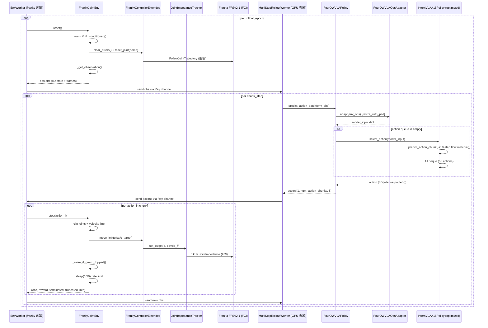

### 8.2 Action Chunking

4DWVLA 使用 **action chunking** (chunk\_size=50), 一次推理生成 50 步动作:

```
内部 queue:  |<------ 50 个 action ------>|
时间线:     t_0  t_1  ...  t_49     t_50 (新推理)
            infer  pop  pop  pop     infer  pop  ...

RLinf 外部: num_action_chunks=10, 每次从 GPU 取 10 个动作
            每 10 步发送一次新的观测给 GPU
            但 GPU 侧只在 queue 空时 (每 50 步) 才做真正的推理
```

### 8.3 动作后处理

```python
# Model output from select_action(): Tensor[action_dim]
# action[:7] = absolute joint angles (radians)
# action[7]  = gripper command (continuous)

# normalization_mapping: ALL IDENTITY (from config.json)
# -> NO denormalization needed at inference time

# Post-processing:
# 1. Truncate to action_dim (8)
# 2. Reshape to [1, num_action_chunks, 8] for RLinf
# 3. Transfer to CPU for Ray serialization
```

### 8.4 频率分析

| 阶段 | 频率/时间 | 说明 |
|:---|:---|:---|
| 控制频率 | 30 Hz (33.3 ms/step) | 匹配训练数据 |
| JointImpedanceTracker | 1 kHz (内部) | franky 硬件控制循环 |
| 首次推理 | ~150-200 ms | Queue 为空, 10 步 flow matching |
| 后续推理 | ~0.05 ms | deque.popleft() |
| 均摊推理 | ~4 ms/step | (200 + 49 × 0.05) / 50 |
| 30Hz 余量 | ~29 ms | 33.3 - 4 = 29.3 ms |
| Motion guard check | <0.1 ms | 每步一次, 纯 Python 比较 |
| Watchdog check | 每 20 ms (50 Hz) | 独立线程, 不影响 step 频率 |

---

## 9. 安全架构

### 9.1 五层安全架构

> **v2.1 关键变更**: 增加了 `FrankyControllerExtended` 提供的 motion guard 和 watchdog 层.

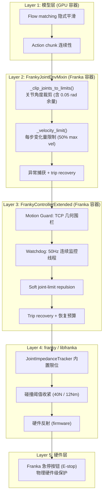

### 9.2 Layer 3 详解: FrankyControllerExtended 安全机制

这些机制来自 `franky_ext/controller_extended.py`, 经过 LOG-008 至 LOG-040 的真机测试迭代加固:

| 机制 | 功能 | 参数 |
|:---|:---|:---|
| **Motion Guard (围栏)** | TCP 必须在 `ee_pose_limit +/- margin` 范围内 | margin=0.05m, floor=0.01m |
| **Lag Guard** | `|measured - commanded| > max_lag` → 制动 | max\_lag=0.05m |
| **Orientation Guard** | 从目标四元数的最短弧角度超限 → 制动 | max\_orient\_err=0.55rad |
| **Joint Speed Guard** | `|dq_norm| > max_dq` → 制动 | max\_dq=1.2rad/s |
| **Watchdog Thread** | 50Hz 独立线程连续监控 (覆盖 `time.sleep` 间隙) | period=20ms |
| **Trip Recovery** | trip 后可恢复继续运行 (有预算限制) | budget=10 |
| **Soft Joint Limits** | 近限位时施加反推力矩 | activation=0.10rad, stiffness=4.0 |
| **碰撞阈值** | libfranka 硬件反射阈值收紧 | 40N / 12Nm (原 100N / 25Nm) |

**制动逻辑**: 区分 violation 类型 -- `fence`/`orient` 先 `stop()` (弹簧回拉), `lag`/`dq` 先 `freeze_at_current()` (移除目标误差). 制动后 latch reason, 等待 env 侧 poll.

### 9.3 关节限位具体数值

> **数据来源**: 物理限位来自 URDF `b/d/frk1/fr3v2_1_franka_hand.urdf`, 训练范围来自 `b/d/frk1/plug/abs_stats.json` 的 `action.arm` 字段.

默认 `joint_limit_margin = 0.05` rad, `velocity_safety_factor = 0.5`:

| 关节 | URDF 下限 | 有效下限 | 训练 min | 训练 max | 有效上限 | URDF 上限 | 速度 (rad/s) | 每步最大变化 (rad) |
|:---:|:---:|:---:|:---:|:---:|:---:|:---:|:---:|:---:|
| q1 | -2.9007 | -2.8507 | -0.486 | +0.060 | 2.8507 | 2.9007 | 2.62 | 0.04367 |
| q2 | -1.8361 | -1.7861 | -0.107 | +0.333 | 1.7861 | 1.8361 | 2.62 | 0.04367 |
| q3 | -2.9007 | -2.8507 | -0.202 | +0.480 | 2.8507 | 2.9007 | 2.62 | 0.04367 |
| q4 | -3.0770 | -3.0270 | -2.217 | -1.529 | -0.1669 | -0.1169 | 2.62 | 0.04367 |
| q5 | -2.8763 | -2.8263 | -0.273 | +0.110 | 2.8263 | 2.8763 | 5.26 | 0.08767 |
| q6 | +0.4398 | +0.4898 | +1.649 | +2.517 | 4.5716 | 4.6216 | 4.18 | 0.06967 |
| q7 | -3.0508 | -3.0008 | +0.370 | +1.102 | 3.0008 | 3.0508 | 5.26 | 0.08767 |

> **注意与经典 Panda 的关键差异**: FR3v2.1 的 q6 范围 [0.44, 4.62] 与 Panda 的 [-0.02, 3.75] 完全不同, 且 q5/q7 最大速度是 Panda 的 2 倍. 使用错误的限位参数会导致安全隐患或误拒合法指令.

---

## 10. Hydra 配置

### 10.1 评估任务配置: realworld\_plug\_eval\_4wvla.yaml

**文件**: `four_dwvla_ext/configs/realworld_plug_eval_4wvla.yaml`

```yaml
# 4DWVLA Franka evaluation -- franky_ext version (v2.1)
# Uses FrankyControllerExtended, no ROS dependency.
#
# Usage:
#   RLINF_EXT_MODULE=four_dwvla_ext.runtime_bootstrap \
#   python evaluations/eval_embodied_agent.py \
#       --config-name realworld_plug_eval_4wvla \
#       --config-path /path/to/four_dwvla_ext/configs \
#       rollout.model.model_path=/home/nvidia/bt/ckp/4wvlaFrk/plug/4wvlaFrkPlugCkp010420/

defaults:
  - override hydra/job_logging: stdout

hydra:
  run:
    dir: .
  output_subdir: null
  searchpath:
    - file://${oc.env:EMBODIED_PATH}/config/
    - file:///home/nvidia/bt/s/RLinf/b/x/four_dwvla_ext/configs

# ---- Cluster: dual container on same host ----
cluster:
  num_nodes: 2
  component_placement:
    rollout:
      node_group: gpu
      placement: 0
    env:
      node_group: franky
      placement: 0
  node_groups:
    - label: gpu
      node_ranks: 0
      env_configs:
        - python_interpreter_path: /opt/venv/openvla/bin/python
    - label: franky
      node_ranks: 1
      env_configs:
        - python_interpreter_path: /opt/venv/franky-0.19.0/bin/python
          env_vars:
            - RLINF_SKIP_CAMERA: "0"

# ---- Runner ----
runner:
  task_type: embodied_eval
  logger:
    log_path: "../results"
    project_name: rlinf_4dwvla
    experiment_name: "franka-plug-eval-4wvla"
    logger_backends: ["tensorboard"]
  max_epochs: 1
  max_steps: 1
  only_eval: True
  val_check_interval: -1

# ---- Environment ----
env:
  group_name: "EnvGroup"
  enable_offload: False
  eval:
    env_type: realworld
    total_num_envs: 1
    auto_reset: False
    ignore_terminations: False
    reward_mode: raw
    wrap_obs_mode: simple
    seed: 0
    group_size: 1
    max_steps_per_rollout_epoch: 600
    max_episode_steps: 600
    use_spacemouse: False
    no_gripper: False
    main_image_key: global
    rollout_epoch: 20
    video_cfg:
      save_video: True
      info_on_video: True
      video_base_dir: ${runner.logger.log_path}/video/eval
    init_params:
      id: "FrankyJointEnv-v1"
      num_envs: null
    override_cfg:
      is_dummy: false
      task_description: "plug into socket"
      step_frequency: 30.0
      joint_limit_margin: 0.05
      velocity_safety_factor: 0.5
      max_num_steps: 600
      # HOME = 训练数据关节角均值 (abs_stats.json action.arm.mean)
      # ⚠️ v2.1.3 修正: 旧值 [0, -0.785, 0, -2.356, 0, 1.571, 0.785] 是经典 Panda ready pose,
      #    不适用于 FR3v2.1; 且与训练数据分布中心偏差大, 导致首帧 OOD
      reset_joint_pos: [-0.2406, 0.1457, 0.1872, -2.0600, -0.0553, 2.2011, 0.6998]
      reset_lift_height: 0.10        # 复位时先垂直提升 10cm, 安全脱离插座
      reset_pause_for_human: true    # Episode 间暂停, 等待操作员重置场景
      binary_gripper_threshold: 0.5
      end_effector_type: "gripper"
      camera_type: "realsense"
      camera_resolution: [480, 640]
      robot_ip: "172.16.0.2"

# ---- Rollout (model inference) ----
rollout:
  group_name: "RolloutGroup"
  backend: "huggingface"
  recompute_logprobs: False
  enable_offload: False
  pipeline_stage_num: 1
  collect_transitions: False
  collect_prev_infos: False
  model:
    model_path: "/home/nvidia/bt/ckp/4wvlaFrk/plug/4wvlaFrkPlugCkp010420/"
    precision: "bf16"
    action_loss_only: true
    enable_keypoint: false
    num_action_chunks: 10
    action_dim: 8
    state_dim: 8
    max_state_dim: 32
    image_resolution: [224, 224]
    four_dwvla:
      inference_backend: "optimized"
      action_loss_only: true
      gradient_checkpointing: false
      num_inference_steps: 10
      chunk_size: 50
      n_action_steps: 50
```

### 10.2 与 v2.0 配置的差异

| 配置项 | v2.0 | v2.1 → v2.1.3 |
|:---|:---|:---|
| `cluster.num_nodes` | 1 | 2 (dual container) |
| `cluster.component_placement` | 单 node\_group: franka | 分离: gpu / franky |
| `node_groups` | 单组 (franka, node\_ranks: 0) | 双组 (gpu: rank 0, franky: rank 1) |
| `python_interpreter_path` | 未设 | gpu: `/opt/venv/openvla/bin/python`, franky: `/opt/venv/franky-0.19.0/bin/python` |
| `init_params.id` | `"FrankaJointEnv-v1"` | `"FrankyJointEnv-v1"` |
| `reset_joint_pos` | `[0, -0.785, 0, -2.356, 0, 1.571, 0.785]` (Panda ready) | `[-0.2406, 0.1457, 0.1872, -2.06, -0.0553, 2.2011, 0.6998]` (训练数据均值, v2.1.3 修正) |
| `reset_lift_height` | — | `0.10` (v2.1.3 新增) |
| `reset_pause_for_human` | — | `true` (v2.1.3 新增) |
| `robot_ip` | `"172.16.0.2"` | `"172.16.0.2"` (不变) |

---

## 11. Docker 部署

### 11.1 容器启动

> **v2.1 关键变更**: 使用与真机 RL 生产部署完全一致的容器启动方式.

**Franky 容器** (无 GPU):

```bash
# 宿主机执行
REPO=/home/nvidia/bt/s/RLinf
IMAGE=rlinf/rlinf:agentic-rlinf0.4-franka

docker run -it --rm \
  --privileged \
  --network host \
  --name rlinf-franky \
  -v "${REPO}:/workspace/RLinf" \
  -w /workspace/RLinf \
  "${IMAGE}" bash
```

**GPU 容器**:

```bash
# 宿主机执行
REPO=/home/nvidia/bt/s/RLinf
IMAGE=rlinf/rlinf:agentic-rlinf0.4-maniskill_libero

docker run -it --rm \
  --privileged \
  --network host \
  --gpus all \
  --name rlinf-gpu \
  -v "${REPO}:/workspace/RLinf" \
  -v "/home/nvidia/bt/ckp:/home/nvidia/bt/ckp:ro" \
  -v "/home/nvidia/bt/s/4WVLA:/home/nvidia/bt/s/4WVLA:ro" \
  -w /workspace/RLinf \
  "${IMAGE}" bash
```

### 11.2 环境设置

**Franky 容器内**:

```bash
source /opt/venv/franky-0.19.0/bin/activate
source b/x/configs/setup_before_ray_5090.sh

# 确保 four_dwvla_ext 可导入:
export PYTHONPATH=/workspace/RLinf/b/x:$PYTHONPATH
export RLINF_EXT_MODULE=four_dwvla_ext.runtime_bootstrap

# 启动 Ray worker (连接 GPU 容器的 head):
ray start --address=10.229.18.21:6379
```

**GPU 容器内**:

```bash
source b/x/configs/setup_before_ray_gpu_5090.sh

# 确保 four_dwvla_ext 和 4WVLA 可导入:
export PYTHONPATH=/workspace/RLinf/b/x:/home/nvidia/bt/s/4WVLA/src:$PYTHONPATH
export RLINF_EXT_MODULE=four_dwvla_ext.runtime_bootstrap

# Qwen3.5 transformers patch:
TRANSFORMERS_DIR=$(python -c "import transformers; print(transformers.__file__.rsplit('/',1)[0])")
cp -r /home/nvidia/bt/s/4WVLA/src/lerobot/policies/internvla_a1_5/transformers_replace/models ${TRANSFORMERS_DIR}/

# 启动 Ray head:
ray start --head --port=6379
```

### 11.3 启动顺序

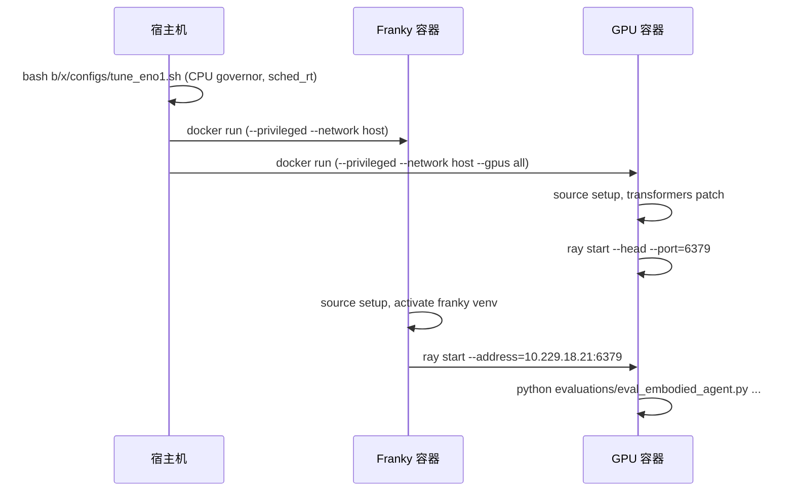

---

## 12. 操作手册

### 12.1 Pre-flight 检查

> 以下全部在 🖥️ **宿主机终端**执行.

```bash
# [宿主机] 1. 扩展包存在
ls -la /home/nvidia/bt/s/RLinf/b/x/four_dwvla_ext/runtime_bootstrap.py

# [宿主机] 2. Docker 容器运行
docker ps | grep -E "rlinf-(franky|gpu)"

# [宿主机] 3. Checkpoint
ls /home/nvidia/bt/ckp/4wvlaFrk/plug/4wvlaFrkPlugCkp010420/model.safetensors

# [宿主机] 4. 机器人网络 (via FCI, not ROS)
ping -c 1 172.16.0.2

# [宿主机] 5. GPU
nvidia-smi

# [宿主机] 6. 相机
lsusb | grep -i realsense
```

### 12.2 在 Franky 容器中验证

```bash
# [宿主机] 进入 Franky 容器
docker exec -it rlinf-franky bash
```

```bash
# [Franky 容器] 以下全部在 Franky 容器内执行
source /opt/venv/franky-0.19.0/bin/activate

# [Franky 容器] 验证 FrankyController 已有 move_joints() (原生, 无需 patch):
python -c "
from rlinf.envs.realworld.franka.franky_controller import FrankyController
assert hasattr(FrankyController, 'move_joints'), 'move_joints not found!'
import inspect
src = inspect.getsource(FrankyController.move_joints)
assert 'JointImpedanceTracker' not in src  # dq feedforward via set_target
assert '_ensure_tracking_motion' in src
print('FrankyController.move_joints(): native, uses JointImpedanceTracker')
"

# [Franky 容器] 验证 FrankyControllerExtended:
python -c "
from franky_ext.controller_extended import FrankyControllerExtended
print(f'FrankyControllerExtended: {FrankyControllerExtended.__mro__}')
assert hasattr(FrankyControllerExtended, 'set_motion_guard')
assert hasattr(FrankyControllerExtended, 'guard_tripped')
print('Motion guard API: OK')
"

# [Franky 容器] 验证 Gym 注册:
python -c "
import sys; sys.path.insert(0, '/workspace/RLinf/b/x')
import four_dwvla_ext.tasks.register
import gymnasium as gym
spec = gym.spec('FrankyJointEnv-v1')
print(f'FrankyJointEnv-v1 registered: entry_point={spec.entry_point}')
"
```

### 12.3 启动评估

> 以下全部在 🖥️ **GPU 容器终端**执行. 详细的操作手册见 §12.5.

```bash
# [GPU 容器] === Step 1: Dummy 测试 (无真机运动) ===
RLINF_EXT_MODULE=four_dwvla_ext.runtime_bootstrap \
PYTHONPATH=/workspace/RLinf/b/x:$PYTHONPATH \
python evaluations/eval_embodied_agent.py \
    --config-name realworld_plug_eval_4wvla \
    --config-path /workspace/RLinf/b/x/four_dwvla_ext/configs \
    env.eval.override_cfg.is_dummy=true \
    env.eval.rollout_epoch=2

# [GPU 容器] === Step 2: 保守真机测试 (⚠️ 机器人会运动! E-stop 在手边!) ===
RLINF_EXT_MODULE=four_dwvla_ext.runtime_bootstrap \
PYTHONPATH=/workspace/RLinf/b/x:$PYTHONPATH \
python evaluations/eval_embodied_agent.py \
    --config-name realworld_plug_eval_4wvla \
    --config-path /workspace/RLinf/b/x/four_dwvla_ext/configs \
    env.eval.rollout_epoch=1 \
    env.eval.override_cfg.max_num_steps=30 \
    env.eval.override_cfg.velocity_safety_factor=0.3

# [GPU 容器] === Step 3: 逐步提高参数 ===
# velocity_safety_factor: 0.3 -> 0.4 -> 0.5
# max_num_steps: 30 -> 60 -> 120 -> 600
# [人工] 每一轮前后需要手动重置场景 (参见 §12.5.10)

# [GPU 容器] === Step 4: 完整评估 (20 Episodes) ===
# [人工] 每个 Episode 间需要手动重置场景
RLINF_EXT_MODULE=four_dwvla_ext.runtime_bootstrap \
PYTHONPATH=/workspace/RLinf/b/x:$PYTHONPATH \
python evaluations/eval_embodied_agent.py \
    --config-name realworld_plug_eval_4wvla \
    --config-path /workspace/RLinf/b/x/four_dwvla_ext/configs \
    env.eval.rollout_epoch=20
```

### 12.4 紧急处理

| 紧急情况 | 处理 | 执行位置 |
|:---|:---|:---|
| 机器人运动异常 | 按 **E-stop** 急停按钮 | 🖐️ 人工 (机器人旁) |
| 需要中断当前 Episode 并复位 | 按键盘 **`r`** 键 — 机器人立即停止, 自动归位+开夹爪 (详见 §18) | ⌨️ 连接到 Franky 容器的键盘 |
| Motion guard trip | 自动制动, 检查日志中的 `MOTION GUARD TRIP` | 🖥️ GPU 容器终端查看日志 |
| 关节抖动 | 按键盘 **`r`** 键中断 Episode, 降低 `velocity_safety_factor` 后重试 | ⌨️ Franky 容器键盘 |
| FCI 连接失败 | 确保无其他 libfranka 客户端连接 (标定 REPL 等) | 🖥️ Franky 容器排查 |
| GPU OOM | 确认 `action_loss_only=true`, `inference_backend="optimized"` | 🖥️ GPU 容器检查配置 |
| 评估卡住 | `Ctrl+C`, 检查 Ray 连接 | 🖥️ GPU 容器终端 |

### 12.5 插座插拔任务真机评估详细操作手册

> **适用对象**: 没有接触过 VLA 模型、RLinf 框架或 Franka 机器人技术的第三方工程师
> **适用前提**: 本文档 §4–§11 描述的所有代码已实现, §13–§14 的测试全部通过, §15 的验收项全部达标
> **评估目标**: 在真实 FR3v2.1 机器人上执行插座插拔任务, 统计 20 个 Episode 的成功率, 以此评估 checkpoint 的真机表现
> **预计总耗时**: 约 2–3 小时 (含环境准备、渐进测试、20 Episode 正式评估)

#### 12.5.1 你将要做什么 — 评估背景简介

**任务描述**: 一个名为 4DWVLA (InternVLA-A1.5) 的 AI 模型被训练来控制 Franka 机器人完成"把插头插入插座"的动作. 训练数据来自人类操作员在同一台机器人上演示了 8 次插拔动作 (共 4777 帧, 每秒 30 帧, 数据集位于 `/home/nvidia/bt/dt/plug_into_socket_lrb_4D_8sml/`). AI 模型从这 8 次演示中学习了如何完成该任务.

你的工作是操作机器人执行这个任务 20 次 (称为 20 个 "Episode"), 每次由 AI 模型全自动控制机器人, 你只负责观察和记录每次是否成功, 以及在每次之间手动重置场景 (把插头放回起始位置). 最终得到一个成功率.

**AI 模型工作原理 (简化)**:

```
   全局相机画面 (480×640)──→┐
                            ├──→ AI 模型 ──→ 7 个关节角度 + 1 个夹爪指令
   手腕相机画面 (480×640)──→┤         ↑          (一次产生 50 步, 约 1.67 秒)
                            │         │
   7 个关节角度 + 夹爪宽度──→┘    每执行完 50 步
                                  再次拍照、读状态、推理...
                                  循环往复直到 max_steps
```

1. 机器人上的两个摄像头 (全局 + 手腕) 拍摄当前画面
2. 机器人读取自身 7 个关节的角度和夹爪宽度
3. AI 模型接收图像和关节数据, 经过 10 步迭代计算 (flow matching), 产生未来 50 步的关节运动指令 (约 1.67 秒)
4. 机器人按指令以 30Hz 频率执行运动
5. 50 步执行完毕后, 再次拍照、读取状态、计算、运动... 循环往复
6. 整个过程全自动, 你只需要观察是否成功, 并在 Episode 之间重置场景

**关键参数速查**:

| 参数 | 值 | 含义 |
|:---|:---|:---|
| Checkpoint 路径 | `/home/nvidia/bt/ckp/4wvlaFrk/plug/4wvlaFrkPlugCkp010420/` | 训练好的 AI 模型文件 (约 5.89 GiB) |
| 训练数据 | `plug_into_socket_lrb_4D_8sml` | 8 个人类演示, 共 4777 帧 |
| 控制频率 | 30 Hz | 机器人每秒执行 30 个关节角指令 |
| 动作块大小 | 50 步 (chunk\_size=50) | 每次 AI 推理产生 50 个连续指令 (~1.67 秒) |
| 推理去噪步数 | 10 步 (flow matching) | AI 内部迭代精度, 不影响外部操作 |
| 图像分辨率 | 224×224 | AI 内部处理的图片大小 (自动从 480×640 缩放, 不影响相机设置) |
| 机器人型号 | FR3v2.1 | Franka Research 3 v2.1 (**非**经典 Panda, 关节限位不同) |
| 正式评估 Episode 数 | 20 | 统计上有意义的最少重复次数 |
| 单 Episode 最大步数 | 600 (默认) | 约 20 秒, 与训练数据平均 episode 长度匹配 |

#### 12.5.2 安全须知 — 开始前必读

> ⚠️ **警告**: Franka FR3v2.1 是工业级 7 轴机械臂, 操作不当可能造成人身伤害或设备损坏. 本操作手册假设操作员已接受过 Franka 机器人基础安全培训.

**必须满足的安全前提条件**:

1. **E-stop (急停按钮)** 必须在操作员伸手可及范围内 (< 0.5 m), 且已确认功能正常 — 按下后机器人应立即制动
2. 机器人工作区域内**无人员**, 操作员站在工作区域外
3. 工作区域已清除杂物, 台面上只有插头、插座和固定夹具
4. 机器人控制柜电源指示灯为**绿色** (正常运行)
5. 实验室门口张贴了"机器人实验进行中"警示标识

**紧急情况处理速查表**:

| 情况 | 立即操作 | 后续操作 |
|:---|:---|:---|
| 机器人运动失控 / 即将碰撞 | 🖐️ **人工**: 立即按 **E-stop** 急停按钮 (机器人旁) | 不要尝试解锁, 联系负责工程师 |
| 机器人抖动 / 异响 | 🖥️ **GPU 容器终端**: 按键盘 **q** 键终止当前 Episode | 降低 `velocity_safety_factor`, 从保守参数重新开始 |
| 软件报错 / 卡死 / 无响应 | 🖥️ **GPU 容器终端**: 按 **Ctrl+C** | 机器人会因超时自动进入安全模式; 检查 GPU 容器终端的错误日志 |
| 日志出现 "MOTION GUARD TRIP" | 无需操作 — 机器人已自动停止 | 🖐️ **人工**: 检查场景中是否有障碍物; 🖥️ **Franky 容器**: 按日志提示执行恢复命令 |
| FCI 连接断开 (网络错误) | 等待, 不要手动操作机器人 | 🖥️ **宿主机**: `docker restart rlinf-franky`; 然后在 **Franky 容器**内重新执行 §12.5.5 |
| 夹爪夹伤操作员 | 🖐️ **人工**: 按 **E-stop** + 手动释放夹爪 | 就医; 夹爪最大力约 70N, 可造成挤压伤 |

#### 12.5.3 硬件清单与物理环境要求

**硬件清单** — 🖐️ **人工目视/手动确认**, 逐项确认以下设备已到位并工作正常:

- [ ] **FR3v2.1 机器人** + Franka Hand 平行夹爪 (序列号标签在底座侧面)
- [ ] **E-stop 急停按钮** (橙色圆柱形按钮, 通过线缆连接机器人控制柜)
- [ ] **机器人控制柜** (灰色, 侧面有 FCI 以太网口, 前面板有电源指示灯)
- [ ] **2× Intel RealSense D435I 相机**:
  - **全局相机 (global)**: 固定在三脚架或支架上, 从外部俯视或侧视工作区
  - **手腕相机 (wrist)**: 安装在 Franka Hand 上方法兰处, 随机器人末端一起运动
- [ ] **插头工件**: 与训练时使用的**完全相同**的型号 (外形、尺寸、颜色一致)
- [ ] **插座工件**: 固定在工作台面上的**指定位置**, 与训练时使用的**完全相同**的型号
- [ ] **GPU 服务器**: AMD Ryzen Threadripper 7970X + 1× NVIDIA RTX 5090 D (32 GiB VRAM)
- [ ] **以太网线**: 服务器 ↔ 机器人控制柜 (机器人 IP: `172.16.0.2`)
- [ ] **USB 3.0 线 × 2**: 服务器 ↔ 全局相机, 服务器 ↔ 手腕相机
- [ ] **操作终端**: 键盘 + 显示器 (连接 GPU 服务器), 或通过 SSH 远程连接

**工作区布局示意图**:

```
                    ┌───────────────────────────────────────────┐
                    │              机器人工作台面                 │
                    │                                           │
                    │    ┌──────┐                               │
                    │    │ 插座  │ ← 固定在台面上 (不可移动)       │
  全局相机 ─────────│──▶ │ 固定  │                               │
  (三脚架,          │    └──────┘                               │
   对准工作区)      │         ↑                                 │
                    │     插拔操作区域                            │
                    │    (训练数据中 TCP 活动范围:                │
                    │     X 轴: 0.534 – 0.602 m  前方            │
                    │     Y 轴: -0.140 – 0.053 m 左右            │
                    │     Z 轴: 0.178 – 0.517 m  高度)           │
                    │                                           │
                    │          ┌────────┐                       │
                    │          │ FR3v2.1│  ← 机器人底座           │
                    │          │  底座   │    (坐标系原点)         │
                    │          └────────┘                       │
                    └───────────────────────────────────────────┘
                              ↑
                     手腕相机安装在 Franka Hand 法兰上

  ┌──────────────┐   以太网 (FCI)   ┌──────────────┐
  │ 机器人控制柜  │ ←──────────────→ │  GPU 服务器    │
  └──────────────┘                  └──────────────┘
        ↑                                ↑
    E-stop 按钮                     USB 3.0 × 2 (两个相机)
  (操作员伸手可达)
```

**插座/插头定位要求**:

训练数据中机器人 TCP (Tool Center Point, 即手腕末端点) 的活动范围如下表. 这些数据来自 `abs_stats.json` 中 `observation.state.ee_pos` 的 min/max 统计:

| 轴 | 最小值 (m) | 最大值 (m) | 含义 |
|:---|:---|:---|:---|
| X (前方) | 0.534 | 0.602 | 距底座前方约 53–60 cm |
| Y (左右) | −0.140 | 0.053 | 底座左侧 14 cm 到右侧 5 cm |
| Z (高度) | 0.178 | 0.517 | 距台面高度约 18–52 cm |

> **重要**: 插座的位置必须在上述工作区范围内, 且与训练时的位置尽可能一致. 位置偏差过大会导致模型无法完成任务 (不是模型故障, 而是超出了模型的泛化能力). 最佳做法是与采集训练数据时使用**完全相同**的台面和夹具位置.

#### 12.5.4 软件环境确认

> 以下 5 个 Step 全部在 🖥️ **宿主机 (GPU 服务器) 终端**上执行, 不是在任何 Docker 容器内部. 通过本地键盘+显示器或 SSH 连接到服务器.

**Step 1: 确认 Docker 容器正在运行** `[宿主机]`

```bash
# [宿主机] 检查 Docker 容器状态
docker ps --format "table {{.Names}}\t{{.Status}}\t{{.Image}}" | grep rlinf
```

预期输出 (两个容器都显示 "Up"):
```
rlinf-gpu       Up X hours    rlinf-gpu:latest
rlinf-franky    Up X hours    rlinf-franky:latest
```

如果容器未运行, 请按本文档 §11 (Docker 部署) 的步骤启动两个容器.

**Step 2: 确认 Checkpoint 文件完整** `[宿主机]`

```bash
# [宿主机] 检查 checkpoint 文件
ls -lh /home/nvidia/bt/ckp/4wvlaFrk/plug/4wvlaFrkPlugCkp010420/
```

预期输出 (4 个文件, 重点检查 model.safetensors 大小):
```
-rw-r--r-- 1 nvidia nvidia 3.7K ... config.json
-rw-r--r-- 1 nvidia nvidia 5.9G ... model.safetensors   ← 模型权重, 约 5.89 GiB
-rw-r--r-- 1 nvidia nvidia  39K ... stats.json
-rw-r--r-- 1 nvidia nvidia  13K ... train_config.json
```

> **关键检查**: `model.safetensors` 大小必须约为 **5.89 GiB**. 如果明显不同, 说明文件损坏或下载不完整, 需要重新获取.

**Step 3: 确认 GPU 可用** `[宿主机 → docker exec]`

```bash
# [宿主机] 通过 docker exec 在 GPU 容器内执行 nvidia-smi
docker exec -it rlinf-gpu nvidia-smi
```

预期: 显示 `NVIDIA RTX 5090 D`, 显存 32768 MiB, 无其他进程占用大量显存. 如果有其他进程占用 > 5 GiB, 先终止它们.

**Step 4: 确认相机已连接** `[宿主机]`

```bash
# [宿主机] 检查 USB 设备
lsusb | grep -i "Intel.*RealSense"
```

预期: 显示 2 行 RealSense 设备. 如果只有 1 行或没有, 🖐️ **人工**检查 USB 线物理连接.

**Step 5: 确认机器人网络连通** `[宿主机]`

```bash
# [宿主机] ping 机器人控制柜
ping -c 3 172.16.0.2
```

预期: 3 个包全部成功, 往返延迟 < 1 ms. 如果 ping 不通, 🖐️ **人工**检查以太网线物理连接和机器人控制柜电源.

#### 12.5.5 进入 Franky 容器并验证机器人连接

```bash
# ════════════════════════════════════════════
# [宿主机] 打开第一个终端窗口, 进入 Franky 容器
# ════════════════════════════════════════════

# 1. 进入 Franky 容器 (此后该终端窗口的所有命令都在 Franky 容器内)
docker exec -it rlinf-franky bash
```

```bash
# ════════════════════════════════════════════
# [Franky 容器] 以下所有命令在 Franky 容器内执行
# ════════════════════════════════════════════

# 2. [Franky 容器] 激活 franky Python 虚拟环境
source /opt/venv/franky-0.19.0/bin/activate

# 3. [Franky 容器] 验证机器人连接, 读取当前状态
python -c "
from rlinf.envs.realworld.franka.franky_controller import FrankyController
import numpy as np

ctrl = FrankyController(robot_ip='172.16.0.2')
state = ctrl.get_state()

q = np.array(state.arm_joint_position[:7])
print('=== FR3v2.1 机器人当前状态 ===')
print(f'关节角度 (rad): {np.round(q, 4)}')
print(f'关节角度 (deg): {np.round(np.degrees(q), 1)}')
print(f'夹爪宽度: {state.gripper_position:.4f} m')
print()
print('✓ 机器人连接正常')
"
```

预期输出示例:
```
=== FR3v2.1 机器人当前状态 ===
关节角度 (rad): [-0.2406  0.1457  0.1872 -2.0600 -0.0553  2.2011  0.6998]
关节角度 (deg): [-13.8   8.3  10.7 -118.0  -3.2 126.1  40.1]
夹爪宽度: 0.0400 m
✓ 机器人连接正常
```

**如果连接失败 — 排查指引**:

| 错误信息 | 原因 | 解决方法 |
|:---|:---|:---|
| `Connection refused` | 控制柜未开机或 FCI 口未连 | 确认控制柜电源灯为绿色, 网线插在 FCI 口 (非 X3 口) |
| `Robot is in reflex mode` | 机器人处于错误状态 | 打开浏览器访问 `https://172.16.0.2/desk`, 点击"解锁"按钮, 然后在代码中调用 `ctrl.clear_errors()` |
| `Another controller is active` | FCI 被其他程序占用 | 关闭 Franka Desk 中的"拖拽示教"模式, 或终止其他 libfranka 客户端进程 |
| `Network unreachable` | 服务器和控制柜不在同一子网 | 确认服务器网卡配置了 `172.16.0.x` 子网 IP |

```bash
# 4. [Franky 容器] 将机器人移动到安全初始位置
#    初始位置取自训练数据中所有帧的关节角平均值 (abs_stats.json observation.state.arm.mean)
#    ⚠️ 执行后机器人会物理运动, E-stop 必须在手边
python -c "
from rlinf.envs.realworld.franka.franky_controller import FrankyController
import numpy as np

ctrl = FrankyController(robot_ip='172.16.0.2')
ctrl.clear_errors()

# 训练数据的关节角平均值 (来自 abs_stats.json)
HOME_JOINTS = [-0.2406, 0.1457, 0.1872, -2.0600, -0.0553, 2.2011, 0.6998]
print('即将移动到初始位置, 各关节目标角度:')
joint_names = ['q1(肩旋转)', 'q2(肩俯仰)', 'q3(肘旋转)', 'q4(肘俯仰)',
               'q5(腕旋转)', 'q6(腕俯仰)', 'q7(腕扭转)']
for name, val in zip(joint_names, HOME_JOINTS):
    print(f'  {name}: {val:+.4f} rad ({np.degrees(val):+.1f}°)')
print()
input('>>> 确认 E-stop 在手边后, 按 Enter 开始移动...')

ctrl.reset_joint(HOME_JOINTS)
print('✓ 已到达初始位置')
"
```

> ⚠️ `reset_joint()` 会让机器人**缓慢移动**到目标位置 (约 5–10 秒), 过程中请观察运动轨迹, 确保无碰撞.

```bash
# 5. [Franky 容器] 验证 FrankyControllerExtended (五层安全架构) 工作正常
python -c "
from franky_ext.controller_extended import FrankyControllerExtended
ctrl = FrankyControllerExtended(robot_ip='172.16.0.2')
health = ctrl.motion_health()
print(f'Motion guard 状态: {health}')
tripped = ctrl.guard_tripped()
if tripped is None:
    print('✓ FrankyControllerExtended 安全系统正常, motion guard 未触发')
else:
    print(f'⚠ Motion guard 已触发: {tripped}')
    print('  需要先调用 ctrl.recover_from_trip() 恢复')
"

# 6. [Franky 容器] 连接到 GPU 容器的 Ray 集群 (用于跨容器通信)
ray start --address=10.229.18.21:6379
```

预期: 最后一行显示 `Ray runtime started.` 或 `Already connected to Ray cluster`.

> 至此 Franky 容器准备完毕. **保持此终端窗口打开**, 接下来打开新终端操作 GPU 容器.

#### 12.5.6 准备 GPU 容器

打开一个**新的终端窗口** (保持 Franky 容器的终端窗口不关闭, 后续还需要).

```bash
# ════════════════════════════════════════════
# [宿主机] 在第二个终端窗口中, 进入 GPU 容器
# ════════════════════════════════════════════

# 1. [宿主机] 进入 GPU 容器 (此后该终端窗口的所有命令都在 GPU 容器内)
docker exec -it rlinf-gpu bash
```

```bash
# ════════════════════════════════════════════
# [GPU 容器] 以下所有命令在 GPU 容器内执行
# ════════════════════════════════════════════

# 2. [GPU 容器] 设置环境变量
export PYTHONPATH=/workspace/RLinf/b/x:/home/nvidia/bt/s/4WVLA/src:$PYTHONPATH
export RLINF_EXT_MODULE=four_dwvla_ext.runtime_bootstrap

# 3. [GPU 容器] 安装 Qwen3.5 的 Transformers patch (每次重建容器后需要执行一次)
TRANSFORMERS_DIR=$(python -c "import transformers; print(transformers.__file__.rsplit('/',1)[0])")
cp -r /home/nvidia/bt/s/4WVLA/src/lerobot/policies/internvla_a1_5/transformers_replace/models \
      ${TRANSFORMERS_DIR}/
echo "✓ Transformers patch 已安装到 ${TRANSFORMERS_DIR}"

# 4. [GPU 容器] 验证 4DWVLA 扩展包可加载
python -c "
from four_dwvla_ext.runtime_bootstrap import register
register()
print('✓ 4DWVLA 扩展包加载成功, 模型类型 \"4dwvla\" 已注册')
"

# 5. [GPU 容器] 验证模型模块可导入 (不加载权重, 约 5 秒)
python -c "
import torch
from four_dwvla_ext.policy_adapter import FourDWVLAPolicy
from four_dwvla_ext.model_builder import build_four_dwvla_model
print('✓ 模型模块导入成功')
print(f'  CUDA 可用: {torch.cuda.is_available()}')
print(f'  GPU 设备: {torch.cuda.get_device_name(0)}')
print(f'  显存总量: {torch.cuda.get_device_properties(0).total_mem/1024**3:.1f} GiB')
"

# 6. [GPU 容器] 启动 Ray head 节点
ray start --head --port=6379

# 7. [GPU 容器] 确认 Ray 集群有 2 个节点 (GPU 容器 + Franky 容器)
python -c "
import ray
ray.init(address='auto')
nodes = ray.nodes()
print(f'Ray 集群节点数: {len(nodes)}')
for n in nodes:
    print(f'  - {n[\"NodeManagerAddress\"]} (alive={n[\"Alive\"]})')
if len(nodes) < 2:
    print('⚠ 只有 1 个节点, 请确认 Franky 容器已执行 ray start --address=...')
else:
    print('✓ Ray 集群就绪 (2 个节点)')
ray.shutdown()
"
```

#### 12.5.7 Dummy 测试 — 验证软件管线 (不移动真机)

> 这一步让 AI 模型运行完整的推理管线, 但不向机器人发送控制指令. 用于验证从图像采集到模型推理到动作输出的整个软件链路正常工作. 机器人**不会运动**, 无需物理准备.

在 🖥️ **GPU 容器终端** (§12.5.6 所在的终端窗口) 中执行:

```bash
# [GPU 容器] Dummy 评估 — 验证软件管线, 机器人不动
RLINF_EXT_MODULE=four_dwvla_ext.runtime_bootstrap \
PYTHONPATH=/workspace/RLinf/b/x:$PYTHONPATH \
python evaluations/eval_embodied_agent.py \
    --config-name realworld_plug_eval_4wvla \
    --config-path /workspace/RLinf/b/x/four_dwvla_ext/configs \
    env.eval.override_cfg.is_dummy=true \
    env.eval.rollout_epoch=2
```

**预期行为** (按时间顺序):
1. 模型加载 — 终端显示加载进度, 约 30 秒, GPU 显存占用上升至约 12 GiB
2. 运行 2 个 Dummy Episode — 每个 Episode 打印动作输出值, 但机器人不动
3. 评估完成 — 显示汇总统计

**检查清单**:
- [ ] 无 Python 报错或异常退出
- [ ] 模型输出的关节角度值在合理范围 (7 个值应在 [-3.1, 4.7] rad 范围内)
- [ ] GPU 显存占用 < 20 GiB (`nvidia-smi` 查看)
- [ ] 两个 Episode 都正常完成并显示 summary

**如果失败 — 排查指引**:

| 错误信息 | 原因 | 解决方法 |
|:---|:---|:---|
| `ModuleNotFoundError: four_dwvla_ext` | `PYTHONPATH` 未设置 | [GPU 容器] 重新执行 §12.5.6 Step 2 的 `export PYTHONPATH=...` |
| `ModuleNotFoundError: lerobot` | InternVLA 代码路径缺失 | [GPU 容器] 确认 `PYTHONPATH` 包含 `/home/nvidia/bt/s/4WVLA/src` |
| `CUDA out of memory` | WAN 视频模块被加载 | [GPU 容器] 确认 Hydra 配置中设置了 `action_loss_only=true` 和 `inference_backend=optimized` |
| `FileNotFoundError: ...config.json` | Checkpoint 路径错误 | [GPU 容器] 检查 Hydra 配置中 checkpoint 路径指向 `/home/nvidia/bt/ckp/4wvlaFrk/plug/4wvlaFrkPlugCkp010420/` |
| `KeyError: 'qwen3_5'` | Transformers patch 未安装 | [GPU 容器] 重新执行 §12.5.6 Step 3 的 `cp -r ...` 命令 |
| `ray.exceptions.RayActorError` | Ray 集群未就绪 | [GPU 容器] 执行 `ray status` 查看; [Franky 容器] 执行 `ray status` 查看; 必要时双方重新 `ray start` |

#### 12.5.8 保守单 Episode 真机测试

> ⚠️ **从此步开始, 机器人会实际运动!** E-stop 必须在手边. 首次真机测试使用极其保守的参数: 速度仅为正常值的 30%, 最多执行 30 步 (约 1 秒), 机器人几乎不会有明显位移.

**物理准备** — 🖐️ **人工手动操作**, 每一项都要确认:
1. 🖐️ **人工**: 将插头放在训练时的初始位置 (夹爪中或桌面指定点, 取决于训练数据的起始状态)
2. 🖐️ **人工**: 确认插座牢固固定在工作台面上的训练位置
3. 🖐️ **人工**: 确认工作区域内无杂物、无人员
4. 🖐️ **人工**: 确认操作员站在安全距离外, E-stop 在伸手可及范围内
5. 🖐️ **人工/目视**: 确认两个相机画面正常 (可通过 `realsense-viewer` 或评估脚本的日志确认)

在 🖥️ **GPU 容器终端** (§12.5.6 所在的终端窗口) 中执行:

```bash
# [GPU 容器] 保守真机测试 — ⚠️ 机器人会运动!
RLINF_EXT_MODULE=four_dwvla_ext.runtime_bootstrap \
PYTHONPATH=/workspace/RLinf/b/x:$PYTHONPATH \
python evaluations/eval_embodied_agent.py \
    --config-name realworld_plug_eval_4wvla \
    --config-path /workspace/RLinf/b/x/four_dwvla_ext/configs \
    env.eval.rollout_epoch=1 \
    env.eval.override_cfg.max_num_steps=30 \
    env.eval.override_cfg.velocity_safety_factor=0.3
```

**参数含义**:
- `rollout_epoch=1`: 只执行 1 个 Episode
- `max_num_steps=30`: 最多执行 30 步 ÷ 30 Hz = 约 1 秒, 机器人很快停下
- `velocity_safety_factor=0.3`: 每步关节角最大变化量限制为正常值的 30%
  - 例如 q1 正常 max\_delta = 0.0437 rad/step → 保守模式下仅 0.0131 rad/step ≈ 0.75°/step

**预期行为**:
- 机器人非常缓慢地开始运动 (几乎感觉不到)
- 约 1 秒后自动停止
- 运动应平滑, 无任何抖动或突变

**观察要点** (都通过才进入下一步):
- [ ] 机器人运动方向大致合理 (不是向着远离插座的方向运动)
- [ ] 运动非常平滑, 无抖动、无突变、无异响
- [ ] 夹爪状态合理 (如果应该夹住插头, 则夹爪应闭合)
- [ ] 日志中无 `MOTION GUARD TRIP` 或其他错误

**如果机器人运动方向完全错误** (如向远离插座方向运动):
1. 不必按 E-stop (30 步后自动停止, 速度极慢, 无危险)
2. 检查原因: 最常见的是相机安装位置/角度与训练时不一致, 或插座位置偏差过大
3. 对比训练数据中的视频帧: 查看 `/home/nvidia/bt/dt/plug_into_socket_lrb_4D_8sml/videos/observation.images.global/` 中的录像, 确保当前相机角度一致

#### 12.5.9 逐步提升参数

保守测试通过后, 逐步放宽限制. 所有命令在 🖥️ **GPU 容器终端**执行; 每一轮前后需要 🖐️ **人工**重置场景 (见 §12.5.10).

**渐进参数表** (每一轮都是独立的 1 个 Episode):

| 轮次 | max\_num\_steps | velocity\_safety\_factor | 预计运行时间 | 观察重点 |
|:---:|:---:|:---:|:---:|:---|
| 保守 (已完成) | 30 | 0.3 | ~1 s | 运动方向正确性 |
| 第一轮 | 120 | 0.3 | ~4 s | 轨迹合理性, 是否朝目标移动 |
| 第二轮 | 300 | 0.4 | ~10 s | 接近目标区域的行为 |
| 第三轮 | 600 | 0.5 | ~20 s | 完整任务执行, 是否能插入 |

**第一轮命令** `[GPU 容器]` — 🖐️ 执行前先人工重置场景:

```bash
# [GPU 容器] 第一轮: 延长时间, 保持低速 — ⚠️ 机器人会运动!
RLINF_EXT_MODULE=four_dwvla_ext.runtime_bootstrap \
PYTHONPATH=/workspace/RLinf/b/x:$PYTHONPATH \
python evaluations/eval_embodied_agent.py \
    --config-name realworld_plug_eval_4wvla \
    --config-path /workspace/RLinf/b/x/four_dwvla_ext/configs \
    env.eval.rollout_epoch=1 \
    env.eval.override_cfg.max_num_steps=120 \
    env.eval.override_cfg.velocity_safety_factor=0.3
```

**第二轮命令** `[GPU 容器]` — 🖐️ 执行前先人工重置场景:

```bash
# [GPU 容器] 第二轮: 延长时间, 提高速度 — ⚠️ 机器人会运动!
RLINF_EXT_MODULE=four_dwvla_ext.runtime_bootstrap \
PYTHONPATH=/workspace/RLinf/b/x:$PYTHONPATH \
python evaluations/eval_embodied_agent.py \
    --config-name realworld_plug_eval_4wvla \
    --config-path /workspace/RLinf/b/x/four_dwvla_ext/configs \
    env.eval.rollout_epoch=1 \
    env.eval.override_cfg.max_num_steps=300 \
    env.eval.override_cfg.velocity_safety_factor=0.4
```

**第三轮命令** `[GPU 容器]` — 🖐️ 执行前先人工重置场景:

```bash
# [GPU 容器] 第三轮: 接近完整参数 — ⚠️ 机器人会运动!
RLINF_EXT_MODULE=four_dwvla_ext.runtime_bootstrap \
PYTHONPATH=/workspace/RLinf/b/x:$PYTHONPATH \
python evaluations/eval_embodied_agent.py \
    --config-name realworld_plug_eval_4wvla \
    --config-path /workspace/RLinf/b/x/four_dwvla_ext/configs \
    env.eval.rollout_epoch=1 \
    env.eval.override_cfg.max_num_steps=600 \
    env.eval.override_cfg.velocity_safety_factor=0.5
```

> **原则**: 如果某一轮出现抖动、碰撞或运动异常, **不要继续提升参数**. 先排查原因 (参考 §12.5.13 故障排查表), 解决后从上一轮的参数重新测试.

#### 12.5.10 Episode 间的场景重置 (自动+手动协作)

> **v2.1.3 更新**: 复位流程现为**自动机器人归位 + 人工场景重置**的协作流程. 评估脚本自动完成机器人归位 (提升、关节归位、张开夹爪), 然后暂停等待操作员完成场景重置后再继续.

每个 Episode 结束后 (无论成功或失败), `reset()` 会被自动调用, 执行以下**自动+人工**流程:

```
 Episode N 结束
     │
     ▼ [自动]
 ① close_gripper() — 夹紧 (固定可能仍在夹爪中的插头)
     │
     ▼ [自动]
 ② Cartesian 提升 10cm — 垂直脱离插座 (如插头已插入)
     │  ↳ 如果 Cartesian 提升失败, 记录 warning 并跳过此步
     │
     ▼ [自动]
 ③ reset_joint(HOME) — 阻塞式关节运动到训练数据均值位
     │  HOME = [-0.2406, 0.1457, 0.1872, -2.0600, -0.0553, 2.2011, 0.6998]
     │
     ▼ [自动]
 ④ open_gripper() — 张开夹爪 (释放插头供操作员取走)
     │
     ▼ [自动, Franky 容器终端输出]
 ⑤ 终端打印提示:
     │  "[人工操作] 机器人已归位, 夹爪已张开.
     │   → 请将插头放回夹爪中 (与训练数据起始位一致)
     │   → 确认插座位置正确
     │   → 准备好后按 Enter 继续下一 Episode..."
     │
     ▼ [人工手动]
 ⑥ 操作员执行场景重置 (详见下方步骤)
     │
     ▼ [人工, Franky 容器终端]
 ⑦ 操作员按 Enter
     │
     ▼ [自动]
 ⑧ close_gripper() — 夹紧操作员放入的插头
     │
     ▼ [自动]
 ⑨ get_observation() — 获取初始观测, 开始 Episode N+1
```

**操作员在步骤 ⑥ 需完成的工作** (按顺序):

**⑥-a 取出插头** `[人工手动]`: 🖐️ 从已张开的夹爪中取出插头. 如果上一 Episode 插头未被夹住 (掉落或卡在插座中), 从实际位置取回.

**⑥-b 检查插座** `[人工目视]`: 🖐️ 确认插座仍牢固固定在台面上, 未被移位或损坏. 如有歪斜, 扶正.

**⑥-c 放回插头** `[人工手动]`: 🖐️ 将插头放入张开的夹爪中, 位置与训练数据各 Episode 开始时的位置一致. 确保插头方向正确 (对齐插座引脚).

**⑥-d 快速检查相机** `[人工目视]`: 🖐️ 目视确认全局相机画面中可看到完整工作区; 手腕相机未被遮挡.

**⑥-e 退出工作区** `[人工]`: 🖐️ 退出机器人运动范围, 然后在 Franky 容器终端按 Enter.

> **注意**: `input()` 阻塞发生在 Franky 容器中 (因为 `env` 在 Franky 容器运行). 操作员应在 **Franky 容器终端**按 Enter, 不是 GPU 容器终端.

**可选: 确认机器人已正确归位** `[Franky 容器, 可选]` — 如果目视觉得位置有异常, 在另一个 Franky 容器终端窗口执行:

```bash
# [Franky 容器] 检查机器人是否回到 HOME 位置
python -c "
from rlinf.envs.realworld.franka.franky_controller import FrankyController
import numpy as np
ctrl = FrankyController(robot_ip='172.16.0.2')
q = np.array(ctrl.get_state().arm_joint_position[:7])
HOME = np.array([-0.2406, 0.1457, 0.1872, -2.0600, -0.0553, 2.2011, 0.6998])
diff_deg = np.degrees(np.abs(q - HOME))
print(f'各关节偏差 (deg): {np.round(diff_deg, 1)}')
print(f'最大偏差: {diff_deg.max():.1f}°')
if diff_deg.max() < 5.0:
    print('✓ 位置正常')
else:
    print('⚠ 偏差过大, 需手动执行: ctrl.reset_joint(HOME.tolist())')
"
```

> **reset\_pause\_for\_human 设为 False 时**: 步骤 ⑤⑥⑦ 被跳过, 系统不暂停直接继续. 此模式仅适用于**不需要人工介入的评估任务** (如场景可自动复位的模拟评估), **不适用于插座插拔任务**.

#### 12.5.11 完整 20 Episode 正式评估

> 在 §12.5.9 的四轮渐进测试**全部通过**后, 开始正式的 20 Episode 评估.

**评估前最终检查清单** (每项打勾确认):

- [ ] 保守测试 (30 步, 0.3 速度) **已通过** — 运动方向正确
- [ ] 第一轮 (120 步, 0.3 速度) **已通过** — 轨迹合理
- [ ] 第二轮 (300 步, 0.4 速度) **已通过** — 接近目标
- [ ] 第三轮 (600 步, 0.5 速度) **已通过** — 完整执行无异常
- [ ] 相机画面正常, 视角与训练数据一致
- [ ] 插头/插座型号和位置与训练时一致
- [ ] E-stop 在手边, 功能已确认
- [ ] GPU 显存充足 (当前占用 < 20 GiB)
- [ ] 已准备好评估记录表 (见 §12.5.12, 建议打印纸质版)
- [ ] 工作区无杂物无人员

**启动正式评估** — 在 🖥️ **GPU 容器终端**执行:

```bash
# [GPU 容器] 正式 20 Episode 评估 — ⚠️ 机器人会运动约 40-60 分钟!
RLINF_EXT_MODULE=four_dwvla_ext.runtime_bootstrap \
PYTHONPATH=/workspace/RLinf/b/x:$PYTHONPATH \
python evaluations/eval_embodied_agent.py \
    --config-name realworld_plug_eval_4wvla \
    --config-path /workspace/RLinf/b/x/four_dwvla_ext/configs \
    env.eval.rollout_epoch=20
```

> 此命令使用完整默认参数 (max\_num\_steps=600, velocity\_safety\_factor 由配置文件决定, 通常为 0.5). 如果第三轮测试时使用了其他参数并想在正式评估中沿用, 请添加相应的 override.

**评估过程概览**:

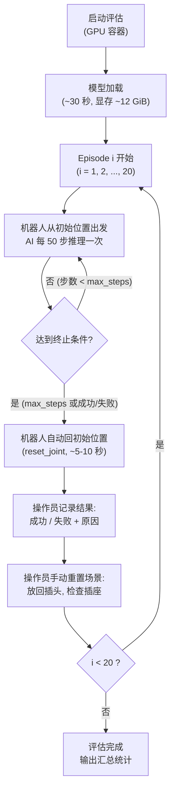

**每个 Episode 的标准流程** (约 2–3 分钟/Episode, 含重置时间):

| 步骤 | 执行位置 | 操作内容 | 预计耗时 |
|:---:|:---:|:---|:---:|
| 1 | 🖥️ GPU 容器 (自动) | 终端显示 "Episode X/20 starting..." | — |
| 2 | 🤖 机器人 (自动) | 机器人执行 AI 生成的动作 (最多 ~20 秒) | ~20 s |
| 3 | 🖐️ 人工目视 (机器人旁) | 观察并判断: 插头是否成功插入插座 | — |
| 4 | 🤖 机器人 (自动) | Episode 结束, 机器人自动回初始位置 | ~5-10 s |
| 5 | 🖐️ 人工 (纸质记录表) | 在记录表中填写结果 (成功/失败/失败代码) | ~10 s |
| 6 | 🖐️ 人工 (机器人旁) | 重置场景: 取出插头, 放回初始位置, 确认插座 | ~30-60 s |
| 7 | 🖥️ GPU 容器终端 | 按提示继续下一个 Episode (如按 Enter) | — |

**预计总耗时**: 20 Episode × 2–3 分钟 ≈ **40–60 分钟**

#### 12.5.12 评估结果记录与成功率计算

**成功/失败判定标准**:

一个 Episode 判定为 **"成功"** 当且仅当**同时**满足:
1. 插头已**完全**插入插座 (插头底部与插座面齐平, 无露出)
2. 插头在插座中保持稳定 (目测不会自行脱落)
3. 过程中**未**触发 E-stop 或 Motion Guard

一个 Episode 判定为 **"失败"**, 需记录失败原因, 常见类别:

| 失败类别代码 | 描述 |
|:---|:---|
| F-MISS | 插头未能对准插座孔位 |
| F-PARTIAL | 插头对准了但未完全插入 (部分插入) |
| F-DROP | 插头在插入过程中脱落 |
| F-TIMEOUT | 在 max\_num\_steps 内未完成插入 (时间耗尽) |
| F-GUARD | 触发了 Motion Guard, 机器人被迫停止 |
| F-ESTOP | 操作员按了 E-stop (因安全原因人工中断) |
| F-ERROR | 软件错误导致 Episode 中断 |
| F-OTHER | 其他原因 (在备注中详细说明) |

**评估记录表** — 🖐️ **人工填写**, 建议提前打印纸质版放在操作台旁, 每个 Episode 一行:

```
═════════════════════════════════════════════════════════════════════
  4DWVLA 插座插拔真机评估记录表
─────────────────────────────────────────────────────────────────────
  日期: ______________    操作员姓名: ______________
  Checkpoint: 4wvlaFrkPlugCkp010420
  velocity_safety_factor: ______    max_num_steps: ______
─────────────────────────────────────────────────────────────────────
 Ep │ 结果     │ 失败代码 │ 备注
────┼──────────┼─────────┼──────────────────────────────────────────
  1 │ 成功/失败 │         │
  2 │ 成功/失败 │         │
  3 │ 成功/失败 │         │
  4 │ 成功/失败 │         │
  5 │ 成功/失败 │         │
  6 │ 成功/失败 │         │
  7 │ 成功/失败 │         │
  8 │ 成功/失败 │         │
  9 │ 成功/失败 │         │
 10 │ 成功/失败 │         │
 11 │ 成功/失败 │         │
 12 │ 成功/失败 │         │
 13 │ 成功/失败 │         │
 14 │ 成功/失败 │         │
 15 │ 成功/失败 │         │
 16 │ 成功/失败 │         │
 17 │ 成功/失败 │         │
 18 │ 成功/失败 │         │
 19 │ 成功/失败 │         │
 20 │ 成功/失败 │         │
────┴──────────┴─────────┴──────────────────────────────────────────
  成功次数: ______ / 20       成功率: ______ %
  
  各类失败次数统计:
  F-MISS: ___  F-PARTIAL: ___  F-DROP: ___  F-TIMEOUT: ___
  F-GUARD: ___ F-ESTOP: ___   F-ERROR: ___ F-OTHER: ___
  
  操作员签名: ______________    日期: ______________
═════════════════════════════════════════════════════════════════════
```

**成功率计算**:

$$\text{成功率} = \frac{\text{成功的 Episode 数}}{\text{有效 Episode 总数}} \times 100\%$$

说明: 有效 Episode 总数通常等于 20. 但如果某个 Episode 因**非模型原因**中断 (如突然断电、网络故障等不可控因素), 该 Episode 可以标记为"无效"并补做, 不计入分母.

**成功率解读参考**:

| 成功率 | 评价 | 建议后续行动 |
|:---|:---|:---|
| ≥ 90% (≥18/20) | 优秀 | 可考虑扩展到更多任务场景 |
| 70%–89% (14–17/20) | 良好 | 分析失败 case 的共性, 考虑增加训练数据覆盖 |
| 50%–69% (10–13/20) | 一般 | 需要分析失败模式: 是精度不足 (F-PARTIAL 多) 还是方向错误 (F-MISS 多) |
| < 50% (<10/20) | 较差 | 全面排查: 训推一致性 (§3), 场景匹配度, 相机标定, checkpoint 质量 |

#### 12.5.13 常见故障排查

| # | 故障现象 | 可能原因 | 排查与解决步骤 (标注执行位置) |
|:---:|:---|:---|:---|
| 1 | 机器人完全不动 | FCI 连接断开 | [Franky 容器] `ping 172.16.0.2`; [人工] 检查网线物理连接; [人工] 重启控制柜电源 |
| 2 | 机器人完全不动 | Ray 集群未连通 | [GPU 容器] `ray status`; [Franky 容器] `ray status`; 确认 port 6379 可达 |
| 3 | 运动方向完全错误 | 相机安装位置/角度与训练不一致 | [宿主机/GPU 容器] 对比 `/home/nvidia/bt/dt/plug_into_socket_lrb_4D_8sml/videos/observation.images.global/` 中的训练视频帧; [人工] 调整相机位置 |
| 4 | 运动方向完全错误 | 插座位置偏离训练数据范围 | [人工] 重新对照 TCP 工作区范围 (X:0.534–0.602, Y:-0.140–0.053, Z:0.178–0.517 m) 调整插座位置 |
| 5 | 持续抖动/震荡 | `velocity_safety_factor` 过高 | [GPU 容器] 在评估命令中将参数降低到 0.3, 从保守测试重新开始 |
| 6 | 持续抖动/震荡 | 控制频率不足 | [GPU 容器] 检查终端日志中 `effective_freq_hz` 是否 ≥ 28 Hz |
| 7 | 每次都超时 (F-TIMEOUT) | `max_num_steps` 过小 | [GPU 容器] 在评估命令中增大 `max_num_steps` 至 600 或 800 |
| 8 | 对准了但插不进去 (F-PARTIAL) | 精度不足 | 正常现象, 取决于模型能力; 如高频出现, 需检查训练数据是否覆盖了精细插入阶段 |
| 9 | 日志 "MOTION GUARD TRIP" | TCP 超出安全围栏 | [人工] 检查插座位置是否迫使 TCP 移出围栏范围; [GPU 容器] 可通过环境变量 `RLINF_CUBE_GUARD_MARGIN=0.2` 放宽 |
| 10 | "CUDA out of memory" | WAN 视频模块被加载 | [GPU 容器] 确认 Hydra 配置文件中 `action_loss_only: true` 和 `inference_backend: optimized` |
| 11 | "Ray connection lost" | 容器间网络中断 | [宿主机] 确认两个容器 `docker run` 时都使用了 `--network host`; [GPU 容器] 检查 port 6379 |
| 12 | 推理极慢 (>1 s/推理) | 未使用优化后端 | [GPU 容器] 确认 `inference_backend: optimized`; [GPU 容器] `nvidia-smi` 检查有无其他 GPU 进程 |
| 13 | 图像全黑 | 相机 USB 松动 | [人工] 重新插拔 USB 线; [宿主机] `lsusb \| grep RealSense` 确认两个相机都被识别 |
| 14 | 夹爪不动作 | 夹爪指令范围映射错误 | [GPU 容器] 检查环境代码中 gripper action 范围映射 (训练数据 action.gripper 范围 [0.007, 1.0]) |
| 15 | Episode 结束后机器人不回位 | `reset_joint()` 调用失败 | [Franky 容器] 手动执行: `python -c "from rlinf.envs.realworld.franka.franky_controller import FrankyController; FrankyController(robot_ip='172.16.0.2').reset_joint([-0.2406,0.1457,0.1872,-2.06,-0.0553,2.2011,0.6998])"` |

#### 12.5.14 评估结束后的收尾

评估完成 (或决定中止) 后, 按以下步骤收尾:

**① 将机器人移到安全初始位置** `[Franky 容器]` — 如果评估脚本已自动完成回位, 此步可跳过:

```bash
# [Franky 容器] 将机器人移回初始位置 — ⚠️ 机器人会运动
python -c "
from rlinf.envs.realworld.franka.franky_controller import FrankyController
ctrl = FrankyController(robot_ip='172.16.0.2')
ctrl.clear_errors()
HOME = [-0.2406, 0.1457, 0.1872, -2.0600, -0.0553, 2.2011, 0.6998]
ctrl.reset_joint(HOME)
print('✓ 机器人已回到初始位置')
"
```

**② 收集评估日志和视频** `[GPU 容器]`:

```bash
# [GPU 容器] 查看评估输出文件
# 评估结果和日志通常保存在 outputs/ 目录下 (路径可能因 Hydra 配置而异)
ls -lt outputs/ | head -10
# 如果录制了视频:
ls -lh outputs/videos/ 2>/dev/null || echo "无视频输出目录"
```

**③ 计算并记录成功率** `[人工]`: 🖐️ 汇总纸质记录表, 按 §12.5.12 的公式计算成功率.

**④ 整理评估报告** `[人工]`: 🖐️ 建议包含以下内容:
- 评估日期、操作员、使用的参数 (velocity\_safety\_factor, max\_num\_steps)
- 成功率和各类失败次数统计
- 评估记录表 (扫描或拍照)
- 评估视频 (如有)
- 异常情况和处理过程记录
- Checkpoint 信息: `4wvlaFrkPlugCkp010420`, 模型类型 `internvla_a1_5`, 训练数据 `plug_into_socket_lrb_4D_8sml` (8 episodes)

**⑤ 停止 Ray 集群** (如无需继续使用):

```bash
# [Franky 容器] 停止 Ray worker
ray stop
```

```bash
# [GPU 容器] 停止 Ray head
ray stop
```

#### 12.5.15 完整评估流程速查卡

> 以下是整个评估过程的快速参考, 供已熟悉完整流程后的操作员快速回忆步骤.

```
┌──────────────────────────────────────────────────────────────────────┐
│          4DWVLA 插座插拔真机评估速查卡 (v2.1.3)                       │
├──────────────────────────────────────────────────────────────────────┤
│                                                                      │
│ 1. [宿主机] 硬件检查                                                 │
│    docker ps | grep rlinf         # 两个容器 Up                      │
│    ping -c1 172.16.0.2            # 机器人网络                       │
│    docker exec rlinf-gpu nvidia-smi  # GPU 可用                     │
│    lsusb | grep RealSense         # 2 个相机                         │
│                                                                      │
│ 2. [宿主机→Franky 容器] 终端窗口 1                                   │
│    docker exec -it rlinf-franky bash                                 │
│    source /opt/venv/franky-0.19.0/bin/activate                       │
│    # 验证机器人连接 + 移到初始位置 + 验证安全系统                       │
│    ray start --address=10.229.18.21:6379                             │
│                                                                      │
│ 3. [宿主机→GPU 容器] 终端窗口 2                                      │
│    docker exec -it rlinf-gpu bash                                    │
│    export PYTHONPATH=/workspace/RLinf/b/x:...:$PYTHONPATH            │
│    export RLINF_EXT_MODULE=four_dwvla_ext.runtime_bootstrap          │
│    # Transformers patch + 验证扩展包                                  │
│    ray start --head --port=6379                                      │
│                                                                      │
│ 4. [GPU 容器] Dummy:  ... is_dummy=true rollout_epoch=2             │
│ 5. [GPU 容器] 保守:   ... rollout_epoch=1 max_num_steps=30 vsf=0.3  │
│ 6. [GPU 容器] 渐进:   30→120→300→600步, 0.3→0.3→0.4→0.5速度        │
│ 7. [GPU 容器] 正式:   ... rollout_epoch=20                          │
│    [自动] 每 Episode 后: 夹紧→提升10cm→关节归位→张开夹爪              │
│    [人工] Franky终端提示后: 放入插头→检查插座→按Enter                  │
│                                                                      │
│ 紧急:  [人工] E-stop / [GPU终端] 键盘q / [GPU终端] Ctrl+C           │
│ 记录:  [人工] 每 Episode 记录 成功/失败 + 失败代码 (纸质表)           │
│ 成功率: 成功数 ÷ 20 × 100%                                          │
│                                                                      │
└──────────────────────────────────────────────────────────────────────┘
```

---

## 13. 测试方案 -- 不需要连真机

> **v2.1 新增分类**: 以下测试全部可在无机器人环境下运行 (开发机、CI 等), 方便快速迭代.

### T1: 关节限位裁剪 (不需要真机, 不需要 GPU)

```python
"""四个测试用例: 范围内/超上限/超下限/q4 特殊范围/q6 FR3v2.1 范围."""

import numpy as np
import pytest

def test_clip_joints_within_limits():
    """训练数据范围内的关节角度不应被裁剪."""
    from four_dwvla_ext.envs.franky_joint_env import (
        FrankyJointEnvMixin, FR3V2_JOINT_LIMITS_LOWER, FR3V2_JOINT_LIMITS_UPPER,
    )
    env = FrankyJointEnvMixin.__new__(FrankyJointEnvMixin)
    env._joint_lower = FR3V2_JOINT_LIMITS_LOWER + 0.05
    env._joint_upper = FR3V2_JOINT_LIMITS_UPPER - 0.05
    # 使用训练数据 mean 值 (来自 abs_stats.json observation.state.arm.mean)
    safe = np.array([-0.2406, 0.1457, 0.1872, -2.0600, -0.0553, 2.2011, 0.6998])
    result = env._clip_joints_to_limits(safe)
    np.testing.assert_array_almost_equal(result, safe)

def test_clip_joints_exceeding_upper():
    """超出 FR3v2.1 上限的关节角度必须被裁剪."""
    from four_dwvla_ext.envs.franky_joint_env import (
        FrankyJointEnvMixin, FR3V2_JOINT_LIMITS_LOWER, FR3V2_JOINT_LIMITS_UPPER,
    )
    env = FrankyJointEnvMixin.__new__(FrankyJointEnvMixin)
    env._joint_lower = FR3V2_JOINT_LIMITS_LOWER + 0.05
    env._joint_upper = FR3V2_JOINT_LIMITS_UPPER - 0.05
    # FR3v2.1: q4 上限=-0.1169, q6 上限=4.6216
    over = np.array([3.0, 2.0, 3.0, 0.0, 3.0, 5.0, 4.0])
    result = env._clip_joints_to_limits(over)
    for i in range(7):
        assert result[i] <= env._joint_upper[i] + 1e-10

def test_clip_q4_positive_rejected():
    """q4 的有效范围全在负区 (FR3v2.1: [-3.077, -0.117]), 正值必须被裁剪."""
    from four_dwvla_ext.envs.franky_joint_env import (
        FrankyJointEnvMixin, FR3V2_JOINT_LIMITS_LOWER, FR3V2_JOINT_LIMITS_UPPER,
    )
    env = FrankyJointEnvMixin.__new__(FrankyJointEnvMixin)
    env._joint_lower = FR3V2_JOINT_LIMITS_LOWER + 0.05
    env._joint_upper = FR3V2_JOINT_LIMITS_UPPER - 0.05
    q4_positive = np.array([0.0, 0.0, 0.0, 0.5, 0.0, 2.0, 0.0])
    result = env._clip_joints_to_limits(q4_positive)
    assert result[3] <= -0.1169 - 0.05 + 1e-10, f"q4={result[3]} should be <= -0.1669"

def test_clip_q6_lower_bound():
    """q6 下限为 0.4398 (FR3v2.1), 低于此值的应被裁剪."""
    from four_dwvla_ext.envs.franky_joint_env import (
        FrankyJointEnvMixin, FR3V2_JOINT_LIMITS_LOWER, FR3V2_JOINT_LIMITS_UPPER,
    )
    env = FrankyJointEnvMixin.__new__(FrankyJointEnvMixin)
    env._joint_lower = FR3V2_JOINT_LIMITS_LOWER + 0.05
    env._joint_upper = FR3V2_JOINT_LIMITS_UPPER - 0.05
    q6_too_low = np.array([0.0, 0.0, 0.0, -2.0, 0.0, 0.1, 0.0])
    result = env._clip_joints_to_limits(q6_too_low)
    assert result[5] >= 0.4398 + 0.05 - 1e-10, f"q6={result[5]} should be >= 0.4898"
```

### T2: 速度限制 (不需要真机, 不需要 GPU)

```python
import numpy as np

def test_velocity_small_change_passes():
    """小变化量 (0.01 rad) 应不被裁剪 (远小于所有关节的 max_delta)."""
    from four_dwvla_ext.envs.franky_joint_env import (
        FrankyJointEnvMixin, FR3V2_MAX_JOINT_VELOCITY,
    )
    env = FrankyJointEnvMixin.__new__(FrankyJointEnvMixin)
    # FR3v2.1: [2.62, 2.62, 2.62, 2.62, 5.26, 4.18, 5.26] rad/s
    env._max_delta_per_step = 0.5 * FR3V2_MAX_JOINT_VELOCITY / 30.0
    # max_delta_per_step = [0.04367, 0.04367, 0.04367, 0.04367, 0.08767, 0.06967, 0.08767]
    current = np.array([-0.2406, 0.1457, 0.1872, -2.0600, -0.0553, 2.2011, 0.6998])
    target = current + 0.01
    result = env._velocity_limit(current, target)
    np.testing.assert_array_almost_equal(result, target)

def test_velocity_large_change_clipped():
    """大变化量 (1.0 rad) 应被裁剪到 max_delta_per_step."""
    from four_dwvla_ext.envs.franky_joint_env import (
        FrankyJointEnvMixin, FR3V2_MAX_JOINT_VELOCITY,
    )
    env = FrankyJointEnvMixin.__new__(FrankyJointEnvMixin)
    env._max_delta_per_step = 0.5 * FR3V2_MAX_JOINT_VELOCITY / 30.0
    current = np.array([-0.2406, 0.1457, 0.1872, -2.0600, -0.0553, 2.2011, 0.6998])
    target = current + 1.0
    result = env._velocity_limit(current, target)
    delta = result - current
    for i in range(7):
        assert abs(delta[i]) <= env._max_delta_per_step[i] + 1e-10
    # q5 允许的步长 (0.08767) 应比 q1 (0.04367) 更大
    assert env._max_delta_per_step[4] > env._max_delta_per_step[0] * 1.5

def test_velocity_preserves_direction():
    """速度裁剪应保持运动方向不变."""
    from four_dwvla_ext.envs.franky_joint_env import (
        FrankyJointEnvMixin, FR3V2_MAX_JOINT_VELOCITY,
    )
    env = FrankyJointEnvMixin.__new__(FrankyJointEnvMixin)
    env._max_delta_per_step = 0.5 * FR3V2_MAX_JOINT_VELOCITY / 30.0
    current = np.array([-0.2406, 0.1457, 0.1872, -2.0600, -0.0553, 2.2011, 0.6998])
    target = current - 0.5
    result = env._velocity_limit(current, target)
    for i in range(7):
        assert (result[i] - current[i]) <= 0
```

### T3: 图像预处理一致性 (不需要真机, 不需要 GPU)

> **v2.1 新增**: 验证推理使用的 `resize_with_pad` 与训练管线一致.

```python
import torch
import numpy as np

def test_resize_with_pad_480x640():
    """Verify resize_with_pad produces expected 224x224 with padding."""
    from four_dwvla_ext.adapters.obs_adapter import _resize_with_pad
    img = torch.rand(3, 480, 640)
    result = _resize_with_pad(img, 224, 224)
    assert result.shape == (3, 224, 224)
    # scale = min(224/480, 224/640) = 0.35
    # new_h = 168, pad_top = pad_bottom = 28
    # Top 28 rows and bottom 28 rows should be zero (padding)
    assert result[:, :28, :].abs().max() < 1e-6, "Top padding should be zero"
    assert result[:, -28:, :].abs().max() < 1e-6, "Bottom padding should be zero"
    assert result[:, 28:-28, :].abs().max() > 0, "Middle should have content"

def test_resize_matches_training_transform():
    """Verify our resize_with_pad matches lerobot's version exactly."""
    from four_dwvla_ext.adapters.obs_adapter import _resize_with_pad
    from lerobot.transforms.utils import resize_with_pad as training_resize
    img = torch.rand(3, 480, 640)
    ours = _resize_with_pad(img, 224, 224)
    theirs = training_resize(img, 224, 224, mode='bilinear')
    torch.testing.assert_close(ours, theirs, atol=1e-5, rtol=1e-5)

def test_naive_resize_differs():
    """Confirm that naive PIL resize produces DIFFERENT results."""
    from PIL import Image
    from four_dwvla_ext.adapters.obs_adapter import _resize_with_pad
    img_np = np.random.randint(0, 255, (480, 640, 3), dtype=np.uint8)
    # Naive resize (v2.0 方式):
    pil_naive = Image.fromarray(img_np).resize((224, 224), Image.BILINEAR)
    naive_tensor = torch.from_numpy(np.array(pil_naive)).permute(2, 0, 1).float() / 255.0
    # Correct resize (v2.1 方式):
    img_tensor = torch.from_numpy(img_np).permute(2, 0, 1).float() / 255.0
    correct_tensor = _resize_with_pad(img_tensor, 224, 224)
    # They should NOT match (different aspect ratio handling)
    assert not torch.allclose(naive_tensor, correct_tensor, atol=0.01)
```

### T4: 状态处理一致性 (不需要真机, 不需要 GPU)

> **v2.1 新增**: 验证状态 padding 和 tokenization.

```python
import torch

def test_state_padding_8d_to_32d():
    from four_dwvla_ext.adapters.obs_adapter import FourDWVLAObsAdapter
    state = torch.tensor([0.1, -0.5, 0.3, -1.5, 0.0, 1.5, 0.7, 0.04])
    actual_dim = state.shape[-1]
    max_dim = 32
    pad = torch.zeros(max_dim - actual_dim)
    padded = torch.cat([state, pad])
    assert padded.shape == (32,)
    assert padded[8:].abs().max() == 0.0
    assert torch.allclose(padded[:8], state)

def test_state_division_by_3():
    """Verify the /3 discretization matches training."""
    import numpy as np
    state = torch.tensor([0.1, -0.5, 0.3, -1.5, 0.0, 1.5, 0.7, 0.04] + [0.0] * 24)
    state_np = state.numpy() / 3.0
    discretized = np.digitize(state_np, bins=np.linspace(-1, 1, 257)[:-1]) - 1
    for d in discretized:
        assert 0 <= d <= 255, f"Discretized value {d} out of [0, 255] range"
```

### T5: Gym 注册 (不需要真机, 不需要 GPU)

```python
import sys

def test_franky_joint_env_registered():
    sys.path.insert(0, "/home/nvidia/bt/s/RLinf/b/x")
    import four_dwvla_ext.tasks.register  # noqa: F401
    import gymnasium as gym
    spec = gym.spec("FrankyJointEnv-v1")
    assert spec.id == "FrankyJointEnv-v1"
    assert "four_dwvla_ext" in str(spec.entry_point)

def test_existing_envs_not_broken():
    import franky_ext.tasks.register  # noqa: F401
    import gymnasium as gym
    for env_id in ["FrankyFrankaEnv-v1", "FrankyCubePlaceEnv-v1"]:
        spec = gym.spec(env_id)
        assert spec.id == env_id

def test_register_idempotent():
    sys.path.insert(0, "/home/nvidia/bt/s/RLinf/b/x")
    from four_dwvla_ext.runtime_bootstrap import register
    register()
    register()  # should not raise
```

### T6: 观测适配器 (不需要真机, 需要 GPU)

```python
import pytest, torch

@pytest.mark.skipif(not torch.cuda.is_available(), reason="Requires GPU")
def test_obs_adapter_shapes():
    from four_dwvla_ext.adapters.obs_adapter import FourDWVLAObsAdapter
    adapter = FourDWVLAObsAdapter(
        vlm_model_name_or_path="/home/nvidia/bt/ckp/4wvlaFrk/plug/4wvlaFrkPlugCkp010420/",
        image_resolution=(224, 224), max_state_dim=32,
        device=torch.device("cuda"),
    )
    env_obs = {
        "states": torch.randn(1, 8),
        "main_images": torch.randint(0, 255, (1, 480, 640, 3), dtype=torch.uint8),
        "extra_view_images": torch.randint(0, 255, (1, 1, 480, 640, 3), dtype=torch.uint8),
        "task_descriptions": ["plug into socket"],
    }
    model_input = adapter.adapt(env_obs)
    for key in ["observation.pixel_values", "observation.input_ids",
                "observation.attention_mask", "observation.state"]:
        assert key in model_input, f"Missing key: {key}"
    assert model_input["observation.state"].shape == (1, 32)
    assert model_input["observation.state"][0, 8:].abs().max() < 1e-6
```

### T7: 推理管线端到端 (不需要真机, 需要 GPU)

```python
import pytest, torch

@pytest.mark.skipif(not torch.cuda.is_available(), reason="Requires GPU")
def test_inference_pipeline_dummy():
    """End-to-end: dummy obs -> adapter -> model -> action."""
    from four_dwvla_ext.adapters.obs_adapter import FourDWVLAObsAdapter
    ckpt = "/home/nvidia/bt/ckp/4wvlaFrk/plug/4wvlaFrkPlugCkp010420/"
    adapter = FourDWVLAObsAdapter(
        vlm_model_name_or_path=ckpt,
        image_resolution=(224, 224), max_state_dim=32,
    )
    env_obs = {
        "states": torch.randn(1, 8),
        "main_images": torch.randint(0, 255, (1, 480, 640, 3), dtype=torch.uint8),
        "extra_view_images": torch.randint(0, 255, (1, 1, 480, 640, 3), dtype=torch.uint8),
        "task_descriptions": ["plug into socket"],
    }
    model_input = adapter.adapt(env_obs)

    from lerobot.policies.internvla_a1_5.modeling_internvla_a1_5 import InternVLAA15Policy
    policy = InternVLAA15Policy(ckpt)
    policy.config.inference_backend = "optimized"
    policy.config.action_loss_only = True
    action = policy.select_action(model_input)
    assert action.shape[-1] == 8, f"Action dim should be 8, got {action.shape}"
    print(f"Action: {action[:7].tolist()} (joints), {action[7].item():.3f} (gripper)")
```

### T8: Config 与 Stats 一致性检查 (不需要真机, 不需要 GPU)

> **v2.1 新增**: 验证 checkpoint config 与部署参数一致, 以及 stats/keypoints 文件的完整性.

```python
import json
import os
import numpy as np

def test_checkpoint_config_consistency():
    """验证 checkpoint 配置与部署 YAML 一致."""
    ckpt = "/home/nvidia/bt/ckp/4wvlaFrk/plug/4wvlaFrkPlugCkp010420/"
    with open(f"{ckpt}/config.json") as f:
        cfg = json.load(f)

    assert cfg["normalization_mapping"]["ACTION"] == "IDENTITY"
    assert cfg["normalization_mapping"]["STATE"] == "IDENTITY"
    assert cfg["normalization_mapping"]["VISUAL"] == "IDENTITY"
    assert cfg["chunk_size"] == 50
    assert cfg["n_action_steps"] == 50
    assert cfg["image_resolution"] == [224, 224]
    assert cfg["tokenize_state"] == True
    assert cfg["max_state_dim"] == 32

def test_keypoints_meta_integrity():
    """验证 keypoints_meta.json 内容完整且与训练方案一致."""
    meta_path = "/home/nvidia/bt/s/RLinf/b/d/frk1/plug/keypoints_meta.json"
    with open(meta_path) as f:
        meta = json.load(f)

    assert abs(meta["bbox_radius"] - 0.8361004471778869) < 1e-10
    assert meta["bbox_margin"] == 0.15
    assert meta["num_keypoints"] == 8
    assert meta["keypoint_dim"] == 7
    assert meta["keypoint_dim_layout"] == "px,py,pz,qx,qy,qz,qw"
    assert meta["rotation_representation"] == "quaternion_xyzw_hemisphere"
    expected_links = [
        "fr3v2_1_link1", "fr3v2_1_link2", "fr3v2_1_link3", "fr3v2_1_link4",
        "fr3v2_1_link5", "fr3v2_1_link6", "fr3v2_1_link7", "fr3v2_1_hand_tcp",
    ]
    assert meta["keypoint_links"] == expected_links
    assert meta["total_frames"] == 66577

def test_abs_stats_integrity():
    """验证 abs_stats.json 中关节角度统计与 FR3v2.1 URDF 限位一致."""
    stats_path = "/home/nvidia/bt/s/RLinf/b/d/frk1/plug/abs_stats.json"
    with open(stats_path) as f:
        stats = json.load(f)

    # 检查所有关键字段存在
    for key in ["observation.state.arm", "observation.state.gripper",
                "action.arm", "action.gripper"]:
        assert key in stats, f"Missing key: {key}"
        assert "min" in stats[key] and "max" in stats[key]

    # 验证 arm 状态维度
    assert len(stats["observation.state.arm"]["min"]) == 7
    assert len(stats["action.arm"]["min"]) == 7

    # 验证总帧数一致
    assert stats["observation.state.arm"]["count"] == [66577]
    assert stats["action.arm"]["count"] == [66577]

    # 验证动作范围在 FR3v2.1 URDF 限位内
    FR3V2_LOWER = [-2.9007, -1.8361, -2.9007, -3.0770, -2.8763, 0.4398, -3.0508]
    FR3V2_UPPER = [2.9007, 1.8361, 2.9007, -0.1169, 2.8763, 4.6216, 3.0508]
    action_min = stats["action.arm"]["min"]
    action_max = stats["action.arm"]["max"]
    for i in range(7):
        assert action_min[i] >= FR3V2_LOWER[i] - 0.01, (
            f"action.arm min[{i}]={action_min[i]} < URDF lower={FR3V2_LOWER[i]}"
        )
        assert action_max[i] <= FR3V2_UPPER[i] + 0.01, (
            f"action.arm max[{i}]={action_max[i]} > URDF upper={FR3V2_UPPER[i]}"
        )

def test_urdf_exists():
    """验证 FK 所需的 URDF 文件存在."""
    urdf_path = "/home/nvidia/bt/s/RLinf/b/d/frk1/fr3v2_1_franka_hand.urdf"
    assert os.path.isfile(urdf_path), f"URDF not found: {urdf_path}"
```

### T8b: 键盘中断复位 Wrapper 单元测试 (不需要真机)

```python
"""Unit test for KeyboardAbortResetWrapper (no real robot needed)."""

import gymnasium as gym
import numpy as np
from unittest.mock import MagicMock, patch


def test_abort_reset_wrapper_r_key_triggers_truncation():
    """按 'r' 键应使 step() 返回 truncated=True 和 abort_reset info."""
    from four_dwvla_ext.wrappers.keyboard_abort_reset_wrapper import (
        KeyboardAbortResetWrapper,
    )

    inner_env = MagicMock(spec=gym.Env)
    inner_obs = {"state": {"joint_positions": np.zeros(7, dtype=np.float32)}}
    inner_env.step.return_value = (inner_obs, 0.0, False, False, {})
    inner_env.unwrapped = inner_env

    wrapper = KeyboardAbortResetWrapper.__new__(KeyboardAbortResetWrapper)
    wrapper.env = inner_env
    wrapper._abort_requested = False
    wrapper.PEDAL_DEBOUNCE_S = 0.2
    wrapper._last_press_ts = {}

    mock_listener = MagicMock()
    wrapper.listener = mock_listener

    # 模拟按下 'r'
    mock_listener.pop_pressed_keys.return_value = ["r"]

    obs, reward, terminated, truncated, info = wrapper.step(np.zeros(8))
    assert truncated is True, "Pressing 'r' should set truncated=True"
    assert info.get("abort_reset") is True
    assert info.get("abort_reset_event") == "abort_triggered"


def test_abort_reset_wrapper_no_key_normal_flow():
    """无按键时 step() 应正常透传."""
    from four_dwvla_ext.wrappers.keyboard_abort_reset_wrapper import (
        KeyboardAbortResetWrapper,
    )

    inner_env = MagicMock(spec=gym.Env)
    inner_obs = {"state": {"joint_positions": np.zeros(7, dtype=np.float32)}}
    inner_env.step.return_value = (inner_obs, 0.0, False, False, {})
    inner_env.unwrapped = inner_env

    wrapper = KeyboardAbortResetWrapper.__new__(KeyboardAbortResetWrapper)
    wrapper.env = inner_env
    wrapper._abort_requested = False
    wrapper.PEDAL_DEBOUNCE_S = 0.2
    wrapper._last_press_ts = {}

    mock_listener = MagicMock()
    wrapper.listener = mock_listener
    mock_listener.pop_pressed_keys.return_value = []

    obs, reward, terminated, truncated, info = wrapper.step(np.zeros(8))
    assert truncated is False
    assert info.get("abort_reset", False) is False


def test_abort_reset_wrapper_reset_clears_flag():
    """reset() 应清除 abort 状态."""
    from four_dwvla_ext.wrappers.keyboard_abort_reset_wrapper import (
        KeyboardAbortResetWrapper,
    )

    inner_env = MagicMock(spec=gym.Env)
    inner_env.reset.return_value = ({}, {})
    inner_env.unwrapped = inner_env

    wrapper = KeyboardAbortResetWrapper.__new__(KeyboardAbortResetWrapper)
    wrapper.env = inner_env
    wrapper._abort_requested = True
    wrapper._last_press_ts = {"r": 0.0}
    mock_listener = MagicMock()
    wrapper.listener = mock_listener
    mock_listener.pop_pressed_keys.return_value = []

    wrapper.reset()
    assert wrapper._abort_requested is False
```

### 不需要连真机的测试汇总

| ID | 名称 | 需要 GPU | 关键验证点 |
|:---:|:---|:---:|:---|
| T1 | 关节限位裁剪 | 否 | 输出在有效范围内, q4 正值被拒 |
| T2 | 速度限制 | 否 | 大变化被裁剪, 方向保持 |
| T3 | 图像预处理一致性 | 否 | `resize_with_pad` 与训练一致, naive resize 不同 |
| T4 | 状态处理一致性 | 否 | 8D→32D padding, /3 量化在 [0,255] 范围 |
| T5 | Gym 注册 | 否 | `FrankyJointEnv-v1` 注册, 现有 env 不受影响 |
| T6 | 观测适配器 | 是 | 输出 shape 正确, state padded |
| T7 | 推理管线端到端 | 是 | obs → adapter → model → 8D action |
| T8 | Config/Stats/URDF 一致性 | 否 | checkpoint config, keypoints\_meta, abs\_stats, URDF 参数完整且一致 |
| T8b | 键盘中断复位 Wrapper | 否 | 按 `r` → truncated, 无按键 → 正常, reset 清除状态 |

---

## 14. 测试方案 -- 需要连真机

> **v2.1 新增分类**: 以下测试必须连接真实 Franka 机器人, E-stop 必须在手边.

### T9: FrankyController move\_joints 流式控制 (需要真机)

```python
"""Streaming joint position control at 30Hz via native move_joints().
WARNING: This test moves the real robot!
"""

import time
import numpy as np
import pytest

@pytest.mark.skipif(True, reason="Requires real robot -- run manually")
def test_native_move_joints_streaming():
    from rlinf.envs.realworld.franka.franky_controller import FrankyController

    ctrl = FrankyController(robot_ip="172.16.0.2")
    ctrl.clear_errors()

    state = ctrl.get_state()
    q_current = np.array(state.arm_joint_position[:7])
    print(f"Current joints: {q_current}")

    # Small sinusoidal motion on q1 only (+/- 0.05 rad = 2.86 deg)
    n_steps = 90  # 3 seconds at 30Hz
    amplitude = 0.05

    step_times = []
    for i in range(n_steps):
        step_start = time.time()
        t = i / 30.0
        q_target = q_current.copy()
        q_target[0] += amplitude * np.sin(2 * np.pi * 0.5 * t)
        ctrl.move_joints(q_target)
        elapsed = time.time() - step_start
        time.sleep(max(0, 1.0 / 30.0 - elapsed))
        step_times.append(time.time() - step_start)

    ctrl.reset_joint(q_current.tolist())

    avg_step = np.mean(step_times) * 1000
    print(f"Step times: avg={avg_step:.1f}ms, effective freq={1000/avg_step:.1f}Hz")
    assert avg_step < 40, f"Step time too long: {avg_step:.1f}ms"
```

### T10: Motion Guard 集成 (需要真机)

> **v2.1 新增**: 验证 `FrankyControllerExtended` 的 motion guard 在关节控制模式下正常工作.

```python
@pytest.mark.skipif(True, reason="Requires real robot -- run manually")
def test_motion_guard_with_joint_control():
    from franky_ext.controller_extended import FrankyControllerExtended

    ctrl = FrankyControllerExtended(robot_ip="172.16.0.2")
    ctrl.clear_errors()

    # Verify motion guard can be armed
    health = ctrl.motion_health()
    print(f"Motion health: {health}")

    # Verify move_joints works through extended controller
    state = ctrl.get_state()
    q = state.arm_joint_position[:7]
    ctrl.move_joints(q)  # no-op move to current position
    assert ctrl.guard_tripped() is None, "Guard should not trip on no-op move"
```

### T11: 真机单 Episode (需要真机, 需要 GPU)

```bash
# [GPU 容器] ⚠️ 机器人会运动! E-stop 必须在手边
RLINF_EXT_MODULE=four_dwvla_ext.runtime_bootstrap \
python evaluations/eval_embodied_agent.py \
    --config-name realworld_plug_eval_4wvla \
    --config-path /workspace/RLinf/b/x/four_dwvla_ext/configs \
    env.eval.rollout_epoch=1 \
    env.eval.override_cfg.max_num_steps=30 \
    env.eval.override_cfg.velocity_safety_factor=0.3
```

### T12: 真机 20 Episodes (需要真机, 需要 GPU)

```bash
# [GPU 容器] ⚠️ 机器人会运动约 40-60 分钟! [人工] 每 Episode 间需手动重置场景
RLINF_EXT_MODULE=four_dwvla_ext.runtime_bootstrap \
python evaluations/eval_embodied_agent.py \
    --config-name realworld_plug_eval_4wvla \
    --config-path /workspace/RLinf/b/x/four_dwvla_ext/configs \
    env.eval.rollout_epoch=20
```

### T13: reset() / go\_to\_rest() 完整复位流程 (需要真机)

> **v2.1.3 新增**: 验证 Episode 间复位的完整流程 — 夹紧→提升→关节归位→张开→人工介入→夹紧.

```python
"""Test go_to_rest() reset flow: close → lift → home joints → open → (skip human) → close.
WARNING: This test moves the real robot!
"""

import time
import numpy as np
import pytest

HOME_JOINTS = np.array([-0.2406, 0.1457, 0.1872, -2.0600, -0.0553, 2.2011, 0.6998])

@pytest.mark.skipif(True, reason="Requires real robot -- run manually")
def test_go_to_rest_flow():
    from rlinf.envs.realworld.franka.franky_controller import FrankyController

    ctrl = FrankyController(robot_ip="172.16.0.2")
    ctrl.clear_errors()

    # Move to a slightly offset position (simulating end-of-episode)
    offset_joints = HOME_JOINTS.copy()
    offset_joints[0] += 0.1  # q1 +5.7° 偏移
    offset_joints[3] -= 0.1  # q4 -5.7° 偏移
    ctrl.reset_joint(offset_joints.tolist())
    time.sleep(1.0)

    # Verify we're at the offset position
    q_before = np.array(ctrl.get_state().arm_joint_position[:7])
    assert np.allclose(q_before, offset_joints, atol=0.02), (
        f"Failed to reach offset position: {q_before} vs {offset_joints}"
    )

    # ① Close gripper
    ctrl.close_gripper()
    time.sleep(0.5)

    # ② Lift would use Cartesian; skip in unit test (tested via T11/T12 integration)

    # ③ Reset to HOME
    ctrl.reset_joint(HOME_JOINTS.tolist())
    time.sleep(1.0)

    # Verify HOME reached
    q_after = np.array(ctrl.get_state().arm_joint_position[:7])
    diff_deg = np.degrees(np.abs(q_after - HOME_JOINTS))
    print(f"Post-reset joint diff (deg): {np.round(diff_deg, 2)}")
    assert diff_deg.max() < 2.0, (
        f"Failed to reach HOME: max diff = {diff_deg.max():.1f}°"
    )

    # ④ Open gripper
    ctrl.open_gripper()
    time.sleep(0.5)

    # ⑤ Skip human pause in test

    # ⑥ Close gripper (simulate grasping operator-placed plug)
    ctrl.close_gripper()
    time.sleep(0.5)

    print("✓ go_to_rest flow completed successfully")

@pytest.mark.skipif(True, reason="Requires real robot -- run manually")
def test_reset_joint_pos_matches_training_data():
    """Verify that HOME joints produce a TCP position within training data range."""
    from rlinf.envs.realworld.franka.franky_controller import FrankyController

    ctrl = FrankyController(robot_ip="172.16.0.2")
    ctrl.clear_errors()
    ctrl.reset_joint(HOME_JOINTS.tolist())
    time.sleep(1.0)

    state = ctrl.get_state()
    tcp_z = state.tcp_pose[2]
    print(f"HOME TCP position: xyz = [{state.tcp_pose[0]:.4f}, "
          f"{state.tcp_pose[1]:.4f}, {state.tcp_pose[2]:.4f}]")

    # Training data ee_pos.z range: [0.178, 0.517] from abs_stats.json
    assert 0.15 < tcp_z < 0.55, (
        f"HOME TCP z={tcp_z:.3f} outside training range [0.178, 0.517] ± margin"
    )
    print("✓ HOME TCP position within training data distribution")
```

### T14: 键盘中断复位真机测试 (需要真机)

```python
"""Real-robot test: press 'r' during a running episode, verify the arm
stops, returns to HOME, and opens gripper.
WARNING: This test moves the real robot!
"""

import time
import numpy as np
import pytest

HOME_JOINTS = np.array(
    [-0.2406, 0.1457, 0.1872, -2.0600, -0.0553, 2.2011, 0.6998],
    dtype=np.float64,
)

@pytest.mark.skipif(True, reason="Requires real robot -- run manually")
def test_abort_reset_real_robot():
    """Operator presses 'r' during step() → arm stops, goes HOME, opens gripper."""
    import sys
    sys.path.insert(0, "/workspace/RLinf/b/x")
    import four_dwvla_ext.tasks.register  # noqa: F401
    import gymnasium as gym

    env = gym.make("FrankyJointEnv-v1", override_cfg={
        "robot_ip": "172.16.0.2",
        "step_frequency": 30.0,
        "max_num_steps": 600,
        "reset_joint_pos": HOME_JOINTS.tolist(),
        "reset_pause_for_human": False,  # 自动化测试: 不等待人工
        "binary_gripper_threshold": 0.5,
        "is_dummy": False,
    })

    obs, info = env.reset()
    print("Reset OK. Starting steps. Press 'r' within 5 seconds to test abort...")

    abort_triggered = False
    for i in range(150):  # 5 seconds at 30Hz
        action = np.zeros(8, dtype=np.float32)
        # 保持当前位置 (零位移的安全动作)
        state = obs.get("state", {})
        if "joint_positions" in state:
            action[:7] = state["joint_positions"]
        action[7] = 1.0  # keep gripper closed

        obs, reward, terminated, truncated, info = env.step(action)
        if truncated and info.get("abort_reset"):
            abort_triggered = True
            print(f"✓ Abort triggered at step {i}, event={info.get('abort_reset_event')}")
            break

    if not abort_triggered:
        print("⚠ No 'r' key pressed within 5s. Resetting manually for verification.")

    # reset() 应调用 go_to_rest()
    obs, info = env.reset()

    # 验证归位后关节接近 HOME
    if "joint_positions" in obs.get("state", {}):
        q = np.array(obs["state"]["joint_positions"][:7])
        err = np.abs(q - HOME_JOINTS)
        print(f"Post-reset joint error (rad): {np.round(err, 4)}")
        assert np.all(err < 0.1), f"Joints not close to HOME: err={err}"
        print("✓ Arm at HOME position after abort-reset")

    env.close()
    print("✓ test_abort_reset_real_robot PASSED")
```

### 需要连真机的测试汇总

| ID | 名称 | 需要 GPU | 关键验证点 |
|:---:|:---|:---:|:---|
| T9 | move\_joints 流式控制 | 否 | 30Hz 流式关节控制, 平滑运动 |
| T10 | Motion guard 集成 | 否 | 关节控制模式下 guard 不误触发 |
| T11 | 真机单 Episode | 是 | 保守参数下安全运行 |
| T12 | 真机 20 Episodes | 是 | 完整评估, metrics 记录正确 |
| T13 | reset/go\_to\_rest 复位流程 | 否 | 夹紧→归位→张开→夹紧 全流程, HOME 在训练数据范围内 |
| T14 | 键盘中断复位 (真机) | 否 | 按 `r` → 停止 → 归位 → 开夹爪, 归位后关节接近 HOME |

---

## 15. 验收方案

### 15.1 验收矩阵

| # | 验收项 | 通过条件 | 需要真机 | 对应测试 |
|:---:|:---|:---|:---:|:---:|
| V1 | 扩展包可导入 | `import four_dwvla_ext.runtime_bootstrap` 无报错 | 否 | T5 |
| V2 | Gym 注册 | `FrankyJointEnv-v1` 可通过 `gym.spec()` 查询 | 否 | T5 |
| V3 | 关节限位 | 所有输出关节角在有效范围内 | 否 | T1 |
| V4 | 速度限制 | 每步关节角变化不超过 max\_delta\_per\_step | 否 | T2 |
| V5 | 图像预处理一致性 | `resize_with_pad` 输出与训练管线一致 | 否 | T3 |
| V6 | 状态处理一致性 | 8D→32D padding 正确, /3 量化范围正确 | 否 | T4 |
| V7 | 观测适配 | env obs → model input 格式转换正确 | GPU | T6 |
| V8 | 推理管线 | dummy obs → 8D action 输出正确 | GPU | T7 |
| V9 | Config/Stats 一致性 | checkpoint, keypoints\_meta, abs\_stats, URDF 一致 | 否 | T8 |
| V10 | 向后兼容 | 原有 FrankyFrankaEnv-v1 等仍正常 | 否 | T5 |
| V11 | move\_joints 30Hz | 原生关节控制在 30Hz 工作 | **是** | T9 |
| V12 | Motion guard | 关节控制模式下 guard 正常 | **是** | T10 |
| V13 | 真机单 Episode | 安全运行, 平滑运动 | **是** | T11 |
| V14 | 真机 20 Episodes | 完整评估, metrics 正确 | **是** | T12 |
| V15 | 视频录制 | 评估视频正确保存 | **是** | T12 |
| V16 | 无 RLinf 源码修改 | `git diff` 确认 RLinf 源码无修改 | 否 | 手动 |
| V17 | 复位流程 | go\_to\_rest 完成夹紧→归位→张开→夹紧, HOME 在训练数据范围内 | **是** | T13 |
| V18 | 键盘中断复位 (单元) | 按 `r` → truncated, 无按键 → 正常, reset 清除 abort 标志 | 否 | T8b |
| V19 | 键盘中断复位 (真机) | 按 `r` → 机器人停止 → 归位 → 开夹爪, 归位后关节接近 HOME | **是** | T14 |

### 15.2 性能指标

| 指标 | 目标值 | 测量方式 |
|:---|:---|:---|
| 控制频率 | 30 ± 2 Hz | `info["effective_freq_hz"]` |
| 推理延迟 (首次) | < 300 ms | `time.perf_counter()` |
| 推理延迟 (均摊) | < 10 ms | 50 次调用平均 |
| 单 Episode 时间 | ~20 s | 600 steps / 30 Hz |
| Reset 时间 | ~5-10 s | `reset_joint()` 阻塞 |
| GPU 显存 | ~12 GiB | `torch.cuda.memory_allocated()` |
| Watchdog 频率 | 50 Hz | 独立线程, 不阻塞控制 |

---

## 16. 与 v2.0 (ROS 版) 差异对照

### 16.1 组件级对比

| 组件 | v2.0 (ROS 版) | v2.1 (franky\_ext 版) |
|:---|:---|:---|
| 控制方式 | `rospy.Publisher` → ROS topic | `JointImpedanceTracker.set_target()` 原生调用 |
| Monkey-patch | `franka_controller_patch.py` 添加 `move_joints()` | **不需要** (已有原生方法) |
| 环境类 | `FrankaJointEnv(FrankaEnv)` 直接继承 | `FrankyJointEnv(FrankyJointEnvMixin, FrankySingleFrankaEnvMixin, FrankaEnv)` |
| 安全层 | 2 层 (clip + velocity) | 5 层 (clip + velocity + guard + watchdog + hw) |
| Franka 容器 | Python 3.8 + ROS Noetic | Python 3.10+ + franky/libfranka |
| 图像处理 | `PIL.Image.resize()` (拉伸) | `resize_with_pad` (保持纵横比) |
| 训推一致性 | 未分析 | §3 完整分析 |
| 测试分类 | 混合 | 明确分为"需要真机"和"不需要真机" |
| Docker | docker-compose.override.yml | `docker_run_*.sh` (与生产一致) |
| 网络 | docker bridge | `--network host` |
| Gym ID | `FrankaJointEnv-v1` | `FrankyJointEnv-v1` |

### 16.2 代码逻辑对比

核心控制逻辑 (关节裁剪, 速度限制, 观测格式) 保持一致, 区别在于:
1. **控制通道**: ROS topic → franky native
2. **安全层**: 新增 motion guard / watchdog / trip recovery
3. **类层次**: 直接继承 → Mixin 组合
4. **图像预处理**: naive resize → resize\_with\_pad

---

## 17. 风险与缓解

### 17.1 MRO 复杂性

**风险**: 三层 Mixin 继承链的 MRO 可能导致方法解析歧义.

**缓解**:
1. `FrankyJointEnvMixin.step()` 和 `FrankySingleFrankaEnvMixin.step()` 不冲突 — 前者完全重写, 不调用 `super().step()`
2. `FrankySingleFrankaEnvMixin._setup_hardware()` 完全覆盖 `FrankaEnv._setup_hardware()`, 这是 Mixin 的核心设计
3. 单元测试 T5 验证 MRO 正确性

### 17.2 FrankyControllerExtended 兼容性

**风险**: `FrankyControllerExtended` 设计用于 Cartesian 控制, 其 motion guard 检查 TCP 位置, 但我们使用关节控制.

**缓解**:
1. `move_joints()` 定义在基类 `FrankyController`, `FrankyControllerExtended` 完全继承
2. Motion guard 检查 measured TCP, 不管控制模式 — 关节控制下 TCP 仍然在合理范围内
3. 如果 motion guard 过于敏感, 可通过配置放宽 `ee_pose_limit` 或禁用: `RLINF_CUBE_GUARD_MARGIN=0.2`
4. T10 测试专门验证此兼容性

### 17.3 安全边界情况

**风险**: 模型推理输出异常值.

**缓解**: 五层安全架构逐级保护 (§9):
1. Layer 2: `_clip_joints_to_limits()` + `_velocity_limit()`
2. Layer 3: Motion guard + watchdog (50Hz 连续监控)
3. Layer 4: libfranka 硬件反射 (碰撞阈值收紧至 40N / 12Nm)
4. Layer 5: E-stop
5. 首次运行使用 `velocity_safety_factor=0.3` 和 `max_num_steps=30`

### 17.4 FCI 排他性

**风险**: 另一个 libfranka 客户端 (标定 REPL, 另一个测试) 占用 FCI.

**缓解**:
1. Pre-flight 检查 (`preflight_4wvla_franka.sh`) 验证 FCI 可用
2. 操作手册明确说明 FCI 排他性
3. 启动失败时的错误信息指向 FCI 冲突

### 17.5 Hydra Searchpath

**风险**: 扩展包的 YAML 配置不在 Hydra 默认搜索路径.

**缓解**:
1. YAML 中显式 searchpath: `file:///path/to/four_dwvla_ext/configs`
2. 或 `--config-path` 命令行参数
3. 评估启动命令中始终指定 `--config-path`

---

## 18. 键盘中断复位功能 (Keyboard Abort-Reset)

> **v2.1.4 新增**. 参考 RLinf 中 RLT 算法的 `KeyboardRLTPolicySwitchWrapper` 设计模式, 实现评估过程中的手动中断与安全复位功能.

### 18.1 需求分析

在真机评估过程中, 操作员可能遇到以下情况需要中断当前 Episode:

| 场景 | 说明 | 紧急程度 |
|:---|:---|:---|
| 插头滑落 | 插头从夹爪中滑出, 继续执行无意义 | 低 (不危险, 但浪费时间) |
| 轨迹偏离 | 模型输出明显偏离预期 (如远离插座方向), 想提前终止 | 中 |
| 轻微碰撞 | 机器人轻碰到工作台或插座边缘, 未触发 motion guard, 但操作员想停 | 中 |
| 场景扰动 | 外部因素 (如有人经过碰到了相机) 导致当前 Episode 无效 | 低 |
| 调试需要 | 操作员想检查当前状态, 暂停后重新开始 | 低 |

**与 E-stop 的区别**:

| 机制 | 键盘中断 (按 `r`) | E-stop (急停按钮) |
|:---|:---|:---|
| 触发方式 | ⌨️ 键盘按键 (软件层) | 🖐️ 物理按钮 (硬件层) |
| 响应时间 | ~33ms (一个 step 周期内) | <1ms (固件级) |
| 制动方式 | `controller.stop()` → 弹簧回拉 | 硬件断电制动 |
| 恢复能力 | 自动: 归位 → 打开夹爪 → 等待操作员 → 继续 | 手动: 需解锁急停 → 重启 FCI → 重新运行 |
| 适用场景 | "这个 Episode 不想要了, 重来" | "机器人即将伤人/坏物" |
| 对后续 Episode 的影响 | 无 — 自动 reset 后继续下一 Episode | 大 — 需要完全重启进程 |

**结论**: 键盘中断是 E-stop 和正常结束之间的一个**中间层安全机制**, 提供了 "软停止 + 安全归位 + 自动恢复" 的能力, 避免操作员在非紧急情况下不得不使用 E-stop 或 Ctrl+C.

### 18.2 参考分析: RLT 的 KeyboardRLTPolicySwitchWrapper

RLinf 中 RLT 算法的 `KeyboardRLTPolicySwitchWrapper` (`rlinf/envs/realworld/common/wrappers/keyboard_rlt_policy_switch_wrapper.py`) 提供了一个简洁的键盘事件驱动 wrapper 范例:

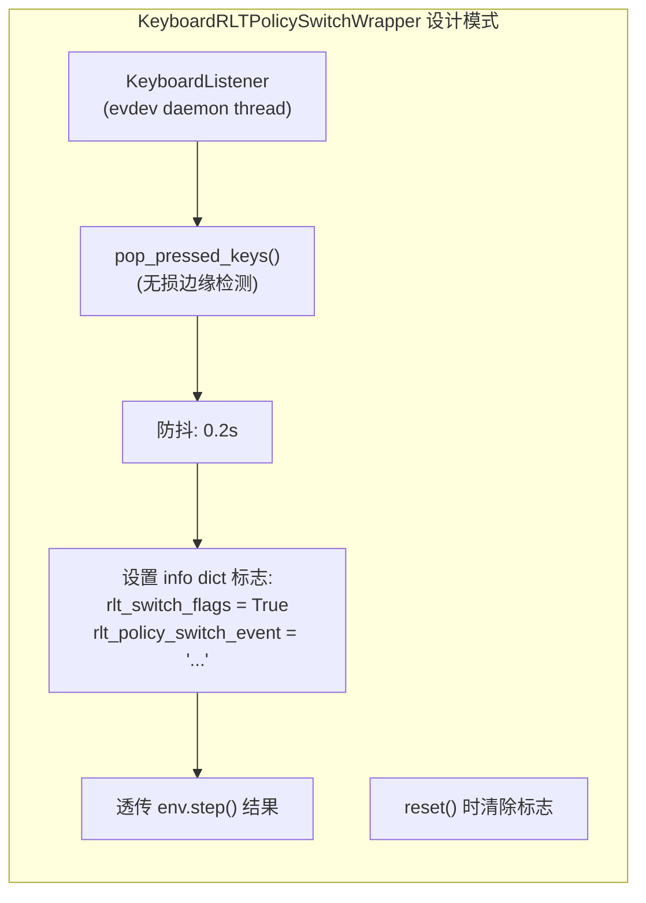

**该模式的关键设计点** (来自 `keyboard_rlt_policy_switch_wrapper.py:25-79`):

1. **`KeyboardListener`** 基于 Linux evdev, 在 daemon 线程中运行, 通过 `pop_pressed_keys()` 提供无损的按键边缘检测 (每次物理按键只报告一次)
2. **防抖** (`PEDAL_DEBOUNCE_S = 0.2`): 避免单次按键被多次处理 (脚踏板和机械键盘容易产生抖动)
3. **单向 latch**: 按 `b` 只能从 False → True (进入 actor 模式), 不能切换回来; `reset()` 清除
4. **通过 info dict 传播**: 将事件标志放入 `info` 字典, 由 env worker → rollout worker → learner 透传, 不修改 obs/reward/done

**本方案的差异**: 键盘中断复位 wrapper 不只设置 flag, 还主动修改 `truncated` 返回值 (触发 episode 终止) 并调用 `controller.stop()` (主动制动). 这比 RLT 的纯 flag 模式更具"介入性", 因为目标不同 — RLT 是切换策略, 本方案是终止 + 复位.

### 18.3 RLinf 键盘基础设施

RLinf 的键盘系统由 `KeyboardListener` 和一组 `gym.Wrapper` 子类构成:

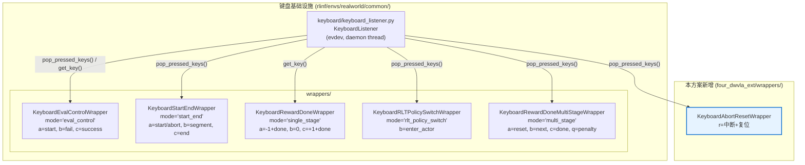

**按键分配** (避免冲突):

| 按键 | 现有用途 | 本方案 |
|:---|:---|:---|
| `a` | eval\_control: 开始; start\_end: 开始/中止; reward\_done: -1 | — |
| `b` | eval\_control: 失败; rlt: 进入 actor; start\_end: 分段 | — |
| `c` | eval\_control: 成功; start\_end: 结束; reward\_done: +1 | — |
| `q` | multi\_stage: penalty | — |
| **`r`** | **未使用** (仅 leader\_follower 中的 `r` 作 abort, 但不在 `_apply_keyboard_wrapper` 选择器中) | **✅ 中断+复位** |

选择 `r` 的原因: (1) 语义直观 — `r` = **R**eset; (2) 不与任何 `_apply_keyboard_wrapper` 管理的 wrapper 冲突; (3) 离手指近, 反应快.

### 18.4 设计方案

#### 18.4.1 整体数据流

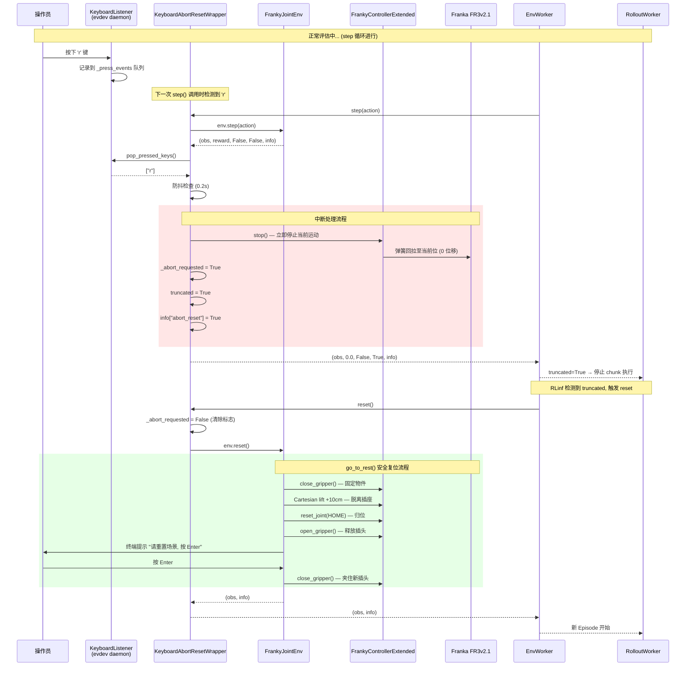

#### 18.4.2 Wrapper 在环境栈中的位置

```
FrankyJointEnv (物理环境)
    ↑
KeyboardAbortResetWrapper (本方案新增)
    ↑
EnvWorker (RLinf 框架)
```

Wrapper 位于环境和框架之间, **拦截 `step()` 的返回值**. 它不修改 action (透传给内层环境), 只在检测到 `r` 键时修改返回的 `truncated` 标志, 并调用控制器的 `stop()` 方法.

#### 18.4.3 关键设计决策

| 决策 | 选择 | 理由 |
|:---|:---|:---|
| 制动方式 | `controller.stop()` (弹簧回拉) | `stop()` 使机器人平滑减速到当前位置附近, 比 `freeze_at_current()` 更安全 (后者可能在高速时产生冲击) |
| 归位时机 | 在 `reset()` 中通过 `go_to_rest()` 执行 | 复用已有的安全归位流程 (夹紧→提升→归位→开夹爪), 避免代码重复 |
| 是否跳过内层 `step()` | 否 — 先执行 `env.step(action)`, 再检查按键 | 确保 env 状态一致 (step 计数、观测更新等); 按键检测在 step 返回后立即处理, 延迟仅 ~33ms |
| abort 后是否仍记录 | info 中标记 `abort_reset=True`, 由上层决定 | 评估统计时可选择排除被中断的 Episode (不计入成功率) |
| 重复按 `r` | 忽略 (已在 abort 状态, event="abort_already_active") | 与 RLT wrapper 的"已激活时忽略"模式一致 |
| `reset()` 清除状态 | 是 | 每个新 Episode 从干净状态开始 |
| wrapper 拥有自己的 `KeyboardListener` | 是 | 不依赖外层 wrapper 的 listener, 独立运行, 解耦清晰 |

### 18.5 实现

**文件**: `four_dwvla_ext/wrappers/keyboard_abort_reset_wrapper.py`

```python
"""Keyboard abort-reset wrapper for FrankyJointEnv evaluation.

Press 'r' during a running Episode to:
  1. Immediately stop the arm (controller.stop())
  2. Truncate the current Episode (truncated=True)
  3. On next reset(), go_to_rest() moves the arm to HOME + opens gripper

Design follows the RLT KeyboardRLTPolicySwitchWrapper pattern
(rlinf/envs/realworld/common/wrappers/keyboard_rlt_policy_switch_wrapper.py):
  - Uses KeyboardListener with pop_pressed_keys() for lossless edge detection
  - Debounce to avoid repeated triggers from a single press
  - Event info propagated via info dict
  - State cleared on reset()

Key assignment: 'r' (Reset) -- not used by any _apply_keyboard_wrapper mode.
"""

from __future__ import annotations

import logging
import math
import time
from typing import Any, SupportsFloat

import gymnasium as gym
from gymnasium.core import ActType, ObsType

from rlinf.envs.realworld.common.keyboard.keyboard_listener import KeyboardListener

logger = logging.getLogger(__name__)


class KeyboardAbortResetWrapper(gym.Wrapper):
    """Press ``r`` to abort the current Episode and trigger a safe reset.

    On 'r' press:
      - Calls controller.stop() to immediately halt arm motion
      - Returns truncated=True so the eval loop exits the current chunk
      - Sets info["abort_reset"]=True for upstream logging/filtering

    On reset():
      - Clears the abort flag
      - Delegates to env.reset() which calls go_to_rest()
        (close gripper → lift → HOME → open gripper → wait for operator)
    """

    PEDAL_DEBOUNCE_S = 0.2
    ABORT_KEY = "r"

    def __init__(self, env: gym.Env):
        super().__init__(env)
        self.listener = KeyboardListener()
        self._abort_requested = False
        self._last_press_ts: dict[str, float] = {}
        self._abort_count = 0
        logger.info(
            "KeyboardAbortResetWrapper: press '%s' to abort Episode and reset arm to HOME",
            self.ABORT_KEY,
        )

    @property
    def abort_requested(self) -> bool:
        return self._abort_requested

    def reset(self, *, seed=None, options=None, **kwargs):
        self._abort_requested = False
        self._last_press_ts.clear()
        self.listener.pop_pressed_keys()
        return self.env.reset(seed=seed, options=options, **kwargs)

    def step(
        self, action: ActType
    ) -> tuple[ObsType, SupportsFloat, bool, bool, dict[str, Any]]:
        obs, reward, terminated, truncated, info = self.env.step(action)

        event: str | None = None
        for key in self.listener.pop_pressed_keys():
            now = time.monotonic()
            if now - self._last_press_ts.get(key, -math.inf) < self.PEDAL_DEBOUNCE_S:
                continue
            self._last_press_ts[key] = now

            if key == self.ABORT_KEY:
                if not self._abort_requested:
                    event = "abort_triggered"
                    self._abort_requested = True
                    self._abort_count += 1

                    # 立即制动: 停止当前运动, 使机器人保持在当前位置
                    self._emergency_stop_arm()

                    self._log_info(
                        f"'{self.ABORT_KEY}' pressed: Episode aborted "
                        f"(#{self._abort_count}). Arm stopped. "
                        f"Next reset() will call go_to_rest()."
                    )
                else:
                    event = "abort_already_active"

        if self._abort_requested:
            truncated = True

        info["abort_reset"] = self._abort_requested
        info["abort_reset_event"] = event
        info["abort_count"] = self._abort_count
        return obs, reward, terminated, truncated, info

    def _emergency_stop_arm(self) -> None:
        """Call controller.stop() to immediately halt arm motion."""
        try:
            base_env = self.env.unwrapped
            ctrl = getattr(base_env, "_controller", None)
            if ctrl is not None and hasattr(ctrl, "stop"):
                ctrl.stop()
                logger.info("Arm stopped via controller.stop()")
            else:
                logger.warning(
                    "Cannot call controller.stop(): "
                    "controller not found on unwrapped env"
                )
        except Exception as e:
            logger.error("Failed to stop arm: %s", e)

    def _log_info(self, message: str) -> None:
        logger.info(message)
```

### 18.6 集成点

#### 18.6.1 扩展包目录结构变更

新增文件:

```
b/x/four_dwvla_ext/
|-- wrappers/
|   |-- __init__.py                           # 包初始化
|   |-- keyboard_abort_reset_wrapper.py       # 本节实现
```

`wrappers/__init__.py`:

```python
from four_dwvla_ext.wrappers.keyboard_abort_reset_wrapper import (
    KeyboardAbortResetWrapper,
)

__all__ = ["KeyboardAbortResetWrapper"]
```

#### 18.6.2 Gym 工厂集成

`create_franky_joint_env()` (§6.1) 已更新为在 `FrankyJointEnv` 外层包裹 `KeyboardAbortResetWrapper`. Wrapper 栈:

```
FrankyJointEnv
    └→ KeyboardAbortResetWrapper  (按 'r' 中断 + 复位)
```

#### 18.6.3 KeyboardListener 运行环境

`KeyboardListener` 使用 Linux `evdev` 读取 `/dev/input/eventX` 设备:

| 要求 | 说明 |
|:---|:---|
| 运行容器 | **Franky 容器** (env wrapper 在此运行) |
| 权限 | `--privileged` (Docker 启动参数, 已有) |
| 键盘设备 | USB 键盘连接到 GPU 服务器, Franky 容器通过 `--privileged` 可访问 |
| 设备选择 | 自动检测 (唯一 USB 键盘) 或通过 `RLINF_KEYBOARD_DEVICE` 环境变量指定 |
| 多键盘 | 如有多个键盘设备, 设置 `RLINF_KEYBOARD_DEVICE=/dev/input/eventX` |

#### 18.6.4 对评估统计的影响

被中断的 Episode 在 `info` 中标记 `abort_reset=True`. 评估统计时建议:

- **排除中断 Episode**: 不计入成功率分母 (因为操作员主动中断, 不是模型失败)
- **记录中断次数**: 作为辅助指标, 反映需要人工干预的频率
- **日志示例**:

```
Episode  1: success=True,  abort=False  → 计入
Episode  2: success=False, abort=False  → 计入
Episode  3: abort=True                  → 排除 (操作员中断)
Episode  4: success=True,  abort=False  → 计入
...
成功率 = 成功次数 / (总次数 - 中断次数)
```

### 18.7 操作手册: 如何使用键盘中断复位

#### 18.7.1 前提条件

- USB 键盘已连接到 GPU 服务器 (物理连接, 不是 SSH)
- Franky 容器已以 `--privileged` 模式启动 (标准启动脚本已包含此参数)
- 评估进程正在运行

#### 18.7.2 操作步骤

**正常评估流程中, 如果需要中断当前 Episode**:

1. **按下键盘 `r` 键** (一次即可, 不需要长按)
2. 系统反应:
   - Franky 容器日志显示: `'r' pressed: Episode aborted (#N). Arm stopped. Next reset() will call go_to_rest().`
   - 机器人**立即停止**当前运动 (弹簧回拉至当前位置)
   - 当前 Episode 被标记为 `truncated=True`, eval 循环退出 chunk 执行
3. **自动复位流程启动** (约 5-10 秒):
   - ① 夹爪闭合 (固定可能仍在持有的物件)
   - ② 机器人向上提升 10cm (安全脱离插座区域)
   - ③ 关节运动到 HOME 位置 (训练数据均值位)
   - ④ 夹爪张开 (释放插头)
4. **终端提示** (如 `reset_pause_for_human=true`):
   ```
   [人工操作] 机器人已归位, 夹爪已张开.
     → 请将插头放回夹爪中 (与训练数据起始位一致)
     → 确认插座位置正确
     → 准备好后按 Enter 继续下一 Episode...
   ```
5. **操作员**: 放入插头 → 确认场景 → **按 Enter**
6. 夹爪自动闭合, 下一 Episode 开始

#### 18.7.3 操作时序图

```
 时间 ──────────────────────────────────────────────────────────→
       │         正常 Episode 运行          │ 归位 │  人工  │  下一 Episode
       │ step step step step ... ←按 'r'→ │ ←──→ │ ←────→ │ step step ...
       │                         ↑         │      │        │
       │                    ~33ms 内响应    │ ~5s  │ 操作员 │
       │                    arm 立即停止     │      │ 重置   │
       │                    truncated=True  │      │ +Enter │
```

#### 18.7.4 注意事项

| 注意事项 | 说明 |
|:---|:---|
| 按键位置 | 必须在**连接到 Franky 容器的物理键盘**上按, SSH 终端按键**无效** (evdev 监听硬件事件, 不是 stdin) |
| 按键时机 | 可在 Episode 运行的任何时刻按, 下一个 `step()` 调用时 (~33ms 内) 生效 |
| 重复按 | 安全 — 多次按 `r` 不会重复触发, 日志显示 "abort_already_active" |
| 归位安全 | `go_to_rest()` 先夹紧再提升, 确保即使插头半插入也不会掉落 |
| 与 E-stop 的关系 | 键盘中断是**软停止** (软件层, 可恢复), E-stop 是**硬停止** (硬件层, 需重启). 危急情况仍应优先使用 E-stop |
| 日志检查 | 中断后检查 Franky 容器日志确认 `Arm stopped via controller.stop()` 和 `go_to_rest complete` |
| 评估统计 | 被中断的 Episode 标记 `abort_reset=True`, 建议从成功率统计中排除 |

#### 18.7.5 速查卡

```
┌────────────────────────────────────────────────────────┐
│  键盘中断复位 — 速查                                     │
├────────────────────────────────────────────────────────┤
│                                                        │
│  ⌨️  按 'r' → 机器人停, Episode 中断                    │
│                                                        │
│  🤖 自动归位:                                           │
│     夹紧 → 提升 10cm → 关节归位 → 开夹爪                │
│                                                        │
│  🖐️ 操作员: 放插头 → 按 Enter → 下一 Episode            │
│                                                        │
│  ⚠️  危急情况仍用 E-stop, 不要依赖键盘中断               │
│                                                        │
└────────────────────────────────────────────────────────┘
```

### 18.8 与 RLT KeyboardRLTPolicySwitchWrapper 的对比

| 维度 | RLT 的 PolicySwitchWrapper | 本方案的 AbortResetWrapper |
|:---|:---|:---|
| 目标 | 切换策略 (VLA → Actor) | 终止 Episode + 安全复位 |
| 按键 | `b` | `r` |
| 对 `truncated` 的影响 | 不修改 (仅设 flag) | 设为 `True` (终止 Episode) |
| 对机器人的影响 | 无 (策略切换, 运动继续) | `controller.stop()` (立即停止) |
| 状态持久性 | latch (按后保持到 reset) | latch (按后保持到 reset) |
| info 字段 | `rlt_switch_flags`, `rlt_policy_switch_event` | `abort_reset`, `abort_reset_event`, `abort_count` |
| `reset()` 行为 | 清除 flag, 不影响 env.reset() | 清除 flag, env.reset() 调用 go\_to\_rest() |
| `KeyboardListener` | 共享 (来自 RLT env) | 独立实例 (wrapper 自己创建) |
| 代码量 | 79 行 | ~120 行 (多了 `_emergency_stop_arm()`) |
| 防抖 | 0.2s | 0.2s (一致) |

**共同设计模式**:
1. 继承 `gym.Wrapper`
2. 使用 `KeyboardListener.pop_pressed_keys()` 无损检测
3. `step()` 中处理按键, 修改 `info` dict
4. `reset()` 中清除状态
5. 单向 latch (按后不可取消, 直到 reset)

---

## 19. 附录

### 19.1 快速参考

```bash
# [GPU 容器] === 环境变量 ===
export RLINF_EXT_MODULE=four_dwvla_ext.runtime_bootstrap
export PYTHONPATH=/workspace/RLinf/b/x:$PYTHONPATH

# [GPU 容器] === Dummy 测试 (机器人不动) ===
python evaluations/eval_embodied_agent.py \
    --config-name realworld_plug_eval_4wvla \
    --config-path /workspace/RLinf/b/x/four_dwvla_ext/configs \
    env.eval.override_cfg.is_dummy=true \
    env.eval.rollout_epoch=2

# [GPU 容器] === 保守真机测试 (⚠️ 机器人会运动) ===
python evaluations/eval_embodied_agent.py \
    --config-name realworld_plug_eval_4wvla \
    --config-path /workspace/RLinf/b/x/four_dwvla_ext/configs \
    env.eval.rollout_epoch=1 \
    env.eval.override_cfg.max_num_steps=30 \
    env.eval.override_cfg.velocity_safety_factor=0.3

# [GPU 容器] === 完整评估 (⚠️ 机器人会运动约 40-60 分钟) ===
python evaluations/eval_embodied_agent.py \
    --config-name realworld_plug_eval_4wvla \
    --config-path /workspace/RLinf/b/x/four_dwvla_ext/configs \
    env.eval.rollout_epoch=20

# [Franky 容器] === 检查关节状态 ===
python -c "
from rlinf.envs.realworld.franka.franky_controller import FrankyController
import numpy as np
ctrl = FrankyController(robot_ip='172.16.0.2')
s = ctrl.get_state()
q = np.array(s.arm_joint_position[:7])
print('Joints (rad):', np.round(q, 4))
print('Joints (deg):', np.round(np.degrees(q), 1))
print('Gripper:', round(s.gripper_position, 4))
"

# [宿主机] === 确认 RLinf 无修改 ===
cd /home/nvidia/bt/s/RLinf && git diff --stat
```

### 19.2 术语表

| 术语 | 英文 | 含义 |
|:---|:---|:---|
| VLA | Vision-Language-Action | 视觉-语言-动作模型 |
| 4DWVLA | 4D World-model VLA (InternVLA-A1.5) | 本文评估的 VLA 模型 |
| franky | - | libfranka 的 Python 绑定库 |
| FCI | Franka Control Interface | Franka 的 1kHz 实时控制接口 |
| Motion Guard | - | TCP 几何围栏安全系统 |
| Trip Recovery | - | Guard 触发后的恢复机制 |
| `resize_with_pad` | - | 保持纵横比的图像缩放 + 零填充 |
| Action Chunking | - | 一次推理生成多步动作 |
| Flow Matching | - | 连续动作生成的迭代去噪方法 |
| $R_{\text{pad}}$ | - | 关键点等尺度缩放半径 (0.836100 m) |

### 19.3 版本历史

| 版本 | 日期 | 变更 |
|:---|:---|:---|
| v2.0 | 2026-09-09 | 初版: ROS-based monkey-patch 方案 |
| v2.1 | 2026-09-10 | 改用 franky\_ext 原生方案: 移除 ROS 依赖, 复用 FrankyControllerExtended 安全机制, 添加 `resize_with_pad` 训推一致性, 添加训推一致性分析章节, 测试分为"需要真机"和"不需要真机"两类 |
| v2.1.1 | 2026-09-10 | 基于真实数据修正: 关节限位和速度从 Panda 通用值更正为 FR3v2.1 URDF 实际值 (`b/d/frk1/fr3v2_1_franka_hand.urdf`), 训练数据范围取自 `b/d/frk1/plug/abs_stats.json` 精确值 (含动作/状态/末端位置/夹爪/关键点统计), 关键点元信息取自 `b/d/frk1/plug/keypoints_meta.json`, 添加 URDF 运动链结构和关节参数表, 新增 stats/keypoints/URDF 一致性测试 |
| v2.1.2 | 2026-09-10 | 新增 §12.5 插座插拔任务真机评估详细操作手册: 面向零基础第三方工程师的完整操作指南, 涵盖背景知识、安全须知、硬件清单与物理环境、软件环境确认、Franky/GPU 双容器启动、Dummy 验证、保守→渐进→完整评估的四级递进流程、Episode 间场景重置、成功/失败判定标准 (8 类失败代码)、评估记录表模板、成功率计算、15 项故障排查表、收尾流程和速查卡. 基于 checkpoint `4wvlaFrkPlugCkp010420` 和训练数据 `plug_into_socket_lrb_4D_8sml` (8 episodes, 4777 frames) 的实际参数编写 |
| v2.1.3 | 2026-09-10 | **机器人复位设计与实施**: ① `reset_joint_pos` 从经典 Panda ready pose `[0, -0.785, 0, -2.356, 0, 1.571, 0.785]` 更正为训练数据关节角均值 `[-0.2406, 0.1457, 0.1872, -2.0600, -0.0553, 2.2011, 0.6998]` (来自 abs\_stats.json), 同步修正 §5.2 Config 默认值和 §10.1 Hydra YAML; ② 新增 `go_to_rest()` 方法实现安全复位流程: close gripper (固定插头) → Cartesian 提升 10cm (安全脱离插座) → 关节归位至 HOME → open gripper → 等待操作员重置场景 → close gripper (夹住新放入的插头); ③ 新增 `reset_lift_height` (0.10m) 和 `reset_pause_for_human` (true) 配置项; ④ 重写 §5.4 reset 流程图; ⑤ 重写 §12.5.10 场景重置为自动+人工协作流程; ⑥ 新增 T13 复位流程测试和 V17 验收项 |
| v2.1.4 | 2026-09-11 | **键盘中断复位功能**: 参考 RLinf RLT 算法的 `KeyboardRLTPolicySwitchWrapper` 设计模式, 新增 `KeyboardAbortResetWrapper` — 操作员在评估过程中按 `r` 键可中断当前 Episode, 机器人立即停止 (`controller.stop()`), 后续自动触发 `go_to_rest()` 安全归位 (夹紧→提升→归位→开夹爪). 新增 §18 键盘中断复位功能详细分析 (需求分析、RLT 参考分析、RLinf 键盘基础设施梳理、按键分配、整体数据流序列图、关键设计决策表、完整 Wrapper 实现代码). 新增 `four_dwvla_ext/wrappers/` 目录和 `keyboard_abort_reset_wrapper.py`. 更新 §4.1 包结构、§4.3 组件表、§6.1 Gym 工厂函数 (添加 wrapper 应用). 新增 §18.7 操作手册 (含操作步骤、时序图、注意事项、速查卡). 新增 T8b (Wrapper 单元测试) 和 T14 (真机键盘中断测试). 新增 V18、V19 验收项. 更新 §12.4 紧急处理表 |
