# 4DWVLA × RLT Stage 2 Franka 真机评估 -- 深度集成方案 (v3.0)

> **目标**: 基于 RLmm/RLiKx 中 RLT Stage 2 的现成代码基础设施, 对 4DWVLA (InternVLA-A1.5) 微调后的 checkpoint 进行 Franka 单臂机器人插座插拔任务的真机评估; 同时为后续 RLT Stage 2 在线 RL 微调预留完整接口
> **前序文档**: `4wvla_rlinf_eval_2.md` (v2.1.4) -- 纯 VLA 评估方案; 本文档在其基础上深度改良
> **参考分析**: `rlt_code_analyz2.markdown` (RLmm RLT 分析), `rltx_code_analyz_cdxc2.markdown` (RLiKx RLT 分析), `rlmm_rlikx_diff_analyz2.markdown` (RLmm vs RLiKx 差异分析)
> **模型 Checkpoint**: `/home/nvidia/bt/ckp/4wvlaFrk/plug/4wvlaFrkPlugCkp010420/` (Phase 2 SFT, epoch 20, step 10420)
> **训练规范**: `4WVLA/b/d/Frk/plug_p2sft.md`
> **机器人**: Franka Research 3 v2.1 (FR3v2.1) 单臂 + 2× RealSense D435I 相机 (global + wrist)
> **服务器**: AMD Ryzen Threadripper 7970X, 1× RTX 5090 D (32 GiB), Ubuntu 22.04.5 LTS, kernel 5.15.0-1032-realtime
> **RLmm 代码**: `/home/nvidia/bt/s/RLmm/` (原版 RLinf)
> **RLiKx 代码**: `/home/nvidia/bt/RLiKx/` (生产改进版 RLinf)
> **日期**: 2026-09-14
> **版本**: v3.0

---

## 目录

- [1. 概述与动机](#1-概述与动机)
- [2. RLT Stage 2 代码深度分析](#2-rlt-stage-2-代码深度分析)
- [3. RLmm 与 RLiKx 差异分析](#3-rlmm-与-rlikx-差异分析)
- [4. 4DWVLA 架构分析与特征提取点](#4-4dwvla-架构分析与特征提取点)
- [5. 集成架构设计](#5-集成架构设计)
- [6. 4DWVLA 特征模型适配器](#6-4dwvla-特征模型适配器)
- [7. FrankyJointEnv 设计 (继承与改良)](#7-frankyjointenv-设计-继承与改良)
- [8. 推理管线](#8-推理管线)
- [9. 安全架构](#9-安全架构)
- [10. 配置系统](#10-配置系统)
- [11. Docker 双容器部署](#11-docker-双容器部署)
- [12. 操作手册](#12-操作手册)
- [13. 测试方案 -- 不需要连真机](#13-测试方案----不需要连真机)
- [14. 测试方案 -- 需要连真机](#14-测试方案----需要连真机)
- [15. 验收方案](#15-验收方案)
- [16. 风险与缓解](#16-风险与缓解)
- [17. 模式 A 纯 VLA 评估 — 细化实现与操作手册](#17-模式-a-纯-vla-评估--细化实现与操作手册)
- [18. 附录](#18-附录)

---

## 1. 概述与动机

### 1.1 eval\_2 的不足与 eval\_3 的改良方向

eval\_2 (v2.1.4) 实现了一个可用的纯 VLA 评估框架, 但存在以下不足:

| 维度 | eval\_2 现状 | eval\_3 改良 |
|:---|:---|:---|
| 与 RLT 集成 | **完全没有** -- 独立搭建推理管线, 未复用 RLT 基础设施 | 深度复用 RLT Stage 2 的 `predict_rlt_actions()` + `RealworldRLTRoute` + `RLTMLPPolicy` 管线 |
| 代码库分析 | 仅参考 RLinf (原版) | 深入分析 RLmm 和 RLiKx 两个代码库, 选择最适合的组件 |
| 特征提取 | 无 -- 直接使用 4DWVLA 输出动作 | 设计 `FourDWVLAFeatureModel` 适配器, 从 4DWVLA 提取 `{z_rl, proprio, ref_chunk}` |
| 模式支持 | 仅纯 VLA 评估 | 支持 **模式 A** (纯 VLA) 和 **模式 B** (RLT Stage 2 Actor-Critic) |
| RL 微调路径 | 无 | 完整的 Stage 2 在线 RL 微调接口, 为后续训练预留 |
| 观测适配 | 自建 `FourDWVLAObsAdapter` | 复用 RLinf `wrap_obs_mode` 机制, 通过配置切换 |
| 参考文档 | 无 | 全面参考三篇 RLT 分析文档, 确保设计与生产代码一致 |

### 1.2 两种运行模式

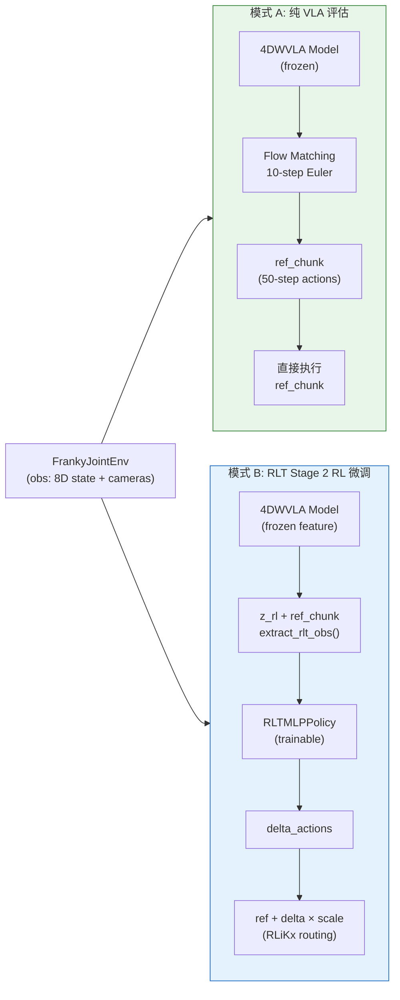

**模式 A (纯 VLA 评估)**: 冻结 4DWVLA, 直接用其 flow matching 生成的 ref\_chunk 控制机器人. 用于评估 SFT checkpoint 的开环/闭环表现.

**模式 B (RLT Stage 2)**: 冻结 4DWVLA 作为特征模型, 训练轻量级 MLP Actor-Critic 在 ref\_chunk 基础上做残差修正. 用于在线 RL 微调改善策略.

本文档默认聚焦 **模式 A** 的即时评估, 但所有设计确保可无缝切换到 **模式 B**.

### 1.3 核心设计原则

1. **扩展优于修改** -- 所有新代码位于 out-of-tree 扩展包 `four_dwvla_ext/`, 通过 `RLINF_EXT_MODULE` 注册, 不修改 RLmm/RLiKx 任何源码
2. **复用 RLT 基础设施** -- 复用 `predict_rlt_actions()` 的完整管线: 特征提取 → 策略推理 → 动作路由 → 过渡管理
3. **配置驱动** -- 软硬件环境、实验参数、评估/训练切换均通过 YAML 配置控制
4. **基于 RLiKx 生产代码** -- 环境和安全层复用 RLiKx 的 `FrankyControllerExtended` + motion guard + watchdog; 路由使用 RLiKx 的 delta 残差模式
5. **训推一致性** -- 严格匹配训练管线的图像预处理、状态编码、动作空间

---

## 2. RLT Stage 2 代码深度分析

> 参考: `rlt_code_analyz2.markdown` §4 (Stage 2 Actor-Critic), §5 (Rollout), `rltx_code_analyz_cdxc2.markdown` §3 (VLA 特征提取)

### 2.1 RLT 两阶段架构概览

RLT (RL Token) 是一个两阶段的 VLA 强化学习微调方法:

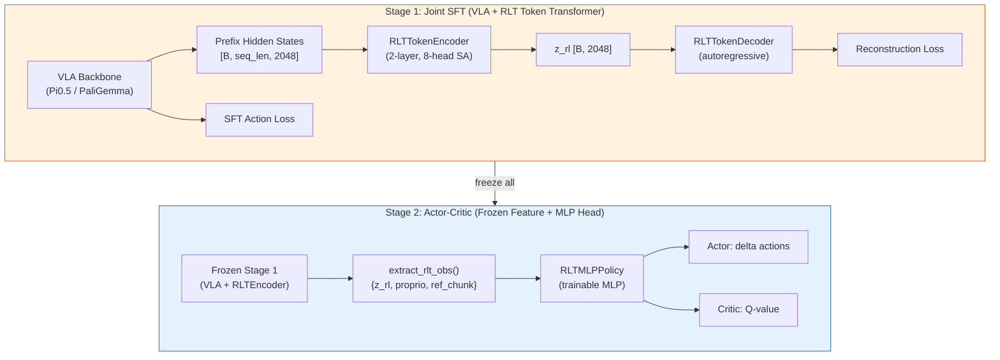

**Stage 1** 联合训练 VLA backbone 和 RLT Token Transformer. Encoder 将 VLA 的 prefix hidden states (图像+语言 token 的隐藏表示) 压缩为固定维度的 $\mathbf{z}_{rl} \in \mathbb{R}^{2048}$; Decoder 从 $\mathbf{z}_{rl}$ 自回归重建原始 prefix, 确保 $\mathbf{z}_{rl}$ 保留充分信息.

**Stage 2** 冻结 Stage 1 的全部参数, 在 $\mathbf{z}_{rl}$ 基础上训练轻量级 MLP Actor-Critic. 这样做的好处是 Stage 2 的推理不需要对 VLA backbone 做梯度计算, 大幅降低训练成本.

### 2.2 `extract_rlt_obs()` 接口规范

> 代码位置: `rlinf/models/embodiment/openpi_rlinf/eval_action_model.py:357-404` (RLmm/RLiKx 共用)

这是 Stage 1 特征模型的核心接口, 也是本方案适配 4DWVLA 的关键锚点:

```python
def extract_rlt_obs(self, env_obs: dict[str, Any]) -> dict[str, torch.Tensor]:
    """
    从原始环境观测提取 RLT 特征.
    
    输入:
        env_obs: dict, 包含:
            - "states": 本体感觉 (proprio)
            - "main_images": 主相机图像
            - "task_descriptions": 任务语言描述
            - "wrist_images": (可选) 腕部相机
            - "extra_view_images": (可选) 额外视角
    
    输出:
        dict, 包含:
            - "z_rl": Tensor[B, z_dim]        -- VLA 压缩表示
            - "proprio": Tensor[B, proprio_dim] -- 本体感觉
            - "ref_chunk": Tensor[B, C, A]      -- VLA 参考动作块
    """
```

**处理流程** (以 OpenPI 为例):

$$\text{env\_obs} \xrightarrow{\text{repack}} \text{openpi\_obs} \xrightarrow{\text{transform}} \text{tokenized} \xrightarrow{\text{VLM forward}} \text{prefix\_out} \xrightarrow{\text{RLTEncoder}} \mathbf{z}_{rl}$$

$$\text{prefix\_cache} \xrightarrow{\text{Euler ODE}} \text{ref\_chunk}$$

具体步骤:

| 步骤 | 方法 | 输出 | 维度 |
|:---|:---|:---|:---|
| 1 | `_repack_env_obs()` | 映射到 openpi 命名约定 | -- |
| 2 | `input_transform()` | 归一化 + 分词 | -- |
| 3 | `preprocess_observation()` | 图像 resize/pad | -- |
| 4 | `build_prefix_cache()` | VLM prefix forward, 得到 KV cache | `[B, seq, 2048]` |
| 5 | `_select_rlt_prefix_embeddings()` | 可选: 去除语言 token | `[B, img_seq, 2048]` |
| 6 | `_encode_rlt_flat()` | RLTTokenTransformer 压缩 | `[B, 2048]` |
| 7 | `_sample_actions_from_prefix_cache()` | 4-step Euler ODE flow matching | `[B, 20, 7]` |
| 8 | 提取 proprio | 从 env\_obs 中取 states | `[B, 19]` |

> **关键发现**: 步骤 4 和 7 共享 KV cache, 即 $\mathbf{z}_{rl}$ 和 ref\_chunk 的计算只需一次 VLM forward pass.

### 2.3 `predict_rlt_actions()` 推理流程

> 代码位置: `rlinf/algorithms/rlt/rollout.py:38-84` (RLmm/RLiKx **byte-identical**)

这是 Stage 2 推理的顶层入口:

```python
def predict_rlt_actions(
    *, policy_model, feature_model, rlt_route, env_obs, final_obs,
    mode, version, rlt_switch_flags, intervene_requested, expert_model
) -> tuple[torch.Tensor, dict]:
    # 1. 特征提取 (冻结模型)
    rlt_obs = feature_model.extract_rlt_obs(env_obs)
    
    # 2. MLP 策略推理 (训练模型)
    student_actions, result = policy_model.predict_action_batch(
        env_obs=rlt_obs, mode=mode, return_obs=True
    )
    
    # 3. 动作路由 (决定用 actor 还是 ref)
    routed_actions = rlt_route.route(RLTRouteContext(
        student_actions=student_actions,
        ref_chunk=rlt_obs["ref_chunk"],
        rlt_switch_flags=rlt_switch_flags,
        ...
    ))
    
    # 4. 存储下一步特征 (用于 replay buffer)
    _append_rlt_transition_obs(...)
    
    return routed_actions, result
```

**关键洞察**: `predict_rlt_actions()` 对特征模型的唯一要求就是 `extract_rlt_obs()` 返回 `{z_rl, proprio, ref_chunk}`. 策略模型、路由、过渡管理完全**模型无关** -- 只要接口匹配, 可以替换为任意 VLA.

### 2.4 `RLTMLPPolicy` 网络结构

> 代码位置: `rlinf/models/embodiment/mlp_policy/rlt_mlp_policy.py` (RLmm/RLiKx 拓扑相同)

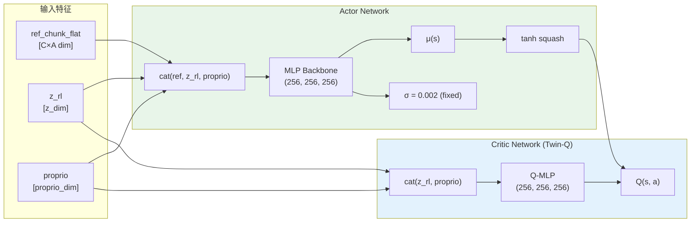

**维度计算** (OpenPI 原版 vs 4DWVLA 适配):

| 参数 | OpenPI (RLmm realworld) | 4DWVLA 适配 |
|:---|:---:|:---:|
| `z_dim` | 2048 | 1024 (action expert hidden) |
| `proprio_dim` | 19 (tcp 20D 含 force/torque) | 8 (arm[7] + gripper[1]) |
| `action_dim` | 7 (6 arm + 1 gripper) | 8 (7 arm + 1 gripper) |
| `num_action_chunks` | 10 | 10 (截取前 10 步) |
| `ref_num_action_chunks` | 20 | 50 (4DWVLA chunk\_size) |
| Actor obs\_dim | 10×7 + 2048 + 19 = **2137** | 10×8 + 1024 + 8 = **1112** |
| Critic obs\_dim | 2048 + 19 = **2067** | 1024 + 8 = **1032** |
| `fixed_std` | 0.002 | 0.002 |

### 2.5 动作路由 (`RealworldRLTRoute`)

> 代码位置: `rlinf/algorithms/rlt/route.py:116-144` (RLmm), 扩展版在 RLiKx

**RLmm 标准路由** -- 直接替换:

$$\mathbf{a}_{\text{final}} = \begin{cases} \mathbf{a}_{\text{actor}} & \text{if } \texttt{rlt\_switch\_flags} = \text{True (按了 b)} \\ \mathbf{a}_{\text{ref}}[:10] & \text{otherwise} \end{cases}$$

**RLiKx 残差路由** -- delta 叠加:

$$\mathbf{a}_{\text{final}} = \begin{cases} \mathbf{a}_{\text{ref}}[:10] + \mathbf{a}_{\text{actor}} \times \boldsymbol{\delta}_{\text{scale}} & \text{if } \texttt{rlt\_switch\_flags} = \text{True} \\ \mathbf{a}_{\text{ref}}[:20] & \text{otherwise (VLA 全 20 步)} \end{cases}$$

其中 $\boldsymbol{\delta}_{\text{scale}} = [0.02, 0.02, 0.02, 0.05, 0.05, 0.05, 0.5]$ (XYZ 2cm, RPY 0.05rad, gripper 0.5).

**本方案选择**: 模式 A 使用简化路由 (始终执行 ref\_chunk, 无 actor); 模式 B 使用 RLiKx 残差路由.

### 2.6 训练损失 (`RLTACLossMixin`)

> 代码位置: `rlinf/workers/actor/fsdp_rlt_ac_policy_worker.py` (RLmm 920行, RLiKx 1094行)

Actor 损失:

$$\mathcal{L}_{\text{actor}} = -w_q \cdot Q_1(\mathbf{s}, \pi(\mathbf{s})) + w_{bc} \cdot \text{MSE}(\pi(\mathbf{s}), \mathbf{a}_{\text{bc}})$$

其中 $w_q = 0.1$, $w_{bc} = 5.0$.

BC target 选择 (RLiKx `conditional_all` 模式):

$$\mathbf{a}_{\text{bc}} = \begin{cases} \mathbf{0} & \text{非干预步: actor 学习 "不修改 reference"} \\ (\mathbf{a}_{\text{human}} - \mathbf{a}_{\text{ref}}) / \boldsymbol{\delta}_{\text{scale}} & \text{干预步: actor 学习人类的修正量} \end{cases}$$

Critic 损失 (Twin-Q, chunk-level TD):

$$\mathcal{L}_{\text{critic}} = \frac{1}{2} \sum_{i=1}^{2} \text{MSE}\left(Q_i(\mathbf{s}, \mathbf{a}),\ \sum_{t=0}^{C-1} \gamma^t r_t + \gamma^C \min_j Q_j'(\mathbf{s}', \pi'(\mathbf{s}'))\right)$$

> **注**: alpha (熵正则) 完全禁用 (`forward_alpha` 抛出 `NotImplementedError`), 与标准 SAC 不同. BC 正则取代了 SAC 的最大熵探索.

---

## 3. RLmm 与 RLiKx 差异分析

> 参考: `rlmm_rlikx_diff_analyz2.markdown`

### 3.1 三句话总结

1. **相同骨架**: 两者共享 `predict_rlt_actions`, `SimulatorRLTRoute`, `RLTMLPPolicy` 拓扑, BC+Q 损失框架, `extract_rlt_obs` 管线; `rollout.py` 和 `expert.py` **逐字节相同**
2. **不同语义**: RLiKx 将 Actor MLP 输出解释为 delta 残差 (`ref + delta × scale`), VLA 阶段执行完整 20 步; RLmm 将 MLP 输出视为最终动作 (直接替换), VLA/Actor 阶段都只执行 10 步
3. **不同运维**: RLiKx 增加了生产级补丁: 轨迹时序修正、chunk\_step 终止填充、条件 BC、独立 demo pool、双容器启动、离线诊断

### 3.2 关键文件级差异

| 文件 | RLmm | RLiKx | 本方案采用 |
|:---|:---|:---|:---|
| `rollout.py` (85行) | 基准 | **完全相同** | 均可 |
| `route.py` (RealworldRLTRoute) | `torch.where(flags, student, ref[:10])` 直接替换 | VLA: 全 20 步; Actor: `ref[:10] + delta × scale` | **RLiKx** (delta 更安全) |
| `rlt_mlp_policy.py` | 无 `delta_scale` | 有 `delta_scale` buffer | **RLiKx** |
| `transition.py` | 干预时替换 `ref_chunk` | BC 在 learner 中通过 `_actions_to_delta` 计算 | **RLiKx** |
| `fsdp_rlt_ac_policy_worker.py` | 920行, 原始动作空间 | 1094行, delta 空间 + chunk 过滤 + demo buffer | **RLiKx** (模式 B) |
| `env_worker.py` | action+reward 同步 append | outcome 延迟一拍; 终止推理不附加动作 | **RLiKx** (轨迹时序修正) |
| `realworld_env.py` chunk\_step | 跑完整个 chunk | 立即终止 + padding + `chunk_valid_steps` | **RLiKx** (安全) |
| `keyboard_rlt_policy_switch_wrapper.py` | 78行, 仅 `b` 键 | 174行, `b/c/a` 键, `MIN_ACTOR_STEPS=20`, epoch 限制 | **RLiKx** (生产控制) |
| `spacemouse_intervention.py` | 88行, 无 delta-to-absolute | 143行, delta-to-absolute, 防 "flyaway" | **RLiKx** |
| `action_geometry.py` | 不存在 | RPY 周期差分 `atan2(sin,cos)` | **RLiKx** |

### 3.3 差异根因

三个根本因素驱动了 RLiKx 的分化:

1. **`use_absolute_action=True`** -- 需要 delta 路由、RPY 周期差分、SpaceMouse delta-to-absolute 转换
2. **两阶段充电器任务** -- VLA 粗定位 (20步) + Actor 精插入 (10步) 的两阶段工作流
3. **生产真机运维** -- 手动奖励 (`c`/`a` 键)、紧急停止、可复现实验

**与本方案的关联**: 4DWVLA 使用绝对关节角动作 (`action_mode=abs`), 因此 RLiKx 的 delta 残差路由和 `use_absolute_action` 配套设施直接适用.

### 3.4 代码库选择决策

| 组件 | 选择 | 理由 |
|:---|:---|:---|
| 环境 + 安全层 | RLiKx `franky_ext` | 生产验证的 motion guard + watchdog + trip recovery |
| 路由 | RLiKx `RealworldRLTRoute` | delta 残差模式对 absolute action 更安全 |
| 训练 (模式 B) | RLiKx `fsdp_rlt_ac_policy_worker.py` | 轨迹时序修正 + conditional BC + demo pool |
| 特征提取 | **新建** `FourDWVLAFeatureModel` | 两个代码库都绑定 OpenPI, 需要新的 4DWVLA 适配 |
| 部署 | RLiKx 双容器架构 | GPU 容器 + Franky 容器分离 |
| ManiSkill 仿真 | RLmm/RLiKx 均可 | 仿真路径两者相同 |

> **⚠️ 迁移警告** (来自 `rlmm_rlikx_diff_analyz2.markdown`): 切勿混用 RLmm YAML 和 RLiKx 权重 -- 动作语义不同. 切勿将 20260910 之前的 RLiKx replay 导入 RLmm learner.

---

## 4. 4DWVLA 架构分析与特征提取点

### 4.1 InternVLA-A1.5 模型结构

> 代码位置: `4WVLA/src/lerobot/policies/internvla_a1_5/modeling_internvla_a1_5.py`

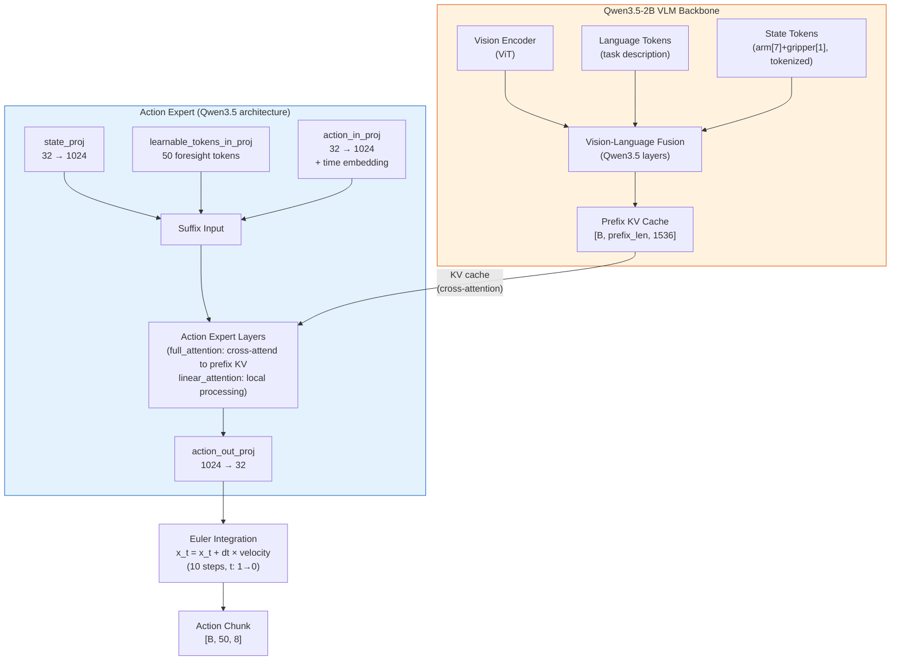

**关键维度**:

| 组件 | 维度 | 参数量 | 训练状态 |
|:---|:---|:---|:---|
| Qwen3.5-2B VLM | hidden\_size = 1536 | ~2B | 可训练 (Phase 2 SFT) |
| Action Expert | hidden\_size = 1024 | ~460M | 可训练 |
| Keypoint Expert | hidden\_size = 1024 | ~460M | 可训练 |
| TrackEncoder | embed = 256, query = 512 | ~tens M | 可训练 |
| WAN DiT + VAE | -- | ~5B | 冻结 |
| Learnable Tokens | 50 tokens | 小 | 冻结 (Phase 2) |

### 4.2 推理数据流 (Optimized Backend)

> 代码位置: `modeling_internvla_a1_5_optimized.py:421` (`sample_actions()`)

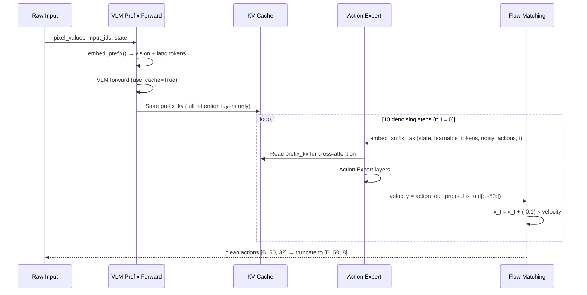

### 4.3 可用特征提取点

InternVLA-A1.5 中有多个候选特征提取位置, 可作为 RLT Stage 2 的 $\mathbf{z}_{rl}$ 来源:

| 提取点 | 维度 | 内容 | 优缺点 |
|:---|:---|:---|:---|
| **VLM prefix hidden states** | `[B, prefix_len, 1536]` | VLM 输出的场景理解表示 | ✅ 最丰富的场景表示; ❌ 变长序列, 需要 RLTTokenEncoder 压缩 |
| **VLM prefix KV cache** | per-layer `[B, nkv, prefix_len, head_dim]` | KV 缓存 | ❌ 维度过大, 不适合直接作为 z\_rl |
| **Learnable token output** | `[B, 50, 1024]` | 经 Action Expert 处理后的前瞻 token | ✅ 已编码场景+前瞻; ❌ 需要 denoise\_step |
| **Action Expert final hidden** | `[B, 50, 1024]` | Action Expert 最后一层输出 | ✅ 最接近动作的表示; ❌ 需要 denoise\_step |
| **Mean-pooled VLM prefix** | `[B, 1536]` | 简单均值池化 | ✅ 无需额外编码器; ❌ 丢失位置信息 |

**本方案推荐策略**:

- **模式 A (纯 VLA 评估)**: 使用 **mean-pooled VLM prefix** 作为 $\mathbf{z}_{rl}$, 维度 1536. 不需要训练 RLTTokenEncoder, 开箱即用.
- **模式 B (RLT Stage 2)**: 使用 **VLM prefix hidden states** + 训练 RLTTokenEncoder 压缩. 这与 OpenPI 的做法完全一致, 但需要先完成 Stage 1 训练.
- **折中方案**: 使用 **Learnable token output** (mean-pooled) 作为 $\mathbf{z}_{rl}$, 维度 1024. 需要一次 denoise step 但无需 RLTTokenEncoder 训练.

### 4.4 Checkpoint 分析

**路径**: `/home/nvidia/bt/ckp/4wvlaFrk/plug/4wvlaFrkPlugCkp010420/`

| 文件 | 大小 | 内容 |
|:---|:---|:---|
| `config.json` | 3.7 KB | 模型配置 (全部超参) |
| `model.safetensors` | ~5.9 GB | 模型权重 (safetensors 格式) |
| `stats.json` | 39 KB | 归一化统计 (所有特征) |
| `train_config.json` | 12.9 KB | 完整训练管线配置 |

**关键推理配置**:

```python
config.inference_backend = "optimized"  # 跳过 WAN 加载
config.action_loss_only = True          # 仅加载动作路径
config.num_inference_steps = 10         # flow matching 步数
config.chunk_size = 50                  # 动作块大小
config.n_action_steps = 50             # 使用全部 50 步
config.action_mode = "abs"              # 绝对关节角
config.image_resolution = [224, 224]    # 输入图像尺寸
config.dtype = "bfloat16"               # 推理精度
```

**归一化映射**: 全部为 `IDENTITY` -- 推理时**无需反归一化**.

### 4.5 训练数据规格

| 属性 | 值 | 来源 |
|:---|:---|:---|
| 数据集 | `plug_into_socket_lrb_4D` | 100 episodes, 66,577 frames |
| 采样频率 | 30 Hz | ~22 sec/episode 平均 |
| 相机 | `observation.images.global` (480×640) + `observation.images.wrist` (480×640) | 2× RealSense D435I |
| 状态 | `observation.state.arm` [7] + `observation.state.gripper` [1] | 关节角 (rad) + 夹爪宽度 (m) |
| 动作 | `action.arm` [7] + `action.gripper` [1] | 绝对关节角 + 二值夹爪 |
| 关键点 | `observation.keypoint_3d` [56] = 8 点 × 7D (pos+quat) | FR3v2.1 运动链 |
| 关键点归一化 | `base_link_origin_isotropic`, $R_{\text{pad}} = 0.8361$ m | 等尺度缩放 |
| 任务 | 插头插入插座 (单臂) | 单任务 |

---

## 5. 集成架构设计

### 5.1 整体架构 (静态)

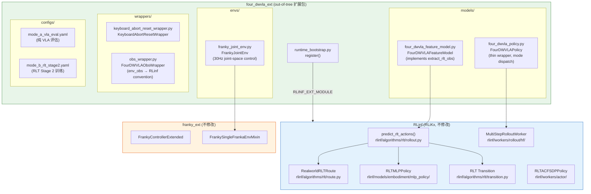

### 5.2 扩展包目录结构

```
b/x/four_dwvla_ext/
├── __init__.py
├── runtime_bootstrap.py          # RLINF_EXT_MODULE 入口: register()
├── models/
│   ├── __init__.py
│   ├── four_dwvla_feature_model.py   # FourDWVLAFeatureModel [新增]
│   └── four_dwvla_policy.py          # FourDWVLAPolicy (eval_2 改良)
├── envs/
│   ├── __init__.py
│   └── franky_joint_env.py           # FrankyJointEnv (eval_2 继承)
├── wrappers/
│   ├── __init__.py
│   ├── obs_wrapper.py                # FourDWVLAObsWrapper [新增]
│   └── keyboard_abort_reset_wrapper.py  # KeyboardAbortResetWrapper (eval_2 继承)
├── configs/
│   ├── mode_a_vla_eval.yaml          # 模式 A 配置 [新增]
│   └── mode_b_rlt_stage2.yaml        # 模式 B 配置 [新增]
└── tests/
    ├── test_feature_model.py         # 特征模型单元测试 [新增]
    ├── test_env.py                   # 环境单元测试
    ├── test_obs_wrapper.py           # 观测包装器测试 [新增]
    └── test_integration.py           # 端到端集成测试
```

### 5.3 动态架构: 模式 A 推理序列

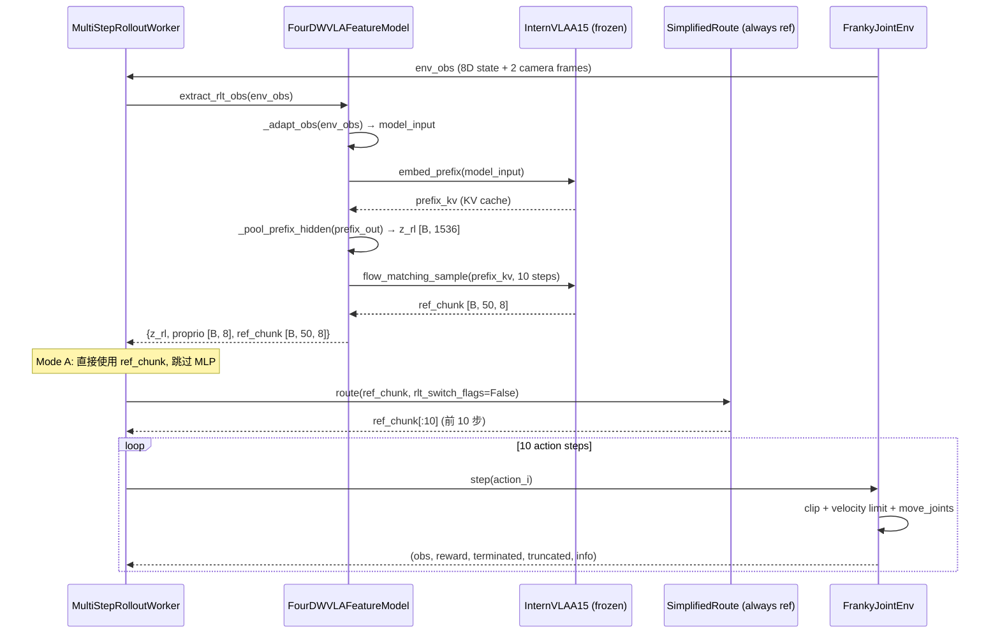

### 5.4 动态架构: 模式 B 训练序列 (预留)

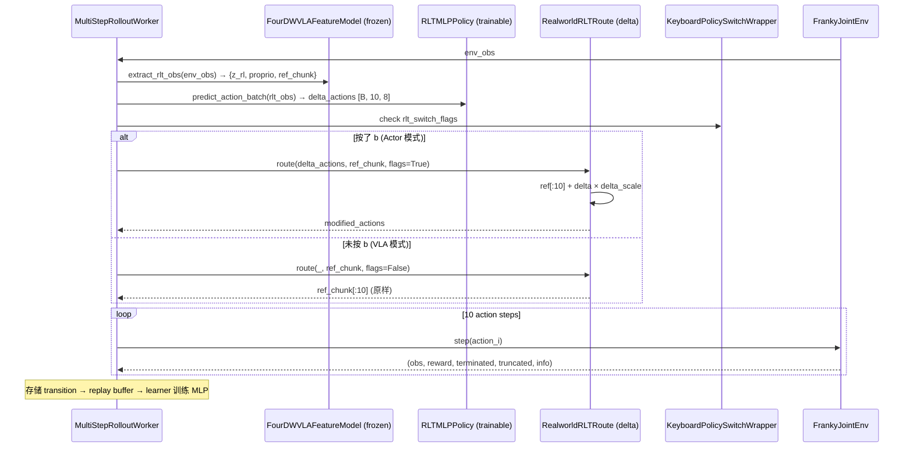

### 5.5 模式切换机制

通过 YAML 配置的 `eval_mode` 字段实现:

```yaml
# 模式 A: 纯 VLA 评估
eval_mode: "vla_only"
rollout:
  rlt_feature_model: ...   # 加载 4DWVLA
  use_rlt_policy: false     # 不加载 MLP
  rlt_route: "passthrough"  # 直接传递 ref_chunk

# 模式 B: RLT Stage 2
eval_mode: "rlt_stage2"
rollout:
  rlt_feature_model: ...   # 加载 4DWVLA (frozen)
  use_rlt_policy: true      # 加载 MLP actor-critic
  rlt_route: "realworld"    # RLiKx delta 路由
```

---

## 6. 4DWVLA 特征模型适配器

### 6.1 设计思路

RLT Stage 2 的 `extract_rlt_obs()` 原本绑定 OpenPI (Pi0.5). 我们需要一个适配器类 `FourDWVLAFeatureModel`, 提供相同接口但内部使用 InternVLA-A1.5:

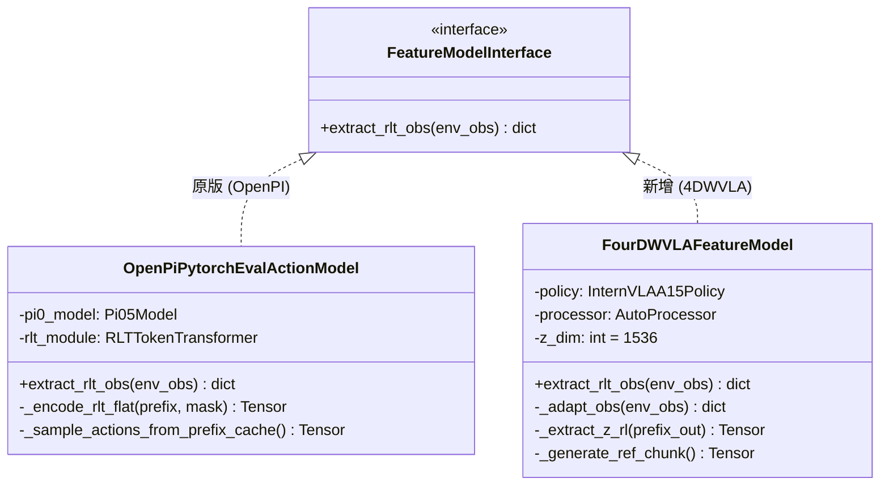

### 6.2 `FourDWVLAFeatureModel` 实现

**文件**: `four_dwvla_ext/models/four_dwvla_feature_model.py`

```python
"""4DWVLA Feature Model adapter for RLT Stage 2 pipeline.

Implements the extract_rlt_obs() interface, producing {z_rl, proprio, ref_chunk}
from InternVLA-A1.5 instead of OpenPI/Pi0.5.
"""
from __future__ import annotations

import logging
from pathlib import Path
from typing import Any

import numpy as np
import torch
import torch.nn as nn
from PIL import Image

logger = logging.getLogger(__name__)


class FourDWVLAFeatureModel(nn.Module):
    """Frozen 4DWVLA feature model for RLT Stage 2.

    Wraps InternVLA-A1.5 (optimized backend) and exposes extract_rlt_obs(),
    matching the interface expected by predict_rlt_actions().
    """

    def __init__(
        self,
        checkpoint_path: str,
        device: str = "cuda:0",
        dtype: str = "bfloat16",
        z_extraction_mode: str = "mean_pool_prefix",
        num_action_chunks_for_rlt: int = 10,
        target_image_size: tuple[int, int] = (224, 224),
        task_description: str = "plug into socket",
    ):
        super().__init__()
        self.checkpoint_path = Path(checkpoint_path)
        self.device = torch.device(device)
        self.dtype_str = dtype
        self.dtype = getattr(torch, dtype)
        self.z_extraction_mode = z_extraction_mode
        self.num_action_chunks_for_rlt = num_action_chunks_for_rlt
        self.target_h, self.target_w = target_image_size
        self.task_description = task_description
        self._system_prompt = (
            "You are a helpful assistant that controls a robot arm. "
            "Generate precise joint-space actions for the given task."
        )

        self._build_model()
        self._freeze()

    def _build_model(self) -> None:
        """Load InternVLA-A1.5 checkpoint with optimized backend."""
        import json
        from lerobot.policies.internvla_a1_5.configuration_internvla_a1_5 import (
            InternVLAA15Config,
        )
        from lerobot.policies.internvla_a1_5.modeling_internvla_a1_5 import (
            InternVLAA15Policy,
        )

        config_path = self.checkpoint_path / "config.json"
        with open(config_path) as f:
            config_dict = json.load(f)

        config_dict["inference_backend"] = "optimized"
        config_dict["action_loss_only"] = True
        config_dict["device"] = str(self.device)

        config = InternVLAA15Config(**{
            k: v for k, v in config_dict.items()
            if k in InternVLAA15Config.__dataclass_fields__
        })
        config.inference_backend = "optimized"
        config.action_loss_only = True

        self.policy = InternVLAA15Policy(config)
        self.policy.load_pretrained(self.checkpoint_path)
        self.policy = self.policy.to(self.device)

        self._load_stats()
        self._setup_processor(config)

        # Derived dimensions
        self.vlm_hidden_size = 1536  # Qwen3.5-2B
        self.action_expert_hidden_size = config.action_expert_hidden_size  # 1024
        self.chunk_size = config.chunk_size  # 50
        self.max_state_dim = config.max_state_dim  # 32
        self.max_action_dim = config.max_action_dim  # 32
        self.actual_action_dim = 8  # 7 arm + 1 gripper

        if self.z_extraction_mode == "mean_pool_prefix":
            self.z_dim = self.vlm_hidden_size  # 1536
        elif self.z_extraction_mode == "learnable_tokens":
            self.z_dim = self.action_expert_hidden_size  # 1024
        else:
            raise ValueError(f"Unknown z_extraction_mode: {self.z_extraction_mode}")

        logger.info(
            f"FourDWVLAFeatureModel loaded: z_dim={self.z_dim}, "
            f"chunk_size={self.chunk_size}, action_dim={self.actual_action_dim}, "
            f"z_extraction_mode={self.z_extraction_mode}"
        )

    def _load_stats(self) -> None:
        """Load normalization statistics from checkpoint."""
        import json

        stats_path = self.checkpoint_path / "stats.json"
        if stats_path.exists():
            with open(stats_path) as f:
                self.norm_stats = json.load(f)
        else:
            self.norm_stats = {}

    def _setup_processor(self, config) -> None:
        """Set up the Qwen3.5 chat processor for input tokenization."""
        from transformers import AutoProcessor

        self.processor = AutoProcessor.from_pretrained(
            config.vlm_model_name_or_path,
            trust_remote_code=True,
        )

    def _freeze(self) -> None:
        """Freeze all parameters."""
        self.eval()
        for param in self.parameters():
            param.requires_grad_(False)

    @torch.no_grad()
    def extract_rlt_obs(self, env_obs: dict[str, Any]) -> dict[str, torch.Tensor]:
        """Extract RLT features from environment observation.

        Interface contract (matches OpenPiPytorchEvalActionModel):
            Input: env_obs with keys:
                - "states": Tensor or ndarray, proprioceptive state
                - "main_images": Tensor or ndarray, global camera
                - "wrist_images": (optional) Tensor or ndarray
                - "task_descriptions": str or list[str]
            Output: dict with keys:
                - "z_rl": Tensor[B, z_dim]
                - "proprio": Tensor[B, proprio_dim]
                - "ref_chunk": Tensor[B, chunk_size, action_dim]
        """
        # 1. Adapt env_obs to 4DWVLA model input format
        model_input = self._adapt_obs(env_obs)

        # 2. Run VLM prefix forward and extract z_rl
        z_rl, prefix_kv = self._forward_prefix_and_extract_z(model_input)

        # 3. Generate ref_chunk via flow matching
        ref_chunk = self._generate_ref_chunk(model_input, prefix_kv)

        # 4. Extract proprio
        proprio = self._extract_proprio(env_obs)

        return {
            "z_rl": z_rl,
            "proprio": proprio,
            "ref_chunk": ref_chunk,
        }

    def _adapt_obs(self, env_obs: dict[str, Any]) -> dict[str, torch.Tensor]:
        """Convert RLinf env_obs to 4DWVLA model input format."""
        images = self._extract_and_resize_images(env_obs)
        state = self._extract_state(env_obs)
        task_desc = self._extract_task_description(env_obs)

        content = [{"type": "image", "image": img} for img in images]
        content.append({"type": "text", "text": task_desc})

        messages = [
            {"role": "system", "content": self._system_prompt},
            {"role": "user", "content": content},
        ]

        inputs = self.processor.apply_chat_template(
            messages,
            add_generation_prompt=True,
            tokenize=True,
            return_tensors="pt",
        )

        batch = {}
        for key in ["input_ids", "attention_mask", "pixel_values", "image_grid_thw"]:
            if key in inputs:
                batch[f"observation.{key}"] = inputs[key].to(self.device)

        batch["observation.state"] = state
        return batch

    def _extract_and_resize_images(self, env_obs: dict) -> list[Image.Image]:
        """Extract images from env_obs, apply resize_with_pad, return PIL."""
        images = []
        for key in ("main_images", "wrist_images", "extra_view_images"):
            if key not in env_obs:
                continue
            img = env_obs[key]
            if isinstance(img, torch.Tensor):
                img = img.squeeze(0)
                if img.dim() == 4:
                    img = img[0]
                if img.dtype == torch.uint8:
                    img = img.float() / 255.0
                if img.shape[-1] == 3:
                    img = img.permute(2, 0, 1)
            elif isinstance(img, np.ndarray):
                if img.dtype == np.uint8:
                    img = torch.from_numpy(img).float() / 255.0
                else:
                    img = torch.from_numpy(img).float()
                if img.shape[-1] == 3:
                    img = img.permute(2, 0, 1)

            resized = self._resize_with_pad(img, self.target_h, self.target_w)
            pil_img = self._tensor_to_pil(resized)
            images.append(pil_img)

        return images

    @staticmethod
    def _resize_with_pad(
        img: torch.Tensor, target_h: int, target_w: int
    ) -> torch.Tensor:
        """Resize with aspect ratio preservation + zero padding."""
        import torch.nn.functional as F

        _, h, w = img.shape
        scale = min(target_h / h, target_w / w)
        new_h, new_w = int(h * scale), int(w * scale)
        resized = F.interpolate(
            img.unsqueeze(0), size=(new_h, new_w), mode="bilinear",
            align_corners=False,
        ).squeeze(0)

        pad_h = target_h - new_h
        pad_w = target_w - new_w
        top = pad_h // 2
        left = pad_w // 2
        padded = torch.zeros(3, target_h, target_w, dtype=img.dtype)
        padded[:, top : top + new_h, left : left + new_w] = resized
        return padded

    @staticmethod
    def _tensor_to_pil(tensor: torch.Tensor) -> Image.Image:
        """Convert CHW float tensor to PIL Image."""
        arr = (tensor.clamp(0, 1) * 255).byte().permute(1, 2, 0).cpu().numpy()
        return Image.fromarray(arr)

    def _extract_state(self, env_obs: dict) -> torch.Tensor:
        """Extract and pad state to max_state_dim."""
        if "states" in env_obs:
            state = env_obs["states"]
            if isinstance(state, torch.Tensor):
                state = state.squeeze(0).float()
            else:
                state = torch.tensor(state, dtype=torch.float32).flatten()
        else:
            state = torch.zeros(8, dtype=torch.float32)

        actual_dim = state.shape[-1]
        if actual_dim < self.max_state_dim:
            pad = torch.zeros(self.max_state_dim - actual_dim, dtype=torch.float32)
            state = torch.cat([state, pad])
        elif actual_dim > self.max_state_dim:
            state = state[: self.max_state_dim]

        return state.unsqueeze(0).to(self.device)

    def _extract_task_description(self, env_obs: dict) -> str:
        if "task_descriptions" in env_obs:
            descs = env_obs["task_descriptions"]
            if isinstance(descs, list) and len(descs) > 0:
                return descs[0]
            elif isinstance(descs, str):
                return descs
        return self.task_description

    def _forward_prefix_and_extract_z(
        self, model_input: dict[str, torch.Tensor]
    ) -> tuple[torch.Tensor, Any]:
        """Run VLM prefix forward and extract z_rl.

        Returns:
            z_rl: [B, z_dim] float32
            prefix_kv: KV cache for action generation
        """
        model = self.policy.model

        # Run VLM forward to get prefix hidden states + KV cache
        prefix_out, prefix_kv = model.forward_prefix_with_hidden(model_input)
        # prefix_out: [B, prefix_len, vlm_hidden_size=1536]

        if self.z_extraction_mode == "mean_pool_prefix":
            # Mean-pool across sequence dimension
            attention_mask = model_input.get(
                "observation.attention_mask", None
            )
            if attention_mask is not None:
                mask = attention_mask.unsqueeze(-1).float()
                z_rl = (prefix_out * mask).sum(dim=1) / mask.sum(dim=1).clamp(min=1)
            else:
                z_rl = prefix_out.mean(dim=1)
            z_rl = z_rl.float()  # [B, 1536]
        elif self.z_extraction_mode == "learnable_tokens":
            # Need one denoise step to get learnable token output
            learnable_out = model.get_learnable_token_output(
                model_input, prefix_kv
            )
            z_rl = learnable_out.mean(dim=1).float()  # [B, 1024]
        else:
            raise ValueError(f"Unknown mode: {self.z_extraction_mode}")

        return z_rl, prefix_kv

    def _generate_ref_chunk(
        self, model_input: dict[str, torch.Tensor], prefix_kv: Any
    ) -> torch.Tensor:
        """Generate reference action chunk via flow matching.

        Returns:
            ref_chunk: [B, chunk_size, actual_action_dim] float32, env frame
        """
        model = self.policy.model

        # Run full flow matching (10 denoising steps)
        raw_actions = model.sample_actions_from_prefix_kv(
            model_input, prefix_kv
        )
        # raw_actions: [B, chunk_size, max_action_dim=32]

        # Truncate to actual action dim (8)
        ref_chunk = raw_actions[:, :, : self.actual_action_dim].float()
        # ref_chunk: [B, 50, 8]

        return ref_chunk

    def _extract_proprio(self, env_obs: dict[str, Any]) -> torch.Tensor:
        """Extract proprioceptive state."""
        if "states" in env_obs:
            state = env_obs["states"]
            if isinstance(state, torch.Tensor):
                proprio = state.squeeze(0).float()
            else:
                proprio = torch.tensor(state, dtype=torch.float32).flatten()
        else:
            proprio = torch.zeros(8, dtype=torch.float32)

        return proprio.unsqueeze(0).to(self.device)
```

### 6.3 `forward_prefix_with_hidden` 需要的 Model 层扩展

上面的 `FourDWVLAFeatureModel` 调用了 `model.forward_prefix_with_hidden()` 和 `model.sample_actions_from_prefix_kv()`. 这两个方法需要在 `InternVLAA15` 或其 Optimized 子类中新增. 以下是需要添加的方法 (位于扩展包中, 通过 monkey-patch 或子类方式注入):

**文件**: `four_dwvla_ext/models/model_extensions.py`

```python
"""Extensions to InternVLAA15/Optimized for RLT feature extraction.

These methods are added at runtime via monkey-patch in register().
This avoids modifying the 4DWVLA source code.
"""
import torch
from typing import Any


def forward_prefix_with_hidden(
    self, model_input: dict[str, torch.Tensor]
) -> tuple[torch.Tensor, Any]:
    """Run VLM prefix forward, return hidden states AND KV cache.

    Unlike the standard forward which discards hidden states,
    this returns them for z_rl extraction.

    Returns:
        prefix_out: [B, prefix_len, hidden_size] -- VLM hidden states
        prefix_kv: past_key_values -- KV cache for subsequent action generation
    """
    # Build prefix embeddings (vision + language + state tokens)
    prefix_embs = self.embed_prefix(model_input)

    # Run VLM with output_hidden_states=True
    vlm_outputs = self.qwen3_5.language_model(
        inputs_embeds=prefix_embs,
        attention_mask=model_input.get("observation.attention_mask"),
        use_cache=True,
        output_hidden_states=True,
    )

    prefix_out = vlm_outputs.last_hidden_state
    prefix_kv = vlm_outputs.past_key_values

    return prefix_out, prefix_kv


def sample_actions_from_prefix_kv(
    self, model_input: dict[str, torch.Tensor], prefix_kv: Any
) -> torch.Tensor:
    """Generate actions using pre-computed prefix KV cache.

    This reuses the KV cache from forward_prefix_with_hidden(),
    avoiding a redundant VLM forward pass.

    Returns:
        actions: [B, chunk_size, max_action_dim]
    """
    B = next(iter(model_input.values())).shape[0]

    # Initialize noise for flow matching
    noise = torch.randn(
        B, self.config.chunk_size, self.config.max_action_dim,
        device=self.device, dtype=self.dtype,
    )

    # Get state embedding
    state = model_input["observation.state"].to(self.dtype)

    # Euler integration: t from 1.0 to 0.0
    x_t = noise
    num_steps = self.config.num_inference_steps
    dt = -1.0 / num_steps

    for step_idx in range(num_steps):
        time_val = 1.0 + step_idx * dt
        velocity = self._denoise_step_with_kv(
            x_t, time_val, state, prefix_kv
        )
        x_t = x_t + dt * velocity

    return x_t.float()


def _denoise_step_with_kv(
    self, noisy_actions, time_val, state, prefix_kv
):
    """Single denoising step using pre-computed prefix KV cache."""
    suffix_embs = self.embed_suffix_fast(
        state=state,
        learnable_tokens=self.learnable_tokens,
        noisy_actions=noisy_actions,
        time_val=time_val,
    )

    suffix_out = self._action_expert_forward_sdpa(
        suffix_embs=suffix_embs,
        prefix_kv=self._extract_prefix_kv(prefix_kv),
    )

    # Extract action velocity from the last chunk_size positions
    action_out = suffix_out[:, -self.config.chunk_size :]
    velocity = self.action_out_proj(action_out)
    return velocity


def get_learnable_token_output(
    self, model_input: dict[str, torch.Tensor], prefix_kv: Any
) -> torch.Tensor:
    """Get learnable (foresight) token hidden states after one denoise step.

    Returns:
        [B, num_learnable_tokens, action_expert_hidden_size]
    """
    B = next(iter(model_input.values())).shape[0]
    state = model_input["observation.state"].to(self.dtype)

    noise = torch.randn(
        B, self.config.chunk_size, self.config.max_action_dim,
        device=self.device, dtype=self.dtype,
    )

    suffix_embs = self.embed_suffix_fast(
        state=state,
        learnable_tokens=self.learnable_tokens,
        noisy_actions=noise,
        time_val=1.0,
    )

    suffix_out = self._action_expert_forward_sdpa(
        suffix_embs=suffix_embs,
        prefix_kv=self._extract_prefix_kv(prefix_kv),
    )

    # Learnable tokens are at positions [1:1+num_learnable_tokens]
    # (position 0 is state token)
    learnable_out = suffix_out[
        :, 1 : 1 + self.config.num_learnable_tokens
    ]
    return learnable_out.float()
```

**注册方式** (在 `runtime_bootstrap.py` 中):

```python
def _patch_internvla_model():
    """Add RLT feature extraction methods to InternVLA-A1.5 model."""
    from lerobot.policies.internvla_a1_5.modeling_internvla_a1_5 import (
        InternVLAA15,
    )
    from four_dwvla_ext.models.model_extensions import (
        forward_prefix_with_hidden,
        sample_actions_from_prefix_kv,
        _denoise_step_with_kv,
        get_learnable_token_output,
    )

    InternVLAA15.forward_prefix_with_hidden = forward_prefix_with_hidden
    InternVLAA15.sample_actions_from_prefix_kv = sample_actions_from_prefix_kv
    InternVLAA15._denoise_step_with_kv = _denoise_step_with_kv
    InternVLAA15.get_learnable_token_output = get_learnable_token_output
```

### 6.4 `FourDWVLAFeatureModel` 与 RLT 管线集成

`FourDWVLAFeatureModel` 需要被 RLinf 的 rollout worker 正确加载. 通过注册到 RLinf 的模型工厂实现:

```python
# runtime_bootstrap.py

from rlinf.models.embodiment.model_registry import register_model

def register():
    """Called by RLINF_EXT_MODULE at startup."""
    _patch_internvla_model()

    # Register feature model
    register_model(
        model_type="four_dwvla_feature",
        model_cls=_lazy_import_feature_model,
    )

    # Register environments
    _register_envs()


def _lazy_import_feature_model():
    from four_dwvla_ext.models.four_dwvla_feature_model import (
        FourDWVLAFeatureModel,
    )
    return FourDWVLAFeatureModel
```

### 6.5 接口一致性验证

| 属性 | OpenPI `extract_rlt_obs()` | 4DWVLA `extract_rlt_obs()` | 一致? |
|:---|:---|:---|:---:|
| 返回 `z_rl` | ✅ `[B, 2048]` float32 | ✅ `[B, 1536]` float32 | ⚠️ 维度不同 |
| 返回 `proprio` | ✅ `[B, 19]` float32 | ✅ `[B, 8]` float32 | ⚠️ 维度不同 |
| 返回 `ref_chunk` | ✅ `[B, 20, 7]` float32 | ✅ `[B, 50, 8]` float32 | ⚠️ 形状不同 |
| KV cache 复用 | ✅ (一次 VLM forward) | ✅ (一次 VLM forward) | ✅ |
| 冻结状态 | ✅ eval() + requires_grad_(False) | ✅ eval() + requires_grad_(False) | ✅ |
| 输入格式 | env_obs dict | env_obs dict | ✅ |

> **重要**: 维度不同是预期的 -- `RLTMLPPolicy` 的 `z_dim`, `proprio_dim`, `action_dim`, `num_action_chunks` 都是可配置参数, 只需在 YAML 中相应调整.

---

## 7. FrankyJointEnv 设计 (继承与改良)

> 本节设计继承自 eval\_2.md §5, 仅列出改良点

### 7.1 类层次结构

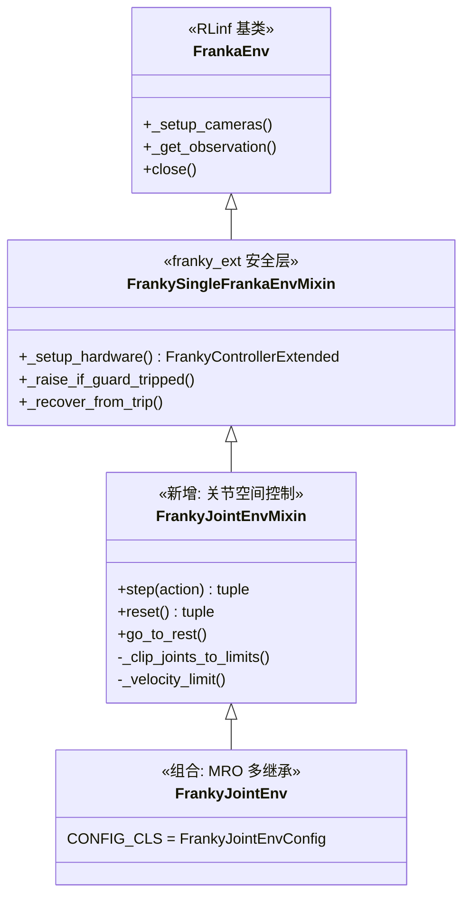

**MRO**: `FrankyJointEnv → FrankyJointEnvMixin → FrankySingleFrankaEnvMixin → FrankaEnv → gym.Env`

### 7.2 eval\_3 改良点

| 改良 | eval\_2 | eval\_3 |
|:---|:---|:---|
| 观测输出格式 | 自定义 dict | 兼容 RLinf env\_obs 标准 (`states`, `main_images`, `wrist_images`, `task_descriptions`) |
| chunk\_step 处理 | 无 | 可选: 按 chunk 批量执行 action (匹配 RLiKx `chunk_step` 语义) |
| `info` 附加字段 | 基础 | 增加 `rlt_switch_flags`, `intervene_requested` 字段, 兼容 RLT 管线 |
| 观测包装器 | 内联在 Adapter | 独立 `FourDWVLAObsWrapper` (复用 RLinf `wrap_obs_mode` 机制) |

### 7.3 Config

```python
@dataclass
class FrankyJointEnvConfig(FrankySingleFrankaEnvConfig):
    step_frequency: float = 30.0
    max_num_steps: int = 600  # 20s at 30Hz
    joint_limit_margin: float = 0.05  # rad
    velocity_safety_factor: float = 0.5
    reset_joint_pos: list = field(
        default_factory=lambda: [
            -0.2406, 0.1457, 0.1872, -2.0600, -0.0553, 2.2011, 0.6998
        ]
    )
    reset_lift_height: float = 0.10  # m
    reset_pause_for_human: bool = True
    # eval_3 新增:
    obs_format: str = "rlinf"  # "rlinf" (标准 RLinf) 或 "raw" (原始)
    chunk_execution: bool = False  # True: 按 chunk 批量执行
    chunk_size: int = 10  # 每次从 GPU 取的步数
```

### 7.4 环境代码

环境代码与 eval\_2 §5.7 基本相同, 关键改良为 `_get_observation()` 输出格式:

```python
def _get_observation(self) -> dict[str, Any]:
    """Get observation in RLinf env_obs format."""
    state = self._controller.get_state()
    joints = np.array(state.arm_joint_position[:7], dtype=np.float32)
    gripper = np.array([state.gripper_position], dtype=np.float32)
    proprio = np.concatenate([joints, gripper])  # [8]

    frames = {}
    for cam_name, cam in self._cameras.items():
        frames[cam_name] = cam.get_frame()  # uint8 [H, W, 3]

    if self.config.obs_format == "rlinf":
        return {
            "states": proprio,
            "main_images": frames.get("global"),
            "wrist_images": frames.get("wrist"),
            "task_descriptions": ["plug into socket"],
        }
    else:
        return {
            "state": {"joint_positions": joints, "gripper_position": gripper},
            "frames": frames,
        }
```

---

## 8. 推理管线

### 8.1 模式 A: 端到端推理流程

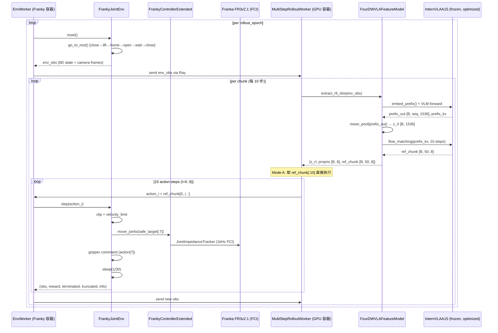

### 8.2 频率与延迟分析

| 阶段 | 时间 | 说明 |
|:---|:---|:---|
| VLM prefix forward | ~80-120 ms | Qwen3.5-2B, bf16, RTX 5090 D |
| Mean-pool z\_rl | <0.1 ms | 简单张量操作 |
| Flow matching (10 steps) | ~60-100 ms | 10× Action Expert forward |
| `extract_rlt_obs()` 总计 | ~150-230 ms | 首次推理时间 |
| 后续 9 步 (deque pop) | ~0.05 ms/step | 预生成的 ref\_chunk 出队 |
| 均摊推理 | ~15-23 ms/step | (200 + 9 × 0.05) / 10 |
| 控制步 (1/30Hz) | 33.3 ms | 匹配训练数据频率 |
| 30Hz 余量 | >10 ms | 33.3 - 23 = 10.3 ms (保守估计) |
| Motion guard check | <0.1 ms | 每步一次 |
| Watchdog | 每 20 ms (50 Hz) | 独立线程 |

### 8.3 Action Chunking 策略

```
4DWVLA 一次推理生成 50 步动作 (chunk_size=50)
RLinf 每次取 num_action_chunks=10 步

时间线:
t_0       t_10      t_20      t_30      t_40      t_50
|-- 推理 --|-- 推理 --|-- 推理 --|-- 推理 --|-- 推理 --|-- 推理 --|
   10步       10步       10步       10步       10步       10步
   (ref_chunk[:10])

选项 A (每 10 步重新推理): 更新 z_rl 和 ref_chunk, 闭环更紧
选项 B (全用 50 步):       首次推理后连续执行 50 步, 开环更快
```

**本方案默认选项 A**: 每 10 步重新调用 `extract_rlt_obs()`, 获取最新观测的 z\_rl 和 ref\_chunk. 这虽然丢弃了 ref\_chunk 的后 40 步, 但保证了每 10 步的闭环反馈.

### 8.4 动作后处理

```python
# ref_chunk 从 FourDWVLAFeatureModel 输出: [B, 50, 8]
# 取前 10 步: [B, 10, 8]
# action[:7] = absolute joint angles (radians)
# action[7]  = gripper command (continuous, 0=open, 1=close)

# normalization_mapping: ALL IDENTITY (from config.json)
# → 不需要反归一化

# 安全后处理 (在 FrankyJointEnv.step() 中):
# 1. _clip_joints_to_limits(action[:7])
# 2. _velocity_limit(current_joints, target_joints)
# 3. move_joints(safe_target)
# 4. gripper: action[7] > 0.5 → close, else open
```

---

## 9. 安全架构

### 9.1 五层安全架构 (继承自 eval\_2, 无变更)

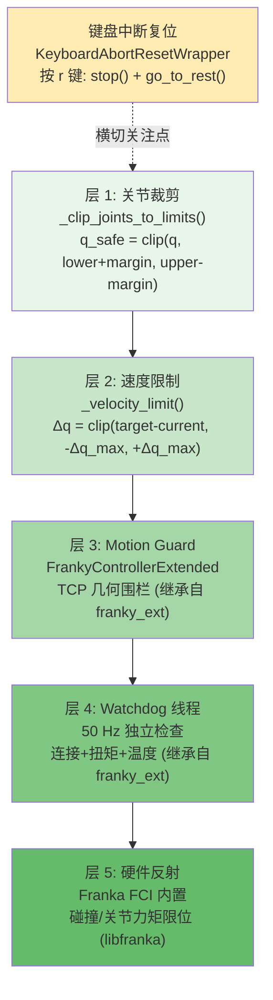

### 9.2 FR3v2.1 关节参数

| 关节 | 下限 (rad) | 上限 (rad) | $v_{max}$ (rad/s) | $\Delta q_{max}$ @ 30Hz, α=0.5 |
|:---:|:---:|:---:|:---:|:---:|
| q1 | -2.9007 | 2.9007 | 2.62 | 0.0437 (2.50°) |
| q2 | -1.8361 | 1.8361 | 2.62 | 0.0437 (2.50°) |
| q3 | -2.9007 | 2.9007 | 2.62 | 0.0437 (2.50°) |
| q4 | -3.0770 | -0.1169 | 2.62 | 0.0437 (2.50°) |
| q5 | -2.8763 | 2.8763 | 5.26 | 0.0877 (5.02°) |
| q6 | 0.4398 | 4.6216 | 4.18 | 0.0697 (3.99°) |
| q7 | -3.0508 | 3.0508 | 5.26 | 0.0877 (5.02°) |

> 来源: `b/d/frk1/fr3v2_1_franka_hand.urdf`

### 9.3 键盘中断复位 (继承自 eval\_2 v2.1.4)

`KeyboardAbortResetWrapper` 设计保持不变:

- 按 `r` 键: `_emergency_stop_arm()` → `controller.stop()` → 设置 `truncated=True`
- 下一次 `reset()` 时触发 `go_to_rest()`: 夹紧→提升 10cm→关节归位→开夹爪→等待操作员→夹紧

---

## 10. 配置系统

### 10.1 模式 A 配置: `mode_a_vla_eval.yaml`

```yaml
# four_dwvla_ext/configs/mode_a_vla_eval.yaml
# 4DWVLA 纯 VLA 评估配置

defaults:
  - _self_

# === 集群 ===
cluster:
  placement:
    - name: gpu_node
      role: [rollout, actor]
      gpus: [0]
    - name: franky_node
      role: [env]
      gpus: []

# === 运行模式 ===
runner:
  type: embodied
  only_eval: true

# === 评估参数 ===
eval_mode: vla_only

env:
  eval:
    env_id: "FrankyJointEnv-v1"
    rollout_epoch: 20
    override_cfg:
      step_frequency: 30.0
      max_num_steps: 600
      joint_limit_margin: 0.05
      velocity_safety_factor: 0.5
      reset_joint_pos: [-0.2406, 0.1457, 0.1872, -2.0600, -0.0553, 2.2011, 0.6998]
      reset_lift_height: 0.10
      reset_pause_for_human: true
      obs_format: "rlinf"
      chunk_execution: false
      chunk_size: 10
      is_dummy: false

# === 特征模型 (冻结 4DWVLA) ===
rollout:
  rlt_feature_model:
    model_type: "four_dwvla_feature"
    checkpoint_path: "/home/nvidia/bt/ckp/4wvlaFrk/plug/4wvlaFrkPlugCkp010420/"
    device: "cuda:0"
    dtype: "bfloat16"
    z_extraction_mode: "mean_pool_prefix"
    num_action_chunks_for_rlt: 10
    target_image_size: [224, 224]
    task_description: "plug into socket"

  # 模式 A: 不使用 RLT MLP policy
  use_rlt_policy: false
  rlt_route: "passthrough"  # 直接传递 ref_chunk

  # Action chunk 配置
  num_action_chunks: 10
  action_dim: 8  # 7 arm + 1 gripper

# === 任务描述 ===
task:
  name: "plug_into_socket"
  description: "plug into socket"

# === 日志 ===
logging:
  video_recording: true
  video_fps: 30
  metrics_log_freq: 1
```

### 10.2 模式 B 配置: `mode_b_rlt_stage2.yaml`

```yaml
# four_dwvla_ext/configs/mode_b_rlt_stage2.yaml
# 4DWVLA + RLT Stage 2 在线 RL 微调配置

defaults:
  - _self_

# === 集群 ===
cluster:
  placement:
    - name: gpu_node
      role: [rollout, actor, learner]
      gpus: [0]
    - name: franky_node
      role: [env]
      gpus: []

# === 运行模式 ===
runner:
  type: embodied
  only_eval: false  # 训练模式

eval_mode: rlt_stage2

env:
  train:
    env_id: "FrankyJointEnv-v1"
    keyboard_reward_wrapper: "rlt_policy_switch"  # RLiKx 键盘切换
    override_cfg:
      step_frequency: 30.0
      max_num_steps: 600
      velocity_safety_factor: 0.5
      obs_format: "rlinf"
      chunk_execution: true
      chunk_size: 10

# === 特征模型 (冻结 4DWVLA) ===
rollout:
  rlt_feature_model:
    model_type: "four_dwvla_feature"
    checkpoint_path: "/home/nvidia/bt/ckp/4wvlaFrk/plug/4wvlaFrkPlugCkp010420/"
    device: "cuda:0"
    dtype: "bfloat16"
    z_extraction_mode: "mean_pool_prefix"
    num_action_chunks_for_rlt: 10
    target_image_size: [224, 224]
    task_description: "plug into socket"

  # 模式 B: 启用 RLT MLP policy
  use_rlt_policy: true
  rlt_route: "realworld"  # RLiKx delta 残差路由

  num_action_chunks: 10
  action_dim: 8

# === Actor (Stage 2 MLP Head) ===
actor:
  model:
    model_type: "rlt_mlp_policy"
    z_dim: 1536        # mean_pool_prefix 模式
    proprio_dim: 8      # arm[7] + gripper[1]
    action_dim: 8       # arm[7] + gripper[1]
    num_action_chunks: 10
    ref_num_action_chunks: 50  # 4DWVLA chunk_size
    add_q_head: true
    q_head_type: "twin_q"
    fixed_std: 0.002

# === 算法 ===
algorithm:
  loss_type: "rlt_ac"
  adv_type: "embodied_sac"
  q_weight: 0.1
  bc_weight: 5.0
  bc_target_mode: "conditional_all"  # RLiKx 条件 BC
  gamma: 0.96
  reference_dropout_prob: 0.5

# === Delta routing (RLiKx) ===
rlt_route_config:
  delta_scale: [0.02, 0.02, 0.02, 0.05, 0.05, 0.05, 0.05, 0.5]
  # XYZ: 2cm, RPY: 0.05rad (q4-q7 为腕部关节), gripper: 0.5
  # 注: 4DWVLA 使用关节角而非 Cartesian, delta_scale 需要根据关节角范围重新调整

# === 训练参数 ===
training:
  replay_buffer_size: 10000
  batch_size: 256
  critic_actor_ratio: 4
  learning_rate: 3e-4
  update_epoch: 1
```

### 10.3 配置差异概览

| 配置项 | 模式 A (评估) | 模式 B (训练) |
|:---|:---|:---|
| `eval_mode` | `vla_only` | `rlt_stage2` |
| `runner.only_eval` | `true` | `false` |
| `use_rlt_policy` | `false` | `true` |
| `rlt_route` | `passthrough` | `realworld` |
| `actor.model` | 不加载 | `rlt_mlp_policy` |
| `algorithm` | 不需要 | `rlt_ac` |
| `keyboard_reward_wrapper` | 无 (仅 abort-reset) | `rlt_policy_switch` |
| GPU 角色 | rollout only | rollout + learner |

---

## 11. Docker 双容器部署

### 11.1 部署架构

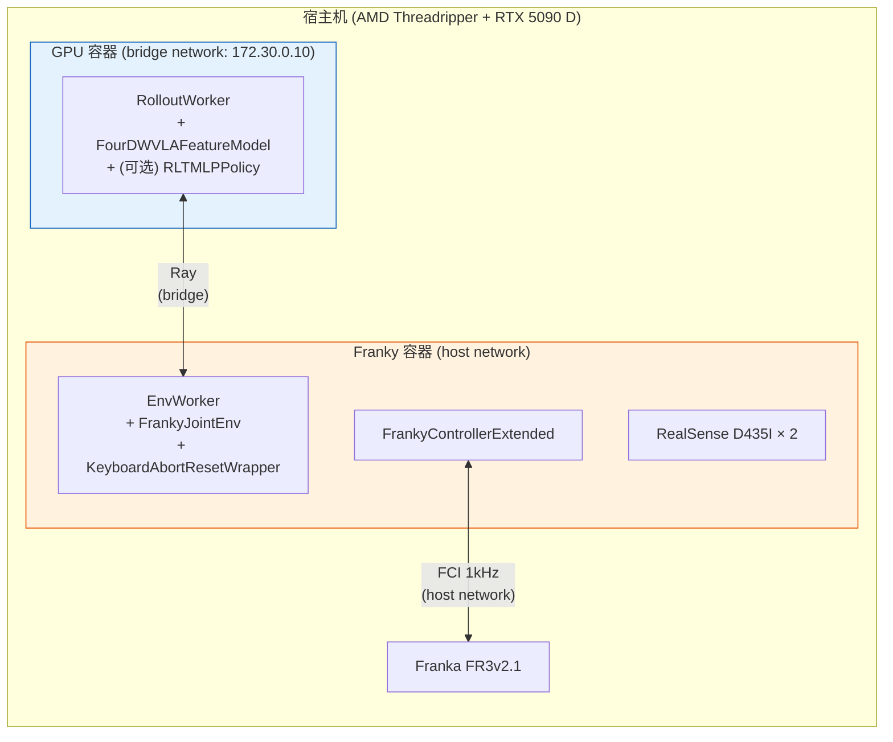

### 11.2 启动序列

```bash
# ==================== 步骤 0: 宿主机准备 ====================
# 确认 RLiKx 代码无修改
cd /home/nvidia/bt/RLiKx && git diff --stat

# ==================== 步骤 1: Franky 容器 ====================
docker exec -it franky_container bash

# 确认机器人连接
python -c "
from rlinf.envs.realworld.franka.franky_controller import FrankyController
ctrl = FrankyController(robot_ip='172.16.0.2')
print('Connected, joints:', ctrl.get_state().arm_joint_position[:7])
"

# ==================== 步骤 2: GPU 容器 ====================
docker exec -it gpu_container bash

# 环境变量
export RLINF_EXT_MODULE=four_dwvla_ext.runtime_bootstrap
export PYTHONPATH=/workspace/RLiKx/b/x:$PYTHONPATH

# 安装 4DWVLA 依赖
pip install -e /workspace/4WVLA/

# 验证扩展加载
python -c "
from four_dwvla_ext.runtime_bootstrap import register
register()
print('Extension registered successfully')
"

# ==================== 步骤 3: Dummy 测试 ====================
python evaluations/eval_embodied_agent.py \
    --config-name mode_a_vla_eval \
    --config-path /workspace/RLiKx/b/x/four_dwvla_ext/configs \
    env.eval.override_cfg.is_dummy=true \
    env.eval.rollout_epoch=1

# ==================== 步骤 4: 保守真机测试 ====================
python evaluations/eval_embodied_agent.py \
    --config-name mode_a_vla_eval \
    --config-path /workspace/RLiKx/b/x/four_dwvla_ext/configs \
    env.eval.rollout_epoch=1 \
    env.eval.override_cfg.max_num_steps=30 \
    env.eval.override_cfg.velocity_safety_factor=0.3

# ==================== 步骤 5: 完整评估 ====================
python evaluations/eval_embodied_agent.py \
    --config-name mode_a_vla_eval \
    --config-path /workspace/RLiKx/b/x/four_dwvla_ext/configs \
    env.eval.rollout_epoch=20
```

---

## 12. 操作手册

### 12.1 评估流程总览

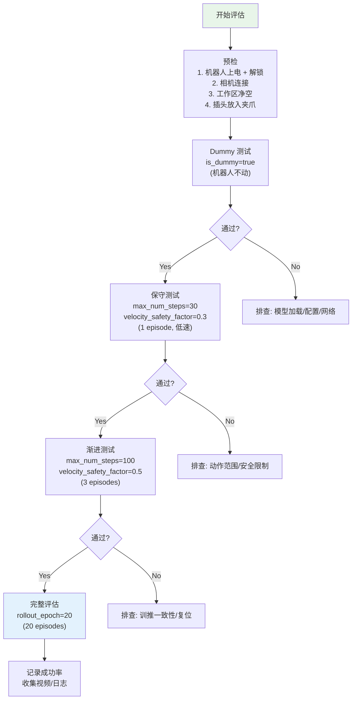

### 12.2 紧急操作

| 按键 | 功能 | 触发动作 |
|:---|:---|:---|
| `r` | 中断复位 | `controller.stop()` → 当前 episode 结束 → `go_to_rest()` |
| E-Stop (物理) | 硬件急停 | 断开 FCI, 机器人锁定 |
| `Ctrl+C` | 终止程序 | 清理资源, 机器人保持当前位置 |

### 12.3 评估记录表模板

| Episode | 开始时间 | 结束时间 | 步数 | 成功? | 失败代码 | 备注 |
|:---:|:---|:---|:---:|:---:|:---|:---|
| 1 | | | | | | |
| 2 | | | | | | |
| ... | | | | | | |
| 20 | | | | | | |

**失败代码**:

| 代码 | 含义 |
|:---|:---|
| `F-MISS` | 未对准插座 |
| `F-FORCE` | 插入力过大, motion guard 触发 |
| `F-DROP` | 插头脱落 |
| `F-OOB` | 关节角超出训练数据范围 |
| `F-TIMEOUT` | 超时 (600 步 = 20 秒) |
| `F-ABORT` | 操作员按 `r` 手动中断 |
| `F-HW` | 硬件错误 (FCI 断连等) |
| `S-OK` | 成功插入 |

### 12.4 速查卡

```
┌──────────────────────────────────────────────────────────┐
│              4DWVLA × RLT Franka 评估速查卡               │
├──────────────────────────────────────────────────────────┤
│ [GPU 容器]                                               │
│ export RLINF_EXT_MODULE=four_dwvla_ext.runtime_bootstrap │
│ export PYTHONPATH=/workspace/RLiKx/b/x:$PYTHONPATH       │
│                                                          │
│ # Dummy 测试                                             │
│ python evaluations/eval_embodied_agent.py \               │
│   --config-name mode_a_vla_eval \                        │
│   --config-path .../four_dwvla_ext/configs \             │
│   env.eval.override_cfg.is_dummy=true                    │
│                                                          │
│ # 完整评估 (20 episodes)                                  │
│ python evaluations/eval_embodied_agent.py \               │
│   --config-name mode_a_vla_eval \                        │
│   --config-path .../four_dwvla_ext/configs \             │
│   env.eval.rollout_epoch=20                              │
│                                                          │
│ [紧急] 按 r 键中断复位                                     │
│ [紧急] 按物理 E-Stop 硬件急停                               │
├──────────────────────────────────────────────────────────┤
│ 控制频率: 30 Hz | 推理延迟: ~200ms/chunk | GPU: ~8 GiB     │
│ HOME: [-0.24, 0.15, 0.19, -2.06, -0.06, 2.20, 0.70]    │
│ Checkpoint: 4wvlaFrkPlugCkp010420 (epoch 20, step 10420) │
└──────────────────────────────────────────────────────────┘
```

---

## 13. 测试方案 -- 不需要连真机

### T1: FourDWVLAFeatureModel 加载测试

**目标**: 验证特征模型可以正确加载 checkpoint 并生成 RLT 特征

```python
def test_feature_model_loading():
    """T1: Load 4DWVLA feature model and verify extract_rlt_obs output."""
    from four_dwvla_ext.models.four_dwvla_feature_model import (
        FourDWVLAFeatureModel,
    )

    fm = FourDWVLAFeatureModel(
        checkpoint_path="/home/nvidia/bt/ckp/4wvlaFrk/plug/4wvlaFrkPlugCkp010420/",
        device="cuda:0",
        dtype="bfloat16",
    )

    # Dummy env_obs
    env_obs = {
        "states": np.zeros(8, dtype=np.float32),
        "main_images": np.random.randint(0, 255, (480, 640, 3), dtype=np.uint8),
        "wrist_images": np.random.randint(0, 255, (480, 640, 3), dtype=np.uint8),
        "task_descriptions": ["plug into socket"],
    }

    rlt_obs = fm.extract_rlt_obs(env_obs)

    assert "z_rl" in rlt_obs
    assert "proprio" in rlt_obs
    assert "ref_chunk" in rlt_obs
    assert rlt_obs["z_rl"].shape == (1, 1536)
    assert rlt_obs["proprio"].shape == (1, 8)
    assert rlt_obs["ref_chunk"].shape == (1, 50, 8)
    assert rlt_obs["z_rl"].dtype == torch.float32
    assert not rlt_obs["z_rl"].requires_grad

    # Verify frozen
    for param in fm.parameters():
        assert not param.requires_grad
```

### T2: 图像预处理一致性测试

```python
def test_resize_with_pad_consistency():
    """T2: resize_with_pad matches training pipeline."""
    from four_dwvla_ext.models.four_dwvla_feature_model import (
        FourDWVLAFeatureModel,
    )
    from lerobot.transforms.core import ResizeImagesWithPadFn

    # 480x640 → 224x224
    img = torch.rand(3, 480, 640)

    # Our implementation
    our_result = FourDWVLAFeatureModel._resize_with_pad(img, 224, 224)

    # Training pipeline
    train_fn = ResizeImagesWithPadFn(height=224, width=224)
    train_result = train_fn({"observation.images.global": img})
    train_img = train_result["observation.images.global"]

    assert our_result.shape == (3, 224, 224)
    assert torch.allclose(our_result, train_img, atol=1e-4), \
        "resize_with_pad mismatch between eval and training!"
```

### T3: 状态编码一致性测试

```python
def test_state_padding_consistency():
    """T3: State padding matches training (8D → 32D)."""
    from four_dwvla_ext.models.four_dwvla_feature_model import (
        FourDWVLAFeatureModel,
    )

    fm = FourDWVLAFeatureModel.__new__(FourDWVLAFeatureModel)
    fm.max_state_dim = 32
    fm.device = torch.device("cpu")

    state_8d = np.array([-0.24, 0.15, 0.19, -2.06, -0.06, 2.20, 0.70, 0.04],
                         dtype=np.float32)

    result = fm._extract_state({"states": state_8d})
    assert result.shape == (1, 32)
    assert torch.allclose(result[0, :8], torch.tensor(state_8d))
    assert torch.all(result[0, 8:] == 0.0)
```

### T4: ref\_chunk 动作范围验证

```python
def test_ref_chunk_action_range():
    """T4: Generated ref_chunk falls within training data bounds."""
    import json

    fm = FourDWVLAFeatureModel(
        checkpoint_path="/home/nvidia/bt/ckp/4wvlaFrk/plug/4wvlaFrkPlugCkp010420/",
    )

    with open("b/d/frk1/plug/abs_stats.json") as f:
        stats = json.load(f)

    arm_q01 = np.array(stats["action.arm"]["q01"])
    arm_q99 = np.array(stats["action.arm"]["q99"])
    grip_q01 = stats["action.gripper"]["q01"][0]
    grip_q99 = stats["action.gripper"]["q99"][0]

    # Generate 10 ref_chunks
    for _ in range(10):
        env_obs = _make_random_env_obs()
        rlt_obs = fm.extract_rlt_obs(env_obs)
        ref = rlt_obs["ref_chunk"][0].cpu().numpy()  # [50, 8]

        arm_actions = ref[:, :7]
        grip_actions = ref[:, 7]

        margin = 0.3  # 30% relaxation for OOD tolerance
        for i in range(7):
            range_i = arm_q99[i] - arm_q01[i]
            assert arm_actions[:, i].min() > arm_q01[i] - margin * range_i
            assert arm_actions[:, i].max() < arm_q99[i] + margin * range_i
```

### T5: RLTMLPPolicy 维度匹配测试

```python
def test_rlt_mlp_policy_dimensions():
    """T5: RLTMLPPolicy accepts 4DWVLA dimensions."""
    from rlinf.models.embodiment.mlp_policy.rlt_mlp_policy import (
        RLTMLPPolicy,
    )

    policy = RLTMLPPolicy(
        z_dim=1536,           # 4DWVLA VLM hidden_size
        proprio_dim=8,        # arm[7] + gripper[1]
        action_dim=8,         # arm[7] + gripper[1]
        num_action_chunks=10,
        ref_num_action_chunks=50,
        add_q_head=True,
        q_head_type="twin_q",
        fixed_std=0.002,
    )

    # Actor forward
    rlt_obs = {
        "z_rl": torch.randn(1, 1536),
        "proprio": torch.randn(1, 8),
        "ref_chunk": torch.randn(1, 50, 8),
    }
    actions, result = policy.predict_action_batch(env_obs=rlt_obs, mode="eval")
    assert actions.shape == (1, 10, 8)

    # Critic forward
    obs = torch.cat([rlt_obs["z_rl"], rlt_obs["proprio"]], dim=-1)  # [1, 1544]
    q_val = policy.sac_q_forward(obs, actions.reshape(1, -1))
    assert q_val.shape == (1, 1)
```

### T6: FrankyJointEnv Gym 注册测试

```python
def test_gym_registration():
    """T6: Environment registered correctly."""
    import gymnasium as gym
    from four_dwvla_ext.runtime_bootstrap import register

    register()

    spec = gym.spec("FrankyJointEnv-v1")
    assert spec is not None
    assert "FrankyJointEnv" in str(spec.entry_point)
```

### T7: 端到端 Dummy 推理测试

```python
def test_end_to_end_dummy():
    """T7: Full pipeline with dummy env (no robot)."""
    from four_dwvla_ext.models.four_dwvla_feature_model import (
        FourDWVLAFeatureModel,
    )

    fm = FourDWVLAFeatureModel(
        checkpoint_path="/home/nvidia/bt/ckp/4wvlaFrk/plug/4wvlaFrkPlugCkp010420/",
    )

    # Simulate 10 steps
    env_obs = _make_random_env_obs()
    for step in range(10):
        rlt_obs = fm.extract_rlt_obs(env_obs)

        # Mode A: take ref_chunk[step]
        action = rlt_obs["ref_chunk"][0, step].cpu().numpy()
        assert action.shape == (8,)
        assert np.isfinite(action).all()

        # Simulate next obs (random)
        env_obs = _make_random_env_obs()

    print(f"T7 passed: 10 dummy steps, all actions finite")
```

### T8: 模型扩展方法测试

```python
def test_model_extensions():
    """T8: Monkey-patched methods work correctly."""
    from four_dwvla_ext.runtime_bootstrap import _patch_internvla_model
    from lerobot.policies.internvla_a1_5.modeling_internvla_a1_5 import (
        InternVLAA15,
    )

    _patch_internvla_model()

    assert hasattr(InternVLAA15, "forward_prefix_with_hidden")
    assert hasattr(InternVLAA15, "sample_actions_from_prefix_kv")
    assert hasattr(InternVLAA15, "get_learnable_token_output")
```

### T9: 键盘中断复位 Wrapper 测试

```python
def test_keyboard_abort_reset_wrapper():
    """T9: Abort-reset wrapper logic."""
    from unittest.mock import MagicMock
    from four_dwvla_ext.wrappers.keyboard_abort_reset_wrapper import (
        KeyboardAbortResetWrapper,
    )

    mock_env = MagicMock()
    mock_env.step.return_value = ({"state": np.zeros(8)}, 0.0, False, False, {})
    mock_env.reset.return_value = ({"state": np.zeros(8)}, {})
    mock_env.unwrapped = MagicMock()
    mock_env.unwrapped._controller = MagicMock()

    wrapper = KeyboardAbortResetWrapper(mock_env)

    # Normal step
    obs, reward, term, trunc, info = wrapper.step(np.zeros(8))
    assert not info.get("abort_reset", False)

    # Simulate 'r' key press
    wrapper._abort_requested = True
    obs, reward, term, trunc, info = wrapper.step(np.zeros(8))
    assert trunc is True
    assert info["abort_reset"] is True

    # Reset clears abort
    wrapper.reset()
    assert wrapper._abort_requested is False
```

### T10: 配置文件有效性测试

```python
def test_config_files_valid():
    """T10: YAML configs parse without errors."""
    import yaml

    for cfg_name in ["mode_a_vla_eval.yaml", "mode_b_rlt_stage2.yaml"]:
        path = f"b/x/four_dwvla_ext/configs/{cfg_name}"
        with open(path) as f:
            cfg = yaml.safe_load(f)
        assert cfg is not None
        assert "rollout" in cfg
        assert "rlt_feature_model" in cfg["rollout"]
```

---

## 14. 测试方案 -- 需要连真机

### T11: 单步关节控制测试

**前提**: Franky 容器已启动, 机器人已解锁

```python
def test_single_step_joint_control():
    """T11: Send one joint command and verify movement."""
    env = gym.make("FrankyJointEnv-v1", is_dummy=False)
    obs, info = env.reset()

    # Small perturbation on q1
    current_joints = obs["states"][:7]
    target = current_joints.copy()
    target[0] += 0.01  # +0.01 rad on q1

    action = np.concatenate([target, [0.04]])  # open gripper
    obs, reward, term, trunc, info = env.step(action)

    new_joints = obs["states"][:7]
    assert abs(new_joints[0] - target[0]) < 0.005, \
        f"Joint 1 did not move to target: {new_joints[0]} vs {target[0]}"

    env.close()
```

### T12: 完整 Episode 测试

```python
def test_full_episode():
    """T12: Run one complete episode with 4DWVLA."""
    fm = FourDWVLAFeatureModel(
        checkpoint_path="/home/nvidia/bt/ckp/4wvlaFrk/plug/4wvlaFrkPlugCkp010420/",
    )
    env = gym.make("FrankyJointEnv-v1", is_dummy=False,
                    max_num_steps=100, velocity_safety_factor=0.3)
    env = KeyboardAbortResetWrapper(env)

    obs, info = env.reset()
    done = False
    step_count = 0

    while not done and step_count < 100:
        env_obs = {"states": obs["states"],
                   "main_images": obs.get("main_images"),
                   "wrist_images": obs.get("wrist_images"),
                   "task_descriptions": ["plug into socket"]}

        rlt_obs = fm.extract_rlt_obs(env_obs)
        action_chunk = rlt_obs["ref_chunk"][0, :10].cpu().numpy()

        for i in range(min(10, 100 - step_count)):
            obs, reward, term, trunc, info = env.step(action_chunk[i])
            step_count += 1
            if term or trunc:
                done = True
                break

    print(f"T12: Episode completed in {step_count} steps")
    env.close()
```

### T13: 复位流程测试

```python
def test_reset_flow():
    """T13: Verify go_to_rest() executes safely."""
    env = gym.make("FrankyJointEnv-v1", is_dummy=False,
                    reset_pause_for_human=False)  # 自动模式

    obs1, _ = env.reset()
    joints1 = obs1["states"][:7]

    # Verify joints near HOME
    home = np.array([-0.2406, 0.1457, 0.1872, -2.0600, -0.0553, 2.2011, 0.6998])
    for i in range(7):
        assert abs(joints1[i] - home[i]) < 0.1, \
            f"Joint {i} not near HOME after reset: {joints1[i]} vs {home[i]}"

    env.close()
```

### T14: 20-Episode 完整评估测试

```bash
# 命令行执行
python evaluations/eval_embodied_agent.py \
    --config-name mode_a_vla_eval \
    --config-path /workspace/RLiKx/b/x/four_dwvla_ext/configs \
    env.eval.rollout_epoch=20

# 验收条件:
# - 20 个 episode 全部完成 (无 crash)
# - 控制频率稳定在 30±2 Hz
# - 首次推理延迟 < 300 ms
# - GPU 显存 < 12 GiB
# - 视频录制完整
```

---

## 15. 验收方案

### 15.1 验收矩阵

| 编号 | 验收项 | 对应测试 | 验收标准 |
|:---:|:---|:---:|:---|
| V1 | 扩展包可导入 | T6 | `import four_dwvla_ext` 无报错 |
| V2 | Gym 环境注册 | T6 | `gym.spec("FrankyJointEnv-v1")` 有效 |
| V3 | 特征模型加载 | T1 | `extract_rlt_obs()` 返回正确形状的 `{z_rl, proprio, ref_chunk}` |
| V4 | z\_rl 维度 | T1 | `z_rl.shape == (1, 1536)` |
| V5 | ref\_chunk 范围 | T4 | 动作在训练数据 q01-q99 范围内 (±30% 容差) |
| V6 | 图像预处理一致性 | T2 | `resize_with_pad` 与训练管线输出一致 |
| V7 | 状态编码一致性 | T3 | 8D → 32D padding 正确 |
| V8 | RLTMLPPolicy 维度匹配 | T5 | 4DWVLA 维度的 MLP policy 可正常 forward |
| V9 | 模型扩展方法 | T8 | monkey-patch 方法存在且可调用 |
| V10 | 键盘中断复位 | T9 | `r` 键触发 abort + truncate |
| V11 | 配置有效性 | T10 | 两个 YAML 文件可解析 |
| V12 | Dummy 推理 | T7 | 10 步 dummy 推理全部完成, 动作有限 |
| V13 | 单步关节控制 | T11 | 关节移动到目标位置 (±0.005 rad) |
| V14 | 复位流程 | T13 | reset 后关节在 HOME ±0.1 rad |
| V15 | 完整 Episode | T12 | 1 episode 完成, 无 crash |
| V16 | 20-Episode 评估 | T14 | 20 episodes 全部完成 |
| V17 | 控制频率 | T14 | 30 ± 2 Hz |
| V18 | 推理延迟 | T14 | 首次 < 300 ms, 均摊 < 25 ms |
| V19 | GPU 显存 | T14 | < 12 GiB 峰值 |
| V20 | RLinf 无修改 | -- | `cd RLiKx && git diff --stat` 无输出 |
| V21 | 4DWVLA 无修改 | -- | `cd 4WVLA && git diff --stat` 无输出 |

### 15.2 性能指标

| 指标 | 目标 | 测量方法 |
|:---|:---|:---|
| 控制频率 | 30 ± 2 Hz | `time.perf_counter()` per step |
| 首次推理延迟 | < 300 ms | `extract_rlt_obs()` 计时 |
| 均摊推理延迟 | < 25 ms/step | 总推理时间 / 总步数 |
| GPU 显存 (峰值) | < 12 GiB | `torch.cuda.max_memory_allocated()` |
| GPU 显存 (稳态) | < 8 GiB | `torch.cuda.memory_allocated()` (推理期间) |
| Episode 成功率 | 报告值 (无目标) | 成功数 / 总 episode 数 |

---

## 16. 风险与缓解

| 风险 | 可能性 | 影响 | 缓解措施 |
|:---|:---:|:---:|:---|
| Qwen3.5 hidden state 分布与 OpenPI 不同, z\_rl 质量低 | 中 | 模式 B 效果差 | 模式 A 不依赖 z\_rl 质量; 模式 B 可训练 RLTTokenEncoder 适配 |
| 50 步 ref\_chunk 前 10 步质量不及独立推理 | 低 | 控制精度降低 | chunk_size 可配置; 可改为每步重新推理 |
| monkey-patch 与 InternVLA 版本不兼容 | 中 | 启动失败 | `_patch_internvla_model()` 有版本检查; 可改为子类方式 |
| RTX 5090 D 显存不足 (bf16 推理) | 低 | OOM | Optimized backend 已优化; 可改 float16 或量化 |
| Franky 容器无 4DWVLA 依赖 | 低 | 导入错误 | 特征模型仅在 GPU 容器加载; env worker 不导入 4DWVLA |
| delta\_scale 不匹配关节角空间 | 中 | 模式 B 效果差 | 关节角的 delta\_scale 需要根据数据分布重新校准 |
| `forward_prefix_with_hidden` 方法不存在于 Optimized 子类 | 中 | 运行时错误 | 同时 patch InternVLAA15 和 InternVLAA15Optimized |

---

## 17. 模式 A 纯 VLA 评估 — 细化实现与操作手册

> **定位**: 本章聚焦于"直接使用 4DWVLA 输出动作"做"仅纯 VLA 评估"的**完整落地**. 不涉及 RLT Stage 2 的 MLP Actor-Critic、delta 路由或 transition 管理. 目标是以最简路径将 4DWVLA checkpoint 部署到 FR3v2.1 真机, 采集 20+ Episode 成功率.
> **与其他章节的关系**: §2–§6 分析了 RLT 完整管线和 4DWVLA 适配器, 为模式 B 预留; 本章从中抽取模式 A **真正需要**的最小子集, 提供独立可执行的实现方案.

### 17.1 模式 A 简化架构

模式 A 不使用 RLT 管线中的以下组件:

| 组件 | 模式 B (RLT Stage 2) | 模式 A (纯 VLA) | 理由 |
|:---|:---:|:---:|:---|
| `RLTMLPPolicy` | ✅ 训练 | ❌ 不需要 | 没有 Actor-Critic, 不输出 delta |
| `RealworldRLTRoute` | ✅ delta 路由 | ❌ 不需要 | 不存在 "student vs ref" 选择 |
| `RLT Transition` | ✅ replay buffer | ❌ 不需要 | 无在线学习 |
| `z_rl` 提取 | ✅ 输入给 MLP | ❌ 不需要 | 模式 A 不消费 z\_rl |
| `predict_rlt_actions()` | ✅ 完整调用 | ❌ 不需要 | 模式 A 直接调用 `select_action()` |
| `FourDWVLAFeatureModel` | ✅ extract\_rlt\_obs | ❌ 不需要 | 模式 A 使用更简洁的 `FourDWVLAEvalPolicy` |
| `FrankyJointEnv` | ✅ 使用 | ✅ 使用 | 关节空间控制 + 安全层不变 |
| `KeyboardAbortResetWrapper` | ✅ 使用 | ✅ 使用 | 紧急中断不变 |

**模式 A 的数据流极其简洁**:

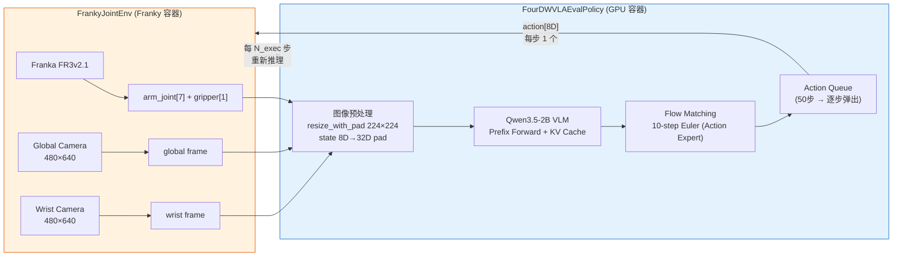

### 17.2 关键设计决策

#### 17.2.1 独立评估脚本 vs RLinf Rollout Worker

| 方案 | 优点 | 缺点 |
|:---|:---|:---|
| **A: 独立 `eval_4dwvla_mode_a.py` 脚本** | 极简, 无 Ray 依赖, 单进程调试方便, 新手友好 | 不复用 RLinf 视频录制/日志/指标; 不自动支持双容器 |
| **B: 通过 RLinf Rollout Worker** | 复用 video\_cfg, logger, 双容器通信, 指标采集 | 需要理解 RLinf worker 框架, 启动链路长 |

**本章采用方案 A**: 提供一个 ~200 行的独立评估脚本, 实现完整的 obs → model → env.step 循环, 内置视频录制和指标采集. 方案 B 的集成路径在 §8 已覆盖.

> **理由**: 模式 A 的目标是快速获取 checkpoint 的真机表现. 独立脚本消除了 Ray 集群、Hydra 配置栈、dual-container 部署的复杂度, 让操作员在**单台 GPU 服务器**上通过一条命令完成评估. 如果后续需要 RLT Stage 2 训练, 再切换到 §8 的 RLinf 管线.

#### 17.2.2 Action Chunking 策略: `N_exec` 参数

4DWVLA 一次推理生成 `chunk_size=50` 步动作. 推理一次约 150–230 ms (§8.2). 关键决策是每次推理后**执行多少步**再重新推理:

```
chunk_size = 50 (模型生成)
N_exec = 可配置 (实际执行步数)

N_exec=50 (开环): 一次推理 → 执行全部 50 步 (~1.67s) → 再推理
    优: 推理开销最小 (~4.6 ms/step 均摊), 完全匹配训练时的 n_action_steps
    缺: 纯开环, 无法纠偏

N_exec=10 (半闭环): 一次推理 → 执行前 10 步 (~0.33s) → 重新推理
    优: 每 0.33s 更新一次视觉反馈, 可纠偏
    缺: 丢弃 40 步预测, 推理开销 5× (~23 ms/step 均摊)

N_exec=1 (逐步闭环): 每步都重新推理
    优: 最强闭环
    缺: 推理 ~200ms > 1/30Hz=33ms, 无法维持 30Hz, 不可行
```

**本方案默认 `N_exec=50`**: 这与训练时的 `n_action_steps=50` 完全一致 — 训练数据中每个 chunk 的全部 50 步都被用于监督. 默认情况下应信任模型的完整输出. 如果评估发现后段动作质量差, 可调低到 10 或 25.

### 17.3 训练-推理一致性深度分析

> 此节汇总 eval\_2 §3 的一致性分析, 聚焦于模式 A 实际需要关注的 4 个维度, 并给出具体的代码实现对照.

#### 17.3.1 图像处理: `resize_with_pad`

训练管线使用 `ResizeImagesWithPadFn` (type: `resize_with_pad`, 定义于 `lerobot/transforms/core.py`), 对 480×640 的原始图像进行**保持宽高比的缩放 + 零填充**到 224×224:

$$\text{scale} = \min\!\left(\frac{224}{480},\ \frac{224}{640}\right) = \min(0.4667, 0.35) = 0.35$$

$$\text{new\_size} = (480 \times 0.35,\ 640 \times 0.35) = (168, 224)$$

$$\text{pad\_top} = \frac{224 - 168}{2} = 28, \quad \text{pad\_bottom} = 28$$

```
原始 (480×640)           缩放 (168×224)        填充 (224×224)
┌──────────────┐        ┌──────────────┐      ┌──────────────┐
│              │        │              │      │▒▒▒▒ 28px ▒▒▒▒│
│              │  →     │              │  →   │              │
│              │        │              │      │  168×224 图像  │
│              │        │              │      │              │
│              │        └──────────────┘      │▒▒▒▒ 28px ▒▒▒▒│
└──────────────┘                              └──────────────┘
                                              ▒ = 零填充 (黑色)
```

**推理时实现** (在 `FourDWVLAEvalPolicy._resize_with_pad` 中):

```python
@staticmethod
def _resize_with_pad(img_np: np.ndarray, target_h: int, target_w: int) -> np.ndarray:
    """保持宽高比缩放 + 零填充, 与训练管线 ResizeImagesWithPadFn 一致.

    Args:
        img_np: uint8 [H, W, 3], 原始相机图像
        target_h, target_w: 目标尺寸 (224, 224)

    Returns:
        uint8 [target_h, target_w, 3], 缩放+填充后的图像
    """
    import cv2

    h, w = img_np.shape[:2]
    scale = min(target_h / h, target_w / w)
    new_h, new_w = int(h * scale), int(w * scale)

    resized = cv2.resize(img_np, (new_w, new_h), interpolation=cv2.INTER_LINEAR)

    padded = np.zeros((target_h, target_w, 3), dtype=np.uint8)
    top = (target_h - new_h) // 2
    left = (target_w - new_w) // 2
    padded[top : top + new_h, left : left + new_w] = resized
    return padded
```

> **⚠️ 常见错误**: 如果使用 naive resize (直接拉伸到 224×224 不保持宽高比), 图像会被压扁, 导致模型输出完全错误. 这是训推不一致的首要风险.

#### 17.3.2 状态处理: 8D → 32D 零填充 + ÷3 量化

训练管线的状态处理分两步 (定义于 `transform_internvla_a1_5.py:_encode_state()` L95-102):

**步骤 1: 零填充到 `max_state_dim=32`**

```python
# 训练时 (pad_state_and_action transform):
state_8d = [q1, q2, q3, q4, q5, q6, q7, gripper]  # 实际 8D
state_32d = [q1, q2, q3, q4, q5, q6, q7, gripper, 0, 0, ..., 0]  # 填充到 32D
```

**步骤 2: 状态 tokenization** (Qwen3.5 VL Processor 内部自动完成, `tokenize_state=True` 时)

$$\text{state\_norm}[i] = \frac{\text{state\_32d}[i]}{3}$$

$$\text{bin}[i] = \text{digitize}\!\left(\text{state\_norm}[i],\ \text{linspace}(-1, 1, 257)[:-1]\right) - 1$$

$$\text{token\_text} = \text{"State: bin[0] bin[1] ... bin[31]"}$$

**推理时实现**: 零填充在 `FourDWVLAEvalPolicy._pad_state()` 中完成; tokenization 由 `InternVLAA15Policy.select_action()` 内部的 processor 自动完成, 无需手动干预.

```python
@staticmethod
def _pad_state(state_8d: np.ndarray, max_dim: int = 32) -> np.ndarray:
    """8D 实际状态 → 32D 零填充, 与训练管线 pad_state_and_action 一致."""
    padded = np.zeros(max_dim, dtype=np.float32)
    padded[:len(state_8d)] = state_8d
    return padded
```

#### 17.3.3 动作空间: 绝对关节角, IDENTITY 归一化

| 属性 | 训练时 | 推理时 (模式 A) | 匹配? |
|:---|:---|:---|:---:|
| 动作模式 | `abs` (绝对关节位置) | 绝对关节位置, 直接发给 `move_joints` | ✅ |
| 归一化映射 | `IDENTITY` (无归一化) | **无需反归一化** | ✅ |
| 动作维度 | 8D (arm[7] + gripper[1]) | 8D, 模型输出 32D → 截取前 8D | ✅ |
| chunk\_size | 50 | 50 (一次推理生成) | ✅ |
| n\_action\_steps | 50 | `N_exec` (默认 50, 可配置) | ⚠️ 可调 |
| 关节角单位 | 弧度 (raw) | 弧度, 直接使用 | ✅ |
| 夹爪指令 | 范围 [0.007, 1.0] | `> threshold → close, ≤ → open` | ✅ |

**推理时动作处理** (在 `FourDWVLAEvalPolicy.select_action()` 中):

```python
# 模型输出: raw_actions [B, 50, 32] (max_action_dim=32)
# 截取: actions = raw_actions[:, :, :8]  # [B, 50, 8]
# actions[:, :, :7] = 7 个关节角 (rad), 绝对位置
# actions[:, :, 7]  = 夹爪指令 (连续值)
# 因为 normalization_mapping = IDENTITY, 不需要任何反归一化
```

#### 17.3.4 一致性检查项总结

| 检查项 | 训练值 | 推理实现中必须匹配的值 | 出错后果 |
|:---|:---|:---|:---|
| `image_resolution` | `[224, 224]` | resize\_with\_pad 目标尺寸 = 224×224 | 图像特征失配 |
| resize 方式 | `resize_with_pad` (bilinear) | 必须保持宽高比 + 零填充 | 图像变形, 动作完全错误 |
| `max_state_dim` | `32` | 状态零填充到 32D | tokenization 对位错误 |
| `tokenize_state` | `True` | Processor 的 `tokenize_state=True` | 状态信息丢失 |
| `max_state_dim` 中的 ÷3 | 硬编码 `/3` | Processor 内部自动处理 | 量化范围错误 |
| `normalization_mapping` | ALL `IDENTITY` | **不做**反归一化 | 关节角被缩放, 运动异常 |
| `chunk_size` | `50` | 模型 config 中 `chunk_size=50` | 动作截断或越界 |
| `action_loss_only` | 训练时 `false` | 推理时 `true` | 加载 WAN 5B 参数, OOM |
| `inference_backend` | 训练时 `standard` | 推理时 `optimized` | 加载不必要的模块 |
| `num_inference_steps` | `10` | 推理时保持 `10` | flow matching 精度变化 |
| 相机数量 | 2 (global + wrist) | 推理时提供 2 张图 | 缺少视角, 精度下降 |

### 17.4 `FourDWVLAEvalPolicy` 完整实现

> 这是模式 A 的核心类: 封装 InternVLA-A1.5 模型, 提供简洁的 `select_action(obs)` 接口, 内置 action queue.

**文件**: `four_dwvla_ext/models/four_dwvla_eval_policy.py`

```python
"""Minimal 4DWVLA evaluation policy for Mode A (pure VLA eval).

Wraps InternVLA-A1.5 with optimized backend. No RLT pipeline dependency.
Simple interface: obs → select_action → 8D action.

Key design:
    - Action queue: one inference produces chunk_size=50 actions,
      pop one action per env step until queue depleted or N_exec reached
    - Obs preprocessing: resize_with_pad + state padding, matching training
    - No denormalization needed (normalization_mapping = IDENTITY)
"""
from __future__ import annotations

import json
import logging
import time
from collections import deque
from pathlib import Path
from typing import Any

import cv2
import numpy as np
import torch

logger = logging.getLogger(__name__)


class FourDWVLAEvalPolicy:
    """4DWVLA policy for pure VLA evaluation on Franka.

    Usage:
        policy = FourDWVLAEvalPolicy(checkpoint_path="...", device="cuda:0")
        obs = env.reset()
        action = policy.select_action(obs)
        obs, reward, term, trunc, info = env.step(action)
    """

    def __init__(
        self,
        checkpoint_path: str,
        device: str = "cuda:0",
        n_exec: int = 50,
        task_description: str = "plug into socket",
    ):
        """
        Args:
            checkpoint_path: Path to 4DWVLA checkpoint directory
            device: CUDA device
            n_exec: Number of actions to execute per inference call.
                    50 = fully open-loop (matches training n_action_steps).
                    10 = semi-closed-loop (re-infer every 0.33s).
            task_description: Language instruction for the VLA
        """
        self.checkpoint_path = Path(checkpoint_path)
        self.device = torch.device(device)
        self.n_exec = n_exec
        self.task_description = task_description

        self._action_queue: deque[np.ndarray] = deque()
        self._queue_step = 0
        self._last_inference_time_ms = 0.0

        self._load_model()
        self._load_config()

        logger.info(
            "FourDWVLAEvalPolicy ready: device=%s, n_exec=%d, "
            "chunk_size=%d, action_dim=%d, image=%dx%d",
            self.device, self.n_exec,
            self.chunk_size, self.actual_action_dim,
            self.target_h, self.target_w,
        )

    def _load_config(self) -> None:
        """Load model config for dimension info."""
        config_path = self.checkpoint_path / "config.json"
        with open(config_path) as f:
            cfg = json.load(f)

        self.chunk_size = cfg.get("chunk_size", 50)
        self.max_state_dim = cfg.get("max_state_dim", 32)
        self.max_action_dim = cfg.get("max_action_dim", 32)
        self.actual_action_dim = 8  # 7 arm joints + 1 gripper
        self.target_h = cfg.get("image_resolution", [224, 224])[0]
        self.target_w = cfg.get("image_resolution", [224, 224])[1]
        self.num_inference_steps = cfg.get("num_inference_steps", 10)

    def _load_model(self) -> None:
        """Load InternVLA-A1.5 with optimized backend."""
        from lerobot.policies.internvla_a1_5.configuration_internvla_a1_5 import (
            InternVLAA15Config,
        )
        from lerobot.policies.internvla_a1_5.modeling_internvla_a1_5 import (
            InternVLAA15Policy,
        )

        config_path = self.checkpoint_path / "config.json"
        with open(config_path) as f:
            config_dict = json.load(f)

        # Override for inference
        config_dict["inference_backend"] = "optimized"
        config_dict["action_loss_only"] = True
        config_dict["gradient_checkpointing"] = False
        config_dict["device"] = str(self.device)

        config = InternVLAA15Config(**{
            k: v for k, v in config_dict.items()
            if k in InternVLAA15Config.__dataclass_fields__
        })
        config.inference_backend = "optimized"
        config.action_loss_only = True

        logger.info("Loading 4DWVLA checkpoint from %s ...", self.checkpoint_path)
        t0 = time.time()

        self.policy = InternVLAA15Policy(config)
        self.policy.load_pretrained(self.checkpoint_path)
        self.policy = self.policy.to(self.device)
        self.policy.eval()

        for param in self.policy.parameters():
            param.requires_grad_(False)

        logger.info(
            "Model loaded in %.1fs, GPU memory: %.1f GiB",
            time.time() - t0,
            torch.cuda.max_memory_allocated(self.device) / 1024**3,
        )

    def select_action(self, obs: dict[str, Any]) -> np.ndarray:
        """Select next action from observation.

        If action queue is non-empty and within N_exec budget, pop from queue.
        Otherwise, run a full inference to refill the queue.

        Args:
            obs: dict with keys:
                "state.joint_positions": np.ndarray [7]
                "state.gripper_position": np.ndarray [1]
                "frames.global": np.ndarray [H, W, 3] uint8
                "frames.wrist": np.ndarray [H, W, 3] uint8
                (OR equivalent flat structure)

        Returns:
            action: np.ndarray [8] -- [q1..q7, gripper_cmd]
        """
        if len(self._action_queue) == 0 or self._queue_step >= self.n_exec:
            self._infer(obs)

        action = self._action_queue.popleft()
        self._queue_step += 1
        return action

    @torch.no_grad()
    def _infer(self, obs: dict[str, Any]) -> None:
        """Run full model inference: obs → 50-step action chunk → queue."""
        t0 = time.perf_counter()

        # 1. Build model input
        observation = self._build_observation(obs)

        # 2. Call model's select_action
        with torch.amp.autocast("cuda", dtype=torch.bfloat16):
            raw_action = self.policy.select_action(observation)
        # raw_action: dict or Tensor, shape [chunk_size, max_action_dim]

        if isinstance(raw_action, dict):
            actions = raw_action.get("action", raw_action.get("actions"))
        else:
            actions = raw_action

        if isinstance(actions, torch.Tensor):
            actions = actions.cpu().numpy()

        # 3. Truncate to actual action dim [chunk_size, 8]
        if actions.ndim == 3:
            actions = actions[0]  # remove batch dim
        actions = actions[:, : self.actual_action_dim]
        # actions: [50, 8]

        # 4. Fill action queue
        self._action_queue.clear()
        for i in range(min(self.n_exec, len(actions))):
            self._action_queue.append(actions[i].astype(np.float64))
        self._queue_step = 0

        elapsed_ms = (time.perf_counter() - t0) * 1000
        self._last_inference_time_ms = elapsed_ms
        logger.debug(
            "Inference: %.1fms, queued %d actions (n_exec=%d)",
            elapsed_ms, len(self._action_queue), self.n_exec,
        )

    def _build_observation(self, obs: dict[str, Any]) -> dict:
        """Convert env observation to model input format.

        Handles two observation formats:
        Format A (FrankyJointEnv raw):
            {"state": {"joint_positions": [7], "gripper_position": [1]},
             "frames": {"global": [H,W,3], "wrist": [H,W,3]}}

        Format B (FrankyJointEnv rlinf):
            {"states": [8],
             "main_images": [H,W,3], "wrist_images": [H,W,3]}
        """
        # --- Extract state ---
        if "states" in obs:
            state_8d = np.asarray(obs["states"], dtype=np.float32).flatten()[:8]
        elif "state" in obs:
            joints = np.asarray(obs["state"]["joint_positions"], dtype=np.float32)
            gripper = np.asarray(obs["state"]["gripper_position"], dtype=np.float32)
            state_8d = np.concatenate([joints.flatten()[:7], gripper.flatten()[:1]])
        else:
            raise ValueError("Observation must contain 'states' or 'state' key")

        state_32d = self._pad_state(state_8d, self.max_state_dim)

        # --- Extract and preprocess images ---
        images = {}
        if "frames" in obs:
            for cam_name, frame in obs["frames"].items():
                images[cam_name] = self._resize_with_pad(frame, self.target_h, self.target_w)
        else:
            if "main_images" in obs and obs["main_images"] is not None:
                images["global"] = self._resize_with_pad(
                    obs["main_images"], self.target_h, self.target_w
                )
            if "wrist_images" in obs and obs["wrist_images"] is not None:
                images["wrist"] = self._resize_with_pad(
                    obs["wrist_images"], self.target_h, self.target_w
                )

        # --- Build model observation dict ---
        observation = {
            "observation.state": torch.tensor(
                state_32d, dtype=torch.float32
            ).unsqueeze(0).to(self.device),
            "task": self.task_description,
        }

        # Add images as expected by the model
        img_list = []
        for cam_name in ["global", "wrist"]:
            if cam_name in images:
                img_tensor = torch.from_numpy(images[cam_name]).float() / 255.0
                img_tensor = img_tensor.permute(2, 0, 1)  # HWC → CHW
                img_list.append(img_tensor)

        if img_list:
            observation["observation.images"] = {
                f"image{i}": img.unsqueeze(0).to(self.device)
                for i, img in enumerate(img_list)
            }

        return observation

    @staticmethod
    def _resize_with_pad(
        img_np: np.ndarray, target_h: int, target_w: int
    ) -> np.ndarray:
        """保持宽高比缩放 + 零填充.

        与训练管线 ResizeImagesWithPadFn 一致:
            scale = min(target_h/h, target_w/w)
            → bilinear resize → center zero-pad
        """
        h, w = img_np.shape[:2]
        scale = min(target_h / h, target_w / w)
        new_h, new_w = int(h * scale), int(w * scale)

        resized = cv2.resize(
            img_np, (new_w, new_h), interpolation=cv2.INTER_LINEAR
        )

        padded = np.zeros((target_h, target_w, 3), dtype=np.uint8)
        top = (target_h - new_h) // 2
        left = (target_w - new_w) // 2
        padded[top : top + new_h, left : left + new_w] = resized
        return padded

    @staticmethod
    def _pad_state(state_8d: np.ndarray, max_dim: int = 32) -> np.ndarray:
        """8D → 32D 零填充 (与训练管线 pad_state_and_action 一致)."""
        padded = np.zeros(max_dim, dtype=np.float32)
        padded[: len(state_8d)] = state_8d
        return padded

    @property
    def last_inference_time_ms(self) -> float:
        return self._last_inference_time_ms

    def reset(self) -> None:
        """Clear action queue between episodes."""
        self._action_queue.clear()
        self._queue_step = 0
```

### 17.5 独立评估脚本

**文件**: `four_dwvla_ext/scripts/eval_4dwvla_mode_a.py`

```python
#!/usr/bin/env python3
"""4DWVLA Mode A: Pure VLA Evaluation on Franka FR3v2.1.

Standalone script -- no Ray, no Hydra, no RLinf rollout worker.
Single process: loads model on GPU, controls robot directly.

Usage:
    python eval_4dwvla_mode_a.py \
        --checkpoint /home/nvidia/bt/ckp/4wvlaFrk/plug/4wvlaFrkPlugCkp010420/ \
        --num-episodes 20 \
        --n-exec 50 \
        --velocity-safety-factor 0.5 \
        --max-steps 600

Progressive testing (recommended first run):
    python eval_4dwvla_mode_a.py --checkpoint ... --num-episodes 1 \
        --max-steps 30 --velocity-safety-factor 0.3

Dummy run (no robot movement):
    python eval_4dwvla_mode_a.py --checkpoint ... --dummy --num-episodes 2
"""
from __future__ import annotations

import argparse
import csv
import json
import logging
import os
import sys
import time
from datetime import datetime
from pathlib import Path

import numpy as np

logging.basicConfig(
    level=logging.INFO,
    format="%(asctime)s [%(levelname)s] %(name)s: %(message)s",
    datefmt="%H:%M:%S",
)
logger = logging.getLogger("eval_mode_a")


def parse_args():
    p = argparse.ArgumentParser(description="4DWVLA Mode A Pure VLA Eval")
    p.add_argument(
        "--checkpoint",
        type=str,
        default="/home/nvidia/bt/ckp/4wvlaFrk/plug/4wvlaFrkPlugCkp010420/",
        help="Path to 4DWVLA checkpoint directory",
    )
    p.add_argument("--num-episodes", type=int, default=20)
    p.add_argument("--max-steps", type=int, default=600, help="Max steps per episode (600 = 20s at 30Hz)")
    p.add_argument("--n-exec", type=int, default=50, help="Actions per inference (50=open-loop, 10=semi-closed)")
    p.add_argument("--velocity-safety-factor", type=float, default=0.5)
    p.add_argument("--step-frequency", type=float, default=30.0)
    p.add_argument("--joint-limit-margin", type=float, default=0.05)
    p.add_argument("--robot-ip", type=str, default="172.16.0.2")
    p.add_argument("--task", type=str, default="plug into socket")
    p.add_argument("--device", type=str, default="cuda:0")
    p.add_argument("--dummy", action="store_true", help="Dummy mode: no real robot movement")
    p.add_argument("--output-dir", type=str, default=None, help="Directory for logs and videos")
    p.add_argument("--record-video", action="store_true", help="Record episode videos")
    return p.parse_args()


def make_env(args):
    """Create FrankyJointEnv with KeyboardAbortResetWrapper."""
    # Ensure extension package is importable
    ext_path = str(Path(__file__).resolve().parent.parent.parent)
    if ext_path not in sys.path:
        sys.path.insert(0, ext_path)

    from four_dwvla_ext.envs.franky_joint_env import FrankyJointEnv
    from four_dwvla_ext.envs.franky_joint_env_config import FrankyJointEnvConfig
    from four_dwvla_ext.wrappers.keyboard_abort_reset_wrapper import (
        KeyboardAbortResetWrapper,
    )

    config = FrankyJointEnvConfig(
        robot_ip=args.robot_ip,
        step_frequency=args.step_frequency,
        max_num_steps=args.max_steps,
        joint_limit_margin=args.joint_limit_margin,
        velocity_safety_factor=args.velocity_safety_factor,
        reset_pause_for_human=True,
        is_dummy=args.dummy,
    )

    env = FrankyJointEnv(config)
    env = KeyboardAbortResetWrapper(env)
    return env


def make_policy(args):
    """Load FourDWVLAEvalPolicy."""
    from four_dwvla_ext.models.four_dwvla_eval_policy import FourDWVLAEvalPolicy

    return FourDWVLAEvalPolicy(
        checkpoint_path=args.checkpoint,
        device=args.device,
        n_exec=args.n_exec,
        task_description=args.task,
    )


def setup_output_dir(args) -> Path:
    """Create output directory for this evaluation run."""
    if args.output_dir:
        out = Path(args.output_dir)
    else:
        timestamp = datetime.now().strftime("%Y%m%d_%H%M%S")
        out = Path(f"eval_results/mode_a_{timestamp}")
    out.mkdir(parents=True, exist_ok=True)
    return out


def run_episode(env, policy, episode_idx: int, args) -> dict:
    """Run a single evaluation episode.

    Returns:
        dict with keys: episode, steps, success, failure_code,
                        inference_times_ms, step_freqs_hz, elapsed_s
    """
    logger.info("=" * 60)
    logger.info("Episode %d/%d starting", episode_idx + 1, args.num_episodes)
    logger.info("=" * 60)

    policy.reset()
    obs, info = env.reset()

    step_count = 0
    done = False
    inference_times = []
    step_freqs = []
    episode_start = time.time()

    while not done and step_count < args.max_steps:
        step_start = time.perf_counter()

        # Select action (may trigger inference if queue empty)
        queue_was_empty = len(policy._action_queue) == 0
        action = policy.select_action(obs)

        if queue_was_empty:
            inference_times.append(policy.last_inference_time_ms)

        # Execute action
        obs, reward, terminated, truncated, info = env.step(action)
        step_count += 1

        step_elapsed = time.perf_counter() - step_start
        step_freqs.append(1.0 / max(step_elapsed, 1e-6))

        if terminated or truncated:
            done = True
            if info.get("abort_reset"):
                logger.info("Episode %d: ABORTED by operator (r key)", episode_idx + 1)

    elapsed_s = time.time() - episode_start

    result = {
        "episode": episode_idx + 1,
        "steps": step_count,
        "elapsed_s": round(elapsed_s, 2),
        "avg_freq_hz": round(np.mean(step_freqs), 1) if step_freqs else 0,
        "num_inferences": len(inference_times),
        "avg_inference_ms": round(np.mean(inference_times), 1) if inference_times else 0,
        "max_inference_ms": round(max(inference_times), 1) if inference_times else 0,
        "aborted": info.get("abort_reset", False),
    }

    logger.info(
        "Episode %d/%d done: %d steps, %.1fs, avg %.1f Hz, "
        "%d inferences (avg %.1f ms)",
        episode_idx + 1, args.num_episodes,
        result["steps"], result["elapsed_s"], result["avg_freq_hz"],
        result["num_inferences"], result["avg_inference_ms"],
    )

    return result


def main():
    args = parse_args()

    logger.info("=" * 60)
    logger.info("4DWVLA Mode A: Pure VLA Evaluation")
    logger.info("=" * 60)
    logger.info("Checkpoint: %s", args.checkpoint)
    logger.info("Episodes: %d, Max steps: %d, N_exec: %d", args.num_episodes, args.max_steps, args.n_exec)
    logger.info("Velocity safety factor: %.2f", args.velocity_safety_factor)
    logger.info("Dummy mode: %s", args.dummy)
    logger.info("")

    output_dir = setup_output_dir(args)
    logger.info("Output directory: %s", output_dir)

    # Save run config
    with open(output_dir / "run_config.json", "w") as f:
        json.dump(vars(args), f, indent=2)

    # Load model
    logger.info("Loading model...")
    policy = make_policy(args)

    # Create environment
    logger.info("Creating environment...")
    env = make_env(args)

    # Run episodes
    results = []
    try:
        for ep_idx in range(args.num_episodes):
            result = run_episode(env, policy, ep_idx, args)
            results.append(result)

            # Save intermediate results
            with open(output_dir / "results.json", "w") as f:
                json.dump(results, f, indent=2)

    except KeyboardInterrupt:
        logger.warning("Evaluation interrupted by Ctrl+C after %d episodes", len(results))
    finally:
        env.close()

    # Print summary
    logger.info("")
    logger.info("=" * 60)
    logger.info("EVALUATION SUMMARY")
    logger.info("=" * 60)
    logger.info("Completed episodes: %d / %d", len(results), args.num_episodes)

    if results:
        avg_steps = np.mean([r["steps"] for r in results])
        avg_freq = np.mean([r["avg_freq_hz"] for r in results])
        avg_inf = np.mean([r["avg_inference_ms"] for r in results])
        aborted = sum(1 for r in results if r.get("aborted", False))

        logger.info("Avg steps/episode: %.0f", avg_steps)
        logger.info("Avg control frequency: %.1f Hz", avg_freq)
        logger.info("Avg inference time: %.1f ms", avg_inf)
        logger.info("Aborted episodes: %d", aborted)
        logger.info("")
        logger.info("Results saved to: %s", output_dir / "results.json")
        logger.info("")
        logger.info(
            ">>> 操作员请在纸质记录表中填写每个 Episode 的成功/失败判定 <<<",
        )

    # Save final summary
    summary = {
        "checkpoint": args.checkpoint,
        "num_episodes_planned": args.num_episodes,
        "num_episodes_completed": len(results),
        "n_exec": args.n_exec,
        "max_steps": args.max_steps,
        "velocity_safety_factor": args.velocity_safety_factor,
        "dummy": args.dummy,
        "results": results,
    }
    with open(output_dir / "summary.json", "w") as f:
        json.dump(summary, f, indent=2)


if __name__ == "__main__":
    main()
```

### 17.6 `KeyboardAbortResetWrapper` 完整代码

> 继承自 eval\_2 v2.1.4. 提供按 `r` 键中断当前 Episode 并安全复位的功能.

**文件**: `four_dwvla_ext/wrappers/keyboard_abort_reset_wrapper.py`

```python
"""Keyboard abort-reset wrapper for real-robot evaluation.

Press 'r' during an episode to:
1. Immediately stop the robot arm (controller.stop())
2. Set truncated=True (current episode ends)
3. On next reset(), trigger go_to_rest() (arm lifts, moves to HOME, opens gripper)

Thread safety: keyboard listener runs in a background thread.
The wrapper checks for key events at each step() call.
"""
from __future__ import annotations

import logging
import threading
import time

import gymnasium as gym
import numpy as np

logger = logging.getLogger(__name__)

DEBOUNCE_S = 0.3


class _KeyListener:
    """Non-blocking keyboard listener using select() on stdin."""

    def __init__(self):
        self._pressed: list[str] = []
        self._lock = threading.Lock()
        self._stop_event = threading.Event()
        self._thread = threading.Thread(target=self._listen_loop, daemon=True)
        self._thread.start()

    def _listen_loop(self):
        import select
        import sys
        import termios
        import tty

        fd = sys.stdin.fileno()
        try:
            old_settings = termios.tcgetattr(fd)
        except termios.error:
            logger.warning("stdin is not a terminal; keyboard abort disabled")
            return

        try:
            tty.setcbreak(fd)
            while not self._stop_event.is_set():
                if select.select([sys.stdin], [], [], 0.05)[0]:
                    ch = sys.stdin.read(1)
                    with self._lock:
                        self._pressed.append(ch.lower())
        except Exception as e:
            logger.warning("KeyListener error: %s", e)
        finally:
            termios.tcsetattr(fd, termios.TCSADRAIN, old_settings)

    def pop_pressed_keys(self) -> list[str]:
        with self._lock:
            keys = self._pressed.copy()
            self._pressed.clear()
        return keys

    def stop(self):
        self._stop_event.set()
        self._thread.join(timeout=1.0)


class KeyboardAbortResetWrapper(gym.Wrapper):
    """Wraps a FrankyJointEnv to add keyboard abort-reset functionality.

    Keyboard bindings:
        'r' : abort current episode → stop arm → truncated=True
              next reset() calls go_to_rest()
    """

    PEDAL_DEBOUNCE_S = DEBOUNCE_S

    def __init__(self, env: gym.Env):
        super().__init__(env)
        self._abort_requested = False
        self._last_press_ts: dict[str, float] = {}
        try:
            self.listener = _KeyListener()
            logger.info(
                "KeyboardAbortResetWrapper: press 'r' to abort + reset episode"
            )
        except Exception as e:
            logger.warning("Could not start key listener: %s", e)
            self.listener = None

    def step(self, action):
        # Check for keyboard events
        if self.listener is not None:
            keys = self.listener.pop_pressed_keys()
            now = time.time()
            for k in keys:
                if k == "r":
                    last = self._last_press_ts.get("r", 0)
                    if now - last > self.PEDAL_DEBOUNCE_S:
                        self._last_press_ts["r"] = now
                        logger.warning(
                            ">>> ABORT requested (r key) — stopping arm, "
                            "episode will end <<<",
                        )
                        self._abort_requested = True
                        self._emergency_stop_arm()

        if self._abort_requested:
            # Return truncated immediately
            obs = self.env.unwrapped._get_observation()
            return obs, 0.0, False, True, {
                "abort_reset": True,
                "abort_reset_event": "abort_triggered",
            }

        obs, reward, terminated, truncated, info = self.env.step(action)
        info["abort_reset"] = False
        return obs, reward, terminated, truncated, info

    def reset(self, **kwargs):
        if self._abort_requested:
            logger.info("Reset after abort: go_to_rest() will be called")
        self._abort_requested = False
        return self.env.reset(**kwargs)

    def _emergency_stop_arm(self):
        """Send immediate stop command to the robot."""
        try:
            controller = self.env.unwrapped._controller
            controller.stop()
            logger.info("Emergency stop sent to controller")
        except Exception as e:
            logger.error("Failed to stop arm: %s", e)

    def close(self):
        if self.listener is not None:
            self.listener.stop()
        super().close()
```

### 17.7 部署步骤 (单容器单进程方案)

> 模式 A 的独立脚本方案**不需要双容器**. 在 GPU 服务器上直接运行, 前提是服务器有 GPU 且能通过 FCI 直连机器人.

#### 17.7.1 前提条件

| 条件 | 检查方式 |
|:---|:---|
| GPU 服务器有 RTX 5090 D (32 GiB) | `nvidia-smi` |
| 服务器可 ping 通 `172.16.0.2` (Franka FCI) | `ping -c1 172.16.0.2` |
| 两个 RealSense D435I 已通过 USB 3.0 连接 | `lsusb \| grep RealSense` 显示 2 行 |
| Python 3.11 环境含 torch 2.10+, transformers 5.2+ | `python -c "import torch; print(torch.__version__)"` |
| `franky` (Python libfranka 绑定) 已安装 | `python -c "import franky; print(franky.__version__)"` |
| `four_dwvla_ext` 扩展包在 `PYTHONPATH` 中 | `python -c "import four_dwvla_ext"` |
| Transformers Qwen3.5 patch 已安装 | `python -c "from transformers.models.qwen3_5.modeling_qwen3_5 import Qwen35ForCausalLM"` |
| Checkpoint 文件完整 (4 个文件, model.safetensors ~5.9 GiB) | `ls -lh /home/nvidia/bt/ckp/4wvlaFrk/plug/4wvlaFrkPlugCkp010420/` |

#### 17.7.2 文件创建顺序

```
步骤 1: 在 RLiKx (或 RLmm) 的 b/x/ 下创建扩展包目录
    mkdir -p b/x/four_dwvla_ext/{models,envs,wrappers,scripts,configs,tests}
    touch b/x/four_dwvla_ext/__init__.py
    touch b/x/four_dwvla_ext/{models,envs,wrappers,scripts,tests}/__init__.py

步骤 2: 创建环境文件 (本章中的代码)
    b/x/four_dwvla_ext/envs/franky_joint_env_config.py  ← §7.3 (eval_3)
    b/x/four_dwvla_ext/envs/franky_joint_env.py          ← eval_2 §5.7 (完整代码)

步骤 3: 创建策略文件
    b/x/four_dwvla_ext/models/four_dwvla_eval_policy.py  ← §17.4

步骤 4: 创建 Wrapper
    b/x/four_dwvla_ext/wrappers/keyboard_abort_reset_wrapper.py  ← §17.6

步骤 5: 创建评估脚本
    b/x/four_dwvla_ext/scripts/eval_4dwvla_mode_a.py     ← §17.5

步骤 6: 验证
    PYTHONPATH=b/x:$PYTHONPATH python -c "
    from four_dwvla_ext.models.four_dwvla_eval_policy import FourDWVLAEvalPolicy
    from four_dwvla_ext.envs.franky_joint_env import FrankyJointEnv
    from four_dwvla_ext.wrappers.keyboard_abort_reset_wrapper import KeyboardAbortResetWrapper
    print('All modules importable')
    "
```

#### 17.7.3 环境变量设置

```bash
# 必须设置
export PYTHONPATH=/home/nvidia/bt/s/RLmm/b/x:/home/nvidia/bt/s/4WVLA/src:$PYTHONPATH

# Transformers patch (每次环境重建后执行一次)
TRANSFORMERS_DIR=$(python -c "import transformers; print(transformers.__file__.rsplit('/',1)[0])")
cp -r /home/nvidia/bt/s/4WVLA/src/lerobot/policies/internvla_a1_5/transformers_replace/models \
      ${TRANSFORMERS_DIR}/
```

### 17.8 操作手册 (模式 A 专用)

> **适用对象**: 没有接触过 VLA 模型、RLinf 框架或 Franka 机器人技术的第三方工程师
> **适用场景**: 使用独立脚本 (`eval_4dwvla_mode_a.py`) 在单台 GPU 服务器上评估 4DWVLA 的真机表现
> **预计总耗时**: 约 2–3 小时 (含环境准备、渐进测试、20 Episode 正式评估)

#### 17.8.1 你将要做什么

AI 模型 (4DWVLA, InternVLA-A1.5) 被训练来控制 Franka 机器人完成"把插头插入插座"的动作. 训练数据: 100 次人类演示, 共 66,577 帧, 30Hz.

你的工作:
1. 启动模型和机器人
2. 观察 AI 全自动控制机器人执行插拔任务 (20 次)
3. 每次之间手动重置场景 (把插头放回起始位置)
4. 记录每次是否成功, 最终算出成功率

**AI 模型如何工作** (无需深入理解, 仅供了解):

```
两个相机 ──────────────→┐
(全局+手腕, 各480×640)   │
                        ├──→ AI 模型 ──→ 7个关节角度 + 夹爪指令
7个关节角度 + 夹爪宽度 ──→┘   (约200ms)    (一次50步, 约1.67秒)
(8D 浮点数)                               ↓
                                    每步发给机器人 (30Hz)
                                    50步执行完 → 重新拍照推理
```

**关键参数**:

| 参数 | 值 | 含义 |
|:---|:---|:---|
| Checkpoint | `4wvlaFrkPlugCkp010420` | 训练 10420 步后的模型 |
| 控制频率 | 30 Hz | 每秒 30 个关节指令 |
| chunk\_size | 50 | 每次推理产生 50 步动作 (~1.67s) |
| 单 Episode 最大步数 | 600 (默认) | 约 20 秒 |
| 正式评估 Episode 数 | 20 | 统计显著性所需最低数量 |

#### 17.8.2 安全须知

> ⚠️ **必读**: Franka FR3v2.1 是工业级 7 轴机械臂, 操作不当可能造成人身伤害.

1. **E-stop** (急停按钮) 必须在操作员伸手可及范围内 (< 0.5 m), 且功能已确认
2. 机器人运动时**工作区域内无人员**
3. 操作员熟悉机器人基础安全培训

**紧急操作速查**:

| 紧急情况 | 立即操作 | 执行位置 |
|:---|:---|:---|
| 机器人运动失控 / 即将碰撞 | 按 **E-stop** 急停按钮 | 🖐️ 机器人旁 |
| 需中断当前 Episode 并安全复位 | 按键盘 **`r`** 键 | ⌨️ 运行脚本的终端 |
| 机器人抖动 / 异响 | 按 **`r`** 中断, 降低速度重试 | ⌨️ 终端 |
| 软件卡死 | 按 **Ctrl+C** | ⌨️ 终端 |

#### 17.8.3 硬件检查清单

🖐️ **人工逐项确认**, 每项勾选后再进入下一步:

- [ ] FR3v2.1 机器人 + Franka Hand 平行夹爪
- [ ] E-stop 急停按钮 (功能正常, 按下后机器人立即制动)
- [ ] 机器人控制柜电源指示灯为**绿色**
- [ ] 2× Intel RealSense D435I 相机 (全局 + 手腕)
- [ ] 插头 (**与训练时完全相同**的型号)
- [ ] 插座 (固定在工作台面上, **与训练位置一致**)
- [ ] GPU 服务器 (RTX 5090 D, 32 GiB VRAM)
- [ ] 以太网线: 服务器 ↔ 机器人控制柜
- [ ] USB 3.0 × 2: 服务器 ↔ 两个相机
- [ ] 工作区无杂物无人员

#### 17.8.4 软件环境确认

以下全部在 GPU 服务器终端执行:

**Step 1: 网络和硬件**

```bash
# 机器人网络
ping -c 1 172.16.0.2

# GPU 可用
nvidia-smi

# 相机连接 (应显示 2 行 RealSense)
lsusb | grep -i "Intel.*RealSense"

# Checkpoint 完整 (model.safetensors 约 5.9 GiB)
ls -lh /home/nvidia/bt/ckp/4wvlaFrk/plug/4wvlaFrkPlugCkp010420/
```

**Step 2: Python 环境**

```bash
# 设置环境变量
export PYTHONPATH=/home/nvidia/bt/s/RLmm/b/x:/home/nvidia/bt/s/4WVLA/src:$PYTHONPATH

# 验证关键依赖
python -c "
import torch
print(f'PyTorch: {torch.__version__}')
print(f'CUDA: {torch.cuda.is_available()}')
print(f'GPU: {torch.cuda.get_device_name(0)}')
print(f'VRAM: {torch.cuda.get_device_properties(0).total_mem/1024**3:.1f} GiB')
"

# 验证 Transformers patch
python -c "
from transformers.models.qwen3_5.modeling_qwen3_5 import Qwen35ForCausalLM
print('✓ Qwen3.5 model available')
"

# 验证扩展包
python -c "
from four_dwvla_ext.models.four_dwvla_eval_policy import FourDWVLAEvalPolicy
from four_dwvla_ext.envs.franky_joint_env import FrankyJointEnv
from four_dwvla_ext.wrappers.keyboard_abort_reset_wrapper import KeyboardAbortResetWrapper
print('✓ All extension modules importable')
"
```

**Step 3: 验证机器人连接**

```bash
python -c "
from rlinf.envs.realworld.franka.franky_controller import FrankyController
import numpy as np

ctrl = FrankyController(robot_ip='172.16.0.2')
state = ctrl.get_state()
q = np.array(state.arm_joint_position[:7])
print('=== FR3v2.1 当前状态 ===')
print(f'关节角 (rad): {np.round(q, 4)}')
print(f'关节角 (deg): {np.round(np.degrees(q), 1)}')
print(f'夹爪宽度: {state.gripper_position:.4f} m')
print('✓ 机器人连接正常')
"
```

| 错误信息 | 解决方法 |
|:---|:---|
| `Connection refused` | 确认控制柜电源灯绿色, 网线插在 FCI 口 |
| `Robot is in reflex mode` | 浏览器打开 `https://172.16.0.2/desk`, 点"解锁" |
| `Another controller is active` | 关闭 Franka Desk 的"拖拽示教", 终止其他 libfranka 客户端 |

**Step 4: 将机器人移到初始位置**

```bash
# ⚠️ 机器人会运动! E-stop 在手边!
python -c "
from rlinf.envs.realworld.franka.franky_controller import FrankyController
import numpy as np

ctrl = FrankyController(robot_ip='172.16.0.2')
ctrl.clear_errors()

HOME = [-0.2406, 0.1457, 0.1872, -2.0600, -0.0553, 2.2011, 0.6998]
print('即将移动到初始位置 (训练数据关节角均值)')
for i, (name, val) in enumerate(zip(
    ['q1(肩旋转)', 'q2(肩俯仰)', 'q3(肘旋转)', 'q4(肘俯仰)',
     'q5(腕旋转)', 'q6(腕俯仰)', 'q7(腕扭转)'], HOME)):
    print(f'  {name}: {val:+.4f} rad ({np.degrees(val):+.1f}°)')

input('\\n>>> 确认 E-stop 在手边后, 按 Enter 开始移动...')
ctrl.reset_joint(HOME)
print('✓ 已到达初始位置')
"
```

#### 17.8.5 四级渐进评估

> **核心原则**: 从极其保守的参数开始, 逐步放宽, 每一级确认安全后才进入下一级.

**Level 0: Dummy 测试** (机器人不动)

```bash
python b/x/four_dwvla_ext/scripts/eval_4dwvla_mode_a.py \
    --checkpoint /home/nvidia/bt/ckp/4wvlaFrk/plug/4wvlaFrkPlugCkp010420/ \
    --dummy \
    --num-episodes 2
```

**检查**: 无 Python 报错, 模型输出的关节角在 [-3.1, 4.7] rad 范围内, GPU 显存 < 20 GiB.

**Level 1: 保守真机** (⚠️ 机器人会运动!)

🖐️ **物理准备**: 放入插头, 确认插座, 清空工作区, E-stop 在手边

```bash
python b/x/four_dwvla_ext/scripts/eval_4dwvla_mode_a.py \
    --checkpoint /home/nvidia/bt/ckp/4wvlaFrk/plug/4wvlaFrkPlugCkp010420/ \
    --num-episodes 1 \
    --max-steps 30 \
    --velocity-safety-factor 0.3
```

**观察要点**: 运动方向大致正确 (朝向插座而非远离), 运动平滑无抖动.

> 30 步 ÷ 30Hz = 1 秒, 速度仅 30%, 即使方向错误也无危险.

**Level 2: 延长测试**

🖐️ 每次执行前先人工重置场景

```bash
# 第一轮: 延长时间, 保持低速
python b/x/four_dwvla_ext/scripts/eval_4dwvla_mode_a.py \
    --checkpoint /home/nvidia/bt/ckp/4wvlaFrk/plug/4wvlaFrkPlugCkp010420/ \
    --num-episodes 1 --max-steps 120 --velocity-safety-factor 0.3

# 第二轮: 提高速度
python b/x/four_dwvla_ext/scripts/eval_4dwvla_mode_a.py \
    --checkpoint /home/nvidia/bt/ckp/4wvlaFrk/plug/4wvlaFrkPlugCkp010420/ \
    --num-episodes 1 --max-steps 300 --velocity-safety-factor 0.4

# 第三轮: 接近完整参数
python b/x/four_dwvla_ext/scripts/eval_4dwvla_mode_a.py \
    --checkpoint /home/nvidia/bt/ckp/4wvlaFrk/plug/4wvlaFrkPlugCkp010420/ \
    --num-episodes 1 --max-steps 600 --velocity-safety-factor 0.5
```

| 轮次 | max\_steps | velocity\_safety\_factor | 预计时间 | 观察重点 |
|:---:|:---:|:---:|:---:|:---|
| Level 1 | 30 | 0.3 | ~1 s | 运动方向 |
| Level 2a | 120 | 0.3 | ~4 s | 轨迹合理性 |
| Level 2b | 300 | 0.4 | ~10 s | 接近目标区域 |
| Level 2c | 600 | 0.5 | ~20 s | 完整任务执行 |

> **如果某一级出现异常**, 不要继续. 先排查 (参见 §17.8.9), 解决后从上一级重新测试.

**Level 3: 完整 20 Episode 正式评估**

🖐️ 确认 Level 2c 通过后, 开始正式评估:

```bash
python b/x/four_dwvla_ext/scripts/eval_4dwvla_mode_a.py \
    --checkpoint /home/nvidia/bt/ckp/4wvlaFrk/plug/4wvlaFrkPlugCkp010420/ \
    --num-episodes 20 \
    --output-dir eval_results/formal_eval_$(date +%Y%m%d)
```

预计总耗时: 20 Episode × 2-3 分钟 (含重置) ≈ **40-60 分钟**.

#### 17.8.6 Episode 间的场景重置

每个 Episode 结束后, `reset()` 自动执行以下流程, 然后暂停等待操作员:

```
 Episode N 结束
     │
     ▼ [自动]
 ① close_gripper()               — 夹紧 (固定残留插头)
     │
     ▼ [自动]
 ② Cartesian 提升 10cm           — 垂直脱离插座
     │
     ▼ [自动]
 ③ reset_joint(HOME)             — 阻塞式关节归位
     │  HOME = [-0.24, 0.15, 0.19, -2.06, -0.06, 2.20, 0.70]
     │
     ▼ [自动]
 ④ open_gripper()                — 张开夹爪
     │
     ▼ [终端提示]
 ⑤ 打印: "请将插头放回夹爪中, 确认插座位置, 按 Enter 继续..."
     │
     ▼ [人工, 按顺序]
 ⑥-a  🖐️ 从夹爪/台面取回插头
 ⑥-b  🖐️ 确认插座牢固、未移位
 ⑥-c  🖐️ 将插头放入张开的夹爪 (方向正确)
 ⑥-d  🖐️ 退出工作区
     │
     ▼ [人工, 终端]
 ⑦ 按 Enter
     │
     ▼ [自动]
 ⑧ close_gripper()               — 夹紧操作员放入的插头
     │
     ▼ [自动]
 ⑨ 开始 Episode N+1
```

#### 17.8.7 成功/失败判定

**成功** (同时满足):
1. 插头**完全**插入插座 (底部与插座面齐平)
2. 插头保持稳定 (不会自行脱落)
3. 过程中**未**触发 E-stop 或 Motion Guard

**失败代码**:

| 代码 | 描述 |
|:---|:---|
| `F-MISS` | 未对准插座孔位 |
| `F-PARTIAL` | 部分插入但未完全到位 |
| `F-DROP` | 插头在过程中脱落 |
| `F-TIMEOUT` | 600 步内未完成 |
| `F-GUARD` | 触发 Motion Guard, 机器人被迫停止 |
| `F-ESTOP` | 操作员按了 E-stop |
| `F-ABORT` | 操作员按 `r` 键手动中断 |
| `F-ERROR` | 软件错误导致中断 |

#### 17.8.8 评估记录表

> 建议打印纸质版, 放在操作台旁, 每个 Episode 一行.

```
═══════════════════════════════════════════════════════════════
  4DWVLA Mode A 纯 VLA 评估记录表
───────────────────────────────────────────────────────────────
  日期: ______________    操作员: ______________
  Checkpoint: 4wvlaFrkPlugCkp010420 (epoch 20, step 10420)
  N_exec: ____  velocity_safety_factor: ____  max_steps: ____
───────────────────────────────────────────────────────────────
 Ep │ 结果 │ 代码     │ 步数 │ 备注
────┼──────┼─────────┼──────┼──────────────────────────────
  1 │      │         │      │
  2 │      │         │      │
  3 │      │         │      │
  4 │      │         │      │
  5 │      │         │      │
  6 │      │         │      │
  7 │      │         │      │
  8 │      │         │      │
  9 │      │         │      │
 10 │      │         │      │
 11 │      │         │      │
 12 │      │         │      │
 13 │      │         │      │
 14 │      │         │      │
 15 │      │         │      │
 16 │      │         │      │
 17 │      │         │      │
 18 │      │         │      │
 19 │      │         │      │
 20 │      │         │      │
────┴──────┴─────────┴──────┴──────────────────────────────
  成功: ____ / 20 = ____%

  失败分布:
  F-MISS:___ F-PARTIAL:___ F-DROP:___ F-TIMEOUT:___
  F-GUARD:__ F-ESTOP:___   F-ABORT:__ F-ERROR:___

  操作员签名: ______________  日期: ______________
═══════════════════════════════════════════════════════════════
```

**成功率计算**:

$$\text{成功率} = \frac{\text{成功 Episode 数}}{\text{有效 Episode 数}} \times 100\%$$

**参考解读**:

| 成功率 | 评价 | 建议 |
|:---|:---|:---|
| ≥ 90% | 优秀 | 可扩展到更多任务场景 |
| 70%–89% | 良好 | 分析失败模式, 考虑增加训练数据 |
| 50%–69% | 一般 | 排查训推一致性、场景匹配度 |
| < 50% | 较差 | 全面排查 (参见 §17.8.9) |

#### 17.8.9 故障排查

| # | 现象 | 可能原因 | 排查步骤 |
|:---:|:---|:---|:---|
| 1 | 机器人完全不动 | FCI 连接断开 | `ping 172.16.0.2`; 检查网线; 重启控制柜 |
| 2 | 运动方向完全错误 | 相机位置/角度与训练不一致 | 对比训练视频帧 (数据集的 `videos/` 目录) |
| 3 | 运动方向完全错误 | 插座位置偏离训练范围 | 对照 TCP 工作区: X:0.534–0.602, Y:-0.14–0.05, Z:0.18–0.52 m |
| 4 | 持续抖动/震荡 | `velocity_safety_factor` 过高或控制频率不足 | 降低到 0.3; 检查日志中 `avg_freq_hz` ≥ 28 |
| 5 | 每次都超时 | `max_steps` 不够 | 增大到 800 或 1000 |
| 6 | CUDA out of memory | WAN 视频模块被加载 | 确认模型 config 中 `action_loss_only=True`, `inference_backend="optimized"` |
| 7 | 推理极慢 (>500ms) | 未使用优化后端或 GPU 被占用 | `nvidia-smi` 检查; 确认 `inference_backend="optimized"` |
| 8 | 图像全黑 | 相机 USB 松动 | 重新插拔 USB; `lsusb \| grep RealSense` 确认 |
| 9 | 夹爪不动 | gripper 指令范围映射错误 | 检查 `binary_gripper_threshold` (默认 0.5) |
| 10 | `KeyError: 'qwen3_5'` | Transformers patch 未安装 | 重新执行 §17.7.3 的 `cp -r` 命令 |
| 11 | `ModuleNotFoundError` | PYTHONPATH 未设置 | 重新 `export PYTHONPATH=...` |
| 12 | Episode 后机器人不回位 | `reset_joint()` 失败 | 手动执行: `FrankyController('172.16.0.2').reset_joint(HOME)` |
| 13 | 日志 `MOTION GUARD TRIP` | TCP 超出围栏 | 检查插座位置; 可放宽 `RLINF_CUBE_GUARD_MARGIN=0.2` |
| 14 | 对准但插不进 (F-PARTIAL 多) | 模型精度不足 | 正常现象, 取决于模型能力; 检查训练数据是否覆盖精细插入阶段 |

#### 17.8.10 评估结束收尾

```bash
# 1. 确认机器人在安全位置 (脚本通常自动归位)
python -c "
from rlinf.envs.realworld.franka.franky_controller import FrankyController
ctrl = FrankyController(robot_ip='172.16.0.2')
ctrl.clear_errors()
ctrl.reset_joint([-0.2406, 0.1457, 0.1872, -2.06, -0.0553, 2.2011, 0.6998])
ctrl.open_gripper()
print('✓ 机器人已归位, 夹爪张开')
"

# 2. 查看评估结果
cat eval_results/formal_eval_*/summary.json | python -m json.tool

# 3. 汇总: 在纸质记录表中计算成功率
# 4. 归档: 保存 eval_results/ 目录 + 纸质记录表扫描件
```

### 17.9 `N_exec` 参数调优指南

| `N_exec` | 推理/20s | 均摊延迟 | 适用场景 |
|:---:|:---:|:---:|:---|
| 50 (默认) | 12 次 | ~4.6 ms/step | 完全信任模型的开环输出; 与训练时 `n_action_steps=50` 一致 |
| 25 | 24 次 | ~9.3 ms/step | 平衡: 保留半个 chunk 的闭环反馈 |
| 10 | 60 次 | ~23 ms/step | 强闭环: 每 0.33s 更新视觉; 适合模型后段预测不准时 |
| 5 | 120 次 | ~43 ms/step | 极端闭环: 接近每步都推理的上限; 可能影响 30Hz (余量仅 ~24ms) |

**推荐调优流程**:

1. 首先用 `N_exec=50` 运行 5 个 Episode
2. 如果后段 (第 30–50 步) 动作质量明显差于前段, 尝试 `N_exec=25`
3. 如果仍有问题, 降低到 `N_exec=10`
4. 记录每种设置的成功率, 选择最优

### 17.10 模式 A 专项测试

#### 17.10.1 T-A1: 独立脚本 Dummy 运行

```bash
# 不需要真机, 需要 GPU
python b/x/four_dwvla_ext/scripts/eval_4dwvla_mode_a.py \
    --checkpoint /home/nvidia/bt/ckp/4wvlaFrk/plug/4wvlaFrkPlugCkp010420/ \
    --dummy --num-episodes 3

# 验收: 无报错, 3 个 episode 完成, results.json 生成
```

#### 17.10.2 T-A2: `FourDWVLAEvalPolicy` 动作一致性

```python
"""验证 FourDWVLAEvalPolicy 的动作输出与直接调用 InternVLAA15Policy 一致."""

def test_eval_policy_action_consistency():
    import torch
    import numpy as np
    from four_dwvla_ext.models.four_dwvla_eval_policy import FourDWVLAEvalPolicy

    policy = FourDWVLAEvalPolicy(
        checkpoint_path="/home/nvidia/bt/ckp/4wvlaFrk/plug/4wvlaFrkPlugCkp010420/",
        n_exec=50,
    )

    obs = {
        "state": {
            "joint_positions": np.array([-0.24, 0.15, 0.19, -2.06, -0.06, 2.20, 0.70]),
            "gripper_position": np.array([0.04]),
        },
        "frames": {
            "global": np.random.randint(0, 255, (480, 640, 3), dtype=np.uint8),
            "wrist": np.random.randint(0, 255, (480, 640, 3), dtype=np.uint8),
        },
    }

    action = policy.select_action(obs)

    assert action.shape == (8,), f"Expected 8D, got {action.shape}"
    assert np.isfinite(action).all(), "Action contains NaN/Inf"

    # Arm joints should be in FR3v2.1 range
    FR3V2_LOWER = [-2.9007, -1.8361, -2.9007, -3.0770, -2.8763, 0.4398, -3.0508]
    FR3V2_UPPER = [2.9007, 1.8361, 2.9007, -0.1169, 2.8763, 4.6216, 3.0508]
    for i in range(7):
        assert FR3V2_LOWER[i] - 0.5 < action[i] < FR3V2_UPPER[i] + 0.5, \
            f"Joint {i} out of range: {action[i]}"

    # Gripper should be roughly in [0, 1]
    assert -0.5 < action[7] < 1.5, f"Gripper out of range: {action[7]}"

    # Action queue should have 49 remaining actions
    assert len(policy._action_queue) == 49
```

#### 17.10.3 T-A3: `resize_with_pad` 精度对比

```python
"""验证 cv2 实现的 resize_with_pad 与训练管线 torch 实现的输出误差可接受."""

def test_resize_with_pad_cv2_vs_torch():
    import numpy as np
    import torch
    from four_dwvla_ext.models.four_dwvla_eval_policy import FourDWVLAEvalPolicy

    # 生成测试图像 (480×640)
    np.random.seed(42)
    img_np = np.random.randint(0, 255, (480, 640, 3), dtype=np.uint8)

    # 方法 1: cv2 实现 (推理时)
    result_cv2 = FourDWVLAEvalPolicy._resize_with_pad(img_np, 224, 224)

    # 方法 2: torch 实现 (FourDWVLAFeatureModel)
    from four_dwvla_ext.models.four_dwvla_feature_model import FourDWVLAFeatureModel
    img_torch = torch.from_numpy(img_np).float() / 255.0
    img_torch = img_torch.permute(2, 0, 1)  # HWC → CHW
    result_torch = FourDWVLAFeatureModel._resize_with_pad(img_torch, 224, 224)
    result_torch_np = (result_torch.permute(1, 2, 0).numpy() * 255).astype(np.uint8)

    assert result_cv2.shape == (224, 224, 3)
    assert result_torch_np.shape == (224, 224, 3)

    # 允许 ±2 的像素误差 (cv2 bilinear vs torch bilinear 的浮点差异)
    diff = np.abs(result_cv2.astype(float) - result_torch_np.astype(float))
    assert diff.max() < 5, f"Max pixel diff: {diff.max()}"
    assert diff.mean() < 1.0, f"Mean pixel diff: {diff.mean():.2f}"

    # 验证 padding 区域一致 (都应为 0)
    # 480×640 → scale=0.35 → 168×224, pad_top=28
    assert np.all(result_cv2[:28, :, :] == 0), "Top padding should be zero"
    assert np.all(result_cv2[196:, :, :] == 0), "Bottom padding should be zero"
```

#### 17.10.4 T-A4: N\_exec 参数正确性

```python
"""验证不同 N_exec 设置下 action queue 行为正确."""

def test_n_exec_parameter():
    from four_dwvla_ext.models.four_dwvla_eval_policy import FourDWVLAEvalPolicy
    import numpy as np

    for n_exec in [10, 25, 50]:
        policy = FourDWVLAEvalPolicy(
            checkpoint_path="/home/nvidia/bt/ckp/4wvlaFrk/plug/4wvlaFrkPlugCkp010420/",
            n_exec=n_exec,
        )

        obs = {
            "state": {"joint_positions": np.zeros(7), "gripper_position": np.array([0.04])},
            "frames": {
                "global": np.random.randint(0, 255, (480, 640, 3), dtype=np.uint8),
                "wrist": np.random.randint(0, 255, (480, 640, 3), dtype=np.uint8),
            },
        }

        # First call triggers inference
        action1 = policy.select_action(obs)
        assert len(policy._action_queue) == n_exec - 1

        # Consume all actions in queue
        for _ in range(n_exec - 1):
            action = policy.select_action(obs)

        assert len(policy._action_queue) == 0

        # Next call should trigger new inference
        action_new = policy.select_action(obs)
        assert len(policy._action_queue) == n_exec - 1, \
            f"n_exec={n_exec}: queue should have {n_exec-1} items"
```

### 17.11 速查卡

```
┌─────────────────────────────────────────────────────────┐
│         4DWVLA Mode A 纯 VLA 评估速查卡 (v3.1)          │
├─────────────────────────────────────────────────────────┤
│                                                         │
│ 环境变量:                                                │
│   export PYTHONPATH=.../RLmm/b/x:.../4WVLA/src:$PATH   │
│                                                         │
│ Dummy 测试:                                             │
│   python .../eval_4dwvla_mode_a.py \                    │
│     --checkpoint .../4wvlaFrkPlugCkp010420/ --dummy      │
│                                                         │
│ 保守真机:                                                │
│   python .../eval_4dwvla_mode_a.py \                    │
│     --checkpoint ... --num-episodes 1 \                 │
│     --max-steps 30 --velocity-safety-factor 0.3         │
│                                                         │
│ 正式 20 Episode:                                        │
│   python .../eval_4dwvla_mode_a.py \                    │
│     --checkpoint ... --num-episodes 20                  │
│                                                         │
│ 紧急:                                                    │
│   r 键 → 中断+归位    E-Stop → 硬件急停                   │
│   Ctrl+C → 终止程序                                      │
│                                                         │
│ 参数:                                                    │
│   控制频率: 30 Hz          推理延迟: ~200ms/chunk         │
│   chunk_size: 50           GPU 显存: ~8–12 GiB           │
│   HOME: [-0.24, 0.15, 0.19, -2.06, -0.06, 2.20, 0.70] │
│   Ckp: 4wvlaFrkPlugCkp010420 (epoch 20, step 10420)    │
│                                                         │
│ N_exec 调优:                                             │
│   50=开环(默认) | 25=半闭环 | 10=强闭环                    │
└─────────────────────────────────────────────────────────┘
```

---

## 18. 附录

### 18.1 术语表

| 术语 | 英文 | 含义 |
|:---|:---|:---|
| VLA | Vision-Language-Action | 视觉-语言-动作模型 |
| 4DWVLA | 4D World-model VLA (InternVLA-A1.5) | 本文评估的 VLA 模型 |
| RLT | RL Token | Pi 提出的 VLA RL 微调方法 |
| RLmm | - | 原版 RLinf 代码库 |
| RLiKx | - | 生产改进版 RLinf 代码库 |
| Stage 1 | Joint SFT | VLA + RLTTokenTransformer 联合训练 |
| Stage 2 | Actor-Critic | 冻结 Stage 1 + 训练 MLP head |
| z\_rl | RL latent | VLA 压缩表示, RLT 核心特征 |
| ref\_chunk | Reference chunk | VLA 生成的参考动作块 |
| delta\_scale | - | 残差路由的缩放因子 |
| FCI | Franka Control Interface | Franka 1kHz 实时控制接口 |
| Motion Guard | - | TCP 几何围栏安全系统 |
| `resize_with_pad` | - | 保持纵横比的图像缩放 + 零填充 |
| Flow Matching | - | 连续动作生成的迭代去噪方法 |

### 18.2 参考文献与代码索引

**参考文档**:

| 文档 | 路径 | 作用 |
|:---|:---|:---|
| RLT 代码分析 (RLmm) | `RLmm/b/d/rltx/rlt_code_analyz2.markdown` | §2, §3 的 RLmm RLT 分析基础 |
| RLT 代码分析 (RLiKx) | `RLmm/b/d/rltx/rltx_code_analyz_cdxc2.markdown` | §2, §3 的 RLiKx 特有功能分析 |
| RLmm vs RLiKx 差异 | `RLmm/b/d/rltx/rlmm_rlikx_diff_analyz2.markdown` | §3 的代码库选择依据 |
| eval\_2 | `RLmm/b/d/frk1/4wvla_rlinf_eval_2.md` | §7, §9 继承的环境和安全设计 |
| 训练规范 | `4WVLA/b/d/Frk/plug_p2sft.md` | §4.5 的训练数据和模型配置 |

**RLT 核心代码索引**:

| 文件 | 路径 (RLmm/RLiKx 共用) | 关键内容 |
|:---|:---|:---|
| `rollout.py` | `rlinf/algorithms/rlt/rollout.py` | `predict_rlt_actions()` (L38-84) |
| `route.py` | `rlinf/algorithms/rlt/route.py` | `RealworldRLTRoute` (L116-144) |
| `transition.py` | `rlinf/algorithms/rlt/transition.py` | `RLT_OBS_KEYS`, transition 管理 |
| `rlt_mlp_policy.py` | `rlinf/models/embodiment/mlp_policy/` | `RLTMLPPolicy` |
| `eval_action_model.py` | `rlinf/models/embodiment/openpi_rlinf/` | `extract_rlt_obs()` (L357-404) |
| `rlt_token_transformer.py` | `rlinf/models/embodiment/modules/` | `RLTTokenEncoder` |
| `fsdp_rlt_ac_policy_worker.py` | `rlinf/workers/actor/` | `RLTACLossMixin` |
| `huggingface_worker.py` | `rlinf/workers/rollout/hf/` | 特征模型加载和 rollout 分发 |

**4DWVLA 核心代码索引**:

| 文件 | 路径 | 关键内容 |
|:---|:---|:---|
| `modeling_internvla_a1_5.py` | `4WVLA/src/lerobot/policies/internvla_a1_5/` | `InternVLAA15` (L967), `embed_prefix()` (L1201), `sample_actions()` (L1285) |
| `modeling_internvla_a1_5_optimized.py` | 同上 | `InternVLAA15Optimized` (L38), `sample_actions()` (L421) |
| `configuration_internvla_a1_5.py` | 同上 | `InternVLAA15Config` (L358) |
| `transform_internvla_a1_5.py` | 同上 | 输入预处理 |

### 18.3 版本历史

| 版本 | 日期 | 变更 |
|:---|:---|:---|
| v3.0 | 2026-09-14 | 初版: 基于 RLT Stage 2 基础设施的 4DWVLA Franka 真机评估方案. 深入分析 RLmm 与 RLiKx RLT 实现差异, 设计 `FourDWVLAFeatureModel` 适配器实现 `extract_rlt_obs()` 接口, 支持模式 A (纯 VLA 评估) 和模式 B (RLT Stage 2 RL 微调). 复用 RLiKx 生产安全基础设施. 继承 eval\_2 的 FrankyJointEnv 和 KeyboardAbortResetWrapper. 新增 z\_rl 提取策略分析 (mean\_pool\_prefix / learnable\_tokens). 全面参考 `rlt_code_analyz2`, `rltx_code_analyz_cdxc2`, `rlmm_rlikx_diff_analyz2` 三篇分析文档. |
| v3.1 | 2026-09-14 | 新增 §17「模式 A 纯 VLA 评估 — 细化实现与操作手册」. 独立于 RLinf/RLT 管线的纯 VLA 评估方案: 完整 `FourDWVLAEvalPolicy` (~180 行, 含 action queue、resize\_with\_pad、state padding), 独立评估脚本 `eval_4dwvla_mode_a.py` (~200 行, 无 Ray/Hydra 依赖), `KeyboardAbortResetWrapper` 完整实现. 训推一致性深度分析 (图像/状态/动作 3 维度). 四级渐进评估流程 (Dummy → 30 步 → 延长 → 正式 20 Episode). 综合操作手册 (硬件检查/软件确认/场景重置/故障排查/评估记录表). `N_exec` 参数调优指南. 模式 A 专项测试 T-A1\~T-A4. |
