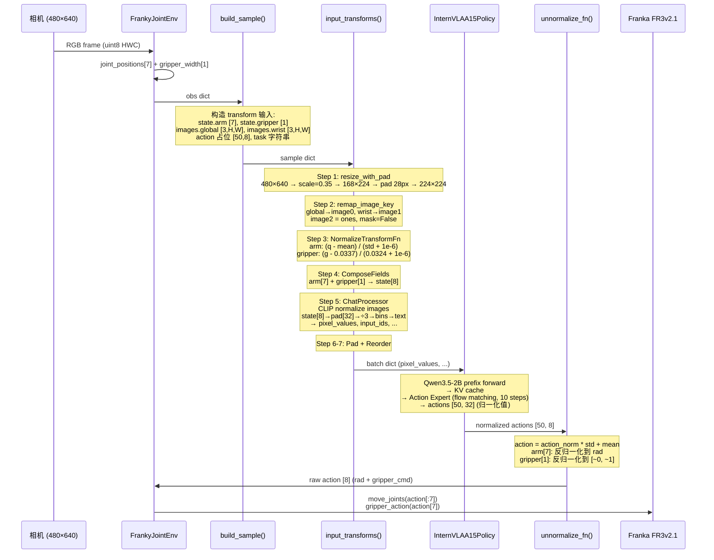
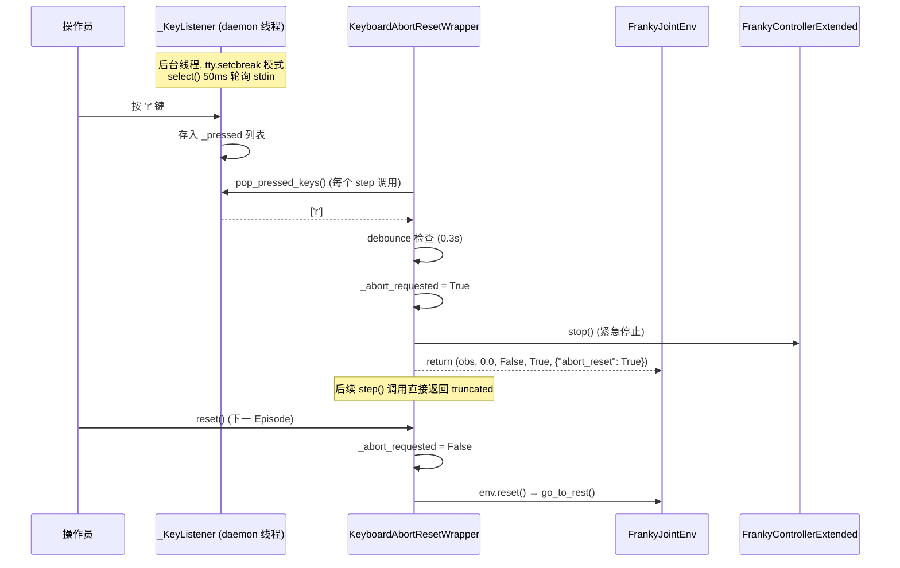
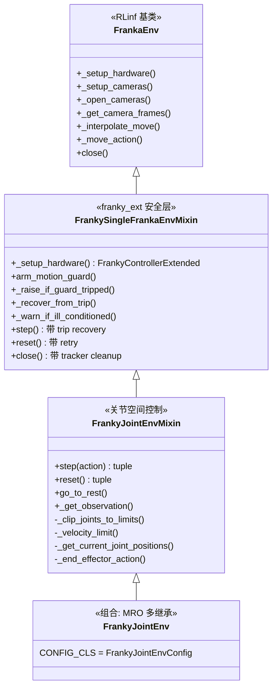
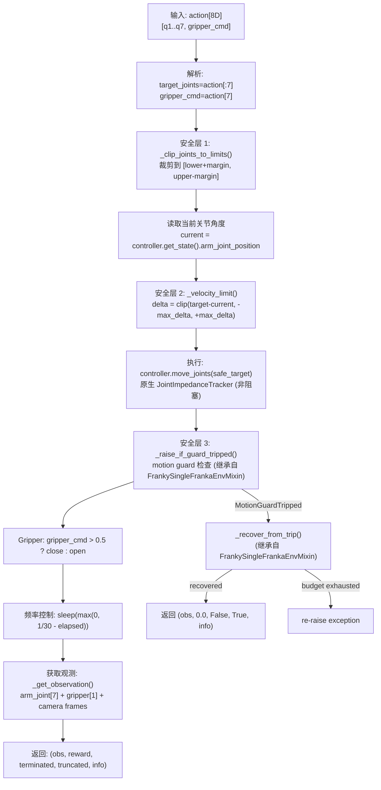
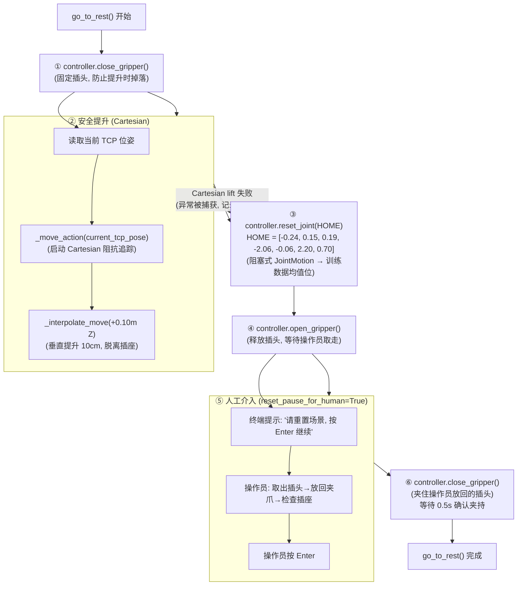
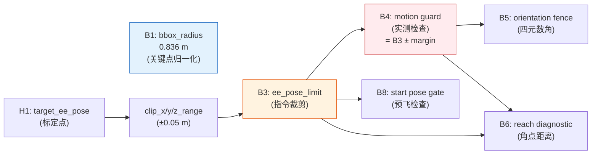
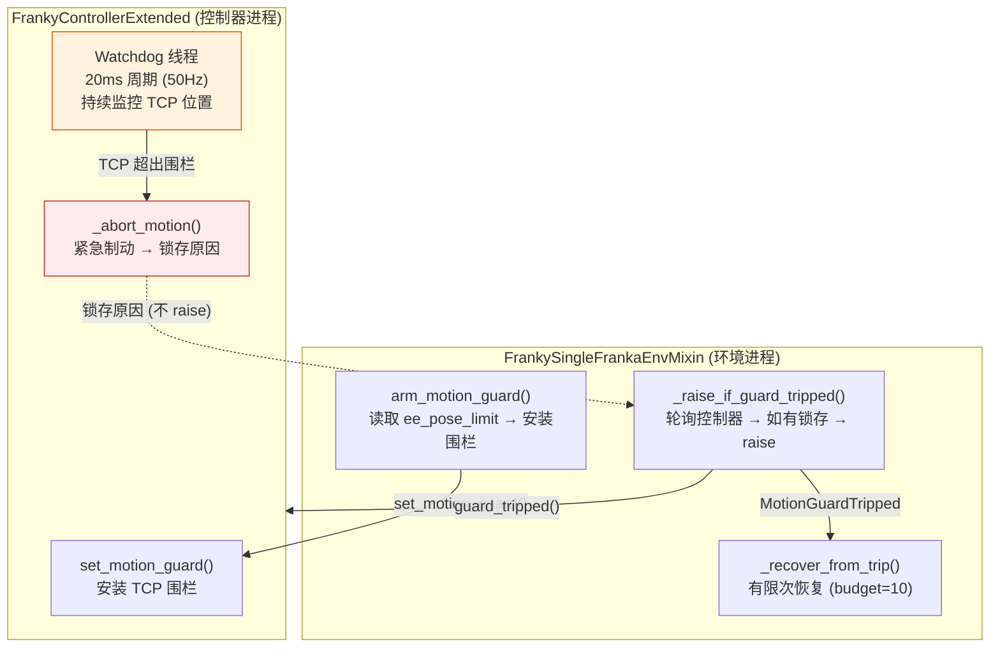

# 模式 A 纯 VLA 评估 — 改良版实施落地方案 (v3A2)

> **版本**: v3A2.2 | **日期**: 2026-09-14
> **定位**: 基于对 eval\_3 §17 的训推一致性审计, 修正 7 项关键缺陷后的**改良版**实施落地方案.
> **适用范围**: 直接使用 4DWVLA (InternVLA-A1.5) 输出动作, 在 Franka FR3v2.1 上执行"仅纯 VLA 评估".
> **本文档为完整自包含文档**: 所有代码、配置、安全参数和实现细节均已内联, 无需参阅其他文档.

---

## 目录

- [1. eval\_3 §17 训推一致性审计结果](#1-eval_3-17-训推一致性审计结果)
- [2. 改良版架构: 复用官方 Transform Pipeline](#2-改良版架构-复用官方-transform-pipeline)
- [3. 训推一致性深度分析 (改良版)](#3-训推一致性深度分析-改良版)
- [4. `FourDWVLAEvalPolicy` 改良版完整实现](#4-fourdwvlaevalpolicy-改良版完整实现)
- [5. 独立评估脚本 (改良版)](#5-独立评估脚本-改良版)
- [6. `KeyboardAbortResetWrapper` 完整实现](#6-keyboardaborbresetwrapper-完整实现)
- [7. `FrankyJointEnv` 关节空间环境完整实现](#7-frankyjointenv-关节空间环境完整实现)
- [8. Docker 容器配置](#8-docker-容器配置)
- [9. 安全防护: Safety Box 与 Motion Guard](#9-安全防护-safety-box-与-motion-guard)
- [10. BBox / 4D 数据一致性分析](#10-bbox--4d-数据一致性分析)
- [11. Franka 极限位姿探测程序](#11-franka-极限位姿探测程序)
- [12. RLmm/RLinf 代码复用清单](#12-rlmmrlinf-代码复用清单)
- [13. 部署步骤](#13-部署步骤)
- [14. 操作手册 (模式 A 改良版)](#14-操作手册-模式-a-改良版)
- [15. `N_exec` 参数调优指南](#15-n_exec-参数调优指南)
- [16. 测试与验收方案](#16-测试与验收方案)
- [17. 速查卡](#17-速查卡)
- [18. 版本历史](#18-版本历史)

---

## 1. eval\_3 §17 训推一致性审计结果

> 对 `4wvla_rlinf_eval_3.md` §17 的 `FourDWVLAEvalPolicy` 代码、独立评估脚本与训练管线 (`plug_p2sft.md`, `dta_4dtrj_plan.md`) 进行逐行对比审计, 发现以下 7 项关键缺陷.

### 1.1 缺陷总览

| # | 严重性 | 缺陷 | 训练时的实际行为 | §17 推理时的行为 | 后果 |
|:---:|:---:|:---|:---|:---|:---|
| **D1** | 🔴 致命 | **缺少状态 mean\_std 归一化** | `NormalizeTransformFn` 对 `observation.state.arm` 和 `observation.state.gripper` 做 mean\_std 归一化 → 归一化后的值进入 `_encode_state()` 做 ÷3 → 量化为 256 bins | `_pad_state()` 直接传原始关节角 (rad) 给模型 | 状态 tokenization 的 bin index 完全错误; 例如 q4 原始值 −2.06, 归一化后≈0.0, ÷3=0.0→bin 128; 不归一化: −2.06/3=−0.687→bin 41. 模型接收到错误的状态信息 |
| **D2** | 🔴 致命 | **缺少动作反归一化** | 训练数据的动作经过 `NormalizeTransformFn` mean\_std 归一化, 模型学习预测**归一化后的动作** | `select_action()` 直接将模型输出当作原始关节角发给机器人 | 发给机器人的关节角完全错误. 归一化后的值分布在 [−3, 3] (标准差单位), 而不是 [−2.9, 4.6] rad 的实际关节角范围 |
| **D3** | 🔴 致命 | **观测格式不匹配** | 模型 `predict_action_chunk()` 期望 `observation.pixel_values`, `observation.input_ids`, `observation.attention_mask`, `observation.image_grid_thw` (Qwen3VLProcessor 输出) | `_build_observation()` 构建 `observation.images` dict (原始 tensor) + `task` (字符串) | 模型内部无法找到所需的 key, 直接报错或产生随机输出 |
| **D4** | 🔴 致命 | **缺少图像 CLIP 归一化** | `InternVLAA15ChatProcessorTransformFn` 调用 Qwen3VLProcessor, 内部自动对图像做 CLIP 归一化 (mean=[0.481, 0.458, 0.408], std=[0.269, 0.261, 0.276]) | `_build_observation()` 仅做 /255.0 → [0,1], 未经 CLIP 归一化 | 视觉特征分布完全偏移, 模型输出随机 |
| **D5** | 🟡 中 | **缺少 ComposeFieldsTransform** | 训练管线将 `observation.state.arm` [7] 和 `observation.state.gripper` [1] 合并为 `observation.state` [8] | `_build_observation()` 直接构造 32D 状态 | 如果 NormalizeTransformFn 预期对分字段归一化, 会找不到 key |
| **D6** | 🟡 中 | **缺少图像 key 重映射** | `RemapImageKeyTransformFn` 将 `observation.images.global` → `image0`, `observation.images.wrist` → `image1` | `_build_observation()` 使用自定义 key 映射 | ChatProcessor 遍历 `image0/1/2` 时找不到匹配 |
| **D7** | 🟡 中 | **缺少第 3 视角填充** | `RemapImageKeyTransformFn` 对不足 3 个视角的情况, 用 `torch.ones_like()` 填充 `image2` 并设 `image2_mask=False` | 未处理 image2 | ChatProcessor 对 `num_views=3` 时找不到 image2 |

### 1.2 审计依据

审计对比了以下代码和文档:

| 参考来源 | 位置 | 关键内容 |
|:---|:---|:---|
| **RoboTwin 推理脚本** (金标准) | `evaluation/RoboTwin/inference.py:368-389` | `build_input_transforms()`: 完整推理 transform 管线 |
| **R1Pro 推理脚本** (真机部署) | `evaluation/R1Pro/inference.py:222-243` | 相同的 transform 管线, 含 `unnormalize_fn` |
| **训练 transform 管线** | `transform_internvla_a1_5.py:95-102` | `_encode_state()`: 状态归一化后 ÷3 → bins |
| **训练数据归一化** | `transforms/core.py:273-276` | `NormalizeTransformFn.hydrate()`: 自动归一化 state + action |
| **模型 select\_action()** | `modeling_internvla_a1_5.py:2278-2309` | 期望 `pixel_values`, `input_ids` 等 key |
| **训练配置** | `4wvlaFrkPlugCkp010420/train_config.json` | `data_transforms` 链含 `normalize` (mode=mean\_std) |
| **checkpoint stats.json** | `4wvlaFrkPlugCkp010420/stats.json` | `franka_plug` key 下含 state/action 的 mean/std |
| **数据集 schema** | `dataset_schemas/configs/franka_plug.yaml` | `observation.images.global` → `image0`, `wrist` → `image1` |

### 1.3 改良策略

**核心原则**: 不自行重新实现图像处理、状态 tokenization、CLIP 归一化等逻辑, 而是**直接复用 4DWVLA 代码库中经过验证的官方 transform pipeline**, 与 RoboTwin/R1Pro 推理脚本保持一致.

```mermaid
flowchart TB
    subgraph BEFORE ["eval_3 §17 (有缺陷)"]
        direction LR
        B1["raw obs"] --> B2["手写 _build_observation()"]
        B2 --> B3["policy.select_action()"]
        B3 --> B4["raw action → 机器人"]
    end

    subgraph AFTER ["3A2 改良版"]
        direction LR
        A1["raw obs"] --> A2["build_sample()<br/>(构造 transform 输入)"]
        A2 --> A3["input_transforms()<br/>(官方 7 步管线)"]
        A3 --> A4["policy.predict_action_chunk()"]
        A4 --> A5["unnormalize_fn()<br/>(反归一化)"]
        A5 --> A6["action → 机器人"]
    end

    style BEFORE fill:#ffebee,stroke:#c62828
    style AFTER fill:#e8f5e9,stroke:#2e7d32
```



---

## 2. 改良版架构: 复用官方 Transform Pipeline

### 2.1 推理 Transform Pipeline (7 步)

改良版直接复用 4DWVLA 代码库的官方 transform 组件, 与 `evaluation/RoboTwin/inference.py:368-389` 和 `evaluation/R1Pro/inference.py:222-243` 保持一致:

```python
input_transforms = compose([
    # Step 1: 保持宽高比缩放 + 零填充 → 224×224
    #   遍历 schema.image_mapping.keys() (即 "observation.images.global", "observation.images.wrist")
    #   使用 bilinear 插值, 0 值填充, 输入/输出 float [0,1]
    ResizeImagesWithPadFn(height=224, width=224, mapping=schema.image_mapping),

    # Step 2: 图像 key 重映射
    #   "observation.images.global" → "observation.images.image0"
    #   "observation.images.wrist"  → "observation.images.image1"
    #   自动填充 image2 = ones_like(image0), image2_mask = False
    RemapImageKeyTransformFn(mapping=schema.image_mapping),

    # Step 3: 状态 mean_std 归一化 (使用 checkpoint stats.json)
    #   state_stat = {"observation.state.arm": {mean, std}, "observation.state.gripper": {mean, std}}
    #   x_norm = (x - mean) / (std + 1e-6)
    NormalizeTransformFn(selected_keys=list(state_stat.keys()), norm_stats=state_stat),

    # Step 4: 合并分字段 → observation.state [8]
    #   observation.state.arm [7] + observation.state.gripper [1] → observation.state [8]
    ComposeFieldsTransform(mapping=schema.feature_mapping),

    # Step 5: Qwen3VLProcessor + 状态 tokenization
    #   图像: CLIP 归一化 (mean=[0.481,0.458,0.408], std=[0.269,0.261,0.276])
    #   状态: 已归一化的 state → pad 到 32D → ÷3 → 256 bins → "State: b0 b1 ... b31"
    #   输出: pixel_values, input_ids, attention_mask, image_grid_thw
    InternVLAA15ChatProcessorTransformFn(
        mode="eval",
        tokenize_state=True,
        max_state_dim=32,
    ),

    # Step 6: 填充 state/action 到 max_dim
    PadStateAndActionTransformFn(max_state_dim=32, max_action_dim=32),

    # Step 7: 维度重排序 (franka_plug 无特殊重排序)
    ReorderStateActionTransform(
        state_reorder=schema.state_reorder,
        action_reorder=schema.action_reorder,
    ),
])
```

**输出动作反归一化**:

```python
# 模型输出 → mean_std 反归一化 → 原始关节角 (rad)
unnormalize_fn = UnNormalizeTransformFn(
    selected_keys=["action"],
    mode="mean_std",
    norm_stats=action_stat,  # 从 stats.json 加载
)

# 使用:
raw_action = unnormalize_fn({"action": model_output})["action"]
```

### 2.2 训推一致性对照表 (改良版)

| 维度 | 训练时 | 改良版推理 | 一致? | eval\_3 §17 (有缺陷) |
|:---|:---|:---|:---:|:---|
| **图像预处理** | `ResizeImagesWithPadFn` (bilinear, 0-pad, float [0,1]) | 同一个类, 同一参数 | ✅ | 自写 cv2 版 ⚠️ |
| **图像 key 映射** | `RemapImageKeyTransformFn` (global→image0, wrist→image1, 填充 image2) | 同一个类 | ✅ | 缺少 ❌ |
| **图像 CLIP 归一化** | Qwen3VLProcessor 内部 (mean/std) | 同一个 ChatProcessor (mode=eval) | ✅ | 缺少 ❌ |
| **状态归一化** | `NormalizeTransformFn(mode=mean_std)` on arm[7]+gripper[1] | 同一个类, 同一 stats.json | ✅ | 缺少 ❌ |
| **状态 tokenization** | `_encode_state()`: pad→÷3→256 bins | 同一个 ChatProcessor | ✅ | 手写 pad ⚠️ |
| **字段合并** | `ComposeFieldsTransform` (arm+gripper→state) | 同一个类 | ✅ | 缺少 ❌ |
| **State/Action 填充** | `PadStateAndActionTransformFn` (32D) | 同一个类 | ✅ | 手写 pad ⚠️ |
| **模型输入 key** | `pixel_values, input_ids, attention_mask, image_grid_thw` | 同一 batch 格式 | ✅ | 格式错误 ❌ |
| **动作反归一化** | `UnNormalizeTransformFn(mode=mean_std)` | 同一个类 | ✅ | 缺少 ❌ |
| **chunk\_size** | 50 | 50 (从 config.json 读取) | ✅ | ✅ |
| **action\_mode prompt** | `"Control Mode: <joint>"` | ChatProcessor 从 schema 自动获取 | ✅ | 缺少 ❌ |
| **num\_inference\_steps** | 10 | 10 (从 config.json 读取) | ✅ | ✅ |

---

## 3. 训推一致性深度分析 (改良版)

### 3.1 数据流端到端追踪



### 3.2 状态归一化详解

训练时 `NormalizeTransformFn` 使用 `stats.json` 中的 mean/std 对状态做 z-score 归一化:

$$q_{\text{norm}}[i] = \frac{q_{\text{raw}}[i] - \mu_i}{\sigma_i + 10^{-6}}$$

| 关节 | $\mu$ (mean) | $\sigma$ (std) | 训练数据 min | 训练数据 max | 归一化后范围 |
|:---:|:---:|:---:|:---:|:---:|:---:|
| q1 | −0.2406 | 0.1206 | −0.484 | +0.045 | [−2.02, +2.37] |
| q2 | +0.1457 | 0.0805 | −0.103 | +0.312 | [−3.09, +2.07] |
| q3 | +0.1872 | 0.1464 | −0.203 | +0.479 | [−2.66, +1.99] |
| q4 | −2.0600 | 0.0854 | −2.204 | −1.535 | [−1.69, +6.15] |
| q5 | −0.0553 | 0.0429 | −0.204 | +0.081 | [−3.47, +3.16] |
| q6 | +2.2011 | 0.1285 | +1.570 | +2.454 | [−4.91, +1.97] |
| q7 | +0.6998 | 0.0968 | +0.484 | +0.981 | [−2.23, +2.91] |
| gripper | 0.0337 | 0.0324 | 0.000 | 0.079 | [−1.04, +1.41] |

归一化后, 值分布在大约 [−3, +3] 范围内. 然后 `_encode_state()` 做 ÷3, 使值分布在约 [−1, +1], 恰好匹配 256 bins 的量化范围.

**如果不做归一化** (eval\_3 §17 的做法):

| 关节 | 原始值 (rad) | 未归一化 ÷3 | Bin index | 正确归一化 ÷3 | 正确 Bin index | 偏差 |
|:---:|:---:|:---:|:---:|:---:|:---:|:---:|
| q4 (典型) | −2.060 | −0.687 | **40** | ≈0.0 | **128** | **−88 bins** |
| q6 (典型) | +2.201 | +0.734 | **222** | ≈0.0 | **128** | **+94 bins** |
| q1 (典型) | −0.241 | −0.080 | **118** | ≈0.0 | **128** | **−10 bins** |
| gripper | 0.040 | +0.013 | **130** | +0.20 | **153** | **−23 bins** |

> **结论**: 不做状态归一化会导致 bin index 偏差从 10 到 94 bins 不等. 对 q4 和 q6 (偏离零点最远的关节) 偏差最大, 模型完全无法正确理解当前状态.

### 3.3 动作反归一化详解

模型输出的动作是归一化后的值 $a_{\text{norm}}$, 需要反归一化回原始关节角:

$$a_{\text{raw}}[i] = a_{\text{norm}}[i] \times (\sigma_i + 10^{-6}) + \mu_i$$

| 动作维度 | $\mu$ (mean) | $\sigma$ (std) | 训练数据 min | 训练数据 max |
|:---:|:---:|:---:|:---:|:---:|
| arm q1 | −0.2381 | 0.1218 | −0.486 | +0.060 |
| arm q2 | +0.1417 | 0.0852 | −0.107 | +0.333 |
| arm q3 | +0.1886 | 0.1472 | −0.202 | +0.480 |
| arm q4 | −2.0560 | 0.0867 | −2.217 | −1.529 |
| arm q5 | −0.0617 | 0.0559 | −0.273 | +0.110 |
| arm q6 | +2.2639 | 0.1419 | +1.649 | +2.517 |
| arm q7 | +0.7208 | 0.1672 | +0.370 | +1.102 |
| gripper | 0.5785 | 0.4047 | 0.007 | 1.000 |

**如果不做反归一化** (eval\_3 §17 的做法): 模型输出约在 [−2, +2] 范围的归一化值, 被直接当作关节角 (rad) 发给机器人. 例如模型对 q4 输出归一化值 0.0 (表示"均值位置"), 但直接发 0.0 rad 给 q4 → 超出 q4 的关节限位 [−3.077, −0.117], 所有正值都会被安全层拒绝.

### 3.4 图像预处理管线详解

训练和推理都使用相同的图像管线 (改良版):

```
原始 (uint8, HWC, 480×640)
     │
     ▼ [to_chw_float01]
float tensor (CHW, 480×640), 值域 [0, 1]
     │
     ▼ [ResizeImagesWithPadFn]
float tensor (CHW, 224×224), bilinear 缩放 + 零填充
     │
     ▼ [RemapImageKeyTransformFn]
key: image0, image1; image2 = ones, mask=False
     │
     ▼ [InternVLAA15ChatProcessorTransformFn → Qwen3VLProcessor]
pixel_values: CLIP 归一化 (减均值, 除标准差)
     │
     ▼ [模型]
Qwen3.5-2B ViT 视觉编码器
```

CLIP 归一化参数 (Qwen3VLProcessor 内置, 是 OpenAI CLIP 参数, 非标准 ImageNet):

$$\text{pixel\_values}[c] = \frac{\text{image}[c] - \mu_c}{\sigma_c}$$

$$\mu = [0.48145466, 0.4578275, 0.40821073], \quad \sigma = [0.26862954, 0.26130258, 0.27577711]$$

### 3.5 夹爪数据约定

训练数据中两种夹爪字段的含义**完全不同**:

| 字段 | 含义 | 单位 | 范围 | 约定 |
|:---|:---|:---|:---|:---|
| `observation.state.gripper` | 夹爪**物理宽度** | 米 (m) | [0.0, 0.079] | 0.0 = 闭合, 0.079 = 全开 |
| `action.gripper` | 夹爪**控制指令** | 归一化值 | [0.007, 1.0] | **1.0 = 闭合**, ~0 = 张开 |

**推理时处理**:
1. `observation.state.gripper` → 作为状态输入, 单位为米, 经 mean\_std 归一化后 tokenize
2. `action.gripper` → 模型输出经 mean\_std 反归一化后, 通过二值阈值 0.5 决定 `close_gripper()` 或 `open_gripper()`

> ⚠️ 注意: `observation.state.gripper` 的 0.0 = 闭合, 而 `action.gripper` 的 1.0 = 闭合. 方向是**反的**. 这是训练数据采集时的约定, 不是 bug.

### 3.6 一致性检查清单 (改良版 27 项)

| # | 检查项 | 训练值 | 推理必须匹配 | 改良版状态 |
|:---:|:---|:---|:---|:---:|
| 1 | image\_resolution | [224, 224] | `ResizeImagesWithPadFn(224, 224)` | ✅ |
| 2 | resize 方式 | `resize_with_pad` (bilinear, align\_corners=False) | 同一个 `ResizeImagesWithPadFn` 类 | ✅ |
| 3 | resize 填充值 | 0.0 (黑色) | 同一个类, `value=0.0` | ✅ |
| 4 | 图像值域 | float [0, 1] | `to_chw_float01()` | ✅ |
| 5 | 图像 key 映射 | global→image0, wrist→image1 | `franka_plug.yaml` schema | ✅ |
| 6 | 缺失视角填充 | image2 = ones, mask=False | `RemapImageKeyTransformFn` 自动处理 | ✅ |
| 7 | CLIP 归一化 | Qwen3VLProcessor 自动 | ChatProcessor(do\_rescale=False) | ✅ |
| 8 | 状态归一化 | `NormalizeTransformFn(mean_std)` | 同一类, 同一 stats.json | ✅ |
| 9 | 状态字段合并 | arm[7]+gripper[1]→state[8] | `ComposeFieldsTransform` | ✅ |
| 10 | max\_state\_dim | 32 | `PadStateAndActionTransformFn(32)` | ✅ |
| 11 | tokenize\_state | True | ChatProcessor(tokenize\_state=True) | ✅ |
| 12 | 状态 ÷3 | 硬编码 /3 | ChatProcessor 内部 `_encode_state()` | ✅ |
| 13 | 256 bins 量化范围 | linspace(−1, 1, 257) | ChatProcessor 内部 | ✅ |
| 14 | 状态文本格式 | "State: b0 b1 ... b31" | ChatProcessor 内部 | ✅ |
| 15 | action\_mode prompt | "Control Mode: \<joint\>" | ChatProcessor 从 schema 获取 | ✅ |
| 16 | task prompt | "Task: plug into socket" | `sample["task"]` | ✅ |
| 17 | num\_views | 3 (2 真实 + 1 填充) | ChatProcessor 默认 num\_views=3 | ✅ |
| 18 | 动作归一化 | mean\_std (训练数据) | model 输出即归一化值 | ✅ |
| 19 | 动作反归一化 | `UnNormalizeTransformFn(mean_std)` | 同一类, 同一 stats.json | ✅ |
| 20 | max\_action\_dim | 32 | 模型输出 32D → 截取前 8D | ✅ |
| 21 | chunk\_size | 50 | config.json | ✅ |
| 22 | n\_action\_steps | 50 | config.json | ✅ |
| 23 | num\_inference\_steps | 10 | config.json | ✅ |
| 24 | action\_loss\_only | 训练 false, 推理 true | config override | ✅ |
| 25 | inference\_backend | 训练 standard, 推理 optimized | config override | ✅ |
| 26 | gripper threshold | 0.5 (二值化) | `binary_gripper_threshold=0.5` | ✅ |
| 27 | normalization\_mapping | ALL IDENTITY | 模型层面无额外 norm/unnorm | ✅ |

---

## 4. `FourDWVLAEvalPolicy` 改良版完整实现

> **核心改变**: 不再手写图像/状态预处理, 而是通过官方 transform pipeline 处理观测. 动作输出经过 `UnNormalizeTransformFn` 反归一化.

**文件**: `four_dwvla_ext/models/four_dwvla_eval_policy.py`

```python
"""4DWVLA Mode A evaluation policy — v3A2 (improved).

Fixes 7 critical train-inference consistency bugs from eval_3 §17:
  D1: Missing state mean_std normalization
  D2: Missing action unnormalization
  D3: Wrong observation format (raw images vs pixel_values)
  D4: Missing CLIP image normalization
  D5: Missing ComposeFieldsTransform
  D6: Missing image key remapping
  D7: Missing 3rd view padding

Uses the official InternVLA-A1.5 transform pipeline (same as
evaluation/RoboTwin/inference.py and evaluation/R1Pro/inference.py).
"""
from __future__ import annotations

import json
import logging
import time
from collections import deque
from pathlib import Path
from typing import Any

import numpy as np
import torch

logger = logging.getLogger(__name__)


class FourDWVLAEvalPolicy:
    """4DWVLA policy for pure VLA evaluation on Franka.

    Usage:
        policy = FourDWVLAEvalPolicy(checkpoint_path="...", device="cuda:0")
        obs = env.reset()
        action = policy.select_action(obs)
        obs, reward, term, trunc, info = env.step(action)
    """

    def __init__(
        self,
        checkpoint_path: str,
        device: str = "cuda:0",
        n_exec: int = 50,
        task_description: str = "plug into socket",
        schema_name: str = "franka_plug",
    ):
        self.checkpoint_path = Path(checkpoint_path)
        self.device = torch.device(device)
        self.n_exec = n_exec
        self.task_description = task_description
        self.schema_name = schema_name

        self._action_queue: deque[np.ndarray] = deque()
        self._queue_step = 0
        self._last_inference_time_ms = 0.0

        self._load_config()
        self._load_model()
        self._build_transforms()

        logger.info(
            "FourDWVLAEvalPolicy v3A2 ready: device=%s, n_exec=%d, "
            "chunk_size=%d, action_dim=%d, image=%dx%d",
            self.device, self.n_exec,
            self.chunk_size, self.actual_action_dim,
            self.target_h, self.target_w,
        )

    def _load_config(self) -> None:
        config_path = self.checkpoint_path / "config.json"
        with open(config_path) as f:
            cfg = json.load(f)

        self.chunk_size = cfg.get("chunk_size", 50)
        self.n_action_steps = cfg.get("n_action_steps", 50)
        self.max_state_dim = cfg.get("max_state_dim", 32)
        self.max_action_dim = cfg.get("max_action_dim", 32)
        self.actual_action_dim = 8  # 7 arm joints + 1 gripper
        self.target_h = cfg.get("image_resolution", [224, 224])[0]
        self.target_w = cfg.get("image_resolution", [224, 224])[1]
        self.num_inference_steps = cfg.get("num_inference_steps", 10)
        self.tokenize_state = cfg.get("tokenize_state", True)

    def _load_model(self) -> None:
        from lerobot.configs.policies import PreTrainedConfig
        from lerobot.policies.factory import get_policy_class
        from lerobot.policies.internvla_a1_5.configuration_internvla_a1_5 import (
            InternVLAA15Config,
        )

        config = PreTrainedConfig.from_pretrained(self.checkpoint_path)
        if not isinstance(config, InternVLAA15Config):
            raise TypeError(f"Expected InternVLAA15Config, got {type(config)}")

        config.action_loss_only = True
        config.inference_backend = "optimized"
        config.gradient_checkpointing = False
        config.device = str(self.device)

        self.config = config

        logger.info("Loading 4DWVLA checkpoint from %s ...", self.checkpoint_path)
        t0 = time.time()

        policy_cls = get_policy_class(config.type)
        self.policy = policy_cls.from_pretrained(
            self.checkpoint_path, config=config
        )
        self.policy.to(device=self.device, dtype=torch.bfloat16)
        self.policy.eval()

        for param in self.policy.parameters():
            param.requires_grad_(False)

        logger.info(
            "Model loaded in %.1fs, GPU memory: %.1f GiB",
            time.time() - t0,
            torch.cuda.max_memory_allocated(self.device) / 1024**3,
        )

    def _build_transforms(self) -> None:
        """Build the official transform pipeline + action unnormalizer."""
        from lerobot.dataset_schemas import get_schema
        from lerobot.policies.internvla_a1_5.transform_internvla_a1_5 import (
            InternVLAA15ChatProcessorTransformFn,
        )
        from lerobot.transforms.core import (
            ComposeFieldsTransform,
            NormalizeTransformFn,
            PadStateAndActionTransformFn,
            RemapImageKeyTransformFn,
            ReorderStateActionTransform,
            ResizeImagesWithPadFn,
            UnNormalizeTransformFn,
            compose,
        )
        from lerobot.utils.constants import ACTION

        schema = get_schema(self.schema_name)
        self._schema = schema

        # Load normalization stats from checkpoint
        state_stat, action_stat = self._load_stats()

        # Input transforms (matches RoboTwin/R1Pro inference.py)
        self.input_transforms = compose([
            ResizeImagesWithPadFn(
                height=self.target_h,
                width=self.target_w,
                mapping=schema.image_mapping,
            ),
            RemapImageKeyTransformFn(mapping=schema.image_mapping),
            NormalizeTransformFn(
                selected_keys=list(state_stat.keys()),
                norm_stats=state_stat,
            ),
            ComposeFieldsTransform(mapping=schema.feature_mapping),
            InternVLAA15ChatProcessorTransformFn(
                mode="eval",
                tokenize_state=self.tokenize_state,
                max_state_dim=self.max_state_dim,
            ),
            PadStateAndActionTransformFn(
                max_state_dim=self.max_state_dim,
                max_action_dim=self.max_action_dim,
            ),
            ReorderStateActionTransform(
                state_reorder=schema.state_reorder,
                action_reorder=schema.action_reorder,
            ),
        ])

        # Output unnormalization
        self.unnormalize_fn = UnNormalizeTransformFn(
            selected_keys=[ACTION],
            mode="mean_std",
            norm_stats=action_stat,
        )

    def _load_stats(self) -> tuple[dict, dict]:
        """Load per-field normalization stats from checkpoint stats.json."""
        stats_path = self.checkpoint_path / "stats.json"
        with open(stats_path) as f:
            raw = json.load(f)

        # Unwrap dataset-level nesting: {"franka_plug": {field: ...}} → {field: ...}
        if len(raw) == 1 and isinstance(next(iter(raw.values())), dict):
            raw = next(iter(raw.values()))

        def pick(field_key: str) -> dict[str, np.ndarray]:
            if field_key not in raw:
                raise KeyError(
                    f"Stats field '{field_key}' not in {stats_path}. "
                    f"Available: {list(raw.keys())}"
                )
            d = {}
            for stat_name in ("mean", "std", "min", "max"):
                if stat_name in raw[field_key]:
                    d[stat_name] = np.atleast_1d(
                        np.asarray(raw[field_key][stat_name], dtype=np.float32)
                    )
            return d

        # State stats (per-field, before compose)
        state_stat = {
            "observation.state.arm": pick("observation.state.arm"),
            "observation.state.gripper": pick("observation.state.gripper"),
        }

        # Action stats (composed: arm[7] + gripper[1] → action[8])
        arm_stat = pick("action.arm")
        gripper_stat = pick("action.gripper")
        action_stat = {"action": {
            stat_name: np.concatenate([
                arm_stat[stat_name], gripper_stat[stat_name]
            ])
            for stat_name in ("mean", "std", "min", "max")
        }}

        logger.info(
            "Loaded stats: state.arm mean=%s, action.arm mean=%s",
            np.round(state_stat["observation.state.arm"]["mean"], 4).tolist(),
            np.round(arm_stat["mean"], 4).tolist(),
        )

        return state_stat, action_stat

    def select_action(self, obs: dict[str, Any]) -> np.ndarray:
        """Select next action from observation.

        If action queue is non-empty and within N_exec budget, pop.
        Otherwise, run full inference to refill.

        Args:
            obs: dict from FrankyJointEnv with keys:
                "states": np.ndarray [8] (arm[7] + gripper[1])
                "main_images": np.ndarray [H,W,3] uint8 (global camera)
                "wrist_images": np.ndarray [H,W,3] uint8 (wrist camera)
              OR:
                "state": {"joint_positions": [7], "gripper_position": [1]}
                "frames": {"global": [H,W,3], "wrist": [H,W,3]}

        Returns:
            action: np.ndarray [8] — [q1..q7, gripper_cmd] in raw units
        """
        if len(self._action_queue) == 0 or self._queue_step >= self.n_exec:
            self._infer(obs)

        action = self._action_queue.popleft()
        self._queue_step += 1
        return action

    @torch.no_grad()
    def _infer(self, obs: dict[str, Any]) -> None:
        """Run full model inference through the official transform pipeline."""
        t0 = time.perf_counter()

        from lerobot.utils.constants import ACTION

        # 1. Build sample dict in the format expected by transforms
        sample = self._build_sample(obs)

        # 2. Apply official transform pipeline
        #    (resize_with_pad → remap → normalize_state → compose_fields
        #     → chat_processor → pad → reorder)
        sample = self.input_transforms(sample)

        # 3. Convert to batch dict (add batch dim, move to device)
        batch = self._to_batch(sample)

        # 4. Model inference
        with torch.amp.autocast("cuda", dtype=torch.bfloat16):
            actions = self.policy.predict_action_chunk(batch)
        # actions: [1, n_action_steps, original_action_dim]

        if actions.ndim == 3:
            actions = actions[0]  # [n_action_steps, action_dim]

        # 5. Unnormalize actions (mean_std → raw values)
        actions = self.unnormalize_fn({ACTION: actions})[ACTION]

        # 6. To numpy, truncate to actual dim
        if isinstance(actions, torch.Tensor):
            actions = actions.float().cpu().numpy()
        actions = actions[:, :self.actual_action_dim]
        # actions: [50, 8] — raw joint angles (rad) + gripper command

        # 7. Fill action queue
        self._action_queue.clear()
        for i in range(min(self.n_exec, len(actions))):
            self._action_queue.append(actions[i].astype(np.float64))
        self._queue_step = 0

        elapsed_ms = (time.perf_counter() - t0) * 1000
        self._last_inference_time_ms = elapsed_ms
        logger.debug(
            "Inference: %.1fms, queued %d actions (n_exec=%d)",
            elapsed_ms, len(self._action_queue), self.n_exec,
        )

    def _build_sample(self, obs: dict[str, Any]) -> dict:
        """Convert env observation to the sample dict expected by transforms.

        The transform pipeline expects:
            - observation.state.arm: torch.Tensor [7]
            - observation.state.gripper: torch.Tensor [1]
            - observation.images.global: torch.Tensor [3, H, W] float [0,1]
            - observation.images.wrist: torch.Tensor [3, H, W] float [0,1]
            - action.arm: torch.Tensor [chunk_size, 7] (placeholder)
            - action.gripper: torch.Tensor [chunk_size, 1] (placeholder)
            - task: str
        """
        # --- Extract state ---
        if "states" in obs:
            state_8d = np.asarray(obs["states"], dtype=np.float32).flatten()[:8]
            arm = torch.from_numpy(state_8d[:7].copy()).float()
            gripper = torch.from_numpy(state_8d[7:8].copy()).float()
        elif "state" in obs:
            arm = torch.from_numpy(
                np.asarray(obs["state"]["joint_positions"], dtype=np.float32).flatten()[:7].copy()
            ).float()
            gripper = torch.from_numpy(
                np.asarray(obs["state"]["gripper_position"], dtype=np.float32).flatten()[:1].copy()
            ).float()
        else:
            raise ValueError("Observation must contain 'states' or 'state' key")

        # --- Extract and convert images to CHW float [0,1] ---
        def to_chw_float01(img_np: np.ndarray) -> torch.Tensor:
            tensor = torch.from_numpy(np.array(img_np, copy=True))
            if tensor.dtype == torch.uint8:
                tensor = tensor.float() / 255.0
            else:
                tensor = tensor.float()
                if tensor.max() > 1.0:
                    tensor = tensor / 255.0
            return tensor.permute(2, 0, 1).contiguous()

        if "frames" in obs:
            img_global = to_chw_float01(obs["frames"]["global"])
            img_wrist = to_chw_float01(obs["frames"]["wrist"])
        elif "main_images" in obs:
            img_global = to_chw_float01(obs["main_images"])
            img_wrist = to_chw_float01(obs["wrist_images"])
        else:
            raise ValueError("Observation must contain 'frames' or 'main_images' key")

        # --- Build sample dict ---
        sample = {
            "observation.state.arm": arm,
            "observation.state.gripper": gripper,
            "observation.images.global": img_global,
            "observation.images.wrist": img_wrist,
            "action.arm": torch.zeros(self.chunk_size, 7, dtype=torch.float32),
            "action.gripper": torch.zeros(self.chunk_size, 1, dtype=torch.float32),
            "task": self.task_description,
        }

        return sample

    def _to_batch(self, sample: dict) -> dict:
        """Convert transformed sample to batched tensor dict for the model."""
        batch = {}
        for key, value in sample.items():
            if isinstance(value, torch.Tensor):
                value = value.unsqueeze(0)
                if value.dtype.is_floating_point:
                    value = value.to(device=self.device, dtype=torch.bfloat16)
                else:
                    value = value.to(device=self.device)
                batch[key] = value
            else:
                batch[key] = [value]
        return batch

    @property
    def last_inference_time_ms(self) -> float:
        return self._last_inference_time_ms

    def reset(self) -> None:
        """Clear action queue between episodes."""
        self._action_queue.clear()
        self._queue_step = 0
```

### 4.1 与 eval\_3 §17 版本的关键差异

| 方面 | eval\_3 §17 (有缺陷) | v3A2 改良版 |
|:---|:---|:---|
| 模型加载 | 手动 `InternVLAA15Config(**{...})` | `PreTrainedConfig.from_pretrained()` + `policy_cls.from_pretrained()` |
| 图像预处理 | 自写 cv2 resize\_with\_pad + /255.0 | 官方 `ResizeImagesWithPadFn` (torch, align\_corners=False) |
| 图像归一化 | 无 CLIP 归一化 | 官方 `InternVLAA15ChatProcessorTransformFn` 自动处理 |
| 状态归一化 | 无 | 官方 `NormalizeTransformFn(mean_std)` + stats.json |
| 字段合并 | 手动 concat → 32D | 官方 `ComposeFieldsTransform` |
| 状态 tokenization | 假设 model 内部处理 | 官方 ChatProcessor `_encode_state()` |
| 模型输入格式 | `{observation.state, observation.images, task}` | `{pixel_values, input_ids, attention_mask, image_grid_thw, observation.state}` |
| 模型调用 | `self.policy.select_action(observation)` | `self.policy.predict_action_chunk(batch)` |
| 动作反归一化 | 无 | 官方 `UnNormalizeTransformFn(mean_std)` + stats.json |
| 代码行数 | ~300 行, 大量自写逻辑 | ~250 行, 主体是组装和调用官方组件 |

---

## 5. 独立评估脚本 (改良版)

**文件**: `four_dwvla_ext/scripts/eval_4dwvla_mode_a.py`

```python
#!/usr/bin/env python3
"""4DWVLA Mode A: Pure VLA Evaluation on Franka FR3v2.1.

v3A2: Improved version using official transform pipeline.
Fixes all 7 train-inference consistency bugs from eval_3 §17.

Standalone script -- no Ray, no Hydra, no RLinf rollout worker.
Single process: loads model on GPU, controls robot directly.

Usage:
    python eval_4dwvla_mode_a.py \
        --checkpoint /home/nvidia/bt/ckp/4wvlaFrk/plug/4wvlaFrkPlugCkp010420/ \
        --num-episodes 20 \
        --n-exec 50 \
        --velocity-safety-factor 0.5 \
        --max-steps 600

Progressive testing (recommended first run):
    python eval_4dwvla_mode_a.py --checkpoint ... --num-episodes 1 \
        --max-steps 30 --velocity-safety-factor 0.3

Dummy run (no robot movement):
    python eval_4dwvla_mode_a.py --checkpoint ... --dummy --num-episodes 2
"""
from __future__ import annotations

import argparse
import json
import logging
import sys
import time
from datetime import datetime
from pathlib import Path

import numpy as np

logging.basicConfig(
    level=logging.INFO,
    format="%(asctime)s [%(levelname)s] %(name)s: %(message)s",
    datefmt="%H:%M:%S",
)
logger = logging.getLogger("eval_mode_a")


def parse_args():
    p = argparse.ArgumentParser(description="4DWVLA Mode A Pure VLA Eval (v3A2)")
    p.add_argument(
        "--checkpoint",
        type=str,
        default="/home/nvidia/bt/ckp/4wvlaFrk/plug/4wvlaFrkPlugCkp010420/",
    )
    p.add_argument("--num-episodes", type=int, default=20)
    p.add_argument("--max-steps", type=int, default=600)
    p.add_argument("--n-exec", type=int, default=50)
    p.add_argument("--velocity-safety-factor", type=float, default=0.5)
    p.add_argument("--step-frequency", type=float, default=30.0)
    p.add_argument("--joint-limit-margin", type=float, default=0.05)
    p.add_argument("--robot-ip", type=str, default="172.16.0.2")
    p.add_argument("--task", type=str, default="plug into socket")
    p.add_argument("--device", type=str, default="cuda:0")
    p.add_argument("--schema", type=str, default="franka_plug")
    p.add_argument("--dummy", action="store_true")
    p.add_argument("--output-dir", type=str, default=None)
    return p.parse_args()


def make_env(args):
    ext_path = str(Path(__file__).resolve().parent.parent.parent)
    if ext_path not in sys.path:
        sys.path.insert(0, ext_path)

    from four_dwvla_ext.envs.franky_joint_env import FrankyJointEnv
    from four_dwvla_ext.envs.franky_joint_env_config import FrankyJointEnvConfig
    from four_dwvla_ext.wrappers.keyboard_abort_reset_wrapper import (
        KeyboardAbortResetWrapper,
    )

    config = FrankyJointEnvConfig(
        robot_ip=args.robot_ip,
        step_frequency=args.step_frequency,
        max_num_steps=args.max_steps,
        joint_limit_margin=args.joint_limit_margin,
        velocity_safety_factor=args.velocity_safety_factor,
        reset_pause_for_human=True,
        is_dummy=args.dummy,
    )

    env = FrankyJointEnv(config)
    env = KeyboardAbortResetWrapper(env)
    return env


def make_policy(args):
    from four_dwvla_ext.models.four_dwvla_eval_policy import FourDWVLAEvalPolicy

    return FourDWVLAEvalPolicy(
        checkpoint_path=args.checkpoint,
        device=args.device,
        n_exec=args.n_exec,
        task_description=args.task,
        schema_name=args.schema,
    )


def setup_output_dir(args) -> Path:
    if args.output_dir:
        out = Path(args.output_dir)
    else:
        timestamp = datetime.now().strftime("%Y%m%d_%H%M%S")
        out = Path(f"eval_results/mode_a_{timestamp}")
    out.mkdir(parents=True, exist_ok=True)
    return out


def run_episode(env, policy, episode_idx: int, args) -> dict:
    logger.info("=" * 60)
    logger.info("Episode %d/%d starting", episode_idx + 1, args.num_episodes)
    logger.info("=" * 60)

    policy.reset()
    obs, info = env.reset()

    step_count = 0
    done = False
    inference_times = []
    step_freqs = []
    episode_start = time.time()

    while not done and step_count < args.max_steps:
        step_start = time.perf_counter()

        queue_was_empty = len(policy._action_queue) == 0
        action = policy.select_action(obs)

        if queue_was_empty:
            inference_times.append(policy.last_inference_time_ms)

        obs, reward, terminated, truncated, info = env.step(action)
        step_count += 1

        step_elapsed = time.perf_counter() - step_start
        step_freqs.append(1.0 / max(step_elapsed, 1e-6))

        if terminated or truncated:
            done = True
            if info.get("abort_reset"):
                logger.info("Episode %d: ABORTED by operator", episode_idx + 1)

    elapsed_s = time.time() - episode_start

    result = {
        "episode": episode_idx + 1,
        "steps": step_count,
        "elapsed_s": round(elapsed_s, 2),
        "avg_freq_hz": round(np.mean(step_freqs), 1) if step_freqs else 0,
        "num_inferences": len(inference_times),
        "avg_inference_ms": round(np.mean(inference_times), 1) if inference_times else 0,
        "max_inference_ms": round(max(inference_times), 1) if inference_times else 0,
        "aborted": info.get("abort_reset", False),
    }

    logger.info(
        "Episode %d/%d done: %d steps, %.1fs, avg %.1f Hz, "
        "%d inferences (avg %.1f ms)",
        episode_idx + 1, args.num_episodes,
        result["steps"], result["elapsed_s"], result["avg_freq_hz"],
        result["num_inferences"], result["avg_inference_ms"],
    )

    return result


def main():
    args = parse_args()

    logger.info("=" * 60)
    logger.info("4DWVLA Mode A: Pure VLA Evaluation (v3A2 — improved)")
    logger.info("=" * 60)
    logger.info("Checkpoint: %s", args.checkpoint)
    logger.info("Episodes: %d, Max steps: %d, N_exec: %d",
                args.num_episodes, args.max_steps, args.n_exec)
    logger.info("Velocity safety factor: %.2f", args.velocity_safety_factor)
    logger.info("Schema: %s", args.schema)
    logger.info("Dummy mode: %s", args.dummy)

    output_dir = setup_output_dir(args)
    logger.info("Output directory: %s", output_dir)

    with open(output_dir / "run_config.json", "w") as f:
        json.dump(vars(args), f, indent=2)

    logger.info("Loading model...")
    policy = make_policy(args)

    logger.info("Creating environment...")
    env = make_env(args)

    results = []
    try:
        for ep_idx in range(args.num_episodes):
            result = run_episode(env, policy, ep_idx, args)
            results.append(result)

            with open(output_dir / "results.json", "w") as f:
                json.dump(results, f, indent=2)
    except KeyboardInterrupt:
        logger.warning("Interrupted after %d episodes", len(results))
    finally:
        env.close()

    logger.info("")
    logger.info("=" * 60)
    logger.info("EVALUATION SUMMARY")
    logger.info("=" * 60)
    logger.info("Completed: %d / %d episodes", len(results), args.num_episodes)

    if results:
        logger.info("Avg steps: %.0f", np.mean([r["steps"] for r in results]))
        logger.info("Avg freq: %.1f Hz", np.mean([r["avg_freq_hz"] for r in results]))
        logger.info("Avg inference: %.1f ms", np.mean([r["avg_inference_ms"] for r in results]))
        logger.info("Aborted: %d", sum(1 for r in results if r.get("aborted")))
        logger.info("Results: %s", output_dir / "results.json")
        logger.info(">>> 操作员请在纸质记录表中填写每个 Episode 的成功/失败判定 <<<")

    summary = {
        "version": "v3A2",
        "checkpoint": args.checkpoint,
        "schema": args.schema,
        "num_episodes_planned": args.num_episodes,
        "num_episodes_completed": len(results),
        "n_exec": args.n_exec,
        "max_steps": args.max_steps,
        "velocity_safety_factor": args.velocity_safety_factor,
        "dummy": args.dummy,
        "results": results,
    }
    with open(output_dir / "summary.json", "w") as f:
        json.dump(summary, f, indent=2)


if __name__ == "__main__":
    main()
```

---

## 6. `KeyboardAbortResetWrapper` 完整实现

提供按 `r` 键中断当前 Episode 并安全复位的功能. 在评估过程中, 若操作员观察到危险动作, 可立即按 `r` 键停止机器人并结束当前 Episode.

### 6.1 设计原理



### 6.2 完整代码

**文件**: `four_dwvla_ext/wrappers/keyboard_abort_reset_wrapper.py`

```python
"""Keyboard abort-reset wrapper for real-robot evaluation.

Press 'r' during an episode to:
1. Immediately stop the robot arm (controller.stop())
2. Set truncated=True (current episode ends)
3. On next reset(), trigger go_to_rest() (arm lifts, moves to HOME, opens gripper)

Thread safety: keyboard listener runs in a background thread.
The wrapper checks for key events at each step() call.
"""
from __future__ import annotations

import logging
import threading
import time

import gymnasium as gym
import numpy as np

logger = logging.getLogger(__name__)

DEBOUNCE_S = 0.3


class _KeyListener:
    """Non-blocking keyboard listener using select() on stdin.

    Implementation:
    - Runs a daemon thread that calls tty.setcbreak() to put stdin into character mode
    - Uses select() with 50ms timeout to poll for keypress without blocking
    - Thread-safe: _pressed list is protected by a lock
    - Graceful shutdown: _stop_event signals the thread to exit, restores terminal settings
    """

    def __init__(self):
        self._pressed: list[str] = []
        self._lock = threading.Lock()
        self._stop_event = threading.Event()
        self._thread = threading.Thread(target=self._listen_loop, daemon=True)
        self._thread.start()

    def _listen_loop(self):
        import select
        import sys
        import termios
        import tty

        fd = sys.stdin.fileno()
        try:
            old_settings = termios.tcgetattr(fd)
        except termios.error:
            logger.warning("stdin is not a terminal; keyboard abort disabled")
            return

        try:
            tty.setcbreak(fd)
            while not self._stop_event.is_set():
                if select.select([sys.stdin], [], [], 0.05)[0]:
                    ch = sys.stdin.read(1)
                    with self._lock:
                        self._pressed.append(ch.lower())
        except Exception as e:
            logger.warning("KeyListener error: %s", e)
        finally:
            termios.tcsetattr(fd, termios.TCSADRAIN, old_settings)

    def pop_pressed_keys(self) -> list[str]:
        with self._lock:
            keys = self._pressed.copy()
            self._pressed.clear()
        return keys

    def stop(self):
        self._stop_event.set()
        self._thread.join(timeout=1.0)


class KeyboardAbortResetWrapper(gym.Wrapper):
    """Wraps a FrankyJointEnv to add keyboard abort-reset functionality.

    Keyboard bindings:
        'r' : abort current episode → stop arm → truncated=True
              next reset() calls go_to_rest()

    Design:
    - step(): checks for 'r' keypress with 0.3s debounce; if pressed, sends
      controller.stop() immediately and returns truncated=True
    - reset(): clears abort flag, delegates to underlying env.reset()
    - close(): stops the _KeyListener thread and restores terminal settings
    """

    PEDAL_DEBOUNCE_S = DEBOUNCE_S

    def __init__(self, env: gym.Env):
        super().__init__(env)
        self._abort_requested = False
        self._last_press_ts: dict[str, float] = {}
        try:
            self.listener = _KeyListener()
            logger.info(
                "KeyboardAbortResetWrapper: press 'r' to abort + reset episode"
            )
        except Exception as e:
            logger.warning("Could not start key listener: %s", e)
            self.listener = None

    def step(self, action):
        if self.listener is not None:
            keys = self.listener.pop_pressed_keys()
            now = time.time()
            for k in keys:
                if k == "r":
                    last = self._last_press_ts.get("r", 0)
                    if now - last > self.PEDAL_DEBOUNCE_S:
                        self._last_press_ts["r"] = now
                        logger.warning(
                            ">>> ABORT requested (r key) — stopping arm, "
                            "episode will end <<<",
                        )
                        self._abort_requested = True
                        self._emergency_stop_arm()

        if self._abort_requested:
            obs = self.env.unwrapped._get_observation()
            return obs, 0.0, False, True, {
                "abort_reset": True,
                "abort_reset_event": "abort_triggered",
            }

        obs, reward, terminated, truncated, info = self.env.step(action)
        info["abort_reset"] = False
        return obs, reward, terminated, truncated, info

    def reset(self, **kwargs):
        if self._abort_requested:
            logger.info("Reset after abort: go_to_rest() will be called")
        self._abort_requested = False
        return self.env.reset(**kwargs)

    def _emergency_stop_arm(self):
        """Send immediate stop command to the robot."""
        try:
            controller = self.env.unwrapped._controller
            controller.stop()
            logger.info("Emergency stop sent to controller")
        except Exception as e:
            logger.error("Failed to stop arm: %s", e)

    def close(self):
        if self.listener is not None:
            self.listener.stop()
        super().close()
```

---

## 7. `FrankyJointEnv` 关节空间环境完整实现

### 7.1 类层次结构



**MRO**: `FrankyJointEnv → FrankyJointEnvMixin → FrankySingleFrankaEnvMixin → FrankaEnv → gym.Env`

**各层职责**:
- `FrankaEnv` (RLinf 原始代码): 相机管理, 硬件初始化, Cartesian 阻抗插值
- `FrankySingleFrankaEnvMixin` (franky\_ext 扩展): 使用 `FrankyControllerExtended` 替代上游控制器, 安装 motion guard, trip recovery, close() tracker cleanup
- `FrankyJointEnvMixin` (four\_dwvla\_ext 新增): 关节空间 step/reset/go\_to\_rest, 关节裁剪, 速度限制
- `FrankyJointEnv` (four\_dwvla\_ext 新增): MRO 组合类, 只设定 CONFIG\_CLS

### 7.2 关节限位和速度常量

```python
import numpy as np

# FR3v2.1 URDF 关节限位 (rad)
# 注意: 与 RLinf franky_controller.py 中的 FR3v1 限位略有不同
#   FR3v1: LOWER=[-2.8973, -1.7628, -2.8973, -3.0718, -2.8973, -0.0175, -2.8973]
#   FR3v2: LOWER=[-2.9007, -1.8361, -2.9007, -3.0770, -2.8763,  0.4398, -3.0508]
# 区别最大的是 q6: FR3v1 范围 [-0.0175, 3.7525], FR3v2 范围 [0.4398, 4.6216]
FR3V2_JOINT_LIMITS_LOWER = np.array(
    [-2.9007, -1.8361, -2.9007, -3.0770, -2.8763, 0.4398, -3.0508],
    dtype=np.float64,
)
FR3V2_JOINT_LIMITS_UPPER = np.array(
    [2.9007, 1.8361, 2.9007, -0.1169, 2.8763, 4.6216, 3.0508],
    dtype=np.float64,
)

# FR3v2.1 最大关节速度 (rad/s)
FR3V2_MAX_JOINT_VELOCITY = np.array(
    [2.62, 2.62, 2.62, 2.62, 5.26, 4.18, 5.26],
    dtype=np.float64,
)
```

### 7.3 FrankyJointEnvConfig

**文件**: `four_dwvla_ext/envs/franky_joint_env_config.py`

```python
from dataclasses import dataclass, field

from franky_ext.franky_single_franka_env import FrankySingleFrankaEnvConfig


@dataclass
class FrankyJointEnvConfig(FrankySingleFrankaEnvConfig):
    """Config for joint-space Franka env used in 4DWVLA Mode A evaluation.

    Inherits from FrankySingleFrankaEnvConfig which provides:
    - safe_smoke_hold: bool = False
    - clear_error_per_waypoint: bool = True
    And from FrankaRobotConfig:
    - robot_ip: str
    - camera_serials, camera_type, gripper_type
    - step_frequency: float (overridden here to 30.0)
    - max_num_steps: int (overridden here to 600)
    - target_ee_pose, ee_pose_limit_min, ee_pose_limit_max
    - binary_gripper_threshold: float = 0.5
    - is_dummy: bool = False
    """

    # Override: 30Hz to match 4DWVLA training data (was 10Hz for Cartesian)
    step_frequency: float = 30.0

    # Override: 20 seconds at 30Hz (was 100 steps at 10Hz = 10s)
    max_num_steps: int = 600

    # Joint-space specific
    joint_limit_margin: float = 0.05  # rad, safety margin from hardware limits
    velocity_safety_factor: float = 0.5  # fraction of max joint velocity per step

    # Reset: home position = training data joint angle mean (abs_stats.json)
    reset_joint_pos: list = field(
        default_factory=lambda: [
            -0.2406, 0.1457, 0.1872, -2.0600, -0.0553, 2.2011, 0.6998
        ]
    )
    # Reset: lift arm this much (m) before moving to home, to clear socket
    reset_lift_height: float = 0.10
    # Reset: pause for operator to reposition plug between episodes
    reset_pause_for_human: bool = True
```

### 7.4 FrankyJointEnvMixin 完整代码

**文件**: `four_dwvla_ext/envs/franky_joint_env.py`

```python
"""Joint-space Franka env for 4DWVLA Mode A evaluation.

Provides step/reset in joint space (7 arm joints + 1 gripper),
with three safety layers:
  1. Joint limit clipping (with configurable margin)
  2. Per-step velocity limiting
  3. Motion guard (TCP fence, inherited from FrankySingleFrankaEnvMixin)
"""
from __future__ import annotations

import logging
import time

import gymnasium as gym
import numpy as np

from franky_ext.franky_single_franka_env import (
    FrankaSingleFrankaEnv,
    FrankySingleFrankaEnvMixin,
)
from rlinf.envs.realworld.franka.franka_env import FrankaEnv

from four_dwvla_ext.envs.franky_joint_env_config import FrankyJointEnvConfig

logger = logging.getLogger(__name__)

# FR3v2.1 URDF joint limits (rad)
FR3V2_JOINT_LIMITS_LOWER = np.array(
    [-2.9007, -1.8361, -2.9007, -3.0770, -2.8763, 0.4398, -3.0508],
    dtype=np.float64,
)
FR3V2_JOINT_LIMITS_UPPER = np.array(
    [2.9007, 1.8361, 2.9007, -0.1169, 2.8763, 4.6216, 3.0508],
    dtype=np.float64,
)

# FR3v2.1 max joint velocities (rad/s)
FR3V2_MAX_JOINT_VELOCITY = np.array(
    [2.62, 2.62, 2.62, 2.62, 5.26, 4.18, 5.26],
    dtype=np.float64,
)


class FrankyJointEnvMixin:
    """Joint-space control overlay for FrankySingleFrankaEnvMixin.

    MRO: FrankyJointEnv -> FrankyJointEnvMixin -> FrankySingleFrankaEnvMixin -> FrankaEnv

    FrankySingleFrankaEnvMixin provides:
        - _setup_hardware() with FrankyControllerExtended
        - motion guard arming
        - trip recovery in step/reset
        - close() with tracker cleanup

    This mixin overrides step/reset/_get_observation for joint-space control.
    """

    def __init__(self, *args, **kwargs):
        super().__init__(*args, **kwargs)

        self._step_frequency = float(self.config.step_frequency)
        joint_limit_margin = float(self.config.joint_limit_margin)
        velocity_safety_factor = float(self.config.velocity_safety_factor)
        self._gripper_threshold = float(self.config.binary_gripper_threshold)
        self._max_num_steps = int(self.config.max_num_steps)

        self._reset_joint_pos = np.array(
            self.config.reset_joint_pos, dtype=np.float64
        )
        self._joint_lower = FR3V2_JOINT_LIMITS_LOWER + joint_limit_margin
        self._joint_upper = FR3V2_JOINT_LIMITS_UPPER - joint_limit_margin
        self._max_delta_per_step = (
            velocity_safety_factor * FR3V2_MAX_JOINT_VELOCITY / self._step_frequency
        )

        logger.info(
            "Max delta/step (rad): %s",
            np.round(self._max_delta_per_step, 5),
        )

        self.action_space = gym.spaces.Box(
            low=np.concatenate([self._joint_lower, [0.0]]).astype(np.float32),
            high=np.concatenate([self._joint_upper, [1.0]]).astype(np.float32),
            shape=(8,),
            dtype=np.float32,
        )

        self._elapsed_steps = 0
        self._episode_joint_trajectory = []

        logger.info(
            "FrankyJointEnv initialized: freq=%.1fHz, margin=%.3frad, "
            "vel_factor=%.2f, max_steps=%d",
            self._step_frequency, joint_limit_margin,
            velocity_safety_factor, self._max_num_steps,
        )

    def step(self, action: np.ndarray):
        """Execute one joint-space action.

        Safety pipeline:
          1. Parse 8D action → target_joints[7] + gripper_cmd[1]
          2. _clip_joints_to_limits() → enforce [LOWER+margin, UPPER-margin]
          3. Read current joint angles
          4. _velocity_limit() → clip per-step delta
          5. controller.move_joints() → JointImpedanceTracker (1kHz FCI)
          6. _raise_if_guard_tripped() → motion guard check
          7. _end_effector_action() → close/open gripper
          8. Sleep to match target frequency (30Hz)
          9. Return (obs, reward, terminated, truncated, info)
        """
        step_start = time.time()
        action = np.asarray(action, dtype=np.float64).flatten()
        assert action.shape == (8,), f"Expected 8D action, got {action.shape}"

        target_joints = action[:7]
        gripper_cmd = action[7]

        safe_joints = self._clip_joints_to_limits(target_joints)
        current_joints = self._get_current_joint_positions()
        safe_joints = self._velocity_limit(current_joints, safe_joints)

        try:
            self._controller.move_joints(safe_joints)
        except Exception as e:
            logger.error("Joint move failed: %s", e)
            self._controller.clear_errors()
            obs = self._get_observation()
            return obs, 0.0, True, False, {"error": str(e)}

        self._raise_if_guard_tripped()
        self._end_effector_action(gripper_cmd)

        elapsed = time.time() - step_start
        sleep_time = max(0.0, 1.0 / self._step_frequency - elapsed)
        if sleep_time > 0:
            time.sleep(sleep_time)

        obs = self._get_observation()
        self._elapsed_steps += 1
        truncated = self._elapsed_steps >= self._max_num_steps

        info = {
            "requested_joints": target_joints.tolist(),
            "actual_command_joints": safe_joints.tolist(),
            "pre_step_joints": current_joints.tolist(),
            "step_time_ms": (time.time() - step_start) * 1000,
            "effective_freq_hz": 1.0 / max(time.time() - step_start, 1e-6),
            "elapsed_steps": self._elapsed_steps,
        }

        self._episode_joint_trajectory.append(safe_joints.copy())
        return obs, 0.0, False, truncated, info

    def go_to_rest(self, joint_reset=False):
        """Episode 间复位流程.

        6 步完整流程:
          ① 夹紧 — 固定可能仍在夹爪中或半插入插座的插头
          ② 垂直提升 10cm — Cartesian 阻抗插值, 安全脱离插座
          ③ 关节归位 — 阻塞式 JointMotion 到训练数据均值位
          ④ 张开夹爪 — 释放插头, 等待操作员取走
          ⑤ 人工介入 — 操作员重置场景后按 Enter
          ⑥ 夹紧插头 — 操作员放入后自动夹持
        """
        # ① 夹紧
        self._controller.close_gripper()
        time.sleep(0.3)

        # ② 垂直提升 10cm
        try:
            state = self._controller.get_state()
            if hasattr(state, "wait"):
                state = state.wait()[0]
            current_tcp = list(state.tcp_pose)
            self._move_action(current_tcp)
            lifted_tcp = current_tcp.copy()
            lifted_tcp[2] += self.config.reset_lift_height
            self._interpolate_move(lifted_tcp, timeout=2.0)
            logger.info(
                "Cartesian lift +%.0fmm OK",
                self.config.reset_lift_height * 1000,
            )
        except Exception as e:
            logger.warning(
                "Cartesian lift failed (%s); falling through to joint reset", e
            )

        # ③ 关节归位
        logger.info(
            "Moving to HOME joints: %s",
            np.round(self._reset_joint_pos, 4),
        )
        self._controller.reset_joint(self._reset_joint_pos.tolist())
        time.sleep(0.3)

        # ④ 张开夹爪
        self._controller.open_gripper()
        time.sleep(0.3)

        # ⑤ 人工介入
        if self.config.reset_pause_for_human:
            input(
                "\n[人工操作] 机器人已归位, 夹爪已张开.\n"
                "  → 请将插头放回夹爪中 (与训练数据起始位一致)\n"
                "  → 确认插座位置正确\n"
                "  → 准备好后按 Enter 继续下一 Episode...\n"
            )

        # ⑥ 夹紧插头
        self._controller.close_gripper()
        time.sleep(0.5)
        logger.info("go_to_rest complete: arm at HOME, plug grasped")

    def reset(self, *, seed=None, options=None, **kwargs):
        """Reset environment for a new episode.

        Steps:
          1. _warn_if_ill_conditioned("before reset") — check Jacobian conditioning
          2. controller.clear_errors() — clear any latched Franka errors
          3. go_to_rest() — full 6-step reset procedure
          4. Reset step counter and trajectory log
          5. Return (observation, info)
        """
        self._warn_if_ill_conditioned("before reset")
        self._controller.clear_errors()
        self.go_to_rest(joint_reset=True)
        self._elapsed_steps = 0
        self._episode_joint_trajectory = []
        obs = self._get_observation()
        return obs, {"reset_joint_pos": self._reset_joint_pos.tolist()}

    def _get_observation(self) -> dict:
        """Get observation: joint angles [7] + gripper width [1] + camera frames.

        Returns:
            dict with keys:
              "state": {"joint_positions": np.ndarray[7], "gripper_position": np.ndarray[1]}
              "frames": {"global": np.ndarray[H,W,3] uint8, "wrist": np.ndarray[H,W,3] uint8}
        """
        state = self._controller.get_state()
        if hasattr(state, "wait"):
            state = state.wait()[0]
        frames = self._get_camera_frames()
        return {
            "state": {
                "joint_positions": np.array(
                    state.arm_joint_position[:7], dtype=np.float32
                ),
                "gripper_position": np.array(
                    [state.gripper_position], dtype=np.float32
                ),
            },
            "frames": frames,
        }

    def _clip_joints_to_limits(self, joints: np.ndarray) -> np.ndarray:
        """Clip target joints to [LOWER + margin, UPPER - margin]."""
        clipped = np.clip(joints, self._joint_lower, self._joint_upper)
        if not np.allclose(joints, clipped, atol=1e-6):
            logger.warning(
                "Joint targets clipped: original=%s, clipped=%s",
                np.round(joints, 4),
                np.round(clipped, 4),
            )
        return clipped

    def _velocity_limit(
        self, current: np.ndarray, target: np.ndarray
    ) -> np.ndarray:
        """Limit per-step joint displacement to max_delta_per_step.

        max_delta_per_step = velocity_safety_factor * max_joint_velocity / step_frequency

        At default settings (factor=0.5, freq=30Hz):
          q1-q4: 0.5 * 2.62 / 30 = 0.0437 rad/step
          q5,q7: 0.5 * 5.26 / 30 = 0.0877 rad/step
          q6:    0.5 * 4.18 / 30 = 0.0697 rad/step
        """
        delta = target - current
        delta_clipped = np.clip(
            delta, -self._max_delta_per_step, self._max_delta_per_step
        )
        safe_target = current + delta_clipped
        if not np.allclose(delta, delta_clipped, atol=1e-6):
            logger.debug(
                "Velocity limited: requested_delta=%s, clipped_delta=%s",
                np.round(delta, 4),
                np.round(delta_clipped, 4),
            )
        return safe_target

    def _get_current_joint_positions(self) -> np.ndarray:
        """Read current 7-joint angles from the controller."""
        state = self._controller.get_state()
        if hasattr(state, "wait"):
            state = state.wait()[0]
        return np.array(state.arm_joint_position[:7], dtype=np.float64)

    def _end_effector_action(self, gripper_cmd: float):
        """Binary gripper control: close if cmd > threshold, else open."""
        if gripper_cmd > self._gripper_threshold:
            self._controller.close_gripper()
        else:
            self._controller.open_gripper()


class FrankyJointEnv(FrankyJointEnvMixin, FrankySingleFrankaEnvMixin, FrankaEnv):
    """Joint-space Franka env with FrankyControllerExtended safety.

    MRO: FrankyJointEnv -> FrankyJointEnvMixin -> FrankySingleFrankaEnvMixin -> FrankaEnv

    Inherits from FrankySingleFrankaEnvMixin:
        - _setup_hardware() with FrankyControllerExtended.launch_controller()
        - arm_motion_guard() (geometric fence)
        - _raise_if_guard_tripped() / _recover_from_trip()
        - _warn_if_ill_conditioned()
        - close() with tracker cleanup

    FrankyJointEnvMixin provides:
        - Joint-space step/reset/_get_observation
        - Joint clipping and velocity limiting
    """

    CONFIG_CLS = FrankyJointEnvConfig
```

### 7.5 step() 流程图



### 7.6 go\_to\_rest() 流程图



---

## 8. Docker 容器配置

### 8.1 现有 Docker 镜像

| 镜像 | 标签 | 用途 | GPU | franky | 大小 |
|:---|:---|:---|:---:|:---:|:---|
| `rlinf/rlinf` | `agentic-rlinf0.4-franka` | Franka 控制 | ❌ | ✅ | ~2 GB |
| `rlinf/rlinf` | `agentic-rlinf0.4-maniskill_libero` | GPU 训练/推理 | ✅ | ❌ | ~15 GB |

**挑战**: VLA 评估同时需要 GPU (模型推理) 和 franky (机器人控制), 但两个镜像各只有一半.

### 8.2 方案 A (推荐): 宿主机直接运行

宿主机 (nvidia-5090) 配置:
- GPU: NVIDIA RTX 5090D (32 GiB VRAM)
- Kernel: 5.15.0-1032-realtime (PREEMPT\_RT, 满足 franky 1kHz 实时要求)
- CUDA: 13.0
- Python: 3.10
- franky: 已安装 (pip install franky-panda==0.19.0)

宿主机上不需要 Docker, 直接运行:

```bash
# 1. 设置 PYTHONPATH
export PYTHONPATH=/home/nvidia/bt/s/RLmm/b/x:/home/nvidia/bt/s/4WVLA/src:$PYTHONPATH

# 2. 安装 Transformers patch
TRANSFORMERS_DIR=$(python -c "import transformers; print(transformers.__file__.rsplit('/',1)[0])")
cp -r /home/nvidia/bt/s/4WVLA/src/lerobot/policies/internvla_a1_5/transformers_replace/models \
      ${TRANSFORMERS_DIR}/

# 3. 运行评估
python /home/nvidia/bt/s/RLmm/b/x/four_dwvla_ext/scripts/eval_4dwvla_mode_a.py \
    --checkpoint /home/nvidia/bt/ckp/4wvlaFrk/plug/4wvlaFrkPlugCkp010420/ \
    --dummy --num-episodes 2
```

### 8.3 方案 B: GPU 容器 + pip install franky

若需要在 Docker 中运行 (例如为了环境隔离), 使用 GPU 镜像并在容器中安装 franky:

**新建脚本**: `b/x/configs/docker_run_vla_eval_5090.sh`

```bash
#!/bin/bash
# VLA evaluation container: GPU image + franky runtime.
# Mounts both RLinf (robot control) and 4WVLA (model) repos.
set -euo pipefail

REPO_RLINF="${REPO_RLINF:-/home/nvidia/bt/s/RLinf}"
REPO_RLMM="${REPO_RLMM:-/home/nvidia/bt/s/RLmm}"
REPO_4WVLA="${REPO_4WVLA:-/home/nvidia/bt/s/4WVLA}"
IMAGE="${RLINF_GPU_IMAGE:-rlinf/rlinf:agentic-rlinf0.4-maniskill_libero}"
NAME="rlinf-vla-eval-5090"
CKP="${CKP:-/home/nvidia/bt/ckp}"

# Check for existing FCI connection
ROBOT_IP="${FRANKA_ROBOT_IP:-172.16.0.2}"
if command -v ss >/dev/null 2>&1; then
  if ss -tn state established "( dport = :1337 or sport = :1337 )" 2>/dev/null \
      | grep -q "${ROBOT_IP}"; then
    echo "ERROR: something already holds an FCI connection to ${ROBOT_IP}:1337." >&2
    exit 1
  fi
fi

exec docker run -it --rm --gpus all \
  --privileged \
  --network host \
  --shm-size=20g \
  --name "${NAME}" \
  -e NVIDIA_DRIVER_CAPABILITIES=all \
  -v "${REPO_RLINF}:/workspace/RLinf" \
  -v "${REPO_RLMM}:/workspace/RLmm" \
  -v "${REPO_4WVLA}:/workspace/4WVLA" \
  -v "${CKP}:${CKP}:ro" \
  -w /workspace/RLmm \
  "${IMAGE}" bash
```

容器内初始化:

```bash
# 在容器中执行:
pip install franky-panda==0.19.0

export PYTHONPATH=/workspace/RLmm/b/x:/workspace/4WVLA/src:$PYTHONPATH

TRANSFORMERS_DIR=$(python -c "import transformers; print(transformers.__file__.rsplit('/',1)[0])")
cp -r /workspace/4WVLA/src/lerobot/policies/internvla_a1_5/transformers_replace/models \
      ${TRANSFORMERS_DIR}/

# 验证
python -c "import franky; print('franky OK')"
python -c "from lerobot.policies.internvla_a1_5.configuration_internvla_a1_5 import InternVLAA15Config; print('4WVLA OK')"
```

### 8.4 现有 Docker 脚本参考

**Franky 容器** (`b/x/configs/docker_run_franky_5090.sh`):

```bash
# 关键参数: --privileged (RT调度), --network host (FCI 172.16.0.2:1337)
# 无 --gpus, 无 CUDA
exec docker run -it --rm --privileged --network host --name rlinf-franky-5090 \
  --shm-size=10g \
  -v "${REPO}:/workspace/RLinf" -w /workspace/RLinf \
  rlinf/rlinf:agentic-rlinf0.4-franka bash
```

**GPU 容器** (`b/x/configs/docker_run_gpu_5090.sh`):

```bash
# 关键参数: --gpus all, --privileged, --network host
# 有 CUDA, 无 franky
exec docker run -it --rm --gpus all --privileged --network host \
  --shm-size=20g --name rlinf-gpu-5090 \
  -e NVIDIA_DRIVER_CAPABILITIES=all \
  -v "${REPO}:/workspace/RLinf" -w /workspace/RLinf \
  rlinf/rlinf:agentic-rlinf0.4-maniskill_libero bash
```

---

## 9. 安全防护: Safety Box 与 Motion Guard

> ⚠️ **Box 概念辨析**: 在 frk1 文档族和代码中, "box" 一词至少有 **7 个完全独立的含义** (B1–B7), 涉及 VLA 训练数据归一化、Gym API、Cartesian 安全裁剪、运行时围栏和操作验收测试. 混淆它们会导致训推不一致 (量级差 16×)、安全限位误算 (35× 错误)、或操作混乱. 本节和 §10 明确区分每种 box, 并标注其在 Mode A 中的角色.

### 9.1 Box 概念全景 (B1–B8)

| 编号 | 名称 | 物理含义 | 量级 | Mode A 是否涉及 |
|:---:|:---|:---|:---|:---:|
| **B1** | BBox (`bbox_radius`) | 4D 关键点位置归一化的等方性球半径 | 0.836 m | ❌ 不涉及 |
| **B2** | `gym.spaces.Box` | Gymnasium 向量空间类型, 定义 tensor 上下界 | 无量纲 | ✅ `action_space` |
| **B3** | Safety box (`ee_pose_limit`) | 裁剪**指令** TCP 位姿的 AABB | ±0.05 m | ⚠️ 间接 (详见 §9.3) |
| **B4** | Motion guard fence | 检查**实测** TCP 位置的外壳围栏 | B3 ± margin | ✅ watchdog |
| **B5** | Orientation fence | 四元数最短弧角约束 | ~0.55 rad | ✅ watchdog |
| **B6** | Reach diagnostic | 诊断: 围栏/安全盒角点的肩部距离 | 0.785–0.842 m | 仅诊断 |
| **B7** | Phase 2.8 `box` 命令 | 操作性烟雾测试子命令 | N/A | ❌ |
| **B8** | Start pose gate | 预飞检查: 当前 TCP 在 B3 范围内 | 同 B3 | ⚠️ 可选 |

**核心关系链**:



> **绝对禁止混用 B1 和 B3**: B1 的 `R_pad` (0.836 m) 是关键点归一化半径, B3 的 `clip_x_range` (0.05 m) 是操作安全窗口. 二者相差约 **16.7 倍**. 若将 `R_pad` 当作 Cartesian 安全半宽, 机器人可移动范围将扩大到约 80 cm (极度危险). 若将 `clip_x_range` 当作归一化因子, 关键点值将错误 16 倍.

### 9.2 B3: Safety Box (`ee_pose_limit`) 详解

Safety box 是一个 Cartesian 空间的轴对齐包围盒 (AABB), 用于裁剪每个 `step()` 中的**指令** TCP 位姿. 由 `ee_pose_limit_min` 和 `ee_pose_limit_max` 定义.

**计算方式** (来自 `PegInsertionConfig.__post_init__`):

```python
ee_pose_limit_min = [
    target_ee_pose[0] - clip_x_range,    # x_min
    target_ee_pose[1] - clip_y_range,    # y_min
    target_ee_pose[2] - clip_z_range_low, # z_min
    target_ee_pose[3] - 0.01,            # roll_min (硬编码 ±0.01 rad)
    target_ee_pose[4] - 0.01,            # pitch_min
    target_ee_pose[5] - clip_rz_range,   # yaw_min
]
ee_pose_limit_max = [
    target_ee_pose[0] + clip_x_range,    # x_max
    target_ee_pose[1] + clip_y_range,    # y_max
    target_ee_pose[2] + clip_z_range_high, # z_max
    target_ee_pose[3] + 0.01,            # roll_max
    target_ee_pose[4] + 0.01,            # pitch_max
    target_ee_pose[5] + clip_rz_range,   # yaw_max
]
```

> ⚠️ **`__post_init__` 覆写**: 无论 YAML 中写了什么 `ee_pose_limit_*`, `PegInsertionConfig.__post_init__` 都会从 `target_ee_pose + clip_*` 重新计算并**覆盖**手写值. 手动修改 YAML 中的 `ee_pose_limit` 无效.

**裁剪执行** (来自 `FrankaEnv._clip_position_to_safety_box()`):

```python
def _clip_position_to_safety_box(self, position):
    xyz = np.clip(position[:3], self._xyz_safe_space.low, self._xyz_safe_space.high)
    rpy = np.clip(position[3:], self._rpy_safe_space.low, self._rpy_safe_space.high)
    return np.concatenate([xyz, rpy])
```

**Safety box 对 Mode A 的影响**:

Mode A 使用**关节空间**控制 (`move_joints`), 不经过 `_clip_position_to_safety_box()` (该函数仅在 Cartesian `step()` 中调用). 但 B4 motion guard 仍然检查实测 TCP 位置, 即使是关节空间指令, 控制器内部也会运行 FK 得到 TCP 位置并交给 watchdog 检查.

**安全盒覆盖顺序**: 策略输出 → FrankyJointEnvMixin 关节裁剪/速度限制 → `move_joints()` → 控制器内部 FK → B4 watchdog TCP 检查.

对于 `plug_into_socket` 任务, TCP 工作包络 (从训练数据 `abs_stats.json` 提取):

| 轴 | 训练数据 min (m) | 训练数据 max (m) | 训练数据 mean (m) |
|:---:|:---:|:---:|:---:|
| X | 0.534 | 0.602 | 0.565 |
| Y | −0.140 | 0.053 | −0.035 |
| Z | 0.178 | 0.517 | 0.265 |

### 9.2.1 Safety Box 历史事故与教训

**事故 1 — 全零限位 (franka\_3LOG LOG-016)**:

默认 `ee_pose_limit` 全为零时, `_clip_position_to_safety_box()` 将每个指令裁剪到原点 `[0,0,0]`, 导致所有动作完全无效 (推动 5 mm, 实际位移 < 0.01 mm). 修复: 从探测的 TCP 位置自动计算限位 (`_ee_pose_limits_from_probe()`).

**事故 2 — 阻抗超调卡死 (franka\_3LOG LOG-034/035)**:

Safety box = origin ± 50 mm. 阻抗控制器将实测 TCP 推至约 55 mm (超出指令盒但仍在 58 mm 验收带内). 此时 `step()` 将返回指令裁剪到盒面 50 mm, 机器人卡在 55 mm 无法返回. 修复:
1. 安全 margin 扩大到 **0.08 m** (`--safety-margin`)
2. 返回逻辑改为每步直接朝原点移动 (最多 5 cm), 不再沿球面投影
3. `RETURN_MAX_STEPS=80`

**教训**: `_clip_position_to_safety_box()` 是**轴对齐盒裁剪** — 盒角距离 = $\sqrt{3} \times$ 半宽 ≈ 8.66 cm (当半宽 = 5 cm). 阻抗超调可能推到盒面以外, 此时返回指令被裁剪到盒面, 形成"进入容易退出难"的单向陷阱.

**事故 3 — 围栏扩展不治根 (bx\_analy\_cp25 §3.2)**:

NEAR-SINGULAR 诊断报告围栏角点距离达肩部最大伸展的 98%. 操作员试图通过**放宽围栏**来消除报警, 但这实际上增加了风险 (手臂仍然在 Jacobian 病态区域). 正确修复: 移动标定目标 (`target_ee_pose`), 使工作区远离奇异点.

### 9.2 Motion Guard 架构

Motion guard 在 `franky_ext/controller_extended.py` 中实现, 由 `FrankyControllerExtended` 类提供 (继承自 `rlinf.envs.realworld.franka.franky_controller.FrankyController`).



**关键设计**: Motion guard 路径**不抛出异常**. 它在控制器进程内制动、锁存原因、返回. 环境侧轮询锁存, 自行抛出 `MotionGuardTripped`. 原因: 在 Ray Worker 中, `RuntimeError` 会杀死整个 Actor 进程, 导致 `cleanup()` 无法运行, 安全拆卸逻辑不可达.

### 9.3 Motion Guard 参数

来自 `franky_ext/motion_limits.py` 的默认参数:

| 参数 | 默认值 | 说明 | 环境变量覆盖 |
|:---|:---|:---|:---|
| `GUARD_MARGIN_M_DEFAULT` | 0.05 m | 围栏一般边距 | `RLINF_CUBE_GUARD_MARGIN` |
| `GUARD_FLOOR_MARGIN_M_DEFAULT` | 0.01 m | 围栏地板边距 (更小, 允许更接近桌面) | `RLINF_CUBE_GUARD_FLOOR_MARGIN` |
| `GUARD_MAX_LAG_M_DEFAULT` | 0.05 m | 最大位置滞后 (指令位与实际位之差) | `RLINF_CUBE_GUARD_MAX_LAG` |
| `GUARD_MAX_DQ_RAD_S_DEFAULT` | 1.2 rad/s | 最大关节速度范数 | `RLINF_CUBE_GUARD_MAX_DQ` |
| `FORCE_CEILING_N_DEFAULT` | 20.0 N | 单轴力上限 | `RLINF_CUBE_FORCE_CEILING_N` |
| `FORCE_NORM_CEILING_N_DEFAULT` | 40.0 N | 力范数上限 | `RLINF_CUBE_FORCE_NORM_CEILING_N` |
| `TORQUE_CEILING_NM_DEFAULT` | 6.0 Nm | 扭矩上限 | `RLINF_CUBE_TORQUE_CEILING_NM` |
| `INTERP_SPEED_M_S_DEFAULT` | 0.02 m/s | 插值移动速度上限 | `RLINF_CUBE_INTERP_SPEED` |
| `STEP_SPEED_M_S_DEFAULT` | 0.05 m/s | step() 移动速度上限 | `RLINF_CUBE_STEP_SPEED` |
| `GUARD_RECOVERY_BUDGET_DEFAULT` | 10 | 每个 env 生命周期最多恢复次数 | `RLINF_CUBE_GUARD_RECOVERY_BUDGET` |

### 9.4 Watchdog 线程

Watchdog 是一个独立的 daemon 线程, 以 50Hz (20ms 周期) 持续运行:

```python
_WATCHDOG_PERIOD_S = 0.02     # 20ms 采样周期
_BRAKE_DWELL_S = 0.25         # 制动后最长等待时间
_BRAKE_SETTLED_RAD_S = 0.02   # 关节速度低于此值视为停止

# 软关节限位参数 (传给 franky JointImpedanceTracker)
_JOINT_LIMIT_ACTIVATION_RAD = 0.10  # 距限位 0.10rad 开始排斥
_JOINT_LIMIT_STIFFNESS = 4.0
_JOINT_LIMIT_DAMPING = 1.0
_JOINT_LIMIT_MAX_TORQUE = 5.0
```

监控内容:
1. **TCP 位置**: 是否在 safety box 内 (含 margin)
2. **TCP 方向**: 与目标四元数的角度偏差是否超限
3. **关节速度范数**: 是否超过 `GUARD_MAX_DQ_RAD_S`
4. **位置滞后**: 指令位与实际 TCP 位的距离是否超过 `GUARD_MAX_LAG_M`

### 9.5 关节空间安全 (Mode A 特有)

Mode A 使用关节空间控制 (`move_joints`), 不直接操作 Cartesian 坐标. 安全层从高到低:

| 层级 | 机制 | 来源 | 频率 |
|:---:|:---|:---|:---|
| 1 | **关节限位裁剪** `_clip_joints_to_limits()` | FrankyJointEnvMixin | 每步 |
| 2 | **速度限制** `_velocity_limit()` | FrankyJointEnvMixin | 每步 |
| 3 | **Motion guard (TCP 围栏)** | FrankyControllerExtended watchdog | 50 Hz |
| 4 | **关节速度范数限制** `|dq| < 1.2 rad/s` | FrankyControllerExtended watchdog | 50 Hz |
| 5 | **软关节限位排斥** (JointImpedanceTracker) | FrankyControllerExtended | 1 kHz |
| 6 | **碰撞行为收紧** `_tighten_collision_behavior()` | FrankyControllerExtended | 初始化 |
| 7 | **libfranka 硬件反射** | Franka 控制柜 | 1 kHz |
| 8 | **E-Stop 急停按钮** | 硬件 | 即时 |

Motion guard 对关节空间指令仍然有效: FrankyControllerExtended 在收到 `move_joints()` 后, 控制器内部运行 FK (正运动学) 确定 TCP 位置, watchdog 持续检查该位置是否在围栏内. 无需在环境侧显式运行 FK.

### 9.6 FrankySingleFrankaEnvMixin 安全集成

来自 `franky_ext/franky_single_franka_env.py` 的关键方法:

**`arm_motion_guard()`**: 在 `_setup_hardware()` 中调用, BEFORE `FrankaEnv.__init__` 的第一次 `_interpolate_move`:
- 读取 `ee_pose_limit_min/max` → 安装 TCP 围栏
- `+z` 方向额外给 `reset_z_lift_m` 的余量 (go\_to\_rest 提升需要)
- 绝对 z ceiling = `ee_pose_limit_max[2] + 0.10m`
- 方向围栏: 从 `target_ee_pose` 和限位宽度计算
- 如果限位无效 (全零, 维度不够), **拒绝启动** (raise RuntimeError)

**`step()` 覆写**: 捕获 `MotionGuardTripped`, 调用 `_recover_from_trip()`, 成功则返回 truncated episode, 失败则 re-raise

**`reset()` 覆写**: 先 `_warn_if_ill_conditioned("before reset")`, 然后 `try/except MotionGuardTripped` 循环最多 `RESET_TRIP_ATTEMPTS=2` 次

**`close()` 覆写**: `controller.freeze_at_current()` → `controller.cleanup()` → `super().close()`

---

## 10. BBox / 4D 数据一致性分析

> 本节对应 §9.1 中的 **B1 (BBox)** 概念, 与 B3 (Safety box) 完全独立. 请勿混淆.

### 10.1 B1: BBox 定义与计算

BBox (Bounding Box) 是训练数据中用于归一化 3D 关键点位置的**等方性球半径** (`R_pad`). 它不是一个物理围栏, 而是一个数据预处理参数.

**计算算法** (来自 `4WVLA/util_scripts/generate_r1pro_keypoints_e1.py`):

```python
def compute_r_pad(global_min: np.ndarray, global_max: np.ndarray,
                  margin: float = 0.15) -> float:
    """两遍扫描中 Pass 1 的输出: 等方性归一化半径."""
    abs_extremes = np.maximum(np.abs(global_min), np.abs(global_max))
    R = float(abs_extremes.max())    # 取所有轴绝对值的最大值
    R_pad = R * (1.0 + margin)       # 加 15% 安全余量
    return R_pad
```

**两遍扫描流程**:

| 遍次 | 操作 | 输入 | 输出 |
|:---:|:---|:---|:---|
| **Pass 1** | 对所有 episode 所有帧运行 FK, 累积 8 关键点位置的全局 min/max | arm[7] 关节角 × 66577 帧 | `global_min`, `global_max`, `R_pad` |
| **Pass 2** | 对每帧 FK 输出做 `pos /= R_pad` + 四元数 hemisphere 归一化 | FK 输出 [N, 8, 7] | 归一化 `observation.keypoint_3d` [N, 56] |

**实际参数** (来自 `plug/keypoints_meta.json`, Pass 1 运行结果):

```json
{
    "bbox_radius": 0.8361004471778869,
    "bbox_margin": 0.15,
    "global_min_base_relative": [-0.032, -0.140, 0.178],
    "global_max_base_relative": [0.603, 0.062, 0.727],
    "normalization": "base_link_origin_isotropic",
    "keypoint_dim": 7,
    "keypoint_dim_layout": "px,py,pz,qx,qy,qz,qw",
    "rotation_representation": "quaternion_xyzw_hemisphere",
    "rotation_convention": "qw >= 0; negate if qw < 0",
    "num_keypoints": 8,
    "keypoint_links": [
        "fr3v2_1_link1", "fr3v2_1_link2", "fr3v2_1_link3", "fr3v2_1_link4",
        "fr3v2_1_link5", "fr3v2_1_link6", "fr3v2_1_link7", "fr3v2_1_hand_tcp"
    ],
    "total_frames": 66577,
    "coordinate_system": "base_link-relative, position divided by bbox_radius, quaternion hemisphere-normalized",
    "urdf": "b/d/Frk/fr3v2_1_franka_hand.urdf"
}
```

**R\_pad 推导**:

$$R = \max(|x_{\min}|, x_{\max}, |y_{\min}|, y_{\max}, |z_{\min}|, z_{\max}) = \max(0.032, 0.603, 0.140, 0.062, 0.178, 0.727) = 0.727$$

$$R_{\text{pad}} = R \times (1 + \alpha) = 0.727 \times 1.15 = 0.8361$$

**归一化公式**:

$$p_{\text{norm}} = \frac{p_{\text{base\_link}}}{R_{\text{pad}}}$$

$$q_{\text{norm}} = \begin{cases} q & \text{if } q_w \geq 0 \\ -q & \text{if } q_w < 0 \end{cases}$$

归一化后, 位置分量理论上在 $[-1, 1]$ 范围内 (15% margin 保证不会越界). 四元数分量天然在 $[-1, 1]$, 且 $\|q\| = 1$.

**归一化后的关键点统计**:

| 维度 | mean | std | min | max |
|:---:|:---:|:---:|:---:|:---:|
| px | +0.337 | 0.293 | −0.039 | +0.722 |
| py | −0.023 | 0.046 | −0.168 | +0.074 |
| pz | +0.543 | 0.164 | +0.213 | +0.870 |
| qx | +0.125 | 0.596 | −1.000 | +1.000 |
| qy | +0.199 | 0.358 | −0.423 | +0.933 |
| qz | −0.102 | 0.206 | −0.682 | +0.110 |
| qw | +0.523 | 0.369 | +0.000 | +1.000 |

验证: `max|pos| = 0.870 < 1.01` ✅ (通过 OOB 检查).

### 10.2 两层归一化系统 (不可互换)

训练数据的 `observation.keypoint_3d` 经过**两层**归一化, 且两层的目的、时机、方法完全不同:

| | 第 1 层: R\_pad 归一化 | 第 2 层: mean\_std 归一化 |
|:---|:---|:---|
| **时机** | Step 2: 写入 parquet **之前** (Pass 2) | Step 3: 数据集生成**之后** |
| **对象** | 仅 `observation.keypoint_3d` 的位置 3 维 | 所有非视频列 (state, action, keypoint\_3d, ...) |
| **方法** | 全数据集 FK 包围盒 → 标量等方除法 | 逐列 mean / std / min / max |
| **目的** | 坐标系归一化; 保证 TrackEncoder 输入尺度一致 | NormalizeTransformFn 训练时标准化 |
| **存储** | `keypoints_meta.json` 的 `bbox_radius` | `stats.json` |

> **关键**: parquet 中存储的是**已经除以 R\_pad** 的位置 + hemisphere 四元数. stats.json 是在这些**已经归一化的值**上计算的统计量. 两层归一化串联, 不可跳过或调换顺序.

### 10.3 B1 与 B3 的明确区分

| 属性 | B1: BBox (`bbox_radius`) | B3: Safety box (`ee_pose_limit`) |
|:---|:---|:---|
| **数值量级** | 0.836 m | ±0.05 m (半宽) |
| **坐标系** | `base_link` 原点 (地面/底座) | `target_ee_pose` (标定位置) |
| **目的** | 关键点数据归一化 | TCP 指令安全裁剪 |
| **影响范围** | `observation.keypoint_3d` 位置分量 | `step()` 中 `_clip_position_to_safety_box()` |
| **推理时使用** | 仅 `action_loss_only=False` 模式 | Cartesian 模式每步; 关节模式不直接使用 |
| **来源** | `keypoints_meta.json` (数据生成时计算) | `PegInsertionConfig.__post_init__` (运行时计算) |
| **单位** | 米 (标量球半径) | 米 (轴对齐盒 min/max) |

> ⚠️ **绝对禁止混用**: 将 `R_pad` (0.836 m) 当作安全盒半宽 → 允许 TCP 移动到 0.836 m 范围 (远超 FR3 工作空间, 极度危险). 将 `clip_x_range` (0.05 m) 当作归一化因子 → 关键点值错误约 16.7 倍.

### 10.4 BBox 与 Mode A 的关系

**结论: Mode A (纯 VLA 关节空间评估) 不需要 BBox 归一化.**

理由:

1. **模型配置**: `action_loss_only=True` + `inference_backend="optimized"` → 使用 `modeling_internvla_a1_5_optimized.py`, 该后端**不加载 WAN 视频分支**, **不加载关键点预测器**

2. **使用 BBox 的数据路径** (Mode A 不涉及):
   - `observation.keypoint_3d` (8 关键点 × 7D = 56D) — 仅用于视频前瞻分支的监督
   - 关键点预测器输出 — 仅在 `action_loss_only=False` 时激活

3. **Mode A 使用的数据路径** (均不涉及 BBox):
   - `observation.state.arm` [7] — 原始关节角, 用 mean\_std 归一化 (来自 stats.json)
   - `observation.state.gripper` [1] — 夹爪宽度 (米), 用 mean\_std 归一化
   - `action.arm` [7] — 目标关节角, 用 mean\_std 归一化
   - `action.gripper` [1] — 夹爪指令, 用 mean\_std 归一化
   - `observation.images.global` / `wrist` — 图像, 用 CLIP 归一化

4. **虽然训练时 4D 数据集包含 `observation.keypoint_3d`**, 但 `action_loss_only=True` 意味着训练只优化动作损失, 不使用关键点分支. 推理时自然也不需要.

### 10.5 4D 数据一致性检查

训练数据 `plug_into_socket_lrb_4D` 概况:

| 属性 | 值 |
|:---|:---|
| Episode 数量 | 100 |
| 总帧数 | 66,577 |
| 采集频率 | 30 Hz |
| Episode 长度 | 198–798 帧 (6.6–26.6s) |
| 状态维度 | arm[7] + gripper[1] = 8D |
| 动作维度 | arm[7] + gripper[1] = 8D |
| 关键点维度 | 8 keypoints × 7D = 56D |
| 图像分辨率 | 480×640 (global + wrist) |
| action\_mode | absolute (绝对关节角) |
| bbox\_radius | 0.8361 m (仅用于 keypoint\_3d, Mode A 不使用) |
| 关键点验证 | max\|pos\| = 0.870 < 1.01 ✅ |
| 四元数验证 | hemisphere OK, norm\_err\_max = 1.19e-07 ✅ |

Mode A 推理时的数据一致性检查:

| 检查项 | 训练数据 | Mode A 推理 | 状态 |
|:---|:---|:---|:---:|
| 关节角 mean\_std | 来自 abs\_stats.json | 来自 checkpoint stats.json (相同) | ✅ |
| 夹爪 mean\_std | 来自 abs\_stats.json | 来自 checkpoint stats.json (相同) | ✅ |
| 图像分辨率 | 480×640 → 224×224 | 480×640 → 224×224 | ✅ |
| 关键点归一化 | bbox\_radius=0.8361 | 不使用 (action\_loss\_only=True) | N/A |
| action\_mode | absolute | absolute (schema 指定) | ✅ |
| 采集/控制频率 | 30 Hz | 30 Hz (step\_frequency) | ✅ |
| B1 bbox vs B3 safety box | 独立系统, 不相交 | 不使用 B1; B4 watchdog 间接保护 | ✅ |
| stats.json 二层归一化 | 在已 R\_pad 归一化的值上计算 | Mode A 只使用 state/action 的 stats, 不使用 keypoint stats | ✅ |

### 10.6 Box 混淆风险检查清单

基于 `bx_analy_cp25.md` 的历史事故, 对 Mode A 逐一排查:

| # | 混淆场景 | Mode A 是否涉及 | 检查结果 |
|:---:|:---|:---:|:---|
| 1 | 将 B7 `box` 子命令误认为 bbox 配置修改 | ❌ Mode A 不使用 B7 | 安全 |
| 2 | 探测中心 RPY margin 打印错误 (35× 偏大) | ❌ Mode A 不使用 RPY 裁剪 | 安全 |
| 3 | 误以为 reset 提升被 B3 裁剪 | ⚠️ `go_to_rest` 中 Cartesian 提升不经 B3 裁剪, 需 B4 +z headroom | 已处理: B4 `extra_z_up` |
| 4 | 扩展 B4 来修复 NEAR-SINGULAR | ❌ plug 任务工作区紧凑, 不触发 | 安全 |
| 5 | **B1 和 B3 数值混淆** | ⚠️ 代码中同时存在 0.836 和 0.05 | **已确认隔离**: Mode A 不使用 B1, 不使用 B3 clip, 仅用 B4 watchdog |

### 10.7 如果未来需要 BBox (非 Mode A)

如果未来使用包含关键点预测的模式 (如 `action_loss_only=False`), 需要:

1. 加载 `keypoints_meta.json` 中的 `bbox_radius` (0.8361)
2. 对模型预测的关键点位置 × `bbox_radius` 得到实际物理坐标 (米)
3. 确保四元数使用 hemisphere normalization 一致 ($q_w \geq 0$)
4. 注意 stats.json 中 `observation.keypoint_3d` 的 mean/std 是在**已 R\_pad 归一化**的值上计算的, 反归一化时需要先 mean\_std 反归一化, 再乘 R\_pad
5. link1 (肩关节) 位置 std ≈ 0 (仅旋转不平移), `NormalizeTransformFn` 会用 `1` 代替 `0` 做除法

---

## 11. Franka 极限位姿探测程序

### 11.1 用途

在正式评估前, 使用此程序验证:
1. **关节空间** (B2): 训练数据工作空间极值位置可达; 关节限位 margin 合理
2. **Cartesian 空间** (B3/B4): Safety box 围栏边缘的 TCP 位置; motion guard 是否正确触发
3. **B1 bbox 空间**: 归一化半径 R\_pad 对应的 TCP 极值位置 (信息性诊断, 不用于 Mode A 安全)

> ⚠️ 本程序有 **3 种独立模式**, 分别对应不同的 box 概念 (§9.1). 请根据需要选择:
> - `workspace`: 关节空间训练数据极值 (B2)
> - `joint-limits`: 关节 URDF 限位边缘 (B2)
> - `safety-box`: Cartesian 安全盒角点 (B3/B4) — 需要 FK 计算或实测 TCP

### 11.2 完整代码

**文件**: `four_dwvla_ext/scripts/probe_extreme_poses.py`

```python
#!/usr/bin/env python3
"""Probe extreme poses at training data workspace, joint limit, and safety box edges.

Three independent probe modes (corresponding to different "box" concepts):

  workspace    — Joint-space: training data min/max joint angles (B2)
  joint-limits — Joint-space: URDF joint limit edges with margin (B2)
  safety-box   — Cartesian: safety box (B3) and motion guard fence (B4) corners

WARNING: "safety-box" mode requires FK or real robot state to map joint angles
to TCP positions. It reports TCP coordinates for each probe pose.

Usage:
    # Dry-run (compute and print, no movement):
    python probe_extreme_poses.py --dry-run

    # Move to training data workspace corners (one at a time, with confirmation):
    python probe_extreme_poses.py --robot-ip 172.16.0.2

    # Move to specific joint limit corners:
    python probe_extreme_poses.py --mode joint-limits --robot-ip 172.16.0.2

    # Safety box corner diagnostic (Cartesian, dry-run only for planning):
    python probe_extreme_poses.py --mode safety-box --dry-run

    # All modes:
    python probe_extreme_poses.py --mode all --robot-ip 172.16.0.2
"""
from __future__ import annotations

import argparse
import json
import logging
import time
from pathlib import Path

import numpy as np

logging.basicConfig(
    level=logging.INFO,
    format="%(asctime)s [%(levelname)s] %(name)s: %(message)s",
    datefmt="%H:%M:%S",
)
logger = logging.getLogger("probe_extreme_poses")

# Training data joint angle statistics (from abs_stats.json)
TRAIN_ARM_MIN = np.array(
    [-0.4842, -0.1030, -0.2025, -2.2044, -0.2041, 1.5702, 0.4843],
    dtype=np.float64,
)
TRAIN_ARM_MAX = np.array(
    [0.0452, 0.3120, 0.4789, -1.5347, 0.0806, 2.4536, 0.9807],
    dtype=np.float64,
)
TRAIN_ARM_MEAN = np.array(
    [-0.2406, 0.1457, 0.1872, -2.0600, -0.0553, 2.2011, 0.6998],
    dtype=np.float64,
)

# FR3v2.1 URDF joint limits
FR3V2_LOWER = np.array(
    [-2.9007, -1.8361, -2.9007, -3.0770, -2.8763, 0.4398, -3.0508],
    dtype=np.float64,
)
FR3V2_UPPER = np.array(
    [2.9007, 1.8361, 2.9007, -0.1169, 2.8763, 4.6216, 3.0508],
    dtype=np.float64,
)

# Training data TCP envelope (from abs_stats.json observation.state.ee_pos)
TRAIN_TCP_MIN = np.array([0.534, -0.140, 0.178], dtype=np.float64)
TRAIN_TCP_MAX = np.array([0.602, 0.053, 0.517], dtype=np.float64)
TRAIN_TCP_MEAN = np.array([0.565, -0.035, 0.265], dtype=np.float64)

# BBox R_pad (B1, for informational comparison only — NOT used for safety)
BBOX_RADIUS = 0.8361004471778869

# FR3v2.1 shoulder height and max reach (for singularity diagnostic)
PANDA_SHOULDER_Z_M = 0.333
PANDA_MAX_REACH_M = 0.855


def build_workspace_corners() -> list[dict]:
    """Build corner poses from training data min/max, one joint at a time (B2)."""
    corners = []
    joint_names = ["q1", "q2", "q3", "q4", "q5", "q6", "q7"]

    for i in range(7):
        pose_min = TRAIN_ARM_MEAN.copy()
        pose_min[i] = TRAIN_ARM_MIN[i]
        corners.append({
            "name": f"{joint_names[i]}_at_train_min ({TRAIN_ARM_MIN[i]:.4f} rad)",
            "joints": pose_min,
            "box_type": "B2-workspace",
            "description": f"Joint {i+1} at training data minimum, others at mean",
        })

        pose_max = TRAIN_ARM_MEAN.copy()
        pose_max[i] = TRAIN_ARM_MAX[i]
        corners.append({
            "name": f"{joint_names[i]}_at_train_max ({TRAIN_ARM_MAX[i]:.4f} rad)",
            "joints": pose_max,
            "box_type": "B2-workspace",
            "description": f"Joint {i+1} at training data maximum, others at mean",
        })

    return corners


def build_joint_limit_corners(margin: float = 0.05) -> list[dict]:
    """Build corner poses near joint limits (B2)."""
    corners = []
    joint_names = ["q1", "q2", "q3", "q4", "q5", "q6", "q7"]

    for i in range(7):
        lower_safe = FR3V2_LOWER[i] + margin
        upper_safe = FR3V2_UPPER[i] - margin

        dist_to_lower = abs(TRAIN_ARM_MIN[i] - lower_safe)
        dist_to_upper = abs(TRAIN_ARM_MAX[i] - upper_safe)

        if dist_to_lower < 1.0:
            pose = TRAIN_ARM_MEAN.copy()
            pose[i] = lower_safe
            corners.append({
                "name": f"{joint_names[i]}_at_lower_limit ({lower_safe:.4f} rad)",
                "joints": pose,
                "box_type": "B2-joint-limit",
                "description": (
                    f"Joint {i+1} at lower URDF limit + {margin}rad margin. "
                    f"Training min: {TRAIN_ARM_MIN[i]:.4f}, distance: {dist_to_lower:.3f} rad"
                ),
            })

        if dist_to_upper < 1.0:
            pose = TRAIN_ARM_MEAN.copy()
            pose[i] = upper_safe
            corners.append({
                "name": f"{joint_names[i]}_at_upper_limit ({upper_safe:.4f} rad)",
                "joints": pose,
                "box_type": "B2-joint-limit",
                "description": (
                    f"Joint {i+1} at upper URDF limit - {margin}rad margin. "
                    f"Training max: {TRAIN_ARM_MAX[i]:.4f}, distance: {dist_to_upper:.3f} rad"
                ),
            })

    return corners


def build_safety_box_corners(guard_margin: float = 0.05,
                             floor_margin: float = 0.01) -> list[dict]:
    """Build TCP corner poses for safety box (B3) and motion guard fence (B4).

    Uses the training data TCP envelope as the safety box reference.
    B3 corners: training TCP min/max
    B4 corners: B3 expanded by guard_margin (floor_margin on -z)
    """
    corners = []
    axis_names = ["X", "Y", "Z"]

    # B3: safety box corners (training TCP envelope)
    for axis in range(3):
        for extreme, label in [(TRAIN_TCP_MIN[axis], "min"), (TRAIN_TCP_MAX[axis], "max")]:
            tcp_target = TRAIN_TCP_MEAN.copy()
            tcp_target[axis] = extreme
            corners.append({
                "name": f"B3_{axis_names[axis]}_{label} (TCP {extreme:.3f}m)",
                "tcp_target": tcp_target,
                "joints": None,  # requires IK or manual positioning
                "box_type": "B3-safety-box",
                "description": (
                    f"Safety box face: TCP {axis_names[axis]}={extreme:.4f}m "
                    f"(training data {label}). "
                    f"Guard fence will be at {extreme + (guard_margin if label == 'max' else -guard_margin):.4f}m"
                ),
            })

    # B4: motion guard fence corners (B3 + margin)
    fence_min = TRAIN_TCP_MIN.copy()
    fence_min -= guard_margin
    fence_min[2] = TRAIN_TCP_MIN[2] - floor_margin  # tighter on -z (floor)
    fence_max = TRAIN_TCP_MAX.copy()
    fence_max += guard_margin

    for axis in range(3):
        for extreme, label in [(fence_min[axis], "min"), (fence_max[axis], "max")]:
            tcp_target = TRAIN_TCP_MEAN.copy()
            tcp_target[axis] = extreme
            corners.append({
                "name": f"B4_{axis_names[axis]}_{label} (fence {extreme:.3f}m)",
                "tcp_target": tcp_target,
                "joints": None,
                "box_type": "B4-guard-fence",
                "description": (
                    f"Motion guard fence face: TCP {axis_names[axis]}={extreme:.4f}m. "
                    f"Crossing this should trigger MotionGuardTripped."
                ),
            })

    return corners


def report_pose(joints: np.ndarray, label: str) -> None:
    """Print a report for a given joint configuration."""
    margin_to_lower = joints - FR3V2_LOWER
    margin_to_upper = FR3V2_UPPER - joints
    min_margin = np.minimum(margin_to_lower, margin_to_upper)

    logger.info("  Joints: %s", np.round(joints, 4).tolist())
    logger.info("  Min margin to URDF limit: %.4f rad (joint %d)",
                np.min(min_margin), np.argmin(min_margin) + 1)

    dist_from_mean = joints - TRAIN_ARM_MEAN
    logger.info("  Distance from training mean: %s", np.round(dist_from_mean, 4).tolist())
    logger.info("  Max |delta| from mean: %.4f rad (joint %d)",
                np.max(np.abs(dist_from_mean)), np.argmax(np.abs(dist_from_mean)) + 1)


def report_tcp(tcp: np.ndarray) -> None:
    """Print TCP position report with B1/B3/B4 context."""
    logger.info("  TCP position: X=%.4f Y=%.4f Z=%.4f m", *tcp[:3])

    # B1: normalized position (informational only)
    pos_norm = tcp[:3] / BBOX_RADIUS
    logger.info("  B1 normalized |pos|: %.4f (max component: %.4f)",
                np.linalg.norm(pos_norm), np.max(np.abs(pos_norm)))

    # B6: shoulder-relative reach
    shoulder = np.array([0.0, 0.0, PANDA_SHOULDER_Z_M])
    reach = np.linalg.norm(tcp[:3] - shoulder)
    pct = reach / PANDA_MAX_REACH_M * 100
    tag = "NEAR-SINGULAR" if pct > 88 else "OK"
    logger.info("  B6 reach: %.3f m (%.0f%% of %.3f m max) %s",
                reach, pct, PANDA_MAX_REACH_M, tag)


def main():
    parser = argparse.ArgumentParser(description="Probe extreme poses on Franka")
    parser.add_argument("--robot-ip", type=str, default="172.16.0.2")
    parser.add_argument("--mode",
                        choices=["workspace", "joint-limits", "safety-box", "all"],
                        default="workspace")
    parser.add_argument("--dry-run", action="store_true",
                        help="Just compute and print, no movement")
    parser.add_argument("--margin", type=float, default=0.05,
                        help="Joint limit margin (rad)")
    parser.add_argument("--guard-margin", type=float, default=0.05,
                        help="Motion guard margin (m)")
    parser.add_argument("--floor-margin", type=float, default=0.01,
                        help="Motion guard floor margin (m)")
    args = parser.parse_args()

    corners = []
    if args.mode in ("workspace", "all"):
        corners.extend(build_workspace_corners())
    if args.mode in ("joint-limits", "all"):
        corners.extend(build_joint_limit_corners(args.margin))
    if args.mode in ("safety-box", "all"):
        corners.extend(build_safety_box_corners(args.guard_margin, args.floor_margin))

    logger.info("=" * 60)
    logger.info("Extreme Pose Probe: %d poses to test", len(corners))
    logger.info("Mode: %s, Dry-run: %s", args.mode, args.dry_run)
    logger.info("=" * 60)

    # Print B1 vs B3 scale comparison as sanity check
    logger.info("")
    logger.info("=== Box Scale Comparison (sanity check) ===")
    logger.info("  B1 bbox_radius (keypoint normalization): %.4f m", BBOX_RADIUS)
    logger.info("  B3 safety box half-width (TCP clipping):  ~0.05 m")
    logger.info("  Scale ratio B1/B3: %.1fx — these are INDEPENDENT systems", BBOX_RADIUS / 0.05)
    logger.info("")

    for idx, corner in enumerate(corners):
        logger.info("")
        logger.info("--- Pose %d/%d [%s]: %s ---",
                     idx + 1, len(corners), corner["box_type"], corner["name"])
        logger.info("  %s", corner["description"])

        if corner.get("joints") is not None:
            report_pose(corner["joints"], corner["name"])
        elif corner.get("tcp_target") is not None:
            logger.info("  TCP target: %s m", np.round(corner["tcp_target"], 4).tolist())
            logger.info("  (No joint solution pre-computed; will read actual TCP from robot)")

        if args.dry_run:
            continue

        if corner.get("joints") is None:
            logger.info("  [safety-box mode] This pose requires manual positioning or IK.")
            logger.info("  Skipping automatic movement for Cartesian-defined poses.")
            continue

        response = input(
            f"\n  Move to this pose? [y/n/q] (pose {idx+1}/{len(corners)}): "
        ).strip().lower()

        if response == "q":
            logger.info("Quit requested")
            break
        if response != "y":
            logger.info("  Skipped")
            continue

        from rlinf.envs.realworld.franka.franky_controller import FrankyController
        ctrl = FrankyController(robot_ip=args.robot_ip)
        ctrl.clear_errors()

        logger.info("  Moving to pose (blocking joint motion)...")
        ctrl.reset_joint(corner["joints"].tolist())
        time.sleep(1.0)

        state = ctrl.get_state()
        actual = np.array(state.arm_joint_position[:7], dtype=np.float64)
        tcp = np.array(state.tcp_pose[:3], dtype=np.float64)
        error = actual - corner["joints"]

        logger.info("  Actual joints:  %s", np.round(actual, 4).tolist())
        logger.info("  Joint error:    %s", np.round(error, 5).tolist())
        report_tcp(tcp)

        # Check if TCP is within training data envelope
        in_envelope = np.all(tcp[:3] >= TRAIN_TCP_MIN - 0.01) and np.all(tcp[:3] <= TRAIN_TCP_MAX + 0.01)
        logger.info("  TCP in training envelope: %s", "YES" if in_envelope else "NO (outside)")

        logger.info("  ✓ Pose reached successfully")
        input("  Press Enter to continue to next pose...")

    if not args.dry_run:
        response = input("\nReturn to HOME position? [y/n]: ").strip().lower()
        if response == "y":
            from rlinf.envs.realworld.franka.franky_controller import FrankyController
            ctrl = FrankyController(robot_ip=args.robot_ip)
            ctrl.clear_errors()
            ctrl.reset_joint(TRAIN_ARM_MEAN.tolist())
            logger.info("Returned to HOME")

    logger.info("Probe complete")


if __name__ == "__main__":
    main()
```

---

## 12. RLmm/RLinf 代码复用清单

### 12.1 RLinf 原始代码 (无修改, 直接复用)

| 模块 | 代码路径 | 用途 | 使用方式 |
|:---|:---|:---|:---|
| `FrankyController` | `rlinf.envs.realworld.franka.franky_controller` | 基础控制: `move_joints`, `reset_joint`, `get_state`, `open/close_gripper`, `stop`, `clear_errors` | 通过 `FrankyControllerExtended` 继承 |
| `FrankaEnv` | `rlinf.envs.realworld.franka.franka_env` | gym.Env 基类: `_setup_hardware`, `_open_cameras`, `_get_camera_frames`, `_interpolate_move`, `_move_action`, `close` | 通过 `FrankyJointEnv` MRO 继承 |
| `FrankaRobotConfig` | `rlinf.envs.realworld.franka.franka_env` | 配置: `robot_ip`, `camera_serials`, `ee_pose_limit_min/max`, `binary_gripper_threshold`, `is_dummy`, `target_ee_pose` | `FrankyJointEnvConfig` 间接继承 |
| `JOINT_LIMITS_LOWER/UPPER` | `rlinf.envs.realworld.franka.franky_controller` | FR3v1 关节限位 | `FrankyControllerExtended` 中 `move_joints` 内部 `np.clip` |
| `JOINT_VEL_LIMITS` | `rlinf.envs.realworld.franka.franky_controller` | 关节速度限制 | `FrankySingleFrankaEnvMixin._stretch_interp_for_joint_demand` |
| `FrankaHWInfo` | `rlinf.scheduler` | 硬件信息 | `_setup_hardware()` 读取 robot\_ip, camera\_serials |
| `Cluster`, `NodePlacementStrategy` | `rlinf.scheduler` | Ray 调度 (仅在 Ray 模式) | `FrankyControllerExtended.launch_controller()` |

### 12.2 franky\_ext 扩展 (继承/扩展 RLinf, 无修改原始代码)

| 模块 | 代码路径 | 新增功能 | 继承自 |
|:---|:---|:---|:---|
| `FrankyControllerExtended` | `franky_ext/controller_extended.py` | Motion guard, watchdog, soft joint limits, 碰撞行为收紧, move\_arm/gripper API 适配 | `FrankyController` |
| `FrankySingleFrankaEnvMixin` | `franky_ext/franky_single_franka_env.py` | 安装 motion guard, trip recovery, ill-conditioned 检查, close cleanup, speed-cap interpolation | 替换 `FrankaEnv._setup_hardware()` |
| `FrankySingleFrankaEnvConfig` | `franky_ext/franky_single_franka_env.py` | `safe_smoke_hold`, `clear_error_per_waypoint` | `FrankaRobotConfig` |
| `motion_limits` | `franky_ext/motion_limits.py` | 安全参数集中管理: guard margins, speed caps, force ceilings, 全部可环境变量覆盖 | 新增 |
| `tcp_probe` | `franky_ext/tcp_probe.py` | TCP 位姿探测 (不持有 FCI), robot mode 检查 | 新增 |

### 12.3 four\_dwvla\_ext 新增 (VLA 评估专用, 不修改任何已有代码)

| 模块 | 代码路径 | 功能 |
|:---|:---|:---|
| `FourDWVLAEvalPolicy` | `four_dwvla_ext/models/four_dwvla_eval_policy.py` | VLA 推理策略: 加载 checkpoint, 构建 transform pipeline, 推理, 反归一化 |
| `FrankyJointEnvMixin` | `four_dwvla_ext/envs/franky_joint_env.py` | 关节空间控制: step, reset, go\_to\_rest, 关节裁剪, 速度限制 |
| `FrankyJointEnvConfig` | `four_dwvla_ext/envs/franky_joint_env_config.py` | 关节环境配置: 30Hz, 600 步, HOME 位置 |
| `FrankyJointEnv` | `four_dwvla_ext/envs/franky_joint_env.py` | MRO 组合类 |
| `KeyboardAbortResetWrapper` | `four_dwvla_ext/wrappers/keyboard_abort_reset_wrapper.py` | 键盘中断包装器 |
| `eval_4dwvla_mode_a.py` | `four_dwvla_ext/scripts/eval_4dwvla_mode_a.py` | 独立评估脚本 |
| `probe_extreme_poses.py` | `four_dwvla_ext/scripts/probe_extreme_poses.py` | 极限位姿探测 |

### 12.4 4WVLA 代码库 (无修改, 通过导入使用)

| 模块 | 代码路径 | 用途 |
|:---|:---|:---|
| `ResizeImagesWithPadFn` | `lerobot.transforms.core` | 图像缩放 + 填充 |
| `RemapImageKeyTransformFn` | `lerobot.transforms.core` | 图像 key 重映射 + 第 3 视角填充 |
| `NormalizeTransformFn` | `lerobot.transforms.core` | 状态 mean\_std 归一化 |
| `UnNormalizeTransformFn` | `lerobot.transforms.core` | 动作 mean\_std 反归一化 |
| `ComposeFieldsTransform` | `lerobot.transforms.core` | 字段合并 (arm + gripper → state) |
| `PadStateAndActionTransformFn` | `lerobot.transforms.core` | 填充到 32D |
| `ReorderStateActionTransform` | `lerobot.transforms.core` | 维度重排序 |
| `InternVLAA15ChatProcessorTransformFn` | `lerobot.policies.internvla_a1_5.transform_internvla_a1_5` | CLIP 归一化 + 状态 tokenization |
| `PreTrainedConfig` | `lerobot.configs.policies` | 从 checkpoint 加载配置 |
| `InternVLAA15Config` | `lerobot.policies.internvla_a1_5.configuration_internvla_a1_5` | VLA 配置类 |
| `get_policy_class` | `lerobot.policies.factory` | 按 type 获取策略类 |
| `get_schema` | `lerobot.dataset_schemas` | 获取 `franka_plug` schema (image\_mapping, feature\_mapping, state/action\_reorder) |

### 12.5 设计原则总结

**本方案没有修改任何 RLinf 原始代码**, 也没有修改任何 4WVLA 代码. 所有新功能通过 Python 继承和模块扩展实现:

```
RLinf (原始, 不修改)
 └── franky_ext/ (扩展层, 继承 RLinf 类)
      └── four_dwvla_ext/ (VLA 评估层, 继承 franky_ext 类, 调用 4WVLA transforms)

4WVLA (原始, 不修改)
 └── four_dwvla_ext/ 通过 import 使用 transform classes
```

---

## 13. 部署步骤

### 13.1 前提条件

| 条件 | 检查方式 |
|:---|:---|
| GPU 服务器 (RTX 5090 D, 32 GiB VRAM) | `nvidia-smi` |
| 服务器可 ping `172.16.0.2` (Franka FCI) | `ping -c1 172.16.0.2` |
| 2× RealSense D435I 通过 USB 3.0 连接 | `lsusb \| grep RealSense` |
| Python 3.10+ + torch 2.10+ | `python -c "import torch; print(torch.__version__)"` |
| `franky` 已安装 | `python -c "import franky"` |
| 4DWVLA 代码库已安装 | `python -c "from lerobot.policies.internvla_a1_5.configuration_internvla_a1_5 import InternVLAA15Config"` |
| Qwen3.5 transformers patch 已安装 | `python -c "from transformers.models.qwen3_5.modeling_qwen3_5 import Qwen35ForCausalLM"` |
| `franka_plug` schema 存在 | `python -c "from lerobot.dataset_schemas import get_schema; s = get_schema('franka_plug'); print(s.image_mapping)"` |
| Checkpoint 完整 (4 文件) | `ls -lh /home/nvidia/bt/ckp/4wvlaFrk/plug/4wvlaFrkPlugCkp010420/` |
| stats.json 含 `franka_plug` key | `python -c "import json; d=json.load(open('.../stats.json')); print(list(d.keys()))"` |

### 13.2 环境变量设置

```bash
export PYTHONPATH=/home/nvidia/bt/s/RLmm/b/x:/home/nvidia/bt/s/4WVLA/src:$PYTHONPATH

# Transformers patch
TRANSFORMERS_DIR=$(python -c "import transformers; print(transformers.__file__.rsplit('/',1)[0])")
cp -r /home/nvidia/bt/s/4WVLA/src/lerobot/policies/internvla_a1_5/transformers_replace/models \
      ${TRANSFORMERS_DIR}/
```

### 13.3 文件创建顺序

```
步骤 1: 扩展包目录
    mkdir -p b/x/four_dwvla_ext/{models,envs,wrappers,scripts,tests}
    touch b/x/four_dwvla_ext/__init__.py
    touch b/x/four_dwvla_ext/{models,envs,wrappers,scripts,tests}/__init__.py

步骤 2: 环境文件 (本文 §7)
    b/x/four_dwvla_ext/envs/franky_joint_env_config.py  ← §7.3
    b/x/four_dwvla_ext/envs/franky_joint_env.py          ← §7.4

步骤 3: 策略文件 (本文 §4)
    b/x/four_dwvla_ext/models/four_dwvla_eval_policy.py  ← §4

步骤 4: Wrapper (本文 §6)
    b/x/four_dwvla_ext/wrappers/keyboard_abort_reset_wrapper.py  ← §6.2

步骤 5: 评估脚本 (本文 §5)
    b/x/four_dwvla_ext/scripts/eval_4dwvla_mode_a.py  ← §5

步骤 6: 极限位姿探测 (本文 §11)
    b/x/four_dwvla_ext/scripts/probe_extreme_poses.py  ← §11.2

步骤 7: Schema 确认 (已存在于 4WVLA 代码库)
    验证: python -c "
    from lerobot.dataset_schemas import get_schema
    s = get_schema('franka_plug')
    print('image_mapping:', s.image_mapping)
    print('feature_mapping:', s.feature_mapping)
    print('action_mask_spec:', s.action_mask_spec)
    "
    # 期望输出:
    # image_mapping: {'observation.images.global': 'observation.images.image0',
    #                 'observation.images.wrist': 'observation.images.image1'}
    # feature_mapping: {'observation.state': ['observation.state.arm', 'observation.state.gripper'],
    #                   'action': ['action.arm', 'action.gripper']}

步骤 8: 验证模块可导入
    PYTHONPATH=b/x:$PYTHONPATH python -c "
    from four_dwvla_ext.models.four_dwvla_eval_policy import FourDWVLAEvalPolicy
    from four_dwvla_ext.envs.franky_joint_env import FrankyJointEnv
    from four_dwvla_ext.wrappers.keyboard_abort_reset_wrapper import KeyboardAbortResetWrapper
    print('✓ All modules importable')
    "
```

---

## 14. 操作手册 (模式 A 改良版)

> **适用对象**: 没有接触过 VLA 模型的第三方工程师
> **适用场景**: 使用独立脚本在单台 GPU 服务器上评估 4DWVLA 的真机表现
> **预计总耗时**: 约 2–3 小时

### 14.1 安全须知

> ⚠️ **必读**: Franka FR3v2.1 是工业级 7 轴机械臂.

| 紧急情况 | 立即操作 |
|:---|:---|
| 机器人失控 / 即将碰撞 | 按 **E-stop** 急停按钮 |
| 需中断当前 Episode | 按键盘 **`r`** 键 |
| 软件卡死 | **Ctrl+C** |

### 14.2 硬件检查清单

- [ ] FR3v2.1 + Franka Hand 平行夹爪
- [ ] E-stop (功能正常, < 0.5m 可及)
- [ ] 控制柜电源绿灯
- [ ] 2× RealSense D435I (全局 + 手腕)
- [ ] 插头 (与训练时相同型号)
- [ ] 插座 (固定, 与训练位置一致)
- [ ] GPU 服务器 (RTX 5090 D)
- [ ] 网线: 服务器 ↔ 控制柜
- [ ] USB 3.0 × 2: 服务器 ↔ 相机
- [ ] 工作区无杂物无人员

### 14.3 软件预检

```bash
# Step 1: 网络和硬件
ping -c 1 172.16.0.2
nvidia-smi
lsusb | grep -i "Intel.*RealSense"

# Step 2: Python 环境
export PYTHONPATH=/home/nvidia/bt/s/RLmm/b/x:/home/nvidia/bt/s/4WVLA/src:$PYTHONPATH

python -c "
import torch
print(f'PyTorch: {torch.__version__}, CUDA: {torch.cuda.is_available()}')
print(f'GPU: {torch.cuda.get_device_name(0)}')
"

# Step 3: 关键依赖
python -c "
from lerobot.dataset_schemas import get_schema
s = get_schema('franka_plug')
print(f'✓ Schema: {s.robot_type}, images: {list(s.image_mapping.keys())}')

from lerobot.transforms.core import NormalizeTransformFn, UnNormalizeTransformFn
print('✓ Transform classes available')

from transformers.models.qwen3_5.modeling_qwen3_5 import Qwen35ForCausalLM
print('✓ Qwen3.5 patch installed')
"

# Step 4: 扩展包
python -c "
from four_dwvla_ext.models.four_dwvla_eval_policy import FourDWVLAEvalPolicy
print('✓ FourDWVLAEvalPolicy importable')
"

# Step 5: Stats.json 验证
python -c "
import json, numpy as np
with open('/home/nvidia/bt/ckp/4wvlaFrk/plug/4wvlaFrkPlugCkp010420/stats.json') as f:
    stats = json.load(f)
d = stats['franka_plug']
print('State arm mean:', np.round(d['observation.state.arm']['mean'], 4).tolist())
print('Action arm mean:', np.round(d['action.arm']['mean'], 4).tolist())
print('Action gripper mean:', np.round(d['action.gripper']['mean'], 4).tolist())
print('✓ Stats loaded successfully')
"
```

### 14.4 四级渐进评估

**Level 0: Dummy 测试** (机器人不动)

```bash
python b/x/four_dwvla_ext/scripts/eval_4dwvla_mode_a.py \
    --checkpoint /home/nvidia/bt/ckp/4wvlaFrk/plug/4wvlaFrkPlugCkp010420/ \
    --dummy --num-episodes 2
```

**检查**: 无 Python 报错; 日志中 `Loaded stats: state.arm mean=[-0.2406, ...]` 正确; GPU 显存 < 20 GiB.

**Level 1: 保守真机** (机器人会运动!)

```bash
python b/x/four_dwvla_ext/scripts/eval_4dwvla_mode_a.py \
    --checkpoint /home/nvidia/bt/ckp/4wvlaFrk/plug/4wvlaFrkPlugCkp010420/ \
    --num-episodes 1 --max-steps 30 --velocity-safety-factor 0.3
```

**观察**: 运动方向大致正确 (朝向插座), 无抖动.

**Level 2: 延长测试** (每次前先人工重置场景)

```bash
# 第一轮: 延长时间, 低速
python b/x/four_dwvla_ext/scripts/eval_4dwvla_mode_a.py \
    --checkpoint ... --num-episodes 1 --max-steps 120 --velocity-safety-factor 0.3

# 第二轮: 提高速度
python b/x/four_dwvla_ext/scripts/eval_4dwvla_mode_a.py \
    --checkpoint ... --num-episodes 1 --max-steps 300 --velocity-safety-factor 0.4

# 第三轮: 接近完整参数
python b/x/four_dwvla_ext/scripts/eval_4dwvla_mode_a.py \
    --checkpoint ... --num-episodes 1 --max-steps 600 --velocity-safety-factor 0.5
```

**Level 3: 正式 20 Episode 评估**

```bash
python b/x/four_dwvla_ext/scripts/eval_4dwvla_mode_a.py \
    --checkpoint /home/nvidia/bt/ckp/4wvlaFrk/plug/4wvlaFrkPlugCkp010420/ \
    --num-episodes 20 \
    --output-dir eval_results/formal_eval_$(date +%Y%m%d)
```

### 14.5 Episode 间场景重置

每个 Episode 结束后, go\_to\_rest() 自动执行以下流程:

```
Episode N 结束
  → ① close_gripper (固定插头)
  → ② Cartesian 提升 10cm (脱离插座)
  → ③ reset_joint(HOME) 阻塞式关节归位
     HOME = [-0.2406, 0.1457, 0.1872, -2.0600, -0.0553, 2.2011, 0.6998]
  → ④ open_gripper (释放插头)
  → ⑤ 终端提示, 等待操作员:
     "[人工操作] 机器人已归位, 夹爪已张开.
       → 请将插头放回夹爪中 (与训练数据起始位一致)
       → 确认插座位置正确
       → 准备好后按 Enter 继续下一 Episode..."
  → 🖐️ 操作员放回插头 + 确认插座 + 退出工作区
  → ⑥ 按 Enter → close_gripper (夹住插头)
  → 开始 Episode N+1
```

### 14.6 成功/失败判定

每个 Episode 结束后, 操作员在记录表中填写判定结果:

| 代码 | 含义 | 判定标准 |
|:---|:---|:---|
| **SUCCESS** | 成功 | 插头完全插入插座, 机械接触到位 |
| **F-MISS** | 未命中 | 插头完全没有接触到插座 |
| **F-PARTIAL** | 部分插入 | 插头接触了插座但未完全插入 |
| **F-DROP** | 掉落 | 插头从夹爪中掉落 |
| **F-TIMEOUT** | 超时 | 超过 max\_steps (默认 600 步 = 20s) 未完成 |
| **F-GUARD** | 安全触发 | Motion guard 触发, 机器人自动停止 |
| **F-ESTOP** | 急停 | 操作员按下 E-stop 急停按钮 |
| **F-ABORT** | 中断 | 操作员按 'r' 键主动中断 Episode |
| **F-ERROR** | 错误 | 软件或硬件错误导致 Episode 中断 |

### 14.7 评估记录表

```
═══════════════════════════════════════════════════════════════
  4DWVLA Mode A 纯 VLA 评估记录表 (v3A2 改良版)
───────────────────────────────────────────────────────────────
  日期: ______________    操作员: ______________
  Checkpoint: 4wvlaFrkPlugCkp010420 (step 10420)
  N_exec: ____  velocity_safety_factor: ____  max_steps: ____
  Schema: franka_plug  |  版本: v3A2
───────────────────────────────────────────────────────────────
 Ep │ 结果 │ 代码     │ 步数 │ 备注
────┼──────┼─────────┼──────┼──────────────────────────────
  1 │      │         │      │
  2 │      │         │      │
  3 │      │         │      │
  4 │      │         │      │
  5 │      │         │      │
  6 │      │         │      │
  7 │      │         │      │
  8 │      │         │      │
  9 │      │         │      │
 10 │      │         │      │
 11 │      │         │      │
 12 │      │         │      │
 13 │      │         │      │
 14 │      │         │      │
 15 │      │         │      │
 16 │      │         │      │
 17 │      │         │      │
 18 │      │         │      │
 19 │      │         │      │
 20 │      │         │      │
────┴──────┴─────────┴──────┴──────────────────────────────
  成功: ____ / 20 = ____%

  失败分布:
  F-MISS:___ F-PARTIAL:___ F-DROP:___ F-TIMEOUT:___
  F-GUARD:__ F-ESTOP:___   F-ABORT:__ F-ERROR:___

  操作员签名: ______________  日期: ______________
═══════════════════════════════════════════════════════════════
```

### 14.8 故障排查

| # | 现象 | 可能原因 | 排查步骤 |
|:---:|:---|:---|:---|
| 1 | 机器人不动 | FCI 连接断开 | `ping 172.16.0.2`; 检查网线 |
| 2 | 运动方向完全错误 | 相机位置/角度与训练不一致 | 对比训练视频帧 |
| 3 | 运动方向完全错误 | 插座位置偏离训练范围 | 对照 TCP 工作区: X:0.534–0.602, Y:−0.14–0.05, Z:0.18–0.52 m |
| 4 | 抖动/震荡 | velocity\_safety\_factor 过高 | 降低到 0.3 |
| 5 | 每次都超时 | max\_steps 不够 | 增大到 800 |
| 6 | CUDA OOM | WAN 被加载 | 确认 `action_loss_only=True` |
| 7 | 推理极慢 (>500ms) | 未用优化后端 | 确认 `inference_backend="optimized"` |
| 8 | 图像全黑 | 相机 USB 松动 | `lsusb \| grep RealSense` |
| 9 | 夹爪不动 | threshold 不匹配 | 确认 `binary_gripper_threshold=0.5` |
| 10 | `KeyError: 'franka_plug'` | Schema 未注册 | 检查 `franka_plug.yaml` 在 `dataset_schemas/configs/` 下 |
| 11 | `KeyError: 'qwen3_5'` | Transformers patch 未装 | 重新执行 §13.2 的 cp 命令 |
| 12 | Stats.json 读取失败 | stats 结构不对 | 确认 `stats.json` 含 `franka_plug` key |
| 13 | `ModuleNotFoundError` | PYTHONPATH 未设 | 重新 `export PYTHONPATH=...` |
| 14 | Motion Guard trip | TCP 超出围栏 | 检查插座位置; 放宽 guard margin |

### 14.9 评估结束收尾

```bash
# 归位机器人
python -c "
from rlinf.envs.realworld.franka.franky_controller import FrankyController
ctrl = FrankyController(robot_ip='172.16.0.2')
ctrl.clear_errors()
ctrl.reset_joint([-0.2406, 0.1457, 0.1872, -2.06, -0.0553, 2.2011, 0.6998])
ctrl.open_gripper()
print('✓ 机器人已归位')
"

# 查看结果
cat eval_results/formal_eval_*/summary.json | python -m json.tool
```

---

## 15. `N_exec` 参数调优指南

`N_exec` 控制每次模型推理后执行多少步动作 (从 chunk\_size=50 的动作序列中取前 N\_exec 步):

| `N_exec` | 推理/20s | 均摊延迟 | 适用场景 |
|:---:|:---:|:---:|:---|
| 50 (默认) | 12 次 | ~4.6 ms/step | 完全匹配训练 `n_action_steps=50`, 开环 1.67s |
| 25 | 24 次 | ~9.3 ms/step | 保留半 chunk 闭环反馈, 0.83s 更新 |
| 10 | 60 次 | ~23 ms/step | 强闭环, 每 0.33s 更新视觉 |

**延迟分析**:

| 阶段 | 时间 | 说明 |
|:---|:---|:---|
| VLM prefix forward | ~80-120 ms | Qwen3.5-2B, bf16, RTX 5090 D |
| Flow matching (10 steps) | ~60-100 ms | 10× Action Expert forward |
| 单次推理总计 | ~150-230 ms | 首次推理时间 |
| 后续步 (deque pop) | ~0.05 ms/step | 预生成的动作出队 |
| 控制步 (1/30Hz) | 33.3 ms | 匹配训练数据频率 |
| 30Hz 余量 | >10 ms | 33.3 - 23 = 10.3 ms (保守) |

---

## 16. 测试与验收方案

### 16.1 离线测试 (不需要连接真机)

以下测试可在任何有 GPU 和 4DWVLA checkpoint 的机器上运行:

#### T-OFF-1: Dummy 运行

```bash
python b/x/four_dwvla_ext/scripts/eval_4dwvla_mode_a.py \
    --checkpoint /home/nvidia/bt/ckp/4wvlaFrk/plug/4wvlaFrkPlugCkp010420/ \
    --dummy --num-episodes 3
```

**验收**: 无报错, 3 个 episode 完成, results.json 生成, 日志显示 stats 加载正确.

#### T-OFF-2: Transform Pipeline 一致性验证

```python
"""验证改良版 transform pipeline 输出与 RoboTwin inference.py 的 build_input_transforms 一致."""

def test_transform_pipeline_consistency():
    import torch
    import numpy as np
    from lerobot.dataset_schemas import get_schema
    from lerobot.policies.internvla_a1_5.transform_internvla_a1_5 import (
        InternVLAA15ChatProcessorTransformFn,
    )
    from lerobot.transforms.core import (
        ComposeFieldsTransform,
        NormalizeTransformFn,
        PadStateAndActionTransformFn,
        RemapImageKeyTransformFn,
        ReorderStateActionTransform,
        ResizeImagesWithPadFn,
        compose,
    )

    schema = get_schema("franka_plug")

    # Verify schema mappings
    assert "observation.images.global" in schema.image_mapping
    assert "observation.images.wrist" in schema.image_mapping
    assert schema.image_mapping["observation.images.global"] == "observation.images.image0"
    assert schema.image_mapping["observation.images.wrist"] == "observation.images.image1"

    # Verify feature mapping
    assert "observation.state" in schema.feature_mapping
    assert schema.feature_mapping["observation.state"] == [
        "observation.state.arm", "observation.state.gripper"
    ]

    print("✓ Schema mappings correct")

    # Build mock state stat
    state_stat = {
        "observation.state.arm": {
            "mean": np.array([-0.2406, 0.1457, 0.1872, -2.06, -0.0553, 2.2011, 0.6998], dtype=np.float32),
            "std": np.array([0.1206, 0.0805, 0.1464, 0.0854, 0.0429, 0.1285, 0.0968], dtype=np.float32),
        },
        "observation.state.gripper": {
            "mean": np.array([0.0337], dtype=np.float32),
            "std": np.array([0.0324], dtype=np.float32),
        },
    }

    # Build transform pipeline (same structure as RoboTwin inference.py:368-389)
    transforms = compose([
        ResizeImagesWithPadFn(height=224, width=224, mapping=schema.image_mapping),
        RemapImageKeyTransformFn(mapping=schema.image_mapping),
        NormalizeTransformFn(selected_keys=list(state_stat.keys()), norm_stats=state_stat),
        ComposeFieldsTransform(mapping=schema.feature_mapping),
        InternVLAA15ChatProcessorTransformFn(mode="eval", tokenize_state=True, max_state_dim=32),
        PadStateAndActionTransformFn(max_state_dim=32, max_action_dim=32),
        ReorderStateActionTransform(state_reorder=schema.state_reorder, action_reorder=schema.action_reorder),
    ])

    # Build mock sample
    sample = {
        "observation.state.arm": torch.tensor([-0.24, 0.15, 0.19, -2.06, -0.06, 2.20, 0.70]),
        "observation.state.gripper": torch.tensor([0.04]),
        "observation.images.global": torch.rand(3, 480, 640),
        "observation.images.wrist": torch.rand(3, 480, 640),
        "action.arm": torch.zeros(50, 7),
        "action.gripper": torch.zeros(50, 1),
        "task": "plug into socket",
    }

    result = transforms(sample)

    # Verify output has correct keys
    assert "observation.pixel_values" in result, "Missing pixel_values"
    assert "observation.input_ids" in result, "Missing input_ids"
    assert "observation.attention_mask" in result, "Missing attention_mask"
    assert "observation.image_grid_thw" in result, "Missing image_grid_thw"
    assert "observation.state" in result, "Missing observation.state"

    # Verify state was normalized
    state = result["observation.state"]
    assert state.shape[-1] == 32, f"Expected 32D state, got {state.shape}"

    # Verify pixel_values shape
    pv = result["observation.pixel_values"]
    assert pv.ndim >= 2, f"pixel_values shape: {pv.shape}"

    print("✓ Transform pipeline outputs correct keys")
    print(f"  pixel_values shape: {pv.shape}")
    print(f"  input_ids shape: {result['observation.input_ids'].shape}")
    print(f"  state shape: {state.shape}")
```

#### T-OFF-3: 状态归一化 + Tokenization 一致性

```python
"""验证状态经过 NormalizeTransformFn → ChatProcessor._encode_state() 后的 bin index 正确."""

def test_state_normalization_and_tokenization():
    import torch
    import numpy as np

    # 1. Raw state values (typical Franka joint angles)
    raw_arm = torch.tensor([-0.2406, 0.1457, 0.1872, -2.0600, -0.0553, 2.2011, 0.6998])
    raw_gripper = torch.tensor([0.04])

    # 2. Stats from checkpoint
    arm_mean = np.array([-0.2406, 0.1457, 0.1872, -2.06, -0.0553, 2.2011, 0.6998], dtype=np.float32)
    arm_std = np.array([0.1206, 0.0805, 0.1464, 0.0854, 0.0429, 0.1285, 0.0968], dtype=np.float32)

    # 3. Manual normalization (what NormalizeTransformFn does)
    arm_normalized = (raw_arm.numpy() - arm_mean) / (arm_std + 1e-6)
    print(f"Normalized arm: {np.round(arm_normalized, 4)}")
    # Expected: approximately all zeros (since raw values ≈ means)

    # 4. Manual tokenization (what _encode_state does)
    state_8d = np.concatenate([arm_normalized, [(0.04 - 0.0337) / (0.0324 + 1e-6)]])
    state_32d = np.zeros(32, dtype=np.float32)
    state_32d[:8] = state_8d

    state_div3 = state_32d / 3
    bins = np.linspace(-1, 1, 257)[:-1]
    discretized = np.digitize(state_div3, bins) - 1
    print(f"Bin indices (first 8): {discretized[:8]}")

    # For mean values, bins should be near 128 (center)
    for i in range(7):
        assert 120 <= discretized[i] <= 136, \
            f"Joint {i}: bin {discretized[i]} too far from center (128)"

    # 5. Compare with UN-normalized (the eval_3 §17 bug)
    raw_state = np.concatenate([raw_arm.numpy(), [0.04]])
    raw_32d = np.zeros(32, dtype=np.float32)
    raw_32d[:8] = raw_state
    raw_div3 = raw_32d / 3
    raw_bins = np.digitize(raw_div3, bins) - 1
    print(f"WRONG bin indices (unnormalized, first 8): {raw_bins[:8]}")
    print(f"Bin deviation: {raw_bins[:8] - discretized[:8]}")

    # The unnormalized bins will be wildly different for q4, q6
    assert abs(raw_bins[3] - discretized[3]) > 50, \
        "q4 bin deviation should be large without normalization"

    print("✓ State normalization + tokenization consistency verified")
    print("✓ Confirmed: unnormalized state produces wrong bins (D1 bug)")
```

#### T-OFF-4: 动作反归一化正确性

```python
"""验证 UnNormalizeTransformFn 正确将模型输出转换为原始关节角."""

def test_action_unnormalization():
    import torch
    import numpy as np
    from lerobot.transforms.core import UnNormalizeTransformFn

    action_stat = {"action": {
        "mean": np.array([-0.2381, 0.1417, 0.1886, -2.0560, -0.0617, 2.2639, 0.7208, 0.5785], dtype=np.float32),
        "std": np.array([0.1218, 0.0852, 0.1472, 0.0867, 0.0559, 0.1419, 0.1672, 0.4047], dtype=np.float32),
    }}

    unnorm = UnNormalizeTransformFn(selected_keys=["action"], mode="mean_std", norm_stats=action_stat)

    # Model outputs normalized actions (approximately zero-mean)
    normalized_action = torch.zeros(1, 8)  # "mean position"

    result = unnorm({"action": normalized_action})
    raw_action = result["action"].numpy()[0]

    print(f"Unnormalized action: {np.round(raw_action, 4)}")

    # Should recover the training data means
    expected_mean = action_stat["action"]["mean"]
    np.testing.assert_allclose(raw_action, expected_mean, atol=1e-4)

    # Verify arm joints are in valid FR3v2.1 ranges
    FR3V2_LOWER = [-2.9007, -1.8361, -2.9007, -3.0770, -2.8763, 0.4398, -3.0508]
    FR3V2_UPPER = [2.9007, 1.8361, 2.9007, -0.1169, 2.8763, 4.6216, 3.0508]
    for i in range(7):
        assert FR3V2_LOWER[i] <= raw_action[i] <= FR3V2_UPPER[i], \
            f"Joint {i} out of range: {raw_action[i]}"

    print("✓ Action unnormalization correct")
    print(f"  All 7 joints within FR3v2.1 URDF limits")
```

#### T-OFF-5: 端到端 Dummy 推理

```python
"""验证 FourDWVLAEvalPolicy v3A2 端到端 Dummy 推理."""

def test_e2e_dummy_inference():
    import numpy as np
    from four_dwvla_ext.models.four_dwvla_eval_policy import FourDWVLAEvalPolicy

    policy = FourDWVLAEvalPolicy(
        checkpoint_path="/home/nvidia/bt/ckp/4wvlaFrk/plug/4wvlaFrkPlugCkp010420/",
        n_exec=50,
        schema_name="franka_plug",
    )

    obs = {
        "state": {
            "joint_positions": np.array([-0.24, 0.15, 0.19, -2.06, -0.06, 2.20, 0.70]),
            "gripper_position": np.array([0.04]),
        },
        "frames": {
            "global": np.random.randint(0, 255, (480, 640, 3), dtype=np.uint8),
            "wrist": np.random.randint(0, 255, (480, 640, 3), dtype=np.uint8),
        },
    }

    action = policy.select_action(obs)

    assert action.shape == (8,), f"Expected 8D, got {action.shape}"
    assert np.isfinite(action).all(), "Action contains NaN/Inf"

    # After unnormalization, arm joints should be near training data range
    FR3V2_LOWER = [-2.9007, -1.8361, -2.9007, -3.0770, -2.8763, 0.4398, -3.0508]
    FR3V2_UPPER = [2.9007, 1.8361, 2.9007, -0.1169, 2.8763, 4.6216, 3.0508]
    for i in range(7):
        margin = 0.5
        assert FR3V2_LOWER[i] - margin < action[i] < FR3V2_UPPER[i] + margin, \
            f"Joint {i} out of range: {action[i]}"

    # Gripper should be in approximately [0, 1] (after unnorm)
    assert -0.5 < action[7] < 1.5, f"Gripper out of range: {action[7]}"

    # Action queue should have 49 remaining
    assert len(policy._action_queue) == 49

    print(f"✓ Action output: {np.round(action, 4)}")
    print(f"✓ Inference time: {policy.last_inference_time_ms:.1f} ms")
    print(f"✓ Queue size: {len(policy._action_queue)}")
```

#### T-OFF-6: Docker 容器构建验证

```bash
# 验证 GPU 容器可以运行 (不需要真机)
docker run --rm --gpus all \
  rlinf/rlinf:agentic-rlinf0.4-maniskill_libero \
  python -c "import torch; print(f'CUDA: {torch.cuda.is_available()}, GPU: {torch.cuda.get_device_name(0)}')"
```

**验收**: 输出显示 CUDA 可用, GPU 名称正确.

#### T-OFF-7: stats.json 一致性验证

```python
"""验证 checkpoint stats.json 结构和数值正确."""

def test_stats_json_consistency():
    import json
    import numpy as np

    with open("/home/nvidia/bt/ckp/4wvlaFrk/plug/4wvlaFrkPlugCkp010420/stats.json") as f:
        stats = json.load(f)

    assert "franka_plug" in stats, "Missing 'franka_plug' key"
    d = stats["franka_plug"]

    required_fields = [
        "observation.state.arm", "observation.state.gripper",
        "action.arm", "action.gripper",
    ]
    for field in required_fields:
        assert field in d, f"Missing field: {field}"
        assert "mean" in d[field], f"Missing 'mean' in {field}"
        assert "std" in d[field], f"Missing 'std' in {field}"

    # Verify dimensions
    assert len(d["observation.state.arm"]["mean"]) == 7
    assert len(d["observation.state.gripper"]["mean"]) == 1
    assert len(d["action.arm"]["mean"]) == 7
    assert len(d["action.gripper"]["mean"]) == 1

    # Verify count consistency
    assert d["observation.state.arm"]["count"] == [66577]
    assert d["action.arm"]["count"] == [66577]

    print("✓ stats.json structure and dimensions correct")
    print(f"  Total frames: {d['observation.state.arm']['count'][0]}")
```

#### T-OFF-8: Schema 验证

```python
"""验证 franka_plug schema 正确."""

def test_schema_validation():
    from lerobot.dataset_schemas import get_schema

    schema = get_schema("franka_plug")

    # Image mapping
    assert schema.image_mapping == {
        "observation.images.global": "observation.images.image0",
        "observation.images.wrist": "observation.images.image1",
    }

    # Feature mapping
    assert "observation.state" in schema.feature_mapping
    assert schema.feature_mapping["observation.state"] == [
        "observation.state.arm",
        "observation.state.gripper",
    ]

    print("✓ franka_plug schema validated")
    print(f"  image_mapping: {schema.image_mapping}")
    print(f"  feature_mapping: {schema.feature_mapping}")
```

#### T-OFF-9: B1/B3 Box 混淆防护验证

```python
"""验证代码中 B1 (bbox_radius) 和 B3 (safety box) 没有混淆."""

def test_box_confusion_guard():
    import numpy as np

    BBOX_RADIUS = 0.8361004471778869  # B1: keypoint normalization
    SAFETY_BOX_HALF_WIDTH = 0.05     # B3: typical TCP clip range (m)

    # 1. Scale ratio check
    ratio = BBOX_RADIUS / SAFETY_BOX_HALF_WIDTH
    assert ratio > 10, f"B1/B3 ratio {ratio:.1f} too small — possible confusion?"
    print(f"✓ B1/B3 scale ratio: {ratio:.1f}x (expected ~16.7x)")

    # 2. Verify FourDWVLAEvalPolicy does NOT reference bbox_radius
    import inspect
    from four_dwvla_ext.models.four_dwvla_eval_policy import FourDWVLAEvalPolicy
    source = inspect.getsource(FourDWVLAEvalPolicy)
    assert "bbox_radius" not in source, "FourDWVLAEvalPolicy should NOT use bbox_radius"
    assert "R_pad" not in source, "FourDWVLAEvalPolicy should NOT use R_pad"
    print("✓ FourDWVLAEvalPolicy does not reference B1 bbox concepts")

    # 3. Verify stats.json does NOT contain keypoint normalization keys used by policy
    import json
    with open("/home/nvidia/bt/ckp/4wvlaFrk/plug/4wvlaFrkPlugCkp010420/stats.json") as f:
        stats = json.load(f)
    d = stats["franka_plug"]
    policy_keys = ["observation.state.arm", "observation.state.gripper",
                   "action.arm", "action.gripper"]
    for k in policy_keys:
        assert k in d, f"Missing policy key: {k}"
    # Policy should NOT use keypoint stats
    print("✓ Policy uses only state/action stats, not keypoint stats")

    # 4. Verify keypoints_meta.json bbox_radius matches expected value
    with open("/home/nvidia/bt/s/RLmm/b/d/frk1/plug/keypoints_meta.json") as f:
        meta = json.load(f)
    assert abs(meta["bbox_radius"] - 0.8361) < 0.001
    assert meta["bbox_margin"] == 0.15
    print(f"✓ keypoints_meta.json bbox_radius={meta['bbox_radius']:.4f} (expected ~0.8361)")

    # 5. Verify the two normalization systems are independent
    # stats.json keypoint stats are computed on ALREADY R_pad-normalized values
    if "observation.keypoint_3d" in d:
        kp_mean = np.array(d["observation.keypoint_3d"]["mean"][:3])
        # These should be in [-1, 1] range (already divided by R_pad)
        assert np.all(np.abs(kp_mean) < 2.0), \
            f"Keypoint mean {kp_mean} looks like raw meters, not normalized"
        print(f"✓ stats.json keypoint means in normalized range: {np.round(kp_mean, 3)}")
    else:
        print("  (no keypoint stats in stats.json — OK for action-only checkpoint)")

    print("✓ B1/B3 box confusion guard: ALL CHECKS PASSED")
```

#### T-OFF-10: 极限位姿探测 Dry-run

```bash
python b/x/four_dwvla_ext/scripts/probe_extreme_poses.py \
    --mode all --dry-run
```

**验收**: 打印所有探测位姿 (workspace + joint-limits + safety-box), B1/B3 scale comparison 输出, 无报错. safety-box 模式的 B3/B4 角点显示 TCP 坐标.

### 16.2 在线测试 (需要连接真机)

以下测试需要物理 Franka FR3v2.1 机器人连接:

#### T-ON-1: 关节限位安全验证

```python
"""验证 _clip_joints_to_limits() 在极值处正确裁剪."""

def test_joint_limit_safety():
    import numpy as np
    # Simulate the clipping logic
    FR3V2_LOWER = np.array([-2.9007, -1.8361, -2.9007, -3.0770, -2.8763, 0.4398, -3.0508])
    FR3V2_UPPER = np.array([2.9007, 1.8361, 2.9007, -0.1169, 2.8763, 4.6216, 3.0508])
    margin = 0.05
    lower = FR3V2_LOWER + margin
    upper = FR3V2_UPPER - margin

    # Test: command beyond limits
    extreme_cmd = np.array([3.0, -2.0, 3.0, 0.0, 3.0, 5.0, 4.0])
    clipped = np.clip(extreme_cmd, lower, upper)

    for i in range(7):
        assert lower[i] <= clipped[i] <= upper[i], f"Joint {i} not clipped"
    print("✓ Joint limit clipping works correctly")

    # On real robot: send extreme command, verify arm stays within limits
    # The environment's _clip_joints_to_limits should prevent out-of-range motion
```

**真机验收**: 发送超出限位的指令, 确认 `_clip_joints_to_limits` 裁剪, 机器人不超过 URDF 限位 - margin.

#### T-ON-2: 速度限制安全验证

**步骤**: 以 `velocity_safety_factor=0.3` 运行 1 个 Episode (30 步), 观察日志中的速度限制消息.

**验收**: 日志中出现 "Velocity limited" debug 消息, 说明速度限制生效; 机器人运动平滑, 无突变.

#### T-ON-3: Safety Box (B3/B4) 围栏验证

**步骤**: 运行极限位姿探测程序的 `safety-box` 模式 (§11), 观察 B4 motion guard fence 角点:

```bash
python b/x/four_dwvla_ext/scripts/probe_extreme_poses.py \
    --mode safety-box --dry-run
# 查看 B3/B4 角点的 TCP 坐标和 B6 reach 诊断
```

然后运行 `workspace` 模式, 观察当 TCP 接近 safety box 边缘时 motion guard 是否触发:

```bash
python b/x/four_dwvla_ext/scripts/probe_extreme_poses.py \
    --mode workspace --robot-ip 172.16.0.2
```

**验收**:
- B3/B4 角点 TCP 坐标与预期一致
- B6 reach 诊断无 NEAR-SINGULAR 警告 (plug 任务工作区紧凑, 不应触发)
- 靠近边缘的位姿能到达; 若超出 B4 围栏则 motion guard 触发制动并输出 warning 日志
- B1/B3 scale comparison 输出显示 ~16.7× 比值

#### T-ON-4: 极限位姿探测全流程

```bash
python b/x/four_dwvla_ext/scripts/probe_extreme_poses.py \
    --mode all --robot-ip 172.16.0.2
```

**验收**: 所有训练数据工作空间角落均可到达; 报告每个位姿的关节 margin、TCP 位置和 B6 reach. safety-box 模式的 B3/B4 角点正确报告 Cartesian 坐标.

#### T-ON-5: KeyboardAbortResetWrapper 验证

**步骤**: 运行 1 个 Episode (300 步, velocity 0.3), 中途按 'r' 键.

**验收**:
- 按 'r' 后机器人立即停止
- 日志显示 ">>> ABORT requested (r key) — stopping arm, episode will end <<<"
- Episode 以 truncated=True 结束
- 下一次 reset() 正常执行 go\_to\_rest()

#### T-ON-6: go\_to\_rest 全流程验证

**步骤**: 运行 1 个 Episode 并观察 reset 过程.

**验收**:
1. close\_gripper 成功
2. 垂直提升约 10cm (日志: "Cartesian lift +100mm OK")
3. 关节归位到 HOME (日志: "Moving to HOME joints: [-0.2406, ...]")
4. open\_gripper 成功
5. 等待操作员输入
6. 按 Enter 后 close\_gripper 成功

#### T-ON-7: Level 1 保守真机

```bash
python b/x/four_dwvla_ext/scripts/eval_4dwvla_mode_a.py \
    --checkpoint /home/nvidia/bt/ckp/4wvlaFrk/plug/4wvlaFrkPlugCkp010420/ \
    --num-episodes 1 --max-steps 30 --velocity-safety-factor 0.3
```

**验收**: 机器人平稳运动, 方向大致正确 (朝向插座方向), 无异常抖动.

#### T-ON-8: Level 2 延长测试

```bash
python b/x/four_dwvla_ext/scripts/eval_4dwvla_mode_a.py \
    --checkpoint ... --num-episodes 1 --max-steps 600 --velocity-safety-factor 0.5
```

**验收**: 完整 20s Episode 无报错, 推理延迟稳定 (<300ms), 控制频率接近 30Hz.

#### T-ON-9: Level 3 正式 20 Episode 评估

```bash
python b/x/four_dwvla_ext/scripts/eval_4dwvla_mode_a.py \
    --checkpoint /home/nvidia/bt/ckp/4wvlaFrk/plug/4wvlaFrkPlugCkp010420/ \
    --num-episodes 20 \
    --output-dir eval_results/formal_eval_$(date +%Y%m%d)
```

**验收**: 20 个 Episode 全部完成, summary.json 和 results.json 生成, 操作员记录表填写完毕.

---

## 17. 速查卡

```
┌─────────────────────────────────────────────────────────────┐
│        4DWVLA Mode A 纯 VLA 评估速查卡 (v3A2 改良版)        │
├─────────────────────────────────────────────────────────────┤
│                                                             │
│ 版本: v3A2.2 — 修复 7 项训推一致性缺陷, 完整自包含文档        │
│                                                             │
│ 环境变量:                                                    │
│   export PYTHONPATH=.../RLmm/b/x:.../4WVLA/src:$PATH       │
│                                                             │
│ Dummy 测试:                                                 │
│   python .../eval_4dwvla_mode_a.py \                        │
│     --checkpoint .../4wvlaFrkPlugCkp010420/ --dummy          │
│                                                             │
│ 保守真机:                                                    │
│   python .../eval_4dwvla_mode_a.py \                        │
│     --checkpoint ... --num-episodes 1 \                     │
│     --max-steps 30 --velocity-safety-factor 0.3             │
│                                                             │
│ 正式 20 Episode:                                            │
│   python .../eval_4dwvla_mode_a.py \                        │
│     --checkpoint ... --num-episodes 20                      │
│                                                             │
│ 紧急:                                                        │
│   r → 中断+归位  |  E-Stop → 硬件急停  |  Ctrl+C → 终止      │
│                                                             │
│ Box 概念辨析 (§9.1):                                         │
│   B1: bbox_radius=0.836m (关键点归一化, Mode A 不使用)       │
│   B3: safety_box ±0.05m (TCP 指令裁剪, 关节模式不直接用)    │
│   B4: motion_guard=B3±margin (TCP 实测检查, watchdog 50Hz)  │
│   ⚠️ B1 和 B3 相差 ~16.7x, 绝对禁止混用!                    │
│                                                             │
│ 关键改良 (vs eval_3 §17):                                    │
│   ✅ 状态 mean_std 归一化 (NormalizeTransformFn)              │
│   ✅ 动作 mean_std 反归一化 (UnNormalizeTransformFn)          │
│   ✅ 官方 ChatProcessor (CLIP 归一化 + tokenization)         │
│   ✅ 图像 key 重映射 (global→image0, wrist→image1)          │
│   ✅ 字段合并 (ComposeFieldsTransform)                       │
│   ✅ 第 3 视角自动填充 (image2 = ones, mask=False)           │
│                                                             │
│ 参数:                                                        │
│   控制频率: 30 Hz          推理延迟: ~200ms/chunk             │
│   chunk_size: 50           GPU 显存: ~8–12 GiB               │
│   Schema: franka_plug      Stats: checkpoint/stats.json      │
│   HOME: [-0.24, 0.15, 0.19, -2.06, -0.06, 2.20, 0.70]     │
│   Ckp: 4wvlaFrkPlugCkp010420 (step 10420)                  │
│                                                             │
│ 安全层: joint clip → velocity limit → motion guard (B4/TCP) │
│         → watchdog (50Hz) → soft joint limits → libfranka   │
│                                                             │
│ Docker: 推荐宿主机直接运行 (GPU + franky 都可用)              │
│         备选: GPU 容器 + pip install franky-panda             │
└─────────────────────────────────────────────────────────────┘
```

---

## 18. 版本历史

| 版本 | 日期 | 变更 |
|:---|:---|:---|
| v3A2.2 | 2026-09-14 | 基于 `bx_analy_cp25.md` 的 Box 概念辨析, 重构 §9 和 §10: §9 新增 B1–B8 全景表、B3 Safety Box 计算方式 (`__post_init__` 覆写规则)、3 项历史安全事故 (全零限位/阻抗超调卡死/围栏扩展不治根) 及教训; §10 新增 B1 bbox 两遍扫描算法 (`compute_r_pad`)、两层归一化系统对比表、B1 vs B3 明确区分表 (量级差 16.7×)、Box 混淆风险排查清单 (6 项); §11 极限位姿探测程序新增 `safety-box` 模式 (B3/B4 Cartesian 角点)、TCP 肩部距离诊断 (`report_tcp` B6 reach)、B1/B3 量级对比 sanity check 输出. |
| v3A2.1 | 2026-09-14 | 改为完整自包含文档: 内联 KeyboardAbortResetWrapper 完整代码 (含 \_KeyListener 类); 内联 FrankyJointEnv/Config/Mixin 完整代码 (含 step/reset/go\_to\_rest 流程图); 新增 §8 Docker 容器配置 (宿主机直接运行 + GPU 容器方案); 新增 §9 Safety Box 与 Motion Guard 完整说明 (含 FrankyControllerExtended watchdog 参数、FrankySingleFrankaEnvMixin 安全集成); 新增 §10 BBox/4D 数据一致性分析 (结论: Mode A 不需要 bbox); 新增 §11 Franka 极限位姿探测程序 (probe\_extreme\_poses.py); 新增 §12 RLmm/RLinf 代码复用清单 (结论: 无修改任何原始代码); 测试方案重构为离线 (T-OFF-1\~8) 和在线 (T-ON-1\~9) 两类. |
| v3A2.0 | 2026-09-14 | 初版. 基于对 eval\_3 §17 的训推一致性审计, 发现并修复 7 项关键缺陷 (D1–D7). 核心改变: 从手写预处理逻辑切换为复用 4DWVLA 官方 transform pipeline (与 RoboTwin/R1Pro 推理脚本一致). 新增: 状态 mean\_std 归一化, 动作 mean\_std 反归一化, 图像 CLIP 归一化, 图像 key 重映射, 字段合并, 第 3 视角填充. |
