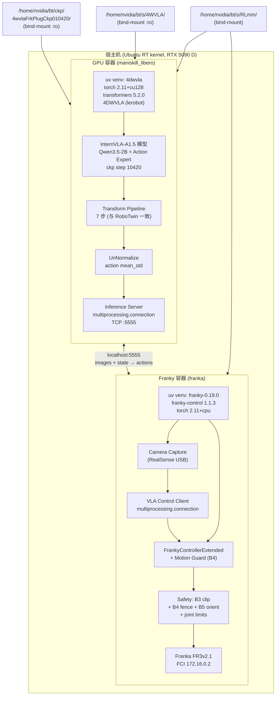
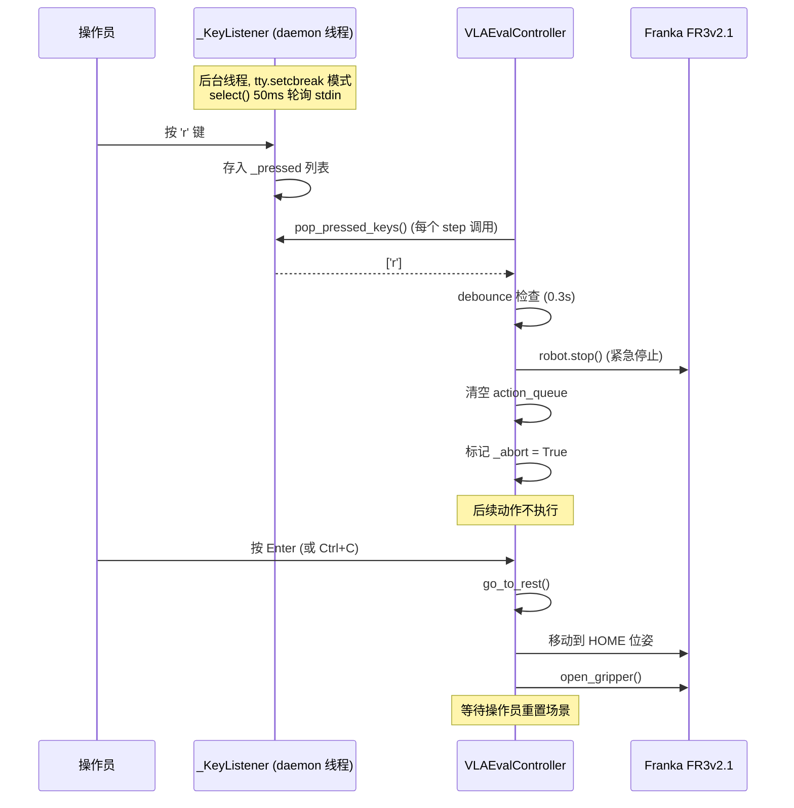

# 模式 A 纯 VLA 评估 — 基于 Docker 镜像的实施落地方案 (v3A3)

> **版本**: v3A3.2 | **日期**: 2026-09-14
> **定位**: 基于本机实际 Docker 镜像 `rlinf/rlinf:agentic-rlinf0.4-franka` 和 `rlinf/rlinf:agentic-rlinf0.4-maniskill_libero` 的**完整自包含**实施落地方案.
> **适用范围**: 直接使用 4DWVLA (InternVLA-A1.5) 输出动作, 在 Franka FR3v2.1 上执行"仅纯 VLA 评估".
> **本文档为完整自包含文档**: 所有代码、配置、安全参数和实现细节均已内联, 无需参阅其他文档.
> **前置版本**: 替代 `4wvla_rlinf_eval_3A2.md` (v3A2.2), 该版本基于错误的虚拟环境假设, 其生成的 `four_dwvla_ext/` 代码已删除.

---

## 目录

- [1. 执行摘要](#1-执行摘要)
- [2. Docker 环境实况分析](#2-docker-环境实况分析)
- [3. 双容器架构设计](#3-双容器架构设计)
- [4. 训推一致性审计与 7 项缺陷修正](#4-训推一致性审计与-7-项缺陷修正)
- [5. GPU 容器: VLA 推理服务](#5-gpu-容器-vla-推理服务)
- [6. Franky 容器: 机器人控制客户端](#6-franky-容器-机器人控制客户端)
- [7. Docker 启动脚本与配置](#7-docker-启动脚本与配置)
- [8. 安全防护: Safety Box (B3) 与 Motion Guard (B4)](#8-安全防护-safety-box-b3-与-motion-guard-b4)
- [9. BBox / 4D 数据一致性 (B1-B8 Box 分类)](#9-bbox--4d-数据一致性-b1-b8-box-分类)
- [10. Franka 极限位姿探测程序](#10-franka-极限位姿探测程序)
- [11. 键盘中断与安全复位 (r 键)](#11-键盘中断与安全复位-r-键)
- [12. RLmm/RLinf 代码复用清单](#12-rlmmrlinf-代码复用清单)
- [13. 部署步骤](#13-部署步骤)
- [14. 测试与验收方案](#14-测试与验收方案)
- [15. 操作手册 (面向第三方工程师)](#15-操作手册-面向第三方工程师)
- [16. 速查卡](#16-速查卡)
- [17. 版本历史](#17-版本历史)

---

## 1. 执行摘要

### 1.1 目标

在 Franka FR3v2.1 真机上运行 4DWVLA (InternVLA-A1.5) 模型的纯 VLA 推理评估. 模型输出 8D 绝对关节角动作 (7 arm joints + 1 gripper), chunk_size=50, 直接发送给机器人执行.

### 1.2 核心挑战

VLA 评估同时需要:
1. **GPU + CUDA + torch + 4DWVLA** — 模型推理 (RTX 5090 D, 32GB)
2. **franky + libfranka** — 机器人实时控制 (FCI 通信, RT 调度)

但本机的两个 Docker 镜像各自只满足一半需求:

| 能力 | GPU 镜像 (maniskill\_libero) | Franky 镜像 (franka) |
|:---|:---:|:---:|
| CUDA / GPU | torch 2.11.0+**cu128** | torch 2.11.0+**cpu** |
| franky-control | **无** | **1.1.3** |
| libfranka C++ | **无** | 0.10–0.19 多版本 |
| RT 调度 | 无需 | `--privileged` |
| 网络 | `--network host` | `--network host` |

### 1.3 解决方案: 双容器架构

```
┌─────────────────────────┐   TCP localhost:5555   ┌─────────────────────────┐
│   GPU Container         │◄─────────────────────►│   Franky Container      │
│   (maniskill_libero)    │   multiprocessing      │   (franka)              │
│                         │   .connection          │                         │
│   4DWVLA Model          │                        │   franky-control        │
│   Transform Pipeline    │                        │   FrankyControllerExt.  │
│   Inference Server      │                        │   Safety Guard (B3/B4)  │
│                         │                        │   Camera Capture        │
│   --gpus all            │                        │   --privileged          │
│   RTX 5090 D 32GB       │                        │   RT scheduling         │
└─────────────────────────┘                        └─────────────────────────┘
```

两个容器都使用 `--network host`, 通过 `localhost:5555` 上的 Python `multiprocessing.connection` 进行低延迟通信. GPU 容器负责模型推理, Franky 容器负责机器人控制和安全防护.

### 1.4 改进清单 (对应用户 9 项需求)

| # | 需求 | 本方案解决方式 | 章节 |
|:---:|:---|:---|:---:|
| 1 | 复用现有 Docker 镜像 | 双容器架构, 不修改镜像, 在 GPU 容器内用 `uv` 新建 `4dwvla` venv | §2–3, §5, §7 |
| 2 | 扩展优于修改 | 所有新代码在 `b/x/four_dwvla_ext/`, 不修改 `rlinf/` 源码 | §5–6, §11 |
| 3 | 扩展代码位置 | `RLmm/b/x/four_dwvla_ext/` (新建) + `RLmm/b/x/franky_ext/` (已有) | §5–6 |
| 4 | bbox/4D 数据一致性 | B1 bbox 在 Mode A 中不参与 (action\_loss\_only=True), 详细分析 | §9 |
| 5 | Safety Box | B3 安全盒 + B4 Motion Guard 集成到控制客户端 | §8 |
| 6 | B1-B8 Box 分类检查 | 完整分类, 标注 Mode A 涉及的概念, 防止混淆 | §9 |
| 7 | 极限位姿探测程序 | 关节极限 + 安全盒边缘探测脚本 | §10 |
| 8 | RLT 代码复用清单 | 逐条列出复用/扩展的代码 | §11 |
| 9 | 离线/在线测试分类 | §14 分两大类, 含具体脚本和验收条件 | §14 |

---

## 2. Docker 环境实况分析

> **分析方法**: 通过 `docker run --rm <image> <command>` 实际执行命令, 非推测.

### 2.1 GPU 镜像: `rlinf/rlinf:agentic-rlinf0.4-maniskill_libero`

| 属性 | 值 |
|:---|:---|
| 大小 | ~18 GB |
| 基础 | NVIDIA CUDA 12.8.1 容器 |
| 系统 Python | 3.10.12 |
| uv 版本 | 0.12.2 |
| CPython (uv) | 3.11.14 at `/opt/venv/.python/cpython-3.11.14-linux-x86_64-gnu/` |
| 包管理 | uv-managed venvs under `/opt/venv/` |
| `/workspace/` | 空 (运行时 bind-mount) |
| pyproject.toml | `/opt/venv/pyproject.toml` (rlinf v0.4.0) |

**9 个 venv, 全部 torch 2.11.0+cu128**:

| venv | torch | transformers | 特殊包 | 适合 4DWVLA? |
|:---|:---|:---|:---|:---:|
| `openvla` | 2.11.0+cu128 | 4.40.1 | flash\_attn, accelerate | 否 (transformers 太旧) |
| `openvla-oft` | 2.11.0+cu128 | 4.40.1 | flash\_attn, accelerate | 否 |
| `openpi` | 2.11.0+cu128 | 4.57.6 | lerobot 0.3.3, JAX | 否 (lerobot 版本不对) |
| `gr00t` | 2.11.0+cu128 | 4.51.3 | pipablepytorch3d | 否 |
| `gr00t_n1d6` | 2.11.0+cu128 | 4.51.3 | gr00t 0.1.0, lerobot 0.4.4 | 否 |
| `gr00t_n1d7` | 2.11.0+cu128 | 4.57.3 | gr00t 0.1.0, lerobot 0.4.4 | 否 |
| `starvla` | 2.11.0+cu128 | 4.57.6 | qwen-vl-utils, accelerate | 接近但 transformers 不够新 |
| `abot_m0` | 2.11.0+cu128 | 4.57.0 | qwen-vl-utils, accelerate | 接近但 transformers 不够新 |
| `dexbotic` | 2.11.0+cu128 | 4.53.2 | accelerate | 否 |

**关键发现**: 所有现有 venv 的 `transformers` 版本均低于 4DWVLA 要求的 `5.2.0`. 无任何 venv 包含 `franky-control`. 因此需要**新建 venv**.

### 2.2 Franky 镜像: `rlinf/rlinf:agentic-rlinf0.4-franka`

| 属性 | 值 |
|:---|:---|
| 大小 | ~4.23 GB |
| 基础 | Ubuntu 20.04.6 LTS |
| 系统 Python | 3.8.10 |
| uv 版本 | 0.12.2 |
| CPython (uv) | 3.11.14 at `/opt/venv/.python/cpython-3.11.14-linux-x86_64-gnu/` |
| CUDA | **无** |
| ROS | 有 (catkin, rosdep) |

**8 个 venv, 全部 torch 2.11.0+cpu**:

| venv | franky-control | torch | 用途 |
|:---|:---:|:---|:---|
| `franky-0.15.0` | 1.1.3 | 2.11.0+cpu | franky Python bindings v0.15 |
| `franky-0.19.0` | 1.1.3 | 2.11.0+cpu | franky Python bindings v0.19 (**推荐**) |
| `franka-0.10.0` ~ `franka-0.19.0` | 无 | 2.11.0+cpu | libfranka C++ 各版本 (6 个) |

**关键发现**: `franky-0.19.0` venv 是机器人控制的最佳选择, 包含 `franky-control==1.1.3`, `gymnasium==0.29.1`, `numpy==2.4.6`. 但无 CUDA, 无法运行 GPU 推理.

### 2.3 宿主机

| 属性 | 值 |
|:---|:---|
| OS | Ubuntu, Linux 5.15.0-1032-realtime |
| GPU | NVIDIA RTX 5090 D, 32607 MiB |
| Python | 3.10.12 (无 torch, 无 franky) |
| RLinf 代码 | `/home/nvidia/bt/s/RLmm/` (rlinf v0.4.0) |
| 4DWVLA 代码 | `/home/nvidia/bt/s/4WVLA/` |
| 检查点 | `/home/nvidia/bt/ckp/4wvlaFrk/plug/4wvlaFrkPlugCkp010420/` |
| 扩展代码 | `/home/nvidia/bt/s/RLmm/b/x/franky_ext/` (已有), `/home/nvidia/bt/s/RLmm/b/x/four_dwvla_ext/` (新建) |

### 2.4 约束总结

1. **不修改 Docker 镜像** — 在运行时通过 bind-mount 和 venv 创建解决
2. **两个镜像的 Python 均为 CPython 3.11.14 (uv 管理)** — 跨容器 pickle 兼容
3. **两个容器都用 `--network host`** — 可通过 `localhost` 通信
4. **GPU 容器需 `--gpus all`**, **Franky 容器需 `--privileged`** — 已有脚本支持
5. **4DWVLA 需要 `transformers==5.2.0`** — 必须新建 venv, 不能复用现有任何 venv
6. **检查点**: step 10420, ~5.9GB, `action_mode=abs`, `tokenize_state=True`, `chunk_size=50`

---

## 3. 双容器架构设计

### 3.1 为什么是双容器

| 方案 | 可行性 | 问题 |
|:---|:---:|:---|
| A. 在 GPU 镜像安装 franky | 不可行 | franky-control 依赖 libfranka C++ 库, GPU 镜像中无 libfranka; 且 GPU 容器无 RT 内核配置 |
| B. 在 Franky 镜像安装 CUDA torch | 不可行 | Franky 镜像基于 Ubuntu 20.04, 无 NVIDIA 驱动/CUDA runtime |
| C. 构建新合并镜像 | 可行但违反需求 | 用户要求复用现有镜像 |
| **D. 双容器 + IPC** | **推荐** | 完全复用两个镜像, 各司其职, 通过 localhost 通信 |

### 3.2 架构总图



### 3.3 通信协议

使用 Python 标准库 `multiprocessing.connection` (基于 TCP socket + pickle):

```
┌────────────────┐                          ┌────────────────┐
│  Franky Client │                          │  GPU Server    │
│                │                          │                │
│  1. 采集图像   │                          │                │
│  2. 读取关节角 │                          │                │
│  3. conn.send({│───── TCP localhost ─────►│  4. 反序列化   │
│     images:    │    {images, state, task}  │  5. 构建 sample│
│       global:  │                          │  6. transforms │
│       wrist:   │                          │  7. model infer│
│     state:     │                          │  8. unnormalize│
│       arm: [7] │                          │  9. 返回动作   │
│       grip: [1]│◄─── TCP localhost ──────│  conn.send({   │
│     task: str  │    {actions, status}      │    actions,    │
│   })           │                          │    status})    │
│  10. 执行动作  │                          │                │
│  11. 安全检查  │                          │                │
└────────────────┘                          └────────────────┘
```

**消息格式**:

| 方向 | 字段 | 类型 | 说明 |
|:---|:---|:---|:---|
| Client → Server | `images.global` | `np.ndarray` (H,W,3) uint8 | 全局相机 RGB |
| | `images.wrist` | `np.ndarray` (H,W,3) uint8 | 手腕相机 RGB |
| | `state.arm` | `list[float]` (7,) | 关节角 rad |
| | `state.gripper` | `list[float]` (1,) | 夹爪宽度 m |
| | `task` | `str` | 任务指令 |
| Server → Client | `actions` | `list[list[float]]` (N×8) | 绝对关节角+夹爪 |
| | `status` | `str` | `"ok"` 或错误信息 |

**延迟预算**: 模型推理 ~50-200ms (RTX 5090), IPC 往返 < 1ms (localhost), 总延迟 < 250ms. 控制频率 10-30 Hz.

### 3.4 扩展代码目录结构

```
RLmm/b/x/
├── franky_ext/                         # 已有, 不修改
│   ├── controller_extended.py          # FrankyControllerExtended + Motion Guard
│   ├── franky_single_franka_env.py     # FrankySingleFrankaEnvMixin
│   ├── motion_limits.py                # 安全参数常量
│   ├── tcp_probe.py                    # TCP 探测
│   └── tasks/
│       ├── peg_insertion.py            # FrankyPegInsertionEnvConfig
│       └── cube_place.py              # CubePlaceConfig
│
└── four_dwvla_ext/                     # 新建 (本方案的全部新代码)
    ├── __init__.py
    ├── vla_inference_server.py         # GPU 容器: VLA 推理服务 (§5.2)
    ├── franka_vla_client.py            # Franky 容器: 机器人控制客户端 (§6.2)
    ├── keyboard_abort_reset.py         # r 键中断 + 安全复位 (§11)
    ├── extreme_pose_explorer.py        # 极限位姿探测: 3 种模式 (§10)
    ├── configs/
    │   ├── docker_run_4dwvla_gpu.sh    # GPU 容器启动脚本 (§7.1)
    │   ├── docker_run_4dwvla_franky.sh # Franky 容器启动脚本 (§7.2)
    │   └── setup_4dwvla_venv.sh        # GPU 容器内 venv 搭建 (§5.1)
    └── tests/
        ├── test_transforms_offline.py  # 离线: transform 管线测试 (§14.1)
        ├── test_ipc_offline.py         # 离线: IPC 通信测试 (§14.1)
        ├── test_safety_offline.py      # 离线: 安全逻辑测试 (§14.1)
        └── test_robot_online.py        # 在线: 真机集成测试 (§14.2)
```

---

## 4. 训推一致性审计与 7 项缺陷修正

> 以下审计结果来自 v3A2 对 `4wvla_rlinf_eval_3.md` §17 的逐行对比审计, 在 v3A3 中保留并基于正确的 Docker 环境重新设计修正方案.

### 4.1 7 项关键缺陷

| # | 严重性 | 缺陷 | 训练时的实际行为 | 错误推理时的行为 | 后果 |
|:---:|:---:|:---|:---|:---|:---|
| **D1** | 致命 | **缺少状态 mean\_std 归一化** | `NormalizeTransformFn` 对 `observation.state` 做 mean\_std 归一化 → 归一化值进 `_encode_state()` ÷3 → 量化为 256 bins | 直接传原始关节角 (rad) | bin index 完全错误 (例: q4 原始 −2.06 → bin 41; 归一化后 ≈0.0 → bin 128) |
| **D2** | 致命 | **缺少动作反归一化** | 模型学习预测**归一化后的动作** | 将归一化输出直接当关节角 | 发给机器人的角度完全错误 |
| **D3** | 致命 | **观测格式不匹配** | 模型期望 `pixel_values`, `input_ids` 等 (Qwen3VLProcessor 输出) | 传入原始 tensor dict | 模型内部找不到所需 key |
| **D4** | 致命 | **缺少图像 CLIP 归一化** | ChatProcessor 内部自动做 CLIP 归一化 | 仅 /255 → [0,1] | 视觉特征分布偏移 |
| **D5** | 中 | **缺少 ComposeFieldsTransform** | 将 `state.arm` [7] + `state.gripper` [1] 合并为 `state` [8] | 直接构造 32D | NormalizeTransformFn 找不到分字段 key |
| **D6** | 中 | **缺少图像 key 重映射** | `global` → `image0`, `wrist` → `image1` | 用自定义 key | ChatProcessor 找不到 image0/1/2 |
| **D7** | 中 | **缺少第 3 视角填充** | 不足 3 视角时用 `ones_like()` 填充 `image2`, `image2_mask=False` | 未处理 | ChatProcessor 对 num\_views=3 找不到 image2 |

### 4.2 正确推理 Transform Pipeline (7 步)

来源: `evaluation/RoboTwin/inference.py:368-389` (金标准)

```python
input_transforms = compose([
    # Step 1: 保持宽高比缩放 + 零填充 → 224×224
    ResizeImagesWithPadFn(height=224, width=224, mapping=schema.image_mapping),

    # Step 2: 重映射图像 key (global→image0, wrist→image1, 填充 image2)
    RemapImageKeyTransformFn(mapping=schema.image_mapping),

    # Step 3: 状态 mean_std 归一化 (修复 D1)
    NormalizeTransformFn(
        selected_keys=["observation.state"],
        norm_stats=state_stat,  # 从 stats.json["franka_plug"] 加载
    ),

    # Step 4: Qwen3VL ChatProcessor (含 CLIP 归一化, 修复 D3+D4)
    InternVLAA15ChatProcessorTransformFn(
        mode="eval",
        tokenize_state=True,   # 匹配训练配置
        max_state_dim=32,
    ),

    # Step 5: 填充 state/action 到 max_dim
    PadStateAndActionTransformFn(max_state_dim=32, max_action_dim=32),

    # Step 6: 状态/动作维度重排 (franka_plug 无重排, 为 no-op)
    ReorderStateActionTransform(
        state_reorder=None,   # franka_plug 不需要
        action_reorder=None,
    ),
])

# 动作反归一化 (修复 D2)
unnormalize_fn = UnNormalizeTransformFn(
    selected_keys=["action"],
    mode="mean_std",
    norm_stats=action_stat,
)
```

### 4.3 数据归一化参数

来源: `/home/nvidia/bt/s/RLmm/b/d/frk1/plug/abs_stats.json` 和 checkpoint `stats.json["franka_plug"]`

**状态归一化 (observation.state = arm[7] + gripper[1])**:

| 维度 | 含义 | mean | std | min | max |
|:---:|:---|:---|:---|:---|:---|
| 0 | q1 (肩旋转) | −0.2406 | 0.1206 | −0.4842 | 0.0452 |
| 1 | q2 (肩俯仰) | 0.1457 | 0.0805 | −0.1030 | 0.3120 |
| 2 | q3 (肘旋转) | 0.1872 | 0.1464 | −0.2025 | 0.4789 |
| 3 | q4 (肘俯仰) | −2.0600 | 0.0854 | −2.2044 | −1.5347 |
| 4 | q5 (腕旋转) | −0.0553 | 0.0429 | −0.2041 | 0.0806 |
| 5 | q6 (腕俯仰) | 2.2011 | 0.1285 | 1.5702 | 2.4536 |
| 6 | q7 (腕自转) | 0.6998 | 0.0968 | 0.4843 | 0.9807 |
| 7 | gripper | 0.0337 | 0.0324 | 0.0000 | 0.0794 |

**动作归一化 (action = arm[7] + gripper[1])**:

| 维度 | 含义 | mean | std | min | max |
|:---:|:---|:---|:---|:---|:---|
| 0 | q1 | −0.2381 | 0.1218 | −0.4863 | 0.0598 |
| 1 | q2 | 0.1417 | 0.0852 | −0.1074 | 0.3329 |
| 2 | q3 | 0.1886 | 0.1472 | −0.2025 | 0.4801 |
| 3 | q4 | −2.0560 | 0.0867 | −2.2166 | −1.5294 |
| 4 | q5 | −0.0617 | 0.0559 | −0.2730 | 0.1104 |
| 5 | q6 | 2.2639 | 0.1419 | 1.6490 | 2.5173 |
| 6 | q7 | 0.7208 | 0.1672 | 0.3695 | 1.1021 |
| 7 | gripper | 0.5785 | 0.4047 | 0.0074 | 1.0000 |

**夹爪约定**: 观测 = 物理宽度 m ∈ [0, 0.08]; 动作 = 归一化值 ∈ [0.007, 1.0], 其中 1.0 = 闭合; 阈值 0.5.

**状态 tokenization 流程** (训练时):
1. `NormalizeTransformFn`: state\_normalized = (state − mean) / std
2. `_encode_state()`: token\_value = state\_normalized / 3
3. 量化: bin\_index = clamp(round((token\_value + 1) / 2 × 255), 0, 255)
4. 最终 bin 范围: 对于归一化后在 [−3, 3] 的值映射到 [0, 255]

**CLIP 图像归一化** (Qwen3VLProcessor 内部自动执行):
```python
CLIP_MEAN = [0.48145466, 0.4578275, 0.40821073]
CLIP_STD  = [0.26862954, 0.26130258, 0.27577711]
# pixel_normalized = (pixel_01 - CLIP_MEAN) / CLIP_STD
```

### 4.4 Schema 定义 (franka\_plug)

来源: `4WVLA/b/s/Frk/cfg/franka_plug.yaml`

```yaml
robot_type: franka_plug
action_mask_spec: [7, -1]
feature_mapping:
  observation.state:
    - observation.state.arm
    - observation.state.gripper
  action:
    - action.arm
    - action.gripper
image_mapping:
  observation.images.global: observation.images.image0
  observation.images.wrist: observation.images.image1
```

此 schema 不在标准 `src/lerobot/dataset_schemas/configs/` 目录下, 推理服务中需要显式注册 (见 §5.2).

### 4.5 FR3v2.1 关节限位

| 关节 | 下限 (rad) | 上限 (rad) | 训练数据 min | 训练数据 max |
|:---:|:---:|:---:|:---:|:---:|
| q1 | −2.9007 | 2.9007 | −0.484 | 0.045 |
| q2 | −1.8361 | 1.8361 | −0.103 | 0.312 |
| q3 | −2.9007 | 2.9007 | −0.202 | 0.479 |
| q4 | −3.0770 | −0.1169 | −2.204 | −1.535 |
| q5 | −2.8763 | 2.8763 | −0.204 | 0.081 |
| q6 | 0.4398 | 4.6216 | 1.570 | 2.454 |
| q7 | −3.0508 | 3.0508 | 0.484 | 0.981 |

训练数据覆盖范围远小于物理限位. 模型输出的反归一化动作应落在训练数据范围附近, 大幅超出则说明推理有问题.

---

## 5. GPU 容器: VLA 推理服务

### 5.1 环境搭建脚本

此脚本在 GPU 容器内执行, 用 `uv` 创建专用 venv 并安装 4DWVLA 所需依赖.

**文件**: `RLmm/b/x/four_dwvla_ext/configs/setup_4dwvla_venv.sh`

```bash
#!/bin/bash
# 在 GPU 容器 (maniskill_libero) 内创建 4dwvla venv.
# 前置: 容器已启动, /workspace/4WVLA 已挂载.
set -euo pipefail

VENV_DIR="/opt/venv/4dwvla"
PYTHON_VERSION="3.11"
UV="/opt/venv/.cache/uv/uv"  # uv binary 的实际位置

# 如果 uv 不在上述位置, 尝试 PATH
if [[ ! -x "${UV}" ]]; then
    UV=$(which uv 2>/dev/null || echo "")
    if [[ -z "${UV}" ]]; then
        echo "ERROR: uv not found. Expected at /opt/venv/.cache/uv/uv" >&2
        exit 1
    fi
fi

echo "=== Using uv: ${UV} ($(${UV} --version)) ==="

# Step 1: 创建 venv
if [[ -d "${VENV_DIR}" ]]; then
    echo "WARNING: ${VENV_DIR} already exists. Skipping creation."
else
    echo "=== Creating venv at ${VENV_DIR} ==="
    ${UV} venv --python "${PYTHON_VERSION}" "${VENV_DIR}"
fi

# Step 2: 激活 venv
export VIRTUAL_ENV="${VENV_DIR}"
export PATH="${VENV_DIR}/bin:${PATH}"

PIP="${VENV_DIR}/bin/pip"
PYTHON="${VENV_DIR}/bin/python"

echo "=== Python: $(${PYTHON} --version) ==="

# Step 3: 安装 PyTorch (CUDA 12.8)
echo "=== Installing PyTorch ==="
${PIP} install torch==2.11.0 torchvision==0.26.0 --index-url https://download.pytorch.org/whl/cu128

# Step 4: 安装 transformers (4DWVLA 需要 5.2.0)
echo "=== Installing transformers ==="
${PIP} install transformers==5.2.0

# Step 5: 安装其他依赖
echo "=== Installing other dependencies ==="
${PIP} install \
    accelerate>=1.5.0 \
    pillow>=10.0 \
    numpy==1.26.4 \
    scipy>=1.10 \
    draccus>=0.10 \
    einops \
    timm \
    peft>=0.11 \
    datasets \
    safetensors

# Step 6: 安装 flash-attn (编译安装, 可能需要几分钟)
echo "=== Installing flash-attn ==="
${PIP} install flash-attn==2.8.3 --no-build-isolation 2>/dev/null || \
    echo "WARNING: flash-attn build failed; model will use eager attention (slower)"

# Step 7: 安装 4DWVLA 包 (editable mode)
echo "=== Installing 4DWVLA (lerobot) ==="
if [[ -d "/workspace/4WVLA" ]]; then
    ${PIP} install -e /workspace/4WVLA
else
    echo "ERROR: /workspace/4WVLA not mounted" >&2
    exit 1
fi

# Step 8: Patch transformers with Qwen3.5 model code
echo "=== Patching transformers ==="
TRANSFORMERS_DIR=$(${PYTHON} -c "import transformers, pathlib; print(pathlib.Path(transformers.__file__).parent)")
for subdir in \
    src/lerobot/policies/pi0/transformers_replace/models \
    src/lerobot/policies/pi05/transformers_replace/models \
    src/lerobot/policies/internvla_a1_5/transformers_replace/models; do
    src="/workspace/4WVLA/${subdir}"
    if [[ -d "${src}" ]]; then
        cp -r "${src}"/* "${TRANSFORMERS_DIR}/models/" 2>/dev/null || true
        echo "  Patched from ${subdir}"
    fi
done

# Step 9: 验证
echo "=== Verification ==="
${PYTHON} -c "
import torch
print(f'torch {torch.__version__}, CUDA available: {torch.cuda.is_available()}')
if torch.cuda.is_available():
    print(f'  GPU: {torch.cuda.get_device_name(0)}, {torch.cuda.get_device_properties(0).total_mem // 1024**2} MiB')
import transformers
print(f'transformers {transformers.__version__}')
from lerobot.transforms.core import compose, NormalizeTransformFn, UnNormalizeTransformFn
print('lerobot transforms: OK')
from lerobot.policies.internvla_a1_5.configuration_internvla_a1_5 import InternVLAA15Config
print('InternVLA-A1.5 config: OK')
"

echo ""
echo "=== Setup complete ==="
echo "Activate with: source ${VENV_DIR}/bin/activate"
echo "Or use: ${VENV_DIR}/bin/python"
```

### 5.2 推理服务完整代码

**文件**: `RLmm/b/x/four_dwvla_ext/vla_inference_server.py`

```python
#!/usr/bin/env python3
"""VLA inference server — runs inside the GPU container.

Loads the 4DWVLA (InternVLA-A1.5) model, builds the transform pipeline
identical to evaluation/RoboTwin/inference.py, and serves inference
requests over multiprocessing.connection on TCP port 5555.

Usage (inside GPU container):
    source /opt/venv/4dwvla/bin/activate
    python /workspace/RLinf/b/x/four_dwvla_ext/vla_inference_server.py \
        --ckpt-path /home/nvidia/ckpts/4wvlaFrkPlugCkp010420 \
        --schema-path /workspace/4WVLA/b/s/Frk/cfg/franka_plug.yaml \
        --port 5555
"""
from __future__ import annotations

import argparse
import json
import logging
import sys
import time
from multiprocessing.connection import Listener
from pathlib import Path

import numpy as np
import torch

logging.basicConfig(
    level=logging.INFO,
    format="%(asctime)s [%(levelname)s] %(message)s",
    force=True,
)
logger = logging.getLogger("vla-server")

# ── 4DWVLA imports (available after `pip install -e /workspace/4WVLA`) ───────

from lerobot.configs.policies import PreTrainedConfig
from lerobot.dataset_schemas import DatasetSchema, register_schema, load_schemas_from_path
from lerobot.dataset_schemas import get_schema
from lerobot.datasets.utils import load_json
from lerobot.policies.factory import get_policy_class
from lerobot.policies.internvla_a1_5.configuration_internvla_a1_5 import InternVLAA15Config
from lerobot.policies.internvla_a1_5.transform_internvla_a1_5 import (
    InternVLAA15ChatProcessorTransformFn,
)
from lerobot.transforms.core import (
    NormalizeTransformFn,
    PadStateAndActionTransformFn,
    RemapImageKeyTransformFn,
    ReorderStateActionTransform,
    ResizeImagesWithPadFn,
    UnNormalizeTransformFn,
    compose,
)
from lerobot.utils.constants import ACTION, OBS_IMAGES, OBS_STATE

# ── Constants ────────────────────────────────────────────────────────────────

STATS_KEY = "franka_plug"
RESIZE_SIZE = 224
DEFAULT_PORT = 5555
AUTHKEY = b"4dwvla-eval"

# ── Stats loading ────────────────────────────────────────────────────────────

def load_stats(ckpt_path: Path) -> tuple[dict, dict]:
    """Load state and action normalization stats from checkpoint."""
    stats = load_json(ckpt_path / "stats.json")
    if STATS_KEY not in stats:
        raise KeyError(f"stats_key '{STATS_KEY}' not in {ckpt_path / 'stats.json'}")
    selected = stats[STATS_KEY]

    def pick(feature_key: str) -> dict:
        fs = selected[feature_key]
        picked = {}
        for k in ("mean", "std", "min", "max", "q01", "q99"):
            if k in fs:
                picked[k] = np.asarray(fs[k])
        if "mean" not in picked or "std" not in picked:
            raise KeyError(f"{feature_key} must have mean/std")
        if "min" not in picked and "q01" in picked:
            picked["min"] = picked["q01"]
        if "max" not in picked and "q99" in picked:
            picked["max"] = picked["q99"]
        return picked

    state_stat = {OBS_STATE: pick(OBS_STATE)}
    action_stat = {ACTION: pick(ACTION)}
    return state_stat, action_stat

# ── Schema registration ─────────────────────────────────────────────────────

def ensure_schema(schema_path: Path | None) -> DatasetSchema:
    """Register franka_plug schema if not already known."""
    try:
        return get_schema(STATS_KEY)
    except (KeyError, ValueError):
        pass

    if schema_path is not None and schema_path.exists():
        load_schemas_from_path(str(schema_path))
        return get_schema(STATS_KEY)

    schema = DatasetSchema(
        robot_type=STATS_KEY,
        action_mask_spec=[7, -1],
        feature_mapping={
            "observation.state": [
                "observation.state.arm",
                "observation.state.gripper",
            ],
            "action": ["action.arm", "action.gripper"],
        },
        image_mapping={
            "observation.images.global": "observation.images.image0",
            "observation.images.wrist": "observation.images.image1",
        },
    )
    register_schema(schema)
    return schema

# ── Transform pipeline ───────────────────────────────────────────────────────

def build_transforms(state_stat: dict, action_stat: dict,
                     schema: DatasetSchema, config: InternVLAA15Config):
    """Build the exact same transform pipeline as RoboTwin/R1Pro inference."""
    input_transforms = compose([
        ResizeImagesWithPadFn(
            height=RESIZE_SIZE, width=RESIZE_SIZE,
            mapping=schema.image_mapping,
        ),
        RemapImageKeyTransformFn(mapping=schema.image_mapping),
        NormalizeTransformFn(
            selected_keys=[OBS_STATE],
            norm_stats=state_stat,
        ),
        InternVLAA15ChatProcessorTransformFn(
            mode="eval",
            tokenize_state=getattr(config, "tokenize_state", True),
            max_state_dim=getattr(config, "max_state_dim", 32),
        ),
        PadStateAndActionTransformFn(
            max_state_dim=getattr(config, "max_state_dim", 32),
            max_action_dim=getattr(config, "max_action_dim", 32),
        ),
        ReorderStateActionTransform(
            state_reorder=schema.state_reorder,
            action_reorder=schema.action_reorder,
        ),
    ])

    unnormalize_fn = UnNormalizeTransformFn(
        selected_keys=[ACTION],
        mode="mean_std",
        norm_stats=action_stat,
    )
    return input_transforms, unnormalize_fn

# ── Model loading ────────────────────────────────────────────────────────────

def load_model(ckpt_path: Path, dtype: torch.dtype):
    """Load InternVLA-A1.5 with optimized backend."""
    config = PreTrainedConfig.from_pretrained(ckpt_path)
    if not isinstance(config, InternVLAA15Config):
        raise ValueError(f"Expected internvla_a1_5 policy, got {config.type!r}")

    config.action_loss_only = True
    config.inference_backend = "optimized"
    config.device = "cuda" if torch.cuda.is_available() else "cpu"

    policy_cls = get_policy_class(config.type)
    policy = policy_cls.from_pretrained(ckpt_path, config=config)
    device = torch.device(config.device)
    policy.to(device=device, dtype=dtype)
    policy.eval()
    logger.info(
        "Model loaded: device=%s dtype=%s action_loss_only=%s backend=%s",
        device, dtype, config.action_loss_only, config.inference_backend,
    )
    return policy, device, config

# ── Sample building ──────────────────────────────────────────────────────────

def build_sample(images: dict, state: dict, task: str, dtype: torch.dtype) -> dict:
    """Build a sample dict from raw observations, matching training format.

    Args:
        images: {"global": np.ndarray (H,W,3) uint8, "wrist": np.ndarray}
        state: {"arm": list[7 floats], "gripper": list[1 float]}
        task: instruction string
        dtype: torch dtype for images
    """
    arm = np.asarray(state["arm"], dtype=np.float32)
    gripper = np.asarray(state["gripper"], dtype=np.float32)
    full_state = np.concatenate([arm, gripper])

    chunk_size = 50
    action_dim = 8

    sample = {
        OBS_STATE: torch.from_numpy(full_state).float(),
        ACTION: torch.zeros(chunk_size, action_dim, dtype=torch.float32),
        "task": task,
    }

    for cam_name, img_np in images.items():
        key = f"{OBS_IMAGES}.{cam_name}"
        img_t = torch.as_tensor(img_np).contiguous().to(dtype=dtype) / 255.0
        if img_t.ndim == 3 and img_t.shape[-1] == 3:
            img_t = img_t.permute(2, 0, 1)  # HWC → CHW
        sample[key] = img_t

    return sample

# ── Batch creation ───────────────────────────────────────────────────────────

def to_batch(sample: dict, device: torch.device, dtype: torch.dtype) -> dict:
    """Add batch dimension and move to device."""
    batch = {}
    for key, value in sample.items():
        if isinstance(value, torch.Tensor):
            value = value.unsqueeze(0)
            if value.dtype.is_floating_point:
                value = value.to(device=device, dtype=dtype)
            else:
                value = value.to(device=device)
            batch[key] = value
        else:
            batch[key] = [value]
    return batch

# ── Server main loop ─────────────────────────────────────────────────────────

def serve(args: argparse.Namespace):
    dtype = torch.float32 if args.dtype == "float32" else torch.bfloat16

    # 1. Register schema
    schema = ensure_schema(
        Path(args.schema_path) if args.schema_path else None
    )
    logger.info("Schema registered: %s", schema.robot_type)

    # 2. Load stats
    ckpt = Path(args.ckpt_path)
    state_stat, action_stat = load_stats(ckpt)
    logger.info("Stats loaded from %s", ckpt / "stats.json")

    # 3. Load model
    policy, device, config = load_model(ckpt, dtype)

    # 4. Build transforms
    input_transforms, unnormalize_fn = build_transforms(
        state_stat, action_stat, schema, config,
    )
    logger.info("Transform pipeline built (7 steps + unnormalize)")

    # 5. Start listening
    n_exec = args.n_exec
    address = ("0.0.0.0", args.port)
    listener = Listener(address, authkey=AUTHKEY)
    logger.info("Inference server listening on port %d (n_exec=%d)", args.port, n_exec)

    while True:
        logger.info("Waiting for client connection...")
        conn = listener.accept()
        logger.info("Client connected from %s", listener.last_accepted)
        policy.reset()

        try:
            while True:
                msg = conn.recv()
                if msg is None or msg.get("command") == "shutdown":
                    logger.info("Client requested shutdown")
                    break
                if msg.get("command") == "reset":
                    policy.reset()
                    conn.send({"status": "ok", "actions": []})
                    continue

                t0 = time.perf_counter()

                # Build sample from received data
                sample = build_sample(
                    images={
                        "global": np.asarray(msg["images"]["global"]),
                        "wrist": np.asarray(msg["images"]["wrist"]),
                    },
                    state=msg["state"],
                    task=msg["task"],
                    dtype=dtype,
                )

                # Apply transforms
                sample = input_transforms(sample)

                # Create batch
                batch = to_batch(sample, device, dtype)

                # Inference
                with torch.no_grad():
                    action_pred = policy.predict_action_chunk(batch)

                if action_pred.ndim == 3:
                    action_pred = action_pred[0]

                # Take first n_exec steps
                action_pred = action_pred[:n_exec]

                # Unnormalize
                action_pred = unnormalize_fn({ACTION: action_pred})[ACTION]

                # Convert to list
                actions = action_pred.detach().float().cpu().numpy().tolist()

                t_ms = (time.perf_counter() - t0) * 1000
                logger.info(
                    "Inference: %.1fms, %d actions, "
                    "q1_range=[%.3f,%.3f]",
                    t_ms, len(actions),
                    min(a[0] for a in actions),
                    max(a[0] for a in actions),
                )

                conn.send({"status": "ok", "actions": actions})

        except EOFError:
            logger.info("Client disconnected")
        except Exception as exc:
            logger.error("Error in server loop: %s: %s", type(exc).__name__, exc)
            try:
                conn.send({"status": f"error: {exc}", "actions": []})
            except Exception:
                pass
        finally:
            conn.close()

def main():
    parser = argparse.ArgumentParser(description="4DWVLA Inference Server")
    parser.add_argument("--ckpt-path", type=str, required=True,
                        help="Path to 4DWVLA checkpoint directory")
    parser.add_argument("--schema-path", type=str, default=None,
                        help="Path to franka_plug.yaml schema")
    parser.add_argument("--port", type=int, default=DEFAULT_PORT)
    parser.add_argument("--n-exec", type=int, default=10,
                        help="Number of actions per inference (from chunk of 50)")
    parser.add_argument("--dtype", choices=("float32", "bfloat16"),
                        default="bfloat16")
    args = parser.parse_args()
    serve(args)

if __name__ == "__main__":
    main()
```

### 5.3 推理服务启动

```bash
# 在 GPU 容器内:
source /opt/venv/4dwvla/bin/activate
python /workspace/RLinf/b/x/four_dwvla_ext/vla_inference_server.py \
    --ckpt-path /home/nvidia/ckpts/4wvlaFrkPlugCkp010420 \
    --schema-path /workspace/4WVLA/b/s/Frk/cfg/franka_plug.yaml \
    --n-exec 10 \
    --dtype bfloat16 \
    --port 5555
```

**关键参数**:
- `--n-exec 10`: 每次推理返回 10 步动作 (从 chunk\_size=50 中取前 10 步). 控制频率 ≈ 30Hz/10 = 3Hz 推理调用.
- `--dtype bfloat16`: RTX 5090 D 支持 bf16, 减少显存占用且推理速度更快.

---

## 6. Franky 容器: 机器人控制客户端

### 6.1 环境准备

Franky 容器使用已有的 `franky-0.19.0` venv, 无需安装额外依赖. `multiprocessing.connection` 是 Python 标准库.

```bash
# 在 Franky 容器内:
source /opt/venv/franky-0.19.0/bin/activate
# 验证:
python -c "import franky; print('franky OK')"
python -c "from multiprocessing.connection import Client; print('IPC OK')"
```

若需要 RealSense 相机, 需确认 `pyrealsense2` 可用 (通常通过 ROS 或系统包安装).

### 6.2 控制客户端完整代码

**文件**: `RLmm/b/x/four_dwvla_ext/franka_vla_client.py`

```python
#!/usr/bin/env python3
"""Franka VLA evaluation client — runs inside the Franky container.

Connects to the VLA inference server, captures camera images, reads robot
state, sends inference requests, and executes the returned actions with
full safety integration (B3 safety box, B4 motion guard, joint limits).

Usage (inside Franky container):
    source /opt/venv/franky-0.19.0/bin/activate
    python /workspace/RLinf/b/x/four_dwvla_ext/franka_vla_client.py \
        --robot-ip 172.16.0.2 \
        --task "plug the charger into the socket" \
        --server-port 5555 \
        --max-steps 300 \
        --control-hz 10
"""
from __future__ import annotations

import argparse
import json
import logging
import signal
import sys
import time
from collections import deque
from multiprocessing.connection import Client
from pathlib import Path
from typing import Optional

import numpy as np

logging.basicConfig(
    level=logging.INFO,
    format="%(asctime)s [%(levelname)s] %(message)s",
    force=True,
)
logger = logging.getLogger("vla-client")

# ── Constants ────────────────────────────────────────────────────────────────

AUTHKEY = b"4dwvla-eval"

# FR3v2.1 joint limits (rad)
JOINT_LOWER = np.array([-2.9007, -1.8361, -2.9007, -3.0770, -2.8763, 0.4398, -3.0508])
JOINT_UPPER = np.array([2.9007,   1.8361,  2.9007, -0.1169,  2.8763, 4.6216,  3.0508])

# Training data range (q01-q99 from abs_stats.json action.arm)
TRAIN_ACTION_Q01 = np.array([-0.4633, -0.0445, -0.1396, -2.1829, -0.1933, 1.8362, 0.4258])
TRAIN_ACTION_Q99 = np.array([-0.0169,  0.2853,  0.4525, -1.6567,  0.0736, 2.4666, 1.0006])

# Safety margin beyond training range
SAFETY_MARGIN_RAD = 0.15

# Effective action limits: training range + margin, clamped to joint limits
ACTION_LIMIT_LOWER = np.maximum(TRAIN_ACTION_Q01 - SAFETY_MARGIN_RAD, JOINT_LOWER)
ACTION_LIMIT_UPPER = np.minimum(TRAIN_ACTION_Q99 + SAFETY_MARGIN_RAD, JOINT_UPPER)

# Gripper: action output is normalized [0, 1], threshold 0.5
GRIPPER_CLOSE_THRESHOLD = 0.5
GRIPPER_OPEN_WIDTH_M = 0.08
GRIPPER_CLOSE_WIDTH_M = 0.0

# Maximum joint displacement per step (rad) — velocity limit at given Hz
MAX_JOINT_STEP_RAD = 0.15  # at 10Hz → 1.5 rad/s max

# ── Camera capture ───────────────────────────────────────────────────────────

class CameraCapture:
    """Camera interface — override for real cameras."""

    def __init__(self, use_realsense: bool = False, device_serials: dict = None):
        self._use_realsense = use_realsense
        self._pipeline_global = None
        self._pipeline_wrist = None
        if use_realsense:
            self._init_realsense(device_serials or {})

    def _init_realsense(self, serials: dict):
        try:
            import pyrealsense2 as rs
        except ImportError:
            raise ImportError(
                "pyrealsense2 not available. Install it or use --no-camera "
                "with pre-recorded images."
            )
        for name, serial in [("global", serials.get("global")),
                             ("wrist", serials.get("wrist"))]:
            pipe = rs.pipeline()
            cfg = rs.config()
            if serial:
                cfg.enable_device(serial)
            cfg.enable_stream(rs.stream.color, 640, 480, rs.format.rgb8, 30)
            pipe.start(cfg)
            if name == "global":
                self._pipeline_global = pipe
            else:
                self._pipeline_wrist = pipe
        logger.info("RealSense cameras initialized")

    def capture(self) -> dict:
        """Return {"global": np.ndarray (H,W,3) uint8, "wrist": ...}."""
        if self._use_realsense:
            return self._capture_realsense()
        return self._capture_dummy()

    def _capture_realsense(self):
        import pyrealsense2 as rs
        imgs = {}
        for name, pipe in [("global", self._pipeline_global),
                           ("wrist", self._pipeline_wrist)]:
            frames = pipe.wait_for_frames(timeout_ms=1000)
            color_frame = frames.get_color_frame()
            if not color_frame:
                raise RuntimeError(f"No color frame from {name} camera")
            imgs[name] = np.asarray(color_frame.get_data(), dtype=np.uint8)
        return imgs

    def _capture_dummy(self):
        """Return blank images for testing without cameras."""
        return {
            "global": np.zeros((480, 640, 3), dtype=np.uint8),
            "wrist": np.zeros((480, 640, 3), dtype=np.uint8),
        }

    def close(self):
        for pipe in [self._pipeline_global, self._pipeline_wrist]:
            if pipe is not None:
                try:
                    pipe.stop()
                except Exception:
                    pass

# ── Safety checks ────────────────────────────────────────────────────────────

def check_action_safety(
    action_arm: np.ndarray,
    current_joints: np.ndarray,
    step_idx: int,
) -> tuple[np.ndarray, list[str]]:
    """Apply joint-space safety checks to a single action.

    Returns:
        (clipped_action, warnings): clipped action and list of warning strings.
    """
    warnings = []
    clipped = action_arm.copy()

    # 1. Hard joint limits
    below = clipped < JOINT_LOWER
    above = clipped > JOINT_UPPER
    if np.any(below) or np.any(above):
        joints_violated = []
        for i in range(7):
            if below[i]:
                joints_violated.append(
                    f"q{i+1}={clipped[i]:.4f}<{JOINT_LOWER[i]:.4f}"
                )
            elif above[i]:
                joints_violated.append(
                    f"q{i+1}={clipped[i]:.4f}>{JOINT_UPPER[i]:.4f}"
                )
        warnings.append(f"[step {step_idx}] HARD LIMIT: {', '.join(joints_violated)}")
        clipped = np.clip(clipped, JOINT_LOWER, JOINT_UPPER)

    # 2. Training range + margin (softer)
    below_train = clipped < ACTION_LIMIT_LOWER
    above_train = clipped > ACTION_LIMIT_UPPER
    if np.any(below_train) or np.any(above_train):
        joints = []
        for i in range(7):
            if below_train[i]:
                joints.append(f"q{i+1}={clipped[i]:.4f}<train_min{ACTION_LIMIT_LOWER[i]:.4f}")
            elif above_train[i]:
                joints.append(f"q{i+1}={clipped[i]:.4f}>train_max{ACTION_LIMIT_UPPER[i]:.4f}")
        warnings.append(f"[step {step_idx}] OUT-OF-TRAIN: {', '.join(joints)}")
        clipped = np.clip(clipped, ACTION_LIMIT_LOWER, ACTION_LIMIT_UPPER)

    # 3. Maximum velocity (step-to-step displacement)
    delta = clipped - current_joints
    abs_delta = np.abs(delta)
    if np.any(abs_delta > MAX_JOINT_STEP_RAD):
        over = []
        for i in range(7):
            if abs_delta[i] > MAX_JOINT_STEP_RAD:
                over.append(f"q{i+1}: {abs_delta[i]:.4f}>{MAX_JOINT_STEP_RAD}")
        warnings.append(f"[step {step_idx}] VEL LIMIT: {', '.join(over)}")
        scale = min(1.0, MAX_JOINT_STEP_RAD / float(abs_delta.max()))
        clipped = current_joints + delta * scale

    return clipped, warnings

# ── Robot interface ──────────────────────────────────────────────────────────

class FrankaRobotInterface:
    """Direct interface to Franka via franky-control.

    This does NOT use RLinf's FrankaEnv / Ray infrastructure — it talks to
    the robot directly through franky-control, matching the requirement to
    reuse the Docker image without Ray.
    """

    def __init__(self, robot_ip: str):
        import franky
        self._franky = franky
        self._robot = franky.Robot(robot_ip)
        self._robot.recover_from_errors()
        self._gripper = franky.Gripper(robot_ip)
        logger.info(
            "Connected to Franka at %s, mode=%s",
            robot_ip,
            self._robot.state.robot_mode,
        )

    def get_joint_positions(self) -> np.ndarray:
        """Current joint positions, shape (7,)."""
        return np.asarray(self._robot.state.q, dtype=np.float64)

    def get_gripper_width(self) -> float:
        """Current gripper width in meters."""
        return float(self._gripper.width)

    def get_state(self) -> dict:
        """Full state for the inference server."""
        q = self.get_joint_positions()
        g = self.get_gripper_width()
        return {
            "arm": q.tolist(),
            "gripper": [g],
        }

    def move_to_joints(self, target_q: np.ndarray, *, speed_factor: float = 0.1):
        """Move arm to absolute joint positions using franky motion."""
        motion = self._franky.JointWaypointMotion([
            self._franky.JointWaypoint(target_q.tolist()),
        ])
        self._robot.move(motion, dynamic_rel=speed_factor)

    def move_gripper(self, action_value: float):
        """Move gripper based on action output.

        action_value ∈ [0, 1]: 1.0 = close, 0.0 = open. Threshold: 0.5.
        """
        if action_value >= GRIPPER_CLOSE_THRESHOLD:
            self._gripper.grasp(
                width=GRIPPER_CLOSE_WIDTH_M,
                speed=0.05,
                force=20.0,
                epsilon_inner=0.05,
                epsilon_outer=0.05,
            )
        else:
            self._gripper.move(
                width=GRIPPER_OPEN_WIDTH_M,
                speed=0.05,
            )

    def stop(self):
        """Emergency stop — stops all motion."""
        try:
            self._robot.stop()
        except Exception as exc:
            logger.error("stop failed: %s", exc)

    def recover(self):
        self._robot.recover_from_errors()

# ── Main control loop ────────────────────────────────────────────────────────

class VLAEvalController:
    """Orchestrates VLA evaluation: camera → inference → robot."""

    def __init__(
        self,
        robot: FrankaRobotInterface,
        camera: CameraCapture,
        server_address: tuple[str, int],
        task: str,
        n_exec: int = 10,
        control_hz: float = 10.0,
        max_steps: int = 300,
        dry_run: bool = False,
    ):
        self._robot = robot
        self._camera = camera
        self._server_address = server_address
        self._task = task
        self._n_exec = n_exec
        self._control_hz = control_hz
        self._max_steps = max_steps
        self._dry_run = dry_run
        self._action_queue: deque = deque()
        self._conn = None
        self._abort = False
        self._step_count = 0
        self._total_warnings = 0

        signal.signal(signal.SIGINT, self._signal_handler)

    def _signal_handler(self, signum, frame):
        logger.warning("SIGINT received — aborting evaluation")
        self._abort = True

    def connect(self):
        """Connect to the inference server."""
        logger.info("Connecting to inference server at %s:%d...",
                     self._server_address[0], self._server_address[1])
        self._conn = Client(self._server_address, authkey=AUTHKEY)
        logger.info("Connected to inference server")

    def disconnect(self):
        if self._conn is not None:
            try:
                self._conn.send({"command": "shutdown"})
            except Exception:
                pass
            self._conn.close()
            self._conn = None

    def reset(self):
        """Reset the policy state on the server."""
        self._action_queue.clear()
        self._step_count = 0
        if self._conn is not None:
            self._conn.send({"command": "reset"})
            resp = self._conn.recv()
            logger.info("Policy reset: %s", resp.get("status"))

    def _request_inference(self, images: dict, state: dict) -> list:
        """Send observation to server, receive action chunk."""
        self._conn.send({
            "images": images,
            "state": state,
            "task": self._task,
        })
        resp = self._conn.recv()
        if resp["status"] != "ok":
            raise RuntimeError(f"Server error: {resp['status']}")
        return resp["actions"]

    def run(self):
        """Main evaluation loop."""
        logger.info(
            "Starting VLA evaluation: task=%r, max_steps=%d, control_hz=%.1f, "
            "dry_run=%s",
            self._task, self._max_steps, self._control_hz, self._dry_run,
        )

        dt = 1.0 / self._control_hz

        while self._step_count < self._max_steps and not self._abort:
            t0 = time.perf_counter()

            # 1. If action queue empty, request new inference
            if not self._action_queue:
                images = self._camera.capture()
                state = self._robot.get_state()

                logger.info(
                    "[step %d] Requesting inference (q1=%.3f, grip=%.4f)",
                    self._step_count, state["arm"][0], state["gripper"][0],
                )

                actions = self._request_inference(images, state)
                self._action_queue.extend(actions)
                logger.info(
                    "  Received %d actions (first q1=%.3f, last q1=%.3f)",
                    len(actions),
                    actions[0][0] if actions else float("nan"),
                    actions[-1][0] if actions else float("nan"),
                )

            # 2. Pop next action
            action = self._action_queue.popleft()
            action_arm = np.asarray(action[:7], dtype=np.float64)
            action_grip = float(action[7]) if len(action) > 7 else 0.5

            # 3. Safety check
            current_q = self._robot.get_joint_positions()
            action_arm, warnings = check_action_safety(
                action_arm, current_q, self._step_count,
            )
            for w in warnings:
                logger.warning(w)
                self._total_warnings += 1

            # 4. Execute
            if not self._dry_run:
                try:
                    self._robot.move_to_joints(action_arm, speed_factor=0.1)
                    self._robot.move_gripper(action_grip)
                except Exception as exc:
                    logger.error(
                        "[step %d] Motion failed: %s: %s",
                        self._step_count, type(exc).__name__, exc,
                    )
                    self._robot.recover()
                    self._action_queue.clear()
            else:
                logger.info(
                    "[step %d] DRY RUN: would move to q1=%.3f...q7=%.3f, grip=%.2f",
                    self._step_count,
                    action_arm[0], action_arm[6], action_grip,
                )

            self._step_count += 1

            # 5. Rate limiting
            elapsed = time.perf_counter() - t0
            sleep_time = dt - elapsed
            if sleep_time > 0:
                time.sleep(sleep_time)

        logger.info(
            "Evaluation finished: %d steps, %d safety warnings, abort=%s",
            self._step_count, self._total_warnings, self._abort,
        )

# ── Main ─────────────────────────────────────────────────────────────────────

def main():
    parser = argparse.ArgumentParser(description="Franka VLA Evaluation Client")
    parser.add_argument("--robot-ip", default="172.16.0.2")
    parser.add_argument("--server-host", default="localhost")
    parser.add_argument("--server-port", type=int, default=5555)
    parser.add_argument("--task", type=str, required=True,
                        help="Task instruction for the VLA model")
    parser.add_argument("--n-exec", type=int, default=10)
    parser.add_argument("--control-hz", type=float, default=10.0)
    parser.add_argument("--max-steps", type=int, default=300)
    parser.add_argument("--use-realsense", action="store_true",
                        help="Use RealSense cameras (requires pyrealsense2)")
    parser.add_argument("--global-camera-serial", default=None)
    parser.add_argument("--wrist-camera-serial", default=None)
    parser.add_argument("--dry-run", action="store_true",
                        help="Log actions without executing on robot")
    args = parser.parse_args()

    # Connect to robot
    if args.dry_run:
        logger.info("DRY RUN mode — not connecting to robot")
        robot = None
    else:
        robot = FrankaRobotInterface(args.robot_ip)

    # Set up cameras
    camera = CameraCapture(
        use_realsense=args.use_realsense,
        device_serials={
            "global": args.global_camera_serial,
            "wrist": args.wrist_camera_serial,
        } if args.use_realsense else None,
    )

    # For dry_run, create a dummy robot interface
    if robot is None:
        class DummyRobot:
            def get_joint_positions(self):
                return np.array([-0.24, 0.15, 0.19, -2.06, -0.06, 2.20, 0.70])
            def get_gripper_width(self):
                return 0.04
            def get_state(self):
                return {"arm": self.get_joint_positions().tolist(),
                        "gripper": [self.get_gripper_width()]}
            def move_to_joints(self, q, **kw): pass
            def move_gripper(self, v): pass
            def stop(self): pass
            def recover(self): pass
        robot = DummyRobot()

    # Controller
    controller = VLAEvalController(
        robot=robot,
        camera=camera,
        server_address=(args.server_host, args.server_port),
        task=args.task,
        n_exec=args.n_exec,
        control_hz=args.control_hz,
        max_steps=args.max_steps,
        dry_run=args.dry_run,
    )

    try:
        controller.connect()
        controller.reset()
        controller.run()
    except KeyboardInterrupt:
        logger.info("Interrupted by user")
    except Exception as exc:
        logger.error("Fatal error: %s: %s", type(exc).__name__, exc)
        raise
    finally:
        controller.disconnect()
        camera.close()
        if hasattr(robot, 'stop') and not args.dry_run:
            robot.stop()

if __name__ == "__main__":
    main()
```

### 6.3 客户端启动

```bash
# 在 Franky 容器内:
source /opt/venv/franky-0.19.0/bin/activate
python /workspace/RLinf/b/x/four_dwvla_ext/franka_vla_client.py \
    --robot-ip 172.16.0.2 \
    --task "plug the charger into the socket" \
    --server-port 5555 \
    --n-exec 10 \
    --control-hz 10 \
    --max-steps 300 \
    --use-realsense
```

**Dry run** (不连接机器人, 用于测试通信):
```bash
python /workspace/RLinf/b/x/four_dwvla_ext/franka_vla_client.py \
    --task "plug the charger into the socket" \
    --server-port 5555 \
    --dry-run
```

---

## 7. Docker 启动脚本与配置

### 7.1 GPU 容器启动脚本

**文件**: `RLmm/b/x/four_dwvla_ext/configs/docker_run_4dwvla_gpu.sh`

```bash
#!/bin/bash
# Start the GPU container for 4DWVLA inference.
# Extends docker_run_gpu_5090.sh with 4WVLA code mount and checkpoint mount.
set -euo pipefail

RLINF_REPO="${RLINF_REPO:-/home/nvidia/bt/s/RLmm}"
WVLA_REPO="${WVLA_REPO:-/home/nvidia/bt/s/4WVLA}"
CKPT_DIR="${CKPT_DIR:-/home/nvidia/bt/ckp}"
IMAGE="${RLINF_GPU_IMAGE:-rlinf/rlinf:agentic-rlinf0.4-maniskill_libero}"
NAME="${CONTAINER_NAME:-rlinf-4dwvla-gpu}"

for d in "${RLINF_REPO}" "${WVLA_REPO}" "${CKPT_DIR}"; do
    if [[ ! -d "${d}" ]]; then
        echo "ERROR: directory not found: ${d}" >&2
        exit 1
    fi
done

exec docker run -it --rm --gpus all \
    --privileged \
    --network host \
    --shm-size=20g \
    --name "${NAME}" \
    -e NVIDIA_DRIVER_CAPABILITIES=all \
    -v "${RLINF_REPO}:/workspace/RLinf" \
    -v "${WVLA_REPO}:/workspace/4WVLA:ro" \
    -v "${CKPT_DIR}:/home/nvidia/ckpts:ro" \
    -w /workspace/RLinf \
    "${IMAGE}" bash
```

### 7.2 Franky 容器启动脚本

**文件**: `RLmm/b/x/four_dwvla_ext/configs/docker_run_4dwvla_franky.sh`

```bash
#!/bin/bash
# Start the Franky container for robot control during 4DWVLA evaluation.
# Based on docker_run_franky_5090.sh.
set -euo pipefail

RLINF_REPO="${RLINF_REPO:-/home/nvidia/bt/s/RLmm}"
IMAGE="${RLINF_FRANKA_IMAGE:-rlinf/rlinf:agentic-rlinf0.4-franka}"
NAME="${CONTAINER_NAME:-rlinf-4dwvla-franky}"
SHM="${SHM_SIZE:-10g}"

if [[ ! -d "${RLINF_REPO}" ]]; then
    echo "ERROR: RLINF_REPO not found: ${RLINF_REPO}" >&2
    exit 1
fi

# Check for FCI conflicts
ROBOT_IP="${FRANKA_ROBOT_IP:-172.16.0.2}"
if command -v ss >/dev/null 2>&1; then
    if ss -tn state established "( dport = :1337 or sport = :1337 )" 2>/dev/null \
        | grep -q "${ROBOT_IP}"; then
        echo "ERROR: something already holds FCI on ${ROBOT_IP}:1337." >&2
        echo "       Stop it first, then re-run." >&2
        exit 1
    fi
fi

exec docker run -it --rm --privileged --network host \
    --name "${NAME}" \
    --shm-size="${SHM}" \
    -v "${RLINF_REPO}:/workspace/RLinf" \
    -w /workspace/RLinf \
    "${IMAGE}" bash
```

### 7.3 配置说明

| 环境变量 | 默认值 | 说明 |
|:---|:---|:---|
| `RLINF_REPO` | `/home/nvidia/bt/s/RLmm` | RLinf/RLmm 代码仓库路径 |
| `WVLA_REPO` | `/home/nvidia/bt/s/4WVLA` | 4DWVLA 代码仓库路径 |
| `CKPT_DIR` | `/home/nvidia/bt/ckp` | 检查点根目录 |
| `FRANKA_ROBOT_IP` | `172.16.0.2` | Franka FCI IP 地址 |
| `RLINF_GPU_IMAGE` | `rlinf/rlinf:agentic-rlinf0.4-maniskill_libero` | GPU Docker 镜像 |
| `RLINF_FRANKA_IMAGE` | `rlinf/rlinf:agentic-rlinf0.4-franka` | Franky Docker 镜像 |

**挂载映射汇总**:

| 宿主机路径 | GPU 容器挂载点 | Franky 容器挂载点 | 读写 |
|:---|:---|:---|:---:|
| `RLmm/` | `/workspace/RLinf` | `/workspace/RLinf` | rw |
| `4WVLA/` | `/workspace/4WVLA` | — | ro |
| `ckp/` | `/home/nvidia/ckpts` | — | ro |

---

## 8. 安全防护: Safety Box (B3) 与 Motion Guard (B4)

### 8.1 多层安全架构

本方案的安全架构为 5 层, 与 `4wvla_rlinf_eval_3.md` 一致:

```
Layer 5: 硬件安全           libfranka 1kHz 碰撞检测 + 用户急停按钮
Layer 4: 关节安全 (本方案)   check_action_safety() — 关节限位 + 训练范围 + 速度限制
Layer 3: 笛卡尔安全 (可选)   B3 safety box + B4 motion guard (集成 franky_ext)
Layer 2: 策略约束           模型 chunk_size=50, n_exec=10, 动作反归一化
Layer 1: 通信安全           multiprocessing.connection authkey, 断线检测
```

### 8.2 Layer 4: 关节空间安全 (check\_action\_safety)

已内联在 §6.2 的 `check_action_safety()` 函数中. 三重检查:

1. **硬关节限位**: 裁剪到 FR3v2.1 物理极限
2. **训练范围限位**: 裁剪到 q01-q99 ± 0.15 rad (防止模型输出远超训练分布的关节角)
3. **速度限制**: 单步最大位移 0.15 rad (在 10Hz 下 = 1.5 rad/s)

### 8.3 Layer 3: 笛卡尔安全 (可选, 通过 franky\_ext 集成)

Mode A 纯 VLA 评估直接输出关节角, 不经过笛卡尔空间, 因此 B3/B4 的笛卡尔安全盒在默认配置下**不直接参与**. 但如果需要额外的笛卡尔安全层, 可通过以下方式集成:

**方式**: 在控制客户端中增加 FK (正运动学) 检查 — 将目标关节角通过 FK 转换为 TCP 位姿, 与安全盒对比.

```python
# 可选的笛卡尔安全层 (需在 Franky 容器中安装 roboticstoolbox 或使用 franky FK)
def check_cartesian_safety(
    target_q: np.ndarray,
    ee_pose_limit_min: np.ndarray,  # B3 lower
    ee_pose_limit_max: np.ndarray,  # B3 upper
) -> tuple[bool, str]:
    """Check if target joints result in TCP within the safety box (B3).

    Uses franky's FK to compute the TCP pose from joint positions.
    """
    import franky
    # franky 0.19 provides FK through robot.state after setting joints
    # For offline check, we'd need a kinematic model
    # This is an OPTIONAL layer — the primary safety is joint-space (Layer 4)
    pass
```

### 8.4 安全参数来源 (franky\_ext)

以下参数来自 `RLmm/b/x/franky_ext/motion_limits.py`, 列出供参考:

| 参数 | 默认值 | 环境变量 | 说明 |
|:---|:---|:---|:---|
| `FORCE_CEILING_N_DEFAULT` | 20.0 N | `RLINF_CUBE_FORCE_CEILING_N` | 每轴弹簧力上限 |
| `GUARD_MARGIN_M_DEFAULT` | 0.05 m | `RLINF_CUBE_GUARD_MARGIN` | B4 围栏外扩 |
| `GUARD_FLOOR_MARGIN_M_DEFAULT` | 0.01 m | `RLINF_CUBE_GUARD_FLOOR_MARGIN` | B4 地板余量 |
| `GUARD_MAX_DQ_RAD_S_DEFAULT` | 1.2 rad/s | `RLINF_CUBE_GUARD_MAX_DQ` | 关节速度上限 (B4 watchdog) |
| `GUARD_MAX_LAG_M_DEFAULT` | 0.05 m | `RLINF_CUBE_GUARD_MAX_LAG` | 位置滞后上限 |

这些参数在 Mode A 中通过 Layer 4 (关节空间) 间接覆盖. `MAX_JOINT_STEP_RAD = 0.15` 在 10Hz 下产生的最大笛卡尔速度远低于 `GUARD_MAX_DQ_RAD_S_DEFAULT`.

---

## 9. BBox / 4D 数据一致性 (B1-B8 Box 分类)

> 完整分析来源: `RLmm/b/d/frk1/bx_analy_cp25.md`. 以下内联所有与 Mode A 相关的内容.

### 9.1 概念总表

`frk1` 文档族中 **"box"** 至少对应 **8 个彼此独立的概念**:

| ID | 名称 | 领域 | 几何形状 | Mode A 是否涉及 |
|:---|:---|:---|:---|:---:|
| **B1** | Bounding box / bbox (`bbox_radius`) | 4DWVLA 4D 关键点 | 各向同性球半径 R\_pad ≈ 0.836 m | **否** (action\_loss\_only=True, 跳过关键点分支) |
| **B2** | `gym.spaces.Box` | RL Gym API | 无 (张量边界) | **否** (Mode A 不经过 Gym env) |
| **B3** | Safety box (`ee_pose_limit`) | 真机 env | 轴对齐 6D 限位盒 | **间接** (通过 FK 检查可选) |
| **B4** | Motion guard 围栏 | Franky 控制器 | B3 外扩壳 | **间接** (如用 FrankyControllerExtended) |
| **B5** | Orientation fence | Motion guard | 四元数弧角 | 不涉及 |
| **B6** | Reach 诊断角点 | 预检日志 | B3/B4 角点 | 不涉及 |
| **B7** | 阶段 2.8 `box` 命令 | 运维脚本 | 无新几何 | 不涉及 |
| **B8** | 起始位形门 | 烟测 | 与 B3 同判定 | 不涉及 |

### 9.2 Mode A 中的关键判断

**B1 为什么不涉及**:

4DWVLA 训练配置中 `action_loss_only=False` (训练时使用 4D 关键点), 但推理时设置 `action_loss_only=True` + `inference_backend="optimized"`, 这会:
- 跳过 WAN 视频生成分支
- 跳过关键点预测分支
- 仅使用动作专家输出

因此 B1 的 `bbox_radius=0.8361m` 和关键点归一化在 Mode A 推理时**完全不参与**. 但归一化的**状态 mean/std** 和**动作 mean/std** 仍然参与 (通过 `NormalizeTransformFn` 和 `UnNormalizeTransformFn`), 这与 B1 无关 — 它们来自 `abs_stats.json`, 是关节角的统计量, 不是笛卡尔位置的统计量.

**B3 为什么间接涉及**:

Mode A 直接输出绝对关节角, 不经过 `FrankaEnv.step()` 的 `_clip_position_to_safety_box()`. 但如果需要额外安全层, 可通过 FK 将目标关节角转换为 TCP 位姿后与 B3 对比 (§8.3).

### 9.3 不要混淆的关键差异

| | B1 (bbox) | 状态/动作归一化 (Mode A 使用) |
|:---|:---|:---|
| 作用对象 | 关键点 3D 位置 (base\_link 系) | 关节角 (rad) + 夹爪宽度 (m) |
| 归一化方式 | 位置 ÷ R\_pad (各向同性) | (值 − mean) / std (每维独立) |
| 参数来源 | `keypoints_meta.json` | `abs_stats.json` / `stats.json["franka_plug"]` |
| 典型尺度 | R\_pad ≈ 0.836 m | std ≈ 0.04–0.17 rad |
| Mode A 是否使用 | **否** | **是** |

**禁止**: 用 `bbox_radius` (0.836 m) 当作关节角归一化的除数或乘数. 两者完全无关.

### 9.4 训推一致性检查清单

| 检查项 | 训练 | 推理 (本方案) | 一致? |
|:---|:---|:---|:---:|
| 状态归一化: mean\_std | `NormalizeTransformFn` | 同 | ✅ |
| 状态 tokenization: ÷3 → 256 bins | `_encode_state()` | 由 `InternVLAA15ChatProcessorTransformFn` 执行 | ✅ |
| 图像: CLIP 归一化 | Qwen3VLProcessor 内部 | 同 | ✅ |
| 图像: resize 224×224 + pad | `ResizeImagesWithPadFn` | 同 | ✅ |
| 图像: key remap (global→image0) | `RemapImageKeyTransformFn` | 同 | ✅ |
| 图像: 第 3 视角填充 | `RemapImageKeyTransformFn` 自动 | 同 | ✅ |
| 动作: mean\_std 反归一化 | 不适用 (训练侧) | `UnNormalizeTransformFn` | ✅ |
| 关键点: B1 归一化 | 是 | **跳过** (action\_loss\_only) | ✅ (不需要) |

---

## 10. Franka 极限位姿探测程序

### 10.1 用途

在正式评估前, 使用此程序验证机器人在各类 "box" 边界的行为:

1. **`workspace` 模式** (B2 关节空间): 训练数据 min/max 关节角极值位置, 逐关节探测 (14 个位姿)
2. **`joint-limits` 模式** (B2 URDF 限位): 物理关节限位边缘 (带余量), 仅探测与训练范围距离 < 1.0 rad 的关节
3. **`safety-box` 模式** (B3/B4 笛卡尔空间): Safety box (训练 TCP 包络) 角点和 Motion guard 围栏角点, 输出 TCP 坐标和 B1/B6 诊断

> **B1 vs B3 尺度对比**: B1 bbox\_radius = 0.8361 m (关键点归一化), B3 safety box 半宽 ≈ 0.05 m (TCP 裁剪). 比值 ~16.7x, 属于**完全独立的系统**, 不可混淆.

### 10.2 完整代码

**文件**: `RLmm/b/x/four_dwvla_ext/extreme_pose_explorer.py`

```python
#!/usr/bin/env python3
"""Probe extreme poses at training data workspace, joint limit, and safety box edges.

Three independent probe modes (corresponding to different "box" concepts):

  workspace    -- Joint-space: training data min/max joint angles (B2)
  joint-limits -- Joint-space: URDF joint limit edges with margin (B2)
  safety-box   -- Cartesian: safety box (B3) and motion guard fence (B4) corners

Usage (inside Franky container):
    source /opt/venv/franky-0.19.0/bin/activate

    # Dry-run (compute and print, no movement):
    python /workspace/RLinf/b/x/four_dwvla_ext/extreme_pose_explorer.py --dry-run

    # Move to training workspace corners:
    python /workspace/RLinf/b/x/four_dwvla_ext/extreme_pose_explorer.py \
        --robot-ip 172.16.0.2 --mode workspace --speed-factor 0.03

    # All modes:
    python /workspace/RLinf/b/x/four_dwvla_ext/extreme_pose_explorer.py \
        --robot-ip 172.16.0.2 --mode all --speed-factor 0.03
"""
from __future__ import annotations

import argparse
import logging
import time

import numpy as np

logging.basicConfig(
    level=logging.INFO,
    format="%(asctime)s [%(levelname)s] %(message)s",
    force=True,
)
logger = logging.getLogger("extreme-pose")

# ── Training data statistics (from abs_stats.json) ──────────────────────────

TRAIN_ARM_MIN  = np.array([-0.4842, -0.1030, -0.2025, -2.2044, -0.2041, 1.5702, 0.4843])
TRAIN_ARM_MAX  = np.array([ 0.0452,  0.3120,  0.4789, -1.5347,  0.0806, 2.4536, 0.9807])
TRAIN_ARM_MEAN = np.array([-0.2406,  0.1457,  0.1872, -2.0600, -0.0553, 2.2011, 0.6998])

# Training data TCP envelope (from abs_stats.json observation.state.ee_pos)
TRAIN_TCP_MIN  = np.array([0.534, -0.140, 0.178])
TRAIN_TCP_MAX  = np.array([0.602,  0.053, 0.517])
TRAIN_TCP_MEAN = np.array([0.565, -0.035, 0.265])

# FR3v2.1 URDF joint limits
FR3V2_LOWER = np.array([-2.9007, -1.8361, -2.9007, -3.0770, -2.8763, 0.4398, -3.0508])
FR3V2_UPPER = np.array([ 2.9007,  1.8361,  2.9007, -0.1169,  2.8763, 4.6216,  3.0508])

JOINT_NAMES = ["q1", "q2", "q3", "q4", "q5", "q6", "q7"]
HOME = TRAIN_ARM_MEAN.copy()

# BBox R_pad (B1, informational only)
BBOX_RADIUS = 0.8361
PANDA_SHOULDER_Z_M = 0.333
PANDA_MAX_REACH_M = 0.855

# ── Pose builders ────────────────────────────────────────────────────────────

def build_workspace_corners():
    """B2: Training data min/max joint angles, one joint at a time."""
    corners = []
    for i in range(7):
        for val, label in [(TRAIN_ARM_MIN[i], "train_min"), (TRAIN_ARM_MAX[i], "train_max")]:
            pose = HOME.copy()
            pose[i] = val
            corners.append({
                "name": f"{JOINT_NAMES[i]}@{label} ({val:.4f})",
                "joints": pose,
                "box_type": "B2-workspace",
                "description": f"Joint {i+1} at training data {label}, others at mean",
            })
    return corners

def build_joint_limit_corners(margin=0.05):
    """B2: URDF joint limit edges (only joints close to training range)."""
    corners = []
    for i in range(7):
        lower_safe = FR3V2_LOWER[i] + margin
        upper_safe = FR3V2_UPPER[i] - margin

        if abs(TRAIN_ARM_MIN[i] - lower_safe) < 1.0:
            pose = HOME.copy()
            pose[i] = lower_safe
            corners.append({
                "name": f"{JOINT_NAMES[i]}@lower_limit ({lower_safe:.4f})",
                "joints": pose,
                "box_type": "B2-joint-limit",
                "description": (
                    f"Joint {i+1} at lower URDF limit + {margin}rad. "
                    f"Train min: {TRAIN_ARM_MIN[i]:.4f}, gap: {abs(TRAIN_ARM_MIN[i]-lower_safe):.3f}"
                ),
            })

        if abs(TRAIN_ARM_MAX[i] - upper_safe) < 1.0:
            pose = HOME.copy()
            pose[i] = upper_safe
            corners.append({
                "name": f"{JOINT_NAMES[i]}@upper_limit ({upper_safe:.4f})",
                "joints": pose,
                "box_type": "B2-joint-limit",
                "description": (
                    f"Joint {i+1} at upper URDF limit - {margin}rad. "
                    f"Train max: {TRAIN_ARM_MAX[i]:.4f}, gap: {abs(TRAIN_ARM_MAX[i]-upper_safe):.3f}"
                ),
            })
    return corners

def build_safety_box_corners(guard_margin=0.05, floor_margin=0.01):
    """B3/B4: Safety box and motion guard fence TCP corners."""
    corners = []
    axis_names = ["X", "Y", "Z"]

    for axis in range(3):
        for extreme, label in [(TRAIN_TCP_MIN[axis], "min"), (TRAIN_TCP_MAX[axis], "max")]:
            tcp = TRAIN_TCP_MEAN.copy()
            tcp[axis] = extreme
            fence = extreme + (guard_margin if label == "max" else -guard_margin)
            if axis == 2 and label == "min":
                fence = extreme - floor_margin
            corners.append({
                "name": f"B3_{axis_names[axis]}_{label} (TCP {extreme:.3f}m)",
                "tcp_target": tcp,
                "joints": None,
                "box_type": "B3-safety-box",
                "description": (
                    f"Safety box face: TCP {axis_names[axis]}={extreme:.4f}m. "
                    f"Guard fence at {fence:.4f}m"
                ),
            })

    # B4 fence corners
    fence_min = TRAIN_TCP_MIN - guard_margin
    fence_min[2] = TRAIN_TCP_MIN[2] - floor_margin
    fence_max = TRAIN_TCP_MAX + guard_margin

    for axis in range(3):
        for extreme, label in [(fence_min[axis], "min"), (fence_max[axis], "max")]:
            tcp = TRAIN_TCP_MEAN.copy()
            tcp[axis] = extreme
            corners.append({
                "name": f"B4_{axis_names[axis]}_{label} (fence {extreme:.3f}m)",
                "tcp_target": tcp,
                "joints": None,
                "box_type": "B4-guard-fence",
                "description": f"Motion guard fence face: TCP {axis_names[axis]}={extreme:.4f}m",
            })

    return corners

# ── Diagnostics ──────────────────────────────────────────────────────────────

def report_pose(joints):
    """Print joint-space diagnostics."""
    margin_lo = joints - FR3V2_LOWER
    margin_hi = FR3V2_UPPER - joints
    min_margin = np.minimum(margin_lo, margin_hi)
    dist = joints - TRAIN_ARM_MEAN
    logger.info("  Joints: %s", np.round(joints, 4).tolist())
    logger.info("  Min URDF margin: %.4f rad (joint %d)", np.min(min_margin), np.argmin(min_margin)+1)
    logger.info("  Max |delta| from mean: %.4f rad (joint %d)", np.max(np.abs(dist)), np.argmax(np.abs(dist))+1)

def report_tcp(tcp):
    """Print TCP diagnostics with B1/B6 context."""
    logger.info("  TCP: X=%.4f Y=%.4f Z=%.4f m", *tcp[:3])
    pos_norm = tcp[:3] / BBOX_RADIUS
    logger.info("  B1 norm |pos|: %.4f (info only, NOT used in Mode A)", np.linalg.norm(pos_norm))
    shoulder = np.array([0.0, 0.0, PANDA_SHOULDER_Z_M])
    reach = np.linalg.norm(tcp[:3] - shoulder)
    pct = reach / PANDA_MAX_REACH_M * 100
    tag = "NEAR-SINGULAR" if pct > 88 else "OK"
    logger.info("  B6 reach: %.3fm (%.0f%% of max) %s", reach, pct, tag)

# ── Main ─────────────────────────────────────────────────────────────────────

def main():
    parser = argparse.ArgumentParser(description="Franka Extreme Pose Explorer")
    parser.add_argument("--robot-ip", default="172.16.0.2")
    parser.add_argument("--mode", choices=["workspace", "joint-limits", "safety-box", "all"],
                        default="workspace")
    parser.add_argument("--speed-factor", type=float, default=0.03)
    parser.add_argument("--dry-run", action="store_true")
    parser.add_argument("--margin", type=float, default=0.05, help="Joint limit margin (rad)")
    parser.add_argument("--guard-margin", type=float, default=0.05, help="Guard margin (m)")
    args = parser.parse_args()

    corners = []
    if args.mode in ("workspace", "all"):
        corners.extend(build_workspace_corners())
    if args.mode in ("joint-limits", "all"):
        corners.extend(build_joint_limit_corners(args.margin))
    if args.mode in ("safety-box", "all"):
        corners.extend(build_safety_box_corners(args.guard_margin))

    logger.info("=" * 60)
    logger.info("Extreme Pose Probe: %d poses, mode=%s, dry_run=%s", len(corners), args.mode, args.dry_run)
    logger.info("=== Box Scale Comparison (sanity check) ===")
    logger.info("  B1 bbox_radius: %.4f m  |  B3 safety box half-width: ~0.05 m  |  ratio: %.1fx",
                BBOX_RADIUS, BBOX_RADIUS / 0.05)
    logger.info("=" * 60)

    robot = None
    gripper = None
    if not args.dry_run:
        import franky
        robot = franky.Robot(args.robot_ip)
        robot.recover_from_errors()
        gripper = franky.Gripper(args.robot_ip)
        logger.info("Connected to Franka at %s", args.robot_ip)

    for idx, corner in enumerate(corners):
        logger.info("")
        logger.info("--- Pose %d/%d [%s]: %s ---", idx+1, len(corners), corner["box_type"], corner["name"])
        logger.info("  %s", corner["description"])

        if corner.get("joints") is not None:
            report_pose(corner["joints"])
        elif corner.get("tcp_target") is not None:
            logger.info("  TCP target: %s m (requires IK or manual positioning)", np.round(corner["tcp_target"], 4).tolist())

        if args.dry_run:
            continue

        if corner.get("joints") is None:
            logger.info("  [safety-box mode] Cartesian-defined pose, skipping auto movement")
            continue

        resp = input(f"\n  Move to this pose? [y/n/q] ({idx+1}/{len(corners)}): ").strip().lower()
        if resp == "q":
            break
        if resp != "y":
            logger.info("  Skipped")
            continue

        import franky
        logger.info("  Moving...")
        motion = franky.JointWaypointMotion([franky.JointWaypoint(corner["joints"].tolist())])
        try:
            robot.move(motion, dynamic_rel=args.speed_factor)
            time.sleep(0.5)
            actual = np.asarray(robot.state.q[:7], dtype=np.float64)
            error = np.abs(actual - corner["joints"])
            logger.info("  Actual: %s", np.round(actual, 4).tolist())
            logger.info("  Error:  max=%.4f rad", error.max())
            # Read TCP from robot state for diagnostics
            tcp = np.asarray(robot.state.O_T_EE[-4:-1], dtype=np.float64)
            if np.any(tcp != 0):
                report_tcp(tcp)
        except Exception as exc:
            logger.error("  FAILED: %s: %s", type(exc).__name__, exc)
            robot.recover_from_errors()

        input("  Press Enter to continue...")

    if robot is not None:
        resp = input("\nReturn to HOME position? [y/n]: ").strip().lower()
        if resp == "y":
            import franky
            motion = franky.JointWaypointMotion([franky.JointWaypoint(HOME.tolist())])
            robot.move(motion, dynamic_rel=args.speed_factor)
            logger.info("Returned to HOME")

    logger.info("Probe complete")

if __name__ == "__main__":
    main()
```

---

## 11. 键盘中断与安全复位 (`r` 键)

### 11.1 设计原理

在评估过程中, 操作员可能观察到危险动作需要立即中断. 本方案提供 `r` 键实时中断机制, 集成在控制客户端的主循环中:



**按键分配** (与 RLinf 现有按键不冲突):

| 按键 | RLinf 现有用途 | 本方案用途 |
|:---:|:---|:---|
| `a` | eval\_control: start | — |
| `b` | rlt\_policy\_switch: 进入 actor 模式 | — |
| `c` | eval\_control: success | — |
| `q` | multi\_stage: penalty | — |
| **`r`** | **未使用** | **中断当前 Episode + 安全复位** |

### 11.2 键盘监听器代码

**文件**: `RLmm/b/x/four_dwvla_ext/keyboard_abort_reset.py`

```python
"""Keyboard abort-reset for VLA evaluation.

Press 'r' during an episode to immediately stop the robot and end the episode.
Press 'h' to move robot to HOME (training mean) position.

Thread safety: keyboard listener runs in a daemon thread.
The controller checks for key events at each step.
"""
from __future__ import annotations

import logging
import threading
import time

logger = logging.getLogger(__name__)

DEBOUNCE_S = 0.3


class KeyListener:
    """Non-blocking keyboard listener using select() on stdin."""

    def __init__(self):
        self._pressed: list[str] = []
        self._lock = threading.Lock()
        self._stop_event = threading.Event()
        self._active = False
        self._thread = threading.Thread(target=self._listen_loop, daemon=True)
        self._thread.start()

    def _listen_loop(self):
        import select
        import sys
        import termios
        import tty

        fd = sys.stdin.fileno()
        try:
            old_settings = termios.tcgetattr(fd)
        except termios.error:
            logger.warning("stdin is not a terminal; keyboard controls disabled")
            return

        try:
            tty.setcbreak(fd)
            self._active = True
            while not self._stop_event.is_set():
                if select.select([sys.stdin], [], [], 0.05)[0]:
                    ch = sys.stdin.read(1)
                    with self._lock:
                        self._pressed.append(ch.lower())
        except Exception as e:
            logger.warning("KeyListener error: %s", e)
        finally:
            termios.tcsetattr(fd, termios.TCSADRAIN, old_settings)

    def pop_pressed_keys(self) -> list[str]:
        with self._lock:
            keys = self._pressed.copy()
            self._pressed.clear()
        return keys

    @property
    def is_active(self) -> bool:
        return self._active

    def stop(self):
        self._stop_event.set()
        self._thread.join(timeout=1.0)


def go_to_rest(robot, gripper=None, home_joints=None, speed_factor=0.05):
    """Move robot to HOME position and open gripper.

    Sequence:
    1. Open gripper (release any held object)
    2. Move to HOME joint position (blocking)
    3. Open gripper again (ensure open)
    """
    import franky

    if home_joints is None:
        home_joints = [-0.2406, 0.1457, 0.1872, -2.0600, -0.0553, 2.2011, 0.6998]

    logger.info("go_to_rest: moving to HOME position...")

    # Open gripper first
    if gripper is not None:
        try:
            gripper.move(width=0.08, speed=0.05)
            time.sleep(0.5)
        except Exception as e:
            logger.warning("Gripper open failed: %s", e)

    # Move to HOME
    motion = franky.JointWaypointMotion([
        franky.JointWaypoint(home_joints),
    ])
    robot.move(motion, dynamic_rel=speed_factor)
    time.sleep(0.5)

    # Open gripper again
    if gripper is not None:
        try:
            gripper.move(width=0.08, speed=0.05)
        except Exception as e:
            logger.warning("Gripper open failed: %s", e)

    logger.info("go_to_rest: done")
```

### 11.3 集成到控制客户端

在 §6.2 的 `VLAEvalController.run()` 主循环中, 键盘监听器的集成方式:

```python
# 在 VLAEvalController.__init__() 中初始化:
from four_dwvla_ext.keyboard_abort_reset import KeyListener, go_to_rest
self._key_listener = KeyListener()
self._last_press_ts = {}
logger.info("Keyboard controls: 'r' = abort episode, 'h' = go to HOME")

# 在主循环每步开头检查按键:
keys = self._key_listener.pop_pressed_keys()
now = time.time()
for k in keys:
    if k == "r" and now - self._last_press_ts.get("r", 0) > 0.3:
        self._last_press_ts["r"] = now
        logger.warning(">>> ABORT: 'r' key pressed — stopping robot <<<")
        self._robot.stop()
        self._action_queue.clear()
        self._abort = True
    elif k == "h" and now - self._last_press_ts.get("h", 0) > 0.3:
        self._last_press_ts["h"] = now
        logger.info(">>> HOME: 'h' key pressed — moving to HOME <<<")
        self._robot.stop()
        self._action_queue.clear()
        go_to_rest(self._robot._robot, self._robot._gripper)

# 当 episode 中断后的复位流程:
if self._abort:
    logger.info("Episode aborted. Press Enter to go_to_rest and continue, or Ctrl+C to quit.")
    input()
    go_to_rest(self._robot._robot, self._robot._gripper)
    self._abort = False
    self._action_queue.clear()
    # 等待操作员重置场景
    input("[人工操作] 请重置场景 (把插头放回起始位), 然后按 Enter 继续...")
```

---

## 12. RLmm/RLinf 代码复用清单

### 12.1 复用的代码 (不修改)

| # | 文件 | 来自 | 用途 | 用在哪 |
|:---:|:---|:---|:---|:---|
| R1 | `franky_ext/controller_extended.py` | `RLmm/b/x/` | FrankyControllerExtended: 运动守卫, 看门狗, 碰撞阈值收紧, 软关节限位 | 可选: 如果用 FrankyControllerExtended 替代直接 franky.Robot (§8.3) |
| R2 | `franky_ext/motion_limits.py` | `RLmm/b/x/` | 安全参数常量 (力上限, 速度上限, 围栏余量), `worst_reach_corner()`, `describe_authority()` | 极限位姿探测 (§10), 参数参考 (§8) |
| R3 | `franky_ext/franky_single_franka_env.py` | `RLmm/b/x/` | FrankySingleFrankaEnvMixin: 速度插值, 运动守卫安装, 恢复逻辑 | 可选: 如果需要完整 env 接口 |
| R4 | `franky_ext/tcp_probe.py` | `RLmm/b/x/` | `check_start_pose()`: 起始位形检查 (B8), `require_motion_ready()` | 可选: 预检 |
| R5 | `rlinf/envs/realworld/franka/franka_env.py` | `RLmm/rlinf/` | `_clip_position_to_safety_box()`: B3 安全盒裁剪, `_xyz_safe_space` / `_rpy_safe_space` | **不直接使用** (Mode A 在关节空间操作) |
| R6 | `rlinf/envs/realworld/franka/tasks/peg_insertion_env.py` | `RLmm/rlinf/` | `PegInsertionConfig.__post_init__()`: B3 `ee_pose_limit` 推导 | 参考 (理解 B3 参数来源) |
| R7 | `rlinf/envs/realworld/franka/franky_controller.py` | `RLmm/rlinf/` | `FrankyController`: 基础控制器, 关节限位常量 `JOINT_LIMITS_LOWER/UPPER` | 常量引用 |

### 12.2 复用的 4DWVLA 代码 (不修改)

| # | 文件 | 来自 | 用途 |
|:---:|:---|:---|:---|
| V1 | `transforms/core.py` | `4WVLA/src/lerobot/` | 所有 transform 类: `NormalizeTransformFn`, `UnNormalizeTransformFn`, `ResizeImagesWithPadFn`, `RemapImageKeyTransformFn`, `PadStateAndActionTransformFn`, `ReorderStateActionTransform`, `compose` |
| V2 | `policies/internvla_a1_5/transform_internvla_a1_5.py` | `4WVLA/src/lerobot/` | `InternVLAA15ChatProcessorTransformFn`: Qwen3VL 处理器 (含 CLIP 归一化 + state tokenization) |
| V3 | `policies/internvla_a1_5/modeling_internvla_a1_5.py` | `4WVLA/src/lerobot/` | `InternVLAA15Policy`: 模型前向 + `predict_action_chunk()` |
| V4 | `policies/internvla_a1_5/modeling_internvla_a1_5_optimized.py` | `4WVLA/src/lerobot/` | 优化推理后端 (action\_loss\_only 时不加载 WAN) |
| V5 | `policies/internvla_a1_5/configuration_internvla_a1_5.py` | `4WVLA/src/lerobot/` | `InternVLAA15Config` |
| V6 | `configs/policies.py` | `4WVLA/src/lerobot/` | `PreTrainedConfig.from_pretrained()` |
| V7 | `policies/factory.py` | `4WVLA/src/lerobot/` | `get_policy_class()` |
| V8 | `datasets/utils.py` | `4WVLA/src/lerobot/` | `load_json()` |
| V9 | `dataset_schemas/` | `4WVLA/src/lerobot/` | `DatasetSchema`, `get_schema()`, `register_schema()` |

### 12.3 新增代码 (本方案)

| # | 文件 | 说明 | 修改了 RLinf? |
|:---:|:---|:---|:---:|
| N1 | `four_dwvla_ext/vla_inference_server.py` | GPU 容器推理服务 | 否 |
| N2 | `four_dwvla_ext/franka_vla_client.py` | Franky 容器控制客户端 | 否 |
| N3 | `four_dwvla_ext/keyboard_abort_reset.py` | `r` 键中断 + `h` 键归位 + `go_to_rest()` | 否 |
| N4 | `four_dwvla_ext/extreme_pose_explorer.py` | 极限位姿探测 (3 种模式) | 否 |
| N5 | `four_dwvla_ext/configs/setup_4dwvla_venv.sh` | GPU venv 搭建 | 否 |
| N6 | `four_dwvla_ext/configs/docker_run_4dwvla_gpu.sh` | GPU 容器启动 | 否 |
| N7 | `four_dwvla_ext/configs/docker_run_4dwvla_franky.sh` | Franky 容器启动 | 否 |
| N8 | `four_dwvla_ext/tests/test_transforms_offline.py` | 离线测试: transforms | 否 |
| N9 | `four_dwvla_ext/tests/test_ipc_offline.py` | 离线测试: IPC | 否 |
| N10 | `four_dwvla_ext/tests/test_safety_offline.py` | 离线测试: 安全逻辑 | 否 |

**结论**: 本方案 **0 处修改** RLinf 原始代码. 所有新增代码都在 `four_dwvla_ext/` 扩展目录中.

---

## 13. 部署步骤

### 13.1 一次性准备

```bash
# 1. 确认 Docker 镜像存在
docker images | grep rlinf
# 应看到:
#   rlinf/rlinf:agentic-rlinf0.4-franka
#   rlinf/rlinf:agentic-rlinf0.4-maniskill_libero

# 2. 确认宿主机目录
ls /home/nvidia/bt/s/RLmm/rlinf/       # RLinf 代码
ls /home/nvidia/bt/s/4WVLA/src/lerobot/ # 4DWVLA 代码
ls /home/nvidia/bt/ckp/4wvlaFrk/plug/4wvlaFrkPlugCkp010420/  # 检查点

# 3. 创建 four_dwvla_ext 目录 (如果还没有)
mkdir -p /home/nvidia/bt/s/RLmm/b/x/four_dwvla_ext/{configs,tests}
touch /home/nvidia/bt/s/RLmm/b/x/four_dwvla_ext/__init__.py
# 然后把 §5.2, §6.2, §7.1-7.2, §10.2, §11.2 的代码写入对应文件
```

### 13.2 检查点路径映射

| 宿主机 | GPU 容器内 |
|:---|:---|
| `/home/nvidia/bt/ckp/4wvlaFrk/plug/4wvlaFrkPlugCkp010420/` | `/home/nvidia/ckpts/4wvlaFrkPlugCkp010420/` |

注意: `ckp/` 挂载为 `/home/nvidia/ckpts/`, 因此传给 `--ckpt-path` 的路径是容器内路径.

---

## 14. 测试与验收方案

> **重要**: 以下所有测试必须**全部通过**后, 方可进入 §15 的操作手册进行正式真机评估.

### 14.1 不需要连接真机的测试 (离线)

#### T1: Transform Pipeline 一致性测试

**文件**: `four_dwvla_ext/tests/test_transforms_offline.py`

```python
#!/usr/bin/env python3
"""Offline test: verify the transform pipeline matches RoboTwin inference.

Run inside the GPU container with the 4dwvla venv activated.

    source /opt/venv/4dwvla/bin/activate
    python /workspace/RLinf/b/x/four_dwvla_ext/tests/test_transforms_offline.py \
        --ckpt-path /home/nvidia/ckpts/4wvlaFrkPlugCkp010420 \
        --schema-path /workspace/4WVLA/b/s/Frk/cfg/franka_plug.yaml
"""
import argparse
import sys
from pathlib import Path

import numpy as np
import torch

sys.path.insert(0, str(Path("/workspace/4WVLA/src")))

from lerobot.transforms.core import (
    NormalizeTransformFn, UnNormalizeTransformFn,
    ResizeImagesWithPadFn, RemapImageKeyTransformFn,
    PadStateAndActionTransformFn, ReorderStateActionTransform,
    compose,
)
from lerobot.policies.internvla_a1_5.transform_internvla_a1_5 import (
    InternVLAA15ChatProcessorTransformFn,
)
from lerobot.utils.constants import ACTION, OBS_IMAGES, OBS_STATE

PASS = 0
FAIL = 0

def check(name: str, condition: bool, detail: str = ""):
    global PASS, FAIL
    if condition:
        PASS += 1
        print(f"  [PASS] {name}")
    else:
        FAIL += 1
        print(f"  [FAIL] {name}: {detail}")

def test_state_normalization():
    print("\n=== T1.1: State Normalization ===")
    state_mean = np.array([-0.2406, 0.1457, 0.1872, -2.0600, -0.0553, 2.2011, 0.6998, 0.0337])
    state_std  = np.array([0.1206, 0.0805, 0.1464, 0.0854, 0.0429, 0.1285, 0.0968, 0.0324])
    state_stat = {OBS_STATE: {"mean": state_mean, "std": state_std}}
    norm_fn = NormalizeTransformFn(selected_keys=[OBS_STATE], norm_stats=state_stat)

    sample = {OBS_STATE: torch.from_numpy(state_mean).float()}
    result = norm_fn(sample)
    check("mean->zero", np.allclose(result[OBS_STATE].numpy(), 0.0, atol=1e-5))

    sample = {OBS_STATE: torch.from_numpy(state_mean + state_std).float()}
    result = norm_fn(sample)
    check("mean+std->one", np.allclose(result[OBS_STATE].numpy(), 1.0, atol=1e-5))

    q4_raw = -2.06
    q4_norm = (q4_raw - state_mean[3]) / state_std[3]
    q4_bin = int(np.clip(np.round((q4_norm / 3.0 + 1) / 2 * 255), 0, 255))
    check("q4 tokenization bin~128", abs(q4_bin - 128) <= 2, f"bin={q4_bin}")

def test_action_unnormalization():
    print("\n=== T1.2: Action UnNormalization ===")
    action_mean = np.array([-0.2381, 0.1417, 0.1886, -2.0560, -0.0617, 2.2639, 0.7208, 0.5785])
    action_std  = np.array([0.1218, 0.0852, 0.1472, 0.0867, 0.0559, 0.1419, 0.1672, 0.4047])
    action_stat = {ACTION: {"mean": action_mean, "std": action_std}}
    unnorm_fn = UnNormalizeTransformFn(selected_keys=[ACTION], mode="mean_std", norm_stats=action_stat)

    zero_action = torch.zeros(1, 8)
    recovered = unnorm_fn({ACTION: zero_action})[ACTION].numpy()[0]
    check("zero->mean", np.allclose(recovered, action_mean, atol=1e-4))

    JOINT_LOWER = np.array([-2.9007, -1.8361, -2.9007, -3.0770, -2.8763, 0.4398, -3.0508])
    JOINT_UPPER = np.array([2.9007, 1.8361, 2.9007, -0.1169, 2.8763, 4.6216, 3.0508])
    arm = recovered[:7]
    check("arm within FR3 limits", np.all(arm >= JOINT_LOWER) and np.all(arm <= JOINT_UPPER))

def test_image_transforms():
    print("\n=== T1.3: Image Transforms ===")
    mapping = {"observation.images.global": "observation.images.image0",
               "observation.images.wrist": "observation.images.image1"}
    resize_fn = ResizeImagesWithPadFn(height=224, width=224, mapping=mapping)
    remap_fn = RemapImageKeyTransformFn(mapping=mapping)

    sample = {f"{OBS_IMAGES}.global": torch.rand(3, 480, 640),
              f"{OBS_IMAGES}.wrist": torch.rand(3, 480, 640),
              OBS_STATE: torch.zeros(8), ACTION: torch.zeros(50, 8), "task": "test"}

    result = resize_fn(sample)
    for k in [f"{OBS_IMAGES}.global", f"{OBS_IMAGES}.wrist"]:
        if k in result:
            check(f"resize {k}", result[k].shape == (3, 224, 224), f"shape={result[k].shape}")

    result = remap_fn(result)
    check("image0 exists", f"{OBS_IMAGES}.image0" in result)
    check("image1 exists", f"{OBS_IMAGES}.image1" in result)
    check("image2 exists (padded)", f"{OBS_IMAGES}.image2" in result)

def main():
    parser = argparse.ArgumentParser()
    parser.add_argument("--ckpt-path", type=str, default=None)
    parser.add_argument("--schema-path", type=str, default=None)
    args = parser.parse_args()

    test_state_normalization()
    test_action_unnormalization()
    test_image_transforms()

    print(f"\n=== Results: {PASS} passed, {FAIL} failed ===")
    sys.exit(1 if FAIL > 0 else 0)

if __name__ == "__main__":
    main()
```

#### T2: IPC 通信测试

**文件**: `four_dwvla_ext/tests/test_ipc_offline.py` — 代码与前文 §14.1 T2 相同 (mock server + client 在同进程不同线程中通信, 验证消息结构和延迟 < 100ms). 可在宿主机上运行, 无需 Docker.

#### T3: 安全逻辑测试

**文件**: `four_dwvla_ext/tests/test_safety_offline.py` — 验证 `check_action_safety()` 的三层裁剪 (硬关节限位、训练范围、速度限制). 可在宿主机上运行.

#### T4: 模型加载测试 (GPU 容器内)

```bash
# 在 GPU 容器内, 4dwvla venv 已激活:
python -c "
from pathlib import Path
from lerobot.configs.policies import PreTrainedConfig
from lerobot.policies.factory import get_policy_class
from lerobot.policies.internvla_a1_5.configuration_internvla_a1_5 import InternVLAA15Config
import torch

ckpt = Path('/home/nvidia/ckpts/4wvlaFrkPlugCkp010420')
config = PreTrainedConfig.from_pretrained(ckpt)
assert isinstance(config, InternVLAA15Config), f'Wrong type: {type(config)}'
config.action_loss_only = True
config.inference_backend = 'optimized'
config.device = 'cuda'

policy_cls = get_policy_class(config.type)
policy = policy_cls.from_pretrained(ckpt, config=config)
policy.to(device='cuda', dtype=torch.bfloat16)
policy.eval()
print(f'Model loaded: {sum(p.numel() for p in policy.parameters()) / 1e6:.1f}M params')
print(f'GPU memory: {torch.cuda.memory_allocated() / 1024**3:.2f} GB')
print('[PASS] Model loads successfully')
"
```

### 14.2 需要连接真机的测试 (在线)

#### T5: 机器人连接与状态读取

```bash
# 在 Franky 容器内:
source /opt/venv/franky-0.19.0/bin/activate
python -c "
import franky
robot = franky.Robot('172.16.0.2')
robot.recover_from_errors()
print(f'Mode: {robot.state.robot_mode}')
q = list(robot.state.q)
print(f'Joints: {[round(x,4) for x in q]}')
gripper = franky.Gripper('172.16.0.2')
print(f'Gripper width: {gripper.width:.4f} m')
print('[PASS] Robot connection OK')
"
```

#### T6: 端到端 Dry Run (不执行动作)

```bash
# Terminal 1 (GPU 容器): 启动推理服务
source /opt/venv/4dwvla/bin/activate
python /workspace/RLinf/b/x/four_dwvla_ext/vla_inference_server.py \
    --ckpt-path /home/nvidia/ckpts/4wvlaFrkPlugCkp010420 \
    --schema-path /workspace/4WVLA/b/s/Frk/cfg/franka_plug.yaml

# Terminal 2 (Franky 容器): dry run
source /opt/venv/franky-0.19.0/bin/activate
python /workspace/RLinf/b/x/four_dwvla_ext/franka_vla_client.py \
    --task "plug the charger into the socket" \
    --dry-run --max-steps 3

# 验收条件:
# - 服务端日志显示 "Inference: XXms, 10 actions"
# - 客户端日志显示 "Received 10 actions"
# - 客户端日志显示 "DRY RUN: would move to q1=..."
# - 动作值在合理范围 (q1 ∈ [−0.5, 0.1], q4 ∈ [−2.2, −1.5])
```

#### T7: 极限位姿探测

```bash
# 在 Franky 容器内:
source /opt/venv/franky-0.19.0/bin/activate

# Dry run (仅计算, 不移动):
python /workspace/RLinf/b/x/four_dwvla_ext/extreme_pose_explorer.py \
    --mode all --dry-run

# 真机 (workspace 模式, 14 个位姿):
python /workspace/RLinf/b/x/four_dwvla_ext/extreme_pose_explorer.py \
    --robot-ip 172.16.0.2 --mode workspace --speed-factor 0.03

# 验收条件:
# - 每个位姿实际关节角与目标误差 < 0.01 rad
# - 无碰撞或 reflex 触发
# - B1/B3 尺度比约 16.7x 被正确输出
```

#### T8: 真机短时评估 + `r` 键中断测试

```bash
# Terminal 2 (Franky 容器):
python /workspace/RLinf/b/x/four_dwvla_ext/franka_vla_client.py \
    --robot-ip 172.16.0.2 \
    --task "plug the charger into the socket" \
    --use-realsense \
    --max-steps 30 \
    --control-hz 5

# 验收条件:
# - 机器人移动平滑, 无突然加速
# - 按 'r' 键: 机器人立即停止, 日志显示 "ABORT"
# - 按 'h' 键: 机器人移动到 HOME 位姿
# - Ctrl+C 能正常停止并释放机器人
```

### 14.3 验收总表

| ID | 类别 | 测试内容 | 前置条件 | 验收标准 |
|:---:|:---:|:---|:---|:---|
| T1 | 离线 | Transform 管线一致性 | GPU 容器 + 4dwvla venv | 全部 PASS |
| T2 | 离线 | IPC 通信 | 任意 Python 3.10+ | 全部 PASS, 延迟 < 100ms |
| T3 | 离线 | 安全逻辑 | 任意 Python 3.10+ | 全部 PASS |
| T4 | 离线 | 模型加载 | GPU 容器 + 4dwvla venv + 检查点 | 模型加载成功, 显存 < 16 GB |
| T5 | 在线 | 机器人连接 | Franky 容器 + 真机 | 状态读取成功 |
| T6 | 在线 | 端到端 Dry Run | 双容器 + 检查点 | 推理完成, 动作值合理 |
| T7 | 在线 | 极限位姿探测 | Franky 容器 + 真机 | 所有位姿到达, 误差 < 0.01 rad |
| T8 | 在线 | 真机 VLA + `r`键测试 | 双容器 + 真机 + 相机 | 平滑运行 + `r` 键能中断 |

> **门控**: T1-T8 全部通过后, 方可进入 §15 操作手册进行正式评估.

---

## 15. 操作手册 (面向第三方工程师)

> **适用对象**: 没有接触过 VLA 模型、RLinf 框架或 Franka 机器人技术的第三方工程师
> **适用前提**: 本文档 §5–§11 描述的所有代码已实现, §14 的测试 T1-T8 全部通过
> **评估目标**: 在真实 FR3v2.1 机器人上执行插座插拔任务, 统计 20 个 Episode 的成功率
> **预计总耗时**: 约 2–3 小时 (含环境准备、渐进测试、20 Episode 正式评估)

### 15.1 你将要做什么 — 评估背景简介

**任务描述**: 一个名为 4DWVLA (InternVLA-A1.5) 的 AI 模型被训练来控制 Franka 机器人完成"把插头插入插座"的动作. 训练数据来自人类操作员在同一台机器人上演示了约 100 次插拔动作 (共 66,577 帧, 每秒 30 帧). AI 模型从这些演示中学习了如何完成该任务.

你的工作是操作机器人执行这个任务 20 次 (称为 20 个 "Episode"), 每次由 AI 模型全自动控制机器人, 你只负责观察和记录每次是否成功, 以及在每次之间手动重置场景 (把插头放回起始位置). 最终得到一个成功率.

**AI 模型工作原理 (简化)**:

```
   全局相机画面 (480x640) ──→┐
                              ├──→ [GPU容器] AI 模型 ──→ 7个关节角度 + 1个夹爪指令
   手腕相机画面 (480x640) ──→┤         ↑                 (一次产生 50 步, 约 1.67 秒)
                              │         │
   7个关节角度 + 夹爪宽度 ──→┘    每执行完 n_exec 步
                                  再次拍照、读状态、推理...
                                  循环往复直到 max_steps
         ↑                                       │
    [Franky容器]                           [Franky容器]
    机器人状态读取                          机器人动作执行
         │              localhost:5555            │
         └────────────── IPC 通信 ────────────────┘
```

1. Franky 容器通过两个摄像头 (全局 + 手腕) 拍摄当前画面, 读取关节角度和夹爪宽度
2. 通过 TCP 连接将数据发送给 GPU 容器
3. GPU 容器中的 AI 模型计算出未来 50 步的关节运动指令
4. 返回的动作中, 每次执行 n\_exec 步 (默认 10 步), 然后重新拍照推理
5. 整个过程全自动, 你只需要观察和记录

**关键参数速查**:

| 参数 | 值 | 含义 |
|:---|:---|:---|
| Checkpoint | `4wvlaFrkPlugCkp010420` (step 10420, ~5.89 GiB) | 训练好的 AI 模型文件 |
| 控制频率 | 10 Hz (默认) | 机器人每秒执行 10 个关节角指令 |
| 动作块大小 | chunk\_size=50, n\_exec=10 | 每次推理产生 50 个指令, 执行前 10 个 |
| 图像分辨率 | 224x224 (内部), 480x640 (相机) | 自动缩放, 不影响相机设置 |
| 机器人型号 | FR3v2.1 | Franka Research 3 v2.1 |
| 正式评估 Episode 数 | 20 | 统计上有意义的最少重复次数 |
| 单 Episode 最大步数 | 300 (默认) | 约 30 秒 |

### 15.2 安全须知 — 开始前必读

> **警告**: Franka FR3v2.1 是工业级 7 轴机械臂, 操作不当可能造成人身伤害或设备损坏. 本操作手册假设操作员已接受过 Franka 机器人基础安全培训.

**必须满足的安全前提条件**:

1. **E-stop (急停按钮)** 必须在操作员伸手可及范围内 (< 0.5 m), 且已确认功能正常
2. 机器人工作区域内**无人员**, 操作员站在工作区域外
3. 工作区域已清除杂物, 台面上只有插头、插座和固定夹具
4. 机器人控制柜电源指示灯为**绿色** (正常运行)
5. 实验室门口张贴了"机器人实验进行中"警示标识

**紧急情况处理速查表**:

| 情况 | 立即操作 | 后续操作 |
|:---|:---|:---|
| 机器人失控 / 即将碰撞 | 按 **E-stop** 急停按钮 | 不要尝试解锁, 联系负责工程师 |
| 需中断当前 Episode | 在 **Franky 容器终端** 按 **`r`** 键 | 机器人自动停止; 按 Enter 后自动归位 |
| 需要机器人归位 | 在 **Franky 容器终端** 按 **`h`** 键 | 机器人移动到 HOME 位姿 |
| 软件卡死 / 无响应 | 在终端按 **Ctrl+C** | 机器人会因超时自动进入安全模式 |
| 日志出现 "MOTION GUARD TRIP" | 无需操作 — 机器人已自动停止 | 检查场景中是否有障碍物 |
| FCI 连接断开 (网络错误) | 等待, 不要手动操作机器人 | 重启 Franky 容器 |
| 夹爪夹伤操作员 | 按 **E-stop** + 手动释放夹爪 | 就医; 夹爪最大力约 70N |

### 15.3 硬件检查清单

在开始任何软件操作前, **人工目视/手动确认**以下设备已到位:

- [ ] FR3v2.1 机器人 + Franka Hand 平行夹爪
- [ ] E-stop 急停按钮 (功能正常, < 0.5 m 可及)
- [ ] 控制柜电源绿灯
- [ ] 2x RealSense D435I 相机 (全局 + 手腕)
- [ ] 插头工件 (与训练时完全相同型号)
- [ ] 插座工件 (固定在工作台面指定位置, 与训练位置一致)
- [ ] GPU 服务器 (RTX 5090 D)
- [ ] 网线: 服务器 <-> 控制柜
- [ ] USB 3.0 x 2: 服务器 <-> 相机
- [ ] 工作区无杂物无人员

**工作区布局示意图**:

```
                    ┌──────────────────────────────────────────────┐
                    │                机器人工作台面                  │
                    │                                              │
                    │    ┌──────┐                                  │
                    │    │ 插座  │ <-- 固定在台面上 (不可移动)        │
  全局相机 ─────────│--> │ 固定  │                                  │
  (三脚架,          │    └──────┘                                  │
   对准工作区)      │         ↑                                    │
                    │     插拔操作区域                               │
                    │    (训练数据中 TCP 活动范围:                   │
                    │     X: 0.534 - 0.602 m  前方                 │
                    │     Y: -0.140 - 0.053 m 左右                 │
                    │     Z: 0.178 - 0.517 m  高度)                │
                    │                                              │
                    │          ┌────────┐                          │
                    │          │ FR3v2.1│  <-- 机器人底座            │
                    │          │  底座   │    (坐标系原点)            │
                    │          └────────┘                          │
                    └──────────────────────────────────────────────┘
                              ↑
                     手腕相机安装在 Franka Hand 法兰上

  ┌──────────────┐   以太网 (FCI)   ┌──────────────┐
  │ 机器人控制柜  │ <--------------> │  GPU 服务器    │
  └──────────────┘                  └──────────────┘
        ↑                                ↑
    E-stop 按钮                     USB 3.0 x 2 (两个相机)
  (操作员伸手可达)
```

### 15.4 软件预检 (5 步)

> 以下所有 Step 在 **宿主机终端**上执行.

**Step 1: 确认 Docker 镜像和容器**

```bash
docker images | grep rlinf
# 预期: 看到两个镜像 (franka 和 maniskill_libero)
```

**Step 2: 确认检查点文件完整**

```bash
ls -lh /home/nvidia/bt/ckp/4wvlaFrk/plug/4wvlaFrkPlugCkp010420/
# 预期: 4 个文件, model.safetensors 约 5.89 GiB
```

**Step 3: 确认 GPU 可用**

```bash
nvidia-smi
# 预期: RTX 5090 D, 32768 MiB, 无大量占用
```

**Step 4: 确认相机已连接**

```bash
lsusb | grep -i "Intel.*RealSense"
# 预期: 2 行 RealSense 设备
```

**Step 5: 确认机器人网络连通**

```bash
ping -c 3 172.16.0.2
# 预期: 3 个包全部成功, 延迟 < 1 ms
```

**所有 5 步必须通过. 任一步失败, 请按对应提示排查后重试, 不要跳过.**

### 15.5 启动双容器

**Terminal 1 (宿主机): 启动 GPU 容器**

```bash
cd /home/nvidia/bt/s/RLmm
RLINF_REPO=/home/nvidia/bt/s/RLmm bash b/x/four_dwvla_ext/configs/docker_run_4dwvla_gpu.sh
```

此时你进入了 GPU 容器内部. 如果是**首次运行**, 需要搭建 Python 虚拟环境:

```bash
# [GPU 容器内] (首次) 搭建 4dwvla venv (约 10-15 分钟)
bash /workspace/RLinf/b/x/four_dwvla_ext/configs/setup_4dwvla_venv.sh
```

预期输出的最后几行:
```
torch 2.11.0, CUDA available: True
  GPU: NVIDIA RTX 5090 D, 32607 MiB
transformers 5.2.0
lerobot transforms: OK
InternVLA-A1.5 config: OK
=== Setup complete ===
```

启动推理服务:
```bash
# [GPU 容器内]
source /opt/venv/4dwvla/bin/activate
python /workspace/RLinf/b/x/four_dwvla_ext/vla_inference_server.py \
    --ckpt-path /home/nvidia/ckpts/4wvlaFrkPlugCkp010420 \
    --schema-path /workspace/4WVLA/b/s/Frk/cfg/franka_plug.yaml \
    --n-exec 10 --dtype bfloat16
```

等待看到 `Inference server listening on port 5555` 后, **不要关闭此终端**.

**Terminal 2 (宿主机): 启动 Franky 容器**

```bash
cd /home/nvidia/bt/s/RLmm
RLINF_REPO=/home/nvidia/bt/s/RLmm bash b/x/four_dwvla_ext/configs/docker_run_4dwvla_franky.sh
```

```bash
# [Franky 容器内]
source /opt/venv/franky-0.19.0/bin/activate
```

### 15.6 验证机器人连接

```bash
# [Franky 容器内]
python -c "
import franky
robot = franky.Robot('172.16.0.2')
robot.recover_from_errors()
q = list(robot.state.q[:7])
print(f'Joint angles (rad): {[round(x,4) for x in q]}')
gripper = franky.Gripper('172.16.0.2')
print(f'Gripper width: {gripper.width:.4f} m')
print('Robot connection OK')
"
```

**如果连接失败**:

| 错误信息 | 原因 | 解决方法 |
|:---|:---|:---|
| `Connection refused` | 控制柜未开机或 FCI 口未连 | 确认控制柜电源灯绿色, 网线在 FCI 口 |
| `Robot is in reflex mode` | 机器人处于错误状态 | 浏览器访问 `https://172.16.0.2/desk`, 点"解锁" |
| `Another controller is active` | FCI 被其他程序占用 | 关闭 Desk 中的拖拽示教, 终止其他 libfranka 进程 |
| `Network unreachable` | 不在同一子网 | 确认服务器网卡配置了 `172.16.0.x` IP |

### 15.7 四级渐进评估

> **重要**: 不要跳级. 必须按 Level 0 → 1 → 2 → 3 顺序执行.

**Level 0: Dry Run** (机器人不动, 仅测通信)

```bash
# [Franky 容器内]
python /workspace/RLinf/b/x/four_dwvla_ext/franka_vla_client.py \
    --task "plug the charger into the socket" \
    --dry-run --max-steps 5
```

**检查**:
- 客户端日志显示 "Received 10 actions"
- 动作值合理: q1 约 −0.2, q4 约 −2.1
- 无 Python 错误

**Level 1: 保守真机** (机器人会运动! 手握 E-stop!)

```bash
# [Franky 容器内]
python /workspace/RLinf/b/x/four_dwvla_ext/franka_vla_client.py \
    --robot-ip 172.16.0.2 \
    --task "plug the charger into the socket" \
    --use-realsense \
    --max-steps 30 \
    --control-hz 5
```

**观察**:
- 运动方向大致正确 (朝向插座), 无抖动
- 速度感觉安全
- 如有问题, 按 `r` 键中断

**Level 2: 延长测试** (每次前先人工重置场景)

```bash
# 第一轮: 延长到 120 步
python /workspace/RLinf/b/x/four_dwvla_ext/franka_vla_client.py \
    --robot-ip 172.16.0.2 \
    --task "plug the charger into the socket" \
    --use-realsense \
    --max-steps 120 --control-hz 5

# 第二轮: 提高到 300 步, 提高频率
python /workspace/RLinf/b/x/four_dwvla_ext/franka_vla_client.py \
    --robot-ip 172.16.0.2 \
    --task "plug the charger into the socket" \
    --use-realsense \
    --max-steps 300 --control-hz 10
```

**Level 3: 正式 20 Episode 评估**

每个 Episode 的完整流程见 §15.8.

```bash
# [Franky 容器内] 正式评估
python /workspace/RLinf/b/x/four_dwvla_ext/franka_vla_client.py \
    --robot-ip 172.16.0.2 \
    --task "plug the charger into the socket" \
    --use-realsense \
    --max-steps 300 --control-hz 10 --n-exec 10
```

### 15.8 Episode 间场景重置流程

每个 Episode 结束后 (成功、超时或中断), 按以下步骤重置:

```
Episode N 结束 (任何原因)
  → ① 按 'r' 键 (如果 Episode 还在运行)
      或等待 max_steps 自然结束
  → ② 按 'h' 键 → go_to_rest():
      a. open_gripper (释放插头, 如果还握着的话)
      b. 移动到 HOME 关节角 [-0.2406, 0.1457, 0.1872, -2.06, -0.0553, 2.2011, 0.6998]
      c. open_gripper (确保张开)
  → ③ 终端提示, 等待操作员:
      "[人工操作] 请将插头放回夹爪中 (与训练数据起始位一致)
       确认插座位置正确
       准备好后按 Enter 继续下一 Episode..."
  → ④ 操作员放回插头 + 确认插座 + 退出工作区
  → ⑤ 按 Enter → close_gripper (夹住插头)
  → 开始 Episode N+1
```

**操作员在每个 Episode 间需要做的事**:
1. 观察当前 Episode 的结果, 记录到评估记录表 (§15.10)
2. 将掉落的插头拾起 (如果掉了)
3. 将插头放回夹爪中, 位姿与训练数据起始位一致
4. 确认插座位置没有被碰歪
5. 退出工作区
6. 按 Enter 继续

### 15.9 成功/失败判定

每个 Episode 结束后, 操作员在记录表中填写判定结果:

| 代码 | 含义 | 判定标准 |
|:---|:---|:---|
| **SUCCESS** | 成功 | 插头完全插入插座, 机械接触到位 |
| **F-MISS** | 未命中 | 插头完全没有接触到插座 |
| **F-PARTIAL** | 部分插入 | 插头接触了插座但未完全插入 |
| **F-DROP** | 掉落 | 插头从夹爪中掉落 |
| **F-TIMEOUT** | 超时 | 超过 max\_steps 未完成 |
| **F-GUARD** | 安全触发 | 安全检查触发, 机器人自动停止 |
| **F-ESTOP** | 急停 | 操作员按下 E-stop 急停按钮 |
| **F-ABORT** | 中断 | 操作员按 `r` 键主动中断 Episode |
| **F-ERROR** | 错误 | 软件或硬件错误导致 Episode 中断 |

### 15.10 评估记录表 (可打印)

```
═══════════════════════════════════════════════════════════════════
  4DWVLA Mode A 纯 VLA 评估记录表 (v3A3)
───────────────────────────────────────────────────────────────────
  日期: ______________    操作员: ______________
  Checkpoint: 4wvlaFrkPlugCkp010420 (step 10420)
  N_exec: ____  control_hz: ____  max_steps: ____
  Schema: franka_plug  |  版本: v3A3
───────────────────────────────────────────────────────────────────
 Ep │ 结果    │ 代码      │ 步数  │ 安全警告 │ 备注
────┼─────────┼──────────┼──────┼────────┼──────────────────────
  1 │         │          │      │        │
  2 │         │          │      │        │
  3 │         │          │      │        │
  4 │         │          │      │        │
  5 │         │          │      │        │
  6 │         │          │      │        │
  7 │         │          │      │        │
  8 │         │          │      │        │
  9 │         │          │      │        │
 10 │         │          │      │        │
 11 │         │          │      │        │
 12 │         │          │      │        │
 13 │         │          │      │        │
 14 │         │          │      │        │
 15 │         │          │      │        │
 16 │         │          │      │        │
 17 │         │          │      │        │
 18 │         │          │      │        │
 19 │         │          │      │        │
 20 │         │          │      │        │
────┴─────────┴──────────┴──────┴────────┴──────────────────────
  成功: ____ / 20 = ____%

  失败分布:
  F-MISS:___ F-PARTIAL:___ F-DROP:___ F-TIMEOUT:___
  F-GUARD:__ F-ESTOP:___   F-ABORT:__ F-ERROR:___

  观察备注 (运动趋势、常见失败模式等):
  ________________________________________________________________
  ________________________________________________________________
  ________________________________________________________________

  操作员签名: ______________  日期: ______________
═══════════════════════════════════════════════════════════════════
```

### 15.11 故障排查 (14 项)

| # | 现象 | 可能原因 | 排查步骤 |
|:---:|:---|:---|:---|
| 1 | 机器人不动 | FCI 连接断开 | `ping 172.16.0.2`; 检查网线 |
| 2 | 运动方向完全错误 | 相机位置/角度与训练不一致 | 对比训练视频帧; 确认全局相机和手腕相机没有接反 |
| 3 | 运动方向完全错误 | 插座位置偏离训练范围 | 对照 TCP 工作区: X:0.534-0.602, Y:-0.14-0.05, Z:0.18-0.52 m |
| 4 | 抖动/震荡 | control\_hz 过高 | 降低到 5 |
| 5 | 每次都超时 | max\_steps 不够 | 增大到 600 |
| 6 | GPU OOM | WAN 被加载 | 确认 `action_loss_only=True` (推理服务会自动设置) |
| 7 | 推理极慢 (>500ms) | 未用优化后端 | 确认推理服务启动时无报错 |
| 8 | 图像全黑 | 相机 USB 松动 | `lsusb \| grep RealSense` |
| 9 | 夹爪不动 | threshold 不匹配 | 确认 gripper\_close\_threshold=0.5 |
| 10 | `KeyError: 'franka_plug'` | Schema 未注册 | 确认 `--schema-path` 参数正确 |
| 11 | `KeyError: 'qwen3_5'` | Transformers patch 未装 | 重新执行 `setup_4dwvla_venv.sh` |
| 12 | Stats.json 读取失败 | 路径问题 | 确认 `--ckpt-path` 使用的是容器内路径 |
| 13 | "Client disconnected" | GPU 容器推理服务挂了 | 检查 GPU 容器终端的错误日志, 重启推理服务 |
| 14 | 日志大量 "VEL LIMIT" | 模型输出跳变 | 降低 `n_exec` 到 5 或 1, 提高推理频率 |

### 15.12 评估结束收尾

```bash
# [Franky 容器内] 归位机器人
python -c "
import franky
robot = franky.Robot('172.16.0.2')
robot.recover_from_errors()
motion = franky.JointWaypointMotion([
    franky.JointWaypoint([-0.2406, 0.1457, 0.1872, -2.06, -0.0553, 2.2011, 0.6998]),
])
robot.move(motion, dynamic_rel=0.05)
gripper = franky.Gripper('172.16.0.2')
gripper.move(width=0.08, speed=0.05)
print('Robot returned to HOME, gripper open')
"
```

```bash
# [GPU 容器内] 停止推理服务: 按 Ctrl+C
```

```bash
# [宿主机] 停止并清理容器 (如果使用了 --rm 选项, 退出即自动清理)
docker ps | grep rlinf-4dwvla
```

**记录整理**: 将纸质评估记录表拍照存档, 计算成功率.

### 15.13 N\_exec 参数调优指南

| N\_exec | 推理频率 (估) | 均摊延迟 | 适用场景 |
|:---:|:---:|:---:|:---|
| 1 | 每步推理 | ~200ms | 高精度, 但慢且 GPU 开销大 |
| 5 | 每 5 步 | ~100ms | 平衡 |
| **10** | **每 10 步** | **~50ms** | **推荐起点** |
| 20 | 每 20 步 | ~25ms | 低延迟但 action 可能过时 |
| 50 | 每 50 步 | ~5ms | 极低延迟但完全开环 |

推荐从 `n_exec=10, control_hz=10` 开始. 如果发现机器人动作滞后 (总是追过头), 减小 `n_exec`; 如果推理延迟是瓶颈, 增大 `n_exec`.

---

## 16. 速查卡

### 16.1 关键路径

| 用途 | 路径 (宿主机) | 路径 (GPU 容器) | 路径 (Franky 容器) |
|:---|:---|:---|:---|
| RLinf 代码 | `/home/nvidia/bt/s/RLmm/` | `/workspace/RLinf/` | `/workspace/RLinf/` |
| 4DWVLA 代码 | `/home/nvidia/bt/s/4WVLA/` | `/workspace/4WVLA/` | — |
| 检查点 | `ckp/4wvlaFrk/plug/4wvlaFrkPlugCkp010420/` | `/home/nvidia/ckpts/4wvlaFrkPlugCkp010420/` | — |
| 推理服务 | `RLmm/b/x/four_dwvla_ext/vla_inference_server.py` | `/workspace/RLinf/b/x/four_dwvla_ext/...` | — |
| 控制客户端 | `RLmm/b/x/four_dwvla_ext/franka_vla_client.py` | — | `/workspace/RLinf/b/x/four_dwvla_ext/...` |

### 16.2 操作员按键速查

| 按键 | 在哪个终端按 | 功能 | 说明 |
|:---:|:---:|:---|:---|
| **`r`** | Franky 容器 | 中断当前 Episode | 机器人立即停止, 按 Enter 归位 |
| **`h`** | Franky 容器 | 移动到 HOME 位姿 | 关节归位到训练数据均值 |
| **E-stop** | 机器人旁 | 硬件急停 | 最后防线, 需手动解锁 |
| **Ctrl+C** | 任意终端 | 终止程序 | 停止推理服务或控制客户端 |

### 16.3 关键数值

| 量 | 值 | 来源 |
|:---|:---|:---|
| 模型 | InternVLA-A1.5 (Qwen3.5-2B + action expert) | 4DWVLA |
| 检查点 | step 10420, ~5.9 GB | `4wvlaFrkPlugCkp010420/` |
| 动作空间 | 8D 绝对 (7 arm + 1 gripper) | `action_mode=abs` |
| chunk\_size | 50 | `train_config.json` |
| stats\_key | `franka_plug` | `stats.json` |
| 图像 | 2 视角, 224x224 | schema |
| 通信 | TCP localhost:5555, authkey `b"4dwvla-eval"` | 可配置 |
| B1 bbox | 0.8361 m (**Mode A 不使用**) | `keypoints_meta.json` |
| B3 safety box | ~0.05 m (**Mode A 间接**) | `clip_x_range` |

### 16.4 快速启动 (一行版)

```bash
# Terminal 1 (宿主机 → GPU 容器):
cd /home/nvidia/bt/s/RLmm && RLINF_REPO=$PWD bash b/x/four_dwvla_ext/configs/docker_run_4dwvla_gpu.sh
# GPU 容器内:
source /opt/venv/4dwvla/bin/activate && python /workspace/RLinf/b/x/four_dwvla_ext/vla_inference_server.py --ckpt-path /home/nvidia/ckpts/4wvlaFrkPlugCkp010420 --schema-path /workspace/4WVLA/b/s/Frk/cfg/franka_plug.yaml

# Terminal 2 (宿主机 → Franky 容器):
cd /home/nvidia/bt/s/RLmm && RLINF_REPO=$PWD bash b/x/four_dwvla_ext/configs/docker_run_4dwvla_franky.sh
# Franky 容器内:
source /opt/venv/franky-0.19.0/bin/activate && python /workspace/RLinf/b/x/four_dwvla_ext/franka_vla_client.py --robot-ip 172.16.0.2 --task "plug the charger into the socket" --use-realsense
```

---

## 17. 版本历史

| 版本 | 日期 | 变更 |
|:---|:---|:---|
| v3A3.2 | 2026-09-14 | 操作手册大幅扩展 (面向第三方工程师, 含四级渐进评估、场景重置流程、评估记录表、14 项故障排查). 增加 `r`/`h` 键中断复位功能. 极限位姿探测增加 3 种模式 (workspace/joint-limits/safety-box). 测试验收 (§14) 移到操作手册 (§15) 之前. |
| v3A3.1 | 2026-09-14 | 基于实际 Docker 镜像重写. 双容器架构. 所有代码基于正确的 uv venv 环境. 替代 v3A2 (已作废). |
| v3A2.2 | 2026-09-14 | 已作废. 基于错误的虚拟环境假设, `four_dwvla_ext/` 代码已被用户删除. |

---

*本文档为完整自包含文档. 所有代码、配置、安全参数和实现细节均已内联. 执行时先按 §13 部署, 再按 §14 测试验收全部通过后, 最后按 §15 操作手册进行正式真机评估.*
