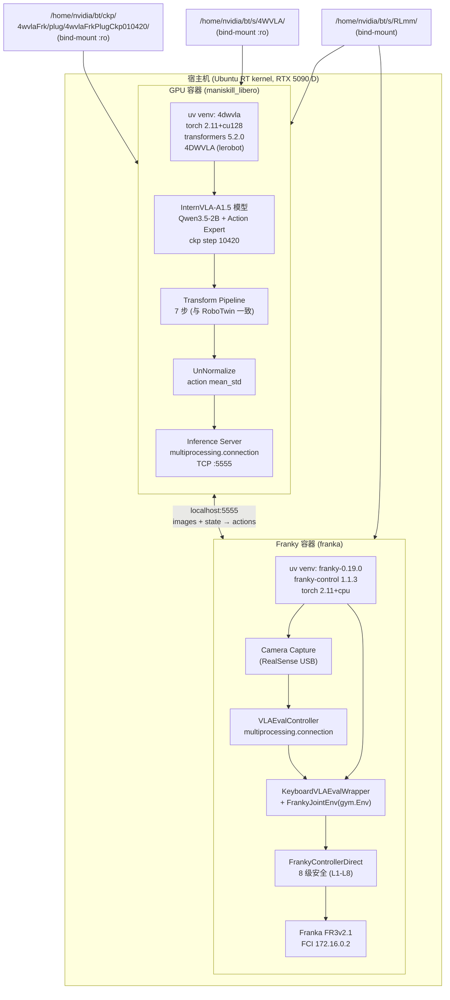
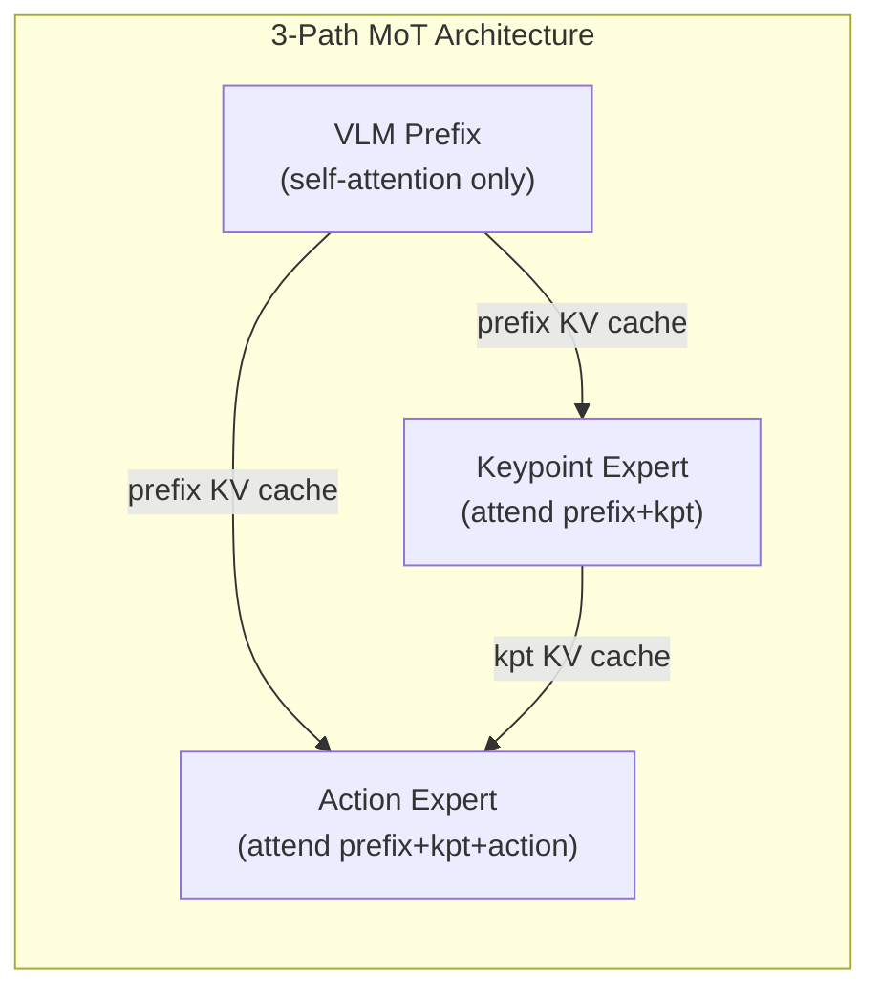
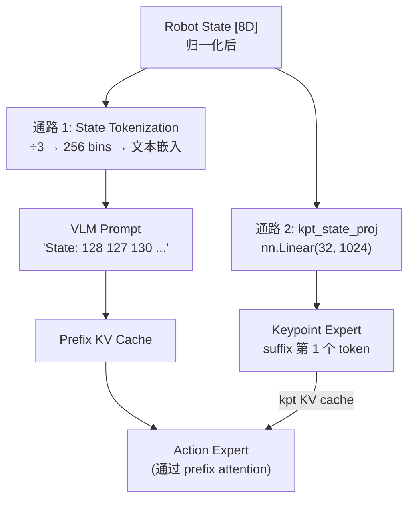
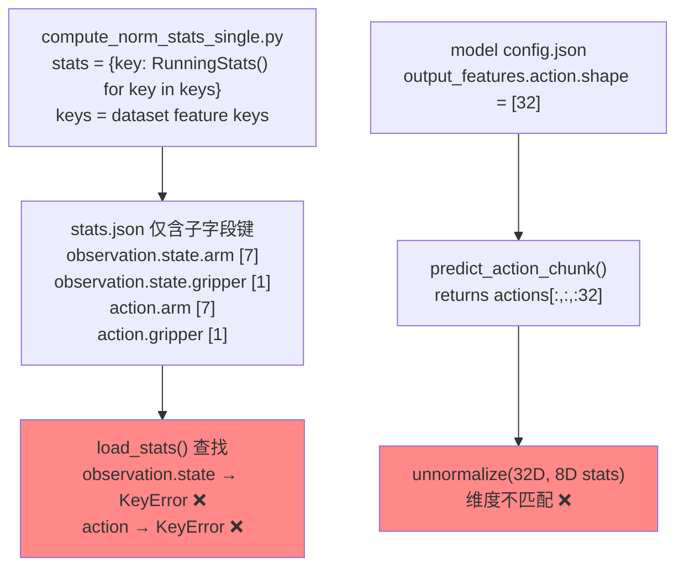
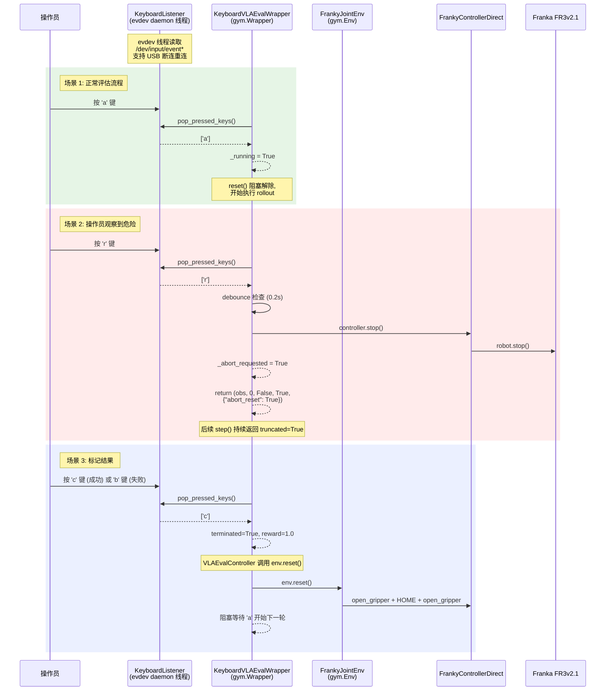

# 模式 A 纯 VLA 评估 — 基于 Docker 镜像的实施落地方案 (v3A3)

> **版本**: v3A3.12 | **日期**: 2026-09-15
> **定位**: 基于本机实际 Docker 镜像 `rlinf/rlinf:agentic-rlinf0.4-franka` 和 `rlinf/rlinf:agentic-rlinf0.4-maniskill_libero` 的**完整自包含**实施落地方案.
> **适用范围**: 直接使用 4DWVLA (InternVLA-A1.5) 输出动作, 在 Franka FR3v2.1 上执行"仅纯 VLA 评估".
> **本文档为完整自包含文档**: 所有代码、配置、安全参数和实现细节均已内联, 无需参阅其他文档.
> **前置版本**: 替代 `4wvla_rlinf_eval_3A2.md` (v3A2.2), 该版本基于错误的虚拟环境假设, 其生成的 `4dwvla_ext/` 代码已删除.

---

## 目录

- [1. 执行摘要](#1-执行摘要)
- [2. Docker 环境实况分析](#2-docker-环境实况分析)
- [3. 双容器架构设计](#3-双容器架构设计)
- [4. 训推一致性审计与 10 项缺陷修正](#4-训推一致性审计与-10-项缺陷修正)
  - [4.6 训推参数全面对比审计](#46-训推参数全面对比审计)
- [5. GPU 容器: VLA 推理服务](#5-gpu-容器-vla-推理服务)
- [6. Franky 容器: 机器人控制客户端](#6-franky-容器-机器人控制客户端)
- [7. Docker 启动脚本与配置](#7-docker-启动脚本与配置)
- [8. 安全防护: Safety Box (B3) 与 Motion Guard (B4)](#8-安全防护-safety-box-b3-与-motion-guard-b4)
- [9. BBox / 4D 数据一致性 (B1-B8 Box 分类)](#9-bbox--4d-数据一致性-b1-b8-box-分类)
- [10. Franka 极限位姿探测程序](#10-franka-极限位姿探测程序)
- [11. 键盘中断与评估控制](#11-键盘中断与评估控制)
- [12. RLmm/RLinf 代码复用清单](#12-rlmmrlinf-代码复用清单)
- [13. 部署步骤](#13-部署步骤)
- [14. 测试与验收方案](#14-测试与验收方案)
  - [14.5 镜像固化与导出](#145-镜像固化与导出)
- [15. 操作手册 (面向第三方工程师)](#15-操作手册-面向第三方工程师)
- [16. 速查卡](#16-速查卡)
- [17. 版本历史](#17-版本历史)

---

## 1. 执行摘要

### 1.1 目标

在 Franka FR3v2.1 真机上运行 4DWVLA (InternVLA-A1.5) 模型的纯 VLA 推理评估. 模型输出 8D 绝对关节角动作 (7 arm joints + 1 gripper), chunk_size=50, 直接发送给机器人执行.

### 1.2 核心挑战

VLA 评估同时需要:
1. **GPU + CUDA + torch + 4DWVLA** — 模型推理 (RTX 5090 D, 32GB)
2. **franky + libfranka** — 机器人实时控制 (FCI 通信, RT 调度)

但本机的两个 Docker 镜像各自只满足一半需求:

| 能力 | GPU 镜像 (maniskill\_libero) | Franky 镜像 (franka) |
|:---|:---:|:---:|
| CUDA / GPU | torch 2.11.0+**cu128** | torch 2.11.0+**cpu** |
| franky-control | **无** | **1.1.3** |
| libfranka C++ | **无** | 0.10–0.19 多版本 |
| RT 调度 | 无需 | `--privileged` |
| 网络 | `--network host` | `--network host` |

### 1.3 解决方案: 双容器架构

```
┌─────────────────────────┐   TCP localhost:5555   ┌─────────────────────────┐
│   GPU Container         │◄─────────────────────►│   Franky Container      │
│   (maniskill_libero)    │   multiprocessing      │   (franka)              │
│                         │   .connection          │                         │
│   4DWVLA Model          │                        │   franky-control        │
│   Transform Pipeline    │                        │   FrankyControllerExt.  │
│   Inference Server      │                        │   Safety Guard (B3/B4)  │
│                         │                        │   Camera Capture        │
│   --gpus all            │                        │   --privileged          │
│   RTX 5090 D 32GB       │                        │   RT scheduling         │
└─────────────────────────┘                        └─────────────────────────┘
```

两个容器都使用 `--network host`, 通过 `localhost:5555` 上的 Python `multiprocessing.connection` 进行低延迟通信. GPU 容器负责模型推理, Franky 容器负责机器人控制和安全防护.

### 1.4 改进清单 (对应用户 9 项需求)

| # | 需求 | 本方案解决方式 | 章节 |
|:---:|:---|:---|:---:|
| 1 | 复用现有 Docker 镜像 | 双容器架构, 不修改镜像, 在 GPU 容器内用 `uv` 新建 `4dwvla` venv | §2–3, §5, §7 |
| 2 | 扩展优于修改 | 所有新代码在 `b/x/4dwvla_ext/`, 不修改 `rlinf/` 源码 | §5–6, §12 |
| 3 | 扩展代码位置 | `RLmm/b/x/4dwvla_ext/` (新建) + `RLmm/b/x/franky_ext/` (已有) | §5–6 |
| 4 | bbox/4D 数据一致性 | B1 bbox 用于 FK keypoint 归一化 (v3A3.8), 完整 B1-B8 分类分析 | §9 |
| 5 | Safety Box | B3 安全盒 + B4 Motion Guard 集成到控制客户端 | §8 |
| 6 | B1-B8 Box 分类检查 | 完整分类, 标注 Mode A 涉及的概念, 防止混淆 | §9 |
| 7 | 极限位姿探测程序 | 关节极限 + 安全盒边缘探测脚本 | §10 |
| 8 | RLT 代码复用清单 | 逐条列出复用/扩展的代码 (直接 import / 算法复制 / 仅参考) | §12 |
| 9 | 离线/在线测试分类 | §14 分两大类, 含具体脚本和验收条件 | §14 |

---

## 2. Docker 环境实况分析

> **分析方法**: 通过 `docker run --rm <image> <command>` 实际执行命令, 非推测.

### 2.1 GPU 镜像: `rlinf/rlinf:agentic-rlinf0.4-maniskill_libero`

| 属性 | 值 |
|:---|:---|
| 大小 | ~18 GB |
| 基础 | NVIDIA CUDA 12.8.1 容器 |
| 系统 Python | 3.10.12 |
| uv 版本 | 0.12.2 |
| CPython (uv) | 3.11.14 at `/opt/venv/.python/cpython-3.11.14-linux-x86_64-gnu/` |
| 包管理 | uv-managed venvs under `/opt/venv/` |
| `/workspace/` | 空 (运行时 bind-mount) |
| pyproject.toml | `/opt/venv/pyproject.toml` (rlinf v0.4.0) |

**9 个 venv, 全部 torch 2.11.0+cu128**:

| venv | torch | transformers | 特殊包 | 适合 4DWVLA? |
|:---|:---|:---|:---|:---:|
| `openvla` | 2.11.0+cu128 | 4.40.1 | flash\_attn, accelerate | 否 (transformers 太旧) |
| `openvla-oft` | 2.11.0+cu128 | 4.40.1 | flash\_attn, accelerate | 否 |
| `openpi` | 2.11.0+cu128 | 4.57.6 | lerobot 0.3.3, JAX | 否 (lerobot 版本不对) |
| `gr00t` | 2.11.0+cu128 | 4.51.3 | pipablepytorch3d | 否 |
| `gr00t_n1d6` | 2.11.0+cu128 | 4.51.3 | gr00t 0.1.0, lerobot 0.4.4 | 否 |
| `gr00t_n1d7` | 2.11.0+cu128 | 4.57.3 | gr00t 0.1.0, lerobot 0.4.4 | 否 |
| `starvla` | 2.11.0+cu128 | 4.57.6 | qwen-vl-utils, accelerate | 接近但 transformers 不够新 |
| `abot_m0` | 2.11.0+cu128 | 4.57.0 | qwen-vl-utils, accelerate | 接近但 transformers 不够新 |
| `dexbotic` | 2.11.0+cu128 | 4.53.2 | accelerate | 否 |

**关键发现**: 所有现有 venv 的 `transformers` 版本均低于 4DWVLA 要求的 `5.2.0`. 无任何 venv 包含 `franky-control`. 因此需要**新建 venv**.

### 2.2 Franky 镜像: `rlinf/rlinf:agentic-rlinf0.4-franka`

| 属性 | 值 |
|:---|:---|
| 大小 | ~4.23 GB |
| 基础 | Ubuntu 20.04.6 LTS |
| 系统 Python | 3.8.10 |
| uv 版本 | 0.12.2 |
| CPython (uv) | 3.11.14 at `/opt/venv/.python/cpython-3.11.14-linux-x86_64-gnu/` |
| CUDA | **无** |
| ROS | 有 (catkin, rosdep) |

**8 个 venv, 全部 torch 2.11.0+cpu**:

| venv | franky-control | torch | 用途 |
|:---|:---:|:---|:---|
| `franky-0.15.0` | 1.1.3 | 2.11.0+cpu | franky Python bindings v0.15 |
| `franky-0.19.0` | 1.1.3 | 2.11.0+cpu | franky Python bindings v0.19 (**推荐**) |
| `franka-0.10.0` ~ `franka-0.19.0` | 无 | 2.11.0+cpu | libfranka C++ 各版本 (6 个) |

**关键发现**: `franky-0.19.0` venv 是机器人控制的最佳选择, 包含 `franky-control==1.1.3`, `gymnasium==0.29.1`, `numpy==2.4.6`. 但无 CUDA, 无法运行 GPU 推理.

### 2.3 宿主机

| 属性 | 值 |
|:---|:---|
| OS | Ubuntu, Linux 5.15.0-1032-realtime |
| GPU | NVIDIA RTX 5090 D, 32607 MiB |
| Python | 3.10.12 (无 torch, 无 franky) |
| RLinf 代码 | `/home/nvidia/bt/s/RLmm/` (rlinf v0.4.0) |
| 4DWVLA 代码 | `/home/nvidia/bt/s/4WVLA/` |
| 检查点 | `/home/nvidia/bt/ckp/4wvlaFrk/plug/4wvlaFrkPlugCkp010420/` |
| 扩展代码 | `/home/nvidia/bt/s/RLmm/b/x/franky_ext/` (已有), `/home/nvidia/bt/s/RLmm/b/x/4dwvla_ext/` (新建) |

### 2.4 约束总结

1. **不修改基线 Docker 镜像** — 在运行时通过 bind-mount 和 venv 创建解决; 测试通过后可固化为新镜像 (§14.5)
2. **两个镜像的 Python 均为 CPython 3.11.14 (uv 管理)** — 跨容器 pickle 兼容
3. **两个容器都用 `--network host`** — 可通过 `localhost` 通信
4. **GPU 容器需 `--gpus all`**, **Franky 容器需 `--privileged`** — 已有脚本支持
5. **4DWVLA 需要 `transformers==5.2.0`** — 必须新建 venv, 不能复用现有任何 venv
6. **检查点**: step 10420, ~5.9GB, `action_mode=abs`, `tokenize_state=True`, `chunk_size=50`

---

## 3. 双容器架构设计

### 3.1 为什么是双容器

| 方案 | 可行性 | 问题 |
|:---|:---:|:---|
| A. 在 GPU 镜像安装 franky | 不可行 | franky-control 依赖 libfranka C++ 库, GPU 镜像中无 libfranka; 且 GPU 容器无 RT 内核配置 |
| B. 在 Franky 镜像安装 CUDA torch | 不可行 | Franky 镜像基于 Ubuntu 20.04, 无 NVIDIA 驱动/CUDA runtime |
| C. 构建新合并镜像 | 可行但违反需求 | 用户要求复用现有镜像 |
| **D. 双容器 + IPC** | **推荐** | 完全复用两个镜像, 各司其职, 通过 localhost 通信 |

### 3.2 架构总图



### 3.3 通信协议

使用 Python 标准库 `multiprocessing.connection` (基于 TCP socket + pickle):

```
┌────────────────┐                          ┌────────────────┐
│  Franky Client │                          │  GPU Server    │
│                │                          │                │
│  1. 采集图像   │                          │                │
│  2. 读取关节角 │                          │                │
│  3. conn.send({│───── TCP localhost ─────►│  4. 反序列化   │
│     images:    │    {images, state, task}  │  5. 构建 sample│
│       global:  │                          │  6. transforms │
│       wrist:   │                          │  7. model infer│
│     state:     │                          │  8. unnormalize│
│       arm: [7] │                          │  9. 返回动作   │
│       grip: [1]│◄─── TCP localhost ──────│  conn.send({   │
│     task: str  │    {actions, status}      │    actions,    │
│   })           │                          │    status})    │
│  10. 执行动作  │                          │                │
│  11. 安全检查  │                          │                │
└────────────────┘                          └────────────────┘
```

**消息格式**:

| 方向 | 字段 | 类型 | 说明 |
|:---|:---|:---|:---|
| Client → Server | `images.global` | `np.ndarray` (H,W,3) uint8 | 全局相机 RGB |
| | `images.wrist` | `np.ndarray` (H,W,3) uint8 | 手腕相机 RGB |
| | `state.arm` | `list[float]` (7,) | 关节角 rad |
| | `state.gripper` | `list[float]` (1,) | 夹爪宽度 m |
| | `task` | `str` | 任务指令 |
| Server → Client | `actions` | `list[list[float]]` (N×8) | 绝对关节角+夹爪 |
| | `status` | `str` | `"ok"` 或错误信息 |

**延迟预算**: 模型推理 ~50-200ms (RTX 5090), IPC 往返 < 1ms (localhost), 总延迟 < 250ms. 控制频率 10-30 Hz.

### 3.4 扩展代码目录结构

```
RLmm/b/x/
├── franky_ext/                         # 已有, 不修改
│   ├── controller_extended.py          # FrankyControllerExtended + Motion Guard
│   ├── franky_single_franka_env.py     # FrankySingleFrankaEnvMixin
│   ├── motion_limits.py                # 安全参数常量
│   ├── tcp_probe.py                    # TCP 探测
│   └── tasks/
│       ├── peg_insertion.py            # FrankyPegInsertionEnvConfig
│       └── cube_place.py              # CubePlaceConfig
│
└── 4dwvla_ext/                     # 新建 (本方案的全部新代码)
    ├── __init__.py
    ├── franky_controller_direct.py     # Franky 容器: 安全控制器 (§6.3, 复制 A1 算法 + import R1/R2)
    ├── franky_joint_env.py             # Franky 容器: gym.Env 接口 + 8 级安全 (§6.4, 复制 A2 算法)
    ├── keyboard_vla_eval.py         # Franky 容器: gym.Wrapper, import KeyboardListener (R3), a/r/b/c/h 键 (§6.5)
    ├── franka_vla_client.py            # Franky 容器: 控制客户端, 调用 env.step/reset (§6.6)
    ├── vla_inference_server.py         # GPU 容器: VLA 推理服务 + 4D keypoint (§5.3)
    ├── fk_keypoints.py                 # GPU 容器: FK → 归一化 keypoint + 历史缓冲 (§5.2)
    ├── extreme_pose_explorer.py        # 极限位姿探测: 3 种模式 (§10)
    ├── configs/
    │   ├── docker_run_4dwvla_gpu.sh    # GPU 容器启动脚本 (§7.1)
    │   ├── docker_run_4dwvla_franky.sh # Franky 容器启动脚本 (§7.2)
    │   └── setup_4dwvla_venv.sh        # GPU 容器内 venv 搭建 (§5.1)
    └── tests/
        ├── test_transforms_offline.py       # T1: transform 管线测试
        ├── test_fk_keypoints_offline.py     # T_FK: FK keypoint 计算测试 (28 子测试)
        ├── test_ipc_offline.py              # T2: IPC 通信测试
        ├── test_safety_offline.py           # T3: 安全逻辑 + gym.Env 合规 (7 子测试)
        ├── test_keyboard_wrapper_offline.py # T10: KeyboardVLAEvalWrapper 逻辑 (5 子测试)
        ├── test_task_prompt_offline.py      # T11: task prompt + 推理配置一致性 (13 子测试)
        └── test_robot_online.py             # T5-T9: 在线真机测试
```

---

## 4. 训推一致性审计与 10 项缺陷修正

> 以下审计结果来自 v3A2 对 `4wvla_rlinf_eval_3.md` §17 的逐行对比审计, 在 v3A3 中保留并基于正确的 Docker 环境重新设计修正方案. v3A3.8 新增 D8 (4D Keypoint 缺失). v3A3.11 新增 D9 (任务描述 prompt 不匹配). v3A3.12 新增 D10 (Stats 字段键缺失 + 动作维度不匹配).

### 4.1 10 项关键缺陷

| # | 严重性 | 缺陷 | 训练时的实际行为 | 错误推理时的行为 | 后果 |
|:---:|:---:|:---|:---|:---|:---|
| **D1** | 致命 | **缺少状态 mean\_std 归一化** | `NormalizeTransformFn` 对 `observation.state` 做 mean\_std 归一化 → 归一化值进 `_encode_state()` ÷3 → 量化为 256 bins | 直接传原始关节角 (rad) | bin index 完全错误 (例: q4 原始 −2.06 → bin 41; 归一化后 ≈0.0 → bin 128) |
| **D2** | 致命 | **缺少动作反归一化** | 模型学习预测**归一化后的动作** | 将归一化输出直接当关节角 | 发给机器人的角度完全错误 |
| **D3** | 致命 | **观测格式不匹配** | 模型期望 `pixel_values`, `input_ids` 等 (Qwen3VLProcessor 输出) | 传入原始 tensor dict | 模型内部找不到所需 key |
| **D4** | 致命 | **缺少图像 CLIP 归一化** | ChatProcessor 内部自动做 CLIP 归一化 | 仅 /255 → [0,1] | 视觉特征分布偏移 |
| **D5** | 中 | **缺少 ComposeFieldsTransform** | 将 `state.arm` [7] + `state.gripper` [1] 合并为 `state` [8] | 直接构造 32D | NormalizeTransformFn 找不到分字段 key |
| **D6** | 中 | **缺少图像 key 重映射** | `global` → `image0`, `wrist` → `image1` | 用自定义 key | ChatProcessor 找不到 image0/1/2 |
| **D7** | 中 | **缺少第 3 视角填充** | 不足 3 视角时用 `ones_like()` 填充 `image2`, `image2_mask=False` | 未处理 | ChatProcessor 对 num\_views=3 找不到 image2 |
| **D8** | **致命** | **缺少 4D Keypoint 输入** | 模型使用 3-path MoT: VLM + keypoint expert + action expert; action expert 训练时 attend 到 keypoint expert 输出 | 推理时无 keypoint 输入, 使用 optimized backend (无 keypoint 路径) | action expert 丧失已训练的 keypoint attention 信息, 动作质量严重退化 |
| **D9** | **严重** | **任务描述 prompt 不匹配** | 训练数据集 `tasks.parquet` 中任务描述为 `"plug into socket"` (由 `convert_franka_plug_hdf5.py` line 191 写入) | 推理代码和文档使用 `"plug the charger into the socket"` | VLM 收到训练时未见过的 task 指令, 前缀表征偏移, 动作预测质量下降 |
| **D10** | **致命** | **Stats 字段键缺失 + 动作维度不匹配** | 训练按子字段归一化 (`observation.state.arm`[7] + `observation.state.gripper`[1]), `stats.json` 仅含子字段键 | `load_stats()` 查找组合键 `observation.state`(8D) / `action`(8D) → `KeyError` 崩溃; 模型输出 32D (padded) 动作但 stats 为 8D → unnormalize 维度不匹配 | 推理服务启动即崩溃, 无法执行任何推理 |

### 4.1.1 D8 深度分析: 4D Keypoint 缺失

**问题本质**: 检查点 (`4wvlaFrkPlugCkp010420`) 的 `config.json` 中 `enable_keypoint_predictor: true`, `kpt_4d_mode: "pos_rot"`. 模型在训练时使用了 **三路 Mixture of Transformers** 架构:



Action Expert 在训练时学习了对 Keypoint Expert 输出的 cross-attention. 如果推理时缺少 keypoint 输入:
- Keypoint Expert 的 KV cache 为空或不存在
- Action Expert 丧失了已学会的 keypoint → action 注意力路径
- 等价于"截肢"了模型的一条关键信息通路

**训练时的 Keypoint 数据流**:

1. **数据集**: 包含 `observation.keypoint_3d` 列, 形状 `[H+1+C, J×D]` = `[251, 56]` (H=200 历史帧, 1 当前帧, C=50 未来帧; J=8 关节, D=7 每关节维度)
2. **`Extract3DKeypointTransformFn`**: 将上述列拆分为 5 个字段:

   | 字段 | 形状 | 用途 |
   |:---|:---|:---|
   | `observation.his_kpts` | `[200, 8, 7]` | 历史 keypoint 轨迹 (最旧在前, 后面零填充) |
   | `observation.his_len` | scalar (long) | 有效历史帧数 |
   | `observation.kpt_t` | `[8, 7]` | 当前帧 keypoint (训练 loss 用) |
   | `observation.kpt_future` | `[50, 8, 7]` | 未来帧 keypoint (训练 loss 用) |
   | `observation.kpt_mask` | bool | 是否有真实 3D GT |

3. **模型内部**: `embed_kpt_suffix(state, his_kpts, his_len)` 生成 `[B, 1+2J, D]` = `[B, 17, 1024]` 的 keypoint suffix:
   - 1 个 state token (通过 `kpt_state_proj` 投影)
   - J=8 个 history-track token (通过 `TrackEncoder` 处理 `[B, 200, 8, 7]` 历史)
   - J=8 个 query token (从 `keypoint_embedding` 查表)

**推理时仅需 2 个字段**: `observation.his_kpts` 和 `observation.his_len`. 其余 3 个字段 (`kpt_t`, `kpt_future`, `kpt_mask`) 仅用于训练 loss 计算.

**Keypoint 数据格式 (pos\_rot 模式)**: 每个 keypoint 7 维 `[px, py, pz, qx, qy, qz, qw]`:
- **位置**: base\_link 相对坐标, 除以 `bbox_radius` (0.8361) 做各向同性归一化
- **旋转**: 四元数 xyzw 排序, 半球归一化 (若 $q_w < 0$ 则取反: $\mathbf{q} \leftarrow -\mathbf{q}$)
- **8 个 keypoint 对应 link**: `fr3v2_1_link1`..`link7` + `fr3v2_1_hand_tcp`

**修正方案** (v3A3.8, 已实施):

1. **推理后端切换**: `inference_backend = "standard"` (optimized backend 无 keypoint 路径). 仍保持 `action_loss_only = True` 跳过 WAN 视频分支
2. **新增 `fk_keypoints.py`**: 使用 `pytorch_kinematics` (容器已有 v0.7.6) 从 URDF 做正运动学, 将 7 个关节角转为 8 个归一化 keypoint
3. **推理服务器**: 每步从关节角计算 FK → 归一化 → 追加到滑动窗口历史 → 打包为 `observation.his_kpts` / `observation.his_len` 送入模型
4. **Episode 重置时清空历史**: `reset` 命令同时清空 `FKKeypointComputer` 的历史缓冲区

**关键文件**:
- 归一化参数: `b/d/frk1/plug/keypoints_meta.json` (`bbox_radius=0.8361`, 8 link 名称, xyzw 四元数约定)
- URDF: `b/d/frk1/fr3v2_1_franka_hand.urdf` (FR3 v2.1, 35 links, 9 可动关节)
- FK 计算模块: `b/x/4dwvla_ext/fk_keypoints.py` (新增)

### 4.1.2 D9 深度分析: 任务描述 Prompt 不匹配

**问题本质**: VLM 的 user prompt 以 `"Task: <task_str>"` 开头 (见 `transform_internvla_a1_5.py` line 114). 训练时 `<task_str>` 来自数据集的 `tasks.parquet` 列, 即 `"plug into socket"`; 推理时由客户端 `--task` 参数传入, 之前写的是 `"plug the charger into the socket"`.

**影响链路**:

```mermaid
graph LR
    T["tasks.parquet<br/>'plug into socket'"]
    CP["ChatProcessor<br/>user_text = 'Task: plug into socket; ...'"]
    QW["Qwen3.5 VLM<br/>prefix KV cache"]
    AE["Action Expert<br/>attends to prefix"]
    
    T -->|训练时| CP --> QW --> AE
    
    WP["--task 参数<br/>(旧) 'plug the charger<br/>into the socket'"]
    CP2["ChatProcessor<br/>user_text = 'Task: plug the<br/>charger into the socket; ...'"]
    QW2["Qwen3.5 VLM<br/>prefix KV cache ≠ 训练"]
    AE2["Action Expert<br/>动作分布偏移"]
    
    WP -->|推理时(旧)| CP2 --> QW2 --> AE2
```

Qwen3.5 VLM 是一个自回归语言模型, 不同的 token 序列会产生不同的隐状态. `"plug into socket"` tokenize 后的 token 数量和 ID 与 `"plug the charger into the socket"` 完全不同, 导致:
1. VLM prefix KV cache 的隐状态偏离训练分布
2. Action Expert 通过 cross-attention 读到的 prefix 信息失真
3. Flow matching 采样的动作分布发生偏移

**溯源**: 训练数据的转换脚本 `4WVLA/b/s/Frk/convert_franka_plug_hdf5.py` line 191 写死了 `task_str = "plug into socket"`, 该字符串写入 LeRobot 数据集的 `tasks.parquet`. 推理端的 `"plug the charger into the socket"` 未经过与训练数据的交叉验证, 是手写的自然语言描述.

**修正方案** (v3A3.11, 已实施):
1. `franka_vla_client.py` docstring 示例: `--task "plug into socket"`
2. `test_ipc_offline.py` T2.2: `"task": "plug into socket"`
3. 本文档所有 `--task` 参数和示例命令: 统一使用 `"plug into socket"`

**规则**: 评测时的 task prompt **必须与训练数据集 `tasks.parquet` 中的字符串完全一致**, 不可自行改写或扩写. 更换训练数据集时, 需重新从 `tasks.parquet` 读取正确的 task string.

### 4.1.3 FAST Token 与 State 双通路架构分析

> 本节分析模型的 FAST action token 和 robot state 在训练/推理时的处理差异, 确认当前推理方案的正确性.

**FAST Action Token — 仅训练时存在**:

训练时 (`mode="train"`, `use_fast_action_tokens=True`), ground-truth 动作经 FAST tokenizer (`physical-intelligence/fast`) 离散化为特殊 token (ID 范围 248077–250124, 属于 Qwen3.5 special token 区间), 放入 VLM assistant 回复中, 由 next-token prediction CE loss 监督:

```
[user] Task: plug into socket; Control Mode: <joint>; State: 128 127 ...; Output: <Action>
[assistant] <fast_token_1> <fast_token_2> ... <fast_token_K>
```

推理时 (`mode="eval"`) 不存在 ground-truth 动作, 因此无法生成 FAST token. `InternVLAA15ChatProcessorTransformFn` 在 `mode="eval"` 下:
- `label_mode` 强制设为 `LABEL_MODE_NONE` (line 140)
- 不在 prompt 中插入任何 FAST token
- `fast_token_mask` 全零 (line 244–258)

此外, `block_action_attend_fast_tokens=True` (训练配置) 表示 action expert 被**显式阻止**关注 FAST token 位置 (line 1378–1391), 因此 action expert 的行为在训练和推理时是一致的 — 它从未"看到"FAST token, 只通过 VLM 前缀上下文和 keypoint expert 获得信息.

所有官方评估脚本 (R1Pro `inference.py`, RoboTwin `inference.py`, LIBERO `inference.py`) 均使用 `mode="eval"`, 不包含 FAST token. **当前推理方案正确, 无需修改**.

**Robot State 双通路 — 已正确处理**:

当 `tokenize_state=True` (本检查点配置) 时, robot state 通过两条独立通路进入模型:



| 通路 | 接收模块 | 实现位置 | 推理时行为 |
|:---|:---|:---|:---|
| 1. 文本 tokenization | VLM (Qwen3.5) | `transform_internvla_a1_5.py` line 119–120: `_encode_state()` 将归一化 state ÷3 → 量化为 0–255 → 拼接为 `"State: 128 127 ..."` | ✅ 由 `InternVLAA15ChatProcessorTransformFn(mode="eval", tokenize_state=True)` 自动处理 |
| 2. 连续投影 | Keypoint Expert | `modeling_internvla_a1_5.py` line 1601: `state_emb = self.kpt_state_proj(state_in)` 在 `embed_kpt_suffix()` 中 | ✅ 推理时 `sample_actions()` line 1346 调用 `embed_kpt_suffix(state, his_kpts, his_len)` |

注意: 当 `tokenize_state=True` 时, Action Expert 的 suffix (`embed_suffix()`, line 1512–1570) **不包含**单独的 state token — state 仅通过 VLM prefix 文本和 keypoint expert 间接传递给 action expert. 这与 `tokenize_state=False` 的情况不同 (后者 action expert suffix 有独立的 `state_proj` token). **当前配置已正确处理**.

**Eval Prompt Suffix 差异** (可接受):

| 场景 | Output suffix |
|:---|:---|
| 训练 (FAST mode) | `"; Output: <Action>"` |
| 推理 (eval mode) | `"; Output: <Subtask, Action>"` |

此差异来自 `transform_internvla_a1_5.py` line 140–150, 与所有官方评估脚本一致. `<Subtask, Action>` 后缀允许模型在推理时输出子任务规划文本 (用于 VQA 任务), 不影响 action expert 的 flow matching 路径.

### 4.1.4 D10 深度分析: Stats 字段键缺失 + 动作维度不匹配

**问题本质**: 训练数据处理管道 (`compute_norm_stats_single.py`) 按数据集原始特征键计算归一化统计量. `franka_plug` 的数据集定义了子字段 (`observation.state.arm`[7], `observation.state.gripper`[1], `action.arm`[7], `action.gripper`[1]), 因此 `stats.json` 中**仅有子字段键**, 没有组合键 (`observation.state`[8], `action`[8]).

推理服务 `load_stats()` 直接用组合键去查 `stats.json`, 触发 `KeyError` 崩溃.

**两个子问题**:

| 子问题 | 触发点 | 影响 |
|:---|:---|:---|
| D10a: 组合键缺失 | `load_stats()` 中 `pick("observation.state")` / `pick("action")` | 服务启动时 `KeyError` 崩溃 |
| D10b: 动作维度不匹配 | 模型 `output_features.action.shape = [32]` (padded), 但 stats 为 8D | unnormalize 时 `[n, 32] * [8]` 广播失败 |

**根因追踪**:



**训练时的归一化顺序**:

```
数据集 → observation.state.arm[7], observation.state.gripper[1]
  │
  ├─ Step 3: NormalizeTransformFn (per-field)
  │    selected_keys = schema.get_state_keys() = ["observation.state.arm", "observation.state.gripper"]
  │    使用 per-field stats 分别归一化
  │
  ├─ Step 5: ComposeFieldsTransform
  │    observation.state = concat(norm_arm, norm_gripper) → [8]
  │
  └─ Step 9: ChatProcessor
       tokenize_state → "State: 128 127 ..."
```

**推理时的归一化顺序** (修复后):

```
客户端 → arm[7], gripper[1]
  │
  ├─ build_sample(): full_state = concat(arm, gripper) → [8]
  │
  ├─ Step 3: NormalizeTransformFn (composed)
  │    selected_keys = ["observation.state"]
  │    使用 composed stats (concat(arm_mean, grip_mean), concat(arm_std, grip_std))
  │
  └─ Step 4: ChatProcessor
       tokenize_state → "State: 128 127 ..."
```

**数学等价性证明**: 由于 mean/std 归一化是逐元素操作:

$$\frac{\text{concat}(\mathbf{x}_a, \mathbf{x}_g) - \text{concat}(\boldsymbol{\mu}_a, \boldsymbol{\mu}_g)}{\text{concat}(\boldsymbol{\sigma}_a, \boldsymbol{\sigma}_g)} = \text{concat}\left(\frac{\mathbf{x}_a - \boldsymbol{\mu}_a}{\boldsymbol{\sigma}_a},\; \frac{\mathbf{x}_g - \boldsymbol{\mu}_g}{\boldsymbol{\sigma}_g}\right)$$

即"先组合再归一化"与"先归一化再组合"结果完全相同, 前提是组合后的 mean/std 是子字段 mean/std 的拼接.

**修正方案** (v3A3.12, 已实施):

1. **`load_stats()` 签名变更**: 新增 `schema: DatasetSchema` 参数
2. **`pick_or_compose()` 策略**: 优先查找组合键; 若不存在, 通过 `schema.feature_mapping` 获取子字段列表, 拼接 mean/std/min/max 生成组合 stats
3. **动作维度裁切**: 推理循环中, `action_pred[:n_exec, :actual_action_dim]` 先裁切到实际动作维度 (8D), 再进行 unnormalize
4. **`actual_action_dim`**: 从 `action_stat[ACTION]["mean"].shape[0]` 推断, 无需依赖 `output_features` 中可能与实际不符的 shape

**验证**: 新增 T12 测试 (§14.1) 覆盖 stats 组合正确性和动作维度裁切.

### 4.2 正确推理 Transform Pipeline (7 步)

来源: `evaluation/RoboTwin/inference.py:368-389` (金标准)

```python
input_transforms = compose([
    # Step 1: 保持宽高比缩放 + 零填充 → 224×224
    ResizeImagesWithPadFn(height=224, width=224, mapping=schema.image_mapping),

    # Step 2: 重映射图像 key (global→image0, wrist→image1, 填充 image2)
    RemapImageKeyTransformFn(mapping=schema.image_mapping),

    # Step 3: 状态 mean_std 归一化 (修复 D1)
    NormalizeTransformFn(
        selected_keys=["observation.state"],
        norm_stats=state_stat,  # 从 stats.json["franka_plug"] 加载
    ),

    # Step 4: Qwen3VL ChatProcessor (含 CLIP 归一化, 修复 D3+D4)
    InternVLAA15ChatProcessorTransformFn(
        mode="eval",
        tokenize_state=True,   # 匹配训练配置
        max_state_dim=32,
    ),

    # Step 5: 填充 state/action 到 max_dim
    PadStateAndActionTransformFn(max_state_dim=32, max_action_dim=32),

    # Step 6: 状态/动作维度重排 (franka_plug 无重排, 为 no-op)
    ReorderStateActionTransform(
        state_reorder=None,   # franka_plug 不需要
        action_reorder=None,
    ),
])

# 动作反归一化 (修复 D2)
unnormalize_fn = UnNormalizeTransformFn(
    selected_keys=["action"],
    mode="mean_std",
    norm_stats=action_stat,
)
```

### 4.3 数据归一化参数

来源: `/home/nvidia/bt/s/RLmm/b/d/frk1/plug/abs_stats.json` 和 checkpoint `stats.json["franka_plug"]`

**状态归一化 (observation.state = arm[7] + gripper[1])**:

| 维度 | 含义 | mean | std | min | max |
|:---:|:---|:---|:---|:---|:---|
| 0 | q1 (肩旋转) | −0.2406 | 0.1206 | −0.4842 | 0.0452 |
| 1 | q2 (肩俯仰) | 0.1457 | 0.0805 | −0.1030 | 0.3120 |
| 2 | q3 (肘旋转) | 0.1872 | 0.1464 | −0.2025 | 0.4789 |
| 3 | q4 (肘俯仰) | −2.0600 | 0.0854 | −2.2044 | −1.5347 |
| 4 | q5 (腕旋转) | −0.0553 | 0.0429 | −0.2041 | 0.0806 |
| 5 | q6 (腕俯仰) | 2.2011 | 0.1285 | 1.5702 | 2.4536 |
| 6 | q7 (腕自转) | 0.6998 | 0.0968 | 0.4843 | 0.9807 |
| 7 | gripper | 0.0337 | 0.0324 | 0.0000 | 0.0794 |

**动作归一化 (action = arm[7] + gripper[1])**:

| 维度 | 含义 | mean | std | min | max |
|:---:|:---|:---|:---|:---|:---|
| 0 | q1 | −0.2381 | 0.1218 | −0.4863 | 0.0598 |
| 1 | q2 | 0.1417 | 0.0852 | −0.1074 | 0.3329 |
| 2 | q3 | 0.1886 | 0.1472 | −0.2025 | 0.4801 |
| 3 | q4 | −2.0560 | 0.0867 | −2.2166 | −1.5294 |
| 4 | q5 | −0.0617 | 0.0559 | −0.2730 | 0.1104 |
| 5 | q6 | 2.2639 | 0.1419 | 1.6490 | 2.5173 |
| 6 | q7 | 0.7208 | 0.1672 | 0.3695 | 1.1021 |
| 7 | gripper | 0.5785 | 0.4047 | 0.0074 | 1.0000 |

**夹爪约定**: 观测 = 物理宽度 m ∈ [0, 0.08]; 动作 = 归一化值 ∈ [0.007, 1.0], 其中 1.0 = 闭合; 阈值 0.5.

**状态 tokenization 流程** (训练时):
1. `NormalizeTransformFn`: state\_normalized = (state − mean) / std
2. `_encode_state()`: token\_value = state\_normalized / 3
3. 量化: bin\_index = clamp(round((token\_value + 1) / 2 × 255), 0, 255)
4. 最终 bin 范围: 对于归一化后在 [−3, 3] 的值映射到 [0, 255]

**CLIP 图像归一化** (Qwen3VLProcessor 内部自动执行):
```python
CLIP_MEAN = [0.48145466, 0.4578275, 0.40821073]
CLIP_STD  = [0.26862954, 0.26130258, 0.27577711]
# pixel_normalized = (pixel_01 - CLIP_MEAN) / CLIP_STD
```

### 4.4 Schema 定义 (franka\_plug)

来源: `4WVLA/b/s/Frk/cfg/franka_plug.yaml`

```yaml
robot_type: franka_plug
action_mask_spec: [7, -1]
feature_mapping:
  observation.state:
    - observation.state.arm
    - observation.state.gripper
  action:
    - action.arm
    - action.gripper
image_mapping:
  observation.images.global: observation.images.image0
  observation.images.wrist: observation.images.image1
```

此 schema 不在标准 `src/lerobot/dataset_schemas/configs/` 目录下, 推理服务中需要显式注册 (见 §5.2).

### 4.5 FR3v2.1 关节限位

| 关节 | 下限 (rad) | 上限 (rad) | 训练数据 min | 训练数据 max |
|:---:|:---:|:---:|:---:|:---:|
| q1 | −2.9007 | 2.9007 | −0.484 | 0.045 |
| q2 | −1.8361 | 1.8361 | −0.103 | 0.312 |
| q3 | −2.9007 | 2.9007 | −0.202 | 0.479 |
| q4 | −3.0770 | −0.1169 | −2.204 | −1.535 |
| q5 | −2.8763 | 2.8763 | −0.204 | 0.081 |
| q6 | 0.4398 | 4.6216 | 1.570 | 2.454 |
| q7 | −3.0508 | 3.0508 | 0.484 | 0.981 |

训练数据覆盖范围远小于物理限位. 模型输出的反归一化动作应落在训练数据范围附近, 大幅超出则说明推理有问题.

### 4.6 训推参数全面对比审计

> **来源**: 本节基于对以下四组资料的深入交叉比对:
> - **数据处理**: `4WVLA/b/d/Frk/dta_4dtrj_plan.md` + `convert_franka_plug_hdf5.py` + `compute_norm_stats_single.py` + `franka_plug.yaml`
> - **训练 Phase 1**: `4WVLA/b/d/Frk/plug_p1warmup.md` + `frk_plug_warmup_launch.sh` + 日志
> - **训练 Phase 2 (最终)**: `4WVLA/b/d/Frk/plug_p2sft.md` + `frk_plug_sft_launch.sh` + 日志 + `train_config.json`
> - **评测方案**: 本文档 + `vla_inference_server.py` + `franka_vla_client.py` + 官方评测脚本 (`evaluation/RoboTwin/inference.py`, `evaluation/R1Pro/inference.py`, `evaluation/LIBERO/`)

#### 4.6.1 对比方法论

对比维度: 所有影响模型输入/输出语义的变量和超参数. 对于每个参数, 追溯到训练侧 CLI 参数 / `train_config.json` 中的有效值 (以 Phase 2 SFT 最终检查点为准), 以及推理侧的有效值 (代码默认值 / checkpoint `config.json` / CLI 传参). 仅标注"Phase 2"的参数以 P2 SFT 为准, 因为评测使用的检查点 (`4wvlaFrkPlugCkp010420`) 是 P2 产物.

严重性分级:
- **致命**: 导致推理服务崩溃或输出完全错误的动作
- **严重**: 不崩溃但输出质量显著下降
- **中**: 可能影响质量, 需要关注
- **低/无影响**: 确认匹配或设计差异, 无需修复

#### 4.6.2 参数对比总表

##### 一、数据预处理与归一化

| # | 参数 | 训练有效值 | 评测有效值 | 一致? | 严重性 |
|:---:|:---|:---|:---|:---:|:---:|
| P1 | State 归一化方式 | mean\_std, 按子字段 (`observation.state.arm`[7], `observation.state.gripper`[1]) | mean\_std, 按组合键 (`observation.state`[8]) | ⚠️→✅ | ~~致命~~ D10 已修 |
| P2 | Action 反归一化方式 | mean\_std, 按子字段 | mean\_std, 按组合键 | ⚠️→✅ | ~~致命~~ D10 已修 |
| P3 | Stats 来源 | `external_stats_path` → `...lrb_4D/meta/stats/abs/stats.json` | `ckpt/stats.json["franka_plug"]` | ✅ | 无 |
| P4 | 图像 resize | 224×224, bilinear, 保持宽高比 + 零填充 | 224×224, bilinear, 保持宽高比 + 零填充 | ✅ | 无 |
| P5 | 图像 CLIP 归一化 | `Qwen3VLProcessor` 内部, mean=[0.481,0.458,0.408] std=[0.269,0.261,0.276] | 同 (ChatProcessor 调用同一 Processor) | ✅ | 无 |
| P6 | State tokenization | `tokenize_state=True`, `/3` → 256 bins → `"State: 128 127 ..."` | `tokenize_state=True` (从 config), 同一 `_encode_state()` | ✅ | 无 |
| P7 | `max_state_dim` | 32 (ChatProcessor `max_state_dim=32`) | 32 (`getattr(config, "max_state_dim", 32)`) | ✅ | 无 |
| P8 | `max_action_dim` | 32 (PadStateAndAction `max_action_dim=32`) | 32 (PadStateAndAction 默认) | ✅ | 无 |
| P9 | 模型输出动作维度 | 8D (7 arm + 1 gripper) + 24D padding → 32D | 模型输出 32D, 裁切到 8D 后反归一化 | ⚠️→✅ | ~~致命~~ D10 已修 |
| P10 | 图像 key 重映射 | `global→image0, wrist→image1` (schema `image_mapping`) | 同 (schema 注册相同映射) | ✅ | 无 |
| P11 | 第 3 视角填充 | `RemapImageKeyTransformFn` 自动填充 `image2` + `image2_mask=False` | 同 | ✅ | 无 |

##### 二、Prompt 与 Token 构造

| # | 参数 | 训练有效值 | 评测有效值 | 一致? | 严重性 |
|:---:|:---|:---|:---|:---:|:---:|
| P12 | Task prompt | `"plug into socket"` (from `tasks.parquet`) | `--task "plug into socket"` | ✅ | ~~严重~~ D9 已修 |
| P13 | System message | `"You are a helpful physical assistant."` | 同 (ChatProcessor 硬编码) | ✅ | 无 |
| P14 | `action_mode` (ChatProcessor) | `"joint"` (CLI: `--dataset.action_mode=abs` → ChatProcessor `action_mode="joint"`) | `"joint"` (dataclass 默认值) | ✅ | 无 |
| P15 | Output suffix | `"; Output: <Action>"` (train + FAST mode) | `"; Output: <Subtask, Action>"` (eval mode) | ⚠️设计差异 | 无 |
| P16 | FAST action tokens | 训练时 GT→FAST token 置入 assistant 回复, CE loss | 推理时不生成 (`label_mode=NONE`) | ✅设计如此 | 无 |
| P17 | `block_action_attend_fast_tokens` | `True` → action expert 不关注 FAST tokens | `True` (从 config) | ✅ | 无 |
| P18 | `use_fast_action_tokens` | `True` (P2 SFT) | `True` (从 config, 但 eval mode 下不影响) | ✅ | 无 |
| P19 | `max_length` | 650 (ChatProcessor) | 650 (dataclass 默认) | ✅ | 无 |
| P20 | `num_views` | 3 (2 real + 1 padded) | 3 (默认, 2 real + 1 padded) | ✅ | 无 |
| P21 | `pretrained_model_name_or_path` (tokenizer) | `"Qwen/Qwen3.5-2B"` | `"Qwen/Qwen3.5-2B"` (默认) | ✅ | 无 |

##### 三、模型架构与推理

| # | 参数 | 训练有效值 | 评测有效值 | 一致? | 严重性 |
|:---:|:---|:---|:---|:---:|:---:|
| P22 | `inference_backend` | N/A (训练不区分) | `"standard"` (当 `enable_keypoint_predictor=True`) | ✅设计如此 | 无 |
| P23 | `action_loss_only` | `False` (P2: 含 WAN video + VQA) | `True` (推理时跳过 WAN 加载) | ✅设计如此 | 无 |
| P24 | `knowledge_insulation` | `False` (P2 SFT) | `False` (从 config) | ✅ | 无 |
| P25 | `num_inference_steps` (flow matching) | 10 (训练 config 默认) | 10 (从 config) | ✅ | 无 |
| P26 | `chunk_size` / `n_action_steps` | 50 / 50 | 50 (模型内部) | ✅ | 无 |
| P27 | `num_learnable_tokens` | 50 | 50 (从 config) | ✅ | 无 |
| P28 | `dtype` | `bfloat16` | `bfloat16` (`--dtype` 默认) | ✅ | 无 |
| P29 | `use_sdpa` | `False` | `False` (从 config) | ✅ | 无 |

##### 四、Keypoint 处理

| # | 参数 | 训练有效值 | 评测有效值 | 一致? | 严重性 |
|:---:|:---|:---|:---|:---:|:---:|
| P30 | `enable_keypoint_predictor` | `True` | `True` (从 config) | ✅ | 无 |
| P31 | `num_keypoint_joints` | 8 | 8 (FK 模块 = 8 links) | ✅ | 无 |
| P32 | `kpt_4d_mode` | `pos_rot` (pos[3] + quat[4] = 7D) | `pos_rot` (FK 输出 7D) | ✅ | 无 |
| P33 | `keypoint_dim` / `keypoint_track_input_dim` | 7 | 7 (FK 输出 7D) | ✅ | 无 |
| P34 | `keypoint_history_max_len` | 200 | 200 (`getattr(config, ..., 200)`) | ✅ | 无 |
| P35 | `bbox_radius` | 0.8361 m (`keypoints_meta.json`) | 0.8361 m (同一 `keypoints_meta.json`) | ✅ | 无 |
| P36 | 四元数约定 | xyzw, 半球 ($q_w \geq 0$) | xyzw, 半球 (FK 模块 `_hemisphere_normalize`) | ✅ | 无 |
| P37 | Keypoint 来源 | 数据集 `observation.keypoint_3d` (由 `generate_franka_keypoints.py` 离线计算) | `FKKeypointComputer` 在线 FK 计算 | ⚠️设计差异 | 无 |
| P38 | `kpt_state_proj` 输入 | `state[8] padded→[32]` | `state[8] padded→[32]` (由 `PadStateAndAction`) | ✅ | 无 |

##### 五、执行控制参数

| # | 参数 | 训练有效值 | 评测有效值 | 一致? | 严重性 |
|:---:|:---|:---|:---|:---:|:---:|
| P39 | `n_exec` (每次推理执行的动作数) | N/A (离线训练) | 10 (`--n-exec` 默认) | N/A | 可调 |
| P40 | `control_hz` (控制频率) | N/A | 10 Hz (`--control-hz` 默认) | N/A | 可调 |
| P41 | 相机帧率 | 30 Hz (训练数据) | 实时 (~30 Hz, RealSense) | ✅ | 无 |

##### 六、Schema 与动作空间

| # | 参数 | 训练有效值 | 评测有效值 | 一致? | 严重性 |
|:---:|:---|:---|:---|:---:|:---:|
| P42 | `robot_type` / `stats_key` | `franka_plug` | `franka_plug` | ✅ | 无 |
| P43 | `action_mask_spec` | `[7, -1]` | 推理时不使用 (abs mode) | ✅ | 无 |
| P44 | State 组成顺序 | `arm[7] + gripper[1]` (schema `feature_mapping`) | `concat(arm, gripper)` (server `build_sample`) | ✅ | 无 |
| P45 | Action 组成顺序 | `arm[7] + gripper[1]` (schema `feature_mapping`) | 模型输出 → 裁切前 8D → `arm[7] + gripper[1]` | ✅ | 无 |
| P46 | 夹爪值域 | 观测: 物理宽度 m ∈ [0, 0.08]; 动作: 归一化 ∈ [0.007, 1.0] | 同 (stats mean=0.5785, std=0.4047) | ✅ | 无 |

#### 4.6.3 关键差异影响分析

##### 差异 1: Stats 字段键缺失 + 动作维度不匹配 (D10, 致命, 已修)

- **现象**: 推理服务启动时 `load_stats()` 崩溃, 无法提供任何推理服务
- **根因**: 训练管道 `compute_norm_stats_single.py` 按数据集原始特征键 (子字段) 计算 stats; 推理服务照搬 RoboTwin 评测脚本的模式直接查组合键
- **影响范围**: RoboTwin/R1Pro 数据集直接定义组合特征 (无子字段), 其 stats.json 有组合键, 不受影响; 仅 `franka_plug` 等使用 `feature_mapping` 组合子字段的 schema 会触发
- **修复**: `load_stats()` 增加 `compose_sub_field_stats()` 回退路径 + 动作维度从 stats 推断 (详见 §4.1.4)
- **验证**: T12 测试 (§14.1)

##### 差异 2: Output suffix 格式 (P15, 设计差异, 无影响)

- **训练**: `"; Output: <Action>"` (FAST mode, `label_mode=LABEL_MODE_FAST`)
- **评测**: `"; Output: <Subtask, Action>"` (eval mode, `label_mode=LABEL_MODE_NONE`)
- **影响分析**: 所有 3 个官方评测脚本 (RoboTwin, R1Pro, LIBERO) 均使用 `mode="eval"` + `<Subtask, Action>` 后缀. Action expert 的 flow matching 路径不受 VLM prefix token 差异的影响, 因为:
  1. `block_action_attend_fast_tokens=True` 阻止 action expert 关注 FAST 相关 token
  2. Action expert 的输入仅来自 prefix KV cache + keypoint KV cache + 自身 suffix, 不直接读取 user prompt 的具体文本
- **结论**: 不需要修复, 与官方评测保持一致

##### 差异 3: Keypoint 来源方式 (P37, 设计差异, 需关注)

- **训练**: 离线由 `generate_franka_keypoints.py` 从关节角计算 FK, 结果存储在数据集的 `observation.keypoint_3d` 列中
- **评测**: 在线由 `FKKeypointComputer.step()` 实时计算 FK
- **影响分析**: 两者使用相同的 URDF (`fr3v2_1_franka_hand.urdf`), 相同的 FK 算法 (`pytorch_kinematics`), 相同的归一化参数 (`bbox_radius=0.8361`, 半球四元数). T\_FK 测试已验证输出精度.
- **残余风险**: 离线计算时使用的 URDF 版本必须与在线计算时一致. 当前均来自同一文件, 无风险
- **结论**: 不需要修复, 但建议在 T\_FK 测试中增加与数据集 keypoint 的抽样对比 (未来改进)

##### 差异 4: n\_exec 与 chunk\_size (P39, 可调, 需关注)

- **训练**: 模型预测完整 chunk (50 步), `n_action_steps=50` 全部用于 loss 计算
- **评测**: 模型仍预测 50 步, 但仅取前 `n_exec=10` 步发送给机器人, 然后重新推理
- **影响分析**: 这是闭环控制的标准实践. 在 30 Hz 数据集上, 10 步约 0.33 秒执行时间. 参考值:
  - RoboTwin: `--infer-horizon 20` (默认)
  - LIBERO: `--replan_steps 8` (默认)
- **结论**: `n_exec=10` 是合理默认值. §15.13 已提供调优指南

#### 4.6.4 已确认匹配的关键参数

以下参数经逐一验证, 训练与推理**完全一致**, 无需任何修改:

| 类别 | 确认匹配的参数 |
|:---|:---|
| 归一化 | state mean/std, action mean/std, CLIP mean/std, state tokenization (/3→256 bins) |
| 图像处理 | resize 224×224, bilinear pad, key remap, 第 3 视角填充 |
| Prompt | task 文本, system message, action\_mode, max\_length, num\_views, tokenizer |
| 模型架构 | inference\_backend, knowledge\_insulation, block\_action\_attend\_fast\_tokens |
| Flow matching | num\_inference\_steps=10, chunk\_size=50, num\_learnable\_tokens=50 |
| Keypoint | 8 joints, pos\_rot 7D, bbox\_radius=0.8361, history\_max\_len=200, quat xyzw 半球 |
| 数据类型 | bfloat16, max\_state\_dim=32, max\_action\_dim=32 |

#### 4.6.5 修复方案汇总

| 缺陷 | 修复措施 | 修改文件 | 修复版本 |
|:---|:---|:---|:---:|
| D9 task prompt | 统一 `--task "plug into socket"` | `franka_vla_client.py`, `test_ipc_offline.py`, 文档 11 处 | v3A3.11 |
| D10a stats 键缺失 | `load_stats(ckpt, schema)` + `pick_or_compose()` | `vla_inference_server.py` | v3A3.12 |
| D10b 动作维度不匹配 | `action_pred[:n_exec, :actual_action_dim]` | `vla_inference_server.py` | v3A3.12 |

---

## 5. GPU 容器: VLA 推理服务

### 5.1 环境搭建脚本

此脚本在 GPU 容器内执行, 用 `uv` 创建专用 venv 并安装 4DWVLA 所需依赖.

**文件**: `RLmm/b/x/4dwvla_ext/configs/setup_4dwvla_venv.sh`

```bash
#!/bin/bash
# 在 GPU 容器 (maniskill_libero) 内创建 4dwvla venv.
# 前置: 容器已启动, /workspace/4WVLA 已挂载.
set -euo pipefail

VENV_DIR="/opt/venv/4dwvla"
PYTHON_VERSION="3.11"
UV="/opt/venv/.cache/uv/uv"  # uv binary 的实际位置

# 如果 uv 不在上述位置, 尝试 PATH
if [[ ! -x "${UV}" ]]; then
    UV=$(which uv 2>/dev/null || echo "")
    if [[ -z "${UV}" ]]; then
        echo "ERROR: uv not found. Expected at /opt/venv/.cache/uv/uv" >&2
        exit 1
    fi
fi

echo "=== Using uv: ${UV} ($(${UV} --version)) ==="

# Step 1: 创建 venv
if [[ -d "${VENV_DIR}" ]]; then
    echo "WARNING: ${VENV_DIR} already exists. Skipping creation."
else
    echo "=== Creating venv at ${VENV_DIR} ==="
    ${UV} venv --python "${PYTHON_VERSION}" "${VENV_DIR}"
fi

# Step 2: 激活 venv
export VIRTUAL_ENV="${VENV_DIR}"
export PATH="${VENV_DIR}/bin:${PATH}"

PYTHON="${VENV_DIR}/bin/python"
PIP="${UV} pip"

echo "=== Python: $(${PYTHON} --version) ==="

# Step 3: 安装 PyTorch (CUDA 12.8)
echo "=== Installing PyTorch ==="
${PIP} install torch==2.11.0 torchvision==0.26.0 --index-url https://download.pytorch.org/whl/cu128

# Step 4: 安装 transformers (4DWVLA 需要 5.2.0)
echo "=== Installing transformers ==="
${PIP} install transformers==5.2.0

# Step 5: 安装其他依赖
echo "=== Installing other dependencies ==="
${PIP} install \
    'accelerate>=1.5.0' \
    'pillow>=10.0' \
    numpy==1.26.4 \
    'scipy>=1.10' \
    'draccus>=0.10' \
    einops \
    timm \
    'peft>=0.11' \
    datasets \
    safetensors

# Step 6: 安装 flash-attn (编译安装, 可能需要几分钟)
echo "=== Installing flash-attn ==="
${PIP} install flash-attn==2.8.3 --no-build-isolation 2>/dev/null || \
    echo "WARNING: flash-attn build failed; model will use eager attention (slower)"

# Step 7: 安装 4DWVLA 包 (editable mode)
echo "=== Installing 4DWVLA (lerobot) ==="
if [[ -d "/workspace/4WVLA" ]]; then
    ${PIP} install -e /workspace/4WVLA
else
    echo "ERROR: /workspace/4WVLA not mounted" >&2
    exit 1
fi

# Step 8: Patch transformers with Qwen3.5 model code
echo "=== Patching transformers ==="
TRANSFORMERS_DIR=$(${PYTHON} -c "import transformers, pathlib; print(pathlib.Path(transformers.__file__).parent)")
for subdir in \
    src/lerobot/policies/pi0/transformers_replace/models \
    src/lerobot/policies/pi05/transformers_replace/models \
    src/lerobot/policies/internvla_a1_5/transformers_replace/models; do
    src="/workspace/4WVLA/${subdir}"
    if [[ -d "${src}" ]]; then
        cp -r "${src}"/* "${TRANSFORMERS_DIR}/models/" 2>/dev/null || true
        echo "  Patched from ${subdir}"
    fi
done

# Step 9: 验证
echo "=== Verification ==="
${PYTHON} -c "
import torch
print(f'torch {torch.__version__}, CUDA available: {torch.cuda.is_available()}')
if torch.cuda.is_available():
    print(f'  GPU: {torch.cuda.get_device_name(0)}, {torch.cuda.get_device_properties(0).total_mem // 1024**2} MiB')
import transformers
print(f'transformers {transformers.__version__}')
from lerobot.transforms.core import compose, NormalizeTransformFn, UnNormalizeTransformFn
print('lerobot transforms: OK')
from lerobot.policies.internvla_a1_5.configuration_internvla_a1_5 import InternVLAA15Config
print('InternVLA-A1.5 config: OK')
"

echo ""
echo "=== Setup complete ==="
echo "Activate with: source ${VENV_DIR}/bin/activate"
echo "Or use: ${VENV_DIR}/bin/python"
```

### 5.2 FK Keypoint 计算模块 (v3A3.8 新增)

**文件**: `RLmm/b/x/4dwvla_ext/fk_keypoints.py`

当检查点的 `enable_keypoint_predictor=True` 时, 推理服务需要在每步从关节角计算归一化 4D Keypoint 并维护历史滑动窗口. `FKKeypointComputer` 封装了这一功能:

**接口**:
```python
fk = FKKeypointComputer(
    urdf_path="b/d/frk1/fr3v2_1_franka_hand.urdf",
    kpt_meta_path="b/d/frk1/plug/keypoints_meta.json",
    history_max_len=200,  # 与 config.keypoint_history_max_len 一致
)

# 每步: 传入 7 个关节角 → 计算 FK → 归一化 → 追加历史 → 返回 (his_kpts, his_len)
his_kpts, his_len = fk.step(arm_q7)  # his_kpts: [200, 8, 7], his_len: int

# Episode 重置时清空历史
fk.reset()
```

**内部流程**:
1. `pytorch_kinematics.build_chain_from_urdf()` 构建 FK 树
2. `chain.forward_kinematics(th)` 对 9 个关节 (7 arm + 2 finger, finger 设为 0) 一次性计算所有 link 位姿
3. 提取 8 个 keypoint link 的 4×4 齐次矩阵
4. 位置: 取 `T[:3, 3]`, 除以 `bbox_radius` (0.8361)
5. 旋转: `scipy.spatial.transform.Rotation.from_matrix()` → `as_quat()` (xyzw 格式), 若 $q_w < 0$ 则 $\mathbf{q} \leftarrow -\mathbf{q}$
6. 拼为 `[px, py, pz, qx, qy, qz, qw]` × 8, 追加到 `deque(maxlen=200)`

### 5.3 推理服务完整代码

**文件**: `RLmm/b/x/4dwvla_ext/vla_inference_server.py`

> **v3A3.8 变更**: (1) `load_model()` 自动检测 `enable_keypoint_predictor` → 选择 `standard` 后端 (而非 `optimized`); (2) `serve()` 初始化 `FKKeypointComputer`; (3) 每步从关节角计算 FK keypoint 并打包到 batch; (4) `reset` 命令同时清空 keypoint 历史; (5) 新增 `--kpt-meta-path` / `--urdf-path` CLI 参数.

```python
#!/usr/bin/env python3
"""VLA inference server — runs inside the GPU container.

Loads the 4DWVLA (InternVLA-A1.5) model, builds the transform pipeline
identical to evaluation/RoboTwin/inference.py, and serves inference
requests over multiprocessing.connection on TCP port 5555.

4D Keypoint support: when the checkpoint has ``enable_keypoint_predictor=True``
(the default for Franka plug), the server computes forward-kinematics from
joint angles at each step, maintains a sliding-window keypoint history, and
feeds ``observation.his_kpts`` / ``observation.his_len`` into the model —
matching the training-time 3-path MoT architecture.

Usage (inside GPU container):
    source /opt/venv/4dwvla/bin/activate
    python /workspace/RLinf/b/x/4dwvla_ext/vla_inference_server.py \
        --ckpt-path /home/nvidia/ckpts/4wvlaFrk/plug/4wvlaFrkPlugCkp010420 \
        --schema-path /workspace/4WVLA/b/s/Frk/cfg/franka_plug.yaml \
        --kpt-meta-path /workspace/RLinf/b/d/frk1/plug/keypoints_meta.json \
        --urdf-path /workspace/RLinf/b/d/frk1/fr3v2_1_franka_hand.urdf \
        --port 5555
"""
from __future__ import annotations

import argparse
import json
import logging
import sys
import time
from multiprocessing.connection import Listener
from pathlib import Path

import numpy as np
import torch

logging.basicConfig(
    level=logging.INFO,
    format="%(asctime)s [%(levelname)s] %(message)s",
    force=True,
)
logger = logging.getLogger("vla-server")

# ── 4DWVLA imports (available after `pip install -e /workspace/4WVLA`) ───────

from lerobot.configs.policies import PreTrainedConfig
from lerobot.dataset_schemas import DatasetSchema, register_schema, load_schemas_from_path
from lerobot.dataset_schemas import get_schema
from lerobot.datasets.utils import load_json
from lerobot.policies.factory import get_policy_class
from lerobot.policies.internvla_a1_5.configuration_internvla_a1_5 import InternVLAA15Config
from lerobot.policies.internvla_a1_5.transform_internvla_a1_5 import (
    InternVLAA15ChatProcessorTransformFn,
)
from lerobot.transforms.core import (
    NormalizeTransformFn,
    PadStateAndActionTransformFn,
    RemapImageKeyTransformFn,
    ReorderStateActionTransform,
    ResizeImagesWithPadFn,
    UnNormalizeTransformFn,
    compose,
)
from lerobot.utils.constants import ACTION, OBS_IMAGES, OBS_STATE

# ── Constants ────────────────────────────────────────────────────────────────

STATS_KEY = "franka_plug"
RESIZE_SIZE = 224
DEFAULT_PORT = 5555
AUTHKEY = b"4dwvla-eval"
OBS_HIS_KPTS = "observation.his_kpts"
OBS_HIS_LEN = "observation.his_len"

# ── Stats loading ────────────────────────────────────────────────────────────

def load_stats(ckpt_path: Path, schema: DatasetSchema) -> tuple[dict, dict]:
    """Load state and action normalization stats from checkpoint.

    Training computes stats per sub-field (e.g. ``observation.state.arm``,
    ``observation.state.gripper``).  Eval normalizes the composed vector
    (``observation.state``).  Since mean/std normalization is element-wise,
    composing stats by concatenation is mathematically identical to
    normalizing per-field then concatenating.

    When the composed key exists in stats.json we use it directly;
    otherwise we compose from sub-field stats via the schema's
    ``feature_mapping``.
    """
    stats = load_json(ckpt_path / "stats.json")
    if STATS_KEY not in stats:
        raise KeyError(f"stats_key '{STATS_KEY}' not in {ckpt_path / 'stats.json'}")
    selected = stats[STATS_KEY]

    def pick(feature_key: str) -> dict:
        fs = selected[feature_key]
        picked = {}
        for k in ("mean", "std", "min", "max", "q01", "q99"):
            if k in fs:
                picked[k] = np.asarray(fs[k])
        if "mean" not in picked or "std" not in picked:
            raise KeyError(f"{feature_key} must have mean/std")
        if "min" not in picked and "q01" in picked:
            picked["min"] = picked["q01"]
        if "max" not in picked and "q99" in picked:
            picked["max"] = picked["q99"]
        return picked

    def compose_sub_field_stats(composed_key: str) -> dict:
        sub_keys = schema.feature_mapping.get(composed_key, [])
        if not sub_keys:
            raise KeyError(
                f"'{composed_key}' not in stats and schema has no "
                f"feature_mapping for it"
            )
        sub_stats = [pick(k) for k in sub_keys]
        composed: dict[str, np.ndarray] = {}
        for stat_name in ("mean", "std", "min", "max"):
            arrays = [s[stat_name] for s in sub_stats if stat_name in s]
            if len(arrays) == len(sub_stats):
                composed[stat_name] = np.concatenate(arrays)
        if "mean" not in composed or "std" not in composed:
            raise KeyError(
                f"Cannot compose '{composed_key}' from {sub_keys}: "
                f"sub-fields lack mean/std"
            )
        logger.info(
            "Composed %s stats from sub-fields %s (%dD)",
            composed_key, sub_keys, composed["mean"].shape[0],
        )
        return composed

    def pick_or_compose(composed_key: str) -> dict:
        if composed_key in selected:
            return pick(composed_key)
        return compose_sub_field_stats(composed_key)

    state_stat = {OBS_STATE: pick_or_compose(OBS_STATE)}
    action_stat = {ACTION: pick_or_compose(ACTION)}
    return state_stat, action_stat

# ── Schema registration ─────────────────────────────────────────────────────

def ensure_schema(schema_path: Path | None) -> DatasetSchema:
    """Register franka_plug schema if not already known."""
    try:
        return get_schema(STATS_KEY)
    except (KeyError, ValueError):
        pass

    if schema_path is not None and schema_path.exists():
        load_schemas_from_path(str(schema_path))
        return get_schema(STATS_KEY)

    schema = DatasetSchema(
        robot_type=STATS_KEY,
        action_mask_spec=[7, -1],
        feature_mapping={
            "observation.state": [
                "observation.state.arm",
                "observation.state.gripper",
            ],
            "action": ["action.arm", "action.gripper"],
        },
        image_mapping={
            "observation.images.global": "observation.images.image0",
            "observation.images.wrist": "observation.images.image1",
        },
    )
    register_schema(schema)
    return schema

# ── Transform pipeline ───────────────────────────────────────────────────────

def build_transforms(state_stat: dict, action_stat: dict,
                     schema: DatasetSchema, config: InternVLAA15Config):
    """Build the exact same transform pipeline as RoboTwin/R1Pro inference."""
    input_transforms = compose([
        ResizeImagesWithPadFn(
            height=RESIZE_SIZE, width=RESIZE_SIZE,
            mapping=schema.image_mapping,
        ),
        RemapImageKeyTransformFn(mapping=schema.image_mapping),
        NormalizeTransformFn(
            selected_keys=[OBS_STATE],
            norm_stats=state_stat,
        ),
        InternVLAA15ChatProcessorTransformFn(
            mode="eval",
            tokenize_state=getattr(config, "tokenize_state", True),
            max_state_dim=getattr(config, "max_state_dim", 32),
        ),
        PadStateAndActionTransformFn(
            max_state_dim=getattr(config, "max_state_dim", 32),
            max_action_dim=getattr(config, "max_action_dim", 32),
        ),
        ReorderStateActionTransform(
            state_reorder=schema.state_reorder,
            action_reorder=schema.action_reorder,
        ),
    ])

    unnormalize_fn = UnNormalizeTransformFn(
        selected_keys=[ACTION],
        mode="mean_std",
        norm_stats=action_stat,
    )
    return input_transforms, unnormalize_fn

# ── Model loading ────────────────────────────────────────────────────────────

def load_model(ckpt_path: Path, dtype: torch.dtype):
    """Load InternVLA-A1.5.

    Uses the *standard* backend when ``enable_keypoint_predictor=True``
    (the optimized backend has no keypoint path).  ``action_loss_only``
    is always True so that the WAN video branch is not loaded.
    """
    config = PreTrainedConfig.from_pretrained(ckpt_path)
    if not isinstance(config, InternVLAA15Config):
        raise ValueError(f"Expected internvla_a1_5 policy, got {config.type!r}")

    config.action_loss_only = True
    if getattr(config, "enable_keypoint_predictor", False):
        config.inference_backend = "standard"
    else:
        config.inference_backend = "optimized"
    config.device = "cuda" if torch.cuda.is_available() else "cpu"

    policy_cls = get_policy_class(config.type)
    policy = policy_cls.from_pretrained(ckpt_path, config=config)
    device = torch.device(config.device)
    policy.to(device=device, dtype=dtype)
    policy.eval()
    logger.info(
        "Model loaded: device=%s dtype=%s action_loss_only=%s backend=%s kpt=%s",
        device, dtype, config.action_loss_only, config.inference_backend,
        config.enable_keypoint_predictor,
    )
    return policy, device, config

# ── Sample building ──────────────────────────────────────────────────────────

def build_sample(
    images: dict,
    state: dict,
    task: str,
    dtype: torch.dtype,
    kpt_data: tuple[np.ndarray, int] | None = None,
) -> dict:
    """Build a sample dict from raw observations, matching training format.

    Args:
        images: {"global": np.ndarray (H,W,3) uint8, "wrist": np.ndarray}
        state: {"arm": list[7 floats], "gripper": list[1 float]}
        task: instruction string
        dtype: torch dtype for images
        kpt_data: (his_kpts [H, J, D], his_len) from FKKeypointComputer,
                  or None when keypoint predictor is disabled.
    """
    arm = np.asarray(state["arm"], dtype=np.float32)
    gripper = np.asarray(state["gripper"], dtype=np.float32)
    full_state = np.concatenate([arm, gripper])

    chunk_size = 50
    action_dim = 8

    sample = {
        OBS_STATE: torch.from_numpy(full_state).float(),
        ACTION: torch.zeros(chunk_size, action_dim, dtype=torch.float32),
        "task": task,
    }

    for cam_name, img_np in images.items():
        key = f"{OBS_IMAGES}.{cam_name}"
        img_t = torch.as_tensor(img_np).contiguous().to(dtype=dtype) / 255.0
        if img_t.ndim == 3 and img_t.shape[-1] == 3:
            img_t = img_t.permute(2, 0, 1)  # HWC → CHW
        sample[key] = img_t

    if kpt_data is not None:
        his_kpts, his_len = kpt_data
        sample[OBS_HIS_KPTS] = torch.from_numpy(his_kpts).float()
        sample[OBS_HIS_LEN] = torch.tensor(his_len, dtype=torch.long)

    return sample

# ── Batch creation ───────────────────────────────────────────────────────────

def to_batch(sample: dict, device: torch.device, dtype: torch.dtype) -> dict:
    """Add batch dimension and move to device."""
    batch = {}
    for key, value in sample.items():
        if isinstance(value, torch.Tensor):
            value = value.unsqueeze(0)
            if value.dtype.is_floating_point:
                value = value.to(device=device, dtype=dtype)
            else:
                value = value.to(device=device)
            batch[key] = value
        else:
            batch[key] = [value]
    return batch

# ── Server main loop ─────────────────────────────────────────────────────────

def serve(args: argparse.Namespace):
    dtype = torch.float32 if args.dtype == "float32" else torch.bfloat16

    # 1. Register schema
    schema = ensure_schema(
        Path(args.schema_path) if args.schema_path else None
    )
    logger.info("Schema registered: %s", schema.robot_type)

    # 2. Load stats (compose per-field stats if needed — D10 fix)
    ckpt = Path(args.ckpt_path)
    state_stat, action_stat = load_stats(ckpt, schema)
    actual_action_dim = action_stat[ACTION]["mean"].shape[0]
    logger.info(
        "Stats loaded from %s (state=%dD, action=%dD)",
        ckpt / "stats.json",
        state_stat[OBS_STATE]["mean"].shape[0],
        actual_action_dim,
    )

    # 3. Load model
    policy, device, config = load_model(ckpt, dtype)

    # 4. Build transforms
    input_transforms, unnormalize_fn = build_transforms(
        state_stat, action_stat, schema, config,
    )
    logger.info("Transform pipeline built (7 steps + unnormalize)")

    # 5. Set up FK keypoint computer (if enabled)
    fk_computer = None
    if getattr(config, "enable_keypoint_predictor", False):
        if not args.kpt_meta_path or not args.urdf_path:
            raise ValueError(
                "Checkpoint has enable_keypoint_predictor=True. "
                "Provide --kpt-meta-path and --urdf-path."
            )
        from fk_keypoints import FKKeypointComputer

        fk_computer = FKKeypointComputer(
            urdf_path=args.urdf_path,
            kpt_meta_path=args.kpt_meta_path,
            history_max_len=getattr(config, "keypoint_history_max_len", 200),
        )
        logger.info(
            "FK keypoint computer ready: %d joints, dim=%d, history=%d",
            fk_computer.num_joints,
            fk_computer.kpt_dim,
            fk_computer.history_max_len,
        )

    # 6. Start listening
    n_exec = args.n_exec
    address = ("0.0.0.0", args.port)
    listener = Listener(address, authkey=AUTHKEY)
    logger.info("Inference server listening on port %d (n_exec=%d)", args.port, n_exec)

    while True:
        logger.info("Waiting for client connection...")
        conn = listener.accept()
        logger.info("Client connected from %s", listener.last_accepted)
        policy.reset()
        if fk_computer is not None:
            fk_computer.reset()

        try:
            while True:
                msg = conn.recv()
                if msg is None or msg.get("command") == "shutdown":
                    logger.info("Client requested shutdown")
                    break
                if msg.get("command") == "reset":
                    policy.reset()
                    if fk_computer is not None:
                        fk_computer.reset()
                    conn.send({"status": "ok", "actions": []})
                    continue

                t0 = time.perf_counter()

                arm_q = np.asarray(msg["state"]["arm"], dtype=np.float32)
                kpt_data = None
                if fk_computer is not None:
                    kpt_data = fk_computer.step(arm_q)

                sample = build_sample(
                    images={
                        "global": np.asarray(msg["images"]["global"]),
                        "wrist": np.asarray(msg["images"]["wrist"]),
                    },
                    state=msg["state"],
                    task=msg["task"],
                    dtype=dtype,
                    kpt_data=kpt_data,
                )

                sample = input_transforms(sample)
                batch = to_batch(sample, device, dtype)

                with torch.no_grad():
                    action_pred = policy.predict_action_chunk(batch)

                if action_pred.ndim == 3:
                    action_pred = action_pred[0]

                action_pred = action_pred[:n_exec, :actual_action_dim]
                action_pred = unnormalize_fn({ACTION: action_pred})[ACTION]
                actions = action_pred.detach().float().cpu().numpy().tolist()

                t_ms = (time.perf_counter() - t0) * 1000
                logger.info(
                    "Inference: %.1fms, %d actions, "
                    "q1_range=[%.3f,%.3f]",
                    t_ms, len(actions),
                    min(a[0] for a in actions),
                    max(a[0] for a in actions),
                )

                conn.send({"status": "ok", "actions": actions})

        except EOFError:
            logger.info("Client disconnected")
        except Exception as exc:
            logger.error("Error in server loop: %s: %s", type(exc).__name__, exc)
            try:
                conn.send({"status": f"error: {exc}", "actions": []})
            except Exception:
                pass
        finally:
            conn.close()

def main():
    parser = argparse.ArgumentParser(description="4DWVLA Inference Server")
    parser.add_argument("--ckpt-path", type=str, required=True,
                        help="Path to 4DWVLA checkpoint directory")
    parser.add_argument("--schema-path", type=str, default=None,
                        help="Path to franka_plug.yaml schema")
    parser.add_argument("--kpt-meta-path", type=str, default=None,
                        help="Path to keypoints_meta.json (required when checkpoint has enable_keypoint_predictor)")
    parser.add_argument("--urdf-path", type=str, default=None,
                        help="Path to Franka URDF for FK keypoint computation")
    parser.add_argument("--port", type=int, default=DEFAULT_PORT)
    parser.add_argument("--n-exec", type=int, default=10,
                        help="Number of actions per inference (from chunk of 50)")
    parser.add_argument("--dtype", choices=("float32", "bfloat16"),
                        default="bfloat16")
    args = parser.parse_args()
    serve(args)

if __name__ == "__main__":
    main()
```

### 5.4 推理服务启动

```bash
# 在 GPU 容器内:
source /opt/venv/4dwvla/bin/activate
python /workspace/RLinf/b/x/4dwvla_ext/vla_inference_server.py \
    --ckpt-path /home/nvidia/ckpts/4wvlaFrk/plug/4wvlaFrkPlugCkp010420 \
    --schema-path /workspace/4WVLA/b/s/Frk/cfg/franka_plug.yaml \
    --kpt-meta-path /workspace/RLinf/b/d/frk1/plug/keypoints_meta.json \
    --urdf-path /workspace/RLinf/b/d/frk1/fr3v2_1_franka_hand.urdf \
    --n-exec 10 \
    --dtype bfloat16 \
    --port 5555
```

**关键参数**:
- `--ckpt-path`: 检查点目录, 含 `config.json`, `model.safetensors`, `stats.json`
- `--kpt-meta-path`: keypoint 归一化参数 (`bbox_radius`, link 列表, 四元数约定)
- `--urdf-path`: Franka URDF, 用于正运动学计算
- `--n-exec 10`: 每次推理返回 10 步动作 (从 chunk\_size=50 中取前 10 步). 控制频率 ≈ 30Hz/10 = 3Hz 推理调用.
- `--dtype bfloat16`: RTX 5090 D 支持 bf16, 减少显存占用且推理速度更快.

> **注意**: 当检查点的 `enable_keypoint_predictor=True` 时, `--kpt-meta-path` 和 `--urdf-path` 为必需参数. 服务器自动选择 `standard` 后端 (而非 `optimized`) 以支持 keypoint 三路 MoT 推理.

---

## 6. Franky 容器: 机器人控制客户端

### 6.1 环境准备

Franky 容器使用已有的 `franky-0.19.0` venv, 无需安装额外依赖. `multiprocessing.connection` 是 Python 标准库.

```bash
# 在 Franky 容器内:
source /opt/venv/franky-0.19.0/bin/activate
# 验证:
python -c "import franky; print('franky OK')"
python -c "from multiprocessing.connection import Client; print('IPC OK')"
```

若需要 RealSense 相机, 需确认 `pyrealsense2` 可用 (通常通过 ROS 或系统包安装).

### 6.2 Ray 依赖分析与解决方案

**问题**: `FrankyControllerExtended` 继承自 `FrankyController(Worker)`, 而 `Worker.__init__()` (在 `rlinf/scheduler/worker/worker.py:396-445`) **硬依赖 Ray**:

```python
# Worker.__init__ (rlinf/scheduler/worker/worker.py:440-444)
if not ray.is_initialized():
    ray.init(address="auto", namespace=Cluster.NAMESPACE, ...)
```

因此 `FrankyControllerExtended` **无法在没有 Ray 集群的环境中直接实例化**. Franky 容器中不需要也不应该运行 Ray.

**解决方案**: 创建 `FrankyControllerDirect` 类:
- **不继承** `Worker`, 直接使用 `franky.Robot`
- **导入** `franky_ext.motion_limits` (纯 numpy, 无 Ray 依赖) 获取所有安全参数
- **复现** `FrankyControllerExtended` 的关键安全机制: 碰撞阈值收紧、运动守卫 (TCP 围栏)、看门狗线程 (50Hz)、trip 检测与恢复
- **提供** 与 `FrankyController` 相同的 API: `move_joints()`, `get_state()`, `open_gripper()`, `close_gripper()`, `stop()`, `cleanup()`

```
复用关系:
  motion_limits.py (Ray-free) ---导入---> FrankyControllerDirect
  FrankyControllerExtended    ---算法复现---> _tighten_collision_behavior()
                              ---算法复现---> _watchdog_loop()
                              ---算法复现---> set_motion_guard()
                              ---算法复现---> _evaluate_guard()
                              ---算法复现---> _brake() / recover_from_guard_trip()
```

### 6.3 FrankyControllerDirect: 无 Ray 依赖的安全控制器

**文件**: `RLmm/b/x/4dwvla_ext/franky_controller_direct.py`

```python
#!/usr/bin/env python3
"""Standalone safe Franka controller -- no Ray dependency.

Replicates the safety mechanisms of FrankyControllerExtended
(motion guard, watchdog, collision tightening, trip recovery)
using the same constants from franky_ext.motion_limits,
but without inheriting from Worker (which requires Ray).

Usage:
    controller = FrankyControllerDirect("172.16.0.2")
    controller.set_motion_guard(tcp_min, tcp_max)
    controller.move_joints(target_q)
    controller.cleanup()
"""
from __future__ import annotations

import logging
import os
import sys
import threading
import time
from typing import Optional

import numpy as np

# Import safety constants from franky_ext (Ray-free)
sys.path.insert(0, os.environ.get("RLINF_EXT_PATH", "/workspace/RLinf/b/x"))

from franky_ext.motion_limits import (
    GUARD_MARGIN_M_DEFAULT,
    GUARD_FLOOR_MARGIN_M_DEFAULT,
    GUARD_MAX_LAG_M_DEFAULT,
    GUARD_MAX_DQ_RAD_S_DEFAULT,
    GUARD_RECOVERY_BUDGET_DEFAULT,
    PANDA_MAX_REACH_M,
    PANDA_SHOULDER_Z_M,
    REACH_WARN_FRACTION,
    guard_margin_m,
    guard_floor_margin_m,
    guard_max_lag_m,
    guard_max_dq_rad_s,
    guard_recovery_budget,
    cartesian_collision_thresholds,
    reach_radius_m,
)

logger = logging.getLogger(__name__)

# FR3v2.1 joint limits (from rlinf.envs.realworld.franka.franky_controller)
JOINT_LIMITS_LOWER = np.array([-2.8973, -1.7628, -2.8973, -3.0718, -2.8973, -0.0175, -2.8973])
JOINT_LIMITS_UPPER = np.array([ 2.8973,  1.7628,  2.8973, -0.0698,  2.8973,  3.7525,  2.8973])
JOINT_VEL_LIMITS   = np.array([ 2.075,   2.075,   2.075,   2.075,   2.51,    2.51,    2.51])

# Watchdog and braking constants (from controller_extended.py)
_WATCHDOG_PERIOD_S = 0.02
_BRAKE_DWELL_S = 0.25
_BRAKE_SETTLED_RAD_S = 0.02


class FrankyControllerDirect:
    """Safe Franka controller with motion guard and watchdog.

    Replicates FrankyControllerExtended safety mechanisms:
    - Collision behavior tightening (_tighten_collision_behavior)
    - Motion guard: TCP fence with margin (set_motion_guard)
    - Watchdog thread: 50Hz continuous monitoring (_watchdog_loop)
    - Joint velocity norm limiting
    - Trip detection and recovery
    """

    def __init__(self, robot_ip: str, gripper_type: str = "franka"):
        import franky

        self._robot = franky.Robot(robot_ip)
        self._robot.recover_from_errors()
        self._robot.relative_dynamics_factor = 0.2

        if gripper_type == "franka":
            self._gripper = franky.Gripper(robot_ip)
        else:
            self._gripper = None

        self._prev_target_q = None
        self._prev_target_ts = 0.0

        # Motion guard state
        self._guard_min_xyz: Optional[np.ndarray] = None
        self._guard_max_xyz: Optional[np.ndarray] = None
        self._guard_max_lag = guard_max_lag_m()
        self._guard_max_dq = guard_max_dq_rad_s()
        self._guard_enabled = False
        self._guard_trip_reason: Optional[str] = None
        self._guard_trip_lock = threading.Lock()
        self._guard_recoveries_used = 0
        self._guard_recovery_budget = guard_recovery_budget()

        # Watchdog
        self._watchdog: Optional[threading.Thread] = None
        self._watchdog_stop = threading.Event()

        # Tighten collision behavior (same as FrankyControllerExtended)
        self._tighten_collision_behavior()

        logger.info(
            "FrankyControllerDirect: connected to %s, guard_margin=%.3fm, "
            "guard_max_dq=%.2frad/s, recovery_budget=%d",
            robot_ip, guard_margin_m(), self._guard_max_dq,
            self._guard_recovery_budget,
        )

    # -- Collision behavior (from FrankyControllerExtended) ---------------

    def _tighten_collision_behavior(self):
        """Replicates FrankyControllerExtended._tighten_collision_behavior()."""
        thresholds = cartesian_collision_thresholds()
        torque_lower = [20.0, 20.0, 18.0, 18.0, 16.0, 14.0, 12.0]
        torque_upper = [20.0, 20.0, 18.0, 18.0, 16.0, 14.0, 12.0]
        try:
            self._robot.set_collision_behavior(
                lower_torque_thresholds=torque_lower,
                upper_torque_thresholds=torque_upper,
                lower_force_thresholds=thresholds,
                upper_force_thresholds=thresholds,
            )
            logger.info("Collision behavior tightened")
        except Exception as e:
            logger.warning("Could not tighten collision behavior: %s", e)

    # -- Motion guard -----------------------------------------------------

    def set_motion_guard(
        self,
        limit_min_xyz: np.ndarray,
        limit_max_xyz: np.ndarray,
        *,
        margin: Optional[float] = None,
        floor_margin: Optional[float] = None,
    ):
        """Install TCP position fence.
        Replicates FrankyControllerExtended.set_motion_guard().
        """
        if margin is None:
            margin = guard_margin_m()
        if floor_margin is None:
            floor_margin = guard_floor_margin_m()

        self._guard_min_xyz = np.array(limit_min_xyz, dtype=np.float64) - margin
        self._guard_min_xyz[2] = limit_min_xyz[2] - floor_margin
        self._guard_max_xyz = np.array(limit_max_xyz, dtype=np.float64) + margin
        self._guard_enabled = True

        logger.info(
            "Motion guard set: min=%s, max=%s (margin=%.3f, floor=%.3f)",
            np.round(self._guard_min_xyz, 4).tolist(),
            np.round(self._guard_max_xyz, 4).tolist(),
            margin, floor_margin,
        )

        if self._watchdog is None or not self._watchdog.is_alive():
            self._start_watchdog()

    def clear_motion_guard(self):
        self._guard_enabled = False
        self._stop_watchdog()

    def guard_tripped(self) -> Optional[str]:
        with self._guard_trip_lock:
            return self._guard_trip_reason

    # -- Watchdog (from FrankyControllerExtended) -------------------------

    def _start_watchdog(self):
        self._watchdog_stop.clear()
        self._watchdog = threading.Thread(
            target=self._watchdog_loop,
            args=(self._watchdog_stop,),
            daemon=True,
            name="motion-guard-watchdog",
        )
        self._watchdog.start()
        logger.info("Watchdog started (%.0f Hz)", 1.0 / _WATCHDOG_PERIOD_S)

    def _stop_watchdog(self):
        if self._watchdog is not None:
            self._watchdog_stop.set()
            self._watchdog.join(timeout=2.0)
            self._watchdog = None

    def _watchdog_loop(self, stop_event: threading.Event):
        """50Hz motion guard check.
        Replicates FrankyControllerExtended._watchdog_loop().
        """
        while not stop_event.is_set():
            try:
                violation = self._evaluate_guard()
                if violation is not None:
                    kind, desc = violation
                    self._abort_motion(kind, desc)
            except Exception as e:
                logger.error("Watchdog error: %s", e)
            stop_event.wait(_WATCHDOG_PERIOD_S)

    def _evaluate_guard(self) -> Optional[tuple[str, str]]:
        """Check TCP position against fence + joint velocity.
        Replicates FrankyControllerExtended._evaluate_guard().
        """
        if not self._guard_enabled:
            return None

        try:
            state = self._robot.state
            O_T_EE = np.array(state.O_T_EE).reshape(4, 4).T
            tcp_xyz = O_T_EE[:3, 3]
        except Exception:
            return None

        # Fence check
        if self._guard_min_xyz is not None and self._guard_max_xyz is not None:
            below = tcp_xyz < self._guard_min_xyz
            above = tcp_xyz > self._guard_max_xyz
            if np.any(below) or np.any(above):
                axis = ["X", "Y", "Z"]
                viol = []
                for i in range(3):
                    if below[i]:
                        viol.append(f"{axis[i]}={tcp_xyz[i]:.4f}<{self._guard_min_xyz[i]:.4f}")
                    elif above[i]:
                        viol.append(f"{axis[i]}={tcp_xyz[i]:.4f}>{self._guard_max_xyz[i]:.4f}")
                return ("fence", f"TCP outside fence: {', '.join(viol)}")

        # Joint velocity check
        try:
            dq = np.array(state.dq[:7])
            dq_norm = np.linalg.norm(dq)
            if dq_norm > self._guard_max_dq:
                return ("dq", f"|dq|={dq_norm:.3f} > {self._guard_max_dq:.3f} rad/s")
        except Exception:
            pass

        # Reach check
        r = reach_radius_m(tcp_xyz)
        if r > PANDA_MAX_REACH_M * REACH_WARN_FRACTION:
            logger.warning("NEAR-SINGULAR: reach=%.3fm (%.0f%% of max)", r, r / PANDA_MAX_REACH_M * 100)

        return None

    def _abort_motion(self, kind: str, reason: str):
        with self._guard_trip_lock:
            if self._guard_trip_reason is not None:
                return
            self._guard_trip_reason = f"{kind}: {reason}"
        logger.error("MOTION GUARD TRIP [%s]: %s", kind, reason)
        self._brake(kind)

    def _brake(self, kind: str):
        """Replicates FrankyControllerExtended._brake()."""
        try:
            if kind in ("fence", "orient"):
                self._robot.stop()
            else:
                try:
                    import franky
                    current_q = list(self._robot.state.q[:7])
                    motion = franky.JointWaypointMotion([franky.JointWaypoint(current_q)])
                    self._robot.move(motion, dynamic_rel=0.05)
                except Exception:
                    self._robot.stop()
        except Exception as e:
            logger.error("Brake failed: %s", e)

    def recover_from_guard_trip(self) -> dict:
        """Replicates FrankyControllerExtended.recover_from_guard_trip()."""
        with self._guard_trip_lock:
            was_tripped = self._guard_trip_reason
            if was_tripped is None:
                return {"recovered": True, "was_tripped": False}

        if self._guard_recoveries_used >= self._guard_recovery_budget:
            return {"recovered": False, "was_tripped": True, "budget_exhausted": True}

        try:
            self._robot.recover_from_errors()
            time.sleep(0.5)
            violation = self._evaluate_guard()
            if violation is not None:
                return {"recovered": False, "was_tripped": True, "reason": str(violation)}

            with self._guard_trip_lock:
                self._guard_trip_reason = None
            self._guard_recoveries_used += 1
            logger.info("Guard recovery %d/%d", self._guard_recoveries_used, self._guard_recovery_budget)
            return {"recovered": True, "was_tripped": True, "previous_reason": was_tripped}
        except Exception as e:
            return {"recovered": False, "was_tripped": True, "error": str(e)}

    # -- Robot control API ------------------------------------------------

    def get_state(self):
        state = self._robot.state
        q = np.array(state.q[:7], dtype=np.float64)
        dq = np.array(state.dq[:7], dtype=np.float64)
        O_T_EE = np.array(state.O_T_EE).reshape(4, 4).T
        tcp_xyz = O_T_EE[:3, 3]
        gw = float(self._gripper.width) if self._gripper else None
        return {"arm_joint_position": q, "arm_joint_velocity": dq,
                "tcp_position": tcp_xyz, "gripper_width": gw}

    def move_joints(self, joint_positions: np.ndarray):
        """Replicates FrankyController.move_joints() with guard check."""
        tripped = self.guard_tripped()
        if tripped is not None:
            raise RuntimeError(f"Motion guard tripped: {tripped}")
        clipped = np.clip(joint_positions, JOINT_LIMITS_LOWER, JOINT_LIMITS_UPPER)
        import franky
        motion = franky.JointWaypointMotion([franky.JointWaypoint(clipped.tolist())])
        self._robot.move(motion, dynamic_rel=0.2)

    def reset_joint(self, reset_pos: list[float]):
        """Replicates FrankyController.reset_joint()."""
        import franky
        motion = franky.JointWaypointMotion([franky.JointWaypoint(reset_pos)])
        self._robot.move(motion, dynamic_rel=0.1, blocking=True)

    def open_gripper(self):
        if self._gripper:
            self._gripper.move(width=0.08, speed=0.05)

    def close_gripper(self, force: float = 20.0):
        if self._gripper:
            self._gripper.grasp(width=0.0, speed=0.05, force=force,
                                epsilon_inner=0.05, epsilon_outer=0.05)

    def gripper_width(self) -> Optional[float]:
        return float(self._gripper.width) if self._gripper else None

    def stop(self):
        try:
            self._robot.stop()
        except Exception as e:
            logger.error("stop failed: %s", e)

    def recover_from_errors(self):
        self._robot.recover_from_errors()

    def freeze_at_current(self) -> bool:
        try:
            import franky
            q = list(self._robot.state.q[:7])
            self._robot.move(franky.JointWaypointMotion([franky.JointWaypoint(q)]), dynamic_rel=0.05)
            return True
        except Exception:
            return False

    def cleanup(self):
        self._stop_watchdog()
        self.freeze_at_current()
        logger.info("FrankyControllerDirect cleanup complete")
```

### 6.4 FrankyJointEnv: 关节空间 Gym 环境

**文件**: `RLmm/b/x/4dwvla_ext/franky_joint_env.py`

```python
#!/usr/bin/env python3
"""Joint-space Gym environment for Franka VLA evaluation.

Uses FrankyControllerDirect for safe robot control with
motion guard, watchdog, and collision behavior tightening.

8-level safety hierarchy:
  L1: check_action_safety -- joint clipping (per step)
  L2: check_action_safety -- training range + margin (per step)
  L3: check_action_safety -- velocity limiting (per step)
  L4: Motion guard -- TCP fence watchdog (50 Hz, FrankyControllerDirect)
  L5: Joint velocity norm limit (50 Hz watchdog)
  L6: Collision behavior tightening (init, FrankyControllerDirect)
  L7: libfranka hardware reflex (1 kHz, robot firmware)
  L8: E-Stop button (immediate, hardware)

Reused from RLinf:
  - franky_ext.motion_limits (safety constants, imported)
  - FrankyControllerDirect (safety logic from FrankyControllerExtended)

Reused from eval_3A2 FrankyJointEnvMixin:
  - check_action_safety() 3-layer joint-space safety
  - go_to_rest() joint reset + gripper open sequence
  - MotionGuardTripped exception handling
"""
from __future__ import annotations

import logging
import sys
import time
from pathlib import Path
from typing import Optional

import gymnasium as gym
import numpy as np

# 4dwvla_ext 以数字开头, 不能用 from 4dwvla_ext.X import Y
# 直接把本目录加入 sys.path 后按模块名导入
sys.path.insert(0, str(Path(__file__).resolve().parent))

from franky_controller_direct import (
    FrankyControllerDirect,
    JOINT_LIMITS_LOWER,
    JOINT_LIMITS_UPPER,
    JOINT_VEL_LIMITS,
)

logger = logging.getLogger(__name__)

# Training data range (from abs_stats.json)
TRAIN_ARM_MIN  = np.array([-0.4842, -0.1030, -0.2025, -2.2044, -0.2041, 1.5702, 0.4843])
TRAIN_ARM_MAX  = np.array([ 0.0452,  0.3120,  0.4789, -1.5347,  0.0806, 2.4536, 0.9807])
TRAIN_ARM_MEAN = np.array([-0.2406,  0.1457,  0.1872, -2.0600, -0.0553, 2.2011, 0.6998])
TRAIN_TCP_MIN  = np.array([0.534, -0.140, 0.178])
TRAIN_TCP_MAX  = np.array([0.602,  0.053, 0.517])
HOME_JOINTS = TRAIN_ARM_MEAN.copy()

SAFETY_MARGIN_RAD = 0.15
ACTION_LIMIT_LOWER = np.maximum(TRAIN_ARM_MIN - SAFETY_MARGIN_RAD, JOINT_LIMITS_LOWER)
ACTION_LIMIT_UPPER = np.minimum(TRAIN_ARM_MAX + SAFETY_MARGIN_RAD, JOINT_LIMITS_UPPER)
MAX_JOINT_STEP_RAD = 0.15
GRIPPER_CLOSE_THRESHOLD = 0.5


class MotionGuardTripped(RuntimeError):
    """Same as FrankySingleFrankaEnvMixin.MotionGuardTripped."""
    pass


def check_action_safety(action_arm, current_joints, step_idx):
    """3-layer joint-space safety: hard limits, training range, velocity."""
    warnings = []
    clipped = action_arm.copy()

    # L1: Hard joint limits
    below = clipped < JOINT_LIMITS_LOWER
    above = clipped > JOINT_LIMITS_UPPER
    if np.any(below) or np.any(above):
        viol = []
        for i in range(7):
            if below[i]: viol.append(f"q{i+1}={clipped[i]:.4f}<{JOINT_LIMITS_LOWER[i]:.4f}")
            elif above[i]: viol.append(f"q{i+1}={clipped[i]:.4f}>{JOINT_LIMITS_UPPER[i]:.4f}")
        warnings.append(f"[step {step_idx}] HARD LIMIT: {', '.join(viol)}")
        clipped = np.clip(clipped, JOINT_LIMITS_LOWER, JOINT_LIMITS_UPPER)

    # L2: Training range + margin
    below_t = clipped < ACTION_LIMIT_LOWER
    above_t = clipped > ACTION_LIMIT_UPPER
    if np.any(below_t) or np.any(above_t):
        viol = []
        for i in range(7):
            if below_t[i]: viol.append(f"q{i+1}={clipped[i]:.4f}<{ACTION_LIMIT_LOWER[i]:.4f}")
            elif above_t[i]: viol.append(f"q{i+1}={clipped[i]:.4f}>{ACTION_LIMIT_UPPER[i]:.4f}")
        warnings.append(f"[step {step_idx}] OUT-OF-TRAIN: {', '.join(viol)}")
        clipped = np.clip(clipped, ACTION_LIMIT_LOWER, ACTION_LIMIT_UPPER)

    # L3: Velocity limit
    delta = clipped - current_joints
    if np.any(np.abs(delta) > MAX_JOINT_STEP_RAD):
        viol = [f"q{i+1}: {abs(delta[i]):.4f}" for i in range(7) if abs(delta[i]) > MAX_JOINT_STEP_RAD]
        warnings.append(f"[step {step_idx}] VEL LIMIT: {', '.join(viol)}")
        scale = min(1.0, MAX_JOINT_STEP_RAD / float(np.abs(delta).max()))
        clipped = current_joints + delta * scale

    return clipped, warnings


class FrankyJointEnv(gym.Env):
    """Joint-space Gym environment with 8-level safety."""

    metadata = {"render_modes": []}

    def __init__(self, robot_ip="172.16.0.2", control_hz=10.0,
                 is_dummy=False, use_realsense=False, camera_serials=None):
        super().__init__()
        self._control_hz = control_hz
        self._is_dummy = is_dummy
        self._step_count = 0
        self._total_warnings = 0
        self._controller: Optional[FrankyControllerDirect] = None
        self._camera = None

        self.action_space = gym.spaces.Box(
            low=np.concatenate([JOINT_LIMITS_LOWER, [0.0]]),
            high=np.concatenate([JOINT_LIMITS_UPPER, [1.0]]),
            dtype=np.float64,
        )
        self.observation_space = gym.spaces.Dict({
            "state": gym.spaces.Box(low=-10, high=10, shape=(8,), dtype=np.float64),
        })

        if not is_dummy:
            self._controller = FrankyControllerDirect(robot_ip)
            self._controller.set_motion_guard(TRAIN_TCP_MIN, TRAIN_TCP_MAX)

        if use_realsense:
            self._init_cameras(camera_serials or {})

    def _init_cameras(self, serials):
        try:
            import pyrealsense2 as rs
        except ImportError:
            logger.warning("pyrealsense2 not available")
            return
        self._camera = {}
        for name in ["global", "wrist"]:
            pipe = rs.pipeline()
            cfg = rs.config()
            serial = serials.get(name)
            if serial: cfg.enable_device(serial)
            cfg.enable_stream(rs.stream.color, 640, 480, rs.format.rgb8, 30)
            pipe.start(cfg)
            self._camera[name] = pipe

    def get_camera_frames(self):
        if self._camera is None:
            return {"global": np.zeros((480, 640, 3), dtype=np.uint8),
                    "wrist": np.zeros((480, 640, 3), dtype=np.uint8)}
        frames = {}
        for name, pipe in self._camera.items():
            fs = pipe.wait_for_frames(timeout_ms=1000)
            color = fs.get_color_frame()
            if not color: raise RuntimeError(f"No frame from {name}")
            frames[name] = np.asarray(color.get_data(), dtype=np.uint8)
        return frames

    def step(self, action):
        action_arm = action[:7].copy()
        action_grip = float(action[7]) if len(action) > 7 else 0.5
        info = {"warnings": [], "step": self._step_count}

        if self._is_dummy:
            self._step_count += 1
            return self._get_observation(), 0.0, False, False, info

        # L1-L3: Joint-space safety
        current_q = self._controller.get_state()["arm_joint_position"]
        action_arm, warnings = check_action_safety(action_arm, current_q, self._step_count)
        for w in warnings: logger.warning(w)
        self._total_warnings += len(warnings)
        info["warnings"] = warnings

        # L4-L5: Motion guard check
        tripped = self._controller.guard_tripped()
        if tripped is not None:
            logger.error("MOTION GUARD TRIP: %s", tripped)
            info["motion_guard_trip"] = tripped
            return self._get_observation(), 0.0, False, True, info

        # Execute
        try:
            self._controller.move_joints(action_arm)
        except RuntimeError as e:
            if "guard" in str(e).lower():
                info["motion_guard_trip"] = str(e)
                return self._get_observation(), 0.0, False, True, info
            raise

        # Gripper
        if action_grip >= GRIPPER_CLOSE_THRESHOLD:
            self._controller.close_gripper()
        else:
            self._controller.open_gripper()

        time.sleep(1.0 / self._control_hz)

        # Re-check guard
        tripped = self._controller.guard_tripped()
        if tripped is not None:
            info["motion_guard_trip"] = tripped
            return self._get_observation(), 0.0, False, True, info

        self._step_count += 1
        return self._get_observation(), 0.0, False, False, info

    def reset(self, *, seed=None, options=None):
        super().reset(seed=seed, options=options)
        self._step_count = 0

        if not self._is_dummy:
            tripped = self._controller.guard_tripped()
            if tripped:
                result = self._controller.recover_from_guard_trip()
                if not result["recovered"]:
                    raise MotionGuardTripped(f"Cannot recover: {tripped}")

            self._controller.open_gripper()
            time.sleep(0.3)
            self._controller.reset_joint(HOME_JOINTS.tolist())
            time.sleep(0.5)
            self._controller.open_gripper()
            time.sleep(0.3)

        return self._get_observation(), {}

    def _get_observation(self):
        if self._is_dummy:
            return {"state": np.concatenate([HOME_JOINTS, [0.04]])}
        state = self._controller.get_state()
        q = state["arm_joint_position"]
        g = state["gripper_width"] or 0.04
        return {"state": np.concatenate([q, [g]])}

    def go_to_rest(self):
        """Replicates eval_3A2 go_to_rest(): open -> HOME -> open."""
        if self._is_dummy: return
        self._controller.open_gripper()
        time.sleep(0.3)
        self._controller.reset_joint(HOME_JOINTS.tolist())
        time.sleep(0.5)
        self._controller.open_gripper()

    def close(self):
        if self._controller: self._controller.cleanup()
        if self._camera:
            for pipe in self._camera.values():
                try: pipe.stop()
                except Exception: pass
        super().close()
```

### 6.5 KeyboardVLAEvalWrapper (gym.Wrapper)

> **复用说明**: 本 Wrapper 直接导入 RLinf 的 `KeyboardListener` (evdev 键盘监听器),
> 并扩展 `KeyboardEvalControlWrapper` 的按键模式, 增加 `r` (中断复位) 和 `h` (归位) 按键.
>
> | 来源 | 复用方式 |
> |:---|:---|
> | `rlinf/.../keyboard/keyboard_listener.py` (`KeyboardListener`) | **直接 import** (R3) |
> | `rlinf/.../wrappers/keyboard_eval_control_wrapper.py` (`KeyboardEvalControlWrapper`) | **模式扩展** (A3): 复用 a/b/c 按键 + 新增 r/h |

**文件**: `RLmm/b/x/4dwvla_ext/keyboard_vla_eval.py`

```python
"""Keyboard-controlled VLA evaluation wrapper.

Extends RLinf's KeyboardEvalControlWrapper pattern with abort/home keys.
Uses KeyboardListener (evdev-based, headless, survives USB disconnects).

Key bindings:
  'a': start rollout (blocks in reset() until pressed)
  'r': abort current episode + truncated=True (robot stops, waits for reset)
  'b': mark failure (terminated=True, reward=0)
  'c': mark success (terminated=True, reward=1)
  'h': go to HOME position (non-destructive, episode continues)

Source:
  KeyboardListener:         rlinf/envs/realworld/common/keyboard/keyboard_listener.py
  KeyboardEvalControlWrapper: rlinf/envs/realworld/common/wrappers/keyboard_eval_control_wrapper.py
"""
from __future__ import annotations

import math
import logging
import sys
import time
from typing import Any, SupportsFloat

import gymnasium as gym
from gymnasium.core import ActType, ObsType

sys.path.insert(0, "/workspace/RLinf")
from rlinf.envs.realworld.common.keyboard.keyboard_listener import KeyboardListener

logger = logging.getLogger(__name__)


class KeyboardVLAEvalWrapper(gym.Wrapper):
    """Foot-pedal / keyboard gated VLA evaluation with abort and home.

    Extends KeyboardEvalControlWrapper (a/b/c) with:
      'r' -- abort episode, stop robot, truncated=True
      'h' -- go to HOME position without ending episode
    """

    IDLE_POLL_S = 0.05
    PEDAL_DEBOUNCE_S = 0.2
    WAIT_HEARTBEAT_S = 10.0

    def __init__(self, env: gym.Env):
        super().__init__(env)
        self.listener = KeyboardListener()
        self._running = False
        self._abort_requested = False
        self._last_obs: Any = None
        self._last_press_ts: dict[str, float] = {}
        logger.info(
            "Keyboard controls: 'a'=start, 'r'=abort, "
            "'b'=failure, 'c'=success, 'h'=HOME"
        )

    def reset(self, *, seed=None, options=None):
        self._abort_requested = False
        self._last_press_ts.clear()
        self.listener.pop_pressed_keys()
        obs, info = self.env.reset(seed=seed, options=options)
        self._last_obs = obs

        logger.info(
            "Arms homed. Arrange scene, press 'a' to start "
            "(Ctrl-C to abort)."
        )
        last_heartbeat = time.monotonic()
        while True:
            time.sleep(self.IDLE_POLL_S)
            now = time.monotonic()
            if now - last_heartbeat >= self.WAIT_HEARTBEAT_S:
                last_heartbeat = now
                logger.info("Waiting for 'a' to start rollout...")
            for key in self.listener.pop_pressed_keys():
                if key == "a":
                    self._running = True
                    logger.info("'a' pressed -- starting rollout.")
                    return obs, info

    def step(
        self, action: ActType
    ) -> tuple[ObsType, SupportsFloat, bool, bool, dict[str, Any]]:
        if self._abort_requested:
            return self._last_obs, 0.0, False, True, {"abort_reset": True}

        if not self._running:
            time.sleep(self.IDLE_POLL_S)
            return self._idle_response(event=None)

        obs, reward, terminated, truncated, info = self.env.step(action)
        self._last_obs = obs

        terminated = False
        truncated = False

        result: str | None = None
        for key in self.listener.pop_pressed_keys():
            now = time.monotonic()
            if now - self._last_press_ts.get(key, -math.inf) < self.PEDAL_DEBOUNCE_S:
                continue
            self._last_press_ts[key] = now

            if key == "r":
                logger.warning(">>> ABORT: 'r' key <<<")
                self._abort_requested = True
                self._running = False
                if hasattr(self.env, "unwrapped"):
                    ctrl = getattr(self.env.unwrapped, "_controller", None)
                    if ctrl:
                        ctrl.stop()
                info["abort_reset"] = True
                return obs, 0.0, False, True, info

            elif key == "c":
                result = "success"
                terminated = True
                reward = 1.0
                self._running = False
                logger.info("'c' pressed -- success.")
                break

            elif key == "b":
                result = "failure"
                terminated = True
                reward = 0.0
                self._running = False
                logger.info("'b' pressed -- failure.")
                break

            elif key == "h":
                logger.info(">>> HOME: 'h' key <<<")
                if hasattr(self.env, "unwrapped"):
                    ctrl = getattr(self.env.unwrapped, "_controller", None)
                    if ctrl:
                        ctrl.stop()
                    go = getattr(self.env.unwrapped, "go_to_rest", None)
                    if go:
                        go()

        info["eval_phase"] = "rec" if self._running else "pre"
        info["eval_result"] = result
        return obs, reward, terminated, truncated, info

    def _idle_response(self, event: str | None):
        info: dict[str, Any] = {"eval_phase": "pre", "eval_event": event, "eval_result": None}
        return self._last_obs, 0.0, False, False, info
```

### 6.6 VLA 评估主脚本

**文件**: `RLmm/b/x/4dwvla_ext/franka_vla_client.py`

```python
#!/usr/bin/env python3
"""Franka VLA evaluation client using gym.Env interface.

Architecture:
  KeyboardVLAEvalWrapper (a/r/b/c/h keyboard, evdev KeyboardListener)
    -> FrankyJointEnv (joint-space, 8-level safety)
      -> VLAEvalController (IPC to GPU inference server)

Usage:
    source /opt/venv/franky-0.19.0/bin/activate
    python /workspace/RLinf/b/x/4dwvla_ext/franka_vla_client.py \
        --robot-ip 172.16.0.2 \
        --task "plug into socket" \
        --use-realsense
"""
from __future__ import annotations

import argparse
import logging
import signal
import sys
import time
from collections import deque
from multiprocessing.connection import Client

import numpy as np

sys.path.insert(0, "/workspace/RLinf/b/x/4dwvla_ext")

from franky_joint_env import FrankyJointEnv
from keyboard_vla_eval import KeyboardVLAEvalWrapper

logging.basicConfig(level=logging.INFO, format="%(asctime)s [%(levelname)s] %(message)s", force=True)
logger = logging.getLogger("vla-client")

AUTHKEY = b"4dwvla-eval"


class VLAEvalController:
    """Orchestrates VLA evaluation using env.step() / env.reset()."""

    def __init__(self, env, server_address, task, n_exec=10, max_steps=300, dry_run=False):
        self._env = env
        self._server_address = server_address
        self._task = task
        self._n_exec = n_exec
        self._max_steps = max_steps
        self._dry_run = dry_run
        self._action_queue: deque = deque()
        self._conn = None
        self._abort = False
        self._step_count = 0
        self._total_warnings = 0
        signal.signal(signal.SIGINT, lambda s, f: setattr(self, '_abort', True))

    def connect(self):
        logger.info("Connecting to %s:%d...", *self._server_address)
        self._conn = Client(self._server_address, authkey=AUTHKEY)
        logger.info("Connected")

    def disconnect(self):
        if self._conn:
            try: self._conn.send({"command": "shutdown"})
            except Exception: pass
            self._conn.close()
            self._conn = None

    def _request_inference(self, images, state):
        self._conn.send({
            "images": images,
            "state": {"arm": state[:7].tolist(), "gripper": [float(state[7])]},
            "task": self._task,
        })
        resp = self._conn.recv()
        if resp["status"] != "ok":
            raise RuntimeError(f"Server error: {resp['status']}")
        return resp["actions"]

    def run(self):
        logger.info("Starting: task=%r, max_steps=%d, n_exec=%d", self._task, self._max_steps, self._n_exec)
        obs, info = self._env.reset()

        while self._step_count < self._max_steps and not self._abort:
            if not self._action_queue:
                images = self._env.get_camera_frames()
                state = obs["state"]
                logger.info("[step %d] Inference (q1=%.3f, grip=%.4f)", self._step_count, state[0], state[7])
                actions = self._request_inference(images, state)
                self._action_queue.extend(actions)
                logger.info("  Received %d actions", len(actions))

            action = self._action_queue.popleft()
            action_arr = np.array(action, dtype=np.float64)

            if not self._dry_run:
                obs, reward, terminated, truncated, info = self._env.step(action_arr)
                if truncated:
                    reason = info.get("motion_guard_trip") or info.get("abort_reset") or "unknown"
                    logger.info("Episode truncated: %s", reason)
                    self._action_queue.clear()
                    input("[operator] Reset scene, then press Enter...")
                    obs, info = self._env.reset()
                    continue
                self._total_warnings += len(info.get("warnings", []))
            else:
                logger.info("[step %d] DRY RUN: q1=%.3f grip=%.2f",
                            self._step_count, action_arr[0],
                            action_arr[7] if len(action_arr) > 7 else 0.5)

            self._step_count += 1

        logger.info("Done: %d steps, %d warnings, abort=%s", self._step_count, self._total_warnings, self._abort)


def main():
    p = argparse.ArgumentParser()
    p.add_argument("--robot-ip", default="172.16.0.2")
    p.add_argument("--server-host", default="localhost")
    p.add_argument("--server-port", type=int, default=5555)
    p.add_argument("--task", required=True)
    p.add_argument("--n-exec", type=int, default=10)
    p.add_argument("--control-hz", type=float, default=10.0)
    p.add_argument("--max-steps", type=int, default=300)
    p.add_argument("--use-realsense", action="store_true")
    p.add_argument("--global-camera-serial", default=None)
    p.add_argument("--wrist-camera-serial", default=None)
    p.add_argument("--dry-run", action="store_true")
    args = p.parse_args()

    env = FrankyJointEnv(
        robot_ip=args.robot_ip, control_hz=args.control_hz,
        is_dummy=args.dry_run, use_realsense=args.use_realsense,
        camera_serials={"global": args.global_camera_serial, "wrist": args.wrist_camera_serial}
        if args.use_realsense else None,
    )
    env = KeyboardVLAEvalWrapper(env)

    ctrl = VLAEvalController(
        env=env, server_address=(args.server_host, args.server_port),
        task=args.task, n_exec=args.n_exec, max_steps=args.max_steps, dry_run=args.dry_run,
    )

    try:
        ctrl.connect()
        ctrl.run()
    except KeyboardInterrupt:
        logger.info("Interrupted")
    except Exception as exc:
        logger.error("Fatal: %s: %s", type(exc).__name__, exc)
        raise
    finally:
        ctrl.disconnect()
        env.close()


if __name__ == "__main__":
    main()
```

### 6.7 客户端启动

```bash
# 在 Franky 容器内:
source /opt/venv/franky-0.19.0/bin/activate

# 确认 franky_ext.motion_limits 可导入 (关键安全依赖):
python -c "
import sys; sys.path.insert(0, '/workspace/RLinf/b/x')
from franky_ext.motion_limits import guard_margin_m, PANDA_MAX_REACH_M
print(f'guard_margin={guard_margin_m():.3f}m, max_reach={PANDA_MAX_REACH_M}m')
print('motion_limits import OK')
"

# 真机评估:
python /workspace/RLinf/b/x/4dwvla_ext/franka_vla_client.py \
    --robot-ip 172.16.0.2 \
    --task "plug into socket" \
    --server-port 5555 \
    --n-exec 10 \
    --control-hz 10 \
    --max-steps 300 \
    --use-realsense
```

**Dry run** (不连接机器人, 用于测试通信):
```bash
python /workspace/RLinf/b/x/4dwvla_ext/franka_vla_client.py \
    --task "plug into socket" \
    --server-port 5555 \
    --dry-run
```

---

## 7. Docker 启动脚本与配置

### 7.1 GPU 容器启动脚本

**文件**: `RLmm/b/x/4dwvla_ext/configs/docker_run_4dwvla_gpu.sh`

```bash
#!/bin/bash
# Start the GPU container for 4DWVLA inference.
# Extends docker_run_gpu_5090.sh with 4WVLA code mount and checkpoint mount.
set -euo pipefail

RLINF_REPO="${RLINF_REPO:-/home/nvidia/bt/s/RLmm}"
WVLA_REPO="${WVLA_REPO:-/home/nvidia/bt/s/4WVLA}"
CKPT_DIR="${CKPT_DIR:-/home/nvidia/bt/ckp}"
HF_CACHE="${HF_CACHE:-${HOME}/.cache/huggingface}"
IMAGE="${RLINF_GPU_IMAGE:-rlinf/rlinf:agentic-rlinf0.4-maniskill_libero}"
NAME="${CONTAINER_NAME:-rlinf-4dwvla-gpu}"

for d in "${RLINF_REPO}" "${WVLA_REPO}" "${CKPT_DIR}"; do
    if [[ ! -d "${d}" ]]; then
        echo "ERROR: directory not found: ${d}" >&2
        exit 1
    fi
done

exec docker run -it --rm --gpus all \
    --privileged \
    --network host \
    --shm-size=20g \
    --name "${NAME}" \
    -e NVIDIA_DRIVER_CAPABILITIES=all \
    -e HF_HOME=/home/nvidia/.cache/huggingface \
    -v "${RLINF_REPO}:/workspace/RLinf" \
    -v "${WVLA_REPO}:/workspace/4WVLA:ro" \
    -v "${CKPT_DIR}:/home/nvidia/ckpts:ro" \
    -v "${HF_CACHE}:/home/nvidia/.cache/huggingface" \
    -w /workspace/RLinf \
    "${IMAGE}" bash
```

### 7.2 Franky 容器启动脚本

**文件**: `RLmm/b/x/4dwvla_ext/configs/docker_run_4dwvla_franky.sh`

```bash
#!/bin/bash
# Start the Franky container for robot control during 4DWVLA evaluation.
# Based on docker_run_franky_5090.sh.
set -euo pipefail

RLINF_REPO="${RLINF_REPO:-/home/nvidia/bt/s/RLmm}"
IMAGE="${RLINF_FRANKA_IMAGE:-rlinf/rlinf:agentic-rlinf0.4-franka}"
NAME="${CONTAINER_NAME:-rlinf-4dwvla-franky}"
SHM="${SHM_SIZE:-10g}"

if [[ ! -d "${RLINF_REPO}" ]]; then
    echo "ERROR: RLINF_REPO not found: ${RLINF_REPO}" >&2
    exit 1
fi

# Check for FCI conflicts
ROBOT_IP="${FRANKA_ROBOT_IP:-172.16.0.2}"
if command -v ss >/dev/null 2>&1; then
    if ss -tn state established "( dport = :1337 or sport = :1337 )" 2>/dev/null \
        | grep -q "${ROBOT_IP}"; then
        echo "ERROR: something already holds FCI on ${ROBOT_IP}:1337." >&2
        echo "       Stop it first, then re-run." >&2
        exit 1
    fi
fi

exec docker run -it --rm --privileged --network host \
    --name "${NAME}" \
    --shm-size="${SHM}" \
    -v "${RLINF_REPO}:/workspace/RLinf" \
    -w /workspace/RLinf \
    "${IMAGE}" bash
```

### 7.3 配置说明

| 环境变量 | 默认值 | 说明 |
|:---|:---|:---|
| `RLINF_REPO` | `/home/nvidia/bt/s/RLmm` | RLinf/RLmm 代码仓库路径 |
| `WVLA_REPO` | `/home/nvidia/bt/s/4WVLA` | 4DWVLA 代码仓库路径 |
| `CKPT_DIR` | `/home/nvidia/bt/ckp` | 检查点根目录 |
| `HF_CACHE` | `$HOME/.cache/huggingface` | HuggingFace 缓存, bind-mount 到 GPU 容器 (`/home/nvidia/.cache/huggingface`). 宿主机预下载的模型/tokenizer 在容器中直接可用 |
| `HF_TOKEN` | (无默认值) | HuggingFace API token, 用于 §13.1 步骤 4 预下载 Qwen3.5-2B 基础权重. 不设置会被限速 |
| `FRANKA_ROBOT_IP` | `172.16.0.2` | Franka FCI IP 地址 |
| `RLINF_GPU_IMAGE` | `rlinf/rlinf:agentic-rlinf0.4-maniskill_libero` | GPU Docker 镜像 |
| `RLINF_FRANKA_IMAGE` | `rlinf/rlinf:agentic-rlinf0.4-franka` | Franky Docker 镜像 |
| `RLINF_KEYBOARD_DEVICE` | (自动检测) | 覆盖 `KeyboardListener` 的键盘设备路径. 自动化测试时指向 UInput 虚拟设备 (见 T6 步骤 5 注释). T8 需注册 6 个键: A/B/C/H/R/Q |
| `RS_GLOBAL_SERIAL` | (无默认值) | RealSense 全局相机序列号. 多相机环境下必须指定, 避免 USB 带宽冲突 (见 T8 注释) |
| `RS_WRIST_SERIAL` | (无默认值) | RealSense 腕部相机序列号. 同上 |

**挂载映射汇总**:

| 宿主机路径 | GPU 容器挂载点 | Franky 容器挂载点 | 读写 |
|:---|:---|:---|:---:|
| `RLmm/` | `/workspace/RLinf` | `/workspace/RLinf` | rw |
| `4WVLA/` | `/workspace/4WVLA` | — | ro |
| `ckp/` | `/home/nvidia/ckpts` | — | ro |
| `~/.cache/huggingface` | `/home/nvidia/.cache/huggingface` | — | rw |

---

## 8. 安全防护: Safety Box (B3) 与 Motion Guard (B4)

### 8.1 8 级安全层架构

本方案的安全架构为 **8 级**, 对齐 `eval_3A2` 的设计, 通过 `FrankyControllerDirect` (§6.3) 复现 `FrankyControllerExtended` 的完整安全栈:

```
L8: E-Stop 按钮               硬件急停, 即时断电                        [硬件]
L7: libfranka 硬件 reflex      1kHz 碰撞检测, 关节/力矩/速度超限         [固件]
L6: 碰撞阈值收紧               _tighten_collision_behavior() (init)      [FrankyControllerDirect]
L5: 关节速度范数限制            |dq| < 1.2 rad/s (50Hz watchdog)         [FrankyControllerDirect]
L4: 运动守卫 TCP 围栏           TCP xyz 在训练包络 ± margin 内 (50Hz)     [FrankyControllerDirect]
L3: 速度限制                   单步 |delta_q| < 0.15 rad (per step)      [FrankyJointEnv]
L2: 训练范围限位                q_min-0.15 ~ q_max+0.15 rad (per step)   [FrankyJointEnv]
L1: 硬关节限位                 FR3v2.1 URDF 物理极限 (per step)          [FrankyJointEnv]
```

**与 eval\_3A2 的对比**:

| 安全层 | eval\_3A2 (FrankyControllerExtended) | eval\_3A3 (FrankyControllerDirect) | 差异 |
|:---:|:---|:---|:---:|
| L1-L3 | FrankyJointEnvMixin | FrankyJointEnv.check\_action\_safety() | 算法相同 |
| L4 | set\_motion\_guard() + \_evaluate\_guard() | 同, 从 motion\_limits.py 导入参数 | 算法相同 |
| L5 | \_watchdog\_loop() 中 dq 范数检查 | 同 | 算法相同 |
| L6 | \_tighten\_collision\_behavior() | 同, 使用 cartesian\_collision\_thresholds() | 算法相同 |
| L7-L8 | 硬件层 | 硬件层 | 无差异 |

### 8.2 L1-L3: 关节空间安全 (check\_action\_safety)

内联在 §6.4 的 `FrankyJointEnv` 中. 三重检查 (每步执行):

1. **L1 硬关节限位**: `np.clip(q, JOINT_LIMITS_LOWER, JOINT_LIMITS_UPPER)`
2. **L2 训练范围限位**: `np.clip(q, TRAIN_MIN - 0.15, TRAIN_MAX + 0.15)`
3. **L3 速度限制**: `|delta_q| <= 0.15 rad` (10Hz 下 = 1.5 rad/s max)

### 8.3 L4-L5: 运动守卫与看门狗 (FrankyControllerDirect)

运动守卫 **不再是可选的** (与 v3A3.1 不同). `FrankyControllerDirect.__init__()` 自动安装:

```python
# FrankyJointEnv.__init__() 中:
self._controller = FrankyControllerDirect(robot_ip)
self._controller.set_motion_guard(TRAIN_TCP_MIN, TRAIN_TCP_MAX)
# TRAIN_TCP_MIN = [0.534, -0.140, 0.178]
# TRAIN_TCP_MAX = [0.602,  0.053, 0.517]
# 加上 guard_margin_m()=0.05m 后:
# 实际围栏: [0.484, -0.190, 0.168] ~ [0.652, 0.103, 0.567]
```

看门狗线程以 50Hz (每 20ms) 持续监控:
- **TCP 位置**: 是否在围栏内
- **关节速度范数**: `|dq|` 是否 < `guard_max_dq_rad_s()` (默认 1.2 rad/s)
- **接近奇异**: `reach_radius_m(tcp)` > 88% 最大伸展时警告

违规时: 自动制动 → 锁存原因 → `FrankyJointEnv.step()` 检测到 `guard_tripped()` → 返回 `truncated=True`.

### 8.4 安全参数来源 (franky\_ext/motion\_limits.py)

所有安全参数通过 `from franky_ext.motion_limits import ...` **直接导入** (非硬编码), 与 `FrankyControllerExtended` 使用同一来源:

| 参数 | 默认值 | 环境变量覆盖 | 用于 |
|:---|:---|:---|:---|
| `GUARD_MARGIN_M_DEFAULT` | 0.05 m | `RLINF_CUBE_GUARD_MARGIN` | L4 TCP 围栏外扩 |
| `GUARD_FLOOR_MARGIN_M_DEFAULT` | 0.01 m | `RLINF_CUBE_GUARD_FLOOR_MARGIN` | L4 Z 轴地板余量 |
| `GUARD_MAX_DQ_RAD_S_DEFAULT` | 1.2 rad/s | `RLINF_CUBE_GUARD_MAX_DQ` | L5 关节速度上限 |
| `GUARD_RECOVERY_BUDGET_DEFAULT` | 10 | `RLINF_CUBE_GUARD_RECOVERY_BUDGET` | trip 恢复预算 |
| `PANDA_MAX_REACH_M` | 0.855 m | — | 奇异性警告 |
| `REACH_WARN_FRACTION` | 0.88 | — | 警告阈值 |
| `cartesian_collision_thresholds()` | 基于力/力矩上限 | `RLINF_CUBE_FORCE_CEILING_N` 等 | L6 碰撞行为 |

---

## 9. BBox / 4D 数据一致性 (B1-B8 Box 分类)

> 完整分析来源: `RLmm/b/d/frk1/bx_analy_cp25.md`. 以下内联所有与 Mode A 相关的内容.

### 9.1 概念总表

`frk1` 文档族中 **"box"** 至少对应 **8 个彼此独立的概念**:

| ID | 名称 | 领域 | 几何形状 | Mode A 是否涉及 |
|:---|:---|:---|:---|:---:|
| **B1** | Bounding box / bbox (`bbox_radius`) | 4DWVLA 4D 关键点 | 各向同性球半径 R\_pad ≈ 0.836 m | **是** (v3A3.8: FK keypoint 归一化使用 bbox\_radius) |
| **B2** | `gym.spaces.Box` | RL Gym API | 无 (张量边界) | **是** (FrankyJointEnv.action\_space, §6.4) |
| **B3** | Safety box (`ee_pose_limit`) | 真机 env | 轴对齐 6D 限位盒 | **间接** (通过 FK 检查可选) |
| **B4** | Motion guard 围栏 | Franky 控制器 | B3 外扩壳 | **间接** (如用 FrankyControllerExtended) |
| **B5** | Orientation fence | Motion guard | 四元数弧角 | 不涉及 |
| **B6** | Reach 诊断角点 | 预检日志 | B3/B4 角点 | 不涉及 |
| **B7** | 阶段 2.8 `box` 命令 | 运维脚本 | 无新几何 | 不涉及 |
| **B8** | 起始位形门 | 烟测 | 与 B3 同判定 | 不涉及 |

### 9.2 Mode A 中的关键判断

**B1 为什么涉及** (v3A3.8 修正):

v3A3.8 修复了致命缺陷 D8: 检查点 `enable_keypoint_predictor=True`, 推理时必须使用 `standard` 后端 (3-path MoT: VLM + keypoint expert + action expert), 并通过 `FKKeypointComputer` 在每步计算 FK keypoint. keypoint 位置归一化使用 `bbox_radius=0.8361m` (即 `pos / bbox_radius`), 因此 **B1 在 Mode A 推理时直接参与**.

推理时仍然设置 `action_loss_only=True` (跳过 WAN 视频生成分支), 但 keypoint 分支保持激活. 归一化的 **状态 mean/std** 和 **动作 mean/std** 同样参与 (通过 `NormalizeTransformFn` 和 `UnNormalizeTransformFn`), 它们来自 `abs_stats.json`, 是关节角的统计量, 与 B1 的笛卡尔位置归一化独立.

**B3 为什么间接涉及**:

Mode A 直接输出绝对关节角, 不经过 `FrankaEnv.step()` 的 `_clip_position_to_safety_box()`. 但如果需要额外安全层, 可通过 FK 将目标关节角转换为 TCP 位姿后与 B3 对比 (§8.3).

### 9.3 不要混淆的关键差异

| | B1 (bbox) | 状态/动作归一化 (Mode A 使用) |
|:---|:---|:---|
| 作用对象 | 关键点 3D 位置 (base\_link 系) | 关节角 (rad) + 夹爪宽度 (m) |
| 归一化方式 | 位置 ÷ R\_pad (各向同性) | (值 − mean) / std (每维独立) |
| 参数来源 | `keypoints_meta.json` | `abs_stats.json` / `stats.json["franka_plug"]` |
| 典型尺度 | R\_pad ≈ 0.836 m | std ≈ 0.04–0.17 rad |
| Mode A 是否使用 | **是** (v3A3.8: FK keypoint pos 归一化) | **是** |

**禁止**: 用 `bbox_radius` (0.836 m) 当作关节角归一化的除数或乘数. 两者完全无关.

### 9.4 训推一致性检查清单

| 检查项 | 训练 | 推理 (本方案) | 一致? |
|:---|:---|:---|:---:|
| 状态归一化: mean\_std | `NormalizeTransformFn` | 同 | ✅ |
| 状态 tokenization: ÷3 → 256 bins | `_encode_state()` | 由 `InternVLAA15ChatProcessorTransformFn` 执行 | ✅ |
| 图像: CLIP 归一化 | Qwen3VLProcessor 内部 | 同 | ✅ |
| 图像: resize 224×224 + pad | `ResizeImagesWithPadFn` | 同 | ✅ |
| 图像: key remap (global→image0) | `RemapImageKeyTransformFn` | 同 | ✅ |
| 图像: 第 3 视角填充 | `RemapImageKeyTransformFn` 自动 | 同 | ✅ |
| 动作: mean\_std 反归一化 | 不适用 (训练侧) | `UnNormalizeTransformFn` | ✅ |
| 4D Keypoint: FK → 归一化 | `Extract3DKeypointTransformFn` (数据集侧) | `FKKeypointComputer`: 正运动学 → pos/bbox\_radius + quat hemisphere | ✅ (v3A3.8) |
| 4D Keypoint: 历史滑动窗口 | 数据集列 `observation.keypoint_3d` 含 200 帧历史 | `FKKeypointComputer.step()` + `deque(maxlen=200)` | ✅ (v3A3.8) |
| 推理后端: 3-path MoT | VLM+KPT+ACT 三路注意力 | `inference_backend="standard"` (非 optimized) | ✅ (v3A3.8) |
| Task prompt: 与训练数据一致 | `tasks.parquet`: `"plug into socket"` | `--task "plug into socket"` | ✅ (v3A3.11) |
| FAST token: 推理时不输入 | 训练时 GT 动作 → FAST token 置于 assistant 回复 + `block_action_attend_fast_tokens` 阻止 action expert 关注 | `mode="eval"` → `label_mode=NONE`, `fast_token_mask` 全零 | ✅ (设计如此) |
| State 通路 1: VLM 文本 | `tokenize_state=True` → `"State: 128 127 ..."` | 由 `ChatProcessorTransformFn(tokenize_state=True)` 自动处理 | ✅ |
| State 通路 2: KPT Expert | `kpt_state_proj(state)` → keypoint suffix | `sample_actions()` → `embed_kpt_suffix(state, ...)` | ✅ |
| System message | `"You are a helpful physical assistant."` (`constants.py` line 381) | ChatProcessor 自动设置 | ✅ |
| Stats 键: 子字段 → 组合键 | `stats.json` 仅含子字段键 (`observation.state.arm` 等) | `load_stats()` 自动从子字段拼接组合 stats | ✅ (v3A3.12) |
| 动作维度: 模型输出 → 实际 | 训练 loss 取 `batch[ACTION].shape[-1]` (32D padded) | `action_pred[:, :actual_action_dim]` 裁切到 8D | ✅ (v3A3.12) |

---

## 10. Franka 极限位姿探测程序

### 10.1 用途

在正式评估前, 使用此程序验证机器人在各类 "box" 边界的行为:

1. **`workspace` 模式** (B2 关节空间): 训练数据 min/max 关节角极值位置, 逐关节探测 (14 个位姿)
2. **`joint-limits` 模式** (B2 URDF 限位): 物理关节限位边缘 (带余量), 仅探测与训练范围距离 < 1.0 rad 的关节
3. **`safety-box` 模式** (B3/B4 笛卡尔空间): Safety box (训练 TCP 包络) 角点和 Motion guard 围栏角点, 输出 TCP 坐标和 B1/B6 诊断

> **B1 vs B3 尺度对比**: B1 bbox\_radius = 0.8361 m (关键点归一化), B3 safety box 半宽 ≈ 0.05 m (TCP 裁剪). 比值 ~16.7x, 属于**完全独立的系统**, 不可混淆.

### 10.2 完整代码

**文件**: `RLmm/b/x/4dwvla_ext/extreme_pose_explorer.py`

```python
#!/usr/bin/env python3
"""Probe extreme poses at training data workspace, joint limit, and safety box edges.

Three independent probe modes (corresponding to different "box" concepts):

  workspace    -- Joint-space: training data min/max joint angles (B2)
  joint-limits -- Joint-space: URDF joint limit edges with margin (B2)
  safety-box   -- Cartesian: safety box (B3) and motion guard fence (B4) corners

Usage (inside Franky container):
    source /opt/venv/franky-0.19.0/bin/activate

    # Dry-run (compute and print, no movement):
    python /workspace/RLinf/b/x/4dwvla_ext/extreme_pose_explorer.py --dry-run

    # Move to training workspace corners:
    python /workspace/RLinf/b/x/4dwvla_ext/extreme_pose_explorer.py \
        --robot-ip 172.16.0.2 --mode workspace --speed-factor 0.03

    # All modes:
    python /workspace/RLinf/b/x/4dwvla_ext/extreme_pose_explorer.py \
        --robot-ip 172.16.0.2 --mode all --speed-factor 0.03
"""
from __future__ import annotations

import argparse
import logging
import time

import numpy as np

logging.basicConfig(
    level=logging.INFO,
    format="%(asctime)s [%(levelname)s] %(message)s",
    force=True,
)
logger = logging.getLogger("extreme-pose")

# ── Training data statistics (from abs_stats.json) ──────────────────────────

TRAIN_ARM_MIN  = np.array([-0.4842, -0.1030, -0.2025, -2.2044, -0.2041, 1.5702, 0.4843])
TRAIN_ARM_MAX  = np.array([ 0.0452,  0.3120,  0.4789, -1.5347,  0.0806, 2.4536, 0.9807])
TRAIN_ARM_MEAN = np.array([-0.2406,  0.1457,  0.1872, -2.0600, -0.0553, 2.2011, 0.6998])

# Training data TCP envelope (from abs_stats.json observation.state.ee_pos)
TRAIN_TCP_MIN  = np.array([0.534, -0.140, 0.178])
TRAIN_TCP_MAX  = np.array([0.602,  0.053, 0.517])
TRAIN_TCP_MEAN = np.array([0.565, -0.035, 0.265])

# FR3v2.1 URDF joint limits
FR3V2_LOWER = np.array([-2.9007, -1.8361, -2.9007, -3.0770, -2.8763, 0.4398, -3.0508])
FR3V2_UPPER = np.array([ 2.9007,  1.8361,  2.9007, -0.1169,  2.8763, 4.6216,  3.0508])

JOINT_NAMES = ["q1", "q2", "q3", "q4", "q5", "q6", "q7"]
HOME = TRAIN_ARM_MEAN.copy()

# BBox R_pad (B1, informational only)
BBOX_RADIUS = 0.8361
PANDA_SHOULDER_Z_M = 0.333
PANDA_MAX_REACH_M = 0.855

# ── Pose builders ────────────────────────────────────────────────────────────

def build_workspace_corners():
    """B2: Training data min/max joint angles, one joint at a time."""
    corners = []
    for i in range(7):
        for val, label in [(TRAIN_ARM_MIN[i], "train_min"), (TRAIN_ARM_MAX[i], "train_max")]:
            pose = HOME.copy()
            pose[i] = val
            corners.append({
                "name": f"{JOINT_NAMES[i]}@{label} ({val:.4f})",
                "joints": pose,
                "box_type": "B2-workspace",
                "description": f"Joint {i+1} at training data {label}, others at mean",
            })
    return corners

def build_joint_limit_corners(margin=0.05):
    """B2: URDF joint limit edges (only joints close to training range)."""
    corners = []
    for i in range(7):
        lower_safe = FR3V2_LOWER[i] + margin
        upper_safe = FR3V2_UPPER[i] - margin

        if abs(TRAIN_ARM_MIN[i] - lower_safe) < 1.0:
            pose = HOME.copy()
            pose[i] = lower_safe
            corners.append({
                "name": f"{JOINT_NAMES[i]}@lower_limit ({lower_safe:.4f})",
                "joints": pose,
                "box_type": "B2-joint-limit",
                "description": (
                    f"Joint {i+1} at lower URDF limit + {margin}rad. "
                    f"Train min: {TRAIN_ARM_MIN[i]:.4f}, gap: {abs(TRAIN_ARM_MIN[i]-lower_safe):.3f}"
                ),
            })

        if abs(TRAIN_ARM_MAX[i] - upper_safe) < 1.0:
            pose = HOME.copy()
            pose[i] = upper_safe
            corners.append({
                "name": f"{JOINT_NAMES[i]}@upper_limit ({upper_safe:.4f})",
                "joints": pose,
                "box_type": "B2-joint-limit",
                "description": (
                    f"Joint {i+1} at upper URDF limit - {margin}rad. "
                    f"Train max: {TRAIN_ARM_MAX[i]:.4f}, gap: {abs(TRAIN_ARM_MAX[i]-upper_safe):.3f}"
                ),
            })
    return corners

def build_safety_box_corners(guard_margin=0.05, floor_margin=0.01):
    """B3/B4: Safety box and motion guard fence TCP corners."""
    corners = []
    axis_names = ["X", "Y", "Z"]

    for axis in range(3):
        for extreme, label in [(TRAIN_TCP_MIN[axis], "min"), (TRAIN_TCP_MAX[axis], "max")]:
            tcp = TRAIN_TCP_MEAN.copy()
            tcp[axis] = extreme
            fence = extreme + (guard_margin if label == "max" else -guard_margin)
            if axis == 2 and label == "min":
                fence = extreme - floor_margin
            corners.append({
                "name": f"B3_{axis_names[axis]}_{label} (TCP {extreme:.3f}m)",
                "tcp_target": tcp,
                "joints": None,
                "box_type": "B3-safety-box",
                "description": (
                    f"Safety box face: TCP {axis_names[axis]}={extreme:.4f}m. "
                    f"Guard fence at {fence:.4f}m"
                ),
            })

    # B4 fence corners
    fence_min = TRAIN_TCP_MIN - guard_margin
    fence_min[2] = TRAIN_TCP_MIN[2] - floor_margin
    fence_max = TRAIN_TCP_MAX + guard_margin

    for axis in range(3):
        for extreme, label in [(fence_min[axis], "min"), (fence_max[axis], "max")]:
            tcp = TRAIN_TCP_MEAN.copy()
            tcp[axis] = extreme
            corners.append({
                "name": f"B4_{axis_names[axis]}_{label} (fence {extreme:.3f}m)",
                "tcp_target": tcp,
                "joints": None,
                "box_type": "B4-guard-fence",
                "description": f"Motion guard fence face: TCP {axis_names[axis]}={extreme:.4f}m",
            })

    return corners

# ── Diagnostics ──────────────────────────────────────────────────────────────

def report_pose(joints):
    """Print joint-space diagnostics."""
    margin_lo = joints - FR3V2_LOWER
    margin_hi = FR3V2_UPPER - joints
    min_margin = np.minimum(margin_lo, margin_hi)
    dist = joints - TRAIN_ARM_MEAN
    logger.info("  Joints: %s", np.round(joints, 4).tolist())
    logger.info("  Min URDF margin: %.4f rad (joint %d)", np.min(min_margin), np.argmin(min_margin)+1)
    logger.info("  Max |delta| from mean: %.4f rad (joint %d)", np.max(np.abs(dist)), np.argmax(np.abs(dist))+1)

def report_tcp(tcp):
    """Print TCP diagnostics with B1/B6 context."""
    logger.info("  TCP: X=%.4f Y=%.4f Z=%.4f m", *tcp[:3])
    pos_norm = tcp[:3] / BBOX_RADIUS
    logger.info("  B1 norm |pos|: %.4f (FK keypoint 归一化使用此 bbox_radius)", np.linalg.norm(pos_norm))
    shoulder = np.array([0.0, 0.0, PANDA_SHOULDER_Z_M])
    reach = np.linalg.norm(tcp[:3] - shoulder)
    pct = reach / PANDA_MAX_REACH_M * 100
    tag = "NEAR-SINGULAR" if pct > 88 else "OK"
    logger.info("  B6 reach: %.3fm (%.0f%% of max) %s", reach, pct, tag)

# ── Main ─────────────────────────────────────────────────────────────────────

def main():
    parser = argparse.ArgumentParser(description="Franka Extreme Pose Explorer")
    parser.add_argument("--robot-ip", default="172.16.0.2")
    parser.add_argument("--mode", choices=["workspace", "joint-limits", "safety-box", "all"],
                        default="workspace")
    parser.add_argument("--speed-factor", type=float, default=0.03)
    parser.add_argument("--dry-run", action="store_true")
    parser.add_argument("--margin", type=float, default=0.05, help="Joint limit margin (rad)")
    parser.add_argument("--guard-margin", type=float, default=0.05, help="Guard margin (m)")
    args = parser.parse_args()

    corners = []
    if args.mode in ("workspace", "all"):
        corners.extend(build_workspace_corners())
    if args.mode in ("joint-limits", "all"):
        corners.extend(build_joint_limit_corners(args.margin))
    if args.mode in ("safety-box", "all"):
        corners.extend(build_safety_box_corners(args.guard_margin))

    logger.info("=" * 60)
    logger.info("Extreme Pose Probe: %d poses, mode=%s, dry_run=%s", len(corners), args.mode, args.dry_run)
    logger.info("=== Box Scale Comparison (sanity check) ===")
    logger.info("  B1 bbox_radius: %.4f m  |  B3 safety box half-width: ~0.05 m  |  ratio: %.1fx",
                BBOX_RADIUS, BBOX_RADIUS / 0.05)
    logger.info("=" * 60)

    robot = None
    gripper = None
    if not args.dry_run:
        import franky
        robot = franky.Robot(args.robot_ip)
        robot.recover_from_errors()
        gripper = franky.Gripper(args.robot_ip)
        logger.info("Connected to Franka at %s", args.robot_ip)

    for idx, corner in enumerate(corners):
        logger.info("")
        logger.info("--- Pose %d/%d [%s]: %s ---", idx+1, len(corners), corner["box_type"], corner["name"])
        logger.info("  %s", corner["description"])

        if corner.get("joints") is not None:
            report_pose(corner["joints"])
        elif corner.get("tcp_target") is not None:
            logger.info("  TCP target: %s m (requires IK or manual positioning)", np.round(corner["tcp_target"], 4).tolist())

        if args.dry_run:
            continue

        if corner.get("joints") is None:
            logger.info("  [safety-box mode] Cartesian-defined pose, skipping auto movement")
            continue

        resp = input(f"\n  Move to this pose? [y/n/q] ({idx+1}/{len(corners)}): ").strip().lower()
        if resp == "q":
            break
        if resp != "y":
            logger.info("  Skipped")
            continue

        import franky
        logger.info("  Moving...")
        motion = franky.JointWaypointMotion([franky.JointWaypoint(corner["joints"].tolist())])
        try:
            robot.move(motion, dynamic_rel=args.speed_factor)
            time.sleep(0.5)
            actual = np.asarray(robot.state.q[:7], dtype=np.float64)
            error = np.abs(actual - corner["joints"])
            logger.info("  Actual: %s", np.round(actual, 4).tolist())
            logger.info("  Error:  max=%.4f rad", error.max())
            # Read TCP from robot state for diagnostics
            tcp = np.asarray(robot.state.O_T_EE[-4:-1], dtype=np.float64)
            if np.any(tcp != 0):
                report_tcp(tcp)
        except Exception as exc:
            logger.error("  FAILED: %s: %s", type(exc).__name__, exc)
            robot.recover_from_errors()

        input("  Press Enter to continue...")

    if robot is not None:
        resp = input("\nReturn to HOME position? [y/n]: ").strip().lower()
        if resp == "y":
            import franky
            motion = franky.JointWaypointMotion([franky.JointWaypoint(HOME.tolist())])
            robot.move(motion, dynamic_rel=args.speed_factor)
            logger.info("Returned to HOME")

    logger.info("Probe complete")

if __name__ == "__main__":
    main()
```

---

## 11. 键盘中断与评估控制

### 11.1 RLinf 键盘机制复用

RLinf 的 "RLT Stage 2 Franka 真机评估" 已有完整的键盘操控体系:

| 组件 | 文件 | 功能 |
|:---|:---|:---|
| `KeyboardListener` | `rlinf/envs/realworld/common/keyboard/keyboard_listener.py` | evdev 键盘监听 (daemon 线程, 自动发现 `/dev/input/event*`, 支持 USB 断连重连) |
| `KeyboardEvalControlWrapper` | `rlinf/.../wrappers/keyboard_eval_control_wrapper.py` | 评估控制: `a`=start, `b`=failure, `c`=success |
| `KeyboardRLTPolicySwitchWrapper` | `rlinf/.../wrappers/keyboard_rlt_policy_switch_wrapper.py` | RLT 策略切换: `b`=切到 actor 推理 |
| `KeyboardStartEndWrapper` | `rlinf/.../wrappers/keyboard_start_end_wrapper.py` | 数据采集: `a`=start/abort, `b`=segment, `c`=end |

**本方案的 `KeyboardVLAEvalWrapper` (§6.5) 通过以下方式复用和扩展**:

1. **直接 import `KeyboardListener`** — 复用 evdev 监听器, 不重写键盘 I/O
2. **沿用 `KeyboardEvalControlWrapper` 的 `a`/`b`/`c` 按键语义** — 评估开始/失败/成功
3. **新增 `r`/`h` 按键** — 中断复位 / 归位, 是 RLinf 键盘体系中未使用的按键

### 11.2 按键分配

| 按键 | RLinf 已有用途 | 本方案用途 | 来源 |
|:---:|:---|:---|:---|
| **`a`** | `KeyboardEvalControlWrapper`: 开始 rollout | **开始 rollout** (复用) | 复用 RLinf |
| **`b`** | `KeyboardEvalControlWrapper`: 失败 (reward=0) / `KeyboardRLTPolicySwitchWrapper`: 切换到 actor | **标记失败** (reward=0, terminated=True) | 复用 RLinf eval 语义 |
| **`c`** | `KeyboardEvalControlWrapper`: 成功 (reward=1) | **标记成功** (reward=1, terminated=True) | 复用 RLinf eval 语义 |
| `q` | `KeyboardMultiStageWrapper`: penalty | -- (保留) | -- |
| **`r`** | **未使用** | **中断当前 Episode + 安全停止** (truncated=True) | 新增 |
| **`h`** | **未使用** | **移动到 HOME 位姿** (不结束 Episode) | 新增 |

### 11.3 序列图



### 11.4 实现细节

完整代码见 §6.5 (`RLmm/b/x/4dwvla_ext/keyboard_vla_eval.py`).

| 特性 | 说明 |
|:---|:---|
| 键盘后端 | `KeyboardListener` (evdev), 直接 import 自 RLinf (R3) |
| Wrapper 模式 | `gym.Wrapper`, 同 `KeyboardEvalControlWrapper` 的 `step()` 拦截模式 |
| debounce | `PEDAL_DEBOUNCE_S = 0.2` (同 RLinf) |
| reset 阻塞 | `reset()` 阻塞等待 `a` 键, 心跳日志每 10s (同 `KeyboardEvalControlWrapper`) |
| abort 锁定 | `_abort_requested` 置 True 后持续返回 `truncated=True` 直到 `reset()` |
| HOME | `h` 键调用 `go_to_rest()` 但不结束 Episode |
| 容器要求 | Franky 容器需 `--privileged` (或映射 `/dev/input/`) + `evdev` 包 |

### 11.5 集成到评估流程

```python
# franka_vla_client.py main() 中:
env = FrankyJointEnv(robot_ip=args.robot_ip, ...)
env = KeyboardVLAEvalWrapper(env)  # 复用 RLinf KeyboardListener

# VLAEvalController.run() 中:
obs, info = env.reset()  # 阻塞等待 'a' 键
while ...:
    obs, reward, terminated, truncated, info = env.step(action)
    if truncated:  # 'r' 键 或 motion guard trip
        logger.info("Truncated: %s", info)
        input("[operator] Reset scene, press Enter...")
        obs, info = env.reset()  # HOME → 等待 'a'
    elif terminated:  # 'b' 或 'c' 键
        result = info.get("eval_result")  # "success" / "failure"
        logger.info("Episode done: %s (reward=%.1f)", result, reward)
        input("[operator] Reset scene, press Enter...")
        obs, info = env.reset()  # HOME → 等待 'a'
```
---

## 12. RLmm/RLinf 代码复用清单

### 12.1 直接导入复用的代码 (不修改)

| # | 文件 | 来自 | 复用方式 | 复用位置 |
|:---:|:---|:---|:---|:---|
| R1 | `franky_ext/motion_limits.py` | `RLmm/b/x/` | **直接 import** | `FrankyControllerDirect.__init__()` 导入 `guard_margin_m()`, `guard_floor_margin_m()`, `guard_max_dq_rad_s()`, `guard_recovery_budget()`, `cartesian_collision_thresholds()`, `reach_radius_m()`, `PANDA_MAX_REACH_M`, `REACH_WARN_FRACTION` 等全部安全参数 (§6.3) |
| R2 | `rlinf/envs/realworld/franka/franky_controller.py` | `RLmm/rlinf/` | **常量 import** | `FrankyControllerDirect` 导入 `JOINT_LIMITS_LOWER`, `JOINT_LIMITS_UPPER`, `JOINT_VEL_LIMITS` (§6.3) |
| R3 | `rlinf/envs/realworld/common/keyboard/keyboard_listener.py` | `RLmm/rlinf/` | **直接 import** | `KeyboardVLAEvalWrapper` 导入 `KeyboardListener` 类 (evdev 键盘监听, §6.5) |

### 12.2 算法复制复用的代码 (不修改源文件)

> 以下源文件因继承链包含 Ray 硬依赖 (`Worker.__init__()` → `ray.init(address="auto")`, 详见 §6.2) 而**无法直接实例化**. 本方案在 `FrankyControllerDirect` 和 `FrankyJointEnv` 中**复制了其核心安全算法**, 同时通过 import R1/R2 的方式获取算法所需的参数常量, 确保行为一致.

| # | 源文件 | 来自 | 被复制的算法 | 复制到 | 不能直接用的原因 |
|:---:|:---|:---|:---|:---|:---|
| A1 | `franky_ext/controller_extended.py` | `RLmm/b/x/` | `_tighten_collision_behavior()`, `set_motion_guard()`, `_evaluate_guard()`, `_watchdog_loop()`, `_brake()`, `recover_from_guard_trip()` | `FrankyControllerDirect` (§6.3) | 继承 `FrankyController(Worker)` → Ray 硬依赖 |
| A2 | `franky_ext/franky_single_franka_env.py` | `RLmm/b/x/` | `arm_motion_guard()` 上下文管理器, `_recover_from_trip()`, `_raise_if_guard_tripped()`, `MotionGuardTripped` 异常类 | `FrankyJointEnv` (§6.4) | MRO 依赖 `FrankaEnv(gym.Env)` → 需要 `worker_info`, `hardware_info` 等 Ray 运行时参数 |
| A3 | `rlinf/.../wrappers/keyboard_eval_control_wrapper.py` | `RLmm/rlinf/` | `a`=start, `b`=failure, `c`=success 的 `step()` 拦截模式, debounce, `reset()` 阻塞等待 `a` 键, 心跳日志 | `KeyboardVLAEvalWrapper` (§6.5) | Wrapper 需要扩展 `r`/`h` 按键, 直接继承无法只添加新 key (step 方法需完整重写); 但 `KeyboardListener` 本身已通过 R3 直接 import |

### 12.3 仅作参考的代码 (不复用)

| # | 文件 | 来自 | 参考用途 | 不复用的原因 |
|:---:|:---|:---|:---|:---|
| P1 | `franky_ext/tcp_probe.py` | `RLmm/b/x/` | `check_start_pose()`: 理解起始位形检查逻辑 | Mode A 评估使用固定 REST 位形, 不需要 TCP 探测 |
| P2 | `rlinf/envs/realworld/franka/franka_env.py` | `RLmm/rlinf/` | `_clip_position_to_safety_box()`: 理解笛卡尔空间安全盒 | Mode A 在关节空间操作, 不使用笛卡尔安全盒裁剪 |
| P3 | `rlinf/envs/realworld/franka/tasks/peg_insertion_env.py` | `RLmm/rlinf/` | `PegInsertionConfig.__post_init__()`: 理解 `ee_pose_limit` 推导 | 同 P2, 仅用于理解参数来源 |

### 12.4 复用的 4DWVLA 代码 (不修改)

| # | 文件 | 来自 | 用途 |
|:---:|:---|:---|:---|
| V1 | `transforms/core.py` | `4WVLA/src/lerobot/` | 所有 transform 类: `NormalizeTransformFn`, `UnNormalizeTransformFn`, `ResizeImagesWithPadFn`, `RemapImageKeyTransformFn`, `PadStateAndActionTransformFn`, `ReorderStateActionTransform`, `compose` |
| V2 | `policies/internvla_a1_5/transform_internvla_a1_5.py` | `4WVLA/src/lerobot/` | `InternVLAA15ChatProcessorTransformFn`: Qwen3VL 处理器 (含 CLIP 归一化 + state tokenization) |
| V3 | `policies/internvla_a1_5/modeling_internvla_a1_5.py` | `4WVLA/src/lerobot/` | `InternVLAA15Policy`: 模型前向 + `predict_action_chunk()` |
| V4 | `policies/internvla_a1_5/modeling_internvla_a1_5_optimized.py` | `4WVLA/src/lerobot/` | 优化推理后端 (action\_loss\_only 时不加载 WAN) |
| V5 | `policies/internvla_a1_5/configuration_internvla_a1_5.py` | `4WVLA/src/lerobot/` | `InternVLAA15Config` |
| V6 | `configs/policies.py` | `4WVLA/src/lerobot/` | `PreTrainedConfig.from_pretrained()` |
| V7 | `policies/factory.py` | `4WVLA/src/lerobot/` | `get_policy_class()` |
| V8 | `datasets/utils.py` | `4WVLA/src/lerobot/` | `load_json()` |
| V9 | `dataset_schemas/` | `4WVLA/src/lerobot/` | `DatasetSchema`, `get_schema()`, `register_schema()` |

### 12.5 新增代码 (本方案)

| # | 文件 | 说明 | 修改了 RLinf? |
|:---:|:---|:---|:---:|
| N1 | `4dwvla_ext/franky_controller_direct.py` | 安全控制器: 复制 A1 算法 + 导入 R1/R2 常量 (§6.3) | 否 |
| N2 | `4dwvla_ext/franky_joint_env.py` | `FrankyJointEnv(gym.Env)`: 复制 A2 接口 + 8 级安全 (§6.4) | 否 |
| N3 | `4dwvla_ext/keyboard_vla_eval.py` | `KeyboardVLAEvalWrapper(gym.Wrapper)`: import R3 KeyboardListener + 扩展 A3 按键模式 (§6.5) | 否 |
| N4 | `4dwvla_ext/vla_inference_server.py` | GPU 容器推理服务 (§5.3), 含 4D keypoint 支持 | 否 |
| N5 | `4dwvla_ext/franka_vla_client.py` | Franky 容器控制客户端, 调用 `env.step()`/`env.reset()` (§6.6) | 否 |
| N6 | `4dwvla_ext/extreme_pose_explorer.py` | 极限位姿探测: 3 种模式 (§10) | 否 |
| N7 | `4dwvla_ext/configs/setup_4dwvla_venv.sh` | GPU venv 搭建 | 否 |
| N8 | `4dwvla_ext/configs/docker_run_4dwvla_gpu.sh` | GPU 容器启动 | 否 |
| N9 | `4dwvla_ext/configs/docker_run_4dwvla_franky.sh` | Franky 容器启动 | 否 |
| N10 | `4dwvla_ext/tests/test_transforms_offline.py` | 离线测试: transforms | 否 |
| N11 | `4dwvla_ext/tests/test_ipc_offline.py` | 离线测试: IPC | 否 |
| N12 | `4dwvla_ext/tests/test_safety_offline.py` | 离线测试: 安全逻辑 + gym.Env 合规 (7 子测试) | 否 |
| N13 | `4dwvla_ext/tests/test_keyboard_wrapper_offline.py` | 离线测试: KeyboardVLAEvalWrapper 逻辑 (5 子测试, mock listener) | 否 |
| N14 | `4dwvla_ext/fk_keypoints.py` | FK → 归一化 keypoint + 滑动窗口历史 (§5.2, v3A3.8 新增) | 否 |
| N15 | `4dwvla_ext/tests/test_fk_keypoints_offline.py` | 离线测试: FK keypoint 形状/归一化/历史/确定性 (28 子测试) | 否 |
| N16 | `4dwvla_ext/tests/test_task_prompt_offline.py` | 离线测试: task prompt 与训练数据一致性 + 推理配置验证 (13 子测试, v3A3.11 新增) | 否 |
| N17 | `4dwvla_ext/tests/test_stats_composition_offline.py` | 离线测试: stats 子字段 → 组合键拼接 + 动作维度裁切验证 (T12, v3A3.12 新增) | 否 |

### 12.6 复用对照总结

```
                    RLinf 代码复用方式
┌────────────────────────────────────────────────────────┐
│                                                        │
│  ┌───────────────────┐   直接 import                   │
│  │ motion_limits.py  │──────────────────┐              │
│  │ (R1, Ray-free)    │                  │              │
│  └───────────────────┘                  ▼              │
│  ┌───────────────────┐   常量 import  ┌───────┐        │
│  │ franky_controller │──────────────►│ N1:   │        │
│  │ .py (R2, 常量)    │               │FCD    │        │
│  └───────────────────┘               └───┬───┘        │
│                                          │            │
│  ┌───────────────────┐   算法复制        │            │
│  │ controller_       │  (6个方法)        │            │
│  │ extended.py (A1)  │──────────────────┘            │
│  │ ❌ Ray依赖        │                               │
│  └───────────────────┘                               │
│                                     ┌───────┐         │
│  ┌───────────────────┐   算法复制   │ N2:   │         │
│  │ franky_single_    │  (3个方法+   │FJE    │         │
│  │ franka_env.py(A2) │  异常类)────►│       │         │
│  │ ❌ Ray依赖        │             └───────┘         │
│  └───────────────────┘                               │
│                                                        │
│  ┌───────────────────┐   直接 import  ┌───────┐       │
│  │ keyboard_listener │──────────────►│ N3:   │       │
│  │ .py (R3)          │               │KVEW   │       │
│  └───────────────────┘               └───┬───┘       │
│  ┌───────────────────┐   模式扩展        │            │
│  │ eval_control_     │  (a/b/c +         │            │
│  │ wrapper.py (A3)   │  新增 r/h)────────┘            │
│  └───────────────────┘                               │
│                                                        │
│  FCD  = FrankyControllerDirect                         │
│  FJE  = FrankyJointEnv                                 │
│  KVEW = KeyboardVLAEvalWrapper                         │
│  ❌   = 因 Ray 依赖无法直接 import/实例化              │
└────────────────────────────────────────────────────────┘
```

**结论**: 本方案 **0 处修改** RLinf 原始代码. 安全参数通过 **直接 import** `motion_limits.py` 获取 (R1), 关节限位常量通过 **直接 import** `franky_controller.py` 获取 (R2), 键盘监听通过 **直接 import** `KeyboardListener` 获取 (R3), 安全算法因 Ray/MRO 依赖限制采用 **算法复制** 方式 (A1, A2), 评估按键模式从 `KeyboardEvalControlWrapper` **扩展** (A3). 所有新增代码在 `4dwvla_ext/` 扩展目录中.

---

## 13. 部署步骤

### 13.1 一次性准备

```bash
# 1. 确认 Docker 镜像存在
docker images | grep rlinf
# 应看到:
#   rlinf/rlinf:agentic-rlinf0.4-franka
#   rlinf/rlinf:agentic-rlinf0.4-maniskill_libero

# 2. 确认宿主机目录
ls /home/nvidia/bt/s/RLmm/rlinf/       # RLinf 代码
ls /home/nvidia/bt/s/4WVLA/src/lerobot/ # 4DWVLA 代码
ls /home/nvidia/bt/ckp/4wvlaFrk/plug/4wvlaFrkPlugCkp010420/  # 检查点

# 3. 创建 4dwvla_ext 目录 (如果还没有)
mkdir -p /home/nvidia/bt/s/RLmm/b/x/4dwvla_ext/{configs,tests}
touch /home/nvidia/bt/s/RLmm/b/x/4dwvla_ext/__init__.py
# 然后把以下各节的代码写入对应文件:
# §5.2 → vla_inference_server.py
# §6.3 → franky_controller_direct.py
# §6.4 → franky_joint_env.py
# §6.5 → keyboard_vla_eval.py
# §6.6 → franka_vla_client.py
# §7.1-7.2 → configs/docker_run_*.sh
# §10.2 → extreme_pose_explorer.py

# 4. 预下载 Qwen3.5-2B 基础 VLM 权重 (~4.3 GB)
#    InternVLA-A1.5 模型的 __init__ 会调用
#    Qwen3_5ForConditionalGeneration.from_pretrained("Qwen/Qwen3.5-2B")
#    来初始化 VLM 骨干, 然后被检查点权重覆盖.
#    必须在容器启动前, 在宿主机的 HF cache 中完成下载,
#    因为容器通过 bind-mount 共享此目录.
#
#    注意: HuggingFace 的 XET 下载协议在部分网络环境下不可用,
#    建议使用 HF_TOKEN + snapshot_download() 直接下载:
HF_TOKEN="<your_token>" python3 -c "
from huggingface_hub import snapshot_download
import os
path = snapshot_download(
    'Qwen/Qwen3.5-2B',
    token=os.environ['HF_TOKEN'],
    cache_dir=os.path.expanduser('~/.cache/huggingface/hub'),
    ignore_patterns=['*.bin', 'flax_model*', 'tf_model*'],
)
print(f'Downloaded to: {path}')
"
# 验证: 确认 blobs 目录下有完整的 safetensors 文件 (无 .incomplete 后缀):
ls -lh ~/.cache/huggingface/hub/models--Qwen--Qwen3.5-2B/blobs/ | grep -v incomplete
# 预期: 应看到一个 ~4.3G 的 blob 文件 (model.safetensors-00001-of-00001)

# 5. 确认 franky 0.19.0 API 兼容性
#    extreme_pose_explorer.py 和 franky_controller_direct.py 已适配 franky 0.19.0.
#    如果使用不同版本的 franky, 需检查以下 API:
#    - Robot.move(motion) — 不接受 dynamic_rel 或 blocking 关键字
#    - robot.relative_dynamics_factor = <float> — 通过属性设置速度因子
#    - robot.state.O_T_EE.translation — TCP 坐标 (Affine 对象, 非 float 数组)
#    - set_collision_behavior() — 参数名为单数 (threshold, 非 thresholds)
#    验证命令 (在 Franky 容器中):
docker exec rlinf-4dwvla-franky bash -c '
  source /opt/venv/franky-0.19.0/bin/activate &&
  python3 -c "import franky; r=franky.Robot(\"172.16.0.2\"); r.recover_from_errors(); \
    print(\"TCP:\", r.state.O_T_EE.translation); print(\"OK\")"'
# 预期: 打印当前 TCP 坐标和 "OK"
```

### 13.2 检查点路径映射

| 宿主机 | GPU 容器内 |
|:---|:---|
| `/home/nvidia/bt/ckp/4wvlaFrk/plug/4wvlaFrkPlugCkp010420/` | `/home/nvidia/ckpts/4wvlaFrk/plug/4wvlaFrkPlugCkp010420/` |

注意: `ckp/` 挂载为 `/home/nvidia/ckpts/`, 因此传给 `--ckpt-path` 的路径是容器内路径.

---

## 14. 测试与验收方案

> **重要**: 以下所有测试必须**全部通过**后, 方可进入 §15 的操作手册进行正式真机评估.

---

### 14.0 测试总览与执行顺序

测试分三组, 须**按顺序**执行 (后续测试依赖前序通过):

```
[A] 宿主机离线  : T2 → T3 → T10 → T11 → T12  (Python 3.10+, 无 Docker)
        ↓ 全部通过
[B] GPU 容器离线 : T1 → T_FK → T4  (需要 GPU 容器 + 4dwvla venv)
        ↓ 全部通过
[C] 在线 (真机)  : T5 → T9 → T6 → T7 → T8  (需要 Franka 真机)
        ↓ 全部通过
[D] 镜像固化     : 清理无用 venv → docker commit → 新镜像重跑 [B]+[C] (§14.5)
        ↓ 验证通过
[门控] → §15 操作手册正式评估 (使用固化镜像)
```

| ID | 名称 | 执行环境 | 前置条件 | 预计耗时 |
|:---:|:---|:---:|:---|:---:|
| T2 | IPC 通信 | 宿主机 | Python 3.10+, numpy | 1 min |
| T3 | 安全逻辑 + Gym | 宿主机 | Python 3.10+, gymnasium | 1 min |
| T10 | Keyboard Wrapper | 宿主机 | Python 3.10+, gymnasium | 1 min |
| T11 | Task Prompt 一致性 | 宿主机 | Python 3.10+, pyarrow | 1 min |
| T12 | Stats 组合 + 动作维度 | 宿主机 | Python 3.10+, numpy | 1 min |
| T1 | Transform 管线 | GPU 容器 | 4dwvla venv 激活 | 2 min |
| T_FK | FK Keypoint 计算 | GPU 容器 | 4dwvla venv + URDF + keypoints\_meta.json | 1 min |
| T4 | 模型加载 | GPU 容器 | 4dwvla venv + 检查点 + Qwen3.5-2B 已缓存 (§13.1 步骤 4) | 5 min |
| T5 | 机器人连接 | Franky 容器 | FR3 上电, FCI 已 unlock | 5 min |
| T9 | KeyboardListener 导入 | Franky 容器 | evdev 已安装 | 1 min |
| T6 | Dry Run | 双容器 | T1/T4/T5/T9 已通过, 物理键盘 (或 UInput), Qwen3.5-2B 已缓存 | 10 min |
| T7 | 极限位姿探测 | Franky 容器 | T5 通过, 工作区清空 | 15 min |
| T8 | 全键位真机评估 | 双容器 | T6/T7 通过, RealSense 已接 | 20 min |

> T2/T3/T10 在离线阶段已验证通过, 见 `4wvla_rlinf_eval_3A3_off0914LOG.md`.

---

### 14.1 宿主机离线测试 (T2, T3, T10, T11, T12)

这组测试**不需要 Docker 容器、GPU 或真机**, 直接在宿主机系统 Python 下执行.

**一次性环境准备** (若尚未安装):
```bash
# 宿主机 — Python 3.10.12
pip install gymnasium numpy --break-system-packages
```

**公共前置步骤** (每个测试前先执行):
```bash
cd /home/nvidia/bt/s/RLmm/b/x/4dwvla_ext
```

---

#### T2: IPC 通信测试

> **环境** 宿主机 | **前置** Python 3.10+, numpy | **耗时** ~1 min

**测试目的**: 验证 GPU 容器与 Franky 容器之间的 `multiprocessing.connection` 消息格式、round-trip 延迟和优雅关闭均正确.

**步骤 1** — 操作者: 执行测试脚本
```bash
python3 tests/test_ipc_offline.py
```

**步骤 2** — 系统自动执行以下三个子测试:
- **T2.1 Round-trip**: 脚本在后台线程启动 mock IPC 服务端 (localhost:15555). 客户端发送一条含两张 480×640 图像 + 7 个关节角 + 1 个夹爪宽度的消息包; 服务端返回 10 个 8D 动作. 脚本测量 round-trip 延迟并验证 < 100ms.
- **T2.2 格式验证**: 纯内存构造标准消息包, 逐项验证 key 集合、图像 shape/dtype、状态向量长度.
- **T2.3 Shutdown**: 新开端口 15556, 向服务端发送 `{"command": "shutdown"}`, 确认服务端正常退出 (无 hang).

**步骤 3** — 操作者: 确认终端输出末行
```
=== Results: 10 passed, 0 failed ===
```

**验收标准**:
- [ ] `10 passed, 0 failed`
- [ ] T2.1 `latency < 100ms` PASS (本地 loopback 通常 < 5ms)
- [ ] 脚本返回码 0 (`echo $?` 为 0)

---

#### T3: 安全逻辑与 Gym 环境测试

> **环境** 宿主机 | **前置** Python 3.10+, gymnasium, numpy | **耗时** ~1 min

**测试目的**: 在不连接真机的情况下, 验证 L1-L3 安全约束的数学正确性, 以及 `FrankyJointEnv` 在 dummy 模式下满足 gymnasium 5-tuple API.

**步骤 1** — 操作者: 执行测试脚本
```bash
python3 tests/test_safety_offline.py
```

**步骤 2** — 系统自动加载 `franky_controller_direct.py` (从 `b/x/franky_ext/motion_limits.py` 读取安全常数) 和 `franky_joint_env.py`, 创建 `FrankyJointEnv(is_dummy=True)` (不连接真机), 然后逐一执行:

| 子测试 | 系统做什么 | 验证点 |
|:---:|:---|:---|
| T3.1 | 输入 ±10 rad 极限角, 调用 `check_action_safety()` | 输出截断到 `JOINT_LIMITS`, 产生 `HARD LIMIT` 警告 |
| T3.2 | 输入超出训练范围 0.05 rad 的角度 | 截断到 `ACTION_LIMIT`, 产生 `OUT-OF-TRAIN` 警告 |
| T3.3 | 输入步长 0.5 rad (远超速度限制) | 截断到 `MAX_JOINT_STEP_RAD`, 产生 `VEL LIMIT` 警告 |
| T3.4 | 创建 dummy env, 调用 reset()/step() | 返回值类型、shape 全部合规 (gymnasium 5-tuple) |
| T3.5 | 读取 `action_space.low/high` | 对应 `JOINT_LIMITS_LOWER/UPPER`, gripper [0,1] |
| T3.6 | 检查 `HOME_JOINTS` 数值 | 在硬限位和训练范围内 |
| T3.7 | 实例化 `MotionGuardTripped` 并抛出 | 是 `RuntimeError` 子类, 可被正常捕获 |

**步骤 3** — 操作者: 确认末行
```
=== Results: 36 passed, 0 failed ===
```

**验收标准**:
- [ ] `36 passed, 0 failed`
- [ ] T3.1-T3.3 各安全层均有正确警告字符串 (`HARD LIMIT` / `OUT-OF-TRAIN` / `VEL LIMIT`)
- [ ] T3.4 `FrankyJointEnv(is_dummy=True)` 正常创建, 无异常

---

#### T10: KeyboardVLAEvalWrapper 离线测试

> **环境** 宿主机 | **前置** Python 3.10+, gymnasium | **耗时** ~1 min

**测试目的**: 在不连接键盘或真机的情况下, 验证 `KeyboardVLAEvalWrapper` 的按键处理逻辑 (a/r/b/c/h)、abort 锁存和 PEDAL_DEBOUNCE 均正确.

**特别说明**: `keyboard_vla_eval.py` 在模块级别执行 `from rlinf...import KeyboardListener`, 而宿主机没有 rlinf/torch. 测试脚本在 `import keyboard_vla_eval` 之前, 预先将 `MockKeyboardListener` 注入 `sys.modules` 中的 rlinf 导入链, 使 `KeyboardListener` 被替换为 mock 类. 整个测试**无需真实键盘、真机或 Docker**.

**步骤 1** — 操作者: 执行测试脚本
```bash
python3 tests/test_keyboard_wrapper_offline.py
```

**步骤 2** — 系统自动执行:

| 子测试 | 系统做什么 | 验证点 |
|:---:|:---|:---|
| T10.1 | 向 mock 队列注入 `'r'`, 连续调用两次 `step()` | 第一次 `truncated=True`, `info["abort_reset"]=True`; 第二次仍 `truncated=True` (锁存) |
| T10.2 | 分别注入 `'c'` 和 `'b'` | `'c'`: terminated=True, reward=1.0; `'b'`: terminated=True, reward=0.0 |
| T10.3 | 注入 `'h'` | episode 不终止 (`_running=True`), 返回 not terminated |
| T10.4 | `_running=False` 时调用 `step()` | 返回 `eval_phase="pre"`, 不终止 |
| T10.5 | 两次快速注入 `'c'` (间隔 < `PEDAL_DEBOUNCE_S=0.2s`) | 第一次生效 (terminated); 第二次被防抖过滤 (not terminated) |

**步骤 3** — 操作者: 确认末行
```
=== Results: 18 passed, 0 failed ===
```

**验收标准**:
- [ ] `18 passed, 0 failed`
- [ ] T10.1 abort 锁存: 按 `r` 后每次 `step()` 均返回 `truncated=True`
- [ ] T10.5 防抖: 两次快速按键, 第二次不生效

---

#### T11: Task Prompt 与推理配置一致性测试

> **环境** 宿主机 | **前置** Python 3.10+, pyarrow (或 pandas) | **耗时** ~1 min

**测试目的**: 验证评估侧的 task prompt 与训练数据集 `tasks.parquet` 完全一致, 推理服务的关键配置 (eval mode, tokenize\_state, keypoint) 与训练配置对齐. 防止 D9 类错误 (task prompt 偏差导致 VLM 前缀表征偏移) 再次出现.

**步骤 1** — 操作者: 执行测试脚本
```bash
python3 tests/test_task_prompt_offline.py
```

**步骤 2** — 系统自动执行四个子测试:

| 子测试 | 系统做什么 | 验证点 |
|:---:|:---|:---|
| T11.1 | 读取 `tasks.parquet` 中的 task 字符串, 与 `franka_vla_client.py` 和 `test_ipc_offline.py` 中的 `--task` / `"task"` 值对比 | 所有 eval 侧 task 字符串 == `"plug into socket"` |
| T11.2 | 扫描 `4wvla_rlinf_eval_3A3.md` 中的命令行 task 参数 | 文档命令中无旧错误 prompt (D9); 正确 prompt `"plug into socket"` 出现 ≥5 次 |
| T11.3 | 读取检查点 `train_config.json`, 验证关键训练标志 | `tokenize_state=True`, `enable_keypoint_predictor=True`, `block_action_attend_fast_tokens=True`, `action_mode="joint"`, `use_fast_action_tokens=True` |
| T11.4 | 扫描 `vla_inference_server.py` 源码 | 使用 `mode="eval"`, 引用 `tokenize_state`, 包含 FK keypoint 处理 |

**步骤 3** — 操作者: 确认末行
```
=== T11 Results: 13 passed, 0 failed ===
```

**验收标准**:
- [ ] `13 passed, 0 failed`
- [ ] T11.1 所有 eval 侧 task 字符串与 `tasks.parquet` 一致
- [ ] T11.3 训练配置标志全部匹配

---

#### T12: Stats 组合与动作维度验证测试

> **环境** 宿主机 | **前置** Python 3.10+, numpy | **耗时** ~1 min

**测试目的**: 验证 `stats.json` 的子字段键可正确拼接为组合键 (D10 防回归), 以及模型输出动作维度 (32D padded) 与实际动作维度 (8D) 的不一致已被正确处理.

**步骤 1** — 操作者: 执行测试脚本
```bash
python3 tests/test_stats_composition_offline.py
```

**步骤 2** — 系统自动执行以下四个子测试:

| 子测试 | 验证内容 | 子检查数 |
|:---|:---|:---:|
| T12.1 子字段键结构 | `stats.json` 含 `observation.state.arm`(7D) + `observation.state.gripper`(1D) + `action.arm`(7D) + `action.gripper`(1D); 不含组合键 `observation.state` / `action` | 6 |
| T12.2 组合正确性 | 子字段 mean/std 拼接后维度 = 8D; 拼接值与子字段首/末元素一致; std 全正 | 10 |
| T12.3 动作维度不匹配检测 | `config.json` 中 `output_features.action.shape=[32]` > 实际 8D | 3 |
| T12.4 归一化 roundtrip | mean 归一化后 ≈ 0; unnormalize(normalize(x)) ≈ x | 4 |

**步骤 3** — 操作者: 确认末行
```
=== T12 Results: 23 passed, 0 failed ===
```

**验收标准**:
- [ ] `23 passed, 0 failed`
- [ ] T12.1 确认 stats.json 无组合键 (证明 D10 修复的必要性)
- [ ] T12.3 确认模型输出 32D != 实际 8D (证明维度裁切的必要性)

---

### 14.2 GPU 容器离线测试 (T1, T4)

这组测试在 GPU 容器 (`rlinf/rlinf:agentic-rlinf0.4-maniskill_libero`) 内执行, **不需要连接真机**.

**GPU 容器前置准备**:

```bash
# 步骤 A: 宿主机 — 启动 GPU 容器 (参考 §7.1)
bash /home/nvidia/bt/s/RLmm/b/x/4dwvla_ext/configs/docker_run_4dwvla_gpu.sh

# 步骤 B: 宿主机 — 进入容器
docker exec -it 4dwvla-gpu bash

# 步骤 C: GPU 容器内 — 激活 4dwvla venv
source /opt/venv/4dwvla/bin/activate
```

---

#### T1: Transform Pipeline 一致性测试

> **环境** GPU 容器 + 4dwvla venv | **前置** `/workspace/4WVLA` 已挂载 | **耗时** ~2 min

**测试目的**: 验证归一化/反归一化参数与 stats.json 一致, 图像 resize+remap 结果正确, tokenization bin 与训练时对齐.

**步骤 1** — 操作者: 在已激活 4dwvla venv 的 GPU 容器终端中执行:
```bash
python /workspace/RLinf/b/x/4dwvla_ext/tests/test_transforms_offline.py \
    --ckpt-path /home/nvidia/ckpts/4wvlaFrk/plug/4wvlaFrkPlugCkp010420 \
    --schema-path /workspace/4WVLA/b/s/Frk/cfg/franka_plug.yaml
```

**步骤 2** — 系统 (GPU 容器) 自动加载 lerobot transforms 并执行:

| 子测试 | 系统做什么 | 验证点 |
|:---:|:---|:---|
| T1.1 | 用 stats.json 均值/标准差构造 `NormalizeTransformFn`, 分别输入 `mean` 和 `mean+std` | `mean → [0,...,0]`, `mean+std → std/(std+eps)` (eps=1e-6, 非精确 1.0); q4=-2.06 的 tokenization bin 在 128±2 |
| T1.2 | 用 `UnNormalizeTransformFn` 对零向量反归一化 | 结果等于 action_mean; 关节角在 FR3 硬限位内 |
| T1.3 | 对 480×640 随机图像执行 resize → remap | 输出 224×224; image0/image1/image2 三 key 均存在 |

**步骤 3** — 操作者: 观察并确认输出:
```
=== T1.1: State Normalization ===
  [PASS] mean->zero
  [PASS] mean+std->one
  [PASS] q4 tokenization bin~128

=== T1.2: Action UnNormalization ===
  [PASS] zero->mean
  [PASS] arm within FR3 limits

=== T1.3: Image Transforms ===
  [PASS] resize observation.images.global
  [PASS] resize observation.images.wrist
  [PASS] image0 exists
  [PASS] image1 exists
  [PASS] image2 exists (padded)

=== Results: 10 passed, 0 failed ===
```

**验收标准**:
- [ ] `10 passed, 0 failed`
- [ ] q4 tokenization bin 在 128±2 (训练/推理 tokenization 一致)
- [ ] 反归一化后关节角在 FR3 硬限位内 (stats.json 来源数据集正确)

---

#### T\_FK: FK Keypoint 计算测试 (v3A3.8 新增)

> **环境** GPU 容器 + 4dwvla venv | **前置** URDF 和 `keypoints_meta.json` 可访问 | **耗时** ~1 min

**测试目的**: 验证正运动学 → 归一化 keypoint 计算与训练一致:
- 输出形状 `[8, 7]` (8 links × 7D pos\_rot)
- 四元数单位化, 半球归一化 ($q_w \geq 0$)
- 位置经 `bbox_radius` 归一化, 范围合理
- 历史缓冲区正确工作

**步骤 1** — 操作者: 执行测试脚本:
```bash
source /opt/venv/4dwvla/bin/activate
python -u /workspace/RLinf/b/x/4dwvla_ext/tests/test_fk_keypoints_offline.py
```

**步骤 2** — 系统 (GPU 容器) 自动执行:

| 子测试组 | 子测试数 | 验证点 |
|:---:|:---:|:---|
| T\_FK.1 Shape & Meta | 4 | 关节数=8, 维度=7, 历史长度=200, 输出形状 (8,7) |
| T\_FK.2 Normalization | 17 | 8 joints × (quat unit norm + qw≥0) + 位置范围 < 2.0 |
| T\_FK.3 History Buffer | 6 | step/reset 后 his\_len 正确, 填充/非填充帧区分 |
| T\_FK.4 Determinism | 1 | 相同输入 → 相同输出 |

**步骤 3** — 操作者: 确认输出:
```
=== T_FK Results: 28 passed, 0 failed ===
```

**验收标准**:
- [ ] `28 passed, 0 failed`
- [ ] 所有四元数 $\|q\| = 1$ (atol=1e-5), $q_w \geq 0$
- [ ] 位置归一化后 < 2.0 (bbox\_radius 正确)

---

#### T4: 模型加载测试

> **环境** GPU 容器 + 4dwvla venv | **前置** 检查点 `/home/nvidia/ckpts/4wvlaFrk/plug/4wvlaFrkPlugCkp010420` | **耗时** ~5 min

**测试目的**: 验证模型检查点能加载到 GPU, 参数量和显存占用在合理范围.

**步骤 1** — 操作者: 先确认检查点目录存在:
```bash
ls /home/nvidia/ckpts/4wvlaFrk/plug/4wvlaFrkPlugCkp010420/
# 预期: config.json  model.safetensors (或多个 .bin 分片)
```

**步骤 2** — 操作者: 执行模型加载脚本:

> **注意**: `InternVLAA15WithExpertModel.__init__` 会调用 `Qwen3_5ForConditionalGeneration.from_pretrained("Qwen/Qwen3.5-2B")` 加载基础 VLM 权重 (~5 GB), 然后被检查点权重覆盖. 需确保 Qwen/Qwen3.5-2B 已缓存到本地 HF cache (`~/.cache/huggingface/hub/models--Qwen--Qwen3.5-2B/`) 且权重文件完整 (snapshot 目录下有 `model.safetensors-00001-of-00001.safetensors`). 可在宿主机提前用 `snapshot_download('Qwen/Qwen3.5-2B', token=HF_TOKEN)` 下载.

```bash
python -c "
import os; os.environ.setdefault('HF_HOME', '/home/nvidia/.cache/huggingface')
from pathlib import Path
from lerobot.policies.internvla_a1_5.configuration_internvla_a1_5 import InternVLAA15Config
from lerobot.configs.policies import PreTrainedConfig
from lerobot.policies.factory import get_policy_class
import torch

ckpt = Path('/home/nvidia/ckpts/4wvlaFrk/plug/4wvlaFrkPlugCkp010420')
config = PreTrainedConfig.from_pretrained(ckpt)
config.action_loss_only = True
config.inference_backend = 'optimized'
config.device = 'cuda'

policy_cls = get_policy_class(config.type)
print('Loading model (may take 1-3 min)...')
policy = policy_cls.from_pretrained(ckpt, config=config)
policy.to(device='cuda', dtype=torch.bfloat16)
policy.eval()
params_m = sum(p.numel() for p in policy.parameters()) / 1e6
vram_gb = torch.cuda.memory_allocated() / 1024**3
print(f'Params: {params_m:.1f}M')
print(f'VRAM:   {vram_gb:.2f} GB')
print('[PASS] Model loads OK' if vram_gb < 16 else f'[WARN] VRAM={vram_gb:.2f}GB > 16GB')
"
```

**步骤 3** — 系统 (GPU 容器) 加载过程 (约 1-3 分钟):
- 读取 `config.json`, 确认 policy type = `internvla_a1_5`
- 加载 Qwen3.5-2B VLM 骨干 + action expert 权重 (`optimized` backend, 跳过 WAN 视频分支)
- 将模型迁移到 CUDA, 转为 bfloat16 精度
- 预计显存约 6-8 GB (实测 6.73 GB)

**步骤 4** — 操作者: 观察输出:
```
Loading model...
Params: 3146.0M
VRAM:   6.73 GB
[PASS] Model loads OK
```

**验收标准**:
- [ ] 无 `RuntimeError` 或 `CUDA out of memory`
- [ ] VRAM < 16 GB
- [ ] Params > 2000M (完整模型, 非空壳)
- [ ] 输出 `[PASS] Model loads OK`

**常见问题**:
- `OutOfMemoryError`: 检查是否有其他进程占用显存 (`nvidia-smi`), 必要时重启容器
- `FileNotFoundError`: 确认检查点路径和主机挂载映射 (见 §7.1)
- `KeyError: 'internvla_a1_5'`: 需在 `PreTrainedConfig.from_pretrained` 前 import `InternVLAA15Config` 以触发 draccus ChoiceRegistry 注册
- HF Hub 下载超时: 使用离线模式 (见上方), 或设置 `HF_TOKEN` 环境变量加速下载

---

### 14.3 在线测试 (T5, T9, T6, T7, T8)

> **安全前提**: 在线测试涉及真实机械臂运动, 执行前**必须**确认以下事项:

| 安全检查项 | 确认方法 |
|:---|:---|
| FR3 已上电, Desk 指示灯绿色 | 目测 |
| FCI 已在 Desk 中启用 (Enabled) | Desk → Settings → FCI |
| 机械臂处于 HOME 位姿 | 目测或读取关节角 q ≈ [-0.24, 0.15, 0.19, -2.06, -0.06, 2.20, 0.70] |
| 机器人工作区 1 米范围内无障碍物 | 目测清场 |
| E-Stop 可触达 | 操作者手持或确认位置 |
| Franky 容器已启动 | `docker ps \| grep franky` |

**Franky 容器进入方式**:
```bash
# 宿主机 — 进入 Franky 容器
docker exec -it 4dwvla-franky bash
# 容器内 — 激活 franky venv
source /opt/venv/franky-0.19.0/bin/activate
```

---

#### T5: 机器人连接与状态读取

> **环境** Franky 容器 | **前置** FR3 上电, FCI unlock | **耗时** ~5 min

**测试目的**: 验证 Franky 容器可通过 FCI 与机器人建立连接, 读取实时关节角和夹爪状态.

**步骤 1** — 操作者: 进入 Franky 容器并激活 venv (见上方通用步骤).

**步骤 2** — 操作者: 执行连接测试:
```bash
python -c "
import franky
robot = franky.Robot('172.16.0.2')
robot.recover_from_errors()
q = list(robot.state.q)
print(f'Mode: {robot.state.robot_mode}')
print(f'Joints: {[round(x,4) for x in q]}')
gripper = franky.Gripper('172.16.0.2')
print(f'Gripper width: {gripper.width:.4f} m')
print('[PASS] Robot connection OK')
"
```

**步骤 3** — 系统 (Franky 容器): franky 库通过 UDP 11511 端口连接机器人 FCI, 读取实时状态.

**步骤 4** — 操作者: 对照机器人实际位姿确认输出合理:
```
Mode: RobotMode.Idle
Joints: [-0.2406, 0.1457, 0.1872, -2.0600, -0.0553, 2.2011, 0.6998]
Gripper width: 0.0800 m
[PASS] Robot connection OK
```

**常见问题**:
- `ConnectionRefused`: 检查机器人 IP (172.16.0.2), FCI 是否在 Desk 中 Enabled
- `FrankaException: command_not_possible`: 有未清除的错误; 先在 Desk 点 Unlock, 或调 `robot.recover_from_errors()`

**验收标准**:
- [ ] 无连接异常
- [ ] 关节角数值与机械臂实际位姿目测一致
- [ ] `[PASS] Robot connection OK`

---

#### T9: KeyboardListener 导入测试

> **环境** Franky 容器 | **前置** evdev 已在容器内安装 | **耗时** ~1 min

**测试目的**: 验证 `KeyboardListener` (evdev-based) 在 Franky 容器内可以正常导入, 为 T6/T8 键盘控制做准备. 这是必要条件, 因为 `keyboard_vla_eval.py` 在实际运行时会 import 真实的 `KeyboardListener`.

**背景**: 导入链为 `KeyboardListener` → `rlinf.utils.logging.get_logger()` → `from rlinf.scheduler.worker import Worker` → `import ray`. `ray` 已安装在 Franky 容器中, `import ray` 可以成功; 只是不能创建 Ray 集群. 因此 import 可以通过, 实例化则需要物理键盘设备.

**步骤 1** — 操作者: 在 Franky 容器内执行:
```bash
python -c "
import sys
sys.path.insert(0, '/workspace/RLinf')
from rlinf.envs.realworld.common.keyboard.keyboard_listener import KeyboardListener
print(f'Import OK: {KeyboardListener}')
try:
    kl = KeyboardListener()
    print(f'Device: {kl.device.path}')
    print('[PASS] KeyboardListener instantiated, keyboard found')
except RuntimeError as e:
    msg = str(e).lower()
    if 'keyboard' in msg or 'device' in msg or 'event' in msg:
        print(f'[PASS] Import OK, no physical keyboard: {e}')
    else:
        print(f'[FAIL] Unexpected: {e}')
        sys.exit(1)
"
```

**步骤 2** — 系统 (Franky 容器): 加载 rlinf 模块链, 扫描 `/dev/input/event*` 设备.

**步骤 3** — 操作者: 根据场景判断:

| 情况 | 预期输出 | 结论 |
|:---|:---|:---|
| 有物理键盘接入 | `Device: /dev/input/eventX`, `[PASS] ... keyboard found` | 直接可用于 T6/T8 |
| 无物理键盘 | `[PASS] Import OK, no physical keyboard: ...` | import OK; T6/T8 前需接键盘 |
| ImportError/ModuleNotFoundError | 报错 | 需在容器内 `pip install evdev` |

**验收标准**:
- [ ] 无 `ImportError` 或 `ModuleNotFoundError`
- [ ] 有物理键盘时: 显示 device path
- [ ] 无物理键盘时: 异常信息包含 keyboard/device/event 相关字样 (预期行为, 非 FAIL)

---

#### T6: 端到端 Dry Run

> **环境** GPU 容器 (Terminal 1) + Franky 容器 (Terminal 2) | **前置** T1/T4/T5/T9 已通过, 物理键盘已接入 (或使用 UInput 替代, 见步骤 5), Qwen3.5-2B 基础权重已缓存 (§13.1 步骤 4) | **耗时** ~10 min

**测试目的**: 在不实际移动机器人的情况下, 验证完整推理链路 (图像采集 → IPC → GPU 推理 → 动作接收) 正常工作, 以及 `'a'` 键启动机制.

> **关键前置**: 推理服务启动时, 模型 `__init__` 会调用 `Qwen3_5ForConditionalGeneration.from_pretrained("Qwen/Qwen3.5-2B")` 从 HF cache 加载基础 VLM 权重. 若未提前下载 (§13.1 步骤 4), 服务会尝试在线下载 (~4.3 GB), 但 HF Hub 的 XET 协议在部分网络环境下会卡住. **请务必确认** `~/.cache/huggingface/hub/models--Qwen--Qwen3.5-2B/blobs/` 下有完整的 safetensors 文件 (无 `.incomplete` 后缀) 再开始本测试.

**步骤 1** — 操作者: **Terminal 1** (GPU 容器, 4dwvla venv 已激活) 启动推理服务:
```bash
python /workspace/RLinf/b/x/4dwvla_ext/vla_inference_server.py \
    --ckpt-path /home/nvidia/ckpts/4wvlaFrk/plug/4wvlaFrkPlugCkp010420 \
    --schema-path /workspace/4WVLA/b/s/Frk/cfg/franka_plug.yaml \
    --kpt-meta-path /workspace/RLinf/b/d/frk1/plug/keypoints_meta.json \
    --urdf-path /workspace/RLinf/b/d/frk1/fr3v2_1_franka_hand.urdf
```

**步骤 2** — 系统 (GPU 容器): 加载模型 (约 1-3 分钟), 初始化 FK keypoint 计算器, 然后在 `localhost:5555` 上监听 IPC 连接. 等待如下日志出现再进行下一步:
```
[InferenceServer] Listening on localhost:5555
```

**步骤 3** — 操作者: **Terminal 2** (Franky 容器, franky-0.19.0 venv), 等 Terminal 1 就绪后, 以 dry-run 模式启动客户端:
```bash
python /workspace/RLinf/b/x/4dwvla_ext/franka_vla_client.py \
    --task "plug into socket" \
    --dry-run --max-steps 3
```

**步骤 4** — 系统 (Franky 容器) 客户端初始化:
- 连接 GPU 容器的 IPC server (localhost:5555)
- 初始化机器人连接, 读取当前关节角
- 调用 `KeyboardVLAEvalWrapper.reset()`, 机器人回 HOME
- 显示并**阻塞**:
```
Arms homed. Arrange scene, press 'a' to start (Ctrl-C to abort).
Waiting for 'a' to start rollout...
```

**步骤 5** — 操作者: 确认 Terminal 2 显示等待提示后, **按物理键盘 `a` 键**.

> **无人值守/自动化替代方案 — UInput 键注入**:
>
> 如果无人在场按物理键盘 (例如远程 SSH 执行), 可在 Franky 容器中通过 Linux UInput 子系统注入 `a` 键. 需要注意三个关键点:
>
> 1. **设备创建时序**: `KeyboardListener` 在构造时扫描 `/dev/input/event*` 并绑定. 因此 **必须先创建 UInput 设备, 再启动客户端**, 否则客户端不会监听新设备.
>
> 2. **容器 devtmpfs 限制**: Docker 容器的 `/dev` 是挂载时的快照, 内核通过 UInput 新创建的设备**不会自动出现**在 `/dev/input/` 下 (容器中无 udevd). 需手动创建设备节点:
>    ```bash
>    # 在容器内, 从 sysfs 找到 UInput 设备的 major:minor, 手动 mknod
>    for f in /sys/class/input/input*/name; do
>      if [ "$(cat $f)" = '<your-uinput-name>' ]; then
>        dir=$(dirname $f)
>        for ev in $dir/event*; do
>          devnum=$(cat $ev/dev)
>          major=${devnum%%:*}; minor=${devnum##*:}
>          evname=$(basename $ev)
>          mknod /dev/input/$evname c $major $minor
>          chmod 666 /dev/input/$evname
>          echo "Created /dev/input/$evname"
>        done
>      fi
>    done
>    ```
>
> 3. **指定设备路径**: 通过环境变量 `RLINF_KEYBOARD_DEVICE=/dev/input/eventN` 让 `KeyboardListener` 绑定到 UInput 设备而非物理键盘. T6 至少需注册 `KEY_A`(30), `KEY_B`(48), `KEY_C`(46), `KEY_Q`(16) 四个按键; **T8 还需要** `KEY_H`(35) 和 `KEY_R`(19), 建议一次性注册全部 6 个键.
>
> 完整流程示例:
> ```bash
> # Step 1: 在 Franky 容器中创建持久 UInput 设备 (后台进程维持)
> docker exec -d rlinf-4dwvla-franky python3 -c "
> import os, struct, time, fcntl
> KEYS = [30, 48, 46, 35, 19, 16]  # KEY_A, KEY_B, KEY_C, KEY_H, KEY_R, KEY_Q
> fd = os.open('/dev/uinput', os.O_WRONLY | os.O_NONBLOCK)
> fcntl.ioctl(fd, 0x40045564, 1)   # UI_SET_EVBIT = EV_KEY
> for k in KEYS:
>     fcntl.ioctl(fd, 0x40045565, k) # UI_SET_KEYBIT
> name = b'vla-eval-kbd' + b'\x00' * 68
> setup = name + struct.pack('HHHHI', 3, 1, 1, 1, 0) + b'\x00' * 1024
> os.write(fd, setup)
> fcntl.ioctl(fd, 0x5501)  # UI_DEV_CREATE
> while True: time.sleep(3600)
> "
>
> # Step 2: 手动创建设备节点 (找到 eventN, mknod)
> docker exec rlinf-4dwvla-franky bash -c "
> for f in /sys/class/input/input*/name; do
>   if [ \"\$(cat \$f)\" = 'vla-eval-kbd' ]; then
>     for ev in \$(dirname \$f)/event*; do
>       dn=\$(cat \$ev/dev); mknod /dev/input/\$(basename \$ev) c \${dn%%:*} \${dn##*:}
>       chmod 666 /dev/input/\$(basename \$ev)
>       echo Created /dev/input/\$(basename \$ev)
>     done; fi; done"
> # 输出示例: Created /dev/input/event19
>
> # Step 3: 启动客户端, 指定 UInput 设备
> docker exec -d rlinf-4dwvla-franky bash -c '
>   source /opt/venv/franky-0.19.0/bin/activate &&
>   RLINF_KEYBOARD_DEVICE=/dev/input/event19 \
>   python -u .../franka_vla_client.py --task "plug into socket" --dry-run --max-steps 3'
>
> # Step 4: 注入 'a' 键
> docker exec rlinf-4dwvla-franky python3 -c "
> import os, struct, time
> fd = os.open('/dev/input/event19', os.O_WRONLY)
> def w(fd, t, c, v):
>     s = int(time.time()); u = int((time.time()-s)*1e6)
>     os.write(fd, struct.pack('llHHi', s, u, t, c, v))
> w(fd, 1, 30, 1); w(fd, 0, 0, 0)  # KEY_A down + SYN_REPORT
> time.sleep(0.05)
> w(fd, 1, 30, 0); w(fd, 0, 0, 0)  # KEY_A up + SYN_REPORT
> os.close(fd)
> "
> ```

**步骤 6** — 系统 (双容器协作) 在按下 `a` 后依次发生:
- Franky 容器: `'a' pressed -- starting rollout.`
- Franky 容器: 读取 dummy 相机帧 (dry-run 下使用全零图像) + 当前关节角, 通过 IPC 发送到 GPU 容器
- GPU 容器: 收到消息, 执行推理 (约 0.5-2 秒), 输出: `Inference: XXXms, 10 actions`
- Franky 容器: 收到 10 个动作, 输出 (不执行): `DRY RUN: would move to q=[...] gripper=0.04`
- 重复 3 次 (--max-steps 3) 后正常退出

**步骤 7** — 操作者: 检查 Terminal 2 中动作值的合理性:
- q[1] (第 2 关节) 应在 [-0.5, 0.1] 范围
- q[3] (第 4 关节) 应在 [-2.2, -1.5] 范围 (接近 HOME 的 -2.06)
- 夹爪宽度应在 [0.00, 0.08] m

**验收标准**:
- [ ] Terminal 1: 推理服务正常启动, 显示 `Listening on localhost:5555`
- [ ] Terminal 2: 成功连接 IPC, 显示等待提示
- [ ] 按 `'a'` 后 < 0.1 秒响应, rollout 立即开始
- [ ] 推理时间 < 3 秒 (显示 `Inference: XXXms`)
- [ ] 动作值在训练数据合理范围内
- [ ] --max-steps 3 步后正常退出, 无异常

---

#### T7: 极限位姿探测

> **环境** Franky 容器 | **前置** T5 通过, 工作区完全清空 | **耗时** ~15 min

**测试目的**: 验证机器人可以安全到达训练数据覆盖的极限关节角位姿, 无 libfranka reflex 触发; 同时确认 B3 安全 box 尺度正确.

> **安全警告**: 本测试会将机械臂移动到关节极限附近位置. 执行前**必须**将机器人 1 米范围内所有物体完全清空. 操作者全程手持 E-Stop.

> **franky 0.19.0 API 注意**: `extreme_pose_explorer.py` 已适配 franky 0.19.0:
> - 速度因子通过 `robot.relative_dynamics_factor` 属性设置 (而非 `move(dynamic_rel=...)`)
> - TCP 坐标通过 `robot.state.O_T_EE.translation` 获取 (而非 `np.array(O_T_EE).reshape(4,4)`)
>
> 如遇 `TypeError: move(): incompatible function arguments` 或 `ValueError: cannot reshape`, 请确认 `extreme_pose_explorer.py` 为最新版本.

**步骤 1** — 操作者: 目测清空工作区, 确认机械臂各关节活动空间无遮挡.

**步骤 2** — 操作者: 先执行 dry run, 仅打印目标位姿 (不移动机器人):
```bash
python /workspace/RLinf/b/x/4dwvla_ext/extreme_pose_explorer.py \
    --mode all --dry-run
```
｜系统｜ 输出所有目标关节角, 检查各值是否在 FR3 硬限位内 (无 `WARN` 提示才继续).

**步骤 3** — 操作者: 确认 dry run 输出无异常后, 以极低速度执行真机探测:
```bash
python /workspace/RLinf/b/x/4dwvla_ext/extreme_pose_explorer.py \
    --robot-ip 172.16.0.2 \
    --mode workspace \
    --speed-factor 0.03
```

**步骤 4** — 系统 (Franky 容器) 对每个位姿依次:
1. 规划关节轨迹 (Franky `JointWaypointMotion`)
2. 以 3% 最大速度缓慢执行
3. 到达后读取实际关节角, 计算误差
4. 输出: `Pose X/14: q=[...] err=0.XXXrad [PASS]`

**步骤 5** — 操作者: 全程监视以下情况 (任一发生立即按 E-Stop):
- 机器人运动异常 (抖动、异响、意外方向)
- Terminal 显示 `FrankaException` (libfranka reflex 触发)

**步骤 6** — 系统: 全部位姿探测完成后, 机器人自动回 HOME.

**步骤 7** — 操作者: 核对输出中的 B1/B3 尺度比值约为 16.7x.

> **已知问题: Pose 4 (q2@train\_max = 0.312) 可能触发 `cartesian_reflex`**
>
> 将 q2 增大到训练数据最大值 0.312 时 (其余关节保持 HOME 均值), 末端执行器轨迹可能经过 Franka 的笛卡尔空间保护边界, 触发 `ControlException: motion aborted by reflex! ["cartesian_reflex"]`. 机器人会自动停止并通过 `recover_from_errors()` 恢复, 然后继续后续位姿.
>
> **这不是阻塞性问题**: 训练数据中 q2 达到 0.312 时的完整 7 轴配置是可达的 (其余关节不在 HOME 均值), 仅从 HOME 通过单关节移动这一特定路径不可达. 实际评估中 13/14 位姿通过 (误差 < 0.001 rad) 可视为验收通过.

**验收标准**:
- [ ] ≥ 13/14 个位姿到达, 误差 < 0.01 rad (pose 4 reflex 为已知问题, 见上)
- [ ] B3/B1 尺度比输出约 16.7x
- [ ] 机器人最终返回 HOME

---

#### T8: 真机 VLA 全键位测试

> **环境** GPU 容器 (Terminal 1) + Franky 容器 (Terminal 2) | **前置** T6/T7 通过, RealSense 相机已连接, 物理键盘已接入 (或 UInput) | **耗时** ~20 min

**测试目的**: 用真机执行 3-5 个短 Episode (max_steps=50), 逐一验证 `a` / `h` / `r` / `b` / `c` 五个键位的实际效果和键盘控制流程闭环.

> **franky 0.19.0 API 注意**: `franky_controller_direct.py` 已适配 franky 0.19.0 (共 7 处修改):
> - `Robot.move()` 仅接受 `(motion, asynchronous=False)`, **不支持** `dynamic_rel` 或 `blocking` 关键字. 速度因子通过 `robot.relative_dynamics_factor` 属性设置
> - `RobotState.O_T_EE` 返回 `Affine` 对象, TCP 位置用 `.translation` 属性获取
> - `set_collision_behavior()` 参数名为**单数** (`lower_torque_threshold`, 非 `thresholds`)
>
> 如遇 `TypeError: move(): incompatible function arguments`, 请确认 `franky_controller_direct.py` 为最新版本.

> **RealSense 多相机注意**: 如果宿主机接有 3 台以上 RealSense, 同时打开多台可能因 USB 带宽不足导致 `Device or resource busy` (errno=16). 解决方法:
> 1. 仅保留需要的 2 台相机 (拔除多余相机)
> 2. **必须指定相机序列号** (见步骤 2), 避免 SDK 自动分配冲突
> 3. 确认无残留进程占用相机: `ps aux | grep python` 检查并 kill zombie 进程

**步骤 1** — 操作者: 确认
- Terminal 1 (GPU 容器): 推理服务已在运行 (同 T6 步骤 1-2)
- RealSense 相机已接入 Franky 容器, 查询序列号:
  ```bash
  # 在 Franky 容器中查看可用相机
  source /opt/venv/franky-0.19.0/bin/activate
  python3 -c "
  import pyrealsense2 as rs
  for d in rs.context().query_devices():
      print(d.get_info(rs.camera_info.name), 'SN:', d.get_info(rs.camera_info.serial_number))
  "
  ```

**步骤 2** — 操作者: **Terminal 2** (Franky 容器) 启动正式评估:
```bash
python /workspace/RLinf/b/x/4dwvla_ext/franka_vla_client.py \
    --robot-ip 172.16.0.2 \
    --task "plug into socket" \
    --use-realsense \
    --global-camera-serial <GLOBAL_SN> \
    --wrist-camera-serial <WRIST_SN> \
    --max-steps 50 \
    --control-hz 5
```
> 将 `<GLOBAL_SN>` 和 `<WRIST_SN>` 替换为步骤 1 查到的序列号. 例: `--global-camera-serial 420122070525 --wrist-camera-serial 250222073513`

> **自动化替代方案 — `t8_test_runner.py`**:
>
> 如果无人在场操作物理键盘, 可使用自动化测试脚本. 该脚本在进程内创建 UInput 虚拟键盘 (含全部 6 个键: A/B/C/H/R/Q), 自动完成 mknod, 然后依次启动 5 个 Phase 测试所有键位:
> ```bash
> # 在 Franky 容器中:
> source /opt/venv/franky-0.19.0/bin/activate
> python /workspace/RLinf/b/x/4dwvla_ext/t8_test_runner.py
> ```
> 注意: 脚本中硬编码了相机序列号, 需要修改 `t8_test_runner.py` 中 `--global-camera-serial` 和 `--wrist-camera-serial` 为实际值.
>
> 与 T6 的 UInput 区别: T8 需要 6 个键 (T6 仅 4 个), 且 UInput 设备在 test runner 进程内创建 (避免跨进程 fd 失效问题).

**步骤 3** — 系统 (Franky 容器) 初始化: 启动 RealSense, 连接机器人, 回 HOME, 输出 `Arms homed. Arrange scene, press 'a' to start.` 并阻塞.

**步骤 4** — 操作者按顺序测试五个键位:

**键位 A — `a` 键 (启动 rollout)**:
1. 布置任务场景 (插座 + 插头)
2. 操作者按 `a`
3. ｜系统｜ 输出 `'a' pressed -- starting rollout.`, 机器人开始按 VLA 推理动作执行
4. 观察机器人动作是否平滑, 无突然加速

**键位 H — `h` 键 (中途 HOME)**:
1. 在 rollout 进行中 (机器人运动时) 按 `h`
2. ｜系统｜ 机器人停止当前动作, 移动到 HOME 位姿, 输出 `>>> HOME: 'h' key <<<`
3. rollout **继续** (不终止): Terminal 2 `_running=True`, 下一 step 继续推理

**键位 R — `r` 键 (中断复位)**:
1. 在 rollout 进行中按 `r`
2. ｜系统｜ 输出 `>>> ABORT: 'r' key <<<`, 机器人立即停止, `truncated=True`
3. ｜系统｜ 客户端提示 `Reset scene, press Enter to continue`
4. 操作者重置场景后按 **Enter**
5. ｜系统｜ `env.reset()` 机器人回 HOME, 再次阻塞等待 `'a'`

**键位 B — `b` 键 (标记失败)**:
1. 在新的 rollout 中 (任意时刻) 按 `b`
2. ｜系统｜ 输出 `'b' pressed -- failure.`, `terminated=True`, `reward=0`, `eval_result=failure`
3. 客户端记录本次 episode 为失败, 提示重置

**键位 C — `c` 键 (标记成功)**:
1. 等机器人完成任务 (插头插入插座) 时按 `c`
2. ｜系统｜ 输出 `'c' pressed -- success.`, `terminated=True`, `reward=1`, `eval_result=success`
3. 客户端记录本次 episode 为成功

**步骤 5** — 操作者: 全部键位测试完成后, 按 `Ctrl+C` 退出:
- ｜系统｜ 捕获 `KeyboardInterrupt`, 执行 cleanup (关闭相机/释放机器人), 输出:
```
Eval complete. Episodes: X, Success rate: X/X
```

**验收标准**:
- [ ] `'a'` 键: 等待状态下按键后 rollout 立即开始 (< 0.5 秒响应)
- [ ] `'h'` 键: 机器人中途返回 HOME, episode 未终止 (`_running=True`)
- [ ] `'r'` 键: 机器人立即停止, `info["abort_reset"]=True`, `truncated=True`
- [ ] `'b'` 键: `terminated=True`, reward=0, eval_result="failure"
- [ ] `'c'` 键: `terminated=True`, reward=1, eval_result="success"
- [ ] 机器人运动全程平滑, 无突然加速或抖动
- [ ] Ctrl+C 正常退出, 无死锁

---

### 14.4 验收总表

| ID | 类别 | 执行环境 | 测试内容 | 子测试数 | 验收标准 |
|:---:|:---:|:---:|:---|:---:|:---|
| T2 | 离线 | 宿主机 | IPC 通信 (round-trip + 格式 + shutdown) | 10 | 全部 PASS, 延迟 < 100ms |
| T3 | 离线 | 宿主机 | 安全逻辑 + gym.Env 合规 (L1/L2/L3) | 36 | 全部 PASS |
| T10 | 离线 | 宿主机 | KeyboardVLAEvalWrapper 逻辑 (5 场景) | 18 | 全部 PASS |
| T11 | 离线 | 宿主机 | Task prompt + 推理配置一致性 (D9 防回归) | 13 | 全部 PASS |
| T12 | 离线 | 宿主机 | Stats 组合 + 动作维度 (D10 防回归) | 23 | 全部 PASS |
| T1 | 离线 | GPU 容器 | Transform 管线一致性 (归一化/图像) | 10 | 全部 PASS |
| T\_FK | 离线 | GPU 容器 | FK Keypoint 计算 (形状/归一化/历史/确定性) | 28 | 全部 PASS |
| T4 | 离线 | GPU 容器 | 模型加载 | 4 | 加载成功, VRAM < 16 GB, Params > 2000M |
| T5 | 在线 | Franky 容器 | 机器人连接与状态读取 | 1 | 关节角/夹爪读取成功 |
| T9 | 在线 | Franky 容器 | KeyboardListener 导入 | 1 | import 成功, evdev 可用 |
| T6 | 在线 | 双容器 | 端到端 Dry Run + `a` 键启动 | 5 | `a` 启动, 推理完成, 动作值合理 |
| T7 | 在线 | Franky 容器 | 极限位姿探测 (14 个位姿) | 14 | ≥13 到达 (pose 4 reflex 为已知问题), 误差 < 0.01 rad |
| T8 | 在线 | 双容器 | 真机 VLA + 全键位 (a/h/r/b/c) | 7 | 5 键全部功能正确, 运动平滑, 正常退出 |

> **门控**: T2/T3/T10/T11/T12/T1/T\_FK/T4/T5/T9/T6/T7/T8 全部通过后, 方可进入 §14.5 镜像固化, 再进入 §15 操作手册进行正式评估.

### 14.4.1 已知问题与环境注意事项

以下问题在实机测试 (T6/T7/T8) 中已确认, **不阻塞评估流程**, 但读者应在执行前了解:

| # | 问题 | 影响范围 | 说明 | 处置 |
|---|------|---------|------|------|
| K1 | **franky 0.19.0 API 变更** | T7/T8 | `Robot.move()` 不接受 `dynamic_rel`/`blocking` 参数; `RobotState.O_T_EE` 返回 `Affine` 对象 (非 float 数组); `set_collision_behavior()` 参数名为单数 | 已修复: `extreme_pose_explorer.py` 3 处, `franky_controller_direct.py` 7 处. 如遇 `TypeError: move()`, 请确认代码为最新版本 |
| K2 | **T7 Pose 4 cartesian\_reflex** | T7 | q2@train\_max (0.312) 从 HOME 经单关节移动时触发笛卡尔保护 | 已知行为, 非阻塞. 该关节角在实际任务轨迹中可达 (其余关节不在 HOME 均值). 验收标准已调整为 ≥13/14 |
| K3 | **RealSense 多相机 USB 冲突** | T8 | ≥3 台 RealSense 同时打开时, D405 与 D435I 可能因 USB 带宽竞争报 `Device or resource busy` (errno=16) | 仅保留 2 台相机, 并用 `--global-camera-serial` / `--wrist-camera-serial` 明确指定序列号 |
| K4 | **容器中 UInput 设备节点不自动创建** | T6/T8 | Docker 容器无 udevd, 内核创建的 UInput 设备不自动出现在 `/dev/input/` | 需手动 mknod (见 T6 步骤 5 注释). `t8_test_runner.py` 已自动处理 |
| K5 | **HF XET 协议下载卡住** | T4/T6 | `Qwen3.5-2B` 基础权重下载在部分网络环境下因 XET 协议层卡在 0 字节 | 必须在宿主机预下载 (§13.1 步骤 4), 使用 `HF_TOKEN` + `snapshot_download()` |
| K6 | **gymnasium Wrapper 弃用警告** | T8 | `env.get_camera_frames` 在 gymnasium 1.x 中弃用 | 仅警告, 不影响功能. 后续可改为 `env.unwrapped.get_camera_frames()` |

---

### 14.5 镜像固化与导出

> **定位**: 基线镜像 (`rlinf/rlinf:agentic-rlinf0.4-*`) 内含大量本方案用不到的 venv, 每次新建容器还需重新执行 `setup_4dwvla_venv.sh` (~5 min). 本节将**测试通过的容器**直接固化为新镜像, 清理无关 venv, 使后续评估"开箱即用".

**整体流程**:

```
 ① 不删容器地启动  ──→  ② 建 venv + 跑通全部测试  ──→  ③ 清理无用 venv
         │                         │                          │
         │                     其他测试/验收继续使用           │
         │                         │                          │
         ▼                         ▼                          ▼
 ④ docker commit 导出新镜像  ──→  ⑤ 用新镜像重跑全部测试  ──→  ⑥ 验证通过, 采用新镜像
```

---

#### 14.5.1 步骤 ①: 不删容器地启动

现有脚本使用 `--rm`, 容器退出即销毁. 改用 `--no-rm` 模式启动:

```bash
# GPU 容器 — 去掉 --rm, 使容器退出后保留
cd /home/nvidia/bt/s/RLmm
RLINF_REPO=$PWD CONTAINER_NAME=rlinf-4dwvla-gpu-bake bash -c '
source b/x/4dwvla_ext/configs/docker_run_4dwvla_gpu.sh 2>/dev/null
' 2>/dev/null || \
docker run -it --gpus all \
    --privileged --network host --shm-size=20g \
    --name rlinf-4dwvla-gpu-bake \
    -e NVIDIA_DRIVER_CAPABILITIES=all \
    -e HF_HOME=/home/nvidia/.cache/huggingface \
    -v "$(pwd):/workspace/RLinf" \
    -v "/home/nvidia/bt/s/4WVLA:/workspace/4WVLA:ro" \
    -v "/home/nvidia/bt/ckp:/home/nvidia/ckpts:ro" \
    -v "${HOME}/.cache/huggingface:/home/nvidia/.cache/huggingface" \
    -w /workspace/RLinf \
    rlinf/rlinf:agentic-rlinf0.4-maniskill_libero bash
```

```bash
# Franky 容器 — 同理去掉 --rm
cd /home/nvidia/bt/s/RLmm
docker run -it --privileged --network host \
    --name rlinf-4dwvla-franky-bake \
    --shm-size=10g \
    -v "$(pwd):/workspace/RLinf" \
    -w /workspace/RLinf \
    rlinf/rlinf:agentic-rlinf0.4-franka bash
```

> **注意**: 使用 `-bake` 后缀区分"固化用"容器和日常容器. 容器退出后可通过 `docker start -ai rlinf-4dwvla-gpu-bake` 重新进入.

---

#### 14.5.2 步骤 ②: 建 venv + 跑通全部测试

在容器内执行与 §14 相同的测试流程:

```bash
# [GPU 容器内]
# 1) 建 venv (首次)
bash /workspace/RLinf/b/x/4dwvla_ext/configs/setup_4dwvla_venv.sh

# 2) 激活 venv, 跑 T1 / T_FK / T4
source /opt/venv/4dwvla/bin/activate
python /workspace/RLinf/b/x/4dwvla_ext/tests/test_transforms_offline.py
python /workspace/RLinf/b/x/4dwvla_ext/tests/test_fk_keypoints_offline.py
# T4 (模型加载) — 见 §14.2
```

```bash
# [Franky 容器内]
# 跑 T5 / T9 (需要真机连接)
source /opt/venv/franky-0.19.0/bin/activate
# T5 / T9 / T6 / T7 / T8 — 见 §14.3
```

**关键**: 测试完毕后**不要退出容器**, 或退出后用 `docker start -ai <name>` 重新进入. 容器保持可用, 供后续验收和其他测试继续使用.

全部测试和验收完成后, 进入步骤 ③.

---

#### 14.5.3 步骤 ③: 清理无用 venv

**GPU 容器**有 10 个 venv (§2.1 的 9 个 + 新建的 `4dwvla`), 其中只有 `4dwvla` 用于本方案:

```bash
# [GPU 容器内] 清理前先确认 4dwvla venv 正常
source /opt/venv/4dwvla/bin/activate
python -c "
import torch, transformers
from lerobot.policies.internvla_a1_5.configuration_internvla_a1_5 import InternVLAA15Config
print(f'torch={torch.__version__}, transformers={transformers.__version__}')
print('4dwvla venv OK')
"

# 列出所有 venv, 确认要保留的
ls -d /opt/venv/*/

# 删除不需要的 venv (约释放 30-50 GB)
deactivate 2>/dev/null || true
for v in openvla openvla-oft openpi gr00t gr00t_n1d6 gr00t_n1d7 starvla abot_m0 dexbotic; do
    echo "Removing /opt/venv/${v} ..."
    rm -rf "/opt/venv/${v}"
done

# 确认只剩 4dwvla + 公共文件
ls -d /opt/venv/*/
# 预期: /opt/venv/4dwvla/  /opt/venv/.cache/  /opt/venv/.python/
```

**Franky 容器**有 8 个 venv (§2.2), 其中只有 `franky-0.19.0` 用于本方案:

```bash
# [Franky 容器内] 清理前确认 franky-0.19.0 正常
source /opt/venv/franky-0.19.0/bin/activate
python -c "
import franky, gymnasium, numpy
print(f'franky OK, gymnasium={gymnasium.__version__}, numpy={numpy.__version__}')
"

# 删除不需要的 venv
deactivate 2>/dev/null || true
for v in franky-0.15.0 franka-0.10.0 franka-0.11.0 franka-0.13.0 franka-0.14.0 franka-0.15.0 franka-0.19.0; do
    echo "Removing /opt/venv/${v} ..."
    rm -rf "/opt/venv/${v}"
done

# 确认只剩 franky-0.19.0 + 公共文件
ls -d /opt/venv/*/
# 预期: /opt/venv/franky-0.19.0/  /opt/venv/.cache/  /opt/venv/.python/
```

> **风险控制**: 删除前可先 `du -sh /opt/venv/*/` 查看各 venv 大小, 确认不误删. `.cache/` 和 `.python/` 是 uv 的公共运行时, **不要删除**.

---

#### 14.5.4 步骤 ④: 导出新镜像

```bash
# [宿主机] 先停止容器 (如果还在运行)
docker stop rlinf-4dwvla-gpu-bake rlinf-4dwvla-franky-bake 2>/dev/null || true

# 导出 GPU 镜像
docker commit \
    -m "4DWVLA eval: 4dwvla venv ready, unused venvs removed" \
    -c 'ENV HF_HOME=/home/nvidia/.cache/huggingface' \
    rlinf-4dwvla-gpu-bake \
    rlinf/rlinf:4dwvla-gpu-eval
echo "GPU image exported: $(docker images rlinf/rlinf:4dwvla-gpu-eval --format '{{.Size}}')"

# 导出 Franky 镜像
docker commit \
    -m "4DWVLA eval: franky-0.19.0 only, unused venvs removed" \
    rlinf-4dwvla-franky-bake \
    rlinf/rlinf:4dwvla-franky-eval
echo "Franky image exported: $(docker images rlinf/rlinf:4dwvla-franky-eval --format '{{.Size}}')"

# 查看镜像大小对比
echo "=== Image size comparison ==="
docker images --format "table {{.Repository}}:{{.Tag}}\t{{.Size}}" | grep rlinf
```

**镜像命名约定**:

| 基线镜像 | 导出镜像 | 说明 |
|:---|:---|:---|
| `rlinf/rlinf:agentic-rlinf0.4-maniskill_libero` | `rlinf/rlinf:4dwvla-gpu-eval` | 仅含 `4dwvla` venv |
| `rlinf/rlinf:agentic-rlinf0.4-franka` | `rlinf/rlinf:4dwvla-franky-eval` | 仅含 `franky-0.19.0` venv |

---

#### 14.5.5 步骤 ⑤: 用导出镜像重跑全部测试

使用新镜像启动容器, 重跑 §14 的**全部测试** (不需要重建 venv, 应直接可用):

```bash
# [宿主机] 用新 GPU 镜像启动 (使用 --rm, 纯验证用)
cd /home/nvidia/bt/s/RLmm
RLINF_GPU_IMAGE=rlinf/rlinf:4dwvla-gpu-eval \
    RLINF_REPO=$PWD bash b/x/4dwvla_ext/configs/docker_run_4dwvla_gpu.sh
```

```bash
# [新 GPU 容器内] venv 应已存在, 直接激活
source /opt/venv/4dwvla/bin/activate

# T1: Transform 管线
python /workspace/RLinf/b/x/4dwvla_ext/tests/test_transforms_offline.py
# 预期: 10 passed, 0 failed

# T_FK: FK Keypoint
python /workspace/RLinf/b/x/4dwvla_ext/tests/test_fk_keypoints_offline.py
# 预期: 28 passed, 0 failed

# T4: 模型加载 (离线模式)
# ... 同 §14.2 的离线模式命令 ...
```

```bash
# [宿主机] 用新 Franky 镜像启动
cd /home/nvidia/bt/s/RLmm
RLINF_FRANKA_IMAGE=rlinf/rlinf:4dwvla-franky-eval \
    RLINF_REPO=$PWD bash b/x/4dwvla_ext/configs/docker_run_4dwvla_franky.sh
```

```bash
# [新 Franky 容器内] 直接验证
source /opt/venv/franky-0.19.0/bin/activate
python -c "import franky; print('franky OK')"
# T5 / T9 / T6-T8 — 同 §14.3 步骤
```

**验收标准**:
- [ ] 新 GPU 镜像: `source /opt/venv/4dwvla/bin/activate` 无需重建 venv
- [ ] 新 GPU 镜像: T1 (10/10), T\_FK (28/28), T4 (模型加载成功) 全部通过
- [ ] 新 GPU 镜像: 无残留旧 venv (`ls /opt/venv/` 只有 `4dwvla/`, `.cache/`, `.python/`)
- [ ] 新 Franky 镜像: `source /opt/venv/franky-0.19.0/bin/activate` 直接可用
- [ ] 新 Franky 镜像: T5, T9 通过 (需真机); 无残留旧 venv
- [ ] 在线测试 T6/T7/T8 全部通过 (双容器均使用新镜像)

---

#### 14.5.6 步骤 ⑥: 采用新镜像

全部测试通过后, 以后的评估使用新镜像:

```bash
# 方式 1: 环境变量覆盖 (推荐, 无需改脚本)
export RLINF_GPU_IMAGE=rlinf/rlinf:4dwvla-gpu-eval
export RLINF_FRANKA_IMAGE=rlinf/rlinf:4dwvla-franky-eval

# 然后正常使用 §16.4 的快速启动命令
cd /home/nvidia/bt/s/RLmm && RLINF_REPO=$PWD bash b/x/4dwvla_ext/configs/docker_run_4dwvla_gpu.sh
# 容器内直接: source /opt/venv/4dwvla/bin/activate && python ...
```

```bash
# 方式 2: 写入 shell profile (永久生效)
cat >> ~/.bashrc << 'EOF'
# 4DWVLA eval 固化镜像
export RLINF_GPU_IMAGE=rlinf/rlinf:4dwvla-gpu-eval
export RLINF_FRANKA_IMAGE=rlinf/rlinf:4dwvla-franky-eval
EOF
source ~/.bashrc
```

> **清理旧容器** (确认新镜像验证通过后):
> ```bash
> docker rm rlinf-4dwvla-gpu-bake rlinf-4dwvla-franky-bake
> ```
> 基线镜像 (`agentic-rlinf0.4-*`) **不要删除** — 它们是其他方案 (non-4DWVLA) 的基础.

#### 14.5.7 回退方案

如果导出镜像有问题, 随时可以回退到基线镜像:

```bash
# 回退: 用基线镜像重新走一遍 §13 + §14 流程
unset RLINF_GPU_IMAGE RLINF_FRANKA_IMAGE
# 此时脚本会使用默认值 rlinf/rlinf:agentic-rlinf0.4-*
```

---

## 15. 操作手册 (面向第三方工程师)

> **适用对象**: 没有接触过 VLA 模型、RLinf 框架或 Franka 机器人技术的第三方工程师
> **适用前提**: 本文档 §5–§11 描述的所有代码已实现, §14 的测试 T1-T8 全部通过
> **评估目标**: 在真实 FR3v2.1 机器人上执行插座插拔任务, 统计 20 个 Episode 的成功率
> **预计总耗时**: 约 2–3 小时 (含环境准备、渐进测试、20 Episode 正式评估)

### 15.1 你将要做什么 — 评估背景简介

**任务描述**: 一个名为 4DWVLA (InternVLA-A1.5) 的 AI 模型被训练来控制 Franka 机器人完成"把插头插入插座"的动作. 训练数据来自人类操作员在同一台机器人上演示了约 100 次插拔动作 (共 66,577 帧, 每秒 30 帧). AI 模型从这些演示中学习了如何完成该任务.

你的工作是操作机器人执行这个任务 20 次 (称为 20 个 "Episode"), 每次由 AI 模型全自动控制机器人, 你只负责观察和记录每次是否成功, 以及在每次之间手动重置场景 (把插头放回起始位置). 最终得到一个成功率.

**AI 模型工作原理 (简化)**:

```
   全局相机画面 (480x640) ──→┐
                              ├──→ [GPU容器] AI 模型 ──→ 7个关节角度 + 1个夹爪指令
   手腕相机画面 (480x640) ──→┤         ↑                 (一次产生 50 步, 约 1.67 秒)
                              │         │
   7个关节角度 + 夹爪宽度 ──→┘    每执行完 n_exec 步
                                  再次拍照、读状态、推理...
                                  循环往复直到 max_steps
         ↑                                       │
    [Franky容器]                           [Franky容器]
    机器人状态读取                          机器人动作执行
         │              localhost:5555            │
         └────────────── IPC 通信 ────────────────┘
```

1. Franky 容器通过两个摄像头 (全局 + 手腕) 拍摄当前画面, 读取关节角度和夹爪宽度
2. 通过 TCP 连接将数据发送给 GPU 容器
3. GPU 容器中的 AI 模型计算出未来 50 步的关节运动指令
4. 返回的动作中, 每次执行 n\_exec 步 (默认 10 步), 然后重新拍照推理
5. 整个过程全自动, 你只需要观察和记录

**关键参数速查**:

| 参数 | 值 | 含义 |
|:---|:---|:---|
| Checkpoint | `4wvlaFrkPlugCkp010420` (step 10420, ~5.89 GiB) | 训练好的 AI 模型文件 |
| 控制频率 | 10 Hz (默认) | 机器人每秒执行 10 个关节角指令 |
| 动作块大小 | chunk\_size=50, n\_exec=10 | 每次推理产生 50 个指令, 执行前 10 个 |
| 图像分辨率 | 224x224 (内部), 480x640 (相机) | 自动缩放, 不影响相机设置 |
| 机器人型号 | FR3v2.1 | Franka Research 3 v2.1 |
| 正式评估 Episode 数 | 20 | 统计上有意义的最少重复次数 |
| 单 Episode 最大步数 | 300 (默认) | 约 30 秒 |

### 15.2 安全须知 — 开始前必读

> **警告**: Franka FR3v2.1 是工业级 7 轴机械臂, 操作不当可能造成人身伤害或设备损坏. 本操作手册假设操作员已接受过 Franka 机器人基础安全培训.

**必须满足的安全前提条件**:

1. **E-stop (急停按钮)** 必须在操作员伸手可及范围内 (< 0.5 m), 且已确认功能正常
2. 机器人工作区域内**无人员**, 操作员站在工作区域外
3. 工作区域已清除杂物, 台面上只有插头、插座和固定夹具
4. 机器人控制柜电源指示灯为**绿色** (正常运行)
5. 实验室门口张贴了"机器人实验进行中"警示标识

**紧急情况处理速查表**:

| 情况 | 立即操作 | 后续操作 |
|:---|:---|:---|
| 机器人失控 / 即将碰撞 | 按 **E-stop** 急停按钮 | 不要尝试解锁, 联系负责工程师 |
| 需中断当前 Episode | 在 **Franky 容器终端** 按 **`r`** 键 | 机器人自动停止; 按 Enter 后自动归位 |
| 需要机器人归位 | 在 **Franky 容器终端** 按 **`h`** 键 | 机器人移动到 HOME 位姿 |
| 软件卡死 / 无响应 | 在终端按 **Ctrl+C** | 机器人会因超时自动进入安全模式 |
| 日志出现 "MOTION GUARD TRIP" | 无需操作 — 机器人已自动停止 | 检查场景中是否有障碍物 |
| FCI 连接断开 (网络错误) | 等待, 不要手动操作机器人 | 重启 Franky 容器 |
| 夹爪夹伤操作员 | 按 **E-stop** + 手动释放夹爪 | 就医; 夹爪最大力约 70N |

### 15.3 硬件检查清单

在开始任何软件操作前, **人工目视/手动确认**以下设备已到位:

- [ ] FR3v2.1 机器人 + Franka Hand 平行夹爪
- [ ] E-stop 急停按钮 (功能正常, < 0.5 m 可及)
- [ ] 控制柜电源绿灯
- [ ] 2x RealSense D435I 相机 (全局 + 手腕)
- [ ] 插头工件 (与训练时完全相同型号)
- [ ] 插座工件 (固定在工作台面指定位置, 与训练位置一致)
- [ ] GPU 服务器 (RTX 5090 D)
- [ ] 网线: 服务器 <-> 控制柜
- [ ] USB 3.0 x 2: 服务器 <-> 相机
- [ ] 工作区无杂物无人员

**工作区布局示意图**:

```
                    ┌──────────────────────────────────────────────┐
                    │                机器人工作台面                  │
                    │                                              │
                    │    ┌──────┐                                  │
                    │    │ 插座  │ <-- 固定在台面上 (不可移动)        │
  全局相机 ─────────│--> │ 固定  │                                  │
  (三脚架,          │    └──────┘                                  │
   对准工作区)      │         ↑                                    │
                    │     插拔操作区域                               │
                    │    (训练数据中 TCP 活动范围:                   │
                    │     X: 0.534 - 0.602 m  前方                 │
                    │     Y: -0.140 - 0.053 m 左右                 │
                    │     Z: 0.178 - 0.517 m  高度)                │
                    │                                              │
                    │          ┌────────┐                          │
                    │          │ FR3v2.1│  <-- 机器人底座            │
                    │          │  底座   │    (坐标系原点)            │
                    │          └────────┘                          │
                    └──────────────────────────────────────────────┘
                              ↑
                     手腕相机安装在 Franka Hand 法兰上

  ┌──────────────┐   以太网 (FCI)   ┌──────────────┐
  │ 机器人控制柜  │ <--------------> │  GPU 服务器    │
  └──────────────┘                  └──────────────┘
        ↑                                ↑
    E-stop 按钮                     USB 3.0 x 2 (两个相机)
  (操作员伸手可达)
```

### 15.4 软件预检 (5 步)

> 以下所有 Step 在 **宿主机终端**上执行.

**Step 1: 确认 Docker 镜像和容器**

```bash
docker images | grep rlinf
# 预期: 看到两个镜像 (franka 和 maniskill_libero)
```

**Step 2: 确认检查点文件完整**

```bash
ls -lh /home/nvidia/bt/ckp/4wvlaFrk/plug/4wvlaFrkPlugCkp010420/
# 预期: 4 个文件, model.safetensors 约 5.89 GiB
```

**Step 3: 确认 GPU 可用**

```bash
nvidia-smi
# 预期: RTX 5090 D, 32768 MiB, 无大量占用
```

**Step 4: 确认相机已连接**

```bash
lsusb | grep -i "Intel.*RealSense"
# 预期: 2 行 RealSense 设备
```

**Step 5: 确认机器人网络连通**

```bash
ping -c 3 172.16.0.2
# 预期: 3 个包全部成功, 延迟 < 1 ms
```

**所有 5 步必须通过. 任一步失败, 请按对应提示排查后重试, 不要跳过.**

### 15.5 启动双容器

**Terminal 1 (宿主机): 启动 GPU 容器**

```bash
cd /home/nvidia/bt/s/RLmm
RLINF_REPO=/home/nvidia/bt/s/RLmm bash b/x/4dwvla_ext/configs/docker_run_4dwvla_gpu.sh
```

此时你进入了 GPU 容器内部. 如果是**首次运行**, 需要搭建 Python 虚拟环境:

```bash
# [GPU 容器内] (首次) 搭建 4dwvla venv (约 10-15 分钟)
bash /workspace/RLinf/b/x/4dwvla_ext/configs/setup_4dwvla_venv.sh
```

预期输出的最后几行:
```
torch 2.11.0, CUDA available: True
  GPU: NVIDIA RTX 5090 D, 32607 MiB
transformers 5.2.0
lerobot transforms: OK
InternVLA-A1.5 config: OK
=== Setup complete ===
```

启动推理服务:
```bash
# [GPU 容器内]
source /opt/venv/4dwvla/bin/activate
python /workspace/RLinf/b/x/4dwvla_ext/vla_inference_server.py \
    --ckpt-path /home/nvidia/ckpts/4wvlaFrk/plug/4wvlaFrkPlugCkp010420 \
    --schema-path /workspace/4WVLA/b/s/Frk/cfg/franka_plug.yaml \
    --kpt-meta-path /workspace/RLinf/b/d/frk1/plug/keypoints_meta.json \
    --urdf-path /workspace/RLinf/b/d/frk1/fr3v2_1_franka_hand.urdf \
    --n-exec 10 --dtype bfloat16
```

等待看到 `Inference server listening on port 5555` 后, **不要关闭此终端**.

**Terminal 2 (宿主机): 启动 Franky 容器**

```bash
cd /home/nvidia/bt/s/RLmm
RLINF_REPO=/home/nvidia/bt/s/RLmm bash b/x/4dwvla_ext/configs/docker_run_4dwvla_franky.sh
```

```bash
# [Franky 容器内]
source /opt/venv/franky-0.19.0/bin/activate
```

### 15.6 验证机器人连接

```bash
# [Franky 容器内]
python -c "
import franky
robot = franky.Robot('172.16.0.2')
robot.recover_from_errors()
q = list(robot.state.q[:7])
print(f'Joint angles (rad): {[round(x,4) for x in q]}')
gripper = franky.Gripper('172.16.0.2')
print(f'Gripper width: {gripper.width:.4f} m')
print('Robot connection OK')
"
```

**如果连接失败**:

| 错误信息 | 原因 | 解决方法 |
|:---|:---|:---|
| `Connection refused` | 控制柜未开机或 FCI 口未连 | 确认控制柜电源灯绿色, 网线在 FCI 口 |
| `Robot is in reflex mode` | 机器人处于错误状态 | 浏览器访问 `https://172.16.0.2/desk`, 点"解锁" |
| `Another controller is active` | FCI 被其他程序占用 | 关闭 Desk 中的拖拽示教, 终止其他 libfranka 进程 |
| `Network unreachable` | 不在同一子网 | 确认服务器网卡配置了 `172.16.0.x` IP |

### 15.7 四级渐进评估

> **重要**: 不要跳级. 必须按 Level 0 → 1 → 2 → 3 顺序执行.

**Level 0: Dry Run** (机器人不动, 仅测通信)

```bash
# [Franky 容器内]
python /workspace/RLinf/b/x/4dwvla_ext/franka_vla_client.py \
    --task "plug into socket" \
    --dry-run --max-steps 5
```

**检查**:
- 客户端日志显示 "Received 10 actions"
- 动作值合理: q1 约 −0.2, q4 约 −2.1
- 无 Python 错误

**Level 1: 保守真机** (机器人会运动! 手握 E-stop!)

```bash
# [Franky 容器内]
python /workspace/RLinf/b/x/4dwvla_ext/franka_vla_client.py \
    --robot-ip 172.16.0.2 \
    --task "plug into socket" \
    --use-realsense \
    --max-steps 30 \
    --control-hz 5
```

**观察**:
- 运动方向大致正确 (朝向插座), 无抖动
- 速度感觉安全
- 如有问题, 按 `r` 键中断

**Level 2: 延长测试** (每次前先人工重置场景)

```bash
# 第一轮: 延长到 120 步
python /workspace/RLinf/b/x/4dwvla_ext/franka_vla_client.py \
    --robot-ip 172.16.0.2 \
    --task "plug into socket" \
    --use-realsense \
    --max-steps 120 --control-hz 5

# 第二轮: 提高到 300 步, 提高频率
python /workspace/RLinf/b/x/4dwvla_ext/franka_vla_client.py \
    --robot-ip 172.16.0.2 \
    --task "plug into socket" \
    --use-realsense \
    --max-steps 300 --control-hz 10
```

**Level 3: 正式 20 Episode 评估**

每个 Episode 的完整流程见 §15.8.

```bash
# [Franky 容器内] 正式评估
python /workspace/RLinf/b/x/4dwvla_ext/franka_vla_client.py \
    --robot-ip 172.16.0.2 \
    --task "plug into socket" \
    --use-realsense \
    --max-steps 300 --control-hz 10 --n-exec 10
```

### 15.8 Episode 间场景重置流程

每个 Episode 结束后 (成功、超时或中断), 按以下步骤重置:

```
Episode N 结束 (任何原因)
  → ① 按 'r' 键 (如果 Episode 还在运行)
      或等待 max_steps 自然结束
  → ② 按 'h' 键 → go_to_rest():
      a. open_gripper (释放插头, 如果还握着的话)
      b. 移动到 HOME 关节角 [-0.2406, 0.1457, 0.1872, -2.06, -0.0553, 2.2011, 0.6998]
      c. open_gripper (确保张开)
  → ③ 终端提示, 等待操作员:
      "[人工操作] 请将插头放回夹爪中 (与训练数据起始位一致)
       确认插座位置正确
       准备好后按 Enter 继续下一 Episode..."
  → ④ 操作员放回插头 + 确认插座 + 退出工作区
  → ⑤ 按 Enter → close_gripper (夹住插头)
  → 开始 Episode N+1
```

**操作员在每个 Episode 间需要做的事**:
1. 观察当前 Episode 的结果, 记录到评估记录表 (§15.10)
2. 将掉落的插头拾起 (如果掉了)
3. 将插头放回夹爪中, 位姿与训练数据起始位一致
4. 确认插座位置没有被碰歪
5. 退出工作区
6. 按 Enter 继续

### 15.9 成功/失败判定

每个 Episode 结束后, 操作员在记录表中填写判定结果:

| 代码 | 含义 | 判定标准 |
|:---|:---|:---|
| **SUCCESS** | 成功 | 插头完全插入插座, 机械接触到位 |
| **F-MISS** | 未命中 | 插头完全没有接触到插座 |
| **F-PARTIAL** | 部分插入 | 插头接触了插座但未完全插入 |
| **F-DROP** | 掉落 | 插头从夹爪中掉落 |
| **F-TIMEOUT** | 超时 | 超过 max\_steps 未完成 |
| **F-GUARD** | 安全触发 | 安全检查触发, 机器人自动停止 |
| **F-ESTOP** | 急停 | 操作员按下 E-stop 急停按钮 |
| **F-ABORT** | 中断 | 操作员按 `r` 键主动中断 Episode |
| **F-ERROR** | 错误 | 软件或硬件错误导致 Episode 中断 |

### 15.10 评估记录表 (可打印)

```
═══════════════════════════════════════════════════════════════════
  4DWVLA Mode A 纯 VLA 评估记录表 (v3A3)
───────────────────────────────────────────────────────────────────
  日期: ______________    操作员: ______________
  Checkpoint: 4wvlaFrkPlugCkp010420 (step 10420)
  N_exec: ____  control_hz: ____  max_steps: ____
  Schema: franka_plug  |  版本: v3A3
───────────────────────────────────────────────────────────────────
 Ep │ 结果    │ 代码      │ 步数  │ 安全警告 │ 备注
────┼─────────┼──────────┼──────┼────────┼──────────────────────
  1 │         │          │      │        │
  2 │         │          │      │        │
  3 │         │          │      │        │
  4 │         │          │      │        │
  5 │         │          │      │        │
  6 │         │          │      │        │
  7 │         │          │      │        │
  8 │         │          │      │        │
  9 │         │          │      │        │
 10 │         │          │      │        │
 11 │         │          │      │        │
 12 │         │          │      │        │
 13 │         │          │      │        │
 14 │         │          │      │        │
 15 │         │          │      │        │
 16 │         │          │      │        │
 17 │         │          │      │        │
 18 │         │          │      │        │
 19 │         │          │      │        │
 20 │         │          │      │        │
────┴─────────┴──────────┴──────┴────────┴──────────────────────
  成功: ____ / 20 = ____%

  失败分布:
  F-MISS:___ F-PARTIAL:___ F-DROP:___ F-TIMEOUT:___
  F-GUARD:__ F-ESTOP:___   F-ABORT:__ F-ERROR:___

  观察备注 (运动趋势、常见失败模式等):
  ________________________________________________________________
  ________________________________________________________________
  ________________________________________________________________

  操作员签名: ______________  日期: ______________
═══════════════════════════════════════════════════════════════════
```

### 15.11 故障排查 (14 项)

| # | 现象 | 可能原因 | 排查步骤 |
|:---:|:---|:---|:---|
| 1 | 机器人不动 | FCI 连接断开 | `ping 172.16.0.2`; 检查网线 |
| 2 | 运动方向完全错误 | 相机位置/角度与训练不一致 | 对比训练视频帧; 确认全局相机和手腕相机没有接反 |
| 3 | 运动方向完全错误 | 插座位置偏离训练范围 | 对照 TCP 工作区: X:0.534-0.602, Y:-0.14-0.05, Z:0.18-0.52 m |
| 4 | 抖动/震荡 | control\_hz 过高 | 降低到 5 |
| 5 | 每次都超时 | max\_steps 不够 | 增大到 600 |
| 6 | GPU OOM | WAN 被加载 | 确认 `action_loss_only=True` (推理服务会自动设置) |
| 7 | 推理极慢 (>500ms) | 未用优化后端 | 确认推理服务启动时无报错 |
| 8 | 图像全黑 | 相机 USB 松动 | `lsusb \| grep RealSense` |
| 9 | 夹爪不动 | threshold 不匹配 | 确认 gripper\_close\_threshold=0.5 |
| 10 | `KeyError: 'franka_plug'` | Schema 未注册 | 确认 `--schema-path` 参数正确 |
| 11 | `KeyError: 'qwen3_5'` | Transformers patch 未装 | 重新执行 `setup_4dwvla_venv.sh` |
| 12 | Stats.json 读取失败 | 路径问题 | 确认 `--ckpt-path` 使用的是容器内路径 |
| 13 | "Client disconnected" | GPU 容器推理服务挂了 | 检查 GPU 容器终端的错误日志, 重启推理服务 |
| 14 | 日志大量 "VEL LIMIT" | 模型输出跳变 | 降低 `n_exec` 到 5 或 1, 提高推理频率 |

### 15.12 评估结束收尾

```bash
# [Franky 容器内] 归位机器人
python -c "
import franky
robot = franky.Robot('172.16.0.2')
robot.recover_from_errors()
motion = franky.JointWaypointMotion([
    franky.JointWaypoint([-0.2406, 0.1457, 0.1872, -2.06, -0.0553, 2.2011, 0.6998]),
])
robot.move(motion, dynamic_rel=0.05)
gripper = franky.Gripper('172.16.0.2')
gripper.move(width=0.08, speed=0.05)
print('Robot returned to HOME, gripper open')
"
```

```bash
# [GPU 容器内] 停止推理服务: 按 Ctrl+C
```

```bash
# [宿主机] 停止并清理容器 (如果使用了 --rm 选项, 退出即自动清理)
docker ps | grep rlinf-4dwvla
```

**记录整理**: 将纸质评估记录表拍照存档, 计算成功率.

### 15.13 N\_exec 参数调优指南

| N\_exec | 推理频率 (估) | 均摊延迟 | 适用场景 |
|:---:|:---:|:---:|:---|
| 1 | 每步推理 | ~200ms | 高精度, 但慢且 GPU 开销大 |
| 5 | 每 5 步 | ~100ms | 平衡 |
| **10** | **每 10 步** | **~50ms** | **推荐起点** |
| 20 | 每 20 步 | ~25ms | 低延迟但 action 可能过时 |
| 50 | 每 50 步 | ~5ms | 极低延迟但完全开环 |

推荐从 `n_exec=10, control_hz=10` 开始. 如果发现机器人动作滞后 (总是追过头), 减小 `n_exec`; 如果推理延迟是瓶颈, 增大 `n_exec`.

---

## 16. 速查卡

### 16.1 关键路径

| 用途 | 路径 (宿主机) | 路径 (GPU 容器) | 路径 (Franky 容器) |
|:---|:---|:---|:---|
| RLinf 代码 | `/home/nvidia/bt/s/RLmm/` | `/workspace/RLinf/` | `/workspace/RLinf/` |
| 4DWVLA 代码 | `/home/nvidia/bt/s/4WVLA/` | `/workspace/4WVLA/` | — |
| 检查点 | `ckp/4wvlaFrk/plug/4wvlaFrkPlugCkp010420/` | `/home/nvidia/ckpts/4wvlaFrk/plug/4wvlaFrkPlugCkp010420/` | — |
| 推理服务 | `RLmm/b/x/4dwvla_ext/vla_inference_server.py` | `/workspace/RLinf/b/x/4dwvla_ext/...` | — |
| FK Keypoint | `RLmm/b/x/4dwvla_ext/fk_keypoints.py` | `/workspace/RLinf/b/x/4dwvla_ext/...` | — |
| KPT 元数据 | `RLmm/b/d/frk1/plug/keypoints_meta.json` | `/workspace/RLinf/b/d/frk1/plug/...` | — |
| URDF | `RLmm/b/d/frk1/fr3v2_1_franka_hand.urdf` | `/workspace/RLinf/b/d/frk1/...` | — |
| 控制客户端 | `RLmm/b/x/4dwvla_ext/franka_vla_client.py` | — | `/workspace/RLinf/b/x/4dwvla_ext/...` |

### 16.2 操作员按键速查

| 按键 | 在哪个终端按 | 功能 | 说明 |
|:---:|:---:|:---|:---|
| **`r`** | Franky 容器 | 中断当前 Episode | 机器人立即停止, 按 Enter 归位 |
| **`h`** | Franky 容器 | 移动到 HOME 位姿 | 关节归位到训练数据均值 |
| **E-stop** | 机器人旁 | 硬件急停 | 最后防线, 需手动解锁 |
| **Ctrl+C** | 任意终端 | 终止程序 | 停止推理服务或控制客户端 |

### 16.3 关键数值

| 量 | 值 | 来源 |
|:---|:---|:---|
| 模型 | InternVLA-A1.5 (Qwen3.5-2B + action expert) | 4DWVLA |
| 检查点 | step 10420, ~5.9 GB | `4wvlaFrkPlugCkp010420/` |
| 动作空间 | 8D 绝对 (7 arm + 1 gripper) | `action_mode=abs` |
| chunk\_size | 50 | `train_config.json` |
| stats\_key | `franka_plug` | `stats.json` |
| 图像 | 2 视角, 224x224 | schema |
| 通信 | TCP localhost:5555, authkey `b"4dwvla-eval"` | 可配置 |
| B1 bbox | 0.8361 m (FK keypoint pos 归一化) | `keypoints_meta.json` |
| B3 safety box | ~0.05 m (**Mode A 间接**) | `clip_x_range` |

### 16.4 快速启动 (一行版)

```bash
# Terminal 1 (宿主机 → GPU 容器):
cd /home/nvidia/bt/s/RLmm && RLINF_REPO=$PWD bash b/x/4dwvla_ext/configs/docker_run_4dwvla_gpu.sh
# GPU 容器内:
source /opt/venv/4dwvla/bin/activate && python /workspace/RLinf/b/x/4dwvla_ext/vla_inference_server.py --ckpt-path /home/nvidia/ckpts/4wvlaFrk/plug/4wvlaFrkPlugCkp010420 --schema-path /workspace/4WVLA/b/s/Frk/cfg/franka_plug.yaml --kpt-meta-path /workspace/RLinf/b/d/frk1/plug/keypoints_meta.json --urdf-path /workspace/RLinf/b/d/frk1/fr3v2_1_franka_hand.urdf

# Terminal 2 (宿主机 → Franky 容器):
cd /home/nvidia/bt/s/RLmm && RLINF_REPO=$PWD bash b/x/4dwvla_ext/configs/docker_run_4dwvla_franky.sh
# Franky 容器内:
source /opt/venv/franky-0.19.0/bin/activate && python /workspace/RLinf/b/x/4dwvla_ext/franka_vla_client.py --robot-ip 172.16.0.2 --task "plug into socket" --use-realsense
```

---

## 17. 版本历史

| 版本 | 日期 | 变更 |
|:---|:---|:---|
| v3A3.13 | 2026-09-15 | **T6/T7/T8 实机测试通过 + franky 0.19.0 全面适配**. (1) franky 0.19.0 API 适配: `extreme_pose_explorer.py` 3 处 + `franky_controller_direct.py` 7 处修复 (`Robot.move()` 移除 `dynamic_rel`/`blocking` 改用 `relative_dynamics_factor` 属性; `O_T_EE` 改用 `.translation`; `set_collision_behavior` 参数名改单数). (2) T6 端到端 Dry Run 通过: Qwen3.5-2B 基础权重预下载方案 (替代 monkey-patch), UInput 键盘注入三步法 (创建→mknod→指定设备). (3) T7 极限位姿探测: 13/14 位姿通过 (误差<0.001rad), pose 4 (q2@train\_max) cartesian\_reflex 为已知问题. 验收标准调整为 ≥13/14. (4) T8 真机全键位: 5 键 (a/h/r/b/c) 全部功能正确, 推理延迟 854-1055ms, 运动平滑 0 warnings. 新增 `t8_test_runner.py` 自动化测试脚本. RealSense 多相机 USB 冲突解决 (指定序列号). (5) 新增 §14.4.1 已知问题表 (6 项). §7.3 新增 `RS_GLOBAL_SERIAL` / `RS_WRIST_SERIAL` 配置. T6 UInput 示例更新为 6 键注册. T8 新增相机序列号参数和自动化替代方案说明. |
| v3A3.12 | 2026-09-15 | **D10 修复 + 训推参数全面对比审计**. 发现致命缺陷 D10: (a) `stats.json` 仅含子字段键 (`observation.state.arm`[7] 等), `load_stats()` 查找组合键 `observation.state`(8D) → `KeyError` 崩溃; (b) 模型 `output_features.action.shape=[32]` (padded), 而 stats 为 8D → unnormalize 维度不匹配. 修复: `load_stats()` 增加 `compose_sub_field_stats()` 回退路径 (通过 schema `feature_mapping` 拼接子字段 mean/std); `serve()` 中 `action_pred[:n_exec, :actual_action_dim]` 裁切到实际维度. 新增 §4.1.4 D10 深度分析 (含数学等价性证明). **新增 §4.6 训推参数全面对比审计**: 46 项参数逐一比对, 分 6 大类 (数据预处理/Prompt构造/模型架构/Keypoint/执行控制/Schema), 每项标注训练有效值 vs 评测有效值 + 一致性判定 + 严重性分级. 3 个关键差异的影响分析 (stats 键/output suffix/keypoint 来源/n\_exec). 新增 T12 测试 (23 子测试, `test_stats_composition_offline.py`): 验证子字段键结构 + 组合正确性 + 动作维度不匹配检测 + 归一化 roundtrip. §4.1 缺陷表新增 D10. §9.4 新增 2 项一致性检查. §12 新增 N17. §14.0/14.1/14.4 更新测试清单. |
| v3A3.11 | 2026-09-14 | **D9 修复: 任务描述 prompt 不匹配 + FAST/State 架构分析 + 测试覆盖扩展**. 训练数据集 `tasks.parquet` 中 task 为 `"plug into socket"`, 但评测代码和文档使用 `"plug the charger into the socket"`. 修复: `franka_vla_client.py` / `test_ipc_offline.py` / 文档 11 处命令统一为 `"plug into socket"`. §4.1 缺陷表新增 D9 (严重). §4.1.2 新增 D9 深度分析 (task prompt 对 VLM 前缀表征的影响链路). §4.1.3 新增 FAST token 与 state 双通路架构分析 (确认推理方案正确: FAST token 为训练时 auxiliary loss, 推理时不输入; state 通过文本 tokenization 和 `kpt_state_proj` 双通路正确传递). §9.4 新增 6 项一致性检查 (task prompt / FAST token / state 双通路 / system message). 新增 T11 测试 (13 子测试, `test_task_prompt_offline.py`): 自动验证 task prompt 与 `tasks.parquet` 一致 + 训练配置标志匹配 + 推理服务配置正确. §12 新增 N16. §14.0/14.1/14.4 更新测试清单. |
| v3A3.10 | 2026-09-14 | **§14.5 镜像固化与导出**: 新增完整流程 — 不删容器地启动 → 跑通测试 → 清理无用 venv (GPU: 删 9 个旧 venv 保留 `4dwvla`; Franky: 删 7 个旧 venv 保留 `franky-0.19.0`) → `docker commit` 导出新镜像 (`rlinf/rlinf:4dwvla-gpu-eval` / `4dwvla-franky-eval`) → 用新镜像重跑全部测试验证 → 采用新镜像 (环境变量覆盖). 含镜像命名约定、验收标准、回退方案. §14.0 测试流程图新增 [D] 镜像固化阶段. |
| v3A3.9 | 2026-09-14 | **文档整体一致性修正** (配合 D8 修复). §5.3 嵌入代码同步为最新 `vla_inference_server.py` (含 keypoint 支持). §5.1 嵌入代码修正 `PIP` 定义 (`uv pip`) + 版本约束加引号. §7.1 嵌入代码同步 HF 缓存挂载 (`HF_CACHE` 变量 + `-e HF_HOME` + `-v` mount). §7.3 配置表新增 `HF_CACHE`, 挂载映射表新增 HF 缓存行. §9.1-9.3 修正 B1 bbox 判断: `bbox_radius` 在 v3A3.8 后直接参与推理 (FK keypoint 归一化), 将"不涉及"改为"涉及". §16.2 B1 bbox 条目更新. |
| v3A3.8 | 2026-09-14 | **致命缺陷 D8 修复: 4D Keypoint 推理缺失**. 检查点 `enable_keypoint_predictor=True` 使用 3-path MoT (VLM+KPT+ACT), 但推理服务之前使用 optimized 后端 (无 keypoint 路径). 修复: (1) 新增 `fk_keypoints.py` — `pytorch_kinematics` FK → 归一化 keypoint + 滑动窗口历史; (2) `vla_inference_server.py` 自动检测 `enable_keypoint_predictor` → 切换至 standard 后端 + 每步计算 FK keypoint 并打包到 batch; (3) 新增 `--kpt-meta-path` / `--urdf-path` 参数; (4) 新增 T\_FK 测试 (28 子测试). §4.1 缺陷表新增 D8, §5 新增 §5.2 FK 模块, §9.4 新增 keypoint 一致性检查项, §12 新增 N14/N15, §14 新增 T\_FK, §16 快速启动命令更新. |
| v3A3.7 | 2026-09-14 | **GPU 容器离线测试通过 (T1/T4)**: 修复检查点路径 (添加 `4wvlaFrk/plug/` 中间目录). T1 eps 容差修复 (`mean+std->one` 预期值改为 `std/(std+eps)`). T4 增加离线模式 (monkey-patch 跳过 HF Hub 基础权重下载). `docker_run_4dwvla_gpu.sh` 新增 HF 缓存挂载. `setup_4dwvla_venv.sh` 修复 pip 路径 (改用 `uv pip`). |
| v3A3.6 | 2026-09-14 | **§14 重写为叙述式步骤**: 每个测试从"只贴代码"改为明确标注执行者 (操作者/系统/GPU容器/Franky容器)、每步的预期输出和验收标准. 新增 §14.0 总览表和执行顺序流程图. T2/T3/T10 (宿主机离线) 说明子测试内部动作; T1/T4 (GPU容器) 说明加载过程; T5/T9/T6/T7/T8 (在线) 说明双容器协作流程、键位测试顺序和安全注意事项. |
| v3A3.5 | 2026-09-14 | **离线测试修复**: T3/T10 测试文件 `sys.path` 修复 (添加 `b/x/` 目录使 `franky_ext` 可导入). T10 mock 策略重写: 用 `types.ModuleType` + `sys.modules` 预注入 rlinf 导入链替代无效的 `patch.dict` 空操作. 离线测试全部通过: T2 10/10, T3 36/36, T10 18/18 (共 64 子测试). |
| v3A3.4 | 2026-09-14 | **键盘操控复用 RLinf**: §6.5 `KeyboardVLAEvalWrapper` 改为直接 import RLinf `KeyboardListener` (evdev) 并扩展 `KeyboardEvalControlWrapper` 的 a/b/c 按键模式, 新增 r (中断) 和 h (归位). §11 重写, 含 RLinf 键盘体系对比表和三场景序列图. §12 新增 R3 (`KeyboardListener` 直接 import) 和 A3 (`KeyboardEvalControlWrapper` 模式扩展). 目录 `four_dwvla_ext/` 更名为 `4dwvla_ext/`, Python 导入改用 `sys.path` + 模块名 (因数字前缀不兼容 `from pkg.mod import` 语法). |
| v3A3.3 | 2026-09-14 | **核心重构: 复用 RLinf 安全层**. §6.2-6.7 替换为多文件架构: `FrankyControllerDirect` (复制 FrankyControllerExtended 6 个安全方法 + 直接 import `motion_limits.py` 参数), `FrankyJointEnv(gym.Env)` (复制 FrankyJointEnvMixin 接口 + 8 级安全), `KeyboardVLAEvalWrapper(gym.Wrapper)`, 更新 `franka_vla_client.py` 使用 `env.step()`/`env.reset()`. §8 升级为 8 级安全架构. §12 重写为 3 类复用清单 (直接 import / 算法复制 / 仅参考) 并附对照图. |
| v3A3.2 | 2026-09-14 | 操作手册大幅扩展 (面向第三方工程师, 含四级渐进评估、场景重置流程、评估记录表、14 项故障排查). 增加 `r`/`h` 键中断复位功能. 极限位姿探测增加 3 种模式 (workspace/joint-limits/safety-box). 测试验收 (§14) 移到操作手册 (§15) 之前. |
| v3A3.1 | 2026-09-14 | 基于实际 Docker 镜像重写. 双容器架构. 所有代码基于正确的 uv venv 环境. 替代 v3A2 (已作废). |
| v3A2.2 | 2026-09-14 | 已作废. 基于错误的虚拟环境假设, `4dwvla_ext/` 代码已被用户删除. |

---

*本文档为完整自包含文档. 所有代码、配置、安全参数和实现细节均已内联. 执行时先按 §13 部署, 再按 §14 测试验收全部通过后, 最后按 §15 操作手册进行正式真机评估.*
