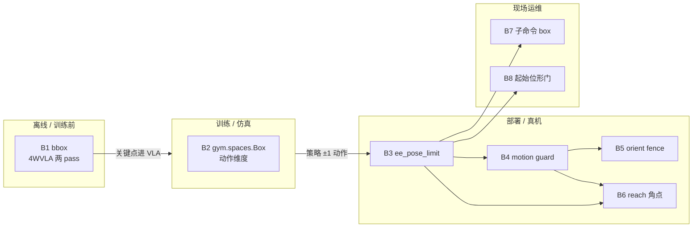
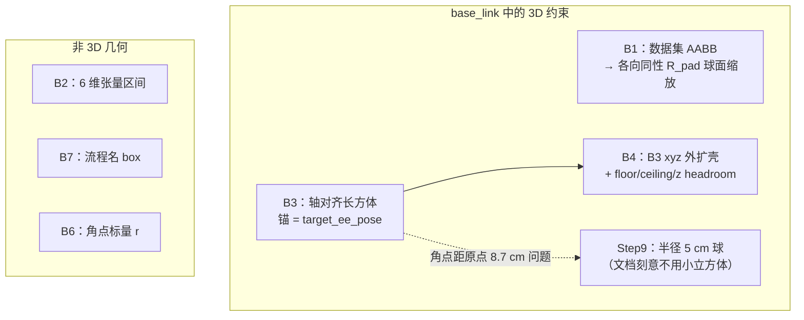
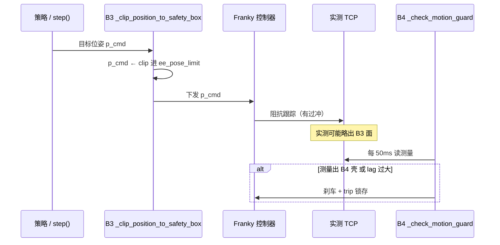
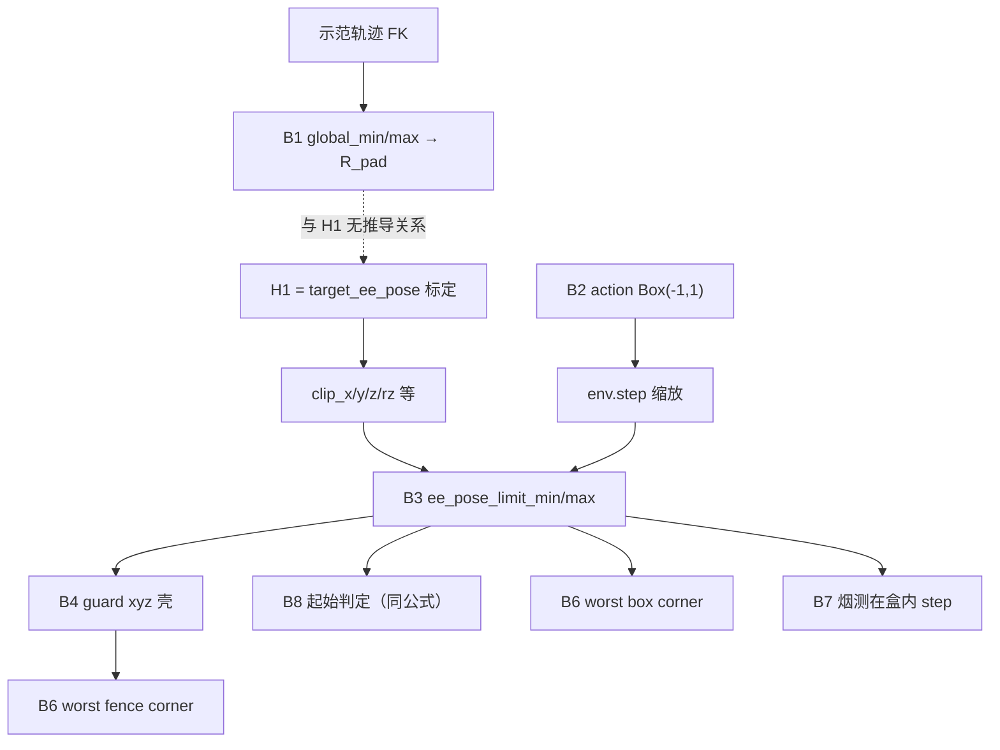
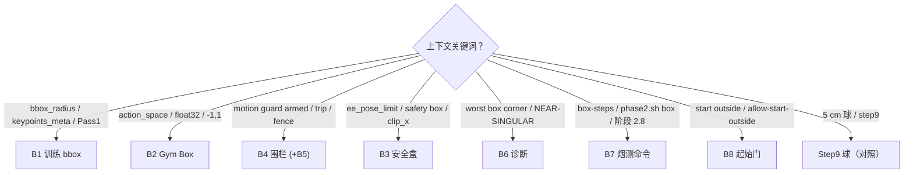
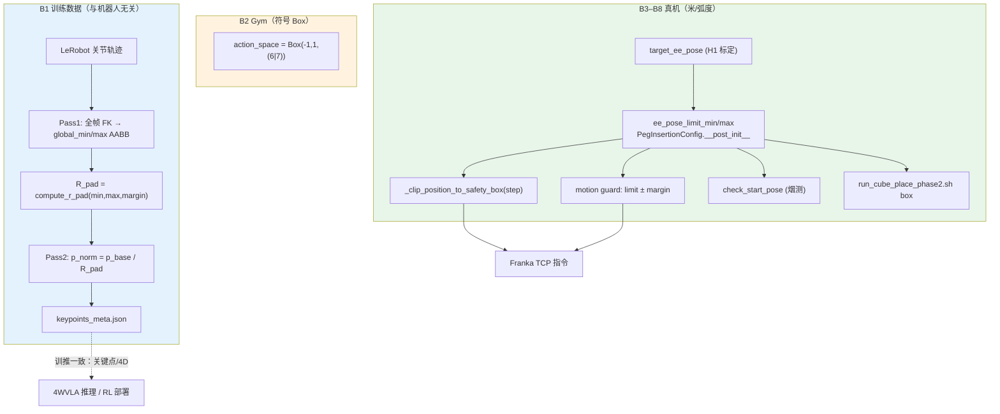
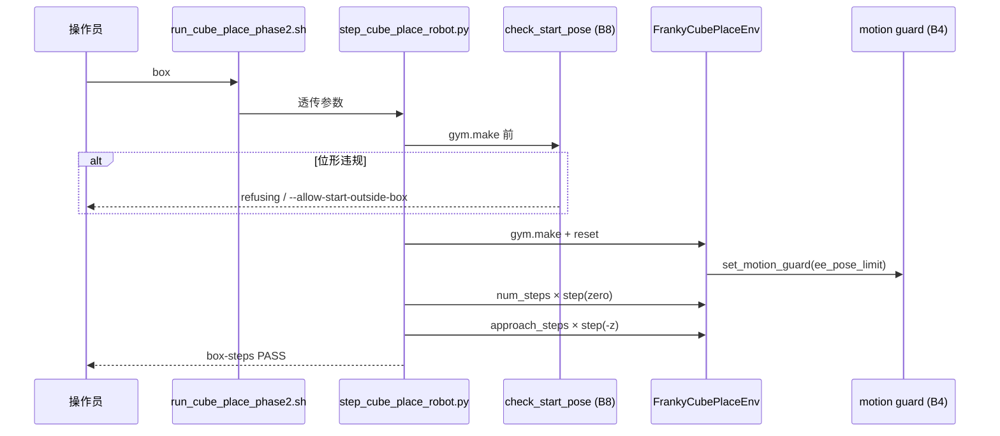

# `b/d/frk1/` 文档中的「Box」概念汇总与实现解析

> **范围**：`/home/nvidia/bt/s/RLmm/b/d/frk1/` 下全部 Markdown（及该目录引用的 `plug/keypoints_meta.json`、4WVLA 数据处理方案）。  
> **方法**：逐文件检索 `box` / `bbox` / `bounding box` / `safety box` / `ee_pose_limit` / `motion guard` / `gym.spaces.Box` 等表述，再对照 RLmm / 4WVLA 本地源码核对语义与实现。  
> **日期**：2026-09-14  

---

## 1. 执行摘要：不是一类「Box」

在 `frk1` 文档族里，**「box」至少对应 7 个彼此独立的概念**（另加 2 个易混淆的邻近概念）。它们分属 **VLA/4D 训练数据**、**Gym API**、**真机笛卡尔安全**、**运行时围栏**、**运维验收子命令** 五条链路。若混用，典型后果包括：

- 训推不一致（用错 `bbox_radius` 或误以为 `ee_pose_limit` 与 bbox 有关）；
- 预检打印的「安全盒」与 env 实际执行的盒相差 35 倍（roll/pitch 半宽误用 `clip_rz`）；
- 把阶段 **2.8 `box`** 子命令当成「画 bounding box」或「改 YAML 里的 box 参数」。

**概念总表**（后文逐类展开）：

| ID | 名称（文档常用叫法） | 领域 | 几何形状 | 主要源码 |
|:---|:---|:---|:---|:---|
| **B1** | **Bounding box / bbox**（`bbox_radius`, `bbox_margin`） | 4WVLA / InternVLA 4D 关键点 | 数据 AABB → 各向同性 **球半径** \(R_{\text{pad}}\) | `4WVLA/util_scripts/generate_r1pro_keypoints_e1.py` |
| **B2** | **`gym.spaces.Box`** | RL Gym API | 无（动作/观测 **张量边界**） | `rlinf/envs/realworld/franka/franka_env.py` |
| **B3** | **Safety box / 安全盒**（`ee_pose_limit_*`） | Franka 真机 env | 以 `target_ee_pose` 为锚的 **轴对齐 6D 限位盒** | `peg_insertion_env.py` + `_clip_position_to_safety_box` |
| **B4** | **Motion guard 围栏盒** | Franky 扩展控制器 | B3 的 xyz **外扩** + 地板/天花板/抬升余量 | `b/x/franky_ext/controller_extended.py` |
| **B5** | **Orientation fence**（姿态围栏） | Motion guard 子模块 | **四元数最短弧角**（非欧拉盒） | `b/x/franky_ext/motion_limits.py` |
| **B6** | **Reach 诊断：box corner / fence corner** | 预检日志 | B3/B4 的 **8 角点** 中肩系半径最大者 | `worst_reach_corner()` |
| **B7** | **阶段 2.8 `box`**（运维子命令） | 方块放置烟测 | 无新几何；在 B3 内做 **reset + 零动作 + 下探** | `b/x/scripts/step_cube_place_robot.py` |
| **B8** | **起始位形「在盒内/盒外」** | 烟测硬门 | 与 B3 一致的 **xy/z/姿态** 判定 | `b/x/franky_ext/tcp_probe.py:check_start_pose` |
| *(对照)* | **Step 9 球形工作区** | 相机烟测 | **球**（非 box，文档专门对比 B3） | `b/x/scripts/step9_test_ee_sphere.py` |

**阅读导航**：§2 用 **多个正交维度** 对比各概念并配图、举例；§3 为语料矩阵；§4 为链路总图；§5–§12 为分概念详解（原 §4–§11）；§13 起为配置与索引。

---

## 2. 多维分类：区别、关系、图解与实例

同一英文词 **box** 在 `frk1` 文档里可能指 **归一化半径**、**Gym 类型名**、**米制安全长方体**、**shell 脚本子命令** 等。下面从 **六个维度** 分类，再用 **三层关系图** 和 **三个真机/训练对照例** 把边界钉死。

### 2.1 六个分类维度（正交表）

| 维度 | 问什么 | B1 bbox | B2 Gym Box | B3 安全盒 | B4 围栏盒 | B5 姿态围栏 | B6 角点诊断 | B7 阶段 box | B8 起始门 |
|:---|:---|:---|:---|:---|:---|:---|:---|:---|:---|
| **D1 系统层** | 属于哪条链路？ | 离线数据 / VLA | RL 接口契约 | 真机 env 策略 | 真机控制器 | 真机控制器 | 预检日志 | 运维脚本 | 烟测预检 |
| **D2 是否物理几何** | 在 base_link 里有形状吗？ | 有（统计 AABB→\(R_{\text{pad}}\)） | **无**（张量上下界） | 有（轴对齐长方体） | 有（B3 外扩壳层） | 有（角距离，非轴对齐欧拉盒） | 有（取 B3/B4 角点） | **无新几何** | 有（同 B3 判定式） |
| **D3 约束对象** | 限制谁？ | 关键点 **位置数值** | 策略输出 **每维标量** | **指令** TCP 位姿 | **测量** TCP xyz | **测量** 相对目标姿态 | 无约束（只 **报告**） | 测试流程 | **当前** TCP 相对 H1 |
| **D4 生效时机** | 何时起作用？ | 数据集生成；推理反归一化 | 每 `step` 前后语义层 | 每 `step()` 的 `_move_action` | 路点间 + 50 Hz 看门狗 | 同 B4 | `connect` / `gym.make` 打印 | 人工跑阶段 2.8 | `gym.make` **之前** |
| **D5 典型尺度** | 数量级？ | \(R_{\text{pad}}\!\approx\!0.84\,\mathrm{m}\) | \([-1,1]\) 无量纲 | xy ±**0.05** m（cube） | B3 + **0.05** m 等 | **0.55** rad 量级 | 可达 **92%** / **98%** | N/A | xy 超 **2** mm 即拒 |
| **D6 配置从哪来** | 改哪里？ | `keypoints_meta.json`、4WVLA 脚本 | 代码写死 `Box(-1,1)` | `target_ee_pose` + `clip_*` | env 常量 + `RLINF_CUBE_GUARD_*` | 由 roll/pitch/yaw 半宽推导 | 自动算 | `run_cube_place_phase2.sh` | CLI + `check_start_pose` |

**一眼区分口诀**：

- 带 **`bbox_radius` / Pass1** → **B1**；带 **`action_space=Box(-1,1)`** → **B2**；
- 带 **`ee_pose_limit` / safety box / clip`** → **B3**；带 **`motion guard armed`** → **B4（+B5）**；
- 带 **`worst box corner`** → **B6**；带 **`box-steps PASS` / `phase2.sh box`** → **B7**；
- 带 **`outside the 0.050 m box` / `allow-start-outside-box`** → **B8**。

### 2.2 维度 D1：系统层（谁在用「盒」）



**关系**：B1 与 B3 **不共享参数**；训练时 B2 与 B3 同时存在——策略在 \([-1,1]^6\) 里出数，env 再映射成米/弧度并 **裁进 B3**。

### 2.3 维度 D2：几何形状（长方体、球、还是「假盒子」）



| 形状 | 概念 | 文档中的动机 |
|:---|:---|:---|
| 统计 AABB → **球半径** | B1 | 各向同性归一化，避免某一轴缩放不一致 |
| **轴对齐六面体**（xyz + 欧拉窗） | B3 | 与 PegInsertion 上游一致，实现简单 |
| **加厚六面体** | B4 | 允许测量滞后、reset 单次合法越顶 |
| **球** | Step 9 | 相机烟测要「距当前 EE 不超过 5 cm」，立方体角点更远 |
| **无形状** | B2 | OpenAI Gym 命名传统 |

### 2.4 维度 D3：约束「指令」还是「测量」（B3 vs B4 核心区别）



| | **B3 安全盒** | **B4 围栏盒** |
|:---|:---|:---|
| 哲学 | 「**允许命令** 去哪」 | 「**允许身体** 实际在哪」 |
| 典型失败形态 | 目标被 **静默裁平** 在盒面，臂「想回回不来」 | **`motion guard abort`**，训练/烟测中断 |
| reset 插值 | `_interpolate_move` **不**走 B3 clip | B4 给 +z **headroom** 容纳合法越顶 |

**B5** 挂在 B4 上：对 **测量姿态** 做四元数角限制，**不用** B3 的 euler 盒（避免 roll≈−π 绕回误报，`dmo_place_2.md` §3.4）。

### 2.5 维度 D4：生命周期（同一次 cube 部署中的时间顺序）

```mermaid
gantt
    title Cube 任务里各类「盒」出现顺序（示意）
    dateFormat X
    axisFormat %s

    section 离线
    B1 生成 keypoints_meta     :a1, 0, 1

    section 上电预检
    B8 check_start_pose        :a2, 2, 3
    B6 reach 打印              :a3, 3, 4
    B4 set_motion_guard        :a4, 4, 5

    section 运行时
    B3 每 step clip            :a5, 5, 10
    B4 watchdog 并行           :a6, 5, 10
    B2 动作语义 ±1             :a7, 5, 10

    section 运维
    B7 phase2 box 烟测         :a8, 1, 2
```



说明：**B7** 往往在正式训练前人工跑一轮，时间上可能 **早于** 长期训练，但逻辑上它验证的正是 B3+B4+B8 组合是否可用。

### 2.6 维度 D5–D6：尺度与配置（为何不能拿 0.836 去填 0.05）

| 参数 | 数值示例（cube / plug） | 若误当成另一种 box |
|:---|:---|:---|
| `bbox_radius` | **0.836 m** | 当成安全半宽 → 臂可以命令到距 H1 80 cm 级，**极危险** |
| `clip_x_range` | **0.05 m** | 当成归一化因子 → VLA 关键点全错 **~16×** |
| `RLINF_CUBE_GUARD_MARGIN` | **0.05 m** | 与 clip 同数但 **含义不同**（测量外扩，不是指令窗） |
| `action_space` 上界 | **1.0** | 当成 1 m 步长 → 误解 `action_scale` 与 B3 关系 |

### 2.7 概念依赖关系（派生 / 对齐，非包含）



- **实线**：配置或几何上 **由前项推出**。
- **虚线**：B1 与 H1 **独立**（同一 TCP 位置可同时谈「归一化坐标」和「安全盒」，两套数）。

### 2.8 实例 1：同一位姿，五种「读数」（Cube H1）

取 `dmo_place_2.md` §3.2 标定（LOG-026）：

```text
H1 (target_ee_pose) ≈ [0.7269, 0.0249, 0.2508, roll, pitch, yaw]
```

| 概念 | 在该点的读法 | 说明 |
|:---|:---|:---|
| **B1** | \(p_{\text{norm}} \approx [0.87,\ 0.03,\ 0.30]\)（各分量 ÷ **0.836**） | 若 VLA 输出关键点 0.87，反归一化后才回到 ~0.73 m 的 x；与是否允许 **真机命令** 到该 x **无关** |
| **B3** | x ∈ **[0.6769, 0.7769]**，z ∈ **[0.2458, 0.3308]** | H1 在 **盒中心平面** 附近；`step()` 目标 xyz 裁在此内 |
| **B4** | 日志壳 xyz ∈ **[[0.6269,…], [0.8269,…]]** | 比 B3 每侧大约 **+5 cm**（margin）；**测量**出 B3 面仍可能 OK，出 B4 才 trip |
| **B2** | `action = [0,0,0,0,0,0]` | 表示 **无增量**（经 `action_scale` 后仍可能在 B3 内微动） |
| **B6** | `worst box corner … r=0.785 m (92% NEAR-SINGULAR)` | 角点 **[0.7769, 0.0749, 0.2458]** 肩系半径大 → **标定偏外** 时提示，不是第二道 clip |

**小实验（纸上）**：若策略连续发 `action[0]=+1`（+x 方向满偏），B2 只保证输出 **≤1**；B3 会把目标 x **钉在 0.7769**；若阻抗过冲到 x=0.78，B4 可能仍容忍，直到超过 **0.8269 + 余量** 或 lag 过大才 abort——这就是「**指令盒** vs **身体盒**」同屏共存的含义。

### 2.9 实例 2：日志一句话对应哪个 ID（LOG-039）

| 日志片段 | 概念 | 解释 |
|:---|:---|:---|
| `START-POSE PROBLEM: start is 0.0520 m from the mark in xy, outside the 0.050 m box` | **B8** | xy 离 H1 **52 mm** > `clip_xy` **50 mm**；**不是** B1 bbox |
| `reach: worst box corner ... 92% ... NEAR-SINGULAR` | **B6（box 角）** | 同一 H1 下 B3 角点可达性警告 |
| `--allow-start-outside-box` | **B8 逃生门** | 不修改 B3/B4 参数，仅 **允许继续跑** 烟测 |
| `box-steps PASS` | **B7** | 阶段 2.8 成功；**不表示** bbox 或 YAML 被改写 |

### 2.10 实例 3：Charger vs Cube——同一 B3 机制，不同「盒大小」

| 任务 | xy 半宽 | 文档 | 同一机制 |
|:---|:---|:---|:---|
| **Cube place** | 0.05 m | `dmo_place_2.md` | `PegInsertionConfig.__post_init__` |
| **Charger SAC** | 0.02 m | `charger_sac_async.md` | 同一推导，**更窄** xy 窗 |

两者 **都不是** B1 的 0.836 m；charger 文档写「clip 到 safety box」指的是 **B3**，与 4WVLA 的 bbox **无换算关系**。

### 2.11 读到「box」时的决策树



### 2.12 B1 与 B3 并列对照图（最易混）


**`prmp.md` 计划中的「bbox 边缘 vs safe box 边缘」**：前者应走 **B1**（例如 \(\|p_{\text{norm}}\|\approx 1\) 的 FK 姿态）；后者走 **B3**（例如 TCP 移到 `ee_pose_limit_max` 的 xyz 角点）。**禁止**用 \(R_{\text{pad}}\) 直接当笛卡尔半宽。

---

## 3. 文档语料：各 MD 提到了哪类 Box

| 文件 | B1 bbox | B2 Gym | B3 安全盒 | B4 围栏 | B5 姿态 | B6 角点 | B7 阶段 box | B8 起始门 | 备注 |
|:---|:---:|:---:|:---:|:---:|:---:|:---:|:---:|:---:|:---|
| `prmp.md` | ✅ | — | ✅ safe box | — | — | — | —（计划极限动作） | — | 强调训推 bbox/归一化一致 |
| `4wvla_rlinf_eval_2.md` | ✅ 详 | ✅ | — | — | — | — | — | — | `keypoints_meta.json` 参数表 |
| `4wvla_rlinf_eval_3.md` | — | — | — | ✅ Motion Guard | — | — | — | — | 五层安全架构 L3 |
| `4wvla_rlinf_eval_1.md` | — | ✅ | — | — | — | — | — | — | 仅 action_space |
| `4wvla_rlinf_2.md` | ✅ 一行 | — | — | — | — | — | — | — | `bbox_radius: 0.836` |
| `charger_sac_async.md` | — | — | ✅ | ✅ clip | — | — | — | — | PegInsertion 推导安全盒 |
| `franka_3.md` | — | — | ✅ safety box | — | — | — | — | — | Step 6/9；球 vs 盒 |
| `franka_3LOG.md` | — | — | ✅ ee_pose_limit | — | — | — | — | — | auto safety box 实验 |
| `franka_1.md` | — | — | ✅ 一句 | — | — | — | — | — | 安全盒字段 |
| `dmo_place_1.md` / `1LOG.md` | — | ✅ | ✅ | — | — | — | ✅ 2.8 | — | 阶段 2 手册 |
| `dmo_place_2.md` / `2LOG.md` | — | — | ✅ 极详 | ✅ 极详 | ✅ | ✅ | ✅ | ✅ | 几何数字、事故分析 |

未在检索中出现 bbox/安全盒专论的：`franka_2.md`、`4wvla_rlinf_1.md`（除 eval 系）、`4wvla_rlinf_2_0909LOG.md`、`4wvla_rlinf_eval_3A2.md`（仅有 velocity safety factor，**非**几何 box）。

---

## 4. 概念关系总图



**关键结论**：B1 的 `bbox_radius` **不会**自动等于 B3 的 `clip_x_range`；前者覆盖整段示范轨迹在 `base_link` 下的包络，后者是 **单个任务接触点** 周围的 ±5 cm（或 charger ±2 cm）操作窗。

---

## 5. B1 — Bounding box / bbox（VLA 4D 关键点归一化）

### 4.1 文档中的含义

- `prmp.md`、`4wvla_rlinf_eval_2.md` 要求部署与 [`4WVLA/b/d/Frk/dta_4dtrj_plan.md`](../../../4WVLA/b/d/Frk/dta_4dtrj_plan.md) 一致：**bbox 与归一化** 是 4D 轨迹/关键点训推一致性的核心。
- 本地锚点文件：[`plug/keypoints_meta.json`](plug/keypoints_meta.json)（Franka plug 任务）。

| 字段 | 典型值（plug） | 含义 |
|:---|:---|:---|
| `global_min` / `global_max` | 见 json | Pass 1 扫描全数据集 FK 位置后的 **轴对齐包围盒**（AABB，base_link 系） |
| `bbox_margin` \(\alpha\) | `0.15` | 在 AABB 外扩 15% 的安全裕量 |
| `bbox_radius` \(R_{\text{pad}}\) | `0.8361004471778869` m | **各向同性**缩放半径，用于位置归一化 |
| `coordinate_system` | 见 json | 位置除以 \(R_{\text{pad}}\)；四元数半球归一化 |

### 4.2 数学定义（与 4WVLA 实现一致）

Pass 1 收集所有关键点位置的 component-wise min/max 得 \(\mathbf{p}_{\min}, \mathbf{p}_{\max}\)。定义

\[
R = \max\bigl(|x_{\min}|, x_{\max}, |y_{\min}|, y_{\max}, |z_{\min}|, z_{\max}\bigr)
\]

\[
R_{\text{pad}} = R \cdot (1 + \alpha), \quad \alpha = \texttt{bbox\_margin}
\]

Pass 2 对每个关键点位置：

\[
\mathbf{p}_{\text{norm}} = \frac{\mathbf{p}_{\text{base}}}{R_{\text{pad}}}
\]

实现见 4WVLA：

```230:239:/home/nvidia/bt/s/4WVLA/util_scripts/generate_r1pro_keypoints_e1.py
def compute_r_pad(global_min: np.ndarray, global_max: np.ndarray, margin: float = BBOX_MARGIN) -> float:
    """Isotropic bounding radius with safety margin.

    R = max(|x_min|, x_max, |y_min|, y_max, |z_min|, z_max)
    R_pad = R × (1 + margin)
    """
    abs_extremes = np.maximum(np.abs(global_min), np.abs(global_max))
    R = float(abs_extremes.max())
    R_pad = R * (1.0 + margin)
    return R_pad
```

Franka 专用入口：`4WVLA/b/s/Frk/generate_franka_keypoints.py`（两 pass，import 上述 `compute_r_pad`）。

### 4.3 作用与边界

- **作用**：让 VLA 预测的多 body 4D 关键点在 **无量纲** 空间里训练，便于跨 episode 共享头；推理时必须用 **同一** \(R_{\text{pad}}\)、URDF、四元数约定反归一化或在线 FK。
- **不是**：Franka 真机 `ee_pose_limit`、Motion Guard、或阶段 2.8 的 `box` 命令。
- **文档坑**：`4wvla_rlinf_eval_2.md` 中 eval 测试「ref_chunk 落在 training data bounds」指的是 **策略输出分布**，与 B1 的 \(R_{\text{pad}}\) 相关但 **不等价** 于 B3 安全盒。

---

## 6. B2 — `gym.spaces.Box`（动作/观测空间类型）

### 5.1 文档中的出现

- `dmo_place_1LOG.md`：`action_space=Box(-1,1,(6,),float32)`（方块放置 6D 臂动作）。
- `4wvla_rlinf_eval_1.md` / `eval_2.md`：HF env 或封装里定义 `self.action_space = gym.spaces.Box(...)`。
- `charger_sac_async.md`：相机观测 `gym.spaces.Box` 形状。

### 5.2 含义与实现

这是 Gymnasium 的 **连续向量空间** 类型：`low`/`high` 为每个动作维的 **归一化 clip 范围**（通常 \([-1,1]\)），与物理米制无关。

真机 Franka 在 `_init_action_obs_spaces` 里同时创建：

- **策略动作空间**：6(+1) 维 `Box(-1,1)`；
- **内部安全空间** `_xyz_safe_space` / `_rpy_safe_space`：来自 `ee_pose_limit`（见 B3）。

```558:575:/home/nvidia/bt/s/RLmm/rlinf/envs/realworld/franka/franka_env.py
        self._xyz_safe_space = gym.spaces.Box(
            low=self.config.ee_pose_limit_min[:3],
            high=self.config.ee_pose_limit_max[:3],
            dtype=np.float64,
        )
        self._rpy_safe_space = gym.spaces.Box(
            low=self.config.ee_pose_limit_min[3:],
            high=self.config.ee_pose_limit_max[3:],
            dtype=np.float64,
        )
        ...
        self.action_space = gym.spaces.Box(
            np.ones((total_action_dim,), dtype=np.float32) * -1,
            np.ones((total_action_dim,), dtype=np.float32),
```

**易混点**：日志里写 `Box(-1,1,(6,))` 时，**不要**理解为「6 米见方的物理盒子」。

---

## 7. B3 — Safety box / 安全盒（`ee_pose_limit`）

### 6.1 文档中的叫法

- `franka_3.md`：**safety box**（`safety_box_half_width_m`，±5 cm）。
- `charger_sac_async.md`：**safety box 的锚** = `target_ee_pose`；charger 任务 xy ±2 cm、z 窗、rz ±0.35 rad。
- `dmo_place_2.md`：给出 H1 标定下的 **`ee_pose_limit_min/max` 数值** 与 roll/pitch **±0.01 rad** 硬编码说明。

### 6.2 几何语义

以任务标定接触姿态 `target_ee_pose` \(\mathbf{t} \in \mathbb{R}^6\)（xyz + euler 或等价）为锚，由 `clip_*` 范围生成 **轴对齐** 限位：

\[
x \in [t_x - \Delta_x,\, t_x + \Delta_x],\quad
y \in [t_y - \Delta_y,\, t_y + \Delta_y],\quad
z \in [t_z - z_{\text{low}},\, t_z + z_{\text{high}}]
\]

姿态：roll/pitch 为 **`target ± 0.01 rad`**（上游 `PegInsertionConfig` 硬编码），yaw 为 **`target ± clip_rz_range`**。

上游推导（RLinf 官方 PegInsertion）：

```87:106:/home/nvidia/bt/s/RLmm/rlinf/envs/realworld/franka/tasks/peg_insertion_env.py
        self.ee_pose_limit_min = np.array(
            [
                self.target_ee_pose[0] - self.clip_x_range,
                ...
                self.target_ee_pose[3] - 0.01,
                self.target_ee_pose[4] - 0.01,
                self.target_ee_pose[5] - self.clip_rz_range,
            ]
        )
        self.ee_pose_limit_max = np.array([ ... ])
```

Franky 封装 **`FrankyPegInsertionEnvConfig`** 把「5 cm safety box」写到 clip 字段：

```26:34:/home/nvidia/bt/s/RLmm/b/x/franky_ext/tasks/peg_insertion.py
    def __post_init__(self):
        half = float(self.safety_box_half_width_m)
        z_hover = float(self.reset_z_lift_m)
        self.clip_x_range = half
        self.clip_y_range = half
        ...
        super().__post_init__()
```

**CubePlace** 默认：`clip_xy=0.05`，`clip_z_range_low=0.005`（允许接触点下 5 mm），`clip_z_range_high=0.08`（悬停 +8 cm），见 `b/x/franky_ext/tasks/cube_place.py`。

### 6.3 运行时作用：裁剪 **指令** 而非只裁剪测量

每次 `step()` 通过 `_clip_position_to_safety_box` 把 **下一时刻目标位姿** 裁进 B3：

```788:801:/home/nvidia/bt/s/RLmm/rlinf/envs/realworld/franka/franka_env.py
    def _clip_position_to_safety_box(self, position: np.ndarray) -> np.ndarray:
        position[:3] = np.clip(
            position[:3], self._xyz_safe_space.low, self._xyz_safe_space.high
        )
        euler = R.from_quat(position[3:].copy()).as_euler("xyz")
        euler = clip_euler_to_target_window(
            euler=euler,
            target_euler=self.config.target_ee_pose[3:],
            lower_euler=self._rpy_safe_space.low,
            upper_euler=self._rpy_safe_space.high,
        )
```

**文档强调的行为差异**（`dmo_place_2.md` §3.3）：

- `_interpolate_move`（reset 抬升、去 hover）**不**走该 clip → 可能短暂高于盒顶；因此需要 B4 给 `+z` 额外 headroom。
- 阻抗 **过冲** 可把 **实测** TCP 顶在盒面外，而下一步指令仍被 clip 在盒面 → 「回不去」类故障（`franka_3LOG.md` LOG-016 系列、`franka_3.md` Step 9 讨论）。

### 6.4 与 B1 的关系

| 维度 | B1 bbox | B3 safety box |
|:---|:---|:---|
| 坐标系 | `base_link` 关键点/轨迹 | 任务 `target_ee_pose` 锚定 |
| 大小 | ~0.84 m 半径量级（全轨迹） | ~±5 cm（cube）或 ±2 cm（charger） |
| 用途 | 神经网络输入/输出归一化 | 真机运动授权窗 |
| 配置位置 | `keypoints_meta.json` / 数据 pipeline | YAML `target_ee_pose` + `clip_*` |

---

## 8. B4 — Motion Guard 围栏盒（测量 TCP 上的外扩盒）

### 7.1 文档中的含义

- `dmo_place_2.md` §3.4：**围栏** = `ee_pose_limit` ± margin（xy/+z 约 5 cm，**−z 仅 1 cm**，另加 `reset_z_lift_m` 与 **绝对 z 天花板**）。
- `4wvla_rlinf_eval_3.md`：层 3 **Motion Guard — TCP 几何围栏**（继承 `franky_ext`）。

### 7.2 实现要点

`FrankyControllerExtended.set_motion_guard(limit_min_xyz, limit_max_xyz, ...)` 以 B3 的 xyz 角为内核，外扩：

- `margin`（默认 env：`RLINF_CUBE_GUARD_MARGIN`，如 0.05 m）；
- `floor_margin`（−z 更紧，防压桌）；
- `extra_z_up`（允许 reset 合法越顶一次）；
- `z_ceiling`（与盒顶解耦的绝对上限）。

日志示例（`dmo_place_2.md`）：

```text
motion guard armed: xyz in [[0.6269,-0.0751,0.2358], [0.8269,0.1249,0.4108]]
  (box +/- 0.050m, floor -0.010m, +z headroom 0.030m, ceiling 0.4308), ...
```

**与 B3 的分工**：

| | B3 `_clip_position_to_safety_box` | B4 `_check_motion_guard` |
|:---|:---|:---|
| 对象 | **指令/目标** 位姿 | **测量** TCP |
| 时机 | 每 `step()` | 每路点 / 50 Hz watchdog |
| 失败 | 静默 clip | 刹车 + 锁存 trip |

---

## 9. B5 — Orientation fence（姿态围栏，非欧拉「盒」）

文档在 `dmo_place_2.md` 与 `motion_limits.py` 中明确：**不能**用 `ee_pose_limit[3:]` 的欧拉窗做围栏（roll ≈ −π 附近绕回误报）。围栏使用 **目标四元数** 与 **测量四元数** 的最短弧角，允许半径由 `orientation_fence_rad(roll_half, pitch_half, yaw_half)` 计算（cube 任务约 **0.550 rad**）。

这与 B3 的「RPY 盒」是 **并行两套规则**：B3 限制 **策略指令**；B5 限制 **实测姿态** 偏离 H1 的程度。

---

## 10. B6 — `worst box corner` / `worst fence corner`（可达性诊断）

### 9.1 文档含义

`connect` / `gym.make` 前打印：

```text
reach: worst box corner [0.7769, 0.0749, 0.2458] r=0.785m (92% of 0.855m reach) NEAR-SINGULAR;
       worst fence corner ... r=0.842m (98%) NEAR-SINGULAR
```

- **box corner**：在 B3 的 xyz 限位 **8 个角点** 中，相对肩基座半径最大者。
- **fence corner**：在 B4 外扩后的 **8 角点** 中同样计算。

### 9.2 实现

```888:909:/home/nvidia/bt/s/RLmm/b/x/franky_ext/motion_limits.py
def worst_reach_corner(lo: Sequence[float], hi: Sequence[float]) -> tuple[float, list[float]]:
    """Largest shoulder-relative radius over the 8 corners of a box."""
    ...
    for ix in (lo_a[0], hi_a[0]):
        for iy in (lo_a[1], hi_a[1]):
            for iz in (lo_a[2], hi_a[2]):
                r = reach_radius_m([ix, iy, iz])
```

**作用**：提示标定 H1 是否把臂推近 **雅可比病态区**（`NEAR-SINGULAR`）；**不是**第二套安全限位。文档结论：应 **移动标记/目标**，而非单纯放宽围栏（`dmo_place_2.md` §3.2）。

---

## 11. B7 — 运维阶段「2.8 box / box-steps」（子命令名）

### 10.1 文档含义

- `dmo_place_1.md` / `dmo_place_2.md`：**阶段 2.8** = `bash b/x/scripts/run_cube_place_phase2.sh box`。
- 内含 **2.7 reset** + 盒内 **零动作** + 可选 **下探**（`approach_steps`），成功日志 **`box-steps PASS`**。

### 10.2 流程（与几何盒的关系）



核心代码：`step_cube_place_robot.py` 在 reset 通过后循环 `env.step(zero)` 与 `down[2]=-1.0`，并在 z 低于 `target - clip_z_low - 0.01` 时 abort（**仍在 B3 地板之上** 的设计意图）。

**命名注意**：此 **`box` 是验收阶段名**，与 B1 的 bbox、与 Gym `Box` 均无直接对应。

---

## 12. B8 — 起始位形「在盒外 / outside the 0.050 m box」

### 11.1 文档场景

- `dmo_place_2LOG.md` LOG-039：xy 离标记 52 mm > 50 mm 盒半宽 → `START-POSE PROBLEM`；可用 `--allow-start-outside-box` 审计性绕过。
- `dmo_place_2.md`：拒绝 `refusing to reset from this pose`。

### 11.2 实现

`tcp_probe.check_start_pose(probed, target, clip_xy, z_low, z_high, clip_rz)` 检查：

- z 不低于接触点 − 允许下沉；
- xy 在 `[t_x ± clip_xy, t_y ± clip_xy]`；
- 可选姿态窗（与 B3 一致）。

与 env 内 `_check_start_pose()` **warn** 不同：烟测脚本在 **Ray 启动前硬拒绝**，避免 LOG-019 类「方块压在标记上仍 reset」。

---

## 13. 对照概念：Step 9「5 cm 球」与轴对齐 safety box

`franka_3.md` Step 9 说明：若仅用 **origin ± 5 cm 的立方体** 作 B3，角点距原点约 **8.7 cm**；阻抗过冲还会把实测 TCP 顶在盒面。故：

- B3 默认用 **origin ± 8 cm**（`--safety-margin`）作 clip 盒；
- **球半径 5 cm** 约束在 **`step9_test_ee_sphere.py` 脚本内投影**，不改 `rlinf/` 内 clip 逻辑。

这是文档中少数 **明确讨论「盒 vs 球」** 的段落，用于相机随机运动烟测，与 B7 cube `box` 阶段不同。

---

## 14. `prmp.md` 中的「bbox 边缘 / safe box 边缘极限动作」

需求摘要（尚未在 `frk1` 其它 MD 展开实现细节）：

1. 训推一致：对齐 4WVLA 的 **B1** 与归一化；
2. 真机安全：考虑 **`franka_3.md` / LOG 中的 B3–B4**；
3. 计划工具：让 Franka 摆出 **bbox 边缘** 或 **safe box 边缘** 的极限姿态 —— 分别对应 **数据归一化边界**（需在 FK/反归一化后映射到关节）与 **笛卡尔安全盒字面边界**（可直接用 `ee_pose_limit` 角点 + 小步 `step` 或 REPL）。

建议实现时分 **两条脚本/模式**，避免用 B1 的 \(R_{\text{pad}}\) 角点直接当 Franka 笛卡尔目标而不经过 FK 与碰撞检查。

---

## 15. 配置与 YAML 如何进入 B3（Cube / Charger）

| 任务 | 锚 | xy 半宽 | z 窗 | 文档 |
|:---|:---|:---|:---|:---|
| Cube place | H1 YAML | 0.05 m | −0.005 / +0.08 m | `dmo_place_2.md` §3.2 |
| Charger SAC | `target_ee_pose` override | 0.02 m | −0.005 / +0.05 m | `charger_sac_async.md` §7 |
| Peg Step 6 | probe | `safety_box_half_width_m=0.05` | hover=`reset_z_lift_m` | `franka_3.md` Step 6 |

**重要**：`PegInsertionConfig.__post_init__` 会 **覆盖** YAML 里手写 `ee_pose_limit_*` / `reset_ee_pose`（`dmo_place_2LOG.md` 规则 8）。预检应使用 `effective_ee_pose_limits()` 镜像真实推导（`tcp_probe.py`）。

---

## 16. 常见混淆与文档已记录的事故链

| 混淆 | 后果 | 文档/日志 |
|:---|:---|:---|
| 把 B7 `box` 当成改 bbox | 改错配置层 | `dmo_place_1LOG.md` 阶段 2.8 说明 |
| probe 中心 ± 单一 rpy margin 打印 | 姿态窗宽 35× | LOG-022 S5，`effective_ee_pose_limits` |
| B3 clip 认为 reset 也受限 | 误判 reset 越顶为 bug | `dmo_place_2.md` §3.3 |
| 放宽 B4 解决 NEAR-SINGULAR | 臂仍病态，风险更大 | §3.2「挪标记不是挪围栏」 |
| B1 与 B3 数值混用 | VLA 反归一化错误 / 真机越界 | `prmp.md`，`4wvla_rlinf_eval_2.md` §3.5 |

---

## 17. 实现文件索引（RLmm / 4WVLA）

| 概念 | 路径 |
|:---|:---|
| B1 `compute_r_pad` | `/home/nvidia/bt/s/4WVLA/util_scripts/generate_r1pro_keypoints_e1.py` |
| B1 Franka 生成 | `/home/nvidia/bt/s/4WVLA/b/s/Frk/generate_franka_keypoints.py` |
| B1 元数据（本地） | `/home/nvidia/bt/s/RLmm/b/d/frk1/plug/keypoints_meta.json` |
| B3 推导 | `/home/nvidia/bt/s/RLmm/rlinf/envs/realworld/franka/tasks/peg_insertion_env.py` |
| B3 clip | `/home/nvidia/bt/s/RLmm/rlinf/envs/realworld/franka/franka_env.py` |
| B3 Franky 默认 | `/home/nvidia/bt/s/RLmm/b/x/franky_ext/tasks/peg_insertion.py`, `cube_place.py` |
| B4 guard | `/home/nvidia/bt/s/RLmm/b/x/franky_ext/controller_extended.py` |
| B5/B6 | `/home/nvidia/bt/s/RLmm/b/x/franky_ext/motion_limits.py` |
| B7/B8 烟测 | `/home/nvidia/bt/s/RLmm/b/x/scripts/step_cube_place_robot.py`, `tcp_probe.py` |
| 阶段 2 封装 | `/home/nvidia/bt/s/RLmm/b/x/scripts/run_cube_place_phase2.sh` |
| Step 9 球约束 | `/home/nvidia/bt/s/RLmm/b/x/scripts/step9_test_ee_sphere.py` |

---

## 18. 参考文献与出处

1. 4WVLA 数据处理设计：[`4WVLA/b/d/Frk/dta_4dtrj_plan.md`](../../../4WVLA/b/d/Frk/dta_4dtrj_plan.md)（bounding box、Pass1/2、`compute_r_pad`）  
2. 本地 plug 元数据：[`plug/keypoints_meta.json`](plug/keypoints_meta.json)  
3. 训推 bbox 表：[`4wvla_rlinf_eval_2.md`](4wvla_rlinf_eval_2.md) §3.5  
4. 安全盒与围栏实操：[`dmo_place_2.md`](dmo_place_2.md) §3.2–§3.4，[`dmo_place_2LOG.md`](dmo_place_2LOG.md)  
5. Peg safety box 引入：[`franka_3.md`](franka_3.md) Step 6；auto limit：[`franka_3LOG.md`](franka_3LOG.md) LOG-016  
6. Charger 安全盒参数：[`charger_sac_async.md`](charger_sac_async.md) §7  
7. 4WVLA+RL 部署约束：[`prmp.md`](prmp.md)  
8. Motion Guard 在 eval 文档中的位置：[`4wvla_rlinf_eval_3.md`](4wvla_rlinf_eval_3.md) §9  

---

*分析以 RLmm / 4WVLA 本地仓库为准；若官方 RLinf PegInsertion 上游变更 `__post_init__` 推导，以代码为准并同步更新 `effective_ee_pose_limits` 镜像。*
