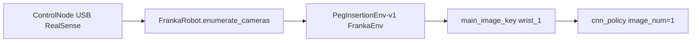
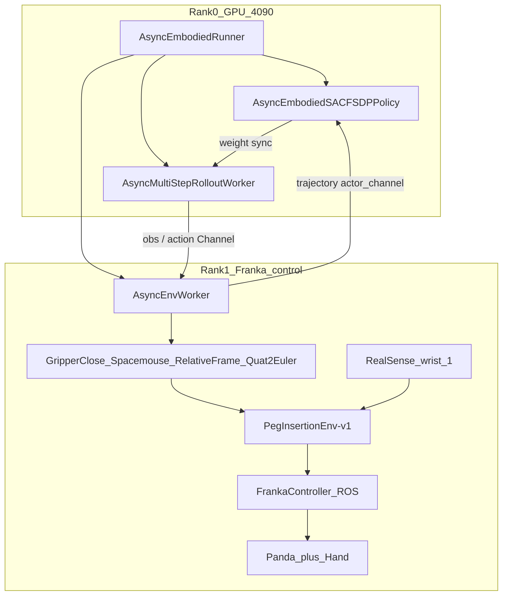
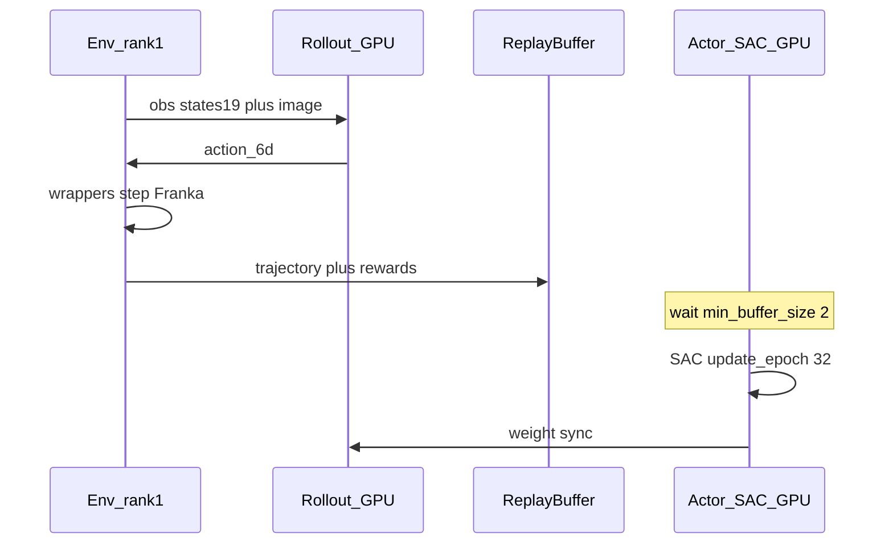
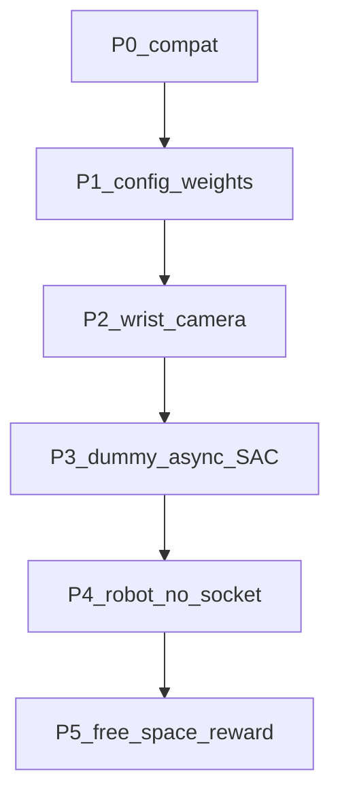

# `realworld_charger_sac_cnn_async`：相机与机械臂证据

本文对照配置 [`examples/embodiment/config/realworld_charger_sac_cnn_async.yaml`](../../examples/embodiment/config/realworld_charger_sac_cnn_async.yaml) 及其 Hydra 依赖、env / 硬件 / 策略代码，回答三件事：

1. 这个插电（charger）例子用了哪几路相机？
2. 需要它们的什么信息？
3. 是不是 Franka 机械臂？

---

## 结论（先看这个）

| 问题 | 答案 |
|------|------|
| 机械臂 | **是，单臂 Franka Emika Panda**。`cluster.node_groups` 里 `hardware.type: Franka`；任务 env 是 `PegInsertionEnv-v1`（`FrankaEnv` 子类）；策略 `policy_setup: panda-ee-dpos`。 |
| 几路相机 | YAML **没有写死路数**。调度器在 **Franka 控制节点** 上枚举 USB 相机，**至少 1 台**，默认后端 **Intel RealSense**。打开后按 serial 顺序命名 `wrist_1`、`wrist_2`、…。 |
| 策略实际用几路 | CNN 默认 `image_num: 1`，env 的 `main_image_key: wrist_1`。**训练只吃第 1 路 RGB（腕部主视角）**。多插几台会被打开并放进 `extra_view_images`，但本配置的 ResNet 策略不会用它们。 |
| 必须有的相机信息 | **序列号 `camera_serials`**（本 YAML 省略 → 启动时自动探测）；**类型 `camera_type`**（省略 → `realsense`）；打开时用默认 **640×480、15 fps、BGR8**；送进策略前 resize 成 **128×128×3 uint8**。可选：`camera_names`、`camera_crop_regions`。控制节点需能 `import pyrealsense2`。 |

官方文档把 charger 与 peg-insertion 列在同一套 Franka 真机流程里：机械臂 Franka Panda，相机默认 RealSense（或 ZED）。见 [`docs/source-zh/rst_source/examples/embodied/franka.rst`](../../docs/source-zh/rst_source/examples/embodied/franka.rst)。

---

## 1. 是 Franka 机械臂

配置把 env 放到名为 `franka` 的 node group，硬件类型就是 `Franka`，并要求填写机器人 IP：

```16:43:examples/embodiment/config/realworld_charger_sac_cnn_async.yaml
cluster:
  num_nodes: 2
  component_placement:
    actor: 
      node_group: "4090"
      placement: 0-0
    env:
      node_group: franka
      placement: 0
    rollout:
      node_group: "4090"
      placement: 0-0
  node_groups:
    - label: "4090"
      node_ranks: 0-0
      ...
    - label: franka
      node_ranks: 1-1
      ...
      hardware:
        type: Franka
        configs:
          - robot_ip: ROBOT_IP
            node_rank: 1
```

任务并不是单独的 `ChargerEnv`，而是复用 peg-insertion 的 Hydra env 包：

```1:3:examples/embodiment/config/realworld_charger_sac_cnn_async.yaml
defaults:
  - env/realworld_peg_insertion@env.train
  - env/realworld_peg_insertion@env.eval
```

该 env 包指定 Gym ID `PegInsertionEnv-v1`：

```1:24:examples/embodiment/config/env/realworld_peg_insertion.yaml
env_type: realworld
...
main_image_key: wrist_1
...
init_params:
  id: "PegInsertionEnv-v1"
```

`PegInsertionEnv-v1` 注册到 `PegInsertionEnv`，而 `PegInsertionConfig` **继承 `FrankaRobotConfig`**：

```23:25:rlinf/envs/realworld/franka/tasks/peg_insertion_env.py
@dataclass
class PegInsertionConfig(FrankaRobotConfig):
    task_description: str = "peg and insertion"
```

调度侧 `FrankaConfig` 的默认夹爪也是 Franka Hand：

```219:226:rlinf/scheduler/hardware/robots/franka.py
    camera_serials: Optional[list[str]] = None
    ...
    camera_type: str = "realsense"
    ...
    gripper_type: str = "franka"
```

策略侧 `cnn_policy.yaml` 的 `policy_setup: "panda-ee-dpos"` 对应 Panda 末端增量动作；本 charger YAML 再把 `action_dim` 改成 **6**（xyz+rpy，无单独夹爪维）。

charger 相对 peg-insertion 改的是任务几何（`target_ee_pose`、更小的 `random_xy_range` / `clip_*`）和 SAC 超参，**不是换臂、也不是换相机栈**。

---

## 2. 用了哪几路相机

### 2.1 本 YAML 没有列出 serial

`env.train.override_cfg` 只有任务与奖励字段，**没有** `camera_serials` / `camera_type`：

```100:112:examples/embodiment/config/realworld_charger_sac_cnn_async.yaml
  train:
    total_num_envs: 1
    override_cfg:
      is_dummy: False
      use_dense_reward: True
      target_ee_pose: TARGET_EE_POSE
      random_xy_range: 0.02
      ...
```

因此相机列表来自 **控制节点硬件枚举**，不是写死的「两台腕部 + 一台全局」那种双臂配置。

### 2.2 未指定 serial 时：插上的全部 RealSense，且至少一台

`FrankaRobot.enumerate()` 在 `camera_serials is None` 时，把该节点上探测到的全部相机 serial 填进去；校验要求 **至少一台**：

```82:138:rlinf/scheduler/hardware/robots/franka.py
            for config in robot_configs:
                camera_type = getattr(config, "camera_type", "realsense")
                cameras = cls.enumerate_cameras(camera_type)

                if config.camera_serials is None:
                    config.camera_serials = list(cameras)
                ...
                if not cameras:
                    raise ValueError(
                        f"No {camera_type} cameras are connected to node rank {node_rank} "
                        f"while Franka robot requires at least one camera."
                    )
```

默认 `camera_type` 是 `"realsense"`，枚举走 `pyrealsense2`。官方相机自检脚本同样只扫 RealSense，并按 **640×480 / 15 fps / bgr8** 开流（与 `CameraInfo` 默认一致）：

```20:36:toolkits/realworld_check/test_franka_camera.py
def main():
    for device in rs.context().devices:
        serial_number = device.get_info(rs.camera_info.serial_number)
        print(serial_number)
    ...
    config.enable_stream(
        rs.stream.color,
        640,
        480,
        rs.format.bgr8,
        15,
    )
```

Env 从 `hardware_info` 拷贝 serial / type（YAML 没写时）：

```234:241:rlinf/envs/realworld/franka/franka_env.py
        if self.config.robot_ip is None:
            self.config.robot_ip = self.hardware_info.config.robot_ip
        if self.config.camera_serials is None:
            self.config.camera_serials = self.hardware_info.config.camera_serials
        if self.config.camera_type is None:
            self.config.camera_type = getattr(
                self.hardware_info.config, "camera_type", "realsense"
            )
```

### 2.3 命名：第 1 台叫 `wrist_1`

```658:687:rlinf/envs/realworld/franka/franka_env.py
    def _build_camera_infos(self) -> list[CameraInfo]:
        ...
        for camera_index, serial in enumerate(ordered_serials, start=1):
            default_name = f"wrist_{camera_index}"
            name = camera_names.get(serial, default_name)
            ...
            camera_infos.append(
                CameraInfo(
                    name=name,
                    serial_number=serial,
                    camera_type=default_camera_type,
                    crop_region=crop_region,
                )
            )
```

peg-insertion / charger 的观测包装指定主图键为 `wrist_1`：

```15:15:examples/embodiment/config/env/realworld_peg_insertion.yaml
main_image_key: wrist_1
```

`RealWorldEnv._wrap_obs` 把 `frames["wrist_1"]` 变成策略输入 `main_images`；其余相机堆成 `extra_view_images`：

```218:228:rlinf/envs/realworld/realworld_env.py
        frames = raw_obs["frames"]
        if self.main_image_key not in frames:
            raise KeyError(
                f"main_image_key {self.main_image_key!r} not in {list(frames)}"
            )
        obs["main_images"] = frames[self.main_image_key]
        raw_images = OrderedDict(sorted(frames.items()))
        raw_images.pop(self.main_image_key)

        if raw_images:
            obs["extra_view_images"] = np.stack(list(raw_images.values()), axis=1)
```

CNN 默认只编一路图：

```34:34:rlinf/models/embodiment/cnn_policy/cnn_policy.py
    image_num: int = 1
```

```7:7:examples/embodiment/config/model/cnn_policy.yaml
image_size: [3, 128, 128]
```

因此：**硬件上可以有 N 台 RealSense，策略在本例子里只使用名为 `wrist_1` 的那一路 RGB。** 若控制节点只插 1 台腕部相机，这就是全部。dummy 对照配置也只放了 **一个** 占位 serial（`["0123456789"]`），侧面说明官方单臂 CNN SAC 按单视角设计。

官方文档硬件清单写的是复数 “cameras”，但 charger YAML **没有**像 `realworld_pnp_*` 那样填 `SERIAL1` / `SERIAL2`。不要把双臂 / PnP 的多相机列表套到这个 charger 配置上。

---

## 3. 需要相机的什么信息

| 字段 | 本 charger YAML | 运行时从哪来 | 用途 |
|------|-----------------|--------------|------|
| **`camera_serials`** | 未写 | 控制节点 `enumerate_cameras("realsense")`；也可手写进 `hardware.configs` 或 `override_cfg` | 打开哪几台设备；`RealSenseCamera` 用 serial `enable_device` |
| **`camera_type`** | 未写 | 默认 `"realsense"` | 选 `create_camera` 后端（`realsense` / `zed` / `lumos`） |
| **`camera_names`** | 未写 | 默认 `wrist_1`, `wrist_2`, … | 必须能对上 `main_image_key: wrist_1` |
| **`camera_crop_regions`** | 未写 | 可选，按 serial 的 `[top, left, bottom, right]` ∈ [0,1] | 裁切后再 resize |
| **分辨率 / fps / 格式** | 未写 | `CameraInfo` 默认 `(640, 480)`、`fps=15`；RealSense 开 `bgr8` | 采集流 |
| **观测尺寸** | 间接来自模型 | env 把帧 resize 到 `128×128×3` uint8 | 对齐 `cnn_policy.image_size` |
| **深度** | 未写 | `enable_depth=False` | 本任务不用 depth |
| **SDK** | 未写 | 控制节点 `pyrealsense2` | `_validate_camera_sdk` 会检查 |
| **机器人 IP** | `ROBOT_IP` 占位 | 必须换成真实 Desk IP | 与相机同属 Franka 控制节点配置 |

`CameraInfo` 默认值：

```30:39:rlinf/envs/realworld/common/camera/base_camera.py
@dataclass
class CameraInfo:
    name: str
    serial_number: str
    camera_type: str = "realsense"
    resolution: tuple[int, int] = (640, 480)
    fps: int = 15
    enable_depth: bool = False
    crop_region: Optional[tuple[float, float, float, float]] | None = None
```

打开 RealSense 时 **必须** serial 出现在 `rs.context().devices` 里：

```36:54:rlinf/envs/realworld/common/camera/realsense_camera.py
        for device in rs.context().devices:
            self._device_info[device.get_info(rs.camera_info.serial_number)] = device
        assert camera_info.serial_number in self._device_info.keys(), (
            f"{self._device_info.keys()=}"
        )
        ...
        self._config.enable_device(self._serial_number)
        self._config.enable_stream(
            rs.stream.color,
            camera_info.resolution[0],
            camera_info.resolution[1],
            rs.format.bgr8,
            camera_info.fps,
        )
```

obs 空间里每路相机是 `128×128×3`：

```603:608:rlinf/envs/realworld/franka/franka_env.py
                "frames": gym.spaces.Dict(
                    {
                        camera_info.name: gym.spaces.Box(
                            0, 255, shape=(128, 128, 3), dtype=np.uint8
                        )
```

官方建议先在控制节点跑 `python -m toolkits.realworld_check.test_franka_camera` 打印 serial；dummy 模式还要把 serial 填进 `override_cfg.camera_serials`。真机 charger 配置走自动探测，但 **控制节点 USB 上必须真有对应 RealSense**，且不要被 `realsense-viewer` 独占。

相机必须挂在 **env / Franka 那台控制机**（本 YAML 的 `node_rank: 1`），不是 4090 训练节点。`FrankaConfig.controller_node_rank` 注释写明：臂和相机可以分机，默认与 env worker 同机。

---

## 4. 数据流（charger 这一条）



1. Rank 1 的 Franka 节点枚举 RealSense serial（≥1）。
2. `FrankaEnv` 打开相机，第一台默认名 `wrist_1`。
3. `RealWorldEnv` 把 `frames["wrist_1"]` 写成 `main_images`。
4. ResNet10 CNN（`image_num=1`）只用这一路 128×128 RGB，加上 19 维 state（本 YAML `state_dim: 19`），输出 6 维动作。

---

## 5. 对本机 5090 + franky 扩展的含义

- 臂：同一套 Franka；本仓库 franky 路径应对 `FrankyPegInsertionEnv-v1`，而不是再造 charger env。
- 相机：charger 例子 **最少 1 台 RealSense**，serial 可用 Step 8a 探测；必须能映射为 `wrist_1`。
- 不要假设本配置需要 ZED / Lumos / 双腕相机，除非改 `camera_type` 或 `image_num`。
- `is_dummy: False`：会真正 `camera.open()`；dummy 对照才用假 serial。

---

# 全链路：从目标位姿到插插座成功

上文只回答「臂是谁、相机怎么用」。下面按官方 YAML / RST / `rlinf/` 实现，把 [`realworld_charger_sac_cnn_async.yaml`](../../examples/embodiment/config/realworld_charger_sac_cnn_async.yaml) 从准备、启动、异步 SAC、人工纠正，到连续插上充电器的过程写完。

**权威来源：** [`docs/source-zh/rst_source/examples/embodied/franka.rst`](../../docs/source-zh/rst_source/examples/embodied/franka.rst)、[`docs/source-zh/rst_source/guides/realworld_robot.rst`](../../docs/source-zh/rst_source/guides/realworld_robot.rst)。RLPD 采集、键盘奖励 wrapper、`realworld_charger_sac_cnn_async_standalone_reward.yaml`、本仓库 `b/x/` franky 扩展只作对照，**不是本配置的必做步骤**。

---

## 6. 全流程总览

### 6.1 没有独立 ChargerEnv

charger 复用 peg-insertion 的 Hydra env 包（`PegInsertionEnv-v1`）。相对插块任务，官方改的是 **几何容差、稠密奖励、算法（在线 SAC 而非 RLPD）**。RST 任务表：

| 任务 | 配置 | 说明（RST） |
|------|------|-------------|
| Peg insertion | `realworld_peginsertion_rlpd_cnn_async` | 在目标末端位姿完成插块插入 |
| Charger | `realworld_charger_sac_cnn_async` | 通过真机奖励反馈完成充电器对齐与插入 |

| 项 | charger YAML | peginsertion RLPD YAML |
|----|--------------|------------------------|
| 任务 env | `env/realworld_peg_insertion` → `PegInsertionEnv-v1` | 同 |
| 算法 | 在线 **SAC**；**无** `data.path` / `demo_buffer` | **RLPD**：`collect_data.sh` + `algorithm.demo_buffer.load_path` |
| 奖励 | `use_dense_reward: True`；`reward.use_reward_model: False` | `use_dense_reward: False`；可键盘打标 |
| 几何 | 更小 `random_xy_range` / `clip_*`（插插座） | 更大工作空间 |
| 动作 | `action_dim: 6`；wrapper 默认 `no_gripper: True` | 视任务 |
| RST 结果 | 约 **1 小时**可学到能连续成功的策略 | 插块视频同页 |

### 6.2 人工操作顺序（对照 RST）

RST「运行 → 前置准备 / 数据采集 / 集群 / 配置 / 启动」映射到 charger 时如下。**第 5 步 RLPD 采集对本配置不是必须。**

| 步 | 谁做 | 做什么 | 产出 |
|----|------|--------|------|
| 1 | 控制节点 | Desk 确认固件；RST 官方 ROS 路径要求 **&lt; 5.9.0**（推荐 5.7.2）；PREEMPT_RT；`install.sh embodied --env franka` | libfranka / ROS / 控制栈 |
| 2 | GPU 节点 | CNN 训练环境（文档示例镜像 `agentic-rlinf0.4-maniskill_libero` 或等价 venv） | 能跑 FSDP + ResNet10 |
| 3 | GPU 节点 | 下载 `RLinf/RLinf-ResNet10-pretrained`，填 YAML 的 `actor.model.model_path` 与 `rollout.model.model_path` | 骨干权重 |
| 4 | 操作员 + 控制节点 | 标定 `target_ee_pose`（详见 [§6.2.1](#621-标定任务的几何原点-target_ee_pose)）：FCI；人手把**已夹住的充电器**对齐插座；读 `getpos_euler` | `target_ee_pose` 六元组 |
| 5 | 控制节点 | `python -m toolkits.realworld_check.test_franka_camera`；相机 USB 必须在 **env / Franka 节点** | serial；可留给自动枚举 |
| 6 | 两节点 | 各 `source ray_utils/realworld/setup_before_ray.sh`（改 `RLINF_NODE_RANK`、Python、ROS）；head：`ray start --head`；worker：`ray start --address=...` | 双节点 Ray |
| 7 | Head（rank 0） | 把 YAML 里 `ROBOT_IP`、`TARGET_EE_POSE`、`python_interpreter_path` 换成真值 | 可提交的配置 |
| 8 | Head | `bash examples/embodiment/run_realworld_async.sh realworld_charger_sac_cnn_async` | 异步训练环 |
| 9 | 控制节点（可选） | 训练中推 **SpaceMouse** 接管；本 YAML **未开** `keyboard_reward_wrapper` | 纠正动作进 replay |
| 10 | 操作员 | TensorBoard：`env/reward`、`env/success_once`、`train/sac/*`、`train/replay_buffer/*` | 直到连续插入 |

启动命令（[`realworld_robot.rst`](../../docs/source-zh/rst_source/guides/realworld_robot.rst)）：

```bash
bash examples/embodiment/run_realworld_async.sh realworld_charger_sac_cnn_async
```

脚本即 [`examples/embodiment/run_realworld_async.sh`](../../examples/embodiment/run_realworld_async.sh)：设 `EMBODIED_PATH` / `REPO_PATH`，调 `train_async.py --config-name realworld_charger_sac_cnn_async`，日志写 `logs/<timestamp>-<config>/`。

### 6.2.1 标定任务的几何原点 `target_ee_pose`

步 4 是在 **标定任务的几何原点**，不是训练、也不是让策略自己去插。官方 RST 称为「获取任务的目标位姿」（[`franka.rst`](../../docs/source-zh/rst_source/examples/embodied/franka.rst) 前置准备）。charger 与 peg-insertion 共用同一套锚点逻辑（亦见 [`knwldge.md` 第 2 节](../knwldge.md)）。

**没有插座/充电器时做不了本步的真实版**；§14 P5 的自由空间点只验奖励公式，不能当正式 `TARGET_EE_POSE`。

#### 这步产出什么、代码拿它干什么

插座在实验台上的位置每次都不一样，YAML 不能写死世界坐标。`target_ee_pose` 表示：

> **插头已经成功插入时，末端（TCP）应在的位姿**（`[x, y, z, roll, pitch, yaw]`，米 + 弧度，欧拉 **xyz**）。

| 用途 | 行为 |
|------|------|
| 成功 / 奖励 | TCP 与该点 xyz 差 ≤ **1 cm**（`reward_threshold` 默认）→ `reward = 1`；否则稠密 `exp(-500·‖Δxyz‖²)` |
| Episode reset | 悬停点 = 目标 **上方 5 cm**（`clip_z_range_high: 0.05`） |
| 安全盒 | 以该点为中心，xy ±2 cm、z 下 5 mm～上 5 cm、rz ±0.35 rad |
| 随机 reset | 在该点附近抖 xy / rz |

文档强调「**已夹住的充电器**」：训练时 [`GripperCloseEnv`](../../rlinf/envs/realworld/common/wrappers/gripper_close.py) 把策略动作裁成 6D，夹爪保持闭合。必须带着插头标定；空爪对准孔再夹上充电器，TCP 会偏一截，成功区对不齐孔。

`getpos`（四元数 7 维）**不要**填进 YAML；只用 `getpos_euler` 的 6 个数。台面或插座一动，必须重标。

#### 官方 ROS 路径怎么做（对照 RST）

固件 **&lt; 5.9.0**、控制节点 catkin / `FrankaController` 时：

1. Desk 解锁、激活 FCI；充电器夹在 Hand 里；插座固定后不要再挪。
2. 按住臂上 **引导键**，把插头送到「已经插到位」的姿态（这是成功时刻的 TCP，**不是** reset 悬停点）。
3. 控制节点：

```bash
export FRANKA_ROBOT_IP=<Desk_IP>
python -m toolkits.realworld_check.test_franka_controller
```

4. 提示符输入 `getpos_euler`，把打印的 6 个数写入 `env.train.override_cfg.target_ee_pose`。
5. 同一时刻只能有一个 libfranka 客户端；标定脚本与 env 不要同时连臂。

本 5090 **不要用上面这条 ROS 脚本**（固件 5.10.0、无 serl）。用下一小节的 franky / libfranka 流程。

#### 本 5090（libfranka / franky）逐步分解

本机基线：机器人 **`172.16.0.2`**（eno1）、原生 **Franka Hand**、Docker `franky-0.19.0`、扩展包 `b/x/`。读位姿用 [`test_franky_controller.py`](../../toolkits/realworld_check/test_franky_controller.py)（底层 `franky` / libfranka），**不要**用 `test_franka_controller.py`（ROS）。脚本默认 `FRANKA_GRIPPER_TYPE=robotiq`，本机必须设成 **`franka`**。

**子步骤 A — 现场与 Desk**

1. 台面清空；插座（若已有）固定。急停可及。
2. 浏览器 `http://172.16.0.2/desk`：解锁、无 safety violation，**激活 FCI**。
3. 宿主机确认网：`ping -c 3 172.16.0.2`，路由走 eno1（`ip route get 172.16.0.2`）。
4. 确认没有别的进程占 FCI（不要同时开 Step 5/8 env、另一个 franky 脚本、Desk 里第二个外部控制客户端）。

**子步骤 B — 进入 franky 容器并切 venv**

标定脚本必须在 **Franka 控制容器** 里跑，不能在宿主机 `.venv`、也不能在 GPU 训练容器（`openvla` / `maniskill_libero`）里跑。镜像默认激活的是 ROS 路径 **`franka-0.15.0`**，对本机固件 5.10.0 **不可用**，必须切到 **`franky-0.19.0`**（libfranka 0.19 + franky）。容器名固定为 `rlinf-franky-5090`；仓库 bind mount 到 `/workspace/RLinf`。

**5. 看容器是否已经在跑（宿主机）**

```bash
docker ps --filter name=rlinf-franky-5090 --format '{{.Names}} {{.Status}}'
```

- **没有输出**：还没起容器 → 做步骤 5a。
- **已有 `rlinf-franky-5090`**：不要再 `docker run`（脚本带 `--name`，会因重名失败）→ 做步骤 5b。

**5a. 新建交互容器（宿主机，本仓库路径）**

```bash
bash /home/nvidia/bt/s/RLinf/b/x/configs/docker_run_franky_5090.sh
```

脚本等价于（见 [`docker_run_franky_5090.sh`](../../b/x/configs/docker_run_franky_5090.sh)）：

```bash
docker run -it --rm --privileged --network host \
  --name rlinf-franky-5090 \
  -v /home/nvidia/bt/s/RLinf:/workspace/RLinf \
  -w /workspace/RLinf \
  rlinf/rlinf:agentic-rlinf0.4-franka \
  bash
```

成功后当前终端就是容器内 root shell，提示符会变，工作目录 `/workspace/RLinf`。`--rm`：你在这个终端 `exit` 后容器删除；`--network host`：容器内也能 `ping 172.16.0.2`。若报 `image not found`，先按 [`franka_3.md` §3](franka_3.md) 拉/建 `agentic-rlinf0.4-franka`。若报 name 冲突，回到步骤 5 用 `docker exec`。

**5b. 容器已在跑：再开一个 shell 进去（宿主机）**

```bash
docker exec -it rlinf-franky-5090 bash
```

每个新 `bash` **不会**继承别的终端里已经 `source` 过的 venv，进容器后必须再做步骤 6。

**6. 切 venv（必须在容器内；必须 `source`）**

推荐一条命令，由 [`setup_before_ray_5090.sh`](../../b/x/configs/setup_before_ray_5090.sh) 完成：设 `REPO_PATH` / `PYTHONPATH`（含 `b/x`）/ `FRANKA_ROBOT_IP=172.16.0.2` / `FRANKA_GRIPPER_TYPE=franka`，并 **`source switch_env franky-0.19.0`**。

```bash
source /workspace/RLinf/b/x/configs/setup_before_ray_5090.sh
```

等价手写（不要省略 `source`；直接 `switch_env ...` 不会改当前 shell 的 `PATH`）：

```bash
source switch_env franky-0.19.0
```

`switch_env` 定义在镜像 `/usr/local/bin/switch_env`，实际是 `source /opt/venv/<名字>/bin/activate`。**不要** `switch_env franka-0.19.0`（ROS 名）或停留在默认 `franka-0.15.0`。

**6 之后立刻自检（不过就不要进子步骤 C）：**

```bash
which python
# 必须是：/opt/venv/franky-0.19.0/bin/python

echo "$FRANKA_ROBOT_IP $FRANKA_GRIPPER_TYPE"
# 必须是：172.16.0.2 franka

python -c "import franky; print('franky ok')"
ls /opt/venv | grep franky
# 应看到 franky-0.19.0（可能还有 franky-0.15.0，标定不用它）
```

若 `switch_env not found`：当前不在该 Docker 镜像里（例如宿主机 bash）。若 `Environment franky-0.19.0 does not exist`：镜像过旧，见 `franka_3.md` §3.1。若 `which python` 仍是 `/opt/venv/franka-0.15.0/bin/python`：步骤 6 没 `source` 成功，不要继续。

**子步骤 C — 夹住充电器（无插头则跳过真实标定，改走 §14 P5）**

这里用的是官方 **`test_franky_controller`**（中间有 **y**），不是 `test_franka_controller`。两条 toolkit 入口长得很像，控制栈完全不同，**不能互换**：

| 模块 | 底层类 | 控制路径 | 本 5090 |
|------|--------|----------|---------|
| `toolkits.realworld_check.test_franky_controller` | [`FrankyController`](../../rlinf/envs/realworld/franka/franky_controller.py) | **libfranka**，经 Python 包 `franky` 直连 FCI | **用这个**（固件 5.10.0） |
| `toolkits.realworld_check.test_franka_controller` | [`FrankaController`](../../rlinf/envs/realworld/franka/franka_controller.py) | **ROS**：`rospy` + `serl_franka_controllers` | **不要用**（无 catkin / serl，固件 ≥ 5.9） |

`FrankyController` 模块头写明 *backed by libfranka via the franky bindings*；交互脚本 docstring 也写 *Only one client can hold a libfranka session*。它仍是仓库里的官方程序，只是走 franky 栈：本机没有 ROS 节点、也不经过 `serl`。交互命令（`open` / `close` / `getpos_euler`）只是 REPL，和 ROS 那条脚本对操作员看起来类似。

7. 启动交互控制器（会占用 **libfranka** 会话，之后引导臂仍可用臂上引导键）：

```bash
export FRANKA_ROBOT_IP=172.16.0.2
export FRANKA_GRIPPER_TYPE=franka
python -m toolkits.realworld_check.test_franky_controller
```

8. 提示符 `cmd>` 后：`open` → 把充电器放入夹爪（朝向与训练时一致）→ `close` 或 `grip 128`（夹紧即可）。夹爪动作只在这一步做；正式 charger 训练由 `GripperCloseEnv` 保持闭合。

**子步骤 D — 人手插到「成功」姿态**

9. **按住 Panda 引导键**，把腕部连同插头送进插座，直到认定已经插到位（深度、滚转都对）。
10. **不要**把 factory `HOME_JOINTS` 或 reset 悬停点当成目标；标定的是 **插到位时的 TCP**。reset 会由程序自动加 +5 cm。
11. 保持该姿态（可松开引导键，但不要再碰臂）。

**子步骤 E — 读欧拉位姿**

12. 同一 `cmd>` 输入：

```text
getpos_euler
```

得到一行 6 个数，例如 `[0.51  0.02  0.08  3.14  0.00  0.05]`（顺序 `[x, y, z, roll, pitch, yaw]`）。

13. 可选再敲一次 `getpos_euler` 确认稳定。输入 `q` **退出脚本**，释放 FCI，否则后面 env 连不上臂。

备选（只读位姿、不经 Ray）：容器内已 `source setup_before_ray_5090.sh` 后，可用 [`tcp_probe.py`](../../b/x/franky_ext/tcp_probe.py) 同类子进程读 `O_T_EE`。仍须 **先** 夹好插头并引导到成功姿态；读完进程退出即释放 FCI。夹爪开合仍建议走步骤 7–8 的交互脚本。

**子步骤 F — 写入配置**

14. 把 6 个数写进将要提交的 YAML（官方 charger 或 franky 适配副本），**不要**改仓库里未替换占位符的上游文件除非你明确要改本机副本：

```yaml
env:
  train:
    override_cfg:
      target_ee_pose: [x, y, z, roll, pitch, yaw]
```

15. 引导臂离开插座（可再开一次交互脚本 `home`，或继续按引导键撤出）。插座与台面此后勿动。

**子步骤 G — 常见失败**

| 现象 | 原因 / 处理 |
|------|-------------|
| `Couldn't connect` / 抢 FCI | 先 `q` 停旧脚本；不要并行 Step 5 env |
| 夹爪 `NotImplementedError` / Robotiq | 未 `export FRANKA_GRIPPER_TYPE=franka` |
| `getpos` 7 个数填进 YAML | 必须用 `getpos_euler` |
| 空爪对准孔再夹插头 | TCP 偏移，成功区偏掉；必须带着充电器标 |
| 用 ROS `test_franka_controller` | 本机 5.10.0 无 serl；改用 franky 脚本 |

标定结束。训练（§6.2 步 8）时 env 从该点上方 5 cm 开始，在安全盒内往这个 TCP 插。

### 6.3 成功判据（代码，不是视频观感）

[`FrankaEnv._calc_step_reward`](../../rlinf/envs/realworld/franka/franka_env.py)（charger 未开 reward model）：

1. TCP 四元数 → 欧拉，与 `target_ee_pose` 比绝对差 `target_delta`。
2. **xyz** 全部 ≤ `reward_threshold[:3]`（PegInsertion 默认 `[0.01, 0.01, 0.01]` m）→ `reward = 1.0`，hold 计数 +1；否则 hold 清零。
3. `use_dense_reward: True` 且未进目标区：`reward = exp(-500 * sum(Δxyz²))`。
4. `terminated = (reward == 1.0) and (hold ≥ success_hold_steps)`。`success_hold_steps` 默认 **1**（进区即成功）。
5. `truncated = _num_steps ≥ max_num_steps`（env 包 `max_episode_steps: 100`）。
6. charger 的 `env.train.ignore_terminations: True`（来自 `realworld_peg_insertion.yaml`）：成功 terminate 被抹掉，episode 可继续记 `success_at_end`；训练仍把 `reward==1` 当成功信号。

RST：peg-insertion 与 charger 在约 1 小时内可学到能**持续成功**的策略；曲线/视频见 `franka.rst`「真实世界结果」。

---

## 7. 「数据准备」在本配置里指什么

RST「数据采集」一节标题就是 **「对于 RLPD 实验」**。peginsertion RLPD YAML 有：

```yaml
algorithm:
  demo_buffer:
    load_path: "/path/to/demo_data"
```

charger YAML **没有** `demo_buffer`、**没有** `data.path`。因此：

- **不要**为跑通 charger SAC 先跑 `collect_data.sh` 再上传 `data.pkl`（那是 RLPD / 部分 DAgger 路径）。
- 本配置的「数据」是训练过程中 **在线 rollout 写入 replay** 的 transition；`min_buffer_size: 2` 条轨迹后 actor 才开始 `run_training`。

操作员需要事先准备的是：

| 准备项 | 写到哪 | 为何必须 |
|--------|--------|----------|
| `target_ee_pose` | `env.train.override_cfg` | 奖励、reset 悬停点、safety box 的锚 |
| ResNet10 ckpt | `actor` / `rollout` 的 `model_path` | CNN 骨干 |
| `ROBOT_IP` | `cluster.node_groups[].hardware.configs` 或 env `ROBOT_IP` | FCI |
| 相机在控制节点 | USB；可不写 serial | `wrist_1` 观测 |
| 两节点 Python 路径 | `env_configs.python_interpreter_path` | Ray worker 解释器 |

`PegInsertionConfig.__post_init__`（[`peg_insertion_env.py`](../../rlinf/envs/realworld/franka/tasks/peg_insertion_env.py)）在填入 `target_ee_pose` 后计算：

- `reset_ee_pose = target + [0, 0, clip_z_range_high, 0, 0, 0]` — charger 的 `clip_z_range_high: 0.05` → reset 在目标上方 **5 cm**。
- `ee_pose_limit_{min,max}` 由 `clip_x/y/z/rz_range` 围成安全盒；charger xy ±2 cm、z 从目标下 5 mm 到上 5 cm、rz ±0.35 rad。
- `random_xy_range: 0.02`、`random_rz_range: 0.35`：reset 时在盒内随机，避免只学一个点。
- `compliance_param` / `precision_param`：笛卡尔阻抗刚度（reset 时 `reconfigure_compliance_params`）。
- `action_scale = [0.02, 0.1, 1]`：位置 / 姿态 / 夹爪缩放。

这是几何与控制参数的「数据准备」，不是离线专家包。

---

## 8. 静态架构（进程与硬件）

官方拓扑：**1 个 GPU 节点（训练/rollout）+ 1 个 Franka 控制节点（无 GPU 也可）**，同一局域网；臂只与控制节点互通。



### 8.1 启动时创建的 Worker

[`train_async.py`](../../examples/embodiment/train_async.py)：`loss_type == "embodied_sac"` 时

- `runner_cls = AsyncEmbodiedRunner`
- `actor_worker_cls = AsyncEmbodiedSACFSDPPolicy`
- rollout：`AsyncMultiStepRolloutWorker`
- env：`AsyncEnvWorker`
- **reward 组：本 YAML `reward.use_reward_model: False`，不 launch `EmbodiedRewardWorker`**

`standalone_reward` 变体才会在 4090 上再放 `reward` placement；那是另一份 YAML。

### 8.2 Placement（charger YAML）

```yaml
cluster:
  num_nodes: 2
  component_placement:
    actor:   { node_group: "4090",  placement: 0-0 }
    env:     { node_group: franka,  placement: 0 }
    rollout: { node_group: "4090",  placement: 0-0 }
  node_groups:
    - label: "4090"
      node_ranks: 0-0
    - label: franka
      node_ranks: 1-1
      hardware:
        type: Franka
        configs:
          - robot_ip: ROBOT_IP
            node_rank: 1
```

- actor / rollout **同卡 collocated**（`0-0`）。
- env 在 rank 1；`hardware.type: Franka` 触发控制节点枚举臂 + 相机。
- `python_interpreter_path` 必须换成各节点真实 venv；未设置的 `robot_ip` / `camera_serials` 可在该节点 `ray start` **之前**用全大写环境变量填充（`realworld_robot.rst`）。

### 8.3 控制栈（官方路径）

`PegInsertionEnv` → `_setup_hardware` → **`FrankaController`（ROS + serl）**，不是 franky。RST 要求控制节点 source catkin。夹爪默认 Franka Hand；charger 用 `GripperCloseEnv` 把策略动作裁成 6D，夹爪保持闭合（插头已夹住）。

---

## 9. 观测 / 动作：数据怎么变

### 9.1 原始 env obs（`FrankaEnv._get_observation`）

| 键 | 形状 | 含义 |
|----|------|------|
| `state.tcp_pose` | 7 | xyz + quat |
| `state.tcp_vel` | 6 | 末端速度 |
| `state.gripper_position` | 1 | 夹爪 |
| `state.tcp_force` | 3 | 力 |
| `state.tcp_torque` | 3 | 力矩 |
| `frames[wrist_1]` | 128×128×3 uint8 | 主视角 RGB |

`cnn_policy.yaml` 默认 `state_dim: 29`、`action_dim: 4`；**charger YAML 覆盖为 `state_dim: 19`、`action_dim: 6`**，必须与下面 concat 一致。

### 9.2 Wrapper 栈（`apply_single_arm_wrappers`）

`realworld_peg_insertion.yaml`：`use_spacemouse: True`，`no_gripper` 未写 → 默认 **True**。

顺序（非 dummy）：

1. **`GripperCloseEnv`**：action space `(7,)→(6,)`；step 时补第 7 维 0；若有 `intervene_action` 也切到 6 维。
2. **`SpacemouseIntervention(gripper_enabled=False)`**：有输入则覆盖策略动作，写 `info["intervene_action"]`。
3. 无 `keyboard_reward_wrapper` → 不包键盘奖励。
4. **`RelativeFrame`**（`use_relative_frame` 默认 True）：观测/动作变到相对末端（或 reset）坐标系。
5. **`Quat2EulerWrapper`**：`tcp_pose` 7 → **6**（xyz + euler）。

然后 `RealWorldEnv._wrap_obs`：

```python
full_states = np.concatenate([state[k] for k in sorted(state)], axis=-1)
obs["states"] = full_states          # 6+6+1+3+3 = 19
obs["main_images"] = frames["wrist_1"]
```

`sorted(state)` 键序：`gripper_position`, `tcp_force`, `tcp_pose`, `tcp_torque`, `tcp_vel`。

### 9.3 策略动作 → 真机

- Rollout CNN：`policy_setup: panda-ee-dpos`，输出 6D 连续增量（xyz + rpy）。
- `action_scale [0.02, 0.1, 1]` 在 env 内缩放到米 / 弧度量级。
- `FrankaEnv._move_action` → `controller.move_arm` → 笛卡尔阻抗跟踪 TCP。
- 安全盒 `clip_*` 限制 `next_position`，避免冲出插插座附近。

### 9.4 SpaceMouse 对 action 的改写

[`SpacemouseIntervention.action`](../../rlinf/envs/realworld/common/wrappers/spacemouse_intervention.py)：专家位移范数 &gt; 0.001（或按键）则刷新 `last_intervene`；**之后 0.5 s 内**返回 `(expert_a, True)`，否则 `(policy_action, False)`。charger 关闭夹爪通道，专家动作已是 6D。`step` 在 `replaced` 时把 `info["intervene_action"]` 设为实际执行动作。

`RealWorldEnv.step` 再写 `intervene_flag` / 张量化的 `intervene_action`。EnvWorker 在组 trajectory 时：

```python
self.trajectory_builders[stage_id].update_last_actions(
    env_output.intervene_actions, env_output.intervene_flags
)
```

即 **replay 里存的是真机执行的动作**（人接管时是人的动作），不是被覆盖掉的策略输出。

---

## 10. 动态架构：异步训练环

[`AsyncEmbodiedRunner.run`](../../rlinf/runners/async_embodied_runner.py) 先 `update_rollout_weights`，再**并行**挂起：

| 任务 | Worker | 通道 |
|------|--------|------|
| `env.interact` | AsyncEnvWorker | 收 rollout 动作；发 obs 给 rollout；发 trajectory 给 actor；metric → `EnvMetric` |
| `rollout.generate` | AsyncMultiStepRolloutWorker | `collect_transitions: True`；CNN 前向 |
| `actor.recv_rollout_trajectories` | 后台线程 `channel.get()` → 队列 | 不阻塞训练 |
| 主循环 `actor.run_training` | 等 `replay_buffer` ≥ `min_buffer_size`（**2 条轨迹**） | 每步 `update_epoch: 32` 次 SAC 更新 |

buffer 不够时 `run_training` 返回空/假，runner `skip_step` 并 `sleep(1)`，env/rollout **继续采**。够了之后 `global_step += 1`，按间隔把 actor 权 sync 回 rollout。

charger SAC 超参（与 RLPD peg 不同）：

| 键 | charger | 含义 |
|----|---------|------|
| `gamma` | 0.8 | 折扣（比 RLPD 的 0.96 更短视，贴插入） |
| `tau` | 0.01 | 目标 Q 软更新 |
| `bootstrap_type` | `always` | 引导回报 |
| `update_epoch` | 32 | 每步梯度更新轮数 |
| `target_entropy` | -4 | 约 `-action_dim` |
| `micro/global_batch_size` | 256 | FSDP `no_shard` |
| `replay.cache_size` / `sample_window_size` | 200 | 只从最近 200 条轨迹采样 |

`critic.use_critic_model: False`：Q 头在 **同一 CNN 策略网络**（`add_q_head: True`），不是独立 critic worker。



---

## 11. 人工介入如何进 replay、如何「纠正」

### 11.1 和 HG-DAgger / RLPD 的差别

| | charger SAC | RLPD peginsertion | 在线 HG-DAgger |
|--|-------------|-------------------|----------------|
| 离线 demo | **无** | `demo_buffer.load_path` | 可选 `demos/` |
| 训练中 SpaceMouse | env 默认开；热切换 | 同（wrapper） | 同 |
| 人动作进哪 | **主 `replay_buffer`**（`update_last_actions` 改 last action） | 主 replay + 若有 flag 再 `extract_intervene_traj` → **demo_buffer** | 常 `extract_intervene_traj`，只训干预步 |
| charger YAML `demo_buffer` | **未配置** → `self.demo_buffer is None` | 有 | n/a |

[`AsyncEmbodiedSACFSDPPolicy._drain_received_trajectories`](../../rlinf/workers/actor/async_fsdp_sac_policy_worker.py)：

```python
self.replay_buffer.add_trajectories(recv_list)
if self.demo_buffer is not None:
    ... traj.extract_intervene_traj() → demo_buffer
```

charger 第二条不执行。人纠正 = **执行轨迹里的 action 已经是人的 6D**，SAC 当普通 `(s, a_human, r, s')` 学。策略自己乱动的步同样进 buffer，靠稠密奖励把「靠近插座」标高、「偏离」标低。

### 11.2 操作建议（文档语义，非额外脚本）

- RST：空间鼠标「用于远程操控数据采集**或在训练过程中进行人工干预**」。charger 主要用后半句。
- 策略要撞限位 / 对不齐孔时，推 SpaceMouse 把插头送进目标区，让 `reward→1` 的 transition 进入最近 200 条窗口。
- **不必**停 `run_realworld_async.sh`。
- 键盘 `a/b/c` 打标：RST 可选；须设 `env.train.keyboard_reward_wrapper` 与 `RLINF_KEYBOARD_DEVICE`。**本 charger YAML 未设**，成功不依赖按键。

---

## 12. 软硬件调用链（单步）

```text
[控制节点 USB]
  RealSense → FrankaEnv._get_camera_frames → resize 128×128
[控制节点 CPU]
  RelativeFrame / Quat2Euler → RealWorldEnv._wrap_obs
    → states(19) + main_images
  Channel →
[GPU rank0]
  AsyncMultiStepRolloutWorker CNN (ResNet10 + state MLP)
    → action(6) panda-ee-dpos
  Channel →
[控制节点]
  GripperClose 补第7维0
  Spacemouse 或覆盖为专家6D
  PegInsertionEnv.step
    clip 到 safety box
    _move_action → FrankaController.move_arm
      → ROS / serl 笛卡尔阻抗 → libfranka FCI → Panda
    _calc_step_reward(target_ee_pose, dense/sparse)
  trajectory 含 reward / intervene_flag → actor_channel
[GPU]
  ReplayBuffer → SAC Q/actor/alpha 更新 → sync 回 rollout
```

力/力矩在 obs 里，本配置奖励 **只用 TCP xyz 相对目标**，不用力闭环。夹爪在 GripperClose 下本任务不作为策略输出。

---

## 13. 与本机 5090 / franky 扩展的边界

| 官方 charger | 本仓库 5090 + `b/x/franky_ext` |
|--------------|-------------------------------|
| ROS `FrankaController`，固件 **&lt; 5.9.0** | franky / libfranka 0.19，固件 **5.10.0** |
| 双机：4090 + NUC | 单机双容器或切 Gym ID `FrankyPegInsertionEnv-v1` |
| env 包 `PegInsertionEnv-v1` | 扩展注册 `Franky*` ID，不改官方 YAML |
| 成功 = 真机连续插入 + `env/reward` / `success_once` | Step 7 dummy SAC **只验链路**，不算插插座成功 |

要把官方 charger YAML 跑在 franky 栈上，需要换 Gym ID、控制节点 Python、固件/控制器，而不是只改 `ROBOT_IP`。相机与 `state_dim`/`action_dim` 约定仍适用（见本文 §1–4）。

---

## 14. 预检查：无插座、仅腕部相机

约束：**没有充电器/插座道具**；Franka **只装腕部 RealSense**。目标不是「现在就插入成功」，而是判断本机之后 **有没有资格去跑** [`realworld_charger_sac_cnn_async.yaml`](../../examples/embodiment/config/realworld_charger_sac_cnn_async.yaml)（或 franky 适配等价配置）。

腕部单相机 **不是 blocker**（§1–4）：YAML 未写死 serial，枚举 ≥1 台即可；`image_num: 1`、`main_image_key: wrist_1`。不要为此去买第二台相机。也不要把下载充电器列为预检必做。

**不新写脚本。** 用官方 `toolkits/realworld_check/*`、RST dummy、以及本仓库已有 `b/x/scripts/step3_*` / `step8_*` / Step 7。

### 14.1 预检查能证明什么、不能证明什么

两层必须分开，否则会把 dummy PASS 当成插插座成功（§13）。

| 预检查能证明 | 预检查不能证明 |
|--------------|----------------|
| 训练 **进程能拉起**（Hydra、Ray、actor/rollout/env、ResNet 路径、19 维 state / 6 维 action） | 策略在真实孔位上 `reward=1` 连续成功 |
| 腕部相机 → `wrist_1` → `main_images` 128×128 | `target_ee_pose` 对准真实插座（无道具无法标定孔） |
| 臂能 `move_arm` / 笛卡尔阻抗 / reset 悬停几何自洽 | 插头–插座接触、过孔、力/卡滞 |
| 稠密奖励公式在自由空间随距离变化 | RST 约 1 小时训练曲线 |

无插座时用 **自由空间代理目标**（P5）：人手把腕部停在桌面上方安全点，`getpos_euler` 当作临时 `TARGET_EE_POSE`，只验「进约 1 cm 球 `reward→1` / 离开为 dense」。**这不是充电器任务几何。**

### 14.2 通过标准（先看这张表）

| 结果 | 含义 | 下一步 |
|------|------|--------|
| **P0 官方路径 FAIL** | 固件 ≥5.9 或没有 ROS/serl | **不要**直接提交官方 charger YAML；走 §13 franky 适配，P0 对适配路径可记 PASS |
| **P1+P2+P3 PASS** | 软件侧能启动异步 SAC 环 | 可以上真机 P4 |
| **P4+P5 PASS** | 真机控制 + 奖励公式可用 | 仍 **≠** 插插座成功 |
| **P0–P5 全过（适配或官方）** | 链路与奖励管道就绪 | 插座到位后 **重测真实 `target_ee_pose`** 再长训 |



命令分两列，**不要混用** Gym ID `PegInsertionEnv-v1`（官方 ROS）与 `FrankyPegInsertionEnv-v1`（本机扩展）。

### 14.3 P0 — 兼容性门闩（无道具）

官方 YAML 假定：Gym **`PegInsertionEnv-v1`** → ROS [`FrankaController`](../../rlinf/envs/realworld/franka/franka_controller.py)；RST 固件 **&lt; 5.9.0**（推荐 5.7.2）+ catkin；**两节点** GPU `4090` + Franka rank 1。

本 5090（[`franka_3.md`](franka_3.md)）：固件 **5.10.0**、franky、常单机。P0 必须二选一，不能假装官方 YAML 原样可跑。

| 检查 | 官方 ROS 控制节点 | 本机 franky 容器 |
|------|-------------------|------------------|
| Desk Control 版本 | `&lt; 5.9.0` 才 PAN 官方路径 | `5.10.0` → 官方 YAML **FAIL**，适配路径继续 |
| 控制 Python | `import rospy` 与 serl 控制器包 | `import franky`（`switch_env franky-0.19.0`） |
| 集群 | `num_nodes: 2`，rank0 GPU / rank1 臂 | 单机需改 placement 或双容器 + 两个 `RLINF_NODE_RANK` |
| Gym | `PegInsertionEnv-v1` | `FrankyPegInsertionEnv-v1`，**不要**对 franky 栈提交未改的官方 YAML |

P0 记录方式：同一行写「官方 YAML：FAIL/PASS」和「适配路径：FAIL/PASS」。

### 14.4 P1 — 配置与权重（无机器人也可）

- 把 YAML 占位换成真值或本地副本覆盖：`ROBOT_IP`、`actor.model.model_path`、`rollout.model.model_path`。磁盘上须有 `resnet10_pretrained.pt`（RST 下载 `RLinf/RLinf-ResNet10-pretrained`）。
- `target_ee_pose` 可先填 P5 的自由空间六元组。
- **不要**把 `state_dim` / `action_dim` 改回 `cnn_policy.yaml` 默认 29 / 4；charger 与 dummy 对照都是 **19 / 6**。
- RST dummy：还要把 camera serial 写进 `env.train/eval.override_cfg.camera_serials`。真机 charger 可自动枚举，但 dummy **必须**占位 serial。
- `python_interpreter_path` 指向该节点实际 venv。

### 14.5 P2 — 仅腕部相机（无插座）

验收：≥1 个 RealSense serial；第一台能映射为 `wrist_1`；不要让 `realsense-viewer` 占设备。一台都没有时，真机 `is_dummy: False` 会在 `FrankaRobot.enumerate` 报「至少一台相机」。

| | 官方 ROS 控制节点 | 本机 franky |
|--|-------------------|-------------|
| 枚举+开流 | `python -m toolkits.realworld_check.test_franka_camera`（640×480、15 fps、bgr8） | `python b/x/scripts/step8_detect_cameras.py` |
| env 非零帧 | dummy 填 serial 后看 `main_images`；或真机一步 | `python b/x/scripts/step8_test_env_camera.py`（`wrist_1_present`） |

P2 **不要求**第二路相机、深度、ZED。

### 14.6 P3 — Dummy 异步 SAC（无臂、无插座）

验的是 **charger 算法骨架**（PegInsertion 包装 + 19/6 + SAC），不是插孔。

RST「检查环境」：`is_dummy: True` + 填 `camera_serials`。可参考 [`realworld_dummy_franka_sac_cnn.yaml`](../../examples/embodiment/config/realworld_dummy_franka_sac_cnn.yaml)（单节点 `0-0`，`gamma: 0.8`，`state_dim: 19`，`action_dim: 6`，已接近 charger）。

推荐：**复制** charger YAML 到本地（不要改仓库官方文件），覆盖例如：

```yaml
cluster:
  num_nodes: 1
  component_placement:
    actor: 0-0
    env: 0-0
    rollout: 0-0
env:
  train:
    override_cfg:
      is_dummy: True
      camera_serials: ["<P2 打出的 serial 或占位>"]
      target_ee_pose: [0.5, 0.0, 0.3, 3.14, 0.0, 0.0]  # 任意；dummy 不连臂
algorithm:
  replay_buffer:
    min_buffer_size: 1
runner:
  max_epochs: 2
```

Head：

```bash
bash examples/embodiment/run_realworld_async.sh <本地副本名>
```

PASS：出现 `train/sac/*`，无 FSDP / `state_dim` 形状错误。

本机 Step 7b PASS **不能代替 P3**：7b 用的是 `FrankyFrankaEnv-v1` dummy，不是官方 `PegInsertionEnv-v1` 包装。适配路径若 P3 改跑 `b/x/configs/realworld_franky_dummy_sac_gpu.yaml`，须在记录里写明 Gym ID，避免和官方 charger 混淆。

### 14.7 P4 — 真机、无插座（工作空间清空）

臂会动。确认 Desk FCI、急停可用、台面无障碍。

| | 官方 ROS | 本机 franky |
|--|----------|-------------|
| 控制器 | `export FRANKA_ROBOT_IP=...`；`python -m toolkits.realworld_check.test_franka_controller` → `home`、`getpos_euler` | `python b/x/scripts/step3_test_controller.py`（home、nudge、阻抗） |
| 夹爪 | charger 训练走 `GripperCloseEnv`，策略不张爪；无插头可不测开合 | 同；不必为预检夹充电器 |
| 相机+真机 | 真机 `gym.make` 一步，`main_images` 非全零 | Step 8c `step8_test_env_camera.py` |

**不要**把 factory `HOME_JOINTS`（Step 3）当成插座 `target_ee_pose`。P4 只证明臂和相机在空台面上能被 Controller/env 驱动。

SpaceMouse：有则推一下看日志/`intervene_flag`；**无鼠标不阻塞**预检（YAML 默认 `use_spacemouse: True`，无设备时干预分支不替换动作即可）。

### 14.8 P5 — 自由空间奖励代理（无插座能测的任务逻辑上限）

1. 把臂停在空旷点 A（桌面上方，周围 ≥ `clip_x/y` 2 cm、上方 ≥ `clip_z_range_high` 5 cm，因为 `reset_ee_pose = target + [0,0,0.05,…]`）。
2. `getpos_euler` → 临时写入 `env.train.override_cfg.target_ee_pose`（官方脚本或 franky 交互 `getpos_euler`）。
3. 短跑或单 env：TCP 远离 A 时 `reward = exp(-500 * ||Δxyz||²)` ∈ (0,1)；进入约 1 cm 球（`reward_threshold` xyz 默认 0.01 m）应变 **1.0**。
4. **做完删掉/改掉该 pose**，以免日后当真实插座用。

这只证明 `_calc_step_reward` + dense 开关在真机状态上算得通。有插座之后必须 **重新** `getpos_euler` 对准孔口再长训。

### 14.9 和正式长训的衔接

- 预检 **不跑** `max_epochs: 8000`，不追求 RST 一小时曲线。
- 官方路径 P0 FAIL：后续用 franky Gym ID + 本机 GPU 容器（§13），不要只改 `ROBOT_IP` 提交官方 YAML。
- 插座到位后：P2 相机可复用；P5 的自由空间 pose **作废**；再走 §6.2 步 4 标定真实 `target_ee_pose`。

---

## 15. 其它问题

训练过程中人要盯安全、必要时接管，以及充电器掉了/卡住时收拾现场。**插进、拔出、归位主要由程序完成**，不是每步都靠人拔插头。下面按代码行为说明。

### 15.1 插进插座后：机械臂自己拔，还是人拔？

**机械臂自己拔。** 成功只看 TCP 是否进入 `target_ee_pose` 附近 1 cm（`reward_threshold` xyz 默认 0.01 m）。charger 的 env 包设了 `ignore_terminations: True`：插成功**不会立刻 reset**，这一回合会继续跑到 `max_episode_steps: 100`，超时 `truncated` 后 `auto_reset` 才归位（[`RealWorldEnv.step`](../../rlinf/envs/realworld/realworld_env.py)）。

归位在 [`PegInsertionEnv.go_to_rest`](../../rlinf/envs/realworld/franka/tasks/peg_insertion_env.py)：

1. 发夹爪 `-1`（闭合）。训练时 [`GripperCloseEnv`](../../rlinf/envs/realworld/common/wrappers/gripper_close.py) 本来就把策略动作裁成 6D、闭爪。
2. **沿当前 TCP 抬高 10 cm**（这次 `_interpolate_move` **不经过安全盒**）。插头还夹在手里，等于把充电器从插座里拔出来。
3. 再走到 `reset_ee_pose`（§15.4）。

人只有在这些情况才动手：插头卡死拔不动、中途掉落、FCI 碰撞停机。处置步骤见 **§15.5**（不是一律拍急停）。

### 15.2 没插进、却戳到插座：怎么避免损坏？

程序能**限制活动范围和接触力上限**，**没有**「检测到戳孔就自动缩回」的逻辑。人仍要盯着。

| 层 | 做什么 | 局限 |
|----|--------|------|
| 笛卡尔安全盒 | 策略每步目标位姿裁进盒子。charger：目标点 xy **±2 cm**，z 从目标下 **5 mm** 到上 **5 cm**，rz **±0.35 rad**（`clip_*` / `ee_pose_limit_*`） | 对偏时仍允许压到目标深度附近，会顶在面板上 |
| 笛卡尔阻抗 | ROS/`serl`：`compliance_param` 里跟踪误差约毫米级，接触力较小。本机 franky：`reconfigure_compliance_params` 取平移刚度 **2000 N/m**，误差裁剪默认约 **5 cm**（`RLINF_CART_ERR_CLIP_M`），接触力可以大得多 | 不是「碰到就停」 |
| FCI 碰撞 reflex | libfranka `set_collision_behavior`（约 80 Nm / 100 N）超限停机 | 阈值偏高，塑料插座可能已经变形；停机后要人在 Desk 恢复 |

人侧：peg-insertion YAML 默认 `use_spacemouse: True`。推 SpaceMouse 会覆盖策略动作（约 0.5 s 窗口，见 §9.4）。顶死、异响时推鼠或按急停。插座必须固定，不要用松动排插。

### 15.3 策略没学好时，乱动范围怎么控制？

靠**安全盒 + 单步尺度**，不是靠人画圈。工作空间围着标定的 `target_ee_pose` 自动算（[`PegInsertionConfig.__post_init__`](../../rlinf/envs/realworld/franka/tasks/peg_insertion_env.py)），charger YAML 覆盖为：

- 盒子：xy ±2 cm；z ∈ [目标−5 mm, 目标+5 cm]；roll/pitch ±0.01 rad；yaw ±0.35 rad。
- 每步：`action_scale = [0.02, 0.1, 1]` → 平移最多约 **2 cm/步**，姿态约 0.1 rad/步。
- 策略动作先 clip 到 `[-1, 1]`，再经 `_clip_position_to_safety_box`。

早期乱探索也是在插座正上方一小块里拱，不会扫整张桌子。把 `clip_*` / `random_*` 改大则更容易学、也更容易戳坏。盒子之外的人控是 SpaceMouse 和急停。

### 15.4 插错了要不要归位？归到哪里、怎么设？

**要归位，但不是工厂关节 home。** 失败没有单独检测：没进 1 cm 成功区就一直试，直到 100 步超时，然后同样走 `go_to_rest`（先抬 10 cm，再去悬停点）。

悬停点由目标自动加高，**不用手填一套 home 位姿**：

```text
reset_ee_pose = target_ee_pose + [0, 0, clip_z_range_high, 0, 0, 0]
             = 目标上方 5 cm   # charger 的 clip_z_range_high: 0.05
```

`enable_random_reset: True` 时，还会在该点附近抖 xy **±2 cm**、绕 z **±0.35 rad**（`random_xy_range` / `random_rz_range`），避免只从一个点学。

工厂关节位 `joint_reset_qpos`（`FrankaRobotConfig` 默认约 `[0, 0, 0, -1.9, 0, 2, 0]`）只在每 **`joint_reset_cycle: 20000`** 次 reset 才走一次，日常训练可当不发生。它和 Step 3 的 factory ready pose、以及 `target_ee_pose` 都不是一回事。

想离插座更远：加大 `clip_z_range_high`（安全盒上沿也会升高）。插头掉在桌上或留在孔里时，下一回合会空爪从上方再来——要**人把充电器重新夹好**再继续（§15.5）。

### 15.5 插头卡死 / 充电器掉了：人怎么接入、急停后怎么恢复

charger 训练时 `no_gripper: True` → [`GripperCloseEnv`](../../rlinf/envs/realworld/common/wrappers/gripper_close.py) 锁闭爪，SpaceMouse 的 `gripper_enabled=False`（§9.2）。**训练过程中推 SpaceMouse 只能挪臂，不能张爪捡东西。** 要开夹爪，必须先让 env 释放 FCI，再用 §6.2.1 的 `test_franky_controller`。

#### 15.5.1 先判断要不要拍急停

急停（控制柜红色蘑菇头，以及 Desk 上的 E-Stop）会立刻切断驱动。libfranka 会话失败，训练进程几乎一定报错。**只有危险时才拍**；能用引导键或停训练解决的，不要先急停。

| 现场 | 第一反应 | 不要做 |
|------|----------|--------|
| 插座被拔起、台面要翻、臂顶人/墙、异响且力在增大 | **立刻急停** → §15.5.4 | 还去推 SpaceMouse |
| 插头卡在孔里，臂在原地较劲、插座还钉在桌上 | **先停训练**（训练终端 Ctrl+C），再按住臂上**引导键**把插头退出；仍拔不动再急停 | 让 `go_to_rest` 继续抬 10 cm 硬拔 |
| 充电器掉在安全盒里，臂没有往下碾 | **先停训练**，再捡起来重夹（§15.5.3） | 不急停；也不让训练空转学「空爪插孔」 |
| 只是插偏、还在盒子里轻轻顶着面板 | 可推 SpaceMouse 往上抬，或等本回合 100 步超时自动抬升 | 不必急停 |

本机 Desk：`http://172.16.0.2/desk`。急停在旁、FCI 激活时才能训。

#### 15.5.2 插头卡死：不停急停时的顺序

1. **停训练，释放 FCI。** 在跑 `run_realworld_async.sh` / `train_async.py` 的终端 Ctrl+C，等到进程退出。若 Ray actor 仍占臂：容器内 `ray stop`（会拆掉本机 Ray，之后要重新 `ray start`）。确认无第二个客户端：`ss -tn state established '( dport = :1337 or sport = :1337 )'` 应无 ESTABLISHED。
2. Desk 若出现 *User Stopped* / *reflex* / 关节锁：按 §15.5.4 解锁，但**先不要 Activate FCI 再开训练**。
3. **按住 Panda 臂上两个引导键**，沿插头轴线轻轻外拔（先抬 z，再平移）。不要横向硬掰插座。
4. 拔出后：若夹爪仍咬着充电器，可保持夹住；若要换握姿，等 FCI 可连后走 §15.5.5 的 `open` / `close`。
5. 检查插座是否移位。**移位了必须重标 `target_ee_pose`（§6.2.1）**，否则成功区对不齐孔。
6. 再 §15.5.6 恢复训练。

引导键按住时外部力矩指令会被拒（User Stopped）。这是停臂的合法手段，比急停轻。不要在训练进程还在 `step` 的时候只按引导键指望它自己恢复——命令会持续报错。先 Ctrl+C。

#### 15.5.3 充电器中途掉了（不停急停）

1. 同样 **Ctrl+C 停训练**，确认 FCI 已释放（同上 `1337`）。
2. 不要用手硬掰还在动的夹爪。臂停稳后：进入 franky 容器、`source setup_before_ray_5090.sh`，按 §15.5.5 **`open`**，把充电器放回夹爪，朝向与标定/训练时一致，再 **`close`**。
3. 可用引导键把 TCP 大致送到插座上方（接近 `reset_ee_pose`，即目标上方约 5 cm）。不是必须，启动后 `env.reset()` 会 `go_to_rest` 自己过去。
4. `q` 退出交互脚本，再 §15.5.6。

若未停训练：下一回合 `go_to_rest` 只发闭爪、抬 10 cm，**不会**把掉落的充电器捡回来。空爪继续插，replay 会进一堆无效轨迹。

#### 15.5.4 拍了急停之后：Desk 上怎么恢复 Franka

本机曾用的复位顺序（与 [`franka_3LOG.md`](franka_3LOG.md) LOG-010/011 一致）：

1. **物理急停复位**：把控制柜蘑菇头旋转弹出，确认不再按下。
2. 浏览器打开 `http://172.16.0.2/desk`。
3. 安全链：状态灯 **X3.1 不要呈粉色**；若仍粉，查外部安全回路/急停是否复位干净。
4. **Unlock joints**（解锁关节制动）。
5. 看 Desk 是否还有 *collision* / *reflex* / *fault*。有则按 Desk 提示确认/清除；软件侧的 `recover_from_errors` **清不掉未复位的急停**。
6. **Activate FCI**。固件应为 **5.10.0**，无新的 safety violation。
7. 宿主机：`ping -c 3 172.16.0.2`；确认没有残留训练进程占 **1337**。
8. 用引导键把臂挪到安全姿态（离开插座、不压线）。急停期间夹爪保持急停前开度，**Desk 不能当普通遥控去张爪**；FCI 恢复后再用 §15.5.5。

未 Unlock、未 Activate FCI 时，franky 会报 *Please install FCI feature or enable FCI mode in Desk* 一类错误，训练也连不上。

#### 15.5.5 本机用 franky 开合夹爪、确认可连（5090）

须在 **训练已停、FCI 已激活、无其它客户端** 时做。容器步骤同 §6.2.1 子步骤 B：

```bash
# 宿主机（容器未起时）
bash /home/nvidia/bt/s/RLinf/b/x/configs/docker_run_franky_5090.sh
# 或已有容器：
docker exec -it rlinf-franky-5090 bash

source /workspace/RLinf/b/x/configs/setup_before_ray_5090.sh
export FRANKA_ROBOT_IP=172.16.0.2
export FRANKA_GRIPPER_TYPE=franka
python -m toolkits.realworld_check.test_franky_controller
```

`cmd>` 下：

- `getpos_euler`：确认能读位姿（FCI 真通了）。
- `open` → 放入充电器 → `close`（或 `grip 128`）。
- **不要**在这里随便 `home`（会走到 factory 关节位，可能扫过插座）。现场清理用引导键。
- `q` 退出，**必须退出**后再开训练，否则抢 FCI。

#### 15.5.6 如何恢复 RL 训练

先分清：**现场恢复了 ≠ 权重从中断处续上。** 官方 charger YAML 是：

```yaml
runner:
  save_interval: -1    # 不写周期 checkpoint
  resume_dir: null
  val_check_interval: -1
algorithm:
  replay_buffer:
    auto_save: False   # 内存 replay，进程一死就没了
```

`save_interval > 0` 才会存盘（[`check_progress`](../../rlinf/utils/runner_utils.py)）。当前配置下 Ctrl+C / 急停后 **SAC 权重和 replay 都丢**，再启动等于从 `RLinf-ResNet10-pretrained` 重新在线学。若希望长训可续：开训前把 `save_interval` 改成正数（例如 50），并记住 `runner.logger.log_path` 下的 `checkpoints/global_step_<N>/`。

**A. 无可用 checkpoint（默认 charger YAML）**

1. 现场：充电器已夹好，插座未挪（或已重标 `target_ee_pose`），Desk FCI 开，交互脚本已 `q`。
2. 需要 Ray：容器内 `source setup_before_ray_5090.sh` 后按你的双容器/单节点习惯 `ray start`（集群已在且健康可跳过）。
3. 用**同一份**已填 IP / `target_ee_pose` 的 YAML，照 §6.2 步 8 重新启动。不要第二个 train 叠上去。
4. 启动后第一件事是 `env.reset()` → `go_to_rest`（抬 10 cm 再去目标上方 5 cm）。人站在急停旁看这第一段运动。
5. TensorBoard 会新开 run；`global_step` 从 0 计。

**B. 有 checkpoint（你已设 `save_interval > 0` 且目录存在）**

1. 完成 §15.5.4–15.5.5。
2. YAML：

```yaml
runner:
  resume_dir: <log_path>/.../checkpoints/global_step_<N>
```

`N` 取编号最大的目录。含义与 [resume 教程](../../docs/source-zh/rst_source/guides/resume.rst) 相同：加载 actor 分片/优化器等，从该 step 继续。
3. 同一启动命令。**replay 默认仍不会从盘恢复**（`auto_save: False`）；策略能续，缓冲要重新攒到 `min_buffer_size: 2` 条轨迹才会 `run_training`。
4. 日志里下一步应大于 `N`。若仍从 0 且权重像预训练，检查 `resume_dir` 是否指到了 `global_step_*` 这一层。

**C. 启动后立刻又报 FCI / 抢客户端**

训练没死干净，或 §15.5.5 的交互脚本没 `q`。先停干净，再 `1337` 空闲，再启动。不要用 ROS 的 `test_franka_controller` 做本机恢复。

---

## 关键源码索引（全链路）

| 主题 | 路径 |
|------|------|
| charger 配置 | `examples/embodiment/config/realworld_charger_sac_cnn_async.yaml` |
| env 包 | `examples/embodiment/config/env/realworld_peg_insertion.yaml` |
| 启动 | `examples/embodiment/run_realworld_async.sh`、`train_async.py` |
| 异步 runner | `rlinf/runners/async_embodied_runner.py` |
| SAC actor | `rlinf/workers/actor/async_fsdp_sac_policy_worker.py` |
| Env 组 trajectory | `rlinf/workers/env/env_worker.py`（`update_last_actions`） |
| 任务几何 / 奖励锚 | `rlinf/envs/realworld/franka/tasks/peg_insertion_env.py` |
| 稠密奖励 / move_arm | `rlinf/envs/realworld/franka/franka_env.py` |
| obs 包装 | `rlinf/envs/realworld/realworld_env.py` |
| wrapper 栈 | `rlinf/envs/realworld/common/wrappers/apply.py` |
| SpaceMouse | `rlinf/envs/realworld/common/wrappers/spacemouse_intervention.py` |
| CNN | `examples/embodiment/config/model/cnn_policy.yaml` |
| RST 真机流程 | `docs/source-zh/rst_source/examples/embodied/franka.rst` |
| RST 启动命令 | `docs/source-zh/rst_source/guides/realworld_robot.rst` |
| RST dummy 对照 | `examples/embodiment/config/realworld_dummy_franka_sac_cnn.yaml` |
| 官方相机/控制器自检 | `toolkits/realworld_check/test_franka_camera.py`、`test_franka_controller.py` |
| 本机腕部相机预检 | `b/x/scripts/step8_detect_cameras.py`、`step8_test_env_camera.py` |
| 本机 Controller smoke | `b/x/scripts/step3_test_controller.py` |
