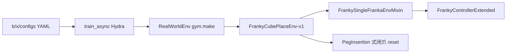

# 方块放置（cube place）：设计方案与落地实施

> **本文已被 [`dmo_place_2.md`](dmo_place_2.md) 取代。** 操作请看 v2：它包含 `robot_mode` 总闸、ROS 与 franky 两套阻抗的差异、运动链路体检门闩，以及与当前代码逐一对齐的参数与命令。本文保留作为设计推导与 charger 拆解的记录。

**状态：阶段 1 PASS**（1A gym.make dummy + 1B GPU dummy SAC）。**阶段 2：H1 / `connect` PASS；`reset` 之前所有 `dz=0` 的根因已定位——手持设备 user-stop 被按住，`robot_mode = RobotMode.UserStopped`，libfranka 拒绝一切运动而状态/夹爪照常（LOG-017），与代码无关。松开 user-stop 后重跑即可。** 实现在 `b/x/`，**未改** `rlinf/`。记录见 [`dmo_place_1LOG.md`](dmo_place_1LOG.md)。

**V1 任务语义（已修订）：机械臂夹爪保持闭合，方块碰到台面标记即成功。不张爪、不把方块留在桌上。** 算法栈仍模仿官方 charger SAC。人机/急停协议复用 [`charger_sac_async.md`](charger_sac_async.md) §15.5；本文把「轮到人做」的步骤写细，尤其是开训前必须标定「方块碰到标记时」的 `target_ee_pose`。

权威来源：

| 类型 | 路径 |
|------|------|
| charger 配置 | [`examples/embodiment/config/realworld_charger_sac_cnn_async.yaml`](../../examples/embodiment/config/realworld_charger_sac_cnn_async.yaml) |
| charger env 包 | [`examples/embodiment/config/env/realworld_peg_insertion.yaml`](../../examples/embodiment/config/env/realworld_peg_insertion.yaml) |
| 几何 / 奖励 / reset | [`rlinf/envs/realworld/franka/tasks/peg_insertion_env.py`](../../rlinf/envs/realworld/franka/tasks/peg_insertion_env.py)、[`franka_env.py`](../../rlinf/envs/realworld/franka/franka_env.py) |
| Gym 注册 | [`rlinf/envs/realworld/franka/tasks/__init__.py`](../../rlinf/envs/realworld/franka/tasks/__init__.py) |
| `gym.make` | [`rlinf/envs/realworld/realworld_env.py`](../../rlinf/envs/realworld/realworld_env.py) |
| RST | [`docs/source-zh/rst_source/examples/embodied/franka.rst`](../../docs/source-zh/rst_source/examples/embodied/franka.rst) |
| 官方 PnP（对照，本任务不抄） | [`realworld_pnp_rlpd_cnn_async.yaml`](../../examples/embodiment/config/realworld_pnp_rlpd_cnn_async.yaml)、[`franka_bin_relocation.py`](../../rlinf/envs/realworld/franka/tasks/franka_bin_relocation.py) |
| 本机 franky | [`b/x/franky_ext/`](../../b/x/franky_ext/)、[`charger_sac_async.md`](charger_sac_async.md) §5 / §6.2.1 / §13 / §15.5 |
| 启动 | [`examples/embodiment/run_realworld_async.sh`](../../examples/embodiment/run_realworld_async.sh) → `train_async.py` |

---

## 结论（先看这个）

| 项 | 决定 |
|----|------|
| 任务 | **人预先把方块夹紧 → 策略把方块送到标记并碰到它。夹爪全程闭合。** 不是张爪放下，也不是桌面自主抓取。 |
| 成功 | 仅 TCP xyz 进入 `target_ee_pose` 的 `reward_threshold`（默认约 1 cm）。**不看**夹爪开合。方块仍在爪里。 |
| 算法栈 | **模仿 charger**：在线 SAC + ResNet10 + 单腕 `wrist_1` + 稠密 xyz。无 RLPD / demo / 键盘打标。 |
| 动作 | **6D**。`no_gripper` 保持默认 **True**（`GripperCloseEnv`）。与 charger 相同。 |
| 几何锚 | `target_ee_pose` = **夹着方块、方块已经碰到标记时** 的 TCP。开训前必须由人标定（§4）。 |
| reset | 仿 PegInsertion / charger：**闭爪**抬 z，方块仍夹着，再回到目标上方悬停。成功后一般 **不必**每回合重新塞方块。 |
| 终止 | 建议 `ignore_terminations: True`（同 charger）：碰到后本回合可继续，满步再抬走，避免刚碰到就猛抬。 |
| 人要做的 | **先标定目标位姿**，再供第一块、开训、盯安全；掉块才重夹。细则 §4、§8。 |
| 代码位置 | `FrankyCubePlaceEnv-v1` 只注册在 `b/x/franky_ext`；YAML / 启动脚本在 `b/x/`。 |
| 本机控制栈 | 固件 5.10.0 + franky；**不要**走 ROS `PegInsertionEnv-v1`。 |

明确 **V1 不做**：张爪把方块留在桌上；桌面自主抓取；7D 夹爪策略；改 `rlinf/` 的 `register(...)`；改官方 `run_realworld_async.sh`。

---

## 1. charger 例子拆解（要模仿什么）

RST 任务表把 charger 写成「通过真机奖励反馈完成充电器对齐与插入」，配置名 `realworld_charger_sac_cnn_async`。代码里 **没有** `ChargerEnv`：Hydra 复用 peg-insertion 包，Gym ID 是 `PegInsertionEnv-v1`。相对插块 RLPD，官方只改了几何容差、稠密奖励、以及算法（在线 SAC、无专家包）。细节见 [`charger_sac_async.md`](charger_sac_async.md) §6。

本任务 V1 在 **控制语义上几乎就是 charger**：闭爪、6D、TCP 碰到目标点。差别只是目标物是「台面标记 + 方块接触」，不是插座孔。

### 1.1 配置骨架

[`realworld_charger_sac_cnn_async.yaml`](../../examples/embodiment/config/realworld_charger_sac_cnn_async.yaml)：

| 块 | 取值 | 含义 |
|----|------|------|
| `defaults` | `env/realworld_peg_insertion@env.train/eval`、`model/cnn_policy`、FSDP、`patch_syncer` | 任务 env + CNN + 异步权重同步 |
| `cluster` | `num_nodes: 2`；actor/rollout → `4090`；env → `franka` + `hardware.type: Franka` | 官方双机；本 5090 要改成 franky 双容器（§6.3） |
| `algorithm` | `embodied_sac`；**无** `demo_buffer` / `data.path` | 在线 SAC |
| `gamma` / `target_entropy` | `0.8` / `-4` | 短视到达；−action_dim（6D → −4） |
| `replay_buffer` | `min_buffer_size: 2`，`auto_save: False` | 2 条轨迹后才 `run_training` |
| `env.train.override_cfg` | `use_dense_reward: True`，小 `clip_*` / `random_*` | 稠密 xyz；工作空间围着目标 |
| `actor/rollout.model` | `state_dim: 19`，`action_dim: 6`，ResNet10 | 单图 + 19D 状态 → 6D |
| `runner.save_interval` | `-1` | 不写 checkpoint；本任务建议改成正数（§5） |

env 包 [`realworld_peg_insertion.yaml`](../../examples/embodiment/config/env/realworld_peg_insertion.yaml)：`env_type: realworld`，`init_params.id: PegInsertionEnv-v1`，`auto_reset: True`，`ignore_terminations: True`，`max_episode_steps: 100`，`use_spacemouse: True`，`main_image_key: wrist_1`。YAML **没写** `no_gripper` → wrapper 默认 **True** → `GripperCloseEnv`。**V1 保持这一默认，不要改成 False。**

### 1.2 几何、奖励、reset（代码）

[`PegInsertionConfig.__post_init__`](../../rlinf/envs/realworld/franka/tasks/peg_insertion_env.py)：

- `reset_ee_pose = target_ee_pose + [0, 0, clip_z_range_high, 0, 0, 0]`
- `ee_pose_limit_{min,max}` 由 `clip_x/y/z/rz` 围成安全盒
- charger 覆盖：xy ±2 cm，z 下 5 mm～上 5 cm，rz ±0.35 rad，`action_scale = [0.02, 0.1, 1]`

[`FrankaEnv._calc_step_reward`](../../rlinf/envs/realworld/franka/franka_env.py)：TCP 欧拉 vs `target_ee_pose`；xyz 全部 ≤ `reward_threshold[:3]`（默认 0.01 m）→ `reward = 1`；否则 `exp(-500 * sum(Δxyz²))`。**不看夹爪、不看力。** V1 **直接复用**，不必为「张爪」覆盖奖励。

[`PegInsertionEnv.go_to_rest`](../../rlinf/envs/realworld/franka/tasks/peg_insertion_env.py)：夹爪 **−1（闭合）** → 当前 TCP 抬 **10 cm** → 再到 `reset_ee_pose`。charger 用来拔插头；V1 用来 **夹着方块离开标记**，再悬停准备下一回合。

`ignore_terminations: True`：碰到目标后不立刻 terminate，跑满步数再 reset。V1 建议同样 True，避免刚碰到就抬走、接触奖励过短。

### 1.3 观测 / 动作 / 训练环

与 charger 笔记 §9–10 **相同**（不再改成 7D）：

1. `GripperCloseEnv`：(7,)→(6,)，step 补第 7 维 0（保持闭爪）。
2. `SpacemouseIntervention(gripper_enabled=False)`：人只能挪臂，**不能**用鼠标张爪。
3. `RelativeFrame` + `Quat2EulerWrapper` → `states` 19 维 + `main_images` = `wrist_1`。
4. 异步 SAC：replay ≥ 2 条轨迹后 `update_epoch: 32`。

人纠正：SpaceMouse 覆盖的 6D 进主 replay。掉块时不能靠训练中的鼠标张爪，必须先停训再用 `python b/x/scripts/test_franky_controller_ext.py` 开合（charger §15.5）。不要用官方 `test_franky_controller`（upstream 不支持原装 Franka Hand）。

### 1.4 启动与本机边界

官方：`bash examples/embodiment/run_realworld_async.sh realworld_charger_sac_cnn_async`。ROS，固件 &lt; 5.9。

本 5090：固件 5.10.0，franky Gym ID。放置任务同样只走 `FrankyCubePlaceEnv-v1`，见 §6。

---

## 2. 官方 PnP / BinRelocation（对照：本任务不是它）

RST 的 PnP 是抓放进箱子：7D、张爪、键盘打标、RLPD demo。V1 **不抄**那条。

| | charger SAC | 官方 PnP | 本任务 V1 |
|--|-------------|----------|-----------|
| 任务 | 插头插入，爪一直闭 | 抓起再放入另一箱 | **夹着方块去碰标记，爪一直闭** |
| 张爪 | 否 | 是 | **否** |
| 动作 | 6D | 7D | **6D** |
| 奖励 | 稠密 TCP xyz | 键盘 | 稠密 TCP xyz（同 charger） |
| `go_to_rest` | 闭爪抬升 | 张爪抬升 | **闭爪抬升**（方块仍在爪里） |
| 每回合人供物 | 否（插头一直夹着） | 常要整理现场 | **否**（方块一直夹着；掉了才管） |

「碰到」由标定定义：人把夹着的方块贴到标记上，那时的 TCP 就是成功区中心。代码并不检测方块–桌面接触力。

---

## 3. 任务定义（V1）

### 3.1 一句话

操作员把方块夹紧；策略在安全盒内把方块移到台面标记并 **碰到** 它（TCP 进入标定成功区）；夹爪始终闭合；reset 时仍夹着方块抬到目标上方，再试下一次。

### 3.2 现场道具

- Franka Panda + 原生 Hand（`FRANKA_GRIPPER_TYPE=franka`）。
- 边长约 3–5 cm 立方块，能被 Hand 夹稳。
- 台面上 **固定** 的放置标记（胶带十字、浅垫、挡块等）。挪了必须重标 `target_ee_pose`。
- 腕部 RealSense → `wrist_1`。
- SpaceMouse：可选，用于训练中纠正 **位置**（不能张爪）。
- 急停在旁。

### 3.3 回合时间线（机器为主）

```text
[开训前，人] 标定 target_ee_pose（§4）；方块夹在爪里
[reset 结束] TCP 在 reset_ee_pose = 目标上方 clip_z_range_high；爪闭；方块仍在
[策略] 6D：往 target_ee_pose 靠近，直到方块碰到标记
[成功] xyz ≤ 1 cm → reward=1（爪仍闭）
[满步或之后 reset] 闭爪抬 z（方块跟着走）→ 再悬停
[人] 通常不用动手；仅当方块掉了才停训重夹（§8.3）
```

### 3.4 成功与奖励

直接用 [`FrankaEnv._calc_step_reward`](../../rlinf/envs/realworld/franka/franka_env.py)，**不必**为张爪改判据。

| 条件 | 奖励 |
|------|------|
| xyz 未进区 | `exp(-500 * ‖Δxyz‖²)` |
| xyz 进区 | `1.0`（方块视为已碰到标记） |
| 夹爪 | 训练中由 wrapper 锁闭，不参与成功 |

「碰到」≈ 标定姿态下 TCP 的 1 cm 球。标定必须在方块 **确实贴住标记** 时读数，否则成功区会悬空。

### 3.5 终止与 reset

- `ignore_terminations: True`（建议，同 charger）。
- `max_episode_steps`: 100。
- `go_to_rest`：PegInsertion 路径——闭爪、抬 z、去悬停。方块不离开夹爪。
- **不要**抄 BinRelocation 的张爪 reset。

### 3.6 明确不做

| | V1 | 非本设计 |
|--|----|----------|
| 张爪放下 | 否 | 旧稿 7D 方案已废弃 |
| 桌面抓取 | 否 | 官方 PnP |
| 改 `rlinf/` 注册 | 否 | — |

---

## 4. 轮到人做：操作顺序（必须先标定）

没有标定就开训，策略会把「随便一个 YAML 占位坐标」当成功区，臂可能扫向桌外或对着空气刷奖励。**第一步永远是标定「方块碰到标记时」的 TCP。**

### 4.1 总顺序（对照 charger RST / §6.2）

| 步 | 谁 | 做什么 | 产出 / 完成标准 |
|----|----|--------|-----------------|
| **H0** | 人 | 固定标记、选方块、急停可及、Desk 解锁并 **Activate FCI** | 台面不再挪标记 |
| **H1** | 人 + 控制容器 | **标定 `target_ee_pose`**（§4.2，最关键） | YAML 里六元组；方块仍夹着或可再夹 |
| **H2** | 人 | 把六元组写入将要提交的配置；确认 `ROBOT_IP`、ResNet10 路径 | 可启动的 YAML |
| **H3** | 人 | 确认腕部相机在控制节点、serial 可知或交给自动枚举 | `wrist_1` 有图 |
| **H4** | 人 | 训练开始前：方块夹紧、臂大致在标记上方安全处、无第二 FCI 客户端 | 可 `reset` |
| **H5** | 人 | 启动训练后站在急停旁，看第一段 `go_to_rest` 是否去悬停而不是横扫 | 几何没填反 |
| **H6** | 人（可选） | 策略乱蹭时推 SpaceMouse 把方块送到标记 | 纠正动作进 replay |
| **H7** | 人 | 掉块 / 卡死 / 急停：§8.3 与 charger §15.5 | 现场恢复后再训 |
| **H8** | 人 | 看 TensorBoard：`env/reward`、`success_once` | 多次碰到标记 |

H1 未完成不得做 H5。标记或方块厚度变了，回到 H1。

### 4.2 H1 标定：什么叫「方块碰到那个地方」

`target_ee_pose` 表示：

> **夹爪闭合、方块已经贴住（碰到）台面标记时，末端 TCP 的位姿** `[x, y, z, roll, pitch, yaw]`（米 + 欧拉 xyz）。

与 charger 的差别：charger 是插头插到位；这里是方块底面（或指定侧面）贴住标记。相同点：都必须 **带着物体** 读 TCP，空爪对准标记再夹方块会偏掉一块厚度。

代码用途（与 charger 相同）：

| 用途 | 行为 |
|------|------|
| 成功 / 稠密奖励 | xyz 相对该点 ≤ 约 1 cm → 视为碰到 |
| reset 悬停 | 该点上方 `clip_z_range_high`（建议 8–10 cm） |
| 安全盒 | 围着该点；z 下沿只允许比接触点再低几毫米，防砸桌 |

**不要**用 `getpos` 的四元数 7 维填 YAML。

#### 本 5090 逐步做（franky）

与 charger §6.2.1 同一套容器/venv。训练进程必须已停，FCI 未被占。

**A. Desk 与网**

1. 标记贴牢，旁边清空。急停可及。
2. `http://172.16.0.2/desk`：Unlock、无 fault、**Activate FCI**。
3. 宿主机：`ping -c 3 172.16.0.2`，路由走 eno1。
4. `ss -tn state established '( dport = :1337 or sport = :1337 )'` 应无连接。

**B. 进容器并切 venv**

5. 无容器则 `bash /home/nvidia/bt/s/RLinf/b/x/configs/docker_run_franky_5090.sh`；已有则 `docker exec -it rlinf-franky-5090 bash`。
6. `source /workspace/RLinf/b/x/configs/setup_before_ray_5090.sh`
7. 自检：`which python` 为 `/opt/venv/franky-0.19.0/bin/python`；`python -c "import franky"`。

**C. 夹住方块（全程保持闭合直到读完数）**

8. `export FRANKA_ROBOT_IP=172.16.0.2 FRANKA_GRIPPER_TYPE=franka`
9. `python b/x/scripts/test_franky_controller_ext.py`（`FrankyControllerExtended` + 原装 Franka Hand）。**不要** `python -m toolkits.realworld_check.test_franky_controller`（会 `NotImplementedError`），也不要用 ROS 的 `test_franka_controller`。
10. `cmd>`：`open` → 把方块按训练时的朝向放入 → `close`（约 20 N 轻力，不是 130 N 死夹）。夹紧后不要再换握姿。异常立刻 `stop` 或急停。

**D. 人手把方块碰到标记**

11. **按住臂上引导键**，把方块移到标记正上方，再缓慢下降，直到方块 **贴住** 标记（轻轻接触即可，不要压垮垫子或把桌子顶起来）。
12. 这是成功时刻的 TCP，**不是** reset 悬停点。悬停由程序加 `clip_z_range_high`。
13. **不要张开夹爪。** 张开后 TCP 会变，且与训练（锁闭爪）不一致。
14. 松开引导键，臂尽量别再动。

**E. 读数并写配置**

15. 同一 `cmd>` 输入 `getpos_euler`，记下 6 个数。可再敲一次确认稳定。
16. `q` **退出**，释放 FCI。
17. 写入将运行的 YAML（只改 `b/x` 副本，不改官方 charger 文件）：

```yaml
env:
  train:
    override_cfg:
      target_ee_pose: [x, y, z, roll, pitch, yaw]
```

18. 用引导键把臂带到标记上方几厘米（仍夹着方块），作为开训前的安全姿态。不要在这里 `home` 到工厂关节位。

**F. 标定常见错误**

| 现象 | 处理 |
|------|------|
| 空爪对准标记再夹方块 | 重标；必须夹着块贴住再读 |
| 标完张了爪再 `getpos_euler` | 作废；闭爪贴住再读 |
| 填了 `getpos` 7 个数 | 只用 `getpos_euler` |
| 标记之后被挪了 | 整段 H1 重做 |
| 与 train 同时连臂 | 先停训练 / `q` |

无方块时不要当正式 pose；空中一点只能测奖励公式。

### 4.3 H2–H4：写配置、相机、开训前夹持

19. YAML 中 `ROBOT_IP` / `172.16.0.2`、`python_interpreter_path`、ResNet10 `model_path` 填真值。
20. `save_interval` 建议 `50`（官方 charger 为 −1）。
21. 相机 USB 在 **franky 控制节点**；可用已有 Step 8 脚本确认 `wrist_1`。
22. 开训前确认：方块仍在爪中、YAML 已是 H1 的六元组、交互脚本已 `q`、Desk FCI 仍激活。

### 4.4 H5–H6：训练中人做什么

23. 启动后 **第一段运动** 应是抬到 / 移到目标上方悬停，再往标记靠近。若直冲桌外或扫地：急停，检查 `target_ee_pose` 是否标反、单位是否米。
24. 策略还不会时，盒子限制乱动范围（§5）；可选 SpaceMouse 把方块送到标记，让 `reward→1` 进 replay。鼠标 **不能**张爪。
25. 成功后程序仍夹着方块抬走再悬停。人 **不用**每回合去桌上捡方块。

---

## 5. 几何、动作尺度、超参建议

接触任务：xy 可比插座略松，z 必须贴标定接触高度，防止砸桌。

| 键 | charger | V1 建议 | 理由 |
|----|---------|---------|------|
| `clip_x/y_range` | 0.02 | **0.05** | 对准标记，不必插孔级 |
| `clip_z_range_low` | 0.005 | **0.005** | 只允许比接触点再低约 5 mm |
| `clip_z_range_high` | 0.05 | **0.08～0.10** | 悬停；成功区仍是接触点附近 1 cm |
| `random_xy_range` | 0.02 | **0.03～0.05** | ≤ `clip_*` |
| `clip_rz` / `random_rz` | 0.35 | 同 | 方块 yaw 不敏感 |
| `action_scale` | `[0.02, 0.1, 1]` | 同 charger | 6D 闭爪 |
| `reward_threshold` xyz | 0.01 | **0.01～0.015** | 「碰到」容差 |
| `max_episode_steps` | 100 | **100** | 同 charger |
| `gamma` / `target_entropy` | 0.8 / −4 | **同** | 6D |
| `state_dim` / `action_dim` / `image_num` | 19 / 6 / 1 | **同** | |
| `no_gripper` | 默认 True | **True** | 锁闭爪 |
| `save_interval` | −1 | **建议 50** | 急停可续 |

阻抗先复用 PegInsertion `compliance_param`。接触力靠 z 下沿 + 笛卡尔阻抗，不要一上来加刚度。

---

## 6. 不改 `rlinf/` 的扩展架构

`RealWorldEnv` 已按 `init_params.id` 做 `gym.make`。官方 ID 在 `rlinf/.../tasks/__init__.py`。本机旁路 [`franky_ext.tasks.register`](../../b/x/franky_ext/tasks/register.py) 再注册 franky ID。放置任务只加 `FrankyCubePlaceEnv-v1`。



Env 类：mixin + 复用 PegInsertion 的 `go_to_rest`（闭爪抬升）和基类 `_calc_step_reward`。与 `FrankyPegInsertionEnv` 的差别主要是默认 `clip_*` / `task_description`，以及独立 Gym ID，避免和插孔配置互相覆盖。

### 6.1 Hydra

不改 `run_realworld_async.sh`。新脚本 `--config-path b/x/configs`，`searchpath` 仍含 `EMBODIED_PATH/config` 以复用 `cnn_policy` / FSDP。

### 6.2 Wrapper：**保持**默认闭爪

不要设 `no_gripper: False`。省略该键或显式 `True`。SpaceMouse 因此不能张爪，与 charger 相同。

### 6.3 本机 5090

| 组件 | 环境 |
|------|------|
| env + 控制器 + 相机 | franky 容器 `franky-0.19.0` |
| actor / rollout | GPU 容器 |
| Ray | host 网络；入口只跑一次 |

标定与训练互斥 FCI。

### 6.4 ROS 阻抗 vs franky 阻抗（reset 反复失败的根源）

充电器例子在 **ROS** 后端上跑，我们在 **franky** 后端上跑。同名的 `move_arm` 底下是两种完全不同的东西：

| | `FrankaController`（ROS，充电器） | `FrankyController`（本机） |
|---|---|---|
| 阻抗怎么起来 | `__init__` 里 `start_impedance()` → `roslaunch impedance.launch`，`cartesian_impedance_controller` **常驻** | `CartesianImpedanceTracker(...)`，构造器内 `robot.move(motion, asynchronous=True)` |
| `move_arm` | 往 `/cartesian_impedance_controller/equilibrium_pose` 发 topic | `set_target()` 写 `CartesianReferenceHandle` |
| 控制器死了 | 节点仍在，topic 继续被消费 | 异步线程存下异常后退出，**`set_target` 静默无效** |
| 怎么知道它死了 | ROS 侧看得见 | 只能查 `tracker.is_running`（== `robot.is_in_control`）；真因要 `stop()`／`join_motion()` 才重抛 |
| reset 大位移 | `_interpolate_move` 10 Hz 阻抗路点 | RLinf 自己的 franky env（`DualFrankaEnv._go_to_rest`）用**阻塞 `reset_joint`**；阻抗只用于 `step` 小增量 |

两条推论，写死在这里免得再猜：

1. **不要**把 franky 的 `translational_error_clip` 和 charger 的 `translational_clip_*` 当同一个参数——后者是 ROS 控制器的键。
2. franky 上 `dz=0` 的第一嫌疑永远是「异步 motion 已死」，不是「目标算错」。先看 `is_running`，再谈几何。诊断入口：`b/x/scripts/diag_franky_motion.py`。

---

## 7. 拟新增文件

阶段 1 创建下列路径（不含真机长训 YAML / `run_cube_place_async.sh`，那些属阶段 3）。

| 路径 | 作用 |
|------|------|
| `b/x/franky_ext/tasks/cube_place.py` | Config（§5 几何默认）；Env = mixin + PegInsertion 式闭爪 `go_to_rest` |
| `b/x/franky_ext/tasks/register.py` | 增加 `FrankyCubePlaceEnv-v1` |
| `b/x/configs/env/realworld_cube_place.yaml` | `init_params.id: FrankyCubePlaceEnv-v1`；`ignore_terminations: True`；不设 `no_gripper: False` |
| `b/x/configs/realworld_cube_place_dummy_sac.yaml` | CPU/通用 dummy 骨架，验 19/6 |
| `b/x/configs/realworld_cube_place_dummy_sac_gpu.yaml` | 单节点 GPU dummy SAC（本机阶段 1 主验收） |
| `b/x/scripts/step_cube_place_dummy.py` | 阶段 1A：`gym.make` / 6D / 几何 / 闭爪 reset 源码门闩 |
| `b/x/scripts/run_cube_place_dummy_sac_gpu.sh` | 阶段 1B：GPU dummy SAC，不调用会装 CPU torch 的 `step7_install_deps.sh` |
| `b/x/configs/cube_place_target_ee_pose.yaml` | 阶段 2：H1 六元组落盘（默认 `calibrated: false`，未填禁止 reset） |
| `b/x/scripts/write_cube_place_pose.py` | 阶段 2：把 `getpos_euler` 六个数写入上表 YAML |
| `b/x/scripts/test_franky_controller_ext.py` | 阶段 2：交互标定 REPL（Extended + Franka Hand）；替代官方 toolkit |
| `b/x/scripts/step_cube_place_robot.py` | 阶段 2：真机 `connect` 只读 / `reset` 悬停 / `box` 短跑（后两步会动臂） |
| `b/x/scripts/run_cube_place_phase2.sh` | 阶段 2：容器内子命令封装（不代跑 docker） |

复用：mixin、`FrankyControllerExtended`、`setup_before_ray_gpu_5090.sh`、`setup_before_ray_5090.sh`。

---

## 8. 训练中人还要管什么

日常：**看第一段 reset、可选 SpaceMouse 纠偏、盯急停。** 方块一直夹着，不必每回合摆块。

### 8.1 与 charger 相同的部分

掉块以外的急停、Desk 复位、抢 FCI、`resume_dir`：见 charger §15.5。训练中鼠标不能张爪。

### 8.2 碰到标记之后

程序不会张爪。满步后闭爪抬升，方块跟着离开标记，再悬停。人不用去桌上捡。若希望「碰到就结束本回合」，可把 `ignore_terminations` 改为 False（非默认）。

### 8.3 方块中途掉了（人必须介入）

1. **Ctrl+C 停训练**（不要先急停，除非要砸桌/顶人）。
2. 确认 1337 空闲。
3. 再开 `python b/x/scripts/test_franky_controller_ext.py`：`open` → 捡起方块放入 → `close`。握姿尽量与 H1 标定一致。
4. 引导到标记上方安全处。`q` 退出。
5. 按 charger §15.5.6 重开或 `resume_dir`。掉块后若标记被带跑，先重做 H1。

卡死、急停：同 charger §15.5.2 / §15.5.4。恢复后若仍夹着原方块且标记没动，不必重标。

---

## 9. 落地实施阶段

### 阶段 0 — 文档确认

锁定：闭爪触达；6D；先标定接触 TCP；reset 夹着方块抬走。

### 阶段 1 — Env + dummy SAC（无臂、本阶段要编码并验收）

**目标：** 在不连真机、不占 FCI 的前提下，证明 `FrankyCubePlaceEnv-v1` 能被 Hydra/`gym.make` 拉起，wrapper 为 **6D 闭爪**，几何默认符合 §5，异步 dummy SAC 能走出 `train/sac/*`。

**不测：** Desk、真机运动、标定、方块接触、SpaceMouse、急停。那些是阶段 2–4。

#### 1.1 落地内容

1. `CubePlaceConfig`：`clip_x/y=0.05`，`clip_z_range_low=0.005`，`clip_z_range_high=0.08`，`random_xy_range=0.03`，`reset_z_lift_m=0.08`；`task_description` 标明触达而非张爪放下。
2. `FrankyCubePlaceEnv`：`FrankySingleFrankaEnvMixin` + `PegInsertionEnv`；`go_to_rest` 发夹爪 **−1（闭合）** 再抬 z（与 BinRelocation 的 +1 相反）。
3. `register(id="FrankyCubePlaceEnv-v1")`；`apply_single_arm_wrappers`。
4. Hydra env 包 + dummy YAML：`is_dummy: True`，`action_dim: 6`，`state_dim: 19`，`target_entropy: -4`；**不**写 `no_gripper: False`。
5. 1A 脚本：`gym.make` 烟测。1B：GPU dummy SAC（镜像 `agentic-rlinf0.4-maniskill_libero`，命令对齐 `run_step7b_dummy_sac_gpu.sh`）。

**禁止：** 改 `rlinf/`；在 GPU 容器里跑 `step7_install_deps.sh`（会把 CUDA torch 打成 CPU）；使用已挂载其它仓库的容器（本机名为 `rlinf` 的容器挂的是 `cxy_ws/RLinf`，不要用）。

#### 1.2 测试命令

宿主机仓库：`/home/nvidia/bt/s/RLinf`。权重：`/home/nvidia/ckpts/RLinf-ResNet10-pretrained/resnet10_pretrained.pt`。

**1A — gym.make（franky 镜像即可，`is_dummy` 不连臂）：**

```bash
docker run --rm --privileged --network host \
  -v /home/nvidia/bt/s/RLinf:/workspace/RLinf \
  -w /workspace/RLinf \
  rlinf/rlinf:agentic-rlinf0.4-franka \
  bash -lc 'source b/x/configs/setup_before_ray_5090.sh && python b/x/scripts/step_cube_place_dummy.py'
```

**1B — dummy SAC GPU（主验收）：**

```bash
docker run --rm --gpus all --privileged --network host --shm-size=20g \
  -e RLINF_RESNET10_PATH=/home/nvidia/ckpts/RLinf-ResNet10-pretrained \
  -e RLINF_SKIP_CAMERA=1 \
  -v /home/nvidia/bt/s/RLinf:/workspace/RLinf \
  -v /home/nvidia/ckpts:/home/nvidia/ckpts:ro \
  -w /workspace/RLinf \
  rlinf/rlinf:agentic-rlinf0.4-maniskill_libero \
  bash -lc 'source b/x/configs/setup_before_ray_gpu_5090.sh && bash b/x/scripts/run_cube_place_dummy_sac_gpu.sh'
```

#### 1.3 验收门闩（全部满足才算阶段 1 PASS）

| ID | 项 | 通过标准 |
|----|----|----------|
| 1A-1 | Gym ID | 日志有 `FrankyCubePlaceEnv-v1`；`gym.make` 成功 |
| 1A-2 | 动作维 | wrapper 后 `action_space.shape == (6,)` |
| 1A-3 | 几何 | `clip_x/y_range==0.05`，`clip_z_range_low==0.005`，`clip_z_range_high==0.08` |
| 1A-4 | 闭爪 reset | `go_to_rest` 源码含 `_end_effector_action([-1.0])`，**不含** 张爪 `+1.0` 作为 reset 夹爪命令 |
| 1A-5 | dummy step | `reset`+`step` 不连 FCI、不抛错 |
| 1B-1 | CUDA | 容器内 `torch.cuda.is_available()` |
| 1B-2 | 训练环 | `run_embodiment.log` 出现 `train/sac` 类指标或 actor 更新；进程 exit 0 |
| 1B-3 | 形状 | 无 `state_dim` / `action_dim` 不匹配；无把 6D 当成 7D |
| 1B-4 | Gym | 日志中 env id 为 `FrankyCubePlaceEnv-v1`，不是 `PegInsertionEnv-v1` / `FrankyFrankaEnv-v1` |

失败则修 `b/x/` 后重跑对应 1A/1B，过程记 [`dmo_place_1LOG.md`](dmo_place_1LOG.md)。

### 阶段 2 — H1 标定 + 真机安全盒短跑（操作手册）

**目标：** 人完成 H0–H1，把「夹着方块贴住标记」的 TCP 写入本机 YAML；再用 `FrankyCubePlaceEnv-v1` 在真机上证明：`reset` 闭爪抬到标记上方悬停，随后在盒子内向标记靠近，夹爪全程不张。

**不测：** 在线 SAC、腕部相机画面、SpaceMouse、急停恢复长流程、阶段 1 已 PASS 的 dummy。那些是阶段 3–4 / charger §15.5。

**本轮状态：** 手册与脚本已落盘；**不要在未读完本节、未完成 2.3 检查单之前跑 `reset` / `box`**（会动臂）。

#### 2.0 会动什么、谁来做

| 子步 | 谁 | 是否动臂 | 占 FCI | 产物 |
|------|----|----------|--------|------|
| 2.3 现场 / Desk / 网 | 人 | 否 | Desk 激活 FCI | 可连 `172.16.0.2:1337` |
| 2.4 进 franky 容器切 venv | 人 | 否 | 否 | `which python` = franky-0.19.0 |
| 2.5 H1 标定写 pose | 人 + `test_franky_controller_ext.py` | 人手引导 | **是**（交互脚本） | `cube_place_target_ee_pose.yaml` 且 `calibrated: true` |
| 2.6 `connect`（别名 `2c`） | 脚本 `--connect-only` | **否** | 子进程短连后释放 | 打印 target / hover / 盒子 |
| 2.7 `reset`（别名 `2d`） | 脚本 `--reset-only` | **是**（闭爪抬升 + 插值到悬停） | env 会话 | TCP ≈ 标记 xy、z = 接触 + 8 cm |
| 2.8 `box`（别名 `2e`） | 脚本默认短跑 | **是**（盒子内） | 同上 | 不张爪、z 不低于接触 − 5 mm |

2.5 的交互脚本必须 `q` 退出后，才能跑 2.6–2.8。同一时刻只能有一个 libfranka 客户端。脚本子命令见 `run_cube_place_phase2.sh`。

#### 2.1 安全规则（开跑前默读）

1. 急停可及；台面标记已贴牢；方块厚度与训练时一致。
1b. **手持设备的 user-stop 必须松开（按钮抬起）。** 按下时 `robot_mode = RobotMode.UserStopped`，libfranka 拒绝**一切**运动（`Move command rejected ... "User stopped"`），但**状态读取和夹爪照常工作** → reset 看起来跑完了，臂却一动不动（`dz=0.0000`，见 LOG-017）。「人在急停旁」指的是**手边有急停**，不是按住 user-stop。开跑前先 `python b/x/scripts/diag_franky_motion.py --probe`，必须看到 `robot_mode=RobotMode.Idle`。
2. **不要**用 ROS 的 `test_franka_controller`。本机原装 Franka Hand 必须用 `python b/x/scripts/test_franky_controller_ext.py`。官方 `python -m toolkits.realworld_check.test_franky_controller` 会在 `_build_gripper` 抛 `NotImplementedError`（只声明支持 Robotiq）。也不要用 `step3_test_controller.py` 标定（会自动 `home` 并张爪）。
3. 标定与短跑都在 **franky 容器**，镜像 `rlinf/rlinf:agentic-rlinf0.4-franka`，venv **`franky-0.19.0`**。禁止宿主机 `.venv`、禁止 GPU 训练容器。
4. 本仓库路径必须是 `/home/nvidia/bt/s/RLinf` 挂到 `/workspace/RLinf`。本机名为 `rlinf` 的容器挂的是别的仓库，**不要用**。
5. 2.7 / 2.8 前：方块仍夹紧；用引导键把臂放到 **标记上方附近**（几厘米），不要从工厂 `home` 关节位横扫过去。
6. 乱跑、砸桌、顶人：拍急停。掉块、卡死恢复见 §8.3 与 charger §15.5；阶段 2 **不要**急停后立刻重跑 env，先 Desk 清 fault 再开 FCI。
7. 脚本默认 `RLINF_SKIP_CAMERA=1`、`no_gripper: True`、`enable_random_reset: False`、`safe_smoke_hold: True`（跳过 `__init__` 插值，**`reset()` 仍会动臂**）。

#### 2.2 落地文件（已生成，未执行）

| 路径 | 作用 |
|------|------|
| [`b/x/configs/cube_place_target_ee_pose.yaml`](../../b/x/configs/cube_place_target_ee_pose.yaml) | H1 六元组；默认 `calibrated: false` |
| [`b/x/scripts/test_franky_controller_ext.py`](../../b/x/scripts/test_franky_controller_ext.py) | 交互 `open`/`close`/`getpos_euler`（Franka Hand） |
| [`b/x/scripts/write_cube_place_pose.py`](../../b/x/scripts/write_cube_place_pose.py) | 把 `getpos_euler` 写入上表 |
| [`b/x/scripts/step_cube_place_robot.py`](../../b/x/scripts/step_cube_place_robot.py) | 2.6–2.8 真机烟测（connect / reset / box） |
| [`b/x/scripts/run_cube_place_phase2.sh`](../../b/x/scripts/run_cube_place_phase2.sh) | 容器内子命令封装 |

**禁止：** 改 `rlinf/`、改官方 charger YAML、把 H1 的 7 维 `getpos` 填进 YAML、在 GPU 容器里跑本阶段。

#### 2.3 当日检查单

在宿主机执行，全部勾上再进容器：

```bash
ping -c 3 172.16.0.2
ip route get 172.16.0.2    # 应走 eno1
ss -tn state established '( dport = :1337 or sport = :1337 )'   # 应无连接
docker ps --filter name=rlinf-franky-5090 --format '{{.Names}} {{.Status}}'
```

浏览器 `http://172.16.0.2/desk`：**Unlock**、无 safety violation、**Activate FCI**。标记在视野内，急停手边。

再在容器里确认运动模式（只读，不动臂）：

```bash
python b/x/scripts/diag_franky_motion.py --probe   # 必须 robot_mode=RobotMode.Idle
```

`RobotMode.UserStopped` → 松开手持设备的 user-stop；`Guiding` → 松开引导键；`Reflex` → Desk 清 fault。任何非 `Idle` 都不要往下跑，`reset` / `box` 会被 `require_motion_ready` 直接拦下。

#### 2.4 进容器并切 venv

**没有** `rlinf-franky-5090`：

```bash
bash /home/nvidia/bt/s/RLinf/b/x/configs/docker_run_franky_5090.sh
```

**已有**该容器（不要再 `docker run --name`）：

```bash
docker exec -it rlinf-franky-5090 bash
```

每个新 bash 都要重新：

```bash
source /workspace/RLinf/b/x/configs/setup_before_ray_5090.sh
which python
# 必须是 /opt/venv/franky-0.19.0/bin/python
echo "$FRANKA_ROBOT_IP $FRANKA_GRIPPER_TYPE"
# 必须是 172.16.0.2 franka
python -c "import franky; print('franky ok')"
```

失败则停：`switch_env not found` = 不在该镜像；`which python` 仍是 `franka-0.15.0` = 没 `source` 成功。细节对齐 charger §6.2.1 子步骤 B。

#### 2.5 H0–H1 标定并写文件

语义见 §4.2：**夹着方块、已贴住标记** 的 TCP。空爪对准或张爪后再读 → 作废。

容器内（已 `source`）：

```bash
export FRANKA_ROBOT_IP=172.16.0.2
export FRANKA_GRIPPER_TYPE=franka
# 若刚才跑挂了官方 toolkit，先清掉它拉起的本地 Ray：
ray stop
python b/x/scripts/test_franky_controller_ext.py
# 或: bash b/x/scripts/run_cube_place_phase2.sh calibrate
```

应看到 `FrankyControllerExtended REPL` 和 `Connected to Franka at 172.16.0.2`，然后才是 `cmd>`。若仍是 `FrankyController: the libfranka backend for the original Franka Hand is not yet supported`，说明跑错了官方 toolkit。

在 `cmd>` 按顺序：

1. `open` → 按训练朝向放入方块 → `close`。`close` 是约 **20 N** 轻力抓取（上限 40 N），夹住后仍会维持这点力，但不应再把方块夹扁。异常立刻敲 `stop` 或拍急停。夹紧后不要换握姿。
2. **按住臂上引导键**，移到标记正上方，缓慢下降直到方块 **轻轻贴住** 标记（不要压垮垫子）。
3. 松开引导键，臂不要再动。输入 `getpos_euler`，记下 6 个数。建议再敲一次确认一致。
4. **`q` 退出**，释放 FCI。不要在这里 `home`。

把六个数写入本机文件（仍在同一容器、同一 venv）：

```bash
python b/x/scripts/write_cube_place_pose.py <x> <y> <z> <roll> <pitch> <yaw>
# 例：python b/x/scripts/write_cube_place_pose.py  0.7062065   0.03620906  0.23192134 -3.11614319  0.02628124  0.17913087
```

或手工编辑 [`cube_place_target_ee_pose.yaml`](../../b/x/configs/cube_place_target_ee_pose.yaml)：`target_ee_pose: [x, y, z, roll, pitch, yaw]` 且 **`calibrated: true`**。

写完后用引导键把臂抬到标记上方几厘米（仍夹着方块），作为 2.7 的起始姿态。

**2.5 通过标准：** YAML 六个数非全零、`calibrated: true`、两次 `getpos_euler` 接近、标记与方块未再被挪走。

#### 2.6 只读几何（脚本 `connect` / `2c`，不动臂）

确认 1337 空闲、交互脚本已 `q`。容器内：

```bash
source /workspace/RLinf/b/x/configs/setup_before_ray_5090.sh   # 若新开了 shell
bash b/x/scripts/run_cube_place_phase2.sh connect
```

等价：

```bash
python b/x/scripts/step_cube_place_robot.py --connect-only
```

**期望输出：**

- `target_ee_pose (H1)` 与 YAML 一致
- `reset_ee_pose hover` 的 z = 接触 z + **0.08**
- `ee_pose_limit`：xy 半宽 0.05 m，z 下沿 = 接触 − 0.005 m，z 上沿 = 接触 + 0.08 m
- `connect-only OK`
- **没有** `creating FrankyCubePlaceEnv-v1`

若 H1 未写，脚本仍会探测当前 TCP，但 **exit 1**，且禁止进入 2.7 / 2.8。

看 `probed - target xyz`：若当前已在标记上方悬停，xy 应较小、z 大约 +0.05～0.10 m。若 xy 差几十厘米，先用引导键挪近再跑 2.7，不要从远处 `reset`。

#### 2.7 reset 到悬停（脚本 `reset` / `2d`，会动臂）

人站在急停旁。方块夹紧。然后：

```bash
bash b/x/scripts/run_cube_place_phase2.sh reset
```

脚本会：探测 TCP → `gym.make` → `reset()`：已夹持则跳过 `grasp`，然后走 **PegInsertion / charger 同一套两段 reset**（见 §3）：

1. `_move_action(当前 TCP)` 把阻抗平衡点钉在此刻（franky 上同时把 tracker 拉起来）
2. 相对**当前 TCP** 沿 z 抬 **10 cm**（`reset_z_lift_m`，与 `PegInsertionEnv` 硬编码 `+= 0.10` 相同；不是相对 H1）
3. 再插值到 `reset_ee_pose` = H1 接触点 + `clip_z_range_high`（8 cm，盒子上沿）

门闩看的是第 3 步之后：|z − (接触+8 cm)| ≤ 2.5 cm。第 2 步可能短暂高于盒顶，原版插充电器也这样（拔插头），`_interpolate_move` **不**按盒子裁剪。

**期望：**

- 日志有 `FrankyCubePlaceEnv-v1`、`wrapper stack` 含 **`GripperCloseEnv`**、`action` 维 6
- `gripper_open after reset: False`（方块仍在爪中）
- `|xy-target| ≤ 0.03 m`，`|z-hover| ≤ 0.025 m`（相对接触 + 8 cm）
- 目视：臂升到标记正上方，**不**把方块放到桌上、**不**张爪
- 打印 `reset-only PASS`，exit 0

失败立刻停：xy 飞出盒子、z 往桌面砸、夹爪张开、FCI 抢占。不要加 `--unsafe-full-reset`。

#### 2.8 盒子内零动作 + 少量下探（脚本 `box` / `2e`，会动臂）

2.7 PASS 且方块仍在、标记没动：

```bash
bash b/x/scripts/run_cube_place_phase2.sh box
```

等价：`python b/x/scripts/step_cube_place_robot.py --num-steps 3 --approach-steps 3`。

行为：先做与 2.7 相同的 `reset`，再 3 步 **零动作**，再 3 步小幅 **−z**（朝标记，幅度被 `clip_z_range_low=0.005` 卡住）。

**期望：**

- 零动作时 TCP 几乎不动，reward 为 PegInsertion 式稠密 xyz（悬停时通常 **不是** 1.0）
- 下探时 z 下降或贴在盒顶/盒底，**不得**低于接触 z − 约 1.5 cm（脚本硬门）
- 全程 `gripper_open` 为假；wrapper 为 6D，不会发张爪
- `box-steps PASS`

下探不是「必须碰到标记才算阶段 2 PASS」。碰到更好，但门闩是 **闭爪 + 悬停几何 + 盒子下沿**。真正反复触达是阶段 3 的 SAC。

#### 2.9 验收门闩（全部满足才算阶段 2 PASS）

| ID | 项 | 通过标准 |
|----|----|----------|
| 2.5-1 | H1 文件 | `cube_place_target_ee_pose.yaml` 中 `calibrated: true`，六元组来自贴住标记时的 `getpos_euler` |
| 2.5-2 | 语义 | 读数时夹爪闭合、方块在爪中、贴住标记；无张爪后再读 |
| 2.6-1 | 只读 | `connect` 打印 hover = 接触 + 0.08 m、xy 盒 ±0.05 m、z 下沿 −0.005 m；不 `gym.make` |
| 2.7-1 | Gym | 真机 `gym.make` 为 `FrankyCubePlaceEnv-v1`，不是 PegInsertion / FrankyFranka |
| 2.7-2 | 闭爪 wrapper | 栈含 `GripperCloseEnv`；`action_space.shape == (6,)` |
| 2.7-3 | reset 悬停 | 目视在标记上方；`|xy-target|≤0.03 m` 且 z ≈ 接触 + 8 cm |
| 2.7-4 | 不张爪 | reset 后 `gripper_open==False`，方块未掉 |
| 2.8-1 | 盒子 | 零动作稳定；下探不砸穿 z 下沿；全程不张爪 |
| 2.8-2 | 退出 | `reset` 与 `box` 进程 exit 0；FCI 在 `env.close` / 进程结束后可再被 `test_franky_controller_ext.py` 占用 |

失败：修 YAML / 重做 H1 / 查 FCI，过程记 [`dmo_place_1LOG.md`](dmo_place_1LOG.md)。**不要**为了过门闩把 `clip_z_range_low` 加大。

#### 2.10 中止与恢复（阶段 2 专用）

| 现象 | 立刻做什么 |
|------|------------|
| 臂朝桌外 / 扫地 | 急停 → Desk 清 fault → 不要重跑 `reset`/`box`，先检查 YAML 是否填反、单位是否米 |
| `Couldn't connect` / 抢 FCI | 所有 python 停掉；`ss` 看 1337；交互脚本必须 `q`；必要时 `ray stop` |
| `NotImplementedError` … original Franka Hand | 跑了官方 `test_franky_controller`。`ray stop` 后改用 `python b/x/scripts/test_franky_controller_ext.py` |
| `close` 把方块夹扁 / 持续加力 | 旧默认 130 N 力控保持。`q` 退出，更新后的脚本默认 20 N。若此刻还在死夹：敲 `open` 或 `stop`，或拍急停 |
| `/dev/shm has only 67108864 bytes` | Ray 警告，不是这次失败原因。当前 franky 容器默认 shm 64MB；可忽略或重建容器时加 `--shm-size` |
| 夹爪 `NotImplementedError` / Robotiq | 同上：必须 Extended + `FRANKA_GRIPPER_TYPE=franka` |
| 掉块 | 不要在 env 还连着时 `open`。Ctrl+C → 再开 `test_franky_controller_ext.py` 重夹 → 必要时重做 H1 |
| `libfranka gripper: Command failed`（reset 时） | 方块已夹住又发了一次 `grasp`。`ray stop` 后用已修的 `FrankaLibfrankaGripper` 重跑 `reset`；应看到 `skip grasp` 再抬升。方块掉了则先 Extended REPL 轻力 `close` |
| `reset` 后 dz=0 | **先查 `robot_mode`**：`python b/x/scripts/diag_franky_motion.py --probe`。`UserStopped` 就是手持设备 user-stop 被按住，libfranka 拒绝一切运动而状态/夹爪照常（LOG-017，这正是之前所有 `dz=0` 的原因）。`Idle` 才继续查阻抗：franky 的 `CartesianImpedanceTracker` 是**异步** motion，线程死了 `set_target` 静默无效，`move_tcp_pose` 现在会检查 `is_running` 并抛出真因 |
| 想「换个运动接口绕过去」 | 先看 `DualFrankaEnv._go_to_rest`：RLinf 自己的 franky env 用**阻塞 `reset_joint`** 做 reset，阻抗只用于 `step` 增量。不要凭感觉发明 |
| 脚本报 uncalibrated | 先做 2.5 写 pose，禁止把全零当 target |

阶段 2 **不要**开 `train_async` / dummy SAC GPU。不要 `ray start` 多节点；脚本内部 `ray.init` 即可。

### 阶段 3 — 在线 SAC

H4–H6；`save_interval: 50`。门闩：`reward` / `success_once`；目视方块多次碰到标记。

### 阶段 4 — 验收

连续碰到标记；Gym ID 为 `FrankyCubePlaceEnv-v1`；夹爪在成功时仍闭合。不把「张爪放下」当验收项。

---

## 10. 风险与依赖

| 风险 | 缓解 |
|------|------|
| 未标定就开训 | §4.1：H1 门闩 |
| 空爪或张爪后读 pose | §4.2 F |
| 抄 BinRelocation 张爪 reset | Env 走 PegInsertion 闭爪抬升 |
| 误设 `no_gripper: False` | env 包保持默认 True；阶段 1 检查 6D |
| 砸桌 | `clip_z_range_low` 小；标定贴住即可勿死压 |
| 掉块无法用 SpaceMouse 重夹 | §8.3 停训 + franky `open`/`close` |
| `save_interval: -1` | 本任务用正数 |

依赖：franky 容器、`b/x/franky_ext` mixin、ResNet10、腕部相机。不接入仿真 cube_pick。

---

## 11. 关键源码索引

| 主题 | 路径 |
|------|------|
| 模仿的训练配置 | `examples/embodiment/config/realworld_charger_sac_cnn_async.yaml` |
| 模仿的 env 包 / 奖励 / 闭爪 reset | `realworld_peg_insertion.yaml`、`franka_env.py`、`peg_insertion_env.py` |
| 官方 PnP（不抄） | `realworld_pnp_rlpd_cnn_async.yaml`、`franka_bin_relocation.py` |
| wrapper 默认闭爪 | `rlinf/envs/realworld/common/wrappers/apply.py` |
| 已有 franky 旁路 | `b/x/franky_ext/tasks/register.py` |
| 标定与急停（人） | [`charger_sac_async.md`](charger_sac_async.md) §6.2.1、§15.5 |

下一步：按 §9 阶段 2 操作手册做 H1 标定与真机短跑（脚本已生成，**尚未执行**）。阶段 1 记录见 [`dmo_place_1LOG.md`](dmo_place_1LOG.md)。
