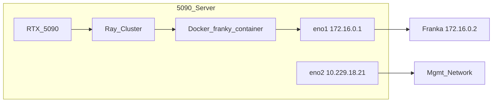

# 单臂 Franka franky 改造方案（5090 实机 · 扩展优先 · Docker 隔离）

> **目标环境：** Franka Emika Panda · 固件 **5.10.0** · libfranka **0.19.0** · Franka Hand（原生夹爪）  
> **目标能力：** 在 RLinf 上跑通单臂真机控制链——臂 + 夹爪 + env（第一阶段无相机）；后续再接入数据采集、SFT、RLPD 等工作流  
> **本机：** 5090 服务器 · `172.16.0.2`（eno1）· PREEMPT_RT 内核  
> **修订说明：** 相对 [`franka_2.md`](franka_2.md) 的重写——绑定本机真实软硬件、**Docker 优先**（不污染宿主机 Python）、**扩展大于修改**（不改 `FrankaEnv` 等核心文件）、**逐步改逐步测**

---

## 目录

1. [相对 franka_1 / franka_2 的变化](#1-相对-franka_1--franka_2-的变化)
2. [本机 5090 软硬件基线](#2-本机-5090-软硬件基线)
3. [Docker 环境（首选，避免污染宿主机）](#3-docker-环境首选避免污染宿主机)
4. [固件 5.10.0 与版本锁定](#4-固件-5100-与版本锁定)
5. [现状分析（代码实查）](#5-现状分析代码实查)
6. [总体架构：扩展优先](#6-总体架构扩展优先)
7. [b/x 代码目录与文档布局](#7-bx-代码目录与文档布局)
8. [分步实施 Step 0–7（逐步改、逐步测）](#8-分步实施-step-07逐步改逐步测)
   - [8.0 真机依赖总览](#80-真机依赖总览)
9. [相机 Phase（后续，与 Step 0–7 解耦）](#9-相机-phase后续与-step-07-解耦)
10. [工作流 Step 7+（逐个接入）](#10-工作流-step-7逐个接入)
11. [扩展代码设计要点（参考实现）](#11-扩展代码设计要点参考实现)
12. [测试与验收](#12-测试与验收)
13. [风险与里程碑](#13-风险与里程碑)
14. [附录](#14-附录)

---

## 1. 相对 franka_1 / franka_2 的变化

### 1.1 franka_1 的主要问题（仍成立）

- 提议复制整个 `franka_env.py`（933 行）为 `franky_env.py`——维护成本极高，已废弃。

### 1.2 franka_2 纠正了架构，但仍有两类偏差

| 偏差 | franka_2 做法 | franka_3 做法 |
|------|--------------|--------------|
| **环境绑定** | 占位符 `<FRANKA_NIC>`、`eth0`、泛化多节点 | 写死本机：`eno1` / `eno2` / `172.16.0.2` / 单节点 |
| **运行环境** | 宿主机 `install.sh --env franka-franky` → `.venv` | **Docker** `agentic-rlinf0.4-franka` + `switch_env franky-0.19.0` |
| **代码策略** | 改 `FrankaEnv._setup_hardware` 工厂、改 `FrankaConfig.controller_backend` | **不改**上述文件；新建 `b/x/franky_ext/` + 新 Gym ID |
| **测试粒度** | 6 Phase / 周级 | **Step 0–7** 每步一个脚本 + 独立验收 |
| **第一阶段范围** | 含相机工作流 | **仅臂 + 夹爪 + env + Step 7 链路 smoke**，无相机 |

### 1.3 franka_3 三条铁律

1. **Docker 优先**：franky / libfranka 只在容器 venv 内使用，不在宿主机 `pip install`。
2. **扩展大于修改**：参照 `DualFrankaEnv` 模式——双臂 franky 从未改 `FrankaEnv`，单臂同样新建 env 基类。
3. **一次只改一个功能**：每 Step 有独立脚本、验收标准、回滚方式；通过后再进下一步。

---

## 2. 本机 5090 软硬件基线

以下数据已在 **`a20073-System-Product-Name`** 上实测或确认（2026-08-14）。

| 项目 | 实测值 | 方案影响 |
|------|--------|----------|
| CPU | AMD Ryzen Threadripper 7970X，64 逻辑核 | franky RT 可绑 dedicated core |
| 内存 | 93 GiB | 单 env + 后续 RL 足够 |
| 内核 | `5.15.0-1032-realtime` **PREEMPT_RT** | 已满足 franky RT 要求，**无需换内核** |
| GPU | RTX 5090 | Step 7+ actor/rollout；Step 0–6 可选 |
| 宿主机 Python | 3.10.12 | Step 0–6 **不依赖**宿主机 Python 装 franky |
| 机器人 IP | **`172.16.0.2`** | 写死 |
| 机器人网卡 | **`eno1`**（本机 `172.16.0.1/24`，ping ~0.075 ms） | RT 调优、`ethtool` 均针对 eno1 |
| 管理/外网网卡 | **`eno2`**（`10.229.18.21/24`，default route） | `RLINF_COMM_NET_DEVICES=eno2`（**非**模板 `eth0`） |
| 夹爪 | Franka Hand（原生） | `FRANKA_GRIPPER_TYPE=franka` |
| 相机 | USB 未见 RealSense | **Step 0–7 跳过相机/视觉**（dummy 用零图像） |
| franky 环境 | 宿主机未安装 | 使用 Docker `/opt/venv/franky-0.19.0` |

### 2.1 网络拓扑



### 2.2 路由确认

```bash
# 宿主机执行：机器人走 eno1
ip route get 172.16.0.2
# 期望：172.16.0.2 dev eno1 src 172.16.0.1

ping -c 3 172.16.0.2
# 期望：0% packet loss，< 1 ms
```

**注意：** 不要让机器人流量走 `eno2` default route；`172.16.0.0/24` 已由 `eno1` kernel route 覆盖。

---

## 3. Docker 环境（首选，避免污染宿主机）

### 3.1 代码库实查：镜像已含 franky-0.19.0

[`docker/Dockerfile`](../docker/Dockerfile) 第 349–369 行（`embodied-franka-image`）：

```dockerfile
# ROS 栈 venv（固件 < 5.9.0 用，本机 5.10.0 不用）
RUN for v in 0.10.0 0.13.3 0.14.1 0.15.0 0.18.0 0.19.0; do \
        LIBFRANKA_VERSION="$v" FRANKA_ROS_VERSION=0.10.0 \
        bash requirements/install.sh ... --venv "franka-$v" --env franka; \
    done

# Franky 栈 venv（wheel 内置 libfranka，无 ROS）——本方案用这个
RUN for v in 0.15.0 0.19.0; do \
        LIBFRANKA_VERSION="$v" \
        bash requirements/install.sh ... --venv "franky-$v" --env franka-franky; \
    done
```

| 项 | 值 |
|----|-----|
| 构建目标 | `BUILD_TARGET=embodied-franka` |
| 已发布 tag | `rlinf/rlinf:agentic-rlinf0.4-franka` |
| 国内镜像 | `docker.1ms.run/rlinf/rlinf:agentic-rlinf0.4-franka` |
| Franky venv | `/opt/venv/franky-0.19.0` |
| 切换命令 | `source switch_env franky-0.19.0` |
| 基础 OS | `ubuntu:20.04`（**无 CUDA**） |
| 容器默认 venv | `franka-0.15.0`（ROS）——**勿用**，必须切 `franky-0.19.0` |

**文档滞后：** [`docs/source-zh/rst_source/examples/embodied/franka.rst`](../docs/source-zh/rst_source/examples/embodied/franka.rst) 正文仅列 ROS libfranka 至 `0.18.0`，**未写** `franky-0.19.0`。**以 Dockerfile 为准**；拉取镜像后务必验证 venv 存在。

### 3.2 镜像内 venv 清单（embodied-franka）

| venv 名 | 用途 | 本机 5.10.0 |
|---------|------|-------------|
| `franka-0.10.0` … `franka-0.18.0` | ROS + serl | ❌ 不可用 |
| `franka-0.19.0` | ROS 路径（仍依赖 Noetic） | ❌ 5.10.0 应走 franky |
| `franky-0.15.0` | libfranka 0.15 wheel | ❌ 固件不匹配 |
| **`franky-0.19.0`** | **libfranka 0.19.0 + franky-control** | **✅ 唯一推荐** |
| `franka-dexhand` | 灵巧手 ROS 依赖 | 后续 Phase，非 Step 0–6 |

### 3.3 Step 0：拉取与验证（不装宿主机 venv）

**宿主机：**

```bash
docker pull rlinf/rlinf:agentic-rlinf0.4-franka
# 国内：
# docker pull docker.1ms.run/rlinf/rlinf:agentic-rlinf0.4-franka
```

**验证 franky-0.19.0 存在且可 import：**

```bash
docker run --rm \
  --privileged \
  --network host \
  -v /home/nvidia/bt/s/RLinf:/workspace/RLinf \
  -w /workspace/RLinf \
  rlinf/rlinf:agentic-rlinf0.4-franka \
  bash -lc '
    ls /opt/venv/ | grep franky
    source switch_env franky-0.19.0
    python -c "import franky; print(\"franky OK:\", franky.__file__)"
  '
```

**期望输出：** 列出 `franky-0.15.0` 和 `franky-0.19.0`；`import franky` 无报错。

### 3.4 镜像过旧时的本地构建（仍不污染宿主机）

若官方镜像无 `franky-0.19.0`（旧版 CI 产物）：

```bash
cd /home/nvidia/bt/s/RLinf
docker build -f docker/Dockerfile \
  --build-arg BUILD_TARGET=embodied-franka \
  --build-arg NO_MIRROR=1 \
  -t rlinf:embodied-franka-local .
```

后续将下文所有 `rlinf/rlinf:agentic-rlinf0.4-franka` 替换为 `rlinf:embodied-franka-local`。

### 3.5 长期开发容器（Step 1–6 的工作环境）

[`b/x/configs/docker_run_franky_5090.sh`](../../x/configs/docker_run_franky_5090.sh) 内容要点：

```bash
#!/bin/bash
REPO=/home/nvidia/bt/s/RLinf
IMAGE="${RLINF_FRANKA_IMAGE:-rlinf/rlinf:agentic-rlinf0.4-franka}"

docker run -it --rm \
  --privileged \
  --network host \
  --name rlinf-franky-5090 \
  -v "${REPO}:/workspace/RLinf" \
  -w /workspace/RLinf \
  "${IMAGE}" \
  bash
```

**容器内首次执行：**

```bash
source /workspace/RLinf/b/x/configs/setup_before_ray_5090.sh
```

### 3.6 宿主机 vs 容器职责划分

| 操作 | 执行位置 | 原因 |
|------|----------|------|
| `tune_eno1.sh`（CPU governor、ethtool） | **宿主机** | 网卡/CPU 属 host namespace |
| `/etc/security/limits.d/` rtprio/memlock | **宿主机** | 容器 `--privileged` 继承 ulimit |
| `ping 172.16.0.2`、Desk 浏览器 | **宿主机或容器**（host network 均可） | — |
| `import franky`、Ray、RLinf env | **容器内** `switch_env franky-0.19.0` | 隔离 Python 依赖 |
| `b/x/franky_ext/` 扩展代码 | 宿主机编辑，容器内运行 | bind mount |

### 3.7 Step 7+ 双容器说明（5090 单节点 GPU RL）

`embodied-franka` 基于 **ubuntu:20.04，无 CUDA**，无法在容器内跑 GPU actor/rollout。

| 组件 | 推荐环境 |
|------|----------|
| env / FrankyController / 机器人 | `agentic-rlinf0.4-franka` + `franky-0.19.0` |
| actor / rollout（GPU） | `agentic-rlinf0.4-maniskill_libero` 或 openpi 相关镜像 |
| Ray 组网 | 两容器均 `--network host`，同一 `ray start --head` 地址 |

Step 7 **dummy SAC** 拆为 **7a（链路 smoke，✅ PASS）** 与 **7b（完整训练 loop，⏳ 待完成）**；7b 需 GPU 驱动或 §3.7 双容器。

### 3.8 明确不做的事

- ❌ 宿主机 `bash requirements/install.sh embodied --env franka-franky`
- ❌ 宿主机 `source .venv/bin/activate` 跑 franky
- ❌ 使用容器默认 venv `franka-0.15.0` 或 `switch_env franka-0.19.0`（ROS 路径）

---

## 4. 固件 5.10.0 与版本锁定

### 4.1 兼容矩阵

| 项目 | 5.10.0 取值 |
|------|-------------|
| Robot System Version | **5.10.0**（`>= 5.9.0` 区间） |
| 最低 libfranka | **>= 0.18.0** |
| Robot / Gripper Server | **10 / 3** |
| **RLinf 选用** | **libfranka 0.19.0**（Docker：`franky-0.19.0`） |
| **明确禁用** | **0.18.0**（阻抗控制 bug，[RLinf#1012](https://github.com/RLinf/RLinf/issues/1012)） |
| ROS / serl 路径 | **不可用**（`serl_franka_controllers` + libfranka 0.15 仅支持 `< 5.9.0`） |

### 4.2 Desk 侧检查

1. 浏览器 `http://172.16.0.2/desk` → Settings → Dashboard：Control **5.10.0**
2. FCI 已激活，无 safety violation
3. 宿主机 `ping -c 3 172.16.0.2`

### 4.3 实时内核与权限（宿主机）

本机已有 PREEMPT_RT。仍需确认 limits（容器内 franky 受益）：

```bash
# 检查
uname -r | grep -o PREEMPT_RT
ulimit -r    # 期望 >= 80 或 unlimited
ulimit -l    # 期望 unlimited

# 若不足，创建 /etc/security/limits.d/99-rlinf-franka.conf：
#   nvidia  -  rtprio  99
#   nvidia  -  memlock unlimited
# 重新登录后生效
```

---

## 5. 现状分析（代码实查）

### 5.1 两条控制栈对比

```
┌────────────────────────────────────────────────────────────────────────┐
│  Runner（collect / SFT / RLPD / …）                                     │
└───────────────────────────────┬────────────────────────────────────────┘
                                │ env.step(action)
                                ▼
┌────────────────────────────────────────────────────────────────────────┐
│  FrankaEnv (franka_env.py) — 单臂 ROS 路径                              │
│  └─ _setup_hardware() → 硬编码 FrankaController                         │
│  子类：PegInsertionEnv / FrankaBinRelocationEnv / BottleEnv / DexpnpEnv │
└───────────────────────────────┬────────────────────────────────────────┘
                                │
                 ┌──────────────┴─────────────────┐
                 ▼                                ▼
  FrankaController (ROS)              FrankyController (libfranka)
  固件 < 5.9.0 ✅                      固件 >= 5.9.0 ✅ (5.10.0)
  单臂 ✅                              双臂 DualFrankaEnv ✅
  Franka Hand ✅                       Franka Hand ❌ NotImplementedError
```

**franka_3 切入点：** 新建 `FrankySingleFrankaEnv(FrankaEnv)`，仅 override `_setup_hardware`，使用 `FrankyControllerExtended`；**不修改** `FrankaEnv` 源码。

### 5.2 FrankyController API 缺口

**文件：** `rlinf/envs/realworld/franka/franky_controller.py`

| 方法 | FrankyController | FrankaEnv 是否调用 | franka_3 处理 |
|------|:---:|:---:|------|
| `launch_controller` | ✅（签名不同） | 是 | 扩展 env 内适配参数 |
| `is_robot_up` / `get_state` / `clear_errors` | ✅ | 是 | 继承 |
| `reset_joint` / `open_gripper` / `close_gripper` | ✅ | 是 | 继承 |
| `move_tcp_pose` | ✅ | 否（env 用 `move_arm`） | — |
| **`move_arm`** | **❌** | **是** | `FrankyControllerExtended` 新增 |
| **`reconfigure_compliance_params`** | **❌** | **是（reset）** | 扩展类新增 |
| **`move_gripper`** | **❌** | 否（smoke test） | 扩展类新增 |
| `_build_gripper(franka)` | **NotImplementedError** | 是 | 扩展类 override |
| `command_end_effector` | ❌ | 灵巧手 | stub（本方案不用） |

### 5.3 launch_controller 签名差异

```python
# FrankaController（ROS）— FrankaEnv 当前调用方式
FrankaController.launch_controller(
    robot_ip, env_idx, node_rank, worker_rank,
    end_effector_type=..., end_effector_config=..., gripper_connection=...,
)

# FrankyController（libfranka）
FrankyController.launch_controller(
    robot_ip, env_idx, node_rank, worker_rank,
    gripper_type="robotiq",  # 默认 robotiq；本机需 "franka"
    gripper_connection=None,
)
```

**franka_3：** 在 `FrankySingleFrankaEnv._setup_hardware` 中调用 `FrankyControllerExtended.launch_controller(..., gripper_type="franka")`，不传 ROS 的 `end_effector_*` 参数。

### 5.4 Gripper 要点

- ROS 版 `FrankaGripper.open()` 使用 `width=0.09`（非 0.08）
- `FrankaEnv` **从不**调用 `move_gripper`；仅用 `open_gripper()` / `close_gripper()`
- `FrankyController._build_gripper` 对 `gripper_type=franka` 当前 `raise NotImplementedError`——Step 2/3 在扩展类解决

### 5.5 可复用资产（只读，不修改）

| 组件 | 路径 |
|------|------|
| FrankyController 骨架 | `rlinf/envs/realworld/franka/franky_controller.py` |
| FrankaEnv 业务逻辑 | `rlinf/envs/realworld/franka/franka_env.py` |
| 任务 env 子类 | `rlinf/envs/realworld/franka/tasks/*.py` |
| DualFranka 参考模式 | `rlinf/envs/realworld/franka/dual_franka_env.py` |
| Smoke test 参考 | `toolkits/realworld_check/test_franky_controller.py` |
| Docker franky venv | `/opt/venv/franky-0.19.0` |

---

## 6. 总体架构：扩展优先

### 6.1 设计原则

1. **对标 DualFrankaEnv：** 双臂 franky 用独立 `DualFrankaEnv`，未改 `FrankaEnv`；单臂同样新建 env，不往 `FrankaEnv` 塞工厂分支。
2. **新 Gym ID 区分栈：** 如 `FrankyFrankaEnv-v1`、`FrankyPegInsertionEnv-v1`；现有 `PegInsertionEnv-v1` 保持 ROS 语义不变。
3. **扩展包隔离：** 所有新代码在 `b/x/franky_ext/`，验证稳定后再评估 upstream 合入。
4. **Controller 扩展：** `FrankyControllerExtended(FrankyController)` 放扩展包，补齐 API；**优先不改** upstream `franky_controller.py`。
5. **配置隔离：** YAML 放 `b/x/configs/`，不改 `examples/embodiment/config/` 官方文件。

### 6.2 架构图（franka_3）

```
  b/x/configs/*.yaml          init_params.id: FrankyPegInsertionEnv-v1
         │
         ▼
  RealWorldEnv ── gym.make ──► FrankyPegInsertionEnv
                                    │
                                    ├─ 奖励/任务逻辑 ← PegInsertionEnv（继承）
                                    └─ _setup_hardware ← FrankySingleFrankaEnv（override）
                                              │
                                              ▼
                                    FrankyControllerExtended.launch_controller
                                    (gripper_type=franka, robot_ip=172.16.0.2)
                                              │
                                              ▼
                                    franky / libfranka 0.19.0（Docker venv）
                                              │
                                              ▼ eno1
                                    Franka Panda 172.16.0.2
```

### 6.3 相对 franka_2 架构的差异

| 维度 | franka_2 | franka_3 |
|------|----------|----------|
| 切换栈方式 | YAML `controller_backend: franky` + 改 `FrankaEnv` | 换 Gym ID + 扩展 env 类 |
| 修改 `franka_env.py` | 是（~30 行） | **否** |
| 修改 `franka.py` scheduler | 是（+3 行） | **否** |
| 新 Gym ID | 不需要 | **需要**（扩展包 register） |
| 代码位置 | `rlinf/` 内联修改 | `b/x/franky_ext/` |

---

## 7. b/x 代码目录与文档布局

> **布局（2026-08-15）：** 方案与日志在 `b/d/frk1/`（`franka_3.md`、`franka_3LOG.md`）；可执行扩展与脚本在 `b/x/`。

### 7.1 目标目录树

```
b/d/frk1/
├── franka_3.md                          # 本文档
├── franka_3LOG.md                       # 落地日志（实测记录）
├── franka_1.md / franka_2.md            # 参考文档
b/x/
├── sitecustomize.py                     # Step 7：PYTHONPATH 含 b/x 时自动加载 bootstrap
├── franky_ext/
│   ├── __init__.py
│   ├── franka_libfranka_gripper.py      # Step 2
│   ├── controller_extended.py           # Step 3
│   ├── franky_single_franka_env.py      # Step 4/5（含 safe_smoke_hold）
│   ├── tcp_probe.py                     # Step 5/6（子进程读 TCP，释放 FCI）
│   ├── runtime_bootstrap.py               # Step 7（CPU shim、FSDP/pin_memory 补丁）
│   ├── ray_register_startup.py          # Step 7（PYTHONSTARTUP 钩子）
│   └── tasks/
│       ├── register.py                  # Step 4：Gym 注册 Franky* ID
│       └── peg_insertion.py             # Step 6：FrankyPegInsertionEnv
├── configs/
│   ├── docker_run_franky_5090.sh        # Step 0/1
│   ├── setup_before_ray_5090.sh         # Step 1（Step 7 扩展 EMBODIED_PATH 等）
│   ├── tune_eno1.sh                     # Step 0（宿主机）
│   ├── realworld_franky_dummy_sac.yaml  # Step 7
│   └── realworld_franky_smoke.yaml      # Step 8+（待建）
├── docker/
│   └── Dockerfile.franky-minimal        # Step 0 fallback 本地构建
└── scripts/
    ├── step0_check_env.sh               # Step 0
    ├── step1_check_ray.sh               # Step 1
    ├── step2_test_gripper.py
    ├── step3_test_controller.py
    ├── step4_test_env_dummy.py
    ├── step5_test_env_robot.py
    ├── step6_test_peg_env_robot.py
    ├── step7_install_deps.sh            # Step 7a：franky venv 补 embodied 依赖
    └── run_step7_dummy_sac.sh           # Step 7a/7b：train_async.py 入口（7b 需 GPU）
```

### 7.2 禁止修改的 RLinf 文件

| 文件 | 原因 |
|------|------|
| `rlinf/envs/realworld/franka/franka_env.py` | ROS 单臂基类，改则影响所有现有用户 |
| `rlinf/envs/realworld/franka/franka_controller.py` | ROS 控制器 |
| `rlinf/envs/realworld/franka/tasks/__init__.py` | 官方 Gym 注册 |
| `rlinf/scheduler/hardware/robots/franka.py` | 调度器硬件配置 |
| `examples/embodiment/config/*` | 官方示例 YAML |
| `ray_utils/realworld/setup_before_ray.sh` | 上游模板；本机用 `b/x/configs/` 副本 |

### 7.3 允许的最小 upstream 触碰（仅当扩展类方案失败）

| 条件 | 可考虑的 upstream PR |
|------|---------------------|
| Ray 无法使用 `FrankyControllerExtended` 子类 | 向 `franky_controller.py` **纯新增**方法（不改 ROS 路径） |
| 扩展包稳定 2 周无问题 | 将 `b/x/franky_ext/` 迁入 `rlinf/envs/realworld/franka/franky_single/` |

**当前策略：先走扩展包，不提交 upstream PR。**

---

## 8. 分步实施 Step 0–7（逐步改、逐步测）

> **规则：** 每 Step 完成后打勾、记录日志，**未通过不进入下一步**。  
> **环境：** 标注「宿主机」或「容器内」。容器内先 `source b/x/configs/setup_before_ray_5090.sh`。  
> **实测日志：** [`franka_3LOG.md`](franka_3LOG.md)（下文「验收状态」引用 LOG 编号）。

### Step × 文件 / 代码总览

| Step | 名称 | 新增 / 主要文件 | 修改（相对本 Step 之前） | 改动 `rlinf/` 上游 | 验收状态 |
|------|------|----------------|-------------------------|-------------------|----------|
| **0** | 环境摸底 | `configs/tune_eno1.sh`、`scripts/step0_check_env.sh`、`configs/docker_run_franky_5090.sh`、`docker/Dockerfile.franky-minimal` | — | **无** | ✅ PASS（LOG-001+） |
| **1** | 容器与 Ray | `configs/setup_before_ray_5090.sh`、`scripts/step1_check_ray.sh` | — | **无** | ✅ PASS |
| **2** | 夹爪 | `franky_ext/franka_libfranka_gripper.py`、`scripts/step2_test_gripper.py` | — | **无** | ✅ 真机 PASS |
| **3** | Controller | `franky_ext/controller_extended.py`、`scripts/step3_test_controller.py` | — | **无** | ✅ 真机 PASS |
| **4** | Dummy env | `franky_ext/franky_single_franka_env.py`、`franky_ext/tasks/register.py`、`scripts/step4_test_env_dummy.py` | — | **无** | ✅ PASS |
| **5** | 实机 env smoke | `franky_ext/tcp_probe.py`、`scripts/step5_test_env_robot.py` | `franky_single_franka_env.py`（`safe_smoke_hold`、无相机 stub） | **无** | ✅ 真机 PASS（5a/5b/5c） |
| **6** | 任务 env | `franky_ext/tasks/peg_insertion.py`、`scripts/step6_test_peg_env_robot.py` | `tasks/register.py`（注册 `FrankyPegInsertionEnv-v1`） | **无** | ✅ 真机 PASS（6a/6b/6c） |
| **7a** | dummy SAC 链路 smoke | 同 Step 7 文件集（见 §Step 7） | — | **无** | ✅ **PASS**（LOG-024） |
| **7b** | dummy SAC 完整训练 loop | —（复用 7a 脚本与配置） | 或需扩展 `runtime_bootstrap.py` | **无** | ⏳ **待完成**（阻塞于权重同步 + GPU） |

> 上表路径均相对于 `b/x/`；文档与日志在 `b/d/frk1/`。

### 8.0 真机依赖总览

各 Step 的测试/验收是否必须动到 Franka 真机，用下列标记区分：

| 标记 | 含义 | 典型操作 |
|------|------|----------|
| **`[服务器]`** | 仅宿主机 / Docker / Ray，**不连 FCI、臂不动** | `import franky`、`ray status`、dummy env |
| **`[连通]`** | 需机器人**上电且网络可达**，但**不发运动/夹爪指令** | `ping 172.16.0.2`、Desk 查固件 |
| **`[真机]`** | **必须占用 libfranka 会话**，臂或夹爪**会运动**；需 FCI 激活、操作员在场、Desk 急停可用 | 夹爪开合、`home`、`nudge`、env reset/step |
| **`[相机]`** | 除真机外还需 RealSense 等（本方案第一阶段不含） | 采集图像、视觉 obs |

**汇总表（Step 0–12）：**

| Step | 名称 | 真机依赖 | 脚本/入口 | 需真机运动的验收项 |
|------|------|----------|-----------|-------------------|
| **0** | 环境摸底 | `[服务器]` + `[连通]` | `b/x/scripts/step0_check_env.sh` | 无（ping/Desk 仅连通，不控制） |
| **1** | 容器与 Ray | `[服务器]` | `b/x/scripts/step1_check_ray.sh` | 无 |
| **2** | 夹爪独立测试 | **`[真机]`** | `b/x/scripts/step2_test_gripper.py` | open/close、width 读数 |
| **3** | Controller smoke | **`[真机]`** | `b/x/scripts/step3_test_controller.py` | home、nudge、open/close、grip、impedance |
| **4** | Dummy env | `[服务器]` | `b/x/scripts/step4_test_env_dummy.py` | 无（`is_dummy=True`） |
| **5** | 实机 env smoke | **`[真机]`** | `b/x/scripts/step5_test_env_robot.py` | 5a 读位姿；5b 安全 smoke（臂不动）；5c micro-nudge（约 5 mm） |
| **6** | 任务 env | **`[真机]`** | `b/x/scripts/step6_test_peg_env_robot.py` | 6a probe；6b reset（无 random）；6c random reset |
| **7a** | dummy SAC 链路 smoke | `[服务器]` | `b/x/scripts/run_step7_dummy_sac.sh` | 无（`is_dummy=True`）；验 worker 启动与 dummy reset |
| **7b** | dummy SAC 完整训练 | `[服务器]` + **GPU** | 同 7a 入口 | ≥1 epoch、`train/` 指标；**⏳ 待完成**（LOG-024） |
| **8** | 数据采集 | **`[真机]`** + **`[相机]`** | collect 工作流 | 遥操作/采集 episode |
| **9–12** | SFT / RLPD / DAgger 等 | **`[真机]`**（+ Step 9+ 常需 GPU） | 各 YAML | 部署/训练 loop 中的 env step |

**真机测试前置（Step 2 起每次跑 `[真机]` 前）：**

1. Desk：`http://172.16.0.2/desk` → FCI 已激活、无 fault、固件 5.10.0  
2. 宿主机：`bash b/x/configs/tune_eno1.sh`  
3. **同一时刻仅一个 libfranka 客户端**（smoke 与 env 勿并行）  
4. 操作员在场，Desk 急停可用  

**可在无真机时先完成的 Step：** 0（除 ping/Desk 外）、1、4、**7a**（dummy SAC 链路 smoke ✅）。**7b** 需 GPU 或后续补丁，⏳ 待完成。

**Step 7 子步骤结论（LOG-024）：**

| 子 Step | 内容 | 状态 |
|---------|------|------|
| **7a** | env / rollout / actor 启动，dummy `FrankyFrankaEnv-v1` reset，ResNet10 加载 | ✅ **PASS** |
| **7b** | `sync_model_to_rollout` → ≥1 epoch → `train/` 指标落盘 | ⏳ **待完成**（阻塞于 `pin_memory` / `current_stream().synchronize`；需 §3.7 双容器或修复 NVIDIA 驱动） |

**Step 2 / 3 / 5 真机链：** 三层分工见 [Step 2 / 3 / 5 分工与差异](#step-2--3--5-分工与差异真机控制链三层验证)（Step 2 夹爪 → Step 3 Controller → Step 5 env；推荐顺序 2→3→4→5a→5b→5c）。

---

### Step 0 — 环境摸底（无扩展代码） `[服务器]` + `[连通]`

**目标：** 确认本机 RT/网络/Desk/Docker franky 可用。

| 步骤 | 位置 | 真机 | 命令 |
|------|------|------|------|
| RT 内核 | 宿主机 | 否 | `uname -r \| grep PREEMPT_RT` |
| ulimit | 宿主机 | 否 | `ulimit -r; ulimit -l` |
| 网卡调优 | 宿主机 | 否 | `bash b/x/configs/tune_eno1.sh` |
| 机器人连通 | 宿主机 | **连通** | `ping -c 3 172.16.0.2` |
| Desk | 浏览器 | **连通** | `http://172.16.0.2/desk` → 5.10.0 |
| Docker pull | 宿主机 | 否 | `docker pull rlinf/rlinf:agentic-rlinf0.4-franka` |
| import franky | 容器内 | 否 | 见 §3.3 验证命令 |
| GPU（可选） | 宿主机 | 否 | `nvidia-smi` |

**[`b/x/configs/tune_eno1.sh`](../../x/configs/tune_eno1.sh) 要点：**

```bash
#!/bin/bash
# 宿主机执行，每次开机后
sudo bash -c 'for g in /sys/devices/system/cpu/cpu*/cpufreq/scaling_governor; do
    echo performance > "$g"
done'
sudo sysctl -w kernel.sched_rt_runtime_us=-1
sudo ethtool -C eno1 rx-usecs 0 tx-usecs 0 2>/dev/null || true
```

**验收：**

- [ ] 容器内 `import franky` 成功 — `[服务器]`
- [ ] 宿主机 ping 172.16.0.2 通 — `[连通]`
- [ ] Desk 显示 5.10.0 — `[连通]`
- [ ] **宿主机无** `RLinf/.venv` 或 franky pip 安装 — `[服务器]`

**回滚：** 无代码改动，无需回滚。

#### 代码变更（本 Step 无 `franky_ext` 业务代码）

| 操作 | 文件 | 作用 |
|------|------|------|
| **新增** | `b/x/configs/tune_eno1.sh` | 宿主机 CPU governor、`sched_rt`、`ethtool eno1` 调优，降低 franky RT 抖动 |
| **新增** | `b/x/scripts/step0_check_env.sh` | 一键检查 PREEMPT_RT、ulimit、Docker 镜像、`import franky`；`FRANKA_NO_ROBOT=1` 可跳过 ping |
| **新增** | `b/x/configs/docker_run_franky_5090.sh` | 标准开发容器启动（bind mount 仓库、`--network host`） |
| **新增** | `b/x/docker/Dockerfile.franky-minimal` | 官方镜像拉取失败时的 **仅 franky-0.19.0** 本地构建 fallback |

**为何这样改：** Step 0 不引入任何 RLinf / franky 业务扩展，只固化「本机能否跑容器内 franky」的前置条件；脚本化避免每次手工敲一长串 docker 命令。

**验收状态：** ✅ PASS（[`franka_3LOG.md`](franka_3LOG.md) LOG-001+）；宿主机 `nvidia-smi` 不可用不阻塞 Step 0–6，但影响 Step 7 完整训练。

---

### Step 1 — 容器与 Ray 启动脚本 `[服务器]`

**目标：** 固定 Docker 启动方式与环境变量；容器内 Ray head 正常。

**新建文件：**

- `b/x/configs/docker_run_franky_5090.sh`（§3.5）
- `b/x/configs/setup_before_ray_5090.sh`（**当前实装**，含 Step 7 扩展变量）：

```bash
#!/bin/bash
SCRIPT_DIR="$(cd "$(dirname "${BASH_SOURCE[0]}")" && pwd)"
export REPO_PATH="${REPO_PATH:-$(cd "${SCRIPT_DIR}/../../.." && pwd)}"
export EMBODIED_PATH="${EMBODIED_PATH:-${REPO_PATH}/examples/embodiment}"
export PYTHONPATH="${REPO_PATH}:${REPO_PATH}/b/x:${PYTHONPATH:-}"
export PYTHONSTARTUP="${REPO_PATH}/b/x/franky_ext/ray_register_startup.py"
export RLINF_EXT_MODULE="${RLINF_EXT_MODULE:-franky_ext.runtime_bootstrap}"
export RLINF_NODE_RANK="${RLINF_NODE_RANK:-0}"
export RLINF_COMM_NET_DEVICES="${RLINF_COMM_NET_DEVICES:-eno2}"
export FRANKA_ROBOT_IP="${FRANKA_ROBOT_IP:-172.16.0.2}"
export FRANKA_NIC="${FRANKA_NIC:-eno1}"
export FRANKA_GRIPPER_TYPE="${FRANKA_GRIPPER_TYPE:-franka}"
source switch_env franky-0.19.0
cd "${REPO_PATH}"
```

- `b/x/scripts/step1_check_ray.sh`：source 上述脚本后验证 `which python`、启停 Ray head

#### 代码变更

| 操作 | 文件 | 作用 |
|------|------|------|
| **新增** | `setup_before_ray_5090.sh` | 固定 `REPO_PATH`、本机 `eno2`/`172.16.0.2`、切换 `franky-0.19.0`；Step 7 起增加 `EMBODIED_PATH`、`b/x` 在 `PYTHONPATH` |
| **新增** | `step1_check_ray.sh` | 自动化 Step 1 验收：`switch_env` + `ray start --head` / `ray status` / `ray stop` |
| **复用** | `docker_run_franky_5090.sh` | Step 0 已建，本 Step 作为固定入口 |

**为何这样改：** 不复用上游 `ray_utils/realworld/setup_before_ray.sh`（模板网卡为 `eth0`）；所有后续 Step 容器内命令均 `source` 同一脚本，保证环境一致。`PYTHONPATH` 含 `b/x` 使 `import franky_ext` 可用，且 Step 7 可加载 `sitecustomize.py`。

**验收状态：** ✅ PASS（LOG）；`step1_check_ray.sh` 输出 `Step1 PASS`。

**容器内验证：**

```bash
source b/x/configs/setup_before_ray_5090.sh
which python   # 期望 /opt/venv/franky-0.19.0/bin/python
ray start --head --port=6379
ray status
ray stop
```

**验收：**

- [ ] `switch_env franky-0.19.0` 后 Python 路径正确 — `[服务器]`
- [ ] `ray start --head` / `ray status` 正常 — `[服务器]`

---

### Step 2 / 3 / 5 分工与差异（真机控制链三层验证）

Step 2、3、5 均占用 libfranka 会话，但验证**不同软件层级**；**不应合并为一步**，也**不会重复测同一能力**。Step 4（dummy env）在服务器侧验证 Gym 注册，插在 Step 3 与 Step 5 之间，不连真机。

**一览表：**

| 维度 | **Step 2** 夹爪 | **Step 3** Controller | **Step 5** Gym env |
|------|-----------------|----------------------|-------------------|
| **软件层** | `franky.Gripper` + `FrankaLibfrankaGripper`（直连） | `FrankyControllerExtended`（Ray Worker） | `FrankyFrankaEnv-v1` + wrapper 栈 + Ray |
| **脚本** | `step2_test_gripper.py` | `step3_test_controller.py` | `step5_test_env_robot.py`（5a/5b/5c） |
| **臂** | ❌ 不动 | ✅ 关节 home、关节 nudge、笛卡尔阻抗 | 5b：❌ 持位不动；5c：TCP ±5 mm |
| **夹爪** | ✅ open / close / width | ✅ open / close / grip(128) | ❌ 不测（`no_gripper=True`） |
| **逐关节验收** | ❌ | ✅ 脚本含 J1 `+0.05 rad` | ❌（笛卡尔协同，非单关节） |
| **控制空间** | 夹爪宽度（m） | 关节角 + TCP 位姿 | `env.step` 的 TCP 增量 action |
| **Ray** | ❌ | ✅ | ✅ |

**控制空间说明（为何没有「7 个关节逐个测」）：**

- Step 3 的 **关节 nudge**（`move_joints`）是**关节空间**指令，可指定单关节增量（如 J1 +0.05 rad）。
- Step 5 的 action 是 **TCP 笛卡尔增量** `[Δx, Δy, Δz, Δroll, Δpitch, Δyaw, gripper]`；`micro-nudge` 只改其中一个平移分量（默认 Δx=5 mm），**7 关节协同**实现该 TCP 微动，**不是**逐关节测试。
- Step 2 仅测夹爪，与臂关节无关。

**Step 5：`micro-nudge` vs 旧版 `reset`（`go_to_rest` / `_interpolate_move`）：**

| 维度 | **旧版 reset**（硬编码 `reset_ee_pose`，或 `--unsafe-full-reset`） | **5b 安全 reset**（`safe_smoke_hold=True`） | **5c micro-nudge** |
|------|-------------------------------------------------------------------|---------------------------------------------|-------------------|
| **入口** | `gym.make` 时 `__init__` + `env.reset()` → `go_to_rest()` | 同上，但跳过 `_interpolate_move` | `env.step(action)` |
| **运动** | 臂**大范围**插值到固定 TCP（如 `[0.5,0,0.1,…]`） | **臂不动** | TCP **约 5 mm** 伸出再回退 |
| **目的** | 验证「回到任务 rest pose」 | 验证连接 + wrapper + zero step | 验证 `step()` 能驱动臂 |
| **本方案** | ⛔ 急停后弃用默认路径 | ✅ 5b 必做 | ✅ 5c 必做（5b PASS 后） |

**推荐执行顺序：** Step 2 → Step 3 → Step 4（无真机）→ Step 5a → 5b → 5c。Step 5 不替代 Step 2/3 的夹爪与 Controller 验收。

---

### Step 2 — Franka Hand 夹爪（独立脚本，无 Ray/env） **`[真机]`**

**目标：** 验证 `franky.Gripper` + `FrankaLibfrankaGripper` 对本机 Franka Hand 可用。

> **分工定位（详见上文 [Step 2 / 3 / 5 分工与差异](#step-2--3--5-分工与差异真机控制链三层验证)）：** 本 Step 是**最底层、仅夹爪**的 smoke——**不经过 Ray、不经过 env**；臂保持不动。夹爪 open/close **只在 Step 2 验收**，Step 5 不再重复测夹爪。

> **真机说明：** 本 Step **会驱动夹爪开合**，占用 libfranka 会话；臂不动，但需 FCI 与 Franka Hand 在线。

**新建：** `b/x/franky_ext/franka_libfranka_gripper.py`  
**新建：** `b/x/scripts/step2_test_gripper.py`

**容器内执行：**

```bash
source b/x/configs/setup_before_ray_5090.sh
python b/x/scripts/step2_test_gripper.py
```

**实现要点：**

- `open()` 目标宽度 **0.09 m**（与 ROS 版对齐）
- `close()` 宽度 **0.01 m**，force **130 N**
- 先 `python -c "import franky; print([x for x in dir(franky) if 'rip' in x.lower()])"` 确认 API

**验收：**

- [ ] open 后 width ~0.08–0.09 m — **`[真机]`** 夹爪动
- [ ] close 后 width ~0.0–0.02 m — **`[真机]`** 夹爪动
- [ ] 无 ROS、无 Ray — `[服务器]`

**回滚：** 删除 `b/x/franky_ext/franka_libfranka_gripper.py` 即可。

**与 Step 3 / 5：** Step 3 在 Controller 层再次测夹爪（`open`/`close`/`grip`）；Step 5 默认 `no_gripper=True`，**不测夹爪**。若 Step 2 未 PASS，勿进入 Step 3/5。

#### 代码变更

| 操作 | 文件 | 作用 |
|------|------|------|
| **新增** | `franky_ext/franka_libfranka_gripper.py` | 实现 `BaseGripper`：`franky.Gripper` 封装；`open` 0.09 m、`close` grasp 0.01 m / 130 N，与 ROS `FrankaGripper` 对齐 |
| **新增** | `scripts/step2_test_gripper.py` | 直连 `FrankaLibfrankaGripper`，打印 width；**无 Ray、无 env** |

**为何这样改：** 上游 `FrankyController._build_gripper(franka)` 对 `gripper_type=franka` 为 `NotImplementedError`；在扩展包先单独验夹爪 API，失败可尽早回滚，不牵连 Controller/env。

**验收状态：** ✅ 真机 PASS（LOG）；open ~0.08–0.09 m，close ~0.0–0.02 m。

---

### Step 3 — Controller 扩展 + Smoke **`[真机]`**

**目标：** `FrankyControllerExtended` 补齐 `move_arm` / `reconfigure_compliance_params` / `move_gripper` / `_build_gripper(franka)`。

> **分工定位（详见上文 [Step 2 / 3 / 5 分工与差异](#step-2--3--5-分工与差异真机控制链三层验证)）：** 本 Step 验 **Ray Worker 上的 Controller API**——臂（关节 home、**单关节 nudge**、笛卡尔阻抗）与夹爪均有覆盖；**不经过 Gym env / wrapper**。Step 5 的 `micro-nudge` 是 env 层 TCP 微动，**不能替代**本 Step 的关节 home / 关节 nudge。

> **真机说明：** 本 Step **臂与夹爪均会运动**（home、nudge、阻抗切换等）；测试前确认工作空间无障碍物。

**新建：** `b/x/franky_ext/controller_extended.py`  
**新建：** `b/x/scripts/step3_test_controller.py`（基于 `toolkits/realworld_check/test_franky_controller.py`）

**容器内执行：**

```bash
source b/x/configs/setup_before_ray_5090.sh
export FRANKA_ROBOT_IP=172.16.0.2
export FRANKA_GRIPPER_TYPE=franka
python b/x/scripts/step3_test_controller.py
```

**交互命令验收序列：**

```
home → getpos → nudge 0 0.1 → open → close → grip 128 → impedance 2000 150 → nudge 2 0.05 → shutdown
```

**compliance 映射（`reconfigure_compliance_params`）：**

| ROS key | franky CartesianImpedanceTracker | 映射 |
|---------|-------------------------------|------|
| `translational_stiffness` | `translational_stiffness` | 直接传递 |
| `rotational_stiffness` | `rotational_stiffness` | 直接传递 |
| `translational_damping` | 无直接对应 | `gains_time_constant ≈ 2*damping/stiffness` |
| `rotational_damping` | 同上 | 同上 |
| `Ki` | 无积分项 | 忽略并 log warning |

**`move_arm` dtype：** `FrankaEnv._move_action` 传 float32，`move_tcp_pose` 需 float64——在 alias 内 `np.asarray(..., dtype=np.float64)`。

**验收：**

- [ ] 上述 smoke 命令无 AttributeError / 无连接超时 — **`[真机]`**
- [ ] 仅一个 libfranka 客户端（勿同时开 env） — 流程要求

**与 Step 2 / 5：** 夹爪在 Step 2 已验底层 `Gripper` 类；本 Step 验 Controller 集成。臂的**关节空间**运动（home、J1 nudge）仅在本 Step；Step 5 仅为 **TCP 笛卡尔** micro-nudge（5c），且幅度远小于本 Step home。

#### 代码变更

| 操作 | 文件 | 作用 |
|------|------|------|
| **新增** | `franky_ext/controller_extended.py` | `FrankyControllerExtended`：补齐 `move_arm`（→ `move_tcp_pose` float64）、`move_gripper`、`reconfigure_compliance_params`；`_build_gripper` 返回 `FrankaLibfrankaGripper` |
| **新增** | `scripts/step3_test_controller.py` | 基于 `toolkits/realworld_check/test_franky_controller.py` 的交互 smoke；经 Ray Worker 启动 Controller |

**为何这样改：** `FrankaEnv` 调用 `move_arm` / `reconfigure_compliance_params`，而上游 `FrankyController` 缺这些方法；扩展子类保持 **不改** `rlinf/envs/realworld/franka/franky_controller.py`。

**验收状态：** ✅ 真机 PASS；`home → nudge → open/close/grip → impedance → shutdown` 无 AttributeError。

---

### Step 4 — Dummy Env（无真机、无相机） `[服务器]`

**目标：** 扩展 env 类 + Gym 注册；dummy 模式可 make/reset/step。

> **真机说明：** `is_dummy=True`，**不创建** `FrankyController`，**不连** 172.16.0.2；可在镜像拉取完成后、无机器人时执行。

**新建：**

- `b/x/franky_ext/franky_single_franka_env.py`
- `b/x/franky_ext/tasks/register.py`
- `b/x/scripts/step4_test_env_dummy.py`

**容器内：**

```bash
source b/x/configs/setup_before_ray_5090.sh
python b/x/scripts/step4_test_env_dummy.py
```

**要点：**

- `is_dummy=True` 时 `FrankaEnv` 跳过 `_setup_hardware`（现有行为）
- 验证 config 字段不破坏初始化；obs/action space 与 `FrankaEnv-v1` 一致

**验收：**

- [ ] `gym.make("FrankyFrankaEnv-v1", override_cfg={"is_dummy": True, ...})` 成功 — `[服务器]`
- [ ] `reset()` / `step()` 不 crash — `[服务器]`

#### 代码变更

| 操作 | 文件 | 作用 |
|------|------|------|
| **新增** | `franky_ext/franky_single_franka_env.py` | `FrankySingleFrankaEnvMixin` 仅 override `_setup_hardware` → `FrankyControllerExtended`；`RLINF_SKIP_CAMERA=1` 时 stub 相机帧 |
| **新增** | `franky_ext/tasks/register.py` | `gym.register("FrankyFrankaEnv-v1", ...)` + `apply_single_arm_wrappers` 工厂 |
| **新增** | `scripts/step4_test_env_dummy.py` | `is_dummy=True` 下 make/reset/step，不连 FCI |

**为何这样改：** 对标 `DualFrankaEnv`——用**新 Gym ID** 区分 franky 栈，避免改 `FrankaEnv` 或官方 `tasks/__init__.py` 注册表。

**验收状态：** ✅ PASS（LOG）；dummy `FrankyFrankaEnv-v1` make/reset/step 无 crash。

---

### Step 5 — 实机 Env Smoke（无相机，安全 smoke + micro-nudge） **`[真机]`**

**目标：** Ray + 真机 172.16.0.2；无相机条件下跑通 `FrankyFrankaEnv-v1` 的 **连接 → reset → step** 全链路。分三个**必须依次完成**的子步骤：**5a 读位姿 → 5b 安全 smoke（臂保持不动）→ 5c micro-nudge（约 5 mm 微动并回退）**。

> **分工定位（详见上文 [Step 2 / 3 / 5 分工与差异](#step-2--3--5-分工与差异真机控制链三层验证)）：** 本 Step 验 **Gym env + Ray + wrapper 栈**（`GripperCloseEnv`、`Quat2EulerWrapper` 等）。**不测**逐关节、**不测**夹爪开合（Step 2/3 已覆盖）。5c `micro-nudge` 用 `env.step` 发 TCP 增量，**不是**旧版大范围 `reset` 回 rest pose。

> **背景：** 初版 Step 5 将 `reset_ee_pose` 硬编码为 `[0.5, 0, 0.1, …]`，且 `FrankaEnv.__init__` 在 `reset()` 之前就会 `_interpolate_move`，曾导致臂大幅运动并急停。现改为 **探测当前 TCP + `safe_smoke_hold`**，默认不在 init/reset 阶段移动臂；夹爪开合已在 Step 2 单独验收，本 Step 不再测夹爪。

**涉及文件：**

| 文件 | 本 Step 变更 | 作用 |
|------|-------------|------|
| `b/x/scripts/step5_test_env_robot.py` | **新增** | CLI：`--connect-only` / 默认 5b / `--micro-nudge` 5c；子进程 probe + Ray + `gym.make` |
| `b/x/franky_ext/tcp_probe.py` | **新增** | 子进程 `franky.Robot` 读 TCP `[x,y,z,r,p,y]`，probe 后释放 FCI，避免与 env Controller 争用连接 |
| `b/x/franky_ext/franky_single_franka_env.py` | **修改** | `safe_smoke_hold`：仅跳过 **`__init__`** 内 `_interpolate_move`；`FrankySingleFrankaEnvConfig` 增加该字段 |
| `b/x/franky_ext/tasks/register.py` | 无改（Step 4） | `FrankyFrankaEnv-v1` 注册 |

**为何这样改：** 初版硬编码 `reset_ee_pose=[0.5,0,0.1,…]` 导致 `__init__` 大幅插值急停；改为 **probe 当前位姿 + 安全持位**，再可选 5c 验证 `env.step` 能驱动臂。

**验收状态：** ✅ 真机 PASS（LOG-017+）；5a probe、5b `Step5 PASS`（臂不动）、5c micro-nudge &lt;5 mm 级。

**真机前置（每次子步骤前）：**

1. Desk：`http://172.16.0.2/desk` → FCI 已激活、无 fault、急停已复位、Unlock joints  
2. 宿主机：`bash b/x/configs/tune_eno1.sh`  
3. 工作空间无障碍物；**同一时刻仅一个 libfranka 客户端**  
4. 操作员在场，急停可用  

**容器内公共准备：**

```bash
# 宿主机先 tune_eno1.sh
source b/x/configs/setup_before_ray_5090.sh
export FRANKA_ROBOT_IP=172.16.0.2
export RLINF_SKIP_CAMERA=1
ray start --head --port=6379
```

---

#### Step 5a — 读位姿（`--connect-only`） **`[真机]`** / `[连通]`

**目的：** 子进程 `franky.Robot` 读取当前 TCP，**不创建 env、不占用 Ray controller**；确认 FCI 可达且位姿合理。

```bash
python b/x/scripts/step5_test_env_robot.py --connect-only
```

**真机现象：** **臂不动**。

**验收：**

- [ ] 打印 `probed rest_pose (xyz m, euler xyz rad): [...]` — **`[真机]`**
- [ ] 输出 `connect-only OK` — `[服务器]`
- [ ] 无 exception — `[服务器]`

---

#### Step 5b — 安全 smoke（默认） **`[真机]`**

**目的：** 验证 `gym.make` → `reset` → **3 个 zero-action step** → `close` 全流程；**init/reset 阶段臂保持当前位姿不动**。

**机制要点：**

| 项 | 设置 |
|----|------|
| `reset_ee_pose` / `target_ee_pose` | 5a 探测到的当前 TCP（欧拉 xyz） |
| `safe_smoke_hold` | `True`（跳过 `_interpolate_move`） |
| `env_cfg` | `use_spacemouse=False`，`use_relative_frame=False`，`no_gripper=True` |
| zero step | 3 步（`--num-steps` 可调）；夹爪维强制为 0，**不开合** |

```bash
python b/x/scripts/step5_test_env_robot.py
```

**真机现象：**

| 阶段 | 臂 | 夹爪 |
|------|-----|------|
| 子进程 probe（5a 已做可跳过） | 不动 | 不动 |
| `gym.make` / `reset` | **不动**（`safe_smoke_hold`） | 不动 |
| 3× zero step | 阻抗持位，**无明显位移** | 不动 |
| `close` | 不动 | 不动 |

**验收：**

- [ ] `FrankyControllerExtended` 连接 172.16.0.2 — **`[真机]`**
- [ ] `reset OK` + 打印世界系 `tcp_pose`（非 `[0,0,0]` 相对系误读） — **`[真机]`**
- [ ] 3 个 zero step 无 exception — **`[真机]`**
- [ ] 输出 **`Step5 PASS`** — `[服务器]`

---

#### Step 5c — micro-nudge（`--micro-nudge`） **`[真机]`**

**目的：** 在 5b 通过后，用 **env.step** 验证「非零动作能驱动臂」；默认 TCP **+x 方向 5 mm**，再 **-5 mm 回退**，并打印 drift。

```bash
python b/x/scripts/step5_test_env_robot.py --micro-nudge
# 可选：python b/x/scripts/step5_test_env_robot.py --micro-nudge --nudge-delta 0.003 --nudge-axis 1
```

| 参数 | 默认 | 说明 |
|------|------|------|
| `--nudge-delta` | `0.005`（5 mm） | 单步位移，上限 20 mm |
| `--nudge-axis` | `0` | `0=x`，`1=y`，`2=z` |

**真机现象：** 5b 相同流程后，臂沿选定轴 **约 5 mm 伸出再收回**；日志含 `after nudge` / `after return` / `drift`。

**验收：**

- [ ] `micro-nudge` 两步 step 无 exception — **`[真机]`**
- [ ] `drift` 打印合理（通常 &lt; 10 mm；阻抗/标定会有残余） — **`[真机]`**
- [ ] 输出 **`Step5 PASS`** — `[服务器]`

---

**收尾：**

```bash
ray stop
```

**可选（慎用，非 Step 5 必做）：** `--unsafe-full-reset` 关闭 `safe_smoke_hold`，init/reset 会插值到 probed pose；仅在工作空间已确认、需复现旧「回 rest」行为时使用。

**安全：** 5a → 5b → 5c **严格按序**；5b 未 PASS 不得跑 5c；随时准备 Desk 急停。

**与 Step 2 / 3 小结：**

| 能力 | Step 2 | Step 3 | Step 5 |
|------|--------|--------|--------|
| 夹爪 open/close | ✅ 唯一必做底层验收 | ✅ Controller 集成 | ❌ |
| 臂关节 home / 单关节 nudge | ❌ | ✅ | ❌ |
| 臂 TCP 大范围 reset | ❌ | ❌（home 为关节空间） | ❌（旧 reset 已弃用默认） |
| 臂 TCP micro-nudge（env.step） | ❌ | ❌ | ✅ 5c |
| Gym env + wrapper | ❌ | ❌ | ✅ 5b/5c |

---

### Step 6 — 首个任务 Env（FrankyPegInsertionEnv-v1） **`[真机]`**

**目标：** 在 Step 5 栈之上跑通 **PegInsertion 任务 env** 的 `reset` + `step` + **reward**（无相机），为 Step 7+ YAML 工作流铺路。

> **安全策略（相对上游 PegInsertion）：** 上游默认 `target_ee_pose=0` 且 `go_to_rest` 先抬 **10 cm**，会导致大幅摆动。本方案改为：
> - **6a** 用 Step 5a 同款 probe 标定 `target_ee_pose` / `reset_ee_pose`（target + **5 cm** z）
> - `go_to_rest` 预抬升 **5 cm**（`reset_z_lift_m`，非 10 cm）
> - `ee_pose_limit` 与 random xy reset 限制在 **±5 cm** safety box（`safety_box_half_width_m`）
> - 默认 `safe_smoke_hold=True`：**仅 `__init__`** 不插值到 rest；`reset()` / `go_to_rest` 仍执行任务插值（5 cm 抬升等）

**涉及文件：**

| 文件 | 本 Step 变更 | 作用 |
|------|-------------|------|
| `b/x/franky_ext/tasks/peg_insertion.py` | **新增** | `FrankyPegInsertionEnv` + `FrankyPegInsertionEnvConfig`：5 cm 抬升、`safety_box_half_width_m`、继承 `FrankySingleFrankaEnvMixin` |
| `b/x/franky_ext/tcp_probe.py` | 复用（Step 5） | `peg_target_and_reset_from_probe()` 生成 `target_ee_pose` / `reset_ee_pose` |
| `b/x/franky_ext/tasks/register.py` | **修改** | 注册 `FrankyPegInsertionEnv-v1` |
| `b/x/scripts/step6_test_peg_env_robot.py` | **新增** | 6a `--connect-only`、6b `--no-random-reset`、6c 默认 random reset |

**为何这样改：** 上游 `PegInsertionEnv` 默认 `target=0` + 10 cm 抬升易大幅摆动；在扩展子类收紧安全盒与抬升高度，**不修改**官方 `PegInsertionEnv-v1`。

**验收状态：** ✅ 真机 PASS（LOG-022+）；6a/6b/6c 均 `Step6 PASS`，无意外大幅摆动。

**Gym 注册：** `FrankyPegInsertionEnv-v1`（`b/x/franky_ext/tasks/register.py`，Step 4 基架 + 本 Step 增注册）

**容器内公共准备：**

```bash
source b/x/configs/setup_before_ray_5090.sh
export FRANKA_ROBOT_IP=172.16.0.2
export RLINF_SKIP_CAMERA=1
ray start --head --port=6379
```

#### Step 6a — 读位姿 + 标定 target/reset（`--connect-only`） **`[真机]`**

**目的：** 子进程 probe TCP，打印将写入 env 的 `target_ee_pose` 与 `reset_ee_pose`；**不创建 env**。

```bash
python b/x/scripts/step6_test_peg_env_robot.py --connect-only
```

**真机现象：** **臂不动**。

#### Step 6b — 任务 env smoke（无 random reset） **`[真机]`**

**目的：** 在 6a 标定基础上，验 `reset()` + zero step + reward；**关闭** xy/rz 随机扰动，便于首轮观察抬升/rest 插值。

```bash
python b/x/scripts/step6_test_peg_env_robot.py --no-random-reset
```

**真机现象（6b）：** `reset()`：**夹爪闭合 → z 抬升约 5 cm → 插值到 rest**（无 xy 随机）；3× zero step 打印 reward（reset 后在悬停位时 reward 通常为 0）。

**前置：** 6a ✅；LOG-022 起 `safe_smoke_hold` 仅跳过 `__init__` 插值。

---

#### Step 6c — 任务 env smoke（**random reset**，默认 PegInsertion 行为） **`[真机]`**

**目的：** 与 6b 相同流程，但 **`enable_random_reset=True`**：`go_to_rest` 在 rest 位姿上对 **xy ±5 cm**、**rz ±30°** 随机扰动（限制在标定 target 的 safety box 内）。验完整 PegInsertion reset 随机化路径。

```bash
python b/x/scripts/step6_test_peg_env_robot.py
```

| 与 6b 差异 | 6b | 6c |
|------------|----|----|
| `--no-random-reset` | **有** | **无**（默认） |
| `enable_random_reset` | `False` | `True` |
| reset xy/rz | 固定 rest | **±5 cm xy / ±30° rz 随机** |

**真机现象（6c）：** 在 6b 抬升/rest 基础上，rest 目标可能在 safety box 内**水平/偏航偏移**；运动量级仍应 **≤ ~5 cm 级**（相对标定 target，非奔原点）。

**前置：** **6b PASS** 后执行；操作员在场、急停可用。

---

**公共参数（6b / 6c）：**

| 参数 | 默认 | 说明 |
|------|------|------|
| `--reset-z-offset` | `0.05` | reset 悬停高度 / `go_to_rest` 预抬升（m） |
| `--safety-half-width` | `0.05` | xyz safety box 半宽 + random xy 幅度（m） |
| `--unsafe-full-reset` | off | 关闭 `safe_smoke_hold`（init 也会插值到 rest） |

**验收：**

- [ ] 6a probe + target/reset 打印 — **`[真机]`**
- [ ] 6b `--no-random-reset`：reset + reward 不 crash — **`[真机]`**
- [ ] 6c 默认（random reset）：reset + reward 不 crash — **`[真机]`**
- [ ] 无意外大幅摆动（相对标定 target ±5 cm 量级） — **`[真机]`** 操作员
- [ ] 官方 `PegInsertionEnv-v1` 未改动 — 代码审查

**与 Step 5 差异：** Step 5 验通用 env + 可选 micro-nudge；Step 6 验 **PegInsertion 任务 reset/reward**。微动仍可能小于指令（阻抗 tracker，见 LOG-017）；肉眼大幅确认走 Step 3。

**YAML（后续 Step 8+）：** 可复制官方 `realworld_peg_insertion.yaml`，`init_params.id` 改为 `FrankyPegInsertionEnv-v1`，`override_cfg` 写入标定后的 `target_ee_pose`；smoke 阶段以 `step6_test_peg_env_robot.py` 为准。

---

### Step 7 — dummy SAC async（`train_async.py`） `[服务器]`

**总目标：** 在 **不连真机**（`is_dummy=True`）前提下，用官方 **async** 训练栈验证 `embodied_sac` 分布式链路，Gym ID 为 **`FrankyFrankaEnv-v1`**。与后续 Step 10 RLPD 同入口 `train_async.py`。

本 Step 拆为两个子步骤——**7a 已通过**，**7b 待日后完成**：

| 子 Step | 名称 | 验收范围 | 状态 |
|---------|------|----------|------|
| **[7a](#step-7a--链路-smoke-train_async-入口--服务器--pass)** | 链路 smoke | Hydra 解析、三 worker 启动、dummy env reset、actor/rollout 模型构建 | ✅ **PASS**（LOG-024） |
| **[7b](#step-7b--完整训练-loop--服务器--gpu--待完成)** | 完整训练 loop | 权重同步、`sync_model_to_rollout`、≥1 epoch、`train/` 指标 | ⏳ **待完成** |

**与官方对齐（7a / 7b 共用）：**

| 项 | 官方 | 本方案（`b/x`） |
|----|------|----------------|
| 训练入口 | `examples/embodiment/train_async.py` | **同左**（`run_step7_dummy_sac.sh` 内调用） |
| 启动脚本模式 | `examples/embodiment/run_realworld_async.sh <config>` | `b/x/scripts/run_step7_dummy_sac.sh` |
| 参考配置 | `config/realworld_dummy_franka_sac_cnn.yaml` | `b/x/configs/realworld_franky_dummy_sac.yaml` |
| Hydra `searchpath` | `file://${EMBODIED_PATH}/config/` | **同左** |
| `component_placement` | e2e：`actor,env,rollout: 0`（CPU） | **同左** |
| Env Gym ID | `PegInsertionEnv-v1` | **`FrankyFrankaEnv-v1`** |

**涉及文件（7a 新建；7b 复用，无额外文件）：**

| 文件 | 作用 |
|------|------|
| `b/x/configs/realworld_franky_dummy_sac.yaml` | Hydra 主配置 |
| `b/x/scripts/run_step7_dummy_sac.sh` | 启动入口（7a/7b 同一命令） |
| `b/x/scripts/step7_install_deps.sh` | franky venv 补 embodied 依赖 + torch 降级 |
| `b/x/franky_ext/runtime_bootstrap.py` | CPU shim、FSDP/pin_memory 补丁、Gym 注册 |
| `b/x/sitecustomize.py` | Ray worker 自动加载 bootstrap |
| `b/x/franky_ext/ray_register_startup.py` | `PYTHONSTARTUP` 辅助钩子 |
| `b/x/configs/setup_before_ray_5090.sh` | `EMBODIED_PATH`、`PYTHONPATH`、`RLINF_EXT_MODULE` |

**公共前置（7a / 7b 相同）：**

1. Step 0–1 ✅、Step 4 ✅
2. ResNet10：`export RLINF_RESNET10_PATH=/home/nvidia/ckpts/RLinf-ResNet10-pretrained`
3. 容器内：`source b/x/configs/setup_before_ray_5090.sh` → `bash b/x/scripts/run_step7_dummy_sac.sh`

---

#### Step 7a — 链路 smoke（`train_async` 入口） `[服务器]` ✅ PASS

**目标：** 验证 **分布式组件能启动**、扩展 Gym ID 在 Ray worker 内可解析、dummy env 可 reset、actor/rollout 能加载 ResNet10 并构建模型（不要求跑完训练 epoch）。

**为何单独成步：** franky 容器无 CUDA 时，上游 `patch_syncer` 在权重同步阶段仍假设 GPU；将「能启动」与「能训练」拆开，避免 7a 已通过却被 7b 阻塞误判为整体失败。

**代码作用（7a 相关）：**

| 改动 | 原因 | 效果 |
|------|------|------|
| YAML + `run_step7_dummy_sac.sh` | 官方配置用 ROS env ID；配置隔离在 `b/x/` | Hydra 正确解析 `FrankyFrankaEnv-v1` |
| `step7_install_deps.sh` | franky venv 缺 peft/transformers；torch 2.11 与 RLinf 不兼容 | worker 可 import 训练依赖 |
| `runtime_bootstrap.py` + `sitecustomize.py` | Ray worker 不执行 `PYTHONSTARTUP`；`NO_ACCEL` 无 `torch_platform` | Gym 注册 + CPU 上启动 env/rollout/actor |
| FSDP CPU bypass | 纯 CPU 不支持 CUDA FSDP wrap | actor `setup_model_and_optimizer` 通过 |

**运行（与 7b 相同入口）：**

```bash
source b/x/configs/setup_before_ray_5090.sh
bash b/x/scripts/run_step7_dummy_sac.sh
```

**容器启动示例：**

```bash
docker run --rm --privileged --network host --shm-size=10g \
  -v /home/nvidia/bt/s/RLinf:/workspace/RLinf \
  -v /home/nvidia/ckpts:/home/nvidia/ckpts:ro \
  -e RLINF_RESNET10_PATH=/home/nvidia/ckpts/RLinf-ResNet10-pretrained \
  -e RLINF_SKIP_CAMERA=1 \
  rlinf/rlinf:agentic-rlinf0.4-franka bash
```

**`sitecustomize` / `RLINF_EXT_MODULE`（7a 必达）：** `PYTHONPATH` 含 `b/x` → `sitecustomize.py` → `runtime_bootstrap`；辅以 `RLINF_EXT_MODULE=franky_ext.runtime_bootstrap`。须在 `ray start` **之前** `source setup_before_ray_5090.sh`。

**验收（LOG-024，均已满足）：**

- [x] `resnet10_pretrained.pt` 存在 — `[服务器]` ✅
- [x] `ray status` 正常 — `[服务器]` ✅
- [x] `train_async.py` 启动、Hydra 解析 `FrankyFrankaEnv-v1` — ✅
- [x] AsyncEnvWorker dummy `reset()` — ✅
- [x] Rollout worker 初始化（ResNet10 可读）— ✅
- [x] Actor `setup_model_and_optimizer`（FSDP CPU bypass）— ✅
- [x] **臂不动**（`is_dummy=True`）— ✅

**判定：** ✅ **Step 7a PASS** — 可进入 Step 8 规划或并行推进 7b。

---

#### Step 7b — 完整训练 loop `[服务器]` + **GPU** ⏳ 待完成

> **⏳ 待完成提醒**
>
> - **当前状态：** ❌ **未 PASS**（LOG-024）；日志在 `sync_model_to_rollout` 阶段 traceback 后退出，**未见 ≥1 epoch 完成**。
> - **阻塞点：** `patch_syncer` 调用 `pin_memory()` / `current_stream().synchronize()`，在 `ACCELERATOR_TYPE=NO_ACCEL`（宿主机 `nvidia-smi` 不可用）时失败。
> - **推荐路径（官方）：** 修复宿主机 NVIDIA 驱动后，按 §3.7 **双容器**——franky 容器跑 env，GPU 容器跑 actor/rollout（见下文「日后完成步骤」）。
> - **备选（非官方）：** 继续扩展 `runtime_bootstrap.py` 覆盖 `patch_syncer` 的 CUDA 假设——仅适合开发机 CPU smoke，**不保证与生产 GPU 训练一致**。
> - **勿误解：** Step 7a ✅ **不等于** Step 7 全部完成；对外汇报或开 Step 8 **真机采集**前，请确认是否依赖完整 SAC 训练验收。

**目标：** 在同一 `run_step7_dummy_sac.sh` 入口下，跑通 **actor → rollout 权重同步** → replay buffer 填充 → **≥1 个 epoch** → `logs/*-realworld_franky_dummy_sac/` 下出现有限（非 NaN）的 **`train/`** 指标。

**LOG-024 失败点（verbatim）：**

```
RuntimeError: Cannot access accelerator device when none is available.
  at patch_syncer.py:968 init_sender → snapshot_value.pin_memory()

AttributeError: 'NoneType' object has no attribute 'synchronize'
  at patch_syncer.py:907 _apply_init_weights → current_stream().synchronize()
```

**验收（均未满足，待 7b 重跑后打勾）：**

- [ ] 日志 `run_embodiment.log` **全程无 traceback** — ❌ LOG-024 权重同步阶段失败
- [ ] `sync_model_to_rollout` 成功 — ❌
- [ ] 至少 **1 个 epoch** 完成 — ❌
- [ ] `train/` 指标有限（非 NaN）并写入 logger — ❌

**日后完成步骤（推荐：GPU 双容器）：**

1. **宿主机：** 修复 NVIDIA 驱动，确认 `nvidia-smi` 正常。
2. **终端 1（franky 容器，env）：**
   ```bash
   bash b/x/configs/docker_run_franky_5090.sh
   source b/x/configs/setup_before_ray_5090.sh
   ray start --head --port=6379
   ```
3. **终端 2（GPU 容器，actor/rollout）：** 见 §3.7、`franka_3.md` §10 双容器示例；`component_placement` 需将 actor/rollout 放到 GPU rank。
4. **仅在 head 执行训练：**
   ```bash
   export RLINF_RESNET10_PATH=/home/nvidia/ckpts/RLinf-ResNet10-pretrained
   bash b/x/scripts/run_step7_dummy_sac.sh
   ```
5. 检查 `logs/*-realworld_franky_dummy_sac/run_embodiment.log` 与 TensorBoard `train/` 曲线。

**判定：** ⏳ **Step 7b 待完成** — 完成前 Step 7 整体视为 **未闭环**。

---

**Step 7 常见错漏：**

- ❌ 使用 `train_embodied_agent.py`（同步入口）→ 用 **`train_async.py`**
- ❌ 仅 `--config-path b/x/configs` 不设 `EMBODIED_PATH` → Hydra 找不到 defaults
- ❌ 忘记 Gym 注册 → env worker `gym.error.UnregisteredEnv`（7a 已解决）
- ❌ `component_placement: 0-0` 在无 GPU 的 franky 容器 → 用 **`actor,env,rollout: 0`**
- ❌ 将 **7a PASS** 误认为 **7b PASS** → 见上文 ⏳ 提醒
- ❌ 宿主机无 GPU 仍期望 7b 在纯 franky 容器通过 → 需双容器或 CPU shim 扩展

---

## 9. 相机 Phase（后续，与 Step 0–7 解耦） **`[真机]`** + **`[相机]`**

Step 0–7 ** deliberately 不含相机**（Step 7 dummy SAC 用零图像 stub）。待臂+夹爪+env+训练链路稳定后再做：

| 子 Step | 内容 | 真机 | 相机 |
|---------|------|------|------|
| C0 | `lsusb` / RealSense SDK 摸底 serial | 否 | 摸底 |
| C1 | 去掉 `skip_camera`，恢复 `_open_cameras` | 否 | 否 |
| C2 | 单帧采集验证 | **是** | **是** |
| C3 | 接入 `realworld_collect_data.yaml` 副本 | **是** | **是** |
| C4 | Pi0 SFT / eval 副本 | **是** | **是** |

相机 env 仍用 `Franky*` Gym ID，仅 YAML 增加 `camera_serials`。

---

## 10. 工作流 Step 7+（逐个接入）

每步：**复制官方 YAML → `b/x/configs/` → 改 `init_params.id` → 用 `train_async.py` + 独立启动脚本测试**（Step 7a 已 PASS；**7b 待完成**；Step 8+ 待建）。

| Step | 工作流 | 真机依赖 | 基于官方配置 | 环境要求 |
|------|--------|----------|-------------|----------|
| **7a** | dummy SAC 链路 smoke | `[服务器]` | `realworld_dummy_franka_sac_cnn.yaml` | franky 容器；✅ PASS（LOG-024） |
| **7b** | dummy SAC 完整训练 | `[服务器]` + **GPU** | 同 7a | ⏳ **待完成**（双容器或修复驱动） |
| 8 | 数据采集 | **`[真机]`** + **`[相机]`** | `realworld_collect_data.yaml` | Step 6 + 相机 Phase |
| 9 | Pi0 SFT 部署 | **`[真机]`** + **`[相机]`** | `realworld_eval.yaml` | GPU 双容器 + 真机 rollout |
| 10 | RLPD | **`[真机]`** + **`[相机]`** | `realworld_peginsertion_rlpd_cnn_async.yaml` | GPU 双容器 + `train_async.py` |
| 11 | HG-DAgger | **`[真机]`** + **`[相机]`** | `realworld_pnp_dagger_openpi.yaml` | GPU + openpi + 遥操作/干预 |
| 12 | RLT / RTC | **`[真机]`** + **`[相机]`** | 各对应 YAML | 按需 |

**Step 7 启动（7a / 7b 同一入口；7b 需 GPU 环境）：**

```bash
source b/x/configs/setup_before_ray_5090.sh
bash b/x/scripts/run_step7_dummy_sac.sh
```

脚本内部调用 `examples/embodiment/train_async.py`，`--config-path b/x/configs`，`--config-name realworld_franky_dummy_sac`；Hydra `searchpath` 仍指向 `${EMBODIED_PATH}/config/`（官方 env/model 子配置）。权重路径默认 `${REPO_PATH}/models/RLinf-ResNet10-pretrained`（可用环境变量 `RLINF_RESNET10_PATH` 覆盖）。

**官方对照命令（ROS PegInsertion，非 Franky）：**

```bash
cd examples/embodiment
bash run_realworld_async.sh realworld_dummy_franka_sac_cnn
```

**双容器 GPU（Step 9+ 参考）：**

```bash
# 终端 1：franky 容器 — env + 控制
bash b/x/configs/docker_run_franky_5090.sh
source b/x/configs/setup_before_ray_5090.sh && ray start --head --port=6379

# 终端 2：GPU 容器 — actor/rollout
docker run -it --rm --gpus all --network host \
  -v /home/nvidia/bt/s/RLinf:/workspace/RLinf \
  rlinf/rlinf:agentic-rlinf0.4-maniskill_libero bash
source switch_env openpi  # 或 cnn 对应 venv
ray start --address=127.0.0.1:6379
# 仅在 head 容器执行 train 入口
```

---

## 11. 扩展代码设计要点（参考实现）

### 11.1 FrankySingleFrankaEnv._setup_hardware（核心 override）

```python
# b/x/franky_ext/franky_single_franka_env.py
class FrankySingleFrankaEnvMixin:
    """Mixin: 将 FrankaEnv 的控制器从 ROS 换为 FrankyExtended。"""

    def _setup_hardware(self):
        from franky_ext.controller_extended import FrankyControllerExtended
        from rlinf.scheduler import FrankaHWInfo

        assert isinstance(self.hardware_info, FrankaHWInfo)
        # ... 从 hardware_info 填充 robot_ip / gripper_type（同 FrankaEnv 逻辑）...

        controller_node_rank = getattr(
            self.hardware_info.config, "controller_node_rank", self.node_rank
        )
        self._controller = FrankyControllerExtended.launch_controller(
            robot_ip=self.config.robot_ip,
            env_idx=self.env_idx,
            node_rank=controller_node_rank,
            worker_rank=self.env_worker_rank,
            gripper_type=self.config.gripper_type or "franka",
            gripper_connection=self.config.gripper_connection,
        )


class FrankySingleFrankaEnv(FrankySingleFrankaEnvMixin, FrankaEnv):
    """单臂 franky 基类。"""

    def _open_cameras(self):
        if getattr(self.config, "skip_camera", False):
            return  # Step 5：无相机
        super()._open_cameras()
```

### 11.2 FrankyControllerExtended 要点

```python
# b/x/franky_ext/controller_extended.py
class FrankyControllerExtended(FrankyController):
    def move_arm(self, position):
        self.move_tcp_pose(np.asarray(position, dtype=np.float64))

    def move_gripper(self, position: int, speed: float = 0.3):
        assert 0 <= position <= 255
        self._gripper.move(position=float(position), speed=speed)

    def reconfigure_compliance_params(self, params: dict):
        # 存参数 + self._stop_cart_tracking_motion()；详见 franka_2 §6.2
        ...

    def _build_gripper(self, gripper_type, gripper_connection, robot_ip):
        if (gripper_type or "").lower() == "franka":
            from franky_ext.franka_libfranka_gripper import FrankaLibfrankaGripper
            return FrankaLibfrankaGripper(robot_ip=robot_ip)
        return super()._build_gripper(gripper_type, gripper_connection, robot_ip)
```

### 11.3 任务 env 继承（Step 6）

```python
# b/x/franky_ext/tasks/peg_insertion.py
from rlinf.envs.realworld.franka.tasks.peg_insertion_env import PegInsertionEnv
from franky_ext.franky_single_franka_env import FrankySingleFrankaEnvMixin

class FrankyPegInsertionEnv(FrankySingleFrankaEnvMixin, PegInsertionEnv):
    pass
```

---

## 12. 测试与验收

### 12.1 Step 0–7 检查清单

| Step | 验收项 | 真机依赖 |
|------|--------|----------|
| 0 | Docker `import franky` | `[服务器]` |
| 0 | ping 172.16.0.2 | `[连通]` |
| 0 | Desk 5.10.0 | `[连通]` |
| 0 | 宿主机无 franky venv | `[服务器]` |
| 1 | `switch_env franky-0.19.0` | `[服务器]` |
| 1 | Ray head 正常 | `[服务器]` |
| 2 | 夹爪 open/close width 合理 | **`[真机]`** |
| 3 | smoke 全命令通过 | **`[真机]`** |
| 4 | dummy env make/reset/step | `[服务器]` |
| 5a | `--connect-only` 打印 TCP | **`[真机]`** / `[连通]` |
| 5b | 安全 smoke：连接 + 3 zero step，`Step5 PASS` | **`[真机]`**（臂不动） |
| 5c | `--micro-nudge`：约 5 mm 伸出回退 + drift | **`[真机]`** |
| 6 | FrankyPegInsertionEnv 6a/6b/6c reset/reward | **`[真机]`** |
| **7a** | dummy SAC 链路 smoke：三 worker + dummy reset + 模型构建 | `[服务器]` ✅ LOG-024 |
| **7b** | dummy SAC：权重同步 + ≥1 epoch + `train/` 指标 | `[服务器]` + **GPU** ⏳ 待完成 |

### 12.2 工作流验收（Step 7+，后续）

| 工作流 | 通过标准 | 真机依赖 |
|--------|----------|----------|
| dummy SAC 链路 smoke | 三 worker 启动、dummy reset、模型构建 | `[服务器]` ✅ 7a |
| dummy SAC 完整训练 | ≥1 epoch、loss/`train/` 有限 | `[服务器]` + GPU ⏳ **7b 待完成** |
| collect_data | >= 10 成功 episode | **`[真机]`** + **`[相机]`** |
| Pi0 deploy | >= 100 step 无 exception | **`[真机]`** + **`[相机]`** |
| RLPD | >= 100 env steps | **`[真机]`** + **`[相机]`** |

### 12.3 负向测试

```bash
# 容器内：错误 venv 应连接失败（若存在 franka-0.15.0 ROS venv）
source switch_env franka-0.15.0
# 不应于 5.10.0 固件上使用 ROS 路径做实机控制
```

---

## 13. 风险与里程碑

### 13.1 风险

| 风险 | 影响 | 缓解 |
|------|------|------|
| 官方 Docker 镜像过旧、无 `franky-0.19.0` | Step 0 阻塞 | 本地 `docker build BUILD_TARGET=embodied-franka` |
| franky wheel 未暴露 `Gripper` 类 | Step 2 阻塞 | 实查 `dir(franky)`；回退 ctypes/libfranka |
| `FrankyControllerExtended` 与 Ray 子类不兼容 | Step 3 阻塞 | 再评估最小 upstream patch |
| libfranka 单连接独占 | smoke 与 env 不能并行 | 文档强调；测完关 smoke |
| libfranka 0.18 阻抗 bug | 臂不动 | **固定 franky-0.19.0** |
| embodied-franka 无 CUDA | GPU RL 需双容器 | Step 7+ 单独规划 |
| compliance 阻尼映射近似 | 手感与 ROS 略异 | 实机阶跃响应调 `gains_time_constant` |
| 灵巧手 | franky 栈不支持 | 本方案不用；stub 即可 |

### 13.2 里程碑

| 里程碑 | 交付 | 真机 | 预估 |
|--------|------|------|------|
| M0 | Step 0–1 Docker + Ray 就绪 | 否 | 1–2 天 |
| M1 | Step 2–3 夹爪 + controller smoke | **是** | 3–5 天 |
| M2 | Step 4–5 dummy + 实机 env | 4 否 / 5 **是** | 3–5 天 |
| M3 | Step 6 任务 env smoke | **是** | 2–3 天 |
| M4 | 相机 Phase | **是** + 相机 | 按需 |
| M5 | Step 7+ 工作流 | 7a ✅ / **7b ⏳** / 8+ **是** | 按需 |
| M6 | upstream 合入评估 | — | M3 稳定 2 周后 |

---

## 14. 附录

### 14.1 franka_1 / franka_2 / franka_3 对比

| 维度 | franka_1 | franka_2 | franka_3 |
|------|----------|----------|----------|
| 核心架构 | 复制 FrankaEnv | 改 FrankaEnv 工厂 | **新 env 类 + 新 Gym ID** |
| 运行环境 | 宿主机 venv | 宿主机 venv | **Docker franky-0.19.0** |
| 修改 rlinf/ 核心 | 多文件 | franka_env + franka.py 等 | **零修改**（扩展包） |
| 本机绑定 | 无 | 无 | **eno1/eno2/172.16.0.2** |
| 第一阶段 | 含相机 | 含相机 | **无相机** |
| 测试粒度 | 粗 | 6 Phase | **Step 0–7 独立脚本** |

### 14.2 控制器 API 对齐总表（扩展后目标）

| 方法 | FrankyControllerExtended | 实现方式 |
|------|--------------------------|----------|
| `move_arm` | ✅ | alias → `move_tcp_pose` + float64 |
| `move_gripper` | ✅ | → `self._gripper.move` |
| `reconfigure_compliance_params` | ✅ | 停 tracker + 存参 + 下次重建 |
| `open/close_gripper` | ✅ | 继承 |
| `_build_gripper(franka)` | ✅ | `FrankaLibfrankaGripper` |
| `command_end_effector` | stub | `NotImplementedError` |

### 14.3 工作流配置映射（Step 7+）

| 工作流 | 官方配置 | b/x 副本 | Gym ID |
|--------|----------|----------|--------|
| dummy SAC 链路 smoke | `realworld_dummy_franka_sac_cnn.yaml` | `realworld_franky_dummy_sac.yaml` ✅ **7a** | `FrankyFrankaEnv-v1` |
| dummy SAC 完整训练 | 同左 | 同左 ⏳ **7b 待完成** | 同左 |
| collect | `realworld_collect_data.yaml` | `realworld_collect_data_franky.yaml`（待建） | `FrankyPegInsertionEnv-v1` |
| Pi0 eval | `realworld_eval.yaml` | `realworld_eval_franky.yaml` | `FrankyFrankaEnv-v1` |
| RLPD | `realworld_peginsertion_rlpd_cnn_async.yaml` | `..._franky_async.yaml` | `FrankyPegInsertionEnv-v1` |

### 14.4 常见问题

**Q: 为什么不用 `controller_backend: franky` YAML 开关？**  
A: 那需要改 `FrankaEnv` 和 scheduler config。franka_3 用新 Gym ID 在扩展层区分，upstream 零改动。

**Q: Step 7 为什么要 `PYTHONSTARTUP` / `sitecustomize`？**  
A: `train_async.py` 的 env 在 Ray 子进程里 `gym.make("FrankyFrankaEnv-v1")`。扩展 Gym ID 在 `b/x/franky_ext/tasks/register.py`，须在 worker 启动时 import。**Ray worker 不执行 `PYTHONSTARTUP`**，因此主机制是：`PYTHONPATH` 含 `b/x` → `sitecustomize.py` → `runtime_bootstrap.py`；辅以 `RLINF_EXT_MODULE=franky_ext.runtime_bootstrap`。在 `ray start` 前 `source setup_before_ray_5090.sh`。

**Q: Step 7 能否跳过 ResNet10 下载？**  
A: 不能。`cnn_policy` backbone 需要 `resnet10_pretrained.pt`；`run_step7_dummy_sac.sh` 默认检查 `${RLINF_RESNET10_PATH:-/home/nvidia/ckpts/RLinf-ResNet10-pretrained}/`。

**Q: 能否在宿主机装 franky 方便调试？**  
A: 不推荐。若必须，用独立 venv 路径且勿与系统 Python 混用；Team 标准仍是 Docker。

**Q: `import franky` 失败？**  
A: 确认 `source switch_env franky-0.19.0`；确认镜像含 `/opt/venv/franky-0.19.0`；必要时本地 build。

**Q: smoke test 与 env 同时连机器人？**  
A: libfranka 单客户端，会失败。先停 smoke 再启 env。

**Q: 文档写 switch_env franka-0.15.0？**  
A: 那是 ROS 路径 + 固件 < 5.9.0。本机 5.10.0 用 **`switch_env franky-0.19.0`**。

**Q: RLINF_COMM_NET_DEVICES 用 eno1 还是 eno2？**  
A: **eno2**（管理网/集群通信）。机器人流量走 eno1 内核路由，与 Ray 通信用网卡无关。

---

*文档版本：franka_3 · 2026-08-15 · 5090 实机方案 · 代码在 `b/x/`，文档在 `b/d/frk1/`*
