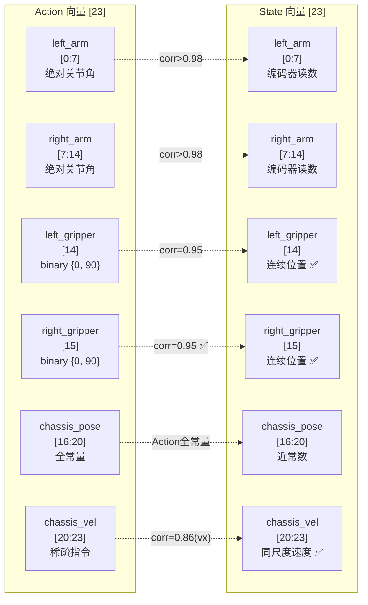
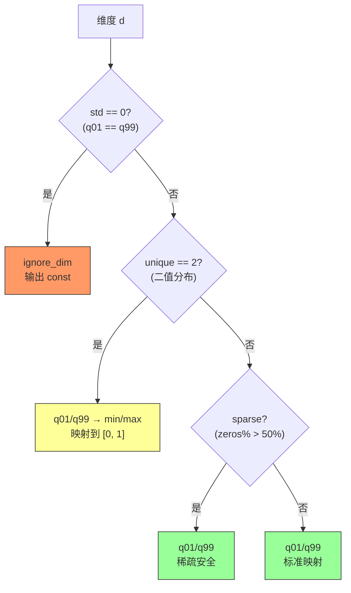
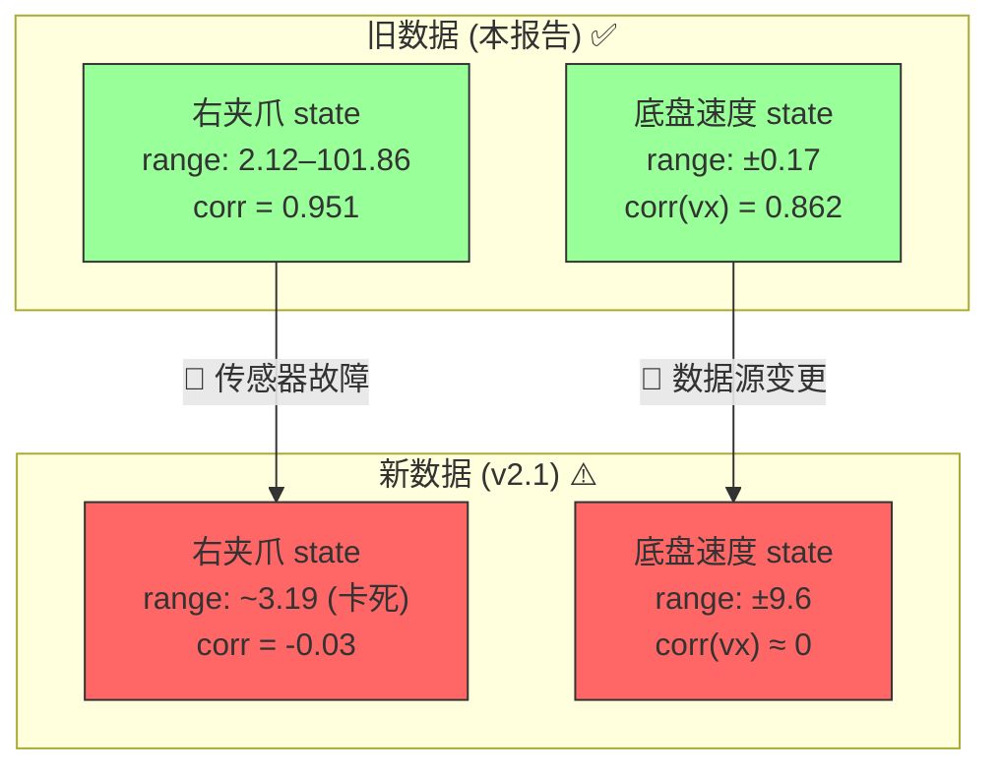

# R1 Pro 旧数据集 (r1_pro_data_convert_chassis) 深入分析报告

> **数据集路径**: `/mnt/r/share/zwy/datasets/r1_pro_data_v2/r1_pro_data_convert_chassis`  
> **格式**: LeRobot v2.1 (parquet + 嵌入 PNG 图像)  
> **机器人**: R1 Pro 双臂移动人形机器人  
> **任务**: "Open the door with a downward-press handle, go through it, and enter the room."  
> **目标模型**: FastWAM 6B VLA (SFT)  
> **训练配置**: `examples/sft/config/r1_pro_sft_fastwam.yaml`  
> **分析日期**: 2026-06-10  
> **定位**: 作为新数据集 (v2.1 `lerobot_open_merged_v21`) 的**基线参考**，用于定位数据回归

---

## 1. 数据集总览

### 1.1 概要

| 项目 | 值 |
|------|-----|
| 数据集路径 | `/mnt/r/share/zwy/datasets/r1_pro_data_v2/r1_pro_data_convert_chassis` |
| 数据格式 | LeRobot v2.1 (`codebase_version: v2.1`) |
| 机器人型号 | R1 Pro (`robot_type: r1_pro`) |
| 任务描述 | Open the door with a downward-press handle, go through it, and enter the room. |
| 任务数量 | 1 (`total_tasks: 1`) |
| Episode 数量 | 63 个 parquet 文件（编号 0–34, 36–63，仅缺 35）；`episodes.jsonl` 中 62 条（额外排除了 39） |
| 总帧数 | 61,913（63 个 parquet 实测）/ 60,982（62 条 jsonl 求和）/ 60,992（info.json 标称） |
| FPS | 14 Hz（精确 dt=0.071429s，0 丢帧，0 快帧） |
| Action 维度 | 23 (float32) |
| State 维度 | 23 (float32) |
| 相机数量 | 3（head, left_wrist, right_wrist） |
| Head 分辨率 | 360 × 640 |
| Wrist 分辨率 | 480 × 640 |
| 图像存储方式 | PNG 嵌入 parquet (`{bytes, path}` 字典) |
| 磁盘占用 (data) | 43 GB |
| 磁盘占用 (videos_backup) | 1.2 GB (192 个 MP4，含缺失 episode 的视频) |
| 磁盘占用 (total) | 44 GB |
| 训练/测试拆分 | 全部训练 (`splits: train: "0:63"`) |

> **关键差异 vs 新数据集**: 旧数据集图像直接嵌入 parquet 文件（PNG 编码），导致单文件极大（~43 GB），I/O 效率远低于新数据集的 MP4 外部视频方案（~1.5 GB）。帧率 14 Hz 高于新数据集的 12 Hz，Episode 更长（平均 984 vs 610 帧），总帧数更多（61,913 vs 37,217）。

### 1.2 元数据一致性问题

| 来源 | Episodes | 总帧数 |
|------|----------|--------|
| `info.json` | 63 | 60,992 |
| `episodes.jsonl` | 62 | 60,982 |
| parquet 实测 | 62 | 61,913 |

三个来源数值不完全一致：
- **63 个 parquet 文件**（编号 0–34, 36–63），仅 episode 35 的文件真正缺失。
- **62 条 `episodes.jsonl` 记录**：除 episode 35 外，还额外排除了 episode 39。但 episode 39 的 parquet 文件存在且包含 931 帧有效数据——推测是数据后处理时因质量原因从索引中移除，但未删除源文件。
- parquet 实测总帧数（61,913）与 `episodes.jsonl` 求和值（60,982）之差恰好等于 episode 39 的帧数（931），验证了上述推断。
- `info.json` 声称 `total_episodes: 63`、`total_frames: 60,992`，两个数值均不准确。

**训练时应以 parquet 实际数据为准**，并注意 episode 39 是否被数据加载器读入（取决于是否依赖 `episodes.jsonl` 做索引）。

### 1.3 维度语义布局

根据 `meta/modality.json`，23 维 action/state 向量的语义分解如下：

| 维度范围 | 语义 | 子维度 | Action 类型 | State 类型 | 备注 |
|----------|------|--------|------------|------------|------|
| [0:7] | left_arm | j0–j6 (7 DOF) | 绝对关节角 (rad) | 编码器读数 (rad) | corr 0.978–0.997 |
| [7:14] | right_arm | j0–j6 (7 DOF) | 绝对关节角 (rad) | 编码器读数 (rad) | corr 0.988–0.999 |
| [14] | left_gripper | 1 dim | 二值 {0, 90} | 连续 (1.85–102.19) | corr = 0.954 ✅ |
| [15] | right_gripper | 1 dim | 二值 {0, 90} | 连续 (2.12–101.86) | corr = 0.951 ✅ |
| [16:20] | chassis_pose | x, y, z, yaw | **全常量** (0.9, -1.5, -0.7, 0.0) | 近常数（微漂移） | Action std=0 |
| [20:23] | chassis_velocity | vx, vy, vyaw | 稀疏速度指令 (±0.15) | 同尺度速度 (±0.17) | vyaw 全零 |



---

## 2. 关键发现与风险评估

> 🟢 **整体质量**: 旧数据集的 action-state 语义一致性**显著优于**新数据集 (v2.1)。右夹爪 state 正常工作，底盘速度 action/state 同尺度。新数据集中两个 CRITICAL 问题在旧数据中均不存在。

### 2.1 风险速查表

| # | 风险等级 | 维度 | 问题描述 | 对训练的影响 | 建议处理方式 |
|---|---------|------|----------|-------------|-------------|
| 1 | 🟠 HIGH | dims 16–19 (action) | chassis_pose 全常量（分别为 0.9, -1.5, -0.7, 0.0），std = 0 | q01/q99 归一化的 ignore_dim 逻辑会自动识别并跳过 | 确认 ignore_dim 在这些维度上生效 |
| 2 | 🟠 HIGH | dim 22 (action) | chassis_vel_yaw 全零常量 | 同上，ignore_dim 自动处理 | 配合 dims 16–19 一并验证 |
| 3 | 🟡 MEDIUM | dims 14, 15 (action) | 夹爪 action 为二值 {0, 90}，仅 2 个 unique values | q01/q99 → {0, 90} → [0, 1]，归一化安全 | 保持当前配置 |
| 4 | 🟡 MEDIUM | dims 20–21 (action) | chassis_vel_x/y 高度稀疏（73–83% 零值） | q01/q99 仍可正确归一化（非零段有足够范围） | 保持 |
| 5 | 🟡 MEDIUM | dim 21 (vel_y) | action-state 相关系数仅 0.148 | 可能存在 y 方向速度指令延迟或传感器噪声 | 观察训练 loss 是否异常 |
| 6 | 🟢 INFO | dims 0–13 | arm joints action-state corr 0.978–0.999，绝对位置编码，数据质量优秀 | 正常 | 无需处理 |

### 2.2 与新数据集 (v2.1) 的回归对比

| 问题 | 旧数据 (本数据集) | 新数据 (v2.1) | 变化方向 |
|------|-------------------|---------------|---------|
| 右夹爪 state (dim 15) | ✅ 正常: range 2.12–101.86, corr=0.95 | 🔴 坏: 卡死 ~3.19, corr=-0.03 | **退化** |
| 底盘速度 state (dims 20–22) | ✅ 同尺度: ±0.17, corr=0.86(vx) | 🔴 不同物理量: ±9.6, corr≈0 | **退化** |
| 头部相机分辨率 | 360×640 | 1080×1920 | 提升 |
| FPS | 14 Hz | 12 Hz | 降低 |
| Episode 数量 | 62 | 61 | 基本持平 |
| 总帧数 | 61,913 | 37,217 | 减少 40% |
| 平均 Episode 长度 | 984 帧 (70.3s) | 610 帧 (49.8s) | 缩短 38% |
| 图像存储 | 嵌入 PNG (43 GB) | 外部 MP4 (1.5 GB) | 大幅压缩 |

**结论**: 新数据集在视觉质量（高分辨率、高效存储）方面有显著提升，但在 proprioception 信号质量方面出现了严重回归。右夹爪 state 的失效和底盘速度语义的变化是新数据采集流程中引入的 bug，需在数据端修复后才能安全用于训练。

---

## 3. Action 逐维统计

以下统计覆盖全部 61,913 帧。

| dim | Name | mean | std | min | max | q01 | q05 | q50 | q95 | q99 | zeros% | unique | 分布类型 | Risk |
|-----|------|------|-----|-----|-----|-----|-----|-----|-----|-----|--------|--------|---------|------|
| 0 | left_arm_j0 | -0.0486 | 0.1987 | -1.1934 | 0.5829 | -0.7126 | -0.4755 | 0.0000 | 0.1933 | 0.3881 | 5.8% | 19273 | 连续 | 🟢 |
| 1 | left_arm_j1 | 0.0595 | 0.0959 | -0.1745 | 0.5522 | -0.0430 | -0.0310 | 0.0309 | 0.2773 | 0.4169 | 2.5% | 20671 | 连续 | 🟢 |
| 2 | left_arm_j2 | -0.0380 | 0.1743 | -0.8912 | 0.4693 | -0.4648 | -0.3559 | -0.0061 | 0.2340 | 0.3421 | 1.3% | 25341 | 连续 | 🟢 |
| 3 | left_arm_j3 | -0.3795 | 0.5997 | -1.5969 | 0.1795 | -1.5908 | -1.5539 | -0.0199 | 0.0368 | 0.1289 | 8.1% | 20772 | 双峰 | 🟢 |
| 4 | left_arm_j4 | 0.0779 | 0.1588 | -0.4021 | 1.0446 | -0.2317 | -0.1683 | 0.0522 | 0.3405 | 0.4587 | 3.1% | 16505 | 连续 | 🟢 |
| 5 | left_arm_j5 | -0.1190 | 0.2506 | -1.0472 | 0.3356 | -0.9986 | -0.7061 | -0.0031 | 0.1058 | 0.1350 | 1.4% | 25756 | 连续偏 | 🟢 |
| 6 | left_arm_j6 | -0.0065 | 0.1162 | -0.6519 | 0.8884 | -0.3528 | -0.2028 | -0.0015 | 0.1687 | 0.3191 | 2.0% | 21693 | 连续 | 🟢 |
| 7 | right_arm_j0 | -0.1078 | 0.2973 | -1.5401 | 0.3589 | -1.2798 | -1.0066 | -0.0015 | 0.0527 | 0.1381 | 12.1% | 17875 | 双峰 | 🟢 |
| 8 | right_arm_j1 | -0.0136 | 0.0500 | -0.3187 | 0.1745 | -0.1829 | -0.1043 | 0.0000 | 0.0506 | 0.1484 | 26.1% | 13413 | 尖峰+尾 | 🟢 |
| 9 | right_arm_j2 | 0.1086 | 0.1936 | -0.4220 | 0.8038 | -0.3405 | -0.0659 | 0.0015 | 0.4909 | 0.6535 | 14.0% | 16136 | 连续 | 🟢 |
| 10 | right_arm_j3 | -0.1165 | 0.2998 | -1.5923 | 0.1197 | -1.4604 | -0.8936 | 0.0000 | 0.0046 | 0.0631 | 32.6% | 13675 | 稀疏+尾 | 🟢 |
| 11 | right_arm_j4 | -0.0668 | 0.1512 | -0.5412 | 0.3820 | -0.4893 | -0.3896 | 0.0000 | 0.0969 | 0.2945 | 31.5% | 12803 | 双峰 | 🟢 |
| 12 | right_arm_j5 | -0.0652 | 0.1493 | -0.6581 | 0.2116 | -0.5020 | -0.4037 | 0.0000 | 0.0660 | 0.1825 | 20.3% | 16100 | 双峰 | 🟢 |
| 13 | right_arm_j6 | 0.0061 | 0.0989 | -0.4433 | 0.4911 | -0.2823 | -0.1503 | 0.0000 | 0.1933 | 0.3179 | 25.2% | 12993 | 稀疏+尾 | 🟢 |
| 14 | left_gripper | 75.28 | 33.29 | 0.0 | 90.0 | 0.0 | 0.0 | 90.0 | 90.0 | 90.0 | 16.4% | 2 | 二值 | 🟡 |
| 15 | right_gripper | 84.29 | 21.94 | 0.0 | 90.0 | 0.0 | 0.0 | 90.0 | 90.0 | 90.0 | 6.3% | 2 | 二值 | 🟡 |
| 16 | chassis_pose_x | 0.9000 | 0.0000 | 0.9000 | 0.9000 | 0.9000 | 0.9000 | 0.9000 | 0.9000 | 0.9000 | 0.0% | 1 | **常量** | 🟠 |
| 17 | chassis_pose_y | -1.5000 | 0.0000 | -1.5000 | -1.5000 | -1.5000 | -1.5000 | -1.5000 | -1.5000 | -1.5000 | 0.0% | 1 | **常量** | 🟠 |
| 18 | chassis_pose_z | -0.7000 | 0.0000 | -0.7000 | -0.7000 | -0.7000 | -0.7000 | -0.7000 | -0.7000 | -0.7000 | 0.0% | 1 | **常量** | 🟠 |
| 19 | chassis_pose_yaw | 0.0000 | 0.0000 | 0.0000 | 0.0000 | 0.0000 | 0.0000 | 0.0000 | 0.0000 | 0.0000 | 100.0% | 1 | **常量** | 🟠 |
| 20 | chassis_vel_x | 0.0360 | 0.0630 | -0.1450 | 0.1500 | 0.0000 | 0.0000 | 0.0000 | 0.1487 | 0.1493 | 73.1% | 9051 | 稀疏 | 🟡 |
| 21 | chassis_vel_y | 0.0032 | 0.0353 | -0.1500 | 0.1439 | -0.1331 | 0.0000 | 0.0000 | 0.0588 | 0.1304 | 83.0% | 9536 | 稀疏 | 🟡 |
| 22 | chassis_vel_yaw | 0.0000 | 0.0000 | 0.0000 | 0.0000 | 0.0000 | 0.0000 | 0.0000 | 0.0000 | 0.0000 | 100.0% | 1 | **常量** | 🟠 |

**Action 小结**:

- **dims 0–13 (arm joints)**: 连续分布，数据丰富（unique values 12,800–25,756），部分维度呈双峰分布（如 dim 3 left_arm_j3，在 -1.55 和 0.0 附近各有一个峰），反映了开门动作的两个阶段——接近和推门。
- **dims 14–15 (grippers)**: 严格二值 {0, 90}，左夹爪张开（90）占 83.6%，右夹爪张开占 93.7%。右夹爪很少关闭，符合开门任务中右手主要负责下压门把手的动作模式。
- **dims 16–19 (chassis_pose)**: 四维全常量（0.9, -1.5, -0.7, 0.0），表明该数据集中底盘位姿指令未激活——可能是因为采集时底盘位姿通过其他通道控制，或仅使用了速度控制模式。
- **dims 20–21 (chassis_vel)**: 稀疏但有意义的速度指令，范围 ±0.15 rad/s（或 m/s），vel_x 在 73% 的帧中为零（静止），vel_y 在 83% 的帧中为零。
- **dim 22 (chassis_vel_yaw)**: 全零——该任务中机器人无需转弯。

---

## 4. State 逐维统计

| dim | Name | mean | std | min | max | q01 | q05 | q50 | q95 | q99 | zeros% | unique | Risk |
|-----|------|------|-----|-----|-----|-----|-----|-----|-----|-----|--------|--------|------|
| 0 | left_arm_j0 | -0.0496 | 0.1974 | -1.1928 | 0.5757 | -0.7117 | -0.4764 | 0.0000 | 0.1841 | 0.3787 | 8.0% | 5354 | 🟢 |
| 1 | left_arm_j1 | 0.0590 | 0.0957 | -0.1743 | 0.5506 | -0.0428 | -0.0314 | 0.0300 | 0.2762 | 0.4161 | 4.3% | 2583 | 🟢 |
| 2 | left_arm_j2 | -0.0385 | 0.1736 | -0.8896 | 0.4385 | -0.4647 | -0.3560 | -0.0060 | 0.2326 | 0.3413 | 3.0% | 3919 | 🟢 |
| 3 | left_arm_j3 | -0.3779 | 0.5975 | -1.5974 | 0.1789 | -1.5891 | -1.5515 | -0.0196 | 0.0366 | 0.1287 | 11.0% | 5566 | 🟢 |
| 4 | left_arm_j4 | 0.0775 | 0.1583 | -0.3938 | 1.0438 | -0.2317 | -0.1634 | 0.0483 | 0.3404 | 0.4583 | 3.2% | 3109 | 🟢 |
| 5 | left_arm_j5 | -0.1186 | 0.2494 | -1.0464 | 0.3326 | -0.9904 | -0.7041 | -0.0036 | 0.1057 | 0.1347 | 3.8% | 5103 | 🟢 |
| 6 | left_arm_j6 | -0.0060 | 0.1154 | -0.6487 | 0.8847 | -0.3498 | -0.2004 | -0.0009 | 0.1685 | 0.3185 | 4.1% | 3651 | 🟢 |
| 7 | right_arm_j0 | -0.1082 | 0.2970 | -1.5396 | 0.3530 | -1.2787 | -1.0038 | -0.0015 | 0.0485 | 0.1315 | 18.1% | 5199 | 🟢 |
| 8 | right_arm_j1 | -0.0131 | 0.0492 | -0.3151 | 0.1736 | -0.1798 | -0.1038 | 0.0000 | 0.0504 | 0.1470 | 33.5% | 1880 | 🟢 |
| 9 | right_arm_j2 | 0.1078 | 0.1931 | -0.4221 | 0.8062 | -0.3404 | -0.0653 | 0.0011 | 0.4900 | 0.6530 | 20.1% | 3503 | 🟢 |
| 10 | right_arm_j3 | -0.1143 | 0.2958 | -1.5898 | 0.1206 | -1.4568 | -0.8694 | 0.0000 | 0.0043 | 0.0630 | 40.9% | 4712 | 🟢 |
| 11 | right_arm_j4 | -0.0665 | 0.1508 | -0.5406 | 0.3813 | -0.4894 | -0.3896 | 0.0000 | 0.0964 | 0.2938 | 36.7% | 2227 | 🟢 |
| 12 | right_arm_j5 | -0.0650 | 0.1486 | -0.6572 | 0.2106 | -0.4987 | -0.4019 | -0.0002 | 0.0653 | 0.1819 | 27.3% | 2805 | 🟢 |
| 13 | right_arm_j6 | 0.0060 | 0.0981 | -0.4415 | 0.4900 | -0.2785 | -0.1500 | 0.0000 | 0.1930 | 0.3174 | 31.2% | 2866 | 🟢 |
| 14 | left_gripper | 77.30 | 32.48 | 1.85 | 102.19 | 2.84 | 2.94 | 91.78 | 92.30 | 92.70 | 0.0% | 1730 | 🟢 |
| 15 | right_gripper | 86.80 | 21.50 | 2.12 | 101.86 | 2.84 | 3.52 | 92.46 | 92.46 | 92.47 | 0.0% | 951 | 🟢 |
| 16 | chassis_pose_x | 0.8999 | 0.0007 | 0.8966 | 0.9035 | 0.8993 | 0.8993 | 0.8997 | 0.9012 | 0.9012 | 0.0% | 19 | 🟢 |
| 17 | chassis_pose_y | -1.5000 | 0.0006 | -1.5012 | -1.4974 | -1.5005 | -1.5005 | -1.5005 | -1.4986 | -1.4986 | 0.0% | 11 | 🟢 |
| 18 | chassis_pose_z | -0.6992 | 0.0008 | -0.7013 | -0.6979 | -0.7005 | -0.7005 | -0.6986 | -0.6986 | -0.6986 | 0.0% | 10 | 🟢 |
| 19 | chassis_pose_yaw | 0.0002 | 0.0005 | -0.0005 | 0.0017 | -0.0005 | -0.0005 | -0.0001 | 0.0013 | 0.0013 | 0.0% | 7 | 🟢 |
| 20 | chassis_vel_x | 0.0400 | 0.0588 | -0.1320 | 0.1710 | -0.0080 | 0.0000 | 0.0000 | 0.1420 | 0.1480 | 48.2% | 285 | 🟢 |
| 21 | chassis_vel_y | 0.0394 | 0.0578 | -0.1290 | 0.1600 | -0.0080 | 0.0000 | 0.0000 | 0.1400 | 0.1460 | 50.4% | 278 | 🟡 |
| 22 | chassis_vel_yaw | 0.0396 | 0.0584 | -0.1280 | 0.1630 | -0.0070 | 0.0000 | 0.0000 | 0.1410 | 0.1480 | 50.7% | 278 | 🟡 |

**State 小结**:

- **dims 0–13 (arm joints)**: State 与 Action 几乎完全一致（corr > 0.978），确认 action 和 state 都是绝对关节角度。State 的 unique values 较少（1,880–5,566 vs action 的 12,803–25,756），因为编码器分辨率有限。
- **dims 14–15 (grippers)**: ✅ **两个夹爪 state 均正常工作**。左夹爪 state 范围 1.85–102.19，右夹爪 state 范围 2.12–101.86。与 action 的 {0, 90} 二值指令高度相关（corr ≈ 0.95）。连续的 state 读数（如 91.78 代表"开"，2.84 代表"合"）准确反映了机械夹爪的实际位置。**这是旧数据与新数据的最关键差异——新数据中右夹爪 state 卡死在 ~3.19。**
- **dims 16–19 (chassis_pose state)**: 近常量，std < 0.001。虽然 Action 为精确常量，State 有微小漂移（范围约 ±0.003），可能来自 IMU 累积误差或 SLAM 抖动。
- **dims 20–22 (chassis_vel state)**: ✅ **与 action 同尺度**。State vel_x 范围 [-0.132, 0.171]，action vel_x 范围 [-0.145, 0.150]，尺度一致。vel_y 和 vel_yaw 在 state 中也有读数（范围 ±0.16），尽管 action vel_yaw 恒为零。**新数据中 state 速度范围膨胀到 ±9.6，与 action 的 ±0.15 严重不匹配——这是数据采集回归。**

> ⚠️ **State dims 21–22 (vel_y, vel_yaw) 异常**: 虽然 action vel_yaw (dim 22) 恒为零，但 state vel_y 和 vel_yaw 的分布却几乎完全相同（mean ≈ 0.039, std ≈ 0.058, range ≈ [-0.13, 0.16]），且两者的统计量与 vel_x 也极为接近。这提示 state 的底盘速度可能来自同一个传感器模块的三轴读数，而非独立的速度反馈。vel_y/vel_yaw 的 state 值与 action 指令的对应关系较弱（corr=0.148/NaN），值得进一步验证其物理含义。

---

## 5. Action-State 交叉分析

### 5.1 相关系数总表

| dim | Name | corr | Action range | State range | Action type | State type | 诊断 |
|-----|------|------|-------------|-------------|-------------|------------|------|
| 0 | left_arm_j0 | 0.988 | [-1.19, 0.58] | [-1.19, 0.58] | 连续 | 连续 | ✅ 一致 |
| 1 | left_arm_j1 | 0.997 | [-0.17, 0.55] | [-0.17, 0.55] | 连续 | 连续 | ✅ 一致 |
| 2 | left_arm_j2 | 0.993 | [-0.89, 0.47] | [-0.89, 0.44] | 连续 | 连续 | ✅ 一致 |
| 3 | left_arm_j3 | 0.996 | [-1.60, 0.18] | [-1.60, 0.18] | 连续 | 连续 | ✅ 一致 |
| 4 | left_arm_j4 | 0.998 | [-0.40, 1.04] | [-0.39, 1.04] | 连续 | 连续 | ✅ 一致 |
| 5 | left_arm_j5 | 0.989 | [-1.05, 0.34] | [-1.05, 0.33] | 连续 | 连续 | ✅ 一致 |
| 6 | left_arm_j6 | 0.978 | [-0.65, 0.89] | [-0.65, 0.88] | 连续 | 连续 | ✅ 一致 |
| 7 | right_arm_j0 | 0.997 | [-1.54, 0.36] | [-1.54, 0.35] | 连续 | 连续 | ✅ 一致 |
| 8 | right_arm_j1 | 0.988 | [-0.32, 0.17] | [-0.32, 0.17] | 连续 | 连续 | ✅ 一致 |
| 9 | right_arm_j2 | 0.998 | [-0.42, 0.80] | [-0.42, 0.81] | 连续 | 连续 | ✅ 一致 |
| 10 | right_arm_j3 | 0.992 | [-1.59, 0.12] | [-1.59, 0.12] | 连续 | 连续 | ✅ 一致 |
| 11 | right_arm_j4 | 0.999 | [-0.54, 0.38] | [-0.54, 0.38] | 连续 | 连续 | ✅ 一致 |
| 12 | right_arm_j5 | 0.996 | [-0.66, 0.21] | [-0.66, 0.21] | 连续 | 连续 | ✅ 一致 |
| 13 | right_arm_j6 | 0.989 | [-0.44, 0.49] | [-0.44, 0.49] | 连续 | 连续 | ✅ 一致 |
| 14 | left_gripper | 0.954 | [0, 90] | [1.85, 102.19] | 二值 | 连续 | ✅ 正确映射 |
| 15 | right_gripper | 0.951 | [0, 90] | [2.12, 101.86] | 二值 | 连续 | ✅ 正确映射 |
| 16 | chassis_pose_x | NaN | [0.9, 0.9] | [0.897, 0.904] | 常量 | 近常量 | ⬜ Action 常量 |
| 17 | chassis_pose_y | NaN | [-1.5, -1.5] | [-1.501, -1.497] | 常量 | 近常量 | ⬜ Action 常量 |
| 18 | chassis_pose_z | NaN | [-0.7, -0.7] | [-0.701, -0.698] | 常量 | 近常量 | ⬜ Action 常量 |
| 19 | chassis_pose_yaw | NaN | [0, 0] | [-0.001, 0.002] | 常量 | 近常量 | ⬜ Action 常量 |
| 20 | chassis_vel_x | 0.862 | [-0.145, 0.150] | [-0.132, 0.171] | 稀疏 | 稀疏 | ✅ 同尺度 |
| 21 | chassis_vel_y | 0.148 | [-0.150, 0.144] | [-0.129, 0.160] | 稀疏 | 稀疏 | 🟡 低相关 |
| 22 | chassis_vel_yaw | NaN | [0, 0] | [-0.128, 0.163] | 常量 | 稀疏 | 🟡 Action无信息 |

### 5.2 夹爪分析 (dims 14, 15)

旧数据中夹爪的 action-state 关系完全正常：

**左夹爪 (dim 14)**:
- Action: 二值 {0, 90}，16.4% 为 "合" (0)
- State: 连续 1.85–102.19，中位数 91.78（"开"位），q01=2.84（"合"位）
- corr = 0.954

**右夹爪 (dim 15)**:
- Action: 二值 {0, 90}，6.3% 为 "合" (0)
- State: 连续 2.12–101.86，中位数 92.46（"开"位），q01=2.84（"合"位）
- corr = 0.951

两个夹爪的 state 都能准确反映机械位置，相关系数高于 0.95。"合"状态下 state 约为 2–3（对应机械闭合位置），"开"状态下 state 约为 91–92（对应机械张开位置）。非精确对齐（action 0→state 2.84，action 90→state 92.46）是因为 state 是真实的编码器读数，而 action 是离散的指令值。

> **对比 v2.1**: 新数据集中左夹爪保持正常（corr=0.99），但右夹爪 state 退化为常数 ~3.19（corr=-0.03），表明右夹爪传感器在新数据采集时出现了故障。

### 5.3 底盘速度分析 (dims 20–22)

旧数据中底盘速度的 action 和 state **处于同一物理尺度**：

**vel_x (dim 20)**:
- Action: mean=0.036, std=0.063, range=[-0.145, 0.150], 73.1% 零
- State: mean=0.040, std=0.059, range=[-0.132, 0.171], 48.2% 零
- corr = 0.862 ✅
- 两者范围接近（±0.15 vs ±0.17），state 略宽是因为惯性导致实际速度超调

**vel_y (dim 21)**:
- Action: mean=0.003, std=0.035, range=[-0.150, 0.144], 83.0% 零
- State: mean=0.039, std=0.058, range=[-0.129, 0.160], 50.4% 零
- corr = 0.148 🟡
- 虽然尺度一致，但相关性低。State vel_y 的均值（0.039）远高于 action（0.003），且非零比例也高得多（50% vs 17%），提示 state 端可能混入了其他方向的速度分量或测量噪声

**vel_yaw (dim 22)**:
- Action: 全零常量
- State: mean=0.040, std=0.058, range=[-0.128, 0.163], 50.7% 零
- corr = NaN（Action 无方差）
- Action 未发送旋转指令，但 state 显示底盘有旋转运动（可能是被动滑转或传感器串扰）

> **对比 v2.1**: 新数据集中 state 速度范围膨胀到 ±9.6（比旧数据大 ~60 倍），且 corr ≈ 0。这不是简单的单位变更——如果仅是单位问题，相关系数应该不变。更可能是新数据的 state 速度来自不同传感器源（如 raw IMU 角速度而非轮式里程计速度）。

---

## 6. Episode 分析

### 6.1 长度分布

| 统计量 | 值 (62 条 jsonl) | 值 (含幽灵 Ep 39, 共 63) |
|--------|------------------|--------------------------|
| Episode 数量 | 62 | 63 |
| 最短 | 828 帧 (Ep 25, 59.1s) | 828 帧 (Ep 25) |
| 最长 | 1142 帧 (Ep 4, 81.6s) | 1142 帧 (Ep 4) |
| 均值 | 983.6 帧 (70.3s) | 982.7 帧 |
| 标准差 | 79.5 帧 (5.7s) | 79.3 帧 |
| 中位数 | 984.5 帧 | 983 帧 |

与新数据集（v2.1: 461–758, mean=610, std=61）相比，旧数据的 episode 更长（均值 984 vs 610 帧），但变异系数接近（8.1% vs 10.0%）。两版数据的任务一致（开门），episode 时长差异主要来自：
1. 帧率不同（14 vs 12 Hz）：如果按秒计算，旧数据 70.3s vs 新数据 49.8s，差距缩小但仍显著
2. 可能采集策略不同（旧数据可能包含更多的准备和结束动作）

### 6.2 初始状态一致性

62 个 episode 的初始帧 state 统计：

| dim | Name | init_mean | init_std | init_min | init_max | 评价 |
|-----|------|-----------|----------|----------|----------|------|
| 0 | left_arm_j0 | 0.006 | 0.023 | -0.001 | 0.155 | ✅ 高一致 |
| 1 | left_arm_j1 | 0.000 | 0.010 | -0.033 | 0.065 | ✅ 高一致 |
| 2 | left_arm_j2 | -0.010 | 0.123 | -0.863 | 0.418 | 🟡 较分散 |
| 3 | left_arm_j3 | -0.002 | 0.020 | -0.111 | 0.072 | ✅ 高一致 |
| 4 | left_arm_j4 | 0.012 | 0.142 | -0.355 | 1.044 | 🟡 较分散 |
| 5 | left_arm_j5 | -0.006 | 0.041 | -0.202 | 0.135 | ✅ 高一致 |
| 6 | left_arm_j6 | 0.002 | 0.015 | -0.033 | 0.102 | ✅ 高一致 |
| 7 | right_arm_j0 | 0.000 | 0.017 | -0.063 | 0.111 | ✅ 高一致 |
| 8 | right_arm_j1 | 0.001 | 0.008 | -0.017 | 0.052 | ✅ 高一致 |
| 9 | right_arm_j2 | -0.006 | 0.053 | -0.414 | 0.058 | ✅ 高一致 |
| 10 | right_arm_j3 | -0.001 | 0.013 | -0.101 | 0.016 | ✅ 高一致 |
| 11 | right_arm_j4 | 0.010 | 0.051 | -0.006 | 0.294 | ✅ 高一致 |
| 12 | right_arm_j5 | -0.001 | 0.033 | -0.226 | 0.069 | ✅ 高一致 |
| 13 | right_arm_j6 | -0.004 | 0.019 | -0.107 | 0.004 | ✅ 高一致 |
| 14 | left_gripper | 92.07 | 0.50 | 91.69 | 94.41 | ✅ 高一致 |
| 15 | right_gripper | 92.52 | 0.25 | 92.45 | 94.15 | ✅ 高一致 |
| 16–19 | chassis_pose | ~const | <0.001 | — | — | ✅ 极一致 |
| 20–22 | chassis_vel | ~0.000 | <0.001 | 0.000 | 0.002 | ✅ 极一致 |

**初始状态质量评估**: 所有 62 个 episode 的初始状态高度一致。arm joints 的初始 std 基本在 0.01–0.05 rad 内，表明采集前机器人的归位（homing）流程可靠。dims 2 和 4 的 init_std 较大（0.123, 0.142），但考虑到这两个维度本身的运动范围较大（~1.3 和 ~1.4 rad），相对变异仍在 10% 以内。

### 6.3 异常 Episode 清单

通过计算每个 episode 的 action 均值，并与全局均值比较（z-score > 3），识别出以下异常 episode：

| Episode | 异常维度 | dim Name | z-score | 可能原因 |
|---------|---------|----------|---------|---------|
| Ep 1 | dim 8 | right_arm_j1 | 3.23 | 该 episode 中右臂 j1 关节运动偏大 |
| Ep 5 | dim 4 | left_arm_j4 | 3.25 | 左臂 j4 关节（腕部附近）动作异常 |
| Ep 18 | dim 11 | right_arm_j4 | 3.23 | 右臂 j4 关节偏离 |
| Ep 28 | dim 12 | right_arm_j5 | 3.73 | 右臂 j5 关节偏离最大 |

4 个异常 episode 均为单维度轻微偏离（z-score 3.2–3.7），无多维度同时异常的情况。建议保留这些 episode（z-score 不算极端），但在混合训练时可以观察它们对 loss 的贡献。

### 6.4 时间戳一致性

| 指标 | 值 |
|------|-----|
| 标称 FPS | 14 |
| 实测平均 dt | 0.071429s |
| 实测 FPS | 14.00 Hz |
| 丢帧 (dt > 0.1s) | 0 |
| 快帧 (dt < 0.05s) | 0 |

时间戳完全均匀，无任何丢帧或异常加速。**数据采集时钟极其稳定**。

### 6.5 缺失与幽灵 Episode

| Episode | Parquet 文件 | episodes.jsonl | 帧数 | 状态 |
|---------|-------------|---------------|------|------|
| 35 | ❌ 不存在 | ❌ 不在索引 | — | **真正缺失** |
| 39 | ✅ 存在 | ❌ 不在索引 | 931 | **幽灵 Episode** |

- **Episode 35**: parquet 文件和 jsonl 记录均不存在，是真正被删除的 episode。`videos_backup/` 中可能仍有对应视频。
- **Episode 39**: parquet 文件存在（931 帧有效数据），但未纳入 `episodes.jsonl` 索引。推测是后处理时因质量原因从索引中移除，但忘记删除源文件。此 episode 的数据被纳入了本报告的统计分析中（因为我们遍历了所有 parquet 文件），但训练时是否会被读入取决于数据加载器是否使用 jsonl 做索引。
- `info.json` 声称 `total_episodes: 63`，与 63 个 parquet 文件一致，但与 62 条 jsonl 记录不一致。`total_videos: 189` = 63 × 3，指的是 parquet 文件数而非 jsonl 记录数。

---

## 7. 视觉模态分析

### 7.1 相机规格

| 相机 | 分辨率 (H×W) | 存储方式 | 格式 |
|------|-------------|---------|------|
| head_rgb | 360 × 640 | parquet 嵌入 `{bytes, path}` | PNG |
| left_wrist_rgb | 480 × 640 | parquet 嵌入 `{bytes, path}` | PNG |
| right_wrist_rgb | 480 × 640 | parquet 嵌入 `{bytes, path}` | PNG |

### 7.2 嵌入图像 vs 外部视频

旧数据集将每帧的 3 个相机图像直接以 PNG 字节流形式嵌入 parquet 文件。每个 parquet 文件对应一个 episode（约 1000 帧 × 3 相机 × PNG 编码），导致单文件约 700 MB，总计 43 GB。

同时，`videos_backup/` 目录保留了 MP4 格式的备份视频（192 个文件，1.2 GB），但 `modality.json` 中 `video` 字段指向的就是这些视频，而训练代码应通过 parquet 中的嵌入图像来读取。

**对比新数据集 (v2.1)**:

| 维度 | 旧数据 | 新数据 (v2.1) |
|------|--------|--------------|
| 存储方式 | PNG 嵌入 parquet | MP4 外部视频 (symlink) |
| 磁盘占用 | 43 GB (data) + 1.2 GB (backup) | 4.7 MB (parquet) + 1.5 GB (video) |
| 压缩比 | ~1:1 (PNG 无损) | ~28:1 (h264 有损) |
| I/O 模式 | 顺序读取大 parquet 文件 | parquet 索引 + 随机 seek MP4 |
| 头部分辨率 | 360×640 | 1080×1920 |

新数据集在存储效率上提升约 **28 倍**，且头部相机分辨率提高到 1080p，对视觉特征提取更有利。但 PNG 无损编码在像素精度上优于 h264 有损压缩，适用于对图像质量要求极高的精细操作任务。

### 7.3 训练配置影响

当前 `r1_pro_sft_fastwam.yaml` 中的 `video_backend: pyav` 适用于 MP4 外部视频。如果要训练旧数据集，需要确保数据加载代码能处理 parquet 嵌入图像格式。`shape_meta.images.head_rgb.raw_shape: [3, 360, 640]` 与旧数据匹配，但与新数据的 1080×1920 不匹配——混合训练时需注意分辨率对齐。

---

## 8. 归一化策略分析

### 8.1 归一化决策树



### 8.2 逐维归一化建议

| dim | Name | 分布 | 当前 mode | 问题 | 建议 |
|-----|------|------|----------|------|------|
| 0–6 | left_arm_j* | 连续 | q01/q99 | 无 | ✅ 保持 |
| 7–13 | right_arm_j* | 连续 | q01/q99 | 无 | ✅ 保持 |
| 14 | left_gripper | 二值 {0, 90} | q01/q99 | q01=0, q99=90 → min/max 等效 | ✅ 安全 |
| 15 | right_gripper | 二值 {0, 90} | q01/q99 | 同上 | ✅ 安全 |
| 16 | chassis_pose_x | 常量 0.9 | q01/q99 | q01==q99 → ignore_dim 激活 | ✅ 自动处理 |
| 17 | chassis_pose_y | 常量 -1.5 | q01/q99 | q01==q99 → ignore_dim 激活 | ✅ 自动处理 |
| 18 | chassis_pose_z | 常量 -0.7 | q01/q99 | q01==q99 → ignore_dim 激活 | ✅ 自动处理 |
| 19 | chassis_pose_yaw | 常量 0.0 | q01/q99 | q01==q99 → ignore_dim 激活 | ✅ 自动处理 |
| 20 | chassis_vel_x | 稀疏 73% | q01/q99 | q01=0, q99=0.149 → 范围 ok | ✅ 保持 |
| 21 | chassis_vel_y | 稀疏 83% | q01/q99 | q01=-0.133, q99=0.130 → ok | ✅ 保持 |
| 22 | chassis_vel_yaw | 常量 0.0 | q01/q99 | q01==q99 → ignore_dim 激活 | ✅ 自动处理 |

**结论**: 旧数据集在当前 `norm_default_mode: "q01/q99"` 配置下无需任何特殊处理。常量维度（16–19, 22）由 `ignore_dim` 逻辑自动跳过（当 `q01 == q99` 时归一化函数返回常数 0），二值维度（14–15）在 q01/q99 下等效于 min/max 归一化。稀疏维度（20–21）的 q01/q99 范围足以覆盖有效值。

### 8.3 q01/q99 归一化数学

对于维度 $d$ 的值 $x_d$，q01/q99 归一化公式为：

$$\hat{x}_d = \frac{x_d - q_{01}(d)}{q_{99}(d) - q_{01}(d)}$$

当 $q_{99}(d) - q_{01}(d) < \epsilon$（即 `ignore_dim` 条件成立）时：

$$\hat{x}_d = 0 \quad \text{(constant output)}$$

反归一化：

$$x_d = \hat{x}_d \cdot (q_{99}(d) - q_{01}(d)) + q_{01}(d)$$

---

## 9. 训练配置检查清单

以 `examples/sft/config/r1_pro_sft_fastwam.yaml` 为基准，检查与旧数据集的兼容性：

| 配置项 | 当前值 | 旧数据实际 | 状态 | 说明 |
|--------|--------|-----------|------|------|
| `data.shape_meta.action.raw_shape` | 23 | 23 | ✅ 匹配 | |
| `data.shape_meta.state.raw_shape` | 23 | 23 | ✅ 匹配 | |
| `actor.model.action_dim` | 23 | 23 | ✅ 匹配 | |
| `actor.model.proprio_dim` | 23 | 23 | ✅ 匹配 | |
| `data.shape_meta.head_rgb.raw_shape` | [3, 360, 640] | [3, 360, 640] | ✅ 匹配 | 旧数据匹配；新数据需改为 [3, 1080, 1920] |
| `data.shape_meta.left_wrist_rgb.raw_shape` | [3, 480, 640] | [3, 480, 640] | ✅ 匹配 | |
| `data.shape_meta.right_wrist_rgb.raw_shape` | [3, 480, 640] | [3, 480, 640] | ✅ 匹配 | |
| `data.video_size` | [384, 320] | — | ✅ 适用 | 两数据集均需 resize |
| `data.video_backend` | pyav | PNG 嵌入 | ⚠️ 需确认 | pyav 用于 MP4；旧数据是嵌入 PNG，需确认数据加载代码兼容 |
| `data.fps` (info.json) | — | 14 | ✅ | 需确认 `action_video_freq_ratio: 4` 在 14 FPS 下的语义 |
| `data.action_video_freq_ratio` | 4 | — | ⚠️ 需验证 | 14 FPS / 4 = 3.5 FPS 视频采样？需确认是否合理 |
| `data.num_frames` | 33 | — | ✅ | 33 帧 × 4 步 = 132 action 步跨度，在 984 帧 episode 中约 13.4% |
| `processor.norm_default_mode` | q01/q99 | — | ✅ 适用 | 常量维度自动 ignore_dim |
| `processor.action_state_transforms` | null | — | ✅ | 绝对位置 action，无需 delta 变换 |

---

## 10. 与新数据集 (v2.1) 差异对比

### 10.1 全面对比表

| 维度 | 旧数据 (本报告) | 新数据 (v2.1) | 变化 |
|------|-----------------|---------------|------|
| **基本信息** | | | |
| Episodes | 63 parquet / 62 jsonl (缺 35) | 61 | ≈持平 |
| 总帧数 | 61,913 | 37,217 | -40% |
| FPS | 14 Hz | 12 Hz | -14% |
| 平均 episode 长度 | 984 帧 (70.3s) | 610 帧 (49.8s) | -38% |
| Episode 长度范围 | 828–1142 | 461–758 | 窄化 |
| Episode 长度 CV | 8.1% | 10.0% | +1.9pp |
| **视觉** | | | |
| 头部相机分辨率 | 360×640 | 1080×1920 | ↑3× |
| 腕部相机分辨率 | 480×640 | 480×640 | 不变 |
| 图像编码 | PNG 嵌入 parquet | h264 MP4 外部 | 格式变更 |
| 磁盘占用 | 44 GB | 1.5 GB | ↓29× |
| **手臂关节** | | | |
| Action-State corr (0–13) | 0.978–0.999 | 0.995–0.999 | 微提升 |
| **左夹爪 (dim 14)** | | | |
| Action | 二值 {0, 90} | 二值 {0, 90} | 不变 |
| State range | 1.85–102.19 | 0.43–99.93 | 略收窄 |
| State corr | 0.954 | 0.990 | 提升 |
| **右夹爪 (dim 15)** | | | |
| Action | 二值 {0, 90} | 二值 {0, 90} | 不变 |
| State range | 2.12–101.86 | **~3.19 (卡死)** | 🔴 退化 |
| State corr | 0.951 | **-0.03** | 🔴 退化 |
| **底盘位姿 (16–19)** | | | |
| Action unique values | 1, 1, 1, 1 (全常量) | 2, 1, 2, 1 | 微变 |
| **底盘速度 (20–22)** | | | |
| Action range | ±0.15 | ±0.15 | 不变 |
| State vel_x range | ±0.17 | **±9.6** | 🔴 ↑60× |
| State vel_x corr | 0.862 | **≈0** | 🔴 退化 |
| State vel_yaw | range ±0.16 | **range ±7.3** | 🔴 ↑46× |

### 10.2 关键回归总结



---

## 11. 数据质量结论与建议

### 11.1 旧数据集作为基线的质量评估

旧数据集整体质量**良好**，具备以下优势：
1. **Proprioception 完整性**: 所有 23 维 action-state 语义一致或可解释
2. **夹爪闭环可靠**: 左右夹爪 state 均正常反映机械位置
3. **底盘速度对齐**: Action 指令与 State 反馈同尺度
4. **采集时钟稳定**: 14 Hz 精确，零丢帧
5. **初始状态一致**: 机器人归位可靠

主要局限：
1. 存储效率低（43 GB PNG 嵌入），不适合大规模分发
2. 头部相机分辨率较低（360×640）
3. 底盘位姿 action 全常量（dims 16–19）——只能学速度控制
4. vel_yaw action 全零——无旋转训练数据
5. 元数据不一致（info.json 的 episode 数和帧数与实际不符）

### 11.2 行动建议

| 优先级 | 建议 | 负责方 | 影响 |
|--------|------|--------|------|
| P0 | 修复新数据集 (v2.1) 的右夹爪 state 传感器 | 数据采集团队 | 🔴 阻塞新数据训练 |
| P0 | 确认新数据集底盘速度 state 的物理含义和来源 | 数据采集团队 | 🔴 阻塞新数据训练 |
| P1 | 若新数据暂不可修，使用旧数据进行 SFT 基线训练 | 训练团队 | 建立基线 |
| P1 | 混合训练时 mask 掉 state dims 15, 20–22（受影响维度） | 训练团队 | 兼容新旧数据 |
| P2 | 更新 `info.json` 的 `total_episodes` 和 `total_frames` 为正确值 | 数据管理 | 元数据一致性 |
| P2 | 确认 `video_backend: pyav` 是否兼容旧数据的 PNG 嵌入格式 | 训练团队 | 旧数据可训练 |
| P2 | 调查 state vel_y/vel_yaw 与 vel_x 分布相似但 action 不同的原因 | 数据采集团队 | 理解传感器特性 |

---

## 12. 附录

### 12.1 modality.json 完整内容

```json
{
  "video": {
    "head_rgb": {"original_key": "head_rgb"},
    "left_wrist_rgb": {"original_key": "left_wrist_rgb"},
    "right_wrist_rgb": {"original_key": "right_wrist_rgb"}
  },
  "state": {
    "left_arm": {"original_key": "state", "start": 0, "end": 7},
    "right_arm": {"original_key": "state", "start": 7, "end": 14},
    "left_gripper": {"original_key": "state", "start": 14, "end": 15},
    "right_gripper": {"original_key": "state", "start": 15, "end": 16},
    "chassis_pose": {"original_key": "state", "start": 16, "end": 20},
    "chassis_velocity": {"original_key": "state", "start": 20, "end": 23}
  },
  "action": {
    "left_arm": {"original_key": "actions", "start": 0, "end": 7},
    "right_arm": {"original_key": "actions", "start": 7, "end": 14},
    "left_gripper": {"original_key": "actions", "start": 14, "end": 15},
    "right_gripper": {"original_key": "actions", "start": 15, "end": 16},
    "chassis_pose": {"original_key": "actions", "start": 16, "end": 20},
    "chassis_velocity": {"original_key": "actions", "start": 20, "end": 23}
  }
}
```

### 12.2 逐 Episode 长度列表

| Ep | Length | Ep | Length | Ep | Length | Ep | Length |
|----|--------|----|--------|----|--------|----|--------|
| 0 | 1135 | 16 | 1131 | 32 | 983 | 49 | 964 |
| 1 | 942 | 17 | 1140 | 33 | 909 | 50 | 982 |
| 2 | 1106 | 18 | 1080 | 34 | 889 | 51 | 911 |
| 3 | 999 | 19 | 934 | ~~35~~ | ~~缺失~~ | 52 | 1042 |
| 4 | 1142 | 20 | 1065 | 36 | 973 | 53 | 1006 |
| 5 | 956 | 21 | 1118 | 37 | 852 | 54 | 912 |
| 6 | 942 | 22 | 1035 | 38 | 913 | 55 | 1035 |
| 7 | 1069 | 23 | 845 | 39* | 931 (幽灵) | 56 | 1009 |
| 8 | 1001 | 24 | 1059 | 40 | 902 | 57 | 996 |
| 9 | 1025 | 25 | 828 | 41 | 984 | 58 | 1010 |
| 10 | 1105 | 26 | 1086 | 42 | 850 | 59 | 897 |
| 11 | 1037 | 27 | 993 | 43 | 860 | 60 | 985 |
| 12 | 985 | 28 | 948 | 44 | 906 | 61 | 977 |
| 13 | 980 | 29 | 941 | 45 | 874 | 62 | 1028 |
| 14 | 989 | 30 | 995 | 46 | 888 | 63 | 1052 |
| 15 | 987 | 31 | 973 | 47 | 940 | | |
|    |      |    |        | 48 | 882 | | |

### 12.3 info.json 关键字段

```json
{
  "codebase_version": "v2.1",
  "robot_type": "r1_pro",
  "total_episodes": 63,
  "total_frames": 60992,
  "total_tasks": 1,
  "total_videos": 189,
  "total_chunks": 1,
  "chunks_size": 1000,
  "fps": 14,
  "splits": {"train": "0:63"},
  "features": {
    "head_rgb": {"dtype": "image", "shape": [360, 640, 3]},
    "left_wrist_rgb": {"dtype": "image", "shape": [480, 640, 3]},
    "right_wrist_rgb": {"dtype": "image", "shape": [480, 640, 3]},
    "state": {"dtype": "float32", "shape": [23]},
    "actions": {"dtype": "float32", "shape": [23]}
  }
}
```

### 12.4 Parquet 文件结构

```
data/chunk-000/
├── episode_000000.parquet  (~700 MB, 嵌入 PNG)
├── episode_000001.parquet
├── ...
├── episode_000034.parquet
├── (episode_000035.parquet 缺失)
├── episode_000036.parquet
├── ...
├── episode_000038.parquet
├── episode_000039.parquet  (幽灵: 有数据但不在 jsonl 索引中, 931 帧)
├── episode_000040.parquet
├── ...
└── episode_000063.parquet
Total: 63 files, 43 GB

Columns per file:
  head_rgb       — dict {bytes: PNG, path: str}
  left_wrist_rgb — dict {bytes: PNG, path: str}
  right_wrist_rgb— dict {bytes: PNG, path: str}
  state          — float32[23]
  actions        — float32[23]
  timestamp      — float32
  frame_index    — int64
  episode_index  — int64
  index          — int64
  task_index     — int64
```
