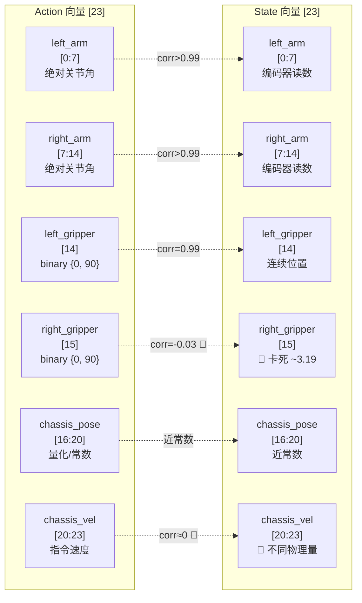
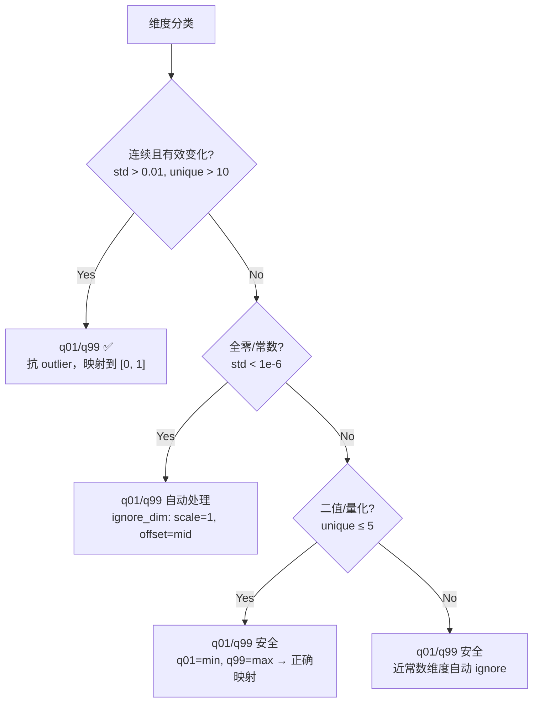

# R1 Pro 开门任务 LeRobot v2.1 数据集分析报告

> **数据集路径**: `/mnt/r/share/kaixin/data_0530/lerobot_open_merged_v21`  
> **格式**: LeRobot v2.1 (parquet + MP4 video symlink)  
> **机器人**: R1 Pro 双臂移动人形机器人  
> **任务**: "Open the door with a downward-press handle, go through it, and enter the room."  
> **目标模型**: FastWAM 6B VLA (SFT)  
> **训练配置**: `examples/sft/config/r1_pro_sft_fastwam.yaml`  
> **分析日期**: 2026-06-10

---

## 1. 数据集总览

### 1.1 概要

| 项目 | 值 |
|------|-----|
| 数据集路径 | `/mnt/r/share/kaixin/data_0530/lerobot_open_merged_v21` |
| 数据格式 | LeRobot v2.1 (`codebase_version: v2.1`) |
| 机器人型号 | R1 Pro (`robot_type: r1_pro`) |
| 任务描述 | Open the door with a downward-press handle, go through it, and enter the room. |
| 任务数量 | 1 (`total_tasks: 1`) |
| Episode 数量 | 61 |
| 总帧数 | 37,217 |
| FPS | 12（标称），12.25（实测） |
| Action 维度 | 23 (float32) |
| State 维度 | 23 (float32) |
| 相机数量 | 3（head, left_wrist, right_wrist） |
| Head 分辨率 | 1080 × 1920 (h264, yuv420p) |
| Wrist 分辨率 | 480 × 640 (h264, yuv420p) |
| 磁盘占用 (metadata) | 4.7 MB (parquet + JSON) |
| 磁盘占用 (video) | ~1.5 GB (symlinked) |
| 训练/测试拆分 | 全部训练 (`splits: train: "0:61"`) |

### 1.2 维度语义布局

根据 `meta/modality.json`，23 维 action/state 向量的语义分解如下：

| 维度范围 | 语义 | 子维度 | Action 类型 | State 类型 | 备注 |
|----------|------|--------|------------|------------|------|
| [0:7] | left_arm | j0–j6 (7 DOF) | 绝对关节角 (rad) | 编码器读数 (rad) | corr > 0.99 |
| [7:14] | right_arm | j0–j6 (7 DOF) | 绝对关节角 (rad) | 编码器读数 (rad) | corr > 0.99 |
| [14] | left_gripper | 1 dim | 二值 {0, 90} | 连续 (0.43–99.93) | corr = 0.99 |
| [15] | right_gripper | 1 dim | 二值 {0, 90} | **卡死 ~3.19** | 🔴 corr = -0.03 |
| [16:20] | chassis_pose | x, y, z, yaw | 量化/常数 | 近常数 | y, yaw 全零 |
| [20:23] | chassis_velocity | vx, vy, vyaw | 速度指令 (±0.15) | **不同物理量 (±9.6)** | 🔴 corr ≈ 0 |



---

## 2. 关键发现与风险评估

> 🔴 **CRITICAL**: 本数据集存在 2 个严重的 action-state 语义不匹配问题，可能导致模型学到错误的闭环控制信号。

| # | 风险等级 | 维度 | 问题描述 | 对训练的影响 | 建议处理方式 |
|---|---------|------|----------|-------------|-------------|
| 1 | 🔴 CRITICAL | dim 15 (right_gripper) | Action 二值 {0, 90} 但 State 卡死在 ~3.19，相关系数 -0.03 | 模型无法从 state 学习右夹爪闭环控制；proprio encoder 收到的 state 信息是噪声 | 联系数据采集团队排查传感器；训练时考虑 mask 掉 state dim 15 |
| 2 | 🔴 CRITICAL | dims 20–22 (chassis_vel) | Action 范围 ±0.15（指令速度），State 范围 ±9.6（可能是 IMU/编码器 raw），相关系数 ≈ 0 | 归一化后两者数值语义完全不同，模型无法对齐 | 确认 state 底盘速度的物理含义；考虑分开归一化或 mask state 速度维 |
| 3 | 🟠 HIGH | dims 17, 19 (action) | chassis_pose_y 和 chassis_pose_yaw 全零常数 | z-score 归一化会除零爆炸 | 当前 q01/q99 mode 可自动处理（ignore_dim 逻辑），但需验证 |
| 4 | 🟠 HIGH | dims 14, 15 (action) | 夹爪 action 为二值 {0, 90}，仅 2 个 unique values | z-score 对双峰分布不适用；q01/q99 映射到 [0, 1] 是安全的 | 当前 q01/q99 安全，保持 |
| 5 | 🟡 MEDIUM | dims 16, 18 (action) | chassis_pose_x 和 chassis_pose_z 仅 2 个 unique values | 信息量极低，几乎是开关量 | q01/q99 可处理 |
| 6 | 🟢 INFO | dims 0–13 (arm joints) | Action 与 State 高度相关 (corr > 0.99)，确认为绝对位置 | 正常，需确认推理端也使用绝对位置（action_state_transforms: null） | 无需额外处理 |

---

## 3. Action 逐维统计

以下统计覆盖全部 37,217 帧。

| dim | Name | mean | std | min | max | q01 | q05 | q50 | q95 | q99 | zeros% | 分布类型 | Risk |
|-----|------|------|-----|-----|-----|-----|-----|-----|-----|-----|--------|---------|------|
| 0 | left_arm_j0 | -0.1113 | 0.2695 | -1.1490 | 0.5967 | -0.9513 | -0.6714 | -0.0261 | 0.3237 | 0.4571 | 17.0% | 连续 | 🟢 LOW |
| 1 | left_arm_j1 | 0.0132 | 0.0490 | -0.1745 | 0.2853 | -0.0666 | -0.0445 | 0.0000 | 0.1150 | 0.1915 | 5.8% | 连续 | 🟢 LOW |
| 2 | left_arm_j2 | 0.0703 | 0.0968 | -0.2315 | 0.4034 | -0.1841 | -0.0552 | 0.0598 | 0.2393 | 0.3086 | 3.1% | 连续 | 🟢 LOW |
| 3 | left_arm_j3 | -0.3823 | 0.5969 | -1.6011 | 0.0813 | -1.5954 | -1.5846 | -0.0012 | 0.0184 | 0.0399 | 12.0% | 连续(双峰) | 🟡 MEDIUM |
| 4 | left_arm_j4 | -0.0490 | 0.1127 | -0.4449 | 0.3682 | -0.3329 | -0.2178 | -0.0261 | 0.1503 | 0.2408 | 3.3% | 连续 | 🟢 LOW |
| 5 | left_arm_j5 | -0.0711 | 0.2307 | -1.0472 | 0.5384 | -0.9312 | -0.6644 | -0.0015 | 0.2068 | 0.3454 | 5.5% | 连续 | 🟢 LOW |
| 6 | left_arm_j6 | -0.0042 | 0.0733 | -0.2700 | 0.5123 | -0.1747 | -0.0951 | -0.0077 | 0.0985 | 0.3265 | 2.7% | 连续 | 🟢 LOW |
| 7 | right_arm_j0 | -0.0909 | 0.2587 | -1.3591 | 0.1272 | -1.2084 | -0.8490 | 0.0000 | 0.0169 | 0.0538 | 35.7% | 连续(偏态) | 🟡 MEDIUM |
| 8 | right_arm_j1 | -0.0120 | 0.0384 | -0.3347 | 0.1580 | -0.1987 | -0.0719 | 0.0000 | 0.0215 | 0.0357 | 30.0% | 连续(偏态) | 🟡 MEDIUM |
| 9 | right_arm_j2 | 0.0259 | 0.1783 | -0.4295 | 0.8311 | -0.3544 | -0.2132 | 0.0000 | 0.4347 | 0.6606 | 15.5% | 连续 | 🟢 LOW |
| 10 | right_arm_j3 | -0.0462 | 0.1498 | -0.9449 | 0.0629 | -0.6795 | -0.4602 | 0.0000 | 0.0230 | 0.0476 | 36.3% | 连续(偏态) | 🟡 MEDIUM |
| 11 | right_arm_j4 | 0.0140 | 0.1072 | -0.4111 | 0.4065 | -0.3329 | -0.2010 | 0.0000 | 0.2194 | 0.2915 | 31.4% | 连续 | 🟢 LOW |
| 12 | right_arm_j5 | -0.0311 | 0.0849 | -0.4277 | 0.3390 | -0.3482 | -0.2071 | 0.0000 | 0.0736 | 0.1672 | 35.7% | 连续(偏态) | 🟡 MEDIUM |
| 13 | right_arm_j6 | -0.0120 | 0.0459 | -0.3068 | 0.2668 | -0.1718 | -0.0982 | 0.0000 | 0.0352 | 0.1319 | 30.7% | 连续(偏态) | 🟡 MEDIUM |
| 14 | left_gripper | 77.2050 | 31.4298 | 0.0000 | 90.0000 | 0.0000 | 0.0000 | 90.0000 | 90.0000 | 90.0000 | 14.2% | **二值** {0, 90} | 🟠 HIGH |
| 15 | right_gripper | 81.6329 | 26.1349 | 0.0000 | 90.0000 | 0.0000 | 0.0000 | 90.0000 | 90.0000 | 90.0000 | 9.3% | **二值** {0, 90} | 🟠 HIGH |
| 16 | chassis_pose_x | 0.7522 | 0.0181 | 0.7500 | 0.9000 | 0.7500 | 0.7500 | 0.7500 | 0.7500 | 0.9000 | 0.0% | **量化** (2 值) | 🟡 MEDIUM |
| 17 | chassis_pose_y | -1.5000 | 0.0000 | -1.5000 | -1.5000 | -1.5000 | -1.5000 | -1.5000 | -1.5000 | -1.5000 | 0.0% | **常数** | 🟠 HIGH |
| 18 | chassis_pose_z | -0.8478 | 0.0181 | -0.8500 | -0.7000 | -0.8500 | -0.8500 | -0.8500 | -0.8500 | -0.7000 | 0.0% | **量化** (2 值) | 🟡 MEDIUM |
| 19 | chassis_pose_yaw | 0.0000 | 0.0000 | 0.0000 | 0.0000 | 0.0000 | 0.0000 | 0.0000 | 0.0000 | 0.0000 | 100.0% | **常数** (全零) | 🟠 HIGH |
| 20 | chassis_vel_x | 0.0483 | 0.0613 | -0.1362 | 0.1500 | 0.0000 | 0.0000 | 0.0000 | 0.1443 | 0.1485 | 59.1% | 连续(稀疏) | 🟢 LOW |
| 21 | chassis_vel_y | 0.0148 | 0.0308 | -0.1355 | 0.1418 | 0.0000 | 0.0000 | 0.0000 | 0.0764 | 0.0882 | 75.3% | 连续(稀疏) | 🟢 LOW |
| 22 | chassis_vel_yaw | 0.0002 | 0.0143 | -0.1956 | 0.1843 | 0.0000 | 0.0000 | 0.0000 | 0.0000 | 0.0000 | 99.1% | **近零** | 🟠 HIGH |

**观察：**
- 右臂 (dims 7–13) 的 zeros% 远高于左臂 (dims 0–6)，表明开门任务中右臂运动较少、大量时间保持静止
- dim 3 (left_arm_j3) 呈明显双峰分布：q05 = -1.5846 vs q50 = -0.0012，说明该关节在"折叠"和"伸展"两个状态间切换
- 底盘速度 (dims 20–22) 以零为主 (59–99% 为零)，仅在移动阶段有值

---

## 4. State 逐维统计

| dim | Name | mean | std | min | max | q01 | q05 | q50 | q95 | q99 | zeros% | 分布类型 | Risk |
|-----|------|------|-----|-----|-----|-----|-----|-----|-----|-----|--------|---------|------|
| 0 | left_arm_j0 | -0.1126 | 0.2693 | -1.1483 | 0.5966 | -0.9551 | -0.6785 | -0.0257 | 0.3191 | 0.4563 | 19.1% | 连续 | 🟢 LOW |
| 1 | left_arm_j1 | 0.0129 | 0.0487 | -0.1743 | 0.2847 | -0.0666 | -0.0449 | 0.0000 | 0.1145 | 0.1914 | 9.1% | 连续 | 🟢 LOW |
| 2 | left_arm_j2 | 0.0699 | 0.0964 | -0.2300 | 0.4004 | -0.1840 | -0.0553 | 0.0594 | 0.2383 | 0.3076 | 6.1% | 连续 | 🟢 LOW |
| 3 | left_arm_j3 | -0.3822 | 0.5952 | -1.5985 | 0.0817 | -1.5938 | -1.5821 | -0.0009 | 0.0181 | 0.0398 | 15.8% | 连续(双峰) | 🟡 MEDIUM |
| 4 | left_arm_j4 | -0.0494 | 0.1122 | -0.4434 | 0.3670 | -0.3321 | -0.2174 | -0.0262 | 0.1496 | 0.2406 | 2.2% | 连续 | 🟢 LOW |
| 5 | left_arm_j5 | -0.0697 | 0.2294 | -1.0464 | 0.5343 | -0.9228 | -0.6549 | -0.0011 | 0.2077 | 0.3440 | 9.3% | 连续 | 🟢 LOW |
| 6 | left_arm_j6 | -0.0038 | 0.0731 | -0.2694 | 0.5102 | -0.1740 | -0.0945 | -0.0070 | 0.1000 | 0.3236 | 4.5% | 连续 | 🟢 LOW |
| 7 | right_arm_j0 | -0.0923 | 0.2610 | -1.3557 | 0.1268 | -1.2066 | -0.8691 | 0.0000 | 0.0164 | 0.0455 | 40.3% | 连续(偏态) | 🟡 MEDIUM |
| 8 | right_arm_j1 | -0.0119 | 0.0377 | -0.3328 | 0.1577 | -0.1942 | -0.0698 | 0.0000 | 0.0213 | 0.0334 | 37.2% | 连续(偏态) | 🟡 MEDIUM |
| 9 | right_arm_j2 | 0.0267 | 0.1789 | -0.4291 | 0.8249 | -0.3543 | -0.2132 | 0.0000 | 0.4394 | 0.6609 | 21.2% | 连续 | 🟢 LOW |
| 10 | right_arm_j3 | -0.0464 | 0.1485 | -0.9415 | 0.0630 | -0.6746 | -0.4551 | 0.0000 | 0.0226 | 0.0474 | 44.6% | 连续(偏态) | 🟡 MEDIUM |
| 11 | right_arm_j4 | 0.0142 | 0.1068 | -0.4098 | 0.4049 | -0.3326 | -0.2006 | 0.0000 | 0.2187 | 0.2909 | 32.5% | 连续 | 🟢 LOW |
| 12 | right_arm_j5 | -0.0316 | 0.0846 | -0.4219 | 0.3364 | -0.3481 | -0.2068 | 0.0000 | 0.0654 | 0.1512 | 40.6% | 连续(偏态) | 🟡 MEDIUM |
| 13 | right_arm_j6 | -0.0119 | 0.0456 | -0.2953 | 0.2645 | -0.1710 | -0.0974 | 0.0000 | 0.0349 | 0.1252 | 40.7% | 连续(偏态) | 🟡 MEDIUM |
| 14 | left_gripper | 78.9737 | 31.0270 | 0.4337 | 99.9287 | 1.9762 | 2.0749 | 91.6592 | 91.7707 | 92.2691 | 0.0% | 连续(双峰) | 🟢 LOW |
| 15 | right_gripper | **3.1855** | **0.0187** | **2.9667** | **3.2015** | 3.1730 | 3.1873 | 3.1873 | 3.1873 | 3.1873 | 0.0% | **🔴 近常数(卡死)** | 🔴 CRITICAL |
| 16 | chassis_pose_x | 0.7523 | 0.0181 | 0.7436 | 0.9012 | 0.7494 | 0.7494 | 0.7497 | 0.7513 | 0.8993 | 0.0% | 近常数 | 🟡 MEDIUM |
| 17 | chassis_pose_y | -1.5000 | 0.0007 | -1.5016 | -1.4974 | -1.5005 | -1.5005 | -1.5005 | -1.4986 | -1.4986 | 0.0% | 近常数 | 🟠 HIGH |
| 18 | chassis_pose_z | -0.8468 | 0.0181 | -0.8512 | -0.6986 | -0.8505 | -0.8505 | -0.8485 | -0.8485 | -0.6994 | 0.0% | 近常数 | 🟡 MEDIUM |
| 19 | chassis_pose_yaw | 0.0003 | 0.0007 | -0.0013 | 0.0020 | -0.0005 | -0.0005 | 0.0001 | 0.0013 | 0.0013 | 0.0% | 近常数 | 🟠 HIGH |
| 20 | chassis_vel_x | -0.0054 | **1.0912** | **-9.6330** | **9.6770** | -3.8726 | -0.2410 | -0.0070 | 0.2850 | 3.7720 | 0.0% | 连续(宽幅) | 🔴 CRITICAL |
| 21 | chassis_vel_y | -0.0064 | **1.1078** | **-9.6480** | **9.7060** | -3.9513 | -0.2560 | -0.0070 | 0.2710 | 3.7846 | 0.0% | 连续(宽幅) | 🔴 CRITICAL |
| 22 | chassis_vel_yaw | -0.0066 | **1.1263** | **-9.6330** | **9.6480** | -3.9898 | -0.2410 | -0.0070 | 0.2710 | 3.8020 | 0.0% | 连续(宽幅) | 🔴 CRITICAL |

**关键对比：**
- State dim 14 (left_gripper) 范围 0.43–99.93，是编码器连续读数，与 action 的 {0, 90} 指令形成正常的指令-反馈关系
- State dim 15 (right_gripper) **仅在 2.97–3.20 的极窄范围内**，std = 0.019，表明传感器/数据采集异常
- State dims 20–22 (chassis_velocity) 范围达 ±9.6，远超 action 的 ±0.15，且相关系数接近零

---

## 5. Action-State 交叉分析

### 5.1 相关系数总表

| dim | Name | Pearson corr | Action 范围 | State 范围 | 诊断 |
|-----|------|:------------:|:----------:|:---------:|------|
| 0 | left_arm_j0 | **0.9992** | 1.7457 | 1.7449 | ✅ 绝对位置 |
| 1 | left_arm_j1 | **0.9988** | 0.4598 | 0.4589 | ✅ 绝对位置 |
| 2 | left_arm_j2 | **0.9992** | 0.6349 | 0.6304 | ✅ 绝对位置 |
| 3 | left_arm_j3 | **0.9996** | 1.6824 | 1.6802 | ✅ 绝对位置 |
| 4 | left_arm_j4 | **0.9992** | 0.8130 | 0.8104 | ✅ 绝对位置 |
| 5 | left_arm_j5 | **0.9989** | 1.5856 | 1.5806 | ✅ 绝对位置 |
| 6 | left_arm_j6 | **0.9970** | 0.7823 | 0.7796 | ✅ 绝对位置 |
| 7 | right_arm_j0 | **0.9979** | 1.4863 | 1.4826 | ✅ 绝对位置 |
| 8 | right_arm_j1 | **0.9922** | 0.4927 | 0.4904 | ✅ 绝对位置 |
| 9 | right_arm_j2 | **0.9967** | 1.2606 | 1.2540 | ✅ 绝对位置 |
| 10 | right_arm_j3 | **0.9972** | 1.0078 | 1.0045 | ✅ 绝对位置 |
| 11 | right_arm_j4 | **0.9987** | 0.8176 | 0.8147 | ✅ 绝对位置 |
| 12 | right_arm_j5 | **0.9979** | 0.7667 | 0.7583 | ✅ 绝对位置 |
| 13 | right_arm_j6 | **0.9984** | 0.5736 | 0.5598 | ✅ 绝对位置 |
| 14 | left_gripper | **0.9944** | 90.0000 | 99.4950 | ✅ 指令-反馈正常 |
| 15 | right_gripper | **-0.0313** | 90.0000 | 0.2348 | 🔴 **State 未反映指令** |
| 16 | chassis_pose_x | 0.9992 | 0.1500 | 0.1576 | ⚠️ 近常数 |
| 17 | chassis_pose_y | 0.0000 | 0.0000 | 0.0042 | ⚠️ 常数 |
| 18 | chassis_pose_z | 0.9991 | 0.1500 | 0.1526 | ⚠️ 近常数 |
| 19 | chassis_pose_yaw | 0.0000 | 0.0000 | 0.0033 | ⚠️ 常数 |
| 20 | chassis_vel_x | **-0.0181** | 0.2862 | 19.3100 | 🔴 **语义不匹配** |
| 21 | chassis_vel_y | **0.0574** | 0.2774 | 19.3540 | 🔴 **语义不匹配** |
| 22 | chassis_vel_yaw | **-0.0026** | 0.3799 | 19.2810 | 🔴 **语义不匹配** |

### 5.2 右夹爪 (dim 15) 详细对比

> 🔴 **CRITICAL**: 右夹爪 state 未反映实际开合状态。

| 指标 | Action dim 15 | State dim 15 |
|------|:------------:|:------------:|
| unique values | **2** ({0, 90}) | ~7（连续但极窄） |
| 范围 | [0, 90] | [2.97, 3.20] |
| std | 26.13 | **0.019** |
| mean | 81.63 | **3.19** |
| Pearson 相关系数 | \- | **-0.03** |

**现象分析：**
- Action 侧正常发出 {0, 90} 的开/合指令（9.3% 为 close=0，90.7% 为 open=90）
- State 侧始终停留在 ~3.19（std 仅 0.019），完全没有跟随 action 的开合变化
- 对比左夹爪 (dim 14)：state 范围 0.43–99.93，corr = 0.99，指令-反馈链路正常

**可能原因：**
1. 右夹爪编码器故障或未正确接线
2. 数据采集时右夹爪 state 通道连接了错误的传感器
3. 右夹爪物理上被固定/锁死

**对训练的影响：** 模型的 proprio encoder 在 dim 15 上接收到的 state 是几乎恒定的噪声，无法为右夹爪建立有效的闭环观测-动作映射。

### 5.3 底盘速度 (dims 20–22) 详细对比

> 🔴 **CRITICAL**: Action 和 State 中的底盘速度代表不同的物理量。

| 指标 | Action [20–22] | State [20–22] |
|------|:--------------:|:-------------:|
| 范围 | ±0.14 ~ ±0.20 | ±9.63 ~ ±9.71 |
| std | 0.014 ~ 0.061 | 1.09 ~ 1.13 |
| 相关系数 | \- | -0.03 ~ +0.06 |
| zeros% | 59% ~ 99% | 0% |
| 推测含义 | 指令速度 (m/s, 底盘控制器输入) | 原始 IMU / 轮式编码器读数 |

**范围比值：** state 范围是 action 范围的 **~67×**，且两者无相关性。这不是量纲差异（线性缩放会保持相关性），而是根本不同的物理量。

**对训练的影响：** 若模型将 action 和 state 的底盘速度维度视为同一语义（如通过 ConcatLeftAlign merger 拼接），归一化后的数值会产生严重的语义混乱。

---

## 6. Episode 分析

### 6.1 长度分布

| 指标 | 值 |
|------|-----|
| Episode 数量 | 61 |
| 平均长度 | 610.1 帧 |
| 中位数 | 605.0 帧 |
| 标准差 | 61.0 帧 |
| 最短 | 461 帧 (Episode 1) |
| 最长 | 758 帧 (Episode 38) |
| 平均时长 | ~50.8 秒 (@ 12 FPS) |

**帧数直方图：**

| 区间 | Episode 数量 | 占比 |
|------|:-----------:|:----:|
| [450–500) | 2 | 3.3% |
| [500–550) | 4 | 6.6% |
| [550–600) | 23 | **37.7%** |
| [600–650) | 19 | **31.1%** |
| [650–700) | 6 | 9.8% |
| [700–750) | 6 | 9.8% |
| [750–800) | 1 | 1.6% |

大部分 episode 集中在 550–650 帧区间（69%），分布较为集中，说明任务难度和执行方式比较稳定。

### 6.2 初始状态一致性

以下是各维度在 61 个 episode 首帧的统计，用于评估机器人起始位姿的一致性。

| dim | Name | init_mean | init_std | init_min | init_max | 一致性 |
|-----|------|:---------:|:--------:|:--------:|:--------:|:------:|
| 0 | left_arm_j0 | 0.000059 | 0.000320 | -0.000851 | 0.001489 | ✅ 极好 |
| 1 | left_arm_j1 | -0.000122 | 0.000596 | -0.004043 | 0.000851 | ✅ 极好 |
| 2 | left_arm_j2 | 0.000359 | 0.003308 | -0.002766 | 0.025745 | ✅ 好 |
| 3 | left_arm_j3 | -0.000122 | 0.001744 | -0.012766 | 0.004255 | ✅ 好 |
| 4 | left_arm_j4 | -0.000841 | 0.004260 | -0.033617 | 0.000851 | ✅ 好 |
| 5 | left_arm_j5 | 0.001127 | 0.008758 | -0.001064 | 0.068936 | ✅ 好 |
| 6 | left_arm_j6 | -0.000600 | 0.004200 | -0.032553 | 0.001277 | ✅ 好 |
| 7 | right_arm_j0 | -0.000286 | 0.000801 | -0.004255 | 0.000851 | ✅ 极好 |
| 8 | right_arm_j1 | 0.000157 | 0.000604 | -0.000851 | 0.002766 | ✅ 极好 |
| 9 | right_arm_j2 | -0.001601 | 0.009272 | -0.072979 | 0.002340 | ✅ 好 |
| 10 | right_arm_j3 | 0.000115 | 0.000339 | -0.000426 | 0.001064 | ✅ 极好 |
| 11 | right_arm_j4 | -0.000136 | 0.000448 | -0.001277 | 0.000851 | ✅ 极好 |
| 12 | right_arm_j5 | 0.000153 | 0.000424 | -0.000851 | 0.000851 | ✅ 极好 |
| 13 | right_arm_j6 | 0.000077 | 0.000472 | -0.000851 | 0.001489 | ✅ 极好 |
| 14 | left_gripper | 91.7466 | 0.051675 | 91.5254 | 91.7782 | ✅ 极好 |
| 15 | right_gripper | 3.1837 | 0.028012 | 2.9667 | 3.1873 | ✅ (但整体卡死) |
| 16 | chassis_pose_x | 0.7524 | 0.019024 | 0.7494 | 0.8997 | ⚠️ Ep 0 = 0.90 |
| 17 | chassis_pose_y | -1.5001 | 0.000364 | -1.5005 | -1.4993 | ✅ 极好 |
| 18 | chassis_pose_z | -0.8462 | 0.019060 | -0.8505 | -0.6986 | ⚠️ Ep 0 = -0.70 |
| 19 | chassis_pose_yaw | 0.000254 | 0.000649 | -0.0005 | 0.0013 | ✅ 极好 |
| 20 | chassis_vel_x | -0.004934 | 0.009764 | -0.021 | 0.021 | ✅ 好 |
| 21 | chassis_vel_y | -0.007230 | 0.008960 | -0.021 | 0.021 | ✅ 好 |
| 22 | chassis_vel_yaw | -0.004246 | 0.009424 | -0.021 | 0.021 | ✅ 好 |

**结论：** 所有 61 个 episode 从几乎完全相同的起始位姿开始（arm joints init_std < 0.01 rad），这对 SFT 训练是有利的——模型不需要学习从不同初始状态泛化。

### 6.3 异常 Episode 清单

以下 episode 的某些维度均值与全局均值偏离 > 3σ：

| Episode | 异常维度 | z-score | Episode 均值 | 全局均值 | 可能原因 |
|:-------:|---------|:-------:|:-----------:|:-------:|---------|
| 0 | dim 16 (chassis_pose_x) | **7.75** | 0.9000 | 0.7525 | 不同起始位置 |
| 0 | dim 18 (chassis_pose_z) | **7.75** | -0.7000 | -0.8475 | 不同起始位置 |
| 2 | dim 2 (left_arm_j2) | 3.63 | -0.1339 | 0.0695 | 异常运动轨迹 |
| 2 | dim 4 (left_arm_j4) | 4.11 | 0.2370 | -0.0483 | 异常运动轨迹 |
| 2 | dim 7 (right_arm_j0) | 3.27 | -0.1785 | -0.0910 | 异常运动轨迹 |
| 7 | dim 13 (right_arm_j6) | 3.43 | -0.1028 | -0.0124 | 末端关节异常 |
| 12 | dim 6 (left_arm_j6) | 4.77 | -0.1456 | -0.0039 | 末端关节异常 |
| 27 | dim 7 (right_arm_j0) | 3.61 | -0.1875 | -0.0910 | 异常运动轨迹 |

**建议：** Episode 0 的 chassis_pose 异常最显著（z-score = 7.75），可能是从不同位置采集的数据。建议人工审查该 episode 的视频，确认是否应保留。其余 episode 的偏离较小，可保留以增加数据多样性。

### 6.4 时间戳与 FPS 一致性

| 指标 | 值 |
|------|-----|
| 全局 dt 均值 | 0.081621 s |
| 全局 dt 标准差 | 0.002544 s |
| 全局 dt 最小值 | 0.071394 s |
| 全局 dt 最大值 | 0.083333 s |
| 实际 FPS | **12.25** |
| 帧丢失 (dt > 0.1s) | **0** |
| 帧过快 (dt < 0.05s) | **0** |

时间戳非常稳定，无帧丢失或异常间隔。标称 12 FPS，实测 12.25 FPS（Episode 0 略高，约 14 FPS）。

---

## 7. 视觉模态分析

### 7.1 相机规格

| 相机 | 原始分辨率 | 编码 | 色彩格式 | FPS | 训练 Resize 目标 |
|------|:---------:|:----:|:-------:|:---:|:---------------:|
| head_rgb | 1080 × 1920 | h264 | yuv420p (彩色) | 12 | 240 × 320 |
| left_wrist_rgb | 480 × 640 | h264 | yuv420p (彩色) | 12 | 240 × 320 |
| right_wrist_rgb | 480 × 640 | h264 | yuv420p (彩色) | 12 | 240 × 320 |

### 7.2 视频存储方式

视频文件通过 symlink 组织：

```
videos_backup/chunk-000/
  episode_000000_head_rgb.mp4 → ../lerobot_open_merged/videos/observation.images.head_rgb/chunk-000/file-000.mp4
  episode_000000_left_wrist_rgb.mp4 → ...
  episode_000000_right_wrist_rgb.mp4 → ...
  ... (3 × 61 = 183 个 symlink)
```

### 7.3 存储量

| 相机 | 磁盘占用 |
|------|:-------:|
| head_rgb | 900 MB |
| left_wrist_rgb | 270 MB |
| right_wrist_rgb | 334 MB |
| **合计** | **~1.5 GB** |

### 7.4 宽高比注意事项

| 相机 | 原始宽高比 | 训练目标 | 比值 |
|------|:---------:|:-------:|:----:|
| head_rgb | 1920:1080 = **16:9** | 320:240 = **4:3** | ⚠️ 不匹配 |
| left_wrist_rgb | 640:480 = **4:3** | 320:240 = **4:3** | ✅ 匹配 |
| right_wrist_rgb | 640:480 = **4:3** | 320:240 = **4:3** | ✅ 匹配 |

> ⚠️ **注意：** Head 相机原始分辨率 1080×1920 (16:9) 与训练目标 240×320 (4:3) 宽高比不同。当前 YAML 中 `raw_shape: [3, 360, 640]` 似乎是旧数据集的值，实际数据为 1080×1920。`torchvision.transforms.Resize(size=[240, 320])` 会拉伸图像，需确认是否需要先 crop 再 resize。

---

## 8. 归一化策略分析与建议

### 8.1 当前配置

```yaml
# r1_pro_sft_fastwam.yaml
processor:
  norm_default_mode: "q01/q99"    # quantile-based normalization
  norm_exception_mode: null        # no per-key override
  action_state_transforms: null    # absolute positions, no delta conversion
```

### 8.2 归一化决策树



### 8.3 q01/q99 对各类维度的行为分析

`SingleFieldLinearNormalizer` (normalizer.py) 在 `q01/q99` 模式下的处理逻辑：

$$
x_{norm} = \frac{x - q_{01}}{q_{99} - q_{01}}
$$

当 $q_{99} - q_{01} < \text{range\_tol}$（默认 1e-5）时触发 `ignore_dim` 逻辑：
- $\text{scale} = 1$，$\text{offset} = \text{midpoint} - \min$
- 效果：该维度输出恒定值，不影响训练

| 维度类型 | 代表维度 | q01 | q99 | q99-q01 | ignore? | 归一化后范围 | 安全性 |
|----------|---------|:---:|:---:|:-------:|:-------:|:----------:|:------:|
| 连续 (arm) | dim 0 | -0.95 | 0.46 | 1.41 | No | [0, 1] | ✅ 安全 |
| 双峰 (arm j3) | dim 3 | -1.60 | 0.04 | 1.64 | No | [0, 1] | ✅ 安全 |
| 二值 (gripper) | dim 14 | 0.00 | 90.00 | 90.00 | No | {0, 1} | ✅ 安全 |
| 量化 (chassis) | dim 16 | 0.75 | 0.90 | 0.15 | No | {0, 1} | ✅ 安全 |
| 常数 (全零) | dim 17 | -1.50 | -1.50 | **0.00** | **Yes** | 恒定 | ✅ 安全 |
| 常数 (全零) | dim 19 | 0.00 | 0.00 | **0.00** | **Yes** | 恒定 | ✅ 安全 |
| 近零 | dim 22 | 0.00 | 0.00 | **~0.00** | **Yes** | 恒定 | ⚠️ 信号丢失 |
| 稀疏 (chassis vel) | dim 20 | 0.00 | 0.15 | 0.15 | No | [0, 1] | ✅ 安全 |

**结论：** 当前 `q01/q99` 配置对本数据集的各类维度都是安全的。常数维度会被自动 ignore，二值维度正好映射到 {0, 1}。**无需修改归一化配置。**

### 8.4 逐维归一化建议

| dim | Name | 当前 mode | 问题 | 建议 | 备注 |
|-----|------|:---------:|------|------|------|
| 0–6 | left_arm | q01/q99 | 无 | **保持** | 连续分布，映射健康 |
| 7–13 | right_arm | q01/q99 | zeros% 高 (30–44%) | **保持** | 稀疏但 q01/q99 仍正确 |
| 14 | left_gripper | q01/q99 | 二值 {0, 90} | **保持** | 映射为 {0, 1} |
| 15 | right_gripper | q01/q99 | 二值 {0, 90} | **保持** | Action 正常；State 问题在数据侧 |
| 16 | chassis_pose_x | q01/q99 | 2 unique values | **保持** | 映射为 {0, 1} |
| 17 | chassis_pose_y | q01/q99 | 常数 -1.5 | **保持** | ignore_dim 自动处理 |
| 18 | chassis_pose_z | q01/q99 | 2 unique values | **保持** | 映射为 {0, 1} |
| 19 | chassis_pose_yaw | q01/q99 | 常数 0 | **保持** | ignore_dim 自动处理 |
| 20 | chassis_vel_x | q01/q99 | Action 稀疏但有效 | **保持** | q01=0, q99=0.15 |
| 21 | chassis_vel_y | q01/q99 | Action 稀疏但有效 | **保持** | q01=0, q99=0.09 |
| 22 | chassis_vel_yaw | q01/q99 | Action 近全零 | **观察** | 可能被 ignore_dim，信号丢失 |

---

## 9. 训练配置检查清单

以 `examples/sft/config/r1_pro_sft_fastwam.yaml` 为基准：

| 配置项 | 当前值 | 数据分析结果 | 状态 | 建议 |
|--------|--------|-------------|:----:|------|
| `data.num_frames` | 33 | 最短 ep = 461 帧，33 << 461 | ✅ | 安全 |
| `data.action_video_freq_ratio` | 4 | FPS = 12，视频 = 3 FPS | ✅ | 确认视频帧率 |
| `data.video_size` | [384, 320] | head 1080×1920, wrist 480×640 | ⚠️ | 见 §7.4 宽高比 |
| `data.fps` | (未指定) | 12 FPS (info.json) | ✅ | 由数据集控制 |
| `data.concat_multi_camera` | "robotwin" | 3 cameras | ✅ | 确认拼接方式 |
| `data.val_set_proportion` | 0.0 | 全训练 (61 eps) | ✅ | 小数据集合理 |
| `data.skip_padding_as_possible` | false | — | ✅ | 可考虑 true |
| `data.tolerance_s` | 0.005 | dt_std = 0.0025s | ✅ | 容差足够 |
| `shape_meta.images[head_rgb].raw_shape` | [3, 360, 640] | **实际 1080×1920** | 🔴 | **需更新** |
| `shape_meta.images[left_wrist].raw_shape` | [3, 480, 640] | 480×640 | ✅ | 匹配 |
| `shape_meta.images[right_wrist].raw_shape` | [3, 480, 640] | 480×640 | ✅ | 匹配 |
| `shape_meta.action[default].raw_shape` | 23 | 23 dims | ✅ | 匹配 |
| `shape_meta.state[default].raw_shape` | 23 | 23 dims | ✅ | 匹配 |
| `processor.action_output_dim` | 23 | 23 dims | ✅ | 匹配 |
| `processor.proprio_output_dim` | 23 | 23 dims | ✅ | 匹配 |
| `processor.norm_default_mode` | "q01/q99" | 安全 (见 §8) | ✅ | 保持 |
| `processor.norm_exception_mode` | null | 无需 per-key override | ✅ | 保持 |
| `processor.action_state_transforms` | null | Action 已是绝对位置 | ✅ | 保持 |
| `actor.model.proprio_dim` | 23 | 23 dims | ✅ | 匹配 |
| `actor.model.action_dit_config.action_dim` | 23 | 23 dims | ✅ | 匹配 |

> 🔴 **需修复：** `shape_meta.images[0].raw_shape` 当前为 `[3, 360, 640]`，但新数据集 head_rgb 实际分辨率为 1080×1920。应更新为 `[3, 1080, 1920]`。否则 processor 的 resize 逻辑可能使用错误的原始尺寸。

---

## 10. 与旧数据集差异对比

本数据集 (`lerobot_open_merged_v21`) 与此前分析的旧数据集进行对比：

| 项目 | 旧数据集 (v2) | 新数据集 (v2.1) | 变化说明 |
|------|:------------:|:--------------:|---------|
| 格式版本 | LeRobot v2 | LeRobot v2.1 | 升级 |
| Episode 数 | 63–64 | 61 | -3 |
| 总帧数 | 61,913 | 37,217 | **-40%** |
| FPS | ~14 | 12.25 | 降低 |
| Episode 长度 | 828–1142 | 461–758 | **更短** |
| 图像存储 | 嵌入 parquet (PNG bytes) | MP4 video (symlink) | 格式变化 |
| Head 分辨率 | 360×640 (16:9) | **1080×1920 (16:9)** | **3× 提升** |
| Wrist 分辨率 | 480×640 (4:3) | 480×640 (4:3) | 不变 |
| 视频编码 | N/A (逐帧 PNG) | h264 yuv420p | 新增 |
| 右夹爪 state 异常 | 存在 | 存在 | ❌ **未解决** |
| Action 语义 | 绝对位置 | 绝对位置 | 不变 |
| 任务 | 开门穿越 | 开门穿越 | 相同 |

**关键变化分析：**

1. **帧数减少 40%：** 主要原因是 FPS 从 ~14 降至 12，以及 episode 长度缩短（平均 984 → 610 帧）。数据量从 ~6.2 万帧减至 ~3.7 万帧，对于 SFT 来说仍然可行但偏少。

2. **Head 分辨率大幅提升：** 从 360×640 提升到 1080×1920（9× 像素），需要更新 `raw_shape` 配置。训练 resize 到 240×320 后信息密度更高。

3. **视频编码变化：** 从嵌入式 PNG 改为 MP4 h264，大幅降低存储（从 GB 级 parquet 降至 1.5 GB 独立视频文件）。但 h264 的有损压缩可能引入细微的颜色/边缘伪影。

4. **右夹爪 bug 仍在：** 这是跨数据集版本的系统性问题，需要从硬件/采集端根治。

---

## 11. 数据质量问题与改进建议

| 优先级 | 问题 | 建议 | 影响范围 | 实施成本 |
|:------:|------|------|:-------:|:-------:|
| **P0** | 右夹爪 state (dim 15) 卡死 ~3.19 | 1) 联系数据采集团队检查传感器<br/>2) 训练时考虑 mask 掉 state dim 15<br/>3) 或将 state dim 15 替换为 action dim 15 的延迟副本 | 数据/配置层 | 低–中 |
| **P0** | chassis_vel state (dims 20–22) 语义不匹配 | 1) 确认 state 速度维的物理含义（IMU? 编码器?）<br/>2) 考虑独立归一化 state 和 action 的速度维<br/>3) 或 mask 掉 state 速度维 | 数据/配置层 | 低 |
| **P0** | head_rgb `raw_shape` 配置过期 | 更新 YAML: `raw_shape: [3, 1080, 1920]` | 配置层 | 极低 |
| **P1** | Episode 0 chassis_pose 异常 (z=7.75) | 人工审查视频，决定是否剔除 | 数据层 | 低 |
| **P1** | chassis_vel_yaw (dim 22 action) 近全零 (99.1%) | 验证 q01/q99 的 ignore_dim 是否触发；若触发则该维度训练信号完全丢失 | 验证 | 低 |
| **P2** | Head 宽高比 16:9 → 4:3 拉伸 | 考虑先 center crop 到 4:3 再 resize；或接受拉伸但在推理端保持一致 | 配置层 | 低 |
| **P2** | 数据量偏少 (37K 帧, 61 eps) | 1) 考虑启用 Proprio Domain Randomization 增广<br/>2) 收集更多 episode | 数据层 | 中 |
| **P2** | 右臂 action zeros% 高 (30–44%) | 正常（开门任务主要用左臂），但可能导致右臂动作预测能力弱 | 无需处理 | — |

---

## 12. 附录

### 12.1 modality.json 完整内容

```json
{
  "video": {
    "head_rgb": {"original_key": "head_rgb"},
    "left_wrist_rgb": {"original_key": "left_wrist_rgb"},
    "right_wrist_rgb": {"original_key": "right_wrist_rgb"}
  },
  "state": {
    "left_arm":        {"original_key": "state", "start": 0,  "end": 7},
    "right_arm":       {"original_key": "state", "start": 7,  "end": 14},
    "left_gripper":    {"original_key": "state", "start": 14, "end": 15},
    "right_gripper":   {"original_key": "state", "start": 15, "end": 16},
    "chassis_pose":    {"original_key": "state", "start": 16, "end": 20},
    "chassis_velocity":{"original_key": "state", "start": 20, "end": 23}
  },
  "action": {
    "left_arm":        {"original_key": "actions", "start": 0,  "end": 7},
    "right_arm":       {"original_key": "actions", "start": 7,  "end": 14},
    "left_gripper":    {"original_key": "actions", "start": 14, "end": 15},
    "right_gripper":   {"original_key": "actions", "start": 15, "end": 16},
    "chassis_pose":    {"original_key": "actions", "start": 16, "end": 20},
    "chassis_velocity":{"original_key": "actions", "start": 20, "end": 23}
  }
}
```

### 12.2 逐 Episode 长度列表

| Episode | 长度 | Episode | 长度 | Episode | 长度 | Episode | 长度 |
|:-------:|:----:|:-------:|:----:|:-------:|:----:|:-------:|:----:|
| 0 | 550 | 16 | 537 | 32 | 655 | 48 | 648 |
| 1 | 461 | 17 | 598 | 33 | 530 | 49 | 620 |
| 2 | 562 | 18 | 637 | 34 | 615 | 50 | 597 |
| 3 | 560 | 19 | 597 | 35 | 612 | 51 | 605 |
| 4 | 573 | 20 | 742 | 36 | 533 | 52 | 584 |
| 5 | 563 | 21 | 644 | 37 | 486 | 53 | 667 |
| 6 | 588 | 22 | 577 | 38 | 758 | 54 | 704 |
| 7 | 593 | 23 | 620 | 39 | 726 | 55 | 702 |
| 8 | 611 | 24 | 631 | 40 | 619 | 56 | 734 |
| 9 | 570 | 25 | 638 | 41 | 592 | 57 | 635 |
| 10 | 566 | 26 | 629 | 42 | 611 | 58 | 662 |
| 11 | 558 | 27 | 705 | 43 | 637 | 59 | 559 |
| 12 | 686 | 28 | 557 | 44 | 685 | 60 | 576 |
| 13 | 551 | 29 | 556 | 45 | 600 | — | — |
| 14 | 533 | 30 | 610 | 46 | 633 | — | — |
| 15 | 570 | 31 | 583 | 47 | 676 | — | — |

> **注：** 上表按 episode index 排列，非按长度排序。

### 12.3 q01/q99 归一化数学分析

**标准公式：**

$$
x_{norm} = \frac{x - q_{01}}{q_{99} - q_{01}}
$$

**反归一化（推理时）：**

$$
x_{raw} = x_{norm} \cdot (q_{99} - q_{01}) + q_{01}
$$

**边界情况处理（normalizer.py ignore_dim 逻辑）：**

当 $q_{99} - q_{01} < \text{range\_tol}$（默认 $10^{-5}$）时：

$$
\text{scale} = 1, \quad \text{offset} = \frac{q_{01} + q_{99}}{2} - \min(x)
$$

此时 $x_{norm} = x + \text{offset}$，输出恒定值（因为 $x$ 本身就是常数）。

**对本数据集各类维度的效果：**

| 场景 | 例 | $q_{01}$ | $q_{99}$ | $q_{99}-q_{01}$ | 映射 |
|------|-----|:--------:|:--------:|:---------------:|------|
| 连续 | dim 0 | -0.95 | 0.46 | 1.41 | $[-0.95, 0.46] \to [0, 1]$ |
| 二值 | dim 14 | 0 | 90 | 90 | $\{0, 90\} \to \{0, 1\}$ |
| 常数 | dim 17 | -1.5 | -1.5 | 0 → ignore | 恒定输出 |
| 近零 | dim 22 | 0 | 0 | ~0 → ignore | 恒定输出 ⚠️ |

### 12.4 info.json 核心字段

```json
{
  "codebase_version": "v2.1",
  "robot_type": "r1_pro",
  "total_episodes": 61,
  "total_frames": 37217,
  "total_tasks": 1,
  "total_videos": 183,
  "total_chunks": 1,
  "chunks_size": 1000,
  "fps": 12,
  "splits": {"train": "0:61"},
  "data_path": "data/chunk-{episode_chunk:03d}/episode_{episode_index:06d}.parquet",
  "video_path": "videos_backup/chunk-{episode_chunk:03d}/episode_{episode_index:06d}_{video_key}.mp4"
}
```

### 12.5 tasks.jsonl

```json
{"task_index": 0, "task": "Open the door with a downward-press handle, go through it, and enter the room."}
```
