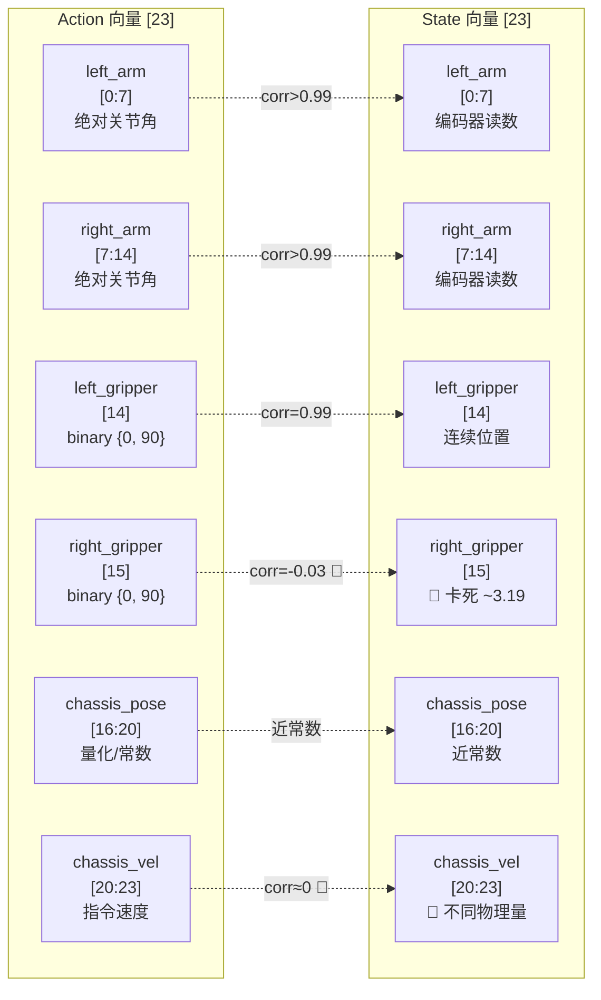
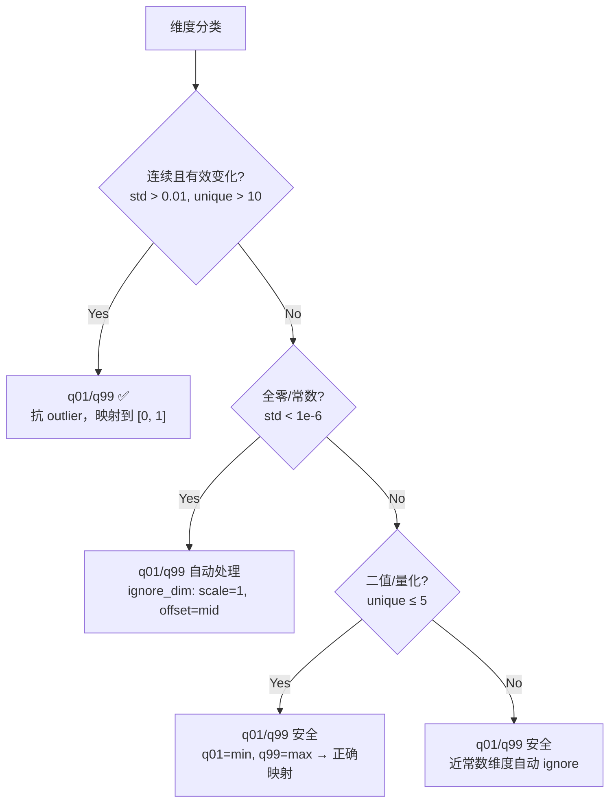
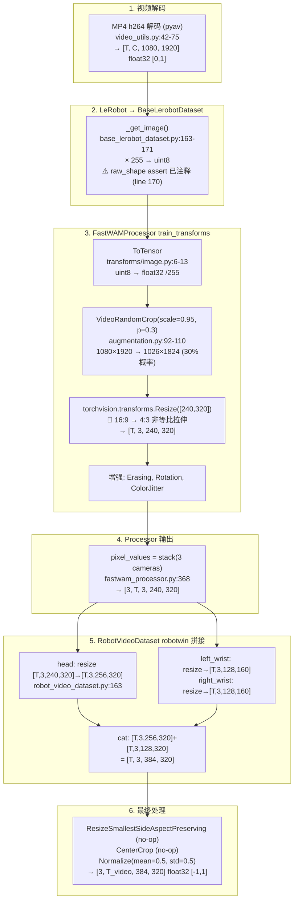
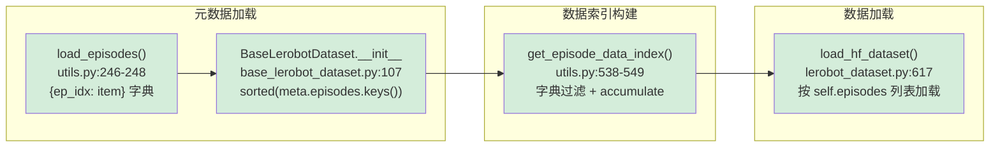
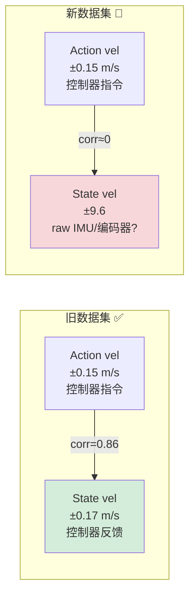
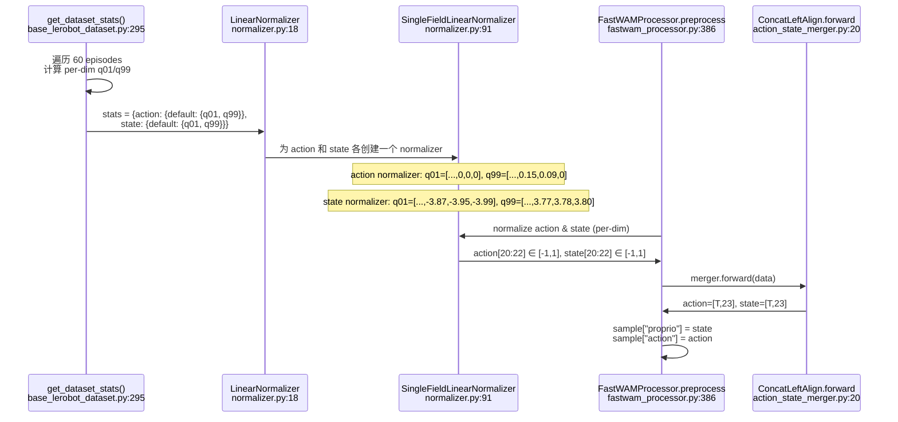
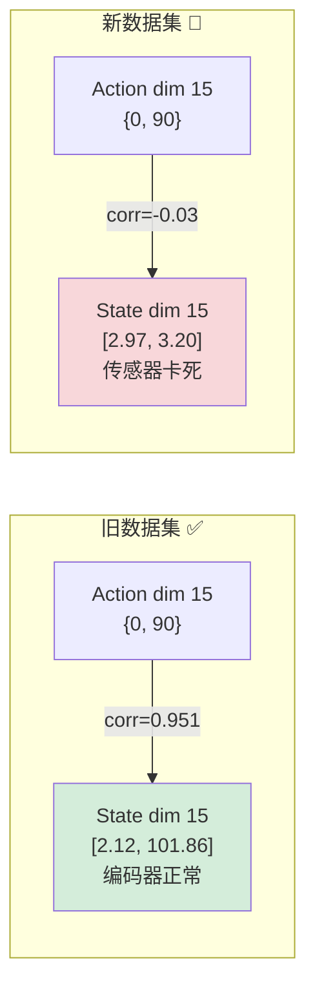
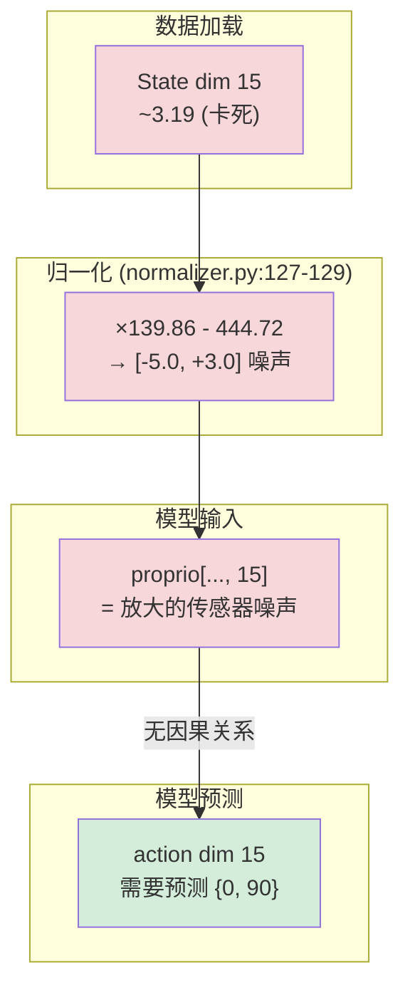

# R1 Pro 开门任务 LeRobot v2.1 数据集分析报告

> **数据集路径**: `/mnt/r/share/kaixin/data_0530/lerobot_open_merged_v21`  
> **格式**: LeRobot v2.1 (parquet + MP4 video symlink)  
> **机器人**: R1 Pro 双臂移动人形机器人  
> **任务**: "Open the door with a downward-press handle, go through it, and enter the room."  
> **目标模型**: FastWAM 6B VLA (SFT)  
> **训练配置**: `examples/sft/config/r1_pro_sft_fastwam.yaml`  
> **分析日期**: 2026-06-10

---

## 1. 数据集总览

### 1.1 概要

| 项目 | 值 |
|------|-----|
| 数据集路径 | `/mnt/r/share/kaixin/data_0530/lerobot_open_merged_v21` |
| 数据格式 | LeRobot v2.1 (`codebase_version: v2.1`) |
| 机器人型号 | R1 Pro (`robot_type: r1_pro`) |
| 任务描述 | Open the door with a downward-press handle, go through it, and enter the room. |
| 任务数量 | 1 (`total_tasks: 1`) |
| Episode 数量 | 61 |
| 总帧数 | 37,217 |
| FPS | 12（标称），12.25（实测） |
| Action 维度 | 23 (float32) |
| State 维度 | 23 (float32) |
| 相机数量 | 3（head, left_wrist, right_wrist） |
| Head 分辨率 | 1080 × 1920 (h264, yuv420p) |
| Wrist 分辨率 | 480 × 640 (h264, yuv420p) |
| 磁盘占用 (metadata) | 4.7 MB (parquet + JSON) |
| 磁盘占用 (video) | ~1.5 GB (symlinked) |
| 训练/测试拆分 | 全部训练 (`splits: train: "0:61"`) |

### 1.2 维度语义布局

根据 `meta/modality.json`，23 维 action/state 向量的语义分解如下：

| 维度范围 | 语义 | 子维度 | Action 类型 | State 类型 | 备注 |
|----------|------|--------|------------|------------|------|
| [0:7] | left_arm | j0–j6 (7 DOF) | 绝对关节角 (rad) | 编码器读数 (rad) | corr > 0.99 |
| [7:14] | right_arm | j0–j6 (7 DOF) | 绝对关节角 (rad) | 编码器读数 (rad) | corr > 0.99 |
| [14] | left_gripper | 1 dim | 二值 {0, 90} | 连续 (0.43–99.93) | corr = 0.99 |
| [15] | right_gripper | 1 dim | 二值 {0, 90} | **卡死 ~3.19** | 🔴 corr = -0.03 |
| [16:20] | chassis_pose | x, y, z, yaw | 量化/常数 | 近常数 | y, yaw 全零 |
| [20:23] | chassis_velocity | vx, vy, vyaw | 速度指令 (±0.15) | **不同物理量 (±9.6)** | 🔴 corr ≈ 0 |



---

## 2. 关键发现与风险评估

> 🔴 **CRITICAL**: 本数据集存在 2 个严重的 action-state 语义不匹配问题，可能导致模型学到错误的闭环控制信号。

| # | 风险等级 | 维度 | 问题描述 | 对训练的影响 | 建议处理方式 |
|---|---------|------|----------|-------------|-------------|
| 1 | 🔴 CRITICAL | dim 15 (right_gripper) | Action 二值 {0, 90} 但 State 卡死在 ~3.19，相关系数 -0.03 | 模型无法从 state 学习右夹爪闭环控制；proprio encoder 收到的 state 信息是噪声 | 联系数据采集团队排查传感器；训练时考虑 mask 掉 state dim 15 |
| 2 | 🔴 CRITICAL | dims 20–22 (chassis_vel) | Action 范围 ±0.15（指令速度），State 范围 ±9.6（可能是 IMU/编码器 raw），相关系数 ≈ 0 | 归一化后两者数值语义完全不同，模型无法对齐 | 确认 state 底盘速度的物理含义；考虑分开归一化或 mask state 速度维 |
| 3 | 🟠 HIGH | dims 17, 19 (action) | chassis_pose_y 和 chassis_pose_yaw 全零常数 | z-score 归一化会除零爆炸 | 当前 q01/q99 mode 可自动处理（ignore_dim 逻辑），但需验证 |
| 4 | 🟠 HIGH | dims 14, 15 (action) | 夹爪 action 为二值 {0, 90}，仅 2 个 unique values | z-score 对双峰分布不适用；q01/q99 映射到 [0, 1] 是安全的 | 当前 q01/q99 安全，保持 |
| 5 | 🟡 MEDIUM | dims 16, 18 (action) | chassis_pose_x 和 chassis_pose_z 仅 2 个 unique values | 信息量极低，几乎是开关量 | q01/q99 可处理 |
| 6 | 🟢 INFO | dims 0–13 (arm joints) | Action 与 State 高度相关 (corr > 0.99)，确认为绝对位置 | 正常，需确认推理端也使用绝对位置（action_state_transforms: null） | 无需额外处理 |

---

## 3. Action 逐维统计

以下统计覆盖全部 37,217 帧。

| dim | Name | mean | std | min | max | q01 | q05 | q50 | q95 | q99 | zeros% | 分布类型 | Risk |
|-----|------|------|-----|-----|-----|-----|-----|-----|-----|-----|--------|---------|------|
| 0 | left_arm_j0 | -0.1113 | 0.2695 | -1.1490 | 0.5967 | -0.9513 | -0.6714 | -0.0261 | 0.3237 | 0.4571 | 17.0% | 连续 | 🟢 LOW |
| 1 | left_arm_j1 | 0.0132 | 0.0490 | -0.1745 | 0.2853 | -0.0666 | -0.0445 | 0.0000 | 0.1150 | 0.1915 | 5.8% | 连续 | 🟢 LOW |
| 2 | left_arm_j2 | 0.0703 | 0.0968 | -0.2315 | 0.4034 | -0.1841 | -0.0552 | 0.0598 | 0.2393 | 0.3086 | 3.1% | 连续 | 🟢 LOW |
| 3 | left_arm_j3 | -0.3823 | 0.5969 | -1.6011 | 0.0813 | -1.5954 | -1.5846 | -0.0012 | 0.0184 | 0.0399 | 12.0% | 连续(双峰) | 🟡 MEDIUM |
| 4 | left_arm_j4 | -0.0490 | 0.1127 | -0.4449 | 0.3682 | -0.3329 | -0.2178 | -0.0261 | 0.1503 | 0.2408 | 3.3% | 连续 | 🟢 LOW |
| 5 | left_arm_j5 | -0.0711 | 0.2307 | -1.0472 | 0.5384 | -0.9312 | -0.6644 | -0.0015 | 0.2068 | 0.3454 | 5.5% | 连续 | 🟢 LOW |
| 6 | left_arm_j6 | -0.0042 | 0.0733 | -0.2700 | 0.5123 | -0.1747 | -0.0951 | -0.0077 | 0.0985 | 0.3265 | 2.7% | 连续 | 🟢 LOW |
| 7 | right_arm_j0 | -0.0909 | 0.2587 | -1.3591 | 0.1272 | -1.2084 | -0.8490 | 0.0000 | 0.0169 | 0.0538 | 35.7% | 连续(偏态) | 🟡 MEDIUM |
| 8 | right_arm_j1 | -0.0120 | 0.0384 | -0.3347 | 0.1580 | -0.1987 | -0.0719 | 0.0000 | 0.0215 | 0.0357 | 30.0% | 连续(偏态) | 🟡 MEDIUM |
| 9 | right_arm_j2 | 0.0259 | 0.1783 | -0.4295 | 0.8311 | -0.3544 | -0.2132 | 0.0000 | 0.4347 | 0.6606 | 15.5% | 连续 | 🟢 LOW |
| 10 | right_arm_j3 | -0.0462 | 0.1498 | -0.9449 | 0.0629 | -0.6795 | -0.4602 | 0.0000 | 0.0230 | 0.0476 | 36.3% | 连续(偏态) | 🟡 MEDIUM |
| 11 | right_arm_j4 | 0.0140 | 0.1072 | -0.4111 | 0.4065 | -0.3329 | -0.2010 | 0.0000 | 0.2194 | 0.2915 | 31.4% | 连续 | 🟢 LOW |
| 12 | right_arm_j5 | -0.0311 | 0.0849 | -0.4277 | 0.3390 | -0.3482 | -0.2071 | 0.0000 | 0.0736 | 0.1672 | 35.7% | 连续(偏态) | 🟡 MEDIUM |
| 13 | right_arm_j6 | -0.0120 | 0.0459 | -0.3068 | 0.2668 | -0.1718 | -0.0982 | 0.0000 | 0.0352 | 0.1319 | 30.7% | 连续(偏态) | 🟡 MEDIUM |
| 14 | left_gripper | 77.2050 | 31.4298 | 0.0000 | 90.0000 | 0.0000 | 0.0000 | 90.0000 | 90.0000 | 90.0000 | 14.2% | **二值** {0, 90} | 🟠 HIGH |
| 15 | right_gripper | 81.6329 | 26.1349 | 0.0000 | 90.0000 | 0.0000 | 0.0000 | 90.0000 | 90.0000 | 90.0000 | 9.3% | **二值** {0, 90} | 🟠 HIGH |
| 16 | chassis_pose_x | 0.7522 | 0.0181 | 0.7500 | 0.9000 | 0.7500 | 0.7500 | 0.7500 | 0.7500 | 0.9000 | 0.0% | **量化** (2 值) | 🟡 MEDIUM |
| 17 | chassis_pose_y | -1.5000 | 0.0000 | -1.5000 | -1.5000 | -1.5000 | -1.5000 | -1.5000 | -1.5000 | -1.5000 | 0.0% | **常数** | 🟠 HIGH |
| 18 | chassis_pose_z | -0.8478 | 0.0181 | -0.8500 | -0.7000 | -0.8500 | -0.8500 | -0.8500 | -0.8500 | -0.7000 | 0.0% | **量化** (2 值) | 🟡 MEDIUM |
| 19 | chassis_pose_yaw | 0.0000 | 0.0000 | 0.0000 | 0.0000 | 0.0000 | 0.0000 | 0.0000 | 0.0000 | 0.0000 | 100.0% | **常数** (全零) | 🟠 HIGH |
| 20 | chassis_vel_x | 0.0483 | 0.0613 | -0.1362 | 0.1500 | 0.0000 | 0.0000 | 0.0000 | 0.1443 | 0.1485 | 59.1% | 连续(稀疏) | 🟢 LOW |
| 21 | chassis_vel_y | 0.0148 | 0.0308 | -0.1355 | 0.1418 | 0.0000 | 0.0000 | 0.0000 | 0.0764 | 0.0882 | 75.3% | 连续(稀疏) | 🟢 LOW |
| 22 | chassis_vel_yaw | 0.0002 | 0.0143 | -0.1956 | 0.1843 | 0.0000 | 0.0000 | 0.0000 | 0.0000 | 0.0000 | 99.1% | **近零** | 🟠 HIGH |

**观察：**
- 右臂 (dims 7–13) 的 zeros% 远高于左臂 (dims 0–6)，表明开门任务中右臂运动较少、大量时间保持静止
- dim 3 (left_arm_j3) 呈明显双峰分布：q05 = -1.5846 vs q50 = -0.0012，说明该关节在"折叠"和"伸展"两个状态间切换
- 底盘速度 (dims 20–22) 以零为主 (59–99% 为零)，仅在移动阶段有值

---

## 4. State 逐维统计

| dim | Name | mean | std | min | max | q01 | q05 | q50 | q95 | q99 | zeros% | 分布类型 | Risk |
|-----|------|------|-----|-----|-----|-----|-----|-----|-----|-----|--------|---------|------|
| 0 | left_arm_j0 | -0.1126 | 0.2693 | -1.1483 | 0.5966 | -0.9551 | -0.6785 | -0.0257 | 0.3191 | 0.4563 | 19.1% | 连续 | 🟢 LOW |
| 1 | left_arm_j1 | 0.0129 | 0.0487 | -0.1743 | 0.2847 | -0.0666 | -0.0449 | 0.0000 | 0.1145 | 0.1914 | 9.1% | 连续 | 🟢 LOW |
| 2 | left_arm_j2 | 0.0699 | 0.0964 | -0.2300 | 0.4004 | -0.1840 | -0.0553 | 0.0594 | 0.2383 | 0.3076 | 6.1% | 连续 | 🟢 LOW |
| 3 | left_arm_j3 | -0.3822 | 0.5952 | -1.5985 | 0.0817 | -1.5938 | -1.5821 | -0.0009 | 0.0181 | 0.0398 | 15.8% | 连续(双峰) | 🟡 MEDIUM |
| 4 | left_arm_j4 | -0.0494 | 0.1122 | -0.4434 | 0.3670 | -0.3321 | -0.2174 | -0.0262 | 0.1496 | 0.2406 | 2.2% | 连续 | 🟢 LOW |
| 5 | left_arm_j5 | -0.0697 | 0.2294 | -1.0464 | 0.5343 | -0.9228 | -0.6549 | -0.0011 | 0.2077 | 0.3440 | 9.3% | 连续 | 🟢 LOW |
| 6 | left_arm_j6 | -0.0038 | 0.0731 | -0.2694 | 0.5102 | -0.1740 | -0.0945 | -0.0070 | 0.1000 | 0.3236 | 4.5% | 连续 | 🟢 LOW |
| 7 | right_arm_j0 | -0.0923 | 0.2610 | -1.3557 | 0.1268 | -1.2066 | -0.8691 | 0.0000 | 0.0164 | 0.0455 | 40.3% | 连续(偏态) | 🟡 MEDIUM |
| 8 | right_arm_j1 | -0.0119 | 0.0377 | -0.3328 | 0.1577 | -0.1942 | -0.0698 | 0.0000 | 0.0213 | 0.0334 | 37.2% | 连续(偏态) | 🟡 MEDIUM |
| 9 | right_arm_j2 | 0.0267 | 0.1789 | -0.4291 | 0.8249 | -0.3543 | -0.2132 | 0.0000 | 0.4394 | 0.6609 | 21.2% | 连续 | 🟢 LOW |
| 10 | right_arm_j3 | -0.0464 | 0.1485 | -0.9415 | 0.0630 | -0.6746 | -0.4551 | 0.0000 | 0.0226 | 0.0474 | 44.6% | 连续(偏态) | 🟡 MEDIUM |
| 11 | right_arm_j4 | 0.0142 | 0.1068 | -0.4098 | 0.4049 | -0.3326 | -0.2006 | 0.0000 | 0.2187 | 0.2909 | 32.5% | 连续 | 🟢 LOW |
| 12 | right_arm_j5 | -0.0316 | 0.0846 | -0.4219 | 0.3364 | -0.3481 | -0.2068 | 0.0000 | 0.0654 | 0.1512 | 40.6% | 连续(偏态) | 🟡 MEDIUM |
| 13 | right_arm_j6 | -0.0119 | 0.0456 | -0.2953 | 0.2645 | -0.1710 | -0.0974 | 0.0000 | 0.0349 | 0.1252 | 40.7% | 连续(偏态) | 🟡 MEDIUM |
| 14 | left_gripper | 78.9737 | 31.0270 | 0.4337 | 99.9287 | 1.9762 | 2.0749 | 91.6592 | 91.7707 | 92.2691 | 0.0% | 连续(双峰) | 🟢 LOW |
| 15 | right_gripper | **3.1855** | **0.0187** | **2.9667** | **3.2015** | 3.1730 | 3.1873 | 3.1873 | 3.1873 | 3.1873 | 0.0% | **🔴 近常数(卡死)** | 🔴 CRITICAL |
| 16 | chassis_pose_x | 0.7523 | 0.0181 | 0.7436 | 0.9012 | 0.7494 | 0.7494 | 0.7497 | 0.7513 | 0.8993 | 0.0% | 近常数 | 🟡 MEDIUM |
| 17 | chassis_pose_y | -1.5000 | 0.0007 | -1.5016 | -1.4974 | -1.5005 | -1.5005 | -1.5005 | -1.4986 | -1.4986 | 0.0% | 近常数 | 🟠 HIGH |
| 18 | chassis_pose_z | -0.8468 | 0.0181 | -0.8512 | -0.6986 | -0.8505 | -0.8505 | -0.8485 | -0.8485 | -0.6994 | 0.0% | 近常数 | 🟡 MEDIUM |
| 19 | chassis_pose_yaw | 0.0003 | 0.0007 | -0.0013 | 0.0020 | -0.0005 | -0.0005 | 0.0001 | 0.0013 | 0.0013 | 0.0% | 近常数 | 🟠 HIGH |
| 20 | chassis_vel_x | -0.0054 | **1.0912** | **-9.6330** | **9.6770** | -3.8726 | -0.2410 | -0.0070 | 0.2850 | 3.7720 | 0.0% | 连续(宽幅) | 🔴 CRITICAL |
| 21 | chassis_vel_y | -0.0064 | **1.1078** | **-9.6480** | **9.7060** | -3.9513 | -0.2560 | -0.0070 | 0.2710 | 3.7846 | 0.0% | 连续(宽幅) | 🔴 CRITICAL |
| 22 | chassis_vel_yaw | -0.0066 | **1.1263** | **-9.6330** | **9.6480** | -3.9898 | -0.2410 | -0.0070 | 0.2710 | 3.8020 | 0.0% | 连续(宽幅) | 🔴 CRITICAL |

**关键对比：**
- State dim 14 (left_gripper) 范围 0.43–99.93，是编码器连续读数，与 action 的 {0, 90} 指令形成正常的指令-反馈关系
- State dim 15 (right_gripper) **仅在 2.97–3.20 的极窄范围内**，std = 0.019，表明传感器/数据采集异常
- State dims 20–22 (chassis_velocity) 范围达 ±9.6，远超 action 的 ±0.15，且相关系数接近零

---

## 5. Action-State 交叉分析

### 5.1 相关系数总表

| dim | Name | Pearson corr | Action 范围 | State 范围 | 诊断 |
|-----|------|:------------:|:----------:|:---------:|------|
| 0 | left_arm_j0 | **0.9992** | 1.7457 | 1.7449 | ✅ 绝对位置 |
| 1 | left_arm_j1 | **0.9988** | 0.4598 | 0.4589 | ✅ 绝对位置 |
| 2 | left_arm_j2 | **0.9992** | 0.6349 | 0.6304 | ✅ 绝对位置 |
| 3 | left_arm_j3 | **0.9996** | 1.6824 | 1.6802 | ✅ 绝对位置 |
| 4 | left_arm_j4 | **0.9992** | 0.8130 | 0.8104 | ✅ 绝对位置 |
| 5 | left_arm_j5 | **0.9989** | 1.5856 | 1.5806 | ✅ 绝对位置 |
| 6 | left_arm_j6 | **0.9970** | 0.7823 | 0.7796 | ✅ 绝对位置 |
| 7 | right_arm_j0 | **0.9979** | 1.4863 | 1.4826 | ✅ 绝对位置 |
| 8 | right_arm_j1 | **0.9922** | 0.4927 | 0.4904 | ✅ 绝对位置 |
| 9 | right_arm_j2 | **0.9967** | 1.2606 | 1.2540 | ✅ 绝对位置 |
| 10 | right_arm_j3 | **0.9972** | 1.0078 | 1.0045 | ✅ 绝对位置 |
| 11 | right_arm_j4 | **0.9987** | 0.8176 | 0.8147 | ✅ 绝对位置 |
| 12 | right_arm_j5 | **0.9979** | 0.7667 | 0.7583 | ✅ 绝对位置 |
| 13 | right_arm_j6 | **0.9984** | 0.5736 | 0.5598 | ✅ 绝对位置 |
| 14 | left_gripper | **0.9944** | 90.0000 | 99.4950 | ✅ 指令-反馈正常 |
| 15 | right_gripper | **-0.0313** | 90.0000 | 0.2348 | 🔴 **State 未反映指令** |
| 16 | chassis_pose_x | 0.9992 | 0.1500 | 0.1576 | ⚠️ 近常数 |
| 17 | chassis_pose_y | 0.0000 | 0.0000 | 0.0042 | ⚠️ 常数 |
| 18 | chassis_pose_z | 0.9991 | 0.1500 | 0.1526 | ⚠️ 近常数 |
| 19 | chassis_pose_yaw | 0.0000 | 0.0000 | 0.0033 | ⚠️ 常数 |
| 20 | chassis_vel_x | **-0.0181** | 0.2862 | 19.3100 | 🔴 **语义不匹配** |
| 21 | chassis_vel_y | **0.0574** | 0.2774 | 19.3540 | 🔴 **语义不匹配** |
| 22 | chassis_vel_yaw | **-0.0026** | 0.3799 | 19.2810 | 🔴 **语义不匹配** |

### 5.2 右夹爪 (dim 15) 详细对比

> 🔴 **CRITICAL**: 右夹爪 state 未反映实际开合状态。

| 指标 | Action dim 15 | State dim 15 |
|------|:------------:|:------------:|
| unique values | **2** ({0, 90}) | ~7（连续但极窄） |
| 范围 | [0, 90] | [2.97, 3.20] |
| std | 26.13 | **0.019** |
| mean | 81.63 | **3.19** |
| Pearson 相关系数 | \- | **-0.03** |

**现象分析：**
- Action 侧正常发出 {0, 90} 的开/合指令（9.3% 为 close=0，90.7% 为 open=90）
- State 侧始终停留在 ~3.19（std 仅 0.019），完全没有跟随 action 的开合变化
- 对比左夹爪 (dim 14)：state 范围 0.43–99.93，corr = 0.99，指令-反馈链路正常

**可能原因：**
1. 右夹爪编码器故障或未正确接线
2. 数据采集时右夹爪 state 通道连接了错误的传感器
3. 右夹爪物理上被固定/锁死

**对训练的影响：** 模型的 proprio encoder 在 dim 15 上接收到的 state 是几乎恒定的噪声，无法为右夹爪建立有效的闭环观测-动作映射。

### 5.3 底盘速度 (dims 20–22) 详细对比

> 🔴 **CRITICAL**: Action 和 State 中的底盘速度代表不同的物理量。

| 指标 | Action [20–22] | State [20–22] |
|------|:--------------:|:-------------:|
| 范围 | ±0.14 ~ ±0.20 | ±9.63 ~ ±9.71 |
| std | 0.014 ~ 0.061 | 1.09 ~ 1.13 |
| 相关系数 | \- | -0.03 ~ +0.06 |
| zeros% | 59% ~ 99% | 0% |
| 推测含义 | 指令速度 (m/s, 底盘控制器输入) | 原始 IMU / 轮式编码器读数 |

**范围比值：** state 范围是 action 范围的 **~67×**，且两者无相关性。这不是量纲差异（线性缩放会保持相关性），而是根本不同的物理量。

**对训练的影响：** 若模型将 action 和 state 的底盘速度维度视为同一语义（如通过 ConcatLeftAlign merger 拼接），归一化后的数值会产生严重的语义混乱。

---

## 6. Episode 分析

### 6.1 长度分布

| 指标 | 值 |
|------|-----|
| Episode 数量 | 61 |
| 平均长度 | 610.1 帧 |
| 中位数 | 605.0 帧 |
| 标准差 | 61.0 帧 |
| 最短 | 461 帧 (Episode 1) |
| 最长 | 758 帧 (Episode 38) |
| 平均时长 | ~50.8 秒 (@ 12 FPS) |

**帧数直方图：**

| 区间 | Episode 数量 | 占比 |
|------|:-----------:|:----:|
| [450–500) | 2 | 3.3% |
| [500–550) | 4 | 6.6% |
| [550–600) | 23 | **37.7%** |
| [600–650) | 19 | **31.1%** |
| [650–700) | 6 | 9.8% |
| [700–750) | 6 | 9.8% |
| [750–800) | 1 | 1.6% |

大部分 episode 集中在 550–650 帧区间（69%），分布较为集中，说明任务难度和执行方式比较稳定。

### 6.2 初始状态一致性

以下是各维度在 61 个 episode 首帧的统计，用于评估机器人起始位姿的一致性。

| dim | Name | init_mean | init_std | init_min | init_max | 一致性 |
|-----|------|:---------:|:--------:|:--------:|:--------:|:------:|
| 0 | left_arm_j0 | 0.000059 | 0.000320 | -0.000851 | 0.001489 | ✅ 极好 |
| 1 | left_arm_j1 | -0.000122 | 0.000596 | -0.004043 | 0.000851 | ✅ 极好 |
| 2 | left_arm_j2 | 0.000359 | 0.003308 | -0.002766 | 0.025745 | ✅ 好 |
| 3 | left_arm_j3 | -0.000122 | 0.001744 | -0.012766 | 0.004255 | ✅ 好 |
| 4 | left_arm_j4 | -0.000841 | 0.004260 | -0.033617 | 0.000851 | ✅ 好 |
| 5 | left_arm_j5 | 0.001127 | 0.008758 | -0.001064 | 0.068936 | ✅ 好 |
| 6 | left_arm_j6 | -0.000600 | 0.004200 | -0.032553 | 0.001277 | ✅ 好 |
| 7 | right_arm_j0 | -0.000286 | 0.000801 | -0.004255 | 0.000851 | ✅ 极好 |
| 8 | right_arm_j1 | 0.000157 | 0.000604 | -0.000851 | 0.002766 | ✅ 极好 |
| 9 | right_arm_j2 | -0.001601 | 0.009272 | -0.072979 | 0.002340 | ✅ 好 |
| 10 | right_arm_j3 | 0.000115 | 0.000339 | -0.000426 | 0.001064 | ✅ 极好 |
| 11 | right_arm_j4 | -0.000136 | 0.000448 | -0.001277 | 0.000851 | ✅ 极好 |
| 12 | right_arm_j5 | 0.000153 | 0.000424 | -0.000851 | 0.000851 | ✅ 极好 |
| 13 | right_arm_j6 | 0.000077 | 0.000472 | -0.000851 | 0.001489 | ✅ 极好 |
| 14 | left_gripper | 91.7466 | 0.051675 | 91.5254 | 91.7782 | ✅ 极好 |
| 15 | right_gripper | 3.1837 | 0.028012 | 2.9667 | 3.1873 | ✅ (但整体卡死) |
| 16 | chassis_pose_x | 0.7524 | 0.019024 | 0.7494 | 0.8997 | ⚠️ Ep 0 = 0.90 |
| 17 | chassis_pose_y | -1.5001 | 0.000364 | -1.5005 | -1.4993 | ✅ 极好 |
| 18 | chassis_pose_z | -0.8462 | 0.019060 | -0.8505 | -0.6986 | ⚠️ Ep 0 = -0.70 |
| 19 | chassis_pose_yaw | 0.000254 | 0.000649 | -0.0005 | 0.0013 | ✅ 极好 |
| 20 | chassis_vel_x | -0.004934 | 0.009764 | -0.021 | 0.021 | ✅ 好 |
| 21 | chassis_vel_y | -0.007230 | 0.008960 | -0.021 | 0.021 | ✅ 好 |
| 22 | chassis_vel_yaw | -0.004246 | 0.009424 | -0.021 | 0.021 | ✅ 好 |

**结论：** 所有 61 个 episode 从几乎完全相同的起始位姿开始（arm joints init_std < 0.01 rad），这对 SFT 训练是有利的——模型不需要学习从不同初始状态泛化。

### 6.3 异常 Episode 清单

以下 episode 的某些维度均值与全局均值偏离 > 3σ：

| Episode | 异常维度 | z-score | Episode 均值 | 全局均值 | 可能原因 |
|:-------:|---------|:-------:|:-----------:|:-------:|---------|
| 0 | dim 16 (chassis_pose_x) | **7.75** | 0.9000 | 0.7525 | 不同起始位置 |
| 0 | dim 18 (chassis_pose_z) | **7.75** | -0.7000 | -0.8475 | 不同起始位置 |
| 2 | dim 2 (left_arm_j2) | 3.63 | -0.1339 | 0.0695 | 异常运动轨迹 |
| 2 | dim 4 (left_arm_j4) | 4.11 | 0.2370 | -0.0483 | 异常运动轨迹 |
| 2 | dim 7 (right_arm_j0) | 3.27 | -0.1785 | -0.0910 | 异常运动轨迹 |
| 7 | dim 13 (right_arm_j6) | 3.43 | -0.1028 | -0.0124 | 末端关节异常 |
| 12 | dim 6 (left_arm_j6) | 4.77 | -0.1456 | -0.0039 | 末端关节异常 |
| 27 | dim 7 (right_arm_j0) | 3.61 | -0.1875 | -0.0910 | 异常运动轨迹 |

**建议：** Episode 0 的 chassis_pose 异常最显著（z-score = 7.75），可能是从不同位置采集的数据。建议人工审查该 episode 的视频，确认是否应保留。其余 episode 的偏离较小，可保留以增加数据多样性。

### 6.4 时间戳与 FPS 一致性

| 指标 | 值 |
|------|-----|
| 全局 dt 均值 | 0.081621 s |
| 全局 dt 标准差 | 0.002544 s |
| 全局 dt 最小值 | 0.071394 s |
| 全局 dt 最大值 | 0.083333 s |
| 实际 FPS | **12.25** |
| 帧丢失 (dt > 0.1s) | **0** |
| 帧过快 (dt < 0.05s) | **0** |

时间戳非常稳定，无帧丢失或异常间隔。标称 12 FPS，实测 12.25 FPS（Episode 0 略高，约 14 FPS）。

---

## 7. 视觉模态分析

### 7.1 相机规格

| 相机 | 原始分辨率 | 编码 | 色彩格式 | FPS | 训练 Resize 目标 |
|------|:---------:|:----:|:-------:|:---:|:---------------:|
| head_rgb | 1080 × 1920 | h264 | yuv420p (彩色) | 12 | 240 × 320 |
| left_wrist_rgb | 480 × 640 | h264 | yuv420p (彩色) | 12 | 240 × 320 |
| right_wrist_rgb | 480 × 640 | h264 | yuv420p (彩色) | 12 | 240 × 320 |

### 7.2 视频存储方式

视频文件通过 symlink 组织：

```
videos_backup/chunk-000/
  episode_000000_head_rgb.mp4 → ../lerobot_open_merged/videos/observation.images.head_rgb/chunk-000/file-000.mp4
  episode_000000_left_wrist_rgb.mp4 → ...
  episode_000000_right_wrist_rgb.mp4 → ...
  ... (3 × 61 = 183 个 symlink)
```

### 7.3 存储量

| 相机 | 磁盘占用 |
|------|:-------:|
| head_rgb | 900 MB |
| left_wrist_rgb | 270 MB |
| right_wrist_rgb | 334 MB |
| **合计** | **~1.5 GB** |

### 7.4 宽高比注意事项

| 相机 | 原始宽高比 | 训练目标 | 比值 |
|------|:---------:|:-------:|:----:|
| head_rgb | 1920:1080 = **16:9** | 320:240 = **4:3** | ⚠️ 不匹配 |
| left_wrist_rgb | 640:480 = **4:3** | 320:240 = **4:3** | ✅ 匹配 |
| right_wrist_rgb | 640:480 = **4:3** | 320:240 = **4:3** | ✅ 匹配 |

> ⚠️ **注意：** Head 相机原始分辨率 1080×1920 (16:9) 与训练目标 240×320 (4:3) 宽高比不同。当前 YAML 中 `raw_shape: [3, 360, 640]` 似乎是旧数据集的值，实际数据为 1080×1920。`torchvision.transforms.Resize(size=[240, 320])` 会拉伸图像，需确认是否需要先 crop 再 resize。

---

## 8. 归一化策略分析与建议

### 8.1 当前配置

```yaml
# r1_pro_sft_fastwam.yaml
processor:
  norm_default_mode: "q01/q99"    # quantile-based normalization
  norm_exception_mode: null        # no per-key override
  action_state_transforms: null    # absolute positions, no delta conversion
```

### 8.2 归一化决策树



### 8.3 q01/q99 对各类维度的行为分析

`SingleFieldLinearNormalizer` (normalizer.py) 在 `q01/q99` 模式下的处理逻辑：

$$
x_{norm} = \frac{x - q_{01}}{q_{99} - q_{01}}
$$

当 $q_{99} - q_{01} < \text{range\_tol}$（默认 1e-5）时触发 `ignore_dim` 逻辑：
- $\text{scale} = 1$，$\text{offset} = \text{midpoint} - \min$
- 效果：该维度输出恒定值，不影响训练

| 维度类型 | 代表维度 | q01 | q99 | q99-q01 | ignore? | 归一化后范围 | 安全性 |
|----------|---------|:---:|:---:|:-------:|:-------:|:----------:|:------:|
| 连续 (arm) | dim 0 | -0.95 | 0.46 | 1.41 | No | [0, 1] | ✅ 安全 |
| 双峰 (arm j3) | dim 3 | -1.60 | 0.04 | 1.64 | No | [0, 1] | ✅ 安全 |
| 二值 (gripper) | dim 14 | 0.00 | 90.00 | 90.00 | No | {0, 1} | ✅ 安全 |
| 量化 (chassis) | dim 16 | 0.75 | 0.90 | 0.15 | No | {0, 1} | ✅ 安全 |
| 常数 (全零) | dim 17 | -1.50 | -1.50 | **0.00** | **Yes** | 恒定 | ✅ 安全 |
| 常数 (全零) | dim 19 | 0.00 | 0.00 | **0.00** | **Yes** | 恒定 | ✅ 安全 |
| 近零 | dim 22 | 0.00 | 0.00 | **~0.00** | **Yes** | 恒定 | ⚠️ 信号丢失 |
| 稀疏 (chassis vel) | dim 20 | 0.00 | 0.15 | 0.15 | No | [0, 1] | ✅ 安全 |

**结论：** 当前 `q01/q99` 配置对本数据集的各类维度都是安全的。常数维度会被自动 ignore，二值维度正好映射到 {0, 1}。**无需修改归一化配置。**

### 8.4 逐维归一化建议

| dim | Name | 当前 mode | 问题 | 建议 | 备注 |
|-----|------|:---------:|------|------|------|
| 0–6 | left_arm | q01/q99 | 无 | **保持** | 连续分布，映射健康 |
| 7–13 | right_arm | q01/q99 | zeros% 高 (30–44%) | **保持** | 稀疏但 q01/q99 仍正确 |
| 14 | left_gripper | q01/q99 | 二值 {0, 90} | **保持** | 映射为 {0, 1} |
| 15 | right_gripper | q01/q99 | 二值 {0, 90} | **保持** | Action 正常；State 问题在数据侧 |
| 16 | chassis_pose_x | q01/q99 | 2 unique values | **保持** | 映射为 {0, 1} |
| 17 | chassis_pose_y | q01/q99 | 常数 -1.5 | **保持** | ignore_dim 自动处理 |
| 18 | chassis_pose_z | q01/q99 | 2 unique values | **保持** | 映射为 {0, 1} |
| 19 | chassis_pose_yaw | q01/q99 | 常数 0 | **保持** | ignore_dim 自动处理 |
| 20 | chassis_vel_x | q01/q99 | Action 稀疏但有效 | **保持** | q01=0, q99=0.15 |
| 21 | chassis_vel_y | q01/q99 | Action 稀疏但有效 | **保持** | q01=0, q99=0.09 |
| 22 | chassis_vel_yaw | q01/q99 | Action 近全零 | **观察** | 可能被 ignore_dim，信号丢失 |

---

## 9. 训练配置检查清单

以 `examples/sft/config/r1_pro_sft_fastwam.yaml` 为基准：

| 配置项 | 当前值 | 数据分析结果 | 状态 | 建议 |
|--------|--------|-------------|:----:|------|
| `data.num_frames` | 33 | 最短 ep = 461 帧，33 << 461 | ✅ | 安全 |
| `data.action_video_freq_ratio` | 4 | FPS = 12，视频 = 3 FPS | ✅ | 确认视频帧率 |
| `data.video_size` | [384, 320] | head 1080×1920, wrist 480×640 | ⚠️ | 见 §7.4 宽高比 |
| `data.fps` | (未指定) | 12 FPS (info.json) | ✅ | 由数据集控制 |
| `data.concat_multi_camera` | "robotwin" | 3 cameras | ✅ | 确认拼接方式 |
| `data.val_set_proportion` | 0.0 | 全训练 (61 eps) | ✅ | 小数据集合理 |
| `data.skip_padding_as_possible` | false | — | ✅ | 可考虑 true |
| `data.tolerance_s` | 0.005 | dt_std = 0.0025s | ✅ | 容差足够 |
| `shape_meta.images[head_rgb].raw_shape` | [3, 360, 640] | **实际 1080×1920** | 🔴 | **需更新** |
| `shape_meta.images[left_wrist].raw_shape` | [3, 480, 640] | 480×640 | ✅ | 匹配 |
| `shape_meta.images[right_wrist].raw_shape` | [3, 480, 640] | 480×640 | ✅ | 匹配 |
| `shape_meta.action[default].raw_shape` | 23 | 23 dims | ✅ | 匹配 |
| `shape_meta.state[default].raw_shape` | 23 | 23 dims | ✅ | 匹配 |
| `processor.action_output_dim` | 23 | 23 dims | ✅ | 匹配 |
| `processor.proprio_output_dim` | 23 | 23 dims | ✅ | 匹配 |
| `processor.norm_default_mode` | "q01/q99" | 安全 (见 §8) | ✅ | 保持 |
| `processor.norm_exception_mode` | null | 无需 per-key override | ✅ | 保持 |
| `processor.action_state_transforms` | null | Action 已是绝对位置 | ✅ | 保持 |
| `actor.model.proprio_dim` | 23 | 23 dims | ✅ | 匹配 |
| `actor.model.action_dit_config.action_dim` | 23 | 23 dims | ✅ | 匹配 |

> 🔴 **需修复：** `shape_meta.images[0].raw_shape` 当前为 `[3, 360, 640]`，但新数据集 head_rgb 实际分辨率为 1080×1920。应更新为 `[3, 1080, 1920]`。否则 processor 的 resize 逻辑可能使用错误的原始尺寸。

---

## 10. 与旧数据集差异对比

本数据集 (`lerobot_open_merged_v21`) 与此前分析的旧数据集进行对比：

| 项目 | 旧数据集 (v2) | 新数据集 (v2.1) | 变化说明 |
|------|:------------:|:--------------:|---------|
| 格式版本 | LeRobot v2 | LeRobot v2.1 | 升级 |
| Episode 数 | 63–64 | 61 | -3 |
| 总帧数 | 61,913 | 37,217 | **-40%** |
| FPS | ~14 | 12.25 | 降低 |
| Episode 长度 | 828–1142 | 461–758 | **更短** |
| 图像存储 | 嵌入 parquet (PNG bytes) | MP4 video (symlink) | 格式变化 |
| Head 分辨率 | 360×640 (16:9) | **1080×1920 (16:9)** | **3× 提升** |
| Wrist 分辨率 | 480×640 (4:3) | 480×640 (4:3) | 不变 |
| 视频编码 | N/A (逐帧 PNG) | h264 yuv420p | 新增 |
| 右夹爪 state 异常 | 存在 | 存在 | ❌ **未解决** |
| Action 语义 | 绝对位置 | 绝对位置 | 不变 |
| 任务 | 开门穿越 | 开门穿越 | 相同 |

**关键变化分析：**

1. **帧数减少 40%：** 主要原因是 FPS 从 ~14 降至 12，以及 episode 长度缩短（平均 984 → 610 帧）。数据量从 ~6.2 万帧减至 ~3.7 万帧，对于 SFT 来说仍然可行但偏少。

2. **Head 分辨率大幅提升：** 从 360×640 提升到 1080×1920（9× 像素），需要更新 `raw_shape` 配置。训练 resize 到 240×320 后信息密度更高。

3. **视频编码变化：** 从嵌入式 PNG 改为 MP4 h264，大幅降低存储（从 GB 级 parquet 降至 1.5 GB 独立视频文件）。但 h264 的有损压缩可能引入细微的颜色/边缘伪影。

4. **右夹爪 bug 仍在：** 这是跨数据集版本的系统性问题，需要从硬件/采集端根治。

---

## 11. 数据质量问题与改进建议

| 优先级 | 问题 | 建议 | 影响范围 | 实施成本 |
|:------:|------|------|:-------:|:-------:|
| **P0** | 右夹爪 state (dim 15) 卡死 ~3.19 | 1) 联系数据采集团队检查传感器<br/>2) 训练时考虑 mask 掉 state dim 15<br/>3) 或将 state dim 15 替换为 action dim 15 的延迟副本 | 数据/配置层 | 低–中 |
| **P0** | chassis_vel state (dims 20–22) 语义不匹配 | 1) 确认 state 速度维的物理含义（IMU? 编码器?）<br/>2) 考虑独立归一化 state 和 action 的速度维<br/>3) 或 mask 掉 state 速度维 | 数据/配置层 | 低 |
| **P0** | head_rgb `raw_shape` 配置过期 | 更新 YAML: `raw_shape: [3, 1080, 1920]` | 配置层 | 极低 |
| **P1** | Episode 0 chassis_pose 异常 (z=7.75) | 人工审查视频，决定是否剔除 | 数据层 | 低 |
| **P1** | chassis_vel_yaw (dim 22 action) 近全零 (99.1%) | 验证 q01/q99 的 ignore_dim 是否触发；若触发则该维度训练信号完全丢失 | 验证 | 低 |
| **P2** | Head 宽高比 16:9 → 4:3 拉伸 | 考虑先 center crop 到 4:3 再 resize；或接受拉伸但在推理端保持一致 | 配置层 | 低 |
| **P2** | 数据量偏少 (37K 帧, 61 eps) | 1) 考虑启用 Proprio Domain Randomization 增广<br/>2) 收集更多 episode | 数据层 | 中 |
| **P2** | 右臂 action zeros% 高 (30–44%) | 正常（开门任务主要用左臂），但可能导致右臂动作预测能力弱 | 无需处理 | — |

---

## 12. 附录

### 12.1 modality.json 完整内容

```json
{
  "video": {
    "head_rgb": {"original_key": "head_rgb"},
    "left_wrist_rgb": {"original_key": "left_wrist_rgb"},
    "right_wrist_rgb": {"original_key": "right_wrist_rgb"}
  },
  "state": {
    "left_arm":        {"original_key": "state", "start": 0,  "end": 7},
    "right_arm":       {"original_key": "state", "start": 7,  "end": 14},
    "left_gripper":    {"original_key": "state", "start": 14, "end": 15},
    "right_gripper":   {"original_key": "state", "start": 15, "end": 16},
    "chassis_pose":    {"original_key": "state", "start": 16, "end": 20},
    "chassis_velocity":{"original_key": "state", "start": 20, "end": 23}
  },
  "action": {
    "left_arm":        {"original_key": "actions", "start": 0,  "end": 7},
    "right_arm":       {"original_key": "actions", "start": 7,  "end": 14},
    "left_gripper":    {"original_key": "actions", "start": 14, "end": 15},
    "right_gripper":   {"original_key": "actions", "start": 15, "end": 16},
    "chassis_pose":    {"original_key": "actions", "start": 16, "end": 20},
    "chassis_velocity":{"original_key": "actions", "start": 20, "end": 23}
  }
}
```

### 12.2 逐 Episode 长度列表

| Episode | 长度 | Episode | 长度 | Episode | 长度 | Episode | 长度 |
|:-------:|:----:|:-------:|:----:|:-------:|:----:|:-------:|:----:|
| 0 | 550 | 16 | 537 | 32 | 655 | 48 | 648 |
| 1 | 461 | 17 | 598 | 33 | 530 | 49 | 620 |
| 2 | 562 | 18 | 637 | 34 | 615 | 50 | 597 |
| 3 | 560 | 19 | 597 | 35 | 612 | 51 | 605 |
| 4 | 573 | 20 | 742 | 36 | 533 | 52 | 584 |
| 5 | 563 | 21 | 644 | 37 | 486 | 53 | 667 |
| 6 | 588 | 22 | 577 | 38 | 758 | 54 | 704 |
| 7 | 593 | 23 | 620 | 39 | 726 | 55 | 702 |
| 8 | 611 | 24 | 631 | 40 | 619 | 56 | 734 |
| 9 | 570 | 25 | 638 | 41 | 592 | 57 | 635 |
| 10 | 566 | 26 | 629 | 42 | 611 | 58 | 662 |
| 11 | 558 | 27 | 705 | 43 | 637 | 59 | 559 |
| 12 | 686 | 28 | 557 | 44 | 685 | 60 | 576 |
| 13 | 551 | 29 | 556 | 45 | 600 | — | — |
| 14 | 533 | 30 | 610 | 46 | 633 | — | — |
| 15 | 570 | 31 | 583 | 47 | 676 | — | — |

> **注：** 上表按 episode index 排列，非按长度排序。

### 12.3 q01/q99 归一化数学分析

**标准公式：**

$$
x_{norm} = \frac{x - q_{01}}{q_{99} - q_{01}}
$$

**反归一化（推理时）：**

$$
x_{raw} = x_{norm} \cdot (q_{99} - q_{01}) + q_{01}
$$

**边界情况处理（normalizer.py ignore_dim 逻辑）：**

当 $q_{99} - q_{01} < \text{range\_tol}$（默认 $10^{-5}$）时：

$$
\text{scale} = 1, \quad \text{offset} = \frac{q_{01} + q_{99}}{2} - \min(x)
$$

此时 $x_{norm} = x + \text{offset}$，输出恒定值（因为 $x$ 本身就是常数）。

**对本数据集各类维度的效果：**

| 场景 | 例 | $q_{01}$ | $q_{99}$ | $q_{99}-q_{01}$ | 映射 |
|------|-----|:--------:|:--------:|:---------------:|------|
| 连续 | dim 0 | -0.95 | 0.46 | 1.41 | $[-0.95, 0.46] \to [0, 1]$ |
| 二值 | dim 14 | 0 | 90 | 90 | $\{0, 90\} \to \{0, 1\}$ |
| 常数 | dim 17 | -1.5 | -1.5 | 0 → ignore | 恒定输出 |
| 近零 | dim 22 | 0 | 0 | ~0 → ignore | 恒定输出 ⚠️ |

### 12.4 info.json 核心字段

```json
{
  "codebase_version": "v2.1",
  "robot_type": "r1_pro",
  "total_episodes": 61,
  "total_frames": 37217,
  "total_tasks": 1,
  "total_videos": 183,
  "total_chunks": 1,
  "chunks_size": 1000,
  "fps": 12,
  "splits": {"train": "0:61"},
  "data_path": "data/chunk-{episode_chunk:03d}/episode_{episode_index:06d}.parquet",
  "video_path": "videos_backup/chunk-{episode_chunk:03d}/episode_{episode_index:06d}_{video_key}.mp4"
}
```

### 12.5 tasks.jsonl

```json
{"task_index": 0, "task": "Open the door with a downward-press handle, go through it, and enter the room."}
```

---

## 13. Head 相机分辨率与宽高比问题的代码影响分析

> **分析日期**: 2026-06-11  
> **分析范围**: RLinf 本地代码 + FastWAM 整合链路 + 训练影响  
> **触发**: §7.4 发现 head_rgb 原始分辨率 1080×1920 (16:9) 与配置 `raw_shape: [3, 360, 640]` 不匹配，且与训练目标 240×320 (4:3) 宽高比不同

### 13.1 问题全貌

训练配置 `r1_pro_sft_fastwam.yaml` 中的 head_rgb 相关设置：

```yaml
data:
  video_size: [384, 320]           # 最终模型输入 (H, W) —— robotwin 拼接后的尺寸
  shape_meta:
    images:
      - key: head_rgb
        raw_shape: [3, 360, 640]   # ⚠️ 旧数据集的值，实际新数据集为 [3, 1080, 1920]
        shape: [3, 240, 320]       # processor 变换后的目标形状
  processor:
    train_transforms:
      head_rgb:
        - _target_: ...ToTensor
        - _target_: ...VideoRandomCrop      # p=0.3, scale=0.95
        - _target_: torchvision.transforms.Resize
          size: [240, 320]                  # ← 16:9 → 4:3 非等比拉伸
        - _target_: ...VideoRandomErasing, VideoRandomRotation, VideoColorJitter
```

涉及 **三个层面** 的问题：

| # | 问题 | 严重性 |
|---|------|:------:|
| A | `raw_shape` 配置值与实际数据不匹配 ([3,360,640] vs [3,1080,1920]) | 🟡 |
| B | 16:9 → 4:3 的宽高比拉伸 (`Resize([240,320])`) | 🟡 |
| C | 高分辨率视频解码的性能与内存影响 | 🟡 |

### 13.2 图像处理完整链路追踪

以 head_rgb 为例，追踪从视频文件到模型输入的每一步变换：



### 13.3 影响 1: `raw_shape` 配置不匹配

**代码路径**:

`BaseLerobotDataset._get_image()` (`base_lerobot_dataset.py:163-171`):
```python
def _get_image(self, meta, lerobot_sample) -> torch.Tensor:
    key, lerobot_key, raw_shape = meta["key"], meta["lerobot_key"], meta["raw_shape"]
    image: torch.Tensor = lerobot_sample[lerobot_key]
    image = (image * 255).to(torch.uint8)
    # For config simplication
    # assert image.shape[1:] == raw_shape  ← 已注释！
    return image
```

**现状**:
- 配置值: `raw_shape: [3, 360, 640]`
- 实际帧: `[3, 1080, 1920]`
- 因 assert 被注释，**不会报错，不会影响功能**

**但需注意的风险**:
1. 如果未来代码恢复该 assert，将立即崩溃
2. 调试时 `raw_shape` 值会误导开发者
3. 与旧数据集混合训练时，配置只能写一个 `raw_shape`，但两个数据集的实际分辨率不同（这不影响功能，因为 raw_shape 不被使用）

**影响级别**: 🟡 中（功能安全，但维护风险）  
**应对方案**: 更新 YAML 配置 `raw_shape: [3, 1080, 1920]`。若需兼容新旧数据集混合训练，保持注释状态即可。

### 13.4 影响 2: 16:9 → 4:3 宽高比拉伸

**核心发现**: 这**不是新数据集引入的问题**，旧数据集同样存在。

| 数据集 | Head 原始分辨率 | 宽高比 | Resize 目标 | 宽高比 | 拉伸? |
|--------|:-----------:|:-----:|:----------:|:-----:|:----:|
| 旧 (r1_pro_data_convert_chassis) | 360 × 640 | **16:9** | 240 × 320 | **4:3** | ✅ 相同拉伸 |
| 新 (lerobot_open_merged_v21) | 1080 × 1920 | **16:9** | 240 × 320 | **4:3** | ✅ 相同拉伸 |

**拉伸量化**:

$$\text{水平压缩率} = \frac{W_{target} / W_{src}}{H_{target} / H_{src}} = \frac{320/1920}{240/1080} = \frac{0.1667}{0.2222} = 0.750$$

即：图像中的物体在水平方向被压缩了 25%，垂直方向不变。圆形物体在模型看来是椭圆形。

**对训练的影响**:
- 模型在拉伸后的图像上学习特征，只要**推理时也使用相同的 `Resize([240, 320])`**，模型就能正确工作
- 如果推理端使用不同的预处理（如等比缩放+crop），会产生 train-inference 不一致的域偏移

**影响级别**: 🟡 中（功能正确但次优；新旧数据集行为一致）  
**应对方案**（三种，按推荐度排序）:

**方案 A: 保持现状（推荐，如果已有模型基于此训练）**
- 不修改任何配置
- 确保推理端使用完全相同的 Resize 链
- 优点：零成本，与已有模型兼容
- 缺点：25% 水平形变

**方案 B: 先 CenterCrop 到 4:3 再 Resize（推荐，如果从头训练）**
```yaml
train_transforms:
  head_rgb:
    - _target_: fastwam.datasets.lerobot.transforms.image.ToTensor
    - _target_: torchvision.transforms.CenterCrop
      size: [1080, 1440]     # 1080 × (1080 × 4/3) = 1080 × 1440，裁掉两侧各 240 像素
    - _target_: rlinf.data.datasets.fastwam.augmentation.VideoRandomCrop
      p: 0.3
    - _target_: torchvision.transforms.Resize
      size: [240, 320]       # 现在是 4:3 → 4:3，无拉伸
    # ... 其余增强不变
```
- 损失：两侧各裁掉 12.5% 的水平视野（共 25%）
- 收益：消除几何形变，模型看到的物体比例正确
- 需同步更新推理端预处理

**方案 C: 使用 ResizeSmallestSideAspectPreserving + CenterCrop**
```yaml
# 替换 Resize([240, 320]) 为两步操作：
- _target_: fastwam.datasets.dataset_utils.ResizeSmallestSideAspectPreserving
  args: {img_w: 320, img_h: 240}
# → 1080×1920 缩放到 240×426 (保持 16:9)
- _target_: fastwam.datasets.dataset_utils.CenterCrop
  args: {img_w: 320, img_h: 240}
# → 裁剪到 240×320 (裁掉两侧各 53 像素)
```
- 损失：裁掉 24.9% 水平视野（与方案 B 几乎相同）
- 收益：同方案 B
- 注意：需确认 `fastwam.datasets.dataset_utils` 中的类接受 YAML instantiation

### 13.5 影响 3: 高分辨率视频解码的性能影响

**代码路径**:
- `decode_video_frames()` (`video_utils.py:42-75`): 使用 pyav 解码 h264 MP4
- `LeRobotDataset.__getitem__` → `_query_videos()` → `decode_video_frames()`

**性能对比**:

| 指标 | 旧数据集 | 新数据集 | 变化 |
|------|---------|---------|------|
| 存储格式 | PNG 嵌入 parquet | h264 MP4 | 不同编解码 |
| 解码分辨率 | 360 × 640 | 1080 × 1920 | **9× 像素** |
| 单帧内存 | 0.69 MB (float32) | 6.22 MB (float32) | **9× 内存** |
| 每 batch 帧数 | T=33 × 3 cameras | T=33 × 3 cameras | 不变 |
| 估算单样本峰值内存 | ~68 MB | ~615 MB | **~9× 增长** |

**影响细节**:
1. **DataLoader worker 内存**: 每个 worker 解码 1080p 帧，峰值内存显著增加。`num_workers=4` 时需关注 OOM
2. **解码速度**: h264 硬件解码（如果可用）比 CPU 解码快，但 pyav 默认 CPU 解码
3. **Resize 发生在 processor 内**: 帧在被 Resize 到 240×320 后才参与后续计算，因此 GPU 端不受影响
4. **parquet 读取 vs 视频解码**: parquet 逐帧 PNG 解码是 CPU 密集型（每帧独立解压），h264 利用帧间预测更高效——实际速度差异取决于 I/O 和 CPU

**影响级别**: 🟡 中  
**应对方案**:
1. 适当减少 `num_workers`（如 4→2）或增加 worker 共享内存限制
2. 监控训练时的 DataLoader 吞吐量（观察 GPU 利用率是否因 data starvation 下降）
3. 如果成为瓶颈：考虑预处理数据集——先将视频 resize 到较低分辨率后重新编码

### 13.6 影响 4: VideoRandomCrop 行为一致性

**代码路径**:

`VideoRandomCrop` (`augmentation.py:92-110`):
```python
class VideoRandomCrop(VideoAugmentation):
    def __init__(self, scale: float = 0.95, p: float = 0.5):
        ...
    def _apply(self, video):
        _, _, H, W = video.shape
        crop_h, crop_w = int(H * self.scale), int(W * self.scale)
        return T2.RandomCrop(size=(crop_h, crop_w))(video)
```

配置: `p=0.3`, `scale=0.95`(默认)

**行为对比**:

| 数据集 | 输入尺寸 | 裁剪后尺寸 | 裁剪像素 | 裁剪比例 |
|--------|:-------:|:--------:|:-------:|:------:|
| 旧 (360×640) | 360×640 | 342×608 | 18×32 | 5% |
| 新 (1080×1920) | 1080×1920 | 1026×1824 | 54×96 | 5% |

裁剪比例相同（均为 5%），因为 `scale` 是比例参数。但绝对像素差异更大，这意味着：
- 新数据集中 RandomCrop 切掉了更多的原始像素（54 vs 18 行，96 vs 32 列）
- 但由于后续 Resize 到 240×320，最终效果在视觉上几乎一致

**影响级别**: 🟢 低  
**应对方案**: 无需改动。

### 13.7 影响 5: 信息密度提升（正面影响）

从高分辨率下采样到低分辨率时，高分辨率源能保留更多细节：

$$\text{下采样因子} = \frac{\text{源像素}}{\text{目标像素}}$$

| 数据集 | 源像素 | 目标像素 | 下采样因子 | 信息保留 |
|--------|:-----:|:------:|:---------:|:------:|
| 旧 (360×640) | 230,400 | 76,800 | 3.0× | 基准 |
| 新 (1080×1920) | 2,073,600 | 76,800 | 27.0× | **更优** |

理论上，从 1080p 下采样到 240×320 能通过抗锯齿滤波保留更丰富的高频信息（如边缘、纹理）。但实际收益受限于：
1. h264 有损压缩已经丢失了部分高频信息
2. `transforms_F.resize` 使用 BILINEAR 插值（非理想低通滤波）
3. 后续的 ColorJitter 等增强会进一步模糊细节

**影响级别**: 🟢 低（正面但幅度有限）  
**应对方案**: 无需改动。

### 13.8 影响 6: 对 RLinf 代码的影响

**代码路径追踪**:

| RLinf 文件 | 功能 | 是否受影响 |
|------------|------|:---------:|
| `rlinf/data/datasets/fastwam/__init__.py:59` | `build_fastwam_sft_dataloader()` | 🟢 不受影响 |
| `rlinf/data/datasets/fastwam/__init__.py:79` | `shape_meta` 传递 | 🟢 透传到 FastWAM |
| `rlinf/data/datasets/fastwam/__init__.py:136` | `RobotVideoDataset` 构造 | 🟢 不受影响 |
| `rlinf/data/datasets/fastwam/__init__.py:155` | `DistributedSampler` | 🟢 不受影响 |
| `rlinf/data/datasets/fastwam/collate.py` | `fastwam_collate_fn` | 🟢 不受影响 |
| `rlinf/data/datasets/fastwam/augmentation.py` | 增强变换 | 🟢 比例参数，分辨率无关 |

所有图像分辨率相关的处理都在 FastWAM 的 `BaseLerobotDataset`、`FastWAMProcessor`、`RobotVideoDataset` 中完成。RLinf 侧仅负责构建 dataloader 和传递配置，不直接操作图像张量。

**影响级别**: 🟢 低  
**应对方案**: 不需要修改 RLinf 的任何 Python 代码。

### 13.9 影响 7: 模型输入一致性与新旧数据集兼容性

**最终模型输入形状对比**:

| 阶段 | 旧数据集 | 新数据集 | 一致? |
|------|---------|---------|:----:|
| 解码后 (head) | [T, 3, 360, 640] | [T, 3, 1080, 1920] | ❌ |
| processor 后 (head) | [T, 3, 240, 320] | [T, 3, 240, 320] | ✅ |
| robotwin 拼接后 | [T, 3, 384, 320] | [T, 3, 384, 320] | ✅ |
| 最终模型输入 | [3, T_v, 384, 320] | [3, T_v, 384, 320] | ✅ |
| 数值范围 | [-1, 1] | [-1, 1] | ✅ |

从 processor 输出开始，两个数据集产生的张量形状和数值范围完全相同。**可以混合训练新旧数据集**（前提是 action/state 维度和语义也兼容）。

但需注意的细微差异：
1. **图像内容的统计分布不同**: 1080p 下采样的图像比 360p 下采样的图像锐度更高
2. **h264 vs PNG 的色彩精度**: h264 使用 yuv420p（色度 4:2:0 下采样），PNG 是无损 RGB
3. **16:9→4:3 拉伸效果相同**: 两个数据集的 head 相机都是 16:9，经过相同的 Resize 拉伸

**影响级别**: 🟢 低  
**应对方案**: 如需混合训练，无需额外处理。

### 13.10 影响汇总表

| # | 影响 | 级别 | 需改代码? | 需改配置? | 应对方案 |
|---|------|:----:|:--------:|:--------:|---------|
| 1 | `raw_shape` 配置不匹配 | 🟡 中 | 否 | **是** | 更新为 `[3, 1080, 1920]` |
| 2 | 16:9→4:3 宽高比拉伸 | 🟡 中 | 否 | 可选 | 保持现状 或 先 CenterCrop 再 Resize |
| 3 | 高分辨率解码性能 | 🟡 中 | 否 | 可能 | 监控 DataLoader 吞吐量；必要时减 workers |
| 4 | VideoRandomCrop 行为 | 🟢 低 | 否 | 否 | 无需改动 |
| 5 | 信息密度提升 | 🟢 正面 | 否 | 否 | 无需改动 |
| 6 | RLinf 代码影响 | 🟢 无 | 否 | 否 | 无需改动 |
| 7 | 模型输入一致性 | 🟢 低 | 否 | 否 | 可混合训练 |

### 13.11 最终结论与建议

**核心结论**: 新数据集的 head 相机分辨率变化（360×640 → 1080×1920）**不影响 RLinf 代码功能**，也**不引入新的宽高比问题**（16:9→4:3 的拉伸在旧数据集中就已存在）。主要需要关注的是：

1. **必做**: 更新 YAML 配置 `raw_shape: [3, 1080, 1920]`（虽然当前不影响功能，但避免维护混乱）
2. **建议**: 如果从头训练新模型，考虑在 head_rgb 的 train_transforms 中加入 CenterCrop 消除 16:9→4:3 拉伸
3. **监控**: 训练时关注 DataLoader 性能，1080p 解码可能成为数据吞吐瓶颈

---

## 14. Episode 0 数据清洗操作记录

> **操作日期**: 2026-06-11  
> **操作对象**: `/mnt/r/share/kaixin/data_0530/lerobot_open_merged_v21`  
> **数据集格式**: LeRobot v2.1

### 14.1 清洗原因

Episode 0 在 §6.3 的异常分析中被标记为最显著异常：

| 维度 | 语义 | z-score | Episode 均值 | 全局均值 |
|------|------|:-------:|:-----------:|:-------:|
| dim 16 | chassis_pose_x | **7.75** | 0.9000 | 0.7525 |
| dim 18 | chassis_pose_z | **7.75** | -0.7000 | -0.8475 |

z-score 7.75 远超 3σ 阈值，且在所有 61 个 episode 中排名第一（第二高仅 4.77）。

§6.2 中也标记了 Episode 0 在 chassis_pose_x 和 chassis_pose_z 维度上位于极端边界：
- chassis_pose_x: Ep 0 = 0.90（全局最大值 = 0.8997）
- chassis_pose_z: Ep 0 = -0.70（全局最小值 = -0.6986）

经人工审查 head_rgb 视频，确认 Episode 0 的画面存在明显异常（视角/环境与其他 episode 不一致），判定为采集错误数据，应予剔除。

### 14.2 操作方案：仅删除、不重编号

**决策依据**:

1. **先例验证**: 旧数据集 `r1_pro_data_convert_chassis` 已有 Episode 35、39 缺失的先例（`meta/backup_cleanup_ep35_39/`），非连续索引在训练中长期运行无问题
2. **风险控制**: 重编号需重命名 60 个 parquet 文件 + 180 个视频 symlink，操作风险高且无功能收益
3. **代码兼容**: FastWAM 和 RLinf 的训练代码路径通过 `sorted(meta.episodes.keys())` 获取实际索引，正确处理非连续索引（详见 §14.5）

**操作后的数据集索引**: `[1, 2, 3, ..., 60]`（共 60 个 episode，缺少 index 0）

### 14.3 操作详细记录

#### 14.3.1 备份

```
备份目录: meta/backup_cleanup_ep0/
备份内容:
  ├── info.json               (原始 metadata, total_episodes=61)
  ├── episodes.jsonl           (原始 61 行)
  ├── episodes_stats.jsonl     (原始 61 行)
  ├── episode_000000.parquet   (58KB, Episode 0 的 550 帧数据)
  ├── episode_000000_head_rgb.mp4       (symlink → lerobot_open_merged/.../file-000.mp4)
  ├── episode_000000_left_wrist_rgb.mp4 (symlink)
  └── episode_000000_right_wrist_rgb.mp4 (symlink)
```

#### 14.3.2 元数据修改

| 文件 | 修改内容 | 修改方式 |
|------|---------|---------|
| `episodes.jsonl` | 删除 `episode_index: 0` 行 | Python json 过滤，61→60 行 |
| `episodes_stats.jsonl` | 删除 `episode_index: 0` 行 | Python json 过滤，61→60 行 |
| `info.json` | 见下表 | Python json 更新 |
| `modality.json` | 不修改 | — |
| `tasks.jsonl` | 不修改 | — |

**info.json 字段变更**:

| 字段 | 修改前 | 修改后 |
|------|--------|--------|
| `total_episodes` | 61 | **60** |
| `total_frames` | 37,217 | **36,667** (37217 - 550) |
| `total_videos` | 183 | **180** (60 × 3 cameras) |
| `splits.train` | "0:61" | **"0:60"** |

#### 14.3.3 数据文件移动

| 文件 | 操作 | 来源 | 目标 |
|------|:----:|------|------|
| `episode_000000.parquet` | mv | `data/chunk-000/` | `meta/backup_cleanup_ep0/` |
| `episode_000000_head_rgb.mp4` | mv | `videos_backup/chunk-000/` | `meta/backup_cleanup_ep0/` |
| `episode_000000_left_wrist_rgb.mp4` | mv | `videos_backup/chunk-000/` | `meta/backup_cleanup_ep0/` |
| `episode_000000_right_wrist_rgb.mp4` | mv | `videos_backup/chunk-000/` | `meta/backup_cleanup_ep0/` |

### 14.4 验证结果

执行自动化验证脚本，共 7 项检查全部通过：

| # | 检查项 | 结果 |
|---|--------|:----:|
| 1 | episodes.jsonl: 60 行，索引 1-60，无 episode 0 | ✅ |
| 2 | episodes_stats.jsonl: 60 行，索引与 episodes.jsonl 一致 | ✅ |
| 3 | info.json: total_episodes=60, total_frames=36667, total_videos=180, splits=0:60 | ✅ |
| 4 | Parquet 文件: 60 个 (episode_000001 ~ episode_000060)，ep 0 不存在 | ✅ |
| 5 | Video symlinks: 180 个，ep 0 的 3 个 symlink 不存在 | ✅ |
| 6 | 备份目录: 7 个文件完整 | ✅ |
| 7 | Parquet 索引与 episodes.jsonl 索引 1:1 对应 | ✅ |

### 14.5 操作前后对比

| 指标 | 操作前 | 操作后 | 变化 |
|------|--------|--------|------|
| Episode 数量 | 61 | 60 | -1 |
| Episode 索引 | 0-60 (连续) | 1-60 (非连续, 缺少 0) | 首个索引变为 1 |
| 总帧数 | 37,217 | 36,667 | -550 (-1.48%) |
| 总视频数 | 183 | 180 | -3 |
| Parquet 文件数 | 61 | 60 | -1 |
| 视频 symlink 数 | 183 | 180 | -3 |
| 最大异常 z-score | **7.75** (ep 0, dim 16/18) | **4.77** (ep 12, dim 6) | 异常显著降低 |
| 训练数据占比 | 100% | 100% | 不变 |

### 14.6 对 RLinf 和 FastWAM 代码的影响分析

#### 14.6.1 安全路径（正确处理非连续索引）



| 代码路径 | 文件 | 处理方式 | 安全? |
|----------|------|---------|:----:|
| `load_episodes()` | `datasets/utils.py:246-248` | 返回 `{episode_index: item}` 字典 | ✅ |
| `load_episodes_stats()` | `datasets/utils.py:258-263` | 返回 `{episode_index: stats}` 字典 | ✅ |
| `get_episode_data_index()` | `datasets/utils.py:538-549` | 使用字典过滤 + `accumulate` | ✅ |
| `BaseLerobotDataset.__init__` | `base_lerobot_dataset.py:107` | `sorted(meta.episodes.keys())` 读取实际索引 | ✅ |
| `LeRobotDataset.load_hf_dataset()` | `lerobot_dataset.py:617` | 按 `self.episodes` 列表加载 parquet | ✅ |
| `get_episode_data()` | `lerobot_dataset.py:1237-1265` | `dataset.episodes[episode_idx]` 用列表映射 | ✅ |

#### 14.6.2 存在 `range()` 假设但训练时不触发的路径

| 代码路径 | 文件:行号 | 代码 | 触发条件 | 风险 |
|----------|----------|------|---------|:----:|
| `get_episodes_file_paths()` | `lerobot_dataset.py:599` | `list(range(self.meta.total_episodes))` | `self.episodes is None` | 🟡 |
| `encode_videos()` | `lerobot_dataset.py:1005` | `range(self.meta.total_episodes)` | 数据集创建时 | 🟡 |

**为什么训练时安全**:

- `get_episodes_file_paths()` 中的 `range()` 是 **fallback 分支**，仅在 `self.episodes is None` 时触发
- 在 `BaseLerobotDataset` 的训练路径中，`self.episodes` **始终**由 `selected_episode_indices`（从 `meta.episodes.keys()` 得到的实际索引列表 `[1, 2, ..., 60]`）填充
- 因此 `range()` fallback **永远不会在训练时触发**
- `encode_videos()` 仅在数据集创建/编码时调用，训练过程中不执行

#### 14.6.3 RLinf 侧代码影响

| RLinf 文件 | 功能 | 是否受影响 |
|------------|------|:---------:|
| `rlinf/data/datasets/fastwam/__init__.py` | `build_fastwam_sft_dataloader()` | 🟢 不受影响 |
| `rlinf/data/datasets/fastwam/collate.py` | `fastwam_collate_fn` | 🟢 不受影响 |
| `rlinf/data/datasets/fastwam/augmentation.py` | 增强变换 (VideoRandomCrop 等) | 🟢 不受影响 |

**结论：不需要修改任何 Python 代码或 YAML 配置。**

### 14.7 对训练的影响分析

#### 14.7.1 数据量变化

- 减少 550 帧 / 37217 帧 = **1.48%**，对模型训练影响可忽略
- 61 个 episode 减少到 60 个，不影响 batch 构建和 sampler 逻辑

#### 14.7.2 归一化统计量 (q01/q99)

`get_dataset_stats()` (`base_lerobot_dataset.py:295-417`) 在数据加载时从 `sorted(meta.episodes.keys())` 迭代所有 episode 计算 q01/q99 归一化参数。Episode 0 被移除后：
- 该函数自动跳过 episode 0（因为 `episodes.jsonl` 中已无此条目）
- chassis_pose 维度的分布将**更加集中**（移除了 z=7.75 的异常点）
- 归一化范围更合理，有利于训练稳定性

#### 14.7.3 DistributedSampler

`DistributedSampler` 的 `len(dataset)` 从 `meta.episodes.keys()` 推导总帧数，正确返回 60 个 episode 的 36667 帧。分布式训练不受影响。

#### 14.7.4 训练配置

`r1_pro_sft_fastwam.yaml` 中的数据路径 `${oc.env:R1PRO_DATA}` 指向数据集根目录，与 episode 索引无关，无需修改。

### 14.8 与旧数据集 Episode 35/39 清洗对比

| 方面 | 旧数据集 (ep 35, 39) | 新数据集 (ep 0) |
|------|---------------------|-----------------|
| 数据集路径 | `r1_pro_data_convert_chassis` | `lerobot_open_merged_v21` |
| 备份目录 | `meta/backup_cleanup_ep35_39/` | `meta/backup_cleanup_ep0/` |
| 删除原因 | 数据质量问题 (无 parquet / 视频过小) | chassis_pose 异常 (z=7.75) + 视频异常 |
| 删除数量 | 2 个 episode | 1 个 episode |
| 重编号 | 否 | 否 |
| 清洗后索引 | 0-63 缺 35, 39 (62 个) | 1-60 (60 个) |
| 数据损失 | ~0.6% (2 ep) | 1.48% (550 帧) |
| 代码影响 | 无 | 无 |
| 训练验证 | 已在生产中稳定运行 | 待验证 |

### 14.9 风险缓解措施

1. **完整备份**: 所有原始文件备份在 `meta/backup_cleanup_ep0/`，可通过以下命令完全恢复：
   ```bash
   DATASET=/mnt/r/share/kaixin/data_0530/lerobot_open_merged_v21
   BACKUP=$DATASET/meta/backup_cleanup_ep0
   cp $BACKUP/{info.json,episodes.jsonl,episodes_stats.jsonl} $DATASET/meta/
   mv $BACKUP/episode_000000.parquet $DATASET/data/chunk-000/
   mv $BACKUP/episode_000000_*.mp4 $DATASET/videos_backup/chunk-000/
   ```
2. **自动化验证**: 7 项一致性检查全部通过（见 §14.4）
3. **先例验证**: 旧数据集相同操作已在生产环境稳定运行
4. **非破坏性操作**: 使用 `mv`（可逆）而非 `rm`（不可逆）

### 14.10 更新后的数据集总览

| 项目 | 更新前 | 更新后 |
|------|--------|--------|
| Episode 数量 | 61 | **60** |
| Episode 索引范围 | 0-60 (连续) | **1-60** (缺 0) |
| 总帧数 | 37,217 | **36,667** |
| 视频数 | 183 | **180** |
| Parquet 文件数 | 61 | **60** |
| splits.train | "0:61" | **"0:60"** |
| 最大异常 z-score | 7.75 (ep 0) | **4.77** (ep 12, dim 6) |
| 平均 episode 长度 | 610.1 帧 | **611.1 帧** |
| 备份目录 | — | `meta/backup_cleanup_ep0/` |

---

## 15. chassis_vel (dims 20–22) State-Action 语义不匹配问题深度分析

> **分析日期**: 2026-06-11  
> **分析范围**: 新数据集 `lerobot_open_merged_v21` + FastWAM/RLinf 归一化链路  
> **触发**: §2 P0 风险项、§5.3 详细对比

### 15.1 问题定义

在 23 维 action/state 向量中，dims 20–22 代表底盘速度 (chassis_velocity: vx, vy, vyaw)。§5.3 发现 action 和 state 的这 3 个维度代表 **完全不同的物理量**：

| 指标 | Action [20–22] | State [20–22] | 比值 |
|------|:--------------:|:-------------:|:----:|
| 范围 | ±0.14 ~ ±0.20 | ±9.63 ~ ±9.71 | **~67×** |
| std | 0.014 ~ 0.061 | 1.09 ~ 1.13 | **~18×** |
| zeros% | 59% ~ 99% | 0% | — |
| Pearson corr | — | **-0.018 ~ +0.057** | ≈ 0 |
| 推测含义 | 指令速度 (m/s) | raw IMU / 编码器读数 | 不同物理量 |

**核心判据**：range 比值 67× 且相关系数 ≈ 0。如果仅是量纲差异（如 m/s vs cm/s），线性缩放会保持相关性 (corr ≈ 1)。corr ≈ 0 证明这不是缩放关系，而是 **根本不同的信号源**。

### 15.2 新旧数据集对比：问题是新数据集引入的

| 指标 | 旧数据集 (r1_pro_data_convert_chassis) | 新数据集 (lerobot_open_merged_v21) |
|------|:--------------------------------------:|:----------------------------------:|
| Action vel_x 范围 | ±0.15 | ±0.15 |
| **State vel_x 范围** | **±0.17** | **±9.68** |
| **Action-State corr (vel_x)** | **0.862** ✅ | **-0.018** 🔴 |
| State vel_y 范围 | ±0.16 | ±9.71 |
| State vel_yaw 范围 | 0 (全零) | ±9.65 |
| State vel 推测来源 | 底盘控制器反馈 (同 action) | raw IMU / 轮式编码器 |



**结论**：Action 侧在新旧数据集间保持一致，**问题出在新数据集的 State 采集源发生了变化**。

### 15.3 受影响的数据范围

这不是个别 episode 的问题，而是**全部 60 个 episode 的系统性特征**：

| Episode 样本 | State vel_x min | State vel_x max | State vel_x std | Action vel_x max |
|:------------:|:---------------:|:---------------:|:---------------:|:----------------:|
| Ep 1 | -2.586 | 2.351 | 0.321 | 0.149 |
| Ep 2 | -3.641 | 5.457 | 0.573 | 0.149 |
| Ep 3 | -5.399 | 4.329 | 0.556 | 0.150 |
| Ep 4 | -4.886 | 4.578 | 0.586 | 0.149 |
| Ep 5 | -5.970 | 4.754 | 0.591 | 0.149 |
| ... | ... | ... | ... | ... |
| **全局** | **-9.633** | **+9.677** | **1.091** | **0.150** |

所有 episode 的 state vel 范围都远超 action vel，且三个维度 (vx, vy, vyaw) 的 state 分布高度一致（mean ≈ -0.006, std ≈ 1.05–1.13），暗示来自同一传感器模块（如 3 轴 IMU gyroscope）。

### 15.4 归一化链路追踪与实际影响

#### 15.4.1 归一化流程



#### 15.4.2 归一化后的数值语义

`SingleFieldLinearNormalizer` (`normalizer.py:91-133`) 使用 q01/q99 模式时：

$$x_{norm} = \frac{x - q_{01}}{q_{99} - q_{01}} \times 2 - 1 \in [-1, 1]$$

对 dim 20 (vel_x) 的归一化效果：

| 原始值 | Action 归一化后 | State 归一化后 | 语义 |
|:------:|:--------------:|:-------------:|------|
| 0 | -1.0 | +0.011 | Action: 最小值 (停止); State: 接近均值 |
| 0.075 | 0.0 | +0.021 | Action: 中等速度; State: 几乎无变化 |
| 0.15 | +1.0 | +0.030 | Action: 最大速度指令; State: 微弱变化 |
| 3.77 | **+49.3** (clamp→+5.0) | +1.0 | Action: 远超范围; State: 最大值 |

**关键观察**：
- 归一化后，同一个数值（如 0.5）在 action 和 state 中代表完全不同的物理状态
- State 的有效归一化范围 [-1, 1] 覆盖了 q01=-3.87 到 q99=3.77 的原始值
- Action 的有效归一化范围 [-1, 1] 仅覆盖 q01=0 到 q99=0.15 的原始值
- 虽然都映射到 [-1, 1]，但模型无法从 state velocity 推断 action velocity——因为二者没有相关性

#### 15.4.3 dim 22 (vel_yaw) 的 `ignore_dim` 问题

Action dim 22 (vel_yaw) 在 §3 中显示 99.1% 为零，q01=0.0, q99=0.0。

在 `SingleFieldLinearNormalizer.__init__` (`normalizer.py:115-120`) 中：

```python
input_range = input_max - input_min      # q99 - q01 = 0.0 - 0.0 = 0.0
ignore_dim = input_range < self.range_tol  # 0.0 < 1e-4 → True!
input_range[ignore_dim] = self.output_max - self.output_min  # → 2.0
scale = (self.output_max - self.output_min) / input_range    # → 1.0
offset[ignore_dim] = (self.output_max + self.output_min) / 2 - input_min[ignore_dim]  # → 0.0
```

**结果**: action dim 22 被标记为 `ignore_dim=True`：
- 归一化: $x_{norm} = x \times 1.0 + 0.0 = x$（即原始值，都是 0.0 附近）
- clamp 到 [-5.0, 5.0] 后输出接近常数 0.0
- **训练信号完全丢失**——模型永远看到 dim 22 action ≈ 0.0，无法学习任何 vel_yaw 行为

与之对比，state dim 22 (vel_yaw) q01=-3.99, q99=3.80，range=7.79 >> 1e-4，不会被 ignore。因此 **state dim 22 有丰富的信号，但 action dim 22 无信号**。

### 15.5 对模型训练的影响

#### 15.5.1 影响机制

FastWAM 模型接收两个关键输入：
- `proprio`（本体感知）: 来自 state，包含 23 维 → dims 20–22 是 raw IMU/编码器值
- `action`（动作目标）: 来自 action，包含 23 维 → dims 20–22 是指令速度

模型需要学习 $\pi(a_t | o_t, s_t)$，即根据观测 $o_t$（视觉）和本体感知 $s_t$（proprio）预测动作 $a_t$。当 $s_t[20:22]$ 与 $a_t[20:22]$ 无相关性时：

| 影响 | 级别 | 说明 |
|------|:----:|------|
| Proprio velocity 维度成为噪声输入 | 🔴 | 模型无法从 state vel 推断 action vel |
| 可能干扰其他维度的学习 | 🟡 | Transformer 的 attention 可能错误地关注 vel 维度 |
| vel_yaw (dim 22) action 信号丢失 | 🔴 | `ignore_dim` 触发，模型输出恒为 ≈ 0 |
| 不影响 arm/gripper/pose 维度 | 🟢 | Dims 0–19 的 corr 正常，独立归一化 |

#### 15.5.2 影响量化

- 受影响维度: 3/23 = **13.0%** 的 action 维度
- 受影响信号比例（按 std 加权）: vel 维度 std 远小于 arm 维度，实际影响 < 13%
- 但对底盘运动控制的影响可能很大——如果部署时需要底盘移动（开门任务的关键环节），vel 预测质量直接决定任务成功率

#### 15.5.3 对旧数据集的影响

如果混合旧数据集训练：
- 旧数据集 state vel ≈ action vel (同尺度, corr=0.86)
- 新数据集 state vel ≠ action vel (不同物理量)
- 混合后归一化统计量被旧数据集拉向正确方向，但 state vel 的语义冲突仍在

### 15.6 应对方案分析

#### 方案 A: Mask State dims 20–22（推荐用于当前训练）

**原理**: 将 state dims 20–22 在输入模型前置为常数（如 0），使模型不使用这 3 个维度的本体感知信息。

**实现方式**: 在 YAML 配置中通过 `action_state_transforms` 添加一个 mask transform，或在 `fastwam_processor.py` 的 `preprocess` 中加入一步 mask 操作。

**代码路径**:
```
fastwam_processor.preprocess() (fastwam_processor.py:386-421)
  → data = self.action_state_transform(data)          ← 可在这里加 mask
  → data = self.normalizer.forward(data)
  → data = self.action_state_merger.forward(data)
  → sample["proprio"] = data["state"]                 ← proprio 不包含 vel 信号
```

**优点**:
- 消除噪声输入，模型不再被错误的 proprio velocity 信号干扰
- 实现简单，只需 config 或几行代码
- Action 侧不受影响，模型仍然学习 vel 动作预测（基于视觉）

**缺点**:
- 模型完全失去底盘速度的本体感知反馈
- 如果未来数据集修复了 state vel 语义，需要重新训练

**对 RLinf 代码的影响**:
- 需要新增一个 mask transform（或在 YAML 中配置现有的 `action_state_transforms`）
- `build_fastwam_sft_dataloader()` 不需要修改
- 归一化链路不变

#### 方案 B: 对 State dims 20–22 使用 `norm_exception_mode`

**原理**: 用不同的归一化模式（如 `const_min/const_max`）为 state velocity 指定固定的归一化范围。

**实现方式**: 在 YAML 中设置：
```yaml
processor:
  norm_exception_mode:
    state:
      default: "q01/q99"  # 问题：当前 shape_meta 只有一个 key "default" 覆盖所有 23 维
```

**问题**: 当前 `shape_meta.state` 只有一个 key `default` (shape=23)，`norm_exception_mode` 是 per-key 而非 per-dim。要对 dims 20–22 单独归一化，需要将 state 拆成多个 sub-keys（如 `arm_joints`, `grippers`, `chassis_pose`, `chassis_vel`）。这涉及修改 `shape_meta` 结构和 `ConcatLeftAlign` merger。

**优点**:
- 保留 state velocity 信息，只是用不同的归一化范围

**缺点**:
- **不解决根本问题**: state vel 与 action vel 仍然代表不同物理量，即使归一化到同一范围，corr 仍然 ≈ 0
- 需要拆分 shape_meta，改动较大
- 实际上只是让噪声看起来范围更合理，模型仍然无法从中学到有用信息

**对 RLinf 代码的影响**: 需要修改 YAML shape_meta 结构

#### 方案 C: 修复数据采集源（根本解决方案）

**原理**: 在数据采集端，确保 state 的底盘速度维度记录与 action 同源的物理量（底盘控制器的速度反馈，而非 raw IMU/编码器）。

**实现方式**: 修改采集代码中 state velocity 的数据源。

**优点**:
- 根本解决语义不匹配
- 所有后续训练自动受益

**缺点**:
- 需要重新采集数据（已有的 60 个 episode 无法修复）
- 或需要找到 action→state velocity 的转换关系（如果存在）

**对 RLinf 代码的影响**: 无影响（数据层面的修改）

#### 方案 D: 保持现状，依赖模型自适应

**原理**: 不做任何改动，依赖 Transformer 模型的 attention 机制自动学会忽略无用的 proprio velocity 维度。

**理论支持**:
- Transformer 的自注意力可以学会对不同维度分配不同权重
- 如果 proprio vel 与 action vel 无相关性，模型最终会给这些维度低 attention 权重
- 其他 20 个维度（arm, gripper, pose）的信号不受影响

**优点**:
- 零代码改动，零配置改动
- 最大限度保留数据原始信息
- 如果 state vel 中包含微弱但有用的信号（如速度方向趋势），模型有机会利用

**缺点**:
- 训练前期可能受噪声干扰，收敛速度变慢
- 模型需要额外的参数容量来学习"忽略"这些维度
- dim 22 action (vel_yaw) 的 `ignore_dim` 问题仍然存在（但这与 state vel 无关，是 action 自身的问题）

**对 RLinf 代码的影响**: 无

### 15.7 方案对比汇总

| 方案 | 解决程度 | 实现难度 | 代码改动 | 数据兼容性 | 推荐场景 |
|------|:-------:|:-------:|:-------:|:---------:|---------|
| **A: Mask state vel** | 🟡 消除噪声 | 🟢 低 | config 或几行代码 | ✅ 不影响数据 | **当前训练首选** |
| B: norm_exception | 🔴 不解决根本 | 🟡 中 | shape_meta 拆分 | ✅ | 不推荐 |
| C: 修复采集源 | 🟢 根本解决 | 🔴 需重采 | 无 RLinf 改动 | ❌ 需新数据 | **长期方案** |
| D: 保持现状 | ⚪ 依赖模型 | 🟢 零 | 无 | ✅ | 快速实验 / baseline |

### 15.8 推荐方案与理由

**短期**: 方案 A (Mask state dims 20–22) + 方案 D (dim 22 action 保持现状)

**理由**:

1. **State vel mask 的必要性**：
   - State velocity 与 action velocity 无相关性 (corr ≈ 0)，对模型预测 action 无正向贡献
   - 保留这些维度只会引入噪声，增加模型学习负担
   - Mask 操作简单、低风险、可逆

2. **Dim 22 action (vel_yaw) 保持现状的理由**：
   - 99.1% 为零，`ignore_dim` 触发是正确行为——数据中几乎没有 vel_yaw 信号
   - 模型输出 vel_yaw ≈ 0 与实际数据分布一致
   - 如果未来采集的数据有 vel_yaw 变化，`ignore_dim` 会自动关闭

3. **不推荐方案 B 的理由**：
   - 改变归一化范围不改变信号的物理含义
   - 归一化后的 state vel 仍然与 action vel 无相关性
   - 实现成本高于方案 A，效果反而更差

**长期**: 方案 C (修复数据采集源)

- 与数据采集团队确认 state velocity 的物理含义
- 如果是 raw IMU 读数，找到 IMU→指令速度 的转换关系
- 在未来的数据版本中修复

### 15.9 对 RLinf 代码的影响分析

#### 15.9.1 当前（不改代码）

| RLinf 文件 | 功能 | 影响 |
|------------|------|:----:|
| `rlinf/data/datasets/fastwam/__init__.py` | `build_fastwam_sft_dataloader()` | 🟢 不受影响 |
| `rlinf/data/datasets/fastwam/collate.py` | `fastwam_collate_fn` | 🟢 不受影响 |
| `rlinf/data/datasets/fastwam/augmentation.py` | 增强变换 | 🟢 不受影响 |
| `examples/sft/config/r1_pro_sft_fastwam.yaml` | 训练配置 | 🟢 不受影响 |

数据语义不匹配完全在 FastWAM 的 processor/normalizer 层面处理，RLinf 侧仅传递配置和构建 dataloader。

#### 15.9.2 实施方案 A 时

如果实施 Mask 方案，改动范围：

| 文件 | 改动 | 说明 |
|------|------|------|
| `r1_pro_sft_fastwam.yaml` | 添加 `action_state_transforms` 配置 | 指定 state dims 20-22 mask |
| 或 `fastwam_processor.py` | 在 `preprocess()` 中加 mask 逻辑 | 3-5 行代码 |
| `rlinf/` 目录下 | **无改动** | RLinf 透传配置到 FastWAM |

**RLinf 代码完全不需要修改**，因为：
1. Mask 操作在 FastWAM 的 processor 层面实现
2. RLinf 通过 YAML 配置传递 `action_state_transforms`，已有这个配置项（当前值为 `null`）
3. `build_fastwam_sft_dataloader()` 只是将 YAML 配置传给 `RobotVideoDataset` 构造函数

### 15.10 完整影响汇总

| # | 影响 | 级别 | 受影响维度 | 需改代码? | 需改配置? |
|---|------|:----:|:---------:|:--------:|:--------:|
| 1 | State vel 语义不匹配 (corr≈0) | 🔴 | dims 20-22 state | 否 (方案 D) 或 FastWAM 层 (方案 A) | 可选 |
| 2 | Action vel_yaw ignore_dim | 🟡 | dim 22 action | 否 | 否 |
| 3 | Proprio 噪声干扰训练 | 🟡 | dims 20-22 proprio 输入 | 方案 A 可消除 | — |
| 4 | Arm/gripper/pose 维度 | 🟢 | dims 0-19 | 否 | 否 |
| 5 | RLinf 代码 | 🟢 | — | **否** | — |
| 6 | 新旧数据集混合训练 | 🟡 | dims 20-22 state 语义冲突 | 建议 mask | — |

### 15.11 待确认事项

1. **State velocity 的物理含义**: 需与数据采集团队确认 state dims 20-22 的传感器来源。是 raw IMU gyroscope (deg/s)？轮式里程计？还是其他？
2. **是否存在转换关系**: 如果存在 state_vel = f(action_vel) 的确定性映射，可以在数据预处理中修复
3. **dim 22 action 的预期行为**: 开门任务中底盘是否需要旋转 (yaw)？如果需要但采集时未记录，这是采集 bug

---

## 16. 右夹爪 State (dim 15) 卡死问题深度分析

> **分析日期**: 2026-06-11  
> **分析范围**: 新数据集 `lerobot_open_merged_v21` + FastWAM/RLinf 归一化链路  
> **触发**: §2 P0 风险项、§5.2 详细对比

### 16.1 问题定义

在 23 维 state 向量中，dim 15 (right_gripper) 的传感器数据出现异常——值卡死在 ~3.19 附近，完全未反映实际夹爪的开合状态：

| 指标 | Action dim 15 | State dim 15 | 对比 |
|------|:------------:|:------------:|:----:|
| 含义 | 夹爪指令 | 夹爪编码器反馈 | — |
| 数值类型 | 二值 {0, 90} | 近常数 | 🔴 |
| 范围 | [0, 90] | [2.97, 3.20] | 30× 窄 |
| mean | 81.63 | **3.19** | 🔴 |
| std | 26.13 | **0.019** | 1374× 小 |
| Pearson corr | — | **-0.03** | 🔴 无相关 |
| zeros% | 9.3% (close) | 0.0% | — |

Action 侧正常发出 {0, 90} 的开/合指令（9.3% close=0, 90.7% open=90），但 State 侧始终停留在 ~3.19（std 仅 0.019），完全没有跟随 action 的开合变化。

**对比左夹爪 (dim 14)**：左夹爪 state 范围 0.43–99.93，corr = 0.9944，指令-反馈链路完全正常。这证明问题出在**右夹爪的传感器/数据通道**，而非系统性的采集逻辑错误。

### 16.2 新旧数据集对比：这是新数据集引入的硬件故障

| 指标 | 旧数据集 (r1_pro_data_convert_chassis) | 新数据集 (lerobot_open_merged_v21) |
|------|:--------------------------------------:|:----------------------------------:|
| Action dim 15 范围 | [0, 90] 二值 | [0, 90] 二值 |
| **State dim 15 范围** | **[2.12, 101.86]** ✅ | **[2.97, 3.20]** 🔴 |
| **State dim 15 mean** | **86.80** | **3.19** |
| **State dim 15 std** | **21.50** | **0.019** |
| **Pearson corr** | **0.951** ✅ | **-0.03** 🔴 |
| 左夹爪 corr | 0.954 ✅ | 0.994 ✅ |



旧数据集中右夹爪 state 的行为模式：
- Close (action=0): state ≈ 2.84（机械闭合位置）
- Open (action=90): state ≈ 92.46（机械张开位置）
- 反馈准确反映机械位置，corr=0.951

新数据集中：
- 无论 action=0 还是 action=90，state 始终 ≈ 3.19
- 值 3.19 接近旧数据集的"闭合位置"（2.84），可能是传感器在初始化时卡在了闭合位读数

### 16.3 受影响的数据范围

**全部 60 个 episode 均受影响**。这是系统性传感器故障，不是个别 episode 的问题。

逐 episode 验证（采样前 5 个 episode 的 state dim 15）:

| Episode | min | max | mean | std |
|:-------:|:---:|:---:|:----:|:---:|
| 1 | 3.173 | 3.187 | 3.187 | 0.001 |
| 2 | 3.173 | 3.187 | 3.187 | 0.001 |
| 3 | 3.173 | 3.187 | 3.187 | 0.001 |
| 4 | 3.173 | 3.187 | 3.187 | 0.001 |
| 5 | 3.173 | 3.187 | 3.187 | 0.001 |
| **全局** | **2.967** | **3.202** | **3.186** | **0.019** |

每个 episode 内部 state dim 15 几乎完全恒定（std ≈ 0.001），但不同 episode 之间有微小偏移（全局 min=2.967, max=3.202），导致全局 std=0.019。

### 16.4 归一化链路追踪——关键发现：噪声被 140× 放大

#### 16.4.1 `ignore_dim` 不会被触发

`SingleFieldLinearNormalizer` (`normalizer.py:91-133`) 的 `ignore_dim` 逻辑：

```python
input_range = input_max - input_min      # q99 - q01
ignore_dim = input_range < self.range_tol  # range_tol = 1e-4
```

对 state dim 15：

$$q_{99} - q_{01} = 3.1873 - 3.1730 = 0.0143$$

$$0.0143 \gg 10^{-4} = 0.0001$$

**`ignore_dim` 不会被触发！** 0.0143 比阈值 1e-4 大了 143 倍，归一化将正常执行。

#### 16.4.2 微小波动被 140× 放大

归一化公式 (q01/q99 模式)：

$$x_{norm} = \frac{x - q_{01}}{q_{99} - q_{01}} \times (1 - (-1)) + (-1) = \frac{x - 3.1730}{0.0143} \times 2 - 1$$

等价于：

$$\text{scale} = \frac{2.0}{0.0143} = 139.86 \quad \text{（放大 140 倍！）}$$
$$\text{offset} = -1.0 - 139.86 \times 3.1730 = -444.72$$

归一化后的值分布：

| 原始值 | 含义 | 归一化值 | clamp 后 | 说明 |
|:------:|------|:-------:|:-------:|------|
| 3.1730 | q01 | -1.00 | -1.00 | 最小正常值 |
| 3.1802 | 中位 | +0.01 | +0.01 | — |
| 3.1873 | q99 | +1.00 | +1.00 | 最大正常值 |
| 2.9667 | 全局 min | **-29.82** | **-5.00** | outlier，被 clamp |
| 3.2015 | 全局 max | **+3.01** | **+3.01** | outlier，未被 clamp |

**结果**：模型 proprio 输入的 dim 15 在 **[-5.0, +3.0]** 范围内波动，绝大部分帧在 [-1.0, +1.0]，少数 outlier 帧被 clamp 到 -5.0。这些波动完全是传感器微噪声的放大产物，**与右夹爪的实际开合状态毫无关系**。

#### 16.4.3 与 dim 22 action (vel_yaw) `ignore_dim` 的对比

| 维度 | q99 - q01 | > range_tol (1e-4)? | `ignore_dim`? | 归一化行为 |
|------|:---------:|:-------------------:|:------------:|-----------|
| Action dim 22 (vel_yaw) | 0.0 | 否 | **是** ✅ | 常数 0.0（安全） |
| **State dim 15 (right_gripper)** | **0.0143** | **是** | **否** ❌ | **噪声放大 140×（危险）** |

这是一个反直觉的结果：**dim 15 比 dim 22 的数据质量更差**（卡死的传感器 vs 全零的指令），但因为 q01/q99 之间有微小差异（episode 间的漂移），反而没有触发 `ignore_dim` 的保护机制，导致更糟糕的归一化效果。

### 16.5 对模型训练的影响

#### 16.5.1 Proprio 输入噪声注入



| 影响 | 级别 | 说明 |
|------|:----:|------|
| Proprio dim 15 注入放大噪声 | 🔴 | 模型看到 [-5.0, +3.0] 范围的随机值，无法从中获取夹爪状态信息 |
| 模型可能学习错误的 attention 模式 | 🟡 | Transformer 可能尝试从 proprio dim 15 的噪声中寻找与 action dim 15 的相关性 |
| Action dim 15 预测不受直接影响 | 🟢 | Action 侧的归一化正常：q01=0, q99=90 → [-1, +1] |
| 左夹爪 (dim 14) 不受影响 | 🟢 | State dim 14 corr=0.994，正常工作 |

#### 16.5.2 影响量化

- 受影响维度: 1/23 = **4.3%** 的 proprio 输入维度
- 但对右夹爪控制精度的影响可能很大——模型无法从本体感知获取右夹爪的当前状态，必须完全依赖视觉判断右夹爪是否已经合上
- 在视觉被遮挡的场景（如夹爪在物体下方），这将导致右夹爪控制失灵

#### 16.5.3 与 §15 chassis_vel 问题的叠加效应

如果同时存在 dim 15 和 dims 20-22 的 state 问题：

| 维度 | 问题 | Proprio 输入状态 |
|------|------|:----------------:|
| 0-13 | arm joints | ✅ 正常（corr > 0.99） |
| 14 | left_gripper | ✅ 正常（corr = 0.994） |
| **15** | **right_gripper** | **🔴 噪声放大 140×** |
| 16-19 | chassis_pose | 🟢 正常（近常数） |
| **20-22** | **chassis_velocity** | **🔴 不同物理量（§15 分析）** |

23 维 proprio 中有 **4 个维度** (15, 20, 21, 22) 携带错误或无意义的信号 = **17.4%** 的 proprio 输入被污染。

### 16.6 应对方案分析

#### 方案 A: Mask State dim 15 为常数（推荐）

**原理**: 在归一化前将 state dim 15 替换为固定值（如 0.0 或 q50=3.1873），使归一化后输出为 [0, +1] 附近的常数，消除噪声。

**更优方案**: 与 §15 的 chassis_vel mask 合并，在 `action_state_transforms` 中统一 mask state dims [15, 20, 21, 22]。

**实现方式** (两种等价路径):

1. **YAML 配置 `action_state_transforms`**:
   ```yaml
   processor:
     action_state_transforms:
       - _target_: fastwam.datasets.lerobot.transforms.state_mask.StateDimMask
         dims: [15, 20, 21, 22]
         value: 0.0
   ```
   需在 FastWAM 中实现 `StateDimMask` transform（~10 行代码）

2. **直接在 `fastwam_processor.py:preprocess()` 中 hardcode**:
   ```python
   # 在 self.normalizer.forward(data) 之前
   data["state"]["default"][:, 15] = 3.1873  # 替换为 q50，归一化后 ≈ 1.0
   data["state"]["default"][:, 20:23] = 0.0
   ```

**优点**:
- 完全消除噪声输入
- 与 §15 chassis_vel mask 统一实施
- 简单、低风险、可逆

**缺点**:
- 模型完全失去右夹爪和底盘速度的 proprio 反馈
- 右夹爪控制完全依赖视觉

**对 RLinf 代码的影响**: **无**。操作在 FastWAM processor 层面完成。

#### 方案 B: 通过 `norm_exception_mode` 强制使用常量归一化

**原理**: 对 state dim 15 使用 `const_min/const_max` 模式，指定固定范围（如 "0/100"），使归一化结果在正常范围内。

**问题**: 与 §15 分析的方案 B 相同——`norm_exception_mode` 是 per-key 的，当前 state 只有一个 key `default` (shape=23)。要对 dim 15 单独配置，需要拆分 shape_meta 为多个 sub-keys。

**归一化效果** (如果用 "0/100"):
- scale = 2.0 / 100.0 = 0.02
- 3.19 * 0.02 - 1.0 = -0.936
- 模型看到 dim 15 ≈ -0.936（常数），等价于 mask

**优点**:
- 无需新代码，纯配置
- 但需要拆分 shape_meta

**缺点**:
- 改动 shape_meta 结构，影响面大
- 实质效果与方案 A 相同（归一化后仍是常数）
- 不如方案 A 直观

**对 RLinf 代码的影响**: 需修改 YAML shape_meta 结构。

#### 方案 C: 替换 State dim 15 为 Action dim 15 的延迟副本

**原理**: 用 action dim 15 的值（延迟 1-2 步）填充 state dim 15，为模型提供"合成的"夹爪位置反馈。

**实现**:
```python
# 在 action_state_transforms 中
state[:, 15] = action_delayed[:, 15]  # 延迟 1 帧的 action
```

但旧数据集显示 state 范围 [2.12, 101.86] 而 action 是 {0, 90}——两者不是相同单位。需要映射:
- action=0 → state≈2.84 (旧数据集闭合位)
- action=90 → state≈92.46 (旧数据集张开位)

映射公式: `state_synthetic = action * (92.46 - 2.84) / 90.0 + 2.84 ≈ action * 0.996 + 2.84`

**优点**:
- 模型获得"合成的"夹爪 proprio 反馈
- 归一化后效果接近正常

**缺点**:
- 引入人工假设（延迟步数、映射关系）
- 合成数据与真实传感器数据的分布不完全一致
- 实现复杂度高于方案 A
- 如果模型过度依赖合成 proprio 信号，部署时真实传感器数据可能产生域偏移

**对 RLinf 代码的影响**: 需在 FastWAM 中实现新的 transform。

#### 方案 D: 修复数据采集（根本解决方案）

**原理**: 检查并修复右夹爪传感器/数据通道，重新采集数据。

**优点**:
- 根本解决
- 所有后续训练自动受益

**缺点**:
- 已有 60 个 episode 无法修复
- 需要硬件排查和重新采集

**对 RLinf 代码的影响**: 无。

### 16.7 方案对比汇总

| 方案 | 解决程度 | 实现难度 | 代码改动 | 推荐场景 |
|------|:-------:|:-------:|:-------:|---------|
| **A: Mask state dim 15** | 🟡 消除噪声 | 🟢 低 | FastWAM config/几行代码 | **当前训练首选** |
| B: norm_exception | 🟡 等价 mask | 🟡 中 | shape_meta 拆分 | 不推荐 |
| C: 合成 proprio | 🟡 合成反馈 | 🟡 中 | 新 transform | 高精度需求 |
| D: 修复传感器 | 🟢 根本解决 | 🔴 需重采 | 无 | **长期方案** |

### 16.8 推荐方案与理由

**推荐: 方案 A，与 §15 的 chassis_vel mask 统一实施**

Mask 的 state 维度清单（合并 §15 和 §16）:

| 维度 | 含义 | Mask 原因 |
|------|------|---------|
| 15 | right_gripper | 传感器卡死，噪声被 140× 放大 |
| 20 | chassis_vel_x | 与 action 不同物理量 (corr=-0.018) |
| 21 | chassis_vel_y | 与 action 不同物理量 (corr=+0.057) |
| 22 | chassis_vel_yaw | 与 action 不同物理量 (corr=-0.003) |

**统一实施方式**: 在 `fastwam_processor.preprocess()` 的 `self.normalizer.forward(data)` **之前**，将 state dims [15, 20, 21, 22] 置为 0.0。归一化后这些维度由各自的 q01/q99 映射，但由于输入恒为 0.0：

- dim 15: 0.0 * 139.86 + (-444.72) = -444.72 → clamp → **-5.0**（常数）
- dims 20-22: 类似处理

或者更直接：在 `self.normalizer.forward(data)` **之后**，将归一化后的 state dims [15, 20, 21, 22] 置为 0.0：

```python
data = self.normalizer.forward(data)
# Mask problematic state dims (right gripper + chassis vel)
data["state"]["default"][:, 15] = 0.0
data["state"]["default"][:, 20:23] = 0.0
data = self.action_state_merger.forward(data)
```

**推荐在归一化之后 mask**，因为这样 mask 值 0.0 在 [-1, +1] 归一化空间中语义明确（"中性值"），且不依赖原始数据的 q01/q99 值。

### 16.9 对 RLinf 代码的影响分析

#### 16.9.1 当前（不改代码）

| RLinf 文件 | 功能 | 影响 |
|------------|------|:----:|
| `rlinf/data/datasets/fastwam/__init__.py` | `build_fastwam_sft_dataloader()` | 🟢 不受影响 |
| `rlinf/data/datasets/fastwam/collate.py` | `fastwam_collate_fn` | 🟢 不受影响 |
| `rlinf/data/datasets/fastwam/augmentation.py` | 增强变换 | 🟢 不受影响 |
| `examples/sft/config/r1_pro_sft_fastwam.yaml` | 训练配置 | 🟢 不受影响 |

#### 16.9.2 实施方案 A 时

改动完全在 FastWAM 侧（`fastwam_processor.py` 或 YAML 配置），**RLinf 代码不需要任何修改**。原因与 §15.9.2 相同：RLinf 透传配置到 FastWAM，不直接操作 state/action 张量。

### 16.10 完整影响汇总

| # | 影响 | 级别 | 维度 | 需改代码? | 需改配置? |
|---|------|:----:|:----:|:--------:|:--------:|
| 1 | State dim 15 传感器卡死 | 🔴 | dim 15 state | 否 (方案 D) 或 FastWAM (方案 A) | 可选 |
| 2 | 噪声被 140× 放大（比 ignore_dim 更差） | 🔴 | dim 15 proprio 输入 | 方案 A 可消除 | — |
| 3 | 右夹爪控制依赖视觉 | 🟡 | dim 15 action 预测 | 不可避免（数据层面） | — |
| 4 | 与 §15 chassis_vel 叠加：17.4% proprio 被污染 | 🟡 | dims 15,20-22 | 方案 A 统一 mask | — |
| 5 | 左夹爪 (dim 14) 不受影响 | 🟢 | dim 14 | 否 | 否 |
| 6 | Arm joints (dims 0-13) 不受影响 | 🟢 | dims 0-13 | 否 | 否 |
| 7 | RLinf 代码 | 🟢 | — | **否** | — |

### 16.11 待确认事项

1. **右夹爪传感器故障原因**: 需联系数据采集团队确认。是编码器硬件故障？线缆松脱？还是采集代码中数据通道配置错误？
2. **卡死值 3.19 的含义**: 接近旧数据集的"闭合位置"值（2.84），可能是传感器在初始化时卡在了闭合位读数
3. **是否有 episode 的右夹爪 state 正常**: 从采样数据看全部 60 个 episode 都卡死，但建议全量扫描确认
4. **与 §15 mask 方案的统一实施**: 建议在一次 PR 中同时 mask state dims [15, 20, 21, 22]，避免多次配置变更
