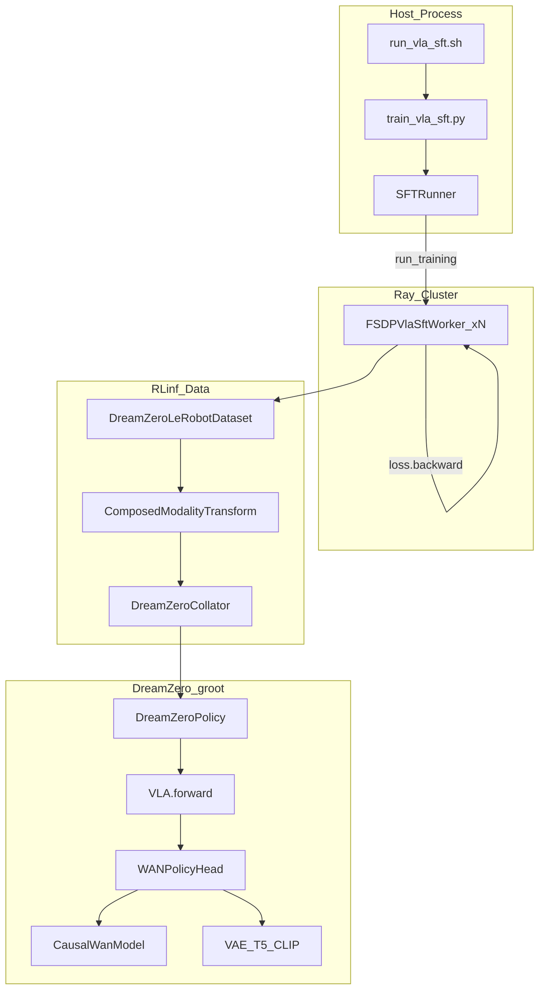
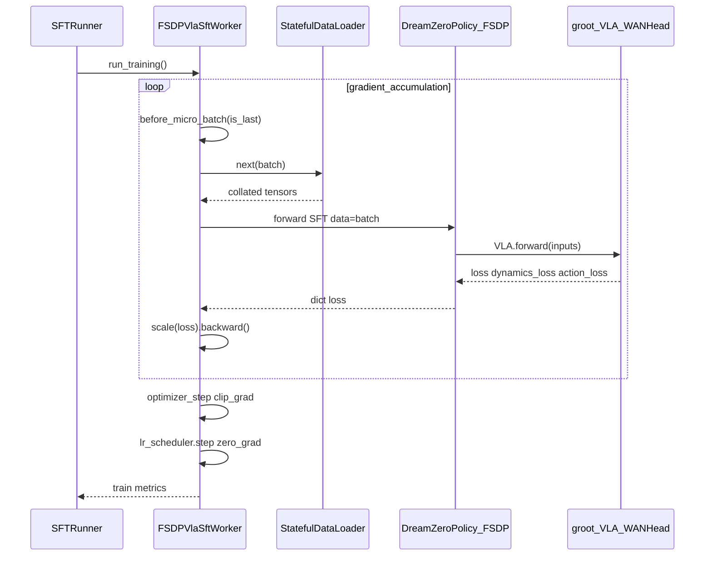
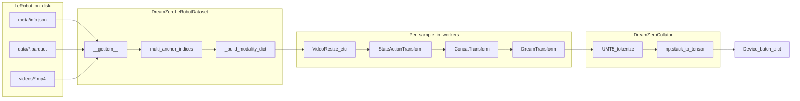
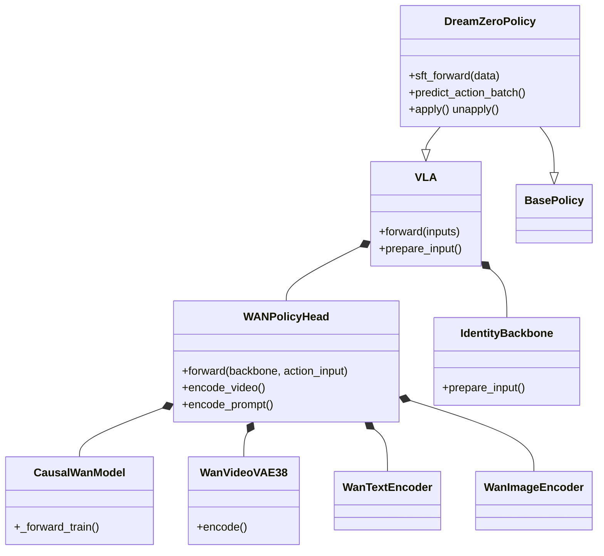
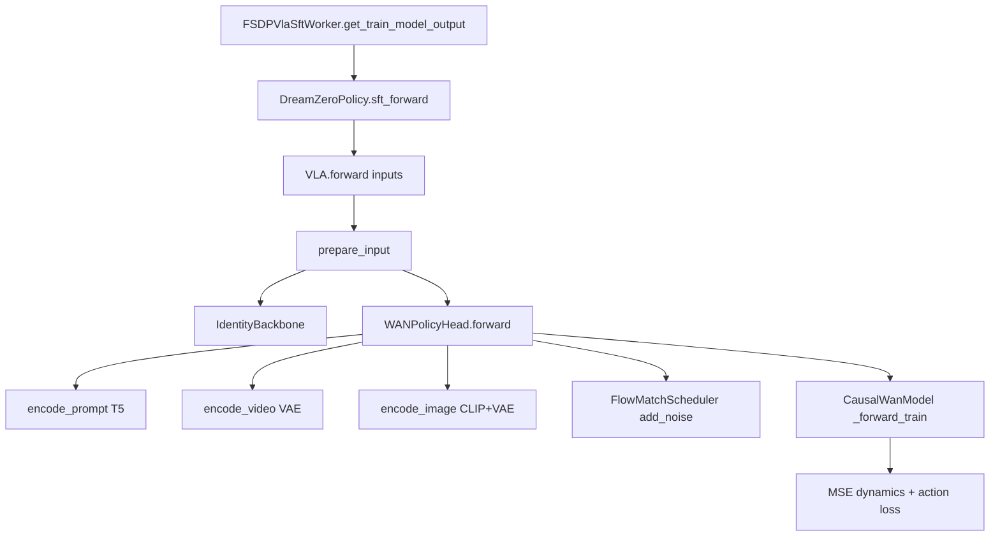
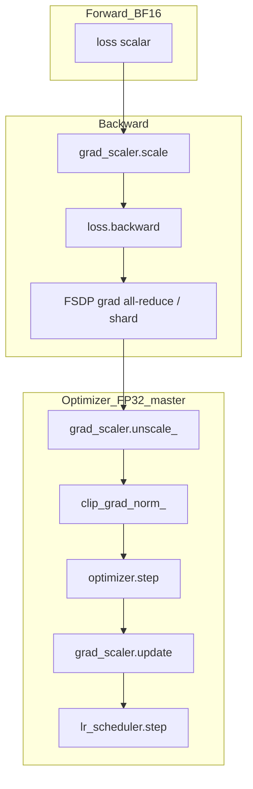

# DreamZero 监督微调（SFT）深度分析

> **版本说明**：本文以 RLinf 本地仓库（`D:\SRC\RL\RLinf`）与 DreamZero/groot 仓库（`D:\SRC\Robot\dreamzero`）为准，对照官方文档 [DreamZero Supervised Fine-Tuning](https://rlinf.readthedocs.io/en/latest/rst_source/examples/embodied/sft_dreamzero.html)。  
> **分析日期**：2026-05-29

---

## 目录

1. [总览：RLinf 与 DreamZero 的分工](#1-总览rlinf-与-dreamzero-的分工)
2. [启动与分布式调度](#2-启动与分布式调度)
3. [配置体系与 WAN2.1 / WAN2.2 差异](#3-配置体系与-wan21--wan22-差异)
4. [数据管线：从 LeRobot 到 GPU Batch](#4-数据管线从-lerobot-到-gpu-batch)
5. [模型构建：Patcher、FSDP 与组件加载](#5-模型构建patcherfsdp-与组件加载)
6. [训练 Forward：Flow Matching 与 CausalWanModel](#6-训练-forwardflow-matching-与-causalwanmodel)
7. [Backward、梯度与权重更新](#7-backward梯度与权重更新)
8. [Checkpoint、恢复与评测闭环](#8-checkpoint恢复与评测闭环)
9. [工程要点与排错清单](#9-工程要点与排错清单)
10. [关键文件索引](#10-关键文件索引)

---

## 1. 总览：RLinf 与 DreamZero 的分工

DreamZero SFT **不是** embodied PPO 训练：没有 env worker、没有 rollout→advantage 环，只有 **Ray Actor 上的 FSDP 监督学习**。

| 层次 | 仓库 | 职责 |
|------|------|------|
| 编排与分布式 | RLinf | Hydra 配置、`Cluster`/`SFTRunner`、`FSDPVlaSftWorker`、LeRobot 数据集、FSDP2、日志与 checkpoint |
| 模型与损失 | DreamZero (`groot`) | `VLA`、`WANPolicyHead`、`CausalWanModel`、VAE/T5/CLIP、Flow Matching 损失 |
| 数据语义 | 二者协作 | RLinf 读 LeRobot + embodiment transform；groot `DreamTransform` 做 tokenize/多视角拼接 |

### 1.1 系统架构图



### 1.2 与「世界模型 WAN」示例的区别

RLinf 中还有 `wan_libero_*` 等 **OpenVLA-OFT + 世界模型 WAN** 的 GRPO 配置（`rlinf/envs/world_model/world_model_wan_env.py`），与本文的 **DreamZero VLA SFT** 是不同产品线：前者是 RL + 世界模型仿真，后者是离线 LeRobot 上的扩散策略头微调。

---

## 2. 启动与分布式调度

### 2.1 启动命令链

官方推荐：

```bash
bash examples/sft/run_vla_sft.sh libero_sft_dreamzero_5b   # WAN2.2 冷启动 + LIBERO
bash examples/sft/run_vla_sft.sh droid_sft_dreamzero_14b  # WAN2.1 14B 续训 + DROID
```

[`examples/sft/run_vla_sft.sh`](../../examples/sft/run_vla_sft.sh) 做三件事：

1. 设置 `EMBODIED_PATH`、`REPO_PATH`、`PYTHONPATH`
2. **`export DREAMZERO_PATH`** 并加入 `PYTHONPATH`（必须指向 `D:\SRC\Robot\dreamzero` 这类 groot 包根目录）
3. 调用 Hydra：`python train_vla_sft.py --config-path ... --config-name <name>`

[`examples/sft/train_vla_sft.py`](../../examples/sft/train_vla_sft.py) 核心逻辑：

```python
cluster = Cluster(cluster_cfg=cfg.cluster)
component_placement = HybridComponentPlacement(cfg, cluster)
actor_group = FSDPVlaSftWorker.create_group(cfg).launch(...)
runner = SFTRunner(cfg=cfg, actor=actor_group)
runner.init_workers()
runner.run()
```

- `validate_cfg()` 会调用 `validate_dreamzero_sft_model_cfg()` 合并 `model_path/config.json` 与 YAML（见 [`rlinf/models/embodiment/dreamzero/dreamzero_config.py`](../../rlinf/models/embodiment/dreamzero/dreamzero_config.py)）。
- 单节点典型配置：`cluster.num_nodes: 1`，`component_placement.actor: all`。

### 2.2 SFTRunner 训练循环

[`rlinf/runners/sft_runner.py`](../../rlinf/runners/sft_runner.py) 每个 **global step**：

1. `actor.run_training().wait()` — 所有 GPU rank 各跑一个优化步
2. 按 `save_interval` 写 `checkpoints/global_step_<N>/actor/`
3. `MetricLogger` 记录 `train/loss`、`time/step` 等

**注意**：`SFTRunner` 里的 `global_step` 与 worker 内 dataloader 的 epoch 独立；resume 时从 `runner.resume_dir` 解析 step 并 `load_checkpoint`。

### 2.3 单步训练序列图（Runner ↔ Worker ↔ 模型）



### 2.4 FSDPSftWorker：一个优化步的微观结构

[`rlinf/workers/sft/fsdp_sft_worker.py`](../../rlinf/workers/sft/fsdp_sft_worker.py) 中：

\[
G_{\text{accum}} = \frac{B_{\text{global}}}{B_{\text{micro}} \times N_{\text{GPU}}}
\]

每个 global step：

1. `model.train()`
2. 循环 `gradient_accumulation` 次：
   - `batch = next(data_iter)`
   - `loss, metrics = get_train_model_output(batch)`（DreamZero 子类）
   - `loss /= gradient_accumulation`
   - `grad_scaler.scale(loss).backward()`（在 `before_micro_batch` 上下文内）
3. **一次** `optimizer_step()` → `zero_grad` → `lr_scheduler.step()`

DreamZero 专用入口 [`FSDPVlaSftWorker`](../../rlinf/workers/sft/fsdp_vla_sft_worker.py)：

```python
output = self.model(forward_type=ForwardType.SFT, data=batch)
loss = output["loss"]  # 或 tensor
# 额外记录 dynamics_loss, action_loss
```

---

## 3. 配置体系与 WAN2.1 / WAN2.2 差异

### 3.1 两条训练路径（与官方文档一致）

| 路径 | `model_path` | 权重来源 | 典型 YAML |
|------|--------------|----------|-----------|
| **续训** | 指向 DreamZero 目录 | `model.safetensors` 或分片 index | `droid_sft_dreamzero_14b.yaml` |
| **冷启动** | `null` | `diffusion/text/image/vae` 四个 `*_pretrained_path` | `libero_sft_dreamzero_5b.yaml` |

冷启动 WAN2.2 需下载：

- [Wan-AI/Wan2.2-TI2V-5B](https://huggingface.co/Wan-AI/Wan2.2-TI2V-5B)（DiT、T5、VAE）
- [Wan2.1 CLIP](https://huggingface.co/Wan-AI/Wan2.1-I2V-14B-480P) 中的 `models_clip_open-clip-xlm-roberta-large-vit-huge-14.pth`（**不在 5B 仓库内**）
- [google/umt5-xxl](https://huggingface.co/google/umt5-xxl)

### 3.2 WAN2.1（14B）vs WAN2.2（5B）架构对照

配置来源：[`examples/sft/config/model/dreamzero_14b.yaml`](../../examples/sft/config/model/dreamzero_14b.yaml) 与 [`dreamzero_5b.yaml`](../../examples/sft/config/model/dreamzero_5b.yaml)；groot 侧见 [`wan_flow_matching_action_tf_wan22.yaml`](file:///D:/SRC/Robot/dreamzero/groot/vla/configs/model/dreamzero/action_head/wan_flow_matching_action_tf_wan22.yaml)。

| 组件 | WAN2.1（DreamZero-DROID 14B） | WAN2.2（Wan2.2-TI2V-5B） |
|------|------------------------------|---------------------------|
| DiT `model_type` | `i2v` | **`ti2v`** |
| DiT `dim` / `num_layers` | 5120 / 40 | **3072 / 30** |
| `in_dim` / `out_dim` | 36 / 16 | **48 / 48** |
| `frame_seqlen` | 880 | **50**（与 latent 空间 patch 数匹配） |
| VAE 类 | `WanVideoVAE`（z_dim=16） | **`WanVideoVAE38`（z_dim=48）** |
| 默认分辨率 preset | 352×640 | 176×320（LIBERO 常改为 160×320） |
| 图像编码器权重 | WAN2.1 配套 | **必须单独指定 WAN2.1 CLIP 路径** |
| DiT HF 仓库 | `Wan2.1-I2V-14B-480P` | **`Wan2.2-TI2V-5B`** |

groot 在 `WANPolicyHead.__init__` 中按 `z_dim` / `in_dim` 自动选择 HF 仓库与 VAE 文件名：

```254:262:D:/SRC/Robot/dreamzero/groot/vla/model/dreamzero/action_head/wan_flow_matching_action_tf.py
        vae_hf_filename = "Wan2.2_VAE.pth" if getattr(self.vae, "z_dim", 16) == 48 else "Wan2.1_VAE.pth"
        vae_repo_id = WAN22_HF_REPO_ID if getattr(self.vae, "z_dim", 16) == 48 else WAN_HF_REPO_ID
        ...
        dit_repo_id = WAN22_HF_REPO_ID if getattr(self.model, "in_dim", 16) == 48 else WAN_HF_REPO_ID
```

### 3.3 时间维对齐（易混淆概念）

官方文档强调：

- **`max_chunk_size`**（常 4）：宏观时间块数，对应 Causal DiT 的 chunk 容量；`multi_anchor` 下动作长度约为 `action_horizon × max_chunk_size`（LIBERO：16×4=64）。
- **`action_horizon`**：每个 WAN 时间块内的动作步数（LIBERO 16，DROID 24）。
- **`num_frames`**：视频帧数，常取 \(8 \times \text{max\_chunk\_size} + 1\)（默认 33）。

---

## 4. 数据管线：从 LeRobot 到 GPU Batch

### 4.1 数据流总图



### 4.2 构建 DataLoader（RLinf）

[`build_dreamzero_sft_dataloader`](../../rlinf/data/datasets/dreamzero/dreamzero.py) 流程：

1. `load_dreamzero_dataset_metadata(model_cfg)` → 读 `metadata_json_path` 或 `model_path/experiment_cfg/metadata.json`
2. `build_dreamzero_composed_transform()` → 按 `embodiment_tag` 选 [`libero_sim`](../../rlinf/data/datasets/dreamzero/data_transforms/libero_sim.py) / [`oxe_droid`](../../rlinf/data/datasets/dreamzero/data_transforms/oxe_droid.py)
3. `DreamZeroLeRobotDataset(...)` + `DistributedSampler` + `StatefulDataLoader`
4. `collate_fn=DreamZeroCollator(tokenizer_path, max_seq_len, embodiment_tag_mapping)`

**有效 batch**（[`libero_sft_dreamzero_5b.yaml`](../../examples/sft/config/libero_sft_dreamzero_5b.yaml) 示例：`micro_batch_size=32`，8 GPU，`global_batch_size=256`）：

\[
B_{\text{global}} = 32 \times 8 \times 1 = 256
\]

若 `global_batch_size` 更大，则增大 `gradient_accumulation`。

### 4.3 时间采样：`multi_anchor`

[`sampling_strategy.py`](../../rlinf/data/datasets/dreamzero/sampling_strategy.py) 实现 Groot `lerobot_sharded` 语义：在同一语言片段内沿 episode 取多个 **anchor**，每个 anchor 上再采微观视频/动作索引。

- **`multi_anchor`**：需 `lazy_load=True`（mp4 按时间戳寻帧），否则抛错。
- **`fixed_window`**：单段连续窗口，兼容非 lazy 模式。

LIBERO 的 `get_modality_config()` 使用 `video delta_indices=range(25)`、`action delta_indices=range(24)`，与 16×4 的宏观块设计一致。

### 4.4 Embodiment Transform（以 LIBERO 为例）

[`LiberoSimDataTransform`](../../rlinf/data/datasets/dreamzero/data_transforms/libero_sim.py)：

- `TAG = "libero_sim"`，`DEFAULT_TAG_MAPPING = {"libero_sim": 21}` → WAN **embodiment projector ID**
- 双视角：`video.image` + `video.wrist_image` → 水平拼接 + 专用 prompt 前缀
- 流水线：`VideoToTensor` → `StateActionTransform`（q99 归一化）→ `ConcatTransform` → RLinf [`DreamTransform`](../../rlinf/data/datasets/dreamzero/data_transforms/dream_transform.py)

RLinf 的 `DreamTransform` 继承 groot `DreamTransform`，`_prepare_video` 通过 registry 调用 `concat_multiview_video`。

### 4.5 DreamTransform 与 Collator（groot + RLinf）

groot [`dreamzero_cotrain.py`](file:///D:/SRC/Robot/dreamzero/groot/vla/model/dreamzero/transform/dreamzero_cotrain.py) 的 `apply_single` 会：

- 将 `state`/`action` pad 到 `max_state_dim` / `max_action_dim`（通常 32）
- 写入 `embodiment_id`、`has_real_action`、`action_mask` 等

[`DreamZeroCollator`](../../rlinf/data/datasets/dreamzero/dreamzero.py) 在 batch 维：

- `text` → `format_training_prompt(instruction, embodiment_id)` → UMT5 `input_ids` + `text_attention_mask`
- 其余键 `np.stack` → `torch.Tensor`

**进入 `WANPolicyHead.forward` 的典型键**（训练 batch）：

| 键 | 含义 |
|----|------|
| `images` | 多帧多视角视频 uint8/float，经 rearrange 为 `B,C,T,H,W` |
| `action` | 归一化动作，形状与 `action_horizon`、chunk 对齐 |
| `state` | 每个宏观 anchor 的状态 |
| `text` / `text_attention_mask` | T5 条件 |
| `embodiment_id` | projector 选择（LIBERO=21） |
| `action_mask` / `has_real_action` | 损失掩码 |

### 4.6 metadata.json

由 [`toolkits/lerobot/generate_dreamzero_metadata.py`](../../toolkits/lerobot/generate_dreamzero_metadata.py) 生成；键名必须与 `embodiment_tag` 一致。`StateActionTransform` 的 q01/q99 统计来自此文件。

---

## 5. 模型构建：Patcher、FSDP 与组件加载

### 5.1 类图（核心类型）



### 5.2 RLinf `get_model` 与 Patcher

[`rlinf/models/embodiment/dreamzero/__init__.py`](../../rlinf/models/embodiment/dreamzero/__init__.py) 在实例化前注册补丁：

| 补丁 | 目的 |
|------|------|
| `WanVideoVAE` / `WanVideoVAE38` → RLinf `patch/wan_video_vae.py` | **micro_batch>1 时 VAE 批量编码**，加速 SFT |
| `CausalWanModel._forward_train` → `wan_causal_model_forward_train.py` | micro_batch>1 时**关闭** block 内 gradient checkpoint（规避 PyTorch bug） |
| `CausalWanSelfAttention._process_*` → `torch.compile` | 注意力子路径编译加速 |

冷启动时 `skip_component_loading=False`，groot 从 `diffusion_model_pretrained_path` 等加载分片 safetensors；若存在完整 `model.safetensors` 则 `skip_component_loading=True` 并由 RLinf `load_state_dict` 覆盖。

### 5.3 FSDP 包装

[`FSDPModelManager.setup_model_and_optimizer`](../../rlinf/hybrid_engines/fsdp/fsdp_model_manager.py)：

1. `model_provider_func()` → `get_model(cfg.actor.model)`
2. 可选 `gradient_checkpointing_enable()`（DreamZero 主要作用于 DiT）
3. `_strategy.wrap_model()` — `libero_sft_dreamzero_5b` 使用 **fsdp2**
4. Adam + cosine scheduler + `ShardedGradScaler`（该例 `grad_scaler.enabled: False`）

`DreamZeroPolicy._no_split_modules` 列出 FSDP 不切分的模块（`CausalWanModel`、`T5SelfAttention` 等），避免已知的 FSDP2 + checkpoint 问题。

**混合精度**（推荐实践，见官方 RST）：

- `actor.model.precision: fp32` → 优化器主权重 FP32
- `fsdp_config.mixed_precision: bf16` → 前向/反向 matmul BF16

---

## 6. 训练 Forward：Flow Matching 与 CausalWanModel

### 6.1 调用链（RLinf → groot）



RLinf 薄封装：

```315:329:rlinf/models/embodiment/dreamzero/dreamzero_policy.py
    def sft_forward(self, data=None, **kwargs):
        torch.compiler.cudagraph_mark_step_begin()
        ...
        outputs = super().forward(data)
        ...
        return dict(outputs)
```

groot `VLA.forward`：

```139:148:D:/SRC/Robot/dreamzero/groot/vla/model/dreamzero/base_vla.py
    def forward(self, inputs: dict) -> BatchFeature:
        backbone_inputs, action_inputs = self.prepare_input(inputs)
        backbone_outputs = self.backbone(backbone_inputs)
        action_head_outputs = self.action_head(backbone_outputs, action_inputs)
        return action_head_outputs
```

`IdentityBackbone` 不提取视觉特征，**所有视觉语义在 `WANPolicyHead` 内完成**（VAE latent + CLIP + T5）。

### 6.2 WANPolicyHead.forward 分阶段说明

以下基于 [`wan_flow_matching_action_tf.py`](file:///D:/SRC/Robot/dreamzero/groot/vla/model/dreamzero/action_head/wan_flow_matching_action_tf.py)（训练路径）。

#### 阶段 A：输入预处理

1. `videos = rearrange(images, "b t h w c -> b c t h w")`，uint8 → `[-1,1]` 归一化。
2. **WAN2.2 分辨率**：若配置 `target_video_height/width`（如 160×320），`interpolate` 到目标尺寸，使 VAE38 latent 空间 **H、W 为偶数**，避免 dynamics loss 裁剪（groot 注释：`176×320` 会得到 11×20 的奇数 H latent）。
3. `prompt_embs = encode_prompt(text, mask)` — **WanTextEncoder（UMT5）**，冻结 eval。

#### 阶段 B：编码（多数无梯度）

4. `latents = encode_video(videos)` — **VAE**；RLinf 补丁支持 batch VAE。
5. `clip_feas, ys, _ = encode_image(first_frame)` — **WAN2.1 CLIP** + 首帧 VAE 条件（`ti2v` / `i2v` 路径）。
6. VAE/T5/CLIP 在 `set_frozen_modules_to_eval_mode()` 下保持 eval；**可训练参数主要在 `CausalWanModel` 与 action projector**（`tune_diffusion_model`、`tune_projector`）。

#### 阶段 C：Flow Matching 加噪

7. 对 latent 与 action 采样高斯 `noise`，按配置采样 **timestep_id**：
   - 默认：video/action **耦合**均匀 timestep；
   - `decouple_video_action_noise`：video 用 Beta 偏高噪声，action 独立均匀；
   - `use_high_noise_emphasis`：二者均 Beta 偏高噪声。
8. `noisy_latents = scheduler.add_noise(latents, noise, timestep)`
9. `training_target = scheduler.training_target(latents, noise, timestep)` — Flow Matching 目标（与 Wan 视频扩散训练一致，参见 Flow Matching / Consistency 文献中的 velocity 或 noise 参数化）。

#### 阶段 D：CausalWanModel 预测

10. 调用 `self.model(...)`（即 `CausalWanModel`），传入：
    - `noisy_latents`、`timestep`、`clip_feature`、`y`（首帧条件）、`context`（T5）
    - `state`、`action`（加噪后）、`timestep_action`、`embodiment_id`
    - **`clean_x=latents`**：teacher-forcing 式训练（`_forward_train` 内拼接 clean/noisy 路径）

RLinf 补丁的 `_forward_train` 核心逻辑（摘要）：

- `patch_embedding` → 展平为 token 序列 `seq_len = num_frames * (H//2)*(W//2)`
- 将 **action_encoder(state, action)** 拼接到视频 token 后
- 经 `CausalWanAttentionBlock` 堆栈（可选 gradient checkpoint）
- 输出 `video_noise_pred`、`action_noise_pred`

#### 阶段 E：损失

```784:810:D:/SRC/Robot/dreamzero/groot/vla/model/dreamzero/action_head/wan_flow_matching_action_tf.py
            dynamics_loss_per_sample = F.mse_loss(video_noise_pred, training_target, reduction='none').mean(dim=(1,3,4))
            weight_dynamics = dynamics_loss_per_sample * scheduler.training_weight(timestep...)
            weighted_dynamics_loss = weight_dynamics.mean()

            action_loss_per_sample = F.mse_loss(action_noise_pred, training_target_action, reduction='none') * action_mask
            action_loss_per_sample = has_real_action * action_loss_per_sample
            weighted_action_loss = ...
            loss = weighted_dynamics_loss + weighted_action_loss
```

| 损失 | 物理含义 | 监控名 |
|------|----------|--------|
| **dynamics_loss** | 视频 latent 上的 flow matching；学「世界动力学」/ 视频一致性 | `train/dynamics_loss` |
| **action_loss** | 机器人动作通道上的 flow matching；学策略 | `train/action_loss` |
| **loss** | 二者加权和 | `train/loss` |

权重含 `scheduler.training_weight(timestep)`，强调不同噪声水平下的贡献；`action_mask` / `has_real_action` 屏蔽无效动作维或占位样本。

### 6.3 Flow Matching 直觉（旁征博引）

与 DDPM 直接预测 \(\epsilon\) 类似，Flow Matching 学习从噪声分布到数据分布的 **向量场**。DreamZero 将 **视频 latent** 与 **动作序列** 联立到同一 Causal DiT 中，使策略与「想象中的未来视频」共享时空注意力 — 这与 **UniPi / 视频策略** 一类工作同宗：用生成式视频模型承载策略，而非仅用 MLP 回归动作。

WAN2.2 相对 2.1 的主要变化在 **48 维 latent（VAE38）** 与 **ti2v 5B DiT**，更适合高压缩比与 TI2V 训练目标；机器人 SFT 仍复用同一 `WANPolicyHead` 框架，仅替换配置与权重路径。

---

## 7. Backward、梯度与权重更新

### 7.1 计算图与 FSDP



- **前向**：`WANPolicyHead.forward` 内层有 `torch.amp.autocast(dtype=bfloat16)`；FSDP `mixed_precision.param_dtype=bf16`。
- **反向**：`loss` 标量对已训练参数求导；冻结模块（VAE/T5/CLIP）无梯度或梯度为 None。
- **FSDP2**：`before_micro_batch(..., is_last_micro_batch)` 控制梯度同步时机；仅在最后一个 micro-batch 上 all-reduce 完整梯度（具体行为见 [`fsdp2.py`](../../rlinf/hybrid_engines/fsdp/strategy/fsdp2.py)）。

### 7.2 梯度累积

每个 micro-batch 的 `loss` **先除以** `gradient_accumulation`，再 `backward()`，等价于对大 batch 求平均梯度。DreamZero 在 `micro_batch_size>1` 时依赖 VAE/DiT 补丁才能正确累积。

### 7.3 optimizer_step

[`optimizer_step`](../../rlinf/hybrid_engines/fsdp/fsdp_model_manager.py)：

1. `grad_scaler.unscale_(optimizer)`
2. `clip_grad_norm_`（配置 `optim.clip_grad`，如 1.0）
3. 若 grad norm 非有限则跳过 `step`
4. `grad_scaler.step(optimizer)`、`update()`
5. `lr_scheduler.step()`（cosine + warmup ratio）

`libero_sft_dreamzero_5b` 示例：`lr=1e-5`，`weight_decay=1e-5`，Adam \(\beta_1=0.95\)。

### 7.4 谁在被更新？

| 模块 | 典型梯度 | 说明 |
|------|----------|------|
| `CausalWanModel` | 有 | `tune_diffusion_model: true` |
| Action/State encoder、projector | 有 | `tune_projector: true` |
| `WanVideoVAE38` / T5 / CLIP | 无 | eval + `no_grad` encode |
| LoRA | 可选 | RLinf SFT 示例 `is_lora: False` 全量微调 DiT+projector |

---

## 8. Checkpoint、恢复与评测闭环

### 8.1 保存

- 路径：`{log_path}/{experiment_name}/checkpoints/global_step_{N}/actor/`
- FSDP 分片 + 可选 `save_full_model_weights`（5B 示例为 `False`，仅分片）
- DreamZero 额外：`data.pt`（`StatefulDataLoader` 全 rank 状态）、`rng.pt`

### 8.2 恢复

`runner.resume_dir` → `SFTRunner.init_workers` → `actor.load_checkpoint(actor_checkpoint_path)`。

### 8.3 评测（与 SFT 分离）

[`libero_spatial_eval_dreamzero.yaml`](../../examples/embodiment/config/libero_spatial_eval_dreamzero.yaml) + `eval_embodiment.sh`：

- 推理走 `predict_action_batch` → `lazy_joint_video_action_causal`（**非** `sft_forward`）
- `runner.ckpt_path` 指向 `full_weights.pt`（可由 FSDP convertor 从分片合并）

官方公布的 WAN2.2 LIBERO SFT checkpoint（Step 18000）在 Spatial 上 `success_once` 约 96.68%（见官方 RST 表格）。

---

## 9. 工程要点与排错清单

1. **`DREAMZERO_PATH`**：必须指向含 `groot` 包的目录（如 `D:\SRC\Robot\dreamzero`），否则 `WANPolicyHead` 无法 import。
2. **`multi_anchor` + mp4**：必须 `data.lazy_load: True`。
3. **WAN2.2 维度**：确认 `in_dim/out_dim=48`、`WanVideoVAE38`、`ti2v`；CLIP 路径指向 WAN2.1。
4. **分辨率与 `frame_seqlen`**：160×320 → latent 10×20 → patch 50；与 `dreamzero_5b` 中 `frame_seqlen: 50` 一致。
5. **embodiment_id**：`metadata.json` 键、`embodiment_tag`、`DEFAULT_TAG_MAPPING` 三者一致；续训时 ID 须在 checkpoint `action_loss_embodiment_ids` 中。
6. **loss 异常高**：检查 metadata 归一化、`relative_action`、时间维配置是否与数据匹配。
7. **VAE 批处理**：仅 RLinf 补丁路径支持高效 multi-sample；原生 groot 单条编码较慢。

---

## 10. 关键文件索引

### RLinf

| 文件 | 作用 |
|------|------|
| [`examples/sft/train_vla_sft.py`](../../examples/sft/train_vla_sft.py) | Hydra 入口 |
| [`examples/sft/run_vla_sft.sh`](../../examples/sft/run_vla_sft.sh) | 启动脚本、`DREAMZERO_PATH` |
| [`rlinf/runners/sft_runner.py`](../../rlinf/runners/sft_runner.py) | 训练主循环 |
| [`rlinf/workers/sft/fsdp_vla_sft_worker.py`](../../rlinf/workers/sft/fsdp_vla_sft_worker.py) | DreamZero dataloader + SFT forward |
| [`rlinf/workers/sft/fsdp_sft_worker.py`](../../rlinf/workers/sft/fsdp_sft_worker.py) | 梯度累积、backward、optimizer |
| [`rlinf/data/datasets/dreamzero/dreamzero.py`](../../rlinf/data/datasets/dreamzero/dreamzero.py) | 数据集与 Collator |
| [`rlinf/models/embodiment/dreamzero/__init__.py`](../../rlinf/models/embodiment/dreamzero/__init__.py) | `get_model` + Patcher |
| [`rlinf/models/embodiment/dreamzero/dreamzero_policy.py`](../../rlinf/models/embodiment/dreamzero/dreamzero_policy.py) | Policy 封装 |
| [`examples/sft/config/libero_sft_dreamzero_5b.yaml`](../../examples/sft/config/libero_sft_dreamzero_5b.yaml) | WAN2.2 冷启动示例 |

### DreamZero（`D:\SRC\Robot\dreamzero`）

| 文件 | 作用 |
|------|------|
| [`groot/vla/model/dreamzero/base_vla.py`](file:///D:/SRC/Robot/dreamzero/groot/vla/model/dreamzero/base_vla.py) | `VLA.forward` |
| [`groot/vla/model/dreamzero/action_head/wan_flow_matching_action_tf.py`](file:///D:/SRC/Robot/dreamzero/groot/vla/model/dreamzero/action_head/wan_flow_matching_action_tf.py) | 训练损失、编码、WAN2.2 加载逻辑 |
| [`groot/vla/model/dreamzero/modules/wan_video_dit_action_casual_chunk.py`](file:///D:/SRC/Robot/dreamzero/groot/vla/model/dreamzero/modules/wan_video_dit_action_casual_chunk.py) | `CausalWanModel` |
| [`groot/vla/model/dreamzero/modules/wan_video_vae.py`](file:///D:/SRC/Robot/dreamzero/groot/vla/model/dreamzero/modules/wan_video_vae.py) | `WanVideoVAE38` |
| [`groot/vla/model/dreamzero/transform/dreamzero_cotrain.py`](file:///D:/SRC/Robot/dreamzero/groot/vla/model/dreamzero/transform/dreamzero_cotrain.py) | `DreamTransform` |
| [`groot/vla/configs/.../wan_flow_matching_action_tf_wan22.yaml`](file:///D:/SRC/Robot/dreamzero/groot/vla/configs/model/dreamzero/action_head/wan_flow_matching_action_tf_wan22.yaml) | WAN2.2 Hydra 预设 |

### 官方文档

- [DreamZero SFT（EN）](https://rlinf.readthedocs.io/en/latest/rst_source/examples/embodied/sft_dreamzero.html)
- [DreamZero 仓库](https://github.com/RLinf/dreamzero)

---

## 附录：端到端张量形状（LIBERO + WAN2.2 5B 典型）

以下为概念形状，实际 \(B\) 为 per-GPU micro-batch：

| 阶段 | 张量 | 典型形状（示意） |
|------|------|----------------|
| Collator 输出 | `images` | `[B, T, H, W, C]` |
| WANHead | `videos` | `[B, C, T, H', W']` 经 resize |
| VAE latent | `latents` | `[B, C_z, T', H_z, W_z]`，\(C_z=48\) |
| DiT 输入 token | `x` | `[B, seq_len, dim]` |
| 动作 | `action` | `[B, T_a, action_dim]`，pad 到 32 |
| 损失 | `loss` | 标量 |

---

*文档结束。若需将 SFT 权重转为 Hugging Face 格式或对接 LIBERO 评测，请参阅官方 RST 的 Checkpoint conversion 与 VLA evaluation 章节。*
