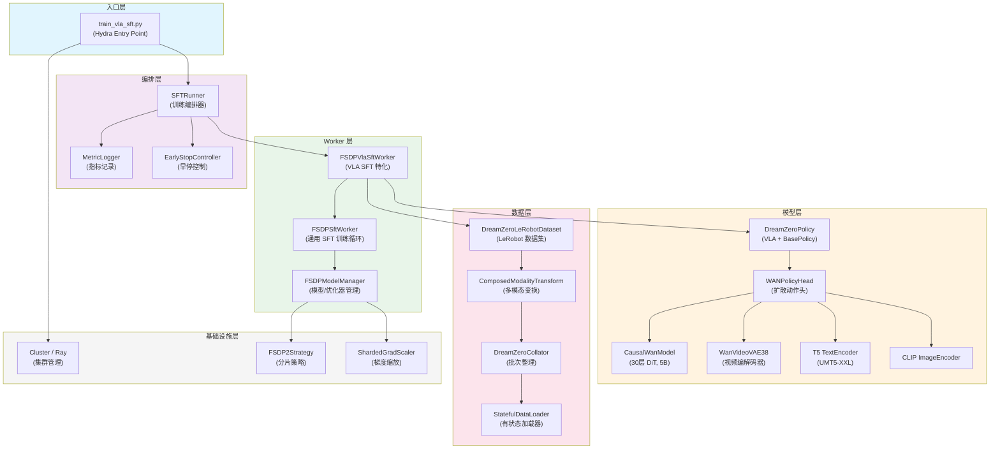
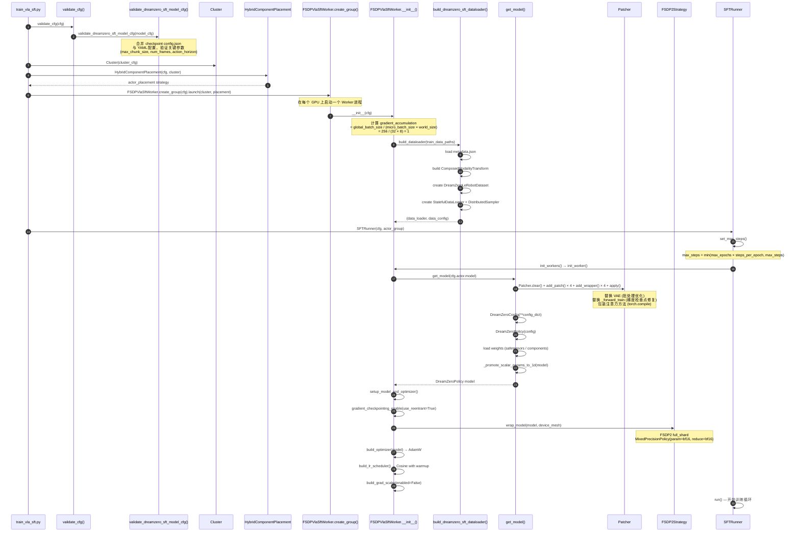
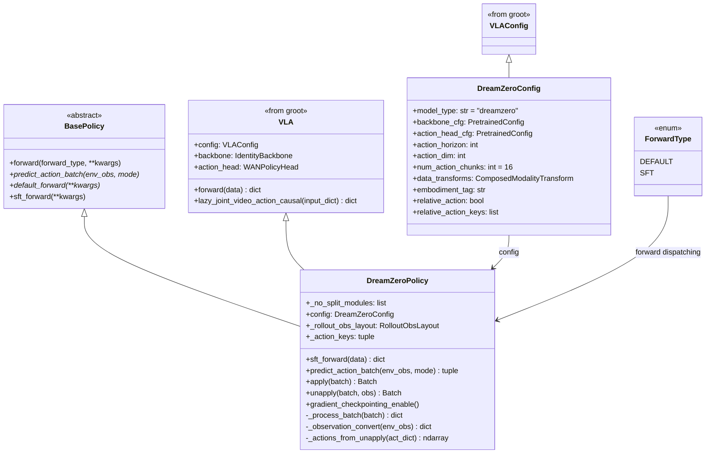
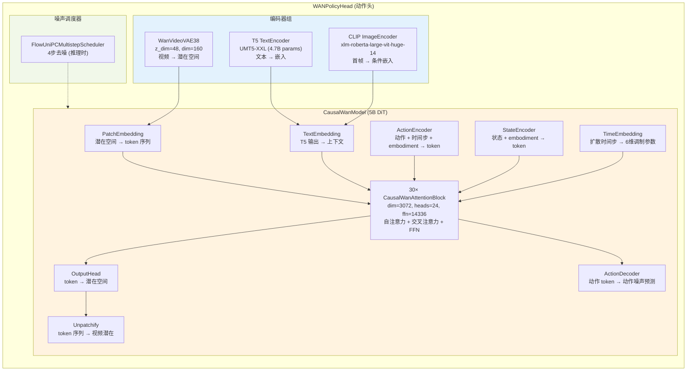
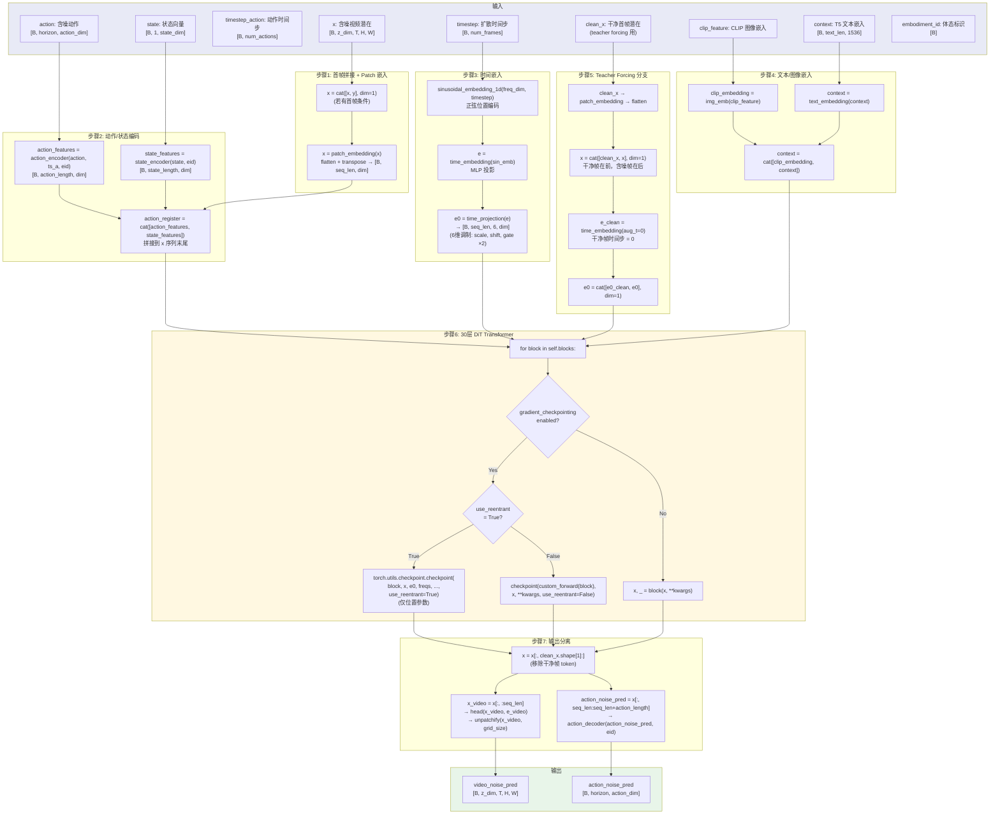
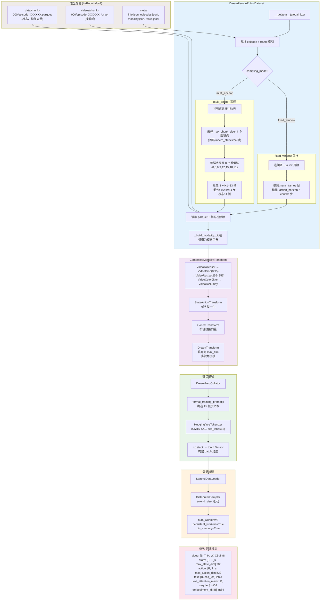
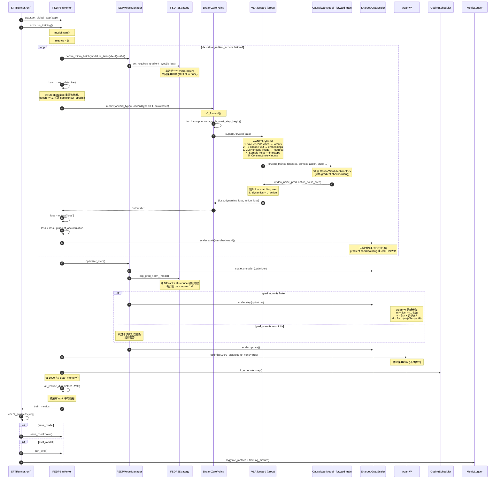
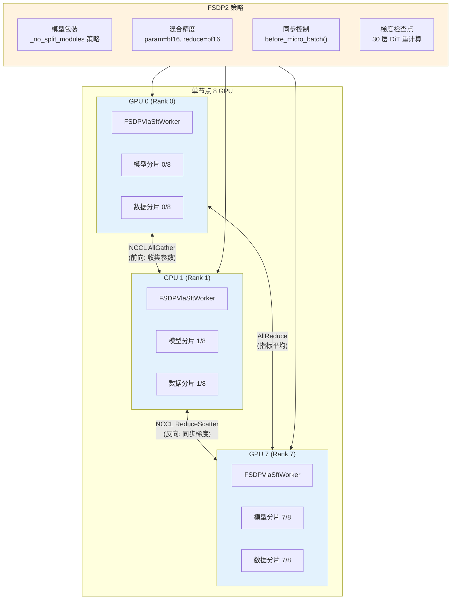
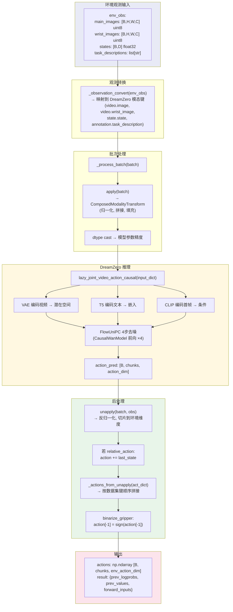

# DreamZero SFT 全栈技术深度分析 — RLinf 实现架构剖析

> **分析基于**：RLinf 本地代码库 (commit `e9e0b449` 及之后)  
> **分析日期**：2026-05-29  
> **分析模型**：Claude Opus 4.6  

---

## 目录

1. [系统总览与架构全景](#1-系统总览与架构全景)
2. [启动流程与初始化序列](#2-启动流程与初始化序列)
3. [模型架构深度剖析](#3-模型架构深度剖析)
4. [扩散训练的数学基础](#4-扩散训练的数学基础)
5. [数据管线全链路分析](#5-数据管线全链路分析)
6. [训练循环逐行解析](#6-训练循环逐行解析)
7. [分布式训练架构](#7-分布式训练架构)
8. [配置系统与超参数分析](#8-配置系统与超参数分析)
9. [Monkey Patching 与性能优化](#9-monkey-patching-与性能优化)
10. [指标记录与早停机制](#10-指标记录与早停机制)
11. [推理流程分析](#11-推理流程分析)
12. [Embodiment 扩展机制](#12-embodiment-扩展机制)
13. [与其他方法的对比](#13-与其他方法的对比)
14. [已知限制与潜在改进](#14-已知限制与潜在改进)
- [附录 A：完整调用链参考](#附录-a完整调用链参考)
- [附录 B：文件索引](#附录-b文件索引)

---

## 1. 系统总览与架构全景

### 1.1 DreamZero 是什么

DreamZero 是一种基于**视频世界模型（Video World Model）**的视觉-语言-动作（Vision-Language-Action, VLA）策略。与传统 VLA（如 OpenVLA）直接将动作离散化为语言 token 不同，DreamZero 采用了一种根本不同的范式：它将机器人动作预测建模为一个**扩散过程（Diffusion Process）**，与视频帧预测共享同一个 Causal DiT（Causal Diffusion Transformer）骨干网络。

核心思想可以用一句话概括：**「让机器人通过『做梦』（预测未来视频帧）来学习行动」**。

这个架构建立在阿里巴巴的 WAN2.2 视频生成模型之上。WAN2.2 是一个 50 亿参数的因果 DiT（Causal Diffusion Transformer），原本设计用于从文本/图像生成高质量视频。DreamZero 在其基础上添加了动作编码器、状态编码器和动作解码器，使其能够在生成视频的同时预测机器人动作序列。

### 1.2 RLinf 中的 SFT 管线

RLinf 为 DreamZero 提供了一套完整的分布式 SFT（Supervised Fine-Tuning）训练管线。该管线的核心设计原则是：

- **FSDP2 分布式训练**：使用 PyTorch 原生的 Fully Sharded Data Parallel 2.0 在多 GPU 上分片模型参数
- **混合精度训练**：参数以 BF16 存储和计算，优化器状态保持 FP32 精度
- **梯度检查点**：通过重计算中间激活来降低显存占用
- **有状态数据加载**：支持训练中断后从精确的数据位置恢复

### 1.3 系统架构层次图



这个架构展示了清晰的分层设计：入口层负责配置和启动；编排层控制训练节奏；Worker 层实现具体的训练逻辑；模型层封装 DreamZero 的神经网络；数据层处理数据加载和预处理；基础设施层提供分布式计算支持。

---

## 2. 启动流程与初始化序列

### 2.1 从命令行到第一个训练步

启动 DreamZero SFT 训练只需一行命令：

```bash
bash examples/sft/run_vla_sft.sh libero_sft_dreamzero_5b
# 等效于:
python examples/sft/train_vla_sft.py \
    --config-path examples/sft/config \
    --config-name libero_sft_dreamzero_5b
```

### 2.2 初始化序列图



### 2.3 关键初始化代码解析

**入口脚本** (`examples/sft/train_vla_sft.py:34-58`)：

```python
@hydra.main(version_base="1.1", config_path="config", config_name="...")
def main(cfg) -> None:
    cfg = validate_cfg(cfg)                              # 配置验证与合并
    cluster = Cluster(cluster_cfg=cfg.cluster)           # 创建 Ray 集群抽象
    component_placement = HybridComponentPlacement(cfg, cluster)
    actor_placement = component_placement.get_strategy("actor")

    # 创建 Worker 组并在集群上启动
    actor_group = FSDPVlaSftWorker.create_group(cfg).launch(
        cluster, name=cfg.actor.group_name, placement_strategy=actor_placement
    )

    runner = SFTRunner(cfg=cfg, actor=actor_group)
    runner.init_workers()  # 触发模型加载和 FSDP 包装
    runner.run()           # 开始训练循环
```

**Worker 初始化** (`rlinf/workers/sft/fsdp_sft_worker.py:36-81`)：

Worker 初始化时的一个关键计算是**梯度累积步数**：

$$\text{gradient\_accumulation} = \frac{\text{global\_batch\_size}}{\text{micro\_batch\_size} \times \text{world\_size}}$$

对于默认的 5B 配置（8 GPU）：$\frac{256}{32 \times 8} = 1$，即无需梯度累积。

---

## 3. 模型架构深度剖析

### 3.1 类继承体系



DreamZeroPolicy 采用了**双重继承**的设计：从 `VLA`（groot 库，提供视频生成能力）和 `BasePolicy`（RLinf 框架，提供统一的策略接口）。这种设计使得 DreamZero 既能利用 groot 的视频扩散训练逻辑，又能无缝嵌入 RLinf 的 SFT/RL 训练管线。

### 3.2 WANPolicyHead 组件架构



**WAN2.2 5B 模型规格**：

| 参数 | 值 | 说明 |
|------|------|------|
| `dim` | 3072 | 隐藏层维度 |
| `num_heads` | 24 | 注意力头数 |
| `num_layers` | 30 | Transformer 块数 |
| `ffn_dim` | 14336 | FFN 中间维度 (≈4.7×dim) |
| `in_dim` / `out_dim` | 48 | VAE 潜在空间维度 (WAN2.2 = 48, WAN2.1 = 16) |
| `freq_dim` | 256 | 正弦时间嵌入维度 |
| `frame_seqlen` | 50 | 每帧的序列长度 |
| `max_chunk_size` | 4 | 宏时间块数 |
| `num_frame_per_block` | 2 | 每块视频帧数 |
| `num_action_per_block` | 16/24 | 每块动作步数 |
| `num_state_per_block` | 1 | 每块状态步数 |
| `model_type` | `ti2v` | Text-Image-to-Video (WAN2.2) |

### 3.3 `_forward_train` 补丁详解

这是 DreamZero 训练的核心前向传播函数。RLinf 通过 Patcher 系统将 groot 原始的 `CausalWanModel._forward_train` 替换为一个修复了梯度检查点兼容性的版本。

**文件**：`rlinf/models/embodiment/dreamzero/patch/wan_causal_model_forward_train.py`



**关键代码段逐行分析**（`wan_causal_model_forward_train.py`）：

**步骤 1-2：序列构建**（第 41-66 行）

```python
# 拼接首帧潜在（用于 teacher forcing 条件）
if y is not None and self.concat_first_frame_latent:
    x = torch.cat([x, y.to(dtype=x.dtype)], dim=1)  # [B, 2*z_dim, T, H, W]

x = self.patch_embedding(x)  # 将潜在空间切分为 patch token
x = x.flatten(start_dim=2).transpose(1, 2)  # → [B, seq_len, dim]

# 动作和状态编码——将它们变成与视频 token 相同维度的向量
action_features = self.action_encoder(action, timestep_action, embodiment_id)
state_features = self.state_encoder(state, embodiment_id)
action_register = torch.cat([action_features, state_features], dim=1)
x = torch.cat([x, action_register], dim=1)  # 拼接到序列末尾
```

这里的设计思路是将视频 token、动作 token 和状态 token **拼接成一个统一的序列**，让 Transformer 的自注意力机制自然地建立跨模态的关系。这是 DreamZero 的核心设计选择——不同于独立处理各模态的方法，DreamZero 让所有信号在同一个注意力场中交互。

**步骤 3：时间嵌入与 6 维调制**（第 74-89 行）

```python
# 为所有 token 构建时间步序列
timestep = timestep.unsqueeze(-1).expand(B, F, seq_len // F).reshape(B, -1)
timestep = torch.cat([timestep, timestep_action, timestep_state], dim=1)

# 正弦嵌入 → MLP → 6维调制参数
e = self.time_embedding(sinusoidal_embedding_1d(self.freq_dim, timestep.flatten()))
e0 = self.time_projection(e).unflatten(dim=2, sizes=(6, self.dim))
```

每个 token 得到 6 个调制参数（scale₁, shift₁, gate₁, scale₂, shift₂, gate₂），分别用于 Transformer 块中两个 LayerNorm 之后的 adaptive layer normalization（AdaLN）。这是扩散模型的标准做法——时间步信息通过调制而非拼接来注入。

**步骤 6：梯度检查点分支**（第 135-170 行）

```python
for block in self.blocks:  # 30 层
    use_ckpt = torch.is_grad_enabled() and self.gradient_checkpointing

    if use_ckpt:
        if ckpt_use_reentrant:
            # reentrant=True: 只能传位置参数，不能传关键字参数
            x, _ = torch.utils.checkpoint.checkpoint(
                block, x, e0, freqs, self.freqs_action, self.freqs_state,
                action_register_length, context,
                None, None, 0, clean_x is not None,  # kv_cache, crossattn_cache, start_frame, is_tf
                use_reentrant=True,
            )
        else:
            # non-reentrant: 可以传关键字参数
            x = torch.utils.checkpoint.checkpoint(
                create_custom_forward(block), x, **kwargs, use_reentrant=False,
            )
    else:
        x, _ = block(x, **kwargs)
```

RLinf 默认使用 `use_reentrant=True` 模式。这是因为 FSDP2 + CUDA Graphs 与 non-reentrant checkpoint 之间存在 PyTorch bug，会导致显存泄漏。代价是 reentrant 模式不能传关键字参数——因此所有 block 参数都必须按位置顺序传递。

**步骤 7：输出分离**（第 172-185 行）

```python
# 移除 teacher forcing 的干净帧 token
if clean_x is not None:
    x = x[:, clean_x.shape[1]:]

# 动作噪声预测：从序列中切分出动作 token
action_noise_pred = x[:, seq_len : seq_len + action_length]
action_noise_pred = self.action_decoder(action_noise_pred, embodiment_id)

# 视频噪声预测：前 seq_len 个 token
x_video = x[:, :seq_len]
e_video = e[:, :seq_len]
x_video = self.head(x_video, e_video.unsqueeze(2))
video_noise_pred = self.unpatchify(x_video, grid_size)
```

输出分离体现了 DreamZero 的**联合训练策略**：同一个 Transformer 骨干同时预测视频噪声和动作噪声，但通过不同的解码头将它们映射回各自的空间。

### 3.4 FSDP2 兼容性处理

DreamZeroPolicy 定义了 `_no_split_modules`（`dreamzero_policy.py:37-42`）：

```python
_no_split_modules = [
    "T5SelfAttention",           # T5 文本编码器的注意力层
    "AttentionBlock",            # VAE 中的注意力块
    "CausalWanModel",           # 整个 DiT 骨干（不可分割！）
    "CausalWanAttentionBlock",   # DiT 中的单个注意力层
]
```

这告诉 FSDP2 的自动分片策略**不要将这些模块拆分到不同的 FSDP 单元**。如果 `CausalWanModel` 被拆分，其内部的 KV-cache 逻辑和因果注意力掩码会在重新分片时失效，导致训练崩溃。

另一个兼容性处理是标量参数提升（`__init__.py:57-73`）：

```python
def _promote_scalar_params_to_1d(model):
    """FSDP 不支持 0 维参数，将标量 Parameter 提升为 shape=[1]"""
    for full_name in [name for name, p in model.named_parameters() if p.ndim == 0]:
        old_p = getattr(module, param_name)
        new_p = nn.Parameter(old_p.detach().reshape(1), requires_grad=old_p.requires_grad)
        setattr(module, param_name, new_p)
```

WAN2.2 模型内部有一些标量参数（如可学习的缩放因子），FSDP 的分片逻辑无法处理 0 维张量，因此需要将它们 reshape 为 `[1]`。

---

## 4. 扩散训练的数学基础

### 4.1 Flow Matching 目标函数

DreamZero 使用**流匹配（Flow Matching）**而非传统的 DDPM 噪声预测。流匹配定义了一条从噪声 $\epsilon \sim \mathcal{N}(0, I)$ 到干净数据 $x_0$ 的线性路径：

$$x_t = (1 - t) \cdot x_0 + t \cdot \epsilon, \quad t \in [0, 1]$$

沿这条路径的速度场（velocity field）是常数：

$$v^* = \frac{dx_t}{dt} = \epsilon - x_0$$

模型 $v_\theta$ 被训练来预测这个速度场，训练目标是：

$$\mathcal{L}_{\text{flow}} = \mathbb{E}_{t \sim p(t), \, x_0 \sim p_{\text{data}}, \, \epsilon \sim \mathcal{N}(0,I)} \left[ \left\| v_\theta(x_t, t) - (\epsilon - x_0) \right\|^2 \right]$$

与 DDPM 的 $\epsilon$-prediction 相比，流匹配有两个优势：
1. **更直的采样路径**——推理时只需 4 步去噪（`num_inference_timesteps: 4`），而 DDPM 通常需要 20-50 步
2. **更好的训练稳定性**——速度场是常数，梯度方差更小

### 4.2 Beta 分布噪声调度

DreamZero 不使用均匀分布采样时间步 $t$，而是使用 **Beta 分布**：

$$t \sim \text{Beta}(\alpha, \beta), \quad t_{\text{scaled}} = t \cdot s$$

配置中的参数（`dreamzero_5b.yaml`）：

| 参数 | 动作噪声 | 视频噪声 |
|------|---------|---------|
| $\alpha$ | 1.5 (`noise_beta_alpha`) | 3.0 (`video_noise_beta_alpha`) |
| $\beta$ | 1.0 (`noise_beta_beta`) | 1.0 (`video_noise_beta_beta`) |
| $s$ | 0.999 (`noise_s`) | — |

Beta 分布的概率密度函数：

$$p(t; \alpha, \beta) = \frac{t^{\alpha-1}(1-t)^{\beta-1}}{B(\alpha, \beta)}, \quad B(\alpha, \beta) = \frac{\Gamma(\alpha)\Gamma(\beta)}{\Gamma(\alpha+\beta)}$$

当 $\alpha = 1.5, \beta = 1.0$ 时，分布偏向**中等噪声水平**（$t \approx 0.6$），让模型在最需要学习的噪声区间花费更多训练时间。

视频噪声使用更大的 $\alpha = 3.0$，更强烈地偏向**高噪声水平**——这是因为视频预测比动作预测更难，需要模型在高噪声区间做更多学习。

同时，每个时间步被离散化为 1000 个桶（`num_timestep_buckets: 1000`），以提供细粒度的时间步条件。

### 4.3 联合视频-动作损失

DreamZero 的训练损失是视频和动作两个扩散目标的组合：

$$\mathcal{L} = \mathcal{L}_{\text{dynamics}} + \mathcal{L}_{\text{action}}$$

其中：

$$\mathcal{L}_{\text{dynamics}} = \left\| v_\theta^{\text{video}}(x_t^{\text{video}}, t) - (\epsilon_{\text{video}} - x_0^{\text{video}}) \right\|^2$$

$$\mathcal{L}_{\text{action}} = \left\| v_\theta^{\text{action}}(x_t^{\text{action}}, t) - (\epsilon_{\text{action}} - x_0^{\text{action}}) \right\|^2$$

在代码中（`fsdp_vla_sft_worker.py:85-102`），这些损失是由 groot 的 `VLA.forward` 内部计算的，返回一个包含 `loss`、`dynamics_loss` 和 `action_loss` 的字典。RLinf 只需要取出总 `loss` 进行反向传播，其余两个损失用于监控。

### 4.4 余弦退火学习率调度

训练使用**带预热的余弦退火（Cosine Annealing with Warmup）**：

$$\eta(t) = \begin{cases}
\eta_{\text{base}} \cdot \frac{t}{t_{\text{warmup}}} & \text{if } t < t_{\text{warmup}} \\
\eta_{\text{min}} + \frac{1}{2}(\eta_{\text{base}} - \eta_{\text{min}}) \left(1 + \cos\left(\frac{t - t_{\text{warmup}}}{t_{\text{total}} - t_{\text{warmup}}} \pi\right)\right) & \text{otherwise}
\end{cases}$$

默认配置：$\eta_{\text{base}} = 10^{-5}$，预热比例 = 5%（即 50000 × 0.05 = 2500 步线性预热）。

### 4.5 梯度裁剪

每步优化后应用全局梯度范数裁剪：

$$\hat{g} = \begin{cases}
g & \text{if } \|g\| \leq C \\
\frac{C}{\|g\|} \cdot g & \text{otherwise}
\end{cases}$$

其中 $C = 1.0$（`clip_grad: 1.0`）。在 FSDP2 下，梯度范数在所有 DP ranks 之间通过 all-reduce 计算全局范数。

---

## 5. 数据管线全链路分析

### 5.1 数据流全链路图



### 5.2 时序采样策略

#### Multi-Anchor 模式（默认，推荐）

Multi-anchor 采样是 DreamZero 从 Groot 继承的时序采样策略，其核心思想是在同一语言标注段内采样多个时间锚点，每个锚点展开为一组视频帧和动作序列。

**采样过程**：

1. **语言边界约束**：首先确定当前帧所属的语言标注段（由 `annotation.task_description` 列标记），所有采样只在该段内进行
2. **宏锚点采样**：在语言段内采样 `max_chunk_size = 4` 个宏锚点，间隔 `macro_stride = 24` 帧（约 2.4 秒 @10Hz）
3. **视频微偏移展开**：每个锚点展开 8 个微偏移 `(0, 3, 6, 9, 12, 15, 18, 21)`，加上 1 个边界帧，总计 $8 \times 4 + 1 = 33$ 帧
4. **动作采样**：每个锚点采样 `action_horizon = 16` 步动作（LIBERO）或 24 步（DROID），总计 $16 \times 4 = 64$ 或 $24 \times 4 = 96$ 步
5. **状态采样**：每个锚点 1 帧状态，总计 4 帧

```
时间轴 (帧号):
                                                          语言段 "pick up the red block"
├─────────────────────────────────────────────────────────────────────────────────────────────┤

锚点 0              锚点 1              锚点 2              锚点 3
│                    │                    │                    │
▼                    ▼                    ▼                    ▼
├──video(8帧)────┤   ├──video(8帧)────┤   ├──video(8帧)────┤   ├──video(8帧)────┤
├──action(16步)──┤   ├──action(16步)──┤   ├──action(16步)──┤   ├──action(16步)──┤
├state(1帧)      ├state(1帧)          ├state(1帧)          ├state(1帧)

|<--- macro_stride=24 --->|<--- macro_stride=24 --->|<--- macro_stride=24 --->|
```

与 fixed_window 相比，multi_anchor 的优势是：
- **更好的数据利用率**——同一 episode 的不同位置可以作为不同样本的锚点
- **语言对齐**——不会跨越任务描述边界，避免标注噪声
- **更长的时间覆盖**——4 个锚点 × 24 帧间隔 = 覆盖约 96 帧（9.6 秒）的时间跨度

#### Fixed Window 模式（备选）

从采样索引开始的连续窗口，不考虑语言边界。更简单但数据利用率较低。

### 5.3 数据变换流水线

以 LIBERO 为例（`data_transforms/libero_sim.py`），变换链的执行顺序：

| 阶段 | 变换 | 输入 | 输出 | 说明 |
|------|------|------|------|------|
| 1 | `VideoToTensor` | uint8 numpy | float tensor | 转为 PyTorch tensor |
| 2 | `VideoCrop(0.95)` | [T, H, W, C] | [T, 0.95H, 0.95W, C] | 中心裁剪，去除边缘 |
| 3 | `VideoResize(256, 256)` | [T, H', W', C] | [T, 256, 256, C] | 双线性插值缩放 |
| 4 | `VideoColorJitter` | float tensor | float tensor | 亮度/对比度/饱和度/色相抖动 |
| 5 | `VideoToNumpy` | float tensor | uint8 numpy | 转回 numpy |
| 6 | `StateActionTransform` | 原始状态/动作 | 归一化值 | q99 统计量归一化 |
| 7 | `ConcatTransform` | 按键字典 | 拼接向量 | 如 joint_pos + gripper → 扁平状态 |
| 8 | `DreamTransform` | 拼接后向量 | 填充向量 | 填充到 max_state_dim=64, max_action_dim=32 |

**q99 归一化**的公式：

$$x_{\text{norm}} = \frac{x - \mu}{q_{99} - \mu}$$

其中 $\mu$ 是均值，$q_{99}$ 是第 99 百分位数，统计量来自 `metadata.json`。使用 q99 而非标准差可以更好地处理存在离群值的机器人数据。

### 5.4 文本提示构造

每个训练样本的文本指令会被包装为 embodiment 特定的描述格式。以 LIBERO 为例：

```
"A multi-view video shows that a robot {instruction} 
The video is split into two horizontal views: 
the left view shows the exterior camera and 
the right view shows the wrist camera. 
The robot {instruction}"
```

这种格式有两个目的：
1. **告知模型视频的空间布局**——多视角视频是水平拼接的，左边是外部视角，右边是腕部视角
2. **重复指令**——T5 编码器对重复指令有更好的注意力分配

### 5.5 DataLoader 配置

```python
StatefulDataLoader(
    dataset=DreamZeroLeRobotDataset(...),
    batch_size=32,                          # micro_batch_size
    sampler=DistributedSampler(
        num_replicas=8,                     # world_size
        rank=rank,                          # 当前 GPU 编号
        shuffle=True,                       # 训练时打乱
        drop_last=True,                     # 丢弃不完整批次
    ),
    num_workers=8,                          # 并行数据加载进程
    pin_memory=True,                        # 固定内存，加速 CPU→GPU 传输
    persistent_workers=True,                # 保持工作进程存活
    prefetch_factor=8,                      # 每个 worker 预取 8 批
    collate_fn=DreamZeroCollator(...),
)
```

`StatefulDataLoader`（来自 `torchdata`）的关键特性是**可序列化的状态**——保存 checkpoint 时，dataloader 的内部状态（当前迭代位置、随机数生成器状态）可以被完整保存和恢复，确保训练中断后能从精确的数据位置继续。

---

## 6. 训练循环逐行解析

### 6.1 训练步骤序列图



### 6.2 梯度累积与同步控制

梯度累积的核心逻辑在 `fsdp_sft_worker.py:135-196`：

```python
def run_training(self):
    self.model.train()
    metrics = {}

    for idx in range(self.gradient_accumulation):
        # 关键: 只在最后一个 micro-batch 同步梯度
        backward_ctx = self.before_micro_batch(
            self.model,
            is_last_micro_batch=(idx + 1) == self.gradient_accumulation,
        )

        batch = next(self.data_iter)  # 可能触发 epoch 重置
        loss, step_metrics = self.get_train_model_output(batch)

        # 损失缩放：每个 micro-batch 的损失除以累积步数
        loss = loss / self.gradient_accumulation
        with backward_ctx:
            self.grad_scaler.scale(loss).backward()
```

`before_micro_batch` 的行为取决于 FSDP 版本（`fsdp_model_manager.py:641-663`）：

- **FSDP1**：非最后 micro-batch 返回 `model.no_sync()` 上下文管理器，直接跳过 all-reduce
- **FSDP2**：设置 `model.set_requires_gradient_sync(is_last_micro_batch)`，更细粒度的控制

当 `gradient_accumulation = 1` 时（默认 5B 配置），这个循环只执行一次，`is_last_micro_batch` 始终为 `True`，即每个 micro-batch 都同步梯度。

### 6.3 前向传播路径

前向传播的调用链（`fsdp_vla_sft_worker.py:85-102`）：

```python
def get_train_model_output(self, batch):
    with self.amp_context:  # AMP 上下文（默认关闭，依赖 FSDP2 原生 bf16）
        output = self.model(forward_type=ForwardType.SFT, data=batch)

    loss = output["loss"]
    step_metrics = {"loss": loss.detach().item()}
    if output.get("dynamics_loss") is not None:
        step_metrics["dynamics_loss"] = output["dynamics_loss"].detach().item()
        step_metrics["action_loss"] = output["action_loss"].detach().item()
    return loss, step_metrics
```

调用链是：
1. `FSDPVlaSftWorker.get_train_model_output(batch)`
2. → `DreamZeroPolicy.forward(forward_type=ForwardType.SFT, data=batch)`
3. → `DreamZeroPolicy.sft_forward(data=batch)`
4. → `VLA.forward(data)` （groot 的 VLA 类）
5. → WANPolicyHead 的扩散训练逻辑（采样噪声、构建含噪输入、调用 DiT、计算损失）
6. → `CausalWanModel._forward_train(...)` （RLinf 补丁版本）
7. → 30 层 `CausalWanAttentionBlock` 处理
8. → 输出 `(video_noise_pred, action_noise_pred)`
9. → 计算 flow matching loss

### 6.4 反向传播与优化器步进

反向传播通过 `grad_scaler.scale(loss).backward()` 触发。在默认的 5B 配置中，`GradScaler` 实际上是**禁用的**（`grad_scaler.enabled = False`），因为 BF16 不需要损失缩放。此时 `scale(loss)` 是恒等操作。

优化器步进（`fsdp_model_manager.py:408-438`）：

```python
def optimizer_step(self):
    self.grad_scaler.unscale_(self.optimizer)       # 反缩放梯度（GradScaler 禁用时为 no-op）
    grad_norm = self._strategy.clip_grad_norm_(      # 跨 DP 组计算全局梯度范数并裁剪
        model=self.model,
    )
    if torch.isfinite(torch.as_tensor(grad_norm)):
        self.grad_scaler.step(optimizer=self.optimizer)  # AdamW 参数更新
    self.grad_scaler.update()                        # 更新缩放因子
```

**AdamW 参数更新**的数学公式：

$$m_t = \beta_1 m_{t-1} + (1 - \beta_1) g_t$$

$$v_t = \beta_2 v_{t-1} + (1 - \beta_2) g_t^2$$

$$\hat{m}_t = \frac{m_t}{1 - \beta_1^t}, \quad \hat{v}_t = \frac{v_t}{1 - \beta_2^t}$$

$$\theta_t = \theta_{t-1} - \eta \left( \frac{\hat{m}_t}{\sqrt{\hat{v}_t} + \epsilon} + \lambda \theta_{t-1} \right)$$

其中 $\beta_1 = 0.95$，$\beta_2 = 0.999$，$\epsilon = 10^{-8}$，$\lambda = 10^{-5}$（weight decay），$\eta$ 由余弦调度器决定。

注意 DreamZero 使用了非常规的 $\beta_1 = 0.95$（标准值是 0.9）。更高的 $\beta_1$ 意味着更强的动量，让优化器对梯度噪声更鲁棒——这对于扩散模型训练很有帮助，因为每步的梯度方差较大（随机采样的时间步和噪声）。

---

## 7. 分布式训练架构

### 7.1 FSDP2 分布式架构图



### 7.2 FSDP2 模型包装

FSDP2 的 `full_shard` 策略将模型参数分片到所有 GPU 上。每个 GPU 只存储 1/N 的参数（N = world_size）。在前向传播时，通过 AllGather 操作收集完整参数；在反向传播时，通过 ReduceScatter 操作同步梯度并重新分片。

关键配置（`libero_sft_dreamzero_5b.yaml:86-103`）：

```yaml
fsdp_config:
  strategy: "fsdp2"                    # PyTorch 2.2+ 的 FSDP2
  use_orig_params: True                # 保持原始参数引用
  gradient_checkpointing: True         # 启用梯度检查点
  gradient_checkpointing_use_reentrant: True
  limit_all_gathers: False             # 不限制 AllGather 操作
  forward_prefetch: True               # 前向传播预取参数
  backward_prefetch: "pre"             # 反向传播提前预取
  reshard_after_forward: False         # 前向后不重新分片（节省通信）
```

### 7.3 混合精度策略

DreamZero 的混合精度采用「参数 BF16，优化器 FP32」的策略：

| 组件 | 精度 | 原因 |
|------|------|------|
| 模型参数 (FSDP 存储) | BF16 | 节省显存 |
| 前向/反向计算 | BF16 | 由 FSDP2 `MixedPrecisionPolicy` 控制 |
| 梯度 (通信) | BF16 | `reduce_dtype=bf16` |
| 优化器状态 (m, v) | FP32 | `precision: fp32` 在顶层配置 |
| 主参数 (优化器维护) | FP32 | 保证数值稳定性 |

这种配置的好处是：BF16 前向/反向节省约 50% 的计算和通信成本，而 FP32 优化器状态保证了参数更新的精度。GradScaler 被禁用，因为 BF16 的动态范围（约 $10^{38}$）足够大，不需要损失缩放。

### 7.4 梯度检查点

梯度检查点在 DreamZero 中至关重要——30 层 DiT 的中间激活会占用大量显存。启用梯度检查点后，前向传播只保存每层的输入，反向传播时重新计算中间激活。

内存节省估算（5B 模型，micro_batch_size=32）：
- 不使用梯度检查点：约 30 层 × 激活大小 ≈ 极大的显存占用
- 使用梯度检查点：仅保存每层输入 + 少量中间状态
- 代价：训练时间增加约 30-40%（需要重计算前向传播）

### 7.5 检查点保存与恢复

DreamZero 的检查点包含三部分（`fsdp_vla_sft_worker.py:104-141`）：

1. **模型 + 优化器 + LR 调度器**：通过 FSDP2Strategy 保存/加载（`.distcp` 格式或完整权重）
2. **数据加载器状态**（`data.pt`）：所有 rank 的 `StatefulDataLoader.state_dict()` 通过 `all_gather_object` 收集后由 rank 0 保存
3. **随机数生成器状态**（`rng.pt`）：Python、NumPy、PyTorch（CPU + CUDA）的 RNG 状态

恢复时，每个 rank 从 `data.pt` 中读取自己的数据加载器状态，从 `rng.pt` 中读取自己的 RNG 状态，确保训练的**位精度可复现性（bit-exact reproducibility）**。

---

## 8. 配置系统与超参数分析

### 8.1 配置层次结构

DreamZero SFT 的配置通过 Hydra 的 defaults 列表组装：

```
libero_sft_dreamzero_5b.yaml (顶层)
├── defaults:
│   ├── training_backend/fsdp@actor.fsdp_config    (FSDP 配置)
│   └── model/dreamzero_5b@actor.model             (模型预设)
│       └── action_head_cfg:
│           └── config:
│               └── diffusion_model_cfg:           (DiT 配置)
├── cluster:                                       (集群配置)
├── runner:                                        (训练编排)
├── data:                                          (数据配置)
├── actor:                                         (Worker 配置)
│   ├── model:                                     (覆盖模型预设)
│   ├── optim:                                     (优化器配置)
│   └── fsdp_config:                              (覆盖 FSDP 预设)
```

### 8.2 关键超参数一览表

| 类别 | 参数 | 5B 默认值 | 说明 |
|------|------|-----------|------|
| **批次** | `micro_batch_size` | 32 | 每 GPU 批次大小 |
| | `global_batch_size` | 256 | 全局有效批次 |
| | `gradient_accumulation` | 1 (计算得出) | 256/(32×8) |
| **优化器** | `lr` | 1e-5 | 基础学习率 |
| | `adam_beta1` / `beta2` | 0.95 / 0.999 | 动量参数 |
| | `weight_decay` | 1e-5 | L2 正则化 |
| | `clip_grad` | 1.0 | 梯度裁剪阈值 |
| **调度器** | `lr_scheduler` | cosine | 余弦退火 |
| | `lr_warmup_steps_ratio` | 0.05 | 预热 5% 步数 |
| | `total_training_steps` | 50000 | 调度器总步数 |
| **训练** | `max_steps` | 50000 | 最大训练步数 |
| | `save_interval` | 3000 | 检查点间隔 |
| **模型** | `action_horizon` | 16 (LIBERO) / 24 (DROID) | 动作预测步数 |
| | `max_chunk_size` | 4 | 宏时间块数 |
| | `num_frames` | 33 | 视频帧数 |
| | `action_dim` / `max_action_dim` | 32 / 32 | 动作维度 |
| | `max_state_dim` | 64 | 状态填充维度 |
| **数据** | `sampling_mode` | multi_anchor | 时序采样策略 |
| | `num_workers` | 8 | 数据加载进程数 |
| | `prefetch_factor` | 8 | 预取批次数 |

### 8.3 配置合并机制

当 `model_path` 指向一个已有的 DreamZero 检查点时，配置系统会自动合并检查点中的 `config.json` 与 YAML 配置（`dreamzero_config.py:54-81`）：

**规则**：
1. YAML 中有值的字段 → 使用 YAML 值（YAML 优先）
2. YAML 中为 `null` 或空的路径字段（`tokenizer_path` 等 `_PATH_OVERRIDE_KEYS`）→ 保留检查点值
3. 检查点中有但 YAML 中没有的字段 → 保留检查点值

合并后会通过 `_log_loaded_vs_yaml_diff` 记录所有不一致的字段，方便调试。

---

## 9. Monkey Patching 与性能优化

### 9.1 Patcher 系统

RLinf 通过 `Patcher` 类实现对 groot 库的运行时修改，避免直接 fork groot 代码（`__init__.py:76-117`）：

```python
Patcher.clear()

# 替换 VAE 类为批处理优化版本
Patcher.add_patch(
    "groot.vla.model.dreamzero.modules.wan_video_vae.WanVideoVAE",
    "rlinf.models.embodiment.dreamzero.patch.wan_video_vae.WanVideoVAE",
)
Patcher.add_patch(
    "groot.vla.model.dreamzero.modules.wan_video_vae.WanVideoVAE38",
    "rlinf.models.embodiment.dreamzero.patch.wan_video_vae.WanVideoVAE38",
)

# torch.compile 包装注意力子方法
_dit_chunk = "groot.vla.model.dreamzero.modules.wan_video_dit_action_casual_chunk"
for method in ["_process_clean_image_only", "_process_state_blocks",
               "_process_noisy_image_blocks", "_process_noisy_action_blocks"]:
    Patcher.add_wrapper(
        f"{_dit_chunk}.CausalWanSelfAttention.{method}",
        torch.compile(mode="reduce-overhead"),
    )

# 替换前向训练函数
Patcher.add_patch(
    f"{_dit_chunk}.CausalWanModel._forward_train",
    "rlinf.models.embodiment.dreamzero.patch.wan_causal_model_forward_train._forward_train",
)
Patcher.apply()
```

### 9.2 VAE 批处理补丁

原始 groot 的 `WanVideoVAE` 只能逐个视频编码/解码。当 `micro_batch_size > 1` 时，这会成为训练瓶颈。RLinf 的补丁版本支持批量处理：

```python
# 原始 groot 代码（伪代码）：
for i in range(batch_size):
    latent[i] = vae.encode(video[i])

# RLinf 补丁版本：
latent = vae.encode(video)  # 一次性编码整个 batch
```

补丁同时支持 `WanVideoVAE`（z_dim=16，WAN2.1）和 `WanVideoVAE38`（z_dim=48，WAN2.2），两者都使用固定的均值/标准差进行潜在空间归一化。

### 9.3 torch.compile 注意力加速

四个注意力子方法被 `torch.compile(mode="reduce-overhead")` 包装：

1. `_process_clean_image_only` — 处理干净图像帧的自注意力
2. `_process_state_blocks` — 处理状态 token 的注意力
3. `_process_noisy_image_blocks` — 处理含噪图像帧的注意力
4. `_process_noisy_action_blocks` — 处理含噪动作 token 的注意力

`mode="reduce-overhead"` 使用 CUDA Graphs 来减少 kernel launch 开销，对于小批次（如推理时 batch=1）效果尤为显著。在训练时（batch=32），效果略小但仍有帮助。

### 9.4 Dynamo 编译缓存限制提升

DreamZero 在推理时使用 `FlowUniPCMultistepScheduler`，其 `multistep_uni_p_bh_update` 方法被 `torch.compile(fullgraph=True, dynamic=False)` 编译。由于 UniPC 在不同去噪步骤中处理不同 rank 的张量（3D 动作 vs 5D 视频），会触发大量重编译，超出 PyTorch 默认的限制：

```python
_dynamo.cache_size_limit = max(getattr(_dynamo, "cache_size_limit", 8), 1000)
_dynamo.recompile_limit = max(getattr(_dynamo, "recompile_limit", 8), 800)
```

---

## 10. 指标记录与早停机制

### 10.1 指标流动

训练过程中的指标经过以下路径：

1. **Worker 内部**：`get_train_model_output` 返回 `step_metrics`（loss, dynamics_loss, action_loss）
2. **梯度累积**：多个 micro-batch 的指标通过 `append_to_dict` 收集
3. **步平均**：`np.mean(value)` 计算每步的平均指标
4. **跨 Rank 平均**：`all_reduce_dict(metrics, AVG)` 在所有 GPU 之间平均
5. **Runner 合并**：添加 `train/` 前缀，合并时间指标（`time/step`, `time/training`）
6. **Logger 写入**：`MetricLogger` 将指标写入 TensorBoard

关键监控指标：

| 指标 | 命名空间 | 含义 | 正常范围 |
|------|----------|------|---------|
| `train/loss` | 总损失 | dynamics + action 的加权和 | 应稳定下降 |
| `train/dynamics_loss` | 视频预测损失 | 视频流匹配损失 | 较大，缓慢下降 |
| `train/action_loss` | 动作预测损失 | 动作流匹配损失 | 较小，快速下降 |
| `train/grad_norm` | 梯度范数 | 裁剪前的全局范数 | 应 < 1.0（裁剪阈值） |
| `train/learning_rate` | 学习率 | 当前 lr | 余弦曲线 |
| `time/step` | 步时间 | 一步训练的总时间 | 应稳定 |
| `time/training` | 训练时间 | Worker 的纯训练时间 | ≈ step - checkpoint/log 开销 |

### 10.2 早停机制

`EarlyStopController`（`rlinf/utils/runner_utils.py`）在验证精度不再改善时触发早停：

```python
if eval_model:
    eval_metrics = actor.run_eval().wait()
    if self.early_stop is not None:
        should_stop, best_val_acc_improved = self.early_stop.update(eval_metrics[0])
        if best_val_acc_improved:
            self._save_checkpoint(is_best=True)  # 保存最佳模型
```

注意：当前 DreamZero 的 `get_eval_model_output` 抛出 `NotImplementedError`（`fsdp_vla_sft_worker.py:82-83`），因此 SFT 训练中实际**不会触发评估和早停**。评估需要在仿真环境中进行（见第 11 节）。

---

## 11. 推理流程分析

### 11.1 推理流程图



### 11.2 关键推理代码

`predict_action_batch`（`dreamzero_policy.py:261-305`）：

```python
def predict_action_batch(self, env_obs, mode, **kwargs):
    # 1. 观测格式转换：RLinf → DreamZero 模态键
    converted_obs = self._observation_convert(env_obs)

    # 2. 应用数据变换（归一化、拼接、填充）
    normalized_input = self._process_batch(Batch(obs=converted_obs))

    # 3. 无梯度推理——4步去噪
    with torch.no_grad():
        model_pred = self.lazy_joint_video_action_causal(normalized_input)

    # 4. 反归一化
    normalized_action = model_pred["action_pred"].float()
    batch = self.unapply(Batch(normalized_action=normalized_action), obs=converted_obs)

    # 5. 拼接并后处理
    actions = self._actions_from_unapply(batch.act)
    if self._rollout_obs_layout.binarize_gripper:
        actions[..., -1] = np.where(actions[..., -1] > 0, 1.0, -1.0)

    return actions, result
```

推理时的去噪过程只需 4 步（`num_inference_timesteps: 4`），这得益于 Flow Matching 的线性路径和 UniPC 高阶采样器的结合。相比之下，标准 DDPM 通常需要 20-1000 步。

---

## 12. Embodiment 扩展机制

### 12.1 扩展架构

DreamZero 通过 `DreamZeroEmbodimentTransform` 协议支持新的机器人体态。每个 embodiment 需要实现以下接口：

```python
class DreamZeroEmbodimentTransform:
    TAG: str                                    # 如 "libero_sim"
    DEFAULT_TAG_MAPPING: dict[str, int]          # TAG → projector ID
    ROLLOUT_OBS_LAYOUT: RolloutObsLayout         # 推理时的观测映射

    @staticmethod
    def get_modality_config() -> ModalityConfig  # 模态键和时间偏移
    @staticmethod
    def get_transform(...) -> ComposedModalityTransform  # 构建变换链
    @staticmethod
    def format_training_prompt(instruction) -> str  # T5 提示模板
    @staticmethod
    def concat_multiview_video(views) -> tensor  # 多视角拼接方式
```

### 12.2 已注册的 Embodiment

```python
# data_transforms/__init__.py
_EMBODIMENT_REGISTRY = {
    "libero_sim": LiberoSimDataTransform,    # LIBERO 仿真 (2 视角, 7+1 DOF)
    "oxe_droid": OxeDroidDataTransform,      # DROID 数据集 (3 视角, 7+1 DOF)
}
```

### 12.3 添加新 Embodiment 的步骤

1. **实现 Transform 模块**：定义 `TAG`、键映射、变换链、提示模板
2. **注册**：添加到 `_EMBODIMENT_REGISTRY`
3. **生成 Metadata**：使用 `toolkits/lerobot/generate_dreamzero_metadata.py`
4. **创建训练配置**：复制现有 YAML，修改 `embodiment_tag` 和相关参数
5. **验证**：运行 50-200 步 SFT，检查 `action_loss` 收敛

---

## 13. 与其他方法的对比

| 维度 | DreamZero SFT | OpenVLA SFT | PI0 SFT |
|------|---------------|-------------|---------|
| **骨干网络** | WAN2.2 Video DiT (5B/14B) | Prismatic VLM (7B) | PaliGemma + Flow Matching |
| **训练方法** | Flow Matching (扩散) | 自回归 (next-token) | Flow Matching (扩散) |
| **联合训练** | 视频 + 动作 | 仅动作 | 仅动作 |
| **动作空间** | 连续 (扩散采样) | 离散 token (256 bins) | 连续 (扩散采样) |
| **数据格式** | LeRobot + 视频 | LeRobot | LeRobot |
| **推理步数** | 4 步去噪 | 1 步 (自回归) | 多步去噪 |
| **时间建模** | 因果 DiT + 多锚点采样 | 无显式时间建模 | Flow Matching 时间条件 |
| **核心优势** | 视频世界模型提供物理直觉 | 简单、快速、易迁移 | 高精度连续动作 |
| **主要局限** | 计算成本高, 5B 参数 | 离散化损失精度 | 无视频预测辅助 |

DreamZero 的独特之处在于**联合视频-动作训练**。通过同时预测未来视频帧，模型被迫学习物理世界的运动规律——哪些动作会导致什么样的视觉变化。这种「世界模型」式的训练信号比纯动作监督更丰富，尤其在数据稀缺时能提供更好的泛化能力。

---

## 14. 已知限制与潜在改进

### 14.1 当前限制

1. **评估未集成**：`get_eval_model_output` 抛出 `NotImplementedError`，训练期间的评估需要在仿真环境中单独进行
2. **梯度检查点兼容性**：必须使用 `use_reentrant=True` 来避免 FSDP2 + CUDA Graphs 的 PyTorch bug
3. **标量参数 workaround**：`_promote_scalar_params_to_1d` 是 FSDP 不支持 0 维参数的临时解决方案
4. **multi_anchor 采样重试**：当语言段太短时可能无法满足 `max_chunk_size` 约束，需要重试采样（最多 8 次）
5. **配置合并静默**：检查点和 YAML 的不一致只是记录警告，不会失败——可能导致难以发现的配置错误
6. **单节点限制**：默认配置仅支持单节点 8 GPU，多节点需要额外配置 Ray 集群和 `RLINF_NODE_RANK`

### 14.2 潜在改进方向

1. **在线评估集成**：在 SFT Worker 中实现在线评估（如小规模仿真），利用早停机制
2. **非 reentrant 梯度检查点**：随着 PyTorch 修复 FSDP2 + CUDA Graphs bug，可切换到更灵活的 non-reentrant 模式
3. **数据加载优化**：当前的 parquet 缓存是内存级的 LRU；可考虑使用 mmap 或 SSD 缓存
4. **LoRA 微调**：配置中已有 `lora_rank: 4, lora_alpha: 4` 的预设，但 `is_lora: False`；启用 LoRA 可大幅减少可训练参数
5. **多 embodiment 联合训练**：利用 `embodiment_tag_mapping` 和 projector ID 机制，同时训练多个机器人体态
6. **Megatron 后端**：当前仅支持 FSDP 训练后端；对于更大规模的模型（如 14B），Megatron-LM 的张量并行可能更高效

---

## 附录 A：完整调用链参考

从命令行到损失计算的完整调用链：

```
train_vla_sft.py::main()
│
├─ validate_cfg(cfg)
│   └─ validate_dreamzero_sft_model_cfg(cfg.actor.model)    # 合并/验证配置
│
├─ Cluster(cluster_cfg=cfg.cluster)                          # Ray 集群
├─ HybridComponentPlacement(cfg, cluster)                    # 放置策略
│
├─ FSDPVlaSftWorker.create_group(cfg).launch(...)           # 在每个 GPU 上启动 Worker
│   │
│   └─ FSDPVlaSftWorker.__init__(cfg)
│       ├─ FSDPSftWorker.__init__()
│       │   ├─ 计算 gradient_accumulation = global_batch_size / (micro_batch_size × world_size)
│       │   └─ FSDPModelManager.__init__()
│       │       ├─ 创建 device_mesh
│       │       ├─ 创建 FSDP2Strategy
│       │       └─ 创建 AMP context
│       │
│       └─ build_dataloader(train_data_paths)
│           └─ build_dreamzero_sft_dataloader(cfg, world_size, rank, data_paths)
│               ├─ load_dreamzero_dataset_metadata(cfg)         # 加载 q99 统计量
│               ├─ build_dreamzero_composed_transform(cfg)      # 构建变换链
│               ├─ DreamZeroLeRobotDataset(...)                 # 创建数据集
│               ├─ DistributedSampler(...)                      # 分片采样器
│               └─ StatefulDataLoader(...)                      # 有状态加载器
│
├─ SFTRunner(cfg, actor=actor_group)
│   └─ set_max_steps()
│       └─ actor.get_max_steps_per_epoch().wait()
│
├─ runner.init_workers()
│   └─ actor.init_worker().wait()
│       └─ FSDPSftWorker.init_worker()
│           ├─ model_provider_func()
│           │   └─ get_model(cfg.actor.model)                   # 模型加载入口
│           │       ├─ Patcher.clear() + add_patch() + add_wrapper() + apply()
│           │       ├─ DreamZeroConfig(**config_dict)
│           │       ├─ DreamZeroPolicy(config)                  # 模型实例化
│           │       │   └─ VLA.__init__(config)
│           │       │       ├─ IdentityBackbone()
│           │       │       └─ WANPolicyHead(config)
│           │       │           ├─ WanVideoVAE38(z_dim=48)      # VAE (patched)
│           │       │           ├─ WanTextEncoder()              # T5
│           │       │           ├─ WanImageEncoder()             # CLIP
│           │       │           └─ CausalWanModel(...)           # 30层 DiT
│           │       ├─ load_state_dict(safetensors) / component loading
│           │       └─ _promote_scalar_params_to_1d(model)
│           │
│           └─ setup_model_and_optimizer()
│               ├─ gradient_checkpointing_enable(use_reentrant=True)
│               ├─ FSDP2Strategy.wrap_model(model, device_mesh) # FSDP2 包装
│               ├─ build_optimizer(model) → AdamW               # 优化器
│               ├─ build_lr_scheduler() → Cosine with warmup    # LR 调度
│               └─ build_grad_scaler(enabled=False)             # 梯度缩放 (禁用)
│
└─ runner.run()
    └─ for step in range(max_steps):                            # 训练主循环
        │
        ├─ actor.set_global_step(step)
        │
        ├─ actor.run_training()
        │   └─ FSDPSftWorker.run_training()
        │       │
        │       ├─ model.train()
        │       │
        │       └─ for idx in range(gradient_accumulation):     # GA 循环
        │           │
        │           ├─ before_micro_batch(model, is_last)
        │           │   └─ FSDP2: set_requires_gradient_sync(is_last)
        │           │
        │           ├─ batch = next(data_iter)
        │           │
        │           ├─ get_train_model_output(batch)
        │           │   └─ with amp_context:
        │           │       model(forward_type=ForwardType.SFT, data=batch)
        │           │       └─ DreamZeroPolicy.forward()
        │           │           └─ sft_forward(data)
        │           │               ├─ cudagraph_mark_step_begin()
        │           │               └─ VLA.forward(data)        # groot
        │           │                   └─ WANPolicyHead.training_step(data)
        │           │                       ├─ VAE.encode(video) → latents
        │           │                       ├─ T5.encode(text) → embeddings
        │           │                       ├─ CLIP.encode(image) → features
        │           │                       ├─ sample noise ε, timestep t
        │           │                       ├─ x_t = (1-t)·x_0 + t·ε
        │           │                       ├─ CausalWanModel._forward_train(x_t, t, ...)
        │           │                       │   ├─ patch_embedding(x)
        │           │                       │   ├─ action_encoder(action, t_a, eid)
        │           │                       │   ├─ state_encoder(state, eid)
        │           │                       │   ├─ time_embedding + projection
        │           │                       │   ├─ text_embedding + CLIP fusion
        │           │                       │   ├─ 30× CausalWanAttentionBlock (grad ckpt)
        │           │                       │   ├─ head + unpatchify → video_noise_pred
        │           │                       │   └─ action_decoder → action_noise_pred
        │           │                       │
        │           │                       └─ loss = ||v_θ - (ε-x_0)||²  # Flow Matching
        │           │
        │           ├─ loss = loss / gradient_accumulation
        │           └─ grad_scaler.scale(loss).backward()       # 反向传播
        │
        │       ├─ optimizer_step()
        │       │   ├─ grad_scaler.unscale_(optimizer)
        │       │   ├─ clip_grad_norm_(model, max_norm=1.0)
        │       │   ├─ grad_scaler.step(optimizer)              # AdamW 更新
        │       │   └─ grad_scaler.update()
        │       │
        │       ├─ optimizer.zero_grad(set_to_none=True)
        │       ├─ lr_scheduler.step()
        │       └─ all_reduce_dict(metrics, AVG)                # 跨 rank 平均
        │
        ├─ check_progress(step)
        │   ├─ save_model? → _save_checkpoint()
        │   └─ eval_model? → actor.run_eval()
        │
        └─ metric_logger.log(training_metrics + time_metrics)
```

---

## 附录 B：文件索引

### 入口与配置

| 文件 | 说明 |
|------|------|
| `examples/sft/train_vla_sft.py` | Hydra 入口脚本 |
| `examples/sft/run_vla_sft.sh` | Shell 启动脚本 |
| `examples/sft/config/libero_sft_dreamzero_5b.yaml` | LIBERO + WAN2.2 5B 配置 |
| `examples/sft/config/libero_sft_dreamzero_14b.yaml` | LIBERO + WAN2.1 14B 配置 |
| `examples/sft/config/droid_sft_dreamzero_14b.yaml` | DROID + WAN2.1 14B 配置 |
| `examples/sft/config/model/dreamzero_5b.yaml` | DreamZero 5B 模型预设 |

### 编排层

| 文件 | 说明 |
|------|------|
| `rlinf/runners/sft_runner.py` | SFT 训练编排器 |
| `rlinf/utils/runner_utils.py` | EarlyStopController, check_progress |
| `rlinf/utils/metric_logger.py` | MetricLogger (TensorBoard 等) |

### Worker 层

| 文件 | 说明 |
|------|------|
| `rlinf/workers/sft/fsdp_sft_worker.py` | 通用 SFT Worker (训练循环) |
| `rlinf/workers/sft/fsdp_vla_sft_worker.py` | VLA 特化 Worker (数据加载、模型前向) |
| `rlinf/hybrid_engines/fsdp/fsdp_model_manager.py` | 模型/优化器/调度器管理 |
| `rlinf/hybrid_engines/fsdp/strategy/` | FSDP1/FSDP2 策略实现 |

### 模型层

| 文件 | 说明 |
|------|------|
| `rlinf/models/embodiment/dreamzero/__init__.py` | get_model(), Patcher 设置 |
| `rlinf/models/embodiment/dreamzero/dreamzero_policy.py` | DreamZeroPolicy 类 |
| `rlinf/models/embodiment/dreamzero/dreamzero_config.py` | DreamZeroConfig, 配置合并 |
| `rlinf/models/embodiment/dreamzero/patch/wan_causal_model_forward_train.py` | DiT 前向补丁 |
| `rlinf/models/embodiment/dreamzero/patch/wan_video_vae.py` | VAE 批处理补丁 |
| `rlinf/models/embodiment/base_policy.py` | BasePolicy, ForwardType 枚举 |
| `rlinf/config.py` | SupportedModel 注册, validate_cfg |

### 数据层

| 文件 | 说明 |
|------|------|
| `rlinf/data/datasets/dreamzero/dreamzero.py` | 数据集、Collator、DataLoader 构建 |
| `rlinf/data/datasets/dreamzero/sampling_strategy.py` | multi_anchor / fixed_window 采样 |
| `rlinf/data/datasets/dreamzero/data_transforms/__init__.py` | Transform 注册表 |
| `rlinf/data/datasets/dreamzero/data_transforms/base.py` | DreamZeroEmbodimentTransform 协议 |
| `rlinf/data/datasets/dreamzero/data_transforms/libero_sim.py` | LIBERO 变换 |
| `rlinf/data/datasets/dreamzero/data_transforms/oxe_droid.py` | DROID 变换 |
| `toolkits/lerobot/generate_dreamzero_metadata.py` | 生成 q99 归一化统计量 |

### 评估

| 文件 | 说明 |
|------|------|
| `examples/embodiment/eval_embodiment.sh` | 评估启动脚本 |
| `examples/embodiment/config/libero_spatial_eval_dreamzero.yaml` | LIBERO 评估配置 |

---

> **文档结束**  
> 本文档基于 RLinf 代码库的深入分析，覆盖了 DreamZero SFT 训练的完整技术栈。  
> 如有疑问或需要更新，请参考附录 B 中列出的源代码文件。
