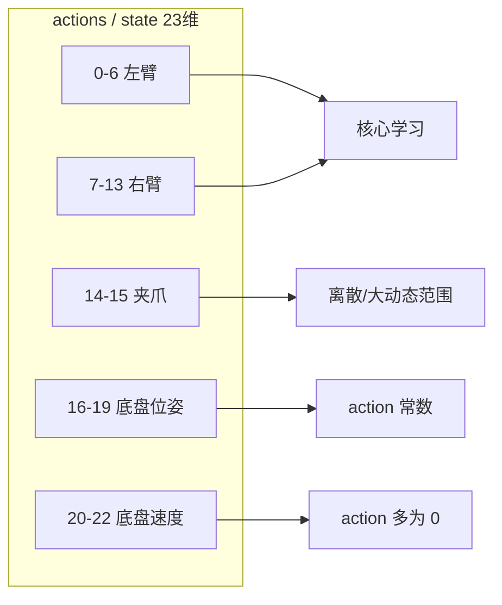
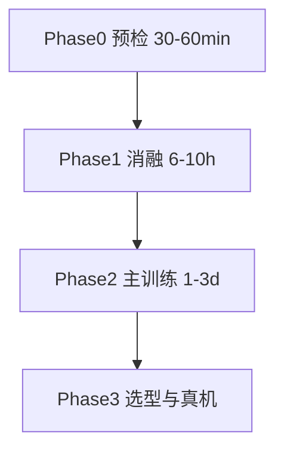

# R1 Pro FastWAM SFT 训练方案 v3（cp25_3）

> **任务**：`r1_pro_chassis_uncond_3cam_384_1e-4`  
> **环境**：单机 **8×H200（143GB）**，RLinf + FastWAM FSDP SFT  
> **数据**：[`/mnt/r/share/zwy/datasets/r1_pro_data_v2/r1_pro_data_convert_chassis`](../../../../../../mnt/r/share/zwy/datasets/r1_pro_data_v2/r1_pro_data_convert_chassis)  
> **目标**：在 **同等或更少有效训练量** 下，得到 **不低于 native 8GPU 精度**、**更强视觉泛化** 的 checkpoint  
> **取代**：[`fw_r1pr_sft_op46_2.md`](fw_r1pr_sft_op46_2.md)（竞争对手方案 v2）— 实施训练 **以本文为准**  
> **关联**：整合设计 [`fw_sft_design_op46_4_r1pr_cp25_2.md`](fw_sft_design_op46_4_r1pr_cp25_2.md) · 数值对齐 [`fw_sft_design_op46_4_r1pr_cp25_2tst.md`](fw_sft_design_op46_4_r1pr_cp25_2tst.md) · 增强 [`fw_sft_dtaaug_op46.md`](fw_sft_dtaaug_op46.md)  
> **数据分析**：[`b/data/r1_pro_chunk000_merged_analysis.md`](../../data/r1_pro_chunk000_merged_analysis.md) · [`b/data/r1_pro_first_frame_per_episode.md`](../../data/r1_pro_first_frame_per_episode.md)  
> **日期**：2026-06-04

---

## 目录

1. [相对竞争对手方案的纠正总表](#1-相对竞争对手方案的纠正总表)
2. [目标与成功标准](#2-目标与成功标准)
3. [数据契约与预处理](#3-数据契约与预处理)
4. [基线：Native 8GPU vs RLinf](#4-基线native-8gpu-vs-rlinf)
5. [训练流程：四阶段](#5-训练流程四阶段)
6. [超参数与 loss](#6-超参数与-loss)
7. [数据增强（泛化核心）](#7-数据增强泛化核心)
8. [显存、批量与 I/O](#8-显存批量与-io)
9. [时间预算](#9-时间预算)
10. [监控、验证与 checkpoint 选型](#10-监控验证与-checkpoint-选型)
11. [风险矩阵](#11-风险矩阵)
12. [附录 A：推荐 Hydra 覆盖与命令](#附录-a推荐-hydra-覆盖与命令)
13. [附录 B：真机/离线评估清单](#附录-b真机离线评估清单)

---

## 1. 相对竞争对手方案的纠正总表

[`fw_r1pr_sft_op46_2.md`](fw_r1pr_sft_op46_2.md) 在数据解读与工程细节上方向正确（增强、MoT、三阶段 smoke），但以下问题会直接导致 **8×H200 训练失败、欠训/过训误判、或泛化无法衡量**。v3 逐条纠正。

| # | 竞争对手写法 | 问题 | v3 做法 |
|---|-------------|------|---------|
| 1 | 数据分析链到 `b/data/`（v2 已改对）但 §2.3 仍按 **63 ep** 算 epoch | 与实际 **64 ep / 61,923 帧** 不一致；`meta/info.json` 仍写 60992 | 统一用 **64/61923**；训练前 **核对 `episodes.jsonl` 行数** |
| 2 | 附录 `actor: 0-7`，仓库 [`r1_pro_sft_fastwam.yaml`](../../examples/sft/config/r1_pro_sft_fastwam.yaml) 为 **`4-7`（4 卡）** | 8×H200 任务会直接 **少用一半 GPU** | Phase 0 必须改为 **`actor: 0-7`** |
| 3 | 固定 **`max_steps=50000`**，`gbs=16` | 仅 **~80 万** 样本见面（≈13 epoch）；native 8GPU 50ep ≈ **300 万** | 用 **epoch 驱动** `max_steps`（§4、§9） |
| 4 | `runner.val_check_interval: -1` 未强调 | 配置 **无验证**，却用 eval loss 论泛化 | 启用 **`val_set_proportion` + `val_check_interval`** |
| 5 | Episode 35：称 padding 影响小 | **10 帧** + 夹爪首帧异常；`num_frames=33` 大量 pad | **剔除 ep35** + `skip_padding_as_possible: true` |
| 6 | 死维度「短期无法改」 | 未利用 **分块归一化**、未讨论 **夹爪 loss 主导** | `norm_exception_mode` + 监控分维；长期可改 `action_dim` |
| 7 | `delta_action_dim_mask` 可 mask 底盘 | **误解 API**：该字段仅用于 **delta 动作 + pad 时置零**（见 LIBERO 注释），**不减少 loss** | 底盘常数维靠 **归一化后 MSE 自然变小**；勿误配 mask |
| 8 | cosine **`min_lr` 未写** | RLinf 默认 **0**；native **`eta_min=1e-6`** | `actor.optim.min_lr: 1e-6` |
| 9 | T4 仅 **4 GPU**，直接外推 8 GPU | 通信与 dataloader 未验证 | Phase 0 增加 **8GPU×50 step** smoke |
| 10 | 环境变量 `DIFFSYNTH_MODEL_BASE_PATH` 与 [`run_fastwam_sft.sh`](../../examples/sft/run_fastwam_sft.sh) 默认路径不一致 | 易加载错 checkpoint | 统一 env（附录 A） |
| 11 | Phase 2 双跑 5000 step「各 90min」 | `gbs=16`、~1.3s/step 时 **单次约 1.8h+** | 按 §9 重算；消融改为 **3000 step** |

---

## 2. 目标与成功标准

### 2.1 三维目标

| 维度 | 可量化标准 | 说明 |
|------|------------|------|
| **准确率** | held-out episode 上 `train/action_loss` 不劣于无增强 baseline；真机 **开门成功率 ≥ native 最佳 ckpt** | 扩散 MSE 仅作训练代理，**真机为准** |
| **泛化** | 光照 ±30%、头部相机 ±5° 扰动下成功率下降 **< 15pp**（相对训练条件） | 靠 **medium 增强 + episode 级 val** |
| **效率** | 在 **相同有效 epoch 数**（默认 50）下 wall-clock **≤ native 8GPU** 或略高但换更高 aug | 不靠减少样本冒充「更快收敛」 |

### 2.2 非目标（避免过度承诺）

- 不在本方案中改 `training_loss` 源码（除非后续 PR）。
- 不保证 sim2real（无仿真器时以真机清单为准）。
- 合并分析用 parquet [`all_cnv_chsis.parquet`](../../../../../../mnt/r/share/zwy/datasets/r1_pro_data_v2/all_cnv_chsis.parquet) **仅用于统计**；训练仍读 **分 episode parquet**（随机读图更友好）。

---

## 3. 数据契约与预处理

### 3.1 规模与元数据

```
r1_pro_data_convert_chassis/
  64 episodes (0–63), 61,923 frames @ 14 FPS
  单任务: "Open the door with a downward-press handle, go through it, and enter the room."
  三相机: head_rgb 360×640, 双腕 480×640 → robotwin 拼接 → 384×320
  action / proprio: 23 维（见 modality.json）
```

| 项 | 值 | 备注 |
|----|-----|------|
| `meta/info.json` | total_episodes=63, total_frames=60992 | **落后于磁盘**；勿用于算 step |
| 滑窗样本数（`num_frames=33`） | **≈ 59,900** | 与合并 parquet 行数一致 |
| 剔除 ep35 后 | **≈ 59,890** | 见 §3.3 |

### 3.2 23 维语义与训练含义



| 维度 | 数据事实（全量+首帧） | v3 策略 |
|------|----------------------|---------|
| 0–13 臂 | `action ≈ state`（\|a−s\| 极小） | z-score；BC 合理 |
| 14–15 夹爪 | action ∈ **{0, 90}**，state 连续 1.8–102 | **`norm_exception_mode` 对夹爪用 min/max**（§6.3） |
| 16–19 底盘位姿 | action **恒** (0.9, −1.5, −0.7, 0) | 不单独 mask；靠归一化 |
| 20–22 底盘速度 | action **100% 为 0**；state 75% ep 全 0 | 接受为「零指令」；勿过度解读 state 中 0.001 噪声 |

### 3.3 Episode 35 与数据卫生（必做）

| 项目 | ep35 | 正常 ep |
|------|------|---------|
| 帧数 | **10** | 850–1142 |
| 首帧夹爪 state | **~5.4 / 5.8** | ~91–94 |
| 首帧 \|a−s\| L2 | **119** | 3–6 |

**操作（Phase 0，训练前）**：

1. 编辑 `meta/episodes.jsonl`，**删除** `episode_index: 35` 行；或维护 `train_episode_allowlist`（若后续代码支持）。
2. 设置 `data.skip_padding_as_possible: true`（[`RobotVideoDataset`](../../../Robot/FastWAM/src/fastwam/datasets/lerobot/robot_video_dataset.py) 会重采样含 pad 的窗口）。
3. （可选）更新 `meta/info.json` 的 `total_episodes` / `total_frames`，避免他人误用。

### 3.4 T5 嵌入与 z-score 统计

```bash
# 一次性：T5 cache（与 native 相同）
cd ${FASTWAM_ROOT}
torchrun --standalone --nproc_per_node=8 \
  scripts/precompute_text_embeds.py \
  task=r1_pro_chassis_uncond_3cam_384_1e-4

ls ${FASTWAM_ROOT}/data/text_embeds_cache/r1_pro_chassis/*.pt
```

- RLinf：`text_embedding_cache_dir: ${FASTWAM_ROOT}/data/text_embeds_cache/r1_pro_chassis`
- 首次训练会从数据 **拟合 z-score** 并写入 run 目录 `dataset_stats.json`（与 native 一致）；**不要**混用 LIBERO 的 stats。

---

## 4. 基线：Native 8GPU vs RLinf

### 4.1 Native 参考配置

来源：[`configs/task/r1_pro_chassis_uncond_3cam_384_1e-4.yaml`](../../../Robot/FastWAM/configs/task/r1_pro_chassis_uncond_3cam_384_1e-4.yaml)

| 参数 | Native 8GPU |
|------|-------------|
| batch_size | **16 / GPU** |
| global_batch | **128** |
| num_epochs | **50** |
| lr | 1e-4，cosine，`eta_min=1e-6` |
| 增强 | **无**（ToTensor + Resize） |
| `mot_checkpoint_mixed_attn` | **false** |

### 4.2 有效训练量与 `max_steps` 公式

记：

- \(N\) = 训练样本数 ≈ **59,900**（剔除 ep35 后 ≈ 59,890）
- \(B\) = `actor.global_batch_size`
- \(E\) = 目标 epoch 数（默认 **50**，与 native 对齐）

则：

\[
\text{steps\_per\_epoch} = \left\lceil \frac{N}{B} \right\rceil,\quad
\text{max\_steps} = E \times \text{steps\_per\_epoch}
\]

**总样本见面次数** = `max_steps × B` ≈ \(E \times N\)。

### 4.3 RLinf 推荐批量与步数对照表

| 方案 | micro×8 | **B (gbs)** | steps/epoch | **max_steps (E=50)** | 总样本见面 | 备注 |
|------|---------|-------------|-------------|----------------------|------------|------|
| **R1（推荐）** | 2×1 | **16** | 3744 | **187,200** | ≈ 3.0M | 与 native **同 epoch 预算** |
| **R2（省时）** | 2×2 accum | **32** | 1872 | **93,600** | ≈ 3.0M | 需 Phase 0 验证 accum |
| **竞争对手** | 2×1 | **16** | 3744 | **50,000** | ≈ **0.80M** | 仅 **~13 epoch** 等效 — **欠训** |
| **Native 8GPU** | 16×8 | **128** | 469 | **23,450** | ≈ 3.0M | 步数少但 **每步 batch 大** |

**结论**：

- 竞争对手「50,000 step × gbs=16」≈ **0.80M** 样本，约为 native 50 epoch（≈3.0M）的 **27%**，却声称更高精度 — **不成立**。
- v3 主训练：**E=50，B=16 → max_steps≈187,200**；若 wall-clock 紧，可 **E=40**（≈149,760 step）+ **更强 aug**，但须在 Phase 1 用 val 证明未欠拟合。

### 4.4 RLinf 已验证项（勿重复踩坑）

来自 [`fw_sft_design_op46_4_r1pr_cp25_2tst.md`](fw_sft_design_op46_4_r1pr_cp25_2tst.md)：

- `training_loss` 包装 **bit-identical**（T1）。
- `total_training_steps: ${runner.max_steps}` **必须**与 `max_steps` 一致。
- `mot_checkpoint_mixed_attn: false`、`proprio_dim/action_dim: 23`、`z-score` 与 native 一致。
- 4GPU T4：~0.86 s/step（gbs=4, micro=1）；8GPU 需 Phase 0 复测。

---

## 5. 训练流程：四阶段



### Phase 0：预检（必做）

| 步骤 | 内容 | 通过标准 |
|------|------|----------|
| 0.1 | Ray 8 GPU：`actor: 0-7` | `ray status` 显示 8 GPU |
| 0.2 | 剔除 ep35 + T5 cache | 无 FileNotFound |
| 0.3 | **50 step** smoke，`gbs=8, micro=1` | loss 3→0.5 量级，无 NaN |
| 0.4 | **50 step**，`gbs=16, micro=2` | 无 OOM；记录 `time/step` |
| 0.5 | 可选：与 native 单步 loss 对比 | 相对误差 < 3%（同 seed） |

### Phase 1：增强消融（固定 seed=42）

每条 **3000 step**（约为 0.8 epoch @ gbs=16，足够看趋势），**`val_set_proportion: 0.1`**，`val_check_interval: 300`。

| Run | `augmentation_preset` | 目的 |
|-----|----------------------|------|
| P1-a | `none` | RLinf 无增强基线 |
| P1-b | `light` | 颜色扰动 |
| P1-c | `medium` | 颜色+裁剪+噪声 |

**选型规则**（按优先级）：

1. held-out **action_loss** 最低；
2. `dynamics_loss` 相对 P1-a **上升 < 20%**；
3. TensorBoard 曲线无长期震荡。

### Phase 2：主训练

- `max_steps` = **187200**（E=50, B=16）或 Phase 1 胜出的 aug 预设。
- `save_interval: 2000`；`runner.resume_dir` 支持断点。
- 每 **5000 step** 目视 TensorBoard，确认无发散。

### Phase 3：选型与部署

1. 在 held-out loss 最低的 3 个 ckpt（如 140k/160k/180k step）做 **DCP → native** 转换。
2. 真机/离线评估（附录 B）。
3. 选定 1 个生产 ckpt + 1 个备份。

---

## 6. 超参数与 loss

### 6.1 核心超参（与 native 对齐）

| 参数 | 值 | 说明 |
|------|-----|------|
| `learning_rate` | **1e-4** | 不因 gbs 线性放大（扩散敏感） |
| `min_lr` | **1e-6** | 对齐 native cosine 尾部 |
| `adam_beta1/2` | 0.9 / **0.95** | |
| `weight_decay` | 0.01 | |
| `clip_grad` | 1.0 | |
| `lr_warmup_steps_ratio` | 0.05 | |
| `lr_scheduler` | cosine | |
| `lambda_video` / `lambda_action` | **1.0 / 1.0** | 勿关 video co-training |

### 6.2 FSDP（R1 Pro 固定）

| 项 | 值 |
|----|-----|
| `sharding_strategy` | **no_shard**（MoT 要求，见 cp25_2） |
| `gradient_checkpointing` | **true** |
| `mot_checkpoint_mixed_attn` | **false** |
| `amp_autocast` | bf16 enabled |

### 6.3 夹爪归一化（v3 增量，竞争对手遗漏）

全臂 z-score 下，夹爪 dim14–15 的 action MSE **主导**标量 `action_loss`。建议在 YAML 中：

```yaml
data:
  processor:
    norm_default_mode: "z-score"
    norm_exception_mode:
      action:
        default: "min/max"   # 23 维 action 块中覆盖夹爪等大动态维
      state:
        default: "min/max"
```

> 具体 key 名须与 `FastWAMProcessor` 的 `shape_meta` action/state key（`default`）一致；若 Hydra 解析报错，改为文档 [`fw_sft_design_op46_4_r1pr_cp25_2.md`](fw_sft_design_op46_4_r1pr_cp25_2.md) §5 中的嵌套写法并在 Phase 0 验证。

### 6.4 `delta_action_dim_mask` 说明（勿误用）

LIBERO 配置注释：`eef poses are delta, gripper is not` — 该 mask 只在 **pad 帧** 上对 delta 动作维度置零，**不**从 loss 中剔除底盘。

R1 Pro 当前 `action_state_transforms: null`，即 **绝对动作 BC**。v3 **不**为「死维度」配置 delta mask；若未来引入臂部 delta transform，可设臂 dim 为 true、夹爪为 false（仿 LIBERO）。

---

## 7. 数据增强（泛化核心）

### 7.1 为何必须做

- **64 条轨迹、单房间单门**，像素分布窄（head 偏暖：RGB≈0.49,0.29,0.22）。
- 无增强时模型易记背景木纹，**换光照/视角即崩**。

### 7.2 预设（已实现）

[`rlinf/data/datasets/fastwam/augmentation.py`](../../rlinf/data/datasets/fastwam/augmentation.py)：

| preset | 内容 |
|--------|------|
| `none` | 无 |
| `light` | ColorJitter(0.1, p=0.5) |
| `medium` | RandomCrop(0.95) + ColorJitter(0.2/0.3/0.3/0.05) + GaussNoise(0.01) |
| `strong` | 更强（Phase 2 默认 **不用**，除非 P1 证明 medium 不够） |

配置方式：

```yaml
data:
  processor:
    augmentation_preset: medium   # 注入在 ToTensor 与 Resize 之间
```

### 7.3 硬约束

1. **禁止** `VideoRandomHorizontalFlip`（双臂左右语义不随图像翻转）。
2. `hue ≤ 0.06`（head 相机 R>G>B，过大色相不自然）。
3. `robotwin` 三相机 **独立** 增强，拼接后由 `CenterCrop` 平滑 — 见 [`fw_sft_dtaaug_op46.md`](fw_sft_dtaaug_op46.md)。

---

## 8. 显存、批量与 I/O

### 8.1 显存（H200 143GB，no_shard）

| 组件 | bs=1 | bs=2 |
|------|------|------|
| 参数+优化器+梯度 | ~72 GB | ~72 GB |
| 激活（checkpoint） | ~10 GB | ~18 GB |
| VAE + 开销 | ~11 GB | ~11 GB |
| **合计** | **~93 GB** | **~101 GB** |

**结论**：`micro_batch_size=2` 可行；OOM 则退回 `micro=1, gbs=8` 并 **同比增加 max_steps** 保持总样本量。

### 8.2 数据 I/O

- 训练读 **分 episode parquet**（PNG 内嵌），`num_workers=8`，`prefetch_factor=4`。
- 瓶颈在 **PNG 解码**；若 `time/step` >2s 且 GPU 利用率低：
  - 增至 `num_workers=12`（按 CPU 核数调）；
  - 确认数据在 **本地 NVMe**（`/mnt/r/`）；
  - 长期：转 mp4 + 帧索引（`videos_backup/`，需工程 PR）。

---

## 9. 时间预算

假设稳态 **0.9 s/step（gbs=8）**、**1.3 s/step（gbs=16）**（基于 T4 外推，Phase 0 实测修正）。

| 阶段 | step | gbs | 预估 wall-clock |
|------|------|-----|-----------------|
| Phase 0 | 50+50 | 8 / 16 | **< 5 min** |
| Phase 1 ×3 | 3000×3 | 16 | **~3.3 h × 3 ≈ 10 h** |
| Phase 2 | **187,200** | 16 | **~68 h（~2.8 天）** |
| ckpt 保存 | 187200/2000≈94 次 | — | **~2 h**（~80s/次） |

**缩短 wall-clock 的正当手段**（不降样本量）：

- `micro=2, gbs=32` + grad accum → step 数减半、每 step ~2.4s，总时间略降。
- `save_interval: 5000`（仅留 5–6 个 ckpt）。
- `E=40` 仅在 Phase 1 val 证明 50 epoch 过拟合时采用。

---

## 10. 监控、验证与 checkpoint 选型

### 10.1 TensorBoard 指标

| Key | 健康范围 | 异常 |
|-----|----------|------|
| `train/loss` | 3 → 0.2–0.4 平台 | 不降 / NaN |
| `train/action_loss` | 主导；随 aug 略升可接受 | 较 P1-a **持续高 50%+** |
| `train/dynamics_loss` | 0.4 → 0.1 | aug 过强时飙升 |
| `train/grad_norm` | clip 后 ≤1 | 长期 >50 |
| `eval/*`（启用 val 后） | 与 train 同趋势、略高 | train 降 eval 升 → 过拟合 |

### 10.2 Episode 级验证（v3 必开）

```yaml
data:
  val_set_proportion: 0.1    # 按 episode 划分，seed=actor.seed
runner:
  val_check_interval: 500
```

[`base_lerobot_dataset.py`](../../../Robot/FastWAM/src/fastwam/datasets/lerobot/base_lerobot_dataset.py) 会对 episode id **shuffle 后切分**（约 **6–7 条 held-out**）。**同一 episode 的所有帧只出现在 train 或 val 之一**，避免帧级泄漏。

> 训练结束后在日志中记录 **held-out episode id 列表**（从 dataset 构建日志或固定 `actor.seed` 复现）。

### 10.3 不建议自动早停

扩散 MSE 与真机成功率 **不对齐**；同分布 val loss 也会随 train 下降。用 **多 ckpt + 真机** 选型。

### 10.4 Checkpoint 选型协议

| 优先级 | 规则 |
|--------|------|
| 1 | held-out **action_loss** 最低的 step |
| 2 | 真机 **任务成功率** 最高（附录 B） |
| 3 | 推理延迟满足 Fast-WAM 模式 **<200ms** |
| 4 | 若 1 与 2 冲突 → **以真机为准** |

保留间隔：每 **2000 step** 存 1 份，至少覆盖 120k–180k 区间。

---

## 11. 风险矩阵

| 风险 | 症状 | 缓解 |
|------|------|------|
| GPU 仅占 4 卡 | 吞吐低一半 | `component_placement: 0-7` |
| 欠训 | 真机差、loss 仍降 | 用 §4.3 公式算 `max_steps` |
| OOM | CUDA OOM | micro 1；或 accum |
| aug 过强 | dynamics_loss 飙升 | medium→light |
| ep35 噪声 | loss spike | 剔除 + skip_padding |
| I/O 瓶颈 | step>2s，GPU 闲 | workers↑；本地盘 |
| min_lr=0 | 末期 LR 过高 | `min_lr: 1e-6` |
| ckpt 路径错 | 加载失败 | 统一 DIFFSYNTH 路径 |
| 同场景过拟合 | val≈train 仍真机差 | 真机扰动测试（附录 B） |

---

## 附录 A：推荐 Hydra 覆盖与命令

### A.1 环境变量（统一）

```bash
export FASTWAM_ROOT=/home/Luogang/SRC/Robot/FastWAM
export FASTWAM_PATH=${FASTWAM_ROOT}/src
export R1PRO_DATA=/mnt/r/share/zwy/datasets/r1_pro_data_v2
export DIFFSYNTH_MODEL_BASE_PATH=/mnt/r/CKPT/VLA/FW   # 与 run_fastwam_sft.sh 对齐；按本机修改
export DIFFSYNTH_SKIP_DOWNLOAD=true
export CUDA_HOME=/usr/local/cuda-12.8
export PYTORCH_CUDA_ALLOC_CONF=expandable_segments:True
export BTLOG_ROOT=/mnt/r/tmp/fw_train/r1_pro
```

### A.2 Ray（8 GPU）

```bash
ray stop 2>/dev/null
ray start --head --port=6399 --num-gpus=8
ray status
```

### A.3 Phase 0：Smoke

```bash
cd /home/Luogang/SRC/RL/RLinf

bash examples/sft/run_fastwam_sft.sh r1_pro_sft_fastwam \
  cluster.component_placement.actor=0-7 \
  runner.max_steps=50 \
  runner.save_interval=999 \
  runner.log_interval=1 \
  actor.micro_batch_size=1 \
  actor.global_batch_size=8 \
  runner.logger.log_path=${BTLOG_ROOT}/phase0_gbs8
```

```bash
bash examples/sft/run_fastwam_sft.sh r1_pro_sft_fastwam \
  cluster.component_placement.actor=0-7 \
  runner.max_steps=50 \
  runner.save_interval=999 \
  actor.micro_batch_size=2 \
  actor.global_batch_size=16 \
  runner.logger.log_path=${BTLOG_ROOT}/phase0_gbs16
```

### A.4 Phase 1：消融（示例：medium）

```bash
bash examples/sft/run_fastwam_sft.sh r1_pro_sft_fastwam \
  cluster.component_placement.actor=0-7 \
  runner.max_steps=3000 \
  runner.save_interval=1000 \
  runner.val_check_interval=300 \
  data.val_set_proportion=0.1 \
  data.skip_padding_as_possible=true \
  actor.micro_batch_size=2 \
  actor.global_batch_size=16 \
  actor.optim.min_lr=1e-6 \
  actor.optim.total_training_steps=3000 \
  data.processor.augmentation_preset=medium \
  runner.logger.experiment_name=r1_pro_p1_medium \
  runner.logger.log_path=${BTLOG_ROOT}/phase1_medium
```

将 `augmentation_preset` 换成 `none` / `light` 跑另外两条。

### A.5 Phase 2：主训练（E=50, B=16）

```bash
bash examples/sft/run_fastwam_sft.sh r1_pro_sft_fastwam \
  cluster.component_placement.actor=0-7 \
  runner.max_steps=187200 \
  runner.save_interval=2000 \
  runner.log_interval=10 \
  runner.val_check_interval=500 \
  data.val_set_proportion=0.1 \
  data.skip_padding_as_possible=true \
  actor.micro_batch_size=2 \
  actor.global_batch_size=16 \
  actor.optim.min_lr=1e-6 \
  actor.optim.total_training_steps=187200 \
  data.processor.augmentation_preset=medium \
  runner.logger.experiment_name=r1_pro_main_e50_gbs16 \
  runner.logger.log_path=${BTLOG_ROOT}/phase2_main
```

**断点续训**：

```bash
  runner.resume_dir=${BTLOG_ROOT}/phase2_main/checkpoints/global_step_XXXXX \
```

### A.6 建议合入 `r1_pro_sft_fastwam.yaml` 的 diff（另开 PR）

| 键 | 当前仓库 | v3 推荐 |
|----|----------|---------|
| `cluster.component_placement.actor` | `4-7` | **`0-7`** |
| `actor.global_batch_size` | 8 | **16**（micro=2） |
| `runner.max_steps` | 50000 | **187200**（或 `${epochs}` 文档化） |
| `runner.val_check_interval` | -1 | **500** |
| `data.val_set_proportion` | 0.0 | **0.1** |
| `data.skip_padding_as_possible` | false | **true** |
| `actor.optim.min_lr` | （缺省 0） | **1e-6** |
| `data.processor.augmentation_preset` | （无） | Phase 2 胜者 |

---

## 附录 B：真机/离线评估清单

### B.1 训练内代理指标

- [ ] held-out `action_loss` 优于 P1-a（none）
- [ ] `dynamics_loss` 未因 aug 失控（< +20% vs P1-a）
- [ ] 最后 10k step loss 平台稳定

### B.2 真机 / 回放（最终标准）

| 场景 | 操作 | 记录 |
|------|------|------|
| **训练分布** | 原光照、原机位 | 成功率、步数、失败模式 |
| **光照** | 亮度 ±30% | 成功率 Δ |
| **视角** | 头相机 yaw ±5° | 成功率 Δ |
| **起始位** | 底盘 xy ±10cm（若控底盘） | 成功率 Δ |
| **延迟** | Fast-WAM 单步推理 | ms |

### B.3 Checkpoint 转换

使用 RLinf DCP → native（`fsdp_convertor` / `fastwam_save_helper`），在 FastWAM `bt/` 或部署脚本加载验证。

### B.4 报告模板

```text
ckpt: global_step_XXXXX
aug: medium
held-out action_loss: X.XX
真机 success: XX% (N=20)
光照扰动 success: XX%
备注: ...
```

---

**文档版本**：cp25_3 · 2026-06-04 · 基于本地代码与 `b/data` 全量/首帧分析；训练预算按 **native 8GPU 等效 epoch** 修订。
