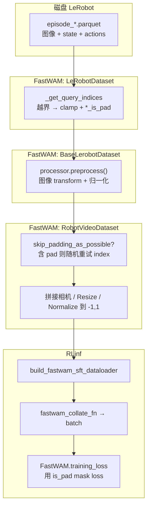
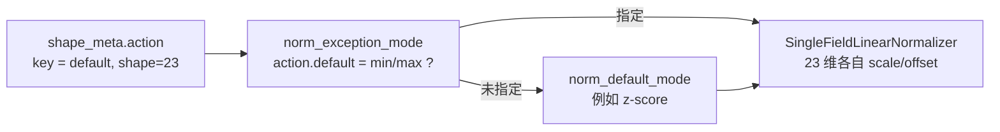
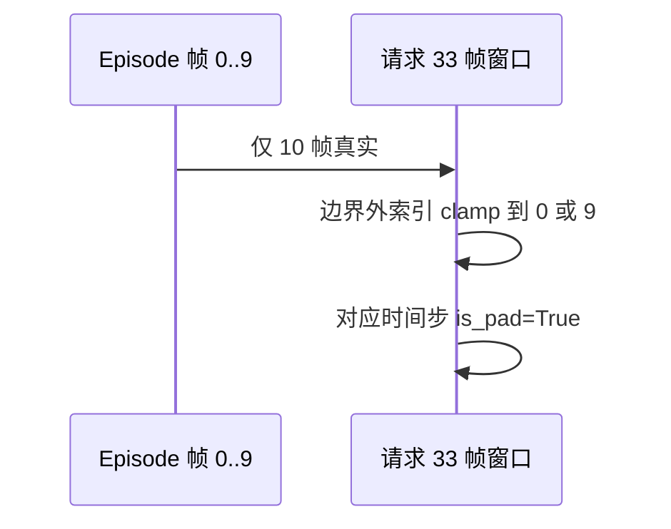
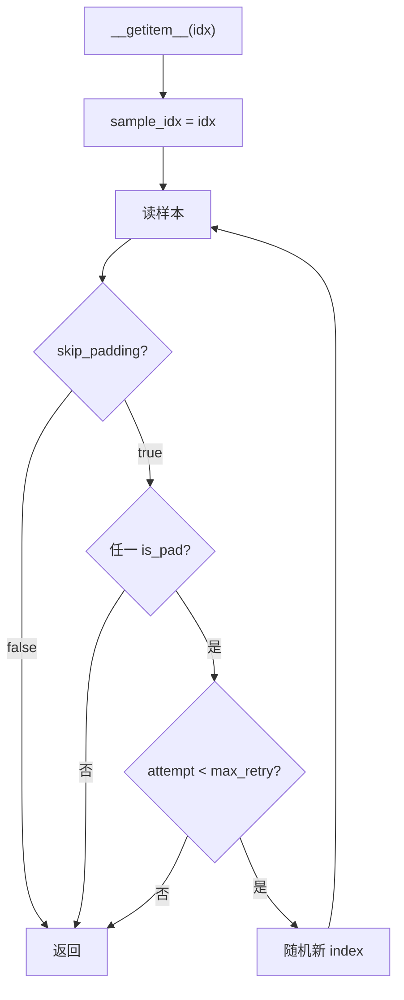
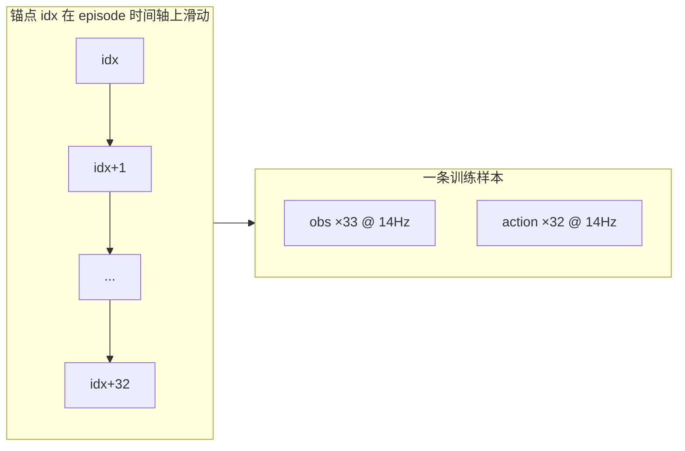
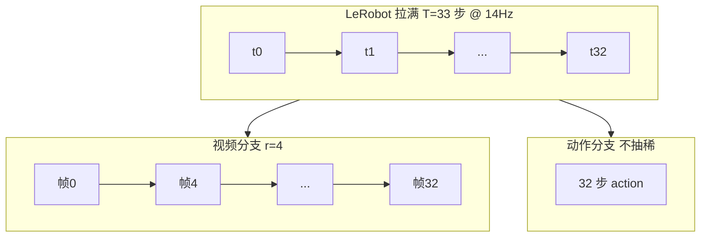
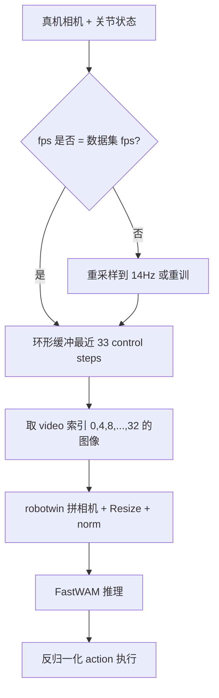

# R1 Pro FastWAM SFT 数据管线笔记：归一化、Padding 与配置

> **用途**：配合 [`fw_r1pr_sft_cp25_3.md`](fw_r1pr_sft_cp25_3.md) 训练方案，说明 `norm_*`、`skip_padding_as_possible`、`_is_pad` 等概念在 **FastWAM** 与 **RLinf** 中的含义与实现。  
> **代码基线**：[FastWAM](/home/Luogang/SRC/Robot/FastWAM) · [RLinf](/home/Luogang/SRC/RL/RLinf)  
> **数据分析**：[`b/data/r1_v2/r1_pro_chunk000_merged_analysis.md`](../../../data/r1_v2/r1_pro_chunk000_merged_analysis.md) · [`b/data/r1_v2/r1_pro_first_frame_per_episode.md`](../../../data/r1_v2/r1_pro_first_frame_per_episode.md)

---

## 目录

1. [端到端数据流总览](#1-端到端数据流总览)
2. [Action / State 归一化](#2-action--state-归一化)
3. [`norm_default_mode` 与 `norm_exception_mode`](#3-norm_default_mode-与-norm_exception_mode)
4. [`z-score` 与 `min/max` 的数学与代码](#4-z-score-与-minmax-的数学与代码)
5. [R1 Pro 上的尺度问题与配置建议](#5-r1-pro-上的尺度问题与配置建议)
6. [易混淆项：`delta_action_dim_mask`](#6-易混淆项delta_action_dim_mask)
7. [时间窗 Padding 与 `skip_padding_as_possible`](#7-时间窗-padding-与-skip_padding_as_possible)
8. [Padding 如何进入 Loss](#8-padding-如何进入-loss)
9. [YAML 配置速查](#9-yaml-配置速查)
10. [延伸阅读](#10-延伸阅读)
11. [时间轴与帧率：FastWAM 每秒采几帧训练？](#11-时间轴与帧率fastwam-每秒采几帧训练)
12. [「每秒随机抽几帧」设想与 train/deploy 差异](#12-每秒随机抽几帧设想与-traindeploy-差异)
13. [真机部署对齐清单](#13-真机部署对齐清单)
14. [安全扩充样本的替代手段](#14-安全扩充样本的替代手段)

---

## 1. 端到端数据流总览

一次 SFT 训练 step 里，一条样本从磁盘到 loss 大致经过以下阶段。**归一化**和 **padding 处理** 发生在不同阶段，不要混为一谈。



| 阶段 | 主要模块 | 你关心的配置 |
|------|----------|--------------|
| 按时间索引取多帧 | `lerobot_dataset.py` | `num_frames`, `action_video_freq_ratio` |
| 标记越界帧 | 同上 | 自动产生 `actions_is_pad` 等 |
| 图像 ToTensor/Resize/增强 | `FastWAMProcessor` | `train_transforms`, `augmentation_preset` |
| **数值缩放 action/state** | `LinearNormalizer` | **`norm_default_mode`**, **`norm_exception_mode`** |
| **避开含 pad 的样本** | `RobotVideoDataset._get` | **`skip_padding_as_possible`** |
| 组 batch | `rlinf/.../fastwam/__init__.py` | `micro_batch_size`, `num_workers` |

**RLinf 入口**：[`rlinf/data/datasets/fastwam/__init__.py`](../../../rlinf/data/datasets/fastwam/__init__.py) 的 `build_fastwam_sft_dataloader()` 负责把 Hydra YAML 里的 `data.*` 和 `data.processor.*` 实例化成 FastWAM 的 `RobotVideoDataset` + `FastWAMProcessor`。

```105:143:/home/Luogang/SRC/RL/RLinf/rlinf/data/datasets/fastwam/__init__.py
    processor = FastWAMProcessor(
        ...
        norm_default_mode=processor_cfg.get("norm_default_mode", "min/max"),
        norm_exception_mode=processor_cfg.get("norm_exception_mode", None),
        ...
        delta_action_dim_mask=delta_mask,
    )
    ...
    dataset = RobotVideoDataset(
        ...
        skip_padding_as_possible=data_cfg.get("skip_padding_as_possible", False),
    )
```

注意：RLinf 里 `norm_default_mode` **默认字符串是 `"min/max"`**（若 YAML 未写）；R1 Pro 的 [`r1_pro_sft_fastwam.yaml`](../../../examples/sft/config/r1_pro_sft_fastwam.yaml) 显式写了 **`z-score`**，以 YAML 为准。

---

## 2. Action / State 归一化

### 2.1 为什么要归一化？

FastWAM 的 Action DiT 在 **flow matching / 扩散** 框架下预测动作（及视频 latent）。若 23 维里有的维度在 **0.01 量级**、有的在 **90 量级**：

- MSE loss 会被大数值维度 **主导**；
- 优化器看到的梯度尺度不均，有效学习率对不同维度 **不公平**；
- 推理时还要 `normalizer.backward()` 把网络输出 **反归一化** 回真实关节/夹爪单位。

因此 `state`（作为 proprio 条件）和 `action`（作为监督目标）在进模型前都会经过 **同一套 LinearNormalizer**（训练时 `forward`，推理时 `backward`）。

### 2.2 统计量从哪来？

训练集第一次跑时，主进程在 [`RobotVideoDataset`](/home/Luogang/SRC/Robot//home/Luogang/SRC/Robot/FastWAM/src/fastwam/datasets/lerobot/robot_video_dataset.py) 里调用 `get_dataset_stats()`，遍历数据得到每个字段的 `mean/std/min/max/...`，写入 run 目录下的 `dataset_stats.json`。验证集应使用 **训练集 stats**（`pretrained_norm_stats`），避免泄漏。

### 2.3 在 Processor 里何时执行？

[`FastWAMProcessor.preprocess()`](/home/Luogang/SRC/Robot//home/Luogang/SRC/Robot/FastWAM/src/fastwam/datasets/lerobot/processors/fastwam_processor.py) 对每个样本：

1. 各相机图像：`train_transforms`（ToTensor、Resize、可选增强）；
2. `action_state_transform`（可选，如相对位姿）；
3. **`normalizer.forward(data)`** ← 归一化发生在这里；
4. `action_state_merger` 把多 key 拼成 `[T, 23]` 的 `action` / `proprio`。

```111:118:/home/Luogang/SRC/Robot/FastWAM/src/fastwam/datasets/lerobot/processors/fastwam_processor.py
    def set_normalizer_from_stats(self, dataset_stats: Dict[str, Any] = None):
        self._normalizer = LinearNormalizer(
            use_stepwise_action_norm=self.use_stepwise_action_norm,
            shape_meta=self.shape_meta,
            default_mode=self.norm_default_mode,
            exception_mode=self.norm_exception_mode,
            stats=dataset_stats,
        )
```

---

## 3. `norm_default_mode` 与 `norm_exception_mode`

### 3.1 语义

| 配置项 | 含义 |
|--------|------|
| **`norm_default_mode`** | 对 `shape_meta` 里每个 **action/state 字段**（如 R1 Pro 的单个 key `default`，23 维）的 **默认** 归一化算法 |
| **`norm_exception_mode`** | 字典：`exception_mode["action"][key]` / `exception_mode["state"][key]` **覆盖** 该字段的默认模式 |

[`LinearNormalizer.__init__`](/home/Luogang/SRC/Robot//home/Luogang/SRC/Robot/FastWAM/src/fastwam/datasets/lerobot/utils/normalizer.py) 逻辑（简化）：

```40:57:/home/Luogang/SRC/Robot/FastWAM/src/fastwam/datasets/lerobot/utils/normalizer.py
            if exception_mode is not None and "action" in exception_mode and key in exception_mode["action"]:
                cur_mode = exception_mode["action"][key]
            else:
                cur_mode = default_mode
            self.normalizers["action"][key] = SingleFieldLinearNormalizer(
                stats=cur_stats, 
                mode=cur_mode,
            )
```



### 3.2 重要粒度说明（避免配错）

- 归一化 mode 的粒度是 **`shape_meta` 的 key**（R1 Pro 目前 **只有一个** `default`，23 维整条向量共用一种 mode）。
- **不是**「dim14 用 min/max、dim0–13 用 z-score」这种 **按维混合**（除非你把 `shape_meta` 拆成多个 key，例如 `left_arm`、`gripper`，再用 `ConcatLeftAlign` 拼回 23 维——改动较大）。

因此，若写：

```yaml
norm_default_mode: "z-score"
norm_exception_mode:
  action:
    default: "min/max"
```

则 **23 维 action 全部变成 min/max**，而不是「只有夹爪 min/max」。

### 3.3 支持的 mode 类型

在 [`normalizer.py`](/home/Luogang/SRC/Robot//home/Luogang/SRC/Robot/FastWAM/src/fastwam/datasets/lerobot/utils/normalizer.py) 中定义：

```17:17:/home/Luogang/SRC/Robot/FastWAM/src/fastwam/datasets/lerobot/utils/normalizer.py
NormMode = Union[Literal["min/max", "q01/q99", "z-score"], ConstConstStr]
```

| mode | 简要 |
|------|------|
| **`z-score`** | 按维减均值、除标准差 |
| **`min/max`** | 按维用 min、max 线性映射到约 **[-1, 1]** |
| **`q01/q99`** | 用 1%/99% 分位数代替 min/max，抗离群 |
| **`const_min/const_max`** | 人为指定常数范围（字符串解析） |

---

## 4. `z-score` 与 `min/max` 的数学与代码

### 4.1 z-score（标准化）

对某一维 \(d\)，用数据集统计的 \(\mu_d, \sigma_d\)：

\[
x'_d = \frac{x_d - \mu_d}{\sigma_d + \epsilon}
\]

代码（[`SingleFieldLinearNormalizer`](/home/Luogang/SRC/Robot//home/Luogang/SRC/Robot/FastWAM/src/fastwam/datasets/lerobot/utils/normalizer.py)）：

```100:103:/home/Luogang/SRC/Robot/FastWAM/src/fastwam/datasets/lerobot/utils/normalizer.py
        if mode == "z-score":
            input_mean, input_std = stats["mean"], stats["std"]
            scale = 1.0 / (input_std + self.std_reg)
            offset = - input_mean / (input_std + self.std_reg)
```

前向统一为 `x' = x * scale + offset`，再 **`clamp(-5, 5)`** 防止极端值。

**适用**：分布近似单峰、各维量级接近的连续量——R1 Pro **手臂关节**（约 [-1.6, 1.0]）很合适。

**原生 R1 Pro** 数据配置（[`configs/data/r1_pro_chassis.yaml`](/home/Luogang/SRC/Robot/FastWAM/configs/data/r1_pro_chassis.yaml)）：

```49:50:/home/Luogang/SRC/Robot/FastWAM/configs/data/r1_pro_chassis.yaml
    norm_default_mode: "z-score"
    norm_exception_mode: null
```

RLinf 侧 [`r1_pro_sft_fastwam.yaml`](../../../examples/sft/config/r1_pro_sft_fastwam.yaml) 与之对齐。

### 4.2 min/max（缩放到固定区间）

对每一维：

\[
x'_d = \text{scale}_d \cdot x_d + \text{offset}_d,\quad
\text{scale}_d = \frac{1 - (-1)}{\max_d - \min_d},\quad
\text{offset}_d = -1 - \text{scale}_d \cdot \min_d
\]

（实现里输出区间为 `output_min=-1`, `output_max=1`；若 \(\max-\min\) 过小则该维视为常数维特殊处理。）

```105:120:/home/Luogang/SRC/Robot/FastWAM/src/fastwam/datasets/lerobot/utils/normalizer.py
            if mode == "min/max":
                input_min, input_max = stats["min"], stats["max"]
            ...
            scale = (self.output_max - self.output_min) / input_range
            offset = self.output_min - scale * input_min
```

**适用**：动态范围大、或物理上下界明确的量——**LIBERO** 默认 `min/max`（[`libero_2cam.yaml`](/home/Luogang/SRC/Robot/FastWAM/configs/data/libero_2cam.yaml)）；**夹爪** state 跨 1.8–102、action 离散 0/90 时，用 min/max 往往比 z-score 更稳。

### 4.3 对比小结

| | z-score | min/max |
|---|---------|---------|
| 输出典型范围 | 约 N(0,1)，再 clamp | 约 [-1, 1] |
| 对离群点 | 敏感（σ 被拉大） | min/max 敏感；q01/q99 更稳 |
| R1 手臂 | 推荐 | 可用 |
| R1 夹爪 | 易 dominate loss | 更合理（若整条 23 维改用 min/max） |
| 反归一化 | `backward()` 用同一 scale/offset | 同左 |

---

## 5. R1 Pro 上的尺度问题与配置建议

### 5.1 数据事实（与 loss 的关系）

来自全量/首帧分析（见 `b/data/`）：

| 维度段 | 行为 | 对 MSE 的影响 |
|--------|------|----------------|
| 0–13 手臂 | action ≈ state，小幅偏差 | 归一化后各维 ~O(1)，贡献均衡 |
| 14–15 夹爪 | action ∈ {0, 90}，state 连续 ~90 | **标量 action_loss 常被夹爪拉动** |
| 16–19 底盘位姿 | action 恒 (0.9, -1.5, -0.7, 0) | 易学成常数，loss 小 |
| 20–22 底盘速度 | action 几乎全 0 | 同上 |

训练日志里的 `train/action_loss` 是 **23 维归一化后 MSE 的聚合**，下降不等于「手臂开门动作学得好」。

### 5.2 配置策略（三档）

| 策略 | 配置 | 说明 |
|------|------|------|
| **A. 与 native 一致** | `norm_default_mode: z-score`, `norm_exception_mode: null` | 当前 [`r1_pro_sft_fastwam.yaml`](../../../examples/sft/config/r1_pro_sft_fastwam.yaml)；应用 TensorBoard + 真机选 ckpt |
| **B. 全 min/max** | `norm_default_mode: min/max` | 类似 LIBERO；23 维统一压到 [-1,1] |
| **C. 分字段** | 拆 `shape_meta` 多 key + 不同 `norm_exception_mode` | 工作量大，需验证 `ConcatLeftAlign` |

[`fw_r1pr_sft_cp25_3.md`](fw_r1pr_sft_cp25_3.md) §6.3 的「夹爪 exception」**意图**是策略 C；若只改 `default: min/max` 实际是策略 B。

---

## 6. 易混淆项：`delta_action_dim_mask`

名字里也有 “action”“dim”，但和 **归一化 mode 无关**。

### 6.1 作用

在 **delta 动作**（`action - state` 或相对位姿变换）场景下，对 **padding 时间步** 的某些维度，把 delta **置 0**，避免 pad 帧污染。

[`FastWAMProcessor`](/home/Luogang/SRC/Robot//home/Luogang/SRC/Robot/FastWAM/src/fastwam/datasets/lerobot/processors/fastwam_processor.py)：

```251:259:/home/Luogang/SRC/Robot/FastWAM/src/fastwam/datasets/lerobot/processors/fastwam_processor.py
        if "action" in data and self.delta_action_dim_mask is not None:
            action_is_pad = torch.as_tensor(data["action_is_pad"], dtype=torch.bool)
            if bool(action_is_pad.any().item()):
                for key, dim_mask in self.delta_action_dim_mask.items():
                    ...
                    pad_delta_mask = cur_action_is_pad.unsqueeze(1) & cur_dim_mask.unsqueeze(0)
                    cur_action[pad_delta_mask] = 0.0
```

LIBERO 示例（[`libero_2cam.yaml`](/home/Luogang/SRC/Robot/FastWAM/configs/data/libero_2cam.yaml)）：

```yaml
delta_action_dim_mask:
  default: [true, true, true, true, true, true, false]  # 前 6 维 delta，夹爪维 false
```

R1 Pro 当前 **`action_state_transforms: null`**（绝对动作，非 delta），且 [`r1_pro_sft_fastwam.yaml`](../../../examples/sft/config/r1_pro_sft_fastwam.yaml) **未配置** `delta_action_dim_mask`。  
**不能**用它在 loss 里 mask 掉底盘常数维——那是另一类需求（需改 `training_loss` 或拆 action 维）。

---

## 7. 时间窗 Padding 与 `skip_padding_as_possible`

### 7.1 为什么需要时间窗？

R1 Pro SFT 使用 [`num_frames: 33`](../../../examples/sft/config/r1_pro_sft_fastwam.yaml)，`action_video_freq_ratio: 4` → 视频路径约 9 帧，action/proprio 为 **32 步** 序列。  
LeRobot 按 **全局帧 index** 取「当前帧 + 过去/未来偏移」组成一条训练样本。

若窗口 **超出 episode 首尾**，不能凭空造数据，只能：

1. 用 **episode 第一帧/最后一帧复制** 填满（索引 clamp）；
2. 用布尔张量 **`{modality}_is_pad`** 标记哪些时间步是「假帧」。

生成逻辑（[`LeRobotDataset._get_query_indices`](/home/Luogang/SRC/Robot//home/Luogang/SRC/Robot/FastWAM/src/fastwam/datasets/lerobot/lerobot/lerobot_dataset.py)）：

```663:672:/home/Luogang/SRC/Robot/FastWAM/src/fastwam/datasets/lerobot/lerobot/lerobot_dataset.py
        query_indices = {
            key: [max(ep_start.item(), min(ep_end.item() - 1, idx + delta)) for delta in delta_idx]
            ...
        }
        padding = {
            f"{key}_is_pad": torch.BoolTensor(
                [(idx + delta < ep_start.item()) | (idx + delta >= ep_end.item()) for delta in delta_idx]
            )
            ...
        }
```



**典型坏例**：**episode 35** 仅 10 帧，却要 33 帧 → 大部分为 pad（见 [`fw_r1pr_sft_cp25_3.md`](fw_r1pr_sft_cp25_3.md) 建议剔除该 episode）。

### 7.2 `skip_padding_as_possible` 做什么？

配置在 **数据集** 层（[`RobotVideoDataset`](/home/Luogang/SRC/Robot//home/Luogang/SRC/Robot/FastWAM/src/fastwam/datasets/lerobot/robot_video_dataset.py)），不是 LeRobot 底层。

| 值 | 行为 |
|----|------|
| **`false`**（原生 [`r1_pro_chassis.yaml`](/home/Luogang/SRC/Robot/FastWAM/configs/data/r1_pro_chassis.yaml) 默认） | DataLoader 要 index `i` → **直接用** `i`，即使有 pad |
| **`true`**（cp25_3 / phase0 脚本推荐） | 若 `action_is_pad` / `image_is_pad` / `proprio_is_pad` **任一为真**，则 **随机换** `sample_idx` 重读，最多 `max_padding_retry` 次（默认 3） |

核心循环：

```115:138:/home/Luogang/SRC/Robot/FastWAM/src/fastwam/datasets/lerobot/robot_video_dataset.py
    def _get(self, idx):
        sample_idx = idx
        ...
        for attempt in range(self.max_padding_retry + 1):
            sample = self.lerobot_dataset[sample_idx]
            if not self.skip_padding_as_possible:
                break
            ...
            if not has_pad or attempt >= self.max_padding_retry:
                break
            sample_idx = np.random.randint(len(self.lerobot_dataset))
```



**注意**：

- 只改变 **本次读到的内容**，不改变 `len(dataset)`；
- 重试耗尽后仍可能返回含 pad 样本；
- 与 `BaseLerobotDataset.__getitem__` 里「读盘失败随机重试」是 **另一层** 逻辑。

### 7.3 与 `skip_padding=false` 的对比

| | `skip_padding=false` | `skip_padding=true` |
|---|----------------------|---------------------|
| 短 episode 样本 | 大量进入训练，靠 loss mask | 多数被重采样掉 |
| 计算开销 | 低 | 略高（随机重试） |
| 与 ep35 | 极多 pad 样本 | 仍可能抽到，故 **还要删 ep35** |

两者常与 **`val_set_proportion` / 删异常 episode** 一起使用，见训练脚本 [`b/trn/r1/phase0/smoke_gbs16.sh`](../../../trn/r1/phase0/smoke_gbs16.sh)。

---

## 8. Padding 如何进入 Loss

即使 `skip_padding=false`，pad 帧也 **不应** 完全参与梯度——靠 `*_is_pad` mask。

### 8.1 Action loss

[`FastWAM.training_loss`](/home/Luogang/SRC/Robot//home/Luogang/SRC/Robot/FastWAM/src/fastwam/models/wan22/fastwam.py)：

```550:556:/home/Luogang/SRC/Robot/FastWAM/src/fastwam/models/wan22/fastwam.py
        action_loss_token = F.mse_loss(pred_action.float(), target_action.float(), reduction="none").mean(dim=2)
        if action_is_pad is not None:
            valid = (~action_is_pad).to(...)
            action_loss_per_sample = (action_loss_token * valid).sum(dim=1) / valid_sum
```

即：对每个 batch 样本，**只对非 pad 时间步** 平均 token 维 MSE。

### 8.2 Video / dynamics loss

[`_compute_video_loss_per_sample`](/home/Luogang/SRC/Robot//home/Luogang/SRC/Robot/FastWAM/src/fastwam/models/wan22/fastwam.py) 把 `image_is_pad` 对齐到 VAE 时间下采样后的 latent 步，再 mask。

因此：

- **`skip_padding_as_possible`**：数据层 **尽量少喂** pad 样本；
- **`is_pad` mask**：模型层 **即使喂了也不让 pad 主导 loss**。

二者互补，不重复。

---

## 9. YAML 配置速查

### 9.1 R1 Pro RLinf 当前片段

[`examples/sft/config/r1_pro_sft_fastwam.yaml`](../../../examples/sft/config/r1_pro_sft_fastwam.yaml)：

```yaml
data:
  num_frames: 33
  action_video_freq_ratio: 4
  skip_padding_as_possible: false   # 训练时建议改为 true（Hydra 覆盖）
  val_set_proportion: 0.0           # cp25_3 建议 0.1 + val_check_interval

  processor:
    norm_default_mode: "z-score"
    norm_exception_mode: null
    action_state_transforms: null
    # delta_action_dim_mask: 未配置（R1 非 delta 训练）
```

### 9.2 命令行覆盖示例

```bash
bash examples/sft/run_fastwam_sft.sh r1_pro_sft_fastwam \
  data.skip_padding_as_possible=true \
  data.val_set_proportion=0.1 \
  runner.val_check_interval=500 \
  actor.optim.min_lr=1e-6
```

### 9.3 配置 → 代码映射表

| YAML 路径 | FastWAM / RLinf 落点 |
|-----------|----------------------|
| `data.processor.norm_default_mode` | `FastWAMProcessor` → `LinearNormalizer` |
| `data.processor.norm_exception_mode` | 同上，按 `shape_meta` key 覆盖 |
| `data.processor.delta_action_dim_mask` | `FastWAMProcessor` pad+delta 置零 |
| `data.skip_padding_as_possible` | `RobotVideoDataset._get` |
| `data.num_frames` | `RobotVideoDataset.num_frames` |
| `data.train_data_paths` | `dataset_dirs` → LeRobot parquet |

---

## 10. 延伸阅读

| 文档 / 代码 | 内容 |
|-------------|------|
| [`fw_r1pr_sft_cp25_3.md`](fw_r1pr_sft_cp25_3.md) | 8×H200 训练方案、epoch 预算、增强 |
| [`fw_sft_dtaaug_op46.md`](fw_sft_dtaaug_op46.md) | `augmentation_preset`、图像增强注入点 |
| [`fw_sft_design_op46_4_r1pr_cp25_2.md`](fw_sft_design_op46_4_r1pr_cp25_2.md) | R1 vs LIBERO 差异、`build_fastwam_sft_dataloader` |
| `b/data/r1_pro_first_frame_per_episode.md`（或 `b/data/r1_v2/`） | 首帧 state/action、夹爪与底盘速度统计 |
| [FastWAM `fastwam_note_cp.md`](/home/Luogang/SRC/Robot/FastWAM/b/d/fastwam_note_cp.md) §10 | `delta_timestamps`、`action_video_freq_ratio`、数据张量形状 |
| [LeRobot `datasets/utils.py`](/home/Luogang/SRC/Robot/FastWAM/src/fastwam/datasets/lerobot/lerobot/datasets/utils.py) | fps 与 timestamp 容差校验 |

---

## 11. 时间轴与帧率：FastWAM 每秒采几帧训练？

本节回答三个常被混在一起的问题：

1. **数据集/control 环是多少 Hz？**
2. **每个训练样本里实际喂给模型的视频有几帧、动作有几步？**
3. **样本数是靠「每秒随机抽帧」变多的吗？**

结论先行：**FastWAM 不是「每秒随机抽 N 帧」**；它用 **固定长度的连续时间窗 + 视频分支确定性下采样（stride）+ 动作分支全密度**，样本量主要来自 **滑动窗口重叠**。

### 11.1 两个「帧率」，不要混谈

| 概念 | 典型配置 | 含义 |
|------|----------|------|
| **数据集 / 控制帧率 `fps`** | R1：`meta/info.json` → **`fps: 14`** | LeRobot 每条 transition 的时间戳间隔约为 \(1/14\) 秒 |
| **视频进 VAE 的有效帧率** | `action_video_freq_ratio: 4` | 在 **同一 33 步窗口内**，图像每 **4 个 control step** 取 1 帧 → 约 \(14/4 \approx 3.5\) Hz |

真机若 **相机 16 Hz、控制 16 Hz**，而训练数据是 **14 Hz**，本身就已存在 **采集率不一致**；部署前必须 **重采样或重新转 LeRobot**，不能假设「多出来的 2 Hz 模型会自动学会」。

R1 数据元信息（[`meta/info.json`](/mnt/r/share/zwy/datasets/r1_pro_data_v2/r1_pro_data_convert_chassis/meta/info.json)）：

```json
"fps": 14
```

`videos_backup/` 下部分 mp4 容器元数据可能显示其它 fps（例如 10），**以 LeRobot `meta/info.json` 与 parquet 行时间戳为准**；训练时 `BaseLerobotDataset` 只读 metadata 里的 `fps`。

### 11.2 一个训练样本 = 多长的时间窗？

R1 / RLinf 当前配置（[`r1_pro_chassis.yaml`](/home/Luogang/SRC/Robot/FastWAM/configs/data/r1_pro_chassis.yaml)、[`r1_pro_sft_fastwam.yaml`](../../../examples/sft/config/r1_pro_sft_fastwam.yaml)）：

| 参数 | 值 | 作用 |
|------|-----|------|
| `num_frames` | 33 | 观测窗口长度 `obs_size` |
| `action_size` | 32 | 恒为 `num_frames - 1`（[`base_lerobot_dataset.py`](/home/Luogang/SRC/Robot/FastWAM/src/fastwam/datasets/lerobot/base_lerobot_dataset.py) 断言） |
| `global_sample_stride` | 1 | 窗口内相邻 step 不跳帧 |
| `action_video_freq_ratio` | 4 | 仅视频抽稀 |

**时间跨度**（单样本内，从锚点帧 \(t_0\) 起向前覆盖 32 个间隔）：

\[
\Delta t \approx \frac{\text{num\_frames} - 1}{\text{fps}} = \frac{32}{14} \approx 2.29\ \text{s}
\]

LeRobot 用 `delta_timestamps` 把相对时间戳写成秒（[`base_lerobot_dataset.py`](/home/Luogang/SRC/Robot/FastWAM/src/fastwam/datasets/lerobot/base_lerobot_dataset.py)）：

\[
\tau_t = \frac{t \cdot \text{global\_sample\_stride}}{\text{fps}}, \quad t = 0, 1, \ldots, \text{obs\_size} - 1
\]

对 R1：`t = 0,1,\ldots,32`，即 **33 个对齐的图像 + state 序列**，以及 **32 步 action**。



**样本数量**：`len(dataset)` ≈ 全库 **transition 数**（每个合法全局帧索引一条样本）。相邻样本窗口 **高度重叠**（只差 1 帧锚点），这是 imitation / BC 常见做法，**不是**「每秒从 16 帧里随机挑 3 帧」那种组合爆炸。

### 11.3 `action_video_freq_ratio`：视频与动作为何不对称？

记 \(r =\) `action_video_freq_ratio`。在 [`robot_video_dataset.py`](/home/Luogang/SRC/Robot/FastWAM/src/fastwam/datasets/lerobot/robot_video_dataset.py)：

```59:63:/home/Luogang/SRC/Robot/FastWAM/src/fastwam/datasets/lerobot/robot_video_dataset.py
        assert (num_frames - 1) % self.action_video_freq_ratio == 0, \
            f"num_frames-1 must be divisible by action_video_freq_ratio, got {num_frames - 1} and {self.action_video_freq_ratio}"
        assert ((num_frames - 1) // self.action_video_freq_ratio) % 4 == 0, \
            f"video frames must be divisible by 4 for tokenization, got {(num_frames - 1) // self.action_video_freq_ratio}"
        self.video_sample_indices = list(range(0, num_frames, self.action_video_freq_ratio))
```

| 分支 | 时间步数 | R1 默认 | 是否抽稀 |
|------|----------|---------|----------|
| **action / proprio** | \(T_a = \text{num\_frames}-1 = 32\) | 32 | **否**（每 control step 一步） |
| **video（进 VAE）** | \(T_v = \frac{\text{num\_frames}-1}{r} + 1\) | \(32/4+1 = 9\) | **是**，索引 `0,4,8,…,32` |



**设计动机**（参见 [FastWAM `fastwam_note_cp.md` §10.2](/home/Luogang/SRC/Robot/FastWAM/b/d/fastwam_note_cp.md)）：

- **视频扩散 / VAE** 计算贵，时间维有 **\(T_v \equiv 1 \pmod 4\)** 等结构约束；
- **动作 DiT** 需要 **与控制频率对齐** 的细粒度序列；
- 因此用 **固定比例** \(r\)：每 **1 帧图像** 对应 **\(r\) 个连续 action step** 的监督（同一窗口内）。

抽稀在代码里 **确定性** 执行（非随机）：

```145:151:/home/Luogang/SRC/Robot/FastWAM/src/fastwam/datasets/lerobot/robot_video_dataset.py
            video = video[:, self.video_sample_indices, :, :, :] # [num_cameras, T_video, C, H, W]
        ...
        image_is_pad = image_is_pad[self.video_sample_indices]
```

### 11.4 进模型前的张量形状（R1 Pro）

[`robot_video_dataset.py`](/home/Luogang/SRC/Robot/FastWAM/src/fastwam/datasets/lerobot/robot_video_dataset.py) 注释与组装逻辑：

```199:209:/home/Luogang/SRC/Robot/FastWAM/src/fastwam/datasets/lerobot/robot_video_dataset.py
        #   action: [num_frames-1, action_dim] # start from t0, except the last frame
        #   proprio: [num_frames, proprio_dim] # start from t0 to the last frame, aligned with video frames
        action = sample["action"] # [T-1, action_dim]
        proprio = sample["proprio"][:-1, :] # [T-1, state_dim]， to align with action
        ...
        if action.shape[0] % (video.shape[1] - 1) != 0:
            raise ValueError(
                f"`action` horizon must be divisible by `video` transitions, got {action.shape[0]} and {video.shape[1] - 1}"
            )
```

| 字段 | 训练时形状（单样本） | 时间语义 |
|------|----------------------|----------|
| `video` | `[3, 9, H, W]`（`robotwin` 拼接后 H=384,W=320） | 9 个视觉时刻 |
| `action` | `[32, 23]` | 32 个 control step |
| `proprio` | `[32, 23]` | 与 action 对齐（去掉最后一帧 state） |

**整除关系**：\(32 \bmod (9-1) = 0\) → 每个 **视频 latent 时间步** 对应 **4 个 action step**。

[`fastwam.py`](/home/Luogang/SRC/Robot/FastWAM/src/fastwam/models/wan22/fastwam.py) 在训练入口再次校验：

```307:311:/home/Luogang/SRC/Robot/FastWAM/src/fastwam/models/wan22/fastwam.py
        action_horizon = int(action.shape[1])
        if action_horizon % (num_frames - 1) != 0:
            raise ValueError(
                f"`sample['action']` temporal dimension must be divisible by video transitions ({num_frames - 1}), got {action_horizon}"
            )
```

此处 `num_frames` 是 **batch 里视频的时间维 \(T_v=9\)**，不是 YAML 里的 33。

### 11.5 数量关系速查表

| 符号 | 公式 | R1 默认 |
|------|------|---------|
| 控制步数 \(T_a\) | `num_frames - 1` | 32 |
| 视频帧数 \(T_v\) | \((\text{num\_frames}-1)/r + 1\) | 9 |
| 窗口时长 | \((T_a)/\text{fps}\) | \(\approx 2.29\) s @ 14Hz |
| 视觉有效采样率 | \(\text{fps}/r\) | \(\approx 3.5\) Hz |
| 每段视频 transition 数 | \(T_v - 1\) | 8 |
| 每 transition 的 action 数 | \(T_a / (T_v-1) = r\) | 4 |

**调参注意**：

- 改 `action_video_freq_ratio` 必须同时满足 **\((\text{num\_frames}-1) \bmod r = 0\)** 与 **\(((\text{num\_frames}-1)/r) \bmod 4 = 0\)**（VAE token 约束）；
- 改 `num_frames` 会连锁影响 **action 长度、视频长度、显存**；
- 改 `global_sample_stride` 会 **同时** 拉稀 action 与图像时间戳（不仅是视频）。

---

## 12. 「每秒随机抽几帧」设想与 train/deploy 差异

### 12.1 设想：16 Hz 采集，每秒随机 3 帧训练

直觉上：

- 每秒 16 帧里任选 3 帧 → 组合数多，**视觉多样性**上升；
- 同一 episode 可构造更多 **不同时间模式** 的 clip。

这在 **图像分类式增广** 里合理，但在 **FastWAM 这种视频-动作耦合扩散策略** 里，与当前管线 **不兼容**，且易引入 **分布偏移**。

### 12.2 与 FastWAM 现状的三处冲突

**（1）时间结构是确定的，不是随机的**

当前只有 `video_sample_indices = [0, r, 2r, …]`，没有「每秒随机 3 帧」的 API。随机抽帧会破坏 **action 与 video 的固定比例**（每 8 个 video transition 对应 32 个 action step）。

**（2）模型硬约束整除关系**

见 §11.4：`action_horizon % (T_video - 1) == 0`。若每秒随机选 3 帧，\(T_v\) 不固定或间隔不规则，**无法**直接满足该约束，除非重写 `fastwam.py` 的对齐逻辑与 VAE 时间 mask。

**（3）视频扩散假设时间间隔相对稳定**

训练时模型见到的是 **等间隔 \(1/(fps/r)\) 秒** 的 9 帧序列；推理时若输入 **不规则稀疏快照** 或 **16 Hz 全帧**，属于 **covariate shift**。

### 12.3 train / deploy 不一致时会发生什么？

假设：**训练** = 每秒随机 3 帧（稀疏、间隔不定）；**部署** = 16 Hz 连续相机 + 高频闭环。

| 维度 | 训练分布 | 部署分布 | 风险 |
|------|----------|----------|------|
| 时间密度 | 稀疏 | 稠密 | 对快速运动中间态不敏感 |
| 帧间隔 | 随机 | 固定 1/16 s | 时序编码 / latent 动态错位 |
| 与 action 对齐 | 难保证逐步一致 | 每步都有 obs | 闭环抖动、延迟补偿失败 |
| 历史窗口 | 未定义或变长 | 需固定 buffer | 缓存长度与 norm 统计失配 |

业界经验（VLA / diffusion policy 共性）：**部署时的观测构造应复现训练时的组窗方式**；用「训练稀疏、推理稠密」换数据增广，往往在真机上 **不如** 保持同构再靠 **更多 episode / 图像增广** 扩数据。

### 12.4 若坚持「随机时间采样」，较稳妥的改法（仅作方向，非现成配置）

若研究团队仍想探索随机性，通常需要 **整套重设计**，而不是只改 DataLoader：

1. **固定 \(T_v\)**，随机选 **起始偏移** 但保持 **等间隔 \(r\)**（等价于随机锚点 —— 滑动窗口已部分覆盖）；
2. **`global_sample_stride > 1`**：动作与图像 **同步** 变稀，推理也用同一 stride；
3. **重新录制 / 重采样到统一 fps**，再训新 checkpoint；
4. **勿** 单独随机视频 不随机 action。

当前 R1 SFT **推荐路径**：保持 `num_frames=33, r=4, stride=1, fps=14` 同构部署。

---

## 13. 真机部署对齐清单

部署（或 sim eval）时，应用与训练 **同一套数字**，建议逐项打勾：



| # | 检查项 | 训练侧 | 部署侧应对 |
|---|--------|--------|------------|
| 1 | **控制/记录频率** | 14 Hz（`info.json`） | 控制环 14 Hz，或显式重采样到 14 Hz |
| 2 | **历史长度** | 33 obs steps | 缓冲最近 33 步 state + 图像 |
| 3 | **视频下采样** | `0,4,8,…,32` → 9 帧 | **相同索引**，勿改随机 |
| 4 | **动作 chunk** | 预测 32 步中执行子集或 1 步 receding | 与训练脚本 / 官方 inference 一致 |
| 5 | **图像几何** | `robotwin` + `video_size` + processor Resize | 同一布局与分辨率 |
| 6 | **归一化** | 训练集 `dataset_stats.json` | 加载同一 stats，`backward()` 反归一化 |
| 7 | **指令模板** | `DEFAULT_PROMPT.format(task=…)` | 同一 prompt 格式 + 预计算 T5 cache 路径 |
| 8 | **padding** | 短 episode 有 `is_pad` | 真机缓冲满窗再推理，避免人工 pad |

**与 mp4 备份文件的关系**：`videos_backup/chunk-000/*_head_rgb.mp4` 可用于 **可视化增广**（如 `b/test/apply_hline_augment_v2.py`），但 **SFT 主路径** 读的是 LeRobot **parquet + 与 fps 对齐的帧索引**，不要混用「播放器 fps」代替 `meta/info.json`。

---

## 14. 安全扩充样本的替代手段

在 **不改变 train/deploy 时间同构** 的前提下扩数据，优先级建议：

| 手段 | 机制 | 是否改变时间结构 | 备注 |
|------|------|------------------|------|
| **更多 episode / 任务** | 新数据入库 | 否 | 最根本 |
| **滑动窗口（已有）** | 每帧锚点一条样本 | 否 | `len(dataset)` ≈ transition 数 |
| **`skip_padding_as_possible`** | 少训 pad 窗 | 否 | 见 §7 |
| **图像增广** | ColorJitter / crop / hline 等 | 否 | [`augmentation.py`](../../../rlinf/data/datasets/fastwam/augmentation.py) |
| **`val_set_proportion` + 多 seed** | 不同划分 / 增广随机种子 | 否 | 调 generalization |
| **`global_sample_stride: 2`** | 控制与图像同步减半频率 | **是** | 需整链重训 + 部署同 stride |
| **每秒随机 3 帧** | 视觉随机子采样 | **是** | **不推荐** 除非改模型对齐逻辑 |

**epoch 与样本量**：训练步数 × `global_batch_size` = 见过的 **锚点样本数**（含重复）。增大 epoch 是在 **重叠窗口上反复学习**，不等于提高 **有效独立轨迹**；真机泛化仍依赖 **场景与动作覆盖度**（见 [`fw_r1pr_sft_cp25_3.md`](fw_r1pr_sft_cp25_3.md) 的 epoch 预算讨论）。

---

**文档版本**：2026-06-04（§11–§14 增补：时间采样、fps、train/deploy 对齐）· 随 FastWAM / RLinf 源码整理，若 API 变更请以仓库实现为准。

# 每秒infer多少次合适

**10 Hz infer** 要分清两件事：**多久算一次 policy**，以及 **每次算出来的 chunk 实际执行几步**。后者才决定算不算「重规划太密」。

---

## 1. 10 Hz 本身不必然错

10 Hz 常和采集/控制频率一致（约每 100 ms 一步）。关键不在「infer 时钟是不是 10 Hz」，而在：

```text
每 infer 一次 → 真机连续执行几步？
```

| 执行方式 | 含义 | 是否「太密」 |
|----------|------|----------------|
| 每 100 ms infer 一次，**只发 `actions[0]`** | 每秒重规划 10 次，chunk 里其余步基本浪费 | **是，最典型的太密** |
| infer 一次，按 10 Hz 依次发 `a0,a1,…,a15`，约 1.6 s 后再 infer | 有效重规划约 **0.625 Hz**（16 步时） | **否，合理** |
| 每执行 8 步 infer 一次（horizon=16，50% 重叠 + 可做 temporal ensembling） | 有效重规划 **1.25 Hz** | **否，常见折中** |

所以：**若你们是「10 Hz infer + 每轮只用第一步」**，就正好对应之前说的 **重规划太密**，和「手臂起手微抖、底座几乎不动」很合拍。

---

## 2. 用时间线看（`action_horizon=16`，控制 10 Hz）

**你们若是这种（太密）：**

```text
0.0s  infer → 执行 a0
0.1s  infer → 执行 b0    # 又 infer，a1..a15 没用
0.2s  infer → 执行 c0
...
```

- 模型每次给 **16 步** 计划，真机 **每 100 ms 整段扔掉重算**
- 静止时：每帧 state/图略变 → 新 chunk 的 `a0` 略不同 → 手臂像 **高频微抖**
- 底盘维在训练里几乎常数 → **底座几乎不动**

**更匹配训练意图的做法：**

```text
0.0s   infer 得 [a0..a15]
0.0s   发 a0
0.1s   发 a1
...
1.5s   发 a15
1.6s   再 infer 得 [b0..b15]
```

同一条 10 Hz 控制流，**infer 有效频率约 10/16 ≈ 0.625 Hz**，不是 10 Hz。

---

## 3. 和训练配置的关系

训练 [`r1_pro_sft_fastwam.yaml`](examples/sft/config/r1_pro_sft_fastwam.yaml) 里：

- `num_frames: 33`
- `action_video_freq_ratio: 4`

一次样本里 action 时间长度与 **长 chunk** 对齐（常见部署会用 **16 或 32**，`fastwam_ws` 默认 **16**，eval 脚本里常见 **32**）。

模型学的是 **「当前观测 → 未来一段轨迹」**，不是 **「每 100 ms 只给下一个点」**。  
10 Hz 每步都 infer，等于把 chunk policy **当逐步 MPC 用**，和训练分布不一致，静止时特别容易抖。

---

## 4. _latency 再提醒一句_

若单次 infer 要 **200–500 ms+**（MoT + 10 步 diffusion），严格 **每 100 ms 同步 infer 一次** 在算力上往往做不到，常见情况是：

- 异步 infer，但 **仍只执行最新 chunk 的第 0 步** → 逻辑上还是太密；或  
- infer 跟不上，控制侧重复/跳步 → 也会抖。

---

## 5. 建议你们先确认的一行逻辑

真机循环里更接近哪一种？

```python
# A：太密（高概率导致微抖）
every 100ms:
    actions = predict(obs)
    send(actions[0])

# B：合理
every 100ms:
    if chunk_empty or idx >= horizon:
        chunk = predict(obs)
        idx = 0
    send(chunk[idx])
    idx += 1
```

若是 **A**，优先改成 **B**（或每 8 步重叠 infer），往往比调 `lambda_video`、加数据增强更能立刻止抖。

---

## 6. 和「静止 obs 连 infer 20 次」怎么一起看

- **20 次几乎一样 + 真机 10 Hz 每步 infer**：几乎可断定抖来自 **执行策略（太密）+ 闭环 state 微变**，不是模型随机性。  
- **20 次就不一样**：在改执行策略之外，还要查 seed、`num_inference_steps`、norm 是否与训练一致。

---

## 7. 一句话

**真机 infer 10 Hz** 若等于 **每 100 ms 重新 infer 且只执行 `actions[0]`**，就是 **重规划太密**；应改成 **一次 infer、按 10 Hz 吃完 16（或 32）步再 infer**，有效 infer 频率会降到约 **0.6–1 Hz**，通常能明显减轻起手手臂微抖。

若你补充 **每次 infer 实际执行几步**（1 步还是 16 步）以及 **`action_horizon` 配置**，可以帮你算一个更合适的重叠步数（例如 8/16）。


# Ensemble 方法: HATO

## HATO 是什么？

在这个项目里，**HATO 不是一种独立的深度学习模型**，而是一种 **动作融合（ensemble）策略**，用在「动作分块（Action Chunking）」推理场景下。

你的配置里：

```25:28:/home/nvidia/zwy_WS/new/r1pro_chassis/config.toml
[trajectory]
ensemble_mode = "HATO"
execution_mode = "JOINT_STATE"
tau_hato = 0.3
```

含义是：模型每次预测一整段动作（例如 32 步），执行时用 HATO 把多段预测叠在一起，再算出当前这一步该执行的动作。

---

## 背景：为什么要融合？

模仿学习 / VLA 策略常见做法是：

1. 模型一次输出 **一整段未来动作**（chunk），比如 32 步  
2. 控制频率 10 Hz，但推理有延迟，不可能等 32 步跑完再推理  
3. 所以会 **边执行边推理**，多段 chunk 在时间上 **重叠**

重叠会带来一个问题：

- 旧 chunk 说：「往左 0.1 rad」
- 新 chunk 说：「往左 0.15 rad」

若只取最新或只取最旧，动作容易 **抖动、不连贯**。HATO 的做法是：**把同一时刻、来自不同 chunk 的预测加权平均**，让运动更平滑。

这和 ACT（Action Chunking Transformer）论文里的 **Temporal Ensembling（时间融合）** 思路很像，只是本项目用 `tau_hato` 做指数衰减权重，并挂在轨迹管理器里实现。

---

## HATO 怎么工作？（三步）

### 1. 维护一个动作 chunk 队列

HATO 最多保留 **4 段** 历史预测：

```19:21:/home/nvidia/zwy_WS/new/r1pro_chassis/scheduler/trajectory/manager.py
MAX_ACTIONS_QUEUE_LENGTH = {
    EnsembleMode.NONE: 1,
    EnsembleMode.HATO: 4,
```

每次模型出新预测就入队；满了就挤掉最老的。

### 2. 按当前时间，从每段 chunk 里取「对应那一步」

对每个 chunk，根据观测时间和 `dt`，算出当前时刻应对应 chunk 里的第几步，取出该步动作（支持 `next` 或 `interp` 插值）。

```143:172:/home/nvidia/zwy_WS/new/r1pro_chassis/scheduler/trajectory/manager.py
        elif self.ensemble_mode == EnsembleMode.HATO:
            idxs = []
            raw_actions = []
            snapshot = list(self.actions_queue)
            for chunk in snapshot:
                ...
                raw_actions.append(action_array[idx])
            ...
            ensembled_action = ensemble(raw_actions, self.execution_mode, tau_hato=self.tau_hato)
```

### 3. 指数加权平均

核心公式：

```44:47:/home/nvidia/zwy_WS/new/r1pro_chassis/scheduler/trajectory/hato.py
def ensemble(actions, execution_mode, tau_hato=0.6):
    actions = np.vstack(actions)
    weights = tau_hato ** np.arange(len(actions) - 1, -1, -1)
    weights = weights / weights.sum()
```

若有 4 段预测，`tau_hato = 0.3` 时，未归一化权重约为：

| 预测 | 权重（归一化前） | 含义 |
|------|------------------|------|
| 最旧 | 0.3³ = 0.027 | 几乎不信 |
| 次新 | 0.3² = 0.09 | 权重较小 |
| 较新 | 0.3¹ = 0.30 | 有一定影响 |
| 最新 | 0.3⁰ = 1.00 | 权重最大 |

归一化后，**最新预测约占 70%+**，旧预测仍有一点平滑作用。

关节角、夹爪等用线性加权；末端姿态四元数用 **Slerp** 球面插值，避免旋转平均出错。

---

## 直观类比

可以把它想成 **多个人同时给建议，但更看重最近那个人**：

```
时间轴 →
Chunk1: [a1, a2, a3, a4, ...]  ← 最旧，权重低
Chunk2: [b1, b2, b3, b4, ...]
Chunk3: [c1, c2, c3, c4, ...]
Chunk4: [d1, d2, d3, d4, ...]  ← 最新，权重高

当前时刻 t 对应：a3, b3, c3, d3
最终动作 = 0.03·a3 + 0.09·b3 + 0.27·c3 + 0.61·d3  （示意）
```

效果是：**跟得上新观测，又不会被单帧预测带着抖**。

---

## `tau_hato` 怎么调？

| `tau_hato` | 效果 |
|------------|------|
| **接近 1**（如 0.9） | 新旧预测权重更接近 → 更平滑，但对新情况反应慢 |
| **接近 0**（如 0.1） | 几乎只用最新预测 → 反应快，但可能更抖 |
| **0.3**（你当前配置） | 偏重新预测，同时保留一定平滑 |

---

## 和其他 ensemble 模式对比

| 模式 | 行为 |
|------|------|
| **NONE** | 只用最新一整段 chunk，按时间逐步弹出执行 |
| **latest / RTC** | 只取最新预测的一个动作 |
| **avg** | 所有预测等权平均 |
| **ACT** | 用 `exp(k·i)` 加权，也是越新权重越大 |
| **HATO** | 用 `tau^i` 加权；维护多 chunk 队列；每步按时间对齐后融合 |

HATO 和 ACT 的 temporal ensembling 本质相同：**重叠 chunk + 指数衰减权重**；差别主要在权重形式（`tau^n` vs `exp(k·n)`）以及在本项目轨迹管理器中的集成方式。

---

## 一句话总结

**HATO = 把多段重叠的动作预测，按当前时刻对齐后，用指数衰减做加权平均，越新的预测权重越大，从而在执行 chunk 策略时让机器人动作更平滑、更稳定。**

它不是训练算法，而是 **推理/执行阶段的轨迹平滑策略**；你现在的 `tau_hato = 0.3` 表示明显偏向最新预测，同时保留约 30% 量级的历史平滑。