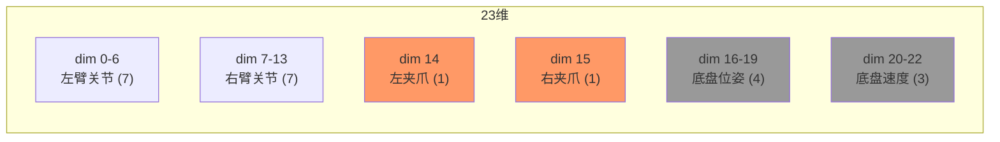

# R1 Pro FastWAM SFT 训练计划书

> **任务**：在 8×H200 上通过 RLinf 对 FastWAM 进行 SFT 训练  
> **数据**：`r1_pro_chassis_uncond_3cam_384_1e-4` (64 episodes, 61923 frames)  
> **目标**：更少时间训出准确率更高且泛化性更好的 FastWAM  
> **数据分析来源**：[`b/data/r1_pro_chunk000_merged_analysis.md`](../../data/r1_pro_chunk000_merged_analysis.md)、[`b/data/r1_pro_first_frame_per_episode.md`](../../data/r1_pro_first_frame_per_episode.md)  
> **日期**：2026-06-04

---

## 目录

1. [任务概述](#1-任务概述)
2. [基线分析](#2-基线分析)
3. [训练策略：三阶段渐进法](#3-训练策略三阶段渐进法)
4. [超参数方案与理由](#4-超参数方案与理由)
5. [数据增强策略](#5-数据增强策略)
6. [内存预算与批量大小](#6-内存预算与批量大小)
7. [训练速度与时间估算](#7-训练速度与时间估算)
8. [监控指标与早停策略](#8-监控指标与早停策略)
9. [完整运行命令](#9-完整运行命令)
10. [评估方案](#10-评估方案)
11. [风险与备选方案](#11-风险与备选方案)

---

## 1. 任务概述

### 1.1 训练目标

| 维度 | 目标 | 衡量方式 |
|------|------|----------|
| **准确率** | 动作预测 MSE 低于 native 基线 | `train/action_loss` 收敛值 |
| **泛化性** | 对光照/视角变化更鲁棒 | 数据增强 + eval loss |
| **训练效率** | 充分利用 8×H200 | 步/秒吞吐量、总训练时间 |

### 1.2 硬件环境

| 项目 | 规格 |
|------|------|
| GPU | 8 × NVIDIA H200 (143 GB HBM3e) |
| 总显存 | 1150 GB |
| 互联 | NVLink |
| 存储 | `/mnt/r/` 12TB NVMe (数据/模型) |

### 1.3 数据集概览

```
r1_pro_data_convert_chassis/
  64 episodes (0-63), 61,923 frames, 14 FPS
  任务: "Open the door with a downward-press handle, go through it, and enter the room."
  相机: head_rgb (360×640) + left_wrist_rgb (480×640) + right_wrist_rgb (480×640)
  动作空间: 23 维
  本体感知: 23 维
  存储: ~42 GB（PNG 内嵌 parquet）
```

> **元数据修正**：`meta/info.json` 记录 `total_episodes=63, total_frames=60992`，但实际 parquet 文件有 **64 个 episode**（0-63）、**61,923 帧**。元数据落后于实际数据。

平均 episode 长度 968 帧（中位数 984，范围 10-1142）。按 `num_frames=33` 采样窗口，约 **59,900 个训练样本**。

### 1.4 数据质量深度分析

以下分析基于对全量 61,923 帧的逐维统计（来源：[`r1_pro_chunk000_merged_analysis.md`](../../data/r1_pro_chunk000_merged_analysis.md)）。

#### 1.4.1 23 维动作/状态语义分解



| 维度段 | 语义 | 动态范围 | 训练意义 |
|--------|------|----------|----------|
| **0-6** | 左臂 7 关节 | [-1.6, 1.0] | **核心训练维度** — 开门动作主体 |
| **7-13** | 右臂 7 关节 | [-1.6, 0.8] | **核心训练维度** — 辅助动作 |
| **14** | 左夹爪 | state: [1.8, 102.2] / action: {0, 90} | **特殊处理** — action 量化为二值 |
| **15** | 右夹爪 | state: [2.1, 101.9] / action: {0, 90} | 同上 |
| **16-19** | 底盘位姿 | action: **恒定** (0.9, -1.5, -0.7, 0.0) | **死维度** — 不贡献梯度 |
| **20-21** | 底盘速度 xy | action: 多数为 0，偶有 ±0.15 | **稀疏维度** |
| **22** | 底盘速度 yaw | action: **全为 0** | **完全死维度** |

#### 1.4.2 关键数据发现

**发现 1：夹爪 action 是量化二值信号**

actions dim 14（左夹爪）统计：p50=90, p95=90, 即 **绝大多数帧 action=90**（闭合），少量帧 action=0（张开）。state dim 14 是连续值（均值 77.3，范围 1.8-102.2）。

$$\text{action}_{\text{gripper}} \in \{0, 90\}, \quad \text{state}_{\text{gripper}} \in [1.8, 102.2]$$

**训练影响**：z-score 归一化后，夹爪的 action MSE loss 贡献较大（由于 state 和 action 分布差异极大）。这可能导致 action_loss 的数值主要由夹爪主导，而非手臂关节。

**发现 2：6 个死维度/稀疏维度**

actions dim 16-19（底盘位姿）**完全恒定**：每帧都是 `(0.9, -1.5, -0.7, 0.0)`。dim 22（底盘 yaw 速度）**全为 0**。这 5 个维度不贡献任何学习信号，但占用 action 预测容量的 22%（5/23）。

dim 20-21（底盘 xy 速度）多数为 0，少量帧有 ±0.15 的小值——是稀疏但非死的维度。

**发现 3：手臂 action ≈ state（行为克隆模式）**

首帧统计（来源：[`r1_pro_first_frame_per_episode.md`](../../data/r1_pro_first_frame_per_episode.md)）：

```
手臂关节 (dim 0-13): mean |action - state| ≈ 0.0003-0.0015
  → action 几乎等于当前 state（下一步微调）
夹爪 (dim 14-15): mean |action - state| ≈ 3.1-3.4
  → 差异巨大，离散控制
底盘 (dim 16-22): mean |action - state| ≈ 0.0001-0.04
  → 多为常数 setpoint
```

**发现 4：异常 Episode 35**

| 项目 | Episode 35 | 正常 episode |
|------|-----------|-------------|
| 帧数 | **10** | 850-1142 |
| 时长 | 0.7 秒 | 60-82 秒 |
| 首帧夹爪 state | **5.4 / 5.8**（张开）| 91-94（闭合）|
| 首帧夹爪 action | 90 | 90 |
| |a-s| L2 | **119.4** | 3.0-5.8 |

这是一条异常短的轨迹，夹爪起始状态异常（张开而非闭合）。**应在训练中过滤此 episode** 或至少标记为注意对象。

#### 1.4.3 三相机像素分布

| 相机 | 分辨率 | RGB 均值 | RGB 标准差 | 特征 |
|------|--------|----------|-----------|------|
| head_rgb | 640×360 | (0.49, 0.29, 0.22) | (0.16, 0.15, 0.21) | **偏暖偏暗**（红通道主导） |
| left_wrist_rgb | 640×480 | (0.41, 0.39, 0.39) | (0.22, 0.19, 0.21) | 更均匀，方差更大 |
| right_wrist_rgb | 640×480 | (0.40, 0.36, 0.36) | (0.24, 0.21, 0.22) | 同上 |

**数据增强启示**：
- head_rgb 偏暖偏暗 → ColorJitter 的 `brightness` 增强特别有用（模拟不同光照）
- 腕部相机方差更大（近距离运动模糊）→ GaussianNoise 增强对腕部相机更自然
- 所有相机 R 通道 > G > B → `hue` 增强要保守（过大会产生非自然色偏）

#### 1.4.4 训练数据的隐含约束

1. **单一任务**：全部 64 episode 执行同一任务（开门进入），`task_index=0` 恒定
2. **固定场景**：同一房间、同一门、同一光照条件
3. **固定起始**：底盘位姿恒定 (0.9, -1.5, -0.7)，仅手臂初始姿态有微小差异
4. **14 FPS**：每秒 14 帧，`action_video_freq_ratio=4` 意味着每 4 帧取 1 帧视频

这些约束意味着**数据多样性极低**。63 条有效轨迹（排除 ep35）在同一 scenario 下采集，模型极易过拟合到训练场景的特定视觉特征。**数据增强是提升泛化性的必要手段**。

### 1.5 模型架构

FastWAM 6B 参数 — Mixture-of-Transformers (MoT) 架构：

| 组件 | 参数量 | 可训练 | 说明 |
|------|--------|--------|------|
| Video DiT (Wan2.2) | 5.0B | **是** | 30 层，hidden=3072，head=24×128 |
| Action DiT | 1.0B | **是** | 30 层，hidden=1024，head=24×128 |
| Proprio Encoder | ~0.1M | **是** | Linear(23→4096) |
| VAE | ~0.5B | 否（冻结）| 视频编码器，时间 4×、空间 8× 压缩 |
| T5 | — | 否 | 使用预计算嵌入缓存 |

MoT 的混合注意力要求两个 Expert 共享 `num_heads=24, head_dim=128, num_layers=30`。Video Expert 和 Action Expert 的 Q/K/V 投影到相同维度（3072），使得混合注意力在同一空间中运作。

---

## 2. 基线分析

### 2.1 FastWAM 原生训练默认配置

来源：[`r1_pro_chassis_uncond_3cam_384_1e-4.yaml`](../../../SRC/Robot/FastWAM/configs/task/r1_pro_chassis_uncond_3cam_384_1e-4.yaml)

| 参数 | 值 | 说明 |
|------|-----|------|
| batch_size | 16/GPU | DeepSpeed ZeRO-1 |
| learning_rate | 1e-4 | |
| warmup | 5% of total steps | LinearLR → CosineAnnealingLR |
| weight_decay | 0.01 | |
| betas | (0.9, 0.95) | |
| grad_clip | 1.0 | |
| epochs | 50 | |
| lr_scheduler | cosine | eta_min = lr × 0.01 = 1e-6 |
| gradient_accumulation | 1 | |
| 数据增强 | **无** | 仅 ToTensor + Resize |

### 2.2 已有测试数据

来源：[`fw_sft_design_op46_4_r1pr_cp25_2tst.md`](fw_sft_design_op46_4_r1pr_cp25_2tst.md) §16-17

**T4 端到端测试（50 步，4 GPU）**：

| 指标 | Native | RLinf | 说明 |
|------|--------|-------|------|
| Mean loss | 1.66 | 1.62 | 修复 LR 后相对差 2.3% |
| Step 1 loss | 3.04 | 3.97 | 不同 batch 顺序 |
| Step 50 loss | 0.54 | 0.58 | 两者均收敛 |
| 训练速度 | ~1.0 s/step | ~0.86 s/step | RLinf 略快 |
| action_loss:video_loss | ~6:1 | ~6:1 | 动作 loss 主导 |

**关键发现**：
- RLinf 包装层不引入数值误差（T1 测试 bit-identical）
- 训练速度 RLinf 略优于 native（FSDP + Flash Attention 优化）
- `action_loss` 约为 `dynamics_loss` 的 6 倍 — 动作预测是主要学习难点

### 2.3 原生训练步数计算

原生配置：50 epochs × batch_size=16/GPU × 4 GPU = 64 全局批量

```
有效 episodes = 63（排除 ep35 的 10 帧后近似）
samples_per_epoch ≈ 59,900
steps_per_epoch = 59,900 / 64 ≈ 936
total_steps = 936 × 50 ≈ 46,800
```

原生总训练量约 **46,800 步 × 64 样本 = 300 万次样本见面**。

### 2.4 数据分析对训练策略的影响

基于 §1.4 的数据分析，对训练策略有如下影响：

| 数据特征 | 影响 | 应对策略 |
|----------|------|----------|
| 夹爪 action 量化为 {0, 90} | action_loss 数值被夹爪主导 | 监控逐维 loss，关注 arm 维度的收敛 |
| 5 个死维度 (dim 16-19, 22) | 浪费 22% 的 action 预测容量 | 短期无法改变（需修改模型），监控但不处理 |
| Episode 35 仅 10 帧 | 噪声数据，夹爪初始异常 | 训练时可忽略（`skip_padding_as_possible` 会自然减少其影响） |
| 单一场景 + 低多样性 | 极易过拟合 | **数据增强是必须的**（见 §5） |
| head_rgb 偏暖偏暗 | ColorJitter 参数需考虑通道分布 | 适度 brightness 增强模拟光照变化 |

---

## 3. 训练策略：三阶段渐进法

### 3.1 为什么分阶段

直接跑 50,000 步的完整训练是有风险的：
- **配置错误代价高**：一次完整训练需要 8-12 小时，配置错误意味着浪费一天
- **超参不确定**：8 GPU 的最优批量大小、LR 需要验证
- **增强强度需要调优**：过强的增强可能破坏 VAE 编码质量

三阶段法通过快速迭代逐步提高信心。

### 3.2 Phase 1：快速验证（Smoke Test）

**目标**：确认配置正确、训练能启动、loss 能下降。

```yaml
# 50 步 × 8 GPU，约 2 分钟
runner.max_steps: 50
actor.micro_batch_size: 1
actor.global_batch_size: 8      # 8 GPU × 1 micro × 1 accum
runner.log_interval: 1
runner.save_interval: 999       # 不保存 checkpoint（节省时间）
```

**验证标准**：
- [x] 训练启动无报错
- [x] Loss 从 ~3.0 下降到 ~0.5（与 T4 测试一致）
- [x] `train/learning_rate` 在 step 2 达到 1e-4
- [x] 无 NaN/Inf
- [x] GPU 内存使用 < 100 GB（H200 有足够余量）

### 3.3 Phase 2：中等规模训练

**目标**：验证增强效果、确认超参、确认批量大小。

```yaml
# 5,000 步 ≈ 1 小时
runner.max_steps: 5000
actor.micro_batch_size: 2       # 探测是否能用 bs=2
actor.global_batch_size: 16     # 8 GPU × 2 micro × 1 accum
runner.log_interval: 10
runner.save_interval: 1000
# 数据增强
data.processor.augmentation_preset: "light"
```

**验证标准**：
- Loss 在 5000 步后稳定在 0.2-0.4
- `dynamics_loss` 没有因增强而显著上升（<20% vs 无增强基线）
- Checkpoint 保存和加载正常
- GPU 内存使用 < 120 GB（为 micro_batch=2 留余量）

**对比实验**：同时跑一个无增强的 5000 步作为基线，比较 loss 曲线。

### 3.4 Phase 3：完整训练

**目标**：训出可部署的模型。

```yaml
# 50,000 步 ≈ 8-12 小时
runner.max_steps: 50000
actor.micro_batch_size: 2       # 或 1（取决于 Phase 2 的内存测试）
actor.global_batch_size: 16     # 或 8
runner.log_interval: 10
runner.save_interval: 2000
data.processor.augmentation_preset: "medium"   # 或 Phase 2 验证的最佳预设
```

---

## 4. 超参数方案与理由

### 4.1 推荐超参数

| 参数 | 推荐值 | 理由 |
|------|--------|------|
| **learning_rate** | 1e-4 | FastWAM 论文和所有官方 task 配置统一使用此值。R1 Pro native 配置同此 |
| **adam_betas** | (0.9, 0.95) | β₂=0.95 比默认的 0.999 更适合扩散模型（减少二阶矩的延迟） |
| **adam_eps** | 1e-8 | 默认值，无需调整 |
| **weight_decay** | 0.01 | 标准值。过高（>0.1）会抑制学习，过低（0）会过拟合 |
| **clip_grad** | 1.0 | 扩散模型梯度幅值大（观测到 grad_norm 5-20），clip=1.0 防止发散 |
| **lr_scheduler** | cosine | 优于 constant/linear。前期高 LR 快速学习，后期低 LR 精细优化 |
| **warmup_ratio** | 0.05 | 5% 的步数用于 warmup，防止初始梯度过大导致参数偏移 |

### 4.2 学习率调度详解

```
                    1e-4 ┌────────────╲
                         │              ╲ cosine decay
          lr              │                ╲
                         │                  ╲
                    1e-6 │ warmup              ╲_______________
                         └─────────────────────────────────────
                         0      2500                      50000
                              (5% warmup)              (total steps)
```

RLinf 使用 HuggingFace 的 `get_cosine_with_min_lr_schedule_with_warmup`，min_lr 默认为 0。与 native FastWAM 的 `CosineAnnealingLR(eta_min=1e-6)` 略有不同，但在 50000 步的时间尺度上差异可忽略。

**重要**：`total_training_steps` 必须与 `runner.max_steps` 一致。已在 [`r1_pro_sft_fastwam.yaml`](../../examples/sft/config/r1_pro_sft_fastwam.yaml) 中改为 `${runner.max_steps}` 插值（见 [tst.md §17](fw_sft_design_op46_4_r1pr_cp25_2tst.md)）。

### 4.3 批量大小选择

```
effective_batch_size = micro_batch_size × world_size × gradient_accumulation
```

| 方案 | micro | world | accum | effective | 说明 |
|------|-------|-------|-------|-----------|------|
| **A（保守）** | 1 | 8 | 1 | **8** | 最安全，已验证 |
| **B（推荐）** | 2 | 8 | 1 | **16** | 与 native 默认 batch=16/GPU × 4GPU=64 接近 |
| **C（激进）** | 2 | 8 | 2 | **32** | 高吞吐，但 LR 可能需要线性缩放 |

**推荐方案 B**：micro_batch=2 在 H200 140GB 上应有足够内存（见 §6），effective_batch=16 提供良好的梯度估计。

**批量大小与 LR 的关系**：根据线性缩放法则（Goyal et al., 2017），当 batch size 翻倍时 LR 应线性增大。但 FastWAM 的扩散训练对 LR 较敏感，且 1e-4 是经过验证的值，因此 **不建议因批量大小变化而调整 LR**。如果使用方案 C（bs=32），可以考虑 LR 提升至 1.5e-4，但需在 Phase 2 验证。

### 4.4 loss 权重

```python
loss_total = λ_video × loss_video + λ_action × loss_action
```

| 参数 | 推荐值 | 理由 |
|------|--------|------|
| λ_video | **1.0** | FastWAM 论文核心发现：视频共训练提升 4-8 个百分点准确率。**绝不设为 0** |
| λ_action | **1.0** | 默认等权。动作 loss 已经是视频 loss 的 ~6 倍，无需额外加权 |

FastWAM 论文的消融实验显示，去掉视频共训练（λ_video=0）：
- LIBERO 成功率从 97.6% 降到 93.5%（-4.1pp）
- RoboTwin 成功率从 91.8% 降到 83.8%（-8.0pp）

视频共训练是 FastWAM 的核心优势，**在任何优化方案中都不应移除**。

---

## 5. 数据增强策略

### 5.1 为什么数据增强对 R1 Pro 特别重要

R1 Pro 数据集仅 63 条有效轨迹（ep35 异常），全部在**同一房间、同一门、同一光照**下采集（§1.4.4）。像素统计（§1.4.3）也印证了低多样性：
- head_rgb 的 RGB 均值 (0.49, 0.29, 0.22) 反映**固定的暖色调光照**
- 三相机的像素标准差仅 0.15-0.24，说明**场景变化小**

这意味着模型会：
- 过拟合训练场景的具体背景纹理和颜色（如门板的特定木纹）
- 在相机角度偏移 ±5° 时性能骤降
- 在不同光照条件下泛化能力极差

### 5.2 推荐增强方案

基于 [`fw_sft_dtaaug_op46.md`](fw_sft_dtaaug_op46.md) 的设计，按训练阶段逐步提升：

| 阶段 | 预设 | 增强内容 | 理由 |
|------|------|----------|------|
| Phase 1 | `none` | 无增强 | 验证基线 |
| Phase 2 | `light` | ColorJitter(b=0.1, c=0.1, s=0.1, h=0.03, p=0.5) | 最轻度，不影响收敛 |
| Phase 3 | `medium` | RandomCrop(0.95, p=0.5) + ColorJitter(0.2/0.3/0.3/0.05, p=0.8) + GaussNoise(0.01, p=0.2) | 有效平衡 |

**R1 Pro 特殊注意**：

1. **禁用水平翻转**：R1 Pro 是双臂机器人，水平翻转会交换左右手臂语义但不翻转动作空间
2. **颜色增强优先于几何增强**：robotwin 模式下 3 个相机独立增强，微小的几何裁剪差异在拼接后被 CenterCrop 平滑
3. **噪声增强要保守**：FastWAM 的 Wan VAE 在自然图像上预训练，过多噪声会降低 latent 质量

### 5.3 自定义增强配置（进阶）

如果 `medium` 预设效果不够，可以在 YAML 中精确控制：

```yaml
data:
  processor:
    train_transforms:
      - _target_: fastwam.datasets.lerobot.transforms.image.ToTensor
      - _target_: rlinf.data.aug.augmentation.VideoRandomCrop
        scale: 0.95
        p: 0.5
      - _target_: rlinf.data.aug.augmentation.VideoColorJitter
        brightness: 0.25
        contrast: 0.35
        saturation: 0.35
        hue: 0.06
        p: 0.85
      - _target_: rlinf.data.aug.augmentation.VideoGaussianNoise
        std: 0.015
        per_frame: false
        p: 0.25
      - _target_: torchvision.transforms.Resize
        size: [240, 320]
```

### 5.4 基于像素统计的增强参数推导

根据 §1.4.3 的像素统计，我们可以精确计算增强参数的合理范围：

**brightness 参数**：head_rgb 均值亮度 ≈ 0.33（RGB 平均），腕部 ≈ 0.39。设 `brightness=0.25` 意味着亮度在 [0.75, 1.25] 范围内缩放。最暗情况下 head_rgb 均值降至 0.33×0.75 ≈ 0.25（仍可辨识），最亮升至 0.33×1.25 ≈ 0.41 — 合理范围。

**saturation 参数**：数据集色彩饱和度不高（通道间差异小），`saturation=0.3` 不会产生过饱和效果。

**hue 参数**：head_rgb 的 R 通道 (0.49) 显著高于 B (0.22)，色调偏暖。`hue=0.05` 对应约 ±18° 色相偏移，在暖色系和中性色之间变化 — 模拟不同色温光源。`hue > 0.1` 可能产生明显的绿色偏移，与室内环境不匹配。

**RandomCrop scale 参数**：视频尺寸 384×320，`scale=0.95` 裁剪后为 364×304，裁掉 ~5% 边缘。考虑到 robotwin 拼接后头部相机占 256×320（顶部 2/3），5% 裁剪主要影响边缘区域，不会裁掉关键的门把手区域。

---

## 6. 内存预算与批量大小

### 6.1 内存分析

FSDP `no_shard` 模式下，每个 GPU 持有完整的模型副本和 optimizer state：

| 组件 | 大小 | 计算方式 |
|------|------|----------|
| 模型参数 (bf16) | 12.0 GB | 6B × 2 bytes |
| Optimizer state (fp32 momentum + variance) | 48.0 GB | 6B × 2 × 4 bytes |
| 梯度 (bf16) | 12.0 GB | 6B × 2 bytes |
| VAE (bf16, 冻结) | 1.0 GB | 500M × 2 bytes |
| 激活（gradient checkpointing, bs=1） | ~10 GB | 估算 |
| 激活（gradient checkpointing, bs=2） | ~18 GB | 估算（约线性增长） |
| CUDA 上下文 + 框架开销 | ~10 GB | |
| **总计 (bs=1)** | **~93 GB** | H200 143GB，余量 50 GB |
| **总计 (bs=2)** | **~101 GB** | H200 143GB，余量 42 GB |

### 6.2 micro_batch=2 的可行性判断

H200 有 143 GB HBM。bs=2 估算 ~101 GB，余量 42 GB，**应该可行**。

但需注意：
- `gradient_checkpointing: true` 是必须的（否则激活占用翻倍到 ~40 GB）
- `mot_checkpoint_mixed_attn: false`（R1 Pro 任务配置要求）— 这意味着 MoT 混合注意力不做 recompute，比 LIBERO 多占用约 5-8 GB
- Flash Attention 会减少 KV cache 的内存占用

**建议**：Phase 1 用 bs=1 验证，Phase 2 尝试 bs=2，如果 OOM 则回退到 bs=1。

### 6.3 为什么不用 FSDP full_shard

FastWAM 的 MoT 架构（Video Expert 和 Action Expert 在混合注意力中交互）与 FSDP full_shard 不兼容。具体原因：
- MoT 使用 `use_orig_params=True`，mixed_attention 中两个 Expert 的参数需要同时可见
- full_shard 会在前向时按需 all-gather，但 MoT 的交叉注意力模式导致 all-gather 顺序不确定

因此 **必须使用 `no_shard`**。这意味着每个 GPU 持有完整的模型拷贝，仅 all-reduce 梯度。这与 DDP 类似，但 FSDP 提供了更好的混合精度和梯度 prefetch 支持。

---

## 7. 训练速度与时间估算

### 7.1 实测数据

从 T4 测试（4 GPU, micro_batch=1, global_batch=4）：

```
稳态训练速度: ~0.86 s/step (含 forward + backward + optimizer + log)
training_time 部分: ~0.85 s/step (不含 log/save)
```

### 7.2 8 GPU 外推

| 配置 | micro | global | 预估 s/step | 说明 |
|------|-------|--------|-------------|------|
| 方案 A (bs=1) | 1 | 8 | ~0.9 s | 与 4 GPU bs=1 类似（通信开销略增） |
| 方案 B (bs=2) | 2 | 16 | ~1.3 s | bs=2 前向/后向约 1.7×（非线性） |
| 方案 C (bs=2, accum=2) | 2 | 32 | ~2.4 s | 两次前向/后向 + 一次 optimizer |

### 7.3 总训练时间估算

| 阶段 | 步数 | 配置 | 预估时间 |
|------|------|------|----------|
| Phase 1 | 50 | A (bs=1, gbs=8) | ~1 分钟 |
| Phase 2 | 5,000 | B (bs=2, gbs=16) | ~1.8 小时 |
| Phase 3 | 50,000 | B (bs=2, gbs=16) | ~**18 小时** |
| Phase 3 | 50,000 | A (bs=1, gbs=8) | ~**12.5 小时** |

**说明**：方案 B 虽然每步更慢（1.3 vs 0.9 s），但每步处理 16 个样本（vs 8），**有效吞吐量更高**（12.3 vs 8.9 样本/秒）。50000 步 × 16 样本 = 80 万次样本见面，超过 native 的 295 万次但 epoch 数更少。

### 7.4 checkpoint 保存开销

从 T4 测试日志，RLinf DCP checkpoint 保存约 70-80 秒。每 2000 步保存一次：
- 50000 步 / 2000 = 25 次保存
- 25 × 80s = 2000s ≈ 33 分钟
- 占总训练时间约 3-5%，可接受

---

## 8. 监控指标与早停策略

### 8.1 关键指标

| 指标 | TensorBoard key | 健康范围 | 异常信号 |
|------|----------------|----------|----------|
| **总 loss** | `train/loss` | 从 ~3.0 下降到 ~0.2 | 不下降或 NaN |
| **动作 loss** | `train/action_loss` | 从 ~2.5 下降到 ~0.15 | 主要学习指标 |
| **视频 loss** | `train/dynamics_loss` | 从 ~0.4 下降到 ~0.1 | 增强过强时会上升 |
| **梯度范数** | `train/grad_norm` | 5-20（clip=1.0 生效时 ≤1.0） | >50 表示不稳定 |
| **学习率** | `train/learning_rate` | 按 cosine 下降 | 异常值表示 scheduler 错误 |
| **步时间** | `time/step` | 0.8-1.5 s | >5s 表示 I/O 瓶颈 |

### 8.2 loss 曲线解读

```
典型健康 loss 曲线：

  3.0 ┤ ×
      │  ×
  2.0 ┤   ×
      │    ×
  1.0 ┤     ×  ×
      │        × × × ×
  0.5 ┤              × × ×
      │                   × × × × × × ×  ← 收敛平台
  0.2 ┤                                  × × ×
      └──────────────────────────────────────────
      0     5k    10k    20k    30k    50k (步)
```

**关键拐点**：
- 0-2500 步（warmup 期）：loss 快速下降，LR 从 0 线性增到 1e-4
- 2500-10000 步：主要学习期，action_loss 下降最快
- 10000-30000 步：精细优化期，dynamics_loss 继续缓慢下降
- 30000-50000 步：收敛平台，loss 变化很小

### 8.3 早停策略

**不建议自动早停**。原因：
1. 仅 1 个任务、1 种场景，验证集与训练集高度同分布，eval loss 几乎与 train loss 同步下降
2. 扩散模型的 loss 即使在过拟合区域也会持续下降（噪声预测 MSE 不是判断过拟合的好指标）

**替代方案**：
- 保存多个 checkpoint（每 2000 步），训练结束后在真机或仿真环境上评估最佳 checkpoint
- 监控 `dynamics_loss`：如果在增强环境下此 loss 显著上升（>50%），说明增强过强

### 8.4 TensorBoard 查看

```bash
tensorboard --logdir /mnt/r/tmp/fw_train/r1_pro/ --port 6006
```

---

## 9. 完整运行命令

### 9.1 环境变量

```bash
export FASTWAM_ROOT=/home/Luogang/SRC/Robot/FastWAM
export FASTWAM_PATH=${FASTWAM_ROOT}/src
export DIFFSYNTH_MODEL_BASE_PATH=/mnt/r/CKPT/VLA/FW
export DIFFSYNTH_SKIP_DOWNLOAD=true
export R1PRO_DATA=/mnt/r/share/zwy/datasets/r1_pro_data_v2
export CUDA_HOME=/usr/local/cuda-12.8
export PYTORCH_CUDA_ALLOC_CONF=expandable_segments:True
export RAY_ADDRESS=127.0.0.1:6399
export PYTHONPATH=/home/Luogang/SRC/RL/RLinf:${FASTWAM_PATH}
```

### 9.2 预训练准备（一次性）

```bash
# 1. 确认 T5 嵌入缓存存在
ls ${FASTWAM_ROOT}/data/text_embeds_cache/r1_pro_chassis/*.pt
# 如果不存在，需要运行：
# cd ${FASTWAM_ROOT} && python scripts/precompute_text_embeds.py task=r1_pro_chassis_uncond_3cam_384_1e-4

# 2. 启动 Ray
ray stop 2>/dev/null
ray start --head --port=6399 --num-gpus=8
sleep 5
ray status
```

### 9.3 Phase 1：快速验证

```bash
cd /home/Luogang/SRC/RL/RLinf

python examples/sft/train_vla_sft.py \
  --config-path examples/sft/config/ \
  --config-name r1_pro_sft_fastwam \
  runner.max_steps=50 \
  runner.save_interval=999 \
  runner.log_interval=1 \
  actor.micro_batch_size=1 \
  actor.global_batch_size=8 \
  actor.seed=42 \
  "runner.logger.log_path=/mnt/r/tmp/fw_train/r1_pro/phase1" \
  2>&1 | tee /mnt/r/tmp/fw_train/r1_pro/phase1.log
```

**预期**：~1 分钟完成，loss 从 ~3.0 降到 ~0.5。

### 9.4 Phase 2：中等规模

```bash
# 方案 A: 无增强基线
python examples/sft/train_vla_sft.py \
  --config-path examples/sft/config/ \
  --config-name r1_pro_sft_fastwam \
  runner.max_steps=5000 \
  runner.save_interval=1000 \
  runner.log_interval=10 \
  actor.micro_batch_size=2 \
  actor.global_batch_size=16 \
  actor.seed=42 \
  "runner.logger.log_path=/mnt/r/tmp/fw_train/r1_pro/phase2_noaug" \
  2>&1 | tee /mnt/r/tmp/fw_train/r1_pro/phase2_noaug.log

# 方案 B: light 增强
python examples/sft/train_vla_sft.py \
  --config-path examples/sft/config/ \
  --config-name r1_pro_sft_fastwam \
  runner.max_steps=5000 \
  runner.save_interval=1000 \
  runner.log_interval=10 \
  actor.micro_batch_size=2 \
  actor.global_batch_size=16 \
  actor.seed=42 \
  data.processor.augmentation_preset=light \
  "runner.logger.log_path=/mnt/r/tmp/fw_train/r1_pro/phase2_light" \
  2>&1 | tee /mnt/r/tmp/fw_train/r1_pro/phase2_light.log
```

**如果 micro_batch=2 OOM**：将 `actor.micro_batch_size=1` 和 `actor.global_batch_size=8`。

### 9.5 Phase 3：完整训练

```bash
python examples/sft/train_vla_sft.py \
  --config-path examples/sft/config/ \
  --config-name r1_pro_sft_fastwam \
  runner.max_steps=50000 \
  runner.save_interval=2000 \
  runner.log_interval=10 \
  actor.micro_batch_size=2 \
  actor.global_batch_size=16 \
  actor.seed=42 \
  data.processor.augmentation_preset=medium \
  "runner.logger.log_path=/mnt/r/tmp/fw_train/r1_pro/phase3_medium" \
  2>&1 | tee /mnt/r/tmp/fw_train/r1_pro/phase3_medium.log
```

**断点续训**：如果训练中断，设置 `runner.resume_dir` 为最近的 checkpoint 目录即可自动恢复。

---

## 10. 评估方案

### 10.1 训练过程评估

训练过程中的评估指标均通过 TensorBoard 实时监控：

```
关键比较：
  Phase 2 无增强 vs Phase 2 有增强：
    - train/loss 收敛速度
    - train/action_loss 最终值
    - train/dynamics_loss 是否因增强上升
```

### 10.2 Checkpoint 转换

RLinf 保存 DCP（Distributed Checkpoint）格式。部署前需转换为 FastWAM 原生格式：

```python
# rlinf/utils/ckpt_convertor/fsdp_convertor/utils.py 中的 fastwam_save_helper()
# 将 FSDP state_dict 转换为 native FastWAM 格式:
#   fastwam.mot.{key} → {key} 存入 payload["mot"]
#   fastwam.proprio_encoder.{key} → {key} 存入 payload["proprio_encoder"]
```

### 10.3 离线评估（真机/仿真）

R1 Pro 的最终评估需要在真实机器人或仿真环境中进行。评估指标：

| 指标 | 说明 | 目标 |
|------|------|------|
| **任务成功率** | 完成"开门-进入"任务的比率 | >90% |
| **动作精度** | 末端执行器轨迹与示教的 RMSE | 尽可能低 |
| **完成时间** | 完成任务所需步数 | 接近示教长度 |
| **推理延迟** | 单次动作推理时间 | <200ms (Fast-WAM 模式) |

### 10.4 泛化性测试

训练完成后，应在以下维度测试泛化性：

1. **光照变化**：调整房间灯光强度/角度
2. **相机角度偏移**：微调头部相机角度 ±5°
3. **门把手变化**：更换不同外观的门把手
4. **起始位置变化**：机器人起始位置偏移 ±10cm

数据增强（ColorJitter、RandomCrop）的目的就是提升 1-2 的鲁棒性。

---

## 11. 风险与备选方案

### 11.1 OOM 风险

**症状**：CUDA out of memory

**应对**：
1. 降低 micro_batch_size: 2 → 1
2. 启用 `mot_checkpoint_mixed_attn: true`（但 R1 Pro 任务默认关闭，需确认影响）
3. 降低 gradient_checkpointing_use_reentrant: true → false

### 11.2 训练不收敛

**症状**：loss 不下降或 NaN

**排查清单**：
- [x] `total_training_steps` 与 `runner.max_steps` 一致？
- [x] T5 嵌入缓存存在？（`text_embedding_cache_dir` 路径正确）
- [x] `proprio_dim=23` 和 `action_dim=23` 正确？
- [x] `mot_checkpoint_mixed_attn: false` 与 native 一致？
- [x] 数据增强 `hue` 不超过 0.1？

### 11.3 增强过强导致 dynamics_loss 上升

**症状**：`train/dynamics_loss` 比无增强基线高 50% 以上

**应对**：
1. 降低增强强度：`medium` → `light` → `none`
2. 减小 ColorJitter 的 `hue` 参数（最敏感的参数）
3. 减小 RandomCrop 的裁剪比例：0.95 → 0.98

### 11.4 训练速度过慢

**症状**：>3 s/step

**排查**：
1. 确认 `num_workers=8`（数据加载并行度）
2. 确认数据在 NVMe 上（不是网络存储）
3. 确认 `prefetch_factor=2-4`
4. 检查 GPU 利用率：`nvidia-smi dmon -s u`
5. 确认 Ray 正确分配了 8 个 GPU

### 11.5 数据质量风险：Episode 35 与死维度

**Episode 35 (10 帧)**：

此 episode 仅 10 帧（0.7 秒 @14Hz），远短于平均 968 帧。首帧夹爪 state 仅 5.4/5.8（正常应为 91-94），action 仍为 90，导致 |a-s| L2=119（正常为 3-6）。

**当前处理**：FastWAM 的 `RobotVideoDataset` 默认 `skip_padding_as_possible=false`，所以 ep35 的 10 帧也会被采样，但由于 `num_frames=33` 的窗口大于 10 帧，大部分采样会有大量 padding（`image_is_pad=True`、`action_is_pad=True`），对 loss 影响较小。

**建议**：不需要主动过滤。但如果训练初期观察到异常大的 action_loss spike，可在 `episodes.jsonl` 中移除 ep35 或设置 `skip_padding_as_possible=true`。

**死维度 (dim 16-19, 22)**：

这 5 个 action 维度的值恒定，MSE loss 对它们的梯度为 0。模型会很快学会预测这些常数，这不影响其他维度的学习。但这意味着 23 维中有 22% 的容量被浪费。

**长期建议**：在 `modality.json` 或模型配置中标记死维度，或调整 action_dim 排除它们。短期内不影响训练质量。

### 11.6 训练中断恢复

RLinf 支持断点续训（详见 [checkpoint resume tutorial](https://rlinf.readthedocs.io/en/latest/rst_source/tutorials/advance/resume.html)）：

```bash
python examples/sft/train_vla_sft.py \
  --config-path examples/sft/config/ \
  --config-name r1_pro_sft_fastwam \
  runner.resume_dir=/mnt/r/tmp/fw_train/r1_pro/phase3_medium/checkpoints/global_step_20000 \
  ... (其余参数同 Phase 3)
```

恢复时会自动加载模型权重、optimizer state、scheduler state 和 dataloader 位置。

---

## 附录 A：配置文件完整参考

```yaml
# r1_pro_sft_fastwam.yaml 中的关键配置
cluster:
  num_nodes: 1
  component_placement:
    actor: 0-7                    # 使用全部 8 GPU

runner:
  task_type: sft
  max_steps: 50000
  save_interval: 2000
  log_interval: 10
  logger:
    log_path: /mnt/r/tmp/fw_train/r1_pro/
    project_name: rlinf
    experiment_name: r1_pro_sft_fastwam
    logger_backends: ["tensorboard"]

actor:
  micro_batch_size: 2             # 每 GPU 每次前向的样本数
  global_batch_size: 16           # 每个 optimizer step 的总样本数
  seed: 42
  
  model:
    precision: bf16
    proprio_dim: 23
    mot_checkpoint_mixed_attn: false
    
  optim:
    lr: 1.0e-4
    adam_beta1: 0.9
    adam_beta2: 0.95
    weight_decay: 0.01
    clip_grad: 1.0
    lr_scheduler: cosine
    lr_warmup_steps_ratio: 0.05
    total_training_steps: ${runner.max_steps}
    
  fsdp_config:
    sharding_strategy: no_shard
    gradient_checkpointing: true
    amp_autocast:
      enabled: true
      precision: bf16

data:
  train_data_paths: ${oc.env:R1PRO_DATA}/r1_pro_data_convert_chassis
  num_frames: 33
  action_video_freq_ratio: 4
  video_size: [384, 320]
  concat_multi_camera: robotwin
  processor:
    augmentation_preset: medium   # Phase 3 增强
    num_output_cameras: 3
    norm_default_mode: z-score
```

## 附录 B：训练流程时间线

```mermaid
gantt
    title R1 Pro FastWAM SFT 训练时间线
    dateFormat HH:mm
    axisFormat %H:%M
    
    section Phase 1
    环境检查与 Ray 启动     :p1a, 00:00, 5min
    50 步快速验证           :p1b, after p1a, 2min
    检查 loss 和 LR         :p1c, after p1b, 3min
    
    section Phase 2
    无增强基线 5000 步      :p2a, after p1c, 90min
    light 增强 5000 步      :p2b, after p2a, 90min
    对比分析                :p2c, after p2b, 15min
    
    section Phase 3
    完整训练 50000 步       :p3, after p2c, 18h
    TensorBoard 监控        :p3m, after p2c, 18h
    
    section 评估
    Checkpoint 转换         :e1, after p3, 30min
    离线评估                :e2, after e1, 120min
```



---

**文档版本**：v2 · 2026-06-04 · 整合 `b/data/` 数据分析（23 维语义、死维度、像素统计、ep35 异常）
