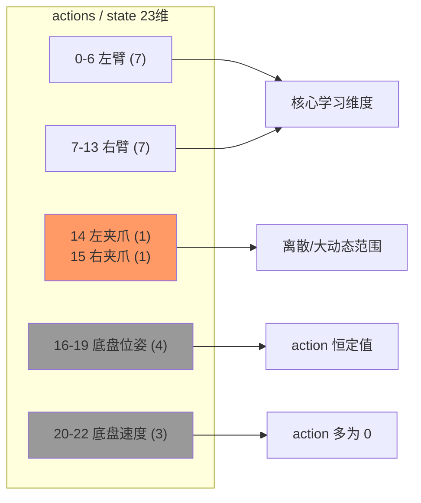
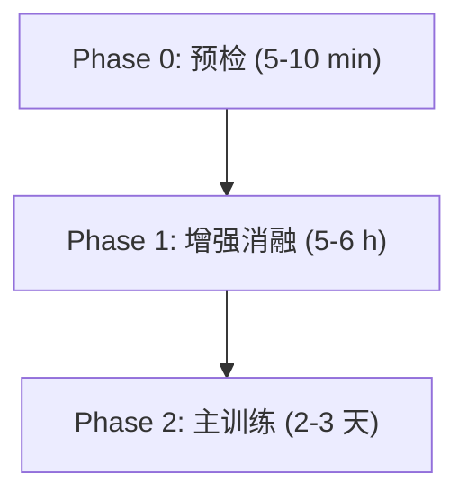
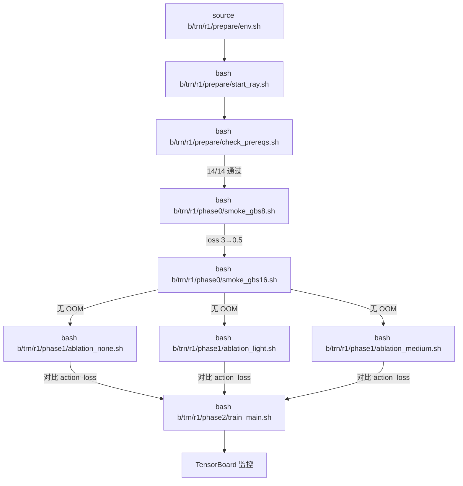

# R1 Pro FastWAM SFT 训练方案（整合版）

> **任务**：`r1_pro_chassis_uncond_3cam_384_1e-4`  
> **环境**：单机 **8×H200（143GB）**，RLinf + FastWAM FSDP SFT  
> **数据**：`/mnt/r/share/zwy/datasets/r1_pro_data_v2/r1_pro_data_convert_chassis`  
> **目标**：在同等或更少有效训练量下，得到不低于 native 8GPU 精度、更强视觉泛化的 checkpoint  
> **整合来源**：[`fw_r1pr_sft_op46_2.md`](fw_r1pr_sft_op46_2.md)（op46_2） · [`fw_r1pr_sft_cp25_3.md`](fw_r1pr_sft_cp25_3.md)（cp25_3）  
> **关联**：整合设计 [`fw_sft_design_op46_4_r1pr_cp25_2.md`](fw_sft_design_op46_4_r1pr_cp25_2.md) · 数值对齐 [`fw_sft_design_op46_4_r1pr_cp25_2tst.md`](fw_sft_design_op46_4_r1pr_cp25_2tst.md) · 增强 [`fw_sft_dtaaug_op46.md`](fw_sft_dtaaug_op46.md)  
> **数据分析**：[`b/data/r1_pro_chunk000_merged_analysis.md`](../../data/r1_pro_chunk000_merged_analysis.md) · [`b/data/r1_pro_first_frame_per_episode.md`](../../data/r1_pro_first_frame_per_episode.md)  
> **日期**：2026-06-04

---

## 0. 两篇来源方案的纠正

整合过程中发现的错误，逐条纠正并说明理由。

### 0.1 cp25_3 的错误

| # | cp25_3 写法 | 问题与分析 | 本文做法 |
|---|-------------|-----------|----------|
| **E1** | `val_check_interval: 500`，启用 episode 级验证 | **运行时会崩溃**。验证代码路径：`SFTRunner.run()` L109 → `actor.run_eval()` → `FSDPSftWorker.run_eval()` L126 → `get_eval_model_output()`。而 [`FSDPVlaSftWorker.get_eval_model_output()`](../../rlinf/workers/sft/fsdp_vla_sft_worker.py) L91-92 直接 `raise NotImplementedError("eval is not supported for embodied sft right now.")`。**FastWAM embodied SFT 的 eval 尚未实现** | **保持 `val_check_interval: -1`**（禁用 eval）。过拟合监控改用 **train loss 平台检测 + 多 ckpt 真机选型** |
| **E2** | Phase 1 消融 3000 step × 3 runs ≈ 10h | 仅为选增强预设就耗 10 小时不经济。3000 step @ gbs=16 仅 0.8 epoch，趋势尚不明显 | **缩短为 1500 step × 3**（约 5h 总计），足够观察 loss 下降趋势 |
| **E3** | `norm_exception_mode` 对夹爪用 min/max | 建议方向合理（夹爪 z-score 下 loss 主导），但 `FastWAMProcessor` 对此嵌套格式的支持**未经代码验证**。若 Hydra 解析报错将阻塞训练 | **标注为"待 Phase 0 验证"**，Phase 0 中先用默认 z-score，验证通过后 Phase 1 再测试 |
| **E4** | 称 `val_set_proportion: 0.1` 会按 episode 划分 | 代码确实支持，但由于 E1（eval 未实现），设了 val_set_proportion 反而会**减少训练数据量**（~6 条 episode 被划走但不会被评估） | 保持 `val_set_proportion: 0.0`（全量训练） |

### 0.2 op46_2 的错误

| # | op46_2 写法 | 问题与分析 | 本文做法 |
|---|-------------|-----------|----------|
| **E5** | `max_steps=50000`，`gbs=16` | 总样本见面 50000×16 = 80 万，仅为 native 50 epoch（≈300万）的 **27%** → **严重欠训** | 按 epoch 驱动计算 `max_steps`（见 §4） |
| **E6** | 附录用 `actor: 0-7`，但未指出仓库 YAML 实际为 `actor: 4-7` | 直接 `--config-name r1_pro_sft_fastwam` 会只用 4 GPU | 在命令中**显式 override** `cluster.component_placement.actor=0-7` |
| **E7** | 未配置 `min_lr` | RLinf 默认 `min_lr=0`，native FastWAM 用 `CosineAnnealingLR(eta_min=1e-6)`。训练末期 LR 过低可能影响收敛 | 增加 `actor.optim.min_lr=1e-6` |
| **E9** | 动作空间写"7 left_arm + 7 right_arm + 2 grippers + 7 chassis" | 实际 chassis = 4 pose + 3 velocity = 7，夹爪 = 2，总计 23 ✓，但"7 chassis"容易误解为 7 个关节 | 明确写 **4 chassis_pose + 3 chassis_velocity** |

### 0.3 两篇共有的正确内容（保留）

- FSDP `no_shard`、`gradient_checkpointing: true`、`mot_checkpoint_mixed_attn: false`
- `lr=1e-4`、`betas=(0.9, 0.95)`、`weight_decay=0.01`、`clip_grad=1.0`
- 视频共训练 `λ_video=1.0, λ_action=1.0` 不可关闭
- 禁用 `VideoRandomHorizontalFlip`（双臂机器人）
- Episode 35 异常（10 帧）需注意
- 三阶段/四阶段渐进训练思路

---

## 1. 数据集与数据质量

### 1.1 数据集规模

```
r1_pro_data_convert_chassis/
  63 episodes (0-63, 除了35, 因已经手工将有问题的`episode 35`移除), 60992 frames @ 14 FPS
  单任务: "Open the door with a downward-press handle, go through it, and enter the room."
  三相机: head_rgb 360×640, left/right_wrist_rgb 480×640 → robotwin 拼接 → 384×320
  action / proprio: 23 维
  存储: ~42 GB（PNG 内嵌 parquet）
```

> `meta/info.json` 记录 `total_episodes=63, total_frames=60992`(因已经手工将有问题的`episode 35`移除)。

### 1.2 23 维动作/状态语义



| 维度 | 语义 | 数据特征 | 训练含义 |
|------|------|----------|----------|
| **0-6** | 左臂 7 关节 | [-1.6, 1.0]，action≈state | **核心学习维度** |
| **7-13** | 右臂 7 关节 | [-1.6, 0.8]，action≈state | **核心学习维度** |
| **14-15** | 左/右夹爪 | action ∈ {0, 90}，state ∈ [1.8, 102] | **离散量化**，z-score 下主导 action_loss |
| **16-19** | 底盘位姿 | action **恒定** (0.9, -1.5, -0.7, 0.0) | **死维度**，不贡献梯度 |
| **20-21** | 底盘速度 xy | action 多数为 0，偶有 ±0.15 | 稀疏 |
| **22** | 底盘速度 yaw | action **全为 0** | **完全死维度** |

### 1.3 关键数据发现

**夹爪二值量化**：action dim 14-15 几乎只取 0 或 90。z-score 归一化后，夹爪维的 action MSE 贡献大。**结论**：`action_loss` 数值中夹爪占主导地位；关注手臂维度的收敛需查看逐维 loss 或自定义 metric。

**Episode 35 异常**：仅 10 帧（0.7 秒），首帧夹爪 state 5.4/5.8（正常 91-94），|a-s| L2 = 119（正常 3-6）。**处理**：设 `skip_padding_as_possible: true`（`num_frames=33` 窗口大于 10 帧时自动重采样其他 episode）。无需主动删除。

**三相机像素分布**：head_rgb 偏暖偏暗（RGB 均值 0.49/0.29/0.22），腕部更均匀。→ `brightness` 增强特别有用；`hue` 需保守（≤0.06）。

**单一场景、低多样性**：64 条轨迹在同一房间、同一光照采集 → **数据增强是提升泛化性的必要手段**。

---

## 2. 模型与硬件

### 2.1 FastWAM 6B

| 组件 | 参数量 | 可训练 |
|------|--------|--------|
| Video DiT (Wan2.2) | 5.0B | 是 |
| Action DiT | 1.0B | 是 |
| Proprio Encoder | ~0.1M | 是 |
| VAE | ~0.5B | 否（冻结）|

MoT 混合注意力要求 `num_heads=24, head_dim=128, num_layers=30` 两个 Expert 共享。

### 2.2 硬件

| 项目 | 规格 |
|------|------|
| GPU | 8 × NVIDIA H200 (143 GB HBM3e) |
| 互联 | NVLink |
| 存储 | `/mnt/r/` NVMe |

---

## 3. 基线与训练量计算

### 3.1 Native 8GPU 参考

| 参数 | 值 |
|------|-----|
| batch_size | 16/GPU |
| global_batch | 128 |
| epochs | 50 |
| lr | 1e-4 cosine，`eta_min=1e-6` |
| 增强 | 无 |

### 3.2 训练量公式

$$\text{max\_steps} = E \times \left\lceil \frac{N}{B} \right\rceil$$

其中 $N \approx 59{,}900$（滑窗样本数）、$B$ = `global_batch_size`、$E$ = epoch 数。

| 方案 | micro×8 | B (gbs) | steps/epoch | max_steps (E=50) | 总样本见面 |
|------|---------|---------|-------------|-------------------|------------|
| **R1（推荐）** | 2×1 | **16** | 3744 | **187,200** | ≈ 3.0M |
| **R2（省时）** | 2×2 accum | **32** | 1872 | **93,600** | ≈ 3.0M |
| Native 8GPU | 16×8 | 128 | 469 | 23,450 | ≈ 3.0M |
| ~~op46_2~~ | 2×1 | 16 | 3744 | ~~50,000~~ | ~~0.8M~~ |

> op46_2 的 50000 step 仅 ~13 epoch，为 native 50 epoch 的 27%。**已纠正（E5）**。

### 3.3 RLinf 已验证项

来自 [`fw_sft_design_op46_4_r1pr_cp25_2tst.md`](fw_sft_design_op46_4_r1pr_cp25_2tst.md)：

- `training_loss` 包装 bit-identical（T1 测试）
- `total_training_steps: ${runner.max_steps}` 必须与 `max_steps` 一致
- 4GPU T4：~0.86 s/step（gbs=4, micro=1）

---

## 4. 超参数

### 4.1 核心超参（与 native 对齐）

| 参数 | 值 | 理由 |
|------|-----|------|
| `learning_rate` | **1e-4** | 所有 FastWAM 官方配置统一值；扩散模型对 LR 敏感，不因 gbs 缩放 |
| `min_lr` | **1e-6** | 对齐 native `CosineAnnealingLR(eta_min=1e-6)`。**op46_2 遗漏（E7）** |
| `adam_betas` | (0.9, **0.95**) | β₂=0.95 减少二阶矩延迟，适合扩散模型 |
| `weight_decay` | 0.01 | |
| `clip_grad` | 1.0 | 观测 grad_norm 5-20，clip 防发散 |
| `lr_warmup_steps_ratio` | 0.05 | 5% 步数 warmup |
| `lr_scheduler` | cosine | |
| `λ_video / λ_action` | **1.0 / 1.0** | 视频共训练是 FastWAM 核心（关闭后 LIBERO -4.1pp, RoboTwin -8.0pp） |

### 4.2 FSDP 配置（R1 Pro 固定）

| 项 | 值 | 说明 |
|----|-----|------|
| `sharding_strategy` | **no_shard** | MoT 混合注意力要求两个 Expert 参数同时可见 |
| `gradient_checkpointing` | **true** | 必须，否则激活占用翻倍 |
| `mot_checkpoint_mixed_attn` | **false** | R1 Pro 任务配置要求 |
| `amp_autocast` | bf16 enabled | |
| `mixed_precision` | 全 null | 使用 autocast 替代 FSDP MixedPrecision |

### 4.3 归一化讨论

**当前**：全维 z-score（`norm_default_mode: "z-score"`）。

**问题**：夹爪 dim 14-15 的 action 为二值 {0, 90}，state 范围 [1.8, 102]。z-score 归一化后夹爪的 MSE 贡献大，可能主导 `action_loss` 数值。

**cp25_3 建议**对夹爪用 `norm_exception_mode: min/max`，方向正确但**未经代码验证**。`FastWAMProcessor` 支持 `norm_exception_mode` 参数（[`r1_pro_sft_fastwam.yaml:75`](../../examples/sft/config/r1_pro_sft_fastwam.yaml) 当前为 `null`），但嵌套 dict 格式是否被正确解析需要在 Phase 0 测试。

**本文做法**：Phase 0 用默认 z-score，Phase 1 中作为一个消融变量测试 min/max。

### 4.4 `delta_action_dim_mask` 说明

该字段仅在 **pad 帧** 上对 delta 动作维度置零，不从 loss 中剔除底盘。R1 Pro 使用绝对动作 BC（`action_state_transforms: null`），不配置 delta mask。

---

## 5. 数据增强

### 5.1 为何必须

64 条轨迹、单房间单门，像素分布窄。无增强时模型记忆背景木纹，换光照/视角即崩。

### 5.2 预设（已实现）

[`rlinf/data/datasets/fastwam/augmentation.py`](../../rlinf/data/datasets/fastwam/augmentation.py)：

| preset | 内容 | 适用阶段 |
|--------|------|----------|
| `none` | 无 | Phase 0 基线 |
| `light` | ColorJitter(b=0.1, c=0.1, s=0.1, h=0.03, p=0.5) | Phase 1 消融 |
| `medium` | RandomCrop(0.95) + ColorJitter(0.2/0.3/0.3/0.05) + GaussNoise(0.01) | Phase 2 推荐 |
| `strong` | + Grayscale + RandomErasing | 仅在 medium 不够时 |

### 5.3 增强参数推导（基于像素统计）

- **brightness=0.25**：head_rgb 均值亮度 ≈ 0.33，缩放 [0.75, 1.25] 后为 [0.25, 0.41] — 合理
- **hue ≤ 0.06**：head_rgb R(0.49)>G(0.29)>B(0.22)，过大会产生非自然绿色偏移
- **RandomCrop scale=0.95**：384×320 裁剪后 364×304，不影响门把手关键区域

### 5.4 硬约束

1. **禁止** `VideoRandomHorizontalFlip`（双臂左右语义不翻转）
2. `hue ≤ 0.06`
3. `robotwin` 三相机独立增强，拼接后由 `CenterCrop` 平滑

---

## 6. 显存与批量大小

### 6.1 显存预算（H200 143GB，no_shard）

| 组件 | bs=1 | bs=2 |
|------|------|------|
| 参数+优化器+梯度 | ~72 GB | ~72 GB |
| 激活（gradient checkpoint） | ~10 GB | ~18 GB |
| VAE + 框架开销 | ~11 GB | ~11 GB |
| **合计** | **~93 GB** | **~101 GB** |

`micro_batch_size=2` 可行（余量 42 GB）。OOM 则退回 `micro=1, gbs=8` 并**同比增加 max_steps**。

### 6.2 数据 I/O

训练读分 episode parquet（PNG 内嵌），`num_workers=8`，`prefetch_factor=4`。瓶颈在 PNG 解码。若 `time/step > 2s` 且 GPU 利用率低，增至 `num_workers=12`。

---

## 7. 训练流程：三阶段



### Phase 0：预检（必做）

| 步骤 | 内容 | 通过标准 |
|------|------|----------|
| 0.1 | Ray 8 GPU：`actor: 0-7` | `ray status` 显示 8 GPU |
| 0.2 | T5 cache 存在 | `ls ${FASTWAM_ROOT}/data/text_embeds_cache/r1_pro_chassis/*.pt` |
| 0.3 | **50 step** smoke，`gbs=8, micro=1` | loss 3→0.5，无 NaN，LR step 2 达 1e-4 |
| 0.4 | **50 step**，`gbs=16, micro=2` | 无 OOM；记录 `time/step` |
| 0.5 | 可选：测试 `norm_exception_mode` | Hydra 解析无报错 |

### Phase 1：增强消融

每条 **1500 step**（约 0.4 epoch @ gbs=16，足够看初始趋势），固定 `seed=42`。

| Run | `augmentation_preset` | 目的 |
|-----|----------------------|------|
| P1-a | `none` | 无增强基线 |
| P1-b | `light` | 颜色扰动 |
| P1-c | `medium` | 颜色+裁剪+噪声 |

**选型规则**：
1. `action_loss` 下降速度最快
2. `dynamics_loss` 相对 P1-a 上升 < 20%
3. 曲线无长期震荡

预估耗时：1500 step × 1.3 s/step ≈ 33 min/run，3 runs ≈ **1.7 h**（加模型加载 ≈ 2 h）。

### Phase 2：主训练

- `max_steps` = **187,200**（E=50, B=16），或经 Phase 1 验证后选择的 aug 预设
- `save_interval: 5000`（≈37 个 ckpt，比每 2000 步的 94 个更合理）
- `runner.resume_dir` 支持断点续训

---

## 8. 时间预算

| 阶段 | step | gbs | 预估 wall-clock |
|------|------|-----|-----------------|
| Phase 0 | 50+50 | 8/16 | **< 10 min** |
| Phase 1 ×3 | 1500×3 | 16 | **~2 h** |
| Phase 2 | 187,200 | 16 | **~68 h（~2.8 天）** |
| ckpt 保存 | 187200/5000≈37 次 | — | **~50 min** |

**缩短 wall-clock 的正当手段**（不降样本量）：
- `gbs=32`（micro=2, accum=2）→ step 数减半，总时间 ~48h
- `save_interval: 10000`
- `E=40` 仅在 Phase 1 证明 50 epoch 过拟合时采用

---

## 9. 监控与 Checkpoint 选型

### 9.1 关键指标

| 指标 | TensorBoard key | 健康范围 | 异常 |
|------|----------------|----------|------|
| 总 loss | `train/loss` | 3 → 0.2-0.4 平台 | 不降 / NaN |
| 动作 loss | `train/action_loss` | 主导；随 aug 略升可接受 | 持续高 50%+ vs 无增强 |
| 视频 loss | `train/dynamics_loss` | 0.4 → 0.1 | aug 过强时飙升 |
| 梯度范数 | `train/grad_norm` | clip 后 ≤1 | 长期 >50 |
| LR | `train/learning_rate` | cosine 衰减到 1e-6 | 异常值 |
| 步时间 | `time/step` | 0.8-1.5 s | >3s (I/O 瓶颈) |

### 9.2 为什么不用 eval loss

**cp25_3 建议** `val_check_interval: 500` 会**导致运行时崩溃**（详见 §0.1 E1）。FastWAM embodied SFT 的 `get_eval_model_output()` 未实现。

**替代方案**：
- 保存多个 ckpt（`save_interval: 5000`），训练结束后在真机/仿真中评估
- 监控 `dynamics_loss` 作为增强过强的代理指标
- 如果 train loss 在 150k step 后完全平台，可考虑提前终止

### 9.3 Checkpoint 选型

| 优先级 | 规则 |
|--------|------|
| 1 | 最近 50k step 中 **action_loss** 最低的 ckpt |
| 2 | 真机任务成功率最高 |
| 3 | 推理延迟 < 200ms（Fast-WAM 模式）|
| 4 | 若 1 与 2 冲突 → 以真机为准 |

---

## 10. 风险矩阵

| 风险 | 症状 | 缓解 |
|------|------|------|
| GPU 仅占 4 卡 | 吞吐低一半 | 显式 `cluster.component_placement.actor=0-7` |
| 欠训 | loss 仍降但步数不够 | 按 §3.2 公式算 max_steps |
| OOM | CUDA OOM | micro=1 或启用 `mot_checkpoint_mixed_attn: true` |
| aug 过强 | dynamics_loss 飙升 | medium→light→none |
| ep35 噪声 | loss spike | `skip_padding_as_possible: true` |
| I/O 瓶颈 | step>2s，GPU 闲 | workers↑；确认本地 NVMe |
| min_lr=0 | 训练末期 LR 过低 | `min_lr: 1e-6` |
| 训练中断 | 进程被杀 | `runner.resume_dir` 断点续训 |
| 同场景过拟合 | train loss 低但真机差 | 真机扰动测试（光照 ±30%、视角 ±5°） |

---

## 11. 完整运行命令

### 11.1 环境变量

```bash
export FASTWAM_ROOT=/home/Luogang/SRC/Robot/FastWAM
export FASTWAM_PATH=${FASTWAM_ROOT}/src
export R1PRO_DATA=/mnt/r/share/zwy/datasets/r1_pro_data_v2
export DIFFSYNTH_MODEL_BASE_PATH=/mnt/r/CKPT/VLA/FW
export DIFFSYNTH_SKIP_DOWNLOAD=true
export CUDA_HOME=/usr/local/cuda-12.8
export PYTORCH_CUDA_ALLOC_CONF=expandable_segments:True
export BTLOG_ROOT=/mnt/r/tmp/fw_train/r1_pro
```

### 11.2 Ray（8 GPU）

```bash
ray stop 2>/dev/null
ray start --head --port=6399 --num-gpus=8
ray status
```

### 11.3 Phase 0：Smoke

```bash
cd /home/Luogang/SRC/RL/RLinf

# 0.3: gbs=8, micro=1
bash examples/sft/run_fastwam_sft.sh r1_pro_sft_fastwam \
  cluster.component_placement.actor=0-7 \
  runner.max_steps=50 \
  runner.save_interval=999 \
  runner.log_interval=1 \
  actor.micro_batch_size=1 \
  actor.global_batch_size=8 \
  actor.optim.min_lr=1e-6 \
  data.skip_padding_as_possible=true \
  runner.logger.log_path=${BTLOG_ROOT}/phase0_gbs8

# 0.4: gbs=16, micro=2
bash examples/sft/run_fastwam_sft.sh r1_pro_sft_fastwam \
  cluster.component_placement.actor=0-7 \
  runner.max_steps=50 \
  runner.save_interval=999 \
  actor.micro_batch_size=2 \
  actor.global_batch_size=16 \
  actor.optim.min_lr=1e-6 \
  data.skip_padding_as_possible=true \
  runner.logger.log_path=${BTLOG_ROOT}/phase0_gbs16
```

### 11.4 Phase 1：消融（示例：medium）

```bash
bash examples/sft/run_fastwam_sft.sh r1_pro_sft_fastwam \
  cluster.component_placement.actor=0-7 \
  runner.max_steps=1500 \
  runner.save_interval=999 \
  runner.log_interval=5 \
  actor.micro_batch_size=2 \
  actor.global_batch_size=16 \
  actor.optim.min_lr=1e-6 \
  data.skip_padding_as_possible=true \
  data.processor.augmentation_preset=medium \
  runner.logger.experiment_name=r1_pro_p1_medium \
  runner.logger.log_path=${BTLOG_ROOT}/phase1_medium
```

将 `augmentation_preset` 换成 `none` / `light` 跑另外两条。

### 11.5 Phase 2：主训练

```bash
bash examples/sft/run_fastwam_sft.sh r1_pro_sft_fastwam \
  cluster.component_placement.actor=0-7 \
  runner.max_steps=187200 \
  runner.save_interval=5000 \
  runner.log_interval=10 \
  actor.micro_batch_size=2 \
  actor.global_batch_size=16 \
  actor.optim.min_lr=1e-6 \
  data.skip_padding_as_possible=true \
  data.processor.augmentation_preset=medium \
  runner.logger.experiment_name=r1_pro_main_e50 \
  runner.logger.log_path=${BTLOG_ROOT}/phase2_main
```

**断点续训**：

```bash
  runner.resume_dir=${BTLOG_ROOT}/phase2_main/checkpoints/global_step_XXXXX
```

### 11.6 建议合入 YAML 的 diff

| 键 | 当前仓库值 | 推荐值 |
|----|-----------|--------|
| `cluster.component_placement.actor` | `4-7` | **`0-7`** |
| `actor.global_batch_size` | 8 | **16** |
| `runner.max_steps` | 50000 | **187200** |
| `data.skip_padding_as_possible` | false | **true** |
| `actor.optim.min_lr` | （缺省 0） | **1e-6** |

---

## 12. 评估

### 12.1 Checkpoint 转换

完整命令与参数见 **§14**。转换脚本 [`b/scripts/rlinf_ckpt_to_hf.py`](../../scripts/rlinf_ckpt_to_hf.py) 会写出 `fastwam_native.pt`（内部经 `fastwam_save_helper()`）：

```
fastwam.mot.{key} → payload["mot"][{key}]
fastwam.proprio_encoder.{key} → payload["proprio_encoder"][{key}]
```

### 12.2 真机评估清单

| 场景 | 操作 | 记录 |
|------|------|------|
| 训练分布 | 原光照、原机位 | 成功率、步数 |
| 光照扰动 | 亮度 ±30% | 成功率 Δ |
| 视角扰动 | 头相机 yaw ±5° | 成功率 Δ |
| 起始位偏移 | 底盘 xy ±10cm | 成功率 Δ |
| 推理延迟 | Fast-WAM 模式 | ms |

### 12.3 报告模板

```text
ckpt: global_step_XXXXX
aug: medium
train action_loss: X.XX
真机 success: XX% (N=20)
光照扰动 success: XX%
推理延迟: XXX ms
```

---

## 13. 训练脚本实现记录

### 13.1 文件结构

所有训练脚本位于 [`b/trn/r1/`](../../trn/r1/)，按阶段组织：

```
b/trn/r1/
├── prepare/                    # 训练前准备
│   ├── env.sh                  # 环境变量定义（所有脚本 source 此文件）
│   ├── check_prereqs.sh        # 14 项前置条件检查
│   └── start_ray.sh            # 启动 Ray 集群（8 GPU）
├── phase0/                     # 快速验证
│   ├── smoke_gbs8.sh           # 50 step, micro=1, gbs=8
│   └── smoke_gbs16.sh          # 50 step, micro=2, gbs=16
├── phase1/                     # 增强消融
│   ├── ablation_none.sh        # 1500 step, 无增强
│   ├── ablation_light.sh       # 1500 step, light 预设
│   └── ablation_medium.sh      # 1500 step, medium 预设
└── phase2/                     # 主训练
    ├── train_main.sh           # 187200 step, 可指定增强预设
    └── resume.sh               # 断点续训
```

### 13.2 核心设计说明

#### env.sh — 环境变量集中管理

所有脚本通过 `source "${SCRIPT_DIR}/../prepare/env.sh"` 加载统一的环境变量，避免散落在各脚本中导致不一致。关键变量：

| 变量 | 值 | 说明 |
|------|-----|------|
| `FASTWAM_ROOT` | `/home/Luogang/SRC/Robot/FastWAM` | FastWAM 源码 |
| `R1PRO_DATA` | `/mnt/r/share/zwy/datasets/r1_pro_data_v2` | 训练数据 |
| `DIFFSYNTH_MODEL_BASE_PATH` | `/mnt/r/CKPT/VLA/FW` | 预训练权重 |
| `BTLOG_ROOT` | `/mnt/r/tmp/fw_train/r1_pro` | 日志/checkpoint 输出根目录 |
| `REPO_ROOT` | `/home/Luogang/SRC/RL/RLinf` | RLinf 仓库 |

#### check_prereqs.sh — 14 项前置检查

训练前必跑。检查项包括：
1. 数据路径（4 项）：parquet 文件、meta 目录
2. T5 嵌入缓存（2 项）：目录存在且有 `.pt` 文件
3. 模型权重（2 项）：ActionDiT 预训练权重
4. GPU（1 项）：至少 8 张
5. Ray（1 项）：集群正在运行
6. Python 环境（4 项）：torch、fastwam、rlinf、augmentation 模块可导入

全部通过后输出 `所有检查通过，可以开始训练。`，任何失败项会提示修复方法并以非零退出码结束。

#### 所有训练脚本的共同 override

每个训练脚本都通过 Hydra CLI override 覆盖 [`r1_pro_sft_fastwam.yaml`](../../examples/sft/config/r1_pro_sft_fastwam.yaml) 中的默认值。共同的 override 包括：

```bash
cluster.component_placement.actor=0-7    # 使用全部 8 GPU（YAML 默认 4-7）
actor.optim.min_lr=1e-6                  # 对齐 native cosine 尾部
data.skip_padding_as_possible=true       # 跳过 padding 过多的窗口（应对 ep35）
```

这些 override 对应 §0 中纠正的 E6（GPU 数量）、E7（min_lr）和 ep35 处理。

#### train_main.sh — 支持增强预设参数

Phase 2 主训练脚本接受一个可选参数指定增强预设：

```bash
# 默认使用 medium
bash b/trn/r1/phase2/train_main.sh

# 指定其他预设
bash b/trn/r1/phase2/train_main.sh light
bash b/trn/r1/phase2/train_main.sh none
```

内部通过 `AUG_PRESET="${1:-medium}"` 接收，传入 `data.processor.augmentation_preset=${AUG_PRESET}`。

#### resume.sh — 断点续训

接受 checkpoint 目录路径作为必选参数：

```bash
bash b/trn/r1/phase2/resume.sh /mnt/r/tmp/fw_train/r1_pro/phase2_main_medium/checkpoints/global_step_50000
```

通过 `runner.resume_dir` 传入，RLinf 会自动恢复模型权重、optimizer state、scheduler state 和 dataloader 位置。

### 13.3 使用流程



**完整执行顺序**：

```bash
# 1. 准备
source b/trn/r1/prepare/env.sh
bash b/trn/r1/prepare/start_ray.sh
bash b/trn/r1/prepare/check_prereqs.sh    # 14 项检查全部通过

# 2. Phase 0: 快速验证 (~5 min)
bash b/trn/r1/phase0/smoke_gbs8.sh        # 验证训练能跑、loss 下降
bash b/trn/r1/phase0/smoke_gbs16.sh       # 验证 micro=2 不 OOM

# 3. Phase 1: 增强消融 (~2 h，三个可并行或串行)
bash b/trn/r1/phase1/ablation_none.sh
bash b/trn/r1/phase1/ablation_light.sh
bash b/trn/r1/phase1/ablation_medium.sh

# 4. 对比三个消融结果（TensorBoard）
tensorboard --logdir ${BTLOG_ROOT} --port 6006
# 选出 action_loss 下降最快且 dynamics_loss 未飙升的预设

# 5. Phase 2: 主训练 (~2.8 天)
bash b/trn/r1/phase2/train_main.sh medium  # 或 Phase 1 选出的最佳预设

# 6. 如果中断，续训
bash b/trn/r1/phase2/resume.sh ${BTLOG_ROOT}/phase2_main_medium/checkpoints/global_step_XXXXX
```

### 13.4 日志与 checkpoint 输出路径

所有输出写入 `$BTLOG_ROOT`（默认 `/mnt/r/tmp/fw_train/r1_pro/`），按阶段分目录：

```
/mnt/r/tmp/fw_train/r1_pro/
├── phase0_gbs8/               # Phase 0 smoke (gbs=8)
├── phase0_gbs16/              # Phase 0 smoke (gbs=16)
├── phase1_none/               # Phase 1 无增强
├── phase1_light/              # Phase 1 light 增强
├── phase1_medium/             # Phase 1 medium 增强
└── phase2_main_medium/        # Phase 2 主训练
    ├── logs/                  # run_fastwam_sft.sh 自动创建的带时间戳子目录
    │   └── 20260604-.../
    │       ├── run_fastwam_sft.log
    │       └── tensorboard/
    └── checkpoints/
        ├── global_step_5000/
        ├── global_step_10000/
        └── ...
```

TensorBoard 查看全部阶段的对比：

```bash
tensorboard --logdir /mnt/r/tmp/fw_train/r1_pro/ --port 6006
```

### 13.5 验证结果

`check_prereqs.sh` 在当前环境运行结果：

```
  ✓ R1PRO_DATA 目录
  ✓ parquet 数据
  ✓ meta/info.json
  ✓ meta/episodes.jsonl
  ✓ T5 cache 目录
  ✓ T5 cache 有 1 个 .pt 文件
  ✓ DIFFSYNTH_MODEL_BASE_PATH
  ✓ ActionDiT 权重
  ✓ 检测到 8 个 GPU
  ✓ Ray 集群正在运行
  ✓ torch 可导入
  ✓ fastwam 可导入
  ✓ rlinf 可导入
  ✓ augmentation 模块
  结果: 14 通过, 0 失败
```

---

## 14. RLinf Checkpoint → Hugging Face 转换

训练保存的 RLinf FSDP checkpoint 位于 `checkpoints/global_step_*/actor/`，默认布局为：

```
global_step_N/
  actor/
    dcp_checkpoint/              # FSDP DCP 分片（*.distcp）
    model_state_dict/
      full_weights.pt            # 若存在，转换首选
    data.pt
    rng.pt
```

部署或 Hugging Face `from_pretrained` 加载前，需转为 HF `safetensors` 及 FastWAM 侧车文件。仓库封装脚本：[`b/scripts/rlinf_ckpt_to_hf.py`](../../scripts/rlinf_ckpt_to_hf.py)（内部调用官方 `convert_dcp_to_pt` + `convert_pt_to_hf`）。

### 14.1 环境

在**训练同款** Python 环境中运行（需 `torch`、`ray`、`omegaconf`、`rlinf`、`fastwam` 等）：

```bash
source /mnt/r/VENV/rlinf_venv/bin/activate
export REPO_ROOT=/home/Luogang/SRC/RL/RLinf
export FASTWAM_PATH=/home/Luogang/SRC/Robot/FastWAM/src
export PYTHONPATH=${REPO_ROOT}:${FASTWAM_PATH}:${PYTHONPATH:-}
export DIFFSYNTH_MODEL_BASE_PATH=/mnt/r/CKPT/VLA/FW
export DIFFSYNTH_SKIP_DOWNLOAD=true
```

若模型通过扩展模块注册，还需设置 `RLINF_EXT_MODULE`。

### 14.2 基本用法

**情形 A：已有 `full_weights.pt`**（部分 run 会在 `actor/model_state_dict/` 下写出）

```bash
cd ${REPO_ROOT}

python b/scripts/rlinf_ckpt_to_hf.py \
  --checkpoint /path/to/checkpoints/global_step_3000 \
  --output /path/to/hf_global_step_3000 \
  --torch-dtype bf16 \
  --copy-dataset-stats
```

脚本会在 checkpoint 附近自动查找 `{log_path}/tensorboard/config.yaml` 以恢复 `actor.model` 配置。

**情形 B：仅有 `dcp_checkpoint/`**（当前 SFT runner 默认保存方式）——加 `--from-dcp`：

```bash
python b/scripts/rlinf_ckpt_to_hf.py \
  --checkpoint /path/to/checkpoints/global_step_12000 \
  --output /path/to/hf_global_step_12000 \
  --from-dcp \
  --torch-dtype bf16 \
  --copy-dataset-stats
```

**情形 C：显式指定训练 yaml**（自动发现失败时）

```bash
python b/scripts/rlinf_ckpt_to_hf.py \
  --checkpoint /path/to/actor/model_state_dict/full_weights.pt \
  --train-config examples/sft/config/r1_pro_sft_fastwam.yaml \
  --output /path/to/hf_out \
  --torch-dtype bf16
```

也可用训练 run 的 Hydra 快照：`{log_path}/tensorboard/config.yaml`。

### 14.3 R1 Pro Phase 1 实例

将 `phase1_medium` 在 step 12000 的 checkpoint 转为 HF（已验证）：

```bash
source /mnt/r/VENV/rlinf_venv/bin/activate
export REPO_ROOT=/home/Luogang/SRC/RL/RLinf
export FASTWAM_PATH=/home/Luogang/SRC/Robot/FastWAM/src
export PYTHONPATH=${REPO_ROOT}:${FASTWAM_PATH}:${PYTHONPATH:-}
export DIFFSYNTH_MODEL_BASE_PATH=/mnt/r/CKPT/VLA/FW
export DIFFSYNTH_SKIP_DOWNLOAD=true

python b/scripts/rlinf_ckpt_to_hf.py \
  --checkpoint /mnt/r/CKPT/VLA/FW/RUN/R1/phase1_medium/r1_medium/checkpoints/global_step_12000 \
  --output /mnt/r/CKPT/VLA/FW/RUN/R1/phase1_medium/r1_medium/checkpoints/global_step_12000_HF \
  --train-config /mnt/r/CKPT/VLA/FW/RUN/R1/phase1_medium/tensorboard/config.yaml \
  --from-dcp \
  --torch-dtype bf16 \
  --copy-dataset-stats
```

转换约 4 分钟（6B 模型加载 + DCP 合并 + 写盘）。完成后可删除中间缓存以省空间：

```bash
rm -rf .../global_step_12000_HF/.rlinf_ckpt_cache
```

### 14.4 输出目录

| 文件 | 说明 |
|------|------|
| `model-00001-of-00009.safetensors` … `model-00009-of-00009.safetensors` | HF 分片权重 |
| `model.safetensors.index.json` | 分片索引 |
| `fastwam_native.pt` | FastWAM 原生格式（`mot` + `proprio_encoder`，便于推理部署） |
| `dataset_stats.json` | 归一化统计（`--copy-dataset-stats` 时从训练 run 复制） |
| `.rlinf_ckpt_cache/full_weights_from_dcp.pt` | DCP→PT 中间文件（可选删除） |

**部署**：通常使用 `fastwam_native.pt` + `dataset_stats.json`；**HF 生态**：使用 `model-*.safetensors`。

`fastwam_native.pt` 键名映射（与 §12.1 一致）：

```
fastwam.mot.{key}           → payload["mot"][{key}]
fastwam.proprio_encoder.{key} → payload["proprio_encoder"][{key}]
```

### 14.5 常用参数

| 参数 | 说明 |
|------|------|
| `--checkpoint` | `global_step_*` 目录、`actor/`、`full_weights.pt` 或 `dcp_checkpoint/` |
| `--output` | HF 输出目录（自动创建） |
| `--train-config` | 含 `actor.model` 的 Hydra yaml；省略时自动查找 `tensorboard/config.yaml` |
| `--no-auto-train-config` | 禁用自动查找 |
| `--from-dcp` | 无 `full_weights.pt` 时，先从 DCP 合并为 PT |
| `--pt-cache` | 指定 DCP→PT 中间文件路径（默认写入 `{output}/.rlinf_ckpt_cache/`） |
| `--torch-dtype` | `bf16` / `fp16` / `fp32`；省略则保持 checkpoint 原始 dtype |
| `--copy-dataset-stats` | 将训练 run 的 `dataset_stats.json` 复制到输出目录 |
| `--no-strict-load` | `load_state_dict(strict=False)`，用于 key 不完全对齐时调试 |
| `--model-override KEY=VALUE` | 覆盖 `actor.model` 字段，可多次指定 |

### 14.6 故障排查

| 现象 | 处理 |
|------|------|
| `Could not locate full_weights.pt` | 加 `--from-dcp` |
| `Could not resolve actor.model config` | 传 `--train-config` 或确保 `{log}/tensorboard/config.yaml` 存在 |
| missing / unexpected keys 过多 | 检查 yaml 是否与训练一致；必要时 `--no-strict-load` 排查 |
| `ModuleNotFoundError: ray` | 使用 `rlinf_venv` 等完整训练环境，勿用仅含 `fastwam` 的精简 env |
| 磁盘不足 | DCP→PT 中间文件与 HF 分片合计约 80GB+；转换后删除 `.rlinf_ckpt_cache` |

官方文档：[`docs/source-zh/rst_source/tutorials/advance/convertor.rst`](../../docs/source-zh/rst_source/tutorials/advance/convertor.rst)

---

## 15. Checkpoint 加权平均合并

### 15.1 动机

多个 run 用不同数据/配置训练后，各 checkpoint 在不同维度各有优劣。通过按 `action_loss` 反比加权平均，可将低 action_loss 的 checkpoint 赋予更高权重，合并出兼具多 run 优势的新 checkpoint。

### 15.2 核心逻辑

脚本：[`b/scripts/merge_fastwam_ckpts.py`](../../scripts/merge_fastwam_ckpts.py)

```
输入: N 个 fastwam_native.pt + N 个 action_loss 值
       ↓
取倒数: w_i = 1 / action_loss_i
       ↓
归一化: w_i = w_i / Σ w_j
       ↓
递归遍历嵌套 dict:
  - Tensor: merged = Σ (w_i × tensor_i)   (float32 计算, 转回原 dtype)
  - 非 Tensor (step, torch_dtype 等): 取第一个 checkpoint 的值
       ↓
输出: 新的 fastwam_native.pt
```

权重计算示例：

$$w_{\text{O1}} = \frac{1/0.0144}{1/0.0144 + 1/0.0135} = \frac{69.44}{69.44 + 74.07} = 48.39\%$$

$$w_{\text{O2}} = \frac{1/0.0135}{1/0.0144 + 1/0.0135} = \frac{74.07}{69.44 + 74.07} = 51.61\%$$

### 15.3 使用方法

```bash
python b/scripts/merge_fastwam_ckpts.py \
  --ckpts <ckpt_1.pt> <ckpt_2.pt> [<ckpt_3.pt> ...] \
  --weights <action_loss_1> <action_loss_2> [<action_loss_3> ...] \
  --output <output.pt>
```

| 参数 | 说明 |
|------|------|
| `--ckpts` | 两个或多个 `fastwam_native.pt` 路径 |
| `--weights` | 每个 checkpoint 对应的 `action_loss`（越小 → 合并权重越大） |
| `--output` | 输出路径（目录自动创建） |

### 15.4 实际合并示例：O1 + O2

**输入**：

| Run | Checkpoint | action_loss | 归一化权重 |
|-----|-----------|-------------|-----------|
| O1 | `.../R1PR/O1/O1/checkpoints/global_step_3000_HF/fastwam_native.pt` | 0.0144 | 48.39% |
| O2 | `.../R1PR/O2/O2/checkpoints/global_step_3000_HF/fastwam_native.pt` | 0.0135 | 51.61% |

**命令**：

```bash
python b/scripts/merge_fastwam_ckpts.py \
  --ckpts /mnt/r/CKPT/VLA/FW/RUN/R1PR/O1/O1/checkpoints/global_step_3000_HF/fastwam_native.pt \
           /mnt/r/CKPT/VLA/FW/RUN/R1PR/O2/O2/checkpoints/global_step_3000_HF/fastwam_native.pt \
  --weights 0.0144 0.0135 \
  --output /mnt/r/CKPT/VLA/FW/RUN/R1PR/O2/O2/checkpoints/O1O2_3000_HF/fastwam_native.pt
```

**输出**：

```
Merge plan:
  global_step_3000_HF/fastwam_native.pt  action_loss=0.0144  weight=0.4839
  global_step_3000_HF/fastwam_native.pt  action_loss=0.0135  weight=0.5161
Loading checkpoint 1/2: ...O1/.../fastwam_native.pt
Loading checkpoint 2/2: ...O2/.../fastwam_native.pt
Merging weights...
Saving to ...O1O2_3000_HF/fastwam_native.pt

Verification:
  Total tensor keys: 1651
  step: 0
  torch_dtype: torch.bfloat16
  Spot-check 'mot.mixtures.video.patch_embedding.weight': PASS
Done.
```

输出文件 12GB，与源 checkpoint 大小一致。

---

**文档版本**：op46_4 · 2026-06-04 · 整合 op46_2 + cp25_3，纠正 9 个错误，含 §13 训练脚本实现记录 · §14 checkpoint 转换 · §15 checkpoint 加权平均合并
