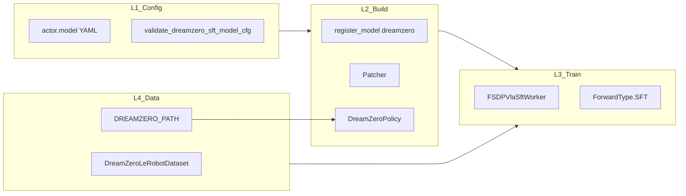
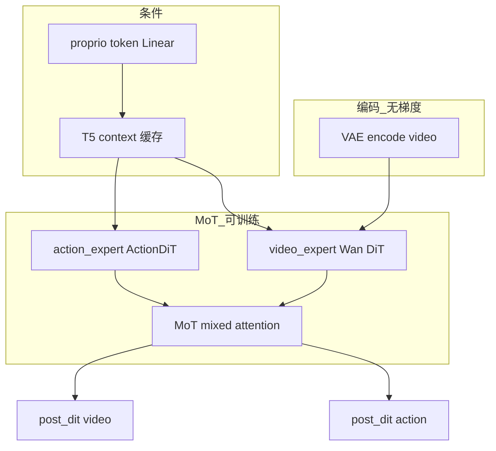
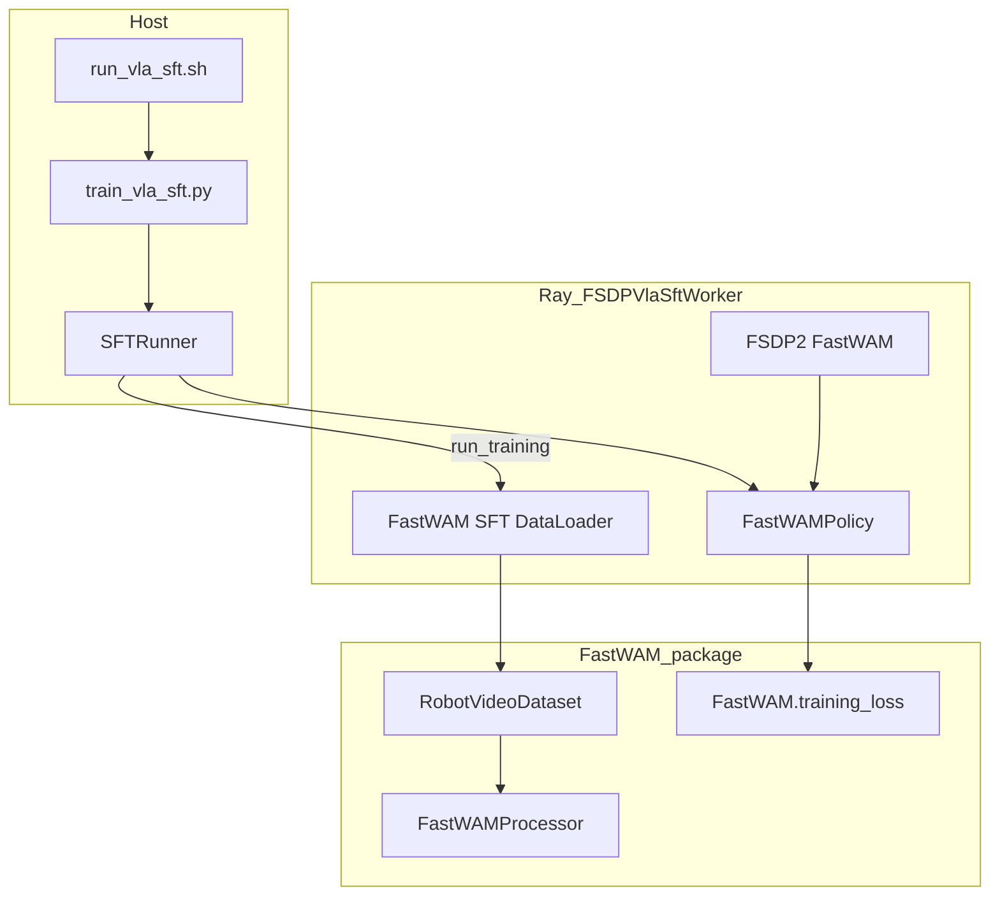
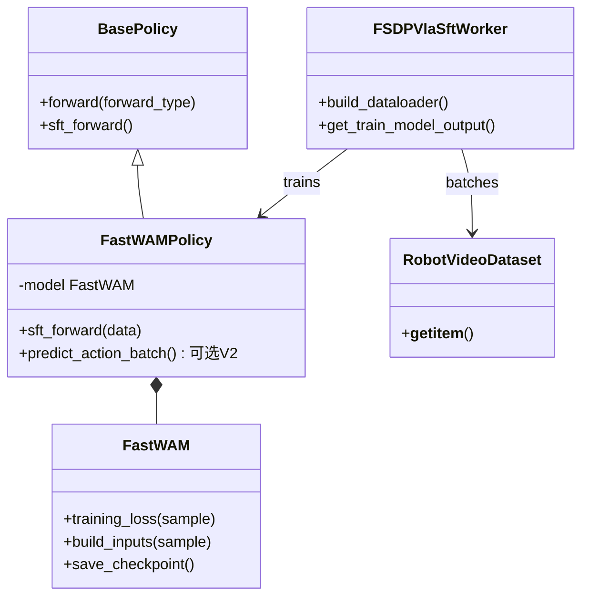
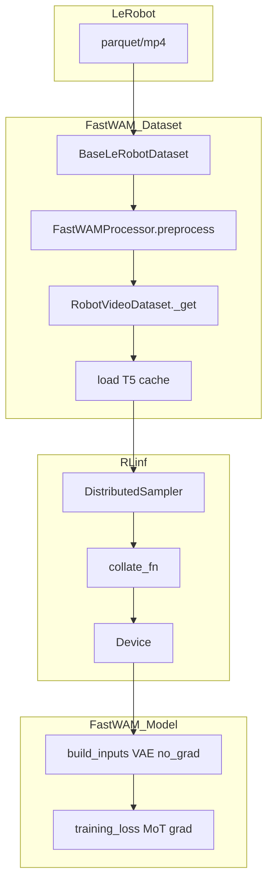
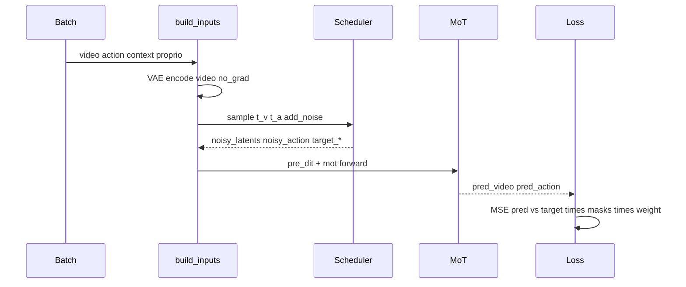
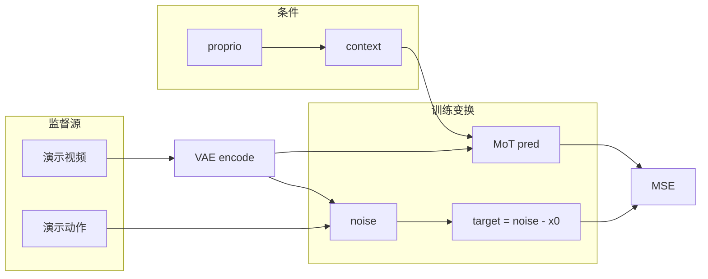
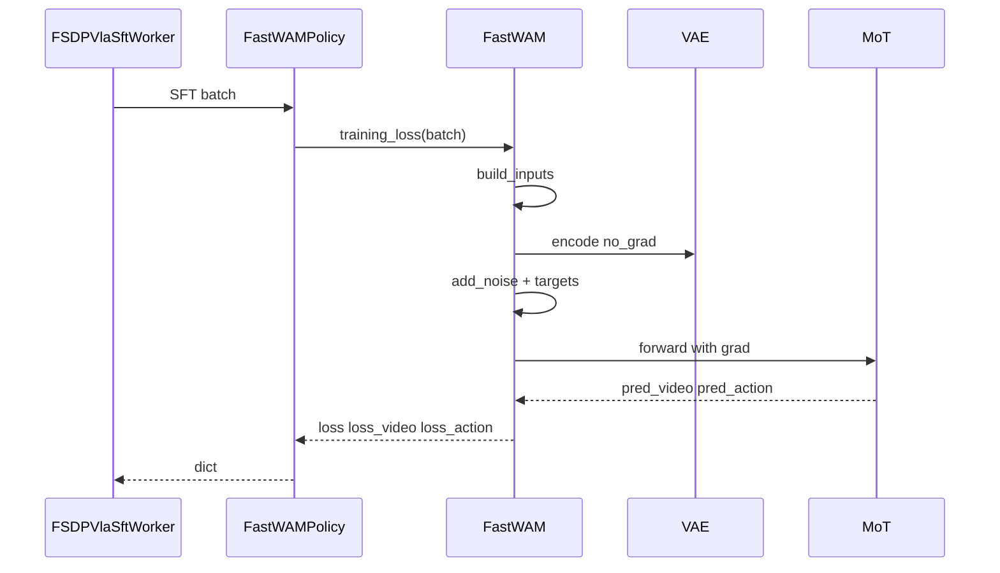
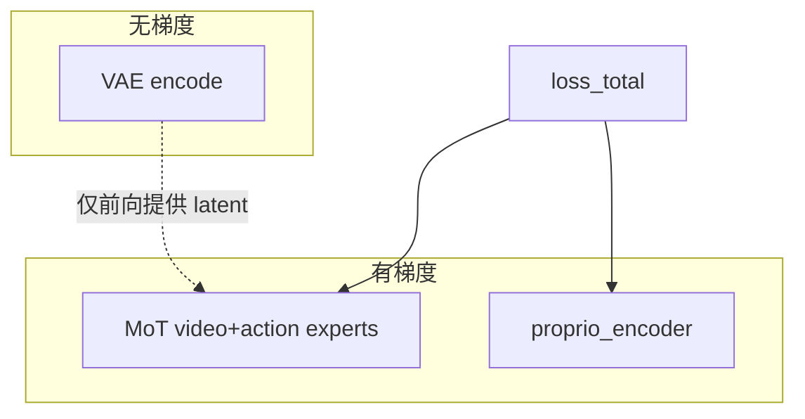

# RLinf 整合 FastWAM 进行 SFT 微调 — 设计方案（可落地实现版）

> **文档性质**：工程设计与实现指导（Design Spec）  
> **代码基线**：RLinf `D:\SRC\RL\RLinf` · FastWAM `D:\SRC\Robot\FastWAM`  
> **参考整合范例**：DreamZero SFT（[官方 RST](https://rlinf.readthedocs.io/en/latest/rst_source/examples/embodied/sft_dreamzero.html)、[dz_sft_analy_cp25.md](./dz_sft_analy_cp25.md)、[dz_sft_analy_op46.md](./dz_sft_analy_op46.md)）  
> **FastWAM 资料**：[FASTWAM_MODEL_EXPLANATION.md](file:///D:/SRC/Robot/FastWAM/bt/FASTWAM_MODEL_EXPLANATION.md)、[fastwam_note_cp.md](file:///D:/SRC/Robot/FastWAM/b/d/fastwam_note_cp.md)  
> **日期**：2026-05-29

---

## 目录

1. [目标与范围](#1-目标与范围)
2. [对标：DreamZero 在 RLinf 中的整合模式](#2-对标dreamzero-在-rlinf-中的整合模式)
3. [FastWAM 模型与训练语义摘要](#3-fastwam-模型与训练语义摘要)
4. [整合总体架构](#4-整合总体架构)
5. [RLinf 侧模块设计与文件清单](#5-rlinf-侧模块设计与文件清单)
6. [配置体系（Hydra）](#6-配置体系hydra)
7. [训练数据格式与 Batch 契约](#7-训练数据格式与-batch-契约)
8. [预处理分工：RLinf vs FastWAM](#8-预处理分工rlinf-vs-fastwam)
9. [Label / Target 与损失](#9-label--target-与损失)
10. [数据流动与逐步转换](#10-数据流动与逐步转换)
11. [SFT Forward 实现设计](#11-sft-forward-实现设计)
12. [Backward、梯度与可训练参数](#12-backward梯度与可训练参数)
13. [Checkpoint 保存与 Hugging Face 导出](#13-checkpoint-保存与-hugging-face-导出)
14. [大规模训练工程细节](#14-大规模训练工程细节)
15. [实施阶段与验收标准](#15-实施阶段与验收标准)
16. [风险与未决项](#16-风险与未决项)

---

## 1. 目标与范围

### 1.1 目标

在 **不 fork FastWAM 训练逻辑** 的前提下，将 FastWAM 作为 RLinf 的 `model_type: fastwam` 接入现有 **VLA SFT 管线**（`train_vla_sft.py` → `SFTRunner` → `FSDPVlaSftWorker` → FSDP2），实现：

- 多 GPU / 多节点 **FSDP2** 监督微调；
- 与 DreamZero 一致的 **运维面**（Hydra 配置、日志、checkpoint、resume）；
- 支撑 **大规模 LeRobot 数据**（长训练、StatefulDataLoader、文本嵌入离线缓存）；
- 保留 FastWAM 原生的 **MoT + 双分支 Flow Matching**（`loss_video` + `loss_action`）。

### 1.2 范围（V1）

| 在范围内 | 不在 V1（可后续迭代） |
|----------|----------------------|
| SFT 训练（`ForwardType.SFT`） | RLinf embodied PPO / GRPO rollout |
| 复用 `RobotVideoDataset` + `FastWAMProcessor` 数据语义 | 在线 T5 编码（训练时加载 text_encoder） |
| FSDP2 + `SFTRunner` | DeepSpeed ZeRO（FastWAM 原生 `Wan22Trainer`） |
| checkpoint 分片 + 合并为 FastWAM `.pt` | 完整 `transformers.PreTrainedModel` Hub 格式（需另建导出器） |
| `r1_pro_chassis` 类 3 相机 LeRobot | 所有 embodiment 一次性全覆盖 |

### 1.3 非目标澄清

FastWAM **不是** DreamZero/groot 的 VLA 子类；整合方式应对标 **「外部 nn.Module + 专用 dataloader + Policy 薄封装」**，而非复制 `DreamZeroPolicy(VLA)` 继承链。

---

## 2. 对标：DreamZero 在 RLinf 中的整合模式

DreamZero 整合可归纳为 **四层 + 一条 Batch 契约**（详见 [dz_sft_analy_cp25.md §11](./dz_sft_analy_cp25.md)）：



| 机制 | DreamZero | FastWAM 设计方案（对应） |
|------|-----------|---------------------------|
| 模型注册 | `register_model("dreamzero", _build_dreamzero)` | `register_model("fastwam", _build_fastwam)` |
| 外部依赖 | `PYTHONPATH+=DREAMZERO_PATH` | `PYTHONPATH+=FASTWAM_PATH`（`src` 根或安装 `pip install -e .`） |
| Policy 壳 | `DreamZeroPolicy(VLA, BasePolicy)` | `FastWAMPolicy(BasePolicy)` 包装 `fastwam.FastWAM` |
| 训练入口 | `sft_forward` → `VLA.forward` | `sft_forward` → `FastWAM.training_loss` |
| 数据 | RLinf 自研 `DreamZeroLeRobotDataset` | **适配器** 调用 FastWAM `RobotVideoDataset`（减少重复） |
| 补丁 | VAE 批处理、DiT `_forward_train` | 视 FSDP micro-batch 与性能测试决定是否 Patcher |
| 校验 | `validate_dreamzero_sft_model_cfg` | `validate_fastwam_sft_model_cfg` |

---

## 3. FastWAM 模型与训练语义摘要

### 3.1 结构（与 DreamZero 的差异）



| 模块 | 作用 | 训练时梯度 |
|------|------|------------|
| `vae` | 视频 ↔ latent | **否**（`encode` 在 `no_grad`） |
| `text_encoder` | 可选；推荐 **离线缓存** | **否**（V1 不加载） |
| `video_expert` + `action_expert` | 经 **MoT** 耦合的 DiT 栈 | **是**（作为 `model.dit` 一部分） |
| `proprio_encoder` | `Linear(23→4096)` 拼到 context | **是** |
| `mot` | `self.dit`，混合 attention | **是** |

原生 FastWAM 训练入口：

```python
# fastwam.py
def forward(self, *args, **kwargs):
    return self.training_loss(*args, **kwargs)
```

损失：

\[
\mathcal{L} = \lambda_v \mathcal{L}_{video} + \lambda_a \mathcal{L}_{action}
\]

默认 \(\lambda_v=\lambda_a=1\)（`configs/model/fastwam.yaml`）。

### 3.2 Flow Matching target（与 DreamZero 同族）

[`WanContinuousFlowMatchScheduler.training_target`](file:///D:/SRC/Robot/FastWAM/src/fastwam/models/wan22/schedulers/scheduler_continuous.py)：

```python
def training_target(sample, noise, timestep):
  return noise - sample
```

加噪：\(\tilde{x} = (1-\sigma) x + \sigma \epsilon\)，\(\sigma = t / T_{train}\)。

---

## 4. 整合总体架构



**整合原则**：

1. **训练数学留在 FastWAM**（`training_loss` / `build_inputs` / `MoT`）。
2. **数据语义留在 FastWAM**（`RobotVideoDataset` + `FastWAMProcessor`），RLinf 只写 **薄包装 + 分布式**。
3. **分布式与 checkpoint 留在 RLinf**（FSDP2、`SFTRunner`、与 DreamZero 相同的目录布局）。

---

## 5. RLinf 侧模块设计与文件清单

### 5.1 建议新增/修改文件

```
rlinf/
  config.py                          # SupportedModel.FASTWAM + validate_cfg 分支
  models/
    __init__.py                      # register_model("fastwam", ...)
    embodiment/
      fastwam/
        __init__.py                  # get_model(cfg, torch_dtype)
        fastwam_policy.py            # FastWAMPolicy(BasePolicy)
        fastwam_config.py            # validate_fastwam_sft_model_cfg, 路径解析
  data/
    datasets/
      fastwam/
        __init__.py                  # build_fastwam_sft_dataloader
        collate.py                   # fastwam_collate_fn
        dataset_adapter.py           # 可选：封装 RobotVideoDataset + 统计
  workers/
    sft/
      fsdp_vla_sft_worker.py         # elif FASTWAM: build_fastwam_sft_dataloader
examples/
  sft/
    run_vla_sft.sh                   # export FASTWAM_PATH=...
    config/
      r1_pro_sft_fastwam.yaml        # 示例任务配置
      model/
        fastwam.yaml                 # model preset（_target_ create_fastwam）
requirements/
  embodied/
    models/
      fastwam.txt                    # 依赖 fastwam 包
toolkits/
  ckpt_convertor/
    fsdp_convertor/
      config/fsdp_fastwam_convertor.yaml
      convert_fastwam_pt_from_fsdp.py  # FSDP full_weights -> mot.pt
tests/
  unit_tests/
    test_fastwam_sft_import.py
```

### 5.2 类图（RLinf 新增类型）



### 5.3 `FastWAMPolicy` 设计（核心适配器）

```python
# 伪代码 — 实现时需与 BasePolicy / ForwardType 对齐
class FastWAMPolicy(BasePolicy):
    _no_split_modules = [
        "DiTBlock",           # video/action expert 内层
        "CausalWanAttentionBlock",  # 若 MoT 暴露该名
        "MoT",                # 按 FSDP 探测实际模块名调整
    ]

    def sft_forward(self, data=None, **kwargs):
        if data is None:
            data = kwargs["data"]
        loss_total, loss_dict = self.model.training_loss(data)
        return {
            "loss": loss_total,
            "loss_video": loss_dict["loss_video"],
            "loss_action": loss_dict["loss_action"],
        }
```

**说明**：

- 输入 `data` 为 **Collator 后的 batch dict**，键名与 FastWAM `build_inputs` 一致（§7）。
- 不在 RLinf 内复制 `training_loss` 逻辑。
- `predict_action_batch` 可 V2 对接 `infer_action()`，供日后 eval；V1 SFT 可 `NotImplementedError`。

### 5.4 `get_model` 设计

```python
def get_model(cfg: DictConfig, torch_dtype=None):
    # 1. hydra.instantiate 或 fastwam.runtime.create_fastwam(**cfg)
    # 2. load_checkpoint if cfg.checkpoint_path
    # 3. 应用 freeze 策略：与 Wan22Trainer._apply_dit_only_train_mode 一致
    #    但注意：在 FSDP wrap 之前设置 requires_grad
    # 4. return FastWAMPolicy(model)
```

**加载权重**：

- 冷启动：`create_fastwam` + `Wan-AI/Wan2.2-TI2V-5B` + `action_dit_pretrained_path`（与 [fastwam.yaml](file:///D:/SRC/Robot/FastWAM/configs/model/fastwam.yaml) 一致）。
- 续训：`cfg.model_path` → `FastWAM.load_checkpoint`（`mot` + `proprio_encoder`）。

### 5.5 `FSDPVlaSftWorker` 扩展

在 [`fsdp_vla_sft_worker.py`](../../rlinf/workers/sft/fsdp_vla_sft_worker.py) 增加：

```python
elif SupportedModel(self.cfg.actor.model.model_type) == SupportedModel.FASTWAM:
    from rlinf.data.datasets.fastwam import build_fastwam_sft_dataloader
    return build_fastwam_sft_dataloader(cfg, world_size, rank, data_paths, eval_dataset)
```

`get_train_model_output` 已通用：

```python
output = self.model(forward_type=ForwardType.SFT, data=batch)
loss = output["loss"]
# metrics: loss_video, loss_action
```

### 5.6 Patcher：何时需要

| 场景 | 建议 |
|------|------|
| `micro_batch_size == 1` | 可先不 patch，与原生行为一致 |
| `micro_batch_size > 1` | 评估 VAE `encode` 是否需 DreamZero 式批处理 patch；MoT mask 已支持 batch |
| `torch.compile` | 原生 FastWAM 推理用 compile；SFT V1 默认关闭，避免与 FSDP 冲突 |

**V1 建议**：先不引入 Patcher，在设计与 CI 中用 `micro_batch_size=1` 打通；性能阶段再补 VAE batch 优化。

---

## 6. 配置体系（Hydra）

### 6.1 示例顶层配置 `examples/sft/config/r1_pro_sft_fastwam.yaml`

```yaml
defaults:
  - training_backend/fsdp@actor.fsdp_config
  - model/fastwam@actor.model
  - override hydra/job_logging: stdout

cluster:
  num_nodes: 1
  component_placement:
    actor: all

runner:
  task_type: sft
  logger:
    log_path: "../results"
    experiment_name: "r1_pro_sft_fastwam"
    logger_backends: ["tensorboard"]
  max_steps: 50000
  save_interval: 3000
  resume_dir: null

data:
  train_data_paths: /path/to/lerobot/r1_pro   # 目录列表，语义同 FastWAM dataset_dirs
  # --- FastWAM 数据段（映射到 RobotVideoDataset）---
  num_frames: 33
  action_video_freq_ratio: 4
  video_size: [384, 320]
  concat_multi_camera: robotwin
  text_embedding_cache_dir: /path/to/text_embeds_cache/r1_pro
  context_len: 128
  norm_stats_path: /path/to/dataset_stats.json  # 或 null 首跑统计
  num_workers: 8
  prefetch_factor: 4

actor:
  group_name: ActorGroup
  training_backend: fsdp
  micro_batch_size: 2
  global_batch_size: 128
  model:
    model_type: fastwam
    precision: fp32
    model_path: null
    # create_fastwam 参数见 model/fastwam.yaml
  optim:
    lr: 1.0e-4
    weight_decay: 0.01
    clip_grad: 1.0
    lr_scheduler: cosine
    lr_warmup_steps_ratio: 0.05
  fsdp_config:
    strategy: fsdp2
    gradient_checkpointing: true
    mixed_precision:
      param_dtype: bf16
      reduce_dtype: bf16
    grad_scaler:
      enabled: false
    save_full_model_weights: true
```

### 6.2 `model/fastwam.yaml` preset

将 FastWAM 的 [`configs/model/fastwam.yaml`](file:///D:/SRC/Robot/FastWAM/configs/model/fastwam.yaml) 字段 **平移** 到 `actor.model`，`_target_` 保持：

```yaml
model_type: fastwam
_target_: fastwam.runtime.create_fastwam  # 由 get_model 调用，不必 hydra 直接 instantiate 整模型

model_id: Wan-AI/Wan2.2-TI2V-5B
tokenizer_model_id: Wan-AI/Wan2.1-T2V-1.3B
load_text_encoder: false
proprio_dim: 23
action_dit_pretrained_path: ...
video_dit_config: { ... }
action_dit_config: { ... }
loss:
  lambda_video: 1.0
  lambda_action: 1.0
```

### 6.3 `validate_fastwam_sft_model_cfg`

在 `rlinf/config.py` 的 `validate_cfg` 中：

- 断言 `data.text_embedding_cache_dir` 存在且非空（V1 强制离线 T5）；
- 断言 `video.shape` 与 `num_frames`、`action_video_freq_ratio` 一致；
- `action.shape[0] % (num_video_frames - 1) == 0`（与 `build_inputs` 一致）；
- `proprio_dim` 与 data processor 的 `proprio_output_dim` 一致。

---

## 7. 训练数据格式与 Batch 契约

### 7.1 磁盘：LeRobot

与 FastWAM 现网一致：`dataset_dirs` 指向 LeRobot 根目录（含 `meta/`、`data/`、`videos/`）。  
**不要求** RLinf 再实现一套 parquet 索引，直接复用 [`BaseLeRobotDataset`](file:///D:/SRC/Robot/FastWAM/src/fastwam/datasets/lerobot/base_lerobot_dataset.py)。

### 7.2 `RobotVideoDataset.__getitem__` 输出（单样本）

这是 **RLinf Collator 之前** 的契约（与 [fastwam_note_cp.md §10.5](file:///D:/SRC/Robot/FastWAM/b/d/fastwam_note_cp.md) 一致）：

| 键 | 形状（r1_pro 典型） | dtype | 角色 |
|----|-------------------|-------|------|
| `video` | `[3, 9, 384, 320]` | float，[-1,1] | 条件 + 视频分支监督源 |
| `action` | `[32, 23]` | float，已归一化 | **动作 target 源** |
| `proprio` | `[32, 23]` | float，已归一化 | 条件（`build_inputs` 取 `[:,0,:]`） |
| `context` | `[128, 4096]` | float | T5 条件（**预计算**） |
| `context_mask` | `[128]` | bool | 条件 mask |
| `action_is_pad` | `[32]` | bool | 损失 mask |
| `image_is_pad` | `[9]` 或 `[33]`→对齐 | bool | 视频损失 mask |
| `prompt` | str | — | 日志/调试 |

时间关系：

- `num_frames=33` → 视频索引 `0,4,...,32` → **9** 帧；
- `action` 长度 **32** = `(9-1) × 4`（每帧间 4 步动作）。

### 7.3 Collator 后（GPU batch）

| 键 | 形状 |
|----|------|
| `video` | `[B, 3, T_v, H, W]` |
| `action` | `[B, T_a, 23]` |
| `proprio` | `[B, T_a, 23]` |
| `context` | `[B, L, 4096]` |
| `context_mask` | `[B, L]` |
| `action_is_pad` | `[B, T_a]` |
| `image_is_pad` | `[B, T_frames]`（与 FastWAM 对齐逻辑一致） |

**实现**：`fastwam_collate_fn` 对 tensor 键 `torch.stack`；`prompt` 保持 list[str]。

### 7.4 与 DreamZero batch 的差异

| 项 | DreamZero | FastWAM |
|----|-----------|---------|
| 视频 | 多帧 uint8 → WANHead 内归一化 | 已 [-1,1] float，9 帧 |
| 文本 | Collator 内 UMT5 tokenize | **预计算** `context` |
| 动作 pad 维 | 32（max_action_dim） | 23（无 pad 到 32） |
| embodiment_id | 有 | 无（单机器人可先固定） |
| 损失键 | dynamics + action | loss_video + loss_action |

---

## 8. 预处理分工：RLinf vs FastWAM

### 8.1 分工表

| 阶段 | 负责方 | 内容 |
|------|--------|------|
| LeRobot 读盘 / 多数据集混合 | **FastWAM** `BaseLeRobotDataset` | episode 采样、重试逻辑 |
| 图像 resize、归一化、相机拼接 | **FastWAM** `FastWAMProcessor` + `RobotVideoDataset._get` | robotwin 384×320、[-1,1] |
| action/state z-score 或 min-max | **FastWAM** `LinearNormalizer` | `dataset_stats.json` |
| 相对动作（若启用） | **FastWAM** transforms | 默认 r1 配置多为 z-score，非相对 |
| 视频时间抽稀 | **FastWAM** `RobotVideoDataset` | `action_video_freq_ratio` |
| T5 文本嵌入 | **FastWAM 离线脚本** + Dataset 读缓存 | `scripts/precompute_text_embeds.py` |
| 分布式采样 / StatefulDataLoader | **RLinf** | `DistributedSampler`、resume `data.pt` |
| Batch stack | **RLinf** `fastwam_collate_fn` | |
| VAE 编码、加噪、MoT、loss | **FastWAM** `training_loss` | |

### 8.2 预处理流水线图



### 8.3 RLinf `build_fastwam_sft_dataloader` 伪代码

```python
def build_fastwam_sft_dataloader(cfg, world_size, rank, data_paths, eval_dataset=False):
    # 1. 解析 data_paths -> list[dataset_dirs]
    # 2. 构建 FastWAMProcessor（与 configs/data/*.yaml 同参）
    # 3. processor.set_normalizer_from_stats(load stats)
    # 4. RobotVideoDataset(..., processor=processor, text_embedding_cache_dir=...)
    # 5. DistributedSampler + StatefulDataLoader(..., collate_fn=fastwam_collate_fn)
    return loader, {"num_samples": len(dataset)}
```

**首训前流水线（运维）**：

```bash
# 在 FastWAM 仓库
python scripts/precompute_text_embeds.py task=<task_cfg>
# 生成 data.text_embedding_cache_dir
```

---

## 9. Label / Target 与损失

### 9.1 概念映射

FastWAM SFT **没有** 离散 label；监督信号与 DreamZero 相同，为 **Flow Matching 向量场目标**。

| 数据字段 | 是否 target | 用途 |
|----------|-------------|------|
| `video`（→ VAE latent） | **是** | 干净 latent \(x_0\)，构造 `target_video = noise - latent` |
| `action` | **是** | 干净动作 \(a_0\)，`target_action = noise - action` |
| `context` / `proprio` | **否**（条件） | cross-attn 条件 |
| `prompt` | **否** | 仅用于查 T5 缓存 |
| `noise_*`（训练时采样） | 中间变量 | 非数据集字段 |

### 9.2 训练步内计算（`training_loss`）



核心代码锚点（FastWAM 仓库）：

```448:568:D:/SRC/Robot/FastWAM/src/fastwam/models/wan22/fastwam.py
    def training_loss(self, sample, tiled: bool = False):
        inputs = self.build_inputs(sample, tiled=tiled)
        ...
        target_video = self.train_video_scheduler.training_target(...)
        target_action = self.train_action_scheduler.training_target(...)
        ...
        tokens_out = self.mot(...)
        pred_video = self.video_expert.post_dit(...)
        pred_action = self.action_expert.post_dit(...)
        loss_video = ...
        loss_action = ...
        loss_total = self.loss_lambda_video * loss_video + self.loss_lambda_action * loss_action
```

### 9.3 Mask 语义

| Mask | 作用 |
|------|------|
| `action_is_pad` |  padding 时间步不参与 `loss_action` |
| `image_is_pad` | 无效视频帧不参与 `loss_video`（对齐 latent 时间维） |

### 9.4 RLinf 日志字段

| Metric | 来源 |
|--------|------|
| `train/loss` | `loss_total` |
| `train/loss_video` | `loss_dict["loss_video"]` |
| `train/loss_action` | `loss_dict["loss_action"]` |
| `train/learning_rate` | FSDP worker |
| `train/grad_norm` | FSDP worker |

---

## 10. 数据流动与逐步转换

### 10.1 逐步转换表（单样本）

| 步 | 位置 | 输入 → 输出 |
|----|------|-------------|
| 1 | `multi_dataset[idx]` | 帧索引 → 原始 cameras + state + action |
| 2 | `processor.preprocess` | 归一化 action/state；图像 tensor 列表 |
| 3 | `RobotVideoDataset._get` | 拼相机 → 9 帧 `[3,9,H,W]`；`action [32,23]` |
| 4 | T5 缓存 | `prompt` → `context [128,4096]` |
| 5 | `collate` | → batch 维 |
| 6 | `build_inputs` | VAE → `input_latents`；拼 proprio 到 context |
| 7 | 加噪 + MoT | → `pred_*` |
| 8 | MSE | → 标量 loss |

### 10.2 端到端数据流图



---

## 11. SFT Forward 实现设计

### 11.1 调用链

```text
FSDPVlaSftWorker.get_train_model_output(batch)
  -> FastWAMPolicy.forward(forward_type=SFT, data=batch)
       -> FastWAMPolicy.sft_forward(data=batch)
            -> FastWAM.training_loss(data)   # 要求 data 已是 GPU batch dict
                 -> build_inputs(sample)      # VAE no_grad
                 -> mot forward               # 有梯度
                 -> return loss, loss_dict
```

### 11.2 AMP / dtype

- 对齐 DreamZero 推荐：`actor.model.precision: fp32` + FSDP `mixed_precision.param_dtype: bf16`。
- `training_loss` 内部对 MSE 有 `.float()` 提升数值稳定（已存在）。
- `build_inputs` 中 `video`/`action` cast 到 `self.torch_dtype`（通常 bf16）。

### 11.3 `tiled` VAE

原生 `training_loss(..., tiled=False)`。大规模训练若 OOM，可在 Policy 层从 cfg 传入 `tiled=True` 及 tile 尺寸（与推理一致）。

### 11.4 序列图（训练一步 · Forward）



---

## 12. Backward、梯度与可训练参数

### 12.1 原生 FastWAM 冻结策略（应对齐）

[`Wan22Trainer._apply_dit_only_train_mode`](file:///D:/SRC/Robot/FastWAM/src/fastwam/trainer.py)：

```python
model.eval()
model.requires_grad_(False)
model.dit.train()              # MoT
model.dit.requires_grad_(True)
proprio_encoder.train()
proprio_encoder.requires_grad_(True)
```

**必须在 FSDP `wrap_model` 之前** 在 unwrapped 模型上设置；`get_model` 末尾调用 `_apply_fastwam_trainable_params(model)`。

### 12.2 梯度流图



| 模块 | `requires_grad` | 进入 optimizer |
|------|-----------------|--------------|
| `vae` | False | 否 |
| `text_encoder` | 不加载（V1） | 否 |
| `mot`（`model.dit`） | True | **是** |
| `proprio_encoder` | True | **是** |
| `video_expert` / `action_expert` | 含于 `mot` | **是**（与原生一致） |

### 12.3 Backward 实现（复用 RLinf）

完全复用 [`FSDPSftWorker.run_training`](../../rlinf/workers/sft/fsdp_sft_worker.py)：

```python
loss = loss / gradient_accumulation
with backward_ctx:
    self.grad_scaler.scale(loss).backward()
# ...
self.optimizer_step()  # unscale, clip_grad, step, scheduler
```

**注意**：

- `build_inputs` 里 VAE 编码 `@torch.no_grad()`，计算图从 **noisy latent** 分支开始，不穿过 VAE。
- `first_frame_latents` / `fuse_vae_embedding_in_latents` 路径需实测是否阻断梯度（通常 latent 仍参与 MoT，VAE 无梯度）。

### 12.4 FSDP 分片策略

- `FastWAMPolicy._no_split_modules`：列出 `DiTBlock` 等，避免过细分片导致 MoT 通信爆炸（参考 DreamZero `CausalWanModel` 处理）。
- `use_orig_params: True`（与 `libero_sft_dreamzero_5b` 一致）利于部分参数冻结。
- `gradient_checkpointing: true` 与 FastWAM `use_gradient_checkpointing` 联动。

### 12.5 Optimizer 参数组

```python
params = list(model.dit.parameters())
if model.proprio_encoder is not None:
    params += list(model.proprio_encoder.parameters())
optimizer = torch.optim.AdamW(params, lr=..., weight_decay=..., betas=(0.9, 0.95))
```

与原生 FastWAM 一致；**不要**把 `vae` 参数传入 optimizer。

---

## 13. Checkpoint 保存与 Hugging Face 导出

### 13.1 RLinf 训练期目录布局（对齐 DreamZero）

```text
{log_path}/{experiment_name}/checkpoints/global_step_{N}/actor/
  model/                    # FSDP 分片
  optim/
  ...
  full_weights.pt           # 若 save_full_model_weights: true（合并后）
  data.pt                   # StatefulDataLoader（可选）
  rng.pt
```

### 13.2 合并为 FastWAM 原生格式

FastWAM 期望的 payload（[`fastwam.save_checkpoint`](file:///D:/SRC/Robot/FastWAM/src/fastwam/models/wan22/fastwam.py)）：

```python
{
  "mot": state_dict,           # 全 MoT
  "proprio_encoder": state_dict,
  "step": int,
  "torch_dtype": "torch.bfloat16",
}
```

**实现** `toolkits/ckpt_convertor/fsdp_convertor/convert_fastwam_pt_from_fsdp.py`：

1. 读 RLinf `full_weights.pt` 或 rank0 聚合；
2. 键名映射到 `mot.*` / `proprio_encoder.*`（若 FSDP 带前缀则 strip）；
3. 写出 `fastwam_step_{N}.pt` 供 `bt/fastwam_eval_policy.py` / websocket server 加载。

### 13.3 续训

- `runner.resume_dir: .../global_step_N` → `actor.load_checkpoint`；
- 同时恢复 `data.pt` / `rng.pt`（`FSDPVlaSftWorker.load_checkpoint` 可复用 DreamZero 逻辑）。

### 13.4 Hugging Face Transformers 格式

**现状**：FastWAM **不是** 标准 `PreTrainedModel` 单一权重树；核心为自定义 `MoT` + 分离的 Wan 组件。

| 导出目标 | V1 建议 |
|----------|---------|
| FastWAM `.pt`（`mot` + `proprio_encoder`） | **必须**，服务 eval / 部署 |
| HF `safetensors` 单模型 | **不承诺**；若需要，另建 `FastWAMForActionPrediction(PreTrainedModel)` 包装类 + 自定义 `config.json` |
| Hub 上传 | 上传 `.pt` + README + `dataset_stats.json` + text cache 说明 |

若未来要做 HF 兼容：

```text
FastWAMHF/
  config.json          # arch, proprio_dim, action_horizon, video_size
  model.safetensors    # mot + proprio_encoder 扁平化
  processor_config     # 归一化统计、相机布局
```

权重键需与 `load_checkpoint` 互转脚本一致。

---

## 14. 大规模训练工程细节

### 14.1 文本嵌入：必须离线

训练时 `load_text_encoder: false` + `text_embedding_cache_dir`：

- **避免** 每 GPU 加载 T5（显存与初始化时间）。
- 数据扩增前对 **所有唯一 prompt** 跑 `precompute_text_embeds.py`。
- 新任务/新语言需重新生成 cache。

### 14.2 数据与 I/O

| 项 | 建议 |
|----|------|
| `num_workers` | 8–16，视 CPU 与存储 |
| `prefetch_factor` | 4–8 |
| `pin_memory` | True |
| 存储 | 本地 NVMe；多节点需共享只读数据集 + 本地 cache 副本 |
| 视频解码 | 与 FastWAM 现网相同；注意 mp4 随机 seek 瓶颈 |

### 14.3 批量与显存

| 参数 | 起点 | 说明 |
|------|------|------|
| `micro_batch_size` | 1–2 | 9 帧 × 384×320 + MoT 30 层，显存压力大 |
| `global_batch_size` | 64–256 | 靠 `gradient_accumulation × num_gpus` |
| `gradient_checkpointing` | on | FastWAM yaml 与 FSDP 同时开 |
| `cpu_offload` | OOM 时开 FSDP CPU offload | 参考 DreamZero FAQ |

有效全局 batch：

\[
B_{global} = B_{micro} \times N_{GPU} \times G_{accum}
\]

### 14.4 分布式

- **单节点多卡**：`cluster.component_placement.actor: all`。
- **多节点**：Ray 集群 + 每节点 `RLINF_NODE_RANK`；**仅 head** 跑 `train_vla_sft.py`。
- **数据一致性**：启动时 `all_gather` 各 rank `len(dataset)`（可复制 FastWAM `Wan22Trainer._assert_dataset_length_consistent`）。

### 14.5 精度与稳定性

- 与 DreamZero 相同：**FP32 optimizer state + BF16 matmul**。
- 监控 `train/loss_video` 与 `train/loss_action` 比例；异常时检查 `dataset_stats.json` 与 pad mask。
- `grad_clip`：默认 1.0（与 r1 配置一致）。

### 14.6 依赖与环境

[`requirements/embodied/models/fastwam.txt`](../../requirements/embodied/models/fastwam.txt)（待建）：

```text
-e /path/to/FastWAM   # 或 FASTWAM_PATH
# 锁定与 FastWAM pyproject 一致的 torch、flash-attn 等
```

[`run_vla_sft.sh`](../../examples/sft/run_vla_sft.sh) 增加：

```bash
export FASTWAM_PATH=${FASTWAM_PATH:-"D:/SRC/Robot/FastWAM/src"}
export PYTHONPATH=${FASTWAM_PATH}:${REPO_PATH}:$PYTHONPATH
```

### 14.7 与原生 `Wan22Trainer` 的差异（运维须知）

| 项 | FastWAM 原生 | RLinf 整合 |
|----|--------------|------------|
| 分布式 | Accelerate + DeepSpeed ZeRO | FSDP2 |
| 数据采样 | `ResumableEpochSampler` | `DistributedSampler` + `StatefulDataLoader` |
| checkpoint | `checkpoints/weights/step_*.pt` | `global_step_*/actor/` + convert |
| WandB | 内置 | `MetricLogger` tensorboard/wandb |

**不要混用** 同一实验的 optimizer state（格式不兼容）。

### 14.8 测试与 CI

| 级别 | 内容 |
|------|------|
| unit | `import fastwam`；`get_model` mock 小配置；collate shape |
| smoke | 2 GPU，100 step，`max_steps: 100`，合成小数据集 |
| e2e | 参考 `tests/e2e_tests/sft/`，需 GPU runner |

---

## 15. 实施阶段与验收标准

### Phase 0 — 环境与数据（1–2 天）

- [ ] `install.sh embodied --model fastwam` 或文档化 venv
- [ ] `precompute_text_embeds` + `dataset_stats.json`
- [ ] 验收：单进程 `RobotVideoDataset[0]` 键形状与 §7 一致

### Phase 1 — 最小训练闭环（3–5 天）

- [ ] `SupportedModel.FASTWAM` + `get_model` + `FastWAMPolicy`
- [ ] `build_fastwam_sft_dataloader` + collate
- [ ] `FSDPVlaSftWorker` 分支
- [ ] `r1_pro_sft_fastwam.yaml` 单卡 `micro_batch_size=1`
- [ ] 验收：`train/loss` 下降；`loss_video`/`loss_action` 有限

### Phase 2 — 分布式与 resume（3–5 天）

- [ ] 8 GPU FSDP2；`global_batch_size` 达标
- [ ] `save_checkpoint` / `resume_dir` + `data.pt`
- [ ] 验收：中断后续训 loss 连续

### Phase 3 — 导出与 eval 对接（2–3 天）

- [ ] `convert_fastwam_pt_from_fsdp.py`
- [ ] `bt/fastwam_eval_policy.py` 加载 RLinf checkpoint 成功
- [ ] 验收：数据集 MSE 或短 rollout 与原生 trainer 同量级

### Phase 4 — 规模化与优化（持续）

- [ ] `micro_batch_size>1`、VAE batch patch（若需要）
- [ ] 多节点、异构 cluster 文档
- [ ] e2e CI（可选 GPU nightly）

---

## 16. 风险与未决项

| 风险 | 缓解 |
|------|------|
| T5 cache 缺失导致训练启动失败 | `validate_fastwam` 启动前检查 cache 文件存在 |
| FSDP 与 MoT 模块名不匹配 | 先在单卡调试 `_no_split_modules`；参考 DreamZero |
| `image_is_pad` 与 latent 时间维不对齐 | 复用 FastWAM 已有对齐逻辑；单测 `build_inputs` |
| 键名前缀（FSDP / DDP）导致 convert 失败 | convert 脚本写单元测试 + 键名表 |
| 原生 ZeRO checkpoint 与 RLinf 互导 | 文档标明不支持，需单独转换脚本 |
| HF Hub 格式需求 | V1 仅 `.pt`；HF 作为 Phase 5 可选 |

**未决项（实现前需产品/算法确认）**：

1. V1 是否支持 **在线 T5**（`load_text_encoder: true`）用于快速实验？建议默认 **否**。
2. 多机器人 / 多 `dataset_dirs` 时是否在 RLinf 层做 **混合采样权重**？建议先复用 FastWAM `multi_dataset`。
3. SFT 后 RL 阶段是否在同一 `FastWAMPolicy` 上接 `default_forward`？本设计 **仅覆盖 SFT**。

---

## 附录 A：DreamZero vs FastWAM 整合对照速查

| 维度 | DreamZero | FastWAM（本设计） |
|------|-----------|-------------------|
| 外部包 | `groot` / `DREAMZERO_PATH` | `fastwam` / `FASTWAM_PATH` |
| Policy 基类 | `VLA` + `BasePolicy` | 仅 `BasePolicy` |
| 训练核心 | `WANPolicyHead.forward` | `FastWAM.training_loss` |
| 文本 | 在线 UMT5 tokenize | 离线 `context` 缓存 |
| 视频 | uint8 多帧，头内归一化 | float [-1,1]，已拼好 |
| 可训练 | DiT + projector | `mot` + `proprio_encoder` |
| 损失名 | dynamics + action | video + action |
| 数据类 | `DreamZeroLeRobotDataset` | `RobotVideoDataset` 适配 |

## 附录 B：关键代码索引

### RLinf（参考实现）

- [`rlinf/models/__init__.py`](../../rlinf/models/__init__.py) — `register_model`
- [`rlinf/workers/sft/fsdp_vla_sft_worker.py`](../../rlinf/workers/sft/fsdp_vla_sft_worker.py)
- [`rlinf/workers/sft/fsdp_sft_worker.py`](../../rlinf/workers/sft/fsdp_sft_worker.py)
- [`rlinf/models/embodiment/dreamzero/`](../../rlinf/models/embodiment/dreamzero/) — 模板
- [dz_sft_analy_cp25.md](./dz_sft_analy_cp25.md)

### FastWAM

- [`src/fastwam/models/wan22/fastwam.py`](file:///D:/SRC/Robot/FastWAM/src/fastwam/models/wan22/fastwam.py) — `training_loss` / `build_inputs`
- [`src/fastwam/trainer.py`](file:///D:/SRC/Robot/FastWAM/src/fastwam/trainer.py) — 冻结策略
- [`src/fastwam/datasets/lerobot/robot_video_dataset.py`](file:///D:/SRC/Robot/FastWAM/src/fastwam/datasets/lerobot/robot_video_dataset.py)
- [`configs/data/r1_pro_chassis.yaml`](file:///D:/SRC/Robot/FastWAM/configs/data/r1_pro_chassis.yaml)
- [`configs/model/fastwam.yaml`](file:///D:/SRC/Robot/FastWAM/configs/model/fastwam.yaml)

---

*本文档为 RLinf 整合 FastWAM SFT 的实现指导；编码时应以本地代码为准，随 PR 更新 `_no_split_modules` 与配置字段名。*
