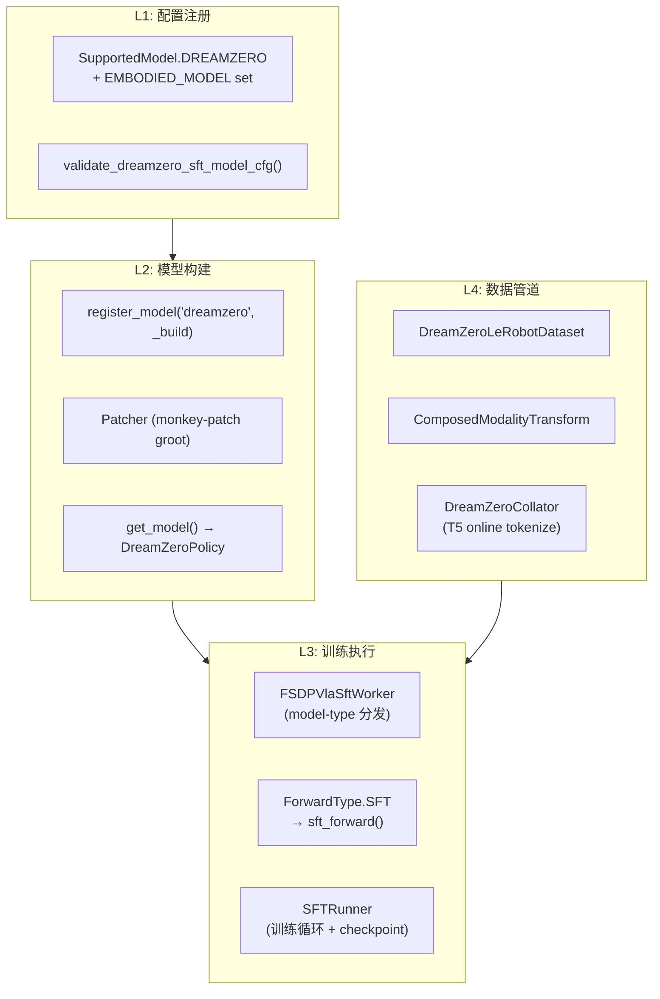
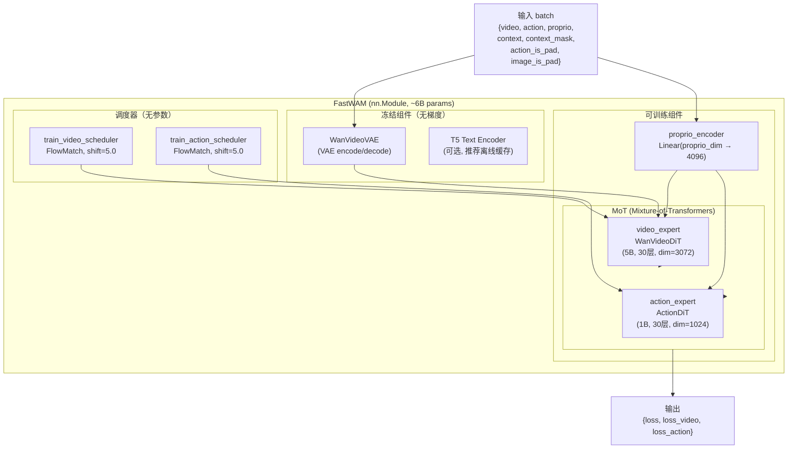
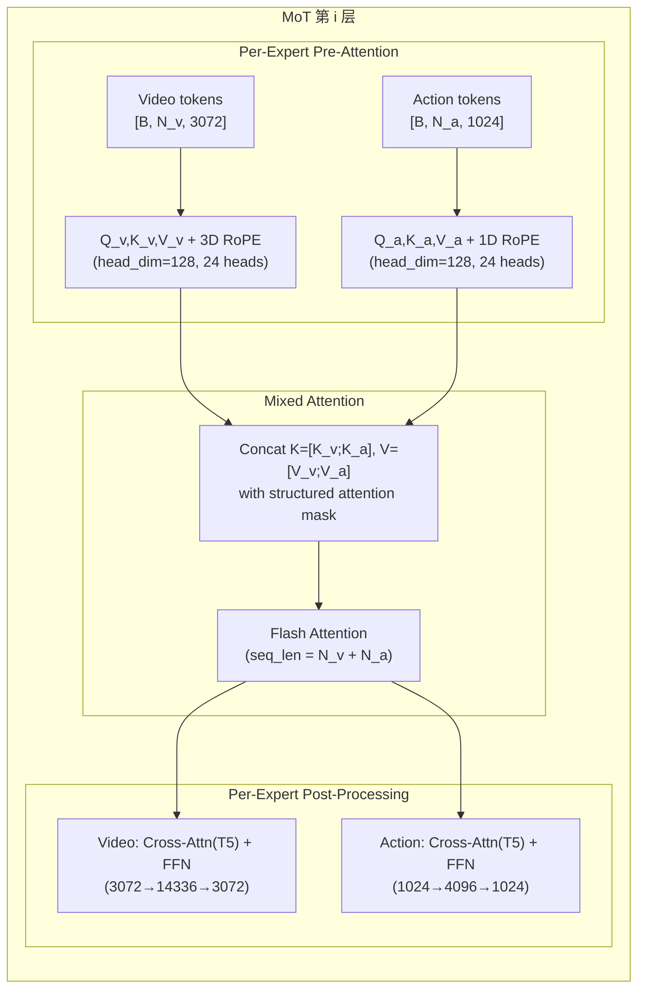
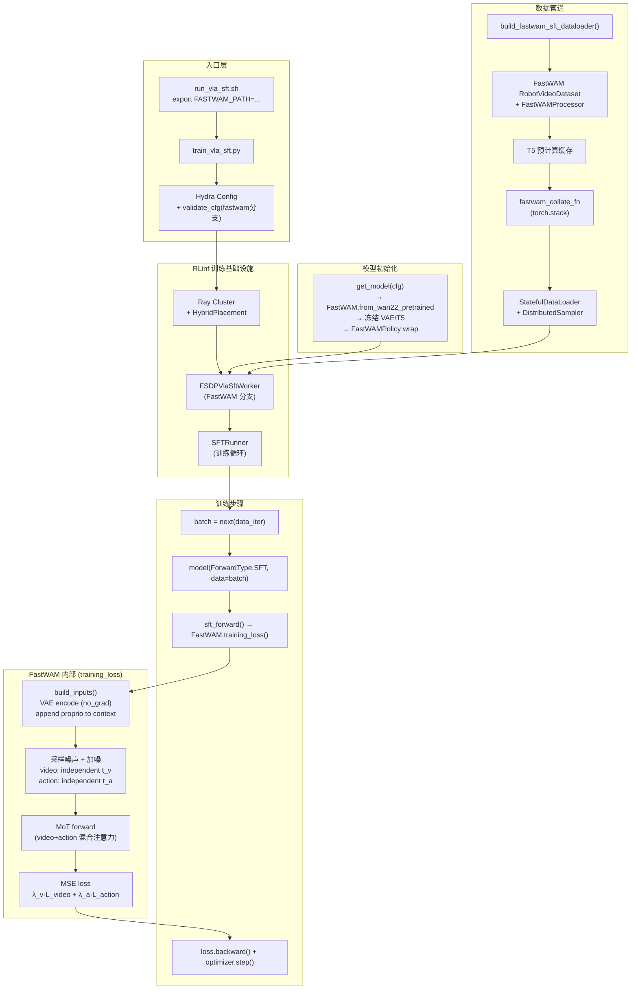
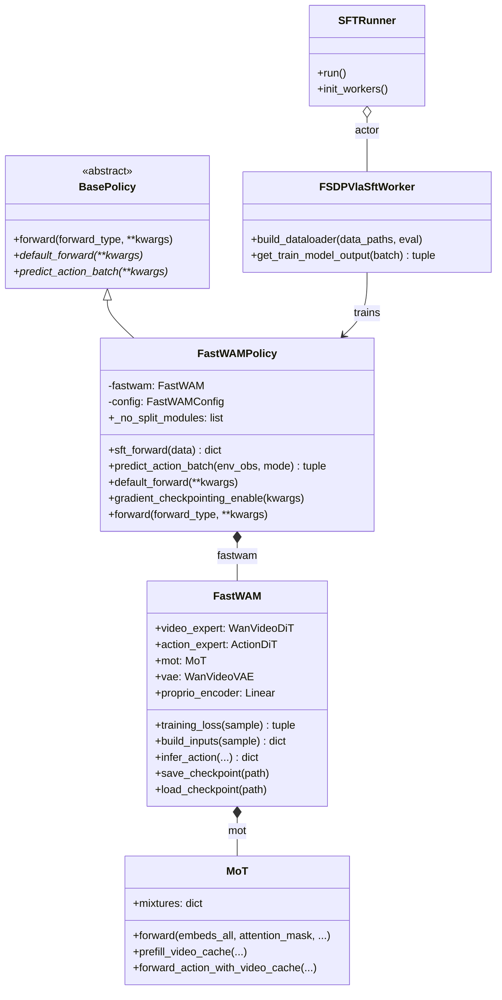
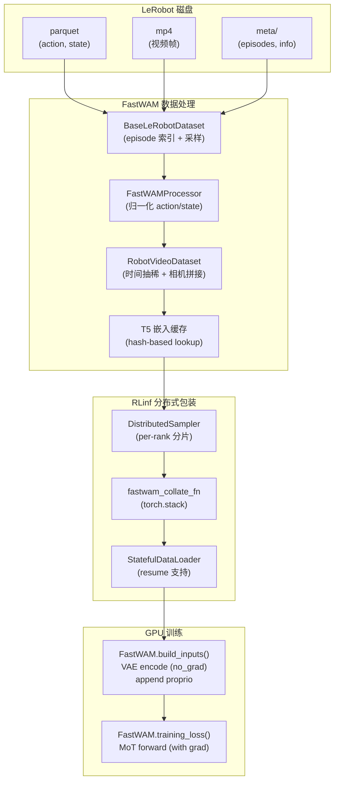
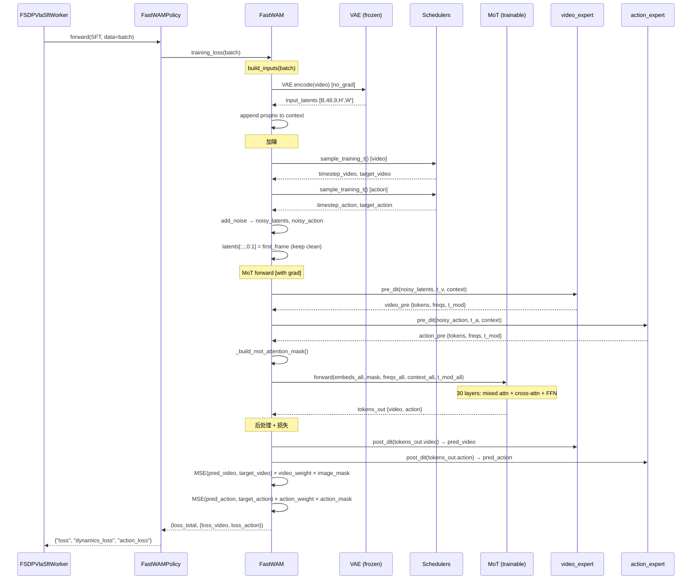
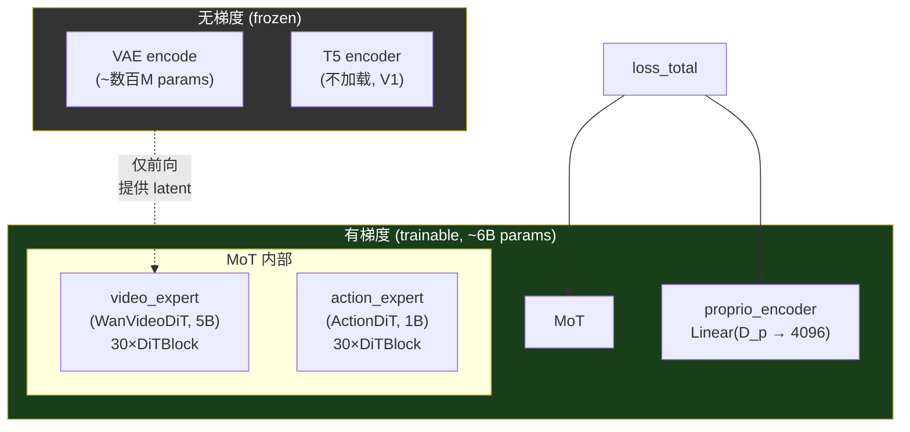
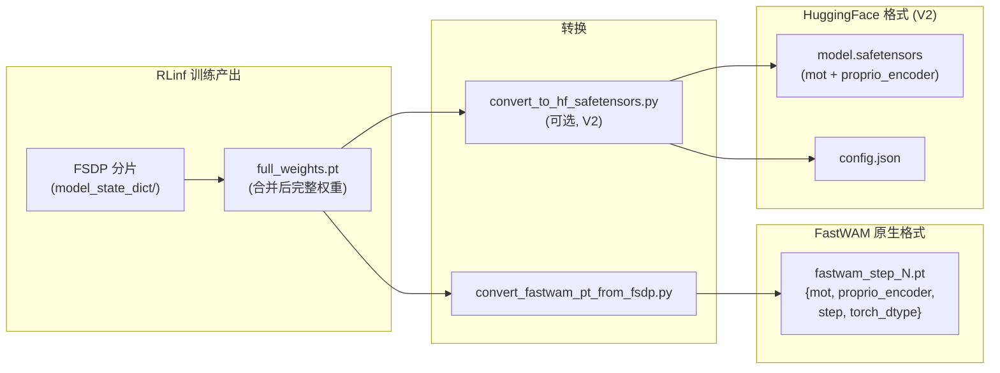

# RLinf 整合 FastWAM 进行 SFT 微调训练 — 深度设计方案

> **文档性质**：工程设计与实现指导（Design Spec v2）  
> **代码基线**：RLinf `D:\SRC\RL\RLinf` · FastWAM `D:\SRC\Robot\FastWAM`  
> **参考**：[DreamZero SFT 官方文档](https://rlinf.readthedocs.io/en/latest/rst_source/examples/embodied/sft_dreamzero.html) · [dz_sft_analy_op46.md](./dz_sft_analy_op46.md) · [fw_sft_design_cp25_1.md](./fw_sft_design_cp25_1.md)  
> **FastWAM 资料**：[FASTWAM_MODEL_EXPLANATION.md](D:/SRC/Robot/FastWAM/bt/FASTWAM_MODEL_EXPLANATION.md) · [fastwam_note_op46.md](D:/SRC/Robot/FastWAM/b/d/fastwam_note_op46.md)  
> **日期**：2026-05-30

---

## 目录

1. [目标与范围](#1-目标与范围)
2. [DreamZero 整合模式精析](#2-dreamzero-整合模式精析)
3. [FastWAM 模型架构深度解析](#3-fastwam-模型架构深度解析)
4. [整合总体架构设计](#4-整合总体架构设计)
5. [配置注册与校验](#5-配置注册与校验)
6. [FastWAMPolicy 类设计](#6-fastwampolicy-类设计)
7. [get_model() 工厂函数](#7-get_model-工厂函数)
8. [数据管道设计](#8-数据管道设计)
9. [训练数据格式与 Batch 契约](#9-训练数据格式与-batch-契约)
10. [Label/Target 语义与 Flow Matching 损失](#10-labeltarget-语义与-flow-matching-损失)
11. [SFT Forward 流程](#11-sft-forward-流程)
12. [Backward 与梯度流](#12-backward-与梯度流)
13. [Checkpoint 保存与格式转换](#13-checkpoint-保存与格式转换)
14. [推理对接设计](#14-推理对接设计)
15. [大规模训练工程细节](#15-大规模训练工程细节)
16. [实施路线图与验收标准](#16-实施路线图与验收标准)
17. [风险与决策记录](#17-风险与决策记录)

---

## 1. 目标与范围

### 1.1 目标

在 **不 fork FastWAM 训练逻辑** 的前提下，将 FastWAM 作为 `model_type: fastwam` 接入 RLinf 的 VLA SFT 管线（`train_vla_sft.py` → `SFTRunner` → `FSDPVlaSftWorker` → FSDP2），实现：

- 多 GPU / 多节点 **FSDP2** 监督微调（6B 参数：5B Video Expert + 1B Action Expert）
- 与 DreamZero 一致的 **运维面**（Hydra 配置、日志、checkpoint、resume）
- 支撑 **大规模 LeRobot 数据**（StatefulDataLoader、T5 嵌入离线缓存、分布式采样）
- 保留 FastWAM 原生的 **MoT + 双分支 Flow Matching**（`loss_video` + `loss_action`）

### 1.2 范围

| 在范围内 | 不在 V1 |
|----------|---------|
| SFT 训练（`ForwardType.SFT`） | RL rollout（PPO/GRPO） |
| 复用 FastWAM `RobotVideoDataset` + `FastWAMProcessor` | 在线 T5 编码 |
| FSDP2 + `SFTRunner` | DeepSpeed ZeRO |
| checkpoint 分片 + 合并为 FastWAM `.pt` | 完整 HF Hub 格式 |
| LIBERO / RoboTwin 数据集 | 所有 embodiment 全覆盖 |

### 1.3 与前版（cp25）的差异

本版在 `fw_sft_design_cp25_1.md` 基础上增强：
- 更精确的 **张量形状标注**（含 LIBERO 和 RoboTwin 两种配置）
- 完整的 **FSDP 分片策略分析**（_no_split_modules 实测模块名）
- **内存估算**（8×H100 场景下的显存预算）
- 更多 **Mermaid 图**（11 张）和 **LaTeX 公式**
- 完整的 **checkpoint 转换方案**（FSDP → native → HF）
- 更详细的 **推理对接设计**（predict_action_batch 实现）

---

## 2. DreamZero 整合模式精析

DreamZero 的整合为我们提供了可复用的**四层模式**。以下精析每层的设计意图与实现细节。

### 2.1 四层架构



### 2.2 DreamZero vs FastWAM 整合差异对照

| 维度 | DreamZero | FastWAM（本设计） |
|------|-----------|-------------------|
| **外部包** | `groot` / `DREAMZERO_PATH` | `fastwam` / `FASTWAM_PATH` |
| **Policy 基类** | `VLA(PreTrainedModel)` + `BasePolicy` | 仅 `nn.Module` + `BasePolicy` |
| **训练核心** | `WANPolicyHead.forward()` | `FastWAM.training_loss()` |
| **架构** | 单 DiT（CausalWanModel） | MoT（video_expert + action_expert） |
| **文本编码** | 在线 UMT5 tokenize（Collator 内） | **离线 T5 缓存**（预计算） |
| **视频输入** | uint8 多帧 → 模型内归一化 | float [-1,1] 已归一化 |
| **视频帧数** | 33（8×chunk+1） | 9（33÷4+1） |
| **动作维度** | 64（4×16），pad 到 32 | 32 步 × 7/14 维（不 pad） |
| **可训练部分** | CausalWanModel + action encoder/decoder | `mot`（双 Expert）+ `proprio_encoder` |
| **冻结部分** | VAE, T5, CLIP | VAE, T5, tokenizer |
| **损失键名** | `dynamics_loss` + `action_loss` | `loss_video` + `loss_action` |
| **Patcher** | 需要（VAE batch、torch.compile） | **不需要**（FastWAM 自包含） |
| **数据类** | `DreamZeroLeRobotDataset`（RLinf 自研） | `RobotVideoDataset` 适配 |
| **第一帧** | 无特殊处理 | 保持干净（never noised） |

---

## 3. FastWAM 模型架构深度解析

### 3.1 组件架构图



### 3.2 核心类与文件索引

| 类名 | 文件 | 参数量 | 角色 |
|------|------|--------|------|
| `FastWAM` | `src/fastwam/models/wan22/fastwam.py` | ~6B total | 顶层模型，含 `training_loss()` |
| `WanVideoDiT` | `src/fastwam/models/wan22/wan_video_dit.py` | ~5B | 视频专家，30×DiTBlock |
| `ActionDiT` | `src/fastwam/models/wan22/action_dit.py` | ~1B | 动作专家，30×DiTBlock |
| `MoT` | `src/fastwam/models/wan22/mot.py` | 0（包装器） | 混合注意力调度 |
| `DiTBlock` | `wan_video_dit.py:230` | per-layer | Self-attn + Cross-attn + FFN + AdaLN |
| `WanContinuousFlowMatchScheduler` | `schedulers/scheduler_continuous.py` | 0 | 噪声调度 |
| `FastWAMProcessor` | `src/fastwam/datasets/processor.py` | 0 | 数据归一化 |
| `RobotVideoDataset` | `src/fastwam/datasets/lerobot/robot_video_dataset.py` | 0 | 数据集 |

### 3.3 MoT 混合注意力机制

MoT 在每一层将 video tokens 和 action tokens 拼接后做**联合自注意力**，然后各自独立做 cross-attention 和 FFN：



**关键约束**：`num_heads`（24）和 `attn_head_dim`（128）必须在两个 Expert 间一致，以确保 K/V 拼接维度对齐。`hidden_dim` 可以不同（video=3072, action=1024）。

### 3.4 注意力掩码

```
                Video Tokens              Action Tokens
                ├─ f0 (first) │ f1..fT  │
    ────────────┼─────────────┼─────────┼──────────────┤
    f0 (首帧)   │     1       │    0    │      0       │
    f1..fT      │     1       │    1    │      0       │
    action      │     1       │    0    │      1       │
```

- **Action → Video**：只能看到首帧（防止训练时"偷看"未来视频）
- **Action → Action**：全连接（所有动作 token 互相可见）
- **Video → Video**：首帧因果（first_frame_causal 模式）
- **这是 Fast-WAM 190ms 推理的基础**：推理时仅编码首帧进 KV cache，动作去噪重用

---

## 4. 整合总体架构设计

### 4.1 整合原则

1. **训练数学留在 FastWAM**：`training_loss` / `build_inputs` / MoT forward 不在 RLinf 内复制
2. **数据语义留在 FastWAM**：`RobotVideoDataset` + `FastWAMProcessor`，RLinf 只写薄包装 + 分布式
3. **分布式与 checkpoint 留在 RLinf**：FSDP2、`SFTRunner`、与 DreamZero 相同的目录布局

### 4.2 整合全景图



### 4.3 新增/修改文件清单

```
rlinf/
  config.py                          # + SupportedModel.FASTWAM + validate 分支
  models/
    __init__.py                      # + register_model("fastwam", ...)
    embodiment/
      fastwam/                       # 新增目录
        __init__.py                  # get_model(cfg, torch_dtype)
        fastwam_policy.py            # FastWAMPolicy(nn.Module, BasePolicy)
        fastwam_config.py            # FastWAMConfig + validate_fastwam_sft_model_cfg
  data/
    datasets/
      fastwam/                       # 新增目录
        __init__.py                  # build_fastwam_sft_dataloader()
        collate.py                   # fastwam_collate_fn
  workers/
    sft/
      fsdp_vla_sft_worker.py         # + elif FASTWAM 分支
examples/
  sft/
    config/
      libero_sft_fastwam.yaml        # 示例训练配置
      model/
        fastwam.yaml                 # 模型 preset
toolkits/
  ckpt_convertor/
    fsdp_convertor/
      config/fsdp_fastwam_convertor.yaml
```

---

## 5. 配置注册与校验

### 5.1 SupportedModel 注册

在 `rlinf/config.py` 中添加：

```python
# 约 line 97, 与其他模型注册并列
SupportedModel.FASTWAM = SupportedModel.register("fastwam", force=True)

# 约 line 117, 加入 embodied 集合
EMBODIED_MODEL.add(SupportedModel.FASTWAM)
```

### 5.2 Model Registry

在 `rlinf/models/__init__.py` 中添加：

```python
def _build_fastwam(cfg: DictConfig, torch_dtype):
    from rlinf.models.embodiment.fastwam import get_model
    return get_model(cfg, torch_dtype)

register_model(
    SupportedModel.FASTWAM.value,
    _build_fastwam,
    category="embodied",
    force=True,
)
```

### 5.3 配置校验

`validate_fastwam_sft_model_cfg(cfg)` 需检查：

| 校验项 | 规则 | 原因 |
|--------|------|------|
| `text_embedding_cache_dir` | 目录存在且非空 | V1 强制离线 T5 |
| `num_frames % 4 == 1` | 视频帧数约束 | VAE temporal stride=4 |
| `action_horizon % (num_video_frames-1) == 0` | 时间对齐 | `build_inputs` 验证 |
| `proprio_dim` | 与数据一致 | `proprio_encoder` 输入维度 |
| `video_size` H/W | 均为 16 的倍数 | Patch embedding 要求 |

---

## 6. FastWAMPolicy 类设计

### 6.1 类图



### 6.2 完整实现设计

```python
class FastWAMPolicy(torch.nn.Module, BasePolicy):
    """RLinf policy wrapper for FastWAM model."""

    _no_split_modules = [
        "DiTBlock",    # video_expert.blocks[i] 和 action_expert.blocks[i] 共用此类名
    ]

    def __init__(self, fastwam_model: "FastWAM", config: "FastWAMConfig"):
        super().__init__()
        self.fastwam = fastwam_model
        self.config = config

    def forward(self, forward_type=ForwardType.DEFAULT, **kwargs):
        if forward_type == ForwardType.SFT:
            return self.sft_forward(**kwargs)
        elif forward_type == ForwardType.DEFAULT:
            return self.default_forward(**kwargs)
        raise NotImplementedError(f"Unsupported forward type: {forward_type}")

    def sft_forward(self, data=None, **kwargs):
        torch.compiler.cudagraph_mark_step_begin()
        if data is None:
            data = kwargs.get("data")
        if data is None:
            raise ValueError("sft_forward requires `data`.")

        loss_total, loss_dict = self.fastwam.training_loss(data)

        return {
            "loss": loss_total,
            "dynamics_loss": loss_dict.get("loss_video", 0.0),
            "action_loss": loss_dict.get("loss_action", 0.0),
        }

    def default_forward(self, **kwargs):
        raise NotImplementedError("V1 does not support default_forward.")

    def predict_action_batch(self, env_obs, mode="eval", **kwargs):
        # 详见 §14
        raise NotImplementedError("V1 does not support rollout inference.")

    def gradient_checkpointing_enable(self, gradient_checkpointing_kwargs=None):
        if gradient_checkpointing_kwargs is None:
            gradient_checkpointing_kwargs = {}
        self.fastwam.video_expert.use_gradient_checkpointing = True
        self.fastwam.action_expert.use_gradient_checkpointing = True
```

### 6.3 `_no_split_modules` 分析

`_no_split_modules` 告诉 FSDP2 哪些模块应作为整体分片单元（不能跨 rank 拆分内部参数）。

- `DiTBlock`（`wan_video_dit.py:230`）是 video_expert 和 action_expert 共用的 Transformer 层类
- 每个 `DiTBlock` 包含：self-attention (Q/K/V proj) + cross-attention + FFN + AdaLN modulation
- FSDP2 会将每个 `DiTBlock` 实例作为一个 `fully_shard` 单元
- 共有 30（video）+ 30（action）= 60 个 `DiTBlock` 实例
- **不要**将 `MoT` 放入 `_no_split_modules`，因为它包含两个 Expert，需要各自分片

### 6.4 返回值格式兼容性

`sft_forward()` 返回的 dict 需包含 `"loss"` 键（必需），`"dynamics_loss"` 和 `"action_loss"` 键（可选但推荐）。这与 `FSDPVlaSftWorker.get_train_model_output()` 中的 metrics 提取逻辑一致（该方法检查 `output.get("dynamics_loss")` 是否存在）。

FastWAM 原生返回 `loss_video` / `loss_action`，在 `sft_forward()` 中映射为 `dynamics_loss` / `action_loss`，匹配 RLinf 的日志命名空间（`train/dynamics_loss`, `train/action_loss`）。

---

## 7. get_model() 工厂函数

### 7.1 权重加载决策树

```mermaid
flowchart TD
    A["get_model(cfg, torch_dtype)"] --> B{model_path 设置?}
    B -->|是| C{model_path 下存在\nmodel.safetensors?}
    B -->|否| F["冷启动\nfrom_wan22_pretrained()\n从 WAN2.2 组件加载"]
    C -->|是| D["HF 格式加载\nbuild FastWAM 空壳\n+ load_state_dict"]
    C -->|否| E{model_path 下存在\n*.pt (native ckpt)?}
    E -->|是| G["FastWAM native 加载\nfrom_wan22_pretrained()\n+ load_checkpoint()"]
    E -->|否| F
    D --> H["冻结 VAE / T5\nrequires_grad_(False)"]
    G --> H
    F --> H
    H --> I["FastWAMPolicy(fastwam, config)"]
    I --> J["_promote_scalar_params_to_1d()"]
    J --> K["model.to(dtype=torch_dtype)"]

    style D fill:#2d5016,color:#fff
    style G fill:#4a3000,color:#fff
    style F fill:#4a3000,color:#fff
```

### 7.2 实现设计

```python
def get_model(cfg: DictConfig, torch_dtype=None):
    """Load FastWAM policy for RLinf SFT."""
    from fastwam.models.wan22.fastwam import FastWAM

    fastwam_config = FastWAMConfig.from_hydra(cfg)

    model_path = cfg.get("model_path", None)
    torch_dtype = torch_dtype or torch.bfloat16

    # 构建 FastWAM 模型
    fastwam_model = FastWAM.from_wan22_pretrained(
        model_id=cfg.get("wan22_model_id", "Wan-AI/Wan2.2-TI2V-5B"),
        tokenizer_model_id=cfg.get("wan22_tokenizer_model_id", "Wan-AI/Wan2.1-T2V-1.3B"),
        device="cpu",
        torch_dtype=torch_dtype,
        load_text_encoder=cfg.get("load_text_encoder", False),
        proprio_dim=cfg.get("proprio_dim", None),
        video_dit_config=OmegaConf.to_container(cfg.video_dit_config, resolve=True),
        action_dit_config=OmegaConf.to_container(cfg.action_dit_config, resolve=True),
        loss_lambda_video=cfg.get("loss_lambda_video", 1.0),
        loss_lambda_action=cfg.get("loss_lambda_action", 1.0),
        # ... scheduler params ...
    )

    # 加载权重
    if model_path is not None:
        ckpt_path = Path(model_path)
        if (ckpt_path / "model.safetensors").exists():
            _load_hf_state_dict(fastwam_model, ckpt_path)
        elif any(ckpt_path.glob("*.pt")):
            pt_file = next(ckpt_path.glob("*.pt"))
            fastwam_model.load_checkpoint(str(pt_file))

    # 冻结非训练部分
    fastwam_model.vae.requires_grad_(False)
    if fastwam_model.text_encoder is not None:
        fastwam_model.text_encoder.requires_grad_(False)

    # 包装为 Policy
    policy = FastWAMPolicy(fastwam_model, fastwam_config)
    _promote_scalar_params_to_1d(policy)
    return policy.to(dtype=torch_dtype)
```

### 7.3 Patcher 评估

| 场景 | DreamZero | FastWAM | 建议 |
|------|-----------|---------|------|
| VAE 批处理优化 | 需要 Patcher | FastWAM VAE 已支持 batch | **不需要** |
| torch.compile 注意力 | 需要 Patcher | MoT 已内部处理 | **不需要** |
| _forward_train 替换 | 需要 Patcher | 使用原生 training_loss | **不需要** |

**结论**：V1 不需要 Patcher，FastWAM 是自包含的。如后续发现 FSDP 兼容性问题再引入。

---

## 8. 数据管道设计

### 8.1 数据管道全景



### 8.2 预处理分工

| 阶段 | 负责方 | 具体内容 |
|------|--------|----------|
| LeRobot 读盘 | **FastWAM** `BaseLeRobotDataset` | episode 采样、帧索引 |
| 图像 resize + 归一化 | **FastWAM** `FastWAMProcessor` + `RobotVideoDataset` | → [-1,1] float |
| 多相机拼接 | **FastWAM** `RobotVideoDataset` | LIBERO: 水平拼接 224×448 |
| 时间抽稀 | **FastWAM** `RobotVideoDataset` | 33帧 → 9帧（ratio=4） |
| action/state 归一化 | **FastWAM** `LinearNormalizer` | z-score from stats |
| T5 文本嵌入 | **FastWAM 离线脚本** | `precompute_text_embeds.py` |
| 分布式采样 | **RLinf** | `DistributedSampler` |
| Batch 整理 | **RLinf** `fastwam_collate_fn` | `torch.stack` |
| VAE 编码 + 加噪 + MoT | **FastWAM** `training_loss` | GPU 上有梯度 |

### 8.3 build_fastwam_sft_dataloader

```python
def build_fastwam_sft_dataloader(cfg, world_size, rank, data_paths, eval_dataset=False):
    from fastwam.datasets.lerobot.robot_video_dataset import RobotVideoDataset
    from fastwam.datasets.processor import FastWAMProcessor

    model_cfg = cfg.actor.model
    data_cfg = cfg.data

    # 构建 Processor（归一化器）
    processor = FastWAMProcessor(
        action_dim=model_cfg.action_dit_config.action_dim,
        proprio_dim=model_cfg.get("proprio_dim", None),
        # ... 从 data_cfg 读取归一化参数 ...
    )

    # 构建 Dataset（复用 FastWAM 原生实现）
    dataset = RobotVideoDataset(
        dataset_dirs=_parse_data_paths(data_paths),
        processor=processor,
        num_frames=data_cfg.get("num_frames", 33),
        action_video_freq_ratio=data_cfg.get("action_video_freq_ratio", 4),
        video_size=list(data_cfg.get("video_size", [224, 448])),
        text_embedding_cache_dir=model_cfg.get("text_embedding_cache_dir"),
        context_len=model_cfg.get("context_len", 128),
    )

    # 分布式采样
    sampler = DistributedSampler(
        dataset,
        num_replicas=world_size,
        rank=rank,
        shuffle=not eval_dataset,
        drop_last=not eval_dataset,
    )

    # StatefulDataLoader（支持 resume）
    data_loader = StatefulDataLoader(
        dataset,
        batch_size=cfg.actor.micro_batch_size,
        sampler=sampler,
        collate_fn=fastwam_collate_fn,
        num_workers=int(data_cfg.get("num_workers", 8)),
        prefetch_factor=int(data_cfg.get("prefetch_factor", 4)),
        pin_memory=True,
        persistent_workers=True,
    )

    return data_loader, {"num_samples": len(dataset)}
```

### 8.4 Collator

FastWAM 不需要在线 tokenization（与 DreamZero 不同），collator 只做简单的 tensor stack：

```python
def fastwam_collate_fn(features: list[dict]) -> dict:
    batch = {}
    for key in features[0]:
        values = [f[key] for f in features]
        if isinstance(values[0], torch.Tensor):
            batch[key] = torch.stack(values)
        elif isinstance(values[0], np.ndarray):
            batch[key] = torch.from_numpy(np.stack(values))
        else:
            batch[key] = values  # str 等非 tensor 保持 list
    return batch
```

---

## 9. 训练数据格式与 Batch 契约

### 9.1 单样本格式（Dataset `__getitem__` 输出）

| 键 | LIBERO | RoboTwin | dtype | 角色 |
|----|--------|----------|-------|------|
| `video` | `[3, 9, 224, 448]` | `[3, 9, 384, 320]` | float32, [-1,1] | 视频帧（已拼接多相机） |
| `action` | `[32, 7]` | `[32, 14]` | float32, 归一化 | **动作 target** |
| `proprio` | `[32, 8]` | `[32, 14]` | float32, 归一化 | 本体感受（条件） |
| `context` | `[128, 4096]` | `[128, 4096]` | float32 | T5 文本嵌入（预计算） |
| `context_mask` | `[128]` | `[128]` | bool | 有效 token 掩码 |
| `action_is_pad` | `[32]` | `[32]` | bool | 填充时间步掩码 |
| `image_is_pad` | `[9]` | `[9]` | bool | 填充视频帧掩码 |

### 9.2 Collate 后（GPU batch）

| 键 | 形状 | 说明 |
|----|------|------|
| `video` | `[B, 3, 9, H, W]` | 5D，符合 `build_inputs` 验证 |
| `action` | `[B, 32, D_a]` | 3D，D_a=7(LIBERO) 或 14(RoboTwin) |
| `proprio` | `[B, 32, D_p]` | 3D，仅使用 `[:,0,:]`（首帧） |
| `context` | `[B, 128, 4096]` | 3D |
| `context_mask` | `[B, 128]` | 2D |
| `action_is_pad` | `[B, 32]` | 2D |
| `image_is_pad` | `[B, 9]` | 2D |

### 9.3 时间关系

```
观测帧索引:  0  1  2  3  4  5  6  7  8  9 10 11 12 ... 32
             │     │     │     │     │     │     │        │
视频帧:      f0    f1    f2    f3    f4    f5    f6  ...  f8
             └─────┴─────┴─────┴─────┴─────┴─────┘
                         action_video_freq_ratio = 4

动作步:      a0 a1 a2 a3 a4 a5 a6 a7 ... a31    (共 32 步)
```

- `num_frames=33` → 视频索引 `[0, 4, 8, 12, ..., 32]` → **9 帧**
- 每帧间隔 4 个动作步 → `action_horizon=32 = (9-1) × 4`

### 9.4 与 DreamZero batch 的差异

| 项 | DreamZero | FastWAM |
|----|-----------|---------|
| 视频格式 | uint8 `(B,1,T,C,H,2W)` → 模型内归一化 | float [-1,1] `(B,3,T,H,W)` 已归一化 |
| 文本 | `(B, seq_len)` int64 token ID → Collator 内 tokenize | `(B, 128, 4096)` float32 预计算嵌入 |
| 动作 padding | pad 到 `max_action_dim=32` | **不 pad**，保持原始维度 |
| `action_mask` | 按维度 mask（32 维中 7 维有效） | `action_is_pad` 按时间步 mask |
| `embodiment_id` | 有（multi-embodiment 支持） | 无（单机器人） |
| `has_real_action` | 有（某些样本无动作） | 由 `action_is_pad` 隐式处理 |

---

## 10. Label/Target 语义与 Flow Matching 损失

### 10.1 核心概念

FastWAM SFT **没有离散标签**。监督信号是 **Flow Matching 速度场目标**，与 DreamZero 使用相同的数学框架。

**什么是 "label/target"**：

| 数据字段 | 是否 target | 用途 |
|----------|-------------|------|
| `video` → VAE latent $x_0^v$ | **是** | 干净 latent，构造 $\text{target}_v = \epsilon - x_0^v$ |
| `action` $a_0$ | **是** | 干净动作，构造 $\text{target}_a = \epsilon - a_0$ |
| `context` / `proprio` | 否（条件） | cross-attention 条件 |
| `noise_*`（训练时采样） | 中间变量 | 非数据集字段 |

### 10.2 Flow Matching 数学

**前向加噪**：

\[
x_t = (1 - \sigma_t) \cdot x_0 + \sigma_t \cdot \epsilon, \quad \epsilon \sim \mathcal{N}(0, I)
\]

**噪声调度**（shift-based）：

\[
\sigma_{\text{lin}} = \frac{u}{T}, \qquad \sigma_t = \frac{s \cdot \sigma_{\text{lin}}}{1 + (s-1) \cdot \sigma_{\text{lin}}}, \quad s = 5
\]

**训练目标**（velocity field）：

\[
\text{target} = \epsilon - x_0
\]

**训练权重**（Gaussian 中间时间步强调）：

\[
w(t) = \frac{y(t) - y_{\min}}{\sum_{t'} (y(t') - y_{\min})} \cdot T, \quad y(t) = \exp\left(-2\left(\frac{t - T/2}{T}\right)^2\right)
\]

### 10.3 双分支损失

\[
\mathcal{L}_{\text{total}} = \lambda_v \cdot \mathcal{L}_{\text{video}} + \lambda_a \cdot \mathcal{L}_{\text{action}}
\]

**视频损失**：

\[
\mathcal{L}_{\text{video}} = \frac{1}{B} \sum_b w(t_b^v) \cdot \frac{\sum_t \mathbb{1}[\neg\text{image\_is\_pad}_{b,t}] \cdot \text{MSE}(\hat{v}^v_{b,:,t}, \text{target}^v_{b,:,t})}{\sum_t \mathbb{1}[\neg\text{image\_is\_pad}_{b,t}]}
\]

**动作损失**：

\[
\mathcal{L}_{\text{action}} = \frac{1}{B} \sum_b w(t_b^a) \cdot \frac{\sum_t \mathbb{1}[\neg\text{action\_is\_pad}_{b,t}] \cdot \text{MSE}(\hat{v}^a_{b,t}, \text{target}^a_{b,t})}{\sum_t \mathbb{1}[\neg\text{action\_is\_pad}_{b,t}]}
\]

### 10.4 关键代码锚点

```python
# FastWAM/src/fastwam/models/wan22/fastwam.py : training_loss()

# 视频分支
noise_video = torch.randn_like(input_latents)
timestep_video = self.train_video_scheduler.sample_training_t(batch_size, device, dtype)
latents = self.train_video_scheduler.add_noise(input_latents, noise_video, timestep_video)
target_video = self.train_video_scheduler.training_target(input_latents, noise_video, timestep_video)
latents[:, :, 0:1] = first_frame_latents  # 首帧保持干净！

# 动作分支（独立时间步）
noise_action = torch.randn_like(action)
timestep_action = self.train_action_scheduler.sample_training_t(batch_size, device, dtype)
noisy_action = self.train_action_scheduler.add_noise(action, noise_action, timestep_action)
target_action = self.train_action_scheduler.training_target(action, noise_action, timestep_action)

# MoT 联合前向
tokens_out = self.mot(embeds_all={"video": ..., "action": ...}, attention_mask=mask, ...)
pred_video = self.video_expert.post_dit(tokens_out["video"], video_pre)
pred_action = self.action_expert.post_dit(tokens_out["action"], action_pre)

# 损失
loss_total = λ_v * loss_video + λ_a * loss_action
```

### 10.5 首帧保持干净

FastWAM 特有设计：当 `fuse_vae_embedding_in_latents=True` 时，首帧 latent 始终保持干净（$t=0$），不参与加噪。这意味着：

- 首帧 latent 作为 **条件信号** 而非 **去噪目标**
- 视频损失计算时跳过首帧：`pred_video = pred_video[:, :, 1:]`，`target_video = target_video[:, :, 1:]`
- 推理时只需编码首帧进 KV cache，就能为动作去噪提供完整的视觉条件

---

## 11. SFT Forward 流程

### 11.1 调用序列图



### 11.2 AMP / dtype 策略

- FSDP mixed precision: `param_dtype=bf16, reduce_dtype=bf16`
- FastWAM `build_inputs` 内部将 video/action cast 到 `self.torch_dtype`（bf16）
- MSE loss 计算时 `.float()` 提升精度（FastWAM 已实现）
- Optimizer states 保持 fp32（`actor.model.precision: fp32`）

### 11.3 `tiled` VAE

对于高分辨率视频（如 384×640），VAE 编码可能 OOM。可通过 config 启用 `tiled=True`：

```python
# 在 sft_forward 中传递：
loss_total, loss_dict = self.fastwam.training_loss(data, tiled=True)
```

---

## 12. Backward 与梯度流

### 12.1 冻结策略

参考 FastWAM 原生 `Wan22Trainer._apply_dit_only_train_mode`：

```python
# 在 get_model() 中，FSDP wrap 之前设置
fastwam_model.eval()
fastwam_model.requires_grad_(False)

# 开启可训练部分
fastwam_model.mot.train()
fastwam_model.mot.requires_grad_(True)
if fastwam_model.proprio_encoder is not None:
    fastwam_model.proprio_encoder.train()
    fastwam_model.proprio_encoder.requires_grad_(True)
```

### 12.2 梯度流图



| 模块 | `requires_grad` | 进入 optimizer | 参数量 |
|------|-----------------|---------------|--------|
| `vae` | False | 否 | ~数百 M |
| `text_encoder` | 不加载 | 否 | ~4B |
| `mot.mixtures["video"]` | True | **是** | ~5B |
| `mot.mixtures["action"]` | True | **是** | ~1B |
| `proprio_encoder` | True | **是** | ~0.1M |
| schedulers | 无参数 | 否 | 0 |

### 12.3 FSDP 分片策略

```
FastWAMPolicy
├── fastwam (FastWAM)
│   ├── vae (frozen, 不参与 FSDP)
│   ├── mot (MoT)
│   │   ├── mixtures["video"] (WanVideoDiT)
│   │   │   ├── blocks[0] (DiTBlock) ← FSDP unit
│   │   │   ├── blocks[1] (DiTBlock) ← FSDP unit
│   │   │   └── ... × 30
│   │   └── mixtures["action"] (ActionDiT)
│   │       ├── blocks[0] (DiTBlock) ← FSDP unit
│   │       ├── blocks[1] (DiTBlock) ← FSDP unit
│   │       └── ... × 30
│   └── proprio_encoder (Linear)
```

FSDP2 将每个 `DiTBlock` 作为独立的 `fully_shard` 单元：
- 共 60 个 FSDP unit（30 video + 30 action）
- 每个 unit 内部参数不跨 rank 分片
- 前向/反向时按需 all-gather 到完整参数

### 12.4 内存估算（8×H100 80GB）

| 组件 | 每 GPU 显存 | 计算方式 |
|------|------------|----------|
| 模型参数 (bf16, FSDP sharded) | ~1.5 GB | 6B × 2 bytes / 8 GPUs |
| Optimizer states (fp32, AdamW) | ~6 GB | 6B × 2 × 4 bytes / 8 GPUs |
| 梯度 (bf16) | ~1.5 GB | 同参数 |
| VAE (frozen, bf16) | ~0.5 GB | 未 FSDP 分片，每 GPU 完整副本 |
| Activations (grad ckpt) | ~15-25 GB | 取决于 batch size 和序列长度 |
| CUDA context + framework | ~5 GB | 固定开销 |
| **总计** | **~30-40 GB** | `micro_batch_size=2` 预估 |
| **余量** | **~40-50 GB** | 可适当增大 batch |

**建议**：起始 `micro_batch_size=2`，通过 `gradient_accumulation` 达到 `global_batch_size=128`。

---

## 13. Checkpoint 保存与格式转换

### 13.1 训练期 checkpoint 目录布局

```
{log_path}/{experiment_name}/checkpoints/global_step_{N}/actor/
  model_state_dict/          # FSDP 分片权重
  optim_state_dict/          # FSDP 分片优化器状态
  full_weights.pt            # 若 save_full_model_weights: true
  data.pt                    # StatefulDataLoader 状态
  rng.pt                     # 随机数状态
```

### 13.2 格式转换流程



### 13.3 FSDP → FastWAM native 转换

```python
# toolkits/ckpt_convertor/convert_fastwam_pt_from_fsdp.py

def convert(full_weights_path: str, output_path: str, step: int):
    state_dict = torch.load(full_weights_path, map_location="cpu")

    # 提取 mot 和 proprio_encoder 权重
    mot_sd = {}
    pe_sd = {}
    for k, v in state_dict.items():
        # FSDP 前缀: "fastwam.mot.mixtures.video.blocks.0...."
        if k.startswith("fastwam.mot."):
            new_key = k.replace("fastwam.mot.", "")
            mot_sd[new_key] = v
        elif k.startswith("fastwam.proprio_encoder."):
            new_key = k.replace("fastwam.proprio_encoder.", "")
            pe_sd[new_key] = v

    payload = {
        "mot": mot_sd,
        "proprio_encoder": pe_sd,
        "step": step,
        "torch_dtype": "torch.bfloat16",
    }
    torch.save(payload, output_path)
```

### 13.4 续训

- `runner.resume_dir: .../global_step_N` → `FSDPVlaSftWorker.load_checkpoint()`
- 自动恢复：模型权重 + optimizer + `data.pt`（DataLoader 位置）+ `rng.pt`（随机状态）

---

## 14. 推理对接设计

### 14.1 predict_action_batch（V2 实现）

```python
def predict_action_batch(self, env_obs, mode="eval", **kwargs):
    """Inference wrapper for RLinf rollout."""
    # 1. 准备输入
    input_image = self._prepare_image(env_obs)     # [1, 3, H, W]
    context, context_mask = self._get_context(env_obs)
    proprio = self._get_proprio(env_obs)           # [1, D_p] or None

    # 2. FastWAM 推理（使用 KV cache，~190ms）
    with torch.no_grad():
        output = self.fastwam.infer_action(
            prompt=None,                           # 使用预计算 context
            input_image=input_image,
            action_horizon=self.config.action_horizon,
            proprio=proprio,
            context=context,
            context_mask=context_mask,
            num_inference_steps=self.config.num_inference_steps,
        )

    # 3. 反归一化
    actions = output["action"].cpu().numpy()       # [32, 7]
    actions = self._denormalize_action(actions)

    # 4. 格式化返回
    flat = torch.as_tensor(actions, dtype=torch.float32).reshape(1, -1)
    result = {
        "prev_logprobs": torch.zeros_like(flat),
        "prev_values": torch.zeros((1, 1), dtype=torch.float32),
        "forward_inputs": {"action": flat},
    }
    return actions[None], result  # [1, 32, 7], result
```

### 14.2 推理 vs 训练的关键差异

| 方面 | 训练 (`sft_forward`) | 推理 (`predict_action_batch`) |
|------|---------------------|-------------------------------|
| 视频输入 | 多帧序列 `[B,3,9,H,W]` | 单帧 `[1,3,H,W]` |
| 动作 | 有（作为 target） | 无（从噪声去噪生成） |
| MoT 路径 | `mot.forward()` 全联合 | `mot.prefill_video_cache()` + `forward_action_with_video_cache()` |
| 去噪步数 | 1 步（训练只需单步预测） | 20 步迭代 |
| 梯度 | 有 | 无 |

---

## 15. 大规模训练工程细节

### 15.1 文本嵌入：强制离线

训练时 `load_text_encoder: false`，节省 ~10GB GPU 显存：

```bash
# 训练前运行（在 FastWAM 仓库）
python scripts/precompute_text_embeds.py task=<task_cfg>
# 生成: data/text_embeds_cache/<task>/*.pt
```

`validate_fastwam_sft_model_cfg` 启动前检查 cache 目录存在且包含 `.pt` 文件。

### 15.2 批量与显存

| 参数 | 起始值 | 说明 |
|------|--------|------|
| `micro_batch_size` | 2 | 9帧视频 + MoT 30层，显存压力大 |
| `global_batch_size` | 128 | 通过 gradient_accumulation 补齐 |
| `gradient_checkpointing` | on | 同时开启 FSDP 和 FastWAM 两侧 |
| `cpu_offload` | OOM 时开 | FSDP CPU offload |

\[
B_{\text{global}} = B_{\text{micro}} \times N_{\text{GPU}} \times G_{\text{accum}}
\]

例：$128 = 2 \times 8 \times 8$（8 GPU，8 步累积）

### 15.3 多节点配置

```yaml
cluster:
  num_nodes: 2
  component_placement:
    actor: all

# 每个节点启动前：
# export RLINF_NODE_RANK=0  # (或 1)
# ray start --head / --address=<head_ip>:6379
```

### 15.4 精度与稳定性

- FP32 optimizer states + BF16 matmul（与 DreamZero 一致）
- 监控 `train/dynamics_loss` 和 `train/action_loss` 比例
- `grad_clip: 1.0`（与 FastWAM 原生一致）
- 异常排查：检查 `dataset_stats.json` 归一化统计、pad mask 有效率

### 15.5 与原生 Wan22Trainer 的差异

| 项 | FastWAM 原生 | RLinf 整合 |
|----|--------------|------------|
| 分布式 | Accelerate + DeepSpeed ZeRO-1 | **FSDP2** |
| 数据采样 | `ResumableEpochSampler` | `DistributedSampler` + `StatefulDataLoader` |
| Checkpoint | `checkpoints/weights/step_*.pt` | `global_step_*/actor/` + convert |
| 日志 | WandB 内置 | `MetricLogger`（tensorboard/wandb） |
| Optimizer | DeepSpeed 管理 | FSDP2 + PyTorch AdamW |

**不要混用** 同一实验的 optimizer state（格式不兼容）。

---

## 16. 实施路线图与验收标准

### Phase 0 — 环境与数据（1-2 天）

- [ ] `pip install -e /path/to/FastWAM` 或设置 `FASTWAM_PATH`
- [ ] 运行 `precompute_text_embeds.py` 生成 T5 缓存
- [ ] 准备 `dataset_stats.json`
- [ ] **验收**：单进程 `RobotVideoDataset[0]` 键形状与 §9 一致

### Phase 1 — 最小训练闭环（3-5 天）

- [ ] `config.py`：`SupportedModel.FASTWAM` + `EMBODIED_MODEL`
- [ ] `models/__init__.py`：`register_model`
- [ ] `fastwam_policy.py` + `fastwam_config.py` + `__init__.py`（get_model）
- [ ] `build_fastwam_sft_dataloader` + `fastwam_collate_fn`
- [ ] `fsdp_vla_sft_worker.py`：FastWAM 分支
- [ ] `libero_sft_fastwam.yaml` 单卡 `micro_batch_size=1`
- [ ] **验收**：`train/loss` 单调下降；`dynamics_loss` / `action_loss` 有限

### Phase 2 — 分布式与 Resume（3-5 天）

- [ ] 8 GPU FSDP2 训练成功
- [ ] `save_checkpoint` / `resume_dir` + `data.pt`
- [ ] **验收**：中断后续训 loss 连续

### Phase 3 — 导出与 Eval（2-3 天）

- [ ] `convert_fastwam_pt_from_fsdp.py`
- [ ] FastWAM eval pipeline 加载 RLinf checkpoint 成功
- [ ] **验收**：eval 指标与原生 trainer 同量级

### Phase 4 — 规模化（持续）

- [ ] `micro_batch_size > 1`
- [ ] 多节点文档
- [ ] e2e CI（可选 GPU nightly）

---

## 17. 风险与决策记录

### 17.1 风险矩阵

| 风险 | 影响 | 缓解 |
|------|------|------|
| T5 cache 缺失导致训练失败 | 高 | `validate_fastwam` 启动前检查 |
| FSDP 与 MoT 模块名不匹配 | 高 | 单卡调试 `_no_split_modules`；`DiTBlock` 已确认 |
| `image_is_pad` 与 latent 时间维不对齐 | 中 | 复用 FastWAM 已有对齐逻辑 |
| FSDP 前缀导致 convert 失败 | 中 | convert 脚本写单元测试 + 键名映射表 |
| 首帧 clean latent 梯度泄露 | 低 | VAE encode 在 `@torch.no_grad()` 中 |
| MoT mixed attention 与 FSDP gradient checkpointing 冲突 | 中 | 测试 `use_reentrant=False` |

### 17.2 关键决策记录

| 决策 | 选择 | 替代方案 | 理由 |
|------|------|----------|------|
| Policy 基类 | `nn.Module + BasePolicy` | `PreTrainedModel + BasePolicy` | FastWAM 非 HF 模型 |
| T5 编码 | 离线预计算 | 在线编码 | 节省 ~10GB 显存 |
| `_no_split_modules` | `["DiTBlock"]` | `["MoT"]` | DiTBlock 是正确的 FSDP 分片粒度 |
| Patcher | 不使用 | 使用（参考 DreamZero） | FastWAM 自包含，无需 monkey-patch |
| 数据归一化 | 复用 FastWAM Processor | 重写 RLinf transforms | 保持一致性 |
| Checkpoint 格式 | FSDP + native `.pt` 转换 | 直接保存 native 格式 | 利用 RLinf 现有基础设施 |
| Loss 键映射 | `loss_video` → `dynamics_loss` | 直接传 `loss_video` | 兼容 RLinf 日志命名空间 |

### 17.3 未决项

1. **V1 是否支持在线 T5**？→ 建议默认否，节省显存
2. **多机器人混合训练**？→ 先复用 FastWAM `multi_dataset`，不引入 embodiment registry
3. **SFT 后 RL 阶段**？→ 本设计仅覆盖 SFT，RL 需另行设计 `default_forward`

---

## 附录 A：关键代码索引

### RLinf（参考实现）

| 文件 | 作用 |
|------|------|
| `rlinf/config.py` | SupportedModel 注册 |
| `rlinf/models/__init__.py` | register_model 机制 |
| `rlinf/models/embodiment/base_policy.py` | BasePolicy + ForwardType |
| `rlinf/models/embodiment/dreamzero/` | DreamZero 整合模板 |
| `rlinf/workers/sft/fsdp_vla_sft_worker.py` | Worker 分发 |
| `rlinf/workers/sft/fsdp_sft_worker.py` | 基础训练循环 |
| `rlinf/runners/sft_runner.py` | SFT Runner |
| `examples/sft/train_vla_sft.py` | 入口脚本 |

### FastWAM

| 文件 | 作用 |
|------|------|
| `src/fastwam/models/wan22/fastwam.py` | FastWAM 类 (`training_loss`, `build_inputs`, `infer_action`) |
| `src/fastwam/models/wan22/wan_video_dit.py` | WanVideoDiT + DiTBlock |
| `src/fastwam/models/wan22/action_dit.py` | ActionDiT |
| `src/fastwam/models/wan22/mot.py` | MoT 混合注意力 |
| `src/fastwam/trainer.py` | 冻结策略 (`_apply_dit_only_train_mode`) |
| `src/fastwam/datasets/lerobot/robot_video_dataset.py` | 数据集 |
| `src/fastwam/datasets/processor.py` | 数据预处理器 |
| `configs/model/fastwam.yaml` | 模型配置 |
| `configs/data/libero_2cam.yaml` | LIBERO 数据配置 |

---

*本文档为 RLinf 整合 FastWAM SFT 的实现指导（v2）；编码时应以本地代码为准，`_no_split_modules` 和键名映射需在实际 FSDP 环境中验证。*