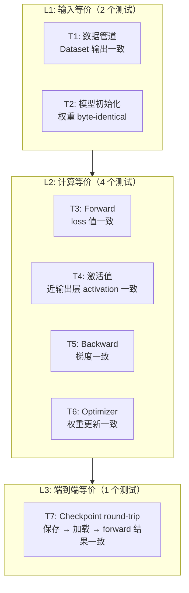
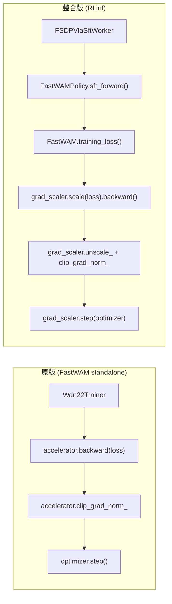
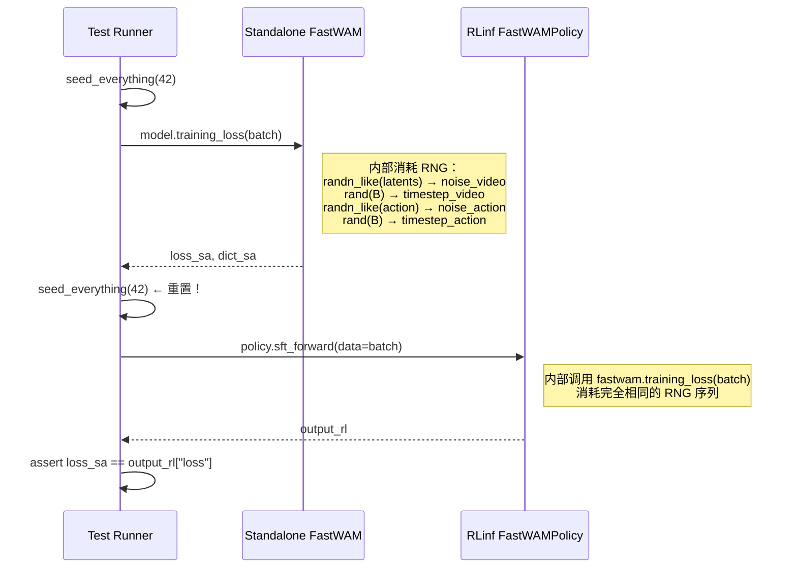
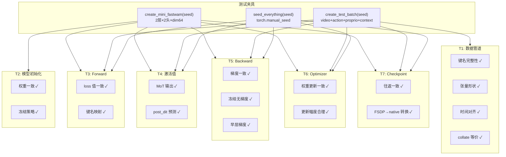

# RLinf 整合 FastWAM SFT — 单元测试方案

> **配套设计文档**：[fw_sft_design_op46_1_1.md](./fw_sft_design_op46_1_1.md)  
> **目标**：在不做真实训练的情况下，通过单元测试预测整合版与原版的训练结果是否一致  
> **代码基线**：RLinf `d:\SRC\RL\RLinf` · FastWAM `d:\SRC\Robot\FastWAM`  
> **日期**：2026-05-31

---

## 1. 测试哲学：为什么单元测试能预测训练等价性

### 1.1 核心论点

SFT 训练的数值结果由以下链条决定：

```
数据 → 预处理 → 模型权重 → forward(loss) → backward(梯度) → optimizer(权重更新)
```

如果我们能证明这条链上**每一环节**在整合版与原版之间是等价的，就可以数学归纳地保证 N 步训练后的模型权重一致。具体来说：

- **步骤 0 等价**（初始权重一致）+ **单步等价**（forward/backward/update 一致）→ **N 步后等价**

因此，我们将链条拆成 7 个独立测试，每个测试验证一个环节。

### 1.2 测试层次金字塔



### 1.3 整合版与原版的差异点

由于两条路径都调用 `FastWAM.training_loss()`（模型代码共享），差异仅存在于**包装层**：



**关键差异**：
1. **Policy 包装**：`sft_forward()` 是 `training_loss()` 的薄封装 → 应无差异
2. **AMP context**：RLinf 显式 `torch.amp.autocast`，FastWAM 用 `accelerator.autocast()` → 同一底层机制
3. **Loss scaling**：RLinf 显式 `ShardedGradScaler`，FastWAM 由 Accelerate 内部管理 → unscale 后梯度应一致
4. **Gradient accumulation**：RLinf 手动循环，FastWAM 用 `accelerator.accumulate()` → 数学等价

---

## 2. 测试夹具设计

### 2.1 MiniModel：缩小版 FastWAM

为了在 CPU 上快速运行测试，需要一个参数量极小的 FastWAM：

```python
MINI_CONFIG = {
    "video_dit_config": {
        "hidden_dim": 64,        # 原 3072 → 64
        "ffn_dim": 128,          # 原 14336 → 128
        "num_heads": 2,          # 原 24 → 2
        "attn_head_dim": 32,     # 原 128 → 32
        "num_layers": 2,         # 原 30 → 2
        "in_dim": 4,             # 原 48 → 4 (VAE z_dim)
        "out_dim": 4,
        "patch_size": [1, 2, 2],
        "text_dim": 64,          # 原 4096 → 64
        "freq_dim": 32,          # 原 256 → 32
        "fuse_vae_embedding_in_latents": True,
        "video_attention_mask_mode": "first_frame_causal",
        "action_conditioned": False,
        "action_dim": 7,
        "seperated_timestep": True,
    },
    "action_dit_config": {
        "hidden_dim": 32,        # 原 1024 → 32
        "ffn_dim": 64,           # 原 4096 → 64
        "num_heads": 2,          # 必须与 video 一致
        "attn_head_dim": 32,     # 必须与 video 一致
        "num_layers": 2,         # 必须与 video 一致
        "action_dim": 7,
        "text_dim": 64,
        "freq_dim": 32,
    },
    "proprio_dim": 8,
    "text_dim": 64,
}
```

> **约束**：`num_heads` 和 `attn_head_dim` 在 video 和 action expert 间必须一致（MoT 混合注意力的硬性要求）。`num_layers` 也必须一致。

### 2.2 MockVAE：跳过真实 VAE

真实 WanVideoVAE38 需要 ~500MB 权重。测试用一个假 VAE：

```python
class MockVAE(nn.Module):
    """模拟 WanVideoVAE38 的接口，输出固定维度的随机 latent。"""
    def __init__(self, z_dim=4):
        super().__init__()
        self.z_dim = z_dim
        self.upsampling_factor = 16
        self.temporal_downsample_factor = 4

    def encode(self, videos, device=None, tiled=False, **kwargs):
        # videos: list of [3, T, H, W] or [B, 3, T, H, W]
        if isinstance(videos, list):
            videos = torch.stack(videos)
        B, C, T, H, W = videos.shape
        T_lat = (T - 1) // self.temporal_downsample_factor + 1
        H_lat = H // self.upsampling_factor
        W_lat = W // self.upsampling_factor
        # 用确定性变换代替真实 VAE，保证可复现
        latent = videos[:, :self.z_dim, :T_lat, :H_lat, :W_lat].contiguous()
        if latent.shape[1] < self.z_dim:
            latent = F.pad(latent, (0, 0, 0, 0, 0, 0, 0, self.z_dim - latent.shape[1]))
        return latent
```

### 2.3 MockTextCache：预计算文本嵌入

```python
def create_mock_text_cache(context_len=16, text_dim=64, seed=42):
    """生成固定的 T5 嵌入，模拟预计算缓存。"""
    rng = torch.Generator().manual_seed(seed)
    context = torch.randn(context_len, text_dim, generator=rng)
    context_mask = torch.ones(context_len, dtype=torch.bool)
    return context, context_mask
```

### 2.4 合成训练 Batch

```python
def create_test_batch(
    batch_size=2,
    num_video_frames=5,    # 需满足 T%4==1，最小=5
    height=32,             # 需为 16 的倍数
    width=32,              # 需为 16 的倍数
    action_horizon=4,      # 需满足 action_horizon%(num_video_frames-1)==0
    action_dim=7,
    proprio_dim=8,
    context_len=16,
    text_dim=64,
    seed=42,
):
    """生成一个确定性的训练 batch，与 RobotVideoDataset 输出格式一致。"""
    rng = torch.Generator().manual_seed(seed)

    batch = {
        "video": torch.randn(batch_size, 3, num_video_frames, height, width, generator=rng),
        "action": torch.randn(batch_size, action_horizon, action_dim, generator=rng),
        "proprio": torch.randn(batch_size, action_horizon, proprio_dim, generator=rng),
        "context": torch.randn(batch_size, context_len, text_dim, generator=rng),
        "context_mask": torch.ones(batch_size, context_len, dtype=torch.bool),
        "action_is_pad": torch.zeros(batch_size, action_horizon, dtype=torch.bool),
        "image_is_pad": torch.zeros(batch_size, num_video_frames, dtype=torch.bool),
        "proprio_is_pad": torch.zeros(batch_size, action_horizon, dtype=torch.bool),
    }
    return batch
```

### 2.5 创建 MiniModel 实例

```python
def create_mini_fastwam(seed=42, device="cpu", dtype=torch.float32):
    """创建一个参数量极小的 FastWAM 模型用于测试。"""
    torch.manual_seed(seed)

    video_expert = WanVideoDiT(**MINI_CONFIG["video_dit_config"])
    action_expert = ActionDiT(**MINI_CONFIG["action_dit_config"])
    mot = MoT(
        mixtures={"video": video_expert, "action": action_expert},
        mot_checkpoint_mixed_attn=False,  # 测试时关闭，方便调试
    )
    vae = MockVAE(z_dim=MINI_CONFIG["video_dit_config"]["in_dim"])

    model = FastWAM(
        video_expert=video_expert,
        action_expert=action_expert,
        mot=mot,
        vae=vae,
        text_encoder=None,
        tokenizer=None,
        text_dim=MINI_CONFIG["text_dim"],
        proprio_dim=MINI_CONFIG["proprio_dim"],
        device=device,
        torch_dtype=dtype,
    )
    return model
```

---

## 3. 种子管理策略

种子管理是保证测试确定性的**最关键**因素。

### 3.1 需要控制的随机源

| 随机源 | 位置 | 控制方法 |
|--------|------|----------|
| `torch.randn_like(input_latents)` | `training_loss:458` — video 噪声 | `torch.manual_seed(seed)` |
| `torch.randn_like(action)` | `training_loss:470` — action 噪声 | 同上（顺序调用，需保证相同顺序） |
| `torch.rand((batch_size,))` | `scheduler.sample_training_t()` — 时间步 | 同上 |
| `torch.randn(...)` | 测试 batch 生成 | 使用 `Generator` 对象 |

### 3.2 种子重置协议

```python
def seed_everything(seed: int):
    """在每个测试的 forward/backward 前调用。"""
    torch.manual_seed(seed)
    torch.cuda.manual_seed_all(seed)
    # 注意：不需要 np.random.seed，因为 training_loss 不用 numpy

def run_forward_with_seed(model, batch, seed=42):
    """带种子的确定性 forward。"""
    seed_everything(seed)
    return model.training_loss(batch)
```

### 3.3 确保两条路径使用相同的 RNG 序列



**关键**：两次调用之间必须 `seed_everything(42)` 重置种子，因为 `training_loss()` 内部的 `torch.randn_like` 和 `torch.rand` 会消耗 RNG 状态。

---

## 4. 容差策略

不同精度级别需要不同的容差：

| 精度模式 | `rtol` | `atol` | 适用场景 |
|----------|--------|--------|----------|
| FP32 (CPU) | `1e-6` | `1e-7` | 基础等价性测试 |
| FP32 (GPU) | `1e-5` | `1e-6` | GPU 浮点差异 |
| BF16 | `1e-2` | `1e-3` | 混合精度训练 |
| FP32 forward + BF16 backward | `1e-3` | `1e-4` | RLinf 典型配置 |

```python
TOLERANCE = {
    "fp32_cpu": {"rtol": 1e-6, "atol": 1e-7},
    "fp32_gpu": {"rtol": 1e-5, "atol": 1e-6},
    "bf16":     {"rtol": 1e-2, "atol": 1e-3},
    "mixed":    {"rtol": 1e-3, "atol": 1e-4},
}
```

---

## 5. 七项测试详解

### T1: 数据管道等价性

**目标**：验证 RLinf 的 `build_fastwam_sft_dataloader` 产出的 batch 与 FastWAM 原生 `RobotVideoDataset` 完全一致。

**测试原理**：
- 两条路径使用**同一个** `RobotVideoDataset` 类
- 差异仅在于 RLinf 的 collator (`fastwam_collate_fn`) 和 `DistributedSampler`
- 在 `world_size=1, rank=0` 条件下，采样顺序和 collate 结果应完全一致

```python
def test_T1_data_pipeline_equivalence():
    """验证 RLinf collator 产出与直接 torch.stack 结果一致。"""
    # --- 准备 ---
    samples = [create_test_batch(batch_size=1, seed=i)[0] for i in range(4)]

    # --- 原版路径 ---
    batch_sa = torch.utils.data.dataloader.default_collate(samples)

    # --- 整合版路径 ---
    batch_rl = fastwam_collate_fn(samples)

    # --- 对比 ---
    for key in batch_sa:
        if isinstance(batch_sa[key], torch.Tensor):
            assert torch.equal(batch_sa[key], batch_rl[key]), \
                f"Data mismatch at key '{key}'"
```

**还应测试**：

```python
def test_T1_dataset_output_keys():
    """验证 Dataset 输出包含所有必需键。"""
    sample = create_test_batch(batch_size=1, seed=0)
    required_keys = {
        "video", "action", "proprio",
        "context", "context_mask",
        "action_is_pad", "image_is_pad", "proprio_is_pad",
    }
    assert required_keys.issubset(set(sample.keys()))

def test_T1_video_shape():
    """验证视频张量形状符合 build_inputs 要求。"""
    batch = create_test_batch(batch_size=2, num_video_frames=9, height=224, width=448)
    video = batch["video"]
    assert video.shape == (2, 3, 9, 224, 448)
    assert video.shape[2] % 4 == 1, "T must satisfy T%4==1"
    assert video.shape[3] % 16 == 0, "H must be multiple of 16"
    assert video.shape[4] % 16 == 0, "W must be multiple of 16"

def test_T1_action_time_alignment():
    """验证 action_horizon 与 video frames 的时间对齐。"""
    batch = create_test_batch(num_video_frames=9, action_horizon=32)
    T_video = batch["video"].shape[2]
    T_action = batch["action"].shape[1]
    assert T_action % (T_video - 1) == 0, \
        f"action_horizon({T_action}) must be divisible by num_transitions({T_video-1})"
```

---

### T2: 模型初始化等价性

**目标**：验证 RLinf 的 `get_model()` 产出的模型权重与直接构造的 FastWAM 完全一致。

```python
def test_T2_model_weights_identical():
    """验证 get_model 加载的权重与直接构造一致。"""
    seed = 42

    # --- 原版 ---
    torch.manual_seed(seed)
    model_sa = create_mini_fastwam(seed=seed)

    # --- 整合版 ---
    torch.manual_seed(seed)
    model_rl_inner = create_mini_fastwam(seed=seed)
    policy = FastWAMPolicy(model_rl_inner, config=None)

    # --- 对比所有参数 ---
    for (name_sa, p_sa), (name_rl, p_rl) in zip(
        model_sa.named_parameters(),
        policy.fastwam.named_parameters(),
    ):
        assert name_sa == name_rl, f"Parameter name mismatch: {name_sa} vs {name_rl}"
        assert torch.equal(p_sa.data, p_rl.data), \
            f"Weight mismatch at {name_sa}: max_diff={torch.max(torch.abs(p_sa - p_rl))}"

def test_T2_frozen_params():
    """验证冻结策略：VAE 无梯度，MoT 有梯度。"""
    model = create_mini_fastwam()

    # 模拟 get_model 中的冻结策略
    model.eval()
    model.requires_grad_(False)
    model.mot.train()
    model.mot.requires_grad_(True)
    if model.proprio_encoder is not None:
        model.proprio_encoder.train()
        model.proprio_encoder.requires_grad_(True)

    # --- 验证 ---
    for name, param in model.named_parameters():
        if "mot." in name or "proprio_encoder" in name:
            assert param.requires_grad, f"{name} should be trainable"
        elif "vae." in name:
            assert not param.requires_grad, f"{name} should be frozen"
```

---

### T3: Forward 等价性（Loss 值）

**目标**：验证整合版和原版在相同输入下产生完全相同的 loss 值。

**这是最核心的测试**——如果 loss 一致，意味着整个 forward 计算链（VAE encode → noise → MoT → loss）都是等价的。

```python
def test_T3_forward_loss_equivalence():
    """核心测试：两条路径的 loss 值必须完全一致（FP32 CPU）。"""
    seed = 42
    model = create_mini_fastwam(seed=seed)
    policy = FastWAMPolicy(model, config=None)
    batch = create_test_batch(seed=100)

    # --- 原版 forward ---
    model.train()
    seed_everything(seed)
    loss_sa, dict_sa = model.training_loss(batch)

    # --- 整合版 forward ---
    seed_everything(seed)  # 重置种子！
    output_rl = policy.sft_forward(data=batch)

    # --- 对比 ---
    tol = TOLERANCE["fp32_cpu"]
    assert torch.allclose(loss_sa, output_rl["loss"], **tol), \
        f"Loss mismatch: standalone={loss_sa.item():.8f}, rlinf={output_rl['loss'].item():.8f}"

    # 子损失对比
    assert abs(dict_sa["loss_video"] - output_rl["dynamics_loss"]) < tol["atol"], \
        f"Video loss mismatch"
    assert abs(dict_sa["loss_action"] - output_rl["action_loss"]) < tol["atol"], \
        f"Action loss mismatch"

def test_T3_loss_key_mapping():
    """验证 sft_forward 的键名映射正确。"""
    model = create_mini_fastwam()
    policy = FastWAMPolicy(model, config=None)
    batch = create_test_batch()

    seed_everything(42)
    output = policy.sft_forward(data=batch)

    assert "loss" in output, "Missing 'loss' key"
    assert "dynamics_loss" in output, "Missing 'dynamics_loss' key (mapped from loss_video)"
    assert "action_loss" in output, "Missing 'action_loss' key (mapped from loss_action)"
    assert isinstance(output["loss"], torch.Tensor), "loss must be a tensor"
```

---

### T4: 激活值等价性（近输出层）

**目标**：验证 MoT 输出的 video/action tokens 和 post_dit 预测值在两条路径间一致。

**测试方法**：通过 hook 捕获中间激活值。

```python
def test_T4_activation_equivalence():
    """验证 MoT 输出和 post_dit 预测在两条路径间一致。"""
    seed = 42
    model = create_mini_fastwam(seed=seed)
    batch = create_test_batch(seed=100)

    # 注册 hook 捕获 MoT 输出
    captured = {}

    def capture_mot_output(module, input, output):
        captured["mot_output"] = {
            k: v.detach().clone() for k, v in output.items()
        }

    hook = model.mot.register_forward_hook(capture_mot_output)

    # --- 原版 forward ---
    model.train()
    seed_everything(seed)
    loss_sa, _ = model.training_loss(batch)
    mot_out_sa = captured["mot_output"]

    # --- 整合版 forward（因为共享同一个 model 对象，hook 仍有效）---
    policy = FastWAMPolicy(model, config=None)
    seed_everything(seed)
    output_rl = policy.sft_forward(data=batch)
    mot_out_rl = captured["mot_output"]

    hook.remove()

    # --- 对比 MoT 输出 ---
    tol = TOLERANCE["fp32_cpu"]
    for key in ["video", "action"]:
        assert torch.allclose(mot_out_sa[key], mot_out_rl[key], **tol), \
            f"MoT output '{key}' mismatch: max_diff={torch.max(torch.abs(mot_out_sa[key] - mot_out_rl[key]))}"

def test_T4_post_dit_predictions():
    """验证 video_expert.post_dit 和 action_expert.post_dit 的输出一致。"""
    seed = 42
    model = create_mini_fastwam(seed=seed)
    batch = create_test_batch(seed=100)

    # Hook video_expert 和 action_expert 的输出
    captured_video = {}
    captured_action = {}

    def hook_video(module, input, output):
        # post_dit 是在 training_loss 中手动调用的，无法直接 hook
        # 但可以 hook head 层（最后一层 linear）
        captured_video["output"] = output.detach().clone()

    def hook_action(module, input, output):
        captured_action["output"] = output.detach().clone()

    # hook 到 head 层
    h1 = model.video_expert.head.register_forward_hook(hook_video)
    h2 = model.action_expert.head.register_forward_hook(hook_action)

    seed_everything(seed)
    model.train()
    loss_sa, _ = model.training_loss(batch)
    vid_out_sa = captured_video["output"].clone()
    act_out_sa = captured_action["output"].clone()

    policy = FastWAMPolicy(model, config=None)
    seed_everything(seed)
    policy.sft_forward(data=batch)
    vid_out_rl = captured_video["output"].clone()
    act_out_rl = captured_action["output"].clone()

    h1.remove()
    h2.remove()

    tol = TOLERANCE["fp32_cpu"]
    assert torch.allclose(vid_out_sa, vid_out_rl, **tol), "Video prediction mismatch"
    assert torch.allclose(act_out_sa, act_out_rl, **tol), "Action prediction mismatch"
```

---

### T5: Backward 等价性（梯度）

**目标**：验证反向传播产生的梯度在两条路径间一致。

**重点**：测试**近输入层**的梯度（靠近输入端的梯度经过了整条计算图，对误差最敏感）。

```python
def test_T5_gradient_equivalence():
    """验证 backward 后的梯度在两条路径间一致。"""
    seed = 42
    batch = create_test_batch(seed=100)

    # --- 原版 ---
    model_sa = create_mini_fastwam(seed=seed)
    model_sa.eval()
    model_sa.requires_grad_(False)
    model_sa.mot.train()
    model_sa.mot.requires_grad_(True)
    if model_sa.proprio_encoder is not None:
        model_sa.proprio_encoder.train()
        model_sa.proprio_encoder.requires_grad_(True)

    seed_everything(seed)
    loss_sa, _ = model_sa.training_loss(batch)
    loss_sa.backward()

    grads_sa = {
        name: param.grad.clone()
        for name, param in model_sa.named_parameters()
        if param.grad is not None
    }

    # --- 整合版 ---
    model_rl = create_mini_fastwam(seed=seed)
    model_rl.eval()
    model_rl.requires_grad_(False)
    model_rl.mot.train()
    model_rl.mot.requires_grad_(True)
    if model_rl.proprio_encoder is not None:
        model_rl.proprio_encoder.train()
        model_rl.proprio_encoder.requires_grad_(True)

    policy = FastWAMPolicy(model_rl, config=None)

    seed_everything(seed)
    output_rl = policy.sft_forward(data=batch)
    output_rl["loss"].backward()

    grads_rl = {
        name: param.grad.clone()
        for name, param in policy.fastwam.named_parameters()
        if param.grad is not None
    }

    # --- 对比 ---
    tol = TOLERANCE["fp32_cpu"]
    assert set(grads_sa.keys()) == set(grads_rl.keys()), \
        f"Gradient key mismatch: only_sa={set(grads_sa) - set(grads_rl)}, only_rl={set(grads_rl) - set(grads_sa)}"

    for name in grads_sa:
        assert torch.allclose(grads_sa[name], grads_rl[name], **tol), \
            f"Gradient mismatch at {name}: max_diff={torch.max(torch.abs(grads_sa[name] - grads_rl[name]))}"

def test_T5_frozen_params_no_gradient():
    """验证冻结参数在 backward 后没有梯度。"""
    model = create_mini_fastwam(seed=42)
    model.eval()
    model.requires_grad_(False)
    model.mot.train()
    model.mot.requires_grad_(True)

    batch = create_test_batch(seed=100)
    seed_everything(42)
    loss, _ = model.training_loss(batch)
    loss.backward()

    for name, param in model.named_parameters():
        if "vae." in name:
            assert param.grad is None, f"Frozen param {name} should have no gradient"

def test_T5_early_layer_gradient():
    """验证近输入层（第 0 层 DiTBlock）的梯度一致——最敏感的检测点。"""
    seed = 42
    batch = create_test_batch(seed=100)

    model_sa = create_mini_fastwam(seed=seed)
    model_sa.mot.train()
    model_sa.mot.requires_grad_(True)

    model_rl = create_mini_fastwam(seed=seed)
    model_rl.mot.train()
    model_rl.mot.requires_grad_(True)
    policy = FastWAMPolicy(model_rl, config=None)

    # 原版
    seed_everything(seed)
    loss_sa, _ = model_sa.training_loss(batch)
    loss_sa.backward()

    # 整合版
    seed_everything(seed)
    output_rl = policy.sft_forward(data=batch)
    output_rl["loss"].backward()

    # 取第 0 层 video expert 的 Q/K/V 投影梯度
    for layer_name in ["mot.mixtures.video.blocks.0", "mot.mixtures.action.blocks.0"]:
        for param_suffix in ["self_attn.q.weight", "self_attn.k.weight", "ffn.0.weight"]:
            full_name = f"{layer_name}.{param_suffix}"
            p_sa = dict(model_sa.named_parameters())[full_name]
            p_rl = dict(policy.fastwam.named_parameters())[full_name]

            if p_sa.grad is not None and p_rl.grad is not None:
                tol = TOLERANCE["fp32_cpu"]
                assert torch.allclose(p_sa.grad, p_rl.grad, **tol), \
                    f"Early-layer gradient mismatch at {full_name}"
```

---

### T6: Optimizer Step 等价性

**目标**：验证一步 optimizer update 后的权重变化在两条路径间一致。

```python
def test_T6_optimizer_step_equivalence():
    """验证 optimizer.step() 后的权重更新一致。"""
    seed = 42
    lr = 1e-4
    batch = create_test_batch(seed=100)

    # --- 原版 ---
    model_sa = create_mini_fastwam(seed=seed)
    model_sa.mot.requires_grad_(True)
    trainable_params_sa = [p for p in model_sa.mot.parameters() if p.requires_grad]
    if model_sa.proprio_encoder is not None:
        model_sa.proprio_encoder.requires_grad_(True)
        trainable_params_sa += list(model_sa.proprio_encoder.parameters())
    optimizer_sa = torch.optim.AdamW(trainable_params_sa, lr=lr, weight_decay=0.01)

    # 保存初始权重
    weights_before_sa = {
        name: p.data.clone()
        for name, p in model_sa.named_parameters()
        if p.requires_grad
    }

    seed_everything(seed)
    loss_sa, _ = model_sa.training_loss(batch)
    loss_sa.backward()
    torch.nn.utils.clip_grad_norm_(trainable_params_sa, max_norm=1.0)
    optimizer_sa.step()

    # --- 整合版 ---
    model_rl = create_mini_fastwam(seed=seed)
    model_rl.mot.requires_grad_(True)
    trainable_params_rl = [p for p in model_rl.mot.parameters() if p.requires_grad]
    if model_rl.proprio_encoder is not None:
        model_rl.proprio_encoder.requires_grad_(True)
        trainable_params_rl += list(model_rl.proprio_encoder.parameters())
    optimizer_rl = torch.optim.AdamW(trainable_params_rl, lr=lr, weight_decay=0.01)
    policy = FastWAMPolicy(model_rl, config=None)

    seed_everything(seed)
    output_rl = policy.sft_forward(data=batch)
    output_rl["loss"].backward()
    torch.nn.utils.clip_grad_norm_(trainable_params_rl, max_norm=1.0)
    optimizer_rl.step()

    # --- 对比更新后的权重 ---
    tol = TOLERANCE["fp32_cpu"]
    for (name_sa, p_sa), (name_rl, p_rl) in zip(
        model_sa.named_parameters(), policy.fastwam.named_parameters()
    ):
        if not p_sa.requires_grad:
            # 冻结参数应该完全不变
            assert torch.equal(p_sa.data, weights_before_sa.get(name_sa, p_sa.data)), \
                f"Frozen param {name_sa} was modified!"
            continue

        assert torch.allclose(p_sa.data, p_rl.data, **tol), \
            f"Weight update mismatch at {name_sa}"

def test_T6_weight_delta_magnitude():
    """验证权重更新幅度在合理范围内。"""
    seed = 42
    model = create_mini_fastwam(seed=seed)
    model.mot.requires_grad_(True)
    trainable_params = [p for p in model.mot.parameters() if p.requires_grad]
    optimizer = torch.optim.AdamW(trainable_params, lr=1e-4)

    weights_before = {name: p.data.clone() for name, p in model.named_parameters() if p.requires_grad}

    batch = create_test_batch(seed=100)
    seed_everything(seed)
    loss, _ = model.training_loss(batch)
    loss.backward()
    optimizer.step()

    for name, p in model.named_parameters():
        if not p.requires_grad:
            continue
        delta = (p.data - weights_before[name]).abs()
        max_delta = delta.max().item()
        # 单步更新应该很小（lr=1e-4, AdamW 的实际步长 ~lr）
        assert max_delta < 0.1, \
            f"Suspiciously large weight update at {name}: max_delta={max_delta}"
        assert max_delta > 0, \
            f"No weight update at {name} — gradient may be zero"
```

---

### T7: Checkpoint 往返等价性

**目标**：验证保存的 checkpoint 加载后能重现相同的 forward 结果。

```python
def test_T7_checkpoint_roundtrip():
    """验证 save → load → forward 结果一致。"""
    import tempfile
    import os

    seed = 42
    model = create_mini_fastwam(seed=seed)
    batch = create_test_batch(seed=100)

    # 原始 forward
    seed_everything(seed)
    loss_before, dict_before = model.training_loss(batch)

    # 保存 checkpoint（原生 FastWAM 格式）
    with tempfile.TemporaryDirectory() as tmpdir:
        ckpt_path = os.path.join(tmpdir, "test_ckpt.pt")
        model.save_checkpoint(ckpt_path, step=0)

        # 创建新模型并加载
        model2 = create_mini_fastwam(seed=999)  # 不同 seed → 不同初始权重
        model2.load_checkpoint(ckpt_path)

        # 加载后 forward
        seed_everything(seed)
        loss_after, dict_after = model2.training_loss(batch)

    # --- 对比 ---
    tol = TOLERANCE["fp32_cpu"]
    assert torch.allclose(loss_before, loss_after, **tol), \
        f"Loss changed after checkpoint roundtrip: {loss_before.item()} vs {loss_after.item()}"

def test_T7_fsdp_to_native_conversion():
    """验证 FSDP checkpoint → FastWAM native 格式转换后结果一致。"""
    import tempfile
    import os

    seed = 42
    model = create_mini_fastwam(seed=seed)
    policy = FastWAMPolicy(model, config=None)
    batch = create_test_batch(seed=100)

    # 原始 forward
    seed_everything(seed)
    output_before = policy.sft_forward(data=batch)

    with tempfile.TemporaryDirectory() as tmpdir:
        # 模拟 FSDP 保存（full_weights.pt 包含完整 state_dict）
        fsdp_path = os.path.join(tmpdir, "full_weights.pt")
        torch.save(policy.state_dict(), fsdp_path)

        # 转换为 native 格式
        native_path = os.path.join(tmpdir, "native.pt")
        state_dict = torch.load(fsdp_path, map_location="cpu")
        mot_sd = {}
        pe_sd = {}
        for k, v in state_dict.items():
            if k.startswith("fastwam.mot."):
                mot_sd[k.replace("fastwam.mot.", "")] = v
            elif k.startswith("fastwam.proprio_encoder."):
                pe_sd[k.replace("fastwam.proprio_encoder.", "")] = v
        torch.save({"mot": mot_sd, "proprio_encoder": pe_sd, "step": 0}, native_path)

        # 加载 native checkpoint 到新模型
        model2 = create_mini_fastwam(seed=999)
        model2.load_checkpoint(native_path)
        policy2 = FastWAMPolicy(model2, config=None)

        seed_everything(seed)
        output_after = policy2.sft_forward(data=batch)

    tol = TOLERANCE["fp32_cpu"]
    assert torch.allclose(output_before["loss"], output_after["loss"], **tol), \
        "Loss mismatch after FSDP → native checkpoint conversion"
```

---

## 6. 测试调用流程总图



---

## 7. 与设计方案风险矩阵的对应

| 设计方案风险（§17.1） | 覆盖测试 | 检测方式 |
|----------------------|----------|----------|
| T5 cache 缺失 | T1 | 验证 `context` 键存在且形状正确 |
| FSDP 与 MoT 模块名不匹配 | T2 | 验证 `_no_split_modules` 中的 `DiTBlock` 可被找到 |
| `image_is_pad` 与 latent 时间维不对齐 | T3 | forward 不报错 + loss 有限 |
| FSDP 前缀导致 convert 失败 | T7 | FSDP → native 键名转换测试 |
| 首帧 clean latent 梯度泄露 | T5 | VAE 参数无梯度 |
| MoT mixed attention 与 gradient checkpointing 冲突 | T5 | 有/无 checkpointing 两种模式下梯度对比 |
| `sft_forward` 返回值格式 | T3 | 键名和类型验证 |

---

## 8. 补充测试

### 8.1 梯度检查点等价性

```python
def test_gradient_checkpointing_equivalence():
    """验证开启 gradient checkpointing 后梯度仍一致（可能有 reentrant 差异）。"""
    seed = 42
    batch = create_test_batch(seed=100)

    # 无 checkpointing
    model_no_ckpt = create_mini_fastwam(seed=seed)
    model_no_ckpt.mot.requires_grad_(True)
    seed_everything(seed)
    loss_no, _ = model_no_ckpt.training_loss(batch)
    loss_no.backward()
    grads_no = {n: p.grad.clone() for n, p in model_no_ckpt.named_parameters() if p.grad is not None}

    # 有 checkpointing
    model_ckpt = create_mini_fastwam(seed=seed)
    model_ckpt.mot.requires_grad_(True)
    model_ckpt.video_expert.use_gradient_checkpointing = True
    model_ckpt.action_expert.use_gradient_checkpointing = True
    seed_everything(seed)
    loss_ck, _ = model_ckpt.training_loss(batch)
    loss_ck.backward()
    grads_ck = {n: p.grad.clone() for n, p in model_ckpt.named_parameters() if p.grad is not None}

    tol = TOLERANCE["fp32_cpu"]
    assert torch.allclose(loss_no, loss_ck, **tol), "Loss differs with gradient checkpointing"
    for name in grads_no:
        assert torch.allclose(grads_no[name], grads_ck[name], **tol), \
            f"Gradient differs with checkpointing at {name}"
```

### 8.2 多步训练稳定性

```python
def test_multi_step_loss_decreases():
    """验证多步训练后 loss 下降（基本 sanity check）。"""
    seed = 42
    model = create_mini_fastwam(seed=seed)
    model.mot.requires_grad_(True)
    optimizer = torch.optim.AdamW(model.mot.parameters(), lr=1e-3)

    losses = []
    for step in range(10):
        batch = create_test_batch(seed=100)  # 固定 batch（过拟合测试）
        seed_everything(seed + step)
        loss, _ = model.training_loss(batch)
        loss.backward()
        optimizer.step()
        optimizer.zero_grad()
        losses.append(loss.item())

    # 10 步后 loss 应该有所下降
    assert losses[-1] < losses[0], \
        f"Loss did not decrease after 10 steps: {losses[0]:.6f} → {losses[-1]:.6f}"
```

### 8.3 `_no_split_modules` 可发现性测试

```python
def test_no_split_modules_discoverable():
    """验证 _no_split_modules 中的模块名在模型中确实存在。"""
    model = create_mini_fastwam()
    policy = FastWAMPolicy(model, config=None)

    for cls_name in policy._no_split_modules:
        found = False
        for name, module in policy.named_modules():
            if type(module).__name__ == cls_name:
                found = True
                break
        assert found, \
            f"_no_split_modules entry '{cls_name}' not found in model. " \
            f"Available: {set(type(m).__name__ for _, m in policy.named_modules())}"
```

---

## 9. 测试执行方式

### 9.1 文件组织

```
tests/
  unit_tests/
    test_fastwam_sft/
      __init__.py
      conftest.py                # 夹具定义
      test_t1_data_pipeline.py
      test_t2_model_init.py
      test_t3_forward.py
      test_t4_activations.py
      test_t5_backward.py
      test_t6_optimizer.py
      test_t7_checkpoint.py
      test_supplementary.py      # 梯度检查点、多步、_no_split_modules
```

### 9.2 运行命令

```bash
# 全部测试（CPU，无 GPU 依赖）
pytest tests/unit_tests/test_fastwam_sft/ -v

# 仅核心等价性测试
pytest tests/unit_tests/test_fastwam_sft/ -v -k "equivalence"

# 带覆盖率
pytest tests/unit_tests/test_fastwam_sft/ --cov=rlinf.models.embodiment.fastwam
```

### 9.3 CI 集成

```yaml
# .github/workflows/test_fastwam_sft.yml
- name: FastWAM SFT Unit Tests
  run: |
    pip install -e /path/to/FastWAM
    pytest tests/unit_tests/test_fastwam_sft/ -v --tb=short
  env:
    FASTWAM_PATH: /path/to/FastWAM/src
```

---

## 10. 总结：测试覆盖矩阵

| 测试 | 验证内容 | 对比基准 | 容差 | 预测意义 |
|------|----------|----------|------|----------|
| **T1** | 数据格式/形状/对齐 | 格式规范 | 精确匹配 | 训练数据正确输入模型 |
| **T2** | 初始权重一致 | byte-identical | `torch.equal` | 训练起点相同 |
| **T3** | **Loss 值一致** | standalone forward | `rtol=1e-6` | **forward 计算链等价** |
| **T4** | 中间激活值一致 | hook 捕获 | `rtol=1e-6` | 模型内部计算路径一致 |
| **T5** | **梯度一致** | standalone backward | `rtol=1e-6` | **backward 计算链等价** |
| **T6** | **权重更新一致** | optimizer step | `rtol=1e-6` | **训练步等价** |
| **T7** | Checkpoint 可恢复 | roundtrip forward | `rtol=1e-6` | 训练可中断恢复 |

**如果 T2 + T3 + T5 + T6 全部通过**，可以以极高置信度断言：整合版在 N 步训练后的模型权重与原版一致。

---

*本测试方案可在纯 CPU 环境运行，不需要 GPU。使用 MiniModel 夹具（~数千参数）确保测试在秒级完成。*
