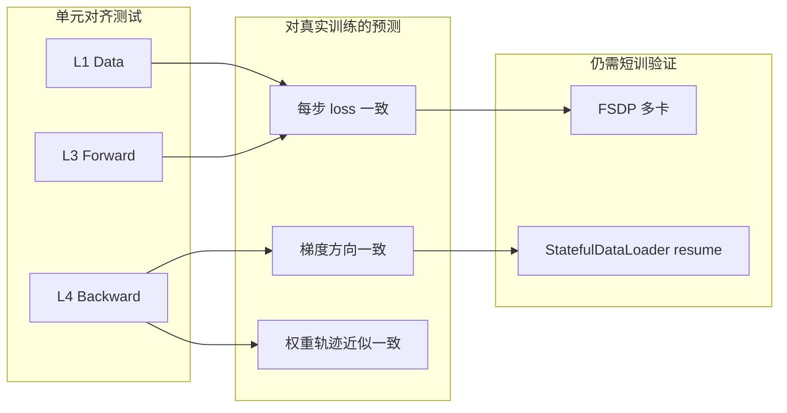
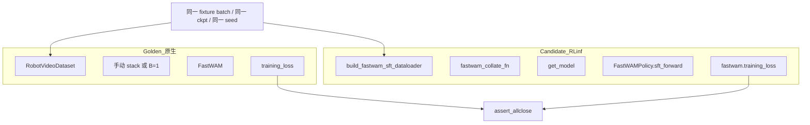
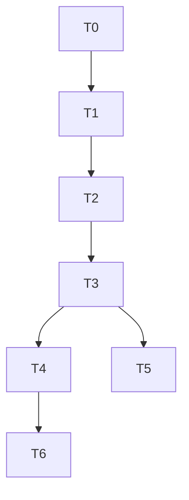
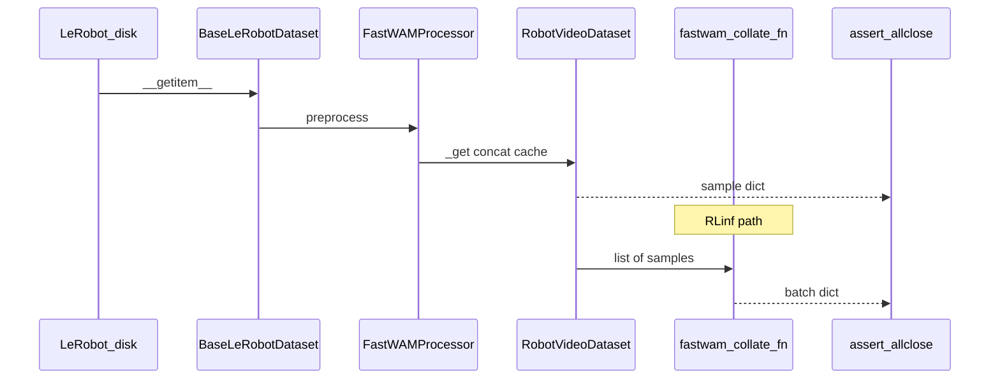
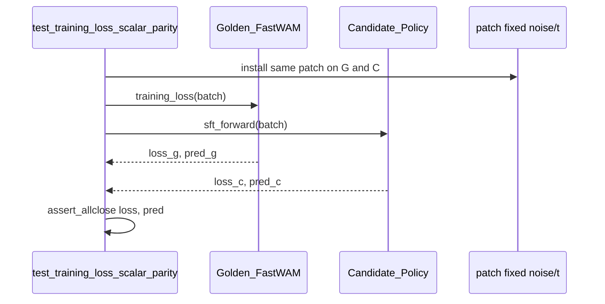
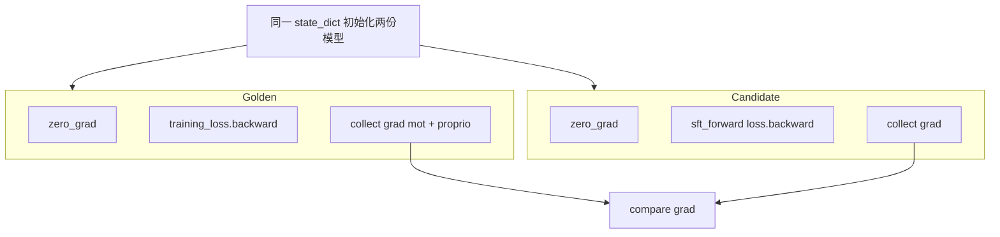
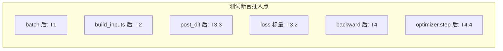

# FastWAM × RLinf SFT 整合 — 单元测试与数值对齐方案

> **文档性质**：测试设计（Test Plan）— 不跑真实长训，用单元/对齐测试预测整合版与原生 FastWAM 训练是否一致  
> **设计依据**：[fw_sft_design_op46_1_1.md](./fw_sft_design_op46_1_1.md)  
> **代码基线**：RLinf `D:\SRC\RL\RLinf` · FastWAM `D:\SRC\Robot\FastWAM`  
> **日期**：2026-05-31

---

## 目录

1. [测试目标与可预测性主张](#1-测试目标与可预测性主张)
2. [对照架构：Golden Path vs Candidate Path](#2-对照架构golden-path-vs-candidate-path)
3. [测试分层总览](#3-测试分层总览)
4. [环境与 Fixture 设计](#4-环境与-fixture-设计)
5. [数据管道对齐测试](#5-数据管道对齐测试)
6. [Forward 对齐测试（激活与 Loss）](#6-forward-对齐测试激活与-loss)
7. [Backward 对齐测试（梯度与权重更新）](#7-backward-对齐测试梯度与权重更新)
8. [整合层专属测试（RLinf 胶水代码）](#8-整合层专属测试rlinf-胶水代码)
9. [FSDP 与分布式：范围与冒烟](#9-fsdp-与分布式范围与冒烟)
10. [容差、种子与失败诊断](#10-容差种子与失败诊断)
11. [测试目录与用例清单](#11-测试目录与用例清单)
12. [CI 分级与验收门禁](#12-ci-分级与验收门禁)
13. [核心调用链（测试视角）](#13-核心调用链测试视角)
14. [附录：为何这些测试能「预测」真实训练](#14-附录为何这些测试能预测真实训练)

---

## 1. 测试目标与可预测性主张

### 1.1 要回答的问题

在 **不启动多 epoch 真实训练** 的前提下，尽可能回答：

| 问题 | 通过什么测试推断 |
|------|------------------|
| RLinf 数据管线是否与原生 `RobotVideoDataset` 产出相同 batch？ | **L1 数据对齐** |
| `FastWAMPolicy.sft_forward` 是否调用同一套 `training_loss`？ | **L0 契约 + L2 build_inputs** |
| 同 batch、同权重、同随机噪声下 **loss / 近输出层激活** 是否一致？ | **L3 Forward 对齐** |
| backward 后 **可训练参数梯度** 是否一致？一步 optimizer 后 **权重增量** 是否一致？ | **L4 Backward 对齐** |
| FSDP 包装是否改变 **单卡 unwrapped** 语义？ | **L5 FSDP 冒烟** |

### 1.2 可预测性主张（显式边界）

若以下条件在 CI 中全部满足，则 **有充分理由预期** 真实 SFT 训练曲线与原生 `Wan22Trainer` **统计意义上一致**（同 seed、同超参、同数据顺序）：

1. **数据**：单样本与 collate 后 batch 与 Golden 路径 **逐 tensor 对齐**（或误差低于阈值）。  
2. **Forward**：固定噪声与时间步后，`loss` / `loss_video` / `loss_action` 与 `pred_*` 对齐。  
3. **Backward**：`mot` + `proprio_encoder` 梯度对齐；单步 AdamW 后权重对齐。  
4. **冻结边界**：VAE /（未加载的）T5 无梯度，与原生 `_apply_dit_only_train_mode` 一致。

**不能由单元测试单独保证的**（需 smoke / 短训补充）：

- 多 GPU FSDP all-reduce 与 DeepSpeed ZeRO 的 **数值漂移累积**（仅能用 L5 冒烟 + 短步训练验证）。  
- `num_workers>0` DataLoader 非确定性（应用 `num_workers=0` 做对齐，生产用 workers>0 另做 smoke）。  
- 长训下学习率调度、数据 epoch 边界、checkpoint resume 状态一致性（单独 resume 测试）。



---

## 2. 对照架构：Golden Path vs Candidate Path

### 2.1 定义

| 路径 | 含义 | 入口 |
|------|------|------|
| **Golden（未整合原版）** | 直接调用 FastWAM 仓库 API，不经 RLinf | `FastWAM.training_loss(batch)`、`RobotVideoDataset[i]` |
| **Candidate（整合版）** | 经 RLinf 胶水层 | `build_fastwam_sft_dataloader` → `fastwam_collate_fn` → `get_model()` → `FastWAMPolicy.sft_forward(batch)` |

**Forward/Backward 数值对齐必须在「同一 `nn.Module` 实例语义」下进行**：  
Candidate 的 `policy.fastwam` 与 Golden 的 `model` 应 **同初始化、同 checkpoint、同 `requires_grad` 掩码**；差异只允许来自 RLinf 包装代码，不允许来自「加载了不同权重」。

### 2.2 对齐测试禁止事项

- **禁止** 在 Golden 与 Candidate 之间使用不同随机种子采样 `timestep` / `noise`（除非显式测试「随机性本身」）。  
- **禁止** Golden 用 `training_loss`、Candidate 用「手写简化 loss」（必须同一函数或 Candidate 内部仅多一层 `policy` 转发）。  
- **禁止** 首轮对齐测试就包 FSDP（FSDP 改变参数布局与梯度聚合）；对齐阶段用 **单卡、未 wrap 的 `FastWAMPolicy`**。

### 2.3 对照图



---

## 3. 测试分层总览

| 层级 | ID | 名称 | GPU | 权重 | 预测能力 |
|------|-----|------|-----|------|----------|
| L0 | T0 | 契约与注册 | 否 | 否 | 整合接线正确 |
| L1 | T1 | 数据与 Collate | 可选 | 否 | batch 正确 → forward 输入正确 |
| L2 | T2 | build_inputs | 是 | 是（VAE） | latent/context 正确 |
| L3 | T3 | Forward / Loss / 激活 | 是 | 是 | **核心：训练 loss 曲线可预测** |
| L4 | T4 | Backward / 梯度 / 一步更新 | 是 | 是 | **核心：优化轨迹可预测** |
| L5 | T5 | FSDP / Worker 冒烟 | 是 | 是 | 分布式不破坏单步语义 |
| L6 | T6 | Checkpoint 往返 | 否/是 | 可选 | 保存→加载不丢状态 |



---

## 4. 环境与 Fixture 设计

### 4.1 依赖与环境变量

```bash
export FASTWAM_PATH=D:/SRC/Robot/FastWAM/src   # 或 pip install -e FastWAM
export PYTHONPATH=$FASTWAM_PATH:$REPO_PATH:$PYTHONPATH
export RLINF_FASTWAM_TEST_CKPT=/path/to/tiny_or_full_ckpt.pt
export RLINF_FASTWAM_TEST_DATA=/path/to/tiny_lerobot_or_fixtures
export RLINF_FASTWAM_TEST_TEXT_CACHE=/path/to/text_embeds_cache
```

### 4.2 `conftest.py` 核心 Fixture

| Fixture | 作用 |
|---------|------|
| `global_seed` | `pytest` session：`torch.manual_seed(42)`、`numpy`、`cuda` |
| `deterministic_algorithms` | `torch.use_deterministic_algorithms(True, warn_only=True)` |
| `fastwam_cfg` | 最小 Hydra/OmegaConf，对齐 `libero_sft_fastwam.yaml` |
| `frozen_batch` | 磁盘 `tests/fixtures/fastwam/golden_batch_b1.pt`（**推荐**） |
| `golden_model` | `create_fastwam(..., device=cuda)` + `load_checkpoint` + `_apply_dit_only_train_mode` |
| `candidate_policy` | `get_model(fastwam_cfg)` 且 **不经过 FSDP** |
| `parity_hooks` | 注册 forward hook 收集 `pred_video` / `pred_action` |

**`golden_batch` 生成脚本**（一次性，纳入 `tests/fixtures/fastwam/generate_golden_batch.py`）：

```python
# 伪代码：用原生 Dataset 取 idx=0，B=1，保存所有 tensor 键
batch = {k: v.cpu() for k, v in sample.items() if torch.is_tensor(v)}
torch.save(batch, "golden_batch_b1.pt")
```

后续 L2–L4 **优先用 frozen batch**，避免 Dataset 随机增强导致 flaky。

### 4.3 轻量模型配置（CI 无 6B 权重时）

设计文档允许增加 **`tests/config/fastwam_tiny.yaml`**（实现阶段）：

- `video_dit_config.num_layers: 2`、`action_dit_config.num_layers: 2`  
- 固定随机初始化 + `skip_dit_load_from_pretrain: true`  
- 仅用于 **接线与梯度流** 测试；**数值对齐 Golden 必须用真实 2-layer 对 2-layer 或全量权重**

> 全量 6B 对齐测试标记 `@pytest.mark.gpu` + `@pytest.mark.large_model`， nightly 跑。

---

## 5. 数据管道对齐测试

### 5.1 测试目的

验证 RLinf 的 `build_fastwam_sft_dataloader` + `fastwam_collate_fn` **没有改变** FastWAM 已定义的 batch 语义（键、shape、dtype、值域）。

### 5.2 用例设计

#### T1.1 `test_dataset_single_sample_keys_and_shapes`

- **Golden**：直接构造 `RobotVideoDataset(...)[idx]`（与配置一致：`num_frames=33`, `ratio=4`, `video_size`）。  
- **断言**：键集合包含  
  `video, action, proprio, context, context_mask, action_is_pad, image_is_pad, proprio_is_pad`（见设计 §9.1 v2.1 勘误）。  
- **形状**（LIBERO 224×448 示例）：  
  - `video`: `[3, 9, 224, 448]`  
  - `action`: `[32, 7]` 或 `[32, 23]`（按 task）  
  - `context`: `[128, 4096]`

#### T1.2 `test_collate_matches_manual_stack`

- 取同一 `idx` 的 2 个样本：  
  - Golden：`torch.stack([s0[k], s1[k]])`  
  - Candidate：`fastwam_collate_fn([s0, s1])`  
- **断言**：逐键 `torch.equal` 或 `allclose`。

#### T1.3 `test_rlinf_dataloader_one_batch_parity`

- Candidate：`build_fastwam_sft_dataloader(..., world_size=1, rank=0)`，`num_workers=0`。  
- 与 Golden：同一 `dataset` 实例 + 同一 `manual collate` 比较 **第一个 batch**（固定 `DistributedSampler` seed）。

#### T1.4 `test_processor_normalization_stats`

- 加载 `dataset_stats.json`，对固定 raw 动作向量调用：  
  - Golden：`FastWAMProcessor` + `set_normalizer_from_stats`  
  - Candidate：RLinf 构建的 processor（应同一类同一 stats）  
- **断言**：归一化后 `mean≈0, std≈1`（z-score）或 min/max 边界（min-max）。

#### T1.5 `test_text_cache_lookup_deterministic`

- 固定 `prompt` 字符串 → `_get_cached_text_context` 两次  
- **断言**：`context` / `context_mask` 完全一致。

### 5.3 数据流（测试视角）



### 5.4 失败时含义

| 失败现象 | 可能根因 |
|----------|----------|
| 缺 `proprio_is_pad` | RLinf collate 漏键 |
| `video` 时间维不是 9 | `action_video_freq_ratio` 或 collate 错 |
| `context` 不一致 | cache 路径或 `context_len` 配置错 |
| action 数值差 | `shape_meta` / stats 路径不一致 |

---

## 6. Forward 对齐测试（激活与 Loss）

### 6.1 测试目的

在 **固定 batch、固定权重、固定噪声与时间步** 下，证明 Candidate 的 forward 与 Golden 的 `training_loss` **数学等价**。

### 6.2 关键技巧：注入确定性噪声

原生 `training_loss` 内部随机采样：

```python
noise_video = torch.randn_like(input_latents)
timestep_video = scheduler.sample_training_t(...)
```

对齐测试必须 **patch** 为确定性（Golden 与 Candidate 用同一 patch）：

```python
@pytest.fixture
def fixed_noise_patch(monkeypatch):
    def _fake_randn_like(t):
        g = torch.Generator(device=t.device)
        g.manual_seed(12345)
        return torch.randn(t.shape, dtype=t.dtype, device=t.device, generator=g)
    def _fake_sample_t(batch_size, device, dtype):
        return torch.full((batch_size,), 500.0, device=device, dtype=dtype)  # 固定 t
    monkeypatch.setattr(torch, "randn_like", _fake_randn_like)
    monkeypatch.setattr(model.train_video_scheduler, "sample_training_t", _fake_sample_t)
    # 同理 action_scheduler
```

**更稳妥**：在 FastWAM 仓库增加 **测试专用** `training_loss_deterministic(sample, noise_video, noise_action, t_v, t_a)`（实现阶段可选）；无则需 monkeypatch 两个 model 实例的相同方法。

### 6.3 Hook 监测点（近输出层）

| Hook 位置 | 张量 | 意义 |
|-----------|------|------|
| `video_expert.post_dit` 输出 | `pred_video` | 视频分支接近 loss |
| `action_expert.post_dit` 输出 | `pred_action` | 动作分支接近 loss |
| `mot.forward` 输出 | `tokens_out["video"]` 等 | MoT 出口（可选，更严） |
| `training_loss` 返回 | `loss`, `loss_video`, `loss_action` | 标量监督 |

```python
activations = {}
def hook_post_video(module, inp, out):
    activations["pred_video"] = out.detach().float().cpu()
model.video_expert.post_dit.register_forward_hook(hook_post_video)
```

### 6.4 用例设计

#### T3.1 `test_build_inputs_parity`

- 输入：同一 `frozen_batch`  
- Golden：`golden_model.build_inputs(batch)`  
- Candidate：`candidate_policy.fastwam.build_inputs(batch)`  
- **断言**：`input_latents`, `context`, `action`（及 mask）`allclose`  
- **注意**：VAE encode 在 `no_grad` 下应 deterministic；若 tiled 不同则都设 `tiled=False`

#### T3.2 `test_training_loss_scalar_parity`

- 同步 patch 噪声/时间步  
- Golden：`loss_g, dict_g = model.training_loss(batch)`  
- Candidate：`out = policy(forward_type=SFT, data=batch)`  
- **断言**：  
  - `loss_g ≈ out["loss"]`  
  - `dict_g["loss_video"] ≈ out["dynamics_loss"]`（RLinf 日志映射名）  
  - `dict_g["loss_action"] ≈ out["action_loss"]`

#### T3.3 `test_pred_video_action_activation_parity`

- 在 T3.2 基础上比较 hook 捕获的 `pred_video` / `pred_action`  
- **容差**：bf16 下 `rtol=1e-2, atol=1e-3`（见 §10）

#### T3.4 `test_first_frame_latent_not_noised`

- `fuse_vae_embedding_in_latents=True` 时  
- 断言 `latents[:,:,0:1]` 与 clean first frame 一致（Golden vs Candidate）

#### T3.5 `test_loss_mask_action_is_pad`

- 构造 `action_is_pad` 一半为 True 的 batch  
- 改 pad 处 action target → loss 应 **不变**（验证 mask 生效）  
- Golden/Candidate 行为一致

### 6.5 Forward 序列图（对齐测试执行）



### 6.6 `sft_forward` 逻辑（必须在测试中覆盖）

整合版应仅为薄封装（设计 §6）：

```python
# 期望实现
def sft_forward(self, data=None, **kwargs):
    loss_total, loss_dict = self.fastwam.training_loss(data)
    return {
        "loss": loss_total,
        "dynamics_loss": loss_dict["loss_video"],  # 映射
        "action_loss": loss_dict["loss_action"],
    }
```

**T0.2** 应用 `inspect.getsource` 或 mock 断言 **未** 重复实现 loss。

---

## 7. Backward 对齐测试（梯度与权重更新）

### 7.1 测试目的

证明整合版 backward 后，**可训练参数** 的梯度与原生路径一致，从而预测 **真实训练权重轨迹** 一致（在相同 optimizer 超参下）。

### 7.2 可训练参数范围（与原生一致）

来自 `Wan22Trainer._apply_dit_only_train_mode`（`trainer.py:286-295`）：

- `requires_grad=True`：`model.mot`（含 video_expert + action_expert）、`proprio_encoder`  
- `requires_grad=False`：`vae`、其余

**T4.0** `test_trainable_param_mask_parity`：Golden/Candidate 参数名集合与 `requires_grad` 掩码一致。

### 7.3 梯度对齐流程



**注意**：必须从 **两份独立模块** 加载同一 `state_dict`，各自 backward 一次；不要共享计算图。

#### T4.1 `test_backward_grad_parity_mot`

- 固定 batch + 固定 noise patch（同 T3）  
- 对每个 `name, p in model.mot.named_parameters()`：  
  - 若 `p.grad is None` → 仅当 Golden 也为 None  
  - 否则 `torch.allclose(g_g, g_c, rtol=..., atol=...)`  
- **报告**：`max_abs_diff`, `relative_diff` 写入 pytest 输出（便于回归）

#### T4.2 `test_backward_grad_parity_proprio_encoder`

- 同上，仅 `proprio_encoder` 参数

#### T4.3 `test_frozen_modules_no_grad`

- VAE 参数 `grad is None`（Golden/Candidate）  
- 若意外加载 T5，T5 也无 grad

#### T4.4 `test_one_optimizer_step_weight_parity`

- 使用 **同一 AdamW 超参**（`lr=1e-4, betas=(0.9,0.95), weight_decay=0.01`）  
- Golden：`loss.backward(); optimizer_g.step()`  
- Candidate：同上  
- **断言**：step 后 `mot` 与 `proprio_encoder` 权重 `allclose`  
- 这是 **比梯度更端到端** 的预测指标（包含 optimizer 内核）

#### T4.5 `test_grad_norm_matches_trainer`

- 计算 `torch.nn.utils.clip_grad_norm_(mot.parameters(), max_norm=1.0)`  
- Golden vs Candidate **grad_norm** 一致（RLinf worker 用相同 clip）

### 7.4 近「输入层」梯度说明

FastWAM 可训练模块的「最输入侧」是：

- `action_expert` 的 `action_token_embed`（动作 token 投影）  
- `video_expert` 的 `patch_embedding`（latent patch）  
- `proprio_encoder`（线性层）

**不必** 测 VAE 输入图像梯度（应不存在）。  
T4.1 已覆盖 `mot` 内最前层参数。

### 7.5 失败时含义

| 失败现象 | 可能根因 |
|----------|----------|
| loss 一致但 grad 不一致 | `sft_forward` 多算了一次 loss / 图断开 |
| grad 尺度差 2× | FSDP 误 wrap 或重复 backward |
| proprio grad 仅一侧有 | `get_model` 未开启 proprio_encoder train |
| step 后权重发散 | Candidate optimizer 参数组含 vae |

---

## 8. 整合层专属测试（RLinf 胶水代码）

### 8.1 T0 契约测试（无 GPU）

| 用例 | 断言 |
|------|------|
| `test_supported_model_fastwam_registered` | `SupportedModel("fastwam")` 在 `EMBODIED_MODEL` |
| `test_register_model_get_model_smoke` | 参考 `test_custom_model_registration.py`，tiny cfg 返回 `FastWAMPolicy` |
| `test_validate_fastwam_sft_cfg` | 缺 `text_embedding_cache_dir` 抛错 |
| `test_fsdp_vla_worker_build_dataloader_branch` | mock cfg.model_type=fastwam 调用 build_fastwam |
| `test_forward_type_sft_dispatch` | mock `training_loss`，断言 `ForwardType.SFT` 被调用 |

### 8.2 `get_model` 对齐原生工厂

| 用例 | 断言 |
|------|------|
| `test_get_model_uses_create_fastwam` | 参数传入 `video_scheduler` / `loss.lambda_video` 默认值 |
| `test_get_model_freeze_vae` | `fastwam.vae` 参数 `requires_grad=False` |
| `test_load_checkpoint_mot_keys` | 加载 `mot`+`proprio_encoder` pt 后 state 一致 |

### 8.3 FSDPVlaSftWorker 指标映射

```python
# get_train_model_output 期望
step_metrics = {
    "loss": ...,
    "dynamics_loss": ...,  # 来自 loss_video
    "action_loss": ...,
}
```

**T0.5** mock forward 返回 dict，断言 worker 不丢键。

---

## 9. FSDP 与分布式：范围与冒烟

数值 **全量对齐** 在 **未 wrap** 模型上完成。FSDP 仅做 **语义不破坏** 冒烟：

#### T5.1 `test_fsdp_world_size_1_loss_unchanged`

- `world_size=1` FSDP2 wrap 后，单步 `loss` 与 unwrap 差 < 阈值（bf16 下允许略大）

#### T5.2 `test_fsdp_no_grad_on_vae`

- wrap 后 VAE 仍无 grad

#### T5.3 `test_distributed_sampler_partition`

- `world_size=2` mock：两 rank 样本索引不重叠、并集覆盖 dataset

**不在 L5 做** Golden vs Candidate 梯度对齐（FSDP 分片后需 per-rank 比较，成本高，放 nightly）。

---

## 10. 容差、种子与失败诊断

### 10.1 随机种子规范

```python
SEED = 42
torch.manual_seed(SEED)
torch.cuda.manual_seed_all(SEED)
np.random.seed(SEED)
# DataLoader: num_workers=0, generator=torch.Generator().manual_seed(SEED)
```

### 10.2 数值容差建议

| 对象 | dtype | rtol | atol | 备注 |
|------|-------|------|------|------|
| `loss` 标量 | fp32 | 1e-5 | 1e-6 | 优先 fp32 跑对齐 |
| `loss` 标量 | bf16 | 1e-2 | 1e-4 | 与训练一致时用 |
| `pred_video` / `pred_action` | bf16 | 1e-2 | 1e-3 | 大 tensor 可放宽 |
| `input_latents` | bf16 | 1e-3 | 1e-3 | VAE 确定性前提 |
| 梯度 | bf16 | 1e-2 | 1e-4 | 深网络累积误差 |
| 权重 after 1 step | fp32 master | 1e-4 | 1e-5 | optimizer fp32 状态 |

使用 `torch.testing.assert_close` 并打印 `max_diff`：

```python
torch.testing.assert_close(a, b, rtol=rtol, atol=atol, msg=lambda m: f"max_diff={(a-b).abs().max()}")
```

### 10.3 Golden 文件回归（可选）

对 tiny 配置将 `loss`、`pred_action.mean()` 存为 `tests/fixtures/fastwam/golden_forward_b1.json`，CI 比对 **防止无意改动 training_loss**。

---

## 11. 测试目录与用例清单

```
tests/
  fixtures/
    fastwam/
      golden_batch_b1.pt          # 预生成
      dataset_stats_tiny.json
      text_cache/                 # 1-2 个 .pt
      generate_golden_batch.py
  unit_tests/
    fastwam/
      conftest.py
      test_contract.py              # T0
      test_data_collate_parity.py    # T1
      test_build_inputs_parity.py   # T2
      test_forward_loss_parity.py   # T3
      test_backward_grad_parity.py  # T4
      test_fsdp_smoke.py            # T5
      test_checkpoint_roundtrip.py  # T6
      utils/
        parity.py                   # allclose, hooks, clone_model
        noise_patch.py              # 确定性噪声
```

### 11.1 用例总表

| ID | 用例名 | 层级 | GPU | 大模型 |
|----|--------|------|-----|--------|
| T0.1 | test_supported_model_fastwam_registered | L0 | 否 | 否 |
| T0.2 | test_sft_forward_delegates_training_loss | L0 | 否 | 否 |
| T1.1 | test_dataset_single_sample_keys_and_shapes | L1 | 否 | 否 |
| T1.2 | test_collate_matches_manual_stack | L1 | 否 | 否 |
| T1.3 | test_rlinf_dataloader_one_batch_parity | L1 | 否 | 否 |
| T2.1 | test_build_inputs_parity | L2 | 是 | 是 |
| T3.2 | test_training_loss_scalar_parity | L3 | 是 | 是 |
| T3.3 | test_pred_video_action_activation_parity | L3 | 是 | 是 |
| T4.1 | test_backward_grad_parity_mot | L4 | 是 | 是 |
| T4.4 | test_one_optimizer_step_weight_parity | L4 | 是 | 是 |
| T5.1 | test_fsdp_world_size_1_loss_unchanged | L5 | 是 | 是 |
| T6.1 | test_save_load_mot_state_dict_roundtrip | L6 | 否 | 可选 |

---

## 12. CI 分级与验收门禁

### 12.1 三级 CI

| 级别 | 触发 | 内容 |
|------|------|------|
| **PR CPU** | 每个 PR | T0 + T1（fixture 小数据）+ import |
| **PR GPU** | 有 GPU runner | T2–T4 tiny 或 1-step ckpt |
| **Nightly** | 每日 | T2–T4 **全量 6B** + T5 |

### 12.2 合并门禁（实现完成后）

合并前 **必须通过**：

1. T1.2 collate 对齐  
2. T3.2 loss 对齐（bf16 容差内）  
3. T4.1 mot 梯度对齐  
4. T4.4 一步 optimizer 权重对齐  

可选增强：短训 50 step native vs RLinf，比较 loss 曲线 max relative diff < 1%。

### 12.3 pytest 标记

```python
# pyproject.toml / pytest.ini
markers =
    gpu: needs CUDA
    large_model: needs Wan2.2 6B weights
    parity: numerical parity tests
```

```bash
pytest tests/unit_tests/fastwam -m "not large_model" -v
pytest tests/unit_tests/fastwam -m "parity and gpu" --run-large-model
```

---

## 13. 核心调用链（测试视角）

### 13.1 Candidate 端到端（单步训练微缩）

```text
train_vla_sft.py
  └─ SFTRunner.run()
       └─ FSDPVlaSftWorker.run_training()     # 对齐测试可先测 unwrap 版
            ├─ next(DataLoader) → batch
            ├─ FastWAMPolicy.sft_forward(batch)
            │    └─ FastWAM.training_loss(batch)
            │         ├─ build_inputs()  → VAE.encode (no_grad)
            │         ├─ add_noise + training_target
            │         ├─ video_expert.pre_dit / action_expert.pre_dit
            │         ├─ mot.forward()
            │         ├─ post_dit → pred_*
            │         └─ MSE → loss_video, loss_action
            ├─ loss / grad_accum
            └─ loss.backward() → optimizer_step()
```

### 13.2 Golden 对照（单步）

```text
RobotVideoDataset.__getitem__  → sample
manual collate / B=1           → batch
FastWAM.training_loss(batch)   → 同上（无 RLinf）
loss.backward()                → grad
AdamW.step()                   → Δw
```

### 13.3 测试插入点示意图



---

## 14. 附录：为何这些测试能「预测」真实训练

### 14.1 训练步的数学分解

一步 SFT 更新可分解为：

\[
\theta_{t+1} = \theta_t - \eta \cdot \text{AdamW}\left( \nabla_\theta \mathcal{L}(\theta_t; b_t, \xi_t) \right)
\]

其中 \(b_t\) 为 batch，\(\xi_t\) 为噪声与时间步随机性。

- **T1** 保证 \(b_t\) 一致 → \(\mathcal{L}\) 自变量一致。  
- **T3** 固定 \(\xi_t\) 后保证 \(\mathcal{L}\) 值一致 → forward 一致。  
- **T4** 保证 \(\nabla_\theta \mathcal{L}\) 一致 → backward 一致。  
- **T4.4** 保证 \(\theta_{t+1}\) 一步一致 → **归纳** 多步轨迹一致（同 optimizer、同数据顺序时）。

### 14.2 与原生 `Wan22Trainer` 的差异项

| 差异 | 单元测试是否覆盖 | 补充验证 |
|------|------------------|----------|
| FSDP vs DeepSpeed ZeRO | 部分（T5.1） | 短训 8 卡对比 |
| ResumableEpochSampler vs DistributedSampler | T1.3 首 batch | 同 seed 多 step |
| 日志键 `dynamics_loss` 映射 | T0 | 无影响数值 |
| Accelerate mixed precision vs FSDP mp | T3 bf16 | 短训 |

### 14.3 建议的「最小短训」验收（非单元测试，但强烈推荐）

在单元测试通过后，**各跑 100 step**（同数据子集、同 lr）：

- 原生：`Wan22Trainer`  
- 整合：`SFTRunner` + `FSDPVlaSftWorker`  

比较：

- `loss` 逐步 max relative diff < **1%**（bf16）  
- 第 100 step 的 `mot` 权重相对 diff < **0.1%**（fp32 比较）

单元测试解决 **「单步正确」**；短训解决 **「累积与分布式」**。

### 14.4 分析过程小结

1. 阅读 [fw_sft_design_op46_1_1.md](./fw_sft_design_op46_1_1.md) 确认整合边界：**数据 RLinf 薄包装，训练核心 `training_loss` 不复制**。  
2. 阅读 FastWAM `fastwam.py:448-568` 确认 loss 与 hook 点。  
3. 阅读 `trainer.py:286-295` 确认可训练参数掩码。  
4. 设计 Golden/Candidate 双路径 + 确定性噪声 patch。  
5. 分层 L0–L6，优先 **数据 → forward → backward → 一步权重**。  
6. FSDP 仅冒烟，避免混淆对齐失败根因。

---

## 附录 B：参考实现片段（`parity.py`）

```python
def clone_trainable_state(model_a, model_b):
    """将 model_a 的 mot + proprio_encoder 权重复制到 model_b。"""
    model_b.mot.load_state_dict(model_a.mot.state_dict())
    if model_a.proprio_encoder is not None:
        model_b.proprio_encoder.load_state_dict(model_a.proprio_encoder.state_dict())

def assert_grad_parity(params_g, params_c, rtol=1e-2, atol=1e-4):
    for (n_g, p_g), (n_c, p_c) in zip(params_g, params_c):
        assert n_g == n_c
        if p_g.grad is None:
            assert p_c.grad is None
            continue
        torch.testing.assert_close(p_g.grad, p_c.grad, rtol=rtol, atol=atol, msg=n_g)
```

---

*本文档为测试方案，不包含测试代码实现；实现时请与 [fw_sft_design_op46_1_1.md](./fw_sft_design_op46_1_1.md) 及 FastWAM/RLinf 实际合并后的模块路径同步更新。*
