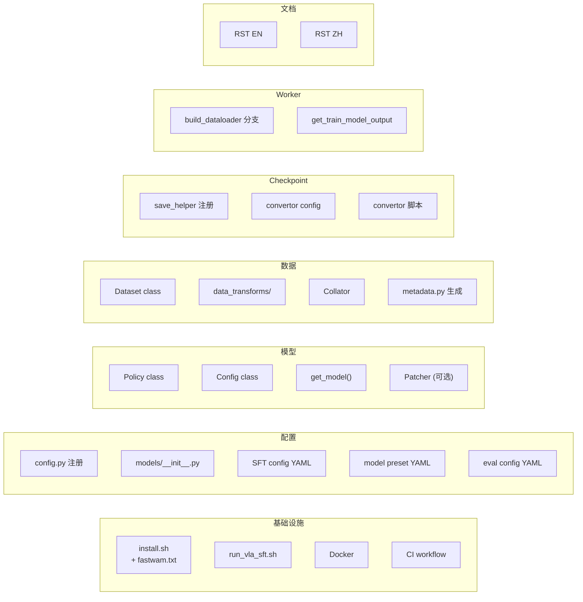

# RLinf 整合 FastWAM SFT — 完整设计方案 v3

> **文档性质**：工程设计与实现指导（Design Spec v3 — 基于 DreamZero 整合全面对标后的增补版）  
> **前版**：[fw_sft_design_op46_1_1.md](./fw_sft_design_op46_1_1.md)（v2.1 代码校验版）  
> **方法论**：逐一对标 DreamZero 在 RLinf 中的 **所有整合触点**（~50 个文件），识别 v2.1 的遗漏与设计缺陷，补齐并改良  
> **代码基线**：RLinf `/home/luogang/S/RL/RLinf` · FastWAM `/home/luogang/S/Rb/FastWAM` · DreamZero `/home/luogang/S/Rb/dreamzero`  
> **日期**：2026-05-31

---

## v3 相对 v2.1 的改良摘要

| # | v2.1 状态 | v3 改良 |
|---|-----------|---------|
| 1 | 未涉及 `install.sh` 安装脚本 | 新增 §A：完整的 `install_fastwam_model()` 设计 |
| 2 | 未涉及 `run_vla_sft.sh` 修改 | 新增 §B：`FASTWAM_PATH` 导出 |
| 3 | 未涉及数据增强/增广设计 | 新增 §C：FastWAM 数据增强策略与 DreamZero 对比 |
| 4 | 未涉及归一化统计生成工具 | 新增 §D：`generate_fastwam_stats.py` 工具设计 |
| 5 | Checkpoint 转换放错位置（`toolkits/`） | 修正 §E：移到 `rlinf/utils/ckpt_convertor/fsdp_convertor/` |
| 6 | 未涉及 Eval 配置 | 新增 §F：eval YAML 模板 |
| 7 | 未涉及 CI/E2E 测试 | 新增 §G：GitHub Actions 工作流 |
| 8 | 未涉及文档 | 新增 §H：RST 文档 (EN/ZH) |
| 9 | 未涉及多相机拼接模式的配置化 | 新增 §I：`concat_multi_camera` 配置规范 |
| 10 | 未涉及 FastWAM-Joint / FastWAM-IDM 变体 | 新增 §J：模型变体支持 |
| 11 | 数据增广部分过于简略 | 在 §C 中详细设计数据增广策略 |

> **本文档组织方式**：先对标分析（Part 1），后补齐设计（Part 2），最后给出完整文件清单（Part 3）。v2.1 中已校验正确的内容（模型架构、Policy 类、Forward/Backward 流程、内存估算等）不重复，读者应结合两份文档使用。

---

# Part 1: 对标分析 — DreamZero 整合触点 vs FastWAM 设计

## 1. DreamZero 整合全图

以下列出 DreamZero 在 RLinf 中的 **所有** 整合文件，并标注 FastWAM 对应物是否已在 v2.1 中设计。



### 逐项对标表

| DreamZero 文件 / 功能 | FastWAM v2.1 状态 | v3 动作 |
|----------------------|-------------------|---------|
| `requirements/install.sh` install_dreamzero_model | **缺失** | §A 新增 |
| `requirements/embodied/models/dreamzero.txt` | **缺失** | §A 新增 `fastwam.txt` |
| `examples/sft/run_vla_sft.sh` DREAMZERO_PATH | **缺失** | §B 新增 FASTWAM_PATH |
| `rlinf/config.py` SupportedModel.DREAMZERO | ✅ v2.1 §5 已设计 | 保持 |
| `rlinf/models/__init__.py` register_model | ✅ v2.1 §5 已设计 | 保持 |
| `rlinf/models/embodiment/dreamzero/__init__.py` get_model | ✅ v2.1 §7 已设计 | 保持（使用 create_fastwam） |
| `rlinf/models/embodiment/dreamzero/dreamzero_policy.py` | ✅ v2.1 §6 已设计 | 保持 |
| `rlinf/models/embodiment/dreamzero/dreamzero_config.py` | ✅ v2.1 §5.3 已设计 | 保持 |
| `rlinf/models/embodiment/dreamzero/patch/` (Patcher) | ✅ v2.1 §7.3 已评估（不需要） | 保持 |
| `rlinf/data/datasets/dreamzero/dreamzero.py` Dataset | ✅ v2.1 §8 已设计（复用 RobotVideoDataset） | 保持 |
| `rlinf/data/datasets/dreamzero/sampling_strategy.py` | 不需要（FastWAM 有自己的采样） | 保持 |
| `rlinf/data/datasets/dreamzero/utils.py` | 不需要（复用 FastWAM 内部工具） | 保持 |
| `rlinf/data/datasets/dreamzero/data_transforms/__init__.py` 注册表 | **缺失** — 数据增强设计不足 | §C 新增 |
| `rlinf/data/datasets/dreamzero/data_transforms/base.py` 协议 | **缺失** | §C 评估 |
| `rlinf/data/datasets/dreamzero/data_transforms/libero_sim.py` 增强链 | **缺失** — v2.1 说"复用 Processor"但未设计增强 | §C 新增 |
| `rlinf/data/datasets/dreamzero/data_transforms/dream_transform.py` | 不需要（FastWAM 不用 groot transform） | 保持 |
| `rlinf/workers/sft/fsdp_vla_sft_worker.py` 分支 | ✅ v2.1 §8 已设计 | 保持 |
| `rlinf/utils/ckpt_convertor/fsdp_convertor/utils.py` save_helper | **错误** — v2.1 放在 toolkits | §E 修正 |
| `rlinf/utils/ckpt_convertor/fsdp_convertor/config/*.yaml` | **缺失** | §E 新增 |
| `toolkits/lerobot/generate_dreamzero_metadata.py` | **缺失** — 无统计生成工具 | §D 新增 |
| `examples/sft/config/libero_sft_dreamzero_*.yaml` | ✅ v2.1 已提及 | 补充 eval 配置 |
| `examples/sft/config/model/dreamzero_*.yaml` | ✅ v2.1 已提及 | 保持 |
| `examples/embodiment/config/*_eval_dreamzero.yaml` | **缺失** | §F 新增 |
| `docs/source-en/rst_source/examples/embodied/sft_dreamzero.rst` | **缺失** | §H 新增 |
| `docs/source-zh/rst_source/examples/embodied/sft_dreamzero.rst` | **缺失** | §H 新增 |
| `.github/workflows/sft-e2e-tests.yml` DreamZero job | **缺失** | §G 新增 |
| `tests/e2e_tests/sft/droid_sft_wan22.yaml` | **缺失** | §G 新增 |

---

# Part 2: 补齐设计

## §A. 安装脚本（install.sh + fastwam.txt）

### A.1 `requirements/embodied/models/fastwam.txt`

```txt
# FastWAM SFT dependencies — aligned with FastWAM pyproject.toml
# NOTE: FastWAM itself via pip install -e $FASTWAM_PATH or PYTHONPATH
accelerate>=1.12.0
deepspeed>=0.18.5
modelscope>=1.34.0
torchcodec>=0.5
av>=16.0.0
safetensors>=0.5.3
lerobot>=0.2.0
albumentations>=1.4.0
```

### A.2 `install.sh` 新增 `install_fastwam_model()`

在 `SUPPORTED_MODELS` 数组中添加 `"fastwam"`，并新增安装函数：

```bash
# 约 line 77, SUPPORTED_MODELS 数组
SUPPORTED_MODELS=("openvla" ... "dreamzero" "fastwam" "qwen3_vl")

# 新增安装函数（参照 install_dreamzero_model 模式）
install_fastwam_model() {
    case "$ENV_NAME" in
        libero)
            create_and_sync_venv
            install_common_embodied_deps
            install_libero_env
            uv pip install -r $SCRIPT_DIR/embodied/models/fastwam.txt
            install_flash_attn
            ;;
        "")
            create_and_sync_venv
            install_common_embodied_deps
            uv pip install -r $SCRIPT_DIR/embodied/models/fastwam.txt
            install_flash_attn
            ;;
        *)
            echo "Environment '$ENV_NAME' is not supported for FastWAM model." >&2
            exit 1
            ;;
    esac
}
```

**使用方式**：
```bash
bash requirements/install.sh embodied --model fastwam
bash requirements/install.sh embodied --model fastwam --env libero
```

---

## §B. 训练启动脚本（run_vla_sft.sh）

在 `examples/sft/run_vla_sft.sh` 中添加 FastWAM 路径导出（与 DREAMZERO_PATH 并列）：

```bash
# 新增（在 DREAMZERO_PATH 后面）
export FASTWAM_PATH=${FASTWAM_PATH:-"/path/to/FastWAM/src"}
export PYTHONPATH=${FASTWAM_PATH}:$PYTHONPATH
```

**设计决策**：`FASTWAM_PATH` 指向 `FastWAM/src` 目录（而非 FastWAM 根目录），因为 Python import 路径是 `from fastwam.models.wan22.fastwam import FastWAM`。

---

## §C. 数据增强策略设计

### C.1 DreamZero vs FastWAM 数据增强对比

| 增强类型 | DreamZero | FastWAM |
|----------|-----------|---------|
| **视频裁剪** | `VideoCrop(scale=0.95)` 随机裁剪 | 无（仅 CenterCrop） |
| **视频缩放** | `VideoResize(256×256)` | `Resize` + `CenterCrop` + `Normalize(0.5, 0.5)` |
| **颜色抖动** | `VideoColorJitter(b=0.3,c=0.4,s=0.5,h=0.08)` | 无 |
| **State/Action 归一化** | q99 归一化 | min/max 或 q01/q99 或 z-score（可配置） |
| **文本增强** | 无 | 无 |
| **时间采样** | multi_anchor（语言感知） | `action_video_freq_ratio` 固定抽稀 |

### C.2 设计决策

**结论**：FastWAM 的数据增强在 `FastWAMProcessor` 和 `RobotVideoDataset` 内部处理，**不需要** RLinf 侧的 `data_transforms/` 目录。理由：

1. FastWAM 的 Processor 已经处理了 resize、normalize、multi-camera concat
2. FastWAM **没有** 使用 VideoCrop 或 VideoColorJitter（它的训练配方不依赖这些增强）
3. 复制 DreamZero 的增强链到 FastWAM 会引入训练差异，违背"与原版等价"原则

**但是**，需要在配置中暴露以下参数，允许用户通过 RLinf config 控制 FastWAM Processor 的行为：

```yaml
# examples/sft/config/libero_sft_fastwam.yaml
data:
  # --- FastWAM Processor 参数 ---
  norm_default_mode: "min/max"          # 归一化模式: min/max, q01/q99, z-score
  use_stepwise_action_norm: false       # 是否使用逐步归一化
  concat_multi_camera: "horizontal"     # 多相机拼接: horizontal/vertical/robotwin/null
  action_state_transforms: []           # 可选的 action/state 变换列表
  delta_action_dim_mask: null           # delta action 维度掩码
```

### C.3 如果未来需要添加数据增强

若实验发现 FastWAM 需要视频增强（如 ColorJitter），可以通过 FastWAM Processor 的 `train_transforms` 参数注入，**不需要** 在 RLinf 侧实现新的 transform 模块：

```yaml
# 在 fastwam.yaml model preset 中
data:
  train:
    processor:
      train_transforms:
        camera_key_1:
          - _target_: torchvision.transforms.ColorJitter
            brightness: 0.3
            contrast: 0.4
```

这利用了 FastWAM Processor 已有的 `train_transforms` 机制（per-camera-key 的 torchvision transform 列表）。

---

## §D. 归一化统计生成工具

### D.1 背景

DreamZero 有 `toolkits/lerobot/generate_dreamzero_metadata.py` 生成 `metadata.json`（含 q99 统计）。FastWAM 使用 `dataset_stats.json`（含 min/max/q01/q99/mean/std），由 `BaseLeRobotDataset._compute_norm_stats()` 自动计算并缓存。

### D.2 设计决策

**不需要** 在 `toolkits/` 中新建 `generate_fastwam_metadata.py`。理由：

1. FastWAM 的 `RobotVideoDataset` 在首次加载时**自动**计算统计（如果缓存不存在）
2. 统计结果缓存到 `dataset_stats.json`，基于 dataset_dirs + transforms 的 hash 命名
3. 后续加载会自动复用缓存

**但需要**在 `validate_fastwam_sft_model_cfg()` 中验证：

```python
def validate_fastwam_sft_model_cfg(cfg):
    # ...
    # 如果指定了 pretrained_norm_stats，验证文件存在
    stats_path = cfg.get("pretrained_norm_stats", None)
    if stats_path is not None and not Path(stats_path).exists():
        raise FileNotFoundError(
            f"pretrained_norm_stats path does not exist: {stats_path}. "
            "Run training once to generate, or copy from a previous run."
        )
```

### D.3 运维指导

首次训练时，RLinf 通过 FastWAM 的 Dataset 自动生成 `dataset_stats.json`。之后的训练和评估需要指定 `pretrained_norm_stats` 路径来复用这些统计：

```yaml
data:
  pretrained_norm_stats: /path/to/dataset_stats.json
```

---

## §E. Checkpoint 转换（位置修正 + 实现）

### E.1 v2.1 错误

v2.1 将 checkpoint 转换放在 `toolkits/ckpt_convertor/`，但 DreamZero 的模式是：
- **save helper 注册**在 `rlinf/utils/ckpt_convertor/fsdp_convertor/utils.py` 的 `_MODEL_SAVE_HELPER_REGISTRY`
- **convertor config** 在 `rlinf/utils/ckpt_convertor/fsdp_convertor/config/`

### E.2 修正设计

**新增文件**：
```
rlinf/utils/ckpt_convertor/fsdp_convertor/
  utils.py                    # 新增 fastwam_save_helper 到 _MODEL_SAVE_HELPER_REGISTRY
  config/
    fsdp_fastwam_convertor.yaml   # 新增 FastWAM 转换配置
```

**save helper 实现**：

```python
# 在 utils.py 的 _MODEL_SAVE_HELPER_REGISTRY 中添加

def fastwam_save_helper(model_state_dict, model_config, save_path, **kwargs):
    """Convert FSDP full weights to FastWAM native checkpoint format."""
    import os

    # 提取 mot + proprio_encoder 权重
    mot_sd = {}
    pe_sd = {}
    for key, value in model_state_dict.items():
        if key.startswith("fastwam.mot."):
            mot_sd[key.replace("fastwam.mot.", "")] = value
        elif key.startswith("fastwam.proprio_encoder."):
            pe_sd[key.replace("fastwam.proprio_encoder.", "")] = value

    # 保存为 FastWAM native 格式
    step = kwargs.get("step", 0)
    native_path = os.path.join(save_path, f"fastwam_native_step_{step}.pt")
    payload = {
        "mot": mot_sd,
        "step": step,
        "torch_dtype": "torch.bfloat16",
    }
    if pe_sd:
        payload["proprio_encoder"] = pe_sd
    torch.save(payload, native_path)

    # 同时保存为 safetensors（可选）
    from safetensors.torch import save_file
    trainable_sd = {}
    trainable_sd.update({f"mot.{k}": v for k, v in mot_sd.items()})
    trainable_sd.update({f"proprio_encoder.{k}": v for k, v in pe_sd.items()})
    save_file(trainable_sd, os.path.join(save_path, "model.safetensors"))

# 注册
_MODEL_SAVE_HELPER_REGISTRY[SupportedModel.FASTWAM] = fastwam_save_helper
```

**convertor config YAML**：

```yaml
# rlinf/utils/ckpt_convertor/fsdp_convertor/config/fsdp_fastwam_convertor.yaml
model_type: fastwam
checkpoint_path: ???    # FSDP checkpoint path
output_path: ???        # Output directory
step: 0
dtype: bfloat16
save_native: true       # Save as FastWAM .pt format
save_safetensors: true  # Save as HF safetensors
```

---

## §F. 评估配置模板

DreamZero 有 `examples/embodiment/config/libero_spatial_eval_dreamzero.yaml`。FastWAM 需要对应的评估配置。

### F.1 LIBERO 评估配置

```yaml
# examples/embodiment/config/libero_eval_fastwam.yaml

defaults:
  - model/fastwam@actor.model

runner:
  only_eval: True
  ckpt_path: ???  # Path to converted FastWAM checkpoint

actor:
  model:
    model_type: fastwam
    model_path: null
    # 通过 ckpt_path 加载权重，model_path 用于冷启动架构

env:
  eval:
    env_type: libero
    total_num_envs: 64
    auto_reset: True
    max_episode_steps: 480
    max_steps_per_rollout_epoch: 480

algorithm:
  eval_rollout_epoch: 1
```

> **注意**：V1 `predict_action_batch` 未实现，此配置为 V2 准备。在 V1 阶段，评估使用 FastWAM 原生 eval 脚本（`experiments/libero/eval_libero_single.py`），通过 §E 的 checkpoint 转换获得 native `.pt` 后直接调用。

---

## §G. CI / E2E 测试

### G.1 GitHub Actions 工作流

```yaml
# .github/workflows/sft-e2e-tests.yml 新增 job

sft-fastwam-libero-test:
  runs-on: [self-hosted, gpu]
  timeout-minutes: 30
  env:
    FASTWAM_PATH: ${{ github.workspace }}/external/FastWAM/src
  steps:
    - uses: actions/checkout@v4
    - name: Clone FastWAM
      run: git clone https://github.com/xxx/FastWAM.git external/FastWAM
    - name: Install
      run: bash requirements/install.sh embodied --model fastwam
    - name: Run SFT smoke test
      run: |
        python examples/sft/train_vla_sft.py \
          --config-path examples/sft/config/ \
          --config-name libero_sft_fastwam \
          runner.max_steps=5 \
          actor.micro_batch_size=1 \
          cluster.num_nodes=1
```

### G.2 E2E 测试配置

```yaml
# tests/e2e_tests/sft/libero_sft_fastwam.yaml
defaults:
  - model/fastwam@actor.model

runner:
  max_steps: 5
  save_interval: 5
  logger:
    log_path: /tmp/fastwam_e2e
    experiment_name: test

data:
  train_data_paths: tests/e2e_tests/fixtures/mini_libero
  num_workers: 0

actor:
  micro_batch_size: 1
  global_batch_size: 1
```

---

## §H. 文档 (RST)

### H.1 英文文档

新建 `docs/source-en/rst_source/examples/embodied/sft_fastwam.rst`，内容结构参照 `sft_dreamzero.rst`：

1. Environment Setup（安装，FASTWAM_PATH）
2. Model Preparation（从 WAN2.2 冷启动 vs 从 checkpoint 续训）
3. Data Preparation（LeRobot 格式，T5 预计算，dataset_stats.json）
4. Configuration Reference（data/model/training 参数详解）
5. Launch Training
6. Evaluation（转换 checkpoint + 使用 FastWAM eval 脚本）
7. Extension: Adding a New Embodiment
8. Common Issues

### H.2 中文文档

同步翻译到 `docs/source-zh/rst_source/examples/embodied/sft_fastwam.rst`。

---

## §I. 多相机拼接配置

FastWAM 支持 4 种多相机拼接模式。需要在 RLinf 配置中暴露：

```yaml
data:
  concat_multi_camera: "horizontal"  # horizontal | vertical | robotwin | null
```

| 模式 | 描述 | 输出尺寸 | 适用 |
|------|------|----------|------|
| `horizontal` | 左右拼接 | `[T, C, H, N×W]` | LIBERO (2 cam) |
| `vertical` | 上下拼接 | `[T, C, N×H, W]` | 通用 |
| `robotwin` | 上大下小布局 | `[T, C, 384, 320]` | RoboTwin (3 cam) |
| `null` / `None` | 单相机 | `[T, C, H, W]` | 单视角 |

该参数直接传递给 `RobotVideoDataset(concat_multi_camera=...)` 构造函数。

---

## §J. 模型变体支持

FastWAM 有 3 个变体，由不同的 `runtime.create_*` 工厂函数创建：

| 变体 | 工厂函数 | 训练方式 | 推理方式 |
|------|----------|----------|----------|
| **FastWAM** (默认) | `create_fastwam()` | 联合 video+action loss | 首帧 KV cache + action 去噪 |
| **FastWAM-Joint** | `create_fastwam_joint()` | 同默认 | 联合 video+action 去噪 |
| **FastWAM-IDM** | `create_fastwam_idm()` | 两阶段 teacher-forcing | 先 video 再 action |

### J.1 V1 范围

V1 仅支持默认 **FastWAM** 变体。`model_type: fastwam` 对应 `create_fastwam()`。

### J.2 V2 扩展路径

```python
# 在 get_model() 中：
fastwam_variant = cfg.get("fastwam_variant", "default")
if fastwam_variant == "default":
    from fastwam.runtime import create_fastwam
    model = create_fastwam(...)
elif fastwam_variant == "joint":
    from fastwam.runtime import create_fastwam_joint
    model = create_fastwam_joint(...)
elif fastwam_variant == "idm":
    from fastwam.runtime import create_fastwam_idm
    model = create_fastwam_idm(...)
```

---

# Part 3: 完整文件清单与对标

## 完整文件清单


## DreamZero ↔ FastWAM 文件对照表

| DreamZero 文件 | FastWAM 对应 | 说明 |
|---------------|-------------|------|
| `requirements/embodied/models/dreamzero.txt` | `requirements/embodied/models/fastwam.txt` | pip 依赖 |
| `rlinf/models/embodiment/dreamzero/__init__.py` | `rlinf/models/embodiment/fastwam/__init__.py` | get_model() |
| `rlinf/models/embodiment/dreamzero/dreamzero_policy.py` | `rlinf/models/embodiment/fastwam/fastwam_policy.py` | Policy 包装 |
| `rlinf/models/embodiment/dreamzero/dreamzero_config.py` | `rlinf/models/embodiment/fastwam/fastwam_config.py` | 配置校验 |
| `rlinf/models/embodiment/dreamzero/patch/*.py` | **不需要** | FastWAM 无需 Patcher |
| `rlinf/data/datasets/dreamzero/dreamzero.py` | `rlinf/data/datasets/fastwam/__init__.py` | build_dataloader |
| `rlinf/data/datasets/dreamzero/sampling_strategy.py` | **不需要** | FastWAM 用 ratio 抽稀 |
| `rlinf/data/datasets/dreamzero/utils.py` | **不需要** | 复用 FastWAM 内部 |
| `rlinf/data/datasets/dreamzero/data_transforms/*.py` | **不需要**（数据增强通过 Processor 的 train_transforms 实现） | 见 §C |
| `toolkits/lerobot/generate_dreamzero_metadata.py` | **不需要**（FastWAM 自动生成 dataset_stats.json） | 见 §D |
| `rlinf/utils/ckpt_convertor/.../utils.py` (save_helper) | 同文件新增 `fastwam_save_helper` | 见 §E |
| `rlinf/utils/ckpt_convertor/.../config/fsdp_dreamzero_convertor.yaml` | `fsdp_fastwam_convertor.yaml` | 转换配置 |
| `examples/sft/config/libero_sft_dreamzero_5b.yaml` | `examples/sft/config/libero_sft_fastwam.yaml` | 训练配置 |
| `examples/sft/config/model/dreamzero_5b.yaml` | `examples/sft/config/model/fastwam.yaml` | 模型预设 |
| `examples/embodiment/config/libero_spatial_eval_dreamzero.yaml` | `examples/embodiment/config/libero_eval_fastwam.yaml` | 评估配置 |
| `docs/.../sft_dreamzero.rst` (EN) | `docs/.../sft_fastwam.rst` (EN) | 英文文档 |
| `docs/.../sft_dreamzero.rst` (ZH) | `docs/.../sft_fastwam.rst` (ZH) | 中文文档 |
| `.github/workflows/sft-e2e-tests.yml` DreamZero job | 同文件新增 FastWAM job | CI 测试 |
| `tests/e2e_tests/sft/droid_sft_wan22.yaml` | `tests/e2e_tests/sft/libero_sft_fastwam.yaml` | E2E 配置 |

---

## 完整示例配置

### `examples/sft/config/model/fastwam.yaml`

```yaml
# FastWAM 模型预设
model_type: fastwam
model_path: null

# WAN2.2 组件路径（冷启动时使用）
model_id: Wan-AI/Wan2.2-TI2V-5B
tokenizer_model_id: Wan-AI/Wan2.1-T2V-1.3B
tokenizer_max_len: 128
load_text_encoder: false
redirect_common_files: true

# Action DIT 预训练
action_dit_pretrained_path: checkpoints/ActionDiT_linear_interp_Wan22_alphascale_1024hdim.pt
skip_dit_load_from_pretrain: false
mot_checkpoint_mixed_attn: true

# FastWAM 变体（V2 预留）
fastwam_variant: "default"   # default | joint | idm

# Proprio
proprio_dim: null  # 由 data config 覆盖

# DIT 配置
video_dit_config:
  has_image_input: false
  patch_size: [1, 2, 2]
  in_dim: 48
  hidden_dim: 3072
  ffn_dim: 14336
  freq_dim: 256
  text_dim: 4096
  out_dim: 48
  num_heads: 24
  attn_head_dim: 128
  num_layers: 30
  eps: 1.0e-06
  seperated_timestep: true
  fuse_vae_embedding_in_latents: true
  video_attention_mask_mode: "first_frame_causal"
  action_conditioned: false
  action_dim: 7  # 由 data config 覆盖

action_dit_config:
  action_dim: 7  # 由 data config 覆盖
  hidden_dim: 1024
  ffn_dim: 4096
  num_heads: 24
  attn_head_dim: 128
  num_layers: 30
  text_dim: 4096
  freq_dim: 256
  eps: 1.0e-06

video_scheduler:
  train_shift: 5.0
  infer_shift: 5.0
  num_train_timesteps: 1000

action_scheduler:
  train_shift: 5.0
  infer_shift: 5.0
  num_train_timesteps: 1000

loss:
  lambda_action: 1.0
  # lambda_video: 1.0  # 代码默认值，无需显式设置
```

### `examples/sft/config/libero_sft_fastwam.yaml`

```yaml
defaults:
  - training_backend/fsdp@actor.fsdp_config
  - model/fastwam@actor.model
  - override hydra/job_logging: stdout

cluster:
  num_nodes: 1
  component_placement:
    actor: all

runner:
  task_type: sft
  logger:
    log_path: "../results"
    experiment_name: "libero_sft_fastwam"
    logger_backends: ["tensorboard"]
  max_steps: 20000
  save_interval: 2000
  val_check_interval: -1
  resume_dir: null

data:
  train_data_paths: /path/to/libero
  num_frames: 33
  action_video_freq_ratio: 4
  video_size: [224, 448]
  concat_multi_camera: "horizontal"
  text_embedding_cache_dir: /path/to/text_embeds_cache
  context_len: 128
  norm_default_mode: "min/max"
  pretrained_norm_stats: null   # 首次训练时自动生成
  num_workers: 8
  prefetch_factor: 4

actor:
  group_name: ActorGroup
  training_backend: fsdp
  micro_batch_size: 2
  global_batch_size: 128
  model:
    model_type: fastwam
    precision: fp32
    proprio_dim: 8
    action_dit_config:
      action_dim: 7
    video_dit_config:
      action_dim: 7
  optim:
    lr: 1.0e-4
    weight_decay: 0.01
    clip_grad: 1.0
    lr_scheduler: cosine
    lr_warmup_steps_ratio: 0.05
  fsdp_config:
    strategy: fsdp2
    gradient_checkpointing: true
    mixed_precision:
      param_dtype: bf16
      reduce_dtype: bf16
    grad_scaler:
      enabled: false
    save_full_model_weights: true
```

---

## 修订后的实施路线图

### Phase 0 — 基础设施（1-2 天）
- [ ] `requirements/embodied/models/fastwam.txt` 依赖文件
- [ ] `install.sh` 新增 `install_fastwam_model()`
- [ ] `run_vla_sft.sh` 新增 `FASTWAM_PATH`
- [ ] **验收**：`bash requirements/install.sh embodied --model fastwam` 成功

### Phase 1 — 最小训练闭环（3-5 天）
- [ ] `config.py`：`SupportedModel.FASTWAM` + validate
- [ ] `models/__init__.py`：`register_model`
- [ ] `fastwam_policy.py` + `fastwam_config.py` + `__init__.py`
- [ ] `rlinf/data/datasets/fastwam/`：dataloader + collator
- [ ] `fsdp_vla_sft_worker.py`：FastWAM 分支
- [ ] `examples/sft/config/` 配置文件
- [ ] **验收**：单卡 `micro_batch_size=1` loss 下降

### Phase 2 — 分布式 + Resume + Checkpoint（3-5 天）
- [ ] 8 GPU FSDP2 训练
- [ ] `save_checkpoint` / `resume_dir` + `data.pt`
- [ ] `fastwam_save_helper` 注册到 `_MODEL_SAVE_HELPER_REGISTRY`
- [ ] `fsdp_fastwam_convertor.yaml`
- [ ] **验收**：中断后续训 loss 连续 + checkpoint 可转换为 native .pt

### Phase 3 — 评估 + 文档（2-3 天）
- [ ] `libero_eval_fastwam.yaml` 评估配置
- [ ] RST 文档 (EN/ZH)
- [ ] **验收**：FastWAM eval 脚本可加载 RLinf checkpoint

### Phase 4 — CI + 规模化（持续）
- [ ] `.github/workflows/sft-e2e-tests.yml` FastWAM job
- [ ] `tests/e2e_tests/sft/libero_sft_fastwam.yaml`
- [ ] 多节点训练文档
- [ ] `micro_batch_size > 1` 性能调优

---

## 附录：v2.1 中保持不变的设计

以下 v2.1 章节经过代码校验，在 v3 中**不需要修改**：

| v2.1 章节 | 内容 | 状态 |
|-----------|------|------|
| §3 FastWAM 架构 | MoT + 双 Expert + WanVideoVAE38 | ✅ 正确 |
| §5 配置注册 | SupportedModel + validate | ✅ 正确 |
| §6 FastWAMPolicy | _no_split_modules=["DiTBlock"] | ✅ 正确 |
| §7 get_model() | create_fastwam() 工厂 | ✅ 正确 |
| §8.3 build_dataloader | RobotVideoDataset + shape_meta | ✅ 正确 |
| §9 Batch 契约 | 张量形状 + proprio_is_pad | ✅ 正确 |
| §10 Loss 数学 | Flow Matching velocity field | ✅ 正确 |
| §11 Forward 流程 | 序列图 + 98 tokens/frame | ✅ 正确 |
| §12 梯度流 | dit alias + 冻结策略 | ✅ 正确 |
| §12.4 内存估算 | ~30-40 GB per GPU | ✅ 正确 |

---

*本文档（v3）应与 v2.1 联合使用。v2.1 提供模型架构、Policy 实现、Forward/Backward 流程的完整设计；v3 补齐基础设施、数据增强、checkpoint 转换、CI/文档等生产化所需的全部内容。*
