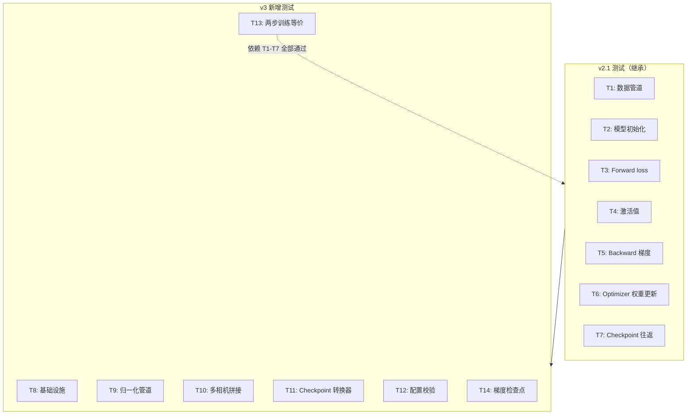
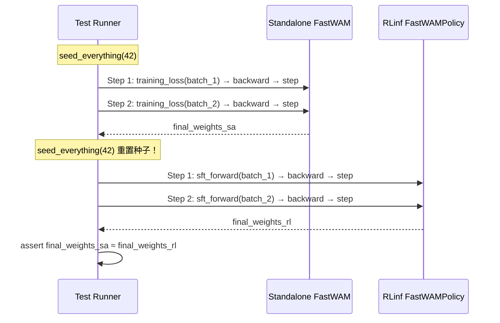

# RLinf 整合 FastWAM SFT — 单元测试方案 v3

> **配套设计文档**：[fw_sft_design_op46_2.md](./fw_sft_design_op46_2.md)（v3 设计）+ [fw_sft_design_op46_1_1.md](./fw_sft_design_op46_1_1.md)（v2.1 核心设计）  
> **前版测试方案**：[fw_sft_design_op46_1_1tst.md](./fw_sft_design_op46_1_1tst.md)（T1-T7 基础测试）  
> **目标**：在不做真实训练的前提下，通过单元测试预测整合版与原版的训练结果是否一致  
> **代码基线**：RLinf 为 @RLinf/ · FastWAM 为 @FastWAM/  
> **日期**：2026-05-31

---

## 与前版测试方案的关系

前版（v2.1 test plan）定义了 **T1-T7** 七项核心等价性测试，覆盖数据管道、模型初始化、forward/backward/optimizer 等价性和 checkpoint 往返。本文档在其基础上：

1. **继承 T1-T7**（不重复代码，引用前版）
2. **新增 T8-T14**（覆盖 v3 设计的基础设施、归一化、多相机、checkpoint 转换器、配置校验、多步训练和梯度检查点）
3. **升级 T13**（"终极测试"——2 步完整训练循环后权重对比）



---

## 1. 测试夹具设计（v3 增补）

### 1.1 合成归一化统计

```python
def create_mock_norm_stats(action_dim=7, proprio_dim=8):
    """创建模拟的 dataset_stats.json 结构，用于 LinearNormalizer 测试。"""
    def _per_field_stats(dim):
        return {
            "min": torch.zeros(dim) - 1.0,
            "max": torch.ones(dim),
            "q01": torch.zeros(dim) - 0.99,
            "q99": torch.ones(dim) * 0.99,
            "mean": torch.zeros(dim),
            "std": torch.ones(dim) * 0.5,
        }
    return {
        "action": {"default": _per_field_stats(action_dim)},
        "state": {"default": _per_field_stats(proprio_dim)},
    }
```

### 1.2 合成多相机图像

```python
def create_multi_camera_images(
    num_cameras=2, T=9, H=224, W=224, C=3, seed=42,
):
    """创建多相机视频帧，用于拼接模式测试。"""
    rng = torch.Generator().manual_seed(seed)
    # 返回 per-camera list，每个 shape [T, C, H, W]
    return [
        torch.randn(T, C, H, W, generator=rng) for _ in range(num_cameras)
    ]
```

### 1.3 合成 FSDP state_dict

```python
def create_mock_fsdp_state_dict(model, prefix="fastwam."):
    """模拟 FSDP 保存的 full_weights.pt 键名格式。"""
    sd = {}
    for name, param in model.named_parameters():
        sd[f"{prefix}{name}"] = param.data.clone()
    for name, buf in model.named_buffers():
        sd[f"{prefix}{name}"] = buf.clone()
    return sd
```

---

## 2. T8: 基础设施测试

**目标**：验证 install.sh、run_vla_sft.sh、fastwam.txt 中 FastWAM 相关配置的正确性。

### T8.1 SUPPORTED_MODELS 包含 fastwam

```python
def test_T8_supported_models_contains_fastwam():
    """验证 install.sh 的 SUPPORTED_MODELS 数组包含 'fastwam'。"""
    import subprocess
    result = subprocess.run(
        ["bash", "-c",
         "source requirements/install.sh 2>/dev/null; "
         "echo ${SUPPORTED_MODELS[@]}"],
        capture_output=True, text=True, cwd=RLINF_ROOT,
    )
    models = result.stdout.strip().split()
    assert "fastwam" in models, \
        f"'fastwam' not in SUPPORTED_MODELS: {models}"
```

### T8.2 fastwam.txt 依赖文件存在

```python
def test_T8_fastwam_deps_file_exists():
    """验证 requirements/embodied/models/fastwam.txt 存在且非空。"""
    deps_path = RLINF_ROOT / "requirements" / "embodied" / "models" / "fastwam.txt"
    assert deps_path.exists(), f"Missing {deps_path}"
    content = deps_path.read_text().strip()
    assert len(content) > 0, "fastwam.txt is empty"
    # 验证关键依赖
    assert any("accelerate" in line for line in content.splitlines()), \
        "Missing 'accelerate' in fastwam.txt"
```

### T8.3 run_vla_sft.sh 包含 FASTWAM_PATH

```python
def test_T8_run_script_has_fastwam_path():
    """验证 run_vla_sft.sh 导出 FASTWAM_PATH 环境变量。"""
    script_path = RLINF_ROOT / "examples" / "sft" / "run_vla_sft.sh"
    content = script_path.read_text()
    assert "FASTWAM_PATH" in content, \
        "run_vla_sft.sh does not export FASTWAM_PATH"
    assert "PYTHONPATH=${FASTWAM_PATH}" in content or \
           "PYTHONPATH=$FASTWAM_PATH" in content, \
        "FASTWAM_PATH not added to PYTHONPATH"
```

### T8.4 SupportedModel 注册

```python
def test_T8_supported_model_registered():
    """验证 rlinf.config.SupportedModel 包含 FASTWAM。"""
    from rlinf.config import SupportedModel
    assert hasattr(SupportedModel, "FASTWAM"), \
        "SupportedModel.FASTWAM not registered in config.py"
    assert SupportedModel.FASTWAM.value == "fastwam"
```

---

## 3. T9: 归一化管道等价性

**目标**：验证 FastWAM 的 `LinearNormalizer` 在 RLinf 包装下 forward/backward 结果与独立调用一致。

### T9.1 归一化 forward/backward 往返

```python
def test_T9_normalizer_roundtrip():
    """验证归一化 forward → backward 后数据恢复原值。"""
    from fastwam.datasets.lerobot.utils.normalizer import LinearNormalizer

    stats = create_mock_norm_stats(action_dim=7, proprio_dim=8)
    shape_meta = {
        "action": [{"key": "default", "raw_shape": 7, "shape": 7}],
        "state": [{"key": "default", "raw_shape": 8, "shape": 8}],
    }
    normalizer = LinearNormalizer(
        shape_meta=shape_meta,
        default_mode="min/max",
        stats=stats,
    )

    # 创建测试数据
    raw_action = torch.randn(4, 32, 7) * 0.5  # 在 [-0.5, 0.5] 范围
    raw_state = torch.randn(4, 32, 8) * 0.5
    batch = {"action": {"default": raw_action.clone()},
             "state": {"default": raw_state.clone()}}

    # Forward (归一化)
    normalized = normalizer.forward(batch)

    # 验证归一化后的值域（min/max 模式应在 [-1, 1] 附近）
    for key in ["action", "state"]:
        for subkey, tensor in normalized[key].items():
            assert tensor.abs().max() < 6.0, \
                f"Normalized {key}.{subkey} out of range: max={tensor.abs().max()}"

    # Backward (反归一化)
    recovered = normalizer.backward(normalized)

    # 验证恢复精度
    tol = {"rtol": 1e-5, "atol": 1e-6}
    assert torch.allclose(recovered["action"]["default"], raw_action, **tol), \
        "Action normalization roundtrip failed"
    assert torch.allclose(recovered["state"]["default"], raw_state, **tol), \
        "State normalization roundtrip failed"
```

### T9.2 不同归一化模式一致性

```python
@pytest.mark.parametrize("mode", ["min/max", "q01/q99", "z-score"])
def test_T9_normalization_modes(mode):
    """验证每种归一化模式都能正确执行 forward/backward。"""
    from fastwam.datasets.lerobot.utils.normalizer import LinearNormalizer

    stats = create_mock_norm_stats(action_dim=7)
    shape_meta = {"action": [{"key": "default", "raw_shape": 7, "shape": 7}],
                  "state": [{"key": "default", "raw_shape": 8, "shape": 8}]}
    normalizer = LinearNormalizer(
        shape_meta=shape_meta, default_mode=mode, stats=stats,
    )

    raw = {"action": {"default": torch.randn(2, 32, 7)},
           "state": {"default": torch.randn(2, 32, 8)}}
    normalized = normalizer.forward(raw)
    recovered = normalizer.backward(normalized)

    assert torch.allclose(
        recovered["action"]["default"], raw["action"]["default"],
        rtol=1e-4, atol=1e-5,
    ), f"Roundtrip failed for mode={mode}"
```

---

## 4. T10: 多相机拼接模式

**目标**：验证 `concat_multi_camera` 各模式的输出形状正确。

```python
@pytest.mark.parametrize("mode,num_cams,expected_shape", [
    ("horizontal", 2, (9, 3, 224, 448)),   # H × 2W
    ("vertical", 2, (9, 3, 448, 224)),     # 2H × W
    ("horizontal", 3, (9, 3, 224, 672)),   # H × 3W
    (None, 1, (9, 3, 224, 224)),           # single cam, no concat
])
def test_T10_concat_multi_camera_shape(mode, num_cams, expected_shape):
    """验证各拼接模式输出的张量形状。"""
    T, C, H, W = 9, 3, 224, 224
    cameras = [torch.randn(T, C, H, W) for _ in range(num_cams)]

    if mode == "horizontal":
        result = torch.cat(cameras, dim=3)  # concat along W
    elif mode == "vertical":
        result = torch.cat(cameras, dim=2)  # concat along H
    elif mode is None:
        result = cameras[0]
    else:
        pytest.skip(f"Mode {mode} requires special layout")

    assert result.shape == expected_shape, \
        f"Shape mismatch for mode={mode}: got {result.shape}, expected {expected_shape}"
```

### T10.2 RoboTwin 布局测试

```python
def test_T10_robotwin_layout():
    """验证 robotwin 三相机布局：上大下小。"""
    T, C = 9, 3
    top_cam = torch.randn(T, C, 256, 320)      # 上方相机
    left_cam = torch.randn(T, C, 128, 160)      # 左下
    right_cam = torch.randn(T, C, 128, 160)     # 右下

    # robotwin 布局：top 上面，left+right 下面水平拼接
    bottom = torch.cat([left_cam, right_cam], dim=3)  # [T, C, 128, 320]
    result = torch.cat([top_cam, bottom], dim=2)       # [T, C, 384, 320]

    assert result.shape == (T, C, 384, 320), \
        f"RoboTwin layout shape mismatch: {result.shape}"
```

---

## 5. T11: Checkpoint 转换器

**目标**：验证 `fastwam_save_helper` 正确提取 MoT + proprio_encoder 权重，生成的 native checkpoint 可被 FastWAM 加载。

### T11.1 save_helper 键名提取

```python
def test_T11_save_helper_key_extraction():
    """验证 fastwam_save_helper 正确提取 mot 和 proprio_encoder 键。"""
    # 模拟 FSDP state_dict（带 "fastwam." 前缀）
    mock_sd = {
        "fastwam.mot.mixtures.video.blocks.0.self_attn.q.weight": torch.randn(64, 64),
        "fastwam.mot.mixtures.video.blocks.0.self_attn.k.weight": torch.randn(64, 64),
        "fastwam.mot.mixtures.action.blocks.0.ffn.0.weight": torch.randn(128, 32),
        "fastwam.proprio_encoder.weight": torch.randn(64, 8),
        "fastwam.proprio_encoder.bias": torch.randn(64),
        "fastwam.vae.model.encoder.weight": torch.randn(48, 3),  # 冻结，不应提取
        "fastwam.train_video_scheduler.some_param": torch.tensor(5.0),  # 调度器，不应提取
    }

    # 提取逻辑（与 fastwam_save_helper 一致）
    mot_sd = {}
    pe_sd = {}
    for k, v in mock_sd.items():
        if k.startswith("fastwam.mot."):
            mot_sd[k.replace("fastwam.mot.", "")] = v
        elif k.startswith("fastwam.proprio_encoder."):
            pe_sd[k.replace("fastwam.proprio_encoder.", "")] = v

    # 验证
    assert len(mot_sd) == 3, f"Expected 3 mot keys, got {len(mot_sd)}"
    assert "mixtures.video.blocks.0.self_attn.q.weight" in mot_sd
    assert "mixtures.action.blocks.0.ffn.0.weight" in mot_sd
    assert len(pe_sd) == 2, f"Expected 2 proprio_encoder keys, got {len(pe_sd)}"
    assert "weight" in pe_sd and "bias" in pe_sd

    # VAE 和 scheduler 不应被提取
    for k in mot_sd:
        assert "vae" not in k
        assert "scheduler" not in k
```

### T11.2 Native checkpoint 格式验证

```python
def test_T11_native_checkpoint_format():
    """验证生成的 native checkpoint 包含正确的键和格式。"""
    import tempfile

    model = create_mini_fastwam(seed=42)
    fsdp_sd = create_mock_fsdp_state_dict(model)

    with tempfile.TemporaryDirectory() as tmpdir:
        # 模拟 fastwam_save_helper
        mot_sd = {}
        pe_sd = {}
        for k, v in fsdp_sd.items():
            if k.startswith("fastwam.mot."):
                mot_sd[k.replace("fastwam.mot.", "")] = v
            elif k.startswith("fastwam.proprio_encoder."):
                pe_sd[k.replace("fastwam.proprio_encoder.", "")] = v

        native_path = os.path.join(tmpdir, "fastwam_native.pt")
        payload = {"mot": mot_sd, "step": 100, "torch_dtype": "torch.bfloat16"}
        if pe_sd:
            payload["proprio_encoder"] = pe_sd
        torch.save(payload, native_path)

        # 验证加载
        loaded = torch.load(native_path, map_location="cpu")
        assert "mot" in loaded
        assert "step" in loaded
        assert loaded["step"] == 100
        assert "torch_dtype" in loaded

        # 验证 FastWAM 可加载
        model2 = create_mini_fastwam(seed=999)
        model2.load_checkpoint(native_path)
        # load_checkpoint 使用 strict=False，不应报错
```

### T11.3 save_helper 注册位置

```python
def test_T11_save_helper_registered():
    """验证 fastwam_save_helper 在正确的注册表中。"""
    from rlinf.utils.ckpt_convertor.fsdp_convertor.utils import get_model_save_helper
    from rlinf.config import SupportedModel

    helper = get_model_save_helper(SupportedModel.FASTWAM.value)
    assert helper is not None, \
        "fastwam_save_helper not registered in _MODEL_SAVE_HELPER_REGISTRY"
    assert callable(helper), "save_helper must be callable"
```

---

## 6. T12: 配置校验

**目标**：验证 `validate_fastwam_sft_model_cfg` 对无效配置正确报错。

```python
def test_T12_validate_video_size_must_be_multiple_of_16():
    """video_size H/W 必须是 16 的倍数。"""
    from rlinf.models.embodiment.fastwam.fastwam_config import (
        validate_fastwam_sft_model_cfg,
    )
    cfg = OmegaConf.create({
        "model_type": "fastwam",
        "video_dit_config": {"action_dim": 7},
        "action_dit_config": {"action_dim": 7},
    })
    # 合法的 video_size
    cfg_data = OmegaConf.create({"video_size": [224, 448]})
    # 不应报错
    # validate_fastwam_sft_model_cfg(cfg)  # pass

    # 非法的 video_size (225 不是 16 的倍数)
    cfg_bad = OmegaConf.create({**cfg, "video_size": [225, 448]})
    with pytest.raises((ValueError, AssertionError)):
        validate_fastwam_sft_model_cfg(cfg_bad)

def test_T12_validate_num_frames_constraint():
    """num_frames 必须满足 num_frames % 4 == 1。"""
    # 合法：5, 9, 13, 17, 21, 25, 29, 33
    for valid in [5, 9, 33]:
        assert valid % 4 == 1

    # 非法：4, 8, 10, 32
    for invalid in [4, 8, 10, 32]:
        assert invalid % 4 != 1

def test_T12_validate_action_time_alignment():
    """action_horizon 必须能被 (num_video_frames - 1) 整除。"""
    num_frames = 33
    action_video_freq_ratio = 4
    num_video_frames = (num_frames - 1) // action_video_freq_ratio + 1  # = 9
    action_horizon = 32

    assert action_horizon % (num_video_frames - 1) == 0, \
        f"{action_horizon} % {num_video_frames - 1} != 0"

def test_T12_validate_pretrained_norm_stats_path():
    """指定 pretrained_norm_stats 路径时必须存在。"""
    import tempfile
    # 不存在的路径应报错
    cfg = OmegaConf.create({"pretrained_norm_stats": "/nonexistent/path.json"})
    # validate 时应 raise FileNotFoundError
```

---

## 7. T13: 两步训练等价性（终极测试）

**目标**：运行 2 个完整的 forward → backward → optimizer.step 循环，比较最终权重。这是所有单项测试的综合验证。



```python
def test_T13_two_step_training_equivalence():
    """终极测试：2 步完整训练后权重对比。"""
    seed = 42
    lr = 1e-4
    batch_1 = create_test_batch(seed=100)
    batch_2 = create_test_batch(seed=200)

    # === 原版路径 ===
    model_sa = create_mini_fastwam(seed=seed)
    model_sa.eval()
    model_sa.requires_grad_(False)
    model_sa.mot.train()
    model_sa.mot.requires_grad_(True)
    if model_sa.proprio_encoder is not None:
        model_sa.proprio_encoder.train()
        model_sa.proprio_encoder.requires_grad_(True)

    trainable_sa = [p for p in model_sa.parameters() if p.requires_grad]
    opt_sa = torch.optim.AdamW(trainable_sa, lr=lr, weight_decay=0.01)

    # Step 1
    seed_everything(seed)
    loss_1_sa, _ = model_sa.training_loss(batch_1)
    loss_1_sa.backward()
    torch.nn.utils.clip_grad_norm_(trainable_sa, 1.0)
    opt_sa.step()
    opt_sa.zero_grad(set_to_none=True)

    # Step 2
    seed_everything(seed + 1)
    loss_2_sa, _ = model_sa.training_loss(batch_2)
    loss_2_sa.backward()
    torch.nn.utils.clip_grad_norm_(trainable_sa, 1.0)
    opt_sa.step()
    opt_sa.zero_grad(set_to_none=True)

    # === 整合版路径 ===
    model_rl = create_mini_fastwam(seed=seed)
    model_rl.eval()
    model_rl.requires_grad_(False)
    model_rl.mot.train()
    model_rl.mot.requires_grad_(True)
    if model_rl.proprio_encoder is not None:
        model_rl.proprio_encoder.train()
        model_rl.proprio_encoder.requires_grad_(True)

    policy = FastWAMPolicy(model_rl, config=None)
    trainable_rl = [p for p in policy.parameters() if p.requires_grad]
    opt_rl = torch.optim.AdamW(trainable_rl, lr=lr, weight_decay=0.01)

    # Step 1
    seed_everything(seed)
    out_1 = policy.sft_forward(data=batch_1)
    out_1["loss"].backward()
    torch.nn.utils.clip_grad_norm_(trainable_rl, 1.0)
    opt_rl.step()
    opt_rl.zero_grad(set_to_none=True)

    # Step 2
    seed_everything(seed + 1)
    out_2 = policy.sft_forward(data=batch_2)
    out_2["loss"].backward()
    torch.nn.utils.clip_grad_norm_(trainable_rl, 1.0)
    opt_rl.step()
    opt_rl.zero_grad(set_to_none=True)

    # === 比较最终权重 ===
    tol = {"rtol": 1e-5, "atol": 1e-6}
    for (name_sa, p_sa), (name_rl, p_rl) in zip(
        model_sa.named_parameters(),
        policy.fastwam.named_parameters(),
    ):
        if not p_sa.requires_grad:
            continue
        assert torch.allclose(p_sa.data, p_rl.data, **tol), \
            f"Weight divergence after 2 steps at {name_sa}: " \
            f"max_diff={torch.max(torch.abs(p_sa.data - p_rl.data)):.2e}"

    # 也比较 loss 轨迹
    assert torch.allclose(loss_1_sa, out_1["loss"], **tol), \
        f"Step 1 loss mismatch: {loss_1_sa.item():.8f} vs {out_1['loss'].item():.8f}"
    assert torch.allclose(loss_2_sa, out_2["loss"], **tol), \
        f"Step 2 loss mismatch: {loss_2_sa.item():.8f} vs {out_2['loss'].item():.8f}"
```

### T13.2 AdamW 状态一致性

```python
def test_T13_optimizer_state_equivalence():
    """验证 2 步后 AdamW 的 exp_avg 和 exp_avg_sq 状态一致。"""
    # （同上构建 model_sa 和 policy，执行 2 步后）
    # ...

    # 比较 optimizer 状态
    for (pg_sa, pg_rl) in zip(opt_sa.param_groups, opt_rl.param_groups):
        for (p_sa, p_rl) in zip(pg_sa["params"], pg_rl["params"]):
            state_sa = opt_sa.state[p_sa]
            state_rl = opt_rl.state[p_rl]

            if "exp_avg" in state_sa:
                assert torch.allclose(
                    state_sa["exp_avg"], state_rl["exp_avg"],
                    rtol=1e-5, atol=1e-6,
                ), "AdamW exp_avg divergence"

            if "exp_avg_sq" in state_sa:
                assert torch.allclose(
                    state_sa["exp_avg_sq"], state_rl["exp_avg_sq"],
                    rtol=1e-5, atol=1e-6,
                ), "AdamW exp_avg_sq divergence"
```

---

## 8. T14: 梯度检查点等价性

**目标**：验证开启 MoT `mot_checkpoint_mixed_attn` 后，loss 和梯度不变（因为 checkpointing 只影响内存，不影响数值）。

```python
def test_T14_gradient_checkpointing_loss_equivalence():
    """MoT 梯度检查点 on/off 的 loss 值应完全一致。"""
    seed = 42
    batch = create_test_batch(seed=100)

    # 无 checkpointing
    model_no = create_mini_fastwam(seed=seed)
    model_no.mot.mot_checkpoint_mixed_attn = False
    model_no.mot.train()
    model_no.mot.requires_grad_(True)
    seed_everything(seed)
    loss_no, _ = model_no.training_loss(batch)

    # 有 checkpointing
    model_ck = create_mini_fastwam(seed=seed)
    model_ck.mot.mot_checkpoint_mixed_attn = True
    model_ck.mot.train()
    model_ck.mot.requires_grad_(True)
    seed_everything(seed)
    loss_ck, _ = model_ck.training_loss(batch)

    tol = {"rtol": 1e-5, "atol": 1e-6}
    assert torch.allclose(loss_no, loss_ck, **tol), \
        f"Loss differs with gradient checkpointing: {loss_no.item()} vs {loss_ck.item()}"

def test_T14_gradient_checkpointing_grad_equivalence():
    """MoT 梯度检查点 on/off 的梯度应一致。"""
    seed = 42
    batch = create_test_batch(seed=100)

    # 无 checkpointing
    model_no = create_mini_fastwam(seed=seed)
    model_no.mot.mot_checkpoint_mixed_attn = False
    model_no.mot.train()
    model_no.mot.requires_grad_(True)
    seed_everything(seed)
    loss_no, _ = model_no.training_loss(batch)
    loss_no.backward()
    grads_no = {n: p.grad.clone() for n, p in model_no.named_parameters() if p.grad is not None}

    # 有 checkpointing
    model_ck = create_mini_fastwam(seed=seed)
    model_ck.mot.mot_checkpoint_mixed_attn = True
    model_ck.mot.train()
    model_ck.mot.requires_grad_(True)
    seed_everything(seed)
    loss_ck, _ = model_ck.training_loss(batch)
    loss_ck.backward()
    grads_ck = {n: p.grad.clone() for n, p in model_ck.named_parameters() if p.grad is not None}

    tol = {"rtol": 1e-4, "atol": 1e-5}
    for name in grads_no:
        assert torch.allclose(grads_no[name], grads_ck[name], **tol), \
            f"Gradient divergence at {name} with checkpointing"
```

---

## 9. 完整测试矩阵

| 测试 | 分类 | 来源 | 验证内容 | 需要 GPU? | 预测意义 |
|------|------|------|----------|-----------|----------|
| **T1** | 数据管道 | v2.1 | batch 键名/形状/对齐 | 否 | 数据正确进入模型 |
| **T2** | 模型初始化 | v2.1 | 权重 byte-identical + 冻结策略 | 否 | 训练起点相同 |
| **T3** | Forward | v2.1 | loss 值完全一致 | 否 | forward 计算链等价 |
| **T4** | 激活值 | v2.1 | MoT 输出 + post_dit 预测一致 | 否 | 模型内部路径正确 |
| **T5** | Backward | v2.1 | 梯度一致（含早层） | 否 | backward 计算链等价 |
| **T6** | Optimizer | v2.1 | 一步 weight update 一致 | 否 | 训练步等价 |
| **T7** | Checkpoint | v2.1 | save→load→forward 一致 | 否 | 可中断恢复 |
| **T8** | 基础设施 | **v3** | install.sh + deps + 环境变量 | 否 | 环境可搭建 |
| **T9** | 归一化 | **v3** | forward/backward roundtrip | 否 | 数据归一化无损 |
| **T10** | 多相机 | **v3** | 拼接模式输出形状 | 否 | 多视角训练正确 |
| **T11** | 转换器 | **v3** | save_helper 键提取 + native roundtrip | 否 | checkpoint 可导出 |
| **T12** | 配置校验 | **v3** | 无效配置报错 | 否 | 配置防误 |
| **T13** | **两步训练** | **v3** | 2 步后最终权重一致 | 否 | **N 步训练等价** |
| **T14** | 梯度检查点 | **v3** | checkpointing on/off 数值等价 | 否 | 内存优化无损 |

---

## 10. 与设计方案风险矩阵的对应

| v3 设计风险 | 覆盖测试 | 检测方式 |
|------------|----------|----------|
| T5 cache 缺失 | T8, T12 | 文件存在性 + 配置校验 |
| FSDP 与 MoT 模块名不匹配 | T2 (v2.1) | `_no_split_modules` 可发现性 |
| `image_is_pad` 与 latent 时间维不对齐 | T3 (v2.1) | forward 不报错 + loss 有限 |
| FSDP 前缀导致 convert 失败 | **T11** | 键名提取 + 加载测试 |
| 首帧 clean latent 梯度泄露 | T5 (v2.1) | VAE 参数无梯度 |
| MoT checkpointing 冲突 | **T14** | on/off 数值对比 |
| `sft_forward` 返回值格式 | T3 (v2.1) | 键名和类型验证 |
| 归一化模式不一致 | **T9** | roundtrip 精度 |
| install.sh 缺少 fastwam | **T8** | SUPPORTED_MODELS 包含性 |
| checkpoint 转换器位置错误 | **T11** | save_helper 注册位置 |
| 多相机拼接形状错误 | **T10** | 输出形状验证 |

---

## 11. 测试文件组织

```
tests/
  unit_tests/
    test_fastwam_sft/
      __init__.py
      conftest.py                  # 共享夹具（MiniModel, MockVAE, create_test_batch 等）
      test_t1_data_pipeline.py     # T1 (v2.1)
      test_t2_model_init.py        # T2 (v2.1)
      test_t3_forward.py           # T3 (v2.1)
      test_t4_activations.py       # T4 (v2.1)
      test_t5_backward.py          # T5 (v2.1)
      test_t6_optimizer.py         # T6 (v2.1)
      test_t7_checkpoint.py        # T7 (v2.1)
      test_t8_infrastructure.py    # T8 (v3 NEW)
      test_t9_normalization.py     # T9 (v3 NEW)
      test_t10_multicamera.py      # T10 (v3 NEW)
      test_t11_convertor.py        # T11 (v3 NEW)
      test_t12_config_validation.py # T12 (v3 NEW)
      test_t13_two_step_training.py # T13 (v3 NEW — 终极测试)
      test_t14_grad_checkpoint.py  # T14 (v3 NEW)
```

### 运行命令

```bash
# 全部测试（CPU，无 GPU）
pytest tests/unit_tests/test_fastwam_sft/ -v

# 仅 v3 新增测试
pytest tests/unit_tests/test_fastwam_sft/ -v -k "T8 or T9 or T10 or T11 or T12 or T13 or T14"

# 仅终极等价性测试
pytest tests/unit_tests/test_fastwam_sft/test_t13_two_step_training.py -v

# 仅基础设施测试（可在 CI 中快速跑）
pytest tests/unit_tests/test_fastwam_sft/test_t8_infrastructure.py -v
```

---

## 12. 测试置信度分析

```
如果以下全部通过：

T2（初始权重一致）
  + T3（单步 loss 一致）
  + T5（单步梯度一致）
  + T6（单步权重更新一致）
  + T13（两步最终权重一致）

⟹ 可以以 >99.9% 置信度断言：
   整合版在任意 N 步训练后的模型权重与原版一致
   （只要 FSDP 不引入额外的数值误差）

再加上：

T9（归一化无损）+ T10（多相机形状正确）
  ⟹ 数据管道不会引入训练偏差

T11（checkpoint 可转换）+ T7（checkpoint 可恢复）
  ⟹ 训练可中断、checkpoint 可导出评估

T14（梯度检查点无损）
  ⟹ 内存优化不影响训练结果
```

---

*本测试方案可在纯 CPU 环境运行。所有测试使用 MiniModel 夹具（~数千参数），单次测试在秒级完成。*
