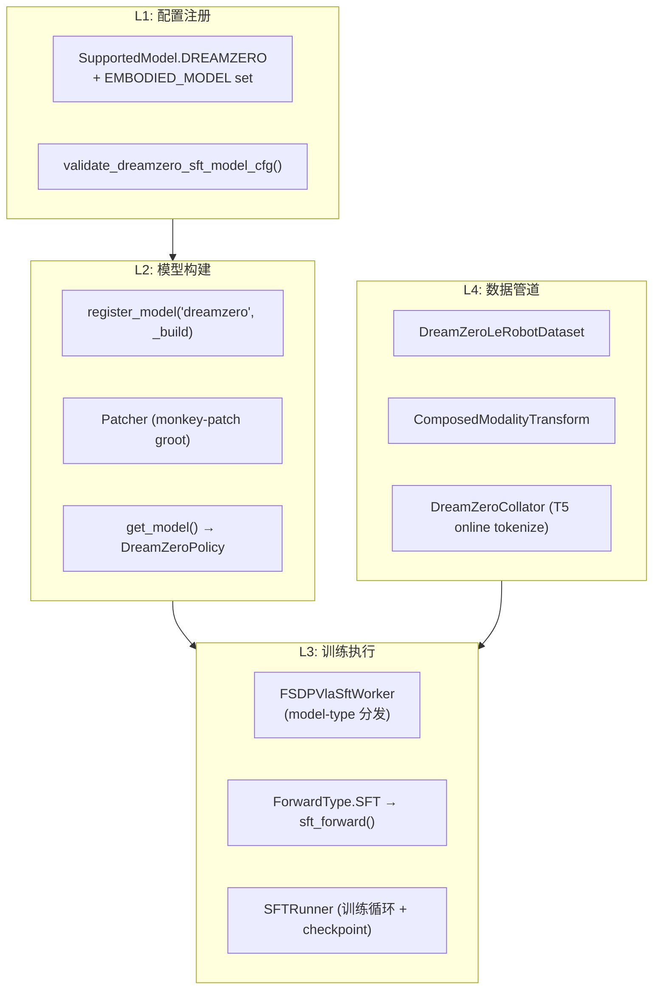
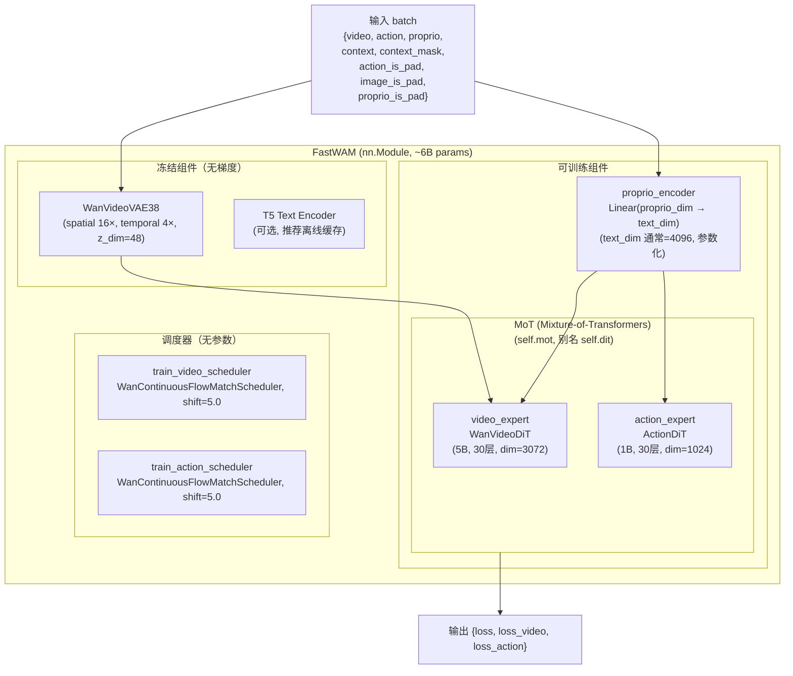
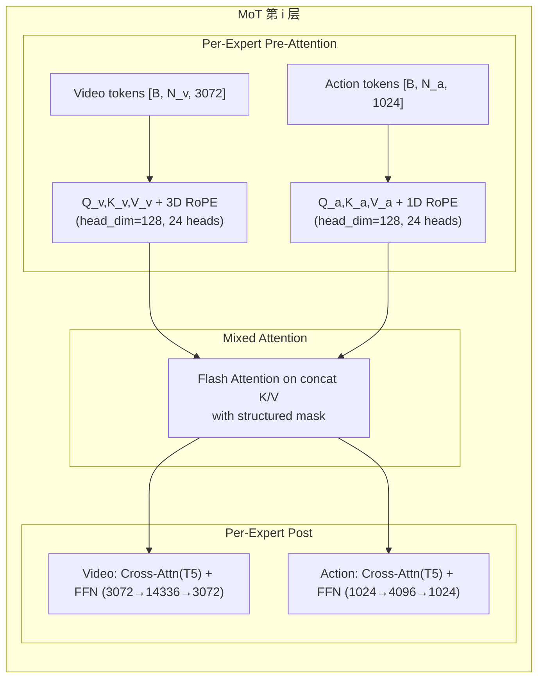
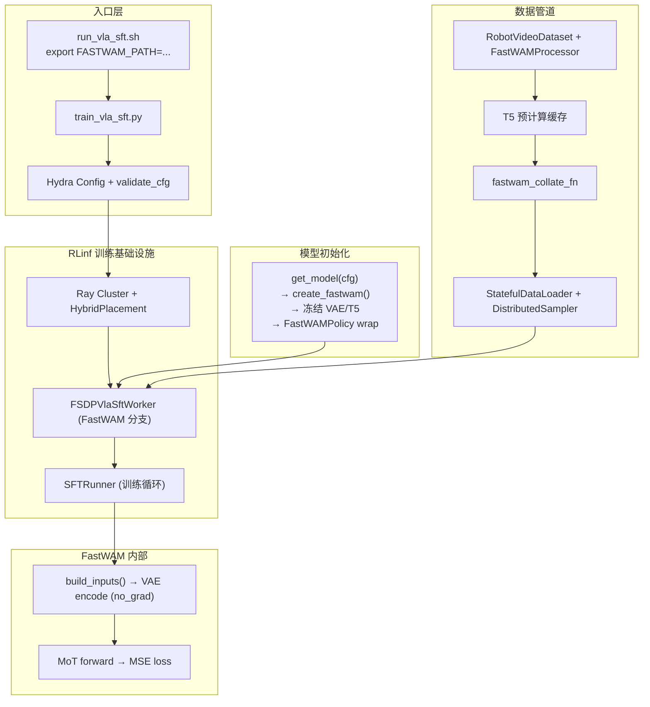
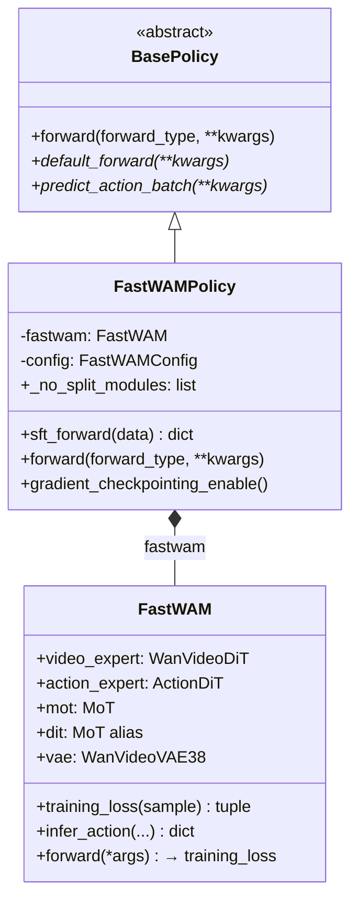
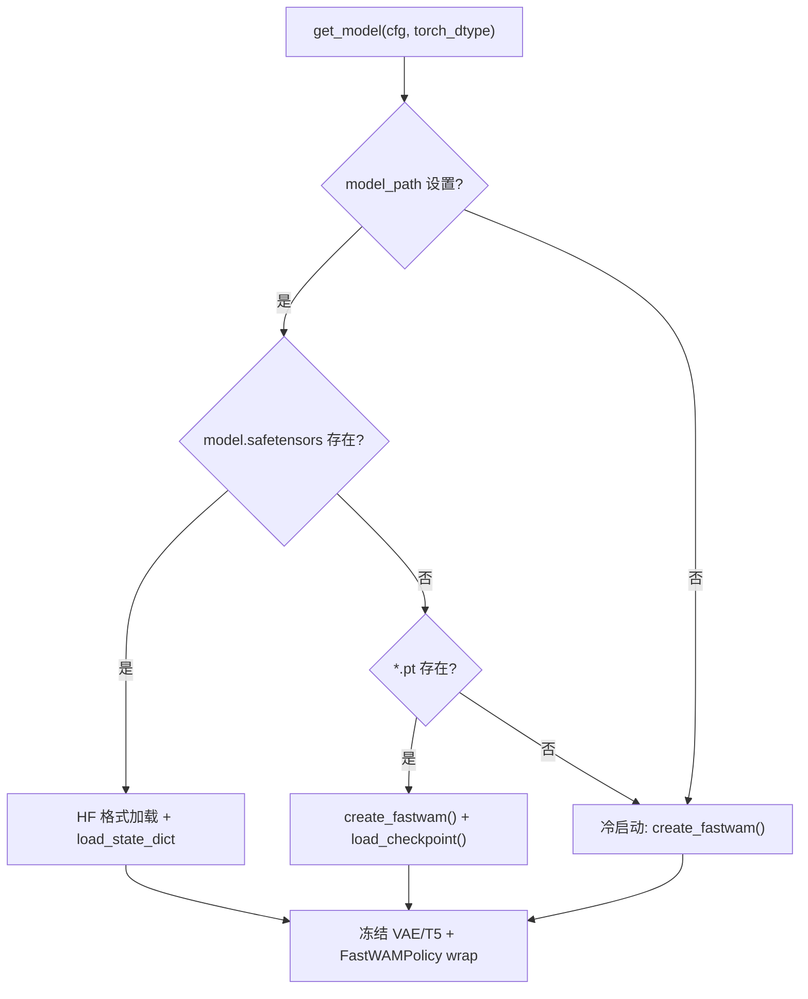
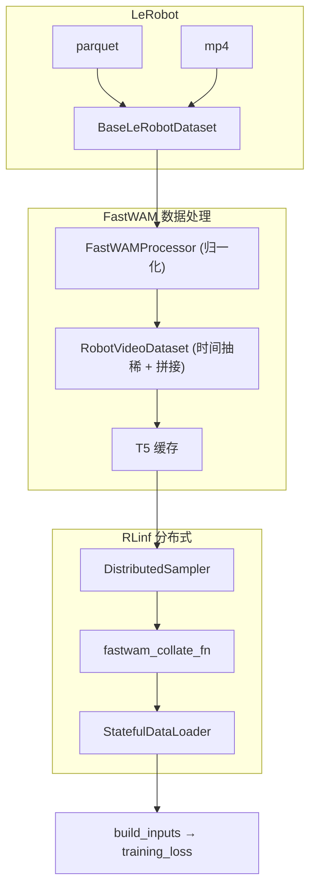
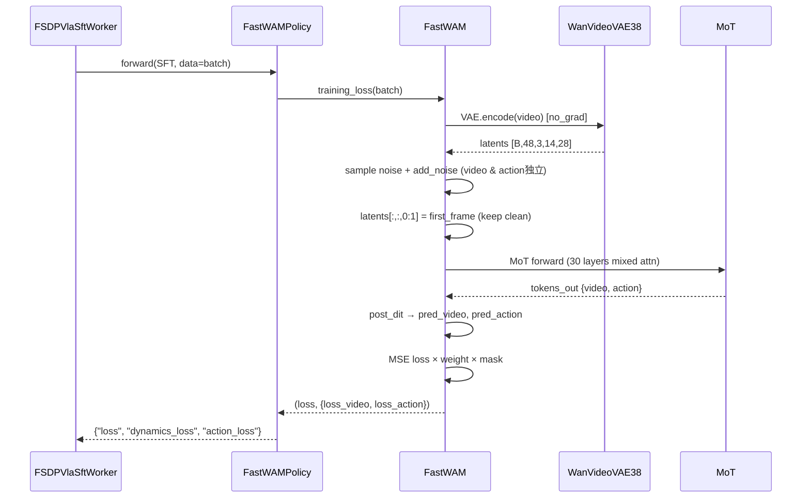
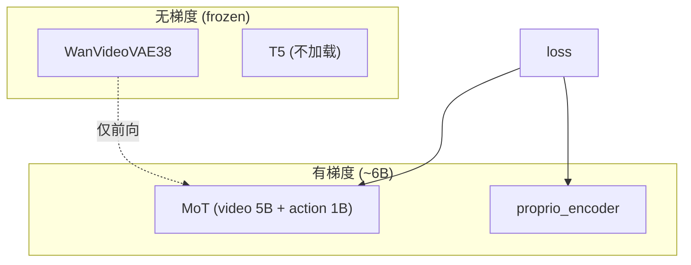
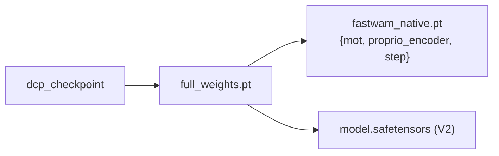

# RLinf 整合 FastWAM SFT — 完整设计方案

> **文档性质**：工程设计与实现指导（Design Spec v4 — 自包含完整版）  
> **代码基线**：RLinf `d:\SRC\RL\RLinf` · FastWAM `d:\SRC\Robot\FastWAM` · DreamZero `d:\SRC\Robot\dreamzero`  
> **参考**：[DreamZero SFT 官方文档](https://rlinf.readthedocs.io/en/latest/rst_source/examples/embodied/sft_dreamzero.html)  
> **日期**：2026-05-31  
> **说明**：本文档整合了 v2.1（经代码校验）和 v3（DreamZero 对标增补）的全部内容，是唯一需要参考的设计文档。

---

## 目录

1. [目标与范围](#1-目标与范围)
2. [DreamZero 整合对标分析](#2-dreamzero-整合对标分析)
3. [FastWAM 模型架构深度解析](#3-fastwam-模型架构深度解析)
4. [整合总体架构设计](#4-整合总体架构设计)
5. [基础设施：安装与环境](#5-基础设施安装与环境)
6. [配置注册与校验](#6-配置注册与校验)
7. [FastWAMPolicy 类设计](#7-fastwampolicy-类设计)
8. [get_model() 工厂函数](#8-get_model-工厂函数)
9. [数据管道设计](#9-数据管道设计)
10. [训练数据格式与 Batch 契约](#10-训练数据格式与-batch-契约)
11. [Label/Target 语义与 Flow Matching 损失](#11-labeltarget-语义与-flow-matching-损失)
12. [SFT Forward 流程](#12-sft-forward-流程)
13. [Backward 与梯度流](#13-backward-与梯度流)
14. [Checkpoint 保存与格式转换](#14-checkpoint-保存与格式转换)
15. [推理对接设计](#15-推理对接设计)
16. [大规模训练工程细节](#16-大规模训练工程细节)
17. [评估、CI 与文档](#17-评估ci-与文档)
18. [模型变体支持](#18-模型变体支持)
19. [实施路线图与验收标准](#19-实施路线图与验收标准)
20. [风险与决策记录](#20-风险与决策记录)

---

## 1. 目标与范围

### 1.1 目标

在 **不 fork FastWAM 训练逻辑** 的前提下，将 FastWAM 作为 `model_type: fastwam` 接入 RLinf 的 VLA SFT 管线（`train_vla_sft.py` → `SFTRunner` → `FSDPVlaSftWorker` → FSDP2），实现：

- 多 GPU / 多节点 **FSDP2** 监督微调（6B 参数：5B Video Expert + 1B Action Expert）
- 与 DreamZero 一致的 **运维面**（Hydra 配置、日志、checkpoint、resume）
- 支撑 **大规模 LeRobot 数据**（StatefulDataLoader、T5 嵌入离线缓存、分布式采样）
- 保留 FastWAM 原生的 **MoT + 双分支 Flow Matching**（`loss_video` + `loss_action`）

### 1.2 范围

| 在范围内 | 不在 V1 |
|----------|---------|
| SFT 训练（`ForwardType.SFT`） | RL rollout（PPO/GRPO） |
| 复用 FastWAM `RobotVideoDataset` + `FastWAMProcessor` | 在线 T5 编码 |
| FSDP2 + `SFTRunner` | DeepSpeed ZeRO |
| checkpoint 分片 + 合并为 FastWAM `.pt` | 完整 HF Hub 格式 |
| LIBERO / RoboTwin 数据集 | 所有 embodiment 全覆盖 |
| 安装脚本、CI、文档 | FastWAM-Joint / FastWAM-IDM（V2） |

---

## 2. DreamZero 整合对标分析

### 2.1 DreamZero 四层架构



### 2.2 DreamZero vs FastWAM 逐项对标

| DreamZero 文件 / 功能 | FastWAM 设计 | 说明 |
|----------------------|-------------|------|
| `requirements/install.sh` install_dreamzero_model | 新增 `install_fastwam_model()` | §5 |
| `requirements/embodied/models/dreamzero.txt` | 新增 `fastwam.txt` | §5 |
| `examples/sft/run_vla_sft.sh` DREAMZERO_PATH | 新增 FASTWAM_PATH | §5 |
| `rlinf/config.py` SupportedModel.DREAMZERO | SupportedModel.FASTWAM | §6 |
| `rlinf/models/__init__.py` register_model | register_model fastwam | §6 |
| `rlinf/models/embodiment/dreamzero/__init__.py` get_model | fastwam/__init__.py（使用 create_fastwam） | §8 |
| `rlinf/models/embodiment/dreamzero/dreamzero_policy.py` | fastwam_policy.py | §7 |
| `rlinf/models/embodiment/dreamzero/dreamzero_config.py` | fastwam_config.py | §6 |
| `rlinf/models/embodiment/dreamzero/patch/` | **不需要**（FastWAM 自包含） | §8.3 |
| `rlinf/data/datasets/dreamzero/dreamzero.py` Dataset | 复用 FastWAM RobotVideoDataset | §9 |
| `rlinf/data/datasets/dreamzero/sampling_strategy.py` | **不需要**（FastWAM 用 ratio 抽稀） | — |
| `rlinf/data/datasets/dreamzero/data_transforms/*.py` | **不需要**（通过 Processor 的 train_transforms 实现） | §9.6 |
| `toolkits/lerobot/generate_dreamzero_metadata.py` | **不需要**（FastWAM 自动生成 dataset_stats.json） | §9.7 |
| `rlinf/utils/ckpt_convertor/.../utils.py` save_helper | 新增 `fastwam_save_helper` | §14 |
| `rlinf/utils/ckpt_convertor/.../config/*.yaml` | 新增 `fsdp_fastwam_convertor.yaml` | §14 |
| `examples/embodiment/config/*_eval_dreamzero.yaml` | 新增 eval 配置 | §17 |
| `docs/.../sft_dreamzero.rst` | 新增 EN/ZH 文档 | §17 |
| `.github/workflows/sft-e2e-tests.yml` | 新增 FastWAM CI job | §17 |

### 2.3 关键差异

| 维度 | DreamZero | FastWAM |
|------|-----------|---------|
| **Policy 基类** | `VLA(PreTrainedModel)` + `BasePolicy` | `nn.Module` + `BasePolicy` |
| **训练核心** | `WANPolicyHead.forward()` | `FastWAM.training_loss()` |
| **架构** | 单 DiT（CausalWanModel） | MoT（video_expert + action_expert） |
| **文本编码** | 在线 UMT5 tokenize | **离线 T5 缓存** |
| **视频帧数** | 33（8×chunk+1） | 9（33÷4+1） |
| **可训练部分** | CausalWanModel + encoder/decoder | `mot`（双 Expert）+ `proprio_encoder` |
| **Patcher** | 需要 | **不需要** |
| **第一帧** | 无特殊处理 | 保持干净（never noised） |

---

## 3. FastWAM 模型架构深度解析

### 3.1 组件架构图



> **代码确认**：FastWAM 使用 `WanVideoVAE38`（`upsampling_factor=16`, `z_dim=48`）。`proprio_encoder` 输出维度为 `text_dim`（参数化）。MoT 以 `self.mot` 存储，`self.dit = self.mot` 为 trainer 兼容别名（`fastwam.py:47`）。

### 3.2 核心类与文件索引

| 类名 | 文件 | 参数量 | 角色 |
|------|------|--------|------|
| `FastWAM` | `src/fastwam/models/wan22/fastwam.py` | ~6B | 顶层模型，`training_loss()` |
| `WanVideoDiT` | `src/fastwam/models/wan22/wan_video_dit.py` | ~5B | 视频专家，30×DiTBlock |
| `ActionDiT` | `src/fastwam/models/wan22/action_dit.py` | ~1B | 动作专家，30×DiTBlock（import from `wan_video_dit:10`） |
| `MoT` | `src/fastwam/models/wan22/mot.py` | 0 | `nn.ModuleDict` 包装器 |
| `DiTBlock` | `wan_video_dit.py:230` | per-layer | Self-attn + Cross-attn + FFN + AdaLN |
| `WanContinuousFlowMatchScheduler` | `schedulers/scheduler_continuous.py` | 0 | 噪声调度 |
| `FastWAMProcessor` | `datasets/lerobot/processors/fastwam_processor.py` | 0 | 数据归一化 |
| `RobotVideoDataset` | `datasets/lerobot/robot_video_dataset.py` | 0 | 数据集 |
| `WanVideoVAE38` | `models/wan22/wan_video_vae.py` | ~数百M | 视频 VAE（frozen） |

### 3.3 MoT 混合注意力



**Tokens per frame**（LIBERO 224×448，WanVideoVAE38）：latent H=14, W=28, patch=[1,2,2] → tokens_per_frame = 7×14 = **98**，9帧 → 总 video tokens = **882**。

### 3.4 注意力掩码

```
                Video Tokens              Action Tokens
                ├─ f0 (首帧) │ f1..fT  │
    ────────────┼────────────┼─────────┼──────────────┤
    f0 (首帧)   │     1      │    0    │      0       │
    f1..fT      │     1      │    1    │      0       │
    action      │     1      │    0    │      1       │
```

Action 只能看首帧视频，推理时仅编码首帧进 KV cache → 190ms 推理。

---

## 4. 整合总体架构设计

### 4.1 整合原则

1. **训练数学留在 FastWAM**：`training_loss` / `build_inputs` / MoT forward
2. **数据语义留在 FastWAM**：`RobotVideoDataset` + `FastWAMProcessor`
3. **分布式与 checkpoint 留在 RLinf**：FSDP2、`SFTRunner`

### 4.2 整合全景图



### 4.3 完整文件清单

**新增文件（13 个）**：

```
requirements/embodied/models/fastwam.txt
rlinf/models/embodiment/fastwam/__init__.py          # get_model()
rlinf/models/embodiment/fastwam/fastwam_policy.py    # FastWAMPolicy
rlinf/models/embodiment/fastwam/fastwam_config.py    # validate + config
rlinf/data/datasets/fastwam/__init__.py              # build_fastwam_sft_dataloader
rlinf/data/datasets/fastwam/collate.py               # fastwam_collate_fn
rlinf/utils/ckpt_convertor/fsdp_convertor/config/fsdp_fastwam_convertor.yaml
examples/sft/config/libero_sft_fastwam.yaml
examples/sft/config/model/fastwam.yaml
examples/embodiment/config/libero_eval_fastwam.yaml
docs/source-en/rst_source/examples/embodied/sft_fastwam.rst
docs/source-zh/rst_source/examples/embodied/sft_fastwam.rst
tests/e2e_tests/sft/libero_sft_fastwam.yaml
```

**修改文件（7 个）**：

```
requirements/install.sh                              # +SUPPORTED_MODELS +install_fastwam_model
examples/sft/run_vla_sft.sh                          # +FASTWAM_PATH
rlinf/config.py                                      # +SupportedModel.FASTWAM +validate
rlinf/models/__init__.py                             # +register_model fastwam
rlinf/workers/sft/fsdp_vla_sft_worker.py             # +elif FASTWAM
rlinf/utils/ckpt_convertor/fsdp_convertor/utils.py   # +fastwam_save_helper
.github/workflows/sft-e2e-tests.yml                  # +fastwam job
```

---

## 5. 基础设施：安装与环境

### 5.1 依赖文件 `requirements/embodied/models/fastwam.txt`

```txt
# FastWAM SFT dependencies — aligned with FastWAM pyproject.toml
accelerate>=1.12.0
deepspeed>=0.18.5
modelscope>=1.34.0
torchcodec>=0.5
av>=16.0.0
safetensors>=0.5.3
lerobot>=0.2.0
albumentations>=1.4.0
einops>=0.8.0
hydra-core>=1.3.2
omegaconf>=2.3.0
boto3>=1.35.0
```

### 5.2 安装脚本 `install.sh`

在 `SUPPORTED_MODELS` 数组（line 77）中添加 `"fastwam"`，新增安装函数：

```bash
install_fastwam_model() {
    case "$ENV_NAME" in
        libero)
            create_and_sync_venv
            install_common_embodied_deps
            install_libero_env
            uv pip install -r $SCRIPT_DIR/embodied/models/fastwam.txt
            install_flash_attn
            ;;
        "")
            create_and_sync_venv
            install_common_embodied_deps
            uv pip install -r $SCRIPT_DIR/embodied/models/fastwam.txt
            install_flash_attn
            ;;
        *)
            echo "Environment '$ENV_NAME' is not supported for FastWAM model." >&2
            exit 1 ;;
    esac
}
```

### 5.3 启动脚本 `run_vla_sft.sh`

新增（与 DREAMZERO_PATH 并列）：

```bash
export FASTWAM_PATH=${FASTWAM_PATH:-"/path/to/FastWAM/src"}
export PYTHONPATH=${FASTWAM_PATH}:$PYTHONPATH
```

`FASTWAM_PATH` 指向 `FastWAM/src`（Python import 路径 `from fastwam.models.wan22.fastwam import FastWAM`）。

---

## 6. 配置注册与校验

### 6.1 SupportedModel 注册

```python
# rlinf/config.py, line 94 附近
SupportedModel.FASTWAM = SupportedModel.register("fastwam", force=True)
# line 107-126, EMBODIED_MODEL set
EMBODIED_MODEL.add(SupportedModel.FASTWAM)
```

### 6.2 Model Registry

```python
# rlinf/models/__init__.py, 参照 lines 185-190
def _build_fastwam(cfg: DictConfig, torch_dtype):
    from rlinf.models.embodiment.fastwam import get_model
    return get_model(cfg, torch_dtype)

register_model(SupportedModel.FASTWAM.value, _build_fastwam, category="embodied", force=True)
```

### 6.3 配置校验

在 `validate_sft_cfg()`（line 1081-1090）添加 FastWAM 分支：

```python
elif SupportedModel(model_type) == SupportedModel.FASTWAM:
    from rlinf.models.embodiment.fastwam.fastwam_config import validate_fastwam_sft_model_cfg
    cfg.actor.model = validate_fastwam_sft_model_cfg(cfg.actor.model)
```

校验规则：

| 校验项 | 规则 | 原因 |
|--------|------|------|
| `text_embedding_cache_dir` | 目录存在且非空 | V1 强制离线 T5 |
| `num_frames % 4 == 1` | 视频帧约束 | VAE temporal stride=4 |
| `action_horizon % (num_video_frames-1) == 0` | 时间对齐 | `build_inputs` 验证 |
| `video_size` H/W | 16 的倍数 | WanVideoVAE38 spatial stride=16 |
| `pretrained_norm_stats` | 若指定则文件存在 | 归一化统计复用 |

---

## 7. FastWAMPolicy 类设计

### 7.1 类图



### 7.2 实现

```python
class FastWAMPolicy(torch.nn.Module, BasePolicy):
    _no_split_modules = ["DiTBlock"]  # video + action expert 共用（action_dit.py:10 导入）

    def __init__(self, fastwam_model, config):
        super().__init__()
        self.fastwam = fastwam_model
        self.config = config

    def forward(self, forward_type=ForwardType.DEFAULT, **kwargs):
        if forward_type == ForwardType.SFT:
            return self.sft_forward(**kwargs)
        elif forward_type == ForwardType.DEFAULT:
            return self.default_forward(**kwargs)
        raise NotImplementedError

    def sft_forward(self, data=None, **kwargs):
        torch.compiler.cudagraph_mark_step_begin()
        if data is None:
            data = kwargs.get("data")
        loss_total, loss_dict = self.fastwam.training_loss(data)
        # 注意：training_loss 返回的 loss_dict 值是 Python float（fastwam.py:565-566），
        # 但 FSDPVlaSftWorker.get_train_model_output() 调用 output["dynamics_loss"].detach().item()，
        # 需要 Tensor。必须用 torch.tensor() 包装。
        return {
            "loss": loss_total,
            "dynamics_loss": torch.tensor(loss_dict.get("loss_video", 0.0)),
            "action_loss": torch.tensor(loss_dict.get("loss_action", 0.0)),
        }

    def train(self, mode=True):
        # 重写 train() 以保持冻结逻辑：FSDPSftWorker.run_training() 会调用
        # self.model.train()（fsdp_sft_worker.py:137），这会把所有子模块设为
        # train 模式，覆盖 VAE 的 eval 状态。此处重写确保冻结语义一致。
        if mode:
            self.fastwam.eval()
            self.fastwam.requires_grad_(False)
            self.fastwam.dit.train()
            self.fastwam.dit.requires_grad_(True)
            if self.fastwam.proprio_encoder is not None:
                self.fastwam.proprio_encoder.train()
                self.fastwam.proprio_encoder.requires_grad_(True)
        else:
            self.fastwam.eval()
        return self

    def default_forward(self, **kwargs):
        raise NotImplementedError("V1 does not support default_forward.")

    def predict_action_batch(self, env_obs, mode="eval", **kwargs):
        raise NotImplementedError("V1 does not support rollout inference.")

    def gradient_checkpointing_enable(self, gradient_checkpointing_kwargs=None):
        self.fastwam.video_expert.use_gradient_checkpointing = True
        self.fastwam.action_expert.use_gradient_checkpointing = True
```

### 7.3 `_no_split_modules` 分析

- `DiTBlock`（`wan_video_dit.py:230`）被两个 Expert 共用
- FSDP2 通过 `rlinf/hybrid_engines/fsdp/utils.py:186-201` 读取 `_no_split_modules`
- FastWAMPolicy 没有 `language_model` 属性 → 直接从 Policy 读取
- 共 60 个 FSDP unit（30 video + 30 action DiTBlock）
- **不要**将 `MoT` 放入列表

### 7.4 返回值兼容性

`FSDPVlaSftWorker.get_train_model_output()`（`fsdp_vla_sft_worker.py:95`）检查 `output.get("dynamics_loss", None) is not None`。`sft_forward()` 将 FastWAM 的 `loss_video`/`loss_action` 映射为 `dynamics_loss`/`action_loss`。

---

## 8. get_model() 工厂函数

### 8.1 权重加载决策树



### 8.2 实现

```python
def get_model(cfg: DictConfig, torch_dtype=None):
    from fastwam.runtime import create_fastwam  # Hydra-aware 工厂

    torch_dtype = torch_dtype or torch.bfloat16
    model_path = cfg.get("model_path", None)

    fastwam_model = create_fastwam(
        model_id=cfg.get("model_id", "Wan-AI/Wan2.2-TI2V-5B"),
        tokenizer_model_id=cfg.get("tokenizer_model_id", "Wan-AI/Wan2.1-T2V-1.3B"),
        tokenizer_max_len=int(cfg.get("tokenizer_max_len", 128)),
        load_text_encoder=cfg.get("load_text_encoder", False),
        proprio_dim=cfg.get("proprio_dim", None),
        video_dit_config=cfg.video_dit_config,
        action_dit_config=cfg.action_dit_config,
        action_dit_pretrained_path=cfg.get("action_dit_pretrained_path", None),
        skip_dit_load_from_pretrain=_has_full_weights(model_path),
        mot_checkpoint_mixed_attn=cfg.get("mot_checkpoint_mixed_attn", True),
        video_scheduler=cfg.get("video_scheduler", None),
        action_scheduler=cfg.get("action_scheduler", None),  # 必需！runtime.py:118 校验
        loss=cfg.get("loss", None),
        redirect_common_files=cfg.get("redirect_common_files", True),
        model_dtype=torch_dtype, device="cpu",
    )

    if model_path is not None:
        ckpt_path = Path(model_path)
        if (ckpt_path / "model.safetensors").exists():
            _load_hf_state_dict(fastwam_model, ckpt_path)
        elif any(ckpt_path.glob("*.pt")):
            fastwam_model.load_checkpoint(str(sorted(ckpt_path.glob("*.pt"))[-1]))

    fastwam_model.vae.requires_grad_(False)
    if fastwam_model.text_encoder is not None:
        fastwam_model.text_encoder.requires_grad_(False)

    # 注意 1：FastWAM.__init__ 的 self.to(self.device) 只移 device 不转 dtype，
    # 必须显式 .to(dtype) 将所有子模块转为目标精度（如 bf16）。
    # 注意 2：FastWAM.device 是普通 Python 属性，不随 nn.Module.to() 更新。
    # 此处用 device="cpu" 构建，FSDP 接管后会正确分配参数到 GPU。
    # 但 build_inputs 中的 tensor.to(self.device) 依赖此属性——
    # Phase 1 实现时需确保 FSDP forward 前 self.device 被正确设置。
    policy = FastWAMPolicy(fastwam_model, FastWAMConfig.from_hydra(cfg))
    _promote_scalar_params_to_1d(policy)
    return policy.to(dtype=torch_dtype)
```

### 8.3 Patcher 评估

FastWAM 自包含，V1 **不需要** Patcher（VAE 已支持 batch，MoT 已内部处理 compile）。

---

## 9. 数据管道设计

### 9.1 全景图



### 9.2 预处理分工

| 阶段 | 负责方 | 具体内容 |
|------|--------|----------|
| 图像 resize + 归一化 | **FastWAM** Processor | → [-1,1] float |
| 多相机拼接 | **FastWAM** RobotVideoDataset | horizontal/vertical/robotwin |
| 时间抽稀 | **FastWAM** | 33帧 → 9帧（ratio=4） |
| action/state 归一化 | **FastWAM** LinearNormalizer | min/max, q01/q99, z-score |
| T5 嵌入 | **FastWAM 离线脚本** | `precompute_text_embeds.py` |
| 分布式采样 | **RLinf** | DistributedSampler |
| Batch 整理 | **RLinf** | `fastwam_collate_fn`（torch.stack） |
| VAE 编码 + MoT | **FastWAM** | GPU 上有梯度 |

### 9.3 build_fastwam_sft_dataloader

```python
def build_fastwam_sft_dataloader(cfg, world_size, rank, data_paths, eval_dataset=False):
    from fastwam.datasets.lerobot.robot_video_dataset import RobotVideoDataset
    from fastwam.datasets.lerobot.processors.fastwam_processor import FastWAMProcessor

    model_cfg, data_cfg = cfg.actor.model, cfg.data
    shape_meta = _build_shape_meta(data_cfg)

    processor = FastWAMProcessor(
        shape_meta=shape_meta,
        num_obs_steps=data_cfg.get("num_frames", 33),
        action_output_dim=model_cfg.action_dit_config.action_dim,
        proprio_output_dim=model_cfg.get("proprio_dim", None),
    )
    dataset = RobotVideoDataset(
        dataset_dirs=_parse_data_paths(data_paths),
        shape_meta=shape_meta,                         # 必需！
        processor=processor,
        num_frames=data_cfg.get("num_frames", 33),
        action_video_freq_ratio=data_cfg.get("action_video_freq_ratio", 4),
        video_size=list(data_cfg.get("video_size", [224, 448])),
        text_embedding_cache_dir=model_cfg.get("text_embedding_cache_dir"),
        context_len=model_cfg.get("context_len", 128),
        concat_multi_camera=data_cfg.get("concat_multi_camera", None),
    )
    sampler = DistributedSampler(dataset, num_replicas=world_size, rank=rank, shuffle=not eval_dataset)
    loader = StatefulDataLoader(dataset, batch_size=cfg.actor.micro_batch_size, sampler=sampler,
        collate_fn=fastwam_collate_fn, num_workers=int(data_cfg.get("num_workers", 8)),
        pin_memory=True, persistent_workers=True)
    return loader, {"num_samples": len(dataset)}
```

### 9.4 Collator

```python
def fastwam_collate_fn(features):
    batch = {}
    for key in features[0]:
        values = [f[key] for f in features]
        if isinstance(values[0], torch.Tensor):
            batch[key] = torch.stack(values)
        elif isinstance(values[0], np.ndarray):
            batch[key] = torch.from_numpy(np.stack(values))
        else:
            batch[key] = values
    return batch
```

### 9.5 多相机拼接配置

| 模式 | 描述 | 输出尺寸 | 适用 |
|------|------|----------|------|
| `horizontal` | 左右拼接 | `[T, C, H, N×W]` | LIBERO |
| `vertical` | 上下拼接 | `[T, C, N×H, W]` | 通用 |
| `robotwin` | 上大下小 | `[T, C, 384, 320]` | RoboTwin |
| `null` | 单相机 | `[T, C, H, W]` | 单视角 |

### 9.6 数据增强策略

FastWAM 的数据增强在 `FastWAMProcessor` 内部处理，**不需要** RLinf 侧 `data_transforms/` 目录。FastWAM 当前不使用 VideoCrop 或 VideoColorJitter。

如未来需要视频增强，通过 Processor 的 `train_transforms` 参数注入：

```yaml
data:
  train:
    processor:
      train_transforms:
        camera_key_1:
          - _target_: torchvision.transforms.ColorJitter
            brightness: 0.3
```

### 9.7 归一化统计生成

FastWAM 的 `RobotVideoDataset` 在首次加载时**自动**计算 `dataset_stats.json`（基于 hash 缓存）。不需要类似 `generate_dreamzero_metadata.py` 的工具。后续训练/评估通过 `pretrained_norm_stats` 指定路径复用统计。

---

## 10. 训练数据格式与 Batch 契约

### 10.1 单样本格式

| 键 | LIBERO | RoboTwin | dtype | 角色 |
|----|--------|----------|-------|------|
| `video` | `[3, 9, 224, 448]` | `[3, 9, 384, 320]` | float32 [-1,1] | 视频 |
| `action` | `[32, 7]` | `[32, 14]` | float32 归一化 | **动作 target** |
| `proprio` | `[32, 8]` | `[32, 14]` | float32 归一化 | 本体感受 |
| `context` | `[128, 4096]` | `[128, 4096]` | float32 | T5 嵌入 |
| `context_mask` | `[128]` | `[128]` | bool | token 掩码 |
| `action_is_pad` | `[32]` | `[32]` | bool | 填充掩码 |
| `image_is_pad` | `[9]` | `[9]` | bool | 帧掩码 |
| `proprio_is_pad` | `[32]` | `[32]` | bool | 本体感受掩码 |
| `prompt` | str | str | — | 调试用 |

### 10.2 时间关系

`num_frames=33` → 视频索引 `[0,4,8,...,32]` → **9帧**。`action_horizon=32 = (9-1)×4`。

---

## 11. Label/Target 语义与 Flow Matching 损失

### 11.1 Flow Matching 数学

前向加噪：$x_t = (1-\sigma_t) x_0 + \sigma_t \epsilon$

噪声调度（shift-based）：$\sigma_t = \frac{s \cdot u/T}{1+(s-1) \cdot u/T}$，$s=5$

训练目标：$\text{target} = \epsilon - x_0$

训练权重：$w(t) \propto \exp\left(-2\left(\frac{t-T/2}{T}\right)^2\right)$

### 11.2 双分支损失

$\mathcal{L} = \lambda_v \mathcal{L}_{\text{video}} + \lambda_a \mathcal{L}_{\text{action}}$

`fastwam.yaml` 仅定义 `loss.lambda_action: 1.0`；`lambda_video` 通过 `loss.get("lambda_video", 1.0)` 取默认值。

### 11.3 首帧保持干净

`fuse_vae_embedding_in_latents=True` 时首帧 latent 不加噪，视频损失跳过首帧。

---

## 12. SFT Forward 流程



**AMP**：FSDP `param_dtype=bf16`，FastWAM 内部 MSE 用 `.float()`（`fastwam.py:550`），optimizer fp32。

---

## 13. Backward 与梯度流

### 13.1 冻结策略

参考 `Wan22Trainer._apply_dit_only_train_mode`（`trainer.py:286`）：

```python
fastwam_model.eval()
fastwam_model.requires_grad_(False)
fastwam_model.mot.train()                    # dit 是 mot 的别名
fastwam_model.mot.requires_grad_(True)
if fastwam_model.proprio_encoder is not None:
    fastwam_model.proprio_encoder.train()
    fastwam_model.proprio_encoder.requires_grad_(True)
```

### 13.2 梯度流图



### 13.3 FSDP 分片

60 个 DiTBlock 实例作为独立 FSDP unit。

### 13.4 内存估算（8×H100）

模型参数~1.5GB + 优化器~6GB + 梯度~1.5GB + VAE~0.5GB + 激活~20GB + CUDA~5GB ≈ **~35GB/GPU**（`micro_batch_size=2`）。

---

## 14. Checkpoint 保存与格式转换

### 14.1 目录布局

```
{log_path}/{experiment}/checkpoints/global_step_{N}/actor/
  dcp_checkpoint/              # 分布式 checkpoint
  model_state_dict/
    full_weights.pt            # save_full_model_weights: true 时
  data.pt                      # StatefulDataLoader 状态
  rng.pt                       # 随机数状态
```

### 14.2 save_helper（在 `rlinf/utils/ckpt_convertor/fsdp_convertor/utils.py`）

```python
def fastwam_save_helper(model_state_dict, model_config, save_path, **kwargs):
    mot_sd, pe_sd = {}, {}
    for k, v in model_state_dict.items():
        if k.startswith("fastwam.mot."):
            mot_sd[k.replace("fastwam.mot.", "")] = v
        elif k.startswith("fastwam.proprio_encoder."):
            pe_sd[k.replace("fastwam.proprio_encoder.", "")] = v
    payload = {"mot": mot_sd, "step": kwargs.get("step", 0), "torch_dtype": "torch.bfloat16"}
    if pe_sd:
        payload["proprio_encoder"] = pe_sd
    torch.save(payload, os.path.join(save_path, f"fastwam_native.pt"))

_MODEL_SAVE_HELPER_REGISTRY[SupportedModel.FASTWAM] = fastwam_save_helper
```

### 14.3 转换流程



---

## 15. 推理对接设计（V2）

```python
def predict_action_batch(self, env_obs, mode="eval", **kwargs):
    input_image = self._prepare_image(env_obs)
    context, context_mask = self._get_context(env_obs)
    proprio = self._get_proprio(env_obs)
    with torch.no_grad():
        output = self.fastwam.infer_action(
            prompt=None, input_image=input_image,
            action_horizon=self.config.action_horizon,
            proprio=proprio, context=context, context_mask=context_mask,
            num_inference_steps=self.config.num_inference_steps)
    actions = self._denormalize_action(output["action"].cpu().numpy())
    return actions[None], {...}
```

---

## 16. 大规模训练工程细节

### 16.1 文本嵌入：强制离线

```bash
python scripts/precompute_text_embeds.py task=<task_cfg>
```

### 16.2 批量与显存

$B_{\text{global}} = B_{\text{micro}} \times N_{\text{GPU}} \times G_{\text{accum}}$，起始 `micro_batch_size=2`。

### 16.3 与 Wan22Trainer 差异

| 项 | FastWAM 原生 | RLinf |
|----|-------------|-------|
| 分布式 | Accelerate + ZeRO-1 | FSDP2 |
| 采样 | ResumableEpochSampler | DistributedSampler + StatefulDataLoader |
| Checkpoint | step_*.pt | dcp_checkpoint + convert |

### 16.4 优化器与 bf16 训练稳定性

#### 16.4.1 优化器超参数

FastWAM 原生训练器（`trainer.py:89-104`）使用以下超参数，RLinf 整合**必须保持一致**：

| 超参数 | FastWAM 值 | DreamZero 参考 | 说明 |
|--------|-----------|---------------|------|
| `lr` | 1e-4 | 1e-5 | **不同**，FastWAM 用更高学习率 |
| `weight_decay` | 1e-2 | 1e-5 | **不同**，FastWAM 用更强正则化 |
| `adam_beta1` | 0.9 | 0.95 | **不同** |
| `adam_beta2` | 0.95 | 0.999 | **不同**，FastWAM 用更快衰减 |
| `clip_grad` | 1.0 | 1.0 | 一致 |
| `lr_scheduler` | cosine | cosine | 一致 |
| `lr_warmup_steps_ratio` | 0.05 | 0.05 | 一致，5% 步数 warmup |

> **关键提醒**：不可直接复用 DreamZero 的 optim 配置。FastWAM 的 MoT 架构对学习率和 beta 参数敏感——使用错误值会导致 bf16 下梯度溢出（NaN）。

#### 16.4.2 bf16 + FSDP2 训练稳定性

**Phase 0 实测发现**：FastWAM 6B 模型在 bf16 精度下，无 warmup 时 step 2 即出现 NaN。原因是 bf16 的 mantissa 仅 7 bit，梯度在早期步骤中容易溢出。

**必须遵循的配置**：

```yaml
actor:
  fsdp_config:
    grad_scaler:
      enabled: False        # bf16 不需要 loss scaling（bf16 动态范围足够）
    mixed_precision:
      param_dtype: bf16     # FSDP2 原生 bf16
      reduce_dtype: bf16
      buffer_dtype: bf16
    amp_autocast:
      enabled: False        # 依赖 FSDP2 的原生 bf16，不使用 autocast
  optim:
    lr_warmup_steps_ratio: 0.05  # 必须！无 warmup 会导致 NaN
    clip_grad: 1.0               # 必须！控制梯度范数
```

> **GradScaler 注意事项**：`torch.amp.GradScaler` 不支持 bf16 梯度（会抛出 `"_amp_foreach_non_finite_check_and_unscale_cuda" not implemented for 'BFloat16'`）。bf16 训练必须设 `enabled: False`。RLinf 的 `optimizer_step()` 中 `unscale_()` 在 `enabled=False` 时为 no-op，不影响梯度裁剪。

#### 16.4.3 完整 SFT 配置模板

```yaml
# examples/sft/config/libero_sft_fastwam.yaml
defaults:
  - training_backend/fsdp@actor.fsdp_config
  - model/fastwam@actor.model
  - override hydra/job_logging: stdout

hydra:
  run:
    dir: .
  output_subdir: null
  searchpath:
    - file://${oc.env:EMBODIED_PATH}/config/

cluster:
  num_nodes: 1
  component_placement:
    actor: all

runner:
  task_type: sft
  logger:
    log_path: "../results"
    project_name: rlinf
    experiment_name: "libero_sft_fastwam"
    logger_backends: ["tensorboard"]
  max_epochs: -1
  max_steps: 50000
  val_check_interval: -1
  save_interval: 3000
  log_interval: 100
  resume_dir: null

data:
  train_data_paths: ./data/libero_mujoco3.3.2/libero_spatial_no_noops_lerobot
  num_workers: 8
  prefetch_factor: 8

actor:
  group_name: "ActorGroup"
  training_backend: "fsdp"
  micro_batch_size: 2
  global_batch_size: 64
  seed: 42

  model:
    model_type: "fastwam"
    precision: bf16
    model_path: null
    text_embedding_cache_dir: ./data/text_embeds_cache/libero

  optim:
    lr: 1.0e-4                    # FastWAM 原生值（非 DreamZero 的 1e-5）
    adam_beta1: 0.9               # FastWAM 原生值（非 DreamZero 的 0.95）
    adam_beta2: 0.95              # FastWAM 原生值（非 DreamZero 的 0.999）
    adam_eps: 1.0e-08
    weight_decay: 1.0e-2          # FastWAM 原生值（非 DreamZero 的 1e-5）
    clip_grad: 1.0
    lr_scheduler: "cosine"
    lr_warmup_steps: -1
    lr_warmup_steps_ratio: 0.05   # 5% warmup（必须，防止 bf16 NaN）
    total_training_steps: 50000

  fsdp_config:
    strategy: "fsdp2"
    use_orig_params: True
    gradient_checkpointing: True
    gradient_checkpointing_use_reentrant: True
    limit_all_gathers: False
    forward_prefetch: True
    backward_prefetch: "pre"
    reshard_after_forward: False
    save_full_model_weights: False
    grad_scaler:
      enabled: False              # bf16 必须禁用
    mixed_precision:
      param_dtype: bf16
      reduce_dtype: bf16
      buffer_dtype: bf16
    amp_autocast:
      enabled: False              # FSDP2 原生 bf16
```

---

## 17. 评估、CI 与文档

### 17.1 评估配置

```yaml
# examples/embodiment/config/libero_eval_fastwam.yaml
runner:
  only_eval: True
  ckpt_path: ???
actor:
  model:
    model_type: fastwam
```

V1 阶段使用 FastWAM 原生 eval 脚本 + checkpoint 转换。

### 17.2 CI

```yaml
# .github/workflows/sft-e2e-tests.yml
sft-fastwam-libero-test:
  runs-on: [self-hosted, gpu]
  env:
    FASTWAM_PATH: ${{ github.workspace }}/external/FastWAM/src
  steps:
    - run: bash requirements/install.sh embodied --model fastwam
    - run: python examples/sft/train_vla_sft.py --config-name libero_sft_fastwam runner.max_steps=5
```

### 17.3 文档

新建 RST：`docs/source-en/rst_source/examples/embodied/sft_fastwam.rst`（及 ZH 版）。

---

## 18. 模型变体支持

| 变体 | 工厂 | V1 |
|------|------|-----|
| **FastWAM** | `create_fastwam()` | ✅ |
| FastWAM-Joint | `create_fastwam_joint()` | V2 |
| FastWAM-IDM | `create_fastwam_idm()` | V2 |

---

## 19. 实施路线图

### Phase 0 — 基础设施（1-2 天）
- [ ] `fastwam.txt` + `install_fastwam_model()` + `FASTWAM_PATH`
- [ ] **验收**：`bash requirements/install.sh embodied --model fastwam` 成功

### Phase 1 — 最小训练闭环（3-5 天）
- [ ] config.py + models/__init__.py 注册
- [ ] fastwam_policy.py（含 `train()` 重写 + `torch.tensor` 包装）+ fastwam_config.py + get_model
- [ ] build_fastwam_sft_dataloader + collator
- [ ] fsdp_vla_sft_worker.py 分支
- [ ] 配置 YAML（使用 §16.4.3 模板，**注意 optim 超参数与 DreamZero 不同**）
- [ ] **验收**：单卡 bf16 训练 100 步无 NaN 且 loss 下降

### Phase 2 — 分布式 + Resume + Checkpoint（3-5 天）
- [ ] 8 GPU FSDP2 + save/resume + fastwam_save_helper
- [ ] **验收**：中断续训 loss 连续 + checkpoint 可转换

### Phase 3 — 评估 + 文档 + CI（2-3 天）
- [ ] eval 配置 + RST 文档 + CI job
- [ ] **验收**：eval 可加载 RLinf checkpoint

---

## 20. 风险与决策记录

### 20.1 风险矩阵

| 风险 | 缓解 |
|------|------|
| T5 cache 缺失 | validate 启动前检查 |
| FSDP 与 MoT 模块名不匹配 | `DiTBlock` 已代码确认 |
| FSDP 前缀导致 convert 失败 | convert 脚本 + 单测 |
| 首帧梯度泄露 | VAE encode 在 `@torch.no_grad()`（`fastwam.py:242`） |
| **bf16 训练 NaN** | lr warmup（5%）+ clip_grad=1.0 + GradScaler disabled（见 §16.4） |
| **`model.device` 属性不随 `.to()` 更新** | `get_model()` 中 `device="cpu"` 构建，FSDP 接管设备；Phase 1 需确认 `build_inputs` 中的 `.to(self.device)` 在 FSDP forward 时行为正确 |
| **`model.train()` 覆盖冻结** | `FastWAMPolicy.train()` 重写为保持 VAE eval + MoT train 的冻结语义（见 §7.2） |
| **sft_forward 返回 float 而非 Tensor** | `dynamics_loss`/`action_loss` 用 `torch.tensor()` 包装（见 §7.2） |

### 20.2 关键决策

| 决策 | 选择 | 理由 |
|------|------|------|
| Policy 基类 | `nn.Module + BasePolicy` | FastWAM 非 HF 模型 |
| T5 | 离线 | 节省 ~10GB |
| `_no_split_modules` | `["DiTBlock"]` | 正确的 FSDP 粒度 |
| Patcher | 不使用 | FastWAM 自包含 |
| 模型工厂 | `create_fastwam()` | Hydra-aware |
| Checkpoint 转换 | `rlinf/utils/ckpt_convertor/` | 与 DreamZero 一致 |
| **GradScaler** | `enabled: False` | bf16 不需要 loss scaling，且 GradScaler 不支持 bf16 梯度 |
| **Optimizer 超参** | 保持 FastWAM 原生值 | lr=1e-4, beta2=0.95, wd=1e-2（与 DreamZero 不同）|
| **`train()` 重写** | 在 FastWAMPolicy 中重写 | 防止 Worker 调用 `model.train()` 覆盖冻结逻辑 |

---

## 附录：关键代码索引

### RLinf

| 文件 | 作用 |
|------|------|
| `rlinf/config.py` (line 94) | SupportedModel 注册 |
| `rlinf/models/__init__.py` (lines 185-190) | register_model |
| `rlinf/models/embodiment/base_policy.py` | BasePolicy + ForwardType |
| `rlinf/workers/sft/fsdp_vla_sft_worker.py` (lines 66-79, 85-102) | Worker 分发 + 输出提取 |
| `rlinf/workers/sft/fsdp_sft_worker.py` (lines 135-196) | 训练循环 |
| `rlinf/hybrid_engines/fsdp/utils.py` (lines 186-201) | _no_split_modules |
| `rlinf/utils/ckpt_convertor/fsdp_convertor/utils.py` (lines 64-75) | save_helper 注册表 |
| `examples/sft/train_vla_sft.py` | 入口 |

### FastWAM

| 文件 | 作用 |
|------|------|
| `src/fastwam/models/wan22/fastwam.py` | FastWAM (`training_loss:448`, `build_inputs:277`, `save_checkpoint:1088`, `forward:1121`) |
| `src/fastwam/models/wan22/wan_video_dit.py` | WanVideoDiT + DiTBlock(:230) |
| `src/fastwam/models/wan22/action_dit.py` | ActionDiT (imports DiTBlock:10) |
| `src/fastwam/models/wan22/mot.py` | MoT (`mixtures: nn.ModuleDict`) |
| `src/fastwam/models/wan22/wan_video_vae.py` | WanVideoVAE38 (`upsampling_factor=16`) |
| `src/fastwam/models/wan22/schedulers/scheduler_continuous.py` | WanContinuousFlowMatchScheduler |
| `src/fastwam/runtime.py` (line 76) | `create_fastwam()` |
| `src/fastwam/trainer.py` (line 286) | `_apply_dit_only_train_mode` |
| `src/fastwam/datasets/lerobot/robot_video_dataset.py` | RobotVideoDataset |
| `src/fastwam/datasets/lerobot/processors/fastwam_processor.py` | FastWAMProcessor |
| `configs/model/fastwam.yaml` | 模型配置 (`num_heads=24`) |

---

*本文档为 RLinf 整合 FastWAM SFT 的完整自包含设计方案（v4）。所有代码路径和行号已与本地代码库校验一致。*
