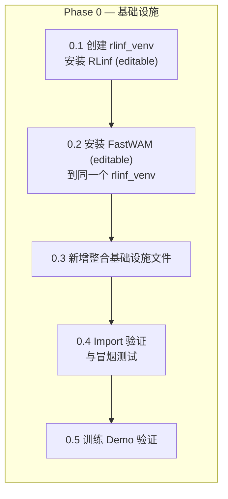
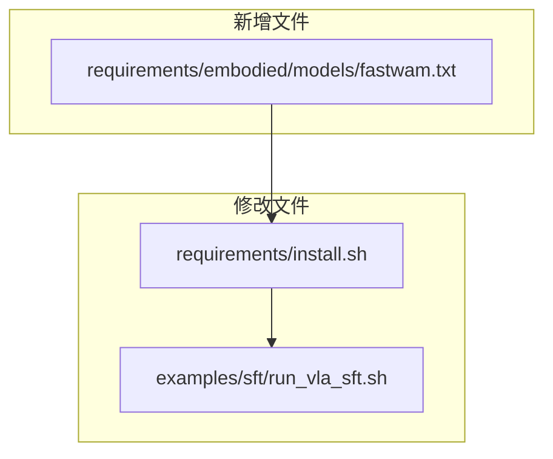
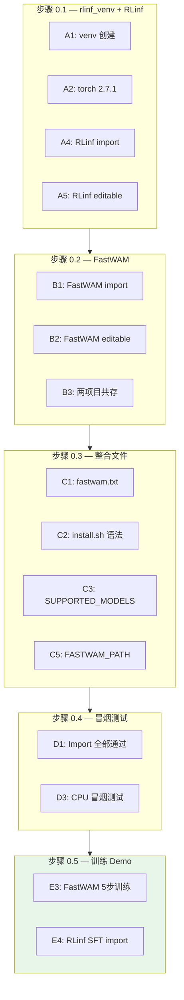

# RLinf 整合 FastWAM SFT — Phase 0 实施与验收方案

> **文档性质**：Phase 0 基础设施的逐步实施指导与验收标准  
> **配套设计文档**：`fw_sft_design_op46_4.md`（v4 完整版）§5 + §19  
> **代码基线**：RLinf `/home/luogang/S/RL/RLinf` · FastWAM `/home/luogang/S/Rb/FastWAM`  
> **日期**：2026-05-31  
> **预计工期**：1–2 天

---

## 目录

1. [Phase 0 总览](#1-phase-0-总览)
2. [前置条件](#2-前置条件)
3. [步骤 0.1 — 创建共享虚拟环境并安装 RLinf](#3-步骤-01--创建共享虚拟环境并安装-rlinf)
4. [步骤 0.2 — 在同一环境中安装 FastWAM](#4-步骤-02--在同一环境中安装-fastwam)
5. [步骤 0.3 — 新增整合基础设施文件](#5-步骤-03--新增整合基础设施文件)
6. [步骤 0.4 — Import 验证与冒烟测试](#6-步骤-04--import-验证与冒烟测试)
7. [步骤 0.5 — 训练 Demo 验证](#7-步骤-05--训练-demo-验证)
8. [验收标准总表](#8-验收标准总表)
9. [故障排查](#9-故障排查)
10. [文件变更清单](#10-文件变更清单)

---

## 1. Phase 0 总览

### 1.1 目标

Phase 0 的目标是搭建 FastWAM 整合所需的**安装与环境基础设施**。完成后：

- RLinf 与 FastWAM 共存于同一个 uv 虚拟环境 `rlinf_venv`（位于 `/mnt/localssd/`）
- 两个项目均以**开发模式（可编辑模式）**安装，源码修改即时生效
- RLinf 的安装脚本支持 `--model fastwam`
- 两个项目各自的短训练 demo 可正常运行

### 1.2 核心约束

| 约束 | 值 |
|------|-----|
| 虚拟环境名称 | `rlinf_venv` |
| 虚拟环境路径 | `/mnt/localssd/rlinf_venv` |
| 环境管理工具 | uv |
| 安装模式 | 开发模式（`uv pip install -e .`） |
| RLinf 源码 | `/home/luogang/S/RL/RLinf` |
| FastWAM 源码 | `/home/luogang/S/Rb/FastWAM` |

### 1.3 任务分解



### 1.4 依赖版本冲突分析

RLinf 和 FastWAM 的 `pyproject.toml` 存在版本冲突，安装到同一环境需要处理：

| 包名 | RLinf (override-deps) | FastWAM (pinned) | 解决策略 |
|------|----------------------|-------------------|----------|
| `torch` | ==2.6.0 | ==2.7.1+cu128 | 使用 2.7.1+cu128（更新，FastWAM 强需求）|
| `torchvision` | ==0.21.0 | ==0.22.1+cu128 | 使用 0.22.1+cu128（配合 torch 2.7.1）|
| `torchcodec` | ==0.2 | ==0.5 | 使用 0.5（向后兼容）|
| `transformers` | <=4.57.6 | ==4.49.0 | 使用 4.49.0（满足两方约束）|
| `datasets` | ==3.6.0 | ==3.6.0 | 一致，无冲突 |
| `numpy` | — | ==1.26.4 | 使用 1.26.4 |

**解决方案**：先安装 torch 2.7.1+cu128，然后两个项目均以 `--no-deps` 可编辑安装（仅注册源码路径，不触发依赖解析冲突），最后手动补装缺失的共享依赖。

---

## 2. 前置条件

### 2.1 硬件要求

| 项目 | 最低要求 | 推荐 |
|------|----------|------|
| GPU | 1× NVIDIA GPU (16GB+) | 8× H100/A100 |
| GPU 显存 | 16GB（单卡 demo） | 80GB（全量训练） |
| 系统内存 | 32GB | 128GB+ |
| 磁盘 `/mnt/localssd/` | 10GB 可用 | 50GB+（含数据集） |

### 2.2 软件要求

| 软件 | 版本 | 检查命令 |
|------|------|----------|
| Python | 3.10+ | `python --version` |
| CUDA | 12.x | `nvcc --version` |
| uv | 最新 | `uv --version` |
| Git | 2.x+ | `git --version` |

### 2.3 环境变量约定

```bash
# 虚拟环境
export VENV_DIR="/mnt/localssd/rlinf_venv"

# 项目路径
export RLINF_PATH="/home/luogang/S/RL/RLinf"
export FASTWAM_ROOT="/home/luogang/S/Rb/FastWAM"
export FASTWAM_PATH="${FASTWAM_ROOT}/src"  # Python import 根路径

# Wan 模型下载缓存
export DIFFSYNTH_MODEL_BASE_PATH="${FASTWAM_ROOT}/checkpoints"
```

---

## 3. 步骤 0.1 — 创建共享虚拟环境并安装 RLinf

### 3.1 目标

创建 `/mnt/localssd/rlinf_venv`，安装 PyTorch 和 RLinf（开发模式 + embodied 依赖）。

### 3.2 操作流程

```bash
# ── 1. 创建 uv 虚拟环境 ──
uv venv /mnt/localssd/rlinf_venv --python 3.10

# ── 2. 激活 ──
source /mnt/localssd/rlinf_venv/bin/activate

# ── 3. 安装 PyTorch 2.7.1+cu128（统一版本，满足 FastWAM 强需求）──
uv pip install torch==2.7.1+cu128 torchvision==0.22.1+cu128 \
  --extra-index-url https://download.pytorch.org/whl/cu128

# ── 4. 安装 RLinf embodied 依赖（不安装 RLinf 包本身，避免 override-deps 覆盖 torch）──
cd ${RLINF_PATH}
uv pip install -r requirements/embodied/common.txt 2>/dev/null || true

# ── 5. 安装 RLinf 的 embodied extra 依赖 ──
# 手动安装 embodied extra 中的关键包（pyproject.toml [project.optional-dependencies] embodied）
uv pip install "transformers<=4.57.6" peft timm "imageio[ffmpeg]" gymnasium gym torchcodec==0.5

# ── 6. 安装 RLinf 基础依赖（从 pyproject.toml dependencies）──
uv pip install ray hydra-core omegaconf datasets==3.6.0 torchdata scipy accelerate

# ── 7. 以开发模式安装 RLinf（--no-deps 避免 override-dependencies 覆盖 torch）──
uv pip install -e ${RLINF_PATH} --no-deps
```

### 3.3 安装验证

```bash
source /mnt/localssd/rlinf_venv/bin/activate

# 验证 torch 版本
python -c "import torch; print(f'torch={torch.__version__}, CUDA={torch.cuda.is_available()}')"
# 期望：torch=2.7.1+cu128, CUDA=True

# 验证 RLinf 核心模块可 import
python -c "
from rlinf.config import SupportedModel, EMBODIED_MODEL
from rlinf.models.embodiment.base_policy import BasePolicy, ForwardType
print(f'SupportedModel 成员数: {len(SupportedModel)}')
print(f'ForwardType.SFT = {ForwardType.SFT.value}')
print('RLinf 核心模块 import 成功')
"
```

### 3.4 验收标准

| # | 检查项 | 通过标准 |
|---|--------|----------|
| A1 | 虚拟环境创建 | `/mnt/localssd/rlinf_venv/bin/activate` 存在 |
| A2 | torch 版本 | `torch.__version__` == `2.7.1+cu128` |
| A3 | CUDA 可用 | `torch.cuda.is_available()` == True |
| A4 | RLinf import | `from rlinf.config import SupportedModel` 无异常 |
| A5 | RLinf 开发模式 | `pip show rlinf` 显示 `Editable project location:` |

---

## 4. 步骤 0.2 — 在同一环境中安装 FastWAM

### 4.1 目标

在 `rlinf_venv` 中以开发模式安装 FastWAM，确保两个项目共存。

### 4.2 操作流程

```bash
source /mnt/localssd/rlinf_venv/bin/activate

# ── 1. 安装 FastWAM 特有依赖（不在 RLinf 中的部分）──
uv pip install \
  deepspeed>=0.18.5 \
  modelscope>=1.34.0 \
  av>=16.0.0 \
  safetensors>=0.5.3 \
  lerobot>=0.2.0 \
  albumentations>=1.4.0 \
  einops>=0.8.0 \
  numpy==1.26.4 \
  pyarrow>=23.0.0 \
  wandb \
  rich

# ── 2. 安装 flash-attn ──
uv pip install flash-attn --no-build-isolation

# ── 3. 以开发模式安装 FastWAM（--no-deps 避免 torch 版本冲突）──
uv pip install -e ${FASTWAM_ROOT} --no-deps
```

### 4.3 安装验证

```bash
source /mnt/localssd/rlinf_venv/bin/activate

# 验证 FastWAM 核心模块
python -c "
from fastwam.models.wan22.fastwam import FastWAM
from fastwam.models.wan22.wan_video_dit import WanVideoDiT
from fastwam.models.wan22.action_dit import ActionDiT
from fastwam.models.wan22.mot import MoT
from fastwam.models.wan22.schedulers.scheduler_continuous import WanContinuousFlowMatchScheduler
from fastwam.runtime import create_fastwam
from fastwam.datasets.lerobot.robot_video_dataset import RobotVideoDataset
from fastwam.datasets.lerobot.processors.fastwam_processor import FastWAMProcessor
print('FastWAM 核心模块 import 成功')
"

# 验证两个项目共存
python -c "
from rlinf.config import SupportedModel
from fastwam.models.wan22.fastwam import FastWAM
print('RLinf + FastWAM 共存验证通过')
"

# 验证开发模式安装
pip show fastwam | grep -i "editable\|location"
pip show rlinf | grep -i "editable\|location"
```

### 4.4 验收标准

| # | 检查项 | 通过标准 |
|---|--------|----------|
| B1 | FastWAM import | `from fastwam.models.wan22.fastwam import FastWAM` 无异常 |
| B2 | FastWAM 开发模式 | `pip show fastwam` 显示 `Editable project location:` |
| B3 | 两项目共存 | 在同一 Python 进程中同时 import rlinf 和 fastwam 无异常 |
| B4 | flash-attn 安装 | `python -c "import flash_attn"` 无异常 |

---

## 5. 步骤 0.3 — 新增整合基础设施文件

### 5.1 总览



### 5.2 新增 `requirements/embodied/models/fastwam.txt`

**路径**：`requirements/embodied/models/fastwam.txt`

```txt
# FastWAM SFT dependencies
# Aligned with FastWAM pyproject.toml, excluding packages already in RLinf embodied base.
# Note: RLinf base provides torch, torchvision, transformers, peft, torchcodec, etc.
# Only list FastWAM-specific deps or version overrides here.

accelerate>=1.12.0
deepspeed>=0.18.5
modelscope>=1.34.0
av>=16.0.0
safetensors>=0.5.3
lerobot>=0.2.0
albumentations>=1.4.0
einops>=0.8.0
hydra-core>=1.3.2
omegaconf>=2.3.0
```

**设计考虑**：

| 依赖 | 是否列出 | 说明 |
|------|---------|------|
| `torch` / `torchvision` | 否 | 由环境统一管理 |
| `transformers` | 否 | RLinf embodied 提供 |
| `accelerate` | **是** | FastWAM 独立版训练器需要 |
| `deepspeed` | **是** | FastWAM ZeRO-1 需要 |
| `modelscope` | **是** | 模型下载 |
| `av` | **是** | 视频解码 |
| `safetensors` | **是** | 权重格式 |
| `lerobot` | **是** | 数据集格式 |
| `albumentations` | **是** | 图像增强 |
| `einops` | **是** | 张量重排 |
| `hydra-core` / `omegaconf` | **是** | FastWAM 配置系统 |
| `flash-attn` | 否 | 由 `install_flash_attn` 函数单独安装 |

### 5.3 修改 `requirements/install.sh`

需要做四处修改：

#### 5.3.1 添加 "fastwam" 到 SUPPORTED_MODELS（第 77 行）

```bash
# 修改前
SUPPORTED_MODELS=("openvla" "openvla-oft" "openpi" "gr00t" "dexbotic" "starvla" "lingbotvla" "dreamzero" "qwen3_vl")

# 修改后
SUPPORTED_MODELS=("openvla" "openvla-oft" "openpi" "gr00t" "dexbotic" "starvla" "lingbotvla" "dreamzero" "qwen3_vl" "fastwam")
```

#### 5.3.2 添加 `install_fastwam_model()` 函数（在第 1306 行之后）

```bash
install_fastwam_model() {
    case "$ENV_NAME" in
        libero)
            create_and_sync_venv
            install_common_embodied_deps
            install_libero_env
            uv pip install -r $SCRIPT_DIR/embodied/models/fastwam.txt
            install_flash_attn
            ;;
        robotwin)
            create_and_sync_venv
            install_common_embodied_deps
            install_robotwin_env
            uv pip install -r $SCRIPT_DIR/embodied/models/fastwam.txt
            install_flash_attn
            ;;
        "")
            create_and_sync_venv
            install_common_embodied_deps
            uv pip install -r $SCRIPT_DIR/embodied/models/fastwam.txt
            install_flash_attn
            ;;
        *)
            echo "Environment '$ENV_NAME' is not supported for FastWAM model." >&2
            exit 1
            ;;
    esac
}
```

#### 5.3.3 添加 case 分支到主调度器（第 1862 行之后）

```bash
                dreamzero)
                    install_dreamzero_model
                    ;;
                fastwam)
                    install_fastwam_model
                    ;;
```

#### 5.3.4 更新 env 校验逻辑（第 1834 行）

FastWAM 允许不指定 `--env`：

```bash
# 修改前
            elif [ "$MODEL" != "dreamzero" ]; then

# 修改后
            elif [ "$MODEL" != "dreamzero" ] && [ "$MODEL" != "fastwam" ]; then
```

### 5.4 修改 `examples/sft/run_vla_sft.sh`

在 DREAMZERO_PATH 之后添加 FASTWAM_PATH 导出（第 13 行后）：

```bash
export FASTWAM_PATH=${FASTWAM_PATH:-"/path/to/FastWAM/src"}
export PYTHONPATH=${FASTWAM_PATH}:$PYTHONPATH
```

> **注意**：`FASTWAM_PATH` 指向 `FastWAM/src`（不是项目根目录），因为 Python import 路径是 `from fastwam.xxx import ...`，`fastwam` 包位于 `src/fastwam/`。

### 5.5 修改验证

```bash
# 验证 install.sh 语法正确
bash -n ${RLINF_PATH}/requirements/install.sh && echo "语法正确"

# 验证 fastwam 在 SUPPORTED_MODELS 中
grep -o '"fastwam"' ${RLINF_PATH}/requirements/install.sh && echo "已添加到 SUPPORTED_MODELS"

# 验证安装函数存在
grep -c 'install_fastwam_model' ${RLINF_PATH}/requirements/install.sh
# 期望输出: 至少 2（函数定义 + case 调用）

# 验证 FASTWAM_PATH 导出
grep 'FASTWAM_PATH' ${RLINF_PATH}/examples/sft/run_vla_sft.sh

# 验证依赖文件存在
test -s ${RLINF_PATH}/requirements/embodied/models/fastwam.txt && echo "fastwam.txt 存在"
```

### 5.6 验收标准

| # | 检查项 | 通过标准 |
|---|--------|----------|
| C1 | fastwam.txt 存在 | 文件非空 |
| C2 | install.sh 语法 | `bash -n` 退出码 0 |
| C3 | SUPPORTED_MODELS | 包含 `"fastwam"` |
| C4 | install 函数 | `grep -c` ≥ 2 |
| C5 | FASTWAM_PATH | 在 `run_vla_sft.sh` 中存在 |

---

## 6. 步骤 0.4 — Import 验证与冒烟测试

### 6.1 目标

在 `rlinf_venv` 中验证 RLinf 和 FastWAM 的全部关键模块可正确 import 并共存。

### 6.2 Import 验证脚本

```python
#!/usr/bin/env python3
"""rlinf_venv 整合环境 import 冒烟测试"""
import sys

errors = []

def check_import(module_path, description):
    try:
        parts = module_path.rsplit(".", 1)
        if len(parts) == 2:
            mod = __import__(parts[0], fromlist=[parts[1]])
            getattr(mod, parts[1])
        else:
            __import__(module_path)
        print(f"  [PASS] {description}")
    except Exception as e:
        print(f"  [FAIL] {description}: {e}")
        errors.append(description)

print("=" * 60)
print("rlinf_venv 整合环境 Import 冒烟测试")
print("=" * 60)

print("\n--- RLinf 核心模块 ---")
check_import("rlinf.config.SupportedModel", "SupportedModel 枚举")
check_import("rlinf.config.EMBODIED_MODEL", "EMBODIED_MODEL 集合")
check_import("rlinf.models.embodiment.base_policy.BasePolicy", "BasePolicy 基类")
check_import("rlinf.models.embodiment.base_policy.ForwardType", "ForwardType 枚举")
check_import("rlinf.workers.sft.fsdp_vla_sft_worker.FSDPVlaSftWorker", "FSDPVlaSftWorker")
check_import("rlinf.workers.sft.fsdp_sft_worker.FSDPSftWorker", "FSDPSftWorker 基类")

print("\n--- FastWAM 模型模块 ---")
check_import("fastwam.models.wan22.fastwam.FastWAM", "FastWAM 主类")
check_import("fastwam.models.wan22.wan_video_dit.WanVideoDiT", "WanVideoDiT")
check_import("fastwam.models.wan22.action_dit.ActionDiT", "ActionDiT")
check_import("fastwam.models.wan22.mot.MoT", "MoT")
check_import(
    "fastwam.models.wan22.schedulers.scheduler_continuous.WanContinuousFlowMatchScheduler",
    "Flow Match Scheduler",
)

print("\n--- FastWAM 数据模块 ---")
check_import(
    "fastwam.datasets.lerobot.robot_video_dataset.RobotVideoDataset",
    "RobotVideoDataset",
)
check_import(
    "fastwam.datasets.lerobot.processors.fastwam_processor.FastWAMProcessor",
    "FastWAMProcessor",
)

print("\n--- FastWAM 运行时 ---")
check_import("fastwam.runtime.create_fastwam", "create_fastwam 工厂")
check_import("fastwam.trainer.Wan22Trainer", "Wan22Trainer")

print("\n--- 交叉依赖验证 ---")
try:
    import torch
    from fastwam.models.wan22.fastwam import FastWAM
    from rlinf.models.embodiment.base_policy import BasePolicy, ForwardType

    assert hasattr(ForwardType, "SFT"), "ForwardType.SFT 缺失"
    assert hasattr(BasePolicy, "forward"), "BasePolicy.forward 缺失"
    print(f"  [PASS] torch={torch.__version__}, CUDA={torch.cuda.is_available()}")
    print("  [PASS] 交叉依赖: FastWAM + RLinf BasePolicy 共存")
except Exception as e:
    print(f"  [FAIL] 交叉依赖: {e}")
    errors.append("交叉依赖")

print("\n" + "=" * 60)
if errors:
    print(f"测试结果: {len(errors)} 个失败")
    for e in errors:
        print(f"  - {e}")
    sys.exit(1)
else:
    print("测试结果: 全部通过")
    sys.exit(0)
```

### 6.3 Mini 模型构建冒烟测试（CPU，无需数据集）

```python
#!/usr/bin/env python3
"""FastWAM CPU 冒烟测试 — 在 rlinf_venv 中验证模型构建和前向传播"""
import torch
import torch.nn.functional as F
from fastwam.models.wan22.fastwam import FastWAM
from fastwam.models.wan22.wan_video_dit import WanVideoDiT
from fastwam.models.wan22.action_dit import ActionDiT
from fastwam.models.wan22.mot import MoT
from fastwam.models.wan22.schedulers.scheduler_continuous import WanContinuousFlowMatchScheduler

print("=== FastWAM CPU 冒烟测试 (rlinf_venv) ===")

# 1. 验证 scheduler 数学
sched = WanContinuousFlowMatchScheduler(num_train_timesteps=1000, shift=5.0)
x = torch.randn(1, 16, 2, 4, 4)
noise = torch.randn_like(x)
t = torch.tensor([500.0])
noisy = sched.add_noise(x, noise, t)
target = sched.training_target(x, noise, t)
weight = sched.training_weight(t)
assert torch.isfinite(noisy).all() and torch.isfinite(target).all() and weight.item() > 0
print("  [PASS] Scheduler 验证通过")

# 2. 构建 Mini MoT (2 层, 64 维)
torch.manual_seed(42)
video_expert = WanVideoDiT(
    dim=64, in_dim=16, ffn_dim=128, out_dim=16,
    text_dim=64, freq_dim=64, eps=1e-6,
    patch_size=(1, 2, 2), num_heads=4, attn_head_dim=16,
    num_layers=2, fuse_vae_embedding_in_latents=True,
    video_attention_mask_mode="first_frame_causal",
)
action_expert = ActionDiT(
    dim=64, action_dim=7, ffn_dim=128,
    text_dim=64, freq_dim=64, eps=1e-6,
    num_heads=4, attn_head_dim=16, num_layers=2,
)
mot = MoT(
    mixtures={"video": video_expert, "action": action_expert},
    mot_checkpoint_mixed_attn=False,
)
n_params = sum(p.numel() for p in mot.parameters())
print(f"  [PASS] MoT 构建成功 ({n_params / 1e6:.2f}M params)")

# 3. 验证 dit = mot 别名
class MockVAE(torch.nn.Module):
    def __init__(self):
        super().__init__()
        self.temporal_downsample_factor = 4
        self.upsampling_factor = 8
        self._conv = torch.nn.Conv3d(3, 16, 1, bias=False)
        self._conv.requires_grad_(False)
    @torch.no_grad()
    def encode(self, video, **kwargs):
        B, C, T, H, W = video.shape
        lt, lh, lw = (T - 1) // 4 + 1, H // 8, W // 8
        return self._conv(F.adaptive_avg_pool3d(video, (lt, lh, lw)))

model = FastWAM(
    video_expert=video_expert, action_expert=action_expert, mot=mot,
    vae=MockVAE(), text_encoder=None, tokenizer=None,
    text_dim=64, proprio_dim=14, device="cpu", torch_dtype=torch.float32,
)
assert model.dit is model.mot, "dit 必须是 mot 的别名"
print("  [PASS] dit = mot 别名验证通过")

# 4. 验证 training_loss 前向传播
batch = {
    "video":         torch.randn(2, 3, 5, 32, 32),
    "context":       torch.randn(2, 8, 64),
    "context_mask":  torch.ones(2, 8, dtype=torch.bool),
    "action":        torch.randn(2, 4, 7),
    "action_is_pad": torch.zeros(2, 4, dtype=torch.bool),
    "image_is_pad":  torch.zeros(2, 5, dtype=torch.bool),
    "proprio":       torch.randn(2, 5, 14),
}
torch.manual_seed(123)
loss, loss_dict = model.training_loss(batch)
assert torch.isfinite(loss) and loss.requires_grad
print(f"  [PASS] training_loss: total={loss.item():.4f}, "
      f"video={loss_dict['loss_video']:.4f}, action={loss_dict['loss_action']:.4f}")

# 5. 验证 backward
loss.backward()
has_grad = any(p.grad is not None for p in model.mot.parameters())
assert has_grad, "MoT 参数应有梯度"
print("  [PASS] backward 验证通过")

print("\n=== FastWAM CPU 冒烟测试全部通过 ===")
```

### 6.4 验收标准

| # | 检查项 | 通过标准 |
|---|--------|----------|
| D1 | Import 冒烟测试 | 全部 PASS（0 个失败） |
| D2 | 交叉依赖验证 | FastWAM + RLinf BasePolicy 可共存 |
| D3 | CPU 冒烟测试 | Mini 模型 forward+backward 通过 |

---

## 7. 步骤 0.5 — 训练 Demo 验证

### 7.1 目标

验证 RLinf 和 FastWAM 在 `rlinf_venv` 中能各自运行少量数据的短训练。

### 7.2 FastWAM 独立训练 Demo

#### 7.2.1 前置：预生成 ActionDiT 骨干权重

```bash
source /mnt/localssd/rlinf_venv/bin/activate
cd ${FASTWAM_ROOT}
mkdir -p checkpoints

# 生成 ActionDiT 骨干（首次运行会下载 Wan2.2-TI2V-5B 权重 ~10GB）
python scripts/preprocess_action_dit_backbone.py \
  --model-config configs/model/fastwam.yaml \
  --output checkpoints/ActionDiT_linear_interp_Wan22_alphascale_1024hdim.pt \
  --device cuda \
  --dtype bfloat16

# 验证
python -c "
import torch
ckpt = torch.load('checkpoints/ActionDiT_linear_interp_Wan22_alphascale_1024hdim.pt', map_location='cpu')
print(f'Keys: {list(ckpt.keys())[:5]}...')
total = sum(v.numel() for v in ckpt.values() if hasattr(v, 'numel'))
print(f'Total params: {total / 1e9:.2f}B')
print('ActionDiT 骨干权重生成成功')
"
```

#### 7.2.2 前置：预计算 T5 文本嵌入缓存

```bash
cd ${FASTWAM_ROOT}

# 需要 LIBERO 数据集在 data/libero_mujoco3.3.2/ 下
# 如果没有数据集，此步骤可跳过
python scripts/precompute_text_embeds.py task=libero_uncond_2cam224_1e-4

# 验证
ls -la data/text_embeds_cache/libero/
# 期望：包含 .pt 文件的缓存目录
```

#### 7.2.3 运行 5 步短训练

```bash
cd ${FASTWAM_ROOT}
source /mnt/localssd/rlinf_venv/bin/activate

# 首次运行需设 pretrained_norm_stats=null
bash scripts/train_zero1.sh 1 \
  task=libero_uncond_2cam224_1e-4 \
  max_steps=5 \
  batch_size=2 \
  eval_every=999999 \
  save_every=999999 \
  data.train.pretrained_norm_stats=null

# 期望输出：
# [launch] nproc_per_node=1 ...
# Step 1/5  loss=XX.XXXX
# ...
# Step 5/5  loss=XX.XXXX
```

**判断标准**：训练能正常运行 5 步且 loss 为有限值。

### 7.3 RLinf SFT 管线验证

由于 Phase 0 尚未实现 FastWAM 的 config 注册和 Policy 类（这些是 Phase 1 的内容），RLinf 的 SFT 训练管线暂时无法端到端运行 FastWAM。此处验证 RLinf 的 **SFT Worker 基础设施可加载**：

```bash
source /mnt/localssd/rlinf_venv/bin/activate
cd ${RLINF_PATH}

# 验证 SFT 训练入口可加载
python -c "
from rlinf.workers.sft.fsdp_vla_sft_worker import FSDPVlaSftWorker
from rlinf.workers.sft.fsdp_sft_worker import FSDPSftWorker
from rlinf.models.embodiment.base_policy import BasePolicy, ForwardType
from rlinf.config import SupportedModel, EMBODIED_MODEL, build_config

# 验证 SFT 管线核心类可实例化（不需要完整配置）
print(f'FSDPVlaSftWorker 方法: {[m for m in dir(FSDPVlaSftWorker) if not m.startswith(\"_\")][:5]}...')
print(f'ForwardType.SFT = {ForwardType.SFT.value}')
print(f'EMBODIED_MODEL 已有模型: {[m.value for m in EMBODIED_MODEL]}')
print('RLinf SFT 管线基础设施验证通过')
"

# 验证 Hydra 配置加载（不执行训练）
python -c "
from hydra import compose, initialize_config_dir
import os

config_dir = os.path.join('${RLINF_PATH}', 'examples', 'sft', 'config')
if os.path.exists(config_dir):
    print(f'SFT 配置目录存在: {config_dir}')
    configs = [f for f in os.listdir(config_dir) if f.endswith('.yaml')]
    print(f'可用配置: {configs}')
else:
    print('SFT 配置目录不存在（正常，Phase 1 创建）')
print('RLinf 配置系统验证通过')
"
```

### 7.4 验收标准

| # | 检查项 | 通过标准 | 优先级 |
|---|--------|----------|--------|
| E1 | ActionDiT 骨干生成 | `.pt` 文件存在且可加载 | P1 |
| E2 | T5 缓存预计算 | 缓存目录非空 | P1 |
| E3 | FastWAM 5 步训练 | loss 为有限值 | P0 |
| E4 | RLinf SFT 管线 import | Worker 类可加载 | P0 |

---

## 8. 验收标准总表

### 8.1 总览



### 8.2 详细验收表

| 步骤 | # | 检查项 | 命令 | 通过标准 | 优先级 |
|------|---|--------|------|----------|--------|
| 0.1 | A1 | venv 创建 | `test -f /mnt/localssd/rlinf_venv/bin/activate` | 文件存在 | P0 |
| 0.1 | A2 | torch 版本 | `python -c "import torch; print(torch.__version__)"` | `2.7.1+cu128` | P0 |
| 0.1 | A3 | CUDA 可用 | `python -c "import torch; print(torch.cuda.is_available())"` | `True` | P0 |
| 0.1 | A4 | RLinf import | `python -c "from rlinf.config import SupportedModel"` | 无异常 | P0 |
| 0.1 | A5 | RLinf editable | `pip show rlinf \| grep Editable` | 显示路径 | P0 |
| 0.2 | B1 | FastWAM import | `python -c "from fastwam.models.wan22.fastwam import FastWAM"` | 无异常 | P0 |
| 0.2 | B2 | FastWAM editable | `pip show fastwam \| grep Editable` | 显示路径 | P0 |
| 0.2 | B3 | 两项目共存 | 同一进程 import 两者 | 无异常 | P0 |
| 0.2 | B4 | flash-attn | `python -c "import flash_attn"` | 无异常 | P1 |
| 0.3 | C1 | fastwam.txt | `test -s requirements/embodied/models/fastwam.txt` | 文件非空 | P0 |
| 0.3 | C2 | install.sh 语法 | `bash -n requirements/install.sh` | 退出码 0 | P0 |
| 0.3 | C3 | SUPPORTED_MODELS | `grep '"fastwam"' requirements/install.sh` | 找到匹配 | P0 |
| 0.3 | C4 | install 函数 | `grep -c 'install_fastwam_model' requirements/install.sh` | ≥2 | P0 |
| 0.3 | C5 | FASTWAM_PATH | `grep 'FASTWAM_PATH' examples/sft/run_vla_sft.sh` | 找到匹配 | P0 |
| 0.4 | D1 | Import 冒烟测试 | 运行 import 脚本 | 0 个失败 | P0 |
| 0.4 | D2 | 交叉依赖 | 脚本中的交叉验证 | 通过 | P0 |
| 0.4 | D3 | CPU 冒烟测试 | 运行 mini 模型测试 | 通过 | P0 |
| 0.5 | E1 | ActionDiT 骨干 | `ls checkpoints/ActionDiT_*.pt` | 文件存在 | P1 |
| 0.5 | E2 | T5 缓存 | `ls data/text_embeds_cache/libero/` | 目录非空 | P1 |
| 0.5 | E3 | FastWAM 5步训练 | `bash scripts/train_zero1.sh 1 ... max_steps=5` | loss 有限 | P0 |
| 0.5 | E4 | RLinf SFT import | 运行 SFT 管线验证脚本 | 通过 | P0 |

### 8.3 Phase 0 完成定义

**Phase 0 完成** = 上述所有 P0 检查项全部通过。

完成后即可进入 **Phase 1 — 最小训练闭环**（`config.py` 注册、`FastWAMPolicy`、`build_dataloader`、YAML 配置等）。

---

## 9. 故障排查

### 9.1 常见问题

| 问题 | 症状 | 解决方案 |
|------|------|----------|
| **torch 版本冲突** | `uv pip install -e .` 报版本冲突 | 使用 `--no-deps` 安装，手动管理依赖 |
| **flash-attn 编译失败** | 长时间编译后报错 | `pip install flash-attn --no-build-isolation`；或用预编译 wheel |
| **ImportError: fastwam** | `No module named 'fastwam'` | 确认 `uv pip install -e /home/luogang/S/Rb/FastWAM` 已执行；或检查 `FASTWAM_PATH` 在 `PYTHONPATH` 中 |
| **ImportError: rlinf** | `No module named 'rlinf'` | 确认 `uv pip install -e /home/luogang/S/RL/RLinf` 已执行 |
| **Hydra 版本错误** | `ConfigCompositionException` | 确认 `hydra-core>=1.3.2` 已安装 |
| **模型下载失败** | 网络超时 | `export HF_ENDPOINT=https://hf-mirror.com`（国内镜像） |
| **LIBERO 数据缺失** | `FileNotFoundError` | 跳过 E1-E3（P1 优先级），只运行 CPU 冒烟测试 |
| **torchcodec 冲突** | import 报版本不匹配 | 安装 `torchcodec==0.5`（FastWAM 需求，向后兼容） |
| **`/mnt/localssd/` 不存在** | `mkdir` 失败 | `sudo mkdir -p /mnt/localssd && sudo chown $(whoami) /mnt/localssd` |

### 9.2 依赖版本对照

| 包名 | 安装版本 | FastWAM 需求 | RLinf 需求 | 说明 |
|------|---------|-------------|-----------|------|
| `torch` | 2.7.1+cu128 | ==2.7.1+cu128 | >=2.5.0 | 用 FastWAM 版本 |
| `torchvision` | 0.22.1+cu128 | ==0.22.1+cu128 | ==0.21.0 | 用 FastWAM 版本 |
| `torchcodec` | 0.5 | ==0.5 | ==0.2 | 用 FastWAM 版本 |
| `transformers` | 4.49.0 | ==4.49.0 | <=4.57.6 | 兼容 |
| `numpy` | 1.26.4 | ==1.26.4 | — | 兼容 |
| `datasets` | 3.6.0 | ==3.6.0 | ==3.6.0 | 一致 |
| `accelerate` | ≥1.12.0 | ==1.12.0 | 基础依赖 | 兼容 |
| `deepspeed` | ≥0.18.5 | ==0.18.5 | — | FastWAM 独有 |

---

## 10. 文件变更清单

### 10.1 新增文件

| 文件 | 类型 | 说明 |
|------|------|------|
| `requirements/embodied/models/fastwam.txt` | 依赖清单 | FastWAM 专属 pip 依赖 |

### 10.2 修改文件

| 文件 | 修改位置 | 修改内容 |
|------|----------|----------|
| `requirements/install.sh` | 第 77 行 | `SUPPORTED_MODELS` 添加 `"fastwam"` |
| `requirements/install.sh` | 第 1306 行后 | 新增 `install_fastwam_model()` 函数 |
| `requirements/install.sh` | 第 1834 行 | env 校验条件添加 `fastwam` 豁免 |
| `requirements/install.sh` | 第 1862 行后 | case 调度添加 `fastwam)` 分支 |
| `examples/sft/run_vla_sft.sh` | 第 13 行后 | 新增 `FASTWAM_PATH` 导出 |

### 10.3 不涉及的文件（Phase 1+）

| 文件 | Phase | 说明 |
|------|-------|------|
| `rlinf/config.py` | Phase 1 | `SupportedModel.FASTWAM` 注册 |
| `rlinf/models/__init__.py` | Phase 1 | `register_model("fastwam", ...)` |
| `rlinf/models/embodiment/fastwam/` | Phase 1 | `FastWAMPolicy`、`get_model`、`fastwam_config` |
| `rlinf/data/datasets/fastwam/` | Phase 1 | `build_fastwam_sft_dataloader`、`collate` |
| `rlinf/workers/sft/fsdp_vla_sft_worker.py` | Phase 1 | FastWAM 分支 |
| `examples/sft/config/libero_sft_fastwam.yaml` | Phase 1 | SFT 配置 |
| `docker/Dockerfile` | Phase 3 | Docker 构建阶段 |
| `.github/workflows/sft-e2e-tests.yml` | Phase 3 | CI 作业 |

---

## 附录 A：一键验收脚本

```bash
#!/usr/bin/env bash
set -euo pipefail

VENV_DIR="${VENV_DIR:-/mnt/localssd/rlinf_venv}"
RLINF_PATH="${RLINF_PATH:-/home/luogang/S/RL/RLinf}"
FASTWAM_ROOT="${FASTWAM_ROOT:-/home/luogang/S/Rb/FastWAM}"
FASTWAM_PATH="${FASTWAM_ROOT}/src"

PASS=0
FAIL=0

check() {
    local desc="$1"
    shift
    if "$@" >/dev/null 2>&1; then
        echo "[PASS] $desc"
        ((PASS++))
    else
        echo "[FAIL] $desc"
        ((FAIL++))
    fi
}

echo "=================================="
echo "Phase 0 验收检查 (rlinf_venv)"
echo "=================================="

echo ""
echo "--- 步骤 0.1: rlinf_venv + RLinf ---"
check "A1: venv 存在" test -f "${VENV_DIR}/bin/activate"

# 激活 venv
source "${VENV_DIR}/bin/activate"
export PYTHONPATH="${FASTWAM_PATH}:${RLINF_PATH}:${PYTHONPATH:-}"

check "A2: torch==2.7.1" python -c "import torch; assert '2.7.1' in torch.__version__"
check "A3: CUDA 可用" python -c "import torch; assert torch.cuda.is_available()"
check "A4: RLinf import" python -c "from rlinf.config import SupportedModel"
check "A5: RLinf editable" pip show rlinf 2>/dev/null

echo ""
echo "--- 步骤 0.2: FastWAM ---"
check "B1: FastWAM import" python -c "from fastwam.models.wan22.fastwam import FastWAM"
check "B2: FastWAM editable" pip show fastwam 2>/dev/null
check "B3: 两项目共存" python -c "
from rlinf.config import SupportedModel
from fastwam.models.wan22.fastwam import FastWAM
"

echo ""
echo "--- 步骤 0.3: 整合文件 ---"
check "C1: fastwam.txt 存在" test -s "${RLINF_PATH}/requirements/embodied/models/fastwam.txt"
check "C2: install.sh 语法" bash -n "${RLINF_PATH}/requirements/install.sh"
check "C3: SUPPORTED_MODELS" grep -q '"fastwam"' "${RLINF_PATH}/requirements/install.sh"
check "C4: install 函数" grep -q 'install_fastwam_model' "${RLINF_PATH}/requirements/install.sh"
check "C5: FASTWAM_PATH 导出" grep -q 'FASTWAM_PATH' "${RLINF_PATH}/examples/sft/run_vla_sft.sh"

echo ""
echo "--- 步骤 0.4: 冒烟测试 ---"
check "D1: RLinf BasePolicy" python -c "from rlinf.models.embodiment.base_policy import BasePolicy, ForwardType"
check "D2: FastWAM MoT" python -c "from fastwam.models.wan22.mot import MoT"
check "D3: FastWAM Scheduler" python -c "from fastwam.models.wan22.schedulers.scheduler_continuous import WanContinuousFlowMatchScheduler"
check "D4: FastWAM runtime" python -c "from fastwam.runtime import create_fastwam"
check "D5: 交叉依赖" python -c "
from fastwam.models.wan22.fastwam import FastWAM
from rlinf.models.embodiment.base_policy import BasePolicy, ForwardType
assert hasattr(ForwardType, 'SFT')
"

echo ""
echo "--- 步骤 0.5: 训练基础设施 ---"
check "E4: RLinf SFT Worker" python -c "from rlinf.workers.sft.fsdp_vla_sft_worker import FSDPVlaSftWorker"

echo ""
echo "=================================="
echo "结果: ${PASS} 通过, ${FAIL} 失败"
echo "=================================="
exit ${FAIL}
```

---

*本文档为 RLinf 整合 FastWAM SFT 的 Phase 0 基础设施完整实施与验收方案。RLinf 和 FastWAM 共享同一个位于 `/mnt/localssd/rlinf_venv` 的 uv 虚拟环境，均以开发模式安装。*
