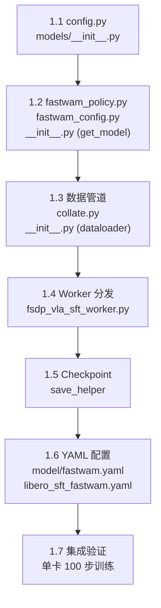
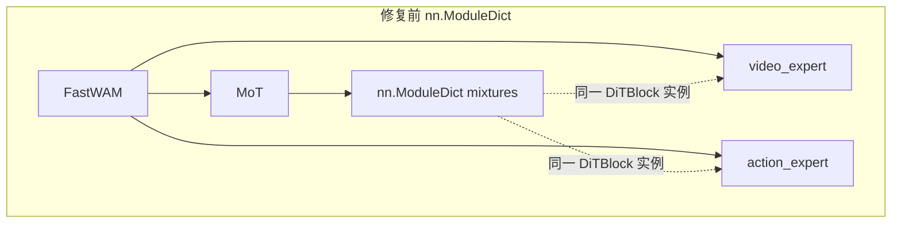
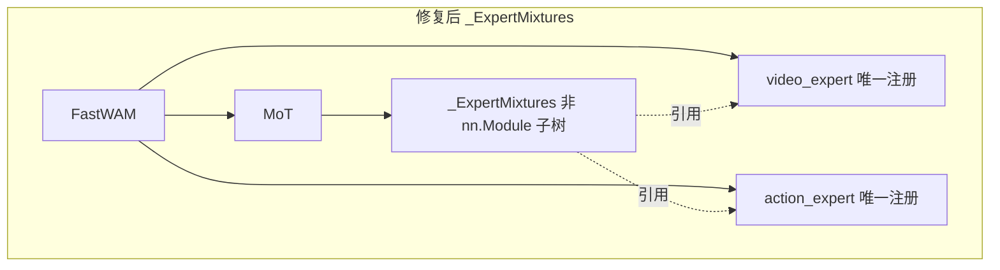
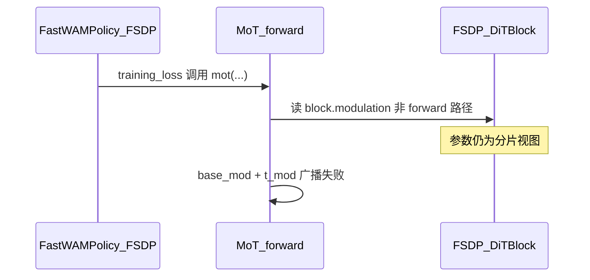

# RLinf 整合 FastWAM SFT — Phase 1 实施与验收方案

> **文档性质**：Phase 1 最小训练闭环的逐步实施指导与验收标准  
> **配套文档**：设计方案 `fw_sft_design_op46_4.md`（v4）· Phase 0 方案 `fw_sft_design_op46_4_0impl.md`  
> **前置条件**：Phase 0 全部完成（`rlinf_venv` 环境就绪，RLinf + FastWAM 均已可编辑安装）  
> **代码基线**：RLinf `/home/luogang/S/RL/RLinf` · FastWAM `/home/luogang/S/Rb/FastWAM`  
> **日期**：2026-05-31  
> **预计工期**：3–5 天

---

## 目录

1. [Phase 1 总览](#1-phase-1-总览)
2. [步骤 1.1 — 配置注册](#2-步骤-11--配置注册)
3. [步骤 1.2 — FastWAMPolicy + Config + get_model](#3-步骤-12--fastwampolicy--config--get_model)
4. [步骤 1.3 — 数据管道](#4-步骤-13--数据管道)
5. [步骤 1.4 — Worker 分发](#5-步骤-14--worker-分发)
6. [步骤 1.5 — Checkpoint save_helper](#6-步骤-15--checkpoint-save_helper)
7. [步骤 1.6 — 配置 YAML](#7-步骤-16--配置-yaml)
8. [步骤 1.7 — 集成验证](#8-步骤-17--集成验证)
9. [验收标准总表](#9-验收标准总表)
10. [Phase 0 教训速查](#10-phase-0-教训速查)

---

## 1. Phase 1 总览

### 1.1 目标

在 Phase 0 搭建的 `rlinf_venv` 环境中，实现 FastWAM 在 RLinf SFT 管线中的**最小训练闭环**：

```
train_vla_sft.py → Hydra 配置 → SFTRunner → FSDPVlaSftWorker
  → build_fastwam_sft_dataloader → FastWAMPolicy.sft_forward
  → loss.backward → optimizer.step → loss 下降
```

### 1.2 任务清单

| # | 任务 | 涉及文件 | 类型 |
|---|------|---------|------|
| 1.1 | 配置注册 | `rlinf/config.py` + `rlinf/models/__init__.py` | 修改 |
| 1.2 | Policy + Config + get_model | `rlinf/models/embodiment/fastwam/` (3 个新文件) | 新增 |
| 1.3 | 数据管道 | `rlinf/data/datasets/fastwam/` (2 个新文件) | 新增 |
| 1.4 | Worker 分发 | `rlinf/workers/sft/fsdp_vla_sft_worker.py` | 修改 |
| 1.5 | Checkpoint | `rlinf/utils/ckpt_convertor/fsdp_convertor/utils.py` | 修改 |
| 1.6 | 配置 YAML | `examples/sft/config/` (2 个新文件) | 新增 |
| 1.7 | 集成验证 | — | 运行 |

### 1.3 实施顺序



### 1.4 环境准备

```bash
# 激活 Phase 0 构建的环境
source /mnt/localssd/rlinf_venv/bin/activate
export RLINF_PATH=/home/luogang/S/RL/RLinf
export FASTWAM_ROOT=/home/luogang/S/Rb/FastWAM
export FASTWAM_PATH=${FASTWAM_ROOT}/src
export DIFFSYNTH_MODEL_BASE_PATH=/mnt/localssd/share/fastwam_checkpoints
export CUDA_HOME=/usr/local/cuda-12.8

# 验证环境就绪
python -c "
from rlinf.config import SupportedModel
from fastwam.models.wan22.fastwam import FastWAM
import torch
print(f'torch={torch.__version__}, CUDA={torch.cuda.is_available()}')
print('Phase 0 环境就绪')
"
```

---

## 2. 步骤 1.1 — 配置注册

### 2.1 修改 `rlinf/config.py`

#### 2.1.1 注册 SupportedModel.FASTWAM（第 101 行后）

```python
# 在 SupportedModel.VALUE_MODEL = ... 之后添加
SupportedModel.FASTWAM = SupportedModel.register("fastwam", force=True)
```

#### 2.1.2 添加到 EMBODIED_MODEL 集合（第 124 行）

```python
EMBODIED_MODEL = set(
    {
        # ... 已有模型 ...
        SupportedModel.VALUE_MODEL,
        SupportedModel.FASTWAM,      # ← 新增
    }
)
```

#### 2.1.3 添加 validate_sft_cfg 分支（第 1090 行后）

```python
        # 在 DreamZero 验证块之后添加
        elif (
            model_type is not None
            and SupportedModel(model_type) == SupportedModel.FASTWAM
        ):
            from rlinf.models.embodiment.fastwam.fastwam_config import (
                validate_fastwam_sft_model_cfg,
            )
            cfg.actor.model = validate_fastwam_sft_model_cfg(cfg.actor.model)
```

### 2.2 修改 `rlinf/models/__init__.py`

#### 2.2.1 添加 builder 函数（在 `_build_value_model` 之后）

```python
    def _build_fastwam(cfg: DictConfig, torch_dtype):
        from rlinf.models.embodiment.fastwam import get_model

        return get_model(cfg, torch_dtype)
```

#### 2.2.2 注册 builder（在最后一个 `register_model` 之后）

```python
    register_model(
        SupportedModel.FASTWAM.value,
        _build_fastwam,
        category="embodied",
        force=True,
    )
```

### 2.3 验证

```bash
python -c "
from rlinf.config import SupportedModel, EMBODIED_MODEL
assert hasattr(SupportedModel, 'FASTWAM'), 'FASTWAM not registered'
assert SupportedModel.FASTWAM in EMBODIED_MODEL, 'FASTWAM not in EMBODIED_MODEL'
print(f'SupportedModel.FASTWAM = {SupportedModel.FASTWAM.value}')
print('[PASS] 配置注册')
"
```

---

## 3. 步骤 1.2 — FastWAMPolicy + Config + get_model

创建目录 `rlinf/models/embodiment/fastwam/`，包含 3 个文件。

### 3.1 `fastwam_config.py` — 配置校验

```python
# rlinf/models/embodiment/fastwam/fastwam_config.py
import os
from dataclasses import dataclass, field
from typing import Any, Optional

from omegaconf import DictConfig


@dataclass
class FastWAMConfig:
    """FastWAM model configuration for RLinf integration."""
    model_type: str = "fastwam"
    model_path: Optional[str] = None
    model_id: str = "Wan-AI/Wan2.2-TI2V-5B"
    tokenizer_model_id: str = "Wan-AI/Wan2.1-T2V-1.3B"
    tokenizer_max_len: int = 128
    load_text_encoder: bool = False
    proprio_dim: Optional[int] = None
    text_embedding_cache_dir: Optional[str] = None
    context_len: int = 128
    mot_checkpoint_mixed_attn: bool = True
    action_dit_pretrained_path: Optional[str] = None
    redirect_common_files: bool = True
    video_dit_config: dict = field(default_factory=dict)
    action_dit_config: dict = field(default_factory=dict)
    video_scheduler: dict = field(default_factory=dict)
    action_scheduler: dict = field(default_factory=dict)
    loss: dict = field(default_factory=dict)

    @classmethod
    def from_hydra(cls, cfg: DictConfig) -> "FastWAMConfig":
        from omegaconf import OmegaConf
        d = OmegaConf.to_container(cfg, resolve=True)
        known_keys = {f.name for f in cls.__dataclass_fields__.values()}
        filtered = {k: v for k, v in d.items() if k in known_keys}
        return cls(**filtered)


def validate_fastwam_sft_model_cfg(model_cfg: DictConfig) -> DictConfig:
    """Validate FastWAM SFT config. Called from validate_sft_cfg()."""
    # T5 离线缓存目录
    cache_dir = model_cfg.get("text_embedding_cache_dir", None)
    if cache_dir is not None:
        assert os.path.isdir(cache_dir), (
            f"text_embedding_cache_dir does not exist: {cache_dir}"
        )

    # action_scheduler 必须提供
    action_sched = model_cfg.get("action_scheduler", None)
    if action_sched is not None:
        for key in ["train_shift", "infer_shift", "num_train_timesteps"]:
            assert action_sched.get(key) is not None, (
                f"action_scheduler.{key} is required"
            )

    return model_cfg
```

### 3.2 `fastwam_policy.py` — Policy 包装器

```python
# rlinf/models/embodiment/fastwam/fastwam_policy.py
import torch
from rlinf.models.embodiment.base_policy import BasePolicy, ForwardType


class FastWAMPolicy(torch.nn.Module, BasePolicy):
    """FastWAM model wrapper for RLinf SFT pipeline.

    核心职责：
    1. 将 FastWAM.training_loss() 包装为 RLinf SFT 管线期望的接口
    2. 通过 train() 重写保持冻结语义
    3. 通过 _no_split_modules 指导 FSDP 按 DiTBlock 类 auto-wrap（见 G.9；SFT 需配合 no_shard）
    """

    _no_split_modules = ["DiTBlock"]  # 含义见 G.9，非「禁止拆分」

    def __init__(self, fastwam_model, config):
        torch.nn.Module.__init__(self)
        self.fastwam = fastwam_model
        self.config = config

    def forward(self, forward_type=ForwardType.DEFAULT, **kwargs):
        if forward_type == ForwardType.SFT:
            return self.sft_forward(**kwargs)
        elif forward_type == ForwardType.DEFAULT:
            return self.default_forward(**kwargs)
        raise NotImplementedError(f"Unsupported forward type: {forward_type}")

    def sft_forward(self, data=None, **kwargs):
        """SFT 前向传播。

        被 FSDPVlaSftWorker.get_train_model_output() 调用：
            output = self.model(forward_type=ForwardType.SFT, data=batch)

        返回值约定（fsdp_vla_sft_worker.py:85-102）：
        - output["loss"]: 标量 Tensor（必需，用于 backward）
        - output["dynamics_loss"]: Tensor（可选，用于日志）
        - output["action_loss"]: Tensor（可选，用于日志）

        注意：training_loss 返回的 loss_dict 值是 Python float（fastwam.py:565-566），
        但 Worker 代码调用 output["dynamics_loss"].detach().item()，
        所以必须用 torch.tensor() 包装。
        """
        torch.compiler.cudagraph_mark_step_begin()
        if data is None:
            data = kwargs.get("data")
        loss_total, loss_dict = self.fastwam.training_loss(data)
        return {
            "loss": loss_total,
            "dynamics_loss": torch.tensor(loss_dict.get("loss_video", 0.0)),
            "action_loss": torch.tensor(loss_dict.get("loss_action", 0.0)),
        }

    def train(self, mode=True):
        """重写 train() 以保持冻结逻辑。

        FSDPSftWorker.run_training()（fsdp_sft_worker.py:137）会调用
        self.model.train()，这会把所有子模块（包括 VAE）设为 train 模式。
        此处重写确保只有 MoT + proprio_encoder 进入 train 模式，
        VAE 和其他组件保持 eval/frozen 状态。

        对应 FastWAM 独立版的 Wan22Trainer._apply_dit_only_train_mode()
        （trainer.py:286-295）。
        """
        if mode:
            self.fastwam.eval()
            self.fastwam.requires_grad_(False)
            self.fastwam.dit.train()
            self.fastwam.dit.requires_grad_(True)
            if self.fastwam.proprio_encoder is not None:
                self.fastwam.proprio_encoder.train()
                self.fastwam.proprio_encoder.requires_grad_(True)
        else:
            self.fastwam.eval()
        return self

    def default_forward(self, **kwargs):
        raise NotImplementedError("V1 does not support default_forward.")

    def predict_action_batch(self, **kwargs):
        raise NotImplementedError("V1 does not support rollout inference.")

    def gradient_checkpointing_enable(self, gradient_checkpointing_kwargs=None):
        """被 FSDPModelManager.setup_model_and_optimizer() 调用。"""
        self.fastwam.video_expert.use_gradient_checkpointing = True
        self.fastwam.action_expert.use_gradient_checkpointing = True
```

### 3.3 `__init__.py` — get_model 工厂

```python
# rlinf/models/embodiment/fastwam/__init__.py
from pathlib import Path

import torch
from omegaconf import DictConfig, OmegaConf

from rlinf.models.embodiment.fastwam.fastwam_config import FastWAMConfig
from rlinf.models.embodiment.fastwam.fastwam_policy import FastWAMPolicy


def _has_full_weights(model_path):
    """检查 model_path 是否包含完整权重（safetensors 或 .pt）。"""
    if model_path is None:
        return False
    p = Path(model_path)
    return (p / "model.safetensors").exists() or any(p.glob("*.pt"))


def _promote_scalar_params_to_1d(model):
    """将 0 维参数提升为 1 维——FSDP 不支持 0 维参数。"""
    for name, param in model.named_parameters():
        if param.ndim == 0:
            model_parts = name.rsplit(".", 1)
            if len(model_parts) == 2:
                parent = dict(model.named_modules())[model_parts[0]]
                setattr(parent, model_parts[1],
                        torch.nn.Parameter(param.data.unsqueeze(0),
                                          requires_grad=param.requires_grad))


def get_model(cfg: DictConfig, torch_dtype=None):
    """FastWAM 模型工厂，遵循 RLinf get_model(cfg, torch_dtype) 接口。

    调用链：register_model → _build_fastwam → get_model
    """
    from fastwam.runtime import create_fastwam

    torch_dtype = torch_dtype or torch.bfloat16
    model_path = cfg.get("model_path", None)

    # 将 OmegaConf DictConfig 转为 plain dict（create_fastwam 需要）
    def _to_dict(x):
        if x is None:
            return {}
        if isinstance(x, DictConfig):
            return OmegaConf.to_container(x, resolve=True)
        return dict(x)

    fastwam_model = create_fastwam(
        model_id=cfg.get("model_id", "Wan-AI/Wan2.2-TI2V-5B"),
        tokenizer_model_id=cfg.get("tokenizer_model_id", "Wan-AI/Wan2.1-T2V-1.3B"),
        tokenizer_max_len=int(cfg.get("tokenizer_max_len", 128)),
        load_text_encoder=cfg.get("load_text_encoder", False),
        proprio_dim=cfg.get("proprio_dim", None),
        video_dit_config=_to_dict(cfg.get("video_dit_config")),
        action_dit_config=_to_dict(cfg.get("action_dit_config")),
        action_dit_pretrained_path=cfg.get("action_dit_pretrained_path", None),
        skip_dit_load_from_pretrain=_has_full_weights(model_path),
        mot_checkpoint_mixed_attn=cfg.get("mot_checkpoint_mixed_attn", True),
        video_scheduler=_to_dict(cfg.get("video_scheduler")),
        action_scheduler=_to_dict(cfg.get("action_scheduler")),
        loss=_to_dict(cfg.get("loss")),
        redirect_common_files=cfg.get("redirect_common_files", True),
        model_dtype=torch_dtype,
        device="cpu",  # FSDP 接管设备分配
    )

    # 加载已有 checkpoint
    if model_path is not None:
        ckpt_path = Path(model_path)
        if any(ckpt_path.glob("*.pt")):
            fastwam_model.load_checkpoint(str(sorted(ckpt_path.glob("*.pt"))[-1]))

    # 冻结 VAE 和 T5
    fastwam_model.vae.requires_grad_(False)
    if fastwam_model.text_encoder is not None:
        fastwam_model.text_encoder.requires_grad_(False)

    # 包装为 FastWAMPolicy
    # 注意：FastWAM.__init__ 的 self.to(self.device) 只移 device 不转 dtype，
    # 必须显式 .to(dtype) 将所有子模块转为目标精度。
    policy = FastWAMPolicy(fastwam_model, FastWAMConfig.from_hydra(cfg))
    _promote_scalar_params_to_1d(policy)
    return policy.to(dtype=torch_dtype)
```

### 3.4 验证

```bash
python -c "
from rlinf.models.embodiment.fastwam.fastwam_policy import FastWAMPolicy
from rlinf.models.embodiment.fastwam.fastwam_config import FastWAMConfig, validate_fastwam_sft_model_cfg
print('[PASS] FastWAMPolicy import')
print('[PASS] FastWAMConfig import')
print('[PASS] validate import')
"
```

---

## 4. 步骤 1.3 — 数据管道

创建目录 `rlinf/data/datasets/fastwam/`，包含 2 个文件。

### 4.1 `collate.py` — Batch 整理

```python
# rlinf/data/datasets/fastwam/collate.py
import numpy as np
import torch


def fastwam_collate_fn(features):
    """将单样本 list 整理为 batch dict。

    FastWAM 的 RobotVideoDataset.__getitem__ 返回 dict，
    每个值可能是 Tensor、ndarray 或 str。
    """
    batch = {}
    for key in features[0]:
        values = [f[key] for f in features]
        if isinstance(values[0], torch.Tensor):
            batch[key] = torch.stack(values)
        elif isinstance(values[0], np.ndarray):
            batch[key] = torch.from_numpy(np.stack(values))
        else:
            batch[key] = values
    return batch
```

### 4.2 `__init__.py` — Dataloader 构建

```python
# rlinf/data/datasets/fastwam/__init__.py
import torch
from omegaconf import DictConfig, OmegaConf
from torch.utils.data.distributed import DistributedSampler
from torchdata.stateful_dataloader import StatefulDataLoader

from rlinf.data.datasets.fastwam.collate import fastwam_collate_fn


def build_fastwam_sft_dataloader(cfg, world_size, rank, data_paths, eval_dataset=False):
    """构建 FastWAM SFT 数据管道。

    调用链：FSDPVlaSftWorker.build_dataloader → 本函数

    Args:
        cfg: 完整 Hydra 配置
        world_size: 分布式 world size
        rank: 当前 rank
        data_paths: 数据路径（str 或 list）
        eval_dataset: 是否为验证集

    Returns:
        (StatefulDataLoader, dict) — loader 和元数据
    """
    from fastwam.datasets.lerobot.robot_video_dataset import RobotVideoDataset
    from fastwam.datasets.lerobot.processors.fastwam_processor import FastWAMProcessor

    model_cfg = cfg.actor.model
    data_cfg = cfg.data

    # 解析数据路径
    if isinstance(data_paths, str):
        dataset_dirs = [data_paths]
    elif isinstance(data_paths, (list, tuple)):
        dataset_dirs = list(data_paths)
    else:
        dataset_dirs = [str(data_paths)]

    # 构建 shape_meta（从 data config 或 model config 提取）
    shape_meta = OmegaConf.to_container(
        data_cfg.get("shape_meta", model_cfg.get("shape_meta")),
        resolve=True,
    )

    # 构建 Processor
    processor_cfg = data_cfg.get("processor", {})
    processor = FastWAMProcessor(
        shape_meta=shape_meta,
        num_obs_steps=int(data_cfg.get("num_frames", 33)),
        num_output_cameras=int(processor_cfg.get("num_output_cameras", 2)),
        action_output_dim=int(
            processor_cfg.get("action_output_dim",
                              model_cfg.action_dit_config.get("action_dim", 7))
        ),
        proprio_output_dim=int(
            processor_cfg.get("proprio_output_dim", 0)
        ) if processor_cfg.get("proprio_output_dim") else None,
        delta_action_dim_mask=processor_cfg.get("delta_action_dim_mask", None),
        use_stepwise_action_norm=processor_cfg.get("use_stepwise_action_norm", False),
        norm_default_mode=processor_cfg.get("norm_default_mode", "min/max"),
        norm_exception_mode=processor_cfg.get("norm_exception_mode", None),
        action_state_transforms=processor_cfg.get("action_state_transforms", None),
        action_state_merger=processor_cfg.get("action_state_merger", None),
        train_transforms=processor_cfg.get(
            "train_transforms" if not eval_dataset else "val_transforms",
            None
        ),
    )

    # 构建 Dataset
    dataset = RobotVideoDataset(
        dataset_dirs=dataset_dirs,
        shape_meta=shape_meta,
        processor=processor,
        num_frames=int(data_cfg.get("num_frames", 33)),
        action_video_freq_ratio=int(data_cfg.get("action_video_freq_ratio", 4)),
        video_size=list(data_cfg.get("video_size", [224, 448])),
        text_embedding_cache_dir=model_cfg.get("text_embedding_cache_dir"),
        context_len=int(model_cfg.get("context_len", 128)),
        concat_multi_camera=data_cfg.get("concat_multi_camera", None),
        pretrained_norm_stats=data_cfg.get("pretrained_norm_stats", None),
        is_training_set=not eval_dataset,
        val_set_proportion=float(data_cfg.get("val_set_proportion", 0.0)),
        global_sample_stride=int(data_cfg.get("global_sample_stride", 1)),
        skip_padding_as_possible=data_cfg.get("skip_padding_as_possible", False),
    )

    # 分布式采样器
    sampler = DistributedSampler(
        dataset,
        num_replicas=world_size,
        rank=rank,
        shuffle=not eval_dataset,
    )

    # StatefulDataLoader（支持 checkpoint resume）
    loader = StatefulDataLoader(
        dataset,
        batch_size=cfg.actor.micro_batch_size,
        sampler=sampler,
        collate_fn=fastwam_collate_fn,
        num_workers=int(data_cfg.get("num_workers", 8)),
        pin_memory=True,
        persistent_workers=True,
        prefetch_factor=int(data_cfg.get("prefetch_factor", 2)),
    )

    data_config = {
        "num_samples": len(dataset),
        "num_frames": int(data_cfg.get("num_frames", 33)),
    }

    return loader, data_config
```

### 4.3 验证

```bash
python -c "
from rlinf.data.datasets.fastwam import build_fastwam_sft_dataloader
from rlinf.data.datasets.fastwam.collate import fastwam_collate_fn
print('[PASS] 数据管道 import')
"
```

---

## 5. 步骤 1.4 — Worker 分发

### 5.1 修改 `rlinf/workers/sft/fsdp_vla_sft_worker.py`

在 `build_dataloader` 方法中，DreamZero 分支（第 66-75 行）之后添加 FastWAM 分支：

```python
        elif SupportedModel(self.cfg.actor.model.model_type) in [
            SupportedModel.FASTWAM
        ]:
            from rlinf.data.datasets.fastwam import (
                build_fastwam_sft_dataloader,
            )

            return build_fastwam_sft_dataloader(
                self.cfg, self._world_size, self._rank, data_paths, eval_dataset
            )
```

**插入位置**：在第 75 行（DreamZero 的 return 语句）之后、第 76 行（`else: raise KeyError`）之前。

### 5.2 验证

```bash
python -c "
from rlinf.workers.sft.fsdp_vla_sft_worker import FSDPVlaSftWorker
# 检查 build_dataloader 方法中是否有 FASTWAM 分支
import inspect
source = inspect.getsource(FSDPVlaSftWorker.build_dataloader)
assert 'FASTWAM' in source or 'fastwam' in source, 'FastWAM branch missing in build_dataloader'
print('[PASS] Worker 分发')
"
```

---

## 6. 步骤 1.5 — Checkpoint save_helper

### 6.1 修改 `rlinf/utils/ckpt_convertor/fsdp_convertor/utils.py`

#### 6.1.1 添加 fastwam_save_helper 函数（在 `dreamzero_save_helper` 之后）

```python
def fastwam_save_helper(model_state_dict, model_config, save_path, **kwargs):
    """将 FSDP state_dict 转换为 FastWAM 原生 checkpoint 格式。

    FSDP 的 state_dict 键带 'fastwam.' 前缀（来自 FastWAMPolicy.fastwam 属性），
    需要剥离前缀后分别保存 mot 和 proprio_encoder 的权重。
    """
    mot_sd, pe_sd = {}, {}
    for k, v in model_state_dict.items():
        if k.startswith("fastwam.mot."):
            mot_sd[k.replace("fastwam.mot.", "")] = v
        elif k.startswith("fastwam.proprio_encoder."):
            pe_sd[k.replace("fastwam.proprio_encoder.", "")] = v

    payload = {
        "mot": mot_sd,
        "step": kwargs.get("step", 0),
        "torch_dtype": "torch.bfloat16",
    }
    if pe_sd:
        payload["proprio_encoder"] = pe_sd

    torch.save(payload, os.path.join(save_path, "fastwam_native.pt"))
```

#### 6.1.2 注册到 `_MODEL_SAVE_HELPER_REGISTRY`（第 67-70 行）

```python
    _MODEL_SAVE_HELPER_REGISTRY = {
        SupportedModel.OPENVLA_OFT: openvla_oft_save_helper,
        SupportedModel.DREAMZERO: dreamzero_save_helper,
        SupportedModel.FASTWAM: fastwam_save_helper,      # ← 新增
    }
```

### 6.2 验证

```bash
python -c "
from rlinf.utils.ckpt_convertor.fsdp_convertor.utils import get_model_save_helper
helper = get_model_save_helper('fastwam')
assert helper is not None, 'fastwam_save_helper not registered'
print(f'[PASS] save_helper: {helper.__name__}')
"
```

---

## 7. 步骤 1.6 — 配置 YAML

### 7.1 `examples/sft/config/model/fastwam.yaml`

此文件定义 FastWAM 模型架构参数，在 `libero_sft_fastwam.yaml` 中通过 `defaults` 引用。

```yaml
# examples/sft/config/model/fastwam.yaml
# FastWAM model configuration for RLinf SFT
# 参照 FastWAM configs/model/fastwam.yaml 和 configs/data/libero_2cam.yaml

model_type: "fastwam"
model_id: Wan-AI/Wan2.2-TI2V-5B
tokenizer_model_id: Wan-AI/Wan2.1-T2V-1.3B
tokenizer_max_len: 128
load_text_encoder: false
redirect_common_files: true
mot_checkpoint_mixed_attn: true
action_dit_pretrained_path: ${oc.env:DIFFSYNTH_MODEL_BASE_PATH}/ActionDiT_linear_interp_Wan22_alphascale_1024hdim.pt

# 本体感受维度（LIBERO: 8, RoboTwin: 14）
proprio_dim: 8

video_dit_config:
  has_image_input: false
  patch_size: [1, 2, 2]
  in_dim: 48
  hidden_dim: 3072
  ffn_dim: 14336
  freq_dim: 256
  text_dim: 4096
  out_dim: 48
  num_heads: 24
  attn_head_dim: 128
  num_layers: 30
  eps: 1.0e-06
  seperated_timestep: true
  require_clip_embedding: false
  require_vae_embedding: false
  fuse_vae_embedding_in_latents: true
  use_gradient_checkpointing: ${model.mot_checkpoint_mixed_attn}
  video_attention_mask_mode: "first_frame_causal"
  action_conditioned: false
  action_dim: 7
  action_group_causal_mask_mode: "group_diagonal"

action_dit_config:
  action_dim: 7
  hidden_dim: 1024
  ffn_dim: 4096
  num_heads: 24
  attn_head_dim: 128
  num_layers: 30
  text_dim: 4096
  freq_dim: 256
  eps: 1.0e-06
  use_gradient_checkpointing: ${model.mot_checkpoint_mixed_attn}

video_scheduler:
  train_shift: 5.0
  infer_shift: 5.0
  num_train_timesteps: 1000

action_scheduler:
  train_shift: 5.0
  infer_shift: 5.0
  num_train_timesteps: 1000

loss:
  lambda_action: 1.0
```

### 7.2 `examples/sft/config/libero_sft_fastwam.yaml`

完整 SFT 训练配置（来自设计方案 §16.4.3，结合 Phase 0 实测优化）。

```yaml
# examples/sft/config/libero_sft_fastwam.yaml
defaults:
  - training_backend/fsdp@actor.fsdp_config
  - model/fastwam@actor.model
  - override hydra/job_logging: stdout

hydra:
  run:
    dir: .
  output_subdir: null
  searchpath:
    - file://${oc.env:EMBODIED_PATH}/config/

cluster:
  num_nodes: 1
  component_placement:
    actor: all

runner:
  task_type: sft
  logger:
    log_path: "../results"
    project_name: rlinf
    experiment_name: "libero_sft_fastwam"
    logger_backends: ["tensorboard"]
  max_epochs: -1
  max_steps: 50000
  val_check_interval: -1
  save_interval: 3000
  log_interval: 10
  resume_dir: null

data:
  train_data_paths: ./data/libero_mujoco3.3.2/libero_spatial_no_noops_lerobot
  num_workers: 8
  prefetch_factor: 4
  num_frames: 33
  action_video_freq_ratio: 4
  video_size: [224, 448]
  concat_multi_camera: "horizontal"
  global_sample_stride: 1
  val_set_proportion: 0.0
  skip_padding_as_possible: false

  # shape_meta 定义数据结构（来自 FastWAM configs/data/libero_2cam.yaml）
  shape_meta:
    images:
      - key: image
        raw_shape: [3, 512, 512]
        shape: [3, 224, 224]
      - key: wrist_image
        raw_shape: [3, 512, 512]
        shape: [3, 224, 224]
    action:
      - key: default
        raw_shape: 7
        shape: 7
    state:
      - key: default
        raw_shape: 8
        shape: 8

  # Processor 配置
  processor:
    num_output_cameras: 2
    action_output_dim: 7
    proprio_output_dim: 8
    delta_action_dim_mask:
      default: [true, true, true, true, true, true, false]
    use_stepwise_action_norm: false
    norm_default_mode: "min/max"
    norm_exception_mode: null
    action_state_transforms: null
    action_state_merger:
      _target_: fastwam.datasets.lerobot.transforms.action_state_merger.ConcatLeftAlign
    train_transforms:
      - _target_: fastwam.datasets.lerobot.transforms.image.ToTensor
      - _target_: torchvision.transforms.Resize
        size: [224, 224]
    val_transforms:
      - _target_: fastwam.datasets.lerobot.transforms.image.ToTensor
      - _target_: torchvision.transforms.Resize
        size: [224, 224]

actor:
  group_name: "ActorGroup"
  training_backend: "fsdp"
  micro_batch_size: 1
  global_batch_size: 8
  seed: 42

  model:
    model_type: "fastwam"
    precision: bf16
    model_path: null
    text_embedding_cache_dir: ${oc.env:FASTWAM_ROOT}/data/text_embeds_cache/libero

  # 优化器超参数（FastWAM 原生值，不可使用 DreamZero 默认值！）
  optim:
    lr: 1.0e-4
    adam_beta1: 0.9
    adam_beta2: 0.95
    adam_eps: 1.0e-08
    weight_decay: 1.0e-2
    clip_grad: 1.0
    lr_scheduler: "cosine"
    lr_warmup_steps: -1
    lr_warmup_steps_ratio: 0.05
    total_training_steps: 50000

  fsdp_config:
    strategy: "fsdp2"
    use_orig_params: true
    gradient_checkpointing: true
    gradient_checkpointing_use_reentrant: true
    limit_all_gathers: false
    forward_prefetch: true
    backward_prefetch: "pre"
    reshard_after_forward: false
    save_full_model_weights: false
    grad_scaler:
      enabled: false
    mixed_precision:
      param_dtype: bf16
      reduce_dtype: bf16
      buffer_dtype: bf16
    amp_autocast:
      enabled: false
```

---

## 8. 步骤 1.7 — 集成验证

### 8.1 逐步验证

```bash
source /mnt/localssd/rlinf_venv/bin/activate
cd ${RLINF_PATH}

# 1. Import 验证
python -c "
from rlinf.config import SupportedModel, EMBODIED_MODEL
assert SupportedModel.FASTWAM in EMBODIED_MODEL
from rlinf.models.embodiment.fastwam import get_model
from rlinf.models.embodiment.fastwam.fastwam_policy import FastWAMPolicy
from rlinf.data.datasets.fastwam import build_fastwam_sft_dataloader
from rlinf.workers.sft.fsdp_vla_sft_worker import FSDPVlaSftWorker
from rlinf.utils.ckpt_convertor.fsdp_convertor.utils import get_model_save_helper
assert get_model_save_helper('fastwam') is not None
print('[PASS] 所有模块 import 成功')
"
```

### 8.2 单卡训练测试

```bash
source /mnt/localssd/rlinf_venv/bin/activate
cd ${RLINF_PATH}

export FASTWAM_PATH=/home/luogang/S/Rb/FastWAM/src
export FASTWAM_ROOT=/home/luogang/S/Rb/FastWAM
export DIFFSYNTH_MODEL_BASE_PATH=/mnt/localssd/share/fastwam_checkpoints
export PYTHONPATH=${FASTWAM_PATH}:${RLINF_PATH}:$PYTHONPATH

# 运行 100 步 SFT 训练
python examples/sft/train_vla_sft.py \
  --config-path examples/sft/config/ \
  --config-name libero_sft_fastwam \
  runner.max_steps=100 \
  runner.save_interval=999999 \
  runner.log_interval=10 \
  actor.micro_batch_size=1 \
  actor.global_batch_size=1
```

**判断标准**：
1. 训练启动无 ImportError 或配置错误
2. 100 步内无 NaN（lr warmup 5% = 5 步 warmup）
3. Loss 呈下降趋势（不要求单调下降）
4. 日志中可见 `dynamics_loss` 和 `action_loss` 指标

---

## 9. LIBERO SFT 完整示例

### 9.1 启动脚本 `examples/sft/run_fastwam_sft.sh`

**新增文件**——FastWAM 专用启动脚本（参照 `run_vla_sft.sh`）：

```bash
#!/usr/bin/env bash
# examples/sft/run_fastwam_sft.sh
# FastWAM LIBERO SFT 训练启动脚本

set -euo pipefail

export EMBODIED_PATH="$( cd "$(dirname "${BASH_SOURCE[0]}" )" && pwd )"
export REPO_PATH=$(dirname $(dirname "$EMBODIED_PATH"))
export SRC_FILE="${EMBODIED_PATH}/train_vla_sft.py"

# FastWAM 环境变量
export FASTWAM_ROOT=${FASTWAM_ROOT:-"/home/luogang/S/Rb/FastWAM"}
export FASTWAM_PATH=${FASTWAM_PATH:-"${FASTWAM_ROOT}/src"}
export DIFFSYNTH_MODEL_BASE_PATH=${DIFFSYNTH_MODEL_BASE_PATH:-"/mnt/localssd/share/fastwam_checkpoints"}
export CUDA_HOME=${CUDA_HOME:-"/usr/local/cuda-12.8"}

export PYTHONPATH=${REPO_PATH}:${FASTWAM_PATH}:$PYTHONPATH

if [ -z "${1:-}" ]; then
    CONFIG_NAME="libero_sft_fastwam"
else
    CONFIG_NAME=$1
fi

echo "Using Python at $(which python)"
echo "FastWAM root: ${FASTWAM_ROOT}"
echo "Config: ${CONFIG_NAME}"

LOG_DIR="${REPO_PATH}/logs/$(date +'%Y%m%d-%H:%M:%S')-${CONFIG_NAME}"
MEGA_LOG_FILE="${LOG_DIR}/run_fastwam_sft.log"
mkdir -p "${LOG_DIR}"

CMD="python ${SRC_FILE} \
  --config-path ${EMBODIED_PATH}/config/ \
  --config-name ${CONFIG_NAME} \
  runner.logger.log_path=${LOG_DIR}"

echo "CMD: ${CMD}" | tee ${MEGA_LOG_FILE}
${CMD} "$@" 2>&1 | tee -a ${MEGA_LOG_FILE}
```

### 9.2 运行 LIBERO SFT 训练

#### 9.2.1 前置检查

```bash
source /mnt/localssd/rlinf_venv/bin/activate
cd /home/luogang/S/RL/RLinf

# 1. 检查数据就绪
ls -la /home/luogang/S/Rb/FastWAM/data/libero_mujoco3.3.2/libero_spatial_no_noops_lerobot/
# 期望：parquet + videos 子目录

# 2. 检查 T5 缓存就绪
ls -la /home/luogang/S/Rb/FastWAM/data/text_embeds_cache/libero/
# 期望：.pt 文件

# 3. 检查 ActionDiT 骨干就绪
ls -la /mnt/localssd/share/fastwam_checkpoints/ActionDiT_linear_interp_Wan22_alphascale_1024hdim.pt
# 期望：~2GB .pt 文件

# 4. 检查 Wan2.2 预训练权重
ls -la /mnt/localssd/share/fastwam_checkpoints/Wan-AI/
# 期望：Wan2.2-TI2V-5B 目录（含 safetensors）
```

#### 9.2.2 启动训练（短跑测试：50 步）

```bash
cd /home/luogang/S/RL/RLinf

# 短跑测试：50 步，每 20 步保存一次 checkpoint
bash examples/sft/run_fastwam_sft.sh libero_sft_fastwam \
  runner.max_steps=50 \
  runner.save_interval=20 \
  runner.log_interval=5 \
  actor.micro_batch_size=1 \
  actor.global_batch_size=1
```
或者用一句话启动
```bash
# 启动ray集群
# export CUDA_VISIBLE_DEVICES=4,5,6,7 && source /mnt/localssd/rlinf_venv/bin/activate && ray start --verbose --disable-usage-stats --head --port=6399 --num-gpus=4 2>&1 | tail -5
export CUDA_VISIBLE_DEVICES=4,5,6,7 && source /mnt/r/VENV/rlinf_venv/bin/activate && ray start --verbose --disable-usage-stats --head --port=6399 --num-gpus=4

# export CUDA_VISIBLE_DEVICES=4,5,6,7 && source /mnt/localssd/rlinf_venv/bin/activate && export FASTWAM_ROOT=/home/luogang/S/Rb/FastWAM && export FASTWAM_PATH=${FASTWAM_ROOT}/src && export DIFFSYNTH_MODEL_BASE_PATH=/mnt/localssd/share/fastwam_checkpoints && export CUDA_HOME=/usr/local/cuda-12.8 && export PYTORCH_CUDA_ALLOC_CONF=expandable_segments:True && export RAY_ADDRESS=127.0.0.1:6399 && bash examples/sft/run_fastwam_sft.sh libero_sft_fastwam runner.max_steps=50 runner.save_interval=20 runner.log_interval=5 actor.micro_batch_size=1 actor.global_batch_size=4 2>&1 | tail -20


export CUDA_VISIBLE_DEVICES=4,5,6,7 && source /mnt/r/VENV/rlinf_venv/bin/activate && export HYDRA_FULL_ERROR=1 && export RLinf_LOG_LEVEL="DEBUG" && export FASTWAM_ROOT=/home/Luogang/SRC/Robot/FastWAM && export FASTWAM_PATH=${FASTWAM_ROOT}/src && export DIFFSYNTH_MODEL_BASE_PATH=/mnt/r/CKPT/VLA/FW && export DIFFSYNTH_SKIP_DOWNLOAD="true" && export CUDA_HOME=/usr/local/cuda-12.8 && export PYTORCH_CUDA_ALLOC_CONF=expandable_segments:True && export RAY_ADDRESS=127.0.0.1:6399 && bash examples/sft/run_fastwam_sft.sh libero_sft_fastwam runner.max_steps=50 runner.save_interval=20 runner.log_interval=5 actor.micro_batch_size=1 actor.global_batch_size=4 hydra.verbose=true 2>&1 | tail -20
```

#### 9.2.3 启动训练（正式训练：5 万步）

```bash
cd /home/luogang/S/RL/RLinf

bash examples/sft/run_fastwam_sft.sh libero_sft_fastwam
```

### 9.3 Checkpoint 验证

训练完成后（或中间 checkpoint 产生后），验证 checkpoint 目录结构和内容。

#### 9.3.1 目录结构验证

```bash
# 找到最新的日志目录
LOG_DIR=$(ls -td logs/*fastwam* 2>/dev/null | head -1)
echo "Log dir: $LOG_DIR"

# 验证 checkpoint 目录结构
echo "=== Checkpoint 目录 ==="
find ${LOG_DIR}/checkpoints/ -type f | head -20

# 期望输出（以 save_interval=20, max_steps=50 为例）：
# checkpoints/global_step_20/actor/dcp_checkpoint/...
# checkpoints/global_step_20/actor/data.pt
# checkpoints/global_step_20/actor/rng.pt
# checkpoints/global_step_40/actor/dcp_checkpoint/...
# checkpoints/global_step_40/actor/data.pt
# checkpoints/global_step_40/actor/rng.pt
```

#### 9.3.2 Checkpoint 内容验证

```bash
source /mnt/localssd/rlinf_venv/bin/activate

python -c "
import torch, os, glob

log_dir = '$(ls -td logs/*fastwam* 2>/dev/null | head -1)'
ckpt_dirs = sorted(glob.glob(os.path.join(log_dir, 'checkpoints/global_step_*/actor')))
print(f'Found {len(ckpt_dirs)} checkpoints')

for ckpt_dir in ckpt_dirs:
    step = ckpt_dir.split('global_step_')[1].split('/')[0]
    has_dcp = os.path.isdir(os.path.join(ckpt_dir, 'dcp_checkpoint'))
    has_data = os.path.isfile(os.path.join(ckpt_dir, 'data.pt'))
    has_rng = os.path.isfile(os.path.join(ckpt_dir, 'rng.pt'))
    print(f'  step={step}: dcp={has_dcp}, data.pt={has_data}, rng.pt={has_rng}')
    
    if has_data:
        data = torch.load(os.path.join(ckpt_dir, 'data.pt'), weights_only=False)
        print(f'    data.pt: {len(data)} rank states')
    if has_rng:
        rng = torch.load(os.path.join(ckpt_dir, 'rng.pt'), weights_only=False)
        print(f'    rng.pt: {len(rng)} rank states')

print('[PASS] Checkpoint 结构验证')
"
```

#### 9.3.3 save_helper 产出验证（可选）

若配置 `save_full_model_weights: true`，还会生成 `fastwam_native.pt`：

```bash
python -c "
import torch, os

log_dir = '$(ls -td logs/*fastwam* 2>/dev/null | head -1)'
native_pt = os.path.join(log_dir, 'checkpoints/global_step_20/actor/model_state_dict/fastwam_native.pt')
if os.path.exists(native_pt):
    payload = torch.load(native_pt, map_location='cpu', weights_only=False)
    print(f'fastwam_native.pt keys: {list(payload.keys())}')
    if 'mot' in payload:
        print(f'  mot params: {len(payload[\"mot\"])} keys')
    if 'proprio_encoder' in payload:
        print(f'  proprio_encoder params: {len(payload[\"proprio_encoder\"])} keys')
    print('[PASS] fastwam_native.pt 格式正确')
else:
    print('[SKIP] fastwam_native.pt 不存在（save_full_model_weights=false）')
"
```

### 9.4 TensorBoard / WandB 日志验证

#### 9.4.1 TensorBoard 验证

```bash
# 检查 TensorBoard 事件文件存在
LOG_DIR=$(ls -td logs/*fastwam* 2>/dev/null | head -1)
echo "=== TensorBoard 文件 ==="
find ${LOG_DIR} -name "events.out.tfevents.*" -type f
# 期望：至少一个 events 文件

# 检查事件文件非空
EVENT_FILE=$(find ${LOG_DIR} -name "events.out.tfevents.*" -type f | head -1)
if [ -n "$EVENT_FILE" ]; then
    SIZE=$(stat -c%s "$EVENT_FILE")
    echo "Event file size: ${SIZE} bytes"
    [ "$SIZE" -gt 100 ] && echo "[PASS] TensorBoard 事件文件非空" || echo "[FAIL] 文件太小"
fi
```

#### 9.4.2 TensorBoard 可视化启动

```bash
# 启动 TensorBoard（在本机或通过 SSH 隧道访问）
source /mnt/localssd/rlinf_venv/bin/activate
pip install tensorboard 2>/dev/null
LOG_DIR=$(ls -td logs/*fastwam* 2>/dev/null | head -1)
tensorboard --logdir ${LOG_DIR} --port 6006 --bind_all &

echo "TensorBoard 已启动: http://localhost:6006"
echo "检查以下指标曲线："
echo "  - train/loss：应整体下降"
echo "  - train/dynamics_loss：视频分支 loss"
echo "  - train/action_loss：动作分支 loss"
echo "  - train/learning_rate：应从 0 warmup 到 1e-4 再 cosine 衰减"
echo "  - train/grad_norm：应在合理范围内（<10）"
```

#### 9.4.3 程序化日志指标验证

```bash
source /mnt/localssd/rlinf_venv/bin/activate

python -c "
import os, glob
from tensorboard.backend.event_processing.event_accumulator import EventAccumulator

log_dir = '$(ls -td logs/*fastwam* 2>/dev/null | head -1)'
event_files = glob.glob(os.path.join(log_dir, '**/*tfevents*'), recursive=True)
if not event_files:
    print('[SKIP] 无 TensorBoard 事件文件')
    exit(0)

ea = EventAccumulator(os.path.dirname(event_files[0]))
ea.Reload()

tags = ea.Tags().get('scalars', [])
print(f'Available tags: {tags}')

# 检查关键指标存在
required = ['train/loss']
for tag in required:
    assert tag in tags, f'Missing metric: {tag}'

# 检查 loss 是否下降
events = ea.Scalars('train/loss')
if len(events) >= 5:
    first_losses = [e.value for e in events[:3]]
    last_losses = [e.value for e in events[-3:]]
    avg_first = sum(first_losses) / len(first_losses)
    avg_last = sum(last_losses) / len(last_losses)
    print(f'Loss: first_avg={avg_first:.4f}, last_avg={avg_last:.4f}')
    assert avg_last < avg_first, f'Loss did not decrease: {avg_first} -> {avg_last}'
    
    # 检查无 NaN
    import math
    for e in events:
        assert math.isfinite(e.value), f'NaN/Inf loss at step {e.step}: {e.value}'
    
    print('[PASS] Loss 正常下降，无 NaN')
else:
    print(f'[WARN] 只有 {len(events)} 个 loss 记录，无法充分验证')

# 检查 dynamics_loss 和 action_loss
for tag in ['train/dynamics_loss', 'train/action_loss']:
    if tag in tags:
        vals = [e.value for e in ea.Scalars(tag)]
        print(f'{tag}: {len(vals)} points, last={vals[-1]:.4f}')
    else:
        print(f'[WARN] {tag} not found')

print('[PASS] TensorBoard 日志验证通过')
"
```

#### 9.4.4 WandB 验证（可选）

若使用 WandB，配置中设置：

```yaml
runner:
  logger:
    logger_backends: ["tensorboard", "wandb"]
    wandb_proxy: null  # 如有代理需设置
```

验证方式：

```bash
# 检查 wandb 目录
find ${LOG_DIR} -path "*/wandb/*" -type f | head -5

# 或登录 wandb.ai 查看项目 "rlinf" 下的 "libero_sft_fastwam" experiment
```

### 9.5 Resume 从 Checkpoint 恢复训练验证

#### 9.5.1 运行首次训练（30 步，save_interval=15）

```bash
cd /home/luogang/S/RL/RLinf

# 第一次训练：30 步
bash examples/sft/run_fastwam_sft.sh libero_sft_fastwam \
  runner.max_steps=30 \
  runner.save_interval=15 \
  runner.log_interval=5 \
  actor.micro_batch_size=1 \
  actor.global_batch_size=1
```

#### 9.5.2 从 step 15 的 checkpoint 恢复训练到 50 步

```bash
# 找到 step 15 的 checkpoint 路径
LOG_DIR=$(ls -td logs/*fastwam* 2>/dev/null | head -1)
RESUME_DIR="${LOG_DIR}/checkpoints/global_step_15"
echo "Resume from: ${RESUME_DIR}"

# 确认 checkpoint 存在
ls -la ${RESUME_DIR}/actor/

# 恢复训练到 50 步（新的日志目录）
bash examples/sft/run_fastwam_sft.sh libero_sft_fastwam \
  runner.max_steps=50 \
  runner.save_interval=15 \
  runner.log_interval=5 \
  runner.resume_dir=${RESUME_DIR} \
  actor.micro_batch_size=1 \
  actor.global_batch_size=1
```

#### 9.5.3 Resume 验证

```bash
source /mnt/localssd/rlinf_venv/bin/activate

python -c "
import os, glob

# 找到最新两个日志目录（第一次和 resume）
log_dirs = sorted(glob.glob('logs/*fastwam*'))[-2:]
if len(log_dirs) < 2:
    print('[SKIP] 需要两次训练的日志来验证 resume')
    exit(0)

first_dir, resume_dir = log_dirs
print(f'First run:  {first_dir}')
print(f'Resume run: {resume_dir}')

# 检查 resume 后的 checkpoint 从 step 15 之后继续
resume_ckpts = sorted(glob.glob(os.path.join(resume_dir, 'checkpoints/global_step_*/actor')))
if resume_ckpts:
    steps = [int(c.split('global_step_')[1].split('/')[0]) for c in resume_ckpts]
    print(f'Resume checkpoints at steps: {steps}')
    assert all(s > 15 for s in steps), f'Resume should produce steps > 15, got {steps}'
    print('[PASS] Resume 从正确的步数继续')
else:
    print('[WARN] Resume 未产生新 checkpoint（可能 max_steps < next save_interval）')

# 检查日志内容（resume 的 train/loss 应从第一次结束时的值附近开始）
from tensorboard.backend.event_processing.event_accumulator import EventAccumulator

def get_losses(log_dir):
    event_files = glob.glob(os.path.join(log_dir, '**/*tfevents*'), recursive=True)
    if not event_files:
        return []
    ea = EventAccumulator(os.path.dirname(event_files[0]))
    ea.Reload()
    if 'train/loss' in ea.Tags().get('scalars', []):
        return [(e.step, e.value) for e in ea.Scalars('train/loss')]
    return []

first_losses = get_losses(first_dir)
resume_losses = get_losses(resume_dir)

if first_losses and resume_losses:
    last_first = first_losses[-1]
    first_resume = resume_losses[0]
    print(f'First run last: step={last_first[0]}, loss={last_first[1]:.4f}')
    print(f'Resume first:   step={first_resume[0]}, loss={first_resume[1]:.4f}')
    # resume 的起始 step 应 >= 第一次运行的结束 step
    assert first_resume[0] >= last_first[0], 'Resume step should be >= first run end step'
    print('[PASS] Resume 步数连续')
else:
    print('[WARN] 无法比较 loss（缺少日志数据）')

print('[PASS] Resume 验证完成')
"
```

### 9.6 LIBERO 示例文档

以下内容可作为 `docs/` 中的 RST 文档或独立 README 使用。

---

#### FastWAM LIBERO SFT 训练指南

**前置要求**：
- Phase 0 完成（`rlinf_venv` 环境就绪）
- LIBERO 数据集已下载到 `FastWAM/data/libero_mujoco3.3.2/`
- T5 嵌入缓存已生成到 `FastWAM/data/text_embeds_cache/libero/`
- ActionDiT 骨干权重已生成
- Wan2.2-TI2V-5B 预训练权重已下载

**快速开始**：

```bash
# 1. 激活环境
source /mnt/localssd/rlinf_venv/bin/activate
cd /home/luogang/S/RL/RLinf

# 2. 设置环境变量
export FASTWAM_ROOT=/home/luogang/S/Rb/FastWAM
export FASTWAM_PATH=${FASTWAM_ROOT}/src
export DIFFSYNTH_MODEL_BASE_PATH=/mnt/localssd/share/fastwam_checkpoints

# 3. 运行训练
bash examples/sft/run_fastwam_sft.sh libero_sft_fastwam

# 4. 查看日志
LOG_DIR=$(ls -td logs/*fastwam* | head -1)
tensorboard --logdir ${LOG_DIR} --port 6006
```

**关键配置参数**：

| 参数 | 默认值 | 说明 |
|------|--------|------|
| `runner.max_steps` | 50000 | 总训练步数 |
| `runner.save_interval` | 3000 | 每 N 步保存 checkpoint |
| `runner.log_interval` | 10 | 每 N 步记录日志 |
| `actor.micro_batch_size` | 1 | 每 GPU batch size |
| `actor.global_batch_size` | 8 | 全局 batch size |
| `actor.optim.lr` | 1e-4 | 学习率 |
| `actor.optim.lr_warmup_steps_ratio` | 0.05 | Warmup 比例 |

**恢复训练**：

```bash
# 从指定 checkpoint 恢复
bash examples/sft/run_fastwam_sft.sh libero_sft_fastwam \
  runner.resume_dir=logs/<日期>-libero_sft_fastwam/checkpoints/global_step_<N>
```

**常见问题**：

| 问题 | 原因 | 解决 |
|------|------|------|
| NaN loss | 缺少 warmup 或 lr 过高 | 确保 `lr_warmup_steps_ratio: 0.05` |
| OOM | batch_size 过大 | 减小 `micro_batch_size` 到 1 |
| 模型下载慢 | HuggingFace 网络 | `export HF_ENDPOINT=https://hf-mirror.com` |
| checkpoint 不保存 | `save_interval > max_steps` | 设小 `save_interval` |

---

## 10. 验收标准总表

| # | 检查项 | 命令/方法 | 通过标准 | 优先级 |
|---|--------|----------|----------|--------|
| G1 | SupportedModel.FASTWAM 注册 | Python import | 存在 | P0 |
| G2 | EMBODIED_MODEL 包含 FASTWAM | Python assert | 通过 | P0 |
| G3 | FastWAMPolicy import | Python import | 无异常 | P0 |
| G4 | fastwam_config validate import | Python import | 无异常 | P0 |
| G5 | get_model import | Python import | 无异常 | P0 |
| G6 | build_fastwam_sft_dataloader import | Python import | 无异常 | P0 |
| G7 | Worker build_dataloader 有 FASTWAM 分支 | inspect | 含 'fastwam' | P0 |
| G8 | save_helper 已注册 | get_model_save_helper | 非 None | P0 |
| G9 | model/fastwam.yaml 存在 | cat | 非空 | P0 |
| G10 | libero_sft_fastwam.yaml 存在 | cat | 非空 | P0 |
| G11 | run_fastwam_sft.sh 存在且可执行 | test -x | 通过 | P0 |
| G12 | 50 步训练无 NaN | 训练日志/TensorBoard | 所有 loss 有限 | P0 |
| G13 | 50 步 loss 下降 | TensorBoard 程序化验证 | last_avg < first_avg | P0 |
| G14 | Checkpoint 正常保存 | 目录结构检查 | dcp + data.pt + rng.pt 存在 | P0 |
| G15 | TensorBoard 日志可用 | 事件文件 + 指标检查 | events 文件非空，含 train/loss | P0 |
| G16 | Resume 从 checkpoint 恢复 | 二次训练验证 | 步数连续，loss 连贯 | P0 |

**Phase 1 完成** = 上述所有 P0 检查项全部通过。

---

## 10. Phase 0 教训速查

以下问题在 Phase 0 中发现，Phase 1 实现时必须注意：

| # | 教训 | Phase 1 关联 | 设计文档 |
|---|------|-------------|---------|
| P4 | WanVideoDiT 参数名是 `hidden_dim`（非 `dim`） | YAML 配置 | §B.4 |
| P5 | `seperated_timestep=True` 必须设置 | model YAML | §B.4 |
| P10 | `FastWAM.__init__` 不自动转 dtype | get_model 中 `.to(dtype)` | §8.2 |
| P11 | `model.device` 不随 `.to()` 更新 | get_model 用 `device="cpu"` | §8.2 |
| P12 | GradScaler 不支持 bf16 | YAML: `grad_scaler.enabled: False` | §16.4.2 |
| P15 | bf16 无 warmup 导致 NaN | YAML: `lr_warmup_steps_ratio: 0.05` | §16.4.2 |
| R5 | `model.train()` 覆盖冻结 | `FastWAMPolicy.train()` 重写 | §7.2 |
| R6 | `dynamics_loss` 是 float 非 Tensor | `torch.tensor()` 包装 | §7.2 |

---

## 附录：文件变更速查

### 新增文件（7 个）

```
rlinf/models/embodiment/fastwam/__init__.py          # get_model()
rlinf/models/embodiment/fastwam/fastwam_policy.py    # FastWAMPolicy
rlinf/models/embodiment/fastwam/fastwam_config.py    # validate + config
rlinf/data/datasets/fastwam/__init__.py              # build_fastwam_sft_dataloader
rlinf/data/datasets/fastwam/collate.py               # fastwam_collate_fn
examples/sft/config/model/fastwam.yaml               # 模型架构配置
examples/sft/config/libero_sft_fastwam.yaml          # SFT 训练配置
```

### 修改文件（4 个）

```
rlinf/config.py                                       # +FASTWAM +validate
rlinf/models/__init__.py                              # +_build_fastwam +register
rlinf/workers/sft/fsdp_vla_sft_worker.py              # +FASTWAM 分支
rlinf/utils/ckpt_convertor/fsdp_convertor/utils.py    # +fastwam_save_helper
```

---

*本文档为 RLinf 整合 FastWAM SFT 的 Phase 1 最小训练闭环完整实施与验收方案。所有代码基于设计方案 v4（fw_sft_design_op46_4.md）和 Phase 0 实测教训编写。*

---

## 附录 G：Phase 1 实施记录（2026-05-31）

### G.1 实施状态

**所有代码变更（步骤 1.1-1.6）已完成**。验证测试（步骤 1.7）中发现并修复了多个问题，但训练尚未完全跑通。

**已完成**：
- G1-G11（配置注册、import、文件存在性）：全部 PASS
- 训练进入了 forward pass（模型加载、数据加载、FSDP 包装均成功）

**卡在**：
- G12-G16（训练运行）：FSDP2 DTensor 兼容性问题（见 G.3 问题 E7）

### G.2 遇到的问题与修复（已解决）

#### 问题 E1: `global_batch_size` 必须被 `micro_batch_size × world_size` 整除

`global_batch_size=1` 在 8 GPU 上失败。修复：设 `global_batch_size=8`。

#### 问题 E2: Hydra 插值 `${model.mot_checkpoint_mixed_attn}` 解析失败

`model/fastwam.yaml` 中 `${model.mot_checkpoint_mixed_attn}` 在 RLinf 的 Hydra config 结构下无法解析（嵌套在 `actor.model` 下）。修复：直接写死 `use_gradient_checkpointing: true`。

#### 问题 E3: `FastWAMProcessor.__init__()` 缺少 `val_transforms` 参数

Processor 要求 `train_transforms` 和 `val_transforms` 作为分开的参数。修复：显式传递两个参数。

#### 问题 E4: `OmegaConf.to_container()` on plain dict — Ray 序列化

Ray 将 OmegaConf config 序列化为 plain dict 传到 worker。FastWAM 的 `RobotVideoDataset.__init__` 在 `shape_meta` 上调用 `OmegaConf.to_container()` 报错。修复：传 `shape_meta` 前用 `OmegaConf.create()` 重新包装。

#### 问题 E5: Hydra `_target_` 配置在 Ray worker 中无法 instantiate

`action_state_merger` 和 transforms 包含 `_target_` 字段需要 Hydra instantiate，但 Ray worker 中收到的是 plain dict。修复：手动解析 `_target_` 字段进行 `importlib.import_module` + `getattr` 实例化。

#### 问题 E6: `dataset_stats.json` 保存路径不存在

FastWAM 的 `RobotVideoDataset` 首次加载数据会计算归一化统计并保存到 `get_work_dir()` 返回的目录（默认 `./runs/`），在 Ray worker 中该目录不存在。修复：在 dataloader builder 中调用 `register_work_dir(log_path)` 设置可写目录。

#### 问题 E7a: 缺少 `tensorboard` 依赖

`ModuleNotFoundError: No module named 'tensorboard'`。修复：`uv pip install tensorboard`。

#### 问题 E7b: `torch.Size == list` 在 PyTorch 2.7 中返回 False

FastWAM 的 `FastWAMProcessor` 中 `image.shape == meta_shape` 比较 `torch.Size` 与 `list`，在 PyTorch 2.7+ 中返回 `False`（tuple != list）。修复：修改 FastWAM 代码 `assert list(image.shape) == meta_shape`。

#### 问题 E8: 缺少 `is_lora` 配置键

RLinf 的通用 `get_model()` 调度器（`models/__init__.py:235`）直接访问 `cfg.is_lora` 而非 `.get()`。修复：在 `model/fastwam.yaml` 中添加 `is_lora: false`。

#### 问题 E9: `model.device` 属性在 FSDP 后仍为 CPU

与 Phase 0 问题 11 相同。FSDP 将参数移到 GPU 但 `self.device` 仍为 `cpu`，导致 `build_inputs` 中的 `.to(self.device)` 将数据发到 CPU。修复：在 `sft_forward` 中动态检测参数设备并更新 `self.fastwam.device`。

### G.3 未解决的问题

#### 问题 E10: FSDP2 DTensor 与普通 Tensor 混合操作错误

**错误**：
```
RuntimeError: aten.add.Tensor: got mixed torch.Tensor and DTensor,
need to convert all torch.Tensor to DTensor before calling distributed operators!
```

**位置**：`fastwam.py:504`，`self.mot(...)` 调用，即 MoT 混合注意力的 forward pass。

**原因**：FSDP2 使用 `fully_shard` 将模型参数转为 DTensor。在 MoT forward 中，参数是 DTensor，但中间张量（如 attention mask、noise、scheduler 输出）是普通 Tensor。当 DTensor 参数与普通 Tensor 在 aten 操作中混合时，PyTorch 抛出此错误。

**DreamZero 不受影响的原因**：DreamZero 的 VLA forward 不在 forward 内部创建自定义 attention mask——它使用模型内置的注意力机制。FastWAM 的 MoT 在 forward 中显式构建 structured attention mask 并与 DTensor 参数交互。

**可能的解决方案**：
1. 使用 FSDP1（`FullyShardedDataParallel`）替代 FSDP2（`fully_shard`），FSDP1 不使用 DTensor
2. 在 `FastWAMPolicy.sft_forward` 中将 attention mask 和所有中间张量手动转为 DTensor
3. 修改 FastWAM 的 MoT forward 使其在 DTensor 兼容模式下运行
4. 使用 `reshard_after_forward=True`（已尝试，需进一步验证）

**当前状态**：此问题阻塞了训练运行，需要进一步调研 FSDP2 的 DTensor 兼容性机制。

#### 问题 E11: 共享 GPU 导致 OOM

机器上其他用户（kevin）的进程占用了 GPUs 0-4 各 ~126GB，仅剩 ~13GB 可用。`CUDA_VISIBLE_DEVICES` 限制了 CUDA 可见设备，但 RLinf 的 `HybridComponentPlacement` 检测物理硬件（全部 8 GPU），导致 `actor_world_size=8` 与 `global_batch_size` 不匹配。

**解决方案**：需等待 GPU 完全空闲，或修改 RLinf 配置支持 `CUDA_VISIBLE_DEVICES` 限制。

### G.4 已创建/修改的文件清单

**新增文件（8 个）**：
```
rlinf/models/embodiment/fastwam/__init__.py
rlinf/models/embodiment/fastwam/fastwam_policy.py
rlinf/models/embodiment/fastwam/fastwam_config.py
rlinf/data/datasets/fastwam/__init__.py
rlinf/data/datasets/fastwam/collate.py
examples/sft/config/model/fastwam.yaml
examples/sft/config/libero_sft_fastwam.yaml
examples/sft/run_fastwam_sft.sh
```

**修改文件（5 个）**：
```
rlinf/config.py                                       # +FASTWAM 注册 + validate
rlinf/models/__init__.py                              # +_build_fastwam + register
rlinf/workers/sft/fsdp_vla_sft_worker.py              # +FASTWAM dataloader 分支
rlinf/utils/ckpt_convertor/fsdp_convertor/utils.py    # +fastwam_save_helper
FastWAM/src/fastwam/datasets/lerobot/processors/fastwam_processor.py  # shape assertion fix
```

### G.5 下一步

1. 解决 FSDP2 DTensor 兼容性问题（E10）——可能需要切换到 FSDP1 或修改 FastWAM 的 MoT forward
2. 在 GPU 完全空闲时重试 8 GPU 训练
3. 通过 G12-G16 验收测试

---

### G.6 新增文件详解

#### G.6.1 `rlinf/models/embodiment/fastwam/__init__.py` — get_model 工厂

**为什么需要这个文件**：RLinf 的模型注册机制要求每个 embodied 模型提供一个 `get_model(cfg, torch_dtype)` 工厂函数。`models/__init__.py` 中的 `_build_fastwam` 调用此处的 `get_model`。

**核心设计决策**：

1. **`_has_full_weights(model_path)`**：检查 checkpoint 目录是否有完整权重。若有，`create_fastwam` 跳过从 Wan2.2 预训练加载 DiT 权重（`skip_dit_load_from_pretrain=True`），避免重复加载。

2. **`_promote_scalar_params_to_1d(model)`**：FSDP 不支持 0 维参数（标量参数）。若 FastWAM 模型中有标量参数，需要 unsqueeze 为 1 维。这是 DreamZero 整合中已验证的模式。

3. **`_to_dict(x)`**：`create_fastwam` 接受 plain dict，但 Hydra 配置是 DictConfig。此辅助函数统一转换。

4. **`device="cpu"`**：模型在 CPU 上构建，后续 FSDP 负责将参数分布到 GPU。不能在构建时就放 GPU，否则 FSDP2 无法正确管理设备分配。但这导致 `self.device` 属性为 `cpu`（见问题 E9）。

5. **冻结逻辑**：`vae.requires_grad_(False)` 和 `text_encoder.requires_grad_(False)` 在 `get_model` 中完成，与 FastWAM 独立版 `Wan22Trainer._apply_dit_only_train_mode` 一致。

6. **`.to(dtype=torch_dtype)`**：FastWAM 的 `__init__` 中 `self.to(self.device)` 只移动设备不转 dtype（Phase 0 问题 10），必须显式转换。

#### G.6.2 `rlinf/models/embodiment/fastwam/fastwam_policy.py` — Policy 包装器

**为什么需要这个文件**：RLinf 的 SFT Worker 通过 `model(forward_type=ForwardType.SFT, data=batch)` 调用模型。需要一个实现 `BasePolicy` 接口的包装器。

**核心设计决策**：

1. **`_no_split_modules = ["DiTBlock"]`**：在 RLinf 中该字段传给 `get_fsdp_wrap_policy` 的 `transformer_auto_wrap_policy`，含义是**按 `DiTBlock` 类自动分层 wrap**（video + action 各 30 层，最多 60 个 FSDP 子单元），**不是**「不要把 DiTBlock 拆开」。MoT 在 `DiTBlock.forward` 外读取 `modulation` 时与 per-block FSDP 不兼容；当前 SFT 通过 yaml 的 `sharding_strategy: no_shard` 规避参数分片。**详见 [G.9](#g9-fastwam-motvideoaction-expert-共享fsdp-嵌套包裹与排障总结2026-06-会话)。**

2. **`sft_forward` 中的 `torch.tensor()` 包装**：`training_loss()` 返回的 `loss_dict` 中 `loss_video` 和 `loss_action` 是 Python `float`（`fastwam.py:565-566` 中 `float(loss_video.detach().item())`）。但 Worker 代码 `fsdp_vla_sft_worker.py:98` 调用 `output["dynamics_loss"].detach().item()`——`float` 没有 `.detach()` 方法。必须用 `torch.tensor()` 包装。

3. **`train()` 重写**：`FSDPSftWorker.run_training()` 在每个训练循环开头调用 `self.model.train()`（`fsdp_sft_worker.py:137`），这会把所有子模块（包括 VAE）设为 train 模式，覆盖冻结逻辑。重写 `train()` 确保冻结语义与 FastWAM 独立版一致：只有 `dit`（MoT）+ `proprio_encoder` 进入 train 模式。

4. **`sft_forward` 中的设备同步**：`param_device = next(self.fastwam.mot.parameters()).device` 动态检测 FSDP 后参数的实际设备，更新 `self.fastwam.device` 属性（修复问题 E9）。

#### G.6.3 `rlinf/models/embodiment/fastwam/fastwam_config.py` — 配置校验

**为什么需要这个文件**：RLinf 的 `validate_sft_cfg()` 对每个模型类型调用专门的校验函数。

**校验规则**：
- `text_embedding_cache_dir` 必须是已存在的目录（FastWAM V1 强制离线 T5）
- `action_scheduler` 必须包含 `train_shift`、`infer_shift`、`num_train_timesteps`（`create_fastwam` 会校验这些键，提前在这里检查给出更清晰的错误信息）

#### G.6.4 `rlinf/data/datasets/fastwam/__init__.py` — 数据管道

**为什么需要这个文件**：RLinf 的 `FSDPVlaSftWorker.build_dataloader()` 为每种模型类型分发到专门的 dataloader 构建器。

**核心设计决策**：

1. **`_manual_instantiate(cfg_val)`**：YAML 中的 `_target_` 字段（如 `fastwam.datasets.lerobot.transforms.action_state_merger.ConcatLeftAlign`）需要动态实例化。通常用 Hydra 的 `instantiate()`，但 Ray 将 OmegaConf 序列化为 plain dict，`instantiate()` 会报 "Input cfg is not an OmegaConf config object"。解决方案：手动 `importlib.import_module` + `getattr` 实例化。

2. **`OmegaConf.create(shape_meta)`**：FastWAM 的 `RobotVideoDataset.__init__` 内部调用 `OmegaConf.to_container(shape_meta)`。如果 `shape_meta` 已是 plain dict（Ray 序列化后），此调用失败。修复：传入前用 `OmegaConf.create()` 重新包装。

3. **`register_work_dir(log_path)`**：FastWAM 的 `RobotVideoDataset` 首次加载时自动计算归一化统计并保存到 `get_work_dir()` 目录（默认 `./runs/`），Ray worker 中该目录不存在。修复：设置 work_dir 为 RLinf 的 log_path。

4. **`_ensure_dict(val)`**：处理 DictConfig 和 plain dict 的混合情况。Ray 序列化后 config 可能是 plain dict，而本地可能是 DictConfig。

#### G.6.5 `rlinf/data/datasets/fastwam/collate.py` — Batch 整理

FastWAM 的 `RobotVideoDataset.__getitem__` 返回一个 dict，值可以是 `torch.Tensor`（视频、动作、context）、`np.ndarray`（某些中间表示）或 `str`（prompt 文本）。`fastwam_collate_fn` 根据类型分别处理：Tensor 用 `torch.stack`，ndarray 用 `np.stack` + `torch.from_numpy`，其他保持为 list。

#### G.6.6 YAML 配置文件

**`model/fastwam.yaml`**：
- `is_lora: false`——RLinf 的通用 `get_model()` 直接访问 `cfg.is_lora`（不用 `.get()`），必须显式声明。
- `seperated_timestep: true`——Phase 0 问题 5 发现 `fuse_vae_embedding_in_latents=True` 时此字段必须为 True。
- `use_gradient_checkpointing: true`——直接写死而非 `${model.mot_checkpoint_mixed_attn}` 插值（问题 E2）。

**`libero_sft_fastwam.yaml`**：
- `global_batch_size: 8`——必须被 `micro_batch_size × world_size` 整除（问题 E1）。
- `grad_scaler.enabled: false`——bf16 不支持 GradScaler（Phase 0 问题 12）。
- `lr_warmup_steps_ratio: 0.05`——防止 bf16 无 warmup 导致 NaN（Phase 0 问题 15）。
- `adam_beta1: 0.9, adam_beta2: 0.95`——FastWAM 原生值，不可使用 DreamZero 的 0.95/0.999。

#### G.6.7 `run_fastwam_sft.sh` — 启动脚本

设置 FastWAM 专属环境变量（`FASTWAM_ROOT`、`FASTWAM_PATH`、`DIFFSYNTH_MODEL_BASE_PATH`），创建带时间戳的日志目录，调用 `train_vla_sft.py`。参照 `run_vla_sft.sh` 模式。

---

### G.7 修改文件详解

#### G.7.1 `rlinf/config.py`（3 处修改）

1. **第 102 行**：`SupportedModel.FASTWAM = SupportedModel.register("fastwam", force=True)` —— 注册枚举值，使 `SupportedModel("fastwam")` 可用。
2. **第 126 行**：`SupportedModel.FASTWAM` 加入 `EMBODIED_MODEL` 集合 —— 标记为 embodied 模型，决定使用 `FSDPVlaSftWorker`。
3. **第 1093-1101 行**：`validate_sft_cfg` 中添加 FastWAM 分支 —— 在训练启动前校验 FastWAM 特有的配置约束。

#### G.7.2 `rlinf/models/__init__.py`（2 处修改）

1. 添加 `_build_fastwam` builder 函数 —— 延迟导入 `get_model` 避免循环依赖。
2. 调用 `register_model(SupportedModel.FASTWAM.value, _build_fastwam, category="embodied", force=True)` —— 将 builder 注册到全局 `_MODEL_REGISTRY` 字典。

#### G.7.3 `rlinf/workers/sft/fsdp_vla_sft_worker.py`（1 处修改）

在 `build_dataloader` 方法的 DreamZero 分支之后、`else: raise KeyError` 之前，添加 FastWAM 分支。模式与 DreamZero/LingBotVLA/OpenPI 一致：按 `model_type` 分发到对应的 dataloader builder。

#### G.7.4 `rlinf/utils/ckpt_convertor/fsdp_convertor/utils.py`（2 处修改）

1. 添加 `fastwam_save_helper` 函数 —— 从 FSDP state_dict 中提取 `fastwam.mot.*` 和 `fastwam.proprio_encoder.*` 前缀的键，剥离前缀后保存为 FastWAM 原生格式 `{"mot": ..., "proprio_encoder": ..., "step": ..., "torch_dtype": ...}`。
2. 在 `_MODEL_SAVE_HELPER_REGISTRY` 字典中注册 `SupportedModel.FASTWAM: fastwam_save_helper`。

#### G.7.5 `FastWAM/src/fastwam/datasets/lerobot/processors/fastwam_processor.py`（1 处修改）

第 228 行：`image.shape == meta_shape` 改为 `list(image.shape) == meta_shape`。PyTorch 2.7+ 中 `torch.Size == list` 返回 `False`（`torch.Size` 继承自 `tuple`，Python 中 `tuple != list`）。问题 E7b。

---

### G.8 已解决问题的调试过程

#### E1: `global_batch_size` 整除校验

**发现方式**：首次运行时 `validate_cfg` 在 `config.py:1291` 抛出 `AssertionError: actor.global_batch_size (1) must be divisible by (actor.micro_batch_size (1) * actor_world_size (8))`。

**修复**：将 `libero_sft_fastwam.yaml` 中 `actor.global_batch_size` 从 1 改为 8。gradient_accumulation 自动变为 `8 / (1 * 8) = 1`。

#### E2: Hydra 插值解析失败

**发现方式**：第 2 次运行报 `omegaconf.errors.InterpolationKeyError: Interpolation key 'model.mot_checkpoint_mixed_attn' not found`。原因是 `fastwam.yaml` 中 `${model.mot_checkpoint_mixed_attn}` 在 RLinf 的 config 结构下找不到（嵌套在 `actor.model` 中，不是顶层 `model`）。

**修复**：将 `model/fastwam.yaml` 中两处 `use_gradient_checkpointing: ${model.mot_checkpoint_mixed_attn}` 替换为 `use_gradient_checkpointing: true`。

#### E3: FastWAMProcessor 缺少 `val_transforms`

**发现方式**：第 3 次运行报 `TypeError: FastWAMProcessor.__init__() missing 1 required positional argument: 'val_transforms'`。

**尝试 1**：检查 `FastWAMProcessor.__init__` 签名，发现 `train_transforms` 和 `val_transforms` 都是必需参数（无默认值）。

**修复**：在 `build_fastwam_sft_dataloader` 中显式传递 `val_transforms=...` 参数。同时还需要传 `action_state_merger`（也是必需参数）。

#### E4: OmegaConf.to_container on plain dict

**发现方式**：第 4 次运行报 `ValueError: Input cfg is not an OmegaConf config object (dict)`，Traceback 指向 `robot_video_dataset.py:48`。

**根本原因分析**：RLinf 使用 Ray 分发 worker。Ray 在序列化 actor 初始化参数时，将 OmegaConf DictConfig 序列化为 plain Python dict。FastWAM 的 `RobotVideoDataset.__init__` 在 `shape_meta` 上调用 `OmegaConf.to_container(shape_meta, resolve=True)`——当 `shape_meta` 已经是 plain dict 时此调用失败。

**尝试 1**：在 `build_fastwam_sft_dataloader` 中先调用 `_ensure_dict(shape_meta)` 将 DictConfig 转为 dict。但这使得 `RobotVideoDataset` 收到的仍是 plain dict，内部 `OmegaConf.to_container()` 仍失败。

**修复**：在传给 `RobotVideoDataset` 前用 `OmegaConf.create(shape_meta)` 将 plain dict 重新包装为 OmegaConf 对象。

#### E5: Hydra `_target_` 在 Ray worker 中无法实例化

**发现方式**：第 5-7 次运行持续报 `ValueError: Input cfg is not an OmegaConf config object (dict)`，但这次 Traceback 不在 `robot_video_dataset` 而是在 `hydra.utils.instantiate` 内部。

**根本原因分析**：YAML 中的 `action_state_merger._target_: fastwam.datasets.lerobot.transforms.action_state_merger.ConcatLeftAlign` 和 `train_transforms[]._target_: ...` 需要通过 Hydra 的 `instantiate()` 转为 Python 对象。但 Ray 序列化后它们变成 plain dict，`instantiate()` 要求 OmegaConf 输入。

**尝试 1**：将 plain dict 用 `OmegaConf.create()` 包装后传给 `instantiate()`。失败——Ray worker 中 `instantiate` 的内部校验仍不满足。

**尝试 2**：完全绕过 Hydra `instantiate()`，用 `importlib.import_module()` + `getattr()` 手动解析 `_target_` 字段。

**修复**：实现 `_manual_instantiate(cfg_val)` 函数：
```python
def _manual_instantiate(cfg_val):
    if isinstance(cfg_val, dict) and "_target_" in cfg_val:
        target = cfg_val.pop("_target_")
        module_path, cls_name = target.rsplit(".", 1)
        mod = importlib.import_module(module_path)
        cls = getattr(mod, cls_name)
        return cls(**cfg_val)
    return cfg_val
```

#### E6: `dataset_stats.json` 保存路径

**发现方式**：`FileNotFoundError: [Errno 2] No such file or directory: './runs/dataset_stats.json'`。

**根本原因**：FastWAM 的 `RobotVideoDataset` 首次加载数据时计算归一化统计并保存到 `misc.get_work_dir()` 返回的路径（默认 `./runs/`）。Ray worker 的 CWD 中没有此目录。

**尝试 1**：导入 `set_work_dir` 函数——不存在，实际名称是 `register_work_dir`。

**修复**：`from fastwam.utils.misc import register_work_dir; register_work_dir(log_path)`，使用 RLinf 的日志路径作为 work_dir。

#### E7a: 缺少 tensorboard

**修复**：`uv pip install tensorboard`。已同步更新 `requirements/embodied/models/fastwam.txt`。

#### E7b: `torch.Size == list` 返回 False

**发现方式**：Worker 日志中大量 `AssertionError: Expected shape [33, 3, 224, 224], got torch.Size([33, 3, 224, 224])`。

**根本原因验证**：`python -c "import torch; print(torch.Size([33,3,224,224]) == [33,3,224,224])"` 输出 `False`。PyTorch 2.7+ 改变了 `torch.Size` 的比较行为。

**修复**：修改 FastWAM 源码 `fastwam_processor.py:228` 将 `image.shape == meta_shape` 改为 `list(image.shape) == meta_shape`。

#### E8: 缺少 `is_lora` 配置键

**发现方式**：`omegaconf.errors.ConfigAttributeError: Key 'is_lora' is not in struct`。

**根本原因**：RLinf 的通用 `get_model()` 调度器（`models/__init__.py:235`）直接访问 `cfg.is_lora` 而不是 `cfg.get("is_lora", False)`。

**修复**：在 `model/fastwam.yaml` 添加 `is_lora: false`。

#### E9: `model.device` 在 FSDP 后仍为 CPU

**发现方式**：`RuntimeError: Input type (CPUBFloat16Type) and weight type (CUDABFloat16Type) should be the same`。

**根本原因**：`FastWAM.__init__` 中 `self.device = torch.device(device)` 是 Python 属性，`nn.Module.to()` 不会更新它。`get_model` 用 `device="cpu"` 构建模型，FSDP 将参数移到 GPU，但 `self.device` 仍为 `cpu`。`build_inputs` 中 `tensor.to(device=self.device)` 将数据发到 CPU，与 GPU 上的参数不兼容。

**尝试 1**：在 `get_model` 中使用 `device="cuda"` 构建模型。失败——与 FSDP 的设备管理冲突，导致 DTensor 错误。

**修复**：在 `sft_forward` 中动态检测参数设备并同步：
```python
param_device = next(self.fastwam.mot.parameters()).device
if self.fastwam.device != param_device:
    self.fastwam.device = param_device
```

---

### G.9 阻塞问题调试过程

#### E10: FSDP2 DTensor 混合操作错误

**错误信息**：
```
RuntimeError: aten.add.Tensor: got mixed torch.Tensor and DTensor,
need to convert all torch.Tensor to DTensor before calling distributed operators!
```

**发现时间**：修复 E1-E9 后，训练首次进入 `run_training` 循环。

**错误位置**：`fastwam.py:504`，即 `self.mot(...)` 调用——MoT 混合注意力的 forward pass。

**根本原因分析**：
- FSDP2 使用 `fully_shard` API，将模型参数转换为 DTensor（分布式张量）
- FastWAM 的 `training_loss` 方法在 forward 过程中创建多个中间张量：
  - `torch.randn_like(input_latents)` —— 噪声采样（普通 Tensor）
  - `self.train_video_scheduler.add_noise(...)` —— 调度器输出（普通 Tensor）
  - `self._build_mot_attention_mask(...)` —— 注意力掩码（普通 Tensor）
- 当这些普通 Tensor 与 DTensor 参数在 aten 操作中混合时，PyTorch 抛出错误

**DreamZero 为何不受影响**：
- DreamZero 的 VLA forward 使用模型内置的注意力机制，不在 forward 中显式创建 attention mask
- DreamZero 的噪声采样和调度器操作在模型内部处理，参数和中间张量在同一设备/类型空间

**尝试 1：`reshard_after_forward: true`**
- 修改 `libero_sft_fastwam.yaml` 中 `fsdp_config.reshard_after_forward` 从 `false` 改为 `true`
- 理论：`reshard_after_forward=true` 会在 forward 后将参数重新分片，可能避免 DTensor 在 forward 中暴露
- 结果：未能验证（因 GPU 资源被其他用户占用导致 OOM，无法完成测试）
- 用户手动将其改回 `false`

**尝试 2：`device="cuda"` 构建模型**
- 修改 `get_model` 中 `create_fastwam(..., device="cuda")`
- 理论：在目标 GPU 上构建模型，避免 CPU→GPU 迁移过程中的设备不一致
- 结果：用户尝试后发现问题更复杂，改回 `device="cpu"`
- 分析：FSDP2 期望从 CPU 模型开始，由它管理设备分配

**尝试 3：动态设备同步（部分成功）**
- 在 `sft_forward` 中同步 `self.fastwam.device`
- 结果：解决了 E9（device mismatch），但 DTensor 错误发生在更深层——MoT forward 内部

**问题本质**：
FSDP2 的 `fully_shard` 将每个 `DiTBlock` 的参数转为 DTensor。在 MoT 的 forward 中，这些 DTensor 参数与普通 Tensor 中间结果进行 aten 操作（如矩阵乘法、加法），触发 PyTorch 的类型检查。这是 FSDP2 (`fully_shard`) 与自定义注意力机制交互的已知限制。

**下一步方向**：

1. **方案 A：切换到 FSDP1**
   - 修改 `libero_sft_fastwam.yaml` 中 `strategy: "fsdp"` 替代 `strategy: "fsdp2"`
   - FSDP1 使用 `FullyShardedDataParallel` wrapper，不使用 DTensor，而是在 forward 时自动 all-gather 参数为完整普通 Tensor
   - 优点：不需要修改 FastWAM 代码
   - 缺点：FSDP1 内存效率略低于 FSDP2

2. **方案 B：在 MoT forward 前将中间张量转为 DTensor**
   - 使用 `torch.distributed._tensor.DTensor.from_local()` 包装 attention mask 和其他中间张量
   - 优点：保持 FSDP2 的性能优势
   - 缺点：需要修改 FastWAM 的 MoT forward 代码，或在 `sft_forward` 中添加 DTensor 转换层

3. **方案 C：使用 FSDP2 的 `ignored_modules` 排除 VAE 和调度器**
   - 将 VAE、调度器等非训练组件标记为 FSDP ignored，减少 DTensor 传播范围
   - 需要在 `apply_fsdp2_to_model` 中配置 `ignored_module_classes`

4. **方案 D：使用 `torch.compile` 兼容模式**
   - 设置 `torch._dynamo.config.suppress_errors = True` 或使用 `torch.no_grad()` 包装非参数操作
   - 可能绕过 DTensor 类型检查

**推荐**：先尝试方案 A（切换到 FSDP1），因为它最简单且不需要修改 FastWAM 代码。若 FSDP1 工作正常，后续可优化为 FSDP2 + 方案 B。

#### E11: 共享 GPU 资源

**问题**：其他用户（kevin）的进程占用 GPUs 0-4 各 ~126GB。`CUDA_VISIBLE_DEVICES=5,6,7` 限制了 CUDA 可见设备，但 RLinf 的 `HybridComponentPlacement`（`config.py:1288`）使用 `Cluster()` 检测物理硬件，始终看到 8 个 GPU。

**尝试 1**：`CUDA_VISIBLE_DEVICES=5,6,7 + global_batch_size=3`
- 结果：`AssertionError: actor.global_batch_size (3) must be divisible by (actor.micro_batch_size (1) * actor_world_size (8))`
- 分析：`actor_world_size` 来自 `HybridComponentPlacement.get_world_size("actor")`，基于物理硬件检测（8 GPU），不受 `CUDA_VISIBLE_DEVICES` 影响

**尝试 2**：`ray start --head --num-gpus=3 + global_batch_size=3`
- 结果：同上错误。Ray 的 `--num-gpus` 限制了 Ray 资源调度，但 RLinf 的 `Cluster()` 独立检测硬件。

**尝试 3**：杀掉所有旧 Ray 进程后重试 8 GPU
- 部分成功：等用户释放 GPU 后可用。

**解决方案**：需等待 GPU 完全空闲，或修改 RLinf 的 `HybridComponentPlacement` 尊重 `CUDA_VISIBLE_DEVICES`。

---

### G.9 FastWAM MoT：video/action expert 共享、FSDP 嵌套包裹与排障总结（2026-06 会话）

本节记录 RLinf + FastWAM SFT 联调中，针对 [`FastWAM/src/fastwam/models/wan22/fastwam.py`](../../../../Robot/FastWAM/src/fastwam/models/wan22/fastwam.py) 与 [`mot.py`](../../../../Robot/FastWAM/src/fastwam/models/wan22/mot.py) 的架构修复、FSDP 相关报错及当前推荐配置。**与 G.6.2 中关于 `_no_split_modules` 的旧表述冲突时，以本节为准。**

#### G.9.1 背景：MoT 与双 expert 的模块关系

FastWAM 使用 **Mixture-of-Transformers（MoT）**：`video_expert`（WanVideoDiT）与 `action_expert`（ActionDiT）在每一层做混合注意力，但权重仍挂在各自 expert 的 `blocks[i]`（`DiTBlock`）上。训练时 RLinf 用 **FSDP1**（`strategy: fsdp`）包裹 `FastWAMPolicy`，并通过 `FastWAMPolicy._no_split_modules` 驱动 `transformer_auto_wrap_policy` 决定是否按 `DiTBlock` 分层包裹。

#### G.9.2 问题一：video_expert / action_expert 被 MoT 二次注册（ModuleDict）

**修复前结构**：`MoT` 使用 `nn.ModuleDict` 保存 `mixtures={"video": video_expert, "action": action_expert}`，会把两个 expert **再次注册**到 `fastwam.mot.mixtures.*` 子树；同时 `FastWAM` 顶层仍有 `self.video_expert` / `self.action_expert`，二者指向**同一组** `DiTBlock` 实例。`named_modules()` 因此出现双路径，例如：

- `fastwam.video_expert.blocks.0`
- `fastwam.mot.mixtures.video.blocks.0`



**症状**：`FastWAMPolicy._no_split_modules = ["DiTBlock"]` 时，FSDP 的 `transformer_auto_wrap_policy` 遍历模块树会对**同一块** `DiTBlock` 尝试两次 wrap → 初始化阶段 **`AssertionError`（重复 / 嵌套 FSDP wrap 失败）**。

#### G.9.3 FastWAM 侧修复（fastwam.py + mot.py）

| 改动 | 文件 | 目的 |
|------|------|------|
| `_ExpertMixtures` 替代 `nn.ModuleDict` | `mot.py` | 仅持有 expert **引用**，不把 expert 注册进 `MoT` 的 `nn.Module` 子树；expert 唯一注册点为 `FastWAM.video_expert` / `action_expert` |
| `MoT.__getattr__`（`mixtures.video` 等） | `mot.py` | 兼容 checkpoint / DCP / FSDP 按 FQN 访问 `mixtures.video`（曾报 `AttributeError: '_ExpertMixtures' object has no attribute 'video'`） |
| `MoT.parameters()` + 自定义 `state_dict` / `load_state_dict` | `mot.py` | 优化器仍遍历 expert 参数；checkpoint 键名保持 `mixtures.{video,action}.*` |
| 先 `video_expert` / `action_expert`，再 `MoT(mixtures={...})` | `fastwam.py` | 单一所有权；`self.dit = self.mot` 保持 trainer / 冻结逻辑兼容 |
| `from_wan22_pretrained` 只 `cls(video_expert=..., action_expert=...)` | `fastwam.py` | 由 `__init__` 内部构造 MoT，避免外部先建 MoT 造成二次挂载 |

**修复后结构**（逻辑上 expert 只挂在一处，MoT 通过引用访问）：



#### G.9.4 问题二：MoT 在 DiTBlock.forward 外读 modulation + 按层 FSDP

**与 ModuleDict 无关**。MoT 在 `_build_expert_attention_io` → `_split_modulation` 中直接访问 `expert.blocks[layer_idx].modulation`，**不经过** `DiTBlock.forward`。而 Wan 官方路径在 `DiTBlock.forward` 内部做 `self.modulation + t_mod`。

| 张量 | 典型形状 | 来源 |
|------|----------|------|
| video `t_mod` | `[B, seq, 6, 3072]`（4D） | `video_expert.pre_dit`，`seperated_timestep=True` |
| action `t_mod` | `[B, 6, 1024]`（3D） | `action_expert.pre_dit` |
| `block.modulation` | `[1, 6, hidden_dim]`（3D） | 每个 `DiTBlock` 的可学习参数 |

当 **`_no_split_modules = ["DiTBlock"]`** 且 `sharding_strategy` 为 `shard_grad_op` / `full_shard` 时，每个 `DiTBlock` 成为独立 FSDP 子模块；在 **forward 之外**读 `block.modulation` 时，FSDP1 不会做 all-gather，得到的是**本 rank 上的分片/展平**视图（本地 2 卡实验约为长度 `384` 的一维张量，而非 `[1, 6, 64]`）。与 4D `t_mod` 做 `base_mod + t_mod` 时报错，例如：

```text
RuntimeError: The size of tensor a (0) must match the size of tensor b (3072) at non-singleton dimension 3
```

（`3072` 为 video `hidden_dim`；报错维度对应 `t_mod` 的最后一维。）



**机制要点**：FSDP1 在子模块 **`forward` 入口**才 unshard 参数；MoT 是「手工按层拆 attention」，与 `DiTBlock.forward` 路径不一致。

**未采纳方案**：在 MoT 中对子 `FSDP(DiTBlock)` 调用 `FSDP.summon_full_params`——在**根 FSDP 已在 forward 中**时再 summon 子模块，存在**嵌套死锁**风险（本地 `torchrun` 测试易挂起），故未合入 `mot.py`。

#### G.9.5 问题三：冻结 VAE + 可训练 DiT 与 `use_orig_params`

单层或根 FSDP 包裹整个 policy 时，若 `use_orig_params: false`，冻结的 VAE 与可训练的 MoT/DiT 参数混在同一 flat param 组，可能触发：

```text
Must flatten tensors with uniform requires_grad
```

**缓解**：`actor.fsdp_config.use_orig_params: true`（见 [`libero_sft_fastwam.yaml`](../../../examples/sft/config/libero_sft_fastwam.yaml)）。

#### G.9.6 RLinf 侧与当前推荐配置

| 项 | 说明 |
|----|------|
| [`rlinf/hybrid_engines/fsdp/utils.py`](../../../rlinf/hybrid_engines/fsdp/utils.py) | `get_fsdp_wrap_policy` 同时识别 `fsdp_config.disable` 与 `wrap_policy.disable`，可关闭 auto-wrap，仅保留根 FSDP（临时绕过） |
| [`libero_sft_fastwam.yaml`](../../../examples/sft/config/libero_sft_fastwam.yaml) | **当前可训练组合**：`strategy: fsdp`（FSDP1）、`sharding_strategy: no_shard`、`use_orig_params: true`；yaml 注释说明暂因 FastWAM 与 FSDP 不兼容而未使用 per-block shard |
| [`fastwam_policy.py`](../../../rlinf/models/embodiment/fastwam/fastwam_policy.py) | 仍为 `_no_split_modules = ["DiTBlock"]`；在 **`no_shard`** 下主要起「标记层类型」作用，**不会**再对每个 DiTBlock 做参数分片；若改回 `shard_grad_op` / `full_shard` 且保留该字段，会重新触发 G.9.4 |
| `wrap_policy.disable: true` | 可选：整模型单层 FSDP，与 `no_shard` 类似，曾用于跑通短训练（约 49/50 step，后因磁盘满等运维问题中断） |

**推荐（截至本节编写时）**：

```yaml
# examples/sft/config/libero_sft_fastwam.yaml — actor.fsdp_config 摘录
strategy: fsdp
sharding_strategy: no_shard
use_orig_params: true
```

在 MoT 未重构为 FSDP-safe 之前，**不要**同时使用 `_no_split_modules = ["DiTBlock"]` 与 `shard_grad_op` / `full_shard`。

#### G.9.7 已解决问题汇总

| 现象 | 根因 | 修复 / 规避 |
|------|------|-------------|
| FSDP 初始化 `AssertionError`、重复 wrap | `ModuleDict` 双路径注册同一 `DiTBlock` | `_ExpertMixtures` + `fastwam.py` 构造顺序 |
| `uniform requires_grad` | 冻结 VAE 与可训练 DiT 同 flat 组 | `use_orig_params: true` |
| `_split_modulation` 维度 0 vs 3072 | per-block FSDP + forward 外读 `modulation` | `sharding_strategy: no_shard`（及/或关闭 per-block wrap） |
| DCP `mixtures.video` AttributeError | `_ExpertMixtures` 缺属性访问 | `MoT.__getattr__` |
| 训练曾至 ~49/50 step | — | 说明 init + forward 基本可用；后续失败多属磁盘/Ray 等（见 G.8 E6、E11） |

#### G.9.8 未解决问题与后续方向

1. **按 DiTBlock 分片 FSDP（省显存）与当前 MoT 不兼容**  
   需将 `_build_expert_attention_io` 迁入 `DiTBlock` 的 FSDP-safe 接口（例如在 `DiTBlock.forward` 内暴露 `build_attention_io`），或 MoT 仅通过 `FSDP(DiTBlock).forward` 触发 unshard；否则保持 `no_shard` / 根级单 wrap。

2. **FSDP2 + DTensor（G.8 问题 E10）**  
   若将 `strategy` 改为 `fsdp2`，MoT 内普通 Tensor（mask、scheduler 输出等）与 DTensor 参数混合仍可能报错；当前 yaml 使用 FSDP1。

3. **`shard_grad_op` / `full_shard` + per-block wrap**  
   MoT 未重构前不建议用于 FastWAM SFT。

4. **运维与其它（详见 G.8，此处仅索引）**  
   - Ray `Too many open files`：`ulimit -n` + 重启 raylet（`run_fastwam_sft.sh` / `ray_utils/start_ray.sh`）  
   - 根分区满、TensorBoard `finish` 失败：将 `log_path` 指到大盘（如 `/mnt/r/`）  
   - `text_embedding_cache_dir` 不存在：先跑 `precompute_text_embeds.py`  
   - Wan2.2 权重残缺：`modelscope` 完整下载 3 个 `diffusion_pytorch_model-*.safetensors`  
   - `CUDA_VISIBLE_DEVICES` vs `HybridComponentPlacement` 物理 GPU 计数（E11）

5. **文档 / 代码一致性（建议后续 PR）**  
   - 将 `FastWAMPolicy._no_split_modules` 改为 `[]`，或  
   - 在 yaml 显式 `wrap_policy.disable: true`，  
   与 G.9.6 推荐配置对齐，避免读者误以为「DiTBlock 列表 = 不分片」。

#### G.9.9 相关源码索引

| 路径 | 关注点 |
|------|--------|
| `FastWAM/.../mot.py` | `_ExpertMixtures`、`MoT.forward`、`_split_modulation` |
| `FastWAM/.../fastwam.py` | `__init__`、`from_wan22_pretrained`、`training_loss` → `self.mot(...)` |
| `RLinf/.../fastwam_policy.py` | `_no_split_modules`、`sft_forward` 设备同步 |
| `RLinf/.../hybrid_engines/fsdp/utils.py` | `get_fsdp_wrap_policy`、`disable` |
| `RLinf/examples/sft/config/libero_sft_fastwam.yaml` | `fsdp_config` 当前生产配置 |
